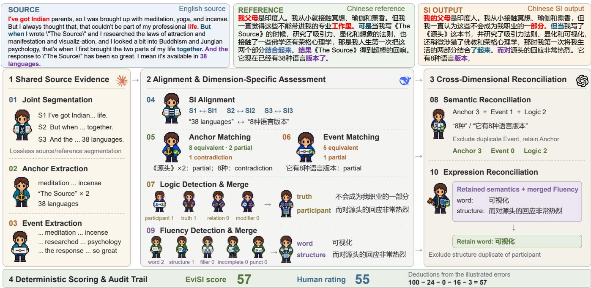

# EVISI: AN EVALUATION AGENT FOR SIMULTANEOUS INTERPRETING

Ben Yan1,∗, Zongyao Li1,∗, Daimeng Wei1,†, Weidong Liu1, Huan Zhao1, Chong Li1, Yaode Wang1, Yuzhe Shang2

1Huawei Translation Service Center, Beijing, China 2School of Informatics, Xiamen University, China {yanben4, lizongyao, weidaimeng, oliver.liuweidong}@huawei.com {zhaohuan54, august.li, wangyaode1, shangyuzhe1}@huawei.com

## ABSTRACT

Simultaneous speech-to-speech translation requires understanding, translation and spoken delivery while the source stream continues. To support timely delivery and limit accumulated delay, systems adopt reformulation and summarization, which can preserve meaning while departing from written references. BLEU and COMET may not reliably distinguish such variation from semantic loss. We introduce EviSI, a large language model evaluation agent adapting the error analysis and penalty principles of Multidimensional Quality Metrics (MQM). It constructs shared source evidence, assesses semantic fidelity and oral expression, reconciles overlapping errors and scores deterministically. EviSI recovers the aggregate human system ranking for English to Chinese. Mean Kendall agreement with human system rankings within corpora reaches 0.707 for English to Chinese and 0.467 for Chinese to English, exceeding evaluated baselines. An extension across five directions shows positive concordance with COMET without human ratings. Individual output agreement with humans remains mixed.

Index Terms— Speech-to-speech translation, simultaneous interpreting, quality evaluation, LLM agents

## 1. INTRODUCTION

Simultaneous interpreting (SI) systems must generate and deliver target speech before the source is complete [1]. For speech-to-speech translation (S2S), prolonged output can delay subsequent information. Recent systems draw on professional interpreting strategies [2], including segmentation, reformulation and summarization [3], to support timely, coherent communication. Such strategies can preserve meaning while departing from written references.

Interpreting research emphasizes fidelity and logical cohesion [4], alongside audience expectations [5]. Reference divergence is therefore not necessarily an error. Removing repetition can preserve a message, whereas changing a participant, quantity or condition can alter it. Figure 1 illustrates the latter: substituting funding for confidence changes the condition for success despite fluent expression. COMET20/22 rank this output relatively highly, while human ratings place it lower. Evaluation should tolerate adequate reformulation while checking the source facts and relations that determine meaning.

<table><tr><td colspan="2">Q: Source Semantic authority</td></tr><tr><td colspan="2">他们拿着...发现成功必须要有自信，没有自信的永远都不会成功。</td></tr><tr><td colspan="2">Reference Auxiliary</td></tr><tr><td colspan="2">They got the ...confidence is necessary to be successful. No one</td></tr><tr><td colspan="2">can succeed without confidence.</td></tr><tr><td colspan="2">SI output English</td></tr><tr><td colspan="2">They took the ...success requires funding, without it, you&#x27;ll never</td></tr><tr><td colspan="2">succeed.</td></tr><tr><td colspan="2">Evaluator Raw score Within-dataset percentile</td></tr><tr><td>COMET20 0.3264</td><td>P92.3 è</td></tr><tr><td>COMET22</td><td>0.7590 P73.4 ●</td></tr><tr><td>o Human 63</td><td>■ P25.5</td></tr><tr><td>自 EviSI 52.9</td><td>■ P20.6 0 50 100</td></tr></table>

Fig. 1. A fluent substitution changes confidence to funding. Within corpus Z2, COMET20/22 rank this output relatively highly, whereas human ratings and EviSI place it lower. Percentiles refer to the complete output; the text is an excerpt.

BLEU measures reference overlap [6], whereas COMET predicts quality beyond lexical matching [7]. Nevertheless, interpreting strategies remain challenging for translation metrics [8, 9]. Simul-COMET addresses COMET’s preference for offline reordering, improving agreement with professional interpreters in English to Japanese SI [10]. These findings motivate evaluation that explicitly distinguishes acceptable variation from semantic loss.

  
Fig. 2. EviSI agent workflow. Shared source evidence supports alignment and semantic fidelity assessment (Anchor, Event, Logic); Fluency assesses oral expression quality. Reconciliation selects errors for deterministic deductions and preserves excluded reports for inspection. The illustrated deductions yield an EviSI score of 57, alongside a human rating of 55.

Multidimensional Quality Metrics (MQM) provides an analytic framework linking error types and severities to scores [11], supporting expert [12] and automated assessment [13, 14, 15, 16]. Direct large language model (LLM) scoring [17], xCOMET error detection [18] and MMAD debate [19] offer complementary approaches. Adapting error analysis to SI requires effective source use [20], acceptance of adequate oral reformulation and reconciliation of duplicate reports before scoring.

We introduce EviSI, an LLM evaluation agent adapting MQM’s error analysis and penalty principles to interpreting requirements. It constructs shared source evidence independently of candidate outputs, with references serving only as auxiliary evidence. Anchor checks factual identity, Event checks propositional coverage, and Logic checks semantic relations; Fluency assesses naturalness and comprehensibility in text. Staged reconciliation resolves overlapping errors before deterministic scoring, making deductions inspectable. EviSI improves average agreement with human system rankings in both directions between English and Chinese, while individual output results remain mixed. A multilingual extension examines metric concordance without human ratings.

## 2. METHOD

The agent coordinates specialized LLM roles in a fixed workflow (Fig. 2); code orchestrates, validates and scores without making semantic judgments.

## 2.1. Shared source evidence

EviSI uses textual representations, as in prior S2S evaluation [21]: complete source speech text X, SI output text Y and an auxiliary reference R. The source is authoritative; R assists interpretation and alignment, not wording.

Joint segmentation preserves source and reference texts losslessly. Shared extraction identifies Anchors (entities, terms, quantities and times) and Events (propositions with essential participants and qualifications). SI outputs are segmented and aligned to this inventory before correctness assessment.

## 2.2. Complementary assessment and reconciliation

Semantic fidelity. Anchor checks factual identity, Event checks propositional coverage, and Logic checks participants, truth, relations and modifiers. Anchor and Event assign equivalent, valid alternative, partial, missing and contradiction verdicts. Valid alternatives incur no penalty; reformulation alone is not an error.

Oral expression quality. Fluency checks word choice, structure, fillers, incompleteness and punctuation for natural, comprehensible oral expression, not polished written style. Text cannot establish pronunciation, voice quality or prosody.

After Logic and Fluency each consolidate their reports, semantic reconciliation compares Anchor, Event and Logic errors. Expression reconciliation then compares retained semantic errors with Fluency errors. Span overlap alone is not duplication; retained and excluded reports remain inspectable.

Table 1. Agreement with human judgments. System columns rank six means per direction; Corpus is the mean of system Kendall correlations across corpora; Sample is Pearson correlation for individual outputs. Bold marks column maxima, including ties, not significance.
<table><tr><td colspan="5">EN→ZH</td><td colspan="4">ZH→EN</td></tr><tr><td>Method</td><td>Sys. ρ</td><td>Sys.  $\tau _ { b }$ </td><td>Corpus  $\bar { \tau } _ { b }$ </td><td>Sample  $r$ </td><td>Sys. ρ</td><td>Sys.  $\tau _ { b }$ </td><td>Corpus  $\bar { \tau } _ { b }$ </td><td>Sample r</td></tr><tr><td>COMET20</td><td>0.314</td><td>0.200</td><td>0.387</td><td>0.243</td><td>0.314</td><td>0.200</td><td>0.267</td><td>0.402</td></tr><tr><td>COMET22</td><td>0.314</td><td>0.200</td><td>0.280</td><td>0.208</td><td>0.143</td><td>0.067</td><td>0.333</td><td>0.404</td></tr><tr><td>COMETKiwi</td><td>0.314</td><td>0.200</td><td>0.413</td><td>0.377</td><td>0.143</td><td>0.067</td><td>0.333</td><td>0.442</td></tr><tr><td>Sentence BLEU</td><td>0.771</td><td>0.600</td><td>0.360</td><td>0.152</td><td>0.543</td><td>0.467</td><td>0.267</td><td>0.229</td></tr><tr><td>EviSI</td><td>1.000</td><td>1.000</td><td>0.707</td><td>0.436</td><td>0.600</td><td>0.467</td><td>0.467</td><td>0.432</td></tr></table>

Table 2. Mean Human / EviSI scores for each corpus and commercial system in the experiment with human ratings. H1 to H6 are anonymous system identities. Bold separately marks the highest human mean and the highest EviSI mean in each row. Scores are not calibrated across evaluators.
<table><tr><td>Corpus</td><td>H1</td><td>H2</td><td>H3</td><td>H4</td><td>H5</td><td>H6</td></tr><tr><td colspan="7">English to Chinese</td></tr><tr><td>E1</td><td>78.20 / 76.37</td><td>75.30 / 77.88</td><td>75.70 /73.95</td><td>73.85 / 71.18</td><td>73.88 /71.81</td><td>74.78 / 74.75</td></tr><tr><td>E2</td><td>82.58 / 76.53</td><td>75.63 / 67.26</td><td>74.84 /72.88</td><td>76.32 / 69.92</td><td>77.34 /73.32</td><td>75.82 / 69.93</td></tr><tr><td>E3</td><td>77.70 /78.43</td><td>77.35 / 80.16</td><td>76.23 / 77.73</td><td>71.25 / 76.41</td><td>69.98 / 73.82</td><td>73.73 / 76.98</td></tr><tr><td>E4</td><td>61.89 / 72.52</td><td>68.25 / 78.38</td><td>62.19 / 73.26</td><td>63.14 /75.31</td><td>60.39 / 71.85</td><td>58.58 / 67.28</td></tr><tr><td>E5</td><td>78.43 / 71.60</td><td>84.60 / 78.62</td><td>85.95 / 76.74</td><td>82.18 / 78.15</td><td>80.85 / 75.22</td><td>76.10 /73.49</td></tr><tr><td colspan="7">Chinese to English</td></tr><tr><td>Z1</td><td>80.75 / 80.15</td><td>78.75 / 78.05</td><td>78.64 /75.53</td><td>77.32/75.11</td><td>79.79 / 76.80</td><td>76.82 / 74.54</td></tr><tr><td>Z2</td><td>74.18 / 70.92</td><td>65.59 / 63.29</td><td>69.33 / 63.12</td><td>67.72 / 67.11</td><td>68.85 / 60.47</td><td>68.64 / 63.28</td></tr><tr><td>Z3</td><td>76.13 / 77.82</td><td>74.32 / 81.68</td><td>70.82 / 77.38</td><td>71.71 /80.42</td><td>72.05 / 81.23</td><td>70.05 / 77.68</td></tr><tr><td>Z4</td><td>72.45 / 74.51</td><td>71.58 / 77.94</td><td>70.13 / 71.07</td><td>71.15 / 74.01</td><td>70.60 / 73.80</td><td>71.43 / 72.41</td></tr></table>

## 2.3. Deterministic scoring

Following MQM’s penalty principle [11], retained errors yield SI deductions without length normalization, not a standard MQM score. Both experiments use:

$$
S = \operatorname* { m a x } ( 0 , 1 0 0 - D _ { A } - D _ { E } - D _ { L } - D _ { F } ) .\tag{1}
$$

For $\begin{array} { r } { d \in \{ A , E \} , D _ { d } = \alpha _ { d } \sum _ { j \in \mathcal { D } _ { \mathcal { I } } ^ { + } } w _ { j } c ( v _ { j } ) } \end{array}$ , where $\mathcal { D } _ { d } ^ { + }$ contains retained errors, $w _ { j } \in \{ 1 , 2 , \bar { 3 } \}$ denotes importance, and $( \alpha _ { A } , \alpha _ { E } ) = ( 4 , 5 )$ . Verdict losses are 0 for equivalent or valid alternative, 0.5 for partial, 0.8 for missing and 1 for contradiction. Logic penalties in the order above are (8, 8, 6, 5); Fluency penalties are (3, 5, 4, 6, 2). A combined module label incurs its strongest component penalty once. Legacy rescoring maps absent or zero importance to 1 and unrecognized verdicts to a loss of 0.5, retaining the original module resolution rules. Scores are deterministic conditional on fixed judgments, not necessarily across repeated LLM runs.

## 3. EXPERIMENTS

## 3.1. Data and evaluation protocol

Five EN→ZH corpora (E1 to E5) and four ZH→EN corpora (Z1 to Z4) provide human ratings for six commercial S2S interpreting systems (H1 to H6). Their complete intersection contains 1,164 and 870 outputs from 194 and 145 sources, respectively, without imputation. This retrospective analysis does not use an independent test set.

Baselines are precomputed Sentence BLEU, COMET20, COMET22 [22] and COMETKiwi [23] on identical records. Sentence BLEU is averaged, not corpus BLEU. Spearman $\rho$ and Kendall $\tau _ { b }$ compare six system means per direction, weighting corpora by source count. System $\tau _ { b }$ values computed within each corpus are averaged equally. Pearson r measures individual output agreement [24]. Paired bootstrap intervals resample source blocks within fixed corpora, keeping all six outputs together.

<table><tr><td rowspan=1 colspan=1></td><td rowspan=1 colspan=2>C20     C22</td><td rowspan=1 colspan=1>Kiwi</td><td rowspan=1 colspan=1>BLEU</td><td rowspan=1 colspan=1>EviSI</td></tr><tr><td rowspan=2 colspan=1>E1E2</td><td rowspan=1 colspan=1>0.467</td><td rowspan=1 colspan=1>0.467</td><td rowspan=1 colspan=1>0.600</td><td rowspan=1 colspan=1>0.333</td><td rowspan=1 colspan=1>0.600</td></tr><tr><td rowspan=1 colspan=1>-0.067</td><td rowspan=1 colspan=1>-0.067</td><td rowspan=1 colspan=1>0.600</td><td rowspan=1 colspan=1>0.333</td><td rowspan=1 colspan=1>0.467</td></tr><tr><td rowspan=1 colspan=1>E3</td><td rowspan=1 colspan=1>0.467</td><td rowspan=1 colspan=1>0.467</td><td rowspan=1 colspan=1>0.067</td><td rowspan=1 colspan=1>0.200</td><td rowspan=1 colspan=1>0.867</td></tr><tr><td rowspan=1 colspan=1>E4</td><td rowspan=1 colspan=1>0.600</td><td rowspan=1 colspan=1>0.200</td><td rowspan=1 colspan=1>0.333</td><td rowspan=1 colspan=1>0.467</td><td rowspan=1 colspan=1>1.000</td></tr><tr><td rowspan=1 colspan=1>E5</td><td rowspan=1 colspan=1>0.467</td><td rowspan=1 colspan=1>0.333</td><td rowspan=1 colspan=1>0.467</td><td rowspan=1 colspan=1>0.467</td><td rowspan=1 colspan=1>0.600</td></tr><tr><td rowspan=1 colspan=1>Zl</td><td rowspan=1 colspan=1>-0.067</td><td rowspan=1 colspan=1>0.200</td><td rowspan=1 colspan=1>0.067</td><td rowspan=1 colspan=1>0.200</td><td rowspan=1 colspan=1>0.867</td></tr><tr><td rowspan=1 colspan=1>Z2</td><td rowspan=1 colspan=1>0.733</td><td rowspan=1 colspan=1>0.600</td><td rowspan=1 colspan=1>0.600</td><td rowspan=1 colspan=1>-0.067</td><td rowspan=1 colspan=1>-0.067</td></tr><tr><td rowspan=2 colspan=1>Z3Z4</td><td rowspan=1 colspan=1>0.067</td><td rowspan=1 colspan=1>-0.067</td><td rowspan=1 colspan=1>-0.200</td><td rowspan=1 colspan=1>0.333</td><td rowspan=1 colspan=1>0.467</td></tr><tr><td rowspan=1 colspan=1>0.333</td><td rowspan=1 colspan=1>0.600</td><td rowspan=1 colspan=1>0.867</td><td rowspan=1 colspan=1>0.600</td><td rowspan=1 colspan=1>0.600</td></tr><tr><td rowspan=1 colspan=6>-1                 -0                  1</td></tr></table>

Fig. 3. Kendall $\tau _ { b }$ with human rankings across six systems in each corpus, with a fixed [−1, 1] scale. Bold marks row maxima, including ties. C20/C22: COMET20/22; Kiwi: COMETKiwi; BLEU: Sentence BLEU. All corpora, including negative results, are shown.

## 3.2. Agreement with human system rankings

EviSI recovers all 15 aggregate EN→ZH system preferences (Table 1), with H2 first and H6 last. Its $\tau _ { b } = 1 . 0 0 0$ exceeds Sentence BLEU’s 0.600 and the COMET family’s 0.200. In ZH→EN, EviSI has the highest $\rho$ (0.600), matching 11 of 15 pairs; its $\tau _ { b } = 0 . 4 6 7$ ties Sentence BLEU. Table 2 shows corpus differences on the original, uncalibrated Human and EviSI scales.

Equal corpus weighting yields mean system correlations of 0.707 and 0.467 for EviSI, versus the strongest baseline values of 0.413 and 0.333 (Fig. 3). Across all nine corpora, EviSI reaches $\bar { \tau } _ { b } ~ = ~ 0 . 6 0 0$ , compared with COMETKiwi’s 0.378. Gains are not uniform: on Z2, EviSI obtains −0.067 while COMET20 reaches 0.733. Accurate aggregate ranking therefore does not guarantee agreement within every corpus.

For individual outputs, EviSI and COMETKiwi obtain $r ~ = ~ 0 . 4 3 6$ and 0.377 in EN→ZH, versus 0.432 and 0.442 in ZH→EN. Their paired differences (EviSI minus COMETKiwi) have 95% bootstrap intervals [−0.035, 0.146] and $\left[ - 0 . 0 9 9 , 0 . 0 9 0 \right]$ , both including zero. The evidence favors system comparison, not uniformly better prediction of individual ratings.

## 3.3. Multilingual extension without human ratings

The multilingual experiment covers five directions and four commercial S2S systems, M1 to M4 (Table 3), distinct from H1 to H6 even when providers coincide.

Equation 1 scores saved final errors with unchanged losses and penalties. System means are averaged equally across corpora; Kendall $\tau _ { b }$ compares rankings with supplied

Table 3. Multilingual EviSI and metric Kendall $\tau _ { b }$ across commercial systems M1 to M4, using the shared scoring rule in Eq. 1. Correlations use corpus aggregates, without human ratings.
<table><tr><td>Direction</td><td>COMET20</td><td>COMET22</td><td>COMETKiwi</td></tr><tr><td>EN→ZH</td><td>1.000</td><td>1.000</td><td>0.667</td></tr><tr><td>ZH→EN</td><td>1.000</td><td>1.000</td><td>1.000</td></tr><tr><td>EN→JA</td><td>0.333</td><td>0.667</td><td>0.667</td></tr><tr><td>EN→FR</td><td>0.667</td><td>0.667</td><td>0.667</td></tr><tr><td>EN→DE</td><td>0.667</td><td>0.667</td><td>0.667</td></tr><tr><td>Mean</td><td>0.733</td><td>0.800</td><td>0.733</td></tr></table>

COMET corpus means. The provenance of individual records is unverified; this retrospective comparison is not controlled transfer of a frozen LLM configuration.

All five directions show positive concordance with the three COMET metrics (Table 3), averaging 0.733, 0.800 and 0.733. Agreement is weakest in EN→JA: EviSI prefers M2 and COMET20/22 prefer M3, although all place M4 last. This supports consistency in some system distinctions, not the validity of either ordering against human judgment. Multilingual BLEU is excluded because possible duplicate Japanese records remain unresolved.

## 3.4. Inspecting metric disagreements

Figure 1 compares percentiles $1 0 0 ( q - 1 ) / ( N - 1 )$ , where q is ascending average rank among N corpus outputs. Humans and EviSI place the complete $\mathrm { ~ Z 2 ~ }$ output at 25.5 and 20.6, versus 92.3 and 73.4 for COMET20/22. This post hoc case motivates inspecting the semantic substitution but neither explains metric internals nor overrides Z2’s negative correlation. Figure 2 exposes EviSI’s attribution decisions through retained and excluded reports.

## 4. CONCLUSION

EviSI combines shared source evidence, specialized judgments and reconciliation with deterministic deductions inspired by MQM. Average agreement with human system rankings exceeds the evaluated baselines; individual output results remain mixed. Multilingual metric concordance does not establish human validity.

Six systems yield coarse rankings; historical annotation and execution metadata are incomplete. Independent tests, interannotator reliability, matched direct LLM/MQM baselines, and cost and repeatability measurements remain necessary. Error accuracy, discrimination of adequate reformulation from semantic loss, and reconciliation benefits require controlled validation. Textual assessment does not measure acoustic quality or listener comprehension directly.

## 5. REFERENCES

[1] S. Zhang, Q. Fang, S. Guo, Z. Ma, M. Zhang, and Y. Feng, “StreamSpeech: Simultaneous speech-to-speech translation with multi-task learning,” in Proc. ACL, 2024, pp. 8964–8986.

[2] S. Cheng, Z. Huang, T. Ko, H. Li, N. Peng, L. Xu, and Q. Zhang, “Towards achieving human parity on end-to-end simultaneous speech translation via LLM agent,” arXiv preprint 2407.21646, ByteDance Research, 2024.

[3] Q. Zhang, Z. Yang, and S. Nakamura, “Redefining machine simultaneous interpretation: From incremental translation to human-like strategies,” in Findings of ACL, 2026, pp. 12554– 12577.

[4] C. Zwischenberger, “Quality criteria in simultaneous interpreting: an international vs. a national view,” The Interpreters’ Newsletter, vol. 15, pp. 127–142, 2010.

[5] I. Kurz, “Conference interpreting: Quality in the ears of the user,” Meta, vol. 46, no. 2, pp. 394–409, 2001.

[6] K. Papineni, S. Roukos, T. Ward, and W.-J. Zhu, “Bleu: a method for automatic evaluation of machine translation,” in Proc. ACL, 2002, pp. 311–318.

[7] R. Rei, C. Stewart, A. C. Farinha, and A. Lavie, “COMET: A neural framework for MT evaluation,” in Proc. EMNLP, 2020, pp. 2685–2702.

[8] S. Wein, T. I, C. Cherry, J. Juraska, D. Padfield, and W. Macherey, “Barriers to effective evaluation of simultaneous interpretation,” in Findings of EACL, 2024, pp. 209–219.

[9] C. Fantinuoli and X. Wang, “Exploring the correlation between human and machine evaluation of simultaneous speech translation,” in Proc. EAMT, 2024, pp. 327–336.

[10] K. Doi, M. Makinae, Y. Sakai, H. Kamigaito, and T. Watanabe, “Simul-COMET: A quality metric for simultaneous interpretation in distant language pair considering word order difference,” in Findings ofACL, 2026, pp. 42515–42533.

[11] A. Lommel, S. Gladkoff, A. Melby, S. E. Wright, I. Strandvik, K. Gasova, A. Vaasa, A. Benzo, R. Marazzato Sparano, M. Foresi, J. Innis, L. Han, and G. Nenadic, “The multirange theory of translation quality measurement: MQM scoring models and statistical quality control,” in Proc. AMTA, Volume 2: Presentations, 2024, pp. 75–94.

[12] M. Freitag, G. Foster, D. Grangier, V. Ratnakar, Q. Tan, and W. Macherey, “Experts, errors, and context: A large-scale study of human evaluation for machine translation,” Transactions of the Association for Computational Linguistics, vol. 9, pp. 1460–1474, 2021.

[13] P. Fernandes, D. Deutsch, M. Finkelstein, P. Riley, A. Martins, G. Neubig, A. Garg, J. Clark, M. Freitag, and O. Firat, “The devil is in the errors: Leveraging large language models for fine-grained machine translation evaluation,” in Proc. WMT, 2023, pp. 1066–1083.

[14] T. Kocmi and C. Federmann, “GEMBA-MQM: Detecting translation quality error spans with GPT-4,” in Proc. WMT, 2023, pp. 768–775.

[15] M. Junczys-Dowmunt, “GEMBA v2: Ten judgments are better than one,” in Proc. WMT, 2025, pp. 926–933.

[16] A. Kim, “RUBRIC-MQM : Span-level LLM-as-judge in machine translation for high-end models,” in Proc. ACL: Industry Track, 2025, pp. 147–165.

[17] T. Kocmi and C. Federmann, “Large language models are state-of-the-art evaluators of translation quality,” in Proc. EAMT, 2023, pp. 193–203.

[18] N. M. Guerreiro, R. Rei, D. van Stigt, L. Coheur, P. Colombo, and A. F. T. Martins, “xCOMET: Transparent machine translation evaluation through fine-grained error detection,” Transactions of the Association for Computational Linguistics, vol. 12, pp. 979–995, 2024.

[19] Z. Feng, J. Su, J. Zheng, J. Ren, Y. Zhang, J. Wu, H. Wang, and Z. Liu, “M-MAD: Multidimensional multi-agent debate for advanced machine translation evaluation,” in Proc. ACL, 2025, pp. 7084–7107.

[20] X. Huang, Z. Zhang, X. Geng, Y. Du, J. Chen, and S. Huang, “Lost in the source language: How large language models evaluate the quality of machine translation,” in Findings of ACL, 2024, pp. 3546–3562.

[21] Y. Xue, S. Ouyang, and L. Li, “A practical evaluation method for long-form simultaneous speech-to-speech translation,” in Proc. IWSLT, 2026, pp. 32–39.

[22] R. Rei, J. G. C. de Souza, D. Alves, C. Zerva, A. C. Farinha, T. Glushkova, A. Lavie, L. Coheur, and A. F. T. Martins, “COMET-22: Unbabel-IST 2022 submission for the metrics shared task,” in Proc. WMT, 2022, pp. 578–585.

[23] R. Rei, M. Treviso, N. M. Guerreiro, C. Zerva, A. C. Farinha, C. Maroti, J. G. C. de Souza, T. Glushkova, D. Alves, L. Coheur, A. Lavie, and A. F. T. Martins, “CometKiwi: IST-unbabel 2022 submission for the quality estimation shared task,” in Proc. WMT, 2022, pp. 634–645.

[24] A. Lavie, G. Hanneman, S. Agrawal, D. Kanojia, C.-K. Lo, V. Zouhar, F. Blain, C. Zerva, E. Avramidis, S. Deoghare, A. Sindhujan, J. Wang, D. I. Adelani, B. Thompson, T. Kocmi, M. Freitag, and D. Deutsch, “Findings of the WMT25 shared task on automated translation evaluation systems: Linguistic diversity is challenging and references still help,” in Proc. WMT, 2025, pp. 436–483.