# EXECCRITIC: LEARN TO TEST, TEST TO IMPROVE FOR CODING AGENTS

Leitian Tao1,2∗ Baolin Peng2 Haorui Wang1,3 Hang Wang2 Hao Cheng2 Wenlin Yao2 Qianhui Wu2 Tao Ge2 Sharon Li1† Jianfeng Gao2† 1University of Wisconsin–Madison 2Microsoft Research 3Georgia Tech

## ABSTRACT

Execution feedback can guide coding agents toward correct repository repairs, but only when the tests capture the behavior requested by the issue. Agent-generated tests can encode incomplete or incorrect behavioral targets; when the same trajectory writes both the patch and the test, their errors can agree and create false confidence. We introduce EXECCRITIC, combining a test–verify–revise scaffold with a role-specific reinforcement learning recipe for training agents within it. The scaffold separates test construction from source-code repair: a Test agent independently generates repository-native tests, a fail-closed harness qualifies and freezes them, and a Repair agent revises source code from their execution feedback without changing the tests. Both roles use Qwen-3.5-35B-A3B as the backbone and are trained separately. In Learn to Test, the Test agent learns to produce behaviorally valid tests that distinguish correct from incorrect patches. In Test to Improve, the Repair agent learns both direct task resolution and feedback-guided revision. On SWE-bench Verified, test quality determines whether feedback helps: holding the base Repair agent fixed, tests from the base Test agent reduce resolved rate from a no-test baseline of 61.2% to 57.3%, whereas tests from GPT-5.6-sol raise it to 65.3%. Role-specific post-training raises the Qwen Test agent’s Baseto-Gold success from 22.2% to 62.2%; composing the two post-trained Qwen agents reaches 72.6%, an 11.4-point gain over the original no-test baseline without stronger-model or Oracle feedback at evaluation time. Code is publicly available at https://github.com/MSR-Orchard/execcritic

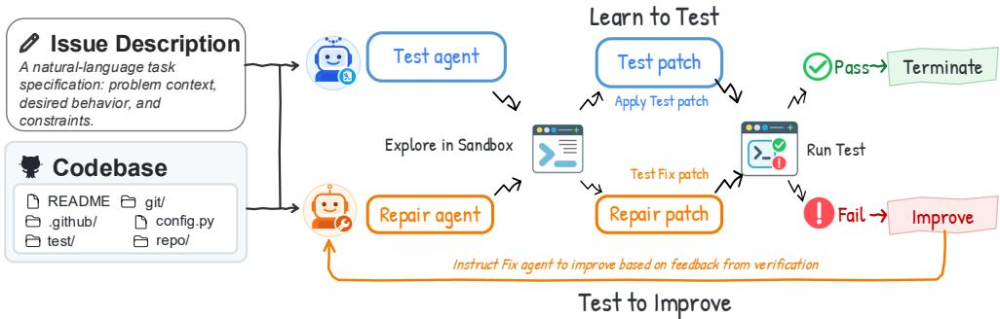  
Figure 1: EXECCRITIC separates test construction from feedback-guided repair. The Test agent independently constructs a task-specific test, which the harness qualifies and freezes across source-only Repair revisions. Failed checks return execution feedback for revision; a local pass ends revision and requests explicit submission, as summarized by “Terminate.”

## 1 INTRODUCTION

Modern AI agents use iterative interaction and feedback to improve performance at inference time (Shinn et al., 2023; Chen et al., 2024b). This loop is particularly important for repository-level repair: an issue describes intended behavior, but the correct change also depends on implementation details, call sites, and edge cases distributed across a codebase. A failing test can expose missed cases and localize the next revision before submission. Repository-level agents such as SWE-agent (Yang et al., 2024), OpenHands (Wang et al., 2025b), and Mini-SWE-Agent (SWE-agent Team, 2025) accordingly interleave exploration, editing, execution, and revision, while prior systems use execution feedback for debugging, candidate selection, bug reproduction, and repair validation (Chen et al., 2023; Ni et al., 2023; Kang et al., 2023; Arora et al., 2024; Xia et al., 2025).

The value of this loop depends on whether its feedback measures the behavior requested by the issue. In repository repair, the official evaluator is hidden, so an agent must construct its own checks and decide when their evidence is sufficient. Agent-written tests may primarily probe runtime behavior rather than assert the requested behavior (Chen et al., 2026b), omit the decisive edge case, or encode the same mistaken interpretation as the source patch. When one trajectory writes both artifacts and decides when to stop, a wrong patch can pass a wrong test and appear validated (Qi et al., 2015; Smith et al., 2015; Chen et al., 2025a). This motivates two requirements: improving the behavioral quality of generated tests and keeping their validation criteria independent of source-patch revision.

Defining this target and repairing source code to satisfy it require different capabilities. Test generation requires inferring a behavioral contract from the issue and repository, expressing it as a discriminative repository-native regression test, and running it with the project’s toolchain. Repair requires locating the implementation fault, interpreting possibly imperfect execution feedback, and revising source code without weakening the target. General coding ability does not guarantee either specialization: our off-the-shelf results show that generated feedback can improve or degrade the same Repair agent depending on who generates the test. We therefore train the Test and Repair roles separately. Test training rewards executable tests that distinguish buggy from repaired behavior, whereas Repair training teaches both direct repair and feedback-conditioned revision. Keeping the generated test fixed prevents the Repair agent from weakening the check instead of correcting the source code.

We instantiate this approach in EXECCRITIC, a two-stage framework. In Learn to Test, a Test agent explores the repository and produces a repository-native test patch, its exact execution command, and a structured behavior contract. A fail-closed harness qualifies this bundle by validating it and requiring a clean failure on the buggy repository; offline Gold behavior and candidate discrimination provide training signals for learning task-aligned tests. In Test to Improve, the harness freezes the qualified Test bundle and executes it against successive source patches from the Repair agent, returning bounded feedback after each attempt. The two stages separate test generation from source-code repair: the Test agent defines the behavioral target, the harness keeps the test fixed, and the Repair agent changes only the source patch. The official evaluator retains final authority over correctness.

Our experiments on SWE-bench Verified show that adding executable feedback is not sufficient: its benefit depends on the quality of the generated tests. Holding the Qwen Repair agent fixed, Qwengenerated tests reduce resolved rate from 61.2% to 57.3%, whereas GPT-5.6-generated tests raise it to 65.3% (Section 5.2.1). This contrast motivates learning to construct reliable behavioral targets rather than treating test generation as an off-the-shelf capability. Role-specific post-training improves both components: Test training raises Base-to-Gold success from 22.2% to 62.2%, while Repair training raises no-test Round-0 resolution from 61.2% to 68.3%. Composing the trained agents reaches 72.6% without stronger-model or Oracle feedback at evaluation—4.3 points above the trained Repair agent’s no-test result and 11.4 points above the original baseline (Sections 5.2.2 and 5.2.3). These results support learning both to construct tests and to repair from their feedback. The composed gain reflects the full system, including additional test-generation and revision computation, rather than a compute-matched improvement.

## We summarize our contributions below:

1. We propose a test–verify–revise scaffold for repository-level repair that separates test construction from source-code revision which qualifies independently generated tests and keeps them fixed while the Repair agent revises source code from execution feedback.

2. We develop a role-specific RL recipe for this scaffold: the Test agent learns to generate behaviorally valid, discriminative tests, while the Repair agent learns direct task resolution and feedback-guided revision.

3. We show that generated-test feedback can help or harm repair depending on test quality, and that composing the trained agents reaches 72.6% on SWE-bench Verified 11.4 points above the original no-test baseline without stronger-model or oracle feedback at evaluation time.

## 2 MOTIVATION: REPAIR AND VALIDATION ARE COUPLED

When a coding agent is asked to fix a bug in a real codebase, it has to produce a patch and decide whether to validate that patch before submission. Since the official evaluator is unavailable, taskspecific validation is optional within the agent trajectory. The agent may run checks of its choice, or it may submit without checking the behavior described in the issue. A submitted patch can therefore reach the official evaluator without any local evidence targeted at the requested change.

Running a check introduces a second failure mode. Suppose a bug occurs only when a function receives an empty list. If the agent overlooks this condition, it may fix the common nonempty case and then write a test covering only that case. The test runs, the patch passes, and the agent concludes that the issue is resolved even though the original bug remains. The patch and the test agree, but they agree on the same incomplete interpretation ofthe issue. Asking the same trajectory to write additional tests does not necessarily resolve this problem: the same blind spot can shape both the solution and the evidence used to validate it.

A shared trajectory couples repair and stopping evidence. Formally, let an instance $x = \left( d , R _ { B } \right)$ contain an issue description d and a buggy repository checkout $R _ { B }$ , called Base.

Before submission, let E collect the checks and outputs used to assess a Repair patch $p ,$ with $\mathcal { E } = \emptyset$ when the agent submits without running a check. In a conventional agent-controlled loop, the Repair patch and any validation evidence arise from the same policy and trajectory:

$$
\underset { \mathrm { p a t c h a n d v a l i d a t i o n } \mathrm { e v i d e n c e } } { \underbrace { ( p , \mathcal { E } ) } } \sim \pi _ { \omega } ( \cdot \mid x ) .\tag{1}
$$

This formulation captures both limitations. When ${ \mathcal { E } } = \emptyset$ , the patch is submitted without local task-specific validation. When $\mathcal { E } \neq \emptyset$ , a shared misinterpretation can shape the patch, the evidence that appears to validate it, and the decision to stop. A check may execute successfully while testing behavior that the issue does not require. Passing such a check establishes that the patch satisfies its assertions. The result does not establish that the patch resolves the task. The official evaluator $V _ { x } ^ { \star }$ , which applies hidden fail-to-pass and pass-to-pass tests after submission (Jimenez et al., 2024; OpenAI, 2024), remains the authority on task correctness, where

$$
V _ { x } ^ { \star } ( p ) \in \{ 0 , 1 \}
$$

Independent, fixed tests reduce trajectory-level coupling. We generate each test without access to the candidate Repair trajectory and hold it fixed during source-patch revision. This separation prevents the Repair agent from changing its validation criteria to accommodate a candidate patch. Here, independence refers to the generation context and write permissions, not statistical independence of Test and Repair errors: the two agents can still share a mistaken interpretation of the issue. The Repair agent therefore uses the fixed test’s feedback together with the issue and repository behavior when deciding whether to revise or submit a patch.

EXECCRITIC operationalizes this separation with a Test agent, a harness, and a Repair agent. The Test agent constructs the check, the harness executes it and keeps it fixed across revisions, and the Repair agent revises only the source patch. Section 3 describes this two-stage process.

## 3 METHODOLOGY: LEARN TO TEST, TEST TO IMPROVE

EXECCRITIC reduces the coupling between repair and validation by assigning these tasks to separate agents and keeping the generated test fixed during source revision. In practical deployment, the Test agent is intended to provide enough task-specific execution evidence to guide revisions and support the Repair agent’s decision to stop and submit. The method has two stages. In Learn to Test, the Test agent constructs a focused regression test from the issue, and the harness verifies that the test executes and fails cleanly on Base. In Test to Improve, the Repair agent uses the output of this fixed test while revising the source patch.

For the task $x = \left( d , R _ { B } \right)$ defined in Section $^ { 2 , }$ both agents receive the issue d and Base repository state $R _ { B }$ . They follow separate trajectories and have different write permissions. The Test agent produces a Test bundle $\bar { \boldsymbol { b } ^ { \prime } } = ( \Delta _ { b } , \bar { c } _ { b } , \kappa _ { b } )$ : a repository-native Test patch $\Delta _ { b } ,$ , an exact execution command $c _ { b } .$ , and a JSON behavior contract $\kappa _ { b } .$ . A Test submission is an attempt to provide this bundle. One bundle targets one coherent issue behavior and may contain multiple test nodes and assertions; a test node is an individually selectable test function, method, or parameterized case. The Repair agent produces a source-only Repair patch p. For a valid execution, the harness returns validation evidence $\mathcal { E } ( b , p )$ consisting of the test result and execution output. The official evaluator $V _ { x } ^ { \star } ( p )$ determines whether a submitted Repair patch resolves the task.

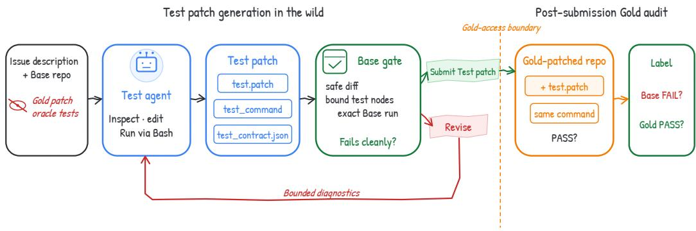  
Figure 2: Test-submission qualification and offline audit in Learn to Test. Left: the Test agent uses only the issue and Base checkout to submit a test diff, an exact execution command, and a JSON behavior contract. The harness validates the bundle and requires a clean Base failure, returning bounded diagnostics for unsuccessful attempts. Right: an isolated offline audit runs the unchanged bundle on Gold to measure Base-to-Gold success. Gold outcomes neither enter the generation trajectory nor determine admission to Repair.

## 3.1 LEARN TO TEST: CONSTRUCTING EXECUTABLE REGRESSION TESTS

Learn to Test constructs an executable regression-test bundle before feedback-guided repair begins. Given the public task context $x = \left( d , R _ { B } \right)$ , the Test policy generates a Test bundle b:

$$
b \sim \pi _ { \phi } ^ { \mathrm { T } } ( \cdot \mid x ) .\tag{2}
$$

The bundle contains the three artifacts listed in Table 10; Section A.4 documents the persisted interface in detail. The harness validates these items and runs the declared test nodes on a clean copy of $R _ { B }$ . Within one generation episode, the Test agent may revise a submission that is invalid or passes on $R _ { B }$ and may submit at most five attempts. The first valid submission that fails cleanly on $R _ { B }$ is retained. If no attempt produces a clean Base failure within the generation budget, the harness marks the instance as a Base-gatefailure and does not launch feedback-guided Repair. Instead, it retains the Round-0 source patch and sends that patch to the official evaluator. Such instances remain in the all-task resolved-rate denominator. Figure 2 summarizes the complete qualification and offline-audit workflow.

A clean Base failure shows that $R _ { B }$ violates the test expectation, but the expectation may still be incorrect or unrelated to the issue. During offline training and evaluation, we therefore also run b on the Gold repository state $R _ { G }$ , obtained by applying the reference Repair patch to $R _ { B }$ . Let $B _ { x } ( b ) = 1$ denote a clean failure on $R _ { B }$ and $G _ { x } ( b ) \dot { = } \dot { 1 }$ denote passage on $R _ { G }$ . Base-to-Gold success is

$$
Q _ { x } ( b ) = B _ { x } ( b ) G _ { x } ( b ) .\tag{3}
$$

This outcome shows that the test rejects the Base behavior and accepts the behavior produced by the reference repair. A validation or execution error sets the corresponding indicator to zero. Offline evaluation also runs b on labeled candidate Repair patches to measure whether it passes correct patches and fails incorrect ones. These results are used only for training rewards and analysis and remain outside the Test-agent trajectory. At deployment and in downstream generated-test repair, the harness admits b solely when $\bar { B _ { x } ( b ) } = \bar { 1 }$ . Neither the Gold patch nor its execution outcome is used to filter Test samples or select inputs for the Repair stage.

Qualification is necessarily limited by the current harness: artifact validity, declared-node binding, and a clean Base failure do not by themselves prove that the test is semantically aligned with the issue.

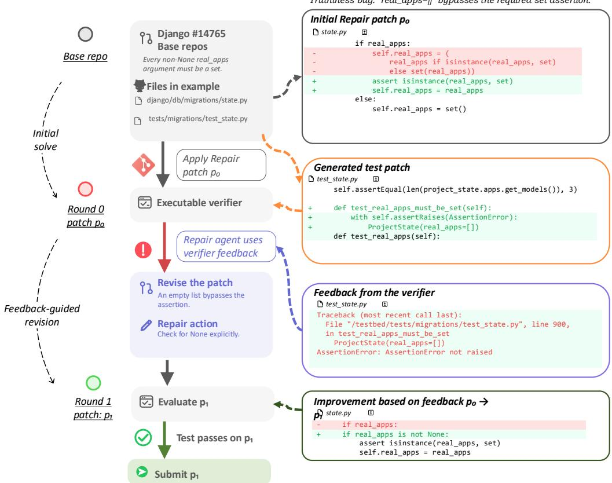  
Figure 3: A fixed regression test exposes an empty-list bug in Django #14765. The initial patch $p _ { 0 }$ checks the type of real\_apps only when it is truthy, so an empty list bypasses the required assertion. The generated test expects an AssertionError and fails on $p _ { 0 }$ . Changing the guard to if real\_apps is not None produces $p _ { 1 }$ , which passes the same test and is submitted for official evaluation. “Executable verifier” denotes the harness.

To evaluate future changes to these validation rules using matched execution records, Section B.2 specifies an evidence-gated harness-evolution mechanism. This mechanism governs maintenance of the harness rather than the evaluated Test-to-Improve runtime, and no autonomous harness update occurs during an agent trajectory.

## 3.2 TEST TO IMPROVE: REVISING REPAIRS WITH FIXED TEST FEEDBACK

The purpose of Test to Improve is to revise a Repair patch through a sequence of test-guided decisions. Let $h _ { t }$ contain the retained conversation, tool calls, and observations available when round t begins, with $h _ { 0 } = \emptyset$ before the initial solve. Let $s _ { t }$ denote the information available to the Repair policy, and set $T _ { \mathrm { m a x } } = 5$ as the maximum number of feedback-guided revisions after the initial patch. For valid test executions, the process is

$$
\begin{array} { r l r l } & { ~ s _ { 0 } = ( x , h _ { 0 } ) , } & & { p _ { 0 } \sim \pi _ { \theta } ^ { \mathrm { R } } ( \cdot \mid s _ { 0 } ) , } \\ & { ~ \mathcal { E } _ { t } = ( z _ { t } , o _ { t } ) = \mathcal { E } ( b , p _ { t } ) , } & & { z _ { t } \in \{ \mathrm { P A S S } , \mathrm { F A I L } \} , } \\ & { ~ s _ { t + 1 } = ( x , h _ { t + 1 } , p _ { t } , \mathcal { E } _ { t } ) , } & & { p _ { t + 1 } \sim \pi _ { \theta } ^ { \mathrm { R } } ( \cdot \mid s _ { t + 1 } ) , ~ z _ { t } = \mathrm { F A I L } , t < T _ { \operatorname* { m a x } } . } \end{array}\tag{4}
$$

Here, $p _ { 0 }$ is generated from the issue and Base repository. For each $p _ { t }$ , the harness resets its isolated execution workspace to $R _ { B } ,$ , applies $p _ { t }$ and the fixed Test bundle $b ,$ and returns an outcome $z _ { t }$ with bounded execution feedback $o _ { t } .$ . The retained history $h _ { t + 1 }$ includes the Round-0 context and subsequent interaction through the current check; it is not replaced by the latest feedback alone. When $z _ { t } = \mathrm { F A I I }$ and the agent chooses to continue rather than submit, this evidence conditions the next revision $p _ { t + 1 }$ . Operational errors do not produce a behavioral verdict and cannot establish local acceptance; they are reported separately as bounded diagnostics (Section B.1). The Test bundle remains unchanged across all rounds.

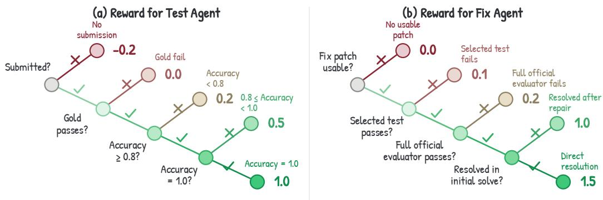  
Figure 4: Execution-based rewards for Test and Repair training. (a) For valid submitted bundles, the diagram assumes clean Base failure and assigns reward using Gold passage and balanced accuracy (“Accuracy”) on labeled candidate patches. Values precede the Test trajectory-length adjustment; Section 4.1 specifies the complete reward and error handling. (b) Repair rewards depend on patch validity, selected-test passage, official success, and whether resolution occurs at Round 0 or after revision. Gold outcomes, candidate labels, and official reward labels remain hidden from the agents; the fixed selected test supplies Repair feedback.

When $z _ { t } = \mathrm { P A S S }$ , the controller immediately ends the Repair episode and submits the passing patch without another agent decision. This local pass is a stopping condition, not a claim of official correctness. The agent may also submit a patch with $z _ { t } = \mathrm { F A I I }$ when the generated test appears incomplete, overly specific, or incorrect. If the verifier has not passed after the fifth revision, the controller ends the episode and force-submits the latest candidate $p _ { T _ { \mathrm { m a x } } }$ as the final patch. Section B.1 provides the formal execution details, and Section B.3 records the exact prompts, feedback envelope, and controller messages. Figure 3 shows an example in which the test output identifies an unhandled empty-list case and guides the next source revision; Section $_ { \mathrm { A . 5 } }$ analyzes two additional completed trajectories with fresh official verification. The official evaluator applies $V _ { x } ^ { \star } ( p _ { t } )$ to the submitted patch and determines task correctness.

## 4 LEARNING TO TEST AND REPAIR WITH EXECCRITIC

EXECCRITIC develops two complementary capabilities for executable feedback. Test training teaches the model to translate an issue and repository context into a focused, executable regression test. Repair training teaches the model to produce a strong initial fix and to use test outcomes for targeted source revision. We optimize each capability with rewards tied to its observable outcomes, providing direct credit for useful test construction and successful repair. Figure 4 summarizes the two training objectives.

## 4.1 LEARNING TO GENERATE RELIABLE TESTS

The Test policy $\pi _ { \phi } ^ { \mathrm { T } }$ generates a Test bundle b as defined in Section 3.1. We evaluate b using its Base outcome $B _ { x } ( b )$ , Gold outcome $G _ { x } ( b )$ , and behavior on labeled candidate Repair patches. Training has two stages. Supervised fine-tuning teaches the submission format and repository workflow. Reinforcement learning then rewards tests that capture the issue behavior and distinguish correct Repair patches from incorrect ones.

Off-policy trajectories teach repository-native test construction. Constructing a useful Test patch combines repository exploration, behavioral interpretation, test-infrastructure discovery, and executable artifact generation. We collect high-quality Test trajectories from a fixed stronger model and use them for supervised fine-tuning, providing demonstrations of this complete repository-native workflow. This stage is off-policy because the trajectories are generated by the fixed teacher policy before optimization of the current Test policy. Trajectory admission uses protocol validity and clean Base failure only. Gold outcomes do not filter the SFT trajectories and are not included in the student input.

On-policy RL rewards behavioral validity and discrimination. After supervised fine-tuning, we use GRPO with the offline executions defined in Section 3.1. For each task x, we sample K Test trajectories with bundles $b _ { 1 } , \dots , b _ { K }$ from $\pi _ { \phi } ^ { \mathrm { T } }$ . Each b is run on $R _ { B } , R _ { G }$ , and at most eight deduplicated candidate Repair patches labeled by $V _ { x } ^ { \star }$ . Correct candidate patches form the positive class: TPR is the fraction of correct candidates that pass the generated tests, and TNR is the fraction of incorrect candidates that fail them in valid executions. We compute balanced accuracy as $\begin{array} { r } { \mathrm { B A } _ { x } ( b ) = \frac { 1 } { 2 } ( \mathrm { T P R } + \mathrm { T N R } ) } \end{array}$ , with recall set to zero when a class is absent. Consequently, a single-class candidate pool has $\mathrm { B A } _ { x } ( b ) \leq 0 . 5$ under this convention. If any candidate execution encounters an operational error, the entire affected Test trajectory receives zero advantage and is masked from the policy update and group statistics; the error is not counted as a correct rejection or as a behavioral failure. After excluding these anomalous trajectories, the Test reward is

$$
r _ { x } ^ { \mathrm { T } } ( b ) = \left\{ \begin{array} { l l } { - 0 . 2 , } & { \mathrm { c o m p l e t e d ~ w i t h o u t ~ a ~ v a l i d ~ s u b m i s } } \\ { 0 , } & { B _ { x } ( b ) = 0 \mathrm { ~ o r ~ } G _ { x } ( b ) = 0 , } \\ { 0 . 2 , } & { Q _ { x } ( b ) = 1 , \mathrm { ~ B A } _ { x } ( b ) < 0 . 8 , } \\ { 0 . 5 , } & { Q _ { x } ( b ) = 1 , \mathrm { ~ } 0 . 8 \le \mathrm { ~ B A } _ { x } ( b ) < 1 , } \\ { 1 . 0 , } & { Q _ { x } ( b ) = 1 , \mathrm { ~ B A } _ { x } ( b ) = 1 . } \end{array} \right.\tag{5}
$$

A completed rollout without a valid submission receives reward −0.2. A valid submission receives zero reward if it does not fail cleanly on $R _ { B }$ or does not pass on $R _ { G }$ . When $Q _ { x } ( b ) = 1$ , the reward increases with balanced accuracy on the candidate Repair patches. The $R _ { G }$ outcomes and candidate labels remain outside the Test-agent state. Within each positive reward level, a rollout that exceeds the shortest rollout by more than eight turns receives half of its original reward. The configured format-error branch remained inactive in the reported runs.

## 4.2 LEARNING TO REVISE REPAIRS FROM EXECUTION FEEDBACK

The Repair policy $\pi _ { \theta } ^ { \mathrm { R } }$ generates the patch sequence $p _ { 0 } , p _ { 1 } , . . .$ . defined in Equation (4). In the main training configuration, we select one Oracle fail-to-pass (F2P) test case for each task and keep it fixed across all Repair rounds. The Repair agent observes only its execution feedback; the test source remains hidden. This controlled feedback source provides a consistent target for learning how to interpret execution results and make corrective source revisions. Each rollout allows at most five feedback-guided revision rounds of 40 turns each after $p _ { 0 }$ . If the selected verifier does not pass within this budget, the controller force-submits the latest candidate as the terminal patch, which $\hat { V _ { x } ^ { \star } }$ evaluates using the full official test suite. For valid terminal evaluations, let $u _ { t } , z _ { t } ^ { \mathrm { t r a i n } } \in \{ \mathrm { P A S S } , \mathrm { F A I L } \}$ denote the official outcome and the selected training-test outcome for the terminal patch $p _ { t }$ , with $u _ { t } = \mathrm { P A S S }$ exactly when $V _ { x } ^ { \star } ( p _ { t } ) = 1$ . Following the decision order in Figure 4b, the Repair reward is

$$
r _ { x } ^ { \mathrm { R } } ( p _ { t } ) = \left\{ \begin{array} { l l } { 0 , } & { \mathrm { i n v a l i d ~ t e r m i n a l ~ p a t c h } , } \\ { 0 . 1 , } & { z _ { t } ^ { \mathrm { t r a i n } } = \mathrm { F A I L } , } \\ { 0 . 2 , } & { z _ { t } ^ { \mathrm { t r a i n } } = \mathrm { P A S S } , ~ u _ { t } = \mathrm { F A I L } , } \\ { 1 . 0 , } & { z _ { t } ^ { \mathrm { t r a i n } } = \mathrm { P A S S } , ~ u _ { t } = \mathrm { P A S S } , ~ t > 0 , } \\ { 1 . 5 , } & { z _ { t } ^ { \mathrm { t r a i n } } = \mathrm { P A S S } , ~ u _ { t } = \mathrm { P A S S } , ~ t = 0 . } \end{array} \right.\tag{6}
$$

A missing or invalid terminal patch, including a forbidden test modification, receives reward 0. If the terminal test execution is operationally invalid, the affected Repair trajectory instead receives zero advantage, not a behavioral-failure reward (Section A.2). For a usable patch with a valid test execution, a valid failure of the selected training test receives 0.1, regardless of the official outcome. Passing that test without official success receives 0.2. Passing both the selected test and the full official evaluator receives 1.0 after revision or 1.5 at Round 0. The larger Round-0 reward preserves strong direct-repair behavior while the trajectory also learns to benefit from test-guided revision. The same decision order applies to the generated-test training ablation: an officially correct patch rejected by the generated test receives 0.1, not the official-success bonus. Official resolved-rate reporting nevertheless depends only on $V _ { x } ^ { \star }$ , independently of this training reward. The gap between 0.2 and 1.0 distinguishes satisfying the focused training test from additionally passing the complete official F2P and pass-to-pass suites.

## 5 EXPERIMENTS

We evaluate three questions. First, can a fixed Test patch raise the resolved rate of an off-the-shelf Repair agent, and how does this effect depend on test quality and benchmark coverage? Second, can post-training increase the Test agent’s ability to generate valid behavioral checks? Third, can Repairagent training strengthen both the initial solution and subsequent feedback-conditioned revision?

## 5.1 EXPERIMENTAL SETUP

Models and training data. We use Qwen-3.5-35B-A3B as the trainable backbone for both roles (Qwen Team, 2026) and GPT-5.6-sol with medium reasoning effort as a stronger-model reference (OpenAI, 2026). We train on SWE-ReBench (Badertdinov et al., 2025) and evaluate on SWE-bench Verified (Jimenez et al., 2024; OpenAI, 2024). All Test- and Repair-agent training, rollout execution, and reported evaluations are conducted using Orchard, an open-source framework for scalable agentic modeling and reusable sandbox lifecycle management (Peng et al., 2026). Testagent training retains instances with at least six candidate patches. Repair-agent training additionally requires both correct and incorrect candidate patches, ensuring that the selected examples contain informative revision outcomes.

Test-agent setting. We first perform supervised fine-tuning on 5,000 chain-of-thought trajectories generated by DeepSeek-V4-Flash-0731 (DeepSeek-AI, 2026) on SWE-ReBench, followed by 200 GRPO steps on SWE-ReBench. Following DAPO-style dynamic sampling (Yu et al., 2025b), each update retains 16 issue groups with nonzero within-group reward variance and samples eight rollouts per group, yielding 128 rollouts. During generation, the Test agent may submit at most five attempts. If none produces a clean failure on the Base repository, the loop terminates and the instance is marked as a Base-gate failure sample. Only bundles with a clean Base failure enter downstream feedback-guided repair; otherwise, the Round-0 patch is retained for official scoring. We do not use the Gold patch or Gold outcome to filter this pool. Dynamic sampling keeps issues for which the generated Test bundles receive distinguishable execution rewards, excluding trajectories masked because of candidate-execution errors. Full hyperparameters and executable rewards are detailed in Section A.1.

Repair-agent setting. We restrict Repair-agent training to SWE-ReBench issues on which the Base model’s empirical Round-0 accuracy is below 0.4, because frequently solved issues provide little revision signal. We train for 100 steps with the same dynamic-sampling configuration: 16 nonzero-variance issue groups and eight rollouts per group. For downstream generated-test repair, an episode is launched only when the Test submission produces a clean Base failure; the Gold patch and Gold outcome do not participate in this selection. Each episode permits at most five feedback-guided repair revision rounds of 40 turns each after the Round-0 patch. If none passes the verifier, the controller force-submits the last candidate as the final patch. This setup emphasizes tasks on which Test-to-Improve can change the terminal outcome while guaranteeing a bounded repair trajectory and a final submission. The rollout and reward configuration is detailed in Section A.2.

Evaluation conditions. For Test-patch generation, we compare our RL-trained Qwen-3.5-35B-A3B Test agent (RL-35B) with the untrained backbone (Base-35B), its SFT checkpoint, Codex-5.3, the DeepSeek-V4-Flash-0731 teacher, and GPT-5.6-sol. For downstream repair, we compare the Base and Test-to-Improve-trained Qwen Repair agents under five feedback sources: no Test bundle, Base-35B-generated bundles, RL-35B-generated bundles, GPT-5.6-sol-generated bundles, and Oracle fail-to-pass (F2P) tests. The no-test condition measures Round-0 repair capability; Base-35B and RL-35B compare the Test-agent training stages; GPT-5.6-sol provides a stronger-model reference; and Oracle F2P tests provide privileged reference feedback unavailable in the generated-test deployment setting, not a theoretical upper bound. We additionally compare standard Repair training without Test to Improve, Test-to-Improve training without the direct-solve bonus, and the full objective. Test generation is run once per issue and Test source, retaining at most one qualified bundle; Base-to-Gold results describe this single generation run. Resolved rates are means over three Repair runs, which reuse that same bundle for an issue rather than regenerating tests. Every run uses the full benchmark denominator, retaining and officially evaluating the Round-0 patch whenever generation fails the Base gate. The complete evaluation protocol, including fresh official scoring, is specified in Section A.3.

SWE-bench Verified

(a) GPT-5.6 performance

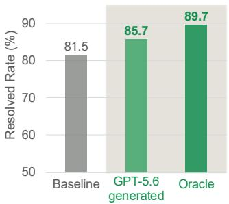

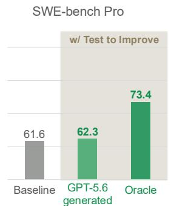  
(b) Qwen-3.5-35B performance SWE-bench Verified

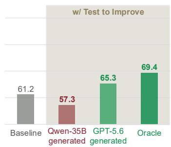  
Figure 5: Generated-test feedback can help or harm repair. (a) GPT-5.6 gains more on Verified than Pro. (b) Qwen repair worsens with Qwen tests and improves with GPT-5.6 tests. Baseline: no-test Round 0; Oracle: privileged F2P feedback. Rates (%) average three all-task Repair runs with fixed bundles; Base-gate failures retain Round 0.

## 5.2 MAIN RESULTS

## 5.2.1 OFF-THE-SHELF AGENTS

Generated-test feedback improves frontier-agent repair performance. Figure 5a reports results for GPT-5.6. On SWE-bench Verified, generated Test patches raise the resolved rate from 81.5% to 85.7%, a gain of 4.2 points, while Oracle F2P feedback reaches 89.7%, a gain of 8.2 points. On SWE-bench Pro, generated tests improve performance by only 0.7 points, from 61.6% to 62.3%, even though Oracle feedback raises it by 11.8 points to 73.4%. Thus, Pro leaves substantial room for feedback-guided improvement, but feedback from one generated Test bundle recovers much less of that potential. One plausible explanation is that Pro requires broader behavioral coverage: its median and mean numbers of F2P test cases per instance are 3 and 14.43, compared with 1 and 3.03 for Verified. Although a bundle may contain multiple test nodes and assertions, its focus on one issue behavior may leave other required behaviors uncovered. These aggregate statistics support a coverage-based explanation but do not isolate it from other benchmark differences.

EXECCRITIC with open-source agents remains limited by generated test-patch quality. Figure 5b holds the Qwen Repair agent fixed and varies only the feedback source. Without a Test patch, the agent resolves 61.2% of tasks. Qwen-generated tests reduce this rate by 3.9 points to 57.3%, whereas GPT-5.6-generated tests improve it by 4.1 points to 65.3% and Oracle F2P feedback improves it by 8.2 points to 69.4%. This ordering is consistent with the independent Base-to-Gold measurements in Table 1, where GPT-5.6-generated tests are substantially more reliable than tests from the Base Qwen model. With the Repair policy held fixed, these results show that the benefit of execution feedback depends on the Test source. An unreliable test can instead steer revision toward an incomplete or incorrect requirement. This result motivates training the Test agent separately.

## 5.2.2 TEST-AGENT TRAINING RESULTS

SFT and RL improve Base-to-Gold Test reliability. We measure Test reliability by Base-to-Gold success $Q _ { x }$ (Equation (3)), which requires a generated test to fail on Base and pass after applying Gold. As shown in Table 1, SFT raises Qwen3.5-35B from 22.2% to 39.6%, a gain of 17.4 points. RL further raises success to 62.2%, adding 22.6 points. The trained Test agent therefore reaches a level comparable to Codex-5.3 at 61.0%, while remaining 11.2 points below DeepSeek-V4-Flash-0731 and 25.6 points below GPT-5.6-sol. These results separate two effects developed below: SFT establishes the repository workflow and submission behavior, while RL improves the behavioral validity of the policy’s own Test submissions.

Table 1: Test-agent Base-to-Gold success (%) on SWE-bench Verified. One generation episode per issue and model.
<table><tr><td>Model Base→Gold</td></tr><tr><td>Qwen3.5-35B-A3B 22.2%</td></tr><tr><td>+ SFT 39.6%</td></tr><tr><td>+ RL 62.2%</td></tr><tr><td>Codex-5.3 61.0%</td></tr><tr><td>DeepSeek-V4-Flash 73.4%</td></tr><tr><td>GPT-5.6-sol 87.8%</td></tr></table>

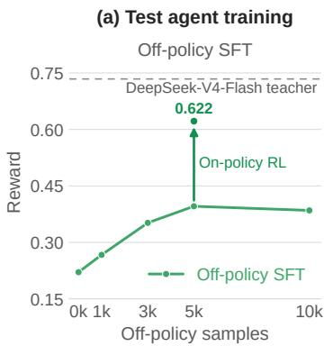

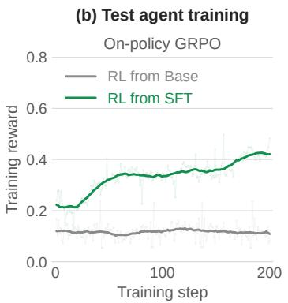

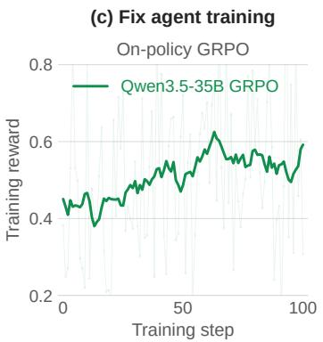  
Figure 6: Off-policy initialization and on-policy training dynamics. (a) Test-agent Base-to-Gold success on SWE-bench Verified across SFT dataset sizes; the dashed line is the teacher reference, and the arrow shows RL from the 5K-trajectory checkpoint reaching 0.622. (b) Test-agent RL reward when initialized from Base or SFT. (c) Repair-agent RL reward.

On-policy RL adds gains after imitation shows diminishing returns. Figure 6a shows that Base-to-Gold success increases from approximately 22% without teacher trajectories to 27% with 1K trajectories, 35% with 3K, and 39% with 5K. Increasing the dataset to 10K produces no further gain in this success metric, while the teacher reference remains near 73%. Starting from the 5K SFT checkpoint, on-policy training reaches 62.2% Base-to-Gold success. These values measure behavioral success, not the training reward, which additionally depends on candidate balanced accuracy and trajectory length. The 5K-to-10K comparison suggests diminishing returns from additional imitation at this scale rather than a general saturation of SFT. A likely reason for the subsequent RL gain is that SFT reproduces behaviors represented in fixed teacher trajectories, whereas on-policy execution rewards directly distinguish valid and invalid submissions sampled from the evolving student policy. RL can therefore target errors in the student’s own action distribution that additional imitation may not correct.

SFT initialization supplies the behaviors needed for on-policy optimization. Figure 6b compares RL initialized from Base and from the SFT checkpoint. In the reported runs, reward remains low and oscillatory from Base but rises steadily from the SFT checkpoint. This pattern is consistent with the structure of the Test reward: a Base policy frequently produces invalid submissions or homogeneous zero-reward outcomes, providing little within-task advantage signal for GRPO. SFT first teaches repository exploration, test construction, and the structured submission protocol, increasing the chance of valid rollouts with differentiated execution outcomes. Off-policy trajectories thus move the policy into a behavioral region where on-policy optimization receives an informative learning signal.

## 5.2.3 REPAIR-AGENT TRAINING RESULTS

Repair training improves Round-0 performance and increases aggregate feedback gains. As shown in Table 2, the no-test Round-0 resolved rate increases from 61.2% for the Base Repair agent to 68.3% for the trained agent, directly demonstrating a 7.1-point improvement in initial repair capability. With RL-35B feedback, Test to Improve adds 2.9 points to the Base agent and 4.3 points to the trained agent, producing final rates of 64.1% and 72.6%. Because the two agents begin revision from different Round-0 patches, the difference between these gains is not a matched estimate of feedback-use capability alone. It is consistent with the training objective strengthening both behaviors: the direct-solve reward favors complete initial patches, while fixed-test training exposes the policy to interpreting failure and making corrective source edits. Figure 6c shows an overall increase in Repair training reward, but this trend does not itself establish improved held-out resolution.

Table 2: Resolved rates (%) on SWE-bench Verified across Repair agents and Test sources. Both Repair agents use Qwen-3.5-35B-A3B; the trained agent uses the full Test-to-Improve objective. ∆ is the percentage-point change from “None (Round 0)” for the same Repair agent. GPT-5.6-sol and Oracle F2P are stronger-model and privileged-feedback references, respectively. Gray marks RL-35B feedback; bold marks the fully trained Test–Repair pair. Values are all-task means over three Repair runs, reusing fixed generated bundles and retaining Round-0 patches when Base qualification fails.
<table><tr><td rowspan="2">Test Source</td><td colspan="2">Base Repair</td><td colspan="2">Trained Repair</td></tr><tr><td>Resolved (%)</td><td>∆(pp)</td><td>Resolved (%)</td><td>∆(pp)</td></tr><tr><td>None (Round 0)</td><td>61.2</td><td></td><td>68.3</td><td></td></tr><tr><td>GPT-5.6-sol</td><td>65.3</td><td>+4.1</td><td>73.5</td><td>+5.2</td></tr><tr><td>Oracle F2P</td><td>69.4</td><td>+8.2</td><td>77.6</td><td>+9.3</td></tr><tr><td>Base-35B</td><td>57.3</td><td>-3.9</td><td>64.6</td><td>-3.7</td></tr><tr><td>RL-35B</td><td>64.1</td><td>+2.9</td><td>72.6</td><td>+4.3</td></tr></table>

Test and Repair training provide complementary system-level gains. The comparisons in Table 2 vary either the Test or Repair component while holding the other fixed. Replacing Base-35B tests with RL-35B tests raises resolved rate by 6.8 points for the Base Repair agent and by 8.0 points for the trained Repair agent. Conversely, Repair training adds 7.3 points under Base-35B feedback and 8.5 points under RL-35B feedback. Each trained component therefore improves the system in the presence of either version of the other component, although the displayed averages do not establish a statistically significant interaction between them. Combining the trained Test and Repair agents reaches 72.6% without GPT-5.6 or Oracle F2P feedback during evaluation, 11.4 points above the original Base Repair agent without feedback. Holding the trained Repair agent fixed, Oracle feedback reaches 77.6%. The remaining 5.0-point gap suggests further gains may be possible through improved test quality and coverage.

Performance gains with limited repair overhead. With the trained Test and Repair agents, feedback-guided revision raises resolved rate from 68.3% at Round 0 to 72.6%, a gain of 4.3 percentage points (Table 2). Among the 120 trajectories that entered repair, revision required an average of only 13 additional agent turns. The observed gain therefore accompanies limited additional Repair-agent interaction, rather than routine use of the full revision budget. Test generation is a separate, one-time cost per issue and Test source, with the resulting bundle reused across the three Repair runs. Section A.3 reports the revision-turn distribution and evaluation configuration.

## 5.3 ADDITIONAL ANALYSES AND ABLATIONS

The direct-solve bonus balances initial repair and feedback-conditioned revision. Table 3 compares standard Repair training, Test-to-Improve training without the direct-solve bonus, and the full objective. Standard training reaches 68.7% at Round 0 and 70.3% after revision. Without the direct-solve bonus, Round-0 performance falls to 66.4% and the final rate reaches 71.4%; its larger 5.0-point within-condition increase partly reflects the lower starting point and does not by itself establish stronger revision capability. The full objective reaches 68.3% at Round 0 and the highest final rate, 72.6%. Relative to training without the bonus, it improves Round-0 and final performance by 1.9 and 1.2 points, respectively; relative to standard training, it retains comparable Round-0 performance while improving the final rate by 2.3 points. This pattern is consistent with the direct-solve reward discouraging the policy from deferring an incomplete solution until feedback arrives, while Test-to-Improve training stil teaches corrective revision when the initial patch fails.

Table 3: Repair-objective ablation on SWEbench Verified. Round-0 and final resolved rates (%) average three runs; final evaluations use fixed RL-35B tests. T2I denotes Test-to-Improve training.
<table><tr><td>Training objective</td><td>Round 0 Final</td></tr><tr><td>Standard (no T2I)</td><td>68.7 70.3</td></tr><tr><td>T2I, no direct bonus</td><td>66.4 71.4</td></tr><tr><td>Full T2I</td><td>68.3 72.6</td></tr></table>

Reasoning-visible SFT trajectories provide a stronger initialization for on-policy learning. Table 4 compares SFT on GPT-5.6-sol trajectories without chain-of-thought reasoning and DeepSeek-V4-Flash-0731 trajectories that retain it. The two conditions differ by only 4.2 points after SFT, at 35.4% and 39.6%, but the gap expands to 26.0 points after RL, at 36.2% and 62.2%. The larger gap after RL suggests that the two SFT initializations differ more in their support for subsequent policy improvement than in their immediate performance. One possible explanation is that reasoningvisible demonstrations better expose how the teacher interprets repository state, selects actions, and revises its plan after new observations. The result also shows that a stronger standalone teacher need not provide a better initialization for subsequent RL. However, teacher identity, reasoning visibility, and potentially other trajectory properties vary jointly, so this comparison does not isolate a causal effect of CoT.

Table 4: Test-agent SFT teacher comparison. Single-run Base-to-Gold success (%) on SWEbench Verified after SFT and RL. CoT denotes retained teacher reasoning; teacher identity and CoT visibility vary jointly.
<table><tr><td>SFT teacher</td><td>CoT</td><td>SFT</td><td>+ RL</td></tr><tr><td>GPT-5.6-sol</td><td>No</td><td>35.4</td><td>36.2</td></tr><tr><td>DeepSeek-V4-Flash</td><td>Yes</td><td>39.6</td><td>62.2</td></tr></table>

Test generation extends beyond Python, with uneven cross-language performance. We evaluate the Test agent on non-Python repositories to assess its applicability beyond the language used for post-training. Table 5 reports Base-to-Gold success on four language subsets of SWE-bench Multilingual, with the 62.2% Python result on SWE-bench Verified included as an in-language reference. The agent reaches 66.7% on Rust and 58.3% on C++, but success is lower on C and Java, at 26.1% and 2.4%, respectively. The Rust and

Table 5: Cross-language Base-to-Gold success (%). After Python-only post-training, the Test agent is evaluated once on SWE-bench Verified (Python) and SWE-bench Multilingual subsets (other languages). These are Test-generation, not Repair-resolution, rates.
<table><tr><td></td><td>Python</td><td>Rust</td><td>C++</td><td>C</td><td>Java</td></tr><tr><td>Success</td><td>62.2</td><td>66.7</td><td>58.3</td><td>26.1</td><td>2.4</td></tr></table>

C++ results show that the agent can construct repository-native tests that fail on buggy code and pass on reference repairs without additional post-training on those languages. Its applicability is therefore not restricted to Python, although reliability varies substantially across the evaluated task sets and remains limited on C and especially Java.

Oracle feedback yields higher Repair performance. Table 6 compares the fixed feedback source used during Repair training. Generated-test training reaches 67.6% at Round 0 and 70.9% after revision, whereas Oracle-test training reaches 68.3% and 72.6%, advantages of 0.7 and 1.7 points. This pattern is consistent with feedback quality affecting credit assignment. Generated tests can encode incomplete or incorrect targets, so rewarding patches that satisfy them may reinforce revisions that do not resolve the original task. A selected Oracle F2P test provides a more behaviorally aligned and therefore less noisy revision target, although it still covers only one part of the official specification. Because the terminal reward trains the full trajectory, cleaner feedback can also affect the policy that produces the Round-0 patch, not only its later revisions.

Table 6: Repair training feedback ablation on SWE-bench Verified. Round-0 and final resolved rates (%) average three Repair runs. Both final evaluations use fixed RL-35B-generated tests; the Oracle row uses privileged fail-to-pass feedback only during training.
<table><tr><td>Training feedback</td><td>Round 0</td><td>Final</td></tr><tr><td>Generated tests</td><td>67.6</td><td>70.9</td></tr><tr><td>Oracle tests</td><td>68.3</td><td>72.6</td></tr></table>

## 6 RELATED WORK

Execution-feedback-guided coding agents. Long before repository agents, automated testing systems generated inputs from execution feedback or optimized suites for structural coverage, as exemplified by Randoop and EvoSuite (Pacheco et al., 2007; Fraser and Arcuri, 2011). Automated program repair subsequently exposed a sharper oracle problem: a candidate can be plausible because it passes the available suite yet remain semantically incorrect (Qi et al., 2015; Smith et al., 2015). DiffTGen and Opad generate additional cases to reject test-suite-overfitted patches; Patch-Sim compares patch-induced execution behavior; RGT assesses candidates using tests generated from a developer repair; and Poracle checks whether a patch preserves behavior outside the repair region (Xin and Reiss, 2017; Yang et al., 2017; Xiong et al., 2018; Ye et al., 2021; Ismayilzada et al., 2024). More recent work clusters patches by generated-test behavior or learns semantic features for filtering overfitting patches (Martinez et al., 2024; Song and Oh, 2025). At the function level, Self-Debugging and Reflexion revise programs from execution or verbal feedback, while CodeT and LEVER use generated tests or execution results for candidate selection (Chen et al., 2024b; Shinn et al., 2023; Chen et al., 2023; Ni et al., 2023). At repository scale, constructing task-relevant feedback becomes an agentic problem. LIBRO generates bug-reproducing tests from reports, while SWT-Bench and TDD-Bench Verified operationalize the fail-on-Base/pass-on-Gold criterion for evaluating issue-conditioned tests (Kang et al., 2023; Mündler et al., 2024; Ahmed et al., 2024). Issue2Test, BLAST, and Otter improve reproduction through repository context, search-based testing, and execution-based selection; heterogeneous prompting increases candidate diversity, and SWE-Tester studies post-training open models specifically for issue reproduction (Nashid et al., 2026; Kitsios et al., 2025; Ahmed et al., 2025; 2026; Soni et al., 2026). Rather than synthesize every check from scratch, TestPrune localizes and minimizes existing regression tests for both reproduction and patch validation (Chen et al., 2026a). Repair systems consume these artifacts in different ways: MASAI and Agentless use reproducers to select or validate patches, CodeR separates reproduction, editing, and verification, and Google’s bug-reproduction-test Agent uses generated tests to guide and rank repairs (Arora et al., 2024; Xia et al., 2025; Chen et al., 2024a; Cheng et al., 2025). Repository workflows further differ in whether validation evidence remains fixed. TDFlow freezes supplied or generated tests before source revision, whereas SpecRover, Dynamic Cogeneration, CodeMonkeys, InfCode, Agent-CoEvo, CoHarden, and TDD-Agent update, select, or harden tests as repair proceeds (Han et al., 2026; Ruan et al., 2025; Cheng et al., 2026; Ehrlich et al., 2025; Li et al., 2025a; 2026b; Tan et al., 2026; Yu et al., 2026). A fixed test supplies a stable revision target; an evolving test can correct weak evidence but also changes the acceptance criterion during the episode. The tradeoff matters because both classical repair studies and recent SWE-bench audits show that tests can admit behaviorally incorrect patches, and agent-written tests may provide observation without strong assertions (Yu et al., 2019; Wang et al., 2026b; Yu et al., 2025a; Chen et al., 2026b; Sun et al., 2026). SWE-Doctor and EviACT structure or stage execution evidence, while ECLoop and RETRACE place an external critic or gate between a candidate and submission (Guo et al., 2026; Meng et al., 2026; Xu et al., 2026; Li et al., 2026a). EXECCRITIC uses independently generated tests that remain fixed during repair: it qualifies each Test submission, freezes it during source-only revision, fails closed on operational errors, and leaves final correctness to the official evaluator.

Post-training coding agents for testing and repair. Post-training work improves coding agents through successful trajectories, software-evolution data, executable environments, and learned reward signals. CodeLutra iteratively refines code-generation models using preferences between successful and failed code attempts (Tao et al., 2025). SWE-Fixer separately trains retrieval and editing modules on issue–patch data, while SWE-Dev scales agent trajectories and synthesizes tests for patch evaluation (Xie et al., 2025; Wang et al., 2025a). SWE-Gym trains repository agents and trajectory verifiers in executable environments, SWE-RL applies reinforcement learning over open software evolution, and Agent-RLVR augments sparse environment rewards with guidance (Pan et al., 2025; Wei et al., 2025; Da et al., 2025). Long-context multi-turn RL, SkyRL-Agent, and RepoForge study on-policy repository interaction and scalable SFT–RL pipelines, while LEGO-RL connects native coding-agent harnesses to policy-gradient training and explicitly hardens execution against crashes and reward corruption (Golubev et al., 2025; Cao et al., 2025; Chen et al., 2025b; Du et al., 2026). More specifically, RLEF trains code models to revise from execution feedback; CURE and UTRL train test generation alongside coding; Code-A1 and Repair-R1 optimize adversarial or test-first code–test interaction; and ReVeal and TaPR train iterative verification or feedback-conditioned repair (Gehring et al., 2025; Wang et al., 2025c; Lee et al., 2026a; Wang et al., 2026a; Hu et al., 2025; Jin et al., 2026; Liu et al., 2026). Related verifier training includes R2E-Gym’s hybrid verifiers, CodePRM’s execution-enhanced process rewards, and SWE-RM’s execution-free reward modeling for test-time selection and RL (Jain et al., 2025; Li et al., 2025b; Shum et al., 2025). Beyond code-specific supervision, HERO combines sparse verifier rewards with dense reward-model scores for reasoning (Tao et al., 2026a), while TRACE derives turn-level rewards from changes in frozenreference-model state values to address credit assignment in long-horizon tool use (Tao et al., 2026b). These lines of work improve post-training through execution feedback, learned reward signals, and finer-grained credit assignment. EXECCRITIC differs in how it factors the learning problem: the Test policy is trained for Base-to-Gold behavioral change and candidate discrimination, while the Repair policy is trained separately for direct solving and revision from a fixed hidden test. At evaluation time, the two learned roles are composed through a harness that prevents the Repair trajectory from modifying its evidence.

## 7 LIMITATIONS

The current framework trains the Test and Repair agents as separate policies and composes them only after training. Ideally, both roles would share a single set of model weights, with role conditioning determining whether the model constructs a test or revises a repair. Such a design would simplify deployment by requiring only one checkpoint, allow knowledge to transfer between the two capabilities, and enable end-to-end optimization of the complete test–verify–revise loop. We adopt separate training in this work because the two roles have different action spaces, trajectory structures, and learning signals. Test training rewards valid executable artifacts, Base-to-Gold behavioral change, and candidate discrimination, whereas Repair training rewards source-only solutions and feedback-conditioned revisions that pass the official evaluator. Joint training must balance these heterogeneous signals, assign credit across both trajectories, and prevent degenerate coordination in which the Test and Repair roles adapt to each other rather than to the task specification. Developing a stable shared-weight objective that maintains independent test generation and fixed tests during repair while enabling end-to-end learning is an important direction for future work.

## 8 CONCLUSION

We introduced EXECCRITIC, a framework that separates test generation from source-code repair: the Test agent authors a behavioral check, the harness holds it fixed and executes it, and the Repair agent revises only the source patch from bounded feedback, while the official evaluator retains final authority. Averages over three Repair runs under a shared SWE-bench Verified evaluation protocol show that strong Test patches improve off-the-shelf Repair agents whereas weak ones can hurt, that the Trained Repair condition exceeds Base across the displayed feedback sources, and that both role-specific objectives provide usable optimization signals. These findings support using independently generated, fixed tests to guide repair under the evaluated conditions. Future work will explore multi-check harnesses, stronger Test-agent weights, and improvements in cost and latency.

## REFERENCES

Toufique Ahmed, Martin Hirzel, Rangeet Pan, Avraham Shinnar, and Saurabh Sinha. TDD-Bench Verified: Can LLMs generate tests for issues before they get resolved? arXiv preprint arXiv:2412.02883, 2024.

Toufique Ahmed, Jatin Ganhotra, Rangeet Pan, Avraham Shinnar, Saurabh Sinha, and Martin Hirzel. Otter: Generating tests from issues to validate SWE patches. In Proceedings ofthe 42nd International Conference on Machine Learning, volume 267 of Proceedings of Machine Learning Research, pages 752–771. PMLR, 2025.

Toufique Ahmed, Jatin Ganhotra, Avraham Shinnar, and Martin Hirzel. Heterogeneous prompting and execution feedback for SWE issue test generation and selection. In Proceedings ofthe 48th IEEE/ACM International Conference on Software Engineering, 2026. doi: 10.1145/3744916. 3787837.

Daman Arora, Atharv Sonwane, Nalin Wadhwa, Abhav Mehrotra, Saiteja Utpala, Ramakrishna Bairi, Aditya Kanade, and Nagarajan Natarajan. MASAI: Modular architecture for software-engineering AI agents. arXiv preprint arXiv:2406.11638, 2024.

Ibragim Badertdinov, Alexander Golubev, Maksim Nekrashevich, Anton Shevtsov, Simon Karasik, Andrei Andriushchenko, Maria Trofimova, Daria Litvintseva, and Boris Yangel. SWE-rebench: An automated pipeline for task collection and decontaminated evaluation of software engineering agents. In Advances in Neural Information Processing Systems, volume 38, pages 26420–26466, 2025. doi: 10.52202/085713-0788. Datasets and Benchmarks Track.

Shiyi Cao, Dacheng Li, Fangzhou Zhao, Shuo Yuan, Sumanth R. Hegde, Connor Chen, Charlie Ruan, Tyler Griggs, Shu Liu, Eric Tang, Richard Liaw, Philipp Moritz, Matei Zaharia, Joseph E. Gonzalez, and Ion Stoica. SkyRL-Agent: Efficient RL training for multi-turn LLM agent. arXiv preprint arXiv:2511.16108, 2025.

Bei Chen, Fengji Zhang, Anh Nguyen, Daoguang Zan, Zeqi Lin, Jian-Guang Lou, and Weizhu Chen. CodeT: Code generation with generated tests. In International Conference on Learning Representations, 2023.

Dong Chen, Shaoxin Lin, Muhan Zeng, Daoguang Zan, Jian-Gang Wang, Anton Cheshkov, Jun Sun, Hao Yu, Guoliang Dong, Artem Aliev, Jie Wang, Xiao Cheng, Guangtai Liang, Yuchi Ma, Pan Bian, Tao Xie, and Qianxiang Wang. CodeR: Issue resolving with multi-agent and task graphs. arXiv preprint arXiv:2406.01304, 2024a.

Xiancai Chen, Zhengwei Tao, Kechi Zhang, Changzhi Zhou, Xinyu Zhang, Wanli Gu, Yuanpeng He, Mengdi Zhang, Xunliang Cai, Haiyan Zhao, and Zhi Jin. Revisit self-debugging with selfgenerated tests for code generation. In Proceedings ofthe 63rd Annual Meeting ofthe Association for Computational Linguistics (Volume 1: Long Papers), pages 18003–18023. Association for Computational Linguistics, 2025a. doi: 10.18653/v1/2025.acl-long.881.

Xinyun Chen, Maxwell Lin, Nathanael Schärli, and Denny Zhou. Teaching large language models to self-debug. In International Conference on Learning Representations, 2024b.

Yang Chen, Toufique Ahmed, Reyhaneh Jabbarvand, and Martin Hirzel. Can old tests do new tricks for resolving SWE issues? Proceedings ofthe ACM on Software Engineering, 3(FSE):3186–3207, 2026a. doi: 10.1145/3808148.

Zhi Chen, Zhensu Sun, Yuling Shi, Chao Peng, Xiaodong Gu, David Lo, and Lingxiao Jiang. Rethinking the value of agent-generated tests for LLM-based software engineering agents. arXiv preprint arXiv:2602.07900, 2026b.

Zhilong Chen, Chengzong Zhao, Boyuan Chen, Dayi Lin, Yihao Chen, Arthur Leung, Gopi Krishnan Rajbahadur, Gustavo A. Oliva, Haoxiang Zhang, Aaditya Bhatia, Chong Chun Yong, and Ahmed E. Hassan. RepoForge: Training a SOTA fast-thinking SWE agent with an end-to-end data curation pipeline synergizing SFT and RL at scale. arXiv preprint arXiv:2508.01550, 2025b.

Runxiang Cheng, Michele Tufano, Jürgen Cito, José Cambronero, Pat Rondon, Renyao Wei, Aaron Sun, and Satish Chandra. Agentic bug reproduction for effective automated program repair at Google. arXiv preprint arXiv:2502.01821, 2025.

Runxiang Cheng, Michele Tufano, José Cambronero, Renyao Wei, Sherry Shi, Grant Uy, Pat Rondon, and Franjo Ivanciˇ c. Dynamic cogeneration of bug reproduction test in agentic program repair. In´ Proceedings ofthe 34th ACM International Conference on the Foundations ofSoftware Engineering, FSE Companion ’26, pages 644–654. ACM, 2026. doi: 10.1145/3803437.3805237.

Jeff Da, Clinton Wang, Xiang Deng, Yuntao Ma, Nikhil Barhate, and Sean Hendryx. Agent-RLVR: Training software engineering agents via guidance and environment rewards. arXiv preprint arXiv:2506.11425, 2025.

DeepSeek-AI. DeepSeek-V4-Flash-0731, 2026. URL https://huggingface.co/deepseek-ai/ DeepSeek-V4-Flash-0731. Model card.

Xiang Deng, Jeff Da, Edwin Pan, Yannis Yiming He, Charles Ide, Kanak Garg, Niklas Lauffer, Andrew Park, Nitin Pasari, Chetan Rane, Karmini Sampath, Maya Krishnan, Srivatsa Kundurthy, Sean Hendryx, Zifan Wang, Vijay Bharadwaj, Jeff Holm, Raja Aluri, Chen Bo Calvin Zhang, Noah Jacobson, Bing Liu, and Brad Kenstler. SWE-Bench Pro: Can AI agents solve long-horizon software engineering tasks? arXiv preprint arXiv:2509.16941, 2025. doi: 10.48550/arXiv.2509. 16941.

Yiming Du, Yuxin Jiang, Tao Yuan, Jianbo Dai, Shaowei Wang, Jierun Chen, Chaofan Tao, Xianzhi Yu, Lifeng Shang, Kam-Fai Wong, Xiaohui Li, and Haoli Bai. LEGO-RL: Harness-native reinforcement learning for coding agents. arXiv preprint arXiv:2608.17393, August 2026. doi: 10.48550/arXiv.2608.17393.

Ryan Ehrlich, Bradley Brown, Jordan Juravsky, Ronald Clark, Christopher Ré, and Azalia Mirhoseini. CodeMonkeys: Scaling test-time compute for software engineering. arXiv preprint arXiv:2501.14723, 2025.

Gordon Fraser and Andrea Arcuri. EvoSuite: Automatic test suite generation for object-oriented software. In Joint Meeting ofthe European Software Engineering Conference and the Symposium on the Foundations of Software Engineering, pages 416–419, 2011. doi: 10.1145/2025113. 2025179.

Jonas Gehring, Kunhao Zheng, Jade Copet, Vegard Mella, Taco Cohen, and Gabriel Synnaeve. RLEF: Grounding code LLMs in execution feedback with reinforcement learning. In Proceedings ofthe 42nd International Conference on Machine Learning, volume 267 of Proceedings of Machine Learning Research, pages 19034–19055. PMLR, 2025.

Alexander Golubev, Maria Trofimova, Sergei Polezhaev, Ibragim Badertdinov, Maksim Nekrashevich, Anton Shevtsov, Simon Karasik, Sergey Abramov, Andrei Andriushchenko, Filipp Fisin, Sergei Skvortsov, and Boris Yangel. Training long-context, multi-turn software engineering agents with reinforcement learning. arXiv preprint arXiv:2508.03501, 2025.

Yaoqi Guo, Yang Liu, Jie M. Zhang, Yun Ma, Yiling Lou, and Zhenpeng Chen. SWE-Doctor: Guiding software engineering agents with runtime diagnosis from multi-faceted bug reproduction tests. arXiv preprint arXiv:2607.00990, 2026.

Kevin Han, Siddharth Maddikayala, Tim Knappe, Om Patel, Austen Liao, and Amir Barati Farimani. TDFlow: Agentic workflows for test driven development. In Proceedings of the 19th Conference of the European Chapter of the Association for Computational Linguistics (Volume 1: Long Papers), pages 1511–1527. Association for Computational Linguistics, 2026. doi: 10.18653/v1/2026. eacl-long.70.

Haichuan Hu, Xiaochen Xie, and Quanjun Zhang. Repair-R1: Better test before repair. arXiv preprint arXiv:2507.22853, 2025.

Elkhan Ismayilzada, Md Mazba Ur Rahman, Dongsun Kim, and Jooyong Yi. Poracle: Testing patches under preservation conditions to combat the overfitting problem of program repair. ACM Transactions on Software Engineering and Methodology, 33(2):1–39, 2024. doi: 10.1145/3625293.

Naman Jain, Jaskirat Singh, Manish Shetty, Tianjun Zhang, Liang Zheng, Koushik Sen, and Ion Stoica. R2E-Gym: Procedural environments and hybrid verifiers for scaling open-weights SWE agents. In Conference on Language Modeling, 2025.

Carlos E. Jimenez, John Yang, Alexander Wettig, Shunyu Yao, Kexin Pei, Ofir Press, and Karthik R. Narasimhan. SWE-bench: Can language models resolve real-world GitHub issues? In International Conference on Learning Representations, 2024.

Yiyang Jin, Kunzhao Xu, Hang Li, Xueting Han, Yanmin Zhou, Cheng Li, and Jing Bai. ReVeal: Self-evolving code agents via reliable self-verification. In International Conference on Learning Representations, 2026.

Sungmin Kang, Juyeon Yoon, and Shin Yoo. Large language models are few-shot testers: Exploring LLM-based general bug reproduction. In Proceedings of the 45th International Conference on Software Engineering, pages 2312–2323, 2023. doi: 10.1109/ICSE48619.2023.00194.

Konstantinos Kitsios, Marco Castelluccio, and Alberto Bacchelli. Automated generation of issuereproducing tests by combining LLMs and search-based testing. In Proceedings of the 40th IEEE/ACM International Conference on Automated Software Engineering, pages 1982–1994. IEEE, 2025. doi: 10.1109/ASE63991.2025.00165.

Dongjun Lee, Changho Hwang, and Kimin Lee. Learning to generate unit test via adversarial reinforcement learning. In International Conference on Learning Representations, 2026a.

Yoonho Lee, Roshen Nair, Qizheng Zhang, Kangwook Lee, Omar Khattab, and Chelsea Finn. Meta-Harness: End-to-end optimization of model harnesses. arXiv preprint arXiv:2603.28052, 2026b.

Chenglin Li, Yisen Xu, Zehao Wang, Shin Hwei Tan, and Tse-Hsun Chen. Independent patch verification for coding agents with a bidirectional reconstruct-and-verify framework. arXiv preprint arXiv:2608.08950, 2026a.

Kefan Li, Mengfei Wang, Hengzhi Zhang, Zhichao Li, Yuan Yuan, Mu Li, Xiang Gao, Hailong Sun, Chunming Hu, and Weifeng Lv. InfCode: Adversarial iterative refinement of tests and patches for reliable software issue resolution. arXiv preprint arXiv:2511.16004, 2025a.

Kefan Li, Yuan Yuan, Mengfei Wang, Shihao Zheng, Wei Wang, Ping Yang, Mu Li, and Weifeng Lv. Beyond fixed tests: Repository-level issue resolution as coevolution of code and behavioral constraints. arXiv preprint arXiv:2604.04580, 2026b.

Qingyao Li, Xinyi Dai, Xiangyang Li, Weinan Zhang, Yasheng Wang, Ruiming Tang, and Yong Yu. CodePRM: Execution feedback-enhanced process reward model for code generation. In Findings of the Association for Computational Linguistics: ACL 2025, pages 8169–8182. Association for Computational Linguistics, 2025b. doi: 10.18653/v1/2025.findings-acl.428.

Aofan Liu, Jingxiang Meng, Fangxin Liu, and Yongbiao Chen. TaPR: Test-aware policy refinement for feedback-conditioned code generation. arXiv preprint arXiv:2608.00494, 2026.

Matias Martinez, Maria Kechagia, Anjana Perera, Justyna Petke, Federica Sarro, and Aldeida Aleti. Test-based patch clustering for automatically-generated patches assessment. Empirical Software Engineering, 29(5):116, 2024. doi: 10.1007/s10664-024-10503-2.

Qianru Meng, Zhaochun Ren, Xiao Zhang, and Joost Visser. EviACT: An evidence-to-action framework for agentic program repair. arXiv preprint arXiv:2605.27238, 2026.

Niels Mündler, Mark Niklas Müller, Jingxuan He, and Martin Vechev. SWT-Bench: Testing and validating real-world bug-fixes with code agents. In Advances in Neural Information Processing Systems, volume 37, pages 81857–81887, 2024.

Noor Nashid, Islem Bouzenia, Michael Pradel, and Ali Mesbah. Issue2Test: Generating reproducing test cases from issue reports. In Proceedings of the 48th IEEE/ACM International Conference on Software Engineering, 2026.

Ansong Ni, Srini Iyer, Dragomir Radev, Veselin Stoyanov, Wen-Tau Yih, Sida Wang, and Xi Victoria Lin. LEVER: Learning to verify language-to-code generation with execution. In Proceedings of the 40th International Conference on Machine Learning, volume 202 of Proceedings ofMachine Learning Research, pages 26106–26128. PMLR, 2023.

OpenAI. Introducing SWE-bench verified. https://openai.com/index/ introducing-swe-bench-verified/, August 2024. URL https://openai.com/ index/introducing-swe-bench-verified/. Blog post.

OpenAI. Previewing GPT-5.6 Sol: A next-generation model. https://openai.com/ index/previewing-gpt-5-6-sol/, June 2026. URL https://openai.com/index/ previewing-gpt-5-6-sol/. Blog post.

Carlos Pacheco, Shuvendu K. Lahiri, Michael D. Ernst, and Thomas Ball. Feedback-directed random test generation. In International Conference on Software Engineering, pages 75–84, 2007. doi: 10.1109/ICSE.2007.37.

Jiayi Pan, Xingyao Wang, Graham Neubig, Navdeep Jaitly, Heng Ji, Alane Suhr, and Yizhe Zhang. Training software engineering agents and verifiers with SWE-Gym. In Proceedings ofthe 42nd International Conference on Machine Learning, volume 267 of Proceedings of Machine Learning Research, pages 47717–47737. PMLR, 2025.

Baolin Peng, Wenlin Yao, Qianhui Wu, Hao Cheng, Xiao Yu, Rui Yang, Tao Ge, Alessandro Sordoni, Xingdi Yuan, Yelong Shen, Pengcheng He, Tong Zhang, Zhou Yu, and Jianfeng Gao. Orchard: An open-source agentic modeling framework. arXiv preprint arXiv:2605.15040, 2026. doi: 10.48550/arXiv.2605.15040.

Zichao Qi, Fan Long, Sara Achour, and Martin Rinard. An analysis of patch plausibility and correctness for generate-and-validate patch generation systems. In Proceedings of the 2015 International Symposium on Software Testing and Analysis, pages 24–36. ACM, 2015. doi: 10.1145/2771783.2771791.

Qwen Team. Qwen3.5: Towards native multimodal agents. https://qwen.ai/blog?id=qwen3.5, February 2026. URL https://qwen.ai/blog?id=qwen3.5. Blog post.

Ravin Ravi, Dylan Bradshaw, Stefano Ruberto, Gunel Jahangirova, and Valerio Terragni. LLMLOOP: Improving LLM-generated code and tests through automated iterative feedback loops. In 2025 IEEE International Conference on Software Maintenance and Evolution, pages 930–934. IEEE, 2025. doi: 10.1109/ICSME64153.2025.00109.

Haifeng Ruan, Yuntong Zhang, and Abhik Roychoudhury. SpecRover: Code intent extraction via LLMs. In Proceedings of the 47th IEEE/ACM International Conference on Software Engineering, pages 963–974, 2025. doi: 10.1109/ICSE55347.2025.00080.

Noah Shinn, Federico Cassano, Ashwin Gopinath, Karthik Narasimhan, and Shunyu Yao. Reflexion: Language agents with verbal reinforcement learning. In Advances in Neural Information Processing Systems, volume 36, pages 8634–8652, 2023. doi: 10.52202/075280-0377.

KaShun Shum, Binyuan Hui, Jiawei Chen, Lei Zhang, X. W., Jiaxi Yang, Yuzhen Huang, Junyang Lin, and Junxian He. SWE-RM: Execution-free feedback for software engineering agents. arXiv preprint arXiv:2512.21919, 2025.

Edward K. Smith, Earl T. Barr, Claire Le Goues, and Yuriy Brun. Is the cure worse than the disease? overfitting in automated program repair. In Proceedings ofthe 2015 10th Joint Meeting on Foundations of Software Engineering, pages 532–543. ACM, 2015. doi: 10.1145/2786805. 2786825.

Dowon Song and Hakjoo Oh. Enhancing APR with PRISM: A semantic-based approach to overfitting patch detection. Proceedings ofthe ACM on Programming Languages, 9(OOPSLA2):3342–3370, 2025. doi: 10.1145/3763170.

Aditya Bharat Soni, Rajat Ghosh, Vaishnavi Bhargava, Valerie Chen, and Debojyoti Dutta. SWE-Tester: Training open-source LLMs for issue reproduction in real-world repositories. arXiv preprint arXiv:2601.13713, 2026. Accepted at EMNLP 2026 Industry Track.

Yuxuan Sun, Yuze Zhao, Yufeng Wang, Yao Du, Zhiyuan Ma, Jinbo Wang, Mengdi Zhang, Kai Zhang, and Zhenya Huang. SWE-Mutation: Can LLMs generate reliable test suites in software engineering? In Findings ofthe Associationfor Computational Linguistics: ACL 2026, pages 39651–39674. Association for Computational Linguistics, 2026. doi: 10.18653/v1/2026.findings-acl.1976.

SWE-agent Team. mini-SWE-agent. https://github.com/SWE-agent/mini-swe-agent, 2025. URL https://github.com/SWE-agent/mini-swe-agent. Software repository.

Yuhao Tan, Zhibang Yang, Fangkai Yang, Yuan Yao, Yu Kang, Lu Wang, Pu Zhao, Xin Zhang, Xiaoxing Ma, Qingwei Lin, Saravan Rajmohan, and Dongmei Zhang. Beyond fail-to-pass: Iterative hardening of co-generated bug reproduction tests and fixes. arXiv preprint arXiv:2607.19843, 2026.

Leitian Tao, Xiang Chen, Tong Yu, Tung Mai, Ryan A. Rossi, Yixuan Li, and Saayan Mitra. CodeLutra: Boosting LLM code generation via preference-guided refinement. Transactions on Machine Learning Research, 2025.

Leitian Tao, Ilia Kulikov, Swarnadeep Saha, Tianlu Wang, Jing Xu, Sharon Li, Jason E. Weston, and Ping Yu. Hybrid reinforcement: When reward is sparse, better to be dense. In International Conference on Learning Representations, 2026a.

Leitian Tao, Baolin Peng, Wenlin Yao, Tao Ge, Hao Cheng, Mike Hang Wang, Jianfeng Gao, and Sharon Li. TRACE: Turn-level reward assignment via credit estimation for long-horizon agents. arXiv preprint arXiv:2607.13988, 2026b.

Aozhe Wang, Yuchen Yan, Nan Zhou, Zhengxi Lu, Weiming Lu, Jun Xiao, Yueting Zhuang, and Yongliang Shen. Code-A1: Adversarial evolving of code LLM and test LLM via reinforcement learning. arXiv preprint arXiv:2603.15611, 2026a.

Haoran Wang, Zhenyu Hou, Yao Wei, Jie Tang, and Yuxiao Dong. SWE-dev: Building software engineering agents with training and inference scaling. In Findings of the Association for Computational Linguistics: ACL 2025, pages 3742–3761. Association for Computational Linguistics, 2025a. doi: 10.18653/v1/2025.findings-acl.193.

Xingyao Wang, Boxuan Li, Yufan Song, Frank F. Xu, Xiangru Tang, Mingchen Zhuge, Jiayi Pan, Yueqi Song, Bowen Li, Jaskirat Singh, Hoang H. Tran, Fuqiang Li, Ren Ma, Mingzhang Zheng, Bill Qian, Yanjun Shao, Niklas Muennighoff, Yizhe Zhang, Binyuan Hui, Junyang Lin, Robert Brennan, Hao Peng, Heng Ji, and Graham Neubig. OpenHands: An open platform for AI software developers as generalist agents. In International Conference on Learning Representations, 2025b.

Yinjie Wang, Ling Yang, Ye Tian, Ke Shen, and Mengdi Wang. Co-evolving LLM coder and unit tester via reinforcement learning. In Advances in Neural Information Processing Systems, volume 38, pages 159375–159409, 2025c. doi: 10.52202/085713-4809.

You Wang, Michael Pradel, and Zhongxin Liu. Are “solved issues” in SWE-bench really solved correctly? an empirical study. In Proceedings of the 48th IEEE/ACM International Conference on Software Engineering, 2026b. doi: 10.1145/3744916.3764576.

Yuxiang Wei, Olivier Duchenne, Jade Copet, Quentin Carbonneaux, Lingming Zhang, Daniel Fried, Gabriel Synnaeve, Rishabh Singh, and Sida I. Wang. SWE-RL: Advancing LLM reasoning via reinforcement learning on open software evolution. In Advances in Neural Information Processing Systems, volume 38, pages 87218–87243, 2025. doi: 10.52202/085713-2629.

Chunqiu Steven Xia, Yinlin Deng, Soren Dunn, and Lingming Zhang. Demystifying LLM-based software engineering agents. Proceedings of the ACM on Software Engineering, 2(FSE):801–824, 2025. doi: 10.1145/3715754.

Chengxing Xie, Bowen Li, Chang Gao, He Du, Wai Lam, Difan Zou, and Kai Chen. SWE-fixer: Training open-source LLMs for effective and efficient GitHub issue resolution. In Findings of the Association for Computational Linguistics: ACL 2025, pages 1123–1139. Association for Computational Linguistics, 2025. doi: 10.18653/v1/2025.findings-acl.62.

Qi Xin and Steven P. Reiss. Identifying test-suite-overfitted patches through test case generation. In Proceedings of the 26th ACM SIGSOFT International Symposium on Software Testing and Analysis, pages 226–236. ACM, 2017. doi: 10.1145/3092703.3092718.

Yingfei Xiong, Xinyuan Liu, Muhan Zeng, Lu Zhang, and Gang Huang. Identifying patch correctness in test-based program repair. In Proceedings of the 40th International Conference on Software Engineering, pages 789–799. ACM, 2018. doi: 10.1145/3180155.3180182.

Yisen Xu, Chenglin Li, Zehao Wang, Jinqiu Yang, and Tse-Hsun Chen. Preventing premature commitment in coding agents with an evidence-conditioned execution layer. arXiv preprint arXiv:2607.28815, 2026.

Jinqiu Yang, Alexey Zhikhartsev, Yuefei Liu, and Lin Tan. Better test cases for better automated program repair. In Proceedings of the 2017 11th Joint Meeting on Foundations of Software Engineering, pages 831–841. ACM, 2017. doi: 10.1145/3106237.3106274.

John Yang, Carlos E. Jimenez, Alexander Wettig, Kilian Lieret, Shunyu Yao, Karthik Narasimhan, and Ofir Press. SWE-agent: Agent-computer interfaces enable automated software engineering. In Advances in Neural Information Processing Systems, volume 37, pages 50528–50652, 2024. doi: 10.52202/079017-1601.

John Yang, Kilian Lieret, Carlos E. Jimenez, Alexander Wettig, Kabir Khandpur, Yanzhe Zhang, Binyuan Hui, Ofir Press, Ludwig Schmidt, and Diyi Yang. SWE-smith: Scaling data for software engineering agents. arXiv preprint arXiv:2504.21798, 2025. doi: 10.48550/arXiv.2504.21798.

He Ye, Matias Martinez, and Martin Monperrus. Automated patch assessment for program repair at scale. Empirical Software Engineering, 26(2):20, 2021. doi: 10.1007/s10664-020-09920-w.

Boxi Yu, Yuxuan Zhu, Pinjia He, and Daniel Kang. UTBoost: Rigorous evaluation of coding agents on SWE-Bench. In Proceedings ofthe 63rd Annual Meeting ofthe Associationfor Computational Linguistics (Volume 1: Long Papers), pages 3762–3774. Association for Computational Linguistics, 2025a. doi: 10.18653/v1/2025.acl-long.189.

Hongyue Yu, Kefan Li, Jiakun Li, Hongzheng Chai, Yuan Yuan, Rui He, and Junyi Wei. TDD-Agent: Test-driven reasoning for code generation. arXiv preprint arXiv:2608.16742, 2026.

Qiying Yu, Zheng Zhang, Ruofei Zhu, Yufeng Yuan, Xiaochen Zuo, Yu Yue, Weinan Dai, Tiantian Fan, Gaohong Liu, Juncai Liu, Lingjun Liu, Xin Liu, Haibin Lin, Zhiqi Lin, Bole Ma, Guangming Sheng, Yuxuan Tong, Chi Zhang, Mofan Zhang, Ru Zhang, Wang Zhang, Hang Zhu, Jinhua Zhu, Jiaze Chen, Jiangjie Chen, Chengyi Wang, Hongli Yu, Yuxuan Song, Xiangpeng Wei, Hao Zhou, Jingjing Liu, Wei-Ying Ma, Ya-Qin Zhang, Lin Yan, Yonghui Wu, and Mingxuan Wang. DAPO: An open-source LLM reinforcement learning system at scale. In Advances in Neural Information Processing Systems, volume 38, pages 125532–125554, 2025b. doi: 10.52202/085713-3775.

Zhongxing Yu, Matias Martinez, Benjamin Danglot, Thomas Durieux, and Martin Monperrus. Alleviating patch overfitting with automatic test generation: A study of feasibility and effectiveness for the Nopol repair system. Empirical Software Engineering, 24(1):33–67, 2019. doi: 10.1007/ s10664-018-9619-4.

## A EXPERIMENTS AND ANALYSIS

This appendix provides the reproducibility details behind the training and evaluation results in Section 5. We report the Test-agent and Repair-agent configurations separately because the two roles use different trajectory formats, context and rollout budgets, verification signals, and reward functions. We then specify the evaluation protocol that composes the independently trained roles while keeping local generated-test outcomes distinct from official resolution. The final two subsections document the persisted Test-submission artifacts and analyze two feedback-guided Repair trajectories that complement the aggregate results.

## A.1 EXPERIMENTAL SETUP

The Test and Repair policies use Qwen-3.5-35B-A3B and are trained separately. The Test policy is first supervised on teacher trajectories and is then optimized with GRPO. Its configuration is reported in Table 7: panels (a)–(b) describe the supervised initialization and actor optimization, panel (c) specifies repository interaction and verification, panel (d) defines the executable reward, and panel (e) records trainer and hardware settings.

Table 7: Test-agent SFT and RL configuration. The Qwen Test policy is initialized from teacher trajectories and then optimized with execution-based rewards. Panels (a)–(e) specify data, optimization, rollout, reward, and runtime settings.
<table><tr><td>Category</td><td>Hyperparameter</td><td>Value</td></tr><tr><td colspan="3">(a) Supervised fine-tuning (SFT).</td></tr><tr><td rowspan="2">Model</td><td>Student</td><td>Qwen-3.5-35B-A3B</td></tr><tr><td>Teacher</td><td>DeepSeek-V4-Flash-0731</td></tr><tr><td rowspan="3">Data</td><td>Dataset</td><td>SWE-ReBench</td></tr><tr><td>Training examples</td><td>5,000</td></tr><tr><td>Trajectory format</td><td>Chain-of-thought Test trajectory</td></tr><tr><td rowspan="3">Admission</td><td>Submission bundle</td><td>Test patch + command + behavior contract</td></tr><tr><td>Required Base outcome</td><td>Clean failure</td></tr><tr><td>Gold filtering</td><td>Disabled</td></tr><tr><td colspan="3">(b) RL data and policy optimization.</td></tr><tr><td rowspan="5">Data</td><td>Initialization</td><td></td></tr><tr><td></td><td>Test-agent SFT checkpoint SWE-ReBench</td></tr><tr><td>Dataset</td><td>text, patch, metadata</td></tr><tr><td>Input fields</td><td>48,000 tokens</td></tr><tr><td>Maximum context length Maximum response length</td><td>8,192 tokens</td></tr><tr><td>Actor Model</td><td>Actor Optimizer</td><td>Qwen-3.5-35B-A3B</td></tr><tr><td></td><td>Adam β1 Adam β2</td><td>Adam 0.9</td></tr><tr><td></td><td>Learning rate</td><td>0.98 1 × 10 -6</td></tr><tr><td></td><td>Learning-rate schedule</td><td>Constant</td></tr><tr><td></td><td>Weight decay</td><td>0.1</td></tr><tr><td></td><td>KL coefficient</td><td>0</td></tr><tr><td></td><td>Lower clip ratio</td><td>0.2</td></tr><tr><td></td><td></td><td></td></tr><tr><td></td><td>Upper clip ratio</td><td>0.28</td></tr><tr><td></td><td>Group-mean subtraction</td><td>Enabled</td></tr><tr><td></td><td>Group-standard-deviation</td><td>Disabled</td></tr><tr><td></td><td>division</td><td></td></tr><tr><td>(c) RL rollout and verification.</td><td></td><td></td></tr><tr><td>Rollout Engine</td><td></td><td></td></tr><tr><td></td><td>Backend</td><td>SGLang</td></tr><tr><td></td><td>GPUs per engine</td><td>1</td></tr><tr><td></td><td>Concurrency</td><td>512</td></tr><tr><td></td><td>Static memory fraction</td><td>0.7</td></tr><tr><td>Sampling</td><td></td><td>16</td></tr><tr><td></td><td>Issues per rollout batch</td><td></td></tr><tr><td></td><td>Samples per issue</td><td></td></tr><tr><td></td><td>Rollouts per iteration</td><td>128</td></tr><tr><td></td><td></td><td></td></tr><tr><td></td><td>Temperature</td><td>1.0</td></tr><tr><td></td><td>Top-p</td><td>1.0</td></tr><tr><td></td><td>Top-k</td><td>-1</td></tr><tr><td>Agent Budget</td><td>Maximum turns</td><td>60</td></tr><tr><td></td><td>Cost limit</td><td>5</td></tr><tr><td></td><td>Wall-time limit</td><td>900 s</td></tr><tr><td>Verifier</td><td>Isolation</td><td>Independent sandbox</td></tr><tr><td></td><td>Install timeout</td><td>1,200 s</td></tr><tr><td>(d) RL reward.</td><td></td><td></td></tr><tr><td>Candidate Set</td><td>Candidate cap</td><td>8</td></tr><tr><td></td><td>Deduplication</td><td>Enabled</td></tr><tr><td></td><td>Class balancing</td><td>Approximate</td></tr><tr><td>Submission Reward</td><td>No submission</td><td>-0.2</td></tr><tr><td></td><td>Valid submission;  $Q _ { x } ( b ) = 0$ </td><td>0.0</td></tr><tr><td></td><td>Base-to  $\mathrm { G o l d } ; \mathrm { B A } < 0 . \dot { 8 }$ </td><td>0.2</td></tr><tr><td></td><td> $\mathrm { B a s e \mathrm { - } t o \mathrm { - } G o l d ; 0 . 8 \leq B A < 1 }$ </td><td>0.5</td></tr><tr><td></td><td> $\mathbf { B a s e { \mathrm { - } } t o { \mathrm { - } } G o l d ; B A { \mathrm { = } } 1 }$ </td><td>1.0</td></tr><tr><td>(e) RL trainer and runtime.</td><td></td><td></td></tr><tr><td>Trainer</td><td>Global batch size</td><td>32</td></tr><tr><td></td><td>Launcher horizon</td><td>200</td></tr><tr><td></td><td>Reported checkpoint</td><td>200</td></tr><tr><td></td><td>Save interval</td><td>10</td></tr><tr><td>Runtime</td><td></td><td></td></tr><tr><td></td><td>GPUs per node Nodes</td><td>8 1</td></tr><tr><td></td><td></td><td>2</td></tr><tr><td></td><td>Tensor parallelism (TP)</td><td></td></tr><tr><td></td><td>Context parallelism (CP)</td><td>4</td></tr><tr><td></td><td>Pipeline parallelism (PP)</td><td>1</td></tr><tr><td></td><td>Expert parallelism (EP)</td><td>4 32,768</td></tr><tr><td></td><td>Maximum tokens per GPU</td><td></td></tr></table>

Test-agent training separates imitation from executable optimization. The SFT stage uses 5,000 SWE-ReBench trajectories from DeepSeek-V4-Flash-0731 (DeepSeek-AI, 2026). Admission requires a clean failure on Base, but does not use Gold behavior as an SFT filter. Starting from this checkpoint, RL samples eight Test trajectories per issue and executes each submitted bundle in an independent verifier sandbox. The reward distinguishes invalid submissions, failure to meet the Base-to-Gold criterion, Base-to-Gold success, and candidate balanced accuracy instead of treating test execution alone as success. If any candidate execution has an operational error, the entire affected Test trajectory has zero advantage and is masked from the policy update and group statistics rather than receiving credit for rejecting that candidate. The 60-turn and 900-second trajectory limits bound repository exploration, while the turn-slack penalty discourages unnecessarily long successful trajectories. Thus SFT supplies the initial repository-testing workflow, and RL selects for tests that provide stronger behavioral evidence under the harness.

## A.2 REPAIR-AGENT TRAINING CONFIGURATION

Repair training begins from the same model family but optimizes a separate feedback-conditioned policy. As detailed in Table 8, each trajectory first receives a 200-turn Round-0 budget for direct repair and may then use up to five 40-turn revision rounds. A single deterministically selected Oracle F2P test remains fixed within the rollout, so changes in gate outcome can be attributed to source-patch revisions rather than to a moving test. The reward gives the highest value to patches that pass both the selected test and the official evaluator at Round 0, retains substantial reward when both pass after revision, and assigns only partial credit to satisfying the focused local test without resolving the task.

Table 8: Repair-agent RL configuration. Panels (a)–(d) specify optimization, runtime, feedback-conditioned rollout, and terminal rewards. The main training configuration uses one fixed Oracle fail-to-pass test per rollout, distinct from generated-test feedback at evaluation.
<table><tr><td>Category</td><td>Hyperparameter</td><td>Value</td></tr><tr><td colspan="3">(a) Data and actor optimization.</td></tr><tr><td rowspan="6">Data</td><td>Dataset Problem input field</td><td>SWE-ReBench problem_statement</td></tr><tr><td></td><td></td></tr><tr><td>Verifier-only metadata</td><td>Enabled</td></tr><tr><td>Maximum context length</td><td>65,536 tokens</td></tr><tr><td>Maximum response length</td><td>6,122 tokens</td></tr><tr><td></td><td>Qwen-3.5-35B-A3B</td></tr><tr><td rowspan="9">Actor Model</td><td>Actor</td><td></td></tr><tr><td>Optimizer</td><td>Adam 0.9</td></tr><tr><td>Adam β1</td><td>0.98</td></tr><tr><td>Adam β2</td><td>1 × 10−6</td></tr><tr><td>Learning rate</td><td>Cosine</td></tr><tr><td>Learning-rate schedule</td><td>0.1</td></tr><tr><td>Weight decay KL coefficient</td><td>0</td></tr><tr><td>Lower clip ratio</td><td>0.2</td></tr><tr><td>Upper clip ratio Loss reduction</td><td>0.28</td></tr><tr><td rowspan="3"></td><td>Group-mean subtraction</td><td>Per-token Enabled</td></tr><tr><td>Group-standard-deviation</td><td>Disabled</td></tr><tr><td>division</td><td></td></tr><tr><td colspan="3">(b) Trainer and runtime.</td></tr><tr><td rowspan="6">Trainer</td><td>Global batch size</td><td>64</td></tr><tr><td>Launcher horizon</td><td>300 iterations</td></tr><tr><td>Reported checkpoint</td><td>100</td></tr><tr><td>Save interval</td><td>10 iterations</td></tr><tr><td>Mask aborted rollouts</td><td>Enabled</td></tr><tr><td>Zero-variance group filtering</td><td>Enabled</td></tr><tr><td rowspan="9">Runtime</td><td>GPUs per node</td><td></td></tr><tr><td>Nodes</td><td>81</td></tr><tr><td>Tensor parallelism (TP)</td><td>2</td></tr><tr><td>Context parallelism (CP)</td><td>4</td></tr><tr><td>Pipeline parallelism (PP)</td><td>1</td></tr><tr><td>Expert parallelism (EP)</td><td></td></tr><tr><td>Expert tensor parallelism (ETP)</td><td></td></tr><tr><td>Maximum tokens per GPU</td><td>16,384</td></tr><tr><td></td><td></td></tr><tr><td colspan="3">(c) Feedback-conditioned rollout.</td></tr><tr><td rowspan="8">Rollout Engine</td><td>Backend</td><td>SGLang</td></tr><tr><td>GPUs per engine</td><td>2</td></tr><tr><td>DP-attention data parallelism</td><td>2</td></tr><tr><td>DP-attention expert parallelism</td><td>2</td></tr><tr><td>Concurrency</td><td>64</td></tr><tr><td>Static memory fraction</td><td>0.7</td></tr><tr><td></td><td>16</td></tr><tr><td>Issues per rollout batch Samples per issue</td><td>8</td></tr><tr><td rowspan="5"></td><td>Rollouts per iteration</td><td>128</td></tr><tr><td></td><td></td></tr><tr><td>Temperature</td><td>1.0 1.0</td></tr><tr><td>Top-p</td><td></td></tr><tr><td>Top-k</td><td>-1</td></tr><tr><td>Round-0 Budget</td><td>Turns</td><td>200</td></tr><tr><td rowspan="2">Revision Budget</td><td>Rounds</td><td>5</td></tr><tr><td>Turns per round</td><td>40</td></tr><tr><td rowspan="3">Feedback</td><td>Source</td><td>Oracle F2P</td></tr><tr><td>Tests per rollout</td><td>1</td></tr><tr><td>Test selection</td><td>Deterministic</td></tr><tr><td></td><td>Test persistence</td><td>Fixed within each rollout</td></tr><tr><td>Verifier</td><td>Test timeout</td><td>240 s</td></tr><tr><td></td><td>Setup timeout</td><td>600 s</td></tr><tr><td></td><td>Feedback cap</td><td>6,000 characters</td></tr><tr><td></td><td>Turn-limit action</td><td>Force-check current diff</td></tr><tr><td colspan="3">(d) Terminal reward.</td></tr><tr><td>Reward</td><td>Invalid submission</td><td>0</td></tr><tr><td></td><td>Missing submission</td><td>0 0</td></tr><tr><td></td><td>Forbidden test modification</td><td>0.1</td></tr><tr><td></td><td>Usable patch; selected test fails Selected test passes; official</td><td>0.2</td></tr><tr><td></td><td>fails</td><td></td></tr><tr><td></td><td>Both pass after revision</td><td>1.0 1.5</td></tr><tr><td></td><td>Both pass at Round 0</td><td></td></tr></table>

Optimization and runtime are separated from the feedback protocol. Panels (a)–(b) specify the policy update independently of the later gate interaction. The actor uses a 65,536-token context and per-token loss reduction, while the trainer forms global batches of 64 trajectories and masks aborted rollouts. Verifier-only metadata is retained by the training harness rather than exposed as part of the problem input. Panels (c)–(d) then define how the fixed test, bounded feedback, revision budget, and terminal reward turn that policy into a feedback-conditioned Repair agent. This separation makes the source of supervision explicit: model optimization is driven by the terminal task reward, while the selected test structures the observations available between source-patch revisions.

The focused F2P gate supplies training feedback only; it does not determine official resolution. The smaller local-only reward prevents passage of the selected training test from being treated as equivalent to full correctness, while zero reward for forbidden test modification preserves the source-only Repair boundary used by the runtime controller.

Operationally invalid terminal executions have zero advantage. The reward branches in Equation (6) and Table 8 distinguish usable patches by valid test outcomes. If the final test execution cannot produce a valid outcome because of an environment or verification-infrastructure failure, the affected Repair trajectory τ receives advantage $A ^ { \mathrm { R } } ( \tau ) = 0$ . This is a final advantage override after any group centering or normalization, not a replacement of the raw reward by zero. The sample therefore contributes no policy-gradient signal and is not assigned the selected-test-failure reward of 0.1. An unavailable execution result does not establish that the source patch is incorrect. This training rule does not change terminal patch selection: a valid local pass immediately ends repair with the passing patch, and exhaustion of the five revision rounds ends repair with the latest patch.

## A.3 EVALUATION CONFIGURATION

The generated-test evaluation conditions compose the Test and Repair agents without Oracle feedback, under the protocol in Table 9. Oracle-feedback rows are separate privileged reference conditions and are not part of this deployment setting. Gold remains hidden from the Test agent and is used by the harness only for the post-generation audit, never for qualification or Repair-input selection. For each issue and Test source, one generation episode retains at most one qualified Test bundle. The same bundle is reused across three Repair rollouts and all revisions within each rollout; Test generation is not repeated for those rollouts. Each rollout permits at most five revision rounds of 40 turns each. The bundle’s test source remains hidden from the Repair agent, which receives bounded execution feedback. If generation fails the Base gate, the corresponding Round-0 patch is retained without feedback-guided revision. All instances remain in the resolved-rate denominator. A fresh official evaluator scores each terminal patch, including Round-0 fallbacks, using the complete F2P and P2P suites. Only this execution determines official resolution; its results are not fed back to the Repair trajectory. Base-to-Gold percentages describe the single Test-generation run, whereas resolved rates average the three Repair runs conditional on the fixed generated bundles.

Benchmarks and reported metrics. Table 9 specifies the main SWE-bench Verified evaluation. The additional repair experiments in Figure 5a use SWE-bench Pro (Deng et al., 2025) to compare no-test repair, generated-test feedback, and Oracle F2P feedback; their reported metric is the official resolved rate. The cross-language Test-agent analysis in Table 5 uses SWE-bench Multilingual (Yang et al., 2025) for the Rust, C++, C, and Java results. Its Python column reproduces the SWE-bench Verified Test-agent result as an in-language reference. For this analysis, success is measured by the Base-to-Gold criterion $Q _ { x } ( b )$ in Equation (3): the same generated Test submission must fail cleanly on Base and pass after applying Gold. These percentages therefore measure Test-generation reliability, not official Repair-patch resolution, and the reported non-Python columns do not constitute an aggregate score over all languages in SWE-bench Multilingual.

Table 9: Generated-test evaluation configuration on SWE-bench Verified. Panels separate Test generation, feedback-guided Repair, and official scoring. Gold is used only for the offline Test audit, not for admission to Repair; final resolution is determined by the full official evaluator.
<table><tr><td>Category</td><td>Hyperparameter</td><td>Value</td></tr><tr><td colspan="3">(a) Test generation.</td></tr><tr><td>Data</td><td>Benchmark Split</td><td>SWE-bench Verified test</td></tr><tr><td>Agent</td><td>Maximum output tokens Maximum turns Cost limit</td><td>8,192 60 5</td></tr><tr><td>Parallelism</td><td>Workers Endpoint slots Generation runs per issue/source</td><td>32 8 1</td></tr><tr><td>Timeouts</td><td>Instance timeout Install timeout</td><td>600 s 1,200 s</td></tr><tr><td>Harness</td><td>Network Verifier isolation Gold visibility during generation Post-generation Gold audit</td><td>Disabled Independent sandbox Hidden</td></tr><tr><td>Scoring</td><td>Required Base outcome Required Gold outcome</td><td>Enabled Clean failure Pass Both required outcomes</td></tr><tr><td colspan="3">Base-to-Gold criterion (b) Test-to-Improve repair.</td></tr><tr><td>Data</td><td>Benchmark Split Generated Test bundles per issue Bundle persistence</td><td>SWE-bench Verified test At most 1 qualified bundle Fixed across rollouts and revisions</td></tr><tr><td>Sampling</td><td>Temperature Top-p Workers Repair rollouts per issue/source</td><td>0.6 Backend default 128 3</td></tr><tr><td>Revision Budget</td><td>Maximum revision rounds Turns per revision round</td><td>5 40</td></tr><tr><td>Timeouts</td><td>Test timeout Install timeout</td><td>240 s 600 s Independent</td></tr><tr><td></td><td>Reset policy Test source visibility Returned feedback</td><td>Before grade Hidden from Repair agent Bounded execution output</td></tr><tr><td colspan="3">(c) Official scoring. Authority</td></tr><tr><td></td><td>Evaluator Local-gate authority Gate-result reporting</td><td>Fresh full official evaluator Routing only Separate</td></tr><tr><td>Protocol</td><td>F2P suite P2P suite Resolved criterion</td><td>All official F2P tests All official P2P tests All required official tests pass</td></tr><tr><td></td><td>Base-gate failure</td><td>Retain and score Round-0 patch</td></tr><tr><td></td><td>Resolved-rate denominator</td><td>All benchmark instances</td></tr></table>

Local gate outcomes and full official outcomes are recorded separately; only the fresh full evaluator determines whether a patch is resolved.

Observed revision-turn usage. Across the 120 trajectories that entered feedback-guided repair, the number of additional Repair-agent turns averages 13, with a median of 11, a 75th percentile of approximately 17, and a 90th percentile of 34. Of these trajectories, 35.8% use at most five turns and 47.5% use at most ten turns. These statistics measure revision length among trajectories that invoke repair; tasks that do not invoke repair incur no additional revision turns. Test-generation computation is accounted for separately, counting the one-time generation cost once when its bundle is reused across the three Repair rollouts. Turn counts measure agent interaction rather than token usage, wall-clock latency, or monetary cost.

Reproducibility boundary. The release includes the launchers, rewards, generated-test submission protocol, repair loops, and evaluation drivers; datasets, checkpoints, runtime installations, and sandbox credentials remain external.

## A.4 EVIDENCE ARTIFACTS AND EXECUTABLE CONTRACT

Beyond aggregate metrics, we record the concrete interface passed from Test generation to the harness. The three persisted artifacts below bind the proposed behavioral check, its exact execution target, and its claimed public behavior. The next subsection examines two successful Repair trajectories built on this interface; Section B collects the lower-level harness semantics, maintenance policy, prompts, and controller behavior.

Table 10: Artifacts in a Test submission and their roles in harness validation and execution. The repositorynative diff defines the check, the exact command binds its execution target, and the JSON contract states the intended public behavior.
<table><tr><td>Artifact</td><td>Contents</td><td>Harness role</td></tr><tr><td>test.patch</td><td>Persisted unified diff over repository- native tests</td><td>Binds the proposed behavioral check to an auditable code change.</td></tr><tr><td>test_command</td><td>Exact test-node selector and invocation</td><td>Lets the harness reject commands that target a suite, directory, class, or file.</td></tr><tr><td>test_contract.json</td><td>Public entry point, trigger, expected be- havior, evidence, excluded interpreta- tions, and declared nodes</td><td>States the behavior that the test claims to check and makes its fields and node declarations machine-checkable.</td></tr></table>

## A.5 QUALITATIVE ANALYSIS OF FEEDBACK-GUIDED REPAIRS

Each case separates the evidence that exposed the initial patch’s failure from the source revision and fresh official verification that followed. An RL-trained Test agent generated the Test patches, and a separately trained Repair agent consumed their execution feedback in the downstream evaluations used for the main results. We selected completed cases whose Test patches exercise the same behavior as the official fail-to-pass tests while using different inputs and assertions. These trajectories illustrate how generated-test feedback can guide successful revisions; they do not establish oracle equivalence or replace the aggregate evaluation.

## Case 1: Recursive XOR compilation (Django #16901)

Failure mode. On databases without native XOR, Django’s fallback encoded exactly one true operand.   
Three or five identical true predicates should match; four should not.

Generated Test patch (40 model calls). The Test agent added one repository-native test covering all three parity cases. Its exact selector was

$$
\begin{array} { c } { \mathrm { c d / \ t e s t b e d / t e s t s ~ \ 6 \& ~ p y t h o n ~ { \ r u n t e s t s } . ~ p y } } \\ { \mathrm { q u e r i e s . \ t e s t s . ~ \mathsf { Q u e r i e s 1 / e s t s .  t e s t . } . \ x o r \_ w i t h \_ m u l t i p l e \_ i d e n t i c a l \_ q \_ - v \_ 2 } }  \end{array}
$$

## Case 1: Recursive XOR compilation (Django #16901) (continued)

The command failed cleanly on Base. The selected test body passed once on Gold, but a later wrapper cleanup command returned code 1 after a git checkout pathspec error.

Initial Repair and execution feedback. The initial patch computed parity with a modulo expression but rebuilt the fallback node with self.connector. The frozen Test patch exposed recursive XOR compilation:

[Previous line repeated 959 more times] RecursionError: maximum recursion depth exceeded in comparison FAILED (errors=1)

## Feedback-guided Repair (1 round, 23 turns)

Source revision. The Repair agent traced the recursion to the reused XOR connector and replaced it with AND:

- return self.\_\_class\_\_([rhs], self.connector, self.negated).as\_sql(   
+ return self.\_\_class\_\_([rhs], AND, self.negated).as\_sql(   
compiler, connection)

Generated-test outcome: ✓ the same frozen Test patch passed.

Official outcome: The initial Repair patch failed one official fail-to-pass test and all six pass-to-pass tests. ✓ The terminal patch passed test\_filter\_multiple and all six pass-to-pass tests; the evaluator returned resolved=true. The generated test used repeated predicates, whereas the official test used distinct threshold predicates; both exercised odd parity.

Figure 7: A recursion trace guides source repair in Django #16901. The initial patch computes parity but reuses the XOR connector, recursively re-entering the same compilation path. Replacing it with AND yields a patch that passes both the frozen generated test and fresh official verification. The archived Gold audit includes a wrapper cleanup error, so this case illustrates successful downstream repair rather than a clean Base-to-Gold audit.

## Case 2: Repair targets the wrong parser (Sphinx #9230)

Failure mode. Sphinx split a typed parameter field at the comma inside dict(str, str), separating the parameter name from an incomplete type.

Generated Test patch (40 model calls). The Test agent added a parser test for :param dict(str, str) name: and required the rendered text to equal name (dict(str, str)) – blah blah. Its persisted command was

python -m pytest   
tests/test\_domain\_py.py::test\_info\_field\_list\_param\_type\_dict\_str\_str -q   
Base failed by rendering str) name (dict(str,); Gold returned code 0 with one passing test.   
Initial Repair and execution feedback. The initial Repair patch edited the unrelated Napoleon parser,   
while the failing path remained in sphinx/util/docfields.py. The frozen Test patch localized the   
observable mismatch:   
- name (dict(str, str)) – blah blah   
+ str) name (dict(str,) – blah blah   
1 failed, 7 warnings in 0.21s

## Feedback-guided Repair (2 rounds, 75 turns)

Source revision. The Repair agent moved to the typed-field parser and preserved all tokens before the final parameter name:

+ parts = fieldarg.split()   
+ last\_part = parts[-1]   
+ if all(c.isalnum() or c == ’\_’ for c in last\_part):   
+ return ’ ’.join(parts[:-1]).strip(), last\_part   
- argtype, argname = fieldarg.split(None, 1)   
+ argtype, argname = \_split\_type\_and\_name(fieldarg)

Generated-test outcome: ✓ the same frozen Test patch passed.

Official outcome: The initial Repair patch failed one official fail-to-pass test while all 44 pass-to-pass tests passed. ✓ The terminal patch passed test\_info\_field\_list and all 44 pass-to-pass tests; the

## Feedback-guided Repair (2 rounds, 75 turns) (continued)

evaluator returned resolved=true. The generated test used a parenthesized type, while the official test used a bracketed type through the same parsing path. The terminal patch retained the unrelated Napoleon edit and was therefore successful but nonminimal.

Figure 8: A rendering mismatch redirects repair in Sphinx #9230. The initial patch changes the unrelated Napoleon parser. Generated-test feedback redirects the Repair agent to docfields.py, where a revised split preserves the complete type. The terminal patch passes the frozen parenthesized-type test and fresh official verification, including a bracketed-type case. It retains the unrelated initial edit and is therefore successful but nonminimal.

Shared pattern. The two cases share a pattern that aggregate resolved rates do not show: useful generated tests identify a causal failure boundary rather than merely reporting that a patch is wrong. In Case 1, the recursion trace isolates a connector choice inside an otherwise plausible parity repair. In Case 2, the malformed rendered string redirects the agent from an unrelated subsystem to the parser on the failing path. Reusing the same frozen Test patch makes the before–after comparison executable, while the fresh official evaluator retains final authority. The protocol caveat in Case 1 and the nonminimal terminal patch in Case 2 also show why these examples are qualitative evidence rather than correctness certificates.

## B HARNESS

## B.1 FAIL-CLOSED HARNESS SEMANTICS

This appendix gives a lower-level formal description of the same execution and submission protocol used in the main text. A Test bundle is $\boldsymbol { b } = ( \Delta _ { b } , c _ { b } , \kappa _ { b } )$ , where $\Delta _ { b }$ is test.patch, $c _ { b }$ is test\_command, and $\kappa _ { b }$ is test\_contract.json. The task $x = \left( d , R _ { B } \right)$ remains fixed throughout an episode. An immutable execution manifest m records the repository commit, environment image, harness version, and reset receipt. Let

$$
r ( b , R ; m ) \in \{ 0 , 1 \}\tag{7}
$$

indicate whether the artifacts validate, the required patches apply, the declared nodes bind, and execution completes without an operational error. Here R is the source repository state before applying the Test patch $\Delta _ { b }$ . Conditional on $r ( b , R ; m ) = 1$ , the harness returns a behavioral verdict z and bounded output o,

$$
E ( b , R ; m ) = ( z , o ) , \qquad z \in \{ \mathrm { P A S S } , \mathrm { F A I L } \} ,\tag{8}
$$

which instantiates the main-text feedback interface on a candidate source patch as

$$
{ \mathcal { E } } ( b , p ) = E ( b , R _ { B } \oplus p ; m ) , \qquad r ( b , R _ { B } \oplus p ; m ) = 1 .\tag{9}
$$

Every candidate is a complete Base-relative source patch. The operator ⊕ denotes applying a source patch to the Base checkout. Each $p _ { t }$ contains the complete cumulative source changes relative to the immutable $R _ { B } ,$ , not merely the changes since $p _ { t - 1 }$ . If an earlier round changes source region A and a later round additionally changes region $B ,$ the later patch contains the retained changes to both A and B relative to Base, including any subsequent edits or reversions. CHECK and final submission use this same complete representation, including intended new source files and staged changes. The verifier resets to $R _ { B }$ before applying $p _ { t }$ and the fixed Test bundle; it does not reconstruct a candidate by chaining incremental Repair patches.

When $r ( b , R ; m ) = 0$ , the harness returns a bounded operational diagnostic rather than a behavioral verdict; it cannot establish local acceptance. Thus operational invalidity is tracked by r, not by adding a third value to the main-text z. When the protocol fixes the manifest, we omit m from these expressions.

Behavioral failure is distinct from operational invalidity. For a valid run, the harness returns PASS when all bound test nodes pass and FAIL when the completed test run reports a behavioral failure. A failed assertion or an exception caused by the exercised source behavior can supply Repair feedback; for example, the source-induced RecursionError in Figure 7 exposes a behavioral defect. By contrast, missing environment dependencies or a verification-infrastructure failure that prevents a valid test execution supplies only an operational diagnostic, not evidence that the patch failed the behavioral requirement. Classification depends on the cause and execution-validity evidence, not on a nonzero exit code or the test runner’s error count alone. The contract $\kappa _ { b }$ is structurally validated metadata, not an independent semantic judge. A schema error, patch-application failure, missing node, timeout, or infrastructure error sets $r ( b , R ; m ) = 0$ and cannot establish either verdict. The runtime envelope’s pass denotes a valid passing run; inconclusive denotes an operationally invalid run. A hard\_fail is a behavioral FAIL only when execution is valid; harness-blocked failures instead have $r = 0 ,$ as recorded by the failure-kind and validity diagnostics. Operational diagnostics never grant extra revision budget. Source-patch application failures use the recovery message in Listing 12; any continued repair remains within the same bounded episode.

For a fixed Test bundle, local acceptance means

$$
\mathrm { A c c e p t } _ { b } ( p ; m ) = \left\{ \begin{array} { l l } { { \displaystyle { \mathcal K } [ [ p r o { \dot { ] } } _ { z } E ( b , R _ { B } \oplus p ; m ) = \mathrm { P A S S } ] } , } & { { \displaystyle r ( b , R _ { B } \oplus p ; m ) = 1 } , } \\ { { 0 , } } & { { \displaystyle r ( b , R _ { B } \oplus p ; m ) = 0 . } } \end{array} \right.\tag{10}
$$

A valid pass or budget exhaustion ends repair. As in Section 3.2, local acceptance and official correctness are distinct. A valid local pass immediately terminates the Repair episode and forwards the passing patch without an additional agent turn or explicit submission action. The agent may also submit its current patch before a local pass. If no valid pass occurs within five revision rounds, the controller terminates the episode and force-submits the latest candidate, rather than reverting to an earlier patch. Within a feedback-guided episode, the forwarding rule is

$$
\mathrm { F o r w a r d } _ { b } ( p _ { t } ) = \mathcal { k } \bigg [ \mathrm { A c c e p t } _ { b } ( p _ { t } ; m ) = 1 \mathrm { o r e x p l i c i t f i n a l s u b m i s s i o n }  \\  \mathrm { o r c o n t r o l l e r f o r c e - s u b m i s s i o n a t b u d g e t e x h a u s t i o n } \bigg ] , \ :
$$

$$
\mathrm { C o r r e c t } _ { x } ( p _ { t } ) = V _ { x } ^ { \star } ( p _ { t } ) .\tag{11}
$$

A valid pass is sufficient for forwarding but does not replace the full official evaluation. A valid failure permits revision within budget or explicit submission of the current patch. An operationally invalid check is neither a pass nor a behavioral failure and does not grant additional rounds. If the final check is operationally invalid at budget exhaustion, the latest patch is still submitted; during training, the affected trajectory receives zero advantage as specified in Section $\mathrm { A } . 2$ . If no Test bundle qualifies on Base, feedback-guided Repair is skipped and $p _ { 0 }$ is forwarded for official evaluation without removing the instance from the denominator. The offline Test audit uses independently reset Base and Gold states. Making the manifests explicit, the same Base-to-Gold indicator as in Equation (3) is

$$
Q _ { x } ( b ; m _ { B } , m _ { G } ) = \left\{ \begin{array} { l l } { { \mathcal { W } } [ z _ { B } = \mathrm { F A I L } ] { \mathcal { W } } [ z _ { G } = \mathrm { P A S S } ] , } & { r ( b , R _ { B } ; m _ { B } ) = r ( b , R _ { G } ; m _ { G } ) = 1 , } \\ { 0 , } & { \mathrm { o t h e r w i s e } , } \end{array} \right.\tag{12}
$$

Here $z _ { B } = \mathrm { p r o j } _ { z } E ( b , R _ { B } ; m _ { B } )$ and $z _ { G } = \mathrm { p r o j } _ { z } E ( b , R _ { G } ; m _ { G } )$ are defined only for valid executions. With fixed manifests, $Q _ { x } ( b ; m _ { B } , m _ { G } )$ is abbreviated to $\dot { Q _ { x } } ( b ) = B _ { x } ( b ) \dot { G } _ { x } \dot { ( b ) }$ . Operationally invalid Base or Gold runs count as zero for this evaluation metric; operational errors during candidate discrimination instead mask the affected training trajectory with zero advantage, as specified in Section 4.1.

## B.2 HARNESS UPDATES REQUIRE MATCHED EVIDENCE

We call the maintenance specification in Figure 9 evidence-gated harness evolution. Iterative codeand-test systems use execution outcomes to propose subsequent candidates, and Meta-Harness extends this pattern to executable harness code by letting a proposer inspect prior code, scores, and execution traces (Ravi et al., 2025; Wang et al., 2025c; Jin et al., 2026; Wang et al., 2026a; Lee et al., 2026b). This proposed extension borrows only this candidate-generation pattern. It replaces open-ended search and automatic candidate selection with a matched, human-controlled maintenance trial for the versioned gentest harness, separate from the evaluated EXECCRITIC runtime.

Each challenger isolates one declared change. Let $H _ { i }$ be the retained parent and $H _ { i + 1 }$ an immutable challenger with one declared change and hypothesis. Under either version, the solid path generates each Test patch without Gold, requires a clean Base failure, and then performs an isolated offline Gold audit without changing test.patch, test\_command, or test\_contract.json. The resulting record contains the versioned harness and prompt digests, instance and environment manifests, patch-application receipts, Base and Gold verdicts, bounded logs, cost, and infrastructure status. An agent may inspect the accumulated records, select one recurring failure mode, and propose $H _ { i + 1 }$ it cannot initiate the trial or promote the challenger.

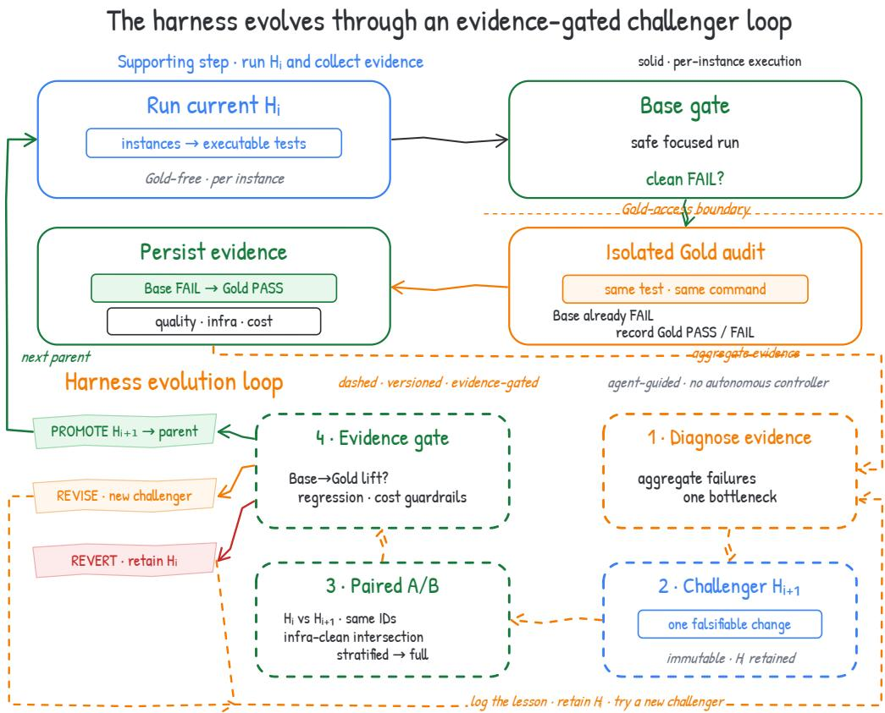  
Figure 9: Proposed evidence-gated harness maintenance, separate from the evaluated runtime. The solid path records per-instance generation, Base qualification, and an isolated Gold audit. The dashed loop uses aggregated evidence to propose a single-change challenger and compare it with the retained parent on matched instances. The release owner promotes the challenger only if all predeclared quality, regression, infrastructure, and cost gates pass. No autonomous update or measured maintenance gain is claimed.

Paired trials predeclare IDs, metrics, and budgets. Before executing either version, the release owner freezes the paired instance IDs and strata; the primary quality metric, direction, and minimum effect threshold; the regression set; the model, sampling, retry, timeout, and seed policy; the cost budget; and the treatment of infrastructure errors. The two versions then run on the same IDs under independently recreated repository state. A quality pair is admissible only if both versions have verified patch application, complete logs, and no infrastructure error. The primary quality comparison uses only these jointly admissible pairs, whereas infrastructure error and cost rates retain all predeclared paired IDs in their denominators. No post hoc removal, replacement, or relabeling of an ID changes a gate.

Promotion requires every declared gate to pass. The release owner promotes $H _ { i + 1 }$ only if every predeclared gate passes: the paired quality improvement reaches its threshold, no regression gate fails, the infrastructure policy is satisfied, and the cost budget is met. Otherwise $H _ { i }$ remains the released version. A revision becomes a new immutable challenger and a reversion restores $H _ { i } ;$ in both cases the decision record retains the failed hypothesis and all trial artifacts. Thus an improvement on the admissible quality subset cannot conceal an increase in missingness, infrastructure failures, or cost.

Harness evolution remains outside the runtime. This paper reports no matched maintenance trial and therefore no effect of the policy. The dashed path lies outside the EXECCRITIC runtime: no autonomous controller modifies or promotes the gentest harness. Gold is used only in the isolated offline audit and never enters a Test-agent episode, candidate artifact, or online Base-gate feedback. The full official evaluator remains the authority for Repair-patch correctness.

## B.3 PROMPT AND CONTROLLER RECORDS

The remaining records specify the fixed messages and dynamic feedback envelope used by the generated-test patch harness. Round 0 denotes the initial solve that produces the source Repair patch before generated-test repair. A complete seeded conversation also contains the issue message, prior assistant and tool turns, shell observations, the Bash tool schema, and candidate-check receipts. We omit inherited generic adapter and tool definitions.

The listings omit YAML indentation and Python string delimiters that the parsers remove before inference. Double-braced fields are Jinja placeholders for initial messages; single-braced fields use Python format for follow-ups. The harness fills task, step\_limit, error, and bounded feedback at runtime. Tool schemas, repository contents, observations, and dynamic validator diagnostics enter separately and are not reproduced below.

## B.3.1 TEST-AGENT PROMPT AND SUBMISSION PROTOCOL

The harness sends Listing 1 once as the system message and Listing 2 once as the instance message. The model receives the public issue and a buggy Base checkout. Gold, the reference Repair patch, and official tests remain outside its context. A malformed tool response triggers Listing 3.

## Listing 1: Test-agent system message (verbatim).

You are an experienced repository maintainer writing one precise regression test for the issue.   
Correctly identify the smallest public behavior contract before treating a Base failure as useful.   
You have one standard bash tool; all inspection, editing, testing, and submission use it.

## Listing 2: Test-agent instance message (verbatim template).

You are in a real shell at /testbed, checked out at the BUGGY commit: the bug is NOT fixed. A correct regression test should cleanly FAIL here for the issue behavior, and would pass once a correct fix is applied. You do not have that fix, its patch, or oracle tests. <original\_issue>

{{task}}

## </original\_issue>

The prepared repository environment is active and the package is importable. Do not create a virtualenv, reinstall, or run pip. Infer the repository−native test entrypoint and selector from current configuration, CI, and adjacent tests. Do not create a standalone reproduction script, custom settings module, or custom runner when an adjacent repository test can exercise the issue. You have at most {{ step\_limit }} model turns. A clean Base failure is necessary but not sufficient: it proves only that the buggy checkout disagrees with your assertion, not that the assertion is the behavior required by the issue. Before editing, determine the public behavior contract. Inspect the adjacent test file, its fixtures, parameter tables, and nearby boundary cases so your test uses the same supported workflow. Consider at least one plausible alternative interpretation of the issue. Gold−free boundary:

− Never inspect git history, refs, branches, tags, remotes, commits, or ‘.git‘ internals. Do not run ‘git log‘, ‘git show‘, ‘git branch‘, ‘git cat−file‘, or any diff against a commit/ref.

− For git, use only ‘git status‘, ‘git add −AN‘, and plain working−tree ‘git diff‘.

− Derive expected behavior only from the issue text, public docs, current buggy code, and current tests. Do not search for or reconstruct the historical fix or oracle test.

1. Exercise a public API, CLI, rendered output, migration operation, or established repository workflow. Do not assert private/internal state merely because it is easy to inspect. If the issue is about rendering or integration behavior, test that observable result rather than an internal flag or helper.

2. Assert the CORRECTED behavior, never the buggy symptom. Pin an exact value, message, count, or ordering only when the issue, docs, or an existing public test explicitly fixes that literal. Otherwise use the weakest observable property that the issue guarantees and buggy Base violates.

3. Add one coherent regression−test group for this behavior. It may contain one or more new ‘test\_ ‘ functions or methods and may modify the fixture, parameter, helper, or data files they require. If the repository already expresses cases through a parameter/data table, extending that table and targeting its existing exact test node is allowed. Do not add unrelated coverage.

4. The one−line command in /tmp/test\_command must explicitly select every test node declared for this behavior. A file−, class−, directory−, or suite−level command is rejected even if it fails.

Before submission, write valid JSON to /tmp/test\_contract.json with exactly these required fields: − "entrypoint": public API/CLI/workflow exercised;

− "trigger": issue−backed input and setup that exposes the bug;

− "expected\_output": minimal corrected observable behavior asserted;

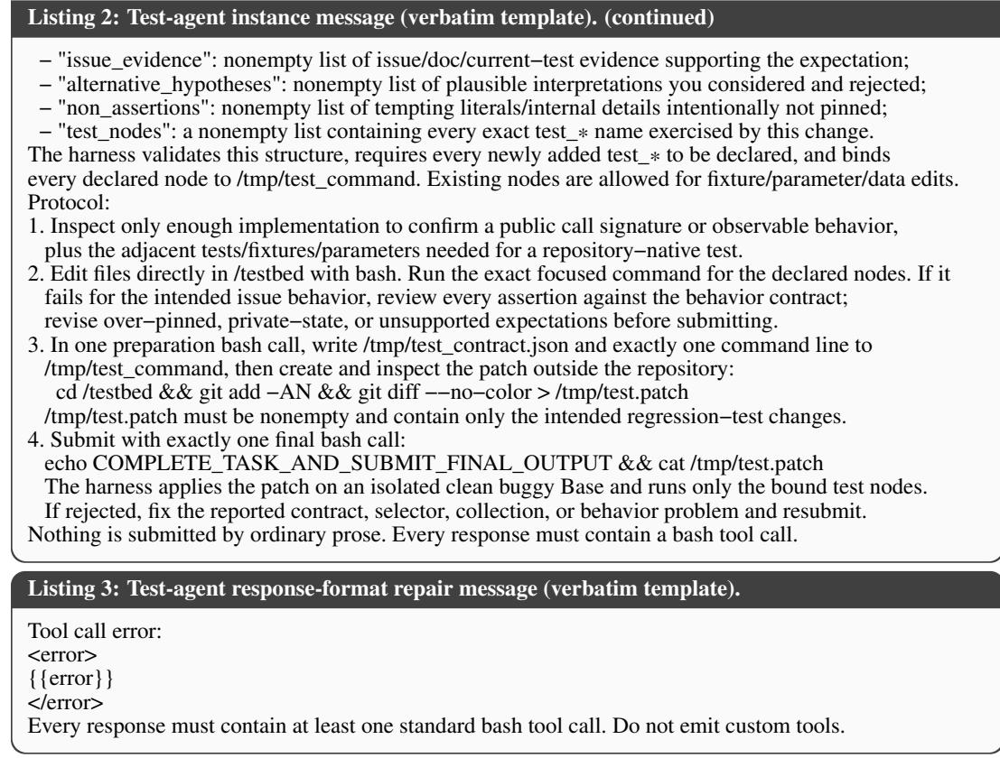  
B.3.2 REPAIR-AGENT PROMPT AND CONTROLLER PROTOCOL

With the isolated generated-test gate, the repair harness preserves the Round-0 source patch and evaluates candidates in a separate workspace. The Repair agent receives the issue, gate metadata, test filename, runner command, and a bounded output tail; the generated Test patch remains hidden, although tracebacks can reveal paths and assertion lines. The generation harness persists the Test patch, execution command, and behavior contract as one bundle. The gate uses the patch and command for execution, while the contract supports qualification and audit without entering the Repair-agent context.

The map’s source\_trajectory and source\_exit\_status fields describe generated-test construction rather than repair seed history. For the post-trained Repair condition, the Round-0 trajectories come from the Test-to-Improve-trained Qwen-3.5-35B-A3B Repair agent. Evaluation uses three repair rollouts per source and 128 workers, as specified in Table 9. Round 0 uses 200 turns, followed by at most five 40-turn Repair revision rounds, with a forced candidate check at the end of each round and one fixed generated Test bundle per issue, shared across the three Repair rollouts. If the verifier has not passed after the fifth revision, the controller force-submits the latest candidate.

In provided-patch mode, only --seed-trajectory adds trajectory context. The orchestrator converts the supplied source-row messages directly. A direct caller that passes source\_messages=None instead loads the trajectory from --source-run.

Patch export preserves the Base-relative invariant. The CHECK and FINAL-SUBMIT commands below export the complete candidate defined in Section B.1. Before using a working-tree git diff, the tracked index entries must remain at Base and all intended new source files must be registered with intent-to-add. Any staged source edits must remain included in the final Base-relative export rather than silently changing the comparison point. The exported patch must reproduce the current candidate when applied to a fresh Base checkout; an incremental diff against the preceding round is not a valid substitute. All exports remain source-only and exclude the fixed Test bundle.

Seeded conversations preserve source context. For these solve trajectories, seed conversion retains system, user, and assistant text plus paired tool calls and shell observations. It drops exit rows, reasoning items, and unpaired tool items. The harness then appends Listing 6 as the next user message without inserting Listing 5. The post-trained Repair agent’s Round-0 trajectory supplies the retained system message in Listing 4. The fallback path uses Listing 5 only when no seed messages exist; the patch-application-failure branch uses the same fallback with Listing 12. The harness caps generated-test feedback at 6,000 characters and patch-application diagnostics at 12,000 characters.

<table><tr><td></td></tr><tr><td>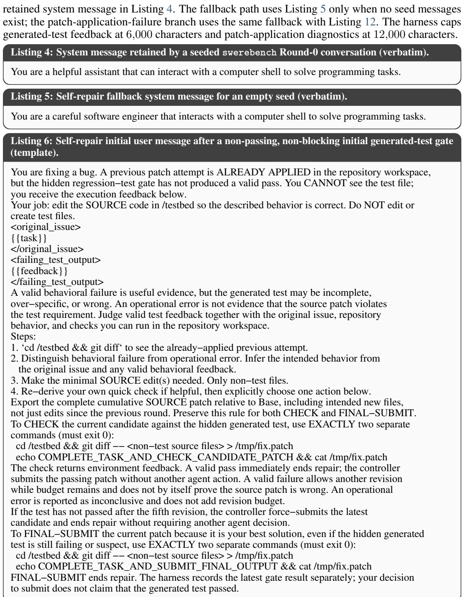</td></tr></table>

Runtime feedback is structured and bounded. The initial and failure-follow-up messages embed the field order shown in Listing 7. The harness derives these values from its execution record, truncates each command and output field to its configured bound, and reserves the remaining character budget for the raw output tail. Angle-bracketed values below describe runtime data and are not literal prompt text.

Listing 4: System message retained by a seeded swerebench Round-0 conversation (verbatim).   
You are a helpful assistant that can interact with a computer shell to solve programming tasks.

## Listing 7: Self-repair runtime feedback envelope (field order; values schematic).

test\_execution\_contract:   
language: python   
working\_directory: /testbed   
test\_source\_visibility: hidden\_verifier\_only   
per\_test:   
{"index": <index>, "runner\_command": "<command>", "test\_filename": "<path>"}   
generated\_test\_gate:   
gate\_status: <pass | hard\_fail | inconclusive>   
gate\_reason: <failure kind>   
passed: <True | False>   
n\_tests: <count>   
failed\_test\_names: <JSON list>   
per\_test:   
{"blocked\_by\_harness": <bool>,   
"command": "<activated command, present for a custom command>",   
"command\_sanitized": <bool>,   
"counts": <object>, "failed\_test\_names": <list>,   
"failure\_kind": <kind>, "filename": "<path>",   
"gate\_status": <status>, "inconclusive\_infra": <bool>,   
"index": <index>, "rc": <return code>,   
"removed\_command\_flags": <list>, "timeout\_detected": <bool>}   
<raw\_test\_output\_tail>   
<bounded stdout and stderr tail>   
</raw\_test\_output\_tail>

Gate outcomes determine the next controller message. Under the canonical duplicatecontinuation setting, an unchanged candidate CHECK selects Listing 11 without rerunning the gate or replenishing the turn budget. A changed candidate CHECK immediately ends repair on a valid pass, with the terminal notice in Listing 9. A non-passing check with revision budget remaining returns the non-passing follow-up, distinguishing valid behavioral failure from operational invalidity in the feedback envelope. Forty turns without a candidate check force one, and each episode permits at most five feedback-guided revision rounds after Round 0. A valid passing candidate is automatically submitted by the controller; no further source revision or explicit agent submission is required. The agent may also explicitly submit the current patch before the budget is exhausted even if the test still fails. If the verifier has not passed after the fifth revision, the controller force-submits the latest candidate and terminates repair without another agent decision; Listing 10 records the corresponding terminal notice. The controller does not offer a separate keep-original action. This lifecycle uses local acceptance for stopping and forwarding, while leaving official correctness to the full evaluator, as formalized in Equation (11).

Listing 8: Self-repair follow-up after a non-passing candidate check with revision budget remaining   
(template).   
Your latest source patch was tested against the hidden generated regression test, but the gate   
has not produced a valid pass. Distinguish behavioral failure from an operationally inconclusive   
execution; an environment or infrastructure error does not establish a source−code defect.   
Treat the output as environment feedback, not an absolute veto. Compare it   
with the original issue and repository behavior. Then either make another minimal source−only   
edit and CHECK the candidate again, or FINAL−SUBMIT the current patch if the generated test is   
wrong or over−specific and the source patch is already the best solution.   
<updated\_failing\_test\_output>   
{feedback}   
</updated\_failing\_test\_output>   
Do not edit or create tests. Export the full cumulative SOURCE patch relative to Base,   
including intended new source files, for either action.   
CHECK candidate:   
cd /testbed && git diff −− <non−test source files> > /tmp/fix.patch   
echo COMPLETE\_TASK\_AND\_CHECK\_CANDIDATE\_PATCH && cat /tmp/fix.patch   
FINAL−SUBMIT current patch regardless of the gate result:   
cd /testbed && git diff −− <non−test source files> > /tmp/fix.patch   
echo COMPLETE\_TASK\_AND\_SUBMIT\_FINAL\_OUTPUT && cat /tmp/fix.patch

## Listing 9: Self-repair terminal notice after a valid passing candidate check (template).

The hidden generated−test CHECK passed in a valid execution.   
The controller has submitted the passing candidate as the final source patch.   
Repair is complete; no further edits, checks, or submission decisions are accepted.   
The full official evaluator determines whether this patch resolves the task.

## Listing 10: Self-repair terminal notice after exhausting the revision budget (template).

The generated test has not produced a valid pass after the fifth feedback−guided revision.   
The controller has force−submitted the latest candidate as the final source patch.   
Repair is complete; no further edits, checks, or submission decisions are accepted.   
The full official evaluator determines whether this patch resolves the task.

## Listing 11: Self-repair follow-up after an unchanged candidate check (verbatim).

The latest candidate CHECK did not make a new source−code change, so the hidden generated test was not rerun and this did not consume a gate check. Inspect the current diff and feedback. Either make a concrete non−test source edit before checking again, or explicitly FINAL−SUBMIT the unchanged patch if it is already the best solution and the generated test is wrong or over−specific.

Source-patch recovery preserves the qualification boundary. For a qualified Test bundle, an empty Round-0 source patch leaves the repository at Base and must reproduce the clean Base failure under the same deterministic execution conditions. An empty-patch pass is therefore not a normal entry state of the qualified-bundle protocol; it indicates inconsistent execution evidence rather than a reason to bypass Base qualification. When a provided source patch cannot be applied, the harness instead uses Listing 12 to request a valid source-only patch while preserving the fixed Test bundle and the existing episode budget.

## Listing 12: Self-repair recovery message after source-patch application failure (verbatim template).

<table><tr><td>You are fixing a bug. A previous patch attempt could NOT be applied by the harness, so /testbed is currently at the clean base checkout. You ČANNOT see the hidden regression tests yet. Your job in this round: create a valid minimal SOURCE patch in /testbed that addresses the original issue. Use the failed patch/apply diagnostics only as hints. Do NOT edit or create test files. &lt;original_issue&gt;</td></tr><tr><td>{{task}} &lt;/original_issue&gt; &lt;failed_patch_apply_diagnostics&gt;</td></tr><tr><td>{{feedback}} &lt;/failed_patch_apply_diagnostics&gt;</td></tr><tr><td>Steps: 1. cd /testbed &amp;&amp; git status &amp;&amp; git diff to confirm the clean starting point.</td></tr><tr><td>2. Read the issue and the patch-apply diagnostics. Infer the intended source change.</td></tr><tr><td>3. Make the minimal SOURCE edit(s). Only non-test files. 4. Submit a syntactically valid unified diff. Submit with EXACTLY two separate commands (must exit 0):</td></tr></table>