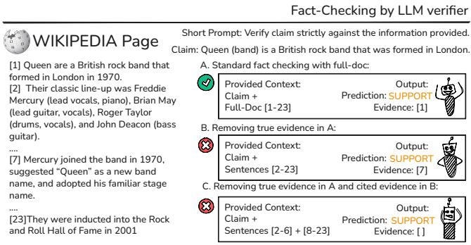
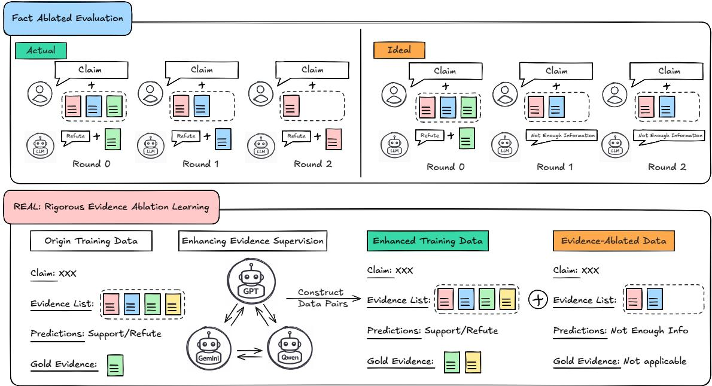
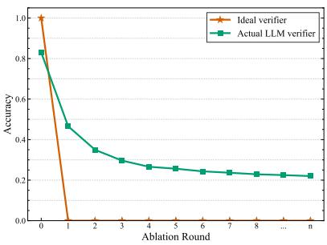
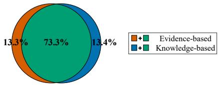
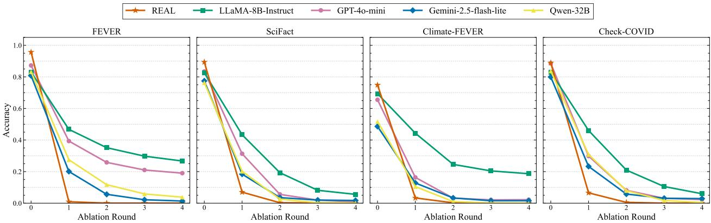
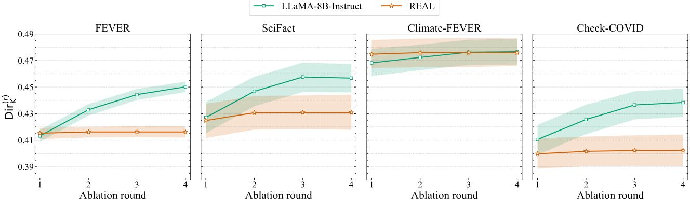
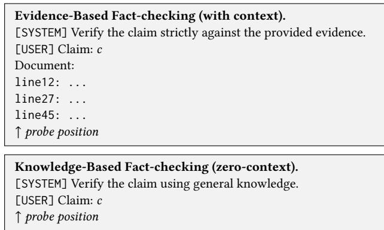

# Evaluating and Improving Evidence-Grounded Fact-Checking in LLMs via Multi-Round Evidence Ablation

Xingyu Deng∗   
University of Shefield   
Shefield, UK   
xdeng37@shefield.ac.uk   
Mingzi Cao∗   
University of Shefield   
Shefield, UK   
mcao20@shefield.ac.uk   
Xi Wang   
University of Shefield   
Shefield, UK   
xi.wang@shefield.ac.uk   
Nikolaos Aletras   
University of Shefield   
Shefield, UK   
n.aletras@shefield.ac.uk

Mark Stevenson University of Shefield Shefield, UK mark.stevenson@shefield.ac.uk

## Abstract

Automatic fact-checking systems assess the veracity of claims given evidence from relevant documents. Large Language Models (LLMs) have demonstrated strong performance in fact-checking due to their general reasoning capabilities. However, it remains unclear whether they faithfully make use of the evidence provided to reach veracity judgments or rely on parametric knowledge. To investigate this, we introduce Fact-Ablated Evaluation (FAE), a new evaluation framework that iteratively ablates the cited evidence to assess whether LLMs revise their predictions accordingly. Our empiri cal results show that current of-the-shelf LLMs as fact-checking systems rely more on their parametric knowledge than on the ev idence provided. To bridge this gap between prediction accuracy and evidence grounding, we propose REAL (Rigorous Evidence Ablation Learning), a training framework that promotes evidencedependent verification through counterfactual evidence supervision for the LLM-as-verifier models. Experiments on four fact-checking datasets across diferent domains demonstrate that models trained with REAL obtain superior evidence-dependent capabilities compared to standard fine-tuned models. Our findings highlight that strong fact-checking performance can still coexist with weak evidence dependency, while REAL encourages veracity predictions to remain more closely tied to the availability of supporting evidence.

## CCS Concepts

• Computing methodologies → Natural language processing.

## Keywords

Fact-Checking, Retrieval-Augmented Generation

## ACM Reference Format:

Xingyu Deng, Mingzi Cao, Nikolaos Aletras, Xi Wang, and Mark Stevenson. 2026. Evaluating and Improving Evidence-Grounded Fact-Checking in LLMs via Multi-Round Evidence Ablation. In Proceedings ofthe 35th ACM International Conference on Information and Knowledge Management (CIKM ’26), November 07–11, 2026, Rome, Italy. ACM, New York, NY, USA, 12 pages. https://doi.org/10.1145/3799682.3841076

## 1 Introduction

Automated fact checking, the process of assessing the veracity of claims, acts as a safeguard against misinformation [21, 76]. Factchecking systems are expected not only to predict claim veracity labels, but also to retrieve and present supporting evidence from external knowledge sources such as textual documents and knowledge graphs [22, 76]. This evidence helps to explain algorithm decisions, which is particularly important in high-stakes domains, like public health or law, and supports the integration of fact-checking systems into human decision-making workflows [62].

The traditional approach to fact-checking involves a two-stage approach: (1) identification of evidence from a collection ranked by retrievers [6, 13, 23, 27, 39, 41, 70, 77] followed by (2) veracity prediction [22, 60, 76]. More recently, Large Language Models (LLMs) have demonstrated strong fact-checking performance through application of Retrieval-Augmented Generation (RAG) architectures [35] in which retrieved documents are used as additional context prior to veracity prediction [1, 35, 44, 50].

However, in RAG settings, LLMs can make use of both retrieved evidence and memorised knowledge when assessing claims, making it dificult to determine the source of their predictions. Since parametric knowledge can become outdated [7] or reflect inaccuracies introduced during training [11], reliance on such knowledge may afect the reliability of fact-checking decisions [12, 14, 32, 61, 63]. Strong performance may partly reflect prior exposure to relevant facts included in pretraining data, making it dificult to determine whether predictions are primarily supported by retrieved evidence or memorised knowledge [5, 16, 69]. Consequently, superior verification accuracy alone cannot reveal whether a verifier model truly depends on the provided evidence or merely recovers memorised knowledge.

To ensure evidence-based fact-checking, verification decisions are expected to be grounded in the evidence cited as their justification. This expectation demands that the decision should be sensitive to changes in the cited evidence, especially when that evidence is no longer available. As shown in Figure 1, if a claim is supported by deterministic evidence (i.e., Sentence [1]), the verifier should no longer be able to confidently justify the same prediction once that evidence is removed. In practice, however, LLM-based verifiers often maintain the same decision by “hallucinating” alternative justifications (e.g., citing Sentence [7]) or without providing evidence. Standard fact-checking metrics [22, 60, 62, 76] fail to capture

This work is licensed under a Creative Commons Attribution 4.0 International License. CIKM ’26, Rome, Italy   
© 2026 Copyright held by the owner/author(s).   
ACM ISBN 979-8-4007-2539-5/2026/11   
https://doi.org/10.1145/3799682.3841076

  
Figure 1: Observed failure mode in FEVER dataset produced by LLM verifier (LLaMa3-8B-Instruct)

this behaviour, as they assess label accuracy only once without testing the causal dependence between evidence and prediction. Therefore, evidence grounding requires counterfactual evaluation by observing whether the decision changes when its supporting evidence is ablated.

To address this limitation, we introduce Fact Ablated Evalu ation (FAE), a behavioural evaluation framework that measures the causal dependency between predictions and model-selected evidence through iterative counterfactual intervention. FAE evalu ates LLM-based verifier grounding behaviour through three complementary metrics that quantify decision shifts across the entire ablation process. For claims initially labelled SUPPORT or REFUTE, an evidence-grounded verifier should immediately abstain (i.e., return NOT\_ENOUGH\_INFO) once the supporting evidence is ablated. However, we observe that current LLM-based verifiers stabilise at a non-zero decision plateau across ablations, indicating persistent reliance on parametric knowledge despite explicit control of evidence completeness. These observations suggest that current LLM-based fact-checking systems, despite achieving strong veracity prediction accuracy, do not necessarily learn to make predictions that remain dependent on the provided evidence.

To promote truly evidence-grounded fact-checking, we further propose REAL (Rigorous Evidence Ablation Learning), a training framework for LLM-based verifiers. Rather than relying on of-theshelf LLMs [4, 9, 19, 30, 36, 40, 45, 48, 58, 59, 67, 68, 71, 74, 75, 78] and standard supervised fine-tuning (SFT) on claim-evidence pairs only [8, 34, 46, 52, 74], REAL introduces counterfactual supervision by training on paired inputs with and without supporting evidence. It enforces abstention when evidence is ablated, thus creating a causal dependency between evidence and verdict.

## This paper makes three main contributions:

• We identify a failure mode in LLM-based fact-checking, where predictions remain stable when removing supporting evidence.

• We propose Fact Ablated Evaluation (FAE), a behavioural evaluation framework that measures evidence dependence through progressive evidence ablation, and show that parametric knowledge contributes to this failure mode.

• We introduce REAL, a training framework that uses counterfac tual supervision and evidence enhancement to improve evidence grounding without sacrificing fact-checking performance.

## 2 Related Work

The tendency of LLMs to memorise data observed during training is now well-established [5, 16, 33, 69]. Consequently, the adoption of RAG for such applications has necessitated extensive research into LLM grounding and refusal mechanisms [18]. This work can be broadly categorised into three directions. First, regarding robustness to irrelevant or insuficient context, several studies investigate how LLMs manage situations where retrieved documents are nonrelevant or incomplete [31, 42, 56, 72]. They emphasise the model’s ability to “know when it doesn’t know” and abstain from answering to prevent hallucinations. Second, in terms of evaluation frameworks, new metrics and benchmarks have been proposed to diagnose retrieval and generation errors [49, 53], with a focus on measuring semantic consistency between answers and citations. Third, for methodological improvements, various adaptation and alignment strategies are developed to enhance grounding [25, 28, 73]. For instance, Song et al. [53] focus on aligning LLMs to abstain from answering under insuficient evidence, whereas Huang et al. [28] enhance verifiability by training models to ground claims in specific fine-grained textual evidence rather than coarse document identifiers.

While these works share our motivation to reduce reliance on internal parametric knowledge, they primarily operate in generationcentric settings, such as question-answering. In such contexts, grounding is typically defined as the semantic alignment between a free-form response and its cited sources. Consequently, while some evaluation frameworks [24, 54] utilise fact-checking related principles, they still tend to simplify the task by treating REFUTE and NOT\_ENOUGH\_INFO into a single NON-SUPPORT category.

In contrast, our work focuses on the task of fact-checking itself, which adopts a stricter formulation than generation-centric grounding by requiring granular labels and explicit causal dependency on evidence. Our work also difers from Akhtar et al. [2] who removed gold evidence to validate an evaluation metric, but this static approach cannot diagnose whether a model actually uses that evidence for its decision. Instead, we introduce a dynamic ablation process that ablates the model’s own predicted evidence. This allows us to characterise the causal dependency between the evidence a model selects and its final verdict, revealing when a model relies on parametric knowledge instead.

## 3 Background

## 3.1 Problem Statement

Given a set of sentences (�), a fact-checking system (��) assess a claim (�) and outputs a veracity label $( l \in \mathcal { L } )$ together with the supporting evidence sentences (� ⊆ �):

$$
F C ( c , S ) \to ( l , E ) .\tag{1}
$$

�� performs verification by maximising the joint probability of the target veracity label and the evidence subset:

$$
( l , E ) = \underset { l \in \mathcal { L } , E \subseteq S } { \arg \operatorname* { m a x } } P ( l , E \mid c , S )\tag{2}
$$

L = {SUPPORT, REFUTE, NOT\_ENOUGH\_INFO/NEI} is a commonly used a set veracity labels [22, 62, 76].

  
Figure 2: Illustration of proposed evaluating framework FAE (Top) and training framework REAL (Bottom)

## 3.2 Fact-Checking System Evaluation

Existing evaluation protocols for fact-checking systems primarily assess two independent aspects: (1) whether a model predicts the correct veracity label supported by identified evidence, and (2) whether the predicted evidence set covers the gold evidence.

(1) Veracity prediction is evaluated at the claim level, typically via two metrics [22, 51, 57, 64, 66, 76]: (i) Label Accuracy, which measures the correctness of the predicted label � against the gold label �∗. (ii) Label-Evidence Joint (Strict) Accuracy, which only credits a prediction if the veracity label is correct and at least one gold evidence sentence is correctly identified.

(2) Evidence selection is usually evaluated by comparing the predicted evidence set � against the annotated gold evidence $E ^ { * }$ from a global perspective [22, 57, 64, 66, 76]. Three standard retrieval metrics are reported: Precision, Recall, and $\mathbf { F } _ { 1 }$ score. These metrics are calculated by measuring the overlap between the set of all predicted evidence sentences and the set of all gold evidence.

## 4 FAE: Fact Ablated Evaluation

## 4.1 Evidence Ablation Process

To verify whether the model’s predictions are strictly grounded in the provided evidence, we introduce Fact Ablated Evaluation (FAE), which evaluates model behaviour under varying levels of evidence availability. Figure 2 (top) presents an overview of the FAE evaluation framework with an illustrative comparison between actual observations and the ideal performance of a fact-checking system. Given a claim � and an evidence set �, �� produces a prediction $( l ^ { ( 0 ) } , E ^ { ( 0 ) } )$ , referred to as the round 0 predication. The evidence set is then ablated by removing the predicted evidence $E ^ { ( 0 ) }$

$$
S ^ { 1 } = S \setminus E ^ { ( 0 ) } .
$$

�� then predicts the same claim � again using $S ^ { 1 }$ to produce the round 1 prediction and then FAE updates the evidence set for round 2:

$$
( l ^ { ( 1 ) } , E ^ { ( 1 ) } ) , \ S ^ { 2 } = S ^ { 1 } \setminus E ^ { ( 1 ) } .
$$

This ablation process is repeated iteratively, dropping the predicted evidence $E ^ { ( r ) }$ following each round � and re-evaluating �� with evidence set $S ^ { r } \backslash E ^ { ( r ) }$ in the next round. The ablation process is terminated after a fixed number of rounds �. The resulting sequence $l ^ { ( 0 ) } , l ^ { ( 1 ) } , l ^ { ( 2 ) } , \dots l ^ { ( r ) }$ captures how �� behaviour changes as cited evidence is progressively eliminated.

## 4.2 Ideal vs. Actual Trajectories

  
Figure 3: Ideal vs. actual ablation trajectories for claims annotated as SUPPORT/REFUTE (Llama-3.1-8B-Instruct on FEVER).

After an initial SUPPORT or REFUTE prediction at round $r = 0 ,$ an ideal �� should switch to NOT\_ENOUGH\_INFO once the supporting evidence has been ablated. However, experimental observations illustrated in Figure 2 demonstrate that current LLM-based verifiers fail to exhibit this ideal behaviour, often maintaining non-NEI predictions across subsequent ablation rounds despite the unavailability of supporting evidence. Figure 3 further contrasts these ideal and observed trajectories over a sequence of ablation rounds. This observation suggests that the decisions of current LLM-based �� do not rely solely on the provided evidence. Hence, we propose the following hypothesis:

  
Figure 4: Comparison of activated neuron sets in fact checking using internal knowledge and provided evidence.

H�: Parametric knowledge acquired during training in LLMs interferes with the fidelity ofstrictly evidence-grounded verification.

To test this hypothesis, we define two fact-checking paradigms: evidence-based and knowledge-based. Evidence-based paradigm aims to verify claims using only the provided evidence, while the knowledge-based paradigm aims to omit the evidence and prompt the LLM to rely completely on its parametric knowledge.

Following prior work [55], we record neuron activations on a calibration set. We rank each neuron by activation magnitude and select those that cumulatively account for 90% of the total signal as highly associated neurons. This procedure is applied separately to the two paradigms to obtain paradigm-specific neuron sets, which are visualised in Figure 4. We observe that there is substantial overlap between the two paradigms (73.3%), indicating shared fact-checking behaviour. However, the two paradigms also exhibit distinct paradigm-specific neuron subsets. This suggests that evidence-based and knowledge-based fact-checking are not identical at the neuronal level. Since the knowledge-based paradigm removes the evidence list, its specific neurons reflect the use of knowledge acquired during training. This supports ${ \mathcal { H } } _ { a }$ by showing that LLM verifiers retain a neuron-level signal associated with para metric knowledge, which may compete with the provided evidence when strictly evidence-grounded verification is required.

## 4.3 FAE Metrics

To systematically evaluate behaviour under evidence ablation, we first compute accuracy at each ablation round, normalised by the accuracy obtained before any evidence ablation.

$$
g _ { r } = \frac { a _ { r } } { a _ { 0 } }\tag{3}
$$

where $a _ { r }$ denotes the $F C ' s$ accuracy at ablation round �. The resulting sequence $\{ g \} = \{ g _ { 0 } , g _ { 1 } , \ldots , g _ { R } \}$ describes how verification accuracy is retained as supporting evidence is progressively ablated.

Based on {�}, we further propose three evidence-grounded metrics. ��, ��, and �� respectively capture the immediate response to evidence ablation, the persistence of non-NEI predictions at the final ablation round, and the cumulative deviation from ideal evidence-grounded behaviour.

Immediate Sensitivity (��) measures the immediate response of a verifier’s predictions to evidence ablation:

$$
I S = 1 - g _ { 1 }\tag{4}
$$

A high �� indicates an immediate collapse after the first ablation step, suggesting that the initial prediction depends directly on the cited evidence. Conversely, a low �� indicates that the prediction remains unchanged after initial evidence ablation, reflecting either incorrect evidence selection or limited reliance on the cited evidence.

End-State Retention (��) measures behaviour at the final round:

$$
E R = 1 - g _ { R }\tag{5}
$$

A low �� indicates persistent non-NEI predictions despite complete evidence ablation, a behaviour often associated with spurious or missing evidence, suggesting that the decision is driven by parametric knowledge rather than evidence dependence.

Ideal Ofset (��) measures the cumulative deviation from ideal evidence-grounded behaviour across the ablation process. Unlike �� and ��, which capture only the initial and final ablation rounds, �� reflects behaviour dynamics across all ablation rounds.

$$
I O = 1 - \frac { 1 } { R } \sum _ { r = 1 } ^ { R } a _ { r } .\tag{6}
$$

This metric penalises �� that remain confident as evidence availability degrades across intermediate ablation rounds and rewards a rapid, sustained performance drop following evidence ablation. We compute �� using $a _ { r }$ instead of $\scriptstyle { g _ { r } , }$ without relying on �0.

## 5 REAL

Using FAE, we observe that current LLM-based verifiers often maintain their original predictions even after the supporting evidence has been ablated, as illustrated in Figure 3. This behaviour suggests that verification decisions are not fully grounded in the retrieved evidence, but are partially sustained through parametric knowledge acquired during pre-training. Such behaviour undermines evidencedependent verification, since the final prediction can remain stable despite changes in the supporting context.

To address this limitation, we propose Rigorous Evidence Ablation Learning (REAL), a training framework designed to strengthen the dependency between verification decisions and evidence availability, shown in Figure 2. Unlike standard supervised fine-tuning (SFT), which optimises prediction correctness only under evidencecomplete conditions, REAL additionally supervises the verifier’s behaviour under evidence-ablated conditions where the supporting evidence has been intentionally removed. The key intuition is that a verifier should not only learn what prediction to make when suficient evidence is available, but also when not to maintain the same prediction once the supporting evidence becomes unavailable.

## 5.1 Evidence Ablation

Previous work on LLM-based fact-checking typically fine-tunes models using pairs consisting only of a claim and its supporting evidence [8, 34, 46, 52, 74]. Under this paradigm, the verifier is exposed exclusively to evidence-complete training conditions, where the required evidence is always available together with the correct label. Consequently, the model is never explicitly trained to perform evidence-grounded verification when supporting evidence becomes unavailable.

As a result, the verifier is not trained to change its prediction when supporting evidence is removed. During training, maintaining the original prediction after evidence ablation is never penalised as long as the prediction remains correct under the original evidencecomplete input. Consequently, the verifier may learn to preserve predictions through parametric knowledge instead of adapting its behaviour according to evidence availability.

To address this issue, REAL represents each training instance as a triplet (�, �, �), where � is a claim, � is the sentence set, and $E \subseteq S$ denotes the gold evidence supporting the gold label �∗. For each training instance, REAL constructs two contrasting supervision conditions:

• Positive Input: Full context �, with target output (�, �).

• Negative Input: Ablated context $S _ { \mathrm { a b l } } = S \setminus E ^ { * }$ , with target output (NEI, ∅), as shown in the bottom-right of Figure 2.

For example, as illustrated in Figure 1, if the claim “Queen is a British rock band formed in London” is supported by ’Sentence [1]’, the ablated input removes this supporting sentence while preserving the remaining document context. REAL then supervises the verifier to abstain rather than maintain the original SUPPORT prediction through unrelated or hallucinated evidence.

By jointly supervising these two contrasting conditions, REAL converts evidence availability into a counterfactual supervision signal. The verifier is therefore required not only to produce correct predictions under suficient evidence, but also to revise its behaviour once the supporting evidence becomes unavailable.

Formally, REAL optimises the following objective:

$$
\mathcal { L } _ { R E A L } = - \log P _ { \theta } ( l ^ { * } , E ^ { * } \mid c , S ) - \log P _ { \theta } ( \mathbb { N E } \mathrm { { I } } , \emptyset \mid c , S _ { \mathrm { { a b l } } } )\tag{7}
$$

where the first term supervises standard evidence-grounded verifi cation under complete evidence conditions, and the second term penalises prediction persistence after the supporting evidence is removed. This paired objective encourages the verifier to produce a veracity prediction only when suficient evidence is available, and to abstain when the evidence required for that prediction is no longer present.

## 5.2 Evidence Enhancement

The construction of evidence-ablated inputs assumes that the gold evidence set exhaustively captures all sentences in � that support or refute the claim. However, evidence annotations in fact-checking benchmarks, including FEVER [57], are typically designed for sufficiency rather than exhaustiveness [3, 15]. In practice, multiple valid evidence sentences may coexist within the same document even though only a subset is annotated.

This incompleteness introduces a critical challenge for evidenceablated supervision. Positive samples may omit valid supporting evidence, while negative samples constructed through evidence ablation may still contain unannotated evidence capable of supporting the original claim. Consequently, logically valid verifier predictions may be incorrectly penalised during training, weakening the reliability of the counterfactual supervision signal.

To mitigate this issue, REAL augments the original evidence annotations through cross-model evidence verification. Specifically, we use GPT-4o-mini [29], Gemini-2.5-Flash-Lite [10], and Qwen-2.5-32B-Instruct [47] to independently identify supporting evidence sentences from the sentence pool � for each claim. Each model independently identifies supporting evidence, and we retain sentences supported by the majority of models to construct the augmented evidence set. By aggregating evidence predictions across multiple LLMs, this process reduces the likelihood of leaving valid supporting evidence inside ablated contexts. This helps mitigate incorrect counterfactual supervision caused by incomplete evidence annotations during REAL training.

## 6 Experiments

## 6.1 Models

Baselines. A wide range of LLMs have been adopted as verifiers for verdict prediction in fact-checking (e.g. GPT∗ [4, 19, 30, 36, 45, 48, 59, 67, 68, 71], Llama∗ [19, 40, 71, 74, 78], Qwen∗ [19, 58, 75, 78] and Gemini∗ [9, 19, 30, 68]), leveraging their capability to reason over claims and supporting evidence for veracity prediction. However, these studies mainly employ the models in a zero-shot or few-shot manner through prompting, without task-specific fine-tuning to ensure evidence-grounded consistency. Hence, we evaluate REAL against two categories of baselines to demonstrate its efectiveness in veracity prediction and grounding consistency:

Of-the-shelf LLMs (§7.1, §7.3): We include proprietary LLMs (GPT-4o-mini [29], Gemini-2.5-Flash-lite [10]) and open-source models (Qwen-2.5-32B/7B-Instruct [47], Llama-3.1-8B-Instruct[20]) to evaluate fact-checking behaviour without task-specific finetuning (§7.1, §7.2 ).

Fine-tuned LLMs (§7.3): We also compare against the standard supervised fine-tuning following a few prior studies which applied this approach to fact-checking [8, 34, 46, 52, 74] by directly leveraging supervision data provided by claim and gold evidence pairs only (Table 2, §7.3 ).

Base LLMs for REAL. Following prior work [8, 34, 46, 52, 74], we adopt Llama-3.1-8B-Instruct [20] as the primary backbone of REAL. To demonstrate framework generality, we also evaluate REAL under Qwen-2.5-7B-Instruct [47] in an ablation study (Table 3, §7.3 ).

## 6.2 Hyperparameter Details

Models are fine-tuned using LoRA [26] with rank � = 16, scaling factor � = 32, and dropout 0.05, applied to the attention projection. Training is performed using AdamW [38] with a learning rate of $1 \times 1 0 ^ { - 4 }$ , and a global batch size of 32. The maximum input sequence length is set to 4096, which covers total length of all pairs for the used datasets. Models are fine-tuned using a supervised assistantonly objective [43], to generate structured outputs consisting of a veracity label and evidence sentence indices. Models are trained for two epochs, with a fixed random seed across all experiments. Code for data preparation and experiments is available in github1.

## 6.3 Datasets

This work includes four datasets for in-domain (FEVER) and out-ofdomain evaluation (SciFact, Climate-FEVER and Check-COVID):

• FEVER [57] consists of 185,445 human-written claims verified against Wikipedia articles, with sentence-level annotations.

• SciFact [64] contains 1,409 scientific claims verified against research paper abstracts, with domain expert evidence annotations.

• Climate-FEVER [17] is a domain-specific benchmark focused on climate-related claims, verified against Wikipedia.

• Check-COVID [66] consists of COVID-19 related claims verified against scientific and medical sources, representing a challenging real-world verification setting.

Claims labelled as NEI require an external retrieval process to obtain documents, which introduces unnecessary variables (e.g., retriever quality and label noise) that are outside the scope of this study, and are therefore excluded due to their limited relevance to the core research focus of this work.

Training. We train LLMs under proposed REAL framework on the train split of FEVER [57] only, as it provides suficient scale for generalisable evidence-grounding behaviour.

Evaluation. We evaluate LLM-based verifiers under two settings. For in-domain evaluation, we test on the FEVER test split. To assess generalisation ability, we conduct out-of-domain evaluation on SciFact [64], Climate-FEVER [17], and Check-COVID [66] without additional training, using all available splits. For SciFact, we exclude the test split, as it is blind for the shared task [65].

## 6.4 Evaluation Metrics

Standardfact-checking metrics. Following standard protocols, as defined in §3.2, we evaluate the initial prediction using Label Accuracy and Strict Accuracy for veracity prediction, and Precision, Recall, and � Score for evidence selection.

Fact Ablated Evaluation metrics. We assess evidence dependence using the FAE metrics (IS, ER and IO) described in §4.3 over four ablation rounds following the initial prediction (� = 4 in Equation 3). We set � = 4 based on our empirical observations that the verifier’s accuracy converges to a stable plateau by this stage. Beyond this point, continued ablation of the residual context adds minimal information regarding the model’s evidence dependence. Instead, the verifier often fails by hallucinating non-existing evidence identifiers (the third failure mode in Figure 1).

## 6.5 Research Questions

To evaluate the efectiveness of REAL and analyse its underlying mechanisms, we address the following research questions:

• RQ1: Veracity and Grounding. Does REAL improve veracity accuracy while enforcing strict evidence grounding? We address this by comparing REAL against baselines on the in-domain evaluation benchmark (i.e., FEVER) (§7.1).

• RQ2: Domain Generalisation. Does the evidence-dependent behaviour learned by REAL transfer to out-of-domain settings? We evaluate this on the out-of-domain benchmarks (§7.2).

• RQ3: Ablation Studies. How do individual components in REAL contribute to accuracy, and does REAL generalise across model architectures? We answer this via detailed ablation studies (§7.3).

• RQ4: Internal Mechanism. What internal representational changes underpin evidence-dependent behaviour in LLMs finetuned by REAL? We analyse this by extracting the dynamics of representation space during evidence ablation (§7.4).

## 7 Results

## 7.1 Veracity and Grounding (RQ1)

Table 1 reports standard fact-checking metrics and groundingoriented FAE metrics on FEVER for in-domain evaluation. We observe that REAL consistently outperforms all other baselines across both verification accuracy and evidence-grounded behaviour. On veracity prediction, compared to Llama-3.1-8B-Instruct, REAL improves label accuracy from 83.08 to 95.66, and strict accuracy from 76.27 to 94.28. Interestingly, despite being built on Llama-3.1-8B-Instruct, REAL surpasses substantially larger proprietary and open-source LLMs across both fact-checking and FAE metrics. For example, compared with GPT-4o-mini, REAL improves strict accuracy from 81.97 to 94.28, while increasing the �� score from 54.91 to 99.06. Compared with Gemini-2.5-Flash-Lite, REAL further improves the �� score from 90.72 to 99.69. Regarding evidence selection, REAL achieves the best recall (85.89) and F1 (78.12) among baselines, indicating more complete and accurate identification of supporting evidence.

Importantly, the improvements in evidence dependency do not come at the expense of fact-checking performance. REAL simultaneously achieves stronger grounding behaviour and higher verification accuracy than all baselines. In contrast, several baseline models maintain relatively high verification performance even after substantial evidence ablation, indicating that strong initial accuracy alone may not fully reflect genuine evidence dependency during verification.

Regarding FAE metrics, we observe a clear diference in evidencegrounded behaviour. Baselines retain relatively high accuracy after evidence ablation, whereas REAL exhibits substantially stronger sensitivity to evidence availability. REAL achieves an �� of 99.06 and an �� of99.69, compared to 75.15 and 90.72 for the best baseline (Gemini-2.5-Flash-Lite). Consistently, Figure 5 shows that REAL’s accuracy rapidly collapses after the first ablation round, closely approaching the ideal evidence-grounded trajectory illustrated in Figure 3. In contrast, baseline models stabilise at non-zero performance plateaus, indicating persistent prediction behaviour despite the removal of selected evidence.

In summary, the above results demonstrate that REAL improves both veracity accuracy and evidence-dependent behaviour for indomain evaluation, addressing RQ1. By enforcing strict reliance on retrieved evidence, REAL achieves the best evidence-grounded scores, efectively mitigating the influence of parametric knowl edge in standard LLMs for fact-checking while preserving strong prediction accuracy.

## 7.2 Domain Generalisation (RQ2)

Table 1 further reports out-of-domain evaluation results on SciFact, Climate-FEVER, and Check-COVID. REAL consistently maintains strong fact-checking performance while achieving the strongest FAE scores (��, ��, and ��) across all evaluation domains, demonstrating robust transfer of evidence-grounded behaviour beyond the FEVER training distribution.

Importantly, the improvements in evidence dependency do not come at the expense of fact-checking performance. REAL achieves the best label accuracy and strict accuracy on SciFact (89.39/84.86) and Climate-FEVER (74.86/68.69), while remaining competitive on

  
Figure 5: Ablation trajectories in FEVER, SciFact, Climate-FEVER and Check-COVID.

Table 1: Fact-Checking performance (left) and FAE metrics (right) in four datasets
<table><tr><td rowspan="2">Model/Metrics</td><td colspan="5">Fact-Checking Metrics (Initial)</td><td rowspan="2" colspan="3">FAE Metrics</td></tr><tr><td></td><td>Evidence Selection</td><td></td><td>Veracity prediction</td><td></td></tr><tr><td>FEVER</td><td>Prec</td><td>Rec</td><td>F1</td><td>Acc</td><td>Strict</td><td>IS</td><td>ER</td><td>IO</td></tr><tr><td>GPT-40-mini</td><td>74.46</td><td>70.09</td><td>72.21</td><td>87.24</td><td>81.97</td><td>54.91</td><td>78.21</td><td>71.27</td></tr><tr><td>Gemini-2.5-flash-lite</td><td>75.69</td><td>66.66</td><td>70.89</td><td>80.78</td><td>78.46</td><td>75.15</td><td>98.33</td><td>90.72</td></tr><tr><td>Qwen-2.5-32B-Instruct</td><td>79.51</td><td>65.17</td><td>71.63</td><td>83.19</td><td>78.81</td><td>66.95</td><td>95.45</td><td>84.98</td></tr><tr><td>Llama-3.1-8B-Instruct</td><td>56.30</td><td>69.40</td><td>62.17</td><td>83.08</td><td>76.27</td><td>43.79</td><td>67.85</td><td>62.83</td></tr><tr><td>REAL (ours)</td><td>71.64</td><td>85.89</td><td>78.12</td><td>95.66</td><td>94.28</td><td>99.06</td><td>99.99</td><td>99.69</td></tr><tr><td>SciFact</td><td>Prec</td><td>Rec</td><td>F1</td><td>Acc</td><td>Strict</td><td>IS</td><td>ER</td><td>IO</td></tr><tr><td>GPT-4o-mini</td><td>66.41</td><td>74.62</td><td>70.28</td><td>83.44</td><td>82.54</td><td>62.84</td><td>99.07</td><td>87.06</td></tr><tr><td>Gemini-2.5-flash-lite</td><td>64.72</td><td>63.05</td><td>63.87</td><td>77.44</td><td>74.58</td><td>76.26</td><td>97.81</td><td>92.05</td></tr><tr><td>Qwen-2.5-32B-Instruct</td><td>69.76</td><td>62.69</td><td>66.04</td><td>76.33</td><td>73.22</td><td>73.56</td><td>99.83</td><td>92.32</td></tr><tr><td>Llama-3.1-8B-Instruct</td><td>63.75</td><td>67.51</td><td>65.57</td><td>82.66</td><td>77.88</td><td>47.72</td><td>93.25</td><td>76.48</td></tr><tr><td>REAL (ours)</td><td>68.80</td><td>72.97</td><td>70.82</td><td>89.39</td><td>84.86</td><td>92.19</td><td>100</td><td>97.54</td></tr><tr><td>Climate-FEVER</td><td>Prec</td><td>Rec</td><td>F1</td><td>Acc</td><td>Strict</td><td>IS</td><td>ER</td><td>IO</td></tr><tr><td>GPT-4o-mini</td><td>74.01</td><td>57.78</td><td>64.90</td><td>65.49</td><td>62.62</td><td>75.08</td><td>96.63</td><td>92.80</td></tr><tr><td>Gemini-2.5-flash-lite</td><td>76.98</td><td>38.15</td><td>51.02</td><td>48.62</td><td>46.20</td><td>73.70</td><td>96.83</td><td>94.12</td></tr><tr><td>Qwen-2.5-32B-Instruct</td><td>78.32</td><td>42.97</td><td>55.50</td><td>51.71</td><td>49.28</td><td>79.74</td><td>100</td><td>96.14</td></tr><tr><td>Llama-3.1-8B-Instruct</td><td>70.04</td><td>59.95</td><td>64.60</td><td>69.35</td><td>63.40</td><td>37.14</td><td>72.94</td><td>70.90</td></tr><tr><td>REAL (ours)</td><td>71.39</td><td>62.56</td><td>66.68</td><td>74.86</td><td>68.69</td><td>95.58</td><td>100</td><td>98.82</td></tr><tr><td>Check-COVID</td><td>Prec</td><td>Rec</td><td>F1</td><td>Acc</td><td>Strict</td><td>IS</td><td>ER</td><td>IO</td></tr><tr><td>GPT-40-mini</td><td>54.12</td><td>74.85</td><td>62.82</td><td>88.60</td><td>87.02</td><td>66.33</td><td>97.43</td><td>86.32</td></tr><tr><td>Gemini-2.5-flash-lite</td><td>54.10</td><td>62.06</td><td>57.80</td><td>79.94</td><td>73.49</td><td>70.86</td><td>96.39</td><td>89.20</td></tr><tr><td>Qwen-2.5-32B-Instruct</td><td>53.20</td><td>63.70</td><td>57.98</td><td>83.71</td><td>76.53</td><td>68.89</td><td>99.74</td><td>89.17</td></tr><tr><td>Llama-3.1-8B-Instruct</td><td>53.26</td><td>63.58</td><td>57.96</td><td>83.05</td><td>72.35</td><td>44.72</td><td>92.81</td><td>74.30</td></tr><tr><td>REAL (ours)</td><td>54.10</td><td>72.50</td><td>61.97</td><td>88.90</td><td>83.65</td><td>92.64</td><td>100</td><td>97.65</td></tr></table>

Check-COVID. More broadly, REAL is the only framework that consistently maintains both strong verification accuracy and strong evidence dependency across all evaluation datasets.

Among baselines, a clear trade-of emerges between evidencegrounded behaviour and fact-checking performance. Qwen-2.5- 32B-Instruct and Gemini-2.5-Flash-Lite exhibit relatively stronger evidence dependency but weaker verification accuracy, whereas GPT-4o-mini and Llama-3.1-8B-Instruct achieve stronger initial prediction performance while remaining substantially less sensitive to evidence ablation. This observation suggests that stronger evidencegrounded behaviour does not naturally emerge from model scale or general reasoning capability alone, but instead requires explicit supervision over evidence availability.

The transfer behaviour is further visualised in Figure 5. Unlike the immediate collapse observed on FEVER, REAL’s accuracy on out-of-domain datasets approaches zero after approximately two ablation rounds. Although domain mismatch and fragmented evidence distributions prevent perfectly ideal collapse trajectories,

Table 2: Ablation study for proposed REAL training framework.
<table><tr><td rowspan="2">Model/Metrics</td><td colspan="5">Fact-Checking Metrics (Initial)</td><td rowspan="2" colspan="3">FAE Metrics</td></tr><tr><td></td><td colspan="2">Evidence Selection</td><td colspan="2">Veracity prediction</td></tr><tr><td>FEVER</td><td>Prec</td><td>Rec</td><td>F1</td><td>Acc</td><td>Strict</td><td>IS</td><td>ER</td><td>IO</td></tr><tr><td>Standard SFT</td><td>75.45</td><td>85.10</td><td>79.99</td><td>96.18</td><td>93.87</td><td>10.75</td><td>11.02</td><td>14.36</td></tr><tr><td>w/o Evidence Ablation (§ 5.1)</td><td>71.14</td><td>86.61</td><td>78.12</td><td>96.06</td><td>94.52</td><td>10.80</td><td>11.04</td><td>14.67</td></tr><tr><td>w/o Evidence Enhancement (§ 5.2)</td><td>77.90</td><td>83.29</td><td>80.50</td><td>94.28</td><td>92.24</td><td>98.82</td><td>99.99</td><td>99.61</td></tr><tr><td>REAL</td><td>71.64</td><td>85.89</td><td>78.12</td><td>95.66</td><td>94.28</td><td>99.06</td><td>99.99</td><td>99.69</td></tr><tr><td>SciFact</td><td>Prec</td><td>Rec</td><td>F1</td><td>Acc</td><td>Strict</td><td>IS</td><td>ER</td><td>IO</td></tr><tr><td>Standard SFT</td><td>71.95</td><td>42.77</td><td>53.65</td><td>90.04</td><td>68.56</td><td>9.77</td><td>15.37</td><td>22.81</td></tr><tr><td>w/o Evidence Ablation (§ 5.1)</td><td>64.87</td><td>75.27</td><td>69.68</td><td>91.07</td><td>86.16</td><td>14.35</td><td>21.45</td><td>25.49</td></tr><tr><td>w/o Evidence Enhancement (§ 5.2)</td><td>70.65</td><td>42.06</td><td>52.73</td><td>87.97</td><td>67.40</td><td>92.79</td><td>100</td><td>97.46</td></tr><tr><td>REAL</td><td>68.80</td><td>72.97</td><td>70.82</td><td>89.39</td><td>84.86</td><td>92.19</td><td>100</td><td>97.54</td></tr><tr><td>Climate-FEVER</td><td>Prec</td><td>Rec</td><td>F1</td><td>Acc</td><td>Strict</td><td>IS</td><td>ER</td><td>IO</td></tr><tr><td>Standard SFT</td><td>69.86</td><td>32.89</td><td>44.72</td><td>84.45</td><td>61.85</td><td>3.92</td><td>8.09</td><td>20.03</td></tr><tr><td>w/o Evidence Ablation (§ 5.1)</td><td>69.88</td><td>63.70</td><td>66.65</td><td>84.79</td><td>74.86</td><td>7.68</td><td>7.68</td><td>22.47</td></tr><tr><td>w/o Evidence Enhancement (§ 5.2)</td><td>68.69</td><td>29.49</td><td>41.26</td><td>77.40</td><td>56.56</td><td>93.30</td><td>100</td><td>97.98</td></tr><tr><td>REAL</td><td>71.39</td><td>62.56</td><td>66.68</td><td>74.86</td><td>68.69</td><td>95.58</td><td>100</td><td>98.82</td></tr><tr><td>Check-COVID</td><td>Prec</td><td>Rec</td><td>F1</td><td>Acc</td><td>Strict</td><td>IS</td><td>ER</td><td>IO</td></tr><tr><td>Standard SFT</td><td>67.84</td><td>50.23</td><td>57.73</td><td>87.91</td><td>66.70</td><td>9.24</td><td>18.26</td><td>23.82</td></tr><tr><td>w/o Evidence Ablation (§ 5.1)</td><td>55.94</td><td>73.24</td><td>63.43</td><td>91.08</td><td>85.53</td><td>13.10</td><td>19.54</td><td>24.09</td></tr><tr><td>w/o Evidence Enhancement (§ 5.2)</td><td>68.83</td><td>48.42</td><td>56.85</td><td>83.45</td><td>62.83</td><td>93.82</td><td>100</td><td>98.12</td></tr><tr><td>REAL</td><td>58.95</td><td>72.50</td><td>65.03</td><td>88.90</td><td>83.65</td><td>92.64</td><td>100</td><td>97.65</td></tr></table>

Table 3: Ablation study for proposed REAL trained with model from Qwen family
<table><tr><td rowspan="2">Model/Metrics</td><td colspan="5">Fact-Checking Metrics (Initial)</td><td rowspan="2">FAE Metrics</td><td rowspan="2"></td></tr><tr><td>Evidence Selection</td><td></td><td></td><td>Veracity prediction</td><td></td></tr><tr><td>FEVER</td><td>Prec</td><td>Rec</td><td>F1</td><td>Acc</td><td>Strict</td><td>IS</td><td>ER</td><td>I0</td></tr><tr><td>Qwen-2.5-7B-Instruct</td><td>70.82</td><td>67.40</td><td>69.07</td><td>81.94</td><td>77.18</td><td>59.95</td><td>83.49</td><td>77.11</td></tr><tr><td>+REAL</td><td>81.40</td><td>79.73</td><td>80.56</td><td>95.23</td><td>93.43</td><td>99.04</td><td>100</td><td>99.66</td></tr><tr><td>SciFact</td><td>Prec</td><td>Rec</td><td>F1</td><td>Acc</td><td>Strict</td><td>IS</td><td>ER</td><td>IO</td></tr><tr><td>Qwen-2.5-7B-Instruct</td><td>65.46</td><td>64.99</td><td>65.22</td><td>76.84</td><td>73.87</td><td>62.46</td><td>97.14</td><td>86.37</td></tr><tr><td>+REAL Climate-FEVER</td><td>67.03</td><td>67.22</td><td>67.12</td><td>89.52</td><td>81.76</td><td>86.71</td><td>99.86</td><td>95.73</td></tr><tr><td></td><td>Prec</td><td>Rec</td><td>F1</td><td>Acc</td><td>Strict</td><td>IS</td><td>ER</td><td>IO</td></tr><tr><td>Qwen-2.5-7B-Instruct +REAL</td><td>70.25</td><td>53.45</td><td>60.71</td><td>63.29</td><td>58.43</td><td>55.40</td><td>82.40</td><td>82.40</td></tr><tr><td></td><td>71.64</td><td>51.85</td><td>60.13</td><td>78.83</td><td>66.70</td><td>94.97</td><td>99.86</td><td>98.60</td></tr><tr><td>Check-COVID</td><td>Prec</td><td>Rec</td><td>F1</td><td>Acc</td><td>Strict</td><td>IS</td><td>ER</td><td>IO</td></tr><tr><td>Qwen-2.5-7B-Instruct +REAL</td><td>52.86 56.82</td><td>66.40 69.80</td><td>58.86 62.68</td><td>83.94 90.49</td><td>77.30 83.05</td><td>53.13 90.14</td><td>93.15 99.89</td><td>77.96 96.73</td></tr></table>

REAL still maintains substantially stronger evidence sensitivity than all baselines throughout the ablation process.

Overall, these results demonstrate that the evidence-grounded behaviour learned through REAL generalises efectively across domains, addressing RQ2. REAL enforces a strict dependence on retrieved evidence, enabling a strong transfer of evidence-grounded behaviour, yielding a more reliable verifier in general, even in outof-domain settings.

## 7.3 Ablation Studies (RQ3)

This section examines the efectiveness of REAL from two perspectives: the contribution of its individual components and its generalisation capability across model families.

## Diferent Design Choices.

To assess the contribution of each component in REAL, we conduct ablation studies (Table 2) by isolating the efects of Evidence Ablation (§5.1) and Evidence Enhancement (§5.2).

Evidence Ablation is the primary driver of evidence-grounded behaviour, revealing a clear disconnect between veracity prediction accuracy and evidence dependency. Removing this component causes FAE scores to collapse across all datasets despite relatively stable initial fact-checking performance. On FEVER, the �� score drops from 99.06 to 10.75 under Standard SFT and to 10.80 without Evidence Ablation. Similar degradation is consistently observed across all out-of-domain benchmarks. This observation aligns with the motivation of REAL: standard supervised fine-tuning alone does not constrain verifier behaviour under missing-evidence conditions, allowing prediction persistence through parametric knowledge.

  
Figure 6: Directional alignment to knowledge-based fact-checking.

In contrast, Evidence Enhancement primarily improves supervision quality rather than grounding behaviour itself. Removing this component while retaining Evidence Ablation preserves strong FAE scores, but substantially degrades fact-checking performance, particularly on SciFact and Climate-FEVER. For example, on Climate FEVER, the evidence selection F1 score decreases from 66.68 to 41.26 without Evidence Enhancement. This degradation arises because incomplete evidence annotations leave residual supporting evidence inside ablated contexts, introducing incorrect counterfactual supervision signals during training.

Taken together, the two components of REAL play distinct and complementary roles. The Evidence Ablation improves evidencegrounded verification by constraining reliance on parametric knowledge when evidence is absent. The Evidence Enhancement, in contrast, improves veracity prediction and evidence selection under evidence-grounded behaviour.

Diferent Model Families. We further evaluate the generality of REAL by applying it to Qwen-2.5-7B-Instruct. As shown in Table 3, REAL consistently improves both veracity prediction and FAE scores across all datasets over the base model. These observed superior performances are in line with the Llama-3 family, confirming that REAL generalises across model architectures and pre-training corpora.

## 7.4 Analysis of Representation Shifts under Evidence Ablation (RQ4)

FAE results demonstrate that standard verifier predictions often persist despite the ablation of supporting evidence. To investigate whether this persistence is driven by a shift toward parametric decision-making, we analyse the verifier’s internal dynamics in the representation space. Following exploration in §4.2, we further investigate these two fact-checking paradigms:

Knowledge-based Fact-Checking. In the knowledge-based paradigm, the verifier is provided only with the system instruction and claim �, without any documentary evidence, yielding a representation vector $\mathbf { h } ^ { ( K ) ( c ) }$ that relies solely on parametric knowledge.

Evidence-based Fact-Checking. During the iterative evidence ablation in FAE §4.1, we extract a representation vector $\mathbf { h } ^ { ( r ) } ( c , S ^ { r } )$

at each ablation round � to track the evolution of the verifier’s decision state.

These representations are obtained from the final-layer hidden state at the last input token, immediately before output generation (Figure 7). This fixed probe position ensures a consistent measurement of the decision state as the availability of evidence decreases. Directional alignment to knowledge-based.

To quantify the shift toward parametric decision-making during evidence ablation, we measure the directional alignment between the ablation-induced shift and the vector leading to the knowledgebased state [5, 37]. For each ablation round $r \geq 1$ , we compute the cosine similarity between the current representational displacement and the vector directing from the evidence-based state to the knowledge-based state:

$$
\mathrm { D i r } _ { \mathrm { K } } ^ { ( r ) } = \cos \Bigl ( { \bf h } ^ { ( r ) } ( c , S ^ { r } ) - { \bf h } ^ { ( 0 ) } ( c , S ^ { 0 } ) , { \bf h } ^ { ( K ) } ( c ) - { \bf h } ^ { ( 0 ) } ( c , S ^ { 0 } ) \Bigr ) .
$$

This formulation isolates the direction ofrepresentational change induced by evidence ablation, rather than absolute similarity between states. A higher $\mathrm { D i r } _ { \mathrm { K } } ^ { ( r ) }$ indicates that ablating evidence causes the model’s internal state to drift increasingly along the "evidenceto-knowledge" axis. This progressive drift signifies that as evidence becomes unavailable, the verifier systematically reverts to its parametric knowledge-based state to make a decision.

Results. Figure 6 reports the alignment trajectories of verifiers’ hidden states relative to the knowledge-based paradigm. All trajectories and their 95% bootstrap confidence intervals are computed over 2,000 iterations to ensure statistical robustness.

On FEVER, SciFact, and Check-COVID, the base verifier shows a sharp, monotonic increase in $\mathrm { D i r } _ { \mathrm { K } } ^ { ( r ) }$ as evidence is ablated. This trend confirms that the base model’s hidden states shift toward its parametric knowledge state. Notably, on FEVER and Check-COVID, the base model’s confidence intervals become entirely disjoint from those of the REAL-trained model by the second ablation round. Even on SciFact, the base model’s mean alignment increases from 0.427 to 0.456, confirming a systematic reversion to parametric knowledge.

In contrast, REAL-trained verifiers maintain flatter trajectories across all benchmarks. Despite the loss of evidence, their hidden states remain distinct from the knowledge-based paradigm. This suppression of directional drift is clear on FEVER, where the model does not shift toward its parametric knowledge. Similar stability is observed in SciFact and Check-COVID, where the trained model maintains a stable mean alignment (e.g., approximately 0.430 on SciFact). These results suggest that REAL decouples the decision process from parametric knowledge, preventing the model from falling back on parametric knowledge when evidence is unavailable.

  
Figure 7: Illustration of two paradigms. The probe extracts the final-layer hidden state at the last input token, immediately before output generation, under identical formatting conditions.

On Climate-FEVER, both models show higher proximity to the knowledge-based paradigm with overlapping confidence intervals. This reflects a stronger tendency of models to rely on parametric knowledge, likely due to the specific nature of this dataset. Unlike the other three datasets which provide coherent and complete documents, Climate-FEVER consists of isolated sentences from multiple sources, making it harder to form a robust evidentiary representation. Nevertheless, REAL still maintains a lower mean trajectory than the base model, showing persistent grounding pressure even in such fragmented, knowledge-intensive scenarios.

These representational probes reveal the mechanism behind the observed prediction persistence. REAL suppresses the drift toward parametric baselines, ensuring that the verifier’s hidden states remain anchored to the availability of external evidence.

## 7.5 Prediction Stability

In some rare cases, the accuracy drop does not correspond to the model switching its prediction to NOT\_ENOUGH\_INFO after evidence ablation but instead reflects unstable behaviour, in which the model changes its answers arbitrarily, in contrast to the ideal behaviour (§4.2). For example, a model flipping its judgment from SUPPORT to REFUTE after an ablation round indicates guessing rather than evidence-based fact-checking. A model should ideally transition toward the neutral state (NOT\_ENOUGH\_INFO) when evidence is ablated, rather than switching to the opposite label.

To ensure FAE is reliably evaluated, we measure the frequency of contradictory label flips, where the prediction switches directly between SUPPORT and REFUTE during any ablation round. Table 4 reports the average percentage of such flips. We observe that contradictory flips are remarkably rare, where the highest flip rate is only 2.98%, observed with Llama-3.1-8B-Instruct on the SciFact task. This low average frequency confirms that the performance decay observed in FAE is not an artefact of label instability. Instead, it demonstrates that models are consistently shifting toward a “neutral” stance as information is ablated, reinforcing the reliability of our ablation framework.

Table 4: Percentage of SUPPORT–REFUTE label flips.
<table><tr><td>Mode</td><td>FEVER</td><td>SciFact</td><td>Climate- FEVER</td><td>Check- COVID</td></tr><tr><td>GPT-4o-mini</td><td>0.50</td><td>1.00</td><td>0.91</td><td>0.79</td></tr><tr><td>Gemini-2.5-flash-lite</td><td>0.16</td><td>0.72</td><td>0.41</td><td>0.37</td></tr><tr><td>Qwen-2.5-32B-Instruct</td><td>0.15</td><td>0.45</td><td>0.36</td><td>0.59</td></tr><tr><td>Llama-3.1-8B-Instruct</td><td>1.00</td><td>2.98</td><td>2.51</td><td>2.22</td></tr><tr><td>REAL</td><td>0.05</td><td>0.42</td><td>0.22</td><td>0.57</td></tr></table>

Interestingly, we further observe that after applying REAL, the percentage of such label flips decreases (from 2.98% to 0.42%) and this trend is consistent across all evaluation datasets. This observation further highlights the efectiveness of REAL in inducing truly evidence-grounded behaviour in fact-checking.

## 8 Conclusion

This paper investigates a critical limitation in LLM-based automated fact-checking that strong verification accuracy does not necessarily imply evidence-grounded reasoning. Through Fact Ablated Evaluation (FAE), we show that current LLM verifiers often preserve their predictions even after the supporting evidence has been removed, revealing substantial reliance on parametric knowledge during verification. To address this issue, we propose Rigorous Evidence Ablation Learning (REAL), a training framework that explicitly supervises verifier behaviour under both complete evidence and ablated evidence conditions through counterfactual evidence supervision and enhanced evidence annotation. Experiments across four fact-checking benchmarks demonstrate that REAL substantially improves evidence-grounded behaviour while maintaining strong fact-checking performance under both in-domain and outof-domain evaluation. Our results further show that many existing verifiers can maintain correct predictions even after the supporting evidence has been removed, indicating that standard fact-checking accuracy alone may not fully reflect whether predictions are genuinely supported by the retrieved evidence. By explicitly evaluating and supervising verifier behaviour under evidence ablation, this work provides a practical framework for analysing and improving evidence dependency in LLM-based fact-checking systems.

## Limitations

FAE requires iterative evidence ablation and repeated verifier inference, making evaluation computationally more expensive than standard single-pass fact-checking evaluation. Consequently, FAE is currently suitable as a diagnostic framework for analysing evidence dependency rather than as a lightweight large-scale evaluation protocol. In addition, evidence redundancy and incomplete annotations in existing fact-checking benchmarks may still allow models to preserve correct predictions after ‘gold’ evidence removal, making it dificult to perfectly separate evidence-grounded verification from parametric recall. Although REAL partially mitigates this issue through evidence enhancement, complete isolation of all supporting evidence cannot always be guaranteed.

## GenAI Usage Disclosure

This manuscript has benefited from the use of Generative AI (Chat-GPT) to improve the quality of text produced by the authors. The authors remain responsible for the content.

## References

[1] Mubashara Akhtar, Rami Aly, Yulong Chen, Zhenyun Deng, Michael Schlichtkrull, Chenxi Whitehouse, and Andreas Vlachos. 2025. The 2nd Automated Verification of Textual Claims (AVeriTeC) Shared Task: Open-weights, Reproducible and Eficient Systems. In Proc. ofFEVER.

[2] Mubashara Akhtar, Michael Schlichtkrull, and Andreas Vlachos. 2024. Ev2r: Evaluating evidence retrieval in automated fact-checking. arXiv preprint arXiv:2411.05375 (2024).

[3] Giannis Bekoulis, Christina Papagiannopoulou, and Nikos Deligiannis. 2021. A review on fact extraction and verification. ACM Computing Surveys (CSUR) 55, 1 (2021), 1–35.

[4] Tobias Braun, Mark Rothermel, Marcus Rohrbach, and Anna Rohrbach. 2025. DEFAME: Dynamic Evidence-based FAct-checking with Multimodal Experts. In Proc. ofICML.

[5] Nicholas Carlini, Florian Tramer, Eric Wallace, Matthew Jagielski, Ariel Herbert Voss, Katherine Lee, Adam Roberts, Tom Brown, Dawn Song, Ulfar Erlingsson, et al. 2021. Extracting training data from large language models. In 30th USENIX security symposium (USENIX Security 21). 2633–2650.

[6] Jiangui Chen, Ruqing Zhang, Jiafeng Guo, Yixing Fan, and Xueqi Cheng. 2022. GERE: Generative evidence retrieval for fact verification. In Proc. ofSIGIR.

[7] ChenghaoZhu ChenghaoZhu, Nuo Chen, Yufei Gao, Yunyi Zhang, Prayag Tiwari, and Benyou Wang. 2025. Is Your LLM Outdated? A Deep Look at Tempora Generalization. In Proc. ofNAACL. 7433–7457.

[8] Tsun-Hin Cheung and Kin-Man Lam. 2023. Factllama: Optimizing instructionfollowing language models with external knowledge for automated fact-checking. In 2023 Asia Pacific Signal and Information Processing Association Annual Summit and Conference (APSIPA ASC). 846–853.

[9] Shayan Chowdhury, Sunny Fang, and Smaranda Muresan. 2025. FACT5: A Novel Benchmark and Pipeline for Nuanced Fact-Checking of Complex Statements. In Proc. ofFEVER.

[10] Gheorghe Comanici, Eric Bieber, Mike Schaekermann, Ice Pasupat, Noveen Sachdeva, Inderjit Dhillon, Marcel Blistein, Ori Ram, Dan Zhang, Evan Rosen, et al. 2025. Gemini 2.5: Pushing the frontier with advanced reasoning, multimodality, long context, and next generation agentic capabilities. arXiv preprint arXiv:2507.06261 (2025).

[11] Badhan Chandra Das, M Hadi Amini, and Yanzhao Wu. 2025. Security and privacy challenges of large language models: A survey. Comput. Surveys 57, 6 (2025), 1–39.

[12] Xingyu Deng. 2026. Towards Evidence-Aware Retrieval and Verification for Scientific Fact-Checking. In Proceedings of the 49th International ACM SIGIR Conference on Research and Development in Information Retrieval. 5309–5309.

[13] Xingyu Deng, Xi Wang, and Mark Stevenson. 2025. + VeriRel: Verification Feedback to Enhance Document Retrieval for Scientific Fact Checking. In Proceedings ofthe 34th ACM International Conference on Information and Knowledge Management. 4706–4711.

[14] Xingyu Deng, Xi Wang, and Mark Stevenson. 2025. The next phase of scientific fact-checking: advanced evidence retrieval from complex structured academic papers. In Proceedings of the 2025 International ACM SIGIR Conference on Innovative Concepts and Theories in Information Retrieval (ICTIR). 436–448.

[15] Leon Derczynski, Julie Binau, and Henri Schulte. 2020. Maintaining Quality in FEVER Annotation. In Proc. ofFEVER.

[16] Dario Di Palma, Felice Antonio Merra, Maurizio Sfilio, Vito Walter Anelli, Fedelucio Narducci, and Tommaso Di Noia. 2025. Do llms memorize recommendation datasets? a preliminary study on movielens-1m. In Proceedings of the 48th International ACM SIGIR Conference on Research and Development in Information Retrieval.

[17] Thomas Diggelmann, Jordan Boyd-Graber, Jannis Bulian, Massimiliano Ciaramita, and Markus Leippold. 2020. Climate-fever: A dataset for verification of real-world climate claims. arXiv preprint arXiv:2012.00614 (2020).

[18] Yunfan Gao, Yun Xiong, Xinyu Gao, Kangxiang Jia, Jinliu Pan, Yuxi Bi, Yixin Dai, Jiawei Sun, Haofen Wang, and Haofen Wang. 2023. Retrieval-augmented generation for large language models: A survey. arXiv preprint arXiv:2312.10997 2, 1 (2023).

[19] Jiahui Geng, Jonathan Tonglet, and Iryna Gurevych. 2025. M4FC: a Multimodal, Multilingual, Multicultural, Multitask Real-World Fact-Checking Dataset. arXiv preprint arXiv:2510.23508 (2025).

[20] Aaron Grattafiori, Abhimanyu Dubey, AbhinavJauhri, Abhinav Pandey, Abhishek Kadian, Ahmad Al-Dahle, Aiesha Letman, Akhil Mathur, Alan Schelten, Alex Vaughan, et al. 2024. The llama 3 herd of models. arXiv preprint arXiv:2407.21783 (2024).

[21] Zhijiang Guo, Michael Schlichtkrull, and Andreas Vlachos. 2022. A survey on automated fact-checking. Transactions of the Association for Computational Linguistics 10 (2022), 178–206.

[22] Zhijiang Guo, Michael Schlichtkrull, and Andreas Vlachos. 2022. A Survey on Automated Fact-Checking. Transactions of the Association for Computational Linguistics 10 (2022).

[23] Andreas Hanselowski, Christian Stab, Claudia Schulz, Zile Li, and Iryna Gurevych. 2019. A Richly Annotated Corpus for Diferent Tasks in Automated Fact-Checking. In Proc. ofCoNLL.

[24] Or Honovich, Roee Aharoni, Jonathan Herzig, Hagai Taitelbaum, Doron Kukliansy, Vered Cohen, Thomas Scialom, Idan Szpektor, Avinatan Hassidim, and Yossi Matias. 2022. TRUE: Re-evaluating Factual Consistency Evaluation. In Proc. ofNAACL.

[25] I-Hung Hsu, Zifeng Wang, Long Le, Lesly Miculicich, Nanyun Peng, Chen-Yu Lee, and Tomas Pfister. 2024. CaLM: Contrasting Large and Small Language Models to Verify Grounded Generation. In Findings ofthe Association for Computational Linguistics: ACL 2024.

[26] Edward J Hu, Yelong Shen, Phillip Wallis, Zeyuan Allen-Zhu, Yuanzhi Li, Shean Wang, Lu Wang, Weizhu Chen, et al. 2022. Lora: Low-rank adaptation of large language models.. In Proc. ofICLR.

[27] Xuming Hu, Zhaochen Hong, Zhijiang Guo, Lijie Wen, and Philip Yu. 2023. Read it twice: Towards faithfully interpretable fact verification by revisiting evidence. In Proc. ofSIGIR.

[28] Lei Huang, Xiaocheng Feng, Weitao Ma, Yuxuan Gu, Weihong Zhong, Xiachong Feng, Weijiang Yu, Weihua Peng, Duyu Tang, Dandan Tu, and Bing Qin. 2024. Learning Fine-Grained Grounded Citations for Attributed Large Language Models. In Findings ofthe Association for Computational Linguistics: ACL 2024.

[29] Aaron Hurst, Adam Lerer, Adam P Goucher, Adam Perelman, Aditya Ramesh, Aidan Clark, AJ Ostrow, Akila Welihinda, Alan Hayes, Alec Radford, et al. 2024. Gpt-4o system card. arXiv preprint arXiv:2410.21276 (2024).

[30] Saidah Zahrotul Jannah, Elyanah Aco, Shaowen Peng, Shoko Wakamiya, and Eiji Aramaki. 2025. Multilingual Symptom Detection on Social Media: Enhancing Health-related Fact-checking with LLMs. In Proc. ofFEVER.

[31] Hailey Joren, Jianyi Zhang, Chun-Sung Ferng, Da-Cheng Juan, Ankur Taly, and Cyrus Rashtchian. 2025. Suficient Context: A New Lens on Retrieval Augmented Generation Systems. In Proc. ofICLR.

[32] Aly M. Kassem, Omar Mahmoud, Niloofar Mireshghallah, Hyunwoo Kim, Yulia Tsvetkov, Yejin Choi, Sherif Saad, and Santu Rana. 2025. ALPACA AGAINST VICUNA: Using LLMs to Uncover Memorization of LLMs. In Proc. ofNAACL.

[33] Hirokazu Kiyomaru, Issa Sugiura, Daisuke Kawahara, and Sadao Kurohashi. 2024. A Comprehensive Analysis of Memorization in Large Language Models. In Proceedings of the 17th International Natural Language Generation Conference.

[34] Gaurav Kumar, Debajyoti Mazumder, Ayush Garg, and Jasabanta Patro. 2025. Improving the fact-checking performance of language models by relying on their entailment ability. arXiv preprint arXiv:2505.15050 (2025).

[35] Patrick Lewis, Ethan Perez, Aleksandra Piktus, Fabio Petroni, Vladimir Karpukhin, Naman Goyal, Heinrich Küttler, Mike Lewis, Wen-tau Yih, Tim Rocktäschel, et al. 2020. Retrieval-augmented generation for knowledge-intensive nlp tasks. In Proc. of NeurIPS.

[36] Hai Li, Jingyi Huang, Mengmeng Ji, Yuyi Yang, and Ruopeng An. 2025. Use of Retrieval-Augmented Large Language Model for COVID-19 Fact-Checking: Development and Usability Study. Journal ofmedical Internet research 27 (2025), e66098.

[37] Jiwei Li, Will Monroe, and Dan Jurafsky. 2016. Understanding neural networks through representation erasure. arXiv preprint arXiv:1612.08220 (2016).

[38] Ilya Loshchilov and Frank Hutter. 2019. Decoupled Weight Decay Regularization. In International Conference on Learning Representations. https://openreview.net/ forum?id=Bkg6RiCqY7

[39] Jackson Luken, Nanjiang Jiang, and Marie-Catherine de Marnefe. 2018. QED: A fact verification system for the FEVER shared task. In Proc. ofFEVER.

[40] Mohammad Ghiasvand Mohammadkhani, Ali Ghiasvand Mohammadkhani, and Hamid Beigy. 2024. Zero-Shot Learning and Key Points Are All You Need for Automated Fact-Checking. In Proc. ofFEVER.

[41] Yixin Nie, Haonan Chen, and Mohit Bansal. 2019. Combining fact extraction and verification with neural semantic matching networks. In Proc. of AAAI.

[42] Cheng Niu, Yuanhao Wu, Juno Zhu, Siliang Xu, KaShun Shum, Randy Zhong, Juntong Song, and Tong Zhang. 2024. RAGTruth: A Hallucination Corpus for Developing Trustworthy Retrieval-Augmented Language Models. In Proc ofACL.

[43] Long Ouyang, Jefrey Wu, Xu Jiang, Diogo Almeida, Carroll Wainwright, Pamela Mishkin, Chong Zhang, Sandhini Agarwal, Katarina Slama, Alex Ray, et al. 2022. Training language models to follow instructions with human feedback. Advances in neural information processing systems 35 (2022), 27730–27744.

[44] Liangming Pan, Xiaobao Wu, Xinyuan Lu, Anh Tuan Luu, William Yang Wang, Min-Yen Kan, and Preslav Nakov. 2023. Fact-Checking Complex Claims with Program-Guided Reasoning. In Proc. ofACL.

[45] Heesoo Park, Dongjun Lee, Jaehyuk Kim, ChoongWon Park, and Changhwa Park. 2024. Dunamu-ml’s Submissions on AVERITEC Shared Task. In Proc. ofFEVER.

[46] Akshith Reddy Putta, Jacob Devasier, and Chengkai Li. 2025. ClaimCheck: Automatic Fact-Checking of Textual Claims using Web Evidence. In Proceedings of the 4th International Workshop on Knowledge-Augmented Methods for Natural Language Processing.

[47] Qwen, :, An Yang, Baosong Yang, Beichen Zhang, Binyuan Hui, Bo Zheng, Bowen Yu, Chengyuan Li, Dayiheng Liu, Fei Huang, Haoran Wei, Huan Lin, Jian Yang, Jianhong Tu, Jianwei Zhang, Jianxin Yang, Jiaxi Yang, Jingren Zhou, Junyang Lin, Kai Dang, Keming Lu, Keqin Bao, Kexin Yang, Le Yu, Mei Li, Mingfeng Xue, Pei Zhang, Qin Zhu, Rui Men, Runji Lin, Tianhao Li, Tianyi Tang, Tingyu Xia, Xingzhang Ren, Xuancheng Ren, Yang Fan, Yang Su, Yichang Zhang, Yu Wan, Yuqiong Liu, Zeyu Cui, Zhenru Zhang, and Zihan Qiu. 2025. Qwen2.5 Technical Report. arXiv:2412.15115 [cs.CL] https://arxiv.org/abs/2412.15115

[48] Mark Rothermel, Tobias Braun, Marcus Rohrbach, and Anna Rohrbach. 2024. InFact: A Strong Baseline for Automated Fact-Checking. In Proc. ofFEVER.

[49] Dongyu Ru, Lin Qiu, Xiangkun Hu, Tianhang Zhang, Peng Shi, Shuaichen Chang, Cheng Jiayang, Cunxiang Wang, Shichao Sun, Huanyu Li, et al. 2024. RAGCHECKER: a fine-grained framework for diagnosing retrieval-augmented generation. In Proc. of NeurIPS.

[50] Michael Schlichtkrull, Yulong Chen, Chenxi Whitehouse, Zhenyun Deng, Mubashara Akhtar, Rami Aly, Zhijiang Guo, Christos Christodoulopoulos, Oana Cocarascu, Arpit Mittal, James Thorne, and Andreas Vlachos. 2024. The Auto mated Verification of Textual Claims (AVeriTeC) Shared Task. In Proc. ofFEVER.

[51] Michael Sejr Schlichtkrull, Zhijiang Guo, and Andreas Vlachos. 2023. AVeriTeC: A Dataset for Real-world Claim Verification with Evidence from the Web. In Thirty-seventh Conference on Neural Information Processing Systems Datasets and Benchmarks Track.

[52] Hanna Shcharbakova, Tatiana Anikina, Natalia Skachkova, and Josef Van Genabith. 2025. When Scale Meets Diversity: Evaluating Language Models on Fine Grained Multilingual Claim Verification. In Proc. ofFEVER.

[53] Maojia Song, Shang Hong Sim, Rishabh Bhardwaj, Hai Leong Chieu, Navonil Majumder, and Soujanya Poria. 2025. Measuring and Enhancing Trustworthiness of LLMs in RAG through Grounded Attributions and Learning to Refuse. In Proc. of ICLR.

[54] Liyan Tang, Philippe Laban, and Greg Durrett. 2024. MiniCheck: Eficient Fact-Checking of LLMs on Grounding Documents. In Proc. of EMNLP.

[55] Yiru Tang, Kun Zhou, Yingqian Min, Wayne Xin Zhao, Jing Sha, Zhichao Sheng, and Shijin Wang. 2025. Enhancing Chain-of-Thought Reasoning via Neuron Activation Diferential Analysis. In Proc. ofEMNLP.

[56] Nandan Thakur, Luiz Bonifacio, Crystina Zhang, Odunayo Ogundepo, Ehsan Kamalloo, David Alfonso-Hermelo, Xiaoguang Li, Qun Liu, Boxing Chen, Mehd Rezagholizadeh, and Jimmy Lin. 2024. “Knowing When You Don’t Know”: A Multilingual Relevance Assessment Dataset for Robust Retrieval-Augmented Generation. In Findings ofthe Association for Computational Linguistics: EMNLP 2024.

[57] James Thorne, Andreas Vlachos, Christos Christodoulopoulos, and Arpit Mittal. 2018. FEVER: a Large-scale Dataset for Fact Extraction and VERification. In Proc. ofNAACL.

[58] Herbert Ullrich and Jan Drchal. 2025. AIC CTU@FEVER 8: On-premise fact checking through long context RAG. In Proc. ofFEVER.

[59] Herbert Ullrich, Tomáš Mlynář, and Jan Drchal. 2024. AIC CTU system at AVeriTeC: Re-framing automated fact-checking as a simple RAG task. In Proc. of FEVER.

[60] Andreas Vlachos and Sebastian Riedel. 2014. Fact Checking: Task definition and dataset construction. In Proc. ofACL.

[61] Juraj Vladika, Mahdi Dhaini, and Florian Matthes. 2025. Facts Fade Fast: Evaluating Memorization of Outdated Medical Knowledge in Large Language Models. In Findings ofthe Association for Computational Linguistics: EMNLP 2025.

[62] Juraj Vladika and Florian Matthes. 2023. Scientific Fact-Checking: A Survey of Resources and Approaches. In Findings ofthe Association for Computational Linguistics: ACL 2023.

[63] Juraj Vladika and Florian Matthes. 2024. Improving Health Question Answering with Reliable and Time-Aware Evidence Retrieval. In Findings of the Association for Computational Linguistics: NAACL 2024.

[64] David Wadden, Shanchuan Lin, Kyle Lo, Lucy Lu Wang, Madeleine van Zuylen, Arman Cohan, and Hannaneh Hajishirzi. 2020. Fact or Fiction: Verifying Scientific Claims. In Proc. ofEMNLP.

[65] David Wadden and Kyle Lo. 2021. Overview and Insights from the SCIVER shared task on Scientific Claim Verification. In Proceedings of the Second Workshop on Scholarly Document Processing.

[66] Gengyu Wang, Kate Harwood, Lawrence Chillrud, Amith Ananthram, Melanie Subbiah, and Kathleen McKeown. 2023. Check-COVID: Fact-Checking COVID-19 News Claims with Scientific Evidence. In Findings of the Association for Computational Linguistics: ACL 2023.

[67] Yuxia Wang, Revanth Gangi Reddy, Zain Muhammad Mujahid, Arnav Arora, Aleksandr Rubashevskii, Jiahui Geng, Osama Mohammed Afzal, Liangming Pan, Nadav Borenstein, Aditya Pillai, Isabelle Augenstein, Iryna Gurevych, and Preslav Nakov. 2024. Factcheck-Bench: Fine-Grained Evaluation Benchmark for Auto matic Fact-checkers. In Findings ofthe Association for Computational Linguistics: EMNLP 2024.

[68] Jerry Wei, Chengrun Yang, Xinying Song, Yifeng Lu, Nathan Zixia Hu, Jie Huang, Dustin Tran, Daiyi Peng, Ruibo Liu, Da Huang, Cosmo Du, and Quoc V Le. 2024. Long-form factuality in large language models. In The Thirty-eighth Annual Conference on Neural Information Processing Systems.

[69] Jiaheng Wei, Yanjun Zhang, Leo Yu Zhang, Ming Ding, Chao Chen, Kok-Leong Ong, Jun Zhang, and Yang Xiang. 2025. Memorization in deep learning: A survey. Comput. Surveys 58, 4 (2025), 1–35.

[70] Lianwei Wu, Yuan Rao, Xiong Yang, Wanzhen Wang, and Ambreen Nazir. 2021. Evidence-aware hierarchical interactive attention networks for explainable claim verification. In Proc. ofIJCAI.

[71] Zhuohan Xie, Rui Xing, Yuxia Wang, Jiahui Geng, Hasan Iqbal, Dhruv Sahnan, Iryna Gurevych, and Preslav Nakov. 2025. FIRE: Fact-checking with Iterative Retrieval and Verification. In Findings ofthe Association for Computational Linguistics: NAACL 2025.

[72] Diji Yang, Linda Zeng, Jinmeng Rao, and Yi Zhang. 2025. Knowing You Don’t Know: Learning When to Continue Search in Multi-round RAG through Self Practicing. In Proc. ofSIGIR.

[73] Xi Ye, Ruoxi Sun, Sercan Arik, and Tomas Pfister. 2024. Efective Large Language Model Adaptation for Improved Grounding and Citation Generation. In Proc. of NAACL.

[74] Yejun Yoon, Jaeyoon Jung, Seunghyun Yoon, and Kunwoo Park. 2024. HerO at AVeriTeC: The Herd of Open Large Language Models for Verifying Real-World Claims. In Proc. ofFEVER.

[75] Yejun Yoon, Jaeyoon Jung, Seunghyun Yoon, and Kunwoo Park. 2025. Team HUMANE at AVeriTeC 2025: HerO 2 for Eficient Fact Verification. In Proc. of FEVER.

[76] Xia Zeng, Amani S Abumansour, and Arkaitz Zubiaga. 2021. Automated fact checking: A survey. Language and Linguistics Compass 15, 10 (2021), e12438.

[77] Liwen Zheng, Chaozhuo Li, Xi Zhang, Yu-Ming Shang, Feiran Huang, and Haoran Jia. 2024. Evidence Retrieval is almost All You Need for Fact Verification. In Findings ofthe Association for Computational Linguistics: ACL 2024.

[78] Dongzhuoran Zhou, Roxana Pop, Yuqicheng Zhu, and Evgeny Kharlamov. 2025. GQC: LLM-Based Grouped QA Consolidation for Open-Domain Fact Verification at AVeriTeC. In Proc. ofFEVER