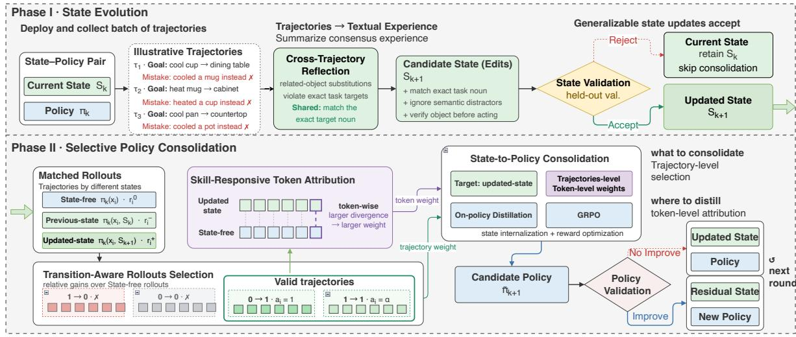
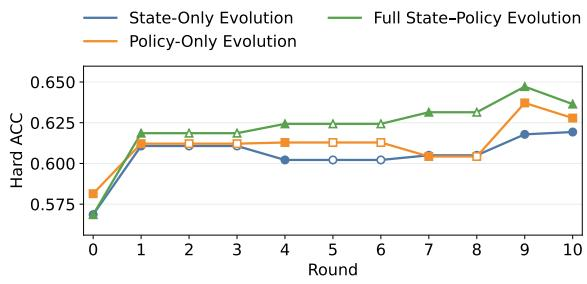
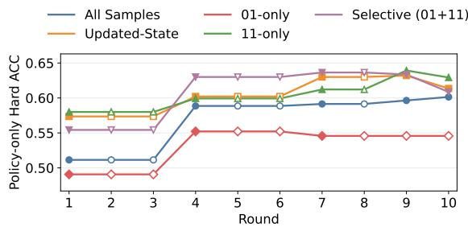

# Experience Funnel: A State–Policy Alternating Loop for Self-Evolving Agents

Wenbo Gao1,2, Zhaomou Song2, Zhiyuan Ji2,3, Renxi Liu2, Xing Li2, Xianzhi Yu2, Xiaoguang Li2, James Chung-wai CHEUNG1, Weizhe Lin2 \*, Yaoyuan Wang2 1The Hong Kong Polytechnic University, 2Huawei 3Renmin University of China wenbo.gao@connect.polyu.hk linweizhe1@huawei.com

## Abstract

Autonomous agents powered by large language models (LLMs) continuously accumulate experience through interaction, creating an opportunity to improve future behavior through self-evolution. A fundamental challenge is how to transform abundant, task-specific interaction experience into reusable model competence without sacrificing the ability to adapt rapidly to newly observed evidence. Explicit textual states, such as skills and agent harnesses, provide fast, human-readable and editable adaptation, but incur persistent dependence on external context; parametric policies provide compact and reusable competence, but are substantially slower to update. We present Experience Funnel, a self-evolving framework that couples fast state adaptation with slow policy consolidation in an alternating loop. Interaction trajectories are first distilled into an explicit textual state, where newly acquired experience can be rapidly incorporated and validated. The framework then selectively identifies state-enabled behavior that remains useful across state revisions and consolidates it into the policy through transition-aware distillation. The updated state–policy pair subsequently generates new rollouts, providing fresh evidence for the next round of state adaptation and policy consolidation. Experiments across diverse agent benchmarks show that Experience Funnel consistently improves agent capability over state-only evolution and policy-internalization approaches, while progressively converting useful explicit experience into autonomous policy competence.

## 1 Introduction

Language agents deployed across repeated interaction episodes continually generate experience that can be reused to improve future behavior rather than solving every task from scratch. Successful trajectories reveal effective strategies and procedures, whereas failures expose incorrect decisions, missing knowledge, and capability gaps. Existing self-evolving agents preserve such experience through two complementary forms of adaptation. One is to externalize experience as textual states— including memories, skills, procedural instructions, and agent harnesses—that can be rapidly revised without modifying model parameters (Shinn et al., 2023; Zhao et al., 2024; Wang et al., 2023; Cai et al., 2025; Zhang et al., 2025; Yang et al., 2026b). The other is to internalize useful experience into the parametric policy through reinforcement learning or distillation, converting interaction-derived guidance into autonomous model behavior (Yu et al., 2026; Yang et al., 2026a; Wang et al., 2026; Lu et al., 2026b). These two representations naturally operate at different adaptation timescales: explicit textual state provides a fast, human-readable and editable interface for newly acquired experience, whereas policy parameters provide a slower but more compact and persistent substrate for reusable competence.

Neither representation alone, however, provides a satisfactory endpoint for continual self-evolution. Indefinitely accumulating textual experience increases retrieval and context cost, introduces redundant or conflicting guidance, and requires increasingly complex memory and skill management (Liu et al., 2024; Yu et al., 2026; Lu et al., 2026b; Zhang et al., 2026a; Lin et al., 2026b; Xu et al., 2026). Conversely, immediately absorbing all observed experience into model parameters risks consolidating noisy, sample-specific, or already mastered behavior. Moreover, the value of explicit experience is policy dependent: guidance that is useful to the current policy may become redundant, complementary, or even conflicting after the policy itself improves (Xia et al., 2026; He et al., 2026; Chen et al., 2026; Lu et al., 2026b). The central challenge is therefore not merely how to accumulate more experience, but how to progressively transform interaction experience into reusable model competence while preserving a fast and editable mechanism for continued adaptation.

Recent work has addressed individual parts of this problem. Skill- and memory-evolution methods maintain persistent textual guidance and revise it from interaction feedback (Zhang et al., 2025; Yang et al., 2026b; He et al., 2026). Skill-conditioned reinforcement learning and selfdistillation instead transfer textual guidance into policy behavior (Xia et al., 2026; Wang et al., 2026; Lu et al., 2026b; Lin et al., 2026a). OPID extracts hindsight skills from on-policy trajectories and attributes their behavioral effects at the token level, while SEED further couples trajectory collection with evolving skill analysis (Yang et al., 2026a; Wu et al., 2026). Other approaches explicitly recognize the dependence between textual guidance and policy behavior: SkillRL recursively evolves a skill library together with reinforcement learning, ReSkill evaluates skill revisions under the evolving policy, and HarnessForge jointly adapts agent harnesses and policy parameters (Xia et al., 2026; He et al., 2026; Chen et al., 2026). Together, these studies establish the importance of both explicit experience and parametric adaptation. Yet they leave open a broader experience-management question: how should interaction experience be progressively filtered from raw trajectories into editable state, selectively consolidated into long-term policy competence, and subsequently reconsidered as the evolving policy generates new behavior?

We address this question with Experience Funnel, a self-evolving framework that couples fast state adaptation with slow policy consolidation in an alternating loop. At each evolution round, trajectories generated by the current state–policy pair are first aggregated into a task-specific textual state that summarizes recurring procedures, failure modes, and corrective strategies. Candidate state updates are evaluated on held-out interactions so that newly observed experience can be rapidly incorporated while sample-specific or unreliable edits are filtered out. The resulting explicit state therefore serves as an intermediate experience representation: sufficiently flexible for rapid adaptation, yet structured enough to expose reusable behavioral knowledge for subsequent consolidation.

Not all state-enabled behavior, however, should become parametric competence. We therefore introduce Transition-Aware Skill Distillation, which compares state-free execution with behavior conditioned on the previous and updated states to identify experience that is newly useful, persistently useful, regressive, or inactive. Only behavior that remains beneficial under the evolving state is selected for consolidation, while token-level state-conditioned contrasts localize the decisions attributable to explicit experience. A state-conditioned teacher then transfers these selected behavioral effects into a state-free policy. Once updated, the policy is redeployed together with the current state and generates a new distribution of interaction trajectories. These rollouts provide fresh evidence for the next round of state adaptation, allowing complementary experience to be retained or refined and experience already absorbed by the policy to become unnecessary.

We evaluate Experience Funnel across question answering, embodied interaction, and web navigation. Experiments show that alternating state adaptation and policy consolidation consistently improves agent performance over state-only evolution and policy-internalization approaches. Statefree policy performance increases across accepted consolidation rounds, demonstrating that useful explicit experience is progressively converted into autonomous competence, while the remaining textual state preserves complementary guidance that has not yet been internalized. These results support an experience-centric view of self-evolution in which rapid explicit adaptation and slower parametric consolidation play distinct but complementary roles.

## 2 Experience Funnel for Self-Evolving Agents

We introduce Experience Funnel, a self-evolving framework that enables agents to continuously learn from interaction experience through complementary state and policy representations. Our approach is realized from two perspectives: state–policy alternating evolution (Sec. 2.1) and transition-aware on-policy distillation (Sec. 2.2). For continual experience accumulation, explicit textual states enable fast and editable adaptation, but their continual growth leads to increasing context and retrieval overhead. To address this, we introduce a State–Policy Alternating Loop, where newly acquired experience is first organized in the task-specific state, while reusable experience is progressively consolidated into the long-term policy, allowing the two experience representations to evolve jointly. For policy consolidation, directly training on all state-conditioned trajectories may introduce redundant or weakly relevant supervision. To address this, we propose Transition-Aware On-Policy Distillation, which selects informative trajectories according to cross-state behavioral transitions and further identifies state-responsive tokens for focused policy optimization.

## 2.1 State–Policy Alternating Loop

State Evolution. During deployment, the current state–policy pair accumulates interaction trajectories. Once sufficient trajectories have been collected, we freeze them as a reflection batch and jointly identify recurring behavioral patterns across interactions rather than deriving corrections from individual examples. These patterns are summarized into high-level textual experience, including reusable procedures, common failure modes, and corrective strategies, and represented as candidate edits to the current state.

Inspired by validation-gated textual skill optimization (Yang et al., 2026b; Shen et al., 2026), candidate updates are evaluated on a separate heldout validation set under the current policy and accepted only when they improve the environmentlevel outcome. Cross-trajectory reflection therefore extracts reusable experience, while held-out validation filters sample-specific or unreliable updates.

Policy Consolidation and State Revision. An accepted state update improves the current agent but also increases its dependence on deploymenttime context. We therefore selectively consolidate its useful behavioral effect into the parametric policy (Yu et al., 2026; Lu et al., 2026b; Ye et al., 2026b; Wang et al., 2026), with the selection and training objective described in Sec. 2.2.

After consolidation, the updated policy $\pi _ { k + 1 }$ returns to deployment with the current textual state $S _ { k + 1 }$ . Subsequent interaction trajectories provide both new experience and delayed evidence about the utility of existing guidance: complementary state components are retained or refined, redundant components can be retired, and unresolved failures motivate new state updates (He et al., 2026; Lu et al., 2026b; Tu et al., 2026). The resulting evolution is

$$
( S _ { k } , \pi _ { k } ) \to S _ { k + 1 } \to \pi _ { k + 1 } \to S _ { k + 2 } \to \pi _ { k + 2 } \to \cdot \cdot \cdot\tag{1}
$$

This policy-conditioned revision prevents indefinite accumulation of textual guidance while preserving experience that remains useful to the evolving policy.

## 2.2 Transition-Aware Skill Distillation

A validated state does not make every stateconditioned behavior suitable for consolidation, since the state-free policy may already perform part of that behavior correctly. We therefore use trajectory-level transitions to identify behavior that the updated state adds to the current policy, and token-level contrasts to localize the decisions attributable to state conditioning.

Transition-Aware Rollout Selection. For each interaction instance x , we evaluate the current policy $\pi _ { k }$ without textual state, with the previous state $S _ { k } .$ , and with the validated updated state $S _ { k + 1 }$ (Lin et al., 2026a; He et al., 2026; Tu et al., 2026):

$$
\begin{array} { r l } & { r _ { i } ^ { 0 } = R ( \pi _ { k } , x _ { i } ) , } \\ & { r _ { i } ^ { - } = R ( \pi _ { k } , x _ { i } , S _ { k } ) , } \\ & { r _ { i } ^ { + } = R ( \pi _ { k } , x _ { i } , S _ { k + 1 } ) , } \end{array}\tag{2}
$$

where $R ( \cdot )$ denotes the environment outcome. Their behavioral utility relative to state-free execution is

$$
b _ { i } ^ { - } = \mathbb { I } [ r _ { i } ^ { - } > r _ { i } ^ { 0 } ] , \qquad b _ { i } ^ { + } = \mathbb { I } [ r _ { i } ^ { + } > r _ { i } ^ { 0 } ] .\tag{3}
$$

The transition $( b _ { i } ^ { - } , b _ { i } ^ { + } )$ distinguishes newly useful (0, 1) and persistently useful (1, 1) behavior from regressive (1, 0) and inactive (0, 0) behavior. We retain the first two categories for consolidation using

$$
a _ { i } = \left\{ \begin{array} { l l } { 1 , } & { ( b _ { i } ^ { - } , b _ { i } ^ { + } ) = ( 0 , 1 ) , } \\ { \alpha , } & { ( b _ { i } ^ { - } , b _ { i } ^ { + } ) = ( 1 , 1 ) , } \\ { 0 , } & { \mathrm { o t h e r w i s e } , } \end{array} \right.\tag{4}
$$

where α controls the relative contribution of persistently useful behavior.

State-Responsive Token Attribution. Trajectory-level selection identifies rollouts that benefit from the updated state, but not which decisions within them are attributable to state conditioning. For each selected trajectory and token position t, we therefore compare the frozen policy $\pi _ { k }$ under identical prefixes with and without the accepted state (Yang et al., 2026a; Wang et al., 2026; Tu et al., 2026):

$$
\begin{array} { l } { p _ { i , t } ^ { + } = \pi _ { k } ( \cdot  { \mid } x _ { i } , S _ { k + 1 } , y _ { i , < t } ) , } \\ { p _ { i , t } ^ { 0 } = \pi _ { k } ( \cdot  { \mid } x _ { i } , y _ { i , < t } ) . } \end{array}\tag{5}
$$

  
Figure 1: Overview of the State–Policy Consolidation Loop. Phase I aggregates recurring patterns across interaction trajectories into a validated textual state update. Phase II identifies state-enabled behavior through transition-aware rollout selection and token-level attribution, and selectively consolidates it into the state-free policy. The updated state–policy pair then returns to deployment and initiates the next evolution round.

Because the two branches share the same model parameters and differ only in textual-state conditioning, their predictive difference isolates the local behavioral response to the accepted state.

We quantify this response using Jensen–Shannon divergence,

$$
d _ { i , t } = D _ { \mathrm { J S } } \Big ( p _ { i , t } ^ { + } \Vert p _ { i , t } ^ { 0 } \Big ) ,\tag{6}
$$

and normalize it within each trajectory:

$$
w _ { i , t } = \frac { d _ { i , t } } { \frac { 1 } { T _ { i } } \sum _ { t ^ { \prime } = 1 } ^ { T _ { i } } d _ { i , t ^ { \prime } } + \epsilon } .\tag{7}
$$

Thus, $a _ { i }$ determines which rollouts contribute to consolidation, while $w _ { i , t }$ emphasizes decisions that are most responsive to the accepted state.

Policy Consolidation. Let $\pi _ { \theta }$ be a trainable policy initialized from $\pi _ { k }$ . The state-conditioned branch $p _ { i , t } ^ { + }$ provides privileged supervision, while $\pi _ { \theta }$ receives only the state-free context (Ye et al., 2026b; Wang et al., 2026). We optimize

$$
\mathcal { L } _ { \mathrm { d i s t i l } } = \frac { \displaystyle \sum _ { i , t } a _ { i } w _ { i , t } D _ { \mathrm { K L } } \Big ( \pi _ { \theta } ( \cdot \mid x _ { i } , y _ { i , < t } ) \mid \mid p _ { i , t } ^ { + } \Big ) } { \displaystyle \sum _ { i , t } a _ { i } w _ { i , t } } ,\tag{8}
$$

which concentrates distillation on behavior that is both outcome-relevant and responsive to state conditioning.

We combine selective distillation with state-free reward optimization (Wang et al., 2026; Lu et al., 2026a):

$$
\mathcal { L } _ { \mathrm { c o n s o l i d a t e } } = \mathcal { L } _ { \mathrm { R L } } ^ { \mathrm { s t a t e - f r e e } } + \lambda _ { \mathrm { d i s t i l l } } \mathcal { L } _ { \mathrm { d i s t i l l } } .\tag{9}
$$

flThe reward objective improves autonomous behavior from environment feedback, whereas distillation internalizes behavior enabled by the validated state. The candidate policy $\tilde { \pi } _ { k + 1 }$ is committed only when its state-free performance satisfies the validation criterion, after which it returns to deployment and initiates the next state–policy evolution round.

## 3 Experiments

## 3.1 Experimental Setup

Task and evaluation. We first study state–policy consolidation on SearchQA using Qwen3.5-4B as the evolving deployment policy and a fixed Qwen3.5-27B model as the OPD teacher. Hard answer accuracy (ACC) is the primary evaluation metric, while the environment reward is used for state validation and experience selection.

Implementation and hardware. All experiments are conducted on 910B3 Ascend NPUs. Unless otherwise stated, the evolving policy and OPD teacher are deployed within the same experimental environment, with the Qwen3.5-4B model serving as the evolving deployment policy and Qwen3.5- 27B as the fixed teacher model. The same hardware and software configuration is used throughout the state–policy evolution process to ensure consistent comparisons across evolution rounds.

Data protocol. We strictly separate data according to their roles in the evolution loop. Training examples are used for experience collection, state revision, cross-version transition labeling, and OPD. The validation split is used only to accept state revisions and select policy checkpoints. The test split is reserved exclusively for final reporting and does not affect any subsequent state or policy update.

Evolution protocol. We run five state-evolution rounds. The candidate state revisions in rounds 1 and 4 pass the validation gate and trigger policy consolidation, whereas rounds 2, 3, and 5 are rejected and retain the preceding state–policy pair. We therefore report policy updates only at accepted rounds. Unless otherwise stated, each trained configuration corresponds to a single run; repeated-run uncertainty is reported for the final comparison.

Cross-environment evaluation. We additionally report available results on ALFWorld and Web-Shop to examine whether the same state–policy pattern transfers across interactive domains. Because the current experiments use different OPD budgets across environments, cross-environment averages are treated as descriptive summaries rather than controlled comparisons under an identical training budget.

## 3.2 Overall Performance

Table 1 compares our State–Policy Consolidation Loop with representative approaches based on explicit-state evolution, policy internalization, and state–policy co-evolution. Our method achieves the best performance across all three environments, reaching 62.4% on SearchQA, 67.9% on ALF-World, and 42.4% on WebShop, with the highest average score of 57.6%.

The improvement is consistent across different adaptation paradigms. Compared with the strongest explicit-state method, SkillOpt, our method improves the average score from 53.9% to 57.6%. It also outperforms OPID, the strongest policy-internalization baseline, by 2.2 points on average. More importantly, our method surpasses SkillRL, the closest state–policy co-evolution baseline, by 1.4 points on average, with gains on all three environments. These results show that the advantage of our framework extends beyond either accumulating explicit experience or internalizing it into the policy alone. Explicitly coordinating state evolution, policy consolidation, and subsequent state revision provides a stronger mechanism for continued agent improvement.

To further examine how this improvement emerges over successive evolution rounds, Figure 2 tracks policy and state–policy performance on SearchQA. The state-free trajectory measures how much experience has been absorbed into the policy, while the matched state–policy trajectory captures the additional benefit of combining the updated policy with its evolved explicit state.

  
Figure 2: State–policy evolution on SearchQA. Consolidated Policy (No State) evaluates autonomous policy performance after consolidation. Frozen Policy + Evolved State evaluates each evolved state with the initial policy. Matched State–Policy Pair evaluates each evolved state with its contemporaneous policy. Filled markers denote accepted evolution rounds, while rejected rounds retain the preceding accepted checkpoint.

Across accepted consolidation rounds, state-free policy accuracy increases from 58.1% to 61.3%, demonstrating that interaction experience is progressively converted into autonomous policy competence. Combining the final consolidated policy with its evolved state further raises performance to 62.4%. In contrast, pairing the same evolved state with the initial policy reaches only 60.2%, showing that the value of explicit experience increasingly depends on the policy with which it evolves.

Taken together, the main results and evolution trajectories support the central design of our framework. Policy consolidation continuously absorbs reusable experience into model parameters, while state evolution preserves complementary guidance that remains useful to the current policy. Their coordinated evolution therefore yields stronger performance than either state-centric or policy-centric adaptation alone, while also outperforming existing joint evolution approaches.

Table 1: Overall performance across agent environments. All values denote task accuracy or success rate (%).
<table><tr><td>Method</td><td>SearchQA ↑</td><td>ALFWorld ↑</td><td>WebShop ↑</td><td>Avg. ↑</td></tr><tr><td>Base Model</td><td></td><td></td><td></td><td></td></tr><tr><td>Qwen3.5-4B</td><td>58.1</td><td>32.1</td><td>10.8</td><td>33.7</td></tr><tr><td>Explicit-State Evolution</td><td></td><td></td><td></td><td></td></tr><tr><td>SkillOpt-Lite</td><td>59.7</td><td>58.6</td><td>30.4</td><td>49.6</td></tr><tr><td>SkillOpt</td><td>61.1</td><td>64.8</td><td>35.9</td><td>53.9</td></tr><tr><td>Policy Internalization</td><td></td><td></td><td></td><td></td></tr><tr><td>SKILL0</td><td>60.6</td><td>61.5</td><td>31.8</td><td>51.3</td></tr><tr><td>SkillC</td><td>61.4</td><td>64.2</td><td>36.8</td><td>54.1</td></tr><tr><td>OPID</td><td>61.8</td><td>65.3</td><td>39.1</td><td>55.4</td></tr><tr><td>State-Policy Co-Evolution</td><td></td><td></td><td></td><td></td></tr><tr><td>SkillRL</td><td>61.9</td><td>66.4</td><td>40.2</td><td>56.2</td></tr><tr><td>Ours</td><td></td><td></td><td></td><td></td></tr><tr><td>State-Policy Consolidation Loop</td><td>62.4</td><td>67.9</td><td>42.4</td><td>57.6</td></tr></table>

Table 2: Component ablation on SearchQA.
<table><tr><td>Method</td><td></td><td>State Evol. Policy Consol. ACC ↑</td><td></td></tr><tr><td>State-Only</td><td>√</td><td></td><td>61.1</td></tr><tr><td>Policy-Only</td><td>一</td><td>√</td><td>62.8</td></tr><tr><td>Full Štate-Policy Loop</td><td>√</td><td>√</td><td>63.6</td></tr></table>

## 3.3 Ablation Study

We conduct component ablations on SearchQA to examine the individual and combined contributions of state evolution and policy consolidation.

Both adaptation mechanisms improve agent performance independently. State-Only Evolution reaches 61.1% ACC, whereas Policy-Only Consolidation achieves 62.8%, suggesting that parametric internalization provides a stronger standalone adaptation mechanism on SearchQA. Combining both yields the best performance of 63.6%, outperforming State-Only and Policy-Only by 2.5 and 0.8 points, respectively. These results indicate that explicit state evolution and policy consolidation provide complementary benefits: consolidation absorbs reusable experience into the policy, while the evolving state retains additional guidance that remains useful beyond parametric adaptation alone.

## 3.4 Analysis of State–Policy Consolidation

## 3.4.1 Dynamic State–Policy Coupling

We first examine how the compatibility between explicit state and policy changes throughout evolution. For each stage, we compare the co-evolved state–policy pair with a control that applies the same evolved state to the initial policy. This comparison directly measures whether state evolution becomes increasingly aligned with the policy being optimized.

The advantage of the co-evolved state–policy pair becomes more pronounced as evolution proceeds. At the intermediate stage, pairing the evolved state with its corresponding policy improves ACC from 61.1% to 61.9%. At the final stage, this gap expands to 2.2 points, with the coevolved pair reaching 62.4% compared with 60.2% when the same state is paired with the initial policy. These results show that the benefit of explicit experience is increasingly tied to the policy with which it evolves. The growing compatibility gap provides direct empirical support for our central design choice of jointly evolving state and policy rather than treating explicit experience as policyindependent guidance.

Table 3: State–policy compatibility across evolution stages on SearchQA. Each evolved state is evaluated with either its co-evolved policy or the initial policy.
<table><tr><td>Stage</td><td>Co-Evolved Pair ACC (%) ↑</td><td>Initial-Policy Pair ACC (%) ↑</td></tr><tr><td>Initial</td><td>56.9</td><td>56.9</td></tr><tr><td>Intermediate</td><td>61.9</td><td>61.1</td></tr><tr><td>Final</td><td>62.4</td><td>60.2</td></tr></table>

## 3.4.2 Cross-Version Experience Selection

We next investigate which evolving experiences are most useful for policy consolidation. Our crossversion analysis distinguishes newly useful (01) experiences, which become beneficial only after the state update, from persistently useful (11) experiences, which remain beneficial across successive state versions. We compare these transitionspecific subsets with unfiltered training and their combined selection (01 + 11).

After the second consolidation round, combining newly useful and persistently useful experiences achieves the best performance, reaching 63.0% ACC. In comparison, unfiltered training reaches only 58.9%, while using 01 or 11 alone obtains

  
Figure 3: State-free policy accuracy under different experience-selection strategies across consolidation rounds.

55.2% and 59.9%, respectively. The 01 + 11 strategy therefore improves over unfiltered consolidation by 4.1 points and over the stronger singletransition strategy by 3.1 points.

These results highlight the benefit of selectively consolidating experience according to how its utility evolves across state versions. Neither newly acquired nor persistent experience alone captures all of the useful supervision: their combination provides a substantially stronger learning signal for the state-free policy. This supports the core motivation of our cross-version formulation—policy consolidation should focus on experience that remains behaviorally useful during state evolution rather than indiscriminately distilling all available trajectories.

Under the current binary transition definition, the 01 + 11 subset is equivalent to the set of examples that are successful under the updated state; we therefore use the comparison here to establish the benefit of selective consolidation, while analyzing transition-specific credit separately.

## 3.4.3 Teacher Capacity and State-Conditioned Transfer

The policy improvement could in principle arise from generic knowledge transferred by the larger teacher rather than from the explicit state. To separate these effects, we vary both teacher scale and state conditioning while keeping the student initialization, selected training examples, OPD schedule, and evaluation split fixed.

The 27B teacher improves the student only when conditioned on the updated state. Without state conditioning, the same teacher produces 0.5629 ACC, below the 0.5814 base policy, whereas conditioning it on the evolved state yields the strongest result of 0.6121. The gain therefore cannot be explained by teacher scale alone. Instead, the result suggests an interaction between teacher capacity and explicit experience: the larger teacher is effective when it serves as an executor of the evolved state rather than as a generic distillation source.

Table 4: Effect of teacher capacity and state conditioning on SearchQA. ACC measures the resulting state-free student policy.
<table><tr><td>Teacher</td><td>Teacher Context</td><td>ACC ↑</td></tr><tr><td>No Teacher</td><td>No State</td><td>58.14</td></tr><tr><td>4B Teacher</td><td>No State</td><td>59.79</td></tr><tr><td>4B Teacher</td><td>Updated State</td><td>57.57</td></tr><tr><td>27B Teacher</td><td>No State</td><td>56.29</td></tr><tr><td>27B Teacher</td><td>Updated State</td><td>61.21</td></tr></table>

The 4B teacher does not show the same benefit from state conditioning. This observation is consistent with our use of an asymmetric teacher–student configuration, although repeated runs are required to determine whether the interaction is statistically reliable.

## 3.4.4 Residual State after Policy Consolidation

We further examine how policy consolidation changes the role of explicit state at deployment. A desirable state–policy pair should internalize reusable experience into the policy while retaining explicit guidance only when it remains complementary.

Table 5: SearchQA deployment performance before and after policy consolidation.
<table><tr><td>Deployment Configuration</td><td>ACC (%) ↑</td></tr><tr><td>Initial Policy w/o State</td><td>58.1</td></tr><tr><td>Consolidated Policy w/o State</td><td>61.3</td></tr><tr><td>Consolidated Policy w/ Full State</td><td>62.4</td></tr><tr><td>Consolidated Policy w/ Residual State</td><td>61.3</td></tr></table>

As shown in Table 5, policy consolidation substantially improves state-free performance from 58.1% to 61.3%, demonstrating that the evolving policy successfully absorbs a large portion of the useful experience originally carried by the explicit state. Reintroducing the full evolved state further increases accuracy to 62.4%, indicating that a small amount of complementary information remains external to the policy after consolidation.

Importantly, the residualized configuration maintains the 61.3% performance of the consolidated policy without requiring the complete evolved state. Together, these results illustrate the intended behavior of our State–Policy Consolidation Loop:

reusable experience is progressively transferred into parametric competence, while explicit state is reserved only for information that remains useful beyond what the policy has already internalized.

## 4 Related Work

## 4.1 Self-Evolving Agents

A growing body of work enables language agents to improve from their own interaction experience by maintaining and revising explicit textual knowledge. Early approaches externalize feedback and successful behaviors as reflections, episodic experience, or reusable skills that can guide subsequent interactions without modifying the underlying model parameters (Shinn et al., 2023; Zhao et al., 2024; Wang et al., 2023). More recent work has broadened this paradigm toward persistent agent evolution. ELL formalizes experience-driven lifelong learning around experience exploration, long-term memory, skill learning, and knowledge internalization (Cai et al., 2025), while ACE treats agent context as an evolving playbook that is incrementally generated, reflected upon, and curated from execution feedback (Zhang et al., 2025). SkillOpt further formulates a textual skill as the external state of a frozen agent and optimizes it through bounded edits and held-out validation, providing a controlled mechanism for text-space skill evolution (Yang et al., 2026b). These approaches demonstrate that editable textual state can serve as an effective substrate for rapid post-deployment adaptation.

Recent methods increasingly recognize that external state should evolve together with the policy that executes it. SkillRL recursively updates a hierarchical skill library alongside reinforcement learning, allowing reusable strategies to co-evolve with policy behavior (Xia et al., 2026). ReSkill makes this coupling more explicit by evaluating competing skill revisions under the evolving policy and continuously creating, testing, refining, and pruning skills according to their utility (He et al., 2026). At the broader agent-system level, HarnessForge represents an agent as a harness–policy pair and jointly adapts execution structure and policy behavior through harness tailoring and harnessconditioned policy alignment (Chen et al., 2026). Recursive Harness Self-Improvement instead focuses on prompt-level harness evolution, iteratively refining the harness using pairwise feedback over its own revision history (Lee et al., 2026). Together, these works establish that textual guidance and parametric policy behavior are tightly coupled rather than independently optimizable components.

Our work builds on this perspective but focuses on a different aspect of state–policy evolution: how accumulated experience moves between the two representations across successive deployment rounds. Rather than optimizing only the current textual scaffold or its compatibility with the current policy, we maintain a shared textual state synthesized from recurring evidence across multiple trajectories, selectively consolidate state-enabled behavior into the policy, and use subsequent interactions with the updated policy to determine which accumulated guidance should be retained, revised, or retired.

## 4.2 Skill Distillation and Experience Internalization

A complementary line of work seeks to convert externally represented experience into autonomous parametric behavior. Self-Consolidation summarizes reusable patterns from historical successes and failures and distills the resulting nonparametric experience into learnable model parameters (Yu et al., 2026). More generally, On-Policy Context Distillation (OPCD) trains a policy on its own trajectories while matching a contextconditioned teacher through reverse-KL distillation, demonstrating that experiential knowledge and optimized prompts can be internalized into a state-free model (Ye et al., 2026b). SKILL0 addresses the same objective through a curriculum that progressively withdraws external skills according to their on-policy helpfulness, encouraging the policy to transition from skill-conditioned execution toward autonomous behavior (Lu et al., 2026b). These methods establish experience internalization as an alternative to indefinitely retaining external guidance at inference time.

More recent approaches develop finer-grained mechanisms for deciding how skill supervision should affect policy learning. Skill-SD summarizes completed trajectories into natural-language skills that are provided only to a privileged teacher, while the plain-prompt student learns to reproduce the skill-conditioned behavior through self-distillation (Wang et al., 2026). SkillC instead samples paired skill-conditioned and skill-free rollouts and converts their task-level performance contrast into a direct credit signal, distinguishing skill-dependent success from autonomous success during policy optimization (Lin et al., 2026a). OPID constructs hierarchical hindsight skills from completed on-policy trajectories and re-scores sampled actions under ordinary and skill-augmented contexts; the resulting token-level probability shifts provide dense skill-attributed supervision in addition to trajectorylevel rewards (Yang et al., 2026a). SEED further makes this process self-evolving by using the current policy both to collect interaction trajectories and to analyze them into hindsight skills, allowing skill supervision to evolve together with the policy (Wu et al., 2026). UCOB extends skillconditioned self-distillation bidirectionally, treating skill-conditioned and skill-free prompts as two on-policy views and using their relative return to determine local supervision as well as utility-aware skill-memory updates (Tu et al., 2026).

These methods progressively improve how the behavioral contribution of external skills is attributed and internalized. However, their internalization signals primarily characterize the utility or behavioral effect of a current skill relative to skillfree execution. Our method additionally tracks how this utility changes across successive versions of a persistent textual state. Specifically, we contrast state-free, previous-state, and updated-state behavior to distinguish newly useful, persistently useful, regressive, and inactive state effects. These cross-version transitions determine which trajectories contribute to policy consolidation, while tokenlevel state-conditioned contrasts localize the decisions to be distilled. The resulting policy then generates new interaction evidence for the next round of state evolution, closing an iterative state–policy consolidation loop.

## 5 Conclusion

We introduced the State–Policy Consolidation Loop, a framework for coordinating explicit experience evolution and parametric policy improvement in self-evolving agents. Rather than treating textual skills as either persistent inference-time guidance or one-shot distillation targets, our framework maintains an evolving textual state that summarizes recurring interaction experience and selectively consolidates useful state-enabled behavior into the policy. Transition-Aware Skill Distillation further identifies consolidation targets at both the trajectory and token levels by tracking behavioral utility across state-free, previous-state, and updated-state execution.

Across embodied interaction, web navigation, and execution-verified coding, our experiments show that alternating state evolution and policy consolidation improves autonomous policy competence over state-only and internalization-only alternatives, while reducing persistent dependence on accumulated textual guidance. As the policy evolves, subsequent interaction experience also provides feedback for retaining, revising, or retiring explicit state, enabling experience to remain aligned with the agent’s changing capabilities. These results suggest that effective self-evolution requires not only acquiring more experience, but continually determining what should remain explicit and what should become parametric competence.

## Limitations

Our framework is primarily designed for postdeployment settings in which an agent repeatedly encounters related tasks and receives sufficiently informative environment-level feedback. This assumption makes the framework particularly well suited to interactive and verifiable domains, such as web navigation, tool use, and other recurring workflows, but may limit its direct applicability to one-shot tasks or domains with highly subjective and sparse feedback. Extending state–policy consolidation to such settings may require alternative utility signals, such as learned verifiers or preference-based feedback.

The iterative evolution process also incurs additional computation for multi-condition rollout evaluation, state revision, and policy consolidation. This represents a compute–adaptation tradeoff: additional evolution-time computation is used to obtain a stronger state-free policy and reduce repeated dependence on accumulated textual guidance. Importantly, these updates need not be performed on the latency-critical serving path. Interaction experience can be accumulated online and consolidated periodically or asynchronously during lower-utilization periods, consistent with recent online–offline consolidation paradigms (Lin et al., 2025; Ye et al., 2026a; Zhang et al., 2026b). Such scheduling reduces the impact on serving latency, although it introduces a delay between experience acquisition and model updates. Improving update scheduling, rollout reuse, and consolidation efficiency therefore remains an important direction for long-term deployment.

## References

Yuxuan Cai, Yipeng Hao, Jie Zhou, Hang Yan, Zhikai Lei, Rui Zhen, Zhenhua Han, Yutao Yang, Junsong Li, Qianjun Pan, Tianyu Huai, Qin Chen, Xin Li, Kai Chen, Bo Zhang, Xipeng Qiu, and Liang He. 2025. Building self-evolving agents via experiencedriven lifelong learning: A framework and benchmark. arXiv preprint arXiv:2508.19005.

Mingju Chen, Can Lv, Guibin Zhang, Heng Chang, and Shiji Zhou. 2026. Harnessforge: Joint harness and policy evolution for adaptive agent systems. arXiv preprint arXiv:2606.01779.

Zelin He, Haotian Lin, Boran Han, Wei Zhu, Haoyang Fang, Bernie Wang, Xuan Zhu, Runze Li, and Matthew Reimherr. 2026. Reskill: Reconciling skill creation with policy optimization in agentic rl. arXiv preprint arXiv:2606.01619.

Hyunin Lee, Jinglue Xu, Jeffrey Seely, Donghyun Lee, Matei Zaharia, and Yujin Tang. 2026. Recursive harness self-improvement. arXiv preprint arXiv:2607.15524.

Hongxiang Lin, Zhirui Kuai, Erpeng Xue, and Lei Wang. 2026a. Skillc: Learning autonomous skill internalization in llm agents via contrastive credit assignment. arXiv preprint arXiv:2605.27899.

Huawei Lin, Peng Li, Jie Song, Fuxin Jiang, and Tieying Zhang. 2026b. Muse-autoskill: Self-evolving agents via skill creation, memory, management, and evaluation. arXiv preprint arXiv:2605.27366.

Kevin Lin, Charlie Snell, Yu Wang, Charles Packer, Sarah Wooders, Ion Stoica, and Joseph E. Gonzalez. 2025. Sleep-time compute: Beyond inference scaling at test-time. arXiv preprint arXiv:2504.13171.

Nelson F. Liu, Kevin Lin, John Hewitt, Ashwin Paranjape, Michele Bevilacqua, Fabio Petroni, and Percy Liang. 2024. Lost in the middle: How language models use long contexts. Transactions ofthe Association for Computational Linguistics, 12:157–173.

Zhengxi Lu, Zhiyuan Yao, Zhuowen Han, Zi-Han Wang, Jinyang Wu, Qi Gu, Xunliang Cai, Weiming Lu, Jun Xiao, Yueting Zhuang, and Yongliang Shen. 2026a. Self-distilled agentic reinforcement learning. arXiv preprint arXiv:2605.15155.

Zhengxi Lu, Zhiyuan Yao, Jinyang Wu, Chengcheng Han, Qi Gu, Xunliang Cai, Weiming Lu, Jun Xiao, Yueting Zhuang, and Yongliang Shen. 2026b. Skill0: In-context agentic reinforcement learning for skill internalization. arXiv preprint arXiv:2604.02268.

Yifei Shen, Bo Li, and Xinjie Zhang. 2026. Skillopt-lite: Better and faster agent self-evolution via one line of vibe. arXiv preprint arXiv:2607.03451.

Noah Shinn, Federico Cassano, Edward Berman, Ashwin Gopinath, Karthik Narasimhan, and Shunyu Yao. 2023. Reflexion: Language agents with verbal reinforcement learning. Preprint, arXiv:2303.11366.

Songjun Tu, Chengdong Xu, Qichao Zhang, Yiwen Ma, Yaocheng Zhang, Linjing Li, Dong Li, Xiangyuan Lan, and Dongbin Zhao. 2026. Ucob: Learning to utilize and evolve agentic skills via credit-aware onpolicy bidirectional self-distillation. arXiv preprint arXiv:2606.29502.

Guanzhi Wang, Yuqi Xie, Yunfan Jiang, Ajay Mandlekar, Chaowei Xiao, Yuke Zhu, Linxi Fan, and Anima Anandkumar. 2023. Voyager: An open-ended embodied agent with large language models. arXiv preprint arXiv:2305.16291.

Hao Wang, Guozhi Wang, Han Xiao, Yufeng Zhou, Yue Pan, Jichao Wang, Ke Xu, Yafei Wen, Xiaohu Ruan, Xiaoxin Chen, and Honggang Qi. 2026. Skill-sd: Skill-conditioned self-distillation for multi-turn llm agents. arXiv preprint arXiv:2604.10674.

Jinyang Wu, Shuo Yang, Zhengxi Lu, Fan Zhang, Yuhao Shen, Lang Feng, Haoran Luo, Zheng Lian, Shuai Zhang, Zhengqi Wen, and Jianhua Tao. 2026. Seed: Self-evolving on-policy distillation for agentic reinforcement learning. arXiv preprint arXiv:2607.14777.

Peng Xia, Jianwen Chen, Hanyang Wang, Jiaqi Liu, Kaide Zeng, Yu Wang, Siwei Han, Yiyang Zhou, Xujiang Zhao, Haifeng Chen, and 1 others. 2026. Skillrl: Evolving agents via recursive skillaugmented reinforcement learning. arXiv preprint arXiv:2602.08234.

Ruiyao Xu, Tiankai Yang, and Wei-Chieh Huang. 2026. Hyperskill: Self-evolving llm agents via hypergraph-structured skill memory. arXiv preprint arXiv:2608.16114.

Shuo Yang, Jinyang Wu, Zhengxi Lu, Yuhao Shen, Fan Zhang, Lang Feng, Shuai Zhang, Haoran Luo, Zheng Lian, Zhengqi Wen, and Jianhua Tao. 2026a. Opid: On-policy skill distillation for agentic reinforcement learning. arXiv preprint arXiv:2606.26790.

Yifan Yang, Ziyang Gong, Weiquan Huang, Qihao Yang, Ziwei Zhou, Zisu Huang, Yan Li, Xuemei Gao, Qi Dai, Bei Liu, Kai Qiu, Yuqing Yang, Dongdong Chen, Xue Yang, and Chong Luo. 2026b. Skillopt: Executive strategy for self-evolving agent skills. arXiv preprint arXiv:2605.23904.

Chongrui Ye, Yuxiang Liu, Yu Wang, Haofei Yu, Yining Zhao, Ge Liu, Julian McAuley, and Jiaxuan You. 2026a. Auto-dreamer: Learning offline memory consolidation for language agents. arXiv preprint arXiv:2605.20616.

Tianzhu Ye, Li Dong, Xun Wu, Shaohan Huang, and Furu Wei. 2026b. On-policy context distillation for language models. arXiv preprint arXiv:2602.12275.

Hongzhuo Yu, Fei Zhu, Guo-Sen Xie, and Ling Shao. 2026. Self-consolidation for self-evolving agents. arXiv preprint arXiv:2602.01966.

Haozhen Zhang, Quanyu Long, Jianzhu Bao, Tao Feng, Weizhi Zhang, Haodong Yue, and Wenya Wang. 2026a. Memskill: Learning and evolving memory skills for self-evolving agents. arXiv preprint arXiv:2602.02474.

Jiaquan Zhang, Chaoning Zhang, Shuxu Chen, Zhenzhen Huang, Pengcheng Zheng, Zhicheng Wang, Ping Guo, Fan Mo, Sung-Ho Bae, Jie Zou, Jiwei Wei, and Yang Yang. 2026b. Lightweight llm agent memory with small language models. Proceedings of the 64th Annual Meeting of the Association for Computational Linguistics, pages 12914–12929.

Qizheng Zhang, Changran Hu, and 1 others. 2025. Agentic context engineering: Evolving contexts for self-improving language models. arXiv preprint arXiv:2510.04618.

Andrew Zhao, Daniel Huang, Quentin Xu, Matthieu Lin, Yong-Jin Liu, and Gao Huang. 2024. Expel: Llm agents are experiential learners. In Proceedings of the AAAI Conference on Artificial Intelligence, volume 38, pages 19632–19642.