# FROM SCORES TO EVIDENCE: AUDITABLE DECISIONS CAN IMPROVE SPEECH DEEPFAKE DETECTION

Mengzhe Geng1∗ Yujia Lu2 Patrick Littell1

Manuela Kunz1 Xie Chen3

1National Research Council Canada 2The Chinese University of Hong Kong 3Shanghai Jiao Tong University

Mengzhe.Geng@nrc-cnrc.gc.ca chenxie95@sjtu.edu.cn

## ABSTRACT

Speech deepfakes can mimic a speaker’s voice convincingly enough to deceive listeners and automated systems. This has driven strong progress in speech deepfake detection, but most detectors still end with one score per utterance. That score is useful for ranking systems, yet it says little about why a borderline item should be trusted, deferred, or reviewed. Two utterances can fall in the same score band for different reasons, for example because passive and retrieval evidence disagree or because the keyed probe is unavailable. We ask whether the final decision can remain scalar without discarding that provenance. We answer this question with an auditable decision record that carries four aligned cues into a late calibration step: a passive detector score, a conditional keyed-probe score on a marked derivative, retrieval support, and a speaker-profile margin, together with explicit disagreement coordinates. On the 4,080-example ASVspoof 5 Track 1 matched subset, the fixed retrieval-augmented rule improves on retrieval-only evidence (15.84% to 11.91% EER), and late calibration over the full record reaches 8.43% EER. At a 33.75% review budget, the exposed cue union covers 82.85% of the calibrated model’s errors. The best passive WavLM run still reaches 6.71% EER, so we do not present the decision record as a stronger standalone detector. Its contribution is to preserve the evidence behind each surfaced utterance while still producing one operating score for thresholding and review.

## 1 INTRODUCTION

Speech deepfakes can mimic a speaker’s voice closely enough to deceive people and automated systems. That risk has motivated a large literature on speech deepfake detection. Yet most benchmarks and papers still end with one score per utterance. That number is enough to rank systems, but it often fails at the next question: why should a borderline case be trusted, deferred, or inspected? Two utterances can receive nearly the same score even though the follow-up should differ. One may show a conflict between passive evidence and retrieval support. Another may be missing the probe altogether. Once only the final scalar is kept, that distinction disappears.1

Figure 1 makes the problem concrete. Both utterances fall in the same score band, yet one calls for checking a passive–retrieval conflict and the other calls for documenting a missing probe. The issue is therefore not only whether the score is high or low. It is whether the score still carries the reason behind it.

We keep that reason in an auditable decision record. For each utterance we retain four aligned cues before the final calibration step: a passive detector score on the original audio, a keyed probe score on a marked derivative, retrieval support from a held-out reference pool, and a speaker-profile margin. Calibration is applied only after the record has been assembled, so the final decision remains scalar while the underlying evidence stays visible.

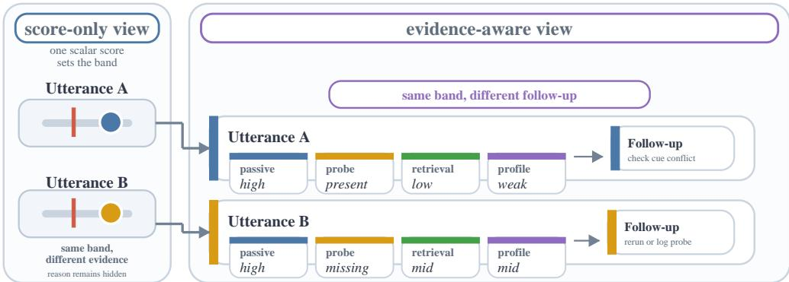  
Figure 1: Illustrative problem overview. Two utterances can occupy nearly the same detector-score band yet require different follow-up because the supporting cues differ. The proposed decision record retains passive, probe, retrieval, and profile cues through calibration instead of collapsing them into one early fused score. The displayed scores and cue values are schematic; Appendix Figure 6 shows matched-subset examples.

These streams do not mean the same thing. The passive detector scores spoof evidence in the waveform. The probe score is conditional on a specific key and embedding rule (Wu et al., 2025; Ozer et al., 2026). Retrieval and profile cues depend on support-pool coverage and speaker context¨ (Liu et al., 2025b). Early fusion treats them as interchangeable measurements even though they answer different questions at review time.

We evaluate this design on the matched ASVspoof 5 Track 1 development subset, the 4,080 utterances for which all four cues are available on the same examples. Tables 2 and 3 measure the operating gain, while Figure 3 and Appendix Table 25 test whether visible cues still help once the inspection budget is fixed. WavLM remains the strongest passive-only baseline on this subset. Our question is narrower: can late calibration over aligned cues improve the operating score while leaving a usable basis for review?

Contributions. This paper makes three contributions. First, it introduces an utterance-level decision record that keeps passive, probe, retrieval, and profile cues aligned instead of collapsing them into an early fused score. Second, it shows that a small cross-fit calibrator with explicit disagreement coordinates improves on fixed scalar fusion in the matched setting. Third, it evaluates the record both as an operating detector score and as an inspection object through held-out-family calibration, fixed-budget review, and worked examples. The keyed probe is treated only as an auxiliary measurement, and we do not make a watermark-robustness or attribution claim.

## 2 RELATED WORK

Speech deepfake benchmarks and detector generalization. Prior ASVspoof evaluations make passive systems comparable across generator families, channels, and postprocessing conditions (Wang et al., 2026b; 2024a; 2026a; Ge et al., 2025a; Huang et al., 2025). We use the official ASVspoof 5 results as benchmark context because the decision-record study relies on a smaller matched subset (Wang et al., 2026a). RawNet2 and graph-attention spectro-temporal models remain standard passive baselines (Tak et al., 2021; Jung et al., 2022), while frozen SSL systems built on wav2vec 2.0, HuBERT, and WavLM provide strong scalar references (Baevski et al., 2020; Hsu et al., 2021; Chen et al., 2021). Related work on monitoring and calibration shows why ranking metrics alone are insufficient when score reliability also matters (Wang et al., 2026c; Guo et al., 2017; Niculescu-Mizil & Caruana, 2005). Our setting starts from these scalar baselines and asks what is lost when their final score hides channel-level provenance.

Probe semantics and watermark context. Here proactive watermarking contributes one auxiliary probe field. Its score is meaningful only with respect to the key, embedding rule, and threat model that produced it. Passive/proactive comparisons need metrics that preserve this semantic distinction instead of collapsing everything into a single class score (Wu et al., 2025; Ge et al., 2025b).

Recent watermarking work has moved toward localized detection (San Roman et al., 2024), and self-voice conversion continues to be a demanding stress case (Ozer et al., 2026). Shortcut learn- ¨ ing is another concern: if the mark leaks label information, a detector may rely on the mark and ignore the spoofing trace (Muller & Debus, 2026). We treat the probe as an auxiliary measurement¨ alongside the passive score, not as a replacement for it.

Localization, profile matching, and interpretability. Long-form and partially spoofed audio push file level detection toward temporal forensics (Liu et al., 2025a; Zhang et al., 2024; Tran et al., 2026; Liu et al., 2024a). Retrieval and profile matching address a different limitation: the test generator, channel, or speaker relation may be missing from the supervised training set (Liu et al., 2025b; Zeng et al., 2024). Work on embedding probes, spoofing-aware fusion, and expert-mixture detectors likewise points toward calibrated and interpretable score fields (Liu et al., 2024b; Wang et al., 2024b; Negroni et al., 2026). Our decision-record view follows that line of work, but it also requires that the inputs to the fused decision stay visible during review. We frame the review stage as a selective-review problem in the sense of selective classification (Geifman & El-Yaniv, 2017).

## 3 METHOD

Each utterance is represented by a fixed-format decision record before any final calibration. The point of the record is to preserve what each stream says about the same utterance, rather than replace those streams with an early fused score. For an input segment x, larger scores indicate bona fide speech or mark consistency. We define a decision record with five scalar fields before calibration: passive detector probability $s _ { p } ( x )$ on the original audio; keyed spread-spectrum probe score $s _ { w } ( x )$ on a marked derivative; inverse-distance-weighted bona fide vote $s _ { r } ( x )$ from $k = 1 0$ support neighbors; profile-margin score $s _ { m } ( x )$ from the nearest bona fide versus spoof distance margin; and raw nearest-neighbor closeness $c _ { r } ( x )$

These fields do not have the same semantics. The passive detector scores the original utterance, while the probe is meaningful only relative to the key, embedding rule, and threat model that produced the marked derivative. Retrieval and profile provide support-set and speaker-context evidence, and $c _ { r }$ records raw neighbor closeness. Calibration is applied only after these measurements have been written side by side in the record.

Figure 2 highlights the modeling choice. The original utterance feeds the passive detector, the marked derivative feeds the keyed probe, and the held-out support set feeds retrieval and profile scoring. The learned step is not early fusion of all streams into one hidden score. Instead, late calibration operates on a visible score block together with explicit disagreement coordinates, while thresholding and review still have access to the underlying fields.

From these channels we form three fixed averages and two visible disagreement terms. The fixed averages are passive–watermark $f _ { p w }$ , retrieval-augmented fusion $f _ { p w r }$ , and profile-augmented fusion $f _ { p w r m }$ ; the disagreement vector is $d = [ | s _ { p } - s _ { w } | , | f _ { p w } - s _ { r } | ]$ . The cross-fit calibrator is

$$
s _ { \mathrm { r e c } } ( x ) = \sigma \left( \beta _ { 0 } + \beta _ { z } ^ { \top } z ( x ) + \beta _ { d } ^ { \top } d ( x ) \right) ,\tag{1}
$$

where $z = [ s _ { p } , s _ { w } , f _ { p w } , s _ { r } , s _ { m } , c _ { r } , f _ { p w r } , f _ { p w r m } ] .$ The averages are fixed before evaluation: $f _ { p w } =$ $0 . 5 s _ { p } + 0 . 5 s _ { w } , f _ { p w r } = 0 . 5 f _ { p w } + 0 . 5 s _ { r } , \mathrm { a n d } f _ { p w r m } = 0 . 2 5 ( s _ { p } + s _ { w } + s _ { r } + s _ { m } )$

The calibrator adds only two disagreement features beyond the scalar score block. Since the averages are linear combinations of $s _ { p } , s _ { w } , s _ { r } ,$ , and $s _ { m } .$ , the scalar block has rank five after adding $c _ { r }$ . The main ablation asks whether explicit conflict coordinates add information beyond linear score fusion in this fixed feature basis. Table 3 reports the explicit $\beta _ { d } = 0$ ablation together with passive-only transforms, no-watermark retrieval/profile controls, one-conflict controls, a squared-gap parameterization, and product terms.

We use the following notation in the experiments. “Fixed retrieval-augmented rule” denotes $f _ { p w r } ,$ “profile-augmented $\bar { \mathrm { r u l e } } ^ { , , }$ denotes $f _ { p w r m }$ , and “score fusion” denotes the same cross-fit logistic protocol with $\beta _ { d } = 0$ . The learned decision-record family includes both the absolute-gap and squaredgap parameterizations of $s _ { \mathrm { r e c } } ;$ unless stated otherwise, worked examples and selective-review analyses use the absolute-gap variant. The logistic calibrator standardizes features, initializes its intercept from the training-fold class prior, and uses an $L _ { 2 }$ penalty of $1 0 ^ { - 3 }$ . Only this out-of-fold fit learns the orientation of $c _ { r } ;$ Appendix Table 5 gives an independent label-informed upper bound. Every learned result is out-of-fold: spoof examples from the held-out synthesis family are evaluated only by a calibrator trained on the other seven families, and bona fide examples are assigned by a stable utterance-id hash. The final record retains the component scores, operating score, calibration bin, nearest-neighbor metadata, watermark status, and consistency flags.

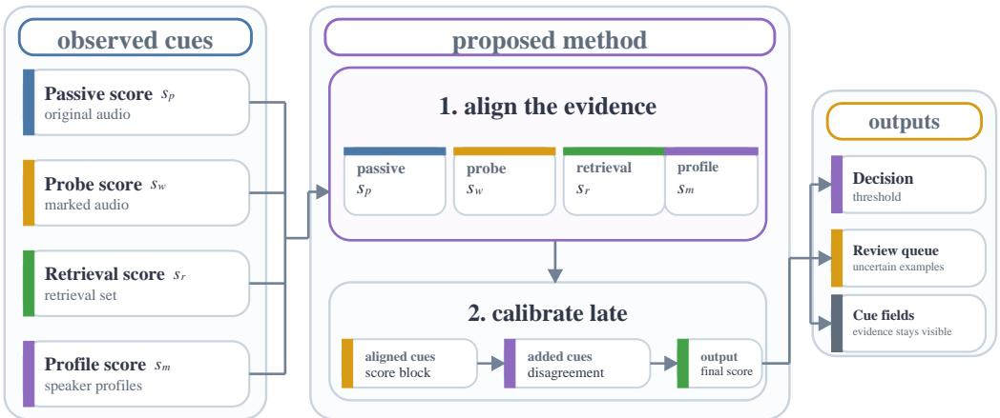  
Figure 2: Method overview. The four cue streams are first written to one utterance-level record. The main modeling step is late calibration over a score block and two explicit disagreement coordinates, which yields the operating score while leaving the original cues available for thresholding, selective review, and inspection.

We ask whether auxiliary streams reduce held-out family errors and whether exposed cues make borderline utterances easier to review. WavLM-large supplies the scalar-detector reference, and the decision record keeps the complementary evidence visible.

## 4 EXPERIMENTAL PROTOCOL

Data and splits. All main experiments use ASVspoof 5 Track 1 development data. The primary matched subset is the utterance-id intersection of the passive–probe and retrieval/profile branches after holding out synthesis families A09–A16. It contains 4,080 utterances from 705 speakers: 3,215 bona fide examples, 865 spoof examples, and 8.01 h of referenced speech. Table 1 summarizes the four fixed protocol choices: paired matched examples, an optional watermark-probe field, familyheld-out retrieval support, and out-of-fold calibration.

The matched subset is intentionally restrictive. We use it for paired comparison across evidence streams, and we use the larger score sets only to interpret coverage. Appendix Table 4 lists example counts, speakers, families, and duration, and Appendix Table 17 reports retained proportions and retrieval EER shifts by family. To quantify this join effect, we compare the matched subset with matched-size bootstrap draws from the full retrieval scores and with the spoof examples omitted by the join: no held-out family has a matched EER outside its bootstrap interval, the largest matchedminus-random EER shift is 4.30 points, and retained spoof examples differ from omitted spoof examples by -0.74 points on the bona fide score scale (KS=0.024; maximum family KS=0.133; Ap pendix Table 18). These checks bound the join effect on the available retrieval scores, but they do not make the matched subset equivalent to the full retrieval distribution. The retrieval branch therefore provides family-held-out matched support evidence, not a source-isolated or speaker-isolated zero-day claim.

Detector-strength claims use matched passive controls and frozen-SSL summaries kept outside the central decision-record comparison. Outside-corpus passive analyses use public In-The-Wild, Wave-Fake, and ASVspoof 2021 deepfake resources (Muller et al., 2022; Liu et al., 2024a; Frank &¨ Schonherr, 2021; Liu et al., 2022). Each family comparison reuses the same bona fide pool and¨ swaps only the held-out spoof family.

Table 1: Matched held-out-family protocol used in the main comparisons.
<table><tr><td>Component</td><td>Specification</td></tr><tr><td>Matched examples</td><td>ASVspoof 5 Track 1 development split; 4,080 matched examples with 4,080 unique utterances and 705 speakers (3,215 bona fide / 865 spoof); 8 held-out A09–A16 folds with 91–124 spoof examples each. Audio-path metadata covers 8.01 h over 4,080 files.</td></tr><tr><td>Passive score</td><td>Archived compact spectrogram-CNN bona fide probability for every matched comparison; the stored score is treated as a fixed input stream. No per-family score-polarity correction is applied, so family failures stay visible in Table 20.</td></tr><tr><td>Watermark score</td><td>Stronger frozen-SSL passive comparisons appear in the appendix. Spread-spectrum presence probability with one development key, strength -32.0 dB, and 16 kHz audio. The matched fusion examples all carry the same derived watermark condition across bona fide and spoof labels, so this stream tests keyed-probe behavior and cue disagreement while keeping watermark presence</td></tr><tr><td>Retrieval/profile</td><td>independent of the class label. HuBERT-large archive; k = 10 neighbor-label retrieval; 38,797 support embeddings and 40,000 pre-join predictions from our reimplementation, distinct from the published paper&#x27;s reported scores. The identifier-overlap analysis finds 0/20,000 spoof examples with any top-10 neighbor from the held-out family, with 0 query utterance-ID matches, 0 speaker ID matches, and 0 exact audio-path matches across the top-10 list; source tags are corpus-level fields and</td></tr><tr><td>Calibration</td><td>are not used to certify prompt or recording-source separation. 8 leave-family-out folds; 10 features including passive-watermark and fusion-retrieval disagreement; seed 20260821; intervals use 5,000 bootstrap resamples.</td></tr></table>

Unless stated otherwise, EER denotes one pooled threshold over the evaluated examples. Held-outfamily EER averages bona-fide-versus-one-family evaluations that reuse the full bona fide pool, and Fold EER averages the eight calibration folds.

Models and scores. The matched comparison uses a fixed compact spectrogram-CNN passive score with four-second, 16 kHz preprocessing metadata. This passive stream defines the main experiment. Stronger frozen-SSL systems are reported only as context: Table 33 gives the matched WavLM-large analysis, Appendix Table 34 gives frozen-SSL attack settings, and Appendix Table 7 gives full-evaluation passive baselines. The watermark score is computed on a derived spreadspectrum track with one development key at −32 dB in the 3.0–7.6 kHz band. Because the same derived condition is attached to bona fide and spoof labels, we treat this score as probe behavior and cross-stream disagreement rather than stand-alone class evidence.

Following the zero-day retrieval setting of Liu et al. (2025b), the retrieval and profile channels use k = 10 nearest neighbors after support-set feature standardization, with held-out-family support removed before scoring that family. Table 1 defines the nearest-neighbor setup, and Appendix Table 19 gives the identifier-overlap audit. Across 40,000 retrieval examples, we find no held-outfamily top-10 neighbor for spoof examples and no exact query, speaker, or audio-path reuse. The available source tag is shared only at corpus granularity, so prompt, channel, and recording-source independence remain unresolved.

Retrieval choices are studied only as sensitivity analyses. Appendix Table 32 summarizes the 13- setting retrieval and profile sweep. The main matched comparison uses the fixed HuBERT-large 20k default configuration; the best sweep setting is used only for sensitivity analysis.

Metrics and uncertainty. We report EER, minDCF, and expected calibration error. All scores are oriented so larger values support the bona fide or mark-consistent hypothesis. The main text uses a bona fide-target normalized cost $( P _ { \mathrm { t a r } } = 0 . 0 5 , C _ { \mathrm { m i s s } } = 1 , C _ { \mathrm { f a } } = \mathrm { i } \bar { 0 ) }$ , while Appendix Table 6 repeats the comparison with the target class inverted. Because minDCF moves strongly with this prior and several settings approach the default-cost ceiling, we interpret the main comparison through EER, ECE, and paired intervals. ECE uses 15 equal-width probability bins. Matched comparisons use paired class-stratified bootstrap intervals with 5,000 resamples, and learned controls are also resampled over the eight held-out folds. Appendix Table 28 repeats the key EER comparisons with speaker-resampled intervals. Source-level resampling is not attempted because the matched subset exposes only one coarse source tag.

Table 2: Matched ASVspoof 5 comparison on the 4,080 examples where passive, probe, retrieval, and profile measurements are all available on the same utterances. Lower is better. The highlighted fixed retrieval-augmented rule is the main fixed-fusion comparison; Table 3 isolates what the learned disagreement coordinates add beyond these fixed combinations.
<table><tr><td>System</td><td>Pooled EER↓</td><td>Family EER ↓</td><td>minDCFBF↓</td><td>ECE↓</td></tr><tr><td>Passive CNN</td><td>21.15</td><td>24.44</td><td>1.0000</td><td>0.2826</td></tr><tr><td>Passive WavLM-large (best of 22)</td><td>6.71</td><td>5.33</td><td>0.9776</td><td>0.0453</td></tr><tr><td>Watermark probe</td><td>48.67</td><td>49.08</td><td>0.9972</td><td>0.4889</td></tr><tr><td>Passive + watermark probe</td><td>21.03</td><td>24.39</td><td>0.9984</td><td>0.3755</td></tr><tr><td>Learned passive + watermark</td><td>21.03</td><td>24.61</td><td>0.9984</td><td>0.0663</td></tr><tr><td>Retrieval kNN</td><td>15.84</td><td>13.85</td><td>0.9406</td><td>0.1451</td></tr><tr><td>Distance-only retrieval</td><td>62.68</td><td>65.38</td><td>1.0000</td><td>0.1708</td></tr><tr><td>Profile margin</td><td>34.58</td><td>38.01</td><td>0.9944</td><td>0.2833</td></tr><tr><td>Fixed retrieval-augmented rule</td><td>11.91</td><td>10.27</td><td>0.8283</td><td>0.2609</td></tr><tr><td>Fixed retrieval + profile</td><td>12.96</td><td>9.86</td><td>0.7673</td><td>0.3270</td></tr></table>

## 5 RESULTS

Main matched comparison. Table 2 fixes one HuBERT retrieval branch for the paired comparison rather than selecting the best point from the retrieval sweep. The held-out-family EER column averages eight leave-one-family-out evaluations with a shared bona fide pool. The WavLM row reports the best run from a 22-run matched passive sweep, whose median is 9.60%. The main pattern is simple. On this split, retrieval is the auxiliary channel that changes the decision. The fixed retrieval-augmented rule lowers pooled EER from 15.84% to 11.91% and family-macro EER from 13.85% to 10.27%. Most of the gain comes from A12 and A13, where the passive stream fails most often. Appendix Table 33 shows the same ordering on the WavLM-aligned subset, where retrieval falls from 10.36% to 8.27%. The fixed rule improves ranking but not calibration: ECE rises from 0.1451 to 0.2609. The learned cross-fit record keeps the EER gain and restores calibration, reaching 8.43% EER with 0.0709 ECE. That result is stronger than the WavLM sweep median (9.60%), but it still does not exceed the best passive WavLM run (6.71%).

The other auxiliary channels are weaker. Nearest-distance retrieval reaches 62.68% EER on its own, so raw closeness is not enough. The probe is also weak as a stand-alone score: probe-only EER is 48.67%, and passive + probe remains close to the passive CNN (21.03% versus 21.15%). Appendix Table 14 shows the same pattern after removing $s _ { w } \colon$ pooled EER rises only slightly from 11.91% to 12.46%. On this split, the probe is useful mainly because it marks disagreement with the passive and retrieval streams, not because it carries strong class evidence by itself.

Profile evidence changes the operating trade-off rather than giving a uniform gain. Adding the profile margin lowers family-macro EER to 9.86% and minDCFBF to 0.7673, but pooled EER rises to 12.96% and ECE to 0.3270. We therefore read the matched comparison as retrieval-led improvement with a decision record that preserves disagreement for later calibration and review.

Table 3 asks the next question: once passive and retrieval scores are already in hand, what stil matters? Fold EER here averages the eight calibration folds, so it should be read against the other fold-level controls in the same table rather than against the held-out-family EER column in Table 2. The direct comparison is the explicit $\beta _ { d } = 0$ score-fusion ablation of Eq. 1. That control already improves on the fixed mean, reaching 11.91% EER and 0.0840 ECE. The weak controls show what does not explain the gain. Passive shape alone remains poor: $| s _ { p } - 0 . 5 |$ gives 24.04% EER, and $s _ { p }$ with $s _ { p } ^ { 2 }$ gives 21.50%. Retrieval with profile but without the passive score reaches 16.64% EER. Adding passive to retrieval without any watermark field reaches 11.67% EER, which indicates that most class information already sits in the passive and retrieval channels. The remaining improve ment comes from how disagreement is represented, not from a strong independent probe score. The no-watermark scalar expansion with $s _ { p } ^ { 2 }$ and $\vert s _ { p } - 0 . 5 \vert$ reaches 8.67% EER, and the paired difference to the full model is -0.24 [-0.81, +0.46] points. Single-gap controls reach 8.90% for $| s _ { p } - s _ { w } |$ and 8.78% for $| f _ { p w } - s _ { r } | .$ . As a negative control, fold shuffling breaks the example-level link in $s _ { w }$ while preserving each fold’s watermark-score distribution. Its 8.78% EER remains only 0.35 percentage points from the full model, which again points to score geometry rather than direct class evidence in the watermark field.

Table 3: Cross-fit calibration ablation on the 4,080 matched examples. Pooled EER uses one global threshold. The controls test whether the learned gain comes from explicit disagreement terms or from more generic reshaping of passive and retrieval scores.
<table><tr><td>Setting</td><td>Feature set</td><td>EER (%) ↓</td><td>Fold EER (%) ↓</td><td> $\mathbf { m i n D C F _ { B F } } \downarrow$ </td><td>ECE↓</td><td>Brier ↓</td></tr><tr><td>Fixed retrieval-augmented rule</td><td>fixed mean</td><td>11.91</td><td>10.04</td><td>0.8283</td><td>0.2609</td><td>0.1415</td></tr><tr><td>Cross-fit scalar fusion</td><td> $\beta _ { d } = 0 \mathrm { s c a l a r s c o r e s }$ </td><td>11.91</td><td>9.23</td><td>0.9107</td><td>0.0840</td><td>0.0797</td></tr><tr><td>Passive margin only</td><td> $| s _ { p } - 0 . 5 |$ </td><td>24.04</td><td>23.92</td><td>0.9991</td><td>0.2064</td><td>0.1824</td></tr><tr><td>Passive shape control</td><td> $s _ { p } \mathrm { p l u s } s _ { p } ^ { 2 }$ </td><td>21.50</td><td>24.14</td><td>1.0000</td><td>0.2305</td><td>0.1451</td></tr><tr><td>Retrieval + profile only</td><td> $\scriptstyle { \mathrm { n o ~ p r o b e } }$ </td><td>16.64</td><td>13.58</td><td>0.9978</td><td>0.1385</td><td>0.1129</td></tr><tr><td>Passive + retrieval only</td><td> $\scriptstyle { \mathrm { n o ~ p r o b e } }$ </td><td>11.67</td><td>9.26</td><td>0.9238</td><td>0.0904</td><td>0.0797</td></tr><tr><td>No-probe nonlinear control</td><td>passive + retrieval shape</td><td>8.67</td><td>7.34</td><td>0.9984</td><td>0.0756</td><td>0.0645</td></tr><tr><td>Passive-probe gap</td><td> $\mathrm { s c a l a r } + \left| s _ { p } - s _ { w } \right|$ </td><td>8.90</td><td>7.99</td><td>0.9611</td><td>0.0761</td><td>0.0680</td></tr><tr><td>Shuffled-probe control</td><td> $\mathrm { f o l d - s h u f f i e d } \ W + \mathrm { g a p }$ </td><td>8.78</td><td>7.99</td><td>0.9652</td><td>0.0759</td><td>0.0673</td></tr><tr><td>Fusion-retrieval gap</td><td> $\mathrm { s c a l a r } + | f _ { p w } - s _ { r } |$ </td><td>8.78</td><td>7.30</td><td>0.8591</td><td>0.0752</td><td>0.0691</td></tr><tr><td>Squared-gap record</td><td>squared gaps</td><td>8.33</td><td>6.78</td><td>0.9742</td><td>0.0709</td><td>0.0631</td></tr><tr><td>Product-term control</td><td>score products</td><td>10.16</td><td>8.00</td><td>0.8986</td><td>0.0780</td><td>0.0751</td></tr><tr><td>Proposed decision record</td><td>absolute gaps</td><td>8.43</td><td>7.21</td><td>0.9365</td><td>0.0709</td><td>0.0640</td></tr></table>

The learned record helps because it keeps disagreement explicit. The squared-gap model gives the lowest point estimate at 8.33% EER and 0.0709 ECE. We still use the absolute-gap model in the main analysis because its coordinates are easier to read in worked examples and selective review. Its 0.10-point EER gap to the squared variant is not resolved by the paired interval in Appendix Table 27. Speaker-resampled intervals in Appendix Table 28 still favor the absolute-gap model over the product-term nonlinear control (-1.72 [-2.72, -0.65] points), while leaving the near-tie settings unresolved.

Where the gain comes from. The held-out-family results show that the improvement is concentrated, not uniform. Relative to cross-fit score fusion, the absolute-gap model lowers mean Fold EER by 2.02 points, from 9.23% to 7.21%. Per-family changes range from -0.12 points on A14 to +6.57 points on A12, and A11–A12 account for 1.46 points of the mean reduction.

A12 is the clearest example of what the disagreement terms recover. Appendix Table 5 shows that spoof examples receive higher passive bona fide probabilities than bona fide examples on average (0.945 versus 0.627), yielding 81.31% passive EER while retrieval is correctly oriented at 2.03%. In Table 29, the same family drops from 13.01% to 6.44% Fold EER once the disagreement fields are added. The split-stability check supports the same reading. Appendix Table 30 repeats the learned calibrators over ten alternate bona fide assignments while keeping spoof folds fixed, and the absolute-gap model stays within 8.33%–8.55% pooled EER, compared with 11.69%–12.05% for score fusion. The gain is strongest where the passive stream is least reliable and the disagreement coordinates expose that failure.

Passive-reference context. The stronger passive baseline narrows the claim. Under the same cross-fit protocol on the same WavLM-aligned examples, the WavLM decision-record model reaches 9.14% EER, compared with 11.79% for passive calibration alone. Against the broader passive sweep, however, the best of 22 WavLM-large runs still reaches 6.71% EER, while the sweep median is 9.60%. The record therefore improves on the same-protocol passive control and stays below the sweep median, but it does not exceed the best passive run. The same foldwise ordering holds (6.56% versus 5.00% Fold EER). We use WavLM as the scalar reference for exactly that reason.

On the WavLM-aligned subset, passive, retrieval, and record + retrieval give 22.79%, 10.36%, and 8.27% EER. Appendix Tables 15 and 33 keep the same narrow reading of the probe: direct marked/unmarked pairs separate cleanly, while the source-pair and self-voice-conversion controls stay near chance. The probe is therefore a conditional measurement tied to the marked derivative, the key, and the threat model, not a stand-alone detector.

Review behavior. The review analysis asks a different question from pooled EER: when only a small fraction of utterances can be inspected, which score moves likely mistakes closest to the top of the queue? In the HuBERT retrieval-and-profile setting, the cross-fit absolute-gap record ranks errors most effectively. Within the first 10% reviewed examples it captures 47.97% of its own errors, compared with 38.89% for the fixed retrieval-augmented rule and 29.26% for retrieval kNN (Table 23).

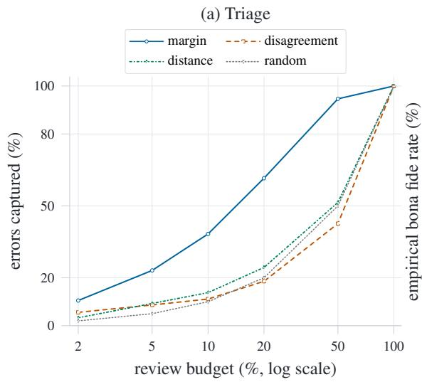

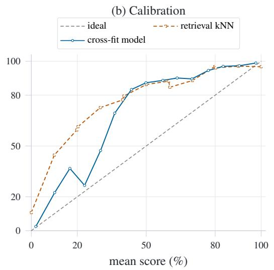

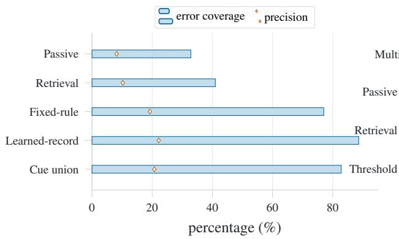

(d) Cue overlap  
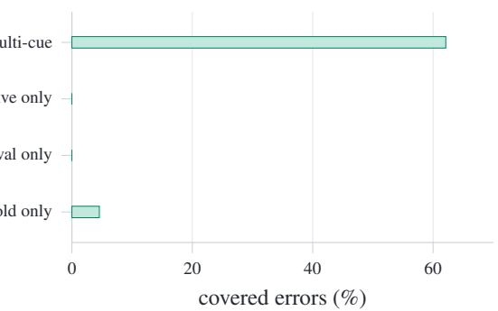  
Figure 3: Matched-example calibration and review analysis. (a) Each curve gives the share of fixedrule threshold errors recovered within a review budget; post-deferral error and AURC are summarized in Appendix Table 23. (b) Fifteen equal-width reliability bins compare retrieval kNN with the cross-fit model. (c) Every queue flags 33.75% of matched examples; the four-cue union retains most of the cross-fit margin queue’s error coverage with only a small precision drop while preserving explicit review cues. (d) Most covered errors trigger more than one cue, and the single-cue remainder is dominated by passive-record conflict. Exact fixed-budget values are listed in Appendix Table 25.

This is a ranking result, not a restatement of pooled EER. After deferring the first 10%, the residual error rate falls to 4.87%, compared with 8.09% for the fixed retrieval-augmented rule and 12.45% for retrieval kNN. The fixed rule is slightly more precise at the same budget (46.32% versus 40.44%), but the learned record pulls more total mistakes toward the inspection boundary.

The WavLM analysis leads to the same separation between detection and review. The best passive WavLM run reaches 6.72% full-set error. Adding auxiliary fields does not improve that decision rule, but the corresponding decision-record model still captures 50.40% of its own errors in the first 10% reviewed examples. The record is therefore useful even when it is not the best detector, because it helps decide which likely mistakes should be inspected first.

Figure 3 separates the review story into three pieces: what is useful before calibration, how well the learned score is calibrated, and whether the visible cues still help at a fixed inspection load. In panel (a), threshold margin is the strongest pre-calibration triage signal. At 20% review it captures 61.5% of fixed-rule errors. Nearest-neighbor distance reaches 24.3%, and raw disagreement reaches 18.5%, compared with 20.0% for a random queue. The practical takeaway is that margin gives the clearest pre-calibration ordering, while distance and disagreement remain secondary but nonnegligible warning signals.

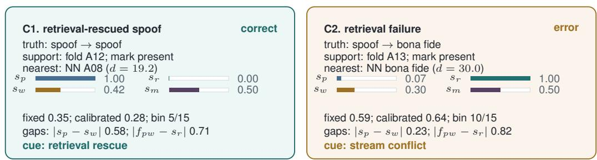  
Figure 4: Worked matched examples from the main decision-record model. C1 is a correct spoof from family A12: the passive stream is near the bona fide side, but retrieval support drives the calibrated score below threshold. C2 is a failure from family A13: passive evidence points toward spoof, retrieval points strongly toward bona fide, and the large stream conflict remains visible in the final record.

Panel (b) uses the same 15 equal-width bins as the ECE calculation in Tables 2 and 3. All 15 cross-fit bins sit above the diagonal, which indicates a mild under-confidence trend on bona fide examples rather than a severe shape failure. The largest gap occurs in the bin centered near 0.436, where the mean score is 0.436 and the empirical bona fide rate is 0.833. Appendix Table 31 repeats the calculation with equal-mass bins; for the cross-fit model, ECE changes only slightly, from 0.0709 to 0.0715. A foldwise isotonic refit lowers it further to 0.0178.

The fixed-budget comparison asks a more practical question: if the operating score has already been learned, does keeping the component cues visible still help organize review? Appendix Table 24 defines the four explicit review cues. Figure 3(c) compares them at a fixed review budget, Figure 3(d) breaks down the covered errors, and Appendix Table 25 reports the exact values. At the shared 1,377-example review load (33.75%), the four-cue union covers 82.85% of the calibrated rule’s errors, compared with 32.85% for a passive-margin queue and 40.99% for a retrieval-margin queue. The learned-margin queue is still the best single queue at 88.66%, but the four-cue union stays close to the fixed-rule margin queue at 77.03% but it retains an interpretable reason for inspection. Its precision is lower (20.70% versus 22.15%), but the drop is modest relative to the extra diagnostic coverage.

Among the 285 covered errors, 177 trigger at least two cues (62.1%), as shown in Figure 3(d). Single-cue cases are mostly ordinary near-threshold decisions: 13 are flagged only by threshold proximity. Figure 4 shows two matched examples that make the record concrete: one retrievalrescued spoof and one retrieval-driven failure.

Figure 4 gives two matched examples. C1 is a correct spoof from family A12: the passive score stays near the bona fide side (1.00), but retrieval support falls to 0.00 and drives the calibrated score to 0.28, below threshold. C2 shows the opposite failure in family A13: passive evidence points toward spoof (0.07), retrieval pushes toward bona fide (1.00), and the disagreement term remains large $( | f _ { p w } - s _ { r } | = 0 . 8 2 )$ even though the final decision is wrong.

The paired bootstrap intervals preserve the same ordering. The fixed retrieval-augmented rule improves on the passive CNN by −9.24 percentage points and on retrieval-only evidence by −3.92 (Appendix Table 27). The learned absolute-gap model then improves on score fusion, the oneconflict controls, and the product-term nonlinear control, while remaining statistically tied with the squared-gap variant. Appendix Table 6 shows that minDCF still favors the fixed retrievalaugmented rule (0.8283 versus 0.9365). We therefore use the fixed rule for threshold-oriented discussion and the learned models for ranking, calibration, and selective review.

Family-level variation. Family-level comparisons show that the pooled gain is concentrated rather than uniform. Against the passive CNN, the fixed retrieval-augmented rule improves on A12, A13, A14, and A16, is unresolved on A09, A10, and A15, and regresses on A11. A12 is the decisive family. Appendix Table 5 shows that a label-informed polarity correction lowers family-macro passive EER from 24.44% to 15.86%.

The error accounting tells the same story. Bona fide examples contribute 297 of the 377 net fewer errors, A12 and A13 contribute 90 and 38, and A11 plus A15 offset the gain by 30 and 12 errors. If A12 and A13 are removed, the family-macro EERs become nearly identical (10.20% for the passive CNN and 10.28% for the fixed retrieval-augmented rule). We therefore interpret the pooled improvement as recovery from a small set of passive failure modes, not as a uniform advantage over the passive stream. Appendix Figure 5 and Appendix Tables 22 and 21 give the full breakdown and paired intervals.

Component ablations. The ablations indicate that retrieval helps through neighbor labels, not through raw distance alone. The fixed retrieval-augmented rule lowers EER by 3.92 points relative to retrieval kNN in the fixed HuBERT setting, whereas nearest-distance retrieval reaches 62.68% EER. Out-of-fold calibration recovers some information from this inverted distance signal, but the fixed rule does not.

The keyed probe also behaves as a conditional measurement rather than as a standalone class score: direct marked/unmarked pairs are separable, while the matched and conversion controls carry little class information in the probe score itself. In the WavLM setting, the passive detector is the accuracy reference and the decision record is most useful for exposing agreement and conflict across auxiliary streams.

The squared-gap model gives the best point estimate in Table 3. It reaches 8.33% EER and 0.0709 ECE, but Appendix Table 27 does not resolve its 0.10-point EER difference from the absolute-gap model. We therefore keep the absolute-gap model in the main analysis because its disagreement coordinates are easier to interpret in worked examples and review settings. The one-gap, no-watermark nonlinear, and fold-shuffled controls all support the same conclusion: the gain is explained by score geometry, not by a strong stand-alone watermark signal.

## 6 CONCLUSION

This paper asks what is lost when speech deepfake detection is reduced to one final score. On the matched ASVspoof 5 setting, keeping passive, probe, retrieval, and profile cues visible until late calibration improves the operating score over fixed scalar fusion and yields a more useful review object at fixed inspection load. The gain is concentrated rather than uniform, with most of the improvement coming from a small set of passive failure modes, especially A12 and A13. In this setting the keyed probe contributes mainly by exposing disagreement with the passive and retrieval streams, not by acting as an independent detector. The broader lesson is that auxiliary streams are most valuable when they remain inspectable after scoring, so that a surfaced utterance carries both an operating score and a reason to inspect it.

## REFERENCES

Alexei Baevski, Henry Zhou, Abdelrahman Mohamed, and Michael Auli. wav2vec 2.0: A framework for self-supervised learning of speech representations. In Advances in Neural Information Processing Systems, volume 33, pp. 12449–12460, 2020.

Sanyuan Chen, Chengyi Wang, Zhengyang Chen, Yu Wu, Shujie Liu, Zhuo Chen, Jinyu Li, Naoyuki Kanda, Takuya Yoshioka, Xiong Xiao, Jian Wu, Long Zhou, Shuo Ren, Yanmin Qian, Yao Qian, Jian Wu, Michael Zeng, Xiangzhan Yu, and Furu Wei. WavLM: Large-scale self-supervised pre-training for full stack speech processing, 2021.

Joel Frank and Lea Schonherr. WaveFake: A data set to facilitate audio deepfake detection, 2021.¨

Wanying Ge, Xin Wang, Xuechen Liu, and Junichi Yamagishi. Post-training for deepfake speech detection. In Proceedings ofthe IEEE Automatic Speech Recognition and Understanding Workshop, pp. 1–8, 2025a. doi: 10.1109/ASRU65441.2025.11434709.

Wanying Ge, Xin Wang, and Junichi Yamagishi. FakeMark: Deepfake speech attribution with watermarked artifacts, 2025b.

Yonatan Geifman and Ran El-Yaniv. Selective classification for deep neural networks. In Advances in Neural Information Processing Systems, volume 30, 2017.

Chuan Guo, Geoff Pleiss, Yu Sun, and Kilian Q. Weinberger. On calibration of modern neural networks. In Proceedings of the 34th International Conference on Machine Learning, volume 70 of Proceedings of Machine Learning Research, pp. 1321–1330, 2017.

Wei-Ning Hsu, Benjamin Bolte, Yao-Hung Hubert Tsai, Kushal Lakhotia, Ruslan Salakhutdinov, and Abdelrahman Mohamed. HuBERT: Self-supervised speech representation learning by masked prediction of hidden units. IEEE/ACM Transactions on Audio, Speech, and Language Processing, 29:3451–3460, 2021. doi: 10.1109/TASLP.2021.3122291.

Wen Huang, Xuechen Liu, Xin Wang, Junichi Yamagishi, and Yanmin Qian. From sharpness to better generalization for speech deepfake detection. In Proceedings ofINTERSPEECH 2025, pp. 5338–5342, 2025. doi: 10.21437/Interspeech.2025-1095.

Jee-weon Jung, Hee-Soo Heo, Hemlata Tak, Hye-jin Shim, Joon Son Chung, Bong-Jin Lee, Ha-Jin Yu, and Nicholas Evans. AASIST: Audio anti-spoofing using integrated spectro-temporal graph attention networks. In Proceedings ofthe IEEE International Conference on Acoustics, Speech and Signal Processing, pp. 6367– 6371, 2022. doi: 10.1109/ICASSP43922.2022.9747766.

Xuechen Liu, Xin Wang, Md Sahidullah, Jose Patino, Hector Delgado, Tomi Kinnunen, Massimiliano Todisco,´ Junichi Yamagishi, Nicholas Evans, Andreas Nautsch, and Kong Aik Lee. ASVspoof 2021: Towards spoofed and deepfake speech detection in the wild, 2022.

Xuechen Liu, Xin Wang, and Junichi Yamagishi. A preliminary case study on long-form in-the-wild audio spoofing detection, 2024a.

Xuechen Liu, Junichi Yamagishi, Md Sahidullah, and Tomi Kinnunen. Explaining speaker and spoof embeddings via probing, 2024b.

Xuechen Liu, Wanying Ge, Xin Wang, and Junichi Yamagishi. LENS-DF: Deepfake detection and temporal localization for long-form noisy speech. In Proceedings of the IEEE International Joint Conference on Biometrics, pp. 1–10, 2025a. doi: 10.1109/IJCB65343.2025.11411544.

Xuechen Liu, Xin Wang, and Junichi Yamagishi. Zero-day audio deepfake detection via retrieval augmentation and profile matching, 2025b.

Nicolas M. Muller and Pascal Debus. The watermark shortcut: How provenance marking sabotages audio¨ deepfake detection, 2026.

Nicolas M. Muller, Pavel Czempin, Franziska Dieckmann, Adam Froghyar, and Konstantin B ¨ ottinger. Does ¨ audio deepfake detection generalize?, 2022.

Viola Negroni, Xin Wang, Wanying Ge, Paolo Bestagini, Junichi Yamagishi, and Stefano Tubaro. Toward interpretable speech deepfake detection using artifact-specific experts and calibrated detection scores, 2026.

Alexandru Niculescu-Mizil and Rich Caruana. Predicting good probabilities with supervised learning. In Proceedings ofthe 22nd International Conference on Machine Learning, pp. 625–632, 2005. doi: 10.1145/ 1102351.1102430.

Yigitcan Ozer, Wanying Ge, Zhe Zhang, Xin Wang, and Junichi Yamagishi. Self voice conversion as an attack ¨ against neural audio watermarking, 2026.

Robin San Roman, Pierre Fernandez, Hady Elsahar, Alexandre Defossez, Teddy Furon, and Tuan Tran. Proac-´ tive detection of voice cloning with localized watermarking. In Proceedings of the 41st International Conference on Machine Learning, volume 235 of Proceedings ofMachine Learning Research, pp. 43180–43196, 2024.

Hemlata Tak, Jose Patino, Massimiliano Todisco, Andreas Nautsch, Nicholas Evans, and Anthony Larcher. End-to-end anti-spoofing with RawNet2. In Proceedings of the IEEE International Conference on Acoustics, Speech and Signal Processing, pp. 6369–6373, 2021. doi: 10.1109/ICASSP39728.2021.9414234.

Hoan My Tran, Xin Wang, Wanying Ge, Xuechen Liu, and Junichi Yamagishi. Deepfake word detection by next-token prediction using fine-tuned Whisper, 2026.

Xin Wang, Hector Delgado, Hemlata Tak, Jee-weon Jung, Hye-jin Shim, Massimiliano Todisco, Ivan Kukanov,´ Xuechen Liu, Md Sahidullah, Tomi H. Kinnunen, Nicholas Evans, Kong Aik Lee, and Junichi Yamagishi. ASVspoof 5: Crowdsourced speech data, deepfakes, and adversarial attacks at scale. In Proceedings of the Automatic Speaker Verification Spoofing Countermeasures Workshop, pp. 1–8, 2024a. doi: 10.21437/ asvspoof.2024-1.

Xin Wang, Tomi Kinnunen, Kong Aik Lee, Paul-Gauthier Noe, and Junichi Yamagishi. Revisiting and improv-´ ing scoring fusion for spoofing-aware speaker verification using compositional data analysis, 2024b.

Xin Wang, Hector Delgado, Nicholas Evans, Xuechen Liu, Tomi Kinnunen, Hemlata Tak, Kong Aik Lee,´ Ivan Kukanov, Md Sahidullah, Massimiliano Todisco, and Junichi Yamagishi. ASVspoof 5: Evaluation of spoofing, deepfake, and adversarial attack detection using crowdsourced speech, 2026a.

Xin Wang, Hector Delgado, Hemlata Tak, Jee-weon Jung, Hye-jin Shim, Massimiliano Todisco, Ivan Kukanov,´ Xuechen Liu, Md Sahidullah, Tomi Kinnunen, Nicholas Evans, Kong Aik Lee, Junichi Yamagishi, Myeonghun Jeong, Ge Zhu, Yongyi Zang, You Zhang, Soumi Maiti, Florian Lux, Nicolas Muller, Wangyou¨ Zhang, Chengzhe Sun, Shuwei Hou, Siwei Lyu, Sebastien Le Maguer, Cheng Gong, Hanjie Guo, Liping´ Chen, and Vishwanath Singh. ASVspoof 5: Design, collection and validation of resources for spoofing, deepfake, and adversarial attack detection using crowdsourced speech. Computer Speech & Language, 95: 101825, 2026b. doi: 10.1016/j.csl.2025.101825.

Xin Wang, Wanying Ge, and Junichi Yamagishi. Towards data drift monitoring for speech deepfake detection in the context of MLOps. In Proceedings of ICASSP 2026, pp. 18052–18056, 2026c. doi: 10.1109/ICASSP55912.2026.11464546.

Chia-Hua Wu, Wanying Ge, Xin Wang, Junichi Yamagishi, Yu Tsao, and Hsin-Min Wang. A comparative study on proactive and passive detection of deepfake speech. In Proceedings of INTERSPEECH 2025, pp. 2595–2599, 2025. doi: 10.21437/Interspeech.2025-1419.

Chang Zeng, Xiaoxiao Miao, Xin Wang, Erica Cooper, and Junichi Yamagishi. Spoofing-aware speaker verification robust against domain and channel mismatches, 2024.

Lin Zhang, Xin Wang, Erica Cooper, Mireia Diez, Federico Landini, Nicholas Evans, and Junichi Yamagishi. Spoof diarization: What spoofed when in partially spoofed audio. In Proceedings of INTERSPEECH 2024, pp. 502–506, 2024. doi: 10.21437/Interspeech.2024-1365.

## A ADDITIONAL EVIDENCE

The appendix collects the protocol details, passive-reference comparisons, boundary checks, and stress analyses that support the main text.

## A.1 MATCHED SUBSET AND OPERATING CONVENTION

We document the examples, score orientation, and cost conventions used in the main text in Tables 4–6.

Table 4: Coverage of the score subsets used in the paper. BF/S gives bona fide and spoof counts; source-tag counts use broad corpus labels. Duration is computed from referenced audio files when available.
<table><tr><td>Subset</td><td>Examples</td><td>Utter.</td><td>BF/S</td><td></td><td>Spk. Source tags</td><td></td><td>Families Duration</td></tr><tr><td>Matched main</td><td>4,080</td><td>4,080</td><td>3,215/865</td><td>705</td><td>1</td><td></td><td>8 8.01 h</td></tr><tr><td>Retrieval pre-join</td><td>40,000</td><td>40,000</td><td>20,000/20,000</td><td>n/a</td><td>n/a</td><td></td><td>8 not available</td></tr><tr><td>WavLM matched</td><td>4,080</td><td>4,080</td><td>3,215/865</td><td>705</td><td>1</td><td></td><td>8 8.01 h</td></tr></table>

Table 5: Passive-score orientation analysis for the held-out synthesis-family protocol. The gap is the mean passive bona fide probability on bona fide examples minus that on spoof examples; negative gaps indicate anti-oriented scores. Inverted EER uses the deterministic score complement.
<table><tr><td>Family</td><td>Spoof</td><td> $\bar { p } _ { \mathrm { B F } } ^ { \mathbf { b o n } }$ </td><td> $\bar { p } _ { \mathrm { B F } } ^ { \mathrm { s p o o f } }$ </td><td>Gap</td><td>Passive EER (%) ↓</td><td>Inv. EER (%) ↓</td><td>Call</td></tr><tr><td>A09</td><td>111</td><td>0.627</td><td>0.088</td><td>+0.539</td><td>9.92</td><td>90.08</td><td>original</td></tr><tr><td>A10</td><td>124</td><td>0.627</td><td>0.072</td><td>+0.555</td><td>8.73</td><td>91.27</td><td>original</td></tr><tr><td>A11</td><td>121</td><td>0.627</td><td>0.060</td><td>+0.568</td><td>6.43</td><td>93.57</td><td>original</td></tr><tr><td>A12</td><td>91</td><td>0.627</td><td>0.945</td><td>-0.318</td><td>81.31</td><td>18.69</td><td>anti-oriented</td></tr><tr><td>A13</td><td>100</td><td>0.627</td><td>0.522</td><td>+0.105</td><td>53.00</td><td>47.00</td><td>near chance</td></tr><tr><td>A14</td><td>102</td><td>0.627</td><td>0.062</td><td>+0.565</td><td>5.65</td><td>94.35</td><td>original</td></tr><tr><td>A15</td><td>116</td><td>0.627</td><td>0.285</td><td>+0.342</td><td>23.27</td><td>76.73</td><td>original</td></tr><tr><td>A16</td><td>100</td><td>0.627</td><td>0.077</td><td>+0.550</td><td>7.22</td><td>92.78</td><td>original</td></tr></table>

Table 6: Cost-orientation sensitivity for the 4,080 matched examples. minDCF treats bona fide speech as the target class; $\mathrm { m i n D C F _ { s p o o f } }$ inverts labels and scores. Values near 1.0 mark the defaultcost ceiling.
<table><tr><td>Group</td><td>Score</td><td>EER (%) ↓</td><td>minDCFBF↓</td><td> $\mathbf { m i n D C F _ { s p o o f } \downarrow }$ </td></tr><tr><td>Main ablations</td><td>Passive CNN</td><td>21.15</td><td>1.0000</td><td>0.8579</td></tr><tr><td>Main ablations</td><td>Watermark probe</td><td>48.67</td><td>0.9972</td><td>0.9988</td></tr><tr><td>Main ablations</td><td>Fixed record</td><td>21.03</td><td>0.9984</td><td>0.9549</td></tr><tr><td>Main ablations</td><td>Retrieval kNN</td><td>15.84</td><td>0.9406</td><td>0.9988</td></tr><tr><td>Main ablations</td><td>Fixed record + retrieval</td><td>11.91</td><td>0.8283</td><td>0.6659</td></tr><tr><td>Main ablations</td><td>Profile fusion</td><td>12.96</td><td>0.7673</td><td>0.6974</td></tr><tr><td>Main ablations</td><td>Distance-only control</td><td>62.68</td><td>1.0000</td><td>1.0000</td></tr><tr><td>Calibration</td><td>Fixed record + retrieval</td><td>11.91</td><td>0.8283</td><td>0.6659</td></tr><tr><td>Calibration</td><td>Cross-fit score fusion</td><td>11.91</td><td>0.9107</td><td>0.7295</td></tr><tr><td>Calibration</td><td>Cross-fit nonlinear control</td><td>10.16</td><td>0.8986</td><td>0.7618</td></tr><tr><td>Calibration</td><td>Cross-fit absolute-gap record</td><td>8.43</td><td>0.9365</td><td>0.6913</td></tr></table>

## A.2 PASSIVE-DETECTOR CONTEXT

These tables place the matched decision-record comparison beside stronger passive SSL references and separate external stress settings. Appendix Table 8 shows that longer crops do not improve the frozen SSL baselines on these development runs. Appendix Table 10 separates outside-corpus transfer from the matched comparison. Appendix Tables 11 and 12 place the matched WavLM reference on the same 4,080 examples as the decision-record analysis, and Appendix Table 13 summarizes the self-voice-conversion stress condition.

Table 7: Frozen-SSL passive baseline context on full ASVspoof 5 evaluation scores. These entries contextualize the archived CNN baseline and summarize detector strength on evaluation examples that differ from Table 2 and from the official challenge-submission pool.
<table><tr><td>Backbone</td><td>Runs</td><td>Train cap</td><td>Eval examples</td><td>Best EER (%)↓</td><td>Median EER (%)↓</td><td>EER range (%) ↓</td></tr><tr><td>WavLM-large</td><td>12</td><td>20,000</td><td>680,774</td><td>9.06</td><td>9.83</td><td>9.06-11.72</td></tr><tr><td>Wav2Vec2-large LV60</td><td>11</td><td>20,000</td><td>680,774</td><td>11.69</td><td>11.91</td><td>11.69-12.03</td></tr><tr><td>HuBERT-large</td><td>11</td><td>20,000</td><td>680,774</td><td>12.02</td><td>12.21</td><td>12.02–12.35</td></tr></table>

Table 8: Full-development SSL duration controls for passive detector context. Entries use 20k-perclass ASVspoof 5 Track 1 development runs with 40,000 scored examples. EER and ∆Median are percentages; ∆Median compares each crop with the same backbone’s completed 4 s median.
<table><tr><td>Backbone</td><td>Crop</td><td>Runs</td><td>Best EER (%)↓</td><td>Median EER (%)↓</td><td>EER range (%) ↓</td><td>∆Median</td></tr><tr><td>WavLM-large</td><td>4 s</td><td>12</td><td>7.00</td><td>8.57</td><td>7.00-11.16</td><td>+0.00</td></tr><tr><td>WavLM-large</td><td>6 s</td><td>8</td><td>9.03</td><td>9.70</td><td>9.03-10.87</td><td>+1.13</td></tr><tr><td>WavLM-large</td><td>8s</td><td>5</td><td>11.15</td><td>12.80</td><td>11.15-14.92</td><td>+4.22</td></tr><tr><td>WavLM-large</td><td>10 s</td><td>8</td><td>10.91</td><td>13.17</td><td>10.91-15.04</td><td>+4.60</td></tr><tr><td>WavLM-large</td><td>12 s</td><td>4</td><td>13.00</td><td>13.54</td><td>13.00-13.93</td><td>+4.97</td></tr><tr><td>WavLM-large</td><td>14 s</td><td>4</td><td>11.29</td><td>11.64</td><td>11.29–12.35</td><td>+3.07</td></tr><tr><td>WavLM-large</td><td>16 s</td><td>4</td><td>8.67</td><td>9.03</td><td>8.67-9.32</td><td>+0.45</td></tr><tr><td>Wav2Vec2-large LV60</td><td>4 s</td><td>11</td><td>9.21</td><td>9.45</td><td>9.21-9.73</td><td>+0.00</td></tr><tr><td>Wav2Vec2-large LV60</td><td>6s</td><td>7</td><td>9.04</td><td>9.34</td><td>9.04–9.83</td><td>-0.11</td></tr><tr><td>Wav2Vec2-large LV60</td><td>8s</td><td>4</td><td>9.84</td><td>10.13</td><td>9.84-10.44</td><td>+0.68</td></tr><tr><td>Wav2Vec2-large LV60</td><td>10 s</td><td>7</td><td>9.80</td><td>10.20</td><td>9.80-10.88</td><td>+0.74</td></tr><tr><td>Wav2Vec2-large LV60</td><td>12 s</td><td>4</td><td>11.27</td><td>11.43</td><td>11.27-12.62</td><td>+1.98</td></tr><tr><td>Wav2Vec2-large LV60</td><td>14 s</td><td>4</td><td>10.96</td><td>11.34</td><td>10.96-12.03</td><td>+1.89</td></tr><tr><td>Wav2Vec2-large LV60</td><td>16 s</td><td>4</td><td>10.48</td><td>11.02</td><td>10.48-11.20</td><td>+1.57</td></tr><tr><td>HuBERT-large</td><td>4s</td><td>11</td><td>8.94</td><td>9.21</td><td>8.94-9.73</td><td>+0.00</td></tr><tr><td>HuBERT-large</td><td>6 s</td><td>7</td><td>9.45</td><td>10.04</td><td>9.45-10.64</td><td>+0.83</td></tr><tr><td>HuBERT-large</td><td>8s</td><td>4</td><td>16.07</td><td>17.73</td><td>16.07-18.19</td><td>+8.52</td></tr><tr><td>HuBERT-large</td><td>10 s</td><td>7</td><td>19.07</td><td>19.98</td><td>19.07–21.00</td><td>+10.78</td></tr><tr><td>HuBERT-large</td><td>12 s</td><td>4</td><td>17.95</td><td>18.84</td><td>17.95-19.34</td><td>+9.63</td></tr><tr><td>HuBERT-large</td><td>14 s</td><td>4</td><td>19.57</td><td>20.17</td><td>19.57–21.34</td><td>+10.96</td></tr><tr><td>HuBERT-large</td><td>16 s</td><td>4</td><td>20.71</td><td>22.52</td><td>20.71–23.01</td><td>+13.31</td></tr></table>

Training-size effects do not explain the decision-record comparison. In Table 9, Wav2Vec2-large LV60 and HuBERT-large improve modestly from 20k to 120k examples per class, while WavLMlarge is worse at the larger caps than at 20k. We use the selected WavLM setting only as a strong matched passive reference.

Table 9: Full-development SSL training-size controls for passive detector context. Entries aggregate completed 4 s ASVspoof 5 Track 1 development runs by frozen SSL backbone and per-class training cap. EER and ∆Median are percentages; ∆Median compares each entry with the same backbone’s completed 20k-per-class median.
<table><tr><td>Backbone</td><td>Size/class</td><td>Examples</td><td>Runs</td><td>Best EER (%) ↓</td><td>Median EER (%)↓</td><td>∆Median</td></tr><tr><td>WavLM-large</td><td>20,000</td><td>40,000</td><td>12/12</td><td>7.00</td><td>8.57</td><td>+0.00</td></tr><tr><td>WavLM-large</td><td>40,000</td><td>71,334</td><td>10/10</td><td>11.17</td><td>11.92</td><td>+3.35</td></tr><tr><td>WavLM-large</td><td>80,000</td><td>111,334</td><td>10/10</td><td>9.58</td><td>10.52</td><td>+1.94</td></tr><tr><td>WavLM-large</td><td>120,000</td><td>140,950</td><td>10/10</td><td>9.53</td><td>10.35</td><td>+1.78</td></tr><tr><td>Wav2Vec2-large LV60</td><td>20,000</td><td>40,000</td><td>11/11</td><td>9.21</td><td>9.45</td><td>+0.00</td></tr><tr><td>Wav2Vec2-large LV60</td><td>80,000</td><td>111,334</td><td>10/10</td><td>8.92</td><td>9.02</td><td>-0.43</td></tr><tr><td>Wav2Vec2-large LV60</td><td>120,000</td><td>140,950</td><td>10/10</td><td>8.89</td><td>8.94</td><td>-0.51</td></tr><tr><td>HuBERT-large</td><td>20,000</td><td>40,000</td><td>11/11</td><td>8.94</td><td>9.21</td><td>+0.00</td></tr><tr><td>HuBERT-large</td><td>80,000</td><td>111,334</td><td>10/10</td><td>8.37</td><td>8.65</td><td>-0.55</td></tr><tr><td>HuBERT-large</td><td>120,000</td><td>140,950</td><td>10/10</td><td>8.41</td><td>8.55</td><td>-0.66</td></tr></table>

Table 10: Frozen SSL outside-corpus results. Each entry summarizes the same 60 ASVspoof-5- trained SSL scoring runs spanning three encoders, two training-set sizes, and ten seeds on one outside evaluation set. The table provides passive-detector context beyond the main ASVspoof 5 comparison.
<table><tr><td>External set</td><td></td><td></td><td></td><td>Runs Examples/run Best EER (%) ↓ Median EER (%) ↓</td><td>Worst EER (%) ↓</td><td>Median ECE↓</td></tr><tr><td>In-The-Wild</td><td>60/60</td><td>31,779</td><td>14.25</td><td>24.60</td><td>28.33</td><td>0.2581</td></tr><tr><td>WaveFake</td><td>60/60</td><td>147,366</td><td>34.53</td><td>40.29</td><td>81.17</td><td>0.8528</td></tr><tr><td>ASVspoof 2021 DF</td><td>60/60</td><td>611,829</td><td>15.99</td><td>22.33</td><td>28.21</td><td>0.6046</td></tr></table>

Table 11: Matched frozen SSL passive context on the same 4,080 examples as Table 2. Runs vary backbone, seed, and training size. The best entry is chosen within each backbone; no entry includes watermark, retrieval, or profile evidence.
<table><tr><td>Backbone</td><td>Runs</td><td>Examples</td><td>Best EER (%)↓</td><td>Median EER (%)↓</td><td>EER range (%) ↓</td><td>Best minDCF / ECE↓</td></tr><tr><td>WavLM-large</td><td>22/22</td><td>4,080</td><td>6.71</td><td>9.60</td><td>6.71-13.63</td><td>0.9776/0.0453</td></tr><tr><td>HuBERT-large</td><td>11/11</td><td>4,080</td><td>8.21</td><td>9.24</td><td>8.21-9.48</td><td>0.9792/0.0416</td></tr><tr><td>Wav2Vec2-large</td><td>11/11</td><td>4,080</td><td>9.14</td><td>9.83</td><td>9.14-10.05</td><td>0.7801/0.0318</td></tr></table>

Table 12: WavLM passive context on the same 4,080 matched examples as Table 2. The passive entry is the lowest-EER WavLM-large run among 22 matched passive SSL runs. The sweep median is 9.60% EER and serves as the scalar baseline for comparison. W, R, and P denote watermark, retrieval, and profile fields.
<table><tr><td>System</td><td>Fit</td><td>Pooled EER (%) ↓</td><td>Family EER (%)↓</td><td>Fold EER (%)↓</td><td>ΔEER (%)↓</td><td>minDCFBF↓1</td><td>ECE↓</td></tr><tr><td>WavLM passive (best run)</td><td>passive</td><td>6.71</td><td>5.33</td><td>5.00</td><td>+0.00</td><td>0.9776</td><td>0.0453</td></tr><tr><td>Retrieval kNN</td><td>training-free</td><td>15.84</td><td>13.85</td><td>13.69</td><td>+9.12</td><td>0.9406</td><td>0.1451</td></tr><tr><td>WavLM + watermark</td><td>fixed</td><td>10.86</td><td>8.82</td><td></td><td>+4.15</td><td>0.9919</td><td>0.2813</td></tr><tr><td>WavLM + watermark + retrieval</td><td>fixed</td><td>11.33</td><td>9.53</td><td>8.80</td><td>+4.61</td><td>0.9872</td><td>0.2019</td></tr><tr><td>WavLM + watermark + retrieval + profile</td><td>fixed</td><td>10.17</td><td>8.09</td><td>7.83</td><td>+3.46</td><td>0.9708</td><td>0.2861</td></tr><tr><td>WavLM decision record</td><td>learned</td><td>9.14</td><td>一</td><td>6.56</td><td>+2.43</td><td>0.9984</td><td>0.0657</td></tr><tr><td>WavLM passive (cross-fit)</td><td>learned passive</td><td>11.79</td><td>一</td><td>5.00</td><td>+5.08</td><td>0.9823</td><td>0.1076</td></tr><tr><td>WavLM score fusion</td><td>learned scalar</td><td>9.72</td><td>一</td><td>6.85</td><td>+3.01</td><td>0.9991</td><td>0.0712</td></tr></table>

Table 13: Frozen-SSL self-voice-conversion stress summary. Each entry aggregates completed runs on the same 2,000-example converted-speech condition used for the passive CNN entry in Table 33. Ranges show run-to-run spread within a model family; EER values are percentages.
<table><tr><td>Model family</td><td>Runs</td><td>EER range (%)↓</td><td>Mean EER (%)↓</td><td>minDCF range ↓</td><td>Mean ECE↓</td></tr><tr><td>HuBERT-large</td><td>21</td><td>25.60–34.50</td><td>29.89</td><td>0.9480–1.0000</td><td>0.4564</td></tr><tr><td>Wav2Vec2-large</td><td>26</td><td>23.70–36.50</td><td>29.65</td><td>0.9890-1.0000</td><td>0.4331</td></tr><tr><td>WavLM-base-plus</td><td>12</td><td>27.30–30.00</td><td>28.21</td><td>0.9990–1.0000</td><td>0.4431</td></tr><tr><td>WavLM-large</td><td>34</td><td>32.90-43.40</td><td>37.25</td><td>0.9970-1.0000</td><td>0.4700</td></tr></table>

## A.3 PROBE AND RETRIEVAL BOUNDARY CHECKS

These tables show what the probe, retrieval, and profile streams support under the available metadata and controls.

Table 14: Score-level watermark-availability sensitivity on the 4,080 matched examples. Stored watermark columns are removed, neutralized, or inverted while other scores stay fixed. The table separates probe availability from failure-mode behavior.
<table><tr><td></td><td>Pooled</td><td></td><td>Family</td><td></td><td></td><td></td><td>Worst</td></tr><tr><td>Scenario</td><td>W field EER (%) ↓</td><td></td><td></td><td>EER (%)↓minDCFBF↓</td><td>ECE↓</td><td>Brier ↓</td><td>family ↓</td></tr><tr><td>Full record (passive, watermark, retrieval)</td><td>yes</td><td>11.91</td><td>10.27</td><td>0.8283</td><td>0.2609</td><td>0.1415</td><td>A15 (25.85)</td></tr><tr><td>Watermark unavailable, reweighted passive/retrieval</td><td>no</td><td>12.46</td><td>9.35</td><td>0.7692</td><td>0.1878</td><td>0.1098</td><td>A15 (21.69)</td></tr><tr><td>Watermark unavailable, neutral slot</td><td>no</td><td>12.46</td><td>9.35</td><td>0.7692</td><td>0.2582</td><td>0.1375</td><td>A15 (21.69)</td></tr><tr><td>W inverted, probe-only</td><td>yes</td><td>12.37</td><td>9.51</td><td>0.7552</td><td>0.2095</td><td>0.1130</td><td>A15 (22.40)</td></tr><tr><td>Full record + profile (all streams)</td><td>yes</td><td>12.96</td><td>9.86</td><td>0.7673</td><td>0.3270</td><td>0.1834</td><td>A15 (22.33)</td></tr><tr><td>Watermark unavailable + profile</td><td>no</td><td>12.72</td><td>9.84</td><td>0.7496</td><td>0.2522</td><td>0.1366</td><td>A15 (22.42)</td></tr></table>

The raw keyed-probe statistic, threshold, and decision counts used to interpret the probe channel are reported in Appendix Table 15.

Table 15: Operating counts for watermark-probe conditions. Probe mean, Probe SD, and threshold come from the raw keyed-probe statistic; scores at or above the threshold are accepted as marked. Direct pairs use marked and unmarked pairs, and the remaining conditions come from the conversion study.
<table><tr><td>Condition</td><td>n</td><td>Probe mean</td><td>Probe SD</td><td>Threshold</td><td>Marked acc./rej.</td><td>Unmarked acc./rej.</td><td>Interpretation</td></tr><tr><td>Probe wiring condition</td><td>20,000</td><td>0.01258</td><td>0.01261</td><td>0.01421</td><td>10,000/0</td><td>0/10,000</td><td>direct-pair positive control</td></tr><tr><td>Source-pair control</td><td>2,000</td><td>0.00007</td><td>0.00099</td><td>-0.00481</td><td>1,000/0</td><td>1,000/0</td><td>threshold accepts both classes</td></tr><tr><td>Converted-pair condition</td><td>2,000</td><td>0.00000</td><td>0.00086</td><td>-0.00085</td><td>905/95</td><td>896/104</td><td>weak mark readout after conversion</td></tr></table>

Table 16: Threat-model boundary for decision-record fields. The table states how each channel is interpreted in this paper and distinguishes keyed-probe evidence from authentication of an original utterance.
<table><tr><td>Scenario</td><td>Field(s) used</td><td>Reading in this paper</td><td>Open requirement</td></tr><tr><td>Known key, directly marked signal</td><td>sw on marked/unmarked pairs</td><td>probe wiring and operating threshold under the recorded key</td><td>performance on unmarked source audio</td></tr><tr><td>Derived marked copy in matched examples</td><td> $s _ { p } , s _ { w } , s _ { r } , s _ { m }$  and gaps</td><td>keyed-probe response and cross stream disagreement under the same derived condition for both classes</td><td>proof that the original benchmark file carried a mark</td></tr><tr><td>No key or absent mark</td><td> $s _ { p } , s _ { r } , s _ { m }$  plus availability status</td><td>passive, retrieval, and profile evidence stays available without the probe field</td><td>watermark authentication</td></tr><tr><td>Removal, corruption, or conversion</td><td>probe scores under stress</td><td>near-chance scores identify a failure condition for mark survival under attack the probe channel</td><td></td></tr><tr><td>Retrieved/profile support available</td><td> $s _ { r } , s _ { m } , c _ { r }$  and neighbor metadata</td><td>support set evidence after family exclusion and overlap analysis</td><td>prompt, channel, or collection independence</td></tr></table>

Table 17: Retrieval subset selection and nearest-neighbor overlap analysis. Full scores precede the matched fusion join, and matched examples are used in Table 2. The final columns report heldout-family leakage in the nearest neighbor and top-k list; coarse source tags describe corpus-level grouping rather than prompt or recording-source separation.
<table><tr><td>Family</td><td></td><td>Full spoof Matched spoof</td><td>Retained</td><td>Full EER (%) ↓</td><td>Matched EER (%) ↓</td><td>Same-family NN</td><td>Same-family top-k</td></tr><tr><td>A09</td><td>2,479</td><td>111</td><td>4.5%</td><td>15.36</td><td>13.51</td><td>0/2,479; 0/111</td><td>0/2,479</td></tr><tr><td>A10</td><td>2,548</td><td>124</td><td>4.9%</td><td>14.84</td><td>15.22</td><td>0/2,548; 0/124</td><td>0/2,548</td></tr><tr><td>A11</td><td>2,568</td><td>121</td><td>4.7%</td><td>26.05</td><td>24.65</td><td>0/2,568; 0/121</td><td>0/2,568</td></tr><tr><td>A12</td><td>2,457</td><td>91</td><td>3.7%</td><td>1.96</td><td>2.03</td><td>0/2,457; 0/91</td><td>0/2,457</td></tr><tr><td>A13</td><td>2,526</td><td>100</td><td>4.0%</td><td>23.48</td><td>19.19</td><td>0/2,526; 0/100</td><td>0/2,526</td></tr><tr><td>A14</td><td>2,450</td><td>102</td><td>4.2%</td><td>1.95</td><td>1.91</td><td>0/2,450; 0/102</td><td>0/2,450</td></tr><tr><td>A15</td><td>2,426</td><td>116</td><td>4.8%</td><td>27.41</td><td>29.31</td><td>0/2,426; 0/116</td><td>0/2,426</td></tr><tr><td>A16</td><td>2,546</td><td>100</td><td>3.9%</td><td>6.48</td><td>5.00</td><td>0/2,546; 0/100</td><td>0/2,546</td></tr></table>

Subset matching changes the retrieval-score distribution relative to the full score set. Appendix Table 18 quantifies the shift.

Table 18: Matched-subset sensitivity analysis for retrieval scores. The bootstrap column draws the same number of bona fide and spoof examples as the matched subset from the full retrieval score set. The final columns report the EER shift from that random-retention reference, the retainedminus-omitted shift in spoof-example bona fide scores, and the corresponding KS distance. Larger spoof-example scores indicate harder retrieval cases.
<table><tr><td>Family</td><td>Retained</td><td>Match EER (%) ↓</td><td>Boot. EER (%) ↓</td><td>Match- rand. (%)</td><td>Spoof shift↓</td><td>KS↓</td></tr><tr><td>A09</td><td>4.5%</td><td>13.51</td><td>15.31 [12.60, 18.01]</td><td>-1.80</td><td>-2.01</td><td>0.085</td></tr><tr><td>A10</td><td>4.9%</td><td>15.22</td><td>14.77 [12.10, 17.58]</td><td>+0.45</td><td>+0.21</td><td>0.058</td></tr><tr><td>A11</td><td>4.7%</td><td>24.65</td><td>26.09 [22.11, 30.58]</td><td>-1.44</td><td>-3.12</td><td>0.078</td></tr><tr><td>A12</td><td>3.7%</td><td>2.03</td><td>2.23 [1.34, 3.30]</td><td>-0.19</td><td>-0.24</td><td>0.017</td></tr><tr><td>A13</td><td>4.0%</td><td>19.19</td><td>23.49 [19.00, 28.00]</td><td>-4.30</td><td>-7.45</td><td>0.133</td></tr><tr><td>A14</td><td>4.2%</td><td>1.91</td><td>1.96 [1.74, 2.18]</td><td>-0.05</td><td>+0.07</td><td>0.009</td></tr><tr><td>A15</td><td>4.8%</td><td>29.31</td><td>27.49 [23.07, 32.62]</td><td>+1.81</td><td>+0.00</td><td>0.083</td></tr><tr><td>A16</td><td>3.9%</td><td>5.00</td><td>6.27 [4.01, 8.99]</td><td>-1.26</td><td>-1.80</td><td>0.046</td></tr></table>

The retrieval-neighbor audit in Appendix Table 19 complements the setup in Table 1. It rules out exact family, utterance, speaker ID, and audio-path reuse under the available metadata, while leaving broader source and channel overlap as a limitation.

Table 19: Identifier-overlap analysis for retrieval/profile nearest neighbors. Counts come from the pre-join 40,000-example retrieval setting with held-out synthesis-family exclusion for spoof examples. The coarse source tag is corpus-level metadata; prompt, channel, and recording-source independence remain unresolved at finer granularity.
<table><tr><td>Identifier relation</td><td>Examples</td><td>Matches</td><td>Interpretation</td></tr><tr><td>Held-out family as nearest neighbor</td><td>20,000</td><td>0/20,000</td><td>blocked by family exclusion</td></tr><tr><td>Held-out family anywhere in top-k</td><td>20,000</td><td>0/20,000</td><td>blocked by family exclusion</td></tr><tr><td>Same utterance ID anywhere in top-k</td><td>40,000</td><td>0/40,000</td><td>not observed</td></tr><tr><td>Same speaker ID anywhere in top-k</td><td>40,000</td><td>0/40,000</td><td>not observed</td></tr><tr><td>Same audio path anywhere in top-k</td><td>40,000</td><td>0/40,000</td><td>not observed</td></tr><tr><td>Same coarse source tag anywhere in top-k</td><td>40,000</td><td></td><td>40,000/40,000 shared corpus-level tag</td></tr></table>

## A.4 FAMILY, CALIBRATION, AND STRESS EVIDENCE

The remaining appendix material isolates three points: where the pooled gains concentrate, how the calibration terms behave, and why the active-selection and attack-stress studies stay outside the central claim.

Table 20: Held-out synthesis-family uncertainty for Figure 5. Counts give bona fide and spoof examples. EER is ROC-interpolated and can differ from integer error-count ratios in small families. $\Delta _ { P }$ and $\Delta _ { R }$ compare the fixed retrieval-augmented rule with passive CNN and retrieval kNN. Bold intervals favor the retrieval-augmented rule; † marks intervals against it.
<table><tr><td>Family</td><td>Bona.</td><td>Spoof</td><td>Passive</td><td>Ret.</td><td>Record</td><td>Profile</td><td>∆P</td><td>∆R</td></tr><tr><td>A09</td><td>3215</td><td>111</td><td>9.92</td><td>13.51</td><td>9.03</td><td>6.31</td><td>-0.9 [-4.3, +3.6]</td><td>-4.5 [-6.3, -2.0]</td></tr><tr><td>A10</td><td>3215</td><td>124</td><td>8.73</td><td>15.22</td><td>8.09</td><td>5.64</td><td>-0.6 [-3.2, +2.7]</td><td>-7.1 [-8.2, -4.7]</td></tr><tr><td>A11</td><td>3215</td><td>121</td><td>6.43</td><td>24.65</td><td>16.51</td><td>13.25</td><td>+10.1 [+5.9, +15.8]†</td><td>-8.1 [-10.8, -5.0]</td></tr><tr><td>A12</td><td>3215</td><td>91</td><td>81.31</td><td>2.03</td><td>5.47</td><td>13.37</td><td>-75.8 [-79.2, -72.5]</td><td>+3.4 [+2.5, +4.4]†</td></tr><tr><td>A13</td><td>3215</td><td>100</td><td>53.00</td><td>19.19</td><td>15.00</td><td>14.98</td><td>-38.0 [-48.1, -25.9]</td><td>-4.2 [-8.0, -1.0]</td></tr><tr><td>A14</td><td>3215</td><td>102</td><td>5.65</td><td>1.91</td><td>0.22</td><td>0.97</td><td>-5.4 [-6.7, -3.9]</td><td>-1.7 [-2.9, -1.0]</td></tr><tr><td>A15</td><td>3215</td><td>116</td><td>23.27</td><td>29.31</td><td>25.85</td><td>22.33</td><td>+2.6 [-3.6, +8.0]</td><td>-3.5 [-6.9, -0.2]</td></tr><tr><td>A16</td><td>3215</td><td>100</td><td>7.22</td><td>5.00</td><td>2.00</td><td>2.00</td><td>-5.2 [-9.0, -2.0]</td><td>-3.0 [-4.6, -1.0]</td></tr></table>

The pooled gain is concentrated in a small subset of families, as Table 20 shows; Appendix Figure 5 makes that concentration easier to see. Appendix Table 21 confirms that excluding A12 and A13 largely removes the pooled advantage, and Appendix Table 22 shows that most of the net reduction comes from bona fide corrections in those families.

Table 21: Family-influence sensitivity for the matched comparison. Each entry recomputes familymacro EER after excluding the named held-out spoof family or family pair from Table 20. The deltas compare the fixed retrieval-augmented rule with passive CNN and retrieval kNN under the same exclusion.
<table><tr><td>Excluded</td><td>Passive</td><td>Ret.</td><td>Record</td><td>Profile</td><td> $\Delta _ { P }$ </td><td> $\scriptstyle \Delta _ { R }$ </td></tr><tr><td>A09</td><td>26.52</td><td>13.90</td><td>10.45</td><td>10.36</td><td>-16.07</td><td>-3.45</td></tr><tr><td>A10</td><td>26.69</td><td>13.66</td><td>10.58</td><td>10.46</td><td>-16.10</td><td>-3.07</td></tr><tr><td>A11</td><td>27.01</td><td>12.31</td><td>9.38</td><td>9.37</td><td>-17.63</td><td>-2.93</td></tr><tr><td>A12</td><td>16.32</td><td>15.54</td><td>10.96</td><td>9.35</td><td>-5.36</td><td>-4.58</td></tr><tr><td>A13</td><td>20.36</td><td>13.09</td><td>9.60</td><td>9.12</td><td>-10.77</td><td>-3.49</td></tr><tr><td>A14</td><td>27.13</td><td>15.56</td><td>11.71</td><td>11.13</td><td>-15.42</td><td>-3.85</td></tr><tr><td>A15</td><td>24.61</td><td>11.64</td><td>8.05</td><td>8.07</td><td>-16.56</td><td>-3.60</td></tr><tr><td>A16</td><td>26.90</td><td>15.12</td><td>11.45</td><td>10.98</td><td>-15.45</td><td>-3.66</td></tr><tr><td>A12+A13</td><td>10.20</td><td>14.93</td><td>10.28</td><td>8.42</td><td>0.08</td><td>-4.65</td></tr></table>

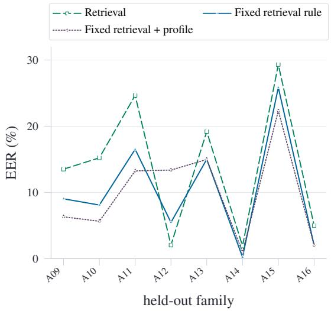

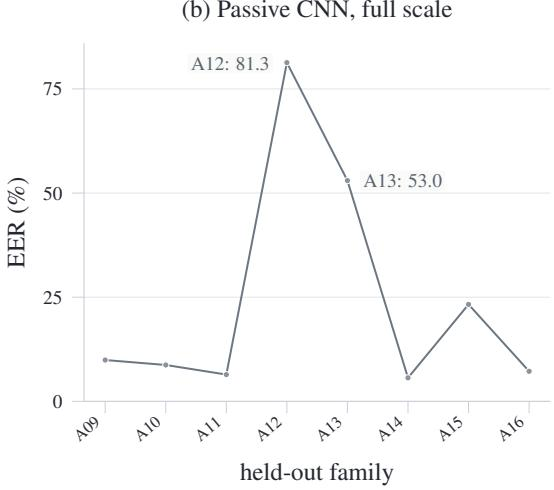  
Figure 5: Held-out EER by synthesis family. Panel (a) zooms the retrieval/record variants; panel (b) keeps the passive-CNN failures on the full scale. Appendix Table 20 gives exact values and paired intervals.

Table 22: Threshold-error accounting for the pooled passive-CNN versus fixed retrieval-augmented rule comparison. Both systems use their own pooled EER threshold. Corrected examples are passive-CNN errors that the retrieval-augmented rule classifies correctly; new errors are errors made by the retrieval-augmented rule among passive-CNN correct decisions. Share divides the net error reduction by the full-set total.
<table><tr><td>Group</td><td>Examples</td><td>Passive err.</td><td>Record err.</td><td>Corrected</td><td>New err.</td><td></td><td>Net Share (%)</td></tr><tr><td>All examples</td><td>4,080</td><td>863</td><td>486</td><td>707</td><td>330</td><td>+377</td><td>+100.0</td></tr><tr><td>Bona fide</td><td>3,215</td><td>680</td><td>383</td><td>539</td><td>242</td><td>+297</td><td>+78.8</td></tr><tr><td>A09</td><td>111</td><td>5</td><td>8</td><td>5</td><td>8</td><td>-3</td><td>-0.8</td></tr><tr><td>A10</td><td>124</td><td>2</td><td>6</td><td>2</td><td>6</td><td>-4</td><td>-1.1</td></tr><tr><td>A11</td><td>121</td><td>0</td><td>30</td><td>0</td><td>30</td><td>-30</td><td>-8.0</td></tr><tr><td>A12</td><td>91</td><td>90</td><td>0</td><td>90</td><td>0</td><td>+90</td><td>+23.9</td></tr><tr><td>A13</td><td>100</td><td>55</td><td>17</td><td>54</td><td>16</td><td>+38</td><td>+10.1</td></tr><tr><td>A14</td><td>102</td><td>0</td><td>0</td><td>0</td><td>0</td><td>+0</td><td>+0.0</td></tr><tr><td>A15</td><td>116</td><td>30</td><td>42</td><td>16</td><td>28</td><td>-12</td><td>-3.2</td></tr><tr><td>A16</td><td>100</td><td>1</td><td>0</td><td>1</td><td>0</td><td>+1</td><td>+0.3</td></tr></table>

Table 23: Retrospective selective risk on matched examples. Each system uses its own EER threshold and defers the nearest 10% in rank space. AURC averages retained risk over accepted-prefix coverages and is given with a 95% CI.
<table><tr><td>System</td><td></td><td>Decision Errors error (%) ↓ at 10% (%) ↑</td><td>Error capture</td><td>Review precision (%) ↑</td><td>Retained error (%) ↓</td><td>AURC (%) ↓ (95% CI)</td></tr><tr><td>Passive CNN</td><td>863/4,080</td><td>21.15</td><td>22.83</td><td>48.28</td><td></td><td>18.14 14.85 (13.24–16.47)</td></tr><tr><td>Retrieval kNN</td><td>646/4,080</td><td>15.83</td><td>29.26</td><td>46.32</td><td>12.45</td><td>5.74 (5.02–6.50)</td></tr><tr><td>Fixed retrieval-augmented rule</td><td>486/4,080</td><td>11.91</td><td>38.89</td><td>46.32</td><td>8.09</td><td>2.49 (2.15–2.84)</td></tr><tr><td>Proposed decision record</td><td>344/4,080</td><td>8.43</td><td>47.97</td><td>40.44</td><td>4.87</td><td>1.79 (1.45–2.16)</td></tr><tr><td>WavLM passive (best run)</td><td>274/4,080</td><td>6.72</td><td>60.58</td><td>40.69</td><td>2.94</td><td>1.14 (0.84–1.50)</td></tr><tr><td>WavLM decision record</td><td>373/4,080</td><td>9.14</td><td>50.40</td><td>46.08</td><td>5.04</td><td>2.96 (2.25–3.74)</td></tr></table>

Table 24: Cue analysis for the cross-fit decision-record model. Cues follow the same EER-threshold convention as Table 23; the last entry is their union.
<table><tr><td>Cue</td><td>Rule</td><td>Examples</td><td>Record errors</td><td>Error cov. (%) ↑</td><td>Precision (%) ↑</td></tr><tr><td>near record threshold</td><td>lowest 10%  $| s _ { \mathrm { r e c } } ~ - ~ \tau _ { \mathrm { r e c } } |$ </td><td>408</td><td>165</td><td>47.97</td><td>40.44</td></tr><tr><td>passive-record conflict</td><td>passive and record decisions differ</td><td>823</td><td>152</td><td>44.19</td><td>18.47</td></tr><tr><td>retrieval-record conflict</td><td>retrieval and record decisions differ</td><td>564</td><td>131</td><td>38.08</td><td>23.23</td></tr><tr><td>large record-retrieval gap</td><td>top 10%  $| f _ { p w } - s _ { r } |$ </td><td>408</td><td>66</td><td>19.19</td><td>16.18</td></tr><tr><td>any cue above</td><td>union of the four cues</td><td>1,377</td><td>285</td><td>82.85</td><td>20.70</td></tr></table>

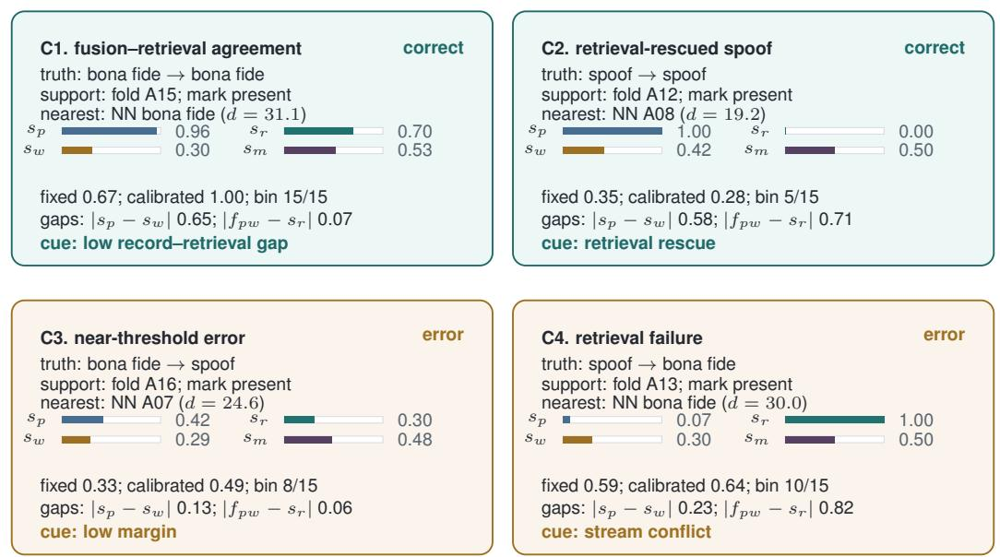  
Figure 6: Four decision-record examples. Each decision uses the calibrated operating threshold for the decision-record model; the fixed score is shown as a reference. Horizontal bars show passive (blue), probe (gold), retrieval (teal), and profile (purple) scores on the same 0–1 scale; each record also lists the decision status, watermark status, calibration bin, nearest-neighbor context, disagreement gaps, and review cue.

The cue union is intended for triage rather than for optimizing a single ranking rule. Appendix Table 25 compares it with scalar-only queues at the same review load.

Table 25: Same-load comparison between scalar review queues and the four-cue union. Scalar queues rank examples by distance to their own EER threshold and are evaluated against errors from the calibrated record threshold rule on the matched set.
<table><tr><td>Queue</td><td>Definition</td><td></td><td></td><td>Examples Share (%) Error cov. (%) ↑</td><td>Precision (%) ↑</td></tr><tr><td>Passive margin</td><td>lowest |s — τ | at the cue-union review load</td><td>1,377</td><td>33.75</td><td>32.85</td><td>8.21</td></tr><tr><td>Retrieval margin</td><td>lowest |s — τ | at the cue-union review load</td><td>1,377</td><td>33.75</td><td>40.99</td><td>10.24</td></tr><tr><td>Fixed-rule margin</td><td>lowest |s — τ | at the cue-union review load</td><td>1,377</td><td>33.75</td><td>77.03</td><td>19.24</td></tr><tr><td>Learned-record margin</td><td>lowest |s — τ | at the cue-union review load</td><td>1,377</td><td>33.75</td><td>88.66</td><td>22.15</td></tr><tr><td>Four-cue union</td><td>union of the four cues</td><td>1,377</td><td>33.75</td><td>82.85</td><td>20.70</td></tr></table>

Table 26: Selection criteria for the four decision-record examples in Figure 6. Counts use the calibrated decision-record operating threshold on the 4,080 matched examples; C1–C2 are correct calibrated decisions and C3–C4 are calibrated-decision errors by construction.
<table><tr><td>Panel</td><td>Selection group</td><td>Examples</td><td>Share (%)</td><td>Group err. (%) ↓</td><td>Median margin</td><td>|fpw − sr|</td></tr><tr><td>C1</td><td>record-retrieval agreement</td><td>180</td><td>4.41</td><td>0.00</td><td>0.475</td><td>0.043</td></tr><tr><td>C2</td><td>retrieval-rescued spoof</td><td>146</td><td>3.58</td><td>0.00</td><td>0.242</td><td>0.609</td></tr><tr><td>C3</td><td>near-threshold error</td><td>77</td><td>1.89</td><td>100.00</td><td>0.042</td><td>0.463</td></tr><tr><td>C4</td><td>retrieval failure</td><td>41</td><td>1.00</td><td>100.00</td><td>0.305</td><td>0.600</td></tr></table>

Table 27: Paired bootstrap EER percentage-point deltas for Tables 2 and 3. Negative deltas favor the candidate. Intervals are nominal 95% and not adjusted across comparisons.
<table><tr><td>Baseline</td><td>Candidate</td><td>Paired ∆ EER (%) [95% CI] ↓</td><td>Fold-level CI</td></tr><tr><td>Passive CNN</td><td>Record + retrieval</td><td>-9.24 [-11.89, -7.15]</td><td></td></tr><tr><td>Passive + watermark</td><td>Record + retrieval</td><td>-9.12 [-11.91, -7.06]</td><td></td></tr><tr><td>Retrieval kNN</td><td>Record + retrieval</td><td>-3.92 [-5.20, -3.22]</td><td></td></tr><tr><td>Passive CNN</td><td>Record + retrieval + profile</td><td>-8.19 [-10.43, -6.23]</td><td></td></tr><tr><td>Passive + watermark</td><td>Record + retrieval + profile</td><td>-8.07 [-10.52, -6.13]</td><td></td></tr><tr><td>Retrieval kNN</td><td>Record + retrieval + profile</td><td>-2.88 [-4.51, -1.51]</td><td></td></tr><tr><td>Fixed retrieval-augmented rule</td><td>Proposed decision record</td><td>-3.48 [-4.61, -2.08]</td><td></td></tr><tr><td>Cross-fit scalar fusion</td><td>Proposed decision record</td><td>-3.48 [-4.60, -2.34]</td><td>[-5.85, -0.20]</td></tr><tr><td>Retrieval + profile only</td><td>Proposed decision record</td><td>-8.21 [-9.83, -6.73]</td><td>[-12.23, -3.64]</td></tr><tr><td>Passive + retrieval only</td><td>Proposed decision record</td><td>-3.24 [-4.27, -2.08]</td><td>[-5.41, -0.24]</td></tr><tr><td>No-probe nonlinear control</td><td>Proposed decision record</td><td>-0.24 [-0.81, +0.46]</td><td>[-0.80, +0.49]</td></tr><tr><td>Passive margin only</td><td>Proposed decision record</td><td>-15.61 [-17.12, -14.11]</td><td>[-18.04, -13.95]</td></tr><tr><td>Passive shape control</td><td>Proposed decision record</td><td>-13.06 [-15.42, -10.89]</td><td>[-35.51, -2.49]</td></tr><tr><td>Passive-probe gap</td><td>Proposed decision record</td><td>-0.46 [-1.30, +0.14]</td><td>[-2.37, +0.11]</td></tr><tr><td>Shuffled-probe control</td><td>Proposed decision record</td><td>-0.34 [-1.26, +0.24]</td><td>[-2.18, +0.17]</td></tr><tr><td>Fusion-retrieval gap</td><td>Proposed decision record</td><td>-0.34 [-0.93, +0.22]</td><td>[-1.25, +0.25]</td></tr><tr><td>Squared-gap record</td><td>Proposed decision record</td><td>+0.10 [-0.26, +0.57]</td><td>[-0.26, +0.97]</td></tr><tr><td>Product-term control</td><td>Proposed decision record</td><td>-1.72 [-2.65, -0.67]</td><td>[-3.66, +0.12]</td></tr></table>

Table 28: Speaker-resampled EER deltas for key calibration controls. The candidate is the crossfit absolute-gap model in Table 3. Negative deltas favor the candidate. Paired intervals resample matched examples, fold intervals resample the eight held-out calibration folds, and speaker intervals resample the 705 speaker IDs. Intervals are nominal 95% and are not adjusted across comparisons.
<table><tr><td>Baseline</td><td>Paired ∆ EER</td><td>Fold CI</td><td>Speaker CI</td></tr><tr><td>Cross-fit scalar fusion</td><td>-3.48 [-4.60, -2.34]</td><td>[-5.85, -0.20]</td><td>[-4.63, -2.34]</td></tr><tr><td>No-probe nonlinear control</td><td>-0.24 [-0.81, +0.46]</td><td>[-0.80, +0.49]</td><td>[-0.82, +0.48]</td></tr><tr><td>Product-term control</td><td>-1.72 [-2.65, -0.67]</td><td>[-3.66, +0.12]</td><td>[-2.72, -0.65]</td></tr><tr><td>Squared-gap record</td><td>+0.10 [-0.26, +0.57]</td><td>[-0.26, +0.97]</td><td>[-0.28, +0.53]</td></tr></table>

Table 29: Per-fold EER for learned calibration on the 4,080 matched examples. Each held-out family is evaluated by a calibrator trained without spoof examples from that family. EER values are percentages; bold marks the best learned setting in that family.
<table><tr><td>Family</td><td>Passive CNN</td><td>Fixed rule</td><td>Score fusion</td><td>Squared gaps</td><td>Nonlinear</td><td>Proposed model</td></tr><tr><td>A09</td><td>9.01</td><td>8.30</td><td>6.34</td><td>6.20</td><td>5.62</td><td>6.34</td></tr><tr><td>A10</td><td>8.03</td><td>6.45</td><td>4.74</td><td>4.08</td><td>3.95</td><td>4.08</td></tr><tr><td>A11</td><td>6.66</td><td>15.87</td><td>11.53</td><td>6.42</td><td>8.97</td><td>6.42</td></tr><tr><td>A12</td><td>80.18</td><td>6.81</td><td>13.01</td><td>4.62</td><td>9.91</td><td>6.44</td></tr><tr><td>A13</td><td>53.06</td><td>13.98</td><td>13.11</td><td>9.99</td><td>12.86</td><td>9.99</td></tr><tr><td>A14</td><td>4.93</td><td>0.99</td><td>0.74</td><td>0.99</td><td>0.74</td><td>0.86</td></tr><tr><td>A15</td><td>23.28</td><td>25.92</td><td>22.36</td><td>19.96</td><td>19.96</td><td>21.56</td></tr><tr><td>A16</td><td>7.94</td><td>1.99</td><td>1.99</td><td>1.99</td><td>1.99</td><td>1.99</td></tr></table>

Table 30: Calibration sensitivity to bona fide fold assignment. Spoof folds remain fixed by held-out synthesis family; only the stable hash that assigns bona fide examples to those folds changes. Each cell reports mean [minimum, maximum] over ten assignments; EER values are percentages.
<table><tr><td>Setting</td><td>Assign. Pooled EER (%) ↓</td><td></td><td>Fold EER (%) ↓</td><td>ECE↓</td></tr><tr><td>Score fusion</td><td>10</td><td>11.89% [11.69, 12.05]</td><td>9.45% [9.27, 9.72]</td><td>0.0840 [0.0836, 0.0845]</td></tr><tr><td>Decision record (abs. gaps)</td><td>10</td><td>8.42% [8.33, 8.55]</td><td>7.06% [6.69, 7.31]</td><td>0.0707 [0.0704, 0.0709]</td></tr><tr><td>Decision record (sq. gaps)</td><td>10</td><td>8.22% [8.11, 8.33]</td><td>6.73% [6.36, 7.14]</td><td>0.0707 [0.0705, 0.0709]</td></tr></table>

The equal-width calibration view in Figure 3 shows that most miscalibration sits near the upper score range. Appendix Table 31 repeats the ECE comparison with equal-mass bins.

Table 31: Calibration-bin sensitivity on the 4,080 matched examples. Width ECE is the main-table value; mass ECE uses 15 equal-mass bins of 272 examples. Fold-iso ECE applies an isotonic map fit on the other folds. Sparse bins count equal-width bins with fewer than 100 examples.
<table><tr><td>System</td><td></td><td></td><td>Width ECE ↓ Mass ECE ↓ Fold-iso ECE ↓ Sparse bins Largest bin Max mass gap</td><td></td><td></td><td></td></tr><tr><td>Retrieval kNN</td><td>0.1451</td><td>0.1451</td><td>0.0187</td><td>6</td><td>33.6%</td><td>0.4008</td></tr><tr><td>Fixed retrieval-augmented rule</td><td>0.2609</td><td>0.2557</td><td>0.0321</td><td>3</td><td>18.7%</td><td>0.4123</td></tr><tr><td>Proposed decision record</td><td>0.0709</td><td>0.0715</td><td>0.0178</td><td>6</td><td>49.3%</td><td>0.2832</td></tr></table>

Table 32: Retrieval and profile sweep used to fix the matched comparison. Entries summarize retrieval and profile measurements before the stricter matched fusion join. The main table uses the HuBERT-large 20k default setting; WavLM settings provide sensitivity checks.
<table><tr><td>Configuration</td><td>Support</td><td>Examples</td><td>Retrieval EER (%)</td><td>Profile EER (%)</td><td>Worst family (EER %) ↓</td></tr><tr><td>WavLM-large 20k default</td><td>38,797</td><td>40,000</td><td>11.12</td><td>68.12</td><td>A11 / 27.80</td></tr><tr><td>WavLM-large 20k d6</td><td>38,797</td><td>40,000</td><td>11.30</td><td>38.77</td><td>A11 /21.55</td></tr><tr><td>HuBERT-large 20k d6</td><td>38,797</td><td>40,000</td><td>16.27</td><td>43.29</td><td>A15 / 26.13</td></tr><tr><td>HuBERT-large 20k default (main)</td><td>38,797</td><td>40,000</td><td>16.46</td><td>59.11</td><td>A11 / 27.66</td></tr><tr><td>WavLM-large 20k d2</td><td>38,797</td><td>40,000</td><td>17.23</td><td>68.83</td><td>A11 / 27.08</td></tr><tr><td>Wav2Vec2-large 20k d6</td><td>38,797</td><td>40,000</td><td>21.11</td><td>60.72</td><td>A11 / 34.70</td></tr><tr><td>Wav2Vec2-large 20k default</td><td>38,797</td><td>40,000</td><td>21.50</td><td>63.32</td><td>A11 / 34.52</td></tr><tr><td>Wav2Vec2-large 20k d10</td><td>38,797</td><td>40,000</td><td>23.02</td><td>59.71</td><td>A11 / 33.01</td></tr><tr><td>HuBERT-base 40k default</td><td>58,797</td><td>71,334</td><td>23.05</td><td>75.37</td><td>A11 /41.56</td></tr><tr><td>WavLM-base+ 40k default</td><td>58,797</td><td>71,334</td><td>24.57</td><td>71.93</td><td>A11 / 48.88</td></tr><tr><td>HuBERT-large 20k d8</td><td>38,797</td><td>40,000</td><td>26.04</td><td>43.72</td><td>A15 / 35.18</td></tr><tr><td>Wav2Vec2-base 40k default</td><td>58,797</td><td>71,334</td><td>31.91</td><td>56.53</td><td>A13 / 40.06</td></tr><tr><td>WavLM-large 20k d10</td><td>38,797</td><td>40,000</td><td>43.79</td><td>53.30</td><td>A13 / 53.87</td></tr></table>

Table 33: Stress checks for the auxiliary probe field and passive references on separate control sets. The detail column reports either WavLM expected calibration error (ECE) or the relevant probecontrol summary. WM denotes watermark, Self-VC denotes self-voice conversion, and CI denotes confidence interval.
<table><tr><td>Condition</td><td>Score</td><td>n</td><td>Balance</td><td>EER (%) ↓</td><td>minDCFBF ↓</td><td>Detail</td></tr><tr><td>WavLM retrieval</td><td>same-run passive</td><td>4,130</td><td>3,213/917</td><td>22.79</td><td>1.0000</td><td>ECE 0.2868</td></tr><tr><td>WavLM retrieval</td><td>same-run retrieval</td><td>4,130</td><td>3,213/917</td><td>10.36</td><td>0.9947</td><td>ECE 0.1867</td></tr><tr><td>WavLM retrieval</td><td>same-run fixed rule</td><td>4,130</td><td>3,213/917</td><td>8.27</td><td>0.9191</td><td>ECE 0.2854</td></tr><tr><td>Probe pair</td><td>WM probe</td><td>20,000</td><td>10,000/10,000</td><td>0.00</td><td>0.0000</td><td>paired originals</td></tr><tr><td>Source pair</td><td>WM probe</td><td>2,000</td><td>1,000/1,000</td><td>50.00</td><td>0.9990</td><td>CI [47.7,52.1]; 485 spk</td></tr><tr><td>Self-VC</td><td>WM probe</td><td>2,000</td><td>1,000/1,000</td><td>52.00</td><td>1.0000</td><td>CI [49.6,54.1]</td></tr><tr><td>Self-VC</td><td>Passive CNN</td><td>2,000</td><td>1,000/1,000</td><td>48.50</td><td>1.0000</td><td>CI [46.3,50.8]</td></tr></table>

Table 34: SSL attack stress across 24 attack variants per model. Mean EER averages the variants, and the final column names the worst variant observed for that model.
<table><tr><td>Model</td><td>Runs</td><td>Mean EER (%) ↓</td><td>Worst variant / EER (%)↓</td></tr><tr><td>HuBERT-large</td><td>24</td><td>12.79</td><td>noise_snr0 / 31.22</td></tr><tr><td>Wav2Vec2-large</td><td>24</td><td>13.43</td><td>noise_snr0 / 35.96</td></tr><tr><td>WavLM-large</td><td>24</td><td>14.77</td><td>highpass_2500hz / 70.96</td></tr></table>

The perturbation ranking is consistent across the settings in Table 34; Figure 8 shows the same ordering visually.

Across 6 repeat seeds, Figure 7 repeats the adaptation experiment after appending queried ASVspoof 5 development examples to the training split and evaluating on the remaining development examples. Disagreement is best at the two smallest budgets, while random selection is best at the two largest budgets. At 100 and 500 queried labels, disagreement improves on random by -0.93 and -0.97 points, respectively; the larger-budget comparisons reverse in Figure 7. Because the ordering changes with budget, we treat active selection as a separate experimental-design question rather than as an extension of the matched-subset claim.

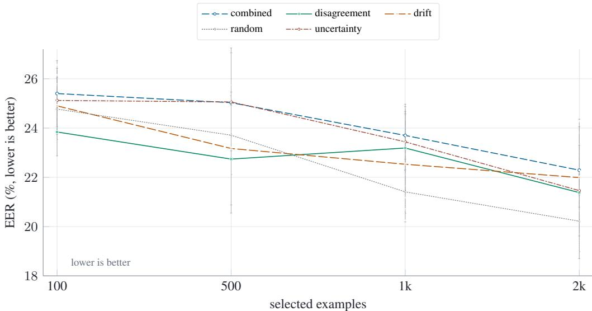

Figure 7: Active-label selection over repeated adaptation seeds. Curves show mean leave-family-out EER after adapting with each label budget; vertical bars show one standard deviation across seeds. The curves cross, so no acquisition rule is uniformly best across budgets.
<table><tr><td colspan="3">HuBERT</td><td>Wav2Vec2</td><td>WavLM</td><td rowspan="7"></td></tr><tr><td rowspan="5">noise</td><td>0 dB</td><td>31.2*</td><td>36.0*</td><td>47.0</td></tr><tr><td>5 dB</td><td>20.8</td><td>23.9</td><td>25.8</td></tr><tr><td>15 dB</td><td>12.7</td><td>12.9</td><td>11.3</td></tr><tr><td>20 dB</td><td>11.8</td><td>11.0</td><td>8.9</td></tr><tr><td>2.4 kHz</td><td>9.8</td><td>9.8</td><td>8.0</td></tr><tr><td rowspan="5">low-pass</td><td>3.2 kHz</td><td>9.7</td><td>9.8</td><td>6.5</td><td rowspan="5">50% 75% darker = worse ￥ worst per model</td></tr><tr><td>4.8 kHz</td><td>9.3</td><td>9.4</td><td>6.5</td></tr><tr><td>6.4 kHz</td><td>9.5</td><td>9.3</td><td>7.1</td></tr><tr><td>0.1 kHz</td><td>9.5</td><td>9.5</td><td>7.4</td></tr><tr><td>0.5 kHz</td><td>10.4</td><td>9.8</td><td>10.8</td></tr><tr><td rowspan="6">high-pass speed</td><td>1.5 kHz</td><td>12.7</td><td>12.6</td><td>33.3</td><td rowspan="9"></td></tr><tr><td>2.5 kHz</td><td>20.1</td><td>25.1</td><td>71.0*</td></tr><tr><td>0.90x</td><td>10.0</td><td>9.0</td><td>8.0</td></tr><tr><td>0.95x</td><td>9.7</td><td>9.2</td><td>7.7</td></tr><tr><td>1.10x</td><td>9.5</td><td>9.6</td><td>6.6</td></tr><tr><td>1.15x</td><td>10.1</td><td>9.8</td><td>6.8</td></tr><tr><td>4kHz</td><td>12.2</td><td>12.2</td><td>9.9</td></tr><tr><td>6 kHz</td><td>9.8</td><td>9.5</td><td>7.4</td></tr><tr><td>12 kHz</td><td>9.6</td><td>9.2</td><td>6.9</td></tr><tr><td rowspan="5">quantize</td><td>22.05 kHz</td><td>9.7</td><td>9.4</td><td>7.4</td><td></td></tr><tr><td>4 bit</td><td>25.0</td><td>32.7</td><td>24.7</td><td></td></tr><tr><td>6 bit</td><td>13.7</td><td>13.6</td><td>11.3</td><td></td></tr><tr><td>10 bit</td><td>10.3</td><td>9.7</td><td>7.2</td><td></td></tr><tr><td>12 bit</td><td>9.8</td><td>9.5</td><td>7.0</td><td></td></tr></table>

Figure 8: Attack stress for frozen SSL detectors. Each cell reports EER for one detector under one signal-processing variant; entries are grouped by attack family, and starred cells mark the worst variant for that detector.

The stress grid separates perturbations that preserve the frozen encoders’ operating range from those that expose model-specific fragility. Low-frequency content and mild resampling stay close to the clean matched benchmark, while additive noise, aggressive quantization, and the 2.5 kHz highpass setting produce the largest failures. Table 34 places mean and worst-case entries side by side, keeping attack sensitivity outside the main matched-subset claim.