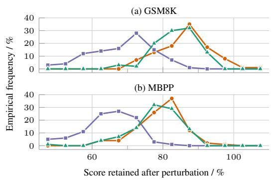
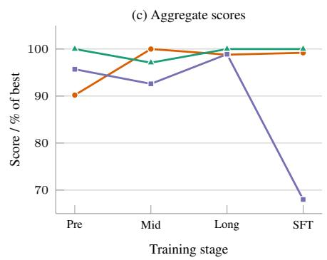
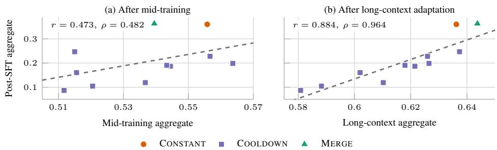
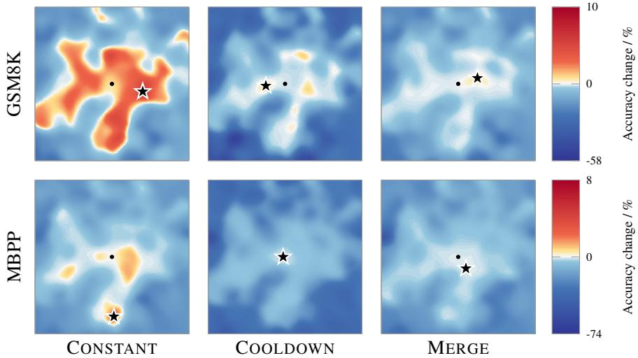
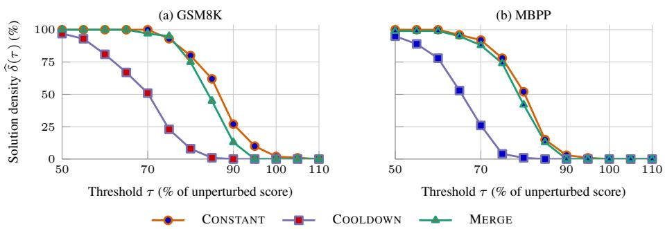
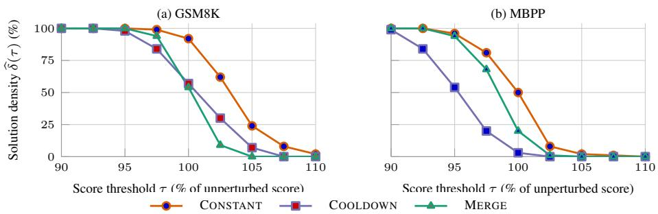

# Good Pretraining, Bad SFT: Checkpoint Quality Across the Training Stack

Sohir Maskey∗ Philipp Scholl Jonas Knupp Aleph Alpha

  
Figure 1: Perturbation sensitivity and downstream performance of three MoE variants after completing different training stages. (a–b) Distribution of scores after 100 Gaussian weight perturbations $( \sigma _ { \epsilon } = 0 . 0 0 5 )$ , relative to each checkpoint’s unperturbed score; (c) stage aggregates as a percentage of the best checkpoint at that stage. CONSTANT and MERGE show greater solution density, i.e., perturbing the pretrained checkpoints retains higher scores at performance-preserving thresholds compared to COOLDOWN. This observation is consistent with their stronger post-SFT performance.

## Abstract

Language-model checkpoints are commonly selected by pretraining loss or benchmark scores, assuming that the highest-scoring checkpoint will remain the best starting point for subsequent training. We show that this assumption can fail in a full 30B mixture-of-experts training pipeline. The checkpoints that perform better after the full downstream training stack also have higher solution density, i.e., retain downstream performance under local weight perturbations.

## 1 Introduction

Language-model checkpoints are usually compared by asking which checkpoint is better now: which has lower loss or higher benchmark scores. This is sufficient when training ends at that checkpoint. Modern LLMs, however, are trained in a sequence of stages including pretraining, mid-training, long-context adaptation, supervised fine-tuning (SFT), and further post-training (Ouyang et al., 2022; S. Chen et al., 2023; Olmo et al., 2026). In this setting, the question is different:

## Which checkpoint selection criteria will produce the bestfinal model?

This matters because executing all training stages for every candidate is expensive and explodes combinations. Using intermediate evaluations as selection criteria implicitly assumes that checkpoint rankings are preserved by later training. Our experiments show that this assumption can fail: subsequent training can reverse the ranking of intermediate checkpoints.

Table 1: A better pretraining checkpoint can produce a worse final model. CONSTANT and COOLDOWN share the first 6.7T tokens and the same 7.5T-token budget. All three sources then receive the same downstream recipe.
<table><tr><td>Selection signal</td><td>CONSTANT</td><td>COOLDOWN</td><td>MERGE</td></tr><tr><td>Train loss ↓</td><td>1.717</td><td>1.627</td><td></td></tr><tr><td>Validation loss ↓</td><td>1.734</td><td>1.648</td><td></td></tr><tr><td>Pretraining aggregate ↑</td><td>0.415</td><td>0.440</td><td>0.460</td></tr><tr><td>Post-SFT aggregate ↑</td><td>0.360</td><td>0.247</td><td>0.363</td></tr></table>

Table 1 compares three source checkpoints from one 30B-parameter mixture-of-experts (MoE) pretraining run. CONSTANT and COOLDOWN share the first 6.7T of 7.5T training tokens and differ only in the learning-rate schedule over the final 800B tokens. MERGE is a weighted average of CONSTANT checkpoints (Tian et al., 2026). COOLDOWN improves every available pretraining signal relative to CONSTANT, yet after identical mid-training, long-context adaptation, and SFT, their ordering reverses.

This motivates our central question: when do intermediate checkpoint rankings become predictive ofthefinal ranking? Across our training trajectories, neither the mid-training nor the long-context aggregate separates CONSTANT from COOLDOWN, although rankings within a learning-rate sweep stabilize after long-context adaptation (Figure 2).

Gan et al. (2026) define solution density as the fraction of Gaussian perturbations that retain task performance above a threshold. They show that this fraction increases with model scale, arguing that denser neighborhoods of task-specific experts make useful specialists easier to reach through post-training. Figure 1 shows a similar distinction across checkpoints of the same model: CONSTANT and MERGE have greater solution density than COOLDOWN. MERGE is particularly informative: it has the highest pretraining aggregate, remains more robust to perturbations than COOLDOWN, and finishes effectively tied with CONSTANT after SFT. This suggests that the unperturbed score alone misses how broadly performance persists under nearby weight changes. We therefore hypothesize that solution density varies not only with scale but also across training trajectories, and that these differences help explain downstream adaptability.

Contributions. We show that conventional pretraining metrics can misrank checkpoints for a fixed downstream training pipeline, and show that intermediate aggregates do not anticipate this reversal. We further connect this reversal to solution density and show that COOLDOWN’s largest downstream failure reflects unstable response completion rather than absent latent code capability.

## 2 Experimental Design

We study a 30B-parameter MoE with 3B active parameters. Training consists of 7.5T-token pretraining, 100B tokens of capability-focused mid-training at 8k context, 100B tokens of long-context adaptation at 64k, and 10B tokens of conversational SFT at 64k. The optimizer state is reset with repeated LR warmup at each stage. For details on architecture, training, and datasets see Section B.

Pretraining sources. CONSTANT and COOLDOWN share their first 6.7T tokens and total token budget. We decay the learning rate for the COOLDOWN run to 10% of the maximum during the final 800B tokens of training. MERGE (Tian et al., 2026) adds no training: it combines 20 equally spaced CONSTANT checkpoints over a 600B-token trailing window via2

$$
\theta _ { \mathrm { m e r g e } } = \sum _ { i = 1 } ^ { 2 0 } { \frac { i } { 2 1 0 } } \theta _ { i } ,
$$

where the checkpoints are ordered from oldest to newest.

Learning-rate sweep. Starting from COOLDOWN, we train all nine combinations $\eta _ { \mathrm { m i d } } , \eta _ { \mathrm { l o n g } } \in$ $\{ 1 , { \frac { 1 } { 3 } } , { \frac { 1 } { 9 } } \}$ . where each factor scales a stage’s peak learning rate relative to the preceding stage. For example, $\eta _ { \mathrm { l o n g } } = 1 / 3$ sets t4he long-context peak learning rate to one third of the mid-training peak. Mid-training uses either no decay when $\eta _ { \mathrm { l o n g } } = 1$ or cosine decay to the long-context peak, yielding a continuous schedule across stages. 3 Long-context training then decays to one third of its peak learning rate. Stage-wise evaluation aggregates are reported in Table 5.

The (1, 1) mid/long schedule achieved the highest post-SFT aggregate among the nine schedules, each followed by SFT factor 1/3. Due to compute constraints, we therefore reuse this schedule for CONSTANT and MERGE. 4

Evaluation. At the pretraining, mid-training, and long-context boundaries, we use completionstyle benchmarks spanning knowledge, mathematics, and code. From mid-training onward, we add long-context retrieval. These three aggregates are cluster-balanced: Pre averages three cluster means, whereas Mid and Long average four cluster means. Post-SFT, we evaluate on six chat-formatted benchmarks and take their unweighted mean. The stage-specific suites are given in Section C.

## 3 Checkpoint Rankings Change Across the Training Stack

## 3.1 Pretraining scores do not determine post-SFT scores

Table 1 shows that COOLDOWN improves every available pretraining signal over CONSTANT: train loss (1.717 to 1.627), validation loss (1.734 to 1.648), and pretraining aggregate (0.415 to 0.440). Under conventional checkpoint selection, COOLDOWN would therefore dominate CONSTANT.

After the identical mid-training, long-context, and SFT continuation, CONSTANT instead leads COOLDOWN by 0.113. MERGE has the highest aggregate before and after the downstream pipeline, although its final 0.003 advantage over CONSTANT is small.

Table 2: Post-SFT benchmark scores after the fixed downstream recipe; the last column excludes HumanEval+.
<table><tr><td>Source</td><td>AIME</td><td>DAPO</td><td>Skywork</td><td>IFBench</td><td>HE+</td><td>GPQA</td><td>Mean</td><td>w/o HE+</td></tr><tr><td>CONSTANT</td><td>0.221</td><td>0.430</td><td>0.390</td><td>0.238</td><td>0.646</td><td>0.237</td><td>0.360</td><td>0.303</td></tr><tr><td>COOLDOWN</td><td>0.171</td><td>0.450</td><td>0.355</td><td>0.250</td><td>0.049</td><td>0.207</td><td>0.247</td><td>0.287</td></tr><tr><td>MERGE</td><td>0.217</td><td>0.495</td><td>0.345</td><td>0.236</td><td>0.665</td><td>0.222</td><td>0.363</td><td>0.303</td></tr></table>

The complete six-task profiles in Table 2 show that COOLDOWN is not uniformly worse. The large aggregate gap is amplified by a severe HumanEval+ failure, which we examine separately below; without HumanEval+ it shrinks to 0.016 (Table 2).

## 3.2 Mid-training rankings remain unstable

Across the eleven training trajectories, the mid-training aggregate correlates only weakly with the post-SFT aggregate (Pearson $r = 0 . 4 7 3 , p = 0 . 1 4 2 ;$ Spearman $\rho = 0 . 4 8 2 , p = 0 . 1 3 3 )$ . Figure 1c and Figure 2 show that rankings can still change substantially after this stage.

## 3.3 Long-context rankings stabilize within a sweep, not across sources

After long-context adaptation, the association changes substantially. Pearson correlation with the post-SFT aggregate rises to $r = 0 . 8 8 4 ( p < 0 . 0 0 1 )$ and Spearman correlation to $\rho = 0 . 9 6 4 \ : ( p < 0 . 0 0 1 )$ .

  
Figure 2: Intermediate versus post-SFT aggregate scores. Dashed lines are ordinary least-squares fits.

Figure 2 compares the post-SFT aggregate against two intermediate aggregates. The diffuse midtraining relationship tightens into an almost monotone ordering after long-context adaptation.

This result is not driven by adding CONSTANT and MERGE: restricting the calculation to the nine COOLDOWN trajectories gives $r = 0 . 4 4 8 ( p = 0 . 2 2 6 ) , \rho = 0 . 4 5 0 ( p = 0 . 2 2 4 )$ after mid-training and $r = 0 . 9 3 5 , \rho = 0 . 9 5 0$ (both $p < 0 . 0 0 1 )$ after long-context adaptation. Notably, long-context scores still fail to predict the ordering of CONSTANT, COOLDOWN, and MERGE at matched schedules: COOLDOWN (1, 1) scores 0.637 against 0.636 for CONSTANT, yet trails by 0.113 after SFT.

We do not interpret this as evidence that long-context adaptation causally creates predictiveness: later checkpoints are also closer to the final model.

## 4 What Checkpoint Scores Miss

The ranking reversal suggests that checkpoint scores miss properties that matter for subsequent behavior. We examine this in two ways.

## 4.1 Solution density separates the more trainable sources

The preceding results define trainability operationally: how well a source checkpoint performs after the same remaining training pipeline. But what local parameter-space geometry provides a signal of this pipeline-conditioned quality that the unperturbed checkpoint score misses?

For checkpoint θ, benchmark b, perturbation ϵ, and evaluation score $s _ { b } ( \boldsymbol { \theta } )$ , we define the relativethreshold solution-density profile following Gan et al. (2026) as

$$
\delta _ { \theta , b } ( \tau ) = \operatorname* { P r } _ { \epsilon } \left[ s _ { b } ( \theta + \epsilon ) \ge \tau s _ { b } ( \theta ) \right] .\tag{1}
$$

Each source checkpoint is evaluated under 100 Gaussian perturbations on GSM8K and MBPP at standard deviations $\sigma _ { \epsilon } \in \{ 0 . 0 0 5 , 0 . 0 0 1 \}$ . Figure 1 shows that COOLDOWN is shifted toward lower retained performance on both tasks. Thresholded profiles and exact counts appear in Figure 4 and Table 11. On GSM8K, solution density at $\tau = 0 . 9 0$ is 27% for CONSTANT and 13% for MERGE, but 0% for COOLDOWN. The separation persists at $\sigma _ { \epsilon } = 0 . 0 0 1$ (Figure 5 and Table 12).

Figure 3 provides a complementary two-dimensional view of the perturbation outcomes.

The perturbation ordering matches the controlled trainability result in Section 3.1 and Table 2: CONSTANT and MERGE finish nearly tied at 0.360 and 0.363, while COOLDOWN reaches 0.247 despite its stronger pretraining signals (Table 1). We hypothesize that greater local robustness help these checkpoints tolerate the parameter displacement induced by subsequent optimization.

## 4.2 Retuning SFT does not repair stopping

COOLDOWN’s largest deficit is HumanEval+ (4.9% versus 64.6% and 66.5% for CONSTANT and MERGE). Raw outputs reveal a broader failure: nearly all AIME and GPQA responses reach the 32k-token cap, with highly repetitive tails. Because this pathology appears after SFT, we hypothesized that the SFT stage was responsible and swept its learning rate.

  
Figure 3: Filled contours show interpolated accuracy changes relative to unperturbed checkpoints on GSM8K (top) and MBPP (bottom). Stars mark each panel’s optimum. CONSTANT has the greatest solution density, whereas MERGE starts stronger and degrades less under perturbation than COOLDOWN, especially on MBPP (Table 12). Projections are descriptive only.

The sweep did not repair stopping. Changing the SFT factor from 1/3 to 1 leaves 100% of AIME and 99% of GPQA responses at the cap, and although it raises the post-SFT aggregate from 0.247 to 0.294, no tested rate jointly resolves the failure: lower rates improve HumanEval+ on average but reduce reasoning and the overall aggregate.

Sweeping all three SFT factors for each of the nine COOLDOWN mid/long combinations leaves all 27 checkpoints below the fixed-recipe CONSTANT and MERGE checkpoints. Evaluating only the first generated code block from one COOLDOWN checkpoint raises HumanEval+ from 7.3% to 61.0%, showing latent code capability but still trailing CONSTANT and MERGE (64.6% and 66.5%), though thousands of repeated later blocks remain a genuine failure. Section E.1 summarizes the nested sweep with additional trajectory results, traces, and extraction details.

## 5 Related Work

Prior work shows that pretraining loss need not predict downstream adaptation: models with matched loss can transfer differently (H. Liu et al., 2023), and learning-rate decay can improve pretraining metrics while hurting continued training and SFT (Yano et al., 2026). Related work links flatter LLM solutions to better trainability (H. Li et al., 2024; Watts et al., 2026). We extend this line by tracking checkpoint rankings across multiple training stages and asking when they predict the final ranking. We also build on solution density, which measures whether nearby perturbations retain task performance (Gan et al., 2026), and on checkpoint merging, where checkpoints induce an effective decay over updates (Y. Li et al., 2025; Tian et al., 2026). Extended related work appears in Section A.

## 6 Conclusion

Checkpoint quality depends on what comes next. COOLDOWN has better pretraining metrics than CONSTANT but performs worse after the downstream pipeline. Rankings within a learning-rate sweep stabilize after long-context adaptation, yet neither intermediate aggregate anticipates the reversal between CONSTANT and COOLDOWN. Our audits further show that eval scores can miss properties relevant to continued training. Checkpoint selection should therefore target performance after the remaining pipeline, not the current score alone.

Limitations. Our results come from one 30B MoE family with one seed per setup, and we did not test every combination of settings. Solution density is measured on only two tasks and does not establish causation, and COOLDOWN’s stopping failure enlarges the observed gap.

## References

Ainslie, J., Lee-Thorp, J., Jong, M. de, Zemlyanskiy, Y., Lebrón, F., and Sanghai, S. (2023). “GQA: Training Generalized Multi-Query Transformer Models from Multi-Head Checkpoints”. In: Proceedings ofthe 2023 Conference on Empirical Methods in Natural Language Processing.

Aleph Alpha Research (2026). Aleph Alpha Eval Framework. Version x.y.z.

Austin, J. et al. (2021). Program Synthesis with Large Language Models. arXiv: 2108.07732.

Bisk, Y., Zellers, R., Le bras, R., Gao, J., and Choi, Y. (2020). “PIQA: Reasoning about Physical Commonsense in Natural Language”. In: Proceedings of the AAAI Conference on Artificial Intelligence.

Chen, M., Tworek, J., Jun, H., Yuan, Q., Pinto, H. P. d. O., Kaplan, J., Edwards, H., Burda, Y., Joseph, N., Brockman, G., et al. (2021). Evaluating Large Language Models Trained on Code. arXiv: 2107.03374.

Chen, S., Wong, S., Chen, L., and Tian, Y. (2023). “Extending Context Window of Large Language Models via Positional Interpolation”. In: arXiv preprint arXiv:2306.15595.

Clark, P., Cowhey, I., Etzioni, O., Khot, T., Sabharwal, A., Schoenick, C., and Tafjord, O. (2018). “Think You Have Solved Question Answering? Try ARC, the AI2 Reasoning Challenge”. In: arXiv preprint arXiv:1803.05457.

Cobbe, K. et al. (2021). Training Verifiers to Solve Math Word Problems. arXiv: 2110.14168.

Dekoninck, J., Jovanovic, N., Gehrunger, T., Rögnvaldsson, K., Petrov, I., Sun, C., and Vechev, M.´ (2026). “Beyond Benchmarks: MathArena as an Evaluation Platform for Mathematics with LLMs”. In: arXiv: 2605.00674 [cs.CL].

Dinh, L., Pascanu, R., Bengio, S., and Bengio, Y. (2017). “Sharp Minima Can Generalize For Deep Nets”. In: Proceedings ofthe 34th International Conference on Machine Learning. Vol. 70. Proceedings of Machine Learning Research. PMLR, pp. 1019–1028.

Foret, P., Kleiner, A., Mobahi, H., and Neyshabur, B. (2021). “Sharpness-Aware Minimization for Efficiently Improving Generalization”. In: International Conference on Learning Representations.

Gan, Y. and Isola, P. (2026). Neural Thickets: Diverse Task Experts Are Dense Around Pretrained Weights. arXiv: 2603.12228 [cs.LG].

He, J., Liu, J., Liu, C. Y., Yan, R., Wang, C., Cheng, P., Zhang, X., Zhang, F., Xu, J., Shen, W., et al. (2025). Skywork Open Reasoner 1 Technical Report. arXiv: 2505.22312.

Hendrycks, D., Burns, C., Basart, S., Zou, A., Mazeika, M., Song, D., and Steinhardt, J. (2021a). “Measuring Massive Multitask Language Understanding”. In: International Conference on Learning Representations (ICLR).

Hendrycks, D., Burns, C., Kadavath, S., Arora, A., Basart, S., Tang, E., Song, D., and Steinhardt, J. (2021b). Measuring Mathematical Problem Solving With the MATH Dataset. arXiv: 2103.03874.

Hsieh, C.-P., Sun, S., Kriman, S., Acharya, S., Rekesh, D., Jia, F., and Ginsburg, B. (2024). RULER: What’s the Real Context Size ofYour Long-Context Language Models? arXiv: 2404.06654.

Izmailov, P., Podoprikhin, D., Garipov, T., Vetrov, D. P., and Wilson, A. G. (2018). “Averaging Weights Leads to Wider Optima and Better Generalization”. In: Proceedings of the Thirty-Fourth Conference on Uncertainty in Artificial Intelligence, pp. 876–885.

Jordan, K., Jin, Y., Boza, V., You, J., Cesista, F., Newhouse, L., and Bernstein, J. (2024). Muon: An Optimizerfor Hidden Layers in Neural Networks.

Joshi, M., Choi, E., Weld, D., and Zettlemoyer, L. (2017). “TriviaQA: A Large Scale Distantly Supervised Challenge Dataset for Reading Comprehension”. In: Proceedings ofthe 55th Annual Meeting of the Association for Computational Linguistics.

Keskar, N. S., Mudigere, D., Nocedal, J., Smelyanskiy, M., and Tang, P. T. P. (2017). “On Large-Batch Training for Deep Learning: Generalization Gap and Sharp Minima”. In: International Conference on Learning Representations.

Li, H., Ding, L., Fang, M., and Tao, D. (2024). “Revisiting Catastrophic Forgetting in Large Language Model Tuning”. In: Findings of the Association for Computational Linguistics: EMNLP 2024. Association for Computational Linguistics, pp. 4297–4308.

Li, Y. et al. (2025). “Model Merging in Pre-training of Large Language Models”. In: arXiv preprint arXiv:2505.12082. arXiv: 2505.12082 [cs.CL].

Liang, W., Liu, T., Wright, L., Constable, W., Gu, A., Huang, C.-C., Zhang, I., Feng, W., Huang, H., Wang, J., et al. (2024). TorchTitan: One-Stop PyTorch Native Solution for Production-Ready LLM Pretraining. arXiv: 2410.06511.

Liu, H., Xie, S. M., Li, Z., and Ma, T. (2023). “Same Pre-training Loss, Better Downstream: Implicit Bias Matters for Language Models”. In: Proceedings of the 40th International Conference on

Machine Learning. Vol. 202. Proceedings of Machine Learning Research. PMLR, pp. 22188– 22214.

Liu, J., Xia, C. S., Wang, Y., and Zhang, L. (2023). Is Your Code Generated by ChatGPT Really Correct? Rigorous Evaluation of Large Language Models for Code Generation. arXiv: 2305. 01210.

Loshchilov, I. and Hutter, F. (2019). “Decoupled Weight Decay Regularization”. In: International Conference on Learning Representations.

NVIDIA et al. (2026). Nemotron 3 Super: Open, Efficient Mixture-of-Experts Hybrid Mamba-Transformer Model for Agentic Reasoning. arXiv: 2604.12374 [cs.LG].

Olmo, T. et al. (2026). Olmo 3. arXiv: 2512.13961 [cs.CL].

Ouyang, L., Wu, J., Jiang, X., Almeida, D., Wainwright, C. L., Mishkin, P., Zhang, C., Agarwal, S., Slama, K., Ray, A., et al. (2022). “Training Language Models to Follow Instructions with Human Feedback”. In: Advances in Neural Information Processing Systems 35, pp. 27730–27744.

Pyatkin, V., Malik, S., Graf, V., Ivison, H., Huang, S., Dasigi, P., Lambert, N., and Hajishirzi, H. (2025). “Generalizing Verifiable Instruction Following”. In: Advances in Neural Information Processing Systems.

Rein, D., Hou, B. L., Stickland, A. C., Petty, J., Pang, R. Y., Dirani, J., Michael, J., and Bowman, S. R. (2023). GPQA: A Graduate-Level Google-ProofQ&A Benchmark. arXiv: 2311.12022.

Shazeer, N. (2020). GLU Variants Improve Transformer. arXiv: 2002.05202.

Singh, V. et al. (2026). “Arcee Trinity Large Technical Report”. In: arXiv: 2602.17004 [cs.LG].

Su, J., Lu, Y., Pan, S., Murtadha, A., Wen, B., and Liu, Y. (2021). RoFormer: Enhanced Transformer with Rotary Position Embedding. arXiv: 2104.09864.

Tian, C., Wang, J., Zhao, Q., Chen, K., Liu, J., Liu, Z., Mao, J., Zhao, W. X., Zhang, Z., and Zhou, J. (2026). “WSM: Decay-Free Learning Rate Schedule via Checkpoint Merging for LLM Pre-training”. In: International Conference on Learning Representations. arXiv: 2507.17634 [cs.LG].

Vaswani, A., Shazeer, N., Parmar, N., Uszkoreit, J., Jones, L., Gomez, A. N., Kaiser, L., and Polosukhin, I. (2017). “Attention Is All You Need”. In: Advances in Neural Information Processing Systems. Vol. 30.

Wang, Y., Ma, X., Zhang, G., Ni, Y., Chandra, A., Guo, S., Ren, W., Arulraj, A., He, X., Jiang, Z., et al. (2024). MMLU-Pro: A More Robust and Challenging Multi-Task Language Understanding Benchmark. arXiv: 2406.01574.

Watts, I., Li, C., Goyal, S., Springer, J. M., and Raghunathan, A. (2026). “Sharpness-Aware Pretraining Mitigates Catastrophic Forgetting”. In: Proceedings of the 43rd International Conference on Machine Learning. arXiv: 2605.02105 [cs.LG].

Yano, K., Kiyono, S., Kobayashi, S., Takase, S., and Suzuki, J. (2026). “Pre-training LLM without Learning Rate Decay Enhances Supervised Fine-Tuning”. In: International Conference on Learning Representations. arXiv: 2603.16127.

Yen, H., Gao, T., Hou, M., Ding, K., Fleischer, D., Izsak, P., Wasserblat, M., and Chen, D. (2024). HELMET: How to Evaluate Long-Context Language Models Effectively and Thoroughly. arXiv: 2410.02694.

Yu, Q., Zhang, Z., Zhu, R., Yuan, Y., Zuo, X., Yue, Y., Dai, W., Fan, T., Liu, G., Liu, L., et al. (2025). DAPO: An Open-Source LLM Reinforcement Learning System at Scale. arXiv: 2503.14476.

Zellers, R., Holtzman, A., Bisk, Y., Farhadi, A., and Choi, Y. (2019). “HellaSwag: Can a Machine Really Finish Your Sentence?” In: Proceedings of the 57th Annual Meeting of the Association for Computational Linguistics.

Zhang, B. and Sennrich, R. (2019). “Root Mean Square Layer Normalization”. In: Advances in Neural Information Processing Systems. Vol. 32.

## A Related Work

Checkpoint quality and downstream adaptability. A central assumption in model development is that better intermediate metrics imply a better model for subsequent training. Prior work shows that this need not hold even when pretraining loss is matched. H. Liu et al. (2023) find language models with similar pretraining loss but substantially different downstream transfer performance and associate this difference with implicit biases of the pretraining procedure. More directly, Yano et al. (2026) compare decay-based and decay-free LLM pretraining and find that learning-rate decay can improve pretraining metrics while reducing performance after SFT. Their result persists with additional mid-training and is associated with sharper pretrained solutions. Related work on LLM fine-tuning connects loss-landscape geometry to catastrophic forgetting, finding that flatter solutions preserve pretrained capabilities better during adaptation (H. Li et al., 2024). Our setting complements these results by following checkpoint rankings through several consecutive training stages and asking when intermediate evaluations become predictive of the final post-SFT ranking.

Flat minima and downstream adaptability. The relation between local geometry and model quality has a long history in neural networks. Flat minima have been associated with improved generalization (Keskar et al., 2017), and methods such as stochastic weight averaging (Izmailov et al., 2018) and sharpness-aware minimization (Foret et al., 2021) explicitly favor broad low-loss regions. At the same time, flatness is not an intrinsic property without specifying a parameterization and metric: functionally equivalent networks can have arbitrarily different sharpness under common definitions (Dinh et al., 2017).

For language models, H. Liu et al. (2023) show that pretraining-loss flatness, measured through Hessian-based quantities, correlates with downstream transfer even when pretraining loss itself does not. H. Li et al. (2024) connect flatter LLM loss landscapes to reduced forgetting during fine-tuning, while Yano et al. (2026) find that learning-rate decay leads to sharper pretrained solutions together with weaker post-SFT performance. Watts et al. (2026) show that SAM reduces forgetting after post-training and quantization. These findings motivate asking whether local geometry contains information about how a checkpoint will behave under subsequent training.

Our solution-density probe is closely related to this literature but measures a different object. A conventional local flatness measure evaluates the change in the pretraining loss around checkpoint θ. For example, for $\epsilon \sim \mathcal { N } ( 0 , \sigma ^ { 2 } I )$ , one may consider

$$
F _ { \mathrm { p r e } } ( \theta , \sigma ) = \mathbb { E } _ { \epsilon } \left[ L _ { \mathrm { p r e } } ( \theta + \epsilon ) - L _ { \mathrm { p r e } } ( \theta ) \right] .\tag{2}
$$

Under a local second-order approximation,

$$
F _ { \mathrm { p r e } } ( \theta , \sigma ) \approx \frac { \sigma ^ { 2 } } { 2 } \operatorname { T r } \left( \nabla ^ { 2 } L _ { \mathrm { p r e } } ( \theta ) \right) ,\tag{3}
$$

connecting isotropic perturbation flatness to Hessian-based sharpness.

Our probe instead evaluates whether nearby parameters preserve an external capability. For benchmark b with score $s _ { b } ,$ , we measure

$$
\delta _ { \theta , b } ( \tau ; \sigma ) = \operatorname* { P r } _ { \epsilon \sim \mathcal { N } ( 0 , \sigma ^ { 2 } I ) } \left[ \frac { s _ { b } ( \theta + \epsilon ) } { s _ { b } ( \theta ) } \geq \tau \right] .\tag{4}
$$

The two quantities therefore probe the same local parameter neighborhood but apply different functions to it:

$$
\underbrace { L _ { \mathrm { p r e } } ( \theta + \epsilon ) } _ { \mathrm { p r e t r a i n i n g - l o s s ~ g e o m e t r y } } \qquad \mathrm { v s . } \qquad \underbrace { s _ { b } ( \theta + \epsilon ) } _ { \mathrm { c a p a b i l i t y ~ r e t e n t i o n } } .
$$

There is no general implication between them. A direction can increase pretraining loss while leaving a benchmark capability unchanged, or preserve pretraining loss while disrupting parameters important for a particular downstream capability. Moreover, benchmark scores are generally discrete and need not share the local differential geometry of the pretraining objective. Flatness and solution density may therefore reflect a common robustness of the learned solution, but they are not equivalent measures.

We observe that CONSTANT and MERGE have substantially more performance-retaining neighborhoods than COOLDOWN, consistent with the hypothesis that local geometry relates to subsequent adaptability. However, our experiment does not show that solution density causes, or generally predicts, better post-training. We therefore use it as a diagnostic of checkpoint geometry rather than a causal explanation.

Checkpoint averaging and learning-rate decay. Checkpoint averaging provides a second connection to the geometry of our three pretraining sources. Averaging points along an optimization trajectory is well established: stochastic weight averaging, for example, combines checkpoints obtained under sustained or cyclical learning rates and tends to locate broader solutions than the final SGD iterate (Izmailov et al., 2018). Checkpoint merging has since been applied directly during LLM pretraining. Y. Li et al. (2025) study merging across dense and MoE models and show that combining checkpoints from constant-learning-rate trajectories can recover much of the benefit of explicit annealing. Tian et al. (2026) develop this connection formally and show how checkpoint weights induce an effective decay over the updates along a constant-LR trajectory. Checkpoint merging has also been adopted in large-scale LLM training systems such as Nemotron Super (NVIDIA et al., 2026).

## B Model Architecture and Training Details

## B.1 Architecture

The model is a decoder-only Transformer (Vaswani et al., 2017) with 50 layers, of which the first two are dense and the remaining 48 are mixture-of-experts (MoE) layers. It has approximately 30B total parameters and activates approximately 3B parameters per token. Table 3 gives the complete architecture.

Table 3: Model architecture.
<table><tr><td>Component</td><td>Value</td></tr><tr><td>Vocabulary size</td><td>96,000</td></tr><tr><td>Layers</td><td>50 total: 2 dense, 48 MoE</td></tr><tr><td>Hidden size</td><td>2,048</td></tr><tr><td>Attention</td><td>Causal grouped-query attention</td></tr><tr><td>Query / key-value heads</td><td>32 / 4</td></tr><tr><td>Head size</td><td>128</td></tr><tr><td>Query-key normalization</td><td>Per-head RMSNorm</td></tr><tr><td>Dense MLP hidden size</td><td>6,144</td></tr><tr><td>Expert hidden size</td><td>768</td></tr><tr><td>MLP activation</td><td>SwiGLU</td></tr><tr><td>Routed / shared experts per MoE layer</td><td>128 / 1</td></tr><tr><td>Experts selected per token</td><td>8</td></tr><tr><td>Routing</td><td>Token-choice, top-8 sigmoid routing</td></tr><tr><td>Pretraining sequence length</td><td>4,096</td></tr><tr><td>Position encoding</td><td>RoPE, base θ = 500,000</td></tr></table>

Each attention block uses causal grouped-query attention with 32 query heads and four key-value heads (Ainslie et al., 2023). Query and key representations are normalized independently within each head using RMSNorm (B. Zhang et al., 2019). We use rotary position embeddings (RoPE) with base θ = 500,000 (Su et al., 2021). Both dense and expert MLPs use SwiGLU activations (Shazeer, 2020). Each MoE layer contains 128 routed experts and one shared expert. Token-choice sigmoid routing selects the top eight routed experts for each token. The shared expert is applied independently of this selection.

## B.2 Pretraining data and objective

All parameters are randomly initialized with output matrices initialised to zero. We pretrain with the causal next-token-prediction objective on a broad and diverse document corpus containing English and German data, among other sources. Documents are packed into 4,096-token sequences.

Pretraining covers approximately 7.508T tokens over 35,800 optimization steps. The global batch contains 51,200 sequences, or 209.715M tokens per step, using five gradient-accumulation steps

across 512 GPUs. The learning rate is warmed up linearly for 358 steps and then held constant for the remaining 35,442 steps.

## B.3 Optimization

We partition parameters by role and dimensionality. The token embedding matrix, all one-dimensional backbone parameters, router weights, and language-model head are optimized with AdamW (Loshchilov et al., 2019). Their respective learning rates are 0.02916, 0.02916, 0.0001139, and 0.0004556. All other two-dimensional backbone parameters are optimized with Nesterov Muon using spectral norm convention at learning rate 0.01458 (Jordan et al., 2024). Thus embeddings and the output head use AdamW despite being matrices, while Muon is reserved for internal two-dimensional backbone parameters.

We apply weight decay 0.0001221 independently to all decay-eligible parameters. Embeddings, normalization parameters, and expert-balancing biases are excluded. The expert-balancing bias is updated separately using SMEBU (Soft-clamped Momentum Expert Bias Updates; Singh et al., 2026). During pretraining, an auxiliary load-balancing loss further encourages uniform expert utilization after routing.

## B.4 Continued training and systems

For capability-focused continued training, the sequence length increases to 8,192 tokens and the global batch decreases to 25,600 sequences, preserving the 209.715M-token batch. The 100B-token phase therefore spans approximately 477 optimization steps. This phase uses a 50-step linear warmup followed by a constant learning rate; long-context adaptation and SFT use the same 50-step warmup. The auxiliary MoE load-balancing loss is disabled during this phase and remains disabled during long-context adaptation. MoE load remains balanced throughout this stage despite this.

Long-context adaptation and SFT both use 65,536-token sequences. Long-context adaptation keeps the 209.715M-token global batch, SFT uses a global batch of 384 sequences (25.2M tokens per step), i.e. approximately 397 optimization steps for its 10B tokens. During long-context adaptation the learning rate decays to $1 \bar { / 3 }$ of its peak; during SFT it decays from its peak to an absolute value of $1 0 ^ { - 5 }$ , for every SFT learning-rate factor.

Training runs on 512 GPUs using a PyTorch-based TorchTitan distributed-training stack (Liang et al., 2024). We train in bfloat16 with optimizer states, gradients, accumulation and master weights in float32. Gradients are clipped to a maximum global norm of 1.0. Optimizer state is reset and learning-rate warmup is repeated at each stage, as described in the main text.

## B.5 MERGE construction and effective update weights

MERGE does not add optimization steps. It combines a trailing window from the CONSTANT run using WMA coefficients that rise linearly from the oldest to the newest checkpoint. For checkpoints $\theta _ { 1 } , \ldots , \theta _ { 2 0 }$ ordered from oldest to newest, the selected source is

$$
\theta _ { \mathrm { m e r g e } } = \sum _ { i = 1 } ^ { 2 0 } { \frac { i } { 2 1 0 } } \theta _ { i } .\tag{5}
$$

The oldest checkpoint therefore receives weight $1 / 2 1 0$ , while the newest receives weight $2 0 / 2 1 0$

To expose the effect on individual updates, write $\begin{array} { r } { \theta _ { i } = \theta _ { 0 } + \sum _ { t = 1 } ^ { i } \Delta \theta _ { t } } \end{array}$ , where $\Delta \theta _ { t } = \theta _ { t } - \theta _ { t - 1 }$ Substitution and exchange of the summations give

$$
\theta _ { \mathrm { m e r g e } } = \theta _ { 0 } + \sum _ { t = 1 } ^ { 2 0 } q _ { t } \Delta \theta _ { t } , \qquad q _ { t } = \sum _ { i = t } ^ { 2 0 } \frac { i } { 2 1 0 } .\tag{6}
$$

Although the checkpoint weights increase linearly, their cumulative coefficients on parameter updates decrease across the window: $q _ { 1 } = 1$ for the earliest update and $q _ { 2 0 } = 2 0 / 2 1 0 \approx 0 . 0 9 5$ for the latest. The merge therefore attenuates later updates after training. This resembles learning-rate decay at the level of the final weighted update history, but it is not equivalent to cosine cooldown because the optimizer never follows the decayed trajectory.

Y. Li et al. (2025) report that merging constant-learning-rate checkpoints can attain performance comparable to annealed pretraining checkpoints, and Tian et al. (2026) formalize model averaging schemes that emulate several decay schedules. Their experiments use other training runs and model families, so they motivate this source construction rather than validate it for our pipeline.

## C Evaluation Suites and Aggregate Construction

We use a stage-specific evaluation suite at each training boundary. All evaluations are run with (Aleph Alpha Research, 2026). Pre, Mid, and Long use completion-style inference, while SFT uses chat-formatted prompts and the original inference and evaluation adapters. The suite also expands across the pre-SFT stages: Mid adds long-context evaluation to the Pre clusters, and Long uses a larger code and long-context suite. Table 4 lists every score included in each reported aggregate.

Table 4: Stage-specific evaluation suites and aggregation. Lengths in parentheses are context lengths. Pre, Mid, and Long first average scores within each cluster and then weight the cluster means equally. SFT directly averages its six benchmark values.
<table><tr><td>Stage</td><td>Cluster</td><td>Benchmark scores</td><td>Aggregation</td></tr><tr><td>Pre</td><td>General EN</td><td>ARC (Clark et al., 2018), HellaSwag (Zellers et al., 2019), MMLU (Hendrycks Equal mean of 3 cluster et al., 2021a), MMLU-Pro (Y. Wang et al., 2024), PIQA (Bisk et al., 2020), means</td><td></td></tr><tr><td></td><td>Math EN</td><td>TriviaQA (Joshi et al., 2017) GSM8K (Cobbe et al., 2021), MATH Minerva (Hendrycks et al., 2021b)</td><td></td></tr><tr><td></td><td>Code EN</td><td>HumanEval (M. Chen et al., 2021)</td><td></td></tr><tr><td>Mid</td><td>General EN</td><td>ARC, HellaSwag, MMLU, MMLU-Pro, PIQA, TriviaQA</td><td>Equal mean of 4 cluster means</td></tr><tr><td></td><td>Math EN</td><td>GSM8K, MATH Minerva</td><td></td></tr><tr><td></td><td>Code EN</td><td>HumanEval</td><td></td></tr><tr><td></td><td>Long Context</td><td>HELMET JSON-KV (Yen et al., 2024) (8k); RULER (Hsieh et al., 2024) NIAH and QA (4k, 8k, 16k, 32k, 64k); RULER VT and WE (4k, 8k, 16k)</td><td></td></tr><tr><td>Long</td><td>General EN</td><td>ARC, HellaSwag, MMLU, MMLU-Pro, PIQA, TriviaQA</td><td>Equal mean of 4 cluster</td></tr><tr><td></td><td>Math EN</td><td>GSM8K, MATH Minerva</td><td>means</td></tr><tr><td></td><td>Code EN</td><td>HumanEval, MBPP (Austin et al., 2021)</td><td></td></tr><tr><td></td><td>Long Context</td><td>HELMET JSON-KV (8k, 16k, 32k, 64k); RULER NIAH, QA, and VT (4k, 8k, 16k, 32k, 64k); RULER WE (4k, 8k, 16k)</td><td></td></tr><tr><td>SFT</td><td>Direct task scores</td><td>AIME 2026 (Dekoninck et al., 2026), DAPO Math (Yu et al., 2025), Skywork Unweighted mean of 6 OR1 Math (J. He et al., 2025), IFBench (Pyatkin et al., 2025), HumanEval+ (J. benchmark values Liu et al., 2023), GPQA Diamond CoT (Rein et al., 2023)</td><td></td></tr></table>

For checkpoint $i ,$ let $s _ { i , b } \in [ 0 , 1 ]$ be the scalar score for benchmark configuration b, and let $\mu _ { i } ( B )$ denote the mean over a set of configurations B. Let G and M denote the General EN and Math EN sets in Table 4. $\mathcal { C } _ { t }$ and $\mathcal { L } _ { t }$ denote the stage-specific Code EN and Long Context sets, and S denotes the six SFT benchmark values. The reported stage aggregate is

$$
\begin{array}{c} \begin{array} { r l } & { \mu _ { i } ( \boldsymbol { B } ) = \displaystyle \frac { 1 } { | \boldsymbol { B } | } \sum _ { b \in \boldsymbol { B } } s _ { i , b } , } \\ & { ~ A _ { i } ^ { ( t ) } = \displaystyle  \frac { \mu _ { i } ( \boldsymbol { \mathcal { G } } ) + \mu _ { i } ( \boldsymbol { M } ) + \mu _ { i } ( \mathcal { C } _ { \mathrm { P r e } } ) } { 3 } , ~ t = \mathrm { P r e } , } \\ & { A _ { i } ^ { ( t ) } = \displaystyle  \frac { \mu _ { i } ( \boldsymbol { \mathcal { G } } ) + \mu _ { i } ( \boldsymbol { M } ) + \mu _ { i } ( \mathcal { C } _ { t } ) + \mu _ { i } ( \mathcal { L } _ { t } ) } { 4 } , ~ t \in \{ \mathrm { M i d } , \mathrm { L o n g } \} ,  } \\ & {  \ t = \mathrm { S F T } . } \end{array}   \end{array}\tag{7}
$$

Consequently, individual pre-SFT benchmarks do not all have equal final weight. For example, Pre contains nine benchmark scores, but HumanEval alone forms the Code EN cluster and therefore receives one third of the aggregate rather than one ninth. Mid and Long similarly assign one quarter of the aggregate to each cluster, irrespective of the number of scores in that cluster. Each listed long-context task–length pair is one score when forming its Long Context cluster mean.

The SFT aggregate is instead a direct unweighted mean of six benchmark values. IFBench contributes one value, formed by averaging its loose and strict prompt-level scores. This single value enters the six-task mean. We never pool example-level correct counts across benchmarks. Invalid or unparsable answers are scored according to the original adapter and are not removed before averaging.

For HumanEval+, the primary score is pass@1 after extracting the final fenced Python block, matching the original adapter. Section F reports the diagnostic first-block rescore, which is not substituted into any primary aggregate. Table 2 gives all six post-SFT benchmark scores and their aggregate for the CONSTANT, COOLDOWN, and MERGE comparison. Table 5 gives the corresponding intermediate and post-SFT aggregates for every training trajectory used in the correlation analysis.

## D Complete Training Trajectories

Table 5 lists the training trajectories used in the stage-association analysis. Every post-SFT aggregate in that analysis comes from a checkpoint trained with SFT learning-rate factor 1/3. No rate is selected per trajectory. Separately, each of the nine COOLDOWN trajectories receives an auxiliary SFT learning-rate sweep, summarized in Section E.1.

Table 5: Intermediate and post-SFT aggregate scores. All eleven trajectories enter the reported correlations.
<table><tr><td>Source</td><td>Mid, Long factors</td><td>Mid aggregate</td><td>Long aggregate</td><td>Post-SFT aggregate</td></tr><tr><td>COOLDOWN</td><td>1,1</td><td>0.515</td><td>0.637</td><td>0.247</td></tr><tr><td>COOLDOWN</td><td>1,1/3</td><td>0.564</td><td>0.626</td><td>0.199</td></tr><tr><td>COOLDOWN</td><td>1,1/9</td><td>0.544</td><td>0.621</td><td>0.187</td></tr><tr><td>COOLDOWN</td><td>1/3,1</td><td>0.557</td><td>0.626</td><td>0.228</td></tr><tr><td>COOLDOWN</td><td>1/3,1/3</td><td>0.543</td><td>0.618</td><td>0.191</td></tr><tr><td>COOLDOWN</td><td>1/3,1/9</td><td>0.537</td><td>0.610</td><td>0.119</td></tr><tr><td>COOLDOWN</td><td>1/9,1</td><td>0.516</td><td>0.602</td><td>0.160</td></tr><tr><td>COOLDOWN</td><td>1/9,1/3</td><td>0.521</td><td>0.588</td><td>0.104</td></tr><tr><td>COOLDOWN</td><td>1/9,1/9</td><td>0.512</td><td>0.581</td><td>0.087</td></tr><tr><td>CONSTANT</td><td>1,1</td><td>0.556</td><td>0.636</td><td>0.360</td></tr><tr><td>MERGE</td><td>1,1</td><td>0.540</td><td>0.644</td><td>0.363</td></tr></table>

Table 6: Association between intermediate and post-SFT aggregate scores across the eleven training trajectories. Reported p-values are two-sided.
<table><tr><td>Signal</td><td>Pearson r</td><td>p</td><td>Spearman ρ</td><td>p</td></tr><tr><td>Mid-training aggregate</td><td>0.473</td><td>0.142</td><td>0.482</td><td>0.133</td></tr><tr><td>Long-context aggregate</td><td>0.884</td><td>&lt; 0.001</td><td>0.964</td><td>&lt; 0.001</td></tr></table>

The correlations are computed from the unrounded aggregate scores using two-sided tests. Pearson coefficients have 95% confidence intervals of [−0.177, 0.836] after mid-training and [0.605, 0.970] after long-context adaptation. Spearman coefficients use average ranks. Restricting the analysis to the nine COOLDOWN trajectories yields mid-training r = 0.448 (p = 0.226) and $\rho = 0 . 4 5 0 \ : ( p = 0 . 2 2 4 )$ compared with long-context r = 0.935 (p < 0.001) and $\rho = 0 . 9 5 0 \ : ( p < 0 . 0 0 1 )$

## E Stopping and Repetition Audit

We compare retained raw generations from the fixed-recipe COOLDOWN checkpoint with the corresponding CONSTANT and MERGE checkpoints. After observing severe repetition, we additionally inspect COOLDOWN (1, 1) with SFT factor 1, which has the highest post-SFT aggregate among the complete COOLDOWN checkpoints in the recorded SFT-rate sweep.

The audit covers 294 IFBench prompts, 240 AIME generations, and 198 GPQA Diamond prompts per checkpoint under a 32,768-token payload cap. AIME and GPQA record generated sequence length directly. IFBench is retokenized with the tokenizer used for training. “near cap” denotes at least 32,000 tokens.

The fixed-recipe COOLDOWN checkpoint is substantially less likely to terminate than the CONSTANT and MERGE checkpoints. Median zlib-to-raw byte ratios are 0.019, 0.044, and 0.027 on IFBench, AIME, and GPQA, compared with 0.288, 0.310, and 0.059 for CONSTANT and 0.299, 0.328, and 0.066 for MERGE. The long COOLDOWN outputs therefore contain extensive repeated material.

Changing COOLDOWN from SFT factor 1/3 to factor 1 does not repair the behavior. The corresponding compression ratios remain 0.022, 0.053, and 0.031.

Table 7: Stopping behavior under the 32,768-token cap. Cells report median tokens followed by the percentage near the cap for IFBench or exactly at the cap for AIME and GPQA.
<table><tr><td>Checkpoint</td><td>IFBench</td><td>AIME</td><td>GPQA</td></tr><tr><td>COOLDOWN (1, 1), SFT 1/3</td><td>32,616 / 75.9%</td><td>32,768 / 100%</td><td>32,768 / 99.0%</td></tr><tr><td>CONSTANT (1, 1), SFT 1/3</td><td>1,899 / 33.0%</td><td>6,552 / 29.6%</td><td>32,768 / 54.5%</td></tr><tr><td>MERGE (1, i), SFT 1/3</td><td>1,805 / 33.3%</td><td>5,135 / 25.8%</td><td>32,768 / 54.0%</td></tr><tr><td>COOLDOWN (1, 1), SFT 1</td><td>32,676 / 93.2%</td><td>32,768 / 100%</td><td>32,768 / 99.0%</td></tr></table>

## E.1 SFT-rate diagnostic

The additional COOLDOWN checkpoints are used only as a debugging sweep. All three SFT factors are complete for all nine mid/long trajectories, giving 27 evaluated checkpoints. These additional checkpoints are not included in the primary source comparison or trajectory correlations.

Table 8: Auxiliary COOLDOWN diagnostic by SFT learning-rate factor. Values are descriptive averages across complete runs. Reasoning is the mean of AIME, DAPO, Skywork, and GPQA.
<table><tr><td>SFT factor</td><td>n</td><td>Post-SFT aggregate</td><td>Reasoning</td><td>HumanEval+</td></tr><tr><td>1</td><td>9</td><td>0.190</td><td>0.187</td><td>0.168</td></tr><tr><td>1/3</td><td>9</td><td>0.169</td><td>0.140</td><td>0.243</td></tr><tr><td>1/9</td><td>9</td><td>0.153</td><td>0.109</td><td>0.293</td></tr></table>

On the fixed (1, 1) upstream trajectory, changing the SFT factor from 1/3 to 1 increases the post-SFT aggregate from 0.247 to 0.294, the highest recorded complete COOLDOWN result. Its original HumanEval+ score is 0.067.

Across upstream schedules, lower SFT learning rates improve HumanEval+ on average while reducing the reasoning and overall aggregates. No tested SFT factor therefore dominates all recorded capabilities. Final SFT loss is also not a sufficient selection signal: the lowest-loss checkpoint is the extraction-sensitive COOLDOWN (1, 1), SFT-factor-1 checkpoint rather than a uniformly superior assistant.

## E.2 Compact-answer sensitivity

Table 9: Official accuracy and a heuristic first-explicit-answer rescore on identical generations. The heuristic compares the earliest explicit or boxed answer with the target and is used only diagnostically.
<table><tr><td>Checkpoint</td><td>AIME official → first</td><td>GPQA official → first</td></tr><tr><td>COOLDOWN (1, 1), SFT 1/3</td><td>17.08% → 20.42%</td><td> $2 0 . 7 1 \%  2 2 . 7 3 \%$ </td></tr><tr><td>COOLDOWN (1, 1), SFT 1</td><td>18.33% → 23.75%</td><td> $2 5 . 2 5 \%  2 9 . 8 0 \%$ </td></tr><tr><td>CONSTANT (1, 1), SFT 1/3</td><td>22.08% → 22.08%</td><td> $2 3 . 7 4 \%  2 3 . 7 4 \%$ </td></tr><tr><td>MERGE (1, 1), SFT 1/3</td><td> $2 1 . 6 7 \%  2 1 . 2 5 \%$ </td><td> $2 2 . 2 2 \%  2 4 . 2 4 \%$ </td></tr></table>

First-answer sensitivity is measurable for COOLDOWN but much smaller than the HumanEval+ first-block effect. Official GPQA parsing marks 115/198 and 106/198 COOLDOWN responses invalid, but also 111/198 CONSTANT and 114/198 MERGE responses, so GPQA extraction fragility is not specific to COOLDOWN.

IFBench strict scores likewise do not directly expose the stopping failure: COOLDOWN with SFT factors 1/3 and 1 scores 23.47% and 22.79%, compared with 22.11% for the corresponding CONSTANT and MERGE checkpoints. The same response pathology therefore interacts differently with different evaluation contracts.

## E.3 Qualitative examples

The following examples illustrate, rather than estimate, the observed repetition pattern.

An IFBench response initially satisfies exact keyword-count constraints and subsequently repeats “(Answer ready.)” 575 times and its keyword audit 685 times, causing the response to violate the same constraints it had already satisfied.

One AIME generation repeats “I hope it is correct.” 4,208 times, reaches the generation cap, and drifts from an earlier correct answer of 190 to an officially extracted answer of 290.

One GPQA response repeats the sentence “the nitro group is attached to the carbon bearing the nitro group” 2,012 times, reaches the cap mid-word, and is marked invalid despite stating the correct option earlier.

The most extreme 32k HumanEval+ response contains 5,318 fenced code blocks but only four unique blocks. One block appears 5,314 times.

These examples show why one underlying stopping failure can produce different measured penalties under whole-response, compact-answer, and final-block evaluators.

## F HumanEval+ Re-execution Audit

For response $y ,$ extractor E, and functional verifier V, the measured code score is

$$
S _ { E } = \mathbb { E } [ V ( E ( y ) ) ] .\tag{8}
$$

The original evaluation adapter extracts the final fenced Python block. We compare it with the first fenced block. Selecting the first syntactically valid block produces the same aggregate as selecting the first fenced block in every audited run.

Table 10: HumanEval+ pass@1 under alternative extraction from identical generations. Counts are out of 164.

<table><tr><td>Checkpoint</td><td>Cap</td><td>Last block</td><td>First block</td><td>∆</td></tr><tr><td>COOLDOWN (1, 1), SFT 1</td><td>1k</td><td>9 (5.49%)</td><td>97 (59.15%)</td><td>+53.66</td></tr><tr><td>COOLDOWN (1, 1), SFT 1</td><td>32k</td><td>12 (7.32%)</td><td>100 (60.98%)</td><td>+53.66</td></tr><tr><td>CONSTANT (1, 1), SFT 1/3</td><td>32k</td><td>108 (65.85%)</td><td>106 (64.63%)</td><td>-1.22</td></tr><tr><td>MERGE (1, i), SFT 1/3</td><td>32k</td><td>108 (65.85%)</td><td>107 (65.24%)</td><td>-0.61</td></tr></table>

All scores reuse the same raw generations. Candidate programs are executed against the original 164 HumanEval+ test suites in a network-disabled container. Re-executing the final block reproduces every original verdict, so extraction is the only changed scoring variable.

For both audited COOLDOWN caps, no last-block success becomes a first-block failure. Every gain comes from a response containing a passing early program and a failing final program. At 32k, COOLDOWN has a median response length of 32,690 tokens and a 72.6% near-cap rate, compared with medians of 657 and 484 tokens and near-cap rates of 15.2% and 7.3% for CONSTANT and MERGE.

COOLDOWN also has a median of 1,609 fenced blocks per response, with a maximum of 5,318, compared with a median of one and maxima of four and two for CONSTANT and MERGE.

Increasing the output cap does not repair the behavior. COOLDOWN’s first-block accuracy remains near 60% while its generations continue to contain thousands of repeated blocks.

The fixed-recipe COOLDOWN SFT-1/3 checkpoint has an original HumanEval+ score of 8/164 (4.88%), but its evaluation artifact retains only aggregate scores. First-block rescoring would require raw generations that are no longer available. We therefore do not transfer the corrected score from SFT factor 1 to the primary source comparison.

## G Solution Density Probe Details

## G.1 Estimator

For checkpoint θ, benchmark $b ,$ threshold $\tau ,$ and $n _ { \theta , b }$ valid perturbations, we estimate

$$
\widehat { \delta } _ { \theta , b } ( \tau ) = \frac { 1 } { n _ { \theta , b } } \sum _ { i = 1 } ^ { n _ { \theta , b } } \mathbf { 1 } \left[ \frac { s _ { b } ( \theta + \epsilon _ { i } ) } { s _ { b } ( \theta ) } \geq \tau \right] .\tag{9}
$$

Each score is divided by the unperturbed score from the same checkpoint. We retain the latest result for each matched perturbation job and exclude results without numeric benchmark summaries.

Missing values are not imputed. Both perturbation scales contain 100 perturbations per checkpoint and benchmark.

## G.2 Primary perturbation scale

  
Figure 4: Solution-density profiles at $\sigma _ { \epsilon } = 0 . 0 0 5$ . Each curve reports the fraction of 100 perturbations retaining at least threshold τ of the corresponding unperturbed score.

Table 11: Perturbations above each score threshold at $\sigma _ { \epsilon } = 0 . 0 0 5$ . Cells report counts out of 100 followed by percentages.
<table><tr><td>Benchmark</td><td>Checkpoint</td><td>n</td><td> ${ \boldsymbol { \tau } } \geq \mathbf { 0 . 9 0 }$ </td><td> ${ \boldsymbol { \tau } } \geq \mathbf { 0 . 9 5 }$ </td><td> ${ \boldsymbol { \tau } } \geq 1 . 0 0$ </td><td> ${ \boldsymbol { \tau } } \geq \mathbf { 1 . 0 5 }$ </td><td> ${ \boldsymbol { \tau } } \geq 1 . 1 0$ </td></tr><tr><td>GSM8K</td><td>CONSTANT</td><td>100</td><td>27/100 (27.0%)</td><td>10/100 (10.0%)</td><td>2/100 (2.0%)</td><td>1/100 (1.0%)</td><td>0/100 (0.0%)</td></tr><tr><td></td><td>COOLDOWN</td><td>100</td><td>0/100 (0.0%)</td><td>0/100 (0.0%)</td><td>0/100 (0.0%)</td><td>0/100 (0.0%)</td><td>0/100 (0.0%)</td></tr><tr><td></td><td>MERGE</td><td>100</td><td>13/100 (13.0%)</td><td>0/100 (0.0%)</td><td>0/100 (0.0%)</td><td>0/100 (0.0%)</td><td>0/100 (0.0%)</td></tr><tr><td>MBPP</td><td>CONSTANT</td><td>100</td><td>3/100 (3.0%)</td><td>1/100 (1.0%)</td><td>0/100 (0.0%)</td><td>0/100 (0.0%)</td><td>0/100 (0.0%)</td></tr><tr><td></td><td>COOLDOWN</td><td>100</td><td>0/100 (0.0%)</td><td>0/100 (0.0%)</td><td>0/100 (0.0%)</td><td>0/100 (0.0%)</td><td>0/100 (0.0%)</td></tr><tr><td></td><td>MERGE</td><td>100</td><td>0/100 (0.0%)</td><td>0/100 (0.0%)</td><td>0/100 (0.0%)</td><td>0/100 (0.0%)</td><td>0/100 (0.0%)</td></tr></table>

Zero cells indicate that no success was observed among the 100 perturbations, not that the underlying probability is zero. We therefore treat the curves as empirical profiles rather than estimated continuous densities.

## G.3 Smaller perturbation scale

  
Figure 5: Solution-density profiles at $\sigma _ { \epsilon } = 0 . 0 0 1$ . CONSTANT has the greatest density around the unperturbed score. On MBPP, 3% of COOLDOWN perturbations match or exceed the unperturbed score, compared with 50% for CONSTANT and 20% for MERGE.

Values above 100% indicate that a perturbed checkpoint outscored its single unperturbed evaluation. They should not be interpreted as established local improvements without repeated unperturbed evaluations. The stable observation is relative: COOLDOWN has lower solution density around performance-preserving thresholds than CONSTANT and MERGE, particularly on MBPP.

Table 12: Results at $\sigma _ { \epsilon } ~ = ~ 0 . 0 0 1$ . Mean is the average perturbed score as a percentage of the corresponding unperturbed score.
<table><tr><td>Benchmark</td><td>Checkpoint</td><td>n</td><td>Mean</td><td> ${ \boldsymbol { \tau } } \geq \mathbf { 0 . 9 5 }$ </td><td> ${ \boldsymbol { \tau } } \geq 1 . 0 0$ </td><td> ${ \boldsymbol { \tau } } \geq \mathbf { 1 . 0 5 }$ </td><td> ${ \boldsymbol { \tau } } \geq 1 . 1 0$ </td></tr><tr><td>GSM8K</td><td>CONSTANT</td><td>100</td><td>103.5%</td><td>100/100 (100.0%)</td><td>92/100 (92.0%)</td><td>24/100 (24.0%)</td><td>2/100 (2.0%)</td></tr><tr><td></td><td>COOLDOWN</td><td>100</td><td>100.7%</td><td>98/100 (98.0%)</td><td>57/100 (57.0%)</td><td>7/100 (7.0%)</td><td>0/100 (0.0%)</td></tr><tr><td></td><td>MERGE</td><td>100</td><td>100.1%</td><td>100/100 (100.0%)</td><td>54/100 (54.0%)</td><td>0/100 (0.0%)</td><td>0/100 (0.0%)</td></tr><tr><td>MBPP</td><td>CONSTANT</td><td>100</td><td>99.7%</td><td>96/100 (96.0%)</td><td>50/100 (50.0%)</td><td>2/100 (2.0%)</td><td>0/100 (0.0%)</td></tr><tr><td></td><td>COOLDOWN</td><td>100</td><td>95.2%</td><td>54/100 (54.0%)</td><td>3/100 (3.0%)</td><td>0/100 (0.0%)</td><td>0/100 (0.0%)</td></tr><tr><td></td><td>MERGE</td><td>100</td><td>98.3%</td><td>94/100 (94.0%)</td><td>20/100 (20.0%)</td><td>0/100 (0.0%)</td><td>0/100 (0.0%)</td></tr></table>