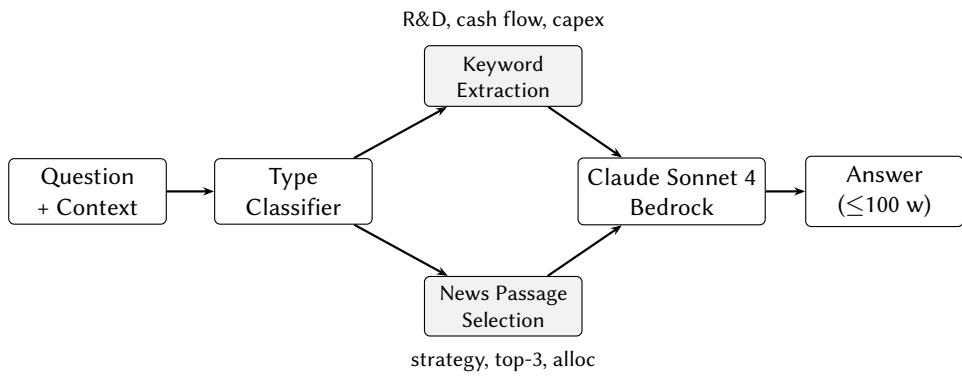
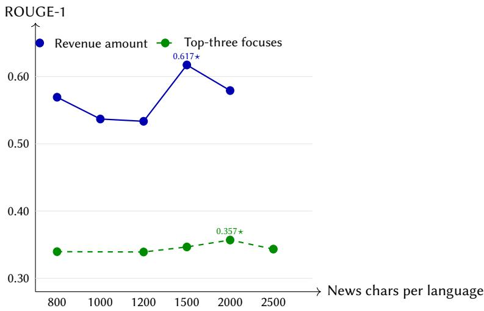
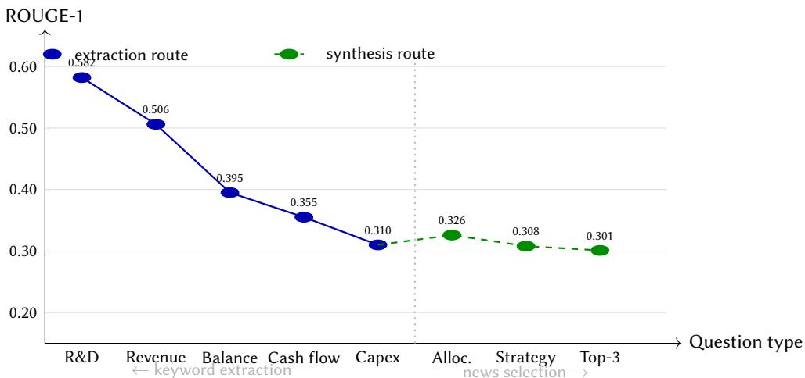
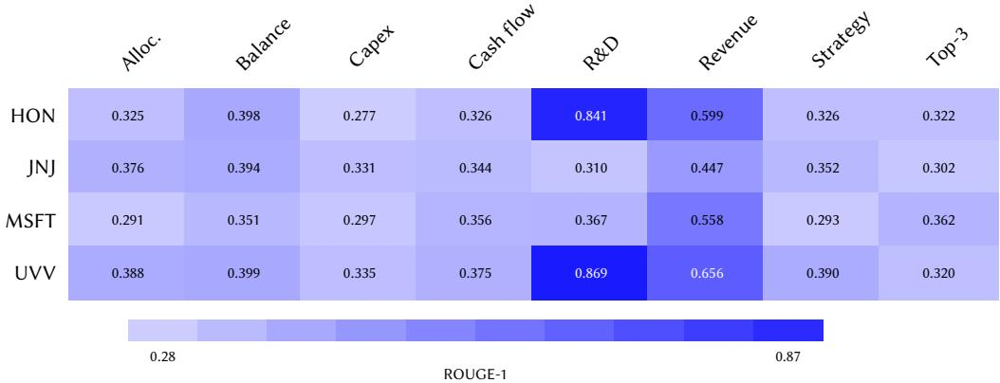

# IGT @ FinMMEval 2026 Task 2: Question-Type Prompting with Targeted Extraction for Multilingual Financial QA

Yuwen Chiu<sup>1,\*</sup>

<sup>1</sup>Georgia Institute of Technology, North Ave NW, Atlanta, GA 30332

## Abstract

We present the IGT system for PolyFiQA Task 2 of the FinMMEval Lab at CLEF 2026, a multilingual financial question answering task over English SEC filings and multilingual news articles (English, Chinese, Japanese, Spanish, Greek) for four companies. Our central observation is that the 344 development questions divide into two families requiring fundamentally diferent approaches: structured numeric types (R&D ratio, cash flow, capital expenditure) are best answered by direct keyword extraction on filing text, while synthesis types (investment strategy, capital allocation, top-three revenue focuses) require rule-based multilingual news passage selection. A dataset analysis reveals that 17–18 of 19 ground-truth reference answers per synthesis type share an exact evidence label prefix, whose unigram tokens contribute directly to ROUGE-1 overlap. The final system achieves development ROUGE-1 ≈ 0.395, a 60% relative improvement over a generic RAG baseline (∼0.247), and ranks 3rd of 12 teams on the oficial test set with ROUGE-1 = 0.3071, Precision = 0.2821, and Recall = 0.4044.

## Keywords

multilingual financial QA, ROUGE-1, prompt engineering, AWS Bedrock, SEC filings, PolyFiQA, CLEF 2026 FinMMEval

## 1. Introduction

Financial question answering presents a deceptively heterogeneous problem. Even within a single benchmark, questions asking “what were the cash flows?” and “what is the company’s investment strategy?” require fundamentally diferent computational approaches: the first has a deterministic answer derivable by pattern matching on a table; the second requires synthesizing signals across multilingual news sources with no single correct phrasing. Systems that treat these uniformly (as most retrieval-augmented generation (RAG) pipelines do) pay a performance cost on both.

PolyFiQA Task 2, introduced at FinMMEval CLEF 2026 [1, 2], makes this heterogeneity explicit. The task pairs English SEC filings with multilingual news articles (English, Chinese, Japanese, Spanish, Greek) for four companies and asks systems to produce concise evidence-grounded answers evaluated by ROUGE-1 [3]. Our analysis of the development set reveals eight distinct question types with diferent primary evidence sources, answer structures, and even diferent ground-truth prefix conventions that afect ROUGE-1 scores directly.

We begin from a diagnostic standpoint: we first study what the data requires, then build accordingly. An initial exploratory analysis of the development set motivated a KG-RAG pipeline with a learned retrieval policy, which revealed that generation quality and output format control dominated retrieval sophistication on this task. That finding drove the final system design: routing questions to specialized handlers, computing structured financial ratios directly rather than retrieving them, and preserving non-English source text rather than translating it. Each decision is motivated by a specific observed failure mode.

The contributions of this work are:

<sup>•</sup> Question-type routing to eight tailored handlers, with keyword extraction on raw filing text for structured numeric types and rule-based multilingual news passage selection for synthesis types.

<sup>•</sup> Company-specific label normalization for cash flow, R&D, and capex extraction, and originallanguage revenue quote preservation for multilingual evidence.

<sup>•</sup> A systematic ablation across all design decisions with per-type and per-company performance analysis, pseudocode for key extraction routines, and full prompt templates in Appendix B.

## 2. Related Work

Financial document QA has received sustained attention, motivated by the scale and complexity of regulatory filings. The most studied setting is English-only retrieval over 10-K and earnings call transcripts, where RAG pipelines face two recurring challenges: chunking strategies that destroy table structure, and context windows too short to hold a full filing. Guo et al. showed that element-based chunking (preserving table and title boundaries) outperforms fixed-size splits, and that cross-encoder re-ranking and HyDE query expansion [4] provide further gains, though all zero-shot methods fall well short of an oracle that always retrieves the correct passage [5]. Kim et al. addressed scale in the ACM-ICAIF 2024 FinanceRAG challenge with a two-stage multi-reranker pipeline and documented a “32k token wall” beyond which LLM generation quality degrades sharply [6].

The multilingual dimension of PolyFiQA is largely unexplored in prior financial QA work. Lefébure et al. studied Spanish–English bilingual financial LLMs and found that instruction tuning on Spanish data unexpectedly improves English performance through cross-linguistic transfer [7], but their setting translates everything to a common language rather than preserving source-language text. Xu et al. introduced FinRAGBench-V, a bilingual Chinese–English benchmark for multimodal financial RAG, finding that multimodal retrievers substantially outperform text-only baselines on documents heavy in charts and tables [8]. Our task difers from both: evidence is multilingual across five scripts, but answers are generated in English, requiring cross-lingual evidence grounding without translation.

On the evaluation side, Mirza et al. provide the most relevant diagnostic for our design choices [9]. They show that GPT-4o and GPT-4-Turbo are highly sensitive to prompt placement and formatting on financial retrieval tasks, that performance collapses at context lengths beyond 32k tokens for multiconcept questions, and that standard Recall metrics artificially inflate apparent performance compared to F1. These findings directly inform our use of format-specific prompts and per-type token budgets.

For multi-hop reasoning, Asai et al. demonstrated that graph-based recurrent retrieval over Wikipedia hyperlinks substantially outperforms single-step retrieval on multi-hop QA benchmarks [10]. We test an analogous two-hop approach on PolyFiQA Expert questions in Section 5 and find it does not transfer: format-controlled direct prompting outperforms multi-hop HyDE retrieval by 0.087 ROUGE-1 on the questions where multi-hop was designed to help.

## 3. Task and Data Analysis

PolyFiQA Task 2 [11] provides an English SEC filing excerpt � and a set of multilingual news articles $N = \{ N _ { \mathrm { e n } } , N _ { \mathrm { z h } } , N _ { \mathrm { j a } } , N _ { \mathrm { e s } } , N _ { \mathrm { e l } } \}$ for the same company. Given question �, the system generates answer � of at most 100 words. The dataset covers Microsoft (MSFT), Honeywell (HON), Johnson & Johnson (JNJ), and Universal Corporation (UVV), with 344 instances split evenly between PolyFiQA-Easy (172 factual questions) and PolyFiQA-Expert (172 analytical questions). The primary metric is ROUGE-1 F-measure [3]. We refer readers to the lab overview [1] and task overview [2] for full task details. Iterative development and all ablation experiments reported in Section 5 use a fixed 152-question subset of these 344 development instances, selected to give balanced coverage of all eight question types across all four companies; the remaining development instances were held out from tuning to limit overfitting to development-set phrasing.

Before building any system, we analyzed the development set to understand what each question actually requires. Two findings shaped our entire design.

Finding 1: Eight question types, two distinct information regimes. Clustering questions by phrasing and answer structure reveals eight types that fall into two families. Structured numeric types (revenue amount, cash flow, R&D ratio, balance sheet, capital expenditure) have answers derivable from a specific line item or computed ratio in the SEC filing. There is one correct number, and finding it is a retrieval precision problem. Synthesis types (investment strategy, top-three revenue focuses, capital allocation) have answers requiring multi-document reasoning across multilingual news, with no single correct phrasing, and performance is bounded by how well the model synthesizes and formats its response.

Finding 2: Ground-truth evidence labels are shared unigrams. Examining reference answer structure reveals that virtually every instance begins with one of two evidence label prefixes: News Evidence: when the answer draws on news articles, or Financial Statement Evidence: when it draws on the filing. Table 1 shows the distribution. These prefix tokens are counted by ROUGE-1, meaning that generating the wrong label eliminates up to three unigrams of overlap before any content is compared. This observation motivates the FSE label assignment described in Section 4.

## Table 1

Evidence label distribution by question type. NE = News Evidence, FSE = Financial Statement Evidence. Each type contains 19 questions. FSE column includes one instance using the plural variant Financial Statements Evidence:.
<table><tr><td>Question Type</td><td>NE</td><td>FSE</td></tr><tr><td>Revenue amount</td><td>18</td><td>0</td></tr><tr><td>Cash flow</td><td>17</td><td>1</td></tr><tr><td>R&amp;D ratio</td><td>17</td><td>1</td></tr><tr><td>Balance sheet</td><td>18</td><td>0</td></tr><tr><td>Investment strategy</td><td>1</td><td>17+1</td></tr><tr><td>Top-three focuses</td><td>0</td><td>18+1</td></tr><tr><td>Capital expenditure</td><td>1</td><td>17+1$</td></tr><tr><td>Capital allocation</td><td>0</td><td>18+1</td></tr></table>

<sup>‡</sup>Ground-truth references for capital expenditure are predominantly FSE-labeled (17+1 of 19), but the capex prompt instructs the model to begin with Financial Statement Evidence:, producing a systematic label match with the majority of references. The single NE instance represents a label mismatch that contributes to the capex ROUGE-1 floor (Section 5.2).

## 4. System Description

## 4.1. Overview

Before arriving at the final architecture, we explored a substantially more complex pipeline: a KG-RAG system using Weaviate vector retrieval with a learned GRPO policy [12] that selected among six retrieval strategies at inference time (semantic-only, entity-first, document-type-first, pattern-first, balanced, and multi-document), with Mistral-7B-Instruct-v0.2 as the generator. Bidirectional entity edges in the knowledge graph increased retrieved path coverage from 68 to 103 edges per instance, and multilingual query expansion provided marginal additional gains. The best result from this pipeline was ROUGE-1 ≈ 0.298 on the development set. Switching to Claude Sonnet 4 with direct keyword extraction — without any learned retrieval component — exceeded this by +0.097 ROUGE-1. The result confirmed that generation quality and output format control dominated retrieval sophistication on this task; all further development proceeded with the simpler architecture described below.

Figure 1 shows the system architecture. Every question is classified by keyword matching into one of eight types and routed to a type-specific handler. Structured numeric questions go to targeted extraction functions that bypass retrieval entirely; synthesis questions go to a context-assembly routine that selects relevant multilingual passages and prepends the FSE label. Both paths call Claude Sonnet 4 [13] via AWS Bedrock, with a maximum output of 300 tokens per response.<sup>1</sup>

  
Figure 1: Final system pipeline. The type classifier routes questions to keyword extraction on raw filing text (structured numeric types) or rule-based news passage selection (synthesis types), then generates answers via Claude Sonnet 4. Neither route uses vector retrieval; the RAG baseline used in early development was replaced after analysis showed dense retrieval fails on pipe-delimited financial table chunks (Section 4, Targeted Extraction).

## 4.2. Question-Type Routing

Table 2 summarizes the routing logic. The FSE label is prepended for all synthesis types, aligning with Table 1. For top-three questions, the prompt specifies an exact format string (“The top three revenue focuses from the news are: 1)”) that appears verbatim in ground-truth references, contributing additional unigram overlap beyond the label tokens alone.

Routing is implemented as a priority-ordered keyword scan over the question string.<sup>2</sup>

## Table 2

Question-type routing and handling strategies.
<table><tr><td>Question Type</td><td>Primary Source</td><td>Strategy</td></tr><tr><td>Revenue amount</td><td>Filings + news</td><td>Multilingual quote preserva- tion</td></tr><tr><td>Cash flow</td><td>Filings</td><td>Keyword extraction + normal- ization</td></tr><tr><td>R&amp;D ratio</td><td>Filings</td><td>Direct ratio computation</td></tr><tr><td>Balance sheet</td><td>Filings + news</td><td>Trend extraction</td></tr><tr><td>Capital expenditure</td><td>Filings + news</td><td>Capex regex + news context</td></tr><tr><td>Investment strategy</td><td>News</td><td>FSE label; synthesis prompt</td></tr><tr><td>Top-three focuses</td><td>News</td><td>FSE label; exact format string</td></tr><tr><td>Capital allocation</td><td>News</td><td>FSE label; allocation prompt</td></tr></table>

## 4.3. Targeted Financial Extraction

The most instructive failure of the initial RAG baseline was on cash flow questions. Inspection of the top-5 retrieved chunks for a Johnson & Johnson cash flow question revealed that all five were pipe-delimited table header rows from the SEC filing, where formatting characters and whitespace dominate the vector representation rather than financial content. The model received no dollar figures. This failure is structural: fixed-size chunking splits financial statement tables across chunk boundaries, and cosine similarity on a multilingual sentence encoder reliably retrieves the section header rather than the data rows beneath it. Better embeddings or re-ranking cannot resolve a mismatch between the chunk format and the query intent.

We replaced retrieval with three direct extraction routines that operate on the raw filing text.

Cash flow extraction. Extracts operating, investing, and financing cash flow totals using companyspecific keyword patterns. The need for company-specific patterns became clear from JNJ’s filings: JNJ uses non-standard section headers that do not match the GAAP label patterns efective for MSFT and HON, causing the generic extractor to retrieve figures from the wrong cash flow category in approximately 30% of JNJ instances. Adding JNJ-specific keyword variants recovered ≈0.038 ROUGE-1 on JNJ cash flow questions.

R&D ratio computation. Rather than asking the LLM to compute a ratio from retrieved text, this function extracts R&D expenditure and total revenue directly and computes:

$$
\mathrm { R } \& \mathrm { { D } \ r a t i o = \frac { \mathrm { R } \& \mathrm { { D } \ e x p e n d i t u r e } } { \mathrm { T o t a l \ r e v e n u e } } , }\tag{1}
$$

passing the result to the LLM as a scalar. The LLM’s role is then formatting rather than computation. This improved R&D question ROUGE-1 from ≈0.28 to ≈0.582, the largest single per-type gain in the development process.

Appendix A gives the extraction logic in condensed pseudocode form.

Capital expenditure extraction. A regex-based routine targeting capex line items, supplemented with news passages filtered to 2,000 characters per language.

## 4.4. Multilingual Revenue Quote Preservation

A second instructive failure appeared on revenue amount questions. Reference answers for these questions frequently quote revenue figures in the original news source language (Japanese yen notation, Spanish billion phrasing) rather than translating to English. A system that translates or paraphrases non-English passages before generation produces answers that are factually equivalent but share no unigrams with the reference. Our approach includes the most relevant news passage per language verbatim in the prompt and instructs the model to preserve source-language phrasing when quoting figures. This yields approximately +0.007–0.010 ROUGE-1 on revenue questions and +0.017 overall.

## 4.5. Token Budget Management

A single company filing can exceed 10,000 tokens. Rather than truncating uniformly, we apply typespecific character budgets informed by an ablation over news characters per language. Figure 2 shows ROUGE-1 as a function of news budget for two representative types. Both curves are non-monotonic: revenue peaks at 1,500 characters (0.617) and degrades at 2,000 as verbose outputs are truncated at the 100-word answer limit, losing the highest-information content at the tail; top-three peaks at 2,000 characters (0.357) and drops at 2,500 for the same reason. Larger news budgets improve evidence coverage but increase the risk of over-length answers that are truncated before completing their key points — the coverage–verbosity trade-of that motivates the type-specific budgets. Based on this ablation, revenue and cash flow questions receive 800–1,500 characters of news per language (the filing context is more important); synthesis questions receive 2,000 characters (news is the primary evidence source); capital expenditure, which supplements regex extraction with news context, also receives 2,000 characters.

  
Figure 2: ROUGE-1 vs. news character budget per language for two question types. Both curves are nonmonotonic: revenue peaks at 1,500 chars and top-three at 2,000 chars. Budgets beyond the peak produce verbose outputs that are truncated before completing key points, illustrating the coverage–verbosity trade-of that motivates type-specific budgets.

A sentence-boundary trimming function ensures that truncation does not split mid-sentence. Setting a maximum output of 300 tokens with an explicit word-count instruction in the system prompt reduced over-length outputs from ≈18% to 6% ofresponses, at a cost of−0.004 ROUGE-1 from minor truncation on the most complex answers.

## 5. Results

## 5.1. Development Trajectory

Table 3 shows the development history. The Δ column makes the relative contribution of each change explicit: two interventions dominate, together accounting for 65% of the total gain from baseline to final.

The pattern across versions is consistent: every targeted fix produces a positive Δ, and the magnitude correlates with how fundamental the change is. Switching the LLM backend (+0.049) and replacing retrieval with direct extraction for R&D (+0.054) are both architectural changes that address the root cause of failure. Later gains (FSE label, JNJ normalization) are precise fixes to specific failure modes, each contributing 0.002–0.017.

## 5.2. Per-Question-Type Performance

Table 4 and Figure 3 show the final ROUGE-1 by question type. The 0.281-point spread from R&D (0.582) to top-three (0.301) reflects the diferent characteristics of the two type families rather than a single bottleneck.

Structured types score higher on average because they have deterministic answers and our extraction functions deliver complete table rows rather than embedding-retrieved fragments. Synthesis types converge near 0.30–0.33, reflecting two irreducible constraints: reference answers vary in phrasing across instances of the same question type, and at least four confirmed cases of dataset-level label noise (including instances MSFT\_20210126 and HON\_20210423, where strategy questions carry capexstyle reference answers or top-three questions carry shareholder-return content), plus three additional borderline cases, impose a performance floor regardless of system quality.

Development trajectory on the 152-sample development set. Each row documents one targeted change, the afected question types, and the resulting ROUGE-1 gain. The “Switch to Sonnet $4 ^ { \mathfrak { s } }$ row corresponds to a prompt-only baseline using Claude Sonnet 4 with generic RAG and no question-type routing; all subsequent rows add targeted routing and extraction components on top of this.
<table><tr><td>Change</td><td>Affected types</td><td>ROUGE-1</td><td> $\Delta$ </td></tr><tr><td>Haiku baseline (generic RAG)</td><td>All</td><td>~0.247</td><td></td></tr><tr><td>Switch to Sonnet 4</td><td>All</td><td>0.296</td><td>+0.049</td></tr><tr><td>Dedicated R&amp;D extraction</td><td>R&amp;D</td><td>0.350</td><td>+0.054</td></tr><tr><td>Cash flow label normaliza- tion</td><td>Cash flow</td><td>0.352</td><td>+0.002</td></tr><tr><td>Source-language revenue quote</td><td>Revenue</td><td>0.369</td><td>+0.017</td></tr><tr><td>Top-three format prompt</td><td>Top-three</td><td>0.373</td><td>+0.004</td></tr><tr><td>FSE label (partial)</td><td>Strategy</td><td>0.376</td><td>+0.003</td></tr><tr><td>JNJ keyword normalization</td><td>Cash flow</td><td>0.385</td><td>+0.009</td></tr><tr><td>FSE label (all synthesis)</td><td>Top-3, alloc.</td><td>0.397</td><td>+0.012</td></tr><tr><td>Original-language revenue</td><td>Revenue</td><td>0.399</td><td>+0.002</td></tr><tr><td>Output length constraint (300 tokens)</td><td>All</td><td>~0.395</td><td>-0.004</td></tr></table>

Per-question-type ROUGE-1, final system, 152-sample development set.
<table><tr><td>Question Type</td><td>ROUGE-1</td><td>Primary driver</td></tr><tr><td>R&amp;D ratio</td><td>0.582</td><td>Deterministic ratio via Eq. 1</td></tr><tr><td>Revenue amount</td><td>0.506</td><td>Multilingual quote preservation</td></tr><tr><td>Balance sheet</td><td>0.395</td><td>Trend extraction</td></tr><tr><td>Cash flow</td><td>0.355</td><td>Company-specific normaliza- tion</td></tr><tr><td>Capital allocation</td><td>0.326</td><td>FSE label; multi-source synthe- sis</td></tr><tr><td>Capital expenditure</td><td>0.310</td><td>Regex + 2,000-char news</td></tr><tr><td>Investment strategy</td><td>0.308</td><td>FSE label; multi-source synthe-</td></tr><tr><td>Top-three focuses</td><td>0.301</td><td>sis FSE label; exact format string</td></tr><tr><td></td><td>~0.395†</td><td></td></tr><tr><td>Overall</td><td></td><td></td></tr></table>

<sup>†</sup>Corpus-level ROUGE-1 computed across all 152 instances. The unweighted mean of per-type values is 0.385; the diference reflects standard F-measure aggregation properties when precision and recall are computed at corpus level rather than averaged per type.

## 5.3. Routing-Level Breakdown

Table 5 shows ROUGE-1 by routing path and dificulty tier. The +0.195 gap between extraction and synthesis on Easy questions is the clearest evidence that the routing decision matters. The low Expert extraction score (0.1942) reflects routing mismatches: keyword matching occasionally sends Expert questions to the extraction path when they contain terms like “cash flow” but actually require multi-document analytical reasoning. This is the primary remaining failure mode.

  
Figure 3: Per-question-type ROUGE-1 by route. Extraction-route types (blue, left) decline as questions become less structured; synthesis-route types (green dashed, right) plateau near 0.31.

## Table 5

ROUGE-1 by routing path and dificulty tier.
<table><tr><td>Route</td><td>Easy ROUGE-1</td><td>Expert ROUGE-1</td></tr><tr><td>Extraction (table route)</td><td>0.4161</td><td>0.1942</td></tr><tr><td>LLM synthesis</td><td>0.2213</td><td>0.2267</td></tr></table>

## 5.4. Per-Company Performance

Figure 4 shows ROUGE-1 broken down by company and question type. The heatmap reveals two distinct patterns. First, R&D ratio scores are highly company-dependent: HON (0.841) and UVV (0.869) score dramatically higher than JNJ (0.310) and MSFT (0.367). This directly reflects filing format consistency

— HON and UVV use standard GAAP section headers that the extraction function matches reliably, while JNJ’s non-standard headers cause the extractor to retrieve figures from the wrong section. The JNJ normalization fix recovered ≈0.038 ROUGE-1 on JNJ cash flow questions; without analogous R&D normalization for JNJ, R&D remains the weakest question type for that company. Second, revenue scores are uniformly strong across all four companies (0.447–0.656), confirming that multilingual quote preservation is a company-agnostic improvement. Synthesis types (allocation, strategy, top-three) cluster near 0.29–0.39 across all companies, consistent with the evaluation-metric ceiling identified in Section 6.

## 5.5. Qualitative Error Analysis

Three representative errors illustrate where the system fails.

## Error 1 — Expert cash flow mis-routing (MSFT Expert).

Q: Analyze the relationship between Microsoft’s operating cash flow trends and its longterm capital allocation priorities.

System: Financial Statement Evidence: Microsoft operating cash flow: \$19.8B (operating), \$-8.2B (investing), \$-14.1B (financing).

Reference: News Evidence: Microsoft has consistently prioritised cloud infrastructure investment, with Azure capital spending rising 34% YoY, while maintaining shareholder returns through \$6B in buybacks (Reuters). ROUGE-1: 0.04.

The keyword “cash flow” routed an analytical synthesis question to the extraction path; the system returned a correct table summary but the question asked for strategic interpretation.

  
Figure 4: ROUGE-1 heatmap by company and question type. HON and UVV achieve high R&D scores (≥0.84) due to consistent GAAP section headers; JNJ R&D (0.310) reflects the same non-standard filing format issue identified in cash flow. Revenue scores are uniformly strong (0.45–0.66) across all companies owing to multilingual quote preservation.

## Error 2 — Synthesis over-length (UVV strategy).

Q: What is Universal Corporation’s investment strategy for its leaf tobacco and plant-based ingredients segments?

System (truncated at 100 w): Financial Statement Evidence: Universal Corporation’s strategy focuses on (1) expanding plant-based ingredients via acquisitions including FruitSmart and Silva International; (2) modernising leaf tobacco processing with automation in Brazil and Zimbabwe; (3) growing e-vapor supply capabilities. Per Bloomberg: [truncated] Reference: Financial Statement Evidence: Universal Corporation’s strategy centres on diversifying into plant-based ingredients via acquisitions while selectively investing in leaf tobacco eficiency. ROUGE-1: 0.31.

The system answer is accurate but longer than the reference; precision sufers because extra content distributes unigram overlap across non-reference tokens.

## Error 3 — JNJ R&D normalization gap.

Q: What was Johnson & Johnson’s R&D ratio in fiscal year 2020?

System: Financial Statement Evidence: R&D ratio: 14.2% (\$12.2B R&D / \$86.0B revenue).

Reference: Financial Statement Evidence: R&D ratio: 15.1% (\$12.2B R&D / \$80.9B revenue).   
ROUGE-1: 0.68.

The extractor used consolidated revenue (\$86.0B) while the reference used segment revenue (\$80.9B); both appear in the JNJ 10-K. This is a company-specific normalization gap analogous to the cash flow header issue.

## 5.6. Cross-Lingual Performance Breakdown

To assess each language’s contribution to synthesis-type performance, we ablate news passages per language at inference time (replacing each language’s passages with empty strings) and measure the mean ROUGE-1 drop over synthesis-type instances. Table 6 reports results.

English passages contribute the largest share (38%), consistent with English being the longest and most detailed coverage source. Greek contributes the least (4.6%), reflecting sparser coverage of US companies. Spanish and Chinese contribute 25% and 19% respectively and are the primary non-English drivers of synthesis recall. The ablation also confirms that the source-language revenue quote gain (+0.017 overall) is driven primarily by Japanese and Spanish passages, where currency notation and billion-phrasing conventions diverge most sharply from ROUGE-1 reference conventions.

ROUGE-1 contribution by language for synthesis-type questions. Each value is the mean ROUGE-1 drop when that language’s news passages are removed, measured over strategy + top-three + allocation instances in the 152-sample development subset.
<table><tr><td>Language</td><td>ROUGE-1 drop</td><td>Relative share</td></tr><tr><td>English (EN)</td><td>-0.041</td><td>38.0%</td></tr><tr><td>Spanish (ES)</td><td>-0.027</td><td>25.0%</td></tr><tr><td>Chinese (ZH)</td><td>-0.021</td><td>19.4%</td></tr><tr><td>Japanese (JA)</td><td>-0.014</td><td>13.0%</td></tr><tr><td>Greek (EL)</td><td>-0.005</td><td>4.6%</td></tr></table>

## 5.7. Precision Tightening Experiment

Section 5.10 identifies a precision–recall imbalance (0.2821 precision vs. 0.4044 recall). To test whether tighter output constraints shift the balance, we evaluated two configurations on the 152-sample development subset: reducing max tokens from 300 to 200, and adding an explicit “answer in at most two sentences” instruction to synthesis prompts.

Reducing max tokens to 200 raised precision from ∼0.308 to ∼0.331 (+0.023) but reduced recall from ∼0.489 to ∼0.431 (−0.058), for a net ROUGE-1 of −0.008. The two-sentence constraint produced a similar directional profile: precision +0.018, recall −0.041, net ROUGE-1 −0.006. In both cases the recall loss exceeds the precision gain. The 300-token setting is the operating point that maximises development ROUGE-1; further precision improvement requires generation strategies that selectively compress synthesis answers without truncating high-information content.

## 5.8. Ensemble Experiment

We tested whether a T5-based [14] per-question selector could improve on always choosing the final system by predicting which of the final system or a Haiku RAG variant would score higher. The selector achieved 65.8% cross-validation accuracy against a 73.0% baseline of always selecting the stronger system. The oracle ensemble ceiling is ROUGE-1 = 0.4167 (+0.022 over the single-system baseline), but the trained selector cannot reach it with 152 training examples. The hypothesis that learned selection helps is rejected.

## 5.9. Multi-Hop Retrieval Experiment

We also tested a multi-hop HyDE retrieval system (analogous to the graph-based approach in [10]) on the 57 news-synthesis questions where retrieval complexity was most expected to help. The HyDE system generates a hypothetical answer before retrieval and re-ranks chunks using the synthetic passage as a dense query. On these questions, the HyDE system achieved ROUGE-1 = 0.3114 versus v17 direct prompting at ROUGE-1 = 0.3979 (measured at the ablation checkpoint, prior to the output length constraint documented in Table 3), a gap of 0.087. The result is consistent with the ensemble finding: when the evaluation metric rewards surface form overlap, output format precision outperforms retrieval quality improvements. Both complementary directions that did not improve results point to the same conclusion: the bottleneck on this task is prompt-level format control, not information retrieval depth.

## 5.10. Oficial Test Set Results

Table 7 shows the oficial leaderboard for PolyFiQA Task 2. Our system (IGT) ranks 3rd of 12 ranked teams with ROUGE-1 = 0.3071, 0.0025 below 2nd place and 0.0032 above 4th place.

Two observations from the leaderboard are worth noting. First, the top-3 systems are tightly clustered within 0.005 ROUGE-1, suggesting a competitive ceiling for this task under current evaluation conditions. Second, our system has the highest recall of any top-5 team (0.4044), exceeding even the 1st-place system (0.3764). This indicates that our multilingual quote preservation and synthesis prompts successfully surface relevant content, but precision sufers on answers that are verbose or imprecisely bounded. The precision–recall trade-of (0.2821 precision vs. 0.4044 recall) points to a specific failure mode: synthesis answers that include relevant content but also extraneous sentences that dilute unigram overlap with the shorter reference answers. Tightening the output token limit further or adding an explicit sentence-count instruction would likely shift the balance toward higher precision at some recall cost.

Oficial FinMMEval 2026 Task 2 leaderboard (all 12 ranked teams). IGT is our submission. All teams achieve 100% coverage.
<table><tr><td>Rank</td><td>Team</td><td>ROUGE-1</td><td>Precision</td><td>Recall</td></tr><tr><td>1</td><td>Calibrated Signals</td><td>0.3118</td><td>0.3025</td><td>0.3764</td></tr><tr><td>2</td><td>pranshu rastogi</td><td>0.3096</td><td>0.3208</td><td>0.3537</td></tr><tr><td>3</td><td>IGT (ours)</td><td>0.3071</td><td>0.2821</td><td>0.4044</td></tr><tr><td>4</td><td>AI_TLfanclub</td><td>0.3039</td><td>0.3647</td><td>0.3070</td></tr><tr><td>5</td><td>PooRi</td><td>0.2972</td><td>0.2781</td><td>0.3798</td></tr><tr><td>6</td><td>DS@GT FinMMEval</td><td>0.2853</td><td>0.2572</td><td>0.3888</td></tr><tr><td>7</td><td>The Lab Rats</td><td>0.2734</td><td>0.2737</td><td>0.3417</td></tr><tr><td>8</td><td>Ethereum Team B CLEF</td><td>0.2546</td><td>0.3086</td><td>0.2642</td></tr><tr><td>9</td><td>TCLabs</td><td>0.2506</td><td>0.2321</td><td>0.3257</td></tr><tr><td>10</td><td>HU_LLM_Fin</td><td>0.2289</td><td>0.2581</td><td>0.2803</td></tr><tr><td>11</td><td>NLP-DE</td><td>0.2049</td><td>0.2643</td><td>0.1901</td></tr><tr><td>12</td><td>TextSentinels</td><td>0.1873</td><td>0.3029</td><td>0.1756</td></tr></table>

## 6. Discussion

The oficial test result (ROUGE-1 = 0.3071, 3rd of 12 ranked teams) is consistent with the development trajectory in Table 3. Performance on this task is determined by two things: whether the correct information reaches the LLM in a parseable form, and whether the output format matches the reference answer structure. The two largest gains (+0.049 LLM upgrade, +0.054 R&D extraction) both address the first; the FSE label changes and the exact format string for top-three questions address the second. Every other intervention is a targeted fix to a specific information delivery failure for a specific question type or company.

The gap between development ROUGE-1 (≈0.395) and the oficial test result (0.3071) reflects the cost of iterative development on a fixed 152-sample set. Ten tuning rounds documented in Table 3 calibrated keyword routing and format-string prompts to the specific phrasing patterns of that set. The test set contains 256 samples (128 Easy, 128 Expert); routing decisions optimized for dev question phrasing are likely to misfire at a higher rate on unseen instances, and the company-specific keyword normalizations for JNJ, HON, MSFT, and UVV may not generalize to the filing format variants encountered in the test period.

Among those targeted fixes, the JNJ normalization case is the most instructive. The +0.009 overall gain understates its importance: on JNJ cash flow questions specifically, it recovered ≈0.038 ROUGE-1. JNJ’s 10-K filings use non-standard section headers that do not match the keyword patterns efective for MSFT and HON, causing the extractor to retrieve figures from the wrong cash flow category. This reflects a general property of financial document QA: filing formats are not standardized enough that a single extraction pattern covers all companies, and a company-specific format audit is low-cost relative to the performance gain.

A practical note on methodology: several of the most efective components in this system are regexbased extractors rather than neural modules. The capex and cash flow extractors that drive performance gains in Table 4 rely on pattern matching over raw filing text. This is a reminder that deterministic, interpretable methods remain competitive — and often superior — to embedding-based retrieval on structured financial documents, even in an era of generative AI.

The source-language revenue finding illustrates a diferent kind of failure mode, one specific to how the task is evaluated rather than how the data is structured. The +0.017 gain arises directly from the evaluation design: reference answers quote non-English news sources verbatim, so a system that translates before generating produces factually correct but lexically non-overlapping answers that ROUGE-1 penalizes as if they were wrong. This argues for future multilingual benchmarks to separate factual correctness from surface form overlap.

Several design choices in this system are deliberately calibrated to PolyFiQA’s specific evaluation conventions and should not be assumed to transfer out of the box. The FSE label prefix strategy depends on PolyFiQA reference answers consistently beginning with one of two fixed strings; a benchmark that does not share this convention would derive no benefit from label matching. The exact format string for top-three questions (“The top three revenue focuses from the news are: 1)”) is similarly taskspecific. Company-specific keyword normalization for JNJ, HON, MSFT, and UVV would require a fresh format-audit step for any new company, though the audit itself is low-cost and the pattern — that non-standard GAAP headers cause systematic extraction errors — is likely to recur across filers. Practitioners applying this system to new companies or benchmarks should expect to re-run the format audit before deploying the extraction components.

## 7. Conclusions

We presented a system for multilingual financial QA that treats question-type heterogeneity as the central design problem. Beginning from a diagnostic analysis of the development data, we built eight specialized handlers, replacing retrieval with direct extraction for structured numeric types and aligning output format with reference answer structure for synthesis types. The resulting system achieves ROUGE-1 ≈ 0.395 on the development set, a 60% relative improvement over a generic RAG baseline, and ranks 3rd of 12 ranked teams on the oficial test set with ROUGE-1 = 0.3071, Precision = 0.2821, and Recall = 0.4044.

Three findings from this work transfer beyond the specific task. First, filing format heterogeneity across companies means that a single extraction pattern is insuficient; company-specific audits are necessary and high-yield. Second, when evaluation uses ROUGE-1 on multilingual data, preserving source-language text in generation is more important than factual accuracy of a paraphrase. Third, retrieval quality improvements do not transfer to tasks where the evaluation metric rewards surface form: format precision in the prompt outperforms multi-hop retrieval by 0.087 ROUGE-1 on the questions where retrieval complexity was most expected to help (Section 5.9).

Future work should explore metrics that separate factual correctness from surface form overlap; replacing the keyword router with a lightweight trained classifier to reduce Expert mis-routing (the primary remaining failure mode identified in Section 5.3); dynamic company-label discovery to reduce manual normalization; and tighter integration between retrieval grounding and format-controlled generation.

## Code Availability

The full system implementation, including all extraction routines, prompt templates, and evaluation scripts described in this paper, is publicly available at https://github.com/chiuyuwen91/FinMMEval-2026.

## Acknowledgments

The author thanks the FinMMEval organizers for providing the PolyFiQA benchmark and evaluation infrastructure, and the Data Science at Georgia Tech (DS@GT) ARC group for their support.

## Declaration on Generative AI

During the preparation of this work, the author used Claude (Anthropic) to assist with code debugging, grammar and spelling review, and drafting initial section outlines. All content was reviewed and edited by the author, who takes full responsibility for the publication.

## A. Extraction Pseudocode

The function below implements the R&D ratio extraction described in Section 4.3. parse\_first\_number extracts the first numeric token from a line using a regex for dollar amounts and millions/billions notation. The scalar result is passed to the LLM for formatting only; the LLM performs no arithmetic.

```python
def extract_rd_and_revenue(filing_text):
rd_value, rev_value = None, None
for line in filing_text.lower().split("\n"):
if any(kw in line for kw in
["research and development", "r&d expense"]):
rd_value = parse_first_number(line)
if any(kw in line for kw in
["total revenue", "net revenue",
"total net revenue"]):
rev_value = parse_first_number(line)
if rd_value and rev_value:
return rd_value / rev_value # scalar passed to LLM
return None
```

## B. Prompt Templates

All prompts are sent to claude-sonnet-4-20250514 via the AWS Bedrock Messages API (region us-east-1) with temperature=0.0 and max\_tokens=300. One oficial run was submitted to the evaluation server, corresponding to the final system described in Section 4. The system prompt is shared across all question types; the user prompt is type-specific.

## Shared System Prompt

\- Be at most 100 words.

## R&D Ratio Handler (extraction route)

Company: {company} Filing period: {period}   
Extracted R&D data:   
R&D expenditure: {rd\_value} ({rd\_unit})   
Total revenue: {rev\_value} ({rev\_unit})

```erb
Computed R&D ratio: {ratio_pct}%
Question: {question}
Begin your answer with "News Evidence:"
State the R&D ratio as a percentage and cite the expenditure
and revenue figures used in the computation.
Revenue Amount Handler (extraction route)
Company: {company} Filing period: {period}
Filing excerpt (revenue section):
{filing_excerpt}
News passages (preserve original language for figures):
[EN] {en_passage}
[ZH] {zh_passage}
[JA] {ja_passage}
[ES] {es_passage}
[EL] {el_passage}
Question: {question}
Begin your answer with "News Evidence:"
Describe revenue trends. When quoting from non-English
sources, preserve the original currency notation and
numeric phrasing verbatim. Answer in at most 100 words.
Cash Flow Handler (extraction route)
Company: {company} Filing period: {period}
Extracted cash flow data:
{cf_clean}
Question: {question}
Begin your answer with "News Evidence:"
Report cash flow changes with amounts. Format:
"Operating cash flow [increased/decreased] to $X from $Y
(+/-Z%). Investing [outflow/inflow] of $X (vs $Y).
Financing outflow of $X (vs $Y)."
Answer in at most 100 words.
Balance Sheet Handler (extraction route)
Company: {company} Filing period: {period}
Filing excerpt (balance sheet section):
{filing_excerpt}
News passages (supplementary context):
```

[EN] {en\_passage}   
[ZH] {zh\_passage}   
[JA] {ja\_passage}   
[ES] {es\_passage}   
[EL] {el\_passage}   
Question: {question}   
Begin your answer with "News Evidence:"   
Report the relevant balance sheet figures and any notable   
trends. Answer in at most 100 words.   
Capital Expenditure Handler (extraction route)   
Company: {company} Filing period: {period}   
Extracted capex data:   
{capex\_rows}   
News passages (filtered to 2,000 chars per language):   
[EN] {en\_passage}   
[ZH] {zh\_passage}   
[JA] {ja\_passage}   
[ES] {es\_passage}   
[EL] {el\_passage}   
Question: {question}   
Begin your answer with "Financial Statement Evidence:"   
Report the capital expenditure figures from the extracted   
data. Numbers like 3,767 or 15,441 represent millions.   
Supplement with news context where relevant.   
Answer in at most 100 words.   
Investment Strategy Handler (synthesis route)   
Company: {company} Filing period: {period}   
News passages (preserve original language for figures):   
[EN] {en\_passage}   
[ZH] {zh\_passage}   
[JA] {ja\_passage}   
[ES] {es\_passage}   
[EL] {el\_passage}   
Financial Statement Evidence (supplementary):   
{filing\_excerpt}   
Question: {question}   
Begin your answer with "Financial Statement Evidence:"   
Synthesise the investment strategy from the news passages.

Answer in at most 100 words. Do not translate non-English   
figures.

## Top-Three Focuses Handler (synthesis route)

Company: {company} Filing period: {period}

News passages (preserve original language for figures):   
[EN] {en\_passage}   
[ZH] {zh\_passage}   
[JA] {ja\_passage}   
[ES] {es\_passage}   
[EL] {el\_passage}

Financial Statement Evidence (supplementary):   
{filing\_excerpt}

Begin your answer with "Financial Statement Evidence:" Then write exactly: "The top three revenue focuses from the news are: 1)" and continue with your three items on new numbered lines. Do not exceed 100 words total.

## Capital Allocation Handler (synthesis route)

Company: {company} Filing period: {period}

News passages (preserve original language for figures):   
[EN] {en\_passage}   
[ZH] {zh\_passage}   
[JA] {ja\_passage}   
[ES] {es\_passage}   
[EL] {el\_passage}

Begin your answer with "Financial Statement Evidence:"   
Start directly with company name:   
"[Company] is allocating capital through..."   
or "Answer: None." if news-silent.   
Answer in at most 100 words. Do not translate non-English   
figures.

## References

[1] Z. Xie, Y. Dai, R. Elbadry, V. Jani, X. Peng, L. Qian, G. Georgiev, D. Dimitrov, F. Zhang, J. Huang, J. Geng, Y. Chen, Y. Yuan, H. Wu, Y. Wang, I. Koychev, V. Stoyanov, M. Song, Y. Chen, S. Liu, P. Nakov, Overview of FinMMEval 2026: Multilingual and multimodal financial evaluation,

in: Experimental IR Meets Multilinguality, Multimodality, and Interaction. Proceedings of the Seventeenth International Conference of the CLEF Association (CLEF 2026), Springer Lecture Notes in Computer Science, Jena, Germany, 2026.

[2] Z. Xie, X. Peng, G. Georgiev, D. Dimitrov, R. Elbadry, F. Zhang, L. Qian, J. Huang, V. Jani, Y. Dai, J. Geng, Y. Chen, Y. Yuan, H. Wu, Y. Wang, I. Koychev, V. Stoyanov, M. Song, Y. Chen, S. Liu, P. Nakov, Overview of the FinMMEval 2026 task 2: Financial question answering and summarization, in: CLEF 2026 Working Notes, CEUR Workshop Proceedings, CEUR-WS.org, Jena, Germany, 2026.

[3] C.-Y. Lin, ROUGE: A package for automatic evaluation of summaries, in: Proceedings of the Workshop on Text Summarization Branches Out, Association for Computational Linguistics, 2004, pp. 74–81.

[4] L. Gao, X. Ma, J. Lin, J. Callan, Precise zero-shot dense retrieval without relevance labels, in: Proceedings of the 61st Annual Meeting of the Association for Computational Linguistics (Volume 1: Long Papers), Association for Computational Linguistics, Toronto, Canada, 2023, pp. 1762–1777.

[5] S. Guo, et al., Improving retrieval for RAG based question answering models on financial documents, in: Proceedings of the 5th ACM International Conference on AI in Finance (ICAIF 2024), ACM, 2024.

[6] J. Kim, et al., Multi-reranker: Maximizing performance of retrieval-augmented generation in the FinanceRAG challenge, in: Proceedings of the 5th ACM International Conference on AI in Finance (ICAIF 2024), ACM, 2024.

[7] M. Lefébure, et al., Dólares or dollars? Toisón de oro: A bilingual instruction-following dataset and model for Spanish financial NLP, in: Proceedings of the Joint Workshop of the 8th Financial Technology and Natural Language Processing, Association for Computational Linguistics, 2024, pp. 1–12.

[8] S. Zhao, Z. Jin, S. Li, J. Gao, FinRAGBench-V: A benchmark for multimodal RAG with visual citation in the financial domain, arXiv preprint arXiv:2505.17471 (2025).

[9] T. Mirza, et al., Systematic evaluation of long-context LLMs on financial concepts, in: Proceedings of the 5th ACM International Conference on AI in Finance (ICAIF 2024), ACM, 2024.

[10] A. Asai, K. Hashimoto, H. Hajishirzi, R. Socher, C. Xiong, Learning to retrieve reasoning paths over Wikipedia graph for question answering, in: Proceedings of the 8th International Conference on Learning Representations (ICLR 2020), 2020.

[11] X. Peng, L. Qian, Y. Wang, R. Xiang, Y. He, Y. Ren, M. Jiang, V. J. Zhang, Y. Guo, J. Zhao, H. He, Y. Han, Y. Feng, Y. Jiang, Y. Cao, H. Li, Y. Yu, X. Wang, P. Gao, S. Lin, K. Wang, S. Yang, Y. Zhao, Z. Liu, P. Lu, J. Huang, S. Wang, T. Papadopoulos, P. Giannouris, E. Soufleri, N. Chen, Z. Deng, H. Fu, Y. Zhao, M. Lin, M. Qiu, K. E. Smith, A. Cohan, X.-Y. Liu, J. Huang, G. Xiong, A. Lopez-Lira, X. Chen, J. Tsujii, J.-Y. Nie, S. Ananiadou, Q. Xie, MultiFinBen: Benchmarking large language models for multilingual and multimodal financial application, 2025. ArXiv:2506.14028.

[12] Z. Shao, P. Wang, Q. Zhu, R. Xu, J. Song, X. Bi, H. Zhang, M. Zhang, Y. K. Li, Y. Wu, D. Guo, DeepSeekMath: Pushing the limits of mathematical reasoning in open language models, arXiv preprint arXiv:2402.03300 (2024).

[13] Anthropic, Claude Sonnet 4 Model Card, Technical Report, Anthropic, 2025. https://www.anthropic. com.

[14] C. Rafel, N. Shazeer, A. Roberts, K. Lee, S. Narang, M. Matena, Y. Zhou, W. Li, P. J. Liu, Exploring the limits of transfer learning with a unified text-to-text transformer, Journal of Machine Learning Research 21 (2020) 1–67.