# It's Not RoPE that Creates Sinks: The Role of Self-Concentration and Value-Non-Mixing in Attention

Raito Kiya1 Satoki Ohashi1 Kosuke Sato1 Go Kamoda2,3 Ryosuke Takahashi1,4,5 Yuji Yamamoto2,3 Daiki Shiono1 Keisuke Sakaguchi1,5 Goro Kobayashi6,1

1Tohoku University 2SOKENDAI 3NINJAL 4MBZUAI 5RIKEN 6Preferred Networks, Inc. raito.kiya@dc.tohoku.ac.jp

## Abstract

Large Language Models (LLMs) often exhibit “Attention Sink"(AS) and the accompanying “Massive Activations" (MAs) at the initial position of a sequence. These phenomena frequently co-occur, and MAs can pose challenges for low-bit quantization. In this study, we analyze the factors underlying AS and MAs that emerge at the initial position regardless of the token occupying it. Our experiments suggest that self-concentration of attention, resulting from the causal mask, and the subsequent Value-non-mixing in attention outputs contribute to AS and MAs. These findings provide new empirical evidence on the internal dynamics of LLMs, offering insights that may inform future quantization strategies and advance our understanding of the internal mechanisms of attention layers.1

## 1 Introduction

Large Language Models (LLMs) exhibit a phenomenon known as the “Attention Sink" (AS), where attention concentrates on specific tokens, particularly the first token of a sequence (Xiao et al., 2024; Gu et al., 2025). These same tokens also often exhibit a few extremely large hidden-state activation values in intermediate layers, termed “Massive Activations" (MAs) (Sun et al., 2024). Largemagnitude activations of this kind are known to pose a major challenge for low-precision quantization (Dettmers et al., 2022).

Previous studies have offered various accounts of these phenomena, including their role in enabling no-op behavior under Softmax normalization constraints (Bondarenko et al., 2023), the interpretation of the first token as a key bias (Gu et al., 2025), and the influence of causal-mask asymmetry (Wu et al. 2025).2 Despite these different perspectives, how the properties specific to the initial position contribute to the emergence of AS and MAs remains unclear.

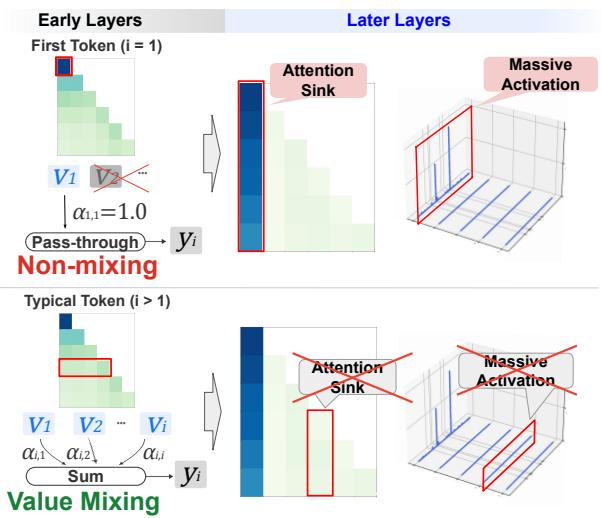  
Figure 1: Main finding of this study. While attention outputs for standard tokens (i > 1) are computed based on weighted averages (i.e., “mixing") of Value vectors, the output for the initial token is based solely on its own “unmixed” Value vector. This “Value-non-mixing" state in early layers is a contributing factor in AS and MAs at the initial position of a sequence, regardless of the token occupying it.

To address this question, we decompose the properties of the initial position into three components: the typical presence of the BOS token, the first positional encoding, and forced self-concentration under causal masking. We then disentangle their respective influences on AS and MAs at the initial position of a sequence. Our experiments provide evidence that self-concentration contributes to the emergence of these phenomena. Under selfconcentration, the attention output carries a single Value vector rather than a mixture of distinct ones, a state we call“Value-non-mixing."We argue that this state contributes to AS and MAs at the initial position regardless of the token occupying it (Figure 1). Our findings provide new empirical evidence on how AS and MAs form in LLMs, which may inform future quantization strategies and advance our understanding of the internal mechanisms of attention layers.

## 2 Background: Attention Mechanism and Attention Sink Metric

An attention mechanism computes the output $\pmb { y } _ { i } \in$ $\mathbb { R } ^ { d }$ for the i-th token from an input sequence $\{ \pmb { x } _ { j } \} _ { j = 1 } ^ { T } \in \mathbb { R } ^ { T \times d }$ as follows:

$$
\begin{array} { c } { { \displaystyle { q _ { i } , k _ { i } , v _ { i } } \rbrace = x _ { i } \lbrace W _ { Q } R _ { \Theta , i } ^ { \top } , W _ { K } R _ { \Theta , i } ^ { \top } , W _ { V } \rbrace } } \\ { { } } \\ { { \alpha _ { i , j } = \displaystyle { \frac { \exp ( { q _ { i } k _ { j } ^ { \top } / \sqrt { d ^ { \prime } } } ) } { \sum _ { m = 1 } ^ { i } \exp ( { q _ { i } k _ { m } ^ { \top } / \sqrt { d ^ { \prime } } } ) } } } } \\ { { } } \\ { { y _ { i } = \displaystyle { \sum _ { j = 1 } ^ { i } \alpha _ { i , j } v _ { j } W _ { O } } , } } \end{array}  \qquad (\tag{1}
$$

where $W _ { Q , K , V } \in \mathbb { R } ^ { d \times d ^ { \prime } }$ and $W _ { O } \in \mathbb { R } ^ { d ^ { \prime } \times d }$ denote projection matrices for Query/Key/Value/Output, and $\scriptstyle { R _ { \Theta , i } }$ denotes the RoPE (Su et al., 2024) rotation matrix.

AS refers to the phenomenon where the token at position j (often the first) receives disproportionately large attention weights $\alpha _ { i , j }$ across many heads (Xiao et al., 2024). Following Gu et al. (2025), we quantify the strength of AS at position j using the Sink, metric:

$$
\begin{array} { l } { { \displaystyle { \bar { \alpha } _ { j } ^ { l , h } = \frac { 1 } { T - j + 1 } \sum _ { i = j } ^ { T } \alpha _ { i , j } ^ { l , h } } } } \\ { { \displaystyle \mathrm { S i n k } _ { j } ^ { \epsilon } = \frac { 1 } { L \cdot H } \sum _ { l = 1 } ^ { L } \sum _ { h = 1 } ^ { H } \mathbb { I } ( { \bar { \alpha } _ { j } } ^ { l , h } > \epsilon ) } , }  \end{array}\tag{2}
$$

where L is the number of layers, H is the number of heads at each layer, € is a threshold³, and I(·) is the indicator function.

## 3 Preliminaries: Influence of BOS Token

Before our main analysis, we examine whether AS and MAs observed at the initial position of a sequence are attributable to the BOS embedding or to the positional characteristics of the initial position. To disentangle these two factors, we swap the BOS token with the token at a non-initial position $( t = 1 6 )$ in each sequence. Our experiments use WikiText (Merity et al., $2 0 1 7 ) ^ { 4 }$ and, among the models listed in Table 4, the three whose tokenizer prepends a BOS token, since this swap is undefined for the other two.

<table><tr><td>Model</td><td>Position</td><td>Vanilla</td><td>BOS at 16th</td></tr><tr><td rowspan="2">Llama-2-7b-hf</td><td>1</td><td>0.9321</td><td>0.9178</td></tr><tr><td>16</td><td>0.0001</td><td>0.7597</td></tr><tr><td rowspan="2">Llama-3.2-3B</td><td>1</td><td>0.9879</td><td>0.8856</td></tr><tr><td>16</td><td>0.0000</td><td>0.4312</td></tr><tr><td rowspan="2">Mistral-7B-v0.3</td><td>1</td><td>0.9833</td><td>0.1675</td></tr><tr><td>16</td><td>0.0000</td><td>0.6376</td></tr></table>

Table 1: Sink, when the BOS token is moved to the 16th position. Unless otherwise noted, all subsequent tables in this analysis use $T = 6 4$ over N = 100 WikiText sequences.
<table><tr><td>Model</td><td>Vanilla</td><td>RoPE Interv</td></tr><tr><td>Llama-2-7b-hf</td><td>0.9305</td><td>0.9273</td></tr><tr><td>Llama-3.2-3B</td><td>0.9218</td><td>0.9133</td></tr><tr><td>Mistral-7B-v0.3</td><td>0.0343</td><td>0.1525</td></tr><tr><td>Qwen2-7B</td><td>0.8173</td><td>0.7931</td></tr><tr><td>pythia-1b</td><td>0.7337</td><td>0.7547</td></tr></table>

Table 2: Sink with and without RoPE intervention (both w/o BOS).

Table 1 reports the mean Sink, under this setting. The results show that AS still occurs at the BOS token even when the token is relocated to the middle of each sequence. Moreover, although its strength varies across models, AS consistently emerges at the initial position of the sequence even when the initial token is not the BOS token. We observe a similar trend for MAs, as shown in Figure 2. Taken together, these results indicate that both the BOS token and the initial position contribute to AS and MAs, with the latter operating independently of token type. These findings are consistent with prior reports that MAs occur at the initial position of a sequence (Sun et al., 2024) and that the BOS token triggers AS and MAs (Oh et al., 2025). Our results complement these works by providing a comprehensive quantitative evaluation of these phenomena using Sink, as a unified metric across multiple samples and models.

## 4 Mechanistic Analysis of the Initial-Position Effect on AS and MAs

In Section 3, we showed that AS and MAs are associated not only with the BOS token but also with properties specific to the sequence-initial position. In this section, we focus on the initial-position effect by examining two factors: positional encoding (Section 4.1) and the self-concentration of attention (Section 4.2). We then use these observations to further investigate the underlying mechanism that gives rise to AS and MAs (Section 4.3).

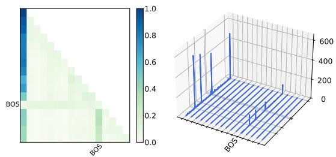  
Figure 2: Attention heatmap (left) and activation magnitudes (right) from Layer 14 of Llama-3.2-3B with the BOS token swapped with the token at the 12th position of a 16-token sequence (shorter than the setting in Table 1 for readability). Both AS and MAs emerge at the initial position, independent of the BOS token location.

<table><tr><td>Model</td><td>Position</td><td>Vanilla</td><td>Interv</td></tr><tr><td rowspan="2">Llama-2-7b-hf</td><td>1</td><td>0.9305</td><td>0.9164</td></tr><tr><td>16</td><td>0.0073</td><td>0.8397</td></tr><tr><td rowspan="2">Llama-3.2-3B</td><td>1</td><td>0.9218</td><td>0.8785</td></tr><tr><td>16</td><td>0.0012</td><td>0.7424</td></tr><tr><td rowspan="2">Mistral-7B-v0.3</td><td>1</td><td>0.0343</td><td>0.0198</td></tr><tr><td>16</td><td>0.0373</td><td>0.1509</td></tr><tr><td rowspan="2">Qwen2-7B</td><td>1</td><td>0.8173</td><td>0.7278</td></tr><tr><td>16</td><td>0.0000</td><td>0.5085</td></tr><tr><td rowspan="2">pythia-1b</td><td>1</td><td>0.7337</td><td>0.6702</td></tr><tr><td>16</td><td>0.0000</td><td>0.4703</td></tr></table>

Table 3: Comparison of $\operatorname { S i n k } _ { j } ^ { \epsilon }$ when intervention forces self-concentration of attention at position 16 (both w/o BOS).

## 4.1 Influence of Positional Encoding

We investigate whether the positional information encoded by Rotary Position Embedding (RoPE; Su et al., 2024) contributes to the emergence of AS at the initial position.5 To this end, we intervene on the RoPE index of the Key vector for the initial token. Specifically, following Equation (1), we replace the Key-side rotation matrix $R _ { \Theta , 1 }$ with $\scriptstyle R _ { \Theta , r } .$ where r is sampled uniformly from $\{ 2 , \ldots , T \}$ which excludes the initial token's original RoPE index. This yields the following intervened Key vector:

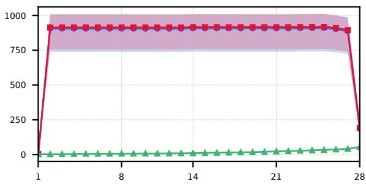  
Figure 3: Layer-wise averaged hidden-state norms for Llama-3.2-3B under the self-concentration intervention (w/o BOS token). Blue circles, red squares, and green triangles denote the first token, the intervention token, and the mean over all other input tokens, respectively. The horizontal axis shows the layer index. Shaded bands show the sample min-max range.

$$
k _ { 1 } ^ { \mathrm { i n t e r v } } = x _ { 1 } W _ { K } R _ { \Theta , r } ^ { \top } \mathrm { ~ . ~ }\tag{3}
$$

If RoPE were the primary driver of AS, this intervention would be expected to reduce Sink substantially. To isolate the effect of the initial position from the BOS token, we conduct this experiment using sequences without a BOS token.

As shown in Table 2, the RoPE intervention does not substantially reduce Sink¶ in any of the five models. This result suggests that the initial token's Key-side RoPE encoding has only a limited effect on AS under this intervention.

## 4.2 Influence of Self-Concentration of Attention

Given the limited impact of positional encoding, we then focus on the property that the initial token is forced to direct all attention to itself $( \alpha _ { 1 , 1 } = 1 . 0 )$ We refer to this property as “self-concentration." To investigate whether this property contributes to AS and MAs, we intervene on the attention weights across all layers at a non-initial position (t = 16) to force self-concentration $( \alpha _ { t , t } = 1 . 0 , \alpha _ { t , j \neq t } =$ 0.0). We conduct this experiment using sequences without a BOS token as well.

Table 3 reports Sink before and after forcing self-concentration at t = 16 across five models, and Figure 3 presents the corresponding layer-wise hidden-state norms for Llama-3.2-3B. These results show that forcing self-concentration induces both AS and MAs at non-initial positions in all five models,6 although both effects are weaker for Mistral-7B-v0.3. This suggests that self-concentration is one factor that can trigger the emergence of AS and MAs.

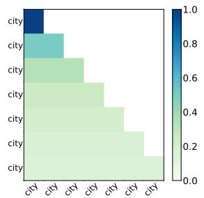  
(a) Heatmap: Uniform

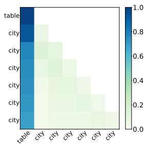  
(b) Heatmap: Pos. 1

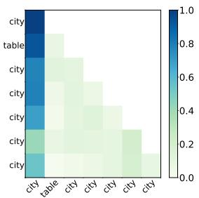  
(c) Heatmap: Pos. 2

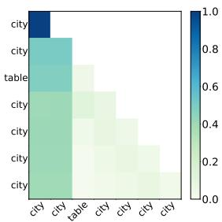  
(d) Heatmap: Pos. 3

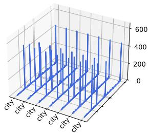  
(e) Activation: Uniform

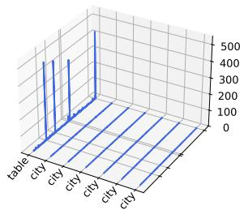  
(f) Activation: Pos. 1

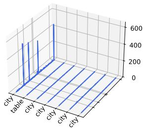  
(g) Activation: Pos. 2

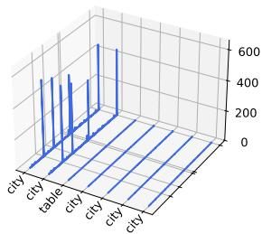  
(h) Activation: Pos. 3

Figure 4: Attention heatmap (top row) and hidden-state activations (bottom row) at Layer 14 of Llama-3.2-3B for repeated-token sequences with varying distinct token positions.  
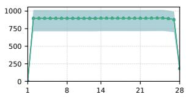  
(a) Norms: Uniform

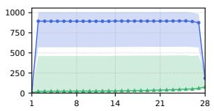  
(b) Norms: Pos. 1

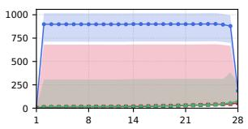  
(c) Norms: Pos. 2

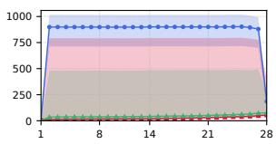  
(d) Norms: Pos. 3  
Figure 5: Layer-wise averaged hidden-state norms in Llama-3.2-3B for repeated-token sequences (T = 64, without a BOS token and without any attention intervention), averaged over N = 100 sequences per panel. Panels correspond to the four input patterns: a uniform repeated-token sequence (Uniform) and sequences with a single distinct token inserted at the first, second, or third position (Pos. 1–3). Blue circles and green triangles denote the first token and the mean over all remaining input tokens, respectively. Red squares denote the distinct token, and therefore appear only in the Pos. 2 and Pos. 3 panels: the Uniform panel contains no distinct token, and in Pos. 1 the distinct token is the first token itself. The horizontal axis shows the layer index in every panel. Shaded bands show the sample min-max range.

## 4.3 Value-non-mixing as a Driver

Hypothesis. We hypothesize that the emergence of AS and MAs under self-concentration is driven by the resulting “Value-non-mixing" state, rather than by self-concentration itself. As shown in Equation (1), an attention mechanism computes each output yi as a weighted average of the Value vectors corresponding to context tokens. Under selfconcentration, however, the output consists solely of the token's own Value vector, without being mixed with those of other tokens (Figure 1). We formalize this Value-non-mixing state at position i as

$$
v _ { j } \mid j \leq i , ; \alpha _ { i , j } > 0 = v _ { i } ,\tag{4}
$$

meaning that all Value vectors receiving nonzero attention from the query at position ¿i are identical to ${ \boldsymbol { v } } _ { i }$ . Because the attention weights sum to one, this implies ${ \bf { y } } _ { i } = { \bf { v } } _ { i } { \bf { W } } _ { O }$

Experimental Design. To test whether Valuenon-mixing can induce AS and MAs, we reproduce this state without forcing self-concentration by using sequences composed of repeated identical tokens without a BOS token. Because all tokens share the same Value vector, the attention output remains a pass-through of that single Value vector even without self-concentration. By inserting a distinct token into the sequence, we can control the range of positions over which the Value-nonmixing state is maintained. We evaluate four conditions: a uniform repeated-token sequence and sequences with a distinct token inserted at the first, second, or third position. For each of the five models, we generate N = 100 sequences per condition, each of length T = 64, randomly sampling the repeated token and, where applicable, the distinct token for each sequence. Although repeated-token inputs deviate from natural language, this manipulation complements the self-concentration intervention in Section 4.2, which induces the same state on natural text.

Results. Figure 4 shows the results for Llama-3.2-3B. When the sequence consists entirely of identical tokens, MAs are observed across all positions (Figure 4e), even though the attention weights are distributed across positions (Figure 4a). For sequences containing a distinct token, Figures 4b–4d and Figures 4f–4h show that AS and MAs occur at the initial token or at the identical-token positions preceding the distinct token, but subside at subsequent positions. This positional pattern is also visible in the layer-wise hidden-state norms shown in Figure 5. These observations for Llama-3.2-3B indicate that AS and MAs emerge at positions that remain in the Value-non-mixing state, supporting our hypothesis. See Appendices D and E.2 for results across all models, quantitative analyses, and additional experiments under varied settings.

For three of the five models examined, including Llama-3.2-3B, inserting a distinct token consistently produces AS and MAs across the sampled token combinations. For the remaining two, Mistral-7B-v0.3 and pythia-1b, the emergence of AS and MAs is more input-dependent, and the effect is also weaker on average (Section D). What drives this input dependence—for example, whether it relates to the similarity between the Value vectors of the repeated and inserted tokens—is left for future work.

Our findings provide further insight into the mechanisms underlying AS and MAs. Recent architectures proposed by major LLM developers, including Qwen3-Next (Qiu et al., 2025) and gptoss (OpenAI et al., 2025), highlight the growing importance of reducing these phenomena. These findings may also be relevant to the design of quantization-robust architectures.

## 5 Conclusion

In this study, we investigated the mechanism underlying AS and MAs in LLMs, with a particular focus on the sequence-initial position. At the sequence-initial position, causal masking inherently enforces self-concentration of attention (α1,1 = 1.0). Our experiments show that forcing such self-concentration at a non-initial position induces AS and MAs across all five models. We further investigated the “Value-non-mixing" state resulting from self-concentration as a potential mechanism through which self-concentration induces AS and MAs. Repeated-token experiments provide additional support for this hypothesis in three of the five models, while the emergence of AS and MAs is more input-dependent and weaker on average in the remaining two. Together, these findings support a mechanistic link between self-concentration, Valuenon-mixing, and the emergence of AS and MAs. By clarifying this mechanistic link, our findings provide empirical evidence that may inform future quantization strategies and advance our understanding of the internal mechanisms of attention layers. Future work should directly quantify Value-vector similarity and identify the contributing head-level pathways.

## Limitations

Our study has several limitations.

First, the five models we evaluate span four families (Llama, Mistral, Qwen, and Pythia; Section B), but whether our findings extend to other architectures (e.g., Mixture-of-Experts models (Shazeer et al., 2017)), languages, and domains beyond the English datasets evaluated here remains open. Among the five models, Mistral-7B-v0.3 responds more weakly to our interventions than the other models, and pythia-1b shows the weakest and most input-dependent effect in the repeated-token experiments (Section 4.3). Identifying the architectural differences behind this variance is left for future work. All five models are RoPE-based, though they vary structurally within RoPE (e.g., partial RoPE in pythia-1b), and Gu et al. (2025) report that positional embeddings did not affect the emergence of AS. How positional-encoding schemes influence the AS and MAs mechanism is outside our scope and an important future direction.

Second, we constrain our scope to the sequenceinitial position to isolate its structural drivers. Our intervention induces AS at non-initial positions (Section 4.2 and Section E.4), but whether naturally occurring intermediate AS (Sun et al., 2024) can be explained within the same Value-non-mixing framework remains an open question.

Third, our interventions cannot exclude the contribution of other emergent factors. The RoPE intervention manipulates only the key-side positional index of the initial token, so isolating query-side effects and query-key interactions, and rigorously excluding RoPE's entire contribution, are left for future work. Likewise, restricting the intervention to early layers reproduces most of the all-layer effect (Section E.3), but pinpointing the head-level causal pathway is challenging and architecture-dependent, and we leave head-selective analyses for future work.

Fourth, our definition of Value-non-mixing (Equation (4)) characterizes a discrete state; extending it to a continuous, predictive “Value Mixing Index" requires modeling the geometry of Value vectors and validating that it predicts both Sink and MAs magnitude across models and natural inputs. The threshold-based Sink, is also sensitive to sequence length, because attention weights for a query at position i average 1/i over its accessible keys and thus more readily exceed a fixed € in short sequences (e.g., repeat length 16 at € = 0.2 in Table 7), which limits fixed-threshold comparisons and motivates length-aware metrics.

Finally, although prior work distinguishes MAs from the activation outlier features that complicate low-bit quantization (Sun et al., 2024; Dettmers et al., 2022), we do not evaluate whether MAs or Value-non-mixing affects quantization error, perplexity, or downstream accuracy; establishing such a connection requires dedicated experiments.

## Acknowledgements

This work was supported by Google Research Grant; JST BOOST JPMJBY24D2, JPMJBS2412 JPMJBS2421; JST SPRING JPMJSP2104; JSPS KAKENHI 25K03175; and the Nakajima Foundation. We used generative AI tools to assist with coding and manuscript preparation. We thank the members of the Tohoku NLP Group for their cooperation in this research.

## References

Federico Barbero, Alvaro Arroyo, Xiangming Gu, Christos Perivolaropoulos, Petar Veličković, Razvan Pascanu, and Michael M. Bronstein. 2025. Why do

LLMs attend to the first token? In Second Conference on Language Modeling (COLM).

Stella Biderman, Hailey Schoelkopf, Quentin Gregory Anthony, Herbie Bradley, Kyle O'Brien, Eric Hallahan, Mohammad Aflah Khan, Shivanshu Purohit, Usvsn Sai Prashanth, Edward Raff, Aviya Skowron, Lintang Sutawika, and Oskar Van Der Wal. 2023. Pythia: A suite for analyzing large language models across training and scaling. In Proceedings of the 40th International Conference on Machine Learning (ICML), volume 202 of Proceedings of Machine Learning Research, pages 2397–2430. PMLR.

Yelysei Bondarenko, Markus Nagel, and Tijmen Blankevoort. 2023. Quantizable Transformers: Removing outliers by helping attention heads do nothing. In Thirty-seventh Conference on Neural Information Processing Systems (NeurIPS).

Karl Cobbe, Vineet Kosaraju, Mohammad Bavarian, Mark Chen, Heewoo Jun, Lukasz Kaiser, Matthias Plappert, Jerry Tworek, Jacob Hilton, Reiichiro Nakano, Christopher Hesse, and John Schulman. 2021. Training verifiers to solve math word problems. Preprint, arXiv:2110.14168.

Enrique Queipo de Llano, Alvaro Arroyo, Federico Barbero, Xiaowen Dong, Michael M. Bronstein, Yann LeCun, and Ravid Shwartz-Ziv. 2026. Attention sinks and compression valleys in LLMs are two sides of the same coin. In The Fourteenth International Conference on Learning Representations (ICLR).

Tim Dettmers, Mike Lewis, Younes Belkada, and Luke Zettlemoyer. 2022. GPT3.int8(): 8-bit matrix multiplication for Transformers at scale. In Advances in Neural Information Processing Systems (NeurIPS).

Aaron Grattafiori, Abhimanyu Dubey, Abhinav Jauhri, Abhinav Pandey, Abhishek Kadian, Ahmad Al-Dahle, Aiesha Letman, Akhil Mathur, Alan Schelten, Alex Vaughan, Amy Yang, Angela Fan, Anirudh Goyal, Anthony Hartshorn, Aobo Yang, Archi Mitra, Archie Sravankumar, Artem Korenev, Arthur Hinsvark, and 542 others. 2024. The Llama 3 herd of models. Preprint, arXiv:2407.21783.

Xiangming Gu, Tianyu Pang, Chao Du, Qian Liu, Fengzhuo Zhang, Cunxiao Du, Ye Wang, and Min Lin. 2025. When attention sink emerges in language models: An empirical view. In The Thirteenth International Conference on Learning Representations (ICLR).

Albert Q. Jiang, Alexandre Sablayrolles, Arthur Mensch, Chris Bamford, Devendra Singh Chaplot, Diego de las Casas, Florian Bressand, Gianna Lengyel, Guillaume Lample, Lucile Saulnier, Lélio Renard Lavaud, Marie-Anne Lachaux, Pierre Stock, Teven Le Scao, Thibaut Lavril, Thomas Wang, Timothée Lacroix, and William El Sayed. 2023. Mistral 7B. Preprint, arXiv:2310.06825.

Goro Kobayashi, Tatsuki Kuribayashi, Sho Yokoi, and Kentaro Inui. 2020. Attention is not only a weight:

Analyzing Transformers with vector norms. In Proceedings of the 2020 Conference on Empirical Methods in Natural Language Processing (EMNLP), Online. Association for Computational Linguistics.

Stephen Merity, Caiming Xiong, James Bradbury, and Richard Socher. 2017. Pointer Sentinel Mixture Models. In International Conference on Learning Representations (ICLR).

Jaehoon Oh, Seungjun Shin, and Dokwan Oh. 2025. House of cards: Massive weights in LLMs. Preprint, arXiv:2410.01866.

OpenAI, Sandhini Agarwal, Lama Ahmad, Jason Ai, Sam Altman, Andy Applebaum, Edwin Arbus, Rahul K. Arora, Yu Bai, Bowen Baker, Haiming Bao, Boaz Barak, Ally Bennett, Tyler Bertao, Nivedita Brett, Eugene Brevdo, Greg Brockman, Sebastien Bubeck, Che Chang, and 107 others. 2025. gptoss-120b & gpt-oss-20b Model Card. Preprint, arXiv:2508.10925.

Zihan Qiu, Zekun Wang, Bo Zheng, Zeyu Huang, Kaiyue Wen, Songlin Yang, Rui Men, Le Yu, Fei Huang, Suozhi Huang, Dayiheng Liu, Jingren Zhou, and Junyang Lin. 2025. Gated Attention for Large Language Models: Non-linearity, Sparsity, and Attention-Sink-Free. In The Thirty-ninth Annual Conference on Neural Information Processing Systems (NeurIPS).

Nikolaus Salvatore, Hao Wang, and Qiong Zhang. 2025. Lost in the middle: An emergent property from information retrieval demands in LLMs. Preprint, arXiv:2510.10276.

Noam Shazeer, Azalia Mirhoseini, Krzysztof Maziarz, Andy Davis, Quoc Le, Geoffrey Hinton, and Jeff Dean. 2017. Outrageously large neural networks: The sparsely-gated mixture-of-experts layer. In International Conference on Learning Representations.

Jianlin Su, Murtadha Ahmed, Yu Lu, Shengfeng Pan, Wen Bo, and Yunfeng Liu. 2024. RoFormer: Enhanced transformer with Rotary Position Embedding. Neurocomputing, 568:127063.

Mingjie Sun, Xinlei Chen, J Zico Kolter, and Zhuang Liu. 2024. Massive activations in large language models. In First Conference on Language Modeling (COLM).

Hugo Touvron, Louis Martin, Kevin Stone, Peter Albert, Amjad Almahairi, Yasmine Babaei, Nikolay Bashlykov, Soumya Batra, Prajjwal Bhargava, Shruti Bhosale, Dan Bikel, Lukas Blecher, Cristian Canton Ferrer, Moya Chen, Guillem Cucurull, David Esiobu, Jude Fernandes, Jeremy Fu, Wenyin Fu, and 49 others. 2023. Llama 2: Open foundation and fine-tuned chat models. Preprint, arXiv:2307.09288.

Xinyi Wu, Yifei Wang, Stefanie Jegelka, and Ali Jadbabaie. 2025. On the emergence of position bias in Transformers. In Forty-second International Conference on Machine Learning (ICML)

Guangxuan Xiao, Jiaming Tang, Jingwei Zuo, junxian guo, Shang Yang, Haotian Tang, Yao Fu, and Song Han. 2025. DuoAttention: Efficient long-context LLM inference with retrieval and streaming heads. In The Thirteenth International Conference on Learning Representations (ICLR).

Guangxuan Xiao, Yuandong Tian, Beidi Chen, Song Han, and Mike Lewis. 2024. Efficient streaming language models with attention sinks. In The Twelfth International Conference on Learning Representations (ICLR).

An Yang, Baosong Yang, Binyuan Hui, Bo Zheng, Bowen Yu, Chang Zhou, Chengpeng Li, Chengyuan Li, Dayiheng Liu, Fei Huang, Guanting Dong, Haoran Wei, Huan Lin, Jialong Tang, Jialin Wang, Jian Yang, Jianhong Tu, Jianwei Zhang, Jianxin Ma, and 43 others. 2024. Qwen2 technical report. Preprint, arXiv:2407.10671.

Zhenyu Zhang, Ying Sheng, Tianyi Zhou, Tianlong Chen, Lianmin Zheng, Ruisi Cai, Zhao Song, Yuandong Tian, Christopher Re, Clark Barrett, Zhangyang Wang, and Beidi Chen. 2023. H2O: Heavy-hitter oracle for efficient generative inference of large language models. In Thirty-seventh Conference on Neural Information Processing Systems (NeurIPS).

## A Related Work

AS and MAs are phenomena of practical importance from an engineering perspective. Specific tokens function as aggregation points for attention, enabling the reuse and compression of KV caches (Xiao et al., 2024, 2025; Zhang et al., 2023). Furthermore, the presence of activations with large magnitudes has been widely recognized as a major challenge for effectively quantizing LLMs (Dettmers et al., 2022; Sun et al., 2024). Note that MAs are distinct from the outlier features studied in the quantization literature (Sun et al., 2024, §2.3).

Existing literature analyzing AS and MAs has documented their layer-wise formation profiles and functional significance. Empirical observations indicate that these phenomena typically emerge in the initial layers, stabilize across the middle layers, and weaken near the final layers (Sun et al. 2024; Gu et al., 2025). To explain this vertical persistence, de Llano et al. (2026) proposed the Mix-Compress-Refine Theory, arguing that AS in the middle layers prevents the over-mixing of contextual information. Additionally, Gu et al. (2025) provided causal evidence that AS can be replaced by explicit key biases. Barbero et al. (2025) instead argue that AS prevents over-mixing, with the first token anchoring the residual stream against representational collapse (the Anti-Overmixing Theory)

From a mechanistic standpoint, several studies have investigated why specific tokens attract disproportionate attention. Kobayashi et al. (2020) showed, via a norm-based analysis of attention outputs, that BERT's attention heads assign large weights to uninformative delimiter tokens (e.g. [SEP]) whose value vectors are nonetheless small, so that the attention output leaves the residual stream almost unchanged. Bondarenko et al. (2023) relate this behavior to activation outliers observed more broadly in trained transformers (BERT, OPT, and ViT), framing such heads as having learned a no-op that leaves the residual stream unchanged or only partially updated. They report an analogous pattern for uninformative tokens beyond BERT (e.g., background patches in ViT). They further argue that a strict no-update requires near-exact zeros in the attention matrix, and that producing them drives the softmax inputs to ever larger values during training, which in turn creates outliers elsewhere in the network. Architectural factors have also been related to position bias more broadly. Wu et al. (2025) analyze multi-layer attention with a graph-theoretic framework and show that causal masking biases attention toward earlier positions since tokens in deeper layers attend to increasingly contextualized representations of earlier tokens. They treat AS as one manifestation of the position bias covered by this framework. A complementary account attributes part of this bias to the training data. Salvatore et al. (2025) train GPT-2 and Llama variants from scratch on tasks that simulate longterm and short-term memory demands, and report that the primacy effect is induced by the uniform long-term demand and is further influenced by the autoregressive architecture and the formation of AS.

Our study differs from these accounts in its research question and direction of causality. Prior work primarily investigates the effects, functional roles, or alternative formulations of existing AS (e.g., anti-overmixing, key bias), whereas we investigate how AS and MAs emerge at the sequenceinitial position. The notion of “mixing" also differs in meaning. For Barbero et al. (2025), mixing refers to the propagation of contextual information across positions and layers, whereas our “Valuenon-mixing" concerns the composition of Value vectors within a single attention output (Equation (4)). The two accounts are therefore complementary. Our contribution is to control the Valuenon-mixing state artificially, using attention interventions and repeated-token inputs into which a distinct token is inserted, and to show that AS and MAs emerge largely within the range of positions over which this state holds in the models we evaluate.

<table><tr><td>Model</td><td>HF Identifier</td></tr><tr><td>Llama-2-7b-hf</td><td>meta-llama/Llama-2-7b-hf</td></tr><tr><td>Llama-3.2-3B</td><td>meta-llama/Llama-3.2-3B</td></tr><tr><td>Mistral-7B-v0.3</td><td>mistralai/Mistral-7B-v0.3</td></tr><tr><td>Qwen2-7B</td><td>Qwen/Qwen2-7B</td></tr><tr><td>pythia-1b</td><td>EleutherAI/pythia-1b</td></tr></table>

Table 4: Open-weight LMs used in this study, with their Hugging Face identifiers as reported by the respective sources. Parameter counts are indicated in the model names.

## B Experimental Setup

To evaluate the generality of our findings regarding the mechanism of AS and MAs, we conduct our main experiments on the WikiText dataset (Merity et al., 2017)7. For the robustness analyses in Section E, we additionally use the GSM8K (Cobbe et al., 2021) and SlimPajama8 datasets. We evaluate our hypothesis across a diverse set of prominent open-weight LLMs, including Llama-3.2-3B (Grattafiori et al., 2024), Llama-2-7b-hf (Touvron et al., 2023), Mistral-7B-v0.3 (Jiang et al., 2023), pythia-1b (Biderman et al., 2023), and Qwen2-7B (Yang et al., 2024). The details of the models and their Hugging Face identifiers are summarized in Table 4.

This selection covers several architectural variations in the attention and normalization components:

1. Attention and Normalization Formats: Spanning standard Multi-Head Attention (Llama-2-7b-hf, pythia-1b) and Grouped-Query Attention (Llama-3.2-3B, Mistral-7Bv0.3, Qwen2-7B), as well as contrasting standard Layer Normalization (pythia-1b) with RMSNorm (Llama families, Mistral-7B-v0.3, Qwen2-7B).

2. Positional Encoding and Projection Biases: pythia-1b applies RoPE to only 25% of each head's dimensions, whereas the other models apply it to the full head dimension. Qwen2- 7B and pythia-1b use biases in their QKV projections, whereas the Llama and Mistral models do not.

We used an NVIDIA RTX 6000 Ada Generation GPU for our experiments, which took approximately 4 hours for the main experiments, with additional compute for the position-sweep experiments in Section E.4. All experiments were implemented with PyTorch 2.9.0 and transformers 4.57.1.

## C Transition of Sink, with relocated BOS

Figure 7 shows the layer-wise transition of Sink under the setting of Section 3, at the sequenceinitial position $( j = 1 )$ and at the position to which the BOS token is relocated $( j = 1 6 )$ . As in Table 1, we report the three models whose tokenizer prepends a BOS token. Below we summarize the layers at which AS and MAs emerge for the relocated BOS token in each model:

• Llama-3.2-3B: AS and MAs are observed for the relocated BOS token from Layer 1 on.

• Mistral-7B-v0.3: AS emerges from Layer 1, whereas MAs emerge from Layer 2. AS therefore precedes MAs here, reversing the order we observe for Llama-2-7b-hf below.

• Llama-2-7b-hf: MAs emerge from Layer 2 and AS from Layer 3, so both appear in later layers than in the other two models.

## D Results for Repeated Token Sequences across Models

Figures 8–18 below and Figure 4 in the main text show a clear trend supporting the “Value-nonmixing" hypothesis in Llama-3.2-3B, Llama-2-7bhf, and Qwen2-7B, and the same trend in a weaker form in Mistral-7B-v0.3. In pythia-1b, by contrast, Sink stays near zero for the first token, yet the attention pattern is not featureless. The distinct token and the following token, whose representations mix into a distinct value, receive visibly less attention than the repeated tokens, in the direction “Value-non-mixing" predicts. As in Figure 4, these example figures use short sequences $( T = 7 )$ with a fixed pair of tokens so that the per-token axis labels stay readable. Sample 1 repeats “home" with “cat" as the distinct token, and Sample 2 repeats “city" with “table". Figures 10, 13, 16 and 19 show the corresponding layer-wise hidden-state norm trajectories for these models.

Table 5 summarizes Sink at the first token position across the four repeated-token patterns. Uniform sequences (Pattern 0) yield $\mathrm { S i n k _ { 1 } ^ { 0 . 3 } }$ of 0.000 for all five models, whereas inserting a single distinct token (Pattern 1–3) raises it to 0.68–0.80 for Llama-2-7b-hf, 0.69–0.80 for Llama-3.2-3B, and 0.42–0.55 for Qwen2-7B. Mistral-7B-v0.3 (0.07– 0.16) shows the same direction more weakly. For pythia-1b the effect is far smaller: $\mathrm { S i n k _ { 1 } ^ { 0 . 3 } }$ is 0.006 for Pattern 1 and rounds to 0.000 for Patterns 2–3. The model still moves in the direction “Value-nonmixing" predicts. A looser threshold of $\epsilon = 0 . 2$ separates Pattern 1 (0.030) from Pattern 0 (0.000), and Patterns 1 and 2 remain above Pattern 3, as in the other four models. This effect is nonetheless much smaller than in Llama-2-7b-hf or Llama-3.2-3B, and $\mathrm { S i n k } _ { 1 } ^ { \epsilon }$ stays at or below 0.03 at every threshold we test.

## E Additional Ablations under Varied Configurations

To assess the robustness of our findings, we additionally evaluate the self-concentration intervention of Section 4.2 under varied experimental configurations: different natural-language datasets and input sequence lengths, different repeat lengths for the repeated-token setting introduced in Section D, restricting the intervention to subsets of layers, applying the intervention at additional intervened positions, and varying the threshold € used to define Sinkj.

## E.1 Varying Dataset and Input Sequence Length

Table 6 reports $\mathrm { S i n k _ { 1 6 } ^ { \epsilon } }$ at the intervened token position $( t = 1 6 )$ under the self-concentration intervention $( \alpha _ { 1 6 , 1 6 } = 1 . 0$ , all layers, w/o BOS) for all five models across WikiText, GSM8K, and SlimPajama, and across input sequence lengths of 32, 64, 128, and (for WikiText) 256 tokens. $\mathrm { \bf A t } \epsilon = 0 . 3 .$ the intervention yields a nonzero $\mathrm { S i n k _ { 1 6 } ^ { \epsilon } }$ for every model across all datasets and lengths, although the magnitude varies substantially across models and settings, particularly for Mistral-7B-v0.3.

As a complementary baseline (no-intervention) check, Figure 20 shows layer-wise hidden-state norms for Llama-3.2-3B at an input length of 64 tokens across the three datasets, confirming that the large first-token norms reported in the main text are not specific to WikiText.

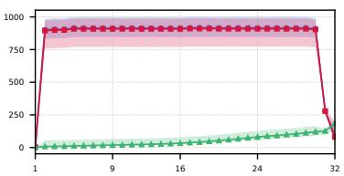

(a) Llama-2-7b-hf  
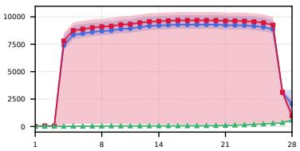

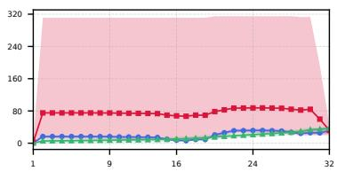  
(b) Mistral-7B-v0.3

(c) Qwen2-7B  
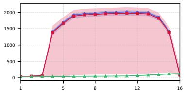  
(d) pythia-1b  
Figure 6: Layer-wise averaged hidden-state norms under the self-concentration intervention (w/o BOS token) for the four models other than Llama-3.2-3B. Blue circles, red squares, and green triangles denote the first token, the intervention token, and the mean over all other input tokens, respectively. The horizontal axis shows the layer index in every panel. Shaded bands show the sample min-max range.

<table><tr><td>Model</td><td>Pattern</td><td> $\epsilon = 0 . 2$ </td><td> $\epsilon = 0 . 3$ </td><td> $\epsilon = 0 . 4$ </td><td> $\epsilon = 0 . 5$ </td></tr><tr><td rowspan="4">Llama-2-7b-hf</td><td>Uniform (Pattern 0)</td><td>0.0000</td><td>0.0000</td><td>0.0000</td><td>0.0000</td></tr><tr><td>Distinct (Pattern 1)</td><td>0.8454</td><td>0.7754</td><td>0.6898</td><td>0.6146</td></tr><tr><td>Distinct (Pattern 2)</td><td>0.8629</td><td>0.7955</td><td>0.7248</td><td>0.6529</td></tr><tr><td>Distinct (Pattern 3)</td><td>0.7934</td><td>0.6829</td><td>0.5166</td><td>0.0843</td></tr><tr><td rowspan="4">Llama-3.2-3B</td><td>Uniform (Pattern 0)</td><td>0.0000</td><td>0.0000</td><td>0.0000</td><td>0.0000</td></tr><tr><td>Distinct (Pattern 1)</td><td>0.8197</td><td>0.7740</td><td>0.7177</td><td>0.6457</td></tr><tr><td>Distinct (Pattern 2)</td><td>0.8464</td><td>0.8042</td><td>0.7439</td><td>0.6665</td></tr><tr><td>Distinct (Pattern 3)</td><td>0.8039</td><td>0.6876</td><td>0.4526</td><td>0.0182</td></tr><tr><td rowspan="4">Mistral-7B-v0.3</td><td>Uniform (Pattern 0)</td><td>0.0000</td><td>0.0000</td><td>0.0000</td><td>0.0000</td></tr><tr><td>Distinct (Pattern 1)</td><td>0.2344</td><td>0.1548</td><td>0.1104</td><td>0.0811</td></tr><tr><td>Distinct (Pattern 2)</td><td>0.2413</td><td>0.1568</td><td>0.1083</td><td>0.0784</td></tr><tr><td>Distinct (Pattern 3)</td><td>0.1435</td><td>0.0737</td><td>0.0311</td><td>0.0004</td></tr><tr><td rowspan="4">Qwen2-7B</td><td>Uniform (Pattern 0)</td><td>0.0000</td><td>0.0000</td><td>0.0000</td><td>0.0000</td></tr><tr><td>Distinct (Pattern 1)</td><td>0.6475</td><td>0.5482</td><td>0.4688</td><td>0.3941</td></tr><tr><td>Distinct (Pattern 2)</td><td>0.6450</td><td>0.5404</td><td>0.4586</td><td>0.3803</td></tr><tr><td>Distinct (Pattern 3)</td><td>0.5829</td><td>0.4179</td><td>0.2264</td><td>0.0171</td></tr><tr><td rowspan="4">pythia-1b</td><td>Uniform (Pattern 0)</td><td>0.0000</td><td>0.0000</td><td>0.0000</td><td>0.0000</td></tr><tr><td>Distinct (Pattern 1)</td><td>0.0302</td><td>0.0055</td><td>0.0035</td><td>0.0024</td></tr><tr><td>Distinct (Pattern 2)</td><td>0.0111</td><td>0.0000</td><td>0.0000</td><td>0.0000</td></tr><tr><td>Distinct (Pattern 3)</td><td>0.0001</td><td>0.0000</td><td>0.0000</td><td>0.0000</td></tr></table>

Table 5: Comparison of Sink at the first token position between the uniform sequence (Pattern 0) and sequences with a single distinct token (Pattern 1–3) for repeated-token sequences with $T = 6 4$

## E.2 Varying Repeat Length for Repeated-Token Sequences

Tables 7–9 extend the repeated-token analysis of Section D to repeat lengths of 16, 32, 64, 128, and 256 tokens, confirming that the gap between the Uniform and Distinct-token patterns persists at every repeat length. The only exception occurs at the shortest repeat length (16) with the lowest threshold $( \epsilon = 0 . 2 )$ , where even uniform sequences yield high Sink¶ values. At shorter lengths, baseline attention weights are inherently higher, so normal fluctuations easily exceed the fixed absolute threshold (see Limitations).

Figure 21 shows the corresponding layer-wise hidden-state norms for Llama-2-7b-hf at a repeat length of 128 tokens, mirroring the trend already reported for length 64 in Figure 10.

## E.3 Restricting the Self-Concentration Intervention to Layer Subsets

The self-concentration intervention in Section 4.2 enforces $\alpha _ { t , t } = 1 . 0$ across all layers. To identify which layers drive the resulting AS, we restrict the same intervention $( \mathrm { a t } t = 1 6 , T = 6 4$ , without a BOS token) to three-layer subsets: early (layers 1–3), middle (the three layers around the network midpoint), and late (the three layers preceding the final layer). Table 10 reports $\mathrm { S i n k _ { 1 6 } ^ { \epsilon } }$ at the intervened position for each setting. Intervening only on the early layers consistently yields $\mathrm { S i n k _ { 1 6 } ^ { 0 . 3 } }$ values reaching 90–93% of the all-layer intervention across all five models, whereas intervening on the middle or late layers leaves $\mathrm { S i n k _ { 1 6 } ^ { \epsilon } }$ near zero or at its vanilla level in all five models. Intervening on layer 1 alone nearly reproduces the all-layer effect in Mistral-7B-v0.3 and pythia-1b, yields a partial increase in Llama-3.2-3B, and has minimal impact on Llama-2-7b-hf and Qwen2-7B, indicating that which early layers are responsible varies across models. These results are consistent with the earlylayer changes observed in the hidden-state norm trajectories.

(a) Sinke  
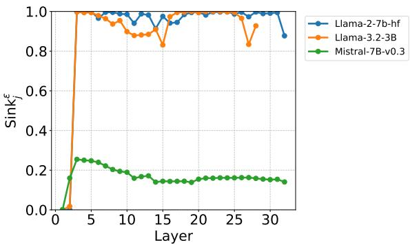

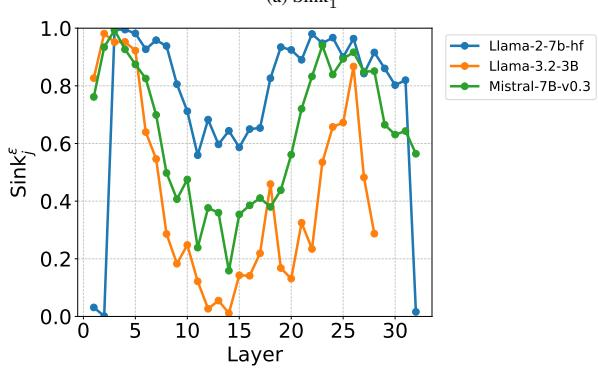  
(b) Sink $_ { 1 6 } ^ { \epsilon }$ (moved BOS)  
Figure 7: Transition of layer-wise Sink, when the BOS token is swapped with the token at position 16 (the setting of Table 1).

## E.4 Varying the Intervened Position

The self-concentration intervention in Section 4.2 forces $\alpha _ { t , t } = 1 . 0$ at a single position, $t = 1 6$ To test whether the resulting increase in AS extends to other positions, we repeat the same intervention (all layers, w/o BOS, $T = 6 4 )$ at $t = 8$ and $t = 3 2$ Table 11 reports Sink¿ at the intervened position for both settings. The intervention increases Sink over the vanilla condition for all five models at both $t = 8$ and $t = 3 2$ , showing that the observed increase is not unique to $t = 1 6$ among the positions tested. The increase is markedly smaller for Mistral-7B-v0.3, rising from 0.0660 to 0.1347 at t = 8 and from 0.0000 to 0.0866 at $t = 3 2$ , several times below the intervened values of the other four models (0.4654–0.8542, Table 11).

## E.5 Varying Epsilon Thresholds

To verify that our main findings are not overly sensitive to the choice of the threshold €, we present the comparison of $\mathrm { S i n k } _ { j } ^ { \epsilon }$ across various thresholds $( \epsilon \in \{ 0 . 2 , 0 . 3 , 0 . 4 , 0 . 5 \} )$ for the RoPE intervention experiment (Table 12) and the self-concentration intervention experiment (Table 13). The overall trends remain consistent regardless of the specific threshold used.

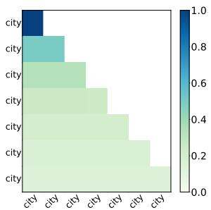  
(a) Heatmap: Uniform sequence

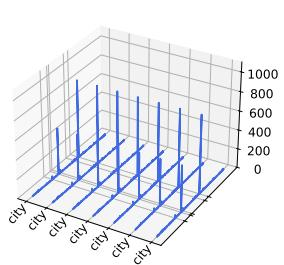  
(b) Activation: Uniform sequence

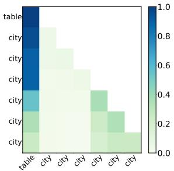  
(c) Heatmap: Distinct token at pos. 1

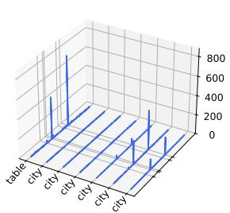  
(d) Activation: Distinct token at pos.

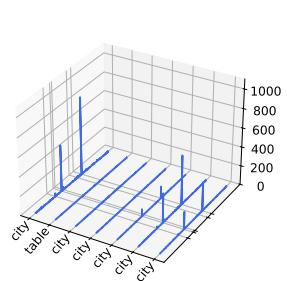  
(f) Activation: Distinct token at pos. 2

(e) Heatmap: Distinct token at pos. 2  
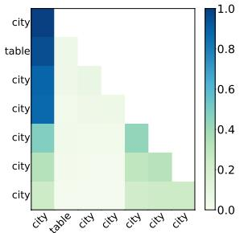

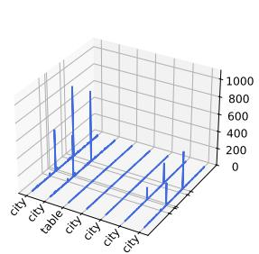  
(b) Activation: Uniform sequence

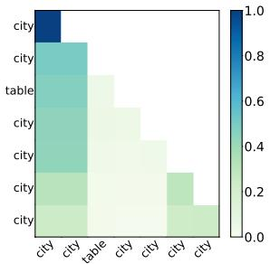  
(g) Heatmap: Distinct token at pos. 3 (h) Activation: Distinct token at pos. 3

(a) Heatmap: Uniform sequence  
  
(c) Heatmap: Distinct token at pos. 1

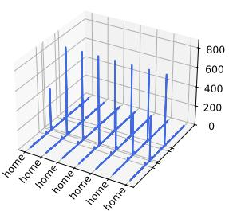

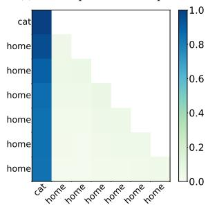  
(e) Heatmap: Distinct token at pos. 2

(d) Activation: Distinct token at pos.  
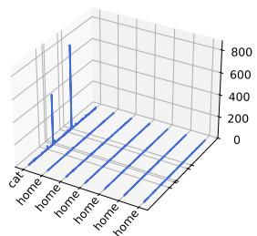

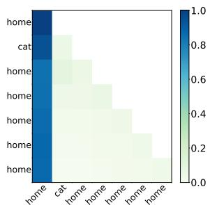

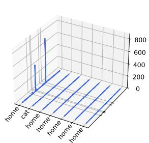

Figure 8: Results for sequences with repeated tokens. Each row compares the attention heatmap (left) and hidden-state activations (right) under the same token distribution pattern for Llama-2-7b-hf (Sample 2).

(f) Activation: Distinct token at pos. 2  
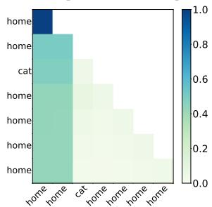

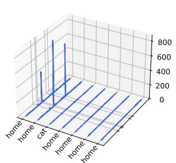  
(g) Heatmap: Distinct token at pos. 3 (h) Activation: Distinct token at pos. 3

Figure 9: Results for sequences with repeated tokens. Each row compares the attention heatmap (left) and hidden-state activations (right) under the same token distribution pattern for Llama-2-7b-hf (Sample 1).

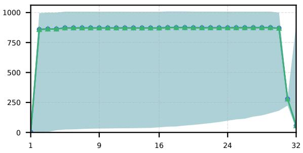  
(a) Norms: Uniform

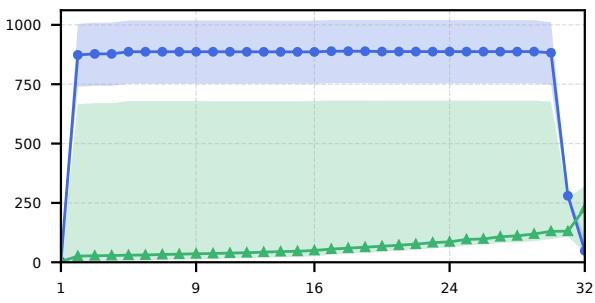  
(b) Norms: Pos. 1

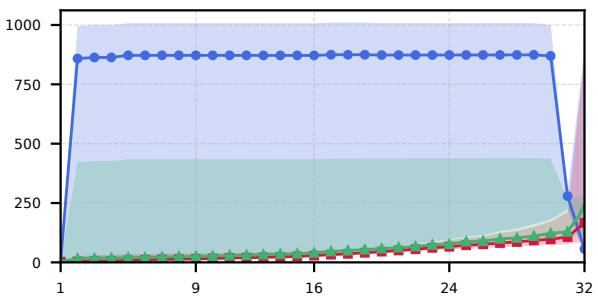  
(c) Norms: Pos. 2

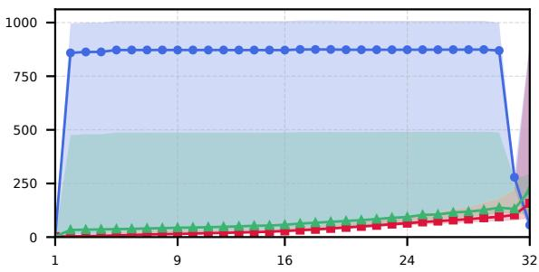  
(d) Norms: Pos. 3  
Figure 10: Layer-wise averaged hidden-state norms in Llama-2-7b-hf for repeated-token sequences under different distinct-token positions (colors and markers as in Figure 5). The horizontal axis shows the layer index in every panel.

<table><tr><td>Dataset</td><td>T</td><td>Model</td><td>€ = 0.2</td><td>€ = 0.3</td><td>€ = 0.4</td><td>€ = 0.5</td></tr><tr><td rowspan="7"></td><td rowspan="4">32</td><td>Llama-2-7b-hf Llama-3.2-3B</td><td>0.9317 0.9329</td><td>0.8932 0.8389</td><td>0.6865 0.5787</td><td>0.1487 0.1651</td></tr><tr><td>Mistral-7B-v0.3</td><td>0.3077</td><td>0.1770</td><td>0.1109</td><td>0.0386</td></tr><tr><td>Qwen2-7B</td><td>0.8199</td><td>0.6346</td><td>0.3563</td><td>0.0735</td></tr><tr><td>pythia-1b</td><td>0.7342</td><td>0.6005</td><td>0.3301</td><td>0.0544</td></tr><tr><td rowspan="3">Llama-2-7b-hf 64</td><td>0.9248</td><td>0.8397</td><td>0.5308</td><td>0.0095</td></tr><tr><td>Llama-3.2-3B</td><td>0.9121</td><td>0.7424 0.4527</td><td>0.0120</td></tr><tr><td>Mistral-7B-v0.3 0.1897</td><td>0.1509</td><td>0.0868</td><td>0.0304</td></tr><tr><td rowspan="3">WikiText 128</td><td>Qwen2-7B pythia-1b</td><td>0.7533 0.6975</td><td>0.5085 0.4703 0.1703</td><td>0.2174 0.0182 0.0054</td></tr><tr><td>Llama-2-7b-hf Llama-3.2-3B</td><td>0.9176</td><td>0.7870</td><td>0.4259 0.0013</td></tr><tr><td>Mistral-7B-v0.3 Qwen2-7B</td><td>0.8888 0.1830</td><td>0.6888 0.1414</td><td>0.3911 0.0024</td></tr><tr><td rowspan="3">256</td><td>pythia-1b</td><td>0.7122 0.6729 0.9125</td><td>0.4401 0.3746</td><td>0.0762 0.1464</td><td>0.0284 0.0113 0.0005</td></tr><tr><td>Llama-2-7b-hf Llama-3.2-3B</td><td>0.8767 0.1810</td><td>0.7543 0.6696 0.1382</td><td>0.1013 0.3730 0.3717</td><td>0.0009</td></tr><tr><td>Mistral-7B-v0.3 Qwen2-7B pythia-1b</td><td>0.6952 0.6570 0.9196</td><td>0.4119 0.3329</td><td>0.0726 0.1256 0.0805</td><td>0.0017 0.0275 0.0102</td></tr><tr><td rowspan="5">GSM8K</td><td>32</td><td>Llama-2-7b-hf Llama-3.2-3B Mistral-7B-v0.3 Qwen2-7B pythia-1b</td><td>0.9216 0.3357 0.8138 0.7115</td><td>0.7548 0.7736 0.2053 0.6294</td><td>0.2460 0.4897 0.1008 0.3222</td><td>0.0005 0.0349 0.1090 0.0051 0.0519</td></tr><tr><td>64</td><td>Llama-2-7b-hf Llama-3.2-3B Mistral-7B-v0.3 Qwen2-7B pythia-1b</td><td>0.8880 0.8922 0.2479 0.7682</td><td>0.4763 0.5561 0.6769 0.1705 0.5200</td><td>0.1953 0.0577 0.3905 0.0624 0.1943</td><td>0.0103 0.0002 0.0207 0.0009 0.0206 0.0000</td></tr><tr><td rowspan="2">128</td><td>Llama-2-7b-hf Llama-3.2-3B Mistral-7B-v0.3</td><td>0.6488 0.8789 0.8871 0.2462</td><td>0.3407 0.5132 0.6656 0.1659</td><td>0.0941 0.0438 0.3800</td><td>0.0002 0.0186 0.0006</td></tr><tr><td>Qwen2-7B pythia-1b Llama-2-7b-hf Llama-3.2-3B</td><td>0.7632 0.6416 0.9291</td><td>0.5053 0.3180 0.8330 0.8576</td><td>0.0563 0.1809 0.0811 0.3042</td><td>0.0186 0.0000 0.0575</td></tr><tr><td rowspan="4">SlimPajama</td><td>32</td><td>Mistral-7B-v0.3 Qwen2-7B pythia-1b</td><td>0.9328 0.3432 0.8243 0.7344</td><td>0.2173 0.6595 0.5374</td><td>0.6092 0.1108 0.3841 0.2180</td><td>0.1773 0.0249 0.0821 0.0462</td></tr><tr><td>64</td><td>Llama-2-7b-hf Llama-3.2-3B Mistral-7B-v0.3 Qwen2-7B pythia-1b</td><td>0.9144 0.9161 0.2329 0.7640 0.6631</td><td>0.6415 0.7680 0.1644 0.5403 0.3365</td><td>0.0995 0.4761 0.0649 0.2449 0.0972</td><td>0.0002 0.0143 0.0153 0.0185 0.0038</td></tr><tr><td>128</td><td>Llama-2-7b-hf Llama-3.2-3B</td><td>0.8908 0.8935</td><td>0.4642 0.7009</td><td>0.0178 0.4078</td><td>0.0000</td></tr><tr><td></td><td>Mistral-7B-v0.3 Qwen2-7B pythia-1b</td><td>0.2126 0.7221 0.5809</td><td>0.1419 0.4605 0.2037</td><td>0.0429 0.1671 0.0381</td><td>0.0024 0.0134 0.0105 0.0004</td></tr></table>

Table $6 \colon \mathrm { S i n k } _ { 1 6 } ^ { \epsilon }$ at the intervened token position (t = 16) under the self-concentration intervention $( \alpha _ { 1 6 , 1 6 } = 1 . 0 ,$ all layers, w/o BOS) across natural-language datasets and input sequence lengths T.

<table><tr><td>Repeat Length</td><td>Model</td><td>Pattern</td><td>€ = 0.2</td><td>€ = 0.3</td><td>€ = 0.4</td><td>€ = 0.5</td></tr><tr><td rowspan="10">16</td><td rowspan="4">Llama-2-7b-hf</td><td>Uniform (Pattern 0)</td><td>0.9593</td><td>0.0001</td><td>0.0000</td><td>0.0000</td></tr><tr><td>Distinct (Pattern 1)</td><td>0.9551</td><td>0.8931</td><td>0.8340</td><td>0.7284</td></tr><tr><td>Distinct (Pattern 2)</td><td>0.9469</td><td>0.8996</td><td>0.8479</td><td>0.7545</td></tr><tr><td>Distinct (Pattern 3)</td><td>0.9419</td><td>0.8283</td><td>0.6307</td><td>0.3001</td></tr><tr><td rowspan="4">Llama-3.2-3B</td><td>Uniform (Pattern 0)</td><td>0.9426</td><td>0.0035</td><td>0.0001</td><td>0.0000</td></tr><tr><td>Distinct (Pattern 1)</td><td>0.9328</td><td>0.8489</td><td>0.7883</td><td>0.7330</td></tr><tr><td>Distinct (Pattern 2)</td><td>0.9353</td><td>0.8634</td><td>0.8224</td><td>0.7545</td></tr><tr><td>Distinct (Pattern 3)</td><td>0.9205</td><td>0.8111</td><td>0.6421</td><td>0.1864</td></tr><tr><td rowspan="4">Mistral-7B-v0.3</td><td>Uniform (Pattern 0)</td><td>0.7456</td><td>0.0000</td><td>0.0000</td><td>0.0000</td></tr><tr><td>Distinct (Pattern 1)</td><td>0.9019</td><td>0.6684</td><td>0.3816</td><td>0.2671</td></tr><tr><td>Distinct (Pattern 2)</td><td>0.9348</td><td>0.7320</td><td>0.4111</td><td>0.2808</td></tr><tr><td>Distinct (Pattern 3)</td><td>0.9101</td><td>0.3667</td><td>0.1499</td><td>0.0177</td></tr><tr><td rowspan="4">Qwen2-7B</td><td rowspan="4"></td><td>Uniform (Pattern 0)</td><td>0.9087</td><td>0.0063</td><td>0.0025</td><td>0.0006</td></tr><tr><td>Distinct (Pattern 1)</td><td>0.8847</td><td>0.7919</td><td>0.6725</td><td>0.5873</td></tr><tr><td>Distinct (Pattern 2)</td><td>0.8933</td><td>0.7882</td><td>0.6714</td><td>0.5754</td></tr><tr><td>Distinct (Pattern 3)</td><td>0.8490</td><td>0.6448</td><td>0.4252</td><td>0.1036</td></tr><tr><td rowspan="4">pythia-1b</td><td>Uniform (Pattern 0)</td><td>0.7830</td><td>0.0067</td><td>0.0000</td><td>0.0000</td></tr><tr><td>Distinct (Pattern 1)</td><td>0.8373</td><td>0.6219</td><td>0.2639</td><td>0.1123</td></tr><tr><td>Distinct (Pattern 2)</td><td>0.8245</td><td>0.6010</td><td>0.2709</td><td>0.0927</td></tr><tr><td>Distinct (Pattern 3)</td><td>0.8059</td><td>0.2901</td><td>0.0246</td><td>0.0000</td></tr><tr><td rowspan="9"></td><td rowspan="4">Llama-2-7b-hf</td><td>Uniform (Pattern 0)</td><td>0.0000</td><td>0.0000</td><td>0.0000</td><td>0.0000</td></tr><tr><td>Distinct (Pattern 1)</td><td>0.8917</td><td>0.8243</td><td>0.7371</td><td>0.6524</td></tr><tr><td>Distinct (Pattern 2)</td><td>0.8923</td><td>0.8449</td><td>0.7622</td><td>0.6809</td></tr><tr><td>Distinct (Pattern 3)</td><td>0.8502</td><td>0.7205</td><td>0.5495</td><td>0.1633</td></tr><tr><td rowspan="4">Llama-3.2-3B</td><td>Uniform (Pattern 0)</td><td>0.0007</td><td>0.0000</td><td>0.0000</td><td>0.0000</td></tr><tr><td>Distinct (Pattern 1)</td><td>0.8474</td><td>0.8017</td><td>0.7498</td><td>0.6868</td></tr><tr><td>Distinct (Pattern 2)</td><td>0.8625</td><td>0.8310</td><td>0.7784</td><td>0.7034</td></tr><tr><td>Distinct (Pattern 3)</td><td>0.8291</td><td>0.7405</td><td>0.5247</td><td>0.0630</td></tr><tr><td rowspan="4">Mistral-7B-v0.3</td><td>Uniform (Pattern 0)</td><td>0.0000</td><td>0.0000</td><td>0.0000</td><td>0.0000</td></tr><tr><td>Distinct (Pattern 1)</td><td>0.5238</td><td>0.2821</td><td>0.1919</td><td>0.1446</td></tr><tr><td>Distinct (Pattern 2)</td><td>0.5833</td><td>0.2995</td><td>0.1927</td><td>0.1447</td></tr><tr><td>Distinct (Pattern 3)</td><td>0.3187</td><td>0.1443</td><td>0.0638</td><td>0.0017</td></tr><tr><td rowspan="4">Qwen2-7B</td><td>Uniform (Pattern 0)</td><td>0.0028</td><td>0.0004</td><td>0.0000</td><td>0.0000</td></tr><tr><td>Distinct (Pattern 1)</td><td>0.7825</td><td>0.6552</td><td>0.5579</td><td>0.4807</td></tr><tr><td>Distinct (Pattern 2)</td><td>0.7781</td><td>0.6526</td><td>0.5556</td><td>0.4688</td></tr><tr><td>Distinct (Pattern 3)</td><td>0.6813</td><td>0.5158</td><td>0.3090</td><td>0.0410</td></tr><tr><td rowspan="4">pythia-1b</td><td>Uniform (Pattern 0)</td><td>0.0013</td><td>0.0000</td><td>0.0000</td><td>0.0000</td></tr><tr><td>Distinct (Pattern 1)</td><td>0.4490</td><td>0.0870</td><td>0.0164</td><td>0.0055</td></tr><tr><td>Distinct (Pattern 2)</td><td>0.4200</td><td>0.0674</td><td>0.0045</td><td>0.0001</td></tr><tr><td>Distinct (Pattern 3)</td><td>0.1306</td><td>0.0002</td><td>0.0000</td><td>0.0000</td></tr><tr><td rowspan="10">64</td><td rowspan="4">Llama-2-7b-hf</td><td>Uniform (Pattern 0)</td><td>0.0000</td><td>0.0000</td><td>0.0000</td><td>0.0000</td></tr><tr><td>Distinct (Pattern 1)</td><td>0.8454</td><td>0.7754</td><td>0.6898</td><td>0.6146</td></tr><tr><td>Distinct (Pattern 2)</td><td>0.8629</td><td>0.7955</td><td>0.7248</td><td>0.6529</td></tr><tr><td>Distinct (Pattern 3)</td><td>0.7934</td><td>0.6829</td><td>0.5166</td><td>0.0843</td></tr><tr><td rowspan="4">Llama-3.2-3B</td><td>Uniform (Pattern 0)</td><td>0.0000</td><td>0.0000</td><td>0.0000</td><td>0.0000</td></tr><tr><td>Distinct (Pattern 1)</td><td>0.8197</td><td>0.7740</td><td>0.7177</td><td>0.6457</td></tr><tr><td>Distinct (Pattern 2)</td><td>0.8464</td><td>0.8042</td><td>0.7439</td><td>0.6665</td></tr><tr><td>Distinct (Pattern 3)</td><td>0.8039</td><td>0.6876</td><td>0.4526</td><td>0.0182</td></tr><tr><td rowspan="4">Mistral-7B-v0.3</td><td>Uniform (Pattern 0)</td><td>0.0000</td><td>0.0000</td><td>0.0000</td><td>0.0000</td></tr><tr><td>Distinct (Pattern 1)</td><td>0.2344</td><td>0.1548</td><td>0.1104</td><td>0.0811</td></tr><tr><td>Distinct (Pattern 2)</td><td>0.2413</td><td>0.1568</td><td>0.1083</td><td>0.0784</td></tr><tr><td>Distinct (Pattern 3)</td><td>0.1435</td><td>0.0737</td><td>0.0311</td><td>0.0004</td></tr><tr><td rowspan="4">Qwen2-7B</td><td rowspan="4"></td><td>Uniform (Pattern 0)</td><td>0.0000</td><td>0.0000</td><td>0.0000</td><td>0.0000</td></tr><tr><td>Distinct (Pattern 1)</td><td>0.6475</td><td>0.5482</td><td>0.4688</td><td>0.3941</td></tr><tr><td>Distinct (Pattern 2)</td><td>0.6450</td><td>0.5404</td><td>0.4586</td><td>0.3803</td></tr><tr><td>Distinct (Pattern 3)</td><td>0.5829</td><td>0.4179</td><td>0.2264</td><td>0.0171</td></tr><tr><td rowspan="4">pythia-1b</td><td>Uniform (Pattern 0)</td><td>0.0000</td><td>0.0000</td><td>0.0000</td><td>0.0000</td></tr><tr><td>Distinct (Pattern 1)</td><td>0.0302</td><td>0.0055</td><td>0.0035</td><td>0.0024</td></tr><tr><td>Distinct (Pattern 2)</td><td>0.0111</td><td>0.0000</td><td>0.0000</td><td>0.0000</td></tr><tr><td>Distinct (Pattern 3)</td><td>0.0001</td><td>0.0000</td><td>0.0000</td><td>0.0000</td></tr><tr><td rowspan="9"></td><td rowspan="4">Llama-2-7b-hf</td><td>Uniform (Pattern 0)</td><td>0.0000</td><td>0.0000</td><td>0.0000</td><td>0.0000</td></tr><tr><td>Distinct (Pattern 1)</td><td>0.8125</td><td>0.7484</td><td>0.6691</td><td>0.6022</td></tr><tr><td>Distinct (Pattern 2)</td><td>0.8289</td><td>0.7752</td><td>0.7064</td><td>0.6411</td></tr><tr><td>Distinct (Pattern 3)</td><td>0.7708</td><td>0.6646</td><td>0.5060</td><td>0.0408</td></tr><tr><td rowspan="4">Llama-3.2-3B</td><td>Uniform (Pattern 0)</td><td>0.0000</td><td>0.0000</td><td>0.0000</td><td>0.0000</td></tr><tr><td>Distinct (Pattern 1)</td><td>0.7987</td><td>0.7472</td><td>0.6803</td><td>0.6042</td></tr><tr><td>Distinct (Pattern 2)</td><td>0.8304</td><td>0.7848</td><td>0.7171</td><td>0.6371</td></tr><tr><td>Distinct (Pattern 3)</td><td>0.7766</td><td>0.6452</td><td>0.4095</td><td>0.0032</td></tr><tr><td rowspan="4">Mistral-7B-v0.3</td><td>Uniform (Pattern 0)</td><td>0.0000</td><td>0.0000</td><td>0.0000</td><td>0.0000</td></tr><tr><td>Distinct (Pattern 1)</td><td>0.1295</td><td>0.0828</td><td>0.0584</td><td>0.0410</td></tr><tr><td>Distinct (Pattern 2)</td><td>0.1294</td><td>0.0815</td><td>0.0529</td><td>0.0326</td></tr><tr><td>Distinct (Pattern 3)</td><td>0.0721</td><td>0.0322</td><td>0.0129</td><td>0.0001</td></tr><tr><td rowspan="4">Qwen2-7B</td><td>Uniform (Pattern 0)</td><td>0.0000</td><td>0.0000</td><td>0.0000</td><td>0.0000</td></tr><tr><td>Distinct (Pattern 1)</td><td>0.5524</td><td>0.4658</td><td>0.3957</td><td>0.3326</td></tr><tr><td>Distinct (Pattern 2)</td><td>0.5207</td><td>0.4278</td><td>0.3519</td><td>0.2928</td></tr><tr><td>Distinct (Pattern 3)</td><td>0.4756</td><td>0.3338</td><td>0.1788</td><td>0.0073</td></tr><tr><td rowspan="4">pythia-1b</td><td>Uniform (Pattern 0)</td><td>0.0000</td><td>0.0000</td><td>0.0000</td><td>0.0000</td></tr><tr><td>Distinct (Pattern 1)</td><td>0.0070</td><td>0.0045</td><td>0.0023</td><td>0.0011</td></tr><tr><td>Distinct (Pattern 2)</td><td>0.0000</td><td>0.0000</td><td>0.0000</td><td>0.0000</td></tr><tr><td>Distinct (Pattern 3)</td><td>0.0000</td><td>0.0000</td><td>0.0000</td><td>0.0000</td></tr><tr><td>Repeat Length</td><td>Model</td><td>Pattern</td><td> $\epsilon = 0 . 2$ </td><td> $\epsilon = 0 . 3$ </td><td> $\epsilon = 0 . 4$ </td><td> $\epsilon = 0 . 5$ </td></tr><tr><td rowspan="10">256</td><td rowspan="4">Llama-2-7b-hf</td><td>Uniform (Pattern 0)</td><td>0.0000</td><td>0.0000</td><td>0.0000</td><td>0.0000</td></tr><tr><td>Distinct (Pattern 1)</td><td>0.7957</td><td>0.7306</td><td>0.6570</td><td>0.5928</td></tr><tr><td>Distinct (Pattern 2)</td><td>0.8138</td><td>0.7608</td><td>0.6949</td><td>0.6342</td></tr><tr><td>Distinct (Pattern 3)</td><td>0.7488</td><td>0.6524</td><td>0.5011</td><td>0.0130</td></tr><tr><td rowspan="4">Llama-3.2-3B</td><td>Uniform (Pattern 0)</td><td>0.0000</td><td>0.0000</td><td>0.0000</td><td>0.0000</td></tr><tr><td>Distinct (Pattern 1)</td><td>0.7739</td><td>0.7121</td><td>0.6482</td><td>0.5734</td></tr><tr><td>Distinct (Pattern 2)</td><td>0.8101</td><td>0.7543</td><td>0.6868</td><td>0.6057</td></tr><tr><td>Distinct (Pattern 3)</td><td>0.7456</td><td>0.6120</td><td>0.3770</td><td>0.0002</td></tr><tr><td rowspan="4">Mistral-7B-v0.3</td><td>Uniform (Pattern 0)</td><td>0.0000</td><td>0.0000</td><td>0.0000</td><td>0.0000</td></tr><tr><td>Distinct (Pattern 1)</td><td>0.0665</td><td>0.0385</td><td>0.0255</td><td>0.0184</td></tr><tr><td>Distinct (Pattern 2)</td><td>0.0616</td><td>0.0303</td><td>0.0209</td><td>0.0148</td></tr><tr><td>Distinct (Pattern 3)</td><td>0.0290</td><td>0.0152</td><td>0.0061</td><td>0.0000</td></tr><tr><td rowspan="4">Qwen2-7B</td><td>Uniform (Pattern 0)</td><td>0.0000</td><td>0.0000</td><td>0.0000</td><td>0.0000</td></tr><tr><td>Distinct (Pattern 1)</td><td>0.4623</td><td>0.3806</td><td>0.3147</td><td>0.2558</td></tr><tr><td>Distinct (Pattern 2)</td><td>0.4389</td><td>0.3761</td><td>0.3215</td><td>0.2667</td></tr><tr><td>Distinct (Pattern 3)</td><td>0.4187</td><td>0.2900</td><td>0.1526</td><td>0.0030</td></tr><tr><td rowspan="4">pythia-1b</td><td>Uniform (Pattern 0)</td><td>0.0000</td><td>0.0000</td><td>0.0000</td><td>0.0000</td></tr><tr><td>Distinct (Pattern 1)</td><td>0.0044</td><td>0.0019</td><td>0.0009</td><td>0.0004</td></tr><tr><td>Distinct (Pattern 2)</td><td>0.0000</td><td>0.0000</td><td>0.0000</td><td>0.0000</td></tr><tr><td>Distinct (Pattern 3)</td><td>0.0000</td><td>0.0000</td><td>0.0000</td><td>0.0000</td></tr></table>

Table 7: Sink for repeated-token sequences across repeat lengths, without intervention (Part 1: Length 16, 32).

Table 8: Sink for repeated-token sequences across repeat lengths, without intervention (Part 2: Length 64, 128).

Table 9: Sink for repeated-token sequences across repeat lengths, without intervention (Part 3: Length 256).

<table><tr><td>Model</td><td>Vanilla</td><td>All layers</td><td>Early</td><td>Middle</td><td>Late</td><td>Layer 1</td></tr><tr><td>Llama-2-7b-hf</td><td>0.0073</td><td>0.8397</td><td>0.7724</td><td>0.0074</td><td>0.0074</td><td>0.0241</td></tr><tr><td>Llama-3.2-3B</td><td>0.0012</td><td>0.7424</td><td>0.6670</td><td>0.0013</td><td>0.0012</td><td>0.1310</td></tr><tr><td>Mistral-7B-v0.3</td><td>0.0373</td><td>0.1509</td><td>0.1396</td><td>0.0374</td><td>0.0374</td><td>0.1385</td></tr><tr><td>Qwen2-7B</td><td>0.0000</td><td>0.5085</td><td>0.4737</td><td>0.0000</td><td>0.0000</td><td>0.0036</td></tr><tr><td>pythia-1b</td><td>0.0000</td><td>0.4703</td><td>0.4296</td><td>0.0000</td><td>0.0000</td><td>0.4443</td></tr></table>

Table 10: $\mathrm { S i n k } _ { 1 6 } ^ { \epsilon }$ at the intervened token position (t = 16) when the self-concentration intervention $( \alpha _ { t , t } = 1 . 0 )$ is applied to all layers, restricted to the early, middle, or late three layers, or to layer 1 alone, with $T = 6 4 ( \mathrm { a l l }$ w/o BOS).

(d) Activation: Distinct token at pos. 1  
  
(a) Heatmap: Uniform sequence

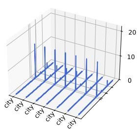  
(b) Activation: Uniform sequence

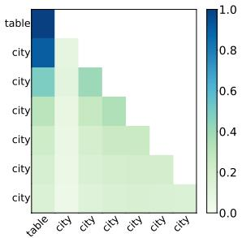  
(c) Heatmap: Distinct token at pos. 1

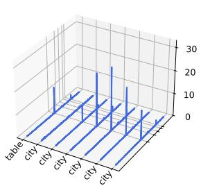

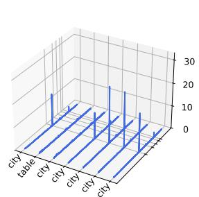

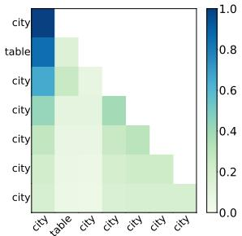  
(e) Heatmap: Distinct token at pos. 2

(f) Activation: Distinct token at pos. 2  
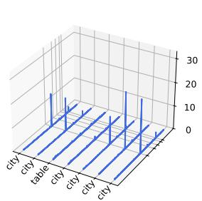

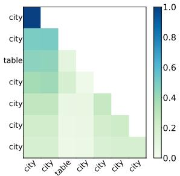  
(g) Heatmap: Distinct token at pos. 3 (h) Activation: Distinct token at pos. 3

(c) Heatmap: Distinct token at pos. 1  
(a) Heatmap: Uniform sequence  
(b) Activation: Uniform sequence  

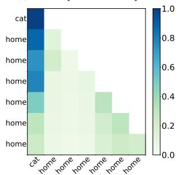

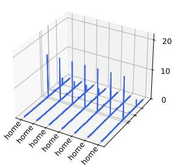

(d) Activation: Distinct token at pos.  
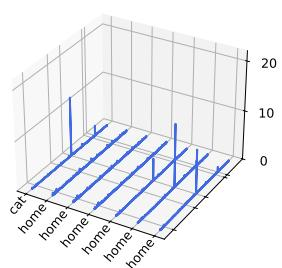

  
(e) Heatmap: Distinct token at pos. 2

Figure 11: Results for sequences with repeated tokens. Each row compares the attention heatmap (left) and hidden-state activations (right) under the same token distribution pattern for Mistral-7B-v0.3 (Sample 2).

  
(f) Activation: Distinct token at pos. 2

  
(g) Heatmap: Distinct token at pos. 3 (h) Activation: Distinct token at pos. 3

Figure 12: Results for sequences with repeated tokens. Each row compares the attention heatmap (left) and hidden-state activations (right) under the same token distribution pattern for Mistral-7B-v0.3 (Sample 1).

  
(b) Norms: Pos. 1

  
(c) Norms: Pos. 2

  
(d) Norms: Pos. 3  
Figure 13: Layer-wise averaged hidden-state norms in Mistral-7B-v0.3 for repeated-token sequences under different distincttoken positions (colors and markers as in Figure 5). The horizontal axis shows the layer index in every panel.

<table><tr><td>Model</td><td>Position</td><td>Vanilla</td><td>Interv</td></tr><tr><td rowspan="2">Llama-2-7b-hf</td><td>8</td><td>0.0000</td><td>0.8542</td></tr><tr><td>32</td><td>0.0072</td><td>0.8217</td></tr><tr><td rowspan="2">Llama-3.2-3B</td><td>8</td><td>0.0026</td><td>0.7560</td></tr><tr><td>32</td><td>0.0006</td><td>0.7406</td></tr><tr><td rowspan="2">Mistral-7B-v0.3</td><td>8</td><td>0.0660</td><td>0.1347</td></tr><tr><td>32</td><td>0.0000</td><td>0.0866</td></tr><tr><td rowspan="2">Qwen2-7B</td><td>8</td><td>0.0001</td><td>0.5324</td></tr><tr><td>32</td><td>0.0001</td><td>0.4946</td></tr><tr><td rowspan="2">pythia-1b</td><td>8</td><td>0.0000</td><td>0.4885</td></tr><tr><td>32</td><td>0.0000</td><td>0.4654</td></tr></table>

Table 11: Sink at the intervened token position for $t = 8$ and $t = 3 2 .$ , comparing vanilla attention to the self-concentration intervention $( \alpha _ { t , t } = 1 . 0 $ , all layers, w/o BOS), with $T = 6 4 .$

<table><tr><td>Model</td><td>Condition</td><td>Position</td><td> $\epsilon = 0 . 2$ </td><td> $\epsilon = 0 . 3$ </td><td> $\epsilon = 0 . 4$ </td><td> $\epsilon = 0 . 5$ </td></tr><tr><td rowspan="5">Llama-2-7b-hf</td><td rowspan="4">Vanilla</td><td>1</td><td>0.9334</td><td>0.9305</td><td>0.9187</td><td>0.8819</td></tr><tr><td>15</td><td>0.0005</td><td>0.0001</td><td>0.0000</td><td>0.0000</td></tr><tr><td>16</td><td>0.0090</td><td>0.0073</td><td>0.0028</td><td>0.0001</td></tr><tr><td>17</td><td>0.0091</td><td>0.0071</td><td>0.0023</td><td>0.0000</td></tr><tr><td>RoPE Interv</td><td>1</td><td>0.9341</td><td>0.9273</td><td>0.9100</td><td>0.8663</td></tr><tr><td rowspan="5">Llama-3.2-3B</td><td rowspan="3">Vanilla</td><td>1</td><td>0.9329</td><td>0.9218</td><td>0.8933</td><td>0.8118</td></tr><tr><td>15</td><td>0.0011</td><td>0.0008</td><td>0.0006</td><td>0.0004</td></tr><tr><td>16</td><td>0.0014</td><td>0.0012</td><td>0.0007</td><td>0.0004</td></tr><tr><td></td><td>17</td><td>0.0004</td><td>0.0003</td><td>0.0003</td><td>0.0002</td></tr><tr><td>RoPE Interv</td><td>1</td><td>0.9317</td><td>0.9133</td><td>0.8713</td><td>0.7749</td></tr><tr><td rowspan="5"> $\mathbf { M i s t r a l - } 7 \mathbf { B - } \mathbf { v } 0 . 3$ </td><td rowspan="3">Vanilla</td><td>1</td><td>0.2258</td><td>0.0343</td><td>0.0033</td><td>0.0001</td></tr><tr><td>15</td><td>0.0195</td><td>0.0187</td><td>0.0172</td><td>0.0143</td></tr><tr><td>16 17</td><td>0.0386</td><td>0.0373</td><td>0.0344</td><td>0.0285</td></tr><tr><td></td><td></td><td>0.0194</td><td>0.0187</td><td>0.0172</td><td>0.0146</td></tr><tr><td rowspan="5"></td><td>RoPE Interv</td><td>1</td><td>0.3655</td><td>0.1525</td><td>0.1129</td><td>0.0960</td></tr><tr><td rowspan="4">Vanilla</td><td>1</td><td>0.8677</td><td>0.8173</td><td>0.7439</td><td>0.6113</td></tr><tr><td>15</td><td>0.0005</td><td>0.0002</td><td>0.0000</td><td>0.0000</td></tr><tr><td>16 17</td><td>0.0004</td><td>0.0000</td><td>0.0000</td><td>0.0000</td></tr><tr><td></td><td>0.0004</td><td>0.0001</td><td>0.0000</td><td>0.0000</td></tr><tr><td rowspan="5">pythia-1b</td><td rowspan="3">RoPE Interv</td><td>1</td><td>0.8671</td><td>0.7931</td><td>0.6810</td><td>0.5290</td></tr><tr><td>1</td><td>0.7433</td><td>0.7337</td><td>0.6889</td><td>0.5659</td></tr><tr><td>15 16</td><td>0.0002</td><td>0.0000</td><td>0.0000</td><td>0.0000</td></tr><tr><td></td><td></td><td>0.0001 0.0001</td><td>0.0000 0.0000</td><td>0.0000 0.0000</td><td>0.0000 0.0000</td></tr><tr><td>RoPE Interv</td><td>1</td><td>0.7955</td><td>0.7547</td><td>0.7056</td><td>0.5749</td></tr><tr><td rowspan="6">Llama-2-7b-hf</td><td rowspan="4">Vanilla</td><td>1 (First)</td><td>0.9334</td><td>0.9305</td><td>0.9187</td><td colspan="2">0.8819</td></tr><tr><td>15</td><td>0.0005</td><td>0.0001</td><td>0.0000</td><td colspan="2">0.0000</td></tr><tr><td>16 (Intervened)</td><td>0.0090</td><td>0.0073</td><td>0.0028</td><td colspan="2">0.0001</td></tr><tr><td>17</td><td>0.0091</td><td>0.0071</td><td>0.0023</td><td colspan="2">0.0000</td></tr><tr><td rowspan="4"></td><td>1 (First)</td><td>0.9323</td><td>0.9164</td><td>0.8248</td><td colspan="2">0.5356</td></tr><tr><td>15  $\alpha _ { ^ { 1 6 , 1 6 } } = 1 . 0$ </td><td>0.0002</td><td>0.0000</td><td>0.0000</td><td colspan="2">0.0000</td></tr><tr><td>16 (Intervened)</td><td>0.9248</td><td>0.8397</td><td>0.5308</td><td colspan="3">0.0095</td></tr><tr><td>17</td><td>0.0072</td><td>0.0006</td><td>0.0000</td><td colspan="3">0.0000</td></tr><tr><td rowspan="7">Llama-3.2-3B</td><td rowspan="4">Vanilla</td><td>1 (First)</td><td>0.9329</td><td>0.9218</td><td>0.8933</td><td colspan="2">0.8118</td></tr><tr><td>15</td><td>0.0011</td><td>0.0008</td><td>0.0006</td><td colspan="2">0.0004</td></tr><tr><td>16 (Intervened)</td><td>0.0014</td><td>0.0012</td><td>0.0007</td><td colspan="2">0.0004</td></tr><tr><td>17</td><td>0.0004</td><td>0.0003</td><td>0.0003</td><td colspan="2">0.0002</td></tr><tr><td rowspan="4"> $\alpha _ { ^ { 1 6 , 1 6 } } = 1 . 0$ </td><td>1 (First)</td><td>0.9291</td><td>0.8785</td><td>0.6972</td><td colspan="2">0.4172</td></tr><tr><td>15</td><td>0.0011</td><td>0.0008</td><td>0.0006</td><td colspan="2">0.0003</td></tr><tr><td>16 (Intervened)</td><td>0.9121</td><td>0.7424</td><td>0.4527</td><td colspan="2">0.0120</td></tr><tr><td>17</td><td>0.0004</td><td>0.0003</td><td>0.0003</td><td colspan="3">0.0002</td></tr><tr><td rowspan="7">Mistral-7B-v0.3</td><td rowspan="4">Vanilla</td><td>1 (First)</td><td>0.2258</td><td>0.0343</td><td>0.0033</td><td colspan="2">0.0001</td></tr><tr><td>15</td><td>0.0195</td><td>0.0187</td><td>0.0172</td><td colspan="2">0.0143</td></tr><tr><td>16 (Intervened)</td><td>0.0386</td><td>0.0373</td><td>0.0344</td><td colspan="2">0.0285</td></tr><tr><td>17</td><td>0.0194</td><td>0.0187</td><td>0.0172</td><td colspan="2">0.0146</td></tr><tr><td rowspan="4"> $\alpha _ { ^ { 1 6 , 1 6 } } = 1 . 0$ </td><td>1 (First)</td><td>0.1662</td><td>0.0198</td><td>0.0003</td><td colspan="2">0.0000</td></tr><tr><td>15</td><td>0.0195</td><td>0.0182</td><td>0.0152</td><td colspan="2">0.0117</td></tr><tr><td>16 (Intervened)</td><td>0.1897</td><td>0.1509</td><td>0.0868</td><td colspan="2">0.0304</td></tr><tr><td>17</td><td>0.0194</td><td>0.0184</td><td>0.0161</td><td colspan="3">0.0129</td></tr><tr><td rowspan="7">Qwen2-7B</td><td rowspan="4">Vanilla</td><td>1 (First)</td><td>0.8677</td><td>0.8173</td><td>0.7439</td><td colspan="2">0.6113</td></tr><tr><td>15</td><td>0.0005</td><td>0.0002</td><td>0.0000</td><td colspan="2">0.0000</td></tr><tr><td>16 (Intervened)</td><td>0.0004</td><td>0.0000</td><td>0.0000</td><td colspan="2">0.0000</td></tr><tr><td>17</td><td>0.0004</td><td>0.0001</td><td>0.0000</td><td colspan="2">0.0000</td></tr><tr><td rowspan="4"> $\alpha _ { ^ { 1 6 , 1 6 } } = 1 . 0$ </td><td>1 (First)</td><td>0.8485</td><td>0.7278</td><td>0.4770</td><td colspan="2">0.2108</td></tr><tr><td>15</td><td>0.0004</td><td>0.0001</td><td>0.0000</td><td colspan="2">0.0000</td></tr><tr><td>16 (Intervened)</td><td>0.7533</td><td>0.5085</td><td>0.2174</td><td colspan="2">0.0182</td></tr><tr><td>17</td><td>0.0005</td><td>0.0001</td><td>0.0000</td><td colspan="3">0.0000</td></tr><tr><td rowspan="7">pythia-1b</td><td rowspan="3">Vanilla</td><td>1 (First)</td><td>0.7433</td><td>0.7337</td><td>0.6889</td><td colspan="2">0.5659</td></tr><tr><td>15</td><td>0.0002</td><td>0.0000</td><td>0.0000</td><td colspan="2">0.0000</td></tr><tr><td>16 (Intervened) 17</td><td>0.0001</td><td>0.0000</td><td>0.0000</td><td colspan="2">0.0000 0.0000</td></tr><tr><td rowspan="4"></td><td></td><td>0.0001</td><td>0.0000</td><td>0.0000</td><td colspan="2"></td></tr><tr><td>1 (First)</td><td>0.7392</td><td>0.6702</td><td>0.4391</td><td colspan="2">0.1769</td></tr><tr><td>15</td><td>0.0001</td><td>0.0000</td><td>0.0000</td><td colspan="2">0.0000</td></tr><tr><td>16 (Intervened) 17</td><td>0.6975 0.0001</td><td>0.4703 0.0000</td><td>0.1703 0.0000</td><td colspan="2">0.0054 0.0000</td></tr></table>

Table 12: Comparison of Sink, across various thresholds € for RoPE ablation (both w/o BOS).

Table 13: Comparison of Sink, across various thresholds € when intervention forces self-concentration of attention at position 16 (both w/o BOS).

(d) Activation: Distinct token at pos. 1  
  
(a) Heatmap: Uniform sequence

  
(b) Activation: Uniform sequence

  
(c) Heatmap: Distinct token at pos. 1

  
(f) Activation: Distinct token at pos. 2

(e) Heatmap: Distinct token at pos. 2  
  
(a) Heatmap: Uniform sequence

  
(b) Activation: Uniform sequence

(c) Heatmap: Distinct token at pos.  
(g) Heatmap: Distinct token at pos. 3 (h) Activation: Distinct token at pos. 3  

(d) Activation: Distinct token at pos.  
(e) Heatmap: Distinct token at pos. 2  

  
(f) Activation: Distinct token at pos. 2

Figure 14: Results for sequences with repeated tokens. Each row compares the attention heatmap (left) and hidden-state activations (right) under the same token distribution pattern for Qwen2-7B (Sample 2).

  
(g) Heatmap: Distinct token at pos. 3 (h) Activation: Distinct token at pos. 3

Figure 15: Results for sequences with repeated tokens. Each row compares the attention heatmap (left) and hidden-state activations (right) under the same token distribution pattern for Qwen2-7B (Sample 1).

  
(a) Norms: Uniform

  
(b) Norms: Pos. 1

  
(c) Norms: Pos. 2

  
(d) Norms: Pos. 3  
Figure 16: Layer-wise averaged hidden-state norms in Qwen2-7B for repeated-token sequences under different distinct-token positions (colors and markers as in Figure 5). The horizontal axis shows the layer index in every panel.

(d) Activation: Distinct token at pos. 1  
  
(a) Heatmap: Uniform sequence

  
(b) Activation: Uniform sequence

  
(c) Heatmap: Distinct token at pos. 1

  
(f) Activation: Distinct token at pos. 2

(e) Heatmap: Distinct token at pos. 2  
  
(a) Heatmap: Uniform sequence

(b) Activation: Uniform sequence  
  
(c) Heatmap: Distinct token at pos. 1

(g) Heatmap: Distinct token at pos. 3 (h) Activation: Distinct token at pos. 3  

(d) Activation: Distinct token at pos.  

(e) Heatmap: Distinct token at pos. 2  

  
(f) Activation: Distinct token at pos. 2

  
(g) Heatmap: Distinct token at pos. 3 (h) Activation: Distinct token at pos. 3

Figure 17: Results for sequences with repeated tokens. Each row compares the attention heatmap (left) and hidden-state activations (right) under the same token distribution pattern for pythia-1b (Sample 2).

Figure 18: Results for sequences with repeated tokens. Each row compares the attention heatmap (left) and hidden-state activations (right) under the same token distribution pattern for pythia-1b (Sample 1).

  
(a) Norms: Uniform

  
(b) Norms: Pos. 1

  
(c) Norms: Pos. 2

  
(d) Norms: Pos. 3  
Figure 19: Layer-wise averaged hidden-state norms in pythia-1b for repeated-token sequences under different distinct-token positions (colors and markers as in Figure 5). The horizontal axis shows the layer index in every panel.

  
(a) Norms: WikiText

  
(b) Norms: GSM8K

  
(c) Norms: SlimPajama  
Figure 20: Layer-wise averaged hidden-state norms in Llama-3.2-3B for an input length of 64 tokens across WikiText, GSM8K, and SlimPajama (baseline, no intervention). Blue circles and green triangles denote the first token and the mean over all other input tokens, respectively. The horizontal axis shows the layer index in every panel. Shaded bands show the sample min-max range.

  
(a) Norms: Uniform

  
(c) Norms: Pos. 2

  
(b) Norms: Pos. 1

  
(d) Norms: Pos. 3  
Figure 21: Layer-wise averaged hidden-state norms in Llama-2-7b-hf for repeated-token sequences of length 128 under different distinct-token positions (colors and markers as in Figure 10). The horizontal axis shows the layer index in every panel.