# Jacap: Robust KV Cache Eviction via Jacobian-Based Nonlinear Information Capacity Preservation

Jiaming Yang<sup>1,2</sup> Chenwei Tang<sup>1,2,∗</sup> Liangli Zhen<sup>3</sup> Chenyang Zhang<sup>1,2</sup> Jiancheng Lv<sup>1,2</sup>

<sup>1</sup>College of Computer Science, Sichuan University, Chengdu, China <sup>2</sup>Engineering Research Center of Machine Learning and Industry Intelligence, Ministry of Education, Chengdu, China <sup>3</sup>Institute of High Performance Computing, Agency for Science, Technology and Research (A\*STAR), Singapore <sup>∗</sup>Corresponding author: tangchenwei@scu.edu.cn

## Abstract

Key-value (KV) cache eviction is essential for scaling long-context inference in Large Language Models. However, existing policies predominantly rely on empirical heuristics, lacking a rigorous characterization of token utility under the inherently nonlinear softmax attention mechanism. In this work, we rethink KV cache eviction through the lens of local information geometry, modeling the attention process as a nonlinear Gaussian communication channel. By performing a first-order Taylor expansion of the attention mapping, we derive the Jacobian Information Capacity, a novel objective that explicitly captures query relevance, softmax sensitivity, and structural diversity. Guided by this theory, we introduce Jacap, a capacity-aware eviction method that utilizes softmax-aware importance weighting and statistical leverage scores for subset selection. Extensive experiments across diverse architectures and benchmarks demonstrate that JACAP delivers superior performance in most scenarios, particularly in high-compression regimes.

## 1 Introduction

Large language models (LLMs) are increasingly deployed in complex, long-horizon settings such as multi-step reasoning [17], tool-augmented agents [7], and interactive decision-making systems [32]. These applications require processing extremely long contexts, where models must retain and reuse information across thousands or even millions of tokens. Although transformer-based architectures are capable of supporting such tasks in principle, their inference cost grows rapidly with context length, making efficient memory management a critical bottleneck. In particular, the key-value (KV) cache, which stores past attention states for autoregressive decoding, incurs both significant memory overhead and latency as the context grows [19, 18]. This has led to extensive research on KV cache compression, spanning techniques such as representation-level quantization and structural pruning [14, 20]. KV cache eviction, which dynamically prunes redundant entries based on importance, has emerged as a particularly promising approach due to its model-agnostic nature and seamless integration into inference pipelines.

KV cache eviction methods operate by assigning an importance score to each cached token and retaining only the top-ranked subset under a given memory budget. Existing methods generally rely on heuristic criteria such as attention scores [15], token recency [25], or value norms [21] to estimate token importance. While effective in practice, these heuristics lack a principled understanding of which information should be preserved for future queries. As a result, they often treat tokens in isolation and fail to capture the complex redundancy and complementarity across cache entries, leading to inconsistent performance under aggressive compression regimes.

Recent work [27] has sought a more rigorous foundation by framing KV cache eviction through the Information Bottleneck (IB) principle [23]. By adopting a linear-gaussian surrogate for attention dynamics, this work defines an information capacity objective that quantifies the mutual information between future queries and attention outputs. This framework provides a unified interpretation of query relevance and output diversity, resulting in practical algorithms based on capacity-aware selection. However, we argue that the linear assumption limits the descriptive power of this framework. Transformer attention is governed by the softmax operator, where normalization and competition effects dictate that a token’s contribution depends not only on its individual representation but also on its relative sensitivity within the total distribution. A linear approximation treats the query-to-output mapping as a fixed transformation, overlooking the saturation and competition dynamics central to information flow in real attention mechanisms.

In this work, we revisit KV cache eviction from a nonlinear information-theoretic perspective. We model the retained attention mechanism as a nonlinear information channel and derive a local approximation of its information capacity using the Jacobian of the attention mapping around a representative query distribution. This formulation explicitly incorporates query-key alignment, softmax competition, and value-space diversity into a unified objective, with linear capacity emerging as a special case under a linear channel approximation.

Building on this insight, we propose JACAP, a practical eviction method that approximates nonlinear capacity using a softmax-sensitive weighting scheme combined with capacity-based selection. Extensive experiments across diverse architectures and benchmarks demonstrate that JACAP delivers superior performance in most scenarios, especially under high compression ratios.

Our contributions are summarized as follows:

1. We propose a nonlinear information-theoretic framework for KV cache eviction, modeling retained attention as a nonlinear channel and deriving a Jacobian-based local capacity objective.

2. We develop JACAP, a practical eviction algorithm that incorporates softmax sensitivity into capacity-aware token selection.

3. We empirically demonstrate consistent improvements over prior methods on LongBench, NIAH and AIME25 benchmarks, especially under high compression ratio.

## 2 Related Works

## 2.1 Efficient LLM Inference

The rapidly growing computational cost of LLM inference has motivated optimizations across multiple levels of the inference stack. At the representation level, quantization methods such as TurboQuant [28], PolarQuant [9], and KVQuant [11] reduce memory footprint by storing KV Cache in low-precision formats, though they may introduce non-negligible degradation under extreme longcontext settings. At the sequence level, token reduction techniques, including token merging methods such as D2O [24] and CAM [30], aim to shorten the effective context length by consolidating redundant tokens. At the system level, memory management optimizations such as PagedAttention [13] and FlashDecoding++ [10] improve hardware utilization by reducing KV cache fragmentation and increasing token throughput.

Orthogonal to these approaches, structural methods directly compress the KV cache by selectively retaining tokens during decoding. Our method, JACAP, belongs to this category and is complementary to quantization and system-level optimizations.

## 2.2 KV Cache Eviction

Heuristic-based Eviction. KV cache eviction methods aim to alleviate the memory bottleneck by selectively pruning cached tokens during autoregressive decoding. Early approaches primarily rely on heuristic importance metrics derived from observed token behavior. Attention-based methods, such as H2O [31] and SNAPKV [15], prioritize tokens that receive consistently high attention weights across decoding steps. Other approaches emphasize structural diversity: KEYDIFF [16] promotes geometric dissimilarity among keys to reduce redundancy, while KNORM [5] uses l<sub>2</sub>-norms as lightweight proxies for token salience. Recent work has explored estimating token importance beyond observed attention patterns. Expected Attention [6] approximates the expected attention of future queries under a distributional assumption, enabling importance scoring without access to explicit attention matrices.

Despite their empirical effectiveness, these methods typically score tokens independently and therefore fail to capture higher-order interactions such as redundancy and complementarity among retained tokens.

Information-Theoretic Perspectives. Recent work has introduced information-theoretic formulations for KV-cache eviction based on the Information Bottleneck (IB) principle [23, 4]. In particular, CAPKV [27] formulates token selection as maximizing the mutual information between future queries and attention outputs. Under a linear-Gaussian approximation, the objective reduces to a tractable log-determinant form.

However, this formulation relies on a linear approximation of the attention mechanism, effectively treating the query-to-output mapping as a fixed channel. This simplification neglects the nonlinear normalization and competition effects induced by softmax attention, which fundamentally govern how information is distributed across tokens. In contrast, our work models attention as a nonlinear information channel and derives a Jacobian-based local capacity objective, enabling a more faithful characterization of information flow in the KV cache.

## 3 Methodology

In this section, we first revisit the core principles behind KV cache eviction. We then introduce a local information-capacity framework that accounts for the nonlinear sensitivity of softmax attention. Based on this objective, we propose JACAP (Jacobian-Capacity Aware Eviction), a practical KV cache eviction policy.

## 3.1 Preliminary

During autoregressive decoding, each step t attends to all previously generated tokens. Given the current hidden state $h _ { t }$ , the model computes

$$
q _ { t } = W _ { Q } h _ { t } , \qquad k _ { i } = W _ { K } h _ { i } , \qquad v _ { i } = W _ { V } h _ { i } , \qquad i \le t .
$$

Let $d _ { k }$ be the query/key dimension and $d _ { o }$ be the output dimension. The attention output is

$$
o _ { t } = \mathrm { A t t n } ( q _ { t } ) = W _ { O } \sum _ { i \leq t } \alpha _ { t , i } v _ { i } , \qquad \alpha _ { t , i } = \frac { \exp ( q _ { t } ^ { \top } k _ { i } / \sqrt { d _ { k } } ) } { \sum _ { j \leq t } \exp ( q _ { t } ^ { \top } k _ { j } / \sqrt { d _ { k } } ) } .
$$

Modern inference systems maintain a KV cache $\{ ( k _ { i } , v _ { i } ) \} _ { i = 1 } ^ { t }$ to avoid recomputing past keys and values. However, the memory cost of the cache grows linearly with the sequence length, making KV cache eviction necessary for long-context inference.

From a functional perspective, full attention defines a nonlinear mapping from query to output:

$$
f ( q ) = U \alpha ( q ) , \qquad \alpha ( q ) = \mathrm { s o f t m a x } ( K q / \sqrt { d _ { k } } ) ,
$$

where $u _ { i } = W _ { O } v _ { i } , U = [ u _ { 1 } , \ldots , u _ { t } ] \in \mathbb { R } ^ { d _ { o } \times t } ,$ , and $K = [ k _ { 1 } ^ { \top } ; \ldots ; k _ { t } ^ { \top } ] \in \mathbb { R } ^ { t \times d _ { k } }$ . Given a memory budget $B < t ,$ , eviction selects a subset $\mathcal { C } \subseteq \mathcal { H } _ { t } : = \{ 1 , \ldots , \bar { t } \}$ with $| { \bar { \mathcal { C } } } | \leq B$ , resulting in a retained cache

$$
\mathcal { Z } _ { C } = \{ ( k _ { i } , v _ { i } ) \} _ { i \in \mathcal { C } } .
$$

For the subset C, define

$$
K _ { \mathcal { C } } = [ k _ { i } ^ { \top } ] _ { i \in \mathcal { C } } \in \mathbb { R } ^ { | \mathcal { C } | \times d _ { k } } , \qquad U _ { \mathcal { C } } = [ u _ { i } ] _ { i \in \mathcal { C } } \in \mathbb { R } ^ { d _ { o } \times | \mathcal { C } | } .
$$

The compressed cache induces the restricted mapping

$$
f c ( q ) = U _ { \mathcal { C } } \alpha _ { \mathcal { C } } ( q ) , \qquad \alpha _ { i } ^ { \mathcal { C } } ( q ) = \frac { \exp ( q ^ { \top } k _ { i } / \sqrt { d _ { k } } ) } { \sum _ { j \in \mathcal { C } } \exp ( q ^ { \top } k _ { j } / \sqrt { d _ { k } } ) } .
$$

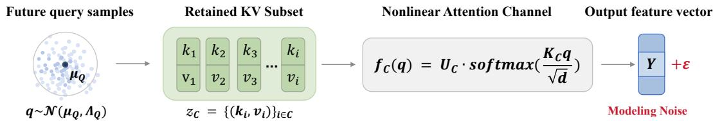  
Figure 1: Nonlinear retained attention channel. A retained KV subset $\mathcal { Z } _ { \mathcal { C } }$ defines a nonlinear softmax attention map from future queries $q \sim \mathcal N ( \mu _ { Q } , \Lambda _ { Q } )$ to output features, $\begin{array} { r } { Y _ { \mathcal { C } } = f _ { \mathcal { C } } ( q ) + \epsilon } \end{array}$

Thus, KV cache eviction can be formulated as a constrained function approximation problem:

$$
\operatorname* { m i n } _ { \mathcal { C } : | \mathcal { C } | \leq B } \mathbb { E } _ { q \sim P ( q ) } \left[ \| f ( q ) - f _ { \mathcal { C } } ( q ) \| _ { 2 } ^ { 2 } \right] ,
$$

where $P ( q )$ denotes the distribution of future queries.

## 3.2 An Information Bottleneck Perspective on KV Cache Eviction

The Information Bottleneck (IB) principle provides a formal view of the trade-off between compression and predictive information [22, 3]. In KV cache eviction, however, the representations are produced by a frozen model, and compression is imposed through a hard cache budget rather than a learned encoder. Therefore, instead of optimizing the full IB Lagrangian, we focus on the predictive information preserved by the retained cache.

Given the retained cache $\mathcal { Z } _ { \mathcal { C } }$ , we model the future query q as a random variable and define the stochastic channel output as

$$
Y _ { \mathcal { C } } = f _ { \mathcal { C } } ( q ) + \epsilon , \qquad \epsilon \sim \mathcal { N } ( 0 , \Sigma _ { \mathrm { n o i s e } } ) , \qquad q \perp \epsilon .
$$

The information capacity of the retained cache is then

$$
\begin{array} { r } { \mathcal { L } _ { \boldsymbol { \mathcal { C } } } = I ( \boldsymbol { q } ; Y _ { \mathcal { C } } \mid \mathcal { Z } _ { \boldsymbol { \mathcal { C } } } ) . } \end{array}\tag{1}
$$

Prior work [27] instantiates this objective with a linear-gaussian surrogate,

$$
Y _ { \mathcal { C } } ^ { \mathrm { L i n } } = U _ { \mathcal { C } } K _ { \mathcal { C } } q + \epsilon , \qquad q \sim \mathcal { N } ( \mu _ { Q } , \Lambda _ { Q } ) .
$$

Under this model, the capacity admits the closed form

$$
\mathcal { L } _ { \mathcal { C } } ^ { \mathrm { L i n } } = \frac { 1 } { 2 } \log \operatorname* { d e t } \left( I + \Sigma _ { \mathrm { n o i s e } } ^ { - 1 } U _ { \mathcal { C } } K _ { \mathcal { C } } \Lambda _ { Q } K _ { \mathcal { C } } ^ { \top } U _ { \mathcal { C } } ^ { \top } \right) .\tag{2}
$$

## 3.3 Jacobian Information Capacity for KV Cache Selection

The linear–Gaussian surrogate in the previous section provides a tractable capacity objective for KV cache selection. However, the actual attention computation induced by a retained cache is nonlinear, since the softmax operator normalizes token logits and introduces competition among cached entries. Therefore, instead of directly treating the retained cache as a fixed linear channel, we first formulate it as a nonlinear query-to-output mapping.

Given a retained KV subset $\mathcal { Z } _ { \mathcal { C } } = \{ ( k _ { i } , v _ { i } ) \} _ { i \in \mathcal { C } }$ , we denote by $K _ { \mathcal { C } }$ the matrix of retained keys and by $U _ { C }$ the corresponding value-induced output directions. The retained attention map is defined as

$$
f c ( q ) = U _ { \mathcal { C } } \operatorname { s o f t m a x } \left( \frac { K _ { \mathcal { C } } q } { \sqrt { d _ { k } } } \right) .\tag{3}
$$

We then model the output representation produced by the retained cache as a noisy nonlinear channel:

$$
Y _ { \mathcal { C } } = f _ { \mathcal { C } } ( q ) + \epsilon , \qquad \epsilon \sim \mathcal { N } ( 0 , \Sigma _ { \mathrm { n o i s e } } ) .\tag{4}
$$

As illustrated in Fig. 1, this formulation preserves the nonlinear softmax normalization that is absent from the global linear surrogate. The retained cache no longer defines independent linear channels, but also coupled nonlinear attention channel whose output depends on both query–key accessibility and token-token competition.

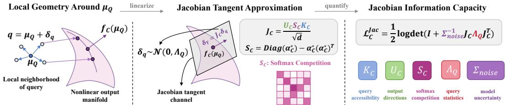  
Figure 2: Jacobian Information Capacity. Around the center $\mu _ { Q }$ of the future query distribution, the nonlinear retained attention map is locally approximated by its Jacobian tangent channel. The Jacobian $J _ { \cal C } = U _ { \cal C } S _ { \cal C } K _ { \cal C } / \sqrt { d _ { k } }$ decomposes the local channel into key accessibility $K _ { \mathcal { C } }$ , output directions $U _ { \mathcal { C } }$ , and the softmax competition matrix $S _ { \mathcal { C } }$ . This yields a local information-capacity objective $\mathcal { L } _ { \mathcal { C } } ^ { \mathrm { J a c } }$ , which quantifies how much query-dependent information is preserved by the retained cache under query statistics $\Lambda _ { Q }$ and modeling uncertainty $\scriptstyle \sum _ { \mathrm { n o i s e } }$

To obtain a tractable local capacity measure, we assume that future queries concentrate around a distribution center $\mu _ { Q }$

$$
q = \mu _ { Q } + \delta q , \qquad \delta q \sim \mathcal { N } ( 0 , \Lambda _ { Q } ) .
$$

Under this local query model, the nonlinear map in Eq. (3) can be approximated by its first-order Taylor expansion around $\mu _ { Q }$

Lemma 1 (Local Jacobian Linearization). For a retained cache ${ \mathcal { Z } } _ { { \mathcal { C } } } ,$ , the nonlinear attention map $f _ { \cal C } ( q )$ admits the first-order expansion

$$
f _ { \mathcal { C } } ( q ) = f _ { \mathcal { C } } ( \mu _ { Q } ) + J _ { \mathcal { C } } \delta q + \mathcal { O } ( \| \delta q \| _ { 2 } ^ { 2 } ) ,\tag{5}
$$

where $J _ { \mathcal { C } } \in \mathbb { R } ^ { d _ { o } \times d _ { k } }$ is

$$
J _ { \mathcal { C } } = \frac { 1 } { \sqrt { d _ { k } } } U _ { \mathcal { C } } S _ { \mathcal { C } } K _ { \mathcal { C } } , \quad S _ { \mathcal { C } } = \mathrm { D i a g } ( \alpha _ { \mathcal { C } } ^ { \star } ) - \alpha _ { \mathcal { C } } ^ { \star } ( \alpha _ { \mathcal { C } } ^ { \star } ) ^ { \top } , \quad \alpha _ { \mathcal { C } } ^ { \star } = \mathrm { s o f t m a x } ( K _ { \mathcal { C } } \mu _ { Q } / \sqrt { d _ { k } } ) .\tag{6}
$$

Treating $J _ { \mathcal { C } }$ as the effective local channel gain yields the Jacobian-capacity objective.

Theorem 1 (Jacobian Information Capacity). Under the local Gaussian perturbation model above and the first-order approximation in Lemma 1, the retained cache capacity is approximated by

$$
\begin{array} { r l } & { \mathcal { L } _ { \mathcal { C } } ^ { \mathrm { J a c } } \approx \displaystyle \frac { 1 } { 2 } \log \operatorname* { d e t } \left( I + \Sigma _ { \mathrm { n o i s e } } ^ { - 1 } J _ { \mathcal { C } } \Lambda _ { Q } J _ { \mathcal { C } } ^ { \top } \right) } \\ & { \quad \quad = \displaystyle \frac { 1 } { 2 } \log \operatorname* { d e t } \left( I + \frac { 1 } { d _ { k } } \Sigma _ { \mathrm { n o i s e } } ^ { - 1 } U _ { \mathcal { C } } S _ { \mathcal { C } } K _ { \mathcal { C } } \Lambda _ { Q } K _ { \mathcal { C } } ^ { \top } S _ { \mathcal { C } } U _ { \mathcal { C } } ^ { \top } \right) . } \end{array}\tag{7}
$$

The key difference from the linear capacity in Eq. (2) lies in the softmax Jacobian $S _ { \mathcal { C } }$ . Its diagonal entries measure the local sensitivity of each token’s attention probability to its own logit, while its off-diagonal entries encode the normalization-induced competition between different tokens. Therefore, $\overline { { \mathcal { L } _ { \mathcal { C } } ^ { \mathrm { J a c } } } }$ does not merely reward keys that are aligned with future queries, it rewards retained subsets whose output directions remain locally distinguishable under the nonlinear softmax response. As illustrated in Fig. 2, the resulting capacity decomposes into five interpretable components: key accessibility, output directions, softmax competition, query statistics, and model uncertainty.

Remark 1. Under standard smoothness and non-degenerate noise assumptions, the Jacobian approximation matches the first-order local channel induced by nonlinear attention. The remaining approximation error is governed by higher-order Taylor residuals. We provide the detailed derivation and analysis ofTheorem 1 in Appendix A.

## 3.4 JACAP: A Jacobian-Capacity Aware Eviction Policy

While Theorem 1 provides a high-fidelity objective for measuring cache utility, directly optimizing this subset-dependent log-determinant objective during online inference is computationally prohibitive. Our goal is therefore not to optimize the full Jacobian capacity exactly, but to preserve its essential structure in a lightweight eviction score. Following the decomposition in Fig. 2, we retain three ingredients that are most relevant for token selection: local query relevance, softmax sensitivity, and output-space diversity.

```powershell
Algorithm 1: JACAP: Jacobian-Capacity-Aware KV Eviction
Require :KV cache $\{ ( k _ { i } , v _ { i } ) \} _ { i = 1 } ^ { N }$ , cache budget B, query statistics $( \mu _ { Q } , \Lambda _ { Q } )$ , temperature τ
Output :Updated retained KV subset C with $| { \mathcal { C } } | = { \bar { B } }$
α<sup>⋆</sup> ← softmax $\left( K \mu _ { Q } / \tau \sqrt { d _ { k } } \right) _ { i }$ // Compute attention weights at query center
$s _ { i }  \alpha _ { i } ^ { \star 2 } ( 1 - \alpha _ { i } ^ { \star } ) ^ { 2 } \cdot ( k _ { i } ^ { \top } \Lambda _ { Q } k _ { i } )$ // softmax-sensitive weight
$\begin{array} { r } { A \gets I + \sum _ { i = 1 } ^ { N } s _ { i } u _ { i } u _ { i } ^ { \top } ; } \end{array}$ // jacobian capacity matrix
$\mathrm { s c o r e } _ { i } \gets s _ { i } u _ { i } ^ { \top } A ^ { - 1 } u _ { i } ;$ $/ /$ marginal Jacobian-capacity contribution
$\mathcal { C } \gets \mathrm { T O P { - } B }$ indices according to score
return C
```

The first difficulty comes from the subset-dependent local attention distribution $\alpha _ { \mathcal { C } } ^ { \star }$ . Since the retained subset C is unknown before eviction, we compute the local attention distribution over the pre-eviction candidate pool $\mathcal { H } _ { t } \mathrm { : }$

$$
\bar { \alpha } _ { i } = \frac { \exp ( k _ { i } ^ { \top } \mu _ { Q } / \tau \sqrt { d _ { k } } ) } { \sum _ { j \in \mathcal { H } _ { t } } \exp ( k _ { j } ^ { \top } \mu _ { Q } / \tau \sqrt { d _ { k } } ) } , \qquad i \in \mathcal { H } _ { t } .
$$

Here $\tau$ denotes the temperature. We use $\bar { \alpha } _ { i }$ as a subset-independent approximation to the local attention weight of token i.

The second difficulty comes from the dense softmax competition matrix $S _ { C }$ , which couples all tokens in the retained subset. For efficient scoring, we retain its diagonal sensitivity and approximate

$$
S c \approx \mathrm { D i a g } ( \rho _ { i } ) , \qquad \rho _ { i } = \bar { \alpha } _ { i } ( 1 - \bar { \alpha } _ { i } ) .
$$

This approximation keeps the local sensitivity induced by softmax saturation while avoiding pairwise token coupling. Under this approximation, the local Jacobian is reduced to a weighted key-output interaction.

We further approximate the query-response covariance $K \Lambda _ { Q } K ^ { \top }$ by its diagonal entries

$$
\kappa _ { i } = k _ { i } ^ { \top } \Lambda _ { Q } k _ { i } ,
$$

which measure the variance of the i-th key response under future query perturbations. Combining the diagonal softmax sensitivity and the diagonal query covariance yields the nonlinear importance weight

$$
w _ { i } = \frac { 1 } { d _ { k } } \rho _ { i } ^ { 2 } \kappa _ { i } = \frac { 1 } { d _ { k } } \bar { \alpha } _ { i } ^ { 2 } ( 1 - \bar { \alpha } _ { i } ) ^ { 2 } \kappa _ { i } .\tag{8}
$$

The weight w<sub>i</sub> accounts for three local factors: query relevance through $\bar { \alpha } _ { i } ,$ softmax sensitivity through $\bar { \alpha } _ { i } ( 1 - \bar { \alpha } _ { i } )$ , and query-space variability through $\kappa _ { i }$ . This form differs from pure attentionbased scoring: tokens with extremely large attention may become saturated and thus contribute limited local sensitivity, while tokens with moderate but responsive attention can carry larger Jacobian capacity.

With these approximations, the Jacobian capacity reduces to the log-determinant of a weighted output-space capacity matrix. For one-shot selection, we construct this matrix over the full candidate pool:

$$
A _ { \mathrm { J a c } } = I + \sum _ { j \in \mathcal { H } _ { t } } w _ { j } u _ { j } u _ { j } ^ { \top } .\tag{9}
$$

This matrix summarizes the output directions already represented by the candidate cache. Applying the matrix determinant lemma gives the final importance score for each token:

$$
r _ { i } ^ { \mathrm { J a c } } = w _ { i } u _ { i } ^ { \top } A _ { \mathrm { J a c } } ^ { - 1 } u _ { i } .\tag{10}
$$

In practice, $\mu _ { Q }$ and $\Lambda _ { Q }$ are estimated from historical queries observed during decoding. When applying the output projection is undesirable, we use $u _ { i } ~ = ~ v _ { i }$ as a lightweight proxy for $W _ { O } v _ { i } .$ following prior capacity-based eviction methods. The full procedure is summarized in Algorithm 1.

We provide the detailed derivation of JACAP together with its computational complexity analysis in Appendix B. We further conduct empirical runtime evaluations, which show that JACAP achieves comparable efficiency to existing mainstream methods in practice. Detailed runtime comparisons are reported in Appendix C.1.

## 4 Experiment

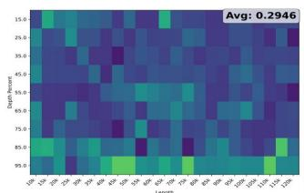

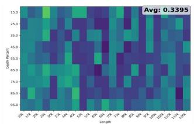

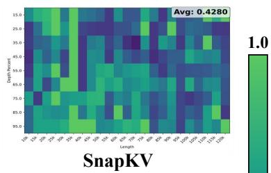

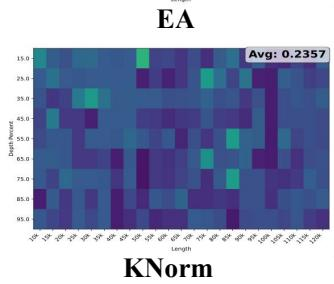

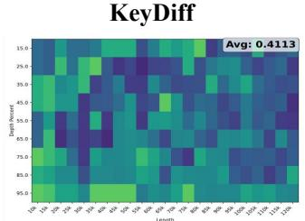  
CapKV

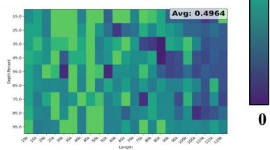  
Jacap  
Figure 3: Performance of JACAP and baseline KV-cache eviction methods on the Needle-in-Haystack (NIAH) benchmark at compression ratio 0.75 using Qwen3-8B.

We evaluate our proposed JACAP eviction strategy against representative baselines, including CAPKV [27], SNAPKV [15], KEYDIFF [16], Expected Attention (EA) [6], and KNORM [5]. The experiments are designed to assess the effectiveness of KV-cache compression in preserving predictive information, handling extremely long contexts, and supporting online decoding under dynamic eviction.

## 4.1 Experiments on LongBench

We evaluate JACAP against CAPKV, SNAPKV, KEYDIFF, EA, and KNORM on the LongBench [2] across four compression ratios (0.25, 0.5, 0.75, 0.9), using Qwen3-8B, Qwen3-14B [26], and Llama3.1-8B [8]. Table 1 summarizes the results. We focus on high compression ratios (0.75 and 0.9), where the memory constraints are most severe and differences among methods are pronounced.

At 0.75 compression, JACAP generally matches or slightly exceeds CAPKV on average, while signifi cantly outperforming heuristic baselines (SNAPKV, KEYDIFF, EA, KNORM). When compression is further increased to 0.9, JACAP achieves the largest advantage, leading the average score by approximately 5 points over the next best baseline. This demonstrates its superior ability to retain critical KV information under extreme cache constraints.

At the task level, JACAP maintains stronger performance on both SD-QA and MD-QA tasks, indicating better preservation of context-relevant information for long-context reasoning. It also exhibits more stable degradation on summarization and few-shot tasks as compression increases. These trends remain consistent across all three models, demonstrating the robustness and generality of the proposed method.

## 4.2 Experiments on NIAH

We evaluate the performance of JACAP and baseline KV-cache eviction methods on the Needle-in-Haystack (NIAH) [12]benchmark under a compression ratio of 0.75 using Qwen3-8B. The NIAH setup tests extremely long contexts (10k–120k tokens) and varying Needle Depths (0.15–0.95), simulating sparse target retrieval under constrained cache budgets.

Table 1: Performance of JACAP and baseline KV-cache eviction methods on LongBench across different compression ratios (C.R.). For each metric, bold indicates the best-performing method, while underlined indicates the second-best.
<table><tr><td rowspan=1 colspan=17>CR. NOAQERMF HOAWQAMQUE GRQMS TREC TOASSUM C LCRB AVG.</td></tr><tr><td rowspan=1 colspan=17></td></tr><tr><td rowspan=3 colspan=6>CAPKV 0</td><td rowspan=1 colspan=2>48.47 34.93</td><td rowspan=1 colspan=3>33.55 24.21 25.05 72.00</td><td rowspan=1 colspan=4>89:47 31.00 10.50</td><td rowspan=1 colspan=2>95.52 65.60 63.33 48.51</td></tr><tr><td rowspan=1 colspan=1>38.44</td><td rowspan=1 colspan=1>30.54</td><td rowspan=1 colspan=3>30.9923.58 23.12 60.50</td><td rowspan=1 colspan=4>85.6738.299.50</td><td rowspan=1 colspan=2>96.96 51.92 63.81 44.88</td></tr><tr><td rowspan=1 colspan=1>31.49</td><td rowspan=1 colspan=1>25.12</td><td rowspan=1 colspan=7>27.1121.61 20.27 36.0085.97 35.006.50</td><td rowspan=1 colspan=2>57.3839.65 63.06 36.57</td></tr><tr><td rowspan=1 colspan=6>0.2528.69 42.84 53.02 62.23</td><td rowspan=1 colspan=1>48.37</td><td rowspan=1 colspan=1>33.99</td><td rowspan=1 colspan=7>33.61 24.22 24.94 57.00 88.13 40.25 8.00</td><td rowspan=1 colspan=2>91.81 66.33 62.17 47.85</td></tr><tr><td rowspan=4 colspan=6>EA 0.75 27.23 34.55 39.60 57.52</td><td></td><td></td><td></td><td></td><td></td><td></td><td></td><td></td><td></td><td></td><td></td></tr><tr><td rowspan=3 colspan=1>39.27</td><td></td><td></td><td></td><td></td><td></td><td></td><td></td><td></td><td></td><td></td></tr><tr><td rowspan=2 colspan=1>27.13</td><td rowspan=2 colspan=7>32.04 22.76 23.70 70.00 85.29 39.71 10.00</td><td></td><td></td></tr><tr><td rowspan=1 colspan=2>49.7459.3063.4642.62</td></tr><tr><td rowspan=1 colspan=6>0.923.28 27.76 32.4243.62</td><td rowspan=1 colspan=9></td><td rowspan=1 colspan=2>17.4250.93 62.92 36.35</td></tr><tr><td rowspan=2 colspan=6>0.25 25.34 35.02 39.12 37.28</td><td rowspan=1 colspan=9></td><td rowspan=1 colspan=2>91.50 61.75 56.71 44.03</td></tr><tr><td rowspan=1 colspan=5>23.30 29.97,39.86 35.86</td><td rowspan=1 colspan=1>33.86</td><td rowspan=1 colspan=1>16.60</td><td rowspan=1 colspan=1>29.49</td><td rowspan=1 colspan=1>22.43.21.93</td><td rowspan=1 colspan=1>55.00</td><td rowspan=1 colspan=4>85.62 38.25 5.49</td><td rowspan=1 colspan=1>86.33</td><td rowspan=1 colspan=1>46.51 53.6539.01</td></tr><tr><td rowspan=1 colspan=1>KEYDIFF 0.75</td><td rowspan=1 colspan=5>14.90 18.2129.26 19.68</td><td rowspan=1 colspan=1>27.49</td><td rowspan=1 colspan=1>9.51</td><td rowspan=1 colspan=1>21.97</td><td rowspan=1 colspan=1>21.1814.22</td><td rowspan=1 colspan=1>39.00</td><td rowspan=1 colspan=4>81.56 36.15 5.81</td><td rowspan=1 colspan=1>45.58</td><td rowspan=1 colspan=1>27.38.53.66 29.10</td></tr><tr><td rowspan=1 colspan=1></td><td rowspan=1 colspan=5>10.62 7.80 23.18 15.76</td><td rowspan=1 colspan=1>23.01</td><td rowspan=1 colspan=1>7.01</td><td rowspan=1 colspan=1>16.07</td><td rowspan=1 colspan=1>19.858.02</td><td rowspan=1 colspan=1>6.50</td><td rowspan=1 colspan=4>78.15 31.41 7.78</td><td rowspan=1 colspan=2>13.9213.57 52.57 20.95</td></tr><tr><td rowspan=1 colspan=1>0.25</td><td rowspan=1 colspan=5>25.35,34.0449.5949.24</td><td rowspan=1 colspan=1>40.66</td><td rowspan=1 colspan=1>24.62</td><td rowspan=1 colspan=3>32.53 23.17 24.51 63.00</td><td rowspan=1 colspan=4>2  41.9411.50</td><td rowspan=1 colspan=2>93.0050.2147.7143.48</td></tr><tr><td rowspan=2 colspan=1>0.5KNORM0.75</td><td rowspan=1 colspan=5>17.8424.0439.5529.63</td><td rowspan=1 colspan=1>28.61</td><td rowspan=1 colspan=1>14.82</td><td rowspan=1 colspan=1>28.85</td><td rowspan=1 colspan=1>21.5521.26</td><td rowspan=1 colspan=1>50.50</td><td rowspan=1 colspan=1>81.301.</td><td rowspan=1 colspan=3>40.806.64</td><td rowspan=1 colspan=1>78.46</td><td rowspan=1 colspan=1>36.1351.5935.72</td></tr><tr><td rowspan=1 colspan=5>13.3912.3327.7613.90</td><td rowspan=1 colspan=1>18.25</td><td rowspan=1 colspan=1>6.39</td><td rowspan=1 colspan=1>22.63</td><td rowspan=1 colspan=1>20.2414.73</td><td rowspan=1 colspan=1>25.75</td><td rowspan=1 colspan=1>81.36</td><td rowspan=1 colspan=3>38.519.88</td><td rowspan=1 colspan=1>20.00</td><td rowspan=2 colspan=1>16.8354.6624.7911.5455.8320.09</td></tr><tr><td rowspan=1 colspan=1>0.9</td><td rowspan=1 colspan=5>9.667.6523.488.78</td><td rowspan=1 colspan=1>19.54</td><td rowspan=1 colspan=1>4.11</td><td rowspan=1 colspan=2>15.4619..248.15</td><td rowspan=1 colspan=1>14.00</td><td rowspan=1 colspan=4>80.6833.083.75</td><td rowspan=1 colspan=1>6.50</td></tr><tr><td rowspan=1 colspan=1>0.25</td><td rowspan=1 colspan=5>28.6143.4553.0562.37</td><td rowspan=1 colspan=1>48.04</td><td rowspan=1 colspan=1>33.94</td><td rowspan=1 colspan=2>33.8424.0924.72</td><td rowspan=1 colspan=1>71.50</td><td rowspan=1 colspan=4>90.0140.6312.50</td><td rowspan=1 colspan=2>95.5465.1063.0249.40</td></tr><tr><td rowspan=1 colspan=1>JACAP 0.5</td><td rowspan=1 colspan=2>28.4043.92</td><td rowspan=1 colspan=3>50.9062.61</td><td rowspan=1 colspan=1>46.25</td><td rowspan=1 colspan=1>34.04</td><td rowspan=1 colspan=1>33.48</td><td rowspan=1 colspan=1>24.4724.87</td><td rowspan=1 colspan=1>75.00</td><td rowspan=1 colspan=1>87.82</td><td rowspan=1 colspan=3>40.01 9.50</td><td rowspan=1 colspan=1>96.71</td><td rowspan=1 colspan=1>62.2462.9148.95</td></tr><tr><td rowspan=1 colspan=1>(OURS) 0.75</td><td rowspan=1 colspan=2>27.7039.07</td><td rowspan=1 colspan=3>43.4859.54</td><td rowspan=1 colspan=1>42.13</td><td rowspan=1 colspan=1>28.50</td><td rowspan=1 colspan=1>32.60</td><td rowspan=1 colspan=1>23.4423.89</td><td rowspan=1 colspan=1>72.50</td><td rowspan=1 colspan=1>84.36</td><td rowspan=1 colspan=1>39.55</td><td rowspan=1 colspan=2>10.00</td><td rowspan=1 colspan=1>95.96</td><td rowspan=1 colspan=1>57.6563.3646.48</td></tr><tr><td rowspan=1 colspan=1>0.9</td><td rowspan=1 colspan=2>24.1231.39</td><td rowspan=1 colspan=3>34.3249.68</td><td rowspan=1 colspan=1>37.26</td><td rowspan=1 colspan=1>28.34</td><td rowspan=1 colspan=1>30.21</td><td rowspan=1 colspan=1>22.8022.14</td><td rowspan=1 colspan=1>62.25</td><td rowspan=1 colspan=1>86.90</td><td rowspan=1 colspan=1>36.56</td><td rowspan=1 colspan=2>9.00</td><td rowspan=1 colspan=1>70.29</td><td rowspan=1 colspan=1>46.9362.3740.91</td></tr><tr><td rowspan=1 colspan=1>QWEN3-14B</td><td rowspan=1 colspan=5>30.3244.0552.1462.30</td><td rowspan=1 colspan=1>55.87</td><td rowspan=1 colspan=1>32.79</td><td rowspan=1 colspan=1>32.84</td><td rowspan=1 colspan=1>24.3224.96</td><td rowspan=1 colspan=1>70.00</td><td rowspan=1 colspan=1>89.10</td><td rowspan=1 colspan=3>42.019.80</td><td rowspan=1 colspan=2>99.4269.3667.2750.41</td></tr><tr><td rowspan=1 colspan=1>0.25</td><td rowspan=1 colspan=1>30.5643.25</td><td></td><td rowspan=1 colspan=3>52.4963.55</td><td rowspan=1 colspan=1>54.25</td><td rowspan=1 colspan=1>35.68</td><td rowspan=1 colspan=1>32.85</td><td rowspan=1 colspan=1>24.6624.88</td><td rowspan=1 colspan=1>75.00</td><td rowspan=1 colspan=1>90.10</td><td rowspan=1 colspan=1>41.80</td><td rowspan=1 colspan=2>8.00</td><td rowspan=2 colspan=2>99.0869.4267.2550.8097.6266.8267.8450.57</td></tr><tr><td rowspan=1 colspan=1>0.5</td><td rowspan=1 colspan=1>29.9243.96</td><td></td><td rowspan=1 colspan=3>51.9565.06</td><td rowspan=1 colspan=1>54.11</td><td rowspan=1 colspan=1>35.42</td><td rowspan=1 colspan=1>32.80</td><td rowspan=1 colspan=1>24.1924.87</td><td rowspan=1 colspan=1>72.00</td><td rowspan=1 colspan=1>91.85</td><td rowspan=1 colspan=1>41..27</td><td rowspan=1 colspan=2>9.50</td></tr><tr><td rowspan=2 colspan=1>0.750.9</td><td rowspan=2 colspan=5>27.6237.5345.6458.9325.1627.7835.1649.75</td><td rowspan=1 colspan=1>46.67</td><td rowspan=1 colspan=1>32.22</td><td rowspan=1 colspan=1>31.09</td><td rowspan=1 colspan=1>24.2423.70</td><td rowspan=1 colspan=1>66.00</td><td rowspan=1 colspan=1>89.71</td><td rowspan=1 colspan=1>40.80</td><td rowspan=1 colspan=2>7.15</td><td rowspan=1 colspan=2>98.5857.8666.8947.16</td></tr><tr><td rowspan=1 colspan=1>32.62</td><td rowspan=1 colspan=2>26.8827.45</td><td rowspan=1 colspan=1>21.9820.70</td><td rowspan=1 colspan=1>48.25</td><td rowspan=1 colspan=1>87.82</td><td rowspan=1 colspan=1>38.41</td><td rowspan=1 colspan=2>5.50</td><td rowspan=1 colspan=2>76.6745.0863.2539.53</td></tr><tr><td rowspan=1 colspan=1>0.25</td><td rowspan=1 colspan=2>29.3144.25</td><td rowspan=1 colspan=3>51.0663.10</td><td rowspan=1 colspan=1>56.44</td><td rowspan=1 colspan=1>32.64</td><td rowspan=1 colspan=1>32.79</td><td rowspan=1 colspan=1>24.4724.85</td><td rowspan=1 colspan=1>70.50</td><td rowspan=1 colspan=1>89.60</td><td rowspan=1 colspan=1>41.49</td><td rowspan=1 colspan=2>9.00</td><td rowspan=1 colspan=2>97.4569.3066.5450.17</td></tr><tr><td rowspan=3 colspan=1>0.5EA0.75</td><td rowspan=1 colspan=2>28.2843.70</td><td rowspan=1 colspan=3>49.4763.83</td><td rowspan=1 colspan=1>50.77</td><td rowspan=1 colspan=1>31.47</td><td rowspan=1 colspan=1>32..29</td><td></td><td></td><td></td><td></td><td></td><td></td><td></td><td></td></tr><tr><td rowspan=2 colspan=2>23.6235.92</td><td rowspan=2 colspan=3>37.7052.92</td><td rowspan=2 colspan=1>38.91</td><td rowspan=2 colspan=1>26.90</td><td rowspan=2 colspan=1>31.37</td><td></td><td></td><td></td><td></td><td></td><td></td><td></td><td></td></tr><tr><td rowspan=1 colspan=1>24.1325.1522.7924.74</td><td rowspan=1 colspan=1>70..5066.50</td><td rowspan=1 colspan=1>90.5690.10</td><td rowspan=1 colspan=1>41.4641.20</td><td rowspan=1 colspan=2>8.708.55</td><td rowspan=1 colspan=2>94.1767.7565.82 49.2572.7461.3264.2143.72</td></tr><tr><td rowspan=1 colspan=1>0.9</td><td rowspan=1 colspan=3>22.7825..1627</td><td rowspan=1 colspan=2>.3641.20</td><td rowspan=1 colspan=1>23.29</td><td rowspan=1 colspan=1>20.64</td><td rowspan=1 colspan=1>28.79</td><td rowspan=1 colspan=1>21.2822.39</td><td rowspan=1 colspan=1>61.42</td><td rowspan=1 colspan=4>89.0239.6510.50</td><td rowspan=1 colspan=2>27.9650.8762.0035.89</td></tr><tr><td rowspan=1 colspan=1>0.25</td><td rowspan=2 colspan=4>28.1136.1850.2424.9330.2044.89</td><td rowspan=1 colspan=1>51.61</td><td rowspan=1 colspan=1>45.09</td><td rowspan=1 colspan=1>26.48</td><td rowspan=1 colspan=1>33.02</td><td rowspan=1 colspan=1>24.0624.94</td><td rowspan=1 colspan=1>69.00</td><td rowspan=2 colspan=4>82.5741.5211.5075.7339..5613.00</td><td rowspan=2 colspan=2>98.58266.0262.2246.9595.50249.6957.4241.32</td></tr><tr><td></td><td rowspan=1 colspan=1>41.04</td><td rowspan=1 colspan=1>35.61</td><td rowspan=1 colspan=1>21.60</td><td rowspan=1 colspan=1>28.69</td><td rowspan=1 colspan=1>23..1622.65.</td><td rowspan=1 colspan=1>57.50</td><td rowspan=1 colspan=1>75.73</td></tr><tr><td rowspan=1 colspan=1>KEYDIFF0.75</td><td rowspan=1 colspan=4>21.0321.8034.10</td><td rowspan=1 colspan=1>26.79</td><td rowspan=1 colspan=1>27.78</td><td rowspan=1 colspan=1>14.63</td><td rowspan=1 colspan=1>20.31</td><td rowspan=1 colspan=1>21.4115.55</td><td rowspan=1 colspan=1>33.00</td><td rowspan=1 colspan=1>74.33</td><td rowspan=2 colspan=4>34.9910.5074.3230.1010.50</td><td rowspan=2 colspan=1>81.8328.6854.6932.5939.0015.1954.8022.77</td></tr><tr><td rowspan=1 colspan=1>0.9</td><td rowspan=1 colspan=5>12.7612.1224.1318.97</td><td rowspan=1 colspan=1>25.03</td><td rowspan=1 colspan=1>6.77</td><td rowspan=1 colspan=2>11.4119..506.68</td><td rowspan=1 colspan=1>3.00</td><td></td></tr><tr><td rowspan=3 colspan=1>0.250.5KNORM0.75</td><td rowspan=1 colspan=5>28.2840.5852.1754.61</td><td rowspan=1 colspan=1>43.52</td><td rowspan=1 colspan=1>28.23</td><td rowspan=1 colspan=2>33.2423..7424.95</td><td rowspan=1 colspan=1>65.00</td><td rowspan=1 colspan=4>79.5639.7510.50</td><td rowspan=2 colspan=2>100.0058.9662.2946.5995.0844.1659.78 41.23</td></tr><tr><td></td><td></td><td rowspan=1 colspan=3>44.6543.17</td><td rowspan=1 colspan=1>36.84</td><td rowspan=1 colspan=1>15.95</td><td rowspan=1 colspan=1>26.18</td><td rowspan=1 colspan=1>22.9622.80</td><td rowspan=1 colspan=1>60.00</td><td rowspan=1 colspan=1>78.35</td><td rowspan=1 colspan=3>39.1512.5013.00</td></tr><tr><td rowspan=1 colspan=1>17.7217.80</td><td></td><td rowspan=1 colspan=3>35.0822.71</td><td rowspan=1 colspan=1>25.99</td><td rowspan=1 colspan=1>6.97</td><td rowspan=1 colspan=1>15.05</td><td rowspan=1 colspan=1>20.9916.87</td><td rowspan=1 colspan=1>44.50</td><td rowspan=1 colspan=1>82.07</td><td rowspan=1 colspan=2>36.27</td><td></td><td rowspan=2 colspan=2>63.5827.5854.1531.2713.5820.8546.5522.21</td></tr><tr><td rowspan=1 colspan=1>0.9</td><td rowspan=1 colspan=2>10.0716.59</td><td rowspan=1 colspan=3>26.6111.10</td><td rowspan=1 colspan=1>21.02</td><td rowspan=1 colspan=1>4.54</td><td rowspan=1 colspan=1>10.45</td><td rowspan=1 colspan=1>19.6611.37</td><td rowspan=1 colspan=1>23..50</td><td rowspan=1 colspan=1>77.52</td><td rowspan=1 colspan=3>33.518.50</td></tr><tr><td rowspan=1 colspan=1>0.25JACAP 0.5</td><td rowspan=1 colspan=5>29.2843.7052.1462.4328.5042.6251.1963.26</td><td rowspan=1 colspan=1>56.0354.65</td><td rowspan=1 colspan=1>35.5034.06</td><td rowspan=1 colspan=2>32.9624.5025.1332.8124.7925.22</td><td rowspan=1 colspan=1>71.0074.00</td><td rowspan=1 colspan=4>90.8541.959.0090.3142.277.05</td><td rowspan=1 colspan=2>97.7569.2467.2050.5497.6267.4367.3250.19</td></tr><tr><td rowspan=2 colspan=1>(OURS) 0.750.9</td><td rowspan=2 colspan=1>27.9041.3227.1932.42</td><td></td><td rowspan=2 colspan=3>45.7857.8538.1654.21</td><td rowspan=1 colspan=1>52.86</td><td rowspan=2 colspan=1>33.2930.60</td><td rowspan=2 colspan=1>32.0929.59</td><td rowspan=2 colspan=1>24.8324.8622.6223.21</td><td rowspan=2 colspan=1>75.5068.50</td><td rowspan=2 colspan=1>88.9488.57</td><td rowspan=2 colspan=1>41.0838.62</td><td rowspan=2 colspan=2>7.998.56</td><td rowspan=2 colspan=2>96.9262.5867.9248.8688.0851.7366.0044.59</td></tr><tr><td></td><td rowspan=1 colspan=1>45.41</td></tr><tr><td rowspan=1 colspan=1>LLAMA3.1-8B 3</td><td rowspan=1 colspan=5>0.46 47.2755.9859.00</td><td rowspan=1 colspan=1>51.23</td><td rowspan=1 colspan=1>33.55</td><td rowspan=1 colspan=3>35.2425.2726.8029.50</td><td rowspan=1 colspan=4>86.0139.3110.65</td><td rowspan=1 colspan=2>100.0053.4747.7345.72</td></tr><tr><td rowspan=1 colspan=1>0.25</td><td rowspan=1 colspan=1>31.53 47.74</td><td></td><td rowspan=1 colspan=3>56.9557.31</td><td rowspan=1 colspan=1>51.90</td><td rowspan=1 colspan=1>32.91</td><td rowspan=1 colspan=1>34.61</td><td rowspan=1 colspan=1>24.6526.78</td><td rowspan=1 colspan=1>68.50</td><td rowspan=1 colspan=1>90.21</td><td rowspan=1 colspan=3>38.8013.65</td><td rowspan=2 colspan=2>100.0053.4748.5248.6098.5050.1249.4747.12</td></tr><tr><td rowspan=2 colspan=1>0.5CAPKV0.75</td><td></td><td></td><td></td><td></td><td></td><td></td><td></td><td></td><td rowspan=1 colspan=1>24.6526.47</td><td rowspan=1 colspan=1>65.25</td><td rowspan=1 colspan=1>90.71</td><td rowspan=1 colspan=3>37.7212.00</td></tr><tr><td rowspan=1 colspan=1>29.7339.93</td><td></td><td rowspan=1 colspan=3>43.7153.19</td><td rowspan=1 colspan=1>46.49</td><td rowspan=1 colspan=1>24.66</td><td rowspan=1 colspan=1>29.32</td><td rowspan=1 colspan=1>23.7125.19</td><td rowspan=1 colspan=1>30.75</td><td rowspan=1 colspan=4>90.8333.449.00</td><td rowspan=2 colspan=2>66.5044.4750.9140.1121.5035.6151.0630.48</td></tr><tr><td rowspan=1 colspan=1>0.9</td><td rowspan=1 colspan=5>25.3324.7227.8143.90</td><td rowspan=1 colspan=1>30.86</td><td rowspan=1 colspan=1>21.58</td><td rowspan=1 colspan=1>24.56</td><td rowspan=1 colspan=2>22.1421.547.00</td><td rowspan=1 colspan=4>911.2228.7910.00</td></tr><tr><td rowspan=1 colspan=1>0.25</td><td rowspan=1 colspan=5>31.1747.4956.8558.3331.1946.6751.4956.34</td><td rowspan=1 colspan=1>49.98</td><td rowspan=1 colspan=1>33.82</td><td rowspan=1 colspan=3>34.9424.7827.1829.5033.6324.7427.0419.00</td><td rowspan=1 colspan=4>85.6638.0311.2085.9138.8712.50</td><td rowspan=6 colspan=2>99.0052.4947.5445.5087.0052.9748.6443.6345.0049.8450.0139.3018.0040.1148.9434.51</td></tr><tr><td rowspan=1 colspan=1>0.5EA0.75</td><td></td><td></td><td></td><td></td><td></td><td rowspan=1 colspan=1>48.65</td><td rowspan=1 colspan=1>33.48</td><td></td><td></td><td></td><td></td><td></td><td></td><td></td></tr><tr><td rowspan=4 colspan=1>0.9</td><td></td><td></td><td></td><td></td><td></td><td></td><td></td><td></td><td></td><td></td><td></td><td></td><td></td><td></td></tr><tr><td rowspan=3 colspan=5>30.1739.7041.5555.5325.8729.0432.51</td><td></td><td></td><td></td><td></td><td></td><td></td><td></td><td></td><td></td></tr><tr><td rowspan=2 colspan=2>2.51 48.46</td><td rowspan=2 colspan=1>31.27</td><td></td><td></td><td></td><td></td><td></td><td></td><td></td><td></td></tr><tr><td rowspan=1 colspan=8>26.7531.7723.2626.0627.0088.9838.5910.0024.4829.0722.7224.6050.5092.1726.907.55</td></tr><tr><td rowspan=1 colspan=1>0.25</td><td rowspan=1 colspan=2>31.5047.20</td><td rowspan=1 colspan=3>54.1758.79</td><td rowspan=1 colspan=1>50.95</td><td rowspan=1 colspan=8>35.8534.4824.7726.8362.5086.5640.1310.65</td><td rowspan=1 colspan=2>99.5052.2547.0347.70</td></tr><tr><td rowspan=1 colspan=1>0.5KEYDIFF0.75</td><td rowspan=1 colspan=5>32.3044.9352.9855.5229.6233.0141.3752.51</td><td rowspan=1 colspan=1>46.6037.97</td><td rowspan=1 colspan=1>30.2625.28</td><td rowspan=1 colspan=3>32.4524.4725.7164.0029.4123.9522.9352.00</td><td rowspan=1 colspan=4>87.2940.3510.6584.3640.039.66</td><td rowspan=1 colspan=2>99.5045.1846.7746.1899.5037.4847.5841.67</td></tr><tr><td rowspan=1 colspan=1>0.9</td><td rowspan=1 colspan=5>28.4916.9534.2240.71</td><td rowspan=1 colspan=1>25.38</td><td rowspan=1 colspan=8>15.2726.3021.0319.1540.0080.0139.188.50</td><td rowspan=1 colspan=2>89.0026.0747.9934.89</td></tr><tr><td rowspan=3 colspan=1>0.250.5KNORM0.75</td><td rowspan=2 colspan=5>30.7145.3456.1658.4327.4539.5949.4655.72</td><td rowspan=2 colspan=1>50.6344.23</td><td rowspan=2 colspan=8>35.2734.0724.8326.6766.0087.2636.8511.1526.9532.2224.2525.5159.00     33.609.55</td><td rowspan=2 colspan=2>97.5036.9148.3546.6387.5033.0549.16 42.73</td></tr><tr><td rowspan=1 colspan=2>86.44.33.60</td></tr><tr><td rowspan=1 colspan=5>22.1829.6739.4447.45</td><td rowspan=1 colspan=1>30.45</td><td rowspan=1 colspan=1>20.51</td><td rowspan=1 colspan=3>28.6822.7823.4851.50</td><td rowspan=2 colspan=4>28.989.1562.7829.0311.50</td><td rowspan=2 colspan=2>52.5027.2049.1734.7525.0023.0651.5228.47</td></tr><tr><td rowspan=1 colspan=1>0.9</td><td rowspan=1 colspan=5>22.4416.2328.4837.69</td><td rowspan=1 colspan=1>21.73</td><td rowspan=1 colspan=4>13.3026.0320.6420.5645.50</td></tr><tr><td rowspan=1 colspan=6>0.2531.46 47.5255.5757.79</td><td rowspan=4 colspan=11>50.2632.5435.0424.9927.3044.5090.0639.8211.15100.0053.6850.50 47.0189.3140.5911.0099.0051.7849.87 47.1591.9637.267.0087.5048.0450.5144.1934.0025.1527.5222.6424.4832.5090.4027.938.0046.5040.5251.2135.98</td></tr><tr><td rowspan=1 colspan=6>JACAP 0.5 30.3246.7452.3755.51</td><td rowspan=2 colspan=5>45.92 27.335 31.75 23.754 25.14 56.00</td></tr><tr><td rowspan=1 colspan=6>(OURS) 0.7530.7742.3245.3254.92</td></tr><tr><td rowspan=1 colspan=6>0.9 29.13 30.9435.4649.26</td><td rowspan=1 colspan=5>34.0025.15 27.52 22.64 24.4832.50</td></tr></table>

Figure 3 presents the retrieval performance heatmaps across different context lengths and Needle Depths. JACAP consistently achieves stronger retrieval performance, particularly for deep needles and long contexts where heuristic baselines show significant degradation. Although CAPKV performs competitively at moderate depths, JACAP maintains more stable performance across the full range of settings. These results suggest that Jacobian-capacity-aware eviction more effectively preserves KV pairs relevant to sparse and distant queries, leading to more reliable retrieval in extreme long-context scenarios. Additional results are provided in Appendix C.2.

## 4.3 Experiments on Decoding Eviction

Table 2: Performance comparison of different KV-cache eviction methods on AIME25 under decoding-stage eviction using Nemotron-7B. The number of reserved tokens controls the decoding cache budget. Bold indicates the best-performing method under each budget.
<table><tr><td>Reserved Tokens</td><td>EA</td><td>KeyDiff</td><td>KNorm</td><td>CapKV</td><td>Jacap (Ours)</td></tr><tr><td>2048</td><td>0.17</td><td>0.07</td><td>0</td><td>0.20</td><td>0.30</td></tr><tr><td>4096</td><td>0.30</td><td>0.33</td><td>0.03</td><td>0.50</td><td>0.50</td></tr><tr><td>8192</td><td>0.40</td><td>0.53</td><td>0.27</td><td>0.73</td><td>0.53</td></tr><tr><td>16384</td><td>0.63</td><td>0.67</td><td>0.57</td><td>0.67</td><td>0.73</td></tr></table>

We evaluate JACAP during online decoding on AIME25 [29] using Nemotron-7B [1]. Table 2 summarizes performance across different reserved token budgets, compared with EA, KEYDIFF, KNORM, and CAPKV. At the smallest cache budget (2048 tokens), JACAP achieves the best score, showing its effectiveness in preserving critical KV entries under extreme constraints. With 4096 reserved tokens, it matches CAPKV and clearly outperforms other baselines. At 8192 tokens, CAPKV surpasses JACAP, but when the budget increases to 16384 tokens, JACAP recovers the lead, outperforming all methods.

These results indicate that JACAP remains competitive in dynamic decoding scenarios, especially under tight or large cache budgets. Its sensitivity-aware, non-redundant selection helps maintain reasoning performance throughout autoregressive generation, highlighting the practical benefits of Jacobian-capacity-aware eviction.

## 4.4 Ablation Study

Figure 4 reports the average LongBench performance of Qwen3-8B under different temperature values and compression ratios. We observe that JACAP achieves the best overall performance when τ is around 10. A small τ makes the estimated attention prior overly sharp, causing the eviction score to focus excessively on a few high-alignment tokens and potentially discard other informative entries. Conversely, a large τ over-smooths the prior, weakening the querydependent relevance signal and reducing the method toward a more diversity-dominated selection rule. The optimal performance around τ = 10 indicates that a moderate temperature provides a suitable balance between local query relevance and cache diversity.

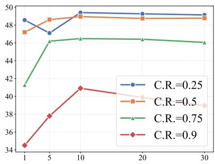  
Figure 4: Ablation study of the temperature parameter τ on LongBench.

## 5 Conclusion

In this work, we introduced a local nonlinear information-theoretic framework to analyze the predic tive capacity of KV caches in LLMs, explicitly capturing the competition and sensitivity induced by softmax attention. Based on this framework, we proposed JACAP, a Jacobian-capacity-aware eviction strategy that prioritizes informative and non-redundant tokens. Experiments on standard reasoning benchmarks, extreme long-context retrieval, and dynamic decoding tasks show that JACAP outperforms existing heuristics and capacity-aware baselines, especially under tight cache constraints. Nevertheless, our method relies on a first-order local approximation and simplifies pairwise softmax competition into token-wise sensitivity weights, which may limit its expressiveness in highly dynamic decoding scenarios. Future work may explore higher-order local approximations, more faithful competition modeling, and adaptive cache management across layers and decoding stages.

## References

[1] Wasi Uddin Ahmad, Sean Narenthiran, Somshubra Majumdar, Aleksander Ficek, Siddhartha Jain, Jocelyn Huang, Vahid Noroozi, and Boris Ginsburg. Opencodereasoning: Advancing data distillation for competitive coding. CoRR, abs/2504.01943, 2025. doi: 10.48550/ARXIV.2504. 01943. URL https://doi.org/10.48550/arXiv.2504.01943.

[2] Yushi Bai, Xin Lv, Jiajie Zhang, Hongchang Lyu, Jiankai Tang, Zhidian Huang, Zhengxiao Du, Xiao Liu, Aohan Zeng, Lei Hou, Yuxiao Dong, Jie Tang, and Juanzi Li. Longbench: A bilingual, multitask benchmark for long context understanding, 2023.

[3] Gal Chechik, Amir Globerson, Naftali Tishby, and Yair Weiss. Information bottleneck for gaussian variables. Advances in Neural Information Processing Systems, 16, 2003.

[4] Henry C. Conklin, Tom Hosking, Tan Yi-Chern, Julian Gold, Jonathan D. Cohen, Thomas L. Griffiths, Max Bartolo, and Seraphina Goldfarb-Tarrant. Learning is forgetting: Llm training as lossy compression, 2026. URL https://arxiv.org/abs/2604.07569.

[5] Alessio Devoto, Yu Zhao, Simone Scardapane, and Pasquale Minervini. A simple and effective l\_2 norm-based strategy for kv cache compression. arXiv preprint arXiv:2406.11430, 2024.

[6] Alessio Devoto, Maximilian Jeblick, and Simon Jégou. Expected attention: Kv cache compression by estimating attention from future queries distribution. arXiv preprint arXiv:2510.00636, 2025. URL https://arxiv.org/abs/2510.00636.

[7] Mohamed Amine Ferrag, Norbert Tihanyi, and Merouane Debbah. From llm reasoning to autonomous ai agents: A comprehensive review. arXiv preprint arXiv:2504.19678, 2025.

[8] Aaron Grattafiori, Abhimanyu Dubey, Abhinav Jauhri, Abhinav Pandey, Abhishek Kadian, Ahmad Al-Dahle, Aiesha Letman, Akhil Mathur, Alan Schelten, Alex Vaughan, et al. The llama 3 herd of models. arXiv preprint arXiv:2407.21783, 2024.

[9] Insu Han, Praneeth Kacham, Amin Karbasi, Vahab Mirrokni, and Amir Zandieh. Polarquant: Quantizing kv caches with polar transformation. arXiv preprint arXiv:2502.02617, 2025.

[10] Ke Hong, Guohao Dai, Jiaming Xu, Qiuli Mao, Xiuhong Li, Jun Liu, Kangdi Chen, Yuhan Dong, and Yu Wang. Flashdecoding++: Faster large language model inference on gpus. arXiv preprint arXiv:2311.01282, 2023.

[11] Coleman Hooper, Sehoon Kim, Hiva Mohammadzadeh, Michael W Mahoney, Yakun S Shao, Kurt Keutzer, and Amir Gholami. Kvquant: Towards 10 million context length llm inference with kv cache quantization. Advances in Neural Information Processing Systems, 37:1270–1303, 2024.

[12] Greg Kamradt. Needle in a haystack - pressure testing llms. https://github.com/ gkamradt/LLMTest\_NeedleInAHaystack, 2023.

[13] Woosuk Kwon, Zhuohan Li, Siyuan Zhuang, Ying Sheng, Lianmin Zheng, Cody Hao Yu, Joseph Gonzalez, Hao Zhang, and Ion Stoica. Efficient memory management for large language model serving with pagedattention. In Proceedings of the 29th symposium on operating systems principles, pages 611–626, 2023.

[14] Haoyang Li, Yiming Li, Anxin Tian, Tianhao Tang, Zhanchao Xu, Xuejia Chen, Nicole Hu, Wei Dong, Qing Li, and Lei Chen. A survey on large language model acceleration based on kv cache management. arXiv preprint arXiv:2412.19442, 2024.

[15] Yuhong Li, Yingbing Huang, Bowen Yang, Bharat Venkitesh, Acyr Locatelli, Hanchen Ye, Tianle Cai, Patrick Lewis, and Deming Chen. Snapkv: Llm knows what you are looking for before generation. Advances in Neural Information Processing Systems, 37:22947–22970, 2024.

[16] Junyoung Park, Dalton Jones, Matthew J Morse, Raghavv Goel, Mingu Lee, and Chris Lott. Keydiff: Key similarity-based kv cache eviction for long-context llm inference in resourceconstrained environments. arXiv preprint arXiv:2504.15364, 2025.

[17] Aske Plaat, Annie Wong, Suzan Verberne, Joost Broekens, Niki Van Stein, and Thomas Bäck. Multi-step reasoning with large language models, a survey. ACM Computing Surveys, 58(6): 1–35, 2025.

[18] Pol G Recasens, Ferran Agullo, Yue Zhu, Chen Wang, Eun Kyung Lee, Olivier Tardieu, Jordi Torres, and Josep Ll Berral. Mind the memory gap: Unveiling gpu bottlenecks in large-batch llm inference. arXiv preprint arXiv:2503.08311, 2025.

[19] Luohe Shi, Hongyi Zhang, Yao Yao, Zuchao Li, and Hai Zhao. Keep the cost down: A review on methods to optimize llm’ s kv-cache consumption. CoRR, abs/2407.18003, 2024. doi: 10.48550/ARXIV.2407.18003. URL https://doi.org/10.48550/arXiv.2407.18003.

[20] Luohe Shi, Hongyi Zhang, Yao Yao, Zuchao Li, and Hai Zhao. Keep the cost down: A review on methods to optimize llm’s kv-cache consumption. arXiv preprint arXiv:2407.18003, 2024.

[21] Yuxuan Tian, Zihan Wang, Yebo Peng, Aomufei Yuan, Zhiming Wang, Bairen Yi, Xin Liu, Yong Cui, and Tong Yang. Keepkv: Eliminating output perturbation in kv cache compression for efficient llms inference. arXiv preprint arXiv:2504.09936, 2025.

[22] Naftali Tishby and Noga Zaslavsky. Deep learning and the information bottleneck principle. In 2015 IEEE Information Theory Workshop, ITW 2015, Jerusalem, Israel, April 26 - May 1, 2015, pages 1–5. IEEE, 2015. doi: 10.1109/ITW.2015.7133169. URL https://doi.org/10. 1109/ITW.2015.7133169.

[23] Naftali Tishby, Fernando C Pereira, and William Bialek. The information bottleneck method. arXiv preprint physics/0004057, 2000.

[24] Zhongwei Wan, Xinjian Wu, Yu Zhang, Yi Xin, Chaofan Tao, Zhihong Zhu, Xin Wang, Siqi Luo, Jing Xiong, Longyue Wang, et al. D2o: Dynamic discriminative operations for efficient long-context inference of large language models. arXiv preprint arXiv:2406.13035, 2024.

[25] Guangxuan Xiao, Yuandong Tian, Beidi Chen, Song Han, and Mike Lewis. Efficient streaming language models with attention sinks. arXiv preprint arXiv:2309.17453, 2023.

[26] An Yang, Anfeng Li, Baosong Yang, Beichen Zhang, Binyuan Hui, Bo Zheng, Bowen Yu, Chang Gao, Chengen Huang, Chenxu Lv, et al. Qwen3 technical report. arXiv preprint arXiv:2505.09388, 2025.

[27] Jiaming Yang, Chenwei Tang, Liangli Zhen, and Jiancheng Lv. Rethinking kv cache eviction via a unified information-theoretic objective, 2026. URL https://arxiv.org/abs/2604. 25975.

[28] Amir Zandieh, Majid Daliri, Majid Hadian, and Vahab Mirrokni. Turboquant: Online vector quantization with near-optimal distortion rate. arXiv preprint arXiv:2504.19874, 2025.

[29] Yifan Zhang and Team Math-AI. American invitational mathematics examination (aime) 2025, 2025.

[30] Yuxin Zhang, Yuxuan Du, Gen Luo, Yunshan Zhong, Zhenyu Zhang, Shiwei Liu, and Rongrong Ji. Cam: Cache merging for memory-efficient llms inference. In Forty-first international conference on machine learning, 2024.

[31] Zhenyu Zhang, Ying Sheng, Tianyi Zhou, Tianlong Chen, Lianmin Zheng, Ruisi Cai, Zhao Song, Yuandong Tian, Christopher Ré, Clark Barrett, et al. H2o: Heavy-hitter oracle for efficient generative inference of large language models. Advances in Neural Information Processing Systems, 36:34661–34710, 2023.

[32] Bingxi Zhao, Lin Geng Foo, Ping Hu, Christian Theobalt, Hossein Rahmani, and Jun Liu. Llm-based agentic reasoning frameworks: A survey from methods to scenarios. arXiv preprint arXiv:2508.17692, 2025.

## A Derivation and analysis of Jacobian Information Capacity

In this appendix, we provide the rigorous mathematical derivation of the Jacobian Information Capacity presented in Theorem 1 of the main text. We begin by explicitly defining the local linearization framework and then derive the closed-form mutual information objective under the resulting Gaussian approximation. Finally, we analyze the structure of the derived Jacobian matrix to provide deeper insights into how it captures the nonlinear dynamics of softmax attention.

## A.1 Proof of Theorem 1

Let $\mathcal { Z } _ { \mathcal { C } } = \{ ( k _ { i } , v _ { i } ) \} _ { i \in \mathcal { C } }$ be the retained subset of key-value pairs, where $| { \mathcal { C } } | = m$ . Let $K _ { \mathcal { C } } \in \mathbb { R } ^ { m \times d _ { k } }$ and $U _ { \mathcal { C } } \in \mathbb { R } ^ { d _ { o } \times m }$ be the stacked key and output-value matrices, respectively. The retained attention mechanism defines a nonlinear mapping $f _ { \mathcal { C } } : \mathbb { R } ^ { d _ { k } }  \mathbb { R } ^ { d _ { o } }$ from a query q to the output $y \colon$

$$
f c ( q ) = U _ { \mathcal { C } } \operatorname { s o f t m a x } \left( \frac { K _ { \mathcal { C } } q } { \sqrt { d _ { k } } } \right) .
$$

We model the attention process as a noisy nonlinear channel:

$$
Y _ { \mathcal { C } } = f _ { \mathcal { C } } ( q ) + \epsilon , \quad \epsilon \sim \mathcal { N } ( 0 , \Sigma _ { \mathrm { n o i s e } } ) .
$$

We assume future queries are localized around a center $\mu _ { Q }$ with covariance $\Lambda _ { Q }$ , i.e., $q \sim \mathcal N ( \mu _ { Q } , \Lambda _ { Q } )$ Our goal is to approximate the mutual information $I ( \dot { q } ; \dot { Y } c | \mathcal { Z } _ { C } )$ .

To make the analysis tractable, we perform a first-order Taylor expansion of the nonlinear mapping $f _ { \cal C } ( q )$ around the query center $\mu _ { Q }$ . Let $\delta q = q - \mu _ { Q }$ . The expansion is given by:

$$
f _ { \mathcal { C } } ( \boldsymbol { q } ) \approx f _ { \mathcal { C } } ( \mu _ { Q } ) + J _ { \mathcal { C } } \delta \boldsymbol { q } ,
$$

where $\begin{array} { r } { J _ { \mathcal { C } } = \left. \frac { \partial f _ { \mathcal { C } } ( q ) } { \partial q } \right| _ { q = \mu _ { Q } } } \end{array}$ is the Jacobian matrix evaluated at $\mu _ { Q }$

We now derive the explicit form of $J _ { \mathcal { C } }$ . Let $\begin{array} { r } { s ( q ) = \frac { 1 } { \sqrt { d _ { k } } } K c q \in \mathbb { R } ^ { m } } \end{array}$ be the logits, and $\alpha ( s ) =$ softmax $\mathbf { \boldsymbol { \mathsf { x } } } ( s ) \in \mathbb { R } ^ { m }$ be the attention weights. By the chain rule:

$$
\frac { \partial f _ { \mathcal { C } } } { \partial q } = U _ { \mathcal { C } } \frac { \partial \alpha } { \partial s } \frac { \partial s } { \partial q } .
$$

The derivative of the logits with respect to $q$ is $\begin{array} { r } { \frac { \partial s } { \partial q } = \frac { 1 } { \sqrt { d _ { k } } } K _ { C } } \end{array}$ . The derivative of the softmax function $\alpha ( s )$ with respect to its input logits s is given by the standard result:

$$
{ \frac { \partial \alpha } { \partial s } } = \mathrm { D i a g } ( \alpha ) - { \alpha } { \alpha } ^ { \top } .
$$

Evaluating these derivatives at $q ~ = ~ \mu _ { Q }$ , we define the attention weights at the center as $\alpha _ { \mathcal { C } } ^ { \star } =$ $\mathrm { s o f t m a x } \big ( \frac { K c \mu _ { Q } } { \sqrt { d _ { k } } } \big )$ , and the softmax Jacobian matrix as $S c = \mathrm { D i a g } ( \alpha _ { \mathcal { C } } ^ { \star } ) - \alpha _ { \mathcal { C } } ^ { \star } ( \alpha _ { \mathcal { C } } ^ { \star } ) ^ { \top }$ . Substituting these back yields the Jacobian of the attention map:

$$
J _ { \cal C } = \frac { 1 } { \sqrt { d _ { k } } } U _ { \cal { C } } S _ { \cal { C } } K _ { \cal { C } } .\tag{11}
$$

This completes the proof of Lemma 1 and provides the explicit form of the effective local linear channel.

Under the first-order approximation, the noisy channel becomes a linear Gaussian channel with respect to the perturbation $\delta q \sim \mathcal { N } ( 0 , \Lambda _ { Q } )$

$$
\begin{array} { r } { Y _ { \mathcal { C } } \approx \underbrace { f _ { \mathcal { C } } ( \mu _ { Q } ) } _ { \mathrm { c o n s t a n t b i a s } } + J _ { \mathcal { C } } \delta \boldsymbol { q } + \boldsymbol { \epsilon } . } \end{array}\tag{12}
$$

Since $\delta \boldsymbol { q }$ and ϵ are independent Gaussian random variables, the output $Y _ { \mathcal { C } }$ is also Gaussian. The mutual information is invariant to the constant bias term. We compute the relevant covariance matrices:

$$
\begin{array} { r l } & { \Sigma _ { Y | q } = \mathrm { C o v } ( Y _ { \mathcal { C } } | q ) = \mathrm { C o v } ( \epsilon ) = \Sigma _ { \mathrm { n o i s e } } . } \\ & { \quad \Sigma _ { Y } = \mathrm { C o v } ( Y _ { \mathcal { C } } ) = J _ { \mathcal { C } } \mathrm { C o v } ( \delta q ) J _ { \mathcal { C } } ^ { \top } + \mathrm { C o v } ( \epsilon ) = J _ { \mathcal { C } } \Lambda _ { \mathit { Q } } J _ { \mathcal { C } } ^ { \top } + \Sigma _ { \mathrm { n o i s e } } . } \end{array}\tag{13}
$$

For Gaussian distributions, the mutual information is the difference between marginal and conditional differential entropies, which can be calculated via determinants of covariance matrices:

$$
\begin{array} { l } { { \mathcal { L } _ { \mathcal { C } } ^ { \mathrm { { J a c } } } \approx I ( q ; Y _ { \mathcal { C } } | \mathcal { Z } _ { \mathcal { C } } ) = H ( Y _ { \mathcal { C } } ) - H ( Y _ { \mathcal { C } } | q ) } } \\ { ~ } \\ { ~ = \displaystyle \frac { 1 } { 2 } \log \operatorname* { d e t } ( \Sigma _ { Y } ) - \frac { 1 } { 2 } \log \operatorname* { d e t } ( \Sigma _ { Y | q } ) } \\ { ~ = \displaystyle \frac { 1 } { 2 } \log \frac { \operatorname* { d e t } ( J _ { \mathcal { C } } \Lambda _ { Q } J _ { \mathcal { C } } ^ { \top } + \Sigma _ { \mathrm { { n o i s e } } } ) } { \operatorname* { d e t } ( \Sigma _ { \mathrm { { n o i s e } } } ) } . } \end{array}\tag{14}
$$

Applying the matrix determinant identity det $( A + B ) = \operatorname* { d e t } ( A ) \operatorname* { d e t } ( I + A ^ { - 1 } B )$ , we obtain the final closed-form objective:

$$
\mathcal { L } _ { \mathcal { C } } ^ { \mathrm { J a c } } \approx \frac { 1 } { 2 } \log \operatorname* { d e t } \left( I + \Sigma _ { \mathrm { n o i s e } } ^ { - 1 } J _ { \mathcal { C } } \Lambda _ { Q } J _ { \mathcal { C } } ^ { \top } \right) .
$$

This completes the derivation of Theorem 1.

## A.2 Analysis of the Jacobian Information Capacity

The derived Jacobian capacity differs from prior linear information-theoretic objectives primarily through the structure of the Jacobian matrix $J _ { C } \propto U _ { C } S _ { C } K _ { C }$ . The core novelty lies in the Softmax Competition Matrix $S c = \mathrm { D i a g } ( \alpha _ { \mathcal { C } } ^ { \star } ) - \alpha _ { \mathcal { C } } ^ { \star } ( \alpha _ { \mathcal { C } } ^ { \star } ) ^ { \top }$ , which explicitly captures the nonlinear dynamics of attention. Here we analyze its two key components:

1. Local Sensitivity and Saturation. The diagonal elements of $S _ { \mathcal { C } }$ are given by $S _ { i i } = \alpha _ { i } ^ { \star } ( 1 - \alpha _ { i } ^ { \star } )$ , where $\alpha _ { i } ^ { \star }$ is the attention weight of the i-th token at the query center $\mu _ { Q }$ . This term measures the local sensitivity of the softmax function. $S _ { \mathcal { C } }$ offers two new and important insights:

• Peak Sensitivity: The term is maximized when $\alpha _ { i } ^ { \star } \approx 0 . 5 ,$ indicating that tokens with moderate attention weights are most sensitive to query perturbations and thus provide the highest potential information gain locally.

• Saturation Regions: As $\alpha _ { i } ^ { \star }  0$ (irrelevant) or $\alpha _ { i } ^ { \star }  1$ (dominant), the term $S _ { i i } \to 0$ This captures the saturation effect: if a token is already ignored or fully dominant, small changes in the query will not significantly change its contribution to the output.

This contrasts sharply with linear models or heuristics that assume higher attention weights always imply higher importance. Our theory suggests that saturated tokens, despite high attention, may have low marginal information value.

2. Token Competition. The off-diagonal elements $S _ { i j } = - \alpha _ { i } ^ { \star } \alpha _ { j } ^ { \star } \left( \mathrm { f o r } i \neq j \right)$ are always negative. This explicitly models the competition introduced by softmax normalization. An increase in the logit of token $j$ necessarily decreases the attention weights of all other tokens $i ,$ coupling their contributions.

The linear gaussian surrogate [27] effectively assumes $S _ { \mathcal { C } }$ is proportional to the identity matrix. By explicitly incorporating $\breve { S _ { \mathscr { C } } } .$ , the Jacobian Information Capacity rewards retained subsets that are not only aligned with future queries $( K _ { \mathcal { C } }$ and $\alpha _ { \mathcal { C } } ^ { \star } )$ but also possess high local sensitivity and distinct output directions $( U _ { \mathcal { C } } )$ under the constraints of softmax competition.

## B More details on Jacap Eviction Method

In this appendix, we detail the principled approximations that reduce the full Jacobian Information Capacity to the efficient, one-shot JACAP scoring rule presented in Algorithm 1. We also provide a complexity analysis of the proposed algorithm.

## B.1 Derivation of the JACAP Algorithm

The complexity of the objective $\mathcal { L } _ { \mathcal { C } } ^ { \mathrm { J a c } } \propto$ log det $\left( I + \Sigma _ { \mathrm { n o i s e } } ^ { - 1 } U _ { \mathcal { C } } S _ { \mathcal { C } } K _ { \mathcal { C } } \Lambda _ { Q } K _ { \mathcal { C } } ^ { \top } S _ { \mathcal { C } } ^ { \top } U _ { \mathcal { C } } ^ { \top } / d _ { k } \right)$ stems from three coupled structured matrices: the softmax competition matrix $S _ { \mathcal { C } }$ , the query-key response covariance $K _ { \mathcal { C } } \Lambda _ { Q } K _ { \mathcal { C } } ^ { \top }$ , and the subset-dependent selection problem itself. We address these via a series of approximations.

Decoupling Softmax Competition via Diagonal Approximation. The matrix $S c = \mathrm { D i a g } ( \alpha _ { \mathcal { C } } ^ { \star } ) -$ $\alpha _ { \mathcal { C } } ^ { \star } ( \alpha _ { \mathcal { C } } ^ { \star } ) ^ { \top }$ couples all tokens through its off-diagonal terms. To enable efficient token-wise scoring, we approximate $S _ { \mathcal { C } }$ by retaining only its diagonal elements, which capture the local sensitivity of each token’s weight to its own logit:

$$
S c \approx D c : = \mathrm { D i a g } ( \rho _ { i } ) _ { i \in \mathcal { C } } , \quad \mathrm { w h e r e } \ \rho _ { i } = S _ { i i } = \alpha _ { i } ^ { \star } ( 1 - \alpha _ { i } ^ { \star } ) .
$$

As analyzed in Appendix A.2, the diagonal term $\rho _ { i }$ perfectly encapsulates the "sensitivity vs. saturation" trade-off. While the off-diagonal terms $- \alpha _ { i } ^ { \star } \alpha _ { i } ^ { \star }$ model negative pairwise competition, neglecting them is a common and effective simplification in variational inference and large-scale approximations. It preserves the most critical nonlinear effect—that saturated tokens have low local influence—while decoupling token interactions in the sensitivity term.

Under this approximation, the Jacobian becomes $\begin{array} { r } { J _ { \cal C } \approx \frac { 1 } { \sqrt { d _ { k } } } U _ { \cal C } D _ { \cal C } K _ { \cal C } } \end{array}$ , and the effective channel matrix inside the log-determinant becomes:

$$
J _ { \mathcal { C } } \Lambda _ { Q } J _ { \mathcal { C } } ^ { \top } \approx \frac { 1 } { d _ { k } } U _ { \mathcal { C } } D _ { \mathcal { C } } ( K _ { \mathcal { C } } \Lambda _ { Q } K _ { \mathcal { C } } ^ { \top } ) D _ { \mathcal { C } } U _ { \mathcal { C } } ^ { \top } .
$$

Decoupling Query Response via Diagonal Approximation. The term $K c \Lambda _ { Q } K _ { \mathcal { C } } ^ { \top }$ is an $m \times m$ matrix representing the covariance of key responses to future queries. Its off-diagonal element $k _ { i } ^ { \top } \Lambda _ { Q } k _ { j }$ measures the correlation between the responses of token i and token j. To further decouple the tokens, we approximate this matrix by its diagonal:

$$
K _ { \mathcal { C } } \Lambda _ { Q } K _ { \mathcal { C } } ^ { \top } \approx \mathrm { D i a g } ( \kappa _ { i } ) _ { i \in \mathcal { C } } , \quad \mathrm { w h e r e ~ } \kappa _ { i } = k _ { i } ^ { \top } \Lambda _ { Q } k _ { i } .
$$

The scalar $\kappa _ { i }$ quantifies the variance of the i-th token’s logit under the future query distribution. A larger $\kappa _ { i }$ indicates that the token’s alignment with queries is highly variable, making it potentially more informative than a token with a constant alignment. Ignoring off-diagonal correlations is equivalent to assuming independent key responses under the query prior, a necessary simplification for efficient scoring that is prevalent in similar analyses.

Combining the two diagonal approximations, the inner term becomes a diagonal matrix of scalar weights:

$$
D c ( K c \Lambda _ { Q } K _ { \mathcal { C } } ^ { \top } ) D c \approx D c \mathrm { D i a g } ( \kappa _ { i } ) D c = \mathrm { D i a g } ( \rho _ { i } ^ { 2 } \kappa _ { i } ) _ { i \in \mathcal { C } } .
$$

Defining the combined importance weight for token i as

$$
w _ { i } = \frac { 1 } { d _ { k } } \rho _ { i } ^ { 2 } \kappa _ { i } = \frac { 1 } { d _ { k } } [ \alpha _ { i } ^ { \star } ( 1 - \alpha _ { i } ^ { \star } ) ] ^ { 2 } ( k _ { i } ^ { \top } \Lambda _ { Q } k _ { i } ) ,
$$

the approximated objective becomes:

$$
\mathcal { L } _ { \mathcal { C } } ^ { \mathrm { { J a c } } } \approx \frac { 1 } { 2 } \log \operatorname* { d e t } \left( I + \Sigma _ { \mathrm { { n o i s e } } } ^ { - 1 } U _ { C } \mathrm { D i a g } ( w _ { i } ) _ { i \in \mathcal { C } } U _ { \mathcal { C } } ^ { \top } \right) = \frac { 1 } { 2 } \log \operatorname* { d e t } \left( I + \Sigma _ { \mathrm { { n o i s e } } } ^ { - 1 } \sum _ { i \in \mathcal { C } } w _ { i } u _ { i } u _ { i } ^ { \top } \right) .\tag{15}
$$

Assuming isotropic noise $\Sigma _ { \mathrm { n o i s e } } = \sigma ^ { 2 } I$ and absorbing constants into $w _ { i } .$ , this reduces to the standard form of maximizing the log-determinant of a sum of rank-one matrices.

Leverage Score Selection. Similar to CapKV [27], instead of combinatorially searching for the optimal subset C, we define a global capacity matrix over the entire candidate pool $\mathcal { H } _ { t }$

$$
A _ { \mathrm { J a c } } = I + \sum _ { j \in \mathcal { H } _ { t } } w _ { j } u _ { j } u _ { j } ^ { \top } .\tag{16}
$$

We then select tokens greedily based on their marginal contribution to the log-determinant, which is approximated by the statistical leverage score using the matrix determinant lemma (log det(A + $\boldsymbol { w } \boldsymbol { u } ^ { \intercal } ) - \log \operatorname* { d e t } ( \boldsymbol { A } ) = \log ( 1 + \boldsymbol { w } \boldsymbol { u } ^ { \intercal } \boldsymbol { A } ^ { - 1 } \boldsymbol { u } ) \approx \boldsymbol { w } \boldsymbol { u } ^ { \intercal } \boldsymbol { A } ^ { - 1 } \boldsymbol { u }$ for small w):

$$
\mathrm { s c o r e } _ { i } = { w _ { i } \cdot u _ { i } ^ { \top } A _ { \mathrm { J a c } } ^ { - 1 } u _ { i } } .\tag{17}
$$

This final form, used in Algorithm 1, elegantly combines the theoretically derived nonlinear importance weight $w _ { i }$ with the structural diversity term $u _ { i } ^ { \top } A ^ { - 1 } u _ { i }$ , providing a principled and efficient eviction criterion.

## B.2 Computational Complexity Analysis

We analyze the computational complexity of $\scriptstyle \mathrm { J A C A P }$ for a single eviction step with N candidate tokens and head dimension $d _ { h } = d _ { k } = d _ { o }$ . The computation consists of three stages.

First, the weight computation requires evaluating the attention weights $\alpha _ { i } ^ { \star }$ , which costs $O ( N d _ { h } )$ for the query-key products and softmax normalization. The query response variance

$$
\kappa _ { i } = k _ { i } ^ { \top } \Lambda _ { Q } k _ { i }
$$

requires $O ( N d _ { h } ^ { 2 } )$ when $\Lambda _ { Q }$ is full, and reduces to $O ( N d _ { h } )$ under a diagonal approximation. Since we adopt a diagonal covariance in practice, the overall cost of computing $w _ { i }$ is $\mathsf { \bar { O } } ( N d _ { h } )$ .

Second, constructing the Jacobian capacity matrix

$$
A _ { \mathrm { { J a c } } } = \sum _ { j = 1 } ^ { N } w _ { j } u _ { j } u _ { j } ^ { \top }
$$

requires $O ( N d _ { h } ^ { 2 } )$ , as each rank-one update costs $O ( d _ { h } ^ { 2 } )$ . The inversion of the resulting $d _ { h } \times d _ { h }$ matrix further incurs $O ( d _ { h } ^ { 3 } )$ complexity. The total cost of this stage is therefore $O ( N d _ { h } ^ { 2 } + d _ { h } ^ { 3 } )$ .

Finally, the leverage-score evaluation

$$
u _ { i } ^ { \top } A _ { \mathrm { J a c } } ^ { - 1 } u _ { i }
$$

requires $O ( d _ { h } ^ { 2 } )$ per token, leading to a total complexity of $O ( N d _ { h } ^ { 2 } )$ for all candidates. Combining all stages, the overall complexity per layer and eviction step is

$$
O ( N d _ { h } ^ { 2 } + d _ { h } ^ { 3 } ) ,
$$

which is dominated by the capacity matrix construction and inversion.

Compared with heuristic approaches such as SNAPKV, H2O, KEYDIFF, and KNORM, whose complexity is typically $O ( N d _ { h } )$ or $O ( N )$ due to independent per-token scoring, JACAP introduces additional quadratic dependence on the head dimension through inter-token matrix interactions. However, this complexity is shared by other capacity-based approaches such as CAPKV, which also rely on leverage-score computations over a capacity matrix.

In practice, the additional overhead remains moderate because the attention head dimension is usually small $( { \bf e } . { \bf g } . , d _ { h } = 1 2 8 )$ ), and the matrix operations are highly parallelizable on modern GPUs. As demonstrated in our runtime experiments, the improved retention quality in high-compression regimes justifies this additional computational cost.

## C More Experiment Results

Our all experiments were conducted on 4× NVIDIA RTX Pro 6000 GPUs with 1024 GB system memory under Ubuntu 22.04.

## C.1 Runtime Efficiency Analysis

To evaluate the practical overhead of our proposed method, we confirm the runtime efficiency of JACAP against representative baselines. We measured the total generation time for generating 100 tokens using the Qwen3-8B model on a single NVIDIA RTX pro6000 GPU. The evaluation covers increasing input context lengths from 8k to 64k tokens under two compression ratios $( \mathrm { C . R . } = 0 . 6 $ and 0.8).

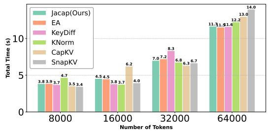  
(a) C.R. = 0.6

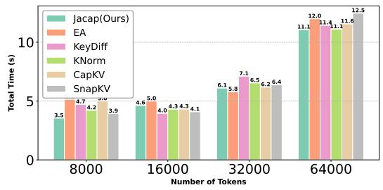  
(b) C.R. = 0.8  
Figure 5: Runtime comparison of generating 100 tokens with Qwen3-8B on a single RTX 6000 GPU under varying input context lengths and compression ratios (C.R.)

The results are summarized in Figure 5. We observe that JACAP exhibits runtime performance that is highly comparable to existing methods across all settings.

The analysis in Appendix B.2 indicates a theoretical complexity of $O ( N d _ { h } ^ { 2 } + d _ { h } ^ { 3 } )$ for JACAP. These empirical results suggest that in practice, with typical head dimensions $( { \bf e } . { \bf g } . , d _ { h } = 1 2 8 )$ , the matrix operations are efficiently handled by the GPU, making the actual overhead negligible compared to the overall inference process. Therefore, JACAP delivers significant performance gains in highcompression regimes without incurring a prohibitive computational cost.

## C.2 More Experiment Result on NIAH

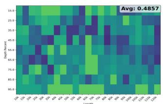  
EA

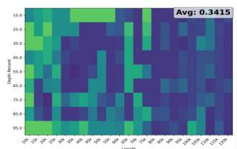

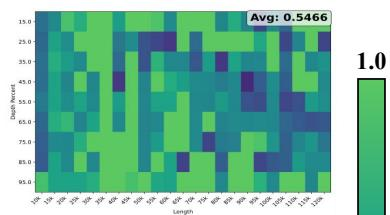

KeyDiff  
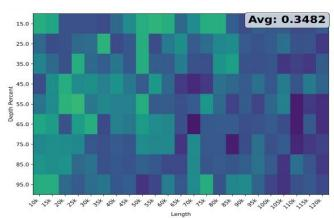  
KNorm

SnapKV  
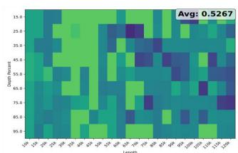  
CapKV

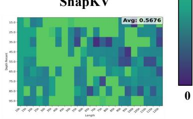  
Jacap  
Figure 6: Performance of JACAP and baseline KV-cache eviction methods on the NIAH benchmark at compression ratio 0.5 using Qwen3-8B.

To provide a more comprehensive evaluation across different sparsity regimes, we further evaluate the Needle-in-Haystack (NIAH) performance under a moderate compression ratio of 0.5 using the Qwen3-8B model. The results are shown in Figure 6.

Consistent with the findings under higher compression in the main text, JACAP achieves the best overall performance. The heatmaps reveal that while purely structural methods like KEYDIFF and KNORM fail significantly at long contexts, and attention-based baselines like SNAPKV begin to degrade at extreme lengths (e.g., >100k tokens) and deeper positions, JACAP maintains remarkable robustness. It consistently retrieves the needle across the entire spectrum of context lengths and depths, demonstrating that incorporating nonlinear sensitivity effectively identifies and preserves crucial information even when it is sparsely located deep within very long sequences.