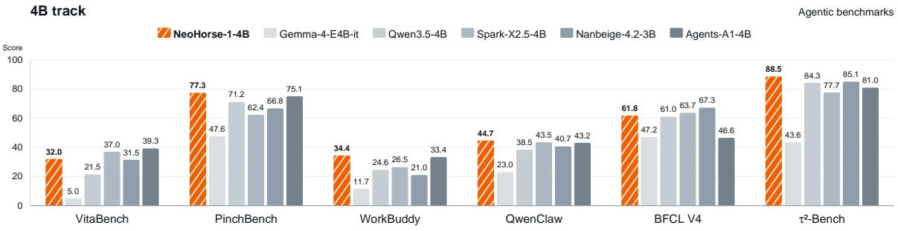
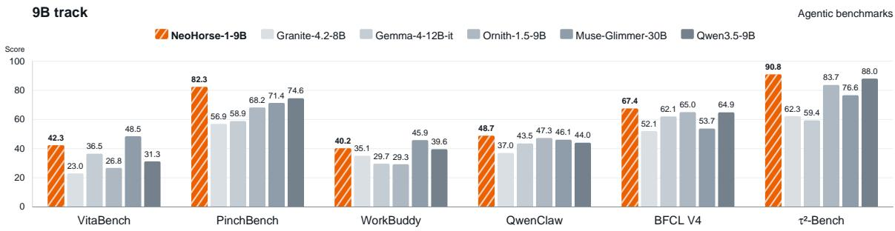
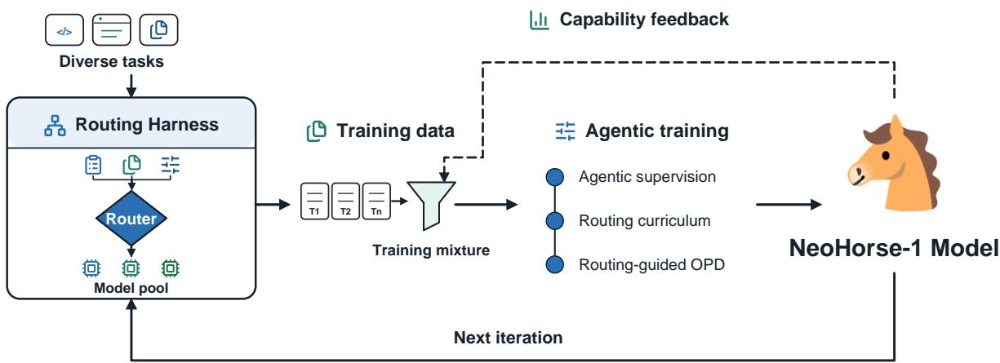
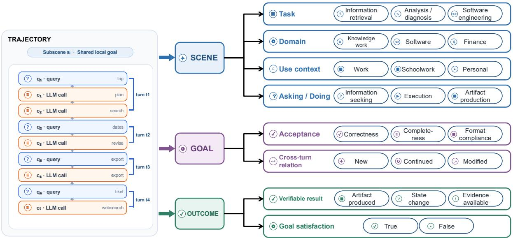
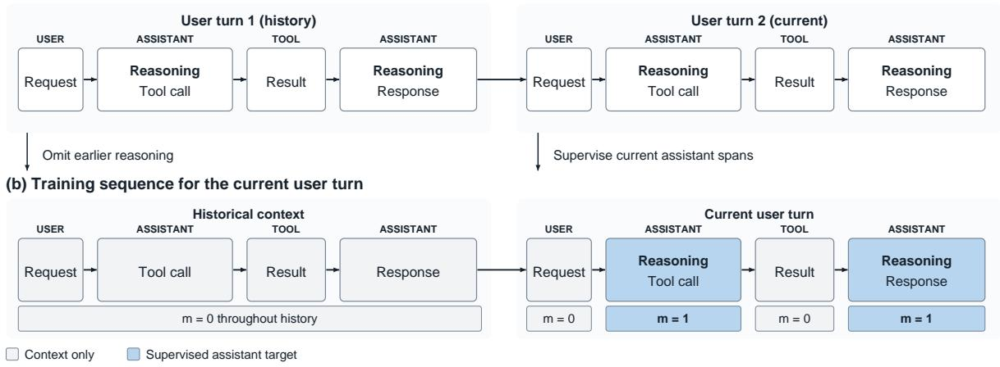
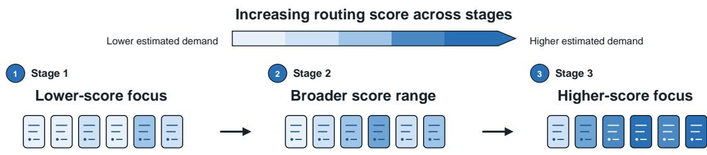
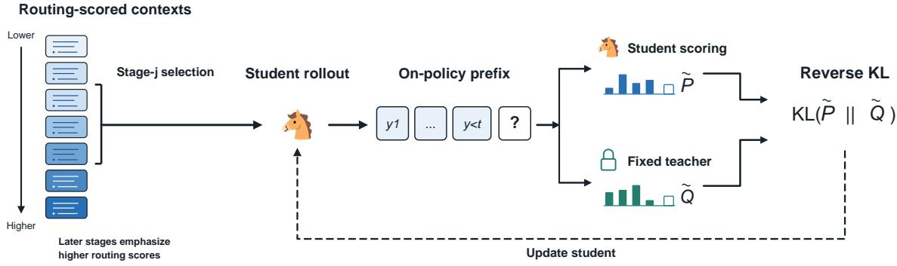
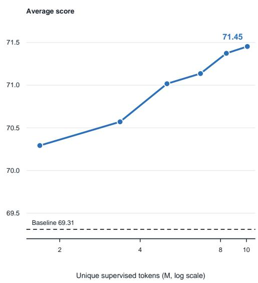
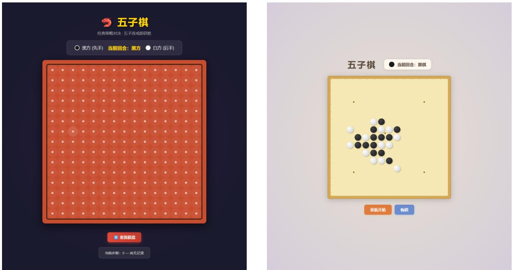

# NeoHorse-1: Towards Recursive Self-Improvement via Agentic Post-Training with Routing Harness

NeoHorse Team

https://hf.co/collections/TokenRhythm/neohorse-1 https://github.com/TokenRhythm/NeoHorse

## Abstract

Recursive self-improvement (RSI) requires a concrete mechanism through which an AI system observes its own capabilities and converts that evidence into the next round of learning. We argue that a deployed routing harness already contains such a mechanism: beyond task outputs, agentic interaction leaves execution trajectories together with observable evidence of what a model can and cannot yet do. We present NeoHorse-1, a family of agent-native models developed to explore this path through agentic post-training. Our system couples a heterogeneous model pool with intelligent routing, which records, for every turn, the capability demand predicted, the service tier selected, and the interaction that followed. These records are converted into user-turn training examples that preserve interleaved reasoning, tool calls, and harness context, and are admitted through structural validation, six-dimensional semantic evaluation, and subscene-level labeling. Routing signals provide estimates of capability demand: they organize supervised fine-tuning into a three-stage curriculum and extend naturally to routing-guided on-policy distillation, where a teacher supervises student-generated responses under the same staged progression. Finally, a capability-guided allocation step turns evaluation feedback into the next training mixture, closing an evaluation–selection–update loop in which what the system learns to do shapes what it learns from next. Across ten benchmarks spanning harness-based agents, tool use, coding, and instruction following, post-training lifts the macro-average score of the 4B model from 58.94 to 64.87 and of the 9B model from 65.60 to 69.04, substantially narrowing the aggregate gap between the post-trained 4B model and the 9B base model. NeoHorse-1 constitutes an initial prototype of this feedback-driven process, and we outline how sustaining it across iterations can move harness-mediated RSI from design to practice.

## 1. Introduction

“Distance tests a horse’s stamina; Time reveals a man’s heart.” — Chinese idiom

Recursive self-improvement (RSI) describes a broad direction in which AI systems take a growing part in the process of their own improvement—from refining individual responses and reshaping their execution harness, to learning from self-generated experience and, in an emerging line of work, automating parts of AI research itself [11, 31]. Its appeal is structural: once model improvement itself becomes partially automated, each generation can contribute to producing the next, turning isolated training efforts into a compounding process that is less bounded by manually curated data and human supervision. Realizing this vision, however, requires a concrete mechanism through which a system observes its own capabilities and converts that evidence into the next round of learning. Agents are natural carriers of such a mechanism. When an agent writes code, investigates a question, or operates software, it leaves a record of its decisions, tool interactions, and task outcomes; such interaction trajectories and executable tasks have already been used to train agentic models [71, 12, 57, 53]. The opportunity extends beyond treating these records as static supervision: agentic interaction produces both task experience to learn from and observable evidence of model strengths and limitations, which can shape what a model learns next—precisely the feedback that RSI requires. We introduce NeoHorse-1, a family of agent-native models developed to explore this path through routingguided agentic training. Figure 1 provides an overview of the agentic benchmark results at both model scales.

  
Figure 1 | Comparison on six agentic benchmarks in the 4B and 9B tracks. Orange bars denote NeoHorse-1-4B (top) and NeoHorse-1-9B (bottom); gray bars denote the comparison models in each track, with model sizes indicated in the legends. Full results are reported in Tables 1 and 2.

A harness is the execution layer that manages an agent’s context, tools, and interaction with its environment [68, 27]. Adding agentic routing allows this layer to select models according to the request and the evolving interaction state [9, 41]. Building on the harness-native data flywheel of Agentic Routing [33], our system design combines a heterogeneous model pool with multiple harnesses, including OpenSquilla [61], across diverse real-world tasks. This design allows training experience to span different model behaviors and execution environments. Routing records link estimated capability demand, the model actually used, and the subsequent interaction, making them useful for organizing training experience.

In NeoHorse-1, this path towards RSI centers on an evolving training distribution. Capabilitylevel feedback guides the allocation of data for subsequent model updates, while continued harness execution supplies new interaction experience. When updated models return to the harness, their behavior reveals a new pattern of strengths and limitations that can inform the next round of training. In this loop, what the system learns to do influences what it learns from next. Because the harness can also draw on other models, the process connects multi-model experience with the continued improvement of individual models. Figure 2 summarizes this loop.

  
Figure 2 | Towards RSI through routing-guided agentic training. Diverse tasks generate interaction experience through routing harnesses backed by heterogeneous model pools. This experience is organized into a training mixture for NeoHorse-1. Capability feedback guides the next training distribution, while updated models return to the harness for subsequent iterations. The agentic training stack summarizes the post-training methods described in this report.

NeoHorse-1’s post-training methods provide the learning component of this design. We first convert recorded interactions into user-turn training examples that preserve the historical and harness context under which each assistant response was produced, allowing the model to learn interleaved reasoning, tool use, and visible responses without detaching them from their execution conditions. Because agentic interactions vary substantially in capability demand, we use routing-derived scores to organize this experience as a curriculum [7, 29], progressively introducing higher-scored examples while retaining lower-scored coverage. SFT, however, still learns from recorded assistant responses, whereas deployment unfolds on the model’s own generated prefixes. We therefore extend the same routing-guided progression to onpolicy distillation [1], where a teacher supervises responses generated by the student. Routing organizes the learning material, while on-policy supervision follows the student’s evolving behavior. Together, these methods turn the varied experience of a routing system into capabilities within a unified model.

We study NeoHorse-1 at the 4B and 9B scales, with evaluation covering harness-based agents, instruction following, coding, tool use, and interactive tasks. Across the evaluation suite, agentic post-training raises the macro-average score from 58.94 to 64.87 at the 4B scale and from 65.60 to 69.04 at the 9B scale. The largest gains appear on harness-based and execution-intensive evaluations, while the post-trained 4B model substantially narrows the aggregate gap to the 9B base model. Full results are reported in Tables 1 and 2. This report presents an initial modeltraining prototype on this path towards RSI. The next step is to extend this feedback-driven process across successive iterations and broader task settings, and to study whether its gains can be sustained as model capabilities evolve.

## 2. Related Work

## 2.1. Agentic Model Post-Training

Trajectory-based supervised fine-tuning (SFT) provides a practical route for transferring planning and tool use into model parameters. FireAct and AgentTuning learn from interaction trajectories, while Agent-FLAN and AgentBank show that data composition and scale affect generalization [8, 71, 12, 57]. Llama 3 extends this recipe with synthetic multi-step tool-use data and iterative SFT, rejection sampling, and direct preference optimization [19].

Trajectory SFT mainly imitates behavior from a fixed teacher policy. On-policy distillation (OPD) reduces this distribution gap by letting the student generate trajectories while the teacher supplies token-level logits on student-visited states [1, 36]. Compared with conventional teachertrajectory distillation [22], OPD provides denser process supervision aligned with the student’s evolving behavior.

The interaction harness determines which tools, observations, and feedback enter the training distribution. SWE-agent and the Interplay of Harness Design and Post-Training show that interface choices affect agent performance and robustness, while Terminal-Lego highlights the value of explicitly structured, environment-grounded trajectories [68, 27, 69]. Agentic RL with executable environment feedback then replaces fixed behavioral labels with rewards derived from tool execution and task outcomes. Search-R1, ReTool, and RAGEN study this paradigm for search, tool use, and long-horizon interaction, while Agent Lightning v1.0 keeps the environment loop inside the deployment harness and Co-Harness jointly updates the harness and model [25, 17, 64, 21, 13].

## 2.2. LLM Routing and Curriculum Learning

LLM routing assigns each query to an appropriate model while balancing response quality against inference cost. FrugalGPT studies cost-aware model cascades [9], whereas RouteLLM learns to route queries between stronger and weaker models using preference data [41]. Agentic routing [33] extends this idea to multi-agent LLM systems, where a decision layer selects the model or sub-agent best suited to handle each incoming request.

Curriculum learning is a training strategy that presents examples according to an estimated notion of difficulty [7]. It has been shown to be effective in LLM post-training [66, 29]. Existing approaches, however, often rely on explicit difficulty labels or dataset-specific heuristics, which can be costly or impractical to obtain. Routing systems provide an alternative signal: their request- and context-conditioned predictions estimate the relative capability demand of an interaction. We use this predicted demand to order examples for curriculum training, rather than treating the identity of the model ultimately served as a difficulty label, since the executed route may also reflect user overrides, service availability, and deployment policy.

## 2.3. Recursive Self-Improvement

Recursive self-improvement (RSI) denotes an iterative process in which an AI system uses experience, evaluations, or generated artifacts to improve its model, scaffold, or improvement procedure [18, 70]. Recent RSI research considers both what is improved—from agent behavior and policy to the surrounding scaffold and the training or research process—and how tightly generation, evaluation, and updating are linked within the resulting feedback loop [11, 56]. Across these targets, system-level efforts have begun to automate components such as harness design, serving infrastructure, and training pipelines [65, 3, 43].

Recent studies examine recursive improvement at the levels of task behavior, agent scaffolds, and training or research procedures. MetaSkill-Evolve jointly evolves task skills and the metaskill that governs their improvement, while AREX alternates evidence gathering with answer auditing [63, 37]. Self-Harness, Agentic Harness Engineering, and Retrospective Harness Optimization use failures, observability, and past trajectories to update harnesses [72, 30, 47]. Continual Harness extends this setting to reset-free online adaptation and model updates [26]. At the training-process level, AI4AI-Bench evaluates whether agents can modify training algorithms so that later runs inherit improvements [14].

## 3. Data from Routing Harness

Post-training data for an agentic model is not adequately represented by static instruction– response pairs. It consists of execution trajectories that connect user requests, model reasoning, tool actions, environment observations, and task outcomes. Our data construction therefore centers on trajectories generated by the deployment harness, while public instruction, reasoning, tool-use, code, and preference data are used to broaden capability coverage. Consistent with recent agentic-model reports [62, 33], we preserve the execution context and observable outcome signals needed to learn not only final-answer generation, but also task progression, tool interaction, and recovery behavior. The remainder of this section describes the composition and serialization of the corpus, its quality control and labeling, the routing signals recorded by the harness, and finally how evaluation feedback reallocates subsequent training mixtures—the data-side groundwork for harness-mediated RSI.

## 3.1. Data Composition

We organize the corpus at three linked granularities. A trajectory is a complete interaction executed by the deployment harness, preserving user requests, model responses, tool calls, environment observations, recovery attempts, and terminal outcomes. A user turn begins with a user request and ends at the next user request or task termination; it serves as the basic serialized training unit. A subscene groups adjacent user turns that share a local goal and thus spans one or more user requests; it serves as the unit for semantic characterization (Section 3.3). This organization connects full execution histories to learning examples and semantic units without breaking their provenance.

Within each user-turn record, the current request and its interleaved reasoning, tool calls, and observations are retained to preserve the reasoning–action–feedback chain. Earlier visible responses and tool interactions remain available as context, whereas reasoning from earlier turns is omitted. Each record remains linked to its parent trajectory and subscene, allowing quality, semantic, routing, and outcome signals to be aligned at their appropriate granularity. Related approaches to organizing reasoning context in multi-turn data are discussed by DeepSeek-AI [16] and the Qwen team [52].

The primary corpus consists of on the order of $1 0 ^ { 5 } – 1 0 ^ { 6 }$ harness-generated trajectories. We additionally use publicly available data to broaden coverage across instruction following and dialogue, reasoning, tool use and code, agent interaction, and preference learning [44, 15, 45, 42, 32, 34, 40, 39, 4]. Corpus scale is reported by the number of trajectories $N _ { \mathrm { t r a j } }$ and tokens $N _ { \mathrm { t o k } }$ after unified serialization, deduplication, and tokenizer freezing, with the resulting statistics recorded in the training manifest.

## 3.2. Data Quality

Deduplication and decontamination. The corpus is deduplicated at exact and near-duplicate granularity, and the same matching infrastructure screens every training candidate against our evaluation suites: records that overlap an evaluation item are removed from the training side, keeping the training corpus and the evaluation data disjoint (Section 3.5).

Structural validation. Each trajectory then undergoes rule-based structural validation. At the turn level, the pipeline reconstructs requests, model responses, tool calls, tool observations, and terminal events. It then verifies payload readability, supported message structure, request and response presence, causal event order, and closure of tool-call/result pairs through identifiers and execution branches. The same stage detects missing responses, orphan observations, duplicated or conflicting tool-call identifiers, unresolved internal calls, and ambiguous terminal branches. Because these properties are directly observable from the trajectory, they are evaluated using reproducible rules rather than model-based scores.

The structural gate produces three operational outcomes: internally complete, partially recoverable, and quarantined. Complete trajectories proceed directly to semantic evaluation; recoverable trajectories contribute only causally closed sub-trajectories; trajectories with ambiguous event ownership or no recoverable supervision target are quarantined. Structural validity establishes reliable serialization and replay, but does not imply correct tool selection or task success.

Semantic evaluation. For structurally usable trajectories, we construct a normalized semantic event stream and evaluate six independent quality dimensions: goal attainment, instruction adherence, tool use, evidence consistency, error recovery, and termination. These dimensions judge the quality of the execution and are distinct from the scene, goal, and outcome attributes used to characterize what the user asked for (Section 3.3). High-certainty failures—such as a missing final response, an unresolved tool call, or an unrecovered terminal error—are detected deterministically. Cases that require task-level interpretation are evaluated by a semantic judge that is restricted to evidence explicitly present in the trajectory. Every finding must be grounded in the corresponding events. Long trajectories are evaluated in segments and subsequently aggregated at the turn level so that intermediate failures can be distinguished from successful later recovery.

Each semantic dimension is assigned PASS, WARN, FAIL, or NOT\_EVALUATED, and evaluation coverage is stored separately. Missing evidence or an interrupted judge call is never converted into a positive verdict. The quality representation therefore retains the structural state, the six quality dimensions, and evidence coverage rather than compressing them into a single heuristic score. Training admission, review, and quarantine policies are defined over this structured representation.

## 3.3. Data Characterization

To support systematic improvements in user experience, we organize the attribute scheme around diverse usage scenarios. As illustrated in Fig. 3, the scheme characterizes each subscene along three axes: Scene describes what the user is doing and in what context; Goal states what the user expects to achieve and how success is to be judged; and Outcome records the verifiable result of the attempt. Together, these axes connect user intent, agent execution, and outcome for capability analysis and data allocation.

  
Figure 3 | Subscene-level scenario characterization. A trajectory is represented as an ordered event stream of user queries and LLM calls; adjacent user turns that share a local goal form a subscene. The selected subscene is described through three complementary views—Scene, Goal, and Outcome—with representative attributes shown on the right.

Attributes are assigned at the subscene level (Section 3.1), which captures goal continuation, modification, interruption, and resumption within a conversation. On the Scene axis, closed taxonomies cover the task type and application domain, so that the corpus can be stratified by what the user is trying to do; each subscene receives one primary value and up to two secondary values. Use Context and Asking/Doing further characterize the setting and whether the request seeks information or execution. On the Goal axis, the user objective is decomposed into acceptance criteria that define how success is judged, and cross-turn relations mark whether a goal is new, continued, modified, resumed, or ambiguous. On the Outcome axis, the verifiable result of the attempt against the goal is recorded, so that the extent to which the task was actually satisfied can be distinguished from the process having run to completion.

To control noise from model-assisted annotation, each attribute retains its derivation method and confidence. Structural facts established by the source or deterministic rules cannot be overwritten by a semantic judge. Structural quality, turn-local reasoning policy, loss masks, and routing records (Section 3.4) remain separate metadata. Together with the three axes, these signals localize capability gaps and guide subsequent data allocation.

## 3.4. Agentic Routing Signals

Together with the semantic attributes of Section 3.3, routing signals provide a complementary view of each trajectory. Scene, goal, and outcome attributes describe what the user requested and what the system achieved; the harness’s routing module records the capability level predicted, selected, and actually served for each user turn. Aligning these fields yields a prediction–action– outcome record, allowing the corpus to be stratified jointly by user intent, service allocation, and observed result.

The harness router operates at the user-turn level and estimates capability demand from the current request, recent dialogue, previous routing decisions, and available execution state [33].

It assigns each turn to one of four service tiers: C0 handles bounded low-risk requests, C1 is the general-purpose default, C2 supports multi-step reasoning and execution, and C3 provides maximum capability or reliability. Policy controls may adjust this assignment in response to risk, context pressure, prior failure, or service constraints.

The tiers describe relative capability demand under the routing policy. Models, pricing, and inference configurations may change across deployments, and a C3 path may combine multiple proposers with an aggregator [61]. Versioned tier semantics therefore keep routing records interpretable as the serving stack evolves.

For each turn, the corpus retains the router’s raw prediction, the policy-adjusted decision, and the tier actually served, so that predicted demand, policy constraints, and executed action remain independently analyzable.

Each routing record is linked to its trajectory, so the corpus exposes completion, verification, and recovery patterns across capability-demand regions, while routing behavior is assessed using task completion, verification feedback, and recovery cost. This prediction–action–outcome separation [33] lets us isolate the routing estimate used for curriculum ordering in Section 4.2 without treating the tier actually served as the training label. Outcome fields instead provide deficiency signals for the capability-guided allocation of Section 3.5. By feeding deployed routing outcomes into the next data mixture, the routing system functions both as a serving-time decision mechanism and as a source of data feedback within harness-mediated RSI.

## 3.5. Capability-Guided Data Allocation

The quality dimensions of Section 3.2, semantic attributes of Section 3.3, and routing signals of Section 3.4 organize deployment trajectories by user intent, capability demand, execution quality, and outcome. Routing places samples in capability-demand regions, while verification and outcome fields measure performance, yielding a stratification space over diverse tasks and usage scenarios.

At each iteration, the current model checkpoint is evaluated on a stratified suite kept disjoint from training by the decontamination screening of Section 3.2. Results are aggregated across attributes, quality dimensions, outcome states, and routing tiers to form a model-deficiency profile. This profile shifts the next training mixture toward underperforming regions while preserving broad coverage. Verified successful trajectories provide positive supervision, while informative failures identify regions that require additional or rebalanced coverage in subsequent mixtures. These allocation decisions change the composition of the training data rather than introducing a separate failure-specific objective.

Between iterations, the harness continuously adds trajectories processed by the same quality, characterization, and routing pipeline. Existing and new data are reallocated together so that the corpus follows changes in usage patterns and system capability. When updated checkpoints return to the harness, subsequent trajectories reveal the next capability gaps, closing the evaluation–selection–update loop of harness-mediated RSI [33, 35]. Within the Method section, routing-derived scores affect optimization through two scheduling mechanisms: they order user-turn examples in the three-stage SFT curriculum of Section 4.2, and the same progression schedules the starting contexts for on-policy distillation in Section 4.3.

## 4. Agentic Post-Training

## 4.1. Agentic Supervision

An agent trajectory records a model’s interaction with an environment, including user requests, model outputs, and tool results. In responding to a user request, the assistant may reason, call a tool, and reason again after receiving the tool result. This pattern is referred to as interleaved thinking [2]. We use these records for SFT, supervising assistant responses within each user turn and retaining earlier interactions as context.

User turns as training units. We define a user turn as a user request together with the assistant responses and tool interactions that follow it, up to the next user request or the end of the recorded interaction. Tool results and harness-injected messages do not initiate a new user turn. Each training example contains one such turn and its historical context (Section 3.1). A turn may contain several assistant responses interleaved with tool results; we supervise the retained assistant target spans in a single sequence.

Serialization and context. We serialize each user-turn example using the Qwen3.5 chat template and tool-call format [51]. Consistent with its reasoning-context convention, we retain reasoning within the current turn when present and omit reasoning from earlier turns. A similar context policy is described for DeepSeek-V3.2 [16]. Earlier user requests, visible assistant responses, tool calls, and tool results remain available as context. We retain the recorded system instructions and harness-provided context so that assistant targets remain paired with the conditions under which they were produced.

Historical messages and all non-assistant spans—system instructions, tool specifications, retained harness-provided context, user messages, and tool results—receive no prediction loss. With causal attention, each assistant response can use earlier actions and tool results in the sequence, but not later ones. Figure 4 illustrates this construction.

SFT objective. Let $x _ { i } = ( x _ { i , 1 } , \ldots , x _ { i , T _ { i } } ) $ denote a serialized training sequence, including its historical prefix and current turn. We use a binary token-level loss mask $m _ { i , t } ,$ set to one for tokens in the retained assistant target spans of the current turn: reasoning when present, serialized tool calls and their arguments, visible responses, and end-of-response tokens. All other tokens, including padding, have $m _ { i , t } = 0$ . For a batch B of logical sequences, we minimize

$$
\begin{array} { r } { \mathcal { L } _ { \mathrm { S F T } } ( \theta ; \mathcal { B } ) = - \frac { \displaystyle \sum _ { i \in \mathcal { B } } \sum _ { t = 2 } ^ { T _ { i } } m _ { i , t } \log p _ { \theta } ( x _ { i , t } \mid x _ { i , < t } ) } { \displaystyle \sum _ { i \in \mathcal { B } } \sum _ { t = 2 } ^ { T _ { i } } m _ { i , t } } . } \end{array}\tag{1}
$$

This objective weights supervised tokens equally and normalizes by their count across the batch, not by total sequence length or the number of turns.

## 4.2. Routing-Guided Curriculum Learning

Agentic interactions vary in the capability they require, from routine responses to complex planning and tool coordination. We use routing estimates of this demand to organize SFT examples into a curriculum. Following the C0–C3 capability ordering introduced in Section 3.4, the curriculum progressively introduces higher-scored examples while retaining lower-scored examples in later stages.

  
Figure 4 | Agentic supervision within a user turn. A recorded interaction (top) is converted into a training sequence for the current user turn (bottom). Earlier reasoning is omitted, while visible responses and tool interactions remain as historical context. In the current user turn, assistant target spans receive prediction loss; user messages and tool results do not. Reasoning is retained when present, and assistant targets include end-of-response tokens. The sequence uses causal attention. System instructions, tool specifications, and retained harness messages are omitted from the schematic; they receive no prediction loss. Block widths do not reflect token counts.

The model actually served, however, also reflects user overrides, service availability, and deployment policies. Its identity alone is therefore an imperfect proxy for the capability an interaction requires. We instead re-estimate capability demand from the request and relevant interaction history available before the first supervised assistant response. We assign this estimate to the complete example $x _ { i }$ defined in Section 4.1, using it as a turn-level ordering proxy rather than a difficulty label for each individual action. This changes when the example is presented, without changing its recorded assistant targets.

Routing scores. For each example, the router provides a tier assignment and a normalized vector of scores expressing relative support for C0–C3. Let $k _ { i } \in \{ 0 , 1 , 2 , 3 \}$ be the assigned tier index and $\pi _ { i , k }$ the normalized score for tier $C k ,$ with $\pi _ { i , k } \geqslant 0$ and $\begin{array} { r } { \sum _ { k = 0 } ^ { 3 } \pi _ { i , k } = 1 } \end{array}$ . We use the assigned tier index for hard ordering and the score-weighted mean tier index for soft ordering:

$$
s _ { i } = \left\{ \begin{array} { l l } { k _ { i } , } & { \mathrm { h a r d ~ o r d e r i n g } , } \\ { \displaystyle \sum _ { k = 0 } ^ { 3 } k \pi _ { i , k } , } & { \mathrm { s o f t ~ o r d e r i n g } . } \end{array} \right.\tag{2}
$$

The soft score can distinguish examples with the same assigned tier by incorporating support for the other tiers. We use $s _ { i }$ to construct the curriculum described next, not to reweight the SFT loss.

Curriculum scheduling. We train over three stages, gradually introducing examples with higher routing scores. Each stage contains roughly one third of the examples, with some lowerscored examples reserved for later stages. Reserving lower-scored examples for later stages prevents the end of training from being dominated exclusively by high-demand interactions. Every example is used once per pass. Figure 5 illustrates the schedule. Training follows the same masked SFT objective throughout, without resetting the optimizer or restarting the learning-rate schedule between stages.

  
Figure 5 | Routing-guided curriculum. Routing scores serve as a proxy for capability demand. The training mix shifts toward higher-scored examples over three approximately equal-sized stages, while some lower-scored examples are reserved for later stages. Color intensity schematically indicates the routing-score distribution within each stage.

## 4.3. Routing-Guided On-Policy Distillation

The SFT objective in Section 4.1 learns from recorded assistant responses, whereas a deployed student conditions on its own generated prefixes. On-policy distillation (OPD) [1] provides teacher supervision on these student-generated prefixes.

The starting contexts provide the learning material for distillation: they determine which tasks and interaction states the student encounters. We extend the routing-guided curriculum in Section 4.2 to organize this material by routing-estimated capability demand. Routing controls the progression of learning material, while on-policy supervision follows the student’s evolving behavior.

Routing-guided context scheduling. We use recorded contexts immediately before assistant responses as generation starting points. Each starting state is scored from the request and interaction history available at that point, following Equation 2. We apply the same threestage allocation as in SFT, progressively introducing higher-scored contexts while reserving some lower-scored contexts for later stages. Let $\rho _ { j }$ denote the distribution over context batches induced by this allocation at stage � ∈ {1, 2, 3}.

Student generation and teacher supervision. At stage �, a student checkpoint ��¯ generates one assistant response for each context in a batch C drawn from $\rho _ { j }$ . The resulting response batch R may contain reasoning, tool calls, or visible text. A fixed teacher supplies a nexttoken distribution at each position, conditioned on the corresponding context and the student’s preceding response tokens. Both models render the same recorded messages and tools using their respective native templates, with response token IDs aligned for scoring. We refresh the rollout checkpoint as training proceeds, so later contexts receive teacher supervision on more recent student behavior. The rollout parameters �¯ remain fixed while optimizing the student on the collected responses.

  
Figure 6 | Routing-guided on-policy distillation. Routing scores schedule the recorded starting contexts over three stages, with lower-scored contexts reserved for later stages. The student generates responses from these contexts. At each generated prefix, the student and a fixed teacher provide next-token distributions for the reverse-KL objective in Equation 3. Both distributions use the same top-� candidate tokens and a bin for the remaining probability mass. Only the student is updated; refreshed student checkpoints generate subsequent responses. Rollout and scoring use the same student model, with parameters updated during training. Token strips and probability bars are schematic.

Distillation objective. Let $P _ { \theta , r , t }$ and $Q _ { r , t }$ denote the current student and fixed teacher distributions at position � of generated response �. For compact supervision, we retain the rollout student’s top-� candidate tokens at each position and aggregate all remaining probability mass into one additional bin. Both models use the same candidate set and full-vocabulary probabilities, yielding coarsened distributions $\widetilde { P } _ { \theta , r , t }$ and $\widetilde { Q } _ { r , t }$ over $K + 1$ bins. For a batch R, we minimize the response-normalized reverse KL:

$$
\mathcal { L } _ { \mathrm { O P D } } ( \boldsymbol { \theta } ; \mathcal { R } ) = \frac { 1 } { \sum _ { r \in \mathcal { R } } w _ { r } } \sum _ { r \in \mathcal { R } } \frac { w _ { r } } { L _ { r } } \sum _ { t = 1 } ^ { L _ { r } } D _ { \mathrm { K L } } \left( \widetilde { P } _ { \boldsymbol { \theta } , \boldsymbol { r } , t } \Vert \widetilde { Q } _ { \boldsymbol { r } , t } \right) .\tag{3}
$$

Here $L _ { r }$ is the retained response length and $w _ { r }$ is a fixed response weight, equal to one in the unweighted setting. Each response contributes its average token-level divergence; prompt tokens and padding receive no loss. Gradients are taken through the current student’s probabilities on the collected prefixes, holding the generated tokens, candidate IDs, and teacher scores fixed.

The stage-wise objective combines the context distribution $\rho _ { j }$ with student generation and the response-level loss defined above:

$$
\begin{array} { r } { \mathcal { L } _ { \mathrm { R - O P D } } ^ { ( j ) } ( \theta ) = \mathbb { E } _ { \underset { \mathcal { R } \sim p _ { \bar { \theta } } ( \cdot \vert C ) } { C \sim \rho _ { j } } } \left[ \mathcal { L } _ { \mathrm { O P D } } ( \theta ; \mathcal { R } ) \right] , \qquad j \in \{ 1 , 2 , 3 \} . } \end{array}\tag{4}
$$

Figure 6 summarizes the complete training process.

## 5. Results and Analysis

This section analyzes NeoHorse-1 from three complementary perspectives: benchmark performance, agent execution behavior, and training data. We first report the main results of the NeoHorse-1-4B and NeoHorse-1-9B models across agentic, coding, and instruction-following benchmarks, examining whether training provides consistent gains at a fixed model scale and whether the 9B variant provides additional improvements over the 4B variant. We then study representative agent trajectories to characterize qualitative differences in evidence acquisition, constraint tracking, execution verification, failure recovery, and strategy adaptation. Finally, we study the effects of trajectory source and supervision scale to characterize how the composition and quantity of agent interaction data relate to downstream performance.

Benchmarks. We evaluate NeoHorse-1 on a diverse suite of benchmarks, organized into three top-level categories aligned with the evaluation tables: agentic capabilities, code generation, and instruction following. The agentic category further covers two complementary aspects: end-to-end agent execution and tool use with interactive task completion.

• Agentic: For end-to-end agent execution, QwenClawBench [55] targets realistic OpenClaw tasks, WorkBuddy Bench [60] covers multi-domain workplace scenarios, PinchBench [49] focuses on standardized OpenClaw workflows, and VitaBench [20] examines multi-turn interactions in daily-life service scenarios. For tool use and interactive task completion, BFCL V4 [48] measures function-calling and agentic tool-use capabilities, whereas �2- Bench [6] evaluates multi-turn task completion involving user–agent–tool interactions in the Airline, Retail, and Telecom domains.

• Coding: HumanEval [10] measures the functional correctness of programs synthesized from natural-language specifications, while LiveCodeBench v6 [24] uses recent competition-style programming problems to assess coding performance.

• Instruction following: IFEval [73] tests compliance with explicitly verifiable instructions, whereas IFBench [50] focuses on generalization to diverse and previously unseen constraints.

Baselines. We evaluate NeoHorse-1 at two model scales against a representative set of strong and competitive open-weight models. The selected baselines include both established generalpurpose models and models specifically optimized for agentic capabilities. Our evaluation focuses exclusively on text-based tasks, including reasoning, instruction following, tool use, coding, and multi-step agent interaction. For models that support multiple modalities, only their text interfaces are evaluated.

For the 4B track, we compare NeoHorse-1-4B with Qwen3.5-4B [54], Spark-X2.5-4B [59], Gemma-4-E4B-it [58], Nanbeige-4.2-3B [28], and Agents-A1-4B [5].

For the 9B track, we compare NeoHorse-1-9B with Granite-4.2-8B [23], Qwen3.5-9B [54], Ornith-1.5-9B [46], Gemma-4-12B-it [58], and Muse-Glimmer-30B [38] as contextual reference models.

Unless otherwise noted, within each benchmark, all models evaluated by us use the same benchmark-specific harness, tool interfaces, context limits, and interaction budgets. We use the official chat template of each model. Results taken from an official blog post or technical report are marked with ∗ in the corresponding table and are included as reference results rather than as measurements produced under our evaluation pipeline.

Evaluation Configurations For each model evaluated by us, we use the inference parameters recommended in its official documentation. For NeoHorse-1 and its Qwen3.5-4B and Qwen3.5- 9B base models, we follow the Qwen3.5 recommendations: temperature = 1.0, top-� = 0.95, top-� = 20, min-� = 0.0, presence penalty = 1.5, and repetition penalty = 1.0. All variants of NeoHorse-1 are deployed using SGLang v0.5.17. Both NeoHorse-1 and these Qwen3.5 baselines are evaluated in thinking mode, with chat\_template\_kwargs configured as follows: {"enable\_thinking": true, "force\_nonempty\_content": true}. The maximum output length is set to 51200 tokens for IFEval, IFBench, HumanEval, and LiveCodeBench v6, and to 32768 tokens for all other benchmarks.

Table 1 | Comparison of NeoHorse-1-4B with representative 4B-scale open-weight models across agentic, coding, and instruction-following benchmarks. Higher is better. The best and secondbest available results in each column are shown in bold and underlined, respectively.
<table><tr><td rowspan="2">Model</td><td colspan="6">Agentic</td><td colspan="2">Coding</td><td colspan="2">Instruction Following</td><td rowspan="2">Avg.</td></tr><tr><td>BFCL v4</td><td>Vita</td><td> $\scriptstyle \tau ^ { 2 }$  Bench Bench Bench</td><td>Pinch</td><td>Bench</td><td>Bench</td><td>WorkBuddy QwenClaw Human LiveCode Eval</td><td>Bench v6</td><td> $\mathbf { I F }$  Bench</td><td>IF Eval</td></tr><tr><td>Qwen3.5-4B</td><td>61.02</td><td>21.50</td><td>84.29</td><td>71.19</td><td>24.62</td><td>38.47</td><td>87.20</td><td>53.71</td><td>60.33</td><td>87.06</td><td>58.94</td></tr><tr><td>Spark-X2.5-4B</td><td>63.71</td><td>37.00</td><td>77.72</td><td>62.37</td><td>26.47</td><td>43.52</td><td>92.07</td><td>54.86</td><td>73.33</td><td>91.13</td><td>62.22</td></tr><tr><td>Gemma-4-E4B-it</td><td>47.18</td><td>5.00</td><td>43.60</td><td>47.60</td><td>11.65</td><td>22.98</td><td>84.76</td><td>52.00</td><td>40.00</td><td>74.68</td><td>42.95</td></tr><tr><td>Nanbeige-4.2-3B</td><td>67.28</td><td>31.50</td><td>85.08</td><td>66.78</td><td>21.03</td><td>40.66</td><td>98.78</td><td>72.50*</td><td>55.00</td><td>84.47</td><td>62.31</td></tr><tr><td>Agents-A1-4B</td><td>46.60</td><td>39.25</td><td>81.00</td><td>75.07</td><td>33.37</td><td>43.16</td><td>92.68</td><td>56.57</td><td>63.33</td><td>83.55</td><td>61.46</td></tr><tr><td>NeoHorse-1-4B</td><td>61.79</td><td>32.00</td><td>88.46</td><td>77.33</td><td>34.41</td><td>44.68</td><td>96.95</td><td>59.43</td><td>65.33</td><td>88.35</td><td>64.87</td></tr></table>

Notes. ∗ denotes a result reported in the corresponding model’s official blog post or technical report.

Harness-based Agents. QwenClawBench and PinchBench are evaluated using Open-Squilla [61] as the agent harness. WorkBuddy Bench is evaluated with its official native harness, while VitaBench is evaluated using its official framework. For VitaBench, we use DeepSeek-V4- Flash as both the user-simulator model and the judge model because the originally recommended models are no longer available.

Tool Use and Interactive Agents. BFCL V4 is evaluated using the native function-calling mode. For �2-Bench, we use its official evaluation framework across the Airline, Retail and Telecom.

Repeated Runs and Aggregation. We perform three independent runs for QwenClawBench, WorkBuddy Bench, and �2-Bench, and report the arithmetic mean across runs. PinchBench and VitaBench are each evaluated with a single run. For the remaining benchmarks, we follow their official evaluation and scoring protocols.

Overall Results. Tables 1 and 2 summarize the performance of the 4B and 9B models across agentic, coding, and instruction-following benchmarks. Two main patterns emerge. First, training provides broad improvements at both model scales. Second, increasing model scale yields further gains, with the additional benefits concentrated primarily on tasks involving multi-step interaction, execution feedback, and challenging code generation.

Broad gains at both model scales. At the 4B scale, NeoHorse-1-4B outperforms Qwen3.5-4B on every benchmark for which both models have available results. The gains are particularly pronounced on harness-based agent tasks and coding benchmarks, while consistent improvements are also observed in tool use and instruction following. This pattern indicates that the improvement is not driven by a small subset of metrics, but extends across diverse task formats and capability dimensions.

At the 9B scale, NeoHorse-1-9B improves over Qwen3.5-9B on most of the available benchmarks. The gains are again concentrated on harness-based agent tasks, tool interaction, and selected coding tasks. By contrast, performance on instruction-following benchmarks remains largely stable, with one metric showing a minor decrease. These results indicate that training remains effective for the stronger 9B base model, although its marginal benefits are concentrated more heavily on interactive execution than on relatively static instruction compliance.

Table 2 | Comparison of NeoHorse-1-9B with representative larger-scale models across agentic, coding, and instruction-following benchmarks. Higher is better. The best and second-best available results in each column are shown in bold and underlined, respectively.
<table><tr><td rowspan="2">Model</td><td colspan="6">Agentic</td><td colspan="2">Coding</td><td colspan="2">Instruction Following</td><td rowspan="2">Avg.</td></tr><tr><td>BFCL v4</td><td>Vita</td><td>τ²</td><td>Pinch Bench Bench Bench</td><td>Bench</td><td>Bench</td><td>WorkBuddy QwenClaw Human LiveCode Eval</td><td>Bench v6</td><td>IF Bench</td><td>IF Eval</td></tr><tr><td>Qwen3.5-9B</td><td>64.88</td><td>331.25</td><td>88.04</td><td>74.55</td><td>39.60</td><td>44.04</td><td>92.68</td><td>65.14</td><td>66.33</td><td>89.46</td><td>65.60</td></tr><tr><td>Granite-4.2-8B</td><td>52.06</td><td>23.00</td><td>62.28</td><td>56.93</td><td>35.07</td><td>37.01</td><td>96.34</td><td>72.00</td><td>78.00</td><td>92.98</td><td>60.57</td></tr><tr><td>Ornith-1.5-9B</td><td>65.03</td><td>26.75</td><td>83.68</td><td>68.22</td><td>29.29</td><td>47.27</td><td>93.90</td><td>47.43</td><td>40.00</td><td>71.35</td><td>57.29</td></tr><tr><td>Gemma-4-12B-it</td><td>62.0636.50</td><td></td><td>59.37</td><td>58.89</td><td>29.65</td><td>43.53</td><td>100.00</td><td>73.14</td><td>77.67</td><td>94.27</td><td>63.51</td></tr><tr><td>Muse-Glimmer-30B 53.74</td><td></td><td>48.50</td><td>76.64</td><td>71.35</td><td>45.85</td><td>46.11</td><td>98.17</td><td>65.71</td><td>78.67</td><td>93.90</td><td>67.86</td></tr><tr><td>NeoHorse-1-9B</td><td>67.43</td><td>42.25</td><td>90.82</td><td>82.25</td><td>40.15</td><td>48.73</td><td>98.17</td><td>65.14</td><td>66.33</td><td>89.09</td><td>69.04</td></tr></table>

Larger configurations remain beneficial. Across all benchmarks with available results for both variants, NeoHorse-1-9B consistently outperforms NeoHorse-1-4B. The additional gains, however, are not uniformly distributed across capabilities. They are more pronounced on harness-based agent tasks, function calling, and challenging coding benchmarks, while the differences on instruction-following evaluations are comparatively small.

This pattern suggests that increasing model scale remains particularly valuable when successful task completion requires sustained state tracking, interaction with external tools, and revision of intermediate decisions in response to execution feedback. By comparison, the gap between the two model scales is substantially smaller on tasks that primarily assess compliance with explicit, relatively static instructions.

Notably, NeoHorse-1-4B already matches or exceeds Qwen3.5-9B on several benchmarks, suggesting that training can compensate for part of the performance gap associated with model scale.

The benchmark-level pattern is also reflected in the agent trajectories: the larger model is more effective at maintaining iterative verification loops, recovering from failed actions, and adapting its strategy in response to environmental feedback.

## 5.1. Agent Trace Analysis

The main results reveal two related patterns: training improves performance at both model scales, while the larger model retains an advantage on interaction- and execution-intensive tasks. To understand the behavioral mechanisms underlying these differences, we examine representative agent trajectories.

Training closes the end-to-end execution loop. The same-scale gains are reflected not only in final benchmark scores, but also in whether the model can organize a sequence of locally plausible actions into a complete and coherent workflow.

In a representative QwenClawBench project-scheduling trajectory, Qwen3.5-4B identifies the relevant files in the working directory but fails to inspect a manager’s email containing an updated dependency constraint. As a result, it plans from outdated information, produces an invalid schedule, and writes the resulting artifact to an unintended location.

By contrast, NeoHorse-1-4B retrieves the additional evidence, recognizes the updated dependency, recomputes and verifies the schedule, and saves the final artifact to the required path.

Scale pays off under feedback and failure. Although training substantially strengthens the 4B model, the larger model remains more robust on tasks that require iterative debugging, recovery from execution failures, and maintenance of state over longer action sequences.

In a WorkBuddy code-repair trajectory, NeoHorse-1-4B stops after a single implementation attempt without establishing an effective testing and repair loop, leaving an error in its handling of thread-execution semantics. NeoHorse-1-9B instead follows a complete edit–test–inspect– repair cycle and repeatedly incorporates execution feedback until the verifier passes.

The difference is not limited to the quality of the initial implementation. It also concerns whether the model treats test outcomes as inputs to subsequent decisions and converts a failed attempt into evidence for further repair. Rather than producing a one-shot solution, the larger model is better able to organize environmental feedback into a continuing problem-solving process.

A PinchBench data-analysis trajectory reveals a complementary advantage in strategy adaptation under environmental constraints. After discovering that pandas is unavailable, NeoHorse-1-4B repeatedly attempts dependency installation, manual CSV parsing, and local script patching. These attempts fail to resolve the underlying constraint, introduce additional errors, and ultimately prevent the model from producing the requested report.

NeoHorse-1-9B instead recognizes that the original approach is blocked, abandons repeated attempts to use the unavailable dependency, and switches to Python’s standard csv and mathematical libraries. It then completes both the analysis and the final report. Relative to the 4B trajectory, the 9B trajectory reduces the number of model requests, execution time, and token usage by approximately 70.8%, 76.7%, and 83.6%, respectively.

These cases suggest that the larger model’s advantage does not arise from executing more actions or conducting a broader but undirected search. Instead, it is better able to identify unproductive trajectories, revise its strategy in response to environmental feedback, and allocate a limited interaction budget to actions that directly contribute to task completion. The WorkBuddy case highlights iterative verification and error repair, whereas the PinchBench case highlights strategy recovery under environmental constraints. Together, they show that the larger model is more effective at sustaining closed-loop execution under feedback and failure.

## 5.2. Data Analysis

We analyze agentic supervision along two complementary axes: whether routing-harness trajectories transfer more effectively than public agent data under matched training conditions, and how performance changes as the amount of routing-harness supervision increases. Unless otherwise specified, all controlled experiments in this section use the 4B model initialized from Qwen3.5-4B. We use five benchmarks that are available for every checkpoint and span coding, instruction following, function calling, and multi-turn tool use.

Table 3 | Comparison of routing-harness trajectories with public tool-agent data under the same routing-guided training configuration. Higher is better; the final row reports absolute percentage-point differences, and Avg. is the unweighted mean across the five benchmarks.
<table><tr><td>Training data</td><td>LCB</td><td>HE</td><td>IF BFCL</td><td> $\tau ^ { 2 }$ </td><td> $\mathbf { A v } \mathbf { g } .$ </td></tr><tr><td>Public agent data (Toucan)</td><td>49.14</td><td>87.80</td><td>56.33 54.77</td><td>73.54</td><td>64.32</td></tr><tr><td>Routing-harness data</td><td>53.14 </td><td>96.34</td><td>61.33 57.20</td><td>84.85</td><td>70.57</td></tr><tr><td>Difference (ours – public) +4.00</td><td></td><td>+8.54 </td><td>+5.00 +2.43</td><td>+11.31+6.26</td><td></td></tr></table>

Routing-harness data versus public agent data. To examine whether the source of agentic trajectories matters beyond the curriculum algorithm itself, we compare our routing-harness data with Toucan, a public synthetic tool-agent dataset [67]. Before curriculum construction, examples from both sources receive capability-demand scores from the same offline routinglabeling procedure. Both runs start from the same Qwen3.5-4B checkpoint and use the same curriculum schedule, optimizer settings, random seed, packing method, and evaluation protocol, with closely matched training budgets.

The routing-harness checkpoint is stronger on all five comparable benchmarks, improving their unweighted average by 6.26 points. The largest gains appear on HumanEval (+8.54) and $\tau ^ { 2 } .$ -Bench (+11.31), while function calling, instruction following, and coding also improve. These results show that routing-mediated interactions provide stronger and more transferable agentic supervision than public synthetic trajectories under the same routing-guided training recipe. The sources differ in sequence composition, while their overall training budgets remain comparable.

Scaling routing-harness supervision. We next examine how performance changes as the amount of routing-harness supervision increases. Starting from a single quality-ranked trajectory pool, we construct strictly nested subsets: every larger subset contains all examples from the preceding subset. Model initialization, optimization, packing, and the number of passes over each subset are held fixed. This setup isolates the effect of adding unique supervision while preserving the data selection policy.

Figure 7 reports the unweighted average across five benchmarks available for every checkpoint: LiveCodeBench, HumanEval, IFBench, BFCL V4, and $\tau ^ { 2 } \mathrm { . }$ Bench. The development-suite average increases steadily from 69.31 for the base model to 71.45 at the largest data scale shown. Data scale is measured in unique supervised tokens and shown on a logarithmic axis.

  
Figure $7 1$ Scaling routing-harness supervision.

These results indicate that scaling high-quality agentic supervision can produce consistent aggregate gains over the evaluated range. They also support treating data quantity as a capability-dependent allocation decision: the useful operating point is determined jointly by supervision quality, coverage, and the capability profile targeted by post-training.

## 6. Conclusion and Discussion

Recursive self-improvement requires a concrete mechanism through which a system observes its own capabilities and turns that evidence into the next round of learning. This report presented NeoHorse-1, a family of agent-native models built on the observation that a deployed routing harness already contains such a mechanism. Beyond serving user requests, the harness produces three reusable signals: execution trajectories that ground training in real interaction, routing signals that characterize capability demand, and recorded outcomes that reveal where the model still falls short. Our system realizes this idea through three connected components. On the data side, harness interactions are converted into user-turn training examples that preserve interleaved reasoning, tool calls, and harness context, and are admitted through structural validation, six-dimensional semantic evaluation, and subscene-level labeling. On the method side, routing scores organize this experience into a three-stage curriculum for supervised fine-tuning and extend to routing-guided on-policy distillation, in which a teacher supervises responses generated by the student under the same staged progression. Finally, a capabilityguided allocation step converts evaluation feedback into the next training mixture, closing an evaluation–selection–update loop in which what the system learns to do shapes what it learns from next.

Evaluated across ten benchmarks spanning harness-based agents, tool use, coding, and instruction following, this recipe yields three findings. First, agentic post-training delivers consistent gains at both scales, lifting the macro-average score of the 4B model from 58.94 to 64.87 and of the 9B model from 65.60 to 69.04; representative trajectory analyses illustrate more complete workflows of evidence acquisition, constraint revision, verification, and artifact delivery, rather than improvements limited to isolated answers. Second, scale remains beneficial after post-training: the larger model keeps a clear advantage on tasks requiring iterative debugging, recovery from execution failures, and state maintenance over long action sequences. Third, the results provide a preliminary validation of how the RSI loop closes: the post-trained models return to the heterogeneous model pool behind the routing harness, while the post-trained 4B model substantially narrows the aggregate gap to the 9B base model. Serving requests with these updated checkpoints generates new trajectories, routing records, and capability feedback under the same data pipeline, which in turn can seed the training mixture of the next iteration, establishing an operational basis for extending the loop across model generations.

These results should be read as an initial attempt at recursive self-improvement rather than a definitive demonstration. The current validation concentrates on agentic and coding capabilities, along with tool use and instruction following, where we observe preliminary but consistent gains; the broader range of capabilities that the harness serves has not yet been evaluated, and extending this recipe beyond them is a clear direction for future work. The results also reflect a single pass of the evaluation–selection–update loop, so whether the gains a model realizes from being used in the harness can continue to accumulate across successive iterations remains to be tested.

Future work follows directly from these limitations. First, we will iterate the feedback loop across successive model generations, returning each improved checkpoint to the harness and testing whether the gains from being used can continue to accumulate as capabilities evolve. Second, the harness serves a wider range of tasks, execution environments, and models than the recipes evaluated here, and extending experience collection, capability-guided allocation, and curriculum design to those regions is a direct continuation of the data and evaluation thread. Third, the routing signal can itself be sharpened: turning the recorded prediction– action–outcome separation into well-calibrated estimates of difficulty and deficiency—including supervision that trains the router itself—would let the harness guide not only which data to use and where to allocate it, but what a model should attempt next. We view NeoHorse-1 as an initial prototype on this path—evidence that the everyday operation of a routing harness already supplies both the experience and the feedback needed to improve the models that run within it, and a starting point for moving harness-mediated recursive self-improvement from design to practice.

## Appendix

## A. Contributions

Author names are listed in alphabetical order by surname. \* denotes corresponding authors.

Core Contributors. Guoliang Cao1, Guohao Dai2, Tianyu Guo1, Kai Han1, Hailin Hu1, Zihan Jiang8, Xiang Kuang1, Boxun Li2, Yulong Li1, Zehua Pei1,5, Yuchuan Tian1,4, Jiamin Wang8, Yu Wang3,\*, Yunhe Wang1,\*, Yihong Wu1, Haiyang Xu2, Shuo Zhang1, Hang Zhou1

Contributors. Siyang Cheng1, Jiayu Fan1, Wei He1, Qingrui Jiao1, Hongguang Li1, Zhiyuan Li2, Runke Liu1, Xi Liu1, Xinchen Liu1, Sinno Jialin Pan5, Yi Ren6, Liuyang Song1,4, Chenyu Wang7, Bei Yu5, Quanlu Zhang2, Xiangyu Zhang8, Mengyu Zheng1, Yingjie Zong1

Affiliations. 1TokenRhythm Technologies 2Infinigence AI 3Tsinghua University 4Peking University 5The Chinese University of Hong Kong 6Visionplus Capital 7WX Capital 8Alibaba Group

## B. Case Study

## Case A: Daily Ticket Reporting under Temporal and Audit Constraints

Prompt and attachments (abridged). Produce a Chinese Markdown report for May 18, 2026, for a specified service desk and hotline channel. The agent receives a 64-row ticket export, a JSON state snapshot with key aliases, reporting guidance, and a local-interface description. It must apply exact desk/channel matching, merge aliases, and select each ticket’s latest eligible update within the day. The required artifact includes aggregate counts and source-linked audit rows. Next-day updates must not override in-window states; only the designated report file may be changed.

Table 4 | Execution and artifact evidence for Case A.
<table><tr><td>Method</td><td>Execution &amp; artifact evidence</td><td>Interpretation</td></tr><tr><td>Qwen3.5-9B</td><td>Execution. Reads all four attachments, acknowledges errors in Restating the rules and noticing its audit table, and repeatedly rewrites the report. It changes errors does not produce a the unique-ticket count from 26 to 20 but retains 30 eligible records. Artifact. The final Write reports 20 tickets, but status counts</td><td>consistent report. The final content still breaks both aggregate reconciliation and the link between a source record</td></tr><tr><td rowspan="2">NeoHorse-1- 9B</td><td>sum to 26 and progress counts to 31. For ticket 3101, it cites in-window R-003 yet assigns reopened/70%, the values of next-day R-004, while stating that R-004 is excluded. Execution. Reads the same four attachment paths, separates exclusions by time, desk, and channel, and successfully</td><td>and its reported state. Produces more faithful time-bounded state assignments and a more auditable report.</td></tr><tr><td>writes the report. Artifact. Reports 50 eligible records and 19 tickets, matching independent recomputation. It assigns resolved/100% to R-003, excludes R-004, and retains source-row references. Its status-summary table nevertheless contains two priority labels where status labels are required.</td><td>The remaining label errors limit the claim: improved grounding does not establish complete output consistency.</td></tr></table>

Summary. Qwen3.5-9B retains contradictory totals and assigns a next-day state to an inwindow record. NeoHorse-1-9B reports 50 eligible records and 19 tickets, matching independent recomputation, and excludes the next-day update while retaining source-row references. Its status-summary table still contains two priority labels in place of status labels.

## Case B: Implementing a Time-Leakage Auditor from Repository Requirements

Prompt and attachments (abridged). The user suspects that training samples contain features observed after their cutoff time and asks the agent to complete app/audit\_leakage.py: allow a small temporal tolerance, record genuinely late features in the rejection output, and continue exporting clean samples. The WorkBuddy workspace supplies an existing CLI and empty audit() function, data/samples.jsonl, a README, and dependency notes. The README specifies a five-minute tolerance. Clean records must preserve input order and contain sample\_id, cutoff\_time, and feature\_count; rejection output must contain summary and rejected.

Table 5 | Repository requirements, implementation, and execution artifacts for Case B.
<table><tr><td>Method</td><td>Execution &amp; artifact evidence</td><td>Interpretation</td></tr><tr><td>Qwen3.5-9B</td><td>Execution. Inspects the entry point and sample data, then rewrites the script. No README read appears in the recorded sequence. The implementation introduces TIME_TOLERANCE_SECONDS = 2, followed by calls to execute the script and read its outputs. Code and reported artifact. The final response classifies s1 as leakage: its cutoff is 10:00 and f _pay occurs at 10:04, within the repository&#x27;s allowed window. The code also changes the default clean filename to clean_samples. jsonl, emits features instead of feature_count, and writes rejections as a top-level list, omitting the required summary structure.</td><td>Implements generic timestamp comparison without preserving the repository&#x27;s business rule and interface. The deviations affect both sample selection and downstream consumption, rather than merely changing presentation.</td></tr><tr><td>NeoHorse-1- 9B</td><td>Execution. Reads the entry point, sample data, dependency notes, and README before implementing the auditor. It uses threshold and data contract into tolerance_minutes = 5 and preserves the existing CLI. It executable code and checks the then executes the specified command and reads both clean.jsonl and leakage.json; the tool returns a successful exit. Observed output. clean. jsonl retains s1 and s3 in order, with feature counts of 2 and 0. leakage . json contains summary and rejected, recording s2&#x27;s 10:06 feature and s4&#x27;s</td><td>Translates the documented actual output files. The improvement lies in consistency across requirement discovery, implementation, and delivery compatibility.</td></tr></table>

Summary. NeoHorse-1-9B applies the README’s five-minute tolerance and preserves the required output schema. Qwen3.5-9B uses a two-second tolerance, rejects the valid sample s1, and changes the output structure.

## Case C: Supporting Sustained Two-Player Gomoku Interaction

Prompt. Use HTML to create a simple Gomoku game.

  
Figure 8 | Original pages after the same 26-click replay. Left: Qwen3.5-9B remains empty. Right: NeoHorse-1-9B displays 13 black and 13 white stones in an ongoing position.

Table 6 | Execution and artifact evidence for the Gomoku case.
<table><tr><td>Method</td><td>Execution and artifact evidence</td><td>Interpretation</td></tr><tr><td></td><td>Qwen3.5-9B Execution. All 26 clicks produce indexing errors. A rendered game interface The handler reads nonexistent cel1. clientX and does not establish working in- cel1. clientY properties from a DOM cell, produc- teraction. Input handling pre- ing invalid board indices. Artifact. The page renders, but no stones appear and the turn indicator stays on Black. The replay cannot reach normal two-player play.</td><td>vents the artifact from accept- ing and preserving moves, so the intended attacking and defensive sequence cannot be executed.</td></tr><tr><td>9B</td><td>NeoHorse-1- Execution. All 26 clicks execute without captured Connects input handling, runtime exceptions. Recorded positions, colors, and stone rendering, move his- visible stone counts match the input sequence after tory, and turn switching every move. Artifact. The page displays 26 stones, preserves both sides&#x27; defensive moves, and returns the turn to Black. gameOver=false.</td><td>into a usable interaction se- quence along the tested path. The resulting artifact sup- The game remains ongoing, with ports continued play rather than merely displaying a game-like page.</td></tr></table>

Summary. In the tested 26-click sequence, NeoHorse-1-9B preserves the expected stone positions, colors, and turn order without captured runtime exceptions. Qwen3.5-9B accepts no moves because its click handler produces invalid board indices.

## References

[1] R. Agarwal, N. Vieillard, Y. Zhou, P. Stanczyk, S. Ramos, M. Geist, and O. Bachem. Onpolicy distillation of language models: Learning from self-generated mistakes. In International Conference on Learning Representations, 2024. URL https://arxiv.org/abs/2306 .13649.

[2] Anthropic. Thinking. Claude Platform documentation. URL https://platform.cla ude.com/docs/en/build-with-claude/thinking. Section: Interleaved thinking. Accessed: 2026-09-02.

[3] Anthropic. When ai builds itself, 2026. URL https://www.anthropic.com/institut e/recursive-self-improvement.

[4] Argilla. Ultrafeedback binarized preferences cleaned. Hugging Face dataset, 2024. URL https://huggingface.co/datasets/argilla/ultrafeedback-binarized-pre ferences-cleaned. Accessed: 2026-09-01.

[5] L. Bai, Z. Cao, Y. Chen, Z. Cui, S. Du, Y. Fan, S. Feng, Z. Guo, H. He, L. He, X. He, S. Hu, Y. Hu, S. Huang, Y. Jiang, H. Li, X. Li, D. Lin, W. Lin, F. Ling, D. Liu, Z. Liu, W. Lou, R. Ma, C. Mu, H. Peng, T. Peng, J. Shi, L. Shi, B. Sun, Z. Tan, S. Tang, Y. Teng, Q. Wang, X. Wang, Y. Wu, Y. Xie, X. Yan, J. Ye, P. Ye, F. Yu, J. Yuan, B. Zhan, B. Zhang, C. Zhang, S. Zhang, S. Zhang, W. Zhang, Y. Zhang, J. Zhao, Z. Zhong, B. Zhou, and Y. Zhou. Scaling the horizon, not the parameters: Reaching trillion-parameter performance with a 35b agent, 2026. URL https://arxiv.org/abs/2606.30616.

[6] V. Barres, H. Dong, S. Ray, X. Si, and K. Narasimhan. �2-Bench: Evaluating conversational agents in a dual-control environment. arXiv preprint arXiv:2506.07982, 2025. URL https: //arxiv.org/abs/2506.07982.

[7] Y. Bengio, J. Louradour, R. Collobert, and J. Weston. Curriculum learning. In Proceedings of the 26th Annual International Conference on Machine Learning, pages 41–48. ACM, 2009. doi: 10.1145/1553374.1553380.

[8] B. Chen, C. Shu, E. Shareghi, N. Collier, K. Narasimhan, and S. Yao. FireAct: Toward language agent fine-tuning. arXiv preprint arXiv:2310.05915, 2023. URL https://arxiv. org/abs/2310.05915.

[9] L. Chen, M. Zaharia, and J. Zou. FrugalGPT: How to use large language models while reducing cost and improving performance. arXiv preprint arXiv:2305.05176, 2023. URL https://arxiv.org/abs/2305.05176.

[10] M. Chen, J. Tworek, H. Jun, et al. Evaluating large language models trained on code. arXiv preprint arXiv:2107.03374, 2021. URL https://arxiv.org/abs/2107.03374.

[11] M. Chen, L. Wang, and B. Qu. Recursive self-improvement in AI: From bounded selfrefinement to autonomous research loops. arXiv preprint arXiv:2607.07663, 2026. doi: 10.48550/arXiv.2607.07663. URL https://arxiv.org/abs/2607.07663.

[12] Z. Chen, K. Liu, Q. Wang, W. Zhang, J. Liu, D. Lin, K. Chen, and F. Zhao. Agent-FLAN: Designing data and methods of effective agent tuning for large language models. arXiv preprint arXiv:2403.12881, 2024. URL https://arxiv.org/abs/2403.12881.

[13] Z. Chen, T. Xiao, H. Zhu, Y. Yuan, L. Zhang, and J. Wang. Co-Harness: Co-evolving harnesses and model weights for LLM agents. arXiv preprint arXiv:2607.22688, 2026. URL https://arxiv.org/abs/2607.22688.

[14] Y. Chi, W. Li, D. Hong, X. Wang, M. Gao, K. Yang, B. He, Y. Zheng, C. Xiao, and Q. Na. AI4AI-Bench: Benchmarking LLM agents in algorithmic design for recursive self-improvement, 2026. URL https://arxiv.org/abs/2608.20318.

[15] Cohere For AI. Aya dataset. Hugging Face dataset, 2024. URL https://huggingface. co/datasets/CohereLabs/aya\_dataset. Accessed: 2026-09-01.

[16] DeepSeek-AI. DeepSeek-V3.2: Pushing the frontier of open large language models. arXiv preprint arXiv:2512.02556, 2025. URL https://arxiv.org/abs/2512.02556.

[17] J. Feng, S. Huang, X. Qu, G. Zhang, Y. Qin, B. Zhong, C. Jiang, J. Chi, and W. Zhong. ReTool: Reinforcement learning for strategic tool use in LLMs. arXiv preprint arXiv:2504.11536, 2025. URL https://arxiv.org/abs/2504.11536.

[18] I. J. Good. Speculations concerning the first ultraintelligent machine. In Advances in computers, volume 6, pages 31–88. Elsevier, 1966.

[19] A. Grattafiori et al. The Llama 3 herd of models. arXiv preprint arXiv:2407.21783, 2024. URL https://arxiv.org/abs/2407.21783.

[20] W. He, Y. Sun, H. Hao, X. Hao, Z. Xia, Q. Gu, C. Han, D. Zhao, H. Su, K. Zhang, M. Gao, X. Su, X. Cai, X. Cai, Y. Yang, and Y. Zhao. VitaBench: Benchmarking LLM agents with versatile interactive tasks in real-world applications. arXiv preprint arXiv:2509.26490, 2025. URL https://arxiv.org/abs/2509.26490.

[21] Z. He, S. Zhang, Z. Zhou, Y. Yang, Y. Kang, Y. Zhang, L. K. Qiu, T. Y. Tsui, J. Xu, and C. Luo. Agent Lightning v1.0: Towards harnessed agentic RL. arXiv preprint arXiv:2608.17528, 2026. URL https://arxiv.org/abs/2608.17528.

[22] G. Hinton, O. Vinyals, and J. Dean. Distilling the knowledge in a neural network. arXiv preprint arXiv:1503.02531, 2015.

[23] IBM Research. Granite 4.2 language models. https://huggingface.co/blog/ibm-g ranite/granite-4-2, 2026. Accessed: 2026-08-25.

[24] N. Jain, K. Han, A. Gu, W.-D. Li, F. Yan, T. Zhang, S. Wang, A. Solar-Lezama, K. Sen, and I. Stoica. LiveCodeBench: Holistic and contamination free evaluation of large language models for code. arXiv preprint arXiv:2403.07974, 2024. URL https://arxiv.org/abs/ 2403.07974.

[25] B. Jin, H. Zeng, Z. Yue, J. Yoon, S. Arik, D. Wang, H. Zamani, and J. Han. Search-R1: Training LLMs to reason and leverage search engines with reinforcement learning. arXiv preprint arXiv:2503.09516, 2025. URL https://arxiv.org/abs/2503.09516.

[26] S. Karten, J. Zhang, T. J. Upaa, R. Feng, W. Li, C. Shi, C. Jin, and K. Vodrahalli. Continual harness: Online adaptation for self-improving foundation agents, 2026. URL https: //arxiv.org/abs/2605.09998.

[27] K. Kim, Y. Choi, S. Lee, S. Jun, D. Kim, and S. Park. The interplay of harness design and post-training in LLM agents. arXiv preprint arXiv:2606.25447, 2026. URL https: //arxiv.org/abs/2606.25447.

[28] N. Lab, :, C. Yang, C. Huang, F. Lan, H. Chen, H. Zhou, H. Song, J. Cao, J. Zhu, J. Niu, K. Wang, L. Huang, Q. Liang, R. Le, R. Feng, S. Sun, T. Gu, T. Zhang, T. Luo, Y. Song, Y. Xing, Y. Wen, Z. Xu, Z. Chen, and Z. Li. Nanbeige4.2-3b: Unlocking agentic capabilities in a compact model, 2026. URL https://arxiv.org/abs/2607.22083.

[29] B. W. Lee, H. Cho, and K. M. Yoo. Instruction tuning with human curriculum. In Findings of the Association for Computational Linguistics: NAACL 2024, pages 1281–1309. Association for Computational Linguistics, 2024. doi: 10.18653/v1/2024.findings-naacl.82. URL https://aclanthology.org/2024.findings-naacl.82/.

[30] J. Lin, S. Liu, C. Pan, L. Lin, S. Dou, Z. Xi, X. Huang, H. Yan, Z. Han, T. Gui, and Y.-G. Jiang. Agentic harness engineering: Observability-driven automatic evolution of coding-agent harnesses, 2026. URL https://arxiv.org/abs/2604.25850.

[31] S. Liu, Z. Lin, Y. Zhang, Y. Ren, Y. Wu, Y. Li, Z. Wang, Z. Fu, and J. Ye. The path to recursive self-improving agents: Foundation, framework, and future directions. Preprints, August 2026. doi: 10.20944/preprints202608.0051.v1. URL https://doi.org/10.20944/prepr ints202608.0051.v1.

[32] W. Liu, X. Huang, X. Zeng, X. Hao, S. Yu, et al. ToolACE: Winning the points of LLM function calling. arXiv preprint arXiv:2409.00920, 2024. doi: 10.48550/arXiv.2409.00920. URL https://arxiv.org/abs/2409.00920.

[33] X. Liu, H. Zhou, Y. Zong, Y. Tian, L. Song, S. Zhang, Y. Li, W. He, M. Zheng, R. Liu, S. Cheng, X. Kuang, H. Hu, K. Han, and Y. Wang. Agentic routing: The harness-native data flywheel. arXiv preprint arXiv:2607.11399, 2026. doi: 10.48550/arXiv.2607.11399. URL https://arxiv.org/abs/2607.11399.

[34] Z. Liu, T. Hoang, J. Zhang, M. Zhu, T. Lan, S. Kokane, J. Tan, W. Yao, Z. Liu, Y. Feng, R. Murthy, L. Yang, S. Savarese, J. C. Niebles, H. Wang, S. Heinecke, and C. Xiong. APIGen: Automated pipeline for generating verifiable and diverse function-calling datasets. arXiv preprint arXiv:2406.18518, 2024. doi: 10.48550/arXiv.2406.18518. URL https://arxiv.or g/abs/2406.18518.

[35] LongCat Interaction Team. Higher satisfaction, lower cost: A technical report on how llms revolutionize meituan’s intelligent interaction systems. arXiv preprint arXiv:2510.13291, 2025. doi: 10.48550/arXiv.2510.13291. URL https://arxiv.org/abs/2510.13291v1. Version 1.

[36] K. Lu. On-policy distillation, 2025. URL https://thinkingmachines.ai/blog/on-p olicy-distillation/.

[37] S. Lu, C. Li, K. Luo, Z. Zhang, H. Wang, H. Xiao, L. Xiong, J. Wang, S. Wang, X. Jiang, W. Li, Y. Hu, H. Qian, B. Yan, J. Chen, Z. Xia, Y. Shao, K. Liu, Z. Dou, D. He, C. Li, Q. Ye, Z. Wang, and Z. Liu. AREX: Towards a recursively self-improving agent for deep research, 2026. URL https://arxiv.org/abs/2607.21461.

[38] Meta Superintelligence Lab. Muse glimmer model card, Aug. 2026. URL https://hugg ingface.co/meta-models/Muse-Glimmer-30B. Model card.

[39] NVIDIA. HelpSteer2. Hugging Face dataset, 2024. URL https://huggingface.co/dat asets/nvidia/HelpSteer2. Accessed: 2026-09-01.

[40] NVIDIA. Nemotron-SFT-SWE-v3. Hugging Face dataset, 2025. URL https://huggingf ace.co/datasets/nvidia/Nemotron-SFT-SWE-v3. Accessed: 2026-09-01.

[41] I. Ong, A. Almahairi, V. Wu, W.-L. Chiang, T. Wu, J. E. Gonzalez, M. W. Kadous, and I. Stoica. RouteLLM: Learning to route LLMs with preference data. arXiv preprint arXiv:2406.18665, 2024. URL https://arxiv.org/abs/2406.18665.

[42] Open-R1. OpenR1-Math-220K. Hugging Face dataset, 2025. URL https://huggingfac e.co/datasets/open-r1/OpenR1-Math-220k. Accessed: 2026-09-01.

[43] OpenAI. Path to astra: critical capabilities and frontier safeguards, 2026. URL https: //openai.com/index/path-to-astra/.

[44] OpenAssistant. OASST2 dataset. Hugging Face dataset, 2023. URL https://huggingf ace.co/datasets/OpenAssistant/oasst2. Accessed: 2026-09-01.

[45] OpenThoughts. OpenThoughts3-1.2M. Hugging Face dataset, 2025. URL https:// huggingface.co/datasets/open-thoughts/OpenThoughts3-1.2M. Accessed: 2026-09-01.

[46] Ornith Team. Ornith-1.5: From self-scaffolding to self-improvement, 2026. URL https: //ornith.ai/ornith\_1\_5.html.

[47] W. Pan, S. Liu, C.-Y. Lin, J. Zeng, X. Tang, X. Zhou, Y. Lu, and X. Jia. Evolving agents in the dark: Retrospective harness optimization via self-preference, 2026. URL https: //arxiv.org/abs/2606.05922.

[48] S. G. Patil, H. Mao, F. Yan, C. C.-J. Ji, V. Suresh, I. Stoica, and J. E. Gonzalez. The berkeley function calling leaderboard (BFCL): From tool use to agentic evaluation of large language models. In Proceedings of the 42nd International Conference on Machine Learning, volume 267 of Proceedings of Machine Learning Research, pages 48371–48392. PMLR, 2025. URL https://proceedings.mlr.press/v267/patil25a.html.

[49] PinchBench Contributors. PinchBench: Real-world benchmarks for OpenClaw agents. https://github.com/pinchbench/skill, 2026. Software benchmark and evaluation harness.

[50] V. Pyatkin, S. Malik, V. Graf, H. Ivison, S. Huang, P. Dasigi, N. Lambert, and H. Hajishirzi. Generalizing verifiable instruction following. arXiv preprint arXiv:2507.02833, 2025. URL https://arxiv.org/abs/2507.02833.

[51] Qwen Team. Qwen3.5-4B chat template. Official Hugging Face model repository, chat\_template.jinja. URL https://huggingface.co/Qwen/Qwen3.5-4B/blob/b baaae1f57d79c7bf696d619ffbbb0c2c8e5ef98/chat\_template.jinja. Accessed: 2026-09-02.

[52] Qwen Team. Multi-turn sft issue: Qwen3. GitHub Discussion, 2025. URL https://gith ub.com/QwenLM/Qwen3/discussions/1398. Accessed: 2026-09-01.

[53] Qwen Team. Qwen3-Coder-Next technical report. arXiv preprint arXiv:2603.00729, 2026. URL https://arxiv.org/abs/2603.00729.

[54] Qwen Team. Qwen3.5: Towards native multimodal agents, February 2026. URL https: //qwen.ai/blog?id=qwen3.5.

[55] Qwen Team and Alibaba Data. QwenClawBench: A real-user-distribution benchmark for OpenClaw agents. https://github.com/SKYLENAGE-AI/QwenClawBench, Apr. 2026. Version 1.1.

[56] Z. Ren, Y. Chen, D. Guo, G. Rong, T. Li, R. B. Xiong, Q. Lan, W. Wang, Li Nanbo, Y. Yang, M. Zhuge, and J. Schmidhuber. Self-improvements in modern agentic systems: A survey, 2026. URL https://arxiv.org/abs/2607.13104.

[57] Y. Song, W. Xiong, X. Zhao, D. Zhu, W. Wu, K. Wang, C. Li, W. Peng, and S. Li. AgentBank: Towards generalized LLM agents via fine-tuning on 50000+ interaction trajectories. arXiv preprint arXiv:2410.07706, 2024. URL https://arxiv.org/abs/2410.07706.

[58] G. Team, S. E. Abd, V. Aggarwal, R. Algayres, A. Andreev, O. Bachem, I. Ballantyne, C. Brick, V. C˘arbune, M. Casbon, M. Chaturvedi, A. Chawla, V. Cotruta, A. Coucke, P. Culliton, R. Dadashi, L. Dixon, M. Elhawaty, U. Evci, C. Farabet, J. Ferret, F. Galgani, S. Girgin, J.-B. Grill, M. Grootendorst, J. Guo, C. Hardin, Y. He, S. M. Hernandez, O. Homburger, L. Hussenot, J. Ji, A. Joulin, A. Kamath, P. Kassraie, O. Lacombe, P. Lahoti, G. Liu, G. Martins, L. Martins, T. Matejovicova, R. Merhej, N. Momchev, S. Mondal, R. Mullins, S. R. Panyam, S. Pathak, S. Perrin, A. S. Pinto, E. Pot, A. Pouget, A. Ramé, S. Ramos, D. Reid, D. Rim, M. Rivière, K. Roth, L. Rouillard, O. Sanseviero, P. G. Sessa, S. Settle, D. Sinopalnikov, S. Smoot, P. Stanczyk, A. Steiner, L. Stewart, I. Tolstikhin, M. Tschannen, A. Tsitsulin, N. Vieillard, R. Wu, P. Xu, H. Yang, E. Yvinec, B. Zhang, L. Zhang, J. Zou, N. Aagnes, A. Abdelhamed, J. Adamek, S. Agrawal, S. Agrawal, I. Alabdulmohsin, J. B. Alayrac, U. Alon, C. Amarnath, A. Anand, C. Anastasiou, S. Ariafar, F.-X. Aubet, K. Ax iotis, F. Barbero, J. Barral, A. Bendebury, U. Bergmann, S. Bileschi, K. Black, M. Blondel, S. Borgeaud, A. Bražinskas, R. Burnell, R. Busa-Fekete, M. Cai, D. Calandriello, G. Cameron, C. Caucheteux, R. Chaabouni, G. Chadha, J. Chan, B. J. Chen, J. Chen, L. Chen, X. Chen, D. Cheng, T. hsiang Chien, N. Chinaev, Y. Chou, Z. Chu, B. Coleman, P. Consul, S. Conway-Rahman, S. Crowell, D. Cutler, V. Dani, S. Daruki, A. Das, D. Deutsch, N. Dikkala, L. Ding, Q. Ding, S. Dodhia, K. Donhauser, T. Doshi, A. Dragan, A. Druinsky, S. Dua, Z. Egyed, D. Eisenbud, D. Eppens, C. Fan, B. Fatemi, Y. Fathullah, V. Feinberg, M. Ferev, S. Flennerhag, T. Fujimoto, J. G. Oliveira, I. Galatzer-Levy, J. Gante, S. Geisler, S. Ghosal, A. M. Girgis, T. von Glehn, A. Go, A. Gokhale, A. Grills, Y. Gu, M. Gupta, P. Gupta, G. Guruganesh, R. Hadsell, H. Harkous, J. Harlalka, D. Hassabis, A. Hauth, J. Heyward, A. Hosseini, C.-Y. Hsia, I.-H. Hsu, X. Huang, Y. Huang, K. Hui, A. Hutter, T. I, F. Iliopoulos, A. Jain, G. Jawahar, Z. Ji, Q. Jin, M. Johnson, K. Joshi, A. Kandoor, W.-C. Kang, K. Kavukcuoglu, M. Kazemi, K. Kenealy, A. Khalifa, P. Kirk, I. Korotkov, S. Kothawade, V. Kovalev, N. Kovelamudi, A. Kraft, R. Kumar, V. Kumar, H. Kuppam, J. Lannin, C.-Y. Lee, S. Lee, D. Lepikhin, A. Levkovitch, D. Li, Q. Li, V. Liévin, E. Lin, Z. Lin, C. Liu, T. Liu, T. Liu, X. Liu, I. Lobov, M. Lunayach, M. Ma, G. Madan, A. Maksai, E. Malmi, M. Matuszak, D. McDuff, G. Menghani, M. Mikuła, D. Mirylenka, K. Misiunas, V. Misra, A. Mitran, K. Mohamed, M. Mukha, E. Noland, J. O’Donnell, B. O’Donoghue, K. Olszewska, B. Orlando, W. Pan, R. Panigrahy, U. Parekh, N. Perez-Nieves, C. Park, E. Paskie, L. Peng, B. Petrini, S. Petrov, J. Pfeiffer, B. Piot, M. Plomecka, S. Poder, O. Ponce, A. Pramanik, D. Racz, A. Rajan, M. Ramanovich, A. Rao, M. Ritter, V. Rodrigues, E. Rosen, M. Rybi ´nski, N. Sachdeva, M. E. Sander, R. Sathyanarayana, S. Savla, S. Schmidgall, T. Schuster, G. Scrivener, B. Seguin, A. Sellergren, A. Severyn, I. Shafran, D. Shah, B. Shahriari, Y. Shangguan, A. Shenoy, P. Shenoy, R. Shivanna, P. Sho, L. Spangher, W. Stokowiec, T. Strother, Y. Su, Y. Sun, M. Sundararajan, A. Tacchetti, M. H. Taege, P. Tafti, J. Tarbouriech, C. Tekur, S. Thakoor, R. Thapa, M. Traverse, L. Treven, T. Tu, C. T. Tung, Ça˘glar Ünlü, P. Veliˇckovi´c, M. P. Venkat, S. G. Venkatesh, V. Venkiteswaran, F. Visin, A. Vitvitskyi, K. Vodrahalli, W. Wang, X. Wang, T. Warkentin,

J. Wassenberg, J. Wieting, C. Wu, L. Xiao, H. Xu, Y. Xu, F. Xue, A. Yadav, J. Yan, A. Yang, L. Yang, M.-H. Yang, Z. Ying, J. H. Yoo, M. Zadimoghaddam, S. Zafar, F. Zhang, J. Zhang, J. Zhang, X. Zhang, C. Zhao, D. Zhou, and C. Zou. Gemma 4 technical report, 2026. URL https://arxiv.org/abs/2607.02770.

[59] S. Team. Spark-x2.5 4b&1.7b: Pushing the limits of agentic capabilities in on-device models, 2026.

[60] Tencent WorkBuddy Bench Team. Tencent workbuddy bench: A multi-domain coding-agent benchmark with contamination-resistant task construction. arXiv preprint arXiv:2607.20911, 2026. URL https://arxiv.org/abs/2607.20911.

[61] TokenRhythm Technologies. Opensquilla: Token-efficient agent = models + routing harness. aiXiv preprint, Aug. 2026. URL https://aixiv.science/abs/aixiv.260822.00000 1. Version 1.0, under review.

[62] Tongyi DeepResearch Team. Tongyi DeepResearch technical report. arXiv preprint arXiv:2510.24701, 2025. URL https://arxiv.org/abs/2510.24701.

[63] Z. Wang, M. Yan, J. Bi, S. Yan, V. Tresp, and Y. Ma. MetaSkill-Evolve: Recursive selfimprovement of LLM agents via two-timescale meta-skill evolution, 2026. URL https: //arxiv.org/abs/2607.05297.

[64] Z. Wang et al. RAGEN: Understanding self-evolution in LLM agents via multi-turn reinforcement learning. arXiv preprint arXiv:2504.20073, 2025. URL https://arxiv.org/ abs/2504.20073.

[65] L. Weng. Harness engineering for self-improvement. lilianweng.github.io, July 2026. URL https://lilianweng.github.io/posts/2026-07-04-harness/.

[66] T. Xie, Z. Gao, Q. Ren, H. Luo, Y. Hong, B. Dai, J. Zhou, K. Qiu, Z. Wu, and C. Luo. Logic-rl: Unleashing llm reasoning with rule-based reinforcement learning. arXiv preprint arXiv:2502.14768, 2025.

[67] Z. Xu, A. Meza Soria, S. Tan, A. Roy, A. S. Agrawal, R. Poovendran, and R. Panda. TOUCAN: Synthesizing 1.5m tool-agentic data from real-world MCP environments. arXiv preprint arXiv:2510.01179, 2025.

[68] J. Yang, C. E. Jimenez, A. Wettig, K. Lieret, S. Yao, K. Narasimhan, and O. Press. SWEagent: Agent-computer interfaces enable automated software engineering. arXiv preprint arXiv:2405.15793, 2024. URL https://arxiv.org/abs/2405.15793.

[69] S. Yang et al. What makes interaction trajectories effective for training terminal agents? arXiv preprint arXiv:2606.03461, 2026. URL https://arxiv.org/abs/2606.03461.

[70] E. Yudkowsky. Recursive self-improvement. Less Wrong, 2008.

[71] A. Zeng, M. Liu, R. Lu, B. Wang, X. Liu, Y. Dong, and J. Tang. AgentTuning: Enabling generalized agent abilities for LLMs. arXiv preprint arXiv:2310.12823, 2023. URL https: //arxiv.org/abs/2310.12823.

[72] H. Zhang, S. Zhang, K. Li, C. Zhang, Y. Chen, Y. Zhang, L. Bai, and S. Hu. Self-harness: Harnesses that improve themselves, 2026. URL https://arxiv.org/abs/2606.09498.

[73] J. Zhou, T. Lu, S. Mishra, S. Brahma, S. Basu, Y. Luan, D. Zhou, and L. Hou. Instructionfollowing evaluation for large language models. arXiv preprint arXiv:2311.07911, 2023. URL https://arxiv.org/abs/2311.07911.