# PlannerForge: LLM Agents for Scenario-Based Testing of Motion Planners in Autonomous Driving\*

Yuan Gao1 Sebastian Müller1 Mattia Piccinini1 Marc Kaufeld1 Yuchen Zhang1 Finn Rasmus Schäfer1 Qunying Song2 Johannes Betz1

1Professorship of Autonomous Vehicle Systems, TUM School of Engineering and Design, Technical University of Munich, 85748 Garching, Germany; Munich Institute of Robotics and Machine Intelligence (MIRMI) 2University College London, London, United Kingdom

## Abstract

Ensuring the safety of autonomous driving is a critical challenge. Scenario-based testing is a systematic process used to validate Au tonomous Driving Systems (ADSs), but it remains a fragmented modular pipeline in which scenario generation, retrieval, modification, ADS execution, and results analysis are performed by separate tools with little interaction. Large Language Model (LLM) agents have shown promise across ADS sub-systems such as perception, planning, and control. However, no prior work covers the whole scenariobased testing pipeline for ADSs with a unified LLM-agent framework. We present PlannerForge, an LLM-agent framework that extends all scenario-based testing stages (from Scenario Generation to ADS Assessment) and adds two further LLM-enhanced stages: ADS Enhancement and ADS Benchmarking. We evaluate PlannerForge with 10 off-the-shelf LLMs across all tasks (Generation, Selection, Modification, Module Routing, Planner Testing, and Enhancement) under 5 prompt conditions. Best-per-task scores range from 0.88 to 1.00, and open-source 20–35B backends match commercial APIs on most tasks. Open-source models such as Qwen3.6:35B match commercial APIs on three of the five tasks. Chaining the modules end-to-end retains 83% / 78% of seed queries (commercial / open). It outperforms Scenario Factory 2.0 (Finkeldei et al., 2025) on natural-language generation (193 vs. 144 executable of 200) and realises 92–96% of requested city, road and vehicle attributes. It outperforms BM25 (Robertson and Zaragoza, 2009) at rank 1 selection (92.0% vs. 67.5%) and From-Words-to-Collisions (Gao et al., 2025) on physically valid edits (≥94% vs. 31%). At

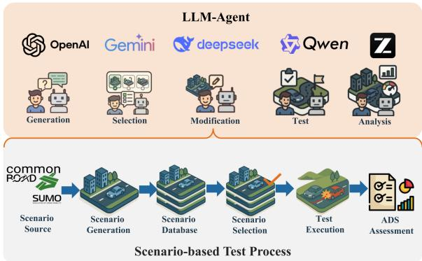  
Figure 1: PlannerForge overview: LLM agents automate the scenario-based testing pipeline.

N=400, cost-tuning lifts planner success from 50.4% to 70.2% and cuts collisions from 19.0% to 8.4%, without domain-specific fine-tuning.

## 1 Introduction

The rapid advancement of Autonomous Driving Systems (ADSs) to SAE Level 4 (Waymo, 2018; International, 2021) hinges on rigorous validation (Betz et al., 2024). Because real-world testing of rare edge cases is prohibitively expensive (Winner et al., 2019), the industry relies heavily on scenario-based testing in simulation (Riedmaier et al., 2020; Song et al., 2024). While recent advances in Large Language Models (LLMs) have begun to enhance the realism and scalability of such testing, their application has been largely confined to scenario generation (Gao et al., 2026b). However, an ADS assessment pipeline requires significantly more: it must seamlessly integrate the selection of relevant cases, the execution of tests, and the analysis of results (Song et al., 2026).

In current motion-planner testing practice, these stages remain highly fragmented and manual. Scenario generation relies on GUI editors or scripts, selection depends on hand-crafted database filters, and ad-hoc scenario modification is largely unsupported. Furthermore, testing pipelines are rigidly scripted rather than guided by user intent, planner cost weights are manually tuned, and cross-planner comparisons require separately scripted batch runs with offline aggregation. To overcome these bottlenecks, there is a clear need for a unified, LLMpowered framework that spans and automates the entire lifecycle of scenario-based testing.

In this paper, we introduce PlannerForge, an LLM-powered scenario-based testing framework for motion planners that closes this gap (Figure 1). We target motion planners because they are the core decision-making module of an ADS and their behavior is particularly sensitive to complex, safetycritical traffic scenarios. Unlike prior work that focuses narrowly on scenario generation, PlannerForge integrates the full testing pipeline: scenario generation from real-world OpenStreetMap (OSM)1 maps, scenario retrieval from a curated open-source scenario database, scenario modification via traffic object and behavior changes, motion planner execution, and performance analysis. A chatbot-oriented interface abstracts away technical complexity while enabling the seamless integration of diverse motion planners, providing researchers and practitioners with a scalable, benchmark-ready platform for ADS assessment.

The key contributions of this paper are:

1. PlannerForge, to our knowledge, the first full-lifecycle LLM framework that unifies all scenario-based-testing stages (Riedmaier et al., 2020) (Scenario Source, Generation, Database, Selection, Test Execution, ADS Assessment; together with two further LLM-era stages, ADS Enhancement and ADS Benchmarking) in a single chatbot-driven pipeline.

2. An empirical evaluation of ten off-the-shelf LLMs backends (five commercial, five opensource, spanning reasoning and non-reasoning models) across the five core framework tasks under five prompt conditions, showing both module-level performance and the effectiveness of off-the-shelf LLMs agents without domain-specific fine-tuning.

3. A unified multi-planner interface for comparative evaluation on generated and modified scenarios.

## 2 Related Work

Scenario-based testing provides a systematic methodology for validating ADSs by structurally evaluating operational conditions and safetycritical situations. This section reviews classical and LLM-powered approaches and positions PlannerForge within this landscape.

## 2.1 Classical Scenario-based Testing

Industry initiatives such as Pegasus (Winner et al., 2019) and SAKURA (Nakamura et al., 2022), alongside foundational surveys (Riedmaier et al., 2020), have established an influential sixcomponent taxonomy for scenario-based testing: (1) Scenario Source, (2) Scenario Generation, (3) Scenario Database, (4) Scenario Selection, (5) Test Execution, and (6) ADS Assessment. Prior literature has extensively explored these individual components. For Scenario Generation, research covers knowledge-driven and data-driven approaches (Nalic et al., 2020) as well as adversarial and deep generative methods (Ding et al., 2023). Work on Scenario Databases includes reviews comparing dataset sensor modalities and annotations (Ding et al., 2023). Scenario Selection strategies typically involve knowledge-driven, datadriven, or falsification-based prioritization (Riedmaier et al., 2020). Finally, comprehensive surveys have examined scenario-based accelerated testing for ISO 21448 Safety of the Intended Functionality (SOTIF)2 (Tang et al., 2025) and ADS Assessment through on-road performance metrics (Sharath and Mehran, 2021).

## 2.2 LLM-powered Scenario-based Testing

With the emergence of LLMs, the scenario-based testing process has been augmented with their reasoning capabilities across generation, analysis, and downstream execution stages.

LLM-powered Scenario Generation: Existing systems are split along simulator class and input source. Autonomous Driving Simulation (CARLA (Dosovitskiy et al., 2017)): ChatScene (Zhang et al., 2024), TTSG (Ruan et al., 2024), Aasi et al. (Aasi et al., 2024), NL2Scenic (Bauerfeind et al., 2025), Chat2Scenic (Gao et al., 2026a), Petrovic et al. (Petrovic et al., 2024), and Text2Scenario (Cai et al., 2026) synthesise safety-critical or branching

Out-of-Distribution (OOD) scenarios from naturallanguage prompts; LCTGen (Tan et al., 2023) generates language-conditioned traffic on real maps. Crash-report reconstruction: SoVAR (Guo et al., 2024) and LeGEND (Tang et al., 2024) recover simulator assets from accident reports. Traffic rules and datasets: TARGET (Deng et al., 2025) compiles traffic rules into a Domain Specific Language (DSL); Chat2Scenario (Zhao et al., 2024) extracts scenarios from naturalistic logs. Adversarial generation: LLM-attacker (Mei et al., 2025) optimises attacker trajectories in closed loop. Traffic flow Simulation (SUMO (Lopez et al., 2018)): ChatSUMO (Li et al., 2025) couples LLMs with OSM (Haklay and Weber, 2008) import scripts, while LLMScenario (Chang et al., 2024) composes safety-critical HighD (Krajewski et al., 2018) trajectories in MetaScenario (Chang et al., 2022) through in-context demonstrations.

LLM-powered ADS Enhancement: Recent research integrates LLMs into autonomous driving systems as planners or controllers. The Language-Agent line of work (Mao et al., 2023) is a toolusing LLM decision agent for the planner, while MPC×LLM (Baumann et al., 2025) is a Model Predictive Control parameter tuner that adapts costs and constraints from natural-language context while preserving the underlying optimization. DualAD (Wang et al., 2024) overlays an LLM reasoning layer that issues speed decisions from textual scene encodings, while LeAD (Zhang et al., 2025) employs a dual-rate architecture in which low-frequency LLMs modules supplement highfrequency end-to-end systems in challenging scenarios via chain-of-thought reasoning.

Recent surveys of LLMs in ADS testing and scenario generation (Song et al., 2026; Gao et al., 2026b) confirm that most reviewed papers focus on scenario generation.

## 2.3 Critical Summary

Across these works, prior LLM-powered systems remain highly fragmented, typically focusing in isolation on either Scenario Generation or ADS Enhancement. The critical research gap is the absence of a comprehensive, full-pipeline framework for scenario-based testing of ADSs. To close this gap, PlannerForge unifies the classic six-component taxonomy (Riedmaier et al., 2020) into a single fulllifecycle framework and extends it with two further stages: ADS Enhancement (LLM-guided planner tuning) and ADS Benchmarking (cross-planner comparative evaluation under shared scenarios).

## 3 Problem Formulation

We formalize LLM-powered scenario-based testing as a sequence of language-to-structured-output decisions. Let U be the space of natural-language utterances, S that of 2D scenarios produced by an open-source motion-planning simulator, $\mathcal { D } \subseteq \mathcal { S }$ a curated database, Θ the space of motion-planner configurations, H conversation histories, O execution outcomes, and Y natural-language analyses. At dialogue turn t the agent observes $x _ { t } =$ $\left( { { u _ { t } } , { s _ { t } } , { \theta _ { t } } , { h _ { t } } } \right)$ , where $u _ { t } \in \mathcal { U } , s _ { t } \in S , \theta _ { t } \in \Theta$ , and $h _ { t } \in \mathcal { H }$

A session begins with Generation or Selection to populate the initial scenario $s _ { 0 } \colon$

$$
f _ { \mathrm { g e n } } \colon \mathcal { U } \to S \quad \mathrm { o r } \quad f _ { \mathrm { s e l } } \colon \mathcal { U } \times \mathcal { D } \to \mathcal { D }\tag{1}
$$

Subsequent turns are dispatched by the Module Router, which at a high level selects the next phase in the scenario-based testing pipeline based on the user prompt $u _ { t }$ and dialogue history $h _ { t }$ Formally, it acts as an intent classifier predicting $\hat { a } _ { t } = \arg \operatorname* { m a x } _ { a \in \mathcal { A } } f _ { \mathrm { r o u t e r } } ( a \mid u _ { t } , h _ { t } )$ over ${ \mathcal { A } } =$ {MODIFY, TUNE, TEST, ANALYSE, QA} (the additional $\mathbf { Q A }$ action returns a free-form answer without invoking any downstream operator; see $\ S 4 )$ The router then invokes the corresponding actionconditional maps:

$$
\begin{array} { r l r } { f _ { \mathrm { m o d } } \colon S \times \mathcal { U }  S , } & { \mathrm { ~ w h e r e ~ o u t p u t ~ } s ^ { \prime } \mid = \Sigma _ { \mathcal { D } } } & \\ { f _ { \mathrm { t u n e } } \colon \Theta \times \mathcal { U }  \Theta , } & { \mathrm { ~ w h e r e ~ o u t p u t ~ } \theta ^ { \prime } \mid = \Sigma _ { \Theta } } & \\ { f _ { \mathrm { t e s t } } \colon S \times \Theta  \mathcal { O } } & \\ { f _ { \mathrm { e v a l } } \colon \mathcal { O } \times \mathcal { U }  \mathcal { V } } & \end{array}
$$

where $\Sigma _ { D }$ is the curated scenario XML dataset and $\Sigma _ { \Theta }$ the planner configuration. Crucially, $f _ { \mathrm { g e n } } .$ $f _ { \mathrm { m o d } }$ , and $f _ { \mathrm { t u n e } }$ are constrained generators: their outputs (denoted $s ^ { \prime }$ and $\theta ^ { \prime }$ above) must satisfy these respective schemas. Producing schema-conformant XML is the central linguistic challenge.

## 4 Methodology

PlannerForge is a unified framework that integrates LLMs across the entire scenario-based testing pipeline for motion planners, as illustrated in Figure 2. The six modules summarised in the caption (Generation, Selection, Module Router, Modification, Testing, and Analysis) are detailed in the subsections below; the Module Router (§4.2) acts as the intent dispatcher that unlocks flexible postselection navigation.

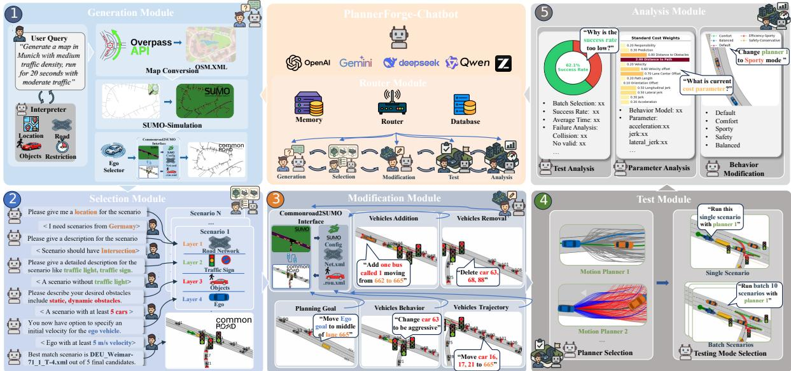  
Figure 2: PlannerForge framework with six modules: Router (classifies user intent post-selection), Generation (OSM+SUMO synthesis), Selection (dialogue-guided retrieval from the CommonRoad DB), Modification (LLM guided SUMO edits), Testing (Frenetix / MP-RBFN execution), and Analysis (LLM-powered result interpretation).

## 4.1 Framework Setup

The PlannerForge framework features a chatbot interface (Figure 3) built with a Gradio3 frontend and a LangChain4 backend. To support coherent multiturn interactions, it manages state across three levels: Conversational Memory (LangChain retains recent exchanges and summarises history exceeding 125k tokens), UI Chat History (Gradio maintains an unmodified visual log of the conversation), and Session State (in-RAM storage for user-specific context and intermediate module outputs).

Scenario Database: Open-source driving scenarios from CommonRoad (Althoff et al., 2017) are stored as XML files augmented with a structured <Metadata> element covering four scenario layers (location, roadside constructs, participants, ego vehicle) and indexed in a Chroma vector database (Chroma Team, 2023). Further implementation details and the exact metadata schema are provided in Appendix A.1.

Prompting Techniques. All modules in the framework implement the following prompting techniques (Figure 4), so that pretrained LLMs can be adjusted to our specific tasks (Gao et al., 2026b): Contextual Prompt (CP) injects the structured output schema, syntactic constraints, and available operators into the prompt. For instance, the Generation module receives the JSON intent schema with required keys location, road classes, density, vehicle mix, and duration. Chain-of-Thought (CoT) structures generation into explicit reasoning steps per module. The Modification scaffold reads: identify target, enumerate route changes, preserve connectivity, and emit the SUMO edit. In-Context Learning (ICL) adds a few-shot demonstration examples: positive natural-language to output pairs, plus, where applicable, negative refusal examples that anchor edge-case behavior.

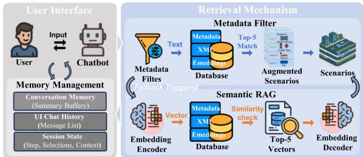  
Figure 3: Chatbot front-end of PlannerForge. The Gradio UI exposes the natural-language query box, session state, conversation memory, and scenario retrieval mechanism. The LangChain backend routes user utterances to the six modules of Figure 2.

We denote the prompt used by module M as PM (e.g. PGEN, PSEL, PROUTER, PMOD, PTUNE, PEVAL); full prompts for each module are released with the code (Appendix A.8).

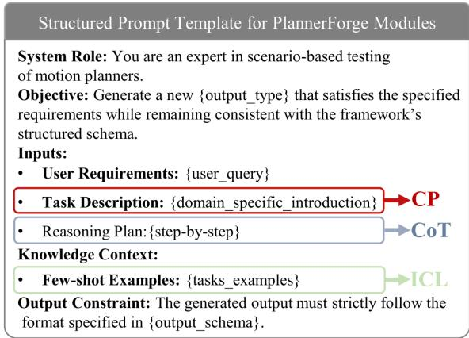  
Figure 4: Structured prompt template shared across PlannerForge modules.

## 4.2 Module Router

Traditional testing frameworks follow a rigid generation → selection → modification → testing → analysis workflow. PlannerForge breaks this linearity through the Module Router. Following the formalisation in §3, after the initial scenario generation or selection, the router acts as the intent classifier $f _ { \mathrm { r o u t e r } } ( a \mid u _ { t } , h _ { t } )$ , mapping the user utterance $u _ { t }$ to an action $\hat { a } _ { t } \in \mathcal A .$ . These actions correspond to five categories: Scenario Modification (MODIFY), Parameter Tuning (TUNE), Test Execution (TEST), Result Analysis (ANALYSE), and General Question & Answer (QA). This is implemented via two-stage LLM function calling: In the first stage, guided by the router prompt PROUTER, the LLM identifies the corresponding module and extracts the required arguments args, returning both as a structured JSON object. The second stage’s Process Engine dispatches args to the corresponding module. Full dispatch pseudocode is given in Algorithm 1 (Appendix A.5.1). The router is the key architectural mechanism that distinguishes Planner-Forge from prior LLM-assisted testing tools, and the per-module implementations are detailed in the following subsections.

## 4.3 Scenario Generation Module

When database scenarios are insufficient, Planner-Forge generates new CommonRoad scenarios from scratch via a two-stage pipeline. An LLM parses natural-language requests into structured intents, combining real-world road topologies with procedurally simulated traffic.

Stage 1: Map and traffic synthesis. The user describes the desired scenario in natural language (e.g., “Munich intersection with light traffic, focus on a turning truck”). An LLM parses this with prompt $\mathbf { P } _ { \mathrm { G E N } }$ into a structured JSON intent specifying location (city or bounding box), drivable road classes, traffic density, vehicle mix, and simulation duration. The bounding box drives an Open-StreetMap query via the Overpass API (Haklay and Weber, 2008); the returned road network is simulated in SUMO (Lopez et al., 2018) and then converted to CommonRoad (Althoff et al., 2017) format. A microscopic SUMO simulation populates the network with vehicles, trucks, buses, and other configurable actor types, producing trajectories that respect car-following and lane-changing dynamics.

Stage 2: Planning problem synthesis. From the populated scenario, the user selects an ego vehicle and a goal region; the LLM may also suggest an ego candidate using strategies such as first car, by type, or by index. A planning problem is then synthesized by attaching an initial state (the ego’s current pose) and a goal region (either a chosen lanelet or a forward offset along the ego’s trajectory). The result is saved as a standard CommonRoad scenario file ready for downstream modification, testing, and analysis.

## 4.4 Scenario Selection Module

The Scenario Selection Module facilitates the retrieval of test cases from large-scale databases by abstracting low-level representations into an LLMguided natural-language dialogue.

We structure retrieval around the layer-based taxonomy introduced by Riedmaier et al. (Riedmaier et al., 2020), indexing scenarios across four metadata layers: location, roadside constructs (split into the tags and road\_net extractors below), participants, and ego vehicle. During a five-step dialogue (Figure 2), the LLM extracts a structured slot $\hat { \ell } _ { k }$ from the user’s utterance at step $k$ (geographical codes, discrete keywords, kinematic ranges) using a per-slot prompt $\mathbf { P } _ { \mathrm { S E L } } ^ { ( k ) }$ . Let $\mathcal { D } ^ { ( 0 ) } = \mathcal { D }$ denote the full database. For $k = 1 , \ldots , 5$ corresponding to (location, tags, road\_net, obstacles, velocity),

$$
\mathcal { D } ^ { ( k ) } = \mathcal { D } ^ { ( k - 1 ) } \cap \mathsf { m a t c h } ( \hat { \ell } _ { k } ) ,\tag{2}
$$

monotonically pruning the candidate set. The module returns $ { \mathrm { t o p } }  { - } k (  { \mathcal { D } } ^ { ( 5 ) } )$ when non-empty, and otherwise falls back to a SentenceTransformer (Reimers and Gurevych, 2019) semantic-similarity search over D keyed by the concatenated dialogue $u _ { \mathrm { 1 : 5 } } ,$ guaranteeing retrieval by contextual meaning when exact metadata matches fail. Ablation results for the retrieval pipelines are detailed in $\mathsf { A p - }$ pendix A.3.3.

## 4.5 Scenario Modification Module

CommonRoad scenarios encode fixed pre-recorded trajectories. To make edits tractable for the LLM, we route them through the CommonRoad–SUMO interface (Klischat et al., 2019): scenarios are converted to a .net.xml (network topology) plus .vehicles.rou.xml (routes and behaviour) pair, the LLM (invoked with a per-task prompt $\mathbf { P } _ { \mathrm { M O D } } ^ { \tau }$ for $\tau \in \{ T , B , P , G \} )$ ) emits a modified SUMO file, and the round-trip back to CommonRoad produces kinematically feasible trajectories. We support four edit categories:

(1) Trajectory (T) modifications redirect vehicles by updating edge sequences (two-stage prompt: the network topology is summarised into valid routes, then the edit is generated against the route file);

(2) Behaviour (B) modifications swap each vehicle’s <vType> against six car-following presets (Aggressive, Cautious, Emergency, Eco, Balanced, Speeder) while preserving vClass;

(3) Population (P) modifications add or remove vehicle entries with type, departure, and valid routes derived from the topology summary, as shown in Figure 10 (Appendix A.4.3) with vehicle removal and addition examples;

(4) Goal (G) modifications edit the planning problem by updating the goal region of the Ego Vehicle in place without a SUMO round-trip.

## 4.6 Planner Testing and Enhancement Module

This module implements the test executor $f _ { \mathrm { t e s t } }$ and parameter tuner $f _ { \mathrm { t u n e } }$ . The executor $f _ { \mathrm { t e s t } }$ abstracts the simulation environment, parameter parsing, and logging via a unified interface:

$$
f _ { \mathrm { t e s t } } ( s , \theta ) \triangleq \pi _ { P } ( s , \theta ) = ( \tau , c , m ) \in \mathcal { O } ,\tag{3}
$$

where O comprises a trajectory $\tau ,$ collision flag $c \in \{ 0 , 1 \}$ , and cost log $m$ . The tuner $f _ { \mathrm { t u n e } }$ enables natural-language ADS Enhancement. Users state qualitative presets (e.g., Safety-Conservative) or explicit weight adjustments $( \mathrm { e . g . }$ , “increase $\mathsf { d i s t a n c e \_ t o \_ o b s t a c l e s ^ { \prime \prime } } )$ . The LLM, invoked with the tuning prompt $\mathbf { P } _ { \mathrm { T U N E } }$ , interprets utterance $u _ { t }$ and emits a schema-conformant YAML override, updating the configuration $\theta  \theta ^ { \prime }$ in place while preserving formatting.

To enable ADS Benchmarking (see Appendix A.7), PlannerForge wraps two classical motion planners, sampling-based Frenetix (Trauth et al., 2024) and learning-based MP-RBFN (Kaufeld et al., 2025), under this $\pi _ { P }$ interface. Execution operates in single-scenario mode for individual analysis, or batch mode (preset sizes, query-driven, or custom sets) for parallel statistical evaluation.

## 4.7 Result Analysis Module

The Analysis Module realizes the operator $f _ { \mathrm { e v a l } }$ $\mathcal { O } \times \mathcal { U }  \mathcal { V }$ defined in §3, translating batch outcomes into natural-language feedback. Given a batch of B outcomes $\{ o _ { i } = ( \tau _ { i } , c _ { i } , m _ { i } ) \} _ { i = 1 } ^ { B }$ produced under planner configuration θ (each $o _ { i }$ as defined in Eq. 3: trajectory $\tau _ { i } ,$ collision flag $c _ { i } ,$ per-step cost log $m _ { i } )$ and a user utterance $u _ { t }$ (e.g. “why is the success rate low?”), the module assembles the analysis prompt $\mathbf { P } _ { \mathrm { E V A L } }$ over four context blocks: (i) batch-level statistics aggregated from $\left\{ c _ { i } \right\}$ and $\{ m _ { i } \}$ (success rate, mean trajectory length, collision count, mean cost); (ii) chronological per-scenario logs; (iii) the active configuration θ; and (iv) the underlying CSV log path. The LLM returns a response $y \in \mathcal { V }$ comprising quantitative metrics, a failure-mode breakdown (collision, timeout, kinematic infeasibility), the cost configuration used, and qualitative correlations between outcomes and scenario characteristics, together with parameter-adjustment recommendations that close the loop with the tuner $f _ { \mathrm { t u n e } }$ . A complementary behavior-comparison path retains the chronological history of past batches with their configurations $\{ ( \theta ^ { ( k ) } , \{ o _ { i } ^ { ( k ) } \} _ { i } ) \} _ { k }$ and lets the LLM reason about which cost weights changed between runs and how those changes shifted the success/failure profile.

## 5 Results & Discussion

In this section, we present the performance of PlannerForge with quantitative results. Five cloud API models (Qwen3.6-plus (Qwen Team, 2026b), Deepseek-v3.2 (Liu et al., 2025), Glm-5 (Zeng et al., 2026), Gemini-3-flash5, Gpt-5.4-mini6) and open-source models (Qwen3.6:35b (Qwen Team, 2026a) (think/no-think), Gemma4:31b7 (think/nothink), Gpt-oss:20b (Agarwal et al., 2025) (think) from Ollama8 are evaluated. Metric definitions and scoring procedures for each task are documented in the Supplementary Material.

## 5.1 Quantitative Evaluation

We evaluate PlannerForge on all 5 tasks (Fig. 5), where the modification task spans the 4 sub-tasks T/B/P/G, yielding 8 task slices. We use N=200 queries per (sub-)task cell, 10 model variants, and 5 prompt conditions, from a bare baseline (zero shot) to cp\_icl\_cot (context prompting + in-context examples + chain-of-thought). For each task, we report the best-performing model under the prompt condition that achieves it, while per-cell ablations are in the appendix.

Generation: Glm-5 with cp\_cot (context prompting + chain-of-thought) achieves the best score, 0.957, improving over its bare baseline of 0.783 by +0.174. This suggests that CP+CoT is sufficient to nearly saturate intent parsing, while adding ICL provides no further gain. Because this task uses the Overpass API to interface with OpenStreetMap, the most difficult part is simply interpreting the user’s free-form query into a structured intent. Selection: Qwen3.6-plus with cp\_cot achieves the best sat\_all (joint satisfaction of all five retrieved scenarios) score, 0.880, compared with a baseline of 0.180 (+0.700). Selection is the hardest task because the strict five-stage filter fails whenever any extracted slot is incorrect (per-slot extract in Appendix A.3.3). Adding ICL on top of CoT (cp\_icl\_cot, 0.835) can further hurt performance by encouraging over-confident slot guesses. Modification: Under cp\_icl\_cot, Qwen3.6-plus reaches ∼100% on the headline checks for all four sub-tasks: ends % (redirected route terminates at target edge) for T, preset % (behaviour vector matches preset) for B, count\_match % (vehicle count changes) for P, and edge-Ground Truth (GT) % (extracted target lanelet matches GT) for G. Because these modifications target SUMO configuration files, basic structural edits (T, P, G) are straightforward with high zero-shot baselines (99.0%, 99.0%, 88.5%). In contrast, behavior modification (B) requires injecting precise parameter vectors, since it fails completely zero-shot (0%) but reaches 100% once advanced prompting provides the necessary context. Module Router: Gemma4:31b with cp\_icl\_cot achieves 0.997, improving over its baseline of 0.722 by +0.275. In comparison, a hand-crafted regex router reaches only 45.5% on the same corpus. This highlights that conversational intent is too diverse for rigid keyword matching, but is easily solved by LLMs via function calling given a clear JSON schema. Planner Testing and Enhancement: Gpt-5.4-mini with cp\_icl achieves a perfect score of 1.000, compared with a baseline of 0.675 (+0.325), and outperforms a schema-constrained YAML editor baseline of 72.5%. This shows that translating abstract user requests (e.g., “drive safely”) into precise YAML parameter adjustments requires semantic understanding that rule-based editors lack. As downstream validation, 155 of 191 emitted YAML configurations (81.2%) run end-to-end in Frenetix.

Per-module scores do not by themselves show that the stages compose. Table 1 therefore chains them on N=200 seed queries, each stage consuming the previous stage’s actual output (Generation → Database → Selection → Modification → Test → Enhancement), for a commercial backend (qwen3.6-plus) and an open-source one (qwen3.6:35b) under cp\_icl\_cot. Both start at 96% after Generation; Selection and Modification are the leak points, and the funnel ends at 83% / 78% cumulative success (commercial / open) with mean cost ≈126 s / 99 s and ≈42.5k / 32.6k tokens per scenario.

Take-aways. Schema-constrained tasks (Generation, Router, Planner) saturate with CP+CoT or CP+ICL, while semantically dense tasks (Selection, Modification) require advanced promptings. Chained end-to-end, the pipeline retains 83% / 78% of seed queries (commercial / open). Opensource 20–35B models perform slightly lower than commercial APIs but are fully capable of driving the entire pipeline. Notably, applying additional prompting techniques to open-source models with native reasoning (e.g., Think variants) disrupts their internal reasoning (Fig. 5), increasing latency and token consumption while degrading performance.

## 5.2 Comparison with Prior Scenario-Testing Tools

The modules above are reliable at schema-checked execution. We next show that they also beat or lift the strongest available baseline at each stage, including Enhancement versus the hand-set Default planner configuration.

Generation (Table 3). CommonRoad has no natural-language DSL, so alternative sourcing relies on GUI drawing. Against Scenario Factory 2.0 (Finkeldei et al., 2025), the rule-based state of the art, PlannerForge is an order of magnitude slower per scenario, because it runs an LLM where SF 2.0 runs a procedure. In exchange it delivers more executable scenarios (193 vs. 144 of 200), realises

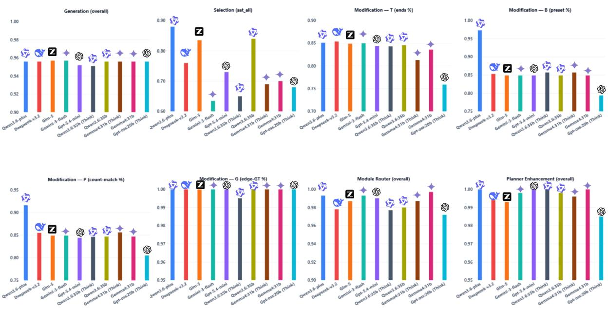  
Figure 5: Best overall score per model on eight evaluated task slices (maximum across the prompt conditions).

Table 1: End-to-end pipeline success (N=200 seed queries). Each stage consumes the previous stage’s actual output: Generation → Database → Selection → Modification → Test → Enhancement. Values are Commercial/Open (C/O), using qwen3.6-plus and qwen3.6:35b with the cp\_icl\_cot prompt. FR is the failure rate of that stage; Cum. SR is cumulative success up to it. Latency and token cost are means per scenario.
<table><tr><td>Stage</td><td>in→out (C/O)</td><td>FR↓</td><td>Cum. SR ↑</td><td>Latency ↓</td><td>Token ↓</td><td>Hardware</td></tr><tr><td>① Generation</td><td> $2 0 0 {  } 1 9 2 / 2 0 0 {  } 1 9 2$ </td><td>4%/4%</td><td>96%/96%</td><td>21.6 s/21.0 s</td><td>4.5k/4.6k</td><td>API/27G</td></tr><tr><td>② Database</td><td>192→192</td><td>0%/0%</td><td>96%/96%</td><td>1.8 s/1.8 s</td><td>0/0</td><td>CPU</td></tr><tr><td>③ Selection</td><td> $1 9 2 \to 1 8 1 / 1 9 2 \to 1 7 0$ </td><td>6%/11%</td><td>91%/85%</td><td>29.3 s/26.7 s</td><td>8.5k/8.5k</td><td>API/27G</td></tr><tr><td>④ Modification</td><td> $1 8 1 \to 1 6 5 / 1 7 0 \to 1 5 6$ </td><td>9%/8%</td><td>83%/78%</td><td>44 s/23 s</td><td>29k/19k</td><td>API/27G</td></tr><tr><td>- G (goal)</td><td> $4 6 {  } 4 6 / 4 3 {  } 4 3$ </td><td>0%/0%</td><td></td><td>3.7 s/2.5 s</td><td>7.5k/7.5k</td><td>API/27G</td></tr><tr><td>- B (behaviour)</td><td> $4 5 \to 4 2 / 4 3 \to 4 1$ </td><td>7%/5%</td><td></td><td>56.9 s/31.2 s</td><td>33k/22k</td><td>API/27G</td></tr><tr><td>- P (add/remove)</td><td> $4 5 \to 3 8 / 4 2 \to 3 7$ </td><td>16%/12%</td><td></td><td>56.6 s/31.7 s</td><td>40k/21k</td><td>API/27G</td></tr><tr><td>– T (trajectory)</td><td> $4 5 \to 3 9 / 4 2 \to 3 5$ </td><td>13%/17%</td><td></td><td>63.1 s/29.2 s</td><td>34k/23k</td><td>API/27G</td></tr><tr><td>⑤Test</td><td> $1 6 5 {  } 1 6 5 / 1 5 6 {  } 1 5 6$ </td><td>0%/0%</td><td>83%/78%</td><td>24.6 s/23.9 s</td><td>0/0</td><td>CPU</td></tr><tr><td>⑥ Enhancement</td><td> $1 6 5 {  } 1 6 5 / 1 5 6 {  } 1 5 6$ </td><td>0%/0%</td><td>83%/78%</td><td>4.5 s/2.6 s</td><td>0.5k/0.5k</td><td>API/27G</td></tr><tr><td>→ End-to-end</td><td>200→165 / 200→156</td><td></td><td>83%/78%</td><td>≈126 s/99 s</td><td>≈42.5k/32.6k</td><td>API/27G</td></tr></table>

Table 2: Cost-tuning across batch sizes, paired per scenario. Each batch is tuned by three independent LLM calls (qwen3.6-plus, cp\_icl\_cot, temperature 0.0); we report mean ± SD over the three rounds. The planner is deterministic for a fixed (scenario, configuration) pair, so the LLM call is the only stochastic component. All 15 rounds returned the identical configuration.
<table><tr><td>N</td><td>Success ↑ (b→a)</td><td>∆ (pp)</td><td>Collision ↓ (b→a)</td><td>∆ (pp)</td></tr><tr><td></td><td>50 46.7%→68.0±9.1% +21.3 ± 6.8</td><td></td><td> $2 0 . 7 \%  7 . 3 \pm 2 . 5 \%$ </td><td>−13.3 ± 5.2</td></tr><tr><td></td><td>100 51.0%→68.6±4.2%</td><td> $+ 1 7 . 6 \pm 2 . 6$ </td><td>20.3%→9.8±0.9%</td><td>−10.5 ± 1.7</td></tr><tr><td></td><td>200 51.3%→71.5±2.4%</td><td> $+ 2 0 . 1 \pm 0 . 5$ </td><td>20.6%→8.2±1.0%</td><td>−12.4 ± 1.5</td></tr><tr><td></td><td>300 51.6%→69.8±0.5%</td><td> $+ 1 8 . 2 \pm 0 . 7$ </td><td>18.9%→7.8±0.6%</td><td>−11.1 ± 1.3</td></tr><tr><td></td><td>400 50.4%→70.2±0.4%</td><td> $+ 1 9 . 8 \pm 0 . 3$ </td><td>19.0%→8.4±0.4%</td><td>−10.6 ± 0.3</td></tr></table>

Table 3: Generation. PlannerForge vs. the rule-based state of the art, Scenario Factory 2.0 (Finkeldei et al., 2025), on 200 queries across 50 cities. PlannerForge receives the full natural-language query; SF 2.0 receives the extracted target city, its native input. Exec. S = scenarios that generate and execute in the planner. ✗ = attribute not targetable. †SF 2.0 is given the city directly.
<table><tr><td>Method</td><td>Time ↓</td><td>Exec.S ↑</td><td>City ↑</td><td>Road ↑</td><td>Vehicle ↑</td><td>Diverse ↑</td><td>Coll ↑</td></tr><tr><td>SF2.0</td><td>2.2s</td><td>144/200</td><td>72%†</td><td>x</td><td>x</td><td>4</td><td>6.1%</td></tr><tr><td>PlannerForge</td><td>21.6s</td><td>193/200</td><td>96.0%</td><td>92.0%</td><td>95.6%</td><td>7</td><td>20.0%</td></tr></table>

92–96% of the requested city, road and vehicle attributes that SF 2.0 cannot target at all, produces seven traffic-participant classes rather than four, and induces 3.3× more planner collisions (20.0% vs. 6.1%).

Selection (Table 4). The CommonRoad GUI supports only manual parameter filters. Against BM25 keyword search (Robertson and Zaragoza,

Table 4: Selection. PlannerForge vs. BM25 keyword search (Robertson and Zaragoza, 2009) on 200 naturallanguage queries over a 500+ scenario database; the retrieval backend is shared. Satisfy@1 / Any@5 = the request is satisfied at rank 1 / anywhere in the top 5.
<table><tr><td>Retrieval (top-5)</td><td>Latency ↓</td><td>Token ↓</td><td>Satisfy@1↑</td><td>Any@5↑</td></tr><tr><td>Keyword search / BM25</td><td>&lt;0.01s</td><td>0</td><td>67.5%</td><td>86.0%</td></tr><tr><td>PlannerForge (LLM)</td><td>21.6s</td><td>8.7k</td><td>92.0%</td><td>96.5%</td></tr></table>

Table 5: Modification. PlannerForge (PF) four edit types vs. From-Words-to-Collisions (Gao et al., 2025) on the same 200 base scenarios. Exec. S = planner-runnable; Phy. Val. = physically valid share; New Coll. = valid new collisions; min\_risk = mean base→modified risk (0 = collision, 5 = safe).
<table><tr><td>Method</td><td>Time ↓</td><td>Tokens ↓</td><td></td><td></td><td>Exec.S ↑ Phy. Val. ↑ New Coll. ↑</td><td>Goal ↓</td><td>min_risk ↓</td></tr><tr><td>FWtC</td><td>51 s</td><td>17.6k</td><td>200/200</td><td>31.0%</td><td>16</td><td>24.2%</td><td>1.84→1.69</td></tr><tr><td>PF (Behaviour)</td><td>56s</td><td>24.2k</td><td>200/200</td><td>98.0%</td><td>31</td><td>47.2%</td><td> $1 . 8 4 \substack {  } 1 . 6 1$ </td></tr><tr><td>PF (Trajectory)</td><td>60s</td><td>22.1k</td><td>194/200</td><td>97.9%</td><td>32</td><td>50.5%</td><td> $1 . 8 4 \substack {  } 1 . 5 1$ </td></tr><tr><td>PF (Participant)</td><td>63 s</td><td>21.7k</td><td>192/200</td><td>94.8%</td><td>58</td><td>35.7%</td><td>1.84→1.20</td></tr><tr><td>PF (Goal)</td><td>8s</td><td>7.1k</td><td>199/200</td><td>100%</td><td>45</td><td>22.6%</td><td>1.84→1.36</td></tr></table>

2009), which is effectively free at <0.01 s and zero tokens, PlannerForge costs 21.6 s and 8.7k tokens per query. BM25 already finds a valid scenario somewhere in the top five for 86.0% of queries, so the gap at Any@5 is modest (96.5%). The gap at rank 1 is what matters for an interactive tool: 67.5% vs. 92.0%, because LLM slot extraction resolves paraphrase, location ambiguity and implicit range constraints that keyword matching cannot.

Modification (Table 5). Against From-Wordsto-Collisions (Gao et al., 2025), a recent LLMbased safety-critical modification tool, the decisive difference is physical validity. FWtC writes raw coordinates without vehicle dynamics, so roughly 70% of its edits are kinematically impossible, and it offers a single edit type. Because Planner-Forge routes every edit through SUMO, all four of its edit types stay above 94% valid, and Participant (1.84→1.20, 58 new collisions) and Goal (1.84→1.36, 45) stress the planner considerably harder than FWtC’s valid edits (1.84→1.69, 16).

Enhancement (Table 2). The LLM retunes cost weights against the hand-set Default configuration across five batch sizes (N=50–400), three independent calls each, scored paired per scenario. Success rises in every batch (+17.6 to +21.3 pp) and collisions fall (10.5 to 13.3 pp); at N=400, 50.4%→70.2%. Spread shrinks with N (±6.8 pp at 50 vs. ±0.3 pp at 400). A Frenetix vs. MP-RBFN dispatch is in Appendix A.7.

Taken together, the LLM buys attribute control in Generation, rank-1 precision in Selection, physically valid edits in Modification, and a lift over Default in Enhancement, at a cost in seconds and tokens that the classical tools do not pay.

## 5.3 Discussion: Transferable Insights

Three findings generalise to other structured-output agent tasks. Prompt techniques match distinct failure modes. CP saturates closed vocabularies (Gpt-5.4-mini: Planner full-YAML 36.1%→100%, Router 43.5%→91.0%). ICL is required for refusals (out-of-vocab parameters: 0% baseline, 44.4% CP, 100% only with ICL). CoT helps joint constraints (Selection sat\_all 46.0%→72.0% from CP to CP+CoT). Match the prompt to the failure mode rather than stacking every technique. External CoT can conflict with native thinking. On Selection sat\_all, adding CoT on top of CP hurts every reasoning-enabled model (65.0→40.0%, 67.0→30.0%, 58.0→32.0%) while lifting nonthinking Qwen3.6:35b (63.5→83.0%). Treat reasoning models as a distinct prompting regime. Reliability needs an executable harness. Code around each LLM call parses, schema-validates, and scores both form and downstream execution. The prompt raises the hit rate; the harness makes the stage dependable.

## 6 Conclusion and Future Work

We presented PlannerForge, a full-lifecycle LLMagent framework for scenario-based testing of motion planners, with a Module Router, schemachecked modules, and a unified motion planner interface. Across 80,000 off-the-shelf calls with no fine-tuning, modules score from 0.88 (Selection) to 1.00 (Planner Testing), with Generation at 0.957, Modification near 100% on the headline checks, and the Router at 0.997. End-to-end chaining from Generation through Enhancement retains 83% / 78% of seed queries (commercial / open). Against Scenario Factory 2.0, BM25, and From-Words-to-Collisions, it is more attribute-faithful in generation (193 vs. 144 executable), more precise at rank 1 selection (92.0% vs. 67.5%), and physically valid in modification (≥94% vs. 31%). On planner safety-critical performance, generated scenarios induce 20.0% collisions versus 6.1% for Scenario Factory 2.0, and cost-tuning against Default at N=400 lifts success from 50.4% to 70.2% while cutting collisions from 19.0% to 8.4%. Future work will close the planner loop and extend the framework to simulators such as CARLA.

## Limitations

Measured failure modes. In the end-to-end chain, Trajectory and Population edits drop 13– 17% and 12–16% of surviving queries on simulation round-trip, not on headline semantics (Table 1, Appendix A.4.2). Selection is the other leak. Tag over-prediction drives the 6%/11% commercial/open drop, and the best sat\_all is 0.880 (Appendix A.3.3). The Analysis Module is not scored against ground truth.

Scope and domain. PlannerForge runs openloop. Other agents follow recorded or SUMOexported trajectories and do not react to the ego vehicle. Closed-loop falsification is left to future work. Quantitative planner, collision, and costtuning results use Frenetix. The MP-RBFN comparison is qualitative (Appendix A.7). Evaluation uses CommonRoad, and the modification corpus is Germany-dominated (DEU is 80–92 queries per task among 15 country codes).

## Ethical Considerations

PlannerForge is driven by off-the-shelf LLM agents that can hallucinate structured outputs. In our evaluation this appears as invented scenario tags, invalid map or vehicle identifiers, misrouted module calls, and Analysis claims that are not supported by the run logs. Unchecked, such errors can produce invalid tests or misleading planner diagnostics. Every scored module therefore parses, schema-validates, and executes the model output before it is accepted. Residual risk remains where that check is incomplete, in particular the unscored Analysis module.

## Acknowledgements

The authors wrote the initial draft and used LLMs only to improve grammar, clarity, and readability. They reviewed every suggestion and take responsibility for the paper.

## References

Erfan Aasi, Phat Nguyen, Shiva Sreeram, Guy Rosman, Sertac Karaman, and Daniela Rus. 2024. Generating out-of-distribution scenarios using language models. arXiv preprint arXiv:2411.16554.

Sandhini Agarwal, Lama Ahmad, Jason Ai, Sam Altman, Andy Applebaum, Edwin Arbus, Rahul K Arora, Yu Bai, Bowen Baker, Haiming Bao, and 1

others. 2025. gpt-oss-120b & gpt-oss-20b model card. arXiv preprint arXiv:2508.10925.

Matthias Althoff, Markus Koschi, and Stefanie Manzinger. 2017. Commonroad: Composable benchmarks for motion planning on roads. In 2017 IEEE Intelligent Vehicles Symposium (IV), pages 719–726. IEEE.

Philipp Bauerfeind, Amir Salarpour, David Fernandez, Pedram MohajerAnsari, Johannes Reschke, and 1 others. 2025. David vs. goliath: A comparative study of different-sized llms for code generation in the domain of automotive scenario generation. arXiv preprint arXiv:2510.14115.

Nicolas Baumann, Cheng Hu, Paviththiren Sivasothilingam, Haotong Qin, Lei Xie, Michele Magno, and Luca Benini. 2025. Enhancing autonomous driving systems with on-board deployed large language models. In Robotics: Science and Systems XXI.

Johannes Betz, Melina Lutwitzi, and Steven Peters. 2024. A new taxonomy for automated driving: Structuring applications based on their operational design domain, level of automation and automation readiness. In 2024 IEEE Intelligent Vehicles Symposium (IV), pages 1–7.

Xuan Cai, Xuesong Bai, Zhiyong Cui, Danmu Xie, Daocheng Fu, and 1 others. 2026. Text2Scenario: Text-driven scenario generation for autonomous driving test. Automotive Innovation.

Cheng Chang, Dongpu Cao, Long Chen, Kui Su, Kuifeng Su, Yuelong Su, Fei-Yue Wang, Jue Wang, Ping Wang, Junqing Wei, and 1 others. 2022. Metascenario: A framework for driving scenario data description, storage and indexing. IEEE Transactions on Intelligent Vehicles, 8(2):1156–1175.

Cheng Chang, Siqi Wang, Jiawei Zhang, Jingwei Ge, and Li Li. 2024. Llmscenario: Large language model driven scenario generation. IEEE Transactions on Systems, Man, and Cybernetics: Systems.

Chroma Team. 2023. Chroma: The ai-native open-source embedding database. https://www. trychroma.com/. Accessed: 2026-01-18.

Yao Deng, Zhi Tu, Jiaohong Yao, Mengshi Zhang, Tianyi Zhang, and Xi Zheng. 2025. Target: Traffic rule-based test generation for autonomous driving via validated llm-guided knowledge extraction. IEEE Transactions on Software Engineering, 51(7):1950– 1968.

Wenhao Ding, Chejian Xu, Mansur Arief, Haohong Lin, Bo Li, and Ding Zhao. 2023. A survey on safetycritical driving scenario generation—a methodological perspective. IEEE Transactions on Intelligent Transportation Systems, 24(7):6971–6988.

Alexey Dosovitskiy, German Ros, Felipe Codevilla, Antonio Lopez, and Vladlen Koltun. 2017. Carla: An open urban driving simulator. In Conference on robot learning. PMLR.

Florian Finkeldei, Christoph Thees, Jan-Niklas Weghorn, and Matthias Althoff. 2025. Scenario factory 2.0: Scenario-based testing of automated vehicles with CommonRoad. Automotive Innovation, 8(2):207–220.

Yuan Gao, Wenting Miao, Mattia Piccinini, Haoyu Wang, Qunying Song, and Johannes Betz. 2026a. Chat2scenic: An iterative RAG-based framework for scenario generation in autonomous driving. In 2026 IEEE/RSJ International Conference on Intelligent Robots and Systems (IROS). To appear.

Yuan Gao, Mattia Piccinini, Korbinian Moller, Amr Alanwar, and Johannes Betz. 2025. From words to collisions: Llm-guided evaluation and adversarial generation of safety-critical driving scenarios. In 2025 IEEE 28th International Conference on Intelligent Transportation Systems (ITSC), pages 2134– 2141.

Yuan Gao, Mattia Piccinini, Yuchen Zhang, Dingrui Wang, Korbinian Moller, Roberto Brusnicki, Baha Zarrouki, Alessio Gambi, Jan Frederik Totz, Kai Storms, Steven Peters, Andrea Stocco, Bassam Alrifaee, Marco Pavone, and Johannes Betz. 2026b. Foundation models in autonomous driving: A survey on scenario generation and scenario analysis. IEEE Open Journal ofIntelligent Transportation Systems, pages 1–1.

An Guo, Yuan Zhou, Haoxiang Tian, Chunrong Fang, Yunjian Sun, Weisong Sun, Xinyu Gao, Anh Tuan Luu, Yang Liu, and Zhenyu Chen. 2024. Sovar: Build generalizable scenarios from accident reports for autonomous driving testing. In Proceedings of the 39th IEEE/ACM International Conference on Automated Software Engineering, pages 268–280.

Mordechai Haklay and Patrick Weber. 2008. Openstreetmap: User-generated street maps. IEEE Pervasive computing, 7(4):12–18.

SAE International. 2021. Taxonomy and definitions for terms related to driving automation systems for on-road motor vehicles. SAE J3016.

Marc Kaufeld, Mattia Piccinini, and Johannes Betz. 2025. Mp-rbfn: Learning-based vehicle motion primitives using radial basis function networks. In 2025 IEEE 28th International Conference on Intelligent Transportation Systems (ITSC), pages 1262–1269.

Moritz Klischat, Octav Dragoi, Mostafa Eissa, and Matthias Althoff. 2019. Coupling sumo with a motion planning framework for automated vehicles. In SUMO User Conference, pages 1–9.

Robert Krajewski, Julian Bock, Laurent Kloeker, and Lutz Eckstein. 2018. The highd dataset: A drone dataset of naturalistic vehicle trajectories on german highways for validation of highly automated driving systems. In 2018 21st International Conference on Intelligent Transportation Systems (ITSC), page 2118–2125. IEEE.

Shuyang Li, Talha Azfar, and Ruimin Ke. 2025. Chatsumo: Large language model for automating traffic scenario generation in simulation of urban MObility. IEEE Transactions on Intelligent Vehicles.

Aixin Liu, Aoxue Mei, Bangcai Lin, Bing Xue, Bingxuan Wang, Bingzheng Xu, Bochao Wu, Bowei Zhang, Chaofan Lin, Chen Dong, and 1 others. 2025. Deepseek-v3. 2: Pushing the frontier of open large language models. arXiv preprint arXiv:2512.02556.

Pablo Alvarez Lopez, Michael Behrisch, Laura Bieker-Walz, Jakob Erdmann, Yun-Pang Flötteröd, Robert Hilbrich, Leonhard Lücken, Johannes Rummel, Peter Wagner, and Evamarie Wießner. 2018. Microscopic traffic simulation using sumo. In The 21st IEEE International Conference on Intelligent Transportation Systems. IEEE.

Jiageng Mao, Junjie Ye, Yuxi Qian, Marco Pavone, and Yue Wang. 2023. A language agent for autonomous driving. arXiv preprint arXiv:2311.10813.

Yuewen Mei, Tong Nie, Jian Sun, and Ye Tian. 2025. LLM-Attacker: Enhancing closed-loop adversarial scenario generation for autonomous driving with large language models. IEEE Transactions on Intelligent Transportation Systems.

Hiroki Nakamura, Husam Muslim, Ryosuke Kato, Sandra Préfontaine-Watanabe, H Nakamura, H Kaneko, Hisashi Imanaga, Jacobo Antona-Makoshi, Sou Kitajima, Nobuyuki Uchida, and 1 others. 2022. Defining reasonably foreseeable parameter ranges using realworld traffic data for scenario-based safety assessment of automated vehicles. IEEE Access, 10:37743– 37760.

Demin Nalic, Tomislav Mihalj, Maximilian Bäumler, Matthias Lehmann, Arno Eichberger, and Stefan Bernsteiner. 2020. Scenario based testing of automated driving systems: A literature survey. In FISITA web Congress, volume 10, page 1.

Nenad Petrovic, Krzysztof Lebioda, Vahid Zolfaghari, André Schamschurko, Sven Kirchner, Nils Purschke, Fengjunjie Pan, and Alois Knoll. 2024. Llm-driven testing for autonomous driving scenarios. In 2024 2nd International Conference on Foundation and Large Language Models (FLLM), pages 173–178. IEEE.

Qwen Team. 2026a. Qwen3.6-35B-A3B: Agentic coding power, now open to all.

Qwen Team. 2026b. Qwen3.6-Plus: Towards real world agents.

Nils Reimers and Iryna Gurevych. 2019. Sentence-bert: Sentence embeddings using siamese bert-networks. In Proceedings of the 2019 Conference on Empirical Methods in Natural Language Processing and the 9th International Joint Conference on Natural Language Processing (EMNLP-IJCNLP), pages 3982– 3992. Association for Computational Linguistics.

Stefan Riedmaier, Thomas Ponn, Dieter Ludwig, Bernhard Schick, and Frank Diermeyer. 2020. Survey on scenario-based safety assessment of automated vehicles. IEEE access, 8:87456–87477.

Stephen Robertson and Hugo Zaragoza. 2009. The probabilistic relevance framework: BM25 and beyond. Foundations and Trends in Information Retrieval, 3(4):333–389.

Bo-Kai Ruan, Hao-Tang Tsui, Yung-Hui Li, and Hong-Han Shuai. 2024. Traffic scene generation from natural language description for autonomous vehicles with large language model. arXiv preprint arXiv:2409.09575.

Mysore Narasimhamurthy Sharath and Babak Mehran. 2021. A literature review of performance metrics of automated driving systems for on-road vehicles. Frontiers in Future Transportation, 2:759125.

Qunying Song, Emelie Engström, and Per Runeson. 2024. Industry practices for challenging autonomous driving systems with critical scenarios. ACM Trans. Softw. Eng. Methodol., 33(4).

Qunying Song, He Ye, Mark Harman, and Federica Sarro. 2026. Generative ai for testing of autonomous driving systems: A survey. ACM Transactions on Software Engineering and Methodology.

Shuhan Tan, Boris Ivanovic, Xinshuo Weng, Marco Pavone, and Philipp Kraehenbuehl. 2023. Language conditioned traffic generation. In Proceedings of the 7th Conference on Robot Learning, volume 229 of Proceedings of Machine Learning Research, pages 2714–2738. PMLR.

Lei Tang, Ruijie Wang, Zhanwen Liu, Yunji Liang, Yuanyuan Niu, Wei Zhu, and Zongtao Duan. 2025. Scenario-based accelerated testing for SOTIF in autonomous driving: A review. IEEE Internet ofThings Journal, 12(2):1453–1470.

Shuncheng Tang, Zhenya Zhang, Jixiang Zhou, Lei Lei, Yuan Zhou, and Yinxing Xue. 2024. Legend: A top-down approach to scenario generation of autonomous driving systems assisted by large language models. In Proceedings of the 39th IEEE/ACM In ternational Conference on Automated Software Engineering, pages 1497–1508.

Rainer Trauth, Korbinian Moller, Gerald Würsching, and Johannes Betz. 2024. Frenetix: A highperformance and modular motion planning framework for autonomous driving. IEEE Access.

Dingrui Wang, Marc Kaufeld, and Johannes Betz. 2024. Dualad: Dual-layer planning for reasoning in autonomous driving. arXiv preprint arXiv:2409.18053.

Waymo. 2018. Waymo one: The next step on our selfdriving journey.

Hermann Winner, Karsten Lemmer, Thomas Form, and Jens Mazzega. 2019. Pegasus—first steps for the safe introduction of automated driving. In Road Vehicle Automation 5, pages 185–195, Cham. Springer International Publishing.

Aohan Zeng, Xin Lv, Zhenyu Hou, Zhengxiao Du, Qinkai Zheng, Bin Chen, Da Yin, Chendi Ge, Chenghua Huang, Chengxing Xie, and 1 others. 2026. Glm-5: from vibe coding to agentic engineering. arXiv preprint arXiv:2602.15763.

Jiawei Zhang, Chejian Xu, and Bo Li. 2024. Chatscene: Knowledge-enabled safety-critical scenario generation for autonomous vehicles. In Proceedings ofthe IEEE/CVF Conference on Computer Vision and Pattern Recognition, pages 15459–15469.

Yuhang Zhang, Jiaqi Liu, Chengkai Xu, Peng Hang, and Jian Sun. 2025. Lead: The llm enhanced planning system converged with end-to-end autonomous driving. arXiv preprint arXiv:2507.05754.

Yongqi Zhao, Wenbo Xiao, Tomislav Mihalj, Jia Hu, and Arno Eichberger. 2024. Chat2scenario: Scenario extraction from dataset through utilization of large language model. In 2024 IEEE Intelligent Vehicles Symposium (IV), pages 559–566. IEEE.

## A Appendix

## A.1 Implementation Details

Hardware. All experiments are conducted on a single workstation equipped with an NVIDIA GeForce RTX 5090 GPU (Blackwell architecture, 32 GB GDDR7, 21,760 CUDA cores, 1,792 GB/s memory bandwidth, 575 W TGP). The host CPU is an Intel Core i9-14900K (24 cores / 32 threads), paired with 128 GB DDR5 system memory and a 2 TB NVMe SSD for scenario storage and SUMO simulation caches.

Large Language Models. The LLMs used in the experiments are listed in Table 6. Models are grouped by provider, and the “Think” column indicates whether the model’s internal reasoning mode is enabled at inference time (ON) or disabled (OFF). All cloud-hosted closed-weight models run with reasoning disabled to keep their structured-output behavior comparable. For local open-weight reasoning models (gpt-oss, gemma-4) reasoning is on by default, and for qwen3.6:35b and gemma4:31b we evaluate both modes.

Table 6: LLM backends used in the experiments, grouped by provider. “Think” = internal reasoning mode at inference time. “VRAM” = measured peak resident GPU memory of the local Ollama backend (Q4\_K\_M weights, 32k-token context window) on the RTX 5090; cloud models are served over a provider API and use no local VRAM.
<table><tr><td>Model</td><td>Provider</td><td>Think</td><td>VRAM</td></tr><tr><td>Cloud API</td><td></td><td></td><td></td></tr><tr><td>Qwen3.6-plus</td><td>DashScope</td><td>OFF</td><td>API</td></tr><tr><td>Deepseek-v3.2</td><td>DashScope</td><td>OFF</td><td>API</td></tr><tr><td>Glm-5</td><td>DashScope</td><td>OFF</td><td>API</td></tr><tr><td>Gemini-3-flash</td><td>Google</td><td>OFF</td><td>API</td></tr><tr><td>Gpt-5.4-mini</td><td>OpenAI</td><td>OFF</td><td>API</td></tr><tr><td>Local Ollama (RTX 5090, Q4_K_M)</td><td></td><td></td><td></td></tr><tr><td>Qwen3.6:35b</td><td>Ollama</td><td>ON</td><td>27 GB</td></tr><tr><td>Qwen3.6:35b</td><td>Ollama</td><td>OFF</td><td>27 GB</td></tr><tr><td>Gemma4:31b</td><td>Ollama</td><td>ON</td><td>27 GB</td></tr><tr><td>Gemma4:31b</td><td>Ollama</td><td>OFF</td><td>27 GB</td></tr><tr><td>Gpt-oss:20b</td><td>Ollama</td><td>ON</td><td>14 GB</td></tr></table>

Pinned identifiers (reproducibility). Commercial models are invoked by their exact provider model-id: qwen3.6-plus, deepseek-v3.2, glm-5 (DashScope), gemini-3-flash-preview (Google), gpt-5.4-mini (OpenAI). Open backends are pinned Ollama image tags: qwen3.6:35b @ 07d3521, gemma4:31b @ 6316f06, gpt-oss:20b @ 17052f9. A fully commercial-API-free run uses only the five open

backends.

Framework components. PlannerForge integrates various data sources and simulation tools into a unified pipeline:

• Frontend. The framework is exposed as a web application built with Gradio, organized as two browser tabs: a Main tab hosting the chatbot interface for query, modification, testing, and analysis, and a separate Generate tab for the OSM-based scenario-generation pipeline. The chatbot widget streams LLM responses and renders generated/simulated scenarios as inline animated GIFs.

• Conversational memory. To preserve chat history context across multi-turn interactions, the Python runtime leverages Langchain’s9 ConversationSummaryBufferMemory, which automatically summarises older messages to fit within token limits.

• Simulation backends. PlannerForge operates on the CommonRoad scenario format (Althoff et al., 2017), with traffic dynamics provided by the SUMO microscopic traffic simulator (Lopez et al., 2018) via the CommonRoad-SUMO interface (Klischat et al., 2019). We integrate two motion planners: Frenetix (Trauth et al., 2024) (sampling-based, weighted cost functions) and MP-RBFN (Kaufeld et al., 2025) (learning-based, radial basis function networks).

• Scenario database. We index 500+ curated CommonRoad scenarios in a persistent ChromaDB (Chroma Team, 2023) vector store (PersistentClient), using SentenceTransformer (Reimers and Gurevych, 2019) embeddings for semantic retrieval. Each scenario includes a structured metadata dictionary covering location (country, road network type), roadside infrastructure (e.g., traffic light presence), participant characteristics (dynamic and static obstacle counts and types), and egovehicle properties (initial velocity), enabling exact-match filtering. The hybrid metadatafiltering and RAG strategy is described in the Methodology.

• OSM data sources. The Generation Module retrieves real-world road networks from the OpenStreetMap project (Haklay and Weber, 2008) via two public APIs: (i) the Overpass API for raw .osm XML fetching. We use four mirror endpoints (overpass-api. de, overpass.kumi.systems, overpass. private.coffee, maps.mail.ru) as automatic fallbacks for resilience; and (ii) Nominatim (accessed through the osmnx library) for geocoding city names into bounding boxes. A polite delay between Overpass requests respects the public-endpoint rate limits.

## A.2 Scenario Generation Module

## A.2.1 LLM Scope and Hallucination Isolation

The Generation Module separates language-level tasks (handled by the LLM) from geometricand dynamic-level tasks (handled by deterministic tools). This split is a deliberate design choice: it preserves the flexibility of natural-language scenario authoring while preventing LLM hallucinations from propagating into map topology or vehicle dynamics.

LLM responsibilities. The LLM is invoked at two well-typed boundaries:

• Stage 1 — intent parsing. The free-form utterance is parsed into a JSON intent with fixed keys: location (city or explicit bounding box), drivable road classes (subset of OSM highway tags), traffic density (categorical: low/medium/high), vehicle mix (counts per vClass), and simulation duration. Each key has a schema-defined default that is applied when the LLM omits or emits an invalid value. The per-key defaults-compliance rates are reported in Table 7.

• Stage 2 — ego selection. From the populated traffic, the LLM picks one of three strategies (first car, by type, or by index) to identify an ego vehicle. The goal region is then attached deterministically (chosen lanelet or forward offset along the ego trajectory).

Deterministic-tool responsibilities. Three downstream stages execute without LLM involvement:

• OSM/Overpass fetch takes the bounding box as input and returns the corresponding .osm data, with mirror-endpoint failover (§A.1).

• CR–SUMO conversion (Althoff et al., 2017; Lopez et al., 2018) transforms the OSM map into a CommonRoad scene (.cr.xml) and a SUMO road network (.net.xml).

• Microscopic SUMO simulation populates the network with background traffic according to the vehicle mix and density parsed by the LLM; the resulting trajectories satisfy car-following and lane-changing dynamics by construction.

Hallucination isolation. Because the LLM never emits map geometry, road-network topology, or vehicle trajectories directly, three classes of hallucination that would otherwise cause silent downstream failure are structurally ruled out:

• invalid lanelet IDs or topologies (only the converter produces these);

• kinematically infeasible trajectories (only SUMO produces these);

• references to non-existent map fragments (only the OSM fetch produces these).

The remaining LLM-side failure modes (misparsed location, wrong traffic-density level, missing ego specifier) are caught at schema-validation time and either default-applied or surfaced as an error. Per-key pass rates appear in the loadable column of Table 7.

## A.2.2 Query Corpus

The Generation Module benchmark uses N = 200 natural-language queries with a median length of 8 words (p10 = 5, p90 = 11, max = 23). Frequently requested cities include Shanghai, Madrid, Cologne, Seoul, and London. The corpus splits into two reporting buckets:

• CLEAN (n = 158) – standard car-ego queries. These exercises the canonical pipeline and dominate the headline numbers.

• ADVERSARIAL (n = 42) – queries that explicitly request a non-car ego, split as motorcycle/moped (23), bicycle/cargo bike/cyclist (16), and scooter/e-scooter (3). This bucket probes the system rule that the Frenetixplanned ego must be a car: the CP rules teach the LLM to keep the requested vehicle type in the surrounding traffic while downgrading the ego itself to the first car.

A separate cross-cutting count: 55 queries mention a traffic-density adjective (system-fixed default: low) and 21 request an explicit duration (system-fixed default: 20 s), probing the defaultscompliance metric defined in §A.2.3.

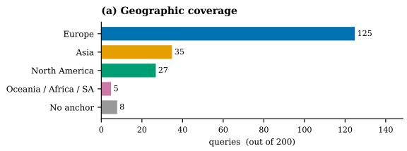  
(b) Scenario-type cues (free-form, overlap allowed)

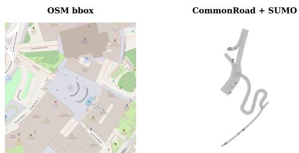  
(d) Q013: Rome roundabout, run for 60 seconds with moderate traffic, ego is the emergency vehicle.

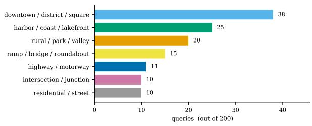  
(c) Ego specification (adv. = ego-must-be-car probe)

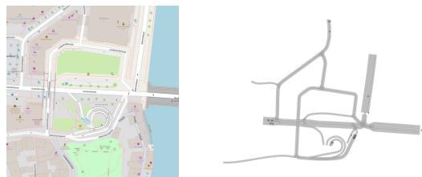

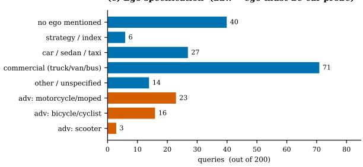

(e) Q004: Sparse rural road outside Zurich; include cars and motorcycles, and the motorcycle is the ego.  
(f) Word cloud over the 200 queries  
  
Figure 6: Composition of the 200-query Scenario Generation corpus. (a) Geographic coverage. (b) Scenario-type cues (free-form, overlapping). (c) Ego specification, with non-car ego queries in vermillion. (d, e) Two example queries rendered through the pipeline: Q013 (clean commercial ego) and Q004 (adversarial non-car ego). (f) Word cloud over the queries.

Figure 6 summarises the geographic coverage, scenario-type cues, and ego specification. It also includes a word cloud of the queries.

## A.2.3 Evaluation Metrics

We evaluate the generation chain (query → JSON → Scenario → Planner) across three buckets: ALL (n=200), CLEAN (n=158), and ADVER-SARIAL (n=42; requiring ego-must-be-car rule). Table 7 tracks nine metrics clustered into three groups:

• Cost: Mean Tokens (prompt+completion+reasoning) and Latency (s) per query.

• Pipeline: Success rate at each stage: JSON valid % (schema-compliant output); Defaults compliance (adherence to fixed settings like sim.duration\_s=20); Load % (Common-Road scene parses successfully); Traffic % (loadable with SUMO ≥ 1 background actor); Runnable % (Frenetix completes a trajectory, even if colliding); and Planner % (Frenetix reaches the goal safely).

• Overall: The composite Intent overall score aggregating LLM and pipeline metrics, serving as the primary metric to rank (model, condition) pairs.

## A.2.4 Evaluation Results

Each cell aggregates 200 generation runs end-toend (geocode → OSM fetch → CR convert → SUMO sim → Frenetix). We surface the full results matrix on the ALL bucket in Table 7.

Ablation discussion. The prompt-condition ladder reveals that intent parsing is gated almost entirely by the schema injection (cp): the defaultscompliance column jumps from ≈0.50 to 1.00 for nine out of ten models the moment the JSON schema and the defaults are spelled out. Once the schema is in the prompt, adding CoT or ICL yields only marginal gains, and the four ALL-bucket overall scores converge to a tight 0.95–0.96 band across model families. The implication is that for structured-output tasks with a narrow grammar, contextual prompting alone is sufficient. The extra latency cost of CoT scaffolding (1.5–2× tokens per query) buys negligible additional reliability here, which is why small open-source models such as

Qwen3.6:35b and Gemma4:31b match commercial APIs on this task.

## A.3 Scenario Selection Module

## A.3.1 Query Corpus

The Selection Module benchmark uses 200 naturallanguage scenario-selection queries (median length: 16 words), each targeting a unique source scenario from the CommonRoad database. The structured GT targets are notably narrow, reflecting realistic, specific user requests: 29.5% resolve to exactly one matching scenario, and 32.5% resolve to a tight set of 4–10 alternatives.

Each fixture’s GT JSON defines 5 extractor slots (as detailed in Table 8), corresponding to the fields the LLM pipeline attempts to extract. For each query, we count how many of these 5 slots are populated:

• 5/5 fields (14 queries): The user specifies all five aspects (e.g., “On a 2-lane road in Munich at ∼25 km/h, ego approaches a pedestrian crossing with 2 vehicles ahead”).

• 4/5 fields (111 queries): Most common; one slot is omitted (typically obstacles or velocity).

• 3/5 fields (74 queries): Three slots specified (e.g., location, tags, and road network).

• 2/5 fields (1 query): An outlier with only two slots populated.

Per-slot field coverage is reported in Table 8. Figure 7 visualizes the corpus along three axes: country distribution, GT scenarioTags frequency, and a word cloud over the queries.

Retrieval methods. Given the structured extraction (the five GT slots in Table 8) and the original natural-language (Natural Language (NL)) query, we evaluate four retrieval strategies that combine these signals against the ChromaDB scenario index in increasingly hybrid ways:

• Funnel pipeline: A strict 5-stage AND filter over the extracted GT slots (location → tags → road\_net → obstacles → velocity). It applies predicates as a leftto-right intersection over the scenario index, where each stage’s output feeds the next, and empty intermediate results abort the pipeline. Velocity uses a tolerant range comparison (single-element bounds widen to ±2 m/s);

Table 7: Performance of the Generation Module on the ALL bucket (N=200 per cell).
<table><tr><td rowspan="2">Model</td><td rowspan="2">Prompt</td><td colspan="2">Cost</td><td colspan="5">Pipeline</td><td rowspan="2">Overall ↑</td></tr><tr><td>tokens ↓</td><td>latency (s) ↓</td><td>JSON % ↑</td><td>defaults ↑</td><td></td><td></td><td>load % ↑ traffic % ↑ runnable % ↑</td></tr><tr><td colspan="9">Cloud API</td></tr><tr><td>Qwen3.6-plus</td><td>baseline cp cp_cot cp_icl</td><td>749 1970 2827 3750</td><td>25.8 27.0 33.7 27.8</td><td>100.0 100.0 100.0 100.0</td><td>0.497 1.000 1.000 1.000</td><td>90.5 96.0 96.5 96.5</td><td>90.5 96.0 96.5</td><td>90.5 96.0 96.5 96.5</td><td>0.780 0.955 0.956 0.956</td></tr><tr><td></td><td>cp_icl_cot baseline cp cp_cot</td><td>4480 724 1912 2684</td><td>32.1 29.1 28.3 32.9</td><td>100.0 100.0 100.0 100.0</td><td>1.000 0.497 1.000 1.000</td><td>96.5 94.0 96.0 96.5</td><td>96.5 94.0 96.0</td><td>96.5 94.0 96.0 96.5</td><td>0.956 0.784 0.955 0.956</td></tr><tr><td>Deepseek-v3.2</td><td>cp_icl cp_icl_cot baseline cp cp_cot cp_icl</td><td>3556 4318 671 1850 2601</td><td>28.8 34.3 28.6 30.0 36.5</td><td>100.0 100.0 100.0 100.0 100.0</td><td>1.000 1.000 0.500 1.000</td><td>96.5 96.5 92.0 95.0</td><td>96.5 96.5 91.5 95.0</td><td>96.5 96.5 92.0 95.0</td><td>0.956 0.956 0.783 0.954</td></tr><tr><td></td><td>cp_icl_cot baseline cp Gemini-3-flash cp_cot</td><td>3436 4204 763 2026 2822</td><td>36.6 41.1 29.7 26.7 25.1</td><td>100.0 100.0 100.0 100.0 100.0</td><td>1.000 1.000 0.497 1.000 1.000</td><td>96.0 96.5 95.0 95.5 97.0</td><td>96.0 96.5 95.0 95.5</td><td>95.5 96.5 95.0 95.5</td><td>0.955 0.956 0.787 0.954</td></tr><tr><td></td><td>cp_icl cp_icl_cot baseline cp cp_cot</td><td>3890 4675 609 1780</td><td>23.7 24.6 39.9 34.2</td><td>100.0 100.0 100.0 99.5</td><td>1.000 1.000 0.495 0.892</td><td>96.5 96.5 75.5 94.0</td><td>96.5 96.5 75.5 94.0</td><td>97.0 96.5 96.5 75.5</td><td>0.957 0.956 0.956 0.763 0.912</td></tr><tr><td>Gpt-5.4-mini</td><td>cp_icl cp_icl_cot</td><td>2517 3382 4122</td><td>40.5 31.0 34.5</td><td>100.0 100.0 100.0</td><td>0.995 1.000 1.000</td><td>95.0 89.5 95.0</td><td>95.0 89.5 95.0</td><td>95.0 89.5 95.0</td><td>0.950 0.937 0.952</td></tr><tr><td>Local Ollama Qwen3.6:35b (Think)</td><td>baseline cp cp_cot cp_icl</td><td>3322 3352 4159</td><td>53.4 46.5 52.0</td><td>100.0 97.0 94.0</td><td>0.497 0.995 1.000</td><td>49.5 94.0</td><td>49.5 94.0</td><td>49.5 94.0</td><td>0.735 0.927 0.899</td></tr><tr><td>Qwen3.6:35b</td><td>cp_icl_cot baseline cp cp_cot</td><td>4528 5469 753 1972 2778</td><td>36.8 43.3 20.1 25.5 29.0</td><td>99.5 99.0 100.0 100.0 100.0</td><td>1.000 1.000 0.495 1.000</td><td>96.0 95.5 44.0 96.5</td><td>96.0 95.5 44.0</td><td>96.0 95.5 44.0</td><td>0.951 0.947 0.728 0.956</td></tr><tr><td></td><td>cp_icl cp_icl_cot baseline cp</td><td>3741 4638 1585 2813</td><td>26.8 33.0 40.3 38.9</td><td>100.0 100.0 100.0 100.0</td><td>1.000 1.000 1.000 0.497 1.000</td><td>96.0 96.0 93.0</td><td>96.0 96.0 93.0</td><td>96.0 96.0 93.0</td><td>0.956 0.956 0.955 0.784 0.950</td></tr><tr><td>Gemma4:31b (Think)</td><td>cp_cot cp_icl cp_icl_cot</td><td>3572 4408 5004</td><td>43.1 35.7 37.2</td><td>100.0 100.0 100.0</td><td>1.000 1.000 1.000</td><td>96.0 95.0 96.5</td><td>96.0 95.0 96.5</td><td>96.0 95.0 96.5</td><td>0.955 0.953 0.956</td></tr><tr><td>Gemma4:31b</td><td>baseline cp cp_cot cp_icl cp_icl_cot</td><td>785 2044 2790 3914 4649</td><td>28.8 27.8 31.2 28.0 31.7</td><td>100.0 100.0 100.0 100.0</td><td>0.497 1.000 1.000 1.000</td><td>94.0 92.0 96.0 91.0</td><td>94.0 92.0 96.0 91.0</td><td>94.0 92.0 96.0 91.0</td><td>0.785 0.946 0.955 0.942 0.956</td></tr><tr><td>Gpt-oss:20b (Think)</td><td>baseline cp cp_cot cp_icl cp_icl_cot</td><td>1894 2545 3472 4016</td><td>33.6 32.5 32.7 31.4</td><td>100.0 100.0 100.0 100.0 100.0</td><td>1.000 0.485 1.000 1.000</td><td>96.5 86.0 96.5 96.0</td><td>96.5 86.0 96.5 96.0</td><td>96.5 86.0 96.5 96.0</td><td>0.771 0.956 0.955</td></tr></table>

Note: Metrics are split into Cost, Pipeline, and a standalone Overall summary column. Arrows mark preferred directions (↑/↓). In the Overall column, bold marks the best score across the table and underline marks the second-best. Models are grouped by provider and ordered within each provider by their peak cp\_icl\_cot overall score. Overall and default values are bounded in [0, 1]; tokens and latency (s) are means per query.

Table 8: The 5 extractor slots in the Scenario Selection GT. “Pop.” is the non-empty count across N = 200 fixtures.
<table><tr><td>Slot</td><td>Description (e.g.)</td><td>Pop.</td></tr><tr><td>location(req)</td><td>Country/city ({&quot;DEU&quot;})</td><td>200</td></tr><tr><td>tags(req)</td><td>Scenario tags (E&quot;urban&quot;])</td><td>200</td></tr><tr><td>road_net(opt)</td><td>Topology ({lanes: 2})</td><td>68</td></tr><tr><td>obstacles(opt)</td><td>Actors ({car: [1, 2]})</td><td>190</td></tr><tr><td>velocity(opt)</td><td>Ego speed ([10, 20])</td><td>80</td></tr></table>

tags use case-insensitive matching against the controlled taxonomy; and locations fall back to country-only matching if the city specifier yields zero hits. This approach offers high precision but is brittle to noisy extraction.

• Semantic search: Computes ChromaDB cosine similarity over SentenceTransformer embeddings of the NL query. It is languagetolerant but provides no structural guarantees.

• Hybrid pre-filtering: Semantic retrieval restricted to candidates whose metadata matches the extracted country\_code, ensuring grounded recall and country-safe results.

• Reciprocal-rank fusion (RRF): Fuses the top-k results from both the funnel and semantic pipelines to balance strict metadata matching with semantic similarity.

## A.3.2 Evaluation Metrics

We evaluate the selection chain (query → structured extraction → retrieval → top-k scenarios) on the N=200 fixtures with cached gt\_valid\_ids (the programmatic answer key derived from the GT structured conditions). Reported metrics fall into three groups: Cost, Retrieval quality, and Extraction quality.

Cost. Mean Tokens per query (prompt+completion+reasoning) and Latency (s).

Retrieval quality. The three retrieval-quality metrics share a common test (“does the returned scenario satisfy the GT structured conditions?”) but answer different operational questions:

• sat\_any@5 → production-faithful (top-k UI, one valid match = success).

• sat\_top1 → strictest user-visible (singleresult UIs).

• sat\_all@returned → precision-strict headline (deployed scoring contract; ranks variants in Table 9).

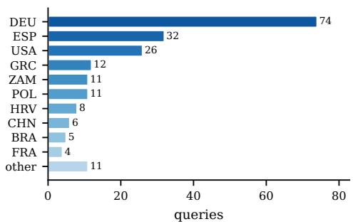

(a) Country distribution (DEU dominates).  
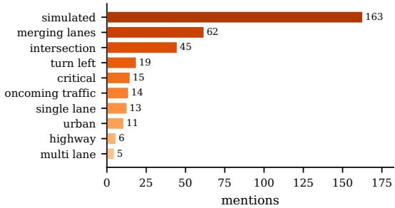

(b) Top-10 GT scenarioTags.  
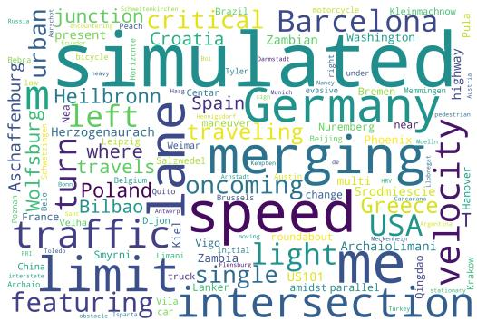  
(c) Word cloud (stopwords/function words removed).  
Figure 7: Composition of the 200-query Scenario Selection Module. Per-slot field coverage is reported separately in Table 8.

By default, these are reported on the funnel pipeline. Both sat\_any@5 and sat\_all@returned are additionally broken down across the four retrieval pipelines (funnel, semantic, hybrid\_prefilter, rrf) in Figure 8 to isolate structured filtering from semantic search.

Extraction quality. Extract is the mean of five per-slot extractor scores in [0, 1], computed by comparing the LLM’s structured output to the GT slotby-slot. It is independent of retrieval and isolates pure LLM extraction quality. The per-slot scoring functions are:

• location → exact country\_code + fuzzy specifier.

• tags → Jaccard set overlap.

• road\_net → field-wise topology agreement.

• obstacles → range/count overlap.

• velocity → numeric range overlap (±2 m/s for single-element bounds).

Diagnosing failures with Extract vs. sat\_all. The two columns decouple two distinct failure modes (see Table 9): high Extract with low sat\_all indicates correct extraction followed by a lowprecision retrieval stage that admits spurious items into the returned list (a candidate for retrieval-side refinement). Low Extract with high sat\_all indicates a noisy LLM whose extraction errors are masked by a permissive downstream filter. We therefore report both columns. We rank (model, condition) pairs by funnel sat\_all@returned, the precision-strict headline metric: every scenario the system returns must satisfy the user’s structured request.

## A.3.3 Evaluation Results

Experimental design. We evaluate a grid of ten model variants, five prompt conditions, and four retrieval methods over the same N=200 fixtures, with gt\_valid\_ids cached as the programmatic answer key. Since the four retrieval methods consume the same LLM-extracted slots per (model, condition) call, the experiment requires 10,000 LLM extractions but yields 40,000 (cell, fixture) retrieval outcomes. The two reporting artifacts surface complementary slices: Table 9 gives every (model, condition) pair on the production funnel pipeline (50 cells), while Figure 8 reports sat\_any@5 across all four pipelines at each model’s best prompt condition (40 cells). Each cell aggregates 200 end-to-end runs: NL query → slot extraction → retrieval → top-k scoring against the cached answer key.

Reading Table 9. The metrics are split into two clusters: Cost (tokens, latency) and Retrieval (funnel), where the latter also embeds the LLM-only Extract column so that the LLM-vs.- retrieval failure-mode comparison is visible at a glance (cf. §A.3.2). The shaded column sat\_all (sat\_all@returned) is the precision-strict headline we use to rank variants: every returned scenario must satisfy the GT structured conditions. Models are grouped by provider and listed in the same order as Table 6. Within each model family, the (Think) (reasoning-on) variant precedes the default. The cross-pipeline comparison across all four retrieval methods is shown in Figure 8.

Slot-level extract. Table 9 reports a single extract mean that hides which of the five slots fails. Table 10 decomposes that mean. The bottleneck is tags (e.g. urban): it is the lowest slot in all five prompt conditions. Once the schema is injected it sits at 0.64–0.67, while the other four slots range 0.75–0.97. The cause is over-prediction, not misses (recall 99.7%): the model adds plausible unsupported descriptors such as traffic\_jam (invented 139 times although no scenario in the database carries it). CP alone recovers most of the slot (0.205→0.665); no further technique moves it. Under ICL without CoT, velocity drops 0.957→0.745 and road\_net drops 0.937→0.864, likely from copying exemplar values; adding CoT restores both. On Qwen3.6-plus, cp\_cot has the lower extract (0.903) yet the paper’s best sat\_all (88.0), while cp\_icl\_cot raises extract to 0.927 and lowers sat\_all to 83.5, because the funnel is a strict AND over slots.

Cross-pipeline analysis. Figure 8 reports both sat\_any@5 (recall) and sat\_all@returned (precision) across all four retrieval pipelines at each model’s best prompt. Under recall (panel a), the ranking is essentially universal (rrf ≈ funnel ≫ hybrid\_prefilter ≫ semantic), with funnel at 70.0–96.5% and hybrid\_prefilter flat near 75%. Any LLM-consulting pipeline can usually surface one valid match in five. Under precision (panel b), only the strict-AND funnel survives at 63.5– 88.0%. The semantic-based pipelines collapse: semantic returns 0% (no structured constraints), hybrid\_prefilter reaches only 5.5–6.0% (country pre-filter too weak), and rrf stays below 1.0% (semantic candidates dilute the funnel list). The Selection Module ships the precision view, so funnel is the production pipeline. Rrf’s parity with funnel under recall is an artefact of the top-5 hit-rate metric.

## A.4 Scenario Modification Module

## A.4.1 Query Corpus

The Modification Module benchmark uses $N =$ 200 natural-language queries per task across four task types: T (trajectory redirection), B (behavior preset), P (population edit), and G (goal extraction), for a total of 800 queries. Task P is a synthetic union of the population-insertion $( P _ { \mathrm { a d d } } )$ and population-deletion $( P _ { \mathrm { r e m o v e } } )$ sub-tasks: 100 queries from each side, yielding N=200 for P and matching the per-cell sample size used elsewhere.

Table 9: Performance of the Selection Module on the funnel pipeline (N=200 per cell). sat\_all % denotes the joint satisfaction rate across all five GT slots (location → tags → road network → obstacles → velocity) for the returned top-k scenario list; we report it as the precision-strict headline metric.
<table><tr><td rowspan="2">Model</td><td rowspan="2">Prompt</td><td colspan="2">Cost</td><td rowspan="2">Fail% ↓</td><td colspan="3">Retrieval (funnel)</td><td rowspan="2">Overall ↑ sat_all % ↑</td></tr><tr><td>tokens ↓</td><td>latency (s) ↓</td><td>sat_any@5 % ↑ sat_top1 % ↑</td><td></td><td>extract ↑</td></tr><tr><td colspan="8">Cloud API</td></tr><tr><td rowspan="4">Qwen3.6-plus</td><td>baseline</td><td>900</td><td>6.5</td><td>72.5</td><td>27.5</td><td>22.5</td><td>0.748</td><td>18.0</td></tr><tr><td>cp</td><td>4845</td><td>7.1</td><td>26.5</td><td>73.5</td><td>64.0</td><td>0.870</td><td>57.0</td></tr><tr><td>cp_cot</td><td>7029</td><td>21.9</td><td>3.5</td><td>96.5</td><td>93.0</td><td>0.903</td><td>88.0</td></tr><tr><td>cp_icl</td><td>6621</td><td>6.4</td><td>27.5</td><td>72.5</td><td>63.5</td><td>0.858</td><td>56.0</td></tr><tr><td rowspan="5">Deepseek-v3.2</td><td>cp_icl_cot</td><td>8707</td><td>21.6</td><td>3.5</td><td>96.5</td><td>90.5</td><td>0.927</td><td>83.5</td></tr><tr><td>baseline</td><td>827</td><td>17.5</td><td>51.0</td><td>49.0</td><td>34.5</td><td>0.694</td><td>26.0</td></tr><tr><td>cp</td><td>4615</td><td>18.2</td><td>41.0</td><td>59.0</td><td>53.5</td><td>0.831</td><td>48.0</td></tr><tr><td>cp_cot</td><td>6602</td><td>32.8</td><td>19.5</td><td>80.5</td><td>80.0</td><td>0.902</td><td>76.0</td></tr><tr><td>cp_icl</td><td>6242 8158</td><td>16.6</td><td>25.0 15.0</td><td>75.0 85.0</td><td>66.0</td><td>0.838</td><td>56.0 74.5</td></tr><tr><td rowspan="5">Glm-5</td><td>cp_icl_cot</td><td></td><td>36.4</td><td></td><td></td><td>80.5</td><td>0.903</td><td></td></tr><tr><td>baseline</td><td>812</td><td>14.7</td><td>85.0</td><td>15.0</td><td>12.5</td><td>0.674</td><td>9.0</td></tr><tr><td>cp</td><td>4559</td><td>13.3</td><td>29.5</td><td>70.5</td><td>62.5</td><td>0.840</td><td>56.0</td></tr><tr><td>cp_cot</td><td>6482</td><td>29.1</td><td>13.0</td><td>87.0</td><td>83.0</td><td>0.865</td><td>77.5</td></tr><tr><td>cp_icl</td><td>6209 7974</td><td>16.3 29.1</td><td>47.5 9.5</td><td>52.5 90.5</td><td>51.0</td><td>0.758</td><td>47.0 83.5</td></tr><tr><td rowspan="5">Gemini-3-flash</td><td>cp_icl_cot</td><td></td><td></td><td></td><td></td><td>88.5</td><td>0.886</td><td></td></tr><tr><td>baseline</td><td>861</td><td>5.7</td><td>76.5</td><td>23.5</td><td>18.0</td><td>0.685</td><td>14.0</td></tr><tr><td>cp</td><td>4835 6821</td><td>6.4</td><td>32.5</td><td>67.5</td><td>58.0</td><td>0.824</td><td>51.0</td></tr><tr><td>cp_cot</td><td>6630</td><td>8.1</td><td>32.5</td><td>67.5</td><td>61.0</td><td>0.861</td><td>56.0</td></tr><tr><td>cp_icl</td><td>8548</td><td>5.2 7.9</td><td>35.5 30.0</td><td>64.5 70.0</td><td>58.0 67.0</td><td>0.813 0.858</td><td>53.5 63.5</td></tr><tr><td rowspan="8">Gpt-5.4-mini</td><td>cp_icl_cot</td><td></td><td></td><td></td><td></td><td></td><td></td><td></td></tr><tr><td>baseline</td><td>834</td><td>5.8</td><td>76.5</td><td>23.5</td><td>22.5</td><td>0.612</td><td>21.5</td></tr><tr><td>cp</td><td>4569</td><td>5.6</td><td>49.5</td><td>50.5</td><td>48.0</td><td>0.802</td><td>46.0</td></tr><tr><td>cp_cot</td><td>6139</td><td>8.7</td><td>25.0</td><td>75.0</td><td>73.0</td><td>0.892</td><td>72.0</td></tr><tr><td>cp_icl</td><td>6185</td><td>6.1</td><td>51.5</td><td>48.5</td><td>43.5</td><td>0.789</td><td>38.0</td></tr><tr><td>cp_icl_cot</td><td>7772</td><td>8.1</td><td>21.0</td><td>79.0</td><td>76.5</td><td>0.889</td><td>73.0</td></tr><tr><td></td><td></td><td></td><td></td><td></td><td></td><td></td><td></td></tr><tr><td colspan="8">Local Ollama</td></tr><tr><td rowspan="5">Qwen3.6:35b (Think)</td><td>baseline cp</td><td>5642 9703</td><td>34.5 36.2</td><td>59.0 26.5</td><td>41.0 73.5</td><td>35.0 68.0</td><td>0.666 0.857</td><td>26.5 65.0</td></tr><tr><td>cp_cot</td><td>13356</td><td>82.2</td><td>37.0</td><td>63.0</td><td>52.5</td><td>0.777</td><td>40.0</td></tr><tr><td>cp_icl</td><td>11843</td><td>65.6</td><td>27.0</td><td>73.0</td><td>66.0</td><td>0.826</td><td>60.0</td></tr><tr><td>cp_icl_cot</td><td>16857</td><td>77.7</td><td>30.5</td><td>69.5</td><td>50.0</td><td>0.763</td><td>33.5</td></tr><tr><td></td><td>913</td><td></td><td>47.5</td><td>52.5</td><td></td><td></td><td></td></tr><tr><td rowspan="6">Qwen3.6:35b</td><td>baseline</td><td></td><td>1.3</td><td></td><td></td><td>48.5 64.0</td><td>0.679 0.792</td><td>46.5 63.5</td></tr><tr><td>cp</td><td>4857</td><td>2.2</td><td>33.5</td><td>66.5</td><td></td><td></td><td></td></tr><tr><td>cp_cot</td><td>6949</td><td>7.5</td><td>9.0</td><td>91.0</td><td>87.5</td><td>0.884</td><td>83.0</td></tr><tr><td>cp_icl</td><td>6822</td><td>3.9</td><td>44.0</td><td>56.0</td><td>54.5</td><td>0.779</td><td>54.0</td></tr><tr><td>cp_icl_cot</td><td>8574</td><td>6.8</td><td>8.5</td><td>91.5</td><td>88.5</td><td>0.895</td><td>84.0</td></tr><tr><td>baseline</td><td>2915</td><td>59.6</td><td>77.0</td><td>23.0</td><td>16.0</td><td>0.645</td><td>11.0</td></tr><tr><td rowspan="5">Gemma4:31b (Think)</td><td>cp</td><td>6487</td><td>29.1</td><td>27.0</td><td>73.0</td><td>70.5</td><td>0.830</td><td>67.0</td></tr><tr><td>cp_cot</td><td>8318</td><td>36.8</td><td>60.5</td><td>39.5</td><td>34.0</td><td>0.884</td><td>30.0</td></tr><tr><td>cp_icl</td><td>8275</td><td>29.6</td><td>27.5</td><td>72.5</td><td>72.0</td><td>0.829</td><td>69.0</td></tr><tr><td>cp_icl_cot</td><td>10055</td><td>36.5</td><td>62.0</td><td>38.0</td><td>35.5</td><td>0.883</td><td>33.5</td></tr><tr><td>baseline</td><td>958</td><td>2.7</td><td>97.0</td><td>3.0</td><td>2.0</td><td>0.537</td><td>1.5</td></tr><tr></table>

Note: Arrows mark preferred directions (↑/↓). Tokens and latency (s) are means per query.

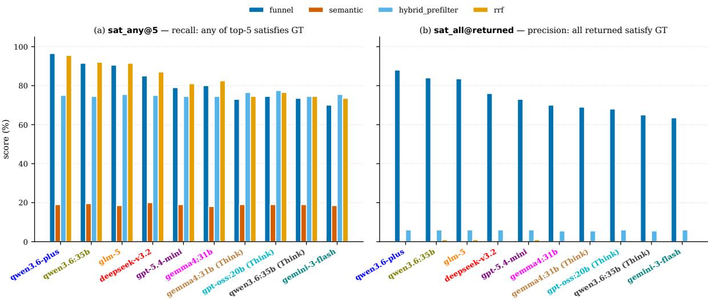  
Figure 8: Cross-pipeline retrieval comparison under two scoring contracts: (a) recall-oriented sat\_any@5; (b) precision-strict sat\_all@returned. Each model shown at its best funnel condition; x-axis order shared across panels; colours match Table 9.

Table 10: Slot-level extract score by prompt condition (mean over the ten models, N=200). The bottom row equals the extract column of Table 9 averaged across models.
<table><tr><td>Extractor slot</td><td>baseline</td><td>cp</td><td>cp_cot</td><td>cp_icl</td><td>cp_icl_cot</td></tr><tr><td>location</td><td>0.881</td><td>0.914</td><td>0.857</td><td>0.911</td><td>0.879</td></tr><tr><td>tags</td><td>0.205</td><td>0.665</td><td>0.648</td><td>0.642</td><td>0.658</td></tr><tr><td>road_net</td><td>0.825</td><td>0.878</td><td>0.937</td><td>0.864</td><td>0.951</td></tr><tr><td>obstacles</td><td>0.745</td><td>0.947</td><td>0.918</td><td>0.928</td><td>0.910</td></tr><tr><td>velocity</td><td>0.665</td><td>0.749</td><td>0.957</td><td>0.745</td><td>0.974</td></tr><tr><td>Mean = extract</td><td>0.664</td><td>0.831</td><td>0.864</td><td>0.818</td><td>0.874</td></tr></table>

The 800 queries are anchored in 345 unique CommonRoad scenarios spanning 15 country codes (DEU dominates: 80–92 queries per task). The three scenario counts in the paper denote distinct sets: the Selection Module’s persistent ChromaDB store indexes 500+ curated scenarios (Appendix §A.1). The Modification corpus draws from a smaller 245-scenario SUMO-cached pool (with the 5/245 round-trip exclusion below, leaving 240 clean seeds), and the 345 unique anchor scenarios above are the union across all five Modification tasks, larger than the 240 simulable seeds because Task G only edits the planning problem and can use scenarios outside the SUMO-cached pool. Five of 245 cached CommonRoad scenarios (2.0%) were excluded from the source pool because their unmodified form fails to round-trip through the CR↔SUMO interface: four due to a missing ObstacleType.MOTORCYCLE mapping in the simulator-to-CommonRoad converter, and one for an unrelated SUMO route-validity issue. These are infrastructure limits of the bridge, not failures of LLM-generated modifications. The LLM never touches them in the sweep. Replacement queries are drawn from the same clean 240-scenario pool to keep the per-task count at exactly N=200.

The GT schema is task-specific because each modification target requires different anchor fields: T carries the source vehicle, source edge, target edge, and BFS depth. B carries the targetvehicle list and the expected behavior preset. P carries the ±1 vehicle-count delta together with the target edge/vehicle and vehicle-type fields. G carries the target edge and the position keyword (start/quarter/middle/three-quarter/end). The canonical GT shapes feed the per-task scorers (§A.4.2). The principal corpus-stratification dimensions per task are visualized in Figure 9.

To illustrate the diversity of query phrasings across tasks, one representative GT row per task is shown below (the first query from each task’s query set. For P, we list both sub-task examples since the synthetic task interleaves them:

• T (POL\_Krakow-22\_1\_T-4): “Redirect vehicle 14 to edge 595.” GT: {vid:14, source\_edge:332, target\_edge:595, bfs\_depth:1}

• B (GRC\_NeaSmyrni-102\_1\_T-6): “Set vehicles 20026 and 20019 to urgent driving.” GT: {target\_vids:[20026,20019], expected\_preset:emergencyType, descriptor\_kind:multi}

• P (add) (DEU\_Hanover-44\_29\_T-1): “Please add a new truck, starting on edge 874, to the simulation.” GT: {expected\_delta:+1, target\_edge:874, target\_vtype:truck}

• P (remove) (DEU\_Bremen-5\_5\_T-1): “Could you please remove vehicle with ID 30243 from the simulation?” GT: {expected\_delta:-1, target\_vid:30243, target\_vClass:passenger}

• G (RUS\_Bicycle-3\_2\_T-1): “Set ego goal to 3/4 of lanelet 7.” GT: {target\_edge:7, position:three\_quarter}

Figure 9 visualizes the corpus along three axes per task: principal stratification (row 1), query-length distribution (row 2), and a word cloud over the 200 NL queries per task (row 3). The behavior-preset distribution (panel b) and the goal-position distribution (panel d) are intentionally near-uniform to ensure the prompt techniques cover every preset and every position keyword. Task T concentrates on short-hop reroutes (1–2 BFS hops cover 86.5% of queries), reflecting the typical local-edit semantics of trajectory modification requests. Task P’s combined panel (c) makes the asymmetry between the add and remove sub-tasks visible: the add side is balanced across car/truck/bus while the remove side is dominated by passenger targets (the first 100 Premove queries are all passenger), because passenger vehicles are by far the most common non-ego actors in CommonRoad scenarios. The word-cloud row (i–l) highlights the verbs and adjectives that characterize each task: “redirect/route/target” for T, “preset/aggressive/comfort” for B, “add/remove/truck/passenger” for P, “goal/lanelet/quarter/middle” for G.

## A.4.2 Evaluation Metrics

We evaluate each (model, condition) pair on the N=200 queries per task with a two-stage scoring funnel: per-task semantic correctness (does the modified scenario reflect the requested change?), followed by downstream simulability (does the modified scenario still produce a valid SUMO trace that round-trips back into CommonRoad?). All checks are boolean. The headline metric overall is the unweighted mean of these boolean checks. Perquery and per-cell telemetry (latency and tokens) is auto-recorded alongside.

Shared funnel stages (every task). The Cost columns (mean tokens, mean latency) and the syntactic/simulability checks below apply uniformly to T, B, P, and G. Task G omits SUMO % and CR % because it only edits the planning problem, so there is no traffic round-trip.

• tokens: Mean total tokens per query (Cost).

• latency (s): Mean LLM wall-clock per query (Cost).

• XML % / JSON %: Output parses as wellformed SUMO route XML (or JSON for G).

• SUMO %: Modified route file simulates endto-end without runtime errors or stuck vehicles.

• CR %: SUMO output round-trips back into a valid CommonRoad scenario via the CR→SUMO bridge.

The optional Frenetix-runnability gate is disabled by default in this sweep (the cross-planner Frenetix evaluation is instead reported as the separate batch comparison summarised in Figure 5), so the column does not appear in Tables 11–13.

Per-task semantic checks. Each task carries its own semantic checks against the per-task GT schema described above. For each task, we identify the strictest semantic gate as the HEADLINE metric (the check whose failure most directly indicates that the LLM has not performed the requested edit). The headline column is rendered in red in the corresponding result table.

Task T — Trajectory Redirection (Table 11).

• tgt %: The named vehicle survives the edit.

• ends % — HEADLINE: The redirected route terminates at the requested target edge.

• preserve %: Non-target vehicles’ routes remain byte-equivalent to baseline.

Task B — Behaviour Preset (Table 12).

• tgt %: The named vehicle survives the edit.

• preset % — HEADLINE: Modified behaviour-parameter vector matches the requested preset within relative tolerance 10−3.

• vClass %: Vehicle class is preserved (e.g. a bus stays a bus).

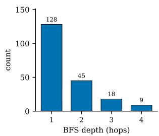  
(a) T: BFS depth.

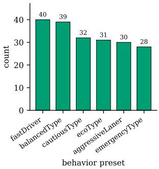  
(b) B: behavior preset.

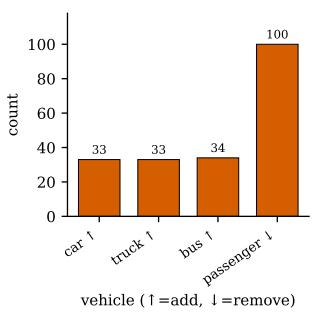  
(c) P: add/remove vehicle mix.

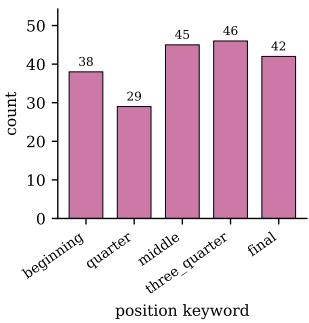  
(d) G: position keyword.

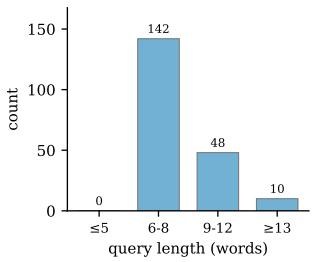  
(e) T: query length.

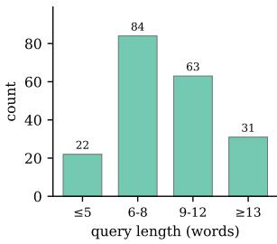  
(f) B: query length.

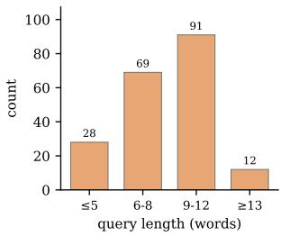  
(g) P: query length.

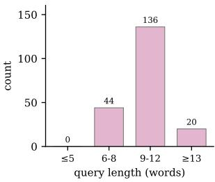  
(h) G: query length.

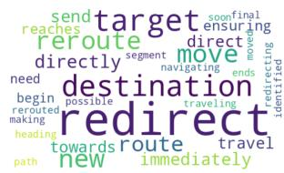  
(i) T: word cloud.

  
(j) B: word cloud.

  
(k) P: word cloud.

  
(l) G: word cloud.

Figure 9: Per-task corpus composition for the Scenario Modification benchmark (N=200 queries each). Row 1 (a–d): principal stratification axis per task. Row 2 (e–h): query-length distribution. Row 3 (i–l): per-task word cloud.

Task P — Population Edit $( P _ { \mathrm { a d d } } \cup P _ { \mathrm { r e m o v e } }$ ; Table 13). The add and remove sub-task scorers share an indistinguishable arithmetic semantics (both grade the model on producing the requested ±1 delta while leaving the rest of the route file unchanged) so the combined P overall is the unweighted mean of the boolean checks across all 200 queries.

• count\_match % — HEADLINE: Vehicle count changes by exactly +1 (add) or −1 (remove). Without this, the requested edit has not happened.

• tgt-chg %: New vehicle starts on the requested edge (add) or the named vehicle is absent from the modified file (remove).

• others %: Non-target route entries remain byte-equivalent to baseline.

Task G — Goal Extraction (Table 14).

• edge %: A target edge ID is emitted.

• pos-enum %: Position keyword belongs to the allowed enumeration.

• edge-GT % — HEADLINE: Extracted target lanelet matches the GT — the structural goal decision.

• pos-GT %: Extracted position keyword matches the GT.

• lanelet %: Lanelet ID resolves in the CommonRoad scenario.

Two further G checks (the planning-problemaccept check and the shared CR-reload check) are computed but not displayed in Table 14 because they are perfectly correlated with lanelet % in this sweep. Both still contribute to Overall.

Auto-recorded telemetry. For each LLM invocation, we record prompt, completion, and (where the provider exposes it) reasoning token counts, the total token count, the per-invocation API latency, and the full per-query wall-clock (which also includes parsing and simulation overhead). These columns appear unaltered in the per-task KPI summaries and let us decouple “the LLM did its job correctly” (semantic checks) from “the LLM was fast enough to be deployable” (latency/token cost).

Diagnosing failures with the funnel. The two stages decouple distinct failure modes: high semantic correctness with low SUMO simulability indicates a semantically correct edit that produces a structurally fragile route (e.g. a target edge that is connected but disallows the vehicle’s class), while uniformly low semantic checks indicate a model that either fails to identify the right anchor field or emits malformed XML/JSON. The two paths, therefore, call for different fixes (network-aware prompting vs. stricter output-format prompting), which the per-task per-check tables in §A.4.3 surface independently.

## A.4.3 Evaluation Results

Qualitative examples. Before reporting quantitative outcomes, Figure 10 shows one representative successful modification per task, all from gemini-3-flash-preview under the cp\_icl\_cot condition. Each row compares the baseline scenario (left) and the LLM-modified scenario (right) rendered at the same mid-trajectory timestep so the modification’s effect on the dynamic traffic is directly visible. The four examples surface the visible footprint of each task: in T, the redirected vehicle has joined a different downstream lanelet by t=32. In B, vehicles 30293 and 30296 have already pulled ahead under the faster behavior preset by t=122. The P (remove) sub-task shows that vehicle 30242 is removed. G renders the ego’s modified goal region on the requested lanelet at t=15 (G’s modification only edits the planning problem, so the surrounding traffic is unchanged by design).

Quantitative results. Tables 11, 12, 13, and 14 report the per-task funnel KPIs for all ten models across the five prompt conditions. Each table covers N=200 queries per (model, condition) cell (Task P combines the first-100 of $P _ { \mathrm { a d d } }$ with the first-100 of $P _ { \mathrm { r e m o v e } } )$ Cells marked “N/A” correspond to open-source models still in the datacollection phase as of submission. The tablegeneration pipeline will replace them with values for the camera-ready version.

Application: safety-criticality. As a downstream application of the B-task modification, we verify that it can systematically shift the safety criticality of a scenario. On N=100 paired (baseline, modified) scenarios run through Frenetix under identical default cost weights, where the modification (gemini-3-flash-preview/cp\_icl\_cot) sets the three NPCs closest along ego’s executed baseline trajectory to the aggressiveLaner preset, we measure per-scenario min\_risk\_score (integer 0–5; 0 = collision risk, 5 = safe) using the criticality toolkit From-Words-to-Collisions (Gao et al., 2025), computed directly on each side’s Frenetix-executed trajectory (no re-planning required). The score distribution shifts measurably toward more critical under modification: the 0- bucket (collision risk) doubles from 10 to 20 and 23/84 paired scenarios move to a strictly more critical bucket vs. 18 less critical (paired Wilcoxon count\_match= − 0.095, p=0.44). The B-task modification thereby provides a natural-language interface for shifting downstream scenario safety profiles, a building block for safety-critical scenario generation.

Table 11: Task T (trajectory redirection) per-cell funnel KPIs (N=200 queries per cell). The rightmost column ends % is the headline semantic check (the LLM-edited route terminates on the requested target edge); preserve % verifies non-target vehicles’ routes stay byte-equivalent to baseline.
<table><tr><td rowspan="2">Model</td><td rowspan="2">Prompt</td><td colspan="2">Cost</td><td rowspan="2">Fail%↓</td><td colspan="6">Pipeline stage pass rates</td></tr><tr><td>tokens ↓</td><td>latency (s) ↓</td><td>XML % ↑</td><td>tgt % ↑</td><td>preserve % ↑</td><td>SUMO % ↑</td><td>CR % ↑</td><td>ends % ↑</td></tr><tr><td colspan="9">Cloud API</td></tr><tr><td></td><td>baseline cp cp_cot</td><td>18324 19336 21011</td><td>52.6 55.2 61.9</td><td>6.5 3.5 2.0</td><td>99.5 99.5 100.0</td><td>99.5 99.5 100.0</td><td>99.0 99.0 100.0</td><td>93.5 96.5 98.0</td><td>93.5 96.5 98.0</td><td>99.0 98.5 99.5</td></tr><tr><td>Qwen3.6-plus</td><td>cp_icl cp_icl_cot baseline cp</td><td>21611 24336 14722</td><td>50.5 61.1 69.5</td><td>4.0 2.5 12.5</td><td>100.0 100.0 99.5</td><td>100.0 100.0 99.5</td><td>100.0 100.0 99.0</td><td>96.0 97.5 87.5</td><td>96.0 97.5 87.5 95.5</td><td>98.5 98.0 99.0 94.0</td></tr><tr><td>Deepseek-v3.2</td><td>cp_cot cp_icl cp_icl_cot baseline</td><td>15274 16962 17067 18350 14223</td><td>67.5 83.8 58.5 68.7 36.3</td><td>4.5 0.5 5.0 0.5 23.5</td><td>99.5 99.5 100.0 100.0 99.5</td><td>99.5 99.5 100.0 100.0 99.5</td><td>99.5 99.0 99.5 100.0</td><td>95.5 99.5 95.0 99.5</td><td>99.5 95.0 99.5 76.5</td><td>97.0 99.0 99.0 98.0</td></tr><tr><td>Glm-5</td><td>cp cp_cot cp_icl cp_icl_cot baseline</td><td>15559 16568 17844 19004 18658</td><td>43.8 48.8 42.4 51.5</td><td>3.0 2.5 1.5 2.0</td><td>99.5 99.5 99.5 99.5</td><td>99.5 99.5 99.5 99.5</td><td>99.0 99.0 99.0 99.5</td><td>76.5 97.0 97.5 98.5 98.0</td><td>97.0 97.5 98.5 98.0</td><td>97.0 99.5 98.0 99.5</td></tr><tr><td>Gemini-3-flash</td><td>cp cp_cot cp_icl cp_icl_cot</td><td>19757 20831 22225 23398</td><td>10.0 10.4 12.4 10.4 12.1</td><td>2.5 1.5 2.5 2.0 2.0</td><td>99.5 99.5 98.5 99.5 99.5</td><td>99.5 99.5 98.5 99.5 99.5</td><td>99.5 99.5 98.5 98.5 99.5</td><td>97.5 98.5 97.5 98.0 98.0</td><td>97.5 98.5 97.5 98.0 98.0</td><td>99.0 99.5 98.5 99.5 99.5</td></tr><tr><td>Gpt-5.4-mini</td><td>baseline cp cp_cot cp_icl</td><td>14727 15839 16866 16348 17446</td><td>11.3 11.7 13.3 10.8</td><td>13.0 9.5 3.5 6.5</td><td>99.5 98.0 99.5 99.5</td><td>99.5 98.0 99.5 99.5</td><td>99.0 98.0 99.5 99.5</td><td>87.0 90.5 96.5 93.5</td><td>87.0 90.5 96.5 93.5</td><td>98.5 94.5 98.5 95.5</td></tr><tr><td>Local Ollama</td><td>cp_icl_cot baseline cp</td><td>22700 25990</td><td>11.5 55.9</td><td>2.0 11.5</td><td>99.5 98.0</td><td>99.5 98.0</td><td>99.0 97.5</td><td>98.0 88.5</td><td>98.0 88.5</td><td>97.0 97.0</td></tr><tr><td>Qwen3.6:35b (Think)</td><td>cp_cot cp_icl cp_icl_cot</td><td>26216 27796 28681</td><td>68.4 66.3 66.7 68.8</td><td>5.0 4.5 7.5 8.0</td><td>100.0 99.5 98.0 98.5</td><td>100.0 99.5 98.0 98.5</td><td>100.0 99.5 98.0 98.5</td><td>95.0 95.5 92.5 92.0</td><td>95.0 95.5 92.5 92.0</td><td>100.0 99.5 98.0 98.5</td></tr><tr><td>Qwen3.6:35b</td><td>baseline cp cp_cot cp_icl cp_icl_cot</td><td>19169 20492 21664 23758 23676</td><td>24.0 26.2 30.4 32.5 27.8</td><td>10.0 4.5 7.0 7.5</td><td>99.5 100.0 99.5 100.0</td><td>99.5 100.0 99.5 100.0</td><td>99.5 100.0 99.5 100.0</td><td>90.0 95.5 93.0 92.5</td><td>90.0 95.5 93.0 92.5</td><td>98.0 99.5 98.5 99.0 100.0</td></tr><tr><td>Gemma4:31b (Think)</td><td>baseline cp cp_cot cp_icl</td><td>19840 21374 22479 23446</td><td>88.7 97.3 104.1</td><td>3.5 6.5 4.5 5.5</td><td>100.0 98.5 99.5 99.0</td><td>100.0 98.5 99.5 99.0</td><td>99.5 98.5 99.5 99.0</td><td>93.5 95.5 94.5</td><td>96.5 93.5 95.5 94.5</td><td>98.0 99.5 98.5 89.6</td></tr><tr><td>Gemma4:31b</td><td>cp_icl_cot baseline cp cp_cot</td><td>22346 17864 18868 20225</td><td>104.8 118.9 41.2 48.6 60.1</td><td>7.5 6.0 8.0 7.5</td><td>96.1 98.0 100.0 99.5</td><td>96.1 98.0 100.0 99.5</td><td>96.1 98.0 100.0 99.5</td><td>89.6 94.0 92.0 92.5</td><td>94.0 92.0 92.5</td><td>96.1 97.0 99.5 99.5 95.0 98.5</td></tr><tr><td>Gpt-oss:20b (Think)</td><td>cp_icl cp_icl_cot baseline cp cp_cot</td><td>21264 22420 18348 18362 19784</td><td>50.0 57.7 36.6 30.2</td><td>5.0 7.5 5.5 31.5 14.0</td><td>99.0 99.0 99.0 89.0 90.0</td><td>99.0 99.0 89.0 90.0</td><td>99.0 99.0 88.0 90.0</td><td>92.5 94.5 68.5 86.0</td><td>92.5 94.5 68.5 86.0</td><td>99.0 99.0 88.0 89.0</td></tr></table>

Note: Arrows mark preferred directions (↑/↓). Tokens and latency (s) are means per query (errored / rate-limited zero-token rows excluded).

Table 12: Task B (behaviour preset) per-cell funnel KPIs $( N { = } 2 0 0$ per cell). The rightmost column preset % is the headline check (the modified vType feature vector matches the expected preset within rtol= $\mathsf { \Omega } = 1 0 ^ { - 3 } ) ;$ vClass % confirms the LLM did not silently switch the vehicle class.
<table><tr><td rowspan="2">Model</td><td rowspan="2">Prompt</td><td colspan="2">Cost</td><td rowspan="2">Fail%↓</td><td colspan="6">Pipeline stage pass rates</td></tr><tr><td>tokens ↓</td><td>latency (s) ↓</td><td>XML % ↑</td><td>tgt % ↑</td><td>vClass % ↑</td><td>SUMO % ↑</td><td>CR % ↑</td><td>preset % ↑</td></tr><tr><td colspan="9">Cloud API</td><td></td></tr><tr><td rowspan="4">Qwen3.6-plus</td><td>baseline</td><td>19149</td><td>53.8</td><td>8.5</td><td>100.0</td><td>100.0</td><td>92.5</td><td>91.5</td><td>91.5</td><td>0.0</td></tr><tr><td>cp</td><td>20667</td><td>56.3</td><td>0.0</td><td>100.0</td><td>100.0</td><td>100.0</td><td>100.0</td><td>100.0</td><td>100.0</td></tr><tr><td>cp_cot</td><td>20784</td><td>61.5</td><td>0.0</td><td>100.0</td><td>100.0</td><td>100.0</td><td>100.0</td><td>100.0</td><td>100.0</td></tr><tr><td>cp_icl cp_icl_cot</td><td>21882 24666</td><td>46.8 55.5</td><td>0.0 0.5</td><td>100.0 100.0</td><td>100.0 100.0</td><td>100.0 100.0</td><td>100.0 99.5</td><td>100.0 99.5</td><td>100.0 100.0</td></tr><tr><td rowspan="5">Deepseek-v3.2</td><td>baseline</td><td></td><td></td><td></td><td></td><td></td><td></td><td></td><td></td><td>0.0</td></tr><tr><td></td><td>14152 15801</td><td>73.8 73.2</td><td>9.5</td><td>98.0 99.5</td><td>98.0 99.5</td><td>95.5 99.5</td><td>90.5</td><td>90.5 99.0</td><td>99.5</td></tr><tr><td>cp</td><td>17074</td><td>84.9</td><td>1.0</td><td>99.0</td><td>99.0</td><td>99.0</td><td>99.0</td><td>99.0</td><td>99.0</td></tr><tr><td>cp_cot</td><td>17027</td><td>59.2</td><td>1.0</td><td>99.5</td><td></td><td></td><td>99.0</td><td>99.5</td><td>99.5</td></tr><tr><td>cp_icl cp_icl_cot</td><td>19543</td><td>74.0</td><td>0.5 2.5</td><td>97.5</td><td>99.5 97.5</td><td>99.5 97.5</td><td>99.5 97.5</td><td>97.5</td><td>97.5</td></tr><tr><td rowspan="5">Glm-5</td><td></td><td></td><td></td><td></td><td></td><td></td><td></td><td></td><td></td><td></td></tr><tr><td>baseline</td><td>14233 15531</td><td>40.2</td><td>9.5</td><td>99.0</td><td>99.0</td><td>88.5</td><td>90.5</td><td>90.5</td><td>0.0</td></tr><tr><td>cp</td><td>16723</td><td>43.9</td><td>1.0</td><td>99.0</td><td>99.0</td><td>99.0</td><td>99.0</td><td>99.0</td><td>96.5</td></tr><tr><td>cp_cot cp_icl</td><td>18382</td><td>51.9 45.4</td><td>1.0</td><td>99.0 99.0</td><td>99.0</td><td>99.0</td><td>99.0</td><td>99.0</td><td>99.0</td></tr><tr><td>cp_icl_cot</td><td>19756</td><td>53.1</td><td>3.0 2.0</td><td>99.0</td><td>99.0 99.0</td><td>97.0 98.0</td><td>97.0 98.0</td><td>97.0 98.0</td><td>99.0 99.0</td></tr><tr><td rowspan="5">Gemini-3-flash</td><td>baseline</td><td>18266</td><td>11.4</td><td>17.0</td><td>99.0</td><td>99.0</td><td>87.0</td><td>83.0</td><td>83.0</td><td>0.5</td></tr><tr><td>cp</td><td>19732 21028</td><td>11.5</td><td>1.0</td><td>99.0</td><td>99.0</td><td>99.0</td><td>99.0</td><td>99.0</td><td>99.0</td></tr><tr><td>cp_cot</td><td></td><td>13.1</td><td>1.0</td><td>99.0</td><td>99.0</td><td>99.0</td><td>99.0</td><td>99.0</td><td>98.5</td></tr><tr><td>cp_icl</td><td>22326</td><td>10.6</td><td>1.0</td><td>99.0</td><td>99.0</td><td>99.0</td><td>99.0</td><td>99.0</td><td>99.0</td></tr><tr><td>cp_icl_cot</td><td>23915</td><td>12.7</td><td>2.0</td><td>99.0</td><td>99.0</td><td>99.0</td><td>98.0</td><td>98.0</td><td>99.0</td></tr><tr><td rowspan="5">Gpt-5.4-mini</td><td>baseline cp</td><td>14756</td><td>13.3</td><td>12.5</td><td>99.0</td><td>99.0</td><td>88.5</td><td>87.5</td><td>87.5</td><td>0.0 98.0</td></tr><tr><td>cp_cot</td><td>16121 17223</td><td>12.4 14.2</td><td>2.0</td><td>98.5</td><td>98.5</td><td>98.0</td><td>98.0</td><td>98.0</td><td></td></tr><tr><td>cp_icl</td><td>18447</td><td></td><td>1.0</td><td>99.0</td><td>99.0</td><td>99.0</td><td>99.0</td><td>99.0</td><td>99.0</td></tr><tr><td></td><td></td><td>12.0</td><td>1.5</td><td>99.0</td><td>99.0</td><td>99.0</td><td>98.5</td><td>98.5</td><td>99.0</td></tr><tr><td>cp_icl_cot</td><td>19521</td><td>13.3</td><td>1.0</td><td>99.0</td><td>99.0</td><td>99.0</td><td>99.0</td><td>99.0</td><td>99.0</td></tr><tr><td colspan="8">Local Ollama</td><td></td><td></td></tr><tr><td rowspan="9">Qwen3.6:35b (Think)</td><td>baseline</td><td>23582</td><td>64.9</td><td>14.0</td><td>98.0</td><td>98.0</td><td>85.0</td><td>86.0</td><td>86.0</td><td>0.0</td></tr><tr><td>cp</td><td>28174</td><td>84.4</td><td>0.5</td><td>100.0</td><td>100.0</td><td>100.0</td><td>99.5</td><td>99.5</td><td>99.5</td></tr><tr><td>cp_cot</td><td>28190</td><td>79.4</td><td>0.0</td><td>100.0</td><td>100.0</td><td>100.0</td><td>100.0</td><td>100.0</td><td>99.5</td></tr><tr><td>cp_icl cp_icl_cot</td><td>29818 31863</td><td>80.0</td><td>0.0</td><td>100.0</td><td>100.0</td><td>100.0</td><td>100.0</td><td>100.0 99.5</td><td>100.0 99.5</td></tr><tr><td>baseline</td><td></td><td>89.0</td><td>0.5</td><td>99.5</td><td>99.5</td><td>99.5</td><td>99.5</td><td></td><td></td></tr><tr><td>Qwen3.6:35b</td><td>18980 20650</td><td>28.3 28.7</td><td>22.5</td><td>98.0</td><td>98.0</td><td>84.5</td><td>77.5</td><td>77.5 97.0</td><td>0.5 97.5</td></tr><tr><td>cp cp_cot</td><td>21437</td><td>30.9</td><td>3.0 2.0</td><td>97.5</td><td>97.5</td><td>97.0</td><td>97.0</td><td>98.0</td><td>97.5</td></tr><tr><td>cp_icl</td><td>23511</td><td>33.1</td><td>4.0</td><td>98.0 98.5</td><td>98.0 98.5</td><td>98.0 96.0</td><td>98.0</td><td>96.0</td><td>98.5</td></tr><tr><td>cp_icl_cot</td><td>23546</td><td>28.3</td><td>1.0</td><td>99.0</td><td>99.0</td><td>99.0</td><td>96.0 99.0</td><td>99.0</td><td>99.0</td></tr><tr><td></td><td></td><td></td><td></td><td></td><td></td><td></td><td></td><td></td><td></td></tr><tr><td rowspan="4">Gemma4:31b (Think)</td><td>baseline cp</td><td>19462</td><td>94.2 100.7</td><td>3.5 0.0</td><td>99.0 100.0</td><td>99.0 100.0</td><td>94.0 100.0</td><td>96.5 100.0</td><td>96.5 100.0 100.0</td><td>1.0 99.5 100.0</td></tr><tr><td>cp_cot cp_icl</td><td>21564 22031 23799</td></table>

Note: Arrows mark preferred directions (↑/↓). Tokens and latency (s) are means per query (errored / rate-limited zero-token rows excluded).

Table 13: Task P (population edit, combined add+remove) per-cell funnel KPIs (first-100 of $\mathrm { \Delta P _ { a d d } }$ + first-100 of $\mathrm { P _ { r e m o v e } } = N { = } 2 0 0$ per cell). The rightmost column count\_match % is the headline check (the requested +1/ − 1 vehicle-count delta is present); tgt-chg % fires when the new vehicle starts on the requested edge (add) or the named vehicle is gone (remove); others % confirms non-target route entries are byte-equivalent.
<table><tr><td rowspan="2">Model</td><td rowspan="2">Prompt</td><td colspan="2">Cost</td><td rowspan="2">Fail%↓</td><td colspan="6">Pipeline stage pass rates</td></tr><tr><td>tokens ↓ latency (s) ↓</td><td></td><td>XML %↑</td><td>tgt-chg % ↑</td><td>others % ↑</td><td>SUMO % ↑</td><td>CR % ↑</td><td>count_match % ↑</td></tr><tr><td colspan="9">Cloud API</td></tr><tr><td>Qwen3.6-plus</td><td>baseline cp cp_cot</td><td>17948 19066 19958</td><td>50.9 53.2 58.5</td><td>33.0 4.0 2.0</td><td>99.0 99.0 99.0</td><td>90.5 99.0 99.0</td><td>98.5 99.0 99.0</td><td>67.0 96.0 98.0 96.5</td><td>67.0 96.0 98.0 96.5</td><td>99.0 99.0 99.0 98.5</td></tr><tr><td></td><td>cp_icl cp_icl_cot baseline cp</td><td>21371 23369 14410 14993 17068</td><td>47.3 55.6 70.0 67.3</td><td>3.5 0.0 34.5 1.0</td><td>99.0 100.0 99.5 99.5</td><td>98.5 100.0 98.5 99.5</td><td>98.5 99.5 99.5 99.5 99.0</td><td>100.0 100.0 65.5 65.5 99.0 99.5</td><td></td><td>100.0 99.0 99.5 100.0 99.5</td></tr><tr><td>Deepseek-v3.2</td><td>cp_cot cp_icl cp_icl_cot baseline cp</td><td>16418 17683 14635 15763 16505</td><td>77.7 56.6 69.4 36.4 41.6 49.6</td><td>0.5 2.0 1.0 39.0 2.0</td><td>100.0 99.5 99.5 99.0 99.0</td><td>100.0 99.5 99.5 98.0</td><td>99.5 98.5 99.0 99.0</td><td>99.5 98.0 99.0 61.0</td><td>98.0 99.0 61.0 98.0</td></tr><tr><td>Glm-5</td><td>cp_cot cp_icl cp_icl_cot baseline</td><td>17122 18640 18992</td><td>41.5 51.2</td><td>1.0 3.0 1.0 99.0 51.0</td><td>99.0 99.0 99.0 99.0 96.0</td><td>99.0 98.5 99.0</td><td>99.0 97.0 99.0 49.0</td><td>98.0 99.0 97.0 99.0 49.0</td><td>99.0 99.0 99.0 99.0 98.5</td></tr><tr><td>Gemini-3-flash</td><td>cp cp_cot cp_icl cp_icl_cot baseline</td><td>19996 21198 21946 23271 15085</td><td>10.7 11.0 12.4 10.5 12.0 11.9</td><td>1.5 1.0 1.5 1.0</td><td>99.0 99.0 99.0 99.0</td><td>99.0 99.0 99.0 99.0</td><td>99.0 99.0 99.0 99.0</td><td>98.5 98.5 99.0 99.0 98.5 98.5 99.0 99.0</td><td>99.0 99.0 99.0 99.0</td></tr><tr><td>Gpt-5.4-mini</td><td>cp cp_cot cp_icl cp_icl_cot</td><td>16124 17215 17642 18676</td><td>12.5 13.7 11.2 13.4</td><td>12.0 3.0 3.0 1.5 2.5</td><td>97.5 99.0 99.0 99.0 99.0</td><td>96.5 98.5 99.0 98.0 99.0</td><td>97.5 98.0 99.0 98.0 99.0</td><td>88.0 88.0 97.0 97.0 97.0 97.0 98.5 98.5 97.5 97.5</td><td>97.5 98.5 99.0 98.5 99.0</td></tr><tr><td>Local Ollama Qwen3.6:35b</td><td>baseline cp</td><td>23502 26284</td><td>56.2 69.4</td><td>12.5 2.0</td><td>100.0 99.5</td><td>95.5 99.0</td><td>98.0 87.5 97.0 98.0</td><td>87.5 98.0</td><td>98.0 97.5 95.0</td></tr><tr><td>(Think)</td><td>cp_cot cp_icl cp_icl_cot baseline</td><td>27253 26972 29308 19200</td><td>71.5 62.8 74.2 24.0</td><td>3.0 3.0 0.5 6.0</td><td>98.5 99.5 100.0 100.0</td><td>98.5 99.5 100.0</td><td>95.0 97.0 97.0 97.0 96.5 99.5</td><td>97.0 97.0 99.5 94.0 94.0</td><td>96.5 96.5 99.0</td></tr><tr><td>Qwen3.6:35b</td><td>cp cp_cot cp_icl cp_icl_cot</td><td>20452 21402 23033 23296</td><td>25.8 28.6 32.6 30.3</td><td>3.0 100.0 100.0 100.0 100.0</td><td>95.5 98.0 100.0 98.0 99.5</td><td>100.0 96.5 99.0 95.5</td><td>97.0 91.0 98.5 97.5</td><td>97.0 91.0 98.5 97.5</td><td>100.0 96.5 99.0 95.5</td></tr><tr><td>Gemma4:31b (Think)</td><td>baseline cp cp_cot cp_icl cp_icl_cot</td><td>20408 21321 22424 23181 24394</td><td>95.3 89.7 98.1 90.8</td><td>6.0 99.5 0.5 100.0 0.5 100.0 1.5 98.7 99.3</td><td>98.5 100.0 100.0 98.7</td><td>99.5 100.0 100.0 98.7</td><td>94.0 99.5 99.5 98.7</td><td>94.0 99.5 99.5 98.7</td><td>99.5 100.0 100.0 98.7 99.3</td></tr><tr><td>Gemma4:31b</td><td>baseline cp cp_cot</td><td>17710 19090 20452</td><td>97.7 45.7 52.2 58.9</td><td>1.0 38.0 99.0 2.0 99.0 2.0 99.0</td><td>99.3 96.0 99.0 99.0</td><td>99.3 99.0 99.0 99.0</td><td>98.7 62.0 98.0 98.0</td><td>62.0 98.0 98.0</td><td>99.0 99.0 99.0</td></tr><tr><td></td><td>cp_icl cp_icl_cot baseline</td><td>20726 22078</td><td>46.0 54.5</td><td>1.5 1.5</td><td>99.0 99.0 99.0 99.0</td><td>99.0 99.0</td><td>98.5 98.5 85.0</td><td>98.5 98.5</td><td>99.0 99.0</td></tr><tr><td>Gpt-oss:20b (Think)</td><td>cp cp_cot cp_icl cp_icl_cot</td><td>21892 22965 25822 28929</td><td>53.2 49.1 74.1 102.9</td><td>12.0 10.0 10.5 18.5</td><td>90.0 90.0 92.9</td><td>90.0 90.0 92.9</td><td>90.0 90.0 88.0 92.9 90.5</td><td>85.0 88.0 90.5</td><td>90.0 90.0 92.9</td></tr></table>

Note: Arrows mark preferred directions (↑/↓). Tokens and latency (s) are means per query (errored / rate-limited zero-token rows excluded).

Table 14: Task G (goal extraction) per-cell funnel KPIs (N=200 per cell). The rightmost column edge-GT % is the headline semantic check (the extracted target lanelet matches the GT); pos-GT % is the secondary semantic check (the position keyword inside that lanelet matches the GT). G has no Frenetix or SUMO column because the edit modifies only the planning problem, not traffic.
<table><tr><td rowspan="2">Model</td><td rowspan="2">Prompt</td><td colspan="2">Cost</td><td rowspan="2">Fail%↓</td><td colspan="6">Pipeline stage pass rates</td></tr><tr><td>tokens ↓</td><td>latency (s) ↓</td><td>JSON % ↑</td><td>edge % ↑</td><td>pos-enum % ↑</td><td>pos-GT % ↑</td><td colspan="2">lanelet % ↑ edge-GT % ↑</td></tr><tr><td colspan="9">Cloud API</td><td></td></tr><tr><td>Qwen3.6-plus</td><td>baseline cp cp_cot</td><td>6089 6345 6695 6746</td><td>2.4 2.2 3.6</td><td>11.5 1.0 0.0</td><td>100.0 100.0 100.0</td><td>88.5 99.0 100.0</td><td>100.0 100.0 100.0 100.0</td><td>94.5 100.0 100.0 100.0</td><td>88.5 99.0 100.0 100.0</td><td>88.5 99.0 100.0 100.0</td></tr><tr><td>Deepseek-v3.2</td><td>cp_icl cp_icl_cot baseline cp cp_cot</td><td>7097 4732 4966 5280</td><td>2.2 3.3 9.0 8.2 8.9</td><td>0.0 0.0 11.0 8.0 0.0</td><td>100.0 100.0 100.0 100.0</td><td>100.0 89.0 92.0 100.0</td><td>100.0 100.0 100.0 100.0</td><td>100.0 98.5 100.0 100.0</td><td>100.0 89.0 92.0 100.0</td><td>100.0 89.0 92.0 100.0 100.0</td></tr><tr><td></td><td>cp_icl cp_icl_cot baseline</td><td>5326 5631 4958 5194 5521</td><td>10.8 9.8 3.6 3.3 4.3</td><td>0.0 0.0 11.0 3.0</td><td>100.0 100.0 100.0 100.0</td><td>100.0 100.0 89.0 97.0 99.5</td><td>100.0 100.0 98.5</td><td>100.0 100.0 98.5 99.5</td><td>100.0 100.0 100.0 89.0 89.0 97.0 97.0</td></tr><tr><td rowspan="6">Glm-5</td><td>cp cp_cot cp_icl</td><td>5559</td><td>0.0 7.5</td><td>100.0 100.0</td><td>100.0 92.5</td><td>100.0 100.0</td><td>100.0 100.0</td><td>100.0 92.5</td><td>100.0 92.5</td></tr><tr><td>cp_icl_cot</td><td>5883</td><td>3.0 3.9 0.0 0.0</td><td>100.0</td><td>100.0</td><td>100.0</td><td>100.0</td><td>100.0 100.0</td><td>100.0</td></tr><tr><td>baseline</td><td>6037 6301</td><td>1.0</td><td>100.0 100.0</td><td>100.0 100.0</td><td>100.0 100.0</td><td>100.0 100.0</td><td>100.0 100.0</td><td>100.0 100.0</td></tr><tr><td>cp cp_cot</td><td>6646</td><td>0.9 1.3</td><td>0.0 0.0</td><td>100.0</td><td>100.0</td><td>100.0</td><td></td><td>100.0 100.0</td></tr><tr><td>cp_icl</td><td>6710</td><td>0.9</td><td></td><td>100.0</td><td>100.0</td><td>100.0</td><td>100.0 100.0</td><td></td></tr><tr><td></td><td>7047</td><td>1.3</td><td>0.0 0.0</td><td>100.0</td><td>100.0</td><td>100.0</td><td>100.0</td><td>100.0 100.0</td></tr><tr><td>Gpt-5.4-mini</td><td>cp_icl_cot</td><td></td><td></td><td></td><td></td><td></td><td></td><td></td><td>100.0 100.0</td></tr><tr><td rowspan="8"></td><td>baseline</td><td>4687</td><td>0.7</td><td>0.0 0.0</td><td>100.0 100.0</td><td>100.0 100.0</td><td>100.0 100.0</td><td>91.5 100.0</td><td>100.0 100.0 100.0</td></tr><tr><td>cp</td><td>4927</td><td>0.7</td><td></td><td></td><td></td><td></td><td></td><td>100.0</td></tr><tr><td>cp_cot</td><td>5262</td><td>1.1</td><td>0.0</td><td>100.0</td><td>100.0</td><td>100.0</td><td>100.0</td><td>100.0</td></tr><tr><td>cp_icl</td><td>5281</td><td>0.7</td><td>0.0</td><td>100.0 100.0</td><td>100.0</td><td></td><td>100.0</td><td>100.0</td></tr><tr><td>cp_icl_cot</td><td>5575</td><td>0.9</td><td>0.0</td><td>100.0</td><td>100.0</td><td>100.0</td><td>100.0 100.0</td><td>100.0</td></tr><tr><td></td><td></td><td></td><td></td><td></td><td></td><td></td><td></td><td>100.0</td></tr><tr><td></td><td></td><td></td><td></td><td></td><td></td><td></td><td></td><td></td></tr><tr><td>Local Ollama baseline</td><td>6745</td><td>5.9</td><td>0.5</td><td></td><td></td><td>99.5</td><td>99.5</td><td></td></tr><tr><td>Qwen3.6:35b (Think)</td><td></td><td></td><td></td><td>99.5</td><td>99.5</td><td></td><td></td><td>99.5 99.0</td><td>99.5 99.0</td></tr><tr><td>cp</td><td>6955</td><td>5.6</td><td>1.0</td><td>99.0</td><td>99.0</td><td>99.0 95.0</td><td>99.0 95.0</td><td>95.0</td><td>95.0</td></tr><tr><td>cp_cot cp_icl</td><td>8074 7161</td><td>11.5</td><td>5.0</td><td>95.0</td><td>95.0</td><td>99.5</td><td>99.5</td><td>99.5</td><td>99.5</td></tr><tr><td>cp_icl_cot</td><td>8012</td><td>4.5</td><td>0.5</td><td>99.5</td><td>99.5</td><td>91.0</td><td>91.0</td><td>91.0</td><td>91.0</td></tr><tr><td>baseline</td><td></td><td>8.3</td><td>9.0</td><td>91.0</td><td>91.0</td><td></td><td></td><td></td><td></td></tr><tr><td></td><td>6085</td><td>1.7</td><td>0.5</td><td>100.0</td><td>99.5</td><td>100.0</td><td>94.0</td><td>99.5</td><td>99.5</td></tr><tr><td>cp</td><td></td><td>1.7</td><td>0.0</td><td>100.0</td><td>100.0</td><td>100.0</td><td>100.0</td><td>100.0</td><td>100.0</td></tr><tr><td>Qwen3.6:35b cp_cot</td><td>6346</td><td></td><td></td><td></td><td></td><td>100.0</td><td>98.0</td><td>100.0</td><td>100.0</td></tr><tr><td>cp_icl</td><td>6697</td><td>2.2</td><td>0.0</td><td>100.0</td><td>100.0</td><td></td><td></td><td>100.0</td><td></td></tr><tr><td></td><td>6747</td><td>1.7</td><td>0.0</td><td>100.0</td><td>100.0</td><td>100.0</td><td>100.0</td><td></td><td>100.0</td></tr><tr><td>cp_icl_cot</td><td>7105</td><td>2.3</td><td>0.0</td><td>100.0</td><td>100.0</td><td>100.0</td><td>100.0</td><td>100.0</td><td>100.0</td></tr><tr><td>baseline</td><td></td><td></td><td></td><td></td><td></td><td></td><td>100.0</td><td>98.5</td><td></td></tr><tr><td></td><td>6325 6483</td><td>7.4</td><td>1.5</td><td>100.0</td><td>98.5</td><td>100.0</td><td>100.0</td><td>100.0</td><td>98.5</td></tr><tr><td>cp Gemma4:31b cp_cot</td><td></td><td>5.1</td><td>0.0</td><td>100.0</td><td>100.0</td><td>100.0</td><td></td><td></td><td>100.0</td></tr><tr><td>cp_icl</td><td>6734</td><td>4.8</td><td>0.0</td><td>100.0</td><td>100.0</td><td>100.0</td><td>100.0</td><td>100.0</td><td>100.0</td></tr><tr><td>cp_icl_cot</td><td>6840</td><td>4.6</td><td>0.0</td><td>100.0</td><td>100.0</td><td>100.0</td><td>100.0</td><td>100.0</td><td>100.0</td></tr><tr><td></td><td>7140</td><td>5.6</td><td>0.0</td><td>100.0</td><td>100.0</td><td>100.0</td><td>100.0</td><td>100.0</td><td>100.0</td></tr><tr><td>baseline</td><td></td><td>2.5</td><td>2.0</td><td>100.0</td><td>98.0</td><td>100.0</td><td>100.0</td><td>98.0</td><td>98.0</td></tr><tr><td>cp</td><td></td><td>2.5</td><td>0.0</td><td>100.0</td><td>100.0</td><td>100.0</td><td>100.0</td><td>100.0</td><td>100.0</td></tr><tr><td>Gemma4:31b cp_cot</td><td></td><td>3.7</td><td>0.0</td><td>100.0 100.0</td><td>100.0 100.0</td><td>100.0 100.0</td><td>100.0 100.0</td><td>100.0 100.0</td><td>100.0 100.0</td></tr><tr><td>cp_icl cp_icl_cot</td><td></td><td>2.6 3.7</td><td>0.0 0.0</td></table>

Note: Arrows mark preferred directions (↑/↓). Tokens and latency (s) are means per query (errored / rate-limited zero-token rows excluded).

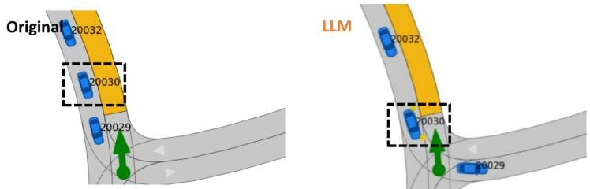

Task T: Redirect vehicle 20030 to edge 507, please. (Q005 · DEU Damme-17 1 T-32)  
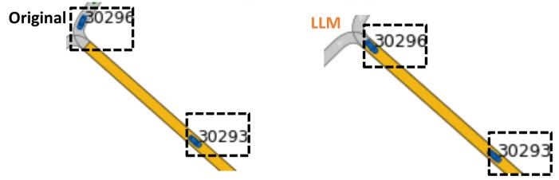

Task B: Make vehicle 30293, 30296 drive faster (BEL\_Leuven-43\_1\_T-1·t= 122)  
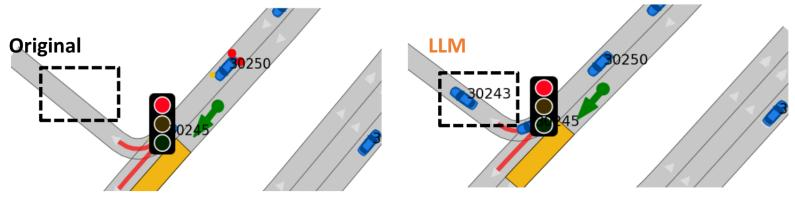

Task P: Could you please remove vehicle with ID 30243 from the simulation? (DEU\_Bremen-5\_5\_T-1·t= 15)  
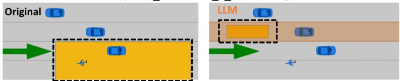  
Task G: Set ego goal to 3/4 of lanelet 7. (RUS\_Bicycle-3\_2\_T-1 · t = 15)  
Figure 10: Per-task qualitative diff grid (four rows = four tasks). Each row compares baseline (left) and LLMmodified (right) scenarios at the same mid-trajectory timestep (annotated in the row header). All examples from gemini-3-flash-preview under cp\_icl\_cot.

## A.5 Module Router

## A.5.1 Dispatch Pseudocode

Algorithm 1 formalises the per-turn dispatch. The router observes $\left( { { u } _ { t } } , { { h } _ { t } } \right)$ , computes the argmax over the action set A defined in §3, and invokes the action-conditional operator. The five branches cover the five-action A. The actual implementation expands MODIFY into the four modification sub-tasks (T/B/P/G), TEST into singleand batch-execution variants, and QA into general/parameter/batch Q&A specialisations.

## A.5.2 Query Corpus

The Module Router benchmark uses 200 queries spanning 9 action classes (the eight supported actions plus the fail class that the router emits when a request is unsupported). Table 15 summarises the action-class distribution and, for the vehicle\_mod class, the sub-tasks each query exercises. Composite vehicle\_mod codes (e.g. T+B+P) test that the router enumerates multiple letters and respects the canonical $T {  } B {  } P {  } G$ ordering rule.

Algorithm 1 Module Router Dispatch   
Require: database D, planner config θ, action set   
A   
1: $s \gets f _ { \mathrm { g e n } } ( u _ { 0 } )$ or fsel(u0, D) ▷ initial   
population   
2: h ← ∅; o ← ⊥ ▷ empty history, no outcome   
yet   
3: while dialogue is active do   
4: observe utterance ut   
5: Stage 1 (LLM): (ˆat, args) ← JSON out  
put with aˆt = arg maxa∈A frouter(a | ut, h)   
6: Stage 2 (Process Engine): dispatch on aˆt   
with operand ut   
7: if $\hat { a } _ { t } = \mathbf { M O D I F Y }$ then   
8: s ← fmod(s, ut); r ← s   
9: else if $\hat { a } _ { t } = \mathrm { T U N E }$ then   
10: $\theta  f _ { \mathrm { t u n e } } ( \theta , u _ { t } ) ; \quad r  \theta$   
11: else if $\hat { a } _ { t } =$ TEST then   
12: $o  f _ { \mathrm { t e s t } } ( s , \theta ) ; \quad r  o$ ▷   
$o = ( \tau , c , m )$   
13: else if aˆ = ANALYSE then   
14: $r \gets f _ { \mathrm { e v a l } } ( o , u _ { t } )$ ▷ requires prior TEST   
15: else if $\hat { a } _ { t } = \mathbf { Q } \mathbf { A }$ then   
16: r ← LLM Q&A on (ut, h)   
17: end if   
18: h ← h ∪ {(ut, aˆt, r)}   
19: end while

Table 15: Composition of the Module Router corpus.
<table><tr><td>Action Class</td><td>#</td><td>Mod Sub-tasks</td><td>#</td></tr><tr><td>vehicle_mod</td><td>40</td><td>Goal (G)</td><td>9</td></tr><tr><td>qa</td><td>23</td><td>Behavior (B)</td><td>9</td></tr><tr><td>param_qa</td><td>21</td><td>Add/Rem (P)</td><td>7</td></tr><tr><td>batch_qa</td><td>20</td><td>T+B+P</td><td>3</td></tr><tr><td>batch_sim</td><td>20</td><td>Trajectory (T)</td><td>3</td></tr><tr><td>param_mod</td><td>20</td><td>T+B</td><td>2</td></tr><tr><td>analysis</td><td>19</td><td>T+P</td><td>2</td></tr><tr><td>batch_analysis</td><td>19</td><td>P+G</td><td>2</td></tr><tr><td>fail</td><td>18</td><td>B+P</td><td>2</td></tr></table>

## A.5.3 Evaluation Metrics

The Module Router is graded by a five-stage funnel computed against the GT JSON action emitted by each prompt:

• JSON %: the model output parses as a JSON object with exactly one top-level key.

• key %: the top-level key matches the GT class (e.g. the composite vehicle mod or the refusal class fail).

• value % (headline): the value is a strict string match against GT. For vehicle mod composites, this metric is sensitive to letter ordering.

• set %: the letter set matches GT, relaxing the canonical T→B→P→G ordering rule. Reported only for vehicle mod composites; isolates the ordering signal from the underlying classification accuracy.

• order %: the emitted letter sequence honours the canonical order. Reported on the composite-only subset.

The composite Overall score is the mean of the per-query boolean checks above. We report mean tokens and per-query latency as the cost cluster.

## A.5.4 Evaluation Results

Table 16 reports the full results matrix (N = 200 per cell, all 50 (model, condition) cells fully populated). The prompt ladder lifts strict-match accuracy substantially for every model: gpt-5.4-mini climbs from 43.5% (baseline) to 98.5% under cp\_icl\_cot. Gemini-3-flash-preview climbs from 62.0% to 99.0%. The cp condition delivers the biggest single jump (the categorical action schema and the ordering rule both fit cleanly into a curated-prompt block). Adding ICL exemplars (cp\_icl) and CoT scaffolding (cp\_icl\_cot) yield smaller but consistent gains. The relaxed set % metric is at or near 100% for almost every (model, condition) cell once any prompting is applied, confirming that the residual error under the headline metric is dominated by letter-ordering mistakes rather than misclassification of the underlying subtasks.

## A.6 Planner Testing and Enhancement Module

## A.6.1 Query Corpus

The Planner Testing and Enhancement benchmark uses 200 queries that test the LLM’s ability to emit a complete updated Frenetix cost.yaml. Table 17 summarises the request-type distribution and perparameter coverage. Queries are partitioned into four request types (pure preset = name a preset only; pure explicit = name one or more parameters with target values; mixed = preset + explicit overrides; out of vocab = name a parameter that does not exist in the schema, which the LLM must refuse).

Table 16: Performance of the Module Router on the action-classification benchmark (N=200 per cell). value % is a strict string match against the GT JSON action (ordering-sensitive for vehicle\_mod composites); set % relaxes the canonical $T {  } B {  } P {  } G$ ordering rule and is reported only on the vehicle\_mod composite subset.
<table><tr><td rowspan="2">Model</td><td rowspan="2">Prompt</td><td colspan="2">Cost</td><td rowspan="2">Fail%↓</td><td colspan="5">Pipeline stage pass rates</td><td rowspan="2">Overall ↑</td></tr><tr><td>tokens ↓</td><td>latency (s) ↓</td><td>JSON % ↑</td><td>key % ↑</td><td>value % ↑</td><td></td><td>set % ↑ order % ↑</td></tr><tr><td colspan="10">Cloud API</td></tr><tr><td rowspan="4">Qwen3.6-plus</td><td>baseline</td><td>274</td><td>1.7</td><td>0.0</td><td>100.0</td><td>49.5</td><td>47.0</td><td>0.0</td><td></td><td>0.651</td></tr><tr><td>cp</td><td>1013</td><td>1.6</td><td>0.0</td><td>100.0</td><td>95.0</td><td>94.5</td><td>100.0</td><td>91.7</td><td>0.965</td></tr><tr><td>cp_cot</td><td>1446</td><td>3.4</td><td>0.0</td><td>100.0</td><td>97.0</td><td>96.5</td><td>97.5</td><td>100.0</td><td>0.978</td></tr><tr><td>cp_icl</td><td>2026 2459</td><td>1.6 3.5</td><td>0.0 0.0</td><td>100.0 100.0</td><td>99.0 97.5</td><td>99.0</td><td>100.0</td><td>100.0</td><td>0.993 0.981</td></tr><tr><td rowspan="6">Deepseek-v3.2</td><td>cp_icl_cot</td><td></td><td></td><td></td><td></td><td></td><td>97.0</td><td>97.5</td><td>100.0</td><td></td></tr><tr><td>baseline</td><td>261</td><td>7.1</td><td>0.0</td><td>100.0</td><td>62.5</td><td>48.5</td><td>22.2</td><td>100.0</td><td>0.681</td></tr><tr><td>cp</td><td>983</td><td>2.3</td><td>0.0</td><td>100.0</td><td>92.5</td><td>91.5</td><td>95.0</td><td>100.0</td><td>0.946</td></tr><tr><td>cp_cot</td><td>1397</td><td>4.4</td><td>0.0</td><td>100.0</td><td>91.0</td><td>90.5</td><td>97.5</td><td>100.0</td><td>0.938</td></tr><tr><td>cp_icl</td><td>1943</td><td>6.4</td><td>0.0</td><td>100.0</td><td>97.0</td><td>96.5</td><td>97.4</td><td>100.0</td><td>0.978</td></tr><tr><td>cp_icl_cot</td><td>2353</td><td>4.3</td><td>0.0</td><td>100.0</td><td>95.5</td><td>95.5</td><td>100.0</td><td>100.0</td><td>0.970</td></tr><tr><td rowspan="5">Glm-5</td><td>baseline cp</td><td>261 979</td><td>3.1 2.7</td><td>0.5</td><td>99.5 100.0</td><td>64.5</td><td>51.5 94.5</td><td>17.2</td><td>100.0</td><td>0.699 0.963</td></tr><tr><td>cp_cot</td><td>1386</td><td>5.1</td><td>0.0 0.0</td><td>100.0</td><td>94.5 96.5</td><td></td><td>100.0</td><td>100.0</td><td></td></tr><tr><td></td><td>1919</td><td>2.4</td><td>0.0</td><td>100.0</td><td>97.0</td><td>96.0</td><td>97.5</td><td>100.0</td><td>0.974 0.978</td></tr><tr><td>cp_icl cp_icl_cot</td><td>2320</td><td>3.8</td><td>0.0</td><td>100.0</td><td>98.0</td><td>96.5 98.0</td><td>97.5 100.0</td><td>100.0</td><td>0.987</td></tr><tr><td>baseline</td><td>256</td><td>0.9</td><td>0.0</td><td>100.0</td><td>73.0</td><td></td><td></td><td>100.0</td><td>0.767</td></tr><tr><td rowspan="4">Gemini-3-flash</td><td>cp cp_cot</td><td>1019</td><td>0.9</td><td>0.0</td><td>100.0</td><td>97.5</td><td>62.0 97.5</td><td>29.0 100.0</td><td>100.0 100.0</td><td>0.983 0.978</td></tr><tr><td>cp_icl</td><td>1429 2064</td><td>1.3 1.0</td><td>0.0 0.0</td><td>100.0 100.0</td><td>97.0 97.5</td><td>96.5</td><td>97.5</td><td>100.0</td><td>0.981</td></tr><tr><td>cp_icl_cot</td><td>2479</td><td>1.3</td><td>0.0</td><td>100.0</td><td>99.0</td><td>97.0 99.0</td><td>97.5</td><td>100.0</td><td>0.993</td></tr><tr><td>baseline</td><td>272</td><td>1.2</td><td>0.0</td><td>100.0</td><td></td><td></td><td>100.0</td><td>100.0</td><td>0.649</td></tr><tr><td rowspan="5">Gpt-5.4-mini</td><td>cp cp_cot</td><td>982</td><td>1.0</td><td>0.0</td><td>100.0</td><td>57.0 91.0</td><td>43.5 91.0</td><td>22.9 100.0</td><td>100.0 100.0</td><td>0.940</td></tr><tr><td></td><td>1309 1913</td><td>1.1</td><td>0.0</td><td>100.0</td><td>90.5</td><td>90.5</td><td>100.0</td><td>100.0</td><td>0.937</td></tr><tr><td>cp_icl</td><td></td><td>1.0</td><td>0.0</td><td>100.0</td><td>98.0</td><td>98.0</td><td>100.0</td><td>100.0</td><td>0.987</td></tr><tr><td>cp_icl_cot</td><td>2243</td><td>1.1</td><td>0.0</td><td>100.0</td><td>98.5</td><td>98.5</td><td>100.0</td><td>100.0</td><td>0.990</td></tr><tr><td></td><td></td><td></td><td></td><td></td><td></td><td></td><td></td><td></td><td></td></tr><tr><td colspan="10">Local Ollama</td></tr><tr><td rowspan="4">Qwen3.6:35b (Think)</td><td>baseline cp</td><td>5110</td><td>35.9</td><td>26.5</td><td>73.5</td><td>48.0</td><td>45.5</td><td>37.5 94.9</td><td>100.0 100.0</td><td>0.552 0.949</td></tr><tr><td>cp_cot</td><td>1291 2743</td><td>2.1 10.2</td><td>0.0 4.5</td><td>100.0 95.5</td><td>93.0 91.0</td><td>92.0</td><td>100.0</td><td>100.0</td><td>0.925</td></tr><tr><td>cp_icl</td><td>2271</td><td>2.2</td><td>0.0</td><td>100.0</td><td>96.0</td><td>91.0 96.0</td><td>100.0</td><td>100.0</td><td>0.973</td></tr><tr><td>cp_icl_cot</td><td>2874</td><td>4.0</td><td>0.0</td><td>100.0</td><td>96.5</td><td>96.5</td><td>100.0</td><td>100.0</td><td>0.977</td></tr><tr><td rowspan="6">Qwen3.6:35b</td><td>baseline</td><td></td><td>0.5</td><td>21.0</td><td>79.0</td><td></td><td></td><td>18.4</td><td>100.0</td><td>0.494</td></tr><tr><td></td><td>289 1018</td><td>0.4</td><td>0.0</td><td></td><td>46.0</td><td>30.5</td><td>97.5</td><td>83.3</td><td>0.957</td></tr><tr><td>cp</td><td>1465</td><td>1.2</td><td></td><td>100.0</td><td>94.5</td><td>93.0</td><td></td><td>100.0</td><td>0.970</td></tr><tr><td>cp_cot</td><td>2028</td><td>0.6</td><td>0.0 0.0</td><td>100.0</td><td>95.5</td><td>95.5</td><td>100.0</td><td>100.0</td><td>0.973</td></tr><tr><td>cp_icl</td><td></td><td>1.2</td><td>0.0</td><td>100.0</td><td>96.5</td><td>95.5</td><td>95.0</td><td>100.0</td><td>0.980</td></tr><tr><td>cp_icl_cot</td><td>2448</td><td></td><td></td><td>100.0</td><td>97.0</td><td>97.0</td><td>100.0</td><td></td><td></td></tr><tr><td rowspan="4">Gemma4:31b (Think)</td><td>baseline cp</td><td>1035 1319</td><td>12.6 4.9</td><td>0.0 0.0</td><td>100.0 100.0</td><td>69.5 96.5</td><td>65.5 95.0</td><td>33.3 92.5</td><td>75.0 100.0</td><td>0.778 0.971 0.976</td></table>

Note: Arrows mark preferred directions (↑/↓). Tokens and latency (s) are means per query.

Table 17: Composition of the Planner Testing and Enhancement configuration corpus.
<table><tr><td>Request Type</td><td>#</td><td>Top Parameters</td><td>#</td></tr><tr><td>Pure preset</td><td>71</td><td>dist to ref path</td><td>21</td></tr><tr><td>Pure explicit</td><td>69</td><td>dist to obstacles</td><td>18</td></tr><tr><td>Mixed</td><td>51</td><td>orientation offset</td><td>16</td></tr><tr><td>Out of vocab</td><td>9</td><td>accel / jerk</td><td>14</td></tr><tr><td></td><td></td><td>respons. / path len</td><td>13</td></tr></table>

## A.6.2 Evaluation Metrics

The Planner Testing and Enhancement task is graded by a six-stage funnel against the GT YAML, plus a downstream simulator-runnability check:

• YAML %: the model output parses as a YAML mapping.

• struct %: the 13 cost weights keys and 3 external cost weights keys are present, with identical names and ordering to the input cost.yaml.

• preset %: on queries whose GT carries a named preset, every cost weight matches the preset’s tabulated value within relative tolerance 10−3.

• explicit %: on queries whose GT carries explicit (key, value) pairs, each named parameter matches GT within relative tolerance 10−3.

• full-YAML % (headline): the strictest stage: every value in the emitted YAML matches GT within relative tolerance 10−3 (combines the previous two stages plus untouched defaults).

• refused %: on the 9-query out-of-vocab slice, the model declines to emit a YAML and instead surfaces a refusal token (e.g. “do not”, “not a valid parameter”).

The composite Overall score is the mean of the per-query boolean checks. As an additional downstream check we run Frenetix on every emitted YAML against a paired baseline-simulable scenario; an outcome of either reaching the goal or hitting the simulation horizon without a crash counts as runnable.

## A.6.3 Evaluation Results

Table 18 reports the full results matrix (N=191 scored queries per (model, condition) cell, with the remaining 9 out-of-vocab queries reported separately under refused %. All 50 cells are fully populated). The headlinefull-YAML % is 36% across all baseline cells. This is the floor produced by leaving the input cost.yaml untouched, which matches GT only on ∼ 36% of queries that did not require a change. Any prompting (cp onwards) lifts almost every model to ≥ 98% full-YAML match. The refused % column reveals that out-of-vocab refusals are the hardest sub-task: only the strongest models hit 100% under cp alone. Adding ICL exemplars (cp\_icl, cp\_icl\_cot) is what eliminates the remaining false-positive YAML emissions for those out-of-vocab queries. The Frenetix-validation footnote shows that 81.2% of the YAMLs emitted by gpt-5.4-mini under cp\_icl\_cot produced a runnable planner configuration end-to-end. The remaining 18.8% are scenarios in which the modified cost weights cause the planner to collide before reaching the goal, an additional planningrobustness signal that the YAML-match metric cannot detect. Figure 11 shows a representative qualitative example.

## A.7 Cross-Planner Qualitative Comparison

PlannerForge exposes the same five driving-mode presets (Default, Comfort, Balanced, Sporty, Safety) for both the sampling-based Frenetix planner and the learning-based MP-RBFN planner. Figure 13 compares each planner’s per-mode costweight profile. The two planners operate on different cost vocabularies: Frenetix exposes thirteen named weights (acceleration, jerk axes, pathlength, lane-centre offset, velocity offset, distances to reference path and to obstacles, prediction, responsibility), while MP-RBFN exposes seven normalised channels keyed on its radial-basis representation (distance-to-boundary, distance-to-referencepath, orientation/velocity offsets, obstacle prediction). Despite the schema differences, the five shared presets produce the same relative shape in both planners: Sporty drives the velocity-offset weight up while loosening obstacle prediction. Safety drives the obstacle and prediction weights to their maxima; Comfort balances orientation and lateral-jerk weights. Balanced lies between them. A head-to-head quantitative Frenetix vs MP-RBFN comparison on framework-generated scenarios is part of an ongoing extension. The qualitative correspondence in Figure 13 establishes that the framework’s natural-language preset interface generalises across planner families. Figure 12 shows the chatbot workflow: a single prompt dispatches both Frenetix and MP-RBFN on N=100 shared scenarios from the batch\_100 preset. The Analysis Module reports success rate and mean runtime side-by-side, and can further diagnose specific failure reasons (e.g., collisions vs. timeouts) for each planner. This confirms that the unified $\pi _ { P }$ interface supports efficient, intuitive cross-planner benchmarking.

Table 18: Performance of the Planner Testing and Enhancement module (N=200 per cell). full-YAML % is a strict element-wise match against the GT cost.yaml (rtol $1 0 ^ { - 3 } ) ;$ preset % and explicit % are reported on the query subsets carrying a preset or explicit assignment respectively; refused % is the 9-query out-of-vocab refusal slice.
<table><tr><td rowspan="2">Model</td><td rowspan="2">Prompt</td><td colspan="2">Cost</td><td rowspan="2">Fail% ↓</td><td colspan="6">Pipeline stage pass rates</td><td rowspan="2">Overall ↑</td></tr><tr><td>tokens ↓</td><td>latency (s) ↓</td><td>YAML % ↑ struct % ↑</td><td></td><td></td><td></td><td>preset % ↑ explicit % ↑ full-YAML % ↑ refused % ↑</td><td></td></tr><tr><td colspan="10">Cloud API</td><td></td></tr><tr><td rowspan="4"></td><td>baseline</td><td>532</td><td></td><td>0.0</td><td>100.0 100.0</td><td>100.0 100.0</td><td>0.0 98.4</td><td>98.3</td><td>35.6</td><td>0.0 0.672</td></tr><tr><td>cp</td><td>1479</td><td>4.4</td><td>0.0</td><td></td><td></td><td>99.2</td><td>99.0 100.0</td><td>88.9 88.9</td><td>0.990</td></tr><tr><td>cp_cot</td><td>1966</td><td>7.1 4.3</td><td>0.0 0.0</td><td>100.0 100.0</td><td>100.0 100.0</td><td>100.0</td><td>100.0</td><td></td><td>0.995</td></tr><tr><td>cp_icl</td><td>2964 3444</td><td></td><td></td><td></td><td>99.2 100.0</td><td>100.0 100.0</td><td>99.5 100.0</td><td>100.0 100.0</td><td>0.998 1.000</td></tr><tr><td rowspan="8"></td><td>cp_icl_cot</td><td></td><td>7.1 9.8</td><td>0.0 0.0</td><td>100.0</td><td>100.0</td><td></td><td></td><td></td><td></td></tr><tr><td>baseline</td><td>532</td><td>0.5</td><td>100.0</td><td>100.0</td><td>0.0</td><td>99.2</td><td>36.1</td><td>0.0</td><td>0.674</td></tr><tr><td>cp</td><td>1498</td><td>8.3</td><td>99.5</td><td>99.5</td><td>100.0</td><td>99.2</td><td>99.0</td><td>88.9</td><td>0.989</td></tr><tr><td>cp_cot</td><td>1965</td><td>11.2</td><td>99.5 99.5</td><td>99.5</td><td>99.2</td><td>100.0</td><td>99.0</td><td>100.0</td><td>0.994</td></tr><tr><td>cp_icl</td><td>3003</td><td>6.9</td><td>0.5</td><td>99.5</td><td>99.2 97.5</td><td>99.2</td><td>99.0</td><td>100.0</td><td>0.993</td></tr><tr><td>cp_icl_cot</td><td>3465</td><td>10.1</td><td>0.0</td><td>100.0</td><td>100.0</td><td>100.0</td><td>98.4</td><td>100.0</td><td>0.993</td></tr><tr><td>baseline</td><td>511</td><td></td><td></td><td></td><td></td><td>97.5</td><td></td><td></td><td>0.671</td></tr><tr><td>cp</td><td>1437 1910</td><td>5.6 5.0</td><td>0.0 0.5</td><td>100.0 99.5</td><td>100.0 99.5</td><td>0.0 98.4</td><td>97.5</td><td>35.6 98.4</td><td>0.0 100.0</td></tr><tr><td rowspan="8">Glm-5</td><td>cp_cot cp_icl</td><td></td><td>8.0 4.9</td><td>0.5 1.0</td><td>99.5 99.0</td><td>99.5</td><td>99.2</td><td>99.2</td><td>99.0</td><td>100.0 0.993</td></tr><tr><td></td><td>2883</td><td>1.0</td><td>99.0</td><td>99.0 99.0</td><td>97.5 96.7</td><td>99.2 97.5</td><td>98.4</td><td>100.0</td><td>0.987</td></tr><tr><td>cp_icl_cot</td><td>3353</td><td>7.7</td><td></td><td></td><td></td><td></td><td>96.3</td><td>100.0</td><td>0.978</td></tr><tr><td>baseline</td><td>561</td><td>1.5</td><td>0.0 100.0</td><td>100.0</td><td>0.0</td><td>99.2</td><td>36.1</td><td>0.0</td><td>0.674</td></tr><tr><td>cp</td><td>1581</td><td>2.3</td><td>0.0 100.0</td><td>100.0</td><td>100.0</td><td>99.2</td><td>99.0</td><td>100.0</td><td>0.996</td></tr><tr><td>cp_cot cp_icl</td><td>2099 3202</td><td>6.2</td><td>0.0 100.0</td><td>100.0 100.0</td><td>100.0</td><td>100.0</td><td>99.0 99.0</td><td>100.0</td><td>0.998</td></tr><tr><td>cp_icl_cot</td><td>3697</td><td>1.6</td><td>0.0 0.0</td><td>100.0 100.0</td><td>100.0</td><td>100.0</td><td></td><td>100.0</td><td>0.998</td></tr><tr><td>baseline</td><td></td><td>2.3</td><td></td><td>100.0</td><td>98.4 0.0</td><td>99.2</td><td>97.9</td><td>100.0</td><td>0.992</td></tr><tr><td rowspan="8">Gpt-5.4-mini</td><td>cp</td><td>521</td><td></td><td>0.0 0.0</td><td>100.0 100.0</td><td>100.0</td><td>100.0</td><td></td><td>36.1</td><td>0.0 0.675</td></tr><tr><td>cp_cot</td><td>1456 1884</td><td>0.0</td><td>100.0</td><td>100.0 100.0</td><td>100.0 100.0</td><td>100.0 100.0</td><td>100.0 100.0</td><td>44.4</td><td>0.975</td></tr><tr><td>cp_icl</td><td>2924</td><td>2.4</td><td>100.0</td><td>100.0</td><td>100.0</td><td>100.0</td><td>100.0</td><td>77.8</td><td>0.990</td></tr><tr><td></td><td></td><td>1.6</td><td>0.0</td><td></td><td></td><td></td><td>100.0</td><td>100.0</td><td>1.000</td></tr><tr><td>cp_icl_cot</td><td>3246</td><td>1.9</td><td>0.0 100.0</td><td>100.0</td><td>100.0</td><td>100.0</td><td></td><td>100.0</td><td>1.000</td></tr><tr><td></td><td></td><td></td><td></td><td></td><td></td><td></td><td></td><td></td><td></td></tr><tr><td>Local Ollama baseline Qwen3.6:35b</td><td>2459</td><td>13.9</td><td>0.0</td><td>100.0</td><td>99.0</td><td>0.0</td><td>100.0</td><td>36.1</td><td>0.0</td></tr><tr><td rowspan="9">(Think)</td><td>cp cp_cot</td><td>3252</td><td>13.1 16.9</td><td>0.5 0.0</td><td>99.5 100.0</td><td>99.0 100.0</td><td>95.9 95.9</td><td>99.2 100.0</td><td>96.9 97.4</td><td>88.9 100.0</td><td>0.979 0.990</td></tr><tr><td>cp_icl</td><td>4140 4129</td><td>9.0</td><td>0.0</td><td>100.0</td><td>100.0</td><td>96.7</td><td>100.0</td><td>97.9</td><td>100.0</td><td>0.991</td></tr><tr><td>cp_icl_cot</td><td>5206</td><td>14.1</td><td>0.0</td><td>100.0</td><td>100.0</td><td>100.0</td><td>100.0</td><td>100.0</td><td>100.0</td><td>1.000</td></tr><tr><td>baseline</td><td>533</td><td></td><td>0.0</td><td>100.0</td><td>100.0</td><td>0.0</td><td>100.0</td><td>36.1</td><td>0.0</td><td>0.675</td></tr><tr><td>cp Qwen3.6:35b cp_cot</td><td>1480</td><td>1.3 1.4</td><td>0.0</td><td>100.0</td><td>100.0</td><td>99.2</td><td>100.0</td><td>99.5</td><td>88.9</td><td>0.993</td></tr><tr><td>cp_icl</td><td>1961 2964</td><td>2.5</td><td>0.0</td><td>100.0</td><td>99.5</td><td>97.5</td><td>99.2</td><td>97.9</td><td>100.0</td><td>0.990</td></tr><tr><td>cp_icl_cot</td><td></td><td>1.3</td><td>0.0</td><td>100.0</td><td>100.0</td><td>99.2</td><td>100.0</td><td>99.5</td><td>100.0</td><td>0.998</td></tr><tr><td></td><td>3410</td><td>2.2</td><td>0.5</td><td>99.5</td><td>99.5</td><td>98.4</td><td>100.0 99.2</td><td>99.0 36.1</td><td>100.0 0.0</td><td>0.993 0.674</td></tr><tr><td>baseline cp cp_cot</td><td>2918</td><td>40.9</td><td>0.0</td><td>100.0</td><td>100.0</td></table>

Frenetix validation (gpt-5.4-mini, cp\_icl\_cot, N=191): 155/191 (81.2%) runnable (goal\_reached + max\_steps)  
Note: Arrows mark preferred directions (↑/↓). Tokens and latency (s) are means per query.

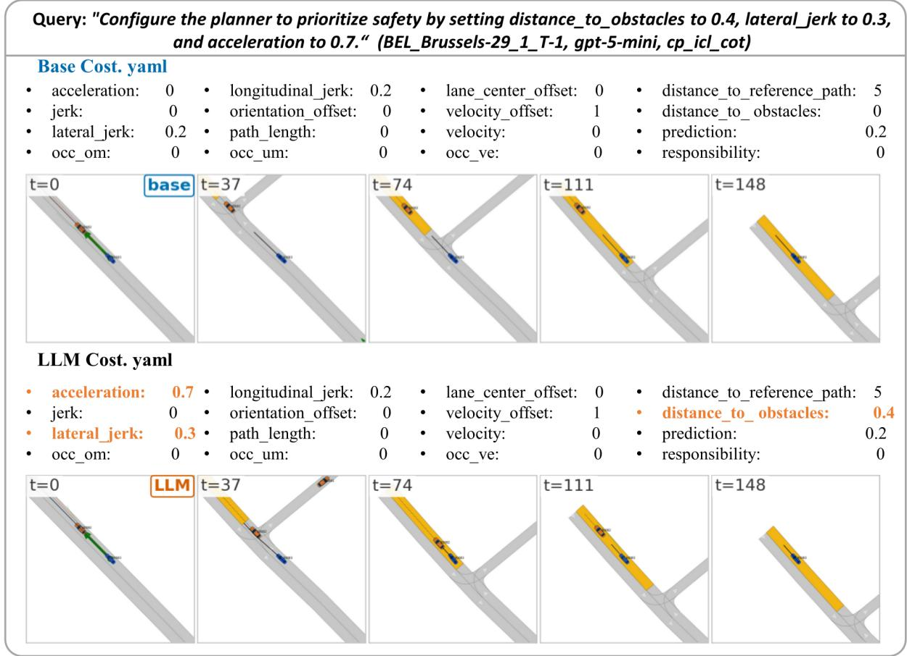  
Figure 11: Pure-explicit Planner Testing and Enhancement example (Q003, scenario BEL\_Brussels-29\_1\_T-1, gpt-5.4-mini × cp\_icl\_cot). The three weights modified by the LLM are highlighted in orange in the YAML; five matched-timestep frames are shown for the base and modified rollouts.

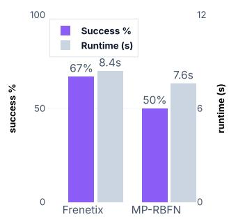  
Figure 12: Cross-planner batch comparison. A single prompt dispatches the same scenario batch to both Frenetix and MP-RBFN and returns success rate and runtime for each.

## A.8 Overview Prompts

Each module uses a curated-prompt (cp) header that specifies the system role, the JSON/YAML/XML output schema, and the main constraints. The five prompt conditions (baseline, cp, cp\_cot, cp\_icl, cp\_icl\_cot) share this header; ICL and CoT variants add demonstrations and reasoning scaffolds on top. Full prompt files for Generation, Selection, Modification (T/B/P/G), Module Router, Planner Testing and Enhancement, and Batch Analysis are released with the code at https://github.com/TUM-AVS/PlannerForge.

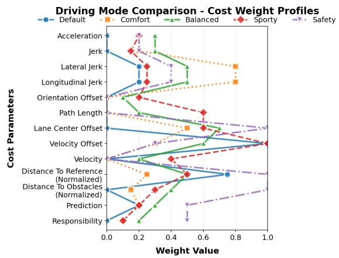  
(a) Frenetix — thirteen cost weights across the five preset modes.

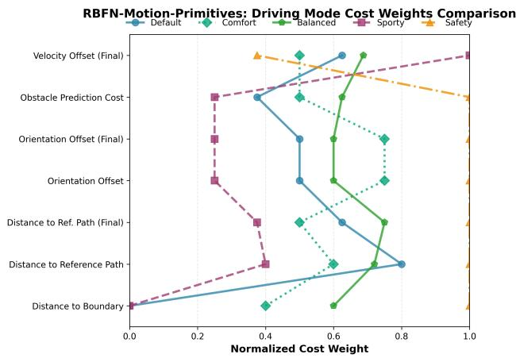  
(b) MP-RBFN — seven normalised cost channels across the five preset modes.

Figure 13: Qualitative cross-planner comparison of the five driving-mode presets exposed by PlannerForge. Despite the schema difference, both planners realise the same intent space (Sporty → velocity-up, lower obstacle weight; Safety → obstacle/prediction maxed; Comfort → jerk-and-orientation flattened) through their respective cost vocabularies.