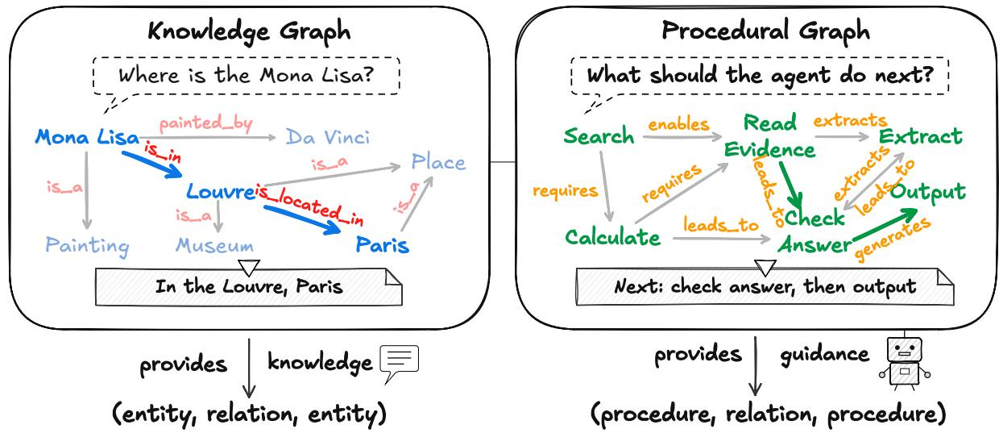
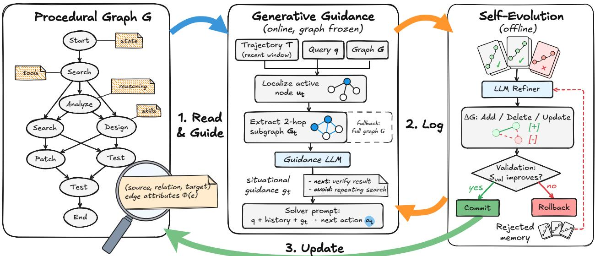
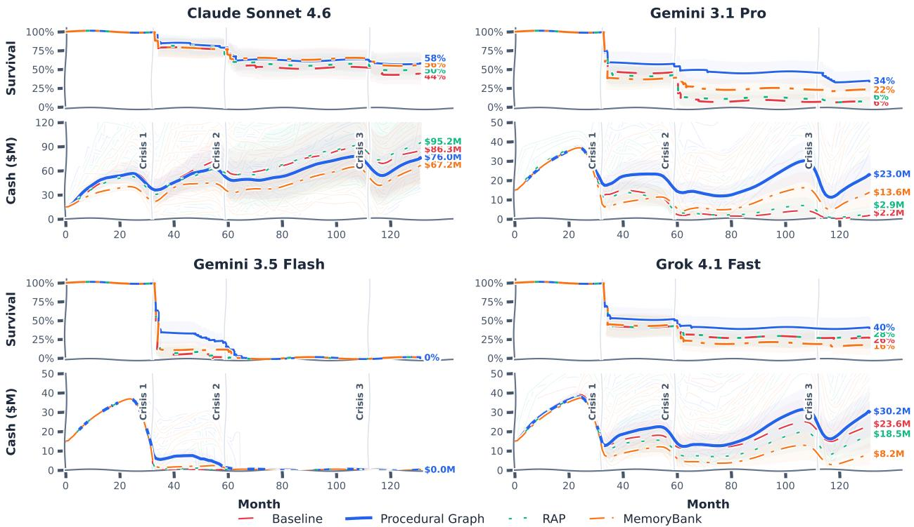
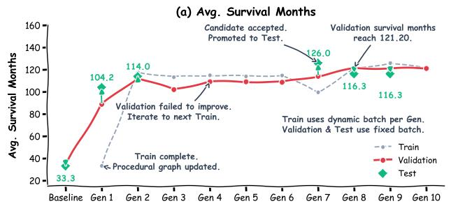
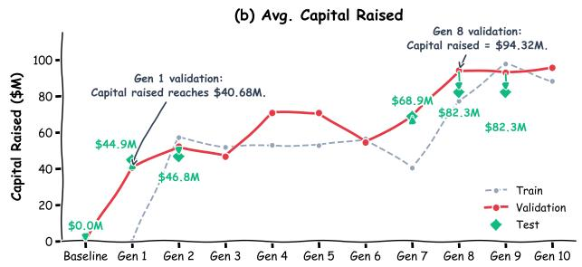
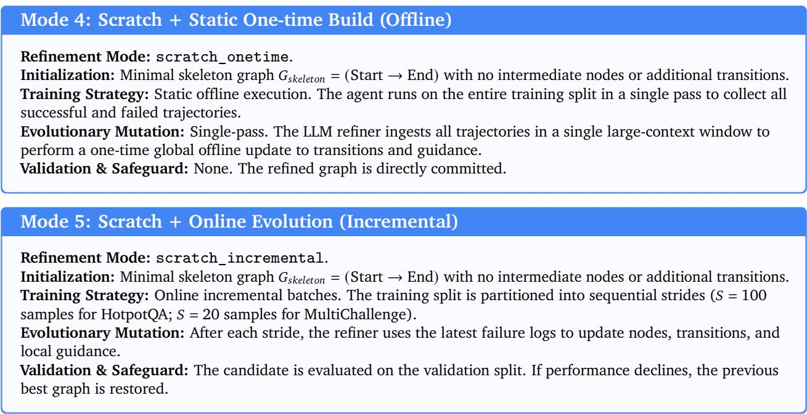
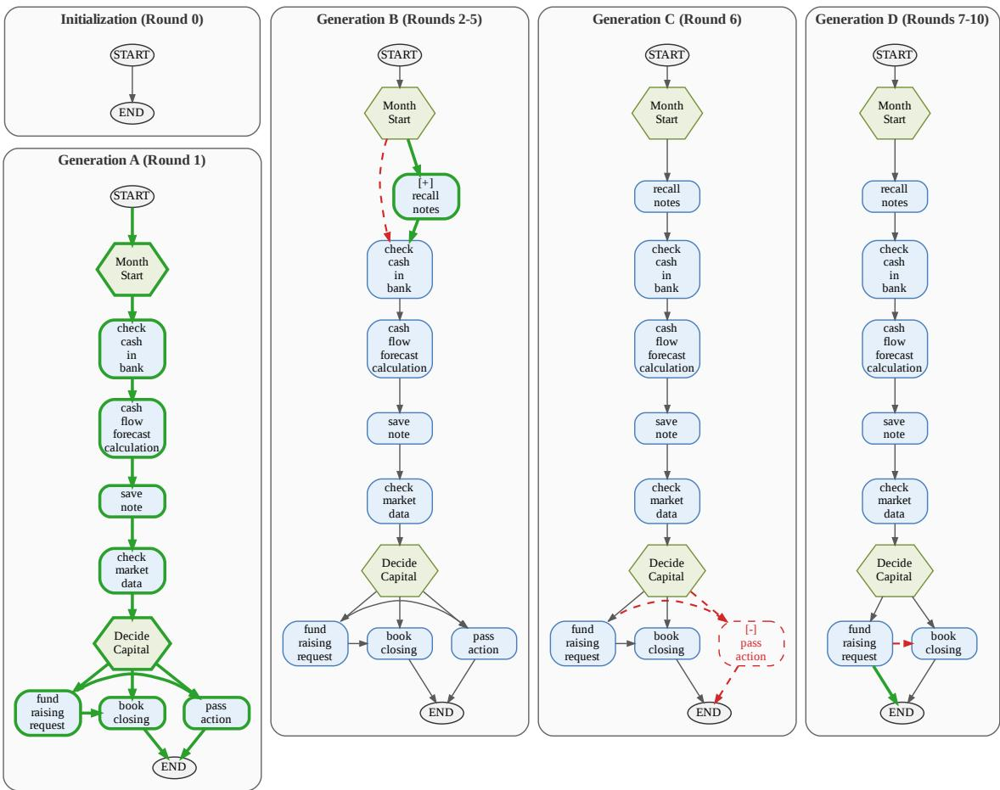
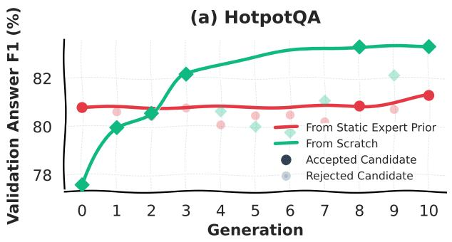
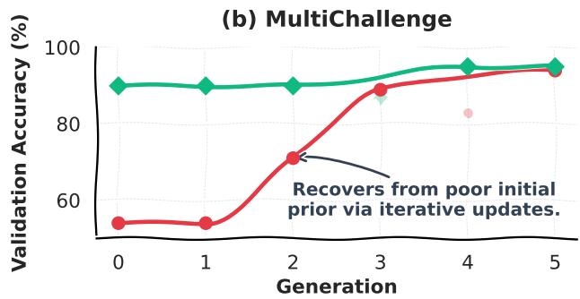

# Procedural Graphs: Self-Evolving Execution Structures for LLM Agents

Yuxing Lu1,2,3, Yicheng Chen1, Shanchan Wu1 and Sercan Ö. Arık1 1Google, 2Georgia Institute of Technology, 3Peking University

Large language models are increasingly deployed as agents that plan over long horizons and act through external tools. Most agents select actions through unconstrained generation over an accumulating history, leaving implicit the procedural knowledge of what to do, in what order, and under which conditions. As trajectories lengthen, agents can lose track of their objectives, invoke tools out of order, and repeat unproductive actions. We introduce the Procedural Graph: just as a knowledge graph organizes factual knowledge into (entity, relation, entity) triplets for what-is questions, a Procedural Graph organizes procedural knowledge into (procedure, relation, procedure) triplets for what-to-do questions. At each decision step, the framework localizes the agent’s active node, and a guidance model translates the surrounding subgraph into step-level situational guidance that biases the solver’s next action without dictating it. The graph is self-evolving: an LLM refiner contrasts failed trajectories with successful ones and edits the graph’s topology and attributes, committing edits that preserve or improve held-out validation performance while retaining rejected ones to discourage repetition. Starting from a minimal skeleton, the loop builds graphs that match or surpass hand-designed ones. It can also repair a flawed expert prior. Across multiple datasets, task types, and LLMs, the Procedural Graph delivers consistent gains over memory-based baselines, and self-evolution further improves performance without manual engineering.

## 1. Introduction

Large language models (LLMs) are increasingly deployed as autonomous agents that plan over long horizons and act through external tools (Qin et al., 2024; Sumers et al., 2023). Most agents make decisions through unconstrained generation conditioned on a flat, growing log of prior actions and observations. This places the burden of procedural coherence on free-form generation: the agent must identify relevant observations, infer which steps remain, and choose an action that respects their dependencies. As trajectories lengthen, agents can lose track of their objectives, invoke tools out of order, and repeat unproductive actions.

Existing approaches provide procedural structure through textual memory, conditional guidelines, and explicit workflows. Memory and self-reflection methods (Shinn et al., 2023; Zhao et al., 2024) record past experience as free-form text and retrieve it for reuse in the context. Although these records preserve useful experience, the solver must still reconstruct how it applies to the current step and how it constrains the steps that follow. State-conditioned guidelines (Fu et al., 2024) provide more targeted advice, but retrieve rules without explicitly connecting successive procedural steps. Workflows and state machines (Xiao et al., 2024; Zhang et al., 2023) make those steps explicit and constrain execution, but often require manual design. Automated workflow search reduces manual design efort by optimizing workflow structure ofline (Zhang et al., 2025). The remaining challenge is to combine an editable procedure representation with guidance that is conditioned on the agent’s current progress.

We argue that an agent needs procedural knowledge that is structured enough to steer it away from invalid behavior, flexible enough to preserve reasoning freedom, responsive to its current progress, and able to improve from experience. We address these requirements with the Procedural Graph (PG), an explicit and editable directed graph of procedural knowledge. The design mirrors a familiar structure (Figure 1): just as a knowledge graph organizes factual knowledge into (entity, relation, entity) triplets to answer what-is questions, a PG organizes procedural information into (procedure, relation, procedure) triplets to answer what-to-do questions. Its nodes abstract tool actions, reasoning steps, and states; its edges encode permissible transitions, each annotated with textual attributes describing how and when the transition should be taken. The PG keeps a task domain’s procedural knowledge outside the model weights, where it can be inspected, retrieved at each step, and edited without retraining.

  
Figure 1 | From knowledge to procedure. A Knowledge Graph organizes facts into triplets that answer what-is questions. A Procedural Graph organizes task procedures into triplets that answer what-to-do questions.

Our framework puts this prior to work in two complementary phases. During online inference, the framework localizes the active node from the agent’s trajectory, and a guidance model reads the surrounding subgraph in its topological context and translates the relevant edge attributes into situational guidance for the next step. During ofline self-evolution, after each batch of training tasks, an LLM refiner contrasts failed trajectories with successful ones and proposes edits to the graph’s topology and attributes, adding missing nodes and edges, pruning failure-inducing ones, and revising edge attributes. A structurally valid candidate graph is adopted if it matches or improves performance on a held-out validation set, and rejected candidates are retained as negative constraints. The validation gate filters out candidates that reduce the measured score, while rejection memory discourages repeated unsuccessful proposals. We summarize our contributions as follows:

• We introduce the Procedural Graph (PG), an explicit and editable graph of procedural knowledge that steers LLM-agent execution while preserving reasoning flexibility.

• We propose Generative PG Guidance, an online mechanism that converts the static graph and the live trajectory into step-level situational guidance.

• We develop a self-evolution loop that refines graph topology and attributes using execution feedback.

• Across diferent tasks and LLMs, PG consistently outperforms other memory baselines; evolution from scratch produces graphs that match or surpass hand-designed ones, and the loop can also repair flawed expert priors.

## 2. Related Work

LLM Agents and Action Selection. The dominant paradigm follows a free-form action-selection loop: ReAct (Yao et al., 2023b) interleaves reasoning with environment actions, and successors extend it with self-critique, branching search, or richer action spaces (Qin et al., 2024; Shinn et al., 2023; Wang et al., 2024a; Yao et al., 2023a). These approaches rely on the LLM to select valid next actions from in-context information, leaving admissible transitions implicit. Documented failure modes include planning hallucination, drift, and repetitive loops (Xiao et al., 2024; Zhu et al., 2025).

Structured Priors for Agent Planning. A second line provides explicit structure for planning, including textual procedure rules (Zhu et al., 2025), workflow knowledge in text, code, or flowchart form (Xiao et al., 2024), searched workflow graphs (Zhang et al., 2025), and graph-organized tool catalogs (Liu et al., 2024a,b; Lumer et al., 2025). These methods organize procedural knowledge as action rules, workflows, or tool graphs. PG combines attributed procedure transitions, local retrieval from the current execution context, and refinement of graph topology and attributes.

Self-Improving Agents from Trajectories. A third line distills reusable knowledge from past trajectories, stored as self-critiques (Shinn et al., 2023), insights (Zhao et al., 2024), state-conditioned guidelines (Fu et al., 2024), workflows (Wang et al., 2025b), or procedural memories (Fang et al., 2025; Zhong et al., 2024). These artifacts retain diferent forms of structure, including conditional rules and ordered steps within workflows. PG connects transitions across procedure steps in an explicitly editable graph. Its typed, attributed edges support local structural retrieval and refinement from execution feedback. An extended survey and an eight-dimension comparison of 24 methods are provided in Appendix A.

## 3. The Procedural Graph Framework

We introduce the Procedural Graph (PG), a directed graph of procedural knowledge that guides agent execution online while iteratively optimizing its topology and attributes ofline. As illustrated in Figure 2, the framework operates in two complementary phases:

Online Inference (Section 3.2): During task solving, the graph is frozen. The agent combines the PG with its trajectory to generate dynamic situational guidance.

Ofline Evolution (Section 3.3): After executing a batch of training tasks, an LLM refiner analyzes the diagnostic traces and modifies the graph topology and attributes via an automated feedback loop.

## 3.1. Formal Representation of Procedural Graphs

Formally, a Procedural Graph is a directed, attributed graph

$$
\mathcal { G } = \big ( \mathcal { V } , \mathcal { R } , \mathcal { E } , \Phi \big ) , \qquad \mathcal { E } \subseteq \mathcal { V } \times \mathcal { R } \times \mathcal { V } ,\tag{1}
$$

where V is the set of abstract nodes, R is a vocabulary of transition relations, and each element of E is a directed, attributed triplet: an edge $e = ( u , r , \nu ) \in \mathcal { E }$ states that node � is admissible after node � under relation �. Each node abstracts a tool function, a skill, an internal reasoning step, or a task status. The attribute mapping Φ associates each edge with a set of named attributes whose schema can be specified for the task. In our implementation, we use three textual fields: condition, guidance, and pitfalls, describing when the transition applies, how to proceed, and what to avoid. As an illustrative example, a financial-planning edge (cash\_flow\_forecast, LEADS\_TO, fund\_raising\_request) could carry the attributes “condition: projected runway falls below the safety bufer; guidance: submit the request early to allow for the financing delivery delay; pitfalls: do not stack a second request while one is pending.”

  
Figure 2 | Overview of the Procedural Graph framework. Left: procedural triplets define $\mathcal { G } .$ Middle: the framework localizes �� and retrieves its 2-hop neighborhood G� (or the full graph if matching fails); a guidance LLM translates it into guidance $g _ { t }$ for the solver. Right: the refiner proposes edits from execution trajectories. Structurally valid candidates are committed when validation performance does not decrease; rejected candidates inform subsequent proposals through rejection memory.

By structuring task knowledge into triplets, G makes admissible transitions explicit and guides the agent toward valid tool calls and action sequences. The graph can be initialized from an expert prior or from scratch; Section 5.3 compares these construction strategies.

## 3.2. Generative Guidance at Inference Time

Independent retrieval of transition attributes, such as top-� similarity search, can omit the connections between procedural steps. For example, retrieving guidance for submit without the preceding check\_answer transition can omit the verification step that makes submission appropriate. Retrieving the connected neighborhood exposes both the action and its procedural prerequisites.

Generative Procedural Graph Guidance addresses this by combining three operations: locate, extract, and generate. Let � be the user query and $\mathcal { T } _ { t } = \left( a _ { 1 } , o _ { 1 } , \ldots , a _ { t - 1 } , o _ { t - 1 } \right)$ be the interleaved history of actions and observations up to decision step �. We use $a _ { 0 } = \mathtt { S t a r t }$ as an initialization marker, so the first step is localized at $u _ { 1 } = \mathtt { S t a r t }$ . At each step,

$$
u _ { t } = \mathrm { M a t c h } ( a _ { t - 1 } , \cdot \mathcal { V } ) , \qquad \mathscr { G } _ { t } = \left\{ \begin{array} { l l } { \ N _ { h } ( u _ { t } ) , } & { u _ { t } \neq \emptyset , } \\ { \mathscr { G } , } & { \mathrm { o t h e r w i s e } , } \end{array} \right. \qquad g _ { t } = \Psi \bigl ( \mathscr { G } _ { t } , \ q , \ \mathscr { T } _ { t - w : t } \bigr ) ,\tag{2}
$$

where Match locates the agent by exactly matching its most recent procedure $( \boldsymbol { \mathrm { e . } } \boldsymbol { \mathrm { g . } } )$ a tool call) to a node in $\boldsymbol { \mathbf { \mathit { \Phi } } } _ { \mathcal { V } . }$ The directed edge neighborhood $\mathcal { N } _ { h } ( u _ { t } )$ contains $u _ { t }$ and the outgoing transitions reached by expanding for up to ℎ steps. The window $\mathcal { T } _ { t - w : t }$ contains the last � trajectory steps, and Ψ is the guidance language model. This connected neighborhood lets Ψ read transitions in their topological context and consider possible next steps up to ℎ transitions ahead. Ψ translates the static attributes

Φ(�) of the surrounding edges into situational guidance $g _ { t }$ , identifying the agent’s immediate goal and the formatting or logical errors to avoid.

The guidance $g _ { t }$ is appended to the task solver’s prompt. The solver then selects its next action from the query, trajectory, and guidance:

$$
a _ { t } \sim P _ { s \mathrm { o l v e r } } ( { \cdot \ } \mid q , \ { \mathcal { T } } _ { t } , \ g _ { t } ) .\tag{3}
$$

This soft integration allows the agent to maintain flexible reasoning while being steered toward the procedural structure encoded in $\mathcal { G }$ . Guidance uses the localized neighborhood when matching succeeds and the full graph otherwise, together with a recent trajectory window. Section 5.5 evaluates the resulting performance and eficiency; Appendix F provides execution cases.

## 3.3. Self-Evolution of Procedural Graphs

An ofline self-evolution loop adapts graph topology and attributes from execution feedback, reducing the need for manual design (Algorithm 1). Let $\mathcal { G } _ { 0 }$ be the initial Procedural Graph and $\mathcal { G } _ { k }$ the retained graph after round �. Each round starts from $\mathcal { G } _ { k - 1 } ;$ a rejected candidate never becomes the starting graph of the next round. Across generations $k = 1 , \ldots , K$ , the evolution engine executes a four-step loop:

Step 1: Diagnostic Rollout. Using the retained graph $\mathcal { G } _ { k - 1 }$ , the solver runs on a batch of training tasks $\mathcal { B } _ { k } \subset \mathcal { D } _ { \operatorname { t r a i n } }$ , and we record the diagnostic traces together with their evaluation scores, $\mathcal { E } _ { k } =$ $\left\{ ( q _ { i } , \mathcal { T } _ { i } ^ { ( k ) } , S _ { i } ^ { ( k ) } ) \right\} _ { i = 1 } ^ { | \mathcal { B } _ { k } | }$ , where $S _ { i } ^ { ( k ) } \in [ 0 , 1 ]$ is the final task score. The refiner compares high-scoring traces with low-scoring ones; for tasks with binary outcomes, this reduces to successes versus failures.

Step 2: Feedback-Driven Mutation. An ofline LLM refiner inspects the partitioned traces to identify repeated error loops in failure trajectories and multi-step reasoning shortcuts in successful runs. Based on this feedback, the refiner generates a structured edit set $\Delta \mathcal { G } _ { k }$ comprising two topological edit operations: Add: Inserting missing verification nodes or edges; Delete: Removing nodes or edges that repeatedly steer trajectories into failure or prevent progress.

Attribute revisions use the same edit interface: an edge is deleted and re-added with updated attribute values. This operation applies to any attribute defined by the chosen schema. The candidate graph is obtained by applying the proposed edits, $\begin{array} { r } { \mathcal { G } _ { k } ^ { \mathrm { c a n d } } = \mathcal { G } _ { k - 1 } \oplus \Delta \mathcal { G } _ { k } } \end{array}$ , where ⊕ applies edits to a copy and performs any configured cycle repair.

Step 3: Validation Gating. To assess whether structural mutations improve performance beyond the training batch, a candidate that passes edit application and structural checks is evaluated on an independent validation set ${ \mathcal { D } } _ { \mathrm { v a l } }$ . Invalid candidates are discarded before validation rollout, leaving the retained graph and its cached validation score unchanged. The mean validation task score is computed as:

$$
S _ { \mathrm { v a l } } ( \mathcal { G } ) = \frac { 1 } { | \mathcal { D } _ { \mathrm { v a l } } | } \sum _ { ( q , y ) \in \mathcal { D } _ { \mathrm { v a l } } } S \bigl ( f _ { \mathrm { s o l v e r } } ( q \mid \mathcal { G } ) , ~ y \bigr ) .\tag{4}
$$

The initial graph is evaluated once to establish the reference score. For a structurally valid candidate, the retained graph is updated as follows:

$$
\mathcal { G } _ { k } = \left\{ \begin{array} { l l } { \mathcal { G } _ { k } ^ { \mathrm { c a n d } } , } & { \mathrm { i f } S _ { \mathrm { v a l } } ( \mathcal { G } _ { k } ^ { \mathrm { c a n d } } ) \geq S _ { \mathrm { v a l } } ( \mathcal { G } _ { k - 1 } ) } \\ { \mathcal { G } _ { k - 1 } , } & { \mathrm { o t h e r w i s e } } \end{array} \right. .\tag{5}
$$

The gate retains candidates whose measured validation score matches or exceeds the cached score of the current graph. Section 5.4 examines these decisions under stochastic evaluation.

Step 4: Rejection Memory as a Safeguard. Iterative self-correction can repeatedly propose equivalent unsuccessful edits. If a candidate graph is rejected by the validation gate $( S _ { \mathrm { v a l } } ( G _ { k } ^ { \mathrm { c a n d } } ) < S _ { \mathrm { v a l } } ( G _ { k - 1 } ) )$ we log the candidate graph and its proposed edits, together with the associated training trajectories $\varepsilon _ { k }$ and validation outcomes, into a rejection memory $\mathcal { H } _ { \mathrm { r e j e c t e d } }$ . For the trajectory context supplied to the refiner, we concatenate the training trajectories and, if the configured maximum token length $L _ { \mathrm { m a x } }$ is exceeded, discard tokens from the beginning while preserving the final $L _ { \mathrm { m a x } }$ tokens in their original order. This retains the trajectory ending rather than an initial prefix; the resulting context is denoted as $C _ { k }$ . When proposing edits for round $k + 1$ , the refiner receives $\mathcal { H } _ { \mathrm { r e j e c t e d } }$ as negative evidence:

$$
\Delta \mathcal { G } _ { k + 1 } \sim P _ { \mathrm { r e f i n e r } } ( \cdot \mid \mathcal { G } _ { k } , C _ { k + 1 } , \mathcal { H } _ { \mathrm { r e j e c t e d } } ) .\tag{6}
$$

The rejection history $\mathcal { H } _ { \mathrm { r e j e c t e d } }$ helps the refiner avoid previously unsuccessful edits. Proposed changes are evaluated by the gate before they enter the retained graph.

## 4. Experimental Setup

Implementation details are provided in Appendix B.

Benchmarks. We evaluate procedural reasoning across seven benchmarks: HotpotQA (Yang et al., 2018) for multi-hop question answering with search tools; MultiChallenge (Deshpande et al., 2025) for instruction retention across multi-turn conversations; GDPval (Patwardhan et al., 2025) for open-ended professional tasks scored against expert rubrics; ALFWorld (Shridhar et al., 2021) for embodied household tasks with strict action ordering; �-bench (Yao et al., 2024) for policy-compliant tool use under live user interaction; BFCL (Patil et al., 2025) for multi-turn function calling; and EnterpriseArena (Han et al., 2026) for long-horizon financial decision-making under delayed feedback and macroeconomic shocks. Dataset splits and preprocessing are detailed in Appendix B.1, and all metrics are defined in Appendix B.2.

Baselines. All methods share an identical ReAct solver (Yao et al., 2023b) and difer only in how procedural experience is stored and reused; every learning-based baseline consumes the same training trajectories as our self-evolution loop. Ordered by increasing structure, we compare: Vanilla ReAct (no memory) (Yao et al., 2023b), MemoryBank (Zhong et al., 2024), which maintains summarized experience with forgetting; RAP (Kagaya et al., 2024), which retrieves past trajectories as in-context exemplars; ExpeL (Zhao et al., 2024), which distills trajectories into natural-language insights; AutoGuide (Fu et al., 2024), which retrieves state-conditioned guidelines; AWM (Wang et al., 2025b), which induces linear workflows; and KnowAgent (Zhu et al., 2025), which maintains textual actiontransition rules. Implementation and adaptation details for each baseline are given in Appendix B.3.

Models. We evaluate four LLMs: Claude Sonnet 4.6, Gemini 3.1 Pro, Gemini 3.5 Flash, and Grok 4.1 Fast. The guidance model and the ofline refiner always share the same underlying LLM as the solver. All calls use greedy decoding (temperature 0) for reproducibility.

Procedural Graph Configuration. Online guidance uses the ℎ=2 hop neighborhood of the localized node and a recent trajectory window of $w { = } 3$ . Diferent construction strategies are compared in Section 5.3 and formalized in Appendix D.2. Statistics of the graphs used for each benchmark (node and triplet counts, relation types, attribute coverage) are given in Appendix B.4.

## 5. Results

## 5.1. Main Results across Benchmarks and Models

Table 1 compares the Procedural Graph against seven baselines across six benchmarks and four LLM families, all using the same ReAct solver. PG ranks first or joint first in 21 of 24 model–benchmark settings. Compared with the strongest baseline in each setting, PG records 19 wins, two ties, and three losses (one-sided exact binomial sign test excluding ties, $p = 4 . 3 \times 1 0 ^ { - 4 } )$ . Its largest margins are on BFCL v3 with Gemini 3.5 Flash (67.00% vs. 58.00%, +9.00 points), GDPval with Gemini 3.1 Pro (78.78 vs. 71.37, +7.41 points), and �-bench with the same model (80.00% vs. 73.04%, +6.96 points). Baseline rankings vary across tasks and models, with no single method consistently placing second. These results suggest that combining conditional guidance, reusable action sequences, and explicit transitions in a connected graph is useful across diverse settings.

Table 1 | Main results across LLMs and benchmarks. Brackets give 95% confidence intervals; the best value is highlighted.
<table><tr><td rowspan="2">Model &amp; Method</td><td>HotpotQA</td><td>MultiChallenge</td><td>GDPval</td><td>ALFWorld</td><td>τ-bench</td><td>BFCL v3</td></tr><tr><td>Acc. (↑)</td><td>Acc.(↑)</td><td>Rubric Score (↑)</td><td>Success (↑)</td><td>Pass@1 (↑)</td><td>Acc. (↑)</td></tr><tr><td colspan="7">Claude Sonnet 4.6</td></tr><tr><td>Vanilla ReAct (Yao et al., 2023b)</td><td>74.60 [71.83, 77.37]</td><td>83.73 [78.06, 89.41]</td><td>46.23 [33.42, 59.04]</td><td>86.57 [80.76, 92.37]</td><td>66.09 [57.54, 74.64]</td><td>61.00 [51.29, 70.71]</td></tr><tr><td>MemoryBank (Zhong et al., 2024) 74.20 [71.50, 76.90]</td><td></td><td>89.16 [84.50, 93.82]</td><td>50.13 [37.04, 63.22]</td><td>86.57 [80.72, 92.41]</td><td>63.48 [54.78, 72.18]</td><td>62.00 [52.55, 71.45]</td></tr><tr><td>RAP (Kagaya et al., 2024)</td><td>71.80[69.07, 74.53]</td><td>86.75 [81.56, 91.93]</td><td>40.97 [28.37, 53.56]</td><td>79.10 [72.28, 85.93]</td><td>60.87[52.12, 69.62]</td><td>65.00 [55.68, 74.32]</td></tr><tr><td>ExpeL (Zhao et al., 2024)</td><td>75.20 [72.49, 77.91]</td><td>89.16 [84.45, 93.86]</td><td>48.22 [35.66,60.78]</td><td>91.79 [87.30, 96.28]</td><td>71.30[63.05, 79.56]</td><td>60.00 [50.46, 69.54]</td></tr><tr><td>AutoGuide (Fu et al., 2024)</td><td>75.40 [72.72, 78.08]</td><td>88.55 [83.71, 93.40]</td><td>41.39 [27.57, 55.21]</td><td>84.33 [78.12, 90.54]</td><td>65.22 [56.54, 73.89]</td><td>59.00 [49.19, 68.81]</td></tr><tr><td>AWM (Wang et al., 2025b)</td><td>73.90 [71.21, 76.59]</td><td>89.76 [85.17, 94.34]</td><td>40.61 [27.54, 53.68]</td><td>67.16 [59.23, 75.10]</td><td>66.96 [58.51, 75.40]</td><td>62.00 [52.56, 71.44]</td></tr><tr><td>KnowAgent (Zhu et al., 2025)</td><td>74.30 [71.59, 77.01]</td><td>87.35 [82.36, 92.34]</td><td>42.14[29.50, 54.78]</td><td>87.31 [81.58, 93.05]</td><td>61.74 [52.67, 70.81]</td><td>60.00[50.29, 69.71]</td></tr><tr><td>Procedural Graph (Ours)</td><td>74.50 [71.81, 77.19]</td><td>89.76 [85.21, 94.31]</td><td>51.49 [38.44, 64.54]</td><td>93.28 [88.98, 97.59]</td><td>73.91 [65.84, 81.99]</td><td>67.00 [57.65, 76.35]</td></tr><tr><td colspan="7">Gemini 3.1 Pro</td></tr><tr><td>Vanilla ReAct (Yao et al., 2023b)</td><td>85.90 [83.76, 88.04]</td><td>87.95 [83.00, 92.91]</td><td>56.39[45.23, 67.55]</td><td>94.78 [91.03, 98.52]</td><td>72.17[63.92,80.43] 59.00[49.33, 68.67]</td><td></td></tr><tr><td>MemoryBank (Zhong et al., 2024)</td><td>85.10[82.90, 87.30]</td><td>95.18 [92.00, 98.36]</td><td>61.97[50.54, 73.39]</td><td>85.07 [78.87, 91.28]</td><td>67.83[59.38, 76.27]63.00[53.69, 72.31]</td><td></td></tr><tr><td>RAP (Kagaya et al., 2024)</td><td>83.60 [81.28, 85.92]</td><td>94.58 [91.17, 97.99]</td><td>71.37 [62.99, 79.76]</td><td>80.60 [73.87, 87.32]</td><td>73.04[64.98,81.11] 57.00[47.20,66.80]</td><td></td></tr><tr><td>ExpeL (Zhao et al., 2024)</td><td>86.00 [83.85, 88.15]</td><td>92.77 [88.84, 96.70]</td><td>64.69 [54.33, 75.06]</td><td>97.76 [95.25, 100.00]</td><td>64.35[55.46, 73.24]</td><td>63.00[53.60, 72.40]</td></tr><tr><td>AutoGuide (Fu et al., 2024)</td><td>85.80 [83.63, 87.97]</td><td>93.37 [89.54, 97.21]</td><td>56.18 [44.73, 67.62]</td><td>91.04 [86.17, 95.92]</td><td>65.22 [56.59, 73.84]</td><td>63.00[53.60, 72.40]</td></tr><tr><td>AWM (Wang et al., 2025b)</td><td>85.10 [82.89, 87.31]</td><td>93.98 [90.45, 97.50]</td><td>63.85 [54.13, 73.57]</td><td>99.25 [97.78, 100.00]</td><td>67.83 [59.32, 76.33]</td><td>64.00 [54.41, 73.59]</td></tr><tr><td>KnowAgent (Zhu et al., 2025)</td><td>85.00 [82.82, 87.18]</td><td>95.18 [91.89, 98.47]</td><td>69.10 [60.25, 7.95]</td><td>95.52 [91.99, 99.06]</td><td>64.35 [55.42, 73.28]</td><td>61.00 [51.44, 70.56]</td></tr><tr><td>Procedural Graph (Ours)</td><td>87.30 [85.18, 89.42]</td><td>95.78 [92.78, 98.79]</td><td>78.78 [74.42, 83.15]</td><td>100.00 [100.00, 100.00]</td><td>80.00 [72.83, 87.17]</td><td>66.00 [56.85, 75.15]</td></tr><tr><td colspan="7">Gemini 3.5 Flash</td></tr><tr><td>Vanilla ReAct (Yao et al., 2023b)</td><td>83.10 [80.79, 85.41]</td><td>81.33 [75.33, 87.33]</td><td>59.33 [47.49, 71.16]</td><td>82.84 [76.42, 89.25]</td><td>31.30[22.77, 39.84]</td><td>56.00 [46.51, 65.49]</td></tr><tr><td>MemoryBank (Zhong et al., 2024)82.50[80.14, 84.86]</td><td></td><td>89.16 [84.33,9.99]</td><td>59.27 [47.81, 70.72]</td><td>76.87 [69.89, 83.84]</td><td>34.78[26.03,43.53] 54.00[44.24, 63.76]</td><td></td></tr><tr><td>RAP (Kagaya et al., 2024)</td><td>82.30 [79.97, 84.63]</td><td>89.16 [84.45, 93.86]</td><td>60.23 [48.63, 71.82]</td><td>76.12 [69.00, 83.24]</td><td>37.39 [28.45, 46.34] 54.00[44.11, 63.89]</td><td></td></tr><tr><td>ExpeL (Zhao et al., 2024)</td><td>83.40 [81.09, 85.71]</td><td>89.16 [84.42, 93.89]</td><td>62.45 [50.97, 73.93]</td><td>90.30 [85.34, 95.26]</td><td>32.17[23.61,40.73] 58.00[48.50,67.50]</td><td></td></tr><tr><td>AutoGuide (Fu et al., 2024)</td><td>83.10 [80.82, 85.38]</td><td>89.16 [84.32, 93.99]</td><td>50.29 [37.54, 63.04]</td><td>80.60 [73.87, 87.32]</td><td>26.09 [18.08, 34.10]</td><td>56.00 [46.01, 65.99]</td></tr><tr><td>AWM (Wang et al., 2025b)</td><td>82.50 [80.14, 84.86]</td><td>91.57 [87.38, 95.75]</td><td>50.25 [37.54, 62.95]</td><td>82.09 [75.55,88.63]</td><td>33.91 [25.37, 42.46]</td><td>52.00 [42.24, 61.76]</td></tr><tr><td>KnowAgent (Zhu et al., 2025)</td><td>82.70 [80.39, 85.01]</td><td>91.57 [87.26, 95.8]</td><td>54.00 [41.68, 66.31]</td><td>81.34 [74.86, 87.83]</td><td>38.26 [29.23, 47.29]</td><td>58.00 [48.31, 67.69]</td></tr><tr><td>Procedural Graph (Ours)</td><td>84.50 [82.30, 86.70]</td><td>91.57 [87.33, 95.80]</td><td>64.42 [53.66, 75.19]</td><td>94.03 [90.03, 98.03]</td><td>44.35 [35.20, 53.50]</td><td>67.00 [57.89, 76.11]</td></tr><tr><td colspan="7">Grok 4.1 Fast</td></tr><tr><td>Vanilla ReAct (Yao et al., 2023b)</td><td>72.70 [69.89, 75.51]</td><td>68.07 [61.04, 75.10]</td><td>57.23 [47.11, 67.34]</td><td>26.12[18.64, 33.60]</td><td>64.35 [55.58, 73.11]</td><td>52.00[42.29, 61.71]</td></tr><tr><td>MemoryBank (Zhong et al., 2024) 70.70 [67.84, 73.56]</td><td></td><td>84.94 [79.47, 90.41]</td><td>55.19 [44.40, 65.98]</td><td>23.88 [16.79, 30.97]</td><td>58.26 [49.48, 67.04]</td><td>56.00[46.10, 65.90]</td></tr><tr><td>RAP (Kagaya et al., 2024)</td><td>70.20[67.32, 73.08]</td><td>80.12 [74.01, 86.24]</td><td>66.79 [58.25, 75.33]</td><td>14.93 [8.90, 20.95]</td><td>64.35[55.41, 73.28] 55.00[45.22, 64.78]</td><td></td></tr><tr><td>ExpeL (Zhao et al., 2024)</td><td>73.50 [70.81, 76.19]</td><td>84.94 [79.53, 90.35]</td><td>65.66 [57.00, 74.32]</td><td>42.54 [34.08, 50.99]</td><td>63.48 [54.72, 72.24]</td><td>52.00 [42.36, 61.64]</td></tr><tr><td>AutoGuide (Fu et al., 2024)</td><td>70.00 [67.15, 72.85]</td><td>80.72 [74.73, 86.72]</td><td>53.58 [42.90, 64.26]</td><td>30.60 [22.74, 38.45]</td><td>61.74[52.90, 70.57] 56.00[45.99,66.01]</td><td></td></tr><tr><td>AWM (Wang et al., 2025b)</td><td>74.30 [71.60, 77.00]</td><td>83.73 [78.26, 89.21]</td><td>61.55 [52.66,7.44]</td><td>17.16 [10.84, 23.49]</td><td>63.48 [54.87, 72.09]</td><td>52.00 [42.20, 61.80]</td></tr><tr><td>KnowAgent (Zhu et al., 2025)</td><td>73.10[70.34, 75.86]</td><td>83.13 [77.55,872]</td><td>68.15 [61.15, 75.16]</td><td>18.66 [12.11, 5.20]</td><td>68.70 [60.45, 76.94]</td><td>54.00 [44.44, 63.56]</td></tr><tr><td>Procedural Graph (Ours)</td><td>74.40 [271.62, 77.18]</td><td>86.75 [81.74, 91.76]</td><td>71.19 [65.24, 77.14]</td><td>39.55 [31.11, 47.99]</td><td>67.83 [59.27, 76.39]</td><td>60.00 [50.51, 69.49]</td></tr></table>

The gains also extend across model families. On GDPval and BFCL v3, PG outperforms every baseline under all four LLMs, indicating that its advantage on these tasks is not confined to a particular solver. On MultiChallenge, PG ranks first or joint first across all four models, matching AWM on Claude Sonnet 4.6 and both AWM and KnowAgent on Gemini 3.5 Flash. HotpotQA shows a diferent pattern: margins over the strongest baseline range from −0.90 to +1.30 points. The magnitude of the gains therefore varies substantially across benchmarks.

  
Figure 3 | Ensemble cash trajectories and Kaplan–Meier survival curves across four LLMs. Bold lines and shaded areas show means and 95% confidence intervals. Vertical lines mark macroeconomic crises. Colors identify PG (blue), the baseline (red), and memory-based methods (green, orange).

## 5.2. Long-Horizon Decision Making and Resilience

To evaluate agent resilience on long-horizon tasks, we deploy agents in EnterpriseArena (Han et al., 2026), a simulator in which the agent makes monthly financial decisions over up to 132 months under strict liquidity constraints and three scheduled crises that are not disclosed to the agent. Figure 3 plots the Kaplan-Meier survival curves and the ensemble cash trajectories for all four models; complete metrics are reported in Table 8 in Appendix C. PG achieves the highest or joint-highest full-horizon survival and the longest average lifespan across all four LLMs. It raises survival from 44.0% to 58.0% for Claude Sonnet 4.6, from 6.0% to 34.0% for Gemini 3.1 Pro, and from 26.0% to 40.0% for Grok 4.1 Fast, where it also delivers the best average enterprise score (\$39.62M).

What changes under guidance is which tools are called and when, rather than simply how many. The unguided Gemini 3.5 Flash baseline repeatedly queries cash and market state within a single turn, adding redundant observations to its context. It issues 18.94 tool calls per month, which the graph reduces to 12.53 while improving the average enterprise score. On Claude Sonnet 4.6 and Gemini 3.1 Pro, tool calls instead increase from 0.13 to 0.36 and from 0.89 to 3.18 per month, respectively, while survival also improves. In these settings, the graph guides the agent to run forecast and market checks before a financing decision (Appendix C.2).

The behavior that does track survival across all four models is anticipatory fundraising. Because capital arrives one to six months after it is requested, surviving a crisis requires asking well before liquidity runs out. The full trajectories show that the unguided Gemini 3.5 Flash baseline does not initiate fundraising suficiently early, whereas PG-guided agents initiate requests during stable months. Average capital raised is \$0.00M for the Flash baseline, compared with \$9.39M for PG-guided Flash and \$30.11M for PG-guided Grok 4.1 Fast. Appendix C.3 contrasts step-by-step traces of the unguided baseline, a memory-summarization agent, and a PG-guided agent entering the first crisis.

## 5.3. Procedural Graph Construction Strategies

We compare five PG construction strategies against the unguided baseline, spanning expert versus minimal initialization and fixed, one-time, or iterative refinement. Modes 3 and 5 instantiate the full evolution loop, while Modes 1, 2, and 4 provide fixed or one-time alternatives (supplementary results and mode definitions are provided in Appendix D). The performance metrics of HotpotQA and MultiChallenge are presented in Table 2.

Table 2 | PG construction modes on HotpotQA and MultiChallenge. All metrics are higher-is-better.
<table><tr><td rowspan="2">Construction Mode</td><td colspan="2">HotpotQA</td><td colspan="5">MultiChallenge</td></tr><tr><td>Ans EM</td><td>Ans F1</td><td>Inference Memory</td><td>Instruction Retention</td><td>Reliable Versioned Editing</td><td>Self</td><td>Overall</td></tr><tr><td>Unguided Baseline (w/o PG)</td><td>58.8</td><td>71.21</td><td>86.96</td><td>86.67</td><td>71.43</td><td>Coherence 100.00</td><td>87.50</td></tr><tr><td>Mode 1: Hand-crafted Expert</td><td>62.80</td><td>76.61</td><td>52.17</td><td>66.67</td><td>42.86</td><td>72.73</td><td>58.93</td></tr><tr><td>Mode 2: Expert + Static Update</td><td>63.80</td><td>77.16</td><td>47.83</td><td>53.33</td><td>28.57</td><td>81.82</td><td>53.57</td></tr><tr><td>Mode 3: Expert + Online Evolution</td><td>63.10</td><td>76.34</td><td>95.65</td><td>100.00</td><td>85.71</td><td>81.82</td><td>92.86</td></tr><tr><td>Mode 4: Scratch + Static Build</td><td>55.40</td><td>69.49</td><td>91.30</td><td>86.67</td><td>85.71</td><td>90.91</td><td>89.29</td></tr><tr><td>Mode 5: Scratch + Online Evolution</td><td>66.30</td><td>78.79</td><td>95.65</td><td>93.33</td><td>71.43</td><td>90.91</td><td>91.07</td></tr></table>

We compare initialization from an expert prior (Modes 1–3) with initialization from scratch (Modes 4–5). On HotpotQA, Mode 5 (Scratch + Online Evolution) achieves the highest performance across all configurations, scoring 78.79% Ans F1 and 66.30% Ans EM (gains of 7.58 F1 points and 7.50 EM points over the unguided baseline). On MultiChallenge, which requires retaining multiple constraints across dialogue turns, Mode 5 achieves an Overall Success Rate of 91.07% without a human prior, while Mode 3 (Expert + Online Evolution) performs best at 92.86%.

The loop also self-corrects from a flawed expert prior. On MultiChallenge, using the hand-crafted expert graph (Mode 1) lowers success from 87.50% to 58.93%. A single ofline update (Mode 2) further lowers success to 53.57%. The iterative configuration (Mode 3), which combines fresh execution feedback with validation gating, recovers to 92.86%, a gain of 33.93 points over the expert initialization. The loop therefore recovers from an expert prior that initially reduces performance (Appendix F.2). Resource and stability statistics for all five modes, including a 45.7% reduction in parsing failures and the token overhead carried by expert-written guidance, are reported in Appendix D.1.

## 5.4. Procedural Graph Self-Evolution

We examine ten rounds of PG self-evolution (Section 3.3) on EnterpriseArena, where the agent manages liquidity through successive macroeconomic crises. Figure 4 tracks the resulting changes in lifespan and capital raised; Appendix E reports the per-round results.

  
Figure 4 | Mean lifespan and capital raised across ten rounds of PG self-evolution. Gray dashed lines show training results; red lines show validation results; and green diamonds show test results for the baseline and accepted checkpoints.

On the validation split, the unguided baseline has a full-horizon survival rate of 0.0% and a mean lifespan of 34.8 months. Since capital takes one to six months to arrive, fundraising must begin before cash runs out. Validation performance improves in several distinct rounds, separated by periods with no accepted update. Round 1 discovers the sequential backbone that guides the agent to audit cash and forecast runway before a financing decision, producing the largest single jump (0.0% → 45.0% validation survival); Round 2 adds recall\_notes to reuse the notes saved by the Round 1 graph and lifts survival to 80.0%, with tool usage falling from 17.23 to 3.08 calls per month relative to the unguided baseline. Rounds 3–6 produce no committed update; one candidate fails structural verification before rollout. Round 7 prunes the pass\_action branch, and Round 8 introduces the administrative bypass described in Appendix E.3. Validation survival reaches 90.0% in Round 8 and remains at that level in Round 9 before Round 10 is rejected and the loop terminates.

The test results distinguish the returned graph from intermediate candidates. The returned graph reaches 85.0% test survival against the baseline’s 0.0% (Fisher’s exact $p = 2 . 6 \times 1 0 ^ { - 8 } )$ , while the best single round observed during the search reached 95.0%; we report the former, since quoting the latter would amount to selecting on the test set. With 20 episodes per split, individual accept/reject decisions turn on one or two episodes and should be read as a search trace rather than as significance tests. Topological changes and cross-dataset validation are detailed in Appendices E.3 and E.4.

## 5.5. Eficiency Analysis

Table 3 examines two key design choices behind our guidance mechanism: what portion of the graph the agent sees (full graph vs. localized subgraph) and how it is consumed (raw injection vs. generative guidance). The three PG configurations compare generative guidance with raw injection for the full graph and assess localization under generative guidance, alongside a no-graph baseline. All configurations use Gemini 3.5 Flash and a shared solver prompt template; the PG configurations use the same underlying graph (Appendix B.5).

Table 3 | PG usage ablation with Gemini 3.5 Flash. On fixed subsets, we report MultiChallenge accuracy, GDPval rubric score, and ALFWorld success rate (all ↑), alongside average tokens and solver steps per sample (both ↓).
<table><tr><td rowspan="2">Graph Configuration</td><td colspan="3">MultiChallenge</td><td colspan="3">GDPval</td><td colspan="3">ALFWorld</td></tr><tr><td>Acc.</td><td>Avg. Tok</td><td>Avg. Step</td><td>Rubric</td><td>Avg. Tok</td><td>Avg. Step</td><td>Success</td><td>Avg. Tok</td><td>Avg. Step</td></tr><tr><td>Baseline (no graph)</td><td>80.27</td><td>6,629</td><td>3.87</td><td>54.80</td><td>275,638</td><td>28.20</td><td>72.58</td><td>18,055</td><td>21.84</td></tr><tr><td>Full graph, raw injection</td><td>86.60</td><td>10,164</td><td>4.54</td><td>57.17</td><td>264,680</td><td>33.55</td><td>70.34</td><td>21,062</td><td>25.00</td></tr><tr><td>Full graph, generative</td><td>87.35</td><td>14,434</td><td>3.08</td><td>56.75</td><td>448,972</td><td>22.07</td><td>54.48</td><td>96,360</td><td>30.05</td></tr><tr><td>Subgraph, generative (Ours)</td><td>89.31</td><td>12,295</td><td>4.22</td><td>63.99</td><td>367,738</td><td>18.57</td><td>81.53</td><td>28,064</td><td>18.80</td></tr></table>

Injecting the raw full graph improves performance on structured dialogue (MultiChallenge rises from 80.27 to 86.60) but lowers success on embodied execution (ALFWorld drops from 72.58 to 70.34). Full-graph generative guidance further reduces ALFWorld success to 54.48 while increasing token consumption. These results favor guidance grounded in the agent’s local graph neighborhood over guidance generated from the full graph. Given the same graph, the localized generative configuration achieves the highest performance across all three benchmarks (89.31, 63.99, and 81.53), exceeding the best alternative in each setting, including the no-graph baseline, by 2.0, 6.8, and 9.0 points, respectively.

Localization reduces total tokens relative to full-graph generative guidance on all three benchmarks: by 70.9% on ALFWorld, 18.1% on GDPval, and 14.8% on MultiChallenge. It also shortens trajectories on GDPval and ALFWorld. The additional guidance call introduces token overhead relative to the no-graph baseline. On GDPval and ALFWorld, localized guidance reduces average solver steps from 28.20 to 18.57 and from 21.84 to 18.80, respectively, while total token consumption remains 33.4% and 55.4% higher.

## 6. Conclusion

We introduced the Procedural Graph, an explicit and editable representation of procedural knowledge that gives LLM agents a queryable answer to what to do next. PG connects the agent’s current progress with relevant transitions and execution advice while preserving reasoning flexibility. Across tasks and model families, it delivers consistent gains over memory-based baselines. Self-evolution builds efective graphs from minimal initializations and repairs expert priors that initially hinder performance. These results support learning and revising procedural knowledge from execution feedback without updating model weights. Guidance increases token use even when it reduces solver steps; future work could reuse guidance across steps or generate it selectively. Evaluating transfer across solvers and tool interfaces would clarify how widely the learned procedures can be reused.

## References

M. Besta, N. Blach, A. Kubicek, R. Gerstenberger, M. Podstawski, L. Gianinazzi, J. Gajda, T. Lehmann, H. Niewiadomski, P. Nyczyk, et al. Graph of thoughts: Solving elaborate problems with large language models. In Proceedings of the AAAI conference on artificial intelligence, volume 38, pages 17682–17690, 2024.

K. Deshpande, V. Sirdeshmukh, J. B. Mols, L. Jin, E.-Y. Hernandez-Cardona, D. Lee, J. Kritz, W. E. Primack, S. Yue, and C. Xing. MultiChallenge: A realistic multi-turn conversation evaluation benchmark challenging to frontier LLMs. In Findings of the Association for Computational Linguistics: ACL 2025, pages 18632–18702, 2025.

Y. Du, F. Wei, and H. Zhang. AnyTool: Self-reflective, hierarchical agents for large-scale API calls. arXiv preprint arXiv:2402.04253, 2024.

D. Edge, H. Trinh, N. Cheng, J. Bradley, A. Chao, A. Mody, S. Truitt, D. Metropolitansky, R. O. Ness, and J. Larson. From local to global: A graph RAG approach to query-focused summarization. arXiv preprint arXiv:2404.16130, 2024.

R. Fang, Y. Liang, X. Wang, J. Wu, S. Qiao, P. Xie, F. Huang, H. Chen, and N. Zhang. Memp: Exploring agent procedural memory. arXiv preprint arXiv:2508.06433, 2025.

Y. Fu, D.-K. Kim, J. Kim, S. Sohn, L. Logeswaran, K. Bae, and H. Lee. AutoGuide: Automated generation and selection of context-aware guidelines for large language model agents. Advances in Neural Information Processing Systems, 37:119919–119948, 2024.

L. Gao, Y. Wang, M. Peng, J. Tang, Y. Shang, M. Sun, and J. Su. Tool graph retriever: Exploring dependency graph-based tool retrieval for large language models. arXiv preprint arXiv:2508.05152, 2025.

Y. Han, Y. Wang, L. Qian, H. Li, Y. Cao, Y. He, X. Peng, N. Shen, Y. Xu, Y. Chen, et al. Can LLM agents be CFOs? benchmarking long-horizon resource allocation in an uncertain enterprise environment. arXiv preprint arXiv:2603.23638, 2026.

Y. Huang, J. Shi, Y. Li, C. Fan, S. Wu, Q. Zhang, Y. Liu, P. Zhou, Y. Wan, N. Gong, et al. MetaTool benchmark for large language models: Deciding whether to use tools and which to use. In International Conference on Learning Representations, volume 2024, pages 42978–43007, 2024.

Y. Jiang, H. Zhou, L. GU, A. Han, and T. Li. NaviAgent: Bilevel planning on tool navigation graph for large-scale orchestration. arXiv preprint arXiv:2506.19500, 2025.

T. Kagaya, T. J. Yuan, Y. Lou, J. Karlekar, S. Pranata, A. Kinose, K. Oguri, F. Wick, and Y. You. RAP: Retrieval-augmented planning with contextual memory for multimodal LLM agents. In NeurIPS 2024 Workshop on Open-World Agents, 2024.

M. Li, Y. Zhao, B. Yu, F. Song, H. Li, H. Yu, Z. Li, F. Huang, and Y. Li. API-Bank: A comprehensive benchmark for tool-augmented LLMs. In Proceedings of the 2023 conference on empirical methods in natural language processing, pages 3102–3116, 2023.

X. Liu, Z. Peng, X. Yi, X. Xie, L. Xiang, Y. Liu, and D. Xu. ToolNet: Connecting large language models with massive tools via tool graph. arXiv preprint arXiv:2403.00839, 2024a.

Z. Liu, Z. Lai, Z. Gao, E. Cui, Z. Li, X. Zhu, L. Lu, Q. Chen, Y. Qiao, J. Dai, et al. ControlLLM: Augment language models with tools by searching on graphs. In European Conference on Computer Vision, pages 89–105. Springer, 2024b.

E. Lumer, P. H. Basavaraju, M. Mason, J. A. Burke, and V. K. Subbiah. Graph RAG-tool fusion. arXiv preprint arXiv:2502.07223, 2025.

Z. Nie, R. Shen, X. Yu, B. Yin, J. Zhang, and X. Hu. SkillGraph: Self-evolving multi-agent collaboration with multimodal graph topology. arXiv preprint arXiv:2604.17503, 2026.

J. S. Park, J. O’Brien, C. J. Cai, M. R. Morris, P. Liang, and M. S. Bernstein. Generative agents: Interactive simulacra of human behavior. In Proceedings of the 36th annual acm symposium on user interface software and technology, pages 1–22, 2023.

S. G. Patil, T. Zhang, X. Wang, and J. E. Gonzalez. Gorilla: Large language model connected with massive APIs. Advances in Neural Information Processing Systems, 37:126544–126565, 2024.

S. G. Patil, H. Mao, F. Yan, C. C.-J. Ji, V. Suresh, I. Stoica, and J. E. Gonzalez. The Berkeley function calling leaderboard (BFCL): From tool use to agentic evaluation of large language models. In Forty-second International Conference on Machine Learning, 2025.

T. Patwardhan, R. Dias, E. Proehl, G. Kim, M. Wang, O. Watkins, S. Posada Fishman, M. Aljubeh, P. Thacker, L. Fauconnet, N. S. Kim, et al. GDPval: Evaluating AI model performance on real-world economically valuable tasks. SuperIntelligence-Robotics-Safety & Alignment, 2(4), 2025.

A. Prasad, A. Koller, M. Hartmann, P. Clark, A. Sabharwal, M. Bansal, and T. Khot. ADaPT: As-needed decomposition and planning with language models. In Findings of the Associationfor Computational Linguistics: NAACL 2024, pages 4226–4252, 2024.

Y. Qin, S. Liang, Y. Ye, K. Zhu, L. Yan, Y. Lu, Y. Lin, X. Cong, X. Tang, B. Qian, et al. ToolLLM: Facilitating large language models to master 16000+ real-world APIs. In International Conference on Learning Representations, volume 2024, pages 9695–9717, 2024.

C. Qu, S. Dai, X. Wei, H. Cai, S. Wang, D. Yin, J. Xu, and J.-R. Wen. Towards completeness-oriented tool retrieval for large language models. In Proceedings of the 33rd ACM International Conference on Information and Knowledge Management, pages 1930–1940, 2024.

P. Rasmussen, P. Paliychuk, T. Beauvais, J. Ryan, and D. Chalef. Zep: a temporal knowledge graph architecture for agent memory. arXiv preprint arXiv:2501.13956, 2025.

T. Schick, J. Dwivedi-Yu, R. Dessì, R. Raileanu, M. Lomeli, E. Hambro, L. Zettlemoyer, N. Cancedda, and T. Scialom. Toolformer: Language models can teach themselves to use tools. Advances in neural information processing systems, 36:68539–68551, 2023.

Y. Shen, K. Song, X. Tan, D. Li, W. Lu, and Y. Zhuang. HuggingGPT: Solving AI tasks with ChatGPT and its friends in Hugging Face. Advances in Neural Information Processing Systems, 36:38154–38180, 2023.

Y. Shen, K. Song, X. Tan, W. Zhang, K. Ren, S. Yuan, W. Lu, D. Li, and Y. Zhuang. TaskBench: Benchmarking large language models for task automation. Advances in Neural Information Processing Systems, 37:4540–4574, 2024.

T. Shi, S. Chen, B. Jiang, L. Song, L. Yang, and J. Zhao. Experiential reinforcement learning. arXiv preprint arXiv:2602.13949, 2026.

N. Shinn, F. Cassano, A. Gopinath, K. Narasimhan, and S. Yao. Reflexion: Language agents with verbal reinforcement learning. Advances in neural information processing systems, 36:8634–8652, 2023.

M. Shridhar, X. Yuan, M.-A. Cote, Y. Bisk, A. Trischler, and M. Hausknecht. ALFWorld: Aligning text and embodied environments for interactive learning. In International Conference on Learning Representations, 2021.

T. Sumers, S. Yao, K. R. Narasimhan, and T. L. Grifiths. Cognitive architectures for language agents. Transactions on Machine Learning Research, 2023.

Z. Sun, Z. Liu, Y. Zang, Y. Cao, X. Dong, T. Wu, D. Lin, and J. Wang. SE-Agent: Self-evolving computer use agent with autonomous learning from experience. arXiv preprint arXiv:2508.04700, 2025.

G. Wang, Y. Xie, Y. Jiang, A. Mandlekar, C. Xiao, Y. Zhu, L. Fan, and A. Anandkumar. Voyager: An open-ended embodied agent with large language models. arXiv preprint arXiv:2305.16291, 2023a.

L. Wang, W. Xu, Y. Lan, Z. Hu, Y. Lan, R. K.-W. Lee, and E.-P. Lim. Plan-and-solve prompting: Improving zero-shot chain-of-thought reasoning by large language models. In Proceedings of the 61st annual meeting of the associationfor computational linguistics (volume 1: long papers), pages 2609–2634, 2023b.

R. Wang, X. Han, L. Ji, S. Wang, T. Baldwin, and H. Li. ToolGen: Unified tool retrieval and calling via generation. In International Conference on Learning Representations, volume 2025, pages 73473–73498, 2025a.

X. Wang, Y. Chen, L. Yuan, Y. Zhang, Y. Li, H. Peng, and H. Ji. Executable code actions elicit better LLM agents. arXiv preprint arXiv:2402.01030, 2024a.

Z. Wang, D. Fried, and G. Neubig. TroVE: Inducing verifiable and eficient toolboxes for solving programmatic tasks. arXiv preprint arXiv:2401.12869, 2024b.

Z. Wang, Q. Wu, X. Zhang, C. Zhang, W. Yao, F. E. Faisal, B. Peng, S. Qin, S. Nath, Q. Lin, et al. WebXSkill: Skill learning for autonomous web agents. arXiv preprint arXiv:2604.13318, 2026.

Z. Z. Wang, J. Mao, D. Fried, and G. Neubig. Agent workflow memory. In International Conference on Machine Learning, pages 63897–63911. PMLR, 2025b.

B. T. Willard and R. Louf. Eficient guided generation for large language models. arXiv preprint arXiv:2307.09702, 2023.

R. Wu, X. Wang, J. Mei, P. Cai, D. Fu, C. Yang, L. Wen, X. Yang, Y. Shen, Y. Wang, et al. EvolveR: Self-evolving LLM agents through an experience-driven lifecycle. arXiv preprint arXiv:2510.16079, 2025.

X. Wu, Y. Shen, C. Shan, K. Song, S. Wang, B. Zhang, J. Feng, H. Cheng, W. Chen, Y. Xiong, et al. Can graph learning improve planning in LLM-based agents? Advances in Neural Information Processing Systems, 37:5338–5383, 2024.

R. Xiao, W. Ma, K. Wang, Y. Wu, J. Zhao, H. Wang, F. Huang, and Y. Li. FlowBench: Revisiting and benchmarking workflow-guided planning for LLM-based agents. In Findings of the Associationfor Computational Linguistics: EMNLP 2024, pages 10883–10900, 2024.

W. Xu, Z. Liang, K. Mei, H. Gao, J. Tan, and Y. Zhang. A-Mem: Agentic memory for LLM agents. Advances in Neural Information Processing Systems, 38:17577–17604, 2026.

Z. Yang, P. Qi, S. Zhang, Y. Bengio, W. Cohen, R. Salakhutdinov, and C. D. Manning. HotpotQA: A dataset for diverse, explainable multi-hop question answering. In Proceedings of the 2018 conference on empirical methods in natural language processing, pages 2369–2380, 2018.

S. Yao, D. Yu, J. Zhao, I. Shafran, T. Grifiths, Y. Cao, and K. Narasimhan. Tree of thoughts: Deliberate problem solving with large language models. Advances in neural information processing systems, 36: 11809–11822, 2023a.

S. Yao, J. Zhao, D. Yu, N. Du, I. Shafran, K. Narasimhan, and Y. Cao. ReAct: Synergizing reasoning and acting in language models. In International Conference on Learning Representations (ICLR), 2023b.

S. Yao, N. Shinn, P. Razavi, and K. Narasimhan. tau-bench: A benchmark for tool-agent-user interaction in real-world domains. arXiv preprint arXiv:2406.12045, 2024.

J. Zhang, J. Xiang, Z. Yu, F. Teng, X. Chen, J. Chen, M. Zhuge, X. Cheng, S. Hong, J. Wang, et al. AFlow: Automating agentic workflow generation. In International Conference on Learning Representations, volume 2025, pages 34040–34077, 2025.

K. Zhang, H. Chen, L. Li, and W. Wang. Don’t fine-tune, decode: Syntax error-free tool use via constrained decoding. arXiv preprint arXiv:2310.07075, 2023.

A. Zhao, D. Huang, Q. Xu, M. Lin, Y.-J. Liu, and G. Huang. ExpeL: LLM agents are experiential learners. In Proceedings of the AAAI Conference on Artificial Intelligence, volume 38, pages 19632–19642, 2024.

B. Zheng, M. Y. Fatemi, X. Jin, Z. Z. Wang, A. Gandhi, Y. Song, Y. Gu, J. Srinivasa, G. Liu, G. Neubig, et al. SkillWeaver: Web agents can self-improve by discovering and honing skills. arXiv preprint arXiv:2504.07079, 2025.

W. Zhong, L. Guo, Q. Gao, H. Ye, and Y. Wang. MemoryBank: Enhancing large language models with long-term memory. In Proceedings of the AAAI conference on artificial intelligence, volume 38, pages 19724–19731, 2024. Issue 17.

Y. Zhu, S. Qiao, Y. Ou, S. Deng, S. Lyu, Y. Shen, L. Liang, J. Gu, H. Chen, and N. Zhang. KnowAgent: Knowledge-augmented planning for LLM-based agents. In Findings of the Association for Computational Linguistics: NAACL 2025, pages 3709–3732, 2025.

## A. Extended Related Work and Comparison

This appendix expands Section 2. It covers procedural memory (Appendix A.1), action selection (Appendix A.2), structured planning (Appendix A.3), and self-improvement from trajectories (Appendix A.4). A comparison along eight design dimensions appears in Appendix A.5.

## A.1. Procedural Graphs as Procedural Memory: A CoALA View

Sumers et al. (2023) propose CoALA (Cognitive Architectures for Language Agents), which adapts the classical memory taxonomy of ACT-R and SOAR to LLM-based agents: working memory holds the current context, episodic memory holds past experiences, semantic memory holds factual knowledge, and procedural memory holds the skills and procedures that govern how to act. This taxonomy distinguishes the roles of diferent agent memories. Retrieval augmentation, including GraphRAG and its variants, operates on semantic memory; trajectory-based reflection methods such as Reflexion (Shinn et al., 2023) and ExpeL (Zhao et al., 2024) operate on episodic memory. Procedural memory is the quadrant that has received the least explicit treatment: it remains largely implicit in model weights, or is scattered across ad hoc artifacts such as prompt templates, skill libraries, and workflow scripts. PG implements CoALA’s procedural-memory module by storing state-conditioned action transitions in a structure that can be retrieved and updated.

## A.2. LLM Agents and Action Selection

The dominant execution template is reason-then-act interleaving, established by ReAct (Yao et al., 2023b) and extended along several axes. Reflexion (Shinn et al., 2023) inserts verbal self-criticism between trials; Toolformer (Schick et al., 2023) shows that tool-call decisions can be learned by self-supervised filtering of LM-generated API calls; Tree-of-Thoughts (Yao et al., 2023a) and Graph-of-Thoughts (Besta et al., 2024) generalize chain-style reasoning into search over branching alternatives; and Plan-and-Solve (Wang et al., 2023b) and ADaPT (Prasad et al., 2024) separate planning from execution, with the latter recursively decomposing sub-tasks only once the executor fails. A parallel line redesigns the action space itself rather than the control flow over it: CodeAct (Wang et al., 2024a) unifies actions as executable Python so as to inherit the compositionality of a programming language, and HuggingGPT (Shen et al., 2023) treats models hosted on Hugging Face as callable tools coordinated by an LLM controller.

A third body of work scales the tool catalog. ToolLLM (Qin et al., 2024) contributes a 16,464- API benchmark together with a depth-first decision tree for tool selection; Gorilla (Patil et al., 2024) fine-tunes LLaMA on APIBench with retrieval-augmented training; AnyTool (Du et al., 2024) adds a hierarchical three-tier API retriever; and ToolGen (Wang et al., 2025a) collapses retrieval and invocation into next-token generation via virtual tool tokens. API-Bank (Li et al., 2023) and MetaTool (Huang et al., 2024) supply complementary evaluation axes covering when to invoke a tool and which one to invoke.

These methods generally leave admissible transitions implicit, relying on the model to select the next action from in-context information. The resulting failure modes are well documented, and include planning hallucination (Xiao et al., 2024; Zhu et al., 2025), trajectory drift on long-horizon tasks, and repetitive loops when execution feedback is ambiguous. These failures motivate the explicit structural priors discussed next.

## A.3. Structured Priors for Agent Planning

One approach is to represent procedures explicitly. KnowAgent (Zhu et al., 2025) maintains a textual action knowledge base of admissible action rules and pairs it with knowledgeable self-learning to constrain the agent’s action path during trajectory synthesis. FlowBench (Xiao et al., 2024) formalizes workflow knowledge in three formats, text, code, and flowchart, and shows empirically across six domains and 51 scenarios that flowcharts reduce planning hallucination most efectively. AFlow (Zhang et al., 2025) recasts workflow construction as Monte Carlo Tree Search over coderepresented graphs whose nodes are LLM-invoking operators. Decoding constraints provide another form of structure: TOOLDEC (Zhang et al., 2023) compiles tool syntax schemas into finite-state automata and constrains generation to syntactically valid calls, using the eficient FSM-guided generation algorithm of Outlines (Willard and Louf, 2023). Such methods guarantee surface-form validity but say nothing about whether an action is semantically admissible given the task state.

Other methods organize tool collections as graphs. ToolNet (Liu et al., 2024a) mines a directed tool-transition graph from LLM-generated trajectories and lets the agent walk it at inference time. ControlLLM (Liu et al., 2024b) pre-builds a tool dependency graph from parameter-type matching and introduces Thoughts-on-Graph search over it. COLT (Qu et al., 2024) targets retrieval completeness through a dual-view query-tool-scene graph trained with LightGCN and contrastive losses. Graph RAG-Tool Fusion (Lumer et al., 2025) hybridizes vector retrieval with graph traversal over a hand-designed tool knowledge graph, extending GraphRAG (Edge et al., 2024) to tool selection. The Tool Graph Retriever (Gao et al., 2025) learns a tool-dependency discriminator and propagates embeddings over the resulting graph, while NaviAgent (Jiang et al., 2025) fuses API schema structure with historical invocations into a continuously evolving heterogeneous dependency graph. On the evaluation side, TaskBench (Shen et al., 2024) provides a graph-structured tool-automation benchmark with explicit node and edge scoring, and GNN4TaskPlan (Wu et al., 2024) demonstrates that GNN-based sub-task selection improves over LLM-only planning on it. SkillGraph (Nie et al., 2026) addresses multimodal multi-agent collaboration: it retrieves reasoning skills from an evolving skill bank and predicts a query-conditioned communication graph over agents.

These methods use graphs for diferent purposes: tool-transition and dependency graphs support tool selection, workflow graphs organize operator execution, and SkillGraph models communication among agents. Conditional action knowledge also appears in KnowAgent’s textual rules and Flow-Bench’s branching workflows. PG combines a graph over tool calls and reasoning steps with condition, guidance, and pitfall attributes on transitions. At each step, it localizes the current procedure and verbalizes the surrounding neighborhood. Per-step retrieval is also used by AutoGuide, which selects state-matched guidelines (Appendix B.3); PG instead retrieves connected transitions and supports explicit edits to their topology and attributes.

## A.4. Self-Improving Agents from Trajectories

Another line learns reusable knowledge from the agent’s execution history, often through verbal reflection and episodic memory. Reflexion (Shinn et al., 2023) writes self-critiques into an episodic bufer and re-attempts the task; Generative Agents (Park et al., 2023) maintain a memory stream ranked by recency, importance, and relevance, with periodic reflection for abstraction; MemoryBank (Zhong et al., 2024) keeps a long-term store of experience summaries governed by an Ebbinghaus-inspired forgetting schedule; and RAP (Kagaya et al., 2024) retrieves whole past trajectories as in-context exemplars. Two methods push toward explicitly contrastive distillation: ExpeL (Zhao et al., 2024) contrasts success and failure pairs to extract natural-language insights, and AutoGuide (Fu et al., 2024) sharpens these into context-aware guidelines of explicit conditional form (“in context �, action � is appropriate”) retrieved at test time from the agent’s current state. ERL (Shi et al., 2026) uses reflection to guide a second attempt, then trains the base policy to retain the resulting improvements.

A second family stores reusable skills and workflows. Voyager (Wang et al., 2023a) maintains an ever-growing library of Minecraft skills indexed by embeddings of their natural-language descriptions, retrieved top-� per task; TroVE (Wang et al., 2024b) induces a verified Python toolbox and trims it to stay compact; AWM (Wang et al., 2025b) induces reusable workflows combining natural-language descriptions with program-form actions and adds them to prompt memory in both ofline and online modes; and SkillWeaver (Zheng et al., 2025) and WebXSkill (Wang et al., 2026) refine skill discovery and execution for web agents. Several frameworks explicitly model the lifecycle of procedural memory: MemP (Fang et al., 2025) formalizes build, retrieve, and update as an optimization target, distilling trajectories into both fine-grained step instructions and higher-level script abstractions; EvolveR (Wu et al., 2025) closes the loop with ofline self-distillation, online retrieval of strategic principles, and policy reinforcement; and SEAgent (Sun et al., 2025) learns computer-use policies from autonomously collected experience. A-Mem (Xu et al., 2026) and Zep/Graphiti (Rasmussen et al., 2025) bring knowledge-graph-style structure to agent memory, though their focus is episodic and semantic rather than procedural.

Among these methods, AutoGuide (Fu et al., 2024) is the closest to our approach. Like our edge attributes, its conditional guidelines associate situations with actions. PG connects these transitions in a typed graph, supporting structural retrieval, dependency inspection, and refinement through graph edits. MemP shares our emphasis on lifecycle operations over procedural memory, storing trajectories and script-like abstractions for retrieval without an explicit procedure graph. The seven baselines we compare empirically in Section 4 are drawn from across this design space, spanning episodic summarization (MemoryBank), trajectory retrieval (RAP), insight distillation (ExpeL), conditional guidelines (AutoGuide), workflow induction (AWM), and textual transition rules (KnowAgent); Table 6 summarizes their storage and injection designs.

## A.5. Detailed Comparison Table

Table 4 compares 24 representative methods with PG along eight design dimensions. It summarizes the representations and access mechanisms described in the cited work; the baseline configurations used in our experiments are specified separately in Appendix B.3.

The comparison highlights diferences in what is stored, how it is accessed, and what can be updated. Textual rules, code libraries, workflows, and graphs each preserve useful procedural structure. For example, KnowAgent supplies action-transition knowledge as text in the prompt, while FlowBench includes flowcharts with branch conditions. AFlow searches over code-represented operator workflows, and tool graphs support navigation through tool catalogs. PG stores transitions between tool calls and reasoning steps, with conditions, guidance, and pitfalls attached to edges, and retrieves a neighborhood around the current procedure.

The target of improvement also difers across methods. Some revise insights, skills, or workflows; ToolNet derives tool transitions from trajectories, while SkillGraph couples skill-bank updates with query-conditioned communication among agents. PG updates the procedure graph itself through node and edge edits. Its contribution is this combination of attributed transitions, localized guidance, and structural refinement, rather than graph structure or conditional knowledge alone.

Column Definitions. “Form” describes the representation used for action selection, memory, or coordination; “Granularity” is the unit size of stored knowledge; and “Source” describes how the structure is obtained. “Updatable” indicates whether the structure can be revised from new trajectories, and “Retrieval” specifies the inference-time access mode. “Edge Semantics” describes the meaning of edges or relations, if any, while “Scope” identifies the intended deployment setting. “Graph” distinguishes explicit workflow, tool, or communication graphs (yes), auxiliary hierarchies or transitions encoded only in text (partial), and representations without explicit graph organization (no). FlowBench is shown in its flowchart form. For KnowAgent, “Updatable” refers to the action knowledge base, not model self-training. In our implementation, PG edge attributes comprise conditions, guidance, and pitfalls.

Table 4 | Comparison of representative methods along eight design dimensions. Column definitions and method-specific conventions are described in the accompanying text.
<table><tr><td>Method</td><td>Form</td><td>Granularity Source</td><td></td><td>Updatable Retrieval</td><td></td><td>Edge Semantics Scope</td><td></td><td>Graph</td></tr><tr><td>ReAct (Yao et al., 2023b)</td><td>none</td><td>action</td><td>none</td><td>none</td><td>none</td><td>none</td><td>general</td><td>no</td></tr><tr><td>Reflexion (Shinn et al., 2023)</td><td>text</td><td>reflection</td><td>trajectory yes</td><td></td><td>prompt buffer</td><td>none</td><td>task</td><td>no</td></tr><tr><td>MemoryBank (Zhong et al., 2024)</td><td>text</td><td>summary</td><td>trajectory yes</td><td></td><td>embedding</td><td>none</td><td>task</td><td>no</td></tr><tr><td>RAP (Kagaya et al., 2024)</td><td>text</td><td>trajectory</td><td>trajectory yes</td><td></td><td>embedding</td><td>none</td><td>task</td><td>no</td></tr><tr><td>Toolformer (Schick et al., 2023)</td><td>weights</td><td>API call</td><td>trajectory</td><td>no</td><td>none</td><td>none</td><td>catalog no</td><td></td></tr><tr><td>CodeAct (Wang et al., 2024a)</td><td>code</td><td>action</td><td>manual</td><td>no</td><td>none</td><td>none</td><td>general no</td><td></td></tr><tr><td>ToolLLM (Qin et al., 2024)</td><td>document</td><td>API</td><td>manual</td><td>no</td><td>embedding</td><td>none</td><td>catalog no</td><td></td></tr><tr><td>Gorilla (Patil et al., 2024)</td><td>document</td><td>API</td><td>manual</td><td>no</td><td>embedding</td><td>none</td><td>catalog no</td><td></td></tr><tr><td>AnyTool (Du et al., 2024)</td><td>tree</td><td>API</td><td>manual</td><td>no</td><td>structural</td><td>taxonomy</td><td>catalog</td><td>partial</td></tr><tr><td>ToolGen (Wang et al., 2025a)</td><td>tokens</td><td>API</td><td>trajectory no</td><td></td><td>none</td><td>none</td><td>catalog</td><td>no</td></tr><tr><td>Voyager (Wang et al., 2023a)</td><td>code</td><td>skill</td><td>trajectory yes</td><td></td><td>embedding</td><td>none</td><td>task</td><td>no</td></tr><tr><td>TroVE (Wang et al., 2024b)</td><td>code</td><td>skill</td><td>trajectory yes</td><td></td><td>prompt / import</td><td>none</td><td>task</td><td>no</td></tr><tr><td>AWM (Wang et al., 2025b)</td><td>text + code</td><td>workflow</td><td>trajectory yes</td><td></td><td>prompt memory</td><td>sequence</td><td>task</td><td>no</td></tr><tr><td>ExpeL (Zhao et al., 2024)</td><td>text</td><td>insight</td><td>trajectory yes</td><td></td><td>embedding</td><td>none</td><td>task</td><td>no</td></tr><tr><td>AutoGuide (Fu et al., 2024)</td><td>text</td><td>rule</td><td>trajectory yes</td><td></td><td>LLM selection</td><td>implicit cond.</td><td>task</td><td>no</td></tr><tr><td>MemP (Fang et al., 2025)</td><td>text + trajectories</td><td>procedure</td><td>trajectory yes</td><td></td><td>embedding</td><td>none</td><td>task</td><td>no</td></tr><tr><td>EvolveR (Wu et al., 2025)</td><td>text</td><td>principle</td><td>trajectory yes</td><td></td><td>embedding none</td><td></td><td>task</td><td>no</td></tr><tr><td>KnowAgent (Zhu et al., 2025)</td><td>text</td><td>action</td><td>hybrid</td><td>no</td><td>static prompt</td><td>action transition task</td><td></td><td>partial</td></tr><tr><td>FlowBench (Xiao et al., 2024)</td><td>flowchart</td><td>workflow</td><td>manual</td><td>no</td><td>prompt</td><td>branches</td><td>task</td><td>yes</td></tr><tr><td>AFlow (Zhang et al., 2025)</td><td>code</td><td>operator</td><td>trajectory yes</td><td></td><td>execution</td><td>control/ data flow</td><td>task</td><td>yes</td></tr><tr><td>ToolNet (Liu et al., 2024a)</td><td>graph</td><td>tool</td><td>trajectory yes</td><td></td><td>structural</td><td>co-occurrence</td><td>catalog yes</td><td></td></tr><tr><td>ControlLLM (Liu et al., 2024b)</td><td>graph</td><td>tool</td><td>manual</td><td>no</td><td>structural</td><td>parameter dep.</td><td>catalog yes</td><td></td></tr><tr><td>Graph RAG-Tool (Lumer et al., 2025)</td><td>graph</td><td>tool</td><td>hybrid</td><td>no</td><td>hybrid</td><td>dependency</td><td>catalog yes</td><td></td></tr><tr><td>SkillGraph (Nie et al., 2026)</td><td>graph + text</td><td>agent/skill</td><td>hybrid</td><td>yes</td><td>embedding</td><td>communication</td><td>multi- agent</td><td>yes</td></tr><tr><td>Procedural Graph (ours)</td><td>graph</td><td>action</td><td>hybrid</td><td>yes</td><td>hybrid</td><td>transition attributes</td><td>task</td><td>yes</td></tr></table>

## B. Experimental Details

This appendix provides the dataset splits, evaluation metrics, baseline implementation details, prompt templates, and the full self-evolution algorithm (Appendix B.6).

## B.1. Datasets and Splits

Table 5 summarizes the sample counts and splits used in all experiments.

During self-evolution, the training split is processed in sequential strides of �=100 samples on HotpotQA and �=20 on MultiChallenge. The validation set $\mathcal { D } _ { \mathrm { v a l } }$ consumed by the acceptance gate is held out separately from both splits above and never overlaps the test set; its size is 1,000 for

Table 5 | Dataset statistics and splits.
<table><tr><td>Dataset</td><td>Domain</td><td>Train</td><td>Test Notes</td></tr><tr><td>HotpotQA (Yang et al., 2018)</td><td>Open-domain QA</td><td>1,0001,000</td><td>Disjoint samples from the official validation pool, de-duplicated by question id.</td></tr><tr><td>MultiChallenge (Deshpande et al., 2025)</td><td>Multi-turn dialogue</td><td>100 166</td><td>The main table evaluates all 166 test items; the construction study (Table 2) uses the 56-sample fast split.</td></tr><tr><td>GDPval (Patwardhan et al., 2025)</td><td>Professional deliverables</td><td>88</td><td>44All tasks split deterministically by occupation.</td></tr><tr><td>ALFWorld (Shridhar et al., 2021)</td><td>Embodied household</td><td>238 134</td><td>Test uses the standard unseen split; loaded counts reflect internal filtering by the ALFWorld library.</td></tr><tr><td>τ-bench (Yao et al., 2024)</td><td>Customer service</td><td>500</td><td>115 Test uses the retail domain.</td></tr><tr><td>BFCL v3 (Patil et al., 2025)</td><td>Function calling</td><td>100</td><td>100 Base-category multi-turn tasks.</td></tr><tr><td>EnterpriseArena (Han et al., 2026)</td><td>Financial simulation</td><td>50 50</td><td>Simulator episodes under disjoint random-seed sets. The self-evolution study (Table 11) uses a smaller 20/20/20 configuration.</td></tr></table>

HotpotQA and 100 for MultiChallenge (Appendix D.3), and 20 episodes for EnterpriseArena. For EnterpriseArena, each configuration runs 50 training and 50 test episodes; the full environment mechanics are given in Appendix C.1.

## B.2. Evaluation Metrics

For HotpotQA, the main comparison reports LLM-judged answer accuracy: a Gemini 3.1 Pro judge model receives the question, the gold answer, and the agent’s answer, and returns a binary equivalence verdict; the construction study (Section 5.3) additionally reports strict string Exact Match and wordlevel F1. For MultiChallenge, an LLM judge based on Gemini 3.1 Pro scores the Overall Success Rate together with four axes: Inference Memory, Instruction Retention, Reliable Versioned Editing, and Self Coherence. For GDPval, deliverables are scored against per-task rubrics and we report the mean rubric score. For ALFWorld, we report the task success rate on the test games. For �-bench, we report Pass@1, i.e., the fraction of episodes whose final database state matches the annotated goal state. For BFCL v3, we report the oficial multi-turn accuracy. For EnterpriseArena, we report the full-horizon survival rate, the average lifespan in months, the mean time-averaged enterprise score, and the average capital raised (see Appendix C.1 for definitions).

## B.3. Baseline Implementation Details

All baselines share the same ReAct solver, tool interface, and decoding configuration as our method, and every learning-based baseline consumes exactly the same training split that our self-evolution loop uses; they difer only in the artifact distilled from those trajectories and in how that artifact is injected at inference time. Table 6 summarizes the compared mechanisms: what each method stores, how that knowledge is organized, and how it enters the solver’s context at inference time.

MemoryBank (Zhong et al., 2024) maintains a long-term store of per-task experience summaries updated after each completed task; at inference, relevant summaries are retrieved with recencyweighted relevance and prepended to the solver prompt.

RAP (Kagaya et al., 2024) embeds completed trajectories and, at each new task, retrieves the most similar past trajectories as in-context exemplars.

ExpeL (Zhao et al., 2024) contrasts success and failure trajectories to distill a pool of naturallanguage insights, which are injected into the system prompt alongside retrieved successful exemplars.

Table 6 | Memory mechanisms compared in the main experiments.
<table><tr><td>Method</td><td>Stored Artifact</td><td>Organization</td><td>Used at Inference</td></tr><tr><td>Vanilla ReAct (Yao et al., 2023b)</td><td>none</td><td></td><td></td></tr><tr><td>MemoryBank (Zhong et al., 2024)</td><td>experience summaries</td><td>unstructured pool with forgetting retrieved and prepended</td><td></td></tr><tr><td>RAP (Kagaya et al., 2024)</td><td>raw trajectories</td><td>similarity index</td><td>top-k in-context exemplars</td></tr><tr><td>ExpeL (Zhao et al., 2024)</td><td>natural-language insights</td><td>unordered list</td><td>injected into system prompt</td></tr><tr><td>AutoGuide (Fu et al., 2024)</td><td>“in state X, do Y” guidelines</td><td>condition-indexed pool</td><td>state-matched retrieval</td></tr><tr><td>AWM (Wang et al., 2025b)</td><td>workflows with text and actions</td><td>sequence library</td><td>workflow memory in prompt</td></tr><tr><td>KnowAgent (Zhu et al., 2025)</td><td>action rules and transitions</td><td>single text document</td><td>static prompt prefix</td></tr><tr><td>Procedural Graph (Ours)</td><td>(procedure, relation, procedure) triplets</td><td>connected graph</td><td>localized subgraph → generated guidance</td></tr></table>

AutoGuide (Fu et al., 2024) extracts state-conditioned guidelines from contrastive trajectory pairs; at each step, the current state is summarized and the applicable guidelines are retrieved and injected.

AWM (Wang et al., 2025b) induces reusable workflows from successful trajectories, retaining natural-language descriptions and action sequences as workflow memory in the solver prompt.

KnowAgent (Zhu et al., 2025) maintains a textual action-knowledge base describing available actions and admissible transition rules, injected as a static prompt prefix.

## B.4. Procedural Graph Statistics

Table 7 summarizes the size of the Procedural Graph used for each benchmark in the main experiments. The graphs are compact: outside of BFCL v3, whose 131 nodes mirror its large function catalog, every graph has between 7 and 17 nodes and between 7 and 27 triplets. Across all graphs, the relation vocabulary R comprises four types: LEADS\_TO, TRIGGERS, PROVIDES\_INPUT\_FOR, and CONVERGES\_TO. Most edges carry the full condition/guidance/pitfalls attribute triple of Section 3.1, with guidance the most consistently populated field.

Table 7 | Sizes of the Procedural Graphs used in the main experiments.
<table><tr><td></td><td>HotpotQA</td><td>MultiChallenge</td><td>GDPval</td><td>ALFWorld</td><td>τ-bench</td><td>BFCL v3</td><td>EnterpriseArena</td></tr><tr><td>Nodes</td><td>9</td><td>7</td><td>15</td><td>11</td><td>17</td><td>131</td><td>11</td></tr><tr><td>Triplets</td><td>9</td><td>7</td><td>22</td><td>27</td><td>18</td><td>265</td><td>13</td></tr></table>

## B.5. Prompt Templates

We use three families of prompts: a solver execution prompt that governs the ReAct loop, guidance generation prompts that translate the (sub)graph into situational guidance at each step, and a refiner prompt that drives ofline self-evolution. The same templates are shared across all benchmarks; only the tool lists and task descriptions vary. Curly braces denote runtime placeholders.

Solver Execution Prompt (ReAct loop)   
{system\_prompt}   
Procedural Graph Guidance: {procedural\_graph\_guidance}   
You must interleave Thought and Action. Your output format must be exactly:   
Thought: <your reasoning about what to do next>   
Action: <tool\_name>(arg1=val1, arg2=val2, ...)

Solver Execution Prompt (ReAct loop) (continued)   
Example:   
Thought: I need to check the files in the workspace directory to locate the source   
documents.   
Action: list\_dir(path=".")   
DO NOT write any “Observation:” block or any subsequent steps. Only output exactly one Thought and one Action   
block. Do NOT simulate the environment’s responses.   
Current Trajectory: {trajectory}   
Thought:

Guidance Generation Prompt (Local subgraph; default)   
You are an expert cognitive architect and execution guide for an AI agent solving the task: {task\_description}   
Here is {graph\_context\_desc}: {subgraph\_summary}   
Here is the current active query / observation: {query}   
Here is the agent’s recent execution trajectory: {recent\_context}   
Analyze this {graph\_source} in the context of the agent’s current progress. Using the condition, guidance,   
and pitfalls attributes carried by the edges in the graph context, generate clear, detailed, and actionable guidance   
advising the agent on exactly what step or strategy to pursue next, what pitfalls to avoid, and how to recover from   
recent failures if any. You must include any specific command patterns, file paths, tools, or arguments defined in the   
graph context if they are relevant to the next steps.

Serialized Graph Context Example. We reconstruct the graph-context text below from the saved HotpotQA Mode 2 graph using the implemented local serializer. The active-node header supplies the node ID, type, and description. Directed transitions are grouped by hop and followed by their condition, guidance, and pitfalls, preserving the checkpoint’s field text. The two stored relation labels, LEADS\_TO and PROVIDES\_INPUT\_FOR, are not printed by this serializer.

Serialized Local Graph Context (HotpotQA; excerpt)   
Active Cognitive Node: [First\_Hop\_Retrieve] (Type: ACTION)   
Description: Execute first\_hop\_retrieve to fetch primary evidence passages.   
Immediate Transition Options (Hop 1):   
- Transition: [First\_Hop\_Retrieve] → [Scan\_Index] (Condition: first\_hop\_retrieve)   
\* Guidance: Review the retrieved primary passages via Scan\_Index to locate specific   
bridge terms (such as birth dates, locations, or associated entities).   
\* Pitfalls to Avoid: Do not skip reading evidence details; missing the exact bridge   
entity name causes second-hop search failure.   
Subsequent Horizon (Hop 2):   
- Transition: [Scan\_Index] → [Bridge\_Extract] (Condition: scan\_index)   
\* Guidance: Extract the explicit connecting entity or bridge term linking the first   
passage to the target question.   
\* Pitfalls to Avoid: Ensure the extracted bridge term matches exact Wikipedia   
capitalization conventions.

## Guidance Generation Prompt (Full graph variant) (continued)

requirements are unchanged, so the two ablation rows in Table 3 difer only in graph scope and not in prompt wording or requested output length.

## Refiner Prompt (Self-evolution)

You are an expert cognitive architect optimizing a Procedural Graph for an intelligent agent. The Procedural Graph   
encodes structured procedural guidance.   
Task context: {task\_description}   
Refinement mode: {mode}   
Available Tool Actions (the agent can only execute these actions): {available\_tools\_list}   
Recent execution trajectories: {attempts\_block}   
Current Procedural Graph representation: {current\_graph\_json}   
Previously rejected candidates: {rejected\_block}   
Your job is to refine the Procedural Graph. Follow these guidelines based on the mode:   
• static\_onetime / static\_incremental: Prune edges/nodes that lead to loops, deadlocks, or failures.   
Add missing nodes and edges that could fix the failures and improve performance for future tasks.   
• scratch\_onetime / scratch\_incremental: If starting from scratch (the graph contains only   
Start → End), synthesize a brand new, complete Procedural Graph using the Available Tool Actions list, Status,   
and successful patterns in the trajectories. Otherwise, prune edges/nodes that lead to loops, deadlocks, or   
failures, and add missing nodes and edges based on the given graph.   
Rules for nodes and edges. Rules 2–4 describe the edge attributes in Φ(�): condition, guidance, and   
pitfalls. The remaining rules govern node compatibility, generality, and graph structure.   
1. Action Nodes. Any node of type ACTION must match one of the action/tool names in the “Available Tool Actions”   
list above.   
2. Transition Conditions. If an edge has a condition, provide a natural-language semantic precondition under   
which this transition should fire (e.g., “When dialogue history has been parsed but target constraints are   
unknown”). Use null if the transition is unconditional.   
3. Execution Guidance. For every edge added in add\_edges, you MUST provide a guidance string detailing   
exactly what action to take next and the strategic rationale behind it.   
4. Pitfalls. Provide a pitfalls string warning about premature actions, forbidden words, or common formatting   
pitfalls to avoid during this step.   
5. Generality & Leak Prevention. The updated Procedural Graph must guide the agent efectively without   
overfitting to specific details of a single trajectory. Use high-level conceptual descriptions.   
6. Node ID Compatibility. If refining an existing graph (static modes), you MUST preserve the existing node IDs   
(such as Month\_Start, Decide\_Capital, and the tool names) so they remain compatible with the   
environment’s state tracker. Do not rename them.   
7. Graph Structure. Follow the task’s configured cycle policy. Every edge must reference existing nodes, and every   
node must have a directed path to a terminal node. The environment loop handles repetition across simulation   
cycles.   
Please propose the exact set of edits to perform. You must output your edits as a single valid JSON block containing   
four arrays: add\_nodes, delete\_nodes, add\_edges, and delete\_edges. Output format must be exactly:   
{ "add\_nodes": [{"id":..., "type": "ACTION", "description":...}],   
"delete\_nodes": ["node\_id"],   
"add\_edges": [{"source":..., "target":..., "relation":...,   
"condition":..., "guidance":..., "pitfalls":...}],   
"delete\_edges": [{"source":..., "target":...}] }   
Make sure to output ONLY the raw JSON block.

Each entry in delete\_edges removes all edges with the specified source and target, regardless of relation. To retain selected transitions between the same endpoints, include them in add\_edges, which is applied after deletion.

## B.6. Self-Evolution Algorithm

Algorithm 1 makes the retained-checkpoint state explicit. $S _ { k }$ is the cached validation score of ${ \mathcal { G } } _ { k } ,$ and � specifies whether cycles are allowed. $\mathrm { T a i l } _ { L _ { \mathrm { m a x } } }$ preserves the ending of its input by removing excess tokens from the beginning, leaving shorter inputs unchanged. The graph stays fixed during each training or validation episode. SerializeRejections supplies prior candidate graphs and their validation scores, or structural-failure diagnostics, to the refiner; the associated training traces remain part of the rejection record.

Algorithm 1 Ofline Closed-Loop Procedural Graph Self-Evolution   
Require: Initial graph ${ \mathcal { G } } _ { 0 } ;$ training/validation sets $\mathcal { D } _ { \mathrm { t r a i n } } , \mathcal { D } _ { \mathrm { v a l } } ;$ ; round budget �; trajectory limit $L _ { \mathrm { { m a x } } } ;$ cycle   
policy �.   
1: $S _ { 0 } \gets \mathrm { E v a l u a t e } ( \mathcal { G } _ { 0 } , \mathcal { D } _ { \mathrm { v a l } } )$   
2: $\mathcal { H } _ { \mathrm { r e j e c t e d } }  [ ]$   
3: for $k = 1 , \dots , K$ do   
4: $\mathcal { G } _ { k }  \mathcal { G } _ { k - 1 } ; S _ { k }  S _ { k - 1 }$ {Retain unless accepted}   
5: Select training batch $\mathcal { B } _ { k } \subset \mathcal { D } _ { \operatorname { t r a i n } }$   
6: ${ \mathscr E } _ { k } \gets \mathrm { R o l l o u t } ( { \mathscr G } _ { k - 1 } , { \mathscr B } _ { k } )$ {Training traces and scores}   
7: $C _ { k } \gets \mathrm { T a i l } _ { L _ { \operatorname* { m a x } } }$ (ConcatTrajectories $( \mathcal { E } _ { k } ) )$   
8: $\mathcal { R } _ { k }$ ← SerializeRejections $( \mathcal { H } _ { \mathrm { r e j e c t e d } } )$   
9: $\Delta \mathcal { G } _ { k } \gets \mathrm { R e f i n e r } ( \mathcal { G } _ { k - 1 } , C _ { k } , \{ S _ { i } ^ { ( k ) } \} _ { i } , \mathcal { R } _ { k } )$   
10: $( \mathcal { G } _ { k } ^ { \mathrm { c a n d } } , d _ { k } ) \gets$ PrepareCandidate $( { \mathcal { G } } _ { k - 1 } , \Delta { \mathcal { G } } _ { k } , c )$   
11: if $\ddot { d } _ { k } \neq \emptyset$ then   
12: Append $( \Delta \mathcal { G } _ { k } , \mathcal { G } _ { k } ^ { \mathrm { c a n d } } , \mathcal { E } _ { k } , d _ { k } )$ to $\mathcal { H } _ { \mathrm { r e j e c t e d } }$   
13: continue {No validation rollout; retained state is unchanged}   
14: end if   
15: $S _ { k } ^ { \mathrm { c a n d } } \gets$ Evaluate $( G _ { k } ^ { \mathrm { c a n d } } , \mathcal { D } _ { \mathrm { v a l } } )$   
16: if $S _ { k } ^ { \mathrm { c a n d } } \geq S _ { k - 1 }$ then   
17: $\ddot { g _ { k } }  G _ { k } ^ { \mathrm { c a n d } } ; S _ { k }  S _ { k } ^ { \mathrm { c a n d } }$ {Accept, including ties}   
18: else   
19: Append $( \Delta G _ { k } , \mathcal { G } _ { k } ^ { \mathrm { c a n d } } , \mathcal { E } _ { k } , S _ { k } ^ { \mathrm { c a n d } } )$ to $\mathcal { H } _ { \mathrm { r e j e c t e d } }$   
20: end if   
21: end for   
22: return $\mathcal { G } _ { K }$

Candidate Preparation and Structural Checks. PrepareCandidate applies edits to a copy of the retained graph, deleting edges and nodes before adding nodes and edges. It reports malformed edits, invalid node or relation types, and missing edge endpoints as failures. When cycles are disallowed, the implementation removes detected cycle-closing edges before validation; when cycles are allowed, that repair and the acyclicity check are skipped. The remaining checks require valid edge endpoints and a directed path from every node to a terminal node, defined by zero out-degree. This is a reachability check to a terminal node, not specifically to the node named End. Matching action-node names to the available tool list is a refiner-prompt requirement; the generic structural validator does not independently enforce tool-catalog membership. On failure, $d _ { k }$ contains diagnostics and $\mathcal { G } _ { k } ^ { \mathrm { c a n d } }$ may be unavailable; on success, $d _ { k } = \emptyset$

## C. Long-Horizon Analysis on EnterpriseArena

This appendix describes the EnterpriseArena simulator and evaluation metrics, reports survival and cash trajectories, and compares traces from the baseline, memory-summarization, and PG-guided agents.

## C.1. EnterpriseArena Mechanics and Crisis Schedule

The Chief Financial Oficer (CFO) simulator models the balance sheet dynamics of a microfinance lending institution over a long-term horizon of up to 132 months. The state of the environment at month � is formalized as a multi-dimensional tuple:

$$
\boldsymbol { S _ { t } } = \left( C _ { t } , L _ { t } , A _ { t } , I R _ { t } , P R _ { t } , A P _ { t } , D _ { t } , E _ { t } , U _ { t } \right) ,\tag{7}
$$

where $C _ { t }$ is the cash balance, $L _ { t }$ is the gross loan portfolio, $A _ { t }$ is the allowance for loan losses, $I R _ { t }$ and $P R _ { t }$ are interest and principal receivables, $A P _ { t }$ is accounts payable, $D _ { t }$ is total outstanding debt, $E _ { t }$ is total equity raised, and $U _ { t }$ is the active user base.

The agent interacts with the simulator through a discrete action space. The primary stateadvancing action is book\_closing(), which simulates the transition from month � to $t + 1$ . During this transition, the environment executes the following operations:

1. Loan Amortization: A fraction of the loan portfolio $L _ { t }$ matures, generating principal payments and interest income based on the lending rate.

2. User and Operational Costs: The active user base $U _ { t }$ grows or decays organically. Fixed operational costs and user acquisition costs are deducted from the cash balance $C _ { t }$

3. Write-Ofs: Defaulted loans are written of against the allowance $A _ { t s }$ and new provisions are calculated.

To manage liquidity, the agent can invoke fund\_raising\_request(type, amount), where the type is either ’equity’ or ’debt’. Fundraising is subject to two realistic constraints:

• Market Delivery Lag: Capital is not delivered immediately. There is a stochastic delay of 1 to 6 months between the request step and the cash injection.

• Market Capacity Cap: The maximum amount of capital that can be raised in a single request is dynamically capped by the environment based on the current macroeconomic state and the institution’s financial health.

The simulation terminates immediately if the cash balance goes negative $\left( C _ { t } < 0 \right)$ , representing corporate bankruptcy. The environment simulates three successive macroeconomic crises to test the agent’s long-term resilience:

• Crisis 1 (Month 32): A mild contraction where loan repayment rates drop slightly from 98% to 90%.

• Crisis 2 (Month 59): A severe economic recession. Repayment rates plunge to 60%, write-ofs surge, and organic user growth turns negative.

• Crisis 3 (Month 112): A systemic liquidity freeze. Repayment rates drop to 40%, and the market capacity cap for fundraising is severely restricted, making new capital acquisition extremely dificult.

Evaluation Metrics. Full Surv. is the percentage of runs that complete the 132-month horizon without bankruptcy; the crisis columns report the fractions reaching months 32, 59, and 112. Avg. Months averages run duration, including early terminations. Tools/Mo averages the per-run ratio of arena information-tool calls to simulated months, excluding memory operations and state-changing actions. Raised is the mean cumulative equity and debt financing actually received per run, in millions of dollars.

We use EnterpriseArena’s revenue-based valuation and tool-use penalty (Han et al., 2026) to compute the score at each recorded month:

$$
s _ { i , t } = \left\{ \begin{array} { l l } { 0 , } & { \mathrm { i f ~ r u n ~ } i \mathrm { ~ h a s ~ g o n e ~ b a n k r u p t } , } \\ { 5 \mathrm { ~ R e v } _ { i , t } ^ { ( 1 2 ) } + C _ { i , t } - 5 , 0 0 0 N _ { i , t } , } & { \mathrm { o t h e r w i s e } , } \end{array} \right.\tag{8}
$$

where $\mathrm { R e v } _ { i , t } ^ { ( 1 2 ) }$ is trailing-twelve-month revenue (annualized from the available monthly average when fewer than twelve months are recorded), $C _ { i , t }$ is cash in dollars, and $N _ { i , t }$ is the cumulative number of arena information-tool calls. Avg. Score first averages these monthly scores within each run up to termination, then averages across runs, reporting the result in millions of dollars. Thus, a run ending in bankruptcy can still have a positive time-averaged score.

## C.2. Results and Survival Analysis

Table 8 | Performance comparison on EnterpriseArena. Within each model block, higher survival, lifespan, and score and lower Tools/Mo are highlighted. Raised highlights the largest financing volume. Metric definitions are given in Appendix C.1.
<table><tr><td rowspan="2">Model &amp; Config</td><td colspan="3">Overall</td><td colspan="3">Multi-Crisis Survival</td><td colspan="2">Agent Performance</td></tr><tr><td>Full Surv. Avg. Months Avg. Score 1st Crisis 2nd Crisis 3rd Crisis Tools/Mo</td><td></td><td></td><td></td><td></td><td></td><td></td><td>Raised</td></tr><tr><td colspan="9">Claude Sonnet 4.6</td></tr><tr><td>Baseline</td><td>44.0%</td><td>89.80</td><td>$78.86M</td><td>100.0%</td><td>78.0%</td><td>52.0%</td><td>0.13</td><td>$152.12M</td></tr><tr><td>RAP (Kagaya et al., 2024)</td><td>50.0%</td><td>93.24</td><td>$76.76M</td><td>100.0%</td><td>70.0%</td><td>54.0%</td><td>0.12</td><td>$157.54M</td></tr><tr><td>MemoryBank (Zhong et al., 2024)</td><td>56.0%</td><td>97.82</td><td>$56.57M</td><td>100.0%</td><td>78.0%</td><td>62.0%</td><td>0.27</td><td>$97.01M</td></tr><tr><td>Procedural Graph (Ours)</td><td>58.0%</td><td>98.58</td><td>$70.38M</td><td>100.0%</td><td>80.0%</td><td>60.0%</td><td>0.36</td><td>$130.44M</td></tr><tr><td colspan="9">Gemini 3.1 Pro</td></tr><tr><td>Baseline</td><td>6.0%</td><td>50.28</td><td>$31.85M</td><td>100.0%</td><td>38.0%</td><td>8.0%</td><td>0.89</td><td>$21.82M</td></tr><tr><td>RAP (Kagaya et al., 2024)</td><td>6.0%</td><td>51.34</td><td>$32.27M</td><td>100.0%</td><td>38.0%</td><td>12.0%</td><td>0.83</td><td>$23.16M</td></tr><tr><td>MemoryBank (Zhong et al., 2024)</td><td>22.0%</td><td>59.78</td><td>$33.11M</td><td>100.0%</td><td>38.0%</td><td>24.0%</td><td>0.39</td><td>$14.53M</td></tr><tr><td>Procedural Graph (Ours)</td><td>34.0%</td><td>79.22</td><td>$37.21M</td><td>100.0%</td><td>54.0%</td><td>46.0%</td><td>3.18</td><td>$38.20M</td></tr><tr><td colspan="9">Gemini 3.5 Flash</td></tr><tr><td>Baseline</td><td>0.0%</td><td>33.58</td><td>$28.59M</td><td>100.0%</td><td>0.0%</td><td>0.0%</td><td>18.94</td><td>$0.00M</td></tr><tr><td>RAP (Kagaya et al., 2024)</td><td>0.0%</td><td>34.04</td><td>$28.75M</td><td>100.0%</td><td>2.0%</td><td>0.0%</td><td>17.71</td><td>$0.69M</td></tr><tr><td>MemoryBank (Zhong et al., 2024)</td><td>0.0%</td><td>35.60</td><td>$29.34M</td><td>100.0%</td><td>10.0%</td><td>0.0%</td><td>11.99</td><td>$1.69M</td></tr><tr><td>Procedural Graph (Ours)</td><td>0.0%</td><td>40.62</td><td>$29.08M</td><td>100.0%</td><td>14.0%</td><td>0.0%</td><td>12.53</td><td>$9.39M</td></tr><tr><td colspan="9">Grok 4.1 Fast</td></tr><tr><td>Baseline</td><td>26.0%</td><td>63.76</td><td>$39.42M</td><td>100.0%</td><td>42.0%</td><td>28.0%</td><td>0.47</td><td>$27.24M</td></tr><tr><td>RAP (Kagaya et al., 2024)</td><td>28.0%</td><td>64.08</td><td>$35.47M</td><td>100.0%</td><td>40.0%</td><td>28.0%</td><td>0.41</td><td>$21.72M</td></tr><tr><td>MemoryBank (Zhong et al., 2024)</td><td>16.0%</td><td>58.24</td><td>$31.95M</td><td>100.0%</td><td>42.0%</td><td>20.0%</td><td>1.03</td><td>$11.65M</td></tr><tr><td>Procedural Graph (Ours)</td><td>40.0%</td><td>75.14</td><td>$39.62M</td><td>100.0%</td><td>50.0%</td><td>40.0%</td><td>0.40</td><td>$30.11M</td></tr></table>

Figure 3 compares cash trajectories and Kaplan–Meier survival curves for four planning configurations on Claude Sonnet 4.6, Gemini 3.1 Pro, Gemini 3.5 Flash, and Grok 4.1 Fast. Each model panel places survival curves above cash trajectories, which show individual sample paths, the mean, and the 95% confidence interval. Survival gains vary across the four solvers.

The unguided baseline reaches full-horizon survival rates of 44.0% for Claude Sonnet 4.6, 6.0% for Gemini 3.1 Pro, 26.0% for Grok 4.1 Fast, and 0.0% for Gemini 3.5 Flash (Table 8). In the Flash baseline, mean lifespan is 33.58 months and no episode reaches the second crisis.

The Procedural Graph configuration (solid blue line) improves full-horizon survival for three solvers and mean lifespan for all four:

• Claude Sonnet 4.6: PG achieves the highest survival rate of 58.0% (a 14.0-point gain over the baseline). Its mean cash trajectory remains stable and ends at \$76.03M, well above the liquidity warning threshold of \$5.0M.

• Gemini 3.1 Pro: The Procedural Graph provides the largest absolute survival gain, raising the survival rate from 6.0% (baseline) to 34.0%, and securing a final mean cash of \$22.99M, approximately 10.5 times the baseline’s \$2.18M.

• Grok 4.1 Fast: Survival improves from 26.0% to 40.0%, with the final mean cash increasing from \$23.62M to \$30.20M.

• Gemini 3.5 Flash: All four configurations have 0.0% full-horizon survival in this evaluation, while PG increases mean lifespan from 33.58 to 40.62 months. This result describes the configurations evaluated here; the separate self-evolution experiment is reported in Section 5.4.

MemoryBank achieves higher full-horizon survival than RAP on Gemini 3.1 Pro (22.0% vs. 6.0%) and Claude Sonnet 4.6 (56.0% vs. 50.0%). PG exceeds both on these two solvers and on Grok 4.1 Fast, while all methods tie at 0.0% on Gemini 3.5 Flash.

Relative to the unguided baseline, PG raises full-horizon survival by 28 points on Gemini 3.1 Pro and 14 points on both Claude Sonnet 4.6 and Grok 4.1 Fast. Appendix C.3 examines the actions taken in one matched task instance.

## C.3. Case Study: Three Agents Facing the First Crisis

To understand the mechanisms driving the quantitative performance gap, we contrast the step-bystep reasoning traces of a baseline agent, a memory summarization agent, and a Procedural Graph guided agent. The following traces are extracted directly from real experimental logs of Grok 4.1 Fast operating on an identical task instance (Seed 14) during the critical transition into the first macroeconomic crisis (Months 29 to 33). Traces are condensed from the raw logs; bracketed italic text is editorial annotation, not model output.

In this baseline trace, the agent reports no bankruptcy risk despite declining cash reserves. It later submits requests that violate the environment’s constraints:

Baseline Agent Trace (Sample 14) – Myopia & Rule Violation   
Step 45 (Month 31):   
Thought: Month 31 confirms trajectory: cash \$14.2M (down ∼\$7.4M but infinite runway >12mos) ... no   
bankruptcy risk. With 1 action left, book\_closing to advance month, lock YTD financials, sustain momentum,   
and maximize valuation...   
Action: book\_closing()   
Step 46 (Month 32):   
Thought: Month 32: cash \$6.2M (down sharply ∼\$8M, runway ∼2-3mos, bankruptcy risk emerging)... Prior   
book\_closing advanced month but cash burn accelerating; cannot risk another book\_closing or pass. Raise   
equity to bolster cash...   
Action: fund\_raising\_request(type=’equity’, amount=20000000)   
Step 47 (Month 33):   
Thought: Month 33: cash critically low at \$683K (runway <1mo, imminent bankruptcy risk)... Equity raise (\$20M   
requested, pending 1-6mos) submitted but not received; cannot pass or book\_closing. Submit debt raise for   
immediate bridge funding to avoid bankruptcy...   
Action: fund\_raising\_request(type=’debt’, amount=10000000)   
Observation: Your fundraising request was rejected: you already have a pending fundraising request.   
[Observed behavior: The agent requests debt financing while an equity request is still pending. The environment rejects   
the additional request under the single-pending-request constraint.]

The memory summarization agent uses an LLM-generated running summary of past events. In this example, it recognizes the shrinking cash runway but submits fundraising amounts inconsistent with its stated intentions and repeats requests while earlier funding is still pending:

Memory Summarization Agent (Sample 14) – Hallucination & Constraint Blindness   
Step 51 (Month 29):   
Thought: Cash \$25.3M (MoM -\$5.4M, runway ∼4mo per updated forecast)... pending equity (\$18M, submitted   
M26, now ∼3mo in)... Runway critically eroding (4mo < 6mo bufer); pending raise may arrive soon but unreliable.   
Check market for raise viability...   
Action: check\_market\_data(data\_type=’VIX’)   
Step 53 (Month 30):   
Thought: Cash \$25.3M (runway 4mo)... VIX 10.51 very low... Submit equity raise now per rules (prefer equity   
\$15-20M)...   
Action: fund\_raising\_request(type=’equity’, amount=18)   
Observation: Your fundraising request was rejected: you already have a pending fundraising request.   
Step 57 (Month 32):   
Thought: Cash \$11.8M (runway 2mo)... low-risk equity raise \$18M fits rules... submit to extend runway...   
Action: fund\_raising\_request(type=’equity’, amount=18)   
Step 59 (Month 32):   
Thought: Cash \$4.3M... runway 1mo critical... must raise now despite pending... submit \$20M equity to bufer   
urgency...   
Action: fund\_raising\_request(type=’equity’, amount=20)   
Observation: Your fundraising request was rejected: you already have a pending fundraising request.   
[Observed behavior: The agent submits amounts of \$18 and \$20 despite referring to \$18M and \$20M in its reasoning,   
and repeatedly submits requests while earlier funding is pending.]

Guided by the Procedural Graph, the proposed agent maintains a clear structural prior of the task’s temporal rules. It initiates fundraising with the correct scale well in advance, chaining sequential reasoning steps while remaining strictly compliant with environment constraints during the stochastic delivery lag:

Procedural Graph Agent Trace (Sample 14) – Strategic Foresight & Adherence   
[At the opening of Month 30, an equity request submitted in Month 27 delivers: \$28.8M after the market-capacity cap.]   
Step 37 (Month 30):   
Thought: Equity raise succeeded (capped at ∼\$28.8M, added to cash for \$47.6M total)... VIX at 10.51 is   
exceptionally low (indicating calm markets, ideal for equity raise to minimize dilution cost)... with escalating burn   
ahead of the projected contraction, raise equity again now for ∼\$50M, preserving no-debt status...   
Action: fund\_raising\_request(type=’equity’, amount=50000000)   
Step 38 (Month 30):   
Thought: Request submitted (pending, 1–6 month delivery)... run forecast to confirm new runway...   
Action: cash\_flow\_forecast\_calculation(months=12)   
Step 42 (Month 32):   
Thought: ... forecast confirms 6-mo runway... pending \$50M equity (submitted M30) likely delivers soon... advance   
month via book\_closing to progress raise delivery...   
Action: book\_closing()   
Step 44 (Month 33):   
Thought: ... pending \$50M equity (submitted M30, now 3 mos in) likely delivers soon... no bankruptcy imminent...   
advance via book\_closing to progress raise delivery...   
Action: book\_closing()   
[Result: The agent strictly adheres to the delivery-lag and single-pending constraints, successfully bridges the   
crisis months, and survives to the end of the simulation at Month 132.]

In this task instance, the PG-guided agent tracks pending funding, checks projected runway, and advances the month while awaiting delivery. The baseline and memory-summary traces show invalid requests. These observations illustrate diferent behaviors on the same instance; they do not establish how frequently each behavior occurs across runs.

## D. Procedural Graph Construction: Supplementary Results

This appendix provides quantitative results, diagnostic case studies of construction failure modes, formulations of the five PG construction strategies, and the detailed experimental configurations.

## D.1. Eficiency and Robustness Statistics

Tables 9 (HotpotQA) and 10 (MultiChallenge) compare task performance, resource use, and parsing failures across the five construction modes and the unguided baseline.

Table 9 | HotpotQA test set performance, resource, and robustness statistics. Highlighted cells mark column optima across all configurations, including the unguided baseline; ties are highlighted equally.
<table><tr><td rowspan=1 colspan=2>Construction Mode                    Ans F1 (↑)</td><td rowspan=1 colspan=1>Tokens (↓)</td><td rowspan=1 colspan=2>Steps (↓)    Parsing Fail. (↓)</td><td rowspan=1 colspan=1>Latency (s, ↓)</td></tr><tr><td rowspan=6 colspan=2>Unguided Baseline (w/o PG)              71.21Mode 1: Hand-crafted Expert             76.61Mode 2: Expert + Static Update           77.16Mode 3: Expert + Online EvolutionMode 4: Scratch + Static BuildMode 5: Scratch + Online Evolution</td><td rowspan=1 colspan=1>4,003.24</td><td rowspan=1 colspan=1>4.88</td><td rowspan=1 colspan=1>0.016</td><td rowspan=1 colspan=1>18.06</td></tr><tr><td rowspan=1 colspan=1>9,045.69</td><td rowspan=1 colspan=1>4.12</td><td rowspan=1 colspan=1>0.007</td><td rowspan=1 colspan=1>39.34</td></tr><tr><td rowspan=1 colspan=1>8,942.79</td><td rowspan=1 colspan=1>4.11</td><td rowspan=1 colspan=1>0.005</td><td rowspan=1 colspan=1>37.73</td></tr><tr><td rowspan=1 colspan=1>76.34</td><td rowspan=1 colspan=1>10,658.36</td><td rowspan=1 colspan=1>4.11</td><td rowspan=1 colspan=1>0.009</td><td rowspan=1 colspan=1>39.61</td></tr><tr><td rowspan=1 colspan=1>69.49</td><td rowspan=1 colspan=1>6,396.90</td><td rowspan=1 colspan=1>4.30</td><td rowspan=1 colspan=1>0.016</td><td rowspan=1 colspan=1>36.98</td></tr><tr><td rowspan=1 colspan=1></td><td rowspan=1 colspan=1>10,115.89</td><td rowspan=1 colspan=1>3.97</td><td rowspan=1 colspan=1>0.016</td><td rowspan=1 colspan=1>31.53</td></tr></table>

Table 10 | MultiChallenge test set performance, resource, and robustness statistics. Bold blue cells mark column optima across all configurations, including the unguided baseline; ties are highlighted equally. Pale blue marks Mode 5’s second-best values where Mode 2 ranks first.
<table><tr><td>Construction Mode</td><td>Overall Success (↑)</td><td>Tokens (↓)</td><td>Steps (↓)</td><td>Parsing Fail. (↓)</td><td>Latency (s, ↓)</td></tr><tr><td>Unguided Baseline (w/o PG)</td><td>87.50</td><td>7,403.98</td><td>7.05</td><td>1.05</td><td>127.59</td></tr><tr><td>Mode 1: Hand-crafted Expert</td><td>58.93</td><td>11,039.82</td><td>6.60</td><td>0.88</td><td>117.70</td></tr><tr><td>Mode 2: Expert + Static Update</td><td>53.57</td><td>5,990.79</td><td>4.32</td><td>0.36</td><td>65.93</td></tr><tr><td>Mode 3: Expert + Online Evolution</td><td>92.86</td><td>12,157.52</td><td>6.73</td><td>0.98</td><td>128.50</td></tr><tr><td>Mode 4: Scratch + Static Build</td><td>89.29</td><td>14,859.80</td><td>8.02</td><td>1.07</td><td>166.57</td></tr><tr><td>Mode 5: Scratch + Online Evolution</td><td>91.07</td><td>7,984.50</td><td>5.05</td><td>0.57</td><td>92.81</td></tr></table>

Solver Steps and Latency. On MultiChallenge, Mode 5 uses 5.05 steps and 92.81 seconds per sample, compared with 8.02 steps and 166.57 seconds for Mode 4. Mode 2 has the lowest average step count (4.32) and latency (65.93 seconds), but also the lowest success rate (53.57%). Mode 3 achieves the highest success rate (92.86%), with 6.73 steps and 128.50 seconds per sample. These results show why resource use should be read alongside task performance; aggregate statistics alone do not identify the graph edits responsible for the diferences.

Compared with the hand-crafted Mode 1 graph (6.60 steps and 117.70 seconds), Mode 5 uses fewer steps and less time on MultiChallenge. On HotpotQA, Mode 5 has the lowest latency among the PG configurations (31.53 seconds).

Action Formatting and Parsing Robustness. On HotpotQA, expert-initialized Modes 1–3 have fewer parsing failures per sample than scratch-initialized Modes 4–5. Mode 2 has the lowest value (0.005), followed by Mode 1 (0.007) and Mode 3 (0.009); Modes 4 and 5 each have 0.016. On MultiChallenge, Mode 5 records 0.57 parsing failures per sample compared with Mode 4’s 1.07. The association between initialization and formatting therefore difers across tasks, and does not by itself establish that a particular graph schema causes the reduction.

Token Use. On MultiChallenge, Modes 1 and 3 use approximately 11.0k and 12.2k tokens per sample, respectively. Mode 2 uses approximately 6.0k, alongside its lower success rate. Mode 5 uses 7,984.50 tokens, compared with 14,859.80 for Mode 4 and 7,403.98 for the unguided baseline. The Mode 4–5 comparison reverses on HotpotQA: Mode 5 uses 10,115.89 tokens versus Mode 4’s 6,396.90. Total token use reflects the complete interaction, including the number of steps and generated outputs, and cannot alone establish that a graph representation is more compact.

## D.2. Graph Construction Modes

We provide the formulation and implementation details for each of the five PG construction modes. Here, online evolution refers to incremental graph updates between training batches; the graph remains fixed within each episode and during test evaluation.

## Mode 1: Hand-crafted Expert PG (Zero-shot Baseline)

Initialization: A human-engineered directed graph � = (�, �) containing expert-designed tool nodes, valid transitions, and manually annotated natural language guidance.   
Training Strategy: None. Zero-shot execution on the test set.   
Evolutionary Mutation: None. The graph structure and guidance remain static.   
Validation & Safeguard: None.

## Mode 2: Expert PG + Static One-time Update (Ofline)

Refinement Mode: static\_onetime.   
Initialization: Initialized with the hand-crafted expert graph ��� ��� from Mode 1.   
Training Strategy: Static ofline execution. The agent runs on the entire training split in a single pass to collect all successful and failed trajectories.   
Evolutionary Mutation: Single-pass. The LLM refiner ingests all trajectories in a single large-context window to perform a one-time global ofline update to transitions and guidance.   
Validation & Safeguard: None. The refined graph is directly committed.

## Mode 3: Expert PG + Online Evolution (Incremental)

Refinement Mode: static\_incremental.   
Initialization: Initialized with the hand-crafted expert graph ��� ��� from Mode 1.   
Training Strategy: Online incremental batches. The training split is partitioned into sequential strides (� = 100 samples for HotpotQA; � = 20 samples for MultiChallenge).   
Evolutionary Mutation: After each stride, the refiner uses the latest failure logs to update nodes, transitions, and local guidance.   
Validation & Safeguard: The candidate is evaluated on the validation split. If performance declines, the previous best graph is restored.

## D.3. Experimental Setup

To ensure reproducibility, we detail the core experimental settings and dataset splits below:

Model Selection and Hyperparameters. All construction-strategy experiments in this appendix, including agent execution and evolutionary refinement, are powered by the frozen Gemini 3.5 Flash model snapshot. To ensure deterministic and reproducible tool-calling reasoning paths, the sampling temperature is set strictly to 0 and top-� sampling is configured with � = 1, enforcing greedy decoding across all model calls. Additionally, to prevent random execution deviations, the API safety filtering thresholds are unified and held constant to eliminate premature trajectory blocking, and the maximum generation length is locked at 2, 048 tokens for the agent and 8, 192 tokens for the evolutionary refiner to guard against truncated reasoning paths.

HotpotQA Environment Setup. The HotpotQA experiments are conducted on a standard multi-hop reasoning split consisting of 1, 000 training samples, 1, 000 validation samples, and 1, 000 test samples. The agent’s performance is measured using strict string Exact Match (EM) and word-level overlap F1 score between the agent’s generated answer and the ground truth.

MultiChallenge Environment Setup. The MultiChallenge dialogue experiments are conducted on a dataset split consisting of 100 training samples, 100 validation samples, and 56 test samples. Task performance is evaluated via an LLM judge based on Gemini 3.1 Pro, measuring the Overall Success Rate, alongside four core challenge subcategory axes: Inference Memory (IM), Instruction Retention (IR), Reliable Versioned Editing (RVE), and Self Coherence (SC).

## E. Round-by-Round Self-Evolution on EnterpriseArena

Table 11 presents the round-by-round metrics of the 10-generation CFO evolution. The delta (Δ) rows track metric changes relative to the active best validation checkpoint. Appendix E.1 examines tool use, and Appendix E.2 discusses candidate screening.

Table 11 | PG self-evolution across ten rounds with Gemini 3.5 Flash. The Δ rows report metric changes relative to the previous best validation checkpoint. Gray rows mark rounds without a committed graph update.
<table><tr><td rowspan="2">Evolution Round</td><td colspan="3">Overall</td><td colspan="3">Multi-Crisis Survival</td><td colspan="3">Agent Performance</td></tr><tr><td>Full Surv.%</td><td>Avg. Months</td><td>Avg. Score</td><td>1st Crisis</td><td>2nd Crisis</td><td>3rd Crisis</td><td>Tools/Mo Actions</td><td></td><td>Raised</td></tr><tr><td colspan="10">Baseline</td></tr><tr><td>Validate</td><td>0.0%</td><td>34.80</td><td>$28.377M</td><td>100.0%</td><td>0.0%</td><td>0.0%</td><td>17.23</td><td>35.7</td><td>$0.47M</td></tr><tr><td>Test</td><td>0.0%</td><td>33.30</td><td>$28.754M</td><td>100.0%</td><td>0.0%</td><td>0.0%</td><td>18.60</td><td>34.2</td><td>$0.00M</td></tr><tr><td colspan="10">Round 01 [√Evolved]</td></tr><tr><td>Train</td><td>0.0%</td><td>33.40</td><td>$28.777M</td><td>100.0%</td><td>0.0%</td><td>0.0%</td><td>16.25</td><td>34.4</td><td>$0.00M</td></tr><tr><td>Validate</td><td>45.0%</td><td>88.90</td><td>$38.594M</td><td>100.0%</td><td>60.0%</td><td>45.0%</td><td>7.92</td><td>89.9</td><td>$40.68M</td></tr><tr><td>∆ vs. Base</td><td>+45.0</td><td>+54.10</td><td>+$10.217M</td><td></td><td>+60.0</td><td>+45.0</td><td>-9.31</td><td>+54.2</td><td>+$40.21M</td></tr><tr><td>Test</td><td>70.0%</td><td>104.15</td><td>$43.519M</td><td>100.0%</td><td>80.0%</td><td>70.0%</td><td>3.62</td><td>105.2</td><td>$44.90M</td></tr><tr><td colspan="10">Round 02[√Evolved]</td></tr><tr><td>Train</td><td>85.0%</td><td>117.75</td><td>$46.524M</td><td>100.0%</td><td>90.0%</td><td>85.0%</td><td>3.39</td><td>118.8</td><td>$57.27M</td></tr><tr><td>Validate</td><td>80.0%</td><td>112.60</td><td>$46.038M</td><td>100.0%</td><td>85.0%</td><td>80.0%</td><td>3.08</td><td>113.6</td><td>$52.33M</td></tr><tr><td>∆ vs. R01</td><td>+35.0</td><td>+23.70</td><td>+$7.444M</td><td></td><td>+25.0</td><td>+35.0</td><td>-4.84</td><td>+23.7</td><td>+$11.65M</td></tr><tr><td>Test</td><td>80.0%</td><td>114.00</td><td>$44.992M</td><td>100.0%</td><td>90.0%</td><td>80.0%</td><td>3.11</td><td>115.0</td><td>$46.83M</td></tr><tr><td colspan="10">Round 03 [× Rolled Back]</td></tr><tr><td>Train</td><td>80.0%</td><td>113.35</td><td>$46.857M</td><td>100.0%</td><td>85.0%</td><td>80.0%</td><td>3.08</td><td>114.3</td><td>$51.88M</td></tr><tr><td>Validate</td><td>65.0%</td><td>102.15</td><td>$43.965M</td><td>100.0%</td><td>75.0%</td><td>70.0%</td><td>3.30</td><td>103.2</td><td>$46.74M</td></tr><tr><td>∆ vs. R02</td><td>-15.0</td><td>-10.45</td><td>-$2.073M</td><td></td><td>-10.0</td><td>-10.0</td><td>+0.22</td><td>-10.4</td><td>-$5.59M</td></tr><tr><td colspan="10">Round 04[× Rolled Back]</td></tr><tr><td>Train</td><td>80.0%</td><td>115.05</td><td>$46.631M</td><td>100.0%</td><td>90.0%</td><td>80.0%</td><td>3.06</td><td>116.0</td><td>$53.04M</td></tr><tr><td>Validate</td><td>75.0%</td><td>109.20</td><td>$49.831M</td><td>100.0%</td><td>85.0%</td><td>75.0%</td><td>3.05</td><td>110.2</td><td>$70.85M</td></tr><tr><td>∆ vs. R02</td><td>-5.0</td><td>-3.40</td><td>+$3.793M</td><td></td><td></td><td>-5.0</td><td>-0.03</td><td>-3.4</td><td>+$18.52M</td></tr><tr><td colspan="10">Round 05</td></tr><tr><td>Train</td><td>80.0%</td><td>114.05</td><td>$44.565M</td><td>100.0%</td><td>90.0%</td><td>80.0%</td><td>3.12</td><td>115.0</td><td>$52.85M</td></tr><tr><td>Validate (R04)</td><td>75.0%</td><td>109.20</td><td>$49.831M</td><td>100.0%</td><td>85.0%</td><td>75.0%</td><td>3.05</td><td>110.2</td><td>$70.85M</td></tr><tr><td colspan="10">Round 06[× Rolled Back]</td></tr><tr><td>Train</td><td>80.0%</td><td>114.90</td><td>$46.345M</td><td>100.0%</td><td>90.0%</td><td>80.0%</td><td>3.09</td><td>115.9</td><td>$56.52M</td></tr><tr><td>Validate</td><td>65.0%</td><td>108.75</td><td>$43.831M</td><td>100.0%</td><td>80.0%</td><td>80.0%</td><td>2.91</td><td>109.8</td><td>$54.54M</td></tr><tr><td>∆ vs. R02</td><td>-15.0</td><td>-3.85</td><td>-$2.207M</td><td></td><td>-5.0</td><td>一</td><td>-0.17</td><td>-3.8</td><td>+$2.21M</td></tr><tr><td colspan="10">Round 07 [√ Evolved]</td></tr><tr><td>Train</td><td>65.0%</td><td>99.70</td><td>$40.722M</td><td>100.0%</td><td>75.0%</td><td>65.0%</td><td>3.19</td><td>100.7</td><td>$40.46M</td></tr><tr><td>Validate</td><td>80.0%</td><td>114.15</td><td>$47.607M</td><td>100.0%</td><td>90.0%</td><td>80.0%</td><td>3.12</td><td>115.2</td><td>$68.91M</td></tr><tr><td>∆ vs. R02</td><td></td><td>+1.55</td><td>+$1.569M</td><td></td><td>+5.0</td><td></td><td>+0.04</td><td>+1.6</td><td>+$16.58M</td></tr><tr><td>Test</td><td>95.0%</td><td>126.05</td><td>$47.360M</td><td>100.0%</td><td>95.0%</td><td>95.0%</td><td>3.10</td><td>127.0</td><td>$68.94M</td></tr><tr><td colspan="10">Round 08 [√ Evolved]</td></tr><tr><td>Train</td><td>85.0%</td><td>120.35</td><td>$49.781M</td><td>100.0%</td><td>90.0%</td><td>90.0%</td><td>3.12</td><td>121.3</td><td>$77.33M</td></tr><tr><td>Validate</td><td>90.0%</td><td>121.20</td><td>$57.371M</td><td>100.0%</td><td>90.0%</td><td>90.0%</td><td>3.13</td><td>122.2</td><td>$94.32M</td></tr><tr><td>∆ vs. R07</td><td>+10.0</td><td>+7.05</td><td>+$9.764M</td><td></td><td></td><td>+10.0</td><td>+0.01</td><td>+7.0</td><td>+$25.41M</td></tr><tr><td>Test</td><td>85.0%</td><td>116.30</td><td>$54.367M</td><td>100.0%</td><td>85.0%</td><td>85.0%</td><td>3.12</td><td>117.3</td><td>$82.32M</td></tr><tr><td colspan="10">Round 09 [√ Evolved]</td></tr><tr><td>Train</td><td>95.0%</td><td>126.05</td><td>$58.188M</td><td>100.0%</td><td>95.0%</td><td>95.0%</td><td>3.08</td><td>127.0</td><td>$97.84M</td></tr><tr><td>Validate</td><td>90.0%</td><td>121.20</td><td>$56.570M</td><td>100.0%</td><td>90.0%</td><td>90.0%</td><td>3.08</td><td>122.2</td><td>$93.05M</td></tr><tr><td>∆ vs. R08</td><td></td><td></td><td>-$0.801M</td><td></td><td></td><td></td><td>-0.05</td><td></td><td>-$1.27M</td></tr><tr><td>Test</td><td>85.0%</td><td>116.30</td><td>$54.440M</td><td>100.0%</td><td>85.0%</td><td>85.0%</td><td>3.06</td><td>117.3</td><td>$82.32M</td></tr><tr><td colspan="10">Round 10 [× Rolled Back]</td></tr><tr><td>Train</td><td>90.0%</td><td>121.15</td><td>$58.418M $56.386M</td><td>100.0%</td><td>90.0%</td></table>

## E.1. Computational Eficiency

Beyond task performance, the evolved graphs also help reduce redundant tool use. As detailed in Table 11, the average number of tool invocations per simulation month (Tools/Mo) on the validation split drops from 17.23 in the Baseline to 3.08 in Round 2, stabilizing at 3.13 by Round 8. The baseline agent, operating under zero-shot ReAct, repeatedly queries the environment for cash balances and market metrics within the same turn. The evolved PG guides the agent through these queries once per cycle. This is an 81.8% reduction in tool invocations per simulation month, showing that the evolved graph reduces environment interactions in this experiment. We report tool calls rather than tokens here because the simulation logs record invocation counts but not per-month token consumption.

## E.2. Candidate Screening: Three Cases

The evolution loop combines validation checks with structural verification to filter unsuccessful candidates, as illustrated by three cases:

• Performance Rollback (Rounds 3, 4, 6): In Round 3, the mutation engine attempted to lower the cash threshold that triggers fundraising. While this succeeded on specific training seeds, it led to premature dilution and cash shortages on validation seeds, dropping validation survival by 15.0 points and average lifespan by 10.45 months. The gate rejected the candidate and restored the Round 2 checkpoint.

• Execution Constraint Rollback (Round 5): In Round 5, the candidate failed structural verification before simulation, so validation was skipped. The reported validation metrics for this round carry forward the Round 4 results.

• Validation Safeguard (Round 10): In Round 10, training survival was 90.0%, but validation survival fell to 85.0% (−5.0 points) and the mean time-averaged enterprise score on the validation split decreased by \$0.184M. The validation gate rejected the mutation because its strong training performance did not carry over to validation, and the loop terminated with the Round 9 graph.

## E.3. Step-by-Step Topological Analysis

Figure 5 visualizes the topological changes of the CFO Procedural Graph across key evolutionary stages.

• Initialization (Round 0 - Baseline): The agent has no structural prior (Start → End). Without intermediate procedural guidance, the LLM must infer the action sequence from the running trajectory, leading to high computational cost, redundant tool calls, and missed tasks such as cash forecasts.

  
Figure 5 | Topological evolution of the CFO Procedural Graph. Green nodes/edges [+] denote additions; red dashed nodes/edges [-] denote deletions/pruning.

• Generation A (Round 1 - Backbone Discovery): The loop suggests the following sequence: Start → Month\_Start → check\_cash\_in\_bank → cash\_flow\_forecast\_calculation → save\_note → check\_market\_data → Decide\_Capital. This structure guides the agent to audit cash, project runway, save context, and check market valuation before making a financing decision.

• Generation B (Rounds 2–6 - Working Memory): The loop inserts recall\_notes immediately after Month\_Start. By guiding the agent to use save\_note after the forecast and recall\_notes at the start of the next month, the Procedural Graph provides durable external working memory that preserves key metrics across months.

• Generation C (Round 7 - Branch Pruning): The loop prunes the pass\_action node (the “do nothing” action) and its incident edges. The resulting graph retains the branches from Decide\_Capital to fund\_raising\_request and book\_closing. This topology is adopted in Round 7.

• Generation D (Rounds 8–10 - Administrative Bypass): The edge from fund\_raising\_request to book\_closing is replaced with a direct link to End in Round 8, and this topology is retained through Round 10. Because the environment adapter already advances the month after a fundraising request, the revised graph suggests ending the current procedure and reassessing the new month’s state instead of immediately following the request with another month-advancing action.

## E.4. Self-Evolution on HotpotQA and MultiChallenge

We also examine self-evolution on HotpotQA (multi-hop reasoning; Appendix E.4.1) and Multi-Challenge (complex instruction following; Appendix E.4.2), comparing Mode 3 (evolving from an expert-designed prior) with Mode 5 (evolving from scratch). Figure 6 shows the resulting trajectories.

  
Figure 6 | Self-evolution trajectory on (a) HotpotQA and (b) MultiChallenge.

## E.4.1. HotpotQA: Emergent Simplicity

In Figure 6(a), Mode 5 starts from scratch with an F1 score of 77.59%, below Mode 3. It subsequently surpasses Mode 3 and reaches a peak validation F1 of 83.31% at Generation 10.

These results show that, in our HotpotQA study, evolution from a minimal skeleton can yield more efective guidance than evolution from the hand-designed prior used here. The test-set statistics in Table 9 also show that Mode 5 uses fewer solver steps than the expert-initialized modes. Its total token use remains higher than in Modes 1, 2, and 4, so shorter trajectories do not imply lower token cost.

## E.4.2. MultiChallenge: Prior Correction and Recovery

Figure 6(b) demonstrates the loop’s robustness when initialized with a mismatched or poorly designed prior. The hand-designed graph used to initialize Mode 3 was unsuited for the MultiChallenge task, guiding the agent toward incorrect tool loops and yielding an initial validation accuracy of only 54.0%. The self-evolution loop successfully repaired this prior through two phases:

1. Pruning: The mutation engine identified and deleted the mismatched transition edges, reducing the graph’s edge count from 13 to 10 by Generation 5.

2. Restructuring: The loop reconstructed the control flow to align with the task’s constraints, raising validation accuracy to 93.9% (ultimately approaching the scratch-built Mode 5 at 94.9%).

These results show that iterative evolution can recover from an unsuitable human-designed initialization.

## F. Additional Execution Cases

The following cases use Gemini 3.5 Flash and examine stopping decisions on BFCL (Appendix F.1) and graph revision on MultiChallenge (Appendix F.2). Quotations come from solver traces or saved graph attributes, as labeled.

## F.1. BFCL: Stopping After a Requested Quote

In test sample 051, both agents receive the same request for an economy-class airfare and retrieve a \$220 quote. The PG agent uses a graph built from scratch by a one-time ofline update and ends the turn after reporting the price; the baseline continues into payment and booking operations.

BFCL: Requested Result and Stopping Behavior   
Observed tool result, both runs:   
get\_flight\_cost returns travel\_cost\_list: [220.0].   
PG solver rationale (verbatim excerpt):   
“Since the user did not explicitly request to book the flight, I should not proceed to book\_flight.”   
PG action (verbatim):   
Finish(final\_response="The flight cost from Rivermist (RMS) to Stonebrook (SBK) on   
October 6, 2024, in economy class is \$220.00.")   
Baseline continuation (editorial summary):   
The agent proceeds to authentication, card operations, and book\_flight. After an unsuccessful booking attempt, it   
changes the budget limit and books the flight. The environment reports a state mismatch at turn 0.

The PG run advances to the next user instruction and eventually succeeds; the baseline fails on the first turn after taking actions beyond the requested quote.

## F.2. MultiChallenge: Correcting the Response Objective

Validation sample 059 asks for ajoke about renewable energy or Shefield under an earlier instruction to use only passive voice. The environment also exposes the target question, “Did the model consistently use passive sentence construction?” We compare Generation 2 and Generation 3 candidate evaluations from Mode 3; their initial query and full dialogue history are identical.

MultiChallenge: Graph Revision and Observed Responses   
Generation 2 candidate attribute (verbatim):   
AnalyzeTargetQuestion → Finish: “Direct finish for simple evaluations without drafting.”   
Generation 2 recorded actions:   
ParseHistory → AnalyzeTargetQuestion → Finish.   
Final response excerpt: “No, the model did not consistently use passive sentence construction.”   
Generation 3 graph changes:   
The direct edge to Finish is removed. Guidance on ExtractConstraints → Finish now states: “Do NOT write   
a meta-evaluation or answer the target question directly.”   
Generation 3 recorded actions:   
ParseHistory → AnalyzeTargetQuestion → ExtractConstraints → Finish.   
Final response (verbatim): “A joke about renewable energy is being shared. Why are wind turbines loved by   
everyone? Many fans are known to be made by them.”

The saved success indicator changes from 0 to 1. The revised outgoing path and edge advice correspond to a shift from evaluating the dialogue to answering the user.