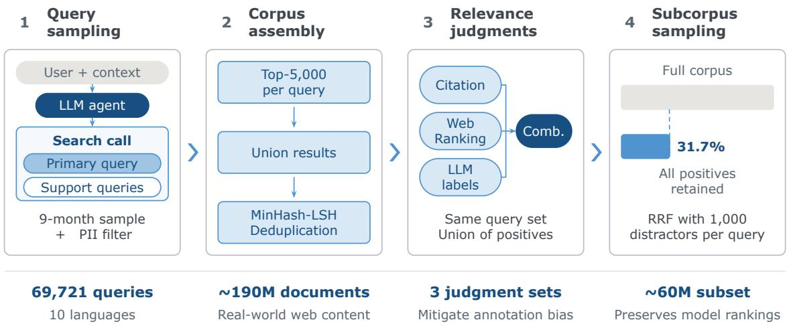
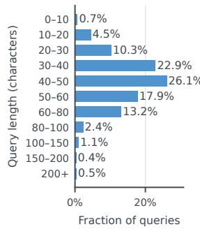
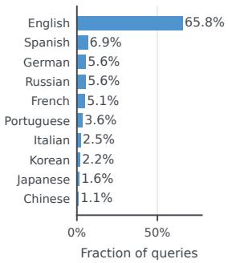
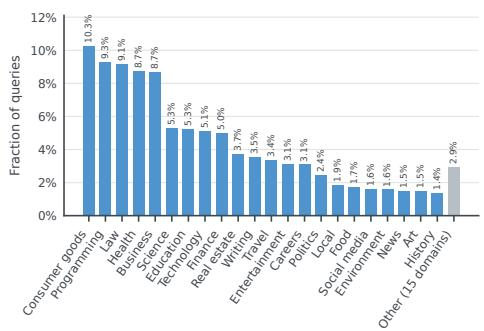
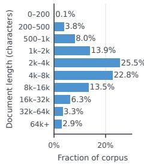
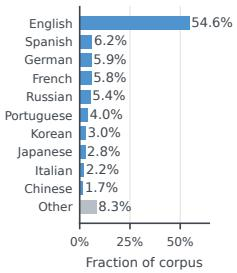
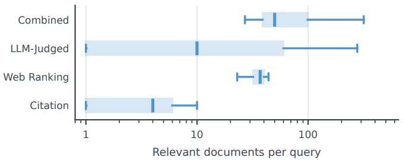
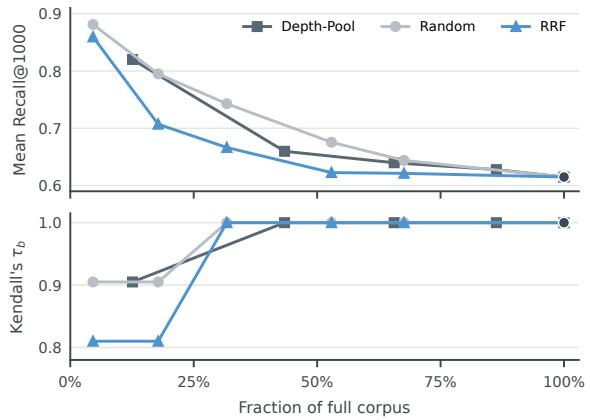
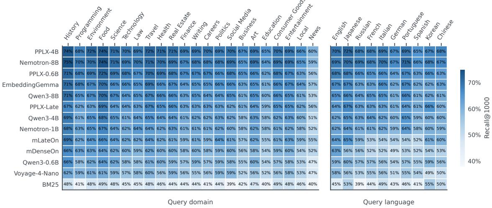
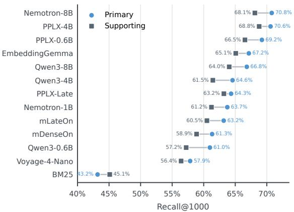

# Q2D-Web: A Large-Scale Benchmark for Retrieval in Agentic RAG Systems

Maximilian Schall1, Sedigheh Eslami1, Markus Krimmel1, Antoine Chafin1, Louis   
Milliken1, Bo Wang1 and Denis Bykov1   
1Perplexity AI

## Abstract

Evaluating first-stage retrievers in large-scale production RAG requires a benchmark that pairs a large-scale corpus with a large set of agent-reformulated search queries based on real user queries and their conversation threads, and that labels many relevant documents per query. No existing public benchmark evaluates this setting: large-scale collections typically provide only a small number of evaluation queries, whereas benchmarks with many queries generally contain only millions of documents. Moreover, most benchmarks assess human-written queries, while the first-stage retrievers in agentic RAG pipelines serve machine-written reformulations whose distribution difers from human search behavior. To overcome these evaluation gaps, we introduce Q2D-Web (Query2Doc-Web), a large-scale agentic retrieval benchmark consisting of a ∼190M-document web corpus and ∼70k agentic search queries in ten languages, reformulated from real-world user queries in production systems. Q2D-Web provides three sets of fixed relevance judgments: agent citations, production rankings, and a combined set that unions both signals and adds LLM-based judgments of unlabeled pooled documents to reduce false negatives. We benchmark 13 retrievers including lexical, dense, and late-interaction models and find that their relative ordering is largely insensitive to the choice of judgment set, while diverging substantially across topical domains, query languages, and query types. To enable fast evaluation, we also study subcorpus sampling as an approximation to full-corpus evaluations. Retaining a third of the corpus, selected by reciprocal rank fusion over pooled retriever runs, preserves the full-corpus model ranking under the combined judgments while raising absolute Recall@1000 only by 3–7 points. The public leaderboard is accessible under: https://huggingface.co/spaces/perplexity-ai/q2d-web-leaderboard.

## 1. Introduction

Agentic retrieval-augmented generation (RAG) relies on retrieval to identify evidence for accurate, grounded responses (Lewis et al., 2020; OpenAI, 2025; Xi et al., 2025). In a production web search scenario, retrieval is performed through a multi-stage pipeline over large and heterogeneous document collections: a first-stage retriever scans the full index and returns a candidate set that later stages rerank (Nogueira et al., 2019; Wang et al., 2011). The first-stage retriever consequently bounds what the agent can read and ultimately cite. As such, an evaluation of this component should test retrieval under realistic productionscale conditions, in which systems must rank relevant documents ahead of semantically similar but non-relevant alternatives (Reimers and Gurevych, 2021). Combining a large search space, many production queries, and deep relevance judgments lets us measure how much relevant evidence a retriever recovers among plausible alternatives.

  
Figure 1 | Q2D-Web construction pipeline. We sample queries from agent search calls, assemble and deduplicate the corpus, construct three relevance-judgment sets, and sample an evaluation subcorpus while retaining all labeled positives.

Existing benchmarks do not support evaluation at such a large scale. Commonly used collections, such as MS MARCO v1 (Bajaj et al., 2016) and v2 (Craswell et al., 2021), contain at most 12M documents. MS MARCO Web Search (Chen et al., 2024b) increases the collection size to 100M documents, but includes only 9,374 test queries. Previous work (Voorhees and Buckley, 2002) motivates the inclusion of larger query sets to reduce the retrieval-experiment error and make system comparisons less sensitive to the particular queries sampled. Evaluation should therefore use a large, topically diverse collection of queries. Furthermore, agentic benchmarks such as BrowseComp-Plus (Chen et al., 2026), although providing a fixed corpus with human-verified evidence documents, contain only 830 research queries.

Production queries issued to the retriever are also reformulated versions of the user’s natural queries. More specifically, the agent reformulates, decomposes, and iteratively revises the original user query using conversational context before each retrieval step (Jin et al., 2025; Xi et al., 2025). Retrieval efectiveness is sensitive to how a query is formulated. Even reformulations that preserve the intent reduce the nDCG@10 of retrieval pipelines by about 20% on average (Penha et al., 2022).

Beyond these limitations in scale and query type, existing collections also provide shallow relevance supervision. MS MARCO Web Search, for instance, assigns a relevance label to only one clicked document per query, leaving potentially relevant but unclicked documents unlabeled. Because unjudged documents are conventionally treated as non-relevant, a system that retrieves relevant but unlabeled documents receives a lower score (Buckley and Voorhees, 2004). Such false negatives are common under sparse labels: on MS MARCO, 70% of manually inspected top-retrieved but unlabeled passages were in fact relevant (Qu et al., 2021), and preference judgments rated the top results of a modern ranker above the oficially judged relevant items (Arabzadeh et al., 2022). These findings motivate deeper relevance assessment, which judges more retrieved documents per query and reduces the risk that relevant results are unlabeled, mitigating the possibility of false negatives in the corpus.

To enable a faithful evaluation of such first-stage retrievers in large-scale production RAG systems, we introduce Q2D-Web (Query2Doc-Web), a benchmark that combines a ∼190M-document web corpus with ∼70k agent-reformulated queries in ten languages, sampled from nine months of PII-free production trafic. To limit false negatives without inheriting the bias of any single label source, we construct three judgment sets, derived from agent citations, production rankings, and LLM judgments of previously unjudged candidates. Figure 1 summarizes the construction pipeline, from query sampling and corpus assembly to relevance assessment and subcorpus selection. To the best of our knowledge, Q2D-Web is the first benchmark to jointly provide a large-scale corpus, a large set of production-sampled agent-reformulated queries, and deep reusable relevance judgments. Table 1 shows how Q2D-Web difers from currently available benchmarks in scale, query type, and label coverage.

Since evaluations on the full Q2D-Web corpus are costly, we also systematically study subcorpus sampling as an approximation to full-corpus evaluation. We find that retaining a third of the corpus, selected by reciprocal rank fusion (RRF) score over pooled retriever runs, preserves the full-corpus ranking of systems and approximates the absolute scores. This enables a two-stage protocol for evaluation: a new retriever can first be evaluated on the sampled subcorpus, and promising retrievers can then be assessed against the full corpus.

We evaluate lexical, dense, and late-interaction retrievers on the full corpus as well as the subsampled version. To assess performance in a production environment, where the retriever selects a candidate pool for downstream re-ranking, we use a deep-recall protocol. We focus on Recall@1000 as our primary metric and report Recall@100 and nDCG@10 to assess retrieval performance at shallower cutofs. Beyond aggregate efectiveness, we find that the number of relevant documents uniquely recovered by a retriever is not ordered by its aggregate recall: the weakest retriever by Recall@1000 contributes by far the largest set of relevant documents that no other retriever recovers, so retriever family matters independently of scale. We further characterize unique contributions, hard positives, and false negatives.

We argue that publicly releasing Q2D-Web would erode its validity over time. Public benchmarks often end up in training data, intentionally or unintentionally through derivative datasets, and models trained on them obtain inflated scores (Matton et al., 2024; Sainz et al., 2023). Because most training corpora are not public, such contamination is dificult to rule out after release (Oren et al., 2024). We therefore keep the corpus, queries, and judgments private and operate a public leaderboard that evaluates open-weight retrievers: https://huggingface.co/spaces/perplexity-ai/q2d-web-leaderboard

In summary, our contributions are as follows:

• A large-scale agentic retrieval benchmark dataset containing a ∼190Mdocument web corpus with ∼70k agent-reformulated queries in ten languages, sampled from nine months of production trafic. Its queries are the machine-written reformulations that first-stage retrievers serve in deployed production environments.

Table 1 | Public IR collections compared to Q2D-Web. #Indexable units denotes the number of items retrieved and ranked by a system. Test q. is the number of test queries. Judg. $/ \mathrm { q } .$ . is the mean number of positive relevance judgments per test query; $\mathrm { n / a }$ indicates that we could not determine a comparable value. References for all collections are given below the table.
<table><tr><td>Collection</td><td>#Indexable units</td><td>#Lang.</td><td>Test q.</td><td>Judg./q.</td><td>Query origin</td><td>Relevance labels</td><td>Domain</td></tr><tr><td>TREC Web 2009–12</td><td>1.04B pages</td><td>10</td><td> $5 0 / { \mathrm { y r } }$ </td><td>63-137</td><td>search log</td><td>human, pooled, graded</td><td>web</td></tr><tr><td>TREC DL 2019–23</td><td>138M passages</td><td>1</td><td>43-82/yr</td><td>67-1,315</td><td>search log</td><td>human, pooled, graded</td><td>web</td></tr><tr><td>TREC RAG 2024</td><td>113.5M segments</td><td>1</td><td>301</td><td>1</td><td>n/a search log</td><td>human + LLM, pooled</td><td>web</td></tr><tr><td>MS MARCO Web</td><td>100.9M documents</td><td>93</td><td>9,374</td><td></td><td>search log</td><td>clicks</td><td>web</td></tr><tr><td>BioASQ</td><td>14.9M articles</td><td>1</td><td>500</td><td>4.7</td><td>domain experts</td><td>human</td><td>biomedical</td></tr><tr><td>MS MARCO Passage</td><td>8.8M passages</td><td>1</td><td>6,980</td><td>~1</td><td>search log</td><td>human, sparse</td><td>web</td></tr><tr><td>FEVER</td><td>5.4M articles</td><td>1</td><td>19,998</td><td></td><td>n/a crowdworker claims</td><td>human</td><td>Wikipedia</td></tr><tr><td>HotpotQA</td><td>5.2M paragraphs</td><td>1</td><td>7,405</td><td>~2</td><td>crowdworkers</td><td>human</td><td>Wikipedia</td></tr><tr><td>AIR-Bench 24.05 BrowseComp-Plus</td><td>1.0M passages (×69) 100,195 documents</td><td>13</td><td>102K</td><td>n/a 6.1</td><td>LLM-generated</td><td>LLM judge</td><td>9 domains</td></tr><tr><td></td><td></td><td>1</td><td>830</td><td></td><td>human trainers</td><td>human-verified; gold-answer subset</td><td>web (curated)</td></tr><tr><td>Q2D-Web</td><td>190M documents</td><td>10</td><td>70K</td><td></td><td>99.6 LLM agents</td><td>CITATION + WEB RANKING + LLM</td><td>web</td></tr></table>

Sources: TREC Web 2009–12 (The Lemur Project, 2009); TREC DL 2019–23 (Craswell et al., 2019, 2023); TREC RAG 2024 (Pradeep et al., 2024; Upadhyay et al., 2024); MS MARCO Web Search (Chen et al., 2024b); BioASQ (Thakur et al., 2021; Tsatsaronis et al., 2015); MS MARCO Passage Ranking (Bajaj et al., 2016); FEVER (Thorne et al., 2018); HotpotQA (Yang et al., 2018); AIR-Bench 24.05 (Chen et al., 2025); BrowseComp-Plus (Chen et al., 2026).

• Multi-source relevance judgments: three reusable judgment sets over the same queries and corpus, which reduce dependence on any single source of relevance labels.

• Large-scale subcorpus sampling demonstrating, for the first time, evaluationpreserving sampling on a large-scale corpus with about 190M documents. The resulting subcorpora support eficient benchmarking and rapid iteration while reproducing the full-corpus system ordering under the Combined label set.

• Benchmarking 13 modern retrievers spanning lexical, dense, and late-interaction architectures under a deep-recall protocol. We find that diferent models achieve the highest Recall@1000 and nDCG@10 (Section 4.3). All tested neural retrievers have lower recall on supporting queries than on primary queries, while BM25 has slightly higher recall on supporting queries (Figure 8). BM25 also has the lowest Recall@1000 overall, yet recovers the largest set of relevant documents that no other tested retriever recovers (Section 5.1).

## 2. Related Work

IR Benchmarks. Information retrieval (IR) evaluation has long relied on benchmarks of limited scale, in both corpus size and query set size. MS MARCO (Bajaj et al., 2016) and the TREC Deep Learning Track (Craswell et al., 2019, 2023) provide the most widely used passage- and document-ranking benchmarks, with document corpora up to 11.9M documents, e.g., in MS MARCO v2. BEIR (Thakur et al., 2021) broadens coverage to 18 domain/task combinations, but individual tasks remain small in both dimensions. Corpus sizes span 3.6K to 5.4M documents, apart from BioASQ at 14.9M, and test sets 49 to 7,405 queries, apart from CQADupStack and Quora, which contain 13,145 and 10,000 test queries, respectively. Large-scale benchmarks partially address corpus scale with collections that are orders of magnitude larger but still sufer from limited numbers of queries. The ClueWeb family (Overwijk et al., 2022; The Lemur Project, 2009, 2012) provides crawls of 50M to 10B documents, but the TREC Web Track provides only 50 pooled, human-judged queries per year (2009–2012), fewer than one judged query per 10M documents. MS MARCO Web Search (Chen et al., 2024b) builds the largest public collection with web click-derived labels, sampling 100M documents from ClueWeb22 and providing 9,374 labeled test queries with only one clicked document each. Q2D-Web provides ∼190M documents with ∼70k judged queries, more than seven times as many judged queries as MS MARCO Web Search, and judges 99.6 positive documents per query rather than one.

Agentic Evaluation and Relevance Judgment. A parallel line of work evaluates language models and agents on fact-seeking web tasks rather than corpus-level retrieval. SimpleQA (Wei et al., 2024) contains 4,326 short-answer questions authored by human trainers, each verified by an independent second trainer and required to have a single, time-invariant answer. BrowseComp (Wei et al., 2025) extends this design to 1,266 harder questions built by inverse authoring: annotators start from a known fact and add constraints until the answer cannot be found on the first page of five search-engine queries and cannot be solved by frontier models or by another annotator within ten minutes. Neither defines a document corpus nor (�, �) relevance judgments; correctness is graded by matching a single short answer against the live web. BrowseComp-Plus (Chen et al., 2026) closes this gap by re-annotating 830 verified BrowseComp queries against a fixed 100,195-document corpus, with an average of 6.1 human-verified evidence documents, 2.9 gold documents, and 76.3 mined hard negatives per query. This supports standard IR metrics such as nDCG and Recall. These benchmarks evaluate the browsing or research agent as a whole, scoring its final answer or its set of source-backed records rather than the first-stage retriever that supplies its evidence.

Q2D-Web isolates the retriever at web scale: it evaluates first-stage retrieval on the agent-reformulated queries that production pipelines issue, against a corpus roughly 1,900 times larger and a judged query set roughly 84 times larger. Where these benchmarks rely on a single label source, Q2D-Web provides three reusable judgment sets over the same queries and corpus, derived from agent citations, production rankings, and LLM judgments of previously unjudged candidates.

Eficient and Faithful Corpus Subsampling. Evaluating retrievers at scale is computationally demanding. A full pass over hundreds of millions of documents is costly for any modern retriever: dense encoders now reach 4B to 8B parameters, late-interaction models emit one vector per token, and even sparse indexes require substantial infrastructure to build and serve. To reduce this cost, Fröbe et al. (2025) propose to construct a reduced evaluation corpus by taking the top-100 pool of the runs that contributed to the original judgment pool, and show on nine TREC tracks that Pool100 is statistically indistinguishable from full-corpus nDCG@10 in both system ranking and absolute score, at up to 1,000 times lower compute. Their follow-up work applies the same strategy to build a learned-sparse retrieval benchmark on 11 TREC tasks (Fröbe et al., 2026). CoRECT (Caspari et al., 2026) adopts the strategy to construct MS MARCO v2 subsets up to 100M passages, using reciprocal-rank fusion over the pooled TREC DL 2023 runs to mine hard distractors before backfilling with random documents. Dinzinger et al. (2026) identify a residual gap in this paradigm: because subsampled corpora omit the long tail of non-relevant background documents, subsampled evaluation systematically overestimates nDCG@k and Recall@k, and the gap grows with �. They correct the metric analytically by fitting a Gaussian to query-to-non-relevant similarity scores. Both operate at TREC scale with human judgments as the anchor; we subsample a ∼190M-document production index against tens of thousands of citation-labeled agentic queries, where qrels combine explicit LLM judgments with implicit relevance signals, yielding substantially more labeled documents per query.

## 3. Q2D-Web

In this section, we detail the four-stage pipeline for creating Q2D-Web: query sampling, corpus assembly, relevance-judgment annotation, and subcorpus sampling for eficient evaluation.

## 3.1. Queries

Q2D-Web contains ∼70k LLM-reformulated queries, generated from ∼23k production searches collected over a nine-month window. A search is all of the web-search activity the agent performs in response to a single user message: one or more tool calls, each carrying one or more query strings. The agent generates every query from the user’s message, the preceding conversation, and any results already retrieved within the same search; users do not enter search queries directly. In production, each search contains one primary query, which restates the user’s intent, and zero or more support queries, which the agent formulates more freely to produce alternative phrasings, retrieve background material, or reach adjacent entities. Figure 2 shows three such searches, in which the primary and support queries draw on conversational context that the user message alone does not contain. A support query remains within the primary query’s domain but difers in surface form and in the set of documents that satisfy it. We therefore treat each query as a separate retrieval problem with its own judgments.

Sampling is stratified by month across a nine-month deployment window to ensure a uniform distribution of search dates. Within each stratum, we match the production distribution over topical domain and language. We then discard exact duplicate queries and queries shorter than three characters. We also discard queries containing filtering operators, such as site:, and keep the ten most common languages in the dataset. Additionally, we apply personally identifiable information (PII) detection and exclude queries that contain PII. Filtering operates on individual queries rather than whole searches, so a search can lose its primary query while its support queries are retained. The resulting set contains 69,721 queries: 12,365 primary (17.7%) and 57,356 support (82.3%) with approximately 4 support queries per primary query on average. Figure 3 shows their character-length, language, and domain distributions.

## 3.2. Web Corpus

For each of the ∼70k queries, we retrieve the top 5,000 documents using a production retrieval system and take the union of these result sets. We then deduplicate this collection with MinHash–LSH (Broder et al., 1997), clustering documents whose token 5-gram sets have a Jaccard similarity of at least 0.975. This yields approximately 190M documents. Within each cluster, we retain the longest document as the canonical representative and remap judgments associated with discarded documents to that representative. Each document consists of a title and a body. The character-length distribution of the corpus is reported in Figure 4. On average, each document contains 13,169 characters.

<table><tr><td>User. Our professor told us to read an article on privacy of the same journal, which one could it be?</td></tr><tr><td>Primary query. seminal Harvard Law Review right to privacy article</td></tr><tr><td>Support queries.</td></tr><tr><td>• Harvard Law Review privacy article professor reading assignment</td></tr><tr><td>• most cited Harvard Law Review privacy articles</td></tr></table>

<table><tr><td>User. libri che capire meglio programmazione distribuita e cloud computing</td></tr><tr><td>Primary query. libri che capire meglio programmazione distribuita e cloud computing</td></tr><tr><td>Support queries.</td></tr><tr><td>• best cloud computing books</td></tr><tr><td>• best books distributed systems</td></tr><tr><td>• migliori libri cloud computing</td></tr></table>

<table><tr><td>User. list of samsung a series from highest to lowest in term of price and performance of the phone</td></tr><tr><td>Primary query. Samsung Galaxy A series models 2025 ranked by price</td></tr><tr><td>Support queries.</td></tr><tr><td>• current Samsung Galaxy A lineup specs comparison</td></tr><tr><td>• Samsung A56 A36 A26 A16 A06 specs prices • current Samsung Galaxy A lineup highest to lowest</td></tr><tr><td></td></tr></table>

Figure 2 | Three example searches from Q2D-Web. Top: the agent resolves context from prior messages and reformulates around the right-to-privacy article. Middle: the user message is Italian for “books to better understand distributed programming and cloud computing”. The agent formulates support queries in both languages for wider coverage. Bottom: support queries proceed in two hops, first establishing an overview, then resolving specific models.

The corpus is constructed from top-ranked retrieval results rather than a random sample of web documents. Consequently, it contains documents that a production retrieval system considered plausible matches for at least one dataset query. We argue that such documents are more likely to be challenging distractors for a retriever model than randomly sampled documents, which are often unrelated to the query.

This efect is strengthened by the query structure. A search contains at most one primary query and, in most cases, one or more support queries (Section 3.1) that address the same user intent but retrieve diferent documents. Therefore, a document retrieved for one reformulated query can serve as a hard-negative candidate for a related query. The pooling of results across these related queries thus produces a corpus with a high concentration of plausible distractors without a separate stage of hard-negative mining.

  
Figure 3 | Statistics of the Q2D-Web queries: character-length (left), language distributions (center), and domain distribution (right).

## 3.3. Relevance-Judgment Passes

A judgment in Q2D-Web is a binary relevance label on a query–document pair. Labeling every pair is infeasible at this scale, but relevance in a pooled corpus overlaps across queries. A document that is a hard negative for one query could be a positive for a related one. We therefore derive relevance labels for the same queries and corpus from three diferent sources. Each source surfaces and judges relevant documents that the others miss, which decreases false negatives. Using several sources reduces the risk of source-specific bias, which favors retrievers similar to the labeling system.

Citation. A document is labeled relevant if an LLM agent cited it in its response. In this work, we assume that citation means the agent used the document to support a claim; therefore, we treat these cited documents as relevant to the query. However, the agent stops citing once a claim is supported, so a relevant document that is redundant with an already-cited source is left uncited and labeled non-relevant. Citation is therefore high-precision and low-recall by construction, and it is the only pass whose labels reflect downstream use of a document rather than an assessment of topical match.

Web Ranking. This label set comprises up to the top 50 results per query (43.1 on average) from an internal retrieval system that employs BM25 and dense retrieval in the first stage, followed by cross-encoder reranking. This pass labels relevant documents that citation behavior discards. Unlike Citation, whose labels are generated at the original search time, Web Ranking is computed against the corpus snapshot, so the two judgment sets might not overlap on documents that changed content over the nine-month window.

Combined+LLM-Judged. This relevance set contains the union of the judgments from Citation, Web Ranking, and additional LLM-generated judgments. We use BM25 (Robertson and Zaragoza, 2009), ColBERTv2 (Santhanam et al., 2022), the dense models arctic-l-v2 (Yu et al., 2024), bge-m3 (Chen et al., 2024a), e5-large-instruct (Wang et al., 2024), gte-multilingual-base (Zhang et al., 2024), mxbai-large-v1 (Lee et al., 2024; Li and Li, 2023), nomic-v1.5 (Nussbaum et al., 2024), and stella-400m-v5 (Zhang et al., 2025a) to rank documents that have not been judged by either Citation or Web Ranking.

  
Figure 4 | Corpus and judgment statistics. Left and center: character-length and language distributions of the corpus, where the Other category comprises 406 languages. Right: relevant documents per query for each judgment source and their union (Combined), showing the median, IQR, and 5th–95th percentiles on a logarithmic scale.

Appendix A lists their architectures, sizes, and input lengths. We select these retrievers by release date alone, keeping every model released before our cutof of January 1, 2025, which keeps the pooling models separate from the evaluation models and avoids bias in favor of the evaluation models. We merge these rankings with reciprocal rank fusion, select the top 500 previously unjudged documents, and ask deepseek-ai/DeepSeek-V4-Flash to assign each query–document pair a binary relevance label (Figure 5).

Each of these label sources carries its own distinct biases. Citation depends on the citing agent, its prompt, and the candidate set it retrieved. Web Ranking depends on the stack that produced it: the choice of first-stage retriever models and cross-encoder rerankers. An LLM-as-a-judge (Gu et al., 2025) has documented preferences of its own, for example, favoring fluent and long-form text. In order to reduce the risk of source-specific annotation bias, Q2D-Web includes all three relevance label sets. Each set comprises binary labels for query–document pairs and may mark multiple documents as relevant for a given query. Figure 4 gives an overview of the distribution. We evaluate every model separately using each label set and discuss the results in Section 4.3.

## 3.4. Subcorpus Sampling

Corpus size drives both retrieval dificulty and evaluation cost. A single full-corpus pass with pplx-embed-v1-4b takes 4,608 H200 GPU-hours. Even the smallest retriever we evaluate, EmbeddingGemma-300M (Vera et al., 2025) at 300M parameters, requires almost 200 H200 GPU-hours. Repeated, community-scale evaluation at this corpus size is therefore impractical rather than merely expensive (Scells et al., 2022). To construct a reliable subsampled version of the corpus, sampling must retain all relevant documents and challenging distractors. In this work, we consider a document as a challenging distractor if at least one retriever ranks it above a relevant document in its top-� results. We argue that omitting such distractors can inflate evaluation scores and change the relative ranking of systems (Dinzinger et al., 2026). Subcorpus sampling (Fröbe et al., 2025) achieves this by carefully selecting a subset that preserves the documents needed to reproduce the original evaluation results.

Let � denote the full corpus, $P \subset { \mathcal { C } }$ the set of positively judged documents, and � the set of evaluation queries. Let ℳ denote the set of retrieval systems whose rankings are used to construct the top-� pool, with $k \in \{ 1 0 0 , 5 0 0 , 1 0 0 0 , 2 0 0 0 , 3 0 0 0 \}$ . For each retriever $m \in \mathcal { M }$ and query $q \in \mathcal { Q }$ , let ${ \cal R } _ { q } ^ { m }$ denote the ranking produced by � for �. We formally define the top-� pool as follows:

<table><tr><td>System. You are an EXTREMELY STRICT search-relevance judge. Answer YES only if this document satisfies EVERY specific constraint in the query — the exact entity, the exact time/date, the exact quantity, and the exact aspect being asked about — and contains the precise information the user wants. Answer NO if any constraint is missing, mismatched, or only approximately met (e.g. a similar-but-different entity, a different date, a near but not equal value, or only part of the question). When in doubt, answer NO. Answer YES or NO. No other text.</td></tr><tr><td>User. Query: “&lt;query&gt;&quot; Document:“&lt;document&gt;&quot;</td></tr></table>

Figure 5 | Relevance-judging prompt for deepseek-ai/DeepSeek-V4-Flash. The system message enforces strict constraint matching; the user message supplies the query and the truncated document.

$$
U _ { k } = \bigcup _ { q \in \mathcal { Q } } \bigcup _ { m \in \mathcal { M } } \mathrm { t o p } _ { k } ( R _ { q } ^ { m } ) .
$$

When subsampling, each sampling strategy constructs a distractor set $S \subset \mathcal { C } \setminus P$ and a subcorpus ${ \widehat { \mathcal { C } } } = P \cup S$ . Thus, every positively judged document is retained in every subcorpus, while subsampling removes only unjudged documents. Fröbe et al. (2025) show that distractors selected from the union of highly ranked results produced by multiple retrievers can serve as hard negatives. Intuitively, these are unjudged documents that retrieval systems deem similar to a query and are therefore more challenging than uniformly sampled distractors. In this work, we compare three strategies for constructing the distractor set �. Because diferent strategies produce subcorpora of diferent sizes, we express size as the percentage of the full corpus.

Depth-� pooling (Fröbe et al., 2025) includes every unjudged document that appears in the top-� results of at least one retriever for at least one query, i.e., $S = U _ { k } \setminus P$ . If a document appears in the top-� results of multiple retrieval systems, it occupies only one place in the subcorpus; we retain the set of unique documents.

Reciprocal rank fusion (RRF) (Cormack et al., 2009) combines the retrievers in ℳ into a single ranking for each query, using a rank ofset of 60. We then add the top � unjudged documents from each fused ranking that are not already in the subcorpus.

Finally, with uniform random sampling, we sample � unjudged documents uniformly for each query from those not already included in the subcorpus. Note that the query determines only how many documents are sampled, not which documents are sampled in this case. Repeating this procedure for each query produces the same subsampled corpus size as RRF.

## 4. Benchmarking First-Stage Retrievers

We use Q2D-Web to benchmark thirteen retrievers, including lexical, dense, and lateinteraction embedding models over ∼190M documents and ∼70k queries. Each retriever

is scored using three complementary metrics on both the full corpus and the sampled subcorpus.

## 4.1. Experimental Setup

Table 2 lists the retrievers we evaluate. All neural retrievers are open-weight and released on or after 1 January 2025 to reflect the current state of the field and do not overlap with models used to create the benchmark. For lexical retrieval, we use BM25-tantivy as a standard lexical reference point. For dense retrieval, we select ten open-weight multilingual encoders whose parameter counts span 0.3B to 8B, spanning six families: Qwen3-Embedding, EmbeddingGemma, Voyage 4, Nemotron-3-Embed, DenseOn, and pplx-embed-v1. This range lets us observe how retrieval quality scales with model size. For late-interaction retrieval, we include mLateOn and pplx-embed-v1-late-0.6B, the two open-weight multilingual late-interaction checkpoints released after January 2025 available at the time of writing. We do not benchmark learned sparse retrievers such as SPLADEv2 (Formal et al., 2021) because multilingual checkpoints for this family remain scarce. Most IR benchmarks treat nDCG@10 as their primary metric because they target the final ranked list presented to users. Q2D-Web instead targets the first stage of a multi-stage ranking pipeline, whose role is to recall as many relevant documents as possible at scale. We therefore adopt Recall@1000 as our primary metric, and additionally report Recall@100 and nDCG@10 to characterize retrieval quality at shallower depths. All three metrics are reported separately on the three label sets from Section 3.3.

For BM25, we use tantivy, which provides scalable inverted-index construction over the corpus and language-aware analyzers for multilingual retrieval. This is the same BM25 used for subcorpus sampling (Section 3.4). For every dense retriever, we adopt the model’s default retrieval instruction template (when available) released with its checkpoint to preserve out-of-the-box behavior. For the two late-interaction retrievers, mLateOn and pplx-embed-v1-late-0.6B, we use 32 tokens for queries. All retrievers encode the first 512 tokens of each document, a truncation forced by the cost of encoding a 190M-document corpus; since the mean document is roughly 3.3k tokens, most of the corpus body is never seen by any system. Spot checks on the subsampled corpus with longer inputs (1024 tokens for dense, 2048 for late-interaction) did not reorder the models, but we do not claim the 512-token scores are unbiased estimates of full-document efectiveness.

## 4.2. Comparison of Sampling Strategies

In Q2D-Web, each of the ∼70k queries is associated with multiple relevant documents, making the union of per-query candidate sets substantially larger than the collection studied by Fröbe et al. (2025). Under a fixed sampling budget, this creates a trade-of between retaining evaluation-critical documents and reducing the corpus size. We therefore investigate which sampling strategy and subcorpus size support the same conclusions in Q2D-Web.

Subcorpus sampling inherits the bias induced by the retrieval systems used to construct the subcorpus: a collection can favor contributing retrievers and be biased against those that did not contribute (Buckley et al., 2007; Zobel, 1998). We use a temporal holdout to evaluate subcorpus generalization to models that did not contribute to its construction. Specifically, only models released before 1 January 2025 contribute to subcorpus construction, and ℳ spans lexical, dense, and late-interaction retrievers (Appendix A), so the held-out models are tested against a pool built from all three families rather than from a single one. Every neural retriever in Table 2 was released after that date and is held out; BM25 also contributes to the judging and sampling pools. The same nine retrievers form the judging pool of Section 3.3, so the holdout covers label generation as well as sampling.

Table 2 | Retrievers evaluated in Q2D-Web; every neural checkpoint is open-weight and released on or after 1 January 2025.
<table><tr><td>Model</td><td>Family</td><td>#P</td><td>d</td><td>Vec.</td><td>Ctx</td><td>Rel.</td></tr><tr><td>BM25-tantivy (Masurel et al., 2026)</td><td>lexical</td><td></td><td></td><td>single</td><td></td><td></td></tr><tr><td>EmbeddingGemma-300M (Vera et al., 2025)</td><td>dense</td><td>0.3B</td><td>768</td><td>single</td><td></td><td>2k 2025-09</td></tr><tr><td>mDenseOn (Sourty et al., 2026)</td><td>dense</td><td>0.3B</td><td>768</td><td>single</td><td></td><td>8k 2026-07</td></tr><tr><td>Nemotron-3-Embed-1B (Babakhin et al., 2026)</td><td>dense</td><td>1.1B</td><td>2048</td><td>single</td><td></td><td>32k 2026-07</td></tr><tr><td>Nemotron-3-Embed-8B</td><td>dense</td><td>8B</td><td>4096</td><td>single</td><td></td><td>32k 2026-07</td></tr><tr><td>pplx-embed-v1-0.6b (Eslami et al., 2026)</td><td>dense</td><td>0.6B</td><td>1024</td><td>single</td><td>32k</td><td>2026-01</td></tr><tr><td>pplx-embed-v1-4b (Eslami et al., 2026)</td><td>dense</td><td>4B</td><td>2560</td><td>single</td><td>32k</td><td>2026-01</td></tr><tr><td>Qwen3-Embedding-0.6B (Zhang et al., 2025b)</td><td>dense</td><td>0.6B</td><td>1024</td><td>single</td><td>32k</td><td>2025-06</td></tr><tr><td>Qwen3-Embedding-4B</td><td>dense</td><td>4B</td><td>2560</td><td>single</td><td>32k</td><td>2025-06</td></tr><tr><td>Qwen3-Embedding-8B</td><td>dense</td><td>8B</td><td>4096</td><td>single</td><td>32k</td><td>2025-06</td></tr><tr><td>voyage-4-nano</td><td>dense</td><td>0.3B</td><td>2048</td><td>single</td><td>32k</td><td>2026-01</td></tr><tr><td>mLateOn (Sourty et al., 2026)</td><td>late</td><td>0.3B</td><td>128</td><td>multi</td><td>8k</td><td>2026-07</td></tr><tr><td>pplx-embed-v1-late-0.6B (Eslami et al., 2026)</td><td>late</td><td>0.6B</td><td>128</td><td>multi</td><td></td><td>32k 2026-03</td></tr></table>

To assess how closely each sampling strategy matches full-corpus evaluation, we measure the absolute diference in Recall@1000 and ranking agreement using Kendall’s � (Kendall, 1945). For ℳ we use the same 9 retrievers as in Section 3.3 to avoid bias in evaluation. The positive set � is taken from the Combined+LLM-Judged relevance set. To create the top-� pool, we choose a value � from the set {100, 500, 1000, 2000, 3000} and show the comparisons in Figure 6. RRF and uniform random both preserve the full-corpus ranking (�� = 1.00) from 31.7% of the corpus, and depth-� pooling from 43.4%. At that budget, RRF stays closest to the full-corpus scores, inflating mean Recall@1000 by 5.1 points against 11.1 points for uniform random, while depth-� pooling reaches comparable fidelity (3.9 points) only on a larger subcorpus. We therefore adopt RRF with � = 1000 as the best trade-of between ranking fidelity, absolute error, and evaluation cost: it is the smallest RRF pool that reproduces the full-corpus ordering, and doubling it to � = 2000 narrows the recall gap to 0.7 points but requires 52.9% of the corpus. The same pplx-embed-v1-4b evaluation drops to roughly 1,500 H200 GPU-hours, and EmbeddingGemma-300M to under 70. Subcorpus sampling enables faithful web-scale evaluation in about eight hours on a single 8×H200 node rather than on a multi-node cluster. We report the results in the following sections, accordingly.

## 4.3. Results

Main. Table 3 reports Recall@1000, Recall@100, and nDCG@10 on the three relevancejudgment sets, evaluated on both the full 190M-document corpus and the RRF-subsampled corpus. For simplicity, we refer to the Combined+LLM-judged relevance set as

  
Figure 6 | Mean Recall@1000 (top) and rank agreement with the full corpus (bottom, Kendall’s ��) versus the retained fraction of the corpus. RRF preserves the model ranking from ∼ 30% of the full corpus.

Comb. in this section. On the primary metric Recall@1000, the winner in each of the three judgment sets is identical between the full and subsampled evaluations: Nemotron-3-Embed-8B wins Citation, and pplx-embed-v1-4b wins Web Ranking and Comb.; subsampling raises every Recall@1000 score by 3–7 points but leaves the winner on each set unchanged. Among sub-1B dense encoders, pplx-embed-v1-0.6b attains the strongest Recall@1000 across all three passes, followed by EmbeddingGemma-300M, with mDenseOn, Qwen3- Embedding-0.6B, and voyage-4-nano trailing the two leaders by 6–10 points on Comb. Within the Qwen3-Embedding family, Recall@1000 improves monotonically with model size from 0.6B to 4B to 8B across all three qrel passes (57.89 → 62.01 → 64.53 on Comb.). Comparing late interaction models with dense encoders yields mixed results. mLateOn outperforms mDenseOn, whereas pplx-embed-v1-late-0.6B trails pplx-embed-v1-0.6b. Both late-interaction models fall below the strongest dense encoders at their respective sizes on Recall@1000, by 3–5 points on Comb., but the gaps narrow to at most 1 point on nDCG@10, where mLateOn also outperforms Qwen3-Embedding-4B. The leader depends on the metric: pplx-embed-v1-4b wins our primary metric Recall@1000, but Nemotron-3-Embed-8B is strongest on both Recall@100 and nDCG@10 under Combined, placing more of its relevant documents near the top of the ranking while recovering fewer overall.

Domain-specific Results. In Figure 7, we present the performance of each embedding model across domains. For simplicity, we only report results using the Combined+LLM-Judged judgments. Our results show that pplx-embed-v1-4b performs strongly across most domains, often matching or outperforming Nemotron-3-Embed-8B, and pplx-embedv1-0.6b ranks third with results similar to EmbeddingGemma-300M. BM25-tantivy achieves the lowest recall in every domain.

Language-specific Results. Figure 7 reports Recall@1000 by query language. pplxembed-v1-4b and Nemotron-3-Embed-8B are the strongest models overall. Nemotron-3- Embed-8B leads pplx-embed-v1-4b by 2 percentage points on Portuguese and by 1 point on Russian, Italian, Spanish, and Korean, while matching or trailing it on the remaining five languages. pplx-embed-v1-0.6b ranks third overall, followed by EmbeddingGemma-300M.

mDenseOn scores 63% on English queries and 49–56% on queries in other languages. mLateOn scores 64% on English queries and 52–65% elsewhere, with Japanese (65%) slightly exceeding English. Thus, both models perform worse in most non-English languages, although the size of the gap varies by language.

Query-type Results. Figure 8 reports Recall@1000 separately for the primary and supporting reformulated queries. All neural retrievers perform substantially better on primary queries and are markedly weaker on supporting queries. This reflects the diferent roles of the two query types: primary reformulated queries stay close to the user’s original information need, while supporting reformulated queries are explicitly generated by the agent to collect additional, more specific information. The performance drop on supporting queries may also stem from how these embedding models are usually trained, i.e., most embedding models are trained predominantly on human-written queries, which resemble primary queries more than agent-generated supporting queries, and thus may be less efective at representing the latter.

BM25, however, shows the opposite trend, with slightly higher performance on supporting queries, but the gap is only about 1.9 percentage points and its overall performance remains much lower than that of neural retrievers.

Table 3 | Retrieval results across relevance sets, metrics, and evaluation corpora. Each cell reports two numbers: Full on the 190M-document corpus and Sub on the RRF-subsampled corpus (�=1000). Best value in bold for Recall@1000, our primary metric. Comb. denotes Combined+LLMjudged case.
<table><tr><td rowspan="3"></td><td colspan="6">Recall@1000</td><td colspan="6">Recall@100</td><td colspan="6">nDCG@10</td></tr><tr><td colspan="2">Citation</td><td colspan="2">Web Ranking</td><td colspan="2">Comb.</td><td colspan="2">Citation</td><td colspan="2">Web Ranking</td><td colspan="2">Comb.</td><td colspan="2">Citation</td><td colspan="2">Web Ranking</td><td colspan="2">Comb.</td></tr><tr><td></td><td>F</td><td>S F</td><td>S</td><td>F</td><td>S</td><td>F</td><td>S</td><td>F</td><td>S</td><td>F</td><td>S F</td><td></td><td>S</td><td>F</td><td>S</td><td>F</td><td>S</td></tr><tr><td>BM25-tantivy</td><td>43.92</td><td>48.12</td><td>42.50</td><td>47.61</td><td>44.77</td><td>49.85</td><td>21.78</td><td>21.86</td><td>16.97</td><td>17.07</td><td>18.16 18.27</td><td>5.74</td><td>5.74</td><td>11.45</td><td></td><td>11.46</td><td>30.30 30.33</td><td></td></tr><tr><td>EmbeddingGemma-300M</td><td>58.17</td><td>61.77</td><td>58.93</td><td>63.75</td><td>65.45</td><td>70.10</td><td>32.00</td><td>32.47</td><td>25.02</td><td>25.54</td><td>27.42 28.01</td><td>9.20</td><td></td><td>9.22</td><td>17.30</td><td>17.37</td><td>43.56</td><td>43.72</td></tr><tr><td>mDenseOn</td><td>51.78</td><td>55.50</td><td>52.56</td><td>57.41</td><td>59.31</td><td>64.13</td><td>27.36</td><td>27.95</td><td>21.70</td><td>22.28</td><td>23.93 24.59</td><td>7.63</td><td></td><td>7.67</td><td>15.06</td><td>15.17</td><td>40.20</td><td>40.43</td></tr><tr><td>Nemotron-3-Embed-1B</td><td>54.40</td><td>58.52</td><td>54.37</td><td>59.72</td><td>61.68</td><td>66.88</td><td>27.97</td><td>28.70</td><td>21.76</td><td>22.49</td><td>24.88</td><td>25.74 7.54</td><td></td><td>7.59</td><td>14.83</td><td>14.95</td><td>40.21</td><td>40.59</td></tr><tr><td>Nemotron-3-Embed-8B</td><td>61.68</td><td>65.08</td><td>61.73</td><td>66.29</td><td>68.58</td><td>72.79</td><td>34.86</td><td>35.34</td><td>26.88</td><td>27.41</td><td>30.03</td><td>30.63</td><td>10.16</td><td>10.19</td><td>18.69</td><td>18.76</td><td>47.44</td><td>47.60</td></tr><tr><td>pplx-embed-v1-0.6b</td><td>58.35</td><td>61.70</td><td>62.15</td><td>66.70</td><td>67.02</td><td>71.52</td><td>32.88</td><td>33.30 27.81</td><td></td><td>28.28</td><td>28.29</td><td>28.79 9.37</td><td></td><td>9.39</td><td>19.76</td><td>19.82</td><td>44.3644.49</td><td></td></tr><tr><td>pplx-embed-v1-4b</td><td>61.22</td><td>64.73</td><td>65.73</td><td>70.63</td><td>69.11</td><td>74.07</td><td>35.57</td><td>36.16 30.28</td><td></td><td>30.95</td><td>29.82</td><td>30.52 10.33</td><td></td><td>10.36 21.29</td><td></td><td>21.40</td><td>45.8446.06</td><td></td></tr><tr><td>Qwen3-Embedding-0.6B</td><td>50.10</td><td>54.39</td><td>51.82</td><td>57.38</td><td>57.89</td><td>63.52</td><td>25.02</td><td>25.58</td><td>20.63</td><td>21.21</td><td>22.48</td><td>23.15 6.58</td><td></td><td>6.60</td><td>14.11</td><td>14.19</td><td>37.38 37.58</td><td></td></tr><tr><td>Qwen3-Embedding-4B</td><td>54.95</td><td>59.20</td><td>55.60</td><td>61.35</td><td>62.01</td><td>67.58</td><td>28.45</td><td>29.08</td><td>22.33</td><td>22.99</td><td>24.93</td><td>25.69 7.67</td><td></td><td>7.70</td><td>14.97</td><td>15.06</td><td>40.21</td><td>40.48</td></tr><tr><td>Qwen3-Embedding-8B</td><td>57.38 49.38</td><td>61.37 54.88</td><td>58.34 50.14</td><td>63.64 57.03</td><td>64.53 56.67</td><td>69.61</td><td>30.47 23.52</td><td>31.06 24.14</td><td></td><td>24.73 19.99</td><td>26.67 27.33 21.19</td><td>8.30 5.41</td><td></td><td>8.33</td><td>16.27 11.77</td><td>16.36 12.01</td><td>42.69</td><td>42.89</td></tr><tr><td>voyage-4-nano</td><td></td><td></td><td></td><td></td><td></td><td>63.06</td><td></td><td>24.66 18.92</td><td></td><td></td><td></td><td>22.43</td><td></td><td>5.51</td><td></td><td></td><td>31.63</td><td>32.43</td></tr><tr><td>mLateOn</td><td>52.85</td><td>56.45</td><td>53.12</td><td>57.92</td><td>60.98</td><td>65.62</td><td>29.02</td><td>29.66 22.55</td><td></td><td>23.21</td><td>26.04 26.81</td><td>8.44</td><td></td><td>8.52</td><td>15.51</td><td>15.68</td><td></td><td>43.11 43.50</td></tr><tr><td>pplx-embed-v1-late-0.6B</td><td>56.56</td><td>60.75</td><td>58.14</td><td>63.80</td><td>63.40</td><td>68.95</td><td>31.37</td><td>32.07 25.01</td><td></td><td>25.77</td><td>27.04 27.91</td><td>9.13</td><td></td><td>9.19</td><td>17.25</td><td>17.39</td><td></td><td>43.39 43.78</td></tr></table>

## 5. Insights and Analysis

We restrict the analysis in this section to the Combined+LLM-Judged label set and Recall@1000 rather than repeating it for every label set and metric. Section 4.3 shows that retriever rankings are largely stable across the three label sets.

## 5.1. Unique Positive Coverage

Which positives a retriever recovers is not ordered by its aggregate recall. BM25-tantivy reaches the lowest Recall@1000 of any retriever (44.77) yet contributes 14,621 unique positives, nearly six times the next-highest contributor. The next two contributors are

  
Figure 7 | Recall@1000 under Combined+LLM-Judged relevance, broken down by query domain (left) and query language (right). Rows represent retrievers and columns represent query slices; cell labels report recall as percentages. Both panels use the same color scale, with darker cells indicating higher recall.

EmbeddingGemma-300M with 2,451, which ranks fourth of thirteen on Recall@1000 (65.45) at 300M parameters, and mLateOn with 2,327, which ranks ninth (60.98). The strongest retrievers by Recall@1000 contribute far fewer: pplx-embed-v1-4b (69.11) and Nemotron-3-Embed-8B (68.58) contribute 884 and 705, and Qwen3-Embedding-8B, fifth at 64.53, contributes 596. Retrievers of diferent families and training recipes therefore recover diferent parts of the relevant set, and the retriever with the weakest aggregate recall recovers by far the largest set that no other retriever recovers.

BM25 may therefore still be useful alongside stronger neural retrievers. Comparing such combinations with ensembles containing only neural retrievers, using the same number of retrievers, fusion rule, and candidate budget, would test whether its unique positives lead to higher recall.

  
Figure 8 | Recall@1000 for primary and supporting agent-reformulated queries. Each line connects the two scores for one retriever. Neural retrievers perform worse on supporting queries, while BM25 improves slightly.

Hard negatives. You are given a query and a document that are ranked top-1000 but that the labels mark NON-relevant. Choose EXACTLY ONE label: false\_negative (the document is actually relevant; the label is wrong), wrong\_aspect (same topic but a diferent aspect/subtopic than asked), related\_entity (a similar but diferent product, person, place, or version), partial (touches the need but incomplete or only tangential), generic (boilerplate/navigational/listing page matching keywords, no substance), or temporal (right topic but wrong time period / outdated / diferent edition). Otherwise answer other. End with: LABEL: <one label>

Hard positives. You are given a query and a document that IS relevant but which the retriever FAILED to rank in its top results. Choose the single most likely reason: lexical (relevant by meaning but shares almost none of the query’s words), entity\_numeric (relevance hinges on an exact entity, code, quantity, or date), truncation (query-relevant content sits deep inside a long document), multilingual (query and document in diferent languages or scripts), reasoning (linking query to document needs multi-step inference / world knowledge), or generic\_dup (generic/boilerplate or one of many near-duplicates). Otherwise answer other. End with: LABEL: <one label>

Figure 9 | Hard-negative and hard-positive taxonomy prompts for deepseek-ai/DeepSeek-V4-Flash. Each prompt gives the query as text and the document as its title and body.

## 5.2. Hard Negatives and Hard Positives

We complement the aggregate results with an error analysis of the hardest cases in both directions: documents that all thirteen retrievers rank in their top-1000 despite being labeled non-relevant, and relevant documents that none of the thirteen ranks in its top-1000. Both taxonomies are defined over the Combined+LLM-Judged label set. We classify both sets with deepseek-ai/DeepSeek-V4-Flash, the same model that produced the LLM-generated part of that label set, so the hard-negative analysis asks the judge to revisit its own decisions. We classify a uniform random sample of 4,000 hard negatives; the hard-positive set has 6,424 members and we classify all of them. The two prompts are shown in Figure 9.

Hard Negatives. Our review finds that 15.8% of the sampled hard negatives are in fact relevant. We treat these as label false negatives rather than excluding them from the pool, since our relevance pool is built only from models released before 2025 and, of the thirteen evaluated retrievers, only BM25 contributed to the pool. Their absence from the relevance scores reflects a gap in the pooling models rather than a bias toward or against any system under evaluation. The remaining 84.2% are genuine hard negatives. Of all sampled pairs, the dominant relationships are: wrong-aspect, where the document shares the query’s general topic but addresses a diferent aspect or subtopic (39.0%); partial, where the document is on-topic and touches the need but is incomplete or only tangential (17.8%); related-entity, where the document concerns a similar but distinct product, person, place, or version (13.8%); generic, where boilerplate, navigational, or listing pages match the query’s keywords without substantive content (6.5%); and temporal, where the document is the right topic and entity but from the wrong point in time (5.8%). The remaining 1.3% fall outside the taxonomy.

Hard Positives. The 6,424 relevant documents that none of the thirteen retrievers ranks in its top-1000 divide as follows. lexical, where the document is relevant by meaning but shares almost none of the query’s words or phrasing, is the largest category (51.1%). truncation, where the query-relevant content sits deep inside a long document, and multilingual, where query and document are written in diferent languages or scripts, account for a further 17.7% and 15.4%, respectively. The remaining categories are smaller: reasoning, where linking query to document requires multi-step inference or world knowledge (7.0%); generic\_dup, generic or boilerplate content or one of many near-duplicates (4.1%); entity\_numeric, where relevance hinges on a specific named entity, code, quantity, or date (1.0%); and 3.7% outside the taxonomy.

## 6. Conclusion

We introduce Q2D-Web, a retrieval benchmark built from nine months of production search trafic, with ∼190M documents, ∼70k agent-reformulated queries, and three relevance-label sets. Across thirteen lexical, dense, and late-interaction retrievers, rankings are largely stable across label sets, while the retriever with the lowest aggregate recall contributes the most unique labeled positives. A ∼30% RRF subcorpus preserves the ranking order under the Combined judgments, with a small, systematic inflation of absolute recall. For a 4B embedding model, this reduces evaluation cost from 4,608 to roughly 1,500 H200 GPU-hours.

The many labeled positives per query let us measure which relevant documents each retriever adds to an ensemble. Future work can use this to test whether diverse ensembles recover more relevant documents than equally sized ensembles of stronger but more similar retrievers. We release a public leaderboard for continued evaluation on Q2D-Web, while keeping the queries and relevance judgments private to limit training contamination.

## Ethics and Privacy Statement

Q2D-Web is derived from production search trafic of a commercial conversational search assistant, and we confirm that use of this trafic is consistent with the applicable user agreements, privacy policy, and data protection law, and apply PII detection during query sampling to exclude any query flagged as containing PII. Q2D-Web remains a private benchmark rather than a released dataset, with only aggregate results such as leaderboard scores shared externally, and we maintain its three relevance-judgment sources separately rather than treating any single pass as ground truth. We do not foresee a use of Q2D-Web beyond the standard dual-use profile of retrieval research, in which a stronger retriever surfaces both beneficial and harmful information equally well.

## References

N. Arabzadeh, A. Vtyurina, X. Yan, and C. L. A. Clarke. Shallow pooling for sparse labels. Information Retrieval Journal, 25:365–385, 2022. doi: 10.1007/s10791-022-09411-0.

Y. Babakhin, R. Ak, J. Cai, V. Raman, R. Osmulski, J. Zakrzewski, A. Gupta, O. Holworthy, S. Sharifymoghaddam, K. Pham, J. Rong, S. Han, S. Sodha, I. Hulseman, and

B. Liu. NVIDIA Nemotron 3 Embed ranks #1 overall on RTEB, advancing agentic retrieval. Hugging Face Blog, July 2026. URL https://huggingface.co/blog/nvidia/ nemotron-3-embed-wins-rteb. Accessed: 2026-08-04.

P. Bajaj, D. Campos, N. Craswell, L. Deng, J. Gao, X. Liu, R. Majumder, A. McNamara, B. Mitra, T. Nguyen, M. Rosenberg, X. Song, A. Stoica, S. Tiwary, and T. Wang. MS MARCO: A human generated machine reading comprehension dataset. arXiv preprint arXiv:1611.09268, 2016. doi: 10.48550/arXiv.1611.09268. URL https://arxiv.org/ abs/1611.09268.

A. Z. Broder, S. C. Glassman, M. S. Manasse, and G. Zweig. Syntactic clustering of the web. Computer Networks and ISDN Systems, 29(8–13):1157–1166, 1997. doi: 10.1016/ s0169-7552(97)00031-7. URL https://doi.org/10.1016/s0169-7552(97)00031-7.

C. Buckley and E. M. Voorhees. Retrieval evaluation with incomplete information. In Proceedings of the 27th Annual International ACM SIGIR Conference on Research and Development in Information Retrieval, pages 25–32, 2004. doi: 10.1145/1008992.1009000.

C. Buckley, D. Dimmick, I. Soborof, and E. Voorhees. Bias and the limits of pooling for large collections. Information Retrieval, 10(6):491–508, 2007. doi: 10.1007/s10791-007-9032-x.

L. Caspari, M. Dinzinger, K. G. Dastidar, C. Fellicious, J. Mitrovic, and M. Granitzer. Corect: A framework for evaluating embedding compression techniques at scale. In R. Campos, A. Jatowt, Y. Lan, M. Aliannejadi, C. Bauer, S. MacAvaney, A. Anand, Z. Ren, S. Verberne, N. Bai, and M. Mansoury, editors, Advances in Information Retrieval - 48th European Conference on Information Retrieval, ECIR 2026, Delft, The Netherlands, March 29 - April 2, 2026, Proceedings, Part IV, volume 16486 of Lecture Notes in Computer Science, pages 383–398. Springer, 2026. doi: 10.1007/978-3-032-21321-1\_48. URL https://doi.org/10.1007/978-3-032-21321-1\_48.

J. Chen, S. Xiao, P. Zhang, K. Luo, D. Lian, and Z. Liu. Bge m3-embedding: Multi-lingual, multi-functionality, multi-granularity text embeddings through self-knowledge distillation, 2024a. URL https://arxiv.org/abs/2402.03216.

J. Chen, N. Wang, C. Li, B. Wang, S. Xiao, H. Xiao, H. Liao, D. Lian, and Z. Liu. Air-bench: Automated heterogeneous information retrieval benchmark. In ACL, pages 19991–20022. Association for Computational Linguistics, 2025. doi: 10.18653/v1/2025.acl-long.982. URL https://doi.org/10.18653/v1/2025.acl-long.982.

Q. Chen, X. Geng, C. Rosset, C. Buractaon, J. Lu, T. Shen, K. Zhou, C. Xiong, Y. Gong, P. N. Bennett, N. Craswell, X. Xie, F. Yang, B. Tower, N. Rao, A. Dong, W. Jiang, Z. Liu, M. Li, C. Liu, Z. Li, R. Majumder, J. Neville, A. Oakley, K. Risvik, H. Simhadri, M. Varma, Y. Wang, L. Yang, M. Yang, and C. Zhang. Ms marco web search: A large-scale information-rich web dataset with millions of real click labels. The Web Conference, pages 292–301, 2024b. doi: 10.1145/3589335.3648327. URL https://doi. org/10.1145/3589335.3648327.

Z. Chen, X. Ma, S. Zhuang, P. Nie, K. Zou, S. Sharifymoghaddam, A. Liu, J. Green, K. Patel, R. Meng, M. Su, Y. Li, H. Hong, X. Shi, X. Liu, H. Oyarhoseini, N. Thakur, C. Zhang, L. Gao, W. Chen, and J. Lin. BrowseComp-plus: A fair and disentangled evaluation benchmark for deep search agents. In M. Liakata, V. P. Moreira, J. Zhang,

and D. Jurgens, editors, Proceedings of the 64th Annual Meeting of the Association for Computational Linguistics (Volume 1: Long Papers), pages 22349–22370, San Diego, California, United States, July 2026. Association for Computational Linguistics. ISBN 979-8-89176-390-6. doi: 10.18653/v1/2026.acl-long.1023. URL https://aclanthology. org/2026.acl-long.1023/.

G. V. Cormack, C. L. A. Clarke, and S. Buettcher. Reciprocal rank fusion outperforms condorcet and individual rank learning methods. In Proceedings of the 32nd International ACM SIGIR Conference on Research and Development in Information Retrieval, SIGIR ’09, page 758–759, New York, NY, USA, 2009. Association for Computing Machinery. ISBN 9781605584836. doi: 10.1145/1571941.1572114. URL https://doi.org/10.1145/ 1571941.1572114.

N. Craswell, B. Mitra, E. Yilmaz, D. Campos, and E. M. Voorhees. Overview of the TREC 2019 deep learning track. In Proceedings of the Twenty-Eighth Text REtrieval Conference (TREC 2019), volume 1250 of NIST Special Publication. National Institute of Standards and Technology (NIST), 2019. URL https://trec.nist.gov/pubs/trec28/papers/ OVERVIEW.DL.pdf.

N. Craswell, B. Mitra, E. Yilmaz, D. Campos, and J. Lin. Overview of the TREC 2021 deep learning track. In I. Soborof and A. Ellis, editors, Proceedings of the Thirtieth Text REtrieval Conference, TREC 2021, online, November 15-19, 2021, volume 500-335 of NIST Special Publication. National Institute of Standards and Technology (NIST), 2021. URL https://trec.nist.gov/pubs/trec30/papers/Overview-DL.pdf.

N. Craswell, B. Mitra, E. Yilmaz, H. A. Rahmani, D. Campos, J. Lin, E. M. Voorhees, and I. Soborof. Overview of the trec 2023 deep learning track. In TREC. National Institute of Standards and Technology (NIST), 2023. doi: 10.6028/nist.sp.1266.deep-overview. URL https://trec.nist.gov/pubs/trec32/papers/Overview\_deep.pdf.

M. Dinzinger, K. Ghosh Dastidar, L. Caspari, J. Mitrović, and M. Granitzer. Bridging the gap between subsampled and full-corpus evaluation. In Proceedings of the 2026 International ACM SIGIR Conference on Innovative Concepts and Theories in Information Retrieval (ICTIR ’26), pages 56–61. ACM, 2026. doi: 10.1145/3805713.3820404. URL https://doi.org/10.1145/3805713.3820404.

S. Eslami, M. Gaiduk, M. Krimmel, L. M. Milliken, B. Wang, and D. Bykov. Difusionpretrained dense and contextual embeddings. In Y. Li, G. Rehm, and M. Tu, editors, Proceedings of the 64th Annual Meeting of the Association for Computational Linguistics (Volume 6: Industry Track), pages 990–1004, San Diego, California, USA, July 2026. Association for Computational Linguistics. ISBN 979-8-89176-394-4. doi: 10.18653/v1/ 2026.acl-industry.69. URL https://aclanthology.org/2026.acl-industry.69/.

T. Formal, C. Lassance, B. Piwowarski, and S. Clinchant. Splade v2: Sparse lexical and expansion model for information retrieval. ArXiv, abs/2109.10086, 2021. URL https://api.semanticscholar.org/CorpusID:237581550.

M. Fröbe, A. Parry, H. Scells, S. Wang, S. Zhuang, G. Zuccon, M. Potthast, and M. Hagen. Corpus subsampling: Estimating the efectiveness of neural retrieval models on large corpora. In Advances in Information Retrieval – 47th European Conference on Information Retrieval (ECIR 2025), Proceedings, Part I, volume 15572 of Lecture Notes in

Computer Science, pages 453–471. Springer, 2025. doi: 10.1007/978-3-031-88708-6\_29. URL https://downloads.webis.de/publications/papers/froebe\_2025c.pdf.

M. Fröbe, F. Schlatt, C. Rulli, T. Hagen, J. H. Merker, G. Hendriksen, C. Lassance, F. M. Nardini, R. Venturini, and M. Potthast. Evaluating the eficiency and efectiveness of learned sparse retrieval with the lsr\_benchmark. In R. Campos, A. Jatowt, Y. Lan, M. Aliannejadi, C. Bauer, S. MacAvaney, A. Anand, Z. Ren, S. Verberne, N. Bai, and M. Mansoury, editors, Advances in Information Retrieval - 48th European Conference on Information Retrieval, ECIR 2026, Delft, The Netherlands, March 29 - April 2, 2026, Proceedings, Part IV, volume 16486 of Lecture Notes in Computer Science, pages 528–543. Springer, 2026. doi: 10.1007/978-3-032-21321-1\_57. URL https://doi.org/10.1007/ 978-3-032-21321-1\_57.

J. Gu, X. Jiang, Z. Shi, H. Tan, X. Zhai, C. Xu, W. Li, Y. Shen, S. Ma, H. Liu, S. Wang, K. Zhang, Y. Wang, W. Gao, L. Ni, and J. Guo. A survey on llm-as-a-judge, 2025. URL https://arxiv.org/abs/2411.15594.

B. Jin, H. Zeng, Z. Yue, J. Yoon, S. O. Arik, D. Wang, H. Zamani, and J. Han. Search-r1: Training llms to reason and leverage search engines with reinforcement learning. In COLM 2025, 2025. URL https://openreview.net/forum?id=Rwhi91ideu.

M. G. Kendall. The treatment of ties in ranking problems. Biometrika, 33(3):239–251, 1945. doi: 10.1093/biomet/33.3.239.

S. Lee, A. Shakir, D. Koenig, and J. Lipp. Open source strikes bread – new flufy embeddings model, 2024. URL https://www.mixedbread.ai/blog/mxbai-embed-large-v1.

P. S. H. Lewis, E. Perez, A. Piktus, F. Petroni, V. Karpukhin, N. Goyal, H. Küttler, M. Lewis, W. Yih, T. Rocktäschel, S. Riedel, and D. Kiela. Retrieval-augmented generation for knowledge-intensive NLP tasks. In H. Larochelle, M. Ranzato, R. Hadsell, M. Balcan, and H. Lin, editors, Advances in Neural Information Processing Systems 33: Annual Conference on Neural Information Processing Systems 2020, NeurIPS 2020, December 6-12, 2020, virtual, 2020. URL https://proceedings.neurips.cc/paper/ 2020/hash/6b493230205f780e1bc26945df7481e5-Abstract.html.

X. Li and J. Li. Angle-optimized text embeddings, 2023. URL https://arxiv.org/abs/ 2309.12871.

P. Masurel, Quickwit, Inc., and Tantivy contributors. Tantivy: A full-text search engine library inspired by apache lucene and written in rust. https://github.com/quickwitoss/tantivy, 2026. GitHub repository, accessed 2026-08-04.

A. Matton, T. Sherborne, D. Aumiller, E. Tommasone, M. Alizadeh, J. He, R. Ma, M. Voisin, E. Gilsenan-McMahon, and M. Gallé. On leakage of code generation evaluation datasets. In Findings of the Association for Computational Linguistics: EMNLP 2024, pages 13215–13223, Miami, Florida, USA, 2024. Association for Computational Linguistics. doi: 10.18653/v1/2024.findings-emnlp.772. URL https://aclanthology.org/2024. findings-emnlp.772/.

R. Nogueira, W. Yang, K. Cho, and J. Lin. Multi-stage document ranking with BERT. arXiv:1910.14424, 2019.

Z. Nussbaum, J. X. Morris, B. Duderstadt, and A. Mulyar. Nomic embed: Training a reproducible long context text embedder, 2024. URL https://arxiv.org/abs/2402. 01613.

OpenAI. Introducing deep research. https://openai.com/index/ introducing-deep-research/, 2025. Accessed 2026-07-24.

Y. Oren, N. Meister, N. S. Chatterji, F. Ladhak, and T. B. Hashimoto. Proving test set contamination in black box language models. In The Twelfth International Conference on Learning Representations (ICLR), 2024. URL https://openreview.net/forum?id= KS8mIvetg2.

A. Overwijk, C. Xiong, X. Liu, C. VandenBerg, and J. Callan. ClueWeb22: 10 billion web documents with visual and semantic information. arXiv preprint arXiv:2211.15848, 2022. doi: 10.48550/arXiv.2211.15848. URL https://arxiv.org/abs/2211.15848.

G. Penha, A. Câmara, and C. Hauf. Evaluating the robustness of retrieval pipelines with query variation generators. In Advances in Information Retrieval: 44th European Conference on IR Research, ECIR 2022, Stavanger, Norway, April 10–14, 2022, Proceedings, Part I, page 397–412, Berlin, Heidelberg, 2022. Springer-Verlag. ISBN 978-3-030-99735-9. doi: 10.1007/978-3-030-99736-6\_27. URL https://doi.org/10. 1007/978-3-030-99736-6\_27.

R. Pradeep, N. Thakur, S. Sharifymoghaddam, E. Zhang, R. Nguyen, D. Campos, N. Craswell, and J. Lin. Ragnarök: A reusable rag framework and baselines for trec 2024 retrieval-augmented generation track. arXiv preprint, 2024. URL https: //arxiv.org/abs/2406.16828.

Y. Qu, Y. Ding, J. Liu, K. Liu, R. Ren, W. X. Zhao, D. Dong, H. Wu, and H. Wang. RocketQA: An optimized training approach to dense passage retrieval for open-domain question answering. In Proceedings of the 2021 Conference of the North American Chapter of the Association for Computational Linguistics: Human Language Technologies (NAACL-HLT), pages 5835–5847, 2021. doi: 10.18653/v1/2021.naacl-main.466.

N. Reimers and I. Gurevych. The curse of dense low-dimensional information retrieval for large index sizes. In Proceedings of the 59th Annual Meeting of the Association for Computational Linguistics and the 11th International Joint Conference on Natural Language Processing (Volume 2: Short Papers), pages 605–611. Association for Computational Linguistics, 2021. URL https://aclanthology.org/2021.acl-short.77/.

S. Robertson and H. Zaragoza. The probabilistic relevance framework: Bm25 and beyond. Foundations and Trends in Information Retrieval, 3(4):333–389, 2009. doi: 10.1561/ 1500000019.

O. Sainz, J. A. Campos, I. García-Ferrero, J. Etxaniz, O. Lopez de Lacalle, and E. Agirre. NLP evaluation in trouble: On the need to measure LLM data contamination for each benchmark. In Findings of the Association for Computational Linguistics: EMNLP 2023, pages 10776–10787, Singapore, 2023. Association for Computational Linguistics. doi: 10.18653/v1/2023.findings-emnlp.722. URL https://aclanthology.org/2023. findings-emnlp.722/.

K. Santhanam, O. Khattab, J. Saad-Falcon, C. Potts, and M. Zaharia. Colbertv2: Effective and eficient retrieval via lightweight late interaction. In Proceedings of the 2022 Conference of the North American Chapter of the Association for Computational Linguistics: Human Language Technologies, 2022. URL https://aclanthology.org/ 2022.naacl-main.272.

H. Scells, S. Zhuang, and G. Zuccon. Reduce, reuse, recycle: Green information retrieval research. In Proceedings of the 45th International ACM SIGIR Conference on Research and Development in Information Retrieval (SIGIR ’22), pages 2825–2837. ACM, 2022. doi: 10.1145/3477495.3531766. URL https://doi.org/10.1145/3477495.3531766.

R. Sourty, A. Chafin, P. R. M. Junior, and A. Chatelain. Denseon with the lateon: Fully open dense and late-interaction models for multilingual, long-context, and code search, 2026. URL https://arxiv.org/abs/2607.27178.

N. Thakur, N. Reimers, A. Rücklé, A. Srivastava, and I. Gurevych. BEIR: A heterogenous benchmark for zero-shot evaluation of information retrieval models. In Proceedings of the Thirty-fifth Conference on Neural Information Processing Systems Datasets and Benchmarks Track (NeurIPS 2021), 2021. doi: 10.48550/arXiv.2104.08663. URL https://arxiv.org/abs/2104.08663.

The Lemur Project. The ClueWeb09 dataset. https://lemurproject.org/clueweb09/, 2009. 1,040,809,705 web pages crawled January–February 2009; Category B is the first 50M English pages.

The Lemur Project. The ClueWeb12 dataset. https://lemurproject.org/clueweb12/, 2012. 733,019,372 English web pages crawled February–May 2012; the ClueWeb12-B13 subset contains 52,343,021 documents.

J. Thorne, A. Vlachos, C. Christodoulopoulos, and A. Mittal. FEVER: A large-scale dataset for fact extraction and VERification. In Proceedings of the 2018 Conference of the North American Chapter of the Association for Computational Linguistics: Human Language Technologies (NAACL-HLT), pages 809–819, 2018. doi: 10.18653/v1/N18-1074.

G. Tsatsaronis, G. Balikas, P. Malakasiotis, I. Partalas, M. Zschunke, M. R. Alvers, D. Weissenborn, A. Krithara, S. Petridis, D. Polychronopoulos, Y. Almirantis, J. Pavlopoulos, N. Baskiotis, P. Gallinari, T. Artières, A.-C. Ngonga Ngomo, N. Heino, É. Gaussier, L. Barrio-Alvers, M. Schroeder, I. Androutsopoulos, and G. Paliouras. An overview of the BIOASQ large-scale biomedical semantic indexing and question answering competition. BMC Bioinformatics, 16(1):138, 2015. doi: 10.1186/s12859-015-0564-6.

S. Upadhyay, R. Pradeep, N. Thakur, D. Campos, N. Craswell, I. Soborof, H. T. Dang, and J. Lin. A large-scale study of relevance assessments with large language models: An initial look. arXiv preprint arXiv:2411.08275, pages 358–368, 2024. doi: 10.1145/ 3731120.3744605. URL https://arxiv.org/abs/2411.08275.

H. S. Vera, S. Dua, B. Zhang, D. Salz, R. Mullins, S. R. Panyam, S. Smoot, I. Naim, J. Zou, F. Chen, D. Cer, A. Lisak, M. Choi, L. Gonzalez, O. Sanseviero, G. Cameron, I. Ballantyne, K. Black, K. Chen, W. Wang, Z. Li, G. Martins, J. Lee, M. Sherwood, J. Ji, R. Wu, J. Zheng, J. Singh, A. Sharma, D. Sreepathihalli, A. Jain, A. Elarabawy, A. Co, A. Doumanoglou, B. Samari, B. Hora, B. Potetz, D. Kim, E. Alfonseca, F. Moiseev,

F. Han, F. P. Gomez, G. H. Ábrego, H. Zhang, H. Hui, J. Han, K. Gill, K. Chen, K. Chen, M. Shanbhogue, M. Boratko, P. Suganthan, S. M. K. Duddu, S. Mariserla, S. Ariafar, S. Zhang, S. Zhang, S. Baumgartner, S. Goenka, S. Qiu, T. Dabral, T. Walker, V. Rao, W. Khawaja, W. Zhou, X. Ren, Y. Xia, Y. Chen, Y.-T. Chen, Z. Dong, Z. Ding, F. Visin, G. Liu, J. Zhang, K. Kenealy, M. Casbon, R. Kumar, T. Mesnard, Z. Gleicher, C. Brick, O. Lacombe, A. Roberts, Q. Yin, Y. Sung, R. Hofmann, T. Warkentin, A. Joulin, T. Duerig, and M. Seyedhosseini. Embeddinggemma: Powerful and lightweight text representations, 2025. URL https://arxiv.org/abs/2509.20354.

E. M. Voorhees and C. Buckley. The efect of topic set size on retrieval experiment error. In Proceedings of the 25th Annual International ACM SIGIR Conference on Research and Development in Information Retrieval, pages 316–323, 2002. doi: 10.1145/564376.564432.

L. Wang, J. Lin, and D. Metzler. A cascade ranking model for eficient ranked retrieval. In Proceedings of SIGIR, pages 105–114, 2011.

L. Wang, N. Yang, X. Huang, L. Yang, R. Majumder, and F. Wei. Multilingual e5 text embeddings: A technical report, 2024. URL https://arxiv.org/abs/2402.05672.

J. Wei, N. Karina, H. W. Chung, Y. J. Jiao, S. Papay, A. Glaese, J. Schulman, and W. Fedus. Measuring short-form factuality in large language models. CoRR, abs/2411.04368, 2024. doi: 10.48550/ARXIV.2411.04368. URL https://doi.org/10.48550/arXiv. 2411.04368.

J. Wei, Z. Sun, S. Papay, S. McKinney, J. Han, I. Fulford, H. W. Chung, A. T. Passos, W. Fedus, and A. Glaese. Browsecomp: A simple yet challenging benchmark for browsing agents. CoRR, abs/2504.12516, 2025. doi: 10.48550/ARXIV.2504.12516. URL https://doi.org/10.48550/arXiv.2504.12516.

Y. Xi, J. Lin, Y. Xiao, Z. Zhou, R. Shan, T. Gao, J. Zhu, W. Liu, Y. Yu, and W. Zhang. A survey of LLM-based deep search agents: Paradigm, optimization, evaluation, and challenges. ArXiv preprint, abs/2508.05668, 2025. URL https://arxiv.org/abs/2508. 05668.

Z. Yang, P. Qi, S. Zhang, Y. Bengio, W. W. Cohen, R. Salakhutdinov, and C. D. Manning. HotpotQA: A dataset for diverse, explainable multi-hop question answering. In Proceedings of the 2018 Conference on Empirical Methods in Natural Language Processing (EMNLP), pages 2369–2380, 2018. doi: 10.18653/v1/D18-1259.

P. Yu, L. Merrick, G. Nuti, and D. Campos. Arctic-embed 2.0: Multilingual retrieval without compromise, 2024. URL https://arxiv.org/abs/2412.04506.

D. Zhang, J. Li, Z. Zeng, and F. Wang. Jasper and stella: distillation of sota embedding models, 2025a. URL https://arxiv.org/abs/2412.19048.

X. Zhang, Y. Zhang, D. Long, W. Xie, Z. Dai, J. Tang, H. Lin, B. Yang, P. Xie, F. Huang, M. Zhang, W. Li, and M. Zhang. mgte: Generalized long-context text representation and reranking models for multilingual text retrieval, 2024. URL https://arxiv.org/ abs/2407.19669.

Y. Zhang, M. Li, D. Long, X. Zhang, H. Lin, B. Yang, P. Xie, A. Yang, D. Liu, J. Lin, F. Huang, and J. Zhou. Qwen3 embedding: Advancing text embedding and reranking through foundation models, 2025b. URL https://arxiv.org/abs/2506.05176.

J. Zobel. How reliable are the results of large-scale information retrieval experiments? In Proceedings of the 21st Annual International ACM SIGIR Conference on Research and Development in Information Retrieval (SIGIR ’98), pages 307–314. ACM, 1998. doi: 10.1145/290941.291014. URL https://doi.org/10.1145/290941.291014.

## A. Retrievers for Relevance Pooling and Subcorpus Sampling

Table 4 | Retrievers used to pool previously unjudged documents for the Combined+LLM-Judged pass. All were released before the January 1, 2025 cutof, and none of the dense or late-interaction models is among the thirteen retrievers evaluated in Section 4. Dim. is the embedding dimension, per token for late interaction; stella-400m-v5 and arctic-l-v2 also support smaller dimensions. Max tok. is the input length we index with.
<table><tr><td>Model</td><td>Type</td><td>Params</td><td>Dim.</td><td>Max tok.</td><td>Lang.</td></tr><tr><td>BM25-tantivy (Robertson and Zaragoza, 2009)</td><td>lexical</td><td></td><td></td><td></td><td>multi</td></tr><tr><td>ColBERTv2 (Santhanam et al., 2022)</td><td>late int.</td><td>110M</td><td>128</td><td>180</td><td>en</td></tr><tr><td>arctic-l-v2 (Yu et al., 2024)</td><td>dense</td><td>568M</td><td>1024</td><td>8192</td><td>multi</td></tr><tr><td>bge-m3 (Chen et al., 2024a)</td><td>dense</td><td>568M</td><td>1024</td><td>8192</td><td>multi</td></tr><tr><td>e5-large-instruct (Wang et al., 2024)</td><td>dense</td><td>560M</td><td>1024</td><td>512</td><td>multi</td></tr><tr><td>gte-multilingual-base (Zhang et al., 2024)</td><td>dense</td><td>305M</td><td>768</td><td>8192</td><td>multi</td></tr><tr><td>mxbai-large-v1 (Lee et al., 2024; Li and Li, 2023)</td><td>dense</td><td>335M</td><td>1024</td><td>512</td><td>en</td></tr><tr><td>nomic-v1.5 (Nussbaum et al., 2024)</td><td>dense</td><td>137M</td><td>768</td><td>8192</td><td>en</td></tr><tr><td>stella-400m-v5 (Zhang et al., 2025a)</td><td>dense</td><td>435M</td><td>1024</td><td>512</td><td>en</td></tr></table>