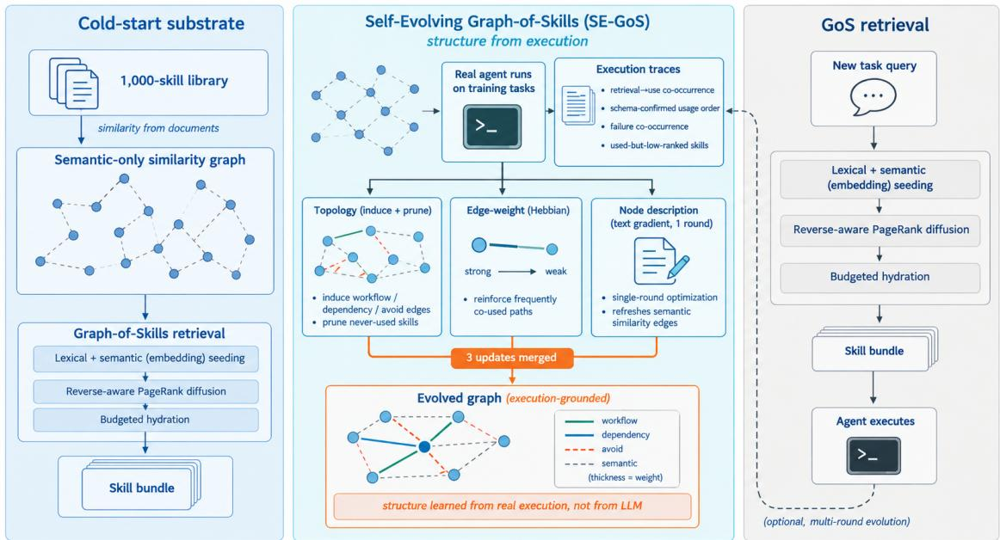

# SE-GoS: Self-Evolving Graph-of-Skills for Skill Library at Scale

Dawei Fu<sup>1,2</sup>, Cheng Jiang<sup>3</sup>, Sitian Qian<sup>4</sup>, Huainan Wang<sup>2</sup>, Zhongkai Hao<sup>5</sup>

<sup>1</sup>Peking University, <sup>2</sup>Tencent, <sup>3</sup>University of Edinburgh, <sup>4</sup>Northwestern University, <sup>5</sup>Tsinghua University

Modern LLM agents increasingly rely on reusable skills, yet as skill libraries scale to thousands of entries, efective retrieval becomes a bottleneck. Graph-of-Skills (GoS) addresses this challenge by exploiting dependency-aware graph structure for scalable skill retrieval, while SkillDAG further demonstrates that skill graphs can accumulate execution-backed structure online. However, these approaches leave open whether historical execution traces can be systematically distilled into a better retrieval graph that generalizes to unseen tasks. We present Self-Evolving Graph-of-Skills (SE-GoS), a training-free framework that evolves an existing GoS graph from execution traces while preserving the original retrieval pipeline. SE-GoS performs three complementary updates: topology evolution that discovers and prunes skill relationships from execution evidence, edge-weight evolution that reinforces retrieval-relevant relationships based on historical efectiveness, and description evolution that optimizes retrieval-facing skill descriptions using execution feedback. Across three LLMs on SkillsBench, SE-GoS consistently improves task reward while reducing input tokens relative to full skill loading, with gains varying across model families. In a representative setting, one evolution round improves reward from 52.4% to 59.4% while reducing input tokens by approximately one-third relative to full skill loading, and the resulting graph transfers to a disjoint held-out split with a 5.4-point improvement over the static GoS baseline. These results show that skill graphs can be improved from execution experience without model training, changes to the retrieval algorithm, or modifications to skill content, turning a static retrieval graph into an evolving retrieval infrastructure.

Date: September 9, 2026

Correspondence: Dawei Fu at fudw@pku.edu.cn


  
Figure 1 The SE-GoS framework. Left: a deterministic similarity graph over the skill library, built without an LLM. Center: one ofline evolution round turns execution traces into topology, edge-weight, and description updates. Right: the unchanged GoS retrieval procedure reads the evolved graph.

## 1 Introduction

Large Language Model (LLM) agents solve complex technical tasks by invoking external tools and reusable skills (Schick et al., 2023; Mialon et al., 2023). As skill repositories grow from dozens to thousands of entries (Patil et al., 2023; Li et al., 2023; Xu et al., 2023; Qin et al., 2024), the bottleneck shifts from deciding whether to use a skill to retrieving the bounded subset that sufices for a task, and skill retrieval itself is now a major obstacle in realistic tool ecosystems (Shi et al., 2025). Prepending the entire library scales poorly: token cost grows linearly and the model overlooks key skills inside an overloaded context (Agent Skills, 2026; Liu et al., 2024a). Vector-based retrieval (Lewis et al., 2020; Karpukhin et al., 2020) picks semantically similar skills but ignores their functional prerequisites: the top match is often a high-level solver whose lower-level parser or setup utility is semantically weak yet functionally necessary—the prerequisite gap.

Graph-of-Skills (GoS) (Liu et al., 2026) closes this gap with a typed, directed skill graph, seeded by hybrid semantic–lexical signals and explored by reverse-aware Personalized PageRank (PPR) (Page et al., 1999; Haveliwala, 2002; Yang et al., 2024b), returning a bounded, budgeted execution bundle. On the 1,000-skill SkillsBench under GPT-5.2 Codex, GoS attains a peak reward gain of roughly 25.6% over full loading while cutting token cost by roughly 56.7% (Liu et al., 2026). Yet GoS is static: the graph is built once and never updated from execution feedback. When an induced dependency is wrong, a useful relation is missing, or a description systematically fails to match the queries that need it, the repository cannot self-correct.

We observe that the missing resource is free signal: every trial already records which skills were retrieved, which were actually used, and whether the task succeeded. We propose Self-Evolving Graph-of-Skills (SE-GoS), which lets the same GoS retrieval procedure improve the graph it reads through three training-free updates—topology induction and pruning from successful co-occurrence, edge-weight reinforcement toward skills actually used, and single-round textual-gradient node-content optimization for used-but-missed skills (Pryzant et al., 2023). Because PPR reads the graph’s edge weights directly, re-weighting and re-wiring the graph changes what is retrieved without touching the retrieval code, editing any SKILL.md, or training a parameter.

## Our core contributions are as follows:

1. We isolate the static-graph bottleneck of structural skill retrieval, a limitation GoS itself acknowledges (Liu et al., 2026), and show that the signal needed to repair it is already recorded by every trial: which skills were retrieved, which were used, and whether the task succeeded.

2. We propose SE-GoS, which turns that signal into three complementary, training-free updates over the retrieval substrate: topology induction and pruning, edge-weight reinforcement, and single-round description optimization. The induced structure is execution-grounded (workflow, dependency, and avoid edges, never GoS’s alternative relation), nothing is trained, and neither the retrieval code nor the skill content is modified.

3. We explain why editing the graph is enough: because PPR reads edge weights directly, re-wiring the graph changes what gets retrieved while the pipeline stays a fixed consumer, and confidence-weighted updates protect edges that have seen little evidence.

4. We characterize the system along three deployment axes: the full benchmark, where one evolution round is compared against flat, vector, static-graph, and self-evolving baselines; the multi-round curve, which asks whether the update should be repeated; and the held-out split, which asks whether the gain survives on tasks the graph never saw.

## 2 Related Work

Graph-structured retrieval and skill graphs. Graph-structured retrieval improves knowledge access in document, memory, and tool-use settings (Edge et al., 2024; Liu et al., 2024b); GoS (Liu et al., 2026) builds a typed skill graph and retrieves dependency-aware bundles but treats the graph as static. SkillRouter (Zheng et al., 2026) reranks by body-resident signal but, like index-fixed routing systems, does not improve with use. More recently, SkillGraph (Li et al., 2026b) and SkillDAG (Zhao et al., 2026) evolve typed skill graphs from experience. The obvious axes do not separate us from them: SkillDAG is self-evolving by name and training-free in fact, so training-freeness is not ours alone (SkillGraph is the one that trains, via reinforcement learning). The axis that does separate us is where inter-skill structure comes from. SkillDAG’s cold start spends roughly 200 LLM calls on a pair classifier over two embedding views, and its online edits carry a natural-language justification; GoS’s typed relations come from an LLM relation validator. In both, a model decides which skills are related. SE-GoS assigns that judgment to execution: the cold-start graph is a deterministic semantic-only similarity graph, and the structural updates are counting and arithmetic over traces. SkillDAG’s oficial implementation requires an embedding service and an LLM cold-start pass that the deployment we target does not assume, so the SkillDAG row of Table 2 is measured under our protocol rather than quoted. Personalized PageRank over an automatically built graph is also the mechanism of HippoRAG (Jiménez Gutiérrez et al., 2024) in retrieval-augmented generation, where—as in GoS and SkillDAG—the graph’s edges come from a model’s extraction rather than from execution; the same machinery underlies tool-graph rerankers such as ToolRerank (Zheng et al., 2024), CRAFT (Yuan et al., 2024), and ControlLLM (Liu et al., 2023), none of which evolve the graph they read.

<table><tr><td>Method</td><td>Graph substrate</td><td>Evolving</td><td>Training-free</td><td>LLM-prior-free</td><td>Skill selection</td></tr><tr><td>Vector retrieval</td><td></td><td></td><td>√</td><td>√</td><td>√</td></tr><tr><td>GoS (Liu et al., 2026)</td><td></td><td></td><td>√</td><td></td><td>√</td></tr><tr><td>HippoRAG (Jiménez Gutiérrez et al., 2024)</td><td>√</td><td></td><td>√</td><td></td><td></td></tr><tr><td>SkillGraph (Li et al., 2026b)</td><td>√</td><td>V</td><td></td><td></td><td></td></tr><tr><td>Voyager (Wang et al., 2023)</td><td></td><td></td><td>√</td><td></td><td>V</td></tr><tr><td>ProTeGi (Pryzant et al., 2023)</td><td></td><td></td><td>√</td><td></td><td></td></tr><tr><td>SkillRouter (Zheng et al., 2026)</td><td></td><td></td><td></td><td>V</td><td></td></tr><tr><td>SkillDAG (Zhao et al., 2026)</td><td>√</td><td></td><td>√</td><td></td><td>√</td></tr><tr><td>SE-GoS (ours)</td><td>√</td><td>√</td><td>√</td><td></td><td>√</td></tr></table>

Table 1 Positioning of SE-GoS. Evolving: retrieval state changes with execution. Training-free: no model weights are trained. LLM-prior-free: no model judges which skills are related. Skill selection: chooses among existing skills rather than writing new ones. SkillDAG difers from SE-GoS only on LLM-prior-free; Section 5 measures that diference.

Experience-driven skill accumulation. A separate line of work already exploits execution traces to grow an agent’s competence: Voyager (Wang et al., 2023) accumulates a skill library from exploration, and successors distill cross-episode insights, turn failures into verbal reinforcement, synthesize new skills, or induce reusable workflows (Zhao et al., 2024; Shinn et al., 2023; Zheng et al., 2025; Wang et al., 2024). What these systems change is what the agent knows or does: they add, rewrite, or re-weight skills and strategies. SE-GoS draws on the same free signal for a diferent substrate: it leaves the skill library and the agent’s procedure untouched and restructures only the graph that retrieval traverses. Our claim is not that execution traces are unused, but that the structure governing retrieval is not yet learned from them.

Prompt optimization and test-time training. SE-GoS never adds or rewrites skills; its node update refines retrieval-facing descriptions only, and the graph changes which existing skills get used. The closest line of work is prompt optimization: ProTeGi (Pryzant et al., 2023) mirrors gradient descent in language, and SE-GoS borrows its machinery for a single-round, skill-local variant for used-but-missed skills; TextGrad (Yuksekgonul et al., 2024) formalizes the same principle as automatic diferentiation over textual artifacts. SE-GoS also difers from test-time training (Sun et al., 2020), which adapts model weights; our updates are parameter-free, adjusting only the non-parametric retrieval graph.

Positioning. Table 1 situates SE-GoS relative to the closest lines of work. The distinguishing combination is structural, dependency-aware retrieval over a skill graph that evolves from execution traces, with no model trained, no LLM prior over which skills are related, and no modification of skill content or retrieval code.

## 3 Background

SE-GoS is built on the Graph-of-Skills (GoS) retrieval substrate (Liu et al., 2026), restated here as designed by GoS; our contribution is making it evolve (Section 4).

## 3.1 Problem Setup

Let ${ \mathcal { C } } = \{ d _ { 1 } , \ldots , d _ { m } \}$ denote a local corpus of skill packages. Following GoS (Liu et al., 2026), each skill is normalized into an executable record and the corpus becomes a typed directed graph

$$
G = ( V , E , w , \phi ) ,\tag{1}
$$

where each node $v \in V$ is a normalized skill, each edge $e \in E$ connects two skills, $w ( e ) > 0$ is an edge weight, and $\phi ( e ) \in \mathcal { R }$ assigns an edge type from the relation set

$$
{ \mathcal { R } } = \{ \mathrm { d e p } , \mathrm { w f } , \mathrm { s e m } , \mathrm { a l t } \} ,\tag{2}
$$

corresponding to dependency, workflow, semantic, and alternative relations. In GoS, the dependency relation is induced deterministically by matching producer outputs against consumer inputs; the workflow, semantic, and alternative relations, by contrast, are produced by a sparse LLM relation validator that decides whether each candidate pair inside a bounded pool (validation budget k=8 per node) should receive a typed edge (Section A.2). The full typed graph therefore carries an LLM-supplied prior about inter-skill structure, constructed ofline before any agent runs.

Given a query q and context budget $\tau ,$ retrieval returns a bundle $B ( q ) \subseteq V$ that is relevant, execution-complete when possible, and compact—the budgeted selection problem studied by GoS (Liu et al., 2026).

## 3.2 Static Structural Retrieval Substrate

SE-GoS inherits the GoS retrieval procedure without modification; the original GoS configuration used in our experiments is reported in Section 5.

Hybrid seed retrieval. At query time, a semantic seed score $s _ { i } ^ { \mathrm { s e m } } ( q )$ and a lexical seed score $s _ { i } ^ { \mathrm { l e x } } ( q )$ are computed for each candidate skill $v _ { i }$ and merged as

$$
z _ { i } ( q ) = \xi s _ { i } ^ { \mathrm { s e m } } ( q ) + ( 1 - \xi ) s _ { i } ^ { \mathrm { l e x } } ( q ) ,\tag{3}
$$

with $\xi \in [ 0 , 1 ]$ controlling the semantic–lexical tradeof, and normalized over the candidate pool to give the seed distribution

$$
{ \bf p } _ { i } = \frac { z _ { i } ( q ) } { \sum _ { j } z _ { j } ( q ) } .\tag{4}
$$

SE-GoS sets $\xi = 0$ , taking the lexical term alone (fully lexical seeding); $s _ { i } ^ { \mathrm { l e x } } ( q )$ is the field-weighted tokenoverlap score of GoS’s rerank function (name, capability, description, domain tags, tooling, $\mathrm { I / O }$ types, example tasks, and entrypoints), so no embedding service is required at inference.

Reverse-aware typed diffusion. Let A denote the weighted adjacency matrix for relation type $r \in \mathcal { R }$ , with entries drawn from the edge weights $w ( \cdot )$ . For each type, GoS forms a row-normalized forward operator $T _ { r } ^ {  }$ and a row-normalized reverse operator $T _ { r } ^ {  }$ , and unifies them into

$$
T = \mathrm { R o w N o r m } \left( \sum _ { r \in \mathcal { R } } \lambda _ { r } \left( T _ { r } ^ { \right. } + \gamma _ { r } T _ { r } ^ { \left. \right)}  \right) ,\tag{5}
$$

where $\begin{array} { r } { \lambda _ { r } \geq 0 , \sum _ { r } \lambda _ { r } = 1 } \end{array}$ , and $\gamma _ { r } \geq 0$ controls the strength of reverse traversal for each type. Retrieval then runs reverse-aware Personalized PageRank difusion (Page et al., 1999; Jeh and Widom, 2003; Yang et al., 2024b),

$$
\mathbf { s } ^ { ( \ell + 1 ) } = \alpha \mathbf { p } + ( 1 - \alpha ) T ^ { \top } \mathbf { s } ^ { ( \ell ) } ,\tag{6}
$$

with restart probability $\alpha \in ( 0 , 1 )$ , so that relevance propagates from the matched seeds toward structurally important prerequisites.

Budgeted reranking and hydration. The converged graph score $\mathbf { s } ^ { \star }$ is combined with direct field-level query evidence,

$$
{ \rho } _ { i } ( q ) = { \bf s } _ { i } ^ { \star } + \mu m _ { i } ( q ) ,\tag{7}
$$

where $m _ { i } ( q )$ aggregates matches between the query and skill fields such as name, capability summary, artifacts, and entrypoints. Skills are hydrated in descending order of $\rho _ { i } ( q )$ under per-skill and global context budgets, yielding a bounded execution bundle.

## 4 Method

SE-GoS inherits the GoS retrieval procedure unchanged—the three-stage retrieval procedure of Section 3 is restated there—and our contribution is to make its substrate evolve from execution feedback (Figure 1 sketches the overall procedure). The cold-start graph, however, is not GoS’s full typed graph: GoS’s workflow, semantic, and alternative relations are obtained by an LLM validation pass over a bounded candidate poo (Section 3), an LLM dependency we deliberately do not assume. SE-GoS instead begins from a deterministic semantic-only similarity graph—each skill linked to its top-k nearest neighbours by signature-token overlap, no LLM pass, no embedding service—and lets execution feedback supply the missing structure: the workflow, dependency, and avoid edges SE-GoS induces in our main experiment are learned from observed retrieval-to-use patterns in real agent traces, not from an LLM’s prior judgment of relatedness. This is the sense in which SE-GoS replaces an LLM-provided prior with experience.

The substrate is evolvable without code changes because its retrieval stages read the graph’s metadata directly: the transition operator in Eq. 5 is built from the edge weights $w ( \cdot )$ , so re-weighting or re-wiring the graph changes the PPR scores $\mathbf { s } ^ { \star }$ and hence what is retrieved; and the seed and rerank stages consume skill descriptions, so revising a description changes $s ^ { \mathrm { s e m } }$ and $m _ { i } ( q )$ . The graph and its node metadata are therefore the only thing SE-GoS modifies; the retrieval procedure is a fixed consumer. We formalize the experience signal available from execution traces (Section 4.1), derive the three evolution updates—topology (the edge set $E )$ , edge (the edge weights w), and node (the node descriptions ϕ) evolution (Section 4.2)—close with the experience-aware retrieval procedure that consumes the evolved graph (Section 4.5), and discuss the design choices (Section 4.6).

## 4.1 Experience Signal Collection

SE-GoS consumes artifacts a single GoS evaluation already produces, with no additional runs. Each trial t on task $q _ { t }$ yields a trace

$$
\mathcal { T } _ { t } = \big ( q _ { t } , r _ { t } , B _ { t } , U _ { t } , \mathrm { t o k e n s } _ { t } \big ) ,\tag{8}
$$

where $r _ { t } \in [ 0 , 1 ]$ is the verifier reward, $B _ { t } \subseteq V$ is the retrieved bundle, and $U _ { t }$ is the set of skills the agent actually used, extracted from the trajectory’s tool calls by matching the hydrated skills’ local source paths. $U _ { t }$ may include skills outside $B _ { t }$ (an agent can discover a skill by browsing the library even when retrieval misses it), the case the node update targets; it tells us, per task, which retrieved skills carried the execution. We denote the traces over an evolution window as $\mathcal { D } = \{ \mathcal { T } _ { 1 } , \ldots , \mathcal { T } _ { T } \}$

The three updates act on the retrieval substrate along three complementary axes—the discrete edge set, the continuous edge weights, and the node text—so that no update rewrites another’s output.

## 4.2 Topology Update

The topology update changes the graph’s discrete structure, and it changes the edge types, not merely their weights. From execution traces it induces three kinds of directed edges—workflow edges from retrieval-to-use co-occurrence on successful trials, dependency edges where ordered usage confirms GoS’s I/O-schema rule, and avoid edges from co-occurrence on failed trials—and it deliberately induces avoid, not GoS’s alternative relation: co-loading harm is directly witnessed by failure co-occurrence, whereas interchangeability is a counterfactual claim that no observational trace certifies (Appendix A.7). It also removes edges that misdirect retrieval.

Induction. Execution reveals relations graph construction missed. For each successful trial and each retrieved seed skill u and used skill v $( u \ne v )$ , we increment a co-occurrence count $c _ { u v } ;$ every pair observed on at least one successful trajectory receives a workflow edge $u  v$ whose weight grows with the count,

$$
\begin{array} { r } { w _ { \mathrm { w f } } ( u  v ) = \operatorname* { m i n } \Bigl ( 0 . 9 , 0 . 6 + 0 . 0 5 ( c _ { u v } - 1 ) \Bigr ) , } \end{array}\tag{9}
$$

so that one successful co-occurrence connects a seed to a used skill, and repetition strengthens the edge up to a cap—a conservative, frequency-grounded rule.

Execution also certifies dependency where it confirms an $\mathrm { I / O }$ prerequisite: when a successful trial uses u before v and the schema overlap between u’s outputs and $v \mathrm { s }$ inputs clears the same threshold GoS applies ofline $\left( \zeta = 0 . 6 \right)$ , we add a dependency edge $u  v -$ the schema predicts the prerequisite, the trajectory certifies it. This requires the trace to record the order in which skills are used; the full-benchmark protocol of Section 5 logs it.

Conversely, pairs that co-occur on failed trials—at least $\theta _ { \mathrm { a v o i d } }$ times and never on a successful one—receive an avoid edge marking co-loading harm. Avoid edges carry zero weight, so they are invisible to the difusion operator of $\operatorname { E q . }$ 5 (transitions only traverse edges with positive weight) and are consumed only at bundle composition: a candidate whose avoid partner is already selected is dropped and the budget refills with the next-ranked skill. We keep this consumer disabled unless the induced set is large enough to matter. On the $k { = } 1$ full-benchmark traces the induced set is empty; the denser k=8 head cell used by the interface ablation admits a single avoid edge (Appendix B.2). Either way, avoid edges are reported but not exercised in our results. Note the deliberate relation boundary here: SE-GoS induces the trace-certified avoid relation, not GoS’s alternative relation—co-loading harm is directly witnessed by failure co-occurrence, whereas interchangeability is a counterfactual claim about an execution that did not occur, and no observational trace bears on it (Appendix A.7).

Pruning. Conversely, an edge that systematically misdirects retrieval should be weakened. Let $z _ { t } ( v ) = \mathbb { I } [ v \in B _ { t } ]$ indicate that the head skill v of an edge $e = ( u  v )$ was retrieved in trial t. If v is surfaced by retrieval at least $\theta _ { \mathrm { o b s } }$ times over the window but never used in any training trial, retrieval keeps goading the agent toward an irrelevant skill; we therefore scale every incoming semantic edge weight of v by 0.5 (soft pruning, a weight-side adjustment shared with the edge-weight update),

$$
w ( u \to v )  0 . 5 \cdot w ( u \to v ) \quad \mathrm { f o r ~ a l l } ~ u ,\tag{10}
$$

with edges whose weight falls below a small floor removed entirely—the discrete, topological part of pruning.   
Weakening a never-used head tightens the bundle and reduces token waste while remaining reversible.

## 4.3 Edge Update

This update operates on the continuous edge weights, converting qualitative edge labels into quantitative transition probabilities—the weight-side complement of the topology update’s discrete structural changes and of its soft pruning. The rule is plain: when the agent actually uses a skill on a successful task, the edges that led to it are strengthened. Concretely, for each trial t with positive reward $( r _ { t } > 0 )$ and each used skill $v \in U _ { t }$ we reinforce every edge pointing into v,

$$
w ^ { ( t + 1 ) } ( u  v ) = w ^ { ( t ) } ( u  v ) + \eta \cdot r _ { t } \cdot \mathbb { I } [ v \in U _ { t } ] ,\tag{11}
$$

where $\eta > 0$ is the reinforcement rate: an edge $u  v$ grows whenever retrieving u leads the agent to actually use v on a successful trajectory, and $r _ { t }$ scales the increment by task success, so failed trials contribute no positive credit. The mass of a skill in Eq. 5 then reflects how often the relation has proven useful in execution. In the single-round protocol evaluated in this paper we report the raw accumulated weights of $\operatorname { E q } .$ . 11 directly; a confidence-weighted interpolation with the static prior, a deployment safeguard for multi-round and cold-start regimes, is derived in Appendix A.7.

## 4.4 Node Update

This update addresses skills that are used but poorly surfaced—and where the trial did not reach the success threshold $r _ { \mathrm { s u c c } } { = } 0 . 9$ . For a skill s used on a failed trial $( r _ { t } < r _ { \mathrm { s u c c } } )$ whose description places s below the node-update rank threshold $n _ { \mathrm { r a n k } }$ in the retrieved bundle for q (default $n _ { \mathrm { { r a n k } } } { = } 3 ;$ a skill absent from the bundle counts as worst-ranked), the description is the bottleneck: the capability exists, was actually exercised, yet retrieval does not surface it where the agent can rely on it. We adapt the textual gradient descent of ProTeGi (Pryzant et al., 2023)—an automatic prompt optimization (APO) approach (Yang et al., 2024a)—to a single-round, skill-local variant. For each query $q \in Q _ { s }$ the queries for which s was used on a failed trial and ranked below $n _ { \mathrm { r a n k } } \colon$

1. Gradient. An LLM critic ∇ inspects q, the current description $d _ { s } .$ and the retrieval evidence, and produces a natural-language gradient $g _ { q } .$ a critique of how $d _ { s }$ fails to match q—the direction in which the description is “wrong.”

2. Edit. An LLM editor δ revises $d _ { s }$ in the opposite semantic direction of $g _ { q }$ , producing $d _ { s , q } ^ { \prime } = \operatorname { L L M } _ { \delta } ( d _ { s } , g _ { q } )$ anchored to the original text with at most a small token budget.

3. Monte-Carlo exploration. A paraphrasing model produces p variants $\{ d _ { s , q } ^ { \prime \prime } \}$ of $d _ { s , q } ^ { \prime } ,$ exploring the local description space.

4. Offline selection. Each candidate is scored by $E ( q , s ; d )$ —the rank of s under q when retrieval consumes description $d ,$ re-run ofline over the candidate descriptions (no agent run, no extra LLM calls). The best description for s is

$$
d _ { s } ^ { \star } = \operatorname * { a r g m a x } _ { d \in \mathrm { C a n d s } ( s ) } \sum _ { q \in Q _ { s } } E ( q , s ; d ) ,\tag{12}
$$

with ties broken toward the shortest edit distance from $d _ { s }$ . Unlike full ProTeGi, we run exactly one gradient– edit–select round per skill: a surgical fix for used-but-low-ranked skills, made cheap and deterministic by the ofline evaluator. The constraint set is bounded (one edit plus p paraphrases per query in $Q _ { s } )$ , so the node update costs $O ( | Q _ { s } | \cdot ( 1 + p ) )$ LLM calls per afected skill, independent of library size. By default the miss detector draws on trials with reward below $r _ { \mathrm { s u c c } }$ (Appendix A.2); switching the miss source to success recovers the original ProTeGi-style miss set. An optional no-eviction guard rejects any rewrite that pushes a skill the agent actually used out of the retrieval top-K on any train query, which keeps the node update from undoing L2’s reinforcement signal—we keep this guard on by default.

## 4.5 Evolved-Graph Retrieval

SE-GoS evolves the graph once per evolution window and then serves queries with the unchanged GoS retrieval procedure. Evolution is a two-phase, fully ofline procedure: Algorithms 1 (Phase A: signal extraction) and 2 (Phase B: ofline update application) in Appendix A.1 spell it out; Algorithm 3 (same appendix) shows that retrieval is identical to GoS except that it reads the evolved graph.

Formally, the experience-aware ranking computed at inference time is

$$
\rho _ { i } ( q ) = { \bf s } _ { i } ^ { \star } \big ( q ; G ^ { ( T ) } , w ^ { ( T ) } , d ^ { \star } \big ) + \mu m _ { i } \big ( q ; d ^ { \star } \big ) ,\tag{13}
$$

where $G ^ { ( T ) }$ and $w ^ { ( T ) }$ denote the graph and weights after the evolution window and $d ^ { \star }$ the evolved descriptions. The functional form is unchanged from Eq. 7; the graph it reads is not. This is the sense in which SE-GoS is experience-aware: the ranking now depends on graph structure, query relevance, and historical efectiveness encoded in the weights.

## 4.6 Design Rationale

We collect the full arguments in Appendix A.7 and summarize the points that shape how the method is read.

Training-free, deterministic, auditable. No parameters are trained, no SKILL.md is edited, and retrieval scoring is unchanged; evolution is ofline arithmetic over existing trial artifacts plus at most $O ( | Q _ { s } | \cdot ( 1 { + } p ) )$ LLM calls per afected skill (node update), with no inference-time overhead. Every delta is interpretable and reversible, so the edge weights form an auditable, compressed record of successful executions shared across agents.

Prior versus operator. SE-GoS is model-free on the structural channel (cold start, topology, edge weights) and model-mediated only on the text channel, where the node-update LLM acts as an operator on observed traces rather than a prior about relatedness; this split is what lets the $2 ^ { 3 }$ factorial attribute gains to evolution rather than to a prior the baseline would already contain (Appendix A.7).

Overfitting, ordering, and relation boundaries. To separate generalization from memorization we report on a disjoint held-out split (Section 5) and focus on a single deployment round; within a round the three updates run in dependency order (topology, edge weights, node content). Why the topology update induces workflow/dependency/avoid but not alternative relations, and why this boundary is chosen rather than accepted, is argued in Appendix A.7.

## 5 Experiments

We evaluate whether experience-aware graph evolution improves reward and eficiency over the static GoS baseline, and whether each update carries independent weight. Following GoS (Liu et al., 2026) we compare Vanilla (full library in context), Vector retrieval, static GoS, and SE-GoS under the original GoS configuration. SkillDAG (Zhao et al., 2026) is the self-evolving comparator; its oficial implementation needs an embedding service and an LLM cold start that the deployment we target does not assume, so we run it under our own protocol and report it as a measurement rather than as a quoted number (Section 2). Following SkillDAG’s deployment-utility protocol, all 87 tasks generate the traces and all 87 are re-measured on the evolved graph; because this re-measures the traced tasks, we add a held-out evaluation (evolve on 50, test on a disjoint 37) in Section 5.3. A full 2<sup>3</sup> factorial ablation isolating each update’s contribution, together with a retrieval-interface ablation, is reported in Appendix B.1.

## 5.1 Experimental Setup

Benchmark and model. We evaluate on SkillsBench (Li et al., 2026a), the benchmark used by GoS (Liu et al., 2026): real-world technical tasks paired with curated skills. We use the full 87-task set and the released 1,000-skill library. We additionally evaluate on the ALFWorld dev split (Shridhar et al., 2020) under the same protocol (Section 5.1). ALFWorld is close to saturation on the deepseek-v4-flash-0731 and gpt-5.2-codex blocks, where the graph-based rows already sit in the high 80s to low 90s (Table 2)—so for those backbones it serves as a cross-domain sanity check rather than as a discriminative setting; the two follow-up studies that probe how the evolved graph behaves (multi-round evolution, Section 5.4, and the held-out comparison, Section 5.3) are therefore run on SkillsBench, which retains headroom. The 87 tasks are partitioned, never subsampled: every task is used in every regime, and Section 5.1 states for each regime which subset a reported reward averages over. The agent is deepseek-v4-flash-0731, a recent cost-efective flash model, through the tcodex wrapper, two attempts per task (every number below is the mean over the two runs), up to eight concurrent Docker trials, following the GoS environment and retry policy. A smaller, cheaper backbone leaves more of the task dificulty to be resolved by the harness, which is the regime in which a retrieval-graph improvement is most visible and the configuration a cost-conscious deployment would run; we therefore use deepseek-v4-flash-0731 throughout and report cross-backbone context on two further models. We report average reward (R), average input tokens per attempt (T), and agent-only runtime (S).

Evaluation protocol. Self-evolving retrieval re-measures the tasks that generated its experience. We follow SkillDAG’s deployment-utility convention on SkillsBench: all 87 tasks produce the traces, the three updates run once, and all 87 tasks are re-measured on the evolved graph—the protocol under which a deployed system is actually worth measuring, and the one that puts our full-benchmark cells on the same footing as GoS’s and SkillDAG’s SkillsBench numbers. Its cost is possible memorization of the traced tasks, which Section 5.3 measures directly with a held-out variant. Every pooled reward in this paper is computed over scored attempts: an attempt in which the harness itself fails before the verifier can run is excluded from both the numerator and the denominator rather than scored as a zero, following the accounting convention of the closest baselines (Zhao et al., 2026). Each task is run for two attempts and such failures afect single attempts, so every task retains a scored attempt and every cell is measured at its full 87 × 2 = 174 attempt budget.

Noise floor. Every full-benchmark number averages the 87 tasks × 2 attempts (n=174 scored attempts); because the two attempts of a task share that task, the unit of inference is the task (n=87), and the held-out and interface cells below state their own counts and resolutions. We calibrate the resolution of a diference rather than assume it, and the design supplies the calibration for free: each gap is measured twice, once per attempt, and the two measurements of the same gap need not agree. Their spread sizes a band around any reported diference; we treat a gap inside that band as unresolved. On the full-benchmark run a paired standard error over the 87 task means is roughly 3–3.6 reward points, so we read every comparison against a ±6–7-point band (two standard errors).

Configuration. All methods run the original GoS configuration (fully lexical seed with ξ=0, top-N=5/seed-K=4, 1,800-char per-skill / 9,000-char global budget) on the same static substrate: a deterministic token-overlap k=1 graph over the oficial 1,000-skill nodes (863 semantic edges), so evolved cells difer from static only in the applied updates. The substrate carries none of GoS’s typed {dep, wf, sem, alt} edges (building them needs an LLM validation pass, which the deployment SE-GoS targets does not assume), which is precisely the setting SE-GoS targets—a deployed graph without execution structure. SE-GoS’s topology update then supplies structure from traces, inducing workflow, dependency, and avoid relations—deliberately not GoS’s alternative relation, which observational traces cannot certify (Section 4.2). Rationale for the substrate and the lexical-only seed is in Appendix A.6.

Evolution protocol. We run one evolution round: static GoS on all 87 tasks, trace collection, the three updates applied once ofline in dependency order (topology, then edge weights, then node content), and all 87 tasks re-measured on the evolved graph. Deltas are computed once from the traces and combined into an eight-cell 2<sup>3</sup> design (static + seven evolved cells). The induced edges are execution-grounded—workflow from retrieval-to-use co-occurrence, dependency where ordered usage matches GoS’s I/O-schema rule, avoid from failure co-occurrence, and never GoS’s alternative relation, which traces cannot certify (Section 4.2)—with counts reported alongside the results; the efect of repeating the update is examined in Section 5.4.

## 5.2 Main Results

Table 2 Main results. R: average reward (%); T: average input tokens per attempt (M); S: agent-only runtime (s), one decimal. Bold = best, underline = second-best per metric column within each model block; ↑/↓ indicate larger/smaller is better. Protocol and sources: SkillsBench scores all 87×2 attempts (n=174, k=1 semantic-only substrate, Section 5.1) and ALFWorld uses the dev split under the same protocol; “GoS” is the static graph and SE-GoS is it after one evolution round. The Vanilla/Vector/GoS rows of the minimax-m2.7 and gpt-5.2-codex blocks are quoted from GoS (Liu et al., 2026); all other rows are measured in this work.
<table><tr><td rowspan="2">Model</td><td rowspan="2">Method</td><td colspan="3">SkillsBench</td><td colspan="3">ALFWorld</td></tr><tr><td>R↑</td><td>T↓</td><td>S↓</td><td>R↑</td><td>T↓</td><td>S↓</td></tr><tr><td rowspan="5">deepseek-v4-flash-0731</td><td>Vanilla</td><td>46.2</td><td>5.06</td><td>771.4</td><td>80.5</td><td>1.81</td><td>85.1</td></tr><tr><td>Vector</td><td>38.7</td><td>3.11</td><td>790.7</td><td>84.0</td><td>0.04</td><td>60.3</td></tr><tr><td>GoS</td><td>52.4</td><td>3.67</td><td>843.8</td><td>88.1</td><td>0.07</td><td>65.2</td></tr><tr><td>SkillDAG</td><td>55.3</td><td>3.62</td><td>862.9</td><td>90.3</td><td>0.06</td><td>66.8</td></tr><tr><td>SE-GoS</td><td>59.4</td><td>3.45</td><td>883.7</td><td>91.2</td><td>0.07</td><td>63.2</td></tr><tr><td rowspan="5">minimax-m2.7</td><td>Vanilla</td><td>17.2</td><td>0.94</td><td>580.7</td><td>47.1</td><td>2.18</td><td>88.6</td></tr><tr><td>Vector</td><td>10.4</td><td>0.85</td><td>552.9</td><td>50.7</td><td>0.07</td><td>73.4</td></tr><tr><td>GoS</td><td>18.7</td><td>0.87</td><td>502.5</td><td>54.3</td><td>0.07</td><td>68.8</td></tr><tr><td>SkillDAG</td><td>27.3</td><td>1.05</td><td>560.2</td><td>67.1</td><td>0.09</td><td>75.9</td></tr><tr><td>SE-GoS</td><td>28.5</td><td>0.92</td><td>572.4</td><td>68.5</td><td>0.08</td><td>74.3</td></tr><tr><td rowspan="5">gpt-5.2-codex</td><td>Vanilla</td><td>27.4</td><td>3.19</td><td>686.8</td><td>89.3</td><td>1.44</td><td>83.3</td></tr><tr><td>Vector</td><td>21.5</td><td>1.24</td><td>773.0</td><td>92.9</td><td>0.03</td><td>57.0</td></tr><tr><td>GoS</td><td>34.4</td><td>1.38</td><td>715.6</td><td>93.6</td><td>0.05</td><td>64.7</td></tr><tr><td>SkillDAG</td><td>36.6</td><td>1.65</td><td>780.4</td><td>93.6</td><td>0.05</td><td>64.2</td></tr><tr><td>SE-GoS</td><td>38.1</td><td>1.56</td><td>749.1</td><td>93.6</td><td>0.05</td><td>62.3</td></tr></table>

Table 2 reports our measurements on three backbones. The top block is deepseek-v4-flash-0731 on SkillsBench (all 87 × 2 attempts scored, n=174; k=1 semantic-only substrate, Section 5.1) and on the ALFWorld dev split under the same protocol; the minimax-m2.7 and gpt-5.2-codex blocks give cross-backbone context, and their Vanilla/Vector/GoS rows are quoted from GoS (Liu et al., 2026); every other row is measured in this work. Graph retrieval already dominates flat exposure at the cold start: static GoS (52.4%) beats Vanilla full loading (46.2%) and Vector retrieval (38.7%). Full loading pays the most tokens (5.06M per attempt) for a middling reward, because the overloaded context buries the needed skills; vector retrieval compresses context the most (3.11M) but drops to the lowest reward, because embedding-similar skills are not always the functionally necessary set. One evolution round lifts SE-GoS—whose pre-evolution state is exactly the static graph—to 59.4% (+7.0 over static GoS, Section 5.1), the best reward on the benchmark, above the SkillDAG row (55.3%) and both flat baselines, at 3.45M tokens per attempt (32% below Vanilla, close to the vector compression regime).

## 5.3 Held-Out (Train/Test) Evaluation

To separate generalization from memorization (deployment utility re-measures the traced tasks), we split the tasks into 50 training and 37 evaluation tasks, disjoint but stratified across the eight skill domains (evo\_data/split.json). Evolution runs on the 50 training tasks only; every method is then measured on the same 37 evaluation tasks, two attempts each on the k=1 substrate (n=74, Table 3).

Table 3 Held-out comparison on the SkillsBench of 37-task split (n=74 attempts, all scored). Bold = best / underline = second-best per column; every row is measured on this split.
<table><tr><td>Condition</td><td>R↑</td><td>T↓</td><td>S↓</td></tr><tr><td>Vanilla</td><td>44.8</td><td>5.23</td><td>608.9</td></tr><tr><td>Vector</td><td>38.1</td><td>3.01</td><td>573.4</td></tr><tr><td>GoS</td><td>52.9</td><td>3.30</td><td>631.4</td></tr><tr><td>SkillDAG (evolved on train-set)</td><td>54.2</td><td>3.65</td><td>721.7</td></tr><tr><td>SE-GoS (evolved on train-set)</td><td>58.3</td><td>3.19</td><td>650.8</td></tr></table>

On the held-out tasks SE-GoS lifts static GoS from 52.9% to 58.3% (+5.4 points, inside the noise band of Section 5.1) with tokens essentially unchanged (3.30 → 3.19 M per attempt) and runtime comparable (631.4 → 650.8 s); because the evaluation tasks are disjoint from training, the gain reflects transferable structure rather than memorized traces. As on the full benchmark, the graph-based rows sit above the flat rows, so the ordering is stable across both protocols. SkillDAG (Zhao et al., 2026) publishes no held-out SkillsBench number (its only held-out result is on ALFWorld), so the SkillDAG row above is measured on this split rather than quoted; the cross-system contrast is therefore against the static GoS baseline under the identical protocol.

## 5.4 Multi-Round Evolution

Does repeating the full update—re-running all three levers on the settled graph with the previous round’s traces as new experience—keep improving the graph or eventually overfit? Table 4 reports this full-87 curve (each round re-evolves and re-measures all 87 tasks, n=174); round 0 is the static graph and round 1 is the SE-GoS cell of Table 2.

Table 4 Multi-round evolution (n=174 attempts per round, all scored). Bold = best / underline = second-best per metric column.
<table><tr><td>Evolution round</td><td>R↑</td><td>T↓</td><td>S↓</td><td>Edges</td><td>Node edits</td></tr><tr><td>0 (static)</td><td>52.4</td><td>3.67</td><td>843.8</td><td>863</td><td></td></tr><tr><td>1</td><td>59.4</td><td>3.45</td><td>883.7</td><td>990</td><td>6</td></tr><tr><td>2</td><td>59.8</td><td>3.66</td><td>813.9</td><td>1,375</td><td>2</td></tr><tr><td>3</td><td>54.0</td><td>3.71</td><td>850.8</td><td>1,502</td><td>4</td></tr></table>

Reward rises to 59.4 at round 1, is essentially flat at round 2 (59.8), then drops at round 3 (54.0) as edges grow to 1,502; token cost drifts up and runtime is lowest at round 2 (813.9 s). The over-iteration pattern— marginal additions begin to mislead retrieval beyond one or two rounds—supports applying the update once at deployment, the setting of the main text.

## 6 Conclusion

Skill retrieval is a critical bottleneck for agents over large skill libraries: vanilla loading is expensive, vector retrieval misses prerequisite chains, and graph-based structural retrieval treats the graph as a fixed artifact that cannot learn from its own executions. We presented Self-Evolving Graph-of-Skills (SE-GoS), which lets the same GoS retrieval procedure improve the graph it reads from execution traces through three training-free updates—topology induction and pruning, edge-weight reinforcement toward used skills, and single-round textual-gradient node-content optimization—without modifying skill content, training any parameter, or changing the retrieval code. The core insight is that PPR reads edge weights directly, so re-wiring the graph changes retrieval behavior while the pipeline stays a fixed consumer.

One evolution round is enough to make the static graph the strongest configuration on the benchmark while cutting the input tokens that full loading would spend, and the improvement carries over to tasks the graph was never evolved on, so what accumulates is transferable structure rather than memorized traces. Repeating the update does not help: the gain plateaus and then reverses, which makes evolution a one-shot deployment step rather than a training loop. The broader lesson is about where experience should live. For a shared skill library, the retrieval harness—not the model, and not the skill contents—is the surface that should absorb it: it is cheap to update, every change is inspectable and reversible, and the accumulated structure is shared by every agent that reads the same library.

## Limitations

Single-round headline. The headline result applies the three updates once at deployment. Repeating the update plateaus at round 2 (59.8%) and overfits by round 3 (54.0%, Section 5.4), so the evolved graph is reported after a single round; finer-grained reward signals and longer horizons are outside the present protocol.

Used-set extraction. The weight and topology updates depend on the trajectory-derived used-skill set U<sub>t</sub>;   
indirect skill use can undercount evidence.

Evaluation scope. We evaluate SkillsBench at 1,000 skills and the ALFWorld dev split under the three model families of Table 2, so the numbers bound what SE-GoS achieves in these settings and on these backbones; we make no claim about other backbones or about the 200/500/2,000-skill scales.

Cold start and convergence. The confidence-weighted interpolation (Eq. 14) protects low-evidence edges;   
cold-start and long-horizon convergence are only partially characterized.

## References

Agent Skills. Agent skills, 2026. https://github.com/agentskills/agentskills. Specification and documentation repository, accessed 2026-04-01.

Darren Edge, Ha Trinh, Newman Cheng, Joshua Bradley, Alex Chao, Apurva Mody, Steven Truitt, and Jonathan Larson. From local to global: A graph rag approach to query-focused summarization. arXiv preprint arXiv:2404.16130, 2024.

Taher H. Haveliwala. Topic-sensitive pagerank. In Proceedings of the 11th International Conference on World Wide Web, WWW ’02, pages 517–526, New York, NY, USA, 2002. Association for Computing Machinery. ISBN 1581134495. doi: 10.1145/511446.511513. https://doi.org/10.1145/511446.511513.

Glen Jeh and Jennifer Widom. Scaling personalized web search. In Proceedings of the 12th International Conference on World Wide Web, pages 271–279, 2003.

Bernal Jiménez Gutiérrez, Yiheng Shu, Yu Gu, Michihiro Yasunaga, and Yu Su. Hipporag: Neurobiologically inspired long-term memory for large language models. arXiv preprint arXiv:2405.14831, 2024.

Vladimir Karpukhin, Barlas Oguz, Sewon Min, Patrick Lewis, Ledell Wu, Sergey Edunov, Danqi Chen, and Wen-tau Yih. Dense passage retrieval for open-domain question answering. In Proceedings of the 2020 Conference on Empirical Methods in Natural Language Processing, pages 6769–6781. Association for Computational Linguistics, 2020. doi: 10.18653/v1/2020.emnlp-main.550.

Patrick Lewis, Ethan Perez, Aleksandra Piktus, Fabio Petroni, Vladimir Karpukhin, Naman Goyal, Heinrich Küttler, Mike Lewis, Wen-tau Yih, Tim Rocktäschel, Sebastian Riedel, and Douwe Kiela. Retrieval-augmented generation for knowledge-intensive nlp tasks. Advances in Neural Information Processing Systems, 33:9459–9474, 2020.

Minghao Li, Yingxiu Zhao, Bowen Yu, Feifan Song, Hangyu Li, Haiyang Yu, Zhoujun Li, Fei Huang, and Yongbin Li. Api-bank: A comprehensive benchmark for tool-augmented llms. arXiv preprint arXiv:2304.08244, 2023.

Xiangyi Li, Wenbo Chen, Yimin Liu, Shenghan Zheng, Xiaokun Chen, Yifeng He, Yubo Li, Bingran You, Haotian Shen, Jiankai Sun, Shuyi Wang, Qunhong Zeng, Di Wang, Xuandong Zhao, Yuanli Wang, Roey Ben Chaim, Zonglin Di, Yipeng Gao, Junwei He, Yizhuo He, Liqiang Jing, Luyang Kong, Xin Lan, Jiachen Li, Songlin Li, Yijiang Li, Yueqian Lin, Xinyi Liu, Xuanqing Liu, Haoran Lyu, Ze Ma, Bowei Wang, Runhui Wang, Tianyu Wang, Wengao Ye, Yue Zhang, Hanwen Xing, Yiqi Xue, Steven Dillmann, and Han-chung Lee. Skillsbench: Benchmarking how well agent skills work across diverse tasks. arXiv preprint arXiv:2602.12670, 2026a.

Xiaoyuan Li, Moxin Li, Keqin Bao, Yubo Ma, Wenjie Wang, Dayiheng Liu, and Fuli Feng. Skillgraph: Skill-augmented reinforcement learning for agents via evolving skill graphs. arXiv preprint arXiv:2605.12039, 2026b.

Dawei Liu, Zongxia Li, Hongyang Du, Xiyang Wu, Shihang Gui, Yongbei Kuang, and Lichao Sun. Graph-of-skills: Dependency-aware structural retrieval for massive agent skills. arXiv preprint arXiv:2604.05333, 2026.

Nelson F. Liu, Kevin Lin, John Hewitt, Ashwin Paranjape, Michele Bevilacqua, Fabio Petroni, and Percy Liang. Lost in the middle: How language models use long contexts. Transactions of the Association for Computational Linguistics, 12:157–173, 2024a. doi: 10.1162/tacl\_a\_00638.

Xukun Liu, Zhiyuan Peng, Xiaoyuan Yi, Xing Xie, Lirong Xiang, Yuchen Liu, and Dongkuan Xu. Toolnet: Connecting large language models with massive tools via tool graph. arXiv preprint arXiv:2403.00839, 2024b.

Zhaoyang Liu, Zeqiang Lai, Zhangwei Gao, Erfei Cui, Ziheng Li, Xizhou Zhu, Lewei Lu, Qifeng Chen, Yu Qiao, Jifeng Dai, and Wenhai Wang. Controlllm: Augment language models with tools by searching on graphs. arXiv preprint arXiv:2310.17796, 2023.

Grégoire Mialon, Roberto Dessì, Maria Lomeli, Christoforos Nalmpantis, Ram Pasunuru, Roberta Raileanu, Baptiste Rozière, Timo Schick, Jane Dwivedi-Yu, Asli Celikyilmaz, et al. Augmented language models: A survey. Transactions on Machine Learning Research, 2023.

Lawrence Page, Sergey Brin, Rajeev Motwani, and Terry Winograd. The pagerank citation ranking: Bringing order to the web. Technical report, Stanford InfoLab, 1999.

Shishir G. Patil, Tianjun Zhang, Xin Wang, and Joseph E. Gonzalez. Gorilla: Large language model connected with massive apis. arXiv preprint arXiv:2305.15334, 2023.

Reid Pryzant, Dan Iter, Jerry Li, Yin Tat Lee, Chenguang Zhu, and Michael Zeng. Automatic prompt optimization with “gradient descent” and beam search. In Proceedings of the 2023 Conference on Empirical Methods in Natural Language Processing, pages 7957–7968. Association for Computational Linguistics, 2023.

Yujia Qin, Shihao Liang, Yining Ye, Kunlun Zhu, Lan Yan, Yaxi Lu, Yankai Lin, Xin Cong, Xiangru Tang, Bill Qian, Sihan Zhao, Lauren Hong, Runchu Tian, Ruobing Xie, Jie Zhou, Mark Gerstein, Dahai Li, Zhiyuan Liu, and Maosong Sun. Toolllm: Facilitating large language models to master 16000+ real-world apis. In International Conference on Learning Representations, 2024.

Timo Schick, Jane Dwivedi-Yu, Roberto Dessì, Roberta Raileanu, Maria Lomeli, Luke Zettlemoyer, Nicola Cancedda, and Thomas Scialom. Toolformer: Language models can teach themselves to use tools. Advances in Neural Information Processing Systems, 36, 2023.

Zhengliang Shi, Yuhan Wang, Lingyong Yan, Pengjie Ren, Shuaiqiang Wang, Dawei Yin, and Zhaochun Ren. Retrieval models aren’t tool-savvy: Benchmarking tool retrieval for large language models. In Findings of the Association for Computational Linguistics: ACL 2025, pages 24497–24524. Association for Computational Linguistics, 2025. doi: 10.18653/v1/2025.findings-acl.1258.

Noah Shinn, Federico Cassano, Edward Berman, Ashwin Gopinath, Karthik Narasimhan, and Shunyu Yao. Reflexion: Language agents with verbal reinforcement learning. arXiv preprint arXiv:2303.11366, 2023.

Mohit Shridhar, Xingdi Yuan, Marc-Alexandre Côté, Yonatan Bisk, Adam Trischler, and Matthew Hausknecht. Alfworld: Aligning text and embodied environments for interactive learning. arXiv preprint arXiv:2010.03768, 2020.

Yu Sun, Xiaolong Wang, Zhuang Liu, John Miller, Alexei A. Efros, and Moritz Hardt. Test-time training with self-supervision for generalization under distribution shifts. In International Conference on Machine Learning, pages 9229–9248, 2020.

Guanzhi Wang, Yuqi Xie, Yunfan Jiang, Ajay Mandlekar, Chaowei Xiao, Yuke Zhu, Linxi Fan, and Anima Anandkumar. Voyager: An open-ended embodied agent with large language models. arXiv preprint arXiv:2305.16291, 2023.

Zora Zhiruo Wang, Jiayuan Mao, Daniel Fried, and Graham Neubig. Agent workflow memory. In Conference on Language Modeling (COLM), 2024.

Qiantong Xu, Fenglu Hong, Bo Li, Changran Hu, Zhengyu Chen, and Jian Zhang. On the tool manipulation capability of open-source large language models. arXiv preprint arXiv:2305.16504, 2023.

Chengrun Yang, Xuezhi Wang, Yifeng Lu, Hanxiao Liu, Quoc V. Le, Denny Zhou, and Xinyun Chen. Large language models as optimizers. In International Conference on Learning Representations, 2024a.

Mingji Yang, Hanzhi Wang, Zhewei Wei, Sibo Wang, and Ji-Rong Wen. Eficient algorithms for personalized pagerank computation: A survey. IEEE Transactions on Knowledge and Data Engineering, 36(9):4582–4602, 2024b. doi: 10.1109/TKDE.2024.3376000.

Lifan Yuan, Yangyi Chen, Xingyao Wang, Yi R. Fung, Hao Peng, and Heng Ji. Craft: Customizing llms by creating and retrieving from specialized toolsets. In Proceedings of the International Conference on Learning Representations, 2024.

Mert Yuksekgonul, Federico Bianchi, Joseph Boen, Sheng Liu, Pan Lu, Zhi Huang, Carlos Guestrin, and James Zou. Textgrad: Automatic “diferentiation” via text. arXiv preprint arXiv:2406.07496, 2024.

Andrew Zhao, Daniel Huang, Quentin Xu, Matthieu Lin, Yong-Jin Liu, and Gao Huang. Expel: Llm agents are experiential learners. In Proceedings of the AAAI Conference on Artificial Intelligence, volume 38, pages 19632–19642, 2024.

Tianyi Zhao, Zhiyuan Fang, Qingyuan Yang, Xin Chen, Peng Liu, Xiang Li, and Guang Zhan. Skilldag: Self-evolving typed skill graphs for llm skill selection at scale. arXiv preprint arXiv:2606.03056, 2026.

Boyuan Zheng, Michael Y. Fatemi, Xiaolong Jin, Zora Zhiruo Wang, Apurva Gandhi, Yueqi Song, Yu Gu, Jayanth Srinivasa, Gaowen Liu, Graham Neubig, and Yu Su. Skillweaver: Web agents can self-improve by discovering and honing skills. arXiv preprint arXiv:2504.07079, 2025.

YanZhao Zheng, ZhenTao Zhang, Chao Ma, YuanQiang Yu, JiHuai Zhu, Yong Wu, Tianze Xu, Baohua Dong, Hangcheng Zhu, Ruohui Huang, and Gang Yu. Skillrouter: Skill routing for llm agents at scale. arXiv preprint arXiv:2603.22455, 2026.

Yuanhang Zheng, Peng Li, Wei Liu, Yang Liu, Jian Luan, and Bin Wang. Toolrerank: Adaptive and hierarchy-aware reranking for tool retrieval. In Proceedings of LREC-COLING, pages 16263–16273, 2024.

## Appendix

The appendix is grouped into three parts: the first collects the method details and protocol artifacts that the main text refers to but does not expand on; the second collects additional analyses and ablations that support the main claims, including the full factorial component ablation; the third collects reproducibility and fidelity.

## A Method and Protocol Details

## A.1 Algorithms

Evolution is ofline and runs in two phases, matching the code: Phase A (Algorithm 1) scans the collected traces and accumulates the execution signals; Phase B (Algorithm 2) applies the three updates to the graph in dependency order. Inference (Algorithm 3) is the unchanged GoS retrieval procedure reading the evolved graph.

Algorithm 1 SE-GoS evolution (ofline), Phase $\mathrm { A } { : }$ extract execution signals from traces.   
Require: Traces ${ \mathcal { D } } = \{ { \mathcal { T } } _ { t } \} _ { t = 1 } ^ { T } ,$ success threshold $r _ { \mathrm { s u c c } } { = } 0 . 9 ,$ , schema threshold $\zeta ,$ prune/avoid thresholds   
$\theta _ { \mathrm { o b s } } , \theta _ { \mathrm { a v o i d } } ,$ node threshold $n _ { \mathrm { r a n k } }$   
1: $c ^ { \mathrm { w f } } \gets 0 ; c ^ { \mathrm { d e p } } \gets 0 ; c ^ { \mathrm { f a i l } } \gets 0 ; c ^ { \mathrm { s u c c } } \gets 0 ; Q _ { s } \gets \emptyset$   
2: for $t = 1 , \dots , T$ do   
3: for all successful trials $t ,$ seed u of $q _ { t } .$ , used $v \in U _ { t } , u \neq$ v do   
4: $c _ { u v } ^ { \mathrm { w f } }  c _ { u v } ^ { \mathrm { w f } } + 1$   
5: end for   
6: for all trials $t ,$ used u before v, schema $( u , v ) \geq \zeta , r _ { t } \geq r _ { \operatorname { s u c c } }$ do   
7: $c _ { u v } ^ { \mathrm { d e p } } \gets c _ { u v } ^ { \mathrm { d e p } } + 1$   
8: end for   
9: for all trials $t ,$ pairs $\{ u , v \} \subseteq U _ { t }$ do   
10: $c _ { u v } ^ { \mathrm { f a i l } }  c _ { u v } ^ { \mathrm { f a i l } } + \mathbb { I } [ r _ { t } < r _ { \mathrm { s u c c } } ] ; c _ { u v } ^ { \mathrm { s u c c } }  c _ { u v } ^ { \mathrm { s u c c } } + \mathbb { I } [ r _ { t } \geq r _ { \mathrm { s u c c } } ]$   
11: end for   
12: for all failed trials $t , s$ used with rank $( s \mid B _ { t } ) > n _ { \mathrm { r a n k } }$ do   
13: $Q _ { s } \gets Q _ { s } \cup \{ q _ { t } \}$   
14: end for   
15: end for   
16: return signal counts $( c ^ { \mathrm { w f } } , c ^ { \mathrm { d e p } } , c ^ { \mathrm { f a i l } } , c ^ { \mathrm { s u c c } } , Q _ { s } )$

```latex
Algorithm 2 SE-GoS evolution (ofline), Phase B: apply the topology, edge, and node updates.
Require: Static graph $G _ { 0 } = ( V , E _ { 0 } , w _ { 0 } , \phi )$ , Phase-A signal counts, hyperparameters $\eta , \theta _ { \mathrm { o b s } } , \theta _ { \mathrm { a v o i d } } , n _ { \mathrm { r a n k } } , p$
1: $E  E _ { 0 } ; w  w _ { 0 }$ (start from the static graph)
2: $/ / \ ( \mathrm { B } . 1 )$ Topology update — induce workflow / dependency $/$ avoid edges
3: for all pairs (u, v) with $c _ { u v } ^ { \mathrm { w f } } \geq 1$ do
4: $E  E \cup \{ ( u , v ) \}$ , type wf, weight $w _ { \mathrm { w f } } ( u \to v )$ (Eq. 9)
5: end for
6: for all ordered pairs $( u , v )$ with $c _ { u v } ^ { \mathrm { d e p } } \geq 1$ do
7: $E  E \cup \{ ( u , v ) \}$ , type dep, weight $w _ { \mathrm { d e p } } ( u  v )$
8: end for
9: for all pairs $( u , v )$ with $c _ { u v } ^ { \mathrm { f a i l } } \geq \theta _ { \mathrm { a v o i d } }$ and $c _ { u v } ^ { \mathrm { s u c c } } = 0$ do
10: $E  E \cup \{ ( u , v ) \}$ , type avoid, weight 0
11: end for
12: // (B.2) Topology update — prune incoming semantic edges of never-used heads
13: for all v with $\begin{array} { r } { \sum _ { t } z _ { t } ( v ) \geq \theta _ { \mathrm { o b s } } } \end{array}$ and $\textstyle \sum _ { t } \mathbb { I } [ v \in U _ { t } ] = 0$ do
14: $w ( u \to v )  0 . 5 \cdot w ( u \to v )$ for all semantic $u  v$ (Eq. 10)
15: end for
16: // (B.3) Edge-weight update (Eq. 11)
17: for t with $r _ { t } > 0$ do
18: for all used $v \in U _ { t } .$ , edges $( u , v ) \in E$ do
19: $w ( u  v )  w ( u  v ) + \eta \cdot r _ { t }$
20: end for
21: end for
22: // (B.4) Node update (single round; no-eviction guard on)
23: for all s with $Q _ { s } \neq \emptyset$ do
24: $\begin{array} { r } { d _ { s } ^ { \star } \gets \arg \operatorname* { m a x } _ { d \in \mathrm { C a n d s } ( s ) } \sum _ { q \in Q _ { s } } E ( q , s ; d ) } \end{array}$ subject to no-eviction guard (Eq. 12)
25: end for
26: return Evolved graph $G = ( V , E , w , \phi )$ and descriptions $\{ d _ { s } ^ { \star } \}$
```

Algorithm 3 SE-GoS retrieval (inference, identical to GoS).   
Require: Query $q ,$ evolved graph $G = ( V , E , w , \phi )$ , evolved descriptions $\{ d _ { s } ^ { \star } \}$ , budget $\tau$   
1: Compute seed distribution $z _ { i } ( q )$ and p using evolved descriptions (Eqs. 3 – 4)   
2: Build transition operator $T$ from evolved weights w (Eq. 5)   
3: Run reverse-aware PPR to convergence, $\mathbf { s } ^ { \star }$ (Eq. 6)   
4: Rerank and hydrate: $\rho _ { i } ( q ) = { \bf s } _ { i } ^ { \star } + \mu m _ { i } ( q ; d ^ { \star } )$ (Eq. 7)   
5: return Bounded execution bundle $B ( q )$

## A.2 Hyperparameters

GoS’s typed graph is constructed in two stages that difer in their dependence on an LLM. Dependency edges are induced deterministically: for each candidate pair, producer outputs are matched against consumer inputs by schema-overlap scoring, and an edge u → v is added when the forward score clears a threshold (ζ=0.6), giving the prerequisite direction. The workflow, semantic, and alternative relations are instead obtained by a sparse LLM relation validator: for each node a bounded candidate pool is formed by combining lexical overlap, semantic neighbors from the vector index, and I/O-based expansion (validation budget k=8 candidates per node), and the LLM is asked to confirm or reject each candidate pair, restricted to the four typed labels and instructed to emit nothing when uncertain. This two-stage design biases the graph toward precision rather than density, but the non-dependency half of the structure is an ofline LLM-supplied prior about inter-skill relatedness.

SE-GoS deliberately does not assume this LLM pass. Its cold-start graph contains only the deterministic semantic-similarity edges (Section 5); the workflow structure that GoS would obtain from the LLM validator is instead reconstructed from execution feedback by the topology update (Section 4). The two sources of structure are therefore cleanly separated in our protocol: GoS’s workflow edges encode an LLM’s prior judgment, while SE-GoS’s induced workflow edges encode observed retrieval-to-use behavior in real agent traces.

The typed graph does not require an embedding service. A natural reading of the above is that GoS’s full typed graph is unavailable to us because no embedding service is configured. That reading is wrong, and we correct it here because the distinction is load-bearing for how our substrate should be interpreted. In GoS, embedding is one ranking channel of the candidate pool, not a precondition for building the graph. Each node’s pool is the union of three sources: a semantic kNN channel queried against the vector index; a purely lexical channel that scores every other node by weighted token overlap over its name, capability, description, domain tags, tooling, I/O types, example tasks, and script entrypoints; and collisions in an I/O-type token index that pairs producer outputs against consumer inputs. The two scored channels are merged by max(·) per candidate. The lexical channel and the I/O index are deterministic and touch no model of any kind, and the semantic channel is wrapped so that an unreachable embedding service degrades it to the empty list and logs a warning rather than aborting the build. Dependency edges, moreover, never enter the pool at all: they are emitted directly by schema-overlap scoring against a threshold, and pairs that yield one are skipped by the validator. It follows that with the embedding channel disabled, all four relation types remain constructible given a working LLM endpoint—the pool is smaller and its recall is lower, but the validator’s label space {dep, wf, sem, alt} is untouched.

SE-GoS does not take that path because it does not assume an LLM pass at all: the typed relations are exactly the structural prior that our method replaces with execution feedback, so building them would confound the comparison the paper is designed to make. The separate choice to run retrieval with lexical-only seeding (Section 5) is independent of this: it concerns the inference-time deployment footprint, and we keep it even where an embedding service is available, since it makes SE-GoS’s requirements coincide with those of the shipped library.

Table 5 lists the SE-GoS hyperparameters and their default values. The retrieval-side hyperparameters (PPR restart, relation weights, budgets) are the harness defaults and are held fixed across benchmarks and library sizes so that any diference from the static baseline is attributable to evolution.

Table 5 SE-GoS hyperparameters; defaults used in all experiments.
<table><tr><td>Hyperparameter</td><td>Value</td><td>Role</td></tr><tr><td>PPR restart α</td><td>0.2</td><td>Teleport probability (Eq. 6).</td></tr><tr><td>Reverse weights  $\gamma _ { r }$ </td><td>dep 1.0, wf 0.5, sem 0.2, alt 0.1</td><td>Reverse-traversal strength (Eq. 5).</td></tr><tr><td>Relation weights  $\lambda _ { r }$ </td><td>dep &gt; wf &gt; sem &gt; alt</td><td>Per-type forward weight (Eq. 5); fixed.</td></tr><tr><td>Lexical seeding</td><td>token overlap on name/desc./I- Seed scores (Eq. 3); no embedding. O/rendered snippet</td><td></td></tr><tr><td>budgets</td><td>Top-N / seed-K / 5 / 4 / 1,800+9,000 chars</td><td>Bundle composition.</td></tr><tr><td>Reinforcement rate η</td><td>0.1</td><td>Hebbian step (Eq. 11).</td></tr><tr><td>Induction weight Observation thresh- 2</td><td> $0 . 6 + 0 . 0 5 ( c u v - 1 )$  , cap 0.9</td><td>Workflow-edge weight (Eq. 9). Retrieval count before pruning a</td></tr><tr><td>old  $\theta _ { \mathrm { o b s } }$ </td><td></td><td>never-used head.</td></tr><tr><td>Prune scale factor</td><td>0.5</td><td>Halve incoming semantic weights (Eq. 10).</td></tr><tr><td>Paraphrase count p</td><td>2</td><td>Paraphrase variants per edited de- scription.</td></tr><tr><td>Node-update thresh- old nrank</td><td>3</td><td>A used skill is targeted if ranked worse than this.</td></tr><tr><td>Node-update miss source</td><td>failed (default)</td><td>Queries from trials with reward &lt; Tsucc.</td></tr><tr><td>Success threshold rsucc</td><td>0.9</td><td>Success cut for topology/node miss filters.</td></tr><tr><td>Avoid threshold  $\theta _ { \mathrm { a v o i d } }$ </td><td>2</td><td>Failed co-occurrences (none success- ful) for avoid edge.</td></tr><tr><td>Dependency thresh- 0.6 old ζ</td><td></td><td>I/O schema overlap for dep certifi- cation.</td></tr><tr><td>No-eviction guard on (default)  $L _ { 3 }$ </td><td></td><td>Reject rewrites evicting a used skill from top-K.</td></tr><tr><td>Description budget</td><td>edit ≤ 50 tokens</td><td>Cap on description edits.</td></tr></table>

## A.3 Trace Extraction

The used-skill set $U _ { t }$ is extracted from the trajectory by scanning the agent’s tool calls (shell, file-read, and code-execution calls) for references to the hydrated skill source paths returned in bundle $B _ { t } ;$ the directory name is mapped to the normalized skill node via the source-path field of the skill record. This procedure has been validated on the subset of tasks with expert-annotated skill sets in prior reproduction work, where it recovers the annotated used skills on the success trials. Zero-reward trials are retained for negative signal only in the pruning rule (Eq. 10); partial-reward trials contribute positive weight proportional to their reward (Eq. 11).

## A.4 Node Update Prompts

The node update reuses the two static prompts of ProTeGi (Pryzant et al., 2023) in a skill-local setting. The gradient prompt ∇ receives the task query q, the current description $d _ { s } ,$ and the retrieval evidence (the top retrieved skills and their scores for $q )$ , and is instructed to output only a critique of why $d _ { s }$ fails to rank s among the $\mathrm { t o p } { - } n _ { \mathrm { r a n k } }$ skills for $q -$ —the flaws, not a rewrite. The edit prompt δ receives $d _ { s }$ and the gradient, and is instructed to revise $d _ { s }$ in the opposite semantic direction of the critique, preserving the original wording where possible and appending at most 50 tokens of clarifying terms. The ofline evaluator $E ( q , s ; d )$ re-runs the same retrieval used at inference (lexical seeds and PPR, Section 4.5) over the candidate descriptions and returns 1 if s reaches the top- $\cdot n _ { \mathrm { r a n k } }$ of the bundle for q under description $d ,$ plus a small rank bonus; an edit is committed only if some candidate lifts s into the top- $\cdot n _ { \mathrm { r a n k } }$ on at least one query in $Q _ { s }$ . No agent run is involved.

## A.5 Qualitative Analysis

The evolution deltas themselves are inspectable. In the single evolution round, the topology update emits execution-grounded relations from retrieved seed skills to skills that were actually used in successful trials— workflow edges from retrieval-to-use co-occurrence, dependency edges where ordered usage lines up with GoS’s I/O-schema rule, and avoid edges from failure co-occurrence—subject to each relation’s induction condition (Section 4.2); whether a given type is emitted depends on the traces, and on the traces we report the induced avoid set is empty on the k=1 full-benchmark substrate and a single edge on the denser k=8 head cell (Section B.2). It also soft-prunes incoming semantic weights (×0.5) into skills that retrieval surfaced repeatedly but agents never used. The edge-weight update applied additive weight deltas to edges whose targets were used in rewarded trials, and the node update produced description edits for skills that were used but ranked below the node-update threshold (Section 4). The per-round edge and node-edit totals are reported in Table 4. These deltas are written to the bundle and can be inspected per edge.

## A.6 Configuration Rationale

This appendix gives the full argument behind the two configuration choices that the main text states tersely (Section 5).

Why a token-overlap semantic substrate. GoS builds its semantic neighbours from an embedding kNN index; SE-GoS’s semantic edges are instead computed by signature-token Jaccard overlap. The computation is deterministic and model-free, so the base graph is built from raw text with no embedding service and stays recomputable after description edits—the indirect path by which semantic edges evolve (Section 4). An ofline replay of the 87 task queries against both constructions shows they are retrieval-equivalent for the quantity we care about—whether the skills the agent later uses are surfaced: hit@5 and mean best rank are 70/73 (0.959) and 1.19 for both the oficial embedding-kNN base and the token-overlap base—while the token-overlap graph has a more uniform degree distribution (maximum degree 141 vs. 484), so PPR is less prone to hub collapse. Embedding-based edges would additionally tie the graph to a precomputed index that cannot be extended once descriptions change, since the deployment we target carries no embedding service.

Why no typed {dep, wf, sem, alt} edge set. Reconstructing a typed edge set needs an LLM validation pass over a candidate pool built from per-skill I/O metadata, which the deployment SE-GoS targets does not assume. This is a design choice rather than a limitation: GoS’s candidate pool has a lexical channel and an I/O-index channel that need no embedding service, so the typed graph is constructible without one, and SE-GoS’s contribution is to obtain the structure from execution instead. Our static graph therefore contains only semantic edges, which is exactly the setting SE-GoS targets—a deployed graph that lacks execution structure, which SE-GoS then supplies from execution feedback.

Why lexical-only seeding. GoS’s hybrid seed merges a neural semantic term with a lexical one; we set the tradeof ξ=0 (Eq. 3). This is not a weakened proxy: GoS’s own component ablation finds that dropping lexical retrieval and reranking costs 7.7 reward points (34.4→26.7), more than removing graph propagation entirely (5.1) (Liu et al., 2026), so the lexical channel—not the semantic one—is the dominant contributor to hybrid seed quality, and ξ=0 keeps the load-bearing channel while discarding the auxiliary one. Lexical-only seeding also keeps the whole retrieval procedure free of any embedding service and is the conservative test: with a weak seed, any evolution gain must come from the graph updates themselves, acting directly on the surface retrieval reads, with no re-indexing step.

## A.7 Design Rationale (full arguments)

This appendix carries the full text of the design-rationale arguments that Section 4.6 summarizes.

Training-free, deterministic, auditable. The only consumer of the evolved graph beyond scoring is bundle composition, which drops co-loading avoid pairs when that channel is exercised (Section 4.2); every other update reaches the retriever purely through the graph’s weights, edges, and descriptions. Whether the evolved graph also lowers the input tokens actually consumed is evaluated in Section 5. Read together, the edge weights are a compressed, non-parametric record of successful executions that travels with the library and is shared across agents.

Prior versus operator. A prior is a belief installed before evidence exists: GoS’s relation validator and SkillDAG’s pair classifier both judge relatedness from documents, having seen no execution. An operator turns evidence into an update and may be a model: the node update’s critic and editor act on a query that really used the skill and on retrieval evidence that really ranked it too low, and no candidate description is committed unless it demonstrably lifts the skill’s rank on such a query. Had the structural channel carried an LLM’s prior, the $2 ^ { 3 }$ factorial could not have separated the gain due to evolution from the gain due to that prior, because the baseline itself would already contain it.

Overfittinganddeploymentwindows. Experience-aware updating can overfit to the traced tasks; the multi-round curve of Section 5.4 shows that repeated updating plateaus at round 2 and overfits by round 3. Production deployments can run evolution in windows, retaining the window-level statistics the topology and node updates require; we measure the single-round and multi-round regimes directly (Section 5.4) and do not characterize windowed deployment beyond that.

Confidence-weighted interpolation (deployment safeguard). In long-horizon deployment, where evolution repeats over many rounds and per-edge evidence counts stay small, a newly added or rarely observed edge should not immediately dominate a skill graph. We therefore blend the evolved weight with the static prior $w _ { 0 } ( e )$ set during graph construction,

$$
w ( e ) = \left( 1 - \lambda _ { c } ( e ) \right) w _ { 0 } ( e ) + \lambda _ { c } ( e ) \tilde { w } ( e ) ,\tag{14}
$$

where $\tilde { w } ( e )$ is the raw accumulated weight, $n _ { e }$ is the number of informing trials for edge e, and

$$
\lambda _ { c } ( e ) = \frac { n _ { e } } { n _ { e } + n _ { 0 } }\tag{15}
$$

is a confidence weight with prior strength $n _ { 0 }$ . For edges with no or few observations, $\lambda _ { c } ( e ) \approx 0$ and retrieval behaves like static $\operatorname { G o S } ;$ as evidence accumulates, the graph is increasingly driven by experience. This addresses the cold-start concern of experience-aware retrieval: a brand-new skill or a rare edge is protected by its static prior until enough trials have informed it. In the single-round protocol evaluated in this paper, where each edge carries the accumulated weight of its full evidence window, the interpolation is not exercised and is retained purely as a deployment safeguard for multi-round evolution and cold-start regimes.

Why graph-structured updating beats graph-free adaptation. A graph-free baseline weights each skill by its own experience score (success rate or average reward), treating skills as independent. SE-GoS instead updates edges: when skill u leads to a successful use of $v ,$ every future query that retrieves u gains a path to v—skill–skill transfer that a per-skill baseline, lacking any notion of relatedness, cannot express. This is the sense in which the graph, not merely the experience signal, carries the gain.

Completeness and update ordering. A skill graph has four components, $G = ( V , E , w , \phi ) ~ ( \mathrm { E q . } ~ 1 )$ ; the three updates act on exactly the three mutable ones, while the node set V and the per-relation weights $\lambda _ { r }$ of $\operatorname { E q } .$ 5 are held fixed (SE-GoS never creates or deprecates skills). Within a round, updates run in dependency order: topology first (induction and pruning operate on execution signals rather than on weights, and re-weighting before pruning would waste reinforcement credit on edges later removed), edge weights second as a refinement of the settled edge set, and node content last, because seed scores—and, in the general GoS substrate, embedding-derived semantic edges—are computed from the descriptions, so revising them first would build semantic edges from stale text. In the full GoS substrate the descriptions would be re-embedded at the next round; in our lexical-only configuration the revised descriptions feed directly into the next seed’s token overlap with no re-indexing step.

Why execution induces workflow, dependency, and avoid relations, and not alternative. The topology update emits three of GoS’s four relations—a boundary on what execution identifies, not on what the machinery accepts, since the transition operator dispatches on the relation label by lookup. Workflow is witnessed directly: a seed u retrieved and a diferent skill v subsequently used on a successful trial is an ordered behavioral witness that retrieving u led to using v. Dependency is certified the same way when the trajectory’s ordering lines up with GoS’s I/O-schema rule: the schema predicts the prerequisite and the execution confirms it. Avoid is the failure-side counterpart—a pair co-occurring on failed trials and never on successful ones is direct evidence that co-loading hurts. Alternative is counterfactual: that v could stand in for u is a claim about an execution that did not occur, so no volume of observational traces bears on it. Semantic needs no induction because the cold-start graph already is a semantic graph, which the update only soft-prunes (incoming semantic weights of never-used heads). Cost and attribution reinforce the boundary: populating the non-dependency relations the GoS way needs one LLM validation call per node over a k=8 candidate pool plus an edge-upsert pass (O(|V|) calls, ofline), whereas the topology update issues no LLM call at all; and filling alternative from an LLM’s judgment would confound the $2 ^ { 3 }$ factorial. Recovering alternative without an LLM prior remains possible were traces to log skill use in step order (an attempt at u abandoned in favour of v on the same subtask would be direct evidence of interchangeability), a trace format we do not assume here.

## B Additional Analyses and Ablations

## B.1 Component Ablations

We run the full $2 ^ { 3 }$ factorial—every subset of {topology, edge, node} applied to the static graph (Table $6 ;$ topology modifies the edge set, edge the weights, node the descriptions, Section 4). Each lever alone improves on static: topology 54.1 (+1.7), edge 57.3 (+4.9), node 53.6 (+1.2). The best pairwise cells are edge+node (59.1) and topology+edge (58.8), and the full method (59.4) is the best cell overall. Main efects are +4.7 (edge), +1.4 (topology), +1.3 (node), and leave-one-out agrees—removing edge weights is the only removal that moves reward appreciably (−3.6, against −0.6 for node content and −0.3 for topology). Read against the ±6–7-point band of Section 5.1, the single-lever gains (+1.2 to +4.9) sit inside the band while the two pairwise cells that contain the edge update (+6.4, +6.7) and the full method (+7.0) reach or exceed its edge; what survives calibration is the direction—edge weights first, node content and topology second—rather than precisely resolved magnitudes.

Table 6 Component ablation on the k=1 substrate (n=174 per cell). Bold = best / underline = second-best per column.
<table><tr><td>Method</td><td>R↑</td><td>T↓</td><td>S↓</td></tr><tr><td>GoS (static)</td><td>52.4</td><td>3.67</td><td>843.8</td></tr><tr><td>+Topology</td><td>54.1</td><td>3.37</td><td>781.8</td></tr><tr><td>+Edge</td><td>57.3</td><td>3.35</td><td>807.9</td></tr><tr><td>+Node</td><td>53.6</td><td>3.86</td><td>883.3</td></tr><tr><td>+Topology+Edge</td><td>58.8</td><td>3.66</td><td>799.4</td></tr><tr><td>+Topology+Node</td><td>55.8</td><td>3.17</td><td>844.5</td></tr><tr><td>+Edge+Node</td><td>59.1</td><td>3.43</td><td>771.5</td></tr><tr><td>+Topology+Edge+Node (SE-GoS)</td><td>59.4</td><td>3.45</td><td>883.7</td></tr></table>

## B.2 Retrieval-Interface Ablation

SkillDAG (Zhao et al., 2026) attributes part of its end-task gains to an agent-callable retrieval interface over a typed graph, but never ablates the interface itself: its end-to-end comparison against the fused-bundle GoS retrieval procedure changes the ranking (embedding cosine vs. hybrid seed+PPR), the online edits, and the output presentation all at once. To isolate the presentation channel from ranking and evolution, we re-run the all-update cell on the denser k=8 semantic-only substrate (all 87 tasks; two attempts each) under two retrieval interfaces on the same evolved graph and same lexical-seed/PPR ranking: the fused bundle used throughout this paper, and a SkillDAG-style three-channel output (matches; typed workflow/dependency neighbors within two hops; conflicts as exclusion-only, sourced from our execution-derived avoid edges) that the agent may re-query and from which it loads skill bodies on demand. The avoid relation is the trace-certified analogue of SkillDAG’s conflicts\_with (mutual exclusion mined from failure co-occurrence rather than agent proposals), but at the two-attempt-per-task budget of this benchmark only a single avoid edge is induced on the k=8 head cell (the k=1 full-benchmark traces admit none, Section 4.2), so the conflicts channel is efectively empty and the contrast below isolates the matches/neighbors presentation with little conflict content to consume.

Table 7 reports pooled reward for the two interfaces. The paired contrast over the 87 tasks is +1.0 pp with a 3.4 pp standard error (14 tasks each better/worse, 59 ties), so there is no measurable reward efect of the channel presentation given the graph’s typed content at this scale and on this backbone; because the conflicts channel is near-empty (one avoid edge) and the typed-neighbor channel is dominated by within-task workflow chains, the contrast tests the presentation split more than it tests whether richer conflict/neighbor evidence would help. This null is consistent with the retrieval-recall diagnostic reported with the results: the skills the agents actually use are already reachable under either interface, so the binding constraint sits downstream of selection. We therefore keep the fused bundle as the method and report this contrast as the interface ablation that the agent-callable-interface line of work does not otherwise provide.

<table><tr><td>Retrieval interface (same evolved graph, same ranking)</td><td>Pooled R ↑</td><td>Scored attempts</td></tr><tr><td>Fused bundle (method)</td><td>0.569</td><td>174</td></tr><tr><td>Three-channel (matches / neighbors / conflicts)</td><td>0.572</td><td>173</td></tr></table>

Table 7 Retrieval-interface ablation on the SE-GoS head cell (k=8 substrate, n=174 / 173). Same evolved graph and ranking, two interfaces.

## C Reproducibility and Fidelity

## C.1 Protocol Comparison with Self-Evolving Baselines

SkillDAG (Zhao et al., 2026), the closest concurrent self-evolving skill-graph system, evaluates SkillsBench in-domain: the graph is edited online during execution (a propose-edge/edit-edge pair at episode time), reward is measured as the agent and the evolving graph work together on the same tasks, and a cold-vs-edited replay of the same queries isolates retrieval mechanics (Ret@K/MRR) before any downstream execution. Its generalization claim rests on an ALFWorld train/test split—420 in-domain training episodes with edits enabled, and 140 held-out test episodes evaluated on both the cold-start and the training-produced graph. Its cold-start graph is also LLM-dependent—a HyDE-style e\_needs embedding plus an LLM pair classifier—and its own premise is that any cold-start graph is necessarily incomplete until execution feedback arrives. SE-GoS shares this premise but removes the LLM dependency: it begins from a deterministic semantic-only similarity graph and reconstructs the missing execution structure with fixed rules. SkillGraph-RL (Li et al., 2026b), the training-based alternative, likewise trains on in-domain domains (NQ, HotpotQA) and evaluates on disjoint held-out/unseen domains.

Our SkillsBench evaluation follows SkillDAG’s deployment-utility convention—all 87 tasks generate the traces and all 87 are re-measured—so the headline number is directly comparable to its in-domain number. Because SE-GoS evolves ofline in one batch, updates fitted to the same queries that are later scored can reflect memorization rather than transferable structure; we separate the two claims by also reporting a held-out evaluation in which the graph is evolved on one task subset and measured on a disjoint one (Section 5.3). We also borrow SkillDAG’s cold-vs-edited idea as a complementary retrieval-recall diagnostic: comparing whether the evolved graph surfaces the skills the agent actually uses more often than the static graph. This diagnostic is reported with the evolution results rather than used as a headline claim.

## C.2 Benchmark-Fidelity Audit

Our task packages descend from the upstream SkillsBench repository (Li et al., 2026a), at the snapshot immediately before its schema migration (commit d75b2187, 2026-06-14), i.e. the v1.1 task.toml layout, prior to the repackaging of tasks into native task.md frontmatter. Comparing each of our 87 task packages against that snapshot file-by-file:

• instruction.md (the prompt given to the agent): 0 of 87 difer;

• tests/ (the reward verifier, including test.sh, test\_outputs.py, score\_outputs.py, and build.sh): 0 of 87 difer;

• task.toml (timeouts, CPU/memory/storage limits, network policy): 0 of 87 difer.

The three components that determine task dificulty and reward are therefore byte-identical to upstream v1.1: no instruction, verifier threshold, timeout, or resource setting was relaxed, so none of the gap between SE-GoS and the published baselines can be attributed to a weakened task configuration.

The only diferences from that snapshot lie in the Docker build layer of seven tasks, and are local accommodations that do not change the task logic or the verifier:

• Four tasks carry a predownload/ directory (seismic-phase-picking, earthquake-phase-association, fix druid-loophole-cve, and python-scala-translation). The upstream Dockerfiles fetch the same artifacts at build time—seisbench model weights (with retry), the Apache Druid 0.20.0 tarball plus shallow source clone, and the Scala 2.13.12 distribution. Our build copies them from a local cache because the egress gateway blocks those hosts; the resulting images are equivalent.

• fix-build-google-auto deletes unused Oracle JDKs inherited from the bugswarm base image to avoid a licensing compliance alert.

• Two web tasks (fix-visual-stability, react-performance-debugging) pin next@14.2.10 rather than upstream’s 14.0.4/14.2.0. This is the single true dependency-version diference. It does not touch the verifier; reverting these two packages to the upstream pins and re-measuring is a two-task check if exact reproducibility of the images is ever required.

One oracle script (pptx-reference-formatting/solution/solve.sh) also difers in an error-message string only;   
oracles never determine reward.