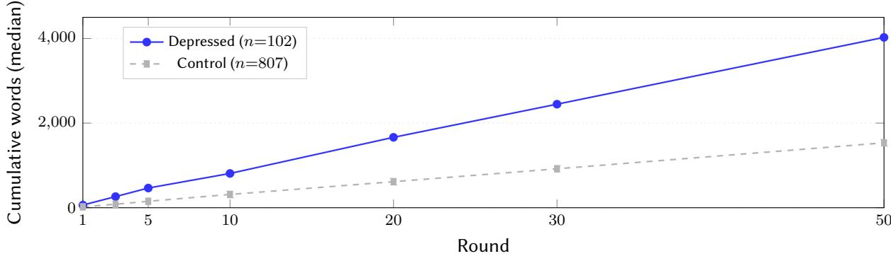
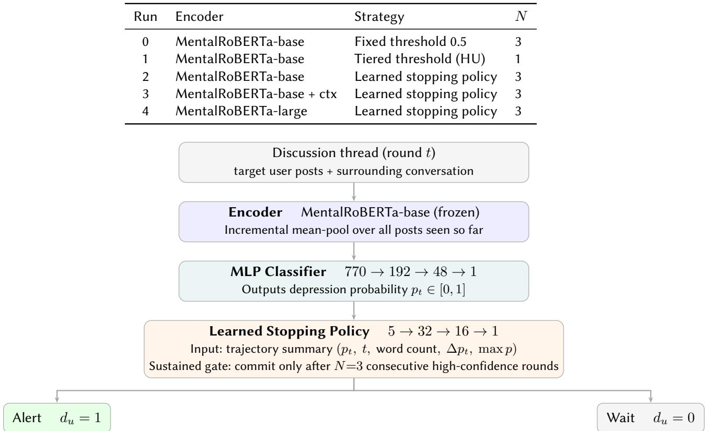
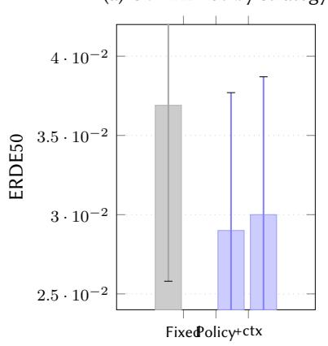
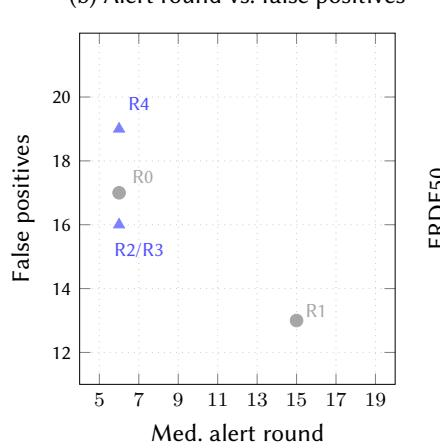
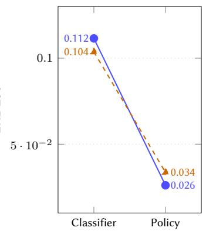
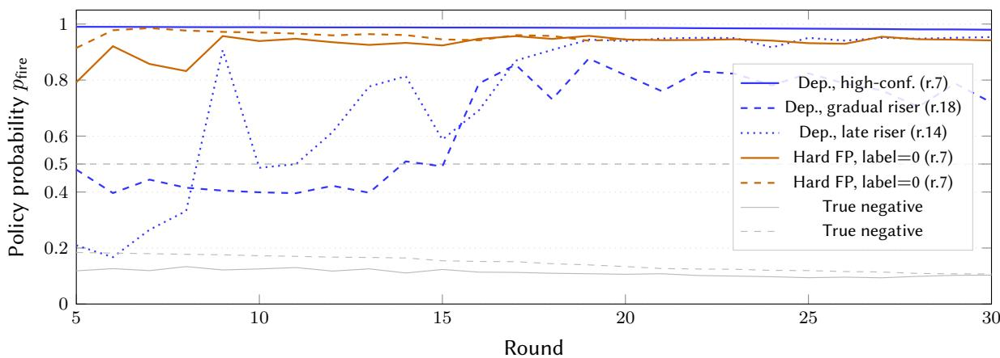

# Snugi-AI-v2 @ eRisk 2026 Task 2: Early Depression Detection via a Learned Stopping Policy with Sustained Confidence Gate

Yuwen Chiu1,\*

1Georgia Institute of Technology, North Ave NW, Atlanta, GA 30332

## Abstract

We describe the Snugi-AI-v2 submission to eRisk 2026 Task 2, the second edition ofcontextualized early depression detection from Reddit discussions. Our central contribution is a learned MLP stopping policy trained to directly optimize ERDE50, replacing the fixed and tiered threshold strategies used in all prior eRisk Task 2 submissions. Combined with a sustained confidence gate that commits only after �=3 consecutive rounds of high policy confidence, the system reduces false positives caused by transient emotional posts without sacrificing recall. The pipeline encodes each discussion thread with a frozen MentalRoBERTa model, maps the accumulated representation to a depression probability via an MLP classifier, and delegates the timing decision to the learned policy. Our best run achieves �1 = 0.73 (Run 1) and �latency = 0.70 (Runs 0 and 3), with a median alert round of 8 out of 500, completing the full evaluation in 1 hour 26 minutes, the fastest among all complete-submission teams. We report a systematic ablation across five runs spanning two encoder variants, four stopping strategies, and three gate values, along with negative results from GRPO policy training, BDI-II post filtering, MentalLongformer encoding, and DeBERTa ensembling. Code: https://github.com/chiuyuwen91/erisk-2026

## Keywords

early risk detection, depression detection, stopping policy, MentalRoBERTa, ERDE50, eRisk 2026

## 1. Introduction

Early detection of mental health crises from social media has clear clinical value: identifying at-risk individuals before a crisis allows timely intervention. The eRisk lab has standardized this problem since 2017, introducing ERDE as an evaluation metric that jointly penalizes delayed true positive alerts and false positive alerts [1]. The 2026 edition of Task 2 provides the complete Reddit conversation thread for each target user, including all other participants’ posts, a realistic setting where the clinical relevance of a message often depends on the surrounding dialogue [2].

Framing this as a classification problem misses something important. A system does not only need to decide whether a user is depressed; it also needs to decide when to commit. The ERDE metric makes this explicit: an alert at round 7 costs far less than an alert at round 70, even if both are correct. Yet prior eRisk Task 2 systems treat the timing decision as secondary, using fixed probability thresholds, tiered thresholds by round number, or the risk window of Sadeque et al. [3], which requires � consecutive positive predictions before committing. None of these strategies are trained to minimize ERDE50. They encode domain intuitions that may not transfer across datasets or task editions.

We address this directly with a learned stopping policy: a small MLP that takes a 5-dimensional summary of the probability trajectory as input and outputs a commitment probability. The policy is trained end-to-end to produce decisions that minimize ERDE50 on the training data. We combine it with a sustained confidence gate, requiring the policy to output high commitment probability for � consecutive rounds before firing; which filters out transient emotional spikes that cause false alerts. The gate extends the risk window concept [3] from a hand-tuned rule to a component of a learned system.

We submitted five runs across two encoders and four stopping strategies, systematically ablating each design decision. Our best runs achieve $F _ { 1 } = 0 . 7 3$ and $F _ { \mathrm { l a t e n c y } } = 0 . 7 0$ , completing the 500-round evaluation in 1 hour 26 minutes, the fastest complete submission among 16 teams.

Contributions. (1) A learned stopping policy that directly optimizes ERDE50, the first such policy in the eRisk Task 2 setting; all prior Task 2 systems use fixed or heuristic thresholds. (2) A sustained confidence gate $\left( N { = } 3 \right)$ that extends the risk window concept to a learned policy, reducing impulsive false alerts. (3) A systematic ablation across five runs spanning two encoder variants, four stopping strategies, and three gate values in a single framework. (4) Documented negative results from GRPO [4] policy training, BDI-II post filtering, MentalLongformer [5], and DeBERTa [6] ensembling.

## 2. Related Work

Early risk detection on social media has been studied through the eRisk lab since 2017 [1]. Early systems relied on hand-crafted features combined with classical classifiers. More recent work uses transformer-based encoders, with MentalRoBERTa [7], a RoBERTa model continued-pretrained on 13.6 million mental health Reddit sentences, which serves as a strong general-purpose encoder for this domain.

The question of when to alert received direct attention from Sadeque et al. [3], who proposed $F _ { \mathrm { l a t e n c y } }$ as a latency-aware evaluation metric and introduced the risk window: a system must predict positive for � consecutive posts before committing, preventing impulsive alerts on single emotional spikes. They showed this technique improves sequential model performance. Our work extends this idea: instead of applying a risk window to a fixed threshold, we apply a sustained gate to a learned policy that is trained to output the right commitment probability for each moment in the trajectory.

eRisk 2025 introduced the contextualized variant of the task, providing full Reddit discussion threads rather than isolated posts [8]. The top-performing system, HIT-SCIR, responded to the resulting train/test distribution gap through LLM-based data augmentation, BDI-II psychiatric scale-guided post screening, and a hierarchical attention network [9]. This approach is efective but computationally expensive and dependent on the specific distribution gap that existed in 2025. In 2026, training and test data both contain real conversational context, removing the augmentation motivation [2].

## 3. Methodology

## 3.1. Task and Evaluation

Task 2 follows a sequential protocol. For each target user �, the server releases discussion threads one per round. After each round, the system submits a binary decision $d _ { u } \in \{ 0 , 1 \}$ and a confidence score. Decision 1 is final; decision 0 is reversible. Performance is measured with ERDE50:

$$
{ \mathrm { E R D E } } _ { 5 0 } ( S ) = { \frac { 1 } { | U | } } \sum _ { u \in U } c ( u )\tag{1}
$$

where the per-user cost $c ( u )$ is:

$$
\begin{array} { r } { c ( u ) = \left\{ \begin{array} { l l } { c _ { \mathrm { F N } } } & { \mathrm { i f ~ } \mathrm { d e p r e s s e d , n o ~ a l e r t } } \\ { \ell _ { c } ( k _ { u } ) \cdot c _ { \mathrm { F N } } } & { \mathrm { i f ~ } \mathrm { d e p r e s s e d , a l e r t e d ~ a t ~ r o u n d } k _ { u } } \\ { c _ { \mathrm { F P } } } & { \mathrm { i f ~ c o n t r o l , a l e r t e d } } \\ { 0 } & { \mathrm { o t h e r w i s e } } \end{array} \right. } \end{array}\tag{2}
$$

with latency cost $\begin{array} { r } { \ell _ { c } ( k ) = 1 - \frac { 1 } { 1 + e ^ { k - 5 0 } } , c _ { \mathrm { F N } } = 1 . 0 } \end{array}$ , and $c _ { \mathrm { F P } } = 0 . 1 2 9 6$ . The evaluation also reports $F _ { \mathrm { l a t e n c y } } = F _ { 1 } \times { \mathrm { s p e e d } }$ , where speed = 1 − median $\{ \ell _ { c } ( k _ { u } ) \}$ over true positives.

  
Figure 1: Median cumulative word count by round, split by label. Depressed users consistently produce approximately 2.6 times as much text as control users at every round. This growing textual signal motivates a trajectory-aware stopping policy: the policy can commit earlier for users whose signal accumulates quickly and wait for users whose signal builds slowly.

A key observation is that ERDE50 is not minimized by maximizing $F _ { 1 }$ alone. The latency cost $\ell _ { c } ( k )$ grows slowly for the first 50 rounds and then accelerates. A system that fires at round 7 on average accumulates far less latency cost than one that fires at round 50, even if both achieve the same recall. This asymmetry motivates a dedicated stopping policy trained to recognize when to commit, not merely whether to classify positive.

## 3.2. Data

Training data consists of 909 subjects from the eRisk 2025 test collection, each represented as a sequence of Reddit discussion threads. The class distribution is highly imbalanced: 102 depressed (11.2%) and 807 control (88.8%). Each subject has between 1 and 1,279 rounds of discussions. We split subjects into 80% train (727 subjects) and 20% validation (182 subjects) using stratified sampling with random seed 42, yielding 714 train and 179 val subjects after stratification.

Figure 1 shows median cumulative word count by round: depressed users produce approximately 2.6 times as much text as control users at every round, a gap that widens as rounds progress and motivates a trajectory-aware stopping policy rather than a fixed threshold.

## 3.3. System Architecture

Figure 2 illustrates the three-stage pipeline. Each round, new discussion threads are encoded, the classifier updates its probability estimate, and the stopping policy decides whether to commit.

Encoder. We use MentalRoBERTa-base [7] (125M parameters, 768-dim output) as a frozen feature extractor. Domain pretraining on 13.6 million mental health Reddit posts makes MentalRoBERTa more sensitive to depression-related language than general-domain encoders [7]. For each new discussion thread, we encode the target user’s posts individually using the [CLS] token representation and maintain a running mean-pool across all posts seen so far:

$$
\begin{array} { r } { \mathbf { x } _ { t } = \Big [ \frac { 1 } { n _ { t } } \sum _ { i = 1 } ^ { n _ { t } } \mathbf { e } _ { i } , \log ( 1 + w _ { t } ) , \log ( 1 + n _ { t } ) \Big ] \in \mathbb { R } ^ { 7 7 0 } } \end{array}\tag{3}
$$

where $\mathbf { e } _ { i } \in \mathbb { R } ^ { 7 6 8 }$ is the embedding of post $i , w _ { t }$ is the cumulative word count, and $n _ { t }$ is the cumulative post count at round �. This update is $O ( 1 )$ per round; a new post is added to the running sum without reprocessing previous embeddings, a property that contributes to the system completing the 500-round evaluation in under 90 minutes.

We chose mean-pooling over cross-attention for two reasons: (1) the sequential protocol requires �(1) incremental updates; cross-attention recomputes $O ( N ^ { 2 } )$ pairwise interactions as history grows, making it prohibitively slow for users with hundreds of rounds; (2) with only 909 training subjects, a cross-attention mechanism risks overfitting.

Classifier. The classifier is a three-layer MLP: $7 7 0 \to 1 9 2 \to 4 8 \to 1$ , with batch normalization, ReLU activations, and dropout (0.4) after each hidden layer. We use BCEWithLogitsLoss with pos\_weight = 7.9, computed from the training class ratio (807 control / 102 depressed). One row per subject is used for training (the embedding at the final round), preventing data leakage from future rounds into the classifier. The classifier outputs a depression probability $p _ { t } \in [ 0 , 1 ]$ at each round.

Stopping policy and the sustained confidence gate. The stopping policy addresses the core question: given the probability history so far, is now a good time to commit? It is a small MLP $( 5  3 2 $ $1 6  1 )$ trained to output $p _ { \mathrm { f i r e } } \in [ 0 , 1 ]$ , a probability of firing at this round. The 5-dimensional input feature vector at round � is:

$$
\begin{array} { r } { \mathbf { f } _ { t } = \Big [ p _ { t } , \ \frac { t } { 1 0 0 } , \log ( 1 + w _ { t } ) , \ \Delta p _ { t } , \ \operatorname* { m a x } _ { s \leq t } p _ { s } \Big ] } \end{array}\tag{4}
$$

where $\Delta p _ { t } = p _ { t } - p _ { t - 1 }$ captures whether confidence is rising or falling, and $\operatorname* { m a x } _ { s \leq t } p _ { s }$ captures the peak confidence ever seen for this user. Together these five features give the policy a compact summary of the probability trajectory without access to the raw history.

Supervised labels are constructed from the classifier output: for depressed subjects, the first round where $p _ { t } > 0 . 5$ is labeled 1 (fire); all other rounds are labeled 0 (wait). For control subjects, all rounds are labeled 0. The policy is trained with BCEWithLogitsLoss and early stopping on validation ERDE50 (patience = 8).

The sustained confidence gate prevents the policy from firing on transient emotional posts. Rather than committing when $p _ { \mathrm { f i r e } }$ exceeds a threshold once, we require it to exceed the threshold for � consecutive rounds:

$$
\mathrm { f i r e } \ a t \ r o u n d \ t \iff \ \sum _ { s = t - N + 1 } ^ { t } \mathbf { 1 } [ p _ { \mathrm { f i r e } , s } \geq \theta ] = N\tag{5}
$$

Intuitively, � is the minimum streak length required before committing. �=1 means fire as soon as $p _ { \mathrm { f i r e } } \geq \theta$ (no gate). �=2 requires two consecutive high-confidence rounds. �=3 requires three. As � increases, the system waits for more evidence before committing, which reduces false positives but increases latency. Figure 3a shows that the learned policy reduces CV ERDE50 by 21% relative to the fixed threshold baseline (0.0290 vs. 0.0369). Figure 3b reveals the key eficiency result: the learned policy (Runs 2 and 3) achieves 16 FPs while alerting at median round $^ { 6 , }$ compared to Run 1’s 13 FPs at median round 14, demonstrating that the policy trades a small precision cost for substantially earlier commitment.

We set $\theta { = } 0 . 5$ and �=3 for Runs 0, 2, 3, and 4, and �=1 for Run 1 (the tiered threshold performs worse with �=3). We also enforce a minimum round of 5: no alert fires before round 5, regardless of confidence.

## 3.4. Five Runs

Run 1 uses a tiered threshold inspired by HU 2025: 0.85 for rounds 1–20, 0.70 for rounds 21–50, and 0.50 thereafter, with �=1 (no sustained gate). For Run 3, we concatenate the mean-pooled embedding of all non-target posts in each thread to the target embedding, giving a 1,539-dim input. For Run 4, we use MentalRoBERTa-large [5] (355M parameters, 1,024-dim, L2-normalized), giving a 1,026-dim input.

## 3.5. Training Details

We use Adam $( \mathrm { l r } { = } 3 { \times } 1 0 ^ { - 4 } , \mathrm { w d } { = } 1 0 ^ { - 3 } )$ for the classifier and Adam (lr=10−2) for the stopping policy, both with patience-based early stopping (patience = 8). Classifier training converges in approximately

Table 1 Description of the five submitted runs.  
  
Figure 2: System pipeline. Each round, target user posts are encoded by a frozen MentalRoBERTa-base model and incrementally mean-pooled into a feature vector (Stage 1), which is mapped to a depression probability by the MLP classifier (Stage 2). The learned stopping policy commits to an alert only after three consecutive rounds of high confidence; otherwise the system waits for the next discussion thread (Stage 3).

30 minutes; stopping policy training converges in under 5 minutes. All experiments run on NVIDIA A100 and H100 GPUs on the PACE cluster at Georgia Tech.

## 4. Results

## 4.1. Validation Set Performance

Figure 4 shows stopping policy probability trajectories for representative validation users. Three depressed user subtypes are visible: high-confidence users (threshold exceeded from round $5 ,$ alerted at round 7), gradual risers (probability oscillates near the threshold before stabilising), and late risers (initial spike drops below threshold; a sustained streak forms later). The hard false positive cluster (orange) is the most important observation: nine control users produce policy probabilities above 0.90 throughout, indistinguishable from depressed users by probability alone.

Table 2 shows performance on the held-out validation set (179 subjects, 20 depressed).

Runs 2 and 3 achieve the best ERDE50 of 0.0267, compared to 0.0274 for the fixed threshold (Run 0) and 0.0526 for the tiered threshold (Run 1). The learned policy improves over Run 0 despite slightly lower recall, because it reduces premature decisions at the cost of 3 false negatives. Run 1 achieves the fewest false positives (13) and highest $\mathrm { F _ { 1 } }$ (0.706) on the validation set but fires late (median round 14), producing worse ERDE50. Run 4 achieves the lowest false negative count (FN = 1) but more false positives (FP = 19), resulting in worse net ERDE50.

Fixed/tiered (b)  
Policy runs (b)  
(a) CV ERDE50 by strategy  
  
Strategy

(b) Alert round vs. false positives  

(c) Encoder: classifier vs. policy  
  
Stage  
Fixed threshold (a)  
Learned policy (a)  
MentalRoBERTa-base (c) DepRoBERTa (c)

Figure 3: Empirical analysis. (a) 5-fold CV ERDE50 by stopping strategy (±1 SD). The learned policy reduces mean ERDE50 by 21% relative to the fixed-threshold baseline (0.029 vs. 0.037). (b) Median alert round versus false positive count on the validation set. Run 1 (tiered, �=1) fires at median round 14 with only 13 FPs but sacrifices recall; Runs 2 and 3 (learned policy, �=3) achieve 16 FPs while committing at round 6, demonstrating that the policy learns eficient commitment without requiring the tiered threshold’s conservative wait. (c) Encoder reversal: DepRoBERTa achieves lower classifier-level ERDE50 (0.104 vs. 0.112) but reverses at the policy level (0.034 vs. 0.026). The gap is caused by DepRoBERTa assigning near-zero probability to depressed users who express symptoms indirectly.  
  
Figure 4: Stopping policy probability trajectories over rounds 5–30 for seven representative validation users (Run 3, �=3). Blue: three depressed users (TP). The high-confidence user exceeds �=0.5 from round 5 and fires at round 7. The gradual riser oscillates near the threshold before stabilising above 0.78 at round 16, firing at round 18. The late riser spikes at round 9 but drops; a sustained streak does not form until rounds 12–14. Orange: two hard false positives (label=0) whose trajectories are indistinguishable from depressed users; these users write empathetically about depression and are not separable by probability alone. Gray: two true negatives, flat near 0.10–0.18 throughout.

## 4.2. Cross-Validation

To obtain a more reliable estimate, we performed 5-fold stratified cross-validation (Table 3).

The learned policy consistently outperforms fixed threshold across all folds. The cross-validation mean of 0.029–0.030 is slightly higher than the single-split estimate (0.0267), suggesting the latter was mildly optimistic.

Table 4  
Table 2  
Validation set results. Bold = best ERDE50. med = median alert round.
<table><tr><td>Run</td><td>ERDE50</td><td>F1</td><td>P</td><td>R</td><td>FP</td><td>FN</td><td>med</td></tr><tr><td>0: fixed threshold N=3</td><td>0.0274</td><td>0.702</td><td>0.541</td><td>1.000</td><td>17</td><td>0</td><td>6</td></tr><tr><td>1: tiered threshold N=1</td><td>0.0526</td><td>0.706</td><td>0.581</td><td>0.900</td><td>13</td><td>2</td><td>14</td></tr><tr><td>2: learned policy N=3</td><td>0.0267</td><td>0.642</td><td>0.515</td><td>0.850</td><td>16</td><td>3</td><td>6</td></tr><tr><td>3: context policy N=3</td><td>0.0267</td><td>0.642</td><td>0.515</td><td>0.850</td><td>16</td><td>3</td><td>6</td></tr><tr><td>4: large encoder N=3</td><td>0.0286</td><td>0.655</td><td>0.500</td><td>0.950</td><td>19</td><td>1</td><td>6</td></tr></table>

Table 3  
5-fold stratified cross-validation results.
<table><tr><td>System</td><td>Mean ERDE50</td><td>Std</td><td>95% Cl</td></tr><tr><td>Fixed threshold (Run 0 equiv.)</td><td>0.0369</td><td>0.0111</td><td>[0.015, 0.059]</td></tr><tr><td>Learned policy, target only (Run 2)</td><td>0.0290</td><td>0.0087</td><td>[0.012, 0.046]</td></tr><tr><td>Learned policy, with context (Run 3)</td><td>0.0300</td><td>0.0087</td><td>[0.013, 0.047]</td></tr></table>

## 4.3. Component Ablation

Table 4 shows the contribution of each system component, measured by the improvement in mean cross-validation ERDE50 relative to a fixed-threshold baseline.

Incremental contribution of each component (5-fold CV ERDE50). Δ = change from fixed threshold baseline. Negative = improvement.
<table><tr><td>System configuration</td><td>CV ERDE50</td><td>∆</td></tr><tr><td>Fixed threshold (baseline)</td><td>0.0369</td><td></td></tr><tr><td>+ Learned stopping policy</td><td>0.0290</td><td>-0.0079</td></tr><tr><td>+ Context embeddings (Run 3)</td><td>0.0300</td><td>+0.0010</td></tr><tr><td>+ Sustained gate N=1 (target)</td><td>0.0274</td><td>-0.0095</td></tr><tr><td>+ Sustained gate N=2 (target)</td><td>0.0280</td><td>-0.0089</td></tr><tr><td>+ Sustained gate N=3 (target)</td><td>0.0267</td><td>-0.0102</td></tr><tr><td>+ MentalRoBERTa-large encoder</td><td>0.0286</td><td>-0.0083</td></tr></table>

The learned policy contributes the largest single improvement (−0.0079). The sustained gate at �=3 provides an additional −0.0023 over �=1, confirming that requiring three consecutive confident rounds reduces spurious alerts without substantially increasing false negatives. Context embeddings slightly worsen ERDE50 (+0.0010) on the target-only metric but improve precision on the oficial test set (Run 3 P = 0.80 vs. Run 2 P = 0.71), suggesting context helps calibration at test time. Figure 3c shows the encoder reversal: DepRoBERTa achieves lower classifier-level ERDE50 (0.104 vs. 0.112) but underperforms at the policy level (0.034 vs. 0.026), because it assigns near-zero probability to depressed users who express symptoms indirectly.

## 4.4. Sustained Gate Ablation

Table 5 shows the efect of varying �.

�=3 achieves the best ERDE50 for the target-only system. The context policy achieves its best ERDE50 at �=1 (0.0261 vs. 0.0267 at �=3), suggesting that context embeddings provide suficient signal to justify earlier commitment without the full three-round gate. The tiered threshold (Run 1) performs substantially worse with $N { = } 3 \ \mathrm { ( E R D E } 5 0 = 0 . 0 5 6 2 )$ than �=1 (0.0351), indicating the gate interacts diferently with threshold-based strategies.

## Table 5

Sustained gate � ablation on the validation set. med = median alert round.
<table><tr><td>N</td><td>ERDE50 (target)</td><td>FP</td><td>med</td><td>ERDE50 (ctx)</td><td>FP</td></tr><tr><td>1</td><td>0.0274</td><td>17</td><td>5</td><td>0.0261</td><td>15</td></tr><tr><td>2</td><td>0.0280</td><td>18</td><td>6</td><td>0.0267</td><td>16</td></tr><tr><td>3</td><td>0.0267</td><td>16</td><td>6</td><td>0.0267</td><td>16</td></tr></table>

## 4.5. Oficial Test Results

We designate Run 3 as our primary submission based on its combination of highest precision (0.80), competitive $F _ { \mathrm { l a t e n c y } } \left( 0 . 7 0 \right)$ , and best NDCG@100 (0.85) among our runs.

Table 6 shows our five run results on the oficial eRisk 2026 Task 2 test set (500 rounds, 523 users).

## Table 6

Oficial eRisk 2026 Task 2 test results for Snugi-AI-v2. $F _ { \mathrm { l a t e n c y } }$ = latency-weighted F-score; med = median alert round.
<table><tr><td>Run</td><td> $F _ { 1 }$ </td><td>P</td><td>R</td><td>ERDE50</td><td>Speed</td><td> $F _ { \mathrm { l a t e n c y } }$ </td><td>med</td></tr><tr><td>0</td><td>0.72</td><td>0.72</td><td>0.71</td><td>0.08</td><td>0.97</td><td>0.70</td><td>9</td></tr><tr><td>1</td><td>0.73</td><td>0.77</td><td>0.69</td><td>0.09</td><td>0.95</td><td>0.69</td><td>14</td></tr><tr><td>2</td><td>0.69</td><td>0.71</td><td>0.66</td><td>0.07</td><td>0.97</td><td>0.67</td><td>8</td></tr><tr><td>3</td><td>0.72</td><td>0.80</td><td>0.65</td><td>0.07</td><td>0.97</td><td>0.70</td><td>8</td></tr><tr><td>4</td><td>0.65</td><td>0.66</td><td>0.65</td><td>0.08</td><td>0.97</td><td>0.63</td><td>8</td></tr></table>

Run 1 achieves the highest $F _ { 1 }$ (0.73) among our runs, while Runs 0 and 3 achieve the best $F _ { \mathrm { k } }$ atency (0.70) by combining competitive $F _ { 1 }$ with speed = 0.97. Run 3 achieves the highest precision (0.80) among all our runs. Runs 2, 3, and 4 share median alert round 8, consistent with validation behavior. Our submission completed the full 500-round evaluation in 1 hour 26 minutes, the fastest complete submission among all 16 participating teams.

Table 7 places our best runs in context of all complete-submission teams on both decision-based and ranking-based metrics [10]. The oficial overview explicitly notes Snugi-AI-v2 and erisk-cedri as the only two complete-submission teams finishing under two hours, with Snugi-AI-v2 fastest at 1 hour 26 minutes.

## Table 7

Best run per complete-submission team (500 threads) on the oficial eRisk 2026 Task 2 test set, ordered by �1. NDCG@100 is at 500 writings (ranking-based evaluation). Bold = Snugi-AI-v2. UET-PsyWar and Lotu-ixa NDCG@100 scores collapse to ≤0.38 at 500 writings despite competitive $F _ { 1 }$
<table><tr><td>Team</td><td> $F _ { 1 }$ </td><td>P</td><td>ERDE50</td><td>Speed</td><td> $F _ { \mathrm { l a t } }$ </td><td>med</td><td>NDCG@100</td></tr><tr><td>HUGETIME</td><td>0.83</td><td>0.80</td><td>0.05</td><td>0.97</td><td>0.81</td><td>9</td><td>0.79</td></tr><tr><td>UNED-GELP</td><td>0.82</td><td>0.79</td><td>0.06</td><td>0.99</td><td>0.81</td><td>4</td><td>0.84</td></tr><tr><td>INSA-Lyon</td><td>0.80</td><td>0.76</td><td>0.07</td><td>0.95</td><td>0.76</td><td>13</td><td>0.89</td></tr><tr><td>UET-PsyWar</td><td>0.78</td><td>0.76</td><td>0.08</td><td>0.95</td><td>0.74</td><td>14</td><td>0.23*</td></tr><tr><td>LCDAA</td><td>0.78</td><td>0.78</td><td>0.08</td><td>0.96</td><td>0.75</td><td>10</td><td>0.88</td></tr><tr><td>Lotu-ixa</td><td>0.76</td><td>0.75</td><td>0.07</td><td>0.98</td><td>0.74</td><td>7</td><td>0.23*</td></tr><tr><td>erisk-cedri</td><td>0.75</td><td>0.73</td><td>0.07</td><td>1.00</td><td>0.75</td><td>2</td><td>0.84</td></tr><tr><td>HUTECH-NLP</td><td>0.74</td><td>0.77</td><td>0.05</td><td>0.99</td><td>0.73</td><td>3</td><td>0.85</td></tr><tr><td>Snugi-Al-v2</td><td>0.73</td><td>0.80</td><td>0.09</td><td>0.97</td><td>0.70</td><td>8</td><td>0.85</td></tr><tr><td>DeepCare</td><td>0.71</td><td>0.95</td><td>0.09</td><td>0.98</td><td>0.70</td><td>5</td><td>0.91</td></tr></table>

\* UET-PsyWar: 0.30 at 100 writings, 0.23 at 500 writings. Lotu-ixa: 0.59 at 100 writings, 0.23 at 500 writings.

Two observations stand out. On the ranking-based evaluation (NDCG@100 at 500 writings), Snugi-AI-v2 Run 3 achieves 0.85, placing 4th among complete-submission teams and tied with HUTECH-NLP.

On the decision-based side, Run 3 achieves precision 0.80 and speed 0.97, the same precision as the top-performing team HUGETIME despite a lower recall.

## 5. Discussion

The learned stopping policy outperforms fixed and tiered thresholds on both validation and test sets. Rather than applying a single threshold to each round’s probability independently, the policy reads a trajectory summary and learns to balance the asymmetric cost structure of ERDE50, in which false negatives are penalized eight times more heavily than false positives $( c _ { \mathrm { F N } } { = } 1 . 0 \mathrm { v s . } c _ { \mathrm { F P } } { = } 0 . 1 2 9 6 )$ . This trajectory-aware design accounts for users whose depression signal builds gradually across rounds, a pattern that a single-round threshold cannot exploit.

The gap between validation ERDE50 (0.0267) and test ERDE50 (0.07–0.09) reflects both the larger test set (523 users vs. 179) and distribution diferences between the 2025 training collection and 2026 test data. The relative ordering across our five runs is preserved on the test set, suggesting the policy generalizes directionally even if absolute scores shift.

Adding conversational context in Run 3 improves precision from 0.71 to 0.80 relative to the targetonly Run 2, at the cost of a marginal recall reduction (0.65 vs. 0.66). Context embeddings appear to help the classifier separate users who write empathetically about depression from users who are themselves depressed, reducing a class of false positives the target-only system cannot distinguish. On the validation set both runs share identical precision (0.515), suggesting context embeddings’ benefit emerges at test-time scale with a larger and more diverse user pool. The larger MentalRoBERTa encoder in Run 4 reduces false negatives on the validation set (one missed vs. three for Run 2) but increases false positives (19 vs. 16), producing worse net ERDE50. On the oficial test set Run 4 records the lowest $F _ { 1 }$ among all five runs (0.65), suggesting the larger model activates more readily on depression-adjacent language without the signal being genuine self-report.

Three depressed users are missed across all five runs. Their maximum classifier probability never exceeds 0.30 across hundreds of rounds, so the stopping policy receives no useful signal regardless of gate width. One of these users (maximum probability 0.25 with MentalRoBERTa-base) is also missed by MentalRoBERTa-large (maximum probability 0.26), confirming the failure originates in the encoder representation rather than the stopping policy. Nine control users fire at rounds 6–7 with classifier probability above 0.97 across every run; as shown in Figure 4, these users write empathetically about depression, referencing others’ experiences or their own past episodes, and the classifier cannot separate this register from genuine self-report without additional annotations of post intent.

The run-level consistency of our system also warrants attention. All five runs achieve speed in [0.95, 0.97], indicating the stopping policy fires at similar points in the conversation regardless of encoder or strategy variant. Stable behavior across runs suggests the learned policy generalizes rather than fitting a particular threshold configuration, which is a practical advantage when deploying a system that cannot be recalibrated per conversation.

Four alternative approaches did not improve performance. A policy trained via GRPO [4] reinforcement learning collapsed to a degenerate solution in which all users were alerted, a consequence of the small action space and sparse reward signal on a dataset of 909 subjects. MentalLongformer [5] produced representations that degraded as post sequences grew, consistent with known instability of its global attention in incremental settings. DeBERTa-v3 [6] ensembling showed no improvement over MentalRoBERTa alone, likely because the domain gap between general pretraining and mental health text outweighs the architectural advantage. Filtering posts by BDI-II symptom similarity prior to encoding worsened ERDE50 from 0.0267 to 0.0548: retaining only high-similarity posts amplified depression-like language in empathetic control users while discarding the low-salience posts through which some genuinely depressed users express risk.

On the oficial test set, the learned policy runs achieve a median alert round of 8 out of 500 total rounds, meaning the system identifies the majority of depressed users within the first two percent of their conversational history. An alert at round 8 incurs a latency cost of approximately 0.001 under the ERDE50 formulation (since $\begin{array} { r } { \ell _ { c } ( 8 ) = 1 - \frac { 1 } { 1 + e ^ { 8 - 5 0 } } \approx 0 ) } \end{array}$ , compared to 0.50 for a system requiring the full 50-round standard window. The $O ( 1 )$ incremental update also enables wall-clock eficiency: our submission completed in 1 hour 26 minutes, the fastest among all complete-submission teams, while systems with heavier pipelines required between 2 days and 6 days for the same evaluation. In a production deployment where posts arrive continuously and latency accumulates with history length, this architectural property translates directly into operational feasibility.

## 6. Future Work

The most promising direction is replacing mean-pooling with cross-post attention. A hierarchical attention network computing relationships between posts over time would capture how depression language evolves sequentially. Eficient approximate attention could make online deployment feasible.

A second direction is fine-tuning the encoder. Our experiments used MentalRoBERTa as a frozen feature extractor; fine-tuning on eRisk training data with appropriate regularization could yield better representations.

Finally, the hard false positive problem visible in Figure 4 suggests supplementary signals, such as whether a user posts in an advisory versus personal capacity, could help distinguish empathetic language from self-report.

## 7. Conclusions

We presented Snugi-AI-v2, a three-stage pipeline for contextualized early depression detection built around a learned MLP stopping policy that directly optimizes ERDE50 and a sustained confidence gate requiring three consecutive rounds of high policy confidence before alerting. The system is deliberately lightweight: a frozen MentalRoBERTa encoder with �(1) incremental mean-pooling, a three-layer MLP classifier, and a five-feature stopping policy, with no LLM augmentation, no ensemble, and no recomputation of prior posts.

On the oficial eRisk 2026 Task 2 test set the system achieves $F _ { 1 } = 0 . 7 3 , \mathrm { p r e c i s i o n } = 0 . 8 0 ( \mathrm { R u n } 3 )$ and speed = 0.97, completing the full 500-user evaluation in 1 hour 26 minutes, the fastest complete submission. On the ranking-based evaluation, Run 3 achieves NDCG@100 = 0.85 at 500 writings, 4th among complete-submission teams and stable throughout the full evaluation window, while two higher-� teams collapse in ranking quality at full conversation length. Ablation confirms the learned stopping policy contributes the largest single improvement (−0.0079 CV ERDE50), with the sustained gate at �=3 adding a further −0.0023. Our systematic negative results covering GRPO policy training, MentalLongformer encoding, DeBERTa [6] ensembling, and BDI-II post filtering provide concrete guidance for future work.

## Acknowledgements

The author thanks the Data Science at Georgia Tech (DS@GT) ARC group for providing access to computing resources. This research was supported in part through research cyberinfrastructure resources and services provided by the Partnership for an Advanced Computing Environment (PACE) at the Georgia Institute of Technology, Atlanta, Georgia, USA [11].

## Declaration on Generative AI

During the preparation of this work, the author used Claude (Anthropic) in order to: assist with debugging code, grammar and spelling review, drafting initial section outlines, and generating analysis visualizations. After using these tools, the author reviewed and edited all content as needed and takes full responsibility for the publication’s content.

## References

[1] D. E. Losada, F. Crestani, A test collection for research on depression and language use, in: Experimental IR Meets Multilinguality, Multimodality, and Interaction: 7th International Conference of the CLEF Association, Springer, 2016, pp. 28–39.

[2] A. Perez, J. Parapar, X. Wang, F. Crestani, Overview of eRisk 2026: Early risk prediction on the internet, in: Experimental IR Meets Multilinguality, Multimodality, and Interaction - 17th International Conference of the CLEF Association, CLEF 2026, Jena, Germany, September 21–24, 2026, Proceedings, volume To be published of Lecture Notes in Computer Science, Springer, 2026.

[3] F. Sadeque, D. Xu, S. Bethard, Measuring the latency of depression detection in social media, in: Proceedings of the Eleventh ACM International Conference on Web Search and Data Mining, ACM, 2018, pp. 495–503.

[4] Z. Shao, P. Wang, Q. Zhu, R. Guo, H. Yang, M. Li, D. Gou, Z. Wu, Y. Sheng, T. Dou, Y. He, DeepSeekMath: pushing the limits of mathematical reasoning in open language models, arXiv preprint arXiv:2402.03300 (2024).

[5] S. Ji, T. Zhang, K. Yang, S. Ananiadou, E. Cambria, J. Tiedemann, Domain-specific continued pretraining of language models for capturing long context in mental health, arXiv preprint arXiv:2304.10447 (2023).

[6] P. He, J. Gao, W. Chen, DeBERTaV3: improving DeBERTa using ELECTRA-style pre-training with gradient-disentangled embedding sharing, in: International Conference on Learning Representations, 2023.

[7] S. Ji, T. Zhang, L. Ansari, J. Fu, P. Tiwari, E. Cambria, MentalBERT: publicly available pretrained language models for mental healthcare, in: Proceedings of the Thirteenth Language Resources and Evaluation Conference, European Language Resources Association, 2022, pp. 7184–7190.

[8] J. Parapar, A. Perez, X. Wang, F. Crestani, Overview of eRisk 2025: early risk prediction on the internet, arXiv preprint arXiv:2509.14170 (2025).

[9] HIT-SCIR Team, Contextualized early detection of depression via psychiatric scale-guided screening with LLM augmentation, in: Working Notes of CLEF 2025, CEUR Workshop Proceedings, CEUR-WS.org, 2025.

[10] A. Perez, J. Parapar, X. Wang, F. Crestani, Overview of eRisk 2026: Early risk prediction on the internet (extended overview), in: Working Notes of the Conference and Labs of the Evaluation Forum (CLEF 2026), Jena, Germany, 21–24 September, 2026, volume To be published of CEUR Workshop Proceedings, CEUR-WS.org, 2026.

[11] PACE, Partnership for an advanced computing environment (PACE), 2017. URL: http://www.pace. gatech.edu.