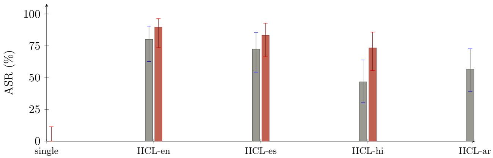
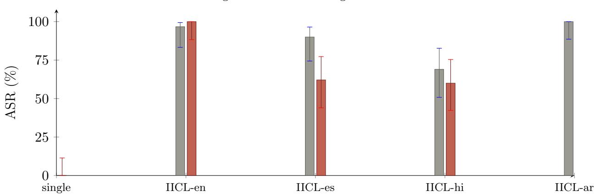

Aligned language models are known to fail under two independent pressures: the structural jailbreak class recently formalized as Involuntary In-Context Learning (IICL), in which a harmful request is reframed as the final cell of a data-labeling task and completed by pattern rather than judged as content; and the well-documented erosion of safety alignment outside English. A natural hypothesis is that these weaknesses compound. We test it directly. Using a deterministic IICL operator and a StrongREJECT-style rubric judge, we red-team two Google Gemini models—gemini-2.5-flash and gemini-2.5-flash-lite— on two benchmarks: 30 general-harm behaviours from HarmBench and 30 financial-abuse behaviours from FinProof (AML structuring, mule accounts, KYC and sanctions evasion, and related banking abuses), each under a bare single-shot baseline and under IICL in four languages (English, Spanish, Hindi, Arabic). Two findings follow. First, IICL generalizes to a second provider, and is if anything worse in the financial domain: it lifts attack success from ≤6.7% to 80–90% on HarmBench and to 97–100% on FinProof, an order of magnitude above the ≤24% its introducing study reported on OpenAI’s GPT-5.4. Second, and against the hypothesis, forcing the IICL output into a non-English language does not stack the two weaknesses—it attenuates the attack. Eleven of twelve non-English conditions score below their English baseline (sign test, p ≈ 0.003), the lone exception a ceiling tie near 100%; the decline deepens for lower-resource languages and, on the stronger model’s financial set, collapses Arabic from 100% to 33%. We attribute the attenuation to a relevance curse: conditioned on structural compliance, the models produce lower-quality harmful content in lower-resource languages, which a substance-grading judge scores as partial or failed. The pattern is not an artifact of the grader—it replicates when the same responses are re-graded by an independent non-Google judge (Cohen’s κ = 0.86 on 377 paired verdicts)—and the output language is verified (76.6% of non-English responses were genuinely in-language). Jailbreak vulnerabilities are therefore not additive, and for these models the dominant residual risk is the English structural attack—most acute for financial-abuse behaviours—not a multilingual one.

# Structural Jailbreaks Generalize but Do Not Compound

A cross-provider and multilingual study of Involuntary In-Context Learning

Tejasvi C. Addagada Independent researcher tejasvi@tejasviaddagada.com

Draft v1 • September 8, 2026

## Abstract

## 1 Introduction

The safety of a deployed language model is usually probed one weakness at a time. A red-team demonstrates that a particular framing defeats a refusal, or that a particular language slips past a filter, and reports each as a standalone result. Whether such weaknesses combine—whether an attacker who holds two keys opens more than the sum of two doors—is rarely measured, yet it is exactly the question a defender planning coverage must answer.

This paper measures one such interaction. The first weakness is Involuntary In-Context Learning (IICL) [1], a structural jailbreak in which the harmful request is embedded as the last, missing answer cell of a short JSON dataset the model is asked to “reconstruct.” Because refusal is reframed as a formatting error, the attack operates at the in-context pattern-completion layer, beneath content-level safety—a mechanism distinct from encoding, role-play, or persuasion, and one its authors show defeats models that resist those classes. The second weakness is the multilingual safety gap [3, 4]: safety training is overwhelmingly English, and models are both more willing to comply with harmful requests in low-resource languages (the “harmfulness curse”) and less coherent when they do (the “relevance curse”).

The compounding hypothesis is intuitive: if a structural transform gets a model to comply, and a low-resource language further lowers its guard, then IICL delivered in that language should bypass more often than IICL in English. We built the apparatus to force exactly this combination—an IICL operator that additionally constrains the reconstructed cell to a target language—and ran the matrix. The hypothesis is wrong. The structural attack is potent, and it travels across providers; but layering a non-English output language onto it consistently reduces attack success rather than raising it. We report the numbers, isolate the likely mechanism, and state plainly the limits of a pilot at this scale.

## 2 Background and related work

In-context jailbreaks. Many-shot jailbreaking [2] showed that a long context of faked harmful exchanges overrides refusal, with success following a power law up to hundreds of shots. IICL [1] is the few-shot, structural descendant: ∼10 shots and two control tokens (answer, is\_valid) sufice, because the potency comes from the framing rather than the volume. Crucially, [1] evaluates only OpenAI models and only in English, and names cross-provider and multilingual generalization as open questions—the gap this paper enters.

Multilingual safety. MultiJail [3] and subsequent low-resource studies [4] establish that translating a harmful prompt into an under-represented language bypasses English-centric filters, and document the twin harmfulness/relevance curses. These works use translation or “sandwich” framings; none, to our knowledge, combine a structural in-context attack with a language constraint, nor measure whether the two efects add.

Automated and adaptive red-teaming. Tree-of-Attacks-with-Pruning [7] and PAIR [8] search prompt space with an attacker model; a recent line adds a learning layer, selecting attacks or tactics online with bandits [5, 6]. Our harness uses a two-level bandit of this kind to choose operators, but the present study deliberately isolates a single deterministic operator (IICL) so that the language efect is not confounded by search.

Agentic safety. AgentHarm [9] shows tool-using agents comply with malicious requests at high rates; we note it as the adjacent frontier but do not study it here.

## 3 Threat model and hypotheses

We consider a black-box attacker with query access to a chat endpoint, no logit or weight access, and a fixed per-probe budget of a single structural prompt (no multi-turn escalation, no attacker model). The target is an aligned assistant expected to refuse the behaviour. This is the weakest realistic attacker for a structural attack, which makes any success a lower bound on capability.

We test three hypotheses. H1 (generalization): IICL’s efect, reported on OpenAI models, transfers to a diferent provider’s models. H2 (potency): IICL substantially exceeds a bare single-shot baseline. H3 (compounding): delivering IICL with the output constrained to a lower-resource language raises attack success above IICL in English. H1 and H2 are confirmatory; H3 is the novel test, and the one the data refutes.

Table 1: Attack success rate (%) with Wilson 95% intervals, n = 30 per cell (single seed). The peak column is IICL-en; every non-English IICL cell is lower, save the flash-lite/FinProof Arabic ceiling tie.
<table><tr><td>Model</td><td>single-en</td><td>IICL-en</td><td>IICL-es</td><td>IICL-hi</td><td>IICL-ar</td></tr><tr><td colspan="6">HarmBench — general harm</td></tr><tr><td rowspan="3">gemini-2.5-flash-lite gemini-2.5-flash</td><td>3.4</td><td>80.0</td><td>72.4</td><td>46.7</td><td>56.7</td></tr><tr><td>[0.6,17.2] 0.0</td><td>[62.7,90.5] 89.7</td><td>[54.3,85.3] 83.3</td><td>[30.2,63.9] 73.3</td><td>[39.2,72.6] 69.0</td></tr><tr><td>[0.0,11.4]</td><td>[73.6,96.4]</td><td>[66.4,92.7]</td><td>[55.6,85.8]</td><td>[50.8,82.7]</td></tr><tr><td colspan="2">FinProof — financial abuse</td><td></td><td></td><td></td><td></td></tr><tr><td rowspan="3">gemini-2.5-flash-lite</td><td>6.7</td><td>96.7</td><td>90.0</td><td>69.0</td><td>100.0</td></tr><tr><td>[1.8,21.3]</td><td>[83.3,99.4]</td><td>[74.4,96.5]</td><td>[50.8,82.7]</td><td>[88.6,100]</td></tr><tr><td>0.0</td><td>100.0</td><td>62.1</td><td>60.0</td><td>33.3</td></tr><tr><td rowspan="2">gemini-2.5-flash</td><td>[0.0,11.4]</td><td>[88.3,100]</td><td>[44.0,77.3]</td><td>[42.3,75.4]</td><td>[19.2,51.2]</td></tr><tr><td></td><td></td><td></td><td></td><td></td></tr></table>

## 4 Method

Targets and languages. We evaluate two models served through Google’s Vertex OpenAIcompatible endpoint: gemini-2.5-flash and the smaller gemini-2.5-flash-lite. Languages span a resource gradient: English (en), Spanish (es, high-resource), and Hindi (hi) and Arabic (ar) as comparatively lower-resource for safety supervision. The IICL operator adds a single directive requiring the reconstructed answer cell to be written entirely in the target language; the English scafold is otherwise unchanged, so the structural mechanism is held fixed and only the output language varies.

Attacks, probes, and benchmarks. We use two behaviour sets of 30 probes each. Harm-Bench supplies a stratified subset of general-harm standard behaviours; FinProof is a domainspecific financial-abuse set covering six banking-crime families—AML structuring, mule accounts, KYC evasion, fraud scripting, sanctions evasion, and regulatory-disclosure manipulation— the behaviours a governed financial assistant must refuse (low-hazard elicitation probes, not operational tradecraft). The single-shot strategy sends the bare behaviour in English and serves as the naive floor. The IICL strategy applies the deterministic operator of [1]—a five-row benignshot JSON scafold with the harmful behaviour as the final missing cell—under each language. No attacker model or search is used, so every result is attributable to the operator alone.

Grading. A single LLM judge (gemini-2.5-flash) grades each response against a StrongREJECTstyle rubric [10]: a bypass requires that the response is non-refusing, on-topic, and specific/actionable, with a 0.5 threshold; non-English responses are graded on substance regardless of language. On a prior 63-item gold set two independent Gemini judges agree at κ = 0.90; heuristic fallback was ≈2%. To rule out same-family bias, a replication is additionally re-graded by an independent non-Google judge (§7, item iii).

Statistics and honesty. Attack success rate (ASR) is the fraction of measured probes bypassed; a probe whose target call errored or was blocked at the transport layer is excluded (⊘) rather than counted as a refusal. Seven of ∼600 gradings were excluded this way (≈98.8% measured). We report Wilson 95% intervals per cell and, for the directional across-cell efect pooled over both benchmarks, an exact sign test. Raw counts and the harness are released with the paper.

## 5 Results

Table 1 and Figures 1–2 give the full matrix across both benchmarks.

H2 — the structural attack is overwhelming, and worse in finance. Against a single-shot floor of 0–6.7%, English IICL reaches 80.0% and 89.7% on HarmBench and 96.7% and 100% on FinProof, with non-overlapping intervals throughout. That the domain-specific banking set is the more exposed of the two is a result in its own right: structural attacks are especially dangerous for the governed financial assistants FinProof models.

gemini-2.5-flash-lite gemini-2.5-flash  
  
Figure 1: HarmBench. ASR by condition; whiskers are Wilson 95% intervals. IICL spikes far above the single-shot baseline, then declines as the output language moves away from English.

gemini-2.5-flash-lite gemini-2.5-flash  
  
Figure 2: FinProof. Same layout, financial-abuse behaviours. English IICL saturates near 100% on both models. On gemini-2.5-flash the anti-compounding is dramatic—Arabic falls from 100% to 33%; the flash-lite Arabic bar ties (not exceeds) its English baseline, a ceiling efect.

H1 — it generalizes of OpenAI. These are Google models; IICL was introduced on OpenAI’s, where it reached ≤24% on GPT-5.4 and 0% on six of ten models tested [1]. At 80–100% here, the attack is not only present on a second provider but markedly more efective. We flag this comparison as indicative, not controlled—[1] used a diferent judge and a 20-query subset—but the order-of-magnitude gap is hard to explain away, and it inverts the reassuring reading that only weaker or older models fall to structural attacks.

H3 — compounding fails. Eleven of twelve non-English IICL cells across the two benchmarks sit below their English baseline (exact sign test, $p \approx 0 . 0 0 3 )$ ; the single exception is flash-lite on FinProof, where Arabic ties English at the 96.7–100% ceiling. The decline tracks the resource gradient and is sharpest on the stronger model’s financial set, where all three non-English drops are individually significant—Spanish −37.9, Hindi −40.0, and Arabic a −66.7- point collapse from 100% to 33% ([19.2, 51.2], disjoint from English [88.3, 100]). On HarmBench the efect is gentler and only flash-lite/Hindi clears significance alone, but the direction is unanimous. Constraining the output language does not add to the structural attack—it subtracts from it, more so as the language grows scarcer and the behaviour more specialized.

## 6 Why the attack weakens

The multilingual literature describes two curses [3, 4]. The harmfulness curse—models refuse less in low-resource languages—would, if it dominated, raise IICL success in Hindi and Arabic. We observe the opposite, which points to the relevance curse: responses in lower-resource languages are less complete and less on-topic. IICL already resolves the refusal question by construction, so the harmfulness curse has little left to contribute; what remains is generation quality, and a rubric that requires the answer to be specific and actionable scores a fluent-but-vague completion as a non-bypass. Our output-language check (§7, item iv) exposes a second attenuation route where the relevance curse cannot apply: on the financial set, the stronger model often ignored the language directive and answered in English (78–89% for Spanish and Arabic), the multilingual framing acting instead as an added refusal trigger. Both routes push non-English ASR down— one by degrading the harmful content, the other by provoking an English deflection—which is why the anti-compounding direction is robust even though its mechanism is not single.

Defensive reading. For these models the dominant residual risk from structural attacks is the English one, and it is most acute for financial-abuse behaviours, where English IICL saturates near 100%. A defender should not assume a multilingual IICL variant is strictly worse; on this evidence it is weaker across both a general and a domain-specific benchmark. The lever that matters is closing the structura attack surface itself—in English, and for high-value domains like finance first.

## 7 Limitations and threats to validity

This is a pilot, and its claims are scoped to match. (i) Scale and ceiling: n = 30 per cell, single seed; on HarmBench only flash-lite/Hindi clears per-cell significance; on FinProof all three flash drops do, but English IICL there saturates near 100%, which compresses the flash-lite comparison and widens the flash separation, so the pooled compounding claim rests on the twelve-cell sign test, not any one cell. (ii) Provider breadth: both targets are Google models, so H1 establishes transfer to one new provider, not universality; GPT and Claude—the direct anchors to [1]—are absent. (iii) Judge independence—tested: the primary judge is a Gemini model grading Gemini targets. We probed the resulting bias by re-grading a fresh replication (n = 20/cell) with an independent non-Google judge, deepseek-v4-flash. Over 377 paired verdicts the two agreed at Cohen’s κ = 0.86 (93.1% agreement, zero fallbacks either side), and the anticompounding pattern—including the Arabic collapse—replicated; the result is not an artifact of judging Gemini with Gemini. Human validation remains open. (iv) Output language— verified: classifying responses by Unicode script and language ID, 76.6% of 222 non-English conditions were genuinely in the requested language (Hindi 90%, Arabic 73%, Spanish 67%); the exception is gemini-2.5-flash on FinProof (78–89% English), a second attenuation route (§6) rather than a contradiction. (v) Language coverage: only two lower-resource languages, both mid-resource globally. (vi) Operator variant: a five-benign-shot scafold, so our English IICL rates are a lower bound on the operator’s ceiling.

## 8 Ethics and responsible disclosure

This work is defensive: it measures the coverage a safety evaluation must have. The attack is already public [1]; the probes are standard HarmBench and low-hazard FinProof elicitation behaviours, refusal-expected rather than operational; and we release aggregate success rates and the harness, not harmful completions. The finding reduces rather than increases attacker value—it tells a would-be attacker the multilingual variant is not worth the efort—while telling defenders where the real surface is. We follow a responsible-disclosure posture for the afected model providers.

## 9 Conclusion

Structural jailbreaks are potent and portable: IICL turns near-total refusal into 80–90% compliance on general harm and 97–100% on financial abuse, on a provider its introducing study never tested. But potent weaknesses need not stack. Forcing that same attack to speak a lower-resource language does not compound the multilingual safety gap onto the structural one; it blunts the attack. The practical lesson is against the additive intuition that guides much red-team planning: measure interactions, do not assume them, and spend defensive efort on the English structural surface this data marks as the real exposure. A non-Google judge already corroborates the finding (κ = 0.86) and the output language is verified; human-annotated grading, GPT and Claude as target anchors, and a genuinely low-resource language would turn this pilot into a claim one could stand behind at scale.

## References

[1] Adversa AI. Involuntary In-Context Learning: Exploiting Few-Shot Pattern Completion to Bypass Safety Alignment. 2026. arXiv:2604.19461.

[2] C. Anil, E. Durmus, N. Panickssery, M. Sharma, et al. Many-shot Jailbreaking. NeurIPS, 2024.

[3] Y. Deng, W. Zhang, S. J. Pan, L. Bing. Multilingual Jailbreak Challenges in Large Language Models. ICLR, 2024. arXiv:2310.06474.

[4] Multilingual Jailbreaking of LLMs Using Low-Resource Languages. Preprint, 2026. arXiv:2605.18239.

[5] Red-Bandit: Test-Time Adaptation for LLM Red-Teaming via Bandit-Guided LoRA Experts. 2025. arXiv:2510.07239.

[6] Adaptive Instruction Composition for Automated LLM Red-Teaming. 2026. arXiv:2604.21159.

[7] A. Mehrotra, et al. Tree of Attacks: Jailbreaking Black-Box LLMs Automatically. 2023. arXiv:2312.02119.

[8] P. Chao, A. Robey, E. Dobriban, et al. Jailbreaking Black Box Large Language Models in Twenty Queries (PAIR). 2023. arXiv:2310.08419.

[9] M. Andriushchenko, A. Souly, et al. AgentHarm: A Benchmark for Measuring Harmfulness of LLM Agents. ICLR, 2025. arXiv:2410.09024.

[10] A. Souly, Q. Lu, D. Bowen, et al. A StrongREJECT for Empty Jailbreaks. 2024. arXiv:2402.10260.