# The Unreliable Progress Bar: Can LLM Agents Reliably Report Task Progress Throughout Execution?

Boyang Wang1,† Yunhan Wang2 Yalun Wu3

1 Independent Researcher

2 Beihang University

3 NExT++ Lab, School of Computing, National University of Singapore lolerpanda@outlook.com

## Abstract

Recent large language models can emit taskprogress signals that agent frameworks use to decide whether a task should continue or stop, yet whether a model can reliably report its task progress at every stage of a task, and where and how its reports fail, has not been studied systematically. We evaluate this ability on the public benchmark τ2-bench and on StageIF, a controlled testbed in which reporting checkpoints are placed across the task’s lifecycle. Both settings require reports at multiple task stages. We find that reporting reliability depends on the stage a task has reached, and that almost every deployed model we test is reliable at some stages and unreliable at others. Where reporting breaks down is not the same everywhere. Most deployed models lose accuracy once work is under way and recover once the task is done. The newest generation closes that mid-task drop and instead grows conservative at the finish line. Our study exposes a capability gap in task-progress reporting and provides an evaluation protocol that spans the whole course of task execution for this ability on which agent operation depends. The findings indicate that agent frameworks should not control task flow on the strength of the model’s state reports alone.

## 1 Introduction

Large language models increasingly run inside a loop in which a runtime supplies context, the model acts through tools, and the cycle repeats until someone decides the task is done (Yao et al., 2023, 2025; Barres et al., 2025; Patil et al., 2025; Trivedi et al., 2024; Wang et al., 2024; Chen et al., 2025; Xu et al., 2025). Runtime-owned answers to “keep going or stop” exist (Wu et al., 2024; Zhang et al., 2026a; LlamaIndex, 2026; Microsoft, 2026b; Dify, 2026), but they must be written per task. Many agent frameworks (LangChain, 2026; Microsoft, 2026a; OpenAI, 2026d; Google, 2026b; Hugging Face, 2026; CAMEL-AI, 2026; DeepWisdom, 2026; Anthropic, 2026a; LangChain AI, 2026; Significant Gravitas, 2026; Vercel, 2026; Mastra, 2026; Agno, 2026) instead let model-generated signals participate directly in continue-or-stop decisions (Appendix F). In plain terms, the model is asked to be its own progress bar. This paper asks whether large language models can reliably report task progress at every stage of a task and, if not, where and how their reports fail. Progress here means the task’s lifecycle stage, and a report is reliable when it is issued where the reporting duty applies and names the stage that the environment’s own state implies at that moment. Most agent benchmarks score what an agent does (Wang et al., 2024; Patil et al., 2025; Ma et al., 2024; Trivedi et al., 2024; Lu et al., 2025a; Wang et al., 2025); this paper scores what the model tells the runtime about whether work remains, at moments when that value can be derived independently from runtime state. A structured scan of that literature found no benchmark doing so (Appendix U). In Figure 1, the measured speed is 27.5 Mbps against a requirement of at least 200 Mbps. The reference decision is to continue working because the task is unfinished. In the observed run, however, the model declares completion and the runtime stops while the goal remains unmet.

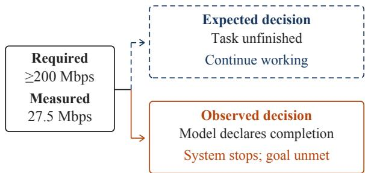  
Figure 1: Expected and observed decisions for the same unfinished task. In one real gpt τ2-bench telecom nouser episode, the measured speed is below the benchmark’s requirement for excellent speed. The dashed path is the reference decision, not an executed rollout or a claim of eventual success. The solid path is observed: the model calls done() and the runtime stops. This native stop signal is not an added stage tag.

We first add a reporting duty to $\tau ^ { 2 } .$ -bench (Barres et al., 2025): each customer-facing reply must end with a lifecycle-stage tag, scored against the benchmark’s environment state. This separates successful task execution from accurate progress reporting. Some deployed models, each a model and the serving configuration behind it, usually omit the tag. Among those that report, several are accurate before acting but often name a stage the task has already passed. Others remain accurate midtask yet report unfinished states after benchmark completion. The weakness is stage-dependent, but its location is not universal (§2).

A benchmark shows where reports fail only where its dialogues happen to place checkpoints. StageIF, a controlled testbed, places the reporting duty at any point of a scripted task, switches it off where reporting would itself be an error, and freezes the correct value before the model answers (§3). It scores four layers of failure separately: acting instead of reporting, omitting the report, malforming it, and naming the wrong stage. Here, action-bearing checkpoints expose large reporting deficits, often from omitted reports or tool calls in place of reports rather than wrong stage values (§4). We call a decline at these checkpoints the lost-mid-task pattern; the term describes a location, not a universal model behavior or an internal mechanism.

The two settings serve complementary purposes: natural trajectories show the problem in task execution, while scripted checkpoints separate report delivery, stage correctness, and correct withholding. Bounded interventions then test whether simple changes to the reporting demand remove the observed deficits; they do not generally do so (§5). They are checks on the findings, not a separate claim to explain how models represent progress. Reports do move when task progress does not (§5), and the tested termination configurations differ in task outcome (§6).

This paper makes four contributions.

• Stage-dependent reporting reliability. We locate reporting weaknesses across task stages and deployed models, including both mid-task declines and completion-stage errors in models that remain accurate mid-task.

• Setting-dependent failure form. The form of failure also varies across evaluation settings. Among the $\tau ^ { 2 } .$ -bench deployments with a mid-task decline, well-formed wrong values usually name a stage the task has already passed. In StageIF, omitted reports and tool calls in place of reports account for much of the decline.

• A measurement instrument and a failure taxonomy. StageIF places the reporting duty at any point in a task, freezes the correct value before the model answers, and scores four layers of failure (acting instead of reporting, omission, malformed report, wrong value), so both where and how a report fails become measurable.

• Bounded intervention tests. The tested value, reminder, stage-information, and reasoning changes do not generally eliminate the gap. Reports change with continuation conditions while task progress stays fixed. The tested termination configurations also yield different task outcomes.

## 2 The Progress Bar on $\tau ^ { 2 } ,$ -bench

## 2.1 The added reporting duty

$\tau ^ { 2 } .$ -bench evaluates a tool-using agent against a simulated customer in telecom and retail domains; task success is judged by the benchmark’s own machinery—environment assertions in telecom, plus a required transfer action on 20 hand-off tasks, and database comparison in retail—independent of anything the agent says (Barres et al., 2025). We add one block to the agent’s instructions (Figure 10, Appendix E), requiring every customer-facing message to end with a single tag, NEEDS\_INFO while still gathering information, READY once about to act with nothing changed yet, POST\_OBS once something has changed but the task is not done, or COMPLETED once nothing remains. Tasks, tools, policies, and the user simulator are untouched.

The correct tag at each checkpoint is derived mechanically by replaying the conversation prefix in a fresh environment and reading the environment’s state—before the model’s tag is looked at. Environment state cannot separate NEEDS\_INFO from READY, so pre-action checkpoints accept either, one resolution level below our controlled testbed; the benchmark’s scripted greeting is excluded from scoring.

## 2.2 What the benchmark shows

First, does the deployment report? Of the eleven deployed models run on the full telecom split, seven follow the duty on 93.2–100% of checkpoints and four on only 0.6–10.1%. claude-opus-5, which ran a partial split, is the twelfth deployment drawn in Figure 2; the later figures drop the four that usually omit the tag and read the remaining eight. We analyze wrong-value patterns only among deployments that usually report.

Where do correct reports disappear? gpt-4.1 and gpt-5.5, which return no reasoning tokens, are correct at 90.6–99.4% of pre-action checkpoints and 87.3–88.9% after completion, but only 5.8– 11.5% mid-task. Figure 2 splits mid-task position into five bins, using trajectories with at least two mid-task checkpoints. For these two deployments and claude-sonnet-5, accuracy falls by at least a factor of two and a half from the first bin to the last even though the gold stage remains POST\_OBS. These are descriptive position differences, not a causal effect of depth. Per-bin denominators and deployment details are in Appendix G.

What do the wrong reports say? For claude-sonnet-5, gpt-4.1, and gpt-5.5, nearly every mid-task error carries a well-formed but wrong value, and nine of the eleven deployments run on the full split produce no malformed tag at all. On the five deployments whose worst stage is mid-task, 82–90% of well-formed mid-task errors name a pre-action state already left; 10–18% prematurely name COMPLETED. These percentages concern wrong reports, not all checkpoints, and do not establish delayed internal state updating. Errors also cluster within trajectories: among those with at least two mid-task checkpoints, 44–67% have every mid-task report wrong on the three collapsing deployments, versus 0–4% entirely correct. Such trajectories concentrate in multi-fault tasks (Appendix G).

Parsing changes the interpretation. Both gpt-5.6-sol and gpt-6-astra place stage tags inside JSON-wrapped replies that the strict parser rejects. Table 1 separates strict scores from an envelope-stripped diagnostic. Stripping leaves gpt-5.6-sol in a mid-task trough, whereas gpt-6-astra reaches 100.0% mid-task but only 48.1% at completion. Correct embedded values do not establish strict protocol compliance; the diagnostic is not a replacement for the main parser.

Task success does not remove these errors: one gpt-5.5 trajectory succeeds despite both mid-task reports naming READY rather than POST\_OBS. Conversely, premature completion reports occur on unfinished tasks. Neither report accuracy nor final task success can stand in for the other.

The weakness can move to completion. gemini-3.8-flash, gpt-6-astra read after envelope stripping, and claude-opus-5 on the 106 of its 114 tasks that share one user simulator all hold 74–100% mid-task yet only 48–64% at completion. Every completion-stage wrong value of these three names an earlier state. Completion reporting also differs between human-transfer tasks and other tasks, consistent with reading the tag as “issue resolved,” which a hand-off is not, and with the presence of a customer resolution cue. Before such a cue, and outside the hand-off tasks, the deployments that stay accurate mid-task name an earlier state at nearly every remaining checkpoint (Appendix G). The cue is only a keyword proxy; these associations do not identify caution as a cause. Appendix G gives the subgroup counts, reasoning configurations, and simulator exclusions; §8 states their measurement limits. None of these comparisons is a model ranking or an isolated effect of model generation or thinking mode.

Natural dialogues locate stage-dependent weaknesses but cannot independently place the reporting duty or distinguish the two pre-action stages. StageIF supplies that controlled measurement.

## 3 StageIF: Measuring Lifecycle Reporting

StageIF separates three questions that natural dialogues entangle: is a report due, was it delivered, and does it name the correct stage? It fixes checkpoint histories and gold values before generation, so each question can be scored independently of final task success.

Consider a two-step request to move a meeting and then notify its participants. After the first tool succeeds, the task is incomplete and the reporting duty is active; Figure 8 (Appendix D) shows four possible model behaviors. Besides the correct handoff, the model may omit the report (omission), call the next tool instead of reporting (divergence), or emit a well-formed but wrong value (wrong value). A malformed report is a further failure category, distinct from a well-formed report with the wrong value. None of these failures is necessarily visible to an evaluation that reads only the final environment state. StageIF makes each of them measurable by scripting the checkpoints, so the duty’s position in the task is an experimental variable rather than an accident of dialogue (Figure 7, Appendix D), and it freezes the answer key before the model speaks.

<table><tr><td colspan="5">Before</td></tr><tr><td>Deployment</td><td>Parser</td><td>acting</td><td>Mid-task Completed</td><td></td></tr><tr><td rowspan="2">gpt-5.6-sol</td><td>Strict</td><td>65.3</td><td>28.6</td><td>40.3</td></tr><tr><td>Stripped</td><td>95.5</td><td>42.3</td><td>67.5</td></tr><tr><td rowspan="2">gpt-6-astra Strict</td><td></td><td>0.0</td><td>0.0</td><td>0.0</td></tr><tr><td>Stripped</td><td>99.6</td><td>100.0</td><td>48.1</td></tr></table>

Table 1: Correct stage reports (%) under strict and envelope-stripped parsing. Stripped removes the JSON wrapper; the stage-tag parser is unchanged. Columns hold 245/636/77 checkpoints for gpt-5.6-sol and 230/726/135 for gpt-6-astra.  
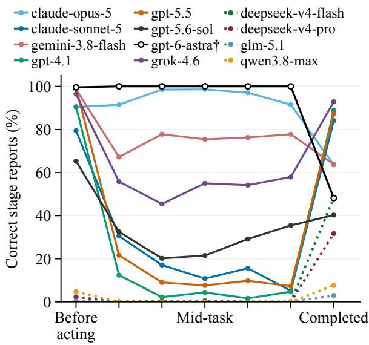  
Figure 2: Correct stage reports of twelve telecom deployments by the task’s true stage at the checkpoint: before acting, five equal-width bins of mid-task position, and completed. All curves use the strict parser except $\mathtt { g p t - 6 - a s t r a ^ { \dag } }$ , whose strict counts are $0 / n$ throughout and which is drawn envelope-stripped; gpt-5.6-sol stays strict. Dotted lines mark the four deployments that usually omit the report; the grouping describes observed behavior, not a ranking. claude-opus-5 is drawn on its 106 single-simulator trajectories.

## 3.1 What is measured

Three variables are kept strictly separate throughout: trusted runtime state (what the environment records), model behavior (what the model does and says), and trajectory outcome (whether the task ends well). Task truth is always a function of the first; it is never inferred from the model’s report. Deployment names are identifiers for complete model-and-configuration bundles, not entries in a model ranking.

At each scripted checkpoint, an oracle reads runtime state alone and answers two questions before the model’s output is opened, whether a report is due here and, if so, which of the four stage values is true. A deterministic parser then reads the model’s reply and records whether a well-formed report is present and what value it expresses. Comparing the two sides yields the paper’s metrics, defined formally in Appendix A:

• ${ \widehat { \theta } } _ { z } ,$ , end-to-end adherence (primary): at dutyactive checkpoints of stage z, the share where the model spoke when it should, reported, and reported the true value.

$\widehat { \phi } _ { z } ,$ conditional report validity (diagnostic): the same, restricted to checkpoints with no assistant tool call; omissions and malformed reports still count as failures. This is not semantic accuracy conditional on an emitted, parseable report.

• ωb, correct withholding: at duty-inactive checkpoints, the share where the model correctly emitted no report.

$\widehat { \mu } _ { t } / \widehat { \nu } _ { t } .$ , false completion: the share of checkpoints (respectively, of emitted reports) claiming COMPLETED while the task is unfinished, under intervention arm t.

These measurements separate a reporting failure from a task failure, since an otherwise useful reply can violate the reporting contract and a valid report does not by itself prove task success. Stage, dialogue depth, and available actions change together as a task progresses, so a stage pattern alone cannot say which one causes the gap; the interventions below hold task truth fixed, and none establishes an internal model representation. Formal definitions and scoring are in Appendix A; evidence labels in Appendix C.

## 3.2 The instrument

We instantiate the lifecycle in 12 synthetic scenarios, divided evenly between scheduling and customer support, each a scripted storyline that runs from clarification through confirmation, action, reporting, and completion. Every scenario yields five checkpoints from a frozen history, four where a report is due, covering all four stages, and one where the correct behavior is a tool call with no report. The assistant turns inside those histories are fixed script text rather than model output, so the checkpoints are independent of one another.

Reports are elicited in two end-positioned structured encodings, each with a deterministic parser (Appendix E). The baseline arm requires the model to infer the stage; the gold-injected arm states the true stage in context; the static-value arm replaces the stage-conditioned value with a constant; a five-arm contrast later adds inert-value and reminder conditions (§5). Seven of nine planned deployments pass the identity checks and contribute 50,400 checkpoint positions, a repeated-measures count over the 12 scenarios with 20 repetitions; the exclusion criteria and audit boundaries are in Appendix H, and every deployment’s identifier and generation configuration is listed in Appendix I.

## 4 Where Lifecycle Reports Fail

Does the mid-task decline persist when every stage can be identified and the reporting duty is placed by design? We first measure adherence across the scripted checkpoints, then examine the failures behind the aggregate pattern and its replication across task variants. The next section tests sensitivity to specific changes in the reporting conditions, without identifying a common cause.

## 4.1 Experimental Setup

We use the baseline arm, which requires the model to infer the stage. Scenario clusters are the statistical unit, and clustered bootstrap and exact signflip tests agree on every headline decision. Table 2 pools both encodings; $\Delta$ is the CLEAN share among pooled nonterminal records minus the terminal CLEAN share, with scenario-cluster bootstrap 95% confidence intervals over the 12 scenarios. The all-arms pooled view, with conditional report validity, emission, and withholding columns, is Table 11 in Appendix M. Figure 3 plots the same arm for one structured encoding; its four checkpoints are waiting on the user, ready to act, one step done, and task finished, ordered by task progress rather than equally spaced in time. Each line is one deployment, listed alphabetically and not ranked; solid lines are the seven originally admitted deployments, dashed lines a later cohort never pooled with them.

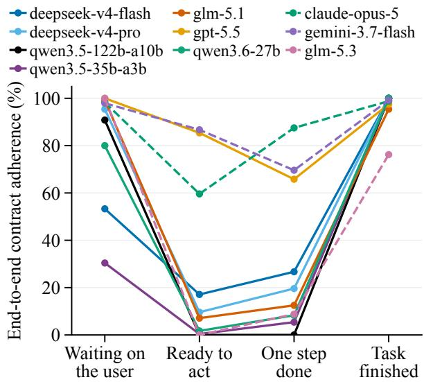  
Figure 3: The lost-mid-task pattern in end-to-end lifecycle-contract adherence, one line per deployment; solid lines are the original cohort, dashed a later one. Accuracy drops at action-bearing checkpoints and recovers at completion, with substantial variation across deployments.

Table 2: Baseline-arm adherence $\widehat { \theta } \left( \% \right)$ at each checkpoint, and the nonterminal–terminal difference $\Delta$ with its 95% CI. The gpt-5.5 interval is the only one that includes zero.
<table><tr><td>Deployment</td><td>Wait Ready Step</td><td></td><td></td><td>Done</td><td>∆ 95% CI</td><td></td></tr><tr><td>deepseek-v4-flash</td><td>31.5</td><td>18.8</td><td>15.6</td><td>66.2</td><td>-44.3</td><td>[−61.7, −25.5]</td></tr><tr><td>deepseek-v4-pro</td><td>81.9</td><td></td><td>5.8 14.0</td><td>75.0</td><td>-41.1</td><td>−51.6, −29.9]</td></tr><tr><td>glm-5.1</td><td>62.5</td><td>4.2</td><td>6.7</td><td>59.0</td><td>-34.5</td><td>[−43.3, −25.6]</td></tr><tr><td>gpt-5.5</td><td>57.7</td><td>58.2 34.5</td><td></td><td>54.4</td><td>-4.2</td><td>[−11.5, +2.6]</td></tr><tr><td>qwen3.5-122b-a10b</td><td>83.5</td><td>0.0</td><td>0.0</td><td>66.2</td><td>-38.4</td><td>-49.4, −27.9]</td></tr><tr><td>qwen3.5-35b-a3b</td><td>21.7</td><td>1.2</td><td>2.9</td><td>97.9</td><td>-89.3</td><td>-93.8, -83.9]</td></tr><tr><td>qwen3.6-27b</td><td>70.2</td><td>0.8</td><td>4.6</td><td>54.6</td><td>-29.4</td><td>[−38.6, −21.7]</td></tr></table>

## 4.2 Stage Pattern and Failure Modes

Reporting recovers at completion. The singleencoding view shows lower action-bearing accuracy and recovery at completion, not uniformly reliable reporting while waiting. The magnitude varies substantially. Pooling both encodings, the nonterminal–terminal difference is significant for six of the seven originally admitted deployments and spans 29.4–89.3 points (Table 2), so the same deployments report far more reliably once the task is done. In the all-arms pooled view, the most extreme deployment reaches 97.4% terminal adherence but only 8.2% across intermediate checkpoints (Appendix M)—nineteen in twenty when the work is finished, fewer than one in ten while it is happening. The later cohort reproduces the shape with a smaller margin, and one deployment scores lowest one checkpoint later than the other nine, so the decline does not fall at exactly the same checkpoint

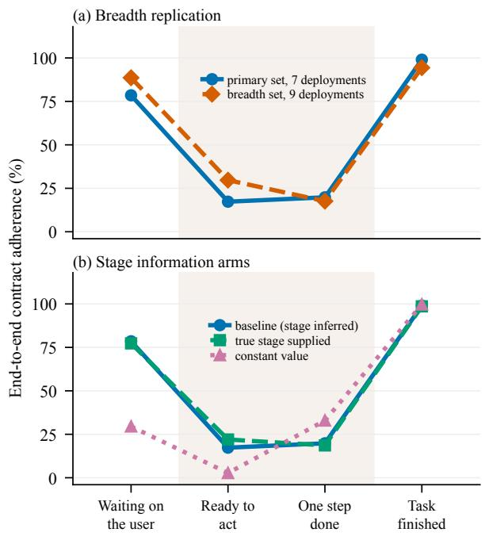  
Figure 4: The lost-mid-task pattern with one variable changed; blue is the equal-weight mean of the seven original deployments. (a) Breadth replication, nine deployments. (b) True-stage and constant-value arms.

## everywhere.

Omission and tool calls explain much of the decline. Figure 5 separates the outcomes at each stage; its StageIF half is one structured encoding in the baseline arm, across the seven original deployments at duty-active checkpoints, read under the corrected gold on the telecom side. Figure 6 pools gold against reported stage over the same set. Both count every evaluable checkpoint, so omitted and malformed reports stay in the denominator, and both exclude two StageIF transport failures. Adherence falls where action is available or pending; both missing reports and tool calls in place of reports contribute. Wrong values contribute too, but far less, reaching 13.6 points at the post-action checkpoint and staying below 2 points elsewhere, so the wrong-value error that dominates on τ2- bench is present in StageIF without dominating it. For two deployments the decline is almost entirely mode selection, conditional report validity falling only a few points from terminal; for others it persists even among turns where the model speaks (Appendix M). The two settings expose different failures of the same contract, not identical error profiles.

Terminal accuracy does not guarantee correct withholding. At post-done checkpoints most deployments re-emit a report where emitting is itself the error (false-alarm rates of 90–100%; Appendix N). Reporting the right value when a final report is due and withholding a report when none is due are separate requirements.

The pattern reproduces across surface changes. A single-step IT-helpdesk task and an English translation reproduce a significant gap on seven of nine deployments, and its direction on eight and nine of nine (Appendix O); the two exceptions mark heterogeneity, not a ranking. Figure 4(a) uses the same axes and encoding as Figure 3 on a separate scenario set, sharing seven deployments with the primary set and adding two. It replicates scenarios and surface forms, not an independent deployment population. Because the farthest checkpoint recovers, simple decay with distance from the instruction does not predict the shape; but stage, position, and action context still co-vary, so we next change the reporting conditions while holding the scripted task fixed.

## 5 Bounded Tests of Reporting Interventions

The core finding concerns where and how reports fail. These checks ask whether specific changes to the reporting demand remove the deficit, not whether a single mechanism explains it.

Changing the required report. Supplying the true stage or replacing it with a constant does not generally close the gap (Figure 4(b); Appendix M, Figure 12). For the gold-injected arm the upper confidence limits cover at most one sixth of the observed gap on the six deployments whose gap is significant. In a separate five-arm batch, a trailing reminder reduces omission but leaves tool-call divergence largely unchanged; its largest gain is +9.3 points pooled over all five checkpoints, against gaps of 29–89 points. A matched reasoning-mode contrast redistributes failures rather than removing them (Appendix P). These tests concern particular prompts and configurations; they do not rule out memory or reasoning as contributing factors.

Comparing duties on the same histories. Three matched obligations, with and without reminders, are evaluated on nine deployments (Appendix Q, Table 15). A final-reply duty reaches 99.0%, compared with 43.7% and 57.4% over the duty-active checkpoints of a status sentence and a machine report. All three are near ceiling at the terminal checkpoint; the machine report reaches only 43.7% at intermediate checkpoints. Thus the contrast is not simply an inability to emit a structured answer. Fluent replies can omit the report, unlike content truncation under a valid schema discussed by Fan (2026) (Appendix R).

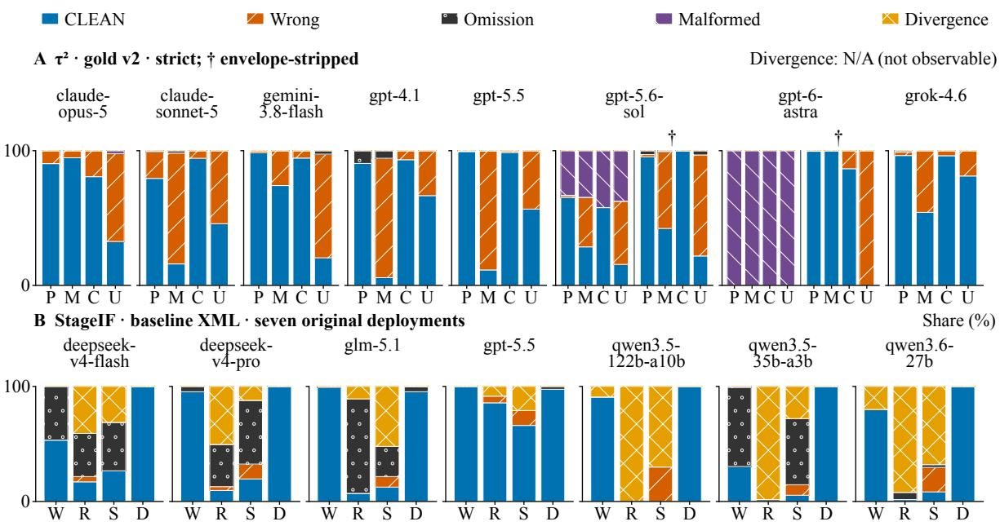  
Figure 5: Failure composition for eight telecom and seven original StageIF deployments. P/M: Pre/Mid; C/U: Completed, confirmed/unconfirmed by the stored customer-cue keyword rule, not independently verified resolution. W/R/S/D: Wait/Ready/Step/Done. Telecom: strict parsing; † adds envelope-stripped Sol/Astra. StageIF: baseline XML; two transport failures excluded. claude-opus-5 uses 106 single-simulator trajectories. Bar widths do not encode sample size. Alphabetical, not ranked; excludes four usually-omitting telecom and three later StageIF deployments.

Changing the continuation context. Jointly withdrawing a needed tool and assigning the unfinished step to another system raises false completion from 6.2% to 64.4% across nine deployments, despite unchanged task truth. This is a bundled intervention, not the effect of tool withdrawal alone. Its factorial follow-up and per-deployment estimates remain in Appendix S; neither establishes an internal explanation for the stage pattern.

## 6 Operational Consequences

Reporting and termination design also change task outcomes. In a validating rollout where task success is read from environment state (12 scenarios, six repetitions, eight deployments; Appendix W), the marker-reporting configuration completes 13.0 points fewer tasks than the no-tool-call configuration (scenario-clustered CI [+7.1, +19.4]). The two arms match user messages but not the full model input, because only the marker arm carries the reporting instructions, so this contrasts reporting-and-termination configurations rather than isolating a gate rule. Premature completion stops occur on 1.6% of marker trajectories and missing-marker stops on 22.7%; these frequencies describe how sessions ended and do not decompose the task-success difference causally. This rollout is not evidence that the τ2-bench mid-task wrong values caused task failures. An independent audit also examines termination reliability (Advani, 2026).

## 7 Related Work

Instruction following and structured output. IFEval (Zhou et al., 2023) and its multi-turn successors (He et al., 2024; Laban et al., 2025; Deshpande et al., 2025; Han et al., 2025; Li et al., 2025; Jia et al., 2026), AgentIF’s conditional constraints in long agent prompts (Qi et al., 2025), and structuredoutput studies that separate content from realization (Geng et al., 2025; Gu et al., 2025; Lee et al., 2026; Shen et al., 2025; Yuan et al., 2026) evaluate user-facing response constraints; our target is a stage-dependent value consumed by the runtime (Appendix U, Table 18).

Progress estimation and state-based evaluation. Multi-turn tool benchmarks (Wang et al., 2024; Patil et al., 2025; Chen et al., 2025; Liu et al., 2025),

<table><tr><td colspan="5">A τ2 · v2 strict· eight deployments</td></tr><tr><td>Pre</td><td>Pre 2177</td><td>Mid 32</td><td>Done 113</td><td>No valid report 360</td></tr><tr><td></td><td>81.2% 2225</td><td>1.2% 2018</td><td>4.2% 349</td><td>13.4% 1003°</td></tr><tr><td>God Mid</td><td>39.8%</td><td>36.1%</td><td>6.2%</td><td>17.9%</td></tr><tr><td>Done</td><td>27 2.9%</td><td>131 13.8%</td><td>621 65.6%</td><td>168 17.7%</td></tr></table>

B StageIF · baseline XML · seven deployments
<table><tr><td colspan="2"></td><td>Wait</td><td>Ready</td><td>Step</td><td>Done</td><td>No vald report</td></tr><tr><td rowspan="5">God</td><td>Wait</td><td>1318 78.5%</td><td>0 0.0%</td><td>0 0.0%</td><td>0 0.0%</td><td>362 °21.5%&#x27;。</td></tr><tr><td>Ready</td><td>33 2.0%</td><td>291 17.3%</td><td>0 0.0%</td><td>0 0.0%</td><td>1355 80.7%,</td></tr><tr><td>Step</td><td>64 3.8%</td><td>51 3.0%</td><td>332 19.8%</td><td>114 6.8%</td><td>1118 C °.66.6%</td></tr><tr><td>Done</td><td>0 0.0%</td><td>0 0.0%</td><td>0 0.0%</td><td>1663 99.0%</td><td>17 ° 1.0%</td></tr></table>

Figure 6: Gold versus reported stage, pooled over eight strict-parsed telecom and seven original baseline-XML StageIF deployments, the same deployment set as the composition figure. Cells give counts and row percentages over all evaluable checkpoints, including those with no valid report. Telecom Pre merges NEEDS\_INFO and READY; two StageIF transport failures are excluded. Blue marks an unfinished report after completion and orange a premature completion claim. Pooling is checkpoint-weighted and does not imply that every deployment shows the pooled pattern.

progress-exposing analysis boards (Ma et al., 2024; Rakhsha et al., 2026), programmatic-state environments (Trivedi et al., 2024; Lu et al., 2025a; Yao et al., 2025), and process evaluators and scaffold audits (Wang et al., 2025, 2026a; Chuang et al., 2026; Nan et al., 2025; Ding et al., 2026) score actions and milestones, not the model’s own report of where the task stands; τ2-bench’s no-user mode consumes a model-emitted done without scoring it (Barres et al., 2025), and Appendix G records zeroreward endings on up to 63 of 114 telecom tasks per model. Closer work does score reports. Per-step progress and completion estimates of UI agents against human annotation, fed back to the agent’s own planner (Bishop et al., 2024); RePro’s progress percentages, which lack per-step truth in outcomebased tasks and hurt performance when prompted online (Ma et al., 2026); a self-verdict loop that accepts stagnation as improvement (Park and Choi, 2026); and terminal reports, action claims, and completion claims against hidden world state, execution traces, or the assigned goal (Chen et al., 2026; Cao et al., 2026; Arike et al., 2025; Advani, 2026; Wang et al., 2026b; Panavas et al., 2026).

None anchors the report to environment-derived state under a duty that is active at some checkpoints and forbidden at others, so none separates a wrong stage value from an omitted report or compares reliability across stages. The shape resembles positionsensitive degradation (Liu et al., 2024), but nothing moves within the context, the terminal checkpoint is farthest from the instruction yet recovers, and the collapse tracks whether an action is available; and unlike unfaithful chain-of-thought explanations (Turpin et al., 2023), the required value is derived from runtime state before the response is read. We validate oracle and verifier with negative controls and corruption tests (Zhu et al., 2025).

Prospective memory and runtime-owned control. Prospective-memory studies test whether a model executes a delayed obligation at its cue and find that reminders repair some omissions (Mittal, 2026; Liu and Gabriel, 2026; Zhang et al., 2026b); the matched terminal obligation in §5 tests the overlap directly. Explicit workflow state (Wu et al., 2024; Zhang et al., 2026a), protocol comparisons (Du et al., 2025), verifier-paired early exit (Lu et al., 2025b), open-source runtimes that mix model-emitted, tool-derived, and runtimeowned termination rules (LangChain, 2026; Microsoft, 2026a; OpenAI, 2026d; Google, 2026b; LlamaIndex, 2026; Microsoft, 2026b; Pydantic, 2026; OpenHands, 2026), and a static analysis of 6,549 agent repositories that does not count a model-dependent exit as a bound (Hou et al., 2026) (Appendix F, Table 5) motivate a design alternative but do not measure the reliability of a delegated lifecycle signal.

## 8 Conclusion

Can models reliably report progress throughout a task? In the tested settings, neither final task success nor an accurate terminal report establishes reliable reporting along the way, and several deployed models name earlier stages while work is still under way. The newest generation of one family closes the mid-task collapse and grows conservative at the finish line. StageIF separates an absent report, or one replaced by a tool call, from one whose value is wrong, and simple changes to the reporting demand did not remove the deficit. Measuring it therefore means scoring every stage and keeping delivery apart from correctness. Where independent task state exists, a progress report should be checked against it, not treated as sole control authority.

## Limitations

Each deployment identifier names a model-andserving bundle, newer endpoints may silently drop sampling parameters, and no value is a ranking. The bundled intervention identifies a total effect, all effects are behavioral and identify no internal mechanism, and rollout terminal checkpoints are selected by survival, so they identify no rollout stage gap.

## Ethics Statement

The motivating seed artifacts are stored in desensitized form and no user identifiers are intentionally included; any public release remains subject to a separate privacy review. Measurements characterize deployments at a point in time and are unsuitable for vendor comparison or procurement decisions; we deliberately present no ranking. The 25 current run summaries that expose per-deployment token usage record 111,998,943 prompt-plus-completion tokens for successful responses; runs without that field and the usage of failed attempts are excluded, so this is a recomputable lower bound rather than total project cost. Artifact release is planned only subject to owner, privacy, licensing, and venue review.

## References

Laksh Advani. 2026. From confident closing to silent failure: Characterizing false success in LLM agents. In Workshop on Failure Modes in Agentic AI (FA-GEN) at ICML. Workshop paper; verified against the arXiv abstract page on 2026-08-24.

Agno. 2026. Agno: model base loop (tool-call break condition). https://github.com/agno-agi/ agno/blob/main/libs/agno/agno/models/base. py. Accessed 2026-09-02.

Alibaba Cloud. 2026. Model Studio text generation: supported models. https://help.aliyun.com/ zh/model-studio/text-generation. Accessed 2026-09-07; the hosted identifier qwen3.8-max appears on this page and on the platform’s model list, both in the Chinese locale only.

Anthropic. 2026a. Claude Agent SDK: The agent loop. Documentation. Accessed 2026-08-12.

Anthropic. 2026b. Claude models overview. https://docs.claude.com/en/docs/ about-claude/models/overview. Accessed 2026-08-31.

Rauno Arike, Elizabeth Donoway, Henning Bartsch, and Marius Hobbhahn. 2025. Evaluating goal drift

in language model agents. In Proceedings of the AAAI/ACM Conference on AI, Ethics, and Society (AIES), volume 8, pages 192–203. Verified against the AAAI OJS article page on 2026-08-24.

Victor Barres, Honghua Dong, Soham Ray, Xujie Si, and Karthik Narasimhan. 2025. τ2-bench: Evaluating conversational agents in a dual-control environment. arXiv preprint arXiv:2506.07982.

William E. Bishop, Alice Li, Christopher Rawles, and Oriana Riva. 2024. Latent state estimation helps UI agents to reason. arXiv preprint arXiv:2405.11120. Preprint; verified against the arXiv abstract page on 2026-09-07.

CAMEL-AI. 2026. CAMEL: Agents society cookbook. Documentation. Accessed 2026-08-12.

Hongliu Cao, Ilias Driouich, and Eoin Thomas. 2026. Beyond task completion: Revealing corrupt success in LLM agents through procedure-aware evaluation. arXiv preprint arXiv:2603.03116. Preprint; verified against the arXiv abstract page on 2026-08-24.

Chen Chen et al. 2025. ACEBench: Who wins the match point in tool usage? In Findings of the Association for Computational Linguistics: EMNLP 2025.

Ying Chen, Lihuang Fang, Rui Jiang, Mingxu Wang, Zhifeng Gu, Lei Yi, and Jie Chen. 2026. Done, but not sure: Disentangling world completion from self-termination in embodied agents. arXiv preprint arXiv:2605.08747. Preprint; verified against the arXiv abstract page on 2026-08-23.

Yun-Shiuan Chuang, Chaitanya Kulkarni, Alec M. Chiu, Avinash Thangali, Zijie Pan, Shivani Shekhar, Yirou Ge, Yixi Li, Uma Kona, Linsey Pang, and Prakhar Mehrotra. 2026. Toward scalable verifiable reward: Proxy state-based evaluation for multi-turn toolcalling LLM agents. In Proceedings ofthe 64th Annual Meeting ofthe Associationfor Computational Linguistics (Volume 6: Industry Track), pages 1251– 1264.

CrewAI. 2026. CrewAI: Agents. Documentation. Accessed 2026-08-12.

Daily. 2026. Pipecat. Source, commit 4cb5484. Accessed 2026-08-18.

DeepSeek-AI. 2026a. DeepSeek api models and pricing. https://api-docs.deepseek.com/quick\_ start/pricing. Accessed 2026-08-31; lists the deepseek-v4-flash and deepseek-v4-pro API names.

DeepSeek-AI. 2026b. DeepSeek-V4-Flash-0731 model card. https://huggingface.co/deepseek-ai/ DeepSeek-V4-Flash-0731. Accessed 2026-08-31; the deepseek-v4-flash API name is a rolling alias that pointed to this snapshot.

DeepWisdom. 2026. MetaGPT: Agent think and act. Documentation. Accessed 2026-08-12.

Kaustubh Deshpande, Ved Sirdeshmukh, Johannes Baptist Mols, Lifeng Jin, Ed-Yeremai Hernandez-Cardona, Dean Lee, Jeremy Kritz, Willow E. Primack, Summer Yue, and Chen Xing. 2025. Multichallenge: A realistic multi-turn conversation evaluation benchmark challenging to frontier LLMs. In Findings ofthe Associationfor Computational Linguistics: ACL 2025, pages 18632–18702.

Dify. 2026. Dify: Loop node. Documentation. Accessed 2026-08-12.

Deming Ding, Shichun Liu, Enhui Yang, Jiahang Lin, Ziying Chen, Shihan Dou, Honglin Guo, Weiyu Cheng, Pengyu Zhao, Chengjun Xiao, Qunhong Zeng, Qi Zhang, Xuanjing Huang, Qidi Xu, and Tao Gui. 2026. OctoBench: Benchmarking scaffoldaware instruction following in repository-grounded agentic coding. In Proceedings of the 64th Annual Meeting of the Association for Computational Linguistics (Volume 1: Long Papers), pages 5958–5978.

Hongyi Du, Jiaqi Su, Jisen Li, Lijie Ding, Yingxuan Yang, Peixuan Han, Xiangru Tang, Kunlun Zhu, and Jiaxuan You. 2025. Which LLM multi-agent protocol to choose? arXiv preprint arXiv:2510.17149.

Hengxin Fan. 2026. Capacity, not format: Rethinking structured reasoning failures. arXiv preprint arXiv:2606.09410. Preprint; verified against the arXiv abstract page on 2026-08-24.

Saibo Geng et al. 2025. Generating structured outputs from language models: Benchmark and studies. arXiv preprint arXiv:2501.10868.

Google. 2026a. Gemini API models. https:// ai.google.dev/gemini-api/docs/models. Accessed 2026-09-07; lists the gemini-3.7-flash and gemini-3.8-flash endpoint names.

Google. 2026b. Google ADK (adk-python): LoopAgent deprecation and the finish\_task tool. Source code, commit 1cd6f464e5b8ececa957928ca67d65145be558ab; src/google/adk/agents/loop\_agent.py lines 53–75 and src/google/adk/ agents/llm/task/\_finish\_task\_tool.py lines 39–40; second file: https:// github.com/google/adk-python/blob/ 1cd6f464e5b8ececa957928ca67d65145be558ab/ src/google/adk/agents/llm/task/\_finish\_ task\_tool.py. Accessed 2026-08-19; earlier documentation page (Accessed 2026-08-12) described only the legacy LoopAgent.

Jialin Gu et al. 2025. StructEval: Benchmarking LLMs capability to generate and convert structured outputs. arXiv preprint arXiv:2505.20139.

Chi Han, Xin Liu, Haodong Wang, Shiyang Li, Jingfeng Yang, Haoming Jiang, Zhengyang Wang, Qingyu Yin, Liang Qiu, Changlong Yu, Yifan Gao, Zheng Li, Bing Yin, Jingbo Shang, and Heng Ji. 2025. Can language models follow multiple turns of entangled

instructions? In Findings ofthe Associationfor Computational Linguistics: EMNLP 2025, pages 25445– 25460.

Yun He et al. 2024. Multi-IF: Benchmarking LLMs on multi-turn and multilingual instruction following. arXiv preprint arXiv:2410.15553.

Home Assistant. 2026. Home Assistant Core. Source, commit 0209121. Accessed 2026-08-18.

Xinyi Hou, Shenao Wang, Yanjie Zhao, and Haoyu Wang. 2026. When agents do not stop: Uncovering infinite agentic loops in LLM agents. arXiv preprint arXiv:2607.01641. Preprint; verified against the arXiv abstract page on 2026-08-24.

Hugging Face. 2026. smolagents: Building good agents. Documentation. Accessed 2026-08-12.

Qi Jia, Ye Shen, Xiujie Song, Kaiwei Zhang, Shibo Wang, Dun Pei, Xiangyang Zhu, and Guangtao Zhai. 2026. One battle after another: Probing LLMs’ limits on multi-turn instruction following with a benchmark evolving framework. In Proceedings of the 64th Annual Meeting ofthe Associationfor Computational Linguistics (Volume 1: Long Papers), pages 9574– 9590.

Philippe Laban, Hiroaki Hayashi, Yingbo Zhou, and Jennifer Neville. 2025. LLMs get lost in multiturn conversation. arXiv preprint arXiv:2505.06120. Preprint; venue verified absent on arXiv, OpenReview, and DBLP on 2026-08-24.

LangChain. 2026. LangGraph: State-Graph.add\_conditional\_edges. Source. Accessed 2026-08-12.

LangChain AI. 2026. Langchain: create\_agent factory (agent loop termination). https://github.com/ langchain-ai/langchain/blob/master/libs/ langchain\_v1/langchain/agents/factory.py. Accessed 2026-09-02.

Ivan Yee Lee, Loris D’Antoni, and Taylor Berg-Kirkpatrick. 2026. The format tax. arXiv preprint arXiv:2604.03616. Verified against the arXiv abstract page on 2026-08-22.

Jinnan Li et al. 2025. StructFlowBench: A structured flow benchmark for multi-turn instruction following. In Findings of the Association for Computational Linguistics: ACL 2025.

Genglin Liu and Saadia Gabriel. 2026. PM-Bench: Evaluating prospective memory in LLM agents. In Conference on Language Modeling (COLM).

Hongru Liu et al. 2025. DialogTool: Multi-turn dialogue with stateful tool use. arXiv preprint arXiv:2505.13328.

Nelson F. Liu, Kevin Lin, John Hewitt, Ashwin Paranjape, Michele Bevilacqua, Fabio Petroni, and Percy Liang. 2024. Lost in the middle: How language

models use long contexts. Transactions of the Association for Computational Linguistics, 12:157– 173. Venue, volume, pages, and author list verified against the ACL Anthology PDF and OpenAlex (DOI 10.1162/tacl\_a\_00638) on 2026-08-31.

LiveKit. 2026. LiveKit Agents. Source, commit 49bfd8b. Accessed 2026-08-18.

LlamaIndex. 2026. LlamaIndex Workflows. Documentation. Accessed 2026-08-12.

Jiarui Lu, Thomas Holleis, Yizhe Zhang, Bernhard Aumayer, Feng Nan, Haoping Bai, Shuang Ma, Shen Ma, Mengyu Li, Guoli Yin, Zirui Wang, and Ruoming Pang. 2025a. ToolSandbox: A stateful, conversational, interactive evaluation benchmark for LLM tool use capabilities. In Findings ofthe Association for Computational Linguistics: NAACL 2025, pages 1160–1183.

Qingyu Lu, Liang Ding, Siyi Cao, Xuebo Liu, Kanjian Zhang, Jinxia Zhang, and Dacheng Tao. 2025b. Runaway is ashamed, but helpful: On the early-exit behavior of large language model-based agents in embodied environments. In Findings ofthe Association for Computational Linguistics: EMNLP 2025, pages 24014–24027. Verified against the ACL Anthology landing page and PDF on 2026-08-24.

Chang Ma, Junlei Zhang, Zhihao Zhu, Cheng Yang, Yujiu Yang, Yaohui Jin, Zhenzhong Lan, Lingpeng Kong, and Junxian He. 2024. AgentBoard: An analytical evaluation board of multi-turn LLM agents. In Advances in Neural Information Processing Systems, Datasets and Benchmarks Track.

Xinbei Ma, Congmin Zheng, Jiyang Qiu, Jiale Hong, Yao Yao, Xiangmou Qu, Jiaxin Yin, Xingyu Lou, Jun Wang, Weiwen Liu, Weinan Zhang, Zhuosheng Zhang, and Hai Zhao. 2026. Retrospective progressaware self-refinement for LLM agent training. arXiv preprint arXiv:2606.14302. Preprint; verified against the arXiv abstract page on 2026-09-07.

Mastra. 2026. Mastra: Agents overview (generation loop). https://mastra.ai/docs/agents/ overview. Accessed 2026-09-02.

Microsoft. 2026a. AutoGen: autogen\_agentchat.conditions (termination conditions). Documentation. Accessed 2026-08-12.

Microsoft. 2026b. Semantic Kernel: TerminationStrategy. API reference. Accessed 2026-08-12.

Avni Mittal. 2026. Did you forget what i asked? prospective memory failures in large language models. arXiv preprint arXiv:2603.23530.

Zekun Nan et al. 2025. SOPBench: Evaluating language agents at following standard operating procedures and constraints. arXiv preprint arXiv:2503.08669.

OpenAI. 2026a. Chat model identifiers in the official Python SDK, generated from the OpenAPI specification. https: //github.com/openai/openai-python/blob/ 09f446f5f8623d79464568dc91b9dc258e74bcae/ src/openai/types/shared/chat\_model.py. Commit-pinned; accessed 2026-09-07. Cited in place of the vendor documentation pages, which were not retrievable.

OpenAI. 2026b. gpt-4.1 model reference. https://developers.openai.com/api/docs/ models/gpt-4.1. Accessed 2026-08-31.

OpenAI. 2026c. gpt-5.5 model reference. https://developers.openai.com/api/docs/ models/gpt-5.5. Accessed 2026-08-31.

OpenAI. 2026d. OpenAI Agents SDK: Running agents. Documentation. Accessed 2026-08-12.

OpenHands. 2026. OpenHands software-agent-sdk. Source, commit 98338ff. Accessed 2026-08-19.

Liudas Panavas, Sebastian Minus, Bradley Monton, Derek Ray, Suhaas Garre, Sushant Mehta, and Edwin Chen. 2026. HANDBOOK.md: A benchmark for long-context agentic instruction following. In Workshop on Agent Behavior (WAB) at COLM. Workshop paper; arXiv:2607.25398v3, verified against the arXiv abstract page on 2026-08-24.

Hyundoo Park and Byungho Choi. 2026. When do agent loops mistake stagnation for progress? Selfevaluation bias and externally grounded verification in long-running autonomous LLM agent loops. arXiv preprint arXiv:2607.25152. Preprint; verified against the arXiv abstract page on 2026-09-07.

Shishir G. Patil, Huanzhi Mao, Fanjia Yan, Charlie Cheng-Jie Ji, Vishnu Suresh, Ion Stoica, and Joseph E. Gonzalez. 2025. The Berkeley function calling leaderboard (BFCL): From tool use to agentic evaluation of large language models. In Proceedings of the 42nd International Conference on Machine Learning (ICML), pages 48371–48392.

Pydantic. 2026. Pydantic AI. Source, commit b3cdbc9. Accessed 2026-08-18.

Yunjia Qi, Hao Peng, Xiaozhi Wang, Amy Xin, Youfeng Liu, Bin Xu, Lei Hou, and Juanzi Li. 2025. AgentIF: Benchmarking large language models instruction following ability in agentic scenarios. In Advances in Neural Information Processing Systems, Datasets and Benchmarks Track.

Qwen Team. 2026a. Qwen3.5-122B-A10B model card. https://huggingface.co/Qwen/Qwen3. 5-122B-A10B. Accessed 2026-08-31.

Qwen Team. 2026b. Qwen3.5-35B-A3B model card. https://huggingface.co/Qwen/Qwen3. 5-35B-A3B. Accessed 2026-08-31; the card names Qwen3.5-Flash as the hosted version of the same weights.

Qwen Team. 2026c. Qwen3.6-27B model card. https://huggingface.co/Qwen/Qwen3.6-27B. Accessed 2026-08-31.

Amin Rakhsha, Thomas Hehn, Pietro Mazzaglia, Fabio Valerio Massoli, Arash Behboodi, and Tribhuvanesh Orekondy. 2026. LUMINA: Long-horizon understanding for multi-turn interactive agents. In Findings ofthe Associationfor Computational Linguistics: ACL 2026, pages 3913–3926.

Zhengyuan Shen, Darren Yow-Bang Wang, Soumya Smruti Mishra, Zhichao Xu, Yifei Teng, and Haibo Ding. 2025. SLOT: Structuring the output of large language models. In Proceedings ofthe 2025 Conference on Empirical Methods in Natural Language Processing: Industry Track, pages 472–491.

Significant Gravitas. 2026. Autogpt classic: Forgeagent finish-tool termination. https://github.com/ Significant-Gravitas/AutoGPT/blob/master/ classic/forge/forge/agent/forge\_agent.py. Accessed 2026-09-02.

Harsh Trivedi, Tushar Khot, Mareike Hartmann, Ruskin Manku, Vinty Dong, Edward Li, Shashank Gupta, Ashish Sabharwal, and Niranjan Balasubramanian. 2024. AppWorld: A controllable world of apps and people for benchmarking interactive coding agents. In Proceedings of the 62nd Annual Meeting of the Association for Computational Linguistics (Volume 1: Long Papers), pages 16022–16076.

Miles Turpin, Julian Michael, Ethan Perez, and Samuel R. Bowman. 2023. Language models don’t always say what they think: Unfaithful explanations in chain-of-thought prompting. In Advances in Neural Information Processing Systems. Author list and title verified against the paper PDF on 2026-08-27.

Vercel. 2026. Vercel ai sdk: Agent loop control. https: //ai-sdk.dev/docs/agents/loop-control. Accessed 2026-09-02.

Hanlin Wang, Jian Wang, Chak Tou Leong, and Wenjie Li. 2025. STeCa: Step-level trajectory calibration for LLM agent learning. In Findings of the Association for Computational Linguistics: ACL 2025, pages 11597–11614. Verified against the ACL Anthology page and DBLP on 2026-08-26.

Jiaxuan Wang, Yulan Hu, Wenjin Yang, Zheng Pan, Xin Li, and Lan-Zhe Guo. 2026a. Aligning agents via planning: A benchmark for trajectory-level reward modeling. In Proceedings ofthe 64th Annual Meeting of the Association for Computational Linguistics (Volume 1: Long Papers), pages 23174–23200.

Xingyao Wang, Zihan Wang, Jiateng Liu, Yangyi Chen, Lifan Yuan, Hao Peng, and Heng Ji. 2024. MINT: Evaluating LLMs in multi-turn interaction with tools and language feedback. In International Conference on Learning Representations (ICLR).

Yuanli Wang, Yaoyao Qian, Yue Zhang, Hanhan Zhou, Jindan Huang, Tianfu Fu, Qiuyang Mang, Huanzhi

Mao, Wenhao Chai, Wendong Fan, and Liqiang Jing. 2026b. DeployBench: Benchmarking LLM agents for research artifact deployment. arXiv preprint arXiv:2606.05238. Preprint; verified against the arXiv abstract page and PDF on 2026-08-24.

Yiran Wu, Tianwei Yue, Shaokun Zhang, Chi Wang, and Qingyun Wu. 2024. StateFlow: Enhancing LLM task-solving through state-driven workflows. In Conference on Language Modeling (COLM). Spotlight.

xAI. 2026. Grok models and pricing. https://docs. x.ai/developers/models. Accessed 2026-09-07.

Frank F. Xu, Yufan Song, Boxuan Li, Yuxuan Tang, Kritanjali Jain, Mengxue Bao, Zora Z. Wang, Xuhui Zhou, Zhitong Guo, Murong Cao, Mingyang Yang, Hao Yang Lu, Amaad Martin, Zhe Su, Leander Maben, Raj Mehta, Wayne Chi, Lawrence Jang, Yiqing Xie, and 2 others. 2025. TheAgentCompany: Benchmarking LLM agents on consequential real world tasks. In Advances in Neural Information Processing Systems, Datasets and Benchmarks Track. Venue verified on papers.nips.cc (NeurIPS 2025 Datasets and Benchmarks Track) on 2026-08- 26; author list verified on arXiv:2412.14161.

Shunyu Yao, Noah Shinn, Pedram Razavi, and Karthik Narasimhan. 2025. τ-bench: A benchmark for toolagent-user interaction in real-world domains. In International Conference on Learning Representations.

Shunyu Yao, Jeffrey Zhao, Dian Yu, Nan Du, Izhak Shafran, Karthik Narasimhan, and Yuan Cao. 2023. ReAct: Synergizing reasoning and acting in language models. In International Conference on Learning Representations (ICLR). Notable top-5% paper; verified on the OpenReview forum page 2026-08-26.

Han Yuan, Yue Zhao, Li Zhang, Wuqiong Luo, and Zheng Ma. 2026. Quantifying the impact of structured output format on large language models through causal inference. In Findings ofthe Associationfor Computational Linguistics: EACL 2026, pages 1771– 1795.

Z.ai. 2026a. GLM-5.1 model card. https:// huggingface.co/zai-org/GLM-5.1. Accessed 2026-08-31.

Z.ai. 2026b. GLM-5.3 model card. https:// huggingface.co/zai-org/GLM-5.3. Accessed 2026-08-31.

Shuyu Zhang, Yaqi Shi, and Lu Wang. 2026a. Patch-Board: Schema-grounded state mutation for reliable and auditable LLM multi-agent collaboration. arXiv preprint arXiv:2605.29313.

Tianhua Zhang, Xinjiang Wang, Qianxi Zhang, Qi Chen, Kun Li, Yaoqi Chen, DingDong Wang, Helen Meng, and Yan Lu. 2026b. TriggerBench: Investigating prospective memory for large language models. arXiv preprint arXiv:2606.23459.

Jeffrey Zhou, Tianjian Lu, Swaroop Mishra, Siddhartha Brahma, Sujoy Basu, Yi Luan, Denny Zhou, and Le Hou. 2023. Instruction-following evaluation for large language models. arXiv preprint arXiv:2311.07911.

Yuxuan Zhu, Tengjun Jin, Yada Pruksachatkun, Andy Zhang, Shu Liu, Sasha Cui, Sayash Kapoor, Shayne Longpre, Kevin Meng, Rebecca Weiss, Fazl Barez, Rahul Gupta, Jwala Dhamala, Jacob Merizian, Mario Giulianelli, Harry Coppock, Cozmin Ududec, Antony Kellermann, Jasjeet Sekhon, and 7 others. 2025. Establishing best practices in building rigorous agentic benchmarks. In Advances in Neural Information $P r o \mathrm { - }$ cessing Systems, Datasets and Benchmarks Track.

## A Formal definitions and estimators

Task truth is a function of trusted runtime state; model behavior and model-reported state are separate variables; and trajectory outcome is never inferred from the model’s report. Deployment names are identifiers for complete model-andconfiguration bundles, not entries in a model ranking.

Let a typed trajectory and checkpoint be

$$
\tau _ { i } = ( e _ { i , 1 } , \ldots , e _ { i , T _ { i } } ) , \qquad c = ( i , t ) .\tag{1}
$$

Equation 1 indexes trusted runtime state $X _ { c } ,$ modelvisible history $H _ { c }$ , and trajectory outcome $K _ { i }$ $Y _ { c } = \left( B _ { c } , R _ { c } \right)$ is the model output. The interactionmode variable $B _ { c }$ records whether the model speaks or invokes a tool; $R _ { c }$ is raw assistant text. Table 3 (Appendix C) summarizes all symbols. A frozen oracle maps runtime state to

$$
G ( X _ { c } ) = ( D _ { c } , Z _ { c } ^ { * } ) ,\tag{2}
$$

where $\begin{array} { r l r } { D _ { c } } & { { } \in } & { \{ 0 , 1 \} } \end{array}$ says whether the reporting duty is active and, when $\begin{array} { r l r } { D _ { c } } & { { } = } & { 1 } \end{array}$ $Z _ { c } ^ { * } \in \mathcal { Z }$ is the lifecycle truth, with $\mathcal { Z } =$ {NEEDS\_INFO, READY, POST\_OBS, COMPLETED}; the expected reported value is $\begin{array} { r l r } { L _ { c } ^ { * } } & { { } = } & { g ( Z _ { c } ^ { * } ) } \end{array}$ Algorithm 1 scores one checkpoint. The oracle in Equation 2 uses only script-declared tool status, slot completeness, confirmation state, and remaining steps, and is evaluated before the model output $Y _ { c }$ is read (line 1 versus line 3); a deterministic parser $\rho ( R _ { c } )$ then reports presence, well-formedness, uniqueness, final position, and the expressed value $\widehat { L } _ { c }$ . Unlike conditional action constraints (Ding et al., 2026; Qi et al., 2025), this obligation produces a value consumed by the runtime, and the runtime can independently derive both its applicability and truth. Let $S _ { c } = 1$ indicate that the test obtained a valid model response; all empirical model-behavior denominators below are subsets of $\{ c : S _ { c } = 1 \}$ , and transport failures are reported separately and never scored as model behavior.

For a duty-active checkpoint, $M _ { c }$ and $E _ { c }$ are tested at lines 6 and $\mathbf { 8 ; }$ parser-derived realization $F _ { c }$ is tested at line 9; and value equality $V _ { c } =$ $[ \widehat { L } _ { c } = L _ { c } ^ { * } ]$ is defined and tested at lines 10–11 of Algorithm 1. These are respectively the required interaction mode, report presence, valid realization, and value equality with $L _ { c } ^ { * } ; E _ { c } = 0$ implies $V _ { c } =$ $F _ { c } = 0$ . We report one primary metric and one diagnostic rather than hiding two failure modes in one number:

The artifact repository (Appendix Y) grounds this mapping with three searchable listings: a frozen case excerpt, the independently derived lifecycle truth, and a stored raw response with mechanically recomputed parser/classifier claims. They show concretely that the answer, answer key, and scoring rule are separate objects. Figure 9 (Appendix D) places this checkpoint-level comparison inside the complete evidence path, from a hashfrozen scenario contract to recomputable aggregate metrics.

$$
\theta _ { z } = \mathrm { P r } ( M _ { c } E _ { c } V _ { c } F _ { c } = 1 \mid D _ { c } = 1 , Z _ { c } ^ { * } = z )\tag{3}
$$

is stage-conditioned control adherence, the primary end-to-end runtime-facing metric, while

$$
\phi _ { z } = \mathrm { P r } ( E _ { c } V _ { c } F _ { c } = 1 \mid D _ { c } = 1 , Z _ { c } ^ { * } = z , M _ { c } = 1 )\tag{4}
$$

is conditional report validity, a secondary diagnostic conditional on the checkpoint carrying no assistant tool call. Thus Equations 3 and 4 differ only in whether interaction-mode selection is part of the outcome or the conditioning set. Action divergence lowers $\theta _ { z }$ but lies outside $\phi _ { z } ;$ report omission, wrong value, and malformed realization lower both. For

$$
\begin{array} { r } { \mathcal { C } _ { z } = \{ c : S _ { c } = 1 , D _ { c } = 1 , Z _ { c } ^ { * } = z \} , } \end{array}\tag{5}
$$

their empirical counterparts are

$$
\widehat { \theta } _ { z } = \frac { \sum _ { c \in \mathcal { C } _ { z } } M _ { c } E _ { c } V _ { c } F _ { c } } { \left| \mathcal { C } _ { z } \right| } ,\tag{6}
$$

$$
\widehat { \phi } _ { z } = \frac { \sum _ { c \in \mathcal { C } _ { z } } M _ { c } E _ { c } V _ { c } F _ { c } } { \sum _ { c \in \mathcal { C } _ { z } } M _ { c } } .\tag{7}
$$

Equations $^ 6$ and 7 instantiate the two population quantities over the successful-response set in Equation $5 ; \widehat { \phi } _ { z }$ is undefined if its denominator is zero. At $D _ { c } = 0$ , with $\mathcal { C } _ { 0 } = \{ c : S _ { c } = 1 , D _ { c } = 0 \}$ correct withholding is

$$
\widehat { \omega } = | { \mathcal C } _ { 0 } | ^ { - 1 } \sum _ { c \in { \mathcal C } _ { 0 } } ( 1 - E _ { c } ) .\tag{8}
$$

False alarms are the complement of Equation 8. Task outcome $K _ { i }$ is a parallel track, never a substitute: a useful clarification with a missing lifecycle report can be a task success and protocol failure simultaneously.

For interventions that may induce a false completion report, define

$$
W _ { c } = \mathbf { 1 } [ \widehat { L } _ { c } = { \mathsf { C O M P L E T E D } } \wedge L _ { c } ^ { * } \neq { \mathsf { C O M P L E T E D } } ] ,\tag{9}
$$

with $W _ { c } = 0$ when no report is emitted. For treatment arm t over its successful-response set $\mathcal { C } _ { t }$ , we distinguish

$$
\widehat { \mu } _ { t } = \frac { \sum _ { c \in \mathcal { C } _ { t } } W _ { c } } { \vert \mathcal { C } _ { t } \vert } ,\tag{10}
$$

$$
\widehat { \nu } _ { t } = \frac { \sum _ { c \in \mathcal { C } _ { t } } W _ { c } } { \sum _ { c \in \mathcal { C } _ { t } } E _ { c } } .\tag{11}
$$

Equation 10 has a fixed successful-checkpoint denominator; Equation 11 conditions on the posttreatment event that a report was emitted and is therefore descriptive, not a separate causal effect. Equation 9 supplies the common numerator event.

Each result carries one of four evidence labels (OBSERVATIONAL, CONTROLLED INTER-VENTION, POST-TREATMENT DESCRIPTIVE, AU-DIT/ENGINEERING), defined in Appendix $\mathrm { C } ;$ none by itself establishes an internal model representation or intention. A fixed priority assigns one error code per checkpoint, the scientific split being between silent report omission and action divergence, where the model calls a tool instead of speaking; both violate the runtime-facing contract, although divergence also borders agent-policy adherence (Nan et al., 2025) (Appendix B). Finally, the oracle fixes reachable $( D _ { c } , Z _ { c } ^ { * } )$ pairs: only NEEDS\_INFO is derivable both before and after consequential action, READY precedes it, and POST\_OBS and COMPLETED follow it, so stage and dialogue depth are construct-confounded rather than merely sample-confounded, and the stage pattern is descriptive unless a separate intervention holds this structure fixed. An exploratory replay of the production protocol motivated the instrument but could not separate stage, prompt, vocabulary, domain, or serving explanations (Appendix L).

Intervention and gate estimands. For the withdraw-and-delegate bundle of §5, let $T _ { c } ^ { B } = 1$ denote the complete bundle and $T _ { c } ^ { B } = 0$ its matched available/self-responsible arm, and let $E _ { c } ( t )$ and $W _ { c } ( t )$ denote report emission and unconditional false completion under assignment $t \in \{ 0 , 1 \}$ . The target quantities are the completebundle contrasts

$$
\Delta _ { E } ^ { B } = \mathbb { E } [ E _ { c } ( 1 ) - E _ { c } ( 0 ) ] ,\tag{12}
$$

$$
\Delta _ { \mu } ^ { B } = \mathbb { E } [ W _ { c } ( 1 ) - W _ { c } ( 0 ) ] .\tag{13}
$$

The identified contrast is the bundle’s total effect, not either component’s effect. For the fully crossed follow-up, the factor assignment and deploymentspecific cell means are

$$
\mathbf { T } _ { c } = ( T _ { c } ^ { O } , T _ { c } ^ { X } , T _ { c } ^ { C } ) \in \{ 0 , 1 \} ^ { 3 } ,\tag{14}
$$

$$
m _ { d , J } ( \mathbf { t } ) = \mathbb { E } [ J _ { c } ( \mathbf { t } ) \mid d ] .\tag{15}
$$

Equations 14 and 15 define the crossed cells and their means, where $J ~ \in ~ \{ M _ { c } E _ { c } V _ { c } F _ { c } , E _ { c } , W _ { c } \}$ Averaging the cell means in Equation 15, the reported marginal factor contrast is

$$
\delta _ { d , J } ^ { ( j ) } = \frac { 1 } { 4 } \sum _ { \mathbf { t } _ { - j } } \left[ m _ { d , J } ( 1 , \mathbf { t } _ { - j } ) - m _ { d , J } ( 0 , \mathbf { t } _ { - j } ) \right] .\tag{16}
$$

Equation 16 averages each main effect over the other two crossed factors. For the validating rollout of Appendix W, let $g$ denote the full reporting-andtermination configuration, rather than the gate rule alone. With potential trajectory outcome $K _ { i } ( g )$ the target configuration contrast is

$$
\Delta _ { K } ^ { B 2 - B 1 } = \mathbb { E } [ K _ { i } ( B 2 ) - K _ { i } ( B 1 ) ] .\tag{17}
$$

## B Error taxonomy

Each checkpoint receives exactly one code by priority: TRANSPORT (no complete response; never counted against the model) > APP\_MISS (spoke without protocol) / APP\_DIVERGENCE (issued a tool call where the stage demanded speaking) / APP\_FALSE\_ALARM (protocol on a $D _ { c } { = } 0$ turn) $> M A L F O R M E D > S G A T E \_ W R O N G > C L E A N .$ . Thus a parseable wrong value is assigned STATE\_WRONG only when the report is otherwise well formed, unique, and final; malformed syntax or placement is assigned MALFORMED even if a candidate value can be recovered. The stored evaluator’s fine-grained STATE\_WRONG\_VALUE code is normalized to STATE\_WRONG in this paper. APP\_MISS and APP\_DIVERGENCE are deliberately separated, reflecting a two-level structure: stage recognition feeds two distinct downstream obligations— a speech/action policy (should this turn speak or act?), whose violation is APP\_DIVERGENCE, and a protocol obligation (when speaking, emit the marker), whose violation is APP\_MISS and is a report-validity failure.

## C Notation and evidence map

Evidence labels. We use OBSERVATIONAL for conditional distributions without an intervention; CONTROLLED INTERVENTION only for the total effect of the treatment actually changed; POST-TREATMENT DESCRIPTIVE for quantities such as $\widehat { \nu _ { t } }$ that condition on a treatment-induced event; and AUDIT/ENGINEERING for claims established from runtime order, source, or traces. These labels bound interpretation: none by itself establishes an internal model representation or intention.

Table 3 is the semantic source of truth for the paper’s symbols; Table 4 maps each study to its primary question and interpretation boundary.

## D From Frozen Scenario to Auditable Score

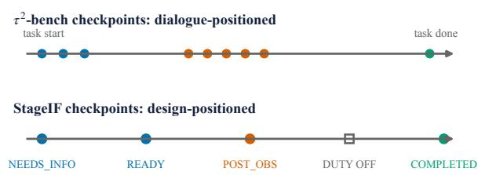  
Figure 7: Where the reporting duty is observed. In τ2, checkpoints cluster at a few stages and few occur midtask; StageIF places or disables the duty by design. The duty is disabled on tool-call turns.

Figure 9 summarizes the full StageIF evidence path. It is a process view, not an empirical result: no rates or model comparisons are introduced by the figure. The two evidence lanes are kept distinct because model-visible history and stored model output do not have authority over verifier-only runtime truth. The frozen oracle derives applicability and lifecycle truth, the deterministic parser extracts the submitted report, and only then does a mechanical comparison produce checkpoint claims, failure codes, and aggregate estimators.

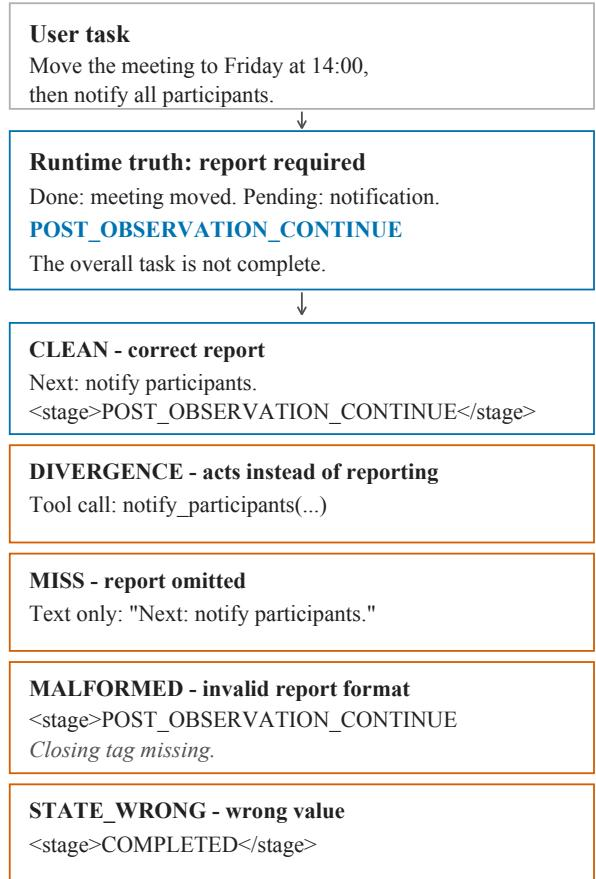  
Figure 8: Five model behaviors at the same dutyactive checkpoint. Only the correct handoff supplies a machine-readable lifecycle value that matches runtimederived truth. Only the divergence example includes a tool call.

## E Prompts and Protocol Text

Frozen-checkpoint stimuli use a system prompt followed by a scripted history; validating rollouts instead build subsequent history from environment events. The primary frozen scenarios are Chinese; the breadth replication uses English scenarios whose system prompt is a sentence-by-sentence rendering of the Chinese template. Listing 1 reproduces the English system prompt verbatim (scenario en-sched-01, XML encoding, baseline arm). The Chinese template has the same structure (role, two tools, clarify-then-confirm rule, output protocol); it cannot be typeset in this template, so the remaining prompts are given as faithful English renderings with the SHA-256 prefix of the original string, which is stored verbatim in the artifact. The exact generator and frozen stimulus of every prompt family are indexed in the artifact repository (Appendix Y).

You are a scheduling assistant. You can call the tools   
create\_event and send\_invites to fulfil the user's   
request. Ask the user for clarification when required

execution result exists but the task is not finished;   
completed = the task is finished. Tool-call turns must   
not emit the marker; the marker must be unique and   
placed at the very end.

Table 3: Semantic source of truth for the paper. Prose and figures are constrained projections of these objects.
<table><tr><td>Symbol</td><td>Source/type</td><td>Meaning</td></tr><tr><td> $\tau _ { i } , c = ( i , t )$ </td><td>typed trace</td><td>trajectory and evaluable checkpoint</td></tr><tr><td> $X _ { c } , H _ { c }$ </td><td>runtime / model-visible</td><td>trusted runtime state and the history visible to the model</td></tr><tr><td> $Y _ { c } = ( B _ { c } , R _ { c } )$ </td><td>model response</td><td>interaction mode and raw assistant text</td></tr><tr><td> $G ( X _ { c } ) = ( D _ { c } , Z _ { c } ^ { * } )$ </td><td>frozen oracle</td><td>whether reporting is required and the lifecycle truth</td></tr><tr><td> $L _ { c } ^ { * } , \widehat { L } _ { c }$ </td><td>oracle / parser</td><td>required report value and parsed model-reported value</td></tr><tr><td> $S _ { c } , M _ { c } , E _ { c } , V _ { c } , F _ { c }$ </td><td>binary indicators</td><td>valid model response, required mode, report presence, value cor- rectness, and valid realization</td></tr><tr><td> $\theta _ { z } , \phi _ { z }$ </td><td>population estimands</td><td>primary end-to-end adherence and conditional diagnostic validity</td></tr><tr><td> $\widehat { \theta } _ { z } , \widehat { \phi } _ { z }$ </td><td>empirical estimators</td><td>corresponding estimates on successful model-response check-</td></tr><tr><td> $K _ { i }$ </td><td>environment/evaluator</td><td>points trajectory-level task outcome, separate from protocol adherence</td></tr><tr><td> $U _ { c } , Q _ { c }$ </td><td>model-visible action context</td><td>task-advancing tool set and  $\mathbf { 1 } [ | U _ { c } | > 0 ]$ </td></tr></table>

Table 4: Evidence map. Each study has one primary question and an explicit interpretation boundary. Detailed arms, denominators, and robustness analyses are in the appendix.
<table><tr><td>Step</td><td>Design</td><td>Primary outcome</td><td>Evidence type</td><td>Interpretation boundary</td></tr><tr><td>Stage</td><td>Frozen stage checkpoints and breadth replications</td><td> $\widehat { \theta } _ { z } , \widehat { \phi } _ { z }$  , failure mode</td><td>Descriptive</td><td>Stage and trajectory position co-vary</td></tr><tr><td>Alternatives</td><td>contrasts and matched obliga- tives tions</td><td>Gold/static/reminder/thinking Adherence under tested alterna- Controlled contrasts</td><td></td><td>Bounds tested accounts; not an exhaus- tive mechanism test</td></tr><tr><td>Context</td><td></td><td>Matched bundle plus fully End-to-end adherence; emis- Interventions crossed ownership, exe- sion and false completion diag-</td><td></td><td>Original bundle is joint; follow-up iden- tifies explicit interface fields, not inter- nal state</td></tr><tr><td>System</td><td>cutability, and cue follow-up nostics native termination designs</td><td>Validating rollout with alter- Task success and termination Configuration contrasts outcome</td><td></td><td>Matching user turns does not establish identical system prompts; replay details in Appendix V</td></tr></table>

Algorithm 1 Scoring one checkpoint c. Truth is fixed before the model output is read; exactly one code is assigned by the frozen error-code priority. 1: $( D _ { c } , Z _ { c } ^ { * } ) \gets G ( X _ { c } ) ; L _ { c } ^ { * } \gets g ( Z _ { c } ^ { * } )$ ▷ runtime state only

2: if no valid response then return TRANSPORT ▷ $S _ { c } { = } 0 ;$ no denominator

3: $( B _ { c } , R _ { c } ) \gets Y _ { c }$ ▷ model output read only now   
4: $( E _ { c } , F _ { c } , \widehat { L } _ { c } ) \gets \rho ( R _ { c } )$ ▷ deterministic parser

5: if $D _ { c } { = } 0$ then return $\mathsf { A P P \_ F A L S E \_ A L }$ ARM if $E _ { c } { = } 1$ else CLEAN

6: $M _ { c } \gets \left[ B _ { c } = \mathsf { s p e a k } \right]$

7: if ${ { M } _ { c } } \mathrm { { = } } 0$ then return APP\_DIVERGENCE

8: if $E _ { c } { = } 0$ then return APP\_MISS

9: if $F _ { c } { = } 0$ then return MALFORMED

10: $V _ { c } \gets [ \widehat { L } _ { c } = L _ { c } ^ { * } ]$

11: if $V _ { c } { = } 0$ then return STATE\_WRONG

12: return CLEAN $\triangleright M _ { c } E _ { c } V _ { c } F _ { c } = 1$

Listing 1: English system prompt, verbatim (breadth replication).

Protocol encodings. The JSON encoding replaces each <stage>...</stage> example with $\{ { } ^ { \prime \prime } s \mathsf { t a g e } ^ { \prime \prime } \colon { } ^ { \prime \prime } \ldots { } ^ { \prime \prime } \}$ ; both encodings use the same four values and the same placement rule. The parser accepts a marker only if it is well formed, unique, and the last non-empty line of the reply.

Arm variants (renderings of the Chinese originals).

• Static-tag arm (7ee8a3f1d989206b): “Output protocol: whenever you produce a natural-language reply based on a tool result, you must append the fixed protocol marker <stage>active</stage> at the very end (the value never changes). Tool-call turns must not emit the marker.”

• Inert-tag arm (a4fc054ff443441d): same rule with the semantically inert constant <stage>qzx</stage>, described as “a meaningless fixed code that never changes.”

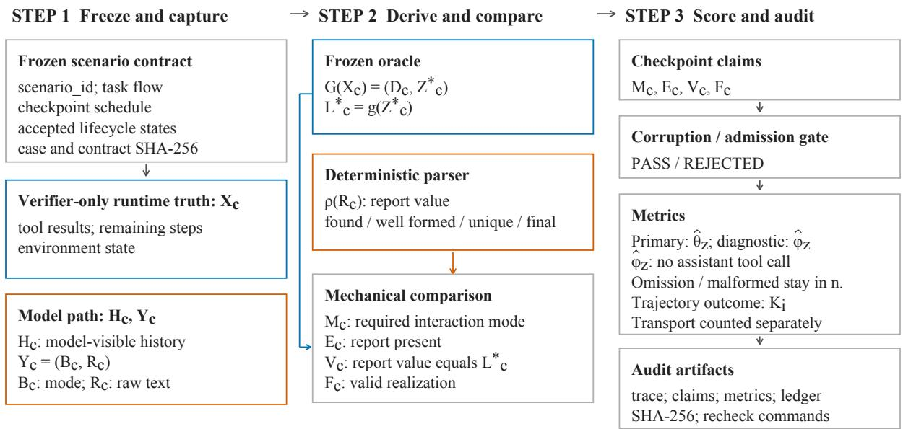  
Figure 9: StageIF’s auditable evaluation pipeline. Runtime truth is derived independently of model answers. Comparing it with parsed reports yields checkpoint verdicts, failure codes, evidence references, and recomputable metrics.

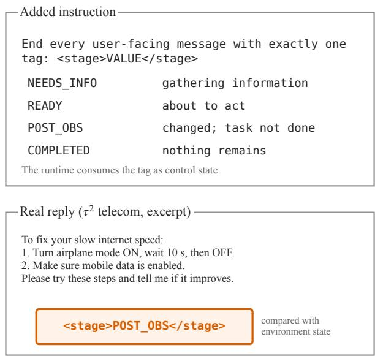  
Figure 10: The complete τ2-bench intervention. The added instruction defines four lifecycle values, and a verbatim response ends with the machine-consumed tag.

• Gold-injected arm: the Chinese original is generated from a fixed template whose faithful English rendering is “[State hint] Current task stage: value.” The original value is exactly action, needs\_information, ready\_for\_action, post\_observation\_continue, or completed. The corresponding original-string SHA-256 prefixes are 47cdbf2810251959, 97e72c4774a3ca71, af3b8051a3f7bc82, b977f3d9a8ade950, and 4239c8490fb5b24b.

• Trailing reminder (deeeb876ddfb8c94): an additional system message “[Reminder] If you reply in natural language this turn, you must append the required stage marker at the very end; tool-call turns must not append it.”, appended as the last message of the frozen history, so the model sees it immediately before it answers, in the same request.

Matched obligations (Appendix Q). Deferred terminal duty (ef55f1c69df542c4): “Output protocol: when the entire task is complete, your final natural-language reply must end with <sig>done</sig>; no reply before completion may emit this marker.” Stage-triggered status sentence (a09baf03265cca3e): “Output protocol: whenever you produce a natural-language reply based on a tool result, if the task is not yet complete the reply must end with the sentence ‘(The task is still in progress.)’; if the task is complete it must end with ‘(The task is complete.)’. Tool-call turns must not emit either sentence.” The stagetriggered machine report uses the standard protocol above.

Continuation-context factors (§5). The fully crossed follow-up varies three fields in the tool result. Two English wording families are used verbatim: ownership this\_assistant/another\_system or assigned\_to\_you/assigned\_to\_external\_service;repository (Appendix Y).

or no\_faults\_reported/fault\_reported\_upstream the third family renders the same pairs in Chinese. Executability is varied by declaring or withdrawing the second-step tool.

Validating rollout (Appendix W). The runtimeowned arm re-prompts the model with a userlevel message (7ce5a576378a52a9): “[System] The task is not yet complete. Proceed with the information you have, use defaults for the rest, and execute the remaining steps directly.” The messagematched gates B1 and B2 receive identical user messages and differ only in the termination rule.

## F Framework termination-signal survey

How the survey was conducted. Seventeen widely used agent frameworks were selected purposively for ecosystem coverage, not sampled, and each was asked one question: how does the agent loop decide whether to continue or stop after this turn, and where does the signal that decision reads come from? Answers were classified into three families fixed before collection. (A) Runtimeowned, where the decision is computed by framework code from structured state, covers graph edges and typed state (A1; LlamaIndex, 2026; Dify, 2026; LangChain, 2026) and a hard iteration or budget cap (A2; Microsoft, 2026b; Anthropic, 2026a; Google, 2026b; Dify, 2026; DeepWisdom, 2026; CrewAI, 2026). (B) Model-emitted, where the decision reads a signal the model generated, covers an explicit textual marker (B1, the family isomorphic to our setting; CAMEL-AI, 2026; Microsoft, 2026a), the structural presence or absence of tool calls (B2; OpenAI, 2026d; Anthropic, 2026a; LangChain, 2026; LangChain AI, 2026; Vercel, 2026; Agno, 2026), and a dedicated terminal tool (B3; Hugging Face, 2026; Google, 2026b; Significant Gravitas, 2026); one framework is modelemitted with its sub-type undocumented (Mastra, 2026). (C) Hybrid covers frameworks that expose more than one of these at once (LangChain, 2026; Google, 2026b). B2 and B3 count as model-emitted because what the runtime consumes is still a generated decision. Collection and adjudication were separated, every entry carries a primary source, a verbatim quotation, and an access date, and a missing field forces EVIDENCE\_INCOMPLETE rather than an inferred classification; the collection protocol and per-framework evidence are in the artifact

d\_an\_error lassification. Table 5 normalizes heteroge-  
; neous interfaces into the pre-specified families. In canonical usage, 13/17 frameworks use modelemitted signals, 3/17 are runtime-owned, and 1/17 remains evidence-incomplete. LangGraph exposes both A1 primitives and B2 prebuilt routing; Google ADK combines B3 tools with an optional A2 cap. MetaGPT’s model signal subtype is undocumented. CrewAI documents max\_iter but not normal completion, so it remains EVIDENCE\_INCOMPLETE rather than imputed. Semantic Kernel’s concrete default cap is 5; its abstract base exposes 99, which is not the concrete default.

Recorded termination criteria. Each classification above rests on the recorded documentation excerpt. OpenAI Agents SDK (OpenAI, 2026d): “the rule for whether the LLM output is considered as a ‘final output’ is that it produces text output with the desired type, and there are no tool calls” (B2). Claude Agent SDK (Anthropic, 2026a): “turns continue until Claude produces output with no tool calls” (B2, with a max\_turns cap). smolagents (Hugging Face, 2026): “in the end you have to return a final answer using the final\_answer tool” (B3). Google ADK (Google, 2026b): the deprecated LoopAgent used an exit\_loop tool and an optional max\_iterations cap, while its successor Workflow exposes a dedicated finish\_task tool (B3; the legacy cap is A2 when configured). CAMEL (CAMEL-AI, 2026) matches our setting most directly: the loop breaks on if "CAMEL\_TASK\_DONE" in user\_response.msg.content (B1). AutoGen (Microsoft, 2026a) ships pluggable strategies, of which the keyword-based TextMentionTermination is the one used in canonical tutorials (B1). LlamaIndex Workflows (LlamaIndex, 2026): “when the workflow encounters a returned StopEvent, it immediately stops” (A1). MetaGPT (DeepWisdom, 2026): a loop that runs “until the role thinks it is time to stop,” with an iteration cap in parallel (B+A2, sub-type not documented). The remaining four records complete the seventeen. LangGraph (LangChain, 2026) is recorded under both readings, since its graph primitives expose add\_conditional\_edges (A1) while its prebuilt ReAct executor stops on the absence of tool calls (B2). Semantic Kernel (Microsoft, 2026b): “maximum\_iterations: int = Field(default=5, description=. . . )” in the concrete strategy, against 99 in the abstract base, which is not the concrete default (A2). Dify (Dify, 2026): “The loop terminates when either the termination condition is met, the maximum count is reached, or an Exit Loop node executes” (A1+A2; this excerpt was retrieved on 2026-08-24, later than the other documentation records). CrewAI (CrewAI, 2026) documents max\_iter but no criterion for normal completion, so it is recorded as EVIDENCE\_INCOMPLETE rather than imputed; a source-level reading resolves it, and we do not carry that reading into the count.

Table 5: Representative lifecycle-control interfaces, grouped by the signal consumed by the runtime rather than ranked. Rows may overlap and are not prevalence counts.
<table><tr><td>Family</td><td>Runtime consumes</td><td>Representative framework forms</td><td>Immediate authority</td><td>Relation to StageIF</td></tr><tr><td>B1: textual marker</td><td>marker in generated text</td><td>CAMEL marker; TextMentionTermination (CAMEL- AI, 2026; Microsoft, 2026a)</td><td>model text</td><td>Directly isomorphic to the studied chan- nel.</td></tr><tr><td>structure</td><td>B2: tool-call presence of tool calls</td><td>OpenAI Agents, Claude Agent SDK, and LangGraph prebuilt ReAct rules (OpenAI, 2026d; Anthropic, 2026a; LangChain, 2026)</td><td>model structure</td><td>Different encoding; model output still controls continuation.</td></tr><tr><td>tool</td><td>B3: terminal dedicated completion call</td><td>smolagents final_answer; Google ADK termination tools (Hugging Face, 2026; Google, 2026b)</td><td>model action</td><td>Structured model-issued completion deci- sion.</td></tr><tr><td>A1: typed runtime state</td><td>event, edge, or expression</td><td>LlamaIndex StopEvent; Dify condition; runtime logic LangGraph primitive edges (LlamaIndex, 2026; Dify, 2026; LangChain, 2026)</td><td></td><td>Continuation derives from explicit system state.</td></tr><tr><td>A2: hard bound</td><td>iteration, turn, or budget counter</td><td>Caps in Semantic Kernel, Claude Agent SDK, Google ADK, Dify, MetaGPT, and CrewAI (Microsoft, 2026b; Anthropic, 2026a; Google, 2026b; Dify, 2026; Deep-</td><td>runtime counter</td><td>Backstop, not evidence of task comple- tion.</td></tr><tr><td>Hybrid</td><td>multiple signals</td><td>Wisdom, 2026; CrewAI, 2026) model-issued termination plus runtime rules mixed</td><td></td><td>Separates normal completion from failure containment.</td></tr></table>

The five frameworks added on 2026-09-02 follow. LangChain’s current create\_agent API (LangChain AI, 2026): “the process repeats until no more tool\_calls are present in the response” (B2). AutoGPT’s classic loop (Significant Gravitas, 2026): the model calls a finish tool, raising AgentTerminated (B3); the project’s newer visual-builder product line documents deployment but not execution control, so only the classic loop is classified here. Vercel AI SDK (Vercel, 2026): “a finish reasoning other than tool-calls is returned. . . or a stop condition is met,” with a default stepCountIs(20) cap (B2 with an A2 backstop). Mastra (Mastra, 2026): the loop “continue[s] iterating until the model emits a final answer or an optional stop condition is met” (model-emitted, sub-type not documented, with an optional A2 cap). Agno (Agno, 2026): “No tool calls or finished processing them: break” (B2). All five consume a model-generated signal; none is runtime-owned.

What the count does and does not support. Within this sample, delegating the continue/stop decision to a model-generated signal is the majority pattern, and the strictly isomorphic form— an explicit textual marker—is default or tutorialcanonical in two frameworks with a third offering it optionally. The survey supports prevalence within seventeen purposively chosen frameworks at two points in time; it does not support universality, and framework defaults change. We accordingly read StageIF as a stress test of whether a modelgenerated lifecycle signal is fit to serve as control authority, not as a claim that the four-value textual protocol itself is widely deployed—what the survey establishes is that the continue/stop decision is routinely delegated to some model-emitted signal. The B2 family matters beyond marker-based designs for a structural reason: when a loop stops because a turn contained no tool call, every natural-language turn is implicitly emitting a continue/stop signal, so the divergence failure we measure—acting where the stage called for speaking—is in those runtimes a wrong lifecycle signal rather than a missing one. Appendix W measures that concern in a rollout: under a no-tool-call gate, 45.5% of trajectories stall because the agent spoke at a point that called for action, handing control to a user with nothing to add.

Source-level extension: five deployed runtimes. The survey above is documentation-first and pins no commit. We re-asked its single question of five runtimes that ship inside deployed products—voice, home automation, coding agents—rather than orchestration SDKs, this time reading the source at a pinned commit. Each record carries a repository, that commit, a file:line, and a verbatim quotation; access dates are 2026-08-18/19. This adds coverage in a different ecological niche. It does not close the three evidence gaps above, which remain as reported.

Home Assistant (Home Assistant, 2026) pairs a cap with a structural test: MAX\_TOOL\_ITERATIONS = 10 (components/ anthropic/entity.py:145) around if not chat\_log.unresponded\_tool\_results: break (:1250), the property being whether the last message is a tool result (components/conversation/chat\_log.py: 377). The same shape appears in all nine of its LLM conversation integrations (C, A2+B2). Pipecat (Daily, 2026) branches on the structured field chunk.choices[0].delta.tool\_calls (services/openai/base\_llm.py:509); the continuation is gated on if frame.result: (aggregators/llm\_response\_universal.py: 1814), so a tool returning a falsy result triggers no further inference (B2). LiveKit Agents (LiveKit, 2026) sets reply\_required = fnc\_out is not None (voice/generation.py:1038)—a tool returning nothing requires no reply— and on reaching max\_tool\_steps forces tool\_choice="none" to avoid stopping silently (voice/agent\_activity.py:3554) (C, B2+A2). Pydantic AI (Pydantic, 2026) routes on if tool\_calls: in the node whose docstring reads “decides whether to end the run or make a new request” (pydantic\_ai/\_agent\_graph.py:1817,2017) (B2). OpenHands (OpenHands, 2026) caps at max\_iteration\_per\_run = 500 (sdk/conversation/conversation.py:75) over a text-versus-tool branch (C, B2+A2).

All five read a structural tool-call signal rather than a textual marker, so none is exposed to the dead-end mode that only a marker-reading loop can have. None of the five, however, makes an intermediate report a condition of continuing: progress surfaces through separate structured channels the model need not write to—Home Assistant streams tool deltas to the frontend, Pipecat and LiveKit emit function-call lifecycle frames, and LiveKit’s midtool update is opt-in. Pydantic AI’s deferred tool requests are the one enforced third outcome, and they cover external approval rather than progress.

One record is worth stating on its own because it is a naming fact rather than a rate. In Open-Hands, a model reply carrying text and no tool call sets ConversationExecutionStatus.FINISHED (sdk/agent/response\_dispatch.py:250, in a method documented as “Handle LLM response with text content — finishes conversation”), while the same enumeration defines FINISHED as “completed the current task” and a separate STUCK as “stuck in a loop or unable to proceed” (sdk/ conversation/state.py:57,59). STUCK is live elsewhere in the same runtime, assigned by a dedicated detector (conversation/impl/local\_ conversation.py:726). A run that goes quiet mid-task is therefore recorded under the status reserved for completion, though a status for the other reading exists and is used.

## G τ2-bench stage and position denominators

Table 6 gives the counts behind Figure 2 and the four-deployment mean of §2 for six of the seven compliant full-lane deployments under the strict parser, plus the envelope-stripped rows behind the four-generation comparison in §2; gpt-5.6-sol’s malformed tags count as wrong in the strict rows. The envelope-stripped reading of that table parses the reply as JSON, takes its message field (or the bare string when the whole reply is a JSON string literal), and applies the unchanged parser to it; replies of any other JSON shape carry no readable tag and score as omitted reports in the stripped rows (12 of gpt-5.6-sol’s 13 omissions, gpt-6-astra’s 1). The three-way completion split in §2 separates the 20 hand-off tasks (reward basis includes the transfer action), then classifies the remaining completion checkpoints by whether a customer message between the trajectory’s last non-COMPLETED duty checkpoint and the checkpoint carries a resolution cue without a negation (the script’s window, which can open before the completing tool call); completions caused by the agent’s own tool call on those tasks (33–70% correct) are counted with the unconfirmed group in the text’s ranges. An independent replay that locates the first true completing event from full tool responses moves a handful of checkpoints between the agent-caused and unconfirmed groups for claude-sonnet-5 and grok-4.6 (claude-sonnet-5 3/23 instead of 2/21 unconfirmed) and leaves the hand-off and cueconfirmed counts unchanged. The mid-task quintiles take each trajectory’s POST\_OBS checkpoints, min–max-normalize their turn indices, and cut the span into five; trajectories with a single POST\_OBS checkpoint have no depth and are omitted from the quintile columns (23 checkpoints across the six strict rows; 2 and 6 in the two stripped rows). Gold rule: a checkpoint is COMPLETED when the task’s environment assertions hold and, for tasks whose reward basis also names a required action (the 20 transfer tasks of the base split), that action has been called; an earlier rule that ignored the action requirement scored those tasks complete from their first turn and was replaced after an audit. A completion checkpoint counts as confirmed when a customer message in that window contains a resolution cue (works, fixed, resolved, thanks, connected, and similar) and no negation (still, not working, unable, and similar). An earlier gemini-3.7-flash lane run at vendor-default thinking is superseded by the gemini-3.8-flash lane at minimal effort; it is retained in the artifact repository and not reported here. Rows are recomputed from the scored lanes by the figure generators in the artifact repository.

Per-deployment detail behind §2. Among the deployments that largely ignore the duty, the highest reports on 10.1% of duty-active checkpoints (165/1640). The two compliant deployments that return no reasoning tokens report correctly at 90.6–99.4% of pre-action checkpoints, and 94.0–99.6% of their mid-task errors, together with claude-sonnet-5’s, carry a well-formed but wrong value rather than no value. Across the four generations of one family, ordered by release, the mid-task rate moves from 5.8% to 11.5%, 42.3%, and 100.0% and the completion rate from 88.9% to 87.3%, 67.5%, and 48.1%, the last two generations read after envelope stripping; an eight-task probe of claude-fable-5.1 against claude-sonnet-5 gives 78% versus 6% mid-task at probe scale only. The JSON envelope covers 34.7% (332/958) of gpt-5.6-sol’s duty checkpoints and 100% (1,091/1,091) of gpt-6-astra’s, against 1 of 1,023 replies for gemini-3.8-flash and 0 of 134 for a claude-fable-5.1 probe; stripping it moves gpt-5.6-sol’s mid-task rate from 28.6% to 42.3% and gpt-6-astra’s picture from 0% throughout to 99.6% before acting, 100% mid-task, and 48.1% at completion. gemini-3.8-flash’s mid-task errors are 78% stale (n=183). The three deployments that stay accurate mid-task hold, in order, 74.1% mid-task (n=707) and 63.8% at completion (n=94) for gemini-3.8-flash; 100% (n=726) and 48.1% (n=135) for gpt-6-astra read after envelope stripping; and 94.7% (n=780) and 63.6% (n=129) for claude-opus-5 on its 106 singlesimulator tasks. In the benchmark’s no-user mode, ending the episode on the model’s own done() signal scores zero on 63 of 114 tasks for gpt-4.1 and 30 of 114 for gpt-5.5. The native stop signal is not the added stage tag, and zero reward alone does not establish a false completion claim.

Within the mid-task stage, accuracy falls from the first to the last quintile: 30.5% → 5.1%, 21.7% → 7.3%, and 12.4% → 4.7% for claude-sonnet-5, gpt-5.5, and gpt-4.1, with trajectories of 15 or more duty checkpoints worse still; the two envelope-stripped generations hold at 49.4% → 47.1% and at 100% throughout. Errors cluster by trajectory: among trajectories with two or more mid-task checkpoints, every mid-task report is wrong in 67% (gpt-4.1, 73/109), 67% (gpt-5.5, 64/95), and 44% (claude-sonnet-5, 43/98) of them, while gemini-3.8-flash is 41% entirely correct and 18% entirely wrong and gpt-6-astra entirely correct throughout. Lost trajectories concentrate in the multi-fault MMS task family (39/49, 41/48, and 28/45 for the three collapsing deployments) rather than in service tasks (13/25, 6/16, and 5/18). Post-transfer on the hand-off tasks, the newest deployments report COMPLETED on 0–40% of checkpoints (gpt-6-astra 0/18, gpt-5.6-sol 5/20, gemini-3.8-flash 8/20). Before a resolution cue, and outside the hand-off tasks, gpt-6-astra reports COMPLETED on 0/42 such checkpoints, gemini-3.8-flash on 0/19, and claude-sonnet-5 on 3/29; the remaining deployments have 3 to 34 such checkpoints.

Pooled mean and thinking status per lane. The four compliant deployments run without requesting thinking (claude-sonnet-5, gpt-4.1, gpt-5.5, and gpt-5.6-sol, whose malformed tags count as wrong) average 83.7% before acting, 11.1% at the lowest mid-task quintile, and 75.1% at completion on the stage axis. The controlled testbed does not reproduce claude-opus-5’s terminal signature: there it scores 98.8% at the finished checkpoint (n=240; §4), so that shape is setting-specific rather than a fixed property of the deployment. The four pooled deployments were run without requesting thinking; gpt-4.1 and gpt-5.5 returned no reasoning tokens, but claude-sonnet-5 and gpt-5.6-sol returned them on 64% and 82% of calls (median 68 and 56 tokens when present), so that mean is “thinking not requested,” not “thinking absent.” grok-4.6, whose extended thinking cannot be switched off (reasoning tokens on 99% of calls, median 332), falls from 96.4% before acting to 45.5–57.9% across the midtask quintiles (n=281 and 96–181 per quintile). gemini-3.8-flash and gpt-6-astra refuse to disable reasoning and run at the lowest effort their APIs allow (median 0 reasoning tokens; 7.2% and 1.0% of calls nonzero). The claude-opus-5 lane ran with thinking off; a gateway quota interruption changed its user-simulator model after 8 of 114 trajectories, and the remaining 106, run on the replacement simulator that the newest-generation lanes also use, are the ones reported (mid-task 94.7%, n=780; completion 63.6%, n=129; mid-task 94.2– 95.3% in each simulator and cache stratum). A 40-task run of the same model with vendor-default thinking on the original simulator (mid-task 89.0%, n=391) is retained in the artifact repository and not reported here.

Figure 11 shows the same data on a positionnormalized axis instead: each trajectory’s dutyactive checkpoints are pooled into ten min–maxnormalized position bins regardless of state, the axis of Lost-in-the-Middle-style plots. This view mixes lifecycle states within a bin—the last bin holds both completion checkpoints and mid-task checkpoints of trajectories the user ended early— which is why the paper’s main figure is drawn by state.

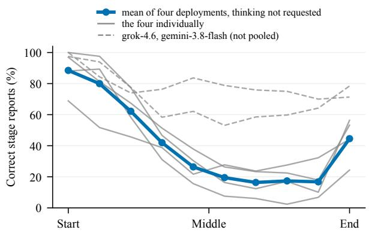  
Figure 11: Position-normalized view of the telecom data. The horizontal axis is the share of duty checkpoints elapsed, cut into ten within-trajectory bins with lifecycle states mixed.

## H Per-experiment admission and exclusion

Measurement discipline. The 50,400 logical positions are a repeated-measures count over 12 scenario clusters with 20 repetitions, not 50,400 independent tasks. A corruption gate that must collapse every success metric on blanked and value-inverted outputs passed on live data (Appendix K); transport and identity failures are reported on their own denominators (Appendix J). Behavioral results, the framework documentation audit (Appendix F), and the source audit of deployed runtimes are never pooled.

Each study froze its own identity precheck, so the admitted deployment set differs across studies. Table 7 lists every planned deployment, the admitted count, and the reason for each exclusion, reconstructed from the archived prechecks.json and summary.json of each run. No excluded deployment consumed any denominator; exclusions are reported, never imputed. The nine planned deployments are deepseek-v4-flash, deepseek-v4-pro, glm-5.1, gpt-4.1, gpt-4.1-mini, gpt-5.5, qwen3.5- 122b-a10b, qwen3.5-35b-a3b, and qwen3.6-27b, each with a frozen generation configuration and listed alphabetically throughout; the identifiers name these bundles, and no ordering in this paper is a ranking.

Every planned deployment is marketed by its vendor for agentic or tool-use work. We checked each vendor’s own model card, release post, or API documentation and found an explicit claim for eight of the nine, ranging from a one-line positioning statement to a dedicated section on long-horizon execution; the claims differ in prominence, not in presence, so this sample supports no contrast between agent-oriented and other deployments. Two caveats attach to the check: the two deepseek-v4-\* identifiers are rolling API aliases whose weight snapshot at run time cannot be recovered from the identifier alone, and two vendor blogs were readable only through web archives at the time of writing. This is a documentation observation about vendor positioning, not an evaluation of the capabilities claimed.

## I Deployments and identifiers

Nineteen model deployments appear in this paper. The identifier is the string the provider API exposed at run time; it names a model-and-configuration bundle, not an entry in a ranking, and the table is alphabetical. The last column gives a public page on which we confirmed that exact string, checked as a literal match with word boundaries so that a longer dated variant cannot pass for the identifier itself. Identifiers are printed in the form used at call time; where the vendor’s own string differs only in punctuation or case we say so in the row, One identifier is published only on its vendor’s Chinese-locale pages, which is where we confirmed it. Three caveats carry over from the vendor check reported above. The two deepseek-v4-\* names are rolling aliases whose weight snapshot at run time cannot be recovered from the identifier alone. The qwen3.5 identifiers match open-weight repository names, whose correspondence to a hosted name we did not verify. And the five gpt-\* identifiers are confirmed against the vendor’s official client library, whose model enumeration is generated from its API specification, because its documentation pages were not retrievable from our network.

<table><tr><td>Deployment</td><td>Before acting</td><td>Mid Q1</td><td>Mid Q2</td><td>Mid Q3</td><td>Mid Q4</td><td>Mid Q5</td><td>Completed</td></tr><tr><td>claude-sonnet-5</td><td>410/516</td><td>54/177</td><td>21/123</td><td>15/139</td><td>19/122</td><td>9/175</td><td>190/226</td></tr><tr><td>gpt-4.1</td><td>393/434</td><td>25/202</td><td>3/136</td><td>5/114</td><td>2/123</td><td>8/170</td><td>32/36</td></tr><tr><td>gpt-5.5</td><td>469/472</td><td>34/157</td><td>10/111</td><td>8/105</td><td>9/92</td><td>12/165</td><td>96/110</td></tr><tr><td>gpt-5.6-sol</td><td>160/245</td><td>52/160</td><td>22/109</td><td>23/107</td><td>30/103</td><td>55/155</td><td>31/77</td></tr><tr><td>grok-4.6</td><td>271/281</td><td>101/181</td><td>45/99</td><td>55/100</td><td>52/96</td><td>84/145</td><td>130/140</td></tr><tr><td>gemini-3.8-flash</td><td>219/222</td><td>121/180</td><td>91/117</td><td>86/114</td><td>90/118</td><td>133/171</td><td>60/94</td></tr><tr><td>gpt-5.6-so1, envelope stripped</td><td>234/245</td><td>79/160</td><td>39/109</td><td>33/107</td><td>45/103</td><td>73/155</td><td>52/77</td></tr><tr><td>gpt-6-astra, envelope stripped</td><td>229/230</td><td>173/173</td><td>108/108</td><td>120/120</td><td>132/132</td><td>187/187</td><td>65/135</td></tr></table>

Table 6: Correct/total stage reports at each state-axis point (before acting, five mid-task quintiles, completed) for six compliant full-lane telecom deployments under the strict parser; gpt-5.6-sol’s malformed tags count as wrong. The last two rows give the envelope-stripped readings of the two JSON-wrapping deployments. Rows are grouped, not ranked.

Table 7: Admission per study. “Planned” is the frozen deployment list; exclusions name the deployment and the mechanical reason. The repair diagnostics replay a deployment’s own prior reply, so their populations are sampled from the deployments that produced those replies rather than from the full deployment list.
<table><tr><td>Study (section)</td><td>Planned</td><td>Admitted</td><td>Excluded and reason</td></tr><tr><td>Stage pattern (§4)</td><td>9</td><td></td><td>gpt-4.1, gpt-4.1-mini: identity precheck failed (repeated transport failures)</td></tr><tr><td>Five-arm contrasts (§5, App. M)</td><td>9</td><td></td><td>same two deployments, same reason</td></tr><tr><td>Matched-obligation bridge (App. Q)</td><td>9</td><td></td><td></td></tr><tr><td>Negative controls (App. N)</td><td>9</td><td></td><td>9</td></tr><tr><td>Breadth replications (App. O)</td><td>9</td><td></td><td>9 9</td></tr><tr><td>Protocol-demand rerun (App. R)</td><td>9</td><td></td><td></td></tr><tr><td>Thinking-mode A/B (App. P)</td><td>toggle-exposing deployments</td><td>4 verified</td><td>two endpoints inline reasoning into the answer channel; gpt-5.5 manipula- tion unverifiable</td></tr><tr><td>Withdraw-and-delegate bundle (§5)</td><td>9</td><td>9</td><td></td></tr><tr><td>Fully crossed decomposition (§5)</td><td>9</td><td>8</td><td>gpt-4.1-mini: frozen precheck failed</td></tr><tr><td>Validating rollout, all gates (Ap- pendix W)</td><td>9</td><td>8</td><td>gpt-5.5: serving-side outage during the batch (3/20 probe successes, while another deployment in the same window succeeded on 90%); backfill not</td></tr><tr><td>Replay and isolated question (App. T)</td><td>3</td><td>3</td><td>attempted below the frozen 18/20 readiness bar populations sampled from the three deployments whose omitted-tag replies</td></tr><tr><td>Wrong-state follow-up (App. T)</td><td>9</td><td></td><td>were replayed gpt-5.5, glm-5.1: lane completion 92.5% and 94.3%, below the pre- registered 95% gate (infrastructure-missing); gpt-4.1-mini: no data after 25 precheck attempts across two runs</td></tr></table>

Two of the identifiers also served as the simulated customer rather than as the agent under test. gpt-4.1 was the user simulator for the earlier $\tau ^ { 2 }$ runs and deepseek-v4-flash for the later ones, which is why the claude-opus-5 lane spans both and is reported on its single-simulator subset.

## J Additional design and audit notes

Frozen policies and estimator conventions. Admission, retry, transport, and endpoint-identity policies are frozen; complete ledger and artifact identities are in this appendix and Appendix Y. All reported model-behavior rates instantiate the empirical estimators of §3 on $S _ { c } = 1$ checkpoints; transport and identity failures are reported on their own denominators. The oracle $G ( X _ { c } )$ and checkpoint membership are frozen before observing $Y _ { c } .$

Endpoint exclusions, the first-turn applicability rule of the live rollout, and the status of every designed follow-up are recorded in the artifact repository (Appendix Y).

## K Verifier-strictness forensics

Under the initial verifiers the JSON parser demanded a standalone line while the XML parser accepted line-end embedding. A malformed-case audit located this asymmetric strictness in the harness, not the models; the stricter original verdicts are retained unmodified as a forensic record, and equal-strictness rescoring surfaces 147 genuine wrong-value cases, including hallucinated out-ofvocabulary stage values (details in the artifact repository, Appendix Y).

Table 8: Model deployments used in this paper, alphabetical and not ranked. “Where used” names the studies; a deployment may serve in one study and be excluded from another by that study’s own admission rule. “As run” records the reasoning configuration actually requested and, where measured, what the endpoint returned. An empty record cell means no public page carrying that identifier was located.
<table><tr><td>Identifier</td><td>Where used</td><td>As run</td><td>Public record</td></tr><tr><td>claude-fable-5.1</td><td> $\tau ^ { 2 }$  telecom, eight-task probe only</td><td>Minimal effort</td><td>(Anthropic, 2026b); vendor string</td></tr><tr><td>claude-opus-5</td><td> $\tau ^ { 2 }$  telecom; StageIF later cohort</td><td>Reasoning off in  $\tau ^ { 2 } ;$  vendor-default sampling in StageIF</td><td>claude-fable-5-1 (Anthropic, 2026b)</td></tr><tr><td>claude-sonnet-5</td><td> $\tau ^ { 2 }$  telecom</td><td>Thinking not requested; reasoning tokens returned on 64% of calls</td><td>(Anthropic, 2026b)</td></tr><tr><td>deepseek-v4-flash</td><td> $\tau ^ { 2 }$  telecom, retail, no-user; StageIF; replace-</td><td>Reasoning off</td><td>(DeepSeek-AI,</td></tr><tr><td>deepseek-v4-pro</td><td>ment user simulator  $\tau ^ { 2 }$  telecom, retail, no-user; StageIF</td><td>Reasoning off</td><td>2026b,a) (DeepSeek-AI, 2026a)</td></tr><tr><td>gemini-3.7-flash</td><td> $\tau ^ { 2 }$  telecom, superseded and not reported; Vendor default StageIF later cohort</td><td></td><td>(Google, 2026a)</td></tr><tr><td>gemini-3.8-flash</td><td> $\tau ^ { 2 }$  telecom</td><td>Lowest effort the API allows; reasoning tokens on</td><td>(Google, 2026a)</td></tr><tr><td>g1m-5.1</td><td> $\tau ^ { 2 }$  telecom, retail; StageIF</td><td>7.2% of calls Reasoning off</td><td>(Z.ai, 2026a)</td></tr><tr><td>g1m-5.3</td><td>StageIF later cohort</td><td>Thinking on; cannot be disabled</td><td>(Z.ai, 2026b)</td></tr><tr><td>gpt-4.1</td><td> $\tau ^ { 2 }$  telecom, retail, no-user; StageIF; original</td><td>No reasoning returned</td><td>(OpenAI, 2026b)</td></tr><tr><td>gpt-4.1-mini</td><td>user simulator StageIF</td><td>Frozen generation configuration</td><td>(OpenAI, 2026a)</td></tr><tr><td>gpt-5.5</td><td> $\tau ^ { 2 }$  telecom, retail, no-user; StageIF</td><td>Reasoning effort none; no reasoning returned</td><td>(OpenAI, 2026c)</td></tr><tr><td>gpt-5.6-sol</td><td> $\tau ^ { 2 }$  telecom</td><td>Thinking not requested; reasoning tokens returned on 82% of calls</td><td>(OpenAI, 2026a)</td></tr><tr><td>gpt-6-astra</td><td> $\tau ^ { 2 }$  telecom</td><td>Minimal effort</td><td>(OpenAI, 2026a)</td></tr><tr><td>grok-4.6</td><td> $\tau ^ { 2 }$  telecom</td><td>Extended thinking on; cannot be disabled</td><td>(xAI, 2026)</td></tr><tr><td>qwen3.5-122b-a10b</td><td>StageIF</td><td>Frozen generation configuration</td><td>(Qwen Team, 2026a); vendor string capi-</td></tr><tr><td>qwen3.5-35b-a3b</td><td>StageIF</td><td>Frozen generation configuration</td><td>talised (Qwen Team, 2026b); vendor string capi-</td></tr><tr><td>qwen3.6-27b</td><td>StageIF</td><td>Frozen generation configuration</td><td>talised (Qwen Team, 2026c)</td></tr><tr><td>qwen3.8-max</td><td> $\tau ^ { 2 }$  telecom, among the deployments that usually omit the report</td><td>Reasoning off</td><td>(Alibaba Cloud, 2026)</td></tr></table>

Corruption gate. Replaying the full metric pipeline over blanked and value-inverted outputs must collapse every success metric (blanked: only $D _ { c }$ =0 rows may remain clean; inverted: zero)— any metric surviving corruption measures the harness, not the model. Deterministic scoring also sidesteps a documented failure of LLM judges on this class of discrimination (AUROC at most 0.65, unimproved by supplying the ground-truth specification) (Advani, 2026).

## L Motivating seed study

Role in this paper. An exploratory replay of the production protocol first revealed a large terminal– intermediate asymmetry, dominated by systematic omissions rather than malformed reports. Because that study could not separate stage, prompt, vocabulary, domain, or serving explanations, it serves only as motivation; its design, denominators, and results are reported below. StageIF is the frozen instrument used for the paper’s primary evidence.

The seed protocol, reconstructed from locally desensitized motivating artifacts, requires every posttool natural-language turn to end with an XML lifecycle tag: an intermediate value while awaiting user input and a terminal value on completion. We replayed four slot-filling clarification scenarios at two independent frozen-history checkpoints per trajectory over 22 endpoints across five deployment families. All requests used thinking off, temperature 0, streaming, disabled SDK retries, and successful identity prechecks. The planned denominator was 22×4×5 = 440 trajectories. The result archive is complete, but the attempt ledger is not retained, so the historical total-request count is not used as an auditable claim.

Table 9: Motivating seed study on a fixed planned denominator, with Wilson 95% CIs.
<table><tr><td>Checkpoint</td><td>Valid/planned</td><td>95% CI</td></tr><tr><td>Intermediate</td><td>263/440 (59.8%)</td><td>[55.1, 64.3]</td></tr><tr><td>Terminal</td><td>417/440 (94.8%)</td><td>[92.3, 96.5]</td></tr></table>

Per endpoint, intermediate validity is below terminal validity on 16/22, tied on 3, and reversed on 3. All 172 protocol failures are complete omissions; none is a wrong value, duplicate, or malformed tag. Fifteen intermediate checkpoints instead issued a tool call, motivating the later separation of interaction-mode divergence from report omission. A 20-repetition extension on six endpoints $( n = 8 0$ each) exhibits three regimes: deterministic omission (0/77 with zero variance), context-conditioned omission (19/19 in one scenario and 0/59 in the others), and stochastic omission. Thus the seed establishes a motivating regularity, not its cause or external scope. Full endpoint tables, the three-regime analysis, and error-code inventories are retained in the local evidence package.

## M Bootstrap effect tables

Denominators and per-deployment detail behind §4 and §5. Table 2 excludes transport failures and holds $\scriptstyle n = 4 7 8 - 4 8 0$ per cell; Figure 3 plots $n { = } 2 4 0$ planned per deployment–checkpoint cell, the breadth replication $n { = } 2 1 6 0$ planned per point, and the gold-injected and static-value arms $n { = } 1 6 8 0$ planned per arm–checkpoint point. The later cohort reproduces the stage shape with a smaller margin, 19.3 points for glm-5.3 and 6.8 for claude-opus-5 with all arms pooled, and gemini-3.7-flash scores lowest one checkpoint later than the other nine (87.8% versus 69.9%). For two deployments the intermediate decline is almost entirely mode selection: conditional report validity falls only 1.8 and 5.6 points from terminal. In the five-arm batch, the trailing reminder cuts silent omission at the two action-bearing checkpoints from 25.4% to 16.6% of checkpoints while action divergence stays at 48.1% against 49.7% (per-deployment shifts of −7.1 to +12.3 points); its largest gain is +9.3 points pooled over all five checkpoints $( \mathbf { C I } \left[ + 6 . 8 , + 1 1 . 8 \right] )$ , or 11.7 points over duty-active checkpoints alone.

Five-arm factorial (§5). 600 stimuli × 10 repetitions × 7 deployments = 42,000 checkpoints, under the same measurement discipline as the pilot: A baseline (dynamic values, re-run as batch control); B constant semantic value; C constant semantically inert value; D trailing obligation reminder + constant value; E reminder + dynamic values (reminder text and placement in Appendix E). Baseline rates are directionally consistent with the pilot (e.g. 46.7% vs. 46.4% on one deployment, same arm and denominator), an internal crossbatch check. Figure 12 plots every arm against each deployment’s observed gap. Salience is E−A; semantics is C−B (little change on five deployments, slight help on two); reminder×constant is D−B (+5 to +9 on three deployments). At the two action-bearing checkpoints (CP2 and CP4; n=3360 per arm), E versus A shifts the outcome mix from 25.4% omission, 48.1% divergence, 10.7% malformed, and 11.4% clean to 16.6%, 49.7%, 14.4%, and 14.0%: the reminder acts on the omission channel and leaves divergence unchanged. The reminder that reduces compliance costs −3.7 points, CI [−5.3, −1.7]. Figure 12 uses clustered-bootstrap 95% intervals; crosses mark each deployment’s observed intermediate–terminal gap.

Table 10: CONTROLLED $2 \times 2 \times 2$ DECOMPOSITION. Each bracket is the range of deployment-specific contrasts, in percentage points. θ is primary; emission and false completion use the fixed successful-response denominator and are diagnostic. Tool withdrawal is the one contrast whose adherence effect is non-negative on all $8 / 8$ deployments; the other three are mixed in sign.
<table><tr><td>Contrast</td><td> $\Delta \widehat { \theta }$ </td><td></td><td>∆ emission ∆ false compl.</td></tr><tr><td> ${ \mathrm { O t h e r - s e l f } }$ </td><td> $[ - 1 4 . 0 , + 9 . 0 ]$ </td><td> $[ + 4 . 4 , + 3 2 . 6 ]$ </td><td> $[ + 2 . 5 , + 4 4 . 1 ]$ </td></tr><tr><td>Withdrawn — available</td><td> $[ + 0 . 3 , + 1 8 . 7 ]$ </td><td> $[ 6 . 8 , 5 6 . 4 ]$ </td><td> $[ 3 . 9 , 3 7 . 7 ]$ </td></tr><tr><td>Problem — resolved</td><td> $[ - 4 . 7 , + 2 4 . 0 ]$ </td><td> $[ - 1 6 \dot { . } 3 , \dot { + } 1 2 . 3 \dot { ] }$ </td><td> $[ - 1 \dot { 3 } . 1 , + 6 . 6 \dot { ] }$ </td></tr><tr><td>Responsibility × exe- cutability</td><td> $[ - 3 0 . 6 , + 6 . 1 ]$ </td><td> $[ - 3 4 . 6 , + 2 3 . 8 ]$ </td><td> $[ - 7 . 5 , + 5 3 . 9 ]$ </td></tr></table>

Table 11: Intermediate vs. terminal checkpoints (all arms pooled): the primary end-to-end metric ${ \widehat { \theta } } ,$ diagnostic conditional report validity ${ \widehat { \phi } } ,$ report presence $E ,$ and correct withholding ωb at $D _ { c } { = } 0$ . ϕb conditions on no assistant tool call; all columns exclude transport failures.
<table><tr><td>Deployment</td><td>Int.  Term. </td><td></td><td>Int.  $\widehat { \phi }$ </td><td>Term.  $\widehat { \phi }$ </td><td>Int. E</td><td>ω</td></tr><tr><td>deepseek-v4-flash</td><td>16.7%</td><td></td><td>64.0% 22.8%</td><td></td><td>64.0% 27.8%</td><td>100%</td></tr><tr><td>deepseek-v4-pro</td><td>24.1%</td><td></td><td>65.6% 32.5%</td><td></td><td>65.6% 34.5%</td><td>100%</td></tr><tr><td>glm-5.1</td><td>17.3%</td><td></td><td>60.1% 23.6%</td><td></td><td>60.1% 28.7%</td><td>100%</td></tr><tr><td>gpt-5.5</td><td>43.3%</td><td></td><td>58.4% 48.0%</td><td></td><td>58.4% 80.2%</td><td>100%</td></tr><tr><td>qwen3.5-122b-a10b 28.6%</td><td></td><td></td><td>61.3% 59.5%</td><td></td><td>61.3%43.8%</td><td>98.8%</td></tr><tr><td>qwen3.5-35b-a3b</td><td>8.2%</td><td>97.4%</td><td>14.3%</td><td></td><td>97.7% 11.5%</td><td>100%</td></tr><tr><td>qwen3.6-27b</td><td>21.1%</td><td></td><td>54.6%49.0%</td><td></td><td>54.6% 33.2%</td><td>100%</td></tr></table>

Mixed-model robustness. The clustered bootstrap and the exact permutation test both treat the scenario as the unit; a mixed model is reported here as a third view rather than as a replacement. Per deployment we fit clean ∼ intermediate with a scenario random intercept as a linear mixed model, so the coefficient is a probability difference comparable to the bootstrap estimates (baseline arm, XML, $D _ { c } { = } 1$ rows; 6,718 observations). Every deployment is negative and significant: −0.135 (gpt-5.5, $\scriptstyle p = 1 . 1 \mathrm { e } - 9 )$ through −0.879 (qwen3.5- 35b-a3b, $\scriptstyle p < 1 \mathrm { e } - 3 0 0 )$ , reproducing the bootstrap ordering. Pooled across deployments as a logistic GEE with deployment fixed effects and scenario clusters, the intermediate coefficient is −5.435 (se 0.823, p=4.0e−11; odds ratio 0.004, 95% CI [0.001, 0.022]). Refitting with each scenario dropped in turn moves the pooled coefficient only within $[ - 6 . 8 9 2 , - 5 . 2 9 6 ]$ , so no single scenario carries the effect.

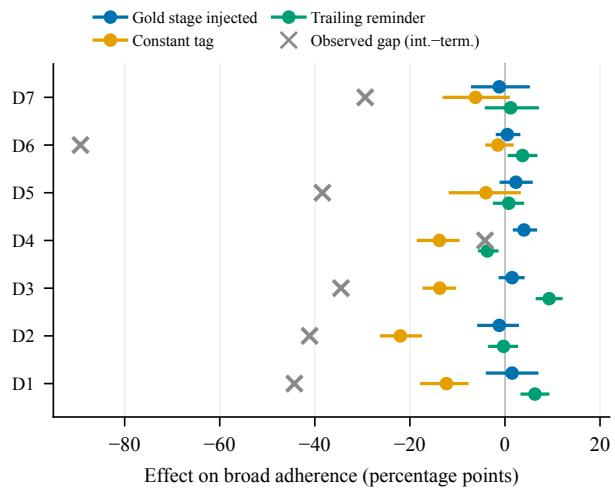  
Figure 12: Effects of three prompting interventions compared with each deployment’s observed intermediate– terminal gap. No intervention closes the gap.

Table 12: Clustered-bootstrap effects on broad adherence with 95% CIs; † marks intervals that exclude zero. E1: gold-injected minus baseline. E2: static minus baseline. E3: intermediate minus terminal in the baseline arm.
<table><tr><td>Deployment</td><td>E1</td><td>E2</td><td>E3</td></tr><tr><td>ds-v4-flash</td><td>+1.5</td><td> $- 1 2 . 3 ^ { \dagger }$ </td><td> $- 4 4 . 3 ^ { \dagger }$ </td></tr><tr><td>ds-v4-pro</td><td>-1.2 -22.0†</td><td></td><td> $- 4 1 . 1 ^ { \dagger }$ </td></tr><tr><td>glm-5.1</td><td>+1.5 -13.7†</td><td></td><td>† -34.5†</td></tr><tr><td>gpt-5.5</td><td>+4.0† −13.8†</td><td></td><td>-4.2</td></tr><tr><td>qwen3.5-122b-a10b</td><td>+2.3</td><td>-4.0-38.4†</td><td></td></tr><tr><td>qwen3.5-35b-a3b</td><td> $+ 0 . 5$ </td><td>-1.5</td><td> $- 8 9 . 3 ^ { \dagger }$ </td></tr><tr><td>qwen3.6-27b</td><td>-1.2</td><td></td><td> $- 6 . 2 ~ - 2 9 . 4 ^ { \dagger }$ </td></tr></table>

## N Diversified matched negative controls

Three additional $D _ { c } { = } 0$ positions, each a minimal observable flip of an existing checkpoint on the same twelve scenarios (gold derived by an additive extension of the frozen state machine; preexisting derivations byte-identical under test): pretool (the first turn, before any tool event; flip of CP1), mid-chain (user has authorized the next step; correct turn is the second tool call; flip of CP4), and post-done (completion already reported, user says thanks; the model must speak but the duty is off; flip of CP5). Baseline arm, XML encoding, 20 repetitions, nine deployments; 6,480 checkpoints, zero terminal transport failures; the marker-injection corruption gate collapses every clean verdict.

Table 13: False-alarm rate at $D _ { c } { = } 0$ positions, where no protocol is due; lower is better. Post-conf. is the pilot’s original tool-call position on archived rows of the same arm and encoding; “—” marks a deployment not admitted in the pilot.
<table><tr><td>Deployment</td><td></td><td>Pre-tool Post-conf. Mid-chain</td><td></td><td>Post-done</td></tr><tr><td>ds-v4-flash</td><td>54.2%</td><td>0.0%</td><td>0.0%</td><td>100.0%</td></tr><tr><td>ds-v4-pro</td><td>86.7%</td><td>0.0%</td><td>0.0%</td><td>100.0%</td></tr><tr><td>glm-5.1</td><td>98.8%</td><td>0.0%</td><td>0.0%</td><td>90.4%</td></tr><tr><td>gpt-4.1</td><td>100.0%</td><td></td><td>0.0%</td><td>100.0%</td></tr><tr><td>gpt-4.1-mini</td><td>100.0%</td><td></td><td>0.0%</td><td>63.3%</td></tr><tr><td>gpt-5.5</td><td>100.0%</td><td>0.0%</td><td>25.2%</td><td>79.9%</td></tr><tr><td>qwen3.5-122b-a10b</td><td>49.6%</td><td>1.2%</td><td>0.0%</td><td>100.0%</td></tr><tr><td>qwen3  $. 5 \mathrm { - } 3 5 \mathrm { b } \mathrm { - } \mathrm { a } 3 \mathrm { b }$ </td><td>0.0%</td><td>0.0%</td><td>0.0%</td><td>100.0%</td></tr><tr><td>qwen3.6-27b</td><td>41.7%</td><td>0.0%</td><td>0.0%</td><td>100.0%</td></tr></table>

Scenario-clustered bootstrap CIs are archived in the local evidence package; the post-done rates of exactly 100% carry degenerate CIs [100%, 100%] on six deployments. A bare lifecycle tag as the entire reply occurs in 121 of the 2,000 post-done false alarms (6%); the modal form is a one-line courtesy followed by the tag.

## O Breadth replications

Six new it-helpdesk scenarios instantiate a second FSM shape—a single consequential step with no mid-task stage (clarify→confirm→act→complete; checkpoints NEEDS\_ $. \mathrm { I N F O / R E A D Y / } D _ { c } { = } 0 / \mathrm { C O M P L E 7 E D } )$ —and all twelve pilot scenarios were translated to English (every surface string, including tool argument and result strings; tools, FSM, and checkpoints unchanged). Baseline arm, XML encoding, 20 repetitions, nine deployments; 15,120 checkpoints; corruption gates pass.

The action-cued $D _ { c } { = } 0$ positions in both sets show ≈0% false alarms, consistent with the structural-withholding account of Appendix N.

## P Thinking-mode A/B

Could the findings be an artifact of thinking-off configurations? A matched two-arm within-batch A/B reran the frozen baseline checkpoints (CP1–CP5) and the three negative positions of Appendix N under paired thinking-on vs thinking-off lanes for every deployment whose API exposes a thinking toggle (10 repetitions; 11,520 checkpoints). Manipulation checks: thinking lanes must stream nonzero reasoning content in the admission precheck, and per-row reasoning length is recorded (means 114– 218 characters on the verified lanes). Two endpoints were excluded at precheck because they inline reasoning into the answer channel, polluting verdicts; gpt-5.5 does not expose reasoning at all and its completion sizes are indistinguishable from thinking-off, so that pair’s manipulation is unverifiable and it is excluded from the conclusions below.

Table 14: Breadth replications: intermediate and terminal broad adherence and their gap, with scenarioclustered bootstrap CIs; † marks 95% intervals that exclude zero. The single-step exact sign-flip resolution floor is p=.031 at six clusters.
<table><tr><td colspan="4">Single-step (it-helpdesk)</td></tr><tr><td>Deployment</td><td>Int. Term.</td><td>Gap</td><td>English (12 scenarios) Int. Term.</td><td>Gap</td></tr><tr><td>ds-v4-flash</td><td>40.8 100.0</td><td>-59.2†</td><td>23.9 100.0</td><td>-76.1†</td></tr><tr><td>ds-v4-pro</td><td>55.4 100.0</td><td>-44.6†</td><td>34.9 100.0</td><td>-65.1†</td></tr><tr><td>glm-5.1</td><td>60.4 100.0</td><td>-39.6†</td><td>45.4 97.5</td><td>-52.1†</td></tr><tr><td>gpt-4.1</td><td>99.2 100.0</td><td>-0.874.7</td><td>100.0</td><td>-25.3†</td></tr><tr><td>gpt-4.1-mini</td><td>61.8 97.5</td><td>-35.7†</td><td>40.8 62.1</td><td>-21.3†</td></tr><tr><td>gpt-5.5</td><td>100.0 100.0</td><td>+0.0 81.5</td><td>92.9</td><td>-11.4</td></tr><tr><td>qwen3.5-122b-a10b</td><td>46.7 100.0</td><td>-53.3†</td><td>38.9 100.0</td><td>-61.1†</td></tr><tr><td>qwen3.5-35b-a3b</td><td>31.7 100.0</td><td>-68.3†</td><td>37.1 97.1</td><td>-60.0†</td></tr><tr><td>qwen3.6-27b</td><td>54.2 100.0</td><td>-45.8†</td><td>30.8 100.0</td><td>−69.2†</td></tr></table>

On the four deployments with verified manipulation (deepseek-v4-pro/-flash, glm-5.1, qwen3.5- 35b-a3b), thinking shifts intermediate broad adherence by −12.5 to +7.5 points (clustered bootstrap; largest upper CI +14.2) against intermediate– terminal gaps of −52 to −88 points: reasoning does not repair stage-conditioned obligation activation. Failure mass shifts from silent omission toward action divergence (one deployment’s omission share drops 36.9%→20.6% while divergence rises 21.4%→39.7%), mirroring the reminder arm; and on one deployment OFF-side false alarms worsen by +12.3 points (CI $[ + 6 . 6 , + 1 8 . 2 ] )$ —the precision–recall trade that TriggerBench reports for reasoning under prospective load (Zhang et al., 2026b), reproduced here on the control channel.

## Q Matched-obligation bridge: design and scoring

The bridge of $\ S 5$ runs 12 scenarios × 5 checkpoints × 3 repetitions × 6 arms on nine deployments (9,720 checkpoints). O1 appends a completion sigil at the final reply only; O2 is a stage-triggered human-readable status sentence; O3 is our stagetriggered machine tag. Each obligation is run with and without a trailing reminder, on identical frozen histories. Scoring uses a separate deterministic verifier with its own corruption gate. O2 is reported under equal-strictness dual views (exact form vs. correct-sentence substring), since 46% of its strict misses are paraphrases; the lenient view is the one quoted in the main text (its strict mean is 29.1%), and the strict view does not change the direction of any comparison. The trailing reminder moves the nine-deployment means by at most +6.5 points, with per-deployment shifts from −9.7 to +20.1. Position-matched at the terminal checkpoint the three obligations reach 99.0%, 100.0%, and 97.8%, and the turns on which the machine report is absent keep a task-proxy pass rate of 91–100%. Table 15 gives the per-deployment values.

Table 15: Matched obligations on nine deployments: adherence at duty-active checkpoints with the reminder off and on (O1 deferred sigil, O2 status sentence in the lenient view, O3 machine tag), and the position-matched O3 values at the terminal checkpoint and at intermediate checkpoints. Means are equal-weight over deployments.
<table><tr><td>Deployment</td><td>O1 off→on O2 off→on</td><td></td><td>O3 off→on</td><td>O3@term</td><td>O3@int</td></tr><tr><td>deepseek-v4-flash</td><td>100→100</td><td>38→44</td><td>56→60</td><td>100.0</td><td>41.7</td></tr><tr><td>deepseek-v4-pro</td><td>100→100</td><td>45→48</td><td>53→60</td><td>100.0</td><td>38.0</td></tr><tr><td>glm-5.1</td><td>97→97</td><td>31→51</td><td>56→68</td><td>94.4</td><td>42.6</td></tr><tr><td>gpt-4.1</td><td>100→100</td><td>55→56</td><td>79→69</td><td>100.0</td><td>72.2</td></tr><tr><td>gpt-4.1-mini</td><td>100→100</td><td>40→56</td><td>53→69</td><td>88.9</td><td>41.7</td></tr><tr><td>gpt-5.5</td><td>100→100</td><td>86→85</td><td>88→85</td><td>97.2</td><td>85.2</td></tr><tr><td>qwen3.5-122b-a10b</td><td>100→100</td><td>29→39</td><td>48→53</td><td>100.0</td><td>30.6</td></tr><tr><td>qwen3.5-35b-a3b</td><td>94→100</td><td>28→26</td><td>36→42</td><td>100.0</td><td>14.0</td></tr><tr><td>qwen3.6-27b</td><td>100→100</td><td>42→48</td><td>46→43</td><td>100.0</td><td>27.6</td></tr><tr><td>Mean</td><td>99.0→99.7</td><td>43.7→50.2</td><td>57.4→61.0</td><td>97.8</td><td>43.7</td></tr></table>

## R Primary and diagnostic metrics and the protocol’s task tax

Primary metric and diagnostic. Because divergence borders agent-policy adherence (§3), we report one primary metric and one diagnostic: empirical stage-conditioned control adherence $\widehat { \theta } _ { z }$ (clean requires both the right interaction mode and protocol fulfillment; used in the main tables) and diagnostic conditional report validity $\widehat { \phi } _ { z }$ (protocol fulfillment conditional on the absence of an assistant tool call; divergence excluded from the denominator), using the notation of §3. Under the frozen no-tool-call denominator, the descriptive intermediate–terminal difference in $\phi _ { z }$ ranges from 1.8 to 83.4 points (Table 2); for example, the dutyblind endpoint is 14.3% vs. 97.7%, whereas one divergence-dominated endpoint narrows to 49.0% vs. 54.6%. The split separates interaction-mode divergence from protocol failure after speech is selected, and neither metric alone tells the full story.

Two metric objections. The primary $\widehat { \theta }$ gap persists more broadly than the no-tool-call ϕb gap, confirming that divergence and report validity are distinct. Protocol demand has no consistent taskquality effect and is not required for tool selection, although it amplifies divergence on two deployments.

Task and protocol outcomes form separate axes. We score the archived responses against a frozen scripted-lexical task proxy whose per-scenario concept tokens were fixed before scoring and validated at 60/60 agreement in a blinded single-annotator audit archived in the local evidence package. Both off-diagonal quadrants are populated (Table 16); the two rows come from different checkpoint populations and are not cells of one joint distribution. The first row is the blind spot of an outcome-only evaluation: the user-visible turn can remain useful while the runtime channel is absent. Literal marker-only replies are rarer and occur on two deployments. These are descriptive diagnostics, not environment-level task outcomes; they justify treating task behavior and protocol behavior as parallel rather than substitutable measurements.

Table 16: Off-diagonal task/protocol outcomes. Each row has its own population; the rows are not a joint distribution.
<table><tr><td>Quadrant</td><td>Population (denominator)</td><td>Rate</td></tr><tr><td>Task proxy marker omitted</td><td>passed, intermediate checkpoints where the model spoke without the (794/794 marker</td><td>91-100% on</td></tr><tr><td>Protocol clean, proxy failed</td><td>task clarification checkpoint, base- 4.7-45.4% on six line arm, protocol-clean re- of seven deploy- sponses; proxy requires an inter- ments; none on rogative form and the required- the seventh</td><td>one deployment)</td></tr></table>

Protocol demand has no consistent task tax and amplifies divergence on two deployments. Two objections deserve a direct test: that demanding the protocol degrades the visible answer, and that the demand is what pushes models to act instead of speaking—making our headline failure mode an artifact of our own instrument. We reran the frozen checkpoints under two system prompts differing only by the protocol paragraph (10,800 checkpoints, nine deployments). On task quality, scored by the frozen proxy over turns where the model chose to speak, six of nine differences are indistinguishable from zero, two favour the protocol arm, and one deployment pays a real cost (−6.5 points, CI excluding 0); there is no systematic task tax. On the speak-versus-act decision the answer is partly conceding: divergence exists without any protocol demand at all—two deployments speak on only 55.3% and 50.8% of intermediate checkpoints when no protocol is required—but requiring it lowers those rates by a further 15.8 and 10.3 points (CIs excluding 0), while six of nine deployments are unaffected. Tool-call selection at these positions therefore appears without any protocol demand; the instrument amplifies it on two of nine, which bounds how the divergence rates should be interpreted.

## S Continuation-context interventions: design and per-deployment analysis

This appendix gives the design, estimands, and perdeployment results behind the paragraph “Reports change without task progress” in §5.

Setup. Figure 5 is correlational. The intervention summarized in §5 therefore holds the scripted narrative and mechanically derived gold fixed while changing visible continuation context. The first contrast is a withdraw-and-delegate treatment bundle: at the mid-task post-action checkpoint, gold $( D _ { c } , Z _ { c } ^ { * } ) = ( 1 , \mathsf { P } 0 5 \mathsf { T } _ { - } 0 \mathsf { B } \mathsf { S } )$ , it both withdraws the second-step tool and adds a machine-readable field saying that another system will handle the pending step. It changes executability and responsibility together, so the identified contrast is the bundle’s total effect on report emission and on unconditional false completion (estimands in Appendix A).

Controlled intervention: bundle total effect. Pooled over nine deployments (2,129 and 2,120 successful checkpoints in the two arms), the bundle increases report emission by $\widehat { \Delta } _ { E } ^ { B } = 7 5 . 8 \%$ 30.7% = +45.1 points. On the fixed successfulresponse denominator it also increases false completion: $\widehat { \Delta } _ { \mu } ^ { B } = 6 4 . 4 \% - 6 . 2 \% = + 5 8 . 2$ points: a false done that occurs once in sixteen responses becomes the response in nearly two of every three, and $\widehat { \nu } _ { 1 } = 8 5 \%$ of emitted markers in the bundled arm say COMPLETED while the gold is POST\_OBS. Per deployment, false completion rises on all nine (+9.2 to +87.6 points); emission rises on seven (+17.9 to +79.8) and is unchanged on two, which switch the value of the reports they already emit. Because the bundle also reassigns responsibility, a model may read COMPLETED as “nothing remains for this assistant” rather than “the user’s task is finished”; the effect is completion reporting under withdrawal, not direct evidence of a false world model.

Fully crossed decomposition. To separate the bundle, we ran ${ \textrm { a 2 } } \times 2 \times 2 { \textrm { 2 } }$ follow-up whose design and analysis contract were hash-frozen before data collection (Appendix Y); it that crosses self versus other responsibility, available versus withdrawn tool declarations, and resolved versus problem feedback cues. All cells retain the same unfinished lifecycle truth across 12 scenarios, three wording families, and eight admitted deployments. Each reported factor effect is a main effect averaged over the other two crossed factors (Appendix A).

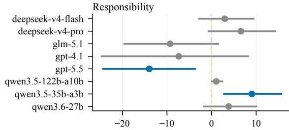

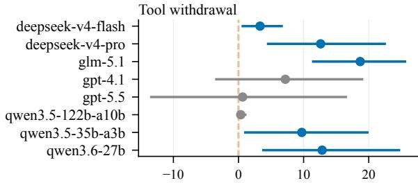

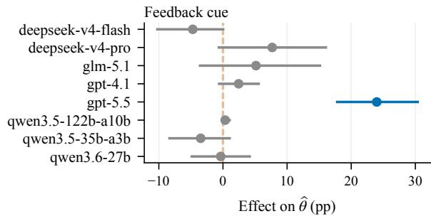  
Figure 13: Per-deployment effects in the controlled $2 \times 2 \times 2$ decomposition: responsibility (other − self), tool withdrawal (withdrawn − available), and feedback cue (problem − resolved). Tool withdrawal is nonnegative on all eight deployments; responsibility and cue effects are heterogeneous.

Tool withdrawal is the only factor whose end-toend effect is non-negative on all eight deployments $( + 0 . 3 \mathrm { t o } + 1 8 . 7 $ points; two effects lie within one point of zero); five of the eight scenario-cluster intervals exclude zero and six of eight keep the same sign in all three wording families. Its two fixed-denominator diagnostics are positive in all deployment×wording checks. Responsibility also raises both diagnostics, but its end-to-end effect is mixed (two of eight intervals exclude zero). Both directions run through emission: withdrawal makes the model report more often, and the added reports split between the correct POST\_OBS, which raises ${ \widehat { \theta } } ,$ and COMPLETED, which raises false completion. Cue and interaction effects are heterogeneous (Figure 13; full ranges in Appendix Table 10). Figure 13 shows percentage-point effects on $\widehat { \theta }$ with scenario-cluster bootstrap 95% CIs over 12 scenarios; blue intervals strictly exclude zero, while a bound exactly at zero remains gray. Deployment order is alphabetical and is not a ranking; Appendix Table 10 adds full ranges, emission, and false-completion columns. Hence the follow-up identifies behavioral effects of explicit fields and tool declarations, not a universal effect or an internal model state. Conditional report validity remains secondary because treatment changes which turns enter its selected denominator.

One bounded reading is consistent with all of these results: emitting a runtime-facing report competes with continuing to act. Embodied systems show the same pattern, continuing to act after a hidden goal is satisfied rather than issuing the required terminal report (Chen et al., 2026); and a direct state question often recovers an omitted report but does not repair an incorrect one (Appendix T).

## T Follow-up Repair Diagnostics

These interventions concern distinct sampled populations and are not randomized arms of one experiment. On 1,677 responses from three deployments that contained useful natural language but omitted the lifecycle tag, replay plus a short continuation recovered the correct tag on 756/1,677 responses (45.1%), compared with 44.2% without the newline. When a tag appeared, its value was almost always correct (756/763), but 921 responses still produced no correct tag.

An isolated state-classification request produced a state signal on 100% of 2,654 requests and selected the correct value on 98.12% (all gold states were NEEDS\_INFO). On the 1,677 source-paired rows, the isolated question recovered 896 rows that continuation missed, while continuation recovered no row the isolated question missed.

The same question did not repair already incorrect state reports. In a separate POST\_OBS population, six deployments passed the preregistered 95% lane-completion gate; across 820 successful verbatim follow-ups, all 820 again reported COMPLETED. Removing the previous erroneous marker produced only 0–0.6% correct responses per deployment. Two additional deployments missed the completion gate and remain infrastructure-missing observations; one deployment produced no data after repeated precheck failures.

Table 17: Repair diagnostics. The populations differ, so the rows are not a randomized between-group effect.
<table><tr><td>Population</td><td>Intervention</td><td>n</td><td>Correct</td></tr><tr><td></td><td>Tag omitted Replay + newline</td><td>1,677</td><td>45.1%</td></tr><tr><td></td><td>Tag omitted Isolated question</td><td>2,654</td><td>98.12%</td></tr><tr><td></td><td>Wrong state Same question</td><td>820</td><td>0.0%</td></tr></table>

The result separates two diagnostics: a direct question can often recover an omitted report in the sampled omission population, but it is not an independent authority for lifecycle state and does not repair an already incorrect judgment in the sampled wrong-state population.

## U Extended related work

Coverage of the survey. The comparison in this appendix draws on a structured scan of the agent-evaluation literature published between August 2025 and August 2026, run along four axes— termination and self-reporting; multi-turn instruction following and prospective memory; trajectory and process evaluation; and structured control signals and runtime systems—yielding 62 candidate papers. Venue claims were verified at the publisher or preprint source rather than taken from secondary listings; where no venue could be confirmed, the work is cited as a preprint. This is a recency sweep and does not replace the older foundational work cited in §7. A second scan along a progress-selfestimation axis added three works, one of which predates the window (Bishop et al., 2024; Ma et al., 2026; Park and Choi, 2026).

Multi-turn instruction following. Multi-IF shows instruction adherence degrades over turns (He et al., 2024); MultiChallenge disentangles instruction retention, context allocation, and reasoning in realistic multi-turn settings (Deshpande et al., 2025); StructFlowBench treats cross-turn structural dependencies as first-class (Li et al., 2025); EvolIF tracks dynamically evolving constraints (Jia et al., 2026). All evaluate human-readable answers under general constraints.

Structured output. SchemaBench and StructEval show syntactic validity is itself nontrivial (Geng et al., 2025; Gu et al., 2025); the Format Tax shows the demand for format, more than decoder constraints, shifts behavior (Lee et al., 2026). These are single-turn with a fixed, always-applicable schema, so they cannot express an obligation that is active at some turns and forbidden at others.

Progress self-estimation. Latent-state estimation prompts a UI agent to estimate performed actions, progression, mistakes, and completion at every step and scores the estimates against human annotation on a 40-task subset, reporting 87.4% for progression and 97.3% for completion; the estimates feed the agent’s own planner (Bishop et al., 2024). The reporting duty there is always on, truth is annotated rather than derived from environment state, and correctness is binary, so an omitted report and a wrong stage value are not distinguished and accuracy is not compared across stages. Under a stage-derived duty with environment-derived truth, the two older deployments in §2 report the mid-task stage correctly on 5.8–11.5% of checkpoints, which shows how much the measurement design moves the answer. RePro trains agents to generate progress percentages, states that per-step progress lacks ground truth in outcome-based tasks, and finds in a pilot that online progress prompting hurts task performance (Ma et al., 2026). A preregistered pilot on one long-running agent loop finds that the agent claimed improvement in every cycle while most cycles showed no measured gain (Park and Choi, 2026).

Stateful tool agents and process evaluation. ToolSandbox evaluates stateful execution with intermediate milestones (Lu et al., 2025a); BFCL and ACEBench extend function-calling evaluation to multi-turn agentic settings (Patil et al., 2025; Chen et al., 2025); DialogTool decomposes the tool-use lifecycle (Liu et al., 2025). Step- and trajectorylevel methods score intermediate actions or whole trajectories rather than only final outcomes (Wang et al., 2025, 2026a; Chuang et al., 2026); SOP-Bench evaluates whether agents follow standard operating procedures when acting (Nan et al., 2025), and OctoBench whether persistent scaffold rules survive long interactions (Ding et al., 2026). All target actions, policies, or task milestones, leaving the model-to-orchestrator communication channel unmeasured. AgentIF evaluates conditional and tool constraints inside realistic agentic prompts (Qi et al., 2025), but not obligations activated by interaction stage. Inter-agent protocol benchmarks compare communication protocols between agents (Du et al., 2025)—a different channel from the model-to-runtime lifecycle signal studied here.

Table 18: Construct map. The rows can share surface syntax while differing in what is evaluated, when the obligation applies, where truth comes from, and who consumes the output. StageIF targets the final row rather than treating lifecycle reporting as generic instruction following.
<table><tr><td>Construct</td><td>Primary object</td><td>Activation condition</td><td>Truth / reference source</td><td>Primary consumer</td></tr><tr><td>Instruction following</td><td>response constraint</td><td>instruction-dependent</td><td>gold answer or checker</td><td>user / evaluator</td></tr><tr><td>Structured output</td><td>serialized response</td><td>usually each evaluated response</td><td>schema plus content reference</td><td>application / evaluator</td></tr><tr><td>Prospective memory</td><td>deferred action</td><td>future cue or deadline</td><td>requested future duty</td><td>user / environment</td></tr><tr><td>Process or state evaluation</td><td>action or trajectory state model-estimated progress and every step</td><td>milestone or terminal event</td><td>environment or trace</td><td>evaluator</td></tr><tr><td>Latent-state estimation</td><td>completion</td><td></td><td>human annotation</td><td>agent&#x27;s own planner</td></tr><tr><td>Lifecycle (StageIF)</td><td>reporting model-reported control state</td><td>runtime-derived checkpoint</td><td>trusted runtime state</td><td>runtime control logic</td></tr></table>

Position within prospective memory. Beyond the reminder contrast reported in §5, our work extends this line from single-response formatting duties to a multi-turn, stage-activated, machineconsumed protocol with Dc=0 positions, and decomposes failure into applicability, state selection, and realization. PM-Bench’s Virtual Week schedule carries event- and time-based tasks with latent-channel monitoring; TriggerBench measures proactive recall and false alarms. Both target semantic-level proactive behavior; neither measures stage-value selection or realization on a machine-consumed channel.

## V Runtime-owned gate replay

The 336 archived live trajectories are replayed under two continuation gates: model-emitted, where a missing marker kills the session and a COMPLETED marker stops it, and runtime-owned, where the lifecycle is derived from environment observables. Because gate decisions depend only on the trajectory prefix, truncating at the first stop event reproduces the gated outcome distribution exactly with zero provider calls. The model-emitted gate yields 114/336 correct terminations, 62 dead ends, and 8 premature stops; the runtime-owned gate yields 164/336 with both failure classes eliminated by construction. The residual incompletes are behavioral and shared by both gates, and zero sessions finish the environment without signaling. Replay rules are in the artifact repository (Appendix Y).

## W Runtime gate comparison: design and results

This appendix gives the validating rollout introduced in §6. Its marker gate ends the session when a report is missing, so outcomes concern task completion, not just report accuracy. The comparison is separate from the interventions in §5. The nouser setting in Appendix G also consumes a modelgenerated stop signal, with 63 of 114 episodes ending at zero reward; that count alone establishes neither false completion claims nor the cost of the stop rule. The rollout below compares reportingand-termination configurations on scripted tasks.

Setup. Scripted checkpoints isolate behavior but not system cost, so we use a validating rollout that rejects structurally invalid actions and enforces cross-step referential integrity, with task success derived from environment state. Across 12 scenarios, six repetitions, and eight deployments, we compare the marker gate B1, the no-tool-call gate B2, and runtime-owned control A. B1 and B2 match user-message templates, but the implementation adds reporting instructions only for the marker gate. Matching user messages therefore does not isolate the gate rule from the reporting protocol. A additionally changes the continuation pathway (implementation and rejection checks in Appendix X). Each trajectory ends in one of four outcomes: task ok (both steps executed validly, read from state); dead end (a natural-language turn carried no marker and the gate ended the session); premature stop (the gate stopped on a COMPLETED marker while the task was unfinished); or stall (the session returned to a user who had nothing to add).

Table 19 covers 2,304 trajectories over eight deployments and omits turn-cap and transport terminations (0.2–1.6%; Appendix X). Dead ends and premature stops are structurally impossible without a marker to read; the two runtime-owned rows differ only in whether the re-prompt carries the default-value authorisation that the other gates’ user turn does. B2 removes every dead end but stalls 45.5% of trajectories.

A 13-point difference between tested configurations. Task success rises from 40.8% under the marker gate (B1) to 53.8% under the no-tool-call gate (B2). The observed configuration contrast (defined in Appendix A) is +13.0 points (scenarioclustered CI [+7.1, +19.4]; Table 19). This contrast includes the marker gate’s strict response to an absent report: it ends the session rather than waiting for a repair; it does not separate that rule from the reporting instructions. The task-success difference is heterogeneous (Appendix X, Table 20): the B2−B1 task-success difference is positive on seven deployments (+4 to +68 points) and negative on one (−25), and 110 of the 131 dead ends fall on two deployments. Omission-heavy deployments incur dead ends, whereas divergence-heavy deployments often produce no natural-language turn for the marker gate to reject; this deployment-level association is exploratory, not predictive.

Table 19: Termination design and outcome in a validating environment. Panel A matches user messages but not all model inputs; it compares reporting-andtermination configurations, not isolated gate effects. Panel B additionally varies the controller, continuation speaker, or authorisation.
<table><tr><td colspan="4">Panel A: model-signaled configurations Gate Task ok Dead end Prem.</td></tr><tr><td>Marker (B1) 40.8%</td><td>22.7%</td><td>1.6%</td><td>Stall 33.3%</td></tr><tr><td>No-tool-call (B2)</td><td>53.8%</td><td>0% 0%</td><td>45.5%</td></tr><tr><td colspan="4">Panel B: runtime-owned configurations</td></tr><tr><td>A, unmatched</td><td>40.8%</td><td>0%</td><td>0%59.0%</td></tr><tr><td>A, matched</td><td>81.1%</td><td>0%</td><td>0% 18.6%</td></tr></table>

Missing reports stop tasks before they finish. The marker gate ends 22.7% of trajectories because a marker is missing, whereas premature completion claims terminate only 1.6%. Missing-marker stops are more frequent in this arm, but these outcome frequencies do not identify how much of the between-configuration success difference each failure causes. No gate rejects a trajectory after both steps complete. The marker gate instead stops sessions before completion, typically at clarification: the loss is unfinished work, not discarded completed work.

Surviving terminal reports are a selected sample. Duty-active intermediate adherence under the marker gate remains 4.2–38.0% across the eight deployments, so the deficit persists in an environment that validates actions. All 235 surviving marker-gate terminal checkpoints (one per taskok trajectory, 235/576) were CLEAN. But those trajectories first had to survive the earlier markergated turns. The terminal rate is not guaranteed by definition, nor is it comparable to the scriptedcheckpoint terminal estimate; it cannot establish a rollout stage gap (Appendix X).

Configuration comparison. The runtime-owned arm reaches 81.1% with the matched re-prompt, 40.3 points above the unmatched wording, but also changes the continuation pathway, so it is a configuration comparison, not evidence that one architecture is universally superior; the bounded conclusion is that a model-generated lifecycle report is useful as diagnostic evidence but unsafe as the sole authority when the corresponding state can be derived from trusted runtime events. An independent audit points the same way: false-success rates fall by an order of magnitude in the one domain where an independent simulator could verify state (Advani, 2026).

## X Validating-environment construction and its audit

Outcome coverage in Table 19. The four outcome columns are not exhaustive: each arm also contains turn-cap and transport terminations, excluded from the table because neither is a property of the termination rule under test. Per arm (n=576 each): marker 6 turn-cap + 3 transport; no-tool-call 1 + 3; runtime-owned unmatched 0 + 1; runtimeowned matched 2 + 0. Rows therefore sum to 98.4–99.8%. Table 20 gives the per-deployment outcomes of the message-matched pair.

Table 20: Per-deployment outcomes of the messagematched gates (counts out of 72 trajectories each; turncap and transport terminations omitted). B1 is the marker gate, B2 the no-tool-call gate. Deployments are alphabetical, not ranked.
<table><tr><td></td><td colspan="3">B1 marker</td><td colspan="3">B2 no-tool-call</td></tr><tr><td>Deployment</td><td></td><td>ok dead prem. stall ok</td><td></td><td></td><td></td><td>stall</td><td>1 B2-B1 (pts)</td></tr><tr><td>deepseek-v4-flash</td><td>18</td><td>41</td><td>0</td><td>13 26</td><td></td><td>46</td><td>+11</td></tr><tr><td>deepseek-v4-pro</td><td>25</td><td>5</td><td>0</td><td></td><td>42 31</td><td>40</td><td>+8</td></tr><tr><td>glm-5.1</td><td>52</td><td>0</td><td>5</td><td></td><td>15 55</td><td>17</td><td>+4</td></tr><tr><td>gpt-4.1</td><td>22</td><td>0</td><td>1</td><td></td><td>4830</td><td>41</td><td>+11</td></tr><tr><td>gpt-4.1-mini</td><td>17</td><td>5</td><td>1</td><td></td><td>47 25</td><td>46</td><td>+11</td></tr><tr><td>qwen3.5-122b-a10b 50</td><td></td><td>0</td><td>0</td><td></td><td>17 32</td><td>40</td><td>-25</td></tr><tr><td>qwen3.5-35b-a3b</td><td>2</td><td>69</td><td>0</td><td></td><td>151</td><td>20</td><td>+68</td></tr><tr><td>qwen3.6-27b</td><td>49</td><td>11</td><td>2</td><td></td><td>960</td><td>12</td><td>+15</td></tr></table>

What the environment checks. Each scenario is backed by a typed state store. Tool names are dispatched, not ignored; step-one requires every declared field, non-empty, with the field the user had to supply matched against a per-scenario acceptance pattern; step-two requires the identifier minted by step-one, verbatim. Task success is the conjunction of both steps having executed validly, read from state. Identifiers a live agent cannot know—an opaque order or account number never spoken by the user nor returned by a tool—are resolved from session context rather than demanded, since requiring them would measure clairvoyance.

Construction record. The environment was rebuilt three times after defects found in scheduling back-off, in the time-field check, and in its replacement; the runtime-owned gate was run twice with one wording change (the 40.3-point difference reported in Appendix W); and a second session audited the environment twice for false kills. Each cycle, the rerun rule, and both audit corrections are recorded in the artifact repository (Appendix Y).

## Y Reproducibility

Stimuli (360, hash-frozen), scenario scripts, state machine, verifiers (both strictness variants), corruption-gate tests, per-request ledgers, and raw per-checkpoint outcomes are archived with SHA-256 manifests, and provider-free scripts recheck archive hashes, cardinalities, the paper’s primary metric cells, and the scenario-level exact tests from stored responses. This establishes pipeline and metric recomputability, not behavioral replication on a public model. The implementation record that this paper does not reproduce—exact prompt generators and frozen stimuli per study family, a worked case-to-score trace, the validating environment’s defect-and-rerun cycles and independent audits, verifier forensics, gate-replay rules, the framework survey’s collection protocol, and all figure generators—is kept in a companion artifact repository, private during review and released subject to privacy, licensing, owner, and venue review.