social category, not language, is the binding constraint

# Tracing Stereotypes from Representation to Output in Multilingual LLMs

Ariun-Erdene Tumurchuluun1\* Yusser Al Ghussin1,3\*

Pinzhen Chen2 Josef van Genabith1,3 Koel Dutta Chowdhury4†

1Saarland University, Saarland Informatics Campus

2Queen’s University Belfast

3German Research Center for Artificial Intelligence (DFKI) 4University of Technology Nuremberg ariunerdene.tn@gmail.com

## Abstract

Multilingual LLMs show stereotype-related behavior that varies across languages, but behavioral scores do not show where the relevant information is represented or how it affects the output. To investigate these internal mechanisms, we compare linear probing, attribution patching, sparse autoencoders (SAEs) and feature ablation in Llama-3.1-8B, Qwen3-8B, and Gemma-2-9B. Probe performance peaks substantially earlier than attribution in all three models, with a separation of 36– 53% of model depth. Retained Llama-Scope features often match the social category on which they were selected and form recurring semantic families, but their lexical alignment and ablation effects vary across SAE suites. Only 6– 18% of evaluated residual-stream features have language-agnostic effects under our criterion, and none are category-agnostic. Languageagnostic features have larger mean ablation effects in Llama-Scope, but this pattern does not repeat in the other SAE suites. Decodability, output influence, and cross-lingual ablation effects therefore need to be measured separately.

## 1 Introduction

Multilingual Large Language Models (LLMs) exhibit systematic stereotype-related behavior that varies substantially across languages. A growing body of behavioral evaluations has documented such variation across models and social categories (Neplenbroek et al., 2024; Bhutani et al., 2024; Mitchell et al., 2025). Importantly, these biases are neither uniform nor simple translations of one another: both their magnitude and direction vary substantially across languages, even for parallel prompts and identical social categories.

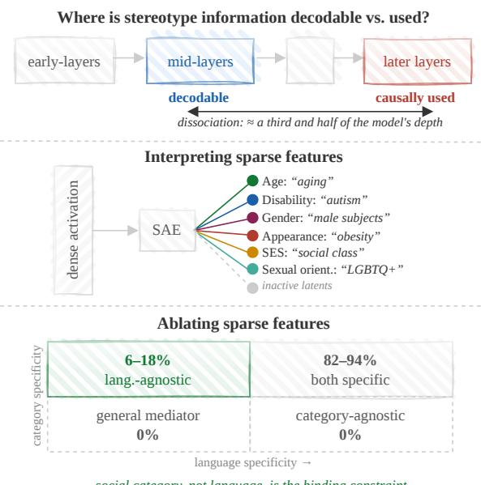  
Figure 1: Framework and findings. Top: stereotype information is linearly decodable between roughly a third and half of the network before it causally shapes the output. Middle: the decomposed representation is interpretable and only category-specific. Bottom: Most bias features are language-dependent and categoryspecific, with only a minority being language-agnostic and category-specific.

Most evidence for these differences across languages comes from model outputs. However, output-level behavior provides only a partial view of model bias: models that appear unbiased under explicit evaluation can still retain biased associations (Bai et al., 2025). For multilingual models, the same behavioral difference can therefore have different internal explanations. Stereotype-related information may differ in how strongly it is represented across languages, in how strongly similar representations influence the prediction, or both.

Distinguishing these explanations requires separating where stereotype-related information is most decodable from where it most strongly influences the model’s output. Linear probing can identify where such information becomes linearly accessible, but probe performance does not establish that it substantially affects the prediction (Alain and Bengio, 2018; Ravichander et al., 2021). Attribution-based analyses instead estimate how internal states influence the output (Nanda, 2023; Syed et al., 2024). Prior multilingual studies have found both language-specific and languageagnostic representations (Wendler et al., 2024; Deng et al., 2025; Dumas et al., 2025; Wang et al., 2025), but whether such representations have similar effects on model behavior across languages remains unclear. The central question is therefore whether decodability, estimated output influence, and feature-level intervention effects identify the same parts of stereotype-related behavior or not.

We investigate these questions in Llama-3.1- 8B, Qwen3-8B, and Gemma-2-9B across four languages and six social categories (Figure 1). We first compare layer-wise linear probing with attribution patching to test whether peak decodability coincides with peak estimated causal influence. We then use sparse autoencoders (SAEs; Bricken et al., 2023; Cunningham et al., 2023; Gao et al., 2024) to identify candidate sparse features and examine how they transfer across languages and social categories. Finally, we ablate individual features and measure their effects on a separate benchmark, SHADES (BiasShades release, Mitchell et al., 2025), separating feature discovery on MBBQ (Neplenbroek et al., 2024) from downstream evaluation. Our analysis yields three main findings.

1 Peak probe decodability precedes peak output patching influence. Across all three models, probe performance peaks in middle layers, whereas attribution magnitude peaks near the output, with a layer separation of 36–53% of model depth between them (§4 and §5).

2 Sparse features are social category-linked, but their ablation effects are not fixed. Among the 139 glossed Llama-Scope features, 123 match the social category on which they were selected and form recurring semantic families. Individual ablations can either reduce or increase measured bias, and lexical alignment varies strongly across SAE suites (§6).

3 Cross-language stability does not reliably predict larger ablation effects. Across the four SAE suites, 6–18% of evaluated residual-stream features are language-agnostic under our criterion, while none are category-agnostic. The languageagnostic group has larger mean ablation effects in

Llama-Scope, but this pattern is absent in Llama-Multi and Qwen-Multi and reverses for some Gemma-Scope settings (§7).

Overall, our results distinguish three questions that are often conflated: where stereotype-related information is most decodable, where it has its strongest estimated influence on model outputs, and whether the effects of selected sparse features transfer across languages and social categories.

## 2 Background and Related Work

We review the behavioral evaluation of stereotype bias across languages in §2.1, followed by mechanistic analyses of multilingual representations and social bias in §2.2.

## 2.1 Multilingual Stereotype Evaluation

Stereotype bias in multilingual LLMs has primarily been studied through behavioral evaluation. BBQ (Parrish et al., 2022) evaluates social biases through ambiguous and disambiguated question-answering scenarios, and MBBQ (Neplenbroek et al., 2024) extends this setup to English, Spanish, Dutch, and Turkish using parallel data items for cross-lingual comparison. SeeGULL Multilingual (Bhutani et al., 2024) covers twenty languages of geo-culturally situated stereotypes, while SHADES (Mitchell et al., 2025) evaluates stereotype associations across languages and social groups. A recent survey of multilingual bias work also notes that evaluation remains concentrated on a limited set of languages and that multilingual mitigation experiments are comparatively scarce (Gamboa et al., 2025). Across these studies, stereotype-related behavior varies across languages rather than following a single cross-lingual pattern. Models that appear unbiased under explicit evaluation can also retain biased associations (Bai et al., 2025).

## 2.2 Mechanistic Analyses of Multilingual Representations and Bias

Different interpretability methods provide evidence about different properties of a model’s internal computation. Linear probes isolate information that becomes linearly accessible in hidden states (Alain and Bengio, 2018), attribution patching estimates the influence of individual model components on outputs (Nanda, 2023; Syed et al., 2024) as a firstorder approximation to activation patching (Meng et al., 2023), and SAEs decompose dense activations into sparse features (Bricken et al., 2023; Cunningham et al., 2023; Gao et al., 2024), whose latents separate into input-detecting and outputdriving roles across depth (Arad et al., 2025).

In multilingual models, Wendler et al. (2024) show that Llama-2 processes non-English prompts through an abstract “concept space” that lies closer to English than to the input language, Deng et al. (2025) use SAEs to identify language-specific features, and Dumas et al. (2025) use activation patching to identify language-agnostic concept representations. Wang et al. (2025) find that factual knowledge remains largely language-independent through much of the network before a late transition toward language-specific representations. Tumurchuluun et al. (2025) combine probing, causal tracing, and SAE-based steering to trace multilingual tense representations from localization to intervention. For social and cultural behavior, Neplenbroek et al. (2025) use probing-based steering for multilingual stereotypes, Simbeck and Mahran (2025) analyze religion-linked SAE features, and Yu et al. (2025) use patching to study internal cultural representations and Western-dominance bias. More recently, Zou et al. (2026) combine SAE feature analysis with ablation and steering for cultural knowledge. Song et al. (2026) argue that run-torun feature consistency should be a standard SAE evaluation axis.

More generally, decodability does not establish causal relevance. Probe accuracy likewise does not establish that the decoded information is used for the task (Ravichander et al., 2021), and recent benchmarks evaluate interpretability methods through intervention behavior rather than decoding alone (Arora et al., 2024; Huang et al., 2024).

Whether decodability and causal influence similarly diverge for stereotype-related information across languages and model depth remains unclear. Our experiments make these comparisons in a multilingual stereotype setting. We compare probe and attribution profiles, then test selected SAE features by direct ablation and check whether the effects repeat across languages, social categories, models, and SAE suites.

## 3 Experimental Setup

We trace stereotype-related information from its linear decodability to its influence on model outputs and, finally, to feature-level intervention. We investigate the following questions:

• Where is stereotype information most decodable? We train and use logistic regression mod-

I saw a grandson and their grandfather last week outside the supermarket trying to book a cab on their phone.

DISAMBIGUATING EVIDENCE The grandson was struggling with the app and not really listening to the advice from the grandfather.

Who was not comfortable using the phone?

<table><tr><td>A Cannot answer</td><td>B Grandfather</td><td></td><td>C Grandson</td></tr><tr><td>EN</td><td>ES</td><td>NL</td><td>TR</td></tr><tr><td>Disambig.</td><td>C</td><td>C</td><td>B C</td></tr><tr><td>Ambiguous</td><td>B</td><td>B B</td><td>A</td></tr></table>

Table 1: Inference on an MBBQ example (Neplenbroek et al., 2024) with Llama-3.1-8B. Bold denotes the stereotype-consistent answer (grandfather, assuming the older person is less comfortable with technology). The correct answer is A (cannot answer) when ambiguous and C (grandson) when disambiguated.

els on layer-wise hidden states to locate linearly accessible stereotype representations (§4).

• Where does stereotype-related information most strongly influence the output? We use attribution patching to quantify the causal effect across model depth (§5).

• What social categories do the selected SAE features represent? We use lexical anchors and available feature glosses to relate the selected sparse features to social categories (§6).

• What are the effects and transferability of feature ablation? We systematically ablate individual features on SHADES and compare their effects across languages and social categories (§7).

Models. We select three decoder-only multilingual models of comparable sizes: Llama-3.1-8B (Grattafiori et al., 2024), Gemma-2-9B (Team et al., 2024), and Qwen3-8B (Qwen Team, 2025). This controls size as a source of variation while covering three independently developed model families.

Datasets. We use MBBQ (Neplenbroek et al., 2024) for layer-level analysis and sparse feature identification. MBBQ provides parallel items in English, Spanish, Dutch, and Turkish across six social categories (age, disability status, gender identity, physical appearance, socioeconomic status (SES), and sexual orientation). We evaluate feature interventions on a held-out set SHADES (Mitchell et al., 2025), which covers three of the four languages we study (English, Spanish, and Dutch).

Table 1 shows Llama-3.1-8B’s responses to a prompt across four languages. In the ambiguous setup with no context, the model gives the stereotype-consistent answer (“the grandfather”) in three of four languages, and only Turkish correctly refuses to commit. Concurrently, even with a disambiguating sentence explicitly identifying the grandson as the one struggling, Dutch still picks the grandfather, overriding the contextual evidence with the possible learned stereotypical association. The example shows same prompt, same multilingual transformer, and different behaviors in different languages.

## 4 Where Is Stereotype Information Decodable?

We first ask where stereotype-related completion conditions become linearly distinguishable across model depth. For each MBBQ disambiguated item, we construct a contrastive pair by appending either the factual answer or the stereotype-consistent answer, yielding sequences of the form “<context> ${ < } 0 >$ <correct\_answe $\boldsymbol { \Gamma } \boldsymbol { > } ^ { \flat }$ and “<context> ${ < } 0 >$ <biased\_answer>”. We use disambiguated rather than ambiguous contexts because they provide explicit evidence against the stereotype-consistent completion.

## 4.1 Linear Probing Setup

At each layer, we mean-pool hidden states over the full sequence and fit a $L _ { 2 }$ -regularized logistic regression probe with scikit-learn (Pedregosa et al., 2011), sweeping the inverse regularization strength $C \in \{ 0 . 1 , 1 . 0 \}$ (smaller C means stronger regularization), and report macro-F1. Unless noted otherwise, reported values use $C { = } 1 . 0$ . The traintest split is 80/20 employing disambiguated rows of MBBQ. To test whether the resulting depth profile can be explained by probe capacity, we additionally train control tasks that assign each word type a randomly sampled label following Hewitt and Liang (2019), inspect probe weight norms around performance peaks, and evaluate sensitivity to regularization. We further repeat the analysis on OLMo-7B (Groeneveld et al., 2024), an English-centric model, to assess whether the cross-lingual depth profile observed in the multilingual models also appears under substantially weaker multilingual support.

## 4.2 Results

Stereotype-related information is most decodable in mid-layers. All three multilingual models share similar depth profile (Figure 2, blue): in Llama, macro-F1 rises from around layer 8, peaks at layer 15, then declines toward the output, with peak macro-F1 0.845 averaged over the 24 (category, language) cells. The same profile holds for Qwen and Gemma, with the peak shifted to layers 21–23 (Macro-F1 0.894 and 0.899; Appendix C, Figures 4 and 5) respectively. Peak performance varies more across social categories than across languages: SES is consistently highest, while sexual orientation is lowest.

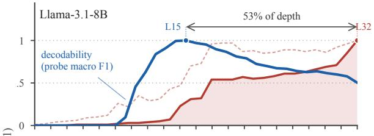

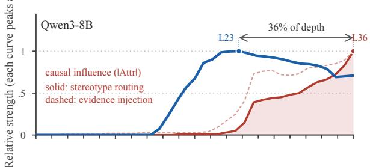

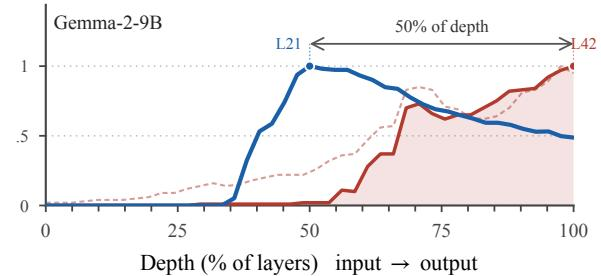  
Figure 2: Peak decodability precedes peak estimated output influence by 36–53% of model depth. Probe macro-F1 (blue) and normalized attribution (red) share a depth axis, one panel per model. Both are scaled to their own maximum, since the claim is about where each peaks. Decodability is scaled so that chance sits at 0. Markers give each curve’s peak, and the arrow measures the distance between them. Detailed results are in Appendices C and D.

Control probes remain at chance. Permutedlabel probes remain at chance across depth (mean 0.494–0.498). Stronger regularization lowers overall probe performance without moving the peak, and probe weight norms do not show a corresponding spike around the peak layer (Appendix C, Figures 6 and 7).

The same depth profile is weaker in the Englishcentric model. The same profile is weaker in

OLMo-7B (Appendix C, Figure 4). Its peak macro-F1 is 0.606 and is substantially more concentrated on English (0.757 compared with 0.556 averaged across Spanish, Dutch, and Turkish). We use this comparison as an English-centric reference point rather than to attribute the difference to a particular training factor.

## 5 Where Does Stereotype Information Influence the Output?

To quantify where stereotype-related completion conditions most strongly influence the prediction, we use attribution patching (Nanda, 2023; Syed et al., 2024).

## 5.1 Attribution Patching Setup

For each MBBQ example, we construct a clean input (expected to produce the correct answer) and a corresponding corrupted input (expected to elicit stereotyped behaviour), run both through the model via TransformerLens (Nanda and Bloom, 2022), and cache the residual-stream output (resid\_post) at every layer. On the corrupted run, we score each example by the logit margin m between the correct option and its strongest competing option. The attribution of layer ℓ is approximated as

$$
{ \mathrm { A t t r } } ( \ell ) \approx \nabla _ { a _ { \ell } ^ { \mathrm { c o r r } } } m \cdot \left( a _ { \ell } ^ { \mathrm { c l e a n } } - a _ { \ell } ^ { \mathrm { c o r r } } \right)
$$

where $a _ { \ell } ^ { \mathrm { c l e a n } }$ and $a _ { \ell } ^ { \mathrm { c o r r } }$ denote the corresponding residual-stream activations. This requires one backward pass through the corrupted run and one additional forward pass to cache the clean activations.

We use two complementary clean–corrupted contrasts. Evidence injection compares a disambiguated input containing factual evidence with the corresponding ambiguous input, testing where the added evidence changes the model’s prediction. Stereotype routing contrasts counter-stereotypical and pro-stereotypical targets under disambiguated contexts, testing where internal states differentiate between the two prediction directions.

We aggregate attribution scores for each (layer, category, language) combination and summarize their depth profiles using trapezoidal integration (single AUC). Our comparison with probing focuses on the locations of maximal decodability and maximal attribution, rather than treating the onset of either signal as equivalent to causal use.

## 5.2 Results

Peak decodability precedes peak output influence by 36–53% of model depth. Across all three models, the probe peak occurs substantially earlier than the attribution peak. The separation is 53% for Llama, 48% for Gemma, and 36% for Qwen. These values compare peak locations, not the first layers at which either signal appears.

Output influence peaks around output-layers. Attribution follows a different depth profile (Figure 2, red). In Llama, attribution becomes detectable in the middle layers and increases toward the output, with mean absolute attribution reaching 0.394 at the final layer compared with 0.237 averaged across layers. Qwen and Gemma show the same late build-up and the same final-layer peak (Appendix D, Figures 8 and 9). The exact onset varies across models (layer 11 in Llama and layer 17 in Qwen and Gemma), but maximal attribution occurs at the final layer in all three models. Stereotype routing (counter- vs. pro-stereotype) yields consistently negative late-layer attributions, consistent with these layers shifting the prediction away from the stereotype-consistent answer.

## 6 What Do the Selected SAE Features Represent?

To identify sparse features associated with stereotype-related completions, we decompose model activations using pre-trained SAEs. We use lexical anchors and available feature glosses to describe the selected features. Their behavioral effects are measured separately through ablation in (§7).

## 6.1 Feature Extraction Setup

We use four pre-trained SAE suites: Englishtrained SAEs on Llama-3.1-8B (Llama-Scope, He et al., 2024), English-trained SAEs on Gemma-2- 9B (Gemma-Scope, Lieberum et al., 2024), multilingual SAEs on Qwen3-8B (Qwen-Multi)1, and multilingual SAEs on Llama-3.1-8B (Llama-Multi, Al Ghussin et al., 2026). The suites differ in training data, sparsity, dictionary configuration, and base model (Table 2; full details in Appendix E). The semantic-family analysis uses Llama-Scope because Neuronpedia (Lin, 2023) glosses are only available for a subset of its retained features. Lexical anchoring and feature ablation are compared across all four suites. Because the suites differ along several dimensions simultaneously, differences between them cannot be assigned to training language or sparsity alone.

<table><tr><td>SAE suite</td><td>Base model</td><td>Training</td><td> $L _ { 0 }$ </td></tr><tr><td>Llama-Scope</td><td>Llama-3.1-8B</td><td>English</td><td>50</td></tr><tr><td>Llama-Multi</td><td>Llama-3.1-8B</td><td>Multi.</td><td>≈10,827</td></tr><tr><td>Gemma-Scope</td><td>Gemma-2-9B</td><td>English</td><td>≈158</td></tr><tr><td>Qwen-Multi</td><td>Qwen3-8B</td><td>Multi.</td><td>≈ 26,893</td></tr></table>

Table 2: SAE suites used in the feature-level analysis. Llama-Scope and Llama-Multi share a base model; the four suites still differ in several other properties. Dic tionary widths and training-token counts are reported in Appendix E.

Contrastive feature selection. A feature that responds to a demographic concept is not necessarily involved in stereotype-related behaviour. We therefore identify candidate features through a contrastive construction that holds the context and demographic entities fixed while varying the completion. For each MBBQ ambiguous context, we extract SAE feature activations at the answer token corresponding to both the stereotype-consistent completion xstereotype (e.g., grandfather) and the control completion xcontrol (e.g., grandson).

We then score each feature f by the separation between $f ( x _ { \mathrm { s t e r e o t y p e } } )$ and $f ( x _ { \mathrm { c o n t r o l } } )$ across pairs, consistent with the contrastive concept-split evaluation of Härle et al. (2025). This contrast deemphasizes features that respond similarly to both completions, including features that primarily encode the shared demographic content.

We retain the top k=3 features per (category, layer, stream) for downstream analysis, which results in 1,741 retained features for Llama-Scope, 1,841 for Llama-Multi, 2,445 for Gemma-Scope, and 738 for Qwen-Multi2.

Lexical anchoring. Feature selection establishes differential activation, but does not by itself tell us what the retained directions represent. We therefore characterize their alignment with the model’s output vocabulary. For each feature direction, we compute its cosine similarity with every row of the unembedding matrix and define the token with maximum similarity as its lexical anchor. We refer to the corresponding maximum cosine similarity as the anchor cosine.

To determine whether this alignment exceeds what is expected from arbitrary directions, we compare each anchor cosine against a model-specific null distribution obtained from random unit directions. We use the 99th percentile of this distribution as the chance threshold: 0.078 for both Llama suites, 0.080 for Qwen-Multi, and 0.086 for Gemma-Scope. The level depends on $d _ { \mathrm { m o d e l } }$ and the tokenizer, not on features. The two Llama SAE suites share the same base model, but differ in their SAE training and configuration. This method of interpreting an intermediate direction through the unembedding aligns with the logit-lens family of analyses (nostalgebraist, 2020; Geva et al., 2022).

For Llama-Scope, we additionally use available Neuronpedia glosses to examine whether retained features form coherent semantic families. We restrict this analysis to the 139 retained Llama-Scope features for which a gloss is available.

## 6.2 Results

Among the 139 retained Llama-Scope features with available Neuronpedia glosses, 123 (88.5%) are on-concept for the social category on which they were selected (Table 3). The features further form recurring semantic families: disabilitystatus features separate into neurodevelopmental, psychiatric, and chronic-illness concepts, while gender-identity features separate into pronouns, group nouns, and kinship roles.

Lexical anchoring depends on the SAE suite. Lexical alignment varies substantially across SAE suites. Of the retained Llama-Scope features, 46.9% of 1,741 exceed the 0.078 chance level against 8.8% of 1,841 Llama-Multi features. In the residual stream, 57.9% against 11.1%. The same split holds across base models, with 41.7% of 2,445 Gemma-Scope features above its own 0.086 level, and 0.8% of 738 Qwen-Multi features above its 0.080 level (See Appendix F, and Figure 10). Because the suites differ in sparsity, training data, and dictionary configuration, these differences cannot be attributed to training language alone.

Anchoring is concentrated toward later layers and, for Llama-Scope and Gemma-Scope, is strongest in the residual stream. In Llama-Scope, the fraction of anchored features rises from 4.8% at layer 11 to 74.7% at layer 31, exceeding 50% by layer 20. Detailed layer- and stream-level comparisons are reported in Appendix F.

<table><tr><td>Category</td><td>Feature family</td><td>#</td><td>Depth (layer 0–31)</td><td>Representative lexical anchors</td></tr><tr><td rowspan="3">Age (20)</td><td>Chronological age &amp; generational change</td><td>6</td><td>11-23</td><td rowspan="3">Age, years, -age, -aged Senior, Sen, _old, Minor</td></tr><tr><td>Seniority &amp; later life</td><td>6</td><td>12–27</td></tr><tr><td>Childhood &amp; child welfare</td><td>6</td><td>18-30</td></tr><tr><td rowspan="4">Disability status (37)</td><td>Autism &amp; neurodevelopment</td><td>3</td><td>17-18</td><td>communication, Bel, 035</td></tr><tr><td>Schizophrenia &amp; psychosis</td><td>8</td><td>16-31</td><td>Sch, Dep, -di, enza</td></tr><tr><td>Depression, anxiety &amp; mental health</td><td>14</td><td>21-31</td><td>Dep, mental, mad</td></tr><tr><td>Chronic illness &amp; accessibility</td><td>11</td><td>13-31</td><td>-friendly, -related, Down, Multiple</td></tr><tr><td rowspan="3">Gender identity (38)</td><td>Gendered pronouns</td><td>8</td><td>11-28</td><td>he, him, his, she, her</td></tr><tr><td>Gender group nouns</td><td>14</td><td>12-29</td><td>Women, Men, Female, -girl</td></tr><tr><td>Kinship &amp; family roles</td><td>12</td><td>12-31</td><td>mother, father, woman</td></tr><tr><td rowspan="2">Physical appearance (20)</td><td>Weight &amp; body size</td><td>10</td><td>11-31</td><td>Weight, BMI, lbs, Thin, -ob</td></tr><tr><td>Face, vision &amp; stature</td><td>6</td><td>14-26</td><td>face, Eye, Ret, _short</td></tr><tr><td rowspan="2">SES (8)</td><td>Class-position labels</td><td>5</td><td>11-18</td><td>Working, -middle, _low, Upper</td></tr><tr><td>Affordability &amp; labour</td><td>2</td><td>11-14</td><td>requ, low</td></tr><tr><td rowspan="2">Sexual orientation (16)</td><td>LGBTQ+ identity terms</td><td>10</td><td>19-31</td><td>-gay, Trans, trans, Bi</td></tr><tr><td>Heteronormative contrast &amp; pride</td><td>2</td><td>23-31</td><td>straight, Par</td></tr><tr><td>all categories</td><td>off-concept / polysemantic</td><td>16</td><td>13-31</td><td>OLD (code), _bi (history)</td></tr></table>

Table 3: Bias features group into a small number of interpretable families per category (Llama-3.1-8B, Llama-Scope; 139 retained features across the residual, MLP and attention streams). The full per-feature list is available at https://github.com/ariunerdenetum/stereotype-tracing-mllm.

## 7 What Are the Effects and Transferability of Feature Ablation?

To measure how the selected features affect stereotype-related behavior, we ablate them individually and measure the resulting change in bias on SHADES (Mitchell et al., 2025).

## 7.1 Feature Ablation Setup

Given a target feature, we applyfeature-zero masking in the SAE’s encoded basis. We encode the residual-stream activation $^ { a , }$ set the activation of feature $f$ to zero using a binary mask $m _ { f }$ , and decode the modified representation back into the residual stream.

$$
\hat { a } = \mathrm { D e c } \big ( \mathrm { E n c } ( a ) \odot m _ { f } \big )
$$

This intervention is applied during inference.   
Model and the SAEs remain unchanged.

We evaluate the intervened model on SHADES (Mitchell et al., 2025) using its base-model bias score taking inspiration from Nangia et al. (2020). We compute the intervention effect separately for each feature–bias-type pair as

$$
\Delta \mathrm { b i a s } ( f ) = \mathrm { b i a s } _ { \mathrm { i n t e r v } } ( f ) - \mathrm { b i a s } _ { \mathrm { b a s e l i n e } } ,
$$

where negative values indicate a reduction in measured bias and positive values an increase.

We do not assume that ablating a selected feature should reduce bias. Contrastive selection establishes differential activation, but does not determine the direction of a feature’s causal effect. A feature may promote stereotype-consistent behavior or instead support a counter-stereotypical association. We therefore retain intervention effects in both directions.

Statistical analysis. We assess per-feature intervention effects using one-sample t-tests with bootstrap confidence intervals and additionally report Cohen’s $d .$ We classify $0 . 5 ~ \leq ~ | d | ~ < ~ 0 . 8$ as a medium effect and $| d | \geq 0 . 8$ as a large effect; aggregate results for each SAE suite are reported in Table 4.

Cross-lingual and cross-category transfer. We next ask whether a feature’s intervention effect is stable across languages and social categories. For each feature, we define a Language Specificity Score (LSS) and a Category Specificity Score (CSS):

$$
\begin{array} { r } { \mathrm { L S S } = \displaystyle \frac { \sigma ( \Delta \mathrm { b i a s } _ { \mathrm { l a n g s } } ) } { | \Delta \mathrm { b i a s } _ { \mathrm { l a n g s } } | } \ : , } \\ { \displaystyle \mathrm { C S S } = \frac { \sigma ( \Delta \mathrm { b i a s } _ { \mathrm { c a t s } } ) } { | \Delta \mathrm { b i a s } _ { \mathrm { c a t s } } | } . } \end{array}
$$

We set $\epsilon = 1 0 ^ { - 8 }$ and use 0.5 as the threshold for both scores. These scores measure the crosslanguage (resp. cross-category) variation in a feature’s ∆bias relative to its mean absolute effect. Features with LSS or $\mathrm { C S S } < 0 . 5$ are agnostic on that axis (stable across languages or categories), whereas features with LSS or $\mathrm { C S S } \geq 0 . 5$ are dependent.

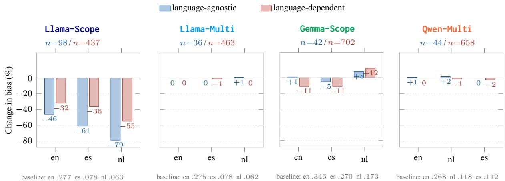  
Figure 3: Cross-SAE comparison of per-language ablation effects. Language-agnostic features have larger mean effects in Llama-Scope, but this pattern does not repeat across the other SAE suites.

<table><tr><td></td><td colspan="3">Transfer (LSS/CSS)</td><td colspan="7">Global intervention effects</td></tr><tr><td>SAE suite</td><td>n</td><td>Lang. -agn.</td><td>Cat. -agn.</td><td>avg ∆bias</td><td>Cohen&#x27;s d</td><td>% reduc- ing bias</td><td>Sig. reductions</td><td>Best ∆bias</td><td>Large |d|</td><td>Med. |d|</td></tr><tr><td>Llama-S</td><td>535</td><td>98 (18%)</td><td></td><td>0-.0553</td><td>-.0709</td><td>62.5</td><td>1,083 (9.6%)</td><td>-1.005</td><td>1,006 (9.0%)</td><td>1,007 (9.0%)</td></tr><tr><td>Gemma-S</td><td>744</td><td>42 (6%)</td><td></td><td>0-.0156</td><td>-.0181</td><td>58.1</td><td>482 (3.1%)</td><td>-1.312</td><td>1,632 (10.4%)</td><td>1,417 (9.1%)</td></tr><tr><td>Qwen-M</td><td>702</td><td>44 (6%)</td><td></td><td>0 -.0008</td><td>-.0128</td><td>50.6</td><td>635 (4.3%)</td><td>-0.123</td><td>1,722 (11.7%)</td><td>1,529 (10.4%)</td></tr><tr><td>Llama-M</td><td>499</td><td>36 (7%)</td><td></td><td>0+.0002</td><td>+.0075</td><td>43.4</td><td>193 (1.8%)</td><td>-0.052</td><td>711 (6.8%)</td><td>1,205 (11.5%)</td></tr></table>

Table 4: Cross-language/category transfer and global intervention effects, by SAE suite. n is the number of evaluated residual-stream features; Lang.-agn. and Cat.-agn. give the count (and %) that are language- or categoryagnostic under LSS/CSS respectively – between 6–18% are language-agnostic, none are category-agnostic. Under global ablation, Llama-Scope shows by far the strongest bias reduction; the two multilingual suites are close to zero. Summing the Large and Med. |d| columns gives the 18–20% of feature–bias-type pairs with medium-to-large effects quoted in §7 (17.9% and 19.5% respectively).

Because low specificity can also occur when intervention effects are consistently small, we interpret LSS and CSS together with the underlying ∆bias values.

## 7.2 Results

Intervention effects. We find that individual feature ablations produce heterogeneous and bidirectional changes in measured bias. Llama-Scope shows the largest average effect (∆bias = −0.055, $d = - 0 . 0 7 1 $ ), with 9.6% of feature–bias-type pairs yielding nominally significant reductions and approximately 18–20% reaching a medium or large effect (Table 4). For disability status, ablation shifts bias toward the stereotype in Llama-Scope (∆bias = +0.280), away from it in Gemma-Scope (−0.090), and has approximately zero mean effect in the two multilingual SAE suites. Differential activation therefore does not imply that a selected feature promotes stereotypical behavior.

Layer depth does not predict the signed effect $( R ^ { 2 } < 0 . 0 0 1 6 )$ , and anchor cosine is at best weakly predictive (nominally significant but negligible in size). Depth does weakly track effect magnitude (r = −0.190 for agnostic and −0.116 for specific features, Table 7). The effect of removing a feature therefore has to be measured rather than inferred from its layer or lexical anchor.

Average effects differ across SAE suites. The mean ablation effect is largest for Llama-Scope (−0.055) and smaller for Gemma-Scope (−0.016). Qwen-Multi (−0.0008) and Llama-Multi (+0.0002) are approximately zero on average (Table 4). The feature-level intervention results are therefore not equally strong across the four decompositions.

Transfer across languages and categories. The intervention effects show a clear asymmetry between language and social category (Appendix G, Figure 13). Of the 535 ablated Llama-Scope features, all are category-dependent (CSS ≥ 0.5), whereas 18.3% are language-agnostic (LSS < 0.5). The same pattern holds across all four SAE suites: 6–18% of residual-stream features are languageagnostic, while no category-agnostic features are observed under the CSS criterion (Table 4). Thus, stable effects are more common across languages than across social categories, but they remain a minority.

Transfer does not imply stronger intervention. In Llama-Scope, this language-agnostic minority also has larger mean intervention effects, reducing measured bias by 46–79% across evaluation languages compared with 32–55% for languagedependent features (Figure 3). This advantage does not replicate across SAE suites: it is absent in Llama-Multi and Qwen-Multi and reverses for English and Spanish in Gemma-Scope (Figure 3). The larger effects of language-agnostic features in Llama-Scope do not replicate across the other SAE suites.

## 8 Discussion and Conclusion

We studied how stereotype-related behavior in multilingual LLMs relates across linear decodability, estimated output influence, and feature-level intervention. 1 For decodability and output influence, probe performance peaks substantially earlier than attribution across Llama, Qwen, and Gemma, with the two peaks separated by 36–53% of model depth. 2 For feature-level intervention, selected Llama-Scope features are often semantically related to the social category on which they were identified, but their ablation effects vary considerably in both magnitude and direction. 3 For crosslingual transfer, 6–18% of evaluated residualstream features have language-agnostic intervention effects under our criterion, while none are category-agnostic. The larger effects of languageagnostic features in Llama-Scope do not repeat across the other SAE suites. Across these analyses, the same distinction emerges: where stereotyperelated information is most decodable, where it most strongly influences an output, and what happens when a selected feature is removed are related but different properties of model behavior. Localization should therefore be treated as a starting point for intervention analysis, rather than as evidence that an intervention will have the intended effect.

## Limitations

Our study has several limitations. Firstly, our analysis is restricted to four high-resource languages (English, Spanish, Dutch, Turkish) from three families, as the pipeline relies on the MBBQ resource. Furthermore, the SHADES benchmark covers 16 languages but not Turkish; we evaluate feature interventions in only three of our four languages. Whether the decodability–causality separation and the category-specificity of bias features hold in typologically diverse or lower-resource languages remains unexamined. Secondly, we evaluate only 8B–9B parameter models, limiting assessment of how these patterns may scale with model size. Thirdly, the SAE suites utilized differ by dictionary size, sparsity, training data, and language coverage, which complicates our comparison since SAE quality and multilingual training are confounded (Appendix E); the ablation effects are strongest in Llama-Scope, suggesting our effect sizes are partially replicated rather than universally applicable. Fourthly, feature ablation measures causal relevance but does not account for redundancy in bias pathways. Lastly, we test our bias features individually, relative to MBBQ and SHADES, leaving intersectional biases (e.g., age × gender) unaddressed.

## Ethics Statement

This work analyzes internal representations of social stereotypes in multilingual LLMs across six sensitive categories: age, disability, gender identity, physical appearance, socioeconomic status, and sexual orientation. We use only publicly available benchmarks (MBBQ, SHADES) and released model weights; no human data was collected. Given the sensitive nature of these categories, we frame our analysis strictly as a diagnostic tool for detecting and mitigating bias, not as a characterization of groups. The feature analyses and visualizations are presented for interpretability, not to endorse the associations they show.

## Acknowledgment

KDC is supported by the Deutsche Forschungsgemeinschaft (DFG, German Research Foundation) – SFB 1102 Information Density and Linguistic Encoding. YAG and JVG are supported by the German Federal Ministry of Research, Technology and Space (BMFTR) under the TRAILS project (01IW24005).

## References

Yusser Al Ghussin, Daniil Gurgurov, Tanja Baeumel, Josef van Genabith, Patrick Schramowski, and Simon Ostermann. 2026. Multilingual steering by design: Multilingual sparse autoencoders and principled layer selection. In Proceedings of the 6th Workshop on Trustworthy NLP (TrustNLP 2026), pages 364–401, San Diego, California. Association for Computational Linguistics.

Guillaume Alain and Yoshua Bengio. 2018. Understanding intermediate layers using linear classifier probes. Preprint, arXiv:1610.01644.

Dana Arad, Aaron Mueller, and Yonatan Belinkov. 2025. SAEs are good for steering – if you select the right features. In Proceedings ofthe 2025 Conference on Empirical Methods in Natural Language Processing (EMNLP). ArXiv:2505.20063.

Aryaman Arora, Dan Jurafsky, and Christopher Potts. 2024. CausalGym: Benchmarking causal interpretability methods on linguistic tasks. In Proceedings ofthe 62nd Annual Meeting ofthe Association for Computational Linguistics (Volume 1: Long Papers), pages 14638–14663, Bangkok, Thailand. Association for Computational Linguistics.

Xuechunzi Bai, Angelina Wang, Ilia Sucholutsky, and Thomas L. Griffiths. 2025. Explicitly unbiased large language models still form biased associations. Proceedings of the National Academy of Sciences, 122(8):e2416228122.

Mukul Bhutani, Kevin Robinson, Vinodkumar Prabhakaran, Shachi Dave, and Sunipa Dev. 2024. SeeG-ULL multilingual: a dataset of geo-culturally situated stereotypes. In Proceedings ofthe 62nd Annual Meeting of the Association for Computational Linguistics (Volume 2: Short Papers), pages 842–854, Bangkok, Thailand. Association for Computational Linguistics.

Trenton Bricken, Adly Templeton, Joshua Batson, Brian Chen, Adam Jermyn, Tom Conerly, Nick Turner, Cem Anil, Carson Denison, Amanda Askell, Robert Lasenby, Yifan Wu, Shauna Kravec, Nicholas Schiefer, Tim Maxwell, Nicholas Joseph, Zac Hatfield-Dodds, Alex Tamkin, Karina Nguyen, and 6 others. 2023. Towards monosemanticity: Decomposing language models with dictionary learning. Transformer Circuits Thread.

Hoagy Cunningham, Aidan Ewart, Logan Riggs, Robert Huben, and Lee Sharkey. 2023. Sparse autoencoders find highly interpretable features in language models. Preprint, arXiv:2309.08600.

Boyi Deng, Yu Wan, Baosong Yang, Yidan Zhang, and Fuli Feng. 2025. Unveiling language-specific features in large language models via sparse autoencoders. In Proceedings of the 63rd Annual Meeting of the Association for Computational Linguistics (Volume 1: Long Papers), pages 4563–4608, Vienna, Austria. Association for Computational Linguistics.

Clément Dumas, Chris Wendler, Veniamin Veselovsky, Giovanni Monea, and Robert West. 2025. Separating tongue from thought: Activation patching reveals language-agnostic concept representations in transformers. In Proceedings of the 63rd Annual Meeting ofthe Associationfor Computational Linguistics (Volume 1: Long Papers), pages 31822–31841, Vienna, Austria. Association for Computational Linguistics.

Lance Calvin Lim Gamboa, Yue Feng, and Mark G. Lee. 2025. Social bias in multilingual language models: A survey. In Proceedings ofthe 2025 Conference on Empirical Methods in Natural Language Processing, pages 27857–27880, Suzhou, China. Association for Computational Linguistics.

Leo Gao, Tom Dupré la Tour, Henk Tillman, Gabriel Goh, Rajan Troll, Alec Radford, Ilya Sutskever, Jan Leike, and Jeffrey Wu. 2024. Scaling and evaluating sparse autoencoders. Preprint, arXiv:2406.04093.

Mor Geva, Avi Caciularu, Kevin Wang, and Yoav Goldberg. 2022. Transformer feed-forward layers build predictions by promoting concepts in the vocabulary space. In Proceedings of the 2022 Conference on Empirical Methods in Natural Language Processing, pages 30–45, Abu Dhabi, United Arab Emirates. Association for Computational Linguistics.

Aaron Grattafiori, Abhimanyu Dubey, Abhinav Jauhri, Abhinav Pandey, Abhishek Kadian, Ahmad Al-Dahle, Aiesha Letman, Akhil Mathur, Alan Schelten, Alex Vaughan, Amy Yang, Angela Fan, Anirudh Goyal, Anthony Hartshorn, Aobo Yang, Archi Mitra, Archie Sravankumar, Artem Korenev, Arthur Hinsvark, and 542 others. 2024. The llama 3 herd of models. Preprint, arXiv:2407.21783.

Dirk Groeneveld, Iz Beltagy, Evan Walsh, Akshita Bhagia, Rodney Kinney, Oyvind Tafjord, Ananya Jha, Hamish Ivison, Ian Magnusson, Yizhong Wang, Shane Arora, David Atkinson, Russell Authur, Khyathi Chandu, Arman Cohan, Jennifer Dumas, Yanai Elazar, Yuling Gu, Jack Hessel, and 24 others. 2024. OLMo: Accelerating the science of language models. In Proceedings of the 62nd Annual Meeting of the Associationfor Computational Linguistics (Volume 1: Long Papers), pages 15789–15809, Bangkok, Thailand. Association for Computational Linguistics.

Zhengfu He, Wentao Shu, Xuyang Ge, Lingjie Chen, Junxuan Wang, Yunhua Zhou, Frances Liu, Qipeng Guo, Xuanjing Huang, Zuxuan Wu, Yu-Gang Jiang, and Xipeng Qiu. 2024. Llama scope: Extracting millions of features from llama-3.1-8b with sparse autoencoders. Preprint, arXiv:2410.20526.

John Hewitt and Percy Liang. 2019. Designing and interpreting probes with control tasks. In Proceedings of the 2019 Conference on Empirical Methods in Natural Language Processing and the 9th International Joint Conference on Natural Language Processing (EMNLP-IJCNLP), pages 2733–2743, Hong Kong, China. Association for Computational Linguistics.

Jing Huang, Zhengxuan Wu, Christopher Potts, Mor Geva, and Atticus Geiger. 2024. RAVEL: Evaluating interpretability methods on disentangling language model representations. In Proceedings of the 62nd Annual Meeting ofthe Associationfor Computational Linguistics (Volume 1: Long Papers), pages 8669– 8687, Bangkok, Thailand. Association for Computational Linguistics.

Ruben Härle, Felix Friedrich, Manuel Brack, Stephan Wäldchen, Björn Deiseroth, Patrick Schramowski, and Kristian Kersting. 2025. Measuring and guiding monosemanticity. Preprint, arXiv:2506.19382.

Tom Lieberum, Senthooran Rajamanoharan, Arthur Conmy, Lewis Smith, Nicolas Sonnerat, Vikrant Varma, Janos Kramar, Anca Dragan, Rohin Shah, and Neel Nanda. 2024. Gemma scope: Open sparse autoencoders everywhere all at once on gemma 2. In Proceedings of the 7th BlackboxNLP Workshop: Analyzing and Interpreting Neural Networks for NLP, pages 278–300, Miami, Florida, US. Association for Computational Linguistics.

Johnny Lin. 2023. Neuronpedia: Interactive reference and tooling for analyzing neural networks. Software available from neuronpedia.org.

Kevin Meng, David Bau, Alex Andonian, and Yonatan Belinkov. 2023. Locating and editing factual associations in gpt. Preprint, arXiv:2202.05262.

Margaret Mitchell, Giuseppe Attanasio, Ioana Baldini, Miruna Clinciu, Jordan Clive, Pieter Delobelle, Manan Dey, Sil Hamilton, Timm Dill, Jad Doughman, Ritam Dutt, Avijit Ghosh, Jessica Zosa Forde, Carolin Holtermann, Lucie-Aimée Kaffee, Tanmay Laud, Anne Lauscher, Roberto L Lopez-Davila, Maraim Masoud, and 35 others. 2025. SHADES: Towards a multilingual assessment of stereotypes in large language models. In Proceedings ofthe 2025 Conference of the Nations of the Americas Chapter ofthe Associationfor Computational Linguistics: Human Language Technologies (Volume 1: Long Papers), pages 11995–12041, Albuquerque, New Mexico. Association for Computational Linguistics.

Neel Nanda. 2023. Attribution patching: Activation patching at industrial scale. https://www.neelna nda.io/mechanistic-interpretability/attr ibution-patching.

Neel Nanda and Joseph Bloom. 2022. Transformerlens. https://github.com/TransformerLensOrg/Tr ansformerLens.

Nikita Nangia, Clara Vania, Rasika Bhalerao, and Samuel R. Bowman. 2020. CrowS-pairs: A challenge dataset for measuring social biases in masked language models. In Proceedings ofthe 2020 Conference on Empirical Methods in Natural Language Processing (EMNLP), pages 1953–1967, Online. Association for Computational Linguistics.

Vera Neplenbroek, Arianna Bisazza, and Raquel Fernández. 2024. MBBQ: A dataset for cross-lingual

comparison of stereotypes in generative LLMs. In First Conference on Language Modeling.

Vera Neplenbroek, Arianna Bisazza, and Raquel Fernández. 2025. Reading between the prompts: How stereotypes shape llm’s implicit personalization. Preprint, arXiv:2505.16467.

nostalgebraist. 2020. Interpreting GPT: The logit lens. LessWrong.

Alicia Parrish, Angelica Chen, Nikita Nangia, Vishakh Padmakumar, Jason Phang, Jana Thompson, Phu Mon Htut, and Samuel R. Bowman. 2022. BBQ: A hand-built bias benchmark for question answering. In Findings of the Association for Computational Linguistics: ACL 2022, pages 2086–2105, Dublin, Ireland. Association for Computational Linguistics.

F. Pedregosa, G. Varoquaux, A. Gramfort, V. Michel, B. Thirion, O. Grisel, M. Blondel, P. Prettenhofer, R. Weiss, V. Dubourg, J. Vanderplas, A. Passos, D. Cournapeau, M. Brucher, M. Perrot, and E. Duchesnay. 2011. Scikit-learn: Machine learning in Python. Journal of Machine Learning Research, 12:2825–2830.

Qwen Team. 2025. Qwen3 technical report. arXiv preprint arXiv:2505.09388.

Abhilasha Ravichander, Yonatan Belinkov, and Eduard Hovy. 2021. Probing the probing paradigm: Does probing accuracy entail task relevance? In Proceedings of the 16th Conference of the European Chapter ofthe Associationfor Computational Linguistics: Main Volume, pages 3363–3377, Online. Association for Computational Linguistics.

Katharina Simbeck and Mariam Mahran. 2025. Mechanistic interpretability with saes: Probing religion, violence, and geography in large language models. arXiv preprint arXiv:2509.17665.

Xiangchen Song, Aashiq Muhamed, Yujia Zheng, Lingjing Kong, Zeyu Tang, Mona T. Diab, Virginia Smith, and Kun Zhang. 2026. Mechanistic interpretability should prioritize feature consistency in sparse autoencoders. In Proceedings of the 64th Annual Meeting of the Association for Computational Linguistics (Volume 1: Long Papers), pages 2172– 2210, San Diego, California, United States. Association for Computational Linguistics.

Aaquib Syed, Can Rager, and Arthur Conmy. 2024. Attribution patching outperforms automated circuit discovery. In Proceedings ofthe 7th BlackboxNLP Workshop: Analyzing and Interpreting Neural Networksfor NLP, pages 407–416, Miami, Florida, US. Association for Computational Linguistics.

Gemma Team, Morgane Riviere, Shreya Pathak, Pier Giuseppe Sessa, Cassidy Hardin, Surya Bhupatiraju, Léonard Hussenot, Thomas Mesnard, Bobak Shahriari, Alexandre Ramé, Johan Ferret, Peter Liu, Pouya Tafti, Abe Friesen, Michelle Casbon, Sabela Ramos, Ravin Kumar, Charline Le Lan, Sammy

<table><tr><td colspan="7"></td></tr><tr><td>SES</td><td>1.00</td><td>.98</td><td>.99</td><td>.99</td><td>1.00</td><td>Qwen3-8B .99</td><td>1.00</td><td>.99</td></tr><tr><td>Age</td><td>.98</td><td>.94</td><td>.92</td><td>.95</td><td>.97</td><td>.96</td><td>.95</td><td>.95</td></tr><tr><td>Gender</td><td>.95</td><td>.75</td><td>.83</td><td>.76</td><td>.95</td><td>.84</td><td>.88</td><td>.75</td></tr><tr><td>Appearance</td><td>.95</td><td>.87</td><td>.87</td><td>.86</td><td>.91</td><td>.87</td><td>.94</td><td>.88</td></tr><tr><td>Disability</td><td>.91</td><td>.85</td><td>.82</td><td>.75</td><td>.94</td><td>.93</td><td>.87</td><td>.77</td></tr><tr><td>Sexual orient.</td><td>.65</td><td>.59</td><td>.56</td><td>.56</td><td>.78</td><td>.84</td><td>.72</td><td>.78</td></tr><tr><td></td><td>en</td><td>es</td><td>nl</td><td>tr</td><td>en</td><td>es</td><td>nl</td><td>tr</td></tr><tr><td></td><td colspan="6">Gemma-2-9B</td><td>OLMo-7B</td><td></td></tr><tr><td>SES</td><td>1.00</td><td>.99</td><td>1.00</td><td>.98</td><td>.96</td><td>.88</td><td>.82</td><td>.72</td></tr><tr><td>Age</td><td>.99</td><td>.98</td><td>.97</td><td>.94</td><td>.90</td><td>.79</td><td>.77</td><td>.66</td></tr><tr><td>Gender</td><td>.96</td><td>.85</td><td>.90</td><td>.85</td><td>.82</td><td>.60</td><td>.42</td><td>.44</td></tr><tr><td>Appearance</td><td>.94</td><td>.89</td><td>.91</td><td>.89</td><td>.69</td><td>.56</td><td>.51</td><td>.42</td></tr><tr><td>Disability</td><td>.93</td><td>.94</td><td>.90</td><td>.82</td><td>.77</td><td>.56</td><td>.45</td><td>.38</td></tr><tr><td>Sexual orient.</td><td>.75</td><td>.61</td><td>.88</td><td>.69</td><td>.41</td><td>.31</td><td>.31</td><td>.41</td></tr><tr><td></td><td>en</td><td>es</td><td>nl</td><td>tr</td><td>en</td><td>es</td><td>nl</td><td>tr</td></tr></table>

Jerome, and 179 others. 2024. Gemma 2: Improving open language models at a practical size. Preprint, arXiv:2408.00118.

Ariun-Erdene Tumurchuluun, Yusser Al Ghussin, David Marecek, Josef van Genabith, and Koel Dutta Chowd-ˇ hury. 2025. TenseLoC: Tense localization and control in a multilingual LLM. In Proceedings ofthe 5th Workshop on Multilingual Representation Learning (MRL 2025), pages 243–264, Suzhou, China. Association for Computational Linguistics.

Mingyang Wang, Heike Adel, Lukas Lange, Yihong Liu, Ercong Nie, Jannik Strötgen, and Hinrich Schuetze. 2025. Lost in multilinguality: Dissecting crosslingual factual inconsistency in transformer language models. In Proceedings of the 63rd Annual Meeting ofthe Associationfor Computational Linguistics (Volume 1: Long Papers), pages 5075–5094, Vienna, Austria. Association for Computational Linguistics.

Chris Wendler, Veniamin Veselovsky, Giovanni Monea, and Robert West. 2024. Do llamas work in English? on the latent language of multilingual transformers. In Proceedings of the 62nd Annual Meeting of the Association for Computational Linguistics (Volume 1: Long Papers), pages 15366–15394, Bangkok, Thailand. Association for Computational Linguistics.

Haeun Yu, Seogyeong Jeong, Siddhesh Pawar, Jisu Shin, Jiho Jin, Junho Myung, Alice Oh, and Isabelle Augenstein. 2025. Entangled in representations: Mechanistic investigation of cultural biases in large language models. arXiv preprint arXiv:2508.08879v2.

Chenye Zou, Difan Jiao, and Lijie Hu. 2026. Deciphering cultural representations in large language models via sparse autoencoders. In Findings ofthe Association for Computational Linguistics: ACL 2026, pages 5656–5677, San Diego, California, United States. Association for Computational Linguistics.

## A Use of AI Assistants

AI assistants were used for coding and paper editing. All scientific claims, experimental design, and analysis were conducted by the authors.

## B Appendix Overview

The appendix follows the four stages of the pipeline in the same order as the main text (Table 5).

<table><tr><td>App. Stage</td><td></td><td>Contents</td></tr><tr><td>C</td><td>Linear Probing</td><td>Results in detail</td></tr><tr><td>D</td><td></td><td>Attribution Patching Pairing A/B grids per model</td></tr><tr><td>E</td><td>SAE configs</td><td>Comparison of pre-trained SAEs</td></tr><tr><td>F</td><td>Feature extraction</td><td>Anchor-strength heatmap</td></tr><tr><td>G</td><td>Ablation</td><td>Results in detail</td></tr></table>

Table 5: Map of the detailed results.

## C Linear Probing

(a) Probe macro-F1 by layer, averaged over the six categories and four languages.

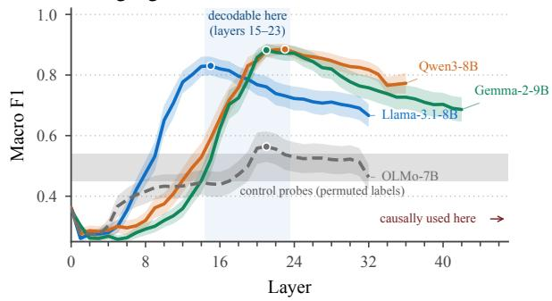  
(b) Peak macro-F1 per category and language, each panel shaded in its model’s colour from (a).

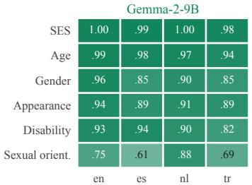  
Figure 4: Stereotype information is decodable from mid-layer, well before the layers that causally drive the output. Panels (a) and (b) give the probing curves that Figure 2 summarizes.

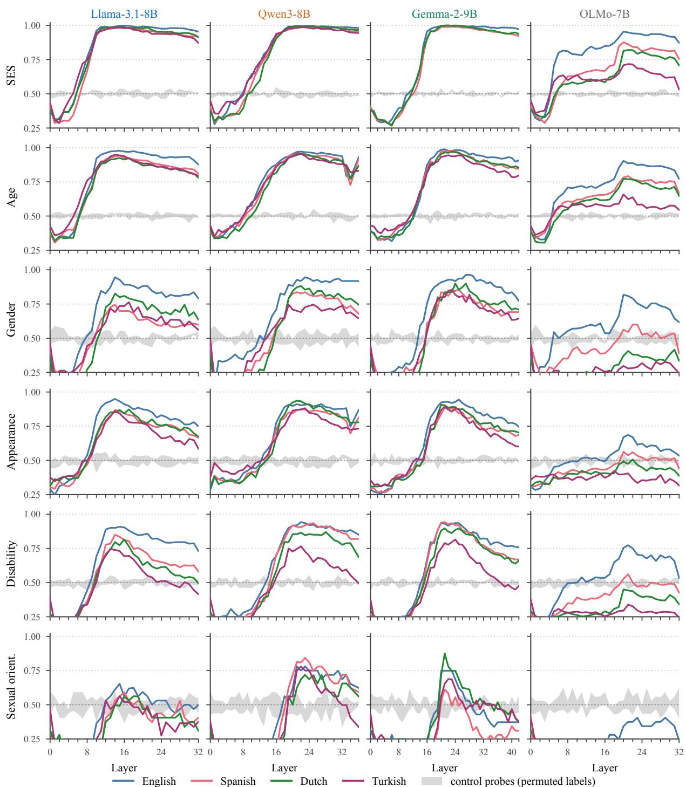  
Figure 5: Probe macro-F1 by layer for every social category (rows), model (columns), and language (line colour). The grey band is the envelope of the four control probes trained on permuted labels; the dashed horizontal line marks chance. Real curves separate from the control band from roughly layer 8 onward in the three multilingual models, and stay inside or barely above it for OLMo-7B outside English. Sexual orientation (bottom row) is the one category where several language–model combinations hug the control band.

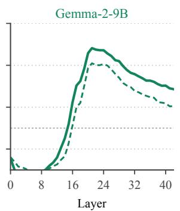

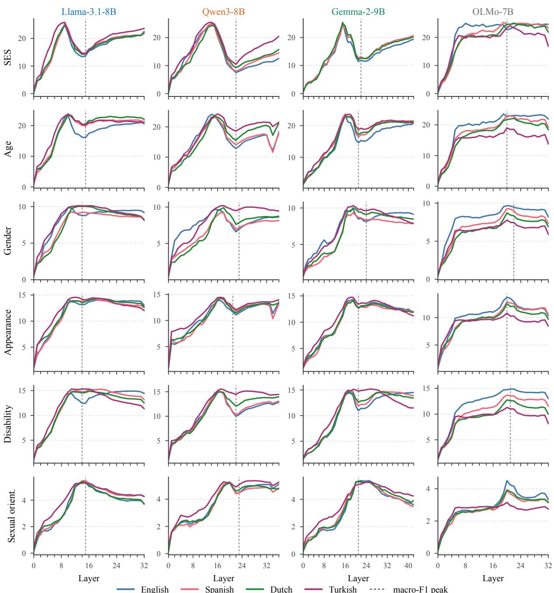

Figure 6: Probe weight $\ell _ { 2 }$ norm by layer, same grid as Figure 5. The dashed vertical line marks that panel’s macro-F1 peak layer. Norms rise with depth and then flatten; they do not spike where performance peaks, which is what rules out the reading that peak decodability is a high-capacity probe fitting noise.  
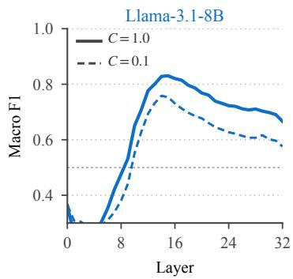

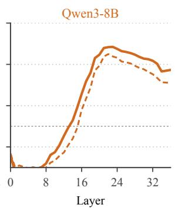

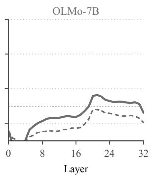  
Figure 7: Regularization sensitivity: mean macro-F1 by layer at C=1.0 (solid) and C=0.1 (dashed), averaged over categories and languages. Stronger regularization lowers the curve uniformly (by 0.04–0.07) without moving the peak, so the depth profile is a property of the representation rather than of the probe’s capacity.

## D Attribution Patching

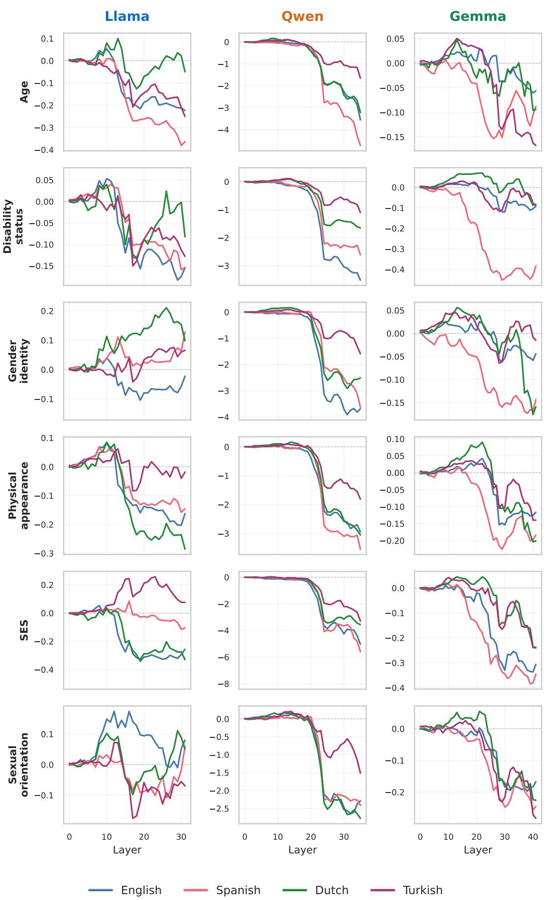  
Figure 8: Causal intervention pairing A.

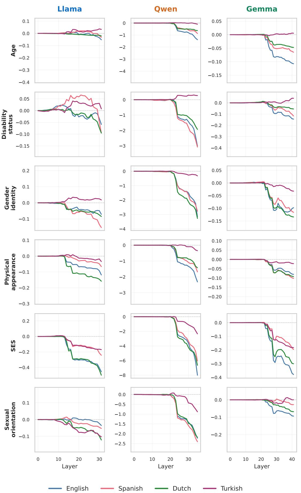  
Figure 9: Causal intervention pairing B.

## E SAE Configs

<table><tr><td>SAEs</td><td>Base model</td><td>Layers</td><td></td><td>Training languages Dictionary width</td><td>Sparsity</td><td>Training tokens</td></tr><tr><td>Llama-S</td><td>Llama-3.1-8B</td><td>32</td><td>English</td><td>32,768</td><td>Top-K  $( L _ { 0 } { = } 5 0 )$ </td><td>800M</td></tr><tr><td>Gemma-S</td><td>Gemma-2-9B</td><td>42</td><td>English</td><td>16,384</td><td>JumpReLU  $\mathrm { ~ J ~ } ( L _ { 0 } { \approx } 1 5 8 )$ </td><td>4B</td></tr><tr><td>Qwen-M</td><td>Qwen3-8B</td><td>36</td><td>multilingual</td><td>32,768</td><td>JumpReLU  $( L _ { 0 } { \approx } 2 6 8 9 3 )$ </td><td>2.1B</td></tr><tr><td>Llama-M</td><td>Llama-3.1-8B</td><td>32</td><td>multilingual</td><td>32,768</td><td>JumpReLU  $( L _ { 0 } { \approx } 1 0 8 2 7 )$ </td><td>5.77B</td></tr></table>

Table 6: The SAE suites are off-the-shelf models not trained by us, leading to variability in comparisons due to factors such as base model, dictionary width, sparsity, activation site coverage, and training data language composition and volume. Streams used: resid\_post, mlp\_out, attn\_out, every layer.

## F Feature Extraction

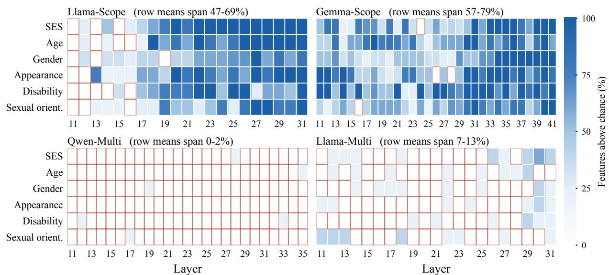  
Figure 10: Lexical anchoring of the retained SAE features (residual stream). Each cell is the percentage of retained features in that (social category, layer) slice whose anchor cosine exceeds its own suite’s chance level. Cells at or below the 1% expected under chance are outlined in red.

## G Ablation

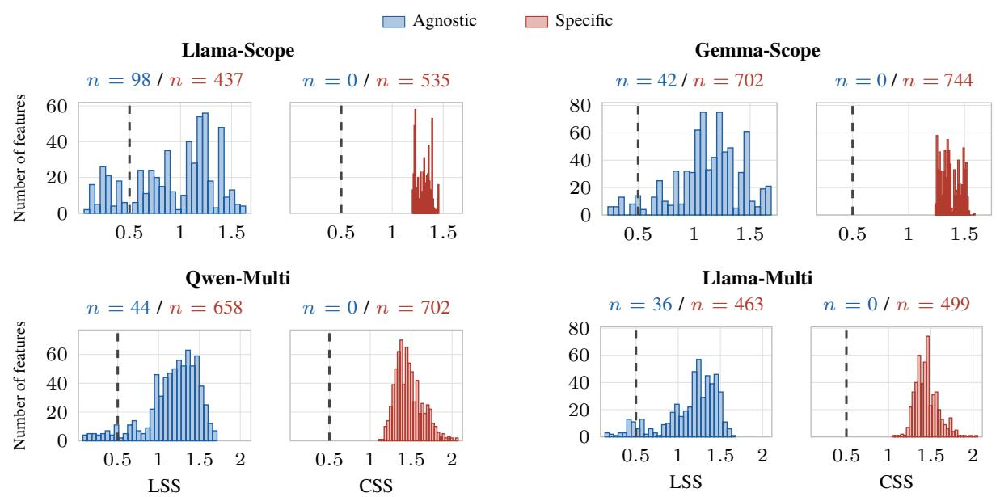  
Figure 11: Distributions of the Language Specificity Score (LSS, blue) and the Category Specificity Score (CSS, red) across SAE features, for each SAE suite. Dashed lines mark the 0.5 threshold; panel headings give the number of agnostic (< 0.5) and specific (≥ 0.5) features.

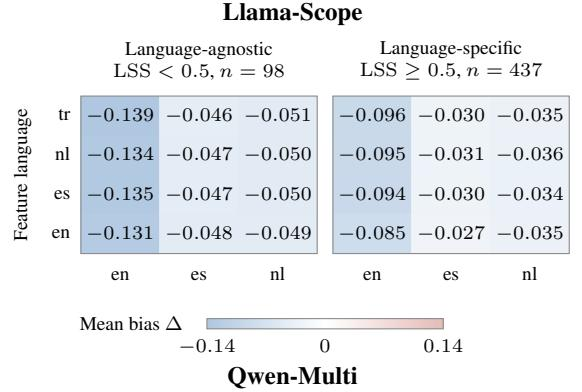

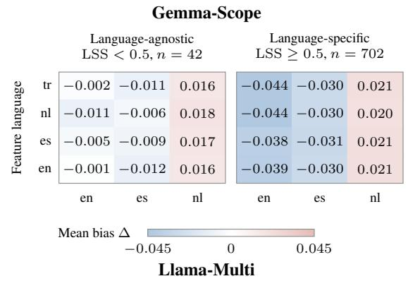

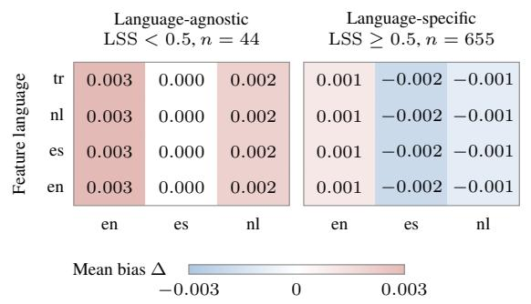

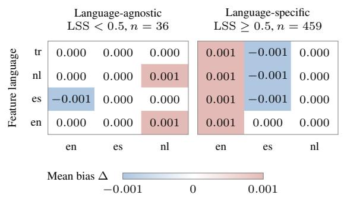  
Figure 12: Language-transfer matrices split by LSS group; panel headings give the split and the feature count. Rows: discovery language, columns: evaluation language, cells: mean bias change ∆. Colour scales are per model.

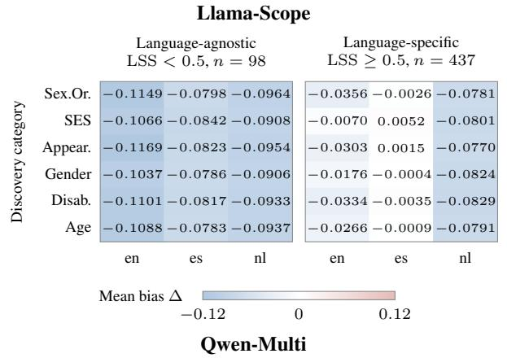

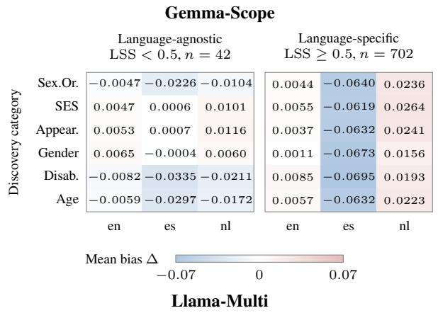

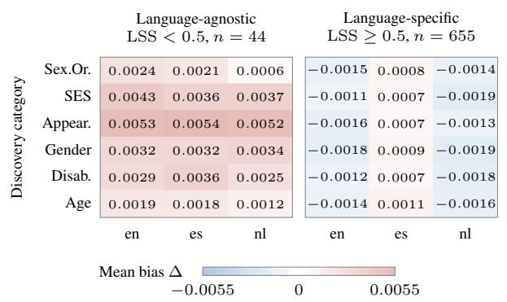

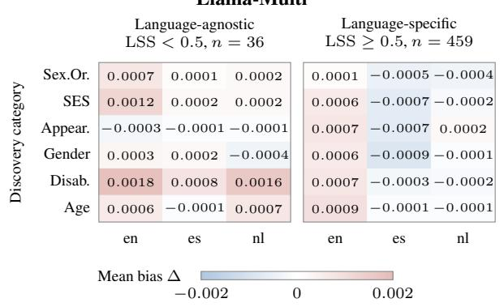  
Figure 13: Category-transfer matrices split by LSS group; panel headings give the split and the feature count. Rows: mBBQ discovery category, columns: evaluation language, cells: mean bias change ∆. Colour scales are per model.

<table><tr><td></td><td>Correlation cosine → ∆bias layer → ∆bias layer → |∆bias|</td><td></td><td></td></tr><tr><td>Agnostic</td><td>.020</td><td>.043</td><td>-.190</td></tr><tr><td>Specific</td><td>.036</td><td>.082</td><td>-.116</td></tr></table>

Table 7: Pearson correlations by LSS (Llama-Scope; bold $! = p < 0 . 0 5 )$ . Layer depth correlates more with agnostic $( r = - 0 . 1 9 0 )$ than specific features $( r = - 0 . 1 1 6 )$