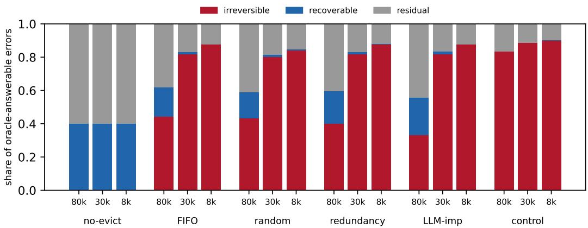
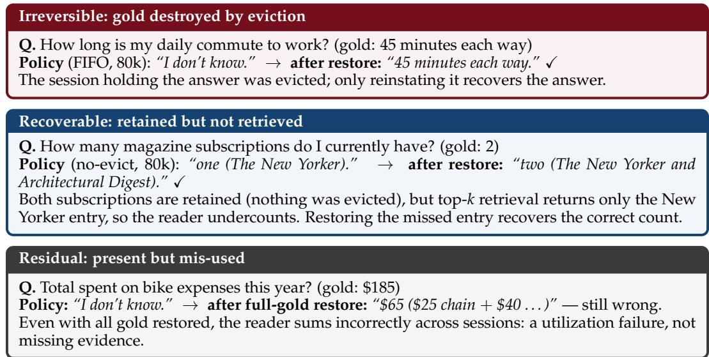

# What Eviction Destroys: A Restore-Counterfactual Audit of Forgetting in Agent Memory

Chen Shen

Megagon Labs

chen s@megagon.ai

## Abstract

Agent memory systems must discard stored information when their history exceeds a fixed token budget. Existing budget–accuracy frontiers quantify the resulting loss in accuracy, but do not distinguish irreversible losses caused by eviction from recoverable retrieval failures. We introduce the restore counterfactual, a per-question paired intervention that reinstates the question’s gold evidence in the read-time context and reruns the same reader. Combining the change in correctness with whether the evidence was retained after eviction classifies each oracle-answerable error as recoverable, irreversible, or residual; in the residual case, the answer remains incorrect after restoration. We evaluate FIFO, random, redundancy-aware, and LLM-importance eviction on LongMemEval-S at three budgets and under two retrieval regimes, using GPT-4o-mini as the primary reader and judge and GPT-5.4-mini as a robustness reader. Under top-k retrieval at an 80k-token budget, the irreversible share among errors corrected by restoration is 0.67–0.73 for FIFO, random, and redundancy-aware eviction, compared with 0.60 for LLM-importance. At 8k tokens, it reaches 1.00 for all four policies. Recoverable errors occur under top-k retrieval at 80k tokens but are absent under forced-gold injection by construction, so budget– accuracy results are not directly comparable unless the retrieval regime is reported. An exploratory matched-accuracy analysis detects no difference in irreversible rate among accuracy-matched policy pairs at a resolution of 1.2–6 percentage points. The same analysis detects the deliberately destructive control. To our knowledge, this is the first per-item, per-question restore-counterfactual audit of eviction for external agent-memory stores on a standard conversational benchmark.

## 1 Introduction

In multi-session interaction, an LLM agent accumulates more experience than fits its context window. Such agents use a memory pipeline that writes information, manages what is retained or forgotten, and reads information (Zhang et al., 2025; Sumers et al., 2024). Systems (Park et al., 2023; Kang et al., 2025; Chhikara et al., 2025) and benchmarks (Maharana et al., 2024; Wu et al., 2025) make this pipeline concrete. Recent work on memory budgets includes theoretical (Zou et al., 2026) and empirical (Zhang et al., 2026) budget–accuracy frontiers, as well as learned retention policies (Li et al., 2026; Kang et al., 2026). These studies quantify the accuracy lost under tighter budgets, but do not characterize the composition of that loss.

A frontier point conflates two failure modes with opposite remedies. If the needed evidence was evicted from the store, no retriever recovers it and only more retention helps (the loss is irreversible); if it survived but was not retrieved, a better retriever helps with no extra retention (recoverable). An all-recoverable frontier and an all-irreversible frontier can look identical on the accuracy axis but require different interventions.

The restore counterfactual starts from a policy’s post-eviction store, reinstates the question’s gold evidence in the read-time context, reruns the same frozen reader, and records any change in correctness. The change in correctness, together with whether the gold evidence was retained after eviction, classifies each oracle-answerable policy error as recoverable, irreversible, or residual; in the residual case, the answer remains incorrect after restoration. We contribute the instrument and the decomposition. We do not propose a new memory system or rank policies. Each outcome has a different diagnostic interpretation: a large irreversible share points to retention; a large recoverable share points to retrieval; and a large residual share indicates that the reader failed to use the restored evidence. The same decomposition applies when forgetting is required by privacy or data-protection constraints; it measures whether the resulting loss in task accuracy is recoverable or irreversible.

Contributions. (i) The restore-counterfactual metric for eviction in external agentmemory stores (§3.1); (ii) the recoverable/irreversible/residual decomposition on an oracle answerable denominator (§3.2); and (iii) a controlled LongMemEval-S study of four eviction policies (including an LLM-importance arm) across three budgets and two retrieval regimes (§4–§5). The study shows that budget–accuracy frontiers are not directly comparable unless the retrieval regime is reported.

## 2 Related work

Budgeted memory and forgetting. MaRS/FiFA compares eviction on synthetic generativeagent simulations with a composite utility bound, not downstream accuracy (Alqithami, 2025). EMBER (Li et al., 2026) and OSL-MR (Kang et al., 2026) propose methods that learn budgeted retention and report end-task accuracy. Neither distinguishes irreversible losses from recoverable ones. DeMem (Zou et al., 2026) formalizes an optimal forgetting boundary; we give an operational per-question estimator of whether it has been crossed. BudgetMem (Zhang et al., 2026) reports accuracy–cost frontiers on LoCoMo and LongMemEval; our decomposition characterizes the loss at a frontier point by failure type.

Stage decomposition. WhenLoss (Yu et al., 2026) decomposes memory failures into writevs retrieval-side mass in aggregate. Our decomposition uses a per-question intervention to attribute errors to eviction. Observational diagnostics (Garg et al., 2026) and retrieval-vsutilization splits (Yuan et al., 2026) locate or attribute failures, but none attributes them to a capacity-bounded eviction decision via a per-item restore. The most closely related work, AgingBench (Zhu et al., 2026), uses paired oracle-injection probes over an agent-written store to diagnose write/retrieval/utilization failures, but it targets aging mechanisms on custom scenarios rather than capacity-bounded eviction policies. Here we classify each oracle-answerable policy error by a per-question restore of the needed evidence on LongMemEval-S.

The intervention class. Reinstating an item and measuring the resulting change is a form of leave-one-out context attribution (Cohen-Wang et al., 2024) and an inference-time analog of counterfactual memorization (Zhang et al., 2023); per-item downstream utility also appears in retrieval evaluation (Salemi & Zamani, 2024). To our knowledge, this is the first study to apply this class of interventions to eviction from an external agent-memory store, with endtask accuracy as the outcome. That setting distinguishes our audit from prior applications of such interventions and from oracle-injection diagnostics (Zhu et al., 2026).

Context-paging employs restores as a serving mechanism (Mason, 2026). Because KV-cache eviction can outperform the full cache, an aggregate no-evict delta mismeasures eviction damage (Bui et al., 2026). Systems that assume recoverability or repair retrieval internally (Hsu et al., 2026; Lu et al., 2026; Semenov & Dorofeev, 2026) do not measure irreversible task loss caused by eviction.

Retrieval confound. Because a frozen retriever can miss evidence retained in the store (Derehag et al., 2026; Wu et al., 2025), eviction effects must be interpreted under controlled retrieval conditions. We therefore report two retrieval settings and the difference between them as a result.

## 3 The restore counterfactual

Following the causal-measurement template (Lesci et al., 2024), we define the target quantity as the loss in end-task accuracy caused by a forgetting decision, identify it from observables under stated assumptions, and give the estimator. §3.1 defines the per-question estimator, and §3.2 uses it to construct the three-bin decomposition. §3.3 states the assumptions needed to interpret the bins as irreversible, recoverable, and residual errors.

## 3.1 The restore-counterfactual metric

Why a counterfactual, not an accuracy drop. A naive estimator measures the drop in accuracy after eviction. That drop conflates the two failure modes we need to separate: the evidence a question needs may have been destroyed by eviction, or it may have survived in the store and merely gone unretrieved. The two have opposite remedies yet are indistinguishable on the accuracy axis. The restore counterfactual distinguishes these failure modes by reinstating the specific evidence the question needs and checking whether the answer becomes correct. This is a form of leave-one-out context attribution (Cohen-Wang et al., 2024).

The estimator. A question q is answered by a frozen reader over memory units injected from a capacity-bounded store. For an eviction policy P at budget B, let the post-eviction store be $\dot { S _ { P } }$ . The restore counterfactual reinstates the question’s full gold evidence set $G _ { q }$ (the units the benchmark labels as containing the answer) into the read-time context and re-answers:

$$
\mathrm { r e s t o r e - g a i n } ( q ) = \mathrm { a c c } _ { q } ( \mathrm { r e s t o r e d } ) - \mathrm { a c c } _ { q } ( \mathrm { p o l i c y } ) \in \{ - 1 , 0 , 1 \} ,
$$

$$
{ \mathrm { i r r e v e r s i b l e . l o s s } } ( q ) = \operatorname* { m a x } ( 0 , { \mathrm { r e s t o r e . g a i n } } ( q ) ) \cdot \mathbf { 1 } [ G _ { q } \not \subseteq S _ { P } ] .
$$

Here $\mathsf { a c c } _ { q } ( c ) \in \{ 0 , 1 \}$ is the judged correctness of q under condition $c \in$ {restored, policy}. Reader, prompt, decoding (temperature 0), judge, and ranker are held fixed across the policy and restored conditions, so the comparison varies the availability of $G _ { q }$ under a common injection procedure; restore gain therefore measures the effect of restoring $G _ { q }$ on correctness, and its positive part is the accuracy recoverable by read-time restoration. Restoration forces $G _ { q }$ ahead of ranker results under a fixed cap, so it can also change which non-gold units appear; A3 bounds the resulting slack. $G _ { q }$ comes from the benchmark’s evidence labels over unmodified turn/session units; we do not use a re-represented or derived-summary store because its units would no longer correspond to the labeled evidence.

A worked case. A LongMemEval-S question asks how long the user’s daily commute takes. Under an 80k budget, FIFO has evicted the session that records ${ \mathrm { i t } } ,$ and the reader answers “I don’t know.” The restore counterfactual re-injects the evicted session; the reader now answers the correct “45 minutes each way”, so restore gain=1 with $\geq 1$ evicted gold unit — an irreversible loss whose only fix is retaining that session. Had the gold session survived in $S _ { P }$ and the same restoration flipped the answer, the loss would instead be recoverable; the retriever missed it. The procedure classifies each error in this way, one question at a time.

## 3.2 The recoverability decomposition

The denominator consists of oracle-answerable policy errors: questions that the reader answers correctly under clean full-gold injection but incorrectly under the policy. (For evicting policies under forced gold these are eviction-induced; the no-evict reference and the top-k regime also admit retrieval-miss/utilization errors, which the recoverable and residual bins isolate.) Each such error is exactly one of:

• irreversible: restoring $G _ { q }$ flips wrong→correct and $\geq 1$ unit of $G _ { q }$ was evicted (destruction, repaired only by retention);

• recoverable: restoring flips wrong→correct and all of $G _ { q }$ survived (a retrieval miss, repaired by a better retriever);

• residual: still wrong with $G _ { q }$ restored (utilization failure, reported separately).

We report stacked shares per policy×budget with question-cluster bootstrap CIs and Holm– Bonferroni over the family. Conditioning on oracle-answerability restricts the decomposition to errors the reader answers correctly from clean gold, so the bins are not contaminated by intrinsically unanswerable questions. The residual share separately captures whether the reader could use the evidence.

## 3.3 When the bins mean what they are named

Interpreting the decomposition requires three assumptions. For each, we explain why it is plausible here and how it can fail.

A1 (Oracle-answerability). We score only errors for which the reader answers correctly under clean full-gold injection. With this restriction, a scored error is one the reader could have answered from clean gold, so the bins reflect what the budget did to the evidence rather than the reader’s inability to answer. That interpretation can fail only if the clean-gold context is itself unanswerable, which the filter excludes by construction. The same filter also limits what we characterize to the answerable slice of the benchmark, excluding abstention behavior.

A2 (Judge validity). Reader and judge are both GPT-4o-mini. To check grading stability, we calibrated the judge on 40 questions before the main evaluation, obtaining repeat selfconsistency of 1.0 against a threshold of ≥0.90 (App. A). This certifies grading stability but not independence from the reader. A correlated reader–judge bias would therefore be invisible to the cross-reader check. As a separate check of grading agreement, an independent GPT-5.5 judge re-grading a stratified sample agrees with GPT-4o-mini at 95.7% (Cohen’s κ=0.90; App. C). Both judges are OpenAI models, so a judge from a different provider, or human annotation, would be a stronger check.

A3 (Restore tightness). Full-gold restore is the default; it makes the irreversible share an upper bound on destruction. Three checks quantify the slack in this upper bound over the 2,276 irreversible cases (App. C). Restoring only the surviving gold reclassifies 0.3%. Injecting the complete retained store (100% coverage) recovers 2%, so 98% of irreversible cases are not latent in retained memory and are consistent with genuine destruction rather than a retrieval miss. Finally, an equal-length placebo (non-gold content at the gold position) flips 8.3% against 100% for the gold restore, so the bin reflects evidence availability, not placement (8.3% upper-bounds the combined presentation and unannotated-evidence effect).

## 4 Experimental setup

The study evaluates four eviction policies at three budgets and under two retrieval regimes on one benchmark, following a protocol frozen before measurement.

Data. LongMemEval-S (Wu et al., 2025) contains multi-session histories of approximately 102k tokens, so all three budgets bind; the dataset version is pinned by the hash reported in App. A. We use all 470 evidence-labeled questions and exclude abstention questions, which have no gold location to restore. Evidence session ids contain an answer substring and are never exposed to the reader or judge.

Policies. We evaluate four eviction policies (FIFO, random, redundancy-aware, and LLMimportance) alongside a no-evict reference. LLM-importance uses a frozen GPT-4o-mini scorer that assigns each unit a general-importance score from 1 to 10 without access to the question or gold evidence; it is a simple importance baseline rather than a state-of-the-art retention system. No policy decision reads gold. We add a deliberately destructive control (an information-density heuristic that evicts gold at ≈3× the baseline rate); it is the positive control for R3 (§5.3), included to establish that the audit registers destruction when it is present.

Budgets. The three store caps of 8k, 30k, and 80k tokens are all binding for the approximately 102k-token histories and span severe to mild memory pressure.

  
Figure 1: The recoverable/irreversible/residual decomposition per policy at three budgets (top-k regime), as three-bin shares of oracle-answerable policy errors. Destruction dominates on the two-bin denominator, not the shares plotted here; the no-evict reference has zero irreversible loss by construction. LLM-importance has the lowest irreversible share at 80k, but this is descriptive — at matched accuracy no policy dissociates (§5.3, R3). (The two-bin headline share is irreversible/(irreversible+recoverable); per-cell counts in Table 1.)

Retrieval regimes. Two read-time conditions are evaluated: (a) forced-gold injection, which isolates destruction by guaranteeing that surviving gold is read; and (b) a frozen top-k ranker, a realistic condition in which surviving gold can be missed. The recoverable-share difference, computed as regime (b) minus regime (a), is itself a result (R2, §5.2).

Reader and judge. Reader and judge are GPT-4o-mini (temperature 0, deterministic); we replicate the structural results with a stronger GPT-5.4-mini reasoning reader (§5). Scoring is paired per question; judge variance is on the order of the effect size, so pairing is mandatory. The evaluation code was construct-validated using a deterministic substitute for the model calls and is released with the per-question records (link in App. B). §3.3 states the validity assumptions for the denominator, judge, and restore.

Statistics and protocol. We run three seeds (deterministic policies use seed 0; App. A). Under a pre-specified protocol that was frozen before measurement and included with the artifact, significance is assessed using a question-cluster bootstrap (10,000 resamples), with Holm–Bonferroni correction within each hypothesis family. The pre-specified H1 family is a per-cell share > 0 test under forced-gold (regime a). Because forced-gold empties the recoverable bin by construction, H1 is a construct check that the decomposition is welldefined — the substantive R1 magnitude (destruction is the majority, two-bin share > 0.5) is read from the regime-b shares and their bootstrap CIs (R1). H3 is the regime (b)−(a) recoverable delta over the evicting policy×budget cells. The no-evict cells (zero destruction by construction) are the excluded reference in both families. For H1/H3, the 12-cell family is the four baseline/control policies (FIFO, random, redundancy-aware, info-density control) × 3 budgets; the later LLM-importance arm enters Table 1 and the H2 matched-accuracy analysis, not these counts. H2 is the irreversible-rate test over accuracy-matched pairs, amended after the freeze (R3).

## 5 Results

## 5.1 Destruction is the majority component (R1)

Under forced-gold injection, the recoverable bin is empty by construction, so the two-bin share sits at 1.00 across all 12 evicting/control cells. That confirms the decomposition is well-defined and that forced gold isolates destruction, but it is an algebraic identity rather than evidence (§5.3). The evidence comes from the magnitude under the realistic top-k regime. On the two-bin denominator irreversible/(irreversible+recoverable), the 80k shares are FIFO 0.71 (CI .61–.81), random 0.73, redundancy-aware 0.67, and control 1.00. Every lower bound exceeds 0.5, so destruction is the majority component. LLM-importance is the exception: its share of 0.60 (CI .47–.72) straddles 0.5, and no-evict is 0.00 by construction. Table 1 reports the per-cell counts; Fig. 1 plots the smaller three-bin share (≈0.40–0.44 at 80k for FIFO, random, and redundancy-aware).

<table><tr><td></td><td></td><td></td><td></td><td colspan="3">decomposition</td><td></td><td></td></tr><tr><td>policy</td><td>budget</td><td>N</td><td>err</td><td>irr</td><td>rec</td><td>res</td><td>two-bin</td><td>irr-rate</td></tr><tr><td>no-evict</td><td>80k/30k/8k</td><td>336</td><td>95</td><td>0</td><td>38</td><td>57</td><td>0.00</td><td>0.00</td></tr><tr><td>FIFO</td><td>80k</td><td>336</td><td>124</td><td>55</td><td>22</td><td>47</td><td>0.71</td><td>0.16</td></tr><tr><td></td><td>30k</td><td>336</td><td>243</td><td>199</td><td>3</td><td>41</td><td>0.99</td><td>0.59</td></tr><tr><td></td><td>8k</td><td>336</td><td>299</td><td>262</td><td>0</td><td>37</td><td>1.00</td><td>0.78</td></tr><tr><td>random</td><td>80k</td><td>1008</td><td>387</td><td>168</td><td>61</td><td>158</td><td>0.73</td><td>0.17</td></tr><tr><td></td><td>30k</td><td>1008</td><td>708</td><td>567</td><td>11</td><td>130</td><td>0.98</td><td>0.56</td></tr><tr><td></td><td>8k</td><td>1008</td><td>894</td><td>754</td><td>3</td><td>137</td><td>1.00</td><td>0.75</td></tr><tr><td>redundancy-aware</td><td>80k</td><td>336</td><td>127</td><td>51</td><td>25</td><td>51</td><td>0.67</td><td>0.15</td></tr><tr><td></td><td>30k</td><td>336</td><td>242</td><td>198</td><td>3</td><td>41</td><td>0.99</td><td>0.59</td></tr><tr><td></td><td>8k</td><td>336</td><td>300</td><td>263</td><td>1</td><td>36</td><td>1.00</td><td>0.78</td></tr><tr><td>LLM-importance</td><td>80k</td><td>332</td><td>102</td><td>34</td><td>23</td><td>45</td><td>0.60</td><td>0.10</td></tr><tr><td></td><td>30k</td><td>332</td><td>239</td><td>196</td><td>4</td><td>39</td><td>0.98</td><td>0.59</td></tr><tr><td></td><td>8k</td><td>332</td><td>302</td><td>265</td><td>0</td><td>37</td><td>1.00</td><td>0.80</td></tr><tr><td>control (info-density)</td><td>80k</td><td>336</td><td>244</td><td>204</td><td>0</td><td>40</td><td>1.00</td><td>0.61</td></tr><tr><td></td><td>30k</td><td>336</td><td>311</td><td>276</td><td>0</td><td>35</td><td>1.00</td><td>0.82</td></tr><tr><td></td><td>8k</td><td>336</td><td>327</td><td>295</td><td>0</td><td>32</td><td>1.00</td><td>0.88</td></tr></table>

Table 1: Eviction loss is destruction-dominated. At 80k every evicting policy’s two-bin share irr/(irr+rec) exceeds 0.5 (bold), and it rises to 1.00 as the budget tightens to 8k. Percell counts under the realistic top-k regime (b), primary reader (GPT-4o-mini): the oracleanswerable denominator N, the policy-error count err, the irreversible/recoverable/residual decomposition, the two-bin share, and the irreversible rate irr/N. Regime (a) is the construct reference $( { \mathrm { r e c } } \equiv 0$ , two-bin ≡ 1.00). random is pooled over 3 seeds $( \breve { N } { = } 1 0 0 8 )$ ; the others are deterministic (seed 0, $N { = } 3 3 6 / 3 3 2 )$ . The full grid (both regimes, both readers, bootstrap CIs) and per-question records are in App. B and the released artifact.

The composition varies with budget and evidence layout. As the budget tightens, the twobin share climbs from 0.67–0.73 at 80k for FIFO, random, and redundancy-aware eviction to 1.00 at 8k for all four policies (Table 1). Evidence layout also matters: single-session questions are ∼95% irreversible, while multi-session and temporal-reasoning questions have residual shares of 23–34% and contribute most of the residual errors. Fig. 2 gives one real instance of each bin. With GPT-5.4-mini as the reader, the H1/H3 reject counts and per-policy ordering remain the same, while the residual mass shrinks (App. C).

## 5.2 The two retrieval regimes are not interchangeable (R2)

Recoverable errors occur under top-k retrieval but are absent under forced-gold injection by construction. At 80k, this recoverable-share gap is FIFO +0.29 (CI .19–.39), random +0.27, redundancy-aware +0.33, and no-evict +1.00, all significant after Holm correction $( p _ { \mathrm { a d j } } { = } . 0 0 7 )$ . A small gap for random at 30k is also significant after correction (+0.019, CI .005–.036, $p _ { \mathrm { a d j } } { = } . 0 4 2 )$ . Together, these results give rejections in 4 of 12 evicting cells. The 3 no-evict cells have an empty two-bin denominator under forced gold (irr=rec=0) and are excluded from that count.

The gap concentrates at 80k because tighter budgets destroy the evidence rather than leave it unretrieved, so fewer recoverable errors remain under top-k retrieval. The rejection pattern also holds with GPT-5.4-mini, which reproduces the H3 rejection count of 4-of-12 evicting cells (App. C). To compare reports at the same budget, researchers must control or at least report the read-time retrieval setting.

  
Figure 2: One real instance of each bin (LongMemEval-S, top-k regime). Irreversible: the gold was evicted; recoverable: the gold was retained but the retriever missed it; residual: the gold is present yet the reader still answers wrong. Bin colors match Fig. 1.

## 5.3 At matched accuracy, no policy dissociates — and the test has power (R3)

R3 is a negative result that requires careful interpretation: the originally specified “clean null” was an artifact of evaluating the irreversible share under forced-gold injection. Under forced-gold injection (regime a), the irreversible share is pinned to 1.00 by construction: all surviving gold is read, so the recoverable bin is empty. That 1.00 contrast therefore cannot detect a dissociation; it is an algebraic identity, not a test (the protocol was amended after the freeze to replace this degenerate statistic). H1 and H3 remain as originally specified (confirmatory). H2 is explicitly flagged as a post-freeze amendment. Re-cast on the nondegenerate irreversible rate (irr/N, top-k regime), with pairs counted as accuracy-matched at $| \Delta \mathrm { a c c } | \le 0 . 0 5$ (the pre-specified caliper), no accuracy-matched baseline pair dissociates at any budget: 0 of 9 (the three baseline pairs {FIFO/random, FIFO/redundancy-aware, random/redundancy-aware} at each of 80k/30k/8k) with $| \Delta \mathrm { r a t e } | \le 0 . 0 3 6$ and every CI spanning 0. A content-aware LLM-importance arm also does not dissociate (0 of 6 accuracymatched comparisons: versus the three baselines at 30k and 8k; tests run on the per-pair shared oracle-answerable qids, $n \approx 3 2 9 )$ . At 80k, LLM-importance has higher accuracy and a lower irreversible rate than the three baselines, but those three comparisons are not accuracy-matched $( 0 . 6 9 \mathrm { v s } \approx 0 . 6 2$ , beyond the 0.05 caliper) and therefore do not count as H2 dissociations. At 30k and 8k, where accuracy is matched, no irreversible-rate dissociation is detected relative to the baselines.

Resolution and positive control. A failure to reject is informative only if the test could have detected a real effect. The deliberately destructive control, which evicts gold at ≈3× the baseline rate, yields a significant irreversible-rate difference in all 9 contrasts $( p < 0 . 0 0 1$ under the primary reader; $p < 0 . 0 5$ across both readers). These contrasts are not accuracymatched, so they show the statistic registers a large destructive difference rather than establishing power within the caliper; the matched comparison’s sensitivity is the observed paired-bootstrap CI half-width, 1.2–6 percentage points; we therefore report no dissociation detected at this resolution rather than statistical equivalence (an equivalence claim would need a powered TOST, left to a follow-up). The null replicates under the stronger reader.

## 5.4 Residual is reader-utilization failure (R4)

The residual bin holds errors that survive even the full-gold restore. These cases are oracleanswerable, and judge strictness accounts for at most 20%. The remaining explanation is utilization failure rather than missing evidence: the gold is present, but the reader fails to reason correctly over it, almost always when aggregating information across sessions. In one such case, a \$185 cross-session sum is returned as “\$65”.

Under the stronger reader, the residual bin more than halves, from 59→28 for no-evict at 80k with forced-gold injection; the corrected cases are exactly the aggregation errors (App. C). The residual bin therefore also depends on the reader.

## 6 Discussion

The measured composition indicates which component needs improvement. Under tight budgets, improving retention takes priority over improving retrieval (R1): a better retriever offers little benefit until more evidence is retained. The recoverable component is nonzero but depends on the retrieval regime (R2). Budget–accuracy frontiers are therefore not directly comparable unless their retrieval regimes are reported. At matched accuracy, no difference in irreversible rate is detected among the tested policy pairs at a resolution of 1.2–6 percentage points (R3). The instrument identifies the limiting component but does not select a best policy.

Limitations. The study uses a single benchmark, two readers, and one primary judge; the audit judge shares its provider. R1/R2 and the R3 null replicate across readers; the residual is reader-dependent. The audit requires gold labels and an oracle-answerable filter, which limits its use to benchmark analysis. The eviction arms are policy classes rather than the published systems. The null is specific to the tested policies and budgets.

Ethics. Here, “destruction” refers only to the loss of task evidence through eviction. In deployment, forgetting may be necessary to meet privacy and data-protection requirements concerning data minimization, storage limitation, or erasure; in such cases, retaining more information may be undesirable or disallowed. The instrument quantifies the task cost of a forgetting decision without prescribing whether information should be retained or deleted; the same decomposition can audit whether a required deletion incurs recoverable or irreversible task loss.

## 7 Conclusion

The restore counterfactual characterizes oracle-answerable policy errors under a memory budget by separating what eviction destroyed, what retrieval missed, and what the reader failed to use. These three sources of error require different remedies. For the budgetedmemory literature, this means that budget–accuracy frontiers are not comparable unless the read-time retrieval regime is reported. Our contribution is an instrument for this analysis; it does not rank policies.

## References

Saad Alqithami. Forgetful but Faithful: A Cognitive Memory Architecture and Benchmark for Privacy-Aware Generative Agents. arXiv preprint arXiv:2512.12856, 2025. URL https: //arxiv.org/abs/2512.12856.

Ngoc Bui, Hieu Trung Nguyen, Arman Cohan, and Rex Ying. Make Each Token Count: Towards Improving Long-Context Performance with KV Cache Eviction. arXiv preprint arXiv:2605.09649, 2026. URL https://arxiv.org/abs/2605.09649.

Prateek Chhikara, Dev Khant, Saket Aryan, Taranjeet Singh, and Deshraj Yadav. Mem0: Building production-ready AI agents with scalable long-term memory. In ECAI 2025: 28th European Conference on Artificial Intelligence, Frontiers in Artificial Intelligence and Applications, pp. 2993–3000. IOS Press, 2025. doi: 10.3233/FAIA251160.

Benjamin Cohen-Wang, Harshay Shah, Kristian Georgiev, and Aleksander Madry. Contextcite: Attributing model generation to context. In Advances in Neural Information Processing Systems, 2024. URL https://proceedings.neurips.cc/paper files/paper/2024/ hash/adbea136219b64db96a9941e4249a857-Abstract-Conference.html.

Jesper Derehag, Carlos Calva, and Timmy Ghiurau. SmartSearch: How Ranking Beats Structure for Conversational Memory Retrieval. arXiv preprint arXiv:2603.15599, 2026. URL https://arxiv.org/abs/2603.15599.

Ishir Garg, Neel Kolhe, Dawn Song, and Xuandong Zhao. MemFail: Stress-Testing Failure Modes of LLM Memory Systems. arXiv preprint arXiv:2605.26667, 2026. URL https: //arxiv.org/abs/2605.26667.

Hao-Lun Hsu, Nikki Lijing Kuang, Boyi Liu, Zhewei Yao, and Yuxiong He. Organize then Retrieve: Hierarchical memory navigation for efficient agents. arXiv preprint arXiv:2606.11680, 2026. URL https://arxiv.org/abs/2606.11680.

Jiazheng Kang, Mingming Ji, Zhe Zhao, and Ting Bai. Memory OS of AI agent. In Proceedings of the 2025 Conference on Empirical Methods in Natural Language Processing, pp. 25961–25970. Association for Computational Linguistics, 2025. doi: 10.18653/v1/2025.emnlp-main.1318. URL https://aclanthology.org/2025.emnlp-main.1318/.

Qingcan Kang, Liu Mingyang, Shixiong Kai, Kaichao Liang, Tao Zhong, and Mingxuan Yuan. Learning What to Remember: Observability-Safe Memory Retention via Constrained Optimization for Long-Horizon Language Agents. arXiv preprint arXiv:2606.10616, 2026. URL https://arxiv.org/abs/2606.10616.

Pietro Lesci, Clara Meister, Thomas Hofmann, Andreas Vlachos, and Tiago Pimentel. Causal estimation of memorisation profiles. In Proceedings of the 62nd Annual Meeting of the Association for Computational Linguistics (Volume 1: Long Papers), pp. 15616–15635. Association for Computational Linguistics, 2024. doi: 10.18653/v1/2024.acl-long.834. URL https://aclanthology.org/2024.acl-long.834/.

Yilong Li, Suman Banerjee, and Tong Che. EMBER: Efficient Memory via Budgeted Evidence Retention for Long-Horizon Agents. arXiv preprint arXiv:2606.05894, 2026. URL https: //arxiv.org/abs/2606.05894.

Keer Lu, Liwei Chen, Guoqing Jiang, Zhiheng Qin, Yunhuai Liu, and Wentao Zhang. REAL: A Reasoning-Enhanced Graph Framework for Long-Term Memory Management of LLMs. arXiv preprint arXiv:2606.10694, 2026. URL https://arxiv.org/abs/2606.10694.

Adyasha Maharana, Dong-Ho Lee, Sergey Tulyakov, Mohit Bansal, Francesco Barbieri, and Yuwei Fang. Evaluating very long-term conversational memory of LLM agents. In Proceedings of the 62nd Annual Meeting of the Association for Computational Linguistics (Volume 1: Long Papers), pp. 13851–13870. Association for Computational Linguistics, 2024. doi: 10.18653/v1/2024.acl-long.747. URL https://aclanthology.org/2024.acl-long.747/.

Tony Mason. The Missing Memory Hierarchy: Demand Paging for LLM Context Windows. arXiv preprint arXiv:2603.09023, 2026. URL https://arxiv.org/abs/2603.09023.

Joon Sung Park, Joseph C. O’Brien, Carrie J. Cai, Meredith Ringel Morris, Percy Liang, and Michael S. Bernstein. Generative agents: Interactive simulacra of human behavior. In Proceedings of the 36th Annual ACM Symposium on User Interface Software and Technology, pp. 1–22, 2023. doi: 10.1145/3586183.3606763. URL https://dl.acm.org/doi/10.1145/ 3586183.3606763.

Alireza Salemi and Hamed Zamani. Evaluating retrieval quality in retrieval-augmented generation. In Proceedings ofthe 47th International ACM SIGIR Conference on Research and Development in Information Retrieval, pp. 2395–2400, 2024. doi: 10.1145/3626772.3657957. URL https://dl.acm.org/doi/10.1145/3626772.3657957.

Andrew Semenov and Svyatoslav Dorofeev. Beyond Compaction: Structured Context Eviction for Long-Horizon Agents. arXiv preprint arXiv:2606.11213, 2026. URL https: //arxiv.org/abs/2606.11213.

Theodore R. Sumers, Shunyu Yao, Karthik Narasimhan, and Thomas L. Griffiths. Cognitive architectures for language agents. Transactions on Machine Learning Research, 2024. URL https://openreview.net/forum?id=1i6ZCvflQJ.

Di Wu, Hongwei Wang, Wenhao Yu, Yuwei Zhang, Kai-Wei Chang, and Dong Yu. Longmemeval: Benchmarking chat assistants on long-term interactive memory. In International Conference on Learning Representations, 2025. URL https://openreview.net/forum?id= pZiyCaVuti.

Jiangnan Yu, Kisson Songqi Lin, and Jilong Wu. WhenLoss: Diagnosing Write and Retrieval Bottlenecks in Long-Context Memory Systems. arXiv preprint arXiv:2605.24579, 2026. URL https://arxiv.org/abs/2605.24579.

Boqin Yuan, Yue Su, and Kun Yao. Diagnosing Retrieval vs. Utilization Bottlenecks in LLM Agent Memory. arXiv preprint arXiv:2603.02473, 2026. URL https://arxiv.org/abs/2603. 02473. Accepted at the MemAgents Workshop, ICLR 2026; cited from the arXiv preprint.

Chiyuan Zhang, Daphne Ippolito, Katherine Lee, Matthew Jagielski, Florian Tramer, and Nicholas Carlini.\` Counterfactual memorization in neural language models. In Advances in Neural Information Processing Systems, 2023. URL https://proceedings.neurips.cc/paper files/paper/2023/hash/ 7bc4f74e35bcfe8cfe43b0a860786d6a-Abstract-Conference.html.

Haozhen Zhang, Haodong Yue, Tao Feng, Quanyu Long, Jianzhu Bao, Bowen Jin, Weizhi Zhang, Xiao Li, Jiaxuan You, Chengwei Qin, and Wenya Wang. Learning Query-Aware Budget-Tier Routing for Runtime Agent Memory. arXiv preprint arXiv:2602.06025, 2026. URL https://arxiv.org/abs/2602.06025. Accepted at ICML 2026; cited from the arXiv preprint.

Zeyu Zhang, Quanyu Dai, Xiaohe Bo, Chen Ma, Rui Li, Xu Chen, Jieming Zhu, Zhenhua Dong, and Ji-Rong Wen. A survey on the memory mechanism of large language modelbased agents. ACM Transactions on Information Systems, 43(6):1–47, 2025. doi: 10.1145/ 3748302. URL https://dl.acm.org/doi/10.1145/3748302.

Jianing Zhu, Yeonju Ro, John Robertson, Kevin Wang, Junbo Li, Haris Vikalo, Aditya Akella, and Zhangyang Wang. Your Agents Are Aging Too: Agent Lifespan Engineering for Deployed Systems. arXiv preprint arXiv:2605.26302, 2026. URL https://arxiv.org/abs/ 2605.26302.

Mingxi Zou, Zhihan Guo, Langzhang Liang, Zhuo Wang, Qifan Wang, Qingsong Wen, Irwin King, Lizhen Qu, and Zenglin Xu. Remember the Decision, Not the Description: A Rate-Distortion Framework for Agent Memory. arXiv preprint arXiv:2605.10870, 2026. URL https://arxiv.org/abs/2605.10870.

## A Protocol constants & reproducibility

Reader/judge GPT-4o-mini (temperature 0, deterministic); robustness reader GPT-5.4-mini. Dataset: LongMemEval-S longmemeval s cleaned.json, sha256 d6f21ea9. . . c3a442 (470 evidence-labeled questions, ∼102k tokens/history, o200k tokenizer); the deprecated original release differs. Store budgets 80k/30k/8k tokens; read-time top-k = 60; restore inject cap = 2000 tokens (fits every gold set, max ≈1,000); 3 seeds (0,1,2; deterministic policies use seed 0). LLM-importance scorer: a frozen GPT-4o-mini rater (1–10 general importance, never sees the question or gold). Bootstrap: question-cluster, 10,000 resamples, smoothed two-sided p; Holm–Bonferroni within each hypothesis family. Judge calibration (gate run before the main evaluation, 40 questions): repeat self-consistency 1.0 against a threshold of ≥0.90, oracle-answerable rate 0.95, negative-restore-gain rate 0.00 against a cap of 0.05. Models (OpenAI API): reader/judge gpt-4o-mini, robustness reader gpt-5.4-mini, importance scorer gpt-4o-mini, and the independent grading-audit judge gpt-5.5 (App. C); all reproducible through the API. The released artifact pins the model versions through exact dated snapshot ids and includes all prompts reproduced in App. D.

Retrieval and restore. The top-k ranker is a frozen deterministic BM25-lite over the retained store (lexical overlap; the same ranker for every arm; recency-tiebroken). Regime (b) is pure top-k (no forced gold); regime (a) forces surviving gold. A restore adds the missing gold to the store, forces the full gold set (never truncated), skips duplicate forced ids, then adds ranker results that fit within the remaining inject cap (2000 tokens); the final injected snippets are ordered chronologically. The question-cluster bootstrap resamples at the level of the question (all seed-replicates of a sampled question move together), so duplicate seeds do not inflate the effective sample size. Denominators: the oracle-answerable filter yields $N { = } 3 3 6$ for the baseline grid; the later LLM-importance arm was run as a separate strengthening grid with its own filter $( N { = } 3 3 2 )$ , and every LLM-vs-baseline paired test runs on the per-pair shared oracle-answerable qids $( n \approx 3 2 { \dot { 9 } } )$ . The rate of restores that turn a correct answer wrong (a negative restore gain) is held below 0.05 by the calibration gate, and such restores never create a recovery: the irreversible loss is clipped at zero, and only policy-wrong oracle-answerable errors are binned.

## B Extended results & artifact

Table 1 (body) gives the headline per-cell counts under the realistic top-k regime (b) on the primary reader. The artifact includes the full grid: both retrieval regimes (a) and (b), both readers (GPT-4o-mini and GPT-5.4-mini), per-cell bootstrap confidence intervals on every share, and the per-question records. Regime (a) is the construct reference (recoverable $\equiv 0 ,$ so the two-bin share ≡ 1.00); random is pooled over 3 seeds $\left( N { = } 1 0 0 8 \right)$ , the others deterministic (seed 0, $N { = } 3 3 6 / 3 3 2 )$

Artifact. The public release contains the evaluation code (policies, restore, decomposition, and bootstrap), per-question records for both readers, per-cell tables with bootstrap CIs, the calibration report, and the figure-generation script: https: $/ / { \tt g \mathrm { : } }$ ithub.com/megagonlabs/ restore-counterfactual. The regime-(a) share $> \boldsymbol { 0 }$ test is the H1 construct check (recoverable ≡ 0 by construction, so the share ≡ 1.00); the no-evict cells (irreversible ≡ 0 by construction) are the excluded zero-destruction reference in the H1/H3 reject counts (§5).

## C Reader robustness, residual analysis & the restore-tightness ablation

Reader robustness (R1/R2). Replacing the GPT-4o-mini reader with the stronger GPT-5.4- mini reasoning reader preserves the structural results: identical Holm counts (12 of 12 evicting/control H1 cells reject; 4 of 12 evicting H3 cells reject) and the same per-policy ordering of two-bin shares. The residual bin is the only component that changes.

Residual mechanism (R4). The 1,922 residual records in the primary-reader baseline grid (both retrieval regimes, all budget cells) are reader-utilization failures: the gold is present, but the reader fails to reason correctly over it, overwhelmingly in cross-session counting and summation (e.g. a \$185 total answered as “\$65”). Under a deliberately conservative heuristic, $\leq 2 0 \%$ are possible judge-strictness cases (most are reader arithmetic errors that merely share entities with the gold); gold-insufficiency is negligible (the cases are oracle-answerable). The stronger reader resolves these same aggregations $( \mathrm { e . g . , }$ the \$185 cross-session sum the weaker reader answers $\mathit { ^ { \prime \prime } } \$ 65$ is correct under GPT-5.4-mini), and the bin more than halves (no-evict@80k: 59→28).

Restore-tightness ablations (§3.3, A3). Three checks bound the irreversible bin’s slack, each over the regime-(b) irreversible cases (seed $\ 0 , N { = } 2 , 2 7 6 ; 0$ API errors each). (i) Surviving gold: re-answering with only $G _ { q } \cap S _ { P }$ restored reclassifies 0.3% (7) as recoverable-in-practice; 87% had no surviving gold at all. (ii) Complete retained store: injecting the entire surviving store (all content, not just annotated gold; mean coverage 1.00, up to the full 80k budget) recovers 2.0% (45), so 98% of irreversible cases remain incorrect even when all retained content is supplied, consistent with genuine destruction rather than a retrieval-from-retained miss. (iii) Length/position placebo: force-injecting equal-length non-gold content at the gold position (placebo/gold token ratio $\leq 1 . { \dot { 5 } } .$ , near the gold’s chronological position) flips 8.3% (190) wrong→correct, against 100% for the gold restore, so the irreversible flips reflect evidence availability, not placement; the 8.3% upper-bounds the combined presentation and unannotated-evidence effect (the placebo is non-annotated, not guaranteed semantically irrelevant). The full-gold restore is therefore a tight upper bound on destruction.

Judge audit (§3.3, A2). An independent GPT-5.5 judge re-graded a stratified sample of 396 recorded (question, reference, candidate) items (both the originally incorrect policy answers and the often correct restored answers) with the frozen judge prompt; 3 GPT-5.5 calls returned errors and were excluded, leaving 393 completed grades spanning both correctness classes (132 correct, 261 incorrect). The GPT-5.5 judge agrees with the GPT-4o-mini judge at 95.7% (Cohen’s κ=0.90; on the two-class restored answers κ=0.83), with disagreement dominated by 14 cases where GPT-5.5 is the stricter grader. The binary grading is thus reliable across models; both judges are OpenAI models, so a judge from a different provider, or human annotation, would be a stronger check.

## D Prompts

Decoding is temperature 0 throughout; max tokens = 600 (reader) / 16 (judge) / 4 (importance scorer). Session ids are never exposed to the reader or judge. The three prompts below are reproduced verbatim from the released code (models.py); {...} marks a field substituted at run time, and {snippets} is the newline-joined rendering of the injected units (or (no memory available)).

Reader prompt   
System.   
You answer a question using ONLY the provided memory snippets from earlier conversations   
between a user and an assistant. Give the direct answer --- concise but COMPLETE (for   
a list/order question, include every item in order; for a ’how many days ago’ question,   
compute it from today’s date). If the snippets truly do not contain the answer, reply   
exactly: I don’t know.   
User.   
Today’s date is {question date}.   
Memory snippets from earlier conversations:   
{snippets}   
Question: {question}   
Answer:

System.   
Grade whether a candidate answer matches a reference answer for the same question. Reply   
with exactly one word: CORRECT or INCORRECT. Grade CORRECT if the candidate conveys   
the same key facts as the reference --- IGNORE articles, capitalization, phrasing, and   
extra detail. For list/order answers, every reference item must appear (order matters   
only if the question asks for order). For dates/numbers, the value must match.   
User.   
Question: {question}   
Reference answer: {answer}   
Candidate answer: {prediction}   
Grade (CORRECT or INCORRECT):

LLM-importance scorer prompt   
System.   
Rate how generally important this single memory snippet is to remember about the user,   
on a scale of 1 (trivial small-talk) to 10 (a durable fact, preference, or commitment).   
Reply with only the integer.   
User.   
Memory snippet: {content}   
Importance (1-10):

The LLM-importance scorer never sees the question or the gold labels.