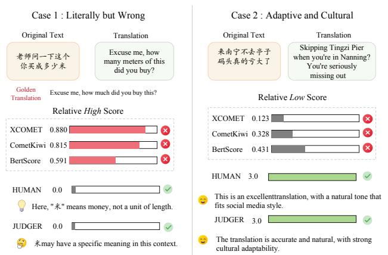
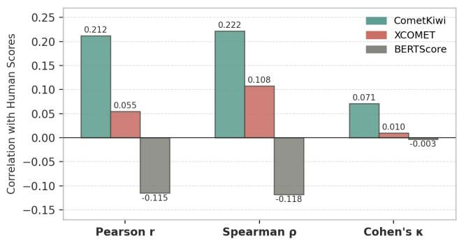
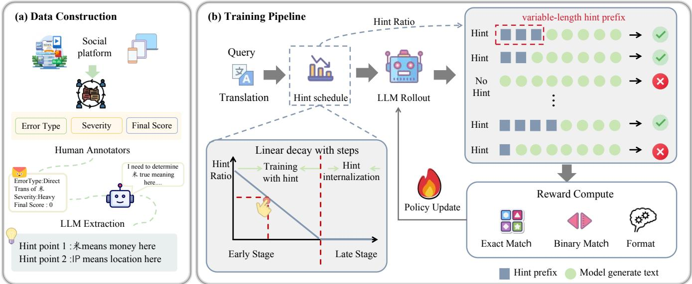
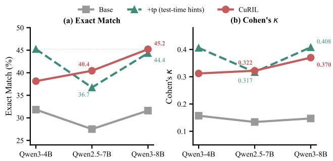
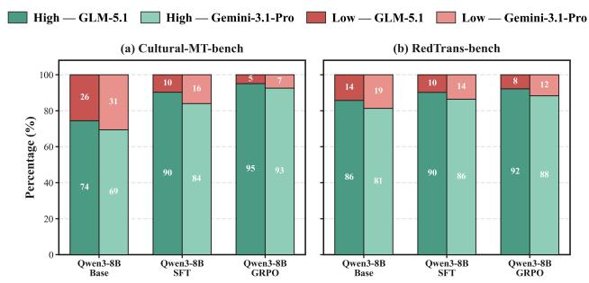
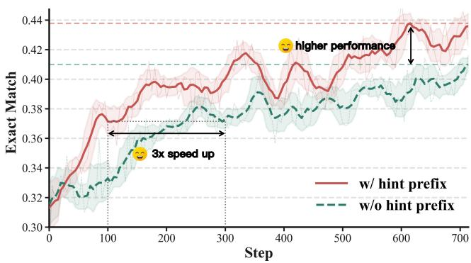
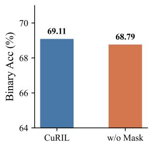
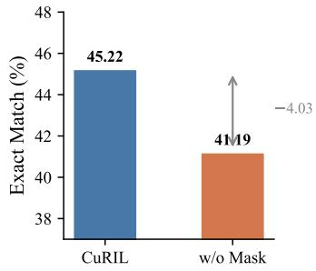
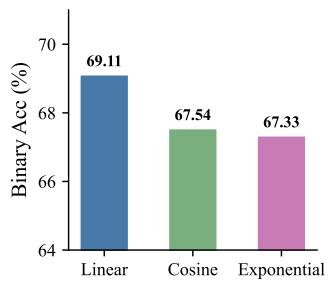
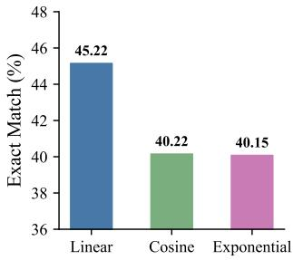

# When Metrics Reward the Worst Translations: Internalizing Cultural Reasoning for Social Media Translation Evaluation

Yiwen Qiu1, Linjuan Wu1, Dingming Li1, Yizhou Liu1, Zixuan Wang1, Haolei Xu1, Ye Guo2, Daoxin Zhang2, Weiming Lu1, Yongliang Shen1†

1Zhejiang University 2Xiaohongshu Inc.

## Abstract

Automatic translation quality metrics trained on generaldomain corpora systematically fail on social media content, where communicative intent is encoded in culturally loaded expressions (internet slang, homophonic ciphers, and platform-specific idioms) rather than surface token patterns. We conduct a systematic empirical analysis demonstrating that standard metrics including COMET, XCOMET, and BERTScore exhibit near-zero or negative correlation with human cultural judgments, and even display a severity inversion in which scores increase as translation quality deteriorates. We further show that this failure extends to large language modeljudges: Qwen3-235B achieves Cohen’s κ ofonly 0.162, revealing that the bottleneck is not reasoning capacity but cultural grounding: models lack the domain-specific cultural knowledge needed to identify which aspects of a translation require scrutiny. To address this, we propose CuRIL, a reinforcement learning framework that internalizes cultural reasoning: cultural annotations are prepended inside the model’s reasoning, excluded from policy gradients via a token-level loss mask, and injected with a probability that decays to zero over training, progressively forcing autonomous culturaljudgment. On a 1,444-sample human-annotated social media translation benchmark, Qwen3-8B trained with CuRIL achieves Cohen’s κ = 0.370 and Exact Match accuracy of45.22%, approaching Gemini-3.1-Pro with 30× fewer parameters and surpassing models up to 235B in scale. We further demonstrate that our judge produces reliable reward signals for downstream translation optimization, reducing the low-quality translation rate by over 20 percentage points under independent evaluation.

## 1 Introduction

Machine translation quality has advanced rapidly (Tian et al. 2026a; Wu et al. 2026; Yuan et al. 2026), yet progress hinges on our ability to measure it: automatic metrics and LLM judges supply the reward signals for training and the benchmarks for comparison. When miscalibrated, they silently misdirect optimization. This risk is acute on social media, where communicative intent is encoded in culturally loaded expressions rather than surface token patterns. Consider the Chinese social media utterance laosh ˇ ¯ı zhège nˇi mai chéngˇ duosh¯ ao mˇ ˇi, literally translated as “Teacher, how many meters of this did you buy?” As Figure 1 shows, this literal rendering scores 0.880 on XCOMET and 0.591 on BERTScore, yet it is semantically wrong: mˇi (“meter”) is Chinese internet slang for qián (“money”), and the utterance actually asks “how much did this cost?” This is not an isolated case but a systematic deficiency.

Traditional Metrics Fail in Two Opposite Directions  
  
Figure 1: Two representative cases on social media translation: a literal but culturally wrong translation (left) and a culturally adaptive translation (right), scored by automatic metrics, our judge, and human annotators.

The root cause is conceptual: social media translation is a cultural reasoning problem, not a semantic matching problem (Macko et al. 2025; Huang et al. 2025a; Mei et al. 2024). Metrics such as COMET, XCOMET, and BERTScore, trained on general-domain corpora and optimized for surface similarity, systematically reward literally correct but culturally void translations while penalizing culturally apt paraphrases. Our empirical study (Section 2) on 1,444 humanannotated Chinese–English pairs reveals three compounding failure modes: near-zero correlation with human judgment (Cohen’s κ ≤ 0.071), systematic invisibility of cultural errors, and a severity inversion in which metric scores increase as translation quality deteriorates.

Turning to LLM-as-a-Judge (Kocmi and Federmann 2023; Zhan et al. 2026) does not resolve this failure. Such judges are increasingly used as reward signals for translation training (Feng et al. 2025b; Wang, Meng, and Zhou 2026; Feng et al. 2025a), which raises the stakes of their miscalibration;

yet even Qwen3-235B achieves Cohen’s κ of only 0.162 on our benchmark. The bottleneck is not reasoning capacity but cultural grounding: models lack the domain-specific cultural knowledge needed to recognize culturally loaded expressions (internet slang, homophonic ciphers, platformspecific idioms) and therefore cannot assess whether a translation preserves communicative intent (Moghe et al. 2025; Rikters and Miwa 2024; Zhou et al. 2026a). A diagnostic experiment confirms this: injecting brief cultural annotations (translation hints) at test time, without fine-tuning, boosts Qwen3-8B from EM 31.60% to 44.35%, demonstrating that models can perform accurate cultural evaluation once the relevant context is supplied.

However, providing per-sample hints at inference time requires expert annotation or a retrieval pipeline for every query, which is infeasible in production. This motivates our central question: can cultural reasoning be internalized into model parameters, eliminating the dependency on external hints?

We propose CuRIL (Cultural Reasoning Internalization via curriculum Learning), a reinforcement learning framework built on GRPO with two mechanisms: (1) translation hints injected as a masked prefix in the model’s reasoning block, excluded from policy gradient computation; and (2) a linear decay schedule that progressively removes hints, forcing the model toward autonomous cultural judgment. On Qwen3-8B, CuRIL achieves $\kappa = 0 . 3 7 0$ and EM = 45.22%, approaching Gemini 3.1 Pro (Google 2025) $( \kappa = 0 . 4 3 8 )$ with 30× fewer parameters, and surpassing GPT-5.5 (OpenAI 2025) (κ = 0.338) and Qwen3-235B (Yang et al. 2025) $( \kappa = 0 . 1 6 2 )$ . A downstream translation model trained with CuRIL reward signals further reduces the low-quality translation rate from 25.6% to 4.9% under independent evaluation. Our contributions are:

• We establish that social media translation evaluation is a cultural reasoning task, not a semantic matching problem, and provide systematic empirical evidence that mainstream metrics fail due to a structural absence of cultural grounding, not insuficient precision or scale.

• We propose CuRIL, a general framework for internalizing external reasoning signals into model parameters via reinforcement learning with decaying scafolds, eliminating the need for expert annotation or retrieval at inference time.

• CuRIL-trained 8B models match frontier closed-source systems and surpass models up to 30× larger; the resulting judge further reduces the low-quality translation rate from 25.6% to 4.9% downstream, establishing a virtuous cycle between better evaluation and better translation.

## 2 Preliminary Study

We quantify how existing metrics fail on social media translation, and why, on a human-annotated validation set of 1,444 Chinese–English pairs. We compare quality-estimationbased CometKiwi and XCOMET and token-similarity-based BERTScore against human judgments, which follow a fourpoint rubric (0–3) covering semantic accuracy, cultural appropriateness, and format compliance.

  
Figure 2: Correlation between automatic metrics and human judgments on the validation set.

## 2.1 Metrics Cannot Distinguish Good from Bad

Figure 2 reports the correlation between each metric and human judgments. The results are stark: CometKiwi achieves the highest Pearson correlation at $r \ = \ 0 . 2 1 2 .$ XCOMET reaches only $r = 0 . 0 5 5$ , and BERTScore records $r = - 0 . 1 1 5$ , a negative correlation indicating that higher BERTScore is systematically associated with lower human ratings. All three metrics achieve Cohen’s $\kappa \leq 0 . 0 7 1$ , a level conventionally interpreted as no more than slight agreement.

## 2.2 Cultural Errors Are Invisible to Metrics

The failure is not randomly distributed. We define a metric’s blind spot as samples where the metric scores high $( > 0 . 7 )$ but human annotators score low (≤ 1). XCOMET’s blind spot covers 29.36% of all validation samples: nearly a third of the entire validation set consists of low-quality translations that XCOMET certifies as high quality. Culturally-related errors account for 26% of the full dataset but rise to 46.9% within this blind spot, a 1.74× enrichment. The failures are systematically concentrated on cultural errors: the metrics retain partial sensitivity to surface errors such as grammatical mistakes but lose discriminative ability precisely where cultural reasoning is required.

## 2.3 Metrics Reward the Worst Translations

The failure goes beyond mere insensitivity: metrics actively assign higher scores to more severe errors.

<table><tr><td>Metric</td><td>Error-free</td><td>Severe</td><td>Change</td></tr><tr><td>Human score</td><td>2.326</td><td>0.287</td><td>↓87.7%</td></tr><tr><td>CometKiwi</td><td>0.532</td><td>0.569</td><td>↑7.0%</td></tr><tr><td>XCOMET</td><td>0.568</td><td>0.743</td><td>↑30.8%</td></tr><tr><td>BERTScore</td><td>0.573</td><td>0.622</td><td>↑8.6%</td></tr></table>

Table 1: Metric scores at the two extremes of human-rated error severity. Green : human reference; yellow : traditional metrics exhibiting severity inversion.

Table 1 stratifies samples by human-rated severity. Human scores move in the expected direction: from 2.326 for error-free translations to 0.287 for severely flawed ones, a decline of 87.7%. All three metrics move in precisely the opposite direction: CometKiwi increases by 7.0%, XCOMET by 30.8%, BERTScore by $8 . 6 \%$

The root cause is a single mechanism underlying all three findings. Severe errors in social media translation typically arise from literal translation, which preserves maximum token-level overlap with the source. Token overlap is exactly what these metrics, trained on general-domain corpora for semantic adequacy, are optimized to reward. The result is a systematic severity inversion: the metrics do not merely fail to detect the worst translations but actively certify them as the best. A metric that rewards the worst translations cannot serve as a reliable optimization signal, motivating a departure from similarity-based evaluation toward a culturally grounded approach.

## 3 Method

To internalize cultural reasoning without expert input at deployment, CuRIL (Cultural Reasoning Internalization via curriculum Learning) trains the judge with reinforcement learning in which cultural hints appear only as a gradientmasked, gradually vanishing prefix of the model’s own reasoning. The masked prefix guides exploration without receiving policy-gradient credit, and the linearly decaying injection probability progressively forces the model to reproduce the same cultural reasoning on its own. Figure 3 provides an overview. We begin by formalizing the task and hint construction, then describe hint injection with gradient masking, the linear decay schedule, the reward design, and the optimization objective.

## 3.1 Task Formulation

Let $\mathcal { D } = \{ ( x _ { i } , y _ { i } , s _ { i } ) \} _ { i = } ^ { N }$ denote the training set, where $x _ { i }$ is the Chinese source text, yi is the English translation, and $s _ { i } \in$ $\mathcal { S } = \{ 0 , 1 , 2 , 3 \}$ is the human quality score (0: severe error; 3: high-quality translation). We define two coarse binary quality categories: $\mathcal { C } _ { \mathrm { l o w } } = \{ 0 , 1 \}$ (low quality, unsuitable for use) and $\mathcal { C } _ { \mathrm { h i g h } } = \{ 2 , 3 \}$ (high quality, suitable for use).

Given a source–translation pair $( x , y )$ and an optional set of hints h, the judge model $\pi _ { \theta }$ produces a predicted score $\hat { s } \in \cal S$ . We define the score deviation $\delta = \bar { | } \hat { s } - s |$ and the binary match indicator $\mathbf { 1 } _ { \mathrm { s a m e } } ( \hat { s } , s ) = \mathbf { 1 } [ ( \hat { s } \geq 2 ) \mathrm { i f } \ ( s \geq 2 ) ]$ ], which equals 1 if sˆ and s fall in the same binary category, and 0 otherwise.

## 3.2 Hint Construction

Translation hints are short, targeted cultural annotations that identify the specific linguistic features a judge must attend to when evaluating a given translation pair. Each hint $h _ { i , k }$ takes the form of a declarative statement about a culturally-loaded element—for example, identifying a homophonic cipher or a platform-specific idiom and clarifying its intended meaning.

For each training sample $( x _ { i } , y _ { i } , s _ { i } )$ , an auxiliary LLM $\mathcal { M } _ { h }$ generates K hints:

$$
\mathbf { h } _ { i } = \mathcal { M } _ { h } ( x _ { i } , y _ { i } , s _ { i } ) = \{ h _ { i , 1 } , \ldots , h _ { i , K } \} .\tag{1}
$$

The human annotation trace is provided to ground hint generation in the actual evaluation outcome, so that each hint describes a feature relevant to the quality judgment. Hints are stored as auxiliary metadata and used exclusively during training; they are unavailable at inference time.

## 3.3 Hint Injection via Response Prefix

A key design choice is how to deliver hints during training without creating a distributional mismatch at inference time. Rather than modifying the input prompt $\boldsymbol { q } = ( x , y )$ , we prepend hints directly inside the model’s <think> reasoning block as a first-person key-point recap that mirrors the model’s own chain-of-thought style. The full response token sequence is:

$$
\mathbf { o } _ { i } = \underbrace { [ h _ { 1 } , \hdots , h _ { L _ { h } } ] } _ { \mathrm { h i n t } \mathrm { p r e f i x } } \oplus \underbrace { [ g _ { 1 } , \hdots , g _ { m } ] } _ { \mathrm { g e n e r a t e d } } ,\tag{2}
$$

where $[ h _ { 1 } , \ldots , h _ { L _ { h } } ]$ denotes the $L _ { h }$ tokens of the rendered hint prefix, $[ g _ { 1 } , \ldots , g _ { m } ]$ ] the m tokens generated by the model, and ⊕ denotes concatenation.

Gradient masking. To ensure the policy gradient derives solely from the model’s own reasoning, we apply a tokenlevel binary mask $M _ { i , t } = \mathbf { 1 } [ t > L _ { h } ]$ , giving the masked log-probability:

$$
\log \tilde { \pi } _ { \boldsymbol { \theta } } ( \mathbf { o } _ { i } \mid \boldsymbol { q } ) = \sum _ { t = 1 } ^ { L _ { h } + m } M _ { i , t } \cdot \log \pi _ { \boldsymbol { \theta } } ( o _ { i , t } \mid \boldsymbol { q } , \mathbf { o } _ { i , < t } ) .\tag{3}
$$

This prevents the model from receiving gradient credit for tokens it did not generate (Zhang et al. 2026a; Huang et al. $2 0 2 5 \mathrm { b } , \mathrm { c } )$ .

## 3.4 Linear Decay Hint Schedule

If hints were injected throughout training, the model would rely on them as a permanent external resource rather than internalizing cultural reasoning. To force internalization, the hint injection probability decays linearly:

$$
\begin{array} { r } { p ( s ) = \operatorname* { m a x } \bigl ( 0 , p _ { 0 } \bigl ( 1 - \frac { s } { T } \bigr ) \bigr ) , } \end{array}\tag{4}
$$

where $p _ { 0 } \in ( 0 , 1 ]$ is the initial injection rate and $T$ is the decay horizon. For each of the n rollouts per sample, $z _ { i , j }$ ∼ Bernoulli(p(s)) independently, where $z _ { i , j } = 1$ indicates that rollout $j$ is conditioned on the hint prefix, so each batch contains both hint-conditioned and hint-free responses. For $s \geq T$ , no hints are injected and CuRIL reduces to standard GRPO.

## 3.5 Reward Function

The reward function $r ( \mathbf { o } , s )$ evaluates each rollout in two stages. Responses failing the format check (<think>/<answer> tags) receive $r _ { \mathrm { f o r m a t } } = - \lambda$ with no further scoring. For valid responses:

$$
r ( \mathbf { o } , s ) = r _ { \mathrm { b a s e } } ( \delta ) + r _ { \mathrm { b i n } } ( \hat { s } , s ) .\tag{5}
$$

The base reward penalizes proportionally to the score deviation:

$$
r _ { \mathrm { b a s e } } ( \delta ) = \left\{ \begin{array} { r l } { \alpha _ { 0 } } & { \delta = 0 \quad \mathrm { ( e x a c t ~ m a t c h ) } , } \\ { \alpha _ { 1 } } & { \delta = 1 , } \\ { - \alpha _ { 2 } } & { \delta = 2 , } \\ { - \alpha _ { 3 } } & { \delta = 3 , } \end{array} \right.\tag{6}
$$

  
Figure 3: Overview of CuRIL. (a) Data construction: human annotation of error types, severities, and scores, followed by LLMbased hint extraction. (b) Training: each query is augmented with a hint prefix under a linearly decaying injection probability; rollouts are scored by deviation-based, binary, and format rewards for the GRPO update.

with $\alpha _ { 0 } > \alpha _ { 1 } \geq 0$ and $\alpha _ { 3 } > \alpha _ { 2 } \ge 0$ . The binary reward aligns with the coarse deployment decision:

$$
r _ { \mathrm { b i n } } ( \hat { s } , s ) = \left\{ { \begin{array} { r l } { \beta } & { \mathrm { i f } \ \mathbf { 1 } _ { \mathrm { s a m e } } ( \hat { s } , s ) = 1 , } \\ { - \beta } & { \mathrm { o t h e r w i s e } , } \end{array} } \right.\tag{7}
$$

with $\beta > 0 .$

## 3.6 Optimization Objective

We train $\pi _ { \theta }$ with GRPO (Shao et al. 2024; Schulman et al. 2017). For each training sample, we construct a prompt $\tilde { q }$ (with or without a hint prefix according to the schedule in Section 3.4) and sample n responses $\{ \mathbf { o } _ { j } \} _ { j = 1 } ^ { n }$ from the current policy. The group-normalized advantage is $\hat { A } _ { j } =$ $( r _ { j } - \mu _ { r } ) / ( \sigma _ { r } + \varepsilon _ { \mathrm { s t a b } } )$ , where $\mu _ { r }$ and $\sigma _ { r }$ are the within-group mean and standard deviation. The training objective is:

$$
\begin{array} { l } { { \displaystyle { \mathcal { L } } ( \theta ) = - \frac { 1 } { n } \sum _ { j = 1 } ^ { n } \mathrm { m i n } \Big ( \rho _ { j } ( \theta ) \hat { A } _ { j } , ~ \mathrm { c l i p } \big ( \rho _ { j } ( \theta ) , 1 - \varepsilon , 1 + \varepsilon \big ) \hat { A } _ { j } \Big ) } } \\ { { \displaystyle ~ + \eta \mathrm { K L } \big ( \pi _ { \theta } \| \pi _ { \mathrm { r e f } } \big ) , ~ } ( 8 ) } \end{array}
$$

where ε is the PPO clipping coeficient and η weights the KL penalty against the frozen reference $\pi _ { \mathrm { r e f } } .$ The importancesampling ratio $\rho _ { j } ( \theta ) = \tilde { \pi } _ { \theta } ( \mathbf { o } _ { j } \mid \tilde { q } _ { j } ) / \tilde { \pi } _ { \theta _ { \mathrm { o l d } } } ( \mathbf { o } _ { j } \mid \tilde { q } _ { j } )$ is computed exclusively over generated (non-hint) tokens via the masked policy π˜ from Section 3.3.

## 4 Experiments

## 4.1 Experimental Setup

Dataset. We construct Chinese-English social media translation datasets from Chinese social platform and translate them with several open- or close-source LLMs, covering internet slang, culturally-loaded expressions, homophonic ciphers, and community-specific humor. Human annotations follow a four-point rubric (0–3) jointly developed by native English-speaking annotators and professional translators, covering semantic accuracy, cultural appropriateness, and format compliance. The dataset is split into a training set of 13,128 samples and a validation set of 1,444 samples, both balanced across the four score levels. Translation hints for each training sample are generated ofline by the auxiliary model $\bar { \mathcal { M } } _ { h }$ (Section 3.2) conditioned on the source, translation, and human score.

Evaluation metrics. We report four metrics on the validation set: (1) Binary Acc: accuracy of the coarse binary decision ({0, 1} vs. {2, 3}), reflecting practical deployment utility; (2) Cohen’s κ: inter-rater agreement between model predictions and human judgments on the four-class scale; (3) EM: four-class exact match accuracy; (4) Acc@k: perclass accuracy on score-k samples $( k \in \{ 0 , \ldots , 3 \} )$ , where Acc@0 covers the most culturally demanding cases.

Baselines. We compare CuRIL against four categories of baselines. Traditional metrics: CometKiwi, XCOMET, and BERTScore, as characterized in Section 2. Open-source LLMs: Qwen3-32B, Qwen3.5-27B, and Qwen3-235B, evaluated zero-shot. Closed-source LLMs: GPT-4o-mini (Achiam et al. 2023), DeepSeek-V4 (Xu et al. 2026), GLM-5 (Zeng et al. 2026), GPT-5.5 (Singh et al. 2025), and Gemini-3.1- Pro (Google 2025), evaluated few-shot. Training baselines on the same base models: (a) Supervised fine-tuning (SFT) on the training set with cross-entropy loss; (b) Naive GRPO, which applies standard GRPO without hint injection.

## 4.2 Implementation Details

Base models. We train CuRIL on Qwen (Yang et al. 2025, 2024) model families: Qwen2.5-7B-Instruct, Qwen3-4B, and Qwen3-8B. All models are initialized from their publicly released instruction-tuned checkpoints.

Training framework. All RL experiments are conducted using the verl framework (Sheng et al. 2024), which provides eficient rollout generation and policy gradient computation for large language model training.

Hyperparameters. We use $n = 8$ rollouts per sample, hint injection rate $p _ { 0 } = 0 . 8$ decaying to 0 over $\dot { T } = 4 0 \dot { 0 }$ steps, learning rate $1 \times 1 0 ^ { - 6 }$ with cosine schedule, and batch size $B = 1 2 8$ . All models are trained for up to 600 steps on 8 $\times \mathbf { A } 1 0 0$ GPUs. Naive GRPO uses identical hyperparameters except $p _ { 0 } = 0 ;$ SFT is trained for 3 epochs with learning rate $5 \times 1 0 ^ { - 5 }$ . All training experiments are run three times with independent random seeds; we report the average across runs. The full hyperparameter configuration is provided in the supplementary material.

## 4.3 Main Results

Table 2 reports results across all models and baselines.

CuRIL consistently outperforms all training baselines. Across all three base model families, CuRIL achieves the highest EM among trained models. On Qwen3-8B, CuRIL reaches $\kappa = 0 . 3 7 0$ and EM = 45.22%, outperforming Naive GRPO by $+ 3 . 6 7 \%$ in EM and +0.045 in κ. Compared to SFT, CuRIL achieves higher EM (+5.16%) and κ (+0.103) while requiring no labeled reasoning chains. The advantage of CuRIL over Naive GRPO is most pronounced in EM, indicating that cultural reasoning internalization primarily improves the model’s ability to make fine-grained four-class distinctions, beyond the coarse binary classification that Naive GRPO already partially captures.

CuRIL matches frontier closed-source models at 8B scale. Our best model (Qwen3-8B + CuRIL) achieves $\kappa = 0 . 3 7 0$ and EM = 45.22%, approaching Gemini-3.1- Pro (κ = 0.438, EM = 46.11%) while using a model ∼30× smaller. It substantially outperforms GPT-5.5 (κ = 0.338, $\mathrm { E M } ~ = ~ 3 7 . 0 5 \% )$ , DeepSeek-V4-Flash $~ ( \kappa ~ = ~ 0 . 2 8 5$ , EM $= 3 9 . 4 6 \% )$ , and GLM-5 (κ = 0.344, EM = 38.71%). Notably, Qwen3-235B, a model with 235B total parameters, achieves $\kappa = 0 . 1 6 2$ and $\mathrm { E M } = 3 1 . 7 2 \%$ , far below our 8B model, confirming that model scale alone cannot compensate for the absence of targeted cultural reasoning training.

Improvements are consistent across model families. CuRIL yields gains over Naive GRPO in EM for all three base models (Qwen2.5-7B: +3.25%; Qwen3-4B: +2.55%; Qwen3-8B: +3.67%), and the relative benefit is largest for the strongest base model, suggesting that cultural reasoning internalization scales favorably with the model’s underlying reasoning capacity.

## 5 Analysis

## 5.1 Alignment with Human Judgment

We verify that Qwen3-8B + CuRIL achieves substantially stronger alignment with human cultural judgment on the same validation set.

Correlation with human judgment. Table 3 compares correlation metrics across all evaluated methods. Qwen3-8B $+ \mathrm { C u R I L }$ achieves Pearson $r = 0 . 4 9 4$ , Spearman $\rho = 0 . 4 9 2 \ :$ and Cohen’s $\kappa = 0 . 3 7 0$ , respectively 2.3× and $5 . 2 \times$ higher than the best traditional metric (CometKiwi) on Pearson r and κ.

Sensitivity to error severity. Table 4 examines how each metric responds as error severity increases. Human scores decrease monotonically from 2.326 to 0.287 (−87.7%), while all three traditional metrics exhibit severity inversion: XCOMET rises from 0.568 to 0.743. Qwen3-8B + CuRIL breaks this pattern: its scores fall monotonically from 1.704 to 0.726 (−57.4%), making it the only metric that correctly identifies severe errors as such.

## 5.2 Hint Internalization Efect

We validate that CuRIL enables models to internalize cultural reasoning, making test-time hints unnecessary. Three conditions are compared: (1) Base: zero-shot without hints; (2) CuRIL: trained model without hints; (3) +tp: base model with hints at test time (idealized upper bound).

As shown in Figure 4, a scale-dependent pattern emerges. At 4B scale, test-time hints still outperform internalization (EM 45.25% vs. 38.14%), suggesting insuficient capacity. However, at 7B+ scale the picture reverses: Qwen2.5-7B after CuRIL achieves EM 40.44%, surpassing hints (36.73%), and Qwen3-8B after internalization (EM 45.22%) surpasses the hint-augmented base model (44.35%) while requiring no external input at inference time.

  
Figure 4: Hint internalization across model scales. CuRIL (solid red) surpasses test-time hint injection (+tp, dashed teal) at 7B+ scale, demonstrating genuine internalization of cultural reasoning.

## 5.3 CuRIL as a Reward Model

Beyond evaluation, we validate the CuRIL judge as a reward signal for training downstream translation models via RLVR. The training data for the downstream translator is constructed following Cultural-MT Bench (Wu et al. 2026). We evaluate Qwen3-8B as a translation model under three conditions (Base, SFT, and GRPO with CuRIL reward) on two held-out benchmarks: Cultural-MT Bench (1,002 social note samples) and RedTrans-Bench (2,858 short note or comment samples), judged by two independent evaluators, GLM-5 and Gemini-3.1-Pro. As shown in Figure 5, GRPO with CuRIL reward consistently outperforms both Base and SFT. On Cultural-MT Bench, the low-quality rate drops from 25.6% (Base) to 4.9% (GLM-5) and from 30.6% to 7.4% (Gemini-3.1-Pro), both well below SFT (9.7% and 16.0%). The improvement generalizes to RedTrans-Bench, confirming that CuRIL provides a reliable reward signal beyond SFT alone.

<table><tr><td rowspan="2">Category</td><td rowspan="2">Model</td><td rowspan="2">Bin. Acc</td><td rowspan="2">Cohen&#x27;s κ</td><td rowspan="2">EM</td><td colspan="4">Per-class Accuracy</td></tr><tr><td>Acc@0</td><td>Acc@1</td><td>Acc@2</td><td>Acc@3</td></tr><tr><td rowspan="4">Qwen2.5-7B</td><td>Base + SFT</td><td>56.69 65.10</td><td>0.134 0.302</td><td>27.51 38.85</td><td>15.24 45.98</td><td>29.09 31.30</td><td>54.17 41.00</td><td>11.63 37.12</td></tr><tr><td>+ Naive GRPO</td><td></td><td></td><td></td><td></td><td></td><td></td><td></td></tr><tr><td></td><td>65.37</td><td>0.308</td><td>37.19</td><td>28.25</td><td>53.74</td><td>35.46</td><td>31.30</td></tr><tr><td>+ CuRIL (ours)</td><td>66.14</td><td>0.323</td><td>40.44</td><td>42.38</td><td>49.31</td><td>25.21</td><td>44.88</td></tr><tr><td rowspan="4">Qwen3-4B</td><td>Base + SFT</td><td>57.90 62.19</td><td>0.157 0.244</td><td>31.82 37.60</td><td>15.77 35.73</td><td>18.99 44.88</td><td>52.37 41.55</td><td>39.94 28.25</td></tr><tr><td>+ Naive GRPO</td><td>67.84</td><td></td><td></td><td></td><td></td><td></td><td></td></tr><tr><td>+ CuRIL (ours)</td><td>66.55</td><td>0.357</td><td>36.59</td><td>15.28</td><td>52.63</td><td>56.51</td><td>21.88</td></tr><tr><td></td><td></td><td>0.331</td><td>39.14</td><td>34.90</td><td>55.28</td><td>38.72</td><td>27.70</td></tr><tr><td rowspan="4">Qwen3-8B</td><td>Base + SFT</td><td>57.75 63.34</td><td>0.147 0.267</td><td>31.60 40.06</td><td>18.12 44.17</td><td>11.57 34.35</td><td>59.20 41.27</td><td>36.69 40.44</td></tr><tr><td>+ Naive GRPO</td><td>66.25</td><td></td><td></td><td></td><td></td><td></td><td></td></tr><tr><td>+ CuRIL (ours)</td><td>69.11</td><td>0.325</td><td>41.55</td><td>31.28</td><td>59.00</td><td>32.78</td><td>41.55</td></tr><tr><td></td><td></td><td>0.370</td><td>45.22</td><td>54.01</td><td>54.29</td><td>41.82</td><td>36.84</td></tr><tr><td rowspan="4">Open-source LLMs</td><td>Qwen3-32B-Think Qwen3.5-27B-Think</td><td>59.25 68.70</td><td>0.184</td><td>33.50</td><td>19.77</td><td>21.19 25.71</td><td>38.27</td><td>54.65</td></tr><tr><td>Qwen3-235B-A22B</td><td></td><td>0.373</td><td>42.02</td><td>39.76</td><td></td><td>29.55</td><td>72.42</td></tr><tr><td></td><td>58.10</td><td>0.162</td><td>31.72</td><td>16.07</td><td>24.93</td><td>33.52</td><td>52.35</td></tr><tr><td>GPT-4o-mini</td><td>61.98</td><td>0.240</td><td>31.79</td><td>17.17</td><td>45.15</td><td>41.55</td><td>23.27</td></tr><tr><td rowspan="4">Closed-source LLMs</td><td>DeepSeek-V4-Flash</td><td>64.22</td><td>0.285</td><td>39.46</td><td>36.01</td><td>21.05</td><td>31.30</td><td>69.64</td></tr><tr><td>Gemini-3.1-Pro-Low</td><td>71.95</td><td>0.438</td><td>46.11</td><td>46.94</td><td>29.41</td><td>40.83</td><td>67.04</td></tr><tr><td>GLM-5</td><td>67.17</td><td>0.344</td><td>38.71</td><td>53.74</td><td>42.11</td><td>32.69</td><td>26.32</td></tr><tr><td>GPT-5.5</td><td>66.90</td><td>0.338</td><td>37.05</td><td>16.62</td><td>26.59</td><td>86.15</td><td>18.84</td></tr></table>

Table 2: Main results on the 1,444-sample social media translation validation set. Bin. Acc: binary classification accuracy (%); κ: Cohen’s kappa; EM: four-class exact match accuracy (%); Acc@0–Acc@3: per-class accuracy (%). Bold: best trained variant per base model. Green-shaded : best overall per column; yellow-shaded : second-best.

<table><tr><td>Metric</td><td>Pearson r</td><td>Spearman ρ</td><td>Cohen&#x27;s κ</td></tr><tr><td>CometKiwi</td><td>0.212</td><td>0.222</td><td>0.071</td></tr><tr><td>XCOMET</td><td>0.055</td><td>0.108</td><td>0.010</td></tr><tr><td>BERTScore</td><td>-0.115</td><td>-0.118</td><td>-0.003</td></tr><tr><td>Qwen3-8B + CuRIL</td><td>0.494</td><td>0.492</td><td>0.370</td></tr></table>

Table 3: Correlation between metrics and human judgment.

<table><tr><td>Severity</td><td>Human</td><td>CometK.</td><td>XCOMET</td><td>BERT</td><td>CuRIL</td></tr><tr><td>No Error</td><td>2.326</td><td>0.532</td><td>0.568</td><td>0.573</td><td>1.704</td></tr><tr><td>Minor</td><td>1.818</td><td>0.611</td><td>0.765</td><td>0.622</td><td>1.263</td></tr><tr><td>Moderate</td><td>1.190</td><td>0.603</td><td>0.764</td><td>0.615</td><td>1.190</td></tr><tr><td>Severe</td><td>0.287</td><td>0.569</td><td>0.743</td><td>0.622</td><td>0.726</td></tr><tr><td>Trend</td><td>↓</td><td>↑</td><td>↑</td><td>↑</td><td>↓</td></tr></table>

Table 4: Mean metric scores by human-rated error severity.

  
Figure 5: Low- and high-quality proportions of Base, SFT, and GRPO on Cultural-MT Bench and RedTrans-Bench, judged by GLM-5 (solid) and Gemini-3.1-Pro (hatched).

## 5.4 Training Dynamics

Figure 6 compares the validation EM curves of CuRIL and Naive GRPO on Qwen3-8B.

Faster convergence. CuRIL surpasses 37.5% EM within approximately 100 steps, while Naive GRPO requires nearly 300 steps, a 3× reduction in steps to threshold.

Higher performance ceiling. Naive GRPO plateaus at approximately 41% EM; CuRIL continues past this barrier,

reaching roughly 45%, suggesting that cultural reasoning signals not only accelerate training but expand the strategies accessible to the policy.

  
Figure 6: Validation EM of CuRIL (solid) and Naive GRPO (dashed) on Qwen3-8B over training; shaded regions show local std.

## 5.5 Cross-Domain Generalization

To assess generalizability beyond our training domain, we evaluate on the MENT dataset (Tian et al. 2026b), a metaevaluation benchmark for non-literal translation covering SNS, cross-culture, poetry, and literature domains. Because MENT uses a 5-point scale while our models are trained on a 4-point scale, we report only rank-correlation coeficients in Table 5.

<table><tr><td>Model</td><td>Pearson r</td><td>Spearman ρ</td><td>Kendall τ</td></tr><tr><td>Qwen2.5-7B-Instruct</td><td>0.51</td><td>0.51</td><td>0.42</td></tr><tr><td>+ Naive GRPO</td><td>0.53</td><td>0.52</td><td>0.43</td></tr><tr><td>+ CuRIL</td><td>0.56</td><td>0.56</td><td>0.46</td></tr><tr><td>Qwen3-4B</td><td>0.45</td><td>0.46</td><td>0.37</td></tr><tr><td>+ Naive GRPO</td><td>0.46</td><td>0.47</td><td>0.39</td></tr><tr><td>+ CuRIL</td><td>0.48</td><td>0.48</td><td>0.39</td></tr></table>

Table 5: Correlation with human judgments on the MENT dataset.

CuRIL consistently improves correlation with human judgments over both the base model and Naive GRPO across all metrics, demonstrating that cultural reasoning internalized on Chinese–English social media transfers to broader non-literal translation evaluation settings.

## 6 Related Work

## 6.1 Translation Quality Evaluation

Automatic metrics have evolved from n-gram overlap (Papineni et al. 2002) to learned similarity: BERTScore (Zhang et al. 2019) uses contextual embeddings, and the COMET family (Rei et al. 2020, 2022; Guerreiro et al. 2024) learns from humanjudgments. All share one inductive bias, source– translation alignment as a proxy for quality, which breaks down on social media where literal renderings of culturally loaded expressions achieve high overlap yet convey no meaning. LLM judges ofer richer evaluation: GEMBA (Kocmi and Federmann 2023) reaches near human-level agreement on general-domain MT; MENT (Tian et al. 2026b) shows that both metrics and static judges fail on non-literal domains and compensates by retrieving knowledge at inference; CULTURE-MT (Wu et al. 2026) trains an SFT judge for cultural efectiveness on Chinese social media UGC. Culturalcompetence studies further show that scale alone does not close cultural gaps (Liu et al. 2026; Yao et al. 2024), and Red-Trans (Guo et al. 2025b) targets SNS translation with a 72B domain-adapted model, whose RedTrans-Bench we adopt for out-of-domain evaluation. We share these diagnoses but differ in the remedy: rather than retrieving at inference (Tian et al. 2026b; Wang et al. 2024; Conia et al. 2024; Agrawal et al. 2023) or relying on annotated SFT alone (Wu et al. 2026), CuRIL internalizes cultural reasoning into the judge via reinforcement learning, requiring no external input at deployment.

## 6.2 Hint-Guided Reinforcement Learning

RLHF (Ouyang et al. 2022; Lambert et al. 2024) established preference-aligned policy optimization; GRPO (Shao et al. 2024) simplifies it with group-normalized advantages, and DeepSeek-R1 (Guo et al. 2025a) shows that verifiable rewards elicit strong reasoning. A recent line of work guides RL exploration with hints injected during training (Su et al. 2025; Wang et al. 2026): StepHint (Zhang et al. 2026a) provides stepwise hints for mathematical reasoning, Hint-GRPO (Huang et al. 2025b) applies debiased hints to multimodal and agentic tasks (Shridhar et al. 2021; Yao et al. 2023; Boiko, MacKnight, and Gomes 2023), RuscaRL (Zhou et al. 2026b) places checklist rubrics in the task instruction with decaying strength, and Scaf-GRPO (Zhang et al. 2026b) injects tiered in-prompt hints when learning plateaus. All deliver guidance on the input side for tasks with verifiable intermediate structure. CuRIL difers in both bottleneck and mechanism: what is missing here is domain-specific cultural knowledge unavailable at inference, so hints are injected inside the model’s own reasoning as a gradient-masked response prefix and decayed to zero, forcing the knowledge itself to be internalized.

## 7 Conclusion

We showed that surface-similarity metrics systematically reward the worst social media translations, and proposed CuRIL, which internalizes cultural reasoning by injecting translation hints as a gradient-masked, linearly decaying prefix during reinforcement learning. CuRIL lifts Qwen3-8B to κ = 0.370 and 45.22% EM, approaching Gemini-3.1-Pro, and its reward signal cuts the downstream low-quality translation rate from 25.6% to 4.9%. More broadly, domain-specific evaluation ability need not be supplied at inference: it can be internalized through decaying guidance, a recipe applicable beyond translation.

Achiam, J.; Adler, S.; Agarwal, S.; Ahmad, L.; Akkaya, I.; Aleman, F. L.; Almeida, D.; Altenschmidt, J.; Altman, S.; Anadkat, S.; et al. 2023. Gpt-4 technical report. arXiv preprint arXiv:2303.08774.

Agrawal, S.; Zhou, C.; Lewis, M.; Zettlemoyer, L.; and Ghazvininejad, M. 2023. In-context examples selection for machine translation. In Findings ofthe Associationfor Computational Linguistics: ACL 2023, 8857–8873.

Boiko, D. A.; MacKnight, R.; and Gomes, G. 2023. Emergent autonomous scientific research capabilities of large language models. arXiv preprint arXiv:2304.05332.

Conia, S.; Lee, D.; Li, M.; Minhas, U. F.; Potdar, S.; and Li, Y. 2024. Towards cross-cultural machine translation with retrieval-augmented generation from multilingual knowledge graphs. In Proceedings of the 2024 Conference on Empirical Methods in Natural Language Processing, 16343– 16360.

Feng, Z.; Cao, S.; Ren, J.; Su, J.; Chen, R.; Zhang, Y.; Xu, Z.; Hu, Y.; Wu, J.; and Liu, Z. 2025a. Mt-r1-zero: Advancing llm-based machine translation via r1-zero-like reinforcement learning. arXiv preprint arXiv:2504.10160.

Feng, Z.; Ren, J.; Su, J.; Zheng, J.; Wang, H.; and Liu, Z. 2025b. MT-RewardTree: A comprehensive framework for advancing LLM-based machine translation via reward modeling. arXiv preprint arXiv:2503.12123.

Google. 2025. A New Era of Intelligence with Gemin 3. https://blog.google/products/gemini/gemini-3. Accessed: 2026-01-24.

Guerreiro, N. M.; Rei, R.; Stigt, D. v.; Coheur, L.; Colombo, P.; and Martins, A. F. 2024. xcomet: Transparent machine translation evaluation through fine-grained error detection. Transactions of the Association for Computational Linguistics, 12: 979–995.

Guo, D.; Yang, D.; Zhang, H.; Song, J.; Wang, P.; Zhu, Q.; Xu, R.; Zhang, R.; Ma, S.; Bi, X.; et al. 2025a. Deepseek-r1: Incentivizing reasoning capability in llms via reinforcement learning. arXiv preprint arXiv:2501.12948.

Guo, H.; Zhao, F.; Cao, S.; Lyu, X.; Liu, Z.; Wang, Y.; Wang, B.; Li, Z.; Lu, C.; Xu, Z.; et al. 2025b. Redefining machine translation on social network services with large language models. arXiv preprint arXiv:2504.07901.

Huang, C.; Luo, J.; Wang, X.; Lei, W.; and Lv, J. 2025a. Can Large Language Models Understand Internet Buzzwords Through User-Generated Content. In Proceedings of the 63rd Annual Meeting of the Association for Computational Linguistics (Volume 1: Long Papers), 12916–12941.

Huang, Q.; Dai, W.; Liu, J.; He, W.; Jiang, H.; Song, M.; Chen, J.; Yao, C.; and Song, J. 2025b. Boosting mllm reasoning with text-debiased hint-grpo. In Proceedings of the IEEE/CVF International Conference on Computer Vision, 4848–4857.

Huang, Z.; Cheng, T.; Qiu, Z.; Wang, Z.; Xu, Y.; Ponti, E. M.; and Titov, I. 2025c. Blending supervised and reinforcement fine-tuning with prefix sampling. arXiv preprint arXiv:2507.01679.

Kocmi, T.; and Federmann, C. 2023. GEMBA-MQM: Detecting translation quality error spans with GPT-4. In Proceedings of the Eighth Conference on Machine Translation, 768–775.

Lambert, N.; Morrison, J.; Pyatkin, V.; Huang, S.; Ivison, H.; Brahman, F.; Miranda, L. J. V.; Liu, A.; Dziri, N.; Lyu, S.; et al. 2024. Tulu 3: Pushing frontiers in open language model post-training. arXiv preprint arXiv:2411.15124.

Liu, Y.; Zhao, C.; Piao, M.; Miao, L.; Tao, S.; He, M.; Liu, C.; Zhang, L.; Ma, H.; Guo, J.; et al. 2026. The GaoYao Benchmark: A Comprehensive Framework for Evaluating Multilingual and Multicultural Abilities of Large Language Models. arXiv preprint arXiv:2604.20225.

Macko, D.; Kopal, J.; Moro, R.; and Srba, I. 2025. Multisocial: Multilingual benchmark of machine-generated text detection of social-media texts. In Proceedings of the 63rd Annual Meeting of the Association for Computational Linguistics (Volume 1: Long Papers), 727–752.

Mei, L.; Liu, S.; Wang, Y.; Bi, B.; and Cheng, X. 2024. Slang: New concept comprehension of large language models. In Proceedings of the 2024 Conference on Empirical Methods in Natural Language Processing, 12558–12575.

Moghe, N.; Fazla, A.; Amrhein, C.; Kocmi, T.; Steedman, M.; Birch, A.; Sennrich, R.; and Guillou, L. 2025. Machine translation meta evaluation through translation accuracy challenge sets. Computational Linguistics, 51(1): 73–137.

OpenAI. 2025. Introducing GPT-5. https://openai.com/zh-Hans-CN/index/introducing-gpt-5/. Accessed: 2026-01-24.

Ouyang, L.; Wu, J.; Jiang, X.; Almeida, D.; Wainwright, C. L.; Mishkin, P.; Zhang, C.; Agarwal, S.; Slama, K.; Ray, A.; et al. 2022. Training language models to follow instructions with human feedback. arXiv preprint arXiv:2203.02155.

Papineni, K.; Roukos, S.; Ward, T.; and Zhu, W.-J. 2002. Bleu: a method for automatic evaluation of machine translation. In Proceedings of the 40th annual meeting of the Associationfor Computational Linguistics, 311–318.

Rei, R.; Stewart, C.; Farinha, A. C.; and Lavie, A. 2020. COMET: A neural framework for MT evaluation. In Proceedings of the 2020 conference on empirical methods in natural language processing (emnlp), 2685–2702.

Rei, R.; Treviso, M.; Guerreiro, N. M.; Zerva, C.; Farinha, A. C.; Maroti, C.; De Souza, J. G.; Glushkova, T.; Alves, D.; Coheur, L.; et al. 2022. CometKiwi: IST-unbabel 2022 submission for the quality estimation shared task. In Proceedings of the Seventh Conference on Machine Translation (WMT), 634–645.

Rikters, M.; and Miwa, M. 2024. Entity-aware multi-task training helps rare word machine translation. In Proceedings ofthe 17th International Natural Language Generation Conference, 47–54.

Schulman, J.; Wolski, F.; Dhariwal, P.; Radford, A.; and Klimov, O. 2017. Proximal policy optimization algorithms. arXiv preprint arXiv:1707.06347.

Shao, Z.; Wang, P.; Zhu, Q.; Xu, R.; Song, J.; Bi, X.; Zhang,H.; Zhang, M.; Li, Y.; Wu, Y.; et al. 2024. Deepseekmath:

Pushing the limits of mathematical reasoning in open language models. arXiv preprint arXiv:2402.03300.

Sheng, G.; Zhang, C.; Ye, Z.; Wu, X.; Zhang, W.; Zhang, R.; Peng, Y.; Lin, H.; and Wu, C. 2024. Hybridflow: A flexible and eficient rlhf framework. arXiv preprint arXiv:2409.19256.

Shridhar, M.; Yuan, X.; Côté, M.-A.; Bisk, Y.; Trischler, A.; and Hausknecht, M. 2021. ALFWorld: Aligning Text and Embodied Environments for Interactive Learning. arXiv:2010.03768.

Singh, A.; Fry, A.; Perelman, A.; Tart, A.; Ganesh, A.; El-Kishky, A.; McLaughlin, A.; Low, A.; Ostrow, A.; Ananthram, A.; et al. 2025. Openai gpt-5 system card. arXiv preprint arXiv:2601.03267.

Su, M.; Guan, J.; Gu, Y.; Huang, M.; and Wang, H. 2025. Trust-region adaptive policy optimization. arXiv preprint arXiv:2512.17636.

Tian, Y.; Wang, C.; Liu, Z.; Huang, H.; Yu, W.; Song, D.; Tang, J.; and Guo, Y. 2026a. Beyond Literal Mapping: Benchmarking and Improving Non-Literal Translation Evaluation. arXiv preprint arXiv:2601.07338.

Tian, Y.; Wang, C.; Liu, Z.; Huang, H.; Yu, W.; Song, D.; Tang, J.; and Guo, Y. 2026b. Beyond Literal Mapping: Benchmarking and Improving Non-Literal Translation Evaluation. In Proceedings of the 64th Annual Meeting of the Association for Computational Linguistics.

Wang, J.; Meng, F.; Zhang, Y.; and Zhou, J. 2024. Retrievalaugmented machine translation with unstructured knowledge. arXiv preprint arXiv:2412.04342.

Wang, J.; Meng, F.; and Zhou, J. 2026. Deeptrans: Deep reasoning translation via reinforcement learning. Transactions of the Association for Computational Linguistics, 14: 47–63.

Wang, Z.; Yan, Y.; Li, H.; Pan, T.; Li, D.; Zhang, R.; Lu, W.; Xiao, J.; Zhuang, Y.; and Shen, Y. 2026. Milestone-Guided Policy Learning for Long-Horizon Language Agents. arXiv preprint arXiv:2605.06078.

Wu, L.; Zhang, R.; Lyu, X.; Guo, Y.; Zhang, D.; Xu, Z.; Hu, Y.; Cao, Y.; Shen, Y.; and Lu, W. 2026. Beyond Literal Translation: Evaluating Cultural Efectiveness in Social Media UGC. arXiv preprint arXiv:2605.25626.

Xu, A.; Lin, B.; Xue, B.; Wang, B.; Xu, B.; Wu, B.; Zhang, B.; Lin, C.; Dong, C.; Ling, C.; et al. 2026. DeepSeek-V4: Towards Highly Eficient Million-Token Context Intelligence. arXiv preprint arXiv:2606.19348.

Yang, A.; Li, A.; Yang, B.; Zhang, B.; Hui, B.; Zheng, B.; Yu, B.; Gao, C.; et al. 2025. Qwen3 Technical Report. arXiv:2505.09388.

Yang, A.; Zhang, B.; Hui, B.; Gao, B.; Yu, B.; Li, C.; Liu, D.; Tu, J.; Zhou, J.; Lin, J.; et al. 2024. Qwen2. 5-math technical report: Toward mathematical expert model via selfimprovement. arXiv preprint arXiv:2409.12122.

Yao, B.; Jiang, M.; Bobinac, T.; Yang, D.; and Hu, J. 2024. Benchmarking machine translation with cultural awareness. In Findings of the Association for Computational Linguistics: EMNLP 2024, 13078–13096.

Yao, S.; Chen, H.; Yang, J.; and Narasimhan, K. 2023. Web-Shop: Towards Scalable Real-World Web Interaction with Grounded Language Agents. arXiv:2207.01206.

Yuan, Z.; Ye, Y.; Feng, X.; Li, B.; Hong, Q.; Lu, Y.; Tu, D.; and Qin, B. 2026. Culture-Aware Machine Translation in Large Language Models: Benchmarking and Investigation. In Proceedings of the 64th Annual Meeting of the Association for Computational Linguistics (Volume 1: Long Papers), 29636–29661.

Zeng, A.; Lv, X.; Hou, Z.; Du, Z.; Zheng, Q.; Chen, B.; Yin, D.; Ge, C.; Huang, C.; Xie, C.; et al. 2026. Glm-5: from vibe coding to agentic engineering. arXiv preprint arXiv:2602.15763.

Zhan, R.; Huang, Z.; Yang, X.; Chao, L.; Yang, M.; and Wong, D. 2026. Are large reasoning models good translation evaluators? analysis and performance boost. Advances in Neural Information Processing Systems, 38: 64855–64882.

Zhang, K.; Lv, A.; Li, J.; Wang, Y.; Wang, F.; Hu, H.; and Yan, R. 2026a. Stephint: Multi-level stepwise hints enhance reinforcement learning to reason. In Proceedings of the 64th Annual Meeting of the Association for Computational Linguistics (Volume 1: Long Papers), 37846–37864.

Zhang, T.; Kishore, V.; Wu, F.; Weinberger, K. Q.; and Artzi, Y. 2019. Bertscore: Evaluating text generation with bert. arXiv preprint arXiv:1904.09675.

Zhang, X.; Wu, S.; Zhu, Y.; Tan, H.; Yu, S.; He, Z.; and Jia, J. 2026b. Scaf-GRPO: Scafolded Group Relative Policy Optimization for Enhancing LLM Reasoning. arXiv:2510.19807.

Zhou, J.; Zhao, X.; Wu, X.; Dong, T.; Wang, H.; Liu, Y.; Liu, H.; Xu, L.; Wang, L.; Luo, W.; et al. 2026a. Incentivizing parametric knowledge via reinforcement learning with verifiable rewards for cross-cultural entity translation. arXiv preprint arXiv:2604.16881.

Zhou, Y.; Li, S.; Liu, S.; Fang, W.; Zhang, K.; Zhao, J.; Yang, J.; Zhou, Y.; Lv, J.; Zheng, T.; Lu, H.; Chen, W.; Xie, Y.; and Song, M. 2026b. Breaking the Exploration Bottleneck: Rubric-Scafolded Reinforcement Learning for General LLM Reasoning. arXiv:2508.16949.

## A Ablation Study on Hint Decay Schedule

We ablate the hint injection schedule to isolate the contribution of the linear decay curriculum. Three variants of CuRIL are compared on Qwen3-8B:

• CuRIL (linear decay): hint injection probability decays linearly from $p _ { 0 } = 0 . 8$ to 0 over $T \stackrel { = } { = } 4 0 0$ steps, then reduces to standard GRPO.

• Without decay: hint injection probability is held constant at $p _ { 0 } = 0 . 8$ throughout training. Note that this variant collapses after approximately 400 steps, suggesting that sustained hint availability prevents the model from developing autonomous cultural reasoning and eventually destabilizes the reward landscape.

• Self-hint: no ofline hints are provided; instead, the model is prompted to generate its own cultural key points before scoring, testing whether self-generated reasoning signals can substitute for curated hints.

<table><tr><td>Variant</td><td>Bin. Acc</td><td>Δ</td><td>EM</td><td>Δ</td></tr><tr><td>CuRIL (linear decay)</td><td>69.11</td><td></td><td>45.22</td><td></td></tr><tr><td>Without decay</td><td>65.81</td><td>-3.30</td><td>40.29</td><td>-4.93</td></tr><tr><td>Self-hint</td><td>67.52</td><td>-1.59</td><td>41.41</td><td>-3.81</td></tr></table>

Table S1: Ablation on hint injection schedule (Qwen3- 8B). Linear decay consistently outperforms both alternatives. Without-decay collapses after ∼400 steps.

Both alternatives underperform the linear decay schedule. Without decay, the model never faces hint-free rollouts during the decay phase and thus fails to internalize cultural reasoning—collapsing once the held-out evaluation reveals its hint dependence. Self-hint performs better than withoutdecay but still lags behind CuRIL, indicating that modelgenerated hints lack the precision and grounding of ofline curated annotations, even though self-generated reasoning provides some directional benefit.

## B Ablation Study on Gradient Masking

A core design choice in CuRIL is the gradient mask applied to the hint prefix: policy gradients are computed only over the model-generated tokens, while the prepended hint tokens are excluded from the loss. To validate this design, we compare CuRIL against a variant that removes the gradient mask, allowing the policy gradient to flow through the entire concatenated sequence—including the externally generated hint prefix.

Removing the gradient mask leads to a notable 4.03-point decline in Exact Match accuracy while Binary Accuracy decreases only marginally (−0.32). Without the mask, the model is trained to reproduce the externally generated hint tokens as part of its own output, conflating two distinct objectives: faithfully copying an external annotation and learning to reason about cultural content autonomously. This forces the policy to allocate capacity toward imitating hint text that will be absent at inference time, degrading its ability to make fine-grained four-class distinctions—hence the disproportionate drop in EM relative to the coarser binary metric. The result confirms that gradient masking is essential for CuRIL to treat hints as exploration guidance rather than supervision targets.

  
Figure S1: Ablation on gradient masking (Qwen3-8B). Removing the mask causes a substantial drop in EM while Binary Accuracy remains comparable.

## C Ablation Study on Decay Function

CuRIL uses a linear schedule to decay the hint injection probability from $p _ { 0 } = 0 . 8$ to 0 over $\dot { T }$ training steps. We compare this default against two alternatives: cosine decay $\begin{array} { r } { ( p ( t ) = \frac { p _ { 0 } } { 2 } ( 1 + \cos ( \pi t / T ) ) ) } \end{array}$ and exponential decay $( p ( t ) =$ $p _ { 0 } \cdot e ^ { - \lambda t }$ , calibrated so that $p ( T ) \approx 0 . 0 1 )$ .

  
Figure S2: Ablation on decay function (Qwen3-8B). Linear decay outperforms both cosine and exponential alternatives.

Both non-linear schedules underperform the linear baseline by a substantial margin (∼5 EM points). Cosine and exponential decay reduce the injection probability slowly at first and then drop sharply near the end of the schedule, meaning the model receives hints at a high rate for the majority of training and then faces an abrupt transition to hint-free rollouts. Linear decay, by contrast, steadily increases the fraction of unassisted rollouts from the outset, providing a more uniform curriculum that gives the model consistent practice at autonomous cultural reasoning throughout training. The simplest schedule thus proves the most efective.

## D Translation Hint Extraction

As described in the main paper, translation hints are generated ofline by an auxiliary LLM $\mathcal { M } _ { h }$ . Concretely, for each training sample we provide $\mathcal { M } _ { h }$ with the source comment, machine translation, surrounding post context, and the human reviewer’s assessment (including error spans, severity labels, and corrective remarks). $\mathcal { M } _ { h }$ is instructed to distill concise translation key points from the reviewer’s assessment—each point 10–30 characters, covering only issues genuinely present in the review. If the translation is error-free, the output is simply “None.” The prompt template used for hint extraction is shown below.

Prompt Template for Translation Hint Extraction   
(translated from Chinese)   
System: You are a senior Chinese–English translation ex  
pert skilled at distilling key translation points from review   
comments.   
User: I have a translation quality assessment entry. Please   
extract concise translation key points from the review com  
ments.   
Requirements:   
1. Each point should be 10–30 characters; list them as   
[Point N].   
2. Only list issues that genuinely appear in the review; do   
not fabricate.   
3. If the translation is perfect, output “Translation points:   
None.”   
4. Output only the translation points section; no other con  
tent.   
Output format:   
Translation points:   
[Point 1] xxx   
[Point 2] xxx   
...   
[Data below]   
Context: {context}   
Source: {content}   
Translation: {trans\_result}   
Review comments: {original\_value}   
Please output the translation points directly (no preamble):

The extraction is parallelized across training samples with checkpoint-based resumption. Each resulting hint string is stored in the translation\_points field of the training data and used exclusively as the gradient-masked prefix during CuRIL training.

## E Data Format

Each training sample consists of the following fields:

• content: the original Chinese social media comment, wrapped in XML-style segment tags (e.g., <comment3>).

• trans\_result: the machine-translated English output, wrapped in the corresponding tag.

• score: the human quality score (0–3).

• context: surrounding post context, including the original post and hashtags, providing pragmatic grounding for the comment.

• error\_list: a list of annotated errors, each specifying the erroneous text span, severity level, error category, and a corrective remark.

• translation\_points: ofline-generated cultural hints summarizing the key translation challenges for the sample, used as hint prefix during CuRIL training.

A representative example is shown below (Chinese text romanized for typesetting). The idiom jin bu huan (“priceless / worth a thousand gold”) is mistranslated literally as “Gold never changes” (score 0). The translation\_points field provides the cultural hint prefix injected during CuRIL training.

Example Training Sample   
{   
“content”: “<comment3>[Jin bu huan   
haha]</comment3>”,   
“trans\_result”: “<comment3>Gold never changes,   
haha</comment3>”,   
“score”: 0,   
“context”: “0.[Are all dogs at the beach this excited?]   
1.[I can feel the joy of the little dog]   
#[Dogs by the sea][topic]# ...”,   
“error\_list”: [   
{   
“error\_text”: “Gold never changes”,   
“error\_degree”: “severe”,   
“error\_tag”: “semantic deviation”,   
“error\_remark”: “[Jin bu huan] is a Chinese idiom   
meaning something priceless and irreplaceable.”   
}   
],   
“translation\_points”: “[Translation hints:   
[Point 1] The idiom ‘jin bu huan’ denotes priceless value;   
literal translation is not acceptable.   
[Point 2] Convey the nuance of ‘irreplaceable’ fitting the   
context.]”   
}

## F Judger System Prompt

The following system prompt is used for all judger model evaluations, including baseline zero-shot LLMs and our trained CuRIL models.

## Judger System Prompt (translated from Chinese)

You are a bilingual (Chinese–English) expert translation quality evaluator with deep familiarity with internet culture, applying exceptionally strict standards. Your task is to evaluate a translation given its context, source, and target text according to the following rules.

1. Scoring criteria:

Semantic accuracy:

\- Correctly interpret source semantics and emotion (irony,

excitement, etc.)

\- Culturally appropriate address terms (e.g., “jiemei”, “laoshi”, “baozi”)

\- Target-culture naturalness; avoid Chinglish

\- Culture-loaded terms (e.g., “juejuezi”, “zhongcao”): must

<table><tr><td>be sense-translated, not literally - Unit conversions (e.g., mu, jin, li): accurate and unam- biguous - Proper nouns: use accurate or established translations</td></tr><tr><td>Format rules (violation = immediate 0): - Placeholder tokens (#zhanwei-x#) must NOT be trans- lated</td></tr><tr><td>- XML tags (&lt;comment&gt;, &lt;title&gt;, &lt;content&gt;, etc.) must be preserved and matched 2. Score definitions:</td></tr><tr><td>0 – Severe error: source meaning lost or fundamentally distorted 1 – Noticeable problems: main meaning barely recover- able; key errors present 2 – Adequate: main information conveyed; minor unnatu- ral expression or cultural mismatch</td></tr></table>

## G Baseline Implementation Details

To ensure a fair comparison, all training-based baselines are matched to CuRIL in terms of data and compute budget.

Supervised Fine-Tuning (SFT). SFT is trained on the same 13,128-sample training set used for CuRIL and Naive GRPO. To maintain a controlled comparison, the training is run for the same number of steps as the RL-based methods (600 steps), with a learning rate of $5 \times 1 0 ^ { - 5 }$ and a cosine schedule. The model is trained with standard cross-entropy loss on (query, score) pairs, where the query consists of the source–translation pair formatted with the same system prompt used during RL training. No hints or auxiliary annotations are provided during SFT.

Naive GRPO. Naive GRPO applies standard Group Relative Policy Optimization (Shao et al. 2024) to the same training data and for the same number of steps (600) as CuRIL. All hyperparameters—including rollout count $( n = 8 )$ , learning rate, PPO clipping coeficient, and reward function—are identical to CuRIL. The sole diference is that the hint injection probability is fixed at $p _ { 0 } = 0$ throughout training: no cultural hints are prepended to any rollout at any step. Naive GRPO therefore serves as a direct ablation of the hint injection mechanism, isolating the contribution of cultural reasoning signals from other design choices in CuRIL.

H Hyperparameter Configuration  
Table S2 lists the full hyperparameter configuration used for all CuRIL training runs.
<table><tr><td>Category</td><td>Parameter</td><td>Value</td></tr><tr><td rowspan="5">Data</td><td>train_batch_size</td><td>128</td></tr><tr><td>max_prompt_len</td><td>2048</td></tr><tr><td>max_response_len</td><td>4096</td></tr><tr><td>filter_overlong_prompts</td><td>True</td></tr><tr><td>truncation</td><td>error</td></tr><tr><td rowspan="9">Model / Actor</td><td>optim.lr</td><td> $1 \times 1 0 ^ { - 6 }$ </td></tr><tr><td>ppo_mini_batch_size</td><td>32</td></tr><tr><td>ppo_micro_batch_size</td><td>2</td></tr><tr><td>use_kl_loss</td><td>True</td></tr><tr><td>kl_loss_coef</td><td>0.001</td></tr><tr><td>kl_loss_type</td><td>low_var_kl</td></tr><tr><td>entropy_coeff</td><td>0</td></tr><tr><td>grad_checkpointing</td><td>True</td></tr><tr><td></td><td></td></tr><tr><td rowspan="5">Rollout</td><td>log_prob_micro_batch_size</td><td>4</td></tr><tr><td>tensor_parallel_size</td><td>4</td></tr><tr><td>name</td><td>vllm</td></tr><tr><td>gpu_memory_util</td><td>0.4</td></tr><tr><td>n (rollouts per prompt)</td><td>8</td></tr><tr><td>Hint</td><td>hint.initial_ratio</td><td>0.8</td></tr><tr><td>Schedule</td><td>hint.decay_steps</td><td>400</td></tr></table>

Table S2: Full hyperparameter configuration for CuRIL training.