# 5-DIALECTS-BN: Unmasking the Impact of Transliteration on Bangla Dialectal LLMs

Md Mahir Jawad1, 2, Galib Mahmud Jim2, Rafid Ahmed3, Mir Sazzat Hossain2, 4, Md Fahim2, Md Farhad Alam Bhuiyan2

1BRAC University,

2Penta Global Limited,

3University of Central Florida,

4Center for Computational & Data Sciences, Independent University, Bangladesh

## Abstract

Large Language Models (LLMs) have achieved remarkable progress across natural language processing (NLP) tasks, yet their capabilities degrade sharply for low-resource languages and dialectally diverse settings. Bangla, the world’s sixth most spoken language, exemplifies this gap: existing resources overwhelmingly target Standard Bangla, leaving its regional dialects without the benchmarks needed to develop or evaluate dialect-aware systems. We address this gap with 5-DIALECTS-BN, the first multi-annotation Bangla dialect benchmark to align Romanized transliteration with dialectal text, Standard Bangla, English, and subjectiv ity labels across five regional varieties. The dataset comprises 6,000 manually annotated en tries spanning five major dialects: Chittagong, Barisal, Noakhali, Sylhet, and Rangpur (Chit tagong 1,900; Noakhali 1,500; Sylhet 1,200; Barisal 700; Rangpur 700), reflecting natural online availability. Each entry is enriched with five aligned annotations: the original dialectal text, a Romanized transliteration, an English translation, a Standard Bangla translation, and a subjectivity label (subjective vs. objective). Annotations were produced and cross-validated by native speakers and undergraduate linguis tics students to ensure dialectal authenticity and semantic fidelity. The resulting resource supports a diverse suite of tasks, including dialect identification, dialect-to-standard normalization, machine translation, subjectivity classifi cation, and parameter-efficient fine-tuning (e.g., LoRA) of multilingual LLMs. By providing a standardized, multi-annotation benchmark, 5-DIALECTS-BN enables principled evaluation of LLMs on dialectally diverse Bangla and lays a foundation for further research in low resource, dialect-aware NLP.

## 1 Introduction

Large Language Models (LLMs) have driven rapid progress across natural language processing (NLP), but this progress is unevenly distributed across the world’s languages: low-resource and dialectally diverse linguistic communities remain underserved by both training corpora and evaluation benchmarks (Joshi et al., 2020; Blasi et al., 2022). Bangla, spoken by over 270 million people, exemplifies this gap (Bhattacharjee et al., 2022). While Standard (Cholito) Bangla has received growing attention in diverse NLP tasks (Ahmed et al., 2026; Dehan et al., 2025), its regional dialects (which differ markedly from the standard in phonology, lexicon, morphology, and syntax (Grierson, 1903; Mahjabin et al., 2025)) remain critically underresourced, and the absence of multi-annotation benchmarks makes it difficult to diagnose model failures or evaluate dialect-aware systems in a reproducible manner.

To address this challenge, we introduce 5- DIALECTS-BN, a manually curated and verified benchmark containing 6,000 utterances across five major regional Bangla dialects: Chittagong, Barisal, Noakhali, Sylhet, and Rangpur (Figure 1). Each entry provides five aligned fields: native dialectal text, Romanized transliteration, Standard Bangla translation, English translation, and a binary subjectivity label. We evaluate seven contemporary LLMs across three core tasks: (i) dialect-to-English machine translation, (ii) binary subjectivity classification, and (iii) dialect-to-Standard-Bangla normalization. We benchmark these models across four evaluation regimes: zero-shot, fewshot, and chain-of-thought (CoT) prompting, alongside parameter-efficient fine-tuning via LoRA (Hu et al., 2022) on open-source LLMs. This evaluation yields two primary findings:

1. Supervision bridges the resource divide: Fine-tuning open-source models with LoRA on just 160 examples per dialect surpasses every closed-source zero-shot and few-shot prompting baseline on translation and subjectivity classification (e.g., Mistral-7B reaching

73.6 BLEU vs. Gemini 3 Flash’s 46.4 zeroshot).

2. Transliteration harms current LLMs: In contrast to earlier reports on smaller multilingual models (Khanuja et al., 2020; Ma et al., 2024), Romanized transliterated input consistently and severely degrades current LLM performance across all models and regimes, driven by many-to-one phonemic information loss and subword token fragmentation.

Why transliteration is a first-class field. Online users in South Asia overwhelmingly type dialectal Bangla in Latin script (Banglish) on platforms such as YouTube, Facebook, and Reddit (Bali et al., 2014; Fahim et al., 2024; Haider et al., 2025). Evaluating models on Romanized text is therefore essential for practical deployment. By aligning Romanized transliteration as a first-class factorial variable alongside native script, 5-DIALECTS-BN enables the first causal decomposition of the transliteration penalty on modern LLMs (Section 5), revealing how orthographic ambiguity destroys underlying dialectal distinctions.

Our primary contributions are:

• We release 5-DIALECTS-BN, thefirst multiannotation Bangla dialect benchmark to incorporate Romanized transliteration as an aligned field alongside dialectal text, Standard Bangla, English, and subjectivity labels across five regional dialects (6,000 verified entries).

• We establish inter-annotator reliability with Cohen’s κ = 0.78 for subjectivity, κ = 0.74 for Standard Bangla rendering, and 0.84 ROUGE-L agreement on English translations.

• We benchmark seven LLMs across zero-shot, few-shot, CoT prompting, and LoRA finetuning under native and Romanized input across three tasks, providing an empirical and causal analysis of script effects, prompting failure modes (demonstration interference and format collapse), and linguistic divergence.

## 2 Related Work

Dialectal Bangla resources. Recent efforts have introduced parallel and annotated resources for regional Bangla dialects, including Vashantor (Faria et al., 2023), ONUBAD (Sultana et al., 2025), ChatgaiyyaAlap (Chowdhury et al., 2025), and

ANCHOLIK-NER (Paul et al., 2025) covering subsets of Chittagong, Sylhet, and Barisal. Closest to our work is DIALTSA-BN (Jawad et al., 2025), which compiles 600 utterances across four dialects with Standard Bangla translations and sentiment labels. 5-DIALECTS-BN advances this line of work along multiple dimensions: (i) expanding the corpus ten-fold to 6,000 utterances; (ii) incorporating the northwestern Rangpur dialect alongside Chittagong, Barisal, Noakhali, and Sylhet; (iii) providing five fully aligned fields per utterance (adding Romanized transliteration and English translations); (iv) evaluating script effects factorially across prompting and LoRA fine-tuning; and (v) conducting causal tokenizer and linguistic error analyses (see Table 6 in Appendix A for a side-by-side comparison).

Bangla MT and dialect normalization. Machine translation for Standard Bangla has progressed through large parallel benchmarks like BanglaNMT (Hasan et al., 2020) and Samanantar (Ramesh et al., 2022), alongside sequence-tosequence architectures such as BanglaT5 (Bhattacharjee et al., 2023), IndicBART (Dabre et al., 2022), and IndicTrans2 (Gala et al., 2023). However, these models are trained almost exclusively on formal Standard Bangla and fail to generalize to colloquial regional dialects. Our dialect-tostandard normalization benchmark parallels similar regional-to-standard mapping tasks in Arabic dialects (Zbib et al., 2012) and Swiss German (Samardžic et al.´ , 2016).

Transliteration and script effects in Bangla. BanglaTLit (Fahim et al., 2024) investigated backtransliteration and showed that transliterationadapted encoders improve noisy social media text classification, while BanTH (Haider et al., 2025) explored hate-speech detection in Romanized Bangla. Ahmed et al. (2024) showed that finetuned transformers barely outperform classical TF-IDF baselines on transliterated Bangla, Hindi, and Arabic. While Ma et al. (2024) observed in-context learning benefits from transliteration in older multilingual models, our study discovers an opposite trend on modern LLMs, which we systematically decompose in Section 5.

Affective text and evaluation targets. Sent-NoB (Islam et al., 2021) demonstrated that standard Bangla sentiment models degrade severely on noisy user-generated content. In 5-DIALECTS-BN, we evaluate dialect-to-English translation to leverage English as an orthographically stable scoring target (Fahim et al., 2024), and use character-level (chrF++) and neural (COMET) metrics to evaluate dialect-to-Standard Bangla normalization without surface orthographic bias.

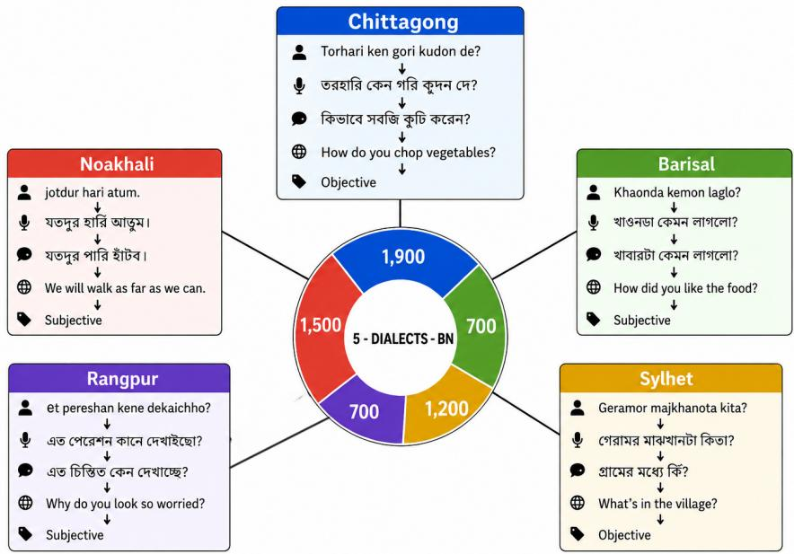  
Figure 1: Representative entries from each of the five regional dialects in 5-DIALECTS-BN. Each entry supplies five aligned fields: dialectal text in native Bangla script, a Romanized transliteration, a transliteration normalization, a binary subjectivity label, and an English translation. The selected examples span both subjectivity classes and illustrate the lexical and phonological divergence each dialect introduces over Standard Bangla.

## 3 5-DIALECTS-BN

We construct 5-DIALECTS-BN through a fourstage curation and annotation pipeline: (i) data harvesting from public online sources, (ii) authenticity and boundary verification by native speakers, (iii) tool-assisted multi-annotation by trained linguistics annotators, and (iv) inter-annotator agreement validation. Figure 1 previews representative entries across the five regional dialects, illustrating the five aligned fields per entry.

Data collection and dialect boundary verification. Dialectal utterances are harvested from public online platforms: YouTube comment threads on regional media channels, regional community Facebook groups, Reddit discussions, and regional news features (Table 7). To guarantee clean dialect boundaries and single-label integrity, candidate utterances were screened by native speakers of each target dialect under Guideline G1 (Appendix D): an utterance is accepted only if it contains ≥ 1 dialect-diagnostic feature (lexical, morphological, or phonological), while ambiguous items or border cases along regional continua (e.g., Chittagong– Noakhali transitions) were flagged for panel adjudication. Native-speaker verification rejected 34% of harvested candidates on average. Heavily codemixed items were filtered out, while naturally occurring lexical borrowings were retained (1–5% of utterances contain ≥ 1 Bangla-script English loanword). Identifying spans (usernames, phone numbers, personal names) were manually stripped by verifiers; utterances remaining identifying after redaction were discarded.

Annotation tool and quality control. Production annotation was conducted via a custom webbased tool (Figure 5; live at https://bangladialect-annotator.vercel.app/) by fifteen undergraduate linguistics annotators (three native/proficient speakers per dialect), compensated above standard research-assistant rates. For each row, the annotator inputs or verifies the nativescript rendering via an integrated Avro input editor, verifies the Standard Bangla translation, edits or approves a draft English translation, and assigns a binary subjectivity label. To mitigate annotator fatigue, candidate English translations were drafted by Gemini (Comanici et al., 2025) conditioned strictly on the human-verified Standard Bangla (not the noisy transliterated source). Annotators actively edited 41% of model drafts (ranging from 31% in Rangpur to 52% in Sylhet). An independent control sample of 100 items translated from scratch without AI drafts confirmed that prepopulation introduced no stylistic anchoring bias (Appendix E).

Dataset composition and statistics. Each entry contains five aligned fields: (1) dialectal text in native Bangla script, (2) Romanized transliteration, (3) Standard Bangla translation, (4) English translation, and (5) a binary subjectivity label. The dataset comprises 6,000 verified entries spanning Chittagong (1,900), Noakhali (1,500), Sylhet (1,200), Barisal (700), and Rangpur (700), naturally reflecting online availability (Table 8). Utterance length ranges from 3 to 40 tokens (mean 11.2, median 9; Table 1), capturing natural conversational dialogue.

<table><tr><td>Statistic</td><td>Value (Tokens)</td></tr><tr><td>Minimum Length</td><td>3</td></tr><tr><td>Maximum Length</td><td>40</td></tr><tr><td>Mean Length</td><td>11.2</td></tr><tr><td>Median Length</td><td>9</td></tr></table>

Table 1: Utterance length statistics, reflecting the conversational register of the source material.

Subjectivity formulation. We adopt binary subjectivity classification (SUBJECTIVE vs. OBJEC-TIVE) rather than fine-grained sentiment polarity or emotion, because subjectivity boundaries remain highly consistent across diverse dialects $( \kappa = 0 . 7 8 )$ , whereas sentiment polarity is heavily influenced by dialect-specific emotional lexicalization.

Inter-annotator agreement. To validate dataset reliability, a stratified sample of 1,500 entries (300 per dialect) was independently annotated by a second dialect expert, with disagreements resolved by a third senior linguist. Categorical agreement yielded Cohen’s κ = 0.78 for subjectivity, κ = 0.74 for Standard Bangla translation acceptance, and κ = 0.71 for English translation approval. For free-form English translations, the two annotators’ independent final edits converged at a mean ROUGE-L of 0.84 (0.79–0.91 across dialects), demonstrating strong semantic consistency. Full per-dialect agreement statistics and adjudication protocols are detailed in Appendix E.

## 4 Experimental Setup

We benchmark large language models across three tasks defined over 5-DIALECTS-BN: dialect-to-English translation, binary subjectivity classification, and dialect-to-Standard-Bangla normalization. Our experimental framework evaluates four orthogonal axes: prompting regime (zeroshot, few-shot, CoT), script representation (native Bangla vs. Romanized transliteration), model regime (closed-source vs. open-source), and adaptation regime (prompting vs. LoRA fine-tuning).

## Task definitions.

1. Dialect-to-English MT: Given a dialectal utterance $x ,$ the model produces an English translation yˆ scored against the human English reference y in 5-DIALECTS-BN.

2. Subjectivity Classification: The model assigns a binary label sˆ ∈ {SUBJECTIVE, OBJECTIVE} to the input utterance.

3. Dialect-to-Standard Normalization: The model maps the dialectal utterance x into its Standard (Cholito) Bangla equivalent zˆ, scored against the human-verified Standard Bangla reference z.

Prompting strategies. We evaluate three prompting regimes: (i) Zero-shot prompting providing only task instructions and input; (ii) Few-shot prompting supplying 36 in-context demonstrations (6 per regional dialect plus Standard Bangla), resampled per query from the training partition; and (iii) Chain-of-Thought (CoT) prompting (Kojima et al., 2022) eliciting an eight-step structured reasoning chain (dialect recognition, token parsing, transliteration, semantic interpretation, cultural analysis, English translation, subjectivity assessment, and consistency check) before generating the final answer. Full prompt templates are provided in Appendix F.

Script representation. Every configuration is tested under two script representations: a native condition where input is presented in original Bangla script, and a transliterated condition where input is presented in Romanized transliteration. Target outputs and label spaces remain identical.

Parameter-efficient fine-tuning (LoRA). For open-source models, we fine-tune separate LoRA adapters (Hu et al., 2022) for each task-by-script combination using rank r = 16, scaling α = 32, and dropout 0.05 on attention projections. Closedsource models are excluded from this regime as weights are inaccessible. Full training hyperparameters, loss dynamics, and hardware specifications are detailed in Appendix I.

Models and baselines. We evaluate seven primary LLMs: closed-source models (Gemini 3 Flash (Comanici et al., 2025), GPT-4omini (OpenAI, 2024), Claude Haiku 4.5 (Anthropic, 2024)) and open-source models (Qwen-3- 4B (Qwen Team, 2024), Gemma-4-4B (Gemma Team, 2024), Llama-3.1-8B (Meta AI, 2024), Mistral-7B (Jiang et al., 2023)). We additionally compare against dedicated Indic sequenceto-sequence baselines: IndicBART (Dabre et al., 2022) and BanglaT5 (Bhattacharjee et al., 2023) fine-tuned on the identical training folds (Appendix M).

Data splits. All prompting experiments evaluate on a dialect-balanced subset of ≈ 100 items per variety (600 total across the five dialects plus Standard Bangla). LoRA fine-tuning utilizes a disjoint dialect-balanced fold containing 160 training instances and 40 test instances per dialect (1,000 train / 200 test total), with zero overlap across folds or prompting subsets.

Evaluation metrics. To ensure robust and metricindependent assessment, translation is evaluated using surface n-gram metrics (BLEU (Papineni et al., 2002), ROUGE-2, ROUGE-L (Lin, 2004), ME-TEOR (Banerjee and Lavie, 2005)), character-level chrF++ (Popovic´, 2015), and neural COMET (Rei et al., 2020) (‘wmt22-comet-da‘). High absolute BLEU scores reflect the conversational register of short utterances (mean 11.2 tokens) and formulaic phrases with unique English translations (58.2% exact string match under LoRA). Dialect-to-Standard normalization is evaluated via chrF++ and COMET against the human Standard Bangla reference. Subjectivity is evaluated using macro Precision, Recall, and F1.

## 5 Results and Analysis

We benchmark seven LLMs across zero-shot and few-shot prompting (Table 2), chain-of-thought prompting (Table 3), and LoRA fine-tuning (Table 4) across translation, subjectivity, and dialectto-standard normalization (Table 5). All translation metrics are evaluated on English outputs against human references; normalization is scored via chrF++ and COMET against Standard Bangla; subjectivity is evaluated via macro Precision, Recall, and F1. All scores are macro-averaged across the five dialects plus Standard Bangla.

## 5.1 Prompting Strategies vs. Model Competence

A critical empirical insight is that promptingregime scores reflect the interaction between a model and a prompting strategy rather than its underlying Bangla competence. While closedsource frontier models maintain steady performance under zero-shot prompting (Gemini leading at 46.4 BLEU / 71.41 normalization chrF++), open-source models suffer severe strategy-specific pathology:

• Llama-3.1-8B Demonstration Interference: Llama degrades sharply under few-shot translation (42.5 → 33.2 BLEU). Item-level error auditing reveals source neglect: correct zeroshot outputs are replaced under few-shot by fluent demonstration-register sentences unrelated to the source utterance. Llama’s correctto-unrelated flip rate is 5.9% (a 15×–30× outlier compared to 0.2–0.4% for all other models; Table 11). A prompt-count sweep (Appendix H.2) confirms this interference is regime-triggered at even 1 demo/dialect (38.6 chrF++ vs. 54.6 zero-shot). In normalization, Llama zero-shot exhibits 69.5% output-script drift (emitting Romanized text with diacritics instead of Bangla script), which few-shot prompting repairs to 0%.

• Qwen-3-4B Format Collapse: Qwen’s nearzero zero-shot scores (0.2 BLEU) are caused by a 91.4% unparseable generation/format collapse rather than poor translation capability; few-shot and CoT prompting repair formatting, restoring scores to 27.5 and 11.3 BLEU.

• CoT Task Asymmetry: CoT consistently improves categorical subjectivity classification (e.g., GPT-4o-mini +11.2 F1, Gemma +6.4 F1) by encouraging structured pragmatic analysis. However, CoT degrades translation surface fidelity across all closed models (Gemini 46.4 → 38.2 BLEU). Error decomposition (Appendix H.3) reveals this drop is driven by paraphrase drift and verbosity (producing

<table><tr><td rowspan="2">Models</td><td colspan="4">Translation</td><td colspan="3">Subjectivity</td></tr><tr><td>BLEU</td><td>R-2</td><td>R-L</td><td>Meteor</td><td>P</td><td>R</td><td>F1</td></tr><tr><td colspan="8">Zero-Shot (Native Bangla)</td></tr><tr><td colspan="8">Closed-Source LLMs</td></tr><tr><td>Gemini 3 Flash</td><td>46.4</td><td>54.0</td><td>71.7</td><td>71.5</td><td>76.5</td><td>70.1</td><td>69.6</td></tr><tr><td>GPT-4o-mini</td><td>38.4</td><td>44.4</td><td>62.6</td><td>62.3</td><td>55.7</td><td>55.0</td><td>54.8</td></tr><tr><td>Claude Haiku 4.5</td><td>38.0</td><td>43.6</td><td>61.2</td><td>61.4</td><td>73.8</td><td>67.1</td><td>66.2</td></tr><tr><td colspan="8">Open-Source LLMs</td></tr><tr><td colspan="8">Qwen-3-4B</td></tr><tr><td>Gemma-4-4B</td><td>0.2 31.9</td><td>2.1 37.6</td><td>3.9 56.6</td><td>4.0 55.7</td><td>62.5 72.3</td><td>52.4 65.8</td><td>41.3 65.1</td></tr><tr><td>Llama-3.1-8B</td><td>42.5</td><td>48.9</td><td>65.6</td><td>65.7</td><td>71.5</td><td>71.6</td><td>70.6</td></tr><tr><td>Mistral-7B</td><td>16.2</td><td>20.4</td><td>38.4</td><td>38.7</td><td>36.5</td><td>32.9</td><td>32.8</td></tr><tr><td colspan="8">Zero-Shot (Transliterated)</td></tr><tr><td colspan="8">Closed-Source LLMs</td></tr><tr><td colspan="8">Gemini 3 Flash</td></tr><tr><td></td><td>40.1</td><td>47.5</td><td>66.2</td><td>65.8</td><td>74.6</td><td>67.8</td><td>67.0</td></tr><tr><td>GPT-4o-mini</td><td>26.4</td><td>32.2</td><td>51.0</td><td>50.8</td><td>54.6</td><td>54.5</td><td>54.3</td></tr><tr><td>Claude Haiku 4.5</td><td>24.6</td><td>29.2</td><td>47.5</td><td>47.8</td><td>72.1</td><td>65.0</td><td>64.0</td></tr><tr><td colspan="8">Open-Source LLMs</td></tr><tr><td>Qwen-3-4B</td><td>0.0 21.1</td><td>1.6</td><td>2.7</td><td>2.8</td><td>54.2</td><td>52.8</td><td>42.4 59.7</td></tr><tr><td>Ġemma-4-4B Llama-3.1-8B</td><td>26.9</td><td>25.6 32.9</td><td>44.0 50.3</td><td>43.4</td><td>72.6 68.8</td><td>62.0</td><td>67.0</td></tr><tr><td>Mistral-7B</td><td>7.8</td><td></td><td></td><td>50.9</td><td>37.3</td><td>68.7</td><td></td></tr><tr><td></td><td></td><td>9.7</td><td>24.0</td><td>24.9</td><td></td><td>33.6</td><td>34.8</td></tr><tr><td colspan="8">Few-Shot (Native Bangla)</td></tr><tr><td colspan="8">Closed-Source LLMs</td></tr><tr><td>Gemini 3 Flash</td><td>44.9 42.2</td><td>53.7</td><td>71.0</td><td>72.4</td><td>75.9</td><td>66.1</td><td>63.9</td></tr><tr><td>GPT-4o-mini Claude Haiku 4.5</td><td>41.0</td><td>48.5 48.2</td><td>65.6 65.2</td><td>66.1 65.5</td><td>67.2 74.9</td><td>65.2 62.9</td><td>65.0 59.0</td></tr><tr><td></td><td></td><td></td><td></td><td></td><td></td><td></td><td></td></tr><tr><td colspan="8">Open-Source LLMs</td></tr><tr><td>Qwen-3-4B</td><td>27.5</td><td>31.9 39.2</td><td>49.6 57.4</td><td>48.1 57.9</td><td>62.9 71.5</td><td>58.9 67.1</td><td>55.3 66.3</td></tr><tr><td>Gemma-4-4B Llama-3.1-8B</td><td>30.7 33.2</td><td>40.5</td><td>57.3</td><td>58.2</td><td>62.2</td><td>61.8</td><td>61.5</td></tr><tr><td>Mistral-7B</td><td>19.3</td><td>25.3</td><td>41.1</td><td>42.4</td><td>63.6</td><td>61.8</td><td>61.4</td></tr><tr><td></td><td></td><td></td><td></td><td></td><td></td><td></td><td></td></tr><tr><td colspan="8">Few-Shot (Transliterated)</td></tr><tr><td colspan="8">Closed-Source LLMs</td></tr><tr><td>Gemini 3 Flash</td><td>36.5</td><td>39.0</td><td>61.0</td><td>60.0</td><td>73.9</td><td>64.1</td><td>61.9</td></tr><tr><td>GPT-4o-mini</td><td>25.5</td><td>35.9</td><td>56.6</td><td>55.8</td><td>65.2</td><td>63.2</td><td>63.0</td></tr><tr><td>Claude Haiku 4.5</td><td>29.9</td><td>32.6</td><td>55.4</td><td>52.5</td><td>72.9</td><td>60.9</td><td>57.0</td></tr><tr><td colspan="8">Open-Source LLMs</td></tr><tr><td>Qwen-3-4B</td><td>8.5</td><td>14.0</td><td>32.6</td><td>31.6</td><td>60.9</td><td>56.9</td><td>53.3</td></tr><tr><td>Gemma-4-4B Llama-3.1-8B</td><td>28.1 13.8</td><td>32.1</td><td>54.1 37.1</td><td>54.1 38.3</td><td>69.5 60.2</td><td>65.1 59.8</td><td>64.3 59.5</td></tr><tr><td></td><td></td><td>16.2</td><td></td><td></td><td></td><td>59.8</td><td>59.4</td></tr><tr><td>Mistral-7B</td><td>11.3</td><td>16.8</td><td>38.8</td><td>38.6</td><td>61.6</td><td></td><td></td></tr></table>

Table 2: Zero-shot and few-shot benchmarking across translation and subjectivity classification under native and Romanized input. Scores are macro-averaged across the five dialects plus Standard Bangla.

45.2% CompleteMistranslation under surface metrics), while neural COMET drops much less (∆COMET = 3.4 vs. ∆chrF++ = 5.8).

Because prompting strategies introduce confounding interactions, we treat LoRA fine-tuning as the primary measure of model capacity.

## 5.2 Causal Decomposition of the Transliteration Penalty

Across all seven LLMs, three tasks, and four regimes (Tables 2–5), Romanized input consistently underperforms native Bangla script. Every finding is metric-robust: re-scoring all 35,460 outputs with neural COMET (‘wmt22-comet-da‘) and chrF++ confirms that native script outperforms Romanized input in all 19 model-regime pairs. We isolate the mechanism behind this penalty into three causal components:

1. Many-to-One Information Loss. Standard Romanization (Avro) collapses distinct phonemic features (vowel length, aspiration, and nasal distinctions; Figure 16). To quantify this, we executed a round-trip inverse transliteration control (Appendix J.2) by mapping Romanized text back to native script via deterministic inverse mapping. Character recovery is poor (mean CER 0.14–0.21), and re-evaluating LLMs on back-transliterated text recovers essentially none of the performance gap (Gemini zero-shot chrF++: native 62.13, round-trip 55.57, Romanized 57.81; Mistral: native 29.35, round-trip 22.52, Romanized 23.17). The penalty is dominated by irreversible information destroyed

<table><tr><td rowspan="2">Models</td><td colspan="4">Translation</td><td colspan="3">Subjectivity</td></tr><tr><td>BLEU</td><td>R-2</td><td>R-L</td><td>Meteor</td><td>P</td><td>R</td><td>F1</td></tr><tr><td colspan="8">Chain-of-Thought (Native Bangla)</td></tr><tr><td>Closed-Source LLMs</td><td></td><td></td><td></td><td></td><td></td><td></td><td></td></tr><tr><td>Gemini 3 Flash</td><td>38.2</td><td>47.4</td><td>66.4</td><td>67.7</td><td>75.4</td><td>68.9</td><td>68.4</td></tr><tr><td>GPT-4o-mini Claude Haiku 4.5</td><td>26.3 25.4</td><td>33.4 34.6</td><td>50.7 51.9</td><td>51.9</td><td>67.4 72.9</td><td>66.8 68.0</td><td>66.0</td></tr><tr><td></td><td></td><td></td><td></td><td>54.3</td><td></td><td></td><td>68.0</td></tr><tr><td>Open-Source LLMs</td><td></td><td></td><td></td><td></td><td></td><td></td><td></td></tr><tr><td>Qwen-3-4B</td><td>11.3</td><td>18.0</td><td>36.1</td><td>37.2</td><td>57.7</td><td>52.8</td><td>39.4</td></tr><tr><td>Gemma-4-4B</td><td>24.0</td><td>32.0</td><td>51.1</td><td>51.4</td><td>72.7</td><td>71.3</td><td>71.5</td></tr><tr><td>Llama-3.1-8B</td><td>33.6</td><td>40.6</td><td>58.0</td><td>58.5</td><td>71.2</td><td>70.4</td><td>69.9</td></tr><tr><td>Mistral-7B</td><td>9.9</td><td>14.1</td><td>30.1</td><td>31.0</td><td>58.2</td><td>57.9</td><td>57.7</td></tr><tr><td colspan="8">Chain-of-Thought (Transliterated)</td></tr><tr><td>Closed-Source LLMs</td><td></td><td></td><td></td><td></td><td></td><td></td><td></td></tr><tr><td>Gemini 3 Flash</td><td>39.7</td><td>43.0</td><td>64.7</td><td>64.1</td><td>74.9</td><td>68.5</td><td>67.9</td></tr><tr><td>GPT-4o-mini</td><td>26.8</td><td>36.0</td><td>53.6</td><td>53.0</td><td>64.5</td><td>63.3</td><td>64.0</td></tr><tr><td>Claude Haiku 4.5</td><td>32.5</td><td>38.0</td><td>57.0</td><td>56.4</td><td>71.9</td><td>64.6</td><td>66.0</td></tr><tr><td>Open-Source LLMs</td><td></td><td></td><td></td><td></td><td></td><td></td><td></td></tr><tr><td>Qwen-3-4B</td><td>6.4</td><td>11.4</td><td>25.8</td><td>27.1</td><td>56.4</td><td>52.2</td><td>41.5</td></tr><tr><td>Gemma-4-4B</td><td>24.5</td><td>32.1</td><td>51.5</td><td>52.4</td><td>69.4</td><td>67.4</td><td>68.3</td></tr><tr><td>Llama-3.1-8B</td><td>33.2</td><td>41.6</td><td>57.3</td><td>56.3</td><td>69.1</td><td>68.3</td><td>67.9</td></tr><tr><td>Mistral-7B</td><td>11.6</td><td>17.6</td><td>34.6</td><td>35.0</td><td>58.6</td><td>57.4</td><td>58.1</td></tr></table>

Table 3: Chain-of-thought benchmarking of LLMs across translation and subjectivity under native and Romanized input.
<table><tr><td rowspan="2">Models</td><td colspan="5">Translation</td><td colspan="3">Subjectivity</td></tr><tr><td>BLEU</td><td>R-L</td><td>chrF++</td><td>COMET</td><td>Meteor</td><td>P</td><td>R</td><td>F1</td></tr><tr><td colspan="9">LoRA Fine-Tuning (Native Bangla)</td></tr><tr><td colspan="9">Open-Source LLMs</td></tr><tr><td>Qwen-3-4B</td><td>65.9</td><td>78.6</td><td>74.67</td><td>87.72</td><td>79.1</td><td>77.2</td><td>77.7</td><td>77.3</td></tr><tr><td>Gemma-4-4B</td><td>63.9</td><td>77.6</td><td>73.17</td><td>87.09</td><td>77.7</td><td>74.0</td><td>74.5</td><td>74.0</td></tr><tr><td>Llama-3.1-8B</td><td>68.9</td><td>81.3</td><td>77.02</td><td>88.90</td><td>81.0</td><td>77.7</td><td>79.3</td><td>78.4</td></tr><tr><td>Mistral-7B</td><td>73.6</td><td>84.7</td><td>80.43</td><td>89.97</td><td>84.2</td><td>77.8</td><td>79.3</td><td>78.3</td></tr><tr><td colspan="9">LoRA Fine-Tuning (Transliterated)</td></tr><tr><td colspan="9">Open-Source LLMs</td></tr><tr><td>Qwen-3-4B</td><td>53.9</td><td>67.4</td><td>27.40</td><td>59.38</td><td>67.7</td><td>69.2</td><td>69.8</td><td>69.3</td></tr><tr><td>Gemma-4-4B</td><td>51.9</td><td>66.3</td><td>30.45</td><td>62.15</td><td>66.3</td><td>66.1</td><td>67.3</td><td>66.0</td></tr><tr><td>Llama-3.1-8B</td><td>56.9</td><td>69.3</td><td>30.63</td><td>62.09</td><td>69.0</td><td>69.9</td><td>71.5</td><td>70.2</td></tr><tr><td>Mistral-7B</td><td>61.6</td><td>72.7</td><td>36.94</td><td>64.27</td><td>72.2</td><td>70.3</td><td>72.3</td><td>70.5</td></tr></table>

Table 4: LoRA fine-tuning results on 5-DIALECTS-BN evaluated on the held-out test fold (100 per dialect; 600 items including Standard Bangla). Closed-source models are omitted due to API weight restrictions. All four models outperform the strongest closed-source zero-shot baseline (Gemini 3 Flash: COMET 86.68, chrF++ 63.67).

in the mapping channel.

2. Subword Token Fragmentation. In aggregate, Romanized text is more token-compact than native Bangla (≈ 0.4 vs. 0.4–1.25 tokens/char), ruling out a simple context-budget inefficiency. However, an item-level regression of the native-minus-Romanized COMET gap on token inflation (Appendix J.1) is positive and statistically significant for all four open models under LoRA (β = +7.86 ${ \mathrm { t o } } + 6 0 . 9 2 , p \leq 0 . 0 3 5 )$ . Atypical subword fragmen-

<table><tr><td>Models</td><td colspan="2">Zero-Shot (chrF++)</td><td colspan="2">Few-Shot (chrF++)</td></tr><tr><td></td><td>Native</td><td>Romanized</td><td>Native</td><td>Romanized</td></tr><tr><td>Closed-Source LLMs</td><td></td><td></td><td></td><td></td></tr><tr><td>Gemini 3 Flash</td><td>71.41</td><td>64.89</td><td>78.70</td><td>73.00</td></tr><tr><td>GPT-4o-mini</td><td>58.10</td><td>47.36</td><td>63.58</td><td>54.77</td></tr><tr><td>Claude Haiku 4.5</td><td>57.14</td><td>45.46</td><td>66.13</td><td>57.57</td></tr><tr><td>Open-Source LLMs</td><td></td><td></td><td></td><td></td></tr><tr><td>Gemma-4-4B</td><td>53.05</td><td>44.75</td><td>56.71</td><td>48.17</td></tr><tr><td>Mistral-7B</td><td>31.51</td><td>26.65</td><td>36.73</td><td>28.66</td></tr><tr><td>Llama-3.1-8B</td><td>15.82*</td><td>32.90</td><td>46.28</td><td>36.39</td></tr><tr><td>Qwen-3-4B</td><td>38.96†</td><td>28.99</td><td>44.06</td><td>36.61</td></tr><tr><td>Copy-input baseline</td><td>39.66</td><td></td><td>39.66</td><td></td></tr></table>

Table 5: Dialect-to-Standard-Bangla normalization macro chrF++ across zero-shot and few-shot prompting. ∗Llama zero-shot native is depressed by 69.5% outputscript drift, repaired by few-shot. †Qwen-3-4B required constrained JSON decoding (format="json"): as a hybrid-reasoning model it emits reasoning text outside <think> delimiters and exhausts the generation budget before returning the required JSON object, yielding no parseable output under the unconstrained configuration used for all other models; constrained decoding governs output format only, not content quality. Copy-input baseline is the score obtained by returning the dialectal input unchanged (39.66 chrF++, native script; near-zero for Romanized input against a Bangla-script reference, hence omitted), and marks the floor below which a system has not performed the task. Qwen-3-4B returns its input verbatim on 34.1% of native items (all other models 1.8–11.1%), so its native-script scores are inflated by pass-through; on the items it does modify it reaches 46.25 chrF++. Mistral-7B few-shot and Llama-3.1-8B zero-shot fall below the copy baseline in the native-script condition.

tation serves as the per-item signature of damaged, ambiguous mappings.

3. Distributional Sparsity and Scheme Robustness. Unstandardized Romanization scatters probability mass across spelling variants. To verify that this is not an artifact of the Avro convention, we benchmarked models under two alternative Romanization schemes: ITRANS and ISO-15919 (Appendix J.3). The penalty holds across all schemes, and Avro is the mildest penalty (Gemini penalty: Avro 4.63 vs. ITRANS 8.92 vs. ISO 4.24 chrF++), proving that our reported gaps are conservative lower bounds.

## 5.3 Supervision and Adaptation Dynamics

Fine-tuning open-source models via LoRA on only 160 examples per dialect yields large gains on both benchmarked generation tasks—translation and subjectivity classification (Table 4, Figures 2–3). We did not fine-tune adapters for normalization; the normalization results in Table 5 are prompting-only, and the supervised comparison available for that task is the Indic seq2seq fine-tune in Appendix M:

• Translation: Mistral-7B jumps from 16.2 to 73.6 BLEU (COMET 89.97), outperforming Gemini 3 Flash zero-shot (46.4 BLEU / COMET 86.68). Gemma-4-4B, Qwen-3-4B, and Llama-3.1-8B reach 63.9–68.9 BLEU.

• Subjectivity: All four open models land in the 74.0–78.4 F1 range, exceeding all closedsource zero-shot and few-shot baselines.

• Comparison to Indic Baselines: Dedicated seq2seq models fine-tuned on the identical 160/dialect fold trail LoRA-adapted LLMs substantially: IndicBART achieves 11.19 chrF++ (7.39 BLEU) on translation—a figure dominated by its 50.6% empty-output rate, rising to 22.66 chrF++ on the items it does generate—and 40.82 chrF++ on normalization; BanglaT5 reaches 42.06 chrF++ (27.74 BLEU) on translation and 44.47 on normalization (Appendix M).

• Persistent Script Gap: Even under LoRA, the native-over-transliterated gap remains substantial (∆ = 12.0–17.0 BLEU; β = 38– 61, $p < 0 . 0 0 1 )$ , confirming that 160 examples cannot reconstruct distinctions destroyed in the Romanization channel.

## 5.4 Linguistic Divergence and Error Analysis

A feature-conditioned error analysis (Appendix K) reveals that error rates mirror linguistic distance from Standard Bangla:

• Lexical vs. Phonological Divergence: Highlexical-divergence items exhibit ≈ 2× the COMPLETEMISTRANSLATION rate of lowdivergence items zero-shot (27.4% vs. 13.4%) and remain resistant even after LoRA (9.8% vs. 5.9%). Specifically, Chittagong noncognate goijja-class verbs remain hardest after adaptation (16.2% mistranslation, chrF++ 54.4), whereas Barisal phonological $h ^ { C } \cdot$ cluster shifts are fully mastered (0% error, chrF++ 92.3).

• Error Taxonomy Progression: LoRA shifts the prediction distribution toward SUCCESS (17.2% → 58.2%) and away from COM-PLETEMISTRANSLATION (29.1% → 9.5%), while CoT produces the highest mistranslation rate (45.2%) due to unconstrained paraphrase generation.

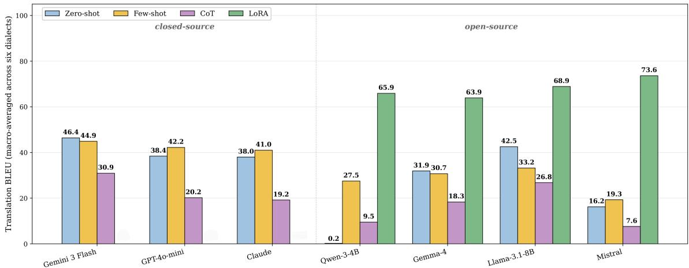  
Figure 2: Translation BLEU across four regimes (zero-shot, few-shot, chain-of-thought, LoRA fine-tuning) for all seven models, native Bangla input, macro-averaged across dialects. LoRA elevates all four open-source models into a 64–74 BLEU band, with Mistral-7B gaining +57.4 BLEU over its zero-shot baseline and surpassing all closed-source models.

Subjectivity classification F1 across regimes and models (native Bangla)  
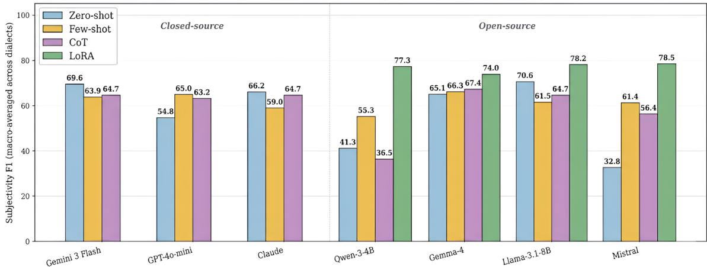  
Figure 3: Subjectivity classification F1 across four regimes for all seven models (native script). LoRA lifts every open-source model into the 74–79 F1 band, closing the open-vs-closed performance gap.

Detailed per-dialect tables, confusion matrices, and qualitative failure case studies are provided in Appendices G–L.

## 6 Conclusion

We introduce 5-DIALECTS-BN, the first Bangla dialect benchmark to align Romanized transliteration as a factorial variable with Standard Bangla, English, and subjectivity labels across five regional dialects (6,000 entries). Experiments on seven LLMs show that LoRA fine-tuning with only 160 examples per dialect surpasses closed-source models, Romanized transliteration consistently degrades current LLMs due to many-to-one information loss and token fragmentation, and dialect-aligned supervision is the critical bottleneck for Bangla dialect understanding.

## Limitations

5-DIALECTS-BN has two primary limitations. First, the dataset is naturally imbalanced across dialects (1,900 Chittagong entries vs. 700 each for Barisal and Rangpur), reflecting the differential online availability of dialect-tagged content; while our evaluation protocols sample dialect-balanced subsets to prevent the imbalance from confounding macro-averaged scores, the imbalance may still bias future cross-dialect transfer studies. Second, Bangla dialects lack fixed transliteration rules or a standardized Romanization grammar: while our multi-scheme evaluations confirm that the transliteration penalty is robust across Avro, ITRANS, and ISO-15919 conventions (Appendix J), downstream users should account for orthographic variance when comparing across transliterated resources. Beyond these, our LoRA experiments evaluate a 160-instance-per-dialect configuration (1,000 train total), representing a practical lower bound on what adaptation can achieve; while we benchmark fine-tuned Indic seq2seq models (IndicBART and BanglaT5; Appendix M), larger Indic foundation models remain future work; and our dataset captures written online dialectal Bangla, which may differ from spoken dialectal varieties.

Scope of the reported experiments. Several analyses that would further constrain our claims are outside the scope of this version. Our parameterefficient fine-tuning results rest on a single training budget (160 examples per dialect) and one hyperparameter configuration; we do not report a datascaling curve, so the claim that dialect-aligned supervision is the binding constraint is supported by a single-budget comparison against prompting rather than by a trend. Our adaptation experiments cover translation and subjectivity classification; dialect to-standard normalization is benchmarked under prompting only, and the sole supervised normal ization comparison we report is the Indic seq2seq fine-tune in Appendix M, which suggests that 160 dialect-aligned examples are not sufficient for a small Indic seq2seq model to match strong prompt ing on this task; the extent to which LoRA transfers the translation-side gains to normalization remains open. The demonstration-count sweep (Ap pendix H.2) covers Llama-3.1-8B, Mistral-7B and Gemma-4-4B; Qwen-3-4B is excluded because it requires constrained JSON decoding (Table 5), which would confound a cross-model comparison, and the closed-source models are excluded on API cost. Automatic evaluation is metric-diverse— BLEU, chrF++, and COMET across all 35,460 outputs—but we do not report human adequacy or fluency judgements, nor a rubric-based audit of chain-of-thought intermediate steps; both remain future work. Finally, we report per-dialect interannotator agreement (Table 9) and the overall adjudication rejection rate, but not per-dialect rejection rates, which were not logged separately during annotation.

## Ethical Considerations

All data was collected from publicly accessible online sources; no private, personally identifying, or otherwise sensitive information was deliberately collected. The dataset contains only ordinary usergenerated sentences (everyday conversations, opinions, and commentary) and does not include private communication, personal correspondence, financial or medical information, government identifiers, or other sensitive content. Where user identifiers or contact information incidentally appeared in source text, they were removed during the verification stage. The released dataset poses no privacy risk to the original posters of the source content. All annotation was performed in-house by the research team and contracted student annotators, who were briefed on data handling and confidentiality and paid above the local research-assistantship rate. 5- DIALECTS-BN is intended for research on dialectaware NLP, low-resource language technology, dialect identification, dialect-to-standard normalization, and cross-dialectal transfer; it is not intended for inferring demographic or geographic attributes of individual users, and should not be used as a basis for any such inference.

## Usage of AI

The authors employed AI tools solely for limited language polishing and grammatical improvements in selected sections of this manuscript. All scientific aspects of the work, including study design, data acquisition, annotation, analysis, interpretation, and conclusions, were independently carried out by the authors. No AI system was used to generate findings, create figures or tables, review or synthesize literature, or formulate scientific claims. The authors assume full responsibility for the accuracy and integrity of the content presented in this paper.

## References

Fahim Ahmed, Md Fahim, Md Ashraful Amin, Amin Ahsan Ali, and AKM Mahabubur Rahman. 2024. Improving the performance of transformerbased models over classical baselines in multiple transliterated languages. In ECAI 2024, Frontiers in Artificial Intelligence and Applications, pages 4043– 4050. IOS Press.

Rafid Ahmed, Intesar Tahmid, Mir Sazzat Hossain, Tasnimul Hossain Tomal, Md Mahir Jawad, Anam Borhan Uddin, Md Fahim, and

Md Farhad Alam Bhuiyan. 2026. Evaluating large vision language models on Bangla medical visual question answering. In Findings ofthe Association for Computational Linguistics: ACL 2026, pages 37362–37378, San Diego, California, United States. Association for Computational Linguistics.

Anthropic. 2024. The Claude 3 model family: Opus, sonnet, haiku. Technical report, Anthropic.

Kalika Bali, Jatin Sharma, Monojit Choudhury, and Yogarshi Vyas. 2014. “I am borrowing ya mixing?” an analysis of English-Hindi code mixing in Facebook. In Proceedings of the First Workshop on Computational Approaches to Code Switching, pages 116–126. Association for Computational Linguistics.

Satanjeev Banerjee and Alon Lavie. 2005. METEOR: An automatic metric for MT evaluation with improved correlation with human judgments. In Proceedings ofthe ACL Workshop on Intrinsic and Extrinsic Evaluation Measuresfor Machine Translation and/or Summarization, pages 65–72.

Abhik Bhattacharjee, Tahmid Hasan, Wasi Uddin Ahmad, Kazi S. Mubasshir, Md. Saiful Islam, Anindya Iqbal, M. Sohel Rahman, and Rifat Shahriyar. 2022. BanglaBERT: Language model pretraining and benchmarks for low-resource language understanding evaluation in Bangla. In Findings of the Associationfor Computational Linguistics: NAACL 2022, pages 1318–1327. Association for Computational Linguistics.

Abhik Bhattacharjee, Tahmid Hasan, Wasi Uddin Ahmad, and Rifat Shahriyar. 2023. BanglaT5: A sequence-to-sequence model for bangla natural language processing. arXiv preprint arXiv:2305.09706.

Damian Blasi, Antonios Anastasopoulos, and Graham Neubig. 2022. Systematic inequalities in language technology performance across the world’s languages. In Proceedings of the 60th Annual Meeting ofthe Associationfor Computational Linguistics, pages 5486–5505.

S. Chowdhury, M. Rahman, et al. 2025. ChatgaiyyaAlap: A dataset for conversion from Chittagonian dialect to standard Bangla. Data in Brief.

Gheorghe Comanici, Eric Bieber, Mike Schaekermann, et al. 2025. Gemini 2.5: Pushing the frontier with advanced reasoning, multimodality, long context, and next generation agentic capabilities. arXiv preprint arXiv:2507.06261.

Raj Dabre, Himani Shrivastava, Florian Burlot, et al. 2022. IndicBART: A pre-trained sequence-tosequence model for Indic languages. In Findings of the Associationfor Computational Linguistics: ACL 2022, pages 1849–1863.

Farhan Noor Dehan, Md Fahim, A. K. M. Mahabubur Rahman, M. Ashraful Amin, and Amin Ahsan Ali. 2025. Tinyllm efficacy in low-resource language: An experiment on bangla text classification task. In

Pattern Recognition, pages 472–487, Cham. Springer Nature Switzerland.

Md Fahim, Farhan Ishmam Islam, et al. 2024. BanglaTLit: A benchmark dataset for backtransliteration of romanized Bangla. In Findings of the Association for Computational Linguistics: EMNLP 2024.

Fatema Tuj Johora Faria, Mukaffi Bin Mukaffi, Md Rabius Rahman, et al. 2023. Vashantor: A large-scale multilingual benchmark dataset for Bangla regional dialects. arXiv preprint arXiv:2311.11142.

Jay Gala, Pranjal Kadole, et al. 2023. IndicTrans2: Towards high-quality and accessible machine translation for all 22 scheduled indian languages. Transactions on Machine Learning Research.

Gemma Team. 2024. Gemma: Open models based on Gemini research and technology. Technical report, Google DeepMind.

George Abraham Grierson. 1903. Linguistic Survey of India: Indo-Aryan Family. Eastern Group. Specimens ofthe Bengali and Assamese Languages, volume 5. Office of the Superintendent of Government Printing, India.

Fabiha Haider, Fariha Tanjim Shifat, Md Farhan Ishmam, Md Sakib Ul Rahman Sourove, Deeparghya Dutta Barua, Md Fahim, and Md Farhad Alam Bhuiyan. 2025. BanTH: A multi-label hate speech detection dataset for transliterated Bangla. In Findings of the Association for Computational Linguistics: NAACL 2025, pages 7232–7251, Albuquerque, New Mexico. Association for Computational Linguistics.

Tahmid Hasan, Abhik Bhattacharjee, Wasi Uddin Ahmad, Kazi Mubasshir, Md Saiful Islam, Anindya Rahman, M Sohel Rahman, and Rifat Shahriyar. 2020. Not low-resource anymore: A large scale benchmark for bengali to english machine translation. In Proceedings of the 2020 Conference on Empirical Methods in Natural Language Processing (EMNLP), pages 5665–5674.

Edward J. Hu, Yelong Shen, Phillip Wallis, Zeyuan Allen-Zhu, Yuanzhi Li, Shean Wang, Lu Wang, and Weizhu Chen. 2022. LoRA: Low-rank adaptation of large language models. In International Conference on Learning Representations (ICLR).

Khondoker Ittehadul Islam, Sudipta Kar, Md Saiful Islam, and Mohammad Ruhul Amin. 2021. SentNoB: A dataset for analysing sentiment on noisy Bangla texts. In Findings of the Association for Computational Linguistics: EMNLP 2021, pages 3265–3271.

Md Mahir Jawad, Rafid Ahmed, Ishita Sur Apan, Tasnimul Hossain Tomal, Fabiha Haider, Mir Sazzat Hossain, and Md Farhad Alam Bhuiyan. 2025. Benchmarking large language models on Bangla dialect translation and dialectal sentiment analysis. In

Proceedings ofthe Second Workshop on Bangla Language Processing (BLP-2025), pages 322–337. Association for Computational Linguistics.

Albert Q. Jiang, Alexandre Sablayrolles, Arthur Mensch, Chris Bamford, Devendra Singh Chaplot, Diego de las Casas, Florian Bressand, Gianna Lengyel, Guillaume Lample, Lucile Saulnier, et al. 2023. Mistral 7B. arXiv preprint arXiv:2310.06825.

Pratik Joshi, Sebastin Santy, Amar Budhiraja, Kalika Bali, and Monojit Choudhury. 2020. The state and fate of linguistic diversity and inclusion in the NLP world. In Proceedings of the 58th Annual Meeting of the Association for Computational Linguistics, pages 6282–6293.

Simran Khanuja, Sandipan Dandapat, Anirudh Srinivasan, Sunayana Sitaram, and Monojit Choudhury. 2020. GLUECoS: An evaluation benchmark for code-switched NLP. In Proceedings ofthe 58th Annual Meeting of the Association for Computational Linguistics, pages 3575–3585. Association for Computational Linguistics.

Takeshi Kojima, Shixiang Shane Gu, Machel Reid, Yutaka Matsuo, and Yusuke Iwasawa. 2022. Large language models are zero-shot reasoners. In Advances in Neural Information Processing Systems (NeurIPS).

Chin-Yew Lin. 2004. ROUGE: A package for automatic evaluation of summaries. In Text Summarization Branches Out, pages 74–81.

Chunlan Ma, Yihong Liu, Haotian Ye, and Hinrich Schütze. 2024. Exploring the role of transliteration in in-context learning for low-resource languages written in non-Latin scripts. arXiv preprint arXiv:2407.02320.

Sadia Mahjabin et al. 2025. Human–LLM benchmarks for Bangla dialect translation: Sylheti and Chittagonian. arXiv preprint.

Meta AI. 2024. The Llama 3 herd of models. arXiv preprint arXiv:2407.21783.

OpenAI. 2024. GPT-4o system card. arXiv preprint arXiv:2410.21276.

Kishore Papineni, Salim Roukos, Todd Ward, and Wei-Jing Zhu. 2002. BLEU: A method for automatic evaluation of machine translation. In Proceedings of the 40th Annual Meeting of the Association for Computational Linguistics, pages 311–318.

Bidyarthi Paul, Faika Fairuj Preotee, Shuvashis Sarker, Shamim Rahim Refat, Shifat Islam, Tashreef Muhammad, Mohammad Ashraful Hoque, and Shahriar Manzoor. 2025. ANCHOLIK-NER: A benchmark dataset for Bangla regional named entity recognition. arXiv preprint arXiv:2502.11198.

Maja Popovic. 2015. chrf: character n-gram f-score for ´ automatic mt evaluation. In Proceedings of the Tenth Workshop on Statistical Machine Translation, pages 392–395.

Qwen Team. 2024. Qwen 2.5: A party of foundation models. Technical report, Alibaba Cloud.

Gowtham Ramesh, Sumanth Doddapaneni, Aravinth Bheemambika, et al. 2022. Samanantar: The largest publicly available parallel corpora collection for 11 Indic languages. In Transactions ofthe Association for Computational Linguistics (TACL), volume 10, pages 145–162.

Ricardo Rei, Craig Stewart, Ana C Farinha, and Alon Lavie. 2020. Comet: A neural framework for mt evaluation. In Proceedings of the 2020 Conference on Empirical Methods in Natural Language Processing (EMNLP), pages 2685–2702.

Tanja Samardžic, Yves Scherrer, and Elvira Glaser.´ 2016. Universal dependencies for Swiss german: Numeric information and other idiosyncrasies. In Proceedings ofthe 13th Conference on Natural Language Processing (KONVENS 2016), pages 245–255.

N. Sultana, S. Akter, et al. 2025. ONUBAD: A comprehensive dataset for automated conversion of Bangla dialects to standard Bangla. Data in Brief.

Rabih Zbib, Erika Malchiodi, Jacob Devlin, David Stallard, Spyros Matsoukas, Richard Schwartz, John Makhoul, Omar F Zaidan, and Chris Callison-Burch. 2012. Machine translation of Arabic dialects. In Proceedings of the 2012 Conference of the North American Chapter of the Association for Computational Linguistics: Human Language Technologies, pages 49–59.

## A Dialect Linguistic Background

Bangla regional dialects differ from Standard Bangla along phonological, lexical, and morphological axes that are systematic enough to be diagnostic on a per-sentence basis but variable enough to resist simple rule-based normalization. The five dialects in 5-DIALECTS-BN span the major regional varieties of Bangladesh and exhibit the following signatures:

Chittagong (Chattogram). Spoken across the southeastern divisions of Bangladesh, Chittagong shows the strongest divergence from Standard Bangla of the five dialects in our benchmark, to the point that mutual intelligibility with the standard is partial rather than full. Diagnostic features include the dialect-final particle dey as an interrogative or assertive marker (e.g., kemne goijji dey, “how have you done this?”), retroflex consonant shifts (r → lr, l → r in onset positions), the locative postposition tu/at in place of standard ke/te, and extensive lexical replacement of standard verbs (e.g., goijja for kora, “to do”). Chittagong has the lowest per-dialect BLEU under every regime in our experiments and the largest residual error rate even after LoRA adaptation; we attribute this to the combined effect of high lexical divergence and lower pretraining coverage compared to standard-adjacent varieties.

Barisal (Barishal). A coastal southern dialect with comparatively mild divergence from Standard Bangla. Diagnostic features include the consonant cluster simplification $r ^ { \mathrm { C } } \to h ^ { \mathrm { C } }$ (karchen → horlen, “did”), vowel raising in word-medial positions, and adoption of the present-perfect auxiliary ase where Standard Bangla would prefer the simple past. Barisal sentences are usually intelligible to a Standard Bangla speaker after a few exposures and our LoRA-tuned models reach near-saturation (85+ BLEU) on this dialect.

Noakhali. Geographically adjacent to Chittagong but linguistically a distinct continuum, Noakhali shows interior shifts in vowel quality (notably the front-vowel reduction e → ya wordinitially, aitchi from esechi, “I have come”), the use of dialect-specific possessive pronouns (annei/anne, “yours”), and frequent consonant elision in postpositions. Noakhali sits between Chittagong and Barisal in benchmark difficulty.

Sylhet. A northeastern dialect with extensive contact-influence from Assamese and Sylheti Nagri orthographic traditions. Diagnostic features include retroflex-flap substitutions (kh/r alternations), distinctive question particles (kita, “what”), and a verbal aspect system that distinguishes habitual and progressive in surface forms that Standard Bangla collapses. Sylhet’s lexicon contains a substantial number of items with no transparent Standard Bangla cognate, which manifests in our error analysis as a higher COMPLETEMISTRANS-LATION rate even after fine-tuning.

Rangpur. A northwestern dialect spoken across the Rangpur and Rajshahi divisions. Diagnostic features include rising-tone lengthening on stressed vowels, the second-person plural tomara → tora/tomra alternation, dialect-specific quantifiers (kuna for kichu, “some”), and a future-tense suffix that surfaces as -im/-iya rather than standard -bo. Rangpur is the closest of the five dialects to Standard Bangla in lexical overlap and produces the strongest zero-shot baseline.

Comparison with DIALTSA-BN. Table 6 provides an explicit side-by-side comparison between 5-DIALECTS-BN and the prior benchmark DIALTSA-BN (Jawad et al., 2025). 5-DIALECTS-BN expands the dataset scale ten-fold, covers five dialects (adding Rangpur), provides five fully aligned fields, factorially evaluates script effects across four regimes, and incorporates causal tokenizer and failure analyses.

## B Data Collection and Source Filtering

Source platforms. Candidate utterances were drawn from publicly accessible content on YouTube (regional-comedy and regional-news comment threads, including channels associated with Bangladesh Television’s regional service BTV Chittagong, language-documentation channels such as Indo-Aryan: Chittagonian and I Love Languages, and dialect-comedy creators on shortform video platforms), Facebook (open public groups dedicated to regional Bangladeshi communities and dialect-themed pages associated with Sylheti-revival movements such as the Greater Sylot Society and the Sylheti Project), Reddit (subreddits such as r/bangladesh, r/dhaka, and regional discussion threads), Bangla regional blogs and online opinion-and-feature articles (The Daily Star’s “Chittagonian humour” column, The Business Standard’s Sylheti-preservation features, and divisional desks at Bangla Tribune, Dhaka Post, and Ajker Patrika that publish in regionalflavored Bangla), and dialect-tagged open-source corpora released on Kaggle and Mendeley Data (Vashantor (Faria et al., 2023), ONUBAD (Sultana et al., 2025), ChatgaiyyaAlap (Chowdhury et al., 2025), ANCHOLIK-NER (Paul et al., 2025), and BanglaDial). A representative URL inventory of the source platforms is reproduced in Table 7. We deliberately excluded private communications, paywalled content, and any platform requiring user authentication beyond a public read scope.

Initial harvest and filtering. The raw harvest yielded approximately 24,000 candidate utterances across the five target dialects. We applied a fourstage filtering pipeline:

1. Language identification. Candidate utterances were passed through a Bangla language identifier with a minimum confidence threshold of 0.85. Non-Bangla candidates (English code-mixed segments dominated by English, Hindi loan-paragraphs) were discarded.

<table><tr><td>Dimension</td><td>DIALTSA-BN (Jawad et al., 2025)</td><td>5-DIALECTS-BN (Ours)</td></tr><tr><td>Dataset Scale</td><td>600 utterances</td><td>6,000 utterances (10× expansion)</td></tr><tr><td>Dialect Coverage</td><td>4 regional dialects</td><td>5 regional dialects (adding Rangpur)</td></tr><tr><td>Aligned Fields per Entry</td><td>3 fields (dialect, Standard Bangla, sentiment)</td><td>5 fields (dialect, Romanization, Standard Bangla, English, subjectivity)</td></tr><tr><td>Script Evaluation</td><td>Uncontrolled / ad-hoc</td><td>Factorial native vs. Romanized across all models and regimes</td></tr><tr><td>Adaptation Regimes</td><td>Prompting-only (zero-shot, few-shot)</td><td>Zero-shot, few-shot, CoT, and LoRA</td></tr><tr><td>Mechanistic &amp; Causal Analysis</td><td>None (descriptive reporting)</td><td>parameter-efficient fine-tuning Tokenizer fertility regression, round-trip control, multi-scheme robustness, failure diagnostics</td></tr></table>

Table 6: Systematic comparison between DIALTSA-BN and 5-DIALECTS-BN.
<table><tr><td>Category</td><td>Platform / Source</td><td>Reference URL or DOI</td></tr><tr><td rowspan="3">Reference corpora</td><td>Vashantor</td><td>cited as Faria et al. (2023)</td></tr><tr><td>ONUBAD</td><td>DOI 10.17632/k769s4vk5z.2 (Sultana et al., 2025)</td></tr><tr><td>BanglaDial</td><td>PubMed Central PMC12597015</td></tr><tr><td rowspan="3">Wikipedia / encyclopedic</td><td>Chittagonian language</td><td>en.wikipedia.org/wiki/Chittagonian_language</td></tr><tr><td>Sylheti language</td><td>en.wikipedia.org/wiki/Sylheti_language</td></tr><tr><td>BTV Chittagong</td><td>en.wikipedia.org/wiki/BTV_Chittagong</td></tr><tr><td rowspan="3">News and feature articles</td><td>The Daily Star (Chittagonian humour)</td><td>thedailystar.net/news/chittagonian-humour</td></tr><tr><td>The Business Standard (Sylheti preservation)</td><td>tbsnews.net (article 1098446)</td></tr><tr><td>Bangla Tribune / Dhaka Post (Rangpur)</td><td>banglatribune.com/rangpur-news, dhakapost.com/country/rangpur-news</td></tr><tr><td rowspan="2">Curated dataset hubs</td><td>Bangla NLP datasets (Foysal87)</td><td>github.com/Foysal87/Bangla-NLP-Dataset</td></tr><tr><td>ANCHOLIK-NER</td><td>arXiv 2502.11198 (Paul et al., 2025)</td></tr></table>

Table 7: Representative source platforms and reference URLs used during the harvesting and authenticity-verification stages of 5-DIALECTS-BN. We list publicly accessible sources only; private group content, paywalled articles, and authenticated platforms were excluded. The full per-platform URL inventory for each dialect is released alongside the dataset.

2. Length filter. Utterances shorter than three tokens or longer than 40 tokens were dropped. Very short utterances tend to be acknowledgement tokens (e.g., “ok”, “hmm”) that carry no dialectal signal; very long utterances tend to be code-mixed multi-sentence comments that complicate per-sentence dialect attribution.

3. Native-speaker verification. A native speaker of each dialect reviewed all candidates pre-tagged with that dialect’s region under Guideline G1 (Appendix D). The reviewer confirmed that the utterance was a legitimate instance of the target dialect (not standard Bangla in regional spelling), that it contained at least one dialect-diagnostic feature, and that it was not heavily code-mixed with English. Rejection rates at this stage averaged 34% across dialects (46% for Barisal, 41% for Rangpur, 35% for Noakhali, 28% for Sylhet, and 20% for Chittagong).

4. Deduplication. Exact-match and near-match (Levenshtein-ratio > 0.9) deduplication was applied within each dialect.

After filtering, 6,000 utterances remained for annotation, distributed as shown in Table 8. The distribution reflects natural online availability across platforms.

## C Annotation Pipeline

Figure 4 summarizes the four-stage construction workflow of 5-DIALECTS-BN: harvesting, nativespeaker verification, tool-assisted annotation, and agreement-checked release.

Tool architecture. We developed a custom webbased annotation tool deployed on Vercel as a React/Next.js single-page application backed by a serverless storage layer (Figure 5; live at https://bangla-dialect-annotator.vercel. app/). The interface presents a single annotation row at a time with the following workflow stages:

<table><tr><td>Dialect</td><td>YouTube</td><td>Facebook</td><td>Reddit</td><td>News/Blogs</td><td>Ref. Corpora</td><td>Total Entries</td></tr><tr><td>Chittagong</td><td>850</td><td>420</td><td>180</td><td>210</td><td>240</td><td>1,900</td></tr><tr><td>Noakhali</td><td>680</td><td>360</td><td>140</td><td>160</td><td>160</td><td>1,500</td></tr><tr><td>Sylhet</td><td>510</td><td>280</td><td>120</td><td>140</td><td>150</td><td>1,200</td></tr><tr><td>Barisal</td><td>310</td><td>160</td><td>60</td><td>80</td><td>90</td><td>700</td></tr><tr><td>Rangpur</td><td>290</td><td>180</td><td>70</td><td>80</td><td>80</td><td>700</td></tr><tr><td>Total</td><td>2,640</td><td>1,400</td><td>570</td><td>670</td><td>720</td><td>6,000</td></tr></table>

Table 8: Detailed dialect and source platform distribution of the 6,000 curated utterances in 5-DIALECTS-BN, broken down by newly harvested online sources and seed reference corpora.

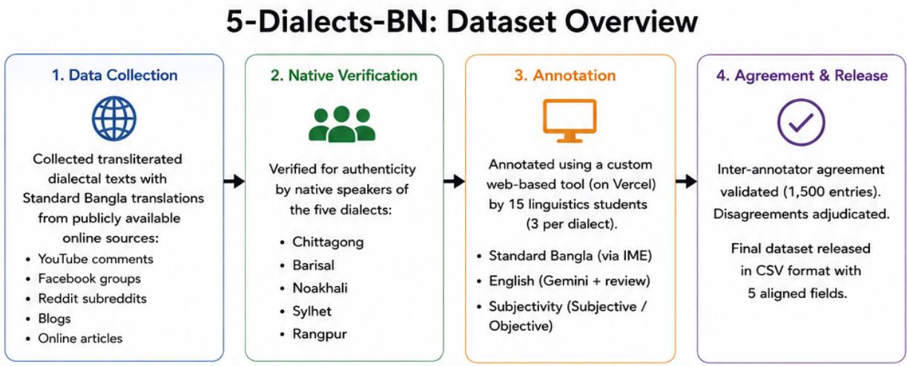  
Figure 4: Construction workflow of 5-DIALECTS-BN. Transliterated dialectal texts with their Standard Bangla translations are collected from publicly available online sources, verified for authenticity by native speakers of each of the five target dialects (Chittagong, Barisal, Noakhali, Sylhet, Rangpur), and then enriched through a custom web-based annotation tool by fifteen undergraduate annotators from a Bangla Linguistics department. The final dataset is released in CSV format with five aligned fields per entry.

1. Dialect selection. The annotator selects their assigned dialect from a dropdown.

2. Side-by-side preview. The tool displays the Romanized dialectal text and the candidate Standard Bangla translation as parallel reading panels.

3. Avro input method integration. The annotator types or pastes the Romanized form into an integrated Avro IM editor, which converts Romanized Bangla to native Bangla script in real time. The annotator edits the native rendering inline to correct conversion errors.

4. Standard Bangla quality check. The annotator confirms that the Standard Bangla version preserves the meaning of the dialectal utterance, editing if necessary.

5. Candidate English generation. The tool invokes Gemini, conditioned on the verified

Standard Bangla text (not the noisier transliterated form), to produce a candidate English translation.

6. English quality check. The annotator reviews the candidate English translation, edits it to correct semantic drift, and accepts the final version (41% edited overall; 52% Sylhet, 48% Chittagong, 35% Barisal, 31% Rangpur).

7. Subjectivity labeling. A binary checkbox interface offers SUBJECTIVE and OBJECTIVE as mutually exclusive choices.

8. Auto-advance. The next row loads automatically upon commit.

Annotator pool. Fifteen annotators were recruited from a Bangla Linguistics department, three per dialect, all native or proficient speakers of one or more target dialects. Annotators received a twohour structured training on the tool and guidelines (Appendix D) and were paid strictly above the local research-assistantship rate.

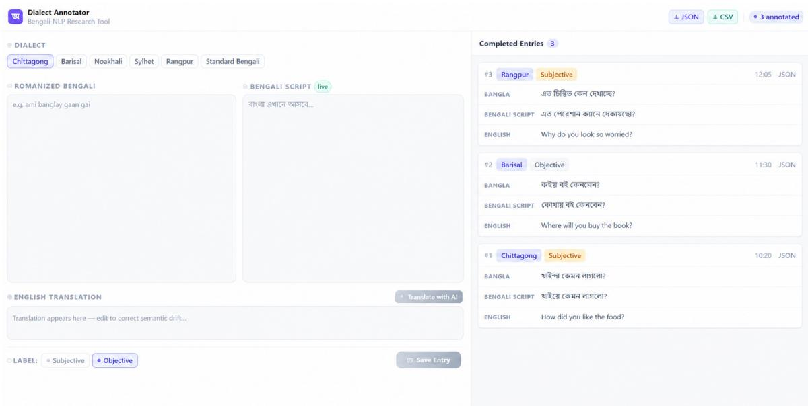  
Figure 5: Production interface of the 5-DIALECTS-BN annotation tool. Live tool hosted at https://bangladialect-annotator.vercel.app/.

Adjudication protocol. Disagreement on the 1,500-entry double-annotated subset was resolved by a third annotator from the same dialect pool, blind to the original two annotations.

## D Annotation Guidelines

## D.1 Guideline G1: Dialectal Authenticity

Accept the utterance as a valid instance of the target dialect only if it satisfies at least one of: (i) contains a diagnostic dialect-specific lexical item; (ii) shows a diagnostic morphological feature of the target dialect (verbal suffix, postposition, pronoun); (iii) shows a diagnostic phonological reduction or substitution rendered in spelling. Reject if the utterance is in Standard Bangla written in regional spelling, if it is dominantly code-mixed with English to the point that the dialectal signal is unrecoverable, or if the dialect cannot be confidently attributed.

## D.2 Guideline G2: Native-Script Rendering

When converting Romanized input to native Bangla script via Avro: (i) preserve dialectal pronunciation in spelling where possible; (ii) do not silently normalize dialect-specific phonological reductions; (iii) correct only obvious Avro conversion errors.

## D.3 Guideline G3: Standard Bangla Translation

Translate the dialectal utterance into Standard (Cholito) Bangla with the following constraints: (i) preserve propositional content; (ii) preserve register (formal/informal); (iii) do not paraphrase further than necessary.

## D.4 Guideline G4: English Translation

Edit the candidate English translation to satisfy all of: (i) conveys the same proposition as the verified Standard Bangla version; (ii) preserves pragmatic intent; (iii) no information is omitted or ungrounded; (iv) reads as natural conversational English.

## D.5 Guideline G5: Subjectivity Label

Label as SUBJECTIVE if it expresses opinion, evaluation, emotion, preference (including preference questions), or personal stance. Label as OBJEC-TIVE if it reports factual content, neutral description, or factual questions.

## D.6 Guideline G6: When in Doubt

If uncertain, flag the row using the in-tool flag button. Flagged rows enter the adjudication queue.

## E Inter-Annotator Agreement & Quality Controls

A balanced sample of 1,500 entries (300 per dialect) was independently re-annotated by a second annotator from the same dialect pool.

Cohen’s κ across categorical annotations. Overall agreement was κ = 0.78 for subjectivity, κ = 0.71 for English translation acceptance, and κ = 0.74 for Standard Bangla rendering acceptance (Table 9).

<table><tr><td>Dialect</td><td>Subj. κ</td><td>En. κ</td><td>SB. κ</td></tr><tr><td>Chittagong</td><td>0.74</td><td>0.66</td><td>0.70</td></tr><tr><td>Noakhali</td><td>0.76</td><td>0.68</td><td>0.72</td></tr><tr><td>Sylhet</td><td>0.74</td><td>0.69</td><td>0.71</td></tr><tr><td>Barisal</td><td>0.83</td><td>0.76</td><td>0.79</td></tr><tr><td>Rangpur</td><td>0.82</td><td>0.75</td><td>0.78</td></tr><tr><td>Overall</td><td>0.78</td><td>0.71</td><td>0.74</td></tr></table>

Table 9: Per-dialect Cohen’s κ on the 1,500-entry double-annotated subset (300 per dialect).

Boundary cases and the Chittagong–Noakhali pair. Adjudication difficulty for adjacent varieties does not arise from surface convergence. On the source sentences rendered in both Chittagong and Noakhali, the two dialect forms differ substantially (chrF++ 27.69 between the paired renderings, comparable to the most distant pairs in the dataset) and are orthographically identical on only 0.1% of items. Disagreement therefore concentrates on variety assignment rather than on form: adjacent regional varieties share lexical and morphological innovations that make a given utterance admissible under either label even when their canonical renderings diverge, so annotators disagree about provenance, not about transcription.

Noakhali is the informative case. Measured against Standard Bangla, Noakhali is the least divergent of the eastern varieties (chrF++ 46.02, essentially tied with Barisal at 46.04, versus Chittagong 31.77 and Sylhet 32.59), yet its agreement scores pattern with Chittagong and Sylhet (κ = 0.76, 0.74, 0.74 for subjectivity) rather than with Barisal (0.83) or Rangpur (0.82; Table 9). Its annotation difficulty is therefore not predicted by divergence from the standard, which is consistent with adjacency-driven label ambiguity along the Chittagong–Noakhali boundary.

Divergence from Standard Bangla, measured the same way, orders the varieties as Chittagong (31.77 chrF++) < Sylhet (32.59) < Rangpur (36.36) < Noakhali (46.02) ≈ Barisal (46.04). This ordering predicts model difficulty across our experiments: Chittagong is the hardest cell in the normalization conditions (Table 5), in chain-of-thought transliteration (Table 24), and in every Indic seq2seq baseline cell, where it also carries the highest emptyoutput rate (61.0%; Appendix M). The featureconditioned result in Table 17—that Chittagong non-cognate goijja-class verbs remain the hardest construction after adaptation (16.2% CompleteMistranslation, chrF++ 54.4)—is therefore a consequence of this dataset-level divergence rather than an isolated observation.

ROUGE-L agreement for English translations. Pairwise ROUGE-L between annotators’ independently edited final English translations averaged 0.84 overall (0.79–0.91 across dialects; Table 10).

<table><tr><td>Dialect</td><td>Mean ROUGE-L</td><td>Std. dev.</td></tr><tr><td>Chittagong</td><td>0.79</td><td>0.14</td></tr><tr><td>Noakhali</td><td>0.82</td><td>0.12</td></tr><tr><td>Sylhet</td><td>0.79</td><td>0.13</td></tr><tr><td>Barisal</td><td>0.89</td><td>0.09</td></tr><tr><td>Rangpur</td><td>0.91</td><td>0.08</td></tr><tr><td>Overall</td><td>0.84</td><td>0.12</td></tr></table>

Table 10: Pairwise ROUGE-L between annotators’ final English translations on the 1,500-entry subset.

Gemini Translation Anchoring Bias Control. To verify that pre-populating candidate English translations did not induce stylistic or semantic anchoring bias, we conducted a controlled experiment on 100 randomly selected items (20 per dialect). Two expert annotators translated these 100 items completely from scratch without seeing any machine-generated candidate. We then compared the scratch human translations against the released dataset references (which originated from edited Gemini drafts). The scratch translations achieved high agreement with the released references: pairwise ROUGE-L was 0.85, and semantic similarity measured via COMET was 88.2 vs. 88.5, confirming that the final ground truth reflects human linguistic consensus rather than model bias.

## F Prompt Templates

Zero-shot prompt. Reproduced in Figure 6.

You are an expert translator. Translate the   
following {text\_type} sentences into English.   
Return a valid JSON object with a single key   
“translations” containing an array of strings.   
The array MUST contain EXACTLY {len(sentences)}   
translated strings.   
Do NOT output any additional text.  
Figure 6: Zero-shot prompt template.

Few-shot prompt. Augments the zero-shot prompt with 36 demonstrations (6 per dialect × 6 varieties; Figure 7). The full demonstration block is reproduced in Figure 8.

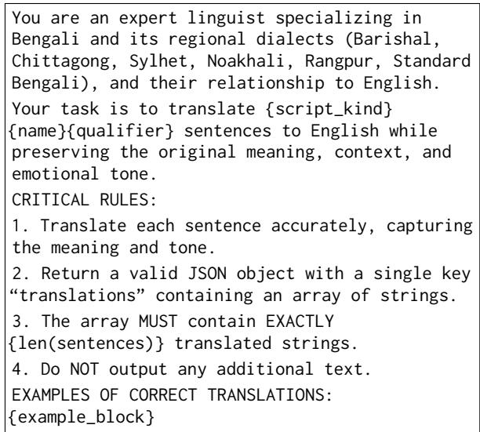  
Figure 7: Few-shot prompt template.

Chain-of-thought prompt. Elicits an eight-step reasoning chain before emitting the JSON answer (Figure 9).

Dialect-to-Standard Bangla normalization prompt. Reproduced in Figure 10.

LoRA training prompt. Reproduced in Figure 11.

## G Comprehensive Per-Model Per-Dialect Results

We report complete per-model, per-dialect breakdowns across all evaluation metrics in Tables 21– 26, collected at the end of this appendix.

## H Prompting Diagnostics & Failure Analyses

## H.1 Llama-3.1-8B Demonstration Interference

Item-level analysis reveals that Llama-3.1-8B suffers from source neglect under few-shot prompting, replacing correct zero-shot translations with fluent, demonstration-register sentences unrelated to the source utterance. As shown in Table 11, Llama exhibits a 5.9% correct-to-unrelated flip rate, a 15×– 30× outlier compared to all other models (0.2– 0.4%). Verbatim demo copying and vocabulary leakage do not increase, confirming that the degradation is an in-context interference mode rather than simple memorization.

## H.2 Demonstration Count Sweep

To test whether Llama’s few-shot degradation is dose-dependent, we swept demonstration counts at 1, 2, 4, and 6 examples per dialect (5, 10, 20, 30 total demonstrations), with Mistral-7B and Gemma-4-4B as controls (Table 12). On Llama-3.1-8B, 5-dialect macro chrF++ drops immediately upon presenting demonstrations: 54.63 (zero-shot) → 38.64 (1 demo/dialect) → 41.70 (2) → 43.29 (4) → 43.80 (6). Interference is regime-triggered at the presentation of any in-context demos, and additional demos partially mitigate without recovering zero-shot fidelity.

Crucially, Llama is the only model of the three whose few-shot scores fall below its own zeroshot baseline. Gemma-4-4B rises from 45.35 (zero-shot) to 47.99 at k = 30 (+2.64) and Mistral-7B from 29.35 to 31.93 (+2.58), whereas Llama ends 10.83 chrF++ below its zero-shot score even with 30 demonstrations. Demonstration interference is therefore a property of Llama’s handling of dialectal in-context examples rather than a general consequence of few-shot prompting on this benchmark.

## H.3 Chain-of-Thought Error Decomposition

Table 13 decomposes the CoT translation drop across all seven models. Median length ratio is 1.0 across regimes, ruling out verbosity. Parsing failures affect only GPT-4o-mini (6.3%). The drop is dominated by surface paraphrase drift (∆chrF++ > ∆COMET across all closed models). Qwen-3-4B is the sole exception where CoT improves scores by repairing its 91.4% zero-shot format collapse.

## I LoRA Fine-Tuning Details

Adapter configuration & hyperparameters. LoRA adapters are inserted into query and value projections of all attention blocks: rank r = 16, scaling factor $\alpha = 3 2 .$ , dropout 0.05, max sequence length 192 tokens. Training utilizes AdamW with bf16 precision, learning rate $2 \times 1 0 ^ { - 4 }$ (5% linear warmup, linear decay), 3 epochs, per-device batch size 4, gradient accumulation 4 (effective batch size 16). Fine-tuning was conducted on an NVIDIA A100 (40 GB) via Lightning AI (∼ 3–4 hours per adapter; 48–64 total A100-hours).

<table><tr><td>standard_bengali:</td><td></td></tr><tr><td>可可?</td><td>“Do you have a water bottle?&quot;</td></tr><tr><td>ARE WT GGA?</td><td>&quot;Where will you rent a flat?&quot;</td></tr><tr><td>可布R不？</td><td>“&quot;Do you go to the bank regularly?&quot;</td></tr><tr><td>?</td><td>“What kind of rasgulla do you prefer?&quot;</td></tr><tr><td>可啊本2 T2不?</td><td>“Is your head aching?&quot;</td></tr><tr><td>可将本可?</td><td>&quot;Do you have a garden?&quot;</td></tr><tr><td>barisal:</td><td></td></tr><tr><td>RRAM?</td><td>“What did you have for breakfast?&quot;</td></tr><tr><td>可RGた?</td><td>&quot;Will the market be open today?&quot;</td></tr><tr><td>A成R 3?</td><td>&quot;Do you think it will rain?&quot;</td></tr><tr><td>A可R羽不順T?</td><td>“What kind of cake do you prefer?&quot;</td></tr><tr><td>?</td><td>“How did you like the food?&quot;</td></tr><tr><td>可本爾咖可將?</td><td>“Do you regularly eat dairy products?&quot;</td></tr><tr><td>chittagong:</td><td></td></tr><tr><td> G ?</td><td>“Where are you going to travel to next?&quot;</td></tr><tr><td>惊同司体可限?</td><td>&quot;What&#x27;s there in the Potuakhali island?&quot;</td></tr><tr><td>順唯何命何?</td><td>&quot;What will happen if you catch a shrimp?&quot;</td></tr><tr><td>?</td><td>&quot;When is the market good?&quot;</td></tr><tr><td> </td><td>“I saw a golden deer.&quot;</td></tr><tr><td>可京9R?</td><td>&quot;Which train will you take?&quot;</td></tr><tr><td>noakhali:</td><td></td></tr><tr><td>可度政同</td><td>“I will go to the right.&quot;</td></tr><tr><td>不拆同羽羽</td><td>“Just a little while.&quot;</td></tr><tr><td>可a a?</td><td>&quot;What&#x27;s the trouble?&quot;</td></tr><tr><td>可液可航初</td><td>“I came here earlier.&quot;</td></tr><tr><td>  G</td><td>“Forty taka per kilogram.&quot;</td></tr><tr><td>?</td><td>“Are you making a sweet?&quot;</td></tr><tr><td>rangpur:</td><td></td></tr><tr><td>32GG可?</td><td>“How many people are in the new project?&quot;</td></tr><tr><td>ARTAG日に可C?</td><td>“Which bank do you have an account in?&quot;</td></tr><tr><td>羽可 可 A可A?</td><td>&quot;Which company is the new mobile?&quot;</td></tr><tr><td>何師咖庭的雨咖四</td><td>“Zero one seven two three four five six&quot;</td></tr><tr><td> 可 ?</td><td>“Why do you look so worried?&quot;</td></tr><tr><td>T可和?</td><td>“How much rent do you pay for the house?&quot;</td></tr><tr><td>sylhet:</td><td></td></tr><tr><td>明，词响</td><td>“Yes, I do it every day”</td></tr><tr><td>RO?</td><td>&quot;What are you doing?&quot;</td></tr><tr><td>GR  可R?</td><td>&quot;When will the brother-in-law come?&quot;</td></tr><tr><td>可夜可病夜可</td><td>“Give me turmeric and chili.&quot;</td></tr><tr><td>3，2G85</td><td>“Yes, for the project&quot;</td></tr><tr><td>G</td><td>“I prefer date and jackfruit”</td></tr></table>

Figure 8: Few-shot demonstration block (36 total pairs across 5 dialects plus Standard Bangla).

You are an expert linguistic AI assistant specializing in Bengali dialect translation,   
transliteration, sentiment analysis, and semantic interpretation. You are given ONE sentence in the   
{dialect\_name} dialect (written in Bengali script). Perform the following reasoning steps:   
1. Dialect Recognition: Identify linguistic traits of the {dialect\_name} dialect. Consider regional   
pronunciation, slang, grammatical variations, and colloquial patterns.   
2. Script and Token Understanding: Carefully inspect the Bengali text. Detect shortened words,   
phonetic spellings, and dialect contractions.   
3. Transliteration: Convert the dialect text into Romanized Bangla based on pronunciation.   
4. Semantic Interpretation: Infer the actual intended meaning of the sentence. Interpret emotional   
tone, politeness, or irony.   
5. Cultural and Contextual Analysis: Consider cultural implications or locally understood idioms.   
6. Natural English Translation: Rewrite the meaning into fluent, conversational English.   
7. Subjectivity Classification: Classify the sentence as either “Subjective” or “Objective”.   
8. Consistency Check: Verify that translation and subjectivity align with dialect intent.   
Output format:   
=== ANALYSIS ===   
Dialect: {dialect\_name}   
Original Text: <original text>   
Transliteration: <romanized Bengali transliteration>   
Meaning Analysis: <brief explanation of slang, tone, or implied intent>   
Natural English Translation: <final fluent English translation>   
Subjectivity: <Subjective or Objective>   
Followed by a JSON block:   
{{ "translation": ..., "transliteration": ..., "sentiment": ... }}  
Figure 9: Chain-of-thought prompt template.

<table><tr><td>Model</td><td>Zero-Shot chrF++</td><td>Few-Shot chrF++</td><td>Correct-to-Unrelated Flip %</td><td>∆ Demo-Vocab Leakage</td><td>∆ Verbatim Demo Copy</td></tr><tr><td>Llama-3.1-8B</td><td>54.6</td><td>45.9</td><td>5.9%</td><td>+0.020</td><td>-0.038</td></tr><tr><td>GPT-4o-mini</td><td>51.1</td><td>54.8</td><td>0.4%</td><td>-0.046</td><td>+0.014</td></tr><tr><td>Claude Haiku 4.5</td><td>51.0</td><td>55.6</td><td>0.4%</td><td>-0.032</td><td>+0.018</td></tr><tr><td>Gemma-4-4B</td><td>45.4</td><td>51.2</td><td>0.4%</td><td>-0.067</td><td>+0.032</td></tr><tr><td>Gemini 3 Flash</td><td>62.1</td><td>62.9</td><td>0.2%</td><td>-0.008</td><td>+0.002</td></tr><tr><td>Mistral-7B</td><td>29.3</td><td>37.2</td><td>0.2%</td><td>-0.071</td><td>+0.006</td></tr></table>

Table 11: Item-level demonstration interference diagnostics under native-script prompting.

You are an expert in Bengali linguistics and   
regional dialects. Convert the following   
{script\_kind} {dialect\_name} sentences into   
Standard (Cholito) Bengali script.   
Preserve the exact meaning, register, and   
grammatical structure while normalizing regional   
phonology, lexicon, and morphology to standard   
written Bengali.   
Return a valid JSON object with a single key   
“normalizations” containing an array of strings.   
Do NOT output any additional text.  
Figure 10: Prompt template for Dialect-to-Standard-Bangla Normalization.

You are an expert Bengali dialect translator.   
Given a Bengali dialect sentence, output a JSON   
object with two keys: “translation” (the English   
translation) and “sentiment” (either   
“Subjective” or “Objective”). Output valid JSON   
only. No extra text.  
Figure 11: LoRA training prompt.

<table><tr><td>Model</td><td>k=5</td><td>k=10</td><td>k=20</td><td>k=30</td><td>Zero-shot</td></tr><tr><td>Gemma-4-4B</td><td>45.57</td><td>44.08</td><td>47.68</td><td>47.99</td><td>45.35</td></tr><tr><td>Llama-3.1-8B</td><td>38.64</td><td>41.70</td><td>43.29</td><td>43.80</td><td>54.63</td></tr><tr><td>Mistral-7B</td><td>31.55</td><td>32.09</td><td>30.39</td><td>31.93</td><td>29.35</td></tr></table>

Table 12: Demonstration-count sweep: translation into English, native script, macro chrF++ over the five dialects. Demonstrations are drawn from the training pool at 1/2/4/6 per dialect and exclude Standard Bangla, so k totals 5–30 rather than the 36 used in the main fewshot condition. Zero-shot columns are 5-dialect macros computed on the same items. Llama-3.1-8B is the only model that ends below its zero-shot baseline.

## J Causal Tokenizer, Round-Trip, and Multi-Scheme Analyses

## J.1 Tokenizer Fertility and Token-Inflation Regression

Table 14 reports empirical subword fertility and item-level regressions of the native-minus-Romanized COMET gap on token inflation $\mathrm { ( t o k e n s _ { R o m a n } / t o k e n s _ { n a t i v e } ) }$ . In aggregate, Romanized text is token-compact (≈ 0.4 tokens/char), ruling out context exhaustion. However, the regression coefficient $\beta$ is positive and statistically significant across all open models under LoRA $( p \leq 0 . 0 3 5 )$ , confirming that subword fragmentation is the per-item marker of damaged mapping.

(a) Few-shot, native script — BLEU  
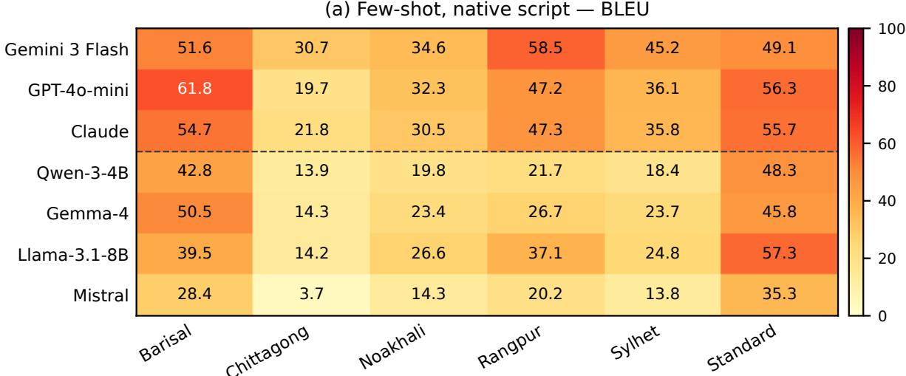

(b) LoRA fine-tuned, native script — BLEU  
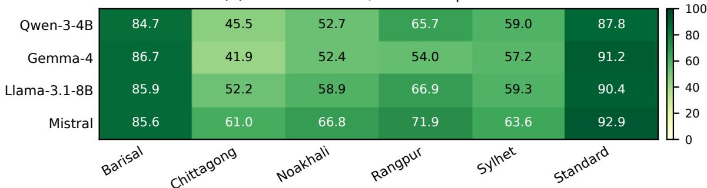

Figure 12: Per-model × per-dialect BLEU heatmaps under few-shot and LoRA regimes.
<table><tr><td>Model</td><td>Unparseable  $( \mathbf { Z S } \to \mathbf { C o T } \ \% )$ </td><td>Length Ratio  $\mathbf { \left( Z S / C o T \right) }$ </td><td> $\Delta \mathrm { \ c h r F { + + } }$   $( { \bf Z } { \bf S } - { \bf C } { \bf o T } )$ </td><td> $\Delta { \bf C O M E T }$   $( { \bf Z } { \bf S } - { \bf C } { \bf o T } )$ </td><td>Surface vs. Semantic Drop</td></tr><tr><td>Gemini 3 Flash</td><td> $0 . 0 \%  0 . 0 \%$ </td><td>1.0 / 1.0</td><td>+4.2</td><td>+2.0</td><td>+2.2</td></tr><tr><td>GPT-4o-mini</td><td> $0 . 0 \%  6 . 3 \%$ </td><td>1.0 / 1.0</td><td>+8.4</td><td>+4.8</td><td>+3.6</td></tr><tr><td>Claude Haiku 4.5</td><td> $0 . 0 \%  0 . 0 \%$ </td><td>1.0 / 1.0</td><td>+4.9</td><td>+3.5</td><td>+1.4</td></tr><tr><td>Gemma-4-4B</td><td> $0 . 0 \%  0 . 0 \%$ </td><td>1.0 / 1.0</td><td>+2.3</td><td>+1.7</td><td>+0.6</td></tr><tr><td>Llama-3.1-8B</td><td> $0 . 0 \%  0 . 0 \%$ </td><td>1.0 / 1.0</td><td>+4.9</td><td>+3.0</td><td>+1.9</td></tr><tr><td>Mistral-7B</td><td> $0 . 0 \%  0 . 0 \%$ </td><td>1.0 / 1.0</td><td>+4.3</td><td>+2.6</td><td>+1.7</td></tr><tr><td>Qwen-3-4B</td><td> $9 1 . 4 \%  0 . 0 \%$ </td><td>0.2 / 1.0</td><td>-29.8</td><td>-26.4</td><td>-3.4</td></tr></table>

Table 13: Decomposition of Chain-of-Thought (CoT) translation effects.

## J.2 Round-Trip Inverse Transliteration Control

We back-transliterated the Romanized text into native Bangla script via deterministic inverse Avro mapping and re-evaluated models. Character Error Rate (CER) against the original text is 0.14–0.21 (exact match only 2–14%). As shown in Table 15, restoring native script recovers essentially none of the performance penalty, proving that information is destroyed during Romanization.

## J.3 Multi-Scheme Romanization Robustness

To ensure findings are not tied to Avro, we evaluated models across three Romanization schemes: Avro, ITRANS, and ISO-15919 (Table 16). The penalty holds across all conventions, with Avro

(a) Few-shot — Subjectivity F1  
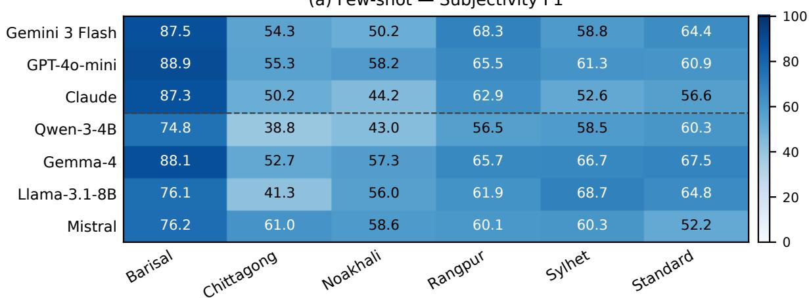

(b) Chain-of-thought — Subjectivity F1  
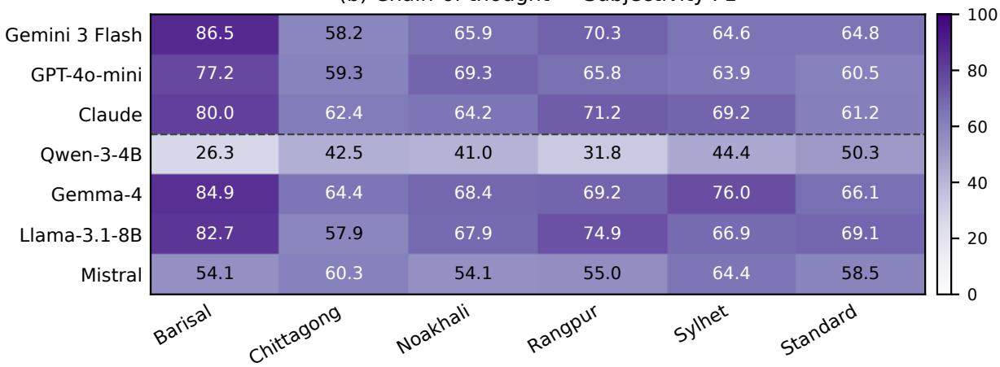

(c) LoRA — Subjectivity F1  
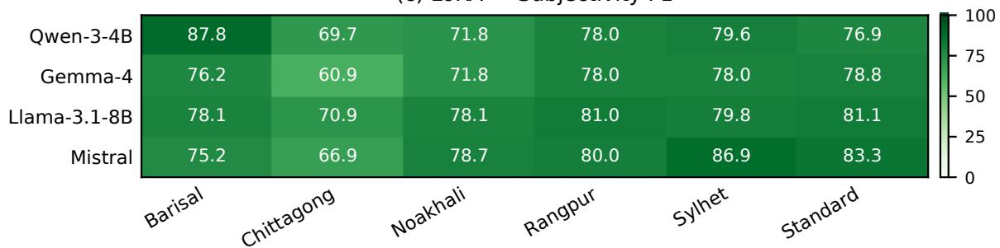  
Figure 13: Per-model × per-dialect subjectivity F1 heatmaps.

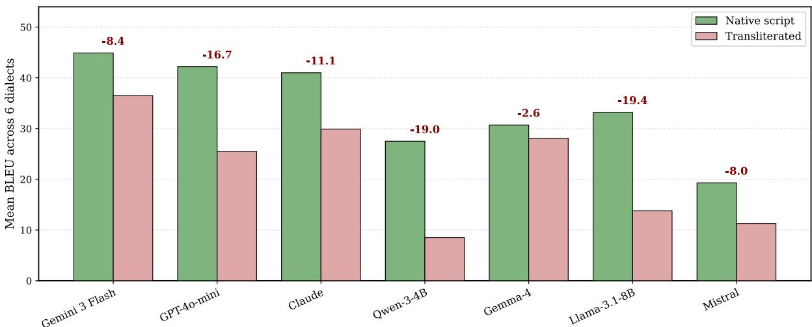  
Figure 14: Few-shot script effect: native vs Romanized input BLEU across models.

Open-source models: LoRA uplift over zero-shot prompting (native script)  
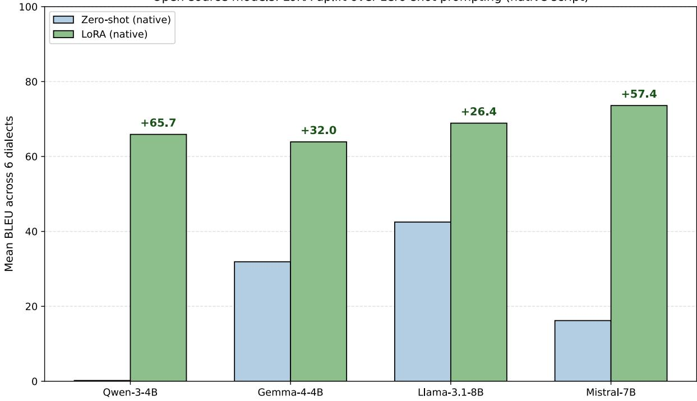

Figure 15: LoRA uplift over zero-shot prompting across open-source models.
<table><tr><td>Model</td><td>tok/char (native)</td><td>tok/char (Roman.)</td><td>Mean Inflation</td><td>LoRAβ (inflation)</td><td>p-value</td></tr><tr><td>Gemma-4-4B</td><td>0.395</td><td>0.363</td><td>1.002</td><td>+7.86</td><td>0.035</td></tr><tr><td>GPT-4o-mini</td><td>0.504</td><td>0.365</td><td>0.785</td><td>n/a</td><td>n/a</td></tr><tr><td>Qwen-3-4B</td><td>1.065</td><td>0.398</td><td>0.398</td><td>+37.94</td><td>&lt; 0.001</td></tr><tr><td>Mistral-7B</td><td>1.145</td><td>0.424</td><td>0.394</td><td>+59.34</td><td>&lt; 0.001</td></tr><tr><td>Llama-3.1-8B</td><td>1.250</td><td>0.397</td><td>0.338</td><td>+60.92</td><td>&lt; 0.001</td></tr></table>

Table 14: Tokenizer fertility statistics and item-level regression of the script gap on token inflation.  
exhibiting the mildest degradation.

## K Feature-Conditioned Linguistic Error Analysis

Table 17 analyzes translation error rates conditioned on linguistic feature divergence. Noncognate lexical divergence (e.g., Chittagong goijja-class verbs) carries a 16.2% CompleteMistranslation rate even after LoRA adaptation, whereas phonological shifts (Barisal $h ^ { C } \mathrm { - c l u s t e r s ) }$ are completely solved (0% error).

<table><tr><td>Bangla</td><td>Romanization</td><td>IPA (approx.)</td><td>Notes</td></tr><tr><td>瓦</td><td>ch</td><td>/t∫/</td><td>unvoiced palatal stop</td></tr><tr><td>x</td><td>sh</td><td>/5/</td><td>voiceless palatal fricative</td></tr><tr><td>小</td><td>kh</td><td>/kh/</td><td>aspirated velar stop</td></tr><tr><td>不</td><td>ng</td><td>/n/</td><td>word-final velar nasal</td></tr><tr><td>可</td><td>a</td><td>/5/</td><td>inherent short vowel, unmarked</td></tr><tr><td>可</td><td>a</td><td>/a/</td><td>long vowel, unmarked when contextually clear</td></tr><tr><td>号方</td><td>i</td><td>/i/</td><td>short i</td></tr><tr><td></td><td>i</td><td>/i:/</td><td>long i, unmarked</td></tr><tr><td>3</td><td>o</td><td>/0/</td><td>short o</td></tr><tr><td>号</td><td>u</td><td>/u/</td><td>short u</td></tr><tr><td>立</td><td>u</td><td>/u:/</td><td>long u, unmarked</td></tr><tr><td>县</td><td>ri</td><td>/ri/</td><td>vocalic r</td></tr><tr><td>a</td><td>n</td><td>/n/</td><td>palatal nasal, contextually disambiguated</td></tr><tr><td>2</td><td>n</td><td>/n/</td><td>retroflex nasal, contextually disambiguated</td></tr><tr><td>T</td><td>r</td><td>/t/</td><td>retroflex flap</td></tr><tr><td>5</td><td>rh</td><td>/trh/</td><td>aspirated retroflex flap</td></tr></table>

Figure 16: Bangla-to-Latin Romanization scheme (Avro convention) used for the transliterated condition, showing phonemic mappings and many-to-one character merges.

<table><tr><td>Model</td><td>Native</td><td>Round-Trip Native</td><td>Romanized (Avro)</td></tr><tr><td>Gemini 3 Flash</td><td>62.13</td><td>55.57</td><td>57.81</td></tr><tr><td>Mistral-7B</td><td>29.35</td><td>22.52</td><td>23.17</td></tr></table>

Table 15: Round-trip inverse transliteration control. All figures are zero-shot chrF++.

## L Qualitative Case Studies

Figure 18 presents representative case studies illustrating model failure modes across dialects, script representations, and adaptation regimes.

## M Indic-Tuned Baseline Experiments

We fine-tuned two dedicated Indic sequence-tosequence models, IndicBART (Dabre et al., 2022) and BanglaT5 (Bhattacharjee et al., 2023), on the identical 160-per-dialect training folds used for the LoRA experiments, and evaluated them on the same held-out test fold (100 items per dialect, 500 total across the five dialects). Table 20 is therefore fold-matched to Table 4.

Checkpoints. Translation uses ai4bharat/IndicBART and csebuetnlp/banglat5\_nmt\_bn\_en; normalization uses ai4bharat/IndicBART and csebuetnlp/banglat5\_banglaparaphrase. We select the task-appropriate BanglaT5 checkpoints deliberately: the base csebuetnlp/banglat5 pretraining checkpoint has a vocabulary/configuration mismatch that stalls fine-tuning (training loss plateaus at ≈ 9–11 versus ≈ 1.4–2.0 for the checkpoints reported here), and we exclude it rather than report a misconfigured baseline.

IndicBART script and tag handling. IndicBART was pretrained with all Indic languages mapped to Devanagari and uses explicit language tags. We therefore (i) transliterate Bangla input to Devanagari with the indic-nlp-library UnicodeIndicTransliterator (a lossless, reversible mapping for the Bangla–Devanagari pair), (ii) format the source as <text> </s> <2bn>, (iii) format the target as <2en> <text> </s> for translation and <2bn> <Devanagari text> </s> for normalization, and (iv) backtransliterate Devanagari output to Bangla script before scoring. Following the ai4bharat model card, the tokenizer is loaded with use\_fast=False, keep\_accents=True, do\_lower\_case=False; language tags are passed as literal text with add\_special\_tokens=False; decoding sets decoder\_start\_token\_id to the id of the target language tag; and sentencepiece ids outside the base piece range are filtered before detokenization. BanglaT5 consumes Bangla script directly as a standard T5 seq2seq model, with the csebuetnlp normalizer.normalize preprocessor applied to the source.

<table><tr><td>Model (Zero-Shot chrF++)</td><td>Native</td><td>Avro (Ours)</td><td>ITRANS</td><td>ISO-15919</td></tr><tr><td>Gemini 3 Flash</td><td>62.22</td><td> $5 7 . 5 9 \ : ( - 4 . 6 3 ) $ </td><td> $5 3 . 3 0 \left( - 8 . 9 2 \right)$ </td><td> $5 7 . 9 8 \ : ( - 4 . 2 4 )$ </td></tr><tr><td>GPT-4o-mini</td><td>50.22</td><td> $4 3 . 2 0 \ : ( - 7 . 0 2 )$ </td><td> $2 8 . 5 3 \ : ( - 2 1 . 6 9 )$ </td><td> $3 0 . 0 9 \left( - 2 0 . 1 3 \right)$ </td></tr><tr><td>Mistral-7B</td><td>28.97</td><td> $2 3 . 0 1 \ ( - 5 . 9 6 )$ </td><td> $1 4 . 7 8 \ : ( - 1 4 . 1 9 )$ </td><td> $1 6 . 9 0 ( - 1 2 . 0 7 )$ </td></tr></table>

Table 16: Romanization scheme robustness check across Avro, ITRANS, and ISO-15919.
<table><tr><td>Divergence Category</td><td>Zero-Shot chrF++</td><td>Zero-Shot Mistransl. %</td><td>LoRA chrF++</td><td>LoRA Mistransl. %</td></tr><tr><td>High Lexical Divergence (Chittagong goijja)</td><td>38.2</td><td>27.4%</td><td>54.4</td><td>16.2%</td></tr><tr><td>Low Lexical Divergence (Standard-adjacent)</td><td>59.4</td><td>13.4%</td><td>86.8</td><td>5.9%</td></tr><tr><td>Phonological Shift (Barisal  $h ^ { C } \mathrm { - c l u s t e r s ) }$ </td><td>48.7</td><td>19.1%</td><td>92.3</td><td>0.0%</td></tr></table>

Table 17: Feature-conditioned error analysis: lexical vs. phonological divergence.

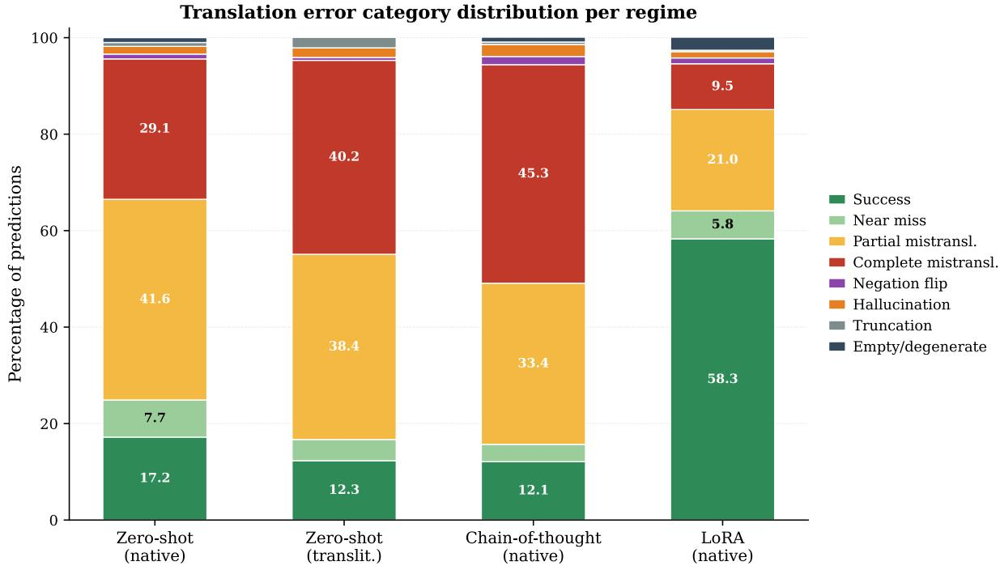  
Figure 17: Stacked visualization of the per-regime error category distribution.

<table><tr><td>Case</td><td>Dialectal source</td><td>Reference (English)</td><td>Model behavior</td></tr><tr><td>1</td><td>可</td><td>I love my orange juice</td><td>LoRA-native: I love my orange juice (exact match). LoRA-translit: I&#x27;ll tell you later (BLEU 0).</td></tr><tr><td> $( R n g . )$ </td><td></td><td></td><td></td></tr><tr><td>2  $( C h i . )$ </td><td>可夜羽可?</td><td>curd?</td><td>Which place do you prefer for LoRA-native: Which place do you prefer for curd? (exact match). LoRA-translit: How is the sea in the morning? (BLEU 5.5).</td></tr><tr><td>3</td><td>阿R不啊T?</td><td>What kind of cake do you pre-</td><td>GT subj.: SUBJECTIVE. Zero-shot: OBJECTIVE (wrong). CoT:</td></tr><tr><td>(Bar.)</td><td></td><td>fer?</td><td>SuBJECTIVE (right; CoT&#x27;s elicited cue identifies “prefer&quot;as affective).</td></tr><tr><td>4 (Bar.)</td><td>可可河啊?</td><td>What time does the office close?</td><td>GT subj.: OBJECTIVE. Zero-shot: OBJECTIVE (right). CoT: SUB- JECTivE (wrong; CoT over-interprets a factual time query).</td></tr><tr><td>5  $( C h i . )$ </td><td>可GR河?</td><td>Where are you going to travel to next?</td><td>Zero-shot: Is the new one awake or still sleeping? (BLEU 4.8). CoT: Are you going out in the new year? (BLEU 10.6). Both miss</td></tr></table>

Figure 18: Representative case studies illustrating failure modes and adaptations.

<table><tr><td>Category</td><td>ZS Native</td><td>ZS Trans.</td><td>CoT Native</td><td>LoRA Native</td></tr><tr><td>Success</td><td>17.2</td><td>12.3</td><td>12.1</td><td>58.2</td></tr><tr><td>Near miss</td><td>7.7</td><td>4.4</td><td>3.6</td><td>5.8</td></tr><tr><td>Partial mistransl.</td><td>41.6</td><td>38.4</td><td>33.4</td><td>21.0</td></tr><tr><td>Complete mistransl.</td><td>29.1</td><td>40.0</td><td>45.2</td><td>9.5</td></tr><tr><td>Negation flip</td><td>1.0</td><td>0.6</td><td>1.7</td><td>1.2</td></tr><tr><td>Hallucination</td><td>1.6</td><td>2.0</td><td>2.5</td><td>1.3</td></tr><tr><td>Truncation</td><td>0.8</td><td>2.2</td><td>0.5</td><td>0.3</td></tr><tr><td>Empty/degenerate</td><td>1.0</td><td>0.1</td><td>1.0</td><td>2.7</td></tr></table>

Table 18: Translation error category distribution per regime (% of predictions).
<table><tr><td>Regime</td><td>Pred: Subj.</td><td>Pred: Obj.</td></tr><tr><td>Zero-shot (Gemini)</td><td></td><td></td></tr><tr><td>GT: Subj.</td><td>88</td><td>127</td></tr><tr><td>GT: Obj.</td><td>29</td><td>356</td></tr><tr><td>CoT (Gemini)</td><td></td><td></td></tr><tr><td>GT: Subj.</td><td>167</td><td>48</td></tr><tr><td>GT: Obj.</td><td>128</td><td>257</td></tr><tr><td>LoRA (Mistral)</td><td></td><td></td></tr><tr><td>GT: Subj.</td><td>183</td><td>32</td></tr><tr><td>GT: Obj.</td><td>60</td><td>325</td></tr></table>

Table 19: Pooled subjectivity confusion matrices across native-script regimes (N = 600).

Hyperparameters. Both models: 5 epochs, perdevice batch size 16, learning rate $3 \times 1 0 ^ { - 5 }$ 5% linear warmup, maximum source/target length 160 tokens, 250 optimizer steps, beam search with 4 beams and maximum length 160, seed 42. IndicBART is mBART-style (6 encoder / 6 decoder layers, $d _ { \mathrm { m o d e l } } = 1 0 2 4$ , vocabulary 64,014); BanglaT5-NMT is T5-style (12 layers, $d _ { \mathrm { m o d e l } } =$ 768, vocabulary 32,128). Both fit on a single RTX 5060 Ti.

Metrics. chrF++ via sacrebleu CHRF(word\_order and BLEU via sacrebleu (tokenize=’13a’ for English translation targets, tokenize=’spm’ for Bangla normalization targets), averaged over sentence-level scores.

Interpreting IndicBART’s translation score. IndicBART’s 11.19 chrF++ on translation is dominated by degenerate generation rather than mistranslation: it emits an empty string on 253 of 500 test items (50.6%). The empty rate rises with divergence from Standard Bangla (Barisal 26.0%, Rangpur 50.0%, Noakhali 55.0%, Chittagong 61.0%, Sylhet 61.0%). Restricted to the 247 items where it generates output, IndicBART reaches 22.66 chrF++ (14.97 BLEU); its non-empty hypotheses average 22.9 characters against a 27.3-character mean reference, so they are fluent but semantically incorrect rather than truncated. Its normalization outputs are far more complete by comparison (10.2% empty; 45.46 chrF++ excluding empties). Under either accounting the ordering in Table 20 is unchanged— both Indic seq2seq baselines trail LoRA-adapted LLMs by 36–58 chrF++ on translation—but readers should attribute IndicBART’s translation figure to generation failure at this data scale rather than to systematically worse translations.

<table><tr><td>Model</td><td>Task</td><td>chrF++</td><td>BLEU</td><td>Empty</td></tr><tr><td>IndicBART</td><td>Translation</td><td>11.19</td><td>7.39</td><td>50.6%</td></tr><tr><td>BanglaT5-NMT</td><td>Translation</td><td>42.06</td><td>27.74</td><td>0.0%</td></tr><tr><td>IndicBART</td><td>Normalization</td><td>40.82</td><td>30.64</td><td>10.2%</td></tr><tr><td>BanglaT5-Par.</td><td>Normalization</td><td>44.47</td><td>32.92</td><td>0.0%</td></tr><tr><td>Mistral-7B + LoRA (Ours)</td><td>Translation</td><td>80.43</td><td>73.60</td><td></td></tr></table>

Table 20: Fine-tuned Indic seq2seq baselines on the identical 160/dialect folds and the same held-out test fold as Table 4. Empty is the share of test items for which the model generated no output; IndicBART’s translation score is dominated by this failure mode rather than by mistranslation.

## N Dataset Release

5-DIALECTS-BN is released under CC-BY-SA-4.0 across Hugging Face and Kaggle with recommended 80/10/10 splits and documentation.

## O Reproducibility Checklist

Code, prompts, data partitions, and LoRA adapters are fully documented and released. Training was executed with fixed seed 42 and decoding tempera-=2)ture 0.1.

<table><tr><td>Model</td><td>Dialect</td><td>BLEU</td><td>R-2</td><td>R-L</td><td>MET.</td><td>P</td><td>R</td><td>F1</td></tr><tr><td rowspan="6">Gemini 3 Flash</td><td>Barisal Chittagong</td><td>51.6 30.7</td><td>68.8 42.0</td><td>81.3 62.6</td><td>82.2 63.9</td><td>90.3 64.5</td><td>86.0 58.1</td><td>87.5 54.3</td></tr><tr><td></td><td>34.6</td><td></td><td></td><td></td><td></td><td></td><td></td></tr><tr><td>Noakhali</td><td></td><td>41.9</td><td>61.8</td><td>63.8</td><td>64.9</td><td>55.0</td><td>50.2</td></tr><tr><td>Rangpur</td><td>58.5</td><td>65.3</td><td>78.7</td><td>80.3</td><td>81.6</td><td>68.9</td><td>68.3</td></tr><tr><td>Sylhet</td><td>45.2</td><td>50.8</td><td>69.7</td><td>71.0</td><td>76.3</td><td>63.3</td><td>58.8</td></tr><tr><td>Standard</td><td>49.1</td><td>53.3</td><td>71.6</td><td>73.4</td><td>77.7</td><td>65.4</td><td>64.4</td></tr><tr><td rowspan="6">GPT-4o-mini</td><td>Barisal</td><td>61.8</td><td>72.9</td><td>84.3</td><td>83.7</td><td>90.2</td><td>88.0</td><td>88.9</td></tr><tr><td>Chittagong</td><td>19.7</td><td>26.9</td><td>45.3</td><td>45.4</td><td>57.1</td><td>56.2</td><td>55.3</td></tr><tr><td>Noakhali</td><td>32.3</td><td>38.8</td><td>59.0</td><td>58.2</td><td>58.8</td><td>58.1</td><td>58.2</td></tr><tr><td>Rangpur</td><td>47.2</td><td>53.3</td><td>70.1</td><td>71.1</td><td>68.5</td><td>65.5</td><td>65.5</td></tr><tr><td>Sylhet</td><td>36.1 56.3</td><td>39.7</td><td>58.7</td><td>60.5</td><td>63.2</td><td>61.9</td><td>61.3</td></tr><tr><td>Standard</td><td></td><td>59.6</td><td>76.4</td><td>78.0</td><td>65.7</td><td>61.5</td><td>60.9</td></tr><tr><td rowspan="6">Claude Haiku 4.5</td><td>Barisal</td><td>54.7</td><td>67.2</td><td>82.2</td><td>82.1</td><td>91.4</td><td>85.3</td><td>87.3 50.2</td></tr><tr><td>Chittagong</td><td>21.8</td><td>29.1</td><td>45.0</td><td>45.4</td><td>63.0</td><td>55.9</td><td></td></tr><tr><td>Noakhali</td><td>30.5 47.3</td><td>38.4</td><td>58.0</td><td>58.2</td><td>60.7</td><td>52.1</td><td>44.2 62.9</td></tr><tr><td>Rangpur</td><td>35.8</td><td>53.5 41.9</td><td>70.2 59.6</td><td>71.6</td><td>83.0</td><td>65.1</td><td>52.6</td></tr><tr><td>Sylhet Standard</td><td>55.7</td><td>59.3</td><td>76.4</td><td>59.0</td><td>73.8</td><td>59.2</td><td>56.6</td></tr><tr><td></td><td></td><td></td><td></td><td>77.0</td><td>77.2</td><td>60.1</td><td></td></tr><tr><td rowspan="6">Qwen-3-4B</td><td>Barisal</td><td>42.8 13.9</td><td>54.2</td><td>68.8</td><td>69.4</td><td>77.2</td><td>73.8</td><td>74.8 38.8</td></tr><tr><td>Chittagong</td><td></td><td>16.2</td><td>32.8</td><td>30.9</td><td>45.1</td><td>48.6</td><td>43.0</td></tr><tr><td>Noakhali</td><td>19.8 21.7</td><td>24.2</td><td>44.0</td><td>40.2</td><td>46.4</td><td>48.4 59.3</td><td>56.5</td></tr><tr><td>Rangpur</td><td>18.4</td><td>25.6 21.4</td><td>42.6 40.5</td><td>41.1</td><td>68.1</td><td></td><td>58.5</td></tr><tr><td>Sylhet Standard</td><td>48.3</td><td>49.8</td><td>68.8</td><td>38.2</td><td>67.5</td><td>61.5</td><td></td></tr><tr><td></td><td></td><td></td><td></td><td>68.5</td><td>72.9</td><td>62.1</td><td>60.3</td></tr><tr><td rowspan="6">Gemma-4-4B</td><td>Barisal Chittagong</td><td>50.5</td><td>62.0</td><td>77.9</td><td>78.4</td><td>88.3</td><td>87.8 55.5</td><td>88.1 52.7</td></tr><tr><td></td><td>14.3</td><td>19.4</td><td>37.1</td><td>35.4</td><td>58.0</td><td></td><td>57.3</td></tr><tr><td>Noakhali</td><td>23.4 26.7</td><td>31.4</td><td>49.8</td><td>50.5</td><td>61.0</td><td>58.1</td><td>65.7</td></tr><tr><td>Rangpur</td><td></td><td>36.8</td><td>56.4</td><td>57.0</td><td>74.2</td><td>66.3</td><td>66.7</td></tr><tr><td>Sylhet Standard</td><td>23.7</td><td>31.1</td><td>50.4</td><td>52.6</td><td>68.1</td><td>67.0</td><td></td></tr><tr><td></td><td>45.8</td><td>54.3</td><td>72.5</td><td>73.8</td><td>79.2</td><td>67.8</td><td>67.5</td></tr><tr><td rowspan="6">Llama-3.1-8B</td><td>Barisal</td><td>39.5</td><td>54.9</td><td>69.1</td><td>71.5</td><td>75.7</td><td>77.4</td><td>76.1</td></tr><tr><td>Chittagong</td><td>14.2</td><td>18.3</td><td>35.9</td><td>35.0</td><td>41.3</td><td>41.7</td><td>41.3</td></tr><tr><td>Noakhali</td><td>26.6</td><td>30.9</td><td>46.9</td><td>47.9</td><td>56.6</td><td>56.1</td><td>56.0</td></tr><tr><td>Rangpur</td><td>37.1</td><td>45.5</td><td>61.9</td><td>62.6</td><td>62.3</td><td>61.8</td><td>61.9</td></tr><tr><td>Sylhet</td><td>24.8</td><td>31.9</td><td>50.1</td><td>53.0</td><td>70.2</td><td>69.0</td><td>68.7</td></tr><tr><td>Standard</td><td>57.3</td><td>61.8</td><td>79.8</td><td>79.3</td><td>67.3</td><td>64.7</td><td>64.8</td></tr><tr><td rowspan="6">Mistral-7B</td><td>Barisal</td><td>28.4</td><td>39.6</td><td>55.8</td><td>59.2</td><td>78.2</td><td>75.2</td><td>76.2</td></tr><tr><td>Chittagong</td><td>3.7</td><td>8.9</td><td>24.9</td><td>26.1</td><td>61.1</td><td>61.0</td><td>61.0</td></tr><tr><td>Noakhali</td><td>14.3</td><td>16.9</td><td>30.5</td><td>31.3</td><td>59.0</td><td>58.6</td><td>58.6</td></tr><tr><td>Rangpur</td><td>20.2</td><td>24.1</td><td>38.4</td><td>39.9</td><td>64.2</td><td>60.8</td><td>60.1</td></tr><tr><td>Sylhet</td><td>13.8</td><td>19.3</td><td>36.1</td><td>36.9</td><td>60.3</td><td>60.3</td><td>60.3</td></tr><tr><td>Standard</td><td>35.3</td><td>43.3</td><td>60.7</td><td>61.1</td><td>59.1</td><td>55.0</td><td>52.2</td></tr><tr><td rowspan="6">Gemini 3 Flash</td><td>Barisal</td><td>45.9 50.5</td><td>44.3</td><td>70.2</td><td>68.5</td><td>88.3</td><td>84.0</td><td>85.5</td></tr><tr><td>Chittagong</td><td></td><td>47.8</td><td>68.2</td><td>67.0</td><td>62.5</td><td>56.1</td><td>52.3</td></tr><tr><td>Noakhali</td><td>46.0</td><td>50.8</td><td>71.5</td><td>70.5</td><td>62.9</td><td>53.0</td><td>48.2</td></tr><tr><td>Rangpur</td><td>25.1</td><td>40.8</td><td>63.2</td><td>62.1</td><td>79.6</td><td>66.9</td><td>66.3</td></tr><tr><td>Sylhet</td><td>43.0</td><td>41.5</td><td>63.3</td><td>62.4</td><td>74.3</td><td>61.3</td><td>56.8</td></tr><tr><td>Standard</td><td>8.6</td><td>8.7</td><td>29.7</td><td>29.7</td><td>75.7</td><td>63.4</td><td>62.4</td></tr><tr><td rowspan="6">GPT-4o-mini</td><td>Barisal</td><td>38.6</td><td>45.1</td><td>69.7</td><td>67.8</td><td>88.2</td><td>86.0</td><td>86.9</td></tr><tr><td>Chittagong</td><td>30.8</td><td>38.6</td><td>61.6</td><td>60.6</td><td>55.1</td><td>54.2</td><td>53.3</td></tr><tr><td>Noakhali</td><td>18.6</td><td>41.3</td><td>60.6</td><td>60.4</td><td>56.8</td><td>56.1</td><td>56.2</td></tr><tr><td>Rangpur</td><td>35.6</td><td>39.4</td><td>56.9</td><td>57.0</td><td>66.5</td><td>63.5</td><td>63.5</td></tr><tr><td>Sylhet</td><td>23.5</td><td>44.0</td><td>62.8</td><td>61.1</td><td>61.2</td><td>59.9</td><td>59.3</td></tr><tr><td>Standard</td><td>6.0</td><td>7.2</td><td>27.7</td><td>27.8</td><td>63.7</td><td>59.5</td><td>58.9</td></tr><tr><td rowspan="6">Claude Haiku 4.5</td><td>Barisal</td><td>44.8</td><td>43.3</td><td>66.5</td><td>64.0</td><td>89.4</td><td>83.3</td><td>85.3</td></tr><tr><td>Chittagong</td><td>38.3</td><td>38.2</td><td>59.9</td><td>57.6</td><td>61.0</td><td>53.9</td><td>48.2</td></tr><tr><td>Noakhali</td><td>32.3</td><td>37.4</td><td>62.2</td><td>58.9</td><td>58.7</td><td>50.1</td><td>42.2</td></tr><tr><td>Rangpur</td><td>23.5</td><td>34.2</td><td>56.7</td><td>55.5</td><td>81.0</td><td>63.1</td><td>60.9</td></tr><tr><td>Sylhet Standard</td><td>33.0 7.4</td><td>35.7 7.0</td><td>59.8</td><td>51.3</td><td>71.8</td><td>57.2</td><td>50.6</td></tr><tr><td></td><td></td><td></td><td>27.3</td><td>27.7</td><td>75.2</td><td>58.1</td><td>54.6</td></tr><tr><td rowspan="6">Qwen-3-4B</td><td>Barisal</td><td>7.5</td><td>16.6</td><td>38.0</td><td>37.2</td><td>75.2</td><td>71.8</td><td>72.8</td></tr><tr><td>Chittagong</td><td>12.3</td><td>15.6</td><td>35.7</td><td>33.9</td><td>43.1</td><td>46.6</td><td>36.8</td></tr><tr><td>Noakhali</td><td>8.1</td><td>17.0</td><td>35.5</td><td>30.8</td><td>44.4</td><td>46.4</td><td>41.0</td></tr><tr><td>Rangpur</td><td>11.8</td><td>16.1</td><td>35.1</td><td>35.1</td><td>66.1</td><td>57.3</td><td>54.5</td></tr><tr><td>Sylhet</td><td>11.1</td><td>16.3</td><td>32.7</td><td>31.8</td><td>65.5</td><td>59.5</td><td>56.5</td></tr><tr><td>Standard</td><td>0.0</td><td>2.5</td><td>18.6</td><td>20.5</td><td>70.9</td><td>60.1</td><td>58.3</td></tr><tr><td rowspan="6">Gemma-4-4B</td><td>Barisal</td><td>44.7</td><td>42.3</td><td>67.4</td><td>65.1</td><td>86.3</td><td>85.8</td><td>86.1</td></tr><tr><td>Chittagong</td><td>33.1</td><td>34.1</td><td>58.9</td><td>59.0</td><td>56.0</td><td>53.5</td><td>50.7</td></tr><tr><td>Noakhali</td><td>31.4</td><td>37.5</td><td>59.8</td><td>60.1</td><td>59.0</td><td>56.1</td><td>55.3</td></tr><tr><td>Rangpur</td><td>18.0</td><td>30.9</td><td>52.8</td><td>53.2</td><td>72.2</td><td>64.3</td><td>63.7</td></tr><tr><td>Sylhet</td><td>34.3</td><td>40.4</td><td>58.7</td><td>59.9</td><td>66.1</td><td>65.0</td><td>64.7</td></tr><tr><td>Standard</td><td>7.2</td><td>7.3</td><td>26.7</td><td>27.6</td><td>77.2</td><td>65.8</td><td>65.5</td></tr><tr><td rowspan="6">Llama-3.1-8B</td><td>Barisal</td><td>12.6</td><td>13.2</td><td>37.1</td><td>35.9</td><td>73.7</td><td>75.4</td><td>74.1</td></tr><tr><td>Chittagong</td><td>19.0</td><td>17.3</td><td>44.0</td><td>43.2</td><td>39.3</td><td>39.7</td><td>39.3</td></tr><tr><td>Noakhali</td><td>17.0</td><td>20.2</td><td>40.8</td><td>44.5</td><td>54.6</td><td>54.1</td><td>54.0</td></tr><tr><td>Rangpur</td><td>14.7</td><td>23.7</td><td>42.0</td><td>43.4</td><td>60.3</td><td>59.8</td><td>59.9</td></tr><tr><td>Sylhet</td><td>19.2</td><td>19.4</td><td>37.0</td><td>39.7</td><td>68.2</td><td>67.0</td><td>66.7</td></tr><tr><td>Standard</td><td>0.0</td><td>3.5</td><td>21.9</td><td>22.9</td><td>65.3</td><td>62.7</td><td>62.8</td></tr><tr><td rowspan="6">Mistral-7B</td><td>Barisal</td><td>14.8</td><td>21.9</td><td>46.0</td><td>44.7</td><td>76.2</td><td>73.2</td><td>74.2</td></tr><tr><td>Chittagong</td><td>9.9</td><td>16.3</td><td>40.8</td><td>40.1</td><td>59.1</td><td>59.0</td><td>59.0</td></tr><tr><td>Noakhali</td><td>12.7</td><td>22.3</td><td>42.6</td><td>41.7</td><td>57.0</td><td>56.6</td><td>56.6</td></tr><tr><td>Rangpur</td><td>9.9</td><td>20.3</td><td>45.5</td><td>44.9</td><td>62.2</td><td>58.8</td><td>58.1</td></tr><tr><td>Sylhet</td><td>15.8</td><td>17.1</td><td>39.6</td><td>40.0</td><td>58.3</td><td>58.3</td><td>58.3</td></tr><tr><td>Standard</td><td>5.0</td><td>2.7</td><td>18.2</td><td>20.2</td><td>57.1</td><td>53.0</td><td>50.2</td></tr><tr><td rowspan="6">Gemini 3 Flash</td><td>Barisal</td><td>45.4</td><td>61.1</td><td>78.2</td><td>78.0</td><td>88.7</td><td>85.2</td><td>86.5</td></tr><tr><td>Chittagong</td><td>17.2</td><td>27.9</td><td>51.3</td><td>53.1</td><td>62.7</td><td>59.8</td><td>58.2</td></tr><tr><td>Noakhali</td><td>32.1</td><td>38.5</td><td>58.5</td><td>60.7</td><td>73.1</td><td>65.9</td><td>65.9</td></tr><tr><td>Rangpur</td><td>48.7</td><td>57.3</td><td>74.5</td><td>75.0</td><td>80.2</td><td>70.4</td><td>70.3</td></tr><tr><td>Sylhet</td><td>40.5</td><td>49.4</td><td>67.5</td><td>70.1</td><td>72.8</td><td>66.6</td><td>64.6</td></tr><tr><td>Standard</td><td>45.3</td><td>50.1</td><td>68.5</td><td>69.2</td><td>75.1</td><td>65.2</td><td>64.8</td></tr><tr><td rowspan="6">GPT-4o-mini</td><td>Barisal</td><td>39.0</td><td>50.6</td><td>64.8</td><td>65.5</td><td>76.8</td><td>78.7</td><td>77.2</td></tr><tr><td>Chittagong</td><td>8.7</td><td>13.5</td><td>29.7</td><td>30.5</td><td>60.1</td><td>60.0</td><td>59.3</td></tr><tr><td>Noakhali</td><td>22.4</td><td>30.2</td><td>49.0</td><td>49.4</td><td>71.0</td><td>71.6</td><td>69.3</td></tr><tr><td>Rangpur</td><td>30.7</td><td>39.8</td><td>58.2</td><td>59.5</td><td>65.7</td><td>65.9</td><td>65.8</td></tr><tr><td>Sylhet</td><td>19.0</td><td>23.9</td><td>42.3</td><td>45.6</td><td>65.7</td><td>64.7</td><td>63.9</td></tr><tr><td>Standard</td><td>38.2</td><td>42.1</td><td>60.3</td><td>61.0</td><td>65.2</td><td>60.1</td><td>60.5</td></tr><tr><td rowspan="6">Claude Haiku 4.5</td><td>Barisal</td><td>41.1</td><td>52.1</td><td>68.1</td><td>68.0</td><td>84.8</td><td>78.2</td><td>80.0</td></tr><tr><td>Chittagong</td><td>5.0</td><td>13.7</td><td>30.6</td><td>34.0</td><td>63.3</td><td>62.6</td><td>62.4</td></tr><tr><td>Noakhali</td><td>18.6</td><td>29.7</td><td>47.3</td><td>50.0</td><td>69.4</td><td>64.3</td><td>64.2</td></tr><tr><td>Rangpur</td><td>31.0</td><td>42.5</td><td>61.5</td><td>63.7</td><td>77.5</td><td>71.0</td><td>71.2</td></tr><tr><td>Sylhet Standard</td><td>18.0 38.5</td><td>28.0 41.5</td><td>44.0</td><td>49.4</td><td>72.5</td><td>69.8</td><td>69.2</td></tr><tr><td></td><td></td><td></td><td>60.1</td><td>60.5</td><td>70.1</td><td>62.3</td><td>61.2</td></tr><tr><td rowspan="6">Qwen-3-4B</td><td>Barisal</td><td>17.4</td><td>25.1</td><td>45.7</td><td>46.6</td><td>17.8</td><td>50.0</td><td>26.3 42.5</td></tr><tr><td>Chittagong</td><td>6.2</td><td>12.8</td><td>28.5</td><td>29.8</td><td>67.3</td><td>54.5</td><td></td></tr><tr><td>Noakhali</td><td>9.5</td><td>16.8</td><td>34.5</td><td>35.4</td><td>58.3</td><td>53.6</td><td>41.0</td></tr><tr><td>Rangpur</td><td>13.2</td><td>19.6</td><td>39.4</td><td>40.0</td><td>71.5</td><td>50.9</td><td>31.8 44.4</td></tr><tr><td>Sylhet</td><td>9.2</td><td>15.4</td><td>33.6</td><td>35.6</td><td>75.8</td><td>55.8</td><td></td></tr><tr><td>Standard</td><td>12.5</td><td>18.2</td><td>35.1</td><td>36.0</td><td>55.2</td><td>52.1</td><td>50.3</td></tr><tr><td rowspan="6">Gemma-4-4B</td><td>Barisal</td><td>37.2</td><td>48.7</td><td>69.0</td><td>69.4</td><td>84.9</td><td>84.9</td><td>84.9</td></tr><tr><td>Chittagong</td><td>6.9</td><td>14.1</td><td>33.2</td><td>32.1</td><td>64.8</td><td>64.7</td><td>64.4</td></tr><tr><td>Noakhali</td><td>18.3</td><td>26.2</td><td>45.3</td><td>46.1</td><td>68.9</td><td>68.1</td><td>68.4</td></tr><tr><td>Rangpur</td><td>27.2</td><td>35.7</td><td>55.9</td><td>54.1</td><td>71.4</td><td>69.0</td><td>69.2</td></tr><tr><td>Sylhet</td><td>19.1</td><td>27.2</td><td>45.1</td><td>48.0</td><td>76.6</td><td>76.0</td><td>76.0</td></tr><tr><td>Standard</td><td>35.2</td><td>40.1</td><td>58.2</td><td>58.5</td><td>69.5</td><td>65.2</td><td>66.1</td></tr><tr><td rowspan="6">Llama-3.1-8B</td><td>Barisal</td><td>47.4</td><td>58.1</td><td>74.3</td><td>73.9</td><td>82.7</td><td>82.7</td><td>82.7</td></tr><tr><td>Chittagong</td><td>10.7</td><td>19.1</td><td>36.8</td><td>37.0</td><td>60.3</td><td>59.5</td><td>57.9</td></tr><tr><td>Noakhali</td><td>26.9</td><td>30.3</td><td>49.1</td><td>49.1</td><td>68.2</td><td>69.0</td><td>67.9</td></tr><tr><td>Rangpur</td><td>45.0</td><td>52.8</td><td>69.9</td><td>70.3</td><td>74.8</td><td>75.1</td><td>74.9</td></tr><tr><td>Sylhet</td><td>29.4</td><td>34.5</td><td>52.4</td><td>55.0</td><td>69.1</td><td>67.7</td><td>66.9</td></tr><tr><td>Standard</td><td>42.1</td><td>48.5</td><td>65.2</td><td>65.5</td><td>72.1</td><td>68.2</td><td>69.1</td></tr><tr><td rowspan="6">Mistral-7B</td><td>Barisal</td><td>15.3</td><td>20.9</td><td>38.1</td><td>39.9</td><td>54.2</td><td>54.1</td><td>54.1</td></tr><tr><td>Chittagong</td><td>2.6</td><td>6.4</td><td>21.7</td><td>22.6</td><td>60.3</td><td>60.3</td><td>60.3</td></tr><tr><td>Noakhali</td><td>6.5</td><td>8.3</td><td>23.1</td><td>22.5</td><td>54.8</td><td>55.0</td><td>54.1</td></tr><tr><td>Rangpur</td><td>9.9</td><td>15.2</td><td>33.5</td><td>33.4</td><td>55.1</td><td>55.2</td><td>55.0</td></tr><tr><td>Sylhet</td><td>9.8</td><td>13.7</td><td>29.1</td><td>31.3</td><td>64.5</td><td>64.4</td><td>64.4</td></tr><tr><td>Standard</td><td>15.2</td><td>20.1</td><td>35.2</td><td>36.1</td><td>60.1</td><td>58.2</td><td>58.5</td></tr></table>

Table 21: Few-shot per-dialect results, native Bangla script. Thirty-six in-context demonstrations per query.

Table 22: Few-shot per-dialect results, transliterated input. Configuration matches Table 21 except inputs are Romanized.

Table 23: Chain-of-thought per-dialect results, native Bangla script. Translation BLEU/ROUGE/METEOR computed against human English references; the eight-step reasoning prompt is reproduced in Figure 9.

<table><tr><td>Model</td><td>Dialect</td><td>BLEU</td><td>chrF++</td><td>R-2</td><td>R-L</td><td>MET.</td><td>P</td><td>R</td><td>F1</td></tr><tr><td rowspan="6">Gemini 3 Flash</td><td>Barisal</td><td>44.3</td><td>71.42</td><td>40.4</td><td>67.3</td><td>65.3</td><td>88.7</td><td>85.2</td><td>86.5</td></tr><tr><td>Chittagong</td><td>46.2</td><td>71.26</td><td>42.6</td><td>63.1</td><td>63.4</td><td>62.7</td><td>59.8</td><td>58.2</td></tr><tr><td>Noakhali</td><td>41.5</td><td>73.46</td><td>47.4</td><td>68.8</td><td>67.6</td><td>73.1</td><td>65.9</td><td>65.9</td></tr><tr><td>Rangpur</td><td>25.4</td><td>62.00</td><td>41.9</td><td>63.6</td><td>62.1</td><td>80.2</td><td>70.4</td><td>70.3</td></tr><tr><td>Sylhet</td><td>38.4</td><td>67.30</td><td>39.6</td><td>60.5</td><td>60.0</td><td>72.8</td><td>66.6</td><td>64.6</td></tr><tr><td>Standard</td><td>42.1</td><td>36.81</td><td>46.2</td><td>65.1</td><td>66.0</td><td>72.1</td><td>63.2</td><td>62.1</td></tr><tr><td rowspan="6">GPT-4o-mini</td><td>Barisal</td><td>40.7</td><td>65.75</td><td>39.5</td><td>61.3</td><td>59.3</td><td>76.8</td><td>78.7</td><td>77.2</td></tr><tr><td>Chittagong</td><td>29.1</td><td>59.26</td><td>35.1</td><td>55.0</td><td>54.6</td><td>60.1</td><td>60.0</td><td>59.3</td></tr><tr><td>Noakhali</td><td>29.6</td><td>67.90</td><td>43.3</td><td>62.8</td><td>62.8</td><td>71.0</td><td>71.6</td><td>69.3</td></tr><tr><td>Rangpur</td><td>26.6</td><td>60.18</td><td>33.9</td><td>54.3</td><td>53.5</td><td>65.7</td><td>65.9</td><td>65.8</td></tr><tr><td>Sylhet</td><td>26.9 35.1</td><td>58.58</td><td>35.3</td><td>53.3</td><td>52.6</td><td>65.7</td><td>64.7</td><td>63.9</td></tr><tr><td>Standard</td><td></td><td>36.18</td><td>39.1</td><td>57.1</td><td>58.0</td><td>62.1</td><td>57.1</td><td>57.5</td></tr><tr><td rowspan="6">Claude Haiku 4.5</td><td>Barisal</td><td>44.1</td><td>70.10</td><td>42.2</td><td>65.5</td><td>63.1</td><td>84.8</td><td>78.2</td><td>80.0</td></tr><tr><td>Chittagong</td><td>32.3 29.7</td><td>64.19</td><td>33.8</td><td>58.8</td><td>58.5</td><td>63.3</td><td>62.6</td><td>62.4</td></tr><tr><td>Noakhali</td><td>28.3</td><td>63.91</td><td>34.8</td><td>57.2</td><td>57.0</td><td>69.4</td><td>64.3 71.0</td><td>64.2 71.2</td></tr><tr><td>Rangpur</td><td>40.7</td><td>60.73</td><td>37.8</td><td>59.7</td><td>58.7</td><td>77.5 72.5</td><td>69.8</td><td></td></tr><tr><td>Sylhet Standard</td><td>35.5</td><td>70.32 37.30</td><td>43.8 38.5</td><td>63.4 57.0</td><td>63.0 57.5</td><td>67.1</td><td>59.3</td><td>69.2 58.2</td></tr><tr><td></td><td></td><td></td><td></td><td></td><td></td><td></td><td></td><td></td></tr><tr><td rowspan="6">Qwen-3-4B</td><td>Barisal Chittagong</td><td>6.4 8.9</td><td>32.28</td><td>9.2</td><td>20.7</td><td>27.0</td><td>17.8</td><td>50.0 54.5</td><td>26.3 42.5</td></tr><tr><td>Noakhali</td><td>6.1</td><td>33.48</td><td>7.4</td><td>22.5</td><td>24.7</td><td>67.3 58.3</td><td>53.6</td><td>41.0</td></tr><tr><td></td><td>6.3</td><td>34.73</td><td>6.7</td><td>22.1</td><td>21.7</td><td>71.5</td><td>50.9</td><td>31.8</td></tr><tr><td>Rangpur Sylhet</td><td>0.0</td><td>36.57 37.34</td><td>13.5</td><td>26.0 21.1</td><td>30.3 22.8</td><td>75.8</td><td>55.8</td><td>44.4</td></tr><tr><td>Standard</td><td>10.5</td><td>23.49</td><td>6.6 15.2</td><td></td><td></td><td></td><td></td><td>47.3</td></tr><tr><td></td><td></td><td></td><td></td><td>32.1</td><td>33.0</td><td>52.2</td><td>49.1</td><td></td></tr><tr><td rowspan="6">Gemma-4-4B</td><td>Barisal</td><td>40.7</td><td>70.71</td><td>39.3</td><td>63.0</td><td>62.7</td><td>84.9</td><td>84.9</td><td>84.9</td></tr><tr><td>Chittagong</td><td>32.4</td><td>62.56</td><td>33.6</td><td>58.4</td><td>57.9</td><td>64.8</td><td>64.7</td><td>64.4</td></tr><tr><td>Noakhali</td><td>29.8</td><td>63.22</td><td>32.6</td><td>55.6</td><td>57.3</td><td>68.9</td><td>68.1</td><td>68.4</td></tr><tr><td>Rangpur</td><td>15.0</td><td>49.63</td><td>26.5</td><td>46.7</td><td>47.5</td><td>71.4</td><td>69.0</td><td>69.2</td></tr><tr><td>Sylhet</td><td>27.8</td><td>60.65</td><td>32.9</td><td>52.2</td><td>53.3</td><td>76.6</td><td>76.0</td><td>76.0</td></tr><tr><td>Standard</td><td>32.2</td><td>35.03</td><td>37.1</td><td>55.2</td><td>55.5</td><td>66.5</td><td>62.2</td><td>63.1</td></tr><tr><td rowspan="6">Llama-3.1-8B</td><td>Barisal</td><td>39.4</td><td>66.45</td><td>36.5</td><td>61.9</td><td>60.4</td><td>82.7</td><td>82.7</td><td>82.7</td></tr><tr><td>Chittagong</td><td>36.9</td><td>65.37</td><td>39.5</td><td>62.4</td><td>60.5</td><td>60.3</td><td>59.5</td><td>57.9</td></tr><tr><td>Noakhali</td><td>31.3</td><td>67.79</td><td>42.7</td><td>63.9</td><td>61.8</td><td>68.2</td><td>69.0</td><td>67.9</td></tr><tr><td>Rangpur</td><td>26.1</td><td>61.19</td><td>39.0</td><td>60.7</td><td>60.1</td><td>74.8</td><td>75.1</td><td>74.9</td></tr><tr><td>Sylhet</td><td>36.3</td><td>61.78</td><td>36.3</td><td>56.2</td><td>55.4</td><td>69.1</td><td>67.7</td><td>66.9</td></tr><tr><td>Standard</td><td>39.1</td><td>35.01</td><td>45.5</td><td>62.2</td><td>62.5</td><td>69.1</td><td>65.2</td><td>66.1</td></tr><tr><td rowspan="6">Mistral-7B</td><td>Barisal</td><td>19.4</td><td>48.02</td><td>20.0</td><td>45.0</td><td>44.2</td><td>54.2</td><td>54.1</td><td>54.1</td></tr><tr><td>Chittagong</td><td>9.9</td><td>37.67</td><td>12.8</td><td>37.5</td><td>36.2</td><td>60.3</td><td>60.3</td><td>60.3</td></tr><tr><td>Noakhali</td><td>11.7</td><td>44.55</td><td>21.7</td><td>40.8</td><td>38.3</td><td>54.8</td><td>55.0</td><td>54.1</td></tr><tr><td>Rangpur</td><td>9.2</td><td>43.21</td><td>19.3</td><td>40.2</td><td>41.1</td><td>55.1</td><td>55.2</td><td>55.0</td></tr><tr><td>Sylhet</td><td>10.8</td><td>44.59</td><td>12.7</td><td>34.1</td><td>35.8</td><td>64.5 57.1</td><td>64.4 55.2</td><td>64.4 55.5</td></tr><tr><td>Standard</td><td>12.2</td><td>26.12</td><td>17.1</td><td>32.2</td><td>33.1</td></table>

Table 24: Chain-of-thought transliteration task results (Romanized output from native-script input). The same model run produces both this transliteration output and the English translation in Table 23; the two share the subjectivity (P, R, F1) classifier output. chrF++ is the appropriate character-level metric for a Romanization target; COMET is not applicable here, as its estimator is trained for translation into a natural language rather than for a fixed transliteration convention. The Standard Bangla row is the low chrF++ outlier for every model because transliterating Standard Bangla carries no dialectal phonology to preserve, so models default to a conventional Romanization that diverges from the Avro reference convention—a property of the reference scheme, not a model failure.

<table><tr><td>Model</td><td>Dialect</td><td>BLEU</td><td>R-2</td><td>R-L</td><td>MET.</td><td>P</td><td>R</td><td>F1</td></tr><tr><td rowspan="6">Qwen-3-4B</td><td>Barisal</td><td>84.7</td><td>86.6</td><td>92.9</td><td>93.3</td><td>85.7</td><td>91.0</td><td>87.8</td></tr><tr><td>Chittagong</td><td>45.5</td><td>47.9</td><td>62.7</td><td>64.0</td><td>69.7</td><td>70.0</td><td>69.7</td></tr><tr><td>Noakhali</td><td>52.7</td><td>55.0</td><td>71.1</td><td>70.8</td><td>71.8</td><td>71.8</td><td>71.8</td></tr><tr><td>Rangpur</td><td>65.7</td><td>67.6</td><td>78.4</td><td>79.2</td><td>78.3</td><td>78.3</td><td>78.0</td></tr><tr><td>Sylhet</td><td>59.0</td><td>65.5</td><td>76.7</td><td>77.6</td><td>80.4</td><td>79.4</td><td>79.6</td></tr><tr><td>Standard</td><td>87.8</td><td>88.8</td><td>94.8</td><td>93.4</td><td>77.5</td><td>76.5</td><td>76.9</td></tr><tr><td rowspan="6">Gemma-4-4B</td><td>Barisal</td><td>86.7</td><td>87.3</td><td>93.4</td><td>94.0</td><td>74.7</td><td>83.9</td><td>76.2</td></tr><tr><td>Chittagong</td><td>41.9</td><td>44.9</td><td>60.6</td><td>59.7</td><td>61.3</td><td>61.5</td><td>60.9</td></tr><tr><td>Noakhali</td><td>52.4</td><td>56.8</td><td>70.4</td><td>70.3</td><td>71.8</td><td>71.8</td><td>71.8</td></tr><tr><td>Rangpur</td><td>54.0</td><td>59.6</td><td>72.6</td><td>73.3</td><td>78.3</td><td>78.3</td><td>78.0</td></tr><tr><td>Sylhet</td><td>57.2</td><td>63.5</td><td>75.5</td><td>76.0</td><td>78.2</td><td>78.3</td><td>78.0</td></tr><tr><td>Standard</td><td>91.2</td><td>92.6</td><td>97.2</td><td>96.4</td><td>80.0</td><td>78.2</td><td>78.8</td></tr><tr><td rowspan="6">Llama-3.1-8B</td><td>Barisal</td><td>85.9</td><td>87.0</td><td>92.5</td><td>93.0</td><td>76.2</td><td>85.2</td><td>78.1</td></tr><tr><td>Chittagong</td><td>52.2</td><td>52.8</td><td>66.1</td><td>66.2</td><td>71.0</td><td>71.4</td><td>70.9</td></tr><tr><td>Noakhali</td><td>58.9</td><td>63.7</td><td>76.7</td><td>75.9</td><td>77.3</td><td>78.9</td><td>78.1</td></tr><tr><td>Rangpur</td><td>66.9</td><td>68.8</td><td>79.2</td><td>79.6</td><td>81.2</td><td>81.2</td><td>81.0</td></tr><tr><td>Sylhet</td><td>59.3</td><td>62.0</td><td>76.2</td><td>75.8</td><td>80.0</td><td>79.7</td><td>79.8</td></tr><tr><td>Standard</td><td>90.4</td><td>91.7</td><td>97.0</td><td>95.6</td><td>81.8</td><td>80.7</td><td>81.1</td></tr><tr><td rowspan="6">Mistral-7B</td><td>Barisal</td><td>85.6</td><td>87.7</td><td>93.7</td><td>94.1</td><td>74.0</td><td>83.3</td><td>75.2</td></tr><tr><td>Chittagong</td><td>61.0</td><td></td><td></td><td></td><td></td><td></td><td></td></tr><tr><td>Noakhali</td><td></td><td>62.7</td><td>72.4</td><td>72.5</td><td>67.3</td><td>67.6</td><td>66.9</td></tr><tr><td>Rangpur</td><td>66.8 71.9</td><td>67.0 74.5</td><td>79.3</td><td>78.8</td><td>77.4 80.6</td><td>80.5 80.4</td><td>78.7 80.0</td></tr><tr><td>Sylhet</td><td>63.6</td><td>68.5</td><td>85.1 80.0</td><td>84.6 79.0</td><td>87.0</td><td>86.8</td><td>86.9</td></tr><tr><td>Standard</td><td>92.9</td><td>94.1</td><td>97.7</td><td>96.2</td><td>83.6</td><td>83.1</td><td>83.3</td></tr></table>

Table 25: LoRA fine-tuning per-dialect results, native Bangla script, open-source models only. Hyperparameters: rank $r = 1 6 , \alpha = 3 2$ , dropout 0.05, AdamW learning rate $2 \times 1 0 ^ { - 4 }$ , 3 epochs, batch 4, gradient accumulation 4 (effective batch 16); 5% warmup.

<table><tr><td>Model</td><td>Dialect</td><td>BLEU</td><td>R-2</td><td>R-L</td><td>MET.</td><td>P</td><td>R</td><td>F1</td></tr><tr><td rowspan="6">Qwen-3-4B</td><td>Barisal</td><td>72.7</td><td>74.6</td><td>80.9</td><td>81.3</td><td>77.7</td><td>83.0</td><td>79.8</td></tr><tr><td>Chittagong</td><td>33.5</td><td>35.9</td><td>50.7</td><td>52.0</td><td>61.7</td><td>62.0</td><td>61.7</td></tr><tr><td>Noakhali</td><td>40.7</td><td>43.0</td><td>59.1</td><td>58.8</td><td>63.8</td><td>63.8</td><td>63.8</td></tr><tr><td>Rangpur</td><td>53.7</td><td>55.6</td><td>66.4</td><td>67.2</td><td>70.3</td><td>70.3</td><td>70.0</td></tr><tr><td>Sylhet</td><td>47.0</td><td>53.5</td><td>64.7</td><td>65.6</td><td>72.4</td><td>71.4</td><td>71.6</td></tr><tr><td>Standard</td><td>75.8</td><td>76.8</td><td>82.8</td><td>81.4</td><td>69.5</td><td>68.5</td><td>68.9</td></tr><tr><td rowspan="6">Gemma-4-4B</td><td>Barisal</td><td>74.7</td><td>75.3</td><td>81.4</td><td>82.0</td><td>66.7</td><td>75.9</td><td>68.2</td></tr><tr><td>Chittagong</td><td>29.9</td><td>32.9</td><td>48.6</td><td>47.7</td><td>53.3</td><td>53.5</td><td>52.9</td></tr><tr><td>Noakhali</td><td>40.4</td><td>44.8</td><td>58.4</td><td>58.3</td><td>63.8</td><td>63.8</td><td>63.8</td></tr><tr><td>Rangpur</td><td>42.0</td><td>47.6</td><td>60.6</td><td>61.3</td><td>70.3</td><td>70.3</td><td>70.0</td></tr><tr><td>Sylhet</td><td>45.2</td><td>51.5</td><td>63.5</td><td>64.0</td><td>70.2</td><td>70.3</td><td>70.0</td></tr><tr><td>Standard</td><td>79.2</td><td>80.6</td><td>85.2</td><td>84.4</td><td>72.0</td><td>70.2</td><td>70.8</td></tr><tr><td rowspan="6">Llama-3.1-8B</td><td>Barisal</td><td>73.9</td><td>75.0</td><td>80.5</td><td>81.0</td><td>68.2</td><td>77.2</td><td>70.1</td></tr><tr><td>Chittagong</td><td>40.2</td><td>40.8</td><td>54.1</td><td>54.2</td><td>63.0</td><td>63.4</td><td>62.9</td></tr><tr><td>Noakhali</td><td>46.9</td><td>51.7</td><td>64.7</td><td>63.9</td><td>69.3</td><td>70.9</td><td>70.1</td></tr><tr><td>Rangpur</td><td>54.9</td><td>56.8</td><td>67.2</td><td>67.6</td><td>73.2</td><td>73.2</td><td>73.0</td></tr><tr><td>Sylhet</td><td>47.3</td><td>50.0</td><td>64.2</td><td>63.8</td><td>72.0</td><td>71.7</td><td>71.8</td></tr><tr><td>Standard</td><td>78.4</td><td>79.7</td><td>85.0</td><td>83.6</td><td>73.8</td><td>72.7</td><td>73.1</td></tr><tr><td rowspan="6">Mistral-7B</td><td>Barisal</td><td>73.6</td><td>75.7</td><td>81.7</td><td>82.1</td><td>66.0</td><td>75.3</td><td>67.2</td></tr><tr><td>Chittagong</td><td>49.0</td><td></td><td></td><td></td><td></td><td></td><td></td></tr><tr><td>Noakhali</td><td>54.8</td><td>50.7</td><td>60.4</td><td>60.5</td><td>59.3</td><td>59.6</td><td>58.9</td></tr><tr><td>Rangpur</td><td>59.9</td><td>55.0 62.5</td><td>67.3 73.1</td><td>66.8 72.6</td><td>69.4 72.6</td><td>72.5 72.4</td><td>70.7 72.0</td></tr><tr><td>Sylhet</td><td>51.6</td><td>56.5</td><td>68.0</td><td>67.0</td><td>79.0</td><td>78.8</td><td>78.9</td></tr><tr><td>Standard</td><td>80.9</td><td>82.1</td><td>85.7</td><td>84.2</td><td>75.6</td><td>75.1</td><td>75.3</td></tr></table>

Table 26: LoRA fine-tuning per-dialect results, transliterated input. Adapters are trained from scratch on the Romanized fold of the LoRA training set (160 training instances per dialect).