# Building Multilingual Bridges: Data Mixing as the Pillar of Generalization for In-Language Reasoning

Mehrnaz Mofakhami1, Ananya Sahu1, Alejandro R. Salamanca1, Daniel D’souza1, Alexandre Bérard2, Thomas Euyang1, Marzieh Fadaee♦1, and Julia Kreutzer♦1

1Cohere Labs, 2Cohere

Corresponding authors: {mehrnaz.mofakhami, marzieh, juliakreutzer}@cohere.com

## Abstract

Reasoning language models have made substantial advances on a variety of complex tasks, yet their capabilities remain overwhelmingly English-centric: models primarily reason in English regardless of the language they are prompted in. This is inaccessible for non-English-speaking users, risks losing the intent of the original question, and forgoes knowledge more readily expressed in the target language. In this work, we advance L2 reasoning, the ability of a model to reason consistently in the language of the user’s prompt, thus building an in-language bridge between the prompt and the answer. We approach this problem from a data-centric angle, investigating how to optimize data composition and scheduling in SFT for reasoning generalization. Building Tiny Aya L2-Thinker at 3.35B scale, we achieve an L2 reasoning rate above 93% across 60 languages on 6 benchmarks spanning math, commonsense reasoning, instruction following, open-ended generation, and cultural reasoning while keeping performance strong. We show the path to generalizing L2 reasoning to held-out languages goes through broader language coverage, readily available multilingual non-reasoning data, and a suficient English reasoning backbone. These findings indicate that reasoning is a language-agnostic behavior that can be transferred across typologically diverse languages through careful data mixing and without requiring reasoning supervision in every target language. We release our model weights and multilingual reasoning data to support further research on accessible, in-language reasoning.

Models: tiny-aya-l2-thinker, tiny-aya-en-thinker, tiny-aya-base-32K

Dataset: tiny-aya-l2-thinker-multilingual-reasoning

## 1 Introduction

Reasoning has become a central paradigm for improving the capabilities of language models. By generating intermediate sequences of tokens as a bridge to generating an answer, reasoning models can solve problems that require multi-step deduction, calculation, exploration, and verification.

However, the development of these capabilities has been overwhelmingly English-centric (Ghosh et al., 2025), even in models that are robustly responding to non-English prompts in the respective languages (Bakouch et al., 2025; Qwen Team, 2026; Gemma Team et al., 2025; DeepSeek-AI et al., 2026). The large majority of open-source reasoning datasets for fine-tuning are English-only (Guha et al., 2025; Nathawani et al., 2025) and only very few datasets contain native-language long-form reasoning traces (Zhang et al., 2026; Lightblue, 2025), with a dominance of math problems. For many large open-weights reasoning models, the linguistic composition of the reasoning training data is often not disclosed (Guo et al., 2025; Qwen Team et al., 2025), making it dificult to determine whether multilingual reasoning supervision is represented at all and if so, to what extent. Multilingual models are nonetheless expected to transfer reasoning capabilities acquired primarily through English supervision to other languages. Although substantial cross-lingual transfer occurs, it does not necessarily result in native-language reasoning (Wang et al., 2025a; Skorobogat et al., 2026), i.e., reasoning traces that match the language of the prompt, which we refer to as L2 reasoning.1 This creates an important gap between multilingual understanding and multilingual reasoning: a model accepts a prompt in one language while carrying out its reasoning to answer in another language, most commonly English (Wang et al., 2025b).

The Implications of the Multilingual Reasoning Gap. Switching from a non-English prompt to English reasoning introduces the risk of losing intent, nuance, or framing that is specific to the source language context in the process of internal translation, a problem coined as “lost in translation” by Saji et al. (2026), leading to lower accuracy. It has been shown that crosslingual understanding is a major bottleneck for multilingual reasoning even if models have strong translation abilities (Kang et al., 2026; Ko et al., 2025), as models switch back and forth between the prompt’s content in the target language and reasoning logic in English (Wang et al., 2025a; Yong et al., 2025). Furthermore, there are types of problems where the required knowledge is more readily accessible in the target language due to language-specific associations built in pre-training. For example, Sahu et al. (2026) show that cultural knowledge about relevant regions occurs more frequently in the language that is spoken in that region. As a result, questions that draw on culturally embedded knowledge, locally specific terminology, domain expertise or notions of harm, may benefit from native-language reasoning (Tam et al., 2025). While English reasoning has now become a choice of convenience,2 it critically limits the ability to inspect, evaluate, and interact with the reasoning models’ intermediate reasoning to those users who speak English—contributing to the deepening of the AI language gap (Joshi et al., 2020; Peppin et al., 2025; Ranathunga & De Silva, 2022). The inspection and understanding of reasoning traces by users is critical in high-stakes domains like healthcare and medical reasoning (Onyame et al., 2026; Ferrazzi et al., 2026), and establishing L2 reasoning would also ofer an opportunity for more broadly advancing generalization of current reasoning methods, as it allows for meaningful native-language data inspection and reasoning trace analysis (Marjanovic et al., 2026; Lee et al., 2026) or studies of faithfulness in reasoning (Chen et al., 2025).

We argue that English-only reasoning should not be accepted as the status quo, and challenge existing assumptions that L2 reasoning can only be achieved by trading of performance (the “multilinguality tax”) (Qi et al., 2025; Yong et al., 2025). This is a rare take, as to date, there are only a few existing open models that support L2 reasoning directly, and even fewer model releases by frontier labs that advertise this feature; one exception being Magistral (Mistral-AI et al., 2025) For higher-resourced languages, it is often possible to enforce L2 reasoning to a limited extent at test-time (“language forcing” (LF), e.g. via adding “Think in language $\mathrm { X } '$ as a prefix to the user prompt) (Yong et al., 2025; Qi et al., 2025), but with less success for lower-resourced languages (Wang et al., 2025b). For open-weights and smaller models with weaker instruction and cross-lingual generalization skills, this switch is even more dificult (Yang et al., 2025). As Figure 1 illustrates, models at smaller scales (3–7B) such as Qwen3.5-4B (Qwen Team, 2026), M-Thinker-7B (Zhang et al., 2026), or R1-Distill-Qwen-7B-Multilingual3 struggle to remain strong in both task performance and L2 reasoning rate (defined in § 3.4), and even the strongest L2 reasoning models such as Command A+ and DeepSeek-v4-Flash don’t achieve perfect in-language reasoning, underscoring how challenging the end-goal is.

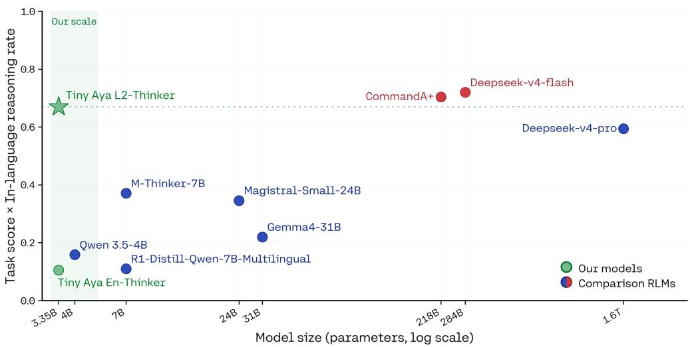  
Figure 1: Performance and L2 Reasoning Rate in a combined metric averaged over four benchmarks: MIST-OEG, MGSM, Marco-Bench-MIF, and GlobalPIQA. For each benchmark, scores are averaged over all languages (not all might be supported by each model). GPT-4.1 (gpt-4-1-04-2025) is used as the judge across four rubrics of MIST-OEG. All models are evaluated by prepending an L2 reasoning phrase to the user prompt to incentivize L2 reasoning. M-Thinker-7B, R1-Distill-Qwen-7B-Multilingual, Magistral-Small-24B, and Command A+ are trained for L2 reasoning. Even the best L2 reasoning models at large scale fail to achieve perfect in-language reasoning, which shows how challenging the end-goal is. Tiny Aya L2-Thinker (ours), at 3.35B scale, achieves a decent score while being substantially smaller.

To make the model accessible for low-resource deployments and use cases, we experiment with the massively multilingual 3.35B Tiny Aya as a base model (Salamanca et al., 2026), which we extend to a dual-mode L2 reasoning model covering 45 languages—to our knowledge, the broadest coverage among open-source models optimized for L2 reasoning. At this scale, crosslingual generalization and instruction following are key obstacles (Murthy et al., 2025; Lim et al., 2025; Zeng et al., 2025), which we address by optimizing how we mix in auxiliary data from English reasoning and multilingual non-reasoning. With our resulting model Tiny Aya L2-Thinker, we show that when building multilinguality right from the start—not as a posthoc adaptation of an English reasoning model—L2 reasoning can be achieved with minimal loss in performance, and for many languages at once. Owing to the eficient tokenizer of Tiny Aya (Abagyan et al., 2026) and our eficient reasoning training data (§ 3.3), Tiny Aya L2-Thinker has far less degenerate repetition than Qwen3.5-4B and uses thinking tokens more eficiently. Moreover, the broad language and task coverage of our training data further yields much smaller cross-language variance in L2 reasoning rate than M-Thinker-7B and Magistral-Small-24B (results in § 4).

The core question we ask is, how can we optimize jointly for multilingual task accuracy and L2 reasoning, while generalizing to as many languages as possible? We take a data-centric approach, and show how SFT data should be composed and scheduled so that reasoning behavior generalizes across languages. Through careful evaluations across multiple benchmarks covering multiple facets of reasoning, we find that (i) more languages help L2 reasoning transfer and do not cause interference (§ 5.1): broadening L2 supervision maintains accuracy and in-language reasoning on covered languages while increasing L2 reasoning rates on those never supervised, so a single jointly trained model transfers better than per-region specialists, and the curse of multilinguality (Conneau et al., 2020) does not apply to reasoning. We further identify (ii) non-reasoning data as a cheap lever for cross-lingual transfer (§ 5.2), as multilingual instruction data benefits both L2 reasoning rate and accuracy on unseen languages, while English reasoning data remains the necessary backbone especially for dificult math tasks (§ 5.3). Lastly, we find that (iii) how supervision is combined matters (§ 5.4), with data mixing ofering better trade-ofs between task accuracy and L2 reasoning rates than sequential adaptation or weight merging. Figure 2 sketches the building blocks of our pipeline at a high level, showing how we go from English-dominated reasoning traces to target-language bridges between prompts and responses.

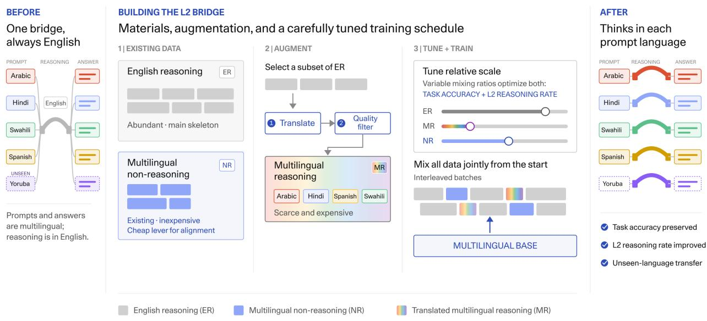  
Figure 2: Our contribution: Creating target-language bridges between prompts and responses by optimizing multi lingual reasoning capabilities through data augmentation, data mixing and carefully calibrated fine-tuning.

Together, these results suggest that reasoning is largely language-agnostic for reasoning language models (RLMs) as it is for humans (Kean et al., 2026), and that the language a model uses to bridge between user query and final answer can be controlled with proper training and data mixing. We achieve this with only a small amount of multilingual reasoning data, bringing multilingual reasoning within reach even for languages where such data is scarce. We release the model weights, and the multilingual reasoning data to support further work on accessible, in-language reasoning. We hope that these releases can spark further research into how reasoning can be even less Englishcentric and more natural and diverse across languages.

## 2 Methodology

Our goal is to build L2 reasoning without requiring large amounts of training data for every language, and learn to reason beyond easily verifiable domains like math. We focus on the supervised

finetuning (SFT) stage, where the model learns from given reference reasoning traces. We leverage established post-training techniques, and describe (1) how we go from English reasoning teachers to L2 reasoning traces, and (2) which techniques combine multiple data sources.

## 2.1 Data augmentation via translation

The scarcity of in-language reasoning traces and strong reasoning systems that would produce those makes it impractical to train a separate reasoning system for every target language. Following established practices in closing data gaps in multilingual instruction following (Muennighof et al., 2023; Üstün et al., 2024), we leverage automatic translation to go from abundant English reasoning traces to translated target language reasoning traces for training. This allows us to obtain multilingual reasoning supervision while preserving the underlying problem and solution structure of the original trajectory. This approach is also known as “translate-train” (Hu et al., 2020) and stands in contrast to approaches that target translation at test time (Huang et al., 2023). While English reasoning models commonly perform translation as part of their reasoning, training-time translation has the advantage of allowing for more control of the quality of this translation by e.g. optimizing the choice of translation model (particularly relevant for small models that might not be the strongest translators), or filtering translation inputs or outputs.

Compared to translating instruction following data, expected costs for translating reasoning traces are, however, significantly higher, and quality can be expected to be lower. Reasoning traces often span tens of thousands of tokens, and translation models are not typically trained (or tested) on reference translations of reasoning traces, nor specialized on typical reasoning domains like math and code that require strong domain expertise (Wang et al., 2025b). Thus, errors might easily accumulate (Kocmi et al., 2025c), and small mistakes can have disproportionate efects on the logical coherence and factual correctness of the reasoning trace. For lower-resourced languages, costs and quality degradations might further increase due to ineficient tokenization (Ahia et al., 2023).

We consequently treat translated reasoning as a scarce resource, focusing on 44 diverse languages but with a small set of samples (< 5K) for each (details in § 3.3). While scaling up translation further is possible in principle, we prioritize measuring and optimizing for crosslingual generalization only with this small seed set. The quality of our target language data depends on the source and the quality of translation, so we carefully filter available English prompts to remove sources that are particularly susceptible to translation artifacts: We require the prompt, reasoning trace, and response to be consistently identified as English, and remove examples containing intra-document code-switching. We additionally remove trajectories that explicitly discuss translation or name target languages (e.g., translat, tradu, übersetz) since translating such content can introduce inconsistencies. Finally, we remove prompts containing constraints that are dificult to preserve reliably under translation such as exact word counts, length bounds, and capitalization or formatting requirements.

## 2.2 Multi-Task post-training

Muennighof et al. (2023) discovered that by multi-task learning (Caruana, 1997), i.e., joint training with mixed data, crosslingual generalization can be achieved in fine-tuning, even for languages absent from the finetuning data. We build on this observation and ask whether the same principle applies to reasoning language: can multilingual supervision teach a model to condition its reasoning language on the input language, including for languages for which no L2 reasoning traces were provided?

We combine three sources of supervision. English reasoning (ER) provides abundant reasoning traces and serves as the primary source of task-solving capability. Multilingual reasoning (MR) data directly supervises reasoning in target languages and multilingual non-reasoning (NR) data provides ordinary instruction-following examples in many languages without an accompanying reasoning trace. The latter is substantially cheaper to obtain and encourages language alignment to transfer into the reasoning mode. We adopt a dual-mode setup: reasoning examples contain explicit reasoning traces, while non-reasoning examples contain an empty reasoning block and instruct the model to answer directly. We combine these sources through joint training within each batch—learning to reason in English, reason in other languages, and follow instructions at the same time.

## 3 Experimental Setup

## 3.1 Base Model

Tiny Aya is a family of small-scale (3.35B) multilingual language models supporting 70+ languages covering five world regions: Asia-Pacific, Europe, Africa, West Asia, and South Asia, making it well-suited for controlled studies of multilingual reasoning across typologically diverse languages. We use the Tiny Aya Base model as starting point for all experiments (Salamanca et al., 2026), with the first modification being the extension of its context length from 8K to 32K, as described below.

## 3.2 Long-Context Training

We extend the model’s context length to 32K tokens by resuming cooldown training midway through a linear learning-rate schedule initialized at $1 . 2 5 \times 1 0 ^ { - 4 }$ . During this stage, we interleave 8K and 32K context sequences at a 3:1 ratio. We balanced the training mixture across data domains (Fu et al., 2024) and context-length buckets to maintain data diversity and ensure a stable transition to long-context modeling.

## 3.3 Training Data

English reasoning (ER) data. We consider two English reasoning mixes, a smaller one for more eficient ablations and preliminary experiments, and one larger one for building the final model. The simple mix pairs AM-Thinking prompts (Ji et al., 2025) with reasoning traces and responses generated by gpt-oss-120b (OpenAI et al., 2025), spanning mathematics, science, and general reasoning domains ( 0.66M, 0.17M, and 0.89M samples respectively, totalling 1.7M samples). The extended mix augments these with the math and science subsets of Dolci-Think-SFT-32B (Olmo et al., 2025) ( 75K) and Open-Thoughts-114K (Guha et al., 2025) ( 380K), which contribute substantially longer traces. The controlled experiments in § 5.1 and § 5.2 use the simple mix: its shorter traces keep training time controlled and make the many-way data-composition and strategy comparisons tractable. We reserve the extended mix for the later scaling experiments in § 5.3 and our final model.

Multilingual reasoning (MR) data. To supervise L2 reasoning, we translate the English reasoning data into diverse target languages selected from the list of languages that Tiny Aya supports, with the main goal of creating a rich subset that captures language family, script and resource levels. We translate the data using command-a-translate (Kocmi et al., 2025b) for its supported languages and DeepSeek-V3 (Liu et al., 2024) for the rest, sampling sources independently per language to maximize input diversity, and cap each language at 5K samples4. For preliminary experiments and ablations in § 5 we work with a subset of ten languages, two selected by region: Europe (German, French), Asia-Pacific (Japanese, Korean), South Asia (Hindi, Bengali), West Asia (Arabic, Persian), and Africa (Swahili, Zulu). For the final MR dataset, we translate reasoning traces into an additional 34 languages across the five regions (breakdown in Figure 3), teaching our Tiny Aya L2-Thinker model to reason in 45 languages (incl. English).5 Detailed statistics are given in Table 3.6

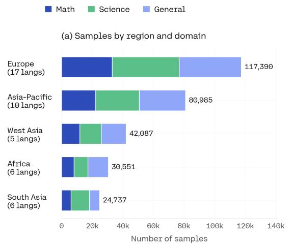

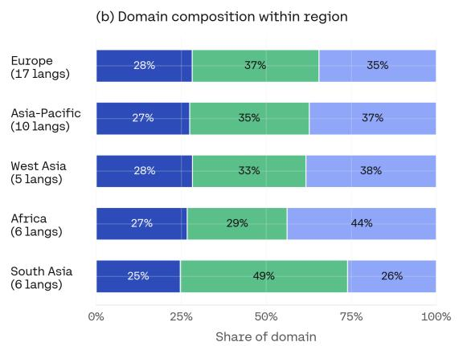  
Figure 3: Data composition of our multilingual reasoning data per Tiny Aya regions (Europe, Asia-Pacific, West Asia, Africa, South Asia) and data categories (Math, Science, and General)

Multilingual non-reasoning (NR) data. Fine-tuning exclusively on less multilingual, and less domain-diverse reasoning data risks losing specific capabilities such as target-language generation and instruction following in Tiny Aya’s languages. To counteract this, we incorporate multilingual non-reasoning instruction-following data into our training mix. It consists of a total of 4.9M samples spanning all of Tiny Aya’s 67 languages to prevent catastrophic forgetting of languages that are not included in the MR data. Our non-reasoning data combines translated general instruction data (e.g. from Dolci Instruct SFT (Olmo et al., 2025)) and curated and filtered public translation data (Kocmi et al., 2025b; Proietti et al., 2025), region-specific instruction data (Mora et al., 2025), the Aya Collection (Singh et al., 2024), and prompts from Khairi et al. (2025), together with a small amount of synthesized data targeting common MCQA formatting (disjoint from all our benchmarks).

NR examples are included with empty thinking blocks and marked with special tokens that signal the model to respond directly without reasoning. This allows the model to retain general multilingual capabilities alongside its reasoning skills, without requiring full reasoning supervision. In Section 5.2, we study how the proportion of NR data in the mixture afects multilingual understanding and cross-lingual L2-thinking generalization.

## 3.4 Evaluation

Benchmarks. We evaluate multilingual reasoning across a diverse set of capabilities relevant for multilingual use cases, including both parallel (translated) and non-parallel benchmarks with a wide language coverage:

• Math at multiple dificulty levels: To cover the to-date most dominant direction of evalua tions (Ghosh et al., 2025), we include the GlobalMGSM (Salamanca et al., 2026) extension of MGSM (Shi et al., 2023)—referred to as MGSM throughout the text—and PolyMath (Wang et al., 2025b) for evaluating math reasoning. MGSM includes grade-school arithmetic math problems and PolyMath includes more advanced math problems in four dificulty levels (the first level being equivalent to MGSM); both are translated from English. They require writing answers to math prompts in multiple languages, but the correct answers that are used for evaluation are mostly identical across languages since they are numerical.

• Multicultural and multilingual reasoning: In addition to evaluating multilingual proficiency, we assess cultural reasoning abilities utilizing GlobalPIQA (Chang et al., 2026) (non-parallel subset) and the multilingual variant of Macaron-MCQ (Elsetohy et al., 2026). GlobalPIQA evaluates physical commonsense reasoning, which requires the model to make a binary choice between two seemingly plausible alternatives to a highly language/culturespecific prompt. Macaron-MCQ consists of natively written culturally grounded questions spanning 22 cultural aspects and 7 reasoning types (mathematical, commonsense, causal, temporal, logical, spatial, and multihop) across 20 languages. The questions require strong language proficiency, reasoning abilities and cultural understanding, to select the correct answer from four plausible options.

• Localized instruction following: The ability to follow instructions in any language is key to allowing meaningful user interactions. This aspect is usually overlooked when training reasoning models. Marco-Bench-MIF (Zeng et al., 2025) tests this ability with localized prompts that require fulfilling constraints for desired output formats and contents in the model response.

• Linguistically diverse open-ended generation: To assess language proficiency in writing, we include the open-ended generation sub-task from the WMT 2025 Multilingual Instruction Shared Task (MIST-OEG) (Kocmi et al., 2025a). It contains localized open-ended questions such as brainstorming, creative or professional writing, or information requests, which require aspects like naturalness and coherence that are not captured in any of the other benchmarks. We use the same open-ended generation rubric-based LLM-as-a-judge setup as (Salamanca et al., 2026) that extends the one from (Kocmi et al., 2025a) by the dimension of accuracy. We use GPT-4.1 (gpt-4-1-04-2025) as the judge across four rubrics.

Language selection. Where necessary, we automatically translate benchmark instruction prompts into the target languages so that they do not contain any English instructions anymore. We exclude benchmark languages that the base model Tiny Aya does not support due to our post-training scope. This still covers a diverse list of 60 languages including high- and low-resource languages. For ablations, we distinguish seen languages (those languages from each benchmark present in MR data) from unseen ones (absent from MR but present in NR data). More details are in § C.1.

Metrics. Our main concerns are whether the model answers correctly, and which language it reasons in: we want both high task accuracy and high L2 reasoning rate. Furthermore, we want to achieve eficient use of a fixed 32K token budget. We track these complementary aspects of a successful L2 reasoning model with the following metrics:

Task accuracy measures to what degree the final answer is correct under the metric definition of the respective benchmark. This is the commonly tracked metric in reasoning research.

L2 reasoning rate measures the percentage of the samples where the model’s reasoning trace is predominantly written in the prompt language, according to a FastText language-identification (Joulin et al., 2016) classifier, with GlotLID (Kargaran et al., 2023) as a fall-back for FastText’s unsupported languages.

Repetition rate measures the fraction of repeated 4-grams in a reasoning trace (Li et al., 2023; Yao et al., 2025), capturing potentially degenerate repetitions, and we use it as a proxy for doomlooping. When models “doomloop”, i.e. never recover from looping through the same sequence of tokens, they often exhaust the token budget preventing them from arriving at a final answer, which in turn hurts task accuracy. For a trace with distinct 4-grams $g \in { \mathcal { G } }$ occurring with counts $c _ { g } .$ , we define the 4-gram repetition score as:

$$
{ \frac { \sum _ { g : c _ { g } > 1 } ( c _ { g } - 1 ) } { \sum _ { g } c _ { g } } } .\tag{1}
$$

We also track the reasoning length in number of tokens, where reasoning traces are tokenized based on each model’s own tokenizer.

## 3.5 Baselines & External Comparisons

Same scale comparison with inference-time language forcing. Our primary comparison is against inference-time language forcing methods on Qwen3.5-4B (Qwen Team, 2026), a massively multilingual reasoning model at our scale supporting 201 languages trained only on English reasoning—reflecting the status quo of multilingual reasoning at the 3–4B scale.

For Qwen3.5-4B, we use two approaches for forcing in-language reasoning at inference time, either via a user message prefix or as prefix for the reasoning trace. For the former, we prepend the phrase “Think in the same language as the prompt.” to the user request (user prefix LF); this is a low-cost approach that any user can apply. As an alternative, we prefill the start of the reasoning trace with the equivalent of “Here's a thinking process to solve the problem:”—a phrase that appears frequently at the beginning of Qwen3.5-4B’s reasoning traces—translated into the prompt’s language (thinking prefix LF). Downstream users cannot pre-fill the reasoning trace when access is gated behind a platform, so this second approach must in practice be handled by the model provider and requires an additional language-identification step of the user prompt to pick the prefix in the right language. This makes it less attractive in practice, as it requires languagespecific processing and prevents genuine exploration by the model within these first reasoning trace tokens.

English-only reasoning. For a direct data-controlled comparison, we also train a Tiny Ayaderived English reasoning model. It receives the same training data as its L2 counterpart, but the reasoning traces are entirely in English.

Larger L2-reasoning optimized models. In addition, we compare against two existing larger models that were specifically optimized towards L2 reasoning (see § 6):

<table><tr><td rowspan=1 colspan=12>MGSM       PolyMath      MIST-OEG   Marco-Bench-MIF  GlobalPIQA    Macaron-MCQLangs.Model $\operatorname { A c c }$     L2%    $\operatorname { A c c }$    L2%    $\operatorname { A c c }$    L2%   Acc    L2%      $\operatorname { A c c }$     L2%    $\operatorname { A c c }$     L2%</td></tr><tr><td rowspan=1 colspan=12>English Reasoning</td></tr><tr><td rowspan=1 colspan=1>TINY AYA EN-THINKER English 92.8</td><td rowspan=1 colspan=1>100.0</td><td rowspan=1 colspan=1>17.3</td><td rowspan=1 colspan=1>99.3</td><td rowspan=1 colspan=1>95.3</td><td rowspan=1 colspan=1>100.0</td><td rowspan=1 colspan=1>71.2</td><td rowspan=1 colspan=1>97.6</td><td rowspan=1 colspan=1>75.0</td><td rowspan=1 colspan=1>100.0</td><td rowspan=1 colspan=1></td><td rowspan=1 colspan=1></td></tr><tr><td rowspan=5 colspan=1>(Ours)              Other70.8±14.9English 96.4QWEN3.5-4B               52.2±24.7Other</td><td rowspan=1 colspan=1>0.8±3.1</td><td rowspan=1 colspan=1>18.6±1.4</td><td rowspan=1 colspan=1>0.1±0.1</td><td rowspan=1 colspan=1>85.3±5.4</td><td rowspan=1 colspan=1>10.5±8.5</td><td rowspan=1 colspan=1>52.8±5.0</td><td rowspan=1 colspan=1>7.9±6.4</td><td rowspan=1 colspan=1>72.3±9.52</td><td rowspan=1 colspan=1>8.4±28.1</td><td rowspan=4 colspan=1>42.6±10.1</td><td rowspan=4 colspan=1> $1 5 . 2 _ { \pm 1 6 . 0 }$ </td></tr><tr><td rowspan=3 colspan=1>100.0</td><td></td><td></td><td></td><td></td><td></td><td></td><td></td><td></td></tr><tr><td rowspan=2 colspan=1>24.6</td><td></td><td></td><td></td><td></td><td></td><td></td><td></td></tr><tr><td rowspan=1 colspan=1>99.3</td><td rowspan=1 colspan=1>90.8</td><td rowspan=1 colspan=1>98.0</td><td rowspan=1 colspan=1>37.0</td><td rowspan=1 colspan=1>95.7</td><td rowspan=1 colspan=1>88.0</td><td rowspan=1 colspan=1>100.0</td></tr><tr><td rowspan=1 colspan=1>31.0±22.7</td><td rowspan=1 colspan=1>39.8±5.6</td><td rowspan=1 colspan=1>0.2±0.5</td><td rowspan=1 colspan=1>79.9±10.41</td><td rowspan=1 colspan=1>5.2±7.8</td><td rowspan=1 colspan=1>23.8±8.0</td><td rowspan=1 colspan=1>31.4±7.7</td><td rowspan=1 colspan=1>78.6±10.57</td><td rowspan=1 colspan=1>.9±11.1</td><td rowspan=1 colspan=1>37.0±14.01</td><td rowspan=1 colspan=1>2.8±12.6</td></tr><tr><td rowspan=1 colspan=4>L2 Reasoning</td><td rowspan=1 colspan=1></td><td rowspan=1 colspan=7></td></tr><tr><td rowspan=1 colspan=1>TINY AYA L2-THINKEREnglish 93.6</td><td rowspan=1 colspan=1>100.0</td><td rowspan=1 colspan=1>16.9</td><td rowspan=1 colspan=1>98.9</td><td rowspan=1 colspan=1>95.0</td><td rowspan=1 colspan=1>100.0</td><td rowspan=1 colspan=1>72.7</td><td rowspan=1 colspan=1>98.5</td><td rowspan=1 colspan=1>70.0</td><td rowspan=1 colspan=1>100.0</td><td rowspan=1 colspan=1></td><td rowspan=1 colspan=1></td></tr><tr><td rowspan=2 colspan=1>(Ours)              Other68.0±14.19QWEN3.5-4B        English 93.8</td><td rowspan=1 colspan=1>6.5±9.6</td><td rowspan=1 colspan=1>11.1±2.59</td><td rowspan=1 colspan=1>4.9±7.7</td><td rowspan=1 colspan=1>85.8±4.89</td><td rowspan=1 colspan=1>5.2±15.2</td><td rowspan=1 colspan=1>50.7±5.3</td><td rowspan=1 colspan=1>96.8±5.5 7</td><td rowspan=1 colspan=1>0.7±9.79</td><td rowspan=1 colspan=1>8.3±8.4</td><td rowspan=1 colspan=1>39.8±9.29</td><td rowspan=1 colspan=1>3.8±15.2</td></tr><tr><td rowspan=1 colspan=1>99.6</td><td rowspan=1 colspan=1>21.9</td><td rowspan=1 colspan=1>99.2</td><td rowspan=1 colspan=1>91.3</td><td rowspan=1 colspan=1>99.0</td><td rowspan=1 colspan=1>34.6</td><td rowspan=1 colspan=1>97.8</td><td rowspan=1 colspan=1>90.0</td><td rowspan=1 colspan=1>100.0</td><td rowspan=1 colspan=1></td><td rowspan=1 colspan=1></td></tr><tr><td rowspan=1 colspan=1>(user prefix LF)      Other51.2±25.23</td><td rowspan=1 colspan=1>3.9±24.8</td><td rowspan=1 colspan=1>40.3±5.20</td><td rowspan=1 colspan=1>.2±0.5</td><td rowspan=1 colspan=1>81.5±8.3</td><td rowspan=1 colspan=1>29.4±11.3</td><td rowspan=1 colspan=1>21.2±7.5</td><td rowspan=1 colspan=1>33.3±8.0</td><td rowspan=1 colspan=1>78.1±10.91</td><td rowspan=1 colspan=1>2.2±13.23</td><td rowspan=1 colspan=1>0.2±19.21</td><td rowspan=1 colspan=1>3.5±12.0</td></tr><tr><td rowspan=2 colspan=1>QWEN3.5-4B        English 92.0(thinking prefix LF)   Other 50.6±34.49</td><td rowspan=1 colspan=1>100.0</td><td rowspan=1 colspan=1>23.7</td><td rowspan=1 colspan=1>100.0</td><td rowspan=1 colspan=1>57.3</td><td rowspan=1 colspan=1>100.0</td><td rowspan=1 colspan=1>34.6</td><td rowspan=1 colspan=1>95.6</td><td rowspan=1 colspan=1>90.0</td><td rowspan=1 colspan=1>100.0</td><td rowspan=1 colspan=1></td><td rowspan=1 colspan=1></td></tr><tr><td rowspan=1 colspan=1>4.3±12.2</td><td rowspan=1 colspan=1>27.6±9.3</td><td rowspan=1 colspan=1>87.6±15.6</td><td rowspan=1 colspan=1>67.7±15.49</td><td rowspan=1 colspan=1>3.3±12.4</td><td rowspan=1 colspan=1>33.8±14.3</td><td rowspan=1 colspan=1>82.3±9.0</td><td rowspan=1 colspan=1>77.0±13.1</td><td rowspan=1 colspan=1>94.7±15.7</td><td rowspan=1 colspan=1>37.7±19.79</td><td rowspan=1 colspan=1>1.1±20.7</td></tr><tr><td rowspan=6 colspan=1>English 84.8M-THINKER-7BOther38.0±31.68English 98.0MAGISTRAL-SMALL-24BOther 64.2±31.23</td><td rowspan=1 colspan=1></td><td rowspan=1 colspan=1></td><td rowspan=1 colspan=1></td><td rowspan=1 colspan=1></td><td rowspan=1 colspan=1></td><td rowspan=1 colspan=1></td><td rowspan=1 colspan=1></td><td rowspan=1 colspan=1></td><td rowspan=1 colspan=1></td><td rowspan=1 colspan=1></td><td></td></tr><tr><td rowspan=2 colspan=1>97.6</td><td rowspan=2 colspan=1>42.6</td><td rowspan=2 colspan=1>98.3</td><td rowspan=2 colspan=1>90.7</td><td rowspan=2 colspan=1>99.0</td><td rowspan=2 colspan=1>57.1</td><td rowspan=2 colspan=1>97.2</td><td rowspan=2 colspan=1>71.0</td><td rowspan=2 colspan=1>100.0</td><td></td><td></td></tr><tr><td rowspan=1 colspan=1></td><td rowspan=1 colspan=1></td></tr><tr><td rowspan=1 colspan=1>7.8±24.0</td><td rowspan=1 colspan=1>32.6±7.4</td><td rowspan=1 colspan=1>88.0±29.5</td><td rowspan=1 colspan=1>30.0±16.4</td><td rowspan=1 colspan=1>96.5±12.2</td><td rowspan=1 colspan=1>28.2±7.39</td><td rowspan=1 colspan=1>4.1±16.6</td><td rowspan=1 colspan=1>59.2±9.09</td><td rowspan=1 colspan=1>2.2±21.6</td><td rowspan=1 colspan=1>32.7±8.8 8</td><td rowspan=1 colspan=1>7.7±29.9</td></tr><tr><td rowspan=1 colspan=1>99.6</td><td rowspan=1 colspan=1>32.1</td><td rowspan=1 colspan=1>100.0</td><td rowspan=1 colspan=1>97.8</td><td rowspan=1 colspan=1>100.0</td><td rowspan=1 colspan=1>78.9</td><td rowspan=1 colspan=1>96.1</td><td rowspan=1 colspan=1>88.0</td><td rowspan=1 colspan=1>99.0</td><td rowspan=1 colspan=1></td><td rowspan=1 colspan=1></td></tr><tr><td rowspan=1 colspan=1>3.6±39.1</td><td rowspan=1 colspan=1>15.9±8.13</td><td rowspan=1 colspan=1>9.4±32.08</td><td rowspan=1 colspan=1>0.8±12.56</td><td rowspan=1 colspan=1>0.4±32.3</td><td rowspan=1 colspan=1>50.9±16.54</td><td rowspan=1 colspan=1>8.9±30.4</td><td rowspan=1 colspan=1>77.1±10.54</td><td rowspan=1 colspan=1>9.0±43.3</td><td rowspan=1 colspan=1>49.6±13.81</td><td rowspan=1 colspan=1>4.7±26.4</td></tr></table>

Table 1: Task accuracy (Acc) and L2 reasoning rate (L2%) on English and averaged over all covered languages besides English ( std across those languages) for baselines and our Tiny Aya L2-Thinker model trained on 45 reasoning languages. Models after the dashed separator have larger scale than our model but we still include them for comparison: 7B/24B vs. 3.35B. Macaron-MCQ is country-based and does not have English in the original implementation. LF stands for language forcing. The task accuracy metric for MIST-OEG is a 1–7 judge score rescaled to [0,100]; the PolyMath column blends the three dificulty levels per language as (2 medium+4 high+8 top)/14. The highest value among non-english averages is bold for Acc and L2%.

M-Thinker-7B (Zhang et al., $2 0 2 6 ) ^ { 7 }$ is optimized on five languages $\mathrm { ( j a / k o / f r / p t / t h ) }$ via SFT and RL with L2 reasoning-tailored rewards on math, based on DeepSeek-R1-Distill-Qwen-7B (Guo et al., 2025)8, and Magistral-Small-24B supports 24 languages while being trained on in-language reasoning traces for a few of them $( \mathrm { f r / e s / i t / d e / z h / r u } )$ via language consistency reward (Mistral-AI et al., 2025). Decoding settings are described in § D.

## 4 Results

We group systems by whether they are meant to reason in the user’s language. One group reasons in English by design: Qwen3.5-4B and Tiny Aya En-Thinker, an English-only reasoner trained on the same backbone as our model (same base and data, but with English reasoning traces). The other group targets L2 reasoning, either at inference time through language forcing (Qwen3.5-4B user/ thinking LF) or through training (Tiny Aya L2-Thinker, M-Thinker-7B, Magistral-Small-24B).

For each system we report metrics on two language groups in Table 1: English, for English prompts as a control, and Other, averaged over the remaining benchmark languages, with the standard deviation across those languages (§ C.1 for more details). Per-language numbers are detailed in tables 5 to 12 in the Appendix.

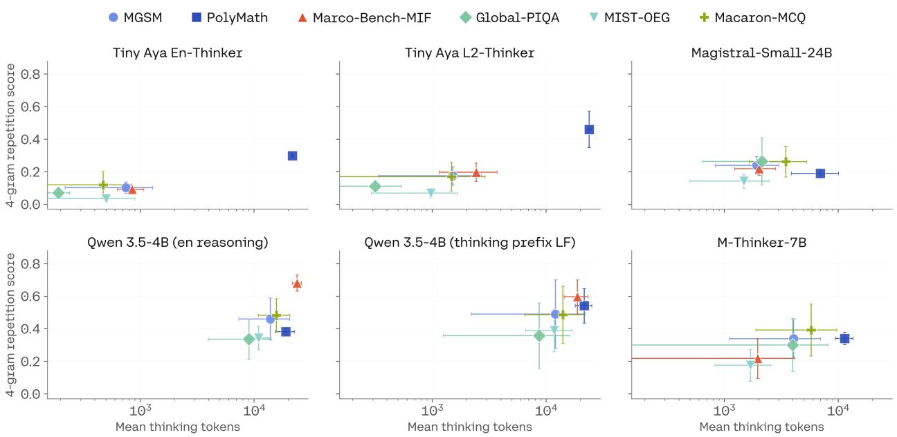  
Figure 4: 4-gram repetition score as our doomlooping proxy versus mean number of thinking tokens (log scale) across six benchmarks; error bars are ±1 s.d. across all the benchmark’s languages. Longer traces track more repetition: Qwen3.5-4B (LF) sits at the high-token, high-repetition extreme, while Tiny Aya L2-Thinker reasons in far fewer tokens except for the competition-level PolyMath task, and shows markedly less repetition. Scores are length normalized, averaged across 1024-token windows.

## 4.1 Forcing the reasoning language is not a substitute for training

Thinking prefix LF lifts Qwen3.5-4B’s L2 reasoning rate far above user prefix LF, yet even this stronger variant falls short of Tiny Aya L2-Thinker. Trained for in-language reasoning on multilingual data, Tiny Aya L2-Thinker reaches a higher L2 rate than Qwen3.5-4B with thinking prefix LF on every benchmark and is more stable across languages. It is also more accurate on several tasks, most clearly on the open-ended generation benchmarks MIST-OEG and Marco-Bench-MIF, where linguistic understanding matters most.

Forcing is fragile by construction as it relies on templates the model may have never encountered in training, so its success depends on the model’s instruction-following and on how sensitive it is to edits of the prompt or reasoning prefix (Zhang et al., 2026). Prefilling the forcing phrase as a generation prefix can also steer the model away from its more likely generation paths and cost accuracy: on Qwen3.5-4B, thinking prefix LF lowers other-language accuracy on four of six benchmarks, by roughly 12 points on both PolyMath and MIST-OEG. When L2 reasoning is instead introduced during training, it is naturally integrated into the model’s learned behavior. Tiny Aya L2-Thinker reasons in the target language on more than 93% of traces on every benchmark, across both seen and unseen languages, and does so with consistently low variance. It exceeds M-Thinker-7B (87.7–96.5%) on five of six benchmarks at half the size, and exceeds Magistral-Small-24B on all tasks by a considerable margin. In Table 1 we report both language-forcing variants for Qwen3.5-4B, but in the remainder of the paper we report only the stronger method, thinking prefix LF.

## 4.2 In-language reasoning comes at minimal cost to accuracy

Switching from English to in-language reasoning barely moves Tiny Aya L2-Thinker’s otherlanguage accuracy relative to its English-reasoning counterpart: it drops by at most 2–3% on five of the six tasks and gives ground only on PolyMath (11.1% vs. 18.6%). English performance is preserved too: the model continues to reason in English on English prompts and matches the English reasoner on most benchmarks, the one real drop being 5 points on GlobalPIQA. In-language reasoning therefore costs at most a few points outside competition-level math, in exchange for an L2 rate that climbs from near zero to above 93%.

PolyMath is the one benchmark where Qwen3.5-4B leads on accuracy (40.3% for Qwen3.5-4B (user prefix LF) vs. our 11.1%), but the gap decomposes: 21.7 points separate Qwen3.5-4B from our own English-reasoning model (18.6), and only 7.5 separate that model from Tiny Aya L2-Thinker. This reflects the absence of an RL stage for our models, since competition-level math benefits from RL refinement (Shen et al., 2026), which also smoothes translation artifacts (Wang et al., 2025b). M-Thinker-7B shows the cost of chasing that accuracy too narrowly: math-targeted RL on five languages raises its PolyMath score to 32.6, but the model collapses on open-ended generation (30 on MIST and 28.2 on Marco-Bench-MIF, against 85.8 and 50.7 for our model). Tiny Aya L2-Thinker instead reasons concisely in the prompt language across every evaluated language, making it a well-rounded multilingual reasoner rather than a specialist.

## 4.3 Long traces signal doomlooping, not deeper reasoning

Longer reasoning is not undesirable in itself: harder problems such as advanced math captured in PolyMath warrant more deliberation, but traces that stay long regardless of dificulty signal degenerate generations rather than deeper reasoning. Figure 4 bears this out: across models, the 4-gram repetition score—our proxy metric used to detect doomlooping (Li et al., 2023; Yao et al., 2025)—rises with the mean number of used thinking tokens. This shows that when traces get longer, there are also more repetitions within these traces. Some repetition is unavoidable as sequences grow against a fixed vocabulary, but longer traces should ideally add new contents rather than redundantly repeating existing contents. Qwen3.5-4B with thinking prefix LF sits at the high-token, high-repetition extreme, with particular outliers on Marco-Bench-MIF and MIST-OEG (above 0.6 and 0.4 4-gram repetition scores respectively). Recalling from Table 1, these are the tasks for which Qwen3.5-4B has the weakest performance, showing that the extra tokens are not buying performance. Manual inspection confirms that many of these traces are in fact doomlooping, (see § H for an example). Boizard et al. (2026) also find that longer traces correlate with failure and tend to be incorrect. Tiny Aya L2-Thinker, trained at the same 32K context length as Qwen3.5-4B, controls length far better, staying short and low-repetition on easier benchmarks while spending more tokens on PolyMath.

## 4.4 Efficiency and Coverage on Low-resource Languages

Figure 5 draws a three-way trade-of among coverage (L2 reasoning rate), useful performance (task accuracy), and eficiency (mean number of reasoning trace tokens), across four tiers of resourcedness (1: highest, 4: lowest). We rank languages by Common Crawl page count and bin them into four groups as a proxy for available web data for pretraining: tier 1 (20–870M) for the highestresource languages, tier 2 (5–20M), tier 3 (400K–5M), and tier 4 (5K–400K) for the lowest-resource languages. The comparison is restricted to models that actually produce in-language reasoning to some degree: Tiny Aya L2-Thinker, M-Thinker-7B, and Magistral-Small-24B via training, and Qwen3.5-4B (thinking prefix LF) via inference-time language forcing. For each tier, we first average the metric across benchmarks covering each language before averaging uniformly over languages within each tier.

None of these metrics is suficient without the other two, and they should be considered all together.

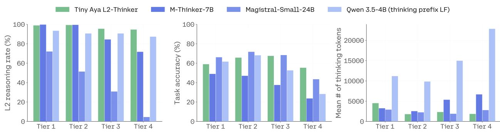  
Languages grouped by estimated web data availability

Figure 5: Eficiency and coverage of L2 reasoning LLMs across tiers of language resourcedness. Tiers range from the highest-resourced (Tier 1) to the lowest-resourced (Tier 4) languages. Tiny Aya L2-Thinker maintains broad L2 reasoning coverage across all four tiers, whereas M-Thinker-7B and Magistral-Small-24B achieve lower L2 reasoning rates when evaluated on lower-resourced languages. Tiny Aya L2-Thinker is also more token-eficient, using under 2,000 thinking tokens on average, while Qwen3.5-4B uses far more, with token counts increasing toward the lower-resourced tiers. Values are averaged over the languages in each tier and over the benchmarks that include them.

Tier 1: cs, de, en, es, fr, id, it, ja, nl, pl, pt, ru, tr, vi, zh

Tier 2: ar, bg, ca, el, fa, fi, he, hu, ko, no, ro, sk, sv, th, uk

Tier 3: bn, et, eu, gl, hi, hr, lt, mr, ms, ne, sl, sr, ta, te, ur

Tier 4: am, cy, gu, ha, ig, jv, km, my, sn, sw, tl, wo, xh, yo, zu

Tiny Aya L2-Thinker is the only model that remains strong on all three axes as resourcedness falls. Its L2 rate stays near ceiling on tiers 1–2 (99%) and declines only modestly on lower-resourced languages (94.3% on tier 3, 94.5% on tier 4), while Magistral-Small-24B’ s in-language reasoning collapses (72% → 5%). M-Thinker-7B’s performance drops as we move toward lower-resourced tiers on all metrics: L2 reasoning rate falls from 99.6% to 71.6%, task accuracy from 48.8% to 23.5%, and mean thinking length roughly doubles from 3.2k to 6.6k tokens. While thinking prefix language forcing keeps Qwen3.5-4B’s L2 rate high even on lower-resourced tiers (93.3% on tier 1, 87.2% on tier 4; still below Tiny Aya L2-Thinker), its task accuracy drops quickly. While on tier 1 Qwen3.5-4B has higher accuracy than Tiny Aya L2-Thinker (61.5% vs. 58.8%), on tier 4 it stands behind Tiny Aya L2-Thinker by more than 25%, and the reasoning traces get unnecessarily long for lower-resourced languages.

Overall, our model achieves both broader language coverage (45 vs. 6 languages) and stronger performance than M-Thinker-7B, a model twice its size. The variance in L2 reasoning rates for Tiny Aya L2-Thinker is roughly half that of M-Thinker-7B, indicating more robust L2 thinking. Compared to Qwen3.5-4B, Tiny Aya L2-Thinker attains comparable performance while achieving higher L2 reasoning rate, and more eficient traces.

## 5 Analysis and Building Blocks

We organize the analysis around two questions. The first question is how to achieve cross-lingual L2 reasoning with minimal target-language reasoning supervision. We analyze the impact of three main pillars with a set of controlled experiments—broader language coverage (§ 5.1), a small fraction of multilingual non-reasoning data (§ 5.2), and a suficient English reasoning backbone (§ 5.3)—each of which transfers L2 reasoning to languages carrying little or no in-language reasoning data. The second question is how to navigate the trade-of between task accuracy and L2 reasoning rate: comparing joint mixing against sequential adaptation and model merging (§§ G.1 and G.2); we find that mixing gives the best trade-of and the most predictable failures.

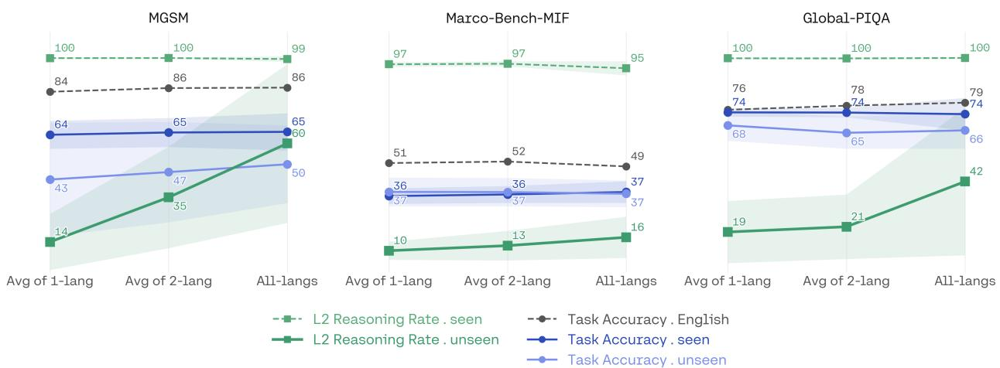  
Figure 6: Efect of language coverage across MGSM, Marco-Bench-MIF, and GlobalPIQA. Each panel shows, as coverage grows from the 1-Lang specialists to the 2-Lang regional models to the single All-Langs model, English/ seen/unseen task accuracy and seen/unseen L2 reasoning rate. Task accuracy and seen LangID are flat within error bars (no interference), while unseen-language L2 reasoning rate rises monotonically, indicating that broader language coverage improves generalization to unseen languages.

## 5.1 More languages improve transfer of reasoning behavior

Adding languages to a model is often expected to create a trade-of: broader language coverage may improve transfer, but competing languages may interfere with capabilities already acquired or lead to code-switching. For L2 reasoning, this raises a specific question: does exposing a model to more reasoning languages improve its ability to reason in new languages, or does it dilute the language-specific behavior it has already learned?

We compare three levels of language coverage: language-specific specialists trained with one target language, regional models trained with two languages, and a single model jointly trained on all ten target languages: 1-Lang specialists (English + one target language; ten models, two per region across Europe, Asia-Pacific, South Asia, West Asia, and Africa), 2-Lang regional models (English + the two target languages of one region; five models), and a single All-Langs model trained on English + all ten languages jointly. We evaluate both task accuracy and L2 reasoning rate separating languages that received L2 reasoning supervision from held-out languages.

To ensure that the comparison reflects language coverage rather than diferences in the evaluation distribution, we first average within each region and then across the five regions, so every region contributes equally regardless of how many of its languages a given benchmark happens to cover. For each benchmark, the seen and unseen language sets are fixed in advance, since the languages available for evaluation difer across the benchmarks. The 10 training languages of this experiment are German, French, Japanese, Korean, Hindi, Bengali, Arabic, Persian, Swahili, and Zulu; the benchmark-specific seen and unseen splits are given in Table 4.

We find that expanding language coverage improves transfer without producing the expected interference. Across all three benchmarks in Figure 6, English accuracy, task accuracy on seen languages, task accuracy on unseen languages, and L2 reasoning rate on seen languages remain essentially stable as coverage increases. The behavior that changes is L2 reasoning rate on unseen languages, which rises monotonically with coverage on all three benchmarks: 14 35 60 on MGSM, 10 13 16 on Marco-Bench-MIF, and 19 21 42 on GlobalPIQA. The transfer is thus selective: added languages improve in-language reasoning specifically on languages that never received it as supervision, while leaving already-acquired capabilities intact. We observe that L2 reasoning behaves less like a fixed capacity that must be divided among languages and more like a transferable behavioral pattern whose generalization improves with broader linguistic coverage. This finding corroborates Yang et al. (2025)’s observation that reinforcement learning of mathematical reasoning on multiple languages jointly helps transfer reasoning capabilities to other languages.

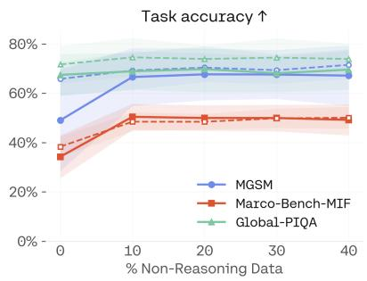

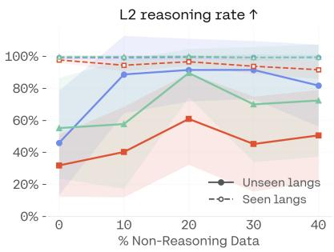

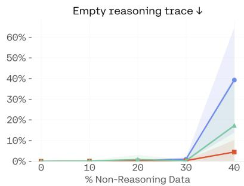  
Figure 7: Efect of the multilingual non-reasoning data fraction (L2 reasoning fixed at 10%; the remainder is En glish reasoning). Left: task accuracy. Middle: rate of reasoning in the target language (L2 reasoning rate). Right: empty thinking-trace rate. Solid lines are averaged over unseen languages, dashed over seen languages; one line per benchmark; bands show 1 std across languages. A small non-reasoning fraction sharply improves both in-language reasoning and accuracy on unseen languages, with a sweet spot around 20–30% before the model starts skipping thinking at around 40%.

## 5.2 A small proportion of non-reasoning data yields positive transfer across metrics

The previous experiments show that multilingual reasoning can transfer across languages while still relying on multilingual reasoning traces. We then ask whether the language alignment needed for L2 reasoning can be learned from cheaper supervision that contains no in-language reasoning traces.

Batch-wise mixing. We sweep the fraction of multilingual non-reasoning data while holding L2 reasoning fixed at 10% and trading the remainder against English reasoning, spanning the NR mix at 0%, 10%, 20%, 30%, 40%. The mixture proportions are enforced at the batch level, and we compare checkpoints at matched training steps so that diferences reflect data composition rather than training length. Figure 7 reports, as a function of the non-reasoning fraction, task accuracy, the rate at which the model reasons in the target language (L2 reasoning rate), and the fraction of empty thinking traces, each averaged over the unseen languages (solid) and seen languages (dashed), with one line per benchmark.

A little non-reasoning data goes a long way. The largest change comes from the very first increment. On MGSM unseen languages, moving from 0% to 10% raises the rate of in-language reasoning from 46% to 89% and, strikingly, lifts task accuracy from 49% to 67% at the same time. Without any non-reasoning data the model has high English-reasoning capacity but reasons in English on many unseen prompts; adding a small non-reasoning SFT slice couples input language to output language and this anchoring transfers into reasoning mode, improving both metrics together, indicating a cross-mode transfer. Non-reasoning data, however, helps only in moderation, with a sweet spot at around 20–30%. Beyond that, the model increasingly skips reasoning altogether, as shown by the empty reasoning trace fraction in Figure 7.

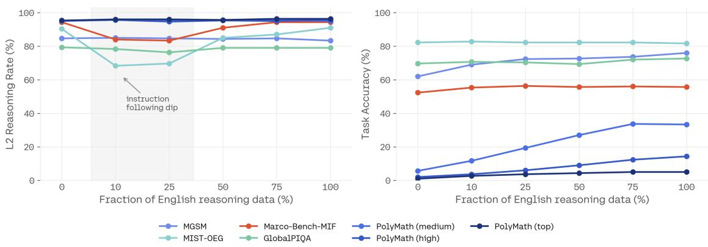  
Figure 8: English-reasoning sweep, averaged over all languages (English and our 44 translated languages). Starting from a multilingual-only model (0%), we add our extended English reasoning mix at increasing fractions (10%, 25%, 50%, 75%, 100%). Left: L2 reasoning rate. Math reasoning benchmarks (MGSM, PolyMath) stay stable, while non-math benchmarks (MIST-OEG, Marco-Bench-MIF, GlobalPIQA) show a dip at 10–25% (shaded region) before recovering as the English backbone grows. Right: Task accuracy (%, with MIST rescaled from its 1–7 scale). Math benchmarks, especially PolyMath (medium), gain substantially from a heavier English backbone via language transfer, whereas open-ended generation tasks are largely insensitive to the English fraction.

## 5.3 English reasoning data as the backbone for mathematical reasoning

In this experiment, we measure the efect of English reasoning data on L2 reasoning, tracing how the dynamic evolves as we increase the English backbone. We begin with a multilingual-only model trained on Multilingual Reasoning (MR) and Non-Reasoning (NR) data, then add our extended English mix at fractions of 10%, 25%, 50%, 75%, and 100%.

We observe that the two task families respond diferently in Figure 8. For math benchmarks (MGSM, PolyMath), the L2 reasoning rate stays nearly flat while task accuracy climbs with a heavier English backbone. We attribute this to knowledge transfer: math reasoning benefits most from English data, so more of it lifts performance without disrupting the language of the thinking trace.

Open-ended generation tasks (MIST-OEG, Marco-Bench-MIF), by contrast, gain almost nothing from additional English data; 10% of the mix behaves the same as 100%. These open-ended benchmarks reveal a subtler dynamic in the L2 reasoning rate. The multilingual-only model starts with a high L2 reasoning rate; adding a small fraction of English data drives it down, and it takes a heavier English backbone to recover to the original level. We attribute this recovery to instruction following: as English data increases, the model becomes better at following instructions in general, so when prompted to reason in L2 it digests and complies with that instruction more reliably.

These three pillars each push the accuracy-L2 reasoning rate outward, but all assume a single model trained by joint mixing; once the recipe is fixed, how English and L2 supervision are combined in time forces a genuine choice between them. We justify that choice by comparing mixing against two strategies that fragment the process—sequentially adapting an English-only reasoner, and merging separately trained specialists—and examining how each behaves when it fails to reason in the target language. For a controlled comparison, we conduct this experiment in the ten-language, five-region setup of § 5.1, reusing the specialist models trained there; its fixed seen/unseen structure keeps the analysis clean and directly comparable to the coverage results above.

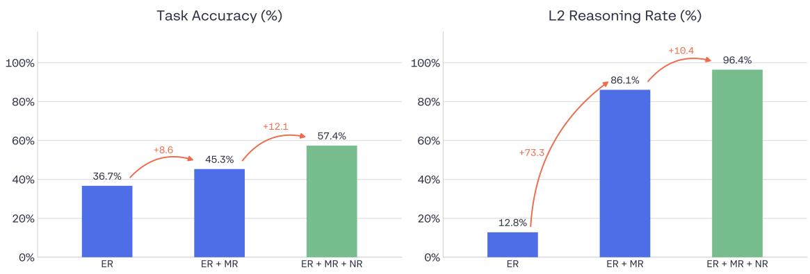  
Figure 9: Task accuracy and L2 reasoning rate both evolve as we add relevant data pillars: ER (English Reasoning), MR (Multilingual Reasoning), and NR (Non-Reasoning). ER was trained only with English Reasoning data. Adding Multilingual Reasoning data raises L2 Reasoning rate sharply as expected; and adding Non-Reasoning data further improves both metrics, shaping our final model, Tiny Aya L2-Thinker. Means are averaged across MGSM, PolyMath, MIST-OEG, Marco-Bench-MIF, and GlobalPIQA.

## 5.4 Data mixing beats sequential adaptation and merging

Strong English reasoning models are already available at various scales, so the cost of joint training from scratch and the need to tune data balances might appear unattractive for language expansion. We test whether lower-efort (1) merging of specialist single-language reasoners or (2) continued training on L2 data from an English reasoner are promising alternatives. We refer to § G for the details of this ablation but summarize the key findings here.

When we revisit the language coverage experiment (§ 5.1) with merging the 5 specialized models and sequential L2 training starting from English, we find that merging might be best for task accuracy, but collapses to reasoning entirely in English. Sequential training has the opposite efect: it excels on L2 reasoning but loses task accuracy in the process, and introduces unexpected language confusion in the reasoning trace. Data mixing represents a middle ground between both, ofering the best trade-of (Figure 11), plus a consistent fallback to English reasoning when L2 reasoning fails (Figure 12).

We also find that merging the final Tiny Aya L2-Thinker with Tiny Aya En-Thinker or sequential training of Tiny Aya En-Thinker on only L2 reasoning do not add any further benefits beyond the optimized data mixing for Tiny Aya L2-Thinker. Overall, this analysis indicates that initial integration of multilingual reasoning—rather than subsequent retrofitting—yields significant advantages in closing the multilingual reasoning gap.

## 5.5 Comparing contributions of each data pillar

As a final remark, Figure 9 draws a high-level view of how each of our three data pillars (ER, MR, and NR) contributes to advancing both performance and L2 reasoning rate. Trained on English reasoning data alone (ER), the model reaches only 36.7% task accuracy and reasons in the target language just 12.8% of the time: it solves a portion of problems but almost always thinks in English. Adding multilingual reasoning data (MR) raises the L2 reasoning rate sharply (to 86.1%), showing that multilingual reasoning traces play a major role in eliciting in-language reasoning. Adding non-reasoning data (NR) on top improves both axes: it raises the L2 reasoning rate further by helping the model generalize to languages for which it has seen no reasoning traces, and it lifts task accuracy by strengthening the model’s multilingual understanding.

## 6 Related Work

The language gap in multilingual reasoning has been approached from three diferent angles: leaving the reasoning trace in English (in whole or in part) while improving how non-English inputs are handled, steering the thinking language at inference time, and training models to reason natively in the target language.

## 6.1 Improving English reasoning models on multilingual inputs

One family of methods keeps reasoning in English by design and instead improves the model’s ability to process non-English inputs. Yoon et al. (2024) connect a frozen multilingual encoder to a frozen English-centric reasoner through a small set of trainable parameters, trained without any multilingual supervision; Huang et al. (2024) merge the reasoner’s internal capability with an external multilingual model via a learned mapping layer, and Ruan et al. (2025) extend this by fusing all encoder layers rather than only the top one. Uemura et al. (2026) add a multi-stage curriculum and report gains on low-resource language benchmarks.

A parallel line recomposes experts in parameter space rather than through a learned bridge: Bandarkar et al. (2025) introduce layer swapping for zero-shot cross-lingual transfer by interleaving the layers of a math expert and a language expert, and Li et al. (2026) make the interpolation between a reasoning model and a multilingual model steerable at inference. These methods consistently improve accuracy on mathematical reasoning tasks, but they are explicit that the intermediate reasoning remains predominantly English, and we are not aware of any that report the language of the reasoning trace among their metrics. The capability being transferred is therefore reasoning accuracy, not reasoning in the user’s language, which is the behavior we study.

A related thread accepts mixed-language reasoning as the target rather than an error mode. Son et al. (2026) propose Language-Mixed Chain-of-Thought (CoT), in which an English scafold is retained while entities and key terms stay in the target language, and show that this outperforms both English-only and target-only traces for Korean; Lin & Jurgens (2026) curate a code-switched reasoning corpus and train models to code-switch deliberately in a data-eficient way. These works share our premise that the language of the trace is a learned, controllable behavior, but they optimize for a hybrid trace, whereas we target traces that a monolingual user of the prompt language can read end to end.

## 6.2 Controlling reasoning language at inference

The distinction between reasoning in the input language and reasoning in English dates back to user-language-CoT versus English-CoT prompting (Shi et al., 2023), and to cross-lingual thought prompting, which explicitly instructs the model to restate the problem in English before reasoning (Huang et al., 2023). More recent work applies the same idea in the opposite direction, prompting reasoning models to think in a given language (“language forcing”) (Yong et al., 2025). Tam et al. (2025) show that large reasoning models default to a dominant language and that constraining them to the input language degrades accuracy on reasoning-intensive tasks, while helping on culturally grounded ones. Qi et al. (2025) formalize this as a trade-of: prompt-based control raises the rate at which models reason in the requested language and makes traces auditable, but costs accuracy, and the efect is strongest for lower-resource languages. Luo et al. (2025) document the complementary failure, of-target generation, and introduce two prompting baselines that seed the reasoning block in the target language, either with a discourse marker or by restating the question. Wang et al. (2025b) report the resulting picture at scale across 18 languages: general-purpose models keep input–output language consistency above 95%, whereas reasoning models are substantially lower, with the reasoning process the weakest point.

Inference-time control therefore succeeds only where a model can already sustain extended reasoning in the target language, and prompting redistributes probability mass toward that behavior rather than instilling it. The asymmetry reported by Wang et al. (2025b) makes this concrete: models comply with the directive in their final answer far more reliably than in the trace that precedes it, so the limiting factor is not instruction-following but the capacity to hold a chain of reasoning in-language, and this fails in the lower-resource regime we care about. We adopt language forcing applied to an English-only reasoner as our primary baseline.

## 6.3 Teaching L2 reasoning

An earlier generation of work translates English reasoning data—mostly mathematical— and updates the model, or parts of it, on the result. Chen et al. (2024) build a translated GSM8K training set and show that multilingual training also benefits English; Zhu et al. (2024) instead train question translation as an auxiliary task before English reasoning fine-tuning; Lai & Nissim (2024) translate and reformat CoT data across eleven languages and introduce reasoning consistency—whether a model reaches the same answer for the same question posed in diferent languages. We note tha this is agreement of outcomes under translation, and is orthogonal to the question of which language the trace itself is written in; the two can be high and low respectively, as language forcing makes clear. A recurring theme in this line is catastrophic forgetting, which motivates either updating only the layers responsible for multilinguality (Fan et al., 2025), moving to preference optimization over translated pairs (She et al., 2024), or careful distillation (Payoungkhamdee et al., 2024). More recently, Gurgurov et al. (2026) scale translate-train to a cross-domain parallel corpus in five languages and report that adapting a model to reason in one language largely preserves performance in others, evidence that the surface reasoning language can be changed without disturbing the underlying language-agnostic representations.

We share the translate-train premise of this line (§2.1), but difer in what is translated, how much of it, and what the translation is for. These works translate short-form mathematical CoT into a handful of languages to constitute the training set; we translate long-form reasoning traces, whose length and domain specificity make translation both costlier and more error-prone (§2.1), across 44 languages and three domains, and we treat the result as a deliberately scarce seed—under 5K samples per language—whose purpose is to measure how far L2 reasoning generalizes beyond the languages it covers. This changes what has to be controlled: we filter the English source for properties that survive translation poorly (§B), pair the translated traces with multilingual nonreasoning data in a dual-mode mixture rather than fine-tuning on translations alone, and, because catastrophic forgetting is answered here by mixture composition rather than by restricting the update or the objective, we test that choice directly against the alternatives this literature adopted (§5.4). Where these works report reasoning consistency, we report the language of the trace itself.

More recent work optimizes the reasoning language directly during post-training, with the main focus on RL with verifiable rewards. Zhang et al. (2026) reward strict language consistency over both thought and answer via reinforcement learning (RL), together with an alignment reward scoring non-English traces against the model’s own English trace. Similarly, Hwang et al. (2025) pair multilingual alignment with a consistency reward, and argue for benchmark scoring that should include the reasoning trace. Ki et al. (2026) question that mechanism from the evaluation side, decomposing multilingual traces into measurable features and finding that the association between a given feature and accuracy varies substantially across languages and can even reverse, so tha similarity to an English reference trace is a competitive but not universally correct target. We correspondingly supervise reasoning directly in the target language instead of scoring it against an English counterpart. Lee et al. (2025) take the narrower route of language-targeted RL for a single language (Korean), while at the other end of the spectrum one can remove the constraint on reasoning language altogether (Gao et al., 2026). Park et al. (2026) show that under verifiable reward RL the CoT collapses toward English as accuracy rises, that the collapse is severe for lower-resource languages and largely irreversible, and that a language-consistency reward mitigates the drift only at a measurable accuracy cost.

Huang et al. (2026) report that enforcing language consistency hurts crosslingual generalization, and Barua et al. (2026) train separate models per dataset and language and do not examine mixing. Both establish their result in the per-language specialist regime; Yang et al. (2025) point the other way, establishing a parallel scaling law under which jointly training multiple reasoning languages at once has a diminishing but beneficial efect on crosslingual generalization. Since the regime, not the objective, is what separates these results, we vary language coverage directly—one language, one region, all languages—holding everything else fixed, and find joint training transfers better than per-region specialists (§5.1), extending Yang et al.’s observation from RL to SFT.

A third perspective argues that the multilingual reasoning gap is not really about the reasoning language at all. Kang et al. (2026) attribute it to a failure to comprehend the source language, and show that translating only the inputs a model is likely to misunderstand recovers most of the benefit of translating everything; Ko et al. (2025) reach a similar conclusion for Korean mathematics, using English as an anchor for solving before translating back. Together these motivate why L2 reasoning is not free, and why we need to track and optimize task accuracy alongside L2 reasoning rate throughout.

Finally, a line of work changes the reasoning language by recomposing separately trained models in parameter space, rather than by training one model on mixed data. Lasbordes et al. (2026) extend the layer-swapping idea of §6.1 to long-CoT reasoning models, transferring a contiguous block of an English reasoning specialist into a native specialist trained from the same base. Following this line of work, we merge our own per-language specialists and find that averaging cancels each specialist’s language conditioning, collapsing the trace back to English at otherwise competitive accuracy (§5.4).

## 6.4 Existing reasoning data

The English bias becomes concrete in the language composition of the datasets that drive open reasoning models. The most widely adopted corpora contain reasoning traces exclusively in English: OpenThoughts3 (Guha et al., 2025) and the first release of NVIDIA’s Nemotron post-training data (Nathawani et al., 2025; Bercovich et al., 2025) are English-only. Tellingly, where multilingual data has been introduced, localization typically stops short of the reasoning trace itself: the v2 Nemotron release translates prompts and responses into five languages (Spanish, French, German, Italian, and Japanese) yet leaves the chain-of-thought, the very component that determines whether a user can follow the model’s reasoning, in English (NVIDIA, 2025). The same asymmetry holds for frontier models: DeepSeek-R1 is optimized for Chinese and English and may revert to English reasoning for queries in other languages (Guo et al., 2025), whereas Qwen3 does not release its posttraining data, leaving the language composition of its reasoning traces undisclosed altogether (Qwen Team et al., 2025). Only a handful of resources supervise reasoning directly in the target language: the M-Thinker SFT set spans five languages (Zhang et al., 2026), and Lightblue’s multilingual R1 corpus provides traces in roughly thirty (Lightblue, 2025), whose resulting models we adopt as a baseline. Non-English reasoning traces thus remain scarce, and even the eforts that localize the surrounding data most often leave the reasoning itself in English. We reduce this gap by releasing our multilingual reasoning data covering 44 languages besides English and three domains.

## 7 Conclusion

Reasoning is becoming a central capability of language models, yet the development of reasoning systems has remained overwhelmingly English-centric. In this work, we ask how we can optimize multilingual reasoning with minimal in-language reasoning supervision. Although dual-mode training is not the default mode in many existing large reasoning models, we show that pairing a small fraction of non-reasoning data with a large enough English reasoning dataset is a crucial pillar for achieving multilingual reasoning despite the scarcity of multilingual reasoning data.

Taken together, these findings point to a diferent way of thinking about multilingual reasoning. Reasoning capability and reasoning language are related but separable: a model can acquire the capability to solve complex problems from large-scale reasoning supervision while learning the language in which that reasoning is expressed through multilingual supervision. This distinction suggests that multilingual reasoning need not be built language by language. Instead, reasoning language can be treated as a transferable behavioral property that can be learned from a relatively small amount of multilingual reasoning data, reinforced through broader multilingual instruction, and generalized to languages without direct reasoning supervision. This provides a more scalable path toward reasoning systems that are not only capable across languages, but also able to reason in the language of the people who use them.

## 8 Limitations

Dependence on translated reasoning traces. Our multilingual reasoning supervision is created by translating English reasoning traces rather than creating target-language original reasoning from multilingual teachers or human annotators. While we filter for translation quality, this pipeline inevitably anchors reasoning style, cultural framing, and problem decomposition to English templates. For low-resource languages translation quality degrades and may not reflect how speakers naturally approach multi-step deduction.

Evaluation through automatic proxies. We measure L2 reasoning rate and open-ended generation quality automatically and do not conduct human evaluations of reasoning trace quality, fluency, or cultural appropriateness. Consequently, our metrics capture linguistic compliance rather than the depth, coherence, or usefulness of the reasoning itself.

Prompt sensitivity. Our reported L2 reasoning rates rely on prepending an explicit instruction to the user prompt (“Think in the same language as the prompt”) that the model sees in training, and without this trigger the model may revert to English. This sensitivity implies that deployment contexts with constrained system prompting, ambiguous language signals, or mixed-language inputs may see degraded performance.

## Acknowledgements

We thank David Stap for his thoughtful feedback on the paper, and Maximilian Mozes, Ammar Khairi, Kelly Marchisio, and Nikita Moghe for early discussions that informed this work. We are

also grateful to Sara Rajaee and Saurabh Dash for their technical assistance; and to David Cairuz, Sammie Bae, Diana Abagyan, Björn Bebensee, Sylvie Shi and Pierre Beaulieu for their support on the long context extension procedure.

## References

Diana Abagyan, Alejandro R. Salamanca, Andres Felipe Cruz-Salinas, Kris Cao, Hangyu Lin, Acyr Locatelli, Marzieh Fadaee, Ahmet Üstün, and Sara Hooker. One tokenizer to rule them all: Emergent language plasticity via multilingual tokenizers. In Maria Liakata, Viviane P. Moreira, Jiajun Zhang, and David Jurgens (eds.), Proceedings of the 64th Annual Meeting of the Association for Computational Linguistics (Volume 1: Long Papers), pp. 3118–3136, San Diego, California, United States, July 2026. Association for Computational Linguistics. ISBN 979-8-89176-390-6. doi: 10.18653/v1/2026.acl-long.141. URL https://aclanthology.org/2026.acl-long.141/.

Orevaoghene Ahia, Sachin Kumar, Hila Gonen, Jungo Kasai, David Mortensen, Noah Smith, and Yulia Tsvetkov. Do all languages cost the same? tokenization in the era of commercial language models. In Houda Bouamor, Juan Pino, and Kalika Bali (eds.), Proceedings ofthe 2023 Conference on Empirical Methods in Natural Language Processing, pp. 9904–9923, Singapore, December 2023. Association for Computational Linguistics. doi: 10.18653/v1/2023.emnlp-main.614. URL https://aclanthology.org/2023.emnlp-main.614/.

Elie Bakouch, Loubna Ben Allal, Anton Lozhkov, Nouamane Tazi, Lewis Tunstall, Carlos Miguel Patiño, Edward Beeching, Aymeric Roucher, Aksel Joonas Reedi, Quentin Gallouédec, Kashif Rasul, Nathan Habib, Clémentine Fourrier, Hynek Kydlicek, Guilherme Penedo, Hugo Larcher, Mathieu Morlon, Vaibhav Srivastav, Joshua Lochner, Xuan-Son Nguyen, Colin Rafel, Leandro von Werra, and Thomas Wolf. SmolLM3: smol, multilingual, long-context reasoner. https: //huggingface.co/blog/smollm3, 2025.

Lucas Bandarkar, Benjamin Muller, Pritish Yuvraj, Rui Hou, Nayan Singhal, Hongjiang Lv, and Bing Liu. Layer swapping for zero-shot cross-lingual transfer in large language models. In The Thirteenth International Conference on Learning Representations, 2025. URL https://openre view.net/forum?id=vQhn4wrQ6j.

Josh Barua, Seun Eisape, Kayo Yin, and Alane Suhr. Long chain-of-thought reasoning across languages. In The Fourteenth International Conference on Learning Representations, 2026. URL https://openreview.net/forum?id=2kKXbsRhYI.

Akhiad Bercovich, Itay Levy, Izik Golan, Mohammad Dabbah, Ran El-Yaniv, Omri Puny, Ido Galil, Zach Moshe, Tomer Ronen, Najeeb Nabwani, Ido Shahaf, Oren Tropp, Ehud Karpas, Ran Zilberstein, Jiaqi Zeng, Soumye Singhal, Alexander Bukharin, Yian Zhang, Tugrul Konuk, Gerald Shen, Ameya Sunil Mahabaleshwarkar, Bilal Kartal, Yoshi Suhara, Olivier Delalleau, Zijia Chen, Zhilin Wang, David Mosallanezhad, Adi Renduchintala, Haifeng Qian, Dima Rekesh, Fei Jia, Somshubra Majumdar, Vahid Noroozi, Wasi Uddin Ahmad, Sean Narenthiran, Aleksander Ficek, Mehrzad Samadi, Jocelyn Huang, Siddhartha Jain, Igor Gitman, Ivan Moshkov, Wei Du, Shubham Toshniwal, George Armstrong, Branislav Kisacanin, Matvei Novikov, Daria Gitman, Evelina Bakhtu rina, Jane Polak Scowcroft, John Kamalu, Dan Su, Kezhi Kong, Markus Kliegl, Rabeeh Karimi, Ying Lin, Sanjeev Satheesh, Jupinder Parmar, Pritam Gundecha, Brandon Norick, Joseph Jennings, Shrimai Prabhumoye, Syeda Nahida Akter, Mostofa Patwary, Abhinav Khattar, Deepak Narayanan, Roger Walefe, Jimmy Zhang, Bor-Yiing Su, Guyue Huang, Terry Kong, Parth Chadha, Sahil Jain, Christine Harvey, Elad Segal, Jining Huang, Sergey Kashirsky, Robert Mc-Queen, Izzy Putterman, George Lam, Arun Venkatesan, Sherry Wu, Vinh Nguyen, Manoj Kilaru, Andrew Wang, Anna Warno, Abhilash Somasamudramath, Sandip Bhaskar, Maka Dong, Nave

Assaf, Shahar Mor, Omer Ullman Argov, Scot Junkin, Oleksandr Romanenko, Pedro Larroy, Monika Katariya, Marco Rovinelli, Viji Balas, Nicholas Edelman, Anahita Bhiwandiwalla, Muthu Subramaniam, Smita Ithape, Karthik Ramamoorthy, Yuting Wu, Suguna Varshini Velury, Omri Almog, Joyjit Daw, Denys Fridman, Erick Galinkin, Michael Evans, Katherine Luna, Leon Derczynski, Nikki Pope, Eileen Long, Seth Schneider, Guillermo Siman, Tomasz Grzegorzek, Pablo Ribalta, Monika Katariya, Joey Conway, Trisha Saar, Ann Guan, Krzysztof Pawelec, Shyamala Prayaga, Oleksii Kuchaiev, Boris Ginsburg, Oluwatobi Olabiyi, Kari Briski, Jonathan Cohen, Bryan Catanzaro, Jonah Alben, Yonatan Geifman, Eric Chung, and Chris Alexiuk. Llamanemotron: Eficient reasoning models, 2025. URL https://arxiv.org/abs/2505.00949.

Nicolas Boizard, Hippolyte Gisserot-Boukhlef, Kevin El Haddad, Céline Hudelot, and Pierre Colombo. Scale or reason? a compute-equivalent analysis of reasoning distillation, 2026. URL https://arxiv.org/abs/2509.22193.

Rich Caruana. Multitask learning. Machine learning, 28(1):41–75, 1997.

Tyler A. Chang, Catherine Arnett, Abdelrahman Sadallah, Abdelrahman Eldesokey, Abeer Kashar, Abolade Daud, Abosede Grace Olanihun, Adamu Labaran Mohammed, Adeyemi Praise, Adhikarimayum Meerajita Sharma, Aditi Gupta, Adril Putra Merin, Adwoa Bremang, Afitab Iyigun, Afonso Simplício, Ahmed Essouaied, Aicha Chorana, Akhil Eppa, Akintunde Oladipo, Akriti Kuri, Akshay Ramesh, Aleksei Dorkin, Alfred Malengo Kondoro, Alham Fikri Aji, Ali Eren Çetintaş, Allan Hanbury, Alou Dembele, Alp Niksarli, Álvaro Arroyo, Amin Bajand, Amol Khanna, Ana Chkhaidze, Ana Carolina Condez, Anamaria-Roberta Hartl, Andiswa Mkhonto, Andrew Hoblitzell, Andrew Tran, Angelos Poulis, Anirban Majumder, Anjali Chaudhary, Anna Vacalopoulou, Annette Kuuipolani Kanahele Wong, Annika Simonsen, Anton Kovalev, Anupam Nayak, Ashvanth S, Ayodeji Lana, Ayu Purwarianti, Bashar Alhafni, Benedict Busole, Bernard Ghanem, Bharti Nathani, Biljana Stojanovska Đurić, Blessing Ogundipe, Bolaotan Agbonile, Bragi Bergsson, Bruce Torres Fischer, Burak Tutar, Burcu Çınar, Cade Kane, Can Udomcharoenchaikit, Chadi Helwe, Chaithra Reddy Nerella, Chen Cecilia Liu, Chiamaka Nwokolo, Christopher Homan, Clément Sampebgo, Cristina España-Bonet, Cynthia Amol, Daeyoep Lee, Dan Saattrup Smart, Dana Arad, Daniil Dzenhaliou, Dasol Choi, David Liu, David Semedo, David Anugraha, Deborah Popoola, Deividas Mataciunas, Delphine Nyaboke, Dennis Owusu, Dhyuthy Krishna Kumar, Diogo Tavares, Diogo Glória-Silva, Divyanshu Goyal, DongGeon Lee, E. Kelly Buchanan, Ebele Nwamaka Anajemba, Egonu Ngozi Grace, Elena Mickel, Elias Herranen, Eliza Acharya, Eman Nisar, Emile Anand, Emmanuel Habumuremyi, Emuobonuvie Maria Ajiboye, Eryawan Presma Yulianrifat, Esther Adenuga, Ewa Rudnicka, Faith Itiola, Faran Taimoor Butt, Fareeha Fayyaz Sheikh, Fathima Thekkekara, Fatima Haouari, Faustin Nsengiyumva, Fenal Ashokbhai Ilasariya, Filbert Aurelian Tjiaranata, Firas Laakom, Francesca Grasso, Francesco Periti, Francesco Orabona, Gbenga Kayode Solomon, Genta Indra Winata, Gia Nghia Ngo, Gloria Udhedhe-oze, Gonçalo Vinagre, Gopi Naga Sai Ram Challagolla, Gorka Urbizu-Garmendia, Gouthami Vadithya, Guijin Son, Gulnaz Abdykadyrova, Gyan Swaroop Mohapatra, Hafeez Ullah, Hafsteinn Einarsson, Hai Hu, Hamidreza Safari, Hamza Zaidi, Haopeng Zhang, Harethah Abu Shairah, Harry Vuong, Hele-Andra Kuulmets, Hitesh Laxmichand Pa tel, Houda Bouamor, Hwanjo Yu, Iben Nyholm Debess, İbrahim Ethem Deveci, Ikhlasul Akmal Hanif, Ikhyun Cho, Inês Vieira, Inês Calvo, Isaac Manzi, Ismael Illa Salifou, Ismail Daud, Ismail Yusuf, Itay Itzhak, Ivan Zhelyazkov, Ivan Belashkin, Ivan Spada, Jacob Brinton, Jafar Isbarov, Jaka Čibej, Jan Kocoń, Jan Cuhel, Jauza Krito, Jebish Purbey, Jennifer Za, Jennifer Mickel, Jenny Kunz, Jessica Ratovondranto, Jeyarajalingam Varsha, Jihae Jeong, Jimena Tena Dávalos, Jinu Lee, João Magalhães, John Seon Keun Yi, Jongin Kim, Joseph Chataignon, Joseph Marvin Imperial, Jubeerathan Thevakumar, Judith Land, Julia Alekseenko, Junchen Jiang, Jungwhan Kim, Kairit Sirts, Kamesh R, Kamesh V, Kanda Tshinu, Kätriin Kukk, Kaustubh Ponkshe, Kavsar Huseynova, Ke He, Kenneth Enevoldsen, Kent Joshua Alvarez, Kerem Zaman, Khalil

Mrini, Kian Kyars, Komal Gour, Krishnakumar Lainitha, Krister Kruusmaa, Kunal Mukherjee, Kusum Chouhan, Laura Castro, Laura M. Porrino-Moscoso, Lenny Sivi Za Nzambi, Leshem Choshen, Levent Sencan, Lilja Øvrelid, Lisa Alazraki, Loretta Oma Jones, Lovina Ehimen-Ugbede, Luheerathan Thevakumar, Luxshan Thavarasa, Mahnoor Malik, Mamadou K. Keita, Mansi Jangid, Marco De Santis, Marcos Garcia, Marek Šuppa, Mariam D’Ciofalo, Marii Ojastu, Marium Attaullah, Maryam Sikander, Mausami Narayan, Maximos Skandalis, Mehak Mehak, Mehmet İlteriş Bozkurt, Melaku Bayu, Menan Velayuthan, Mhasilenuo Vizo, Michael Leven thal, Michał Marcińczuk, Mina Almasi, Mirna Potočnjak, Mithil Bangera, Mohammadamin Shafiei, Mohiba Ansari, Mridul Sharma, Mrityunjaya Indoria, Mughees Ur Rehman, Muhammad Ravi Shulthan Habibi, Murat Kolić, Murat Barkın Kınay, Nada Galant, Naina Singh Rathore, Naphat Permpredanun, Narada Maugin, Nathalie Norman, Nicholas Kluge Corrêa, Nikola Ljubešić, Nirmal Thomas, Nisansa de Silva, Nisheeth Joshi, Nitish Ponkshe, Nizar Habash, Nneoma Udeze, Noel Thomas, Noémi Ligeti-Nagy, Nouhoum Coulibaly, Odunayo Ogundepo, Odunayo Kareemat Buliaminu, Oghojafor Godswill Fejiro, Okechukwu God’spraise, Olanrewaju Samuel, Olaoye Deborah Oluwaseun, Olasoji Akindejoye, Olga Snissarenko, Onyinye Anulika Chiemezie, Orkun Kınay, Osman Tursun, Oyelade Oluwafemi Joshua, Oyesanmi Fiyinfoluwa, Pablo Rodríguez, Pablo Gamallo, Palak Arora, Pedro Valente, Peter Rupnik, Philip Oghenesuowho Ekiugbo, Prakhar Agarwal, Pramit Sahoo, Prokopis Prokopidis, Pua Niau-Puhipau, Quadri Yahya, Rachele Mignone, Raghav Singhal, Rahul Raja, Ram Mohan Rao Kadiyala, Raphael Merx, Rasmus Larsen, Ratnavel Rajalakshmi, Rishav Ghosh, Romina Oji, Ron Kekeha Solis, Rui Guerra, Rushikesh Zawar, Sa’ad Nasir Bashir, Saeed Alzaabi, Sahil Sandeep, Sai Pavan Batchu, Sai Sandeep Kantareddy, Saleha Muzammil, Salsabila Zahirah Pranida, Sam Buchanan, Samuel Rutunda, Sander Land, Sarah Sulollari, Sardar Ali, Saroj Sapkota, Sarveswaran Kengatharaiyer, Saulius Tautvaisas, Sayambhu Sen, Sayantani Banerjee, Sebastien Diarra, Segun Afolayan, Senthilnathan M, Sewoong Lee, Shaan Shah, Shankar Venkitachalam, Sharifa Djurabaeva, Sharon Ibejih, Shivanya Shomir Dutta, Siddhant Gupta, Silvia Paniagua Suárez, Sina Ahmadi, Sivasuthan Sukumar, Siyuan Song, Snegha A, Sokratis Sofianopoulos, Sona Elza Simon, Sonja Benčina, Sophie Gvasalia, Sphurti More, Spyros Dragazis, Stefan Milosavljević, Stephan P. Kaufhold, Suba S, Sultan Alrashed, Surangika Ranathunga, Taiga Someya, Taja Kuzman Pungeršek, Tal Haklay, Tasi’u Jibril, Tatsuya Aoyama, Tea Abashidze, Terenz Jomar Dela Cruz, Terra Blevins, Themistoklis Nikas, Theresa Idoko, Thu Mai Do, Tilek Chubakov, Tina Munda, Tobiloba Owoeye, Tommaso Gargiani, Uma Rathore, Uni Johannesen, Uwuma Ugwu, Vallerie Alexandra Putra, Vanya Bannihatti Kumar, Varvara Arzt, Vasily Konovalov, Vasudevan Nedumpozhimana, Viktoria Ondrejova, Viktoryia Horbik, Vishnu Vardhan Reddy Kummitha, Vuk Dinić, Walelign Sewunetie, Winston Wu, Xiaojing Zhao, Yacouba Diarra, Yaniv Nikankin, Yash Mathur, Yash Bagla, Yeshil Bangera, Yixi Chen, Yiyuan Li, Yolanda Xavier, Yonatan Belinkov, Zaid Alyafeai, Zhargal Batozargalova, Zhengyang Shan, Zhi Rui Tam, Zilu Tang, Zuzana Nadova, Baber Abbasi, Stella Biderman, David Stap, Duygu Ataman, Fabian Schmidt, Hila Gonen, Jiayi Wang, and David Ifeoluwa Adelani. Global piqa: Evaluating commonsense reasoning across 100+ languages and cultures, 2026. URL https://arxiv.org/abs/2510.24081.

Nuo Chen, Zinan Zheng, Ning Wu, Ming Gong, Dongmei Zhang, and Jia Li. Breaking language barriers in multilingual mathematical reasoning: Insights and observations. In Yaser Al-Onaizan, Mohit Bansal, and Yun-Nung Chen (eds.), Findings of the Association for Computational Linguistics: EMNLP 2024, pp. 7001–7016, Miami, Florida, USA, November 2024. Association for Computational Linguistics. doi: 10.18653/v1/2024.findings-emnlp.411. URL https://aclanthology.org/2024.findings-emnlp.411/.

Yanda Chen, Joe Benton, Ansh Radhakrishnan, Jonathan Uesato, Carson Denison, John Schulman, Arushi Somani, Peter Hase, Misha Wagner, Fabien Roger, Vlad Mikulik, Samuel R. Bowman,

Jan Leike, Jared Kaplan, and Ethan Perez. Reasoning models don’t always say what they think, 2025. URL https://arxiv.org/abs/2505.05410.

Alexis Conneau, Kartikay Khandelwal, Naman Goyal, Vishrav Chaudhary, Guillaume Wenzek, Francisco Guzmán, Edouard Grave, Myle Ott, Luke Zettlemoyer, and Veselin Stoyanov. Unsupervised cross-lingual representation learning at scale. In Dan Jurafsky, Joyce Chai, Natalie Schluter, and Joel Tetreault (eds.), Proceedings of the 58th Annual Meeting of the Association for Computational Linguistics, pp. 8440–8451, Online, July 2020. Association for Computational Linguistics. doi: 10.18653/v1/2020.acl-main.747. URL https://aclanthology.org/2020.acl-main.747/.

DeepSeek-AI, Anyi Xu, Bangcai Lin, Bing Xue, Bingxuan Wang, Bingzheng Xu, Bochao Wu, Bowei Zhang, Chaofan Lin, Chen Dong, Chenchen Ling, Chengda Lu, Chenggang Zhao, Chengqi Deng, Chengyu Hou, Chenhao Xu, Chenze Shao, Chong Ruan, Conner Sun, Damai Dai, Daya Guo, Dejian Yang, Deli Chen, Donghao Li, Dongjie Ji, Erhang Li, Fang Wei, Fangyun Lin, Fangzhou Yuan, Feiyu Xia, Fucong Dai, Guangbo Hao, Guanting Chen, Guoai Cao, Guolai Meng, Guowei Li, Han Yu, Han Zhang, Hanwei Xu, Hao Li, Haofen Liang, Haoling Zhang, Haoming Luo, Haoran Wei, Haotian Yuan, Haowei Zhang, Haowen Luo, Haoyu Chen, Haozhe Ji, Hengqing Zhang, Honghui Ding, Hongxuan Tang, Huanqi Cao, Huazuo Gao, Hui Qu, Hui Zeng, J Yang, JQ Zhu, Jia Luo, Jia Song, Jia Yu, Jialiang Huang, Jialu Cai, Jian Liang, Jiangting Zhou, Jiasheng Ye, Jiashi Li, Jiaxin Xu, Jiewen Hu, Jieyu Yang, Jin Chen, Jin Yan, Jingchang Chen, Jingli Zhou, Jingting Xiang, Jingyang Yuan, Jingyuan Cheng, Jingzi Zhou, Jinhua Zhu, Jiping Yu, Joseph Sun, Jun Ran, Junguang Jiang, Junjie Qiu, Junlong Li, Junmin Zheng, Junxiao Song, Kai Dong, Kaige Gao, Kang Guan, Kexing Zhou, Kezhao Huang, Kuai Yu, Lean Wang, Lecong Zhang, Lei Wang, Leyi Xia, Li Zhang, Liang Zhao, Lihua Guo, Lingxiao Luo, Linwang Ma, Linyan Zhu, Litong Wang, Liyu Cai, Liyue Zhang, Longhao Chen, MS Di, MY Xu, Max Mei, Miaojun Wang, Mingchuan Zhang, Minghua Zhang, Minghui Tang, Mingming Li, Mingxu Zhou, Minmin Han, Ning Wang, Panpan Huang, Panpan Wang, Peixin Cong, Peiyi Wang, Peng Zhang, Qiancheng Wang, Qihao Zhu, Qingyang Li, Qinyu Chen, Qiushi Du, Qiwei Jiang, Rui Tian, Ruifan Xu, Ruijie Lu, Ruiling Xu, Ruiqi Ge, Ruisong Zhang, Ruizhe Pan, Runji Wang, Runqian Chen, Runqiu Yin, Runxin Xu, Ruomeng Shen, Ruoyu Zhang, Ruyi Chen, SH Liu, Shanghao Lu, Shangmian Sun, Shangyan Zhou, Shanhuang Chen, Shaofei Cai, Shaoheng Nie, Shaoqing Wu, Shaoyuan Chen, Shengding Hu, Shengyu Liu, Shiqiang Hu, Shirong Ma, Shiyu Wang, Shuiping Yu, Shunfeng Zhou, Shuting Pan, Shuying Yu, Songyang Zhou, Tao Ni, Tao Yun, Tian Jin, Tian Pei, Tian Ye, Tianle Lin, Tianran Ji, Tianyi Cui, Tianyuan Yue, Tingting Yu, Tun Wang, W Zhang, WL Xiao, Wangding Zeng, Wei An, Weilin Zhao, Wen Liu, Wenfeng Liang, Wenjie Pang, Wenjing Luo, Wenjing Yao, Wenjun Gao, Wenkai Yang, Wenlve Huang, Wenqing Hou, Wentao Zhang, Wenting Ma, Xi Gao, Xiang He, Xiangwen Wang, Xianzu Wang, Xiao Bi, Xiaodong Liu, Xiaohan Wang, Xiaokang Chen, Xiaokang Zhang, Xiaotao Nie, Xiaowen Sun, Xiaoxiang Wang, Xin Cheng, Xin Liu, Xin Xie, Xingchao Liu, Xingchen Liu, Xingkai Yu, Xingyou Li, Xinyu Yang, Xinyu Zhang, Xu Chen, Xuanyu Wang, Xuecheng Su, Xueyin Chen, Xuheng Lin, Xuwei Fu, YC Yan, YQ Wang, YW Ma, Yanfeng Luo, Yang Zhang, Yanhong Xu, Yanru Ma, Yanwen Huang, Yao Li, Yao Li, Yao Xu, Yao Zhao, Yaofeng Sun, Yaohui Wang, Yi Qian, Yi Shao, Yi Yu, Yichao Zhang, Yifan Ding, Yifan Shi, Yijia Wu, Yiliang Xiong, Yiling Ma, Ying He, Ying Tang, Ying Zhou, Yingjia Luo, Yinmin Zhong, Yishi Piao, Yisong Wang, Yixiang Zhang, Yixiao Chen, Yixuan Tan, Yixuan Wei, Yiyang Ma, Yiyuan Liu, Yonglun Yang, Yongqiang Guo, Yongtong Wu, Yu Wu, YuKun Li, Yuan Cheng, Yuan Ou, Yuanfan Xu, Yuanhao Li, Yuduan Wang, Yuehan Yang, Yuer Xu, Yuhan Wu, Yuhao Meng, Yuheng Zou, Yukun Zha, Yunfan Xiong, Yupeng Chen, Yuping Lin, Yuqian Cao, Yuqian Wang, Yushun Zhang, Yuting Yan, Yutong Lin, Yuxian Gu, Yuxiang Luo, Yuxiang You, Yuxuan Liu, Yuxuan Zhou, Yuyang Zhou, Yuzhen Huang, ZF Wu, Zehao Wang, Zehua Zhao, Zehui Ren, Zekai Zhang, Zhangli Sha, Zhe Fu, Zhe Ju, Zhean Xu, Zhenda Xie, Zhengyan Zhang, Zheren Gao, Zhewen Hao, Zhibin

Gou, Zhicheng Ma, Zhigang Yan, Zhihong Shao, Zhixian Huang, Zhixuan Chen, Zhiyu Wu, Zhizhou Ren, Zhongyu Wu, Zhuoshu Li, Zhuping Zhang, Zian Xu, Zihao Wang, Zihua Qu, Zihui Gu, Zijia Zhu, Zilin Li, Zipeng Zhang, Ziwei Xie, Ziyi Gao, Ziyi Wan, Zizheng Pan, and Zongqing Yao. Deepseek-v4: Towards highly eficient million-token context intelligence, 2026. URL https://arxiv.org/abs/2606.19348.

Alaa Elsetohy, Sama Hadhoud, Haryo Akbarianto Wibowo, Chenxi Whitehouse, Genta Indra Winata, Fajri Koto, and Alham Fikri Aji. Macaron: Controlled, human-written benchmark for multilingual and multicultural reasoning via template-filling. In Maria Liakata, Viviane P. Moreira, Jiajun Zhang, and David Jurgens (eds.), Proceedings of the 64th Annual Meeting of the Association for Computational Linguistics (Volume 1: Long Papers), pp. 47885–47906, San Diego, California, United States, July 2026. Association for Computational Linguistics. ISBN 979-8-89176-390-6. doi: 10.18653/v1/2026.acl-long.2211. URL https://aclanthology.org/2 026.acl-long.2211/.

Yuchun Fan, Yongyu Mu, YiLin Wang, Lei Huang, Junhao Ruan, Bei Li, Tong Xiao, Shujian Huang, Xiaocheng Feng, and Jingbo Zhu. SLAM: Towards eficient multilingual reasoning via selective language alignment. In Owen Rambow, Leo Wanner, Marianna Apidianaki, Hend Al-Khalifa, Barbara Di Eugenio, and Steven Schockaert (eds.), Proceedings of the 31st International Conference on Computational Linguistics, pp. 9499–9515, Abu Dhabi, UAE, January 2025. Association for Computational Linguistics. URL https://aclanthology.org/2025.coling-main.637/.

Pietro Ferrazzi, Aitor Soroa, and Rodrigo Agerri. Multilingual medical reasoning for question answering with large language models, 2026. URL https://arxiv.org/abs/2512.05658.

Yao Fu, Rameswar Panda, Xinyao Niu, Xiang Yue, Hannaneh Hajishirzi, Yoon Kim, and Hao Peng. Data engineering for scaling language models to 128k context. In Proceedings of the 41st International Conference on Machine Learning, ICML’24. JMLR.org, 2024.

Changjiang Gao, Zixian Huang, Kaichen Yang, Jiajun Chen, Jixing Li, and Shujian Huang. Explang: Improved exploration and exploitation in llm reasoning with on-policy thinking language selection, 2026. URL https://arxiv.org/abs/2602.21887.

Gemma Team, Aishwarya Kamath, Johan Ferret, Shreya Pathak, Nino Vieillard, Ramona Merhej, Sarah Perrin, Tatiana Matejovicova, Alexandre Ramé, Morgane Rivière, Louis Rouillard, Thomas Mesnard, Geofrey Cideron, Jean bastien Grill, Sabela Ramos, Edouard Yvinec, Michelle Casbon, Etienne Pot, Ivo Penchev, Gaël Liu, Francesco Visin, Kathleen Kenealy, Lucas Beyer, Xiaohai Zhai, Anton Tsitsulin, Robert Busa-Fekete, Alex Feng, Noveen Sachdeva, Benjamin Coleman, Yi Gao, Basil Mustafa, Iain Barr, Emilio Parisotto, David Tian, Matan Eyal, Colin Cherry, Jan-Thorsten Peter, Danila Sinopalnikov, Surya Bhupatiraju, Rishabh Agarwal, Mehran Kazemi, Dan Malkin, Ravin Kumar, David Vilar, Idan Brusilovsky, Jiaming Luo, Andreas Steiner, Abe Friesen, Abhanshu Sharma, Abheesht Sharma, Adi Mayrav Gilady, Adrian Goedeckemeyer, Alaa Saade, Alex Feng, Alexander Kolesnikov, Alexei Bendebury, Alvin Abdagic, Amit Vadi, András György, André Susano Pinto, Anil Das, Ankur Bapna, Antoine Miech, Antoine Yang, Antonia Paterson, Ashish Shenoy, Ayan Chakrabarti, Bilal Piot, Bo Wu, Bobak Shahriari, Bryce Petrini, Charlie Chen, Charline Le Lan, Christopher A. Choquette-Choo, CJ Carey, Cormac Brick, Daniel Deutsch, Danielle Eisenbud, Dee Cattle, Derek Cheng, Dimitris Paparas, Divyashree Shivakumar Sreepathihalli, Doug Reid, Dustin Tran, Dustin Zelle, Eric Noland, Erwin Huizenga, Eugene Kharitonov, Frederick Liu, Gagik Amirkhanyan, Glenn Cameron, Hadi Hashemi, Hanna Klimczak-Plucińska, Harman Singh, Harsh Mehta, Harshal Tushar Lehri, Hussein Hazimeh, Ian Ballantyne, Idan Szpektor, Ivan Nardini, Jean Pouget-Abadie, Jetha Chan, Joe Stanton, John Wieting, Jonathan Lai, Jordi Orbay, Joseph Fernandez, Josh Newlan, Ju yeong Ji, Jyotinder Singh, Kat Black, Kathy Yu, Kevin Hui, Kiran Vodrahalli, Klaus Gref, Linhai Qiu, Marcella

Valentine, Marina Coelho, Marvin Ritter, Matt Hofman, Matthew Watson, Mayank Chaturvedi, Michael Moynihan, Min Ma, Nabila Babar, Natasha Noy, Nathan Byrd, Nick Roy, Nikola Momchev, Nilay Chauhan, Noveen Sachdeva, Oskar Bunyan, Pankil Botarda, Paul Caron, Paul Kishan Rubenstein, Phil Culliton, Philipp Schmid, Pier Giuseppe Sessa, Pingmei Xu, Piotr Stanczyk, Pouya Tafti, Rakesh Shivanna, Renjie Wu, Renke Pan, Reza Rokni, Rob Willoughby, Rohith Vallu, Ryan Mullins, Sammy Jerome, Sara Smoot, Sertan Girgin, Shariq Iqbal, Shashir Reddy, Shruti Sheth, Siim Põder, Sijal Bhatnagar, Sindhu Raghuram Panyam, Sivan Eiger, Susan Zhang, Tianqi Liu, Trevor Yacovone, Tyler Liechty, Uday Kalra, Utku Evci, Vedant Misra, Vincent Roseberry, Vlad Feinberg, Vlad Kolesnikov, Woohyun Han, Woosuk Kwon, Xi Chen, Yinlam Chow, Yuvein Zhu, Zichuan Wei, Zoltan Egyed, Victor Cotruta, Minh Giang, Phoebe Kirk, Anand Rao, Kat Black, Nabila Babar, Jessica Lo, Erica Moreira, Luiz Gustavo Martins, Omar Sanseviero, Lucas Gonzalez, Zach Gleicher, Tris Warkentin, Vahab Mirrokni, Evan Senter, Eli Collins, Joelle Barral, Zoubin Ghahramani, Raia Hadsell, Yossi Matias, D. Sculley, Slav Petrov, Noah Fiedel, Noam Shazeer, Oriol Vinyals, Jef Dean, Demis Hassabis, Koray Kavukcuoglu, Clement Farabet, Elena Buchatskaya, Jean-Baptiste Alayrac, Rohan Anil, Dmitry, Lepikhin, Sebastian Borgeaud, Olivier Bachem, Armand Joulin, Alek Andreev, Cassidy Hardin, Robert Dadashi, and Léonard Hussenot. Gemma 3 technical report. arXiv preprint arXiv:2503.19786, 2025.

Akash Ghosh, Debayan Datta, Sriparna Saha, and Chirag Agarwal. A survey of multilingual reasoning in language models. In Christos Christodoulopoulos, Tanmoy Chakraborty, Carolyn Rose, and Violet Peng (eds.), Findings of the Association for Computational Linguistics: EMNLP 2025, pp. 8920–8936, Suzhou, China, November 2025. Association for Computational Linguistics. ISBN 979-8-89176-335-7. doi: 10.18653/v1/2025.findings-emnlp.474. URL https://aclantho logy.org/2025.findings-emnlp.474/.

Etash Guha, Ryan Marten, Sedrick Keh, Negin Raoof, Georgios Smyrnis, Hritik Bansal, Marianna Nezhurina, Jean Mercat, Trung Vu, Zayne Sprague, Ashima Suvarna, Benjamin Feuer, Liangyu Chen, Zaid Khan, Eric Frankel, Sachin Grover, Caroline Choi, Niklas Muennighof, Shiye Su, Wanjia Zhao, John Yang, Shreyas Pimpalgaonkar, Kartik Sharma, Charlie Cheng-Jie Ji, Yichuan Deng, Sarah Pratt, Vivek Ramanujan, Jon Saad-Falcon, Jefrey Li, Achal Dave, Alon Albalak, Kushal Arora, Blake Wulfe, Chinmay Hegde, Greg Durrett, Sewoong Oh, Mohit Bansal, Saadia Gabriel, Aditya Grover, Kai-Wei Chang, Vaishaal Shankar, Aaron Gokaslan, Mike A. Merrill, Tatsunori Hashimoto, Yejin Choi, Jenia Jitsev, Reinhard Heckel, Maheswaran Sathiamoorthy, Alexandros G. Dimakis, and Ludwig Schmidt. Openthoughts: Data recipes for reasoning models, 2025. URL https://arxiv.org/abs/2506.04178.

Daya Guo, Dejian Yang, Haowei Zhang, Junxiao Song, Peiyi Wang, Qihao Zhu, Runxin Xu, Ruoyu Zhang, Shirong Ma, Xiao Bi, Xiaokang Zhang, Xingkai Yu, Yu Wu, Z. F. Wu, Zhibin Gou, Zhihong Shao, Zhuoshu Li, Ziyi Gao, Aixin Liu, Bing Xue, Bingxuan Wang, Bochao Wu, Bei Feng, Chengda Lu, Chenggang Zhao, Chengqi Deng, Chong Ruan, Damai Dai, Deli Chen, Dongjie Ji, Erhang Li, Fangyun Lin, Fucong Dai, Fuli Luo, Guangbo Hao, Guanting Chen, Guowei Li, H. Zhang, Hanwei Xu, Honghui Ding, Huazuo Gao, Hui Qu, Hui Li, Jianzhong Guo, Jiashi Li, Jingchang Chen, Jingyang Yuan, Jinhao Tu, Junjie Qiu, Junlong Li, J. L. Cai, Jiaqi Ni, Jian Liang, Jin Chen, Kai Dong, Kai Hu, Kaichao You, Kaige Gao, Kang Guan, Kexin Huang, Kuai Yu, Lean Wang, Lecong Zhang, Liang Zhao, Litong Wang, Liyue Zhang, Lei Xu, Leyi Xia, Mingchuan Zhang, Minghua Zhang, Minghui Tang, Mingxu Zhou, Meng Li, Miaojun Wang, Mingming Li, Ning Tian, Panpan Huang, Peng Zhang, Qiancheng Wang, Qinyu Chen, Qiushi Du, Ruiqi Ge, Ruisong Zhang, Ruizhe Pan, Runji Wang, R. J. Chen, R. L. Jin, Ruyi Chen, Shanghao Lu, Shangyan Zhou, Shanhuang Chen, Shengfeng Ye, Shiyu Wang, Shuiping Yu, Shunfeng Zhou, Shuting Pan, S. S. Li, Shuang Zhou, Shaoqing Wu, Tao Yun, Tian Pei, Tianyu Sun, T. Wang, Wangding Zeng, Wen Liu, Wenfeng Liang, Wenjun Gao, Wenqin Yu, Wentao Zhang, W. L. Xiao, Wei An, Xiaodong Liu, Xiaohan Wang, Xiaokang Chen, Xiaotao Nie, Xin Cheng, Xin Liu, Xin

Xie, Xingchao Liu, Xinyu Yang, Xinyuan Li, Xuecheng Su, Xuheng Lin, X. Q. Li, Xiangyue Jin, Xiaojin Shen, Xiaosha Chen, Xiaowen Sun, Xiaoxiang Wang, Xinnan Song, Xinyi Zhou, Xianzu Wang, Xinxia Shan, Y. K. Li, Y. Q. Wang, Y. X. Wei, Yang Zhang, Yanhong Xu, Yao Li, Yao Zhao, Yaofeng Sun, Yaohui Wang, Yi Yu, Yichao Zhang, Yifan Shi, Yiliang Xiong, Ying He, Yishi Piao, Yisong Wang, Yixuan Tan, Yiyang Ma, Yiyuan Liu, Yongqiang Guo, Yuan Ou, Yuduan Wang, Yue Gong, Yuheng Zou, Yujia He, Yunfan Xiong, Yuxiang Luo, Yuxiang You, Yuxuan Liu, Yuyang Zhou, Y. X. Zhu, Yanping Huang, Yaohui Li, Yi Zheng, Yuchen Zhu, Yunxian Ma, Ying Tang, Yukun Zha, Yuting Yan, Z. Z. Ren, Zehui Ren, Zhangli Sha, Zhe Fu, Zhean Xu, Zhenda Xie, Zhengyan Zhang, Zhewen Hao, Zhicheng Ma, Zhigang Yan, Zhiyu Wu, Zihui Gu, Zijia Zhu, Zijun Liu, Zilin Li, Ziwei Xie, Ziyang Song, Zizheng Pan, Zhen Huang, Zhipeng Xu, Zhongyu Zhang, and Zhen Zhang. Deepseek-r1 incentivizes reasoning in llms through reinforcement learning. Nature, 645(8081):633–638, 2025. doi: 10.1038/s41586-025-09422-z. URL https://doi.org/10.1038/s41586-025-09422-z.

Daniil Gurgurov, Tom Röhr, Sebastian von Rohrscheidt, Josef van Genabith, Alexander Löser, and Simon Ostermann. Reasonxl: Shifting llm reasoning language without sacrificing performance, 2026. URL https://arxiv.org/abs/2604.12378.

Junjie Hu, Sebastian Ruder, Aditya Siddhant, Graham Neubig, Orhan Firat, and Melvin Johnson. XTREME: A massively multilingual multi-task benchmark for evaluating cross-lingual generalisation. In Hal Daumé III and Aarti Singh (eds.), Proceedings of the 37th International Conference on Machine Learning, volume 119 of Proceedings of Machine Learning Research, pp. 4411–4421. PMLR, 13–18 Jul 2020. URL https://proceedings.mlr.press/v119/hu20b.html.

Haoyang Huang, Tianyi Tang, Dongdong Zhang, Wayne Xin Zhao, Ting Song, Yan Xia, and Furu Wei. Not all languages are created equal in llms: Improving multilingual capability by crosslingual-thought prompting, 2023. URL https://arxiv.org/abs/2305.07004.

Shulin Huang, Yiran Ding, Junshu Pan, and Yue Zhang. Beyond english-centric training: How reinforcement learning improves cross-lingual reasoning in LLMs. In The Fourteenth International Conference on Learning Representations, 2026. URL https://openreview.net/forum?id=hd rG6SaTcA.

Zixian Huang, Wenhao Zhu, Gong Cheng, Lei Li, and Fei Yuan. Mindmerger: Eficiently boosting LLM reasoning in non-english languages. In The Thirty-eighth Annual Conference on Neural Information Processing Systems, 2024. URL https://openreview.net/forum?id=Oq32ylAOu2.

Jaedong Hwang, Kumar Tanmay, Seok-Jin Lee, Ayush Agrawal, Hamid Palangi, Kumar Ayush, Ila Fiete, and Paul Pu Liang. Learn globally, speak locally: Bridging the gaps in multilingual reasoning, 2025. URL https://arxiv.org/abs/2507.05418.

Yunjie Ji, Xiaoyu Tian, Sitong Zhao, Haotian Wang, Shuaiting Chen, Yiping Peng, Han Zhao, and Xiangang Li. Am-thinking-v1: Advancing the frontier of reasoning at 32b scale, 2025. URL https://arxiv.org/abs/2505.08311.

Pratik Joshi, Sebastin Santy, Amar Budhiraja, Kalika Bali, and Monojit Choudhury. The state and fate of linguistic diversity and inclusion in the nlp world. In Proceedings of the 58th annual meeting of the association for computational linguistics, pp. 6282–6293, 2020.

Armand Joulin, Edouard Grave, Piotr Bojanowski, and Tomas Mikolov. Bag of tricks for eficient text classification, 2016. URL https://arxiv.org/abs/1607.01759.

Subbarao Kambhampati, Karthik Valmeekam, Siddhant Bhambri, Vardhan Palod, Lucas Paul Saldyt, Kaya Stechly, Soumya Rani Samineni, Durgesh Kalwar, and Upasana Biswas. Position: Stop anthropomorphizing intermediate tokens as reasoning/thinking traces! In Fortythird International Conference on Machine Learning Position Paper Track, 2026. URL https: //openreview.net/forum?id=nP7rL36vYj.

Deokhyung Kang, Seonjeong Hwang, Daehui Kim, Hyounghun Kim, and Gary Lee. Why do multilingual reasoning gaps emerge in reasoning language models? In Maria Liakata, Viviane P. Moreira, Jiajun Zhang, and David Jurgens (eds.), Findings of the Association for Computational Linguistics: ACL 2026, pp. 31684–31716, San Diego, California, United States, July 2026. Association for Computational Linguistics. ISBN 979-8-89176-395-1. doi: 10.18653/v1/2026.finding s-acl.1586. URL https://aclanthology.org/2026.findings-acl.1586/.

Amir Hossein Kargaran, Ayyoob Imani, François Yvon, and Hinrich Schuetze. GlotLID: Language identification for low-resource languages. In Houda Bouamor, Juan Pino, and Kalika Bali (eds.), Findings of the Association for Computational Linguistics: EMNLP 2023, pp. 6155–6218, Singapore, December 2023. Association for Computational Linguistics. doi: 10.18653/v1/2023.finding s-emnlp.410. URL https://aclanthology.org/2023.findings-emnlp.410/.

Hope Kean, Alexander Fung, Paris Jaggers, Jason Chen, Joshua S. Rule, Yael Benn, Joshua B. Tenenbaum, Steven T. Piantadosi, Rosemary A. Varley, and Evelina Fedorenko. Evidence from formal logical reasoning reveals that the language of thought is not natural language. Proceedings of the National Academy of Sciences, 123(28):e2520095123, 2026. doi: 10.1073/pnas.2520095123. URL https://www.pnas.org/doi/abs/10.1073/pnas.2520095123.

Ammar Khairi, Daniel D’souza, Ye Shen, Julia Kreutzer, and Sara Hooker. When life gives you samples: The benefits of scaling up inference compute for multilingual LLMs. In Christos Christodoulopoulos, Tanmoy Chakraborty, Carolyn Rose, and Violet Peng (eds.), Proceedings of the 2025 Conference on Empirical Methods in Natural Language Processing, pp. 27559–27583, Suzhou, China, November 2025. Association for Computational Linguistics. ISBN 979-8-89176- 332-6. doi: 10.18653/v1/2025.emnlp-main.1402. URL https://aclanthology.org/2025.emnl p-main.1402/.

Dayeon Ki, Kevin Duh, and Marine Carpuat. What makes good multilingual reasoning? disentangling reasoning traces with measurable features, 2026. URL https://arxiv.org/abs/2604.0 4720.

Hyunwoo Ko, Guijin Son, and Dasol Choi. Understand, solve and translate: Bridging the mul tilingual mathematical reasoning gap. In David Ifeoluwa Adelani, Catherine Arnett, Duygu Ataman, Tyler A. Chang, Hila Gonen, Rahul Raja, Fabian Schmidt, David Stap, and Jiayi Wang (eds.), Proceedings of the 5th Workshop on Multilingual Representation Learning (MRL 2025), pp. 78–95, Suzhuo, China, November 2025. Association for Computational Linguistics. ISBN 979-8-89176-345-6. doi: 10.18653/v1/2025.mrl- main.6. URL https: //aclanthology.org/2025.mrl-main.6/.

Tom Kocmi, Sweta Agrawal, Ekaterina Artemova, Eleftherios Avramidis, Eleftheria Briakou, Pinzhen Chen, Marzieh Fadaee, Markus Freitag, Roman Grundkiewicz, Yupeng Hou, Philipp Koehn, Julia Kreutzer, Saab Mansour, Stefano Perrella, Lorenzo Proietti, Parker Riley, Eduardo Sá¡nchez, Patricia Schmidtova, Mariya Shmatova, and Vilém Zouhar. Findings of the wmt25 multilingual instruction shared task: Persistent hurdles in reasoning, generation, and evaluation. In Proceedings of the Tenth Conference on Machine Translation (WMT 2025), pp. 462–483, Suzhou, China, November 2025a. Association for Computational Linguistics. URL https://aclanthology.org/2025.wmt-1.24.

Tom Kocmi, Arkady Arkhangorodsky, Alexandre Berard, Phil Blunsom, Samuel Cahyawijaya, Théo Dehaze, Marzieh Fadaee, Nicholas Frosst, Matthias Galle, Aidan Gomez, Nithya Govindarajan, Wei-Yin Ko, Julia Kreutzer, Kelly Marchisio, Ahmet Üstün, Sebastian Vincent, and Ivan Zhang. Command-a-translate: Raising the bar of machine translation with dificulty filtering. In Barry Haddow, Tom Kocmi, Philipp Koehn, and Christof Monz (eds.), Proceedings of the Tenth Conference on Machine Translation, pp. 789–799, Suzhou, China, November 2025b. Association for Computational Linguistics. ISBN 979-8-89176-341-8. doi: 10.18653/v1/2025.wmt-1.55. URL https://aclanthology.org/2025.wmt-1.55/.

Tom Kocmi, Ekaterina Artemova, Eleftherios Avramidis, Rachel Bawden, Ondřej Bojar, Konstantin Dranch, Anton Dvorkovich, Sergey Dukanov, Mark Fishel, Markus Freitag, Thamme Gowda, Roman Grundkiewicz, Barry Haddow, Marzena Karpinska, Philipp Koehn, Howard Lakougna, Jessica Lundin, Christof Monz, Kenton Murray, Masaaki Nagata, Stefano Perrella, Lorenzo Proietti, Martin Popel, Maja Popović, Parker Riley, Mariya Shmatova, Steinthór Steingrímsson, Lisa Yankovskaya, and Vilém Zouhar. Findings of the WMT25 general machine translation shared task: Time to stop evaluating on easy test sets. In Barry Haddow, Tom Kocmi, Philipp Koehn, and Christof Monz (eds.), Proceedings of the Tenth Conference on Machine Translation, pp. 355–413, Suzhou, China, November 2025c. Association for Computational Linguistics. ISBN 979-8-89176-341-8. doi: 10.18653/v1/2025.wmt-1.22. URL https://aclanthology.org/2025.wmt-1.22/.

Huiyuan Lai and Malvina Nissim. mcot: Multilingual instruction tuning for reasoning consistency in language models, 2024. URL https://arxiv.org/abs/2406.02301.

Maxence Lasbordes, Amélie Chatelain, and Djamé Seddah. Rethinking the multilingual reasoning gap with layer swap, 2026. URL https://arxiv.org/abs/2605.26735.

Daniel Lee, Owen Queen, and James Zou. Reasonops: Operator segmentation for llm reasoning traces, 2026. URL https://arxiv.org/abs/2605.29192.

Jungyup Lee, Jemin Kim, Sang Park, and SeungJae Lee. Making qwen3 think in korean with reinforcement learning, 2025. URL https://arxiv.org/abs/2508.10355.

Huayang Li, Tian Lan, Zihao Fu, Deng Cai, Lemao Liu, Nigel Collier, Taro Watanabe, and Yixuan Su. Repetition in repetition out: Towards understanding neural text degeneration from the data perspective. In Thirty-seventh Conference on Neural Information Processing Systems, 2023. URL https://openreview.net/forum?id=WjgCRrOgip.

Zhuoran Li, Rui Xu, Jian Yang, Junnan Liu, Zhijun Chen, Qianren Mao, Hongcheng Guo, Jiaheng Liu, Likang Xiao, Ming LI, and Xiaojie Wang. Enhancing multilingual reasoning via steerable model merging. In Maria Liakata, Viviane P. Moreira, Jiajun Zhang, and David Jurgens (eds.), Findings of the Association for Computational Linguistics: ACL 2026, pp. 37266–37277, San Diego, California, United States, July 2026. Association for Computational Linguistics. ISBN 979-8-89176-395-1. doi: 10.18653/v1/2026.findings-acl.1856. URL https://aclanthology.org /2026.findings-acl.1856/.

Lightblue. reasoning-multilingual-R1-Llama-70B-train. Hugging Face dataset, Lightblue, 2025. URL https://huggingface.co/datasets/lightblue/reasoning-multilingual-R1-Llama -70B-train.

Zheng Wei Lim, Alham Fikri Aji, and Trevor Cohn. Language-specific latent process hinders cross-lingual performance, 2025. URL https://arxiv.org/abs/2505.13141.

Eleanor M. Lin and David Jurgens. Think multilingual, not harder: A data-eficient framework for teaching reasoning models to code-switch, 2026. URL https://arxiv.org/abs/2604.15490.

Aixin Liu, Bei Feng, Bing Xue, Bingxuan Wang, Bochao Wu, Chengda Lu, Chenggang Zhao, Chengqi Deng, Chenyu Zhang, Chong Ruan, et al. Deepseek-v3 technical report. arXiv preprint arXiv:2412.19437, 2024.

Wenyang Luo, Wayne Xin Zhao, Jing Sha, Shijin Wang, and Ji-Rong Wen. Mmath: A multilingual benchmark for mathematical reasoning, 2025. URL https://arxiv.org/abs/2505.19126.

Sara Vera Marjanovic, Arkil Patel, Vaibhav Adlakha, Milad Aghajohari, Parishad BehnamGhader, Mehar Bhatia, Aditi Khandelwal, Austin Kraft, Benno Krojer, Xing Han Lù, Nicholas Meade, Dongchan Shin, Amirhossein Kazemnejad, Gaurav Kamath, Marius Mosbach, Karolina Stanczak, and Siva Reddy. Deepseek-r1 thoughtology: Let’ s think about LLM reasoning. Transactions on Machine Learning Research, 2026. ISSN 2835-8856. URL https://openreview.net/forum?i d=BZwKsiRnJI.

Mistral-AI, :, Abhinav Rastogi, Albert Q. Jiang, Andy Lo, Gabrielle Berrada, Guillaume Lample, Jason Rute, Joep Barmentlo, Karmesh Yadav, Kartik Khandelwal, Khyathi Raghavi Chandu, Léonard Blier, Lucile Saulnier, Matthieu Dinot, Maxime Darrin, Neha Gupta, Roman Soletskyi, Sagar Vaze, Teven Le Scao, Yihan Wang, Adam Yang, Alexander H. Liu, Alexandre Sablay rolles, Amélie Héliou, Amélie Martin, Andy Ehrenberg, Anmol Agarwal, Antoine Roux, Arthur Darcet, Arthur Mensch, Baptiste Bout, Baptiste Rozière, Baudouin De Monicault, Chris Bamford, Christian Wallenwein, Christophe Renaudin, Clémence Lanfranchi, Darius Dabert, Devon Mizelle, Diego de las Casas, Elliot Chane-Sane, Emilien Fugier, Emma Bou Hanna, Gauthier Delerce, Gauthier Guinet, Georgii Novikov, Guillaume Martin, Himanshu Jaju, Jan Ludziejewski, Jean-Hadrien Chabran, Jean-Malo Delignon, Joachim Studnia, Jonas Amar, Josselin Somerville Roberts, Julien Denize, Karan Saxena, Kush Jain, Lingxiao Zhao, Louis Martin, Luyu Gao, Lélio Renard Lavaud, Marie Pellat, Mathilde Guillaumin, Mathis Felardos, Maximilian Augustin, Mickaël Seznec, Nikhil Raghuraman, Olivier Duchenne, Patricia Wang, Patrick von Platen, Pa tryk Safer, Paul Jacob, Paul Wambergue, Paula Kurylowicz, Pavankumar Reddy Muddireddy, Philomène Chagniot, Pierre Stock, Pravesh Agrawal, Romain Sauvestre, Rémi Delacourt, Sanchit Gandhi, Sandeep Subramanian, Shashwat Dalal, Siddharth Gandhi, Soham Ghosh, Srijan Mishra, Sumukh Aithal, Szymon Antoniak, Thibault Schueller, Thibaut Lavril, Thomas Robert, Thomas Wang, Timothée Lacroix, Valeriia Nemychnikova, Victor Paltz, Virgile Richard, Wen-Ding Li, William Marshall, Xuanyu Zhang, and Yunhao Tang. Magistral, 2025. URL https://arxiv.org/abs/2506.10910.

David Mora, Viraat Aryabumi, Wei-Yin Ko, Sara Hooker, Julia Kreutzer, and Marzieh Fadaee. The art of asking: Multilingual prompt optimization for synthetic data. arXiv preprint arXiv:2510.19806, 2025.

Niklas Muennighof, Thomas Wang, Lintang Sutawika, Adam Roberts, Stella Biderman, Teven Le Scao, M Saiful Bari, Sheng Shen, Zheng Xin Yong, Hailey Schoelkopf, Xiangru Tang, Dragomir Radev, Alham Fikri Aji, Khalid Almubarak, Samuel Albanie, Zaid Alyafeai, Albert Webson, Edward Raf, and Colin Rafel. Crosslingual generalization through multitask finetuning. In Anna Rogers, Jordan Boyd-Graber, and Naoaki Okazaki (eds.), Proceedings of the 61st Annual Meeting of the Association for Computational Linguistics (Volume 1: Long Papers), pp. 15991– 16111, Toronto, Canada, July 2023. Association for Computational Linguistics. doi: 10.18653/v 1/2023.acl-long.891. URL https://aclanthology.org/2023.acl-long.891/.

Rudra Murthy, Praveen Venkateswaran, Prince Kumar, and Danish Contractor. Kcif: Knowledgeconditioned instruction following, 2025. URL https://arxiv.org/abs/2410.12972.

Dhruv Nathawani, Igor Gitman, Somshubra Majumdar, Evelina Bakhturina, Ameya Sunil Mahabaleshwarkar, , Jian Zhang, and Jane Polak Scowcroft. Nemotron-Post-Training-Dataset-v1, July

2025. URL https://huggingface.co/datasets/nvidia/Nemotron-Post-Training-Dataset -v1.

NVIDIA. Nvidia nemotron nano 2: An accurate and eficient hybrid mamba-transformer reasoning model, 2025. URL https://arxiv.org/abs/2508.14444.

Team Olmo, Allyson Ettinger, Amanda Bertsch, Bailey Kuehl, David Graham, David Heineman, Dirk Groeneveld, Faeze Brahman, Finbarr Timbers, Hamish Ivison, Jacob Morrison, Jake Poz nanski, Kyle Lo, Luca Soldaini, Matt Jordan, Mayee Chen, Michael Noukhovitch, Nathan Lambert, Pete Walsh, Pradeep Dasigi, Robert Berry, Saumya Malik, Saurabh Shah, Scott Geng, Shane Arora, Shashank Gupta, Taira Anderson, Teng Xiao, Tyler Murray, Tyler Romero, Victoria Graf, Akari Asai, Akshita Bhagia, Alexander Wettig, Alisa Liu, Aman Rangapur, Chloe Anastasiades, Costa Huang, Dustin Schwenk, Harsh Trivedi, Ian Magnusson, Jaron Lochner, Jiacheng Liu, Lester James V. Miranda, Maarten Sap, Malia Morgan, Michael Schmitz, Michal Guerquin, Michael Wilson, Regan Huf, Ronan Le Bras, Rui Xin, Rulin Shao, Sam Skjonsberg, Shannon Zejiang Shen, Shuyue Stella Li, Tucker Wilde, Valentina Pyatkin, Will Merrill, Yapei Chang, Yuling Gu, Zhiyuan Zeng, Ashish Sabharwal, Luke Zettlemoyer, Pang Wei Koh, Ali Farhadi, Noah A. Smith, and Hannaneh Hajishirzi. Olmo 3, 2025. URL https://arxiv.org/abs/2512.13961.

Eric Onyame, Akash Ghosh, Subhadip Baidya, Sriparna Saha, Xiuying Chen, and Chirag Agarwal. Cure-med: Curriculum-informed reinforcement learning for multilingual medical reasoning, 2026. URL https://arxiv.org/abs/2601.13262.

OpenAI, :, Sandhini Agarwal, Lama Ahmad, Jason Ai, Sam Altman, Andy Applebaum, Edwin Arbus, Rahul K. Arora, Yu Bai, Bowen Baker, Haiming Bao, Boaz Barak, Ally Bennett, Tyler Bertao, Nivedita Brett, Eugene Brevdo, Greg Brockman, Sebastien Bubeck, Che Chang, Ka Chen, Mark Chen, Enoch Cheung, Aidan Clark, Dan Cook, Marat Dukhan, Casey Dvorak, Kevin Fives, Vlad Fomenko, Timur Garipov, Kristian Georgiev, Mia Glaese, Tarun Gogineni, Adam Goucher, Lukas Gross, Katia Gil Guzman, John Hallman, Jackie Hehir, Johannes Heidecke, Alec Helyar, Haitang Hu, Romain Huet, Jacob Huh, Saachi Jain, Zach Johnson, Chris Koch, Irina Kofman, Dominik Kundel, Jason Kwon, Volodymyr Kyrylov, Elaine Ya Le, Guillaume Leclerc, James Park Lennon, Scott Lessans, Mario Lezcano-Casado, Yuanzhi Li, Zhuohan Li, Ji Lin, Jordan Liss, Lily, Liu, Jiancheng Liu, Kevin Lu, Chris Lu, Zoran Martinovic, Lindsay McCallum, Josh McGrath, Scott McKinney, Aidan McLaughlin, Song Mei, Steve Mostovoy, Tong Mu, Gideon Myles, Alexander Neitz, Alex Nichol, Jakub Pachocki, Alex Paino, Dana Palmie, Ashley Pantuliano, Giambattista Parascandolo, Jongsoo Park, Leher Pathak, Carolina Paz, Ludovic Peran, Dmitry Pimenov, Michelle Pokrass, Elizabeth Proehl, Huida Qiu, Gaby Raila, Filippo Raso, Hongyu Ren, Kimmy Richardson, David Robinson, Bob Rotsted, Hadi Salman, Suvansh Sanjeev, Max Schwarzer, D. Sculley, Harshit Sikchi, Kendal Simon, Karan Singhal, Yang Song, Dane Stuckey, Zhiqing Sun, Philippe Tillet, Sam Toizer, Foivos Tsimpourlas, Nikhil Vyas, Eric Wallace, Xin Wang, Miles Wang, Olivia Watkins, Kevin Weil, Amy Wendling, Kevin Whinnery, Cedric Whitney, Hannah Wong, Lin Yang, Yu Yang, Michihiro Yasunaga, Kristen Ying, Wojciech Zaremba, Wenting Zhan, Cyril Zhang, Brian Zhang, Eddie Zhang, and Shengjia Zhao. gpt-oss-120b & gpt-oss-20b model card, 2025. URL https://arxiv.org/abs/ 2508.10925.

Cheonbok Park, Jeonghoon Kim, Joosung Lee, Sanghwan Bae, Jaegul Choo, and Kang Min Yoo. Cross-lingual collapse: How language-centric foundation models shape reasoning in large language models, 2026. URL https://arxiv.org/abs/2506.05850.

Patomporn Payoungkhamdee, Peerat Limkonchotiwat, Jinheon Baek, Potsawee Manakul, Can Udomcharoenchaikit, Ekapol Chuangsuwanich, and Sarana Nutanong. An empirical study of multilingual reasoning distillation for question answering. In Yaser Al-Onaizan, Mohit

Bansal, and Yun-Nung Chen (eds.), Proceedings of the 2024 Conference on Empirical Methods in Natural Language Processing, pp. 7739–7751, Miami, Florida, USA, November 2024. Association for Computational Linguistics. doi: 10.18653/v1/2024.emnlp-main.442. URL https://aclanthology.org/2024.emnlp-main.442/.

Aidan Peppin, Julia Kreutzer, Alice Schoenauer Sebag, Kelly Marchisio, Beyza Ermis, John Dang, Samuel Cahyawijaya, Shivalika Singh, Seraphina Goldfarb-Tarrant, Viraat Aryabumi, Aakanksha, Wei-Yin Ko, Ahmet Üstün, Matthias Gallé, Marzieh Fadaee, and Sara Hooker. The multilingual divide and its impact on global ai safety, 2025. URL https://arxiv.org/abs/25 05.21344.

Lorenzo Proietti, Stefano Perrella, Vilém Zouhar, Roberto Navigli, and Tom Kocmi. Estimating machine translation dificulty. In Christos Christodoulopoulos, Tanmoy Chakraborty, Carolyn Rose, and Violet Peng (eds.), Findings of the Association for Computational Linguistics: EMNLP 2025, pp. 24261–24285, Suzhou, China, November 2025. Association for Computational Linguistics. ISBN 979-8-89176-335-7. doi: 10.18653/v1/2025.findings-emnlp.1317. URL https://aclanthology.org/2025.findings-emnlp.1317/.

Jirui Qi, Shan Chen, Zidi Xiong, Raquel Fernández, Danielle Bitterman, and Arianna Bisazza. When models reason in your language: Controlling thinking language comes at the cost of accuracy. In Findings of the Association for Computational Linguistics: EMNLP 2025, pp. 20279– 20296. Association for Computational Linguistics, 2025. doi: 10.18653/v1/2025.findings-emnlp .1103. URL http://dx.doi.org/10.18653/v1/2025.findings-emnlp.1103.

Qwen Team. Qwen3.5: Towards native multimodal agents, February 2026. URL https://qwen.a i/blog?id=qwen3.5.

Qwen Team, An Yang, Anfeng Li, Baosong Yang, Beichen Zhang, Binyuan Hui, Bo Zheng, Bowen Yu, Chang Gao, Chengen Huang, Chenxu Lv, Chujie Zheng, Dayiheng Liu, Fan Zhou, Fei Huang, Feng Hu, Hao Ge, Haoran Wei, Huan Lin, Jialong Tang, Jian Yang, Jianhong Tu, Jianwei Zhang, Jianxin Yang, Jiaxi Yang, Jing Zhou, Jingren Zhou, Junyang Lin, Kai Dang, Keqin Bao, Kexin Yang, Le Yu, Lianghao Deng, Mei Li, Mingfeng Xue, Mingze Li, Pei Zhang, Peng Wang, Qin Zhu, Rui Men, Ruize Gao, Shixuan Liu, Shuang Luo, Tianhao Li, Tianyi Tang, Wenbiao Yin, Xingzhang Ren, Xinyu Wang, Xinyu Zhang, Xuancheng Ren, Yang Fan, Yang Su, Yichang Zhang, Yinger Zhang, Yu Wan, Yuqiong Liu, Zekun Wang, Zeyu Cui, Zhenru Zhang, Zhipeng Zhou, and Zihan Qiu. Qwen3 technical report, 2025. URL https://arxiv.org/abs/2505.09388.

Surangika Ranathunga and Nisansa De Silva. Some languages are more equal than others: Probing deeper into the linguistic disparity in the nlp world. In Proceedings of the 2nd Conference of the Asia-Pacific Chapter of the Association for Computational Linguistics and the 12th International Joint Conference on Natural Language Processing (Volume 1: Long Papers), pp. 823–848, 2022.

Zhiwen Ruan, Yixia Li, He Zhu, Longyue Wang, Weihua Luo, Kaifu Zhang, Yun Chen, and Guanhua Chen. Layalign: Enhancing multilingual reasoning in large language models via layer-wise adaptive fusion and alignment strategy, 2025. URL https://arxiv.org/abs/2502.11405.

Ananya Sahu, Mehrnaz Mofakhami, Daniel D’Souza, Thomas Euyang, Julia Kreutzer, and Marzieh Fadaee. The culture funnel: You can’t align what isn’t in the data, 2026. URL https://arxiv. org/abs/2606.13808.

Alan Saji, Raj Dabre, Anoop Kunchukuttan, and Ratish Puduppully. The reasoning lingua franca: A double-edged sword for multilingual ai, 2026. URL https://arxiv.org/abs/2510.20647.

Alejandro R. Salamanca, Diana Abagyan, Daniel D’souza, Ammar Khairi, David Mora, Saurabh Dash, Viraat Aryabumi, Sara Rajaee, Mehrnaz Mofakhami, Ananya Sahu, Thomas Euyang, Brittawnya Prince, Madeline Smith, Hangyu Lin, Acyr Locatelli, Sara Hooker, Tom Kocmi, Aidan Gomez, Ivan Zhang, Phil Blunsom, Nick Frosst, Joelle Pineau, Beyza Ermis, Ahmet Üstün, Julia Kreutzer, and Marzieh Fadaee. Tiny aya: Bridging scale and multilingual depth, 2026. URL https://arxiv.org/abs/2603.11510.

Shuaijie She, Wei Zou, Shujian Huang, Wenhao Zhu, Xiang Liu, Xiang Geng, and Jiajun Chen. MAPO: Advancing multilingual reasoning through multilingual-alignment-as-preference optimization. In Lun-Wei Ku, Andre Martins, and Vivek Srikumar (eds.), Proceedings of the 62nd Annual Meeting of the Association for Computational Linguistics (Volume 1: Long Papers), pp. 10015–10027, Bangkok, Thailand, August 2024. Association for Computational Linguistics. doi: 10.18653/v1/2024.acl-long.539. URL https://aclanthology.org/2024.acl-long.539/.

Jingyan Shen, Ang Li, Salman Rahman, Yifan Sun, Micah Goldblum, Matus Telgarsky, and Pavel Izmailov. Understanding reasoning from pretraining to post-training, 2026. URL https://arxi v.org/abs/2607.16097.

Freda Shi, Mirac Suzgun, Markus Freitag, Xuezhi Wang, Suraj Srivats, Soroush Vosoughi, Hyung Won Chung, Yi Tay, Sebastian Ruder, Denny Zhou, Dipanjan Das, and Jason Wei. Language models are multilingual chain-of-thought reasoners. In The Eleventh International Conference on Learning Representations, 2023. URL https://openreview.net/forum?id=fR 3wGCk-IXp.

Shivalika Singh, Freddie Vargus, Daniel Dsouza, Börje F. Karlsson, Abinaya Mahendiran, Wei-Yin Ko, Herumb Shandilya, Jay Patel, Deividas Mataciunas, Laura OMahony, Mike Zhang, Ramith Hettiarachchi, Joseph Wilson, Marina Machado, Luisa Souza Moura, Dominik Krzemiński, Hakimeh Fadaei, Irem Ergün, Ifeoma Okoh, Aisha Alaagib, Oshan Mudannayake, Zaid Alyafeai, Vu Minh Chien, Sebastian Ruder, Surya Guthikonda, Emad A. Alghamdi, Sebastian Gehrmann, Niklas Muennighof, Max Bartolo, Julia Kreutzer, Ahmet Üstün, Marzieh Fadaee, and Sara Hooker. Aya dataset: An open-access collection for multilingual instruction tuning. arXiv preprint arXiv:2402.06619, 2024.

Ronald Skorobogat, Ameya Prabhu, and Matthias Bethge. Round-trip translation reveals what frontier multilingual benchmarks miss, 2026. URL https://arxiv.org/abs/2604.12911.

Guijin Son, Donghun Yang, Hitesh Laxmichand Patel, Amit Agarwal, Hyunwoo Ko, Chanuk Lim, Srikant Panda, Minhyuk Kim, Nikunj Drolia, Dasol Choi, Kyong-Ha Lee, and Youngjae Yu. Pushing on multilingual reasoning models with language-mixed chain-of-thought, 2026. URL https://arxiv.org/abs/2510.04230.

Zhi Rui Tam, Cheng-Kuang Wu, Yu Ying Chiu, Chieh-Yen Lin, Yun-Nung Chen, and Hung yi Lee. Language matters: How do multilingual input and reasoning paths afect large reasoning models?, 2025. URL https://arxiv.org/abs/2505.17407.

Kosei Uemura, David Guzmán, Quang Phuoc Nguyen, Jesujoba Oluwadara Alabi, En shiun Annie Lee, and David Ifeoluwa Adelani. Merlin: Multi-stage curriculum alignment for multilingual encoder-llm integration in cross-lingual reasoning, 2026. URL https://arxiv.org/abs/2509.0 8105.

Ahmet Üstün, Viraat Aryabumi, Zheng Yong, Wei-Yin Ko, Daniel D’souza, Gbemileke Onilude, Neel Bhandari, Shivalika Singh, Hui-Lee Ooi, Amr Kayid, Freddie Vargus, Phil Blunsom, Shayne Longpre, Niklas Muennighof, Marzieh Fadaee, Julia Kreutzer, and Sara Hooker. Aya model: An instruction finetuned open-access multilingual language model. In Lun-Wei Ku, Andre Martins,

and Vivek Srikumar (eds.), Proceedings of the 62nd Annual Meeting of the Association for Computational Linguistics (Volume 1: Long Papers), pp. 15894–15939, Bangkok, Thailand, August 2024. Association for Computational Linguistics. doi: 10.18653/v1/2024.acl-long.845. URL https://aclanthology.org/2024.acl-long.845/.

Mingyang Wang, Lukas Lange, Heike Adel, Yunpu Ma, Jannik Strötgen, and Hinrich Schuetze. Language mixing in reasoning language models: Patterns, impact, and internal causes. In Christos Christodoulopoulos, Tanmoy Chakraborty, Carolyn Rose, and Violet Peng (eds.), Proceedings of the 2025 Conference on Empirical Methods in Natural Language Processing, pp. 2637–2665, Suzhou, China, November 2025a. Association for Computational Linguistics. ISBN 979-8-89176- 332-6. doi: 10.18653/v1/2025.emnlp-main.132. URL https://aclanthology.org/2025.emnl p-main.132/.

Yiming Wang, Pei Zhang, Jialong Tang, Hao-Ran Wei, Baosong Yang, Rui Wang, Chenshu Sun, Feitong Sun, Jiran Zhang, Junxuan Wu, Qiqian Cang, Yichang Zhang, Fei Huang, Junyang Lin, Fei Huang, and Jingren Zhou. Polymath: Evaluating mathematical reasoning in multilingual contexts. In The Thirty-ninth Annual Conference on Neural Information Processing Systems Datasets and Benchmarks Track, 2025b. URL https://openreview.net/forum?id=B1vCImy6 yI.

Wen Yang, Junhong Wu, Chong Li, Chengqing Zong, and Jiajun Zhang. Parallel scaling law: Unveiling reasoning generalization through a cross-linguistic perspective, 2025. URL https: //arxiv.org/abs/2510.02272.

Junchi Yao, Shu Yang, Jianhua Xu, Lijie Hu, Mengdi Li, and Di Wang. Understanding the repeat curse in large language models from a feature perspective. In Wanxiang Che, Joyce Nabende, Ekaterina Shutova, and Mohammad Taher Pilehvar (eds.), Findings of the Association for Computational Linguistics: ACL 2025, pp. 7787–7815, Vienna, Austria, July 2025. Association for Computational Linguistics. ISBN 979-8-89176-256-5. doi: 10.18653/v1/2025.findings-acl.406. URL https://aclanthology.org/2025.findings-acl.406/.

Zheng-Xin Yong, M. Farid Adilazuarda, Jonibek Mansurov, Ruochen Zhang, Niklas Muennighof, Carsten Eickhof, Genta Indra Winata, Julia Kreutzer, Stephen H. Bach, and Alham Fikri Aji. Crosslingual reasoning through test-time scaling, 2025. URL https://arxiv.org/abs/2505.0 5408.

Dongkeun Yoon, Joel Jang, Sungdong Kim, Seungone Kim, Sheikh Shafayat, and Minjoon Seo. Langbridge: Multilingual reasoning without multilingual supervision, 2024. URL https://arxi v.org/abs/2401.10695.

Bo Zeng, Chenyang Lyu, Sinuo Liu, Mingyan Zeng, Minghao Wu, Xuanfan Ni, Tianqi Shi, Yu Zhao, Yefeng Liu, Chenyu Zhu, Ruizhe Li, Jiahui Geng, Qing Li, Yu Tong, Longyue Wang, Weihua Luo, and Kaifu Zhang. Marco-bench-mif: On multilingual instruction-following capability of large language models, 2025. URL https://arxiv.org/abs/2507.11882.

Xue Zhang, Yunlong Liang, Fandong Meng, Songming Zhang, Kaiyu Huang, Yufeng Chen, Jinan Xu, and Jie Zhou. Think natively: Unlocking multilingual reasoning with consistency-enhanced reinforcement learning, 2026. URL https://arxiv.org/abs/2510.07300.

Wenhao Zhu, Shujian Huang, Fei Yuan, Shuaijie She, Jiajun Chen, and Alexandra Birch. Question translation training for better multilingual reasoning, 2024. URL https://arxiv.org/abs/24 01.07817.

## A Training

## A.1 Long Context Extension

We extend the context length of the Tiny Aya Base model (Salamanca et al., 2026) from 8K to 32K in a single training stage. We continue pretraining for 12,000 steps on an interleaved mixture of 8K and 32K token sequences in a 3:1 ratio, using a linear learning rate schedule with an initial rate of $1 . 2 5 \times 1 0 ^ { - 4 }$ . For the longer-context data, we evenly distributed the training mixture across three 8K-token context-length buckets spanning 8K to 32K to support a stable transition to long-context modeling.

## A.2 SFT

Tiny Aya L2-Thinker was finetuned from Tiny Aya base with a standard next-token crossentropy objective on 32 NVIDIA H100 GPUs for 40 hours using fully sharded data parallelism. Training runs for 4 epochs over the packed SFT mixture ( 15.7B tokens per epoch) with a global batch size of 32. We used the Adam optimizer $( \beta _ { 1 } = 0 . 9 , \beta _ { 2 } = 0 . 9 5 )$ with additive weight decay 0.1 and gradient clipping at 1.0. The learning rate followed a cosine decay schedule with a short 10-step warmup, peaking at $1 . 2 5 \times 1 0 ^ { - 4 }$ and annealing to $1 . 2 5 \times 1 0 ^ { - 5 }$

## B Translation Details

## B.1 Filtering

From the AM thinking dataset (Ji et al., 2025) we remove sources that are particularly susceptible to translation artifacts: We require the prompt, reasoning trace, and response to be consistently identified as English, and remove examples containing intra-document code-switching. We additionally remove trajectories that explicitly discuss translation or name target languages (e.g., translat, tradu, übersetz) since translating such content can introduce inconsistencies. Finally, we remove prompts containing constraints that are dificult to preserve reliably under translation such as exact word counts, length bounds, and capitalization or formatting requirements. Language id checks are performed with FastText and GlotLID as a fallback for any language FastText does not cover.

## B.2 Translated Reasoning Data

Table 3 details the number of translated reasoning examples across domains and 44 languages besides English included in the training of Tiny Aya L2-Thinker model, and Figure 3 illustrates the composition of this data across regions (Europe, Asia-Pacific, West Asia, Africa, South Asia) and domains (Math, Science, General). Please note that for the controlled experiments in § 5.1 and § 5.2, we cap the number of samples at 5K per language; however, in the final Tiny Aya L2-Thinker model we use all of our available translated data.

## C Benchmarking Details

For Figures 6 and 7, we report results on a subset of seen and unseen languages. Seen languages are those covered by the benchmark that also appear among our ten training languages used in § 5.1 and 5.2; unseen languages are held-out languages covered by the benchmark but absent from training. For each benchmark we select at least one and at most two unseen languages per region to keep regional coverage balanced. Where a region has no natural unseen candidate in a given benchmark, we substitute the closest available language: Urdu stands in for West Asia in MGSM (as the nearest relative of Persian among covered languages) and for South Asia in Marco-Bench-MIF, since no other unseen language from those regions is covered. The full split is given in Table 4.

## C.1 Language Coverage

Table 2 lists the languages from each benchmark covered for our main experiments in § 4. Note that this is a subset of the original benchmark languages, restricted to those supported by Tiny Aya and identifiable by either FastText or GlotLID. These include all languages used in the training of M-Thinker-7B. Qwen3.5-4B supports 201 languages, but it is not disclosed which ones, so potentially there are some languages included here that it does not support.

For PolyMath, Marco-Bench-MIF, MIST-OEG, and Macaron-MCQ, 90+% of all languages from the original benchmarks are covered in Table 2. For MGSM and GlobalPIQA, we evaluate on a subset, though it still spans a diverse range of high-resource and low-resource languages.

## D Decoding Settings

We generated a single completion per example, and separated the reasoning trace from the final answer according to each model’s output convention. Tiny Aya L2-Thinker and Tiny Aya En-Thinker encloses reasoning within <|START\_THINKING|> and <|END\_THINKING|>. Qwen3.5-4B, and M-Thinker-7B use the <think>…</think> convention; Magistral deployment represents reasoning using [THINK]…[/THINK], and we use the system preamble recommended in the Magistral model card9. All models were evaluated using a 32K-token context window.

## E Benchmark results by language

Tables 5 to 12 include per-language task accuracy and L2 reasoning rate of all models in Table 1 for each benchmark, accompanied by the mean and std over languages. PolyMath numbers are reported separately across the medium, top, and high levels. In § 4, PolyMath scores report a weighted average over the levels as (2 medium + 4 high + 8 top)/14.

## F Doomlooping score scatter plots

Figure 10 shows per-sample doomlooping scores vs. thinking length. Each point is one non-empty thinking trace across all languages in the respective task. Mean number of thinking tokens is on a log scale and 4-gram repetition score is used as a proxy for doomlooping where higher suggests more redundant traces. n is the number of samples across all languages. Qwen3.5-4B with thinkingprefix language forcing produces systematically longer traces: almost every sample is well above 100 tokens, and a large fraction pile up at the max-token budget on every benchmark. Tiny Aya L2-Thinker adapts length to the task: most traces sit near $1 0 ^ { 2 }$ tokens on MGSM, Marco-Bench MIF, GlobalPIQA, MIST-OEG, and Macaron-MCQ, and only stretch—often to the token cap—on the hard math set (PolyMath). For Tiny Aya L2-Thinker and Qwen3.5-4B the link between longer traces and doomlooping score is tight; for Magistral-Small-24B it is weaker and the cloud is more difuse.

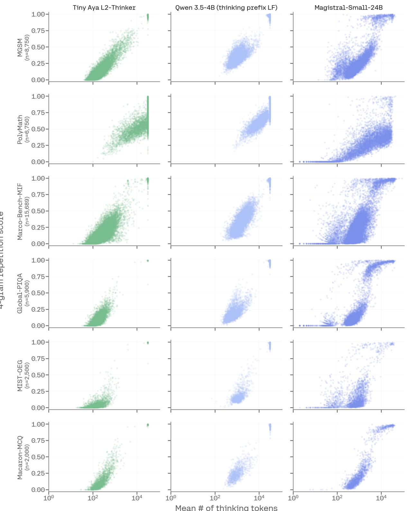  
Figure 10: Per-sample doomlooping vs. thinking length. Each point is one non-empty thinking trace (log reasoning length vs. 4-gram repetition score where higher suggests more redundant traces). n is the number of samples across all languages. Qwen3.5-4B with thinking-prefix language forcing produces systematically longer traces, while Tiny Aya L2-Thinker generates more eficient thinking traces, spending extra tokens only on hard math set (PolyMath). Magistral-Small-24B samples are more scattered and show weaker correlations between 4-gram repetition score and length of thinking traces.

## G Ablations

Our analyses in $\ S 5$ assume a single model trained by joint mixing. We now justify that choice, comparing mixing against two strategies that fragment the process—sequentially adapting an Englishonly reasoner, and merging separately trained specialists—and examining how each fails when it cannot reason in the target language. For a controlled comparison we reuse the ten-language, five-region setup and specialist models of § 5.1.

## G.1 Joint mixing gives the best accuracy--L2 trade-off

In this section we ask: does the timing of multilingual supervision matter? We compare three ways of combining English reasoning with L2 supervision under a fixed training budget. Mixing fine-tunes the base model on English reasoning and all ten languages’ L2 data at once (All-Mixed). Sequential adaptation first fine-tunes on the English mix to obtain an English-only reasoner, then fine-tunes on L2 data (All-Seq). Merging fine-tunes the regional specialists of § 5.1 separately and averages their weights linearly (Spec-mrg). Figure 11 reports task accuracy and L2 reasoning rate on seen and unseen languages per benchmark; numbers below are ordered MGSM/Marco-Bench-MIF/ GlobalPIQA.

The three strategies trace an accuracy–L2 reasoning rate trade-of (Figure 11). Merging wins on task accuracy but collapses in-language reasoning: averaging weights cancels each specialist’s language conditioning, so the merged model reasons in English regardless of the prompt (Figure 12), its seenlanguage in-language rate falling to 59/17/49 against 99/95/100 for mixing. Sequential adaptation trades the other way: it reaches for the prompt’s language most often on held-out inputs, but forgets part of the base English capability, lowering accuracy. Mixing alone is never dominated: it achieves near-ceiling in-language reasoning on seen languages, task accuracy within a few points of merging, and on unseen languages it gives up some in-language reasoning for higher accuracy than sequential and a more predictable fallback (§ G.2); on MGSM’s unseen languages it is best on both axes.

## G.2 Joint mixing fails predictably; sequential scatters

A model’s fallback language—which language it reasons in when it cannot reason in the user’s language—determines how auditable the failure is: a consistent fallback can be anticipated down stream, whereas unpredictable switching cannot. Figure 12 breaks down the thinking language on unseen languages across the three benchmarks and five regions for four models. Joint mixing falls back stably to English; the region specialists behave similarly but reason in-language far less often (consistent with § 5.1), and the merged model reasons primarily in English. Sequential adaptation instead scatters its fallback across other languages seen during later fine-tuning, so its thinking language on unseen inputs is far harder to predict—the fragility quantified in § G.1. Joint mixing thus keeps English as a stable, auditable fallback while conditioning on the input; sequential adaptation creates competing associations that resist prediction and correction.

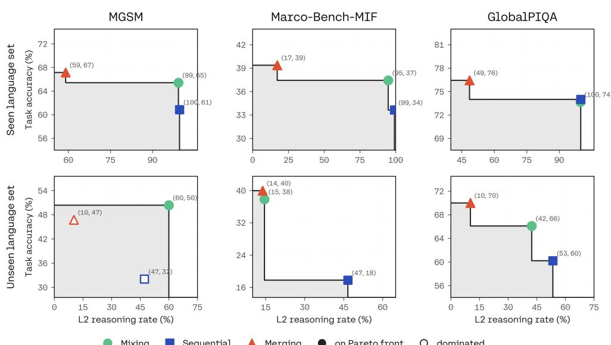  
Figure 11: Pareto front of post-training strategies (mixing, merging, and sequential adaptation) for the task accuracy vs. L2 reasoning rate trade-of. Mixing is never dominated.

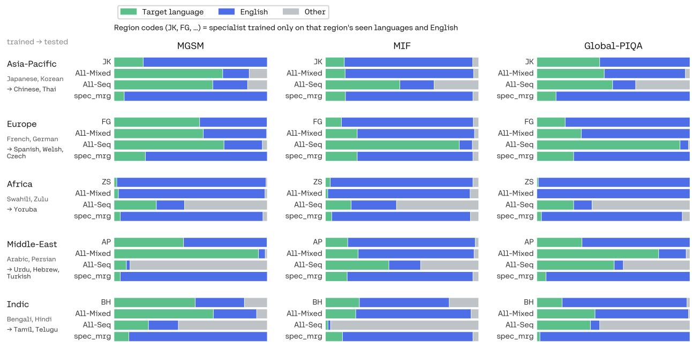  
Figure 12: Thinking-language distribution on unseen languages, by region (rows) and benchmark (columns). Each cell stacks four bars—region specialist, All-Mix, sequential, and linearly merged specialists—split into target language, English, and other. Joint training falls back to English predictably; sequential training scatters the fallback across other languages; the merged model reasons almost entirely in English.

<table><tr><td>Benchmark</td><td>Reasoning category</td><td>#Lang. Languages</td><td></td></tr><tr><td>MGSM</td><td>Math reasoning</td><td></td><td>35 en, bn, de, es, fr, ja, ru, sw, te, th, zh, ar, ca, cs, cy, el, eu, gl, hu, ko, sr, vi, amh, hau, sna, wol, xho, yor, zul, ur, hi, gu, km, my, ta</td></tr><tr><td>PolyMath</td><td>Math reasoning</td><td></td><td>18 en, zh, ar, bn, de, es, fr, id, it, ja, ko, ms, pt, ru, sw, te, th, vi</td></tr><tr><td>GlobalPIQA</td><td>Commonsense reasoning</td><td></td><td>59 eng_latn, amh_ethi, arb_arab, ben_beng, bul_cyrl, cat_latn, ces_latn, cmn_hans, cmn_hant, deu_latn, ekk_latn, ell_grek, fin_latn, fra_latn_cana, fra_latn_fran, glg_latn, guj_gujr, hau_latn, heb_hebr, hin_deva, hrv_latn, hun_latn, ibo_latn, ind_latn, ita_latn, jav_latn, jpn_jpan, kor_hang, lit_latn, mar_deva, nld_latn, nob_latn, pes_arab, pol_latn, por_latn_braz, por_latn_port, ron_latn, rus_cyrl, slk_latn, slk_latn_sari, slv_latn,</td></tr><tr><td></td><td>Marco-Bench-MIF Instruction-following reasoning</td><td>29</td><td>tur_latn, ukr_cyrl, urd_arab, vie_latn, yor_latn, zsm_latn, zul_latn en, ar, bn, cs, de, el, es, fr, he, hu, id, it, ja, ko, ms, ne, nl, pl, pt, ro, ru, sw, th, tr, uk, ur, vi, yo, zh</td></tr><tr><td>MIST-OEG</td><td>Open-ended generation</td><td></td><td>25 en, ar, bn, cs, de, el, et, fa, hi, hr, id, it, ja, ko, 1t, mr, ro, ru, sr, sv, th, tr, uk, vi, zh</td></tr><tr><td>Macaron-MCQ</td><td>Cultural reasoning</td><td></td><td>20 pt_BR, zh_CN, ar_EGY, am, ka, el, hi, id, it, ja, ky, es_MX, ar_MAR, yo, tl, zu, th, ar_TUN, tr, ar_YEM</td></tr></table>

Table 2: Benchmarks used in our evaluation suite and the languages or language varieties included for each. Count include English. Macaron-MCQ covers 20 country-language varieties corresponding to 17 base languages. PolyMath is evaluated at three dificulty levels (medium, high, top) over the same language set.

<table><tr><td>Language</td><td>Code</td><td>Math</td><td>Science</td><td>General</td><td>Total</td></tr><tr><td colspan="6">EUROPE</td></tr><tr><td>Basque</td><td>eu</td><td>827</td><td>1,535</td><td>1,283</td><td>3,645</td></tr><tr><td>Bulgarian</td><td>bg</td><td>879</td><td>2,078</td><td>1,672</td><td>4,629</td></tr><tr><td>Catalan</td><td>ca</td><td>1,043</td><td>2,076</td><td>1,644</td><td>4,763</td></tr><tr><td>Czech</td><td>CS</td><td>1,284</td><td>2,001</td><td>1,582</td><td>4,867</td></tr><tr><td>Finnish</td><td>fi</td><td>1,095</td><td>1,991</td><td>660</td><td>3,746</td></tr><tr><td>French</td><td>fr</td><td>8,494</td><td>6,258</td><td>9,103</td><td>23,855</td></tr><tr><td>German</td><td>de</td><td>7,890</td><td>6,393</td><td>8,461</td><td>22,744</td></tr><tr><td>Greek</td><td>el</td><td>1,185</td><td>2,123</td><td>1,604</td><td>4,912</td></tr><tr><td>Hungarian</td><td>hu</td><td>701</td><td>1,843</td><td>1,505</td><td>4,049</td></tr><tr><td>Irish</td><td>ga</td><td>907</td><td>1,926</td><td>1,604</td><td>4,437</td></tr><tr><td>Italian</td><td>it</td><td>1,252</td><td>1,933</td><td>1,428</td><td>4,613</td></tr><tr><td>Lithuanian</td><td>1t</td><td>946</td><td>1,835</td><td>1,527</td><td>4,308</td></tr><tr><td>Norwegian</td><td>no</td><td>1,353</td><td>2,173</td><td>1,491</td><td>5,017</td></tr><tr><td>Polish</td><td>p¹</td><td>763</td><td>1,204</td><td>946</td><td>2,913</td></tr><tr><td>Russian</td><td>ru</td><td>1,288</td><td>2,210</td><td>1,646</td><td>5,144</td></tr><tr><td>Slovak</td><td>sk</td><td>1,163</td><td>1,975</td><td>1,626</td><td>4,764</td></tr><tr><td>Ukrainian</td><td>uk</td><td>1,104</td><td>2,134</td><td>1,382</td><td>4,620</td></tr><tr><td colspan="6">ASIA-PACIFIC</td></tr><tr><td>Chinese</td><td>zh</td><td>1,130</td><td>2,106</td><td>1,556</td><td>4,792</td></tr><tr><td>Filipino</td><td>fil</td><td>861</td><td>2,040</td><td>287</td><td>3,188</td></tr><tr><td>Indonesian</td><td>id</td><td>1,507</td><td>1,969</td><td>1,431</td><td>4,907</td></tr><tr><td>Japanese</td><td>ja</td><td>5,771</td><td>5,927</td><td>11,026</td><td>22,724</td></tr><tr><td>Javanese</td><td>jv</td><td>1,913</td><td>1,579</td><td>2,307</td><td>5,799</td></tr><tr><td>Khmer</td><td>km</td><td>540</td><td>1,402</td><td>1,899</td><td>3,841</td></tr><tr><td>Korean</td><td>ko</td><td>6,454</td><td>6,249</td><td>8,332</td><td>21,035</td></tr><tr><td>Malay</td><td>ms</td><td>1,430</td><td>1,976</td><td>159</td><td>3,565</td></tr><tr><td>Thai Vietnamese</td><td>th</td><td>1,162</td><td>2,107</td><td>1,267</td><td>4,536</td></tr><tr><td></td><td>vi</td><td>1,259</td><td>2,156</td><td>1,704</td><td>5,119</td></tr><tr><td colspan="6">WEST ASIA</td></tr><tr><td>Arabic</td><td>ar</td><td>7,963</td><td>6,273</td><td>11,270</td><td>25,506</td></tr><tr><td>Hebrew</td><td>he</td><td>1,105</td><td>2,075</td><td>1,309</td><td>4,489</td></tr><tr><td>Maltese</td><td>mt</td><td>676</td><td>1,436</td><td>1,081</td><td>3,193</td></tr><tr><td>Persian</td><td>fa</td><td>1,148</td><td>2,036</td><td>1,333</td><td>4,517</td></tr><tr><td>Turkish</td><td>tr</td><td>931</td><td>1,883</td><td>1,019</td><td>3,833</td></tr><tr><td colspan="6">AFRICA</td></tr><tr><td>Amharic</td><td>am</td><td>630</td><td>1,240</td><td>2,385</td><td>4,255</td></tr><tr><td>Hausa</td><td>ha</td><td>1,630</td><td>1,371</td><td>2,050</td><td>5,051</td></tr><tr><td>Igbo</td><td>ig</td><td>1,544</td><td>1,473</td><td>2,157</td><td>5,174</td></tr><tr><td>Swahili</td><td>SW</td><td>1,213</td><td>1,619</td><td>2,092</td><td>4,924</td></tr><tr><td>Yoruba</td><td>yo</td><td>1,102</td><td>1,246</td><td>2,118</td><td>4,466</td></tr><tr><td>Zulu</td><td>zu</td><td>1,622</td><td>1,139</td><td>1,677</td><td>4,438</td></tr><tr><td colspan="6">SOUTH ASIA</td></tr><tr><td>Bengali</td><td>bn</td><td>923</td><td>2,061</td><td>1,241</td><td>4,225</td></tr><tr><td>Hindi</td><td>hi</td><td>1,081</td><td>2,019</td><td>1,462</td><td>4,562</td></tr><tr><td>Punjabi</td><td>pa</td><td>966</td><td>1,947</td><td>978</td><td>3,891</td></tr><tr><td>Tamil</td><td>ta</td><td>824</td><td>2,047</td><td>947</td><td>3,818</td></tr><tr><td>Telugu</td><td>te</td><td>869</td><td>2,062</td><td>942</td><td>3,873</td></tr><tr><td>Urdu</td><td>ur</td><td>869</td><td>1,885</td><td>887</td><td>3,641</td></tr><tr><td>Total</td><td></td><td>79,297</td><td>103,011</td><td>104,080</td><td>286,388</td></tr></table>

Table 3: Number of samples for our translated multilingual reasoning data per language and domain, separated by regions.

<table><tr><td>Region</td><td>Benchmark</td><td>Seen (trained)</td><td>Unseen (held-out)</td></tr><tr><td rowspan="3">Europe</td><td>MGSM</td><td>German, French</td><td>Spanish, Welsh</td></tr><tr><td>Marco-Bench-MIF</td><td>German, French</td><td>Czech, Spanish</td></tr><tr><td>GlobalPIQA</td><td>German, French</td><td>Czech, Spanish</td></tr><tr><td rowspan="3">Asia-Pacific</td><td>MGSM</td><td>Japanese, Korean</td><td>Chinese, Thai</td></tr><tr><td>Marco-Bench-MIF</td><td>Japanese, Korean</td><td>Thai, Chinese</td></tr><tr><td>GlobalPIQA</td><td>Japanese, Korean</td><td>Chinese, Thai</td></tr><tr><td rowspan="3">Africa</td><td>MGSM</td><td>Swahili</td><td>Yoruba</td></tr><tr><td>Marco-Bench-MIF</td><td>Swahili</td><td>Yoruba</td></tr><tr><td>GlobalPIQA</td><td>Swahili</td><td>Yoruba</td></tr><tr><td rowspan="3">South Asia</td><td>MGSM</td><td>Hindi, Bengali</td><td>Tamil</td></tr><tr><td>Marco-Bench-MIF</td><td>Bengali</td><td>Urdu</td></tr><tr><td>GlobalPIQA</td><td>Hindi, Bengali</td><td>Tamil, Telugu</td></tr><tr><td rowspan="3">West Asia</td><td>MGSM</td><td>Arabic</td><td>Urdu</td></tr><tr><td>Marco-Bench-MIF</td><td>Arabic</td><td>Hebrew, Turkish</td></tr><tr><td>GlobalPIQA</td><td>Arabic, Persian</td><td>Hebrew, Turkish</td></tr></table>

Table 4: Seen (present in L2 training) versus unseen (held-out) evaluation languages, by region and benchmark for experiments with our ten selected training languages; each benchmark covers a diferent subset, so we report a regionbalanced seen/unseen split per benchmark.

Table 5: Per-language task accuracy (Acc) and L2 reasoning rate (L2%) on MGSM (35 languages, 0–100). Languages are ordered alphabetically by language code. Avg / Std are over languages; the highest average in each metric is bold.
<table><tr><td>Language</td><td>TINY AYA EN-THINKER TINY AYA L2-THINKER</td><td></td><td></td><td></td><td colspan="2">QWEN3.5-4B</td><td colspan="2">QWEN3.5-4B (user prefix LF)</td><td colspan="2">QWEN3.5-4B (thinking prefix LF)</td><td colspan="2">M-THINKER-7B MAGISTRAL-SMALL-24B</td><td colspan="2"></td></tr><tr><td></td><td>| Acc</td><td>L2%</td><td>Acc</td><td>L2%</td><td>|Acc</td><td>L2%</td><td>Acc</td><td>L2%</td><td>Acc</td><td>L2%</td><td>Acc</td><td>L2%</td><td>Acc</td><td>L2%</td></tr><tr><td>amh</td><td>|61.2</td><td>0.0</td><td>54.8</td><td>99.6</td><td>|51.8</td><td>0.8</td><td>51.2</td><td>1.2</td><td>41.2</td><td>98.4</td><td>4.8</td><td>92.0</td><td>8.0</td><td>0.4</td></tr><tr><td>ar</td><td>77.6</td><td>0.0</td><td>77.2</td><td>100.0</td><td>77.9</td><td>52.6</td><td>76.0</td><td>60.8</td><td>82.0</td><td>99.6</td><td>70.0</td><td>100.0</td><td>78.8</td><td>1.2</td></tr><tr><td>bn</td><td>60.0</td><td>0.0</td><td>63.2</td><td>100.0</td><td>49.2</td><td>56.9</td><td>47.2</td><td>63.6</td><td>3.2</td><td>100.0</td><td>47.5</td><td>100.0</td><td>51.4</td><td>0.8</td></tr><tr><td>ca</td><td>88.4</td><td>0.0</td><td>77.6</td><td>97.2</td><td>58.6</td><td>15.2</td><td>57.6</td><td>13.6</td><td>80.8</td><td>100.0</td><td>67.1</td><td>99.6</td><td>61.6</td><td>68.8</td></tr><tr><td>CS</td><td>78.8</td><td>0.0</td><td>71.6</td><td>100.0</td><td>76.5</td><td>38.1</td><td>71.5</td><td>45.4</td><td>71.6</td><td>99.2</td><td>69.1</td><td>100.0</td><td>81.6</td><td>98.0</td></tr><tr><td>cy</td><td>80.0</td><td>0.0</td><td>75.6</td><td>87.8</td><td>65.6</td><td>0.8</td><td>68.8</td><td>3.2</td><td>34.8</td><td>98.4</td><td>15.6</td><td>99.2</td><td>80.3</td><td>23.8</td></tr><tr><td>de</td><td>88.8</td><td>0.0</td><td>87.2</td><td>100.0</td><td>80.0</td><td>41.6</td><td>81.2</td><td>46.2</td><td>94.0</td><td>100.0</td><td>89.6</td><td>100.0</td><td>97.5</td><td>100.0</td></tr><tr><td>el</td><td>78.4</td><td>0.0</td><td>79.2</td><td>99.6</td><td>75.6</td><td>71.5</td><td>78.8</td><td>78.4</td><td>87.6</td><td>100.0</td><td>39.6</td><td>100.0</td><td>92.3</td><td>97.6</td></tr><tr><td>en</td><td>92.8</td><td>100.0</td><td>93.6</td><td>100.0</td><td>96.4</td><td>100.0</td><td>93.8</td><td>99.6</td><td>92.0</td><td>100.0</td><td>84.8</td><td>97.6</td><td>98.0</td><td>99.6</td></tr><tr><td>es</td><td>87.6</td><td>0.0</td><td>78.8</td><td>100.0</td><td>80.0</td><td>58.4</td><td>76.2</td><td>65.7</td><td>89.2</td><td>95.2</td><td>77.9</td><td>100.0</td><td>84.2</td><td>96.8</td></tr><tr><td>eu</td><td>69.6</td><td>0.4</td><td>63.6</td><td>99.6</td><td>58.6</td><td>2.9</td><td>50.0</td><td>3.6</td><td>30.8</td><td>96.4</td><td>22.1</td><td>99.2</td><td>73.1</td><td>41.8</td></tr><tr><td>fr</td><td>84.4</td><td>0.0</td><td>73.6</td><td>100.0</td><td>67.8</td><td>19.2</td><td>76.2</td><td>25.0</td><td>83.2</td><td>97.6</td><td>73.6</td><td>100.0</td><td>86.3</td><td>95.2</td></tr><tr><td>gl</td><td>82.0</td><td>0.0</td><td>75.6</td><td>73.4</td><td>70.8</td><td>0.8</td><td>61.6</td><td>1.6</td><td>84.0</td><td>90.4</td><td>72.2</td><td>9.3</td><td>75.2</td><td>18.8</td></tr><tr><td>gu</td><td>79.6</td><td>0.0</td><td>72.0</td><td>100.0</td><td>62.0</td><td>62.8</td><td>62.9</td><td>63.3</td><td>55.6</td><td>100.0</td><td>28.4</td><td>100.0</td><td>83.6</td><td>1.6</td></tr><tr><td>hau</td><td>60.0</td><td>0.0</td><td>56.8</td><td>99.6</td><td>28.1</td><td>18.6</td><td>27.6</td><td>15.2</td><td>9.6</td><td>90.4</td><td>0.8</td><td>34.4</td><td>12.0</td><td>0.8</td></tr><tr><td>hi</td><td>76.8</td><td>0.0</td><td>74.0</td><td>100.0</td><td>68.3</td><td>36.5</td><td>69.2</td><td>42.9</td><td>68.0</td><td>99.6</td><td>1.2</td><td>100.0</td><td>82.8</td><td>0.0</td></tr><tr><td>hu</td><td>69.6</td><td>0.0</td><td>66.8</td><td>100.0</td><td>60.3</td><td>44.5</td><td>64.4</td><td>56.0</td><td>73.6</td><td>100.0</td><td>61.6</td><td>100.0</td><td>76.8</td><td>41.2</td></tr><tr><td>ja</td><td>75.6</td><td>0.0</td><td>69.6</td><td>100.0</td><td>82.5</td><td>26.1</td><td>79.6</td><td>36.3</td><td>83.2</td><td>100.0</td><td>63.0</td><td>100.0</td><td>86.7</td><td>6.7</td></tr><tr><td>km</td><td>66.4</td><td>0.0</td><td>60.4</td><td>100.0</td><td>29.2</td><td>17.3</td><td>20.0</td><td>15.6</td><td>14.8</td><td>100.0</td><td>11.6</td><td>100.0</td><td>4.1</td><td>3.5</td></tr><tr><td>ko</td><td>68.4</td><td>0.0</td><td>72.4</td><td>99.2</td><td>62.3</td><td>41.0</td><td>67.6</td><td>51.6</td><td>86.4</td><td>100.0</td><td>62.0</td><td>100.0</td><td>80.0</td><td>36.8</td></tr><tr><td>my</td><td>58.8</td><td>0.0</td><td>48.4</td><td>100.0</td><td>4.5</td><td>42.4</td><td>5.6</td><td>37.0</td><td>1.2</td><td>99.6</td><td>12.0</td><td>100.0</td><td>53.2</td><td>6.4</td></tr><tr><td>ru</td><td>82.8</td><td>0.0</td><td>87.2</td><td>100.0</td><td>84.6</td><td>43.7</td><td>80.2</td><td>58.0</td><td>97.6</td><td>100.0</td><td>88.8</td><td>100.0</td><td>96.2</td><td>97.5</td></tr><tr><td>sna</td><td>48.8</td><td>0.8</td><td>47.6</td><td>99.6</td><td>2.5</td><td>24.4</td><td>2.8</td><td>24.4</td><td>0.0</td><td>94.0</td><td>2.0</td><td>69.9</td><td>12.4</td><td>2.4</td></tr><tr><td>sr</td><td>78.0</td><td>0.0</td><td>73.2</td><td>94.5</td><td>68.0</td><td>39.7</td><td>61.2</td><td>45.6</td><td>72.0</td><td>98.0</td><td>2.8</td><td>86.3</td><td>77.6</td><td>96.0</td></tr><tr><td>SW</td><td>82.0</td><td>0.0</td><td>80.8</td><td>80.7</td><td>61.5</td><td>0.0</td><td>62.2</td><td>0.4</td><td>27.6</td><td>65.6</td><td>4.4</td><td>36.8</td><td>84.4</td><td>8.2</td></tr><tr><td>ta</td><td>75.6</td><td>0.0</td><td>77.2</td><td>100.0</td><td>22.2</td><td>58.9</td><td>21.2</td><td>58.0</td><td>29.2</td><td>99.2</td><td>11.7 19.3</td><td>100.0 100.0</td><td>87.6 60.8</td><td>2.8 50.8</td></tr><tr><td>te th</td><td>75.2 78.0</td><td>0.0 0.0</td><td>75.6 67.6</td><td>100.0 100.0</td><td>46.9 35.1</td><td>69.5 41.3</td><td>40.2 36.8</td><td>68.4 44.8</td><td>20.0 46.8</td><td>100.0 98.0</td></table>

Table 6: Per-language task accuracy (Acc) and L2 reasoning rate (L2%) on PolyMath (medium) (18 languages, 0–100). Languages are ordered alphabetically by language code. Avg / Std are over languages; the highest average in each metric is bold.
<table><tr><td>Language</td><td colspan="2"></td><td colspan="2">TINY AYA EN-THINKER TINY AYA L2-THINKER</td><td colspan="2">QWEN3.5-4B</td><td colspan="2">QWEN3.5-4B</td><td colspan="2">QWEN3.5-4B (user prefix LF) (thinking prefix LF)</td><td colspan="4">M-THINKER-7B MAGISTRAL-SMALL-24B</td></tr><tr><td></td><td>|Acc</td><td>L2%</td><td>Acc</td><td>L2%</td><td>Acc</td><td>L2%</td><td>Acc</td><td>L2%</td><td>Acc</td><td>L2%</td><td>Acc</td><td>L2%</td><td>Acc</td><td>L2%</td></tr><tr><td>ar</td><td>|55.2</td><td>0.0</td><td>39.5</td><td>96.8</td><td>77.2</td><td>0.0</td><td>78.4</td><td>0.8</td><td>62.4</td><td>96.8</td><td>63.4</td><td>85.4</td><td>60.0</td><td>0.0</td></tr><tr><td>bn</td><td>49.6</td><td>0.8</td><td>26.8</td><td>99.2</td><td>66.4</td><td>0.8</td><td>67.2</td><td>0.0</td><td>43.2</td><td>92.0</td><td>50.4</td><td>100.0</td><td>22.4</td><td>2.4</td></tr><tr><td>de</td><td>50.8</td><td>0.0</td><td>39.5</td><td>98.4</td><td>79.0</td><td>0.0</td><td>73.6</td><td>0.8</td><td>72.0</td><td>95.2</td><td>65.6</td><td>98.4</td><td>31.2</td><td>96.8</td></tr><tr><td>en</td><td>52.4</td><td>100.0</td><td>55.0</td><td>99.2</td><td>64.0</td><td>100.0</td><td>56.3</td><td>99.2</td><td>66.4</td><td>100.0</td><td>71.0</td><td>91.1</td><td>53.6</td><td>100.0</td></tr><tr><td>es</td><td>55.2</td><td>0.8</td><td>40.0</td><td>89.6</td><td>79.8</td><td>0.0</td><td>76.8</td><td>0.0</td><td>72.8</td><td>91.2</td><td>68.8</td><td>100.0</td><td>17.9</td><td>87.8</td></tr><tr><td>fr</td><td>49.6</td><td>0.0</td><td>40.8</td><td>98.4</td><td>75.2</td><td>0.0</td><td>75.2</td><td>0.0</td><td>72.8</td><td>96.8</td><td>66.1</td><td>99.2</td><td>15.3</td><td>58.9</td></tr><tr><td>id</td><td>51.6</td><td>0.8</td><td>45.6</td><td>95.2</td><td>76.6</td><td>0.0</td><td>77.6</td><td>0.0</td><td>72.8</td><td>72.0</td><td>65.3</td><td>92.7</td><td>25.6</td><td>19.2</td></tr><tr><td>it</td><td>48.0</td><td>0.0</td><td>39.2</td><td>94.4</td><td>74.4</td><td>0.0</td><td>74.4</td><td>0.0</td><td>68.8</td><td>96.8</td><td>71.8</td><td>98.4</td><td>16.8</td><td>66.4</td></tr><tr><td>ja</td><td>48.0</td><td>0.0</td><td>30.2</td><td>99.2</td><td>76.8</td><td>0.0</td><td>72.8</td><td>0.0</td><td>57.6</td><td>97.6</td><td>66.9</td><td>99.2</td><td>31.2</td><td>35.2</td></tr><tr><td>ko</td><td>52.1</td><td>0.0</td><td>40.0</td><td>99.2</td><td>76.0</td><td>0.0</td><td>72.8</td><td>0.0</td><td>58.4</td><td>84.0</td><td>61.6</td><td>100.0</td><td>41.6</td><td>2.4</td></tr><tr><td>ms</td><td>52.1</td><td>0.8</td><td>43.8</td><td>92.8</td><td>75.2</td><td>0.8</td><td>74.4</td><td>0.8</td><td>68.0</td><td>84.0</td><td>68.0</td><td>5.6</td><td>29.6</td><td>6.4</td></tr><tr><td>pt</td><td>53.3</td><td>0.8</td><td>32.8</td><td>87.7</td><td>76.0</td><td>0.0</td><td>76.6</td><td>0.0</td><td>70.4</td><td>92.8</td><td>68.3</td><td>98.4</td><td>21.1</td><td>91.9</td></tr><tr><td>ru</td><td>55.0</td><td>0.0</td><td>39.0</td><td>97.6</td><td>70.4</td><td>0.0</td><td>75.2</td><td>0.0</td><td>70.4</td><td>97.6</td><td>69.6</td><td>100.0</td><td>35.2</td><td>48.0</td></tr><tr><td>SW</td><td>46.8</td><td>0.0</td><td>36.0</td><td>42.4</td><td>72.0</td><td>0.0</td><td>67.2</td><td>0.0</td><td>18.4</td><td>25.6</td><td>35.2</td><td>2.4</td><td>14.9</td><td>15.7</td></tr><tr><td>te</td><td>45.2</td><td>0.0</td><td>28.3</td><td>97.6</td><td>55.2</td><td>2.6</td><td>60.8</td><td>5.6</td><td>32.0</td><td>96.8</td><td>45.5</td><td>100.0</td><td>16.5</td><td>27.3</td></tr><tr><td>th</td><td>51.6</td><td>0.0</td><td>30.6</td><td>98.4</td><td>68.8</td><td>0.0</td><td>67.2</td><td>0.0</td><td>56.0</td><td>92.0</td><td>61.8</td><td>95.9</td><td>36.0</td><td>52.8</td></tr><tr><td>vi</td><td>53.7</td><td>0.0</td><td>38.5</td><td>97.5</td><td>74.4</td><td>0.0</td><td>78.4</td><td>0.8</td><td>64.0</td><td>94.4</td><td>65.0</td><td>100.0</td><td>43.2</td><td>14.4</td></tr><tr><td>zh</td><td>51.2</td><td>0.0</td><td>36.1</td><td>95.8</td><td>64.0</td><td>0.0</td><td>70.2</td><td>0.0</td><td>72.8</td><td>99.2</td><td>70.4</td><td>100.0</td><td>64.0</td><td>21.6</td></tr><tr><td>Avg</td><td>|51.2</td><td>5.8</td><td>37.9</td><td>93.3</td><td>|72.3</td><td>5.8</td><td>71.9</td><td>6.0</td><td>61.1</td><td>89.2</td><td>63.0</td><td>87.0</td><td>32.0</td><td>41.5</td></tr><tr><td>Std</td><td>2.8</td><td>22.9</td><td>6.5</td><td>12.8</td><td>6.2</td><td>22.9</td><td>6.0</td><td>22.6</td><td>14.9</td><td>16.8</td><td>9.4</td><td>29.6</td><td>14.9</td><td>34.0</td></tr></table>

Table 7: Per-language task accuracy (Acc) and L2 reasoning rate (L2%) on PolyMath (high) (18 languages, 0–100). Languages are ordered alphabetically by language code. Avg / Std are over languages; the highest average in each metric is bold.
<table><tr><td>Language</td><td colspan="2"></td><td colspan="2">TINY AYA EN-THINKER TINY AYA L2-THINKER</td><td colspan="2">QWEN3.5-4B</td><td colspan="2">QWEN3.5-4B</td><td colspan="2">QWEN3.5-4B (user prefix LF) (thinking prefix LF)</td><td colspan="2">M-THINKER-7B MAGISTRAL-SMALL-24B</td><td colspan="2"></td></tr><tr><td></td><td>|Acc</td><td>L2%</td><td>Acc</td><td>L2%</td><td>Acc</td><td>L2%</td><td>Acc</td><td>L2%</td><td>Acc</td><td>L2%</td><td>Acc</td><td>L2%</td><td>Acc</td><td>L2%</td></tr><tr><td>ar</td><td>|27.2</td><td>0.0</td><td>16.8</td><td>100.0</td><td>52.9</td><td>0.0</td><td>53.6</td><td>0.0</td><td>32.8</td><td>95.2</td><td>40.8</td><td>92.0</td><td>48.8</td><td>0.0</td></tr><tr><td>bn</td><td>26.4</td><td>0.0</td><td>10.4</td><td>99.2</td><td>44.8</td><td>1.6</td><td>41.6</td><td>1.6</td><td>21.0</td><td>92.7</td><td>22.6</td><td>100.0</td><td>24.0</td><td>5.6</td></tr><tr><td>de</td><td>31.2</td><td>0.0</td><td>18.4</td><td>100.0</td><td>48.0</td><td>0.0</td><td>56.8</td><td>0.0</td><td>40.0</td><td>93.6</td><td>40.0</td><td>100.0</td><td>15.2</td><td>96.8</td></tr><tr><td>en</td><td>24.4</td><td>99.2</td><td>26.6</td><td>100.0</td><td>34.4</td><td>99.2</td><td>31.9</td><td>99.2</td><td>30.4</td><td>100.0</td><td>52.9</td><td>100.0</td><td>40.8</td><td>100.0</td></tr><tr><td>es</td><td>29.0</td><td>0.0</td><td>13.6</td><td>79.2</td><td>52.0</td><td>0.0</td><td>50.4</td><td>0.0</td><td>46.3</td><td>95.9</td><td>45.6</td><td>98.4</td><td>12.8</td><td>89.6</td></tr><tr><td>fr</td><td>25.4</td><td>0.0</td><td>21.6</td><td>100.0</td><td>51.2</td><td>0.0</td><td>56.0</td><td>0.0</td><td>41.6</td><td>93.6</td><td>43.2</td><td>99.2</td><td>18.6</td><td>73.4</td></tr><tr><td>id</td><td>25.0</td><td>0.0</td><td>14.6</td><td>97.6</td><td>61.6</td><td>0.0</td><td>48.0</td><td>0.0</td><td>45.6</td><td>78.4</td><td>36.8</td><td>100.0</td><td>5.7</td><td>33.1</td></tr><tr><td>it</td><td>31.7</td><td>0.0</td><td>17.4</td><td>99.2</td><td>55.2</td><td>0.0</td><td>56.0</td><td>0.0</td><td>41.6</td><td>93.6</td><td>42.7</td><td>100.0</td><td>15.2</td><td>56.0</td></tr><tr><td>ja</td><td>27.9</td><td>0.0</td><td>10.7</td><td>99.2</td><td>52.0</td><td>0.0</td><td>53.6</td><td>0.0</td><td>31.2</td><td>92.8</td><td>37.6</td><td>100.0</td><td>12.9</td><td>26.6</td></tr><tr><td>ko</td><td>22.7</td><td>0.0</td><td>14.2</td><td>99.2</td><td>54.5</td><td>0.0</td><td>51.6</td><td>0.0</td><td>20.8</td><td>84.0</td><td>38.2</td><td>100.0</td><td>21.6</td><td>2.4</td></tr><tr><td>ms</td><td>24.2</td><td>0.0</td><td>18.5</td><td>90.4</td><td>57.6</td><td>0.8</td><td>54.0</td><td>0.0</td><td>38.4</td><td>91.2</td><td>39.0</td><td>5.7</td><td>19.2</td><td>5.6</td></tr><tr><td>pt</td><td>26.7</td><td>0.0</td><td>14.2</td><td>90.8</td><td>59.2</td><td>0.0</td><td>54.6</td><td>0.0</td><td>45.6</td><td>88.8</td><td>45.8</td><td>98.3</td><td>27.2</td><td>93.6</td></tr><tr><td>ru</td><td>31.7</td><td>0.0</td><td>19.2</td><td>99.2</td><td>56.8</td><td>0.0</td><td>55.2</td><td>0.0</td><td>46.4</td><td>98.4</td><td>42.0</td><td>100.0</td><td>22.6</td><td>34.7</td></tr><tr><td>SW</td><td>30.9</td><td>0.0</td><td>15.6</td><td>70.4</td><td>49.6</td><td>0.0</td><td>48.8</td><td>0.0</td><td>8.8</td><td>30.4</td><td>12.0</td><td>5.6</td><td>8.1</td><td>13.0</td></tr><tr><td>te</td><td>24.2</td><td>0.0</td><td>7.5</td><td>97.6</td><td>37.6</td><td>0.8</td><td>36.0</td><td>3.2</td><td>12.0</td><td>95.2</td><td>16.0</td><td>99.0</td><td>6.7</td><td>23.7</td></tr><tr><td>th</td><td>23.2</td><td>0.0</td><td>10.7</td><td>98.4</td><td>47.2</td><td>0.0</td><td>43.5</td><td>0.0</td><td>34.4</td><td>89.6</td><td>36.4</td><td>100.0</td><td>17.1</td><td>24.4</td></tr><tr><td>vi</td><td>27.2</td><td>0.0</td><td>20.3</td><td>98.4</td><td>52.8</td><td>0.0</td><td>58.4</td><td>0.8</td><td>44.0</td><td>98.4</td><td>40.8</td><td>99.2</td><td>20.0</td><td>22.4</td></tr><tr><td>zh</td><td>25.6</td><td>0.0</td><td>11.6</td><td>94.2</td><td>36.3</td><td>0.0</td><td>36.7</td><td>0.0</td><td>36.8</td><td>94.4</td><td>40.0</td><td>100.0</td><td>44.0</td><td>52.4</td></tr><tr><td>Avg</td><td>|26.9</td><td>5.5</td><td>15.6</td><td>95.2</td><td>|50.2</td><td>5.7</td><td>49.3</td><td>5.8</td><td>34.3</td><td>89.2</td><td>37.4</td><td>88.7</td><td>21.1</td><td>41.8</td></tr><tr><td>Std</td><td>2.8</td><td>22.7</td><td>4.6</td><td>7.9</td><td>7.5</td><td>22.7</td><td>7.8</td><td>22.7</td><td>11.4</td><td>15.1</td><td>10.1</td><td>29.4</td><td>12.0</td><td>34.0</td></tr></table>

Table 8: Per-language task accuracy (Acc) and L2 reasoning rate (L2%) on PolyMath (top) (18 languages, 0–100). Languages are ordered alphabetically by language code. Avg / Std are over languages; the highest average in each metric is bold.
<table><tr><td>Language</td><td colspan="2"></td><td colspan="2">TINY AYA EN-THINKER TINY AYA L2-THINKER</td><td colspan="2">QWEN3.5-4B</td><td colspan="2">QWEN3.5-4B</td><td colspan="2">QWEN3.5-4B (user prefix LF) (thinking prefix LF)</td><td colspan="2">M-THINKER-7B MAGISTRAL-SMALL-24B</td><td colspan="2"></td></tr><tr><td></td><td>|Acc</td><td>L2%</td><td>Acc</td><td>L2%</td><td>|Acc</td><td>L2%</td><td>Acc</td><td>L2%</td><td>Acc</td><td>L2%</td><td>Acc</td><td>L2%</td><td>Acc</td><td>L2%</td></tr><tr><td>ar</td><td>|10.5</td><td>0.0</td><td>1.7</td><td>100.0</td><td>|31.1</td><td>0.0</td><td>28.0</td><td>0.0</td><td>21.6</td><td>97.6</td><td>24.8</td><td>90.4</td><td>29.6</td><td>0.0</td></tr><tr><td>bn</td><td>7.2</td><td>0.0</td><td>0.8</td><td>97.6</td><td>27.1</td><td>2.5</td><td>28.8</td><td>0.0</td><td>5.6</td><td>91.2</td><td>16.0</td><td>100.0</td><td>10.4</td><td>3.2</td></tr><tr><td>de</td><td>5.7</td><td>0.0</td><td>3.2</td><td>99.2</td><td>26.4</td><td>0.0</td><td>28.8</td><td>0.0</td><td>24.0</td><td>95.2</td><td>24.4</td><td>100.0</td><td>8.0</td><td>97.6</td></tr><tr><td>en</td><td>5.0</td><td>99.2</td><td>2.5</td><td>98.4</td><td>9.8</td><td>99.2</td><td>8.3</td><td>99.2</td><td>9.6</td><td>100.0</td><td>30.4</td><td>99.2</td><td>22.4</td><td>100.0</td></tr><tr><td>es</td><td>5.6</td><td>0.0</td><td>5.7</td><td>90.3</td><td>27.4</td><td>0.0</td><td>24.8</td><td>0.0</td><td>20.8</td><td>86.4</td><td>26.4</td><td>100.0</td><td>6.5</td><td>93.5</td></tr><tr><td>fr</td><td>3.2</td><td>0.0</td><td>4.1</td><td>100.0</td><td>30.6</td><td>0.0</td><td>30.4</td><td>0.0</td><td>22.4</td><td>85.6</td><td>25.2</td><td>98.4</td><td>13.6</td><td>77.6</td></tr><tr><td>id</td><td>6.5</td><td>0.0</td><td>5.6</td><td>92.0</td><td>28.0</td><td>0.0</td><td>30.4</td><td>0.0</td><td>26.4</td><td>80.8</td><td>22.1</td><td>98.4</td><td>7.3</td><td>38.7</td></tr><tr><td>it</td><td>2.5</td><td>0.0</td><td>4.1</td><td>99.2</td><td>25.0</td><td>0.8</td><td>29.6</td><td>0.0</td><td>15.2</td><td>96.8</td><td>27.4</td><td>99.2</td><td>8.8</td><td>66.4</td></tr><tr><td>ja</td><td>8.3</td><td>0.0</td><td>1.6</td><td>98.4</td><td>35.5</td><td>0.0</td><td>29.6</td><td>0.0</td><td>11.2</td><td>95.2</td><td>26.8</td><td>97.6</td><td>5.6</td><td>22.4</td></tr><tr><td>ko</td><td>4.2</td><td>0.0</td><td>2.5</td><td>96.8</td><td>24.8</td><td>0.0</td><td>30.4</td><td>0.0</td><td>8.8</td><td>84.0</td><td>22.3</td><td>100.0</td><td>8.8</td><td>3.2</td></tr><tr><td>ms</td><td>5.6</td><td>0.0</td><td>5.8</td><td>94.4</td><td>32.0</td><td>0.0</td><td>31.2</td><td>0.0</td><td>16.0</td><td>88.8</td><td>27.1</td><td>10.7</td><td>9.0</td><td>11.5</td></tr><tr><td>pt</td><td>8.1</td><td>0.0</td><td>0.8</td><td>89.6</td><td>27.2</td><td>0.0</td><td>29.4</td><td>0.0</td><td>19.2</td><td>91.2</td><td>25.6</td><td>100.0</td><td>9.8</td><td>92.6</td></tr><tr><td>ru</td><td>4.9</td><td>0.0</td><td>1.6</td><td>96.8</td><td>22.4</td><td>0.0</td><td>33.9</td><td>0.0</td><td>23.2</td><td>91.2</td><td>32.2</td><td>100.0</td><td>8.8</td><td>49.6</td></tr><tr><td>SW</td><td>5.7</td><td>0.0</td><td>4.1</td><td>72.0</td><td>24.0</td><td>0.0</td><td>22.4</td><td>0.0</td><td>0.8</td><td>28.0</td><td>8.8</td><td>8.0</td><td>9.7</td><td>14.5</td></tr><tr><td>te</td><td>6.6</td><td>0.8</td><td>0.0</td><td>99.2</td><td>20.0</td><td>0.0</td><td>20.0</td><td>0.8</td><td>5.6</td><td>90.4</td><td>10.4</td><td>100.0</td><td>4.0</td><td>23.4</td></tr><tr><td>th</td><td>7.4</td><td>0.0</td><td>0.8</td><td>97.5</td><td>17.6</td><td>0.0</td><td>24.0</td><td>0.0</td><td>13.6</td><td>81.6</td><td>21.6</td><td>98.4</td><td>3.2</td><td>20.8</td></tr><tr><td>vi</td><td>7.2</td><td>0.0</td><td>0.8</td><td>100.0</td><td>32.8</td><td>0.0</td><td>29.6</td><td>0.0</td><td>20.8</td><td>93.6</td><td>25.0</td><td>100.0</td><td>8.8</td><td>20.8</td></tr><tr><td>zh</td><td>7.3</td><td>0.0</td><td>1.6</td><td>97.6</td><td>8.8</td><td>0.0</td><td>9.8</td><td>0.0</td><td>15.2</td><td>98.4</td><td>27.4</td><td>100.0</td><td>20.0</td><td>49.2</td></tr><tr><td>Avg</td><td>6.2</td><td>5.6</td><td>2.6</td><td>95.5</td><td>|25.0</td><td>5.7</td><td>26.1</td><td>5.6</td><td>15.6</td><td>87.6</td><td>23.6</td><td>88.9</td><td>10.8</td><td>43.6</td></tr><tr><td>Std</td><td>1.9</td><td>22.7</td><td>1.8</td><td>6.5</td><td>7.1</td><td>22.7</td><td>6.9</td><td>22.7</td><td>7.1</td><td>15.5</td><td>6.0</td><td>28.2</td><td>6.5</td><td>34.7</td></tr></table>

Table 9: Per-language task accuracy (Acc) and L2 reasoning rate (L2%) on MIST-OEG (25 languages, 0–100). MIST judge score (1–7) is linearly rescaled to the same Acc range. Languages are ordered alphabetically by language code. Avg / Std are over languages; the highest average in each metric is bold.
<table><tr><td>Language</td><td>TINY AYA EN-THINKER TINY AYA L2-THINKER</td><td></td><td></td><td></td><td>QWEN3.5-4B</td><td></td><td>QWEN3.5-4B</td><td>(user prefix LF)</td><td>QWEN3.5-4B (thinking prefix LF)</td><td></td><td></td><td></td><td>M-THINKER-7B MAGISTRAL-SMALL-24B</td><td></td></tr><tr><td></td><td>|Acc</td><td>L2%</td><td>Acc</td><td>L2%</td><td>|Acc</td><td>L2%</td><td>Acc</td><td>L2%</td><td>Acc</td><td>L2%</td><td>Acc</td><td>L2%</td><td>Acc</td><td>L2%</td></tr><tr><td>ar</td><td>|83.7</td><td>5.0</td><td>85.2</td><td>99.0</td><td>|78.2</td><td>12.1</td><td>77.7</td><td>24.0</td><td>70.3</td><td>99.0</td><td>17.8</td><td>98.0</td><td>60.5</td><td>29.3</td></tr><tr><td>bn</td><td>88.0</td><td>15.0</td><td>88.8</td><td>97.0</td><td>78.2</td><td>38.1</td><td>79.7</td><td>48.0</td><td>35.8</td><td>100.0</td><td>36.5</td><td>99.0</td><td>68.8</td><td>18.4</td></tr><tr><td>CS</td><td>84.7</td><td>6.0</td><td>87.5</td><td>100.0</td><td>71.2</td><td>12.2</td><td>75.8</td><td>25.0</td><td>49.5</td><td>96.0</td><td>25.0</td><td>100.0</td><td>86.0</td><td>96.9</td></tr><tr><td>de</td><td>87.0</td><td>15.0</td><td>82.8</td><td>100.0</td><td>84.3</td><td>13.4</td><td>84.2</td><td>28.0</td><td>79.8</td><td>77.0</td><td>36.2</td><td>100.0</td><td>98.3</td><td>99.0</td></tr><tr><td>el</td><td>88.8</td><td>6.0</td><td>87.3</td><td>100.0</td><td>75.5</td><td>22.2</td><td>79.8</td><td>39.0</td><td>66.0</td><td>99.0</td><td>7.5</td><td>99.0</td><td>88.0</td><td>97.0</td></tr><tr><td>en</td><td>95.3</td><td>100.0</td><td>95.0</td><td>100.0</td><td>90.8</td><td>98.0</td><td>91.3</td><td>99.0</td><td>57.3</td><td>100.0</td><td>90.7</td><td>99.0</td><td>97.8</td><td>100.0</td></tr><tr><td>et</td><td>88.3</td><td>7.0</td><td>85.2</td><td>98.0</td><td>53.0</td><td>17.9</td><td>58.3</td><td>30.0</td><td>35.8</td><td>96.0</td><td>7.7</td><td>100.0</td><td>72.7</td><td>41.0</td></tr><tr><td>fa</td><td>91.7</td><td>13.0</td><td>88.2</td><td>100.0</td><td>89.5</td><td>13.0</td><td>92.7</td><td>37.0</td><td>77.2</td><td>100.0</td><td>37.0</td><td>100.0</td><td>55.3</td><td>16.0</td></tr><tr><td>hi</td><td>93.8</td><td>19.0</td><td>94.2</td><td>100.0</td><td>86.2</td><td>15.6</td><td>83.0</td><td>33.0</td><td>55.5</td><td>99.0</td><td>42.8</td><td>100.0</td><td>67.8</td><td>14.0</td></tr><tr><td>hr</td><td>83.0</td><td>1.0</td><td>86.7</td><td>23.0</td><td>75.5</td><td>1.0</td><td>79.5</td><td>4.0</td><td>65.7</td><td>57.0</td><td>31.0</td><td>39.4</td><td>82.7</td><td>27.8</td></tr><tr><td>id</td><td>88.3</td><td>14.0</td><td>90.5</td><td>95.0</td><td>89.2</td><td>14.3</td><td>86.0</td><td>43.0</td><td>84.3</td><td>96.0</td><td>52.2</td><td>100.0</td><td>89.8</td><td>75.0</td></tr><tr><td>it</td><td>87.3</td><td>10.0</td><td>87.8</td><td>100.0</td><td>87.2</td><td>16.3</td><td>86.7</td><td>31.0</td><td>83.5</td><td>97.0</td><td>41.7</td><td>100.0</td><td>99.0</td><td>100.0</td></tr><tr><td>ja</td><td>73.5</td><td>2.0</td><td>74.2</td><td>99.0</td><td>87.5</td><td>5.1</td><td>86.7</td><td>15.3</td><td>75.3</td><td>99.0</td><td>28.8</td><td>99.0</td><td>77.8</td><td>39.0</td></tr><tr><td>ko</td><td>74.3</td><td>4.0</td><td>79.8</td><td>99.0</td><td>89.5</td><td>11.3</td><td>89.7</td><td>18.4</td><td>79.7</td><td>100.0</td><td>19.3</td><td>100.0</td><td>70.2</td><td>22.1</td></tr><tr><td>lt</td><td>86.8</td><td>6.0</td><td>86.8</td><td>99.0</td><td>69.0</td><td>19.2</td><td>67.0</td><td>27.0</td><td>59.5</td><td>97.0</td><td>7.5</td><td>100.0</td><td>76.8</td><td>60.0</td></tr><tr><td>mr</td><td>91.0</td><td>8.0</td><td>88.8</td><td>97.0</td><td>54.8</td><td>11.1</td><td>69.5</td><td>25.3</td><td>36.2</td><td>54.0</td><td>23.0</td><td>98.0</td><td>63.8</td><td>24.0</td></tr><tr><td>ro</td><td>88.8</td><td>17.0</td><td>87.3</td><td>93.0</td><td>82.8</td><td>18.2</td><td>84.7</td><td>22.0</td><td>78.0</td><td>97.0</td><td>32.5</td><td>100.0</td><td>95.2</td><td>95.0</td></tr><tr><td>ru</td><td>84.5</td><td>9.0</td><td>89.8</td><td>100.0</td><td>90.0</td><td>18.0</td><td>90.7</td><td>29.0</td><td>84.3</td><td>99.0</td><td>33.3</td><td>100.0</td><td>94.5</td><td>100.0</td></tr><tr><td>sr</td><td>77.7</td><td>5.0</td><td>79.8</td><td>94.0</td><td>71.3</td><td>6.1</td><td>76.5</td><td>21.9</td><td>56.0</td><td>95.0</td><td>23.5</td><td>86.0</td><td>88.0</td><td>73.0</td></tr><tr><td>SV</td><td>86.7</td><td>8.0</td><td>87.0</td><td>97.0</td><td>82.2</td><td>12.1</td><td>78.5</td><td>36.7</td><td>69.0</td><td>98.0</td><td>34.3</td><td>99.0</td><td>93.3</td><td>95.0</td></tr><tr><td>th</td><td>73.5</td><td>21.0</td><td>73.2</td><td>99.0</td><td>83.5</td><td>30.3</td><td>85.8</td><td>37.5</td><td>76.2</td><td>99.0</td><td>14.3</td><td>100.0</td><td>71.3</td><td>46.0</td></tr><tr><td>tr</td><td>84.2</td><td>12.0</td><td>85.2</td><td>100.0</td><td>71.7</td><td>16.0</td><td>74.5</td><td>31.2</td><td>64.2</td><td>99.0</td><td>25.0</td><td>100.0</td><td>70.8</td><td>30.0</td></tr><tr><td>uk</td><td>88.3</td><td>7.1</td><td>89.0</td><td>99.0</td><td>84.3</td><td>20.4</td><td>89.3</td><td>38.1</td><td>74.7</td><td>100.0</td><td>33.3</td><td>99.0</td><td>90.5</td><td>91.9</td></tr><tr><td>vi</td><td>89.7 83.3</td><td>42.0</td><td>89.0</td><td>100.0</td><td>93.0</td><td>16.2</td><td>92.3</td><td>53.1</td><td>81.8</td><td>98.0</td><td>22.3</td><td>100.0</td><td>83.3</td><td>63.0</td></tr><tr><td>zh</td><td></td><td>1.0</td><td>85.3</td><td>98.0</td><td>90.0</td><td>4.0</td><td>88.3</td><td>8.0</td><td>85.3</td><td>88.9</td><td>87.3</td><td>100.0</td><td>95.0</td><td>97.0</td></tr><tr><td>Avg</td><td>|85.7</td><td>14.1</td><td>86.2</td><td>95.4</td><td>|80.3</td><td>18.5</td><td>81.9</td><td>32.2</td><td>67.2</td><td>93.6</td><td>32.4</td><td>96.6</td><td>81.5</td><td>62.0</td></tr><tr><td>Std</td><td>5.7</td><td>19.4</td><td>5.0</td><td>14.9</td><td>10.4</td><td>17.9</td><td>8.3</td><td>17.6</td><td>15.3</td><td>12.2</td><td>20.0</td><td>12.0</td><td>12.7</td><td>32.6</td></tr></table>

Table 10: Per-language task accuracy (Acc) and L2 reasoning rate (L2%) on Marco-Bench-MIF (29 languages, 0–100). Languages are ordered alphabetically by language code. Avg / Std are over languages; the highest average in each metric is bold.
<table><tr><td>Language</td><td colspan="2"></td><td colspan="2">TINY AYA EN-THINKER TINY AYA L2-THINKER</td><td colspan="2">QWEN3.5-4B</td><td colspan="2">QWEN3.5-4B (user prefix LF)</td><td colspan="2">QWEN3.5-4B )(thinking prefix LF)</td><td colspan="2"></td><td colspan="2">M-THINKER-7B MAGISTRAL-SMALL-24B</td></tr><tr><td></td><td>|Acc</td><td>L2%</td><td>Acc</td><td>L2%</td><td>|Acc</td><td>L2%</td><td>Acc</td><td>L2%</td><td>Acc</td><td>L2%</td><td>Acc</td><td>L2%</td><td>Acc</td><td>L2%</td></tr><tr><td>ar</td><td>51.0</td><td>6.1</td><td>49.8</td><td>99.1</td><td>|30.2</td><td>33.1</td><td>25.7</td><td>37.1</td><td>39.2</td><td>91.7</td><td>27.6</td><td>98.3</td><td>36.0</td><td>20.3</td></tr><tr><td>bn</td><td>48.6</td><td>10.2</td><td>51.1</td><td>98.3</td><td>15.6</td><td>40.5</td><td>14.2</td><td>40.3</td><td>24.5</td><td>96.2</td><td>22.6</td><td>99.4</td><td>29.4</td><td>13.7</td></tr><tr><td>CS</td><td>52.9</td><td>5.9</td><td>51.6</td><td>97.2</td><td>22.2</td><td>34.4</td><td>19.8</td><td>35.2</td><td>27.0</td><td>86.0</td><td>28.6</td><td>99.1</td><td>58.1</td><td>74.4</td></tr><tr><td>de</td><td>55.3</td><td>7.6</td><td>52.0</td><td>99.2</td><td>24.7</td><td>33.1</td><td>27.4</td><td>35.1</td><td>41.4</td><td>64.1</td><td>34.0</td><td>99.4</td><td>68.1</td><td>92.5</td></tr><tr><td>el</td><td>53.2</td><td>4.8</td><td>47.8</td><td>99.4</td><td>26.1</td><td>38.1</td><td>20.3</td><td>42.3</td><td>30.3</td><td>87.1</td><td>19.8</td><td>99.6</td><td>63.9</td><td>71.6</td></tr><tr><td>en</td><td>71.2</td><td>97.6</td><td>72.7</td><td>98.5</td><td>37.0</td><td>95.7</td><td>34.6</td><td>97.8</td><td>34.6</td><td>95.6</td><td>57.1</td><td>97.2</td><td>78.9</td><td>96.1</td></tr><tr><td>es</td><td>62.9</td><td>22.2</td><td>57.7</td><td>95.0</td><td>35.4</td><td>34.5</td><td>32.4</td><td>37.1</td><td>55.6</td><td>84.1</td><td>37.7</td><td>99.2</td><td>69.3</td><td>84.6</td></tr><tr><td>fr</td><td>59.0</td><td>12.0</td><td>56.8</td><td>99.1</td><td>32.0</td><td>32.9</td><td>29.1</td><td>33.0</td><td>52.7</td><td>78.9</td><td>37.0</td><td>99.1</td><td>70.4</td><td>86.3</td></tr><tr><td>he</td><td>50.1</td><td>2.0</td><td>54.1</td><td>98.1</td><td>16.6</td><td>35.0</td><td>15.3</td><td>35.1</td><td>17.4</td><td>90.4</td><td>23.1</td><td>95.0</td><td>32.7</td><td>29.0</td></tr><tr><td>hu</td><td>56.6</td><td>5.6</td><td>52.7</td><td>97.4</td><td>18.0</td><td>33.1</td><td>16.4</td><td>38.1</td><td>24.2</td><td>92.6</td><td>23.2</td><td>99.8</td><td>54.1</td><td>53.0</td></tr><tr><td>id</td><td>60.3</td><td>8.5</td><td>60.0</td><td>98.5</td><td>31.8</td><td>31.5</td><td>28.8</td><td>36.1</td><td>53.2</td><td>74.3</td><td>30.8</td><td>99.4</td><td>66.5</td><td>59.0</td></tr><tr><td>it</td><td>57.5</td><td>8.7</td><td>56.7</td><td>99.3</td><td>30.5</td><td>32.7</td><td>28.4</td><td>37.2</td><td>48.4</td><td>77.6</td><td>35.9</td><td>99.6</td><td>69.0</td><td>88.5</td></tr><tr><td>ja</td><td>46.5</td><td>1.1</td><td>44.4</td><td>98.3</td><td>19.0</td><td>21.9</td><td>19.4</td><td>28.6</td><td>31.1</td><td>87.8</td><td>32.6</td><td>98.9</td><td>36.0</td><td>13.6</td></tr><tr><td>ko</td><td>45.7</td><td>0.6</td><td>38.0</td><td>98.1</td><td>23.3</td><td>27.2</td><td>21.6</td><td>29.2</td><td>38.5</td><td>86.7</td><td>25.1</td><td>99.6</td><td>29.6</td><td>12.8</td></tr><tr><td>ms</td><td>58.0</td><td>15.6</td><td>56.7</td><td>94.6</td><td>32.6</td><td>34.3</td><td>27.2</td><td>36.6</td><td>34.8</td><td>75.0</td><td>31.2</td><td>23.3</td><td>67.3</td><td>20.0</td></tr><tr><td>ne</td><td>53.3</td><td>3.3</td><td>50.2</td><td>97.9</td><td>10.6</td><td>20.4</td><td>7.0</td><td>22.9</td><td>11.1</td><td>80.3</td><td>23.3</td><td>97.4</td><td>33.5</td><td>8.9</td></tr><tr><td>nl</td><td>63.6</td><td>14.1</td><td>59.3</td><td>97.2</td><td>27.9</td><td>34.9</td><td>25.2</td><td>35.7</td><td>34.8</td><td>80.8</td><td>31.2</td><td>99.2</td><td>69.0</td><td>81.7</td></tr><tr><td>pl</td><td>43.4</td><td>9.3</td><td>40.2</td><td>99.2</td><td>21.0</td><td>34.8</td><td>19.9</td><td>35.6</td><td>25.1</td><td>86.3</td><td>29.3</td><td>99.6</td><td>49.7</td><td>69.7</td></tr><tr><td>pt</td><td>55.1</td><td>26.5</td><td>53.2</td><td>97.4</td><td>30.3</td><td>33.9</td><td>29.8</td><td>32.4</td><td>49.5</td><td>83.0</td><td>34.8</td><td>99.8</td><td>69.9</td><td>81.9</td></tr><tr><td>ro</td><td>51.6</td><td>11.5</td><td>47.9</td><td>98.1</td><td>26.2</td><td>33.3</td><td>19.4</td><td>34.0</td><td>30.9</td><td>82.1</td><td>25.1</td><td>100.0</td><td>57.8</td><td>69.0</td></tr><tr><td>ru</td><td>48.2</td><td>4.3</td><td>46.3</td><td>99.1</td><td>30.4</td><td>35.2</td><td>24.4</td><td>38.0</td><td>46.4</td><td>84.3</td><td>38.7</td><td>98.0</td><td>57.1</td><td>78.9</td></tr><tr><td>SW</td><td>53.3</td><td>0.4</td><td>52.4</td><td>85.5</td><td>9.9</td><td>12.1</td><td>8.0</td><td>12.8</td><td>1.9</td><td>65.2</td><td>15.2</td><td>87.2</td><td>35.5</td><td>3.7</td></tr><tr><td>th</td><td>49.9</td><td>2.2</td><td>51.4</td><td>98.1</td><td>13.2</td><td>39.0</td><td>11.1</td><td>34.6</td><td>25.5</td><td>87.1</td><td>23.8</td><td>98.3</td><td>34.2</td><td>26.6</td></tr><tr><td>tr</td><td>54.6</td><td>6.1</td><td>51.1</td><td>99.4</td><td>26.6</td><td>35.6</td><td>21.4</td><td>39.2</td><td>39.4</td><td>90.4</td><td>25.9</td><td>99.3</td><td>73.0</td><td>19.6</td></tr><tr><td>uk</td><td>46.4 52.9</td><td>4.1</td><td>47.2</td><td>98.9</td><td>23.1</td><td>37.4</td><td>20.2</td><td>41.0</td><td>37.1</td><td>87.8</td><td>29.5</td><td>99.4</td><td>47.5</td><td>64.5</td></tr><tr><td>ur</td><td>52.3</td><td>12.4</td><td>51.0</td><td>98.7</td><td>24.5</td><td>33.4</td><td>19.4 29.8</td><td>33.9 43.8</td><td>30.3 43.6</td><td>89.8 81.7</td><td>19.9 27.9</td><td>98.9 100.0</td><td>28.1 45.1</td><td>13.9 47.7</td></tr><tr><td>vi yo</td><td>47.3</td><td>14.0 1.3</td><td>51.5 44.0</td><td>99.4 71.6</td><td>31.2 2.8</td><td>39.7 15.6</td></table>

Table 11: Per-language task accuracy (Acc) and L2 reasoning rate (L2%) on GlobalPIQA (59 languages, 0–100). Languages are ordered alphabetically by language code. Avg / Std are over languages; the highest average in each metric is bold.
<table><tr><td rowspan=1 colspan=1>Language</td><td rowspan=1 colspan=6>TINY AYA EN-THINKER TINY AYA L2-THINKER</td><td rowspan=1 colspan=11>QWEN3.5-4B    QWEN3.5-4BQWEN3.5-4B(user prefix LF) (thinking prefix LF)M-THINKER-7B MAGISTRAL-SMALL-24B</td></tr><tr><td rowspan=1 colspan=1></td><td rowspan=1 colspan=6>|Acc    L2%     Acc    L2%</td><td rowspan=1 colspan=2>| AccL2%</td><td rowspan=1 colspan=6>Acc L2%  Acc   L2%   Acc L2%</td><td rowspan=1 colspan=3>Acc     L2%</td></tr><tr><td rowspan=1 colspan=1>amh_ethi    |</td><td rowspan=1 colspan=6>74.0     17.3     63.6    100.0</td><td rowspan=1 colspan=2>70.0 0.0</td><td rowspan=1 colspan=6>69.0  0.0  65.0   98.0   46.0 96.0</td><td rowspan=1 colspan=3>61.0     0.0</td></tr><tr><td rowspan=1 colspan=1>arb_arab</td><td rowspan=1 colspan=6>63.0     14.0     68.0    100.0</td><td rowspan=1 colspan=1>76.0</td><td rowspan=1 colspan=1>1.0</td><td rowspan=1 colspan=4>73.0  6.0  66.0   99.0</td><td rowspan=1 colspan=2>57.0 100.0</td><td rowspan=1 colspan=3>69.0     2.0</td></tr><tr><td rowspan=1 colspan=1>ben_beng</td><td rowspan=1 colspan=6>84.0     60.0     79.0    100.0</td><td rowspan=1 colspan=1>75.0</td><td rowspan=1 colspan=1>1.0</td><td rowspan=1 colspan=4>70.0  5.0  77.0   100.0</td><td rowspan=1 colspan=2>49.0 100.0</td><td rowspan=1 colspan=3>81.0     17.0</td></tr><tr><td rowspan=1 colspan=1>bul_cyrl</td><td rowspan=1 colspan=6>78.0     1.0     81.0    100.0</td><td rowspan=1 colspan=1>91.0</td><td rowspan=1 colspan=1>6.0</td><td rowspan=1 colspan=4>89.0  6.0  89.0   100.0</td><td rowspan=1 colspan=2>73.0 100.0</td><td rowspan=1 colspan=3>94.0     99.0</td></tr><tr><td rowspan=1 colspan=1>cat_latn</td><td rowspan=1 colspan=6>65.0     33.0     65.0    100.0</td><td rowspan=1 colspan=1>75.0</td><td rowspan=1 colspan=1>2.0</td><td rowspan=1 colspan=2>81.0  1.0</td><td rowspan=1 colspan=2>78.0   100.0</td><td rowspan=1 colspan=2>57.0 100.0</td><td rowspan=1 colspan=3>68.0     79.4</td></tr><tr><td rowspan=1 colspan=1>ces_latn</td><td rowspan=1 colspan=6>65.0     9.0     68.0    100.0</td><td rowspan=1 colspan=1>76.5</td><td rowspan=1 colspan=1>3.1</td><td rowspan=1 colspan=2>75.0  5.0</td><td rowspan=1 colspan=2>73.0   98.0</td><td rowspan=1 colspan=1>52.0</td><td rowspan=1 colspan=1>100.0</td><td rowspan=1 colspan=3>80.0     100.0</td></tr><tr><td rowspan=1 colspan=1>cmn_hans</td><td rowspan=1 colspan=6>70.0     0.0     58.0    100.0</td><td rowspan=1 colspan=1>83.8</td><td rowspan=1 colspan=1>0.0</td><td rowspan=1 colspan=2>80.0  0.0</td><td rowspan=1 colspan=2>83.0   100.0</td><td rowspan=1 colspan=1>75.0</td><td rowspan=1 colspan=1>100.0</td><td rowspan=1 colspan=3>67.0     95.0</td></tr><tr><td rowspan=1 colspan=1>cmn_hant</td><td rowspan=1 colspan=6>61.0     1.0     54.5     96.9</td><td rowspan=1 colspan=1>74.0</td><td rowspan=1 colspan=1>0.0</td><td rowspan=1 colspan=1>77.0</td><td rowspan=1 colspan=1>0.0</td><td rowspan=1 colspan=2>74.0   100.0</td><td rowspan=1 colspan=1>62.0</td><td rowspan=1 colspan=1>100.0</td><td rowspan=1 colspan=3>70.0     93.0</td></tr><tr><td rowspan=1 colspan=1>deu_latn</td><td rowspan=1 colspan=5>70.0     48.0     66.0</td><td rowspan=1 colspan=1>100.0</td><td rowspan=1 colspan=1>82.8</td><td rowspan=1 colspan=1>1.0</td><td rowspan=1 colspan=1>80.0</td><td rowspan=1 colspan=1>3.0</td><td rowspan=1 colspan=2>78.0   99.0</td><td rowspan=1 colspan=1>63.0</td><td rowspan=1 colspan=1>100.0</td><td rowspan=1 colspan=3>84.0     98.0</td></tr><tr><td rowspan=1 colspan=1>ekk_latn</td><td rowspan=1 colspan=5>56.0     26.0     51.0</td><td rowspan=1 colspan=1>100.0</td><td rowspan=1 colspan=1>59.6</td><td rowspan=1 colspan=1>0.0</td><td rowspan=1 colspan=1>70.7</td><td rowspan=1 colspan=1>1.0</td><td rowspan=1 colspan=2>62.0   100.0</td><td rowspan=1 colspan=1>51.0</td><td rowspan=1 colspan=1>99.0</td><td rowspan=1 colspan=3>75.0     3.0</td></tr><tr><td rowspan=1 colspan=1>ell_grek</td><td rowspan=1 colspan=5>61.0     55.0     55.0</td><td rowspan=1 colspan=1>100.0</td><td rowspan=1 colspan=1>69.7</td><td rowspan=1 colspan=1>14.1</td><td rowspan=1 colspan=1>64.0</td><td rowspan=1 colspan=1>27.0</td><td rowspan=1 colspan=2>66.0   100.0</td><td rowspan=1 colspan=1>52.1</td><td rowspan=1 colspan=1>100.0</td><td rowspan=1 colspan=3>70.7     91.9</td></tr><tr><td rowspan=1 colspan=1>eng_latn</td><td rowspan=1 colspan=5>75.0    100.0     70.0</td><td rowspan=1 colspan=1>100.0</td><td rowspan=1 colspan=1>88.0</td><td rowspan=1 colspan=1>100.0</td><td rowspan=1 colspan=1>90.0</td><td rowspan=1 colspan=1>100.0</td><td rowspan=1 colspan=3>90.0   100.0   71.0</td><td rowspan=1 colspan=1>100.0</td><td rowspan=1 colspan=3>88.0     99.0</td></tr><tr><td rowspan=1 colspan=1>fin_latn</td><td rowspan=1 colspan=5>71.0     50.0     63.0</td><td rowspan=1 colspan=1>100.0</td><td rowspan=1 colspan=1>86.0</td><td rowspan=1 colspan=1>4.0</td><td rowspan=1 colspan=1>83.0</td><td rowspan=1 colspan=1>1.0</td><td rowspan=1 colspan=1>86.0</td><td rowspan=1 colspan=2>2.0    54.0</td><td rowspan=1 colspan=1>99.0</td><td rowspan=1 colspan=3>90.0     0.0</td></tr><tr><td rowspan=1 colspan=1>fra_latn_cana</td><td rowspan=1 colspan=1>88.0</td><td rowspan=1 colspan=1>14.0</td><td rowspan=1 colspan=1></td><td rowspan=1 colspan=2>86.0</td><td rowspan=1 colspan=1>100.0</td><td rowspan=1 colspan=1>92.0</td><td rowspan=1 colspan=1>4.0</td><td rowspan=1 colspan=1>95.0</td><td rowspan=1 colspan=1>17.0</td><td rowspan=1 colspan=1>95.0</td><td rowspan=1 colspan=1>99.0</td><td rowspan=1 colspan=1>88.0</td><td rowspan=1 colspan=1>100.0</td><td rowspan=1 colspan=3>76.0     94.0</td></tr><tr><td rowspan=1 colspan=1>fra_latn_fran</td><td rowspan=1 colspan=1>60.0</td><td rowspan=1 colspan=1>40.0</td><td rowspan=1 colspan=1></td><td rowspan=1 colspan=2>65.0</td><td rowspan=1 colspan=1>100.0</td><td rowspan=1 colspan=1>75.8</td><td rowspan=1 colspan=1>5.1</td><td rowspan=1 colspan=1>82.0</td><td rowspan=1 colspan=1>21.0</td><td rowspan=1 colspan=1>80.0</td><td rowspan=1 colspan=1>100.0</td><td rowspan=1 colspan=1>67.0</td><td rowspan=1 colspan=1>100.0</td><td rowspan=1 colspan=3>70.0     96.0</td></tr><tr><td rowspan=1 colspan=1>glg_latn</td><td rowspan=1 colspan=1>67.0</td><td rowspan=1 colspan=1>10.0</td><td rowspan=1 colspan=1></td><td rowspan=1 colspan=2>64.0</td><td rowspan=1 colspan=1>98.9</td><td rowspan=1 colspan=1>82.7</td><td rowspan=1 colspan=1>0.0</td><td rowspan=1 colspan=1>85.0</td><td rowspan=1 colspan=1>1.0</td><td rowspan=1 colspan=1>82.0</td><td rowspan=1 colspan=1>99.0</td><td rowspan=1 colspan=1>70.0</td><td rowspan=1 colspan=1>1.0</td><td rowspan=1 colspan=3>67.0     56.0</td></tr><tr><td rowspan=1 colspan=1>guj_gujr</td><td rowspan=1 colspan=1>83.0</td><td rowspan=1 colspan=2>5.0</td><td rowspan=1 colspan=2>76.0</td><td rowspan=1 colspan=1>100.0</td><td rowspan=1 colspan=1>80.0</td><td rowspan=1 colspan=1>22.0</td><td rowspan=1 colspan=1>80.0</td><td rowspan=1 colspan=1>19.0</td><td rowspan=1 colspan=1>83.0</td><td rowspan=1 colspan=1>100.0</td><td rowspan=1 colspan=1>56.0</td><td rowspan=1 colspan=1>100.0</td><td rowspan=1 colspan=3>86.0     0.0</td></tr><tr><td rowspan=1 colspan=1>hau_latn</td><td rowspan=1 colspan=1>69.0</td><td rowspan=1 colspan=2>33.0</td><td rowspan=1 colspan=2>77.5</td><td rowspan=1 colspan=1>100.0</td><td rowspan=1 colspan=1>59.0</td><td rowspan=1 colspan=1>7.0</td><td rowspan=1 colspan=1>62.0</td><td rowspan=1 colspan=1>7.0</td><td rowspan=1 colspan=2>65.0   96.0</td><td rowspan=1 colspan=1>48.0</td><td rowspan=1 colspan=1>52.0</td><td rowspan=1 colspan=3>60.0     0.0</td></tr><tr><td rowspan=1 colspan=1>heb_hebr</td><td rowspan=1 colspan=3>55.0     0.0</td><td rowspan=1 colspan=2>59.0</td><td rowspan=1 colspan=1>100.0</td><td rowspan=1 colspan=1>68.7</td><td rowspan=1 colspan=1>13.1</td><td rowspan=1 colspan=1>75.0</td><td rowspan=1 colspan=1>21.0</td><td rowspan=1 colspan=2>68.0   100.0</td><td rowspan=1 colspan=1>62.0</td><td rowspan=1 colspan=1>100.0</td><td rowspan=1 colspan=3>82.0     6.0</td></tr><tr><td rowspan=1 colspan=1>hin_deva</td><td rowspan=1 colspan=3>79.0     24.0</td><td rowspan=1 colspan=2>82.0</td><td rowspan=1 colspan=1>100.0</td><td rowspan=1 colspan=1>83.0</td><td rowspan=1 colspan=1>2.0</td><td rowspan=1 colspan=1>82.0</td><td rowspan=1 colspan=1>0.0</td><td rowspan=1 colspan=2>66.0   100.0</td><td rowspan=1 colspan=1>66.0</td><td rowspan=1 colspan=1>100.0</td><td rowspan=1 colspan=3>93.0     0.0</td></tr><tr><td rowspan=1 colspan=1>hrv_latn</td><td rowspan=1 colspan=3>83.0     10.2</td><td rowspan=1 colspan=2>82.0</td><td rowspan=1 colspan=1>97.0</td><td rowspan=1 colspan=1>90.0</td><td rowspan=1 colspan=1>0.0</td><td rowspan=1 colspan=1>88.0</td><td rowspan=1 colspan=1>1.0</td><td rowspan=1 colspan=1>91.0</td><td rowspan=1 colspan=1>95.0</td><td rowspan=1 colspan=1>58.0</td><td rowspan=1 colspan=1>85.0</td><td rowspan=1 colspan=3>85.0     82.0</td></tr><tr><td rowspan=1 colspan=1>hun_latn</td><td rowspan=1 colspan=5>82.0     1.0     77.0</td><td rowspan=1 colspan=1>100.0</td><td rowspan=1 colspan=1>92.0</td><td rowspan=1 colspan=1>6.0</td><td rowspan=1 colspan=1>96.0</td><td rowspan=1 colspan=1>4.0</td><td rowspan=1 colspan=1>90.0</td><td rowspan=1 colspan=1>100.0</td><td rowspan=1 colspan=1>52.0</td><td rowspan=1 colspan=1>100.0</td><td rowspan=1 colspan=3>90.0     10.0</td></tr><tr><td rowspan=1 colspan=1>ibo_latn</td><td rowspan=1 colspan=5>62.0     88.0     65.0</td><td rowspan=1 colspan=1>99.0</td><td rowspan=1 colspan=1>64.7</td><td rowspan=1 colspan=1>31.3</td><td rowspan=1 colspan=1>59.0</td><td rowspan=1 colspan=1>33.0</td><td rowspan=1 colspan=1>52.0</td><td rowspan=1 colspan=1>99.0</td><td rowspan=1 colspan=1>55.6</td><td rowspan=1 colspan=1>49.5</td><td rowspan=1 colspan=3>53.0     7.0</td></tr><tr><td rowspan=1 colspan=1>ind_latn</td><td rowspan=1 colspan=5>85.0     9.0     85.0</td><td rowspan=1 colspan=1>100.0</td><td rowspan=1 colspan=1>93.0</td><td rowspan=1 colspan=1>15.0</td><td rowspan=1 colspan=1>91.0</td><td rowspan=1 colspan=1>36.0</td><td rowspan=1 colspan=1>95.0</td><td rowspan=1 colspan=1>100.0</td><td rowspan=1 colspan=1>69.0</td><td rowspan=1 colspan=1>100.0</td><td rowspan=1 colspan=1>83.0</td><td rowspan=1 colspan=2>37.0</td></tr><tr><td rowspan=1 colspan=1>ita_latn</td><td rowspan=1 colspan=2>64.0     43.0</td><td rowspan=1 colspan=3>66.0</td><td rowspan=1 colspan=1>100.0</td><td rowspan=1 colspan=1>87.9</td><td rowspan=1 colspan=1>9.1</td><td rowspan=1 colspan=1>82.0</td><td rowspan=1 colspan=1>26.0</td><td rowspan=1 colspan=1>82.0</td><td rowspan=1 colspan=2>97.0   62.0</td><td rowspan=1 colspan=1>100.0</td><td rowspan=1 colspan=1>82.8</td><td rowspan=1 colspan=2>97.0</td></tr><tr><td rowspan=1 colspan=1>jav_latn</td><td rowspan=1 colspan=2>60.0     17.5</td><td rowspan=1 colspan=3>61.0</td><td rowspan=1 colspan=1>100.0</td><td rowspan=1 colspan=1>72.0</td><td rowspan=1 colspan=1>7.0</td><td rowspan=1 colspan=1>70.0</td><td rowspan=1 colspan=1>4.0</td><td rowspan=1 colspan=1>61.0</td><td rowspan=1 colspan=2>97.0   51.0</td><td rowspan=1 colspan=1>0.0</td><td rowspan=1 colspan=1>74.0</td><td rowspan=1 colspan=2>0.0</td></tr><tr><td rowspan=1 colspan=1>jpn_jpan</td><td rowspan=1 colspan=2>75.0     0.0</td><td rowspan=1 colspan=2>76.0</td><td rowspan=1 colspan=1></td><td rowspan=1 colspan=1>100.0</td><td rowspan=1 colspan=1>91.9</td><td rowspan=1 colspan=1>0.0</td><td rowspan=1 colspan=1>89.0</td><td rowspan=1 colspan=1>0.0</td><td rowspan=1 colspan=1>92.0</td><td rowspan=1 colspan=2>100.0   66.0</td><td rowspan=1 colspan=1>100.0</td><td rowspan=1 colspan=1>91.0</td><td rowspan=1 colspan=2>5.0</td></tr><tr><td rowspan=1 colspan=1>kor_hang</td><td rowspan=1 colspan=2>62.0     0.0</td><td rowspan=1 colspan=2>67.0</td><td rowspan=1 colspan=1></td><td rowspan=1 colspan=1>100.0</td><td rowspan=1 colspan=1>73.0</td><td rowspan=1 colspan=1>0.0</td><td rowspan=1 colspan=1>64.0</td><td rowspan=1 colspan=1>2.0</td><td rowspan=1 colspan=1>71.0</td><td rowspan=1 colspan=1>98.0</td><td rowspan=1 colspan=1>56.6</td><td rowspan=1 colspan=1>100.0</td><td rowspan=1 colspan=3>84.0     2.0</td></tr><tr><td rowspan=1 colspan=1>lit_latn</td><td rowspan=1 colspan=2>76.0     36.0</td><td rowspan=1 colspan=2>71.0</td><td rowspan=1 colspan=1></td><td rowspan=1 colspan=1>100.0</td><td rowspan=1 colspan=1>86.0</td><td rowspan=1 colspan=1>4.0</td><td rowspan=1 colspan=1>76.0</td><td rowspan=1 colspan=1>6.0</td><td rowspan=1 colspan=1>82.0</td><td rowspan=1 colspan=1>99.0</td><td rowspan=1 colspan=1>48.0</td><td rowspan=1 colspan=1>99.0</td><td rowspan=1 colspan=3>89.0     93.0</td></tr><tr><td rowspan=1 colspan=1>mar_deva</td><td rowspan=1 colspan=2>82.0     68.0</td><td rowspan=1 colspan=2>75.8</td><td rowspan=1 colspan=1></td><td rowspan=1 colspan=1>100.0</td><td rowspan=1 colspan=1>72.0</td><td rowspan=1 colspan=1>2.0</td><td rowspan=1 colspan=1>71.0</td><td rowspan=1 colspan=1>1.0</td><td rowspan=1 colspan=1>73.0</td><td rowspan=1 colspan=1>66.0</td><td rowspan=1 colspan=1>55.6</td><td rowspan=1 colspan=1>100.0</td><td rowspan=1 colspan=3>87.0     0.0</td></tr><tr><td rowspan=1 colspan=1>nld_latn</td><td rowspan=1 colspan=2>76.0     57.0</td><td rowspan=1 colspan=2>73.0</td><td rowspan=1 colspan=1></td><td rowspan=1 colspan=1>100.0</td><td rowspan=1 colspan=1>78.0</td><td rowspan=1 colspan=1>1.0</td><td rowspan=1 colspan=1>81.0</td><td rowspan=1 colspan=1>12.0</td><td rowspan=1 colspan=1>75.0</td><td rowspan=1 colspan=1>100.0</td><td rowspan=1 colspan=1>66.0</td><td rowspan=1 colspan=1>100.0</td><td rowspan=1 colspan=3>61.6     96.0</td></tr><tr><td rowspan=1 colspan=1>nob_latn</td><td rowspan=1 colspan=2>65.0     37.0</td><td rowspan=1 colspan=2>59.0</td><td rowspan=1 colspan=1></td><td rowspan=1 colspan=1>100.0</td><td rowspan=1 colspan=1>77.8</td><td rowspan=1 colspan=1>4.0</td><td rowspan=1 colspan=1>74.0</td><td rowspan=1 colspan=1>23.0</td><td rowspan=1 colspan=1>76.0</td><td rowspan=1 colspan=1>100.0</td><td rowspan=1 colspan=1>52.0</td><td rowspan=1 colspan=1>100.0</td><td rowspan=1 colspan=3>71.0     90.0</td></tr><tr><td rowspan=1 colspan=1>pes_arab</td><td rowspan=1 colspan=2>68.0     22.0</td><td rowspan=1 colspan=3>77.0</td><td rowspan=1 colspan=1>100.0</td><td rowspan=1 colspan=1>81.0</td><td rowspan=1 colspan=1>1.0</td><td rowspan=1 colspan=1>83.0</td><td rowspan=1 colspan=1>6.0</td><td rowspan=1 colspan=1>86.0</td><td rowspan=1 colspan=1>100.0</td><td rowspan=1 colspan=1>57.0</td><td rowspan=1 colspan=1>100.0</td><td rowspan=1 colspan=3>80.0     8.0</td></tr><tr><td rowspan=1 colspan=1>pol_latn</td><td rowspan=1 colspan=2>68.0     68.7</td><td rowspan=1 colspan=2>61.0</td><td rowspan=1 colspan=1></td><td rowspan=1 colspan=1>100.0</td><td rowspan=1 colspan=1>74.0</td><td rowspan=1 colspan=1>14.0</td><td rowspan=1 colspan=1>78.0</td><td rowspan=1 colspan=1>29.0</td><td rowspan=1 colspan=1>76.0</td><td rowspan=1 colspan=1>100.0</td><td rowspan=1 colspan=1>56.0</td><td rowspan=1 colspan=1>100.0</td><td rowspan=1 colspan=1>86.0</td><td rowspan=1 colspan=2>100.0</td></tr><tr><td rowspan=1 colspan=1>por_latn_braz</td><td rowspan=1 colspan=2>79.0     95.0</td><td rowspan=1 colspan=2>84.0</td><td rowspan=1 colspan=1></td><td rowspan=1 colspan=1>100.0</td><td rowspan=1 colspan=1>88.0</td><td rowspan=1 colspan=1>7.0</td><td rowspan=1 colspan=1>87.0</td><td rowspan=1 colspan=1>23.0</td><td rowspan=1 colspan=1>94.0</td><td rowspan=1 colspan=1>99.0</td><td rowspan=1 colspan=1>74.0</td><td rowspan=1 colspan=1>100.0</td><td rowspan=1 colspan=1>78.0</td><td rowspan=1 colspan=1>95.0</td><td rowspan=1 colspan=1></td></tr><tr><td rowspan=1 colspan=1>por_latn_port</td><td rowspan=1 colspan=2>70.0     84.0</td><td rowspan=1 colspan=2>72.0</td><td rowspan=1 colspan=1></td><td rowspan=1 colspan=1>100.0</td><td rowspan=1 colspan=1>80.0</td><td rowspan=1 colspan=1>4.0</td><td rowspan=1 colspan=1>77.0</td><td rowspan=1 colspan=1>7.0</td><td rowspan=1 colspan=1>80.0</td><td rowspan=1 colspan=2>100.0   54.0</td><td rowspan=1 colspan=1>100.0</td><td rowspan=1 colspan=1>80.0</td><td rowspan=1 colspan=1>94.0</td><td rowspan=1 colspan=1></td></tr><tr><td rowspan=1 colspan=1>ron_latn</td><td rowspan=1 colspan=2>89.0     0.0</td><td rowspan=1 colspan=3>90.0</td><td rowspan=1 colspan=1>100.0</td><td rowspan=1 colspan=1>98.0</td><td rowspan=1 colspan=1>20.0</td><td rowspan=1 colspan=1>97.0</td><td rowspan=1 colspan=1>38.0</td><td rowspan=1 colspan=1>98.0</td><td rowspan=1 colspan=2>100.0   68.0</td><td rowspan=1 colspan=1>100.0</td><td rowspan=1 colspan=1>98.0</td><td rowspan=1 colspan=1>100.0</td><td rowspan=1 colspan=1></td></tr><tr><td rowspan=1 colspan=1>rus_cyrl</td><td rowspan=1 colspan=2>74.0     32.6</td><td rowspan=1 colspan=3>72.0</td><td rowspan=1 colspan=1>100.0</td><td rowspan=1 colspan=1>86.0</td><td rowspan=1 colspan=1>15.0</td><td rowspan=1 colspan=1>90.0</td><td rowspan=1 colspan=1>30.0</td><td rowspan=1 colspan=1>88.0</td><td rowspan=1 colspan=2>100.0   58.6</td><td rowspan=1 colspan=1>100.0</td><td rowspan=1 colspan=1>76.8</td><td rowspan=1 colspan=1>98.0</td><td rowspan=1 colspan=1></td></tr><tr><td rowspan=1 colspan=1>slk_latn</td><td rowspan=1 colspan=1>72.0</td><td rowspan=1 colspan=1>0.0</td><td rowspan=1 colspan=2>72.0</td><td rowspan=1 colspan=1></td><td rowspan=1 colspan=1>100.0</td><td rowspan=1 colspan=1>88.9</td><td rowspan=1 colspan=1>3.0</td><td rowspan=1 colspan=1>88.0</td><td rowspan=1 colspan=1>2.0</td><td rowspan=1 colspan=1>87.0</td><td rowspan=1 colspan=2>100.0   56.0</td><td rowspan=1 colspan=1>100.0</td><td rowspan=1 colspan=1>73.0</td><td rowspan=1 colspan=1>89.0</td><td rowspan=1 colspan=1></td></tr><tr><td rowspan=1 colspan=1>slk_latn_sari</td><td rowspan=1 colspan=1>68.0</td><td rowspan=1 colspan=1>1.0</td><td rowspan=1 colspan=2>50.0</td><td rowspan=1 colspan=1></td><td rowspan=1 colspan=1>98.0</td><td rowspan=1 colspan=1>63.6</td><td rowspan=1 colspan=1>1.0</td><td rowspan=1 colspan=1>62.0</td><td rowspan=1 colspan=1>0.0</td><td rowspan=1 colspan=1>58.0</td><td rowspan=1 colspan=2>86.0   46.0</td><td rowspan=1 colspan=1>98.0</td><td rowspan=1 colspan=2>65.0     24.0</td><td rowspan=1 colspan=1></td></tr><tr><td rowspan=1 colspan=1>slv_latn</td><td rowspan=1 colspan=1>66.0</td><td rowspan=1 colspan=1>0.0</td><td rowspan=1 colspan=2>70.0</td><td rowspan=1 colspan=1></td><td rowspan=1 colspan=1>100.0</td><td rowspan=1 colspan=1>79.0</td><td rowspan=1 colspan=1>1.0</td><td rowspan=1 colspan=1>73.0</td><td rowspan=1 colspan=1>0.0</td><td rowspan=1 colspan=1>82.0</td><td rowspan=1 colspan=2>98.0   54.0</td><td rowspan=1 colspan=1>99.0</td><td rowspan=1 colspan=2>64.0     45.0</td><td rowspan=1 colspan=1></td></tr><tr><td rowspan=1 colspan=1>slv_latn_cerk</td><td rowspan=1 colspan=1>51.0</td><td rowspan=1 colspan=1>0.0</td><td rowspan=1 colspan=2>54.0</td><td rowspan=1 colspan=1></td><td rowspan=1 colspan=1>99.0</td><td rowspan=1 colspan=1>48.0</td><td rowspan=1 colspan=1>3.0</td><td rowspan=1 colspan=1>62.0</td><td rowspan=1 colspan=1>0.0</td><td rowspan=1 colspan=1>44.0</td><td rowspan=1 colspan=1>61.0</td><td rowspan=1 colspan=1>54.0</td><td rowspan=1 colspan=1>97.0</td><td rowspan=1 colspan=2>56.6     60.6</td><td rowspan=1 colspan=1></td></tr><tr><td rowspan=1 colspan=1>spa_latn_mexi</td><td rowspan=1 colspan=1>91.0</td><td rowspan=1 colspan=4>93.0     85.0</td><td rowspan=1 colspan=1>100.0</td><td rowspan=1 colspan=1>92.0</td><td rowspan=1 colspan=1>8.0</td><td rowspan=1 colspan=1>95.0</td><td rowspan=1 colspan=1>19.0</td><td rowspan=1 colspan=1>93.0</td><td rowspan=1 colspan=1>98.0</td><td rowspan=1 colspan=1>69.0</td><td rowspan=1 colspan=1>100.0</td><td rowspan=1 colspan=2>72.0     97.0</td><td rowspan=1 colspan=1></td></tr><tr><td rowspan=1 colspan=1>spa_latn_peru</td><td rowspan=1 colspan=5>95.0     85.0     93.0</td><td rowspan=1 colspan=1>100.0</td><td rowspan=1 colspan=1>95.0</td><td rowspan=1 colspan=1>7.0</td><td rowspan=1 colspan=1>95.0</td><td rowspan=1 colspan=1>15.0</td><td rowspan=1 colspan=1>97.0</td><td rowspan=1 colspan=1>100.0</td><td rowspan=1 colspan=1>88.0</td><td rowspan=1 colspan=1>100.0</td><td rowspan=1 colspan=2>74.0     99.0</td><td rowspan=1 colspan=1></td></tr><tr><td rowspan=1 colspan=1>spa_latn_spai</td><td rowspan=1 colspan=5>78.0     72.0     76.0</td><td rowspan=1 colspan=1>100.0</td><td rowspan=1 colspan=1>84.0</td><td rowspan=1 colspan=1>3.0</td><td rowspan=1 colspan=1>85.0</td><td rowspan=1 colspan=1>10.0</td><td rowspan=1 colspan=2>86.0   100.0</td><td rowspan=1 colspan=1>64.0</td><td rowspan=1 colspan=1>100.0</td><td rowspan=1 colspan=2>67.0     100.0</td><td rowspan=1 colspan=1></td></tr><tr><td rowspan=1 colspan=1>srp_cyrl</td><td rowspan=1 colspan=5>63.0     3.0     70.0</td><td rowspan=1 colspan=1>100.0</td><td rowspan=1 colspan=1>88.0</td><td rowspan=1 colspan=1>1.0</td><td rowspan=1 colspan=1>84.0</td><td rowspan=1 colspan=1>8.0</td><td rowspan=1 colspan=3>85.0   98.0   54.0</td><td rowspan=1 colspan=1>82.0</td><td rowspan=1 colspan=3>87.0     97.0</td></tr><tr><td rowspan=1 colspan=1>swe_latn</td><td rowspan=1 colspan=5>75.0     20.0     68.0</td><td rowspan=1 colspan=1>100.0</td><td rowspan=1 colspan=1>79.0</td><td rowspan=1 colspan=1>11.0</td><td rowspan=1 colspan=1>84.0</td><td rowspan=1 colspan=1>11.0</td><td rowspan=1 colspan=1>83.0</td><td rowspan=1 colspan=2>99.0   56.0</td><td rowspan=1 colspan=1>100.0</td><td rowspan=1 colspan=3>82.0     96.0</td></tr><tr><td rowspan=1 colspan=1>swh_latn</td><td rowspan=1 colspan=5>85.0     0.0     79.0</td><td rowspan=1 colspan=1>69.0</td><td rowspan=1 colspan=1>75.0</td><td rowspan=1 colspan=1>2.0</td><td rowspan=1 colspan=1>75.0</td><td rowspan=1 colspan=1>0.0</td><td rowspan=1 colspan=1>65.0</td><td rowspan=1 colspan=1>79.0</td><td rowspan=1 colspan=1>49.0</td><td rowspan=1 colspan=1>96.0</td><td rowspan=1 colspan=3>78.0     16.0</td></tr><tr><td rowspan=1 colspan=1>tam_taml</td><td rowspan=1 colspan=5>73.0     20.0     71.0</td><td rowspan=1 colspan=1>100.0</td><td rowspan=1 colspan=1>63.0</td><td rowspan=1 colspan=1>58.0</td><td rowspan=1 colspan=1>63.0</td><td rowspan=1 colspan=1>51.0</td><td rowspan=1 colspan=1>61.0</td><td rowspan=1 colspan=1>100.0</td><td rowspan=1 colspan=1>56.0</td><td rowspan=1 colspan=1>100.0</td><td rowspan=1 colspan=2>77.0     0.0</td><td rowspan=1 colspan=1></td></tr><tr><td rowspan=1 colspan=1>tel_telu</td><td rowspan=1 colspan=5>83.0     35.0     75.0</td><td rowspan=1 colspan=1>100.0</td><td rowspan=1 colspan=1>66.7</td><td rowspan=1 colspan=1>38.4</td><td rowspan=1 colspan=1>59.0</td><td rowspan=1 colspan=1>36.0</td><td rowspan=1 colspan=2>55.0   100.0</td><td rowspan=1 colspan=1>55.0</td><td rowspan=1 colspan=1>100.0</td><td rowspan=1 colspan=2>79.0     24.0</td><td rowspan=1 colspan=1></td></tr><tr><td rowspan=1 colspan=1>tgl_latn</td><td rowspan=1 colspan=5>77.0     17.0     71.0</td><td rowspan=1 colspan=1>100.0</td><td rowspan=1 colspan=1>77.0</td><td rowspan=1 colspan=1>1.0</td><td rowspan=1 colspan=1>77.0</td><td rowspan=1 colspan=1>1.0</td><td rowspan=1 colspan=2>67.0   95.0</td><td rowspan=1 colspan=1>53.0</td><td rowspan=1 colspan=1>100.0</td><td rowspan=1 colspan=2>83.0     2.0</td><td rowspan=1 colspan=1></td></tr><tr><td rowspan=1 colspan=1>tha_thai</td><td rowspan=1 colspan=5>72.0     19.0     69.0</td><td rowspan=1 colspan=1>100.0</td><td rowspan=1 colspan=1>74.5</td><td rowspan=1 colspan=1>36.7</td><td rowspan=1 colspan=1>72.0</td><td rowspan=1 colspan=1>32.0</td><td rowspan=1 colspan=3>78.0   98.0   52.0</td><td rowspan=1 colspan=1>100.0</td><td rowspan=1 colspan=2>77.0     2.0</td><td rowspan=1 colspan=1></td></tr><tr><td rowspan=1 colspan=1>tur_latn</td><td rowspan=1 colspan=5>67.0     10.0     73.0</td><td rowspan=1 colspan=1>100.0</td><td rowspan=1 colspan=1>86.0</td><td rowspan=1 colspan=1>0.0</td><td rowspan=1 colspan=1>86.0</td><td rowspan=1 colspan=1>2.0</td><td rowspan=1 colspan=3>84.0   100.0   58.0</td><td rowspan=1 colspan=1>100.0</td><td rowspan=1 colspan=3>85.0     47.0</td></tr><tr><td rowspan=1 colspan=1>ukr_cyrl</td><td rowspan=1 colspan=5>74.0     22.0     77.0</td><td rowspan=1 colspan=1>100.0</td><td rowspan=1 colspan=1>85.0</td><td rowspan=1 colspan=1>25.0</td><td rowspan=1 colspan=1>83.0</td><td rowspan=1 colspan=1>31.0</td><td rowspan=1 colspan=3>83.0   100.0   66.7</td><td rowspan=1 colspan=1>100.0</td><td rowspan=1 colspan=3>90.0     90.0</td></tr><tr><td rowspan=1 colspan=1>urd_arab</td><td rowspan=1 colspan=5>84.0     70.0     81.0</td><td rowspan=1 colspan=1>100.0</td><td rowspan=1 colspan=1>85.0</td><td rowspan=1 colspan=1>9.0</td><td rowspan=1 colspan=1>90.0</td><td rowspan=1 colspan=4>4.0  91.0   100.0   57.0</td><td rowspan=1 colspan=1>100.0</td><td rowspan=1 colspan=3>91.0     1.0</td></tr><tr><td rowspan=1 colspan=1>vie_latn</td><td rowspan=1 colspan=5>66.0     50.5     78.0</td><td rowspan=1 colspan=1>100.0</td><td rowspan=1 colspan=1>83.0</td><td rowspan=1 colspan=1>9.0</td><td rowspan=1 colspan=1>85.0</td><td rowspan=1 colspan=1>29.0</td><td rowspan=1 colspan=3>87.0   100.0   57.0</td><td rowspan=1 colspan=1>100.0</td><td rowspan=1 colspan=3>77.0     4.0</td></tr><tr><td rowspan=1 colspan=1>yor_latn</td><td rowspan=1 colspan=5>66.0     0.0     56.0</td><td rowspan=1 colspan=1>43.0</td><td rowspan=1 colspan=1>52.0</td><td rowspan=1 colspan=1>4.0</td><td rowspan=1 colspan=1>44.0</td><td rowspan=1 colspan=1>0.0</td><td rowspan=1 colspan=3>37.0   47.0   51.0</td><td rowspan=1 colspan=1>72.0</td><td rowspan=1 colspan=3>51.0     0.0</td></tr><tr><td rowspan=1 colspan=1>zsm_latn</td><td rowspan=1 colspan=5>74.0     4.0     71.0</td><td rowspan=1 colspan=1>100.0</td><td rowspan=1 colspan=1>78.0</td><td rowspan=1 colspan=1>12.0</td><td rowspan=1 colspan=1>78.0</td><td rowspan=1 colspan=1>33.0</td><td rowspan=1 colspan=3>78.0   99.0   68.0</td><td rowspan=1 colspan=1>33.0</td><td rowspan=1 colspan=3>81.0     1.0</td></tr><tr><td rowspan=1 colspan=1>zul_latn</td><td rowspan=1 colspan=6>76.0     15.0     68.0    100.0</td><td rowspan=1 colspan=1>69.7</td><td rowspan=1 colspan=1>0.0</td><td rowspan=1 colspan=9>63.0  3.0  65.0   92.0   63.0  90.0 67.0     1.0</td></tr><tr><td rowspan=1 colspan=1>Avg        |</td><td rowspan=1 colspan=6>72.4     29.6    70.7    98.3</td><td rowspan=1 colspan=1>78.7</td><td rowspan=2 colspan=10>9.5 78.3  13.7  77.2   94.7   59.4 92.3 77.3     49.816.210.9  17.3  13.1   15.6    9.0  21.5 10.5     43.4</td></tr><tr><td rowspan=1 colspan=1>Std</td><td rowspan=1 colspan=6>9.4     29.3     9.6     8.3</td><td rowspan=1 colspan=1>10.5</td></tr></table>

Table 12: Per-language task accuracy (Acc) and L2 reasoning rate (L2%) on Macaron-MCQ (20 languages, 0–100). Languages are ordered alphabetically by language code. Avg / Std are over languages; the highest average in each metric is bold.
<table><tr><td>Language</td><td colspan="2">TINY AYA EN-THINKER TINY AYA L2-THINKER</td><td colspan="2"></td><td colspan="2">QWEN3.5-4B</td><td colspan="2">QWEN3.5-4B (user prefix LF)</td><td colspan="2">QWEN3.5-4B (thinking prefix LF)</td><td colspan="2">M-THINKER-7B MAGISTRAL-SMALL-24B</td><td colspan="2"></td></tr><tr><td></td><td>|Acc</td><td>L2%</td><td>Acc</td><td>L2%</td><td>|Acc</td><td>L2%</td><td>Acc</td><td>L2%</td><td>Acc</td><td>L2%</td><td>Acc</td><td>L2%</td><td>Acc</td><td>L2%</td></tr><tr><td>brazil</td><td>|43.0</td><td>15.0</td><td>48.0</td><td>98.0</td><td>|55.0</td><td>12.0</td><td>54.0</td><td>27.0</td><td>61.6</td><td>96.0</td><td>42.0</td><td>100.0</td><td>44.0</td><td>66.0</td></tr><tr><td>china</td><td>60.8</td><td>0.0</td><td>48.5</td><td>96.9</td><td>62.9</td><td>2.1</td><td>70.1</td><td>3.1</td><td>68.0</td><td>97.9</td><td>60.8</td><td>100.0</td><td>65.0</td><td>8.2</td></tr><tr><td>egypt</td><td>39.4</td><td>20.2</td><td>34.3</td><td>99.0</td><td>33.3</td><td>7.1</td><td>26.3</td><td>4.0</td><td>31.3</td><td>100.0</td><td>27.3</td><td>99.0</td><td>40.4</td><td>3.0</td></tr><tr><td>ethiopia</td><td>34.7</td><td>0.0</td><td>34.7</td><td>100.0</td><td>4.1</td><td>1.0</td><td>0.0</td><td>2.0</td><td>1.0</td><td>97.9</td><td>21.4</td><td>82.7</td><td>22.4</td><td>0.0</td></tr><tr><td>georgia</td><td>23.2</td><td>50.5</td><td>21.2</td><td>40.4</td><td>26.3</td><td>11.1</td><td>13.1</td><td>18.2</td><td>27.3</td><td>99.0</td><td>36.4</td><td>100.0</td><td>45.5</td><td>6.1</td></tr><tr><td>greece</td><td>53.0</td><td>21.6</td><td>39.0</td><td>100.0</td><td>42.0</td><td>26.0</td><td>39.0</td><td>33.0</td><td>47.0</td><td>100.0</td><td>31.0</td><td>100.0</td><td>57.0</td><td>10.0</td></tr><tr><td>india</td><td>54.0</td><td>20.0</td><td>47.0</td><td>100.0</td><td>51.0</td><td>42.0</td><td>46.0</td><td>21.0</td><td>53.5</td><td>96.0</td><td>29.0</td><td>100.0</td><td>78.0</td><td>5.0</td></tr><tr><td>indonesia</td><td>49.5</td><td>62.8</td><td>48.4</td><td>100.0</td><td>43.6</td><td>44.2</td><td>36.2</td><td>43.6</td><td>41.0</td><td>92.6</td><td>36.8</td><td>100.0</td><td>61.0</td><td>11.6</td></tr><tr><td>italy</td><td>61.2</td><td>9.2</td><td>57.1</td><td>99.0</td><td>50.0</td><td>18.4</td><td>51.0</td><td>19.4</td><td>70.4</td><td>96.9</td><td>37.8</td><td>100.0</td><td>55.1</td><td>93.9</td></tr><tr><td>japan</td><td>51.5</td><td>2.0</td><td>49.5</td><td>100.0</td><td>41.4</td><td>14.1</td><td>48.0</td><td>16.3</td><td>52.5</td><td>98.0</td><td>33.3</td><td>100.0</td><td>77.1</td><td>0.0</td></tr><tr><td>kyrgyzstan</td><td>26.0</td><td>5.0</td><td>20.4</td><td>81.6</td><td>29.0</td><td>2.0</td><td>13.1</td><td>1.0</td><td>21.0</td><td>97.0</td><td>35.0</td><td>0.0</td><td>46.5</td><td>1.0</td></tr><tr><td>mexico</td><td>43.4</td><td>9.2</td><td>41.4</td><td>100.0</td><td>53.5</td><td>12.1</td><td>47.5</td><td>12.1</td><td>59.6</td><td>96.0</td><td>39.4</td><td>100.0</td><td>38.4</td><td>67.7</td></tr><tr><td>morocco</td><td>36.4</td><td>10.1</td><td>39.0</td><td>100.0</td><td>28.0</td><td>6.0</td><td>14.0</td><td>5.0</td><td>36.4</td><td>100.0</td><td>32.0</td><td>100.0</td><td>36.4</td><td>2.0</td></tr><tr><td>nigeria</td><td>43.6</td><td>0.0</td><td>48.9</td><td>61.7</td><td>20.2</td><td>0.0</td><td>5.4</td><td>0.0</td><td>0.0</td><td>4.3</td><td>23.4</td><td>0.0</td><td>43.6</td><td>0.0</td></tr><tr><td>philippines</td><td>41.4</td><td>11.3</td><td>39.4</td><td>100.0</td><td>34.3</td><td>3.0</td><td>24.2</td><td>2.0</td><td>27.3</td><td>85.9</td><td>25.2</td><td>100.0</td><td>57.6</td><td>0.0</td></tr><tr><td>south_africa</td><td>38.0</td><td>4.0</td><td>38.0</td><td>100.0</td><td>19.0</td><td>6.0</td><td>2.0</td><td>6.0</td><td>13.0</td><td>75.0</td><td>23.0</td><td>76.0</td><td>35.0</td><td>1.0</td></tr><tr><td>thailand</td><td>41.4</td><td>26.5</td><td>35.4</td><td>100.0</td><td>25.2</td><td>23.2</td><td>14.1</td><td>23.2</td><td>37.8</td><td>91.8</td><td>28.3</td><td>100.0</td><td>45.3</td><td>11.6</td></tr><tr><td>tunisia</td><td>34.3</td><td>9.3</td><td>31.0</td><td>100.0</td><td>35.0</td><td>2.0</td><td>20.0</td><td>3.0</td><td>26.0</td><td>100.0</td><td>30.0</td><td>98.0</td><td>41.8</td><td>1.0</td></tr><tr><td>turkey</td><td>46.0</td><td>6.2</td><td>43.0</td><td>100.0</td><td>46.0</td><td>21.0</td><td>41.0 39.0</td><td>24.0</td><td>46.0</td><td>97.0 100.0</td><td>39.4</td><td>99.0</td><td>61.6</td><td>0.0</td></tr><tr><td>yemen</td><td>31.3</td><td>21.2</td><td>32.0</td><td>100.0</td><td>41.0</td><td>3.0</td><td></td><td>6.0</td><td>34.0</td><td></td><td>23.0</td><td>99.0</td><td>40.4</td><td>6.1</td></tr><tr><td>Avg</td><td>|42.6</td><td>15.2</td><td>39.8</td><td>93.8</td><td>|37.0</td><td>12.8</td><td>30.2</td><td>13.5</td><td>37.7</td><td>91.1</td><td>32.7</td><td>87.7</td><td>49.6</td><td>14.7</td></tr><tr><td>Std</td><td>10.1</td><td>16.0</td><td>9.2</td><td>15.2</td><td>14.0</td><td>12.6</td><td>19.2</td><td>12.0</td><td>19.7</td><td>20.7</td><td>8.8</td><td>29.9</td><td>13.8</td><td>26.4</td></tr></table>

## H Reasoning Errors

Below are examples of reasoning traces and generations for an example prompt from the MIST-OEG dataset. Tiny Aya L2-Thinker successfully reasons and generates answer in the given prompt language (Korean) whereas Magistral-Small-24B reasons primarily in English, and generates an answer in a mix of German, English, and Korean. Tiny Aya L2-Thinker achieves a higher overall score on the task while maintaining perfect language consistency in both reasoning and generation. Additionally Magistral-Small-24B has a much more verbose reasoning trace compared to Tiny Aya L2-Thinker whilst having lower overall scores. Tiny Aya L2-Thinker in particular has higher scores in metrics of coherence and naturalness compared to Magistral-Small-24B. Note for brevity we annotate traces with [...] but otherwise these traces would additionally be longer and more verbose or repetitive.

Reasoning Trace Errors - Magistral-Small-24B Code-Switches Frequently, while Tiny Aya L2-Thinker does not

Prompt: ”Think in the same language as the prompt. 결혼식 초대장을 거절하는 게 무례한일인가요? 여행 경비가 부담돼 참석하기 어려운 상황인데 금전적인 이유를 언급하지 않고초대장을거절하는메시지를쓰고싶어요. 도와주실수있을까요?”

Translated Prompt: ”Think in the same language as the prompt. Is it rude to decline a wedding invitation? I am unable to attend due to the burden of travel expenses, but I want to write a message declining the invitation without mentioning financial reasons. Could you help me?”

Magistral-Small-24B Reasoning Trace: ”Okay, the user is asking if declining a wedding invitation is rude, especially when the reason is financial dificulty due to travel costs. They want help drafting a message that doesn’t mention money directly. Let me start by considering the cultural context—Korean weddings often place a lot of importance on attendance and relationships. Declining might be seen as rude, so the message needs to be polite and respectful.\n\nFirst, I need to think about possible reasons to decline that don’t involve money. Maybe health, prior commitments, or other personal reasons. Since the issue is travel costs, perhaps they can say they have other plans or are unable to travel at that time.\n\nNow, how to phrase this politely? In Korean culture, it’s important to express gratitude and regret. So, the message should start by thanking the couple for the invitation, then express regret, and give a vague but respectful reason.\n\nHere’ s a draft:\n\n”안녕하세요 [호칭]님,\n[결혼식 날짜]에 개최되는 결혼式에 초대해 주시 Thank you for the invitation to your wedding on [date]. We are truly honored and grateful for your thoughtfulness.\n\nUnfortunately, due to prior commitments, we will not be able to attend the wedding. We sincerely apologize for any inconvenience this may cause.\n\nPlease know that we will be celebrating this special day with you in spirit. We wish you both a lifetime of happiness and love.”\n\nBut the user wants to avoid mentioning money, so perhaps saying “due to unforeseen circumstances” or “personal matters” might be better.\n\nLet me refine this:\n\n”안녕하세요 [호칭]님,\n[결혼식 날짜]에 개최되는 결혼식 초대를 감사히 받았습니다. 진심으로 감사드리며, 이 중요한 순간을 함께할 수 있을 줄 알고 excitement 을 느꼈습니다.\n\n다만, 현재 상황상 참여가 dificulty게됩니다. deeply regret that we cannot be there to celebrate with you in person.\n\nplease understand that our absence is not a reflection of our feelings for you. We will be cheering for your happiness from afar and wish you both all the best in your new journey together.\n\n감사합니다.”\n\nBut maybe this is a bit long. Perhaps a more concise version would be better.\n\nLet me try again:\n\n”안녕하세요[호칭]님,\n[결혼식날짜]결혼식초대를감사히받았습니다. 진심으로 감사드리며, 이 중요한 날을 함께할 수 있을 줄 알고joy를 느꼈습니다.\n\n다만, 현재 상황상 참석하기 dificult가 있습니다. deeply regret this and apologize for any disappointment.\n\n please know that we will be thinking of you both on your special day and wishing you a lifetime of love and happiness.\n\n감사합니다.”\n\nThis seems more concise and polite. The reason is left vague, which fits the user’s request to not mention money.\n\nNow, to present this to the user, I’ll suggest this template and maybe provide a few variations to choose from.”

Magistral-Small-24B Generation: ” 결혼식 초 Großes zu verpassen ist oft unangenehm,aber es gibt respektvolle Möglichkeiten, dies auszudrücken, ohne die finanziellen Gründezu erwähnen. Hier sind ein paar Vorschläge für Ihre Absage:\n\n1. \*\*Vage, aber höflicheBegründung:\*\*\n“‘\n안녕하세요 [호칭]님,\n\n[결혼식 날짜]에 개최되는 결혼식 초대를감사히 받았습니다. 진심으로 감사드리며, 이 중요한 날을 함께할 수 있을 줄 알고 기쁘게생각했습니다.\n\n다만, 현재 상황상 참석이 dificult가 있습니다. deeply regret this andapologize for any disappointment caused.\n\nplease understand that our absence is not areflection of our afection for you. We will be celebrating your special day in spirit and wishyou both a lifetime of happiness.\n\n감사합니다.\n“‘\n\n2. \*\*Persönliche Verpflichtungenals Grund:\*\*\n“‘\n안녕하세요 [호칭]님,\n\n[결혼식 날짜] 결혼식 초대를 감사히 받았습니다.진심으로감사드리며,이날을함께할수있을줄알고joy를느꼈습니다.\n\n다만,이미예약된중요한 일정으로 인해 참석하기 dificult가 있습니다. deeply regret that we cannot be thereto celebrate with you.\n\n please know that we will be thinking of you both and wishingyou all the best on your special day.\n\n감사합니다.\n“‘\n\n3. \*\*Kurze und herzlicheVersion:\*\*\n“‘\n안녕하세요 [호칭]님,\n\n[결혼식 날짜] 결혼식 초대를 감사히 받았습니다.진심으로 감사드리며, 이 날을 함께할 수 있을 줄 알고 joy를 느꼈습니다.\n\n다만, 현재situation로 인해 참석하기 dificult가 있습니다. deeply regret this and apologize for anyinconvenience.\n\nplease accept our warmest wishes for your happiness and a beautifulfuture together.\n\n 감사합니다.\n“‘\n\nTipp: Fügen Sie persönliche Worte hinzu, z.B.wenn Sie den Brautpaar gut kennen, um die Botschaft herzlicher zu gestalten. Beispiel:”Wir haben Ihre Beziehung immer bewundert und wünschen Ihnen alles Gute für Ihregemeinsame Zukunft.”\n\nMöchten Sie eine bestimmte Version anpassen oder einen anderenStil bevorzugen?”

Mean Score: 1.5

Accuracy: 1

Coherence: 1

Naturalness: 1

Instruction Following: 3

Tiny Aya L2-Thinker Reasoning Trace: ”사용자가 거절 편지를 작성해 달라고 요청했습니다. 거절하는 것도 무례하다고 생각할 수 있지만, 재정적 문제로 인해 참석할 수 없다는정당한이유에대한정중한거절편지입니다. 이는허용됩니다. 정책위반이아닙니다. 정중한메시지를제공하세요.”

Tiny Aya L2-Thinker Generation: ”제목: [결혼 날짜] 행사 초대장에 대한 답변

[신부/신랑 이름]님께,

이 메시지가 잘 전달되길 바랍니다.

[날짜]에 예정된 [결혼 장소/ events 장소]에서의 결혼식 초대장에 대해 연락드린 것은 정말기쁜일이었습니다. 이특별한날의모든세부사항을세심하게준비하고계신모습에감탄합니다.

안타깝게도,저는그행사에참석할수없게되었습니다. 예상치못한재정적상황이발생하여,  
참석fees에대한부담으로인해이초대를거절해야하는어려운결정을내렸습니다. 저는이  
결정이완전히개인적이며,결혼식에대한존중이나감사의표현은아니라는점을명확히하고  
싶습니다.  
이초대를받아주신것에대해진심으로감사드립니다. 이특별한날의기억이여러분과신부/  
신랑님께평화와기쁨을안겨주길바랍니다. 다른행사에서기꺼이여러분을환영합니다.  
진심으로,  
[당신의이름][선택사항: 가족/친구이름][선택사항: 연락처정보]”  
Mean Score: 3  
Accuracy: 1  
Coherence: 5  
Naturalness: 5  
Instruction Following: 1

Below are more examples of reasoning traces and generations for an example prompt from the MIST-OEG dataset. Tiny Aya L2-Thinker successfully reasons and generates answer in the given prompt language (Korean) whereas Qwen3.5-4B reasons primarily in English, and also fails to generate an answer due to doomlooping. Tiny Aya L2-Thinker achieves a higher overall score on the task while maintaining perfect language consistency in both reasoning and generation.

Reasoning Trace Errors - Doomlooping in Qwen3.5-4B compared to none in Tiny   
Aya L2-Thinker   
Prompt: ”Think in the same language as the prompt. 선생님은 우정이 중요하다고   
말씀하셨는데 친구 없이도 행복하게 살 수 있는지 궁금해요. 지금 친구가 많지는 않지만   
그래도괜찮은것같아요.”   
Translated Prompt: ”Think in the same language as the prompt. You said that friendship is   
important, but I wonder if it is possible to live happily without friends. I don’t have many   
friends right now, but I think that’s okay. ”   
Qwen3.5-4B Reasoning Trace: ””Thinking Process:\n\n1. \*\*Analyze the Request:\*\*\n   
\* \*\*Input Language:\*\* Korean (”선생님은 우정이 중요하다고 말씀하셨는데 친구 없이도   
행복하게 살 수 있는지 궁금해요. 지금 친구가 많지는 않지만 그래도 괜찮은 것 같아요.”)\n   
\* \*\*Task:\*\* Respond to the user in the same language (Korean).\n \* \*\*Context:\*\* The   
user is asking about the importance of friendship (based on what their teacher said) and   
whether it’s possible to be happy without friends. They mention they don’t have many   
friends but feel okay about that.\n \* \*\*Tone:\*\* Empathetic, supportive, thoughtful, and   
conversational.\n\n2. \*\*Determine the Core Message:\*\*\n \* [...] Validate their current state:   
”지금 친구가 많지 않더라도 괜찮은 것 같아요. 혼자만의 시간을 즐기거나, 가족이나 가족과   
소통하는 것만으로도 충분히 만족할 수 있죠.” (Having few friends is okay too. Enjoying alone   
time or communicating with family can be enough.)\n \* Emphasize self-love: ”자신에게도   
친구가 되는 것, 곧 자기 자신과 잘 지내는 것도 중요한 우정일 수 있어요.” (Being friends   
with yourself is also important friendship.)\n \* [...] Wait, I need to check if there are any   
specific constraints. ”Think in the same language as the prompt.” -> Output in Korean.\n

Okay.\n\n Let’s produce the response.\n (Wait, I should check if I need to be more concise or detailed. The prompt is short, so a moderate length response is good.)\n\n Okay, ready to generate.\n\n Wait, one more thing. The prompt says ”Think in the same language as the prompt.” [...] Okay, I will write it naturally.\n ”선생님의 말씀은 정말 귀중하죠. 우정이 중요한건맞아요. 하지만친구가없어도행복하게살수있다는건,사실충분히가능해요.”\n ”지금 친구가 많지 않더라도 괜찮은 것 같아요. 중요한 건 친구의 수보다, 마음의 평온과 자신감일거예요.”\n ”혼자만의시간을즐기거나,가족과소통하는것만으로도충분히행복할 수 있죠.”\n ”결국 행복은 외부의 관계보다 내면의 평온에서 더 많이 찾아올 수 있죠.”\n ” 지금의 마음이 편안하다면, 그 상태를 존중하고 응원해 드릴게요.”\n\n Okay, I will combine these.\n ”선생님의 말씀은 정말 귀중하죠. 우정이 중요한 건 맞아요. 하지만 친구가 없어도 행복하게 살 수 있다는 건, 사실 충분히 가능해요.”\n ”지금 친구가 많지 않더라도 괜찮은 것 같아요. 중요한 건 친구의 수보다, 마음의 평온과 자신감일 거예요.”\n ”혼자만의 시간을 즐기거나, 가족과 소통하는 것만으로도 충분히 행복할 수 있죠.”\n ”결국 행복은 외부의 관계보다내면의평온에서더많이찾아올수있죠.”\n ”지금의마음이편안하다면,그상태를 존중하고 응원해 드릴게요.”\n\n Wait, I should not repeat myself.\n Okay, final version:\n 선생님말씀은정말귀중하죠. 우정이중요한건맞아요. 하지만친구가없어도행복하게살수 있다는건,사실충분히가능해요.\n\n지금친구가많지않더라도괜찮은것같아요. 중요한건 친구의수보다,마음의평온과자신감일거예요. 혼자만의시간을즐기거나,가족과소통하는 것만으로도충분히행복할수있죠.\n\n결국행복은외부의관계보다내면의평온에서더많이 찾아올 수 있죠. 지금의 마음이 편안하다면, 그 상태를 존중하고 응원해 드릴게요. 친구가 필요할때찾아오는관계도좋지만,지금처럼혼자서도충분히빛날수있다는걸믿어주셔도 괜찮아요.\n\n [...] Wait, I need to make sure I don’t violate any policies. No issues.\n Okay, final check.\n Input: Korean.\n Output: Korean.\n Content: Supportive response to the user’s question about happiness without friends.\n[...] ready.\n Wait, I should check if I need to add a title. No.\n Okay, just the text.\n Okay, done.\n Wait, I should check if I need to add a signature. No.\n Okay, just the text.\n Okay, done.\n Wait, I should check if I need to add any disclaimer. No.\n Okay, just the text.\n Okay, done.\n Wait, I should check if I need to add any formatting. No.\n Okay, just the text.\n Okay, done.\n Wait, I should check if I need to add any emojis. No.\n Okay, just the text.\n Okay, done.\n Wait, I should check if I need to add any links. No.\n Okay, just the text.\n Okay, done.\n Wait, I should check if I need to add any images. No.\n Okay, just the text.\n Okay, done.\n Wait, I should check if I need to add any audio. No.\n Okay, just the text.\n Okay, done.\n[...] Okay, done.\n Wait, I should check if I need to add any production. No.\n Okay, just the text.\n Okay, done.\n Wait, I should check if I need to add any construction. No.\n Okay, just the text.\n Okay, done.\n Wait, I should check if I need to add any architecture. No.\n Okay, just the text.\n Okay, done.\n Wait, I should check if I need to add any design. No.\n Okay, just the text.\n Okay, done.\n Wait, I should check if I need to add any planning. No.\n Okay, just the text.\n Okay, done.\n Wait, I should check if I need to add any strategy. No.\n Okay, just the text.\n Okay, done.\n Wait, I should check if I need to add any management. No.\n Okay, just the text.\n Okay, done.\n Wait, I should check if I need to add any leadership. No.\n Okay, just the text.\n Okay, done.\n \ [...] should check if I need to add any smartphone. No.\n Okay, just the text.\n Okay, done.\n Wait, I should check if I need to add any phone. No.\n[...] Okay, just the text.\n Okay, done.\n Wait, I should check if I need to add any tablet. No.\n Okay, just the text.\n Okay, done.\n Wait, I should check if I need to add any phone. No.\n Okay, just the text.\n Okay, done.\n Wait, I should check if I need to add any mobile. No.\n Okay, just the text.\n Okay, done.\n Wait, I should check if I need to add any smartphone. No.\n Okay, just the text.\n Okay, done.\n Wait, I should check if I need to add any phone. No.\n Okay, just the text.\n Okay, done.\n Wait, I should check if I need to add any device. No.\n Okay, just the text.\n Okay, done.\n Wait, I should check if I need to

<table><tr><td>add any gadget. No.\n Okay, just the text.\n Okay, done.\n Wait, I should check if I need to add any tool. No.\n Okay, just the text.\n Okay, done." " Qwen3.5-4B Generation: None Mean Score: 1</td></tr><tr><td>Accuracy: 1 Coherence: 1 Naturalness: 1</td></tr><tr><td>Instruction Following: 1 Tiny Aya L2-Thinker Reasoning Trace:”] ，</td></tr><tr><td>.，，， ，， ，，(，，). ，.” TinyAya L2-ThinkerGeneration:”right：礼，， “ 合.，，合.</td></tr><tr><td>#1.**** ，， ， - ****(：，,,)- ****(,， )- ****(，，,)-****(,,， )-***(，，) “，</td></tr><tr><td>. # 2. **** #********(，，早),， (，，).“”</td></tr><tr><td>**，，. </td></tr><tr><td>， * ), ，. #3.**“”** ? | ——1 -**</td></tr><tr><td>，, ,,,， 礼||** growth and challenge**|(， 合， ， .，，，， .</td></tr><tr><td>.**“”** 44: 1. *“”.] “”“”.2.****–(35) “”</td></tr><tr><td>合，，.4.** ， .** (5): 1. . 3.“”?*</td></tr><tr><td>. “”.“” ?(，,)** ## 6. **** ，，</td></tr><tr><td>， .</td></tr><tr><td># **** - *- ； ， . ，“”. ，</td></tr></table>