# BuzzASR: A Swarm of 100+ Monolingual Speech Recognition Models

Shivam Singh1 Aditya Yadavalli1 Catherine Arnett2 Alex Warstadt1

1UC San Diego 2EleutherAI

shs046, a1yadavalli, awarstadt @ucsd.edu catherine@eleuther.ai

## Abstract

We introduce BuzzASR, a collection of language-specialized fine-tuned Whisper models adapted for automatic speech recognition (ASR) in 102 languages. Large end-to-end Transformer-based ASR models such as Whisper (Radford et al., 2023) have revolutionized ASR, but most prominent models are highly multilingual. As a result, these models often perform poorly on languages less wellrepresented in their training set. While it has long been known that effective language adaptation can be achieved through simple fine-tuning on monolingual data, this strategy has only been applied to a small number of languages. We massively scale up this simple approach to 102 languages covered in the FLEURS dataset, while also implementing a more complex language adaptation strategy that integrates mono lingual tokenizer replacement and data augmentation using text-only fine-tuning. BuzzASR models outperform Whisper-large-v3 on 77 out of 102 languages, reducing character error rates (CER) by a factor of over 2.8 on average. Our models achieve state-of-the-art CER among open-source systems on 27 of 102 languages on the combined FLEURS and Common Voice test set. Our tokenizer replacement strategy yields an average 3.3 improvement in compression rate (characters per token) over Whisper’s multilingual BPE, with gains of up to 21.7 . We release all models, code, and detailed results: https://lemn-lab.github.io/buzz-asr.

## 1 Introduction

Language technologies for the top 200 most widely spoken languages would serve approximately 90% of the global population (Ethnologue, 2025). Currently, automatic speech recognition (ASR) models are highly inaccurate for all but a small fraction of those 200 languages. This is not just due to a lack of data. ASR datasets of 10 hours of speech recordings with text transcriptions exist for at least 1000 languages (Keren et al., 2025). While this

CER for 102 Languages BuzzASR vs. Whisper

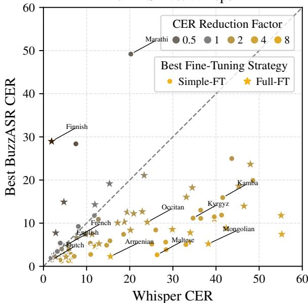

Error Reduction for 102 Languages BuzzASR vs. Whisper  
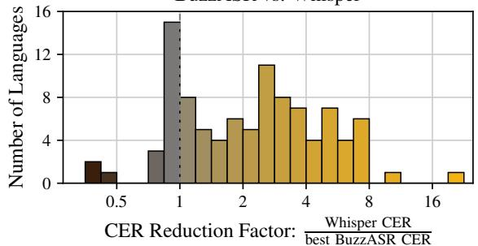  
Figure 1: Comparison BuzzASR and Whisper on automatic speech recognition across 102 languages. For each language, we report only the best BuzzASR model. Some outliers are excludedfor presentation.

may not seem to be very much data, it can be surprisingly effective when applying domain adaptation to large pretrained multilingual ASR models.

Previous work was able to cut word error rates on low-resource languages by half compared to (at the time) state-of-the-art models, using less than 10 hours of monolingual data (Jimerson et al., 2018; Liu et al., 2024; Ozyilmaz et al.¨ , 2025; Imam et al.,

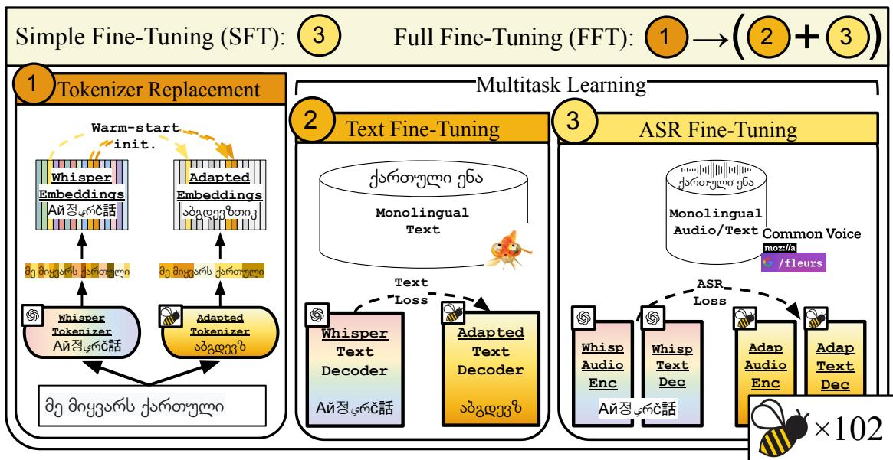  
Figure 2: Overview of our two language adaptation approaches. Simple fine-tuning is a minimal approach in ×102which we fine-tune Whisper-large-v3 on monolingual speech recognition data. Full fine-tuning is a 3-stage pipeline involving tokenizer replacement, multitask fine-tuning on text-only and speech recognition, and ending with speech recognition fine-tuning.

2025, inter alia). However, these contributions primarily applied this approach to a small number of domains or languages. Thus, the reason why ASR models underperform for most widely spoken languages is not that we lack the ability to train such models; it is simply that the resources that exist have primarily been used to train either massively multilingual models or one-off languagespecialized models. Recently, in the text domain, it has been shown that small monolingual text generation models may outperform larger, massively multilingual models on linguistic tasks at the scale of hundreds of languages (Chang et al., 2026). We take a similar approach to ASR and ask whether relatively small models dedicated to a single language can offer better performance, especially for lower-resource languages.

In this paper, we present a suite of 102 languagespecific ASR models, which are fine-tuned models based on Whisper (Radford et al., 2023). For 77 of the 102 languages, the best of our fine-tuned models outperforms the original Whisper-Large-v3 on normalized CER, with the median language seeing CER cut by 2.18 and the mean by 2.84 . The median absolute CER drops from 15.5% (Whisper zero-shot) to 7.6% (best fine-tuned). Among opensource ASR systems, our models achieve state-ofthe-art CER on 27 of 102 languages on a combined evaluation drawn from FLEURS and Common Voice. The gains are greatest where Whisper is weakest: in Whisper’s 51 worst languages by CER, the median reduction is 3.45 , and for ten languages the best fine-tuned model cuts CER by more than 6 , led by Amharic, Maltese, and Sorani Kurdish.

While simple fine-tuning is effective, we also explore two improvements to the na¨ıve approach: First, we modify the Whisper tokenizer for each language. The original tokenizer was trained on an imbalanced multilingual dataset, leading to overly long sequence lengths—and therefore worse performance and inference latencies—in poorly represented languages or languages using non-Latin scripts. Second, we fine-tune the Whisper text decoder on monolingual text data, in addition to finetuning both the audio encoder and text decoder on ASR data. Many languages are poorly represented in Whisper’s pretraining data, and the limited ASR data is insufficient to learn the target language’s lexicon and grammar. In many such cases, however, sufficient text data is available, allowing us to instill this language-specific knowledge without requiring large amounts of audio data.

The results of this work demonstrate that language-specific models can perform better and more efficiently, making use of relatively small resources. We release a suite of models for 102 languages, 27 of which are, to our knowledge, the state of the art for open-source models.

## 2 Related Work

## 2.1 Low-Resource & Multilingual ASR

Earlier work in low-resource ASR primarily focused on developing monolingual or limited multilingual systems for individual low-resource languages (Naing et al., 2015; Popovic et al.´ , 2017; Kipyatkova and Karpov, 2016; Bali et al., 2013; Upadhyaya et al., 2017; Ali et al., 2014; Luong and Vu, 2016; Deka et al., 2018, inter alia). Later, multilingual pretraining with little to no extra supervision was found to be effective (Watanabe et al., 2017; Toshniwal et al., 2018). Motivated by these findings, Srivastava et al. (2018) and Diwan et al. (2021) released high-quality speech datasets and conducted shared tasks encouraging research in multilingual ASR. Klejch et al. (2021) and Mirishkar et al. (2021) achieved state-of-the-art results on the released shared task datasets, applying various established data-cleaning, augmentation, and multilingual techniques.

In addition to large-scale data efforts, architectural innovations (Vaswani et al., 2017) and advancements in self-supervised learning have made it possible to build powerful scaled-up ASR models like Whisper that achieve state-of-the-art results on several benchmarks (Radford et al., 2023). Notably, wav2vec (Schneider et al., 2019) shows speech representations can be learned from unlabeled audio, leading to reduced dependency on labeled data. Many have scaled this paradigm up in terms of language coverage, number of training hours, and model size (Baevski et al., 2020; Babu et al., 2022; Zhang et al., 2023; Pratap et al., 2024).

At the time of release, Whisper achieved state-ofthe-art performance across languages and diverse conditions, leading to widespread adoption (Radford et al., 2023; Olatunji et al., 2023; Bhogale et al., 2023b; Talafha et al., 2023). Whisper also motivated a range of adaptation strategies for new languages, domains, and tasks including fine-tuning (Bhogale et al., 2023b; Yadavalli et al., 2025), parameter-efficient fine-tuning (Kang et al., 2024; Song et al., 2024), prompt-tuning (Ma et al., 2024; Yang et al., 2025), multilingual or multitask fine-tuning (Bhogale et al., 2023b; Olatunji et al., 2023), and other methods (Zhao et al., 2026; Juvekar et al., 2026). Given the broad adoption and the growing body of work on adapting Whisper, we experiment with Whisper models in this study.

## 2.2 ASR Datasets

Recent efforts in creating and publicly releasing large multilingual ASR corpora have enabled the scaling of multilingual ASR models (Pratap et al., 2020; Wang et al., 2021; Li et al., 2024). However, many of these datasets primarily focus on highresource European languages. To address this limitation, substantial efforts have been made to collect speech corpora for other languages and regions. One such early effort is BABEL (Gales et al., 2014), a multilingual conversational telephone speech corpus covering 17 low-resource languages. Common Voice (Ardila et al., 2020) is a continuously evolving large-scale crowdsourced effort maintained by Mozilla to collect speech data across a large number of languages. FLEURS (Conneau et al., 2023) is an n-way parallel speech dataset covering 102 languages and is adapted from the FLORES-101 (Goyal et al., 2022) machine translation benchmark. Chen et al. (2024) release an un-transcribed multilingual speech dataset with coverage spanning more than 4000 languages. Most recently, Omnilingual released transcribed data for 348 traditionally under-resourced languages (Keren et al., 2025).

Several region-specific initiatives have also focused on improving speech resources for underrepresented languages. Project Vaani (Pulikodan et al., 2026) released more than 30,000 hours of culturally relevant speech data spanning over 100 languages in the Indian subcontinent while ensuring regional diversity. Shrutilipi (Bhogale et al., 2023a) released more than 6,000 hours of transcribed Indic speech data mined from in-the-wild sources. Similarly, African Next Voices (Marivate et al., 2026), NaijaVoices (Emezue et al., 2025), and WAXAL (Diack et al., 2026) provide high-quality culturally rich speech datasets for several African languages. In this work, we use Common Voice (Ardila et al., 2020) and FLEURS (Conneau et al., 2023) because they provide high-quality multilingual speech data with broad language coverage, making them wellsuited for our work.

## 2.3 Curse of Multilinguality

While joint multilingual training can lead to impressive results due to crosslingual transfer for ASR (Pratap et al., 2024; Keren et al., 2025), multilingual pretraining may also be limited by the “curse of multilinguality” (Conneau et al., 2020; Mei et al., 2026; Zhao et al., 2026). This refers to the phenomenon where training on a very large number of language leads to degraded performance for many of the languages. This has been studied for text generation models, and has been found to be driven by limited model capacity and negative interference from unrelated languages (Chang et al., 2024).

## 3 Adaptation strategies

In this paper, we hope to challenge the reliance on the one-model-to-rule-them-all paradigm and advocate for language- and context-specific training to maximize performance for each language. We consider two approaches to adapting pretrained Whisper to a target language: Simple fine-tuning entails fine-tuning the entire Whisper model on aligned monolingual speech–text data using the ASR objective. Full fine-tuning is a more complex pipeline in which we replace Whisper’s multilingual tokenizer with a language-specialized one and fine-tune on a mixture of monolingual text-only and speech–text data.

Referring to Figure 2, we introduce the basic building blocks of these pipelines below: tokenizer replacement, ASR fine-tuning, and text fine-tuning. Additionally, multitask fine-tuning combines text fine-tuning and ASR fine-tuning.

## 3.1 Tokenizer Replacement

Whisper uses a byte-level byte-pair encoding (BPE) tokenizer (Sennrich et al., 2016; Radford et al., 2019) with a vocabulary of 51,865 tokens: 50,257 BPE merges and 1,608 special tokens, including 99 language tokens. The Whisper tokenizer was trained on a corpus heavily skewed towards English (Radford et al., 2023). As a result, the tokenizer is well-adapted only to the most highly represented languages, and is especially poorly suited to languages with non-Latin and unique scripts. Replacing the vocabulary allows the models to maximally and efficiently benefit from the language-specific adaptation (Minixhofer et al., 2022, inter alia).

To perform tokenizer replacement for a target language, we begin by training a new BPE tokenizer on a monolingual text corpus. While we could simply randomly initialize a new embedding matrix for the new vocabulary, this approach fails to leverage existing structure in the pretrained model. Instead, we adopt a warm-start initialization of the embedding matrix, resembling Gee et al. (2022). First, embeddings for any entries appearing in both tokenizers’ vocabularies are initialized using the original Whisper embedding. Second, for any entries appearing only in the new tokenizer’s vocabulary, we tokenize that entry according to the original tokenizer, and initialize the new embedding as the average of the original tokenizer’s embeddings.

For example, the German compound Geschwindigkeit (“speed”) receives its own dedicated entry in our per-language German BPE. Whisper’s original tokenizer, lacking a single merge for this compound, decomposes it into four subword tokens: G + esch + wind + igkeit. The new Geschwindigkeit embedding is initialized as the mean of those four subword embeddings, preserving whatever lexical information Whisper had already encoded at the level of static embeddings.

We apply the identical warm-start procedure to the output (unembedding) projection, initializing each row from (the average of) the corresponding Whisper output embeddings, so that both the input and output representations of a new token inherit Whisper’s encoded information. Throughout, we keep the token-to-index mapping consistent between the embedding and unembedding matrices.

## 3.2 ASR Fine-Tuning

During ASR fine-tuning, the entire Whisper encoder–decoder model is fine-tuned on aligned speech–text data using an ASR objective. Our simple fine-tuning pipeline consists only of this step.

## 3.3 Text Fine-Tuning

During text fine-tuning, the Whisper text decoder is fine-tuned on text-only data using the autoregressive language modeling objective (next-token prediction). As Whisper’s decoder incorporates cross-attention from the encoder embeddings, we pass dummy inputs to the encoder in the form of random embeddings and freeze the encoder.

Text fine-tuning is primarily useful insofar as text-only data is more abundant than speech–text data for the target language. Generally, there are several orders of magnitude difference in dataset size. For some languages, the only ASR data available is from FLEURS, comprising only about 40,000 English words, while we have at least 1M tokens of text data for each language—and in many cases much more data. While in most cases we would prefer ASR fine-tuning given sufficient data, fortunately, there are two areas in which we speculate that training the decoder alone on text data is sufficient:

First, the syntactic priors of the model can conceivably be improved through text fine-tuning. The decoder alone is responsible for outputting grammatical text, while the encoder may specialize in acoustic processing and phonological representations. Chang et al. (2026) showed that even with less than 1GB of text data, small models can learn syntactic information as well as much larger models trained on orders of magnitude more data. Not only is the syntax largely dependent on the text alone, but syntax differs substantially across languages. Text-generation models exhibit worse cross-lingual transfer when they have less similar syntax (Chang et al., 2024). If syntax is more language-specific and harder to learn, we reason that the decoder stands to benefit from relatively abundant text-only input.

Second, if we are performing tokenizer replacement, the model must adapt to the new vocabulary. As this is likely to require extensive training, and the tokenizer is used only by the decoder, textonly inputs are particularly valuable at this stage to prevent tokens in the new vocabulary from being under-trained.

## 3.4 Multitask Learning

Multitask fine-tuning is a single fine-tuning stage in which each minibatch contains a mixture of ASR examples (aligned speech–text pairs) and text-only examples, with the fraction of ASR examples controlled by a hyperparameter $\alpha \in ( 0 , 1 ]$ , the ASR proportion. Each example in the batch contributes its own loss term: the ASR loss for aligned pairs, computed against the full encoder–decoder output; and the language-modeling loss for text-only examples, computed by passing random embeddings as encoder input and freezing the encoder, as described in Section 3.3. Setting α = 1.0 recovers pure ASR fine-tuning; setting α = 0 recovers pure text fine-tuning.

## 4 Experiments

We study and compare two fine-tuning strategies (simple fine-tuning and full fine-tuning) to adapt a multilingual model to 102 target languages. All our experiments are done using the 1.55B parameter Whisper-large-v3 model. For each fine-tuning strategy and language, we conduct three fine-tuning runs with different hyperparameter configurations, resulting in 612 fine-tuned models. We report our hyperparameters in Section B.

## 4.1 Data and Languages

Text–Audio Data We draw aligned text–audio data from two sources: FLEURS (Conneau et al., 2023) and CommonVoice v25 (Ardila et al., 2020). We limit all our experiments and models to the 102 languages represented in FLEURS. Due to compute limitations, we restrict speech–text data to 100 hours (in English, this is approximately 1 million words) for higher-resource languages.

FLEURS is an n-way parallel corpus consisting of English Wikipedia data expert-translated into 102 languages with audio recordings by 3 native speakers. The training set contains approximately 10 hours per language, and the development and test splits contain on the order of 200–1000 samples per language depending on language coverage.

CommonVoice is a crowdsourced dataset with variable coverage of almost 300 languages. We use only data from the 77 languages also in FLEURS. Due to vast differences in data quantities per language and computational constraints, we cap the CommonVoice training data at 90 hours per language. To equalize compute across languages with very large test sets (e.g., English, Russian, Mandarin), we cap each language’s test data at 2,000 utterances. This cap is reached for 36 of the 77 languages that are included in CommonVoice.1 The remaining 25 out of 102 languages did not have any CommonVoice data, so we use only FLEURS data.

FLEURS provides normalized transcripts, which we use as-is. For CommonVoice, we apply only lightweight text normalization: lowercasing, punctuation removal with a shared regular expression, and whitespace normalization. We keep the preprocessing minimal so as to avoid altering transcript content beyond surface formatting.

For all datasets, audio is resampled to 16 kHz, and model inputs are limited to at most 30 seconds of audio. We use the provided test splits for both datasets for evaluation.

Text Data We sample 500k lines from the fishfood corpus (Chang et al., 2026). Only one FLEURS language (Kamba) had no data in fishfood, so we use the FLEURS training transcripts as text-only data. Text-only training corpora are NFCnormalized,2 lowercased, punctuation-stripped, filtered to require 70% characters in the language’s primary script, and deduplicated based on exact string match.

17-Language Subset For some supplementary experiments, we study a subset of the 102 FLEURS languages, selected heuristically to represent a wide variety of language families, scripts, and resource levels. These languages, along with key metadata, are listed in Table 2.

## 4.2 Tokenizer Replacement

For each language, we conduct tokenizer replacement as described in Section 3.1. We train a 51,865-token byte-level BPE tokenizer per language, matching Whisper’s original vocabulary size. This allows us to apply warm-start initialization without resizing the special-token block or the decoder’s unembedding head. We use the same pre-tokenizer as Whisper. Each tokenizer is trained on the same per-language fish-food corpus used for text fine-tuning, so the tokenizer’s vocabulary matches the distribution the decoder will be finetuned on.

## 4.3 Multitask Learning

For multitask fine-tuning experiments, we interleave text-only and ASR samples within a single fine-tuning stage. At each optimization step, we sample either an aligned speech-text sample with probability α or a text-only sample. In a supplementary experiment, we tested different mixing ratios of text-only and ASR samples (10%, 20%, and 50% text data; Section C) with a subset of languages, and found that 50% text data was optimal. Therefore, this is the mix that we used.

## 4.4 Experimental Configurations

For each of the 102 target languages and each finetuning strategy, we train a small set of learning-rate configurations and select, per language, the one with the lowest word error rate on the FLEURS development split. These configurations (cfg A, cfg B, and cfg C) set absolute learning rates for simple fine-tuning. For full fine-tuning, the configurations set the embedding- and decoder-learning-rate multipliers on a fixed base rate. We determined this set of configurations heuristically following a hyperparameter search with a subset of 17 languages (Section B).

Optimization. All runs use AdamW (Loshchilov and Hutter, 2019) with a per-device batch size of 2 and patience-based early stopping on FLEURSvalidation WER, evaluated every 100 steps (patience 3 for simple fine-tuning, 5 for full finetuning), for at most 6 epochs. Simple fine-tuning uses a 150-step warmup and weight decay 4 10−5. Full fine-tuning uses a 200-step warmup and weight decay 0.01 (per-configuration values in Table 3). We compute cross-entropy loss over the label tokens, masking padding positions with 100. For text-only batches in full fine-tuning, the encoder receives random embeddings and is frozen during the backward pass, so gradients flow only through the decoder.

## 4.5 Evaluation

Our primary evaluation metric is normalized character error rate (CER). We report both CER and WER in Section J, but focus our discussion on CER since word length varies widely across languages and makes WER less comparable. All reported numbers are on the combined FLEURS + Common Voice test split; for the 25 languages not covered by Common Voice, we report FLEURS results only. CER and WER are computed with jiwer.3

We also report Whisper zero-shot as a baseline. Of the 102 target languages, 83 are supported by Whisper, which we decode using the corresponding Whisper language token. The remaining 19 languages are not supported by Whisper; for these we prompt the model with the most closely related supported language (e.g., Asturian with Spanish, Kyrgyz with Kazakh, Oriya with Bengali). The full mapping is given in Section A. All systems including the Whisper zero-shot baseline are decoded identically with greedy search (num beams=1, no repeat ngram size=3, repetition penalty=1.2) and no external language-model fusion.

## 4.6 Baselines

We compare our methods to the original Whisperlarge-v3 models and several recently released multilingual ASR models: Omnilingual 1B and 7B (Keren et al., 2025); Massively Multilingual Speech (MMS, Pratap et al., 2024); Qwen3-ASR 1.7B (Shi et al., 2026); and Cohere Transcribe 2B (Mack et al., 2026). We report raw CER/WER for Qwen3- ASR and Cohere Transcribe, which do not provide normalized scores. We evaluate on all 102 languages, although not all languages are supported by every model.

CER Distributions: Ours vs. Baselines  
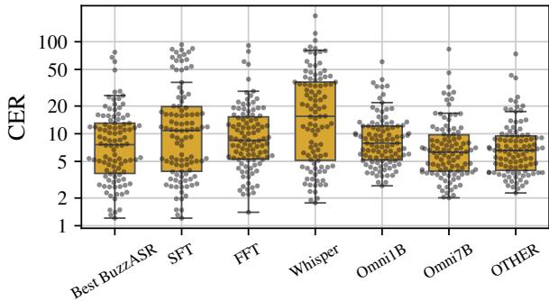

Figure 3: CERs for 102 languages for Whisper, BuzzASR models, Omnilingual models, and all other baseline models (only the best per language is shown).
<table><tr><td></td><td colspan="2">Simple-FT</td><td colspan="2">Full-FT</td><td colspan="2">Best BuzzASR</td></tr><tr><td>Baseline</td><td>CER</td><td>WER</td><td>CER</td><td>WER</td><td>CER</td><td>WER</td></tr><tr><td>Whisper-ZS</td><td>65</td><td>65</td><td>69</td><td>72</td><td>77</td><td>78</td></tr><tr><td>Omni-1B</td><td>52</td><td>60</td><td>44</td><td>65</td><td>60</td><td>76</td></tr><tr><td>Omni-7B</td><td>36</td><td>40</td><td>31</td><td>43</td><td>42</td><td>53</td></tr><tr><td>MMS-1B</td><td>41</td><td>54</td><td>39</td><td>58</td><td>53</td><td>70</td></tr><tr><td>Qwen3-ASR</td><td>91</td><td>99</td><td>91</td><td>99</td><td>94</td><td>100</td></tr><tr><td>Cohere-T</td><td>99</td><td>102</td><td>93</td><td>100</td><td>99</td><td>102</td></tr><tr><td>All</td><td>19</td><td>22</td><td>19</td><td>34</td><td>27</td><td>39</td></tr></table>

Table 1: Win rates against external baselines on the combined FLEURS+CV25 test set. Each cell is the number of languages (of 102) where the given BuzzASR strategy achieves lower CER/WER than the baseline. Best is the better of Simple-FT and Full-FT per language.

## 5 Results

In this section, we compare the performance of BuzzASR to Whisper and other pretrained ASR models, as well as reporting the efficacy of tokenizer adaptation. The complete CER and WER rates for BuzzASR and other pretrained models on all 102 languages are reported in Table 7 and Table 8, respectively. Complete tokenizer performance metrics for the adapted tokenizers and the original Whisper tokenizer are reported in Table 6.

## 5.1 ASR Results

As the BuzzASR models are fine-tuned from Whisper-large-v3, we first compare the performance between the two. Figure 1 compares CER on the combined test split for Whisper-large-v3 vs. BuzzASR. We report the best performance among our two fine-tuning strategies. We find that the BuzzASR models outperform Whisper on 77 languages, reducing CER by a factor of 2.8 on average. The scatter plot (Figure 1; top) shows that not only do most points fall below the diagonal, indicating that BuzzASR generally improves on Whisper-large-v3, but most points are well below the diagonal, showing substantial improvement. Improvements are especially pronounced for languages where Whisper CER is high. The majority of languages where we see little or no improvement are languages where Whisper CER is below 10, including English, Russian, French, Dutch, and Swedish. This suggests that fine-tuning is most valuable for languages under-served by Whisper’s original training distribution, while for high-resource languages, Whisper can remain competitive. For a small set of languages, such as Finnish and Marathi, we find that fine-tuning leads to substantially worse performance. We infer that fine-tuning can sometimes be unstable, and leave open the possibility that additional fine-tuning runs could still benefit these languages.

To determine the magnitude of these improvements, we calculate the CER reduction factor for each language, which we define as the ratio between Whisper zero-shot CER and the lower CER achieved by either simple fine-tuning or full finetuning. For example, a value of 2 indicates that BuzzASR achieves half the CER of Whisper-large-v3, and any value greater than 1 indicates an improvement. The distribution of CER reduction factors is visualized in Figure 1 (bottom). Across 102 languages, the median reduction factor is 2.2, meaning that the best fine-tuned system more than halves the CER for the median language. On the other hand, the mean reduction factor is much higher at 2.8, reflecting large gains for several languages with very poor zero-shot Whisper performance. In the strongest cases, such as Amharic, Armenian, Maltese, Assamese, Uzbek, and Kabuverdianu, finetuning reduces CER by more than 6 relative to Whisper zero-shot.

In Table 1, we show the win rates for BuzzASR models vs. all external baselines. We find that simple fine-tuning improves the CER for 65 languages, while full fine-tuning is better for 69 languages. This suggests that neither fine-tuning method is optimal for all languages, but instead full finetuning is more suitable for languages where the base model has a high error rate and simple finetuning is more appropriate for languages the model already makes fewer errors on.

Next, we compare to other open-weight models.

Importantly, BuzzASR beats all baselines on CER for 27 languages reaching SOTA performance.4 Omni-7B is the strongest baseline, with our best model outperforming it on only 42 languages, using CER. However, against the more comparably sized Omni-1B, BuzzASR performs better for 60 languages. The best BuzzASR model per language outperforms Qwen3-ASR and Cohere Transcribe on nearly every language (94 and 99, respectively). The full distribution of CERs for most models are visualized in Figure 3.

## 5.2 Tokenizer-quality metrics

Next, we analyze the impact of tokenizer adaptation. Figure 4 (top) compares the compression rate, measured as characters per token, of our tokenizer and Whisper’s tokenizer across all the evaluated languages. The density plot shows that our models have higher compression rates for the vast majority of languages. The median compression rate increases from 2.38 characters per token for Whisper to 5.04 for our tokenizers, resulting in a median gain of 2.18 . The effect is especially pronounced for non-Latin scripts, where Whisper’s tokenization is highly fragmented the median compression gain is 3.80 for non-Latin scripts versus 1.93 for Latin scripts. This reduction in fragmentation shortens sequence lengths, thus making multilingual speech recognition more efficient. We refer the readers to Table 5, which shows the script-wise improvement in ASR latency due to our improved tokenizers. Furthermore, the distribution of compression rates across languages appears roughly normal, which suggests that the compression rates are more consistent cross-linguistically.

We also examine how the improvements in tokenization efficiency are associated with downstream ASR gains using Figure 4 (bottom). The x-axis shows the compression rate ratio between our tokenizer and Whisper’s tokenizer, while the y-axis shows the CER reduction factor obtained by the BuzzASR model with full fine-tuning relative to Whisper zero-shot. The regression line shows a general positive relationship. This indicates that languages for which our tokenizer provides larger compression gains also tend to show larger CER reductions after fine-tuning. However, this trend is moderate rather than deterministic, indicating that tokenization is only one of the many factors affecting the ASR performance. The effect is especially pronounced for non-Latin script languages—they have a higher median compression ratio than Latinscript languages and also tend to obtain larger CER reductions. We report additional tokenizer metrics, such as UTF-8 coverage, vocab utilization, and boundary crossing, in Section I.

Tokenizer Compression for 102 Languages  
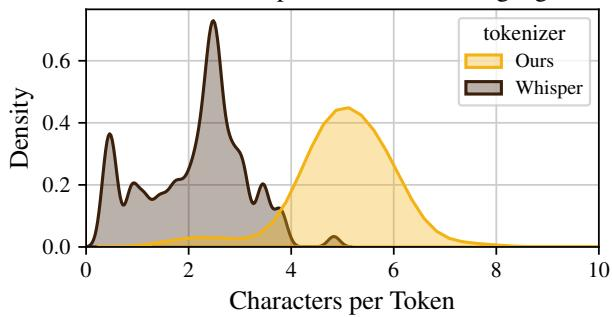  
Error Reduction vs. Tokenizer Improvement

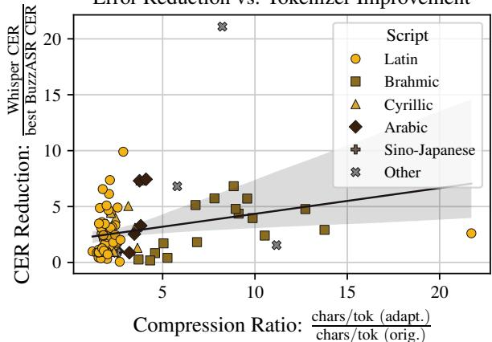  
Figure 4: Top: Distribution of tokenizer compression rates for all languages with original and adapted tokenizers. Bottom: Relationship between improvement in CER between Whisper and full fine-tuning by writing system and change in compression rate after tokenizer adaptation.

## 5.3 Supplementary Results

In the Appendix, we report several supplementary experiments. We briefly summarize those findings below.

For multitask fine-tuning, higher proportions of ASR training are better. In Section C, we explore variants of the multitask fine-tuning training hyperparameters. Among the settings we compare, 50% ASR data is optimal, and increasing the amount of text-only data yields modest improvements.

Warm-start initialization improves tokenizer adaptation. In Section D, we compare alternative strategies for tokenizer adaptation, including a tokenizer replacement strategy where we randomly initialize new language-specific tokens and a tokenizer adaptation strategy where we append new tokens to the end of the original tokenizer merge list. The warm-start tokenizer replacement strategy used in our main full fine-tuning experiments performs best.

Out-of-domain evaluation hurts performance slightly. In Section E, we test out-of-domain generalization of models trained on FLEURS alone. We find that out-of-domain evaluation hurts performance slightly. This suggests that some (but probably not all) of the performance gains we observe over baseline models are due to better domain alignment of our models’ train and test data, rather than language-specific fine-tuning.

Multilingual fine-tuning harms performance slightly. In Section F, we compare bilingual finetuning runs to monolingual runs. For nearly all language pairs (including related and unrelated language pairs), we find that monolingual fine-tuning is more effective.

Multitask fine-tuning is not helpful without tokenizer replacement. In Section G, we disentangle the effects of tokenizer replacement and multitask fine-tuning, which are conflated in our full fine-tuning experiments. We find that full finetuning is more effective than multitask fine-tuning without tokenizer replacement.

## 6 Discussion and Conclusion

BuzzASR models provide SOTA or near-SOTA automatic speech recognition for dozens of languages. Given their Whisper-based architecture, BuzzASR models can be easily deployed in any pipeline already implemented for Whisper where strong monolingual performance is needed on one of our covered languages. While BuzzASR models are outperformed by Omni-7B on the majority of languages, we note that BuzzASR generally outperforms Omni-1B, which has a more comparable number of parameters. Thus, in cases where Omni-7B is too large to deploy, BuzzASR offers competitive performance for the majority of languages we cover.

In addition to providing a new open-source model suite, our experiments demonstrate the efficacy of language-specialized fine-tuning at scale. Given the benefits of language-specialized models to the global community, our work motivates similar approaches with other ASR model architectures, as well as with text models and multimodal models.

Finally, our tokenizer replacement approach reveals the extent to which multilingual tokenizers under-deliver, particularly for non-Latin scripts. We show that language-adapted tokenizers not only improve ASR performance disproportionately in cases where the original tokenizer was ill-suited, they also decrease inference latency and compute by reducing sequence lengths.

Future Work There are significant opportunities for future improvements to BuzzASR. First, we believe through further hyperparameter-tuning for vocabulary adaptation and multi-task learning we could achieve better performance. We focused on a limited set of design choices to optimize, and most significantly improved performance. By further tuning the multitask learning protocol, we could better make use of abundant text-only data.

Second, there is a wide array of established optimizations for ASR that we do not yet exploit. These include data augmentation through the addition of noise or text-to-speech, interpolation with monolingual text-only LMs, and training simultaneously on closely related languages.

Finally, we focus on a relatively small set of languages. As we note above, there is sufficient finetuning data for roughly 1000 languages. We hope to expand our suite of BuzzASR models, especially to include under-represented and under-studied languages. As ASR can be used to increase text data for training language models, creating better tools for these languages can lead to improvements in other language technologies.

## Limitations

In this paper, we only conduct fine-tuning experiments on Whisper. However, Omni-7B still shows state-of-the-art performance for most languages. We anticipate that fine-tuning Omnilingual would result in even better performance. We focused on Whisper because it is very widely used and integrated into many existing pipelines. Replacing Whisper with one of our models would require minimal adjustments for users. Furthermore, Whisperlarge-v3 is significantly smaller than Omni-7B, with only 1.6B parameters. Focusing on smaller models results in more efficient and economical models, and we note that BuzzASR models outperform the similarly sized Omni-1B in the vast majority of cases. While we aimed to produce performant models, the main goal of the paper was to demonstrate the efficacy of our fine-tuning approach for models optimized for a single language. Future work could explore using other models as starting points.

We used only a small fraction of the existing ASR data. We limited the data we use to 100 hours of data, primarily due to computational resource limitations. For the languages we fine-tuned models for in this paper, we could achieve even higher performance by using more of the available data. There are also many languages which we did not train models for, but for which there is a significant amount of data. We hope this approach can be applied to a wider set of languages.

We use the test splits from our training datasets (FLEURS and Common Voice) for evaluation. Due to data limitations, we do not evaluate performance across different domains or dialects, as such datasets are not available for many of the languages we consider in this paper. A supplementary analysis Section E reveals that out-of-domain generalization may be a challenge for adapted ASR models resembling the BuzzASR releases.

We also note that monolingual models may provide better performance in controlled evaluation, but might not be appropriate for all applications. Monolingual models are best when one already knows the language that is being used, which may limit their utility. If coverage of multiple languages is required, deploying multiple monolingual models will require substantially more compute resources than deploying a single multilingual model. This is especially true given we perform full fine-tuning, rather than parameter-efficient finetuning, which improves memory efficiency in exchange for some losses in performance on ASR (Liu et al., 2024). Additionally, multilingual models may better be able to handle code switching or multi-dialectal speech, though this may require additional specialized training or fine-tuning.

## Acknowledgments

This work used resources available through the National Research Platform (NRP) at the University of California, San Diego (Weitzel et al., 2025). NRP has been developed, and is supported in part, by funding from National Science Foundation, from awards 1730158, 1540112, 1541349, 1826967, 2112167, 2100237, and 2120019, as well as additional funding from community partners. We also thank CoreWeave for providing compute for

this project.

## References

Ahmed Ali, Yifan Zhang, Patrick Cardinal, Najim Dahak, Stephan Vogel, and James Glass. 2014. A complete KALDI recipe for building Arabic speech recognition systems. In 2014 IEEE Spoken Language Technology Workshop (SLT), pages 525–529.

Rosana Ardila, Megan Branson, Kelly Davis, Michael Kohler, Josh Meyer, Michael Henretty, Reuben Morais, Lindsay Saunders, Francis Tyers, and Gregor Weber. 2020. Common Voice: A massivelymultilingual speech corpus. In Proceedings of the Twelfth Language Resources and Evaluation Conference, pages 4218–4222, Marseille, France. European Language Resources Association.

Arun Babu, Changhan Wang, Andros Tjandra, Kushal Lakhotia, Qiantong Xu, Naman Goyal, Kritika Singh, Patrick von Platen, Yatharth Saraf, Juan Pino, Alexei Baevski, Alexis Conneau, and Michael Auli. 2022. XLS-R: Self-supervised Cross-lingual Speech Representation Learning at Scale. In Interspeech 2022, pages 2278–2282.

Alexei Baevski, Yuhao Zhou, Abdelrahman Mohamed, and Michael Auli. 2020. wav2vec 2.0: A framework for self-supervised learning of speech representations. In Advances in Neural Information Processing Systems, volume 33, pages 12449–12460. Curran Associates, Inc.

Kalika Bali, Sunayana Sitaram, Sebastien Cuendet, and Indrani Medhi. 2013. A Hindi speech recognizer for an agricultural video search application. In Proceedings ofthe 3rd ACM Symposium on Computingfor Development, ACM DEV ’13, New York, NY, USA. Association for Computing Machinery.

Kaushal Bhogale, Abhigyan Raman, Tahir Javed, Sumanth Doddapaneni, Anoop Kunchukuttan, Pratyush Kumar, and Mitesh M. Khapra. 2023a. Effectiveness of mining audio and text pairs from public data for improving ASR systems for low-resource languages. In ICASSP 2023 - 2023 IEEE International Conference on Acoustics, Speech and Signal Processing (ICASSP), pages 1–5.

Kaushal Bhogale, Sai Sundaresan, Abhigyan Raman, Tahir Javed, Mitesh M. Khapra, and Pratyush Kumar. 2023b. Vistaar: Diverse Benchmarks and Training Sets for Indian Language ASR. In Interspeech 2023, pages 4384–4388.

Tyler A. Chang, Catherine Arnett, Zhuowen Tu, and Benjamin Bergen. 2026. Goldfish: Monolingual language models for 350 languages. Proceedings of the Fifteenth Language Resources and Evaluation Conference, pages 3750–3781.

Tyler A. Chang, Catherine Arnett, Zhuowen Tu, and Benjamin K. Bergen. 2024. When is multilinguality a curse? Language modeling for 250 high- and

low-resource languages. In Proceedings ofthe 2024 Conference on Empirical Methods in Natural Language Processing, pages 4074–4096, Miami, Florida, USA. Association for Computational Linguistics.

William Chen, Wangyou Zhang, Yifan Peng, Xinjian Li, Jinchuan Tian, Jiatong Shi, Xuankai Chang, Soumi Maiti, Karen Livescu, and Shinji Watanabe. 2024. Towards robust speech representation learning for thousands of languages. In Proceedings of the 2024 Conference on Empirical Methods in Natural Language Processing, pages 10205–10224, Miami, Florida, USA. Association for Computational Linguistics.

Alexis Conneau, Kartikay Khandelwal, Naman Goyal, Vishrav Chaudhary, Guillaume Wenzek, Francisco Guzman, Edouard Grave, Myle Ott, Luke Zettle-´ moyer, and Veselin Stoyanov. 2020. Unsupervised cross-lingual representation learning at scale. In Proceedings of the 58th Annual Meeting of the Associationfor Computational Linguistics, pages 8440– 8451, Online. Association for Computational Linguistics.

Alexis Conneau, Min Ma, Simran Khanuja, Yu Zhang, Vera Axelrod, Siddharth Dalmia, Jason Riesa, Clara Rivera, and Ankur Bapna. 2023. FLEURS: Few-shot learning evaluation of universal representations of speech. In 2022 IEEE Spoken Language Technology Workshop (SLT), pages 798–805.

Barsha Deka, S R Nirmala, and Samudravijaya K. 2018. Development of Assamese Continuous Speech Recognition System. In 6th Workshop on Spoken Language Technologies for Under-Resourced Languages (SLTU 2018), pages 220–224.

Abdoulaye Diack, Perry Nelson, Kwaku Agbesi, Angela Nakalembe, MohamedElfatih MohamedKhair, Vusumuzi Dube, Tavonga Siyavora, Subhashini Venugopalan, Jason Hickey, Uche Okonkwo, Abhishek Bapna, Isaac Wiafe, Raynard Dodzi Helegah, Elikem Doe Atsakpo, Charles Nutrokpor, Fiifi Baffoe Payin Winful, Kafui Kwashie Solaga, Jamal-Deen Abdulai, Akon Obu Ekpezu, and 24 others. 2026. WAXAL: A large-scale multilingual African language speech corpus.

Anuj Diwan, Rakesh Vaideeswaran, Sanket Shah, Ankita Singh, Srinivasa Raghavan, Shreya Khare, Vinit Unni, Saurabh Vyas, Akash Rajpuria, Chiranjeevi Yarra, Ashish Mittal, Prasanta Kumar Ghosh, Preethi Jyothi, Kalika Bali, Vivek Seshadri, Sunayana Sitaram, Samarth Bharadwaj, Jai Nanavati, Raoul Nanavati, and Karthik Sankaranarayanan. 2021. MUCS 2021: Multilingual and Code-Switching ASR Challenges for Low Resource Indian Languages. In Interspeech 2021, pages 2446–2450.

Chris Emezue, The NaijaVoices Community, Busayo Awobade, Abraham Toluwase Owodunni, Handel Emezue, Gloria Monica Tobechukwu Emezue, Nefertiti Nneoma Emezue, Sewade Ogun, Bunmi Akinremi, David Ifeoluwa Adelani, and Chris Pal.

2025. The NaijaVoices Dataset: Cultivating Large-Scale, High-Quality, Culturally-Rich Speech Data for African Languages. In Interspeech 2025, pages 1338–1342.

Ethnologue. 2025. What are the top 200 most spoken languages? https://www.ethnologue.com/ insights/ethnologue200/. Ethnologue Insights.

Mark J. F. Gales, Kate M. Knill, Anton Ragni, and Shakti P. Rath. 2014. Speech recognition and keyword spotting for low-resource languages: Babel project research at CUED. In 4th Workshop on Spoken Language Technologies for Under-Resourced Languages (SLTU 2014), pages 16–23.

Leonidas Gee, Andrea Zugarini, Leonardo Rigutini, and Paolo Torroni. 2022. Fast vocabulary transfer for language model compression. In Proceedings ofthe 2022 Conference on Empirical Methods in Natural Language Processing: Industry Track, pages 409– 416, Abu Dhabi, UAE. Association for Computational Linguistics.

Naman Goyal, Cynthia Gao, Vishrav Chaudhary, Peng-Jen Chen, Guillaume Wenzek, Da Ju, Sanjana Krishnan, Marc’Aurelio Ranzato, Francisco Guzman,´ and Angela Fan. 2022. The Flores-101 evaluation benchmark for low-resource and multilingual machine translation. Transactions of the Association for Computational Linguistics, 10:522–538.

Sukairaj Hafiz Imam, Babangida Sani, Dawit Ketema Gete, Bedru Yimam Ahmed, Ibrahim Said Ahmad, Idris Abdulmumin, Seid Muhie Yimam, Muhammad Yahuza Bello, and Shamsuddeen Hassan Muhammad. 2025. Automatic speech recognition for African low-resource languages: Challenges and future directions. In Proceedings ofthe Sixth Workshop on African Natural Language Processing (AfricaNLP 2025), pages 89–94, Vienna, Austria. Association for Computational Linguistics.

Robert Jimerson, Karthik Simha, Raymond Ptucha, and Emily Prudhommeaux. 2018. Improving ASR output for endangered language documentation. In Proceedings of the 6th Workshop on Spoken Language Technologies for Under-Resourced Languages (SLTU 2018), pages 187–191. International Speech Communication Association.

Kush Juvekar, Kavya Manohar, Aditya Srinivas Menon, Arghya Bhattacharya, and Kumarmanas Nethil. 2026. Vividh-ASR: A complexity-tiered benchmark and optimization dynamics for robust Indic speech recognition. Preprint, arXiv:2605.13087.

Ji-Hun Kang, Jae-Hong Lee, Mun-Hak Lee, and Joon-Hyuk Chang. 2024. Whisper Multilingual Downstream Task Tuning Using Task Vectors. In Interspeech 2024, pages 2385–2389.

Gil Keren, Artyom Kozhevnikov, Yen Meng, Christophe Ropers, Matthew Setzler, Skyler Wang, Ife Adebara, Michael Auli, Can Balioglu, Kevin Chan,

Chierh Cheng, Joe Chuang, Caley Droof, Mark Duppenthaler, Paul-Ambroise Duquenne, Alexander Erben, Cynthia Gao, Gabriel Mejia Gonzalez, Kehan Lyu, and 13 others. 2025. Omnilingual ASR: Opensource multilingual speech recognition for 1600+ languages. Preprint, arXiv:2511.09690.

Irina Kipyatkova and Alexey Karpov. 2016. DNN-based acoustic modeling for Russian speech recognition using Kaldi. In Speech and Computer, pages 246– 253, Cham. Springer International Publishing.

Ondˇrej Klejch, Electra Wallington, and Peter Bell. 2021. The CSTR System for Multilingual and Code-Switching ASR Challenges for Low Resource Indian Languages. In Interspeech 2021, pages 2881–2885.

Song Li, Yongbin You, Xuezhi Wang, Zhengkun Tian, Ke Ding, and Guanglu Wan. 2024. MSR-86K: An Evolving, Multilingual Corpus with 86,300 Hours of Transcribed Audio for Speech Recognition Research. In Interspeech 2024, pages 1245–1249.

Yunpeng Liu, Xukui Yang, and Dan Qu. 2024. Exploration of Whisper fine-tuning strategies for lowresource ASR. EURASIP Journal on Audio, Speech, and Music Processing, 2024(1):31.

Ilya Loshchilov and Frank Hutter. 2019. Decoupled weight decay regularization. In International Conference on Learning Representations.

Hieu-Thi Luong and Hai-Quan Vu. 2016. A non-expert Kaldi recipe for Vietnamese speech recognition system. In Proceedings of the Third International Workshop on Worldwide Language Service Infrastructure and Second Workshop on Open Infrastructures and Analysis Frameworks for Human Language Technologies (WLSI/OIAF4HLT2016), pages 51–55, Osaka, Japan. The COLING 2016 Organizing Committee.

Hao Ma, Zhiyuan Peng, Mingjie Shao, Jing Li, and Ju Liu. 2024. Extending Whisper with prompt tuning to target-speaker ASR. In ICASSP 2024 - 2024 IEEE International Conference on Acoustics, Speech and Signal Processing (ICASSP), pages 12516–12520.

Julian Mack, Ekagra Ranjan, Walter Beller-Morales, Bharat Venkitesh, and Pierre Richemond. 2026. cohere-transcribe-03-2026 (revision d96e814).

Vukosi Marivate, Kayode Olaleye, Sitwala Mundia, Andinda Bakainga, Unarine Netshifhefhe, Mahmooda Milanzie, Tsholofelo Hope Mogale, Thapelo Sindane, Zainab Abdulrasaq, Kesego Mokgosi, Chijioke Okorie, Nia Zion Van Wyk, Graham Morrissey, Dale Dunbar, Francois Smit, Tsosheletso Chidi, Rooweither Mabuya, Andiswa Bukula, Respect Mlambo, and 4 others. 2026. Swivuriso: The South African next voices multilingual speech dataset. Preprint, arXiv:2512.02201.

Yuxiang Mei, Delai Qiu, Shengping Liu, Jiaen Liang, and Yanhua Long. 2026. Zipper-LoRA: Dynamic parameter decoupling for speech-LLM based multilingual speech recognition. Preprint, arXiv:2603.17558.

Benjamin Minixhofer, Fabian Paischer, and Navid Rekabsaz. 2022. WECHSEL: Effective initialization of subword embeddings for cross-lingual transfer of monolingual language models. In Proceedings of the 2022 Conference of the North American Chapter ofthe Associationfor Computational Linguistics: Human Language Technologies, pages 3992–4006, Seattle, United States. Association for Computational Linguistics.

Ganesh Mirishkar, Aditya Yadavalli, and Anil Kumar Vuppala. 2021. An investigation of hybrid architectures for low resource multilingual speech recognition system in Indian context. In Proceedings of the 18th International Conference on Natural Language Processing (ICON), pages 205–212, National Institute of Technology Silchar, Silchar, India. NLP Association of India (NLPAI).

Hay Mar Soe Naing, Aye Mya Hlaing, Win Pa Pa, Xinhui Hu, Ye Kyaw Thu, Chiori Hori, and Hisashi Kawai. 2015. A Myanmar large vocabulary continuous speech recognition system. In 2015 Asia-Pacific Signal and Information Processing Association Annual Summit and Conference (APSIPA), pages 320– 327.

Tobi Olatunji, Tejumade Afonja, Aditya Yadavalli, Chris Chinenye Emezue, Sahib Singh, Bonaventure F. P. Dossou, Joanne Osuchukwu, Salomey Osei, Atnafu Lambebo Tonja, Naome Etori, and Clinton Mbataku. 2023. AfriSpeech-200: Pan-African accented speech dataset for clinical and general domain ASR. Transactions of the Association for Computational Linguistics, 11:1669–1685.

Branislav Popovic, Edvin Pakoci, and Darko Pekar.´ 2017. End-to-end large vocabulary speech recognition for the Serbian language. In Speech and Computer, pages 343–352, Cham. Springer International Publishing.

Vineel Pratap, Andros Tjandra, Bowen Shi, Paden Tomasello, Arun Babu, Sayani Kundu, Ali Elkahky, Zhaoheng Ni, Apoorv Vyas, Maryam Fazel-Zarandi, Alexei Baevski, Yossi Adi, Xiaohui Zhang, Wei-Ning Hsu, Alexis Conneau, and Michael Auli. 2024. Scaling speech technology to 1,000+ languages. Journal ofMachine Learning Research, 25(97):1–52.

Vineel Pratap, Qiantong Xu, Anuroop Sriram, Gabriel Synnaeve, and Ronan Collobert. 2020. MLS: A Large-Scale Multilingual Dataset for Speech Research. In Interspeech 2020, pages 2757–2761.

Sujith Pulikodan, Abhayjeet Singh, Agneedh Basu, Nihar Desai, Pavan Kumar J, Pranav D Bhat, Raghu Dharmaraju, Ritika Gupta, Sathvik Udupa, Saurabh Kumar, Sumit Sharma, Vaibhav Vishwakarma, Visruth Sanka, Dinesh Tewari, Harsh Dhand, Amrita Kamat, Sukhwinder Singh, Shikhar Vashishth, Partha Talukdar, and 2 others. 2026. Vaani: Capturing the language landscape for an inclusive digital india. Preprint, arXiv:2603.28714.

Alec Radford, Jong Wook Kim, Tao Xu, Greg Brockman, Christine McLeavey, and Ilya Sutskever. 2023. Robust speech recognition via large-scale weak supervision. In Proceedings ofthe 40th International Conference on Machine Learning, volume 202 of Proceedings ofMachine Learning Research, pages 28492–28518. PMLR.

Alec Radford, Jeffrey Wu, Rewon Child, David Luan, Dario Amodei, and Ilya Sutskever. 2019. Language models are unsupervised multitask learners. OpenAI Technical Report.

Steffen Schneider, Alexei Baevski, Ronan Collobert, and Michael Auli. 2019. wav2vec: Unsupervised Pre-Training for Speech Recognition. In Interspeech 2019, pages 3465–3469.

Rico Sennrich, Barry Haddow, and Alexandra Birch. 2016. Neural machine translation of rare words with subword units. In Proceedings of the 54th Annual Meeting of the Association for Computational Linguistics, pages 1715–1725, Berlin, Germany. Association for Computational Linguistics.

Xian Shi, Xiong Wang, Zhifang Guo, Yongqi Wang, Pei Zhang, Xinyu Zhang, Zishan Guo, Hongkun Hao, Yu Xi, Baosong Yang, Jin Xu, Jingren Zhou, and Junyang Lin. 2026. Qwen3-ASR Technical Report. Preprint, arXiv:2601.21337.

Zheshu Song, Jianheng Zhuo, Yifan Yang, Ziyang Ma, Shixiong Zhang, and Xie Chen. 2024. LoRA-Whisper: Parameter-Efficient and Extensible Multilingual ASR. In Interspeech 2024, pages 3934–3938.

Brij Mohan Lal Srivastava, Sunayana Sitaram, Rupesh Kumar Mehta, Krishna Doss Mohan, Pallavi Matani, Sandeepkumar Satpal, Kalika Bali, Radhakrishnan Srikanth, and Niranjan Nayak. 2018. Interspeech 2018 Low Resource Automatic Speech Recognition Challenge for Indian Languages. In 6th Workshop on Spoken Language Technologies for Under-Resourced Languages (SLTU 2018), pages 11–14.

Bashar Talafha, Abdul Waheed, and Muhammad Abdul-Mageed. 2023. N-Shot Benchmarking of Whisper on Diverse Arabic Speech Recognition. In Interspeech 2023, pages 5092–5096.

Shubham Toshniwal, Tara N. Sainath, Ron J. Weiss, Bo Li, Pedro Moreno, Eugene Weinstein, and Kanishka Rao. 2018. Multilingual speech recognition with a single end-to-end model. In 2018 IEEE International Conference on Acoustics, Speech and Signal Processing (ICASSP), pages 4904–4908.

Prashant Upadhyaya, Omar Farooq, Musiur Raza Abidi, and Yash Vardhan Varshney. 2017. Continuous Hindi speech recognition model based on Kaldi ASR toolkit. In 2017 International Conference on Wireless Communications, Signal Processing and Networking (WiSPNET), pages 786–789.

Ashish Vaswani, Noam Shazeer, Niki Parmar, Jakob Uszkoreit, Llion Jones, Aidan N. Gomez, Łukasz

Kaiser, and Illia Polosukhin. 2017. Attention is all you need. In Proceedings of the 31st International Conference on Neural Information Processing Systems, NIPS’17, page 6000–6010, Red Hook, NY, USA. Curran Associates Inc.

Changhan Wang, Morgane Riviere, Ann Lee, Anne Wu, Chaitanya Talnikar, Daniel Haziza, Mary Williamson, Juan Pino, and Emmanuel Dupoux. 2021. VoxPopuli: A large-scale multilingual speech corpus for representation learning, semi-supervised learning and interpretation. In Proceedings of the 59th Annual Meeting of the Association for Computational Linguistics and the 11th International Joint Conference on Natural Language Processing (Volume 1: Long Papers), pages 993–1003, Online. Association for Computational Linguistics.

Shinji Watanabe, Takaaki Hori, and John R. Hershey. 2017. Language independent end-to-end architecture for joint language identification and speech recognition. In 2017 IEEE Automatic Speech Recognition and Understanding Workshop (ASRU), pages 265– 271.

Derek Weitzel, Ashton Graves, Sam Albin, Huijun Zhu, Frank Wuerthwein, Mahidhar Tatineni, Dmitry Mishin, Elham Khoda, Mohammad Sada, Larry Smarr, Thomas DeFanti, and John Graham. 2025. The National Research Platform: Stretched, multitenant, scientific kubernetes cluster. In Practice and Experience in Advanced Research Computing 2025: The Power ofCollaboration, PEARC ’25, New York, NY, USA. Association for Computing Machinery.

Aditya Yadavalli, Tiago Pimentel, Tamar I Regev, Ethan Wilcox, and Alex Warstadt. 2025. What do prosody and text convey? Characterizing how meaningful information is distributed across multiple channels. Preprint, arXiv:2512.16832.

Hongli Yang, Yizhou Peng, Hao Huang, and Sheng Li. 2025. Adapting Whisper for Parameter-efficient Code-Switching Speech Recognition via Soft Prompt Tuning. In Interspeech 2025, pages 5203–5207.

Yu Zhang, Wei Han, James Qin, Yongqiang Wang, Ankur Bapna, Zhehuai Chen, Nanxin Chen, Bo Li, Vera Axelrod, Gary Wang, Zhong Meng, Ke Hu, Andrew Rosenberg, Rohit Prabhavalkar, Daniel S. Park, Parisa Haghani, Jason Riesa, Ginger Perng, Hagen Soltau, and 8 others. 2023. Google USM: Scaling automatic speech recognition beyond 100 languages. Preprint, arXiv:2303.01037.

Qiuming Zhao, Guangzhi Sun, and Chao Zhang. 2026. Low-rank and sparse model merging for multi-lingual speech recognition and translation. In ICASSP 2026 - 2026 IEEE International Conference on Acoustics, Speech and Signal Processing (ICASSP), pages 18827–18831.

Omer Tarik ¨ Ozyilmaz, Matt Coler, and Matias ¨ Valdenegro-Toro. 2025. Overcoming Data Scarcity in Multi-Dialectal Arabic ASR via Whisper Fine-Tuning. In Interspeech 2025, pages 1158–1162.

## A Unsupported Whisper Languages

Out of the 102 languages we experiment with, 19 of them are not natively supported by Whisper. For such languages, we prompt the model with the language token that is most closely related to the target language. These languages are Asturian, Cebuano, Sorani Kurdish, Fulah, Irish, Igbo, Kamba, Kabuverdianu, Kyrgyz, Luganda, Luo, Northern Sotho, Nyanja, Oromo, Oriya, Umbundu, Wolof, Xhosa, and Zulu.

## B Hyperparameters

## B.1 Hyperparameters for multitask fine-tuning

For each language and each fine-tuning strategy we train models with three configurations, A, B, C (Table 3). We use two random seeds (42, 1337) for simple fine-tuning and three (42, 1337, 2024) for full fine-tuning.

For simple fine-tuning, we use an absolute decoder learning rate and set the encoder rate to 0.3 the decoder rate, so as to preserve Whisper’s pretrained acoustic features.

We apply patience-based early stopping on FLEURS development throughout. For full finetuning, we use a patience of 5 and evaluate every 100 steps. For simple fine-tuning, we use a patience of 3 and evaluate every 100 steps and select checkpoints by validation WER. For full finetuning, we select checkpoints by validation WER for high-coverage languages but use validation loss for a small set of low-coverage languages where the WER is noisy.5

We use 8 A100-80GB for all experiments.

## B.2 Hyperparameter Sweep Results

We conducted a set of Bayesian hyperperameter sweeps for the 17 core languages. Table 4 lists the per-language optima for the 17 core languages sorted by FLEURS-test WER (lower is better). These optima motivated the discrete simple fine-tuning configurations used at scale and were not deployed directly. We ran a 5-run sweep over a six-dimensional search space: decoder learning rate $\in [ 1 0 ^ { - 5 } , 8 \times 1 0 ^ { - 5 } ]$ gradient accumulation $\in \quad \{ 1 6 , 2 4 , 3 2 \}$ , scheduler  linear, cosine, exponential , decay rate $\in \{ 0 . 9 , 0 . 9 5 , 0 . 9 9 \}$ , warmup steps $\in \{ 1 0 0 , 1 5 0 \}$ and weight decay $\in [ 1 0 ^ { - 5 } , 1 0 ^ { - 3 } ]$ . Each run trained for up to 12 epochs with patience 3.

<table><tr><td>Language</td><td>Code</td><td>Script</td><td>Family</td><td>Region</td><td>Speakers</td></tr><tr><td>Arabic</td><td>ar</td><td>Arabic</td><td>Afro-Asiatic (Semitic)a</td><td>MENA</td><td>411M</td></tr><tr><td>Cantonese</td><td>_b</td><td>Chinese (Han)</td><td>Sino-Tibetan</td><td>S. China / Hong Kong</td><td>85M</td></tr><tr><td>Catalan</td><td>ca</td><td>Latin</td><td>Indo-European (Romance)</td><td>NE Spain / Andorra</td><td>4.1M</td></tr><tr><td>Galician</td><td>gl</td><td>Latin</td><td>Indo-European (Romance)</td><td>NW Spain (Galicia)</td><td>2.4M</td></tr><tr><td>Georgian</td><td>ka</td><td>Georgian</td><td>Kartvelian</td><td>South Caucasus</td><td>3.76M</td></tr><tr><td>German</td><td>de</td><td>Latin</td><td>Indo-European (Germanic)</td><td>Central Europe</td><td>95M</td></tr><tr><td>Italian</td><td>it</td><td>Latin</td><td>Indo-European (Romance)</td><td>Southern Europe</td><td>65M</td></tr><tr><td>Latvian</td><td>lv</td><td>Latin</td><td>Indo-European (Baltic)</td><td>Baltic region</td><td>1.5M</td></tr><tr><td>Pashto</td><td>ps</td><td>Perso-Arabic</td><td>Indo-European (Iranian)</td><td>Afghanistan / Pakistan</td><td>51M</td></tr><tr><td>Polish</td><td>pl</td><td>Latin</td><td>Indo-European (Slavic)</td><td>Central Europe</td><td>40M</td></tr><tr><td>Russian</td><td>ru</td><td>Cyrillic</td><td>Indo-European (Slavic)</td><td>E. Europe / N. Asia</td><td>145M</td></tr><tr><td>Spanish</td><td>es</td><td>Latin</td><td>Indo-European (Romance)</td><td>Iberia / Americas</td><td>519M</td></tr><tr><td>Swahili</td><td>SW</td><td>Latin</td><td>Niger-Congo (Bantu)</td><td>East Africa</td><td>5.3Mc</td></tr><tr><td>Tajik</td><td>tg</td><td>Cyrillic</td><td>Indo-European (Iranian)</td><td>Central Asia</td><td>10.5M</td></tr><tr><td>Tamil</td><td>ta</td><td>Tamil</td><td>Dravidian</td><td>S. India / Sri Lanka</td><td>79M</td></tr><tr><td>Ukrainian</td><td>uk</td><td>Cyrillic</td><td>Indo-European (Slavic)</td><td>Eastern Europe</td><td>32M</td></tr><tr><td>Uzbek</td><td>uz</td><td>Latin</td><td>Turkic</td><td>Central Asia</td><td>34M</td></tr></table>

Table 2: Overview of 17 sample languages, with ISO 639-1 codes, writing systems, language families, primary geographic regions, and approximate number of first-language (L1) speakers, based on Wikipedia data as of 2026 (mainly citing Ethnologue).  
Cantonese lacks an ISO 639-1 code, being covered by the Chinese macrolanguage code zh. Its ISO 639-3 code is yue.  
b This figure reflects the combined L1 total across all varieties under the Arabic macrolanguage as classified by Ethnologue/ISO.  
c Swahili L1 speakers are vastly outnumbered by L2 speakers (approx. 92M L2 vs. 5.3M L1).

<table><tr><td>Cfg</td><td>dec LR</td><td></td><td>enc LR embed LR ga sched.</td><td></td><td></td><td></td><td>decay warmup</td><td>wd</td></tr><tr><td>SFT</td><td></td><td></td><td></td><td></td><td></td><td></td><td></td><td></td></tr><tr><td>A</td><td> $6 . 4 8 \times 1 0 ^ { - 6 }$ </td><td> $0 . 3 { \times } \mathrm { d e c } \mathrm { L R }$ </td><td></td><td></td><td>- 16 cosine</td><td>0.95</td><td>150</td><td> $4 . 3 5 \times 1 0 ^ { - 5 }$ </td></tr><tr><td>B</td><td> $2 . 0 0 \times 1 0 ^ { - 5 }$ </td><td> $0 . 3 { \times } \mathrm { d e c } \mathrm { L R }$ </td><td></td><td></td><td>- 32 cosine</td><td>0.95</td><td>150</td><td> $4 . 0 0 \times 1 0 ^ { - 5 }$ </td></tr><tr><td>C</td><td> $3 . 2 4 \times 1 0 ^ { - 6 }$ </td><td> $0 . 3 { \times } \mathrm { d e c } \mathrm { L R }$ </td><td></td><td></td><td>- 16 cosine</td><td>0.95</td><td>150</td><td> $4 . 3 5 \times 1 0 ^ { - 5 }$ </td></tr><tr><td>FFT</td><td></td><td></td><td></td><td></td><td></td><td></td><td></td><td></td></tr><tr><td>A</td><td> $3 . 0 \times 1 0 ^ { - 5 }$ </td><td> $3 \times 1 0 ^ { - 6 }$ </td><td> $3 . 0 \times 1 0 ^ { - 5 }$ </td><td></td><td>16 cosine-delay</td><td></td><td>200</td><td>0.01</td></tr><tr><td>B</td><td> $1 . 0 \times 1 0 ^ { - 5 }$ </td><td> $3 \times 1 0 ^ { - 6 }$ </td><td> $3 . 0 \times 1 0 ^ { - 5 }$ </td><td></td><td>16 cosine-delay</td><td></td><td>200</td><td>0.01</td></tr><tr><td>C</td><td> $2 . 0 { \times } 1 0 ^ { - 5 }$ </td><td> $3 \times 1 0 ^ { - 6 }$ </td><td> $2 . 0 { \times } 1 0 ^ { - 5 }$ </td><td></td><td>16 cosine-delay</td><td></td><td>200</td><td>0.01</td></tr></table>

Table 3: Fine-tuning configurations, fully specified. dec/embed LR: decoder/embedding learning rate; ga: gradient accumulation; sched.: LR schedule (cosine-delay = cosine with a 1000-step delay, 8000-step period); decay: scheduler decay rate; wd: weight decay. All runs use AdamW and micro-batch size 2 (effective batch = 2 ga). SFT uses a single learning rate (no separate embedding LR); FFT scales a fixed base rate η by per-config embedding/decoder multipliers and differs across configs only in those two rates. SFT and FFT letters index independent schemes. For each language and strategy we train configurations A, B, C and keep the run with the lowest FLEURS-dev WER, over two seeds (42, 1337) for SFT and three seeds (42, 1337, 2024) for FFT.

<table><tr><td>Language</td><td>WER</td><td></td><td>lr ga sched.</td><td>decay</td><td>warmup</td><td>wd</td></tr><tr><td>Italian</td><td>2.39%</td><td> $1 . 0 7 \times 1 0 ^ { - 5 }$ </td><td>32 linear</td><td>0.90</td><td>150</td><td> $2 . 6 5 \times 1 0 ^ { - 5 }$ </td></tr><tr><td>Spanish</td><td>3.75%</td><td> $4 . 4 1 \times 1 0 ^ { - 5 }$ </td><td>32 cosine</td><td>0.99</td><td>150</td><td> $4 . 9 3 \times 1 0 ^ { - 5 }$ </td></tr><tr><td>Catalan</td><td>4.29%</td><td> $1 . 5 8 \times 1 0 ^ { - 5 }$ </td><td>24 cosine</td><td>0.90</td><td>100</td><td> $1 . 6 9 \times 1 0 ^ { - 4 }$ </td></tr><tr><td>Russian</td><td>5.35%</td><td> $1 . 7 7 \times 1 0 ^ { - 5 }$ </td><td>24 linear</td><td>0.99</td><td>100</td><td> $6 . 5 1 \times 1 0 ^ { - 5 }$ </td></tr><tr><td>Polish</td><td>5.98%</td><td> $1 . 8 7 \times 1 0 ^ { - 5 }$ </td><td>24 linear</td><td>0.95</td><td>100</td><td> $4 . 3 9 \times 1 0 ^ { - 5 }$ </td></tr><tr><td>Galician</td><td>6.32%</td><td> $1 . 6 5 \times 1 0 ^ { - 5 }$ </td><td>16 linear</td><td>0.99</td><td>150</td><td> $6 . 6 3 \times 1 0 ^ { - 4 }$ </td></tr><tr><td>German</td><td>6.47%</td><td> $4 . 3 0 \times 1 0 ^ { - 5 }$ </td><td>32 cosine</td><td>0.95</td><td>150</td><td> $6 . 8 6 \times 1 0 ^ { - 5 }$ </td></tr><tr><td>Ukrainian</td><td>6.87%</td><td> $1 . 1 6 \times 1 0 ^ { - 5 }$ </td><td>16 linear</td><td>0.90</td><td>150</td><td> $5 . 9 3 \times 1 0 ^ { - 4 }$ </td></tr><tr><td>Cantonese</td><td>9.39%</td><td> $7 . 8 1 \times 1 0 ^ { - 5 }$ </td><td>24 exponential</td><td>0.95</td><td>150</td><td> $3 . 3 6 \times 1 0 ^ { - 4 }$ </td></tr><tr><td>Latvian</td><td>11.90%</td><td> $2 . 3 3 \times 1 0 ^ { - 5 }$ </td><td>16 linear</td><td>0.99</td><td>150</td><td> $1 . 7 1 \times 1 0 ^ { - 5 }$ </td></tr><tr><td>Arabic</td><td>13.13%</td><td> $2 . 0 3 \times 1 0 ^ { - 5 }$ </td><td>32 cosine</td><td>0.90</td><td>100</td><td> $3 . 4 0 \times 1 0 ^ { - 5 }$ </td></tr><tr><td>Tajik</td><td>13.34%</td><td> $4 . 1 6 \times 1 0 ^ { - 5 }$ </td><td>16 linear</td><td>0.95</td><td>100</td><td> $1 . 3 0 \times 1 0 ^ { - 5 }$ </td></tr><tr><td>Swahili</td><td>24.43%</td><td> $1 . 5 7 \times 1 0 ^ { - 5 }$ </td><td>32 linear</td><td>0.90</td><td>150</td><td> $5 . 2 3 \times 1 0 ^ { - 5 }$ </td></tr><tr><td>Uzbek</td><td>28.51%</td><td> $6 . 9 9 \times 1 0 ^ { - 5 }$ </td><td>24 cosine</td><td>0.99</td><td>150</td><td> $1 . 2 5 \times 1 0 ^ { - 5 }$ </td></tr><tr><td>Tamil</td><td>31.22%</td><td> $4 . 5 5 \times 1 0 ^ { - 5 }$ </td><td>32 exponential</td><td>0.90</td><td>100</td><td> $3 . 8 7 \times 1 0 ^ { - 5 }$ </td></tr><tr><td>Pashto</td><td>37.77%</td><td> $7 . 6 3 \times 1 0 ^ { - 5 }$ </td><td>24 linear</td><td>0.99</td><td>100</td><td> $3 . 6 1 \times 1 0 ^ { - 5 }$ </td></tr><tr><td>Georgian</td><td>51.12%</td><td> $4 . 4 8 \times 1 0 ^ { - 5 }$ </td><td>24 cosine</td><td>0.95</td><td>100</td><td> $4 . 6 4 \times 1 0 ^ { - 4 }$ </td></tr></table>

Table 4: Per-language optima from a Bayesian hyperparameter pilot over the 17 core languages, sorted by FLEURStest WER (lower is better). Because per-language search does not scale to 102 languages, these optima were used to design the small set of discrete configurations applied in all main experiments (Table 3); the deployed models do not use per-language hyperparameters. lr: decoder learning rate; ga: gradient accumulation; sched.: LR schedule; decay: scheduler decay rate; warmup: warmup steps; wd: weight decay. Encoder LR is held at 0.3 the decoder LR. All runs use AdamW, micro-batch size 2, and patience-based early stopping on FLEURS-validation.

MTL Curriculum: ASR proportion  text size  
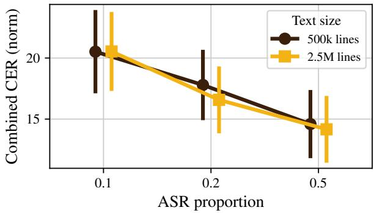  
Figure 5: Comparison of multitask fine-tuning with different proportions of ASR data and text dataset sizes of 500k and 2.5M lines. We use an ASR proportion of 0.5 and a text size of 500k lines in our main experiments.

## C Multitask Learning Mixing Ratios

In our main full fine-tuning experiments, we combine text-only and ASR fine-tuning batches in a 1:1 ratio, i.e., the proportion of ASR batches is 50%. We test the effect of this mixing ratio, conducting additional experiments with ASR proportions of 10% and 20%.6 We independently manipulate the length of multitask fine-tuning to either 500k lines (as in our main experiments) or 2.5M lines.

Our results, shown in Figure 5, indicate that the ASR proportion used in our main experiments is optimal, at least among the settings we evaluate. More specifically, we find that performance improves with larger ASR proportions. Furthermore, we find little or no improvement due to increasing the text dataset size from 500k lines (as in our main experiments) to 2.5M lines. These findings leave open the possibility that higher ASR proportions—or perhaps annealing curricula that increase the ASR proportion towards the end of training—might yield stronger performance. However, due to the wide range of possible multitask fine-tuning approaches, we leave a more thorough investigation to future work.

## D Tokenizer Replacement Strategies

We test three strategies for tokenizer replacement. All three strategies begin by training a new BPE tokenizer on a monolingual dataset.

1. The warm-start strategy (described in greater detail in Section 3.1) entails replacing the original tokenizer entirely with the new tokenizer, and initializing all embeddings (and unembeddings) using the original (un)embeddings or as a sum of the original (un)embeddings making up each new token.

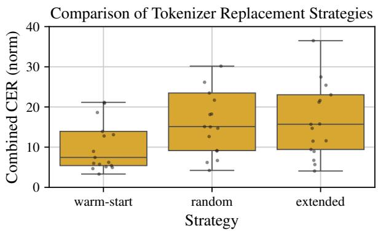  
Figure 6: Comparison of tokenizer replacement strategies. We use the warm-start approach in our main experiments. For presentational reasons, we limit the y-axis, excluding some outliers.

2. The random strategy replaces the original tokenizer entirely with the new tokenizer, but initializes (un)embeddings randomly.

3. The extended strategy appends all new tokens to the end of the original tokenizer merge list initializes new embeddings as a sum of the original embeddings.

For each tokenizer replacement strategies, we conduct three training runs for the 17 core languages. The results are shown in Figure 6. We find that the warm-start strategy adopted in our main experiments is the most effective, yielding a median CER of 7.4. The remaining random and extended strategies lead to worse performance overall, yielding median CERs of 15.1 and 15.7, respectively.

## E Out-of-Domain Generalization

In our main experiments, our train and test sets for most languages are a combination of data from FLEURS and Common Voice. However, other models we compare against using the same test data may not be trained on these domains, or are trained on a wider set of domains. Therefore, we conduct out-of-domain evaluations to investigate the extent to which our performance gains are due to the similarity of the train/test domain, rather than language-specific fine-tuning.

We train models on the 17 core languages using simple fine-tuning on only the FLEURS portion of the training data, and we evaluate on either the Common Voice test data (out-of-domain), the FLEURS test set (in-domain), or both (mixed). The results in Figure 7 reveal a modest in-domain advantage relative to models trained on both FLEURS and Common Voice. The FLEURS-only model tested OOD is outperformed by a model trained on both domains by a factor of 1.15 , while it outperforms the mixed model on the in-domain evaluation by a factor of 1.33 . On the combined test set, there is little difference, with the mixed models outperforming the FLEURS models by a factor 1.03 on average. We conclude that some of the performance gains over Whisper and external baselines that we observe may be due to better alignment between the fine-tuning data and the test data domains. However, this alone cannot explain the average performance gain of 2.8 that we observe for BuzzASR over Whisper.

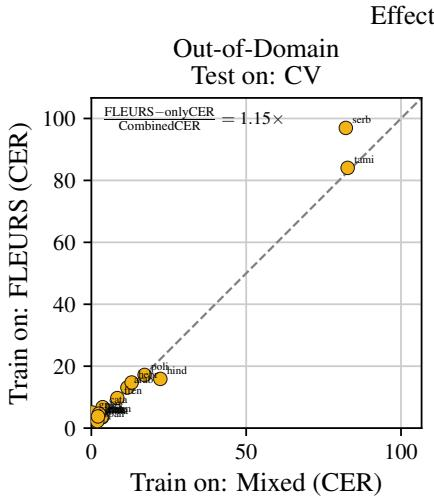

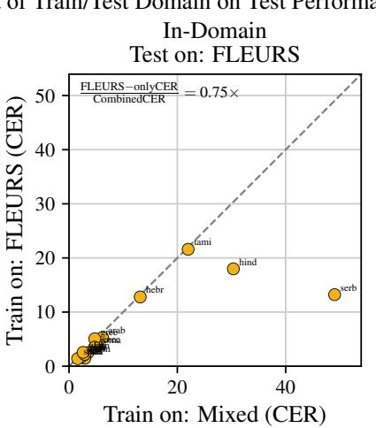

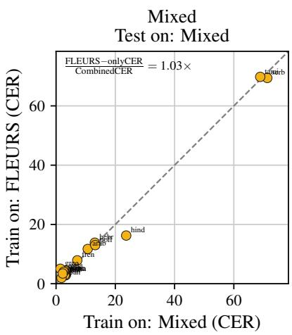  
Figure 7: Comparison of in-domain and out-of-domain evaluation. We compare models trained on FLEURS alone to models trained on both Common Voice and Fleurs as in our main experiments. Models are evaluated on Common Voice (out-of-domain), FLEURS (in-domain), and both (mixed).

## F Multilingual Fine-Tuning

The main premise of our work is that monolingual fine-tuning of massively multilingual models can improve language-specific ASR performance. However, prior work on text-based models showed that limiting multilinguality to a small number of languages can sometimes improve performance over monolingual models (Chang et al., 2024). We test the initial promise of that approach in our setting by conducting bilingual fine-tuning runs. We select 10 language pairs from our core set of 17 languages. 5 pairs are unrelated (Arabic–Tamil, Cantonese–Georgian, German–Swahili, Latvian– Uzbek, Spanish–Cantonese), and 5 pairs are related (Catalan–Galician, Italian–Spanish, Polish– Russian, Russian–Ukrainian, Tajik–Pashto). For each pair, we conduct three simple fine-tuning training runs with different random seeds.

Best Bilingual vs. Best Monolingual (SFT)  
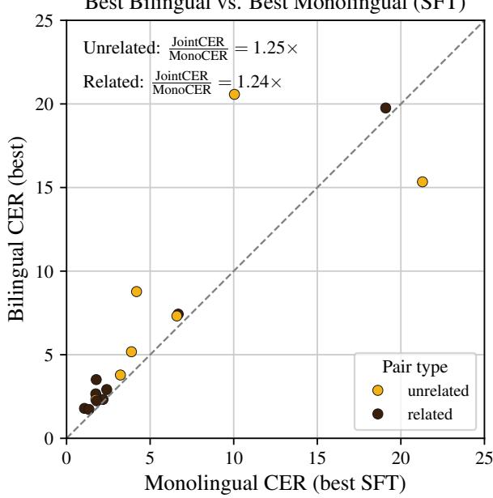  
Figure 8: Comparison of monolingual simple finetuning and bilingual simple fine-tuning for 10 language pairs (5 pairs of related languages and 5 pairs of unrelated languages). For presentational reasons, we limit the y-axis, excluding some outliers.

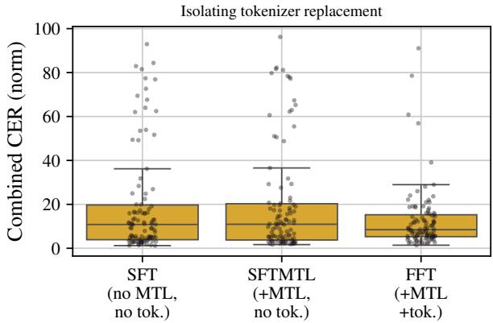  
Figure 9: Ablation of tokenizer replacement from the full fine-tuning setting. We compare simple fine-tuning and full fine-tuning to runs where we perform multitask fine-tuning without tokenizer replacement (SFTMTL).

The results are shown in Figure 8. We find that the best bilingual result is nearly always worse than the best monolingual simple fine-tuning result for each language in that pair. Furthermore, we find no advantage to training on related languages as opposed to unrelated languages: The median improvements of monolingual training over bilingual training are 1.25 and 1.24 for unrelated and related language pairs, respectively. The only exceptions come from the bilingual Cantonese–Georgian models, where we observe a substantial bilingual improvement of 1.38 for Cantonese and a modest bilingual improvement of 1.01 for Georgian.

## G Ablation: Multitask Learning Without Tokenizer Replacement

To isolate the effects of multitask fine-tuning and tokenizer replacement, we conduct additional training runs in which we perform multitask fine-tuning without tokenizer adaptation.7 For each of the 17 core languages, we conduct three additional multitask fine-tuning runs of this kind.

The results in Figure 9 compare all simple fine-tuning and full fine-tuning runs against this multitask-only approach. In the aggregate, we find that full fine-tuning is more effective than either alternative, and there is little difference in performance between simple fine-tuning and multitaskonly.

## H Decoder Latency

We benchmark per-utterance decoder latency across the three systems (Whisper zero-shot, simple fine-tuning, and full fine-tuning) to assess whether the tokenizer replacement employed in full fine-tuning translates to a wall-clock speedup. For each (language, system) pair we sample 50 FLEURS-test utterances, and, where available, 50 from Common Voice; warm up with three untimed generate() calls; then time each subsequent call with torch.cuda.synchronize barriers and time.perf counter deltas. All three systems use plain greedy decoding (num beams=1, no repetition penalty or no-repeat-ngram suppression) so the comparison isolates the model and tokenizer rather than decoding heuristics. We use FP16, batch size 1, max new tokens=256, and a single A100-80GB GPU per measurement.

We analyze three quantities per (lang, system): median per-utterance wall-clock latency in milliseconds, median per-token throughput in tokens per second, and median number of tokens generated. The first captures user-facing latency; the second isolates raw decode speed (which we expect to be constant across systems since all share the Whisperlarge-v3 architecture); the third explains the gap.

Three findings follow. First, per-token throughput is essentially identical across the three systems they share the Whisper-large-v3 decoder (median 73 tokens/sec) confirming that latency differences arise from sequence length rather than per-token decode speed. Second, FFT’s native tokenizer delivers a wall-clock speedup on every script bucket except Sino-Japanese, and each speedup tracks that script’s token-count compression: 1.59 on Latin, 1.75 on Cyrillic, 1.98 on Arabic, 1.16 on Brahmic, and 3.51 on other languages, for a global median of 1.6 .

## I Per-Language Tokenizer Metrics

Figure 10 summarizes per-language tokenizerquality metrics for all 102 languages: characters per token, UTF-8 coverage, vocabulary utilization, and boundary crossing of our per-language BPE over Whisper’s multilingual BPE on a sample of the text corpus used to train the per-language tokenizers. Detailed results are provided in Table 6.

Nearly across the board, the BuzzASR tokenizers outperform Whisper tokenizers. Our tokenizers generally achieve around 5 characters per token, while the Whisper tokenizer achieves less than 2 for all non-Latin/Cyrillic scripts. The main exception is Sino-Japanese scripts, which are largely logographic. In fact, the Whisper tokenizer reaches less than 1 character per token for Brahmic and the rarer scripts (“other”). Our UTF-8 coverage is typically at 100%, meaning that when a token sequence is decoded back to text, essentially no characters are corrupted. Vocab utilization is generally above 20% for BuzzASR and below 10% for Whisper. For Arabic, Brahmic, and rarer scripts, Whisper vocab utilization is generally below 3%, meaning 97% of the vocabulary is unused. Finally, boundary crossing for BuzzASR is below 0.1% for the vast majority of languages except those using Brahmic script. Boundary crossing is the percentage of tokens that contain an internal whitespace character i.e., a single token that spans a word boundary by merging parts of adjacent words By contrast, for Whisper, boundary crossing only falls below this threshold for languages using Latin and Cyrillic scripts.

<table><tr><td rowspan="2">Script</td><td rowspan="2">n</td><td colspan="3">Latency (ms / utt)</td><td colspan="2">Speedup vs. Whisper-zs</td></tr><tr><td>Whisper-zs</td><td>SFT</td><td>FFT</td><td>FFT</td><td>SFT</td></tr><tr><td>Latin</td><td>61</td><td>714</td><td>714</td><td>448</td><td>1.59×</td><td>1.00×</td></tr><tr><td>Cyrillic</td><td>10</td><td>785</td><td>788</td><td>449</td><td>1.75×</td><td>1.00×</td></tr><tr><td>Arabic</td><td>6</td><td>964</td><td>1101</td><td>487</td><td>1.98×</td><td>0.88×</td></tr><tr><td>Brahmic</td><td>16</td><td>1611</td><td>2771</td><td>1384</td><td>1.16×</td><td>0.58×</td></tr><tr><td>Sino-Japanese†</td><td>4</td><td>502</td><td>541</td><td>514</td><td>0.98×</td><td>0.93×</td></tr><tr><td>Other</td><td>5</td><td>1475</td><td>1861</td><td>420</td><td>3.51×</td><td>0.79×</td></tr><tr><td>Global</td><td>102</td><td>785</td><td>818</td><td>503</td><td>~1.6×</td><td>0.96×</td></tr></table>

Table 5: Per-script decoder latency on the combined FLEURS+CV25 test set (idle GPU), median over languages. Speedup is the median per-language ratio of Whisper-zs to system latency. “Other” covers unique scripts: Amharic (Ge’ez), Armenian, Georgian, Greek, and Hebrew. †Sino-Japanese is roughly latency-neutral; the residual cost is driven by Japanese, which over-generates due to a generation failure.

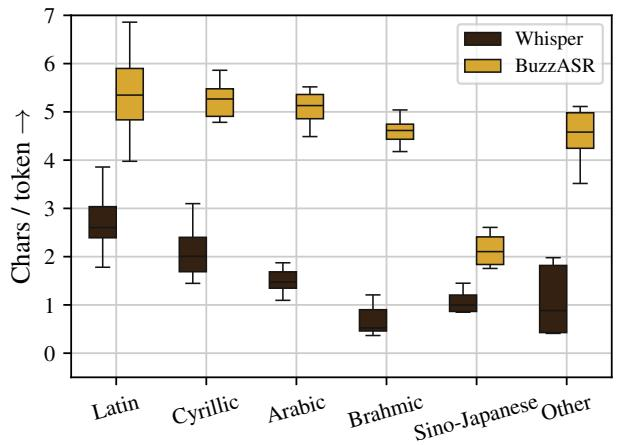

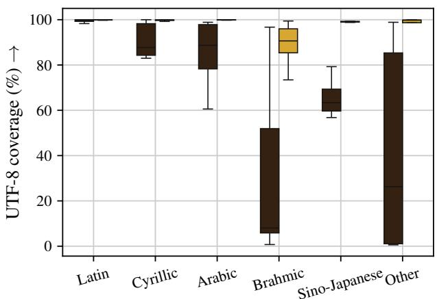

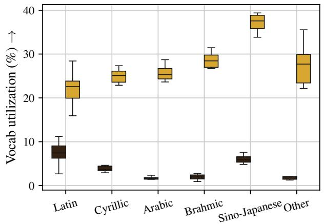

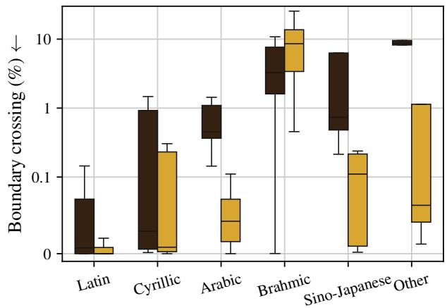  
Figure 10: Tokenizer performance metrics for Whisper and BuzzASR, separated by script. Arrows indicate the direction associated with better performance.

Table 6: Per-language tokenizer quality metrics. “ours” is our per-language BPE, “W” is Whisper-large-v3’s multilingual BPE. Higher chars/tok and vocab utilization are better; lower tokens/word is better. Kamba’s perlanguage tokenizer is anomalous due to its tiny training corpus and is excluded from aggregate statistics in the main text.
<table><tr><td colspan="2"></td><td colspan="2">chars/tok</td><td colspan="2">tokens/word</td><td colspan="2">vocab util.</td><td>Comp.</td></tr><tr><td>Language</td><td>Script</td><td>ours</td><td>W</td><td>ours</td><td>W</td><td>ours</td><td>W</td><td>gain</td></tr><tr><td>Afrikaans</td><td>Latin</td><td>5.96</td><td>3.10</td><td>0.92</td><td>1.77</td><td>21.2%</td><td>7.3%</td><td>1.93x</td></tr><tr><td>Amharic</td><td>Other</td><td>3.52</td><td>0.43</td><td>1.43</td><td>11.74</td><td>35.5%</td><td>1.4%</td><td>8.23x</td></tr><tr><td>Arabic</td><td>Arabic</td><td>4.78</td><td>1.87</td><td>1.22</td><td>3.10</td><td>28.7%</td><td>1.8%</td><td>2.55x</td></tr><tr><td>Armenian</td><td>Other</td><td>5.11</td><td>0.88</td><td>1.43</td><td>8.28</td><td>23.4%</td><td>2.0%</td><td>5.79x</td></tr><tr><td>Assamese</td><td>Brahmic</td><td>4.52</td><td>0.51</td><td>1.40</td><td>12.42</td><td>29.2%</td><td>2.0%</td><td>8.85x</td></tr><tr><td>Asturian</td><td>Latin</td><td>5.04</td><td>2.89</td><td>1.21</td><td>2.11</td><td>19.9%</td><td>10.5%</td><td>1.74x</td></tr><tr><td>Azerbaijani</td><td>Latin</td><td>5.25</td><td>2.14</td><td>1.41</td><td>3.47</td><td>24.5%</td><td>6.2%</td><td>2.46x</td></tr><tr><td>Belarusian</td><td>Cyrillic</td><td>4.78</td><td>1.95</td><td>1.46</td><td>3.57</td><td>26.9%</td><td>3.8%</td><td>2.45x</td></tr><tr><td>Bengali</td><td>Brahmic</td><td>4.65</td><td>0.51</td><td>1.36</td><td>12.36</td><td>28.4%</td><td>1.0%</td><td>9.11x</td></tr><tr><td>Bosnian</td><td>Latin</td><td>4.82</td><td>2.53</td><td>1.40</td><td>2.66</td><td>22.6%</td><td>8.2%</td><td>1.90x</td></tr><tr><td>Bulgarian</td><td>Cyrillic</td><td>4.88</td><td>2.47</td><td>1.28</td><td>2.52</td><td>27.3%</td><td>4.6%</td><td>1.98x</td></tr><tr><td>Burmese</td><td>Brahmic</td><td>2.54</td><td>0.37</td><td>5.12</td><td>34.75</td><td>16.9%</td><td>2.4%</td><td>6.78x</td></tr><tr><td>Cantonese</td><td>CJK</td><td>1.86</td><td>0.87</td><td>28.34</td><td>60.73</td><td>33.8%</td><td>4.8%</td><td>2.14x</td></tr><tr><td>Catalan</td><td>Latin</td><td>5.79</td><td>3.45</td><td>1.01</td><td>1.69</td><td>22.6%</td><td>9.5%</td><td>1.68x</td></tr><tr><td>Cebuano</td><td>Latin</td><td>5.42</td><td>2.80</td><td>1.11</td><td>2.15</td><td>18.7%</td><td>8.9%</td><td>1.94x</td></tr><tr><td>Croatian</td><td>Latin</td><td>5.35</td><td>2.39</td><td>1.28</td><td>2.86</td><td>24.4%</td><td>6.2%</td><td>2.24x</td></tr><tr><td>Czech</td><td>Latin</td><td>4.72</td><td>2.30</td><td>1.32</td><td>2.71</td><td>28.4%</td><td>7.1%</td><td>2.05x</td></tr><tr><td>Danish</td><td>Latin</td><td>6.07</td><td>3.05</td><td>1.00</td><td>2.00</td><td>23.4%</td><td>7.9%</td><td>1.99x</td></tr><tr><td>Dutch</td><td>Latin</td><td>5.96</td><td>3.43</td><td>1.04</td><td>1.81</td><td>21.2%</td><td>8.8%</td><td>1.74x</td></tr><tr><td>English</td><td>Latin</td><td>5.81</td><td>4.83</td><td>0.99</td><td>1.19</td><td>21.7%</td><td>15.5%</td><td>1.20x</td></tr><tr><td>Estonian</td><td>Latin</td><td>5.61</td><td>2.57</td><td>1.34</td><td>2.93</td><td>23.5%</td><td>6.6%</td><td>2.18x</td></tr><tr><td>Filipino</td><td>Latin</td><td>5.73</td><td>3.03</td><td>1.03</td><td>1.95</td><td>23.7%</td><td>8.4%</td><td>1.89x</td></tr><tr><td>Finnish</td><td>Latin</td><td>7.59</td><td>2.84</td><td>1.07</td><td>2.87</td><td>22.5%</td><td>7.0%</td><td>2.67x</td></tr><tr><td>French</td><td>Latin</td><td>5.80</td><td>3.77</td><td>1.04</td><td>1.60</td><td>22.9%</td><td>11.2%</td><td>1.54x</td></tr><tr><td>Fulah</td><td>Latin</td><td>4.12</td><td>2.28</td><td>1.39</td><td>2.52</td><td>27.4%</td><td>10.2%</td><td>1.81x</td></tr><tr><td>Galician</td><td>Latin</td><td>5.92</td><td>3.49</td><td>1.01</td><td>1.72</td><td>23.3%</td><td>9.5%</td><td>1.69x</td></tr><tr><td>Georgian</td><td>Other</td><td>4.58</td><td>0.41</td><td>1.79</td><td>20.00</td><td>22.2%</td><td>1.3%</td><td>11.17x</td></tr><tr><td>German</td><td>Latin</td><td>5.30</td><td>3.70</td><td>1.33</td><td>1.90</td><td>20.5%</td><td>10.9%</td><td>1.43x</td></tr><tr><td>Greek</td><td>Other</td><td>4.98</td><td>1.98</td><td>1.30</td><td>3.27</td><td>27.7%</td><td>3.0%</td><td>2.52x</td></tr><tr><td>Gujarati</td><td>Brahmic</td><td>4.33</td><td>0.41</td><td>1.34</td><td>14.09</td><td>30.6%</td><td>2.4%</td><td>10.53x</td></tr><tr><td>Hausa</td><td>Latin</td><td>5.59</td><td>2.66</td><td>0.98</td><td>2.06</td><td>21.2%</td><td>6.3%</td><td>2.10x</td></tr><tr><td>Hebrew</td><td>Other</td><td>4.25</td><td>1.82</td><td>1.31</td><td>3.07</td><td>29.9%</td><td>2.1%</td><td>2.33x</td></tr><tr><td>Hindi</td><td>Brahmic</td><td>4.67</td><td>1.02</td><td>1.07</td><td>4.90</td><td>28.3%</td><td>2.7%</td><td>4.59x</td></tr><tr><td>Hungarian</td><td>Latin</td><td>5.35</td><td>2.43</td><td>1.36</td><td>2.98</td><td>24.9%</td><td>6.4%</td><td>2.20x</td></tr><tr><td>Icelandic</td><td>Latin</td><td>5.29</td><td>2.24</td><td>1.15</td><td>2.72</td><td>25.4%</td><td>5.8%</td><td>2.36x</td></tr><tr><td>Igbo</td><td>Latin</td><td>4.86</td><td>2.00</td><td>1.03</td><td>2.51</td><td>22.4%</td><td>6.8%</td><td>2.43x</td></tr><tr><td>Indonesian</td><td>Latin</td><td>5.90</td><td>3.40</td><td>1.17</td><td>2.04</td><td>23.8%</td><td>6.9%</td><td>1.74x</td></tr><tr><td>Irish</td><td>Latin</td><td>6.12</td><td>2.39</td><td>0.97</td><td>2.48</td><td>22.9%</td><td>4.9%</td><td>2.56x</td></tr><tr><td>Italian</td><td>Latin</td><td>5.79</td><td>3.50</td><td>1.10</td><td>1.82</td><td>23.1%</td><td>9.2%</td><td>1.65x</td></tr><tr><td>Japanese</td><td>CJK</td><td>2.34</td><td>1.12</td><td>14.58</td><td>30.44</td><td>38.7%</td><td>6.2%</td><td>2.09x</td></tr><tr><td>Javanese</td><td>Latin</td><td>4.56</td><td>2.85</td><td>1.37</td><td>2.20</td><td>18.6%</td><td>6.9%</td><td>1.60x</td></tr><tr><td>Kabuverdianu</td><td>Latin</td><td>4.64</td><td>2.65</td><td>1.12</td><td>1.96</td><td>25.5%</td><td>10.0%</td><td>1.75x</td></tr><tr><td>Kamba Kannada</td><td>Latin Brahmic</td><td>47.45 4.18</td><td>2.18 0.61</td><td>0.13 1.91</td><td>2.78 13.12</td><td>4.1% 28.5%</td><td>6.3% 21.72x 1.4% 6.86x</td></tr><tr><td>Kazakh</td><td>Cyrillic</td><td>5.74</td><td>1.58</td><td>1.34</td><td>4.89</td><td>23.5%</td><td>3.5%</td><td>3.64x</td></tr><tr><td>Khmer</td><td>Brahmic</td><td>4.70</td><td>0.48</td><td>4.03</td><td>39.80</td><td>22.0%</td><td>1.5%</td><td>9.87x</td></tr><tr><td>Korean</td><td>CJK</td><td>2.61</td><td>1.45</td><td>1.64</td><td>2.95</td><td>36.5%</td><td>7.6%</td><td>1.80x</td></tr><tr><td>Kyrgyz</td><td>Cyrillic</td><td>5.86</td><td>1.67</td><td>1.32</td><td>4.61</td><td>23.5%</td><td>3.4%</td><td>3.50x</td></tr><tr><td>Lao</td><td>Brahmic</td><td>5.04</td><td>0.37</td><td>3.09</td><td>42.50</td><td>26.8%</td><td>2.8%</td><td>13.77x</td></tr><tr><td>Latvian</td><td>Latin</td><td>4.86</td><td>2.20</td><td>1.46</td><td>3.23</td><td>25.1%</td><td>7.7%</td><td>2.21x</td></tr><tr><td>Lingala</td><td>Latin</td><td>4.30</td><td>2.15</td><td>1.40</td><td>2.79</td><td>16.4%</td><td>8.3%</td><td>2.00x</td></tr><tr><td>Lithuanian</td><td>Latin</td><td>5.42</td><td>2.39</td><td>1.38</td><td>3.13</td><td>23.6%</td><td>6.9%</td><td>2.27x</td></tr><tr><td>Luganda</td><td>Latin</td><td>5.98</td><td>2.35</td><td>1.37</td><td>3.47</td><td>15.9%</td><td>2.7%</td><td>2.54x</td></tr><tr><td>Luo</td><td>Latin</td><td>4.01</td><td>2.62</td><td>1.31</td><td>2.01</td><td>24.9%</td><td>9.7%</td><td>1.53x</td></tr><tr><td>Luxembourgish</td><td>Latin</td><td>4.88</td><td>2.86</td><td>1.31</td><td>2.24</td><td>18.8%</td><td>9.6%</td><td>1.71x</td></tr><tr><td>Macedonian</td><td>Cyrillic</td><td>5.00</td><td>2.27</td><td>1.24</td><td>2.72</td><td>26.3%</td><td>4.1%</td><td>2.20x</td></tr><tr><td>Malay</td><td>Latin</td><td>6.86</td><td>3.43</td><td>0.96</td><td>1.91</td><td>19.0%</td><td>5.5%</td><td>2.00x</td></tr><tr><td>Malayalam</td><td>Brahmic</td><td>4.57</td><td>0.48</td><td>2.04</td><td>19.53</td><td>26.7%</td><td>1.8%</td><td>9.58x</td></tr><tr><td>Maltese</td><td>Latin</td><td>5.97</td><td>2.08</td><td>1.30</td><td>3.73</td><td>21.5%</td><td>5.7%</td><td>2.87x</td></tr><tr><td>Mandarin</td><td>CJK</td><td>1.76</td><td>0.85</td><td>28.00</td><td>57.88</td><td>39.4%</td><td>5.5%</td><td>2.07x</td></tr><tr><td>Maori</td><td>Latin</td><td>4.50</td><td>2.37</td><td>1.15</td><td>2.19</td><td>11.9%</td><td>5.4%</td><td>1.90x</td></tr><tr><td>Marathi</td><td>Brahmic</td><td>4.73</td><td>0.90</td><td>1.39</td><td>7.31</td><td>29.3%</td><td>1.4%</td><td>5.26x</td></tr><tr><td>Mongolian</td><td>Cyrillic</td><td>5.49</td><td>1.45</td><td>1.16</td><td>4.41</td><td>22.9%</td><td>3.1%</td><td>3.80x</td></tr><tr><td>Nepali</td><td>Brahmic</td><td>4.58</td><td>0.91</td><td>1.36</td><td>6.88</td><td>31.5%</td><td>1.9%</td><td>5.05x</td></tr><tr><td>Norwegian</td><td>Latin</td><td>6.03</td><td>3.04</td><td>1.00</td><td>1.99</td><td>23.8%</td><td>8.2%</td><td>1.99x</td></tr><tr><td>Nyanja</td><td>Latin</td><td>4.47</td><td>2.62</td><td>1.53</td><td>2.61</td><td>18.2%</td><td>9.1%</td><td>1.71x</td></tr><tr><td>Occitan</td><td>Latin</td><td>4.92</td><td>2.78</td><td>1.22</td><td>2.15</td><td>20.9%</td><td>9.6%</td><td>1.77x</td></tr><tr><td>Oriya</td><td>Brahmic</td><td>4.84</td><td>0.38</td><td>1.33</td><td>16.93</td><td>29.7%</td><td>0.9%</td><td>12.73x</td></tr><tr><td>Oromo</td><td>Latin</td><td>4.50</td><td>2.47</td><td>1.60</td><td>2.92</td><td>25.5%</td><td>8.4%</td><td>1.82x</td></tr><tr><td>Pashto</td><td>Arabic</td><td>5.10</td><td>1.34</td><td>0.90</td><td>3.42</td><td>27.1%</td><td>0.9%</td><td>3.81x</td></tr><tr><td>Persian</td><td>Arabic</td><td>5.43</td><td>1.57</td><td>0.91</td><td>3.17</td><td>23.6%</td><td>1.7%</td><td>3.47x</td></tr><tr><td>Polish</td><td>Latin</td><td>5.02</td><td>3.04</td><td>1.39</td><td>2.29</td><td>26.8%</td><td>8.5%</td><td>1.65x</td></tr><tr><td>Portuguese</td><td>Latin</td><td>5.79</td><td>3.80</td><td>1.03</td><td>1.57</td><td>22.8%</td><td>10.1%</td><td>1.52x</td></tr><tr><td>Punjabi</td><td>Brahmic</td><td>4.79</td><td>0.54</td><td>1.07</td><td>9.55</td><td>28.2%</td><td>2.1%</td><td>8.95x</td></tr><tr><td>Romanian</td><td>Latin</td><td>5.29</td><td>2.81</td><td>1.15</td><td>2.17</td><td>24.8%</td><td>8.5%</td><td>1.88x</td></tr><tr><td>Russian</td><td>Cyrillic</td><td>5.34</td><td>3.10</td><td>1.35</td><td>2.32</td><td>25.3%</td><td>6.4%</td><td>1.72x</td></tr><tr><td>Sepedi</td><td>Latin</td><td>5.30</td><td>2.56</td><td>1.12</td><td>2.31</td><td>12.1%</td><td>5.8%</td><td>2.07x</td></tr><tr><td>Serbian</td><td>Cyrillic</td><td>4.87</td><td>2.06</td><td>1.31</td><td>3.09</td><td>24.9%</td><td>3.4%</td><td>2.36x</td></tr><tr><td>Shona</td><td>Latin</td><td>4.53</td><td>2.71</td><td>1.62</td><td>2.71</td><td>16.7%</td><td>8.2%</td><td>1.67x</td></tr><tr><td>Sindhi</td><td>Arabic</td><td>5.16</td><td>1.38</td><td>0.97</td><td>3.64</td><td>24.1%</td><td>2.3%</td><td>3.75x</td></tr><tr><td>Slovak</td><td>Latin</td><td>5.04</td><td>2.36</td><td>1.28</td><td>2.73</td><td>26.2%</td><td>7.0%</td><td>2.14x</td></tr><tr><td>Slovenian</td><td>Latin</td><td>5.57</td><td>2.56</td><td>1.14</td><td>2.48</td><td>24.6%</td><td>6.3%</td><td>2.18x</td></tr><tr><td>Somali</td><td>Latin</td><td>6.43</td><td>2.48</td><td>1.00</td><td>2.59</td><td>22.0%</td><td>4.8%</td><td>2.60x</td></tr><tr><td>Sorani-kurdish</td><td>Arabic</td><td>4.49</td><td>1.09</td><td>1.44</td><td>5.92</td><td>25.0%</td><td>1.5%</td><td>4.10x</td></tr><tr><td>Spanish</td><td>Latin</td><td>5.97</td><td>3.86</td><td>1.00</td><td>1.55</td><td>22.4%</td><td>10.7%</td><td>1.55x</td></tr><tr><td>Swahili</td><td>Latin</td><td>5.96</td><td>2.56</td><td>1.05</td><td>2.46</td><td>22.2%</td><td>6.1%</td><td>2.33x</td></tr><tr><td>Swedish</td><td>Latin Cyrillic</td><td>5.58 5.44</td><td>3.23 1.73</td><td>1.10 1.22</td><td>1.90 3.83</td><td>23.8% 23.9%</td><td>8.6% 1.73x 2.9%</td></tr><tr><td colspan="2"></td><td colspan="2">chars/tok</td><td colspan="2">tokens/word</td><td colspan="2">vocab util.</td><td rowspan="2">Comp. gain</td></tr><tr><td>Language</td><td>Script</td><td>ours</td><td>W</td><td>ours</td><td>W</td><td>ours</td><td>W</td></tr><tr><td>Ukrainian</td><td>Cyrillic</td><td>5.20</td><td>2.44</td><td>1.35</td><td>2.87</td><td>25.6%</td><td>4.6%</td><td>2.13x</td></tr><tr><td>Umbundu</td><td>Latin</td><td>4.58</td><td>2.56</td><td>1.27</td><td>2.27</td><td>23.7%</td><td>8.2%</td><td>1.79x</td></tr><tr><td>Urdu</td><td>Arabic</td><td>5.52</td><td>1.73</td><td>0.83</td><td>2.66</td><td>25.6%</td><td>1.4%</td><td>3.20x</td></tr><tr><td>Uzbek</td><td>Latin</td><td>5.31</td><td>2.48</td><td>1.38</td><td>2.96</td><td>18.3%</td><td>4.6%</td><td>2.15x</td></tr><tr><td>Vietnamese</td><td>Latin</td><td>5.26</td><td>2.60</td><td>0.85</td><td>1.72</td><td>24.4%</td><td>4.1%</td><td>2.02x</td></tr><tr><td>Welsh</td><td>Latin</td><td>5.90</td><td>2.43</td><td>0.97</td><td>2.36</td><td>21.5%</td><td>5.8%</td><td>2.43x</td></tr><tr><td>Wolof</td><td>Latin</td><td>4.78</td><td>2.43</td><td>1.04</td><td>2.04</td><td>16.8%</td><td>6.3%</td><td>1.96x</td></tr><tr><td>Xhosa</td><td>Latin</td><td>4.65</td><td>2.48</td><td>1.84</td><td>3.44</td><td>18.7%</td><td>6.0%</td><td>1.87x</td></tr><tr><td>Yoruba</td><td>Latin</td><td>4.83</td><td>1.78</td><td>0.98</td><td>2.67</td><td>20.8%</td><td>5.2%</td><td>2.72x</td></tr><tr><td>Zulu</td><td>Latin</td><td>3.98</td><td>2.57</td><td>2.09</td><td>3.25</td><td>18.5%</td><td>9.5%</td><td>1.55x</td></tr></table>

Table 7 and 8 provide the full CER and WER results for FLEURS for all languages.

## J Full Evaluation Results

Table 7: Test-set CER (%) on the test for all languages, which consists of the combined CV and FLEURS datasets when available and just FLEURS elsewhere. Lower is better. Bold indicates the best score within the Whisper group; underline indicates the overall best score. For conditions with multiple runs, the best-performing run is reported. Scores are normalised CER .
<table><tr><td colspan="4">Ours</td><td colspan="6">Baselines</td></tr><tr><td>Language</td><td>FFT</td><td>SFT</td><td>SFTMTL</td><td>Whisper</td><td>Omni 1B</td><td>Omni 7B</td><td>MMS</td><td>Cohere</td><td>Qwen3</td></tr><tr><td>Afrikaans</td><td>13.23</td><td>5.35</td><td>7.63</td><td>10.88</td><td>8.01</td><td>6.38</td><td>7.26</td><td>30.94</td><td>30.56</td></tr><tr><td>Amharic</td><td>8.55</td><td>49.39</td><td>51.04</td><td>191.35</td><td>12.42</td><td>7.39</td><td>8.39</td><td>140.55</td><td>120.60</td></tr><tr><td>Arabic</td><td>14.06</td><td>11.74</td><td>10.76</td><td>11.82</td><td>5.09</td><td>4.31</td><td>7.75</td><td>5.80</td><td>6.55</td></tr><tr><td>Armenian</td><td>3.55</td><td>13.50</td><td>17.38</td><td>15.53</td><td>4.92</td><td>3.91</td><td>3.92</td><td>129.09</td><td>92.29</td></tr><tr><td>Assamese</td><td>12.11</td><td>62.43</td><td>62.94</td><td>80.72</td><td>9.28</td><td>7.00</td><td>9.24</td><td>125.04</td><td>96.14</td></tr><tr><td>Asturian</td><td>7.72</td><td>4.89</td><td>5.23</td><td>14.11</td><td>7.35</td><td>5.38</td><td>5.26</td><td>18.87</td><td>18.34</td></tr><tr><td>Azerbaijani</td><td>5.01</td><td>5.22</td><td>5.70</td><td>5.68</td><td>5.41</td><td>4.11</td><td>5.39</td><td>93.61</td><td>34.17</td></tr><tr><td>Belarusian</td><td>22.30</td><td>2.75</td><td>3.29</td><td>10.95</td><td>4.29</td><td>3.11</td><td>3.77</td><td>101.37</td><td>38.04</td></tr><tr><td>Bengali</td><td>7.16</td><td>53.91</td><td>67.33</td><td>34.04</td><td>6.79</td><td>4.63</td><td>7.44</td><td>117.35</td><td>93.75</td></tr><tr><td>Bosnian</td><td>7.49</td><td>3.59</td><td>3.78</td><td>3.87</td><td>4.91</td><td>3.07</td><td>3.51</td><td>58.18</td><td>42.67</td></tr><tr><td>Bulgarian</td><td>2.29</td><td>1.21</td><td>1.68</td><td>4.19</td><td>4.91</td><td>3.53</td><td>4.09</td><td>100.70</td><td>22.90</td></tr><tr><td>Burmese</td><td>32.58</td><td>84.38</td><td>82.26</td><td>123.32</td><td>11.14</td><td>8.27</td><td>19.65</td><td>105.19</td><td>98.34</td></tr><tr><td>Cantonese</td><td>25.39</td><td>13.01</td><td>12.77</td><td>58.02</td><td>58.36</td><td>54.14</td><td>60.88</td><td>71.10</td><td>52.99</td></tr><tr><td>Catalan</td><td>12.35</td><td>4.50</td><td>4.20</td><td>4.32</td><td>3.58</td><td>2.55</td><td>3.14</td><td>31.65</td><td>27.65</td></tr><tr><td>Cebuano</td><td>8.39</td><td>5.91</td><td>5.85</td><td>15.42</td><td>5.41</td><td>4.48</td><td>4.33</td><td>61.72</td><td>16.67</td></tr><tr><td>Croatian</td><td>5.84</td><td>3.09</td><td>3.61</td><td>5.11</td><td>24.36</td><td>23.34</td><td>3.38</td><td>56.73</td><td>72.08</td></tr><tr><td>Czech</td><td>10.28</td><td>3.41</td><td>3.00</td><td>3.07</td><td>3.89</td><td>2.88</td><td>3.07</td><td>56.04</td><td>11.40</td></tr><tr><td>Danish</td><td>15.85</td><td>16.21</td><td>14.55</td><td>4.74</td><td>7.09</td><td>4.68</td><td>7.04</td><td>60.18</td><td>12.04</td></tr><tr><td>Dutch</td><td>5.56</td><td>1.49</td><td>1.97</td><td>1.98</td><td>3.69</td><td>2.72</td><td>3.46</td><td>5.74</td><td>5.80</td></tr><tr><td>English</td><td>11.57</td><td>4.84</td><td>4.60</td><td>4.34</td><td>4.80</td><td>3.54</td><td>4.76</td><td>7.63</td><td>6.13</td></tr><tr><td>Estonian</td><td>2.00</td><td>1.96</td><td>3.51</td><td>6.19</td><td>3.51</td><td>2.80</td><td>2.53</td><td>77.46</td><td>34.44</td></tr><tr><td>Filipino</td><td>5.57</td><td>5.04</td><td>5.07</td><td>4.46</td><td>4.05</td><td>3.32</td><td>3.68</td><td>66.84</td><td>11.23</td></tr><tr><td>Finnish</td><td>29.28</td><td>31.79</td><td>31.75</td><td>1.89</td><td>3.09</td><td>2.47</td><td>2.36</td><td>80.88</td><td>9.11</td></tr><tr><td>French</td><td>8.70</td><td>7.89</td><td>7.29</td><td>7.65</td><td>4.47</td><td>3.12</td><td>4.24</td><td>5.84</td><td>5.41</td></tr><tr><td>Fulah</td><td>16.59</td><td>16.60</td><td>17.17</td><td>33.12</td><td>15.12</td><td>15.05</td><td>14.12</td><td>81.07</td><td>60.56</td></tr><tr><td>Galician</td><td>5.67</td><td>1.48</td><td>2.91</td><td>3.84</td><td>3.63</td><td>2.58</td><td>2.91</td><td>18.80</td><td>18.18</td></tr><tr><td>Georgian</td><td>4.39</td><td>72.65</td><td>77.96</td><td>19.43</td><td>4.47</td><td>3.31</td><td>4.91</td><td>123.55</td><td>93.70</td></tr><tr><td>German</td><td>6.09</td><td>3.20</td><td>2.87</td><td>2.77</td><td>2.68</td><td>2.00</td><td>2.68</td><td>8.46</td><td>8.31</td></tr><tr><td>Greek</td><td>11.06</td><td>5.05</td><td>3.21</td><td>4.37</td><td>6.27</td><td>3.74</td><td>5.33</td><td>6.25</td><td>16.19</td></tr><tr><td>Gujarati</td><td>8.11</td><td>77.40</td><td>79.74</td><td>20.17</td><td>5.87</td><td>4.86</td><td>6.42</td><td>113.92</td><td>92.34</td></tr><tr><td>Hausa</td><td>11.58</td><td>5.50</td><td>7.31</td><td>33.69</td><td>6.98</td><td>6.31</td><td>6.84</td><td>76.77</td><td>54.49</td></tr><tr><td>Hebrew</td><td>11.30</td><td>10.89</td><td>12.13</td><td>12.73</td><td>13.39</td><td>10.50</td><td>17.13</td><td>111.46</td><td>47.03</td></tr><tr><td>Hindi</td><td>15.95</td><td>16.23</td><td>14.76</td><td>11.92</td><td>9.22</td><td>8.14</td><td>6.40</td><td>113.85</td><td>6.93</td></tr><tr><td>Hungarian</td><td>3.91</td><td>2.68</td><td>3.76</td><td>3.59</td><td>4.74</td><td>3.19</td><td>4.30</td><td>95.10</td><td>16.13</td></tr><tr><td>Icelandic</td><td>7.26</td><td>9.00</td><td>9.74</td><td>11.25</td><td>6.14</td><td>4.65</td><td>7.36</td><td>73.53</td><td>50.48</td></tr><tr><td>Igbo</td><td>14.50</td><td>17.26</td><td>17.30</td><td>47.69</td><td>15.37</td><td>12.78</td><td>12.97</td><td>86.12</td><td>52.18</td></tr><tr><td>Indonesian</td><td>5.83</td><td>2.63</td><td>1.99</td><td>2.36</td><td>3.34</td><td>2.48</td><td>3.09</td><td>86.41</td><td>5.63</td></tr><tr><td>Irish</td><td>17.65</td><td>15.70</td><td>18.28</td><td>87.88</td><td>27.25</td><td>21.61</td><td>26.11</td><td>84.73</td><td>71.66</td></tr><tr><td>Italian</td><td>3.76</td><td>2.86</td><td>2.53</td><td>2.74</td><td>2.16</td><td>1.61</td><td>1.67</td><td>4.67</td><td>4.42 11.98</td></tr><tr><td>Japanese Javanese</td><td>44.46 4.81</td><td>24.84 5.15</td><td>23.00 5.19</td><td>23.34 25.13</td><td>17.82 5.08</td><td>12.04 4.07</td><td>24.05 4.94</td><td>10.98 84.71</td></tr><tr><td rowspan="2"></td><td colspan="3">Ours</td><td colspan="6">Baselines</td></tr><tr><td>Language</td><td>FFT SFT</td><td>SFTMTL</td><td>Whisper</td><td>Omni 1B</td><td>Omni 7B</td><td>MMS</td><td>Cohere</td><td>Qwen3</td></tr><tr><td>Lingala</td><td>12.03</td><td>7.42</td><td>8.39</td><td>18.58</td><td>5.47</td><td>4.49</td><td>4.43</td><td>62.74</td><td>30.39</td></tr><tr><td>Lithuanian</td><td>2.92</td><td>2.11</td><td>2.73</td><td>6.69</td><td>5.89</td><td>4.10</td><td>4.09</td><td>77.34</td><td>87.37</td></tr><tr><td>Luganda</td><td>21.68</td><td>24.97</td><td>29.27</td><td>28.47</td><td>9.19</td><td>8.93</td><td>8.08</td><td>74.51</td><td>39.78</td></tr><tr><td>Luo</td><td>90.43</td><td>76.92</td><td>77.23</td><td>35.85</td><td>6.59</td><td>5.44</td><td>5.60</td><td>78.78</td><td>36.56</td></tr><tr><td>Luxembourgish</td><td>9.62</td><td>10.78</td><td>11.16</td><td>29.88</td><td>10.62</td><td>6.95</td><td>8.75</td><td>41.34</td><td>41.73</td></tr><tr><td>Macedonian</td><td>1.86</td><td>1.31</td><td>1.96</td><td>5.82</td><td>2.98</td><td>2.54</td><td>2.13</td><td>100.02</td><td>9.05</td></tr><tr><td>Malay</td><td>4.03</td><td>2.64</td><td>2.54</td><td>2.32</td><td>4.24</td><td>3.21</td><td>3.62</td><td>82.34</td><td>6.75</td></tr><tr><td>Malayalam</td><td>16.19</td><td>63.98</td><td>62.22</td><td>87.87</td><td>5.37</td><td>4.21</td><td>5.12</td><td>105.62</td><td>100.70</td></tr><tr><td>Maltese</td><td>3.15</td><td>2.66</td><td>3.60</td><td>26.35</td><td>7.99</td><td>6.58</td><td>3.85</td><td>75.49</td><td>70.27</td></tr><tr><td>Mandarin</td><td>31.64</td><td>22.44</td><td>21.63</td><td>15.31</td><td>53.38</td><td>50.29</td><td>60.94</td><td>53.47</td><td>52.29</td></tr><tr><td>Maori</td><td>32.56</td><td>10.90</td><td>11.34</td><td>17.20</td><td>9.74</td><td>7.82</td><td>9.03</td><td>74.62</td><td>42.22</td></tr><tr><td>Marathi</td><td>57.80</td><td>49.19</td><td>55.48</td><td>20.26</td><td>7.77</td><td>6.38</td><td>7.60</td><td>118.02</td><td>29.84</td></tr><tr><td>Mongolian</td><td>4.87</td><td>9.42</td><td>11.09</td><td>38.23</td><td>12.17</td><td>7.77</td><td>8.70</td><td>104.32</td><td>90.07</td></tr><tr><td>Nepali</td><td>13.59</td><td>16.23</td><td>20.72</td><td>20.92</td><td>9.09</td><td>7.38</td><td>8.78</td><td>115.65</td><td>38.80</td></tr><tr><td>Northern Sotho</td><td>19.45</td><td>12.91</td><td>13.15</td><td>55.10</td><td>9.48</td><td>6.38</td><td>7.35</td><td>82.26</td><td>59.92</td></tr><tr><td>Norwegian</td><td>6.17</td><td>2.78</td><td>2.09</td><td>6.37</td><td>4.30</td><td>3.24</td><td>5.10</td><td>53.65</td><td>22.22</td></tr><tr><td>Nyanja</td><td>10.46</td><td>11.19</td><td>11.28</td><td>39.62</td><td>9.31</td><td>7.03</td><td>7.30</td><td>95.30</td><td>47.13</td></tr><tr><td>Occitan</td><td>18.13</td><td>11.85</td><td>10.73</td><td>24.07</td><td>12.19</td><td>9.45</td><td>9.89</td><td>38.56</td><td>35.26</td></tr><tr><td>Oriya</td><td>17.04</td><td>92.95</td><td>96.24</td><td>93.57</td><td>10.24</td><td>8.21</td><td>9.17</td><td>117.31</td><td>97.17</td></tr><tr><td>Oromo</td><td>16.95</td><td>20.01</td><td>19.77</td><td>45.25</td><td>18.78</td><td>16.52</td><td>17.41</td><td>81.66</td><td>75.81</td></tr><tr><td>Pashto</td><td>13.03</td><td>11.10</td><td>15.54</td><td>35.01</td><td>15.41</td><td>14.62</td><td>16.61</td><td>81.58</td><td>63.52</td></tr><tr><td>Persian</td><td>5.09</td><td>36.19</td><td>36.56</td><td>11.98</td><td>5.44</td><td>3.20</td><td>4.82</td><td>87.46</td><td>11.41</td></tr><tr><td>Polish</td><td>4.60</td><td>13.02</td><td>12.89</td><td>1.81</td><td>3.51</td><td>2.65</td><td>3.05</td><td>5.77</td><td>8.21</td></tr><tr><td>Portuguese</td><td>11.04</td><td>3.65</td><td>2.80</td><td>1.85</td><td>3.04</td><td>2.53</td><td>2.82</td><td>6.02</td><td>5.77</td></tr><tr><td>Punjabi</td><td>8.51</td><td>53.50</td><td>48.77</td><td>41.24</td><td>8.54</td><td>6.21</td><td>9.40</td><td>116.01</td><td>87.05</td></tr><tr><td>Romanian</td><td>4.81</td><td>3.12</td><td>2.90</td><td>3.40</td><td>4.01</td><td>3.14</td><td>3.56</td><td>51.84</td><td>11.18</td></tr><tr><td>Russian</td><td>5.59</td><td>2.97</td><td>2.78</td><td>1.48</td><td>3.42</td><td>2.53</td><td>4.23</td><td>100.82</td><td>5.96</td></tr><tr><td>Serbian</td><td>65.97</td><td>69.42</td><td>65.25</td><td>15.95</td><td>72.04</td><td>57.40</td><td>89.44</td><td>63.66</td><td>68.43</td></tr><tr><td>Shona</td><td>7.04</td><td>8.42</td><td>8.79</td><td>26.03</td><td>4.65</td><td>3.72</td><td>4.42</td><td>88.55</td><td>40.67</td></tr><tr><td>Sindhi</td><td>13.31</td><td>16.10</td><td>15.94</td><td>93.97</td><td>9.39</td><td>7.35</td><td>8.45</td><td>122.69</td><td>92.41</td></tr><tr><td>Slovak</td><td>4.46</td><td>4.60</td><td>2.75</td><td>3.43</td><td>3.27</td><td>2.51</td><td>2.51</td><td>45.77</td><td>23.89</td></tr><tr><td>Slovenian</td><td>9.63</td><td>2.31</td><td>2.14</td><td>5.43</td><td>5.44</td><td>4.06</td><td>4.48</td><td>60.88</td><td>86.40</td></tr><tr><td>Somali</td><td>17.79</td><td>19.12</td><td>19.05</td><td>34.49</td><td>12.12</td><td>12.18</td><td>13.41</td><td>92.37</td><td>88.48</td></tr><tr><td>Sorani Kurdish</td><td>6.05</td><td>12.71</td><td>19.85</td><td>44.20</td><td>8.20</td><td>6.43</td><td>8.55</td><td>72.88</td><td>47.73</td></tr><tr><td>Spanish</td><td>10.62</td><td>1.95</td><td>2.04</td><td>1.77</td><td>2.47</td><td>1.89</td><td>2.10</td><td>5.14</td><td>4.67</td></tr><tr><td>Swahili</td><td>14.61</td><td>17.87</td><td>19.62</td><td>8.74</td><td>3.85</td><td>3.40</td><td>3.70</td><td>74.85</td><td>23.48</td></tr><tr><td>Swedish</td><td>4.20</td><td>3.22</td><td>2.14</td><td>2.48</td><td>5.15</td><td>3.53</td><td>5.55</td><td>59.18</td><td>9.73</td></tr><tr><td>Tajik</td><td>6.04</td><td>5.61</td><td>6.31</td><td>29.91</td><td>4.71</td><td>4.37</td><td>4.75</td><td>100.41</td><td>87.42</td></tr><tr><td>Tamil</td><td>77.41</td><td>67.64</td><td>78.42</td><td>12.04</td><td>9.63</td><td>8.23</td><td>11.69</td><td>107.75</td><td>103.49 100.56</td></tr><tr><td>Telugu Thai</td><td>12.79 39.80</td><td>62.04 28.38</td><td>60.61 27.58</td><td>82.65 6.56</td><td>7.92</td><td>6.87 9.15 12.86</td></tr></table>

Table 8: Test-set WER (%) on the test for all languages, which consists of the combined CV and FLEURS datasets when available and just FLEURS elsewhere. Lower is better. Bold indicates the best score within the Whisper group; underline indicates the overall best score. For conditions with multiple runs, the best-performing run is reported. Scores are normalised WER.
<table><tr><td colspan="4">Ours</td><td colspan="6">Baselines</td></tr><tr><td>Language</td><td>FFT</td><td>SFT</td><td>SFTMTL</td><td>Whisper</td><td>Omni 1B</td><td>Omni 7B</td><td>MMS</td><td>Cohere</td><td>Qwen3</td></tr><tr><td>Afrikaans</td><td>30.09</td><td>16.01</td><td>24.15</td><td>33.04</td><td>23.06</td><td>18.22</td><td>22.86</td><td>75.62</td><td>73.70</td></tr><tr><td>Amharic</td><td>24.80</td><td>91.60</td><td>93.33</td><td>154.01</td><td>57.86</td><td>31.70</td><td>29.79</td><td>130.18</td><td>124.01</td></tr><tr><td>Arabic</td><td>37.56</td><td>30.39</td><td>27.37</td><td>28.56</td><td>17.14</td><td>13.72</td><td>28.74</td><td>21.12</td><td>22.62</td></tr><tr><td>Armenian</td><td>10.80</td><td>40.45</td><td>47.72</td><td>55.51</td><td>20.03</td><td>14.37</td><td>19.38</td><td>161.98</td><td>113.80</td></tr><tr><td>Assamese</td><td>37.04</td><td>97.03</td><td>97.28</td><td>108.02</td><td>35.27</td><td>27.89</td><td>35.67</td><td>147.04</td><td>120.96</td></tr><tr><td>Asturian</td><td>23.42</td><td>16.84</td><td>18.56</td><td>52.59</td><td>29.66</td><td>21.73</td><td>19.55</td><td>63.66</td><td>62.96</td></tr><tr><td>Azerbaijani</td><td>17.49</td><td>20.41</td><td>22.01</td><td>21.67</td><td>22.97</td><td>16.33</td><td>24.58</td><td>127.83</td><td>86.25</td></tr><tr><td>Belarusian</td><td>45.12</td><td>10.67</td><td>11.73</td><td>45.75</td><td>17.53</td><td>11.59</td><td>16.73</td><td>111.78</td><td>92.71</td></tr><tr><td>Bengali</td><td>23.96</td><td>89.71</td><td>96.61</td><td>69.87</td><td>26.58</td><td>18.59</td><td>30.19</td><td>132.51</td><td>116.06</td></tr><tr><td>Bosnian</td><td>25.46</td><td>13.46</td><td>13.68</td><td>13.65</td><td>14.94</td><td>9.69</td><td>14.43</td><td>108.50</td><td>65.75</td></tr><tr><td>Bulgarian</td><td>6.33</td><td>4.39</td><td>6.33</td><td>15.83</td><td>18.87</td><td>12.41</td><td>16.38</td><td>112.24</td><td>66.35</td></tr><tr><td>Burmese</td><td>94.63</td><td>114.28</td><td>147.35</td><td>304.50</td><td>74.51</td><td>64.65</td><td>100.00</td><td>175.14</td><td>137.66</td></tr><tr><td>Cantonese</td><td>43.55</td><td>47.53</td><td>45.02</td><td>100.17</td><td>99.94</td><td>99.71</td><td>100.00</td><td>99.39</td><td>99.96</td></tr><tr><td>Catalan</td><td>25.75</td><td>10.16</td><td>10.40</td><td>9.11</td><td>11.53</td><td>8.28</td><td>11.74</td><td>83.22</td><td>70.38</td></tr><tr><td>Cebuano</td><td>29.97</td><td>18.30</td><td>17.59</td><td>44.99</td><td>19.78</td><td>15.57</td><td>14.47</td><td>105.83</td><td>54.85</td></tr><tr><td>Croatian</td><td>21.50</td><td>11.67</td><td>13.49</td><td>11.75</td><td>34.72</td><td>31.75</td><td>13.79</td><td>106.95</td><td>89.22</td></tr><tr><td>Czech</td><td>27.02</td><td>12.28</td><td>11.68</td><td>10.56</td><td>13.86</td><td>9.05</td><td>12.76</td><td>101.63</td><td>39.91</td></tr><tr><td>Danish</td><td>16.84</td><td>17.92</td><td>12.60</td><td>13.53</td><td>21.89</td><td>13.85</td><td>23.94</td><td>102.08</td><td>36.04</td></tr><tr><td>Dutch</td><td>17.60</td><td>4.67</td><td>5.82</td><td>5.29</td><td>12.67</td><td>8.98</td><td>13.00</td><td>23.90</td><td>24.57</td></tr><tr><td>English</td><td>26.92</td><td>9.77</td><td>9.32</td><td>8.59</td><td>12.89</td><td>9.54</td><td>13.32</td><td>25.61</td><td>25.91</td></tr><tr><td>Estonian</td><td>7.89</td><td>8.76</td><td>15.57</td><td>27.74</td><td>17.33</td><td>12.47</td><td>13.50</td><td>146.31</td><td>91.43</td></tr><tr><td>Filipino</td><td>14.86</td><td>13.95</td><td>13.73</td><td>12.40</td><td>14.85</td><td>12.30</td><td>13.00</td><td>105.57</td><td>36.70</td></tr><tr><td>Finnish</td><td>22.39</td><td>25.03</td><td>24.07</td><td>9.29</td><td>15.96</td><td>11.87</td><td>14.31</td><td>162.22</td><td>44.00</td></tr><tr><td>French</td><td>25.88</td><td>17.54</td><td>17.44</td><td>15.99</td><td>14.46</td><td>11.38</td><td>14.59</td><td>22.65</td><td>22.15</td></tr><tr><td>Fulah</td><td>50.69</td><td>52.00</td><td>53.70</td><td>90.27</td><td>53.58</td><td>51.82</td><td>49.62</td><td>114.22</td><td>97.89</td></tr><tr><td>Galician</td><td>18.66</td><td>5.13</td><td>10.73</td><td>14.51</td><td>12.84</td><td>8.15</td><td>11.30</td><td>66.34</td><td>65.18</td></tr><tr><td>Georgian</td><td>16.70</td><td>99.97</td><td>129.00</td><td>72.57</td><td>20.44</td><td>14.17</td><td>25.71</td><td>163.77</td><td>129.15</td></tr><tr><td>German</td><td>17.29</td><td>9.07</td><td>8.21</td><td>7.47</td><td>9.81</td><td>6.61</td><td>10.73</td><td>43.78</td><td>44.04</td></tr><tr><td>Greek</td><td>33.54</td><td>15.91</td><td>10.17</td><td>13.58</td><td>20.85</td><td>11.35</td><td>19.26</td><td>24.63</td><td>40.57</td></tr><tr><td>Gujarati</td><td>31.98</td><td>100.45</td><td>99.58</td><td>51.68</td><td>23.28</td><td>19.57</td><td>27.24</td><td>127.22</td><td>110.56</td></tr><tr><td>Hausa</td><td>31.26</td><td>18.48</td><td>25.59</td><td>89.22</td><td>26.31</td><td>23.73</td><td>25.48</td><td>115.84</td><td>99.83</td></tr><tr><td>Hebrew</td><td>27.28</td><td>25.43</td><td>27.79</td><td>28.17</td><td>36.23</td><td>25.43</td><td>50.54</td><td>120.91</td><td>82.36</td></tr><tr><td>Hindi</td><td>43.78</td><td>39.57</td><td>38.39</td><td>30.98</td><td>22.25</td><td>18.77</td><td>20.30</td><td>123.72</td><td>20.95</td></tr><tr><td>Hungarian</td><td>15.37</td><td>12.78</td><td>16.41</td><td>15.06</td><td>20.56</td><td>13.22</td><td>20.15</td><td>141.35</td><td>49.89</td></tr><tr><td>Icelandic</td><td>23.71</td><td>32.87</td><td>34.86</td><td>38.33</td><td>24.12</td><td>18.46</td><td>30.96</td><td>110.06</td><td>96.00</td></tr><tr><td>Igbo</td><td>39.76</td><td>49.56</td><td>48.71</td><td>100.01</td><td>54.77</td><td>47.37</td><td>44.62</td><td>118.96</td><td>98.46</td></tr><tr><td>Indonesian</td><td>12.60</td><td>8.34</td><td>6.95</td><td>7.02</td><td>15.10</td><td>9.57</td><td>13.75</td><td>137.86</td><td>26.52</td></tr><tr><td>Irish</td><td>32.39</td><td>31.13</td><td>33.28</td><td>131.09</td><td>64.66</td><td>54.13</td><td>61.78</td><td>114.54</td><td>100.62</td></tr><tr><td>Italian</td><td>13.15</td><td>8.51</td><td>7.83</td><td>7.36</td><td>7.01</td><td>4.74</td><td>6.34</td><td>19.98</td><td>20.95</td></tr><tr><td>Japanese Javanese</td><td>98.48 17.54</td><td>72.09 19.89</td><td>69.89 19.69</td><td>51.14</td><td>112.60 21.90</td><td>107.19 17.84</td><td>99.90 20.76</td><td>99.95 133.31</td><td>101.18 75.63</td></tr><tr><td rowspan="2">Language</td><td colspan="3">Ours</td><td colspan="6">Baselines</td></tr><tr><td>FFT</td><td>SFT</td><td>SFTMTL</td><td>Whisper</td><td>Omni 1B</td><td>Omni 7B</td><td>MMS</td><td>Cohere</td><td>Qwen3</td></tr><tr><td>Lingala</td><td>30.01</td><td>21.52</td><td>26.35</td><td>72.51</td><td>18.22</td><td>14.60</td><td>15.69</td><td>116.01</td><td>87.93</td></tr><tr><td>Lithuanian</td><td>10.84</td><td>8.75</td><td>11.54</td><td>28.36</td><td>24.93</td><td>15.97</td><td>18.25</td><td>128.07</td><td>111.77</td></tr><tr><td>Luganda</td><td>43.56</td><td>44.80</td><td>59.41</td><td>103.60</td><td>48.91</td><td>49.47</td><td>40.69</td><td>136.46</td><td>112.44</td></tr><tr><td>Luo</td><td>78.47</td><td>77.47</td><td>79.12</td><td>94.04</td><td>30.33</td><td>24.25</td><td>26.17</td><td>117.20</td><td>92.13</td></tr><tr><td>Luxembourgish</td><td>28.24</td><td>35.65</td><td>36.39</td><td>85.46</td><td>38.26</td><td>25.36</td><td>32.43</td><td>96.69</td><td>95.68</td></tr><tr><td>Macedonian</td><td>5.70</td><td>4.94</td><td>7.16</td><td>20.77</td><td>10.40</td><td>7.69</td><td>9.18</td><td>109.83</td><td>34.15</td></tr><tr><td>Malay</td><td>13.43</td><td>9.49</td><td>9.06</td><td>7.62</td><td>18.29</td><td>13.29</td><td>16.33</td><td>136.36</td><td>28.56</td></tr><tr><td>Malayalam</td><td>49.60</td><td>99.41</td><td>99.46</td><td>119.86</td><td>30.67</td><td>24.47</td><td>32.21</td><td>137.39</td><td>147.20</td></tr><tr><td>Maltese</td><td>11.05</td><td>11.28</td><td>14.28</td><td>79.46</td><td>63.04</td><td>57.94</td><td>18.57</td><td>110.90</td><td>106.33</td></tr><tr><td>Mandarin</td><td>67.17</td><td>72.75</td><td>74.93</td><td>53.63</td><td>99.95</td><td>99.81</td><td>100.00</td><td>99.28</td><td>99.98</td></tr><tr><td>Maori</td><td>53.92</td><td>24.65</td><td>25.50</td><td>40.05</td><td>28.95</td><td>22.42</td><td>25.09</td><td>107.62</td><td>83.63</td></tr><tr><td>Marathi</td><td>71.16</td><td>59.29</td><td>72.07</td><td>61.96</td><td>31.45</td><td>25.24</td><td>32.59</td><td>136.91</td><td>88.32</td></tr><tr><td>Mongolian</td><td>12.70</td><td>26.46</td><td>29.88</td><td>88.20</td><td>44.99</td><td>28.47</td><td>32.76</td><td>122.87</td><td>106.58</td></tr><tr><td>Nepali</td><td>37.91</td><td>45.85</td><td>52.46</td><td>52.78</td><td>32.38</td><td>24.79</td><td>32.35</td><td>131.45</td><td>111.95</td></tr><tr><td>Northern Sotho</td><td>51.20</td><td>37.94</td><td>40.14</td><td>111.17</td><td>35.63</td><td>22.17</td><td>27.24</td><td>116.30</td><td>99.73</td></tr><tr><td>Norwegian</td><td>18.38</td><td>9.20</td><td>6.86</td><td>14.77</td><td>14.52</td><td>10.47</td><td>19.60</td><td>101.37</td><td>68.24</td></tr><tr><td>Nyanja</td><td>39.63</td><td>47.24</td><td>47.05</td><td>112.10</td><td>41.50</td><td>31.97</td><td>34.22</td><td>155.85</td><td>115.10</td></tr><tr><td>Occitan</td><td>42.54</td><td>34.41</td><td>30.61</td><td>70.53</td><td>42.65</td><td>34.47</td><td>34.43</td><td>87.93</td><td>85.16</td></tr><tr><td>Oriya</td><td>39.91</td><td>112.22</td><td>107.14</td><td>112.08</td><td>39.01</td><td>31.56</td><td>37.46</td><td>135.68</td><td>128.90</td></tr><tr><td>Oromo</td><td>57.31</td><td>71.60</td><td>72.27</td><td>100.84</td><td>74.62</td><td>70.76</td><td>64.71</td><td>104.87</td><td>109.41</td></tr><tr><td>Pashto</td><td>30.03</td><td>31.40</td><td>41.18</td><td>89.28</td><td>40.15</td><td>38.34</td><td>44.35</td><td>108.58</td><td>96.46</td></tr><tr><td>Persian</td><td>15.86</td><td>33.67</td><td>34.48</td><td>37.66</td><td>21.09</td><td>11.93</td><td>19.20</td><td>113.60</td><td>34.92</td></tr><tr><td>Polish</td><td>14.50</td><td>11.34</td><td>10.73</td><td>5.17</td><td>12.35</td><td>8.33</td><td>11.93</td><td>27.39</td><td>33.14</td></tr><tr><td>Portuguese</td><td>24.15</td><td>9.76</td><td>8.17</td><td>3.98</td><td>9.31</td><td>7.44</td><td>9.56</td><td>23.46</td><td>23.78</td></tr><tr><td>Punjabi</td><td>25.30</td><td>78.30</td><td>80.76</td><td>78.19</td><td>27.21</td><td>20.05</td><td>30.49</td><td>126.61</td><td>100.92</td></tr><tr><td>Romanian</td><td>14.34</td><td>11.35</td><td>10.21</td><td>10.24</td><td>14.37</td><td>10.87</td><td>12.84</td><td>106.18</td><td>35.55</td></tr><tr><td>Russian</td><td>18.51</td><td>9.24</td><td>8.74</td><td>4.74</td><td>14.60</td><td>9.97</td><td>20.47</td><td>116.62</td><td>29.85</td></tr><tr><td>Serbian</td><td>55.15</td><td>74.23</td><td>50.08</td><td>26.41</td><td>86.32</td><td>71.97</td><td>99.29</td><td>108.46</td><td>85.87</td></tr><tr><td>Shona</td><td>31.72</td><td>38.66</td><td>41.09</td><td>116.55</td><td>23.37</td><td>18.19</td><td>22.97</td><td>164.22</td><td>124.23</td></tr><tr><td>Sindhi</td><td>27.98</td><td>39.10</td><td>39.51</td><td>104.87</td><td>27.67</td><td>20.66</td><td>24.67</td><td>126.27</td><td>101.33</td></tr><tr><td>Slovak</td><td>13.12</td><td>17.63</td><td>10.54</td><td>9.74</td><td>10.30</td><td>6.83</td><td>9.46</td><td>97.75</td><td>71.65</td></tr><tr><td>Slovenian</td><td>18.70</td><td>7.83</td><td>6.93</td><td>19.13</td><td>17.99</td><td>12.75</td><td>15.89</td><td>109.77</td><td>101.85</td></tr><tr><td>Somali</td><td>51.73</td><td>55.80</td><td>56.86</td><td>91.82</td><td>38.88</td><td>39.33</td><td>44.47</td><td>109.51</td><td>103.67</td></tr><tr><td>Sorani Kurdish</td><td>22.57</td><td>48.14</td><td>62.31</td><td>111.34</td><td>36.22</td><td>28.32</td><td>38.40</td><td>110.00</td><td>105.69</td></tr><tr><td>Spanish</td><td>22.75</td><td>5.25</td><td>5.41</td><td>4.61</td><td>7.11</td><td>4.71</td><td>7.24</td><td>20.43</td><td>20.19</td></tr><tr><td>Swahili</td><td>22.77</td><td>22.38</td><td>27.24</td><td>34.35</td><td>13.81</td><td>11.35</td><td>14.98</td><td>115.13</td><td>66.58</td></tr><tr><td>Swedish</td><td>12.97</td><td>9.67</td><td>6.73</td><td>8.23</td><td>19.13</td><td>12.46</td><td>22.36</td><td>110.93</td><td>33.50</td></tr><tr><td>Tajik</td><td>16.52</td><td>18.96</td><td>22.10</td><td>81.36</td><td>13.51</td><td>11.23</td><td>16.00</td><td>111.86</td><td>106.89</td></tr><tr><td>Tamil</td><td>79.00</td><td>77.13</td><td>98.05</td><td>21.04</td><td>38.97</td><td>31.91</td><td>42.87 38.95</td><td>137.43</td><td>148.10 132.62</td></tr><tr><td>Telugu Thai</td><td>43.26 106.79</td><td>121.65 100.92</td><td>105.66 107.00</td><td>141.11 8.67</td><td>32.43</td><td>27.70</td></tr></table>