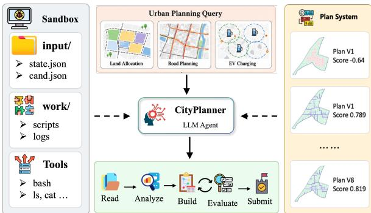
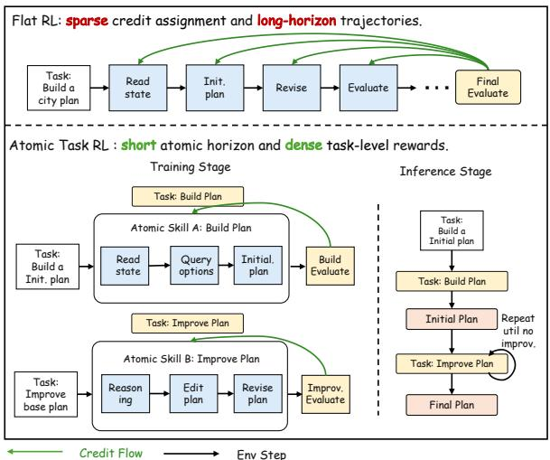
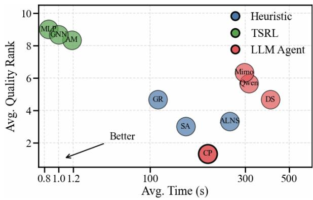
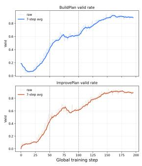
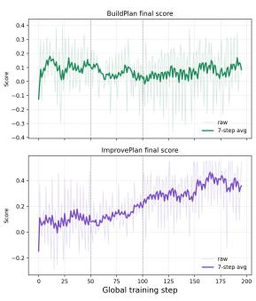
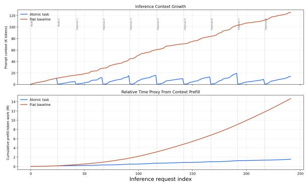
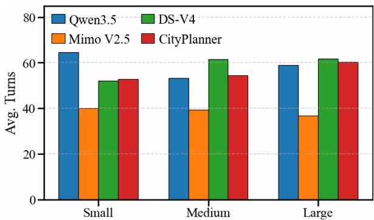
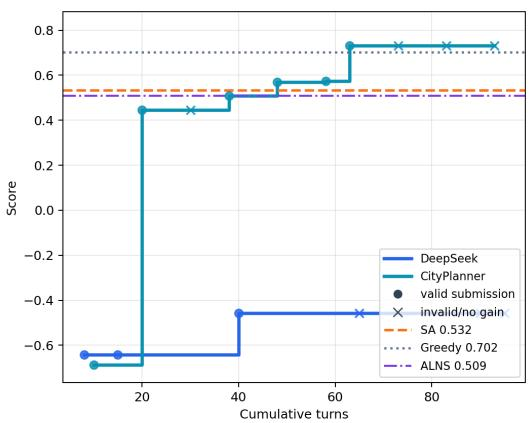

# CityPlanner: A Sandbox Agent for Executable Urban Planning

Wentao Zhang, Jingyuan Wang<sup>†</sup>, Zetong Zhou,Yifan Yang, Wenrui Wang School of Computer Science and Engineering, Beihang University, Beijing, China MIIT Key Laboratory of Data and Decision Intelligence, Beihang University, Beijing, China {zhangwt97}@buaa.edu.cn

## Abstract

Urban planning is a real-world spatial optimization problem that requires selecting feasible actions from large candidate spaces under practical objectives such as cost and service quality. Existing optimization and reinforcement learning methods are effective for fixed formulations, but often depend on task-specific representations and constraint handling. We pro pose CityPlanner, a sandbox-agent framework for executable urban planning. CityPlanner introduces UrbanSandbox, a unified file-based environment where agents inspect task files, generate plans, run evaluators, and revise decisions based on executable feedback. To make learning tractable, we further propose atomictask reinforcement learning, which decomposes long sandbox trajectories into BuildPlan for initial construction and ImprovePlan for feedbackbased refinement. Experiments on a real-world benchmark show that CityPlanner consistently outperforms heuristic, task-specific RL, and general LLM-agent baselines. Ablations verify the contributions of UrbanSandbox, atomictask RL, and iterative deployment. We release the code and dataset at https://anonymous. 4open.science/r/co-agent-C1C8.

## 1 Introduction

Urban planning is a fundamental problem in city management. It converts spatial data, infrastructure conditions, and policy objectives into concrete decisions over land use, road construction, and public facilities (Zheng et al., 2025; Liu et al., 2025; Zheng et al., 2023; von Wahl et al., 2022; Liu et al., 2023). These decisions directly affect transportation efficiency, service accessibility, and ecological quality. From an optimization perspective, urban planning is challenging because it involves large combinatorial action spaces, hard feasibility constraints, and multiple competing objectives, such as construction cost and environmental benefit. The value of each planning action is also highly contextdependent, as it depends on surrounding population, topology, and local demand patterns.

  
Figure 1: Executable urban planning with CityPlanner.

A large body of work has studied urban planning with optimization, heuristic search, and reinforcement learning methods (Rasheed et al., 2020; von Wahl et al., 2022; Zheng et al., 2023). These methods are effective when the state representation, action space, constraints, and objective function are fixed in advance. However, practical urban planning tasks are heterogeneous: different tasks may involve different candidate types, constraint definitions, evaluation procedures, and feedback forms. Methods designed for one task often require non-trivial redesign when transferred to another scenario, limiting their applicability.

Large language model agents provide a possible interface for such heterogeneous planning tasks. Instead of relying on a predefined vectorized stateaction representation, an LLM agent can read task descriptions, inspect structured files, write intermediate analyses, execute tools, and revise solutions according to feedback (Yao et al., 2023; Shinn et al., 2023; Qin et al.; Patil et al.). Nevertheless, directly using an LLM as a black-box planner is insufficient for constrained urban planning. A generated plan must satisfy explicit feasibility constraints and be evaluated by task-specific programs rather than natural-language plausibility. The key question is how to leverage the broad capabilities of LLM to effectively solve urban planning problems.

In this paper, we formulate urban planning as an executable sandbox-agent problem. The agent is placed in a sandbox containing city data, candidate actions, task constraints, executable evaluators, and output interfaces. As shown in Fig. 1, the agent solves the task by reading input files, constructing a plan, running the evaluator, observing diagnostic feedback, and revising the plan. This formulation provides a common interaction protocol for heterogeneous urban planning tasks while preserving their task-specific objectives and constraints.

Training an LLM agent in such a sandbox remains non-trivial. Complete sandbox trajectories are long and noisy, containing repeated script execution, invalid submissions, and intermediate revisions. As the interaction proceeds, outdated observations and failed attempts accumulate in the context. Moreover, the main planning reward is usually available only after a complete plan is submitted and evaluated, leading to sparse rewards and difficult long-horizon credit assignment. Direct reinforcement learning over complete trajectories can therefore improve superficial executable behaviors while still failing to produce high-quality plans.

To address these issues, we propose CityPlanner, a sandbox-agent framework for executable urban planning. CityPlanner has two components. First, UrbanSandbox provides a unified file-based environment for heterogeneous planning tasks. The agent interacts with the environment through a minimal bash-based interface, enabling file inspection, plan generation, script execution, and evaluator invocation without task-specific agent APIs. Second, atomic-task reinforcement learning decomposes long-horizon sandbox planning into two finite-context tasks: BuildPlan, which constructs an initial feasible plan, and ImprovePlan, which revises an existing plan using evaluator diagnostics. At inference time, CityPlanner composes the two skills into an iterative procedure that repeatedly evaluates and improves the best-so-far solution.

For empirical evaluation, we collect real-world data from OpenStreetMap (OpenStreetMap contributors, 2017) and build an executable benchmark covering 5,670 planning instances across three tasks. Experiments show that CityPlanner consistently improves planning quality over heuristic, task-specific RL, and LLM-agent baselines, while ablations confirm the contributions of UrbanSandbox, atomic-task RL, and iterative refinement.

## 2 Related Work

LLM agents and executable environments. Recent LLM agents extend language models to interactive problem solving with tools, APIs, files, and executable environments (Yao et al., 2023; Shinn et al., 2023; Qin et al.; Patil et al.). Existing agent benchmarks mainly focus on general tool use, web interaction, coding, or command-line tasks (Vishwakarma et al., 2025; Pysklo et al., 2026; Merrill et al., 2026; Team, 2025a). In parallel, LLMs have been explored for urban analysis, planning assistance, and decision support (Jiang et al., 2024; Zhu et al., 2024; Zhou et al.; Zheng et al., 2025; Agrawal and Goktas, 2025; Liu et al., 2025). Different from language-only planning assistance, City-Planner studies executable urban planning, where the agent must submit structured spatial plans that are verified and scored by task-specific evaluators.

Reinforcement learning for LLM agents. Reinforcement learning has been used to improve LLM agents in tool-use, web navigation, coding, and interactive planning environments (Li et al., 2025; Qi et al.; Cheng et al., 2025; Feng et al., 2025; Qian et al., 2026; Tan et al., 2025). A common difficulty is that agent trajectories are long, noisy, and often rewarded only after task completion. CityPlanner addresses this issue by decomposing executable urban planning into two finite-context atomic tasks, enabling construction and refinement to be trained with separate task-level rewards.

## 3 Problem Statement

Urban planning aims to improve an existing urban region by selecting planning actions under taskspecific constraints. We consider following tasks: • Land allocation assigns land-use types to candidate parcels under land-use, spatial, ecological, and service-balance constraints.

• Road construction selects road segments to add to the existing network under budget, quantity, and spatial-validity constraints.

• Station placement selects candidate sites for new charging facilities under demand, capacity, infrastructure, and cost constraints.

Although these tasks have different spatial objectives, they share the same decision structure: given an urban region and a finite set of candidate actions, the planner selects a constraint-satisfying subset as the final plan. Formally, each instance p is represented by an attributed city graph

$$
\mathcal { G } _ { p } = ( V _ { p } , E _ { p } , \mathbf { X } _ { p } ^ { V } , \mathbf { X } _ { p } ^ { E } ) ,\tag{1}
$$

where $V _ { p }$ denotes urban spatial units, $E _ { p }$ denotes road-network edges, and $\mathbf { \hat { X } } _ { p } ^ { V } , \mathbf { X } _ { p } ^ { E }$ denote their attributes. Each instance provides a candidate set ${ \mathcal { C } } _ { p } \subseteq V _ { p } \cup E _ { p }$ . A plan $P \subseteq { \mathcal { C } } _ { p }$ selects a subset of candidates. We use $\Psi _ { p } ( P , \mathcal { G } _ { p } ) \in \{ 0 , 1 \}$ to denote whether $P$ satisfies all task-specific constraints, and $S _ { p } ( P )$ to denote its planning score. The goal is

$$
P _ { p } ^ { \star } = \arg \operatorname* { m a x } _ { P \subseteq \mathcal { C } _ { p } : \Psi _ { p } ( P , \mathcal { G } _ { p } ) = 1 } S _ { p } ( P ) .\tag{2}
$$

Detailed definitions are provided in Appendix B.

## 4 Method

As shown in Figure 1, CityPlanner solves these tasks through UrbanSandbox, which provides executable plan generation, evaluation, and feedback. It further decomposes long planning trajectories into two atomic tasks, and composes them iteratively at inference time for long-horizon planning.

## 4.1 UrbanSandbox

The problem statement defines the planning objective. UrbanSandbox specifies how each planning instance is exposed to an agent as an executable environment. For each instance $p ,$ we construct

$$
\mathcal { E } _ { p } = \langle \mathcal { T } _ { p } , \mathcal { W } _ { p } , \mathcal { O } _ { p } , \mathrm { E x e c } _ { p } , \mathrm { E v a l } _ { p } \rangle .\tag{3}
$$

Here, $\mathcal { T } _ { p }$ is the read-only input space, $\mathcal { W } _ { p }$ is the writable workspace, $\mathcal { O } _ { p }$ is the output space, Exec<sub>p</sub> executes commands, and $\mathrm { E v a l } _ { p }$ evaluates plans.

UrbanSandbox is implemented as a file-based sandbox. The input/ directory contains the visible city state, candidate set, task schema, constraints, and evaluator. The work/ directory is used for intermediate analyses and scripts. The outputs/ directory stores submitted plans and evaluation results. Detailed definitions are provided in Appendix D.

The agent interacts with UrbanSandbox through a minimal bash-based interface. At step t, the policy emits a shell command

$$
a _ { t } \sim \pi _ { \theta } ( { \cdot } \mid h _ { t } ) ,\tag{4}
$$

where $h _ { t } = ( o _ { 0 } , a _ { 0 } , \ldots , o _ { t } )$ denotes the interaction history. The sandbox executes the command and returns an observation:

$$
o _ { t + 1 } = \operatorname { E x e c } _ { p } ( a _ { t } ) .\tag{5}
$$

  
Figure 2: Atomic-task reinforcement learning. City-Planner decomposes long-horizon sandbox planning into BuildPlan and ImprovePlan, and composes the two learned skills into iterative refinement at inference time.

The observation may contain file contents, standard output, execution failures, parsing errors, or evaluator diagnostics. The trajectory is written as

$$
\tau = ( o _ { 0 } , a _ { 0 } , o _ { 1 } , a _ { 1 } , . . . , o _ { T } ) .\tag{6}
$$

The final plan is parsed from outputs/final\_plan.json. UrbanSandbox then checks whether the plan satisfies the aggregate constraint function $\Psi _ { p } ( P , \mathcal { G } _ { p } )$ and evaluates its planning score:

$$
\operatorname { E v a l } _ { p } ( P ) = { \left\{ \begin{array} { l l } { S _ { p } ( P ) , } & { \Psi _ { p } ( P , \mathcal { G } _ { p } ) = 1 , } \\ { \operatorname { E r r o r } _ { p } ( P ) , } & { \Psi _ { p } ( P , \mathcal { G } _ { p } ) = 0 . } \end{array} \right. }\tag{7}
$$

Thus, plan validity and quality are determined by executable verification rather than language check.

## 4.2 Atomic-Task Reinforcement Learning

A pretrained language model provides useful priors for file inspection, structured generation, script writing, and tool use, but it is not by itself a reliable planner under hard spatial constraints. As shown in Figure 2, directly training on complete sandbox trajectories requires assigning a sparse final reward to many preceding steps, such as state reading, plan construction, revision, and evaluation. These long and noisy trajectories make credit assignment difficult. CityPlanner therefore decomposes training into two atomic tasks, following the common structure of strong heuristic solvers: first construct an initial solution and then improve it by search. BuildPlan learns the construction stage from task files, while ImprovePlan learns the improvement stage from the incumbent plan and evaluator diagnostics. Each task has a shorter horizon and an independent task-level reward.

We use Rollou $\bar { \mathbf { \rho } } _ { \pi _ { \theta } } ^ { z } ( \cdot )$ to denote a bounded multiturn interaction between the policy and UrbanSandbox under atomic task z, whose output is the final plan submitted to outputs/final\_plan.json.

BuildPlan. BuildPlan is the construction task. Given the sandbox environment $\mathcal { E } _ { p } .$ which contains the city graph $\mathcal { G } _ { p } ,$ candidate set ${ \mathcal { C } } _ { p } ,$ task constraints, and output interface, the policy generates an initial plan through a bounded sandbox rollout:

$$
P _ { 0 } = { \mathrm { R o l l o u t } } _ { \pi _ { \theta } } ^ { \mathrm { b u i l d } } ( \mathcal { E } _ { p } ) .\tag{8}
$$

This task trains the model to construct a feasible executable plan from scratch.

ImprovePlan. ImprovePlan is the revision task. Given the sandbox environment $\mathcal { E } _ { p } .$ , the current plan $P _ { t }$ , and evaluator diagnostics $\mathbf { d } _ { t } .$ the policy generates a revised plan:

$$
\tilde { P } _ { t + 1 } = \mathrm { R o l l o u t } _ { \pi _ { \theta } } ^ { \mathrm { i m p } } ( \mathcal { E } _ { p } , P _ { t } , \mathbf { d } _ { t } ) ,\tag{9}
$$

where $\mathbf { d } _ { t }$ denotes the constraint and score feedback returned by UrbanSandbox. This task trains the model to improve an existing plan from feedback.

Reward. Both atomic tasks use the same planlevel terminal reward. Given a submitted plan $P ,$ the reward is its planning score if it satisfies the task constraints, and a failure penalty otherwise:

$$
R _ { p } ( P ) = \left\{ { \begin{array} { l l } { S _ { p } ( P ) , } & { \Psi _ { p } ( P , \mathcal { G } _ { p } ) = 1 , } \\ { R _ { \mathrm { f a i l } } , } & { { \mathrm { o t h e r w i s e } } . } \end{array} } \right.\tag{10}
$$

Learning Algorithm. We optimize the policy with GRPO (Shao et al., 2024) by sampling rollouts from BuildPlan and ImprovePlan. Each rollout receives the corresponding task-level reward. This trains the policy on bounded atomic skills, avoiding direct optimization over long and noisy trajectories.

## 4.3 Iterative Inference

At inference time, CityPlanner composes the two learned atomic skills into an iterative planning procedure, as shown in Figure 2. Given a test environment $\mathcal { E } _ { p } .$ , CityPlanner first invokes BuildPlan to generate an initial plan $P _ { 0 }$ . UrbanSandbox evaluates this plan and returns its score and diagnostic feedback ${ \bf d } _ { 0 }$ . CityPlanner then repeatedly invokes

Table 1: Statistics of the OSM-based benchmark.
<table><tr><td rowspan="2">Task</td><td rowspan="2">Train/Test</td><td colspan="3">#Instances</td><td colspan="3">Avg. #Candidates</td></tr><tr><td>Small</td><td>Medium</td><td>Large</td><td>Small</td><td>Medium</td><td>Large</td></tr><tr><td>LA</td><td>1,512 /378</td><td>816</td><td>745</td><td>329</td><td>85</td><td>119</td><td>199</td></tr><tr><td>RC</td><td>1,512 /378</td><td>708</td><td>780</td><td>402</td><td>63</td><td>102</td><td>143</td></tr><tr><td>SP</td><td>1,512 / 378</td><td>816</td><td>745</td><td>329</td><td>80</td><td>80</td><td>180</td></tr><tr><td>Total</td><td>4,536 /1,134</td><td>2,340</td><td>2,270</td><td>1060</td><td>一</td><td>一</td><td>一</td></tr></table>

ImprovePlan. At iteration $t ,$ the current best plan $P _ { t }$ and diagnostics $\mathbf { d } _ { t }$ are provided through the sandbox, and the model proposes a revised plan $\tilde { P } _ { t + 1 }$ The proposal is then evaluated by UrbanSandbox before being accepted or rejected.

After each ImprovePlan call, UrbanSandbox evaluates the proposed plan. We accept a proposal only if it is better under a validity-first order: feasible plans are preferred to infeasible ones, and among feasible plans, higher scores are preferred. Denote this order by $\succ _ { p }$ . The update rule is

$$
P _ { t + 1 } = \left\{ \begin{array} { l l } { \tilde { P } _ { t + 1 } , } & { \tilde { P } _ { t + 1 } \succ _ { p } P _ { t } , } \\ { P _ { t } , } & { \mathrm { o t h e r w i s e } . } \end{array} \right.\tag{11}
$$

The loop stops after a fixed iteration budget or a patience budget, and returns the best-so-far plan.

## 5 Experiments

## 5.1 Experimental Setup

Benchmark. We construct the benchmark from large-scale OpenStreetMap data over diverse urban regions in China, with details of data collection and preprocessing provided in Appendix C. The benchmark contains 5,670 planning instances over 1,890 urban tiles across three tasks.

Baselines. We compare CityPlanner with three groups of baselines: heuristic methods, including GRASP (Feo and Resende, 1995), SA (Van Laarhoven and Aarts, 1987), and ALNS (Ahuja et al., 2000); task-specific reinforcement learning methods, including MLP+PPO, AM+PPO, and GNN+PPO; and general LLM agents, including Qwen3.5 (Team, 2026), Mimo V2.5 (mim, 2026), and DS-V4 (DeepSeek-AI, 2026), which solve the tasks through UrbanSandbox without task-specific training. CityPlanner is based on Qwen3-8B and is post-trained in two stages: we first adapt the model to a Terminal-Bench-style interaction format using the public OT-SFT data (Team, 2025b), and then train it with atomic-task RL on urban tasks. Implementation details of all methods are provided in Appendix E.

Table 2: Performance comparison across tasks and difficulty levels. Results are reported as mean±std. The best result in each column is highlighted in bold, and the second-best result is underlined.
<table><tr><td rowspan="2">Method</td><td colspan="3">Land Allocation</td><td colspan="3">Road Construction</td><td colspan="3">Station Placement</td></tr><tr><td>Small</td><td>Medium</td><td>Large</td><td>Small</td><td>Medium</td><td>Large</td><td>Small</td><td>Medium</td><td>Large</td></tr><tr><td colspan="10">Heuristic Methods</td></tr><tr><td>GRASP</td><td> $0 . 3 9 1 { \scriptstyle \pm 0 . 0 4 2 }$ </td><td>0.448±0.058 0.441±0.034</td><td></td><td>0.717±0.011</td><td>0.729±0.019</td><td>0.690±0.018</td><td>0.279±0.024</td><td>0.064±0.009</td><td>0.020±0.001</td></tr><tr><td>SA</td><td> $0 . 3 9 5 { \scriptstyle \pm 0 . 0 8 6 }$ </td><td> $0 . 4 4 1 { \pm } 0 . 0 9 7$ </td><td>0.431±0.044</td><td>0.662±0.056</td><td>0.567±0.065</td><td>0.596±0.074</td><td>0.610±0.052</td><td>0.437±0.094</td><td>0.353±0.078</td></tr><tr><td>ALNS</td><td> $\underline { { 0 . 3 9 6 \pm 0 . 0 9 1 } }$ </td><td>0.456±0.096</td><td>0.451±0.073</td><td>0.653±0.063</td><td>0.513±0.059</td><td>0.510±0.077</td><td>0.501±0.073</td><td>0.434±0.080</td><td>0.392±0.075</td></tr><tr><td colspan="10">TSRL Methods</td></tr><tr><td>MLP+PPO</td><td> $0 . 2 0 5 { \pm } 0 . 0 1 5$ </td><td> $0 . 2 7 6 { \scriptstyle \pm 0 . 0 1 1 }$ </td><td></td><td>0.271±0.014 0.070±0.066 0.166±0.069</td><td></td><td>0.135±0.049</td><td>0.222±0.021</td><td>0.132±0.011</td><td>0.153±0.018</td></tr><tr><td>AM+PPO</td><td> $0 . 1 8 4 { \pm } 0 . 0 1 4$ </td><td> $0 . 2 4 8 { \pm } 0 . 0 1 1$ </td><td></td><td>0.248±0.010 0.269±0.032 0.256±0.025</td><td></td><td>0.307±0.010</td><td>0.224±0.017</td><td>0.175±0.026</td><td>0.194±0.011</td></tr><tr><td>GNN+PPO</td><td> $0 . 2 1 2 { \scriptstyle \pm 0 . 0 1 6 }$ </td><td> $0 . 2 8 9 { \pm } 0 . 0 1 0$ </td><td>0.280±0.012</td><td> $0 . 1 7 4 { \scriptstyle \pm 0 . 0 6 4 }$ </td><td> $0 . 1 4 7 { \pm } 0 . 0 6 9$ </td><td>0.168±0.045</td><td>0.185±0.017</td><td>0.121±0.049</td><td>0.118±0.055</td></tr><tr><td colspan="10">LLM Agents</td></tr><tr><td>Qwen3.5</td><td> $0 . 3 6 6 { \scriptstyle \pm 0 . 0 6 1 }$ </td><td> $0 . 3 2 9 { \pm } 0 . 0 9 3$ </td><td>0.370±0.090 0.332±0.049 0.498±0.044 0.478±0.045</td><td></td><td></td><td></td><td>0.503±0.032</td><td>0.396±0.046</td><td>0.379±0.061</td></tr><tr><td>Mimo V2.5</td><td> $0 . 3 3 5 { \pm } 0 . 0 7 2$ </td><td> $0 . 3 1 7 { \scriptstyle \pm 0 . 0 8 1 }$ </td><td>0.344±0.096</td><td>0.414±0.042</td><td> $0 . 4 8 5 { \pm } 0 . 0 3 7$ </td><td>0.419±0.015</td><td>0.415±0.021</td><td>0.339±0.058</td><td>0.326±0.073</td></tr><tr><td>DS-V4</td><td> $0 . 3 2 3 { \pm } 0 . 0 9 5$ </td><td> $0 . 3 6 4 { \pm } 0 . 0 8 3$ </td><td>0.360±0.056</td><td>0.334±0.035</td><td> $0 . 5 7 9 { \pm } 0 . 0 3 8$ </td><td>0.527±0.039</td><td>0.527±0.021</td><td>0.444±0.058</td><td>0.381±0.052</td></tr><tr><td>CityPlanner</td><td> $\mathbf { 0 . 4 0 2 \pm 0 . 0 1 4 }$ </td><td> $\mathbf { 0 . 4 5 9 } \pm \mathbf { 0 . 0 3 1 }$ </td><td>0.451±0.026 0.609±0.021</td><td></td><td> $\mathbf { 0 . 7 3 5 { \scriptstyle \pm 0 . 0 1 4 } }$ </td><td>0.704±0.054 0.612±0.060</td><td></td><td>0.462±0.034</td><td>0.397±0.062</td></tr></table>

Evaluation protocol. All methods are evaluated on the same instances. Agent-based methods use the same sandbox files, output format, and interaction budget. In the main comparison, we use the task-specific objective score returned by the evaluator as the primary metric. The score definitions follow the original task objectives and are detailed in Appendix B. For all tasks, higher scores indicate better planning quality. Each method is evaluated three times with three different random seeds.

## 5.2 Overall Performance

Table 2 reports the main comparison across three tasks and three difficulty levels. We summarize the results as follows.

• CityPlanner achieves the strongest overall performance. CityPlanner obtains the best score in 8 out of 9 settings. This indicates that CityPlanner is consistently effective across heterogeneous planning tasks and scales.

• Strong heuristics remain competitive baselines. Among non-agent baselines, heuristic methods generally perform best. For example, GRASP achieves the best score on small Road Construction and remains the second-best method on medium and large Road Construction. SA is also highly competitive on small Station Placement. These results show that search heuristics are still strong, especially on smaller or more regular instances, but they require task-specific designs for search moves, repair rules, and constraint handling.

• Task-specific RL methods are less effective. The TSRL baselines perform substantially worse across all tasks. This suggests that, under limited training data, neural policies fail to learn effective planning strategies for these urban planning tasks.

Table 3: Comparison of test-time planning strategies using DeepSeek as a frozen planner. Ours (Scaffoldonly) denotes our UrbanSandbox-based atomic workflow without post-training.
<table><tr><td rowspan="2">Method</td><td colspan="2">Land Allocation</td><td colspan="2">Road Construction</td><td colspan="2">Station Placement</td></tr><tr><td>Feas.↑</td><td>Score↑</td><td>Feas.↑</td><td>Score↑</td><td>Feas.↑</td><td>Score↑</td></tr><tr><td>Text-only</td><td>22.20%</td><td>0.0670</td><td>27.77%</td><td>0.0460</td><td>17.19%</td><td>0.0630</td></tr><tr><td>EoH</td><td>87.80%</td><td>0.3052</td><td>21.00%</td><td>0.0860</td><td>97.80%</td><td>0.2460</td></tr><tr><td>FunSearch</td><td>91.10%</td><td>0.3232</td><td>32.00%</td><td>0.1537</td><td>81.10%</td><td>0.1456</td></tr><tr><td>Ours</td><td>95.69%</td><td>0.3490</td><td>100.00%</td><td>0.4780</td><td>98.15%</td><td>0.4530</td></tr></table>

• Agent-based methods are competitive on complex settings. General LLM agents achieve competitive results in several larger settings, suggesting that tool use and iterative reasoning are useful for complex planning tasks. CityPlanner further strengthens this trend by combining executable feedback with atomic-task training and iterative refinement. These results indicate that agent-based planning becomes more effective as the candidate space grows and direct search becomes harder.

## 5.3 Ablation Study

We conduct ablation studies from two aspects: the sandbox-based planning scaffold and the atomictask training strategy. The first study tests whether executable planning helps a frozen LLM, while the second examines the contribution of SFT, GRPO, ATRL, iterative deployment, and model scaling.

Effect of UrbanSandbox. We first evaluate four test-time strategies using DeepSeek as a frozen planner without post-training. Text-only prompting allows multi-turn reasoning but disables tool calls and evaluator execution. EoH (Liu et al.) and FunSearch (Romera-Paredes et al., 2023) are adapted as LLM-guided heuristic program search methods, where generated programs are evaluated by the task evaluator. Ours uses the UrbanSandbox-based atomic workflow, allowing the frozen LLM to inspect files, execute commands, evaluate plans, and revise outputs. Table 3 reports the results. Text-only prompting has feasibility below 30% on all tasks, showing that direct generation is insufficient for constrained planning. EoH and FunSearch improve some results but remain unstable, especially on Road Planning, with only 21.00% and 32.00% feasibility. In contrast, our scaffold achieves the best feasibility and score on all tasks, confirming that executable file inspection, evaluator feedback, and structured revision substantially improve test-time planning reliability.

Table 4: Ablation under the full UrbanSandbox environment. ATRL denotes atomic-task RL, and CityPlanner further applies iterative refinement deployment.
<table><tr><td rowspan="2">Method</td><td colspan="2">Land Allocation</td><td colspan="2">Road Construction</td><td colspan="2">Station Placement</td></tr><tr><td>Feas.↑</td><td>Obj.↑</td><td>Feas.↑</td><td>Obj.↑</td><td>Feas.↑</td><td>Obj.↑</td></tr><tr><td>Qwen3-8B</td><td>15.29%</td><td>0.1067</td><td>21.95%</td><td>0.1290</td><td>23.31%</td><td>0.1020</td></tr><tr><td>+ SFT</td><td>82.40%</td><td>0.3120</td><td>87.10%</td><td>0.3077</td><td>82.40%</td><td>0.3120</td></tr><tr><td>+ GRPO</td><td>89.60%</td><td>0.3440</td><td>94.20%</td><td>0.5860</td><td>91.30%</td><td>0.3790</td></tr><tr><td>+ ATRL</td><td>100.00%</td><td>0.4210</td><td>100.00%</td><td>0.6820</td><td>100.00%</td><td>0.4670</td></tr><tr><td>CityPlanner</td><td>100.00%</td><td>0.4374</td><td>100.00%</td><td>0.7163</td><td>100.00%</td><td>0.4945</td></tr><tr><td>+ Qwen14B</td><td>100.00%</td><td>0.4498</td><td>100.00%</td><td>0.7312</td><td>100.00%</td><td>0.5116</td></tr></table>

Effect of atomic-task training. We then evaluate training and deployment components under the full UrbanSandbox environment. All variants share the same setting unless otherwise specified. We compare Qwen3-8B, the raw model; +SFT, supervised fine-tuning on sandbox trajectories; +GRPO, flat RL over complete trajectories; +ATRL, atomic-task RL over BuildPlan and ImprovePlan; CityPlanner, which adds iterative refinement; and +Qwen3-14B, which replaces the 8B base model with Qwen3-14B under the same pipeline. Table 4 reports the results. The raw model has feasibility below 25%, indicating that instruction following alone is insufficient. SFT raises feasibility above 80%, while GRPO further improves objective scores. ATRL brings the largest gain, improving feasibility over GRPO by 8.3 percentage points on average, reaching 100.00% feasibility on all tasks, and improving objective scores by 20.7% on average. CityPlanner further improves objectives by 4.9% over ATRL through iterative refinement, and Qwen3-14B adds another 2.8% average gain. Overall, these results verify that each component contributes to feasibility and quality.

  
Figure 3: Efficiency analysis of all methods.

## 5.4 Efficiency Analysis

We further evaluate CityPlanner from the efficiency perspective. Figure 3 compares different methods by their average planning quality and runtime. TSRL methods are the fastest because they only require lightweight policy inference, but their solution quality is limited. Heuristic methods achieve competitive quality on some tasks, but require nontrivial search time. General LLM agents are slower due to multi-turn reasoning and sandbox interaction. CityPlanner achieves the best overall planning quality while maintaining moderate runtime. This shows that the proposed executable planning workflow does not obtain higher quality by simply spending excessive search time.

## 6 Conclusion

In this paper, we presented CityPlanner, a sandboxagent framework for executable urban planning. CityPlanner formulates heterogeneous planning tasks as sandbox interaction and introduces UrbanSandbox to provide a unified file-based environment with task-specific constraints, evaluators, and feedback. To make policy learning tractable, City-Planner decomposes long and noisy planning trajectories into two atomic tasks, BuildPlan and ImprovePlan, and composes the learned skills through iterative refinement at inference time. Experiments on an OpenStreetMap-based benchmark show that CityPlanner consistently improves planning quality over heuristic, task-specific RL, and LLM-agent baselines. Further ablations verify the contributions of UrbanSandbox, atomic-task reinforcement learning, and iterative deployment. These results suggest that executable interaction is a promising interface for applying LLM agents to constrained urban decision-making.

## Limitations

Despite its effectiveness, CityPlanner has several limitations. (1) Computational cost. CityPlanner requires multi-turn sandbox interaction, including file inspection, script execution, and repeated evaluator calls, making it slower than direct policy inference or lightweight heuristics. (2) Optimality guarantee. CityPlanner improves plans through iterative refinement, but it does not provide theoretical optimality guarantees. The final solution may still depend on model capability, reward design, and the informativeness of evaluator feedback.

## Ethical Considerations

Our benchmark is built from OpenStreetMap, an open geographic data platform. We only use public map elements such as roads, land parcels, facilities, and points of interest, and do not use personal trajectories, demographic profiles, land-ownership records, or other sensitive user-level information. Thus, the dataset construction does not introduce additional privacy risks beyond the underlying public map data.

## References

2026. Mimo-v2.5. https://huggingface.co/ collections/XiaomiMiMo/mimo-v25.

Kushagra Agrawal and Polat Goktas. 2025. How large language models transform urban planning and shape tomorrow’s cities? In Large Language Models for Sustainable Urban Development, pages 185–218. Springer.

Ravindra K Ahuja, James B Orlin, and Dushyant Sharma. 2000. Very large-scale neighborhood search. International Transactions in Operational Research, 7(4-5):301–317.

Mingyue Cheng, Jie Ouyang, Shuo Yu, Ruiran Yan, Yucong Luo, Zirui Liu, Daoyu Wang, Qi Liu, and Enhong Chen. 2025. Agent-r1: Training powerful llm agents with end-to-end reinforcement learning. arXiv preprint arXiv:2511.14460.

DeepSeek-AI. 2026. Deepseek-v4: Towards highly efficient million-token context intelligence.

Jiazhan Feng, Shijue Huang, Xingwei Qu, Ge Zhang, Yujia Qin, Baoquan Zhong, Chengquan Jiang, Jinxin Chi, and Wanjun Zhong. 2025. Retool: Reinforcement learning for strategic tool use in llms. arXiv e-prints, pages arXiv–2504.

Thomas A Feo and Mauricio GC Resende. 1995. Greedy randomized adaptive search procedures. Journal ofglobal optimization, 6(2):109–133.

Yue Jiang, Qin Chao, Yile Chen, Xiucheng Li, Shuai Liu, and Gao Cong. 2024. Urbanllm: Autonomous urban activity planning and management with large language models. In 2024 Findings of the Associationfor Computational Linguistics, EMNLP 2024, pages 1810–1825. Association for Computational Linguistics (ACL).

Zhiwei Li, Yong Hu, and Wenqing Wang. 2025. Encouraging good processes without the need for good answers: Reinforcement learning for llm agent planning. In Proceedings of the 2025 Conference on Empirical Methods in Natural Language Processing: Industry Track, pages 1654–1666.

Fei Liu, Tong Xialiang, Mingxuan Yuan, Xi Lin, Fu Luo, Zhenkun Wang, Zhichao Lu, and Qingfu Zhang. Evolution of heuristics: Towards efficient automatic algorithm design using large language model. In Fortyfirst International Conference on Machine Learning.

Jiaqi Liu, Jian Sun, and Xiao Qi. 2023. Optimal placement of charging stations in road networks: a reinforcement learning approach with attention mechanism. Applied Sciences, 13(14):8473.

Ke Liu, Tan Yigitcanlar, Rashid Mehmood, Juan Corchado, and Xinyu Fu. 2025. Large language models in urban planning: a systematic review and conceptual framework. Journal of Urban Technology, pages 1–44.

Mike A Merrill, Alexander G Shaw, Nicholas Carlini, Boxuan Li, Harsh Raj, Ivan Bercovich, Lin Shi, Jeong Yeon Shin, Thomas Walshe, E Kelly Buchanan, and 1 others. 2026. Terminal-bench: Benchmarking agents on hard, realistic tasks in command line interfaces. arXiv preprint arXiv:2601.11868.

OpenStreetMap contributors. 2017. Planet dump retrieved from https://planet.osm.org . https://www. openstreetmap.org.

Shishir G Patil, Tianjun Zhang, Xin Wang, and Joseph E Gonzalez. Gorilla: Large language model connected with massive apis. In The Thirty-eighth Annual Conference on Neural Information Processing Systems.

Hubert M Pysklo, Artem Zhuravel, and Patrick D Watson. 2026. Agent-diff: Benchmarking llm agents on enterprise api tasks via code execution with state-diffbased evaluation. arXiv preprint arXiv:2602.11224.

Zehan Qi, Xiao Liu, Iat Long Iong, Hanyu Lai, Xueqiao Sun, Jiadai Sun, Xinyue Yang, Yu Yang, Shuntian Yao, Wei Xu, and 1 others. Webrl: Training llm web agents via self-evolving online curriculum reinforcement learning. In The Thirteenth International Conference on Learning Representations.

Cheng Qian, Emre Can Acikgoz, Qi He, Hongru Wang, Xiusi Chen, Dilek Hakkani-Tur, Gokhan Tur, and Heng Ji. 2026. Toolrl: Reward is all tool learning needs. Advances in Neural Information Processing Systems, 38:105523–105553.

Yujia Qin, Shihao Liang, Yining Ye, Kunlun Zhu, Lan Yan, Yaxi Lu, Yankai Lin, Xin Cong, Xiangru Tang, Bill Qian, and 1 others. Toolllm: Facilitating large language models to master 16000+ real-world apis. In The Twelfth International Conference on Learning Representations.

Faizan Rasheed, Kok-Lim Alvin Yau, Rafidah Md Noor, Celimuge Wu, and Yeh-Ching Low. 2020. Deep reinforcement learning for traffic signal control: A review. IEEE Access, 8:208016–208044.

Bernardino Romera-Paredes, Mohammadamin Barekatain, Alexander Novikov, Matej Balog, M. Pawan Kumar, Emilien Dupont, Francisco J. R. Ruiz, Jordan Ellenberg, Pengming Wang, Omar Fawzi, Pushmeet Kohli, and Alhussein Fawzi. 2023. Mathematical discoveries from program search with large language models. Nature.

Zhihong Shao, Peiyi Wang, Qihao Zhu, Runxin Xu, Junxiao Song, Xiao Bi, Haowei Zhang, Mingchuan Zhang, YK Li, and 1 others. 2024. Deepseekmath: Pushing the limits of mathematical reasoning in open language models. arXiv preprint arXiv:2402.03300.

Noah Shinn, Federico Cassano, Ashwin Gopinath, Karthik Narasimhan, and Shunyu Yao. 2023. Reflexion: Language agents with verbal reinforcement learning. Advances in neural information processing systems, 36:8634–8652.

Weiting Tan, Xinghua Qu, Ming Tu, Meng Ge, Andy T Liu, Philipp Koehn, and Lu Lu. 2025. Process-supervised reinforcement learning for interactive multimodal tool-use agents. arXiv preprint arXiv:2509.14480.

OpenThoughts-Agent Team. 2025a. OpenThoughts-Agent. https://www.open-thoughts.ai/blog/agent.

OpenThoughts-Agent Team. 2025b. OpenThoughts-Agent. https://www.open-thoughts.ai/blog/agent.

Qwen Team. 2026. Qwen3.5: Accelerating productivity with native multimodal agents.

Peter JM Van Laarhoven and Emile HL Aarts. 1987. Simulated annealing. In Simulated annealing: Theory and applications, pages 7–15. Springer.

Harsh Vishwakarma, Ankush Agarwal, Ojas Patil, Chaitanya Devaguptapu, and Mahesh Chandran. 2025. Can llms help you at work? a sandbox for evaluating llm agents in enterprise environments. In Proceedings of the 2025 Conference on Empirical Methods in Natural Language Processing, pages 9178–9212.

Leonie von Wahl, Nicolas Tempelmeier, Ashutosh Sao, and Elena Demidova. 2022. Reinforcement learningbased placement of charging stations in urban road networks. In Proceedings ofthe 28th ACM SIGKDD Conference on Knowledge Discovery and Data Mining, pages 3992–4000.

Shunyu Yao, Jeffrey Zhao, Dian Yu, Nan Du, Izhak Shafran, Karthik Narasimhan, and Yuan Cao. 2023. React: Synergizing reasoning and acting in language models. In 11th International Conference on Learning Representations, ICLR 2023.

Yu Zheng, Hongyuan Su, Jingtao Ding, Depeng Jin, and Yong Li. 2023. Road planning for slums via deep reinforcement learning. In Proceedings of the 29th ACM SIGKDD Conference on Knowledge Discovery and Data Mining, pages 5695–5706.

Yu Zheng, Fengli Xu, Yuming Lin, Paolo Santi, Carlo Ratti, Qi R Wang, and Yong Li. 2025. Urban planning in the era of large language models. Nature computational science, 5(9):727–736.

Z Zhou, Y Lin, and Y Li. Large language model empowered participatory urban planning. arxiv 2024. arXiv preprint arXiv:2402.01698.

He Zhu, Wenjia Zhang, Nuoxian Huang, Boyang Li, Luyao Niu, Zipei Fan, Tianle Lun, Yicheng Tao, Junyou Su, Zhaoya Gong, and 1 others. 2024. Plangpt: Enhancing urban planning with tailored language model and efficient retrieval. arXiv preprint arXiv:2402.19273.

## A Additional Experimental Analysis

This section provides additional analyses of City-Planner beyond the main comparison. We examine training dynamics, context evolution under atomic tasks, interaction cost, and refinement behavior.

## A.1 Training Dynamics



  
Figure 4: Training dynamics of atomic-task reinforcement learning.

Figure 4 shows the training dynamics of atomictask reinforcement learning. The light curves show raw values, and the bold curves show 7-step moving averages. For BuildPlan, the valid rate increases steadily and eventually approaches a high success rate, indicating that the model learns to construct feasible initial plans. Its final score remains noisy, suggesting that the construction task mainly improves validity rather than fine-grained quality optimization. For ImprovePlan, both the valid rate and final score increase over training. In particular, the score curve shows a clear upward trend, indicating that the model learns to use evaluator feedback to revise existing plans. These results show that the two atomic tasks acquire complementary skills: BuildPlan stabilizes initial feasible construction, while ImprovePlan improves plan quality through feedback-based refinement.

  
Figure 5: Context evolution under flat sandbox planning and atomic-task planning.

## A.2 Context Evolution

Figure 5 compares the context growth of flat sandbox planning and atomic-task planning during inference. In the flat baseline, the prompt context grows monotonically as file contents, command outputs, failed attempts, and intermediate revisions accumulate in a single trajectory. In contrast, atomic-task planning resets the context at each BuildPlan or ImprovePlan call, keeping each interaction within a bounded context. This also leads to a much smaller cumulative prefill-token workload, as shown in the lower panel. These results support the motivation of atomic-task decomposition: it reduces context accumulation while preserving the ability to solve long-horizon planning through repeated bounded interactions.

## A.3 Interaction Turns

Figure 6 reports the average number of interaction turns used by LLM agents across difficulty levels. CityPlanner uses a comparable number of turns to other strong LLM agents, indicating that its performance gain does not come from substantially longer interactions. Together with the main quality results, this suggests that UrbanSandbox feedback and iterative refinement improve the effectiveness of each interaction.

  
Figure 6: Average interaction turns of LLM agents under different task difficulties.

  
Figure 7: Best-so-far refinement curve on a representative road construction instance.

## A.4 Refinement Behavior

Figure 7 shows the best-so-far score during a representative road construction episode. DeepSeek remains in a low-score region, indicating that direct long-horizon planning has difficulty recovering from invalid or non-improving submissions. In contrast, CityPlanner quickly obtains a valid intermediate plan and then improves it through evaluator feedback. Its best-so-far score first surpasses ALNS and SA, and eventually exceeds the Greedy baseline. This result shows that iterative deployment enables stable plan improvement by preserving the best-so-far solution instead of regenerating plans from scratch.

## B Task Definitions

This section gives the task-specific definitions used in our benchmark. All tasks are evaluated through a unified scoring interface. Submitted action ids are first mapped to feasible candidates. Invalid ids are recorded as violations, and duplicated action ids are removed before scoring. Unless otherwise specified, all benchmark tables report the raw evaluator scores defined below. Higher scores indicate better planning quality for all tasks.

## B.1 Land Allocation

Task origin. Land allocation is adapted from community spatial planning, where the planner assigns land-use functions to parcels to improve spatial efficiency under service, ecological, and mobility requirements (Zheng et al., 2025). In our benchmark, this task is instantiated as selecting parcel–land-use actions that form a allocation plan.

Observation. An instance provides candidate parcels, demand distributions, budget information, and a land-use requirement configuration need\_config. The requirement configuration specifies how many parcels of each land-use type are needed. Candidate actions also contain cost, parcel attributes, and estimated service effects.

Action. A plan P selects a subset of candidate assignments. Each selected action assigns one landuse type to one candidate parcel. A valid plan should satisfy the required land-use composition, avoid duplicate block selection, and respect budget and count constraints.

Score. The evaluator measures two main terms. The first is requirement satisfaction $R _ { p } ( P )$ , which measures how well selected land uses match need\_config. The second is service coverage $A _ { p } ( P )$ , which measures the fraction of demand weight served by selected assignments. The taskspecific score is

$$
S _ { p } ( P ) = w _ { r } R _ { p } ( P ) + w _ { a } A _ { p } ( P ) - w _ { \rho } \rho _ { p } ( P ) - V _ { p } ( P ) ,\tag{12}
$$

where $\rho _ { p } ( P )$ is the cost ratio and $V _ { p } ( P )$ is the violation penalty. Following the original spatialplanning objective design, we set $w _ { r } = 0 . 6 , w _ { a }$ = 0.3, and $w _ { \rho } = 0 . 2$ . The violation term includes duplicate select, overbuilding, and count violations.

## B.2 Road Construction

Task origin. Road construction is adapted from road planning for connectivity improvement, where insufficient roads make urban places difficult to access and limit the delivery of basic services (Zheng et al., 2023). The original task selects new road segments from candidate locations between places, with the goal of improving connectivity, reducing travel distance, and controlling construct cost.

Observation. An instance provides an existing road network, demand groups, candidate road segments, segment costs, and a construction budget. Each demand group may contain multiple entry nodes. Candidate segments contain endpoints, geometry, length, adjacent parcels, and construct cost.

Action. A plan P selects a subset of candidate road segments to add to the existing network. The evaluator constructs the planned road graph by combining existing road edges and selected candidate edges. A valid plan must satisfy budget and count constraints and should connect demand groups through the resulting road graph.

Score. Let $\Gamma _ { p } ( P )$ denote the fraction of connected demand-group pairs. If all demand pairs are connected, the evaluator computes a demand distance under P with that of an ideal graph containing all feasible candidate roads. We define

$$
\begin{array} { r } { Q _ { p } ( P ) = \left\{ \begin{array} { l l } { - 1 + \Gamma _ { p } ( P ) , } & { \Gamma _ { p } ( P ) < 1 , } \\ { \Delta _ { p } ( P ) , } & { \Gamma _ { p } ( P ) = 1 . } \end{array} \right. } \end{array}\tag{13}
$$

The task-specific score is

$$
S _ { p } ( P ) = Q _ { p } ( P ) - w _ { \rho } \rho _ { p } ( P ) - V _ { p } ( P ) ,\tag{14}
$$

where $\rho _ { p } ( P )$ is the construct-cost ratio and $V _ { p } ( P )$ is the violation penalty. We set $w _ { \rho } = 0 . 1$ following the road-planning objective. Thus, connectivity is the primary criterion, and fully connected plans are further ranked by distance reduce and cost.

## B.3 Station Placement

Task origin. Station placement is adapted from charging-station placement in urban road networks (von Wahl et al., 2022). The original task decides where to place charging stations and what charger configuration each site should use, with the goal of improving charging supply while reducing access distance, service time, and construction cost.

Observation. An instance provides a road network, charging demand, candidate charging sites, charger configs, and cost constraints. Each candidate contains a site location and the numbers of slow, medium, and fast chargers. The evaluator also uses demand weights, access distances, capacity, and load information to estimate service quality.

Action. A plan P selects candidate site– configuration actions. Each selected action places a charger configuration at one site. A valid plan should avoid selecting multiple configurations at the same site, satisfy count and budget constraints, and provide sufficient capacity for nearby demand.

Table 5: UrbanSandbox dataset statistics across five urban clusters.
<table><tr><td>Region</td><td>Tiles</td><td>Representative Cities</td></tr><tr><td>Beijing-Tianjin-Hebei</td><td>25,269</td><td>Beijing, Tianjin, Shijiazhuang</td></tr><tr><td>Yangtze River Delta</td><td>21,872</td><td>Shanghai, Nanjing, Hangzhou</td></tr><tr><td>Chengdu-Chongqing</td><td>19,266</td><td>Chengdu, Chongqing, Mianyang</td></tr><tr><td>Mid-Yangtze</td><td>19,488</td><td>Wuhan, Yichang, Changsha</td></tr><tr><td>Pearl River Delta</td><td>17,203</td><td>Guangzhou, Shenzhen, Hong Kong</td></tr></table>

Score. For each selected site s, the evaluator computes an effective supply from the charger config:

$$
q _ { p } ( s ) = n _ { \mathrm { s l o w } } ( s ) + 3 n _ { \mathrm { m e d i u m } } ( s ) + 8 n _ { \mathrm { f a s t } } ( s ) .\tag{15}
$$

Demand is assigned to selected sites using a generalized distance that combines physical distance and queue pressure. The evaluator then computes service coverage $A _ { p } ( P )$ , access-distance $D _ { p } ( P )$ and service-time $T _ { p } ( P )$ . The benefit term is

$$
B _ { p } ( P ) = w _ { a } A _ { p } ( P ) + w _ { d } D _ { p } ( P ) + w _ { t } T _ { p } ( P ) .\tag{16}
$$

The task-specific score is

$$
S _ { p } ( P ) = B _ { p } ( P ) - w _ { \rho } \rho _ { p } ( P ) - V _ { p } ( P ) ,\tag{17}
$$

where $\rho _ { p } ( P )$ is the cost ratio and $V _ { p } ( P )$ aggregates duplicate site, count, overload, and unserveddemand penalties. Following the charging-station placement objective, we set $w _ { a } = 0 . 5 0 , w _ { d } = 0 . 2 5$ $w _ { t } = 0 . 1 5$ , and $w _ { \rho } = 0 . 2 0$

## B.4 Summary

The three tasks share the same evaluator convention: a submitted plan is mapped to feasible candidates, checked against task-specific constraints, and assigned a raw objective score $S _ { p } ( P )$ . The main experiments report these raw scores directly. Reward normalization, if used during training, is not part of the benchmark metric.

## C Dataset Construction

This section describes the construction of our OpenStreetMap-based benchmark. Each urban tile covers a geographic region of $0 . 0 3 ^ { \circ } \times 0 . 0 3 ^ { \circ }$ , corresponding to approximately 3.3 km by 2.6 km depending on latitude. We first collect large-scale OpenStreetMap road-network data from five major urban clusters in China, covering 15 representative cities. As summarized in Table 5, the initial crawl contains 103,098 tiles across Beijing– Tianjin–Hebei, Yangtze River Delta, Chengdu– Chongqing, Mid–Yangtze, and Pearl River Delta.

We then polygonize the road topology to identify urban faces enclosed by roads, which are used as spatial units for candidate generation and demand modeling. To ensure reliable instance construction, we retain only highly urbanized tiles with dense road networks and sufficient residential or commercial land-use evidence. After filtering low-density or unreliable regions, we obtain 1,890 final urban tiles. The tiles are split into 1,512 training tiles and 378 test tiles, following an 80/20 split.

Each tile is used to instantiate three planning tasks: land allocation, road construction, and station placement. Therefore, the final benchmark contains 5,670 planning instances. The three tasks share the same geographic region within each tile, but differ in candidate generation, constraints, and evaluator definitions.

Difficulty levels. We assign each instance to a size bucket according to the number of candidate actions and demand regions. The benchmark contains three difficulty levels: small, medium, and large. On average, road construction contains about 63, 102, and 143 candidates for small, medium, and large instances, respectively. Station placement contains about 80, 80, and 180 candidates, while land allocation contains about 85, 119, and 199 candidates. Thus, larger instances correspond to larger candidate spaces and more complex constraints.

City graph fields. Each instance contains a structured city state. Road-construction instances include junction nodes with geographic coordinates, junction degree, and adjacent road ids. All tasks include road edges with geometry, length, center coordinates, OSM road type, and source information. Demand zones contain parcel ids, center coordinates, area, demand weight, and task-specific entry nodes or geometry when applicable. These fields provide the spatial and attribute information used by UrbanSandbox evaluators.

Candidate actions. Each task provides a list of feasible candidate actions. For station placement, a candidate specifies a charging site and charger configuration, including the numbers of slow, medium, and fast chargers. For road construction, a candidate specifies a road segment with endpoints, geometry, length, cost, and adjacent parcels. For land allocation, a candidate assigns a land-use type to a block and includes its area, cost, and estimated service effects. All candidate actions are associated with an action\_id, cost, feasibility flag, payload, and estimated effects.

## D Sandbox Implementation

This section describes the concrete workspace interface and prompt protocol used by UrbanSandbox. Each episode creates a workspace with four directories: input/, work/, outputs/, and logs/. The input/ directory is read-only and contains task data and evaluator scripts. The work/ directory is used for scratch files and intermediate analysis. The outputs/ directory stores submitted plans and evaluation results, while logs/ records traces.

Workspace Interface   
input/: read-only task files, candidate files, city state,   
and evaluator scripts.   
work/: writable scratch space and atomic-task context.   
outputs/: submitted plans and evaluation history.   
logs/: execution traces.

At initialization, input/ contains the visible city state, candidate schema, compact candidate tables, the full candidate list, the complete task export, and evaluator scripts. In particular, city\_state.json records the task name, instance id, metadata, budget, interaction limit, candidate count, and demand count. candidate\_summary.csv and candidates.csv provide compact candidate views, while candidates.json stores the complete candidate list. The file export.json contains the complete city-task export, including demand regions, candidate actions, road edges, nodes when applicable, and distance information.

Each atomic-task episode also provides work/atomic\_context.json. For BuildPlan, this file contains an empty current plan, the budget, the step limit, and editable candidate information. For ImprovePlan, it additionally contains the base plan and its score. Thus, the prompt itself does not contain instance-specific city data. The model must retrieve the city graph, candidates, constraints, current plan, and diagnostics by inspecting workspace files and executing commands.

Submitted Plan Format   
The submitted plan must be written to final\_plan.json   
in the following format:   
{"candidate\_ids": ["id\_1", "id\_2"]}   
The evaluator accepts several compatible formats, but all   
prompts use candidate\_ids as the official schema.

The agent evaluates a plan by running the evaluator command shown below. The evaluator returns a JSON object containing validity, validation diagnostics, task-specific score fields, and the parsed candidate ids. Each evaluation is appended to outputs/eval\_history.jsonl.

Terminal interaction protocol. All agents follow the same terminal protocol. At each interaction step, the model must output one valid JSON object with four fields: analysis, plan, commands, and task\_complete. The commands field stores terminal commands to execute, and task\_complete is set to true only after the final plan has been written and evaluated.

```json
Example Terminal Response
{
"analysis": "I will inspect the task description first.",
"plan": "Read the README and candidate summary.",
"commands": [
{
"keystrokes": "cat input/README.md\n",
"duration": 0.1
}
],
"task_complete": false
}
```

## D.1 Prompt Templates

## System Prompt

Required JSON fields:

\- analysis: brief analysis of the current terminal output and task progress

\- plan: what you plan to do next

\- commands: terminal commands to execute

\- task\_complete: whether the task is finished

## Rules:

\- Every command string in "keystrokes" must end with "\n"

\- Multiple commands may be included and will execute sequentially

\- Set "task\_complete" to true only after verifying the task is complete

\- Duration is 0.1 for instant commands, 1.0 for normal commands, and at most 60

\- The response must be only the JSON object

## Instance Prompt Template

Please solve this city-planning workspace task: {{task}}

Instance Context:

Use work/ only for scratch scripts and intermediate files.   
The only submitted plan is outputs/final\_plan.json.

```jinja
Goal:
{{ATOMIC_GOAL}}
Plan format:
{"candidate_ids": ["candidate_id_1", "candidate_id_2"]}
Evaluate the submitted plan before finishing:
python input/evaluate_plan.py outputs/final_plan.json
The evaluator returns validity, score, task-specific
metrics, cost ratio, and hard errors. Repair hard
errors before finishing.
When done, set "task_complete": true.
Workspace State:
- plan: exists={{plan_exists}} | non_empty={{plan_non_empty
}} | selected_count={{selected_count}} | needs_eval
={{needs_eval}}
- evaluation: has_evaluated={{has_evaluated}} | valid={{
last_valid}} | score={{last_score}}
- hard_errors: {{hard_errors}}
- warnings: {{warnings}}
- next: {{next_required_action}}
```

BuildPlan and ImprovePlan share the same system prompt and workspace I/O contract. The prompt specifies the terminal response protocol, workspace files, final-plan schema, evaluator command, and completion rule. The only task-specific part is the atomic goal. Importantly, the prompt does not contain the full city graph, candidate table, demand regions, distance, or geometry; these data must be retrieved from the workspace files.

Atomic Goals   
BuildPlan. Create a valid and non-empty initial plan for   
the current workspace. The plan need not be globally   
optimal, but it should be executable and evaluated.   
ImprovePlan. Improve the preloaded plan for the cur  
rent workspace. The model should make and evaluate a   
concrete edit to candidate\_ids that aims to increase the   
score while keeping the plan valid and non-empty.

## E Implementation Details

This section summarizes the implementation details of CityPlanner and baselines. All methods are evaluated with the same official task evaluator. Submitted action ids are first mapped to feasible candidates and budget or maximum-step violations are treated as hard invalid cases.

CityPlanner and LLM agents. CityPlanner uses Qwen3-8B as the base model unless otherwise specified. All LLM agents follow the same terminal interaction protocol and submit plans to outputs/final\_plan.json with the candidate\_ids schema. During evaluation, we use temperature 0.7, a maximum response length of 4096 tokens, and a request timeout of 300 seconds. The evaluation script allows at most 20 turns, and uses 16 workers. In full CityPlanner inference,

BuildPlan is retried up to three times if needed, and ImprovePlan is repeated until a patience budget of three non-improving rounds is reached.

Atomic-task RL. After SFT, we optimize the model with GRPO over BuildPlan and Improve-Plan. The rollout batch size and validation batch size are both 64. We use learning rate $1 . 0 \times 1 0 ^ { - 6 }$ per-device batch size 1, gradient accumulation steps 32, and rollout temperature 1.0. The actor inference batch size is 1, and the environment inference batch size is 4.

Heuristic baselines. All heuristic baselines use the same raw evaluator score as CityPlanner. The shared heuristic script uses 32 workers, seed 42, and a repair candidate limit of 300. Greedy starts from an empty plan and repeatedly adds the feasible candidate that maximizes score improvement until no addition improves the score. SA runs for 2000 iterations with add, remove, and swap moves. ALNS runs for 1000 iterations with random, expensive, and worst-contribution destroy operators, and greedy or noisy-greedy repair operators.

Task-specific RL baselines. We implement MLP+PPO, AM+PPO, and GNN+PPO with MaskablePPO. The default training budget is 200K timesteps. We use 8 parallel environments, learning rate 3 × 10<sup>−4</sup>, rollout length 128, batch size 64, 10 PPO epochs, discount factor 0.99, GAE parameter 0.95, clipping range 0.2, and entropy coefficient 0.01. The MLP policy uses hidden sizes [256, 256]. The attention and GNN policies use embedding dimension 64 with two layers and four heads.

Scaffold baselines. EoH and FunSearch are adapted as LLM-guided heuristic program search methods. EoH follows an evolutionary heuristic design process: the LLM proposes heuristic programs for selecting candidate actions, the evaluator scores the resulting plans, and high-performing programs are used to guide later generations. FunSearch follows a similar program-search paradigm, where the LLM iteratively generates scoring or selection functions that are executed to produce candidate plans and ranked by evaluator feedback. Both baselines therefore use the LLM to search over executable heuristics rather than directly interacting with the full workspace as an agent. Our scaffoldonly variant instead uses the UrbanSandbox atomic workflow with file inspection, command execution, evaluator calls, and plan revision, but does not update model parameters.