# HyperTrace: Hypothesis-Based Preference Tracing for Online LLM Personalization

Jianzhi Shen1,\*, Keyu Mao2,\*, Minghao Shao3,4, Chuanyang Jin1, Yusong Wang2, Ailiang Lin2, Kotaro Funakoshi2, Manabu Okumura2, Tianmin Shu1, Muhammad Shafique4,†

1Johns Hopkins University, 2Institute of Science Tokyo, 3NYU Tandon, 4NYU Abu Dhabi \*Equal contribution. †Corresponding Author. Correspondence: muhammad.shafique@nyu.edu

## Abstract

Personalized language models aim to adapt responses to individual users, whose preferences are often latent and revealed gradually through interaction. Existing training-free methods rely on stored histories or retrieved memories, but they often struggle to reconcile longterm preferences with short-term topic-specific needs. To address this issue, we propose HyperTrace, a training-free framework that formulates online personalization as latent preference tracing. HyperTrace maintains interpretable natural-language hypotheses over short-term intent and long-term preferences, and updates them through an SMC-style reweight process using an LLM-based surrogate choice model. By updating these hypotheses across turns and sessions, HyperTrace enables personalization without parameter updates. Experiments on PRISM and PersonaMem-v2 show that Hyper-Trace improves response alignment, preference prediction, and profile consistency over strong online baselines, demonstrating the effectiveness of tracing latent user preferences for robust personalization. Code and scripts are available in the repository: https://github.com/ jiseshen/HyperTrace.

## 1 Introduction

Personalization is essential for large language models to function as effective partners in human-AI collaboration (Tseng et al., 2024; Liu et al., 2025a; Zhang et al., 2025c; Xie et al., 2025; Guan et al., 2025). Users differ in goals, preferences, and expectations, and these differences emerge gradually over repeated interactions. Effective personalization must therefore adapt continually while remaining scalable across diverse users.

Existing approaches can broadly fall into two categories. Training-based methods achieve strong personalization by learned user representations (Qiu et al., 2025a; Ning et al., 2025; Liu et al., 2025b), PEFT (Zhang et al., 2024; Tan et al., 2024), or reinforcement learning (Jang et al., 2024; Poddar et al., 2024; Jin et al., 2025; Liang et al., 2026), but incur computational overhead and depend on whitebox models, limiting their applicability. Inferencelevel methods, in contrast, avoid parameter updates and instead condition generation on summary of history interactions (Wang et al., 2023; Garbacea and Tan, 2025) or memory mechanisms (Salemi et al., 2024b; Zhong et al., 2024; Zhang, 2024). While more scalable, they typically represent user information as unstructured text or retrieved examples, offering limited interpretability and weak generalization beyond observed interactions.

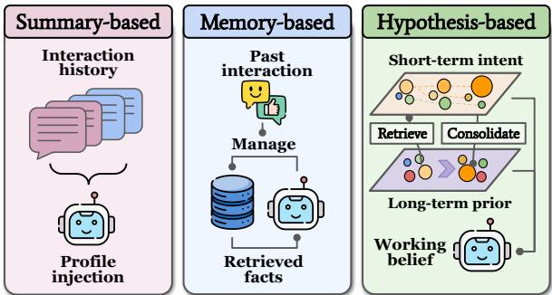  
Figure 1: From storing user history to tracing user preferences. Existing training-free personalization methods compress interactions into a profile (left) or retrieve relevant memories (middle). HyperTrace instead maintains interpretable hypotheses over short-term intent and long-term preferences (right), enabling continual and interpretable adaptation from user feedback.

We instead formulate personalization as latent inference inspired by theory of mind (Kim et al., 2025). We treat user interactions as observations of latent variables that capture goals, preferences, and expectations of model behavior. A user profile is thus represented by several hypotheses about underlying intent, rather than adapted parameters or stored dialogue traces. To handle sequential, sparse, and noisy signals, we use a Sequential Monte Carlo (SMC)-style procedure over naturallanguage hypotheses. Each particle represents a candidate interpretation of user intent, and feedback changes its weight under an LLM-based surrogate model of the observed choice. The weighted particle set preserves several competing explanations as evidence accumulates. We further organize hypotheses hierarchically: lower-level components capture short-term, topic-specific intent for rapid adaptation, while higher-level components consolidate stable long-term preferences. Compared to training-based personalization, our method avoids parameter updates and extends to black-box endpoints. Compared to memory-based approaches, it preserves multiple interpretable preference explanations with trackable evidence accumulation. During generation, a summarized user profile conditions the model to produce user-specific responses.

We evaluate our framework in an online personalization setting based on PRISM (Kirk et al., 2024) and PersonaMem-v2 (Jiang et al., 2025b). The evaluation covers response alignment, preference prediction, and profile alignment, directly measuring how well the extracted profile indicates user choice, and whether its adapted outputs move toward user-specific preferences. Results show stronger and more robust performance over summary- and memory-based baselines. Our contributions are thus twofold:

• We introduce a relative response-alignment score and build an online personalization evaluation framework from pluralistic alignment datasets, covering response-level adaptation, preference prediction, and profile consistency.

• We propose a training-free latent-preference inference framework that uses SMC-style importance weighting under a surrogate choice model, maintaining interpretable short- and long-term preference hypotheses without parameter update.

## 2 Related Work

## 2.1 Evaluating LLM Personalization

Personalization benchmarks extend LLM evaluation beyond generic instruction following by requiring models to condition on user-specific histories, preferences, or interaction traces. Existing benchmarks cover user-conditioned classification, retrieval, recommendation, generation, long-term conversational memory, dynamic profiles, implicit preferences, and multi-session interaction histories (Salemi et al., 2024b; Zollo et al., 2025; Wu et al., 2025; Jiang et al., 2025b; Zhao et al., 2025; Jiang et al., 2025a; Jin et al., 2026). Preferencefeedback datasets further expose heterogeneous human preferences through user-specific choices or in-situ feedback over candidate responses (Kirk et al., 2024; Castricato et al., 2025; Shi et al., 2024).

These benchmarks provide complementary evaluation signals, including task labels, selected candidates, reference responses, and reward-model scores (Salemi et al., 2024b; Jiang et al., 2025b; Dong et al., 2024; Zollo et al., 2025). Our evaluation builds on this line by converting pluralistic preference data into an online personalization setting and measuring response alignment, preference prediction, and profile alignment.

## 2.2 Methods for LLM Personalization

One family of methods personalizes LLMs through training-based adaptation. These approaches learn user representations (Qiu et al., 2025a; Ning et al., 2025; Liu et al., 2025b), PEFT modules (Zhang et al., 2024; Tan et al., 2024), or personalized post-training objectives based on reward modeling, RLHF, or user feedback (Jin et al., 2025; Jang et al., 2024; Poddar et al., 2024; Liang et al., 2026). Related work also studies learned memory construction, group-level personalization, black-boxcompatible external modules, and amortized or meta-learning mechanisms (Magister et al., 2025; Zhang et al., 2025a; Zhuang et al., 2024; Tan et al., 2025; Jiang et al., 2025b).

Another family performs personalization at inference time without updating the base model. Existing approaches summarize user histories into natural-language profiles or personalized prompts (Zhang, 2024; Richardson et al., 2023; Li et al., 2024; Qiu et al., 2025b; Wang et al., 2023; Garbacea and Tan, 2025), retrieve relevant user histories or optimize retrieved contexts for personalized generation (Salemi et al., 2024b,a), and maintain persistent user records or long-term memories across sessions (Zhong et al., 2024; Madaan et al., 2022; Dalvi Mishra et al., 2022). Decoding-time steering provides another efficient route, but requires control over the sampling process (Chen et al., 2025; Zhang et al., 2025b).

HyperTrace is closest to inference-time personalization, but represents user information as a weighted set of natural-language hypotheses rather than a single profile, retrieved context, or memory state. Its update is related to Bayesian hypothesis filtering (Kim et al., 2025), but focuses on tracing actionable preference signals from user choices.

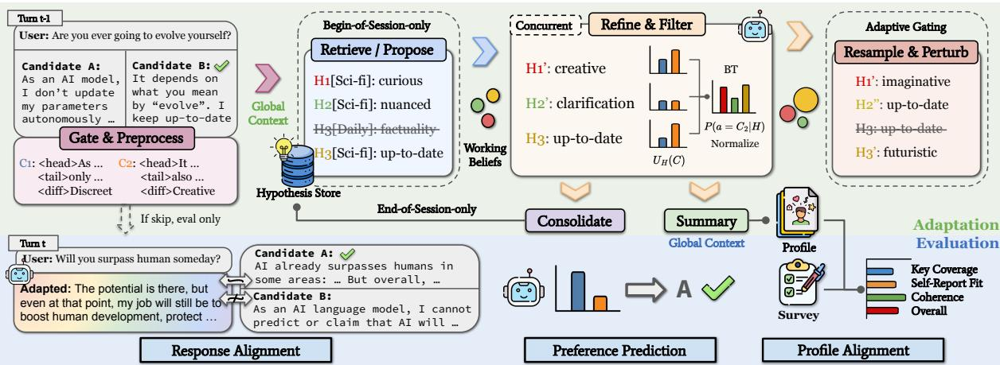  
Figure 2: Overview of the intertwined adaptation–evaluation loop of HyperTrace. During adaptation, preferencebearing turns are gated and compressed into global contexts for retrieving or proposing (if inapplicable) session-level hypotheses. Working beliefs are refined and filtered by estimating hypothesis-conditioned utilities and converting them into surrogate Bradley–Terry choice scores. Adaptive particle maintenance triggers resampling via the effective sample size and perturbs detected similarity groups, preventing belief collapse. At session end, beliefs are consolidated into long-term memory and summarized as a profile. During evaluation, the profile serves as global context, and held-out interactions measure response alignment, preference prediction, and profile alignment.

## 3 Preliminary

We model personalized chatbot interaction as a sequence of sessions in which the active user preference is latent and context-dependent. At the beginning of a session $s ,$ the user’s current need $r _ { s }$ is sampled from their broader interest space, inducing a session-specific preference state $z _ { s } .$

$$
r _ { s } \sim p ( r \mid u ) , \qquad z _ { s } \sim p ( z \mid u , r _ { s } ) .\tag{1}
$$

This captures the intuition that the same user may prefer different response styles across intents. For example, code-related queries favor direct and actionable answers, whereas open-ended daily questions favor broader and more engaging responses.

Within a session, the user reveals preferences through interaction feedback. Given a query $x _ { t }$ and a candidate set $C _ { t } = \{ c _ { t , 1 } , \ldots , c _ { t , m } \}$ , a Bradley– Terry model provides a convenient observation model for the user’s selection:

$$
P ( a _ { t } = i \mid x _ { t } , C _ { t } , z _ { s } ) = \frac { \exp ( U _ { x _ { t } , z _ { s } } ( c _ { t , i } ) ) } { \sum _ { j } \exp ( U _ { x _ { t } , z _ { s } } ( c _ { t , j } ) ) } .\tag{2}
$$

Here, $U _ { x _ { t } , z _ { s } } ( c )$ denotes the utility of candidate c under the current query and latent preference state. If this utility and the prior over $z _ { s }$ were known, the posterior preference belief would satisfy

$$
p ( z _ { s } \mid \mathcal { D } _ { 1 : t } ) \propto p ( z _ { s } ) \prod _ { \ell = 1 } ^ { t } P ( a _ { \ell } \mid x _ { \ell } , C _ { \ell } , z _ { s } ) ,\tag{3}
$$

where $\mathcal { D } _ { 1 : t }$ denotes the observed feedback history.

Table 1: Notation used in HyperTrace formulation.
<table><tr><td>Symbol</td><td>Meaning</td></tr><tr><td> $r _ { s } , z _ { s }$ </td><td>Need and latent preference state behind session s</td></tr><tr><td> $x _ { t } , C _ { t } , a _ { t }$ </td><td>Query, candidate responses, and observed selec- tion at turn t</td></tr><tr><td> $\mathcal { D } _ { 1 : t }$ </td><td>Interaction feedback observed through turn t</td></tr><tr><td> $h _ { t } ^ { ( k ) } , w _ { t } ^ { ( k ) }$ </td><td>Hypothesis k and its normalized relative support</td></tr><tr><td> $B _ { t }$ </td><td>Five-hypothesis working belief at turn t</td></tr><tr><td> $\mathcal { M } _ { u }$ </td><td>Persistent hypothesis memory for user u</td></tr><tr><td> $\hat { U } , \hat { P }$ </td><td>LLM-estimated utility and choice probability</td></tr><tr><td> $\mathcal { T } _ { s } , H ( \mathbf { w } )$ </td><td>Valid traced turns and normalized belief entropy</td></tr><tr><td> $\mathrm { R A } ( y _ { t } )$ </td><td>Relative response alignment of adapted output yt</td></tr></table>

## 4 Methodology

## 4.1 HyperTrace

HyperTrace represents the possible preference state $z _ { s }$ with a set of K weighted natural-language hypotheses. Each hypothesis describes a possible explanation of the user’s current preference, such as preferring concise implementation details, broader conceptual explanations, or more cautious wording. At turn t, the working belief is

$$
B _ { t } = \{ ( h _ { t } ^ { ( k ) } , w _ { t } ^ { ( k ) } ) \} _ { k = 1 } ^ { K } .\tag{4}
$$

The normalized weights rank the maintained explanations according to how well their induced choice scores account for the observed feedback, while retaining plausible alternatives.

## 4.1.1 Intra-Session Belief Update

As illustrated in Figure 2, belief update consists of four steps. Refine adapts the hypotheses to new evidence. Filter scores each hypothesis against the observed feedback. Resample retains hypotheses with greater relative support. Perturb introduces distinct preference axes to avoid premature collapse.

In each filtering step, HyperTrace updates hypothesis weights according to how well each hypothesis predicts the user’s observed selection. For each hypothesis $h _ { t } ^ { ( k ) }$ , we prompt the LLM to approximate the user’s utility function by scoring each candidate response:

$$
\hat { U } _ { x _ { t } , h _ { t } ^ { ( k ) } } ( c _ { t , i } ) = f _ { \theta } ( x _ { t } , c _ { t , i } , h _ { t } ^ { ( k ) } ) .\tag{5}
$$

We convert these hypothesis-conditioned utilities into a surrogate choice score using Eq. 2. The particle weights are updated by

$$
w _ { t } ^ { ( k ) } \propto w _ { t - 1 } ^ { ( k ) } \hat { P } ( a _ { t } \mid x _ { t } , C _ { t } , h _ { t } ^ { ( k ) } ) .\tag{6}
$$

Thus, the LLM supplies the hypothesis-conditioned utility estimate, while the fixed choice rule converts chosen-versus-rejected contrasts into comparable importance weights.

The five-slot lifecycle follows this update throughout a session. At the first usable turn, the initial message retrieves five topic-aware memory items, and the initializer either reuses them or proposes new hypotheses slot by slot. At later usable turns, each slot is independently revised or replaced before the surrogate scores reweight the five hypotheses. We resample when the effective sample size falls below the threshold, then group exact duplicates and hypotheses with embedding similarity at least $\tau = 0 . 8$ . Each non-singleton group G is merged into one hypothesis, and the remaining $| G | - 1$ slots are repopulated along preference axes not yet represented. At session end, the final five-slot belief is consolidated into $\mathcal { M } _ { u }$

We also include a lightweight gate before tracing. Many real interactions, such as greetings, typos, or clarification turns, do not provide reliable preference evidence. The gate skips such turns and carries the belief state forward unchanged. To reduce context cost, we preprocess long candidate responses into compact summaries while preserving their most preference-relevant content.

Finally, the tracing procedure is naturally parallelizable (Kim et al., 2025). Branching and filtering over different hypotheses can be executed independently, and their shared prompt prefixes allow substantial KV cache reuse, keeping inference overhead manageable. We further use a routing routine that assigns different model backends to substeps according to their complexity. As shown in §5.4, this model routing strategy further reduces cost without degrading tracing quality.

## 4.1.2 Cross-Session Preference Consolidation

Intra-session beliefs capture the user’s active preference in the current conversation, but personalization also requires stable memory across sessions. We therefore maintain a persistent hypothesis set $\mathcal { M } _ { u }$ for each user. At a new session, the initial message retrieves the five nearest hypotheses using embeddings of both topic labels and hypothesis content. The structured initializer then decides, slot by slot, whether to reuse a retrieved item or create a new hypothesis. The same procedure is restarted after a detected major topic shift.

At the end of a session, the final working beliefs are smoothed back into memory according to

$$
p _ { \mathcal { M } } ^ { \prime } ( h _ { i } ) = ( 1 - \alpha _ { s } ) p _ { \mathcal { M } } ( h _ { i } ) + \alpha _ { s } w _ { i } ,\tag{7}
$$

We define the consolidation weight of the session as

$$
\alpha _ { s } = ( 1 - e ^ { - | T _ { s } | } ) \sqrt { 1 - H ( \mathbf { w } ) } ,\tag{8}
$$

where $| \mathcal { T } _ { s } |$ is the number of valid traced turns and $H ( \mathbf { w } )$ is the normalized entropy of the final belief weights. Thus, $\alpha _ { s }$ controls how strongly the current session contributes to memory based on the amount and decisiveness of its evidence. It does not determine where a preference should apply: topical scope is handled separately by topic-labelled storage and context-conditioned retrieval.

Each stored hypothesis is associated with topic metadata which can be used in later retrieval. When a hypothesis repeatedly explains user behavior across different topics, its scope gradually broadens; when it only applies within a narrow context, it remains topic-specific. This design helps distinguish stable cross-topic preferences from temporary task-specific needs. If a major topic shift is detected within a conversation, we treat the subsequent turns as a new session and restart retrieval.

## 4.2 Online Personalization Evaluation

## 4.2.1 Evaluation Framework

We evaluate online personalization from three complementary perspectives: response alignment, preference prediction, and profile alignment.

Response Alignment. Given an adapted response yt, the user’s chosen candidate $c _ { t } ^ { + }$ , and rejected candidates $C _ { t } ^ { - } = C _ { t } \setminus \{ c _ { t } ^ { + } \}$ , we define:

$$
\mathrm { R A } ( y _ { t } ) = S ( y _ { t } , c _ { t } ^ { + } ) - \operatorname* { m a x } _ { c \in C _ { t } ^ { - } } S ( y _ { t } , c ) .\tag{9}
$$

Here, S is instantiated either as embedding cosine similarity or as an LLM-based similarity score. We use a relative score because the chosen candidate is not an absolute gold response, but the user’s preferred option among the displayed candidates. Thus, RA measures whether personalization moves the adapted response closer to the user’s selected response than to rejected alternatives.

Preference Prediction. We ask the personalized agent to predict which candidate response the user will choose given the interaction history and the inferred user profile. This evaluation is not intended to benchmark the underlying LLM’s raw prediction ability. Instead, it tests whether the generated profile contains the preference-relevant information needed to recover the user’s observed choices.

Profile Alignment. We ask each method to summarize the user’s profile, comparing it against userside evidence, such as survey responses or system prompts. Since generated profiles and user-written evidence may differ substantially in surface form, exact matching is inappropriate. We therefore use rubric-based LLM evaluation over key-aspect coverage, contradiction avoidance, specificity, and overall consistency. This metric evaluates whether the inferred long-term memory semantically aligns with explicit user evidence, beyond being behaviorally useful for prediction or generation.

For all LLM-based evaluation, we use a discrete 0–5 rubric with explicit criteria and examples (Li et al., 2026). We use gemini-3-flash as the default evaluator for response alignment, preference prediction, and profile alignment. To reduce self-preference bias, inference and evaluation are performed by models from different providers (Panickssery et al., 2024). We additionally repeat the evaluation with claude-sonnet-4.6 under the same protocol (§5.3). We also report embedding-based response alignment as a complementary automatic metric, using its trend-level agreement with LLM-based scores as convergent evidence. For embedding-based similarity, we use text-embedding-3-small.

Table 2: Dataset sampling summary for PRISM (Kirk et al., 2024) and PersonaMem-v2 (Jiang et al., 2025b). We first filter users with over 20 turns, then randomly sample 50 eligible users per dataset for evaluation.
<table><tr><td rowspan="2">Dataset / split</td><td colspan="2">Source</td><td colspan="3">Sampled</td></tr><tr><td>Users</td><td>Turns</td><td>Eligible</td><td>Users</td><td>Turns</td></tr><tr><td>PRISM</td><td>1,396</td><td>27,170</td><td>621</td><td>50</td><td>1,206</td></tr><tr><td>PersonaMem-v2 (test)</td><td>200</td><td>5,000</td><td>162</td><td>50</td><td>1,335</td></tr></table>

## 5 Experiments

## 5.1 Main Comparison

Experimental setting. Unless otherwise specified, HyperTrace uses gpt-5 as the tracing model and maintains a working belief of $K =$ 5 preference hypotheses per user. We use text-embedding-3-small for embedding-based retrieval. All LLM baselines use the same gpt-5 backbone with the same guidance prompts regarding preference extraction and response generation applied. For clarity, we summarize most online evaluation curves using two statistics: the average performance after 20 adaptation turns and the improvement relative to the first turn. Appendix A further details the implementation, and Appendix B documents prompts and dataset adapters.

Datasets. We evaluate HyperTrace and baselines on two personalization and alignment datasets: PRISM (Kirk et al., 2024) and the test split of PersonaMem-v2 (Jiang et al., 2025b). PRISM contains real-world feedback covering participants born in 75 countries and residing in 38 countries, with survey data about communication preference. PersonaMem-v2 provides simulated personas with multi-turn feedback data, and additionally tested confounded negative preferences, and sensitive memory boundaries. Since our setting requires sufficient cross-turn evidence for online preference inference, we filter users with more than 20 total turns and sample 50 eligible users from each dataset for evaluation, as summarized in Table 2.

Baselines. We adapt all baselines to an online setting strictly conditioned on past interactions at each turn. CoT (Wei et al., 2022) uses the latest 5 observed turns as few-shot examples and internally reasons about the user preference. RAG (Lewis et al., 2020) instead retrieves 5 semantically similar past interactions as examples. Dynamic Cheatsheet (Suzgun et al., 2025) incrementally updates a compact user-preference summary after each observed choice, capped at 10 bullet points. Hyper-

Table 3: Main results on PRISM and PersonaMem-v2. $\mathsf { A c c } _ { > 2 0 }$ and ∆Acc measure preference-prediction accuracy and its gain over turn 0. $\mathrm { G P T _ { > 2 0 } }$ and $\mathrm { E m b } _ { > 2 0 }$ measure response alignment after 20 interactions using LLM-judge and embedding-based relative similarity, respectively, with ∆ columns denoting gains over turn 0. Prof. and Sim. measure final profile alignment: Prof. is a rubric-based LLM profile score, and Sim. is embedding similarity to ground-truth survey. All online > 20 metrics average turns after turn 20 with at least 10 active users.
<table><tr><td rowspan="2">Dataset</td><td rowspan="2">Method</td><td colspan="2">Preference Prediction</td><td colspan="4">Response Alignment</td><td colspan="2">Profile Alignment</td></tr><tr><td> $\mathsf { A c c } _ { > 2 0 }$ </td><td>∆Acc</td><td> $\mathrm { G P T _ { > 2 0 } }$ </td><td>∆GPT</td><td> ${ \mathrm { E m b } } _ { > 2 0 }$ </td><td>∆Emb</td><td>Prof.</td><td>Sim.</td></tr><tr><td rowspan="7">PRISM</td><td>CoT</td><td>0.5157</td><td>0.0728</td><td>-0.2223</td><td>0.2563</td><td>-0.0302</td><td>0.0049</td><td>一</td><td>一</td></tr><tr><td>RAG</td><td>0.4694</td><td>0.0765</td><td>-0.3400</td><td>0.2600</td><td>-0.0260</td><td>0.0396</td><td></td><td></td></tr><tr><td>Cheatsheet</td><td>0.5436</td><td>0.1293</td><td>-0.1433</td><td>0.4210</td><td>-0.0124</td><td>0.0365</td><td>3.9143</td><td>0.4952</td></tr><tr><td>HyperAlign</td><td>0.4959</td><td>0.0399</td><td>-0.0149</td><td>0.0971</td><td>0.0042</td><td>0.0155</td><td>3.9429</td><td>0.4924</td></tr><tr><td>Hydra</td><td>0.5080</td><td>0.2151</td><td></td><td></td><td>一</td><td>一</td><td>一</td><td></td></tr><tr><td>HT (ours)</td><td>0.6136</td><td>0.2207</td><td>0.0739</td><td>0.3953</td><td>0.0093</td><td>0.0334</td><td>4.1857</td><td>0.5366</td></tr><tr><td>CoT</td><td>0.2922</td><td>-0.0006</td><td></td><td>0.2036</td><td>-0.0391</td><td>0.0012</td><td></td><td></td></tr><tr><td rowspan="5">PersonaMemV2</td><td>RAG</td><td>0.2793</td><td></td><td>-0.5393</td><td></td><td></td><td></td><td>一</td><td></td></tr><tr><td>Cheatsheet</td><td>0.3035</td><td>-0.0850 0.0249</td><td>-0.5122 -0.4704</td><td>0.0450 0.3072</td><td>-0.0360 -0.0325</td><td>0.0026 0.0059</td><td>4.2500</td><td>0.6389</td></tr><tr><td>HyperAlign</td><td>0.2895</td><td>-0.0462</td><td>-0.5235</td><td>0.0382</td><td>-0.0368</td><td>-0.0096</td><td>4.3821</td><td>0.6728</td></tr><tr><td>Hydra</td><td>0.2617</td><td>0.0046</td><td></td><td></td><td></td><td></td><td></td><td></td></tr><tr><td>HT (ours)</td><td>0.3768</td><td>0.1554</td><td>-0.4388</td><td>0.1112</td><td>-0.0365</td><td>0.0002</td><td>4.3589</td><td>0.6612</td></tr></table>

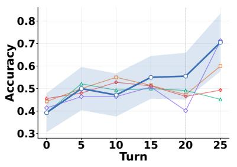

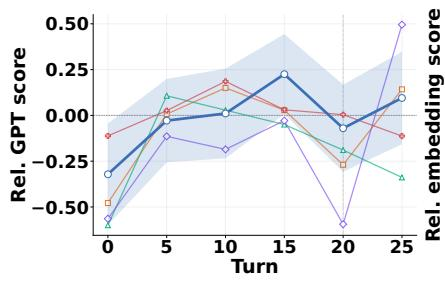

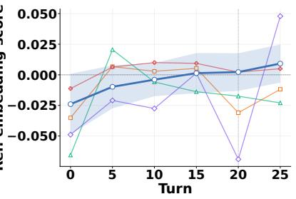  
Figure 3: Overall comparison on PRISM. Shaded bands denote 95% user-level bootstrap confidence intervals, and the dotted line marks the main session-transition region. HyperTrace remains more stable across this transition and improves by the final turn.

Align (Garbacea and Tan, 2025) extracts 5 relevant hypotheses from the whole interaction history for each prediction. Hydra (Zhuang et al., 2024) acts as a RoBERTa-based supervised reranker trained on 1,000 out-of-bag turns with a 5-turn history window; because it only ranks candidates, we exclude it from adapted-response generation results.

## HyperTrace achieves stable online adaptation.

As shown in Table 3, HyperTrace leads preference prediction and response alignment on both datasets. On PRISM it also gives the strongest final profile alignment. On PersonaMem-v2, its profile scores do not exceed HyperAlign but are competitive. Therefore, the results support behavioral adaptation more clearly than a uniform advantage in profile reconstruction. Figure 3 further shows that HyperTrace maintains a relatively stable adaptation trajectory, especially around the sessiontransition region between turns 18–22, where 41/50 users move to a new session. CoT and RAG obtain stronger early response-alignment scores because they directly access candidate responses as reference, but their gains are not sustained in later turns. Dynamic Cheatsheet adapts quickly to new topics and preferences, yet its sharp drop at session changes suggests weaker cross-session stability. HyperAlign remains competitive, but its capacity becomes bounded under sufficiently long contexts. Overall, these gains may reflect our method’s targeted design for maintaining fine-grained preference hypotheses while consolidating persistent signal across sessions. Detailed plots for both PRISM and PersonaMem-v2 are retained in Appendix E.

Absolute response alignment remains negative for all methods on PersonaMem-v2, where each choice is compared against multiple rejected candidates. Under the shared protocol, the scores remain meaningful for relative comparison, while the benchmark’s boundary cases motivate safety-aware filtering of hypotheses as a potential extension.

Table 4: Structural ablations on PRISM. $\mathsf { A c c } _ { > 2 0 }$ and $\mathrm { G P T _ { > 2 0 } }$ are post-turn-20 averages; Prof. and Cost denote profile alignment and USD per tracing turn. The hybrid deployment configuration is reported separately in §5.4.
<table><tr><td>Method</td><td> $\mathrm { A c c } _ { > 2 0 }$ </td><td> $\mathrm { G P T _ { > 2 0 } }$ </td><td>Prof.</td><td>Cost↓</td></tr><tr><td>HT (GPT-5)</td><td>0.6136</td><td>0.0739</td><td>4.1857</td><td>0.028010</td></tr><tr><td>No-gating</td><td>0.5054</td><td>0.0944</td><td>4.2500</td><td>0.040998</td></tr><tr><td>Flat-5</td><td>0.5489</td><td>0.0313</td><td>4.1714</td><td>0.025396</td></tr><tr><td>No-topic</td><td>0.5567</td><td>-0.0500</td><td>4.1214</td><td>0.020916</td></tr><tr><td>No-consol</td><td>0.5459</td><td>0.1100</td><td>4.0857</td><td>0.025291</td></tr></table>

## 5.2 Method Ablation

Experimental setting. Table 4 keeps the dataset subset, evaluator, prompts, and hypothesis budget fixed, and changes one structural component at a time. We ablate skip gating, hierarchical memory, topic grounding, and consolidation from the full gpt-5 tracer. The Flat-5 variant keeps only a five-hypothesis working belief without a persistent hypothesis store, while the other variants preserve the overall tracing pipeline and remove only the targeted mechanism. The routed hybrid is treated separately as an efficiency configuration in §5.4, rather than as a structural ablation.

Not every interaction is preference evidence. Removing gating substantially increases cost while reducing preference-prediction accuracy, indicating that many turns provide no useful preference evidence. In PRISM, 49.29% of turns are skipped and not sent through the tracing update. These skipped turns often correspond to greetings and generic quality gaps weakly related to stable user preferences. Filtering them prevents noisy evidence from being absorbed into the hypothesis state and makes the method more suitable for realistic user interactions, where preference feedback is sparse. At the same time, No-gating still obtains a strong final profile score, suggesting that retrieval provides some robustness against noisy updates.

Hierarchical hypotheses stabilize long-term preference tracking. These ablations highlight the role of the hierarchical belief structure. Compared with Flat-5, the full hypothesis store expands the global representational space beyond 5 online hypotheses, allowing the system to preserve preferences from multiple topics and interaction phases. The weaker No-topic result suggests that topic metadata is useful for both interpreting preference evidence and retrieving relevant hypotheses, consistent with the intuition that user preferences are often topic-dependent. Finally, No-consol shows that directly synchronizing short-term working beliefs back into the store is less reliable than hierarchical consolidation, which buffers transient topic fluctuations and stabilizes long-term preferences.

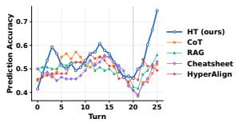

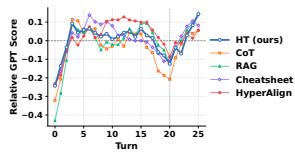  
(b) Response alignment.

(a) preference prediction.  
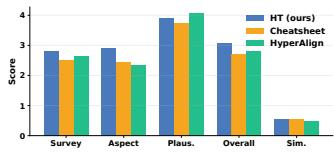  
(c) Profile alignment.

Figure 4: Cross-evaluator robustness.  
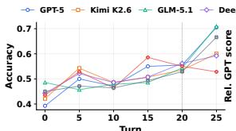

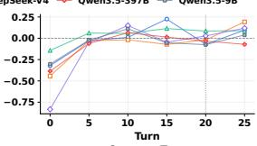

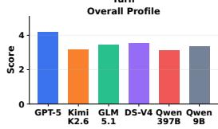

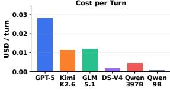  
Figure 5: Tracing-backbone sensitivity on PRISM, including adaptation curves, profile alignment, and cost.

## 5.3 Robustness Analyses

Robustness to sparsity and frequent topic shifts. As shown in Table 5, HyperTrace assumes explicit comparative choices. To test sparse supervision, we withhold 80% of the available choice updates; HyperTrace remains ahead of Dynamic Cheatsheet on all three measures. Separately, we select the 20 PRISM users with the most sessions—and therefore the shortest sessions on average—to test sensitivity to frequent topic transitions. On this cohort, HyperTrace improves preference-prediction accuracy within the first noninitial session from 0.3917 to 0.4717, suggesting that its topic-conditioned memory can preserve useful information while adapting across rapidly changing contexts.

Table 5: Robustness of HyperTrace on PRISM under sparse feedback and frequent topic shifts.
<table><tr><td>Stress test</td><td>Method</td><td> $\mathsf { A c c } _ { > 2 0 }$ </td><td> $\mathrm { G P T _ { > 2 0 } }$ </td><td>Prof.</td></tr><tr><td rowspan="2">Full feedback</td><td>HT</td><td>0.5878</td><td>0.1219</td><td>4.2500</td></tr><tr><td>Cheatsheet</td><td>0.5436</td><td>-0.1433</td><td>3.9143</td></tr><tr><td rowspan="2">80% withheld</td><td>HT</td><td>0.5567</td><td>0.1002</td><td>3.9333</td></tr><tr><td>Cheatsheet</td><td>0.4582</td><td>-0.0232</td><td>3.2000</td></tr><tr><td rowspan="2">Frequent shifts</td><td>HT</td><td>0.5304</td><td>0.0943</td><td>4.1400</td></tr><tr><td>Cheatsheet</td><td>0.4224</td><td>-0.0193</td><td>3.5300</td></tr></table>

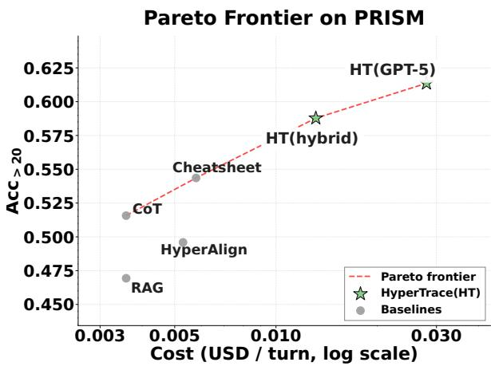  
Figure 6: Cost–accuracy trade-off on PRISM, measured by online cost per turn and $\mathsf { A c c } _ { > 2 0 }$ . HT(gpt-5) gives the strongest accuracy, while HT(hybrid) provides a more practical Pareto point.

The trends persist across evaluators and tracing backbones. Repeating the evaluation with claude-sonnet-4.6 preserves the overall ranking and trends (Figure 4), suggesting that the comparison is not specific to the default evaluator. We also run the tracing procedure with five alternative backbones while keeping gemini-3-flash as the judge. As Figure 5 shows, all backbones improve preference-prediction accuracy from turn 0, and most maintain near-positive or positive late-stage response alignment. Performance is not monotonic in model size, but the overall adaptation pattern is largely consistent, indicating that the tracing scaffold is not tied to one backbone. Additional tests of initialization, particle propagation, and perturbation are reported in Appendix C.

## 5.4 Cost–Quality Trade-off

HyperTrace shifts the Pareto frontier. Beyond accuracy, online personalization must remain costeffective because adaptation is performed repeatedly over user interactions. Figure 6 reports PRISM cost per online turn against $\mathsf { A c c } _ { > 2 0 }$ . HT(gpt-5) is the quality-oriented reference used in the main comparison and reaches the highest accuracy, 0.6136 $\mathsf { A c c } _ { > 2 0 }$ . HT(hybrid) is a separate deployment configuration: it obtains 0.5878 $\mathsf { A c c } _ { > 2 0 }$ at \$0.0131 per turn, reducing cost by 53.1% while retaining 95.8% of the reference accuracy. It also has higher observed response alignment (0.1219 vs. 0.0739) and profile alignment (4.2500 vs. 4.1857). There is therefore no single configuration that dominates every criterion; the full model provides the cleanest like-for-like quality comparison, while hybrid routing is the more practical Pareto point.

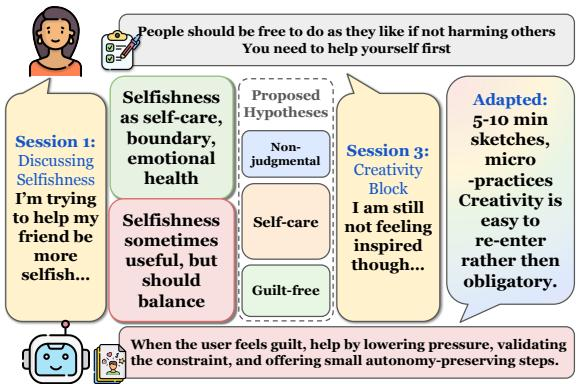  
Figure 7: An example of successful cross-session $H y -$ perTrace from user 516 in PRISM.

## 5.5 Qualitative Analysis

Transferable Preferences Beyond Topic Memory. In the case depicted in Figure 7, a self-care preference learned from interpersonal advice is later retrieved and operationalized in a creativehabit setting: the system shifts from generic artblock advice to low-pressure, guilt-free micropractices, showing that the learned preference is stored as a transferable behavioral tendency rather than a topic-specific memory. Appendix D provides full recipe, chronic-health, and FPS traces.

Boundary leakage through semantic residue. In PersonaMem user 139, the benchmark marks “Reads African literature classics” as do-notremember. The tracer correctly learns the explicit boundary: the assistant should not assume familiarity with African classics or restrict recommendations to African authors/settings. However, the same turn also produces nearby positive hypotheses about discussion-oriented postcolonial literature, which are not marked as negative-only and survive consolidation into the final Books/Literature profile. The error is thus not stale memory, but same-turn semantic residue around a forbidden attribute. This motivates boundary-aware consolidation, where donot-remember signals also suppress semantically adjacent positive memories.

## 6 Conclusion

We study online personalization for language models, where user preferences are latent and gradually revealed through interaction. Existing trainingfree methods often fail to model uncertainty over user intent or reconcile long-term preferences with short-term topic-specific needs. To address this, we propose HyperTrace, a training-free framework that formulates personalization as latent preference tracing. Experiments on PRISM and PersonaMemv2 show stronger and more robust response alignment and preference prediction than the evaluated online baselines, together with competitive longterm profile alignment. This further suggests a broader principle for personalization: combining fine-grained short-term belief updates with longterm memory consolidation can support adaptation that is robust, generalizable, and interpretable.

## Limitations

HyperTrace assumes explicit comparative choices; it does not directly infer preferences from verbal critiques or unobserved implicit behavior, although its state remains useful when choice updates are intermittent. Extending the observation model without losing inspectability is an important direction. Its natural-language hypotheses also inherit the underlying LLM’s limits in granularity and reliability, motivating structured representations, user-editable memory, and safety-aware verification.

## Ethical Considerations

## Artifacts Usage

We use public datasets (Kirk et al., 2024; Jiang et al., 2025b), models (Qwen Team, 2026; Team et al., 2026; GLM-5-Team et al., 2026; DeepSeek-AI, 2026), and APIs (Singh et al., 2026) under their released terms. We do not redistribute source data or model weights, identify users, or add personally identifying information; evaluation is aggregate and research-only.

## AI Usage

We used AI assistants for writing, editing, and code debugging. The authors made and verified the research decisions, analyses, and claims, and reviewed all assisted text or code. AI was not used to generate experimental results.

## Potential Risks

Personalization can leak sensitive information, misprofile users, amplify bias, or become overly persuasive. We limit exposure through controlled offline and aggregate evaluation on public research data. Explicit external traces also provide an interface for future inspection, editing, deletion, and retention controls, although they do not by themselves remove these risks.

## References

Louis Castricato, Nathan Lile, Rafael Rafailov, Jan-Philipp Fränken, and Chelsea Finn. 2025. PER-SONA: A reproducible testbed for pluralistic alignment. In Proceedings ofthe 31st International Conference on Computational Linguistics, pages 11348– 11368, Abu Dhabi, UAE. Association for Computational Linguistics.

Ruizhe Chen, Xiaotian Zhang, Meng Luo, Wenhao Chai, and Zuozhu Liu. 2025. PAD: Personalized alignment at decoding-time. In The Thirteenth International Conference on Learning Representations.

Bhavana Dalvi Mishra, Oyvind Tafjord, and Peter Clark. 2022. Towards teachable reasoning systems: Using a dynamic memory of user feedback for continual system improvement. In Proceedings ofthe 2022 Conference on Empirical Methods in Natural Language Processing, pages 9465–9480, Abu Dhabi, United Arab Emirates. Association for Computational Linguistics.

DeepSeek-AI. 2026. Deepseek-v4: Towards highly efficient million-token context intelligence.

Yijiang River Dong, Tiancheng Hu, and Nigel Collier. 2024. Can LLM be a personalized judge? In Findings of the Association for Computational Linguistics: EMNLP 2024, pages 10126–10141, Miami, Florida, USA. Association for Computational Linguistics.

Cristina Garbacea and Chenhao Tan. 2025. Hyperalign: Interpretable personalized llm alignment via hypothesis generation. Preprint, arXiv:2505.00038.

GLM-5-Team, :, Aohan Zeng, Xin Lv, Zhenyu Hou, Zhengxiao Du, Qinkai Zheng, Bin Chen, Da Yin, Chendi Ge, Chenghua Huang, Chengxing Xie, Chenzheng Zhu, Congfeng Yin, Cunxiang Wang, Gengzheng Pan, Hao Zeng, Haoke Zhang, Haoran Wang, and 168 others. 2026. Glm-5: from vibe coding to agentic engineering. Preprint, arXiv:2602.15763.

Jian Guan, Junfei Wu, Jia-Nan Li, Chuanqi Cheng, and Wei Wu. 2025. A survey on personalized Alignment—The missing piece for large language models in real-world applications. In Findings of the Associationfor Computational Linguistics: ACL 2025, pages 5313–5333, Vienna, Austria. Association for Computational Linguistics.

Joel Jang, Seungone Kim, Bill Yuchen Lin, Yizhong Wang, Jack Hessel, Luke Zettlemoyer, Hannaneh Hajishirzi, Yejin Choi, and Prithviraj Ammanabrolu. 2024. Personalized soups: Personalized large language model alignment via post-hoc parameter merging. In Adaptive Foundation Models: Evolving AI for Personalized and Efficient Learning.

Bowen Jiang, Zhuoqun Hao, Young Min Cho, Bryan Li, Yuan Yuan, Sihao Chen, Lyle Ungar, Camillo Jose Taylor, and Dan Roth. 2025a. Know me, respond to me: Benchmarking LLMs for dynamic user profiling and personalized responses at scale. In Second Conference on Language Modeling.

Bowen Jiang, Yuan Yuan, Maohao Shen, Zhuoqun Hao, Zhangchen Xu, Zichen Chen, Ziyi Liu, Anvesh Rao Vijjini, Jiashu He, Hanchao Yu, Radha Poovendran, Gregory Wornell, Lyle Ungar, Dan Roth, Sihao Chen, and Camillo Jose Taylor. 2025b. PersonaMem-v2: Towards personalized intelligence via learning implicit user personas and agentic memory. Preprint, arXiv:2512.06688.

Chuanyang Jin, Binze Li, Haopeng Xie, Cathy Mengying Fang, Tianjian Li, Shayne Longpre, Hongxiang Gu, Maximillian Chen, and Tianmin Shu. 2026. ThoughtTrace: Understanding user thoughts in realworld llm interactions. Preprint, arXiv:2605.20087.

Chuanyang Jin, Jing Xu, Bo Liu, Leitian Tao, Olga Golovneva, Tianmin Shu, Wenting Zhao, Xian Li, and Jason Weston. 2025. The era of real-world human interaction: Rl from user conversations. Preprint, arXiv:2509.25137.

Hyunwoo Kim, Melanie Sclar, Tan Zhi-Xuan, Lance Ying, Sydney Levine, Yang Liu, Joshua B. Tenenbaum, and Yejin Choi. 2025. Hypothesis-driven theory-of-mind reasoning for large language models. Preprint, arXiv:2502.11881.

Hannah Rose Kirk, Alexander Whitefield, Paul Röttger, Andrew Michael Bean, Katerina Margatina, Rafael Mosquera, Juan Manuel Ciro, Max Bartolo, Adina Williams, He He, Bertie Vidgen, and Scott A. Hale. 2024. The PRISM alignment dataset: What participatory, representative and individualised human feedback reveals about the subjective and multicultural alignment of large language models. In The Thirtyeight Conference on Neural Information Processing Systems Datasets and Benchmarks Track.

Patrick Lewis, Ethan Perez, Aleksandra Piktus, Fabio Petroni, Vladimir Karpukhin, Naman Goyal, Heinrich Küttler, Mike Lewis, Wen-tau Yih, Tim Rocktäschel, Sebastian Riedel, and Douwe Kiela. 2020. Retrieval-augmented generation for knowledgeintensive nlp tasks. In Advances in Neural Information Processing Systems, volume 33, pages 9459– 9474. Curran Associates, Inc.

Cheng Li, Mingyang Zhang, Qiaozhu Mei, Weize Kong, and Michael Bendersky. 2024. Learning to rewrite prompts for personalized text generation. In Proceedings ofthe ACM Web Conference 2024, WWW ’24,

pages 3367–3378, New York, NY, USA. Association for Computing Machinery.

Weiyue Li, Minda Zhao, Weixuan Dong, Jiahui Cai, Yuze Wei, Michael Pocress, Yi Li, Wanyan Yuan, Xiaoyue Wang, Ruoyu Hou, Kaiyuan Lou, Wenqi Zeng, Yutong Yang, Yilun Du, and Mengyu Wang. 2026. Grading scale impact on LLM-as-a-judge: Human-LLM alignment is highest on 0-5 grading scale. Preprint, arXiv:2601.03444.

Kaiqu Liang, Julia Kruk, Shengyi Qian, Xianjun Yang, Shengjie Bi, Yuanshun Yao, Shaoliang Nie, Mingyang Zhang, Lijuan Liu, Jaime Fernández Fisac, Shuyan Zhou, and Saghar Hosseini. 2026. Learning personalized agents from human feedback. Preprint, arXiv:2602.16173.

Jiahong Liu, Zexuan Qiu, Zhongyang Li, Quanyu Dai, Wenhao Yu, Jieming Zhu, Minda Hu, Menglin Yang, Tat-Seng Chua, and Irwin King. 2025a. A survey of personalized large language models: Progress and future directions. Preprint, arXiv:2502.11528.

Jiongnan Liu, Yutao Zhu, Shuting Wang, Xiaochi Wei, Erxue Min, Yu Lu, Shuaiqiang Wang, Dawei Yin, and Zhicheng Dou. 2025b. LLMs + persona-plug = personalized LLMs. In Proceedings of the 63rd Annual Meeting of the Association for Computational Linguistics (Volume 1: Long Papers), pages 9373–9385, Vienna, Austria. Association for Computational Linguistics.

Aman Madaan, Niket Tandon, Peter Clark, and Yiming Yang. 2022. Memory-assisted prompt editing to improve GPT-3 after deployment. In Proceedings ofthe 2022 Conference on Empirical Methods in Natural Language Processing, pages 2833–2861, Abu Dhabi, United Arab Emirates. Association for Computational Linguistics.

Lucie Charlotte Magister, Katherine Metcalf, Yizhe Zhang, and Maartje Ter Hoeve. 2025. On the way to LLM personalization: Learning to remember user conversations. In Proceedings of the First Workshop on Large Language Model Memorization (L2M2), pages 61–77, Vienna, Austria. Association for Computational Linguistics.

Lin Ning, Luyang Liu, Jiaxing Wu, Neo Wu, Devora Berlowitz, Sushant Prakash, Bradley Green, Shawn O’Banion, and Jun Xie. 2025. User-LLM: Efficient LLM contextualization with user embeddings. In Companion Proceedings of the ACM on Web Conference 2025, WWW ’25, pages 1219–1223, New York, NY, USA. Association for Computing Machinery.

Arjun Panickssery, Samuel R. Bowman, and Shi Feng. 2024. LLM evaluators recognize and favor their own generations. In The Thirty-eighth Annual Conference on Neural Information Processing Systems.

Sriyash Poddar, Yanming Wan, Hamish Ivison, Abhishek Gupta, and Natasha Jaques. 2024. Personalizing reinforcement learning from human feedback

with variational preference learning. In The Thirtyeighth Annual Conference on Neural Information Processing Systems.

Yilun Qiu, Tianhao Shi, Xiaoyan Zhao, Fengbin Zhu, Yang Zhang, and Fuli Feng. 2025a. Latent interuser difference modeling for LLM personalization. In Proceedings of the 2025 Conference on Empirical Methods in Natural Language Processing, pages 10599–10617, Suzhou, China. Association for Computational Linguistics.

Yilun Qiu, Xiaoyan Zhao, Yang Zhang, Yimeng Bai, Wenjie Wang, Hong Cheng, Fuli Feng, and Tat-Seng Chua. 2025b. Measuring what makes you unique: Difference-aware user modeling for enhancing LLM personalization. In Findings of the Association for Computational Linguistics: ACL 2025, pages 21258– 21277, Vienna, Austria. Association for Computational Linguistics.

Qwen Team. 2026. Qwen3.5: Towards native multimodal agents.

Chris Richardson, Yao Zhang, Kellen Gillespie, Sudipta Kar, Arshdeep Singh, Zeynab Raeesy, Omar Zia Khan, and Abhinav Sethy. 2023. Integrating summarization and retrieval for enhanced personalization via large language models. Preprint, arXiv:2310.20081.

Alireza Salemi, Surya Kallumadi, and Hamed Zamani. 2024a. Optimization methods for personalizing large language models through retrieval augmentation. In Proceedings of the 47th International ACM SIGIR Conference on Research and Development in Information Retrieval, SIGIR ’24, pages 752–762, New York, NY, USA. Association for Computing Machinery.

Alireza Salemi, Sheshera Mysore, Michael Bendersky, and Hamed Zamani. 2024b. LaMP: When large language models meet personalization. In Proceedings of the 62nd Annual Meeting of the Association for Computational Linguistics (Volume 1: Long Papers), pages 7370–7392, Bangkok, Thailand. Association for Computational Linguistics.

Taiwei Shi, Zhuoer Wang, Longqi Yang, Ying-Chun Lin, Zexue He, Mengting Wan, Pei Zhou, Sujay Kumar Jauhar, Xiaofeng Xu, Xia Song, and Jennifer Neville. 2024. WildFeedback: Aligning LLMs with in-situ user interactions and feedback. In NeurIPS 2024 Workshop on Behavioral Machine Learning.

Aaditya Singh, Adam Fry, Adam Perelman, Adam Tart, Adi Ganesh, Ahmed El-Kishky, Aidan McLaughlin, Aiden Low, AJ Ostrow, Akhila Ananthram, Akshay Nathan, Alan Luo, Alec Helyar, Aleksander Madry, Aleksandr Efremov, Aleksandra Spyra, Alex Baker-Whitcomb, Alex Beutel, Alex Karpenko, and 467 others. 2026. Openai gpt-5 system card. Preprint, arXiv:2601.03267.

Mirac Suzgun, Mert Yuksekgonul, Federico Bianchi, Dan Jurafsky, and James Zou. 2025. Dynamic cheatsheet: Test-time learning with adaptive memory.

Zhaoxuan Tan, Qingkai Zeng, Yijun Tian, Zheyuan Liu, Bing Yin, and Meng Jiang. 2024. Democratizing large language models via personalized parameterefficient fine-tuning. In Proceedings of the 2024 Conference on Empirical Methods in Natural Language Processing, pages 6476–6491, Miami, Florida, USA. Association for Computational Linguistics.

Zhaoxuan Tan, Zixuan Zhang, Haoyang Wen, Zheng Li, Rongzhi Zhang, Pei Chen, Fengran Mo, Zheyuan Liu, Qingkai Zeng, Qingyu Yin, and Meng Jiang. 2025. Instant personalized large language model adaptation via hypernetwork. Preprint, arXiv:2510.16282.

Kimi Team, Yifan Bai, Yiping Bao, Y. Charles, Cheng Chen, Guanduo Chen, Haiting Chen, Huarong Chen, Jiahao Chen, Ningxin Chen, Ruijue Chen, Yanru Chen, Yuankun Chen, Yutian Chen, Zhuofu Chen, Jialei Cui, Hao Ding, Mengnan Dong, Angang Du, and 181 others. 2026. Kimi k2: Open agentic intelligence. Preprint, arXiv:2507.20534.

Yu-Min Tseng, Yu-Chao Huang, Teng-Yun Hsiao, Wei-Lin Chen, Chao-Wei Huang, Yu Meng, and Yun-Nung Chen. 2024. Two tales of persona in LLMs: A survey of role-playing and personalization. In Findings of the Association for Computational Linguistics: EMNLP 2024, pages 16612–16631, Miami, Florida, USA. Association for Computational Linguistics.

Hongru Wang, Rui Wang, Fei Mi, Yang Deng, Zezhong Wang, Bin Liang, Ruifeng Xu, and Kam-Fai Wong. 2023. Cue-CoT: Chain-of-thought prompting for responding to in-depth dialogue questions with LLMs. In Findings of the Association for Computational Linguistics: EMNLP 2023, pages 12047–12064, Singapore. Association for Computational Linguistics.

Jason Wei, Xuezhi Wang, Dale Schuurmans, Maarten Bosma, brian ichter, Fei Xia, Ed Chi, Quoc V Le, and Denny Zhou. 2022. Chain-of-thought prompting elicits reasoning in large language models. In Advances in Neural Information Processing Systems, volume 35, pages 24824–24837. Curran Associates, Inc.

Di Wu, Hongwei Wang, Wenhao Yu, Yuwei Zhang, Kai-Wei Chang, and Dong Yu. 2025. Longmemeval: Benchmarking chat assistants on long-term interactive memory. In The Thirteenth International Conference on Learning Representations.

Zhouhang Xie, Junda Wu, Yiran Shen, Raghav Jain, Yu Xia, Xintong Li, Aaron Chang, Ryan A. Rossi, Tong Yu, Sachin Kumar, Bodhisattwa Prasad Majumder, Jingbo Shang, Prithviraj Ammanabrolu, and Julian McAuley. 2025. A survey on personalized and pluralistic preference alignment in large language models. In Second Conference on Language Modeling.

Jiarui Zhang. 2024. Guided profile generation improves personalization with large language models. In Findings of the Association for Computational Linguistics: EMNLP 2024, pages 4005–4016, Miami, Florida, USA. Association for Computational Linguistics.

Linhai Zhang, Jialong Wu, Deyu Zhou, and Yulan He. 2025a. PROPER: A progressive learning framework for personalized large language models with grouplevel adaptation. In Proceedings of the 63rd Annual Meeting of the Association for Computational Linguistics (Volume 1: Long Papers), pages 16399– 16411, Vienna, Austria. Association for Computational Linguistics.

You Zhang, Jin Wang, Liang-Chih Yu, Dan Xu, and Xuejie Zhang. 2024. Personalized lora for humancentered text understanding. In Proceedings of the Thirty-Eighth AAAI Conference on Artificial Intelligence and Thirty-Sixth Conference on Innovative Applications of Artificial Intelligence and Fourteenth Symposium on Educational Advances in Artificial Intelligence, AAAI’24/IAAI’24/EAAI’24. AAAI Press.

Zhaowei Zhang, Fengshuo Bai, Qizhi Chen, Chengdong Ma, Mingzhi Wang, Haoran Sun, Zilong Zheng, and Yaodong Yang. 2025b. Amulet: Realignment during test time for personalized preference adaptation of LLMs. In The Thirteenth International Conference on Learning Representations (ICLR).

Zhehao Zhang, Ryan A. Rossi, Branislav Kveton, Yijia Shao, Diyi Yang, Hamed Zamani, Franck Dernoncourt, Joe Barrow, Tong Yu, Sungchul Kim, Ruiyi Zhang, Jiuxiang Gu, Tyler Derr, Hongjie Chen, Junda Wu, Xiang Chen, Zichao Wang, Subrata Mitra, Nedim Lipka, and 2 others. 2025c. Personalization of large language models: A survey. Transactions on Machine Learning Research. Survey Certification.

Siyan Zhao, Mingyi Hong, Yang Liu, Devamanyu Hazarika, and Kaixiang Lin. 2025. Do LLMs recognize your preferences? evaluating personalized preference following in LLMs. In The Thirteenth International Conference on Learning Representations.

Wanjun Zhong, Lianghong Guo, Qiqi Gao, He Ye, and Yanlin Wang. 2024. MemoryBank: Enhancing large language models with long-term memory. Proceedings ofthe AAAI Conference on Artificial Intelligence, 38(17):19724–19731.

Yuchen Zhuang, Haotian Sun, Yue Yu, Rushi Qiang, Qifan Wang, Chao Zhang, and Bo Dai. 2024. HYDRA: Model factorization framework for black-box llm personalization. In Proceedings of the 38th International Conference on Neural Information Processing Systems, NIPS ’24, Red Hook, NY, USA. Curran Associates Inc.

Thomas P Zollo, Andrew Wei Tung Siah, Naimeng Ye, Ang Li, and Hongseok Namkoong. 2025. Personal-LLM: Tailoring LLMs to individual preferences. In The Thirteenth International Conference on Learning Representations.

## A Implementation Details

All experiments use the tracing procedure in §4.1.1 and the prompt family in Appendix B, with datasetspecific prompt adapters. The tracer maintains K = 5 active natural-language hypotheses and includes at most three recent turns in LLM prompts. Skip gating is enabled by default: for each turn, the gate is queried five times, and the turn is skipped only when the majority vote indicates insufficient preference evidence. Before hypothesis updates, candidate responses are compressed into indexed summaries while preserving the original candidate order and chosen-vs.-rejected labels. The Bradley– Terry temperature is set to 1.0.

Initialization produces exactly five topic-labelled hypotheses. On later usable turns, each slot is independently marked for revision or replacement; if a majority of slots are marked for replacement, the working belief is reinitialized, otherwise each replacement remains in its original slot. After weighting and resampling, exact duplicates are grouped directly and other near-duplicates are grouped using embedding similarity threshold τ = 0.8. Each non-singleton group G is merged into one hypothesis and expanded with |G|−1 proposals on axes not represented by the remaining particles, restoring the five-slot belief.

For cross-session memory, long-term hypotheses are stored in a FAISS inner-product vector index. We use openai/text-embedding-3-small embeddings with 1536 dimensions. Topic metadata is embedded with the hypothesis content by default and removed only in the no-topic ablation. At a session boundary, the initial user message retrieves the five nearest items for the initializer’s reuse-or-create decision. At response time, the system retrieves up to 30 long-term items, keeps at most 5 items above the stored-weight threshold of 0.1, and combines them with the current working belief to synthesize the response-time profile.

All structured LLM outputs are constrained by typed JSON schemas, and malformed outputs are rejected. The main run uses openai/gpt-5 through OpenRouter for tracing, response generation, and prediction. Evaluation uses google/gemini-3-flash-preview. The hybrid setting keeps the same algorithm and prompt family, but routes selected substeps to cheaper models: preprocessing, branching, merging, and summary generation use openai/gpt-5-mini, while initialization, surrogate choice scoring, perturbation, response generation, profile synthesis, and prediction use openai/gpt-5.

## B Prompt Family and Usage

Our method uses a modular prompt family rather than a single monolithic prompt. Each experiment loads the same set of algorithmic prompt slots through a dataset-specific adapter. Across model variants, the prompt semantics are kept fixed; variants differ only in model routing or system configuration.

For prompts whose outputs are consumed by the tracing algorithm, we enforce typed JSON schemas and reject malformed outputs. At each online turn, the system builds or retrieves a response-time profile, generates an adapted response, and then updates its belief state from the observed chosen-vs.- rejected comparison. Low-signal turns can be filtered by a skip gate. Usable turns are summarized into candidate contrasts, used to initialize or revise preference hypotheses, reweighted by surrogate choice scoring, and periodically summarized, consolidated, or perturbed to maintain a diverse hypothesis store. Table 6 summarizes the prompt slots used in this process.

Dataset adapters. Dataset adapters specialize the same prompt slots to different supervision formats. For survey-based preference data, the adapter emphasizes stable conversation-level preferences, such as communication style, structure, factuality expectations, safety boundaries, and helpfulness criteria, while avoiding overfitting to incidental topic facts. Survey fields are treated as partial ground truth: demographic information is used only as a weak compatibility signal and is not used to infer preferences.

For memory-based data, the adapter represents hypotheses as typed memory units covering background facts, domain preferences, preference updates, constraint boundaries, ownership boundaries, and adaptation rules. It separates user-owned preferences from unsupported or other-person cues, treats privacy and do-not-remember evidence as negative constraints, and applies only messagerelevant cues at response time. Its profile judge therefore focuses on preference coverage, personalization utility, update and boundary handling, and memory quality.

For the flat-slot ablation, only branching changes. The system keeps a fixed number of active hypothesis slots and rewrites irrelevant slots in place; hierarchical retrieval and consolidation cannot repair stale hypotheses.

## C Additional Tracing Sensitivities

This section complements the main robustness analysis with controls on initialization, surrogate scoring, propagation, and particle rejuvenation.

## C.1 Initialization and Scoring Consistency

Table 7 places the two consistency checks together because both concern LLM sensitivity at fixed input. A second GPT-5 initialization recovers 4.43 of five hypotheses on average; GPT-5-mini and Qwen-3.5-9B recover 4.07 and 3.80. Repeated GPT-5 utility estimates have low JSD, while the smaller alternative scorers produce related, though less similar, distributions. Across 300 GPT-5 scoring passes, 270 yield non-uniform support over the five hypotheses, with mean normalized Gini 0.168. These are descriptive consistency checks rather than evidence of score calibration.

## C.2 Particle Propagation

In the heterogeneous condition in Table 8, GLM-5.2 initializes the five particles, and Kimi-K2.6, GPT-5-mini, Qwen-3.5-9B, GLM-5.2, and DeepSeek-V4-Flash independently propagate fixed slots. Metrics include turns with at least 10 active users. GPT-5 still performs utility scoring, and the reported online metrics are smoothed post-turn-20 averages. This control therefore tests particle generation rather than isolating the scorer. Preference prediction and profile alignment decline, while response alignment increases.

## C.3 Axis-Based Rejuvenation

After grouping near-duplicates at similarity threshold τ = 0.8, the standard procedure merges each group G and requests |G| − 1 proposals on preference axes not already represented. Replacing this step with paraphrases of the collapsed hypothesis reduces all three metrics in Table 9, favoring axis-level diversification over surface variation.

## D More Qualitative Examples

Drawn from logged preprocessing and tracing outputs, the cases illustrate five-slot candidate contrasts rather than provide an annotated evaluation.

Recipe request. The user asks for a recipe using tortillas, corn, canned salmon, beans, red enchilada sauce, and green chiles. The selected candidate is a concise baked recipe using the requested ingredients; alternatives are verbose, taco-style, or unrelated. The trace separates five cues: (1) concise, direct instructions; (2) baked, casserole-style preparation rather than stovetop tacos; (3) explicit use of all listed pantry items; (4) brief serving suggestions alongside the core recipe; and (5) rejection of off-topic or meandering content. Each slot reflects visible candidate differences without unsupported assumptions about the user.

Table 6: Prompt slots used by the tracing framework.
<table><tr><td>Prompt slot</td><td>When used</td><td>Purpose and output</td></tr><tr><td>skip</td><td>Before online update</td><td>Decides whether the turn contains usable preference evidence; re- turns a reason and Boolean decision.</td></tr><tr><td>preprocessing</td><td>After a turn passes the gate</td><td>Identifies preference-relevant candidate contrasts and returns in- dexed summaries.</td></tr><tr><td>initialization</td><td>tive</td><td>When no working belief is ac- Creates exactly K topic-labelled hypotheses, reusing retrieved items when appropriate.</td></tr><tr><td>branching</td><td>Later usable turns</td><td>Revises or replaces each hypothesis independently according to the new evidence.</td></tr><tr><td>likelihood</td><td>After initialization or branching</td><td>Scores candidate alignment under one hypothesis; the scores induce the surrogate Bradley-Terry choice score.</td></tr><tr><td>axis, merge, perturb Particle rejuvenation</td><td></td><td>Extracts preference axes, merges near-duplicates, and restores di- versity after collapse.</td></tr><tr><td>consolidate</td><td>ization</td><td>Session boundaries or reinitial- Merges related long-term items and updates the global hypothesis store.</td></tr><tr><td>summary, profile</td><td></td><td>Response-time and final profiles Compiles selected hypotheses into concise, actionable preference descriptions.</td></tr><tr><td>response</td><td>choice</td><td>Before observing the gold Produces an adapted response without exposing the personalization process.</td></tr><tr><td>prediction</td><td>tion</td><td>Preference-prediction evalua- Ranks candidates using the inferred profile and recent history.</td></tr><tr><td></td><td></td><td>response_evaluation Response-alignment evaluation Scores the adapted response against each observed candidate on shared dimensions.</td></tr><tr><td>profile_evaluationProfile evaluation</td><td></td><td>Compares the inferred profile with survey or memory evidence under dataset-specific rubrics.</td></tr></table>

Table 7: Consistency checks on 100 fixed-hypothesis PRISM events. Cold-start matches use independent oneto-one matching with Gemini-3-Flash. JSD values use three scoring repeats per model; lower is more consistent.  
Cold-start hypotheses
<table><tr><td>Comparison</td><td>Matched hypotheses</td></tr><tr><td>GPT-5 / repeat</td><td>4.43/5</td></tr><tr><td>GPT-5 / GPT-5-mini</td><td>4.07/5</td></tr><tr><td>GPT-5 / Qwen-3.5-9B</td><td>3.80/5</td></tr></table>

Surrogate utility estimates
<table><tr><td>Comparison</td><td>Candidate JSD Particle JSD</td></tr><tr><td>GPT-5 / repeat</td><td>0.010 0.008</td></tr><tr><td>GPT-5 / GPT-5-mini</td><td>0.043 0.022</td></tr><tr><td>GPT-5 / Qwen-3.5-9B</td><td>0.044 0.025</td></tr></table>

Chronic-health support. The user describes fluctuating chronic illness and limited daily capacity. The selected candidate is empathetic, personalized, and practical, whereas the alternatives are more generic or formal. The five hypotheses capture a validating tone, actionable follow-up, recognition of proactive health management and a support network without patronizing language, collaborative framing that lets the user define priorities, and sensitivity to good and bad days. The trace remains at the level of response preferences and does not infer new medical facts.

Table 8: Particle-propagation sensitivity on 28 matched PRISM users.
<table><tr><td>Setting</td><td> $\mathbf { A c c } _ { > 2 0 }$ </td><td> $\mathbf { G P T } _ { > 2 0 }$ </td><td>Prof.</td></tr><tr><td>Standard hybrid</td><td>0.5878</td><td>0.1219</td><td>4.2500</td></tr><tr><td>Heterogeneous</td><td>0.5617</td><td>0.1547</td><td>4.0714</td></tr></table>

Table 9: Perturbation-rule sensitivity on the matched 28-user PRISM cohort, using smoothed post-turn-20 averages with at least 10 active users.
<table><tr><td>Rule</td><td> $\mathbf { A c c } _ { > 2 0 }$ </td><td> $\mathbf { G P T } _ { > 2 0 }$ </td><td>Prof.</td></tr><tr><td>Axis-based</td><td>0.5878</td><td>0.1219</td><td>4.2500</td></tr><tr><td>Rephrase-only</td><td>0.5596</td><td>-0.0075</td><td>4.1000</td></tr></table>

FPS refinement. The user likes Counter-Strike gunplay, dislikes team play, and prefers deathmatch. From a selected recommendation with a concrete individual-performance mode, the trace refines an earlier broad competitive-FPS hypothesis into preferences for (1) realistic, skill-focused deathmatch or arena modes, (2) low time-to-kill, (3) precise hitscan-centric gun models, (4) minimal powergranting progression, and (5) strong anti-cheat and competitive integrity. Here, later explicit rejections narrow a broad genre preference into factors that can guide subsequent recommendations.

## E Detailed Turn-Level Results

The main text reports the PRISM adaptation curves with SEM and summarizes both datasets through aggregate statistics. Here, we provide the complete turn-level curves for PRISM and PersonaMem-v2 in Figure 8.

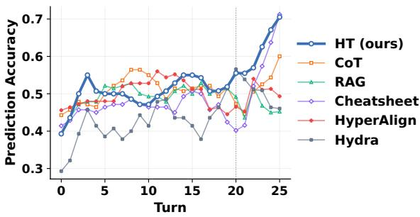  
(a) PRISM: Accuracy.

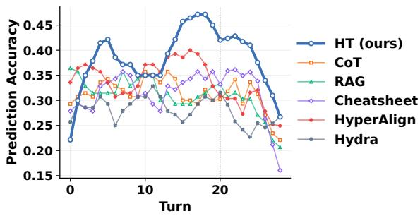  
(b) PersonaMem-v2: Accuracy.

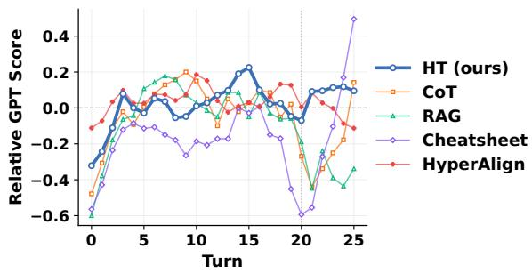  
(c) PRISM: Relative GPT score.

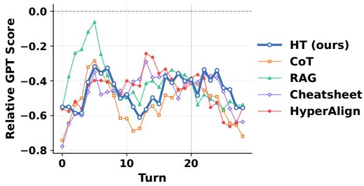  
(d) PersonaMem-v2: Relative GPT score.

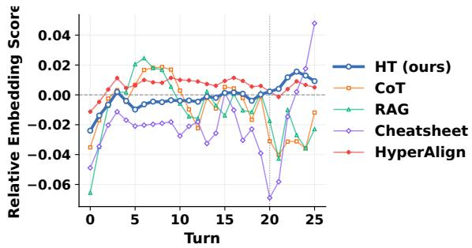

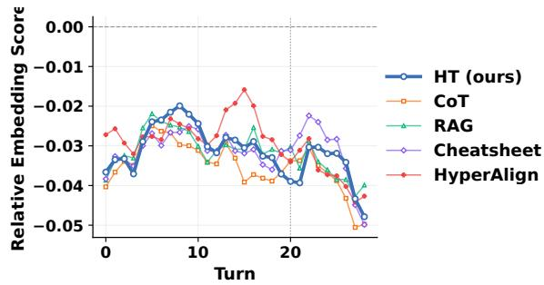

(e) PRISM: Relative embedding score.  
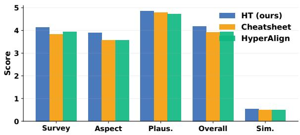  
(g) PRISM: Profile score.

(f) PersonaMem-v2: Relative embedding score.  
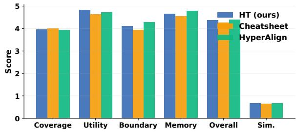  
(h) PersonaMem-v2: Profile score.  
Figure 8: Detailed turn-level online evaluation results on PRISM and PersonaMem-v2. Curves are plotted at each interaction turn.