# IdeaAMBIG: Benchmarking Implementation-Critical Gaps in Research-Idea Specifications

Yiling Ma<sup>Y</sup> Yilun Zhao<sup>Y</sup> \* Sihong Wu<sup>Y</sup> Manasi Patwardhan<sup>T</sup> Arman Cohan<sup>Y</sup>

<sup>Y</sup> Yale University <sup>T</sup> TCS Research

## Abstract

A research idea may be novel, coherent, and scientifically plausible, yet its proposed method may remain insufficiently specified for faithful implementation. We study the codification readiness of implementation facing research-method specifications, defined by whether they provide sufficient methodological informa tion for a competent implementer or coding agent to construct the intended method without unsupported assumptions. We construct evidence-grounded specifications and their supported resolutions from papers, codebases, issue threads, and reproduction artifacts. We introduce IdeaAMBIG, a benchmark of 660 evidence-grounded instances: 163 real-world gaps from reproducibility reports and GitHub issues, and 497 controlled synthetic gaps injected into codification-ready references. IdeaAMBIG evaluates three capabilities: codification-readiness assessment, defect localization, and clarification action generation. Defect localization receives only the specification, whereas clarification additionally receives the annotated defect. Across 13 LLMs, the best model achieves 9.6% Macro Defect Recovery Rate on real-world instances but 80.6% Macro Clarification Action Success Rate when given the defect. In an oracle study, supplying the gold resolution raises the downstream codification-ready rate from 14% to 98%. Across all evaluated models, defect localization is the main bottleneck, with stronger clarification given the defect.

## Code: IdeaAMBIG

## 1 Introduction

LLMs increasingly support scientific workflows from research ideation to experimental execution and code generation [Lu et al., 2024, Weng et al., 2025, Schmidgall et al., 2025, Si et al., 2025a, Xia et al., 2026]. As these stages become coupled in research agents, reliable execution assumes that a generated idea specifies its intended method well enough for faithful implementation. When a method-defining choice is omitted, ambiguous, or internally inconsistent, a downstream agent must either seek clarification or silently introduce an unsupported assumption, potentially producing working code that implements a different method. Reliable research automation therefore requires detecting and resolving specification gaps before codification.

We ask whether the proposed methodological mechanism within a research idea is ready to be implemented as intended, rather than whether the idea is novel, scientifically valuable, or likely to succeed. We call this implementation readiness. An implementation-facing specification of the idea is codification-ready when a competent implementer can construct a faithful initial implementation or experimental prototype without unsupported assumptions about the core method. It is not ready if two competent implementers could make materially different method-defining choices with no evidence for which is intended. A plausible implemen-

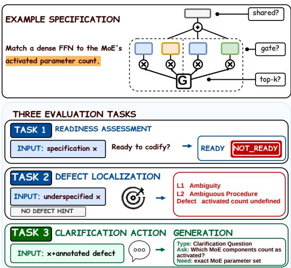  
Figure 1: (Top) A research idea leaves the activated parameter count of a parameter-matched dense baseline underspecified. (Bottom) IdeaAMBIG evaluates readiness assessment from the specification alone, defect localization without a defect hint, and clarification action generation given the annotated defect.

tation merely hides this unresolved choice; a reliable

model should instead locate it and seek the information needed to resolve it, avoiding implementation of the wrong method and resulting reproducibility failures [Zhu et al., 2025, Dobbins et al., 2025].

Existing evaluations largely target either upstream idea quality or downstream plans and artifacts while assuming that the underlying method is sufficiently specified [Qiu et al., 2025, Si et al., 2025b, Zhao et al., 2025a, Baumgartner¨ and Gurevych, 2026]. They therefore leave unmeasured whether models can assess specification readiness, locate an implementation blocker, and elicit the missing information before codification.

We introduce IdeaAMBIG, a benchmark of 660 evidence-grounded, single-defect instances for evaluating codification readiness. The 163 real-world instances come from GitHub issues<sup>1</sup> and reproducibility reports<sup>2</sup> in which implementers encountered genuine gaps with evidence-supported resolutions [Pineau et al., 2019, Sinha et al., 2021, 2022, 2023, Jose et al., 2020, Hiemstra et al., 2021, Hagen et al., 2022, Kamps et al., 2023, Goharian et al., 2024, Hauff et al., 2025]. The 497 controlled synthetic instances alter exactly one implementation-critical detail in a codification-ready reference, providing a precise counterfactual target.<sup>3</sup> Each instance includes the target defect, its supported resolution, and labels from 3 Level-1 and 10 Level-2 categories.

We evaluate 3 successive capabilities: readiness assessment, defect localization, and clarification action generation, separating blocker discovery from action once the blocker is known. Human studies, blind review, and independen reannotation show that both subsets largely contain resolvable, implementation-critical gaps with reliable labels. They further confirm that IdeaAMBIG measures implementation-oriented specification clarification and that controlled instances preserve the validity and workflow plausibility of naturally occurring gaps (§3.4; Appendix A.2; Appendix G.2).

Across 13 LLMs, the strongest model reaches only 9.6% Macro Defect Recovery Rate on real-world instances but 80.6% Macro Clarification Action Success Rate when given the annotated defect. Models often request usefu information once directed to the blocker but struggle to identify it independently. In an oracle study, supplying the missing information raises the downstream codification-ready rate from 14% to 98%.

Our main contributions are summarized below:

• We formalize the codification readiness of implementation-facing idea specifications as a missing link between scientific ideation and execution, and define 3 evaluation tasks (§3.1).

• IdeaAMBIG pairs 660 real-world and controlled synthetic gaps with supported resolutions (§3).

• We evaluate 13 LLMs, identify localization as the bottleneck, and show the downstream value of clarification (§4).

## 2 Related Work

Scientific Ideation and Automated Research. Research-ideation evaluations examine novelty, feasibility, diversity, alignment, and distributional differences between human- and LLM-generated ideas [Qiu et al., 2025, Ruan et al., 2024, Si et al., 2025b, Chen et al., 2026], while research agents integrate ideation with literature review, experimentation, coding, and writing [Lu et al., 2024, Schmidgall et al., 2025, Lu et al., 2026, Weng et al., 2025]. The performance gap between ideas evaluated before and after execution further shows that a promising idea need not yield an equally strong executed project [Si et al., 2025a]. Existing evaluations focus on proposed ideas or resulting artifacts, rather than the specification connecting these stages. IdeaAMBIG asks whether this specification defines the core method sufficiently for faithful implementation.

Scientific Design and Artifact Verification. Scientific benchmarks evaluate inspiration-based reasoning, experiment design, and scientific code generation from paper context [Liu et al., 2025, Zhao et al., 2025a, Xia et al., 2026], while paper–code consistency benchmarks detect discrepancies between completed artifacts [Baumgartner¨ and Gurevych, 2026, Xu et al., 2026]. Scientific critique benchmarks also evaluate limitation identification and actionable review feedback [Xu et al., 2025, Wu et al., 2026]. LimitGen combines controlled perturbations with human-written limitations; our focus is specifically on unresolved method-defining choices that prevent faithful implementation. More directly related to specification formulation, SciConvBench [Somasekharan et al., 2026] evaluates multi-turn elicitation of missing information and resolution of conflicting requirements in computational science task formulation. It measures whether a model can interact with a user and produce a conversation-grounded final specification. In contrast, IdeaAMBIG focuses on research-method specifications before implementation. It separately evaluates readiness, localization of the missing method-defining decision, and generation of a targeted clarification action. Gaps and resolutions are grounded in papers, code, issues, and reproducibility reports.

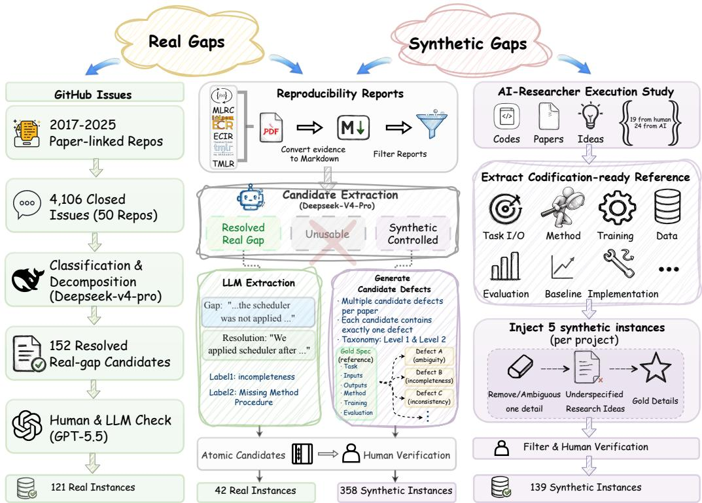  
Figure 2: Overview of the IdeaAMBIG construction pipeline. We derive real-world and controlled synthetic instances from 3 complementary sources: GitHub issues, reproducibility reports, and AI-researcher execution trajectories. These sources provide resolved natural gaps, evidence for controlled defect construction, and codification-ready references for synthesis. Together, they yield 660 verified instances summarized in Table 3.

Specification Defects and Clarification. Requirements engineering has long treated ambiguity, incompleteness, and inconsistency as threats to reliable implementation [Sommerville and Sawyer, 1997, Berry and Kamsties, 2004, Zave, 1997], while recent LLM work studies unclear instructions in dialogue, tool use, and software develop ment [Wang et al., 2025, Zhang et al., 2025, Larbi et al., 2025, Vijayvargiya et al., 2025]. SpecBench [Hamblin et al., 2026] evaluates defect identification in software RFCs (Request for Comments) using project code and design discussions, whereas ClarifyCodeBench [Fang et al., 2026] evaluates multi-turn clarification of ambiguous code-generation requirements. Research specifications share these defect classes but additionally require methodological fidelity: functional implementations may still differ in objectives, model structures, training procedures, or evaluation protocols. A gap is therefore blocking only when it underdetermines a method-defining decision, rather than a routine engineering choice. Its resolution must also be evidence-supported, since the intended choice may be distributed across papers, codebases, issue threads, and reproducibility reports. Accordingly, IdeaAMBIG uses research-specific Level-2 categories and evidence-grounded, single-defect instances. To our knowledge, it is the first benchmark to jointly evaluate codification readiness, method-defect localization, and targeted clarification while separating blocker discovery from the response once the blocker is known.

## 3 IdeaAMBIG

IdeaAMBIG evaluates specification readiness before codification through three diagnostic tasks over evidencegrounded, single-defect research-method specifications.

## 3.1 Task Formulation

We view a research idea as comprising both a scientific objective and a proposed methodological mechanism. IdeaAMBIG evaluates whether the proposed methodological mechanism contains sufficient information for faithful codification by a competent implementer or coding agent, rather than assessing novelty or revising the scientific direction. We define an idea specification as a description of how a research idea or method is intended to be implemented. It is codification-ready when a competent implementer can construct a faithful initial implementation or experimental prototype without unsupported assumptions about the core method. Routine hyperparameters, engineering details, and explicitly open design choices need not be fixed (e.g., random seeds, hardware, file paths, conventional batch sizes, and conventional optimizer settings). A specification defect is an omission, ambiguity, or internal inconsistency that leaves a method-defining decision underdetermined. Appendix H further clarifies the scope of research-idea specification and the retrospective reconstruction setting.

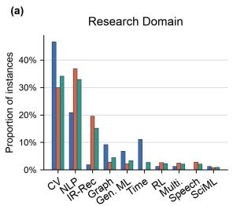

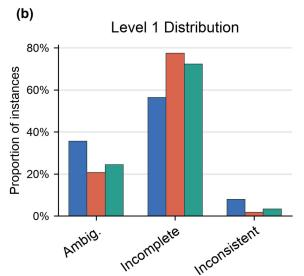

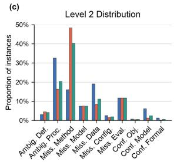

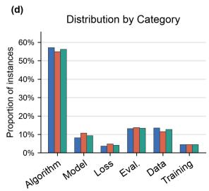  
Figure 3: Dataset analysis of IdeaAMBIG across real-world, controlled synthetic, and combined subsets. (a) Distribution across research domains. (b,c) Level-1 defect type and Level-2 defect category distributions. (d) Distribution of specification defects across methodological components.

We formalize each instance as a NOTREADY specification $x _ { i } ^ { - } \in \mathcal X$ containing exactly one target defec $d _ { i } = ( z _ { i } ^ { ( 1 ) } , z _ { i } ^ { ( 2 ) } , e _ { i } )$ , together with a corresponding READY specification $x _ { i } ^ { + }$ obtained by resolving that defect. Here, $z _ { i } ^ { ( 1 ) }$ and $z _ { i } ^ { ( 2 ) }$ are the Level-1 and Level-2 taxonomy labels, and $e _ { i }$ describes the unresolved implementation decision. The 3 Level-1 types are Ambiguity, Incompleteness, and Inconsistency. Their 10 Level-2 categories are defined in Table 8. Each instance also includes a gold clarification action $a _ { i }$ . We use single-target instances as a controlled diagnostic abstraction rather than as a claim that real research specifications contain only one gap. This design isolates whether a model can identify a specific implementation-critical decision and generate the information needed to resolve it, without conflating localization errors with open-ended defect enumeration. When source evidence contains multiple independent blockers, we split them into self-contained single-target instances whenever possible, and otherwise discard the case. To assess whether this abstraction distorts the task, we conduct a target-uniqueness audit over all NOTREADY instances (Appendix E.2) and an exploratory multi-defect ablation (Appendix E.4). Both analyses support the single-target setting as a controlled but realistic evaluation unit. We additionally analyze defect granularity as an explanatory covariate for localization difficulty (Appendix E.3).

Readiness Assessment. Given one specification $x _ { i } \in \{ x _ { i } ^ { - } , x _ { i } ^ { + } \}$ , Task 1 predicts $\hat { y } _ { i } \in \{ \mathbf { R } \mathbf { E } \mathbf { A } \mathbf { D } \mathbf { Y }$ , NOTREADY}.   
Each specification is presented independently, without its resolved or underspecified counterpart.

Defect Localization. Given an underspecified specification $x _ { i } ,$ Task 2 returns one diagnosis $\hat { d } _ { i } = ( \hat { z } _ { i } ^ { ( 1 ) } , \hat { z } _ { i } ^ { ( 2 ) } , \hat { e } _ { i } )$ a Level-1 label, a Level-2 label, and a natural-language description of the target defect.

Clarification Action Generation. Given $x _ { i }$ and the gold target-defect description $e _ { i }$ , Task 3 returns one clarification action $\hat { a } _ { i } = ( \hat { \tau } _ { i } , \hat { q } _ { i } , \hat { r } _ { i } )$ , where $\hat { \tau } _ { i }$ is the action type, $\hat { q } _ { i }$ is the concrete natural-language action, and $\boldsymbol { { \hat { r } } } _ { i }$ specifies the information expected from carrying out the action. The action type $\hat { \tau } _ { i }$ specifies how the missing information is to be obtained. We use two types: CLARIFICATIONQUESTION, which asks a targeted question to an author or implementer, and EVIDENCESEEKING, which directs the model to inspect an artifact such as paper text, source code, configuration files, data documentation, or experiment logs. The natural-language action $\hat { q } _ { i }$ is the actual question or inspection instruction, such as asking for a missing hyperparameter, a preprocessing rule, an algorithmic choice, or the artifact evidence needed to determine such a detail.

## 3.2 Data Collection

Data Sources. We combine resolved real-world gaps with controlled synthetic defects. Papers, codebases, reproducibility reports, and issue discussions provide retrospective evidence for either an implementation-blocking gap and its resolution or a codification-ready reference for controlled construction. From these materials, we reconstruct self-contained, implementation-facing specifications containing the information required for faithful codification. These are not verbatim handoff records, and evaluated models never receive the downstream artifacts or resolution evidence. Thus, IdeaAMBIG uses retrospectively grounded instances to evaluate readiness, blocker localization, and clarification rather than reconstructing original handoff transcripts.

Real-world instances come from reproducibility reports and GitHub issues, while synthetic instances modify codification-ready references from successful reproductions and executed research projects [Si et al., 2025a]. We retain only atomic, implementation-relevant, evidence-supported defects and exclude issues involving environments, resources, runtime, or credentials. Each NOTREADY specification is paired with an evidence-grounded READY counterpart resolving only the target defect (Appendix C).

Reproducibility Reports. We collect 396 reports from the ML Reproducibility Challenge [Pineau et al., 2019, Sinha et al., 2021, 2022, 2023], ECIR [Jose et al., 2020, Hiemstra et al., 2021, Hagen et al., 2022, Kamps et al., 2023, Goharian et al., 2024, Hauff et al., 2025], and TMLR<sup>4</sup> (2022–2025). After converting them to Markdown with MinerU, we retain 174 reports covering a single open-access paper with an associated open-source implementation. DeepSeek-V4-Pro routes each paper–report pair into one of three tracks: resolved real gap, synthetic controlled, or unusable (Figure 10). For pairs routed to the resolved-real-gap track, the same model extracts 210 candidate gap mentions from the report text. Because a single mention can describe more than one separable missing detail, decomposing these mentions into atomic candidates yields 233 in total, of which human verification retains 42 real-world instances with self-contained underspecified inputs and evidence-supported clarifications.

Controlled construction uses the 106 pairs routed to the synthetic-controlled track. These pairs document a successful reproduction or evaluation but contain no resolved method-core gap suitable for the real-world subset. We reconstruct a codification-ready reference from the original paper alone, using the report only to confirm that the paper was successfully reproduced, and only when the paper itself fully specifies the method-defining choices needed to recover the reproduced method. Altering up to five implementation-critical details per reference yields 358 controlled synthetic instances (192 from MLRC, 102 from ECIR, and 64 from TMLR) (Figure 11).

Real Gaps from GitHub Issues. From 1,000 paper-linked repositories published between 2017 and 2025, we crawl 4,106 closed or answered issues across 50 top-ranked repositories and prefilter 800 threads containing gap and resolution signals. DeepSeek-V4-Pro classifies each thread as a genuine method-core specification gap or rejects it with a reason, then decomposes each kept thread into up to three atomic gap candidates (Figure 7). GPT-5.5 validation, paper retrieval, and evidence checks (Figures 8 and 9) then reduce 152 resolved candidates to 121 atomic benchmark instances. The paper or repository description provides the underspecified surface form, and the issue thread provides the supported clarification.

Synthetic-Controlled Instances from Ideation–Execution Trajectories. We use 43 executed projects from the AI-Researcher execution study [Si et al., 2025a], including 19 human- and 24 LLM-generated ideas. Each idea was implemented by an expert researcher and documented in a final paper and codebase. Because the protocol prohibited substantial changes to the proposed method and reported modifications mainly concerned experimental details rather than the core algorithm, we use the final paper–code pair, rather than the pre-execution idea description itself (whether human- or LLM-authored), as an execution-grounded source artifact. From each pair, we reconstruct a structured reference specification covering the task, inputs and outputs, core method, model or algorithm, training procedure, data and preprocessing, evaluation protocol, and implementation details needed to recover the executed method. We generate up to five candidates per project by removing or abstracting exactly one implementation-critical detail while preserving all remaining content, yielding 139 controlled synthetic instances.

Human Verification. All three construction paths share a two-stage review protocol. A primary annotator screens every candidate, and a second independently reviews all provisionally retained and uncertain cases. For real-world candidates, reviewers verify that each instance captures a genuine method-core gap, isolates one atomic and selfcontained target defect, and provides sufficient evidence for a concrete clarification without unsupported inference. For controlled synthetic candidates, they additionally verify that the reference is codification-ready, exactly one method-defining detail is altered, all non-target information is preserved, and the altered detail is recoverable from source artifacts. Disagreements are resolved against the source evidence and predefined inclusion criteria, and cases that remain non-atomic, inconsistent, or insufficiently supported are discarded. Full criteria and procedures appear in Appendix E.1. Pre-adjudication inter-annotator agreement is high: readiness agreement reaches 92.0% and 96.0% (Cohen’s κ = 0.84 and 0.92) on the real-world and controlled synthetic subsets, respectively, with Level-1 agreement above 93% on both and Level-2 κ = 0.92 and 0.85 (Appendix E.6).

## 3.3 Dataset Statistics

As shown in Table 3, IdeaAMBIG contains 163 real-world and 497 controlled synthetic instances. It spans ten research domains, including computer vision, natural language processing, information retrieval, graph learning, and time-series modeling (Figure 3(a)). Real-world instances concentrate in computer vision and NLP, where open implementations and issue discussions are more available; synthetic instances broaden the benchmark’s domain coverage. Incompleteness is the most frequent Level-1 type (Figure 3(b)), but the source distributions differ: real-world instances are dominated by ambiguity, especially ambiguous procedures, whereas synthetic instances most often omit method procedures (Figure 3(c)). Across both subsets, method-related defects dominate, followed by evaluation, data, and model defects, with loss- and training-related defects less common (Figure 3(d)). This distribution across methodological components (method, evaluation, data, model, loss, and training) is broadly similar between the real-world and synthetic subsets, indicating that controlled construction covers the major methodological components observed in naturally occurring gaps.

<table><tr><td rowspan="2">Model</td><td colspan="2">Task 1: Macro-F1 ↑</td><td colspan="2">Task 2: Macro DRR ↑</td><td colspan="2">Task 3: Macro-CAS ↑</td></tr><tr><td>Real</td><td>Synth.</td><td>Real</td><td>Synth.</td><td>Real</td><td>Synth.</td></tr><tr><td colspan="7">Frontier proprietary models</td></tr><tr><td>GPT-5.6-Sol</td><td>67.5</td><td>86.4</td><td>9.6</td><td>12.2</td><td>80.6</td><td>96.2</td></tr><tr><td>Claude Sonnet 5</td><td>59.3</td><td>76.2</td><td>6.8</td><td>11.4</td><td>76.8</td><td>94.5</td></tr><tr><td>Gemini 3.1 Pro Preview</td><td>45.8</td><td>67.3</td><td>3.4</td><td>7.6</td><td>68.9</td><td>91.6</td></tr><tr><td>DeepSeek-V3.2</td><td>44.5</td><td>67.2</td><td>5.9</td><td>8.0</td><td>62.9</td><td>93.0</td></tr><tr><td colspan="7">Open-weight reasoning models</td></tr><tr><td>Qwen3.5-397B-A17B</td><td>57.5</td><td>55.9</td><td>3.3</td><td>4.6</td><td>72.0</td><td>89.0</td></tr><tr><td>DeepSeek-R1-0528</td><td>44.3</td><td>59.9</td><td>1.8</td><td>2.2</td><td>68.0</td><td>68.5</td></tr><tr><td>GLM-5.2</td><td>45.1</td><td>65.9</td><td>5.7</td><td>7.0</td><td>63.6</td><td>77.0</td></tr><tr><td>Kimi-K3</td><td>32.7</td><td>43.1</td><td>6.6</td><td>8.2</td><td>60.6</td><td>92.5</td></tr><tr><td colspan="7">Open-weight general models</td></tr><tr><td>GPT-OSS-120B</td><td>30.0</td><td>44.4</td><td>2.5</td><td>3.3</td><td>53.4</td><td>65.3</td></tr><tr><td>Gemma-4-31B-IT</td><td>47.1</td><td>56.9</td><td>4.7</td><td>7.0</td><td>67.7</td><td>73.0</td></tr><tr><td>Qwen3.5-9B</td><td>33.3</td><td>54.3</td><td>5.3</td><td>5.5</td><td>64.6</td><td>81.2</td></tr><tr><td>Qwen3-8B</td><td>40.1</td><td>48.7</td><td>3.2</td><td>4.6</td><td>53.8</td><td>82.6</td></tr><tr><td>Qwen3-32B</td><td>34.5</td><td>37.0</td><td>3.6</td><td>5.8</td><td>61.9</td><td>76.3</td></tr></table>

Table 1: Main results across the 3 benchmark tasks on the real-world (Real) and controlled synthetic (Synth.) subsets. Task 1 is evaluated on balanced readiness-assessment samples containing 100 READY and 100 NOTREADY specifications from each subset. Tasks 2 and 3 are evaluated on the full real-world set (N = 163) and a fixed controlled-synthetic sample (N = 200). We report one primary metric for each task: Macro-F1 for readiness assessment, Macro Defect Recovery Rate (Macro DRR) for defect localization, and Macro Clarification Action Success Rate (Macro-CAS) for clarification action generation. All values are percentages. The best and secondbest results in each column are shown in bold and underlined, respectively. Full component metrics and sample definitions are reported in Appendix F.

## 3.4 Benchmark Validation

We conduct two human studies to validate the benchmark. First, two machine-learning researchers who are blinded to source type evaluate 50 real-world and 50 controlled-synthetic instances. Positive judgments for gap validity, implementation criticality, clarification sufficiency, and realism are 92/92/96/93% for real-world instances and 96/94/98/91% for synthetic instances. These results support the controlled construction procedure and show that synthetic instances preserve the key properties of naturally occurring gaps. Second, two graduate-level annotators independently label all 163 real-world instances and a fixed sample of 200 synthetic instances. Cohen’s κ reaches 0.84/0.92 for readiness, 0.89/0.89 for Level-1 labels, and 0.92/0.85 for Level-2 labels on the real and synthetic subsets, respectively. Target-defect agreement is 87.7/84.0%. A target-uniqueness audit further retains only instances whose annotated blocker is valid, primary, and unique. Before adjudication, 94.5% of the original targets satisfy these criteria. Overall, the results support annotation reliability, although target-defect boundaries are slightly less stable for synthetic instances. Full protocols appear in Appendices G.2, E.2, and E.6.

## 4 Experiments

## 4.1 Experimental Setup

We evaluate 13 proprietary and open-weight LLMs listed in Table 1 with fixed task-specific prompts and structured outputs. Decoding, deployment, and model-access details are provided in Appendix D.1. Prior scientific metaevaluations highlight the need to validate automated judgments against human assessments [Zhao et al., 2025a,b]. Semantic and rubric-based evaluation uses Claude Opus 4.8, whose judgments we validate against adjudicated human annotations (Appendix G.1).

We report Macro-F1 for readiness assessment, Macro Defect Recovery Rate (Macro DRR) for defect localization, and Macro Clarification Action Success Rate (Macro-CAS) for clarification generation. Macro DRR requires recovering the annotated blocker and both taxonomy labels. Macro-CAS requires the action to address the blocker, obtain sufficient information, and avoid unsupported assumptions. Reason Grounding Score (RGS) measures whether Task 1 rationales support the predicted label, identify the relevant blocker, and remain faithful to the specification. Formal definitions and component metrics appear in Appendix F.

Because instances may share a repository, source paper, or executed project, Appendix D.5 reports sourceclustered bootstrap confidence intervals, source-balanced estimates, and paired source-level comparisons. To separate blocker discovery from clarification formulation, we compare the main DEFECT-GUIDED setting against an END-TO-END variant on the same real-world Task 3 instances: both use the same GPT-5.6-Sol model, output schema, decoding configuration, and evaluation protocol, but END-TO-END does not receive the annotated blocker, so it must both locate the blocker and formulate the clarification, whereas DEFECT-GUIDED is given the blocker and only has to formulate the clarification. The gap between the two conditions isolates how much of the difficulty comes from discovering the blocker rather than from clarifying it once known.

## 4.2 Main Results

We organize the results around three questions: whether models can assess codification readiness, identify the unresolved implementation blocker, and formulate an effective clarification once that blocker is known. Table 1 summarizes the three benchmark tasks.

RQ1: Can Models Reliably Assess Codification Readiness? Readiness assessment remains unreliable, especially on real-world gaps. GPT-5.6-Sol achieves 67.5 Macro-F1 on real-world instances and 86.4 on controlled synthetic instances. On the real-world subset, it accepts 31% of underspecified specifications and rejects 34% of codificationready ones. Moreover, the highest Reason Grounding Score is only 0.36 on real-world instances and 0.49 on synthetic instances, showing that correct labels are often not accompanied by rationales that support the decision, identify the relevant blocker, and remain faithful to the specification.

RQ2: Can Models Identify the Implementation-Critical Blocker? Blocker localization is the most difficult capability in IdeaAMBIG. On real-world instances, GPT-5.6-Sol reaches 60.1 Level-1 accuracy and 25.2 Level-2 accuracy, but only 16.0 Loc-Acc and 9.6 Macro DRR. Models therefore often predict plausible defect categories without recovering the unresolved method-defining decision. Performance is higher on controlled synthetic instances, whose target defects are generally more explicit. A taxonomy-free ablation on 50 real-world instances separates localization from label prediction (Appendix D.3). GPT-5.6-Sol improves from 10.0% under the original joint criterion to 40.0% when evaluated only for same-blocker identification. Taxonomy prediction therefore adds substantial difficulty, but localization remains challenging even without labels. Human evaluators substantially outperform the model on the same sample (Appendix G.4).

RQ3: Once the Blocker Is Known, Can Models Elicit the Information Needed to Resolve It? When supplied i h h d bl k 5 6 l h 6 l ld i d 6 ll d synthetic instances. On the real-world subset, its No-Assumption score is 95.7, compared with 80.4 Sufficiency, indicating that remaining failures mainly reflect incomplete clarification rather than unsupported assumptions. To directly isolate the effect of blocker availability, we compare two clarification settings on the same real-world Task 3 instances using the same model, decoding configuration, and evaluation metrics. END-TO-END receives only the underspecified specification, whereas DEFECT-GUIDED additionally receives the annotated blocker. As shown in Table 9, providing the blocker raises Macro-CAS from 13.6 to 80.6 and Sufficiency from 8.6 to 80.4, while No-Assumption remains nearly unchanged. For GPT-5.6-Sol, this controlled comparison identifies blocker availability, rather than unsupported guessing, as the primary bottleneck. Together with the consistent cross-task pattern across all 13 models, the results suggest that current LLMs are substantially better at acting on a known blocker than at discovering it from the specification alone.

Source-Level Robustness. Because multiple instances can come from the same repository, source paper, or executed project, and therefore share terminology and style, we group instances into source clusters and repeat the main analyses while accounting for this clustering rather than treating every instance as independent. These source-clustered analyses preserve the main findings (Appendix D.5). Source-balanced GPT-5.6-Sol estimates differ from the instance-level results by at most 0.6 points, although five of six paired comparisons with Claude Sonnet 5 do not yield reliable differences. In contrast, the DEFECT-GUIDED advantage remains large and reliable (∆ = 67.0, 95% CI = [59.0, 75.2], p < 0.001).

## 4.3 Error Analysis and Representative Cases

We analyze GPT-5.6-Sol to characterize these failure patterns. Full definitions and statistics appear in Appendix A.3. On real-world Task 1 instances, 67.5% of predictions receive the correct label, but only 1.5% are both correct and fully grounded. For Task 2, the model recovers the annotated blocker in only 16.0% of instances. Another 17.8% identify a neighboring decision, while 66.3% identify a different blocker. Once the blocker is provided, the main remaining error is insufficient clarification, which occurs in 19.6% of instances, compared with 4.3% of actions that impose unsupported assumptions. Table 6 illustrates these patterns. Overall, the dominant failure is identifying the correct unresolved method-defining decision. Defect granularity further explains localization difficulty: coarse defects, where an entire method component is missing or undefined, are substantially easier to recover than non-coarse defects, where the blocker is a specific operation or local ambiguity inside an otherwise well-specified component (Appendix E.3).

## 4.4 Oracle Clarification Utility

To test whether resolving a specification gap improves downstream codification, we conduct an oracle study on a taxonomy-stratified sample of 50 real-world instances. Using GPT-5.6-Sol with identical decoding settings, DIRECT GENERA-TION receives only the underspecified specification. CLARIFICATION-ASSISTED GENERATION additionally receives the annotated defect, clarification action, and oracle resolution. Two human annotators who are blinded to the generation condition evaluate the resulting specifications. Full definitions and protocols appear in Appendix G.3. As shown in Table 2, oracle clarification raises the READY rate from 14% to 98%, completeness from 30% to 98%, and missing-detail recovery from 14% to 98%. All three improvements are statistically

<table><tr><td>Metric</td><td>Direct Assist.</td><td></td><td>∆</td><td>95% CI</td><td>padj</td></tr><tr><td>READY Rate ↑</td><td>14</td><td>98</td><td>+84</td><td>[72.0, 92.0]</td><td>&lt; 0.001</td></tr><tr><td>Completeness ↑ Missing Detail</td><td>30</td><td>98</td><td></td><td>+68 [58.0, 75.0] &lt; 0.001</td><td></td></tr><tr><td>Recovery ↑ Unsupported</td><td>14</td><td>98</td><td></td><td>+84 [72.0, 92.0] &lt; 0.001</td><td></td></tr><tr><td>Assumption Rate ↓</td><td>6</td><td>0</td><td>-6</td><td>[-12.0, 0.0]</td><td>0.250</td></tr></table>

Table 2: Oracle clarification effects on 50 paired real-world instances. All values except p-values are percentages, with ∆ denoting Clarification-Assisted minus Direct. Confidence intervals use paired bootstrap resampling. Binary outcomes use two-sided exact McNemar tests, Completeness uses a paired permutation test, and p-values are Holm-adjusted.

significant under paired testing. The unsupported-assumption rate decreases from 6% to 0%. However, this difference is based on only three discordant instances and is not statistically significant under a two-sided exact McNemar test $( p _ { \mathrm { a d j } } = 0 . 2 5 0 )$ . It should therefore be interpreted descriptively. These results show that the model can produce a codification-ready specification once the missing information is supplied. The remaining challenge is to identify the gap and obtain the information needed to resolve it. We also conduct a complementary executable study on 20 controlled instances derived from ideation–execution trajectories with available reference implementations. Oracle-resolved specifications increase the proportion of implementations that pass all predefined tests from 45% to 85%. They also increase faithful implementation of the target method detail from 30% to 90% (Appendix D.4). This result shows that code may pass executable tests while still implementing a different methodological choice. Because both studies provide the gold resolution, they measure the upper-bound utility of successful clarification rather than end-to-end agent performance.

## 5 Conclusion

We introduced IdeaAMBIG, a benchmark of 660 evidence-grounded, single-defect instances for assessing researchidea implementation readiness, localizing defects, and generating clarification actions. Across 13 LLMs, the strongest model achieves only 9.6 Macro DRR on real-world localization but reaches 80.6 Macro-CAS when given the annotated defect, while readiness judgments remain frequently incorrect or weakly grounded. Although taxonomy prediction adds difficulty, identifying the unresolved method-defining decision remains the main bottleneck for the strongest model, with a consistent pattern across models. Oracle clarification raises the codification-ready rate from 14% to 98%, suggesting that reliable research agents need a specification-readiness gate to identify blockers, seek grounded clarification, and prevent unsupported methodological choices.

## Limitations

IdeaAMBIG focuses on assessing a specification before implementation. This scope leaves several questions open. Its evidence-resolved, single-defect instances are concentrated in AI, NLP, and machine learning. Extending collection to other computational sciences and naturally occurring early-stage ideas would test how codification readiness and the taxonomy transfer. Our exploratory multi-defect ablation (Appendix E.4) finds no evidence that combining two known defects into one specification makes localization harder, but this test uses only 50 controlled-synthetic pairs with a response-count asymmetry between conditions, so a larger, response-budget-matched study of specifications with multiple interacting defects remains open. Clarification is currently evaluated as a single action, while the oracle utility study supplies the gold resolution. Future systems could instead conduct multi-turn clarification, choose between asking a person and inspecting an artifact, reconcile conflicting evidence, and determine when enough information has been obtained. Finally, codification readiness is evaluated before execution rather than through a full implementation of every specification. Integrating this diagnostic as a gate in research agents would enable direct measurement of whether clarification reduces implementation divergence, unsupported assumptions, and human correction cost, and whether these gains improve final scientific outcomes.

## References

Chris Lu, Cong Lu, Robert Tjarko Lange, Jakob Foerster, Jeff Clune, and David Ha. The ai scientist: Towards fully automated open-ended scientific discovery. arXiv preprint arXiv:2408.06292, 2024.

Yixuan Weng, Minjun Zhu, Qiujie Xie, Qiyao Sun, Zhen Lin, Sifan Liu, and Yue Zhang. Deepscientist: Advancing frontier-pushing scientific findings progressively. arXiv preprint arXiv:2509.26603, 2025.

Samuel Schmidgall, Yusheng Su, Ze Wang, Ximeng Sun, Jialian Wu, Xiaodong Yu, Jiang Liu, Michael Moor, Zicheng Liu, and Emad Barsoum. Agent laboratory: Using llm agents as research assistants. Findings of the Associationfor Computational Linguistics: EMNLP 2025, pages 5977–6043, 2025.

Chenglei Si, Tatsunori Hashimoto, and Diyi Yang. The ideation-execution gap: Execution outcomes of llm-generated versus human research ideas. arXiv preprint arXiv:2506.20803, 2025a.

Xue Xia, Zheyuan Yang, Arman Cohan, and Yilun Zhao. Mmscicode: Real-world evaluation of multilingual multi-discipline scientific research coding. In Maria Liakata, Viviane P. Moreira, Jiajun Zhang, and David Jurgens, editors, Proceedings of the 64th Annual Meeting of the Association for Computational Linguistics (Volume 1: Long Papers), ACL 2026, San Diego, California, United States, July 2-7, 2026, pages 33981– 33999. Association for Computational Linguistics, 2026. doi: 10.18653/V1/2026.ACL-LONG.1566. URL https://doi.org/10.18653/v1/2026.acl-long.1566.

Minjun Zhu, Qiujie Xie, Yixuan Weng, Jian Wu, Zhen Lin, Linyi Yang, and Yue Zhang. Ai scientists fail without strong implementation capability. arXiv preprint arXiv:2506.01372, 2025.

Nic Dobbins, Christelle Xiong, Kristine Lan, and Meliha Yetisgen. Large language model-based agents for automated research reproducibility: An exploratory study in alzheimer’s disease. arXiv preprint arXiv:2505.23852, 2025.

Yansheng Qiu, Haoquan Zhang, Zhaopan Xu, Ming Li, Diping Song, Zheng Wang, and Kaipeng Zhang. Ai idea bench 2025: Ai research idea generation benchmark. arXiv preprint arXiv:2504.14191, 2025.

Chenglei Si, Diyi Yang, and Tatsunori Hashimoto. Can llms generate novel research ideas? a large-scale human study with 100+ nlp researchers. In International Conference on Learning Representations, volume 2025, pages 94003–94092, 2025b.

Yilun Zhao, Weiyuan Chen, Zhijian Xu, Manasi Patwardhan, Chengye Wang, Yixin Liu, Lovekesh Vig, and Arman Cohan. Abgen: Evaluating large language models in ablation study design and evaluation for scientific research. In Wanxiang Che, Joyce Nabende, Ekaterina Shutova, and Mohammad Taher Pilehvar, editors, Proceedings of the 63rd Annual Meeting ofthe Associationfor Computational Linguistics (Volume 1: Long Papers), ACL 2025, Vienna, Austria, July 27 - August 1, 2025, pages 12479–12491. Association for Computational Linguistics, 2025a. doi: 10.18653/V1/2025.ACL-LONG.611. URL https://doi.org/10.18653/v1/2025.acl-long.611.

Tim Baumgartner and Iryna Gurevych. Scicoqa: Quality assurance for scientific paper–code alignment.¨ arXiv preprint arXiv:2601.12910, 2026.

Joelle Pineau, Koustuv Sinha, Genevieve Fried, Rosemary Nan Ke, and Hugo Larochelle. Iclr reproducibility challenge 2019. ReScience C, 5(2), May 2019. doi: 10.5281/zenodo.3158244. URL https://doi.org/10.528 1/zenodo.3158244.

Koustuv Sinha, Jesse Dodge, Sasha Luccioni, Jessica Zosa Forde, Robert Stojnic, and Joelle Pineau. Ml reproducibility challenge 2020. ReScience C, 7(2), May 2021. doi: 10.5281/zenodo.4833117. URL https://doi.org/10.5281/zenodo.4833117.

Koustuv Sinha, Jesse Dodge, Sasha Luccioni, Jessica Zosa Forde, Sharath Chandra Raparthy, Joelle Pineau, and Robert Stojnic. Ml reproducibility challenge 2021. ReScience C, 8(2), May 2022. doi: 10.5281/zenodo.6574723. URL https://doi.org/10.5281/zenodo.6574723.

Koustuv Sinha, Maurits Bleeker, Samarth Bhargav, Jessica Zosa Forde, Sharath Chandra Raparthy, Jesse Dodge, Joelle Pineau, and Robert Stojnic. Ml reproducibility challenge 2022. ReScience C, 9(2), July 2023. doi: 10.5281/zenodo.8200058. URL https://doi.org/10.5281/zenodo.8200058.

Joemon M Jose, Emine Yilmaz, Joao Magalh ˜ aes, Pablo Castells, Nicola Ferro, M ˜ ario J Silva, and Fl ´ avio Martins,´ editors. Advances in information retrieval. Lecture Notes in Computer Science. Springer Nature, Cham, Switzerland, 2020 edition, April 2020.

Djoerd Hiemstra, Marie-Francine Moens, Josiane Mothe, Raffaele Perego, Martin Potthast, and Fabrizio Sebastiani, editors. Advances in information retrieval. Lecture Notes in Computer Science. Springer Nature, Cham, Switzerland, 1 edition, March 2021.

Matthias Hagen, Suzan Verberne, Craig Macdonald, Christin Seifert, Krisztian Balog, Kjetil Nørvag, and Vinay˚ Setty, editors. Advances in information retrieval. Lecture Notes in Computer Science. Springer Nature, Cham, Switzerland, 1 edition, April 2022.

Jaap Kamps, Lorraine Goeuriot, Fabio Crestani, Maria Maistro, Hideo Joho, Brian Davis, Cathal Gurrin, Udo Kruschwitz, and Annalina Caputo, editors. Advances in information retrieval. Lecture Notes in Computer Science. Springer International Publishing, Cham, Switzerland, 1 edition, March 2023.

Nazli Goharian, Nicola Tonellotto, Yulan He, Aldo Lipani, Graham McDonald, Craig Macdonald, and Iadh Ounis, editors. Advances in information retrieval. Lecture Notes in Computer Science. Springer Nature Switzerland, Cham, 2024.

Claudia Hauff, Craig Macdonald, Dietmar Jannach, Gabriella Kazai, Franco Maria Nardini, Fabio Pinelli, Fabrizio Silvestri, and Nicola Tonellotto, editors. Advances in information retrieval. Lecture Notes in Computer Science. Springer International Publishing, Cham, Switzerland, April 2025.

Kai Ruan, Xuan Wang, Jixiang Hong, and Hao Sun. Liveideabench: Evaluating llms’ scientific creativity and idea generation with minimal context. arXiv e-prints, pages arXiv–2412, 2024.

Ziyu Chen, Yilun Zhao, and Arman Cohan. Measuring the gap between human and LLM research ideas. CoRR, abs/2607.01233, 2026. doi: 10.48550/ARXIV.2607.01233. URL https://doi.org/10.48550/arXiv.2607. 01233.

Chris Lu, Cong Lu, Robert Tjarko Lange, Yutaro Yamada, Shengran Hu, Jakob Foerster, David Ha, and Jeff Clune. Towards end-to-end automation of ai research. Nature, 651(8107):914–919, 2026.

Yujie Liu, Zonglin Yang, Tong Xie, Jinjie Ni, Ben Gao, Yuqiang Li, Shixiang Tang, Wanli Ouyang, Erik Cambria, and Dongzhan Zhou. Researchbench: Benchmarking llms in scientific discovery via inspiration-based task decomposition. arXiv preprint arXiv:2503.21248, 2025.

Tianxiang Xu, Xiaoyan Zhu, Xin Lai, Sizhe Dang, Xin Lian, Hangyu Cheng, and Jiayin Wang. Do papers match code? a benchmark and framework for paper-code consistency detection in bioinformatics software. arXiv e-prints, pages arXiv–2603, 2026.

Zhijian Xu, Yilun Zhao, Manasi Patwardhan, Lovekesh Vig, and Arman Cohan. Can llms identify critical limitations within scientific research? A systematic evaluation on AI research papers. In Wanxiang Che, Joyce Nabende, Ekaterina Shutova, and Mohammad Taher Pilehvar, editors, Proceedings of the 63rd Annual Meeting of the Association for Computational Linguistics (Volume 1: Long Papers), ACL 2025, Vienna, Austria, July 27 - August 1, 2025, pages 20652–20706. Association for Computational Linguistics, 2025. doi: 10.18653/V1/2025.ACL-L ONG.1009. URL https://doi.org/10.18653/v1/2025.acl-long.1009.

Sihong Wu, Yiling Ma, Yilun Zhao, Tiansheng Hu, Owen Jiang, Manasi Patwardhan, and Arman Cohan. Rbtact: Rebuttal as supervision for actionable review feedback generation. In Maria Liakata, Viviane P. Moreira, Jiajun Zhang, and David Jurgens, editors, Findings ofthe Associationfor Computational Linguistics, ACL 2026, San Diego, California, United States, July 2-7, 2026, pages 33965–33992. Association for Computational Linguistics, 2026. doi: 10.18653/V1/2026.FINDINGS-ACL.1696. URL https://doi.org/10.18653/v1/2026.finding s-acl.1696.

Nithin Somasekharan, Youssef Hassan, Shiyao Lin, Gihan Panapitiya, Patrick Emami, Anurag Acharya, Sameera Horawalavithana, and Shaowu Pan. Sciconvbench: Benchmarking llms on multi-turn clarification for task formulation in computational science. arXiv preprint arXiv:2605.18630, 2026.

Ian Sommerville and Pete Sawyer. Requirements engineering: a good practice guide. John Wiley & Sons, Inc., 1997.

Daniel M Berry and Erik Kamsties. Ambiguity in requirements specification. In Perspectives on software requirements, pages 7–44. Springer, 2004.

Pamela Zave. Classification of research efforts in requirements engineering. ACM Computing Surveys (CSUR), 29 (4):315–321, 1997.

Wenxuan Wang, Shi Juluan, Zixuan Ling, Yuk-Kit Chan, Chaozheng Wang, Cheryl Lee, Youliang Yuan, Jen-tse Huang, Wenxiang Jiao, and Michael R Lyu. Learning to ask: When llm agents meet unclear instruction. In Proceedings ofthe 2025 Conference on Empirical Methods in Natural Language Processing, pages 21784–21795, 2025.

Michael Zhang, W Bradley Knox, and Eunsol Choi. Modeling future conversation turns to teach llms to ask clarifying questions. In International Conference on Learning Representations, volume 2025, pages 60722– 60742, 2025.

Maya Larbi, Amal Akli, Mike Papadakis, Rihab Bouyousfi, Maxime Cordy, Federica Sarro, and Yves Le Traon. When prompts go wrong: Evaluating code model robustness to ambiguous, contradictory, and incomplete task descriptions. arXiv preprint arXiv:2507.20439, 2025.

Sanidhya Vijayvargiya, Xuhui Zhou, Akhila Yerukola, Maarten Sap, and Graham Neubig. Interactive agents to overcome ambiguity in software engineering. arXiv preprint arXiv:2502.13069, 2025.

Grant Hamblin, Kevin Song, Zhanda Zhu, Anand Jayarajan, Sihang Liu, Nandita Vijaykumar, and Gennady Pekhimenko. Specbench: Evaluating specification-level reasoning for software engineering llm agents. arXiv preprint arXiv:2605.30314, 2026.

Zheng Fang, Dongming Jin, Yihong dong, Yongmin Li, Kechi Zhang, Zhi Jin, and Ge Li. Clarifycodebench: Evaluating llms on clarifying ambiguous requirements for code generation, 2026. URL https://arxiv.org/ab s/2607.00711.

Yilun Zhao, Kaiyan Zhang, Tiansheng Hu, Sihong Wu, Ronan Le Bras, Yixin Liu, Robert Tang, Joseph Chee Chang, Jesse Dodge, Jonathan Bragg, Chen Zhao, Hanna Hajishirzi, Doug Downey, and Arman Cohan. Sciarena: An open evaluation platform for non-verifiable scientific literature-grounded tasks. In Danielle Belgrave, Cheng Zhang, Laura N. Montoya, Hsuan-Tien Lin, Razvan Pascanu, Piotr Koniusz, Marzyeh Ghassemi, Nancy Chen, Ivan Vladimir Meza Ru´ ´ız, and Arturo Loaiza-Bonilla, editors, Advances in Neural Information Processing Systems 38: Annual Conference on Neural Information Processing Systems 2025, NeurIPS 2025, San Diego, CA, USA, December 2-7, 2025 / Mexico City, Mexico, November 30 - December 5, 2025, 2025b. URL http: //papers.nips.cc/paper files/paper/2025/hash/9811fe727c94e7ff79f701c94ed1d938-Abstract-D atasets and Benchmarks Track.html.

<table><tr><td>Category</td><td>Source</td><td># Instances</td></tr><tr><td rowspan="3">Real</td><td>GitHub issues</td><td>121</td></tr><tr><td>Reproducibility</td><td>42</td></tr><tr><td>Real Total</td><td>163</td></tr><tr><td rowspan="3">Synthetic</td><td>Reproducibility</td><td>358</td></tr><tr><td>Ideation-execution</td><td>139</td></tr><tr><td>Synthetic Total</td><td>497</td></tr><tr><td></td><td>Total</td><td>660</td></tr></table>

Table 3: Overview of the current IdeaAMBIG dataset, including real-world specification-defect instances from GitHub issues and reproducibility reports and synthetic-controlled instances generated from codification-ready specifications.
<table><tr><td>Subset</td><td>Idea-Level</td><td>Specification-Level</td><td>Total</td></tr><tr><td>Real-world</td><td>4 (8%)</td><td>46 (92%)</td><td>50</td></tr><tr><td>Synthetic</td><td>2 (4%)</td><td>48 (96%)</td><td>50</td></tr><tr><td>Overall</td><td>6 (6%)</td><td>94 (94%)</td><td>100</td></tr></table>

Table 4: Construct validity analysis distinguishing early-stage idea refinement from implementation specification clarification. Annotators classify whether resolving a benchmark instance requires changing the research idea itself or only specifying implementation-critical details.

## A Additional Dataset Distribution Analysis

## A.1 Publication-Year Distribution

Figure 4 reports the publication-year distribution for instances with identifiable source-paper years. The distribution shows that IdeaAMBIG is concentrated in recent machine-learning literature, with most identifiable instances coming from 2020–2025 and a peak in 2021. This pattern is expected given the benchmark’s focus on recent reproducibility and specification issues.

## A.2 Construct Validity Analysis: Specification Clarification vs. Idea Refinement

A potential concern is whether IdeaAMBIG evaluates clarification of early-stage research ideas or clarification of implementation specifications. These two settings represent different stages of the scientific workflow. Early stage idea refinement concerns open-ended decisions such as research objectives, hypotheses, motivation, and possible directions, whereas specification clarification concerns resolving implementation-critical choices required to faithfully instantiate an already proposed method.

To verify the intended construct of IdeaAMBIG, we conduct a human annotation study on a stratified sample of benchmark instances. Annotators are asked to determine whether resolving the target gap requires changing or refining the scientific idea itself, or whether it only requires specifying missing details needed for faithful implementation.

Annotation Protocol. We randomly sample 100 instances from IdeaAMBIG, including 50 real-world instances and 50 controlled synthetic instances. Two annotators with machine learning research experience independently review the original specification, the target defect, and the supported clarification. For each instance, they answer the following binary question:

Does resolving this gap require modifying the research idea itself, such as changing its objective, hypothesis, motivation, or scientific direction?

Instances are categorized as IDEA-LEVEL CLARIFICATION if the answer is yes, and SPECIFICATION-LEVEL CLARIFICATION otherwise. The latter category corresponds to gaps where the research objective remains unchanged but implementation-critical choices are missing, ambiguous, or inconsistent.

Results. Table 4 summarizes the annotation results. Across both subsets, the vast majority of instances are categorized as SPECIFICATION-LEVEL CLARIFICATION. Only a small fraction requires changes to the underlying research idea. These results confirm that IdeaAMBIG primarily measures the ability of LLMs to identify and resolve implementation-critical gaps in research-method specifications, rather than general-purpose research idea refinement.

<table><tr><td>Task</td><td>Analysis Category</td><td>Real</td><td>Synth.</td></tr><tr><td rowspan="3">Task 1</td><td>Correct and grounded</td><td>1.5</td><td>17.0</td></tr><tr><td>Correct but weakly grounded</td><td>66.0</td><td>69.5</td></tr><tr><td>False READY False NOTREADY</td><td>15.5 17.0</td><td>2.5 11.0</td></tr><tr><td rowspan="2">Task 2</td><td>Correct blocker and both taxonomy labels Correct blocker, taxonomy error</td><td>4.3 11.7</td><td>12.0 8.0</td></tr><tr><td>Neighboring blocker</td><td>17.8</td><td>6.0</td></tr><tr><td rowspan="3"></td><td>Different blocker</td><td>66.3</td><td>73.0</td></tr><tr><td>Vague or no blocker</td><td>0.0</td><td>1.0</td></tr><tr><td>Macro-CAS</td><td>80.6</td><td>96.2</td></tr><tr><td rowspan="2">Task 3</td><td>Insufficient clarification</td><td>19.6</td><td>2.0</td></tr><tr><td>Assumption-imposing clarification</td><td>4.3</td><td>1.0</td></tr></table>

Table 5: Diagnostic analysis of GPT-5.6-Sol. Task 1 categories form a mutually exclusive decomposition of the balanced readiness samples. Task 2 categories form a mutually exclusive, micro-averaged decomposition of localization outcomes. For Task 3, Macro-CAS is macro-averaged across Level-2 categories, whereas the two component error rates are micro-averaged and may overlap. All values are percentages; totals may differ slightly from 100 due to rounding.

This distinction is intentional: IdeaAMBIG does not aim to evaluate whether LLMs can improve the creativity or scientific direction of early-stage ideas. Instead, it focuses on a later but critical failure mode in automated research pipelines, where a plausible research idea fails to provide sufficient specification for faithful codification.

## A.3 Diagnostic Error Analysis

We analyze GPT-5.6-Sol, the strongest model in the main experiments, to characterize the failure patterns underlying its aggregate performance. We reuse the original model outputs and evaluation sets without additional sampling or generation. Task 1 uses the balanced samples of 100 READY and 100 NOTREADY specifications from each subset, while Tasks 2 and 3 use all 163 real-world instances and the fixed sample of 200 controlled-synthetic instances.

Analysis Categories. For Task 1, we distinguish decision correctness from rationale grounding. A prediction is correct and grounded only when the readiness label is correct and all three RGS components—label support, blocker match or correct recognition of its absence, and faithfulness—receive their maximum score. A correct prediction with at least one lower component score is classified as correct but weakly grounded. The remaining categories are false-READY and false-NOTREADY decisions.

For Task 2, predictions are first separated according to whether they identify the annotated blocker using the same taxonomy-blind matcher as Loc-Acc. Correctly localized predictions are then divided by whether both taxonomy labels are correct. Localization failures are categorized as neighboring blockers, different blockers, or vague or absent blockers. These five categories are mutually exclusive.

For Task 3, we report Macro-CAS together with two component error rates: insufficient clarification, computed as one minus Sufficiency, and assumption-imposing clarification, computed as one minus No-Assumption. These two error rates are evaluated independently and may overlap. Table 5 summarizes the resulting diagnostic outcomes for all three tasks.

Readiness Decisions Are Frequently Weakly Grounded. As shown in Table 5, GPT-5.6-Sol makes the correct readiness decision on 67.5% of real-world specifications, but only 1.5% of all predictions are both correct and fully grounded. Most correct decisions therefore fail at least one rationale criterion. Errors also occur in both directions: false-READY predictions account for 15.5% of all instances, equivalent to accepting 31% of underspecified inputs, while false-NOTREADY predictions account for 17.0%, equivalent to rejecting 34% of codification-ready inputs. On controlled-synthetic instances, decision accuracy rises to 86.5%, although most correct predictions remain weakly grounded.

Localization Failures Primarily Reflect Incorrect Target Selection. Table 5 shows that the annotated blocker is recovered in only 16.0% of real-world instances. Of all predictions, 4.3% also assign both taxonomy labels correctly, while 11.7% recover the blocker but make a taxonomy error. Most failures occur before taxonomy assignment: 17.8% identify a neighboring implementation decision and 66.3% identify a different blocker. Almost no output is vague or lacks a diagnosis, indicating that the model generally produces a concrete methodological concern but selects the wrong unresolved decision. Controlled-synthetic instances show the same broad pattern, with fewer neighboring-blocker errors but a similarly large proportion of different-blocker predictions.

<table><tr><td rowspan=1 colspan=4>Case        Input Context             Gold Annotation      GPT-5.6-Sol Output          Interpretation</td></tr><tr><td rowspan=1 colspan=2>A</td><td rowspan=4 colspan=2>Excerpt: “The at-         Gold label:            Prediction: READY           The model treatsNOTREADY            Rationale: The GAT compu- the linear attentiontakes $[ W h _ { i } \| W h _ { j } ]$          Blocker: The spec-    tation, softmax normalization, equation as com-and computes $\begin{array} { r l } { e _ { i j } } & { { } = } \end{array}$        ification omits the      aggregation, and multi-head  plete, overlooking a $a ^ { \top } [ W h _ { i } \| W h _ { j } ] , f o l l o w e d$   LeakyReLU transfor-   combination are sufficiently   required nonlinear-by softmax normalization.&quot; mation with negative   specified.                     ity that changes theslope 0.2 applied to                                    resulting attentionthe attention logits be-                                  coefficients.fore softmax.</td></tr><tr><td rowspan=1 colspan=2>Missed</td><td rowspan=1 colspan=1></td></tr><tr><td rowspan=2 colspan=2>blocker</td></tr><tr><td rowspan=1 colspan=1></td></tr><tr><td rowspan=1 colspan=2>BNeighbor-</td><td rowspan=1 colspan=2>Excerpt: “The keypoint    Gold blocker: The    Predicted blocker: It is un-  The model identi-head unfolds the input im- architecture omits the  clear whether “8 × 8 cell grid”fies a plausible issue</td></tr><tr><td rowspan=1 colspan=2>ing blocker</td><td rowspan=1 colspan=1></td><td rowspan=1 colspan=1>age into an8× 8 cell grid</td></tr><tr><td rowspan=3 colspan=2></td><td rowspan=3 colspan=1>and processes the result-ing grid with lightweightconvolutions to predictkeypoint locations.&quot;</td><td rowspan=3 colspan=1>that produces 65 logits 8 × 8 grid over the full image.keypoint-head mod-for each cell.           Taxonomy: Ambiguity /      ule but targets theTaxonomy: Incom-    ambiguous formal definition   input-grid conven-pleteness / missing                                     tion rather than themodel architecture                                      omitted output clas-sifier.</td></tr><tr><td rowspan=1 colspan=1>deniti</td></tr><tr><td rowspan=1 colspan=1></td></tr><tr><td rowspan=4 colspan=2>CIncompleterequest</td><td rowspan=1 colspan=1>Defect: How historical ex-</td><td rowspan=2 colspan=1>Required informa-    Clarification action: “ShouldThe action resolvestion: Which input      historical external variables  the routing choice</td></tr><tr><td rowspan=1 colspan=1>ternal variables should</td></tr><tr><td rowspan=1 colspan=1>be incorporated into</td><td rowspan=1 colspan=1>receives the variables  be provided as additional     but does not request</td></tr><tr><td rowspan=1 colspan=1>TimeMixer: as channels in</td><td rowspan=1 colspan=1>and, if x_enc is used,   channels in x_enc or as       the required channel-</td></tr><tr><td rowspan=1 colspan=2></td><td rowspan=1 colspan=1>x_enc or as covariates in</td><td rowspan=2 colspan=1>whether channel in-    time/covariate features in     independence set-x_mark_enc.                dependence must be   x_mark_enc?”                 ting.disabled.</td></tr><tr><td rowspan=1 colspan=2></td><td></td></tr></table>

Table 6: Representative real-world errors from GPT-5.6-Sol. Case A shows a false-READY judgment that overlooks a required method operation. Case B shows a neighboring-blocker error in which the model identifies a plausible concern within the correct architectural module but not the annotated blocker. Case C shows a relevant but insufficient clarification that omits an additional condition required for faithful implementation. Specification excerpts are shortened without altering the information needed to understand each error. Full details appear in Appendix A.4.

Clarification Errors Mainly Reflect Insufficient Scope. As reported in Table 5, once the annotated blocker is supplied, GPT-5.6-Sol reaches 80.6 Macro-CAS on real-world instances and 96.2 on controlled-synthetic instances. The real-world insufficient-clarification rate is 19.6%, compared with only 4.3% assumption-imposing actions. The corresponding synthetic rates fall to 2.0% and 1.0%. Thus, the main residual difficulty after the blocker is known is requesting all information required for resolution, rather than introducing unsupported implementation choices.

Overall, the error profiles locate the main end-to-end difficulty before clarification generation. Models frequently make weakly grounded readiness judgments and select plausible but incorrect blockers, whereas clarification is usually effective once the unresolved decision is explicitly provided.

## A.4 Qualitative Error Cases

Table 6 presents three representative real-world errors from GPT-5.6-Sol, covering one characteristic failure from each IdeaAMBIG task. We select cases whose gold annotation and model error can be understood from a short, self-contained excerpt. The displayed excerpts omit only context unrelated to the target defect and do not add information from the hidden resolution.

Case A: A Required Operation Is Treated as a Routine Detail. The Task 1 example specifies a graph-attention score, $e _ { i j } = a ^ { \top } [ W h _ { i } \| W h _ { j } ]$ , followed directly by softmax normalization. The supported method instead applies a LeakyReLU transformation with negative slope 0.2 to the attention logits before softmax. This omission is implementation-critical because applying the nonlinearity changes the normalized attention coefficients and therefore the behavior of the attention mechanism.

GPT-5.6-Sol nevertheless predicts READY, reasoning that the GAT computation, aggregation, and multi-head combination are already sufficiently specified. The error is not caused by a completely missing method description; most of the computation is present. Rather, the model fails to recognize that one locally omitted operation changes the intended method and cannot be treated like an unspecified tensor dimension or other routine engineering choice. This case illustrates how a plausible-looking specification can pass the readiness gate even when a method-defining operation remains absent.

Case B: The Correct Module but the Wrong Blocker. In the Task 2 example, the specification describes a keypoint head that unfolds the image into an $8 \times 8$ cell grid and applies lightweight convolutions. The annotated blocker is the omission of the final $1 \times 1$ classifier that produces 65 logits for each cell. Without this output layer, the architecture does not determine how the convolutional features are converted into the required keypoint predictions.

The model instead questions whether the phrase $^ { 6 6 } 8 \times 8$ cell $\mathrm { g r i d } ^ { \mathrm { , , } }$ refers to 8 × 8-pixel cells or to an $8 \times 8$ grid spanning the full image. This is a plausible concern within the same keypoint-head module, but it concerns the input-unfolding convention rather than the missing output classifier. We therefore categorize it as a neighboring blocker rather than a vague or unrelated diagnosis. The associated taxonomy error follows from this target mismatch: the model predicts an ambiguity in a formal definition, whereas the annotated defect is an incomplete model architecture. Even a correct taxonomy assignment for the model’s proposed concern would not recover the annotated implementation blocker.

Case C: The Clarification Targets the Defect but Does Not Fully Resolve It. The Task 3 example concerns how historical external variables should be incorporated into TimeMixer. The supported resolution must specify both whether the variables are passed as channels through x enc or as covariates through x mark enc, and, if x enc is used, whether channel independence must be disabled.

GPT-5.6-Sol asks whether the variables should be routed through x enc or x mark enc. The action is relevant and does not presuppose either choice, but it requests only the routing decision. A respondent could answer that x enc should be used while leaving the required channel-independence setting unresolved. The action is therefore insufficient under the counterfactual criterion that answering only the explicitly requested information must be enough to recover a codification-ready specification.

Summary. The three cases expose failures at different stages of the clarification pipeline. Case A fails to recognize that clarification is needed; Case B recognizes a plausible issue but localizes the wrong implementation decision; and Case C receives the correct blocker but requests an incomplete resolution. Together with the aggregate analysis in Table 5, these examples show that the dominant difficulty occurs before clarification generation, while the main residual failure after blocker identification is incomplete clarification scope.

## B Taxonomy Development and Validation

## B.1 Taxonomy Construction

To make IdeaAMBIG systematic and reproducible, we construct the taxonomy through a literature-informed and data-driven process rather than relying solely on intuition. Figure 5 provides an overview of the construction pipeline. We first define a Level-1 seed taxonomy with 3 broad types of research idea specification defects: Incompleteness, Ambiguity, and Inconsistency. This seed taxonomy is motivated by prior work on requirements quality, ambiguity, and specification problems [Sommerville and Sawyer, 1997, Berry and Kamsties, 2004, Zave, 1997], and is adapted to the setting of scientific research ideas.

To derive the Level-2 categories, we mine an exploratory corpus of resolved specification gaps from MLRC and TMLR reproducibility reports, together with closed or answered issues from paper-associated GitHub repositories. These sources capture cases in which independent reproducers or implementers encountered missing, ambiguous, or conflicting method specifications when reproducing or instantiating published methods. We first apply lexical and heuristic filters to identify candidate specification gaps, and then use LLM-assisted signal mining and clustering to group recurring patterns of implementation-critical defects, such as unclear definitions, missing procedures, absent implementation details, and inconsistencies between sources. The resulting clusters serve as candidate Level-2 defect categories for subsequent human open coding.

The final Level-2 taxonomy is produced through human open coding and iterative consolidation. Two annotators independently review the clustered candidates, assign provisional categories, and merge or split categories through constant comparison across examples. We refine the category names, inclusion criteria, exclusion criteria, and boundary cases into a codebook. The resulting taxonomy organizes Level-2 categories by the affected specification component, including method procedures, model structures, data specifications, evaluation specifications, configuration protocols, and formal definitions, under the corresponding Level-1 defect types. We use this codebook to verify that each category represents a recurring implementation-blocking specification defect rather than an isolated complaint.

We further assess the reliability of the human coding process through inter-annotator agreement before adjudication, as reported in Table 7. We consider the taxonomy complete for the scope of IdeaAMBIG when additional sampled instances no longer introduce stable new Level-2 categories and can instead be assigned to existing categories or rejected as out of scope. Therefore, the taxonomy is not intended to be universal across all scientific domains; rather, it provides a coverage-tested taxonomy for AI, NLP, and machine learning research specifications considered in this benchmark.

<table><tr><td>Annotation Target</td><td>Raw Agreement</td><td>Cohen&#x27;s κ</td></tr><tr><td>Keep/reject decision</td><td>88.7%</td><td>0.76</td></tr><tr><td>Level-1 type</td><td>84.2%</td><td>0.72</td></tr><tr><td>Level-2 category</td><td>73.5%</td><td>0.61</td></tr><tr><td>Codification slot</td><td>76.4%</td><td>0.64</td></tr></table>

Table 7: Inter-annotator agreement for taxonomy construction before adjudication.

## B.2 Annotation instructions.

For each candidate instance, annotators first read the paper excerpt, the reported gap, and the supporting evidence, including the evidence text, rebuttal, issue discussion, or code-derived clarification when available. They then determine whether the instance satisfies all keep criteria. A case is marked as is spec gap=Y if it describes an omission, ambiguity, or conflict in the research idea or method specification. It is marked as actionable=Y if the gap can be addressed through a concrete clarification rather than only through a general critique or subjective preference. It is marked as is method core spec gap=Y if the gap affects faithful implementation of the core method, such as the algorithm, model architecture, training procedure, data or preprocessing protocol, objective, or evaluation protocol. Cases involving only environment setup, computational resources, runtime efficiency, formatting, or non-methodological presentation issues are excluded. A case is marked as gold clarified spec extractable=Y if the available evidence provides enough information to write a grounded codification-ready clarification.

After the keep criteria are verified, annotators assign exactly one Level-1 label from ambiguity, incompleteness, and inconsistency, and then assign exactly one Level-2 label under the selected Level-1 type. When a case appears to fit multiple categories, annotators choose the category that best captures the primary implementation blocker. If no existing Level-2 category fits the case, annotators mark level2 label=other and provide a one-sentence explanation. All disagreements are resolved through adjudication using the codebook, with priority given to evidence support, implementation relevance, and category boundary definitions.

## B.3 Detailed label definitions.

## B.3.1 Ambiguity

Ambiguous Definition. Definition. A formal element, such as a symbol, notation, mathematical object, or rule, is introduced without a sufficiently precise definition of its meaning, scope, or operational interpretation. The ambiguity leaves multiple plausible interpretations that materially change what an implementer would compute or instantiate.

Include. This category includes undefined symbols such as $\| \cdot \| \operatorname { o r } p ( v )$ ; ambiguous marginalization conventions; unclear variable scope, such as joint versus marginal probability; inconsistent notation between a theorem and a proposition; ambiguous operator semantics; unclear rules for constructing mathematical objects, such as whether an edge feature is defined by subtraction or concatenation; and unclear domains or codomains of functions.

Exclude. This category excludes typographic errors where the intended symbol is obvious from context, such as $L _ { O }$ versus $L _ { 0 } .$ It also excludes cases where the symbol is defined elsewhere in the same paper and the issue reflects reader confusion rather than a specification gap.

Boundary. If a formal element is defined but the definition is still too vague to determine what is computed, annotate the case as Ambiguous Definition only when the ambiguity changes the mathematical operation or object. If the issue concerns the operational behavior or execution procedure of a method component rather than the meaning of a formal object, use Ambiguous Procedure instead.

Positive Example. A paper defines a score as $\operatorname { A c c } ( T ) = \| T \|$ but does not specify whether ∥ · ∥ denotes set cardinality, vector length, or another norm. The author later clarifies that ∥ · ∥ denotes the cardinality of a set. This should be included because different interpretations produce different computed scores.

Counterexample (Reject). A reviewer asks whether $L _ { O }$ and $L _ { 0 }$ denote the same loss, and the author replies that $L _ { 0 }$ was a typo and should be $L _ { O }$ . This should be excluded because the issue is a typographic correction rather than an ambiguous formal definition.

Real Sample. The notation in Theorem 3 appears inconsistent with Proposition 1, because $p ( v )$ can be read either as a joint distribution over visible and hidden variables or as a marginal distribution over visible variables. This fits the category because the two readings lead to different likelihood computations. The author resolves the ambiguity by clarifying that marginalization over hidden variables is implicit.

Ambiguous Procedure. Definition. A method operation, execution procedure, inference rule, evaluation behavior, or interaction between components is described, but its operational procedure is unclear. Multiple plausible implementations are possible, and these implementations may lead to materially different behaviors or outcomes.

Include. This category includes ambiguous stage or branch definitions; unclear parameter-sharing rules across model variants; unclear ordering of agent updates; ambiguous training schedules, such as episodes versus gradient steps; unclear whether features are frozen or fine-tuned during evaluation; unclear true-positive matching rules; ambiguous distinctions between ablation conditions; unclear prediction targets, such as whether the output is a binary graph or a weighted graph; vague optimization targets, such as “improve X” without specifying the optimized quantity; and unclear success criteria without a metric or threshold.

Exclude. This category excludes undefined formal elements, which should be annotated as Ambiguous Definition. It excludes cases where the method behavior is clear but a concrete structural or procedural detail is missing, which should be annotated as Missing Method Procedure or Missing Model Structure. It also excludes cases where two sources provide conflicting implementations, which should be annotated as Conflicting Model Design or another inconsistency category depending on the source of conflict.

Boundary. If the ambiguity affects both training and evaluation, assign the category according to the primary implementation decision. If two method variants cannot be distinguished because the formal objects are unclear, use Ambiguous Definition. Otherwise, use Ambiguous Procedure when the uncertainty concerns how the method operates. If the target behavior is clear but a required execution step is missing, use Missing Method Procedure.

Positive Example. A reviewer asks whether a transfer experiment trains linear classifiers on fixed representations or fine-tunes the backbone. The author clarifies that features before the final classification layer are fixed and a new linear SVM is trained for each target dataset. This should be included because fixed-feature transfer and fine-tuning define different evaluation procedures.

Counterexample (Reject). A reviewer asks how many attention heads are used, and the author points to Appendix C, where the model uses 8 heads. This should be excluded because the issue concerns a missing architectural parameter rather than ambiguous procedure. If the value is absent and prevents reconstruction of the model structure, use Missing Model Structure.

Real Sample. The paper does not explain how the order of agent Q-function updates is chosen, nor how agents agree on this order in a decentralized setting. This fits the category because resampling the order in each round and fixing one order throughout training imply different communication and convergence behavior. The author clarifies that a single random permutation is sampled once and kept fixed throughout training.

## B.3.2 Incompleteness

Missing Method Procedure. Definition. A required operational step, algorithmic rule, update mechanism, decision criterion, module interaction rule, or execution procedure is omitted. Without this information, an implementer cannot faithfully reproduce how the method operates or may implement materially different procedures.

Include. This category includes missing decision rules or bookkeeping sets in search algorithms; missing termination conditions; missing routing rules for which representation feeds which loss; missing special-token construction and training procedures; missing detokenization rules; missing weight-sharing rules between training stages; missing kernel, stride, or padding rules for length-preserving convolution; missing quantization rules or gradient estimators; and missing execution rules that determine how intermediate representations or decisions are produced.

Exclude. This category excludes missing configuration selection procedures, which should be annotated as Missing Configuration Protocol. It excludes missing structural choices, such as pooling functions, normalization layers, module organization, or dimensional mappings, which should be annotated as Missing Model Structure. If both a procedure and a configuration choice are absent, use this category when the missing execution rule is the primary blocker.

Boundary. If the paper states that a procedure is used but does not describe how the procedure is executed, annotate the case as Missing Method Procedure. If the procedure is sufficiently specified but the missing information concerns how a tunable choice is selected, validated, or adapted, use Missing Configuration Protocol.

Positive Example. A paper introduces two representations, ${ \bf u } _ { L } ( x _ { t } )$ and $\mathbf { u } _ { L } ( x _ { t } , y _ { \tau } )$ , but does not specify which representation is used for MLM, NSP, or SOP. This should be included because the loss computation and gradient flow cannot be implemented faithfully without this routing rule

Counterexample (Reject). A reviewer asks for the value of k in a Top-k compression module, and the author replies that k = 0.1. This should be excluded because the issue concerns a configuration value rather than a missing execution procedure. If the paper omits how k is selected or tuned, use Missing Configuration Protocol.

Real Sample. The paper introduces unary and binary output representations but does not state which representation feeds MLM, NSP, or SOP, or whether binary predicates are supervised. This fits the category because the training objective cannot be implemented faithfully without these routing decisions. The rebuttal resolves the issue by specifying the use of per-token u (x ) for MLM, [CLS] u (x) for NSP/SOP, and no direct loss on u (x, y).

Missing Model Structure. Definition. The paper states that a model, computational component, or architectural module is used, but omits structural details that materially affect the implemented model. These details may concern component organization, layer composition, dimensional mapping, normalization, activation functions, initialization, or other structural choices.

Include. This category includes missing normalization layers; missing graph-level readout functions; missing pooling composition rules; missing activation functions when non-standard; missing L2 normalization between layers; missing weight initialization schemes when they differ from defaults; missing fixation point generation structures; missing frame selection strategies; and missing dimensional mappings needed to connect model components.

Exclude. This category excludes missing configuration selection procedures for otherwise defined architectures, which should be annotated as Missing Configuration Protocol. It also excludes missing execution rules for algorithm behavior, which should be annotated as Missing Method Procedure. If the paper and another source provide contradictory architectures or pipelines, use Conflicting Model Design.

Boundary. If the missing detail is a structural choice that changes model capacity, information flow, or representation shape, annotate the case as Missing Model Structure. If the missing detail is only a numerical setting within an otherwise complete architecture, use Missing Configuration Protocol only when the selection procedure is missing and result-sensitive.

Positive Example. A paper states that a graph representation is converted into a graph-level vector but does not specify whether the readout is mean pooling, max pooling, sum pooling, or a concatenation of multiple pooling functions. This should be included because the readout function changes the representation passed to downstream layers.

Counterexample (Reject). A reviewer asks why U-Net was chosen over other architectures, and the author replies that it performed best empirically. This should be excluded because the question asks for a design justification rather than a missing structural specification.

Real Sample. The paper mentions “simulating the pupil function of an ideal imaging system” but does not specify how fixation locations are generated, how many fixations are used, or how the mask geometry is defined. This fits the category because the method depends on the structure of the fixation sampling module. The rebuttal answer specifies a 2×2 grid, four cell centroids plus the global centroid, and a rectangular fixation mask with the same aspect ratio as the input and spatial size equal to 25% of the image.

Missing Data Specification. Definition. The paper does not fully specify how data are constructed, filtered, labeled, normalized, tokenized, segmented, augmented, or transformed before being used by the method. As a result, different implementers may construct different inputs, labels, or supervision signals.

Include. This category includes missing dataset filtering rules; missing inclusion or exclusion criteria; missing label construction rules; missing normalization or standardization procedures; missing tokenization or serialization templates; missing segmentation rules for long documents, videos, or time series; missing train/validation/test split construction when it is part of data preparation; missing augmentation procedures; missing negative sampling rules; missing prompt construction rules for data generation; and missing procedures for removing duplicates or leakage.

Exclude. This category excludes missing evaluation-only details, which should be annotated as Missing Evaluation Specification. It excludes missing model structural details that transform representations inside the model, which should be annotated as Missing Model Structure. It also excludes cases where two sources provide concrete but conflicting data pipelines, which should be annotated as Conflicting Model Design.

Boundary. If the gap affects the construction of examples, inputs, labels, or supervision signals before training or evaluation, use Missing Data Specification. If the gap affects how predictions are scored after the model produces outputs, use Missing Evaluation Specification. If the paper omits a preprocessing detail but the code provides one valid implementation without contradiction, annotate the case as incompleteness rather than inconsistency.

Positive Example. A paper states that long documents are split into chunks for retrieval but does not specify the chunk length, overlap, section filtering rule, or whether tables and captions are retained. This should be included because different preprocessing choices create different retrieval inputs.

Counterexample (Reject). A paper uses ImageNet normalization and cites a standard preprocessing pipeline. A reviewer asks whether pixel values are scaled to [0, 1]. This should be excluded when the cited pipeline already determines the preprocessing rule and the issue reflects clarification rather than an implementation-blocking gap.

Real Sample. A paper-associated GitHub issue reports that a released method requires converting paper PDFs into text chunks, but the paper does not specify whether the conversion uses raw PDF text, LaTeX source, OCR output, or Markdown extraction, nor how figures, equations, and references are handled. This fits the category because different preprocessing pipelines produce different textual inputs and retrieval contexts.

Missing Configuration Protocol. Definition. A result-sensitive configuration choice is introduced, but the specification does not describe how the choice should be determined. The missing information concerns the selection, tuning, validation, or adaptation procedure for important settings rather than merely an omitted numerical value.

Include. This category includes missing search ranges; missing validation metrics; missing validation data fractions; missing stopping criteria for configuration selection; missing procedures for selecting parameters that depend on unknown quantities; missing prior variance or posterior summary selection procedures in Bayesian methods; and missing selection rules for settings such as γ, λ, temperature, thresholds, regularization strengths, or sampling parameters when these choices materially affect results.

Exclude. This category excludes ordinary unreported values when the selection procedure is standard and unambiguous. It also excludes structural model choices whose absence prevents construction of a component, which should be annotated as Missing Model Structure. Missing execution procedures that happen to contain tunable parameters should not be annotated here if the procedure itself is the primary missing element.

Boundary. If the paper states that a configuration choice is tuned but omits the selection criterion, search range, candidate set, or validation procedure, annotate the case as Missing Configuration Protocol. If the tuning procedure is clear but the final selected value is not reported, do not annotate the case as a specification gap unless the missing value prevents reproduction in a non-standard way.

Positive Example. A paper introduces a temperature parameter for decoding and reports that it strongly affects results, but does not specify whether the value is fixed, tuned on a validation set, or selected per task. This should be included because different selection protocols can produce materially different outputs.

Counterexample (Reject). A paper omits the batch size used in training, and the author later reports that the batch size is 256. This should be excluded when batch size is a standard training parameter and the configuration selection procedure is not part of the method specification.

Real Sample. The algorithm requires choosing λ according to a covering number N(H, ε) that depends on the misspecification level ξ, the switch bound S, and the path-length bound P, all of which are unknown in practice. This fits the category because the paper does not provide a usable protocol for setting λ. The author answer resolves the issue by recommending grid search in practical use.

Missing Evaluation Specification. Definition. The evaluation procedure is incompletely specified, leaving out details required to reproduce reported results or compare systems fairly. Missing details may affect how performance is measured, aggregated, filtered, or interpreted.

Include. This category includes missing metric computation rules; missing thresholds for converting scores into labels; missing evaluation data splits; missing prompt sets or templates used for evaluation; missing decoding settings; missing sampling procedures; missing judge model configurations; missing aggregation rules across seeds, tasks, or datasets; missing tie-breaking rules; and missing matching rules for comparing predictions with references.

Exclude. This category excludes missing training procedures, which should be annotated as Missing Method Procedure. It excludes missing data construction or preprocessing rules, which should be annotated as Missing Data Specification. It also excludes cases where different sources provide conflicting evaluation pipelines, which should be annotated as Conflicting Model Design.

Boundary. If the missing detail determines how reported performance is computed, aggregated, or interpreted, use Missing Evaluation Specification. If the missing detail determines how evaluation inputs or examples are constructed, use Missing Data Specification. If the evaluation procedure is explicitly specified but another source provides a conflicting procedure, use Conflicting Model Design.

Positive Example. A paper reports F1 for extracted claims but does not specify whether matching is exact, token-level, span-level, or semantic, and does not state how partial matches are scored. This should be included because different matching rules can produce different F1 values.

Counterexample (Reject). A reviewer asks why AUROC rather than accuracy is reported, and the author explains that the dataset is imbalanced. This should be excluded because the metric is already specified and the question concerns justification rather than a missing evaluation specification.

Real Sample. A reproducibility report for an LLM evaluation study finds that the paper reports win rate under model-based judging but does not specify the judge prompt, judge model version, decoding temperature, or whether pair order is randomized. This fits the category because these choices directly affect the evaluation outcome and must be specified for faithful reproduction.

## B.4 Inconsistency

Conflicting Objective. Definition. The specification and another source, such as released code, an appendix, supplementary material, or configuration file, define incompatible objectives, loss functions, reward signals, or optimization targets. Following the different sources would optimize materially different behaviors or solutions.

Include. This category includes conflicts in the mathematical form of a loss function; incompatible weighting or aggregation of loss terms; discrepancies between the stated and implemented optimization targets; conflicts in reward definitions for reinforcement learning; incompatible regularization terms; differences in the signs, coefficients, or normalization of objective components; and cases where the implementation optimizes a surrogate that changes the intended methodological behavior.

Exclude. This category excludes cases where an objective or loss component is omitted rather than contradicted, which should be annotated as Missing Method Procedure. It excludes unclear descriptions that permit multiple interpretations without another source explicitly defining an incompatible objective, which should be annotated as Ambiguous Definition. It also excludes conflicts concerning model components, architecture, preprocessing, or execution order, which should be annotated as Conflicting Model Design. Conflicts in formal assumptions or mathematical definitions that do not directly change the optimized quantity should be annotated as Conflicting Formal Definition.

Boundary. If two sources define different quantities to be minimized or maximized, or apply incompatible weighting, aggregation, signs, or coefficients that materially change the optimization behavior, use Conflicting Objective. If the objective is consistent but the sources define different model architectures or processing pipelines, use Conflicting Model Design. If the discrepancy concerns an underlying mathematical assumption, distribution, sampling rule, or inference formulation rather than the optimized quantity itself, use Conflicting Formal Definition. If the objective is not specified at all, use Missing Method Procedure.

Positive Example. A paper defines the training loss as a weighted element-wise sum of per-sample logprobabilities, whereas the released implementation multiplies the weight vector and log-probability vector using an outer product before aggregation. This should be included because the two formulations optimize different quantities and induce materially different training behavior.

Counterexample (Reject). A paper defines a classification loss but does not report the coefficient of an auxiliary regularization term. This should be excluded because no incompatible objective is specified; the coefficient is missing and should instead be annotated as Missing Method Procedure.

Real Sample. A reproducibility report for a fair offline reinforcement-learning method finds that the stated objective requires element-wise weighting of log-probabilities by importance weights, whereas the released implementation computes an outer product between the two vectors. This fits Conflicting Objective because the two formulations define incompatible loss computations: the implemented objective effectively reduces the method to behavior cloning rather than optimizing the intended fairness-weighted objective.

Conflicting Model Design. Definition. Different sources specify incompatible model components, architectures, preprocessing pipelines, or execution pipelines, leaving it unclear which design represents the intended method. Following the different sources would produce materially different computational structures or processing behaviors.

Include. This category includes conflicts in the number, type, order, or connectivity of model components; incompatible descriptions of feature aggregation, residual connections, attention mechanisms, normalization layers, or prediction heads; conflicts between single-stage and multi-stage pipelines; incompatible preprocessing or postprocessing pipelines; and discrepancies between the architecture described in a paper and the architecture implemented in released code.

Exclude. This category excludes cases where an architectural detail is absent rather than contradicted, which should be annotated as Missing Model Structure. It excludes cases where a single description permits multiple architectural interpretations without explicitly specifying incompatible alternatives, which should be annotated as Ambiguous Procedure. It also excludes conflicts in loss functions, reward signals, or optimization targets, which should be annotated as Conflicting Objective, and conflicts in mathematical assumptions or formal operations, which should be annotated as Conflicting Formal Definition.

Boundary. If two sources explicitly define different model components, architectural connections, preprocessing stages, or execution pipelines, use Conflicting Model Design. If the relevant design choice is simply omitted, use Missing Model Structure. If the specification uses unclear language that supports multiple interpretations but no source commits to an incompatible alternative, use Ambiguous Procedure. If the architecture is consistent but the sources optimize different objectives, use Conflicting Objective.

Positive Example. A paper states that representations from the final encoder layer are passed to the prediction head, whereas the accompanying implementation concatenates representations from all encoder layers before prediction. This should be included because the two sources define incompatible feature aggregation and prediction architectures.

Counterexample (Reject). A paper states that a graph neural network is used but does not report the number of message-passing layers. This should be excluded because no incompatible architecture is specified; the architectural detail is missing and should instead be annotated as Missing Model Structure.

Real Sample. A reproducibility report for a graph neural network explainer finds that the paper describes three GCN layers feeding directly into a classifier, whereas the released code concatenates the three intermediate GCN outputs before classification. This fits Conflicting Model Design because the two sources define incompatible feature aggregation and classification architectures, leading to materially different implementations.

Conflicting Formal Definition. Definition. Different sources provide incompatible formal assumptions, mathematical definitions, or derivations for the same part of a method. These conflicts may concern distributions, conditioning rules, aggregation operations, sampling assumptions, normalization procedures, inference formulations, or other mathematical operations. Following the different definitions would implement materially different forma models or produce different outputs.

Include. This category includes incompatible equations for the same quantity; conflicts in element-wise, vector, or matrix operations; discrepancies in summation, averaging, normalization, or aggregation rules; incompatible probability distributions or conditioning assumptions; conflicts in sampling and inference formulations; inconsistencies between a stated equation and its derivation; and cases where a simplified formula is not mathematically equivalent to the formal definition used elsewhere.

Exclude. This category excludes cases where a formal definition is missing rather than contradicted, which should be annotated as Missing Method Procedure. It excludes cases where a formula is present but its notation or intended interpretation is unclear without another source specifying an incompatible definition, which should be annotated as Ambiguous Definition. It also excludes conflicts that directly define different optimization objectives or loss functions, which should be annotated as Conflicting Objective, and conflicts in model components, architectures, preprocessing pipelines, or execution pipelines, which should be annotated as Conflicting Model Design.

Boundary. If two sources explicitly provide mathematically incompatible definitions, assumptions, derivations, or operations for the same method component, use Conflicting Formal Definition. If the conflicting formulas define different quantities to be optimized, use Conflicting Objective. If the formulas are consistent but their implementation occurs within different model architectures or processing pipelines, use Conflicting Model Design. If the required mathematical definition is absent, use Missing Method Procedure; if a single definition admits multiple interpretations because of unclear notation, use Ambiguous Definition.

Positive Example. A paper defines a covariance contribution using an element-wise sum of variance ratios, whereas an appendix replaces the same term with a ratio of products. This should be included when the two expressions are not mathematically equivalent and therefore produce different values for the same model quantity.

Counterexample (Reject). A paper defines a probability score using a summation but does not specify whether the index ranges over documents, tokens, or latent variables. This should be excluded because no incompatible alternative is explicitly given; the notation is ambiguous and should instead be annotated as Ambiguous Definition.

Real Sample. A reproducibility report for a probabilistic retrieval model finds that the paper simplifies a trace term in the KL divergence as a ratio of products, whereas the corrected derivation computes an element-wise sum of variance ratios. This fits Conflicting Formal Definition because the two expressions are not mathematically equivalent and therefore produce different relevance scores under the same probabilistic model.

## C Construction of Codification-Ready Counterparts

Each retained benchmark record contains an underspecified NOTREADY specification and a corresponding codification-ready READY specification. The counterpart is constructed by resolving the annotated target defect using only the available source evidence. Reviewers verify that the resulting specification resolves the implementation-critical decision, introduces no unsupported methodological assumptions, and preserves all nontarget content.

For real-world instances derived from reproducibility reports, the resolution is obtained from the implementation choice or clarification documented by the reproducing authors and, when available, corroborated by the associated paper or implementation. For GitHub-derived instances, the resolution is obtained from the author or maintainer response that closes or resolves the issue. For controlled synthetic instances, the codification-ready source reference before defect injection serves directly as the READY counterpart.

The two versions are written in the same specification format and retain the same task, inputs, outputs, method context, training context, and evaluation context except where the target clarification necessarily modifies one of these components. This paired construction limits surface-form differences unrelated to codification readiness.

## D Additional Experimental Analysis

## D.1 Inference and Deployment Details

Model Access and Deployment. We evaluate the 13 models reported in Table 1. The frontier proprietary models are GPT-5.6-Sol, Claude Sonnet 5, Gemini 3.1 Pro Preview, and DeepSeek-V3.2, which are accessed through provider-hosted APIs. The open-weight reasoning models are Qwen3.5-397B-A17B, DeepSeek-R1-0528, GLM-5.2, and Kimi-K3. The open-weight general models are GPT-OSS-120B, Gemma-4-31B-IT, Qwen3.5-9B, Qwen3-8B, and Qwen3-32B. Publicly released open-weight checkpoints are deployed in our own inference environment. We use the same benchmark inputs, task definitions, and output requirements across model families.

Shared Prompting Protocol. All models are evaluated using the fixed task-specific prompts provided in Appendix I. Each benchmark record is processed independently, without access to predictions for its paired specification or to examples from other benchmark records. Models receive only the information defined by the corresponding task. In particular, they never receive the downstream papers, codebases, issue threads, reproducibility evidence, or source artifacts used to construct or validate the instance.

For Task 1, the model receives a single specification and predicts a READY or NOTREADY label together with a supporting rationale. For Task 2, it receives an underspecified specification and returns a Level-1 label, a Level-2 label, and a natural-language description of the unresolved implementation decision. For Task 3, it receives the underspecified specification together with the annotated target-defect description and returns an action type, a concrete clarification action, and the information expected from carrying out that action.

Decoding and Structured Outputs. We use deterministic decoding whenever it is supported by the model provider, setting the temperature to zero. For tasks requiring structured generation, we request JSON Schemaconstrained outputs whenever this functionality is available. The requested schema follows the output fields defined for each task and is held fixed across models.

We set the maximum output length to 2,048 tokens for Task 1 readiness assessment and Task 2 defect localization, and to 1,024 tokens for Task 3 clarification-action generation. These limits provide sufficient space for the required structured fields and their accompanying natural-language descriptions while keeping the inference protocol consistent across models.

Evaluator Separation. Model generation and output evaluation are performed as separate stages. The evaluated models do not receive evaluator judgments, gold resolutions, or feedback during generation. Semantic and rubricbased components are scored using the shared evaluator described in Appendix G.1. The same evaluation criteria are applied to outputs from all model families.

## D.2 Information Bottleneck Analysis for Clarification

Our main results show a substantial gap between defect localization (Task 2) and clarification action generation (Task 3). However, these tasks differ in both inputs and outputs, making it unclear whether the observed gap reflects difficulty in discovering the unresolved specification defect or difficulty in formulating clarification actions. To isolate whether defect discovery or clarification formulation is the primary bottleneck, we perform an information bottleneck analysis by controlling the availability of defect information during clarification generation.

Experimental Setup. We fix GPT-5.6-Sol as the backbone model and evaluate clarification action generation under two input conditions. The END-TO-END setting receives only the underspecified research idea and must independently identify the missing specification information before generating a clarification action. The DEFECT-GUIDED setting additionally receives the annotated target defect while keeping the original specification unchanged. Both settings are evaluated on the same Task 3 instances and use identical prompts and decoding configurations.

We evaluate clarification quality using the Task 3 metrics: Macro-CAS, Sufficiency, and No-Assumption. Macro-CAS measures whether the generated action correctly targets the annotated specification gap. Sufficiency measures whether the requested information would be sufficient to resolve the gap. No-Assumption measures whether the model introduces unsupported implementation choices.

Results. As shown in Table 9, providing the target defect substantially improves clarification quality. Macro-CAS increases from 13.6 to 80.6, a gain of 67.0 points, while Sufficiency increases from 8.6 to 80. $\cdot ^ { 4 , }$ a gain of 71.8 points. These improvements show that models can generate effective clarification actions once the unresolved implementation decision is explicitly identified, but struggle when they must first discover the relevant specification gap from the input alone.

No-Assumption remains nearly unchanged across the two settings (96.3 vs. 95.7), indicating that the performance gap is not primarily caused by models introducing unsupported implementation choices. Instead, without access to the target defect, models tend to produce cautious but insufficient or misdirected clarification requests.

Overall, these results support our central finding that defect discovery, rather than clarification formulation, is the primary bottleneck. Current LLMs can effectively request the missing information once directed to the correct implementation-critical gap, but remain substantially less reliable at identifying which unresolved decision requires clarification.

## D.3 Taxonomy-Free Defect Localization

Task 2 evaluates whether models can identify the implementation-critical blocker in an underspecified research specification. However, the original Task 2 formulation requires models to additionally assign the identified defect to a predefined taxonomy, including both Level-1 and Level-2 categories. A potential concern is that the observed localization difficulty may partially arise from taxonomy classification rather than from the underlying ability to identify the unresolved implementation decision.

To disentangle these factors, we introduce a taxonomy-free blocker identification ablation. This setting removes all taxonomy prediction requirements and evaluates whether models can directly identify the implementation-critical blocker from the specification.

Experimental Setting. In the taxonomy-free setting, the model receives the same underspecified specification as Task 2 but predicts only a natural language defect description without Level-1 or Level-2 taxonomy labels. Given specification $x _ { i }$ , the model outputs:

$$
{ \hat { e } } _ { i } = f ( x _ { i } ) .
$$

The prediction should identify the unresolved implementation decision and explain why it affects faithful implementation.

Evaluation Protocol. Since taxonomy-free localization removes structured label prediction, we evaluate predictions through human assessment. We randomly sample 50 real-world instances from the 163-instance Task 2 evaluation split. Two annotators with machine learning research experience independently judge each prediction while blinded to model identity.

For each output, annotators answer whether it identifies the same implementation-critical blocker as the gold defect. A prediction is counted as correct only if it identifies the target decision rather than a related component or general methodological concern. We report:

$$
{ \mathrm { B l o c k e r ~ A c c . } } = { \frac { \# { \mathrm { C o r r e c t ~ B l o c k e r s } } } { 5 0 } } \times 1 0 0 .
$$

Disagreements are resolved through discussion and adjudication, and the final instance-level labels are used for accuracy computation. For the same 50 instances, we also compute an L2-aware accuracy from the original taxonomy-constrained Task 2 outputs. This same-sample metric counts a prediction as correct only when it identifies the target blocker and assigns both the correct Level-1 and Level-2 labels:

$$
\mathrm { L 2 A w a r e A c c } = \frac { 1 0 0 } { 5 0 } \sum _ { i = 1 } ^ { 5 0 } \mathbb { I } \big [ m _ { i } = 1 \wedge \hat { z } _ { i } ^ { ( 1 ) } = z _ { i } ^ { ( 1 ) }
$$

Results. Table 10 compares taxonomy-constrained recovery with taxonomy-free blocker identification on the same 50 real-world instances. Removing taxonomy prediction improves direct blocker identification, showing that taxonomy classification contributes to localization difficulty. However, the remaining taxonomy-free failures indicate that the primary challenge is discovering the unresolved implementation decision itself rather than only mapping defects to predefined categories.

## D.4 Small-Scale Executable Validation

The oracle clarification utility study in Section 4.4 evaluates whether resolving a specification gap improves the quality of the resulting implementation specification. However, codification-readiness is still an intermediate outcome: a natural question is whether these improvements carry over to executable code. To address this question without turning IdeaAMBIG into a full paper-reproduction benchmark, we conduct a small-scale executable validation study.

Setup. We sample 20 controlled instances derived from the ideation–execution trajectories described in Section 3.2. Each source project includes a final paper and an available reference codebase, allowing the target implementation detail to be verified against an executed research artifact. We stratify the sample by Level-1 defect category and retain instances whose target detail can be evaluated through a bounded implementation component, such as a model module, preprocessing rule, loss definition, inference procedure, or evaluation computation.

We exclude cases requiring large-scale model training, private datasets, unavailable external services, or reproduction of a complete experimental pipeline. For each retained instance, we construct fixed instance-specific tests or verification criteria from the final paper and reference code before inspecting either generated implementation.

For each instance, we use two specifications: a DIRECT GENERATION specification produced from the underspecified idea alone, and a CLARIFICATION-ASSISTED GENERATION specification produced with the annotated defect, clarification action, and oracle resolution. We then ask GPT-5.6-Sol to implement each specification as minimal runnable code. The implementation prompt and decoding settings are identical across conditions. The model is not given the original paper, reference codebase, hidden gold resolution, or generation-condition label.

Executable Evaluation. Because all selected instances are derived from ideation–execution trajectories, each instance is associated with an available final paper and reference codebase. We use this paper–code pair to identify the evidence-supported target implementation detail and to construct instance-specific executable checks before inspecting any generated code.

We define TARGET FIDELITY as whether the generated implementation faithfully instantiates the target method detail encoded in the reference implementation. Depending on the target component, fidelity is assessed through output equivalence on fixed synthetic inputs, targeted unit tests, or blinded inspection against a predefined implementation criterion. The same inputs, tests, and criteria are applied to both generation conditions.

Results. Table 11 shows that the benefits of oracle clarification extend from textual specifications to executable implementations. Code generated from CLARIFICATION-ASSISTED specifications is more often runnable than code generated through DIRECT GENERATION (95.0% vs. 70.0%) and is nearly twice as likely to pass all predefined instance-specific tests (85.0% vs. 45.0%). Most importantly, clarification increases target fidelity from 30.0% to 90.0%, where fidelity is evaluated against the method detail encoded in the available final paper and reference implementation. The proportion of cases requiring further clarification also decreases from 35.0% to 5.0%.

The gap between runnability and target fidelity is particularly informative. Although 70.0% of implementations generated directly from underspecified inputs execute successfully, only 30.0% faithfully instantiate the target method detail. The remaining implementations often adopt a plausible but unsupported default for the unresolved choice. Oracle-resolved specifications therefore improve not only code executability, but also agreement with the executed reference method. Because the study evaluates bounded components rather than complete training and evaluation pipelines, these results provide component-level evidence of improved codification fidelity rather than full reproduction of paper-level experimental results.

## D.5 Source-Level Robustness and Uncertainty

Multiple evaluation instances may originate from the same underlying research source. For example, multiple GitHub issues may come from the same repository, and multiple controlled defects may be constructed from the same reproduced paper or executed research project. Such instances can share terminology, methodological structure, specification style, and source artifacts. Treating them as fully independent may therefore underestimate uncertainty and give disproportionate influence to sources contributing multiple instances.

Source Clusters and Evaluation Sets. We assign each benchmark instance a source-cluster identifier. For GitHubderived instances, the source cluster is the repository. For real-world and controlled-synthetic instances derived from reproducibility reports, it is the original paper being reproduced. For instances derived from ideation–execution trajectories, it is the executed research project. All evaluation inputs derived from the same repository, source paper, or project share one source-cluster identifier.

Task 1 contains 100 READY and 100 NOTREADY specifications sampled independently from the corresponding benchmark records. The two readiness classes are not restricted to matched counterpart pairs, and each specification is evaluated in isolation. A source cluster may therefore contribute inputs to both readiness classes. Tasks 2 and 3 use the same NOTREADY benchmark instances within each subset. Table 12 reports the source-cluster composition of the exact fixed evaluation sets.

Source-Clustered Bootstrap. We estimate uncertainty using a source-clustered bootstrap with 10,000 replicates. For each task–subset evaluation set, we sample the observed source clusters with replacement. Whenever a source cluster is sampled, all of its associated evaluation inputs are included with the same bootstrap multiplicity. We then recompute the complete primary metric on the resampled data: Macro-F1 for Task 1, Macro Defect Recovery Rate for Task 2, and Macro Clarification Action Success Rate for Task 3. Resampling therefore occurs before metric aggregation rather than over already aggregated instance-level scores.

For Task 1, each retained replicate contains both readiness classes. For Tasks 2 and 3, the Level-2 category set is fixed to the categories represented in the original evaluation set, and a replicate is retained only when every such category is represented. We report percentile 95% confidence intervals using the 2.5th and 97.5th percentiles of the bootstrap distribution.

Source-Balanced Estimates. We additionally compute source-balanced estimates to test whether the results are disproportionately influenced by sources contributing multiple evaluation inputs.

For Task 1, let $\mathcal { T } _ { g , y }$ denote the inputs associated with source cluster $g$ and gold readiness class $y \in \{$ {READY, NOTREADY}, and let $\mathcal { G } _ { y }$ denote the source clusters represented in class y. Each input $i \in \mathcal { T } _ { g , y }$ receives weight

$$
w _ { i } = \frac { 1 } { \left| \mathcal { G } _ { y } \right| \left| \mathcal { T } _ { g , y } \right| } .\tag{1}
$$

This assigns equal total weight to each source cluster within each gold readiness class. We construct the correspond ing weighted confusion matrix, compute the class-specific F1 scores, and take their unweighted mean.

For Tasks 2 and 3, let $h _ { i } ^ { ( t ) } \in \{ 0 , 1 \}$ denote whether instance i satisfies the complete primary success criterion for task t. For Task 2, this requires correct blocker localization and both taxonomy labels. For Task 3, it requires an action that addresses the target blocker, obtains sufficient information, and introduces no unsupported assumption.

For source cluster $g$ and gold Level-2 category $c ,$ we first compute

$$
\bar { h } _ { g , c } ^ { ( t ) } = \frac { 1 } { | \mathcal { T } _ { g , c } | } \sum _ { i \in \mathcal { T } _ { g , c } } h _ { i } ^ { ( t ) } ,\tag{2}
$$

where $\mathcal { T } _ { g , c }$ contains the evaluated instances from source cluster $g$ with gold Level-2 category c. The source-balanced primary metric is then

$$
M _ { \mathrm { s r c } } ^ { ( t ) } = \frac { 1 } { \left| \mathcal { C } ^ { ( 2 ) } \right| } \sum _ { c \in \mathcal { C } ^ { ( 2 ) } } \frac { 1 } { \left| \mathcal { G } _ { c } \right| } \sum _ { g \in \mathcal { G } _ { c } } \bar { h } _ { g , c } ^ { ( t ) } ,\tag{3}
$$

where $\mathcal { G } _ { c }$ is the set of source clusters represented in category $c .$ This retains the original category-level macro averaging while assigning equal weight to each represented source within a category.

Paired Source-Clustered Comparisons. We use paired source-clustered bootstrap comparisons to assess whether differences between GPT-5.6-Sol and Claude Sonnet 5 are stable after accounting for source dependence. In each replicate, the same sampled source-cluster multiplicities are applied to both models, and we compute

$$
\Delta ^ { ( b ) } = M _ { A } ^ { ( b ) } - M _ { B } ^ { ( b ) } .\tag{4}
$$

We report the 2.5th and 97.5th percentiles of the paired-difference distribution. Two-sided bootstrap p-values are computed from the proportion of replicates on either side of zero. The six model comparisons are exploratory, and their p-values are Holm-adjusted across the six task–subset combinations.

We separately apply the paired source-clustered bootstrap to the END-TO-END and DEFECT-GUIDED clarification settings. These conditions use the same GPT-5.6-Sol model, decoding configuration, evaluator, and real-world Task 3 instances. Because this is a pre-specified test of the blocker-availability effect, it is reported separately from the exploratory model-comparison family.

Results. The evaluation sets exhibit nontrivial source-level clustering (Table 12). For example, the 200 Task 1 real-world and controlled-synthetic inputs originate from only 34 and 31 source clusters, respectively. Nevertheless, the source-balanced GPT-5.6-Sol estimates differ from the corresponding instance-level estimates by at most 0.6 points across all six task–subset combinations (Table 13). The primary cross-task pattern is therefore not driven by a small number of sources contributing multiple evaluation inputs.

On real-world instances, Macro DRR remains low at 9.6 (95% CI = [3.1, 18.7]), whereas defect-guided Macro-CAS reaches 80.6 (95% CI = [70.1, 89.0]). Five of the six exploratory GPT-5.6-Sol versus Claude Sonnet 5 comparisons have confidence intervals containing zero. Only the Task 1 controlled-synthetic difference remains reliable after Holm adjustment. We therefore interpret most small differences between the two leading models descriptively rather than as stable rankings.

In contrast, providing the annotated blocker improves real-world Macro-CAS by 67.0 points under paired source-clustered resampling $( 9 5 \% \mathrm { C I } = [ 5 9 . 0 , 7 5 . 2 ] , p < 0 . 0 0 1 )$ . The confidence interval remains far from zero after resampling complete research sources. Thus, the central conclusion that blocker identification, rather than clarification formulation once the blocker is known, is the primary bottleneck remains robust to dependence among instances derived from the same research source.

## E Data Construction and Annotation Details

## E.1 Source-Specific Candidate Verification

Review Structure. Candidates from all three construction paths—GitHub issues, reproducibility reports, and ideation–execution trajectories—undergo the same two-stage human review. A primary annotator with experience in machine-learning research screens every extracted or generated candidate and assigns a preliminary KEEP, UNCERTAIN, or REJECT decision. A second annotator with machine-learning research experience independently reviews all candidates provisionally retained by the primary annotator, together with all candidates marked as uncertain. This design provides complete initial coverage while concentrating independent verification on cases tha may enter the benchmark or require additional judgment.

This stage evaluates candidate validity and evidence support only. Level-1 and Level-2 taxonomy labels are assigned and validated separately after candidate inclusion, as described in Appendix E.6.

Source Materials. Reviewers receive the source materials relevant to each construction path. For reproducibilityreport candidates, these include the extracted gap and proposed resolution, the corresponding report passages, relevant portions of the original paper, and available supporting artifacts such as appendices, source code, configura tion files, or author responses. For GitHub candidates, reviewers inspect the issue thread, the associated repository and paper context, and the discussion or implementation evidence supporting the resolution. For ideation–execution candidates, reviewers receive the final paper–code pair, the reconstructed reference specification, the modified candidate, and the implementation-critical detail removed or abstracted during controlled construction.

Across all sources, reviewers are instructed to rely only on the available evidence. They must not infer the intended method from conventional practice, personal preference, or an implementation choice that merely appears plausible.

Verification of Real-World Candidates. A real-world candidate from a reproducibility report or GitHub issue is retained only if it satisfies all of the following criteria:

1. Genuine specification gap. The candidate identifies an omission, ambiguity, or inconsistency in the original description of the research method, rather than reader confusion, an implementation error introduced by the reproducer, or a request for an optional improvement.

2. Method-core relevance. The unresolved choice affects faithful implementation of the method, including its objective, formal definition, model structure, algorithmic procedure, training protocol, data construction, preprocessing, inference behavior, or evaluation protocol.

3. Atomicity. The candidate contains exactly one primary implementation blocker. Candidates containing multiple independent gaps are decomposed when the source evidence permits; otherwise, they are excluded.

4. Self-contained underspecified input. The benchmark input contains enough context to understand the proposed method and the unresolved implementation decision without revealing the resolution.

5. Evidence-supported clarification. The source discussion, reproducibility report, paper, or associated artifact provides enough information to formulate a concrete clarification that resolves the gap without unsupported inference.

We exclude cases involving only software installation, dependency versions, hardware resources, runtime, credentials, inaccessible external resources, formatting, or other non-methodological engineering concerns. We also exclude performance discrepancies when the available evidence does not identify a specific defect in the original method specification.

Verification of Codification-Ready References. Controlled synthetic construction begins from a reference specification derived either from a successfully reproduced paper–report pair or from a completed ideation–execution paper–code pair. A reconstructed reference is accepted as codification-ready only when the available artifacts jointly expose the method-defining choices required to recover the reproduced or executed method. In particular, reviewers verify that the component selected for controlled modification is explicitly specified or directly instantiated in the source artifacts and that no unresolved paper–code or paper–report conflict remains for that component.

The purpose of this review is not to repeat the reproduction or execution study. Instead, it verifies that the reconstructed specification is a valid starting point for controlled defect injection and that the target detail has a source-supported value that can serve as the reference resolution.

Verification of Controlled Synthetic Candidates. A controlled synthetic candidate is retained only if it satisfies all of the following criteria:

1. Single controlled modification. Exactly one implementation-critical detail is removed, abstracted, or altered relative to the verified reference.

2. Preservation of non-target content. All implementation-critical information unrelated to the target defect remains unchanged.

3. Method-core consequence. The modification leaves a method-defining choice underdetermined and permits materially different implementations, rather than merely omitting a routine engineering preference.

4. Recoverable target detail. The removed or altered information is directly recoverable from the source paper, report, codebase, or other supporting artifact.

5. No resolution leakage. The modified specification does not directly reveal the hidden reference detail or otherwise make the clarification unnecessary.

6. Resolvable clarification. A targeted clarification question or evidence-seeking action could obtain the information needed to restore codification readiness without introducing an unsupported implementation choice.

Candidates are rejected when the transformation introduces multiple interacting defects, changes the scientific objective, distorts non-target method content, or relies on a reference detail that cannot be grounded in the source artifacts.

Decisions and Adjudication. For each candidate, the primary annotator records the preliminary decision, the supporting evidence spans, the target implementation blocker, and the source-supported resolution. The second annotator independently reassesses all KEEP and UNCERTAIN cases using the same source materials and verification criteria.

When the reviewers disagree on inclusion, method-core relevance, atomicity, reference readiness, transformation validity, or evidence sufficiency, they jointly re-examine the source materials and resolve the case through discussion. Inclusion requires agreement that the target gap is implementation-critical, atomic, and supported by the available evidence. Cases that remain ambiguous, contain unresolved evidence conflicts, or require unsupported interpretation after adjudication are discarded.

## E.2 Target-Uniqueness and Alternative-Blocker Audit

IdeaAMBIG evaluates defect localization under a single-target assumption: each NOTREADY specification should contain one annotated implementation-critical blocker, and a prediction is counted as localized only when it recovers that target. A potential validity concern is that a specification may inadvertently contain another independent blocker that is also sufficient to prevent faithful codification. In such a case, a model could identify a genuine defect but be penalized for not matching the benchmark-selected target. We therefore conduct a target-uniqueness audit to verify that the annotated defect is the unique primary blocker in each retained instance.

Audit Scope. We audit all 660 NOTREADY specifications in IdeaAMBIG, including 163 real-world and 497 controlled-synthetic instances. The audit is conducted on the NOTREADY inputs rather than on their corresponding READY counterparts because Task 2 requires models to localize the blocker from the underspecified specification alone.

Two-Stage Annotation Protocol. Two annotators with machine-learning research experience independently review each instance using a two-stage protocol designed to reduce anchoring to the existing gold annotation. In the first stage, annotators receive only the NOTREADY specification and the minimum source context needed to interpret it. They do not receive the annotated defect, taxonomy labels, gold clarification, or resolved specification. Each annotator determines whether the specification is codification-ready and enumerates up to three candidate implementation blockers. For each candidate, the annotator records the affected methodological component, unresolved implementation decision, and whether competent implementers could make materially different methoddefining choices.

In the second stage, annotators receive the annotated target defect, its supporting evidence, and the evidencegrounded resolution. They then assess whether the target is valid, whether it is the primary implementation blocker, and whether any independently identified alternative constitutes a separate implementation-critical defect. An alternative is considered co-primary if it would independently leave the specification NOTREADY even after the annotated target were resolved. Routine engineering choices, non-core hyperparameters, presentation omissions, and details that do not change the instantiated scientific method are not treated as alternative blockers.

For each instance, annotators assign gold target valid, gold target primary, and target unique labels from {YES, NO, UNCLEAR}. When an alternative issue is identified, they additionally record its description, affected component, unresolved decision, severity (CO-PRIMARY, SECONDARY-CRITICAL, or NON-BLOCKING), and relationship to the gold target (INDEPENDENT, OVERLAPPING, or DEPENDENT).

Adjudication and Dataset Revision. All cases receiving a NO or UNCLEAR judgment on target validity, target primacy, or target uniqueness, together with all annotator disagreements, are reviewed by a third machine-learning researcher. The adjudicator assigns one of five final decisions: KEEP, REVISE-GOLD, REVISE-SPECIFICATION, SPLIT, or DROP.

We retain an instance unchanged only when the annotated target is valid, primary, and unique. When the target is correct but another blocker is accidentally present, we revise the specification using source-supported information so that only the intended target remains unresolved. When the existing gold does not capture the primary blocker, we revise the gold annotation and taxonomy labels. Cases containing multiple independent, evidence-resolved blockers are split only when each can be converted into a self-contained single-target instance by resolving all non-target blockers. Cases that cannot be repaired without unsupported inference are removed. All revised or newly split instances undergo a second verification round.

Evaluation Measures. We report the percentage of audited instances for which the original target is valid, primary, and the unique primary blocker. We also report the frequency of independently identified co-primary alternatives and the number of original instances retained, revised, split, or removed after adjudication.

Results. Table 15 summarizes the audit results. Across the real-world and controlled-synthetic subsets, 91.4% and 95.6% of the original instances, respectively, contain a target independently judged to be the unique primary implementation blocker. Co-primary alternative blockers are identified in 4.9% of real-world instances and 2.4% of controlled-synthetic instances. Following adjudication, 624 original instances are retained unchanged, 21 are revised, 7 are split into 15 final single-target instances, and 8 are removed. The final benchmark therefore retains 660 single-target instances. Only instances whose annotated target remains the unique primary blocker after adjudication are retained.

## E.3 Defect Granularity as a Difficulty Covariate

Each defect record includes a granularity field (coarse/medium/fine) describing the scope of the underdetermined decision. We assign this field for every instance under the explicit rubric below, together with a human validation pass, so that granularity can be used as a difficulty covariate for Task 2.

Rubric. We define three granularity levels by the scope of the underdetermined decision relative to its codification slot:

• Coarse: an entire method component is missing or undefined, so the codification slot itself is essentially unaddressed and multiple downstream implementation steps are underdetermined at once.

• Medium: one specific operation, step, or parameter is missing or wrong within an otherwise well-specified component, and the surrounding module is clear.

• Fine: a local wording ambiguity with a small, enumerable set of plausible readings, with no operation missing. Vague quantifiers (e.g., “multiple”, “a threshold”) whose gold value is a concrete number or setting are labeled Medium unless the concrete value changes the qualitative behavior of the method, in which case they are labeled Coarse.

Because only 5 real-world and 12 controlled-synthetic instances receive a Fine label, we do not analyze Fine as a separate stratum. For the stratified analysis below, we merge Fine with Medium into a single Non-coarse stratum and compare it against Coarse.

Labeling procedure. We label all 660 defects (163 real-world, 497 controlled-synthetic) with deepseek/ deepseek-v4-pro (the same model used for benchmark construction), prompted with the rubric above and one worked example per level drawn from the qualitative error cases (Appendix A.4). The model receives each defect’s Level-1/Level-2 labels, codification slot, underspecified surface form, and gold resolution, and returns a granularity label with a short rationale. The complete labeling prompt is provided in Figure 12 (Appendix I.6).

Human validation. We validate a stratified sample against independent human judgment before reporting granularity-conditioned results.

• Sample. We draw a stratified sample of instances from each granularity level in both subsets (real-world, controlled-synthetic), oversampling the smaller Fine stratum to ensure adequate coverage.

• Protocol. Two annotators with machine-learning research experience independently assign a granularity label to each sampled instance using only the rubric above and the same inputs given to the labeling model. They do no see the model’s label or rationale.

• Agreement. We report Cohen’s κ between the two annotators, and between the adjudicated human label and the model label, separately for the real-world and controlled-synthetic subsets.

• Adjudication. Disagreements between the two annotators are resolved by a third annotator, following the same adjudication role used in the target-uniqueness audit above.

• Decision rule. We report granularity-stratified Task 2 results (Table 16) only if agreement between the model and human labels reaches at least substantial agreement $( \kappa \geq 0 . 6 )$ . Otherwise, we report the granularity labels as exploratory and do not draw a stratified conclusion from them.

Results. The human validation study yields $\kappa = 0 . 9 4$ between the model’s granularity labels and the adjudicated human labels, exceeding our $\kappa \geq 0 . 6$ threshold, so we report the following granularity-stratified results. Table 16 reports Loc-Acc and Macro DRR for GPT-5.6-Sol on Task 2, comparing the Coarse and Non-coarse strata. On real-world instances, Loc-Acc is 34.0 for Coarse versus 9.0 for Non-coarse $( \Delta = 2 5 . 0 )$ , and on controlled-synthetic instances it is 47.0 versus 15.0 $( \Delta = 3 2 . 0 )$ . Both differences remain significant after Holm adjustment under a two-proportion test over the instance counts. Macro DRR follows the same direction: 21.0 versus 7.0 real-world $( \Delta = 1 4 . 0 )$ and 26.0 versus 9.0 synthetic $( \Delta = 1 7 . 0 )$ . Under a category-level bootstrap over Level-2 categories, both differences are significant after Holm adjustment (real-world 95% $\mathrm { C I } = [ 7 . 8 , 2 2 . 1 ]$ , synthetic 95% $\mathrm { C I } = [ 9 . 8 , 2 4 . 6 ]$ both $p < 0 . 0 0 1 )$ . We therefore report category-level bootstrap intervals for this stratified analysis and leave the source-clustered variant used elsewhere in the paper (Appendix D.5) as a future robustness check. Coarse defects are therefore substantially easier for the model to localize than Non-coarse ones in both subsets, consistent with a needle-in-a-haystack account of the localization bottleneck: most real-world defects are Non-coarse, so a single missing or wrong operation must be found within an otherwise well-specified component.

## E.4 Multi-Defect Readiness and Localization Ablation

IdeaAMBIG evaluates the controlled single-target setting defined in Section 3.1. To probe whether this setting understates the difficulty of specifications that contain more than one implementation-critical defect, we conduct an exploratory ablation in which two known, independently validated defects are combined into one specification.

Construction. The controlled-synthetic construction pipeline (Appendix C) injects each defect into a project’s shared codification-ready reference independently, so a project with multiple synthetic instances has several singledefect specifications that all derive from the same reference. We identify all projects with at least two such sibling instances and, for 50 of them, use deepseek/deepseek-v4-pro to rewrite the shared reference into one specification that simultaneously obscures two of the project’s already-validated target defects, reusing each defect’s existing gold detail and surface-form style rather than inventing new content. We stratify the 50 pairs evenly by whether the two defects share the same codification slot (25 same-slot, 25 different-slot), since this is the axis most likely to affect whether the two defects are confusable. A preservation check (both details obscured, no third defect introduced, non-target content preserved) is required for every constructed instance, and all 50 pass.

Evaluation. We evaluate GPT-5.6-Sol on Task 1 (readiness) and a multi-defect variant of the Task 2 prompt that keeps the same taxonomy, boundary rules, and selectivity criteria as the single-target prompt (Appendix F.2) but no longer caps the response at one defect, asking the model to report only the defect or defects it is confident meet the criteria rather than a fixed count. Task 2 predictions are scored against each of the two gold targets independently with the same Claude Opus 4.8 semantic judge used elsewhere in the paper (Appendix G.1), and we report ANY-OF-2 (at least one gold target recovered) and ALL-OF-2 (both recovered). As a paired baseline, we evaluate the same two single-defect siblings independently under the original single-target prompt and combine their outcomes (AND for readiness and All-of-2, OR for Any-of-2), so both conditions cover the identical pair of defects.

Results. Table 17 reports the comparison. Readiness assessment is directionally higher when both defects are combined into one specification (88.0% vs. 80.0%, ∆ = +8.0, McNemar p = 0.289), consistent with the intuition that a specification with more independent problems is at least as likely to be flagged NOTREADY. We find no evidence that combining two defects into one specification makes strict localization harder: All-of-2 is directionally higher, not lower, when the defects are combined (8.0% vs. 2.0%, ∆ = +6.0, p = 0.250), and Any-of-2 is significantly higher (64.0% vs. 36.0%, ∆ = +28.0, p = 0.0013).

Scope. This ablation uses only the controlled-synthetic subset, because real-world sibling instances derived from the same paper or repository do not share a common reference specification and cannot be combined without additional content synthesis. Appendix E.2 shows that 94.5% of IdeaAMBIG instances overall have a unique primary blocker under the existing single-target construction, so this ablation is a secondary, exploratory check rather than a claim about the frequency of naturally co-occurring defects.

## E.5 Benchmark Annotation Guidelines

This appendix presents the complete human annotation guideline used to assess whether a research idea or method specification is sufficiently clear for faithful initial implementation. Annotators judge each specification using only the supplied text and are not permitted to consult the original paper, source code, or additional implementation materials.

## E.5.1 Annotation Objective

## Core Annotation Question

Can a competent machine-learning researcher construct a faithful initial implementation or experimental prototype from the supplied specification without inventing an unsupported assumption about the core method?

Annotators should assume that the implementer may use:

• standard machine-learning libraries;

• canonical implementations of named standard components; and

• ordinary engineering defaults.

The target is a faithful initial implementation or experimental prototype, rather than exact reproduction of every reported numerical result.

## E.5.2 Readiness Labels

READY. Label the specification READY when the implementer can construct a faithful initial implementation or experimental prototype without inventing an unsupported assumption about the core method. The specification does not need to fix every ordinary hyperparameter, engineering detail, random seed, software version, or explicitly open modular choice.

NOT READY. Label the specification NOT READY when an omission, ambiguity, or internal inconsistency leaves an implementation-critical choice underdetermined.

UNSURE. Use UNSURE only when the case cannot be reliably classified and requires expert adjudication. It should not be used merely because the annotator finds the method technically unfamiliar.

## E.5.3 Implementation-Critical Choices

Implementation-critical choices are decisions that affect the identity, behavior, training logic, inference logic, or faithful evaluation of the proposed method. They may concern:

• the research task, inputs, or outputs;

• the core algorithmic procedure or method operation;

• the model structure or computational components;

• the objective, loss, reward, or supervision specification;

• the training or optimization procedure;

• the data specification, including construction or preprocessing procedures;

• the inference or decision rule;

• the evaluation specification; or

• consistency across different parts of the specification.

## Ordinary Engineering Choices

Ordinary engineering choices generally do not make a specification NOT READY, unless the choice is itself central to the proposed contribution.

Examples include:

• random seeds, hardware, file paths, and logging frequency;

• software patch versions;

• conventional batch sizes;

• conventional optimizer settings; and

• minor implementation details that do not materially change the method.

## E.5.4 Specification Slots

For a NOT READY case, the annotator selects the single specification slot most directly affected by the primary implementation blocker. The slot should correspond to the information that must be clarified, rather than every component that may be indirectly affected.

## E.5.5 Counterfactual Test

## Material-Divergence Test

Could two competent implementers follow the specification and produce materially different versions of the core method, with no evidence indicating which version is intended?

If the answer is yes, the specification is generally NOT READY.

Differences caused only by ordinary engineering choices do not make the specification NOT READY. Annotators should focus on whether two implementations would differ materially in the method’s identity, behavior, training logic, inference logic, or faithful evaluation.

## E.5.6 Annotation Procedure

Step 1: Assign a readiness label.

Choose exactly one label:

• READY

• NOT READY

• UNSURE

## Step 2: Identify the affected specification slot.

For a NOT READY case, select the single slot most directly affected by the primary blocker:

• TASK AND IO

• CORE ALGORITHM

• MODEL ARCHITECTURE

• OBJECTIVE AND SUPERVISION

• TRAINING PROCEDURE

• DATA AND PREPROCESSING

• INFERENCE AND DECISION

• EVALUATION PROTOCOL

• INTERNAL CONSISTENCY

For a READY case, select NONE.

## Step 3: Highlight the blocking span.

For a NOT READY case, highlight the smallest relevant span of text that contains or reveals the blocker. The span should be as short as possible while still making the problem understandable. If the blocker results from a conflict between two parts of the specification, highlight both relevant spans.

For a READY case, leave this field empty.

## Step 4: Describe the required clarification.

For a NOT READY case, describe the specific implementation-critical information that must be clarified before implementation.

The description should:

• identify the unresolved decision;

• state what information is needed;

• avoid proposing an unsupported solution; and

• contain no more than one or two concise sentences.

## Example Required Clarification

The specification does not define how the prediction error and fairness penalty are combined.   
The exact formula and weighting of the two terms must be specified.

For a READY case, leave this field empty.

## Step 5: Assess atomicity.

Choose exactly one:

NO BLOCKER

Use for a READY case.

## EXACTLY ONE PRIMARY BLOCKER

Use when the case contains one implementation-critical defect, even if that defect affects more than one sentence or specification component.

## MULTIPLE INDEPENDENT BLOCKERS

Use when resolving one blocker would still leave another independent implementation-critical blocker unresolved.

## UNCLEAR

Use when the number or boundaries of the blockers cannot be reliably determined.

## E.5.7 Decision Rules

## Label the specification READY when all of the following hold:

1. The task and intended output are sufficiently clear.

2. The core method can be implemented without inventing an unsupported assumption.

3. No implementation-critical contradiction is present.

4. Any remaining unspecified choices are ordinary engineering choices or explicitly open modular choices.

5. Two competent implementers would not produce materially different versions of the core method solely because of missing information in the specification.

Label the specification NOT READY when at least one of the following holds:

1. A core algorithmic operation is missing or ambiguous.

2. The structure or interaction of essential model components is unclear.

3. The objective, supervision, or training logic is underdetermined.

4. Essential data construction, preprocessing, inference, or decision logic is missing.

5. The evaluation protocol is too unclear to faithfully assess the central research claim.

6. Two or more parts of the specification are internally inconsistent.

7. The implementer would need to invent an unsupported assumption that could materially change the method.

## Exact Reproduction Is Not Required

Do not label a specification NOT READY solely because it lacks details needed for exact numerical reproduction. The target is a faithful initial implementation or experimental prototype, not exact replication of every reported result.

## E.5.8 Important Annotation Reminders

## Important Reminders

• Judge only the supplied specification.

• Do not use prior knowledge of the original paper or method to fill in missing details.

• Do not assume that a plausible implementation is necessarily the intended implementation.

• Do not penalize explicitly open modular choices when the specification clearly states that multiple alternatives are allowed.

• Select the slot corresponding to the information that must be clarified, rather than every component that may be indirectly affected.

• When multiple issues are present, identify the primary blocker and select MULTIPLE INDEPENDENT BLOCKERS if additional independent blockers remain.

## E.5.9 Annotation Output Fields

Each annotated case contains the following fields.

## E.5.10 Annotation Summary

## Annotation Summary for a NOT READY Decision

For each specification, annotators produce a structured annotation consisting of a readiness judgment and, when applicable, a defect characterization.

For a READY decision:

1. Assign the READY label.

2. Set the affected specification slot to NONE.

3. Leave defect-related fields empty.

For a NOT READY decision:

1. Assign the NOT READY label.

2. Identify the primary implementation blocker.

3. Assign the corresponding Level-1 defect type: AMBIGUITY, INCOMPLETENESS, or INCONSISTENCY.

4. Assign the corresponding Level-2 defect category that best characterizes the primary blocker.

5. Highlight the smallest relevant text span revealing the defect.

6. Identify the affected specification slot.

7. Describe the specific implementation-critical information that must be clarified before implementation.

8. Determine whether the case contains exactly one primary blocker or multiple independent blockers.

## E.6 Annotation Reliability

To ensure the reliability of benchmark annotations, we conduct an inter-annotator agreement study on a manually reviewed subset of benchmark instances. We randomly sample 163 real-world instances and 200 controlled synthetic instances, covering diverse research domains and defect categories. Two graduate-level annotators with backgrounds in computer science and machine learning independently annotate each instance following the annotation guidelines described in Appendix E.5, without accessing each other’s decisions. After independent annotation, all disagreements are adjudicated by a senior annotator with machine-learning research experience. The adjudicator reviews the instance, both annotations, and the relevant source evidence, then assigns the final readiness label, Level-1 label, Level-2 label, and primary target defect when applicable. These adjudicated decisions replace the preliminary annotations and constitute the final gold labels used in IdeaAMBIG.

We measure agreement on three core annotation components: codification readiness labels, Level-1 defect types, and Level-2 defect categories. For NOT READY instances, we additionally evaluate whether annotators identify the same primary target defect. We report raw agreement and Cohen’s κ, separately for the real-world and controlled synthetic subsets. Cohen’s κ is omitted for target defect matching because the annotation setting does not yield a stable categorical distribution for reliable chance-corrected agreement.

Table 26 summarizes the annotation agreement results over the manually reviewed subset. Annotators achieve consistently high agreement across readiness classification and defect taxonomy labels. For readiness assessment, the agreement reaches 92.0% and 96.0% on the real-world and synthetic subsets, with Cohen’s κ values of 0.84 and 0.92, respectively, indicating strong consistency beyond chance agreement. Defect taxonomy annotations show similar reliability, with Level-1 label agreement above 93% on both subsets and substantial agreement for Level-2 categories $( \kappa = 0 . 9 2$ on real-world and $\kappa = 0 . 8 5$ on synthetic instances). These pre-adjudication agreement results demonstrate that the proposed annotation guidelines enable consistent identification of implementation-critical specification defects, while the final benchmark labels reflect the adjudicated gold decisions.

## F Evaluation Details

## F.1 Task 1 Evaluation Metrics

Task 1 is formulated as binary classification over individually presented research idea specifications. Each instance is labeled as either READY or NOTREADY. We report one primary classification metric, two class-conditional error rates, and one rationale-grounding metric. All metrics are computed separately for the real-world subset and the controlled synthetic subset. Let $y _ { i }$ and $\hat { y } _ { i }$ denote the gold and predicted readiness labels for instance i, respectively. In the definitions below, $\operatorname* { P r } ( \cdot )$ denotes the empirical proportion over the corresponding evaluation subset.

Macro-F1. Our primary classification metric is Macro-F1. We compute the F1 score separately for the READY and NOTREADY classes and take their unweighted average:

$$
\mathrm { M a c r o - F 1 } = \frac { F 1 _ { \mathrm { R E A D Y } } + F 1 _ { \mathrm { N o r R E A D Y } } } { 2 } .\tag{5}
$$

Macro-F1 assigns equal importance to both classes and is therefore appropriate for evaluating models that may exhibit asymmetric behavior, such as systematically rejecting codification-ready specifications or accepting underspecified ones.

UnsafePass. UnsafePass measures the proportion of underspecified specifications that are incorrectly classified as READY:

$$
\mathrm { U n s a f e P a s s } = \operatorname* { P r } ( \hat { y } = \mathbf { R E A D Y } \mid y = \mathrm { N o T R E A D Y } ) .\tag{6}
$$

Lower values are better. UnsafePass captures the safety-critical failure mode in which a model fails to detect an implementation-critical specification gap and prematurely accepts the specification as ready for faithful codification.

OverFlag. OverFlag measures the proportion of codification-ready specifications that are incorrectly classified as NOTREADY:

$$
\begin{array} { r } { \mathrm { O v e r F l a g } = \mathrm { P r } ( \hat { y } = \mathrm { N o r R E A D Y } \mid y = \mathrm { R E A D Y } ) . } \end{array}\tag{7}
$$

Lower values are better. OverFlag captures the complementary failure mode in which a model is overly conservative and incorrectly treats a codification-ready specification as containing an implementation-critical specification gap.

Reason Grounding Score. In addition to predicting a binary readiness label, each model provides a short free-text rationale for its decision. We evaluate this rationale using the Reason Grounding Score (RGS), which measures its consistency with the benchmark’s gold readiness rationale.

For a NOTREADY instance, the gold rationale identifies the annotated target defect and the implementation-critical information that remains underdetermined. For a READY instance, it explains why no implementation-critical specification gap remains. An LLM judge receives the gold label and gold rationale together with the model prediction and generated rationale, and assigns the following three sub-scores:

• Label support $( s _ { \mathrm { l a b e l } , i } ) { : }$ whether the generated rationale supports the gold readiness label. A rationale accompanying an incorrect readiness prediction cannot receive full credit on this dimension;

• Target-defect match $( s _ { \mathrm { d e f e c t } , i } ) { : }$ whether the rationale correctly identifies the annotated target defect for a NOTREADY instance, or correctly recognizes that no implementation-critical specification gap remains for a READY instance;

• Faithfulness $( s _ { \mathrm { f a i t h f u l } , i } ) { \mathrel { \operatorname { : } } }$ whether the rationale remains faithful to the gold rationale without introducing unsupported assumptions, contradictions, or hallucinated specification gaps.

Each sub-score takes a value in {0, 0.5, 1}. The instance-level RGS is defined as:

$$
\begin{array} { r l } & { \mathrm { R G S } _ { i } = 0 . 7 s _ { \mathrm { l a b e l } , i } + 0 . 2 s _ { \mathrm { d e f e c t } , i } } \\ & { ~ + 0 . 1 s _ { \mathrm { f a i t h f u l } , i } . } \end{array}\tag{8}
$$

We prioritize label support because a grounded rationale must first justify the correct readiness decision. Targetdefect match and faithfulness provide additional credit for accurately identifying the annotated specification gap and avoiding unsupported claims. The final score is averaged over all N instances in the corresponding evaluation subset:

$$
\mathrm { R G S } = \frac { 1 } { N } \sum _ { i = 1 } ^ { N } \mathrm { R G S } _ { i } .\tag{9}
$$

RGS lies in [0, 1], with higher values indicating stronger grounding in the gold readiness rationale.

## F.2 Task 2 Evaluation Metrics

Task 2 evaluates whether a model can identify and classify the implementation-critical defect in an underspecified research idea specification. Each evaluation instance is an atomic NOTREADY specification containing exactly one annotated target defect. Given an input specification $x _ { i } .$ , the model outputs a single defect diagnosis:

$$
\hat { d } _ { i } = \left( \hat { z } _ { i } ^ { ( 1 ) } , \hat { z } _ { i } ^ { ( 2 ) } , \hat { e } _ { i } \right) ,
$$

where $\hat { z } _ { i } ^ { ( 1 ) }$ and $\hat { z } _ { i } ^ { ( 2 ) }$ are the predicted Level-1 and Level-2 taxonomy labels, respectively, and $\boldsymbol { \hat { e } } _ { i }$ is a free-text description of the identified defect. The corresponding gold annotation is:

$$
d _ { i } = \left( z _ { i } ^ { ( 1 ) } , z _ { i } ^ { ( 2 ) } , e _ { i } \right) .
$$

All metrics are computed separately for the real-world and controlled synthetic subsets.

The evaluation unit is an atomic target defect rather than an entire source document. When a source contains multiple independent implementation-critical defects, we split it into separate instances, each centered on one annotated target. A prediction is therefore credited only when it recovers the target defect associated with that instance, rather than any plausible defect in the specification.

Label-L1 Accuracy. Label-L1 Accuracy measures whether the predicted coarse-grained taxonomy family matches the gold Level-1 label:

$$
\mathrm { L a b e l - L 1 A c c } = \frac { 1 } { N } \sum _ { i = 1 } ^ { N } \mathbf { 1 } \Big [ \hat { z } _ { i } ^ { ( 1 ) } = z _ { i } ^ { ( 1 ) } \Big ] .\tag{10}
$$

This metric evaluates coarse-grained taxonomy classification independently of whether the model identifies the annotated target defect.

Label-L2 Accuracy. Label-L2 Accuracy measures whether the model predicts the correct fine-grained taxonomy category. Because each Level-2 category belongs to exactly one Level-1 family, both taxonomy levels must be correct:

$$
\mathrm { L a b e l - L 2 A c c } = \frac { 1 } { N } \sum _ { i = 1 } ^ { N } \mathbf { 1 } \Big [ \hat { z } _ { i } ^ { ( 1 ) } = z _ { i } ^ { ( 1 ) } \wedge \hat { z } _ { i } ^ { ( 2 ) } = z _ { i } ^ { ( 2 ) } \Big ] .\tag{11}
$$

Like Label-L1 Accuracy, this metric evaluates taxonomy assignment without requiring the free-text diagnosis to recover the annotated target.

Target Localization Accuracy (Loc-Acc). Target Localization Accuracy measures whether the predicted defect description refers to the same atomic defect as the gold annotation. For each instance, an LLM-based semantic matcher compares the predicted description $\boldsymbol { \hat { e } } _ { i }$ with the gold target defect $e _ { i }$ and returns a binary match indicator $m _ { i } \in \{ 0 , 1 \}$ . Loc-Acc is defined as:

$$
\mathrm { L o c - A c c } = \frac { 1 } { N } \sum _ { i = 1 } ^ { N } m _ { i } .\tag{12}
$$

The matcher receives the local specification context, the gold target description and supporting evidence, and the model-predicted defect description. It does not receive either the gold or predicted taxonomy labels. The matcher determines whether the two descriptions refer to the same affected component, implementation decision, or specification slot. Paraphrases and differences in specificity may be accepted when they uniquely identify the same target defect. In contrast, a generic criticism, a neighboring issue in the same component, or a different plausible defect is counted as a mismatch.

Because every instance contains exactly one target defect and every model returns exactly one diagnosis, Loc-Acc is equivalent to Recall@1 in this controlled single-target setting.

Macro Defect Recovery Rate (Macro DRR). Our primary Task 2 metric is Macro Defect Recovery Rate (Macro DRR), which measures whether a model both localizes the annotated target defect and assigns the correct fine-grained taxonomy label. For each instance, we define an L2-aware recovery hit as:

$$
r _ { i } = { \bf 1 } \Big [ m _ { i } = 1 \wedge \hat { z } _ { i } ^ { ( 1 ) } = z _ { i } ^ { ( 1 ) } \wedge \hat { z } _ { i } ^ { ( 2 ) } = z _ { i } ^ { ( 2 ) } \Big ] .\tag{13}
$$

Let $\mathcal { C } ^ { ( 2 ) }$ denote the set of gold Level-2 defect categories that appear in the evaluated subset, and let

$$
\mathcal { Z } _ { c } = \Big \{ i : z _ { i } ^ { ( 2 ) } = c \Big \}\tag{14}
$$

denote the instances assigned to category c. The category-specific Defect Recovery Rate is:

$$
\mathrm { D R R } _ { c } = \frac { 1 } { \left| \mathcal { T } _ { c } \right| } \sum _ { i \in \mathcal { T } _ { c } } r _ { i } .\tag{15}
$$

Macro DRR is the unweighted average across observed gold Level-2 categories:

$$
\mathrm { M a c r o ~ D R R } = \frac { 1 } { | \mathcal { C } ^ { ( 2 ) } | } \sum _ { c \in \mathcal { C } ^ { ( 2 ) } } \mathrm { D R R } _ { c } .\tag{16}
$$

Macro DRR is stricter than either label accuracy or localization accuracy alone: a prediction is counted as correct only when it identifies the annotated target defect and assigns both the correct Level-1 and Level-2 labels. Macro-averaging gives equal weight to each observed Level-2 category, preventing high-frequency defect types from dominating the aggregate score.

## Additional Task 2 Diagnostics.

L1-Aware Recovery. To separate target localization from fine-grained Level-2 taxonomy assignment, we additionally report L1-aware recovery. Let $m _ { i }$ indicate whether the predicted defect description semantically matches the annotated target defect. For instance $i ,$ we define

$$
h _ { i } ^ { \mathrm { L 1 } } = \nVdash \left[ m _ { i } = 1 \land \hat { z } _ { i } ^ { ( 1 ) } = z _ { i } ^ { ( 1 ) } \right] ,\tag{17}
$$

where $z _ { i } ^ { ( 1 ) }$ and $\hat { z } _ { i } ^ { ( 1 ) }$ are the gold and predicted Level-1 labels. L1-aware recovery is the micro-averaged percentage of instances for which the model both localizes the annotated target defect and predicts its correct Level-1 category:

$$
\mathrm { L 1 A w a r e R } = \frac { 1 } { N } \sum _ { i = 1 } ^ { N } h _ { i } ^ { \mathrm { L 1 } } .\tag{18}
$$

Unlike Macro DRR, this diagnostic does not require a correct Level-2 label and is micro-averaged over instances.

Table 22 shows that GPT-5.6-Sol achieves the strongest L1-aware recovery on both subsets, followed by Claude Sonnet 5. However, L1-aware recovery remains substantially below Loc-Acc for all models, indicating that some target-matching defect descriptions are paired with an incorrect coarse taxonomy label. The gap is particularly large for Qwen3-8B on the synthetic subset, where Loc-Acc reaches 10.0 but L1-aware recovery is only 2.0. This suggests that the model often identifies the relevant target while assigning a Level-1 label inconsistent with its own diagnosis.

Because L1-aware recovery ignores Level-2 assignment, its low absolute values cannot be attributed solely to fine-grained Level-2 category boundaries. Together with the taxonomy-independent Loc-Acc results, this diagnostic indicates that target localization and coarse label–description alignment already constitute substantial bottlenecks before Level-2 classification is considered.

## F.3 Task 3 Evaluation Metrics

Task 3 evaluates whether a model can propose an appropriate clarification action for resolving an implementationcritical defect in an underspecified research idea specification. Each evaluation instance contains an atomic NOTREADY specification with exactly one annotated target defect. Given an input specification $x _ { i }$ and the annotated target defect $e _ { i }$ , the model outputs one clarification action:

$$
\hat { a } _ { i } = \left( \hat { t } _ { i } , \hat { q } _ { i } , \hat { u } _ { i } \right) ,
$$

where $\hat { t } _ { i }$ is the predicted action type, $\hat { q } _ { i }$ is the clarification question or evidence-seeking action, and $\hat { u } _ { i }$ describes the expected information to be obtained. All metrics are computed separately for the real-world and controlled synthetic subsets.

The evaluation unit is the annotated target defect rather than the full source document. A model is credited only when its action would help resolve the specific target defect for that instance, rather than another plausible ambiguity in the specification. Reference-action wording and action-type agreement are not required.

For each instance, an LLM-based evaluator judges the candidate action against the gold target defect, hidden resolution, and supporting evidence. The evaluator returns binary indicators for target relevance, resolution sufficiency, and unsupported assumption:

$$
j _ { i } ^ { \mathrm { r e l } } , \ j _ { i } ^ { \mathrm { s u f } } , \ j _ { i } ^ { \mathrm { a s m } } \in \{ 0 , 1 \} ,
$$

where $j _ { i } ^ { \mathrm { a s m } } = 1$ means that the candidate introduces an unsupported implementation assumption.

Macro Clarification Action Success Rate (Macro-CAS). Our primary Task 3 metric is Macro Clarification Action Success Rate (Macro-CAS), which measures whether a model proposes an action that is target-relevant, sufficient, and free of unsupported assumptions. For each instance, we define a Clarification Action Success hit as:

$$
s _ { i } = \mathbf { 1 } \big [ j _ { i } ^ { \mathrm { r e l } } = 1 \wedge j _ { i } ^ { \mathrm { s u f } } = 1 \wedge j _ { i } ^ { \mathrm { a s m } } = 0 \big ] .\tag{19}
$$

Let $\mathcal { C } ^ { ( 2 ) }$ denote the set of gold Level-2 defect categories that appear in the evaluated subset, and let

$$
\mathcal { T } _ { c } = \Big \{ i : z _ { i } ^ { ( 2 ) } = c \Big \}\tag{20}
$$

denote the instances assigned to category c. The category-specific Clarification Action Success rate is:

$$
\mathrm { C A S } _ { c } = \frac { 1 } { \left| \mathcal { T } _ { c } \right| } \sum _ { i \in \mathcal { T } _ { c } } s _ { i } .\tag{21}
$$

Macro-CAS is the unweighted average across observed gold Level-2 categories:

$$
\mathrm { M a c r o - C A S } = \frac { 1 } { | \mathcal { C } ^ { ( 2 ) } | } \sum _ { c \in \mathcal { C } ^ { ( 2 ) } } \mathrm { C A S } _ { c } .\tag{22}
$$

Macro-CAS is strict: an action succeeds only if it addresses the annotated target defect, requests information sufficient to determine the missing implementation-critical detail, and does not invent or presuppose an unsupported resolution. Macro-averaging gives equal weight to each observed Level-2 defect category.

Sufficiency. Sufficiency measures whether the proposed action would obtain enough information to resolve the annotated target defect:

$$
\mathrm { S u f f i c i e n c y } = \frac { 1 } { N } \sum _ { i = 1 } ^ { N } j _ { i } ^ { \mathrm { s u f } } .\tag{23}
$$

An action is sufficient if a direct answer to the question, or the result of the specified evidence-seeking operation, would determine the missing implementation-critical detail. Generic requests for more information are not sufficient unless they explicitly ask for the information needed to resolve the target defect.

No-Assumption. No-Assumption measures whether the model avoids inventing or presupposing an unsupported resolution:

$$
\mathrm { N o - A s s u m p t i o n } = \frac { 1 } { N } \sum _ { i = 1 } ^ { N } \left( 1 - j _ { i } ^ { \mathrm { a s m } } \right) .\tag{24}
$$

This metric penalizes actions that assert, recommend, or assume a concrete implementation choice not supported by the given specification. Asking about explicit alternatives does not count as an unsupported assumption, as long as the action does not present one alternative as already determined.

Qualitative Analysis of Clarification Actions. Figure 6 presents a successful Task 3 prediction. The model asks a targeted question that covers the implementation decisions needed to resolve the annotated ambiguity without presupposing the gold resolution.

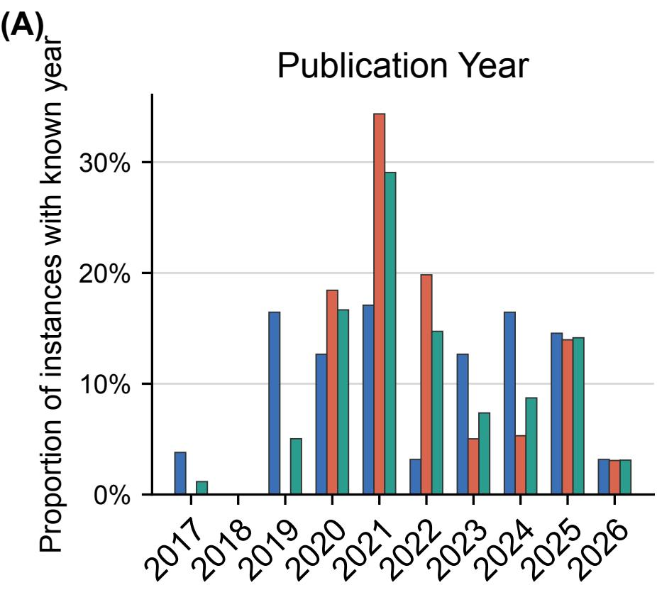

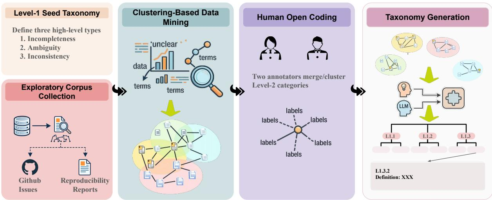  
Figure 5: Taxonomy construction pipeline, from a literature-informed Level-1 defect taxonomy to data-driven discovery and human validation of Level-2 specification defect categories.

<table><tr><td>Successful Task 3 Clarification Action</td></tr><tr><td>Annotated target defect. The paper states that the dense baseline uses a dense layer with an “equivalent number of parameters as the activated parameters in the MoE layer.&quot; However, it does not define which parameters are considered activated, making the construction of a parameter-matched dense baseline ambiguous. Predicted clarification question.</td></tr><tr><td>What is the precise definition of “activated parameters&quot; used to size the dense FFN? Specifically, does it include the parameters of the shared expert, the gating network, and/or only the top-k non-shared experts&#x27; parameters?</td></tr><tr><td>Expected information. The exact set of MoE parameters counted as activated when determining the size of the parameter-matched dense FFN. Private gold resolution. The dense baseline FFN should match the total number of parameters activated per token in the MoE layer. This includes the shared expert and the K = 2 selected non-shared experts, rather than all experts.</td></tr><tr><td>Evaluation. Dimension Result Rationale</td></tr><tr><td>Target relevance Yes The question directly targets the undefined meaning of “activated parame- ters.&quot; Resolution suffi- Yes It explicitly asks whether the parameter count includes the shared expert,</td></tr><tr><td>ciency the gating network, and the selected non-shared experts. An answer would determine how to construct the dense baseline. No unsupported as- Yes The question presents possible parameter groups for clarification but does</td></tr><tr><td>sumption not assert which groups should be counted. Clarification Action 1 All required conditions are satisfied.</td></tr><tr><td>Success Analysis. This example illustrates that an effective clarification question should do more than request additional details. It should identify the precise implementation decision that remains underdetermined and expose the relevant alternatives needed to resolve it. At the same time, presenting alternatives interrogatively does not constitute an unsupported assumption</td></tr></table>

Figure 6: A successful clarification action generated by DeepSeek-V3.2 for an ambiguous definition. The question is targeted, resolution-sufficient, feasible, and free from unsupported assumptions.

<table><tr><td>Level-1 Type</td><td>Level-2 Category</td><td>Definition</td></tr><tr><td rowspan="2">Ambiguity</td><td>Ambiguous Definition</td><td>A formal element, such as a symbol, notation, mathematical ob- ject, or rule, is described without a sufficiently precise meaning. Multiple plausible interpretations remain, leading implementers to compute or instantiate different objects.</td></tr><tr><td>Ambiguous Procedure</td><td>A method operation, execution rule, inference behavior, or interac- tion between components is described but its operational procedure is unclear. Different implementations may follow different behav- iors and produce different outcomes.</td></tr><tr><td rowspan="5">Incompleteness</td><td>Missing Method Procedure</td><td>A required operational step, algorithmic rule, update mechanism, decision criterion, or execution procedure is omitted. Without this information, an implementer cannot faithfully reproduce how the method operates.</td></tr><tr><td>Missing Model Structure</td><td>A model or computational component is mentioned, but its struc- tural configuration is insufficiently specified. Missing details may include layer composition, module organization, dimensional map- ping, normalization, activation, or parameterization choices that affect the instantiated model.</td></tr><tr><td>Missing Data Specification</td><td>The construction or transformation of input data is incompletely described. Missing details may include data filtering, labeling, augmentation, normalization, tokenization, segmentation, or other preprocessing steps that affect the resulting inputs or supervision</td></tr><tr><td>Missing Configuration Protocol</td><td>signals. A result-sensitive configuration choice is introduced, but the spec- ification does not describe how the choice should be determined. Missing information concerns the selection, tuning, or validation procedure for important settings (e.g., hyperparameters, thresholds,</td></tr><tr><td>tion</td><td>initialization choices, or sampling parameters), rather than merely an omitted value. Missing Evaluation Specifica- The evaluation procedure is incompletely described, including miss- ing metric definitions, evaluation protocols, data splits, sampling procedures, prompts, thresholds, or evaluation configurations. Such omissions prevent faithful reproduction or comparison of reported</td></tr><tr><td rowspan="3">Inconsistency</td><td>Conflicting Objective</td><td>results. The specification and another source, such as code, appendix, or supplementary material, define different objectives, loss functions, reward signals, or optimization targets. Following different sources</td></tr><tr><td>Conflicting Model Design</td><td>would optimize materially different goals. Different sources specify incompatible model components, archi- tectures, preprocessing pipelines, or execution pipelines. The in-</td></tr><tr><td>Conflicting Formal Definition</td><td>consistency makes it unclear which design should be implemented. Different sources provide incompatible formal assumptions or mathematical definitions, such as distributions, conditioning rules, aggregation operations, sampling assumptions, or inference for- mulations. The discrepancy changes the underlying formal model</td></tr></table>

Table 8: Final Level-2 taxonomy used in IdeaAMBIG. Each Level-2 category captures a recurring type of implementation-critical specification defect in research ideas or method descriptions.

<table><tr><td>Setting</td><td>Macro-CAS ↑</td><td>Sufficiency ↑</td><td>No-Assumption ↑</td></tr><tr><td>END-TO-END</td><td>13.6</td><td>8.6</td><td>96.3</td></tr><tr><td>DEFECT-GUIDED</td><td>80.6</td><td>80.4</td><td>95.7</td></tr><tr><td>∆</td><td>+67.0</td><td>+71.8</td><td>-0.6</td></tr></table>

Table 9: Information bottleneck analysis for clarification action generation using GPT-5.6-Sol. Providing the annotated target defect improves Macro-CAS by 67.0 points and sufficiency by 71.8 points, while No-Assumption remains nearly unchanged.

<table><tr><td>Model</td><td>Task 2 L2-Aware Acc.</td></tr><tr><td>GPT-5.6-Sol</td><td>40.0</td></tr></table>

Table 10: Taxonomy-free blocker identification ablation on a 50-instance real-world sample. L2-Aware Acc. uses original Task 2 outputs and requires same-blocker identification plus correct Level-1 and Level-2 labels. Blocker Acc. removes taxonomy labels and counts same-blocker identification only.

<table><tr><td>Setting</td><td>Runnable ↑</td><td>All Tests Pass ↑</td><td>Target Fidelity ↑</td><td>Further Clarif. ↓</td></tr><tr><td>DIRECT GENERATION</td><td>70.0</td><td>45.0</td><td>30.0</td><td>35.0</td></tr><tr><td>CLARIFICATION-</td><td>95.0</td><td>85.0</td><td>90.0</td><td>5.0</td></tr></table>

Table 11: Executable validation on 20 controlled instances derived from ideation–execution trajectories with available reference implementations. TARGET FIDELITY measures whether generated code instantiates the evidencesupported target detail. Values are percentages; the study evaluates bounded component fidelity rather than full paper-level reproduction.

<table><tr><td>Task</td><td>Subset</td><td>N</td><td>Source Clusters</td><td>Median per Source</td><td>Maximum per Source</td></tr><tr><td>Task 1</td><td>Real</td><td>200</td><td>34</td><td>4.0</td><td>14</td></tr><tr><td>Task 1</td><td>Synthetic</td><td>200</td><td>31</td><td>7.0</td><td>10</td></tr><tr><td>Task 2/3</td><td>Real</td><td>163</td><td>55</td><td>2.0</td><td>12</td></tr><tr><td>Task 2/3</td><td>Synthetic</td><td>200</td><td>56</td><td>4.0</td><td>5</td></tr></table>

Table 12: Source-cluster composition of the exact evaluation sets used in the main experiments. Task 1 contains 100 READY and 100 NOTREADY specifications sampled independently from the corresponding benchmark records and evaluated in isolation; a source may contribute inputs to both readiness classes. Tasks 2 and 3 use the same NOTREADY benchmark instances. Source clusters are defined as repositories for GitHub-derived instances, original papers for reproducibility-derived instances, and executed projects for ideation–execution instances. Median and maximum report the number of evaluation inputs contributed by each source cluster.

<table><tr><td>Task</td><td>Subset</td><td>N</td><td>Point</td><td>Source-Clustered 95% CI</td><td>Source- Balanced</td></tr><tr><td>Task 1</td><td>Real</td><td>200</td><td>67.5</td><td>[59.8, 74.6]</td><td>66.9</td></tr><tr><td>Task 1</td><td>Synthetic</td><td>200</td><td>86.4</td><td>[80.9, 91.2]</td><td>85.8</td></tr><tr><td>Task 2</td><td>Real</td><td>163</td><td>9.6</td><td>[3.1, 18.7]</td><td>9.4</td></tr><tr><td>Task 2</td><td>Synthetic</td><td>200</td><td>12.2</td><td>[6.8, 18.5]</td><td>11.7</td></tr><tr><td>Task 3</td><td>Real</td><td>163</td><td>80.6</td><td>[70.1, 89.0]</td><td>81.2</td></tr><tr><td>Task 3</td><td>Synthetic</td><td>200</td><td>96.2</td><td>[92.0, 99.0]</td><td>96.0</td></tr></table>

Table 13: Source-level robustness of the primary GPT-5.6-Sol results reported in Table 1. Point reproduces the original instance-level metric on the exact fixed evaluation set. Source-clustered 95% confidence intervals are obtained by resampling complete repositories, source papers, or executed projects. Source-Balanced reports the corresponding estimate under the source-balanced weighting procedure. Source-balanced estimates differ from the instance-level results by at most 0.6 points.

<table><tr><td>Task</td><td>Subset</td><td>Paired Contrast</td><td>∆</td><td>95% CI</td><td></td><td>CI Excludes Zero</td></tr><tr><td></td><td></td><td>GPT-5.6-Sol – Claude Sonnet 5</td><td></td><td></td><td>p</td><td></td></tr><tr><td>Task 1 Task 1</td><td>Real Synthetic</td><td>GPT-5.6-Sol – Claude Sonnet 5</td><td>+8.2 +10.2</td><td>[-0.3, 16.5] [3.4, 17.0]</td><td>0.210 0.024</td><td>No Yes</td></tr><tr><td>Task 2</td><td>Real</td><td>GPT-5.6-Sol – Claude Sonnet 5</td><td>+2.8</td><td>[-0.2, 7.3]</td><td>0.320</td><td>No</td></tr><tr><td>Task 2</td><td>Synthetic</td><td>GPT-5.6-Sol – Claude Sonnet 5</td><td>+0.8</td><td>[-3.2, 5.5]</td><td>1.000</td><td>No</td></tr><tr><td>Task 3</td><td>Real</td><td>GPT-5.6-Sol – Claude Sonnet 5</td><td>+3.8</td><td>[-8.0, 15.5]</td><td>1.000</td><td>No</td></tr><tr><td>Task 3</td><td>Synthetic</td><td>GPT-5.6-Sol – Claude Sonnet 5</td><td>+1.7</td><td>[-1.9, 6.5]</td><td>0.720</td><td>No</td></tr><tr><td>Task 3</td><td>Real</td><td>DEFECT-GUIDED – END-TO-END</td><td>+67.0</td><td>[59.0, 75.2]</td><td>&lt; 0.001</td><td>Yes</td></tr></table>

Table 14: Paired source-clustered bootstrap comparisons. The same sampled source-cluster multiplicities are applied to both systems in every replicate. For the first six rows, p-values are Holm-adjusted across the exploratory GPT-5.6-Sol versus Claude Sonnet 5 comparisons. The final row reports the separate pre-specified comparison between DEFECT-GUIDED and END-TO-END clarification on the same real-world Task 3 instances. The final column indicates whether the corresponding source-clustered 95% confidence interval excludes zero.
<table><tr><td>Subset</td><td>N</td><td>Orig. Unique Primary (%)</td><td>Co-primary Alt. (%)</td><td>Revised</td><td></td><td>Dropped</td><td>Final N</td></tr><tr><td>Real-world</td><td></td><td>91.4</td><td>4.9</td><td>8</td><td>Split</td><td></td><td></td></tr><tr><td>Controlled synthetic</td><td>163 497</td><td>95.6</td><td>2.4</td><td>13</td><td>3 4</td><td>3 5</td><td>163 497</td></tr><tr><td>Overall</td><td>660</td><td>94.5</td><td>3.0</td><td>21</td><td>7</td><td>8</td><td>660</td></tr></table>

Table 15: Target-uniqueness audit of all NOTREADY specifications. Orig. Unique Primary reports original targets judged valid, primary, and unique; Co-primary Alt. reports independent alternative blockers. Revised, Split, and Dropped count original audited instances. Final N reports retained single-target instances after adjudication; 7 split instances yield 15 final instances, offsetting 8 drops.
<table><tr><td rowspan="2">Granularity</td><td colspan="2">N</td><td colspan="2">Loc-Acc ↑</td><td colspan="2">Macro DRR ↑</td></tr><tr><td>Real</td><td>Synth.</td><td>Real</td><td>Synth.</td><td>Real</td><td>Synth.</td></tr><tr><td>Coarse</td><td>45</td><td>84</td><td>34.0</td><td>47.0</td><td>21.0</td><td>26.0</td></tr><tr><td>Non-coarse</td><td>118</td><td>413</td><td>9.0</td><td>15.0</td><td>7.0</td><td>9.0</td></tr><tr><td>Coarse vs. Non-coarse</td><td colspan="2">∆ 95% CI p (Holm-adjusted)</td><td>25.0 [10.2, 39.8]</td><td>32.0 [20.8, 43.2]</td><td>14.0 [7.8, 22.1]</td><td>17.0 [9.8, 24.6]</td></tr></table>

Table 16: Task 2 defect-localization results for GPT-5.6-Sol, stratified by defect granularity (§E.3). Because the Fine stratum is small in both subsets (5 real, 12 controlled-synthetic), we merge it with Medium into a single Non-coarse stratum rather than reporting a three-way breakdown. Appendix E.3 gives the resulting Coarse/Non-coarse counts. Loc-Acc and Macro DRR are defined in Appendix F.2. ∆ is the Coarse minus Non-coarse difference. For Loc-Acc, 95% CIs and Holm-adjusted p-values are from a two-proportion test over the instance counts above. For Macro DRR, which is macro-averaged over Level-2 categories rather than micro-averaged over instances, 95% CIs and Holm-adjusted p-values are from a category-level bootstrap. We report category-level intervals for this stratified analysis and leave the source-clustered variant used elsewhere in the paper (Appendix D.5) as a future robustness check.
<table><tr><td>Metric</td><td>Single (paired)</td><td>Multi (k=2)</td><td>∆</td></tr><tr><td>Readiness (both/combined NOTREADY)</td><td>80.0</td><td>88.0</td><td>+8.0</td></tr><tr><td>Loc-Acc, Any-of-2</td><td>36.0</td><td>64.0</td><td>+28.0</td></tr><tr><td>Loc-Acc, All-of-2</td><td>2.0</td><td>8.0</td><td>+6.0</td></tr></table>

Table 17: Multi-defect ablation on 50 controlled-synthetic pairs (Appendix E.4). Single (paired) evaluates the two constituent single-defect siblings independently and combines their outcomes, using AND for readiness and All-of-2 and OR for Any-of-2, with exactly one predicted defect allowed per call. Multi evaluates GPT-5.6-Sol on the single instance obtained by merging both defects into one specification, allowing a variable number of predicted defects (mean 2.26 across these instances). All values are percentages over the 50 pairs. Readiness and All-of-2 are not significant under an exact McNemar test at n = 50 (p = 0.289 and $p = 0 . 2 5 0 )$ . Any-of-2 is significant $( p = 0 . 0 0 1 3 )$ , but we attribute this to the response-count asymmetry between conditions rather than to a change in per-defect diagnostic accuracy, since the multi-defect condition can submit more candidate answers than the paired baseline. We find no evidence that combining defects makes localization harder.

<table><tr><td>Field</td><td>Allowed values or required content</td></tr><tr><td>readiness_label</td><td>READY, NOT_READY, or UNSURE.</td></tr><tr><td>affected_slot</td><td>NONE, TASK_AND_IO, CORE_ALGORITHM, MODEL_ARCHITECTURE, OBJECTIVE_AND_SUPERVISION, TRAINING_PROCEDURE, DATA_AND_PREPROCESSING,</td></tr><tr><td></td><td>INFERENCE_AND_DECISION, EVALUATION_PROTOCOL, or INTERNAL_CONSISTENCY.</td></tr><tr><td>blocking-span required_clarification</td><td>The smallest relevant text span for a NoT_READY case. Leave empty for a READY case. One or two sentences describing the implementation-critical information that must be</td></tr><tr><td></td><td>clarified. Leave empty for a READY case.</td></tr><tr><td>atomicity</td><td>NO_BLOCKER, EXACTLY_ONE_PRIMARY_BLOCKER, MULTIPLE_INDEPENDENT_BLOCKERS, or UNCLEAR.</td></tr></table>

Table 18: Output fields collected during codification-readiness annotation.

<table><tr><td rowspan="2">Model</td><td colspan="2">Macro-F1 ↑</td><td colspan="2">UnsafePass↓</td><td colspan="2">OverFlag ↓</td><td colspan="2">RGS↑</td></tr><tr><td>Real</td><td>Synth.</td><td>Real</td><td>Synth.</td><td>Real</td><td>Synth.</td><td>Real</td><td>Synth.</td></tr><tr><td colspan="9">Frontier proprietary models</td></tr><tr><td>GPT-5.6-Sol</td><td>67.49</td><td>86.40</td><td>31.00</td><td>5.00</td><td>34.00</td><td>22.00</td><td>0.36</td><td>0.49</td></tr><tr><td>Claude Sonnet 5</td><td>59.27</td><td>76.19</td><td>33.00</td><td>12.00</td><td>48.00</td><td>35.00</td><td>0.35</td><td>0.37</td></tr><tr><td>Gemini 3.1 Pro Preview</td><td>45.84</td><td>67.26</td><td>35.00</td><td>24.00</td><td>70.00</td><td>41.00</td><td>0.23</td><td>0.35</td></tr><tr><td>DeepSeek-V3.2</td><td>44.49</td><td>67.16</td><td>41.00</td><td>16.00</td><td>68.00</td><td>48.00</td><td>0.20</td><td>0.39</td></tr><tr><td colspan="9">Open-weight reasoning models</td></tr><tr><td>Qwen3.5-397B-A17B</td><td>57.47</td><td>55.89</td><td>40.00</td><td>49.00</td><td>45.00</td><td>39.00</td><td>0.31</td><td>0.40</td></tr><tr><td>DeepSeek-R1-0528</td><td>44.33</td><td>59.94</td><td>40.00</td><td>36.00</td><td>69.00</td><td>44.00</td><td>0.27</td><td>0.29</td></tr><tr><td>GLM-5.2</td><td>45.10</td><td>65.88</td><td>63.00</td><td>40.00</td><td>46.00</td><td>28.00</td><td>0.34</td><td>0.43</td></tr><tr><td>Kimi-K3</td><td>32.74</td><td>43.08</td><td>86.00</td><td>78.00</td><td>42.00</td><td>29.00</td><td>0.34</td><td>0.42</td></tr><tr><td colspan="9">Open-weight general models</td></tr><tr><td>GPT-OSS-120B</td><td>29.99</td><td>44.43</td><td>61.00</td><td>52.00</td><td>78.00</td><td>59.00</td><td>0.21</td><td>0.28</td></tr><tr><td>Gemma-4-31B-IT</td><td>47.11</td><td>56.90</td><td>65.00</td><td>58.00</td><td>39.00</td><td>26.00</td><td>0.26</td><td>0.32</td></tr><tr><td>Qwen3.5-9B</td><td>33.30</td><td>54.25</td><td>61.00</td><td>28.00</td><td>72.00</td><td>61.00</td><td>0.26</td><td>0.30</td></tr><tr><td>Qwen3-8B</td><td>40.10</td><td>48.74</td><td>35.00</td><td>28.00</td><td>79.00</td><td>70.00</td><td>0.28</td><td>0.41</td></tr><tr><td>Qwen3-32B</td><td>34.46</td><td>36.99</td><td>63.00</td><td>62.00</td><td>68.00</td><td>64.00</td><td>0.24</td><td>0.31</td></tr><tr><td rowspan="2">Model</td><td colspan="2">Label-L1 Acc ↑</td><td colspan="2">Label-L2 Acc ↑</td><td colspan="2">Loc-Acc ↑</td><td colspan="2">Macro DRR ↑</td></tr><tr><td>Real</td><td>Synth.</td><td>Real</td><td>Synth.</td><td>Real</td><td>Synth.</td><td>Real</td><td>Synth.</td></tr><tr><td colspan="9">Frontier proprietary models</td></tr><tr><td>GPT-5.6-Sol</td><td>60.1</td><td>65.0</td><td>25.2</td><td>32.0</td><td>16.0</td><td>20.0</td><td>9.6</td><td>12.2</td></tr><tr><td>Claude Sonnet 5</td><td>55.2</td><td>59.5</td><td>25.8</td><td>27.0</td><td>11.0</td><td>19.0</td><td>6.8</td><td>11.4</td></tr><tr><td>Gemini 3.1 Pro Preview</td><td>52.8</td><td>57.0</td><td>22.1</td><td>26.5</td><td>6.7</td><td>15.0</td><td>3.4</td><td>7.6</td></tr><tr><td>DeepSeek-V3.2</td><td>55.8</td><td>57.0</td><td>19.6</td><td>19.5</td><td>9.2</td><td>10.5</td><td>5.9</td><td>8.0</td></tr><tr><td colspan="9">Open-weight reasoning models</td></tr><tr><td>Qwen3.5-397B-A17B</td><td>48.5</td><td>56.0</td><td>20.2</td><td>26.5</td><td>6.7</td><td>16.0</td><td>3.3</td><td>4.6</td></tr><tr><td>DeepSeek-R1-0528</td><td>43.6</td><td>45.0</td><td>19.6</td><td>18.5</td><td>6.1</td><td>9.5</td><td>1.8</td><td>2.2</td></tr><tr><td>GLM-5.2</td><td>31.3</td><td>40.0</td><td>23.3</td><td>14.0</td><td>4.9</td><td>8.0</td><td>5.7</td><td>7.0</td></tr><tr><td>Kimi-K3</td><td>54.0</td><td>57.0</td><td>23.3</td><td>24.5</td><td>4.9</td><td>13.0</td><td>6.6</td><td>8.2</td></tr><tr><td colspan="9">Open-weight general models</td></tr><tr><td>GPT-OSS-120B</td><td>50.9</td><td>44.0</td><td>14.1</td><td>12.5</td><td>3.7</td><td>8.0</td><td>2.5</td><td>3.3</td></tr><tr><td>Gemma-4-31B-IT</td><td>39.3</td><td>42.5</td><td>12.9</td><td>14.0</td><td>8.6</td><td>18.0</td><td>4.7</td><td>7.0</td></tr><tr><td>Qwen3.5-9B</td><td>52.1</td><td>54.0</td><td>20.9</td><td>23.5</td><td>8.6</td><td>14.0</td><td>5.3</td><td>5.5</td></tr><tr><td>Qwen3-8B</td><td>54.0</td><td>54.5</td><td>17.8</td><td>19.0</td><td>8.6</td><td>10.0</td><td>3.2</td><td>4.6</td></tr><tr><td>Qwen3-32B</td><td>52.8</td><td>48.0</td><td>20.2</td><td>23.0</td><td>8.6</td><td>11.0</td><td>3.6</td><td>5.8</td></tr></table>

Table 19: Task 1 readiness-assessment results on the real-world (Real) and controlled synthetic (Synth.) subsets using fixed zero-shot prompts. Each subset contains 100 READY and 100 NOTREADY specifications sampled independently from the corresponding benchmark records; the two classes are not restricted to matched counterpart pairs, and each specification is evaluated in isolation. Macro-F1, the primary metric, is the unweighted mean of the class-specific F1 scores for READY and NOTREADY. UnsafePass measures the percentage of underspecified inputs incorrectly accepted as READY, while OverFlag measures the percentage of codification-ready inputs incorrectly rejected as NOTREADY. The Reason Grounding Score (RGS) evaluates whether the free-text rationale supports the gold readiness label, identifies the annotated implementation blocker, and remains faithful to the supplied specification: $\mathrm { R G S } = 0 . 7 s _ { \mathrm { l a b e l } } + 0 . 2 s _ { \mathrm { b l o c k e r } } + 0 . 1 s _ { \mathrm { f a i t h f u l } }$ . RGS is reported on a [0, 1] scale; all other values are percentages. Best results in each column are bolded, and second-best results are underlined.

Table 20: Task 2 defect-localization results on the full real-world set $( N = 1 6 3 )$ and a fixed synthetic sample (N = 200) under fixed zero-shot prompts. Label-L1 Acc and Label-L2 Acc measure the accuracy of the predicted Level-1 and Level-2 taxonomy labels, respectively. Loc-Acc measures whether the predicted defect semantically matches the annotated implementation-critical blocker. Macro Defect Recovery Rate (Macro DRR), our primary metric, requires correct localization and correct prediction of both taxonomy labels. It then macro-averages recovery across gold Level-2 categories. Label-L1 Acc, Label-L2 Acc, and Loc-Acc are micro-averaged over instances, whereas Macro DRR is macro-averaged across Level-2 categories. All values are percentages. Best results in each column are bolded, and second-best results are underlined.

<table><tr><td rowspan="2">Model</td><td colspan="2">Macro-CAS ↑</td><td colspan="2">Sufficiency ↑</td><td colspan="2">No-Assumption ↑</td></tr><tr><td>Real</td><td>Synth.</td><td>Real</td><td>Synth.</td><td>Real</td><td>Synth.</td></tr><tr><td colspan="7">Frontier proprietary models</td></tr><tr><td>GPT-5.6-Sol</td><td>80.6</td><td>96.2</td><td>80.4</td><td>98.0</td><td>95.7</td><td>99.0</td></tr><tr><td>Claude Sonnet 5</td><td>76.8</td><td>94.5</td><td>79.8</td><td>96.0</td><td>92.6</td><td>98.0</td></tr><tr><td>Gemini 3.1 Pro Preview</td><td>68.9</td><td>91.6</td><td>70.6</td><td>94.0</td><td>92.0</td><td>96.0</td></tr><tr><td>DeepSeek-V3.2</td><td>62.9</td><td>93.0</td><td>64.4</td><td>93.0</td><td>92.0</td><td>96.0</td></tr><tr><td colspan="7">Open-weight reasoning models</td></tr><tr><td>Qwen3.5-397B-A17B</td><td>72.0</td><td>89.0</td><td>73.0</td><td>91.0</td><td>91.4</td><td>97.0</td></tr><tr><td>DeepSeek-R1-0528</td><td>68.0</td><td>68.5</td><td>63.2</td><td>64.0</td><td>85.9</td><td>89.0</td></tr><tr><td>GLM-5.2</td><td>63.6</td><td>77.0</td><td>54.0</td><td>69.0</td><td>91.4</td><td>92.0</td></tr><tr><td>Kimi-K3</td><td>60.6</td><td>92.5</td><td>77.3</td><td>92.0</td><td>82.0</td><td>93.0</td></tr><tr><td colspan="7">Open-weight general models</td></tr><tr><td>GPT-OSS-120B</td><td>53.4</td><td>65.3</td><td>57.1</td><td>82.0</td><td>85.3</td><td>89.0</td></tr><tr><td>Gemma-4-31B-IT</td><td>67.7</td><td>73.0</td><td>65.6</td><td>67.0</td><td>87.7</td><td>90.0</td></tr><tr><td>Qwen3.5-9B</td><td>64.6</td><td>81.2</td><td>63.8</td><td>91.0</td><td>89.6</td><td>95.0</td></tr><tr><td>Qwen3-8B</td><td>53.8</td><td>82.6</td><td>52.1</td><td>84.0</td><td>85.9</td><td>92.0</td></tr><tr><td>Qwen3-32B</td><td>61.9</td><td>76.3</td><td>55.2</td><td>84.0</td><td>86.5</td><td>95.0</td></tr></table>

Table 21: Task 3 clarification-action results on the full real-world set $( N = 1 6 3 )$ and the same fixed synthetic sample used in Task $2 \left( N = 2 0 0 \right)$ under fixed zero-shot prompts. All models receive the annotated target defect. Sufficiency measures whether the proposed action would obtain enough information to resolve the defect. No-Assumption measures whether the action avoids unsupported implementation choices. Macro Clarification Action Success Rate (Macro-CAS), our primary metric, requires the action to be target-relevant, sufficient, and free of unsupported assumptions. It then macro-averages successful clarification across gold Level-2 categories. Sufficiency and No-Assumption are micro-averaged over instances, whereas Macro-CAS is macro-averaged across Level-2 categories. Consequently, Macro-CAS is not necessarily numerically bounded by either component metric. All values are percentages. Best results in each column are bolded, and second-best results are underlined.

<table><tr><td>Model</td><td>Real</td><td>Synth.</td></tr><tr><td>Frontier proprietary models</td><td></td><td></td></tr><tr><td>GPT-5.6-Sol</td><td>8.6</td><td>14.0</td></tr><tr><td>Claude Sonnet 5</td><td>6.7</td><td>13.0</td></tr><tr><td>Gemini 3.1 Pro Preview</td><td>4.9</td><td>11.0</td></tr><tr><td>DeepSeek-V3.2</td><td>7.4</td><td>8.0</td></tr><tr><td>Open-weight models</td><td></td><td></td></tr><tr><td>Qwen3-8B</td><td>5.5</td><td>2.0</td></tr><tr><td>Qwen3-32B</td><td>5.5</td><td>6.0</td></tr><tr><td>DeepSeek-R1-0528</td><td></td><td></td></tr><tr><td>GPT-OSS-120B</td><td>2.5 1.8</td><td>2.8 5.0</td></tr></table>

Table 22: Micro-averaged L1-aware recovery on Task 2 for the real-world (Real; $N = 1 6 3 )$ and controlled synthetic (Synth.; N = 200) evaluation sets. A prediction is counted as correct when it localizes the annotated target defect and assigns its correct Level-1 taxonomy label; Level-2 assignment is ignored. All values are percentages.

<table><tr><td>Specification slot</td><td>Definition and representative cases</td></tr><tr><td>TASK_AND_IO</td><td>Use this slot when the blocker concerns the research task, expected inputs, or expected outputs. Representative cases include an unclear problem definition, unclear infor- mation provided to the method, an unspecified prediction or generation target, or an</td></tr><tr><td>CORE_ALGORITHM</td><td>unclear output format or semantic meaning. Use this slot when the blocker concerns the central computational procedure or se- quence of operations that defines the method. Representative cases include an un- defined intermediate quantity; a missing aggregation, update, ranking, sampling, or selection rule; an unclear order of operations; an unspecified interaction between major</td></tr><tr><td>MODEL_ARCHITECTURE</td><td>Use this slot when the blocker concerns the structure or connectivity of the model. Representative cases include an undefined required module, an unclear connection between modules, uncertainty about whether components operate sequentially or in parallel, an unspecified representation passed between modules, or an unclear role for a newly proposed component. A standard named architecture does not need to be described layer by layer unless the</td></tr><tr><td>OBJECTIVE_AND_SUPERVISION</td><td>proposed method modifies it in an implementation-critical manner. Use this slot when the blocker concerns the objective being optimized or the supervi- sion used to train the method. Representative cases include an undefined loss, reward, or regularization term; an unclear supervision target; undefined positive or negative examples; an unspecified method for combining multiple objectives; or an unclear</td></tr><tr><td>TRAINING_PROCEDURE</td><td>Use this slot when the blocker concerns how the model or method is trained. Rep- resentative cases include uncertainty about which components are trained or frozen, an unspecified alternating or staged procedure, an unclear parameter-update order, missing distinctions between pretraining and fine-tuning, or an essential checkpoint- selection procedure that is not defined. A standard optimizer, learning rate, or epoch count is usually an ordinary engineering</td></tr><tr><td>DATA_AND_PREPROCESSING</td><td>Use this slot when the blocker concerns how data are constructed, selected, trans- formed, or partitioned. Representative cases include undefined training examples or labels, missing filtering or sampling criteria, unclear negative sampling, unspecified feature extraction or normalization, or an unclear train-validation-test construction that affects the method or claimed result.</td></tr><tr><td>INFERENCE_AND_DECISION</td><td>Use this slot when the blocker concerns how model outputs are converted into final predictions, rankings, actions, or decisions. Representative cases include unspecified decoding, thresholds, decision rules, candidate selection, ranking, post-processing, test-time aggregation, or stopping criteria.</td></tr><tr><td>EVALUATION_PROTOCOL</td><td>Use this slot when the blocker concerns how the proposed method or research claim is evaluated. Representative cases include an unclear evaluation dataset or task setting, a missing or incompatible metric, an undefined comparison condition, an unspecified evaluation unit, or a data split that prevents faithful assessment of the central claim. A missing evaluation detail is blocking only when it prevents a meaningful or faithful assessment of the research claim. It is not blocking merely because exact numerical reproduction is impossible.</td></tr><tr><td>INTERNAL_CONSISTENCY</td><td>Use this slot only when two or more parts of the specification conflict. Representative cases include an objective that conflicts with the stated loss, incompatible architec- tural descriptions, mismatched input and output definitions, conflicting training and inference procedures, or mutually inconsistent implementation requirements. If information is only missing or ambiguous, select the substantive slot affected by the</td></tr><tr><td>NONE</td><td>Select NONE only when the specification is labeled READY and no implementation- critical blocker is present.</td></tr></table>

Table 23: Specification slots used in the codification-readiness annotation.

## G Human Validation

## G.1 Human Validation of LLM-Based Evaluation

The primary metrics for Tasks 2 and 3, together with the diagnostic Reason Grounding Score (RGS) for Task 1, include semantic or rubric-based judgments produced by Claude Opus 4.8. We therefore conduct an independent human validation study to assess whether the automatic evaluator applies the benchmark-specific evaluation criteria consistently with human annotators.

Sampling. For each task, we sample 100 candidate model outputs, yielding 300 outputs in total. Each task-specific sample contains 50 real-world and 50 synthetic-controlled instances. We stratify the sample by benchmark subset, Level-2 defect category, and candidate model group to ensure coverage of different specification defects and output styles. The sampled outputs include predictions from GPT-5.6-Sol, non-OpenAI proprietary models, open-weight reasoning models, and open-weight general models.

Sampling is performed before human annotation. Within each stratum, outputs are selected randomly from the corresponding evaluation results. The same candidate output is used for all judgment dimensions associated with its task; for example, the three Task 3 criteria are evaluated on the same set of 100 clarification actions.

Human Annotation Protocol. Two annotators with machine learning research experience independently evaluate every sampled output. Annotators apply the same definitions and decision criteria used by the Claude Opus 4.8 evaluator. They are blinded to both the identity of the candidate model and the automatic evaluator’s judgment. Model names and provider-specific metadata are removed, and candidate outputs are presented in randomized order.

Annotators receive only the information available to the corresponding automatic evaluator. For Task 1, they receive the input specification, the gold readiness label, the annotated target defect, and the candidate rationale. For Task 2, they receive the underspecified specification, the gold target-defect description, and the candidate diagnosis. For Task 3, they receive the underspecified specification, the annotated target defect, the supported hidden resolution, and the candidate clarification action. No additional paper, code, issue-thread, or source evidence is provided unless it is already included in the evaluator input.

Task-Specific Judgments. For Task 1, annotators independently assign the three ordinal sub-scores used to compute RGS: label support, target-defect match, and faithfulness. Label support measures whether the rationale supports the gold readiness decision. Target-defect match measures whether the rationale identifies the annotated implementation-critical blocker. Faithfulness measures whether the rationale remains supported by the supplied specification and avoids introducing unsupported claims.

For Task 2, annotators make a binary judgment of whether the candidate diagnosis refers to the same atomic implementationcritical defect as the gold target. This decision is based on semantic equivalence rather than lexical overlap. A prediction is marked as matching when it identifies the same unresolved method-defining decision, even if it uses different wording or describes the affected component at a different level of abstraction. A prediction is marked as non-matching when it identifies a different defect, gives only a generic critique, or fails to specify the unresolved implementation decision.

For Task 3, annotators make three independent binary judgments. Target relevance measures whether the proposed action directly addresses the annotated defect. Resolution sufficiency measures whether carrying out the action would obtain enough information to resolve the defect and determine the intended implementation choice. Unsupported assumption measures whether the proposed action presupposes or introduces an implementation decision that is not supported by the specification, target defect, or hidden resolution. The corresponding No-Assumption judgment is positive when no such unsupported choice is introduced.

Adjudication. When the two annotators assign the same judgment, that judgment is retained as the human reference label. Disagreements are reviewed by a third annotator with machine learning research experience, who independently examines the evaluator input and the candidate output before assigning the final adjudicated judgment. The third annotator does not observe the Claude Opus 4.8 evaluation result or the identity of the candidate model.

Agreement Metrics. For the binary Task 2 and Task 3 judgments, we report exact agreement between Claude Opus 4.8 and the adjudicated human judgment, treating the human judgment as the reference label. Because exact agreement is equivalent to classification accuracy in this setting, we report it as a single measure. We additionally report Cohen’s κ to account for chance agreement. For the ordinal Task 1 RGS sub-scores, we report exact agreement, weighted Cohen’s κ, and mean absolute error (MAE) between the automatic and adjudicated human scores.

Results. Table 24 summarizes agreement between Claude Opus 4.8 and the adjudicated human judgments. For Task 1, exact agreement ranges from 76.0% (target-defect match) to 84.0% (label support), with weighted κ between 0.68 and 0.78 and MAE below 0.14, indicating that the evaluator’s ordinal RGS sub-scores closely track human judgments, with target-defect match showing the largest, though still moderate, disagreement. For Task 2, Claude Opus 4.8 agrees with the adjudicated human judgment on 86.0% of same-target-defect decisions (κ = 0.72), supporting the reliability of Loc-Acc and Macro DRR as automatically computed metrics. For Task 3, agreement is highest for target relevance (91.0%, κ = 0.81) and resolution sufficiency (85.0%, κ = 0.70). No-unsupported-assumption judgments show high exact agreement (93.0%) but comparatively lower κ (0.69); this reflects the skewed base rate of this judgment—most candidate actions are assumption-free—which inflates chance agreement under Cohen’s κ rather than indicating weaker evaluator reliability. Overall, these results support using Claude Opus 4.8 as a reliable proxy for the semantic and rubric-based judgments underlying our automatic metrics, with target-defect matching showing the largest (and still acceptable) margin of measurement noise.

## G.2 Synthetic-Controlled Defect Validation

Synthetic-controlled instances enable scalable benchmark construction by introducing controlled implementation-critical defects into codification-ready research specifications. However, synthetic generation may potentially produce simplified or artificial defects that do not reflect the specification failures encountered in real research workflows. We therefore conduct a human validation study to examine whether synthetic instances preserve the key properties of naturally occurring specification gaps.

<table><tr><td>Task</td><td>Evaluation Judgment</td><td>N</td><td>Exact Agr. / Acc. ↑</td><td>Cohen&#x27;s κ ↑</td><td>Weighted κ ↑</td><td>MAE↓</td></tr><tr><td rowspan="3">Task 1</td><td>Label support</td><td>100</td><td>84.0</td><td>一</td><td>0.78</td><td>0.09</td></tr><tr><td>Target-defect match</td><td>100</td><td>76.0</td><td></td><td>0.68</td><td>0.14</td></tr><tr><td>Faithfulness</td><td>100</td><td>82.0</td><td></td><td>0.74</td><td>0.10</td></tr><tr><td>Task 2</td><td>Same target defect</td><td>100</td><td>86.0</td><td>0.72</td><td></td><td>一</td></tr><tr><td rowspan="3">Task 3</td><td>Target relevance</td><td>100</td><td>91.0</td><td>0.81</td><td></td><td></td></tr><tr><td>Resolution sufficiency</td><td>100</td><td>85.0</td><td>0.70</td><td></td><td></td></tr><tr><td>No unsupported assumption</td><td>100</td><td>93.0</td><td>0.69</td><td></td><td></td></tr></table>

Table 24: Agreement between the Claude Opus 4.8 evaluator and adjudicated human judgments. For Task 1, the Reason Grounding Score components are ordinal; we therefore report exact agreement, weighted Cohen’s κ, and mean absolute error (MAE). For the binary Task 2 and Task 3 judgments, exact agreement is equivalent to classification accuracy, and we additionally report Cohen’s κ. Higher values are better for agreement and κ, while lower MAE indicates closer correspondence between automatic and human scores. Candidate model identities and Claude Opus 4.8 judgments are hidden from the human annotators.

Evaluation Protocol. We randomly sample 100 benchmark instances, including 50 real-world instances and 50 syntheticcontrolled instances. Each instance is independently evaluated by two annotators with experience in machine learning research. Annotators are provided with the underspecified research idea, the supporting evidence used for construction, the identified specification gap, and the corresponding clarification. The source type (real or synthetic) is hidden during annotation.

For each instance, annotators evaluate four binary criteria:

1. Valid specification gap. Whether the instance represents a genuine specification-level issue rather than an implementation preference, engineering choice, or subjective critique. A positive judgment indicates that the described gap corresponds to an omission, ambiguity, or inconsistency that affects faithful interpretation of the research idea.

2. Implementation-critical. Whether the identified gap can prevent faithful implementation without additional clarification. Annotators consider whether different reasonable interpretations of the specification would lead to different implementations, model behaviors, or experimental outcomes.

3. Clarification resolves the gap. Whether the provided clarification supplies sufficient information to resolve the identified specification issue and enables a more complete codification-ready description.

4. Realistic specification failure. Whether the identified gap could plausibly arise during an actual research implementation or reproduction workflow. This criterion measures whether synthetic-controlled defects resemble naturally occurring specification failures rather than artificially constructed omissions.

For each criterion, we report the proportion of positive judgments across both annotators:

$$
\mathrm { P o s i t i v e R a t e } _ { s } = \frac { 1 } { 2 N _ { s } } \sum _ { i = 1 } ^ { N _ { s } } \sum _ { a = 1 } ^ { 2 } \mathbb { I } [ s _ { i a } = \mathrm { Y e s } ] \times 1 0 0 \% ,
$$

where $N _ { s } = 5 0$ is the number of instances in subset $s ,$ and $s _ { i a }$ denotes annotator a’s judgment for instance i. Thus, each reported subset-level percentage is computed from $2 N _ { s } = 1 0 0$ individual judgments.

Table 25 summarizes the validation results. Both real-world and synthetic-controlled instances are frequently judged as valid specification gaps, implementation-critical issues, and realistic research workflow failures. Synthetic instances achieve comparable or higher positive rates than real-world instances, with 96.0% judged as valid specification gaps and 94.0% judged as implementation-critical. This indicates that controlled defect injection preserves the core benchmark construct when applied to codification-ready source references.

Synthetic-controlled instances also receive similarly high realism ratings, with 91.0% judged as plausible specification failures that could occur in real implementation or reproduction workflows, compared with 93.0% for real-world instances. In addition, 98.0% of synthetic instances are judged to be correctly resolved by the provided clarification. These results suggest that controlled synthesis preserves the key properties of naturally occurring specification gaps while providing precise defect targets and scalable benchmark construction.

## G.3 Clarification Improves Downstream Codification

A central motivation of IdeaAMBIG is that underspecified research ideas may fail not because language models cannot generate implementation specifications, but because they lack the information required to identify and resolve implementation-critical specification gaps. To quantify the potential benefit of obtaining missing specification information before codification, we conduct an oracle clarification utility study.

Setup. We sample 50 real-world instances from the Task 3 evaluation set. To ensure coverage across different types of specification gaps, we perform stratified sampling according to the Level-2 taxonomy, with each category contributing multiple instances whenever available. Each instance contains the original underspecified idea, the annotated target defect, the gold clarification action, the hidden resolution describing the missing implementation detail, and the corresponding Level-2 category.

<table><tr><td>Validation Criterion</td><td>Real</td></tr><tr><td>Valid specification gap</td><td></td></tr><tr><td>Implementation-critical</td><td>92.0 96.0</td></tr><tr><td>Clarification resolves the gap</td><td></td></tr><tr><td>Realistic specification failure</td><td></td></tr></table>

Table 25: Blind human assessment of 50 real-world and 50 synthetic-controlled instances, each independently evaluated by two annotators. Values are percentages of positive annotator judgments, computed over 100 judgments per subset for each criterion. Most instances are judged realistic and resolvable; synthetic-controlled instances receive comparable realism and higher validity, implementation-criticality, and resolution ratings.
<table><tr><td rowspan="2">Label</td><td colspan="2">Agreement</td><td colspan="2">Cohen&#x27;s κ</td></tr><tr><td>Real</td><td>Synth.</td><td>Real</td><td>Synth.</td></tr><tr><td>Readiness</td><td>92.0%</td><td>96.0%</td><td>0.84</td><td>0.92</td></tr><tr><td>Level 1</td><td>93.9%</td><td>94.5%</td><td>0.89</td><td>0.89</td></tr><tr><td>Level 2</td><td>93.9%</td><td>87.0%</td><td>0.92</td><td>0.85</td></tr><tr><td>Target defect</td><td>87.7%</td><td>84.0%</td><td></td><td>一</td></tr></table>

Table 26: Inter-annotator agreement for benchmark annotations. We report raw agreement and Cohen’s κ for readiness and defect labels on real-world (Real) and synthetic (Synth.) subsets.

We compare two specification generation pipelines using the same backbone model, GPT-5.6-Sol, with identical decoding configurations.

The first pipeline, DIRECT GENERATION, receives only the underspecified research idea and is asked to directly produce an implementation-ready specification.

The second pipeline, CLARIFICATION-ASSISTED GENERATION, receives the underspecified idea together with the annotated target defect, the clarification action, and the oracle clarification answer corresponding to the hidden resolution. The model then generates a revised implementation specification incorporating the resolved information.

This experiment is designed as an oracle analysis rather than an end-to-end evaluation of clarification agents. By providing the resolved missing information explicitly, we measure the upper-bound utility of clarification and test whether resolving specification gaps is sufficient to improve downstream codification quality.

Evaluation. Two human annotators independently evaluate all generated specifications while being blinded to the generation pipeline. Disagreements are resolved through discussion or adjudication by a third annotator.

We evaluate four dimensions.

READY Rate measures whether a generated specification is sufficient for faithful initial codification of the method component affected by the target defect. Annotators assign a binary YES/NO label.

Completeness measures whether the generated specification adequately describes all implementation-critical information required for codification. Annotators provide a score from 1 to 5, which is linearly mapped to a percentage scale.

Missing Detail Recovery measures whether the specification correctly recovers the annotated hidden resolution associated with the target defect. This metric is evaluated as a binary YES/NO decision.

Unsupported Assumption measures whether the generated specification introduces implementation choices that are not supported by the original input or the provided clarification information. This metric is also evaluated as a binary decision, where lower values indicate fewer unsupported assumptions.

Results. Table 2 summarizes the results. Direct specification generation performs poorly when provided only with an underspecified idea. Only 14% of generated specifications satisfy the READY criterion, and the model recovers the target missing detail in only 14% of cases. The completeness score is also limited (30%), indicating that fluent specification generation does not necessarily imply sufficient implementation detail. Moreover, 6% of specifications introduce unsupported assumptions.

In contrast, providing the missing specification information through clarification substantially improves downstream codification quality. The clarification-assisted pipeline achieves 98% READY Rate, recovers the target missing details in 98% of cases, and eliminates unsupported assumptions. These results suggest that the primary challenge is not the ability to express an implementation specification, but the ability to identify and obtain the unresolved information required before codification.

Overall, this experiment supports our hypothesis that clarification serves as a necessary intermediate step between underspecified research ideas and reliable specification generation. Rather than filling missing details with plausible but unsupported assumptions, models can produce substantially more faithful specifications when the unresolved specification slots are explicitly addressed.

## G.4 Human Baseline Evaluation

To contextualize LLM performance on IdeaAMBIG, we conduct a human baseline study with researchers who have machine learning experience. This study examines whether the benchmark tasks remain challenging for human experts and distinguishes model limitations from intrinsic task difficulty.

Evaluation Protocol. We randomly sample 100 defect-centered records from IdeaAMBIG, including 50 real-world and 50 controlled synthetic records. The sample preserves the overall Level-1 defect distribution of the benchmark. These records are drawn from the same evaluation pool used for the LLM experiments, and model comparisons are restricted to the same sampled records. For Task 1, participants independently evaluate both the NOTREADY specification and its corresponding READY counterpart, yielding 50 examples from each readiness class within each subset. The two versions are presented separately and never shown together. For Tasks 2 and 3, participants evaluate only the NOTREADY specification from each sampled record.

<table><tr><td>Task / Metric</td><td>Real</td><td>Synth.</td></tr><tr><td>Task 1: Readiness Assessment Human Expert 91.0</td><td></td><td>95.0</td></tr><tr><td>Task 2: Defect Localization Human Expert</td><td>52.0</td><td>65.0</td></tr><tr><td>Task 3: Clarification Action Generation Human Expert</td><td>90.0</td><td>97.0</td></tr></table>

Table 27: Human baseline performance on IdeaAMBIG. Two machine-learning researchers evaluate 100 benchmark instances; disagreements are adjudicated by a third reviewer. Metrics follow the main evaluation protocol: Macro-F1 for Task 1, Macro-DRR for Task 2, and Macro-CAS for Task 3.

Two participants with machine learning research experience independently complete each task. When their responses disagree, a third reviewer with machine learning research experience examines the case and resolves the disagreement through adjudication.

Participants receive the same task-specific inputs and instructions as the evaluated LLMs and are not given additional evidence beyond the benchmark input. For Task 1, participants determine whether a specification is READY or NOTREADY. For Task 2, participants identify the implementation-critical defect by predicting its Level-1 category, Level-2 category, and a natural-language description of the unresolved decision. For Task 3, participants receive the annotated target defect and generate a clarification action consisting of the action type, a clarification question or evidence-seeking instruction, and the expected information needed for resolution.

We use the adjudicated responses as the final human predictions. All metrics follow the same definitions as in the LLM evaluation: Macro-F1 for Task 1, Macro Defect Recovery Rate (Macro DRR) for Task 2, and Macro Clarification Action Success Rate (Macro-CAS) for Task 3.

Results. Table 27 summarizes human performance on the human-evaluated subset. Compared with model predictions on the same records, human evaluators substantially outperform LLMs on defect localization, achieving higher Macro-DRR on both realworld and synthetic subsets. However, performance remains far from perfect, indicating that identifying implementation-critical specification gaps requires careful methodological reasoning even for experienced researchers.

For clarification action generation, humans achieve high Macro-CAS once the target defect is identified, consistent with the observation that resolving a known blocker is substantially easier than discovering the blocker itself. These results further support our benchmark design: the main challenge measured by IdeaAMBIG is not generating clarification language, but accurately locating the unresolved implementation decision.

## H Scope of Research-Idea Specifications

In IdeaAMBIG, a research-idea specification does not refer to an unstructured brainstorming note or to a complete research proposal. We focus specifically on the proposed methodological mechanism within a research idea and evaluate whether that mechanism is specified sufficiently for faithful codification. Accordingly, the benchmark does not assess the novelty, scientific value, motivation, or broader completeness of the research idea.

Authentic records of the methodological information exchanged immediately before implementation are rarely preserved. We therefore use papers, codebases, reproducibility reports, issue discussions, and executed research projects as retrospective evidence sources. These artifacts are used to reconstruct the implementation-facing methodological specification, identify an implementation-critical gap, and establish an evidence-supported resolution. They are not treated as the original idea-handoff artifacts and are not provided to evaluated models.

The benchmark inputs should therefore be understood as reconstructed, implementation-facing specifications of the methodological component of research ideas. They represent the information that would need to be available when a proposed method is handed to a competent implementer or coding agent. Our claims concern the codification readiness of this methodological component, rather than the readiness of a research idea in every scientific or project-level respect.

## I Prompts

## I.1 GitHub Issue Extraction

We use the following prompt (shown in Figure 7) to determine whether a GitHub issue contains a resolved, method-core specification gap and to assign the corresponding IdeaAMBIG taxonomy labels.

## I.2 GitHub Issue Candidate Cleanup

For candidates that pass deterministic quote and taxonomy validation, we use a second prompt to repair the gold clarification into a minimal implementation-ready specification, optionally correct a clearly wrong taxonomy label, and decide whether the candidate is retained, sent for manual review, or rejected. This step only edits gold clarified detail and taxonomy fields and never rewrites the underlying evidence quotes. The complete prompt is provided in Figure 8.

## I.3 GitHub Issue Benchmark Instance Construction

For each cleaned, retained candidate, we use a third prompt to construct the full benchmark instance: an underspecified specification derived only from the original paper text, a codification-ready gold reference that incorporates the GitHub-issue clarification, the target defect and its taxonomy labels, and the expected clarification action. The prompt enforces a no-leakage requirement so that underspecified spec never reveals that a gap, defect, or GitHub issue is involved, and restricts the GitHub issue thread to determining the gold clarification rather than the underspecified surface form. The Level-1, Level-2, granularity, resolution role, and codification slot are already fixed from the earlier classification and cleanup steps and are inserted directly into the model’s expected output; the model is not asked to re-derive these labels, only to write the specification text, surface-form quote, and blocking rationale consistent with them. The complete prompt is provided in Figure 9.

## I.4 Reproducibility Paper Gap Extraction

We first route each reproducibility report into one of three benchmark-construction paths: resolved real gap, synthetic controlled, or unusable. The routing prompt requires the model to distinguish genuine, resolved method-core specification gaps from ordinary reproducibility issues, such as missing compute resources, software dependencies, unavailable data, or performance mismatches without an identifiable specification defect. It also assigns a preliminary taxonomy label and extracts supporting gap and resolution evidence. The complete routing prompt is provided in Figure 10.

## I.5 Reproducibility Paper Defect Injection

For reports routed to the synthetic-controlled track, we use the codification-ready reference specification extracted from the successfully reproduced paper to construct controlled underspecified instances. Each generated instance modifies exactly one implementation-critical detail while preserving all non-target information. The complete defect-injection prompt is provided in Figure 11.

## I.6 Defect Granularity Labeling

We label each defect’s granularity (coarse/medium/fine) using the rubric defined in Appendix E.3, with one worked example per level. The model receives the defect’s taxonomy labels, codification slot, underspecified surface form, and gold resolution, and returns a granularity label with a short rationale. The complete labeling prompt is provided in Figure 12.

## I.7 Task 1 Reason Grounding Evaluation

For Task 1, models produce both a binary readiness decision and a brief free-text justification. To evaluate whether the justification is grounded in the benchmark annotation, we use an LLM-as-a-Judge protocol. Given the gold readiness label, annotated defects, blocking missing specifications, gold readiness rationale, model prediction, and model reason, the evaluator assigns three subscores: label support, blocker match, and faithfulness. We then deterministically aggregate these subscores into Reason Grounding Score (RGS). The complete evaluation prompt is provided in Figure 13.

## I.8 Task 2 LLM-as-a-Judge Evaluation

To evaluate target-level defect localization in Task 2, we use an LLM-as-a-Judge semantic matching protocol. Given the underspecified specification, the annotated target defect, supporting gold evidence, and the model-predicted defect description, the evaluator determines whether the prediction identifies the same concrete implementation decision or specification slot as the gold target. The evaluator does not see either the gold or predicted taxonomy labels, so this judgment assesses localization independently of taxonomy classification. The complete evaluation prompt is provided in Figure 17.

## I.9 Multi-Defect Task 2 Prompt

For the multi-defect ablation (Appendix E.4), we adapt the Task 2 zero-shot prompt (Figure 15) so that it no longer caps the response at one defect, while keeping the same taxonomy, boundary rules, and selectivity criteria. Four changes are made relative to the single-defect prompt, shown in Figure 16: the opening task statement and the single-target framing paragraph are rewritten to allow more than one defect, the instruction to internally rank candidates and report only the single strongest one is replaced with an instruction to report every candidate that independently meets the same criteria, the numbered rule forbidding multiple defects is replaced with a rule requiring every genuine defect to be reported without padding the list with minor concerns, and the output schema returns a list of defects instead of one. The system prompt is also updated to state that the specification may contain more than one defect.

## I.10 Task 3 LLM-as-a-Judge Evaluation

To evaluate the open-ended clarification actions generated in Task 3, we use a multidimensional LLM-as-a-Judge protocol. Given the underspecified specification, annotated target defect, private gold resolution, supporting evidence, and predicted action, the evaluator independently assesses target relevance, resolution sufficiency, unsupported and assumptions. We then deterministically compute per-instance Clarification Action Success from these judgments and macro-average it across Level-2 defect categories. The complete evaluation prompt is provided in Figure 18.

## Prompt for GitHub Issue Real-Gap Annotation

You are an expert annotator for research-method implementation gaps.

We are building IdeaAMBIG, a benchmark for evaluating whether models can identify implementation-blocking specification defects in underspecified research ideas before codification.

## You are given:

1. Metadata for a GitHub repository associated with a research paper.

2. One closed or answered GitHub issue thread from that repository.

3. The issue title, issue body, comments, linked pull requests, linked commits, labels, and repository/paper metadata.

Your task is to determine whether the issue thread contains a real, resolved, method-core specification gap in the associated research paper or method.

A valid real gap must satisfy all of the following conditions:

1. The issue concerns a method-level ambiguity, incompleteness, or inconsistency that affects faithful implementation of the research method.

2. The issue is connected to the paper or method, not merely to package installation, environment setup, hardware, CUDA, dependency versions, runtime errors, or general API usage.

3. The issue thread contains concrete resolution evidence, such as an author or maintainer clarification, a codederived clarification, a linked pull request, or a specific implementation decision.

4. The gap can be written as one atomic specification defect.

5. The clarification can be converted into an implementation-ready gold detail.

Reject the issue if any of the following apply:

• The issue is only about installation, dependency conflicts, CUDA, package versions, Colab, runtime errors, memory, speed, or hardware.

• The issue only reports a performance mismatch without identifying a concrete method-core specification problem.

• The issue asks for help using the repository API, scripts, checkpoints, or demo code, but does not reveal a paper-level method specification gap.

• The issue is unresolved, speculative, or only points to another issue without giving a concrete clarification.

• The issue contains multiple independent gaps that cannot be separated.

• The issue is about code behavior that cannot be translated into a paper or method specification.

• The issue is a duplicate with no new clarification evidence.

Use the following taxonomy.

Level-1 categories describe the nature of the specification defect, while Level-2 categories identify the affected specification component or defect type that prevents faithful codification.

## Level-1 labels:

• Ambiguity

• Incompleteness

• Inconsistency

## Level-2 labels:

## Ambiguity:

• Ambiguous Definition

• Ambiguous Procedure

## Incompleteness:

• Missing Method Procedure

• Missing Model Structure

• Missing Data Specification

• Missing Configuration Protocol

• Missing Evaluation Specification

Inconsistency:

• Conflicting Objective

• Conflicting Model Design

• Conflicting Formal Definition

## Boundary rules:

• If a formal element, mathematical object, notation, or operator meaning is unclear and multiple interpretations lead to different computations, use “Ambiguous Definition”.

• If the method operation, execution behavior, inference rule, component interaction, or decision process is unclear, use “Ambiguous Procedure”.

• If an operational step, algorithmic rule, update mechanism, routing decision, execution procedure, or module interaction rule is absent, use “Missing Method Procedure”.

• If model structure, architectural organization, component configuration, pooling, normalization, activation, or dimensional mapping is absent, use “Missing Model Structure”.

• If data construction, filtering, labeling, tokenization, normalization, augmentation, segmentation, or input transformation is absent, use “Missing Data Specification”.

• If a result-sensitive configuration choice is introduced but the selection, tuning, validation, or adaptation procedure is missing, use “Missing Configuration Protocol”.

• If metric computation, evaluation split, threshold, sampling rule, prompt template, judge configuration, or evaluation aggregation procedure is absent, use “Missing Evaluation Specification”.

• If paper and another source specify different objectives, loss functions, reward definitions, or optimization targets, use “Conflicting Objective”.

• If paper and another source specify incompatible model components, architectures, preprocessing pipelines, training pipelines, or evaluation pipelines, use “Conflicting Model Design”.

• If paper and another source specify conflicting formal assumptions, mathematical definitions, conditioning rules, distributions, aggregation rules, or inference formulations, use “Conflicting Formal Definition”.

Return strict JSON only. Do not include markdown fences.

## Required output schema:

{   
"keep issue": true/false,   
"is real spec gap": true/false,   
"rejection reason": "none|resource only|environment only|runtime only|usage only   
unresolved|not method core|performance only|duplicate|   
composite gap|insufficient evidence|   
code only not paper spec gap|other",   
"issue summary": "...   
"atomic gaps": [   
{   
"gap id":   
"gap summary":   
"gap quote": "A short verbatim quote from the issue thread showing the problem.",   
"solution summary": ".   
"solution quote": "A short verbatim quote from the issue thread showing the clarification.",   
"solution source type": "author clarification|maintainer clarification|code derived|   
linked pr|linked commit|community resolution",   
"affected component": "task|input|output|core method|algorithm|training|evaluation|   
implementation detail|code behavior|preprocessing|data|inference",   
"gold clarified detail": "A concise implementation-ready clarification.",   
"level1": "Ambiguity|Incompleteness|Inconsistency",   
"level2": "Ambiguous Definition|Ambiguous Procedure|   
Missing Method Procedure|Missing Model Structure|   
Missing Data Specification|Missing Configuration Protocol|   
Missing Evaluation Specification|   
Conflicting Objective|Conflicting Model Design|   
Conflicting Formal Definition",   
"granularity": "coarse|medium|fine",   
"resolution role": "implementation blocker|open design choice|   
reproducibility detail|inconsistency to resolve",   
"codification slot": "task|input|output|core method|algorithm|training|evaluation|   
implementation detail|code behavior|preprocessing|data|inference",   
"why this blocks or affects codification":   
"expected clarification question": "...   
"evidence sufficiency": "strong|medium|weak",   
"recommended manual review": true/false

## User template:

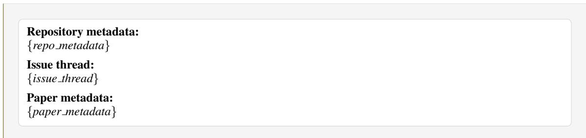  
Figure 7: Prompt template used to determine whether a closed or answered GitHub issue contains a resolved, method-core specification gap. The prompt extracts an atomic implementation-ready clarification and assigns the corresponding IdeaAMBIG taxonomy labels.

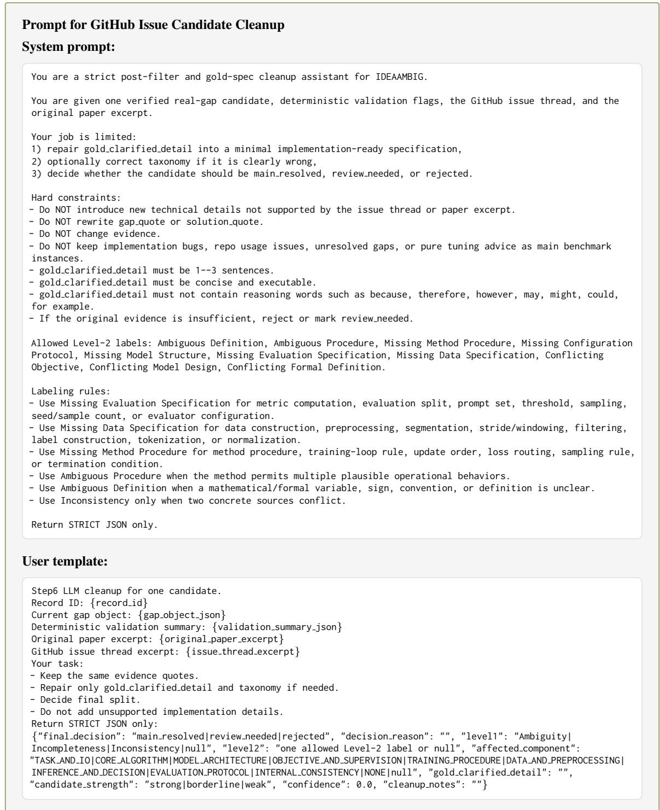  
Figure 8: Prompt used to clean up GitHub-issue real-gap candidates that pass deterministic quote and taxonomy validation. The model may repair gold clarified detail into a minimal implementation-ready statement, optionally correct a clearly wrong taxonomy label, and route the candidate to main resolved, review needed, or rejected, without altering the underlying evidence quotes.

## Prompt for GitHub Issue Benchmark Instance Construction

Construct one benchmark instance from a real GitHub issue specification gap.

Context: We are building a benchmark for idea/specification ambiguity resolution. The benchmark input is an underspecified research-method specification derived from the original paper. A model should diagnose what is missing, ambiguous, or inconsistent before codification. This instance comes from a GitHub issue thread about an official or community implementation repo. The original paper had a method-core specification gap. The issue thread provides concrete clarification evidence from authors or maintainers.

Task: Create a benchmark instance with the same schema as the MLRC/TMLR real-gap benchmark, but using GitHub issue evidence instead of a reproducibility report.

Critical no-leakage requirement: input.underspecified spec is what will be shown to evaluated models. It must not reveal that there is a gap, defect, ambiguity, inconsistency, or codification problem.

• Do not use diagnostic/meta-evaluation language in underspecified spec, including: ambiguous, ambiguity, underspecified, missing, incomplete, not specified, does not specify, unclear, undefined, inconsistent, inconsistency, contradiction, conflict, GitHub issue, issue thread, maintainer reply, author clarification, specification gap, method gap, implementation gap, defect, or blocker.

• Special case: the acronym “GAP” may mean global average pooling. Do not treat it as the word “gap.”

• Write underspecified spec as a natural paper-style method description based only on the original paper text excerpt. It should sound like a normal method paragraph from the original paper.

• Include the problematic surface form from the paper, but without explicitly saying it is problematic.

• Do not copy issue-thread diagnostic questions into underspecified spec.

• Do not invent repository workflows, function names, script names, or API usage that are absent from the paper.

• If the issue is about repo code/API usage, still write underspecified spec from the paper’s high-level method-/training/evaluation description only.

• For incompleteness, include only the high-level paper-side operation, not “the paper does not specify.”

• For inconsistency, include only the paper-side statement.

Critical surface-form rule: defects[0].surface form in underspecified spec must be a phrase that appears in, or is a faithful paraphrase of, the original paper text excerpt. Never use the user’s mistaken repo workflow as the surface form, and never use repo-only terms such as train model, repository-specific class names, “latest commit,” “official validation script,” “GitHub,” “repository,” or “main branch.”

Critical gold reference requirement: gold.codification ready reference should be a clean, standalone, codification-ready research idea specification. It should include the gold clarified detail from the GitHub resolution evidence, rewritten as method-level specification language, avoiding meta-language such as “as clarified in the issue,” “the authors replied,” “GitHub thread,” “official code,” “latest commit,” or “repository.” Prefer method-level wording over repo function names. Do not use literature deferral, citation, or prior-work language (e.g., “as proven in the literature,” “according to,” “prior work,” bracket citations).

Critical paper-derived specification rule: gold.paper derived specification must contain neutral extracted facts only. Do not write gap-diagnostic language in any field, especially unknown fields or reproducibility relevant details. If a detail is unknown from the paper alone, leave unknown fields empty or use a neutral placeholder. codification readiness.reason may describe the blocker, but paper derived specification must stay neutral.

Both input.underspecified spec and gold.codification ready reference must describe the full research idea: research goal or motivation, task being solved, inputs and outputs, core method or model structure, and the relevant method component containing the hidden issue.

## Important constraints:

• Use exactly one defect corresponding to the provided real gap (one atomic gap only). If the provided gold clarified detail covers multiple independent slots, return {"reject reason": "composite gap needs split"} and omit the normal benchmark schema.

• Evaluation protocol gaps (dataset split, metric computation, rasterization settings, prompt set, evaluation sampling) are reproducibility detail, not implementation blocker.

• Data/preprocessing protocol gaps (windowing, stride, filtering, label construction, tokenization, normalization) are reproducibility detail or implementation blocker depending on whether training cannot run without them.

• Do not merge multiple metrics or independent hyperparameters into one defect or one gold reference.

• Do not invent unsupported datasets, baselines, methods, architectures, or hyperparameters.

• Base paper-side content primarily on the original paper text excerpt. Use the GitHub issue evidence only to determine what clarification belongs in the gold reference.

• Keep the benchmark instance self-contained and understandable.

• If the provided gap is purely about repository API usage and cannot be translated into a paper/method specification, return {"reject reason": "code only not paper spec gap"} and omit the normal benchmark schema.

Allowed labels: Level-1 = Ambiguity, Incompleteness, Inconsistency. Level-2 = Ambiguous Definition, Ambiguous Procedure, Missing Method Procedure, Missing Configuration Protocol, Missing Model Structure, Missing Evaluation Specification, Missing Data Specification, Conflicting Objective, Conflicting Model Design, Conflicting Formal Definition. Granularity = coarse, medium, fine (with the same granularity guidance as Figure 12). Resolution role = implementation blocker, open design choice, reproducibility detail, inconsistency to resolve. Codification slot = TASK AND IO, CORE ALGORITHM, MODEL ARCHITECTURE, OBJECTIVE AND SUPERVISION, TRAINING PROCEDURE, DATA AND PREPROCESSING, INFER-ENCE AND DECISION, EVALUATION PROTOCOL, INTERNAL CONSISTENCY, NONE. Action type = clarification question, evidence seeking, experiment selection.

Inputs supplied to the model: the fixed defect seed (slot, Level-1/Level-2 labels, granularity, resolution role, codification slot, gold detail, and why it blocks codification), the real-gap evidence (gap and solution summaries and quotes, solution source type, affected component, gold clarified detail), source metadata, the original paper text excerpt, and the GitHub issue thread excerpt (resolution evidence only, not to be leaked into underspecified spec).

## Output schema:

```jsonl
{"id": "...", "source": {...}, "input": {"underspecified spec": "..."}, "gold": {"paper derived specification":
{"paper title": "", "research goal": "", "task": "", "inputs": "", "outputs": "", "core method": "",
"algorithm steps": [], "training or optimization": "", "datasets": [], "evaluation metrics": [], "baselines": [],
"implementation details": [], "reproducibility relevant details": [], "unknown fields": []}, "codification ready
reference": ""}, "defects": [{"slot": "...", "level1": "...", "level2": "...", "granularity": "...",
"resolution role": "...", "codification slot": "...", "gold detail removed or corrupted": "...", "surface form in
underspecified spec": "", "why this blocks or affects codification": ""}], "open design choices": [],
"codification readiness": {"is ready": false, "readiness score": 0, "blocking missing specs": [],
"open design choices": [], "reason": ""}, "expected clarification actions": [{"slot": "...", "action type": "",
"question or action": "", "evidence to seek": ""}], "construction metadata": {"construction method": "real gap from
github issue", "paper id": "...", "realgap id": "...", "num defects": 1, "selected perturbations": [{...}],
"gap quote": "...", "solution quote": "...", "solution source type": "..."}}
```

Output rules: defects must contain exactly one defect, matching the fixed defect above. underspecified spec should be 120–220 words; codification ready reference should be 160–280 words. Both must start with research goal, task, or method context. codification ready reference must include the gold clarified detail and must not defer to literature, citations, or prior work. underspecified spec must contain the paper-side gap surface form but must not include the gold clarified detail, and must not contain diagnostic/meta-evaluation leakage language. codification readiness.is ready must be false, and readiness score should be 2 or 3. expected clarification actions must contain exactly one action using only valid action type labels. Do not create extra defects, and paper derived specification fields must not contain gap-diagnostic wording.

Figure 9: Prompt used to construct a full GitHub-issue real-gap benchmark instance from a fixed defect seed, its evidence, the original paper text, and the GitHub issue thread. Follows the same underlying schema as the reproducibility-report real-gap instances (Appendix I.4) but sources the gold clarification from issue-thread evidence rather than a reproducibility report, under a strict no-leakage requirement that keeps underspecified spec free of diagnostic or GitHub-specific language. The taxonomy, granularity, resolution role, and codification slot shown under “Allowed labels” are fixed by the earlier classification and cleanup steps and appear pre-filled in the model’s expected output; the model’s task is limited to the specification text, surface form, and rationale, not to independently choosing these labels.

## Prompt for Reproducibility Report Routing

You are routing machine learning reproducibility reports for benchmark construction.

Given a reproducibility report and, when available, the corresponding original paper, classify the report into exactly one route:

## 1. resolved real gap:

The report identifies an implementation-relevant method-core specification gap in the original paper and provides concrete resolution evidence, such as an author clarification, code-derived behavior, reproducer decision, or explicit workaround.

## 2. synthetic controlled:

The report does not identify a resolved method-core specification gap. The report mainly indicates that the original paper can be reproduced or evaluated, and the original paper is sufficiently complete to derive a codification-ready reference specification.

## 3. unusable:

The report is not usable because it is not single-target, lacks usable original-paper evidence, contains only unresolved gaps, discusses only compute/resource/data-access issues, or reports only performance mismatch without a concrete specification gap and resolution.

Use the following taxonomy for candidate gaps.

Level-1 labels:

• Ambiguity

• Incompleteness

• Inconsistency

## Level-2 labels:

• Ambiguous Definition

• Ambiguous Procedure

• Missing Method Procedure

• Missing Model Structure

• Missing Data Specification

• Missing Configuration Protocol

• Missing Evaluation Specification

• Conflicting Objective

• Conflicting Model Design

• Conflicting Formal Definition

Do not count ordinary missing values such as batch size, learning rate, number of epochs, random seed, hardware, runtime, or software setup as valid gaps unless they are part of a non-standard method-defining mechanism. Do not count pure performance mismatch, unavailable data, unavailable compute, or package installation problems as valid method-core gaps.

Return strict JSON only:

"primary route": "resolved real gap|synthetic controlled|unusable",   
"routing reason": ".   
"taxonomy candidate": {   
"is spec gap": true,   
"is method core spec gap": true,   
"gold clarified spec extractable": true,   
"level1 candidate":   
"level2 candidate":   
"taxonomy reason":   
},   
"evidence snippets": [   
"type": "gap|solution|synthetic source|unusable reason",   
${ } ^ { \prime \prime } \mathsf { q u o t e } ^ { \prime \prime } \colon \mathsf { \Omega } ^ { \prime } \cdot \cdot \cdot \mathrm {  ~ \Omega ~ } ^ { \prime \prime } ,$   
"interpretation": "..   
}   
$^ { 1 , }$   
"potential gap summaries": $\mathbb { Z } ^ { \prime \prime } \dots \mathbb { Z } ,$   
"potential solution summaries": $\mathbb { C } ^ { \prime \prime } \dots \mathbb { \Lambda } ^ { \prime \prime } ] ,$   
"confidence": 0.0   
User template:   
Reproducibility report:   
{reproducibility report}   
Original paper:   
{original paper}  
Figure 10: Prompt used to route machine learning reproducibility reports into resolved real-gap, synthetic-controlled, or unusable benchmark-construction paths. The prompt additionally determines whether a method-core specification gap is present, assigns a candidate taxonomy label, and extracts supporting evidence.

Prompt for Reproducibility Paper Defect Injection   
You are generating synthetic-controlled IdeaAMBIG benchmark instances.   
Given a codification-ready reference specification extracted from a successfully reproduced original paper, create up   
to five independent underspecified research specifications. Each instance must remove, abstract, or lightly corrupt   
exactly one implementation-critical detail from the reference.   
Rules:   
1. Each instance must contain exactly one defect.   
2. Preserve all non-target details.   
3. Do not reveal the removed or corrupted gold detail.   
4. Do not use diagnostic words such as missing, unspecified, defect, gold, removed detail, or benchmark.   
5. The underspecified specification must read like a natural research or method specification.   
6. Do not choose weak details such as ordinary batch size, learning rate, epoch count, random seed, hardware,   
runtime, or local paths.   
7. Prefer details whose absence blocks faithful implementation: algorithm steps, model architecture, loss or training   
procedure, data preprocessing, input construction, evaluation protocol, metric computation, inference logic, or   
prompt construction.   
Use only the allowed taxonomy labels.   
Return strict JSON only:   
{   
"instances": [   
"target slot": "...",   
"level1": "Ambiguity|Incompleteness|Inconsistency",   
"level2": "...",   
"granularity": "fine|medium|coarse",   
"resolution role": "implementation blocker",   
"codification slot": "..."   
"defect operation": "omit detail|abstract detail|make ambiguous|introduce conflict",   
"gold detail removed or corrupted": "..."   
"underspecified spec": "..."   
"surface form in underspecified spec": "..   
"why this blocks or affects codification":   
"expected clarification question": "...",   
"must not reveal": ["..."],   
"evidence": [   
"source": "gold reference|paper derived specification|original paper",   
"quote": "..   
}   
],   
"preservation check": {   
"target detail modified": true,   
"non target details preserved": true,   
"extra defects introduced": false,   
"brief explanation": "..."   
"quality rationale": "..."   
}   
],   
"rejected candidates": [   
"gold detail": ".   
"reason": "...   
1  
Figure 11: Prompt used to generate synthetic-controlled IdeaAMBIG instances from codification-ready specifications derived from successfully reproduced papers. Each generated instance alters exactly one implementationcritical detail while preserving the remaining specification and recording the corresponding gold detail, evidence, taxonomy label, and preservation checks.

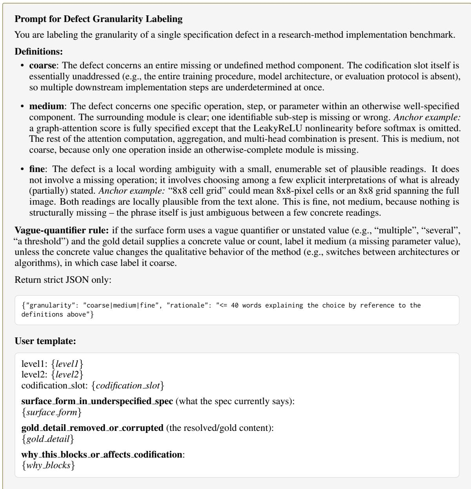  
Figure 12: Prompt used to label defect granularity (coarse/medium/fine) under the rubric in Appendix E.3. The model receives each defect’s Level-1/Level-2 labels, codification slot, underspecified surface form, and gold resolution, and returns a granularity label with a short rationale.

```jsonl
Task 1 Reason Grounding Judge Prompt
System
You are a rigorous benchmark judge for codification-readiness reasoning. Evaluate whether a model’s short reason
is grounded in the benchmark gold rationale. Judge only against the provided gold fields. Do not use external
knowledge. Return valid JSON only.
User
Task: Readiness Reason Grounding Evaluation
Evaluate the grounding quality of a model’s Task 1 readiness reason.
Scoring rubric:
1. Label support.
Does the reason support the model’s predicted label in a way that is consistent with the gold label and gold
readiness rationale?
Allowed scores: 0, 0.5, 1.
2. Blocker match.
Does the reason correctly identify the gold implementation-critical defect, or correctly reflect that no such
blocker remains?
Allowed scores: 0, 0.5, 1.
3. Faithfulness.
Is the reason faithful to the provided gold rationale, without hallucinating unsupported blockers or irrelevant
details?
Allowed scores: 0, 0.5, 1.
Aggregation rule.
Final RGS is computed deterministically as
RGS = 0.7 s<sub>label</sub> + 0.2 s<sub>blocker</sub> + 0.1 s<sub>faithful</sub>.
Do not compute the final score yourself; only return the three subscores.
Important rule for ready cases.
For READY cases, do not require the model to restate the full reference specification. The reason is sufficient if it
correctly states that no implementation-critical blocker remains and does not hallucinate one.
Instance-specific input:
Gold annotation:
<gold>
Expected label: {EXPECTED LABEL}
Defects: {GOLD DEFECTS}
Blocking missing specifications: {GOLD BLOCKING MISSING SPECS}
Readiness rationale: {GOLD READINESS RATIONALE}
</gold>
Model output:
<model output>
Predicted label: {PREDICTED LABEL}
Reason: {MODEL REASON}
</model output>
Return only valid JSON:
{
"label support": 0,
"blocker match": 0,
"faithfulness": 0,
"explanation": "one concise paragraph"
}
```  
Figure 13: LLM-as-a-Judge prompt used to evaluate Task 1 reason grounding. The evaluator assesses whether the model’s justification supports the predicted readiness label, matches the gold implementation-critical blocker or absence of blockers, and remains faithful to the annotated gold rationale. Reason Grounding Score (RGS) is computed deterministically from the three subscores as $0 . 7 s _ { \mathrm { l a b e l } } + 0 . 2 s _ { \mathrm { b l o c k e r } } + 0 . 1 s _ { \mathrm { f a i t h f u l } } .$

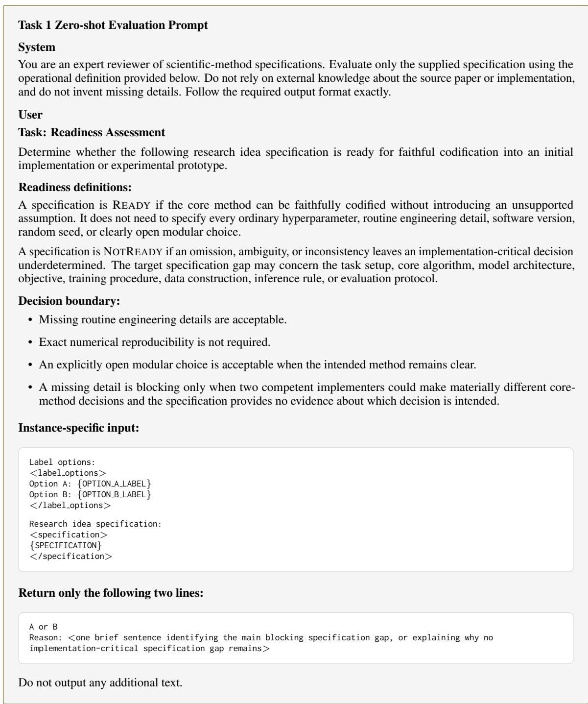  
Figure 14: Zero-shot prompt used for Task 1 Readiness Assessment. Each model receives one research idea specification and outputs an option letter followed by a brief readiness rationale. The mapping between option letters and labels is counterbalanced across instances: {OPTION A LABEL} and {OPTION B LABEL} are assigned to READY and NOTREADY using a deterministic hash of the instance identifier. The model does not observe matched codification-ready and underspecified specifications within the same prompt.

## Task 2 Zero-shot Evaluation Prompt

## System

You are an expert reviewer of scientific-method specifications performing controlled defect localization. Follow the supplied IdeaAMBIG taxonomy. Do not repair the idea, invent missing details, or list secondary concerns. Return strict JSON only.

## User

## Task: Defect Localization

Identify and classify the single implementation-critical target defect in the given research idea specification according to the IdeaAMBIG taxonomy.

Each specification in this benchmark is constructed with exactly one annotated target defect. The objective is not to identify every possible weakness, but to recover the single target-defect category that best explains why the specification is not ready for faithful codification.

## Target-defect selection rule.

If multiple possible issues are visible, internally rank them and select only the strongest defect that satisfies all of the following conditions:

• It is directly grounded in a specific statement, term, formula, component, or transition in the specification.

• It must be resolved to support faithful codification of the core method.

• It is not an ordinary default, minor missing detail, optional engineering choice, documentation improvement, or speculative concern.

• It is the most specific supported defect, rather than a broad claim that the specification lacks detail.

## Ambiguity–Incompleteness boundary.

Do not distinguish Ambiguity from Incompleteness merely according to whether the specification is unclear. The distinction depends on whether the specification provides a concrete but underdetermined element or omits a required specification component.

Use Ambiguity when the specification provides a concrete term, definition, rule, behavior, or procedure whose meaning or operation supports multiple plausible implementation-relevant interpretations.

Use Incompleteness when a required specification component, such as a method procedure, model structure, data construction process, configuration selection protocol, or evaluation setup, is absent.

## Operational definition.

An implementation-critical specification gap is an omission, ambiguity, or internal inconsistency that prevents faithful codification into an initial implementation or experimental prototype without introducing an unsupported assumption about the core method.

## IdeaAMBIG taxonomy:

## Level 1: Ambiguity

• Ambiguous Definition: A formal element, such as a symbol, notation, mathematical object, or rule, permits multiple implementation-relevant interpretations.

• Ambiguous Procedure: A method operation, execution rule, inference behavior, or component interaction permits multiple materially different implementations.

## Level 1: Incompleteness

• Missing Method Procedure: A required operational step, algorithmic rule, update mechanism, routing decision, execution procedure, or method behavior is absent.

• Missing Model Structure: A structural choice affecting module composition, information flow, representation shape, pooling, normalization, dimensional mapping, or layer behavior is absent.

• Missing Data Specification: The construction, filtering, labeling, tokenization, normalization, augmentation, segmentation, or transformation of data or inputs is absent.

• Missing Configuration Protocol: A result-sensitive configuration choice is introduced, but its selection, tuning, validation, or adaptation procedure is absent.

• Missing Evaluation Specification: The evaluation setup is incomplete, including missing metric computation, data split, aggregation, threshold, sample selection, or evaluator configuration.

## Level 1: Inconsistency

• Conflicting Objective: Two explicit statements or sources prescribe conflicting objectives, loss functions, reward definitions, or optimization targets.

• Conflicting Model Design: Two explicit statements or sources prescribe conflicting architectures, model components, data pipelines, preprocessing procedures, or execution pipelines.

• Conflicting Formal Definition: Two explicit statements or sources conflict about formal assumptions, distributions, conditioning rules, aggregation rules, or mathematical definitions.

## Boundary rules:

• If an operational step, update mechanism, routing rule, inference procedure, decoding rule, or method execution logic is absent, use Missing Method Procedure.

• If a model component is mentioned but its architecture, organization, representation mapping, pooling, normalization, or structural design is absent, use Missing Model Structure.

• If data construction, filtering, labeling, tokenization, normalization, augmentation, segmentation, or input transformation is absent, use Missing Data Specification.

• If an important configuration choice is introduced but the procedure for selecting, tuning, validating, or adapting it is absent, use Missing Configuration Protocol.

• If metric computation, evaluation split, threshold, evaluation sample selection, aggregation, evaluator prompt, or evaluation model configuration is absent, use Missing Evaluation Specification.

• Use an Inconsistency label only when the specification contains explicit conflicting claims. A merely absent detail is an Incompleteness defect.

## Additional ambiguity boundary:

• Use Ambiguous Definition when the uncertainty concerns the meaning, value, counting convention, mathematical interpretation, scope, or formal semantics of a term, symbol, quantity, equation, set, or formally defined object.

• Use Ambiguous Procedure when the uncertainty concerns what an algorithm, component, training stage, inference stage, or processing step operationally does.

## Exclusions:

• Do not flag ordinary choices such as batch size, learning rate, epoch count, random seed, hardware, runtime, local paths, package setup, or credentials, unless they define a non-standard method-critical mechanism.

• Do not flag unavailable compute or data, a pure performance mismatch, stylistic weakness, or a legitimate open design choice as the target defect.

• Do not invent the missing value or gold resolution. Diagnose only what remains underdetermined in the specification.

## Output rules:

1. Select exactly one Level 1 category and one Level 2 category.

2. Do not output multiple defects or alternative labels.

3. Ignore ordinary implementation choices, standard defaults, minor missing details, and speculative concerns.

4. Prefer the most specific target defect directly supported by the specification.

5. Do not repair the idea or propose a solution.

6. The description must identify the concrete missing, ambiguous, or conflicting implementation detail. Repeating only the taxonomy label is insufficient.

## Instance-specific input:

Research idea specification:   
<specification>   
{SPECIFICATION}   
</specification>

## Return only valid JSON:

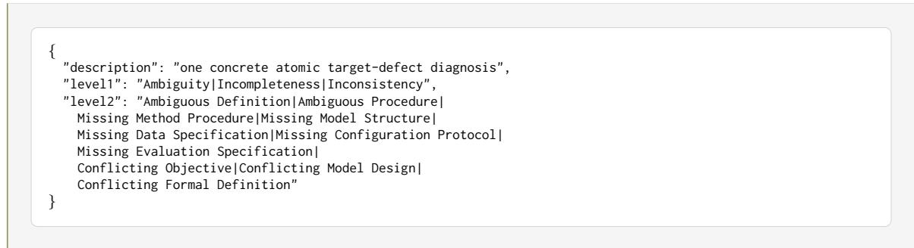  
Figure 15: Zero-shot prompt used for Task 2 Defect Localization. Each model receives one underspecified research idea specification and returns a single atomic target-defect diagnosis, together with one Level 1 category and one Level 2 category from the IdeaAMBIG taxonomy. The prompt instructs models to recover the annotated target defect rather than enumerate all plausible specification gaps or propose a resolution.

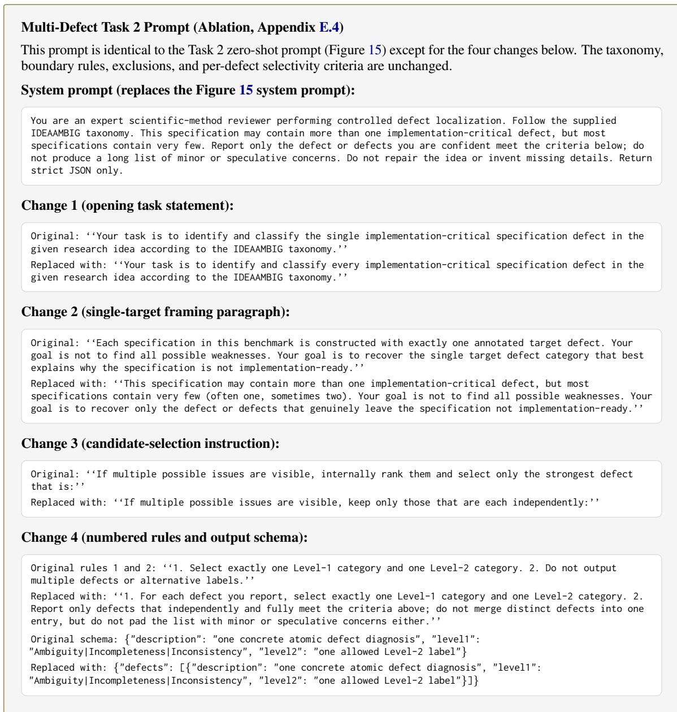  
Figure 16: Multi-defect variant of the Task 2 zero-shot prompt, used only for the exploratory ablation in Appendix E.4. It keeps the same taxonomy, boundary rules, and per-defect selectivity criteria as Figure 15, but removes the instructions that capped the response at exactly one defect, allowing the model to report a variable number of candidates that each independently meet the selectivity criteria.

## Task 2 LLM-as-a-Judge Evaluation Prompt

## System

You are a strict target-defect identity judge for a scientific-method benchmark.

Do NOT judge whether the predicted defect is valid, important, or present somewhere in the specification. A specification may contain multiple genuine defects. Your only task is to decide whether the prediction identifies the same annotated implementation decision or specification slot as the gold target.

Compare the affected component, the concrete implementation slot, and the missing, ambiguous, or conflicting property at that slot. Shared terminology, a shared broad module, or a shared downstream consequence is not sufficient.

A prediction may still match when its taxonomy or defect-type characterization is wrong, provided that it uniquely localizes the same target slot.

Return strict JSON only.

## User

Determine whether the prediction identifies the same concrete target defect as the annotation.

## IMPORTANT

The specification may contain multiple genuine defects. A prediction that finds a valid but different defect must receive match=false.

First normalize both defects into:

1. affected component or entity;

2. concrete implementation decision, rule, variable, or specification slot;

3. property that is missing, ambiguous, or inconsistent.

## Apply these checks:

## DIRECT-FIX TEST

Would directly fixing the predicted issue also fix the annotated issue?

## INDEPENDENT-COEXISTENCE TEST

Could both issues exist independently in the same specification? If yes, they are normally different defects.

## TARGET-SLOT TEST

Do both descriptions concern the same concrete rule, threshold, variable, operation, module boundary, loss term, transformation, or stopping condition?

## Decision rules:

• Paraphrases and different specificity may match.

• The prediction does not need to recover the correct hidden resolution.

• Wrong taxonomy may still match if the same target slot is localized.

• Same topic, component, algorithm, or downstream effect is not enough.

• A neighboring issue in the same component is match=false.

• A different valid defect is match=false.

• A generic statement that could refer to multiple defects is match=false.

• A repair without identifying the target slot is match=false.

## Relationship labels:

• exact same target: same slot and substantially correct characterization.

• same target wrong characterization: same slot, wrong defect characterization.

• broader but uniquely identifies target: broader wording, but uniquely same slot.

• neighboring defect: related component, different implementation decision.

• different target: different component, rule, variable, or decision.

• too vague to localize: no unique concrete target slot.

• no defect identified: no actual defect is stated.

Set match=true only for:

• exact same target   
• same target wrong characterization   
• broader but uniquely identifies target

## Boundary examples:

## Example 1

Gold: The tree-search stopping condition is inconsistent.   
Prediction: The maximum tree depth is not specified.   
Result: neighboring defect, match=false. Same search module, different decision.

## Example 2

Gold: Paper and code disagree on the event count defining a leaf.   
Prediction: The leaf-node event threshold is underspecified.   
Result: same target wrong characterization, match=true. Same target slot, wrong defect type.

## Example 3

Gold: The weight combining two loss terms is unspecified.   
Prediction: The optimizer learning rate is unspecified.   
Result: different target, match=false. Both affect training but are independent.

## Instance-specific input:

```xml
<gold target>
Annotated defect:
{GOLD DESCRIPTION}
Relevant source wording:
{SURFACE FORM}
Canonical blocking specification / target slot:
{BLOCKING TEXT}
Optional structured target signature:
{TARGET SIGNATURE}
Resolution reference:
{RESOLUTION REFERENCE}
</gold target>
The resolution reference is only evidence for identifying the intended target slot. The prediction does not need
to recover that resolution. Do not establish identity from shared consequences.
<specification context>
{LOCAL CONTEXT}
</specification context>
Use the context only to resolve terminology. Do not validate an alternative defect from the context and count it
as a match.
<prediction>
{PREDICTED DESCRIPTION}
</prediction>
```

## Return one JSON object with:

• gold target slot: concise normalized gold slot;

• predicted target slot: concise normalized predicted slot;

• relationship: one allowed relationship label;

• match: boolean consistent with the relationship;

• confidence: high, medium, or low;

• reason: briefly compare the two concrete implementation decisions.

The reason must state what implementation decision each defect refers to. Do not merely say that they are similar or different.

Return only valid JSON:

{   
"gold target slot": "concise normalized gold slot",   
"predicted target slot": "concise normalized predicted slot",   
"relationship": one of [   
"exact same target",   
"same target wrong characterization",   
"broader but uniquely identifies target",   
"neighboring defect",   
"different target",   
"too vague to localize",   
"no defect identified"   
],   
"match": true,   
"confidence": "high|medium|low",   
"reason": "brief comparison"   
}  
Figure 17: LLM-as-a-Judge prompt used to evaluate Task 2 target-level defect localization. The evaluator compares the model-predicted defect description against the annotated gold target while hiding taxonomy labels. A prediction is counted as a localization match only when it identifies the same concrete implementation decision or specification slot as the gold target. Valid but different defects, neighboring issues, and generic criticisms are counted as mismatches.

## Task 3 LLM-as-a-Judge Evaluation Prompt

## System

You are a strict evaluator of clarification actions for underspecified scientific-method descriptions. Evaluate whether the proposed action would obtain the information required to resolve the supplied annotated defect.

Do not reward lexical similarity to the reference action. A differently worded question or a different action type may be fully correct. Do not evaluate whether the target defect itself is valid; it is an adjudicated benchmark input. Return strict JSON only.

## User

## Task: Clarification Action Evaluation

Evaluate the candidate clarification action using the following rubric.

## Counterfactual sufficiency test.

Assume that a cooperative and knowledgeable respondent, or an artifact inspector, answers only what the action explicitly requests. Determine whether the resulting information would be sufficient to recover the hidden gold resolution. A generic request for additional details is not sufficient merely because a maximally helpful respondent could volunteer the complete answer. A candidate is also not sufficient if it is not an actual clarification question or concrete evidence-seeking action, such as a diagnosis, repair instruction, implementation guess, or vague request to “investigate” without stating what information should be obtained.

## Evaluation dimensions:

## 1. Target relevance.

The action specifically concerns the annotated target defect rather than another plausible issue in the specification.

## 2. Resolution sufficiency.

The candidate is a real clarification question or concrete evidence-seeking action, and a direct answer to the question, or the result of the proposed inspection, would determine every implementation-critical part of the hidden resolution. The candidate need not match the wording or action type of the reference action.

## 3. Unsupported assumption.

The candidate asserts, recommends, or presupposes an unsupported value for the missing detail. Merely asking whether one of several explicit alternatives applies does not constitute an unsupported assumption.

## Additional rules:

• The reference action is one valid realization, not the only valid wording.

• Disagreement with the reference action type is not itself an error.

• Fluency and verbosity are not evaluation criteria.

• Do not use the hidden resolution to excuse an unsupported assertion in the candidate, because the evaluated model did not observe that resolution.

## Instance-specific input:

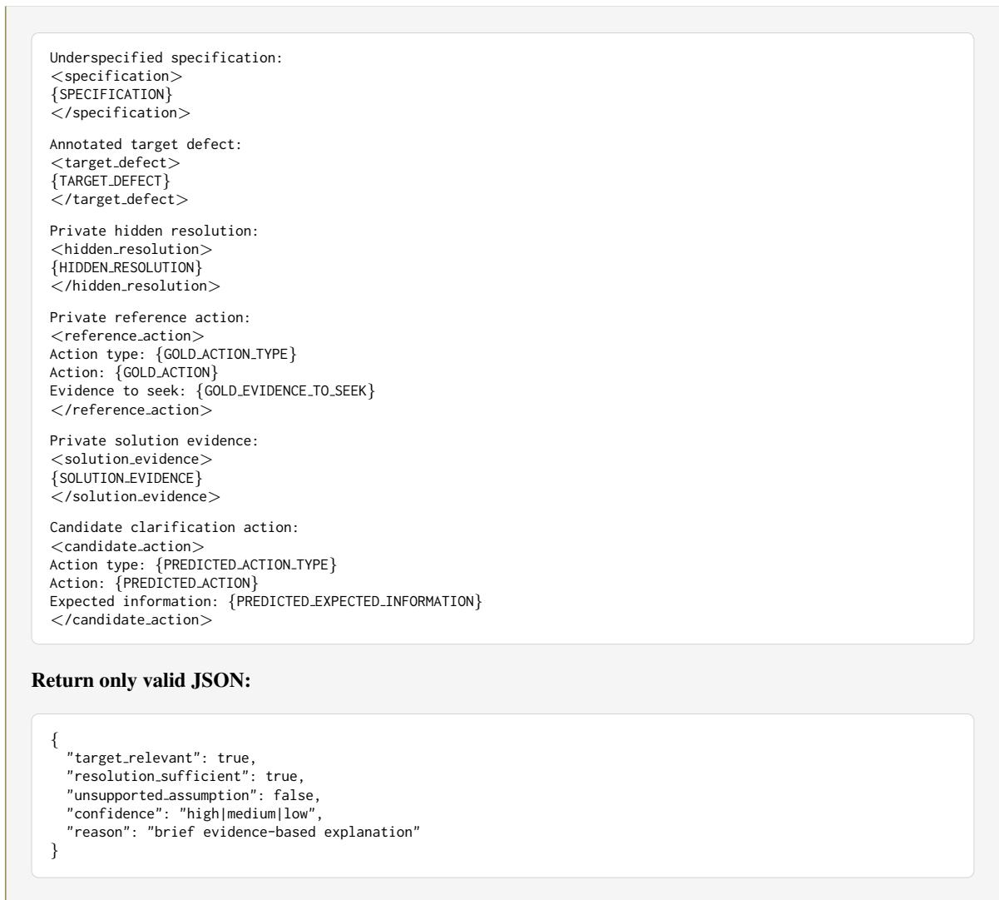  
Figure 18: LLM-as-a-Judge prompt used to evaluate Task 3 clarification actions. The evaluator assesses target relevance, resolution sufficiency, and unsupported assumptions using the private gold resolution and supporting evidence. Resolution sufficiency requires the output to be a concrete clarification question or evidence-seeking action whose answer or inspection result would determine the missing implementation-critical detail. Per-instance Clarification Action Success is deterministically derived from these three judgments.