# Improving Cross-Lingual Token Representations by Adding a Pinch of SALT

Guillem Ramírez Santos ILCC, University of Edinburgh gramirez@ed.ac.uk

## Abstract

Cross-lingual sentence encoders enable scalable transfer across hundreds of languages, powering applications such as translation mining and zero-shot learning in low-resource settings. Although trained for sentence-level alignment, they are increasingly also applied to token-level tasks such as hallucination detection and sequence tagging, exposing a mismatch between training and usage. We propose SALT, a lightweight post-training method that improves token representations by injecting span-level supervision into existing sentence encoders. Across five multilingual token-level benchmarks, SALT achieves the best overall results on four of them, outperforming alternative fine-tuning strategies and competitive encoders. It also improves sentence-level performance on cross-lingual retrieval and classification tasks. These results demonstrate that span-level supervision is an efective signal for improving both token and sentence representations.

## 1 Introduction

Cross-lingual sentence encoders have become a core building block of multilingual NLP. Models such as SONAR (Duquenne et al., 2023) or MEXMA (Janeiro et al., 2025) learn a shared embedding space in which semantically equivalent sentences across languages are mapped to nearby representations, leading to strong performance on sentence-level tasks such as cross-lingual retrieval, sentence mining, and zero-shot classification.

Despite being trained for cross-lingual sentence alignment, these models are increasingly used as token-level representations in downstream applications, including word alignment (Miao et al., 2024), sequence tagging (Mehta and Varma, 2023), hallucination detection (Huang et al., 2024), sentence segmentation (Omnilingual MT Team et al., 2026) and label projection (Parekh et al., 2024).

This practice exposes a structural mismatch: sentence encoders are optimised to preserve global semantic similarity, yet are repurposed to support fine-grained token- and phrase-level alignment. As a result, they may yield well-structured sentence embeddings but an inconsistent or noisy token representation.

A promising way to address this mismatch is to introduce training signals at a finer granularity by identifying aligned words across languages and incorporating token-level losses (Alqahtani et al., 2021; Miao et al., 2024). However, word-level alignment is often too restrictive, as meaning is frequently distributed across multiple tokens and only fully preserved at the level of phrases rather than individual words.

To this end, we propose using phrases or spans— contiguous sequences of tokens that express equivalent meaning across languages. While this alignment signal is implicitly present in parallel data, previous sentence- or token-level objectives do not exploit it. We introduce SALT (Span-Aligned Learning for cross-lingual Tokens), a novel lightweight post-training method for multilingual sentence encoders (see Figure 1). SALT augments standard sentence-level training with span-aligned contrastive and translation objectives that explicitly shape token- and phrase-level representations, while a sentence-level interpolation objective preserves the original embedding space. Importantly, SALT requires no architectural modifications and can be applied directly to existing encoders.

We evaluate SALT on a suite of multilingual token-level benchmarks, including word alignment, cross-lingual sequence tagging, and word sense disambiguation. Across tasks, SALT consistently improves token-level performance while maintaining or improving sentence-level quality. In particular, it achieves the best overall performance among several fine-tuning strategies on four out of five token-level benchmarks, demonstrating that span-level supervision provides a strong complementary signal rather than a competing objective.

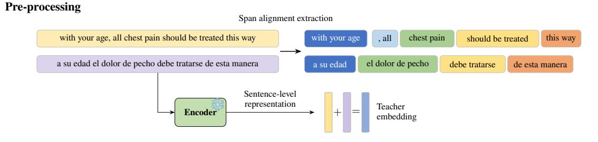

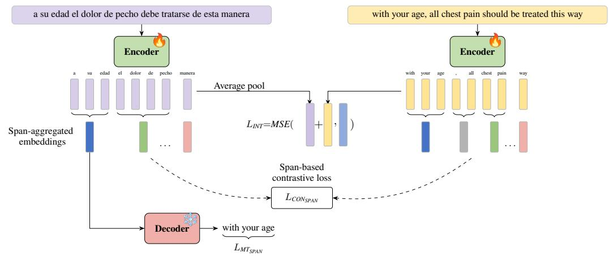  
Figure 1: Pre-processing (top): extraction of aligned spans and teacher embeddings from a pre-trained encoder. Training SALT (bottom): we train the encoder with span-level contrastive and translation losses to improve tokenlevel representations, besides an interpolation loss that preserves sentence embeddings.

Our contributions are as follows:

• We propose SALT, a lightweight posttraining method that injects span-level alignment into sentence encoders, bridging sentence-level training and token-level applications.

• We demonstrate that span-aligned supervision consistently improves performance across multiple token-level multilingual tasks, while preserving and sometimes improving sentence-level embedding quality.

• We analyse the geometry of the word embedding space and find that SALT yields a better-structured cross-lingual representation, improving hubness while preserving isotropy and reducing language-specific clustering.

## 2 Related work

Sentence encoders Cross-lingual sentence encoders aim to learn a shared semantic space in which sentences with equivalent meaning across languages are mapped to nearby embeddings. Early approaches based on multilingual word embeddings have evolved into large-scale sentence encoders trained on parallel corpora using contrastive, regression, or decoding objectives. Models such as SONAR (Duquenne et al., 2023), MEXMA (Janeiro et al., 2025), OmniSONAR (Omnilingual SONAR Team et al., 2026) or LaBSE (Feng et al., 2022) exemplify this paradigm.

Word and phrase alignment Early statistical machine translation relied on word alignment models and derived phrase pairs as discrete translation units for decoding (Brown et al., 1993; Koehn et al., 2003), establishing a notion of cross-lingual span correspondence. While this is related in spirit to SALT, we use such span correspondences only as a training signal. More recently, word alignment has been revisited in neural encoders, with methods extracting alignments from contextual representations (Jalili Sabet et al., 2020). Related work improves cross-lingual alignment through objectives that encourage finer-grained token-level correspondence (Chi et al., 2021; Dou and Neubig, 2021).

Bridging sentence- and token-level representations Prior work improves crosslingual sentence encoders by incorporating auxiliary word- or token-level objectives during pre-training (Wei et al., 2021; Alqahtani et al., 2021; Li et al., 2021, 2023; Miao et al., 2024), typically relying on explicit alignment signals to enhance sentence-level embeddings. In contrast, we directly target token- and span-level representations, both in training and evaluation, explicitly focusing on improving their quality rather than treating them as a by-product of sentence-level learning, focusing on adapting existing sentence encoders for token-centric tasks.

## 3 SALT: Span-Aligned Learning for Cross-Lingual Tokens

To improve cross-lingual token representations produced by sentence encoders, we propose SALT, a training method that aligns semantically equivalent spans across languages. SALT is lightweight and can be applied post-training to any pre-trained encoder without modifying its architecture. As illustrated in Figure 1, we first extract semantically equivalent multi-word spans from parallel sentences and precompute their corresponding sentence representations. During training, span-level alignment objectives refine token and span embeddings while preserving the structure of the original sentence-level representation space.

## 3.1 Method

Let x and y be a translation pair. A tokeniser T with vocabulary V maps them to token sequences $t _ { x } = \mathcal { T } ( x ) \in V ^ { n }$ and $t _ { y } = \mathcal { T } ( y ) \in V ^ { m }$ . A pretrained encoder E then produces contextual embeddings $H _ { x } = \mathcal { E } ( t _ { x } ) \in \mathbb { R } ^ { n \times d }$ and $H _ { y } = \mathcal { E } ( t _ { y } ) \in$ $\mathbb { R } ^ { m \times d }$ . These representations are typically trained such that their pooled sentence embeddings are aligned, i.e., pool $( H _ { x } ) \approx \mathsf { p o o l } ( H _ { y } )$ . Following Duquenne et al. (2023), we adopt average pooling, although our approach is compatible with alternative strategies, such as max pooling or the use of a designated [CLS] token (as in Janeiro et al. (2025)).

We define a span pair as a pair of contiguous token subsequences from a translation pair with similar contextual meaning. Formally, it is given by $( t _ { x } [ i : j ] , t _ { y } [ i ^ { \prime } : j ^ { \prime } ] ) . \ t _ { x } [ i : j ]$ denotes tokens $i , \dots , j - 1 \mathrm { w i t h } 0 \le i < j \le n ; \ 0 \le i ^ { \prime } < j ^ { \prime } < m$ The span representations are obtained by pooling the token embeddings within each subsequence, i.e., pool $( H _ { x } [ i : j ] )$ and pool $( H _ { y } [ i ^ { \prime } : j ^ { \prime } ] )$ .

## 3.1.1 Span extraction

We require aligned spans across parallel sentences to construct training supervision. We consider two approaches for span extraction: (i) an LLM-based method, and (ii) a lightweight heuristic, CASE.

In most of our experiments, we use LLaMA-70B (Team, 2024) to extract aligned spans (see Appendix B.1). However, LLM-based extraction can be computationally expensive and not always available. To address this, we introduce CASE (Constituent Alignment Span Extraction), a heuristic that extracts aligned spans using token-level alignments derived from encoder E representations.

CASE Given a source sentence x, we compute token-level alignments $M : \{ 0 , \ldots , n - 1 \} \ $ $\{ 0 , \dots , m - 1 \} \cup \{ \varnothing \}$ using Argmax (Jalili $\mathrm { S a \mathrm { - } }$ bet et al., 2020), extended to multi-token words. For a target token t, we define the inverse mapping $\begin{array} { r } { M ^ { - 1 } ( t ) = \{ s \mid M ( s ) = t \} } \end{array}$

We consider candidate source spans $t _ { x } [ i ~ : ~ j ]$ Let $A _ { i : j } = \{ M ( s ) ~ | ~ s \in \{ i , \ldots , j - 1 \} , ~ M ( s ) \neq $ ∅}. Then we define the aligned target span as the tightest span covering all aligned tokens: $i ^ { \prime } =$ min $A _ { i : j } , ~ j ^ { \prime } = \operatorname* { m a x } A _ { i : j } + 1$ . To ensure syntactic validity, we restrict source spans to constituents identified using the Benepar parser (Kitaev et al., 2019). We discard span pairs for which alignment links are not fully contained within the span pair, i.e., no token in the target span is aligned to a source token outside the source span, and vice versa.

Finally, we define the coverage of a span pair as the proportion of aligned tokens in both directions:

$$
\begin{array} { c } { \mathrm { c o v e r } = \frac { \mid \{ s \mid s \in \{ i , \ldots , j - 1 \} , M ( s ) \neq \emptyset \} \mid } { 2 ( ( j - i ) + ( j ^ { \prime } - i ^ { \prime } ) ) } } \\ { + \frac { \mid \{ t \mid t \in \{ i ^ { \prime } , \ldots , j ^ { \prime } - 1 \} , M ^ { - 1 } ( t ) \neq \emptyset \} \mid } { 2 ( ( j - i ) + ( j ^ { \prime } - i ^ { \prime } ) ) } } \end{array}\tag{1}
$$

We discard any pair of source-target spans whose coverage falls below a threshold $c = 0 . 7$ , ensuring that only well-aligned spans are used.

Evaluation of span extraction We evaluate span quality via human evaluation on Chinese (zho\_Hans), French, Hindi, Russian, and Spanish. Spans are extracted from English–target sentence pairs from our word alignment dataset (Section 4.1). We recruit 7 native speakers to annotate a total of 2,361 span pairs for both LLaMA-70B and

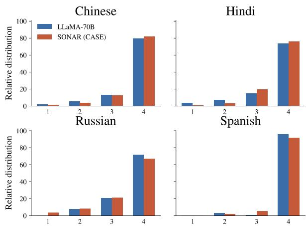  
Figure 2: Human evaluation of extracted spans. Score distributions for LLaMA-70B and SONAR (CASE).

CASE (with SONAR), rating span semantic equivalence on a 4-point scale: (1) unrelated, (2) somewhat related, (3) nearly equivalent, (4) equivalent. See Appendix G for guidelines and full results.

Figure 2 shows the score distribution. Both LLaMA-based extraction and CASE yield highquality span pairs, with over 90% of annotations in the top two categories. LLaMA performs better on Russian and French, while CASE matches or exceeds it in other languages. We retain score-4 spans to construct CrossSpan for the evaluation in Section 5.1. Overall, both methods efectively identify semantically equivalent spans, supporting their use as supervision signals. CASE ofers an efficient alternative to LLM-based extraction while preserving alignment quality.

## 3.1.2 SALT training objective

SALT uses a translation (MT) and a contrastive (CON) objective at the span level, as well as an interpolation objective (INT) at the sentence level.

$$
\mathcal { L } _ { S A L T } = \mathcal { L } _ { C O N _ { S p a n } } + \alpha \mathcal { L } _ { M T _ { S p a n } } + \beta \mathcal { L } _ { I N T }\tag{2}
$$

where $\alpha , \beta \in \mathbb { R }$ are hyperparameters set to one unless otherwise specified. For simplicity, we present the losses for a single translation pair $( x , y )$ , though they are computed in batches during training.

Contrastive objective We apply the span extraction method (LLM or CASE) to obtain a collection of p aligned spans $t _ { x } [ i ^ { 1 } : j ^ { 1 } ] , \ldots , t _ { x } [ i ^ { p } : j ^ { p } ]$ and $t _ { y } [ i ^ { \prime 1 } : j ^ { \prime 1 } ] , \dotsc , t _ { y } [ i ^ { \prime p ^ { \cdot } } : j ^ { \prime p } ]$

To increase coverage of both sentences, we augment this set with unaligned spans. Specifically, for every maximal contiguous subsequence of tokens that does not belong to any aligned span, we form an additional span. This yields additional spans $( t _ { x } [ i ^ { p + 1 } : j ^ { \bar { p + 1 } } ] , \dots , t _ { x } [ i ^ { q } : j ^ { q } ] )$ and $( t _ { y } [ i ^ { \prime } { } ^ { p + 1 } : j ^ { \prime } { } ^ { p + 1 } ] , \dots , t _ { y } [ i ^ { \prime } { } ^ { v } : j ^ { \prime } { } ^ { v } ] )$

We compute the corresponding span embeddings $H _ { x } ^ { 1 } , \ldots , H _ { x } ^ { q }$ and $H _ { y } ^ { 1 } , \ldots , \bar { H _ { y } ^ { v } }$ by averaging the token embeddings within each span. We then define the contrastive loss as

$$
\begin{array} { r l r } {  { \mathcal { L } _ { \mathrm { C O N } _ { S p a n } } = - \frac { 1 } { p } \sum _ { i = 1 } ^ { p } [ \log \frac { \exp ( \langle H _ { x } ^ { i } , H _ { y } ^ { i } \rangle / \tau ) } { \sum _ { j = 1 } ^ { v } \exp ( \langle H _ { x } ^ { i } , H _ { y } ^ { j } \rangle / \tau ) }  } } \\ & { } & {  + \log \frac { \exp ( \langle H _ { x } ^ { i } , H _ { y } ^ { i } \rangle / \tau ) } { \sum _ { j = 1 } ^ { q } \exp ( \langle H _ { x } ^ { j } , H _ { y } ^ { i } \rangle / \tau ) } ] } \end{array}\tag{3}
$$

where $\langle \cdot , \cdot \rangle$ denotes the dot product, $( H _ { x } ^ { i } , H _ { y } ^ { i } )$ corresponds to an aligned span pair, and τ is a temperature hyperparameter. The first term applies a row-wise softmax over target spans for each source span, while the second term applies a columnwise softmax over source spans for each target span. This loss encourages semantically equivalent spans to have similar embeddings while pushing apart spans with diferent meanings.

Translation objective Given a pre-trained decoder D that we keep frozen, we define the translation loss as the cross-entropy over the target span:

$$
\mathcal { L } _ { \mathrm { M T } _ { \mathrm { S p a n } } } = - \frac { 1 } { p } \sum _ { l = 1 } ^ { p } \sum _ { k = i ^ { \prime } l } ^ { j ^ { \prime } l } \log P _ { \mathcal { D } } ( t _ { y } [ k ] ; t _ { y } [ i ^ { \prime } : k ] , H _ { x } ^ { l } )\tag{4}
$$

where $( t _ { x } [ i ^ { l } : j ^ { l } ]$ and $t _ { y } [ i ^ { \prime l } : j ^ { \prime l } ] )$ is an extracted span pair, $H _ { x } ^ { l }$ is the pooled source span representation and $P _ { D }$ denotes the probability assigned by the decoder to the next target token, conditioned on the previous target tokens and the pooled representation of the source span.

Interpolation objective Following Tsiamas et al. (2025), we introduce a sentence-level interpolation objective that encourages the encoder to preserve the original sentence representation space. We obtain a teacher representation $z _ { x y }$ by averaging the source and target sentence embeddings produced by the frozen encoder $\scriptstyle { \mathcal { E } } ^ { f r o z e n }$ The interpolation loss is then defined as

$$
\mathcal { L } _ { I N T } = \mathbf { M S E } \Big ( z _ { x y } , \frac { \mathrm { p o o l } ( H _ { x } ) + \mathrm { p o o l } ( H _ { y } ) } { 2 } \Big )\tag{5}
$$

where MSE denotes the mean squared error. Intuitively, this loss constrains the encoder so that

token-level training objectives do not distort the sentence-level embedding space, maintaining consistency with the initial frozen encoder.

<table><tr><td>Task (#langs)</td><td>Example</td></tr><tr><td>AER (18)</td><td>The necessary correction will bę made K K Eine entsprechende Anderung wird vorgenommen werden</td></tr><tr><td>Massive (52)</td><td>What is today &#x27;s forecast for Berlin DATE PLACE</td></tr><tr><td>PAN-X (40)</td><td>REDIRECCIÓN Algarrobo (Chile) B-LOC I-LOC</td></tr><tr><td>UDPOS (51)</td><td>葬儀 の 最中 です よ ! NOUN ADP NOUN AUX PART PUNCT</td></tr><tr><td>WiC (6)</td><td>Bolivia holds a key play in this process of peace. Different A musical play on the same subject was also staged.meaning</td></tr></table>

Table 1: Summary of the tasks and number of languages used for the evaluation of cross-lingual token representations. Source: Omnilingual SONAR Team et al. (2026)

## 4 Experiment details

We initialise E,D with the respective pre-trained SONAR weights (Duquenne et al., 2023).

Data We fine-tune SONAR on a subset of the data originally used to train it, namely the publicly available NLLB Primary dataset (Costa-jussà et al., 2022). 1 This dataset comprises high-quality parallel sentences spanning a diverse set of languages. We begin by excluding all language pairs for which neither language belongs to the set of 57 designated test languages, yielding a total of 129 language pairs (see Appendix C.1). The 29 test languages not observed during training can be used to evaluate the generalisation of our method (see Appendix D.3).

For each retained language pair, we downsample the corpus to 40,000 sentence pairs, observing no degradation in performance as a result of this reduction. In line with the procedure of Omnilingual SONAR Team et al. (2026), we further refine the dataset by removing sentence pairs whose BLASER 2 score (Dale and Costa-jussà, 2024) deviates by more than one standard deviation from the mean score computed for the given language pair.

Training hyperparameters We train SONAR for 20,000 steps, with a maximum of 1400 tokens per batch (roughly corresponding to 50 pairs of sentences per batch) and a learning rate of µ = 10e−5. We use an AdamW optimiser (Loshchilov and Hutter, 2019) and warm-up of 1000 steps. We do the training runs on three seeds and report average values in all experiments unless otherwise specified. Standard deviations are reported in Appendix F.

Baselines We report the performance of the encoders XLM-R (Conneau and Lample, 2019), XLM-Align (Chi et al., 2021), LaBSE (Feng et al., 2022), and MEXMA (Janeiro et al., 2025). In addition, we compare SALT against variants obtained by fine-tuning SONAR with alternative training objectives. Specifically, we train the encoder for longer using the original SONAR loss proposed by Duquenne et al. (2023). We also include token-level objectives: the Self-Objective (SO) loss (Dou and Neubig, 2021), a contrastive wordalignment objective; the WordOT loss (Alqahtani et al., 2021), using Optimal Transport; the WACSE loss (Miao et al., 2024), which adds a masked language modeling head; and the OmniSONAR-Token loss (Omnilingual SONAR Team et al., 2026), which extends SO loss with interpolation. See Appendix C.4 for implementation details.

Sentence evaluation We evaluate the task of sentence mining using the FLORES-200 devtest (NLLB Team, 2024) (80 languages) and report xsim (Feng et al., 2022) and xsim++ (Chen et al., 2023). For classification, we report on tasks from MTEB (Muennighof et al., 2023) (English only).

## 4.1 Cross-lingual token evaluation

Standard benchmarks often evaluate sentence encoders through sequence-level tasks, which can mask weaknesses in token representations (Conneau et al., 2018; Hu et al., 2020; Enevoldsen et al., 2025). Following Omnilingual SONAR Team et al. (2026), we instead focus on tasks that isolate the embeddings of individual tokens, providing a more rigorous assessment of cross-lingual token quality. For word alignment, we test whether tokens across languages align semantically. For sequence tagging, we feed the classifier head only the embedding of a single word to directly probe the quality of its token-level representations across languages.

Word alignment Given a translation pair x, y, the task of word alignment identifies which words correspond to each other semantically. More formally, given a source–target sentence pair x, y with word lengths $w _ { x } , w _ { y }$ , respectively, we infer a binary matrix $M \in \{ 0 , 1 \} ^ { w _ { s } \times w _ { y } }$ , where $M _ { i j } = 1$ represents that the i-th word in the source sentence aligns semantically with the $j \cdot$ -th word in the target sentence. We present an example in Table 1.

Many current word alignment methods derive alignments based on the similarity of token embeddings (Jalili Sabet et al., 2020; Azadi et al., 2023). We define the token similarity matrix $S \in \mathbb { R } ^ { n \times m }$ $S _ { i , j } ~ : = ~ s i m ( \mathcal { E } ( t _ { x } [ i ] ) , \mathcal { E } ( t _ { y } [ j ] ) )$ , where sim is a similarity measure (we use cosine similarity), $t _ { x } [ i ]$ and $t _ { y } [ j ] \in V$ are the i-th and j-th tokens of the source and target sentences x and y. An extraction method is then applied to convert these similarities into a discrete alignment. We use Itermax (Jalili Sabet et al., 2020) to extract alignments and report Alignment Error Rate (AER) (Och and Ney, 2000). The full list of alignment datasets is in Appendix C.2.

Sequence tagging We evaluate token-level cross-lingual representations using standard sequence labelling tasks, where each token $x _ { i }$ in an input sequence $ { \boldsymbol { { x } } } \ = \ \left( x _ { 1 } , \ldots , x _ { n } \right)$ is assigned a discrete label $\{ 1 , \ldots , N \}$ To isolate the contribution of the encoder, we train a linear classification head $C ~ \in ~ \mathbb { R } ^ { d \times N }$ placed on top of the token embeddings while keeping the encoder parameters fixed. The classifier is trained only on English data and subsequently evaluated in other languages (zero-shot); see Appendix C.3 for implementation details.

We consider a diverse set of benchmarks, including Massive (Slot Filling) (FitzGerald et al., 2023), PAN-X (Named Entity Recognition) (Pan et al., 2017), UDPOS (Part-of-Speech Tagging) (Nivre et al., 2020), and WiC (Word Sense Disambiguation) (Pilehvar and Camacho-Collados, 2019). WiC is not technically a sequence tagging task; we adapt it by extracting the contextual embeddings of the target word in each sentence, concatenating the resulting vectors, and feeding them into a classifier $C \in \mathbb { R } ^ { 2 d \times 2 }$ . When a target word is split into multiple subword tokens, we represent it by averaging the corresponding embeddings.

Finally, to handle mismatches between dataset annotations and tokeniser segmentation, we map labels to tokens based on maximal character overlap. When multiple segments overlap a token equally, we resolve ties by selecting the first.

## 5 Results

Table 2 compares SALT with pre-trained encoders and alternative fine-tuning objectives for SONAR across five cross-lingual token benchmarks. Among the pre-trained models, MEXMA achieves the lowest AER (0.171), while SONAR remains competitive on the other tasks. Continued training with the SONAR loss improves all tokenlevel results, suggesting that SONAR was primarily optimised for sentence mining rather than token representations.

Among the fine-tuning objectives, SALT outperforms in word alignment (AER), PAN-X, Massive, and WiC, showing that span-level objectives provide complementary signals beyond sentence- or token-level training. Gains are particularly pronounced on tasks requiring rich cross-lingual semantics (PAN-X, Massive) and on word alignment. On UDPOS, SALT achieves a strong score of 0.571 (vs. 0.548 for the pre-trained model), but is slightly outperformed by SO Loss (0.577). This may be due to UDPOS being more language-specific, exhibiting limited cross-lingual transfer relative to other tasks (see Appendix D.2)

Taken together, the results show that SALT achieves the best overall performance among the considered strategies, and suggest that incorporating span-level supervision is an efective and principled way to enrich multilingual sentence representations beyond sentence-level objectives alone.

Does improved token-level representation come at the cost of sentence-level quality? For crosslingual sentence mining, SALT consistently improves over SONAR on xsim and xsim++ (Table 3). For MTEB classification tasks, SALT matches SONAR on XNLI and MIntent and improves on STS17. Overall, SALT does not sacrifice sentence-level quality and, in several cases, improves it.

## 5.1 Analysis

Span embeddings SALT supports span-level representations by averaging token embeddings within each span. We find that these span representations are more semantically informative than their SONAR counterparts. On the CrossSpan test set of high-quality aligned cross-lingual spans, SALT representations of aligned spans consistently exhibit higher cosine similarity across layers (Figure 4, left), indicating stronger cross-lingual align-

<table><tr><td>AER (↓) PAN-X (↑) Massive (↑) UDPOS (↑) WiC (↑)</td></tr><tr><td>Pre-trained encoders</td></tr><tr><td>XLM-R 0.307 0.551 0.220</td></tr><tr><td>0.527 XLM-Align 0.246 0.532 0.187 0.522</td></tr><tr><td>LaBSE 0.232 0.589 0.431 0.551 0.538</td></tr><tr><td>MEXMA 0.171 0.593 0.396 0.553 0.565</td></tr><tr><td>SONAR 0.183 0.582 0.402 0.548 0.576</td></tr><tr><td>SONAR + additional objectives</td></tr><tr><td>SONAR LoSS (Duquenne et al., 2023) 0.179 0.588 0.426 0.554 0.581</td></tr><tr><td>SO LoSS (Dou and Neubig, 2021) 0.178 0.597 0.410 0.577 0.574</td></tr><tr><td>WordOT (Alqahtani et al., 2021) 0.320 0.609 0.417 0.561 0.585</td></tr><tr><td>WACSE (Miao et al., 2024) 0.205 0.600 0.409 0.569 0.573</td></tr><tr><td>OmniSONAR-Token (OMmnilingual SONAR Team t l., 2026) 0.180 0.610 0.417 0.574 0.583</td></tr><tr><td>SALT  (ours) 0.171 0.622 0.452 0.571 0.585</td></tr></table>

Table 2: Cross-lingual token-level evaluation across five benchmarks for frozen pre-trained encoders and SONAR trained with additional objectives. SALT achieves the best or joint-best performance on four of five benchmarks.  
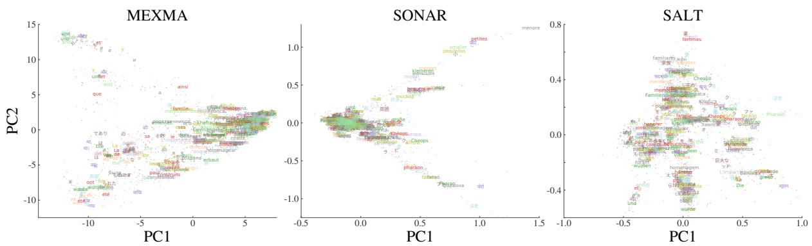  
Figure 3: Principal component projections of token embeddings for the same sentence across 80 languages. Each colour corresponds to a language. SONAR produces a more distributed and language-agnostic embedding space. Sentence: The great pyramid was created to honor the Pharaoh Khufu, and many ofthe smaller pyramids, tombs, and temples were built to honor Khufu’s wives and family members.

<table><tr><td rowspan="2"></td><td colspan="2">Mining (↓)</td><td colspan="3">Classification (↑)</td></tr><tr><td>xsim</td><td>xsim++</td><td>XNLI</td><td>STS17</td><td>MIntent</td></tr><tr><td>SONAR</td><td>0.2</td><td>9.9</td><td>0.61</td><td>0.65</td><td>0.58</td></tr><tr><td>SALT</td><td>0.1</td><td>8.8</td><td>0.61</td><td>0.66</td><td>0.58</td></tr></table>

Table 3: Cross-lingual sentence mining (FLORES-80) and English-only MTEB classification performance.

ment.

A by-product of our span-translation objective is that the learned representations can be directly translated with a frozen SONAR decoder (Figure 4, right). SALT span embeddings yield highquality translations, indicating that they preserve rich semantic information for downstream generation.

Intermediate representations Sentence encoders typically exhibit a parabolic behaviour, where intermediate layers achieve the strongest cross-lingual alignment (Jalili Sabet et al., 2020). This arises because cross-lingual token representations emerge in mid-layers but are not necessarily preserved in the final layers, which are more specialised for the pretraining objective. The SALT loss shifts this pattern, with deeper layers becoming more cross-lingually aligned for both spans (Figure 4, left) and words (Appendix E.1).

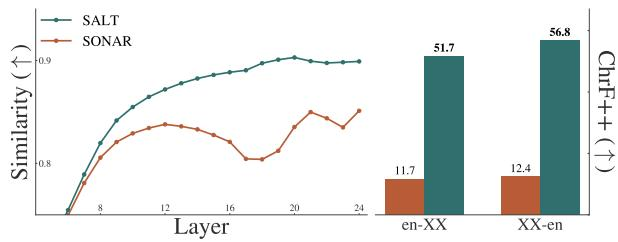  
Figure 4: Left: cosine similarity of span pairs across layers. SALT shows a better similarity than SONAR across all layers. Right: translation performance for span embeddings. Both experiments use CrossSpan.

Geometry of the embedding space We compare the geometry of word embeddings produced by SALT, SONAR, and MEXMA (Table 4; see Appendix E.2 for more details on experiments).

We construct a word retrieval task by merging the datasets from the word alignment task. For each English word, we retrieve the nearest neighbours with cosine similarity and evaluate whether the matches correspond to gold-aligned targets. SALT achieves the highest recall.

A good cross-lingual representation should be language-agnostic, without inducing languagespecific subspaces. We probe language separability by training a linear classifier to predict language ID from individual word embeddings. SALT embeddings are significantly harder to classify, indicating more language-invariant representations than SONAR and MEXMA.

Isotropy captures whether the embedding space is dominated by privileged directions, leading to uneven use of representational capacity. We measure it via mean cosine similarity over random word pairs, and via uniformity (Wang and Isola, 2020). MEXMA is highly anisotropic. SONAR and SALT produce more isotropic spaces by these measures, though as we show below, SONAR’s apparent isotropy masks a severe hubness problem.

Hubness measures the tendency of a few embeddings to dominate nearest-neighbour retrieval regardless of semantics (Radovanovic et al., 2010). We quantify it via the skewness of the k-occurrence distribution, which counts how often an embedding appears in another word’s nearest neighbours. Zero skewness indicates a uniform space, while high skewness reflects hub collapse. SONAR exhibits severe hubness (11.5 skewness), while MEXMA and SALT are substantially better behaved.

Taken together, these results reveal contrasting geometric failures in the baselines. MEXMA produces an anisotropic, language-stratified space, while SONAR sufers from severe hub collapse. SALT avoids both, yielding a better-distributed cross-lingual token space (Figure 3). This suggests that isotropy, hubness and language inseparability are not independent but mutually reinforcing signatures of a well-formed cross-lingual geometry.

## 5.2 Ablations

Impact of the diferent losses We assess the contribution of each loss term of the SALT training objective by removing them and evaluating across two metrics: word alignment (AER) and averaging the four sequence tagging tasks.

The results are presented in Table 6. We see that post-training on $\mathcal { L } _ { C O N _ { S p a n } }$ or on $\mathcal { L } _ { I N T }$ improves on both tasks, being the latest the strongest single loss; $\mathcal { L } _ { M T _ { S p a n } }$ worsens the pre-trained model, and it worsens word alignment when used in conjunction with $\mathcal { L } _ { C O N _ { S p a n } }$ or on $\mathcal { L } _ { I N T } $ ; however, it adds complementary information not fully captured by the other two terms — its inclusion in SALT pushes SeqTag to the best score (0.557), even as $\mathcal { L } _ { C O N _ { S p a n } } + \mathcal { L } _ { I N T }$ yields a marginally better AER.

<table><tr><td colspan="4">Word Ret. ↑ Lang. ID ↓ Isotropy ↓ Hub ↓</td></tr><tr><td></td><td></td><td></td><td>sim / unif</td></tr><tr><td>MEXMA</td><td>63%</td><td>0.49</td><td>0.44 / -2.2 4.0</td></tr><tr><td>SONAR</td><td>62%</td><td>0.46 0.04 / -3.8</td><td>11.5</td></tr><tr><td>SALT</td><td>65%</td><td>0.35 0.03 / -3.6</td><td>3.5</td></tr></table>

Table 4: Word retrieval (Recall@5), language identification (F1), isotropy (mean cosine similarity and uniformity) and hubness (skewness) for three encoders.
<table><tr><td></td><td>AER</td><td>PAN-X</td><td>Massive</td><td>UDPOS</td><td>WiC</td></tr><tr><td>SALT (LLaMA)</td><td>0.171</td><td>0.622</td><td>0.452</td><td>0.571</td><td>0.585</td></tr><tr><td>SALT (CASE)</td><td>0.171</td><td>0.613</td><td>0.459</td><td>0.568</td><td>0.584</td></tr></table>

Table 5: Cross-lingual token-level evaluation for SALT using LLaMA-70B spans or the self-supervised CASE.

The full SALT objective achieves the best sequence tagging score and a highly competitive AER of 0.171, confirming that all three terms are necessary for optimal performance. No subset consistently dominates across both metrics, indicating that each loss captures complementary training signals.

CASE span extraction Do the SALT improvements stem from an additional external signal, given that LLaMA-70B was used for span extraction? To investigate this, we compare results when training SALT with the self-supervised span extraction heuristic CASE. Results are shown in Table 5. CASE yields better performance on Massive, whereas external supervision from LLaMA-70B is superior on PAN-X, UDPOS, and WiC. Nevertheless, the diference is marginal: CASE would outperform all the baseline losses and encoders in Table 2 except for UDPOS. This suggests that the training regime is primarily responsible for SALT’s success, rather than the span extraction signal itself, and that comparable results can be achieved without access to a strong LLM.

<table><tr><td></td><td>AER↓SeqTag ↑</td></tr><tr><td>SONAR (pre-trained)</td><td>0.183 0.527</td></tr><tr><td> $\mathcal { L } _ { C O N _ { S p a n } }$ </td><td>0.178 0.538</td></tr><tr><td> $\mathcal { L } _ { M T _ { S p a n } }$ </td><td>0.186 0.522</td></tr><tr><td> $\mathcal { L } _ { I N T }$ </td><td>0.174 0.551</td></tr><tr><td> $\mathcal { L } _ { C O N _ { S p a n } } + \mathcal { L } _ { M T _ { S p a n } }$ </td><td>0.179 0.551</td></tr><tr><td> $\mathcal { L } _ { M T _ { S p a n } } + \mathcal { L } _ { I N T }$ </td><td>0.177 0.554</td></tr><tr><td> $\mathcal { L } _ { C O N _ { S p a n } } + \mathcal { L } _ { I N T }$ </td><td>0.170 0.552</td></tr><tr><td> $\mathcal { L } _ { C O N _ { S p a n } } + \mathcal { L } _ { M T _ { S p a n } } + \mathcal { L } _ { I N T }$ </td><td>(SALT) 0.171 0.557</td></tr></table>

Table 6: Finetuning SONAR with diferent losses.

## 6 Conclusions

In this work, we introduced SALT, a lightweight post-training method that improves cross-lingual token representations in multilingual sentence encoders through span-aligned supervision. Across multilingual token-level benchmarks, SALT achieved the strongest overall performance, consistently outperforming alternative fine-tuning strategies and competitive encoders. These gains did not come at the expense of sentence-level quality: SALT preserved and, in several cases, improved performance on sentence mining and classification benchmarks. Overall, our results suggest that span-level supervision is a simple yet powerful inductive bias for multilingual representation learning.

## Limitations

Despite the strong empirical performance of SALT, several limitations remain.

SALT relies on parallel corpora to extract aligned spans, which may limit its applicability to truly low-resource languages. In addition, the selfsupervised CASE heuristic assumes that the underlying encoder already provides reasonably good cross-lingual token representations, making adaptation to unseen or severely underrepresented languages more challenging; in those cases, LLMbased spans should be used instead.

Our method also uses average pooling to construct span embeddings. While lightweight and architecture-agnostic, this may fail to capture finer internal structure within longer or compositionally complex spans.

Finally, we only evaluate SALT as a posttraining intervention. Exploring span-level supervision during large-scale pre-training could potentially yield larger improvements, but was beyond the computational scope of this work.

## Ethics statement

This work aims to improve multilingual language representations for token-level cross-lingual tasks, which may help broaden language accessibility and support underrepresented languages in NLP. However, multilingual representation models may also be used in sensitive applications such as surveillance or profiling, and we therefore encourage responsible deployment and evaluation.

Our training data are derived from publicly available parallel corpora from the NLLB Primary dataset, which may contain societal or cultural biases present in web-scale multilingual text. As a result, SALT may inherit biases from the training data or pretrained models.

We also conducted a human evaluation of span quality using native speakers. Participation was voluntary, annotators were informed about the study and their right to withdraw, and no personally identifiable information was collected beyond anonymised annotator IDs. The study received ethics approval from our institution.

## References

Sawsan Alqahtani, Garima Lalwani, Yi Zhang, Salvatore Romeo, and Saab Mansour. 2021. Using optimal transport as alignment objective for fine-tuning

multilingual contextualized embeddings. In Findings of the Association for Computational Linguistics: EMNLP 2021, pages 3904–3919, Punta Cana, Dominican Republic. Association for Computational Linguistics.

Fatemeh Azadi, Heshaam Faili, and Mohammad Javad Dousti. 2023. Pmi-align: Word alignment with point-wise mutual information without requiring parallel training data. In Findings of the Association for Computational Linguistics: ACL 2023, Toronto, Canada, July 9-14, 2023, Findings of ACL, pages 12366–12377. Association for Computational Linguistics.

Peter F. Brown, Stephen Della Pietra, Vincent J. Della Pietra, and Robert L. Mercer. 1993. The mathematics of statistical machine translation: Parameter estimation. Comput. Linguistics, 19(2):263–311.

Mingda Chen, Kevin Hefernan, Onur Çelebi, Alexandre Mourachko, and Holger Schwenk. 2023. xSIM+ +: An Improved Proxy to Bitext Mining Performance for Low-Resource Languages. In Proceedings ofthe 61st Annual Meeting of the Association for Computational Linguistics (Volume 2: Short Papers), pages 101–109, Toronto, Canada. Association for Computational Linguistics.

Zewen Chi, Li Dong, Bo Zheng, Shaohan Huang, Xian-Ling Mao, Heyan Huang, and Furu Wei. 2021. Improving pretrained cross-lingual language models via self-labeled word alignment. In Proceedings of the 59th Annual Meeting ofthe Associationfor Computational Linguistics and the 11th International Joint Conference on Natural Language Processing (Volume 1: Long Papers), pages 3418–3430, Online. Association for Computational Linguistics.

Alexis Conneau and Guillaume Lample. 2019. Crosslingual language model pretraining. In Advances in Neural Information Processing Systems 32: Annual Conference on Neural Information Processing Systems 2019, NeurIPS 2019, December 8-14, 2019, Vancouver, BC, Canada, pages 7057–7067.

Alexis Conneau, Ruty Rinott, Guillaume Lample, Adina Williams, Samuel R. Bowman, Holger Schwenk, and Veselin Stoyanov. 2018. XNLI: Evaluating Cross-lingual Sentence Representations. In Proceedings ofthe 2018 Conference on Empirical Methods in Natural Language Processing. Association for Computational Linguistics.

Marta R. Costa-jussà, James Cross, Onur Çelebi, Maha Elbayad, Kenneth Heafield, Kevin Hefernan, Elahe Kalbassi, Janice Lam, Daniel Licht, Jean Maillard, Anna Y. Sun, Skyler Wang, Guillaume Wenzek, Al Youngblood, Bapi Akula, Loïc Barrault, Gabriel Mejia Gonzalez, Prangthip Hansanti, John Hofman, and 19 others. 2022. No language left behind: Scaling human-centered machine translation. CoRR, abs/2207.04672.

David Dale and Marta R. Costa-jussà. 2024. BLASER 2.0: a metric for evaluation and quality estimation

of massively multilingual speech and text translation. In Findings of the Association for Computational Linguistics: EMNLP 2024, Miami, Florida, USA, November 12-16, 2024, Findings of ACL, pages 16075–16085. Association for Computational Linguistics.

Zi-Yi Dou and Graham Neubig. 2021. Word alignment by fine-tuning embeddings on parallel corpora. In Proceedings ofthe 16th Conference ofthe European Chapter of the Association for Computational Linguistics: Main Volume, EACL 2021, Online, April 19 - 23, 2021, pages 2112–2128. Association for Computational Linguistics.

Paul-Ambroise Duquenne, Holger Schwenk, and Benoît Sagot. 2023. SONAR: sentence-level multimodal and language-agnostic representations. CoRR, abs/2308.11466.

Kenneth C. Enevoldsen, Isaac Chung, Imene Kerboua, Márton Kardos, Ashwin Mathur, David Stap, Jay Gala, Wissam Siblini, Dominik Krzeminski, Genta Indra Winata, Saba Sturua, Saiteja Utpala, Mathieu Ciancone, Marion Schaefer, Diganta Misra, Shreeya Dhakal, Jonathan Rystrøm, Roman Solomatin, Ömer Veysel Çagatan, and 2 others. 2025. MMTEB: massive multilingual text embedding benchmark. In The Thirteenth International Conference on Learning Representations, ICLR 2025, Singapore, April 24-28, 2025. OpenReview.net.

Fangxiaoyu Feng, Yinfei Yang, Daniel Cer, Naveen Arivazhagan, and Wei Wang. 2022. Language-agnostic BERT sentence embedding. In Proceedings of the 60th Annual Meeting of the Association for Computational Linguistics (Volume 1: Long Papers), ACL 2022, Dublin, Ireland, May 22-27, 2022, pages 878– 891. Association for Computational Linguistics.

Jack FitzGerald, Christopher Hench, Charith Peris, Scott Mackie, Kay Rottmann, Ana Sanchez, Aaron Nash, Liam Urbach, Vishesh Kakarala, Richa Singh, Swetha Ranganath, Laurie Crist, Misha Britan, Wouter Leeuwis, Gokhan Tur, and Prem Natarajan. 2023. MASSIVE: A 1M-Example Multilingual Natural Language Understanding Dataset with 51 Typologically-Diverse Languages. In Proceedings ofthe 61stAnnual Meeting oftheAssociationfor Computational Linguistics (Volume 1: Long Papers), pages 4277–4302, Toronto, Canada. Association for Computational Linguistics.

Junjie Hu, Sebastian Ruder, Aditya Siddhant, Graham Neubig, Orhan Firat, and Melvin Johnson. 2020. XTREME: A massively multilingual multitask benchmark for evaluating cross-lingual generalization. CoRR, abs/2003.11080.

Chenyang Huang, Abbas Ghaddar, Ivan Kobyzev, Mehdi Rezagholizadeh, Osmar Zaïane, and Boxing Chen. 2024. OTTAWA: optimal transport adaptive word aligner for hallucination and omission translation errors detection. In Findings of the Association for Computational Linguistics, ACL 2024, Bangkok,

Thailand and virtual meeting, August 11-16, 2024, Findings of ACL, pages 6322–6334. Association for Computational Linguistics.

Masoud Jalili Sabet, Philipp Dufter, François Yvon, and Hinrich Schütze. 2020. SimAlign: High quality word alignments without parallel training data using static and contextualized embeddings. In Findings of the Association for Computational Linguistics: EMNLP 2020, pages 1627–1643, Online. Association for Computational Linguistics.

João Maria Janeiro, Benjamin Piwowarski, Patrick Gallinari, and Loïc Barrault. 2025. MEXMA: tokenlevel objectives improve sentence representations. In Proceedings of the 63rd Annual Meeting of the Association for Computational Linguistics (Volume 1: Long Papers), ACL 2025, Vienna, Austria, July 27 - August 1, 2025, pages 23960–23995. Association for Computational Linguistics.

Nikita Kitaev, Steven Cao, and Dan Klein. 2019. Multilingual constituency parsing with self-attention and pre-training. In Proceedings of the 57th Conference of the Association for Computational Linguistics, ACL 2019, Florence, Italy, July 28- August 2, 2019, Volume 1: Long Papers, pages 3499–3505. Association for Computational Linguistics.

Philipp Koehn, Franz Josef Och, and Daniel Marcu. 2003. Statistical phrase-based translation. In Human Language Technology Conference of the North American Chapter of the Association for Computational Linguistics, HLT-NAACL 2003, Edmonton, Canada, May 27 - June 1, 2003. The Association for Computational Linguistics.

Shicheng Li, Pengcheng Yang, Fuli Luo, and Jun Xie. 2021. Multi-granularity contrasting for cross-lingual pre-training. In Findings of the Association for Computational Linguistics: ACL-IJCNLP 2021, pages 1708–1717, Online. Association for Computational Linguistics.

Ziheng Li, Shaohan Huang, Zihan Zhang, Zhi-Hong Deng, Qiang Lou, Haizhen Huang, Jian Jiao, Furu Wei, Weiwei Deng, and Qi Zhang. 2023. Dualalignment pre-training for cross-lingual sentence embedding. In Proceedings of the 61st Annual Meeting of the Association for Computational Linguistics (Volume 1: Long Papers), pages 3466–3478, Toronto, Canada. Association for Computational Linguistics.

Ilya Loshchilov and Frank Hutter. 2019. Decoupled weight decay regularization. In 7th International Conference on Learning Representations, ICLR 2019, New Orleans, LA, USA, May 6-9, 2019. OpenReview.net.

Federico Martelli, Andrei Stefan Bejgu, Cesare Campagnano, Jaka Cibej, Rute Costa, Apolonija Gantar, Jelena Kallas, Svetla Peneva Koeva, Kristina Koppel, Simon Krek, Margit Langemets, Veronika Lipp, Sanni Nimb, Sussi Olsen, Bolette Sandford Pedersen,

Valeria Quochi, Ana Salgado, László Simon, Carole Tiberius, and 2 others. 2023. XL-WA: a gold evaluation benchmark for word alignment in 14 language pairs. In Proceedings of the 9th Italian Conference on Computational Linguistics, Venice, Italy, November 30 - December 2, 2023, CEUR Workshop Proceedings. CEUR-WS.org.

Rahul Mehta and Vasudeva Varma. 2023. LLM-RM at SemEval-2023 task 2: Multilingual complex NER using XLM-RoBERTa. In Proceedings of the 17th International Workshop on Semantic Evaluation (SemEval-2023), pages 453–456, Toronto, Canada. Association for Computational Linguistics.

Zhongtao Miao, Qiyu Wu, Kaiyan Zhao, Zilong Wu, and Yoshimasa Tsuruoka. 2024. Enhancing crosslingual sentence embedding for low-resource languages with word alignment. In Findings of the Association for Computational Linguistics: NAACL 2024, pages 3225–3236, Mexico City, Mexico. Association for Computational Linguistics.

Niklas Muennighof, Nouamane Tazi, Loic Magne, and Nils Reimers. 2023. MTEB: Massive text embedding benchmark. In Proceedings of the 17th Conference of the European Chapter of the Association for Computational Linguistics, pages 2014–2037, Dubrovnik, Croatia. Association for Computational Linguistics.

Graham Neubig. 2011. The kyoto free translation task. http://www.phontron.com/kftt.

Joakim Nivre, Marie-Catherine de Marnefe, Filip Ginter, Jan Hajic, Christopher D. Manning, Sampo Pyysalo, Sebastian Schuster, Francis M. Tyers, and Daniel Zeman. 2020. Universal dependencies v2: An evergrowing multilingual treebank collection. In Proceedings of The 12th Language Resources and Evaluation Conference, LREC 2020, Marseille, France, May 11-16, 2020, pages 4034–4043. European Language Resources Association.

NLLB Team. 2024. Scaling Neural Machine Translation to 200 Languages. Nature, 630:841–846.

Franz Josef Och and Hermann Ney. 2000. Improved statistical alignment models. In 38th Annual Meeting ofthe Associationfor Computational Linguistics, Hong Kong, China, October 1-8, 2000, pages 440– 447. ACL.

Omnilingual MT Team, Belen Alastruey, Niyati Bafna, Andrea Caciolai, Kevin Hefernan, Artyom Kozhevnikov, Christophe Ropers, Eduardo Sánchez, Charles-Eric Saint-James, Ioannis Tsiamas, Chierh Cheng, Joe Chuang, Paul-Ambroise Duquenne, Mark Duppenthaler, Nate Ekberg, Cynthia Gao, Pere Lluís Huguet Cabot, João Maria Janeiro, Jean Maillard, and 12 others. 2026. Omnilingual mt: Machine translation for 1,600 languages. Preprint, arXiv:2603.16309.

Omnilingual SONAR Team, João Maria Janeiro, Pere-Lluís Huguet Cabot, Ioannis Tsiamas, Yen Meng,

Vivek Iyer, Guillem Ramírez, Loic Barrault, Belen Alastruey, Yu-An Chung, Marta R. Costa-Jussa, David Dale, Kevin Hefernan, Jaehyeong Jo, Artyom Kozhevnikov, Alexandre Mourachko, Christophe Ropers, Holger Schwenk, and Paul-Ambroise Duquenne. 2026. Omnilingual sonar: Cross-lingual and cross-modal sentence embeddings bridging massively multilingual text and speech. CoRR, abs/2603.16606.

Xiaoman Pan, Boliang Zhang, Jonathan May, Joel Nothman, Kevin Knight, and Heng Ji. 2017. Crosslingual name tagging and linking for 282 languages. In Proceedings ofthe 55th Annual Meeting ofthe Association for Computational Linguistics, ACL 2017, Vancouver, Canada, July 30 - August 4, Volume 1: Long Papers, pages 1946–1958. Association for Computational Linguistics.

Tanmay Parekh, I-Hung Hsu, Kuan-Hao Huang, Kai-Wei Chang, and Nanyun Peng. 2024. Contextual label projection for cross-lingual structured prediction. In Proceedings of the 2024 Conference of the North American Chapter of the Association for Computational Linguistics: Human Language Technologies (Volume 1: Long Papers), NAACL 2024, Mexico City, Mexico, June 16-21, 2024, pages 5738–5757. Association for Computational Linguistics.

Mohammad Taher Pilehvar and José Camacho-Collados. 2019. Wic: the word-in-context dataset for evaluating context-sensitive meaning representations. In Proceedings of the 2019 Conference of the North American Chapter of the Association for Computational Linguistics: Human Language Technologies, NAACL-HLT 2019, Minneapolis, MN, USA, June 2-7, 2019, Volume 1 (Long and Short Papers), pages 1267–1273. Association for Computational Linguistics.

Milos Radovanovic, Alexandros Nanopoulos, and Mirjana Ivanovic. 2010. Hubs in space: Popular nearest neighbors in high-dimensional data. J. Mach. Learn. Res., 11:2487–2531.

Llama Team. 2024. The llama 3 herd of models. CoRR, abs/2407.21783.

Ioannis Tsiamas, David Dale, and Marta R. Costa-jussà. 2025. Improving language and modality transfer in translation by character-level modeling. In Proceedings of the 63rd Annual Meeting of the Association for Computational Linguistics (Volume 1: Long Papers), ACL 2025, Vienna, Austria, July 27 - August 1, 2025, pages 20171–20187. Association for Computational Linguistics.

Tongzhou Wang and Phillip Isola. 2020. Understanding contrastive representation learning through alignment and uniformity on the hypersphere. In Proceedings ofthe 37th International Conference on Machine Learning, ICML 2020, 13-18 July 2020, Virtual Event, Proceedings of Machine Learning Research, pages 9929–9939. PMLR.

Xiangpeng Wei, Rongxiang Weng, Yue Hu, Luxi Xing, Heng Yu, and Weihua Luo. 2021. On learning universal representations across languages. In 9th International Conference on Learning Representations, ICLR 2021, Virtual Event, Austria, May 3-7, 2021. OpenReview.net.

## A A note on segmentation

We define words as whitespace-delimited units of text. For languages that do not use whitespace segmentation—namely scripts Hans, Hant, Jpan, Thai, Laoo, Khmr, Mymr, Tibt following the SONAR notation—we treat tokeniser tokens as words. When computing word embeddings, we obtain them by averaging the embeddings of the tokens that compose each word.

## B Spans extraction

## B.1 Extracting spans with an LLM

For the LLM-based method, we use LLaMA-70B Instruct, quantised to 8-bit precision using Bitsandbytes. The prompt used for span extraction is provided in Figure 9.

The generated spans are subsequently mapped back to SONAR tokens. In the vast majority of cases, this mapping is unambiguous; when a SONAR token is split across multiple spans, we assign it to the span with the greatest string overlap.

## B.2 Statistics on extracted spans

Table 14 reports summary statistics of the extracted spans. We observe that span lengths vary across languages, with CASE tending to extract longer spans in both source and target sides. In particular, Chinese and Hindi exhibit relatively longer spans compared to other languages, often involving a larger number of target tokens. Using spaCy’s en\_core\_web\_sm model to analyse POS tags on the English side, we find that nouns are most frequent, followed by adpositions. We also observe variation in POS tag distributions across languages and span sources; further details are provided in Table 15.

## C Experiment details

Pre-processing We apply exactly the same preprocessing and normalisation as SONAR, namely the script https://github.com/facebookresearch/ stopes/blob/main/stopes/pipelines/monolingual/ utils/text\_normalizer.py

## C.1 Languages studied

Table 16 shows the language splits used for training and evaluation. Training languages are drawn from the NLLB Primary dataset, while the test languages correspond to those covered by our cross-lingual token-level benchmark, including Word Alignment, PAN-X, MASSIVE, UDPOS, and WiC. For sentence retrieval, we use the 57 test languages; we only evaluate the MTEB tasks on English.

## C.2 Alignment datasets

We evaluate a total of 18 language pairs. As gold-standard alignments, we use the XL-WA dataset (Martelli et al., 2023) for 10 language pairs; we were unable to obtain the four additional subsets. For en-hi, en-fr, en-fa, and en-cs, we adopt the same datasets as in Jalili Sabet et al. (2020). For en-zh, en-ro, and en-de, we use the datasets introduced by Dou and Neubig (2021), and for en-ja we use the KFTT dataset (Neubig, 2011).

## C.3 Sequence tagging evaluation

We use up to 10,000 training examples and 5,000 test examples per language, doubling these limits for WiC, while filtering out sequences exceeding 514 tokens. A single linear classifier (Linear(dim, n\_classes)) is trained on frozen encoder embeddings using Adam with a learning rate of 10−3, cross-entropy loss, and a batch size of 4096. We train with early stopping (patience = 10) based on a 90/10 train-validation split. All embeddings are L2-normalised before classification.

## C.4 Losses implementations details

We refer readers to the original papers for detailed descriptions of the losses and their motivation. Here, we describe implementation details and hyperparameters used in our setup.

SO Loss We follow Omnilingual SONAR Team et al. (2026) and introduce a temperature hyperparameter $\tau \ : = \ : 5 0 0$ . We use Argmax (Jalili Sabet et al., 2020) for word alignment extraction.

WordOT We use $\tau = 0 . 0 5$ , following the original paper.

WACSE We use Argmax (Jalili Sabet et al., 2020) for word alignment extraction (WTR, AWP losses). For AWP, we only use one mask per sentence pair. We use the token embedding (encoding) matrix as the MLM head, and use a cross-entropy loss.

SALT We use τ = 5.0 in our contrastive span loss.

## C.5 Data sampling during training

Training uses dynamically constructed multilingual mini-batches under a fixed token budget. At each step, sentence pairs are sampled from source– target language distributions using temperaturesmoothed probabilities over language pairs. Each pair is tokenised with the corresponding languagespecific encoder, and any example exceeding the maximum sequence length (512) on either side is discarded.

A bufered packing strategy is then used to improve batch eficiency. Examples are first ordered by sequence cost, defined as max(|x|, |y|), where |x| and |y| denote the number of tokens in the source and target sentences. This reduces padding and increases the proportion of useful tokens per update.

Optimisation follows the setup described in the main paper, using AdamW with a linear warmup over the first 1,000 steps and cosine annealing thereafter, decaying the learning rate smoothly to zero over the rest of training.

## D Other results

## D.1 Training dynamics

We show the training dynamics in terms of sequence tagging and Word Alignment performance of the diferent losses studied in Figure 8.

## D.2 Sequence tagging results

In this section, we provide an expanded analysis of the sequence tagging results.

We evaluate sequence tagging under three diferent training settings:

• English: the classifier is trained using only English data.

• All: the classifier is trained jointly on data from all languages.

• Single: for each target language, the classifier is trained exclusively on data from that language.

Across all three settings, SALT consistently outperforms SONAR (Figure 5, Table 7); Figure 12 and 13 show the performance per language on the English setting). Notably, we observe that UD-POS exhibits limited cross-lingual transfer: training on a single language yields substantially better performance than multilingual training (Single vs.

All), suggesting that the task depends strongly on language-specific characteristics.

## D.3 Language generalisation

We evaluate the generalisation ability of our method on held-out test languages unseen during training. Results are consistent, with SALT outperforming the other losses on these languages (see Table 8) except on UDPOS. Importantly, the training dynamics (Figure 6) show that held-out languages benefit from SALT, particularly at earlier training stages, whereas trained languages continue to improve over a longer training horizon.

## E Analysis

## E.1 Word embeddings alignment

Figure 7 shows the cosine similarity of spans and words. We use high-quality reference spans from CrossSpan and split them into words or multi-word spans based on length. Note that this applies only to this figure; in other experiments, spans may also consist of single words.

## E.2 Geometry analysis

For word retrieval, we use our word alignment dataset (Appendix C.2): first, we aggregate word embeddings by averaging token embeddings (given space segmentation). Second, for every English word that has a defined target, we find the 5 nearest neighbours using cosine similarity.

We run the remainder of our experiments for geometry analysis on the FLORES-80 devtest dataset.

We evaluate language identification with a linear probe on L2-normalised FLORES word embeddings. For each model, we train a single nn.Linear(1024, 80) classifier to predict the language from individual word embeddings, using the first 500 FLORES sentences per language; 10% of these sentences are held out for validation and the remaining saved sentences are used for test. Training uses AdamW with learning rate 10e-3, batch size 8192, weight decay 0 and early stopping after 50 epochs without validation macro-F1 improvement. Duplicate training words are removed per language.

For isotropy and hubness, we sample 10,000 random pairs of diferent sentences in diferent languages. For hubness, we use k = 10 nearest neighbours.

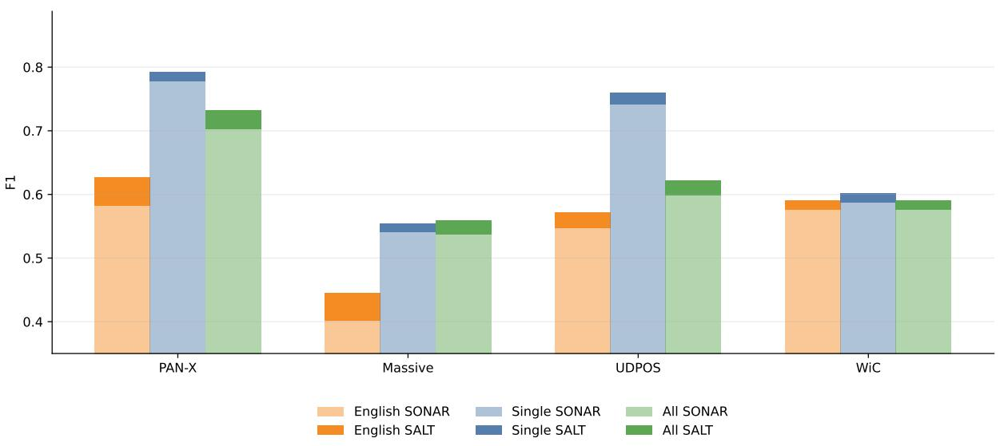  
Figure 5: Performance of SALT vs SONAR on the sequence tagging tasks, on three training modes for the probe: only English data, all the data and data for every test language. SALT improves all the results.

<table><tr><td>Task</td><td>SALT (single)</td><td>SALT (English)</td><td>SALT (all)</td><td>SONAR (single)</td><td>SONAR (English)</td><td>SONAR (all)</td></tr><tr><td>Massive</td><td>0.55</td><td>0.45</td><td>0.56</td><td>0.54</td><td>0.40</td><td>0.54</td></tr><tr><td>PAN-X</td><td>0.79</td><td>0.63</td><td>0.73</td><td>0.78</td><td>0.58</td><td>0.70</td></tr><tr><td>UDPOS</td><td>0.76</td><td>0.57</td><td>0.62</td><td>0.74</td><td>0.55</td><td>0.60</td></tr><tr><td>WiC</td><td>0.60</td><td>0.59</td><td>0.59</td><td>0.59</td><td>0.58</td><td>0.58</td></tr></table>

Table 7: F1 scores for the sequence tagging tasks on the three training settings.

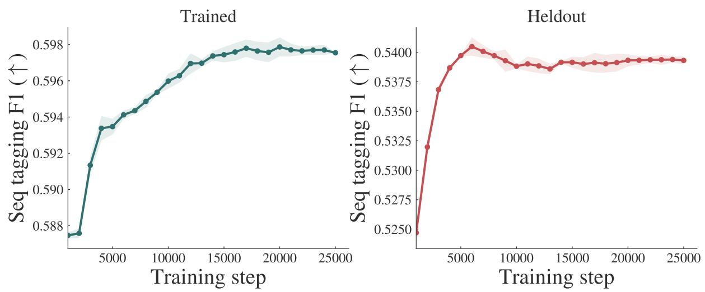  
Figure 6: Sequence tagging performance throughout SALT training on trained (left) and held-out (right) languages.

<table><tr><td></td><td>PAN-X</td><td>Massive</td><td>UDPOS</td></tr><tr><td>SONAR Loss</td><td>0.562</td><td>0.411</td><td>0.530</td></tr><tr><td>SO Loss</td><td>0.577</td><td>0.395</td><td>0.549</td></tr><tr><td>WordOT</td><td>0.586</td><td>0.410</td><td>0.535</td></tr><tr><td>WACSE</td><td>0.582</td><td>0.400</td><td>0.538</td></tr><tr><td>OmniSONAR-Token</td><td>0.590</td><td>0.402</td><td>0.548</td></tr><tr><td>SALT</td><td>0.598</td><td>0.442</td><td>0.544</td></tr></table>

Table 8: Sequence tagging performance on test languages not seen during training.

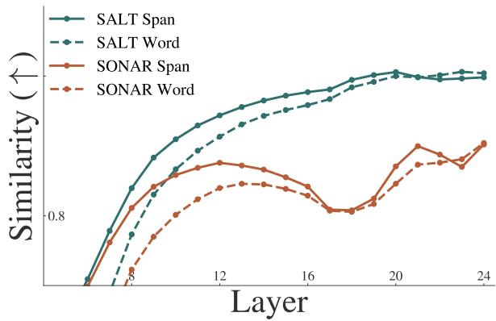  
Figure 7: Word and span similarity for SONAR and SALT across layers.

## E.3 Qualitative analysis

We take the sentence

Most insects have the advantage ofbeing able to fold their wings back along the body.

and perform word-level retrieval (top-5 nearest neighbours) across sentences in 80 languages (see Table 9,10, 11) for the full FLORES-200 devtest.

Overall, all three encoders are generally able to retrieve semantically equivalent words in other languages from the same sentence. However, SALT more frequently retrieves tokens in non-Latin scripts and, more importantly, places true translations closer in terms of absolute cosine similarity. This is notable given our earlier geometric analysis, in which we observed that SALT yields a lower average cosine similarity across the embedding space than the other encoders.

Another improvement is that SALT reduces a common failure mode in which the model retrieves the same word in the same language from diferent sentential contexts. This suggests that SALT better preserves contextual meaning, rather than relying on surface-form similarity.

MEXMA
<table><tr><td>Rank</td><td>Score</td><td>Lang</td><td>Unit</td></tr><tr><td>1</td><td>0.945</td><td>hun_Latn</td><td>legtobb</td></tr><tr><td>2</td><td>0.943</td><td>heb_Hebr</td><td>rov</td></tr><tr><td>3</td><td>0.943</td><td>nno_Latn</td><td>fleste</td></tr><tr><td>4</td><td>0.942</td><td>fra_Latn</td><td>plupart</td></tr><tr><td>5</td><td>0.942</td><td>ukr_Cyrl</td><td>bilshosti</td></tr><tr><td colspan="4">SALT</td></tr><tr><td>Rank</td><td>Score</td><td>Lang</td><td>Unit</td></tr><tr><td>1</td><td>0.988</td><td>ckb_Arab</td><td>zorbey</td></tr><tr><td>2</td><td>0.987</td><td>mar_Deva</td><td>bahutek</td></tr><tr><td>3</td><td>0.986</td><td>arz_Arab</td><td>mu&#x27;zem</td></tr><tr><td>4</td><td>0.986</td><td>npi_Deva</td><td>adhikansh</td></tr><tr><td>5</td><td>0.984</td><td>bul_Cyrl</td><td>povecheto</td></tr><tr><td></td><td></td><td>SONAR</td><td></td></tr><tr><td colspan="4"></td></tr><tr><td>Rank</td><td>Score</td><td>Lang</td><td>Unit</td></tr><tr><td>1</td><td>0.976</td><td>fra_Latn</td><td>plupart</td></tr><tr><td>2</td><td>0.971</td><td>por_Latn</td><td>maioria</td></tr><tr><td>3</td><td>0.971</td><td>kor_Hang</td><td>daebubun-ui</td></tr><tr><td>4</td><td>0.966</td><td>spa_Latn</td><td>mayoria</td></tr><tr><td>5</td><td>0.965</td><td>cat_Latn</td><td>majoria</td></tr></table>

Table 9: Nearest neighbours across models for the query word most (all non-Latin scripts transliterated).

## F Standard deviations

Table 12 shows the standard deviation of our results from Table 2.

## G Human evaluation of spans

For each of Chinese, French, Hindi, Russian, and Spanish, a native speaker annotated spans extracted from a total of 2,361 sentence pairs generated by either LLaMA-70B or CASE (with SONAR), without being informed of the originating system. The annotation split per language and system can be seen in Table 13. Annotators were presented with pairs of spans and asked to assess their semantic equivalence using a 4-point scale (see Appendix G.2). Further details on the recruitment process are provided in Appendix G.3.

## G.1 Results on human evaluation of extracted aligned spans

Table 13 shows the score distribution of spans following human evaluation. We observe that, in almost all languages, spans of acceptable quality (Rating 3 or 4) occur at a rate higher than 90%. These results validate using spans as a training signal. We also see that SONAR performance with CASE closely resembles LLM annotation.

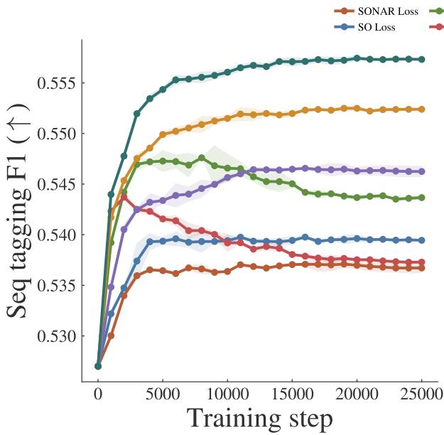

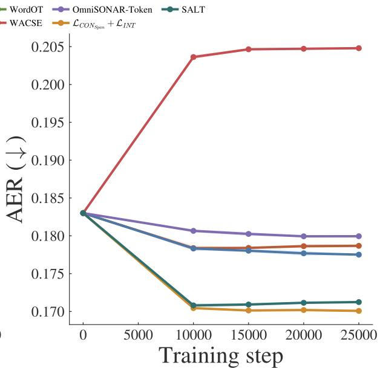  
Figure 8: Sequence tagging and word alignment performance for diferent training losses. In the word alignment plot, we omit WordOT to improve visualisation (WordOT is poorly aligned).

## G.2 Full instructions given to annotators

Figure 10 shows the annotation guidelines.

## G.3 Recruitment and demographics

Annotators were recruited through internal communication channels within our institution. All annotators were residing in the country where the institution is based at the time of the study. The annotator pool comprised five individuals, each a native speaker of one of the following languages: Chinese, French, Hindi, Russian and Spanish.

Prior to the annotation process, all annotators participated in a training session in which we introduced the annotation interface, explained the evaluation rubric in detail, and jointly reviewed a set of example instances to ensure consistency in interpretation. Annotators were compensated at a rate of \$20.5 per hour.

## G.4 Participant Information Sheet

Figure 11 shows the Participant Information Sheet that was shared with the annotators.

## H Compute and model size

SONAR has 766M parameters, and SALT introduces no additional parameters. We developed SALT using two NVIDIA A100 GPUs (80 GB each). Final training runs were conducted on two NVIDIA H200 GPUs (90 GB each) and required approximately two and a half days.

## I Use of artifacts

We use the SONAR encoder and the open-source subset of the NLLB Primary dataset, which are distributed under permissive licenses (Creative Commons Attribution Non-Commercial 4.0 and MIT License, respectively). These resources are used in accordance with their intended purpose of advancing research on multilingual sentence representations. All other encoders and datasets are used solely for evaluation, respecting their respective licenses and intended uses.

We do not apply additional filtering for ofensive content or personally identifiable information (PII), as such filtering was already performed by the original dataset creators (NLLB Team, 2024).

## J Usage of AI tools

We acknowledge using AI tools for grammar correction and some other language clarifications, as well as code writing assistance.

MEXMA
<table><tr><td>Rank</td><td>Score</td><td>Lang</td><td>Unit</td></tr><tr><td>1</td><td>0.950</td><td>ron_Latn</td><td>insecte</td></tr><tr><td>2</td><td>0.940</td><td>afr_Latn</td><td>insekte</td></tr><tr><td>3</td><td>0.940</td><td>spa_Latn</td><td>insectos</td></tr><tr><td>4</td><td>0.939</td><td>swe_Latn</td><td>insekter</td></tr><tr><td>5</td><td>0.939</td><td>epo_Latn</td><td>insektoj</td></tr></table>

SALT
<table><tr><td>Rank</td><td>Score</td><td>Lang</td><td>Unit</td></tr><tr><td>1</td><td>0.978</td><td>afr_Latn</td><td>insekte</td></tr><tr><td>2</td><td>0.970</td><td>arz_Arab</td><td>al-hasharat (al-asharāt)</td></tr><tr><td>3</td><td>0.968</td><td>slv_Latn</td><td>insektov</td></tr><tr><td>4</td><td>0.967</td><td>mkd_Cyrl</td><td>insekti</td></tr><tr><td>5</td><td>0.967</td><td>slk_Latn</td><td>hmyzu</td></tr><tr><td colspan="4">SONAR</td></tr><tr><td>Rank</td><td>Score</td><td colspan="2">Lang</td></tr><tr><td></td><td>1 0.970</td><td>epo_Latn</td><td>insektoj</td></tr><tr><td></td><td>2 0.964</td><td>fra_Latn</td><td>insectes</td></tr><tr><td></td><td>3 0.960</td><td>nob_Latn</td><td>insekter</td></tr><tr><td></td><td>4 0.954</td><td>afr_Latn</td><td>insekte</td></tr><tr><td></td><td>5 0.954</td><td>deu_Latn</td><td>Insekten</td></tr></table>

Table 10: Nearest neighbours for the query word insect (all non-Latin scripts transliterated).

MEXMA
<table><tr><td colspan="6">MEXMA</td></tr><tr><td>Rank</td><td>Score</td><td>Lang</td><td>Unit</td><td>Sent. idx</td></tr><tr><td>1</td><td>0.949</td><td>eng_Latn</td><td>fold</td><td>621</td></tr><tr><td>2</td><td>0.872</td><td>tha_Thai</td><td>a</td><td>619</td></tr><tr><td>3</td><td>0.873</td><td>tha_Thai</td><td>ph</td><td>619</td></tr><tr><td>4</td><td>0.873</td><td>tha_Thai</td><td>b</td><td>619</td></tr><tr><td>5</td><td>0.849</td><td>tha_Thai</td><td>a</td><td>621</td></tr><tr><td colspan="5">SALT</td></tr><tr><td>Rank</td><td>Score</td><td>Lang</td><td>Unit</td><td>Sent. idx</td></tr><tr><td>1</td><td>0.956</td><td>ind_Latn</td><td>melipat</td><td>619</td></tr><tr><td>2</td><td>0.946</td><td>epo_Latn</td><td>faldi</td><td>619</td></tr><tr><td>3</td><td>0.945</td><td>ron_Latn</td><td>plieze</td><td>619</td></tr><tr><td>4</td><td>0.937</td><td>vie_Latn</td><td>gap</td><td>619</td></tr><tr><td>5</td><td>0.936</td><td>bul_Cyrl</td><td>sgavat</td><td>619</td></tr><tr><td colspan="5">SONAR</td></tr><tr><td>Rank</td><td>Score</td><td>Lang</td><td>Unit</td><td>Sent. idx</td></tr><tr><td>1</td><td>0.915271</td><td>epo_Latn</td><td>faldi</td><td>619</td></tr><tr><td>2</td><td>0.901712</td><td>kor_Hang</td><td>jeobeul</td><td>619</td></tr><tr><td>3</td><td>0.874322</td><td>heb_Hebr</td><td>rov</td><td>619</td></tr><tr><td>4</td><td>0.874098</td><td>eng_Latn</td><td>fold</td><td>621</td></tr><tr><td>5</td><td>0.872106</td><td>ind_Latn</td><td>melipat</td><td>619</td></tr></table>

Table 11: Nearest neighbours across models for the query word fold (all non-Latin scripts transliterated). Note that MEXMA and SONAR retrieve words from other sentences.

<table><tr><td></td><td>AER</td><td>PAN-X</td><td>Massive</td><td>UDPOS</td><td>WiC</td></tr><tr><td>SONAR Loss</td><td>0.000255</td><td>0.000120</td><td>0.000622</td><td>0.000735</td><td>0.000361</td></tr><tr><td>SO Loss</td><td>0.000318</td><td>0.000311</td><td>0.001860</td><td>0.000445</td><td>0.000064</td></tr><tr><td>WordOT</td><td>0.002277</td><td>0.000516</td><td>0.001676</td><td>0.000156</td><td>0.000672</td></tr><tr><td>WACSE</td><td>0.000127</td><td>0.001146</td><td>0.000714</td><td>0.000113</td><td>0.001513</td></tr><tr><td>OmniSONAR-Token</td><td>0.000068</td><td>0.000549</td><td>0.000630</td><td>0.000938</td><td>0.002037</td></tr><tr><td>SALT</td><td>0.000127</td><td>0.000456</td><td>0.001210</td><td>0.000677</td><td>0.000210</td></tr></table>

Table 12: Standard deviation of our results in Table 2 (we run training experiments in three seeds).

<table><tr><td>Language</td><td>Source</td><td>#Annotations</td><td>Rating 1</td><td>Rating 2</td><td>Rating 3</td><td>Rating 4</td><td>Agg. 3+4</td></tr><tr><td>Spanish</td><td>LLaMA-70B</td><td>129</td><td>0.0%</td><td>3.1%</td><td>0.8%</td><td>96.1%</td><td>96.9%</td></tr><tr><td>Spanish</td><td>SONAR (CASE)</td><td>249</td><td>0.4%</td><td>2.0%</td><td>5.6%</td><td>92.0%</td><td>97.6%</td></tr><tr><td>Russian</td><td>LLaMA-70B</td><td>102</td><td>0.0%</td><td>7.8%</td><td>20.6%</td><td>71.6%</td><td>92.2%</td></tr><tr><td>Russian</td><td>SONAR (CASE)</td><td>204</td><td>3.4%</td><td>8.3%</td><td>21.1%</td><td>67.2%</td><td>88.3%</td></tr><tr><td>Hindi</td><td>LLaMA-70B</td><td>334</td><td>3.9%</td><td>7.2%</td><td>15.3%</td><td>73.7%</td><td>89.0%</td></tr><tr><td>Hindi</td><td>SONAR (CASE)</td><td>334</td><td>0.9%</td><td>3.3%</td><td>19.5%</td><td>76.3%</td><td>95.8%</td></tr><tr><td>French</td><td>LLaMA-70B</td><td>135</td><td>0.0%</td><td>5.2%</td><td>11.1%</td><td>83.7%</td><td>94.8%</td></tr><tr><td>French</td><td>SONAR (CASE)</td><td>264</td><td>0.4%</td><td>8.0%</td><td>21.6%</td><td>70.1%</td><td>91.7%</td></tr><tr><td>Chinese</td><td>LLaMA-70B</td><td>280</td><td>1.8%</td><td>5.4%</td><td>13.2%</td><td>79.6%</td><td>92.8%</td></tr><tr><td>Chinese</td><td>SONAR (CASE)</td><td>330</td><td>1.5%</td><td>3.6%</td><td>12.7%</td><td>82.1%</td><td>94.8%</td></tr></table>

Table 13: Score distribution for the human evaluation of spans.

<table><tr><td>Lang Pair</td><td>Source</td><td>en #words (avg)</td><td>en #words (median)</td><td>XX #words (avg)</td><td>XX #words (median)</td></tr><tr><td>English-Chinese</td><td>LLaMA-70B</td><td>2.61</td><td>2.0</td><td>4.17</td><td>3.5</td></tr><tr><td>English-Chinese</td><td>SONAR (CASE)</td><td>5.70</td><td>3.0</td><td>8.42</td><td>5.5</td></tr><tr><td>English-French</td><td>LLaMA-70B</td><td>2.53</td><td>2.0</td><td>3.13</td><td>3.0</td></tr><tr><td>English-French</td><td>SONAR (CASE)</td><td>2.58</td><td>2.0</td><td>3.22</td><td>2.0</td></tr><tr><td>English-Hindi</td><td>LLaMA-70B</td><td>2.72</td><td>2.0</td><td>4.98</td><td>4.0</td></tr><tr><td>English-Hindi</td><td>SONAR (CASE)</td><td>2.82</td><td>2.0</td><td>5.70</td><td>4.0</td></tr><tr><td>English-Russian</td><td>LLaMA-70B</td><td>2.43</td><td>2.0</td><td>2.30</td><td>2.0</td></tr><tr><td>English-Russian</td><td>SONAR (CASE)</td><td>2.63</td><td>2.0</td><td>2.44</td><td>2.0</td></tr><tr><td>English-Spanish</td><td>LLaMA-70B</td><td>2.64</td><td>2.0</td><td>3.15</td><td>3.0</td></tr><tr><td>English-Spanish</td><td>SONAR (CASE)</td><td>2.43</td><td>2.0</td><td>2.59</td><td>2.0</td></tr><tr><td>All English-XX</td><td>LLaMA-70B</td><td>2.62</td><td>2.0</td><td>3.97</td><td>3.0</td></tr><tr><td>All English-XX</td><td>SONAR (CASE)</td><td>3.36</td><td>2.0</td><td>4.83</td><td>3.0</td></tr></table>

Table 14: Average and median span word length.

<table><tr><td>Lang Pair</td><td>Source</td><td>1st POS</td><td>1st POS freq</td><td>2nd POS</td><td>2nd POS freq</td><td>3rd POS</td><td>3rd POS freq</td></tr><tr><td>English-Chinese</td><td>LLaMA-70B</td><td>NOUN</td><td>55.4</td><td>ADP</td><td>31.8</td><td>VERB</td><td>26.8</td></tr><tr><td>English-Chinese</td><td>SONAR (CASE)</td><td>NOUN</td><td>71.2</td><td>ADP</td><td>51.2</td><td>VERB</td><td>38.5</td></tr><tr><td>English-French</td><td>LLaMA-70B</td><td>NOUN</td><td>54.1</td><td>VERB</td><td>31.1</td><td>ADP</td><td>26.7</td></tr><tr><td>English-French</td><td>SONAR (CASE)</td><td>NOUN</td><td>49.6</td><td>ADP</td><td>25.8</td><td>VERB</td><td>23.9</td></tr><tr><td>English-Hindi</td><td>LLaMA-70B</td><td>NOUN</td><td>48.8</td><td>ADP</td><td>35.9</td><td>VERB</td><td>29.6</td></tr><tr><td>English-Hindi</td><td>SONAR (CASE)</td><td>NOUN</td><td>50.0</td><td>DET</td><td>32.6</td><td>PROPN</td><td>28.4</td></tr><tr><td>English-Russian</td><td>LLaMA-70B</td><td>NOUN</td><td>47.1</td><td>VERB</td><td>38.2</td><td>DET</td><td>25.5</td></tr><tr><td>English-Russian</td><td>SONAR (CASE)</td><td>NOUN</td><td>56.9</td><td>DET</td><td>27.9</td><td>PRON</td><td>24.0</td></tr><tr><td>English-Spanish</td><td>LLaMA-70B</td><td>NOUN</td><td>57.4</td><td>ADP</td><td>29.5</td><td>ADJ</td><td>27.1</td></tr><tr><td>English-Spanish</td><td>SONAR (CASE)</td><td>NOUN</td><td>50.2</td><td>VERB</td><td>26.9</td><td>DET</td><td>26.1</td></tr><tr><td>All English-XX</td><td>LLaMA-70B</td><td>NOUN</td><td>52.3</td><td>ADP</td><td>31.1</td><td>VERB</td><td>29.5</td></tr><tr><td>All English-XX</td><td>SONAR (CASE)</td><td>NOUN</td><td>56.0</td><td>ADP</td><td>31.3</td><td>DET</td><td>29.8</td></tr></table>

Table 15: Most common POS tags of English spans.

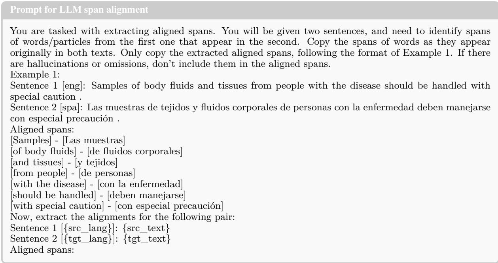  
Figure 9: Prompt that was used on LLaMA-70B for span alignment.

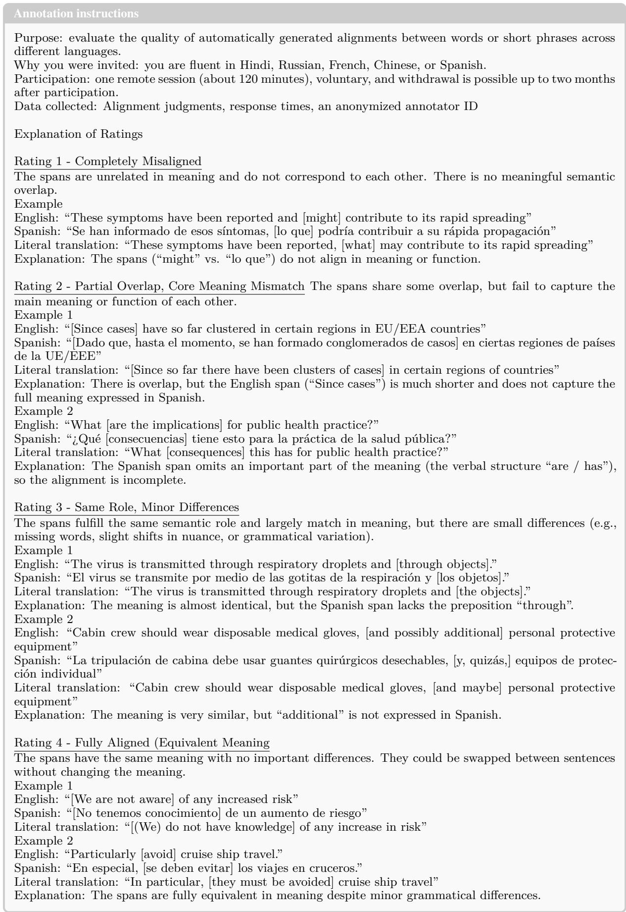  
Figure 10: Instructions shared with the annotators.

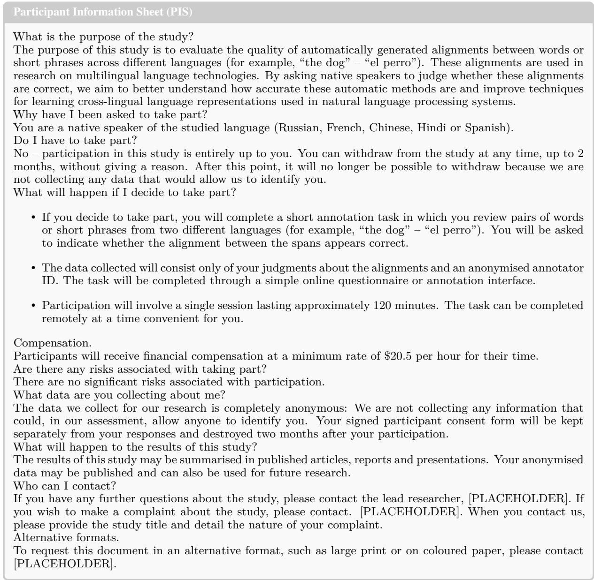  
Figure 11: Participant Information Sheet that was shared with the annotators.

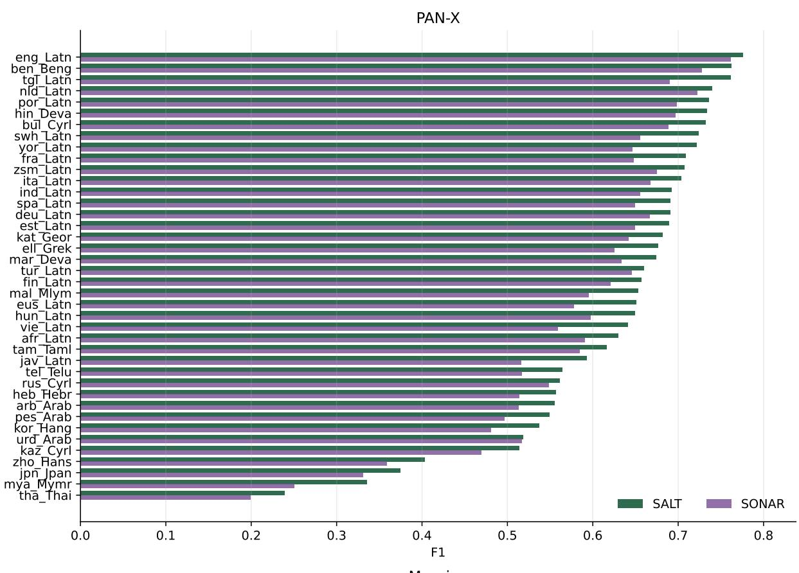

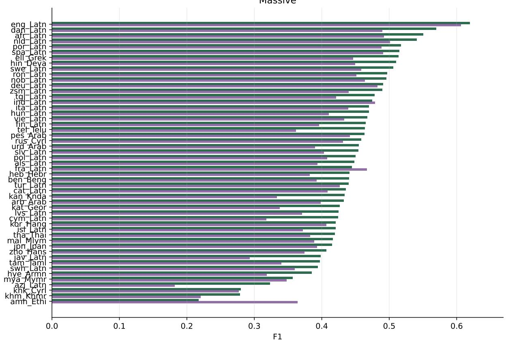  
Figure 12: Performance of SALT vs SONAR on the sequence tagging tasks PAN-X and Massive, on the English eng\_setting.

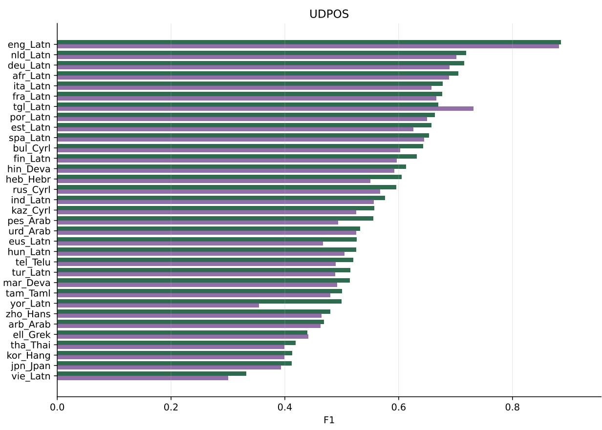

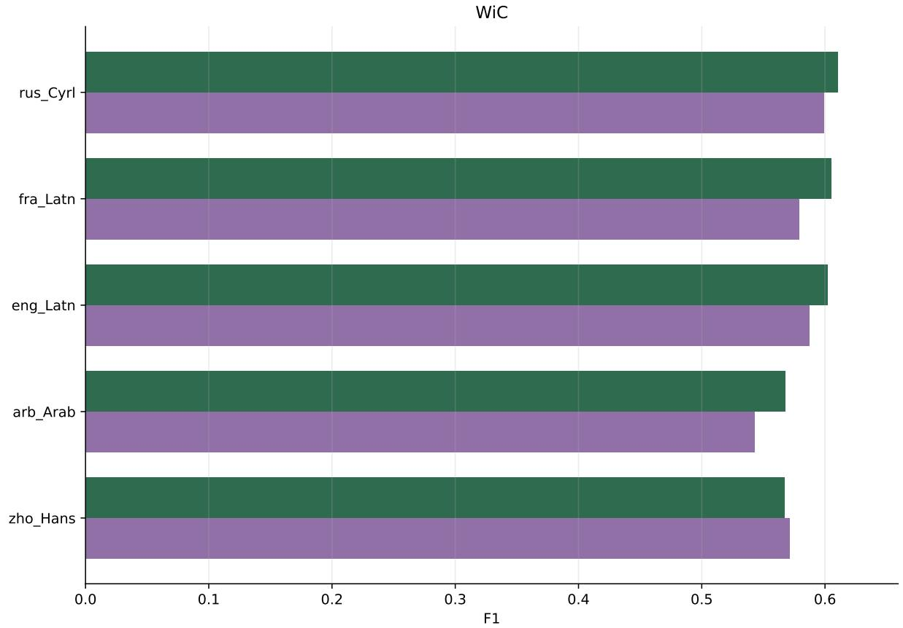  
Figure 13: Performance of SALT vs SONAR on the sequence tagging tasks UDPOS and WiC, on the English setting.

Table 16: Full list of languages used.
<table><tr><td colspan="4">Train ace_Arab ace_Latn</td></tr><tr><td>amh_Ethi bam_Latn bjn_Arab bul_Cyrl eng_Latn fur_Latn guj_Gujr hrv_Latn kas_Deva knc_Latn lmo_Latn mal_Mlym mni_Beng nob_Latn pbt_Arab rus_Cyrl som_Latn</td><td>arb_Arab ban_Latn bjn_Latn crh_Latn ewe_Latn fuv_Latn hat_Latn ind_Latn khm_Khmr lij_Latn ltg_Latn mar_Deva mri_Latn nus_Latn pes_Arab scn_Latn sot_Latn</td><td>afr_Latn ary_Arab ben_Beng bos_Latn dik_Latn fon_Latn gaz_Latn hin_Deva kan_Knda kin_Latn lim_Latn lug_Latn min_Latn mya_Mymr ory_Orya por_Latn shn_Mymr spa_Latn</td><td>(93 languages) aka_Latn arz_Arab bho_Deva bug_Latn dzo_Tibt fra_Latn grn_Latn hne_Deva kas_Arab knc_Arab lin_Latn mag_Deva mkd_Cyrl nno_Latn pan_Guru prs_Arab slv_Latn srd_Latn szl_Latn tel_Telu</td></tr><tr><td>srp_Cyrl tam_Taml tgl_Latn tzm_Tfng xho_Latn zul_Latn Test afr_Latn azj_Latn cym_Latn eng_Latn fra_Latn hye_Armn jav_Latn kaz_Cyrl lvs_Latn nld_Latn</td><td>ssw_Latn taq_Latn tir_Ethi ukr_Cyrl yor_Latn als_Latn ben_Beng dan_Latn est_Latn heb_Hebr ind_Latn jpn_Jpan khk_Cyrl mal_Mlym</td><td>swh_Latn taq_Tfng tsn_Latn urd_Arab zho_Hans amh_Ethi bul_Cyrl deu_Latn eus_Latn hin_Deva isl_Latn kan_Knda khm_Khmr mar_Deva pes_Arab rus_Cyrl</td><td>tso_Latn vec_Latn zsm_Latn (57 languages) arb_Arab cat_Latn ell_Grek fin_Latn hun_Latn ita_Latn kat_Geor kor_Hang mya_Mymr</td></tr><tr><td>spa_Latn tel_Telu urd_Arab zsm_Latn Test \ Train als_Latn dan_Latn eus_Latn hye_Armn jpn_Jpan kor_Hang ron_Latn vie_Latn</td><td>ron_Latn swe_Latn tgl_Latn vie_Latn azj_Latn deu_Latn fin_Latn isl_Latn kat_Geor lvs_Latn swe_Latn</td><td>swh_Latn tha_Thai yor_Latn cat_Latn ell_Grek heb_Hebr ita_Latn kaz_Cyrl nld_Latn tha_Thai</td><td>pol_Latn slv_Latn tam_Taml tur_Latn zho_Hans (29 languages) cym_Latn est_Latn hun_Latn jav_Latn khk_Cyrl pol_Latn tur_Latn</td></tr></table>