# KVSHAREARENA: KV-CACHE REUSE ACROSS CON-TEXTS AND MODEL CHECKPOINTS

Xi Shi University of Central Florida xi320101@ucf.edu

Qian Lou University of Central Florida qian.lou@ucf.edu

## ABSTRACT

LLM serving systems already reuse KV caches, but only when the reused text sits at the very start of the prompt. The fastest-growing workloads break this condition: a retrieval-augmented generation server assembles a different set of retrieved chunks for every query, and a multi-agent coordinator reads reports that other agents have just written. Reusing a cache inside a new prompt means the cached tokens carry the wrong positions and never attended to one another. The cache may also have been written by a different checkpoint of the same model family, which changes the stored values but not their shapes. Methods that repair such caches have appeared in three separate communities, each measured on its own tasks and cost metrics, and existing KV-cache benchmarks test only exactprefix reuse, where nothing is lost. We introduce KVShareArena, a benchmark for KV-cache reuse across prompt contexts and model checkpoints. It covers two workloads, retrieved chunks and agent reports, and scores every method by the fraction of the gap it recovers between answering with no cache and recomputing everything from scratch, together with its compute, memory, and latency cost; latency is charged per request with the cache in hand, and the one-time cost of building a cache is reported separately. We find that correcting positions, which is free, is enough until a question needs several sources at once. There, only methods that pay, by re-encoding part of the cache or by training, recover half to two thirds of the gap, and reusing caches without repair can be worse than dropping them. Cache-compression methods that are harmless on a single prompt fall significantly behind the free fix on freshly written agent reports. These patterns hold across three model boards. When a different checkpoint wrote the cache, training-free methods are barely affected, but repairs trained on one checkpoint's caches break. The harness, frozen querysets, and cost accounting are released as a pip package with an automated submission workflow and a public leaderboard.

## 1 INTRODUCTION

Two of the fastest-growing LLM workloads share one core operation: in retrieval-augmented generation (RAG) a model answers each query over several retrieved chunks, and in multi-agent systems (MAS) a coordinator integrates reports written by specialist agents. Both must reason jointly over source blocks that already exist elsewhere, and prefilling this payload (the shared material, as opposed to instructions and question) dominates serving cost. Production stacks therefore treat the key-value (KV) cache as reusable: prefix caching ships in vLLM and SGLang (Zheng et al., 2024) and is offered as prompt caching by major providers.

Prefix caching, however, is lossless only because it is restrictive: a cache hit requires every earlier token to be identical. A document cached behind one role prompt therefore yields no hit behind another, although the document itself is unchanged (Hu et al., 2025). For multi-source workloads no request is an exact match (Figure 1a): each RAG query selects a different subset and ordering of chunks, and agent reports are generated fresh. To reuse KV here, a system must move it out of its birth context: the prompt prefix and sequence position under which it was computed.

The model that builds KV (the producer) may also differ from the model that reads it (the receiver): the cache may have been written by a post-trained specialist handing KV to a differently weighted coordinator, or by an earlier checkpoint of the receiver's lineage (Figure 1b). Matching architecture and tokenizer guarantee the right tensor shapes, not the right values. We call this cross-checkpoint reuse.

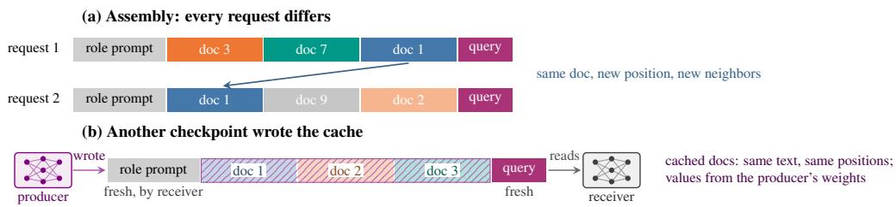  
Figure 1: Two everyday situations leave a serving system almost nothing to reuse from its KV cache. (a) Assembly workloads: after the receiver's fixed role prompt, each query draws a different subset and ordering of cached documents, so nothing is an exact prefix match. (b) When another checkpoint of the same architecture wrote the cache (a specialist sibling, or an earlier checkpoint of the receiver's lineage), the cached documents keep their text and positions but hold values from the producer's weights; the role prompt and the query are computed by the receiver. Whether the receiver can still read them is this paper's second factor; (a) and (b) together are its hardest cell. Figure 4 shows what breaks when repair methods reuse these caches anyway.

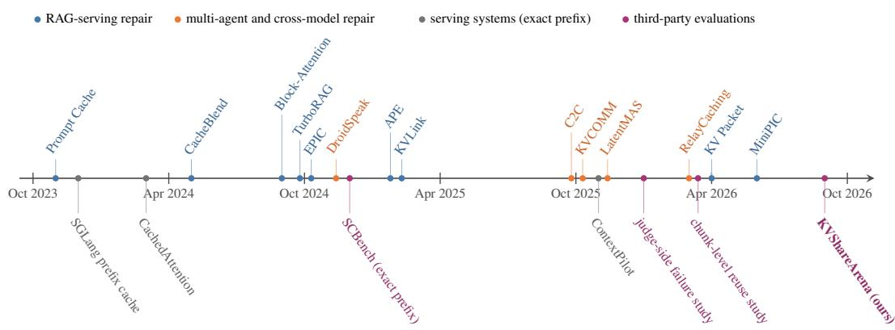  
Figure 2: Repair methods for reused KV caches have appeared at a steady pace in two communities since late 2023, while third-party evaluation lags behind them: one benchmark that reuses caches only under an exact prefix and two partial studies in 2026. Dates are arXiv first versions; above the axis are repair methods, below it are serving systems and evaluations.

The move meets a structural conflict (Figure 4, appendix). Dense prefill builds exactly the crosssource attention that joint reasoning needs; each reused block was instead encoded alone, so the assembled cache is damaged in two ways. The sources are mutually blind (their attention connections were never built), and the positions are misplaced (encodings reflect birth positions, not assembly positions). Moving keys to their new positions is nearly free but repairs only the geometry; everything beyond that must be bought, with answer-time computation or training in advance. We call such repairs paid, in contrast to the free position fix.

A repair ecosystem has grown around this problem in three communities that rarely evaluate against one another (Figure 2): RAG serving contributed selective recomputation (Yao et al., 2025), attention calibration (Yang et al., 2025b), and boundary recomputation (Hu et al., 2025); the MAS community contributed anchor-offset reuse (Ye et al., 2025); a third line replaces the medium with latent communication (Zou et al., 2026). The leading method already ships as a cache-layer plugin for production serving stacks. Yet each reports gains under its own tasks, ceiling, and cost accounting, and these quantities do not add up to a comparison. No third-party benchmark compares these methods on a shared quality-efficiency plane.

Table 1: No prior evaluation of KV-cache reuse crosses the two factors, scores against both a floor and a ceiling, or measures cost on one shared backend; KVShareArena does all three and runs a leaderboard. Rows in order: Li et al. (2025); Cestola et al. (2026); Liang et al. (2026), then the home evaluations of Yao et al. (2025); Hu et al. (2025); Yang et al. (2025b); Ye et al. (2025); Liu et al. (2025). Quality: raw = accuracy as is; vs. full = compared with full recomputation only; PGR = scored between a no-cache floor and a same-payload ceiling. Cost: what each work measures; only ours measures on one shared backend.
<table><tr><td></td><td colspan="2">Factor</td><td colspan="2">Workload</td><td></td><td></td><td>Leader-</td></tr><tr><td>Evaluation</td><td>Context Checkpoint RAG Agents Quality</td><td></td><td></td><td></td><td></td><td>Cost</td><td>board</td></tr><tr><td colspan="8">Benchmarks and studies</td></tr><tr><td>SCBench</td><td>×</td><td>X</td><td>X</td><td>X</td><td>raw</td><td>complexity</td><td>X</td></tr><tr><td>Cestola et al. (2026)</td><td></td><td>X</td><td>√</td><td>X</td><td>raw</td><td>none</td><td>X</td></tr><tr><td>Liang et al. (2026)</td><td></td><td>X</td><td>X</td><td>V</td><td>vs. full</td><td>reuse rate</td><td>X</td></tr><tr><td colspan="8">Method papers, home evaluations</td></tr><tr><td>CacheBlend</td><td></td><td>X</td><td></td><td>X</td><td>vs. full</td><td>TTFT</td><td>X</td></tr><tr><td>EPIC</td><td></td><td>X</td><td>L</td><td>X</td><td>vs. full</td><td>TTFT</td><td>X</td></tr><tr><td>APE</td><td></td><td>×</td><td>√</td><td>X</td><td>vs. full</td><td>latency</td><td>X</td></tr><tr><td>KVCOMM</td><td>√</td><td>X</td><td>X</td><td>V</td><td>vs. full</td><td>reuse rate, TTFT</td><td>X</td></tr><tr><td>DroidSpeak</td><td>X</td><td>√</td><td>X</td><td>X</td><td>vs. full</td><td>TTFT</td><td>X</td></tr><tr><td>KVShareArena (ours)</td><td>L</td><td></td><td>L</td><td></td><td colspan="2">PGR, paired CI compute/bytes/TTFT</td><td>V</td></tr></table>

Table 1 places existing evaluations on the dimensions a benchmark for this problem needs. Three gaps stand out. One factor at a time. The closest KV-cache benchmark reuses caches only under an exactly matching prefix (Li et al., 2025), where misalignment loss is zero by design. The studies that do assemble caches keep one model throughout (Cestola et al., 2026; Liang et al., 2026), and the evaluation that changes the model keeps the prompt fixed (Liu et al., 2025). Absolute scores. Every prior row reports raw accuracy, or compares against full recomputation alone. A cache that scores below the no-context floor then reads as a small loss rather than a failure, and scores from different tasks are not on one scale. Cost on private terms. Cost is either not measured or measured on each paper's own setup, so quality and efficiency never meet on one plane. The repair problem is invisible precisely where evaluation currently looks.

We introduce KVShareArena, a benchmark for KV-cache reuse when the prompt context changes, the producer checkpoint differs from the receiver's, or both: a two-factor design crossing context with producer weights under a fixed receiver (§2.2), on two workload tracks, Retrieved Evidence (cached raw chunks) and Agent Reports (generated specialist reports). Every method is scored between a no-context floor and a same-payload ceiling (full recomputation of what it consumes), yielding the performance-gap recovered (PGR), and its efficiency is read on three frontiers (prefill compute, KV bytes, same-backend latency). How rows and datasets are admitted is specified in §2.7.

Our experiments yield five findings (all numbers under the datasets’ official metrics, §2.6). (1) Misaligned assembly is an information problem, not a geometry problem. Naively assembled report caches score far below the no-payload floor (PGR —.82): misplaced reports are worse than no reports. Free position re-alignment brings back only a quarter of the gap. On multi-hop retrieved evidence, even the re-aligned assembly stays below the floor. The same re-alignment, in contrast, fully repairs single-source prefix replacement at every practical strength we tested. Competitive repair space exists only where sources are mutually blind and the task needs them jointly. The loss from missing cross-source connections grows steadily with the number of blind producers. On a subset with only 2–4 sources per question, no method beats free alignment, exactly as that dose-response pattern predicts. (2) Paid repair earns back quality exactly where blindness is heavy. On the two subsets whose questions need several sources at once, selective recomputation and attention calibration significantly beat free position alignment (LegoLink at a measured recompute share below half a percent), and a trained soft-token adapter (KVPacket) does so with zero payload recomputation (PGR .64/.36). On multi-hop QA these repairs pull the board from below the floor back to .36–.46 of the gap. On the subset that free alignment already nearly solves, nothing significantly improves on it. Recomputing the same budget on randomly chosen tokens loses most of the gain where damage is heavy, so the value lies in the selection mechanism, not the budget. (3) Compression is not free under misalignment. The compression family never significantly beats free alignment on any subset of the main board, and on assembled reports every compression row is significantly below free alignment while recomputation-based repair holds the top; the loss is traceable to the KV information content rather than to answers simply getting shorter. (4) The same patterns replicate across three model boards. On a second model family and on a 4B sibling of the main model, the same four patterns recur: the calibration method is strong on multi-hop and weak on scientific-paper QA, selective recomputation beats free alignment on single-doc $\mathbf { Q A } .$ , naive report assembly collapses below floor, and the leading method on the Agent Reports track is unchanged. Boards are never compared numerically; only these patterns are checked. (5) A producer weight change exposes method-specific failures. Most training-free methods change little when the same Cross-Context cells use KV from a different same-architecture producer checkpoint. The exception is repair trained to one producer's KV distribution: the trained adapter drops significantly in four of six cells, and the boundary method's zero-recompute variant, which leaves every cached token as the producer wrote it, collapses on multi-hop QA. Every repair that recomputes remains stable. Where a trained repair fails, it can return a fluent answer with the wrong entity rather than visibly degraded text. Cross-checkpoint reuse is therefore not a uniform penalty; it is a compatibility test that separates repairs tied to producer weights from repairs that rebuild receiver-side state.

Our contributions: (a) a benchmark for KV reuse across context and checkpoint change, with two workload tracks, frozen querysets, and same-payload ceilings; (b) a unified measurement system: PGR between a no-cache floor and a same-payload ceiling, three cost frontiers with per-sample raw accounting, and paired statistics on frozen samples; (c) the class-level findings above; (d) an open platform: a pip-installable harness with a one-class method contract, an automated submission workflow that re-scores every entry on CPU, and a public leaderboard (appendix; code and data at [repo link]).

## 2 BENCHMARK SETUP

## 2.1 PROTOCOL: INDEPENDENTLY BUILT KV AND CONTEXT CHANGE

We call the prompt prefix and sequence position under which a KV entry is computed its birth context. Payload KV is born in a canonical, isolated context (each block encoded alone, from position zero), keeping the cache free of producer-specific prefixes; misalignment then arises on the use side, in two forms. Concatenated assembly (one context, many blocks): the caches of k independently encoded blocks are assembled into one consumer prompt $[ P _ { c } , \mathrm { k v } ( d _ { 1 } ) , \ldots , \mathrm { k v } ( d _ { k } )$ , Q]; the blocks are mutually blind and their positions collide. Prefix replacement (one block, many contexts): one payload is reused under different role prefixes; only geometry is wrong. The ranked Cross-Context task requires the use context to differ from the birth context (otherwise it reduces to exact-prefix reuse, lossless by construction); the same-context case is kept as a control. Chunking uses natural passage boundaries where provided and 512-token windows otherwise, matching prior selective-recomputation evaluations.

## 2.2 TWO FACTORS: PROMPT CONTEXT AND MODEL WEIGHTS

The model that builds payload KV is the producer; the model that reads it and answers is the receiver. They need not share weights: the cache may be written by one checkpoint and read by another, as when a post-trained specialist hands report KV to a differently weighted coordinator. Passing KV instead of text saves the receiver's prefill only if the producer's state remains usable. We therefore vary two factors independently: whether the use context matches the birth context, and whether the producer weights match the receiver weights. The four cells are: exact-prefix control (same context, same weights), checkpoint-only handoff (same context, different weights), Cross-Context reuse (different context, same weights), and Cross-Context + checkpoint change. For a weight change we keep the architecture, tokenizer, receiver, text, samples, and scoring fixed: matching tensor shapes are guaranteed, matching KV values are not. The direct-reuse panel evaluates all four cells; the full repair roster runs in the two different-context cells. Same-context cells are controls, not workloads.

## 2.3 TRACKS AND SAME-PAYLOAD CEILINGS

The two active tracks instantiate concatenated assembly with two payload types (Figure 7, appendix): Retrieved Evidence (RAG main leaderboard; independently cached raw chunks, selected and assembled per query) and Agent Reports (MAS transfer track; reports written by specialist agents, each reading a disjoint part of the material without seeing the question, matching deployment; in deployment the producer already holds a report's decode-phase KV, so the build cost is sunk there, while the benchmark encodes every payload in the same isolated way and charges the build to every row alike). The ceiling principle is uniform: whatever material a method consumes, its ceiling is a full recomputation of that same material; the tracks have different ceilings, so scores are never averaged across them. Prefix replacement, single-source handoff, exact-prefix compression, and interaction-light summarization are boundary regimes (§3.4).

## 2.4 QUALITY METRIC: PERFORMANCE-GAP RECOVERED

Every board fixes two anchors: the floor (the consumer answers with no shared material at all) and the track ceiling defined above. The floor reflects a consumer that ignores the payload entirely; the ceiling reflects paying full prefill for it. A method's quality is the fraction of the context's value it recovers,

$$
\mathrm { P G R } \ : = \ : \frac { S _ { \mathrm { m e t h o d } } - S _ { \mathrm { f l o o r } } } { S _ { \mathrm { c e i l i n g } } - S _ { \mathrm { f l o o r } } } ,\tag{1}
$$

which is 0 at the floor, 1 at the ceiling, may exceed 1, and may be negative: a reused cache can be worse than no context. Anchors are frozen once per board and shared by every method, so the denominator is the same physical quantity for all rows; subsets whose gap is too small to measure are inadmissible (§2.7). On the three main Retrieved Evidence subsets the context value is .395/.329/.308.

## 2.5 EFFICIENCY: THREE RESOURCE FRONTIERS

Repair methods spend and save different physical quantities, and no exchange rate between them is auditable, so the primary report is three Pareto frontiers over the same PGR points; a summary score below turns the exchange rate into an explicit, user-set knob. Compute (headline): PrefillWorkSaved $= 1 - R / D$ , recomputed over dense payload layer-tokens, counted from per-sample raw sums, never from nominal ratios. Memory: KVBytesSaved $= 1 - B _ { \mathrm { m e t h o d } } / B _ { \mathrm { d e n s e } }$ , measured on the actual tensors (scales, indices, and copies included) against the dense BF16 cache. Runtime: TTFTSaved $= 1 - T _ { \mathrm { m e t h o d } } / T _ { \mathrm { d e n s e } }$ , defined only on a shared backend and measured per request with the cache in hand, the cost the method itself controls. Building a cache is a separate one-time cost, the same isolated prefill of the payload for every row, which the benchmark reports alongside but never folds into a per-request number: whether a build is amortized depends on how often a workload reads the cache and where the cache is stored, both deployment parameters outside the benchmark. A deployer can close the account with their own numbers, since a cache pays for itself after $T _ { \mathrm { b u i l d } } / ( T _ { \mathrm { d e n s e } } ^ { \mathrm { ~ \bar { ~ } } } -$ $T _ { \mathrm { m e t h o d } } - B _ { \mathrm { m e t h o d } } /$ bandwidth) reads and every term except the bandwidth is on the axes above. Every formal sample stores raw numerators, denominators, and provenance; missing measurements are explicit nulls, never imputed. Summary score. For a single leaderboard ordering we combine quality and cost the way RouterArena does (Lu et al., 2026), with the weights exposed: A is PGR clipped to [0, 1]; C is a weighted arithmetic mean of the three savings above (consumer-side TTFT for the runtime axis) over the axes measured for the row; and $S _ { \beta , w } \stackrel { \smile } { = } \left( 1 + \beta \right) A C / ( \beta A + C )$ . The default is $\beta = 0 . 1$ , which favors quality, with equal weight on the compute and memory axes; the leaderboard exposes $\beta$ and w as sliders, and the appendix lists rankings under five presets.

## 2.6 SCORING: THE DATASETS’ OFFICIAL METRICS

Every output is scored with the official metric of its source dataset: token-level F1 for the three LongBench subsets, and the LLM-autorater protocol that FRAMES itself ships for the FRAMES variant. The FRAMES autorater is cross-checked by a scorer panel from two other model families $\left( \kappa { = } . 8 9 / . 8 6 \right.$ on all 1,740 verdicts, no direction reversals; the in-family scorer is the strictest of the three, the opposite of a leniency bias; appendix). We choose the official metrics deliberately: they are the yardstick each dataset shipped with, they involve no scoring model of our own choosing, and every claim is a paired difference on the same frozen samples, so a metric's systematic preferences largely subtract out. All outputs were also scored by a validated LLM judge; the companion tables and disagreement analysis are in the appendix, and instrument-sensitive rows are flagged in place.

## 2.7 ADMISSION AND SINGLE-VARIABLE DISCIPLINE

Datasets and regimes enter a board only through pre-registered admission, with $S _ { \mathrm { f r e e } }$ the score of naively assembled caches after free position alignment: (C1) ceiling—floor > .25; (C2) residual share (ceiling - Sfree)/(ceiling − floor) ≥ .25 with a confidence interval excluding zero; (C3) the residual significant under paired tests. Criteria precede the runs; failures are published. Within a board the method under test is the only independent variable; a method that cannot run the shared setting is marked not-applicable, never granted a private setting, and different settings are never ranked together. Reference rows (anchors, free-alignment baselines, and lossless serving-layer caching, which saves nothing on our payloads and anchors the Pareto origin, §I) are not contestants; the grouping of method rows in the tables is explained in the appendix (§H).

## 2.8 METHODS UNDER TEST

Table 6 (appendix) lists the evaluated methods by the mechanism applied to KV that has left its birth context; class-level conclusions are the benchmark's primary product. The class glyphs used in every results table: ① selective recomputation, ② attention calibration, ③ position alignment, ④ anchor-delta reuse, ⑤ medium replacement, ⑥ fine-tuned repair, ⑦ trained soft-token adapter, ⑧ decoded-KV handoff repair, ⑨ compression under reuse. Inclusion and leaderboard presence are distinct: methods that cannot run the shared setting keep their row with an explained status, because the applicability pattern is itself a result.

## 2.9 MODELS, DATASETS, AND FREEZING

The main board uses one 8B open-weight model as both producer and receiver; a second 8B family and a 4B sibling form confirmation boards with their own anchors (§4), checked for pattern replication, never compared numerically. Retrieved Evidence comprises four subsets: three LongBench v1 QA subsets (Bai et al., 2024) spanning scientific-paper, single-document, and multi-hop QA, plus a fourth subset admitted by the pre-registered criteria: FRAMES (Krishna et al., 2025) questions over a checksum-pinned 2026 Wikipedia-snapshot payload (a dataset variant, labeled as such throughout); it passed all three admission criteria on a held-out calibration split $( \mathbf { C } 1 = . 3 5 0 , \mathbf { C } 2 = . 4 7 6$ C3 $p = . 0 3 1$ ; two of three panel scorers pass C3, appendix). A cross-session-memory candidate failed C3 and was declined (§3.4). All querysets are frozen before any method runs (N=100 per subset) with SHA256 manifests, fixed seed, and an input cap chosen so no frozen sample is truncated; anchors are computed once and reused by every run.

## 3 MAIN-BOARD RESULTS

The boards deliver one headline: free position alignment is all a system needs until the task makes sources depend on each other, and exactly there, paid repair earns its cost (all numbers: official metrics; judge companion matrix in the appendix).

## 3.1 RETRIEVED EVIDENCE LEADERBOARD

Key findings, all class-level (Figure 3; every row's numbers are in Table 2, appendix; paired vs. free alignment, differences below the benchmark's resolution are stated as ties): 1) Free alignment already recovers most of the scientific-paper subset and nothing significantly beats it there; the repair space concentrates on single-doc and multi-hop QA, where sources depend on each other most. On multi-hop, free alignment itself stays below the floor (—.196) until something rebuilds the missing attention. 2) Paid repair rebuilds it across three families: selective recomputation ① (CacheBlend at 15% of the payload, LegoLink at a cost forty times smaller) and calibration ② each significantly beat free alignment on both subsets, pulling multi-hop back to .39–.46 of the gap. 3) KVPacket (7) beats free alignment on both subsets with zero payload recompute: the full-savings end of the compute frontier no longer belongs to free repairs alone. 4) Compression ⑨ never significantly

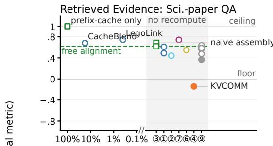

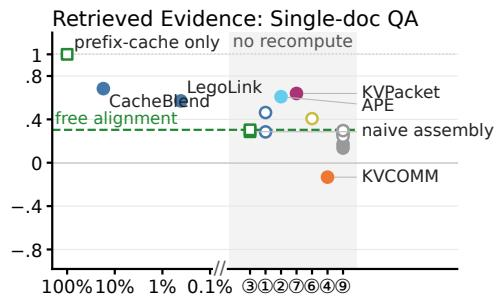

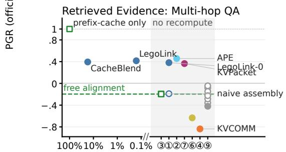

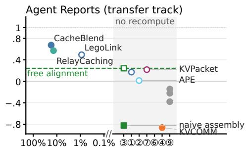  
payload fraction re-computed at answer time (log scale; cheaper →)| no-recompute lane, grouped by class

Figure 3: Free position alignment is all a system needs until a task makes sources depend on each other; there, and only there, paid repair earns its cost. Each panel is one board on the same plane: $y = { \mathrm { P G R } }$ under the dataset's official metric (floor 0, ceiling 1); x = the fraction of the payload a method re-computes at answer time (measured; log scale, cheaper to the right), with a lane on the right for methods that recompute nothing, grouped by mechanism class. Filled markers differ significantly from free position alignment (dashed line; paired bootstrap, 95% CI); hollow markers are ties; squares are reference rows. Compression ⑨ never significantly beats the dashed line; selective recomputation ①, calibration ②, and the trained adapter ⑦ beat it exactly on the subsets whose questions need several sources at once; on assembled reports only the two repairs that recompute clear the bar. Every row's numbers, the FRAMES column, and the confidence intervals are in Tables 2 and 3 (appendix).

beats free alignment anywhere and is significantly below it in four cells, concentrated at r=.5 and on multi-hop. 5) The FRAMES column (Table 2, appendix) validates the dose-response finding: with 2–4 sources per question, blindness is thin and free alignment is near-sufficient, exactly as predicted (§3.4).

## 3.2 AGENT REPORTS TRANSFER TRACK

The report track (Figure 3, bottom right; Table 3 in the appendix) separates by one question: does the method recompute? Only the two repairs that spend recompute clear the free-alignment bar: CacheBlend (+.11) and RelayCaching (+.08, repairing decoded KV handed between agents), statistically tied for first, with a third of the gap still unclaimed—an open challenge. Below the bar, naive assembly is toxic (—.82); every compression row is significantly below free alignment because fresh reports have no redundancy to spare (§3.4); the trained methods do not transfer (KVPacket, twice a winner on evidence, sits at the free-alignment level; Block-Attention falls significantly below, partly a verbose-style penalty the appendix separates); attention calibration does not help. KVCOMM's cold-start row lands below the floor; its recurring-message companion run recovers real ground but depends on recurrence the frozen setting excludes. The same instrument detects significant wins and losses here at the same n, so the remaining ties are informative (§5).

## 3.3 THREE RESOURCE FRONTIERS

Two structural facts dominate the cost story. On the compute axis (Figure 3), thirteen of sixteen rows recompute nothing at all, so we plot the fraction of the payload each method re-computes at answer time (its compute cost) on a log scale and give the zero-recompute rows their own lane: there they differ only in quality. The minority that does spend recompute spreads across two orders of magnitude: the lossless prefix-cache reference row pays the full 100% (on these payloads it saves nothing, which is precisely the gap the repair methods compete over), CacheBlend pays a measured 17%, and LegoLink pays under 0.5% while still significantly beating free position alignment on two subsets. KVPacket ⑦ beats it while paying nothing. On the runtime axis (Figure 5), per-request TTFT with the cache in hand is ≈ .9 below dense prefill for every reuse row: the payload prefill vanishes and what remains is nearly constant. The one-time cache build is the same isolated prefill for every row and is reported separately (appendix); the benchmark does not amortize it, because how many reads share a build is a property of the workload, not of the method (§2.5). The memory axis (Figure 6) is the reverse of the compute axis: only compression saves bytes, and it pays quality for them. Measured on the actual tensors, 4-bit quantization saves 71.9%, not the nominal 75%, because its per-group scale factors must be stored too. Every method that repairs quality stores the full cache, and two store slightly more: KVPacket's soft tokens and MiniPIC's padding each add about 3%. Saving memory and saving quality do not overlap on this board.

## 3.4 BOUNDARY FINDINGS AND THE INTERACTION LAW

Compression is not free, and the damage is lost information. In its birth context SnapKV at $r { = } . 5$ is mild (PGR .77/.69/.82); on the same payloads after misaligned assembly it falls to $5 7 / . 1 7 / -$ .08. Eviction keeps the tokens that mattered at birth; assembly changes which tokens matter, and fresh reports have no redundancy to spare. The loss is in the KV content, not the answer budget (appendix).

The free-geometry boundary. Under a replaced prefix, direct reuse already sits at the ceiling and all four dose cells fail admission; single-source handoff collapses naively $( - . 2 2 / - . 3 7 / - . 9 8 )$ and the position fix alone restores .93/.98/1.05: pure geometry, and geometry is free. Latent-state transfer scores below the floor while its text control stays high: a medium boundary (appendix). Repair space exists only where sources are mutually blind and the task needs them jointly.

Interaction loss scales with the number of blind producers. The blindness share of the reporttrack gap rises monotonically with the producer split, reaching .76 [.46, 1.19] at the full split; and recomputing the same budget on randomly chosen tokens loses most of the gain where damage is heavy. So: reuse loss = free geometry + mutual blindness scaled by task interdependence; the FRAMES column of Table 2 is this law's out-of-sample check.

Honest admission outcomes. FRAMES passed and joined the board; a memory-track candidate failed C3, a summarization candidate failed C2 on both tracks, and two early candidates were dropped at the anchor stage—all reported in the appendix, none silently.

## 4 CROSS-MODEL CONFIRMATION AND CROSS-CHECKPOINT REUSE

## 4.1 CONFIRMATION BOARDS

Do the main board's patterns survive a change of model? A second family (Llama-3.1-8B-Instruct) gets its own frozen anchors and method runs, a 4B sibling forms a third board, and boards are never compared numerically. On the second family the patterns hold: paid repairs earn on single-doc QA, scientific-paper QA is drowned by free alignment, multi-hop separates methods with calibration strongest, reports keep the same leader, and naive report assembly again collapses below the floor. The 4B board corroborates the same four patterns under the same official metric; two individual significance calls flicker across boards, with no direction reversal. Carrier sensitivity is itself a result: LegoLink's zero-recompute endpoint significantly beats its own k=2 on the confirmation model, while on the main model the ordering reverses: an argument for multi-board evaluation (appendix).

## 4.2 CROSS-CHECKPOINT KV REUSE

We isolate the checkpoint factor by holding everything else fixed and changing only the producer: a further-trained specialist sibling (the deployment case: another post-trained model wrote the cache) or the receiver's base-weight predecessor (the largest weight step available inside one lineage, kept as a bounding control). In the direct-reuse 2 × 2 (Table 7, appendix), every Cross-Context score is lower with foreign producer weights, but the drop size depends on task and producer both.

Re-running the full repair roster in the two different-context cells: for most methods the producer barely matters (shifts ≤ .06, mostly not significant). Damage follows weight distance rather than lineage: the distilled sibling, farther from the receiver in weight space than the base predecessor (kprojection distance .136 vs. .090), is the harder producer on multi-hop QA. The exception is training fit to the producer's payload representation: KVPacket drops significantly in four of six cells (up to —.135) and LegoLink's zero-recompute variant collapses on multi-hop (—.231), while the same method with recomputation is unaffected in all six cells and CacheBlend passes everywhere (its fixed budget re-selects what to recompute). A failing trained adapter fails silently (a fluent answer with the wrong entity); only producer-fitted repair fails to transfer. As one robustness number per method, the mean shift across the six cells stays within ±.02 for every row except the two producerfitted repairs (Table 8, appendix).

## 5 LIMITATIONS

The benchmark measures multi-source QA, and the Agent Reports track carries fewer methods by construction. Per-row rankings rest on one 8B model; confirmation boards replicate patterns, not rankings (§4 shows the caveat is real). Same-backend latency covers only rows sharing an engine; the report protocol is author-constructed (pipeline released); the input cap is 29K tokens. At N=100 the minimum detectable paired difference is roughly .10: smaller differences read as ties, and a pre-registered n-expansion of leading rows is the remedy. Querysets are public and frozen, so leaderboard entries are re-scored but contamination is deterred only by floor normalization. The checkpoint factor covers matched architecture, tokenizer, and RoPE base, and says nothing about producers that differ in any of the three.

## 6 RELATED WORK

Four forms of KV reuse. Work touching reused KV separates by one question: does the cache leave its birth context? (i) In-place reuse: prefix caching (Zheng et al., 2024) reuses KV only under an exact match—lossless but throughput-oriented—and on our workloads it is the Pareto origin, not a contestant (§I). (ii) Reuse in a new context, with repair: the object of this paper—selective recomputation (Yao et al., 2025), calibration (Yang et al., 2025b), boundary recomputation (Hu et al., 2025), anchor-offset reuse (Ye et al., 2025); the 2025–26 frontier of this line is either architecturespecific, closed-source, or budget-free, and is surveyed in the appendix. (iii) Relocated storage: caches moved across the memory hierarchy (Gao et al., 2024), orthogonal to repair. (iv) Input rewriting: reordering contexts to manufacture common prefixes (Jiang et al., 2026); this changes the independent variable itself and is out of scope.

Repair methods and their home evidence. The RAG-serving family (form ii) evaluates on chunked QA with absolute-accuracy deltas and TTFT; fine-tuned repair (Lu et al., 2025; Yang et al., 2025a; Ma et al., 2025) retrains the model, included with training cost. The newest rows are a trained soft-token adapter (Chen et al., 2026) and decoded-KV handoff repair (Geng et al., 2026); the earliest form of (ii) is modular reuse with position re-encoding (Gim et al., 2024). The MASorigin method (Ye et al., 2025) amortizes repair over recurring messages; our frozen one-shot assembly is its cold start, measured as such (§3.2). Latent communication (Zou et al., 2026) changes the medium (a boundary, §3.4); cross-architecture fusion (Fu et al., 2026) stays a discussion reference. Weight-mismatch-specific repair stays outside our ranked roster; the factorial design treats the producer checkpoint as a controlled factor instead (§2.2).

Benchmarks and evaluations. Table 1 compares prior evaluations dimension by dimension. SCBench (Li et al., 2025) evaluates the KV-cache lifecycle only under exactly matching prefixes; the exact and misaligned regimes dissociate sharply (§3.4). The closest prior comparison, an elevenmethod chunk-level study (Cestola et al., 2026), reports absolute scores and no cost; a failure analysis (Liang et al., 2026) finds reuse weakens cross-candidate attention in multi-agent judging. Droid-Speak (Liu et al., 2025) evaluates the checkpoint factor alone: one prompt handed between checkpoints that share a base model, with the context held fixed. Arena and suite templates (Lu et al. 2026; Yen et al., 2025; Ai et al., 2026) lend structure; LongBench, FRAMES, and LongMemEval (Bai et al., 2024; Krishna et al., 2025; Wu et al., 2025) supply task material.

## REPRODUCIBILITY STATEMENT

All querysets are frozen with SHA256 manifests before any method runs. Admission criteria, method specifications, and reading rules are written and committed before the corresponding runs. Every number reported in this paper is backed by an independently recomputed fact pack, and persample raw numerators and denominators for all three cost axes are released alongside scores. LLMscored verdicts follow a commit-then-reconcile audit trail (verdicts committed to the repository before reference answers were opened), with the blind second-scorer audits released in full. Two defects we found upstream in the official serving stack (separator handling that silently disabled cache blending, and an interception of RoPE scaling) are located in source, patched, and validated through the fidelity gates; the patches ship with our code. All harness code, ports, anchors, and frozen querysets are released as a pip-installable package ([repo link]; data at [dataset link]; leaderboard at [leaderboard link]); a leaderboard submission is re-scored from its per-sample outputs on CPU by an automated workflow (quality is always recomputed, cost telemetry is self-reported and marked as such). Exact per-sample replication of a generation run additionally depends on the GEMM library build: with the cuBLASLt build of the paper runs the package reproduces the released per-sample outputs bit for bit, while a different build changes a small fraction of decoded samples without moving means, PGR, or paired intervals; each released result file records the library paths it ran with.

## AI USE STATEMENT

Scoring uses each dataset's official metric; the LLM-based scoring that remains (the FRAMES autorater required by that dataset's protocol, and the judge companion tables in the appendix) is validated by blind second-scorer audits and a cross-family scorer panel, with agreement rates reported and all disagreements released. AI assistance was used for engineering and writing under author review; all experimental decisions, claims, and final text are the authors' responsibility.

## REFERENCES

Qingyao Ai, Yichen Tang, Changyue Wang, Jianming Long, Weihang Su, and Yiqun Liu. MemoryBench: A benchmark for memory and continual learning in LLM systems. In International Conference on Machine Learning (ICML), 2026. arXiv:2510.17281.

Yushi Bai, Xin Lv, Jiajie Zhang, Hongchang Lyu, Jiankai Tang, Zhidian Huang, Zhengxiao Du, Xiao Liu, Aohan Zeng, Lei Hou, Yuxiao Dong, Jie Tang, and Juanzi Li. LongBench: A bilingual, multitask benchmark for long context understanding. In Proceedings of the 62nd Annual Meeting of the Association for Computational Linguistics (Volume 1: Long Papers), pp. 3119–3137, 2024. arXiv:2308.14508.

Samuel Cestola, Tianxiang Xia, Weiyan Zheng, Pengfei Zheng, and Diego Didona. An experimental study of KV cache reuse strategies in chunk-level caching systems, 2026. arXiv preprint.

Chuangtao Chen, Grace Li Zhang, Xunzhao Yin, Cheng Zhuo, Bing Li, and Ulf Schlichtmann. KV packet: Recomputation-free context-independent KV caching for LLMs, 2026. arXiv preprint.

Tianyu Fu, Zihan Min, Hanling Zhang, Jichao Yan, Guohao Dai, Wanli Ouyang, and Yu Wang. Cache-to-cache: Direct semantic communication between large language models. In International Conference on Learning Representations (ICLR), 2026. arXiv:2510.03215.

Bin Gao, Zhuomin He, Puru Sharma, Qingxuan Kang, Djordje Jevdjic, Junbo Deng, Xingkun Yang, Zhou Yu, and Pengfei Zuo. Cost-efficient large language model serving for multi-turn conversations with CachedAttention. In USENIX Annual Technical Conference (USENIX ATC), 2024. arXiv:2403.19708.

Yingsheng Geng, Yuchong Gao, Weihong Wu, Guyue Liu, and Jiang Liu. RelayCaching: Accelerating LLM collaboration via decoding KV cache reuse, 2026. arXiv preprint.

In Gim, Guojun Chen, Seung-seob Lee, Nikhil Sarda, Anurag Khandelwal, and Lin Zhong. Prompt cache: Modular attention reuse for low-latency inference. In Proceedings of Machine Learning and Systems (MLSys), 2024. arXiv:2311.04934.

Junhao Hu, Wenrui Huang, Weidong Wang, Haoyi Wang, Tiancheng Hu, Qin Zhang, Hao Feng, Xusheng Chen, Yizhou Shan, and Tao Xie. EPIC: Efficient position-independent caching for serving large language models. In International Conference on Machine Learning (ICML), pp. 24391–24402, 2025. arXiv:2410.15332.

Yinsicheng Jiang, Yeqi Huang, Liang Cheng, Cheng Deng, Xuan Sun, and Luo Mai. ContextPilot: Fast long-context inference via context reuse. In Proceedings of Machine Learning and Systems (MLSys), 2026. arXiv:2511.03475.

Chao Jin, Zili Zhang, Xuanlin Jiang, Fangyue Liu, Xin Liu, Xuanzhe Liu, and Xin Jin. RAGCache: Efficient knowledge caching for retrieval-augmented generation, 2024. arXiv preprint.

Satyapriya Krishna, Kalpesh Krishna, Anhad Mohananey, Steven Schwarcz, Adam Stambler, Shyam Upadhyay, and Manaal Faruqui. Fact, fetch, and reason: A unified evaluation of retrievalaugmented generation. In Proceedings of the 2025 Conference of the Nations of the Americas Chapter of the Association for Computational Linguistics (NAACL), pp. 4745–4759, 2025. doi: 10.18653/v1/2025.naacl-1ong.243. arXiv:2409.12941; introduces the FRAMES dataset.

Yucheng Li, Huiqiang Jiang, Qianhui Wu, Xufang Luo, Surin Ahn, Chengruidong Zhang, Amir H. Abdi, Dongsheng Li, Jianfeng Gao, Yuqing Yang, and Lili Qiu. SCBench: A KV cache-centric analysis of long-context methods. In International Conference on Learning Representations (ICLR), 2025. arXiv:2412.10319.

Sichu Liang, Zhenglin Wang, Jiajia Chu, Pengfei Xia, Hui Zang, and Deyu Zhou. When KV cache reuse fails in multi-agent systems: Cross-candidate interaction is crucial for LLM judges. In Proceedings of the 64th Annual Meeting of the Association for Computational Linguistics (ACL), 2026. arXiv:2601.08343.

Yuhan Liu, Yuyang Huang, Jiayi Yao, Shaoting Feng, Zhuohan Gu, Kuntai Du, Hanchen Li, Yihua Cheng, Junchen Jiang, Shan Lu, Madan Musuvathi, and Esha Choukse. DroidSpeak: KV cache sharing for cross-LLM communication and multi-LLM serving, 2025. arXiv preprint, v4 (July 2025).

Songshuo Lu, Hua Wang, Yutian Rong, Zhi Chen, and Yaohua Tang. TurboRAG: Accelerating retrieval-augmented generation with precomputed KV caches for chunked text. In Proceedings of the 2025 Conference on Empirical Methods in Natural Language Processing (EMNLP), pp. 6588–6601, 2025. doi: 10.18653/v1/2025.emnlp-main.334. arXiv:2410.07590.

Yifan Lu, Rixin Liu, Jiayi Yuan, Xingqi Cui, Shenrun Zhang, Hongyi Liu, and Jiarong Xing. Router-Arena: An open platform for comprehensive comparison of LLM routers. In International Conference on Learning Representations (ICLR), 2026. arXiv:2510.00202.

Dongyang Ma, Yan Wang, and Tian Lan. Block-attention for efficient prefilling. In International Conference on Learning Representations (ICLR), 2025. arXiv:2409.15355.

Nathan Ordonez and Thomas Parnell. MiniPIC: Flexible position-independent caching in <100LOC, 2026. arXiv preprint arXiv:2606.13126.

Di Wu, Hongwei Wang, Wenhao Yu, Yuwei Zhang, Kai-Wei Chang, and Dong Yu. LongMemEval: Benchmarking chat assistants on long-term interactive memory. In International Conference on Learning Representations (ICLR), 2025. arXiv:2410.10813.

Jingbo Yang, Bairu Hou, Wei Wei, Yujia Bao, and Shiyu Chang. KVLink: Accelerating large language models via efficient KV cache reuse. arXiv preprint arXiv:2502.16002, 2025a.

Xinyu Yang, Tianqi Chen, and Beidi Chen. APE: Faster and longer context-augmented generation via adaptive parallel encoding. In International Conference on Learning Representations (ICLR), 2025b. arXiv:2502.05431.

Jiayi Yao, Hanchen Li, Yuhan Liu, Siddhant Ray, Yihua Cheng, Qizheng Zhang, Kuntai Du, Shan Lu, and Junchen Jiang. CacheBlend: Fast large language model serving for RAG with cached knowledge fusion. In Proceedings of the Twentieth European Conference on Computer Systems (EuroSys), 2025. doi: 10.1145/3689031.3696098. arXiv:2405.16444.

Hancheng Ye, Zhengqi Gao, Mingyuan Ma, Qinsi Wang, Yuzhe Fu, Ming-Yu Chung, Yueqian Lin, Zhijian Liu, Jianyi Zhang, Danyang Zhuo, and Yiran Chen. KVCOMM: Online cross-context KV-cache communication for efficient LLM-based multi-agent systems. In Advances in Neural Information Processing Systems (NeurIPS), 2025. arXiv:2510.12872.

Howard Yen, Tianyu Gao, Minmin Hou, Ke Ding, Daniel Fleischer, Peter Izsak, Moshe Wasserblat, and Danqi Chen. HELMET: How to evaluate long-context language models effectively and thoroughly. In International Conference on Learning Representations (ICLR), 2025. arXiv:2410.02694.

Lianmin Zheng, Liangsheng Yin, Zhiqiang Xie, Chuyue Sun, Jeff Huang, Cody Hao Yu, Shiyi Cao, Christos Kozyrakis, Ion Stoica, Joseph E. Gonzalez, Clark Barrett, and Ying Sheng. SGLang: Efficient execution of structured language model programs. In Advances in Neural Information Processing Systems (NeurIPS), 2024. arXiv:2312.07104.

Jiaru Zou, Ruizhong Qiu, Gaotang Li, Xiyuan Yang, Katherine Tieu, Pan Lu, Ke Shen, Hanghang Tong, Yejin Choi, Jingrui He, James Zou, Mengdi Wang, and Ling Yang. Latent collaboration in multi-agent systems. In International Conference on Machine Learning (ICML), 2026. arXiv:2511.20639.

## A MAIN-BOARD TABLES

Tables 2 and 3 list every row plotted in Figure 3 with its PGR under the datasets’ official metrics, the FRAMES variant column, and the paired differences with confidence intervals.

## B SCORING INSTRUMENTS AND THE JUDGE COMPANION

## B.1 THE JUDGE COMPANION PROTOCOL AND ITS VALIDATION

Alongside the official metrics, every main-board output was also scored by an LLM judge prompted with the official answer key. The judge was validated before its verdicts were used anywhere. A second LLM re-judged 40 outputs blind to the judge's verdicts (agreement 92.5%, κ = .84); blind spot-checks at dataset admission reached 30/30 (κ = 1.0) and 29/30 (κ = .93); judging followed a commit-then-reconcile audit trail, with verdicts committed to the repository before the reference answers were opened. The instrument is stable: at temperature 0 a cross-job probe reproduced 100/100 per-sample verdicts exactly, and a pre-registered full rewording of the judge prompt rescored all 8,900 outputs with a mean per-cell shift of +.008 and zero headline-claim flips. Its one suspected bias (leniency toward truncated outputs) was checked directly and confirmed in only 1 of 10 flagged cases. For the FRAMES subset, whose official protocol is itself an LLM autorater, the cross-family scorer panel of §2.6 applies: agreement .947/.934, κ = .89/.86, no direction reversals, and the in-family scorer strictest of the three.

## B.2 JUDGE COMPANION TABLES

Tables 4 and 5 report the full main boards under the judge protocol, in the same layout as Tables 2 and 3. The FRAMES column is omitted: its official metric is already LLM-based, so it has no second instrument to compare against.

Table 2: Retrieved Evidence main board (PGR, each dataset's official metric). Repair beats free alignment only on the two subsets whose questions need several sources at once (bold), the winners span three repair families, and compression never beats it anywhere; on multi-hop QA both reference rows sit below the floor, and paid repair pulls the subset back above it. ↑/↓ = paired difference vs. free alignment, significant at 95%; unmarked = tie; recompute percentages are measured; – = not in the FRAMES wave; judge companion in the appendix.
<table><tr><td>Method</td><td>Sci.-paper QA Single-doc QA Multi-hop QA FRAMES†</td><td></td><td></td><td></td></tr><tr><td colspan="5">Reference rows (free)</td></tr><tr><td>③ Naive assembly</td><td>.687</td><td>.286</td><td>-.193</td><td></td></tr><tr><td>③ + position alignment</td><td>.620</td><td>.304</td><td>-.196</td><td>.760</td></tr><tr><td colspan="5">Official implementations</td></tr><tr><td>① CacheBlend (15% recompute)</td><td>.681</td><td>.684↑</td><td>.394↑</td><td>.680</td></tr><tr><td>① MiniPIC</td><td>.610</td><td>.284</td><td>-.190</td><td>.789</td></tr><tr><td>⑥ )Block-Attention</td><td>.549</td><td>.407</td><td>-.633↓</td><td>.620</td></tr><tr><td>⑦ KVPacket (0% payload recompute)</td><td>.742</td><td>.639↑</td><td>.365↑</td><td></td></tr><tr><td>④ KVCOMM (cold start)‡</td><td>−.142↓</td><td>-.133↓</td><td>-.837↓</td><td></td></tr><tr><td>⑨ Quant. 4-bit</td><td>.477</td><td>.290</td><td>−.421↓</td><td>.460↓</td></tr><tr><td>⑨ SnapKV (r=.25)</td><td>.615</td><td>.269</td><td>-.149</td><td>.660</td></tr><tr><td>⑨ SnapKV (r=.5)</td><td>.570</td><td>.172↓</td><td>-.082</td><td>.660</td></tr><tr><td>⑨ Knorm (r=.25)</td><td>.573</td><td>.295</td><td>-.044</td><td>.840</td></tr><tr><td>⑨ Knorm (r=.5)</td><td>.367↓</td><td>.135↓</td><td>-.357</td><td>.680</td></tr><tr><td>⑨ TOVA (r=.25)</td><td>.586</td><td>.296</td><td>-.225</td><td>.660</td></tr><tr><td>⑨ StreamingLLM (r=.25)</td><td>.640</td><td>.244</td><td>-.286</td><td>.500↓</td></tr><tr><td colspan="5">Our ports (appendix)</td></tr><tr><td>② APE</td><td>.443</td><td>.609↑</td><td>.457↑</td><td></td></tr><tr><td>① LegoLink (≈0.4% payload recompute)</td><td>.746</td><td>.570↑</td><td>.416↑</td><td>1</td></tr><tr><td>① LegoLink (k=0, 0% recompute)§</td><td>.490</td><td>.463</td><td>.381↑</td><td></td></tr></table>

† Dataset variant: FRAMES questions over a checksum-pinned 2026 snapshot payload, official autorater protocol; no method significantly exceeds free alignment there (§3.4).  Cold-start: anchor memory never fires on frozen one-shot sources, reuse covers the whole request; paired differences —.30/ — .14/ — .20, CIs exclude zero; recurring-message companion in §3.2. § Zero-recompute LegoLink endpoint; carrier-sensitive: it significantly beats its own k=2 on the confirmation model, while on the main model the ordering reverses (§4).

## B.3 WHERE THE TWO INSTRUMENTS DISAGREE

Comparing the companion tables against the main boards shows three systematic disagreement patterns; none of them changes a class-level claim, but individual rows move. First, per-subset method orders flip. Re-judging all main-board outputs reversed method orders on all three subsets; in the sharpest cells, the 4-bit quantization row ranks first under the judge and seventh under token F1 on scientific-paper QA, and Block-Attention ranks second under the judge and last under token F1 on multi-hop QA. Both directions of error are real: token F1 punishes verbose-but-correct answers, and the judge's binary verdicts tie 46–70% of pairs on short answers, which flattens true differences on the report track—this is why the report track's two winners are significant under the official metric but not under the judge. Second, an instrument can lose its measurement headroom entirely: on the FRAMES payloads the lexical net gap collapses to .069 while the LLM-scored gap is .417; the instrument, not the methods, is what collapsed, which is why FRAMES keeps its official autorater. Third, the heaviest single case: on the cross-model discussion panel, token F1 scored a text-handoff route as decisively superior to the KV route on multi-hop QA (1.03 vs .658), while under the judge the two routes are statistical ties on all three subsets. Spot-reading showed full-sentence answers and spelling variants with $\mathrm { F 1 < 0 . 3 }$ judged correct in 20 of 100 outputs: the gap came from longer answers, not better answers. This artifact had earlier steered a real evaluation decision in this project, which we disclose as a caution for how KV-reuse work scores itself.

Table 3: Agent Reports track: the two repairs that recompute (CacheBlend and the decoded-KV repair RelayCaching) significantly beat free alignment and tie for first; every compression row falls significantly below it; trained methods sit at the free-alignment level. Ceiling: dense prefill over the same report text; ∆ = paired difference vs. free alignment, 95% CI.
<table><tr><td>Method</td><td>PGR</td><td>∆ vs. free alignment</td></tr><tr><td>Reference rows (free)</td><td></td><td></td></tr><tr><td>③ Naive assembly ③ + position alignment</td><td>-.824 .243</td><td>-.27 [−.35, −.19], below floor</td></tr><tr><td></td><td></td><td>(baseline)</td></tr><tr><td>Official implementations</td><td></td><td></td></tr><tr><td>① CacheBlend (15% recompute)</td><td>.674</td><td>+.11 [.04, .18], tied first↑</td></tr><tr><td>⑧ RelayCaching (≈28% recompute)</td><td>.572</td><td>+.08 [.01, .16], tied first↑</td></tr><tr><td>⑦ KVPacket (0% payload recompute)</td><td>.217</td><td>−.01 [−.09, .08]</td></tr><tr><td>④ KVCOMM (cold start)‡ ① MiniPIC</td><td>-.862</td><td>-.28 [.36, −.20], below floor↓</td></tr><tr><td>⑥ Block-Attention</td><td>-.098</td><td>−.09 [−.16, −.01], sig. below</td></tr><tr><td>⑨ Quant. 4-bit</td><td>-.676</td><td>-.23 [−.31, −.15], sig. below</td></tr><tr><td>⑨ SnapKV (r=.25)</td><td>-.380 -.222</td><td>−.16 [−.23, −.08], sig. below</td></tr><tr><td>⑨ Knorm (r=.25)</td><td></td><td>−.12 [−.20, −.04], sig. below</td></tr><tr><td>⑨ TOVA (r=.25)</td><td>-.145 -.249</td><td>−.10 [−.19, −.01], sig. below</td></tr><tr><td>⑨ StreamingLLM (r=.25)</td><td>-.490</td><td>−.12 [−.20, −.05], sig. below</td></tr><tr><td></td><td></td><td>−.18 [−.28, −.10], sig. below</td></tr><tr><td>Our ports (appendix)</td><td></td><td></td></tr><tr><td>① LegoLink</td><td>.495</td><td>+.06 [−.00, .13]</td></tr><tr><td></td><td></td><td></td></tr><tr><td>① LegoLink (k=0) ② APE</td><td>.171 .014</td><td>−.02 [−.10, .06] −.06 [−.14, .02]</td></tr></table>

Cold-start setting (anchor memory never fires; whole-request reuse), as in Table 2.

Table 4: Judge-companion Retrieved Evidence board (PGR under the judge protocol; same rows, partitions, and baselines as Table 2).
<table><tr><td>Method</td><td>Sci.-paper QA</td><td>Single-doc QA</td><td>Multi-hop QA</td></tr><tr><td>③ Naive assembly</td><td>.778</td><td>.542</td><td>.128</td></tr><tr><td>③ + position alignment</td><td>.711</td><td>.542</td><td>.179</td></tr><tr><td>① CacheBlend</td><td>.644</td><td>.746</td><td>.410</td></tr><tr><td>① MiniPIC</td><td>.600</td><td>.525</td><td>.256</td></tr><tr><td>⑥ Block-Attention</td><td>.822</td><td>.542</td><td>.282</td></tr><tr><td>⑦ KVPacket</td><td>.733</td><td>.712</td><td>.590</td></tr><tr><td>⑨ Quant. 4-bit</td><td>.911</td><td>.475</td><td>-.051</td></tr><tr><td>⑨ SnapKV (r=.25)</td><td>.778</td><td>.441</td><td>.256</td></tr><tr><td>⑨ SnapKV (r=.5)</td><td>.733</td><td>.356</td><td>.256</td></tr><tr><td>⑨ ) Knorm (r=.25)</td><td>.644</td><td>.407</td><td>.282</td></tr><tr><td>⑨ Knorm (r=.5)</td><td>.311</td><td>.170</td><td>-.077</td></tr><tr><td>⑨ TOVA (r=.25)</td><td>.556</td><td>.525</td><td>.205</td></tr><tr><td>⑨ StreamingLLM (r=.25)</td><td>.689</td><td>.441</td><td>.000</td></tr><tr><td>②APE</td><td>.333</td><td>.661</td><td>.487</td></tr><tr><td>① LegoLink</td><td>.733</td><td>.780</td><td>.410</td></tr><tr><td>① LegoLink (k=0)</td><td>.333</td><td>.525</td><td>.487</td></tr></table>

## C BOUNDARY AND DIAGNOSTIC PANELS

## C.1 PREFIX REPLACEMENT: A DOSE SCAN WITH NO REPAIR SPACE

A payload encoded under one role prefix and reused under another is the mildest misalignment. We scanned prefix strength (medium, 579 tokens; heavy, 840 tokens) on two subsets with anchors refrozen per dose. Direct reuse without any repair already reaches the ceiling (PGR 1.03 at the middle

Table 5: Judge-companion Agent Reports board (PGR and paired difference vs. free alignment under the judge protocol; same rows as Table 3).
<table><tr><td>Method</td><td>PGR</td><td>∆ vs. free alignment</td></tr><tr><td>③ Naive assembly ③ + position alignment</td><td>-.657 .343</td><td> $- . 3 5 \left[ - . 4 5 , - . 2 5 \right]$  (baseline)</td></tr><tr><td>⑧ RelayCaching</td><td>.571</td><td>+.08 [−.01, .17]</td></tr><tr><td>① CacheBlend</td><td>.514</td><td>+.06 [−.03, .16]</td></tr><tr><td>⑦ KVPacket</td><td>.371</td><td>+.01 [−.10, .12]</td></tr><tr><td>⑨ Quant. 4-bit</td><td>.086</td><td>−.09 [−.19, .00]</td></tr><tr><td>⑨ SnapKV (r=.25) ⑨ Knorm (r=.25)</td><td>-.029</td><td>-.13 [−.23, −.03]</td></tr><tr><td>① MiniPIC</td><td>-.057</td><td>-.14 1 [−.25, −.03]</td></tr><tr><td>⑥ Block-Attention</td><td>.057</td><td>−.10 [−.19, −.02]</td></tr><tr><td>⑨ TOVA (r=.25)</td><td>.286</td><td>−.02 [−.12, .08]</td></tr><tr><td>⑨ StreamingLLM (r=.25)</td><td>-.057</td><td>−.14 [−.23, −.05]</td></tr><tr><td></td><td>-.314</td><td>-.23 [−.34, −.12]</td></tr><tr><td>① LegoLink</td><td>.371</td><td></td></tr><tr><td>① LegoLink (k=0)</td><td></td><td>+.01 [−.07, .09]</td></tr><tr><td>② APE</td><td>.286 .029</td><td>−.02 [−.11, .07]  $- . 1 1 \left[ - . 2 1 , - . 0 1 \right]$ </td></tr></table>

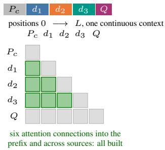  
(a) Dense prefill (ceiling)

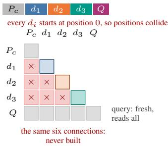

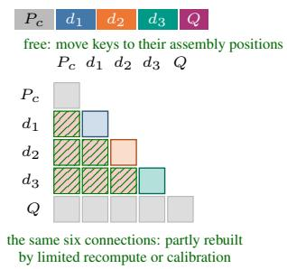  
(c) Repair: free position fix, then rebuild connections at a compute cost  
Figure 4: Block-level attention view (rows attend into columns); the six highlighted cells are the connections the assembled prompt needs but separate encoding cannot provide. (a) Dense prefill builds all six (the ceiling). (b) Naive reuse: positions collide, no connection exists; the query reads fresh in all panels—the failure is in what it reads. (c) Re-aligning positions is nearly free but cannot create attention never computed; rebuilding it is paid.

dose), and the free position fix lands within .02 of dense recomputation everywhere; all four dose cells fail admission because nothing measurable is left to repair.

## C.2 SINGLE-SOURCE HANDOFF

Handing one over-contextualized cache between agents behaves the same way. Text handoff loses almost nothing relative to dense recomputation (medium loss $. 0 3 1 / . 0 1 3 / - \mathrm { \dot { . } 0 2 5 }$ across the three subsets). Naive KV handoff collapses below the floor $( - . 2 2 / - . 3 7 / - . 9 \dot { 8 } )$ : misplaced KV is worse than no context. The free position fix alone restores $. 9 3 / . 9 8 / 1 . 0 5 ,$ leaving admission margins of $. 0 5 6 / . 0 2 0 / - . 0 4 0$ , all below the .25 bar. Both prefix regimes are pure geometry, and geometry is free.

## C.3 LATENT-MEDIUM TRANSFER

Replacing the communication medium is not a repair. With the latent-only path physically enforced (cache length pinned), latent-state transfer scores $- . 2 3 / - . 5 2 / - 1$ .08 PGR, below the floor on all three subsets, while its own text-handoff control scores high. The medium itself is the boundary.

## C.4 MEDIUM COST PANEL

Where handoff geometry is already fixed, KV handoff is cheap: the position-fixed KV route reaches text-handoff quality (PGR .86–1.13) while the consumer prefills only 102–219 tokens, about 20– 33% of the text route's 498–655.

## C.5 COMPRESSION IN PLACE VS. AFTER ASSEMBLY

The exact-prefix control isolates the compression-misalignment interaction of §3.4. Same compressor, same payloads, two contexts:

<table><tr><td>SnapKV r=.5 (PGR)</td><td>Sci.-paper</td><td>Single-doc</td><td>Multi-hop</td></tr><tr><td>In place (exact prefix)</td><td>.772</td><td>.691</td><td>.817</td></tr><tr><td>After misaligned assembly</td><td>.570</td><td>.172</td><td>-.082</td></tr></table>

Knorm shows the same shape (.412/.526/.419 in place vs .367/.135/ − .357 assembled). Compression that is mild in its birth context becomes severe once the blocks are independently born and reassembled.

## C.6 INTERACTION-LIGHT SUMMARIZATION

A natural multi-document summarization candidate passed the format requirements but failed admission on both tracks, and the failure is informative. On retrieved evidence, floor/naive/aligned/ceiling came out .058/.225/.230/.240: the free position fix already sits at the ceiling, so there is no cross-source repair space. On reports, position alignment alone recovered 87.1% of the gap, leaving a residual of .023. Summarization tolerates blockwise reading; it does not force the sources to depend on each other, so the loss our benchmark measures never materializes.

## C.7 OUTPUT-BUDGET DIAGNOSTIC FOR COMPRESSED REPORTS

Compressed report rows hit the output-token cap more often than uncompressed ones, which suggested a mundane explanation for their low scores. Raising the cap from 32 to 128 tokens on matched samples reduced capped outputs from 16–17 to 1–3 per hundred while scores moved by at most .003 (not significant) and the gap to free alignment did not narrow. The damage sits in the compressed KV content, not in the answer budget.

## D METHOD MATRIX

The full method matrix behind the class glyphs of the main boards. Inclusion and board presence are distinct: a method whose official implementation cannot run the shared setting keeps its row with an explained status, because the applicability pattern is itself a result.

## E THE RUNTIME AND MEMORY FRONTIERS

The two companion cost axes of §3.3.

## E.1 CLOSING THE ACCOUNT WITH DEPLOYMENT-SIDE NUMBERS

The break-even count of §2.5 needs two quantities the benchmark does not own: how often a workload reads a cache and how fast the cache moves. Both have been measured in the cross-context reuse literature, in serving engines and on traces. RAGCache reports skewed retrieval, with the top 3% of documents referred to by 60% of requests on its MMLU workload, and cache hits that stay up to 3.9× faster than full prefill with the host-to-GPU transfer counted (Jin et al., 2024). CacheBlend measures loading one layer's KV cache from an NVMe SSD at 16 ms for a 4K-token Llama-7B context, overlaps selective recomputation with that loading, and reports a 2.2–3.3× TTFT reduction against full recomputation in its serving stack (Yao et al., 2025). KVCOMM measures 68-88% of tokens reusable across two to five agents in multi-agent RAG, math, and coding pipelines (Ye et al., 2025), and DroidSpeak reports 3.1 × faster prefill across two GPU nodes over InfiniBand (Liu et al., 2025). On our side, the per-request saving with the cache in hand and the one-time build are measured on the same backend (Figure 5): on scientific-paper QA, dense prefill takes .35 s, a reuse row answers in about .04 s, and building the isolated caches takes .44–.73 s across rows, so a cache resident on the serving node pays for itself after two to three reads; a cache that streams from slower storage adds $B _ { \mathrm { m e t h o d } / }$ /bandwidth to every read, and the memory axis supplies $B _ { \mathrm { m e t h o d } }$ in bytes. These are illustrations of the formula, not deployment verdicts: the reuse frequency and the storage tier belong to the deployer.

Table 6: Method matrix. Classes: ① selective recomputation, ② attention calibration, ③ position alignment, ④ anchor-delta reuse, ⑤ medium replacement, ⑥fine-tuned repair, ⑦ trained softtoken adapter, 8 decoded-KV handoff repair, 9 compression under reuse. Lossless serving-layer caching is excluded by design (it is the Pareto origin, §I); learned cross-call fusion and prefix-only regimes appear as boundary panels. Partition: official implementation / our port (fidelity protocol, §2.7) / reference. Cell legend: √ = on the board; × = not on the board (reason in the lettered footnote); N/A = mechanistically not applicable; pend. = measurement in progress; ref. = reference row (not ranked).
<table><tr><td>Method</td><td>Class</td><td>Train</td><td>Partition (main board)</td><td>Retr. Evid.</td><td>Ag. Reports</td></tr><tr><td>CacheBlend</td><td>①</td><td>free</td><td>Official</td><td>√</td><td>√</td></tr><tr><td>MiniPIC</td><td>①</td><td>free</td><td>Official</td><td>√</td><td>√a</td></tr><tr><td>LegoLink (EPIC)</td><td>①</td><td>free</td><td>Port: mechanism  $\mathrm { g a t e } ^ { d }$ </td><td> $\checkmark$ </td><td> $\checkmark$ </td></tr><tr><td>APE</td><td>②</td><td>free</td><td>Port: score gate passed</td><td> $\checkmark$ </td><td>√</td></tr><tr><td>Naive assembly (± position fix)</td><td>③</td><td>free</td><td>Reference</td><td>ref.</td><td>ref.</td></tr><tr><td>KVCOMM</td><td>④</td><td>free</td><td>Official</td><td> $\checkmark ^ { b }$ </td><td> $\checkmark ^ { b }$ </td></tr><tr><td>LatentMAS</td><td>⑤</td><td>free</td><td>Official</td><td>discussion note9</td><td></td></tr><tr><td>Block-Attention</td><td>⑥</td><td>8.2 GPU-h</td><td>Official recipe (self-trained)</td><td> $\checkmark$ </td><td> $\checkmark ^ { a }$ </td></tr><tr><td>TurboRAG</td><td>⑥</td><td>training</td><td>nonec</td><td> $\mathrm { N } / \mathrm { A } ^ { c }$ </td><td> $\mathrm { N } / \mathrm { A } ^ { c }$ </td></tr><tr><td>KVLink</td><td>⑥</td><td>training</td><td>none (deferred()</td><td> $\times ^ { e }$ </td><td> $\times ^ { e }$ </td></tr><tr><td>KVPacket</td><td>①</td><td>adapter</td><td>Official recipe (self-trained)</td><td> $\checkmark$ </td><td> $\checkmark$ </td></tr><tr><td>RelayCaching</td><td>⑧</td><td>free</td><td>Official</td><td> $\mathrm { N } / \mathrm { A } ^ { h }$ </td><td> $\checkmark$ </td></tr><tr><td>4-bit cache quantization</td><td>②</td><td>free</td><td>Official (framework)</td><td>√</td><td>√</td></tr><tr><td>SnapKV / Knorm (eviction)</td><td></td><td>free</td><td>Authoritative library</td><td>√</td><td>√</td></tr><tr><td>TOVA / StreamingLLM (eviction)</td><td>⑨</td><td>free</td><td>Authoritative library</td><td> $\checkmark$ </td><td> $\checkmark$ </td></tr></table>

a Originally pre-registered as mechanism-N/A; the reasoning was re-examined, overturned, and both methods are now measured on the track (rows in Table 3).  
b The method amortizes repair over recurring messages; in our frozen setting every source appears exactly once, so its anchor pool stays empty. Its measured row is this cold-start setting, in which the mechanism reuses the whole request (question included) and degrades below free alignment; a controlled recurring-message companion run, where its anchors do fire, is reported as a service-caliber note (§3.2). c No released training code.  
d Admitted by component-level mechanism equivalence: the pre-registered score gate is invalid across engines (it measures engine identity:  
per-sample decisions matched 100/100 while scores diverged at the numeric floor); the failed score gate is reported as-is (§2.7, appendix).  
e Official recipe runnable but at a training scale deferred in this version (schedule decision, not inapplicability).  
9 Latent-medium transfer collapses below floor; a medium boundary rather than a repair method (§3.4).  
h Repairs decoded KV handed over between agents; the concatenation track has no such handoff object.

## F DATASET CARDS AND ADMISSION RECORDS

Retrieved Evidence subsets. Three LongBench v1 QA subsets (scientific-paper, single-document, multi-hop) with N=100 frozen samples each, natural passage boundaries where provided and 512- token windows otherwise, and an input cap of 29K tokens chosen so that no frozen sample is truncated. Context value (ceiling—floor) is .395/.329/.308 under the official metric.

The FRAMES variant. The fourth subset asks FRAMES questions over a checksum-pinned 2026 Wikipedia-snapshot payload. This is a dataset variant, not the authors' original snapshot, and every mention in this paper labels it as such. It entered through the pre-registered criteria on a held-out calibration split $( { \dot { \bf C } } 1 = . 3 5 0 , { \bf C } 2 = . 4 7 6 , { \bf C } 3 \Delta = + . 1 6 { \stackrel { . } { 7 } } \left[ . 0 3 3 , . 3 0 0 \right] , p = . 0 3 1$ ; two of three panel scorers pass C3, the third same-direction n.s. at N=60), and its method wave is scored by its official

Retrieved Evidence (concat) — Runtime frontier, Qwen3-8B main board, HF same-backend rows (dual accounting) official implementationreference row (not a method)  
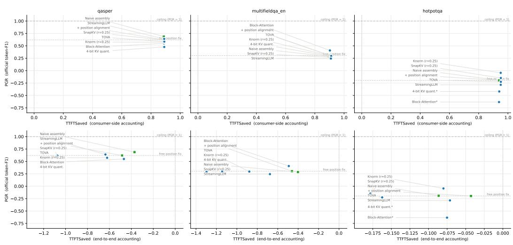  
x = 1 - T/T dense, T dense = same-backend dense prefill (oracle row), medians, n=20/row (K101). Top: consumer-side (caches in hand, query→first token). Bottom: end-to-end (incl. producer-side \* = paired-bootstrap significant vs. free position fix (quality axis).

Figure 5: Runtime frontier. Top: per-request time-to-first-token with the cache in hand; every reuse row saves ≈ 90% against dense prefill on the same backend. Bottom: the same requests charged the one-time cache build as well, i.e. the cost of a cache read exactly once; the build is the same isolated prefill for every row, so this panel bounds a single read and is not a deployment estimate, since how many reads share a build is a workload parameter (§2.5). Draft; same-backend rows only, medians, n=20/row. Methods on other serving backends have no same-backend dense reference in this batch and are excluded, not hidden (§2.5).

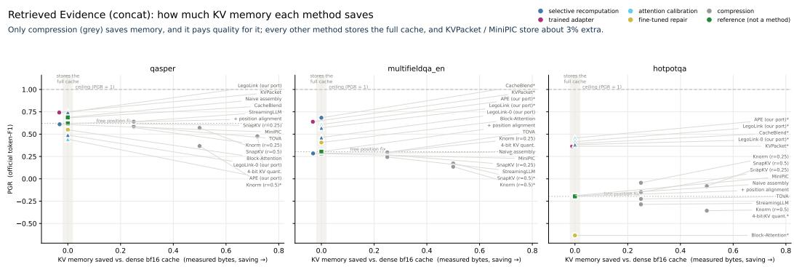  
x = 1 - measured method bvtes / dense bf16 bvtes, on actual tensors: guantization scale/shift overheads and padding are counted, so 4-bit saves a measured 71.9%, not the nominal 75% \* = significant vs. free position fix on quality (paired 95% CI). Marker shape = partition: o official, triangle our port, square reference. Source: k122\_kv\_bytes.json (designated authority).  
Figure 6: Memory cost (draft): only compression (gray) saves KV memory, and it pays quality for it; every other method stores the full cache (shaded band), and KVPacket / MiniPIC store about 3% extra. Bytes are measured on the actual tensors, so 4-bit quantization saves a measured 71.9% rather than the nominal 75%. Color = mechanism family; marker shape = partition; \* = significant vs. free position alignment on quality.

autorater protocol. Fifteen of the 120 test payloads (twelve of 60 calibration) are title-only shells: the snapshot materializer keeps the first content block of each page, and on some pages that block is empty. Every method consumed the same shells. Recomputing all 39 row-level tests without them changes no significance call and no direction (test headroom .417 → .438), so the frozen set is kept and the affected ids are released.

Agent Reports track. Payloads are reports written by specialist producer agents, each reading a disjoint part of the material without seeing the question (question-blind, matching deployment where caches are precomputed query-agnostically). Reports are frozen once and reused byte-identically by every method; the generation pipeline, prompts, and an answer-leakage audit are released with the data card. The ceiling is dense prefill over the same report text; reading the original documents instead answers a pipeline-design question and is reported only in the data card.

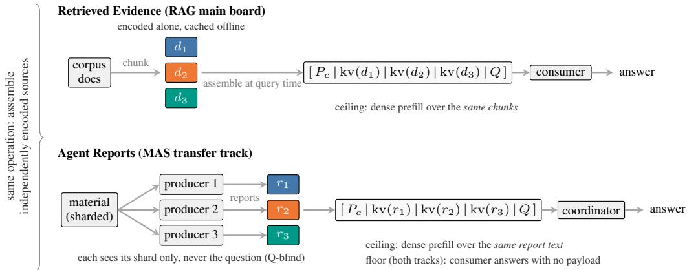  
Figure 7: The two workload tracks instantiate one operation—a consumer assembling independently encoded sources—with different payloads. Retrieved Evidence reuses offline-cached raw chunks; Agent Reports reuses reports generated online by question-blind producers, matching deployments where caches are precomputed before the query exists. Each track is scored against its own samepayload ceiling and a shared no-payload floor (§2.4); scores are never averaged across tracks.

Freezing. All querysets carry SHA256 manifests, a fixed seed, and deterministic sampling; anchors are computed once per board and shared by every subsequent run.

Declined admissions. A cross-session-memory candidate for the report track failed C3 (∆=+.100, interval crossing zero; repair events 6 of 60, smaller than the test's power) and was declined. The summarization candidate above failed C2 on both tracks. Two earlier multi-hop candidates were dropped at the anchor stage for thin context value before any method ran. All negative admissions are reported, none silently.

## G CONFIRMATION-BOARD DETAIL

On the second family the patterns hold. The two paid repairs truly earn on single-doc QA (CacheBlend .815, APE .808); scientific-paper QA is again drowned by free alignment; and multihop again separates the methods, with the calibration method strongest there (APE .876, significantly above CacheBlend, +.127 [.038, .214]), the same relative shape the main board shows. One anchor-level qualifier travels with that subset: its context value on this family is below the admission bar (.195), so its PGR values are reference-only. On reports, CacheBlend leads (.545), the calibration method runs but does not earn (.027), and naive report assembly again collapses below the floor (—.15 [—.23, —.08] against free alignment), all matching the main board. The 4B sibling board corroborates the same four patterns under the same official metric; across the three boards two individual significance calls flicker at this sample size, with no direction reversal anywhere. Carrier sensitivity is itself a result. LegoLink's zero-recompute endpoint holds full strength on the confirmation model: on single-doc QA it significantly beats free alignment (+.072) and even its own k=2 configuration (+.102). On the main model the ordering reverses (PGR .49 vs .75 on scientific-paper QA). Method-carrier interaction is real, and it is an argument for multi-board evaluation rather than a nuisance. Ported-column protocol on these boards as everywhere: the score gate PASS case (APE) and the cross-engine score gate FAIL with mechanism-gate admission (LegoLink) are both reported in full (§2.7).

## H FIDELITY GATES: PROTOCOL AND BOTH OUTCOMES

Every results table groups rows into three partitions that are never ranked against each other: official (the authors' released implementation, run as-is), ported (our implementation, admitted through the fidelity protocol below and always marked), and reference (anchors, free-alignment baselines, and lossless serving-layer caching). The fidelity protocol has two instruments: score equivalence on the method's home setting when the port and the official implementation share an inference engine, and a component-level mechanism gate when they do not, because across engines score equivalence measures engine identity rather than port correctness. Both observed outcomes are on record. Score gate, PASS. The calibration port reproduced the official implementation on its home setting within ±.01 on all four payload configurations and entered the main board. Score gate, FAIL; mechanism gate, PASS. The boundary-recomputation port failed the score gate across inference engines. Per-sample tracing then showed protocol-level decisions identical in 100/100 cases while scores diverged at the cross-engine numeric floor: the gate was measuring engine identity, not port correctness. The port was therefore admitted by component-level mechanism equivalence against the official implementation (a change of instrument, not a relaxation), and the failed score gate is reported as-is here. Separately, the official demo stack of the same method runs on the confirmation board, so both the authors' code and our port appear in the paper, in different partitions.

## I REFERENCE ROWS AND ECOSYSTEM POSITION

Production prefix caching is not a competitor of the methods on our boards; it is the origin of their Pareto plot. Serving-layer caches are lossless because they reuse KV strictly in its birth context, and exactly for that reason they save nothing on our workloads: on the frozen payloads a prefix cache hits only the static instruction prefix, so its single-request payload saving is zero. We carry this as a reference row with dual accounting. In the single-request accounting it sits at the origin: full quality, no payload savings. In a served-replay accounting over the frozen query stream, its measured hit rate ranges from 0.6% to 21.4% per subset, every extra hit is explained by common prefixes shared between samples, and its quality is statistically tied with dense recomputation. The freebie that serving already provides overlaps zero with the misalignment loss the repair methods compete over.

The relationship between the serving layer and the repair methods is carrier and payload, not rivalry. The leading selective-recomputation method ships as a cache-layer plugin for the same production stacks whose prefix caches we just described, and nothing prevents the other repair families from doing the same. On this reading, each board entry's value is its distance from the reference origin and the price it pays for that distance on the three cost axes.

One reliability note positions our measurements against recent third-party numbers. Published CacheBlend baselines in follow-up papers are sometimes reported without running the released implementation, or from re-implementations whose reported behavior is mechanistically implausible. We state this as a hypothesis about the literature rather than an attribution to any single paper, and we drew the opposite lesson for our own measurement: before producing any number we located and fixed two defects upstream in the official serving stack (separator handling that silently disabled blending, and an interception of RoPE scaling), each validated through the fidelity gates of §2.7.

## J OPEN PLATFORM AND SUBMISSION WORKFLOW

The benchmark is released as a pip-installable package (pip instal1 kvsharearena; repository [repo link], leaderboard [leaderboard link], frozen data [dataset link]). A method is one class with three calls: setup loads the model or engine once; bui ld\_cache encodes one source without seeing the question (the harness never passes the question here, so caches are question-blind by construction); answer reuses the caches and returns the text with its cost telemetry (layertokens recomputed and the dense payload's layer-tokens, KV bytes, TTFT). Two example drivers ship with the package: free position alignment and one compression row, each verified to reproduce the corresponding frozen board row. Frozen querysets and anchors are pulled from the dataset page and checked against SHA256 manifests; the FRAMES variant payload is not redistributed but rebuilt locally from the official question release and the pinned snapshot, and every rebuilt payload is checked against its released fingerprint. A submission is a result file plus a method card (official implementation or port, backend and versions, training data if any, how each cost number is measured). Validation and scoring run on CPU only: the official metric and PGR are recomputed from the submission's per-sample outputs against the released anchors, with the paired bootstrap against free position alignment, and posted to the pull request before a maintainer merges the row. Quality is therefore always recomputed; cost telemetry is self-reported, marked as such on the leaderboard, and spot-checked. Partitions are preserved: a submission declares itself official, port, or reference, and rows are never ranked across partitions. The leaderboard is a static page built from one data file that records the source of every cell.

## K IMPLEMENTATION PROVENANCE

MiniPIC (Ordonez & Parnell, 2026) realizes EPIC-style position-independent caching inside vLLM and backs the MiniPIC main-board row; EPIC's LegoLink algorithm is evaluated via the authors' demo stack on the confirmation board, and our LegoLink port enters the main board through the mechanism gate above. KVPacket runs the authors' code with an adapter self-trained by the official recipe and validated against the official anchor numbers on their data. Block-Attention is self-trained by the official recipe (8.2 GPU-hours). RelayCaching runs the authors' repair code unmodified over teacher-forced replay of the frozen reports. The eviction rows use the kvpress library's press classes; 4-bit quantization uses the framework implementation. Two defects we found upstream in the official serving stack (separator handling that silently disabled cache blending, and an interception of RoPE scaling) were located in source, patched, and validated through the gates; the patches ship with our code. Published CacheBlend baselines in follow-up papers are sometimes reported without running the released implementation, or from re-implementations whose behavior is mechanistically implausible; we state this as a hypothesis about the literature, not as an attribution to any single paper, and it is why every number in this paper comes from released code or a gated port.

## L CROSS-CHECKPOINT SUPPLEMENT

Table 7: Direct-reuse factorial panel (raw official F1). The receiver is fixed; different-weight cells report predecessor / further-trained producer. HotpotQA uses n=40 and Qasper n=20.
<table><tr><td>Context</td><td>Producer weights</td><td>HotpotQA</td><td>Qasper</td></tr><tr><td>Same</td><td>Same as receiver</td><td>.559</td><td>.417</td></tr><tr><td>Same</td><td>Different</td><td>.484/.527</td><td>.353/.410</td></tr><tr><td>Different</td><td>Same as receiver</td><td>.394</td><td>.397</td></tr><tr><td>Different</td><td>Different</td><td>.361/.315</td><td>.381/.344</td></tr></table>

## L.1 INJECTION HARNESS AND GATES

The cross-checkpoint roster board re-runs every method with payload KV written by an alternate producer resident in the same process. The method libraries are unmodified; injection happens in our drivers, and three gates guard it. A same-model regression gate requires every modified driver to reproduce its frozen row bit-identically when the producer is set to the receiver itself (15/15 rows pass; the two naive rows’ single-sample divergence was traced to a known cross-site numeric difference by an A/B run on one machine). A payload gate checks the injected material against the frozen manifests, and an injection probe verifies on live samples that the consumed KV equals an independent producer-side prefill bit-for-bit. For the one method whose cache lives inside a serving engine, bytes are replaced through the engine's own cache store, qualified by an identitywriteback test (bit-exact, four runs) and a cross-representation check (cosine ≥ .9999, end-to-end score difference 0.0); one method's single-engine architecture exposes no cache handle, and its row is marked injection-infeasible rather than approximated.

## L.2 HOW THE TRAINED ADAPTER FAILS

Where the trained adapter loses quality under a foreign producer, the failure is silent: the answers remain fluent and confidently phrased but name the wrong entity (a wrong actress, a flipped yes/no, a year attributed to the wrong event). Nothing in the output signals degradation. Recomputationbased repairs under the same producers show no such flips. We flag this as the deployment-relevant failure mode of representation-fitted repair: the cost of a foreign cache is not noise you can see, but errors you cannot.

## L.3 CHECKPOINT ROBUSTNESS SUMMARY

Table 8: Checkpoint robustness on the main board: the shift of each method's own PGR when the producer changes, over six cells (three subsets × two producers). Mean and worst cell; the last column counts cells whose paired 95% CI lies below zero. With 84 method cells at the 5% level about four false positives are expected, so single significant cells among compression rows are not read as effects; the two producer-fitted repairs stand out on every column.
<table><tr><td>Method</td><td>mean ∆</td><td>worst cell</td><td>cells sig. below</td></tr><tr><td colspan="4">Reference rows</td></tr><tr><td>③ Naive assembly</td><td>-.011</td><td>-.055</td><td>1</td></tr><tr><td>③ + position alignment</td><td>-.006</td><td>-.063</td><td>1</td></tr><tr><td colspan="4">Official implementations</td></tr><tr><td>① CacheBlend (15% recompute)</td><td>-.001</td><td>-.013</td><td>0</td></tr><tr><td>⑥ Block-Attention</td><td>-.008</td><td>-.036</td><td>2</td></tr><tr><td>⑦ KVPacket (0% payload recompute)</td><td>-.074</td><td>-.199</td><td>4</td></tr><tr><td>④ KVCOMM (cold start)</td><td>+.010</td><td>-.010</td><td>0</td></tr><tr><td>⑨ Quant. 4-bit</td><td>-.009</td><td>-.023</td><td>0</td></tr><tr><td>⑨ SnapKV (r=.25)</td><td>-.013</td><td>-.060</td><td>1</td></tr><tr><td>⑨ SnapKV (r=.5)</td><td>-.009</td><td>-.091</td><td>1</td></tr><tr><td>⑨ Knorm (r=.25)</td><td>-.012</td><td>-.032</td><td>0</td></tr><tr><td>⑨ Knorm (r=.5)</td><td>+.014</td><td>-.033</td><td>0</td></tr><tr><td>⑨ TOVA (r=.25)</td><td>-.009</td><td>-.043</td><td>1</td></tr><tr><td>⑨ StreamingLLM (r=.25)</td><td>-.007</td><td>-.041</td><td>1</td></tr><tr><td colspan="4">Our ports</td></tr><tr><td>② APE</td><td>-.018</td><td>-.037</td><td>1</td></tr><tr><td>① LegoLink (≈0.4% payload recompute)</td><td>-.001</td><td>-.019</td><td>0</td></tr><tr><td>① LegoLink (k=0, 0% recompute)</td><td>-.049</td><td>-.231</td><td>3</td></tr></table>

## M SUMMARY SCORE PRESETS

Table 9 lists the summary score of §2.5 under five presets, averaged over the three LongBench subsets of the Retrieved Evidence board (the FRAMES variant carries no cost telemetry in this release). “Quality first" is the default (β = 0.1, equal weight on compute and memory); “balanced" sets $\beta = 1$ ; the three bound presets put all weight on one axis. A row whose axes are unmeasured under a preset shows “" rather than an imputed value: in this release the runtime axis is measured for eight rows, so the latency-bound preset orders only those, and the memory axis is not measured for the reference rows. The reading is stable across presets. The same three rows lead under every quality-led preset, in an order that changes with β: the two near-free repairs (the trained adapter and the boundary-recomputation port) and the selective-recomputation method that pays 17% of the payload. The balanced preset is the only one that separates the paying method from the two nearfree ones. The memory-bound preset rewards only compression, the one family that saves bytes, and sends every full-cache row to zero by construction. The Agent Reports column uses the compute axis alone.

Table 9: Summary score $S _ { \beta , w }$ under five presets (mean over the three LongBench subsets of the Retrieved Evidence board); rows ordered by the default preset within their partition; “" = an axis the preset needs is not measured for the row. †Agent Reports: compute axis only, default $\beta .$
<table><tr><td>Method</td><td>quality first</td><td>balanced</td><td>compute-bound</td><td>memory-bound</td><td>latency-bound</td><td>Agent Reports†</td></tr><tr><td>Reference rows (not ranked)</td><td></td><td></td><td></td><td></td><td></td><td></td></tr><tr><td>③ Naive assembly</td><td>.338</td><td>.420</td><td>.338</td><td></td><td>.336</td><td>.000</td></tr><tr><td>③ + position alignment</td><td>.322</td><td>.410</td><td>.322</td><td></td><td>.320</td><td>.261</td></tr><tr><td>Prefix-cache only (ref.)</td><td>.000</td><td>.000</td><td>.000</td><td></td><td></td><td></td></tr><tr><td>Official implementations</td><td></td><td></td><td></td><td></td><td></td><td></td></tr><tr><td> KVPacket (0% payload recompute)</td><td>.569</td><td>.527</td><td>.602</td><td>.000</td><td></td><td>.234</td></tr><tr><td>① CacheBlend (15% recompute)</td><td>.561</td><td>.478</td><td>.600</td><td>.000</td><td></td><td>.685</td></tr><tr><td>⑥ Block-Attention</td><td>.319</td><td>.324</td><td>.334</td><td>.000</td><td>.332</td><td></td></tr><tr><td>⑨ TOVA (r=.25)</td><td>.300</td><td>.336</td><td>.308</td><td>.271</td><td>.307</td><td></td></tr><tr><td>⑨ SnapKV (r=.25)</td><td>.300</td><td>.332</td><td>.308</td><td>.270</td><td>.307</td><td>.000</td></tr><tr><td>⑨ StreamingLLM (r=.25)</td><td>.299</td><td>.328</td><td>.308</td><td>.268</td><td>.306</td><td></td></tr><tr><td>① MiniPIC</td><td>.298</td><td>.304</td><td>.312</td><td>.000</td><td></td><td></td></tr><tr><td>⑨ Knorm (r=.25)</td><td>.296</td><td>.333</td><td>.304</td><td>.268</td><td>.302</td><td>.000</td></tr><tr><td>⑨ Quant. 4-bit</td><td>.269</td><td>.349</td><td>.270</td><td>.266</td><td>.269</td><td>.000</td></tr><tr><td>⑨ SnapKV (r=.5)</td><td>.256</td><td>.309</td><td>.260</td><td>.248</td><td></td><td></td></tr><tr><td>⑨ Knorm (r=.5)</td><td>.177</td><td>.241</td><td>.179</td><td>.174</td><td></td><td></td></tr><tr><td>④ KVCOMM (cold start)</td><td>.000</td><td>.000</td><td>.000</td><td></td><td></td><td>.000</td></tr><tr><td>Our ports</td><td></td><td></td><td></td><td></td><td></td><td></td></tr><tr><td>① LegoLink (≈0.4% payload recompute)</td><td>.566</td><td>.528</td><td>.599</td><td>.000</td><td></td><td>.518</td></tr><tr><td>② APE</td><td>.502</td><td>.499</td><td>.526</td><td>.000</td><td></td><td>.015</td></tr><tr><td>① LegoLink (k=0, 0% recompute)</td><td>.449</td><td>.469</td><td>.468</td><td>.000</td><td></td><td>.185</td></tr></table>