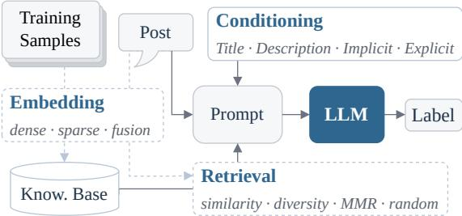
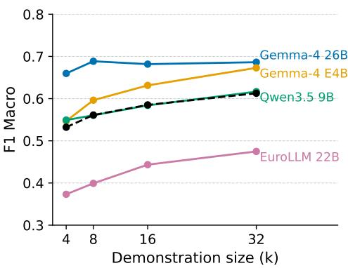
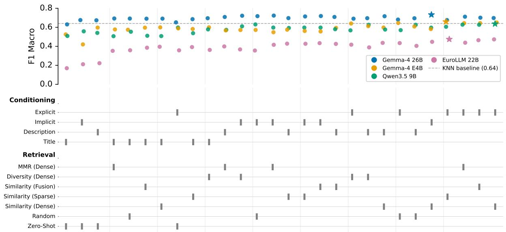
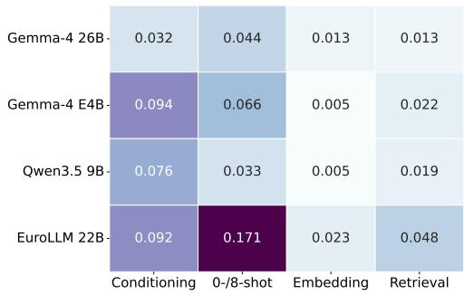
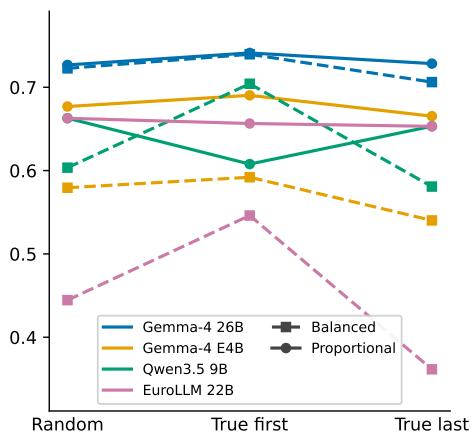
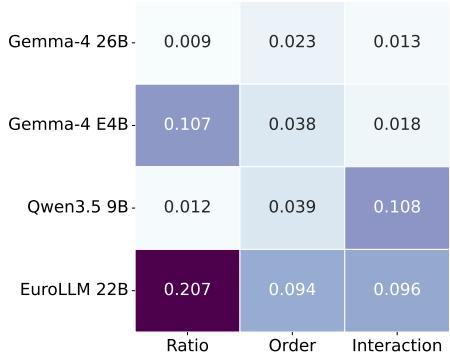

# MUCnoHARM@GermEval Shared Task 2026: Retrieval-based In-Context Learning for Defamatory Offences, and Where It Falls Short

Kristin Gnadt1,2, Maximilian Meidinger1, Matthias Aßenmacher2,3

1Central Office for Information Technology in the Security Sector (ZITiS), Munich, Germany, 2Department of Statistics, LMU Munich, Germany, 3Munich Center for Machine Learning (MCML), Germany Correspondence: kristin.gnadt@zitis.bund.de

## Abstract

With hate speech being ubiquitous online, automatic detection is crucial, in particular when it comes to criminally relevant social media posts. We study a variety of retrieval-based in-context learning (RetICL) strategies for detecting defamatory offences under §§ 185–187 StGB (the subject of GermEval 2026 Subtask 4). Few-shot prompting beats zero-shot, but retrieval-based approaches offer only marginal gains over random demonstrations, and even fall behind an optimised static set of demonstrations. Providing concrete legal knowledge helps, yet model choice outweighs every other system choice. Models over-predict criminal relevance while still missing 26–57% of criminally relevant posts, suiting them for triage rather than autonomous moderation.

## 1 Introduction

Hate speech detection has become a socially consequential application domain for LLM-based text classification. Hate speech is highly prevalent online: In Germany, 34% of internet users reported encountering instances thereof in the first quarter of 2025 (Destatis, 2025). The volume of potentially harmful content has far outstripped the capacity of human moderation, making automated detection a critical concern for platforms and policymakers alike (European Union Agency for Fundamental Rights, 2023). Large language models (LLMs) have demonstrated strong capabilities in addressing the core semantic challenges of automated hate speech detection (Albladi et al., 2025; Kums et al., 2025), making them a natural fit for the task. To date, most research has focused on Englishlanguage datasets and settings (Albladi et al., 2025; Gandhi et al., 2024; Usman et al., 2025), although a growing body of work addresses hate speech detection in other languages, including German (Demus et al., 2022; Glasebach et al., 2024; Goldzycher et al., 2024).

  
Figure 1: RetICL framework. Embedded training samples make up a knowledge base, from which few-shot demonstrations are retrieved, which are given to a model along with a task description (conditioning) and the post.

Detecting criminally relevant hate speech, however, introduces a further layer of complexity: models must be sensitive to the specific thresholds and distinctions encoded in (country-specific) law, a requirement that current systems only partially meet (Kums et al., 2025; Ludwig et al., 2025; Schäfer, 2023). Subtask 4 (DEF) of the GermEval Shared Task 2026 on Harmful Content Detection in Social Media instantiates precisely this challenge: classifying posts according to whether they constitute defamatory offences under §§ 185–187 StGB (German Criminal Code) (Felser et al., 2026).

Contributions. In this work, we test different prompting strategies for the detection of defamatory offences. Our RetICL framework consists of two main components (Fig. 1):

1. The legal information on §§ 185–187 StGB that is provided to the model (Conditioning); and

2. The retrieval mechanisms for few-shot demonstrations (Embedding and Retrieval).

The first component builds on Ludwig et al. (2025), who use prompts of differing abstraction levels—“conditioning” models on different degrees of legal knowledge—to detect whether a post falls under § 130 StGB (incitement to hatred) (Section 2.2). The second component tests different strategies for selecting demonstrations for few-shot prompting, which are also compared to zero-shot prompting. Section 2 situates our two components in prior work on legal conditioning and RetICL. Section 3 details the conditioning modes and retrieval strategies we compare, and Section 4 the experimental setups. Section 5 reports that concrete legal knowledge and few-shot prompting help, but retrieval strategy barely matters, with the full discussion of implications in Section 6.

## 2 Background & Related Work

## 2.1 Defamatory Offences

The StGB sections central to this task are the three defamatory offences in §§ 185–187, which all protect a person’s right to honour and differ mainly in whether the disparaging statement is an opinion or a factual claim, and to whom it is addressed (Research Services of the German Parliament, 2022): § 185 Insult (Beleidigung), § 186 Defamation (Üble Nachrede), and § 187 Intentional Defamation (Verleumdung).

The dataset (GermEval 2026, Subtask 4) was annotated with the decision scheme of Zufall et al. (2019). Derived directly from the statutory norms in the German deductive civil-law tradition, the scheme operationalises the legal assessment of §§ 185–187 StGB as a sequence of six binary (yes / no) decisions based solely on the text of a post. These decisions cover whether the post targets a valid holder of the right to honour, whether it is disparaging, whether it is a factual claim or a value judgment, and how freedom of expression is weighed against the right to honour (§ 193 StGB). The full scheme is provided in Appendix A.

Because it decomposes a complex legal judgment into independently checkable sub-decisions, the scheme yields reliable annotations—Zufall et al. (2019) report that instructed laypeople apply it with reasonable reliability against an expert reference. Additionally, the scheme provides a natural source of graded legal knowledge for prompting, which our conditioning settings utilise (Section 3).

## 2.2 Legal Conditioning

How a task is presented to an LLM strongly affects its performance. Even meaning-preserving changes to a prompt can shift performance substantially (Gan and Mori, 2023; Lu et al., 2022; Sclar et al., 2024). Beyond such surface-level choices, the content of the prompt—which task-relevant knowledge it makes available to the model—is itself a design decision. This is especially pertinent in specialised domains such as law, where general prompting techniques have proven helpful but require careful adaptation (Parizi et al., 2023; Trautmann et al., 2022), raising the question of how much and what kind of legal knowledge to place in the prompt.

Ludwig et al. (2025) address this question for hate speech falling under § 130 StGB (incitement to hatred) by conditioning LLMs on legal knowledge at different abstraction levels. Their prompts range from the title of a norm—relying on whatever knowledge the model has internalised— to the verbatim or simplified statutory text, and finally to an explicit decomposition of the offence into its constituent subtasks. The decomposition follows the subtask-based framing that AlKhamissi et al. (2022) found effective for few-shot hate speech detection. Following these approaches, we vary the legal knowledge supplied to the model, from merely stating the relevant section numbers and titles to decomposing the task into the subtasks of the annotation scheme of Zufall et al. (2019).

Counterintuitively, Ludwig et al. (2025) found that models conditioned on more abstract knowledge outperformed those given more concrete legal information. A substantial performance gap remained between LLM prompting approaches and legal experts, and the models could barely match laypeople applying the annotation scheme (Ludwig et al., 2025; Zufall et al., 2022). Conversely, von Cossel (2026) found that subtask decomposition for detecting § 130 StGB offences, combined with a logical scaffold in a neuro-symbolic approach, outperformed less complex prompting approaches.

## 2.3 Retrieval-based In-Context Learning

LLMs can perform classification through incontext learning (ICL), conditioning on a few inputoutput demonstrations in the prompt without updating model parameters. ICL, however, is highly sensitive to the choice, number, ordering, and format of those demonstrations (Luo et al., 2024). A fixed, manually curated, or randomly sampled set applied uniformly to every input is therefore suboptimal, which motivates RetICL1, in which demonstrations are retrieved per query from a labelled pool (Luo

et al., 2024).

Retrieval is usually guided by a similarity objective, most commonly selecting the top-k examples by using sparse term-matching retrievers such as BM25 (Robertson and Jones, 1976; Robertson and Zaragoza, 2009) or dense sentence-embedding retrievers scored by cosine similarity (Fan et al., 2024; Luo et al., 2024). Margatina et al. (2023) show that similarity-based retrieval consistently outperforms uncertainty-, diversity-, and randombased selection, while zero-shot prompting performs worst for text classification tasks. Miller et al. (2025) find RetICL best across seven open-weights LLMs on clinical note section classification, raising F1 substantially over both zero-shot and static few-shot; they note that static few-shot is sometimes no better than zero-shot, that smaller models benefit more, and that more demonstrations do not monotonically help.

These methods are increasingly applied to abusive language and content moderation tasks adjacent to hate speech detection. For implicit hate speech, Kim and Lee (2025) prioritise demonstrations sharing the target group before falling back to BM25 similarity, reducing the over-sensitivity of LLMs to toxic surface terms. Related work uses retrieval to discover emergent dog whistles (coded language used to evade automatic detection mechanisms; Sasse et al., 2025). The evidence is not uniformly positive, however: Liu and Shi (2024) found dynamic exemplar selection less reliable than their prompt-optimisation framework.

RetICL is a strong but task-dependent strategy, yet the relative behaviour of zero-shot, static, and RetICL remains unexamined for criminally relevant hate speech, where classification depends on a precise legal threshold rather than a general notion of toxicity. We address this gap by systematically testing retrieval mechanisms and prompting strategies for detecting defamatory offences as part of the shared task.

## 3 Materials and Methods

Dataset. The DEF task is based on a corpus of German-language tweets, each labelled according to the annotation scheme of Zufall et al. (2019) described in Section 2.1, with a binary label indicating whether the post falls under §§ 185–187 StGB. The labelled portion comprises 3,263 tweets, on which we report cross-validated results; a further 577 tweets form the unlabelled competition test set, which is used only for the shared task submission. In the training dataset, ∼13% of the samples are labelled as positive (criminally relevant). In addition, one author annotated a subset of 797 training tweets at the level of each individual decision step of the scheme according to the explanations of Zufall et al. (2019). Whereas the organisers’ data provide only the final label, these auxiliary annotations record the outcome of every step; they are used as the demonstration pool for few-shot retrieval when deconstructing the classification task into individual steps (Explicit conditioning setting).

Models. Four instruction-tuned models spanning different families, parameter scales, and degrees of openness are evaluated: Gemma-4 26B (gemma-4-26B-A4B-it), Gemma-4 E4B (gemma-4-E4B-it), Qwen3.5 9B (Qwen3.5-9B), and EuroLLM 22B (EuroLLM-22B-Instruct-2512). All models are loaded from the HuggingFace Hub and run with the Transformers library (Wolf et al., 2020).

Conditioning. The first component varies the legal information supplied to the model, following Ludwig et al. (2025). Each conditioning mode corresponds to a different task description. The Title setting states only the numbers and titles of the relevant StGB sections. The Description setting additionally provides a description of what constitutes a defamatory offence under the annotation scheme (Section 2.1). The Implicit setting presents all six decision steps of the scheme inline, so that the model traverses the full decision tree within a single inference call. The Explicit setting instead decomposes the task into the six steps as separate inference calls: each step is classified on its own, and the final label is derived from the sequence of step outcomes. Each step is run as an independent prompt containing only that step’s instructions, its demonstrations, and the post. All prompts and additional information on chat template and few-shot integration are provided in Appendix B.

Demonstration selection. The second component governs how few-shot demonstrations are chosen. In the zero-shot configuration (k = 0), no demonstrations are included. In thefew-shot configuration, we include k demonstrations. The class ratio of demonstrations and the within-prompt ordering of demonstrations are varied for the ablation study (Section 5.3). Demonstrations are selected either statically—a single fixed set, chosen once and reused for every test instance—or dynamically, where a separate set is retrieved per instance at inference time. The dynamic strategies are our main object of study and are defined by the embedding and retrieval modes below.

Embedding mode. Dynamic retrieval draws demonstrations from a knowledge base built over the training split and stored in one of three ways. In the dense setting, each example is embedded with codefuse-ai/F2LLM-v2-1.7B (Zhang et al., 2026), the highest-ranked model in its size range on the MTEB leaderboard for German tasks (Muennighoff et al., 2023) throughout the entire duration of this project in the first half of 2026 (see Appendix C.2). The embeddings are stored in a LangChain InMemoryVectorStore (Chase, 2022). The sparse setting uses a LangChain BM25Retriever which vectorises training samples sparsely and retrieves demonstrations based on keyword matches using the BM25 algorithm. The fusion setting interleaves the results of both the dense and sparse retrievers.

Retrieval mode. Given a knowledge base made up of an embedded training dataset, demonstrations are selected by one of four strategies. Similarity retrieval returns the top-k examples by cosine similarity (dense) or BM25 score (sparse). Diversity retrieval clusters the dense training embeddings with k-means and draws one example at random from each cluster. MMR (Maximal Marginal Relevance) re-ranks dense candidates to balance similarity against diversity. Random retrieval samples uniformly from the training pool and serves as the baseline retrieval strategy. Because MMR and diversity rely on dense embeddings, they are applied only in the dense embedding setting; sparse andfusion embeddings are used only for similarity-based retrieval.

Baseline. As a non-neural reference point, we implement a naive 1-nearest-neighbour classifier using TF-IDF representations of the training split to assign each test post the label of its single closest training neighbour. It uses no legal domain knowledge and relies entirely on surface-level lexical overlap; conceptually, it corresponds to dynamic few-shot retrieval at $k = 1$

## 4 Experiments

General Setup. All reported results use stratified four-fold cross-validation over the labelled set: in each fold, three parts form the knowledge base and the held-out part is used for evaluation. The primary metric is $F 1 _ { \mathrm { { m a c r o } } }$ (unweighted mean of per-class F1 scores); we additionally report Trueclass Precision $( \mathrm { P _ { T } } )$ and Recall $( \mathrm { R } _ { \mathsf { T } } )$ . Instances on which a model abstains (no parseable label, model refusal) are excluded from scoring, but abstentions are reported separately. More details on experiment settings are reported in Appendix $\mathrm { C } . ^ { 2 }$

## 4.1 Exploration

In order to control the computational cost during the main experiments, we aim to find the optimal number of demonstrations (in terms of $F 1 _ { \mathrm { { m a c r o } } }$ score) in an exploratory analysis: we test demonstration sizes $k \in \{ 4 , 8 , 1 6 , 3 2 \}$ across two prompting configurations and all models.

## 4.2 Main Experiments

Given that RetICL is the focus of this research, the main experiments investigate the different strategies across the four open-weights instructiontuned models Gemma-4 26B, Gemma-4 E4B, Qwen3.5 9B, and EuroLLM 22B, and all four conditioning modes (Title, Description, Implicit, and Explicit). For RetICL, we evaluate random, diversity-, MMR-, and similarity-based retrieval; the latter for the three different embedding methods dense, sparse, and fusion. Additionally, zero-shot prompting is tested. The retrieved demonstrations are balanced in terms of their class labels, and their order in the prompt is random.

## 4.3 Ablations

Proprietary Model. In order to understand how the performance on this complex task scales with model size far beyond the 4B–26B parameter range, we evaluate the latest OpenAI model of the GPT series (GPT-5.5). Evaluations are run with the Title zero-shot setting and with Explicit mode with dense similarity-based demonstration retrieval.

Fine-Tuning. ICL strategies offer lower computational cost and greater adaptability than supervised fine-tuning (SFT) methods. In order to understand how the performance of our ICL strategies compares to an SFT baseline, we fine-tune the smaller Gemma-4 E4B model using the parameterefficient method QLoRA (Dettmers et al., 2023).

The model is trained with the Implicit conditioning mode in a zero-shot set-up.

Class Ratio and Ordering. The main experiments use only balanced (w.r.t. class label), randomly ordered few-shot demonstrations. We investigate the effects of class ratio and ordering on classification performance by also arranging the demonstrations by class label (true-first and truelast) and by selecting examples with a class ratio proportional to the ratio in the training dataset. These effects are tested for Implicit conditioning with dense, similarity-based retrieval.

Static Demonstrations. In order to compare Ret-ICL demonstration approaches not only to zeroshot prompts but to a static few-shot strategy, a set of few-shot demonstrations is tested, which is selected by searching randomly for the bestperforming set of demonstrations (more details are reported in Appendix C.6). Two sets of eight demonstrations for Gemma-4 26B are selected, using the Implicit and Title conditioning modes.

## 4.4 Shared Task

We select five model / configuration combinations for running on the held-out competition test set. The best two runs are mentioned in the respective experiment sections; more details are reported in Appendix D.5.

## 5 Results

## 5.1 Exploration

  
Figure 2: Exploration: Mean $F 1 _ { \mathrm { { m a c r o } } }$ by demonstration size, per model. The black dotted line shows the mean $F 1 _ { \mathrm { { m a c r o } } }$ per demonstration size across models.

Across models, the largest average gain comes from increasing the demonstration count from 4 to $8 \left( + 0 . 0 2 9 \right)$ . Beyond k = 8, larger sizes decrease performance slightly for Gemma-4 26B, whereas performance continues to improve for the other three models (Fig. 2). Scores are reported in detail in Appendix D.1. To limit computational cost, we set $k = 8$ for all subsequent experiments, even though larger sizes would likely benefit the other three models.

## 5.2 Main Experiments

A full score table can be found in Appendix D. Figure 3 reports $F 1 _ { \mathrm { { m a c r o } } }$ score across all prompting configurations, for all models. The baseline classifier achieves an $F 1 _ { \mathrm { { m a c r o } } }$ of 0.644, which only Gemma-4 26B consistently surpasses. The best performing configuration (Gemma-4 26B, Implicit conditioning, dense, similarity-based retrieval) achieves an $F 1 _ { \mathrm { { m a c r o } } }$ score of 0.733 on our test set and 0.72 on the held-out competition set. As shown in Table 1, all models tend to over-predict the positive class, yielding low positive-class Precision; even so, between 26% and 57% of criminally relevant posts go undetected (positive-class Recall 0.43–0.74). While the 1-NN baseline is stronger than some models in terms of $F 1 _ { \mathrm { { m a c r o } } } ,$ it falls substantially behind all models in terms of Recall, except for Qwen3.5 9B, which is only marginally better than the baseline (+0.067).

<table><tr><td>Model</td><td> $\mathrm { C o n f i g }$ </td><td> $F 1 _ { \mathrm { { m a c r o } } }$ </td><td>PT</td><td>RT</td></tr><tr><td>Gemma-4 26B</td><td>Impl. D-Sim</td><td>0.733</td><td>0.445</td><td>0.740</td></tr><tr><td>Gemma-4 E4B</td><td>Expl. S-Sim</td><td>0.659</td><td>0.341</td><td>0.622</td></tr><tr><td>Qwen3.5 9B</td><td>Expl. D-Sim</td><td>0.636</td><td>0.338</td><td>0.426</td></tr><tr><td>EuroLLM 22B</td><td>Expl. S-Sim</td><td>0.474</td><td>0.180</td><td>0.740</td></tr><tr><td>1-NN</td><td></td><td>0.644</td><td>0.391</td><td>0.359</td></tr></table>

Table 1: Best configuration per model and naive baseline classifier. Impl. / Expl.: Implicit / Explicit conditioning. D / S: dense / sparse embeddings. Sim: similarity-based retrieval. Best scores per metric are indicated in bold.

Across models, more detailed conditioning tends to improve performance, with Explicit best on average. It is the best mode for Gemma-4 E4B, Qwen3.5 9B, and EuroLLM 22B, while Gemma-4 26B benefits most from Implicit conditioning (Table 2). Except for Gemma-4 E4B, the least detailed Title conditioning performs worst. However, the trend is not strictly monotonic: averaged across models, Description (0.567) slightly exceeds the more concrete Implicit mode (0.559). Zero-shot prompting yields the worst scores for every model; the gap to few-shot is most pronounced for EuroLLM 22B and smallest for Qwen3.5 9B.

Figure 4 reports the impact of each configuration axis on the performance of each model. Embedding and retrieval choices have little impact on $F 1 _ { \mathrm { { m a c r o } } } ,$ whereas the differences across conditioning modes and between zero- and few-shot prompting are more pronounced. The best model (Gemma-4 26B) is least affected by prompting configuration, whereas the weakest (EuroLLM 22B) is most affected, across all axes. For comparison: impact of model choice alone is 0.309.

  
Figure 3: Each point shows the $F 1 _ { \mathrm { m a c r o } }$ score of one model and prompting configuration. Configurations are sorted left to right by increasing cross-model mean $F 1 _ { \mathrm { { m a c r o } } }$ . The lower panel shows which conditioning and retrieval choices correspond to each position on the curve. The best configuration per model is indicated by a star. The dotted line shows the naive nearest-neighbour classifier used as a baseline.

<table><tr><td>Model</td><td>Title</td><td>Desc.</td><td>Impl.</td><td>Expl.</td><td>ZS</td><td>FS</td></tr><tr><td>Gemma-4 26B</td><td>0.683</td><td>0.699</td><td>0.715</td><td>0.687</td><td>0.658</td><td>0.702</td></tr><tr><td>Gemma-4 E4B</td><td>0.579</td><td>0.593</td><td>0.545</td><td>0.639</td><td>0.532</td><td>0.598</td></tr><tr><td>Qwen3.5 9B</td><td>0.529</td><td>0.588</td><td>0.598</td><td>0.605</td><td>0.551</td><td>0.585</td></tr><tr><td>EuroLLM 22B</td><td>0.345</td><td>0.386</td><td>0.380</td><td>0.437</td><td>0.240</td><td>0.411</td></tr><tr><td>Mean</td><td>0.534</td><td>0.567</td><td>0.559</td><td>0.592</td><td>0.495</td><td>0.574</td></tr></table>

Table 2: Mean $F 1 _ { \mathrm { { m a c r o } } }$ per model and conditioning mode, and per zero-shot (ZS) and few-shot (FS), $k = 8$ Best results per model are indicated in bold.

Abstentions. All scores are computed only on replies that could be parsed into a binary True / False label. Across all 28 prompting configurations per model, fewer than 1% of generations could not be parsed (further details are reported in Appendix D.3).

## 5.3 Ablations

Proprietary Model. Under the minimal Title zero-shot setting, GPT-5.5 achieves an $F 1 _ { \mathrm { { m a c r o } } }$ of 0.440, beating only EuroLLM 22B in the same configuration and falling substantially behind the other models. With Explicit conditioning and dense, similarity-based retrieval, GPT-5.5 reaches 0.716, beating the best open-weights model Gemma-4 26B in the same configuration by 0.018, but falling behind Gemma-4 26B’s best run by 0.017.

  
Figure 4: Impact of each configuration axis on $F 1 _ { \mathrm { { m a c r o } } } \mathrm { { : } }$ difference between highest and lowest mean $F 1 _ { \mathrm { { m a c r o } } }$ across that axis. Each cell reports this range for one model (row) and one configuration dimension (column), marginalising over all other axes.

Fine-Tuning. Fine-tuned with Implicit conditioning in a zero-shot set-up, Gemma-4 E4B (FT) achieves an $F 1 _ { \mathrm { { m a c r o } } }$ of 0.741. This is marginally above the best run of the main experiments (Gemma-4 26B, Impl. D-Sim; 0.733; +0.008), is a substantial improvement over the best Implicit Gemma-4 E4B run (0.582; +0.159), and is 0.082 above the best overall Gemma-4 E4B run (0.659).

The fine-tuned Gemma-4 E4B (FT) with Implicit conditioning also achieves our best results on the held-out competition test set: an $F 1 _ { \mathrm { { m a c r o } } }$ score of 0.74. It shows a contrasting pattern in positiveclass Precision (0.702) and Recall (0.431), being less sensitive to defamatory offences but more precise in its predictions.

  
Figure 5: Interaction effects between demonstration ratio and order. Mean $F 1 _ { \mathrm { m a c r o } }$ scores per model and configuration are shown.

Class Ratio and Ordering. The impact of demonstration ratio and ordering (in terms of class labels) on $F 1 _ { \mathrm { { m a c r o } } }$ is highly model-dependent, as depicted in Figures 5 and $^ { 6 . }$ Gemma-4 26B is barely affected. Gemma-4 E4B is only slightly affected by ordering, but the effect of class ratio is more pronounced. EuroLLM 22B is most affected by both class ratio and ordering. The individual ratio and order axes have little effect on Qwen3.5 9B, yet it shows the strongest interaction between them; the interaction is similar for EuroLLM 22B but negligible for both Gemma-4 models. Across models, ordering matters more when the demonstrations are class-balanced, whereas its effect is negligible under the proportional ratio—except for Qwen3.5 9B.

Static Demonstrations. The sets of demonstrations selected with the random search are reported in Appendix B.3. Under the static configuration, Gemma-4 26B reaches an $F 1 _ { \mathrm { { m a c r o } } }$ of 0.723 for Title conditioning and an $F 1 _ { \mathrm { m a c r o } }$ of 0.754 for Implicit conditioning, beating the results of best Title (+0.028) and Implicit (+0.021) conditioning configuration of the main experiments.

  
Figure 6: Each cell shows the $F 1 _ { \mathrm { { m a c r o } } }$ impact of one factor for one model. Ratio and Order report the range of marginal means. Interaction reports the range of interaction residuals $\delta ( r , o ) = \mathrm { F } 1 ( r , o ) - \bar { \mathrm { F } 1 } _ { r } - \bar { \mathrm { F } 1 } _ { o } + \bar { \mathrm { F } 1 }$

## 6 Discussion

Although RetICL is our focus, the retrieval mechanisms contribute remarkably little to model performance: embedding mode and retrieval strategy move $F 1 _ { \mathrm { m a c r o } }$ far less than the conditioning mode, the zero- / few-shot distinction, or the number, class ratio, and ordering of demonstrations, and the elaborate dynamic strategies barely beat random retrieval. This nuances the endorsement of similaritybased selection by Margatina et al. (2023) and aligns with Liu and Shi (2024): for criminally relevant hate speech, the gains demonstrations bring primarily come from few-shot prompting itself, not from how examples are selected. Also consistent with Liu and Shi (2024) is that an optimised, static set of demonstrations improves performance over all dynamic approaches within the same conditioning mode (at least for the tested configurations on Gemma-4 26B), suggesting that good demonstration selection for this task depends on metrics other than those used for dynamic selection. The fragility of fine-grained demonstration tuning is underlined by the shared task results: the ratio / ordering configuration that won in cross-validation fell behind the default on the held-out test set (Appendix D.5).

Model choice matters more than prompting: its mean impact on $F 1 _ { \mathrm { m a c r o } }$ (0.309) exceeds that of any single prompting axis (Fig. 4). Scale, however, is not decisive—the small Gemma-4 E4B (0.659) beats the larger EuroLLM 22B (0.474), and even GPT-5.5 collapses to 0.440 under Title zero-shot prompting before reaching a result of 0.716 with Explicit conditioning. Weaker models are also often more configuration-sensitive (EuroLLM 22B spans ∼0.5 F1macro across all its runs, including ablations), so a poor model should not be dismissed before its prompting is tuned; capability tracks training and conditioning rather than size (Miller et al., 2025).

Contrary to Ludwig et al. (2025), who found abstract conditioning superior for § 130 StGB, more concrete, decomposed legal knowledge helps here: Explicit conditioning is best on average and best for three of four models, while Title is usually worst. The effect is neither strictly monotonic nor model-independent, supporting subtask decomposition (AlKhamissi et al., 2022) while showing that the right form of legal conditioning depends on the model. Decomposition also aids explainability, a further argument for this configuration.

The naive TF-IDF baseline $( F 1 _ { \mathrm { m a c r o } } = 0 . 6 4 4 )$ is strikingly competitive, outperforming most smallermodel runs. This may reflect homogeneous data, where lexical overlap already proxies the label well—a shortcut unlikely to survive distribution shift or concept drift, where LLMs’ semantic abilities should matter more. Reliability is a further concern: Recall on the positive class exceeds Precision, so the systems over-predict criminal relevance yet still miss between 26% and 57% of criminally relevant posts, positioning these models as triage tools for human review rather than for unsupervised moderation. Under this framing, the models clearly beat the baseline, which misses 64% of criminally relevant posts. Over-sensitivity of LLMs may be an unintended side-effect of alignment: Selvaganapathy and Nasim (2026) find that minimally aligned models outperform aligned ones in hate speech classification, echoing a broader unintended tradeoff between safety and truthfulness reported by Mahmoud et al. (2026).

Finally, our QLoRA fine-tune of the small Gemma-4 E4B $( F 1 _ { \mathrm { m a c r o } } ~ = ~ 0 . 7 4 1 )$ exceeds the best dynamic prompting configuration (0.733, Gemma-4 26B), a lead that holds on the held-out test set (0.74 vs. 0.72): a cheaply fine-tuned 4B model can match a carefully prompted 26B one, so where a modest labelled set exists, parameterefficient fine-tuning is a strong alternative to ICL. However, it is less suited as a triage tool, as it misses more than fifty percent of defamatory offences, albeit being more precise when predicting the positive class.

## 7 Conclusion

We tested prompting strategies for detecting defamatory offences under §§ 185–187 StGB, varying both the legal knowledge supplied to the model and the way few-shot demonstrations are retrieved. Contrary to Ludwig et al. (2025), more concrete legal knowledge helps; and while few-shot prompting clearly outperforms zero-shot, more elaborate retrieval offers only a marginal advantage over randomly chosen demonstrations. Optimised static demonstrations can outperform dynamic retrieval, at least in the settings we tested. Model choice has more impact on task performance than any prompting configuration axis alone, and the task remains hard: most of the open-weights models we tested do not consistently match a naive nearestneighbour baseline in terms of $F 1 _ { \mathrm { { m a c r o } } }$ . However, models outperform this baseline consistently in terms of Recall, which we argue is the more relevant metric for a triage setting. The interaction of demonstration class ratio and ordering, the way such positional and class biases are represented within a model, and their stability across data splits remain promising directions for future work.

## Limitations

Our findings are confined to a single language, dataset, and annotation scheme, all drawn from the same distribution; the homogeneity that makes the nearest-neighbour baseline strong also limits external validity. Assessing how concept drift and more heterogeneous data affect the baseline, the RetICL strategies, and the fine-tuning approach is a natural next step—we conjecture that nearest-neighbour, SFT and static demonstration approaches, which lean on specific training instances, may degrade more than concept-driven LLM prompting under such shift, though this remains to be tested. We also did not exhaust the entire configuration space: the most favourable demonstration settings were not all combined. Reasoning-based legal prompting (legal syllogism / chain-of-thought; Deng et al., 2024; Jiang and Yang, 2023; Zhang et al., 2025) remains an underexplored extension for explicitly modelling the statutory decision tree, as we only use models with their respective thinking modes disabled. Finally, §§ 185–187 are usually prosecuted only on application by the victim (§ 194 StGB); proactive automatic detection is therefore of more limited practical relevance for these offences than for ex officio offences such as § 130 StGB (incitement to hatred), where the public prosecutor initiates proceedings on its own motion (Beulke and Swoboda, 2025).

## References

Aish Albladi, Minarul Islam, Amit Das, Maryam Bigonah, Zheng Zhang, Fatemeh Jamshidi, Mostafa Rahgouy, Nilanjana Raychawdhary, Daniela Marghitu, and Cheryl Seals. 2025. Hate Speech Detection Using Large Language Models: A Comprehensive Review. IEEE Access, 13:20871–20892.

Badr AlKhamissi, Faisal Ladhak, Srinivasan Iyer, Veselin Stoyanov, Zornitsa Kozareva, Xian Li, Pascale Fung, Lambert Mathias, Asli Celikyilmaz, and Mona Diab. 2022. ToKen: Task decomposition and knowledge infusion for few-shot hate speech detection. In Proceedings ofthe 2022 Conference on Empirical Methods in Natural Language Processing, pages 2109–2120.

Werner Beulke and Sabine Swoboda. 2025. Strafprozessrecht. CF Müller. ISBN: 9783811468115.

Harrison Chase. 2022. LangChain.

Christoph Demus, Jonas Pitz, Mina Schütz, Nadine Probol, Melanie Siegel, and Dirk Labudde. 2022. DeTox: A Comprehensive Dataset for German Offensive Language and Conversation Analysis. In Proceedings ofthe Sixth Workshop on Online Abuse and Harms (WOAH), pages 143–153, Seattle, Washington (Hybrid). Association for Computational Linguistics.

Chenlong Deng, Kelong Mao, Yuyao Zhang, and Zhicheng Dou. 2024. Enabling Discriminative Reasoning in LLMs for Legal Judgment Prediction. In Findings ofthe Associationfor Computational Linguistics: EMNLP 2024, pages 784–796, Miami, Florida, USA. Association for Computational Linguistics.

Destatis. 2025. Ein Drittel der Internetnutzenden stößt im Netz auf Hatespeech. Pressemitteilung Nr. 421 vom 27. November 2025. Last accessed 03.08.2026.

Tim Dettmers, Artidoro Pagnoni, Ari Holtzman, and Luke Zettlemoyer. 2023. QLoRA: Efficient Finetuning of Quantized LLMs. In Advances in Neural Information Processing Systems, volume 36, pages 10088–10115. Curran Associates, Inc.

European Union Agency for Fundamental Rights. 2023. Online content moderation–Current challenges in detecting hate speech. Last accessed 03.08.2026.

Wenqi Fan, Yujuan Ding, Liangbo Ning, Shijie Wang, Hengyun Li, Dawei Yin, Tat-Seng Chua, and Qing Li. 2024. A Survey on RAG Meeting LLMs: Towards Retrieval-Augmented Large Language Models. In Proceedings of the 30th ACM SIGKDD Conference on Knowledge Discovery and Data Mining, KDD ’24, page 6491–6501, New York, NY, USA. Association for Computing Machinery.

Jenny Felser, Thomas Holzhausen, Tony Katzwinkel, Frederike Zufall, Florian Ludwig, Martin Hofer, Melanie Siegel, and Michael Spranger. 2026. Overview of the GermEval 2026 Shared Task on

Harmful Content Detection. In Proceedings of the 22nd Conference on Natural Language Processing (KONVENS 2026): Workshops, Hamburg, Germany.

Chengguang Gan and Tatsunori Mori. 2023. Sensitivity and Robustness of Large Language Models to Prompt Template in Japanese Text Classification Tasks. Preprint, arXiv:2305.08714.

Ankita Gandhi, Param Ahir, Kinjal Adhvaryu, Pooja Shah, Ritika Lohiya, Erik Cambria, Soujanya Poria, and Amir Hussain. 2024. Hate speech detection: A comprehensive review of recent works. Expert Systems, 41(8):e13562.

Jonas Glasebach, Max-Emanuel Keller, Alexander Döschl, and Peter Mandl. 2024. GMHP7k: A Corpus of German Misogynistic Hatespeech Posts. Proceedings of the International AAAI Conference on Web and Social Media, 18(1):1946–1957.

Janis Goldzycher, Paul Röttger, and Gerold Schneider. 2024. Improving adversarial data collection by supporting annotators: Lessons from GAHD, a German hate speech dataset. In Proceedings of the 2024 Conference of the North American Chapter of the Associationfor Computational Linguistics: Human Language Technologies (Volume 1: Long Papers), pages 4405–4424, Mexico City, Mexico. Association for Computational Linguistics.

Cong Jiang and Xiaolei Yang. 2023. Legal Syllogism Prompting: Teaching Large Language Models for Legal Judgment Prediction. In Proceedings of the Nineteenth International Conference on Artificial Intelligence and Law, ICAIL ’23, page 417–421, New York, NY, USA. Association for Computing Machinery.

Yumin Kim and Hwanhee Lee. 2025. Selective Demonstration Retrieval for Improved Implicit Hate Speech Detection. arXiv preprint. ArXiv:2504.12082 [cs].

Vincent Kums, Florian Meyer, Luisa Pivit, Uliana Vedenina, Jonas Wortmann, Melanie Siegel, and Dirk Labudde. 2025. A Novel Dataset for Classifying German Hate Speech Comments with Criminal Relevance. In Proceedings of the The 9th Workshop on Online Abuse and Harms (WOAH), pages 41–52, Vienna, Austria. Association for Computational Linguistics.

Menglin Liu and Ge Shi. 2024. PoliPrompt: A High-Performance Cost-Effective LLM-Based Text Classification Framework for Political Science. Available at SSRN 4940136.

Yao Lu, Max Bartolo, Alastair Moore, Sebastian Riedel, and Pontus Stenetorp. 2022. Fantastically Ordered Prompts and Where to Find Them: Overcoming Few-Shot Prompt Order Sensitivity. In Proceedings of the 60th Annual Meeting of the Association for Computational Linguistics (Volume 1: Long Papers), pages 8086–8098, Dublin, Ireland. Association for Computational Linguistics.

Florian Ludwig, Torsten Zesch, and Frederike Zufall. 2025. Conditioning Large Language Models on Legal Systems? Detecting Punishable Hate Speech. In Proceedings ofthe 21st Conference on Natural Language Processing (KONVENS 2025): Long and Short Papers, pages 154–167, Hannover, Germany. HsH Applied Academics.

Man Luo, Xin Xu, Yue Liu, Panupong Pasupat, and Mehran Kazemi. 2024. In-context learning with retrieved demonstrations for language models: A survey. arXiv preprint arXiv:2401.11624.

Omar Mahmoud, Ali Khalil, Thommen George Karimpanal, Buddhika Laknath Semage, and Santu Rana. 2026. The Unintended Trade-off of AI Alignment: Balancing Hallucination Mitigation and Safety in LLMs. In Findings of the Association for Computational Linguistics: EACL 2026, pages 1017–1037, Rabat, Morocco. Association for Computational Linguistics.

Katerina Margatina, Timo Schick, Nikolaos Aletras, and Jane Dwivedi-Yu. 2023. Active Learning Principles for In-Context Learning with Large Language Models. In Findings ofthe Associationfor Computational Linguistics: EMNLP 2023, pages 5011–5034, Singapore. Association for Computational Linguistics.

Kurt Miller, Steven Bedrick, Qiuhao Lu, Andrew Wen, William Hersh, Kirk Roberts, and Hongfang Liu. 2025. Dynamic few-shot prompting for clinical note section classification using lightweight, open-source large language models. Journal of the American Medical Informatics Association, 32(7):1164–1173.

Niklas Muennighoff, Nouamane Tazi, Loic Magne, and Nils Reimers. 2023. MTEB: Massive Text Embedding Benchmark. In Proceedings of the 17th Conference ofthe European Chapter ofthe Association for Computational Linguistics, pages 2014–2037, Dubrovnik, Croatia. Association for Computational Linguistics.

Ali Hakimi Parizi, Yuyang Liu, Prudhvi Nokku, Sina Gholamian, and David B. Emerson. 2023. A Comparative Study of Prompting Strategies for Legal Text Classification. Proceedings of the Natural Legal Language Processing Workshop 2023.

Research Services of the German Parliament. 2022. Fundamentals of Defamatory Offences (§§ 185 ff. StGB) from a Criminal and Civil Law Perspective. Sachstand WD 7 - 3000 - 052/22, Deutscher Bundestag.

S. E. Robertson and K. Sparck Jones. 1976. Relevance weighting of search terms. Journal ofthe American Societyfor Information Science, 27(3):129–146.

Stephen Robertson and Hugo Zaragoza. 2009. The Probabilistic Relevance Framework: BM25 and Beyond. Found. Trends Inf. Retr., 3(4):333–389.

Kuleen Sasse, Carlos Alejandro Aguirre, Isabel Cachola, Sharon Levy, and Mark Dredze. 2025. Making

FETCH! Happen: Finding Emergent Dog Whistles Through Common Habitats. In Proceedings of the 63rd Annual Meeting of the Association for Computational Linguistics (Volume 1: Long Papers), pages 5687–5709, Vienna, Austria. Association for Computational Linguistics.

Johannes Schäfer. 2023. Bias Mitigation for Capturing Potentially Illegal Hate Speech. Datenbank-Spektrum, 23(1):41–51.

Melanie Sclar, Yejin Choi, Yulia Tsvetkov, and Alane Suhr. 2024. Quantifying Language Models’ Sensitivity to Spurious Features in Prompt Design or: How I learned to start worrying about prompt formatting. In The Twelfth International Conference on Learning Representations.

Sanjeevan Selvaganapathy and Mehwish Nasim. 2026. Confident, Calibrated, or Complicit: Safety Alignment and Ideological Bias in LLM Hate Speech Detection. In Proceedings of the 64th Annual Meeting of the Association for Computational Linguistics (Volume 1: Long Papers), pages 34537–34552, San Diego, California, United States. Association for Computational Linguistics.

Dietrich Trautmann, Alina Petrova, and Frank Schilder. 2022. Legal prompt engineering for multilingual legal judgement prediction. Preprint, arXiv:2212.02199.

Muhammad Usman, Muhammad Ahmad, Grigori Sidorov, Irina Gelbukh, and Rolando Quintero Tellez. 2025. A Large Language Model-Based Approach for Multilingual Hate Speech Detection on Social Media. Computers, 14(7).

Oskar von Cossel. 2026. Beyond Imperfect Alternatives with Rulemapping: A Neuro-Symbolic Case Study on Online Hate Speech. Preprint, arXiv:2605.16280.

Thomas Wolf, Lysandre Debut, Victor Sanh, Julien Chaumond, Clement Delangue, Anthony Moi, Pierric Cistac, Tim Rault, Remi Louf, Morgan Funtowicz, Joe Davison, Sam Shleifer, Patrick von Platen, Clara Ma, Yacine Jernite, Julien Plu, Canwen Xu, Teven Le Scao, Sylvain Gugger, and 3 others. 2020. Transformers: State-of-the-Art Natural Language Processing. In Proceedings ofthe 2020 Conference on Empirical Methods in Natural Language Processing: System Demonstrations, pages 38–45, Online. Association for Computational Linguistics.

Kepu Zhang, Weijie Yu, Zhongxiang Sun, and Jun Xu. 2025. SyLeR: A Framework for Explicit Syllogistic Legal Reasoning in Large Language Models. In Proceedings ofthe 34th ACM International Conference on Information and Knowledge Management, CIKM ’25, page 4117–4127, New York, NY, USA. Association for Computing Machinery.

Ziyin Zhang, Zihan Liao, Hang Yu, Peng Di, and Rui Wang. 2026. F2LLM-v2: Inclusive, Performant, and Efficient Embeddings for a Multilingual World. Preprint, arXiv:2603.19223.

Frederike Zufall, Marius Hamacher, Katharina Kloppenborg, and Torsten Zesch. 2022. A Legal Approach to Hate Speech – Operationalizing the EU’s Legal Framework against the Expression of Hatred as an NLP Task. In Proceedings ofthe Natural Legal Language Processing Workshop 2022, pages 53–64, Abu Dhabi, United Arab Emirates (Hybrid). Association for Computational Linguistics.

Frederike Zufall, Tobias Horsmann, and Torsten Zesch. 2019. From legal to technical concept: Towards an automated classification of German political Twitter postings as criminal offenses. In Proceedings ofthe 2019 Conference of the North American Chapter of the Associationfor Computational Linguistics: Human Language Technologies, Volume 1 (Long and Short Papers), pages 1337–1347, Minneapolis, Minnesota. Association for Computational Linguistics.

## Appendix

## A Annotation Scheme

The dataset of the shared task is labelled according to the decision scheme of Zufall et al. (2019) for §§ 185–187 StGB (subsection 2.1). The three offences differ mainly in the nature of the statement and its addressee (Research Services of the German Parliament, 2022):

• § 185 Insult (Beleidigung): expressions of contempt toward a person, typically value judgments that can be proven neither true nor false.

• § 186 Defamation (Üble Nachrede): asserting a disparaging fact about someone to third parties when its truth cannot be established.

• § 187 Intentional Defamation (Verleumdung): the aggravated case of knowingly spreading a false fact, carrying the highest penalty.

The scheme of Zufall et al. (2019) operationalises punishability as six binary (yes / no) decisions taken solely from the text of a post: a three-step spine (steps 1–3) and, for value judgments, a three-way balancing of competing rights (steps 4–6).

1. Defamatory object. The post must target a valid holder of the right to honour: a living individual or a specific group distinguishable from the general public (including collective entities such as governments or companies). If neither is addressed, the statement is not punishable.

2. Disparaging statement. The statement must express contempt or allege shortcomings that could lower the victim’s social standing. If it is not disparaging, it is not punishable.

3. Value judgment vs. factual claim. A disparaging statement is either a factual claim (provably true or false) or a value judgment (personal opinion). Establishing the punishability of a factual claim would require the court to take evidence on its truth— information beyond the text—so the assessment halts here. Value judgments proceed to the balancing step.

Balancing of rights (steps 4–6; value judgments only). A value judgment may be protected under freedom of expression and thus be safeguarded as legitimate interest (§ 193 StGB). The scheme encodes the established case-law for weighing this freedom against the right to honour as three further binary decisions:

4. Abusive insult (Formalbeleidigung): a taboobreaking statement intended only to defame, excluded from free-speech protection → punishable.

5. Topic ofpublic interest: a contribution to public discourse, carrying a presumption in favour of free speech → usually not punishable.

6. Abusive criticism (Schmähkritik): a statement going beyond plausible criticism primarily to offend the victim → usually punishable.

Where these signals conflict or coincide, the outcome depends on a free judicial balancing of the individual circumstances, which Zufall et al. (2019) deliberately leave unimplemented. The task, however, requires strictly binary True / False labels and does not allow for an “undecided” class. We therefore resolved undecided steps to “not punishable”, following the principle in dubio pro reo (“when in doubt, for the accused”). An alternative would be to resolve undecided steps to “punishable” instead— a defensible choice if the scheme is framed as a triage tool, as we argue for in the main part of this paper, where the goal is to flag potentially problematic content for human review rather than to render a final legal judgment.

Relatedly, while Zufall et al. (2019) operationalise the punishability of a post, we frame the task more broadly in this paper as classifying posts with respect to their criminal relevance under §§ 185–187 StGB. Since we are not legal experts and frame the task as a triage tool for law enforcement or content moderation rather than a substitute for judicial assessment, we deliberately leave any definitive judgement of punishability or prosecutability to human experts downstream.

Zufall et al. (2019) report that suitably instructed laypeople can apply the scheme with reasonable reliability relative to an expert reference, though they tend to interpret specific group and disparaging statement more leniently.

Yes → Step 4

## B Conditioning

## B.1 Content

## System Prompt

You are a legal expert for defamatory offences according to the German Criminal Code (§§ 185–187 StGB). Help the user decide whether given posts fall within the scope of these sections.

Task All task descriptions are followed by the prompt to “Answer only with ’True’ (criminally relevant according to §§ 185–187 StGB) or ’False’ (not criminally relevant according to §§ 185–187 StGB).”, or “Answer only with ’True or ’False’.” for the explicit conditioning mode.

## Title

Is the following post criminally relevant with respect to §§ 185–187 StGB (Defamatory Offence)?

## Description

Is the following post criminally relevant with respect to §§ 185–187 StGB (Defamatory Offence)? A statement is criminally relevant under these titles only if either a living individual or a specific group is an object of the respective statement, if the statement is disparaging, the statement is a value judgement and not a factual claim. If these hold and the statement constitutes an abusive insult, it is criminally relevant. If it is not an abusive insult, it is only criminally relevant if it contains abusive criticism and if the topic is not of public interest.

## Implicit Steps

Step 1: A defamatory object can be a living individual, a group of persons that is distinguishable from the general public such that every member of that group could feel their honour is infringed or collective entities such as governments or press companies with a recognised social role and who act with a collective, single will.

Is there a defamatory object in this statement?

No → STOP (NOT criminally relevant according to §§ 185–187 StGB)

Yes → Step 2

Step 2: A disparaging statement is a statement which interferes with the potential victim’s right to honour. It is already fulfilled by expressing contempt or disrespect through the allegation of shortcomings that could reduce the victim’s social standing.

Is there a disparaging statement directed towards the defamatory object?

No → STOP (NOT criminally relevant according to §§ 185–187 StGB)

Yes → Step 3

Step 3: A factual claim is a statement that can be proven to be true or untrue in front of a court. A value judgment constitutes an expression of personal opinions.

Is it primarily a value judgement and NOT primarily a factual claim?

No → STOP (NOT criminally relevant according to §§ 185–187 StGB)

Step 4: An abusive insult is a statement that constitutes breaking a taboo by itself and intends only the defamation of the victim without any substantiated contribution.

Is the statement an abusive insult?

Yes → STOP (criminally RELEVANT according to §§ 185–187 StGB)

No → Step 5

Step 5: A statement is of public interest if it contains a contribution to the public discourse with respect to a particular relevant topic of public interest.

Is the statement of public interest?

Yes → STOP (NOT criminally relevant according to §§ 185–187 StGB)

No → Step 6

Step 6: A statement is considered abusive criticism if it goes beyond plausible criticism by primarily intending to abusively offend the victim, hereby neglecting a substantiated contribution.

Is the statement abusive criticism?

Yes → STOP (criminally RELEVANT according to §§ 185–187 StGB)

No → STOP (NOT criminally relevant according to §§ 185–187 StGB)

According to this decision scheme, decide whether the following text is criminally relevant according to §§ 185–187 StGB (Defamatory Of fence).

## Explicit

## Step 1

A defamatory object can be a living individual, a group of persons that is distinguishable from the general public such that every member of that group could feel their honour is infringed or collective entities such as governments or press companies with a recognised social role and who act with a collective, single will.

Is there a defamatory object in this statement?

## Step 2

A disparaging statement is a statement which interferes with the potential victim’s right to honour. It is already fulfilled by expressing contempt or disrespect through the allegation of shortcomings that could reduce the victim’s social standing.

Is there a disparaging statement directed towards the defamatory object?

## Step 3

A factual claim is a statement that can be proven to be true or untrue in front of a court. A value judgment constitutes an expression of personal opinions.

Is the statement primarily a value judgement?

## Step 4

An abusive insult is a statement that constitutes breaking a taboo by itself and intends only the defamation of the victim without any substantiated contribution.

Is the statement an abusive insult?

## Step 5

A statement is of public interest if it contains a contribution to the public discourse with respect to a particular relevant topic of public interest.

Is the statement of public interest?

## Step 6

A statement is considered abusive criticism if it goes beyond plausible criticism by primarily intending to abusively offend the victim, hereby neglecting a substantiated contribution.

Is the statement abusive criticism?

## B.2 Chat Template

All experiments were conducted with userassistant turns using the models’ tokenisers’ chat templates. The prompts are structured as follows:

[{role:system,content:system prompt},

{role:user,content:task},

{role:user,content:demonstration\_1},

{role:assistant,content:class\_1},

{role:user,content:demonstration\_2},

{role:assistant,content:class\_2},

{role:user,content:demonstration\_k},

{role:assistant,content:class\_k},

{role:user,content:post}]

## B.3 Static Demonstrations

## Content Warning

This section contains examples of hate speech, including instances that are highly offensive and, in some cases, criminally relevant under German law (§ 130, §§ 185–187 StGB, inter alia). These examples are included solely for scientific and illustrative purposes, to enable transparent evaluation and reproducibility of our methods. They do not reflect the views of the authors. Reader discretion is advised.

The sets of demonstrations optimised using a random search (see Appendix C.6) are reported here.

## Title Conditioning

komisches Interview... Hallo Baden-Württemberger: was hat euch dazu bewogen, diese Spastiker zu wählen ???...."

## True

"Die ehrlose faschistische Ratte habe ich nie gekannt, sie ist ausgelöscht aus meinem Leben." True

"Im Sommer werden solche Journalisten gehängt ;)"

False

<table><tr><td>&quot;Linksfaschos schlagen auf Grenzer ein damit Flüchtlinge aus dem Herkunftsland der Links- faschos ausreisen können? Ja wie bekloppt ist das denn? Das ist doch völlig absurd!&quot; False &quot;Ob Journalisten oder Politiker, es sind doch alle nur noch scheinheilige Geister. Wenn sich diese sogenannte feine Gesellschaft anmaßt uns als Nazi, Mischpoke und Pack zu betiteln, dann wer- den wir uns doch erlauben dürfen dieses miese etwas in ähnlicher Weise zu behandeln.&quot; False &quot;SOLLEN FROH SEIN ÜBERHAUPT HIER SEIN ZU DÜRFEN, DRECKSGELUMPE&quot; False &quot;Wer keine Ahnung von der Realität hat sollte die Fresse halten, kleines Antideutsches [name] Würstchen :D [url]&quot; True &quot;[name] du roter vollpfosten&quot; True</td><td>alle heißen gleich noch ein paar Nutten mit, natürlich zum Nulltarif... Die nordafrikanischen Testosteronbolzenschäumen sonst über und das wollen wir ja nicht...nicht das wir noch mit dem europäischen Gerichtshof für Menschenrechte zu tun bekommen...&quot; False &quot;also ich würde fahren und wenn das blut erstmal 5meter weit spritzt knochen und körper fliegen machen die anderen platz haben auf der bab nichts aber auch garnichts zu suchen ( eingriff in straßenverkehr )&quot; False &quot;Über die Ossis damals gemault! Die schwarzen willkommen heißen! Ihr seid ja Bazis&#x27; False C Detailed Experiment Settings Except for the API-based inference calls, all mod-</td></tr><tr><td>Implicit Conditioning &quot;@user, du bist geistig behindert und ein saudummer AFD-Russentroll !!!&quot; True &quot;Grammatik bei Yoda gelernt du hast ! Was für ein unterbelichtetes Höhlenkind. And now: GTFO !&quot; True &quot;Krankes Pack!&quot; False &quot;[name] Du kleiner dummer Junge,hast keine Ahnung vom Leben.Ich möchte dir so gerne eine neue saubere Windel überziehen.Die hast du dringend nötig!&quot; True &quot;Solange [name] keine nachprüfbare Disserta- tion vorlegen kann, ist er für mich der größte Scharlatan und Volksschädling aller Zeiten. Es ist an der Zeit für ihn Gift oder Kugel zu wählen. Der angerichtete Schaden für Wiedergutmachung ist zu groß.&quot; True &quot;War doch eh wieder ein Asylbewer- ber...vielleicht gings ja wieder um die Haushaltsführung??? Kann [name] und Konsorten wieder Hände schütteln gehen und alles auf die bösen Nazis schieben. Die Armen brauchen nämlich Trost und Schutz. Am besten</td><td>els are loaded from the HuggingFace Hub and run with the Transformers library (Wolf et al., 2020). Inference calls are executed in batches for quicker computation. Thinking mode is explicitly turned off for the models and max_tokens is set to 10, be- cause we expect only “True&quot; or “False&quot; labels in models&#x27;generated answers. For the ablation using GPT-5.5, max_tokens has to be changed because minimum max_tokens when using the API is 16, which we set accordingly. Generated answers are parsed directly as True / False labels, not allowing for any additional text. This works very well across all models; fewer than 1% of answers cannot be parsed (see Ap- pendix D.3). C.1 Exploration Setup When exploring demonstration sizes k ∈ {4,8, 16,32}, each model / k combina- tion is explored twice: once with a Title, dynamic, dense, similarity prompting configuration and once with Description, dynamic, random configuration. C.2 Knowledge Bases For the dense embeddings, the codefuse-ai/F2LLM-v2-1.7B (Zhang et al., 2026) embedding model is used, which ranked among the highest on the MTEB leaderboard for German tasks (Fig. 7) during the first half of 2026. Only larger models of the same family surpass this</td></tr></table>

# model, but for efficiency reasons we opt for the 1.7-billion model.

MTEB Leaderboard - a Hugging Face Space by mteb

https://huggingface.co/spaces/mteb/leaderboard

  
6/28/26, 22:14

Figure 7: Screenshot of the MTEB Leaderboard for embedding models on German tasks, dated 28 June 2026.

When using both similarity- and MMR-based retrieval, these embeddings are used to build a LangChain vector store3, which is queried at inference time for selecting the best training samples based on the respective retrieval strategy. LangChain’s vector store enables filtering when querying, making it easy to retrieve samples based on their class.

For diversity-based retrieval, the dense embeddings are clustered using sklearn’s K-Means algorithm, where $\begin{array} { r } { K = \frac { \# d e \bar { m } o n s t r a t i o n s } { 2 } } \end{array}$ . Clusters are built separately for positive and negative classes. At inference time, a training sample is drawn at random from each cluster, resulting in a diverse set of demonstrations, balanced by class.

The sparsely embedded knowledge base is built with a BM25Retriever module4, a LangChain community build. Because this retriever does not allow for filtered similarity search, a retriever is built for each class separately. At inference time, the most similar training samples are retrieved for both classes.

## C.3 Explicit Conditioning

The Explicit mode deconstructs the task into six subtasks. These are prompted sequentially. After each step, the model’s answer is parsed into a True or False label. If the decision at step i results in a definite final label (e.g. if there is no defamatory object present (step 1), resulting in a final False label), the decision scheme is halted and the final label is set.

The additionally labelled dataset is created in the same fashion—resulting in single-step annotations only for the subset of steps until a final decision is reached. When using the Explicit mode in a few-shot setting, this dataset is used for the demonstration pool. Labels get rarer for later steps, and there is a strong class imbalance for some of the steps (in total, there are only 10 positive instances for abusive insult). Especially for the clustering method of the diversity-based retrieval, this can mean that not enough demonstrations for one label can be retrieved at inference time. In the rare cases that this happens, demonstration ratio takes precedence over demonstration size: the demonstrations will be chosen so that the resulting set of few-shot demonstrations is balanced, even if this means that fewer than 8 demonstrations are used.

## C.4 Proprietary Model

The GPT-5.5 model is used with the dated snapshot version gpt-5.5-2026-04-23.

## C.5 Fine-Tuning

Gemma-4 E4B is loaded with 4-bit NF4 quantisation and double quantisation, and LoRA adapters are trained on the attention and feed-forward projection layers. Training uses a maximum sequence length of 1024 tokens, three epochs, batch size 1 with 32 gradient accumulation steps, a learning rate of $2 \times 1 0 ^ { - 5 }$ , and gradient checkpointing. Prompt tokens are masked from the loss so that optimisation targets only the label completion. Generation uses thinking\_mode: False with a maximum budget of 10 tokens per sample.

## C.6 Static Demonstrations

To select the demonstration set for the static fewshot condition, we perform a random search over candidate sets drawn from the training data. We sample 30 class-balanced candidate sets of $k = 8$ demonstrations each $( k / 2$ per class) and evaluate every set by using it as few-shot context for classifying a fixed evaluation subset of 300 posts, sampled from the training data stratified by class label and kept disjoint from the demonstration pool. Each candidate set is scored by $F 1 _ { \mathrm { { m a c r o } } }$ over the model’s predictions; the best-scoring set is retained. The search is conducted separately for the two prompt templates Title and Implicit, so the selected demonstrations are optimised for the exact prompt they are later used with. We only optimise sets of demonstrations for the Gemma-4 26B model.

## D Detailed Results

Full results of all runs of the main experiments are reported in Table 9.

## D.1 Exploration Results

Table 3 reports the mean $F 1 _ { \mathrm { { m a c r o } } }$ scores per model, for all explored demonstration sizes $k \in \{ 4 , 8 , 1 6 , 3 2 \}$ , along with the respective gain or loss in F1macro score after doubling the demonstration size.

<table><tr><td>Model</td><td>k=4</td><td>k=8</td><td>k=16</td><td>k=32</td></tr><tr><td>Gemma-4 26B</td><td>0.660</td><td>0.689 (+0.029)</td><td>0.682 (-0.007)</td><td>0.686 (+0.005)</td></tr><tr><td>Gemma-4 E4B</td><td>0.547</td><td>0.596 (+0.049)</td><td>0.631 (+0.035)</td><td>0.673 (+0.042)</td></tr><tr><td>Qwen3.5 9B</td><td>0.549</td><td>0.560 (+0.011)</td><td>0.584 (+0.024)</td><td>0.617 (+0.033)</td></tr><tr><td>EuroLLM 22B</td><td>0.373</td><td>0.399 (+0.026)</td><td>0.443 (+0.044)</td><td>0.475 (+0.031)</td></tr><tr><td>Mean</td><td>0.532</td><td>0.561 (+0.029)</td><td>0.585 (+0.024)</td><td>0.613 (+0.028)</td></tr></table>

Table 3: Mean $F 1 _ { \mathrm { { m a c r o } } }$ per model and k. Values in parentheses show the gain / loss vs. the previous k. Largest gains are reported in bold.

## D.2 RetICL Configurations

In the paper, we show that the embedding and retrieval modes have very little impact on model performance in comparison to conditioning mode and the difference between zero- and few-shot.

The best configuration per model (Table 1) is similarity-based for all models, based on dense embeddings for both Gemma-4 26B and Qwen3.5 9B and based on sparse embeddings for Gemma-4 E4B and EuroLLM 22B. However, on average (Table 4), a knowledge base made up of dense embeddings performs best for all models.

While similarity-based retrieval is also best on average for both Gemma-4 models and EuroLLM 22B, diversity-based retrieval performs slightly better on average for Qwen3.5 9B.

While dense similarity-based RetICL performs well on average, these settings should be explored for each conditioning mode so that the best overall configuration can be found.

<table><tr><td>Model</td><td>D-Sim</td><td>D-MMR</td><td>D-Div</td><td>F-Sim</td><td>S-Sim</td><td>Rand</td><td>∆</td></tr><tr><td>Gemma-4 26B</td><td>0.709</td><td>0.709</td><td>0.701</td><td>0.705</td><td>0.693</td><td>0.696</td><td>0.016</td></tr><tr><td>Gemma-4 E4B</td><td>0.607</td><td>0.584</td><td>0.606</td><td>0.598</td><td>0.594</td><td>0.600</td><td>0.023</td></tr><tr><td>Qwen3.5 9B</td><td>0.579</td><td>0.576</td><td>0.596</td><td>0.579</td><td>0.583</td><td>0.595</td><td>0.019</td></tr><tr><td>EuroLLM 22B</td><td>0.438</td><td>0.401</td><td>0.384</td><td>0.427</td><td>0.430</td><td>0.388</td><td>0.054</td></tr></table>

Table 4: $F 1 _ { \mathrm { m a c r o } }$ by model and retrieval configuration (k=8, mean over all prompt modes). Bold: best retrieval config per model; italic: worst. $\Delta = \mathrm { b e s t - w o r s t } .$

## D.3 Abstentions

Absolute and relative abstention rates are reported in Table 5. Abstention is very low overall, with median 0–1 abstentions per run, which is less than 1% of posts. For Gemma-4 26B, 648 of the 657 abstentions occur in a single configuration: under Explicit zero-shot prompting, the model asks for further information to classify the first step (defamatory object) instead of replying True or False. Without context, many posts are ambiguous at this step, since personal pronouns—especially in the plural—cannot conclusively establish the existence of a defamatory object. When demonstrations are supplied as user–assistant turns, the model is far more likely to commit to an answer despite the ambiguity.

<table><tr><td>Model</td><td>Total</td><td>Mean</td><td>Median</td><td>Rate</td></tr><tr><td>Gemma-4 26B</td><td>657</td><td>23.5</td><td>0.0</td><td>0.7%</td></tr><tr><td>Gemma-4 E4B</td><td>14</td><td>0.5</td><td>0.0</td><td>0.02%</td></tr><tr><td>Qwen3.5 9B</td><td>25</td><td>0.9</td><td>1.0</td><td>0.03%</td></tr><tr><td>EuroLLM 22B</td><td>25</td><td>0.9</td><td>1.0</td><td>0.03%</td></tr></table>

Table 5: Abstentions per model across all configurations (total, mean and median per config and total rate).

## D.4 Class Ratio and Ordering

Detailed $F 1 _ { \mathrm { { m a c r o } } }$ scores for all ratio–ordering combinations are reported in Table 6. Per-factor mean $F 1 _ { \mathrm { { m a c r o } } }$ scores (averaged over the other factor) are reported in Table 7. In terms of per-factor mean $F 1 _ { \mathrm { { m a c r o } } } .$ the pattern is uniform: a proportional class ratio outperforms balanced demonstrations for all four models, and true-first ordering outperforms both random and true-last for all four models, with true-last consistently worst. The best individual combination deviates from these main effects for two models—Qwen3.5 9B peaks at balanced / true-first (0.704) and EuroLLM 22B at proportional / random (0.663)—reflecting the ratio– order interaction discussed in Section 5.3 (Fig. 6).

<table><tr><td rowspan="2"></td><td rowspan="2"></td><td colspan="3">Random</td><td colspan="3">True first</td><td colspan="3">True last</td></tr><tr><td>F1</td><td> $\mathrm { P _ { T } }$ </td><td> $\mathtt { R } _ { \mathsf { T } }$ </td><td>F1</td><td> $\mathrm { P _ { T } }$ </td><td> $\mathtt { R _ { T } }$ </td><td>F1</td><td> $\mathrm { P _ { T } }$ </td><td> $\mathtt { R _ { T } }$ </td></tr><tr><td>Gemma-4 26B</td><td>Balanced</td><td>0.723</td><td>0.429</td><td>0.733</td><td>0.740</td><td>0.482</td><td>0.663</td><td>0.706</td><td>0.396</td><td>0.764</td></tr><tr><td></td><td>Proportional</td><td>0.727</td><td>0.471</td><td>0.617</td><td>0.741</td><td>0.523</td><td>0.586</td><td>0.728</td><td>0.465</td><td>0.641</td></tr><tr><td>Gemma-4 E4B</td><td>Balanced</td><td>0.579</td><td>0.252</td><td>0.802</td><td>0.592</td><td>0.262</td><td>0.815</td><td>0.540</td><td>0.222</td><td>0.788</td></tr><tr><td></td><td>Proportional</td><td>0.677</td><td>0.393</td><td>0.528</td><td>0.690</td><td>0.415</td><td>0.547</td><td>0.665</td><td>0.382</td><td>0.484</td></tr><tr><td>Qwen3.5 9B</td><td>Balanced</td><td>0.604</td><td>0.270</td><td>0.740</td><td>0.704</td><td>0.466</td><td>0.511</td><td>0.581</td><td>0.252</td><td>0.793</td></tr><tr><td></td><td>Proportional</td><td>0.663</td><td>0.547</td><td>0.306</td><td>0.608</td><td>0.670</td><td>0.176</td><td>0.653</td><td>0.362</td><td>0.465</td></tr><tr><td>EuroLLM 22B</td><td>Balanced</td><td>0.445</td><td>0.181</td><td>0.870</td><td>0.546</td><td>0.225</td><td>0.773</td><td>0.361</td><td>0.160</td><td>0.918</td></tr><tr><td></td><td>Proportional</td><td>0.663</td><td>0.397</td><td>0.436</td><td>0.656</td><td>0.619</td><td>0.270 </td><td>0.653</td><td>0.337</td><td>0.583</td></tr></table>

Table 6: $F 1 _ { \mathrm { { m a c r o } } }$ and true-class precision $( \mathrm { P _ { T } } )$ and recall $\left( \mathsf { R } _ { \mathsf { T } } \right)$ for every demonstration ratio × order combination (balance $\times$ order ablation). Bold: best value per model across all combinations.
<table><tr><td rowspan="2"></td><td colspan="3">Balanced</td><td colspan="3">Proportional</td><td colspan="3">Random</td><td colspan="3">True first</td><td colspan="3">True last</td></tr><tr><td>F1</td><td> $\mathrm { P _ { T } }$ </td><td> $\mathtt { R _ { T } }$ </td><td>F1</td><td> $\mathrm { P _ { T } }$ </td><td> $\mathtt { R } _ { \mathsf { T } }$ </td><td>F1</td><td> $\mathrm { P _ { T } }$ </td><td> $\mathtt { R } _ { \mathsf { T } }$ </td><td>F1</td><td> $\mathrm { P _ { T } }$ </td><td> $\mathtt { R _ { T } }$ </td><td>F1</td><td> $\mathrm { P _ { T } }$ </td><td> $\mathtt { R _ { T } }$ </td></tr><tr><td>Gemma-4 26B</td><td>0.723</td><td>0.436</td><td>0.720</td><td>0.732</td><td>0.486</td><td>0.614</td><td>0.725</td><td>0.450</td><td>0.675</td><td>0.740</td><td>0.502</td><td>0.624</td><td>0.717</td><td>0.431</td><td>0.702</td></tr><tr><td>Gemma-4 E4B</td><td>0.571</td><td>0.245</td><td>0.802</td><td>0.677</td><td>0.397</td><td>0.520</td><td>0.628</td><td>0.322</td><td>0.665</td><td>0.641</td><td>0.339</td><td>0.681</td><td>0.603</td><td>0.302</td><td>0.636</td></tr><tr><td>Qwen3.5 9B</td><td>0.630</td><td>0.329</td><td>0.681</td><td>0.641</td><td>0.526</td><td>0.316</td><td>0.633</td><td>0.409</td><td>0.523</td><td>0.656</td><td>0.568</td><td>0.343</td><td>0.617</td><td>0.307</td><td>0.629</td></tr><tr><td>EuroLLM 22B</td><td>0.451</td><td>0.188</td><td>0.854</td><td>0.657</td><td>0.451</td><td>0.430</td><td>0.554</td><td>0.289</td><td>0.653</td><td>0.601</td><td>0.422</td><td>0.522</td><td>0.507</td><td>0.248</td><td>0.751</td></tr></table>

Table 7: $F 1 _ { \mathrm { { m a c r o } } }$ and true-class precision $( \mathrm { P _ { T } } )$ and recall $\left( \operatorname { R } _ { \mathsf { T } } \right)$ marginalised over each factor of the balance $\times$ order ablation (ratio levels averaged over order; order levels averaged over ratio). Bold: best value per model within each factor block.

However, True-class Precision and Recall in Table 7 show another picture. Recall peaks for balanced and true-last demonstration sets for most models, while Precision is best for proportional and true-first demonstration sets across all models. As we argue that Recall is the most important metric for this task (while keeping an eye on Precision), balanced, true-last configuration for ratio / ordering of demonstrations comes out on top.

## D.5 Shared Task Results

We submitted five runs to the DEF Subtask; the organisers scored them against the held-out test labels (Table 8). Our best submission, the fine-tuned Gemma-4 E4B (FT) (MUCnoHARM2), reached 0.74, narrowly ahead of the prompted Gemma-4 26B (MUCnoHARM1, 0.72). These held-out scores closely track the cross-validated results of Section $5 \ : ( 0 . 7 4 1  0 . 7 4$ for the fine-tune and $0 . 7 3 3  0 . 7 2$ for Gemma-4 26B), indicating good transferability to the official test set. For the

same Gemma-4 26B configuration, the default balanced, randomly ordered demonstrations (MUCno-HARM1) slightly outperformed the proportional, true-first variant (MUCnoHARM5, 0.70), suggesting that the gains from tuning demonstration ratio and ordering did not transfer to the held-out data.
<table><tr><td>Run</td><td>Model</td><td>Cond.</td><td>Demonstrations</td><td> $F 1 _ { \mathrm { { m a c r o } } }$ </td></tr><tr><td>2</td><td>G E4B (FT)</td><td>Impl.</td><td>zero-shot</td><td>0.74</td></tr><tr><td>1</td><td>G 26B</td><td>Impl.</td><td>D-Sim, bal.  $/ \operatorname { r a n d } .$ </td><td>0.72</td></tr><tr><td>5</td><td>G 26B</td><td>Impl.</td><td>D-Sim, prop. / T-first</td><td>0.70</td></tr><tr><td>4</td><td>Q9B</td><td>Impl.</td><td>Rand, bal. / T-first</td><td>0.64</td></tr><tr><td>3</td><td>GE4B</td><td>Desc.</td><td>D-Div, prop. / T-first</td><td>0.56</td></tr></table>

Table 8: Official shared task $F 1 _ { \mathrm { { m a c r o } } }$ on the held-out DEF test set. Demonstrations: Dense-Similarity (D-Sim.), Random (Rand), Dense-Diversity (D-Div) retrieval configurations, balanced (bal.) or proportional (prop.) class ratio / random (rand.), true-first (T-first) or true-last (T-last) ordering. Best result in bold.

Table 9: Full results for all 112 configurations + GPT and fine-tuned models, sorted by $F 1 _ { \mathrm { { m a c r o } } }$ (descending). $\mathrm { P } _ { \mathsf { T } } \ / R _ { \mathsf { T } }$ : Precision / Recall for the criminal class. FS / ZS: few-shot / zero-shot. $\mathrm { D } / \mathrm { S } / \mathrm { F } ;$ dense / sparse / fusion embeddings. Sim / Div / MMR / Rand: Similarity / Diversity / MMR / Random Retrieval.
<table><tr><td>Model</td><td>Prompt</td><td>Retrieval</td><td>F1</td><td>Acc.</td><td> $\mathrm { P _ { T } }$ </td><td> $\mathtt { R } _ { \mathsf { T } }$ </td></tr><tr><td>Gemma-4 E4B (FT)</td><td>Implicit</td><td>ZS</td><td>0.741</td><td>0.904</td><td>0.702</td><td>0.431</td></tr><tr><td>Gemma-4 26B</td><td>Implicit</td><td>FS, D-Sim</td><td>0.733</td><td>0.850</td><td>0.445</td><td>0.740</td></tr><tr><td>Gemma-4 26B</td><td>Implicit</td><td>FS, D-MMR</td><td>0.723</td><td>0.841</td><td>0.428</td><td>0.742</td></tr><tr><td>Gemma-4 26B</td><td>Implicit</td><td>FS, D-Div</td><td>0.722</td><td>0.833</td><td>0.417</td><td>0.788</td></tr><tr><td>Gemma-4 26B</td><td>Implicit</td><td>FS, F-Sim</td><td>0.719</td><td>0.836</td><td>0.419</td><td>0.745</td></tr><tr><td>Gemma-4 26B</td><td>Implicit</td><td>FS, Rand</td><td>0.717</td><td>0.829</td><td>0.410</td><td>0.790</td></tr><tr><td>Gemma-4 26B</td><td>Description</td><td>FS, D-Sim</td><td>0.716</td><td>0.830</td><td>0.411</td><td>0.773</td></tr><tr><td>GPT-5.5</td><td>Explicit</td><td>FS, D-Sim</td><td>0.716</td><td>0.864</td><td>0.415</td><td>0.747</td></tr><tr><td>Gemma-4 26B</td><td>Implicit</td><td>FS, S-Sim</td><td>0.714</td><td>0.830</td><td>0.409</td><td>0.761</td></tr><tr><td>Gemma-4 26B</td><td>Explicit</td><td>FS, D-MMR</td><td>0.711</td><td>0.859</td><td>0.457</td><td>0.564</td></tr><tr><td>Gemma-4 26B</td><td>Description</td><td>FS, F-Sim</td><td>0.709</td><td>0.820</td><td>0.396</td><td>0.793</td></tr><tr><td>Gemma-4 26B</td><td>Description</td><td>FS, D-MMR</td><td>0.709</td><td>0.821</td><td>0.397</td><td>0.785</td></tr><tr><td>Gemma-4 26B</td><td>Explicit</td><td>FS, F-Sim</td><td>0.701</td><td>0.849</td><td>0.430</td><td>0.571</td></tr><tr><td>Gemma-4 26B</td><td>Explicit</td><td>FS, D-Sim</td><td>0.698</td><td>0.859</td><td>0.451</td><td>0.506</td></tr><tr><td>Gemma-4 26B</td><td>Description</td><td>FS, S-Sim</td><td>0.697</td><td>0.807</td><td>0.378</td><td>0.800</td></tr><tr><td>Gemma-4 26B</td><td>Description</td><td>FS, D-Div</td><td>0.696</td><td>0.799</td><td>0.373</td><td>0.848</td></tr><tr><td>Gemma-4 26B</td><td>Title</td><td>FS, D-Div</td><td>0.695</td><td>0.808</td><td>0.378</td><td>0.783</td></tr><tr><td>Gemma-4 26B</td><td>Description</td><td>FS, Rand</td><td>0.695</td><td>0.799</td><td>0.372</td><td>0.846</td></tr><tr><td>Gemma-4 26B</td><td>Title</td><td>FS, D-MMR</td><td>0.693</td><td>0.811</td><td>0.377</td><td>0.749</td></tr><tr><td>Gemma-4 26B</td><td>Title</td><td>FS, Rand</td><td>0.692</td><td>0.805</td><td>0.373</td><td>0.781</td></tr><tr><td>Gemma-4 26B</td><td>Title</td><td>FS, D-Sim</td><td>0.691</td><td>0.815</td><td>0.380</td><td>0.713</td></tr><tr><td>Gemma-4 26B</td><td>Explicit</td><td>FS, D-Div</td><td>0.691</td><td>0.847</td><td>0.421</td><td>0.532</td></tr><tr><td>Gemma-4 26B</td><td>Title</td><td>FS, F-Sim</td><td>0.690</td><td>0.809</td><td>0.374</td><td>0.747</td></tr><tr><td>Gemma-4 26B</td><td>Title</td><td>FS, S-Sim</td><td>0.686</td><td>0.803</td><td>0.366</td><td>0.757</td></tr><tr><td>Gemma-4 26B</td><td>Explicit</td><td>FS, Rand</td><td>0.681</td><td>0.848</td><td>0.416</td><td>0.492</td></tr><tr><td>Gemma-4 26B</td><td>Explicit</td><td>FS, S-Sim</td><td>0.676</td><td>0.836</td><td>0.392</td><td>0.523</td></tr><tr><td>Gemma-4 26B</td><td>Implicit</td><td>ZS</td><td>0.676</td><td>0.791</td><td>0.353</td><td>0.764</td></tr><tr><td>Gemma-4 26B</td><td>Description</td><td>ZS</td><td>0.674</td><td>0.782</td><td>0.347</td><td>0.807</td></tr><tr><td>Gemma-4 E4B</td><td>Explicit</td><td>FS, S-Sim</td><td>0.659</td><td>0.799</td><td>0.341</td><td>0.622</td></tr><tr><td>Gemma-4 26B</td><td>Explicit</td><td>ZS</td><td>0.652</td><td>0.777</td><td>0.329</td><td>0.683</td></tr><tr><td>Gemma-4 E4B</td><td>Explicit</td><td>FS, D-Sim</td><td>0.650</td><td>0.781</td><td>0.324</td><td>0.663</td></tr><tr><td>Gemma-4 E4B</td><td>Explicit</td><td>FS, Rand</td><td>0.646</td><td>0.798</td><td>0.328</td><td>0.559</td></tr><tr><td>Gemma-4 E4B</td><td>Explicit</td><td>FS, F-Sim</td><td>0.644</td><td>0.777</td><td>0.317</td><td>0.653</td></tr><tr><td>Gemma-4 E4B</td><td>Explicit</td><td>FS, D-MMR</td><td>0.644</td><td>0.762</td><td>0.313</td><td>0.733</td></tr><tr><td>Gemma-4 E4B</td><td>Explicit</td><td>FS, D-Div</td><td>0.640</td><td>0.792</td><td>0.319</td><td>0.559</td></tr><tr><td>Qwen3.5 9B</td><td>Explicit</td><td>FS, D-Sim</td><td>0.636</td><td>0.821</td><td>0.338</td><td>0.426</td></tr><tr><td>Gemma-4 26B</td><td>Title</td><td>ZS</td><td>0.630</td><td>0.758</td><td>0.299</td><td>0.670</td></tr><tr><td>Qwen3.5 9B</td><td>Implicit</td><td>FS, Rand</td><td>0.630</td><td>0.740</td><td>0.298</td><td>0.769</td></tr><tr><td>Qwen3.5 9B</td><td>Explicit</td><td>FS, D-MMR</td><td>0.628</td><td>0.818</td><td>0.326</td><td>0.407</td></tr><tr><td>Qwen3.5 9B</td><td>Explicit</td><td>FS, F-Sim</td><td>0.627</td><td>0.818</td><td>0.326</td><td>0.402</td></tr><tr><td>Qwen3.5 9B</td><td>Description</td><td>FS, D-Div</td><td>0.626</td><td>0.752</td><td>0.294</td><td>0.677</td></tr><tr><td>Qwen3.5 9B</td><td>Description</td><td>FS, Rand</td><td>0.626</td><td>0.749</td><td>0.293</td><td>0.689</td></tr><tr><td>Gemma-4 E4B</td><td>Description</td><td>FS, D-Div</td><td>0.612</td><td>0.715</td><td>0.280</td><td>0.788</td></tr><tr><td>Qwen3.5 9B</td><td>Implicit</td><td>FS, D-Div</td><td>0.610</td><td>0.722</td><td>0.277</td><td>0.733</td></tr><tr><td>Gemma-4 E4B</td><td>Description</td><td>FS, Rand</td><td>0.609</td><td>0.707</td><td>0.277</td><td>0.807</td></tr><tr><td>Model</td><td>Prompt</td><td>Retrieval</td><td>F1</td><td>Acc.</td><td>PT</td><td>RT</td></tr><tr><td>Qwen3.5 9B</td><td>Explicit</td><td>FS, S-Sim</td><td>0.606</td><td>0.839</td><td>0.336</td><td>0.275</td></tr><tr><td>Gemma-4 E4B</td><td>Title</td><td>FS, D-Div</td><td>0.600</td><td>0.706</td><td>0.267</td><td>0.747</td></tr><tr><td>Gemma-4 E4B</td><td>Title</td><td>FS, D-Sim</td><td>0.600</td><td>0.706</td><td>0.267</td><td>0.749</td></tr><tr><td>Qwen3.5 9B</td><td>Explicit</td><td>ZS</td><td>0.598</td><td>0.811</td><td>0.286</td><td>0.325</td></tr><tr><td>Gemma-4 E4B</td><td>Description</td><td>FS, D-Sim</td><td>0.598</td><td>0.697</td><td>0.266</td><td>0.788</td></tr><tr><td>Qwen3.5 9B</td><td>Implicit</td><td>FS, F-Sim</td><td>0.597</td><td>0.705</td><td>0.264</td><td>0.737</td></tr><tr><td>Qwen3.5 9B</td><td>Implicit</td><td>FS, D-MMR</td><td>0.597</td><td>0.702</td><td>0.265</td><td>0.754</td></tr><tr><td>Qwen3.5 9B</td><td>Implicit</td><td>FS, S-Sim</td><td>0.597</td><td>0.708</td><td>0.263</td><td>0.723</td></tr><tr><td>Gemma-4 E4B</td><td>Description</td><td>ZS</td><td>0.597</td><td>0.706</td><td>0.263</td><td>0.733</td></tr><tr><td>Qwen3.5 9B</td><td>Implicit</td><td>FS, D-Sim</td><td>0.597</td><td>0.709</td><td>0.263</td><td>0.711</td></tr><tr><td>Gemma-4 E4B</td><td>Title</td><td>FS, F-Sim</td><td>0.597</td><td>0.695</td><td>0.265</td><td>0.793</td></tr><tr><td>Gemma-4 E4B</td><td>Description</td><td>FS, F-Sim</td><td>0.594</td><td>0.685</td><td>0.265</td><td>0.831</td></tr><tr><td>Qwen3.5 9B</td><td>Description</td><td>FS, S-Sim</td><td>0.593</td><td>0.715</td><td>0.258</td><td>0.660</td></tr><tr><td>Gemma-4 E4B</td><td>Explicit</td><td>ZS</td><td>0.588</td><td>0.795</td><td>0.264</td><td>0.340</td></tr><tr><td>Gemma-4 E4B</td><td>Title</td><td>FS, S-Sim</td><td>0.582</td><td>0.686</td><td>0.250</td><td>0.735</td></tr><tr><td>Gemma-4 E4B</td><td>Implicit</td><td>FS, D-Sim</td><td>0.582</td><td>0.674</td><td>0.253</td><td>0.800</td></tr><tr><td>Qwen3.5 9B</td><td>Description</td><td>FS, F-Sim</td><td>0.580</td><td>0.692</td><td>0.246</td><td>0.692</td></tr><tr><td>Qwen3.5 9B</td><td>Title</td><td>FS, D-Div</td><td>0.578</td><td>0.689</td><td>0.245</td><td>0.692</td></tr><tr><td>Gemma-4 E4B</td><td>Title</td><td>FS, D-MMR</td><td>0.577</td><td>0.667</td><td>0.251</td><td>0.815</td></tr><tr><td>Qwen3.5 9B</td><td>Description</td><td>FS, D-Sim</td><td>0.576</td><td>0.683</td><td>0.244</td><td>0.711</td></tr><tr><td>Gemma-4 E4B</td><td>Description</td><td>FS, S-Sim</td><td>0.575</td><td>0.667</td><td>0.248</td><td>0.795</td></tr><tr><td>Gemma-4 E4B</td><td>Title</td><td>FS, Rand</td><td>0.574</td><td>0.680</td><td>0.242</td><td>0.711</td></tr><tr><td>Qwen3.5 9B</td><td>Description</td><td>FS, D-MMR</td><td>0.573</td><td>0.675</td><td>0.243</td><td>0.733</td></tr><tr><td>Gemma-4 E4B</td><td>Implicit</td><td>FS, Rand</td><td>0.572</td><td>0.663</td><td>0.245</td><td>0.793</td></tr><tr><td>Gemma-4 E4B</td><td>Implicit</td><td>FS, D-Div</td><td>0.572</td><td>0.663</td><td>0.245</td><td>0.793</td></tr><tr><td>Qwen3.5 9B</td><td>Explicit</td><td>FS, Rand</td><td>0.570</td><td>0.853</td><td>0.340</td><td>0.164</td></tr><tr><td>Qwen3.5 9B</td><td>Explicit</td><td>FS, D-Div</td><td>0.568</td><td>0.849</td><td>0.321</td><td>0.166</td></tr><tr><td>Gemma-4 E4B</td><td>Description</td><td>FS, D-MMR</td><td>0.567</td><td>0.646</td><td>0.245</td><td>0.860</td></tr><tr><td>Gemma-4 E4B</td><td>Implicit</td><td>FS, S-Sim</td><td>0.561</td><td>0.646</td><td>0.238</td><td>0.815</td></tr><tr><td>Qwen3.5 9B</td><td>Implicit</td><td>ZS</td><td>0.558</td><td>0.873</td><td>0.500</td><td>0.113</td></tr><tr><td>Gemma-4 E4B</td><td>Implicit</td><td>FS, F-Sim</td><td>0.557</td><td>0.639</td><td>0.235</td><td>0.819</td></tr><tr><td>Qwen3.5 9B</td><td>Title</td><td>FS, Rand</td><td>0.553</td><td>0.668</td><td>0.220</td><td>0.634</td></tr><tr><td>Gemma-4 E4B</td><td>Implicit</td><td>FS, D-MMR</td><td>0.548</td><td>0.622</td><td>0.232</td><td>0.855</td></tr><tr><td>Qwen3.5 9B</td><td>Description</td><td>ZS</td><td>0.541</td><td>0.660</td><td>0.207</td><td>0.593</td></tr><tr><td>Qwen3.5 9B</td><td>Title</td><td>FS, S-Sim</td><td>0.538</td><td>0.633</td><td>0.214</td><td>0.704</td></tr><tr><td>Gemma-4 E4B</td><td>Title</td><td>ZS</td><td>0.525</td><td>0.606</td><td>0.210</td><td>0.759</td></tr><tr><td>Qwen3.5 9B</td><td>Title</td><td>FS, F-Sim</td><td>0.511</td><td>0.586</td><td>0.202</td><td>0.764</td></tr><tr><td>Qwen3.5 9B</td><td>Title</td><td>ZS</td><td>0.509</td><td>0.614</td><td>0.184</td><td>0.595</td></tr><tr><td>Qwen3.5 9B</td><td>Title</td><td>FS, D-Sim</td><td>0.507</td><td>0.580</td><td>0.201</td><td>0.771</td></tr><tr><td>Qwen3.5 9B</td><td>Title</td><td>FS, D-MMR</td><td>0.507</td><td>0.576</td><td>0.202</td><td>0.790</td></tr><tr><td>EuroLLM 22B</td><td>Explicit</td><td>FS, S-Sim</td><td>0.474</td><td>0.539</td><td>0.180</td><td>0.740</td></tr><tr><td>EuroLLM 22B</td><td>Explicit</td><td>FS, D-Sim</td><td>0.473</td><td>0.523</td><td>0.190</td><td>0.843</td></tr><tr><td>EuroLLM 22B</td><td>Explicit</td><td>FS, F-Sim</td><td>0.464</td><td>0.517</td><td>0.182</td><td>0.798</td></tr><tr><td>EuroLLM 22B</td><td>Implicit</td><td>FS, D-Sim</td><td>0.447</td><td>0.485</td><td>0.182</td><td>0.872</td></tr><tr><td>GPT-5.5</td><td>Title</td><td>ZS</td><td>0.440</td><td>0.464</td><td>0.192</td><td>1.000</td></tr><tr><td>EuroLLM 22B</td><td>Explicit</td><td>FS, D-MMR</td><td>0.438</td><td>0.476</td><td>0.176</td><td>0.851</td></tr><tr><td>EuroLLM 22B</td><td>Description</td><td>FS, D-Sim</td><td>0.436</td><td>0.474</td><td>0.175</td><td>0.843</td></tr><tr><td>EuroLLM 22B</td><td>Explicit</td><td>FS, Rand</td><td>0.434</td><td>0.479</td><td>0.166</td><td>0.769</td></tr><tr><td>EuroLLM 22B</td><td>Implicit</td><td>FS, F-Sim</td><td>0.433</td><td>0.467</td><td>0.177</td><td>0.875</td></tr><tr><td>EuroLLM 22B</td><td>Description</td><td>FS, S-Sim</td><td>0.428</td><td>0.465</td><td>0.170</td><td>0.829</td></tr><tr><td>EuroLLM 22B</td><td>Implicit</td><td>FS, S-Sim</td><td>0.427</td><td>0.459</td><td>0.174</td><td>0.870</td></tr><tr><td>EuroLLM 22B</td><td>Description</td><td>FS, F-Sim</td><td>0.425</td><td>0.459</td><td>0.172</td><td>0.848</td></tr><tr><td>Gemma-4 E4B</td><td>Implicit</td><td>ZS</td><td>0.420</td><td>0.448</td><td>0.174</td><td>0.892</td></tr><tr><td>EuroLLM 22B</td><td>Explicit</td><td>FS, D-Div</td><td>0.417</td><td>0.453</td><td>0.164</td><td>0.805</td></tr><tr><td>EuroLLM 22B</td><td>Implicit</td><td>FS, D-MMR</td><td>0.416</td><td>0.443</td><td>0.173</td><td>0.896</td></tr><tr><td>EuroLLM 22B</td><td>Description</td><td>FS, Rand</td><td>0.404</td><td>0.431</td><td>0.166</td><td>0.863</td></tr><tr><td>EuroLLM 22B</td><td>Description</td><td>FS, D-MMR</td><td>0.399</td><td>0.422</td><td>0.166</td><td>0.884</td></tr><tr><td>EuroLLM 22B</td><td>Title</td><td>FS, D-Sim</td><td>0.395</td><td>0.418</td><td>0.165</td><td>0.879</td></tr><tr><td>EuroLLM 22B</td><td>Title</td><td>FS, S-Sim</td><td>0.392</td><td>0.413</td><td>0.165</td><td>0.889</td></tr><tr><td>EuroLLM 22B</td><td>Description</td><td>FS, D-Div</td><td>0.389</td><td>0.413</td><td>0.158</td><td>0.834</td></tr><tr><td>EuroLLM 22B</td><td>Title</td><td>FS, F-Sim</td><td>0.385</td><td>0.403</td><td>0.165</td><td>0.908</td></tr><tr><td>EuroLLM 22B</td><td>Implicit</td><td>FS, D-Div</td><td>0.367</td><td>0.382</td><td>0.159</td><td>0.899</td></tr><tr><td>EuroLLM 22B</td><td>Title</td><td>FS, D-Div</td><td>0.362</td><td>0.379</td><td>0.151</td><td>0.841</td></tr><tr><td>EuroLLM 22B</td><td>Title</td><td>FS, Rand</td><td>0.358</td><td>0.376</td><td>0.149</td><td>0.829</td></tr><tr><td>EuroLLM 22B</td><td>Explicit</td><td>ZS</td><td>0.358</td><td>0.366</td><td>0.166</td><td>0.990</td></tr><tr><td>EuroLLM 22B</td><td>Implicit</td><td>FS, Rand</td><td>0.356</td><td>0.370</td><td>0.153</td><td>0.872</td></tr><tr><td>EuroLLM 22B</td><td>Title</td><td>FS, D-MMR</td><td>0.352</td><td>0.363</td><td>0.157</td><td>0.918</td></tr><tr><td>EuroLLM 22B</td><td>Description</td><td>ZS</td><td>0.222</td><td>0.223</td><td>0.137</td><td>0.969</td></tr><tr><td>EuroLLM 22B</td><td>Implicit</td><td>ZS</td><td>0.211</td><td>0.212</td><td>0.135</td><td>0.964</td></tr><tr><td>EuroLLM 22B</td><td>Title</td><td>ZS</td><td>0.169</td><td>0.174</td><td>0.133</td><td>0.990</td></tr></table>