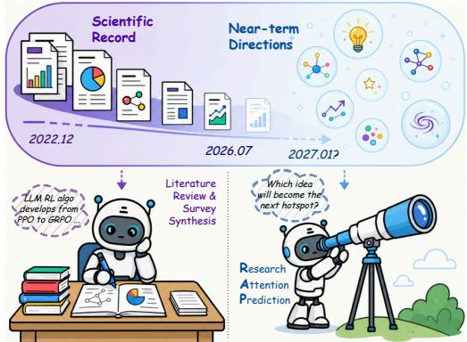
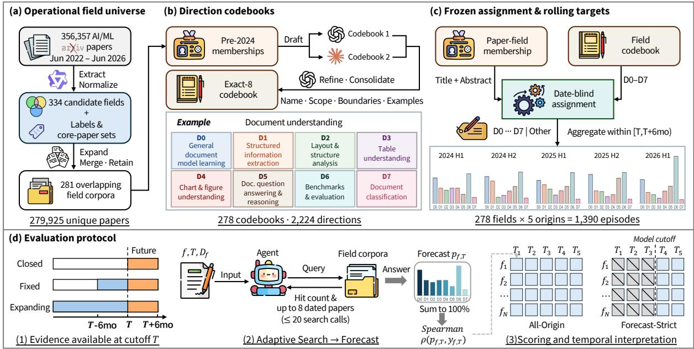
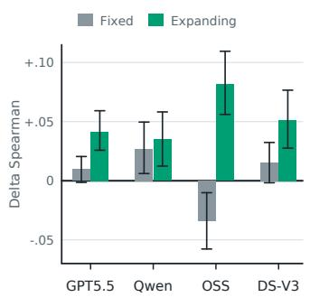
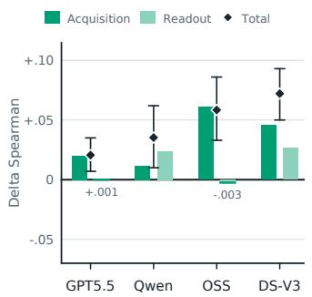
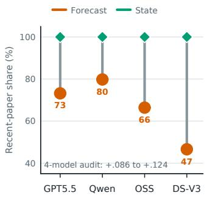
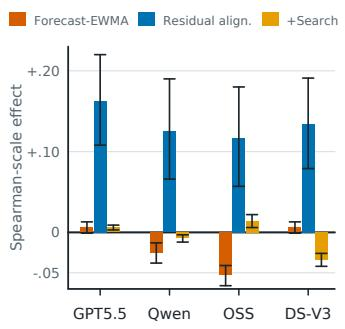

# RAP: Research Attention Prediction Reveals Target-Conditioned Evidence Acquisition Biases

Yingqian Wu1, Jingcong Liang1, Siyuan Wang3, Zhenfei Yin4, Philip Torr4, Junchi Yu4∗, Zhongyu Wei1,2∗

1Fudan University

2Shanghai Innovation Institute

3The Chinese University of Hong Kong

4University of Oxford

wuyq25@m.fudan.edu.cn, junchi.yu@eng.ox.ac.uk, zywei@fudan.edu.cn

## Abstract

Large language models (LLMs) increasingly act as research agents, yet their ability to track shifts in research attention is dificult to evaluate because reviews and research ideas lack uniquely verifiable outcomes. We introduce Research Attention Prediction (RAP), a rolling benchmark covering 278 AI/ML fields and 1,390 episodes. At each cut-of, an LLM agent searches a temporally restricted arXiv corpus and predicts the next six months’ paper shares across eight frozen research directions. Search generally helps, but all four diagnostic models perform worse than an exact-count exponentially weighted moving average (EWMA) baseline in compositional accuracy. We identify two linked bottlenecks. Under cumulative-history access, State carry-forward outper- forms direct Forecast for all four diagnostic models; frozen- evidence replay links a shared component of this reversal to Forecast-oriented policies retrieving a smaller share of recent evidence. Even with exact historical activity, future-specific updating remains limited, with only GPT-5.5 plus reopened Search slightly surpassing EWMA. Fine-tuning on realised outcomes improves Qwen3-4B’s forecast Spearman correlation by 0.105 on held-out fields at later origins, with gains also on change-rich episodes.

## 1 Introduction

Large language models (LLMs) are rapidly evolving from chatbots into research assistants supporting scientific work- flows (Baek et al. 2025; Lu et al. 2024). Recent studies have shown that LLMs can already search the literature and gener- ate comprehensive surveys of research fields from hundreds of papers (Asai et al. 2026; Skarlinski et al. 2024; Wang et al. 2024b). Beyond summarising existing knowledge, effective research assistants should also track how research attention evolves over time. This capability is important be- cause many research activities, such as identifying emerg- ing topics, prioritising scientific exploration, and supporting research planning, depend on understanding the current re- search landscape and anticipating where future research ef- fort is likely to concentrate (Clauset, Larremore, and Sinatra 2017; Fortunato et al. 2018).

  
Figure 1: Compared to literature review, which surveys and summarises existing scientific records in a certain field, Research Attention Prediction (RAP) predicts the distribution of scientific activity in that field in the near future (e.g. six months).

Existing evaluations provide two partial views of this ca- pability. Retrospective tasks assess the synthesis of already published work (Asai et al. 2026; Skarlinski et al. 2024; Wang et al. 2024b), but a fluent survey does not establish that the inferred field state is quantitatively accurate at a par- ticular cut-of. Prospective benchmarks compare predictions with later scientific outcomes (Krenn et al. 2023; Luo et al. 2025; Ajith et al. 2026; Wu et al. 2026), but usually focus on individual papers, discoveries, or impacts. Neither evaluates repeated, agentic forecasting of a jointly normalised activity distribution over the same frozen within-field direction slate. We therefore ask: Can LLM agents forecast future research attention given the past scientific record?

To this end, we introduce Research Attention Prediction (RAP), a rolling, outcome-grounded distribution-forecasting benchmark for this question (Figure 1). At each cut-of, an agent forecasts how papers first submitted over the next six months will be distributed across a fixed, field-specific di- rection codebook, with Search restricted to earlier litera- ture. RAP contains 278 AI/ML fields, five semi-annual ori- gins, and 1,390 episodes constructed from 356,357 AI/ML- oriented arXiv papers. Using first-submission dates to define both historical evidence and future outcomes enables tem- porally grounded evaluation across rolling forecast origins. Evaluating each field with the same frozen direction code- book at every origin makes the resulting activity distributions directly comparable over time.

<table><tr><td>Benchmark</td><td>Forecast target</td><td>Temporal protocol</td><td>Output structure</td></tr><tr><td>What&#x27;s Next? (Ofer, Kaufman, and Linial 2024)</td><td>Topic-level future publication share</td><td>Annual step-forward</td><td>Independent scalar per topic</td></tr><tr><td>Science4Cast (Krenn et al. 2023)</td><td>Future link between scientific concepts</td><td>Held-out future graph</td><td>Link score/rank</td></tr><tr><td>PreScience (Ajith et al. 2026)</td><td>Future-paper components and impact</td><td>Cut-off-conditioned simulations</td><td>Mixed structured outputs</td></tr><tr><td>CUSP (Wu et al. 2026)</td><td>Event feasibility, mechanism, solution, and date</td><td>Post-cut-off events</td><td>Mixed event outputs</td></tr><tr><td>RAP (ours)</td><td>Direction shares of near-future arXiv submissions</td><td>Five rolling origins; frozen slate</td><td>Joint 8-way simplex</td></tr></table>

Table 1: Comparison of scientific forecasting targets. RAP predicts a rolling joint distribution over a fixed within-field direction slate.

RAP operationalises research attention as the relative dis- tribution of papers first submitted to arXiv across stable, field-specific directions. It does not measure scientific im- portance, novelty, or value. To decompose end-to-end fore- casting, we compare no Search (Closed), preceding-sixmonth Search (Fixed-window), and full pre-cut-of Search (Expanding-history), together with a matched State query whose carry-forward serves as an agent-specific persistence control. We reserve post-cut-of forecasting claims for tar- get windows after each model’s documented knowledge cut- of (Cheng et al. 2024; Li et al. 2026).

Evaluation reveals a broad capability gap: Search gener- ally improves over Closed, but no natural agent condition sur- passes an exact-count exponentially weighted moving aver- age (EWMA) baseline, even though pre-cut-of activity contains measurable signal about future departures from persis- tence. Furthermore, stage-wise diagnosis exposes two linked bottlenecks. Under Expanding-history, State carry-forward outperforms direct Forecast for all four diagnostic models. Frozen-evidence replay attributes a shared component to ac- quisition: Forecast-oriented policies allocate a smaller share of retrieved evidence to the recent six-month window, even though it is more useful for the future target. Thus, asking an agent to look ahead can change what it looks at before chang- ing what it says. With exact history, future-specific updating remains limited; only GPT-5.5 with reopened Search slightly surpasses EWMA. Outcome-aligned fine-tuning neverthe- less improves Qwen3-4B by +0.105 on later-origin episodes from dependency-disjoint Test fields, demonstrating crossfield adaptation within RAP but not a repair of the identified acquisition failure.

Our contributions are:

• Rolling benchmark. 1,390 outcome-grounded episodes across 278 fields, with frozen codebooks, cut-of-aligned evidence, and dependency-aware evaluation.

• Capability decomposition. Matched evidence regimes, state carry-forward, replay, and exact-history interven- tions separate acquisition, state recovery, and future up-

dating.

• Search failure and learnability. Across four LLM agents, Forecast shifts cumulative-history Search away from recent evidence; outcome-aligned fine-tuning demonstrates within-task learnability without establish- ing a mechanism-level repair.

## 2 Related Work

Outcome-grounded scientific forecasting. Scientific forecasting spans aggregate trends and individual arte- facts. Earlier scientometric work models topic evolution and emerging areas (Grifiths and Steyvers 2004; Blei and Lafferty 2006; Chen 2006; Small 2006), forecasts field or subfield activity and topic prevalence (Taşkın 2021; Asooja et al. 2016; Ofer, Kaufman, and Linial 2024), and predicts future links or high-impact concepts in scientific graphs (Krenn et al. 2023; Gu and Krenn 2025; Marwitz et al. 2026). Re-cent benchmarks forecast experimental results or scientific events (Luo et al. 2025; Wu et al. 2026), future-paper components and impact (Ajith et al. 2026), researchjudgments (Tian et al. 2026), or the future alignment of ideas and proposals (Jiang 2026; Wang et al. 2026). RAP instead predicts a rolling, jointly normalised field-level distribution over a frozen codebook under adaptive evidence acquisition, and pairs Forecast with a matched State intervention to separate target-conditioned search from terminal readout.

Temporal evaluation and forecasting. Temporal evalu-ation motivates time-sensitive and dynamically constructed tests (Lazaridou et al. 2021; Li, Guerin, and Lin 2024; Karger et al. 2025); reported cut-ofs may difer from efective ones, and prompted simulated ignorance is unreliable (Cheng et al. 2024; Li et al. 2026). RAP follows rolling-origin practice, compares against persistence, exponential-smoothing, and no-change references (Hyndman and Athanasopoulos 2021; Beck, Dovern, and Vogl 2025), and treats its target as a com-positional share vector (Snyder et al. 2017).

Research agents and literature synthesis. Literaturebased discovery and PaperRobot established earlier lines of literature-grounded connection and idea generation (Sebastian, Siew, and Orimaye 2017; Wang et al. 2019). Modern systems support retrieval-grounded synthesis (Asai et al. 2026; Skarlinski et al. 2024), automated surveys (Wang et al. 2024b;

Yan et al. 2025; Bao et al. 2025), and idea or proposal generation (Li et al. 2025; Baek et al. 2025; Wang et al. 2024a), while The AI Scientist extends this workflow to execution, drafting, and review (Lu et al. 2024). These evaluations em-phasise final artefacts (Xu et al. 2025); RAP instead holds the field, cut-of, evidence universe, interface, and codebook fixed while varying State versus Forecast, enabling controlled comparison of evidence acquisition and terminal readout.

## 3 Research Attention Prediction

RAP combines a frozen measurement instrument with a rolling search-and-Forecast protocol. We first construct sta- ble field-specific coordinates and outcome labels, and then evaluate agents under temporally restricted evidence access. We use model for the underlying LLM and agent for its in-stantiation with the RAP prompt, Search interface, and output protocol. Figure 2 illustrates the construction and evaluation of RAP.

## 3.1 Benchmark Construction

The measurement instrument comprises overlapping field- specific corpora, a pre-2024 direction codebook for each field, and a date-blind assignment rule applied at every rolling origin.

Field-specific corpora. Starting from 356,357 arXiv pa-pers first submitted from 2022-06-01 through 2026-06-30 and tagged with at least one of cs.CL, cs.LG, cs.AI, or cs.CV, an open-ended structured extractor—a Qwen3.5-4B student distilled from Claude Sonnet 4.6 labels—proposes a field label for each paper. Labels are normalised, expanded by matching papers against label- and document-level pro- totypes, and conservatively merged. Retaining fields with at least 300 paper–field memberships before 2026-01-01 yields 281 overlapping corpora; 278 admit valid direction code- books, comprising 578,745 paper–field memberships over 279,365 unique papers; these operational fields do not par- tition AI/ML. Field eligibility is retrospectively frozen, but codebook construction uses only pre-2024 evidence and ev- ery evaluation episode exposes only pre-T papers. Construction details and sampling-frame sensitivity are reported in the appendices.

Frozen direction codebooks. Using only pre-2024 evidence, GPT-5.5 and Claude Opus 4.6 independently draft field-specific candidate codebooks. Their anonymised union is revised and consolidated by GPT-5.5 into exactly eight operational directions. Each direction has a name, definition, inclusion and exclusion boundaries, and pre-2024 exemplars. The resulting codebook is frozen across origins. Its direc- tions are operational coordinates rather than an exhaustive taxonomy of the field.

Time-invariant assignment and rolling targets. For field f, let $\mathcal { D } _ { f } = \{ d _ { 1 } , \ldots , d _ { 8 } \}$ denote its frozen directions. A date- blind classifier uses each paper’s title and abstract together with the written codebook to assign a primary label in $\mathcal { D } _ { f }$ or other. The same rule is used at every origin.

For forecast origin T and direction $d \in \mathcal { D } _ { f }$ , let $n _ { f , T , d }$ be the number of papers holding a membership in field $f ,$ , first submitted on or after T and before $T + 6$ months, that receive primary label d. The realised target share is

$$
y _ { f , T , d } = \frac { n _ { f , T , d } } { \sum _ { d ^ { \prime } \in \mathcal { D } _ { f } } n _ { f , T , d ^ { \prime } } } ,
$$

where $d ^ { \prime }$ indexes the eight directions. Therefore, $y _ { f , T } =$ $( y _ { f , T , d } ) _ { d \in \mathcal { D } _ { f } }$ is an eight-dimensional non-negative compo- sition summing to one (Snyder et al. 2017). Papers labelled other are excluded from normalisation; the eight directions cover 0.994 of future-window memberships on average.

Rolling origins and splits. Following rolling-origin evaluation practice (Hyndman and Athanasopoulos 2021), each field contributes five semi-annual origins from 2024-01 through 2026-01, yielding 1,390 episodes under a fixed field definition, codebook, and assignment rule. To limit leakage from overlapping corpora, all origins of a field and strongly overlapping fields are assigned together through frozen de- pendency blocks. The resulting split contains Dev (67 fields; 335 episodes) for protocol development and held-out Test (211 fields; 1,055 episodes) for final evaluation. The same blocks are used for primary uncertainty estimates; the overlap graph and split algorithm are detailed in the appendices.

## 3.2 Evaluation Protocol

Agent task and search interface. We evaluate the com-plete search-and-Forecast pipeline rather than forecasting from supplied papers or exact counts. The agent receives f, T, and the written definitions of $\mathcal { D } _ { f } .$ , but no retrieved pa- pers. It may adaptively query the temporally eligible part of the field-specific corpus, receiving hit counts and dated titles and abstracts, before returning eight non-negative percentage weights that sum to 100.

Evidence-access regimes. We vary only the searchable temporal scope. Fixed-window exposes papers first submitted in $[ T - 6 \mathrm { \bar { m o } } , T )$ ; Expanding-history exposes all papers in the same field-specific corpus first submitted before $T ;$ and Closed disables Search. Because the target is a level forecast (next-window shares rather than changes), persistence is legitimate information: the primary score combines recent-state recovery with future-specific updating and is not, by itself, a pure measure of anticipating change.

Primary score and aggregation. Let $p _ { f , T }$ be the nor- malised Forecast and $y _ { f , T }$ the realised target. Because finite-window counts support relative ordering more re- liably than fine-grained magnitudes, the primary episode score is Spearman rank agreement $\rho ( p _ { f , T } , y _ { f , T } ) ;$ higher is better. A valid uniform prediction carries no ranking in- formation and receives zero. Total-variation distance (TV) and Jensen–Shannon divergence (JSD) provide magnitude-sensitive checks. Scores are averaged over origins within field and then across fields; primary intervals resample de- pendency blocks.

Statistical references and secondary diagnostics. We compute Recent (last-window persistence), exponentially weighted moving average (EWMA), linear-trend, and Devtuned autoregressive integrated moving average (ARIMA),

  
Figure 2: Construction and evaluation of Research Attention Prediction (RAP). (a) Open-ended field extraction, normalisation, and membership expansion convert a frozen AI/ML-oriented arXiv subset into overlapping field-specific corpora. (b) Pre-2024 memberships are independently organised into candidate codebooks and consolidated into a frozen, field-specific slate of exactly eight operational research directions; one example is shown. (c) A date-blind assignment instrument maps each paper–field membership to one direction or other; aggregating assignments within successive six-month windows yields the realised rolling targets, with other excluded from eight-way normalisation. (d) At cut-of T, an agent receives the field and its codebook and forecasts the next-window direction shares under Closed, Fixed-window, or Expanding-history evidence access. Forecasts are scored against the realised distribution using episode-level Spearman agreement.

Holt, and vector autoregression (VAR) references from exact benchmark counts, quantifying predictability with- out Search; they are not same-interface agents (Hynd-man and Athanasopoulos 2021; Beck, Dovern, and Vogl 2025). Future-specific claims use EWMA-controlled resid-ual association, compositional gain over EWMA, output- independent change-rich subsets, and rolling revision align- ment. Complete definitions and the statistical baseline family are reported in the appendices.

## 3.3 Benchmark Validity

Target reliability. Split-half Spearman–Brown reliability is 0.820, and an independent posterior-predictive estimate is 0.828 [0.816, 0.839], implying an approximate observable-score ceiling of 0.910. We also found 6-, 12-, and 18-month revision targets (cross-window changes in the share vector) substantially noisier (0.149, 0.298, and 0.405); hence the six-month level composition is primary and revision metrics are secondary.

Persistence and predictable departures. On Test, Recent and EWMA reach 0.794 and 0.803; EWMA lies 0.108 below the approximate Test-set reliability-implied ceiling, confirm- ing strong persistence. RAP nevertheless contains measur- able change. A pre-frozen, model-output-independent subset selected for significant and reliable recent-to-future distribu- tion change contains 141 episodes; EWMA falls to 0.744, yet these departures are not mere noise: a pre-T linear trend still predicts the realised deviations from EWMA, with permutation-corrected residual-direction alignment +0.151 [+0.013, +0.288]. Stable episodes remain in the full bench-mark as predicting stability is part of forecasting; see Ap- pendix D for exact stress-test definitions.

Semantic and construction robustness. The primary label is a countin convention rather than noiseless old: the assignment instrument marks 42.60% of memberships as boundary cases carrying a plausible secondary direction. Re- scoring frozen predictions against 4 pre-frozen targets that keep, split, drop, or flip this boundary mass changes abso- lute levels but preserves the five-condition ordering in 15 of 16 model–policy combinations across the four diagnostic models. The sole exception is a 0.002 near-tie for GPT-OSS- 120B; every model retains the signs of Fixed Forecast minus Closed, Expanding Forecast minus Fixed Forecast, and Ex- panding State carry-forward minus Forecast. A second model family independently constructs and applies codebooks for 38 fields; despite imperfect paper-level agreement, the in- duced EWMA score and target repeatability under counting noise remain close to the primary instrument. Appendix B reports the independent human annotation and instrument comparisons, and Table 5 gives the four-model policy re- sults.

<table><tr><td rowspan="2">Method/Model</td><td rowspan="2">Knowledge cut-off</td><td colspan="3">All-Origin</td><td colspan="3">Forecast-Strict</td></tr><tr><td>Closed</td><td>Fixed</td><td>Expanding</td><td>Closed</td><td>Fixed</td><td>Expanding</td></tr><tr><td>Recent persistence</td><td></td><td></td><td>0.794</td><td></td><td></td><td>0.821</td><td></td></tr><tr><td>EWMA (primary reference)</td><td></td><td></td><td>0.803</td><td></td><td></td><td>0.840</td><td></td></tr><tr><td>ARIMA(1,1,0)</td><td></td><td></td><td>0.805</td><td></td><td></td><td>0.844</td><td></td></tr><tr><td>Linear trend</td><td></td><td></td><td>0.725</td><td></td><td></td><td>0.760</td><td></td></tr><tr><td>Qwen3-4B</td><td>≤2025-04 (release)</td><td>0.148</td><td>0.300</td><td>0.222</td><td>0.119</td><td>0.321</td><td>0.202</td></tr><tr><td>Qwen3-8B</td><td>≤2025-04 (release)</td><td>0.163</td><td>0.275</td><td>0.257</td><td>0.159</td><td>0.297</td><td>0.208</td></tr><tr><td>Qwen3.6-27B</td><td>not documented</td><td>0.320</td><td>0.448</td><td>0.439</td><td></td><td></td><td></td></tr><tr><td>GPT-OSS-120B</td><td>2024-06</td><td>0.249</td><td>0.384</td><td>0.290</td><td>0.226</td><td>0.353</td><td>0.248</td></tr><tr><td>DeepSeek-V3</td><td>~2024-07</td><td>0.312</td><td>0.309</td><td>0.305</td><td>0.234</td><td>0.250</td><td>0.251</td></tr><tr><td>Claude Haiku  $4 . 5 ^ { * }$ </td><td>2025-02</td><td>0.320</td><td>0.448</td><td>0.425</td><td>0.256</td><td>0.432</td><td>0.392</td></tr><tr><td>GPT-5.5*</td><td>2025-12</td><td>0.502</td><td>0.595</td><td>0.581</td><td>0.476</td><td>0.589</td><td>0.557</td></tr></table>

Table 2: RAP forecast leaderboard. All-Origin includes all 1,055 Test episodes which may overlap a model’s parametric training horizon. Forecast-Strict fixes $T = 2 0 \bar { 2 } 6 - 0 1$ and uses the same 211 Test episodes for every model with an eligible documented cut-of or release-date bound (hence Qwen3.6-27B is not included). Mechanical baselines (upper block) use exact pre-T direction counts and are shown once per temporal track. Bold marks the best score in each track. \*: proprietary model.

## 4 Main Results

## 4.1 Protocol and Temporal Views

We evaluate the Closed, Fixed-window, and Expanding- history regimes defined in Section 3. The two retrieval regimes share the same field-local BM25 interface, call limit, and zero temperature; only the searchable temporal scope difers.

We report two temporal views. All-Origin uses all five origins and supports controlled historical analysis, but some targets may overlap a model’s parametric training horizon. Forecast-Strict retains only cells whose complete target window follows the documented model cut-of or release-date bound. The shared comparison fixes $T = 2 0 2 6 - 0 1$ and the same 211 fields for every eligible model; earlier-cut-of mod- els additionally support within-model strict rolling analyses.

## 4.2 Forecast Performance

Persistence remains dominant. Table 2 presents the main leaderboard. Across all origins, Recent persistence, EWMA, and the Dev-tuned ARIMA reference outperform the strongest agent condition. Expanding the statistical fam- ily does not change this conclusion: ARIMA is numeri- cally but not reliably above EWMA, while additive Holt and ridge VAR perform worse. We retain EWMA as the primary persistence anchor because it is transparent, com- petitive, and supplies an episode-specific compositional ref- erence for the residual analyses; the complete baseline family is reported in the appendices. Because the target-reliability and change-rich analyses establish reliable departures from persistence and a pre-T trend signal, this gap does not imply an intrinsically unpredictable target. It does mean that the leaderboard measures operational next-window level fore- casting; claims about anticipating change require separate persistence-controlled analyses.

Retrieval helps selectively, but cumulative history does not. Fixed-window retrieval improves over Closed for six of the seven agents, with DeepSeek-V3 the exception.

Expanding-history is lower than Fixed-window for all seven, essentially unchanged only for DeepSeek-V3, with the largest drop for GPT-OSS-120B. Thus, access to the literature can improve Forecast, but exposing a larger cumulative record does not make that evidence any easier to use.

Forecasting beyond persistence. Let $e _ { f , T }$ be the ex- act three-window EWMA. We compare $p _ { f , T } - e _ { f , T }$ with $y _ { f , T } - e _ { f , T }$ using permutation-corrected residual-direction alignment, and pair this diagnostic with TV gain over EWMA and a model-output-independent change-rich analysis. The combination matters: residual direction alone can reward a forecast that merely re-weights past windows diferently, without bringing the complete forecast closer to the future.

Across the four diagnostic models (GPT-5.5, Qwen3.6- 27B, GPT-OSS-120B, and DeepSeek-V3), no agent condition improves TV over EWMA. GPT-5.5 and Qwen3.6-27B retain weak all-origin residual alignment, but GPT-OSS- 120B and DeepSeek-V3 show little or none. Fixed retrieval improves TV relative to Closed for GPT-5.5 and Qwen3.6- 27B, yet neither model gains residual-direction alignment from retrieval. At the latest common origin $( T = 2 0 2 \breve { 6 } - 0 1 )$ , agent residual alignment is near zero or negative while a pre-T linear trend remains positive. Current agents therefore recover useful activity levels without reliably converting retrieval into a calibrated update beyond persistence. Com- plete residual, compositional, and change-rich results are in the appendices.

The pattern persists after knowledge cut-of. At the shared Forecast-Strict origin, Fixed-window remains above Closed for Qwen3-4B, Qwen3-8B, GPT-OSS-120B, Claude Haiku 4.5, and GPT-5.5, while DeepSeek-V3 changes lit- tle. Expanding-history remains below Fixed-window for the same five models and is essentially unchanged for DeepSeek- V3. All eligible agents remain below EWMA and ARIMA.

Forecast-Strict supports post-cut-of forecasting claims; All-Origin supports controlled historical evidence-use and rolling diagnostics. Complete strict-origin trajectories and

(a) State-Forecast gap

  
(b) Replay decomposition

  
(c) Temporal scope

  
(d) Exact-history boundary

  
Figure 3: Four linked diagnostics on the Test panel (Section 5). (a) State-as-Forecast minus Forecast under Fixed and Expanding access. (b) Matched-call replay decomposes the gap into acquisition and readout contributions. (c) Forecast and State shares of retrieved papers from the recent six months; the annotation reports evidence–future alignment gains from the four-model same-query counterfactual. (d) With exact history, Forecast minus EWMA, residual-direction alignment, and the marginal efect of reopening Search. Bars and points are field-macro estimates; thin error bars show the corresponding 95% intervals. Complete replay matrices, strict slices, and compositional metrics are in Appendices E and F.

exposure-stratified contrasts are in the appendices.

Overall, retrieval can improve the future level without re- solving beyond-persistence updating, while cumulative his- tory fails to improve Forecast over fixed-window access for any of the seven agents. This separates two diagnostic boundaries—recovering a useful time-local activity level and updating it toward the future—without assuming a fixed in- ternal pipeline. We next test whether the cumulative-history failure is carried by evidence acquisition or by the terminal readout.

## 5 Diagnosing Target-Conditioned Search Failure

Table 2 shows that cumulative-history access does not im- prove Forecast over fixed-window access and that natural agents remain below persistence. Figure 3 diagnoses one repeatable component: with a long searchable record, the future-oriented target changes the evidence acquired. The analysis proceeds from an end-to-end reversal to frozen- evidence localisation, an observable Search signature, and an exact-history boundary; it does not attribute every fore- casting failure to acquisition.

The panel contains GPT-5.5, Qwen3.6-27B, GPT-OSS-120B, and DeepSeek-V3. A matched State intervention estimates the realised direction distribution in the preceding six months. Carrying it forward gives State-as-Forecast, an agent-specific persistence reference using the same Search interface rather than oracle counts. Its advantage over Fore- cast means that the forward-looking target worsened predic- tion relative to the state the same agent could reconstruct, not that either output anticipated change.

## 5.1 The Reversal Appears Under Cumulative History

Matched Forecast and State runs hold fixed the field, cut-of, codebook, backend, searchable universe, call limit, and out- put schema; only the requested target initially difers, after which Search trajectories may diverge. Under Expandinghistory, State-as-Forecast outperforms Forecast for all four models (Figure 3(a)). Fixed-window gaps are smaller and sign-inconsistent. Thus the reversal is specific to selecting time-relevant evidence from a long record, rather than State being universally easier. Its sign persists in every eligible post-cut-of comparison; full exposure analysis is in the ap- pendices.

## 5.2 Frozen Replay Localises a Shared Loss to Acquisition

The end-to-end gap may arise because Forecast acquires worse evidence or uses identical evidence worse. We re- play each Expanding-history trajectory under both readout objectives, keeping its ordered queries and observations byteidentical. Under a common Forecast readout, State-oriented evidence improves future accuracy for every model. After truncating each pair to its shared episode-specific Search- call budget (Figure 3(b)), the efect is robust for GPT-5.5, GPT-OSS-120B, and DeepSeek-V3, and positive but uncer- tain for Qwen3.6-27B. Changing only the readout over State evidence is small for GPT-5.5 and GPT-OSS-120B but con- sequential for the other two. Acquisition is therefore a shared component of the reversal, although matched calls do not equalise retrieved-paper volume or identity; complete matri- ces and audits are in the appendices.

## 5.3 The Shared Search Signature Is Temporal Scope

State Search places all returned paper slots (including re-peats) in the preceding six months, versus 47–80% for Forecast (Figure 3(c)). This is not simply lower-volume retrieval: State yields fewer distinct papers for three models but more for Qwen3.6-27B, while Forecast/State paper-set overlap re-mains low. For every model, State evidence better matches both recent and future realised distributions.

We then deterministically re-execute 86,284 recorded Search calls across all four diagnostic models. Every call reproduces its native paper IDs and ordering on the frozen corpus. Under identical recent-window relevance options, the State-query evidence–future advantage is at most +0.011 and is negative for three models; no model’s 95% interval ex- cludes zero. Applying these options to Forecast’s own queries instead improves evidence–future alignment by +0.086– +0.124 (Table 21). Because this counterfactual does not rerun the readout, it does not estimate repaired Forecast ac- curacy. It identifies temporal-scope allocation as a shared Search signature rather than a general advantage of State query wording.

## 5.4 Exact History Reveals a Second Boundary

We next provide exact recent or three-window pre-T di-rection distributions while retaining the evaluation prompt, schema, and scoring. This bypasses natural acquisition and aggregation and is diagnostic, not deployable. Every model then has positive permutation-corrected residual-direction alignment (Figure 3(d)), but not a reliable complete Fore-cast advantage: GPT-5.5 and DeepSeek-V3 show no statis- tically resolved advantage over EWMA in rank agreement, while Qwen3.6-27B and GPT-OSS-120B remain below it. Reopening Expanding Search improves level accuracy for GPT-5.5 and GPT-OSS-120B but degrades it for the other two; only GPT-5.5 surpasses EWMA. No model converts its within-origin residual signal into positive six-month revision tracking.

These interventions expose two boundaries: recovering and preserving a time-local state is a major bottleneck, and the Forecast target can damage that recovery by redi- recting Search. Even with exact history, calibrated beyond- persistence updating remains unresolved.

## 5.5 Outcome Supervision Provides a Learnable Within-Task Signal

As a consequential check, we perform full-parameter, full- trajectory supervised fine-tuning (SFT) of Qwen3-4B on 90 outcome-aligned Forecast trajectories from 45 training fields at the 2024-07 origin. We evaluate fresh native roll- outs at two later origins over all 211 dependency-disjoint Test fields. Compared with Base, pooled Forecast Spearman im- proves by 0.105: 0.072 under Fixed-window and 0.138 under Expanding-history. The gain is 0.159 on the pre-specified change-rich subset, and all 844 outputs are valid. This es- tablishes learnability across fields and later origins, but not a mechanism-level repair: Search use and recent-state an- choring increase, whereas pooled residual-direction and six- month revision-alignment gains remain unresolved. Nor is it strict post-cut-of learning, because Qwen3-4B’s efective cut-of is undocumented. Training, gating, and diagnostics are in the appendices.

## 6 Discussion and Limitations

Two diagnostic capability boundaries. RAP exposes two related but non-identical limitations. An agent must recover a useful time-local activity level from the available record, and its explicit Forecast must add a reliable update beyond persistence. These empirical boundaries do not imply that the agent internally follows a fixed two-stage algorithm. The protocol-matched oracle-history intervention identifies state recovery as a major bottleneck: once exact historical activity is supplied, GPT-5.5 recovers most of the level gap and ex- hibits positive residual alignment. Future updating remains limited: exact history alone yields no reliable advantage over EWMA, and reopening Search produces a small advantage over EWMA only for GPT-5.5. No model reliably tracks six- month revisions. The marginal efect of Search with exact history is model-dependent, while under natural cumulative- history access the Forecast objective changes the evidence used for level recovery.

The requested target shapes evidence acquisition. In an agentic literature workflow, evidence is not a fixed input: the requested target can change which queries are issued, which papers are retrieved, and when search terminates. Frozen- evidence replay separates this dependence from the terminal readout. State-oriented trajectories support better Forecast readouts even after Search-call counts are matched, whereas changing only the readout over byte-identical evidence usu- ally has a substantially smaller efect. Final-answer evalua- tion alone can therefore misattribute an evidence-acquisition failure to forecast synthesis, and state serves as a diagnostic intervention for this distinction.

Temporal and interpretive claim boundaries. RAP tar-gets are fixed across evaluated agents, but some All-Origin episodes fall within an evaluated model’s reported knowledge horizon. We therefore interpret All-Origin as a controlled analysis of evidence use and reserve post-cut-of forecasting claims for Forecast-Strict cells; exposure-stratified re-scoring preserves the direction of the Expanding-history penalty, the State–Forecast reversal, and the acquisition advantage in ev- ery eligible strict comparison. Because the primary endpoint is the next-window level composition, it is also persistence- dependent, and a high level score cannot by itself support a claim of anticipating change. We reserve that narrower claim for persistence-controlled residual association, model- output-independent change-rich subsets, and revision align- ment, which are secondary evaluations of the same frozen forecasts rather than a redefinition of the model-facing task.

Construct and sampling limitations. The distribution of new arXiv submissions is an observable proxy for the allo- cation of research activity, and does not measure scientific quality, impact, or novelty. The eight directions are frozen op- erational coordinates rather than a unique expert taxonomy, and they measure reallocation among established programs more directly than the emergence of directions outside the codebook. Field eligibility is based on eventual corpus vol- ume, so RAP emphasises research areas that attain sustained scale. Paper assignments contain genuine boundary cases; we assess robustness under pre-frozen ambiguity-aware count- ing policies and independently drafted codebooks, and report an independent blinded annotation in the appendices. The di- rection taxonomy has not been validated by domain experts, and we make no claim that the exact-eight slate is a unique or expert-endorsed decomposition of any field.

Conclusion. RAP turns one forward-looking component of research assistance into a dense, rolling, and retrospec- tively verifiable prediction problem. Under natural evidence access, current agents can use retrieval to improve the pre- dicted activity level, yet they do not reliably convert that evidence into calibrated departures from persistence. Under cumulative literature access, looking ahead can additionally change what an agent looks at: the Forecast objective redi-rects evidence acquisition before giving the final answer and sacrifices useful recent-state evidence. Exact-history inter- vention shows that this is not an absolute inability to Fore- cast, since GPT-5.5 exhibits partial conditional updating. RAP does not equate arXiv submission shares with scien- tific judgment; it provides an instrument for separately testing evidence acquisition, reconstruction of the present, and future-specific updating.

Data and code availability. We plan to release the bench-mark data and evaluation code upon acceptance.

## References

Ajith, A.; Singh, A.; DeYoung, J.; Kunievsky, N.; Kozlowski, A. C.; Tafjord, O.; Evans, J.; Weld, D. S.; Hope, T.; and Downey, D. 2026. PreScience: A Dataset and Benchmark for Scientific Forecasting. arXiv preprint arXiv:2602.20459.

Asai, A.; He, J.; Shao, R.; et al. 2026. Synthesizing scientific literature with retrieval-augmented language models. Nature, 650(8103): 857–863.

Asooja, K.; Bordea, G.; Vulcu, G.; and Buitelaar, P. 2016. Forecasting Emerging Trends from Scientific Literature. In Proceedings of the Tenth International Conference on Language Resources and Evaluation (LREC’16), 417–420.

Baek, J.; Jauhar, S. K.; Cucerzan, S.; and Hwang, S. J. 2025. ResearchAgent: Iterative Research Idea Generation over Sci- entific Literature with Large Language Models. In Proceedings of the 2025 Conference of the Nations of the Americas Chapter of the Association for Computational Linguistics: Human Language Technologies (Volume 1: Long Papers), 6709–6738.

Bao, T.; Nayeem, M. T.; Rafiei, D.; and Zhang, C. 2025. Sur- veyGen: Quality-Aware Scientific Survey Generation with Large Language Models. In Proceedings of the 2025 Conference on Empirical Methods in Natural Language Processing, 2712–2736.

Beck, N.; Dovern, J.; and Vogl, S. 2025. Mind the naive forecast! A rigorous evaluation of forecasting models for time series with low predictability. Applied Intelligence, 55(6). Article 395.

Blei, D. M.; and Laferty, J. D. 2006. Dynamic Topic Mod- els. In Proceedings of the 23rd International Conference on Machine Learning, 113–120.

Chen, C. 2006. CiteSpace II: Detecting and Visualizing Emerging Trends and Transient Patterns in Scientific Lit- erature. Journal of the American Society for Information Science and Technology, 57(3): 359–377.

Cheng, J.; Marone, M.; Weller, O.; Lawrie, D.; Khashabi, D.; and Van Durme, B. 2024. Dated Data: Tracing Knowl- edge Cutofs in Large Language Models. arXiv preprint arXiv:2403.12958.

Clauset, A.; Larremore, D. B.; and Sinatra, R. 2017. Data- driven predictions in the science of science. Science, 355(6324): 477–480.

Fortunato, S.; Bergstrom, C. T.; Börner, K.; Evans, J. A.; Helbing, D.; Milojević, S.; Petersen, A. M.; Radicchi, F.; Sinatra, R.; Uzzi, B.; Vespignani, A.; Waltman, L.; Wang, D.; and Barabási, A.-L. 2018. Science of science. Science, 359(6379): eaao0185.

Grifiths, T. L.; and Steyvers, M. 2004. Finding scientific topics. Proceedings of the National Academy of Sciences, 101(suppl. 1): 5228–5235.

Gu, X.; and Krenn, M. 2025. Forecasting high-impact re- search topics via machine learning on evolving knowledge graphs. Machine Learning: Science and Technology, 6(2): 025041.

Hyndman, R. J.; and Athanasopoulos, G. 2021. Forecasting: Principles and Practice. Melbourne, Australia: OTexts, 3rd edition.

Jiang, B. 2026. HindSight: Evaluating LLM-Generated Research Ideas via Future Impact. arXiv preprint arXiv:2603.15164.

Karger, E.; Bastani, H.; Chen, Y.-H.; Jacobs, Z.; Halawi, D.; Zhang, F.; and Tetlock, P. E. 2025. ForecastBench: A Dynamic Benchmark of AI Forecasting Capabilities. In International Conference on Learning Representations.

Krenn, M.; Bufoni, L.; Coutinho, B.; et al. 2023. Forecasting the future of artificial intelligence with machine learning- based link prediction in an exponentially growing knowledge network. Nature Machine Intelligence, 5(11): 1326–1335.

Lazaridou, A.; Kuncoro, A.; Gribovskaya, E.; Agrawal, D.; Liska, A.; Terzi, T.; Gimenez, M.; de Masson d’Autume, C.; Kočiský, T.; Ruder, S.; Yogatama, D.; Cao, K.; Young, S.; and Blunsom, P. 2021. Mind the Gap: Assessing Temporal Generalization in Neural Language Models. In Advances in Neural Information Processing Systems 34, 29348–29363.

Li, L.; Xu, W.; Guo, J.; Zhao, R.; Li, X.; Yuan, Y.; Zhang, B.; Jiang, Y.; Xin, Y.; Dang, R.; Rong, Y.; Zhao, D.; Feng, T.; and Bing, L. 2025. Chain of Ideas: Revolutionizing Research Via Novel Idea Development with LLM Agents. In Findings of the Association for Computational Linguistics: EMNLP 2025, 8971–9004.

Li, Y.; Guerin, F.; and Lin, C. 2024. LatestEval: Ad- dressing Data Contamination in Language Model Evalua- tion through Dynamic and Time-Sensitive Test Construc- tion. Proceedings of the AAAI Conference on Artificial Intelligence, 38(17): 18600–18607.

Li, Z.; Wang, Y.; El Lahib, A.; Xia, Y.-J.; and Pi, X. 2026. Simulated Ignorance Fails: A Systematic Study of LLM Be- haviors on Forecasting Problems Before Model Knowledge Cutof. arXiv preprint arXiv:2601.13717.

Lu, C.; Lu, C.; Lange, R. T.; Foerster, J.; Clune, J.; and Ha, D. 2024. The AI Scientist: Towards Fully Auto- mated Open-Ended Scientific Discovery. arXiv preprint arXiv:2408.06292.

Luo, X.; Rechardt, A.; Sun, G.; et al. 2025. Large language models surpass human experts in predicting neuroscience results. Nature Human Behaviour, 9(2): 305–315.

Marwitz, T.; Colsmann, A.; Breitung, B.; et al. 2026. Pre- dicting new research directions in materials science using large language models and concept graphs. Nature Machine Intelligence, 8(4): 535–544.

Ofer, D.; Kaufman, H.; and Linial, M. 2024. What’s next? Forecasting scientific research trends. Heliyon, 10(1): e23781.

Sebastian, Y.; Siew, E.-G.; and Orimaye, S. O. 2017. Emerg- ing approaches in literature-based discovery: Techniques and performance review. The Knowledge Engineering Review, 32: e12.

Skarlinski, M. D.; Cox, S.; Laurent, J. M.; Braza, J. D.; Hinks, M.; Hammerling, M. J.; Ponnapati, M.; Rodriques, S. G.; and White, A. D. 2024. Language agents achieve su- perhuman synthesis of scientific knowledge. arXiv preprint arXiv:2409.13740.

Small, H. 2006. Tracking and predicting growth areas in science. Scientometrics, 68(3): 595–610.

Snyder, R. D.; Ord, J. K.; Koehler, A. B.; McLaren, K. R.; and Beaumont, A. N. 2017. Forecasting compositional time series: A state space approach. International Journal of Forecasting, 33(2): 502–512.

Taşkın, Z. 2021. Forecasting the future of library and in- formation science and its sub-fields. Scientometrics, 126(2): 1527–1551.

Tian, Q.; Yin, H.; Xia, Y.; Kong, Y.; and Liu, Z. 2026. ForeSci: Evaluating LLM Agents for Forward-Looking AI Research Judgment. arXiv preprint arXiv:2606.00644.

Wang, H.; Jiang, P.; Sun, J.; Shi, Z.; Yu, H.; Han, J.; and Ji, H. 2026. Learning to Predict Future-Aligned Re- search Proposals with Language Models. arXiv preprint arXiv:2603.27146.

Wang, Q.; Downey, D.; Ji, H.; and Hope, T. 2024a. Sci-MON: Scientific Inspiration Machines Optimized for Nov- elty. In Proceedings of the 62nd Annual Meeting of the Associationfor Computational Linguistics (Volume 1: Long Papers), 279–299.

Wang, Q.; Huang, L.; Jiang, Z.; Knight, K.; Ji, H.; Bansal, M.; and Luan, Y. 2019. Pa erRobot: Incremental Draft Genera- tion of Scientific Ideas. In Proceedings of the 57th Annual Meeting of the Association for Computational Linguistics, 1980–1991.

Wang, Y.; Guo, Q.; Yao, W.; Zhang, H.; Zhang, X.; Wu, Z.; Zhang, M.; Dai, X.; Zhang, M.; Wen, Q.; Ye, W.; Zhang, S.; and Zhang, Y. 2024b. AutoSurvey: Large Language Models Can Automatically Write Surveys. In Advances in Neural Information Processing Systems 37, 115119–115145.

Wu, S.; Lu, P.; Chen, Y.; Bragg, J.; Yamada, Y.; Clark, P.; Clifton, D.; Torr, P.; Zou, J.; and Yu, J. 2026. Scientific rea- soning does not reliably translate into scientific forecasting in frontier AI. arXiv preprint arXiv:2605.22681.

Xu, T.; Lu, P.; Ye, L.; Hu, X.; and Liu, P. 2025. Researcher- Bench: Evaluating Deep AI Research Systems on the Fron- tiers of Scientific Inquiry. arXiv preprint arXiv:2507.16280.

Yan, X.; Feng, S.; Yuan, J.; Xia, R.; Wang, B.; Bai, L.; and Zhang, B. 2025. SurveyForge: On the Outline Heuristics, Memory-Driven Generation, and Multi-dimensional Evalu- ation for Automated Survey Writing. In Proceedings of the 63rd Annual Meeting of the Association for Computational Linguistics (Volume 1: Long Papers), 12444–12465.

## A Benchmark Construction and Measurement Instrument

## A.1 Operational scope and leakage control

RAP treats a field and its eight directions as an operational measurement instrument rather than a unique natural taxon- omy. The field sampling frame was retrospectively frozen from the corpus available through the end of 2025. Direc- tion names, definitions, and exemplars were constructed from evidence before 2024, and every evaluation-time search en- vironment physically excludes papers posted on or after the episode cutof T. Thus, selection into the field universe may use post-2023 information, while neither the direction slate nor the evidence shown within an episode exposes its future target. The source snapshot extends through June 2026 only to construct later outcome windows; field-retention counts remain censored at the end of 2025.

Freeze order and leakage control. The field universe, di-rection slates, paper assignments, ambiguity policies, and dependency-aware Dev/Test split were fixed before any Test model output was inspected. The A0–A4 protocol was fi- nalized using only the Dev-8 semantic check, followed by the completed Dev-67 gate before Test evaluation. Table 27 identifies the corresponding frozen artifacts and hashes.

## A.2 Field extraction, expansion, and retention

The frozen source snapshot contains 356,357 unique arXiv papers whose first submission falls in [2022-06-01, 2026-07-01) and whose category list contains at least one of cs.CL, cs.LG, cs.AI, or cs.CV. It is a four-category operational subset rather than the full computer-science arXiv corpus.

Distilled structured extractor. Open-ended field extraction is performed by a distilled extractor rather than by any evaluated frontier model. A teacher model (Claude Sonnet 4.6) labels a random sample of 10,000 papers with a fivefield structured schema (field, problem, technical focus, setting, direction), and a Qwen3.5-4B student is trained on these labels with full-parameter SFT (9,500/500 train/validation split). On the held-out set, all 500 outputs are valid structured records, field labels a ree with the teacher at embed- ding cosine 0.876, and direction texts retrieve their teacher counterpart at top-1 accuracy 0.990. The student is applied to all 356,357 papers; 48 initially invalid outputs are repaired deterministically (18) or by the teacher (30), leaving zero in-valid records. The extractor emits 110,700 distinct raw field strings, and the 9,514 strings occurring at least five times are normalised by the teacher into 3,107 candidate parent la- bels. This Qwen3.5-4B construction extractor is distinct from the Qwen3-4B benchmark student evaluated and adapted in Appendix F.5.

Membership expansion. Each normalized parent field initially contains the papers whose extracted label maps exactly to it; these high-precision seed papers define the field. We then score additional paper–field pairs using two embedding views: similarity between the extracted field label and the parent/child field labels, and similarity between the paper’s title and abstract and clusters of seed papers. An additional membership is accepted when the field is among the top five candidates in both views and the lower similarity is at least 0.80, a threshold selected by a 500-pair dual-model blind audit. The audit mixed seven 60-pair score bins with 80 hidden seed-positive controls and concealed the score, bin, control status, and extracted source field from GPT-5.5 and Claude Opus 4.6. A pair counted as valid when both auditors judged the field primary or substantively secondary. The frozen rule chose the lowest boundary at which each auditor and their joint judgement reached 0.90 validity in that bin and all higher bins: joint validity was 0.883 in the 0.75–0.80 bin and 0.917 in the 0.80–0.85 bin. The result- ing population-weighted joint-valid estimate is 0.926 [0.856, 0.983]. For unresolved near-boundary candidates, Qwen3.6- 27B compares the paper with five pre-2024 field exemplars; only a primary verdict adds a canonical membership. Papers may belong to multiple fields, while either stage may abstain.

Only same-granularity synonym aliases are merged. We retain merged fields with at least 300 memberships before 2026-01-01, yielding 281 membership fields. The subse- quent direction-codebook gate succeeds for 278 fields. Re- stricting memberships to these final fields yields 578,745 paper–field pairs covering 279,365 unique papers. A paper may belong to multiple fields, so the resulting field-specific corpora overlap.

## A.3 Retrospective field-universe conditioning

Field eligibility is determined using membership counts through the end of 2025, including observations after the ear- lier forecast origins. Membership prototypes also use seed papers and label frequencies through the end of 2025. Thus, both field eligibility and the membership instrument use ret- rospective information; direction codebooks are constructed from pre-2024 evidence, and model-facing retrieval remains restricted by each episode’s cutof. Table 3 reports how many retained fields already met the same threshold before the ear- liest forecast origin.

<table><tr><td>Scope</td><td>Pre-2024 memberships ≥ 300</td><td>&lt; 300</td></tr><tr><td>All fields</td><td>149</td><td>129</td></tr><tr><td>Dev</td><td>42</td><td>25</td></tr><tr><td>Test</td><td>107</td><td>104</td></tr></table>

Table 3: Eligibility of the frozen field universe under the same membership threshold applied using only papers before 2024.

Pre-2024-eligible sensitivity. We restrict the frozen Test outputs to the 107 Test fields that already met the 300- membership threshold before 2024. Table 4 applies this re- striction to all seven Forecast agents. Across the 21 model– condition cells, the absolute change from the full Test esti- mate is at most .046. Fixed-window remains above Closed for six models; DeepSeek-V3 changes only from a .003 disadvan- tage to a .003 advantage. Expanding-history remains below Fixed-window for six models; Qwen3.6-27B changes from a .009 disadvantage to a .018 advantage. For the four diagnostic agents, the Expanding-history State-as-Forecast advantage remains positive on the restricted subset: .016, .072, .057, and .048 for Qwen3.6-27B, GPT-OSS-120B, DeepSeek-V3, and GPT-5.5, respectively. Thus the central comparisons survive, although near-tied condition orderings can reverse. This sen- sitivity does not imply that the retrospectively retained field universe is equivalent to a prospectively sampled universe.

<table><tr><td>Model</td><td>A0 Closed</td><td>A1 Fixed</td><td>A3 Expanding</td></tr><tr><td>Qwen3-4B</td><td>.148/.137</td><td>.300/.292</td><td>.222/.230</td></tr><tr><td>Qwen3-8B</td><td>.163/.166</td><td>.275/.291</td><td>.257/.276</td></tr><tr><td>Qwen3.6-27B</td><td>.320/.329</td><td>.448/.417</td><td>.439/.435</td></tr><tr><td>GPT-OSS-120B</td><td>.249/.256</td><td>.384/.399</td><td>.290/.290</td></tr><tr><td>DeepSeek-V3</td><td>.312/.327</td><td>.309/.330</td><td>.305/.320</td></tr><tr><td>Claude Haiku 4.5</td><td>.320/.358</td><td>.448/.485</td><td>.425/.471</td></tr><tr><td>GPT-5.5</td><td>.502/.515</td><td>.595/.603</td><td>.581/.588</td></tr></table>

Table 4: Forecast Spearman on the full frozen Test panel and the pre-2024-eligible subset (Full/eligible in each cell).

## A.4 Direction construction and exact-eight consolidation

Only pre-2024 memberships enter direction construction. For each retained field, the pipeline extracts and semanti- cally deduplicates atomic research programs, obtains two in- dependent variable-size drafts—one from GPT-5.5 and one from Claude Opus 4.6—and absorbs additional pre-2024 pa- pers into those drafts. A frozen revision, anonymous union, and exact-eight consolidation then produce the final code- book. Every direction includes a name, explicit definition, inclusion/exclusion boundaries, and pre-2024 exemplars.

The codebook is frozen across all rolling origins and is constructed without consulting any forecasting output. Its eight directions are operational measurement coordinates: they are neither claimed to be the unique natural taxonomy of a field nor required to be exhaustive or mutually exclusive.

## A.5 Paper assignment and boundary policy

The frozen assignment instrument labels 55.48% of paper– field memberships as single-direction, 42.60% as bound- ary ties, 1.58% as genuine bridges, 0.34% as other, and 0.0036% as low evidence. The canonical primary label is therefore a counting convention rather than a noiseless or unique paper-level gold label. Three alternative policies were frozen before confirmatory model evaluation: splitting boundary mass equally, retaining only single-direction pa- pers, and assigning all boundary mass to the secondary di- rection. Table 5 re-scores the four diagnostic agents against all four targets. Exact five-condition ordering is preserved in 15 of 16 model–policy combinations. The exception is GPT- OSS-120B under the single-direction-only target, where A4 (.284) narrowly exceeds A1 (.282), reversing their canoni-cal order by .002. Nevertheless, every model preserves the sign of the paper’s three structural comparisons under every policy: A1–A0, A3–A1, and A4–A3.

## A.6 Construction-model overlap and parallel instrument

Every construction layer is model-assisted: a Claude Son- net 4.6 teacher and its distilled Qwen3.5-4B student perform field extraction and parent-label normalisation; GPT-5.5 con- tributed to the primary direction codebook; and Qwen3.6- 27B is used by the frozen paper-assignment instrument. The latter two families also appear in the evaluation panel. On 38 fields, an independently drafted Opus instrument pro- duces similar persistence scores and target repeatability un- der cross-fit alignment. Cross-agent rank invariance is not tested because the forecasting panel was not rerun under its direction semantics.

## B Measurement Validity Audits

## B.1 Human operational-assignability audit

A researcher with an AI/ML background completed all 144 paper–field judgements across 24 construction-stratified fields in 5.4 hours. The annotator saw only the paper title and abstract, the operational field definition, and the eight written direction definitions. The interface did not expose frozen item-level assignments, sampling strata, or the scor- ing rule. The sampling design and analysis plan were frozen before annotation and disclosed only after all judgements were complete. The resulting labels were therefore produced independently of the automatic assignment instrument.

Fields span Dev/Test, field-size strata, and dependency blocks. Within each field, the sample includes ordinary single-direction candidates, boundary/bridge candidates on either side of 2024, population-positive draws, and retrieved non-primary draws. The annotator recorded field member- ship, a primary direction or other, an optional secondary direction, clarity, and confidence.

Field membership was reproduced on 0.958 [0.917, 0.992] of frozen-positive pairs. The annotator rated the directions broadly distinguishable in 23 of 24 fields. Thus, given only the written codebook and paper metadata, the annotator usu- ally recovered the field membership used by the corpus and found the eight directions operationally separable.

The protocol required one primary choice but made the secondary optional; a secondary was supplied on only 5.2% of accepted items. Exact primary match is therefore a lower bound on conformance rather than an accuracy estimate: a difering primary may indicate either rejection of the frozen label or a diferent ranking among several admissible direc- tions. When the instrument declared a two-direction candi- date set—58 items— the annotator’s choice fell inside that pair on 40. When the instrument asserted a single direction, the criterion necessarily reduces to exact match, which was 34 of 62.

The stratified sample is not population representative. Each frozen-positive item is assigned to one of four cells defined by assignment type (single/boundary) and period (pre-2024/2024+). For outcome indicator z, the corpus-reweighted estimate is $\sum _ { c } \pi _ { c } \bar { z } _ { c }$ , where $\bar { z } _ { c }$ is the audited cell mean and $\pi _ { c }$ is that cell’s share of frozen corpus mem- berships. The Forecast-target version renormalises $\pi _ { c }$ over 2024+ cells because no pre-2024 paper can enter a Forecast target window. Intervals resample fields and recompute the weighted statistic. Table 6 shows that this correction materi- ally lowers the apparent conformance.

<table><tr><td>Model</td><td>Canonical condition order</td><td>Exact order stable</td><td>Max.  $| \Delta \rho |$ </td></tr><tr><td>Qwen3.6-27B</td><td> $\mathrm { A } 2 > \mathrm { A } 4 > \mathrm { A } 1 > \mathrm { A } 3 > \mathrm { A } 0$ </td><td>4/4</td><td>.111</td></tr><tr><td>GPT-OSS-120B</td><td> $\mathrm { A 1 } > \mathrm { A 4 } > \mathrm { A 2 } > \mathrm { A 3 } > \mathrm { A 0 }$ </td><td>3/4</td><td>.113</td></tr><tr><td>DeepSeek-V3</td><td> $\mathrm { A } 4 > \mathrm { A } 2 > \mathrm { A } 0 > \mathrm { A } 1 > \mathrm { A } 3$ </td><td>4/4</td><td>.154</td></tr><tr><td>GPT-5.5</td><td> $\mathrm { A } 4 > \mathrm { A } 2 > \mathrm { A } 1 > \mathrm { A } 3 > \mathrm { A } 0$ </td><td>4/4</td><td>.115</td></tr></table>

Table 5: Test Forecast/carr -forward S earman sensitivit to four frozen assi nment olicies. “Exact order stable” count policies retaining the model’s complete canonical A0–A4 ordering; $| \Delta \rho |$ is the largest cell-wise change from the canonica target. Complete scores are retained in the frozen reproducibility archive described in Appendix G.

This single-annotator, label-blind audit evaluates opera- tional assignability; it is not an inter-annotator or field-expert validation study.

## B.2 Robustness to assignment ambiguity

We first test whether disagreement is directional. On the 114 paired items, the total-variation distance between the two labellers’ pooled marginals over the eight direction slots is 0.123, inside an exchangeable-disagreement null (p = 0.21). No slot’s net flow has an interval excluding zero. This is a non-detection, not proof of unbiasedness: the null’s 95th percentile is 0.149.

We then re-score frozen predictions against the four pre- frozen counting policies. Table 5 reports the four diagnostic models. Complete five-condition ordering is preserved in 15 of 16 model–policy combinations; the sole exception is a .002 GPT-OSS-120B near-tie under the single-direction- only target. More importantly, every model retains the sign of A1–A0, A3–A1, and A4–A3 under every policy. Hence boundary handling changes absolute levels but not the three structural comparisons used by the paper.

## B.3 Temporal and instrument stability

The human audit’s exact match is lower on items from 2024 onward (Table 8), but this contrast confounds codebook drift with one non-expert annotator’s familiarity with recent work. We therefore repeat the comparison using a second, indepen- dently drafted assignment instrument. Per-field Hungarian alignment is cross-fit on half of the pre-2024 papers, so both time periods are scored out of sample. Agreement with the frozen instrument is stable across the 2024 boundary: the paired change is −0.009 [−0.025, +0.007] over 65,729 as-signments in 38 fields, with overall out-of-sample agreement 0.686 [0.651, 0.722]. Target split-half repeatability also rises rather than falls across successive origins. We therefore do not interpret the annotator’s temporal pattern as degradation of the measurement instrument.

Claim boundary. Together, these audits support operational assignability and temporal and ambiguity robustness of the automatic instrument. Appendix G.3 consolidates the corresponding validity boundaries.

<table><tr><td>Weighting</td><td>Exact match</td><td>Choice admissible</td></tr><tr><td>Pooled over the designed sample</td><td>0.533 [0.433, 0.633]</td><td></td></tr><tr><td>Reweighted to corpus frequencies</td><td>0.470 [0.364, 0.575]</td><td>0.565 [0.462, 0.665]</td></tr><tr><td>Forecast-target papers only</td><td>0.405 [0.283, 0.526]</td><td>0.521 [0.393, 0.647]</td></tr></table>

Table 6: Single-annotator conformance against the frozen assignment. A rejected membership, cannot-judge, or missing label counts as non-conformance. “Choice admissible” asks whether the annotator’s recorded primary choice lies inside the candidate set declared by the instrument. Conditional Cohen’s κ on the prespecified ordinary sample is 0.527 [0.352, 0.689]; intervals are field-clustered over 24 fields.
<table><tr><td>Forecast origin</td><td>Future repeatability</td><td>Boundary tie rate</td><td>OTHER rate</td><td>EWMA Forecast</td></tr><tr><td>2024-01</td><td>0.807 [0.792, 0.821]</td><td>0.401 [0.388, 0.415]</td><td>0.007 [0.006, 0.009]</td><td>0.719 [0.692, 0.746]</td></tr><tr><td>2024-07</td><td>0.817 [0.804, 0.830]</td><td></td><td>0.408 [0.395, 0.421] 0.006 [0.004, 0.008]</td><td>0.805 [0.786, 0.822]</td></tr><tr><td>2025-01</td><td>0.830 [0.817, 0.842]</td><td></td><td>0.426 [0.412, 0.439] 0.007 [0.005, 0.008]</td><td>0.810 [0.789, 0.830]</td></tr><tr><td>2025-07</td><td>0.834 [0.821, 0.847]</td><td></td><td>0.443 [0.429, 0.456] 0.005 [0.004, 0.007]</td><td>0.835 [0.818, 0.852]</td></tr><tr><td>2026-01</td><td>0.851 [0.837, 0.865]</td><td></td><td>0.467 [0.453, 0.481] 0.003 [0.002, 0.004]</td><td>0.835 [0.818, 0.852]</td></tr></table>

Table 7: Instrument stability by forecast origin. Each cell is a field-macro estimate with a field-clustered 95% confidence interval. The increasing boundary-tie rate is accompanied by stable or improving future repeatability, not by measurable degradation of the target instrument.

<table><tr><td>Stratum</td><td>Human</td><td>Parallel</td><td>Pairs</td></tr><tr><td>Ordinary, pre-2024</td><td>0.625</td><td>0.726</td><td>6,378</td></tr><tr><td>Ordinary, 2024+</td><td>0.500</td><td>0.727</td><td>29,991</td></tr><tr><td>Boundary, pre-2024</td><td>0.792</td><td>0.636</td><td>4,038</td></tr><tr><td>Boundary, 2024+</td><td>0.292</td><td>0.635</td><td>25,321</td></tr></table>

Table 8: Exact primary agreement with the frozen assign- ment. The annotator column has 24 items per stratum; the second-instrument column is cross-fit and out of sample in both periods.

## C Evaluation Protocols and Model Provenance

## C.1 Rolling origins and dependency-aware split

Each field contributes five semi-annual origins from 2024-01 through 2026-01. All origins of a field remain on the same side of the split. After same-granularity synonym merging, two final fields are connected when their pre-2024 mem- bership sets intersect in at least 10 papers and have overlap coeficient at least 0.60, where the overlap coeficient is the intersection size divided by the size of the smaller set. Con- nected components form frozen dependency blocks.

Before observing any forecasting outcomes, we assigned the 38 fields with parallel instruments to Dev. To prevent overlap leakage, every dependency block containing one of these fields was also assigned wholly to Dev. This closure yields 67 Dev fields (335 episodes); the remaining 211 fields (1,055 episodes) form Test, with no shared field or strong cross-split edge. Dev is used for protocol and analysis devel- opment, Test for final evaluation, and the same dependency blocks are the primary bootstrap units.

## C.2 Five evaluation conditions

The conditions vary the evidence available at cutof T and whether the agent reconstructs the recent state or forecasts the next window.

<table><tr><td>ID T</td><td>Evidence at cutoff</td><td>Target</td><td>Primary role</td></tr><tr><td></td><td>A0 No search tool</td><td>Future  $[ T , T + 6 \mathrm { m o } )$ </td><td>Parametric prior</td></tr><tr><td>A1 Fixed</td><td> $[ T - 6 \mathrm { m o } , T )$ </td><td>Future [T, T + 6mo)</td><td>Standardized retrieval</td></tr><tr><td>A2 Fixed</td><td> $[ T - 6 \mathrm { m o } , T )$ </td><td>Recent [T − 6mo, T)</td><td>Fixed-window state twin</td></tr><tr><td></td><td>A3 All corpus papers before T</td><td>Future  $[ T , T + 6 \mathrm { m o } )$ </td><td>Autonomous- history retrieval</td></tr><tr><td></td><td>A4 All corpus papers before T</td><td>Recent  $[ T - 6 \mathrm { m o } , T )$ </td><td>Expanding-history state twin</td></tr></table>

Table 9: RAP evaluation conditions. A state output carried forward to the next window is an agent-specific persistence baseline, not a direct forecast.

## C.3 Search backend and tool semantics

Search is field-local BM25-OR over titles and abstracts. Each call returns at most eight papers and a query-conditioned total-hit count. Diferent queries can retrieve overlapping pa- pers; total-hit counts are therefore not mutually exclusive direction counts and cannot be normalized into direction shares. All runs retain the complete assistant/tool trajectory, response-model identifier, request attempts, and usage meta- data.

Frozen prompt renderer. Every system prompt is rendered from the same source file. Its variable blocks are the field name, cutof and target-window dates, the eight frozen direction definitions, and the evidence paragraph below. The fixed Forecast task text is:

“As of {T}, assess near-term research activity in the field {field}. Forecast how the new in-scope arXiv pa-pers in this field will be distributed across the eight candidate research directions during [T, T + 6mo). Consider papers in this benchmark’s operational field corpus that are newly posted during the target window and fall within one of the eight candidate directions below. Condition on the provided slate: papers out- side these eight directions are outside the prediction denominator. Predict each direction’s expected share of the in-slate papers. These shares describe paper counts, not citations, scientific impact, research qual- ity, breakthrough importance, or your confidence.”

## The State twin is:

“As of {T}, assess recent research activity in the field {field}. Estimate how the new in-scope arXiv papers in this field were distributed across the eight candidate research directions during the immediately preceding six-month window [T − 6mo, T). Consider papers in this benchmark’s operational field corpus that were newly posted during the target window and fall within one of the eight candidate directions below. Condi- tion on the provided slate: papers outside these eight directions are outside the estimation denominator. Es- timate each direction’s realized share of the in-slate papers. These shares describe paper counts, not cita- tions, scientific impact, research quality, breakthrough importance, or your confidence.”

The two texts difer only in this target substitution and its grammatical agreement; the Finish description changes from “final forecast” to “final current-state estimate” accordingly. A0 then requests exactly one JSON object with D0–D7. A1– A4 append the relevant hard-bounded evidence paragraph, the Search/Finish descriptions, and the following binding interaction rules: every assistant turn contains exactly one native function call; Search and Finish cannot co-occur; the agent waits after each Search; plain-text answers are invalid; zero to 20 Search calls are allowed; and the task ends with exactly one Finish call.

Native tool schemas. Search accepts a required string query, required sort∈ {relevance, date}, and nullable exclusive/inclusive ISO date bounds date\_to/date\_from; additional properties are rejected. It returns the query-conditioned total match count and up to eight dated paper IDs, titles, and abstracts. Finish accepts a required weights object containing exactly D0–D7 as non-negative numbers and an optional concise rationale; additional properties are rejected. The exact renderer, JSON schemas, and a fully rendered example for every condition are retained for the planned code and data release (Appendix G) and identified by hash in Table 27.

## C.4 Knowledge cutofs and temporal tracks

Temporal eligibility is target-specific. A model–origin cell is Forecast-Strict when its complete six-month future window follows either the provider-reported knowledge cutof or, when no oficial cutof is available, the documented release date of the frozen checkpoint. Release date is a conservative hard upper bound on parametric exposure, although it does not identify the checkpoint’s earlier efective knowledge cut- of. A State–Forecast comparison is Joint-Strict only when both the preceding six-month State window and the future window follow that cutof. The main Forecast-Strict track uses Forecast-Strict cells; Joint-Strict diagnostic cells are reported in the exposure-stratified sensitivity analysis in Ap- pendix E.5. The All-Origin Track retains every rolling origin but is interpreted as controlled retrospective evidence use rather than necessarily unseen forecasting.

<table><tr><td>Model</td><td>Cutoff / upper-bound basis</td><td>Strict origins</td></tr><tr><td>Qwen3-4B/8B</td><td>frozen checkpoint released 2025-04</td><td>2</td></tr><tr><td>Qwen3.6-27B</td><td>not documented</td><td></td></tr><tr><td>GPT-OSS-120B</td><td>reported cutoff 2024-06</td><td>4</td></tr><tr><td>DeepSeek-V3</td><td>reported cutoff ~2024-07</td><td>3</td></tr><tr><td>Claude Haiku 4.5</td><td>5 reported cutoff 2025-02</td><td>2</td></tr><tr><td>GPT-5.5</td><td>reported cutoff 2025-12-01</td><td>1</td></tr></table>

Table 10: Forecast-Strict evaluation mask for the completed panel. Dates were frozen from oficial model-card or re- lease records and provider-reported service metadata. For the frozen Qwen3 base checkpoints, the April 2025 release date is a hard upper bound on parametric exposure, making the two later target windows strictly post-release. Joint-Strict eligibility for State diagnostics is reported separately.

## C.5 Inference configuration

All conditions use temperature zero. Search conditions use tool\_choice=auto, disable parallel tool calls, permit no assistant plain text in place of a tool call, return at most eight hits per call, and cap Search at 20 calls. Closed calls use a 1,600-token cap and hosted Search calls a 1,800-token cap unless superseded below.

Open-model inference and Full-SFT ran on one node with two Intel Xeon Platinum 8369B processors (128 log- ical CPUs), 2.0 TiB RAM, and 8×NVIDIA A100-SXM4- 80GB GPUs. The node used Ubuntu 22.04.4, NVIDIA driver 550.54.14, and CUDA compatibility 12.4; Qwen3-4B/8B used independent sharded services on those GPUs. Table 12 records the software environments whose installations pre- date the reported runs.

The frozen reproducibility archive retains this environ- ment record in machine-readable form. Its minimal require- ments file gives lower bounds for installing the scorer and Search backend, rather than claiming to reconstruct the pro- prietary serving stacks.

The complete final-parameter ledger is archived as provenance/FINAL\_PARAMETER\_LEDGER\_V1. json. In addition to the model settings in Table 11, it records the benchmark constants, BM25 parameters $( k _ { 1 } ~ = ~ 1 . 5 ,$ b = 0.75), retrieval and formatting limits, resampling counts and seeds, and the resolved Full-SFT optimizer, precision, loss, batching, schedule, and checkpoint settings. Parame- ters not sent to a hosted API, such as top\_p and a sampling seed, are explicitly marked as unset rather than inferred from the service implementation.

<table><tr><td>Model</td><td>Reasoning / completion setting</td><td>Test concurrency Recovery</td><td></td></tr><tr><td>Qwen3-4B/8B</td><td>Qwen thinking enabled; vLLM qwen3 parser; 16,384-token cap</td><td>8 per shard</td><td>keyed invalid-unit retry</td></tr><tr><td>Qwen3.6-27B</td><td>Qwen thinking enabled; vLLM qwen3 parser; 16,384-token cap</td><td>16</td><td>keyed invalid-unit retry</td></tr><tr><td>GPT-OSS-120B</td><td>Harmony reasoning, medium; completion cap of at least 8,192 tokens</td><td>16</td><td>keyed invalid-unit retry</td></tr><tr><td>DeepSeek-V3</td><td>hosted API default; 1,600/1,800-token caps</td><td>20</td><td>keyed invalid-unit retry</td></tr><tr><td></td><td>Claude Haiku 4.5 official Anthropic/AWS upstream; extended thinking off; 1,600/1,800</td><td>10</td><td>two API attempts, then keyed retry</td></tr><tr><td>GPT-5.5</td><td>official OpenAI service; default hidden reasoning; 10 1,600/1,800-token caps</td><td></td><td>five API attempts, then keyed retry</td></tr></table>

Table 11: Frozen inference configuration for the completed Test panel. API retries address transport/provider failure; unit-level retries address missing or invalid terminal structure. Neither recovery path inspects the target.
<table><tr><td>Layer</td><td>Runtime</td><td>Principal versions</td></tr><tr><td>Open-model inference</td><td>Python 3.10.20, vLLM native-tool servers</td><td>vLLM 0.19.1; PyTorch 2.10.0+cu128; NumPy 2.2.6</td></tr><tr><td>Full-SFT</td><td>Eight-GPU VERL/FSDP training on the same A100 node</td><td>Python 3.10.20; PyTorch 2.8.0+cu128; Transform- ers 4.57.6; Accelerate 1.13.0; VERL 0.8.0.dev0; NCCL 2.27.3</td></tr><tr><td>Scoring and artifact generation</td><td>Two Intel Xeon Silver 4210 processors (40 logical CPUs), 251 GiB RAM, Ubuntu 20.04.6</td><td>Python 3.12.7; NumPy 2.3.2; SciPy 1.17.1; pandas 2.3.1; scikit-learn 1.8.0; ijson 3.5.1</td></tr></table>

Table 12: Compute and software environments for the reported open-model, training, and analysis stages executed on infras- tructure under our control. GPT-5.5 used the oficial OpenAI service; the Claude access service reported Anthropic’s oficial service or AWS as its upstream.

Development-time parameter variation was limited and is recorded in the archived provenance/DEVELOPMENT PARAMETER\_LEDGER\_V1.json. Temperature, Search budget, top-k, BM25 constants, statistical budgets, and the production Full-SFT optimizer each used one fixed value. The dependency overlap coeficient was scanned over {0.4, 0.5, 0.6, 0.7, 0.8} using outcome-blind split-hygiene criteria, and the open-model completion cap changed from 4,096 to 8,192 to 16,384 only when pre-scoring format smoke tests exposed truncated tool trajectories. Prompt revisions and the matched Tail/Full SFT comparison are method vari- ants, not performance-selected hyperparameter values.

## D Scoring, Dependence, and Statistical Analysis

## D.1 Episode and field aggregation

Let $f$ index fields, T index forecast origins, and $\rho$ denote Spearman rank agreement. Let $p _ { f , T }$ be a Forecast output, $s _ { f , T }$ a State output, $x _ { f , T }$ the realised composition in $[ \dot { T } -$ 6mo, T), and $y _ { f , T }$ the realised composition in $[ T , T + 6 \mathrm { \bar { m o } } )$ In addition to the primary Forecast score $\rho ( p _ { f , T } , y _ { f , T } )$ , we report

$$
\mathrm { P r e d R e c e n t } _ { f , T } = \rho ( p _ { f , T } , x _ { f , T } ) ,
$$

$$
\mathrm { S t a t e R e c e n t } _ { f , T } = \rho ( s _ { f , T } , x _ { f , T } ) ,
$$

and State carry-forward as $\rho ( s _ { f , T } , y _ { f , T } )$ . For vectors $a , b ,$ with ${ \bar { a } } , { \bar { b } }$ their component means and 1 the all-ones vector,

the centred cosine is

$$
\cos _ { c } ( a , b ) = \frac { ( a - \bar { a } { \bf 1 } ) ^ { \top } ( b - \bar { b } { \bf 1 } ) } { \| a - \bar { a } { \bf 1 } \| _ { 2 } \| b - \bar { b } { \bf 1 } \| _ { 2 } } .
$$

Here ⊤ denotes transpose and $\lVert \cdot \rVert _ { 2 }$ the Euclidean norm. For two origins separated by $h \in \{ 6 , 1 2 , 1 8 \}$ months, rolling revision alignment (also called adaptivity) is

$$
\mathrm { A d a p t } _ { h } = \rho ( p _ { f , T + h } - p _ { f , T } , y _ { f , T + h } - y _ { f , T } ) ,
$$

with centred cosine reported as a sensitivity. Prediction sta- bility and truth stability are respectively $\rho ( p _ { f , T + h } , p _ { f , T } )$ and $\rho ( y _ { f , T + h } , y _ { f , T } )$ . These quantities are computed within episode or origin pair before field-level aggregation; they are not correlations over a pooled direction table.

The model-facing prompt requires eight nonnegative per- centage weights summing to 100. The parser requires ex- actly D0–D7, finite nonnegative values, and a positive total; it renormalizes valid outputs to the simplex before scoring, so harmless numerical deviations from 100 do not invalidate an episode.

RAP pre-designates ordinal composition as its primary estimand. For prediction $p$ and realized composition y, the episode score is

$$
\rho _ { \mathrm { R A P } } ( p , y ) = \operatorname { c o r r } ( \operatorname { r a n k } ( p ) , \operatorname { r a n k } ( y ) ) .
$$

Here $\mathrm { r a n k } ( \cdot )$ returns the component-wise rank vector and corr is Pearson correlation; ties receive average ranks. If a valid prediction is uniform, rank $: ( p )$ has zero variance; we assign score zero because the output contains no directional ordering information. Invalid rollouts remain excluded, and other undefined quantities are not silently coerced to zero. This reporting-layer convention was applied uniformly when producing the paper statistics; frozen raw trajectories were not modified.

All-Origin summaries first average the five rolling episodes within field and then aggregate across fields. Forecast-Strict and SFT summaries instead use only their registered eligible or matched origins. Primary confidence intervals resample frozen strong-dependency blocks; field- clustered intervals are reported as a sensitivity analysis. Paired condition contrasts always use the same field–origin cells.

## D.2 Compositional-distance sensitivity

The percentage interface forces an agent to express relative tradeofs and also exposes share magnitude for secondary evaluation. We therefore compute total-variation distance

$$
\mathrm { T V } ( p , y ) = { \frac { 1 } { 2 } } \sum _ { d = 1 } ^ { 8 } \left| p _ { d } - y _ { d } \right|
$$

where d indexes the eight frozen directions. We also com-pute Jensen–Shannon divergence (natural logarithms, without smoothing) on the same normalized vectors. Lower val-ues are better. Paired “improvements” below are the reference distance minus the candidate distance, so positive values fa- vor the candidate.

For normalized compositions $a , b ,$ define the Kullback– Leibler divergence as $\begin{array} { r } { \dot { \mathrm { K L } } ( { a } \| { b } ) = \sum _ { d : a _ { d } > 0 } a _ { d } \log ( a _ { d } / b _ { d } ) } \end{array}$ Writing $m = ( p + y ) / 2$ , the reported Jensen–Shannon di- vergence is

$$
\begin{array} { r } { \mathrm { J S D } ( p , y ) = \frac 1 2 \mathrm { K L } ( p \| m ) + \frac 1 2 \mathrm { K L } ( y \| m ) . } \end{array}
$$

On Test under Expanding history, the paired State-as- Forecast minus explicit Forecast Spearman gains are +0.041 $[ + 0 . 0 2 6 , + 0 . 0 5 7 ]$ for GPT-5.5, +0.035 [+0.013,+0.057] for Qwen3.6-27B, +0.082 $[ + 0 . 0 5 5 , + 0 . 1 0 9 ]$ for GPT- OSS-120B, and +0.051 $\left[ + 0 . 0 2 8 , + 0 . 0 7 5 \right]$ for DeepSeek- V3. TV/JSD improvements have the same sign for GPT- 5.5 (+0.010/+0.003), Qwen3.6-27B (+0.006/+0.002), and DeepSeek-V3 (+0.007/+0.003). GPT-OSS-120B is the informative exception: its ordinal ranking improves while TV and JSD worsen (−0.006/−0.003).

The State advantage is therefore ordinally robust across al four models, while share magnitude improves for three.

## D.3 Persistence-controlled foresight

RAP’s primary estimand is the next-window level compo- sition, for which persistence is valid predictive information. On Test, EWMA reaches 0.803 against an approximate Test- set reliability-implied ceiling of 0.911, obtained from the square root of the Test-only posterior repeatability 0.830. The remaining absolute gap to that ceiling is 0.108. We there- fore do not reinterpret the primary score as a departure-only score. Instead, future-specific claims use secondary analyses of the same frozen predictions: residual association beyond EWMA, model-output-independent change-rich subsets, and rolling revision alignment.

Direct EWMA-residual alignment For a candidate prediction $p ,$ realised future composition y, and exact threewindow EWMA e, we define the predicted and realised departures as $\Delta p = p - e$ and $\Delta y = y - e$ . We compute their cosine and Spearman alignment, then subtract the episode- specific median obtained from 2,048 deterministic permu- tations of the eight labels of $p .$ This correction is necessary because subtracting the same EWMA vector from both quan- tities otherwise induces positive mechanical alignment. We separately report

$$
\mathrm { T V G a i n } ( p ; e ) = \mathrm { T V } ( e , y ) - \mathrm { T V } ( p , y ) ,
$$

which is positive only when the complete candidate compo- sition improves on EWMA.

Across All-Origin, corrected residual cosine is positive but weak for GPT-5.5 (0.076–0.091 across $\mathbf { A } 0 / \mathbf { A } 1 / \bar { \mathbf { A } } 3 )$ and Qwen3.6-27B (0.057–0.088), while GPT-OSS-120B (0.003– 0.021) and DeepSeek-V3 (−0.010 to −0.007) show little or none. Every natural-evidence A0/A1/A3 agent cell has negative TV gain relative to EWMA. At the latest origin, agent residual cosine is at most 0.023 and is unresolved or negative in every cell; the pre-T linear trend remains positive at +0.194 [+0.084, +0.300]. The change-rich subset and all condition-level confidence intervals use the same frozen dependency-block bootstrap as the primary analysis.

The partial-residual endpoint and change-rich subset were frozen before the rebuilt-slate Test model runs. Let $e _ { f , T }$ be the three-window EWMA forecast and let $q ( \cdot )$ return average ranks. Define $X = [ \mathbf { 1 } , q ( e _ { f , T } ) ]$ ] and the residual maker $R _ { X } =$ $I - X X ^ { + }$ , where I is the $8 \times 8$ identity and $X ^ { + }$ is the Moore–Penrose pseudoinverse. The episode statistic before null correction is

$$
c _ { f , T } = \mathrm { c o r r } ( R _ { X } q ( p _ { f , T } ) , R _ { X } q ( y _ { f , T } ) ) .
$$

Because each episode contains only eight directions, we enu- merate all 8! permutations π of the prediction labels while holding $y _ { f , T }$ and $e _ { f , T }$ fixed. The reported score is $c _ { f , T }$ mi- nus the median permutation statistic. It is undefined, rather than zero-coded, when either residual vector has zero vari- ance; this difers deliberately from the primary level-score treatment of a valid uniform prediction.

Stress-test definitions. Change-rich episodes are selected without model outputs. Under the stationary null, the recent and future counts are independent multinomial draws at their observed totals from the Jefreys-smoothed pooled compo- sition. An episode is change-rich when its observed recent– future JSD has $p \leq 0 . 0 5$ under this episode-specific null and posterior-predictive future-rank repeatability is at least 0.5. This selects 141 of the 1,055 Test episodes. A matched rule based on stationary-null rank change $( 1 - \rho )$ selects 69 episodes, and 48 satisfy both rules. Together with the reliabil- ity analyses of Appendix D.4, these are the exact stress-test definitions referenced in the main paper. Selection makes a decline in persistence partly definitional, so the load-bearing quantities are baseline-controlled statistics and paired inter- vention contrasts rather than the subset’s EWMA decline alone. The cutof-clean Full-SFT analysis applies these same frozen definitions and is reported in Appendix F.5.

<table><tr><td>Candidate</td><td>Condition</td><td>Corrected residual cosine</td><td>Corrected residual Spearman</td><td>TV gain vs. EWMA</td></tr><tr><td>Recent Linear trend</td><td>persistence exact pre-T counts</td><td> $+ . 1 6 2 \ [ + . 0 8 8 , + . 2 4 2 ]$  +.197[+.128,+.267]</td><td> $+ . 1 0 5 [ + . 0 4 2 , + . 1 7 4 ]$  +.139 [+.082,+.201]</td><td>-.006 [−.010,-.002] -.043[-.048,-.038]</td></tr><tr><td rowspan="3">GPT-5.5</td><td>A0</td><td></td><td> $+ . 0 7 6 \ [ + . 0 5 6 , + . 0 9 8 ]$ </td><td>-.089[-.099,-.080]</td></tr><tr><td>A1</td><td> $+ . 0 9 1 \ [ + . 0 6 7 , + . 1 1 4 ]$  +.076 [+.050,+.099]</td><td>+.056 [+.032,+.078]</td><td>-.066[-.074,-.058]</td></tr><tr><td>A3</td><td> $+ . 0 7 7 \left[ + . 0 5 0 , + . 1 0 2 \right]$ </td><td>+.059 [+.033,+.081]</td><td>-.071[-.079,-.062]</td></tr><tr><td rowspan="4">Qwen3.6-27B</td><td></td><td></td><td></td><td></td></tr><tr><td>A0 A1</td><td>+.088[+.061,+.113]</td><td> $+ . 0 6 0 [ + . 0 3 4 , + . 0 8 3 ]$ </td><td>-.136[-.146,-.126]</td></tr><tr><td>A3</td><td> $+ . 0 5 7 \left[ + . 0 3 4 , + . 0 8 0 \right]$ </td><td> $+ . 0 3 5 \left[ + . 0 1 3 , + . 0 5 6 \right]$ </td><td>-.096[-.105,-.086]</td></tr><tr><td>A0</td><td>+.061 [+.035,+.085] +.021[−.001,+.042]</td><td> $+ . 0 5 0 \ [ + . 0 2 7 , + . 0 7 1 ]$ </td><td>-.098[-.106,-.091]</td></tr><tr><td rowspan="3">GPT-OSS-120B DeepSeek-V3</td><td>A1</td><td>+.014[-.011,+.036]</td><td> $+ . 0 0 9 [ - . 0 1 3 , + . 0 2 9 ]$  -.001[-.024,+.019]</td><td>-.138[-.148,-.128] -.130[-.138,-.122]</td></tr><tr><td>A3</td><td> $+ . 0 0 3 \ [ - . 0 1 8 , + . 0 2 4 ]$ </td><td>-.011[-.031,+.009]</td><td>-.132[-.141,−.123]</td></tr><tr><td>A0</td><td>-.010[-.028,+.007]</td><td>-.017[-.035,+.001]</td><td>-.120[-.129,-.110]</td></tr><tr><td rowspan="3"></td><td>A1</td><td>-.007[-.027,+.013]</td><td>-.020[-.041,-.002]</td><td>-.128[-.137,-.119]</td></tr><tr><td>A3</td><td>-.009 [−.030,+.010]</td><td> $- . 0 0 9 \left[ - . 0 2 7 , + . 0 0 8 \right]$ </td><td> $- . 1 2 9 [ - . 1 3 8 , - . 1 1 9 ]$ </td></tr><tr><td></td><td></td><td></td><td></td></tr></table>

Table 13: Complete All-Origin direct-residual audit for the four diagnostic models and two exact-count references. Intervals use the frozen dependency- block bootstrap. Positive alignment means the predicted departure points in the realised direction; positive TV gain is required to improve the complete composition over EWMA.
<table><tr><td>Model</td><td>Fixed – Closed</td><td>Expanding – Closed</td><td>Expanding — Fixed</td></tr><tr><td>GPT-5.5</td><td> $- 0 . 0 0 1 \left[ - 0 . 0 2 7 , + 0 . 0 2 3 \right]$ </td><td> $- 0 . 0 0 0 \left[ - 0 . 0 2 1 , + 0 . 0 2 0 \right]$ </td><td> $+ 0 . 0 0 2 \left[ - 0 . 0 2 0 , + 0 . 0 2 3 \right]$ </td></tr><tr><td>Qwen3.6-27B</td><td> $- 0 . 0 1 1 \left[ - 0 . 0 4 2 , + 0 . 0 2 1 \right]$ </td><td> $- 0 . 0 1 3 \left[ - 0 . 0 3 9 , + 0 . 0 1 4 \right]$ </td><td> $- 0 . 0 0 2 \left[ - 0 . 0 2 9 , + 0 . 0 2 4 \right]$ </td></tr><tr><td>GPT-OSS-120B</td><td> $+ 0 . 0 1 8 \left[ - 0 . 0 1 2 , + 0 . 0 5 0 \right]$ </td><td> $- 0 . 0 2 5 \left[ - 0 . 0 5 3 , + 0 . 0 0 3 \right]$ </td><td> $- 0 . 0 4 2 \left[ - 0 . 0 7 1 , - 0 . 0 1 3 \right]$ </td></tr><tr><td>DeepSeek-V3</td><td> $+ 0 . 0 0 9 \left[ - 0 . 0 1 3 , + 0 . 0 2 9 \right]$ </td><td> $- 0 . 0 0 2 \left[ - 0 . 0 2 0 , + 0 . 0 1 5 \right]$ </td><td> $- 0 . 0 1 0 \left[ - 0 . 0 2 9 , + 0 . 0 0 8 \right]$ </td></tr></table>

Table 14: All-Ori in retrieval contrasts under the artial-residual end oint. The same frozen Forecast out uts are residualised against exact pre-T EWMA ranks. Entries are paired field-macro contrasts with dependency-block bootstrap 95% confidence intervals. No positive retrieval-over-Closed contrast is resolved; this historical-replay panel is not used as a strict post-cut-of foresight claim.

## D.4 Reliability and statistical baselines

To estimate whether finite future-window paper samples sup- port repeatable direction rankings, we randomly divide the papers in each episode into two halves, correlate the induced direction ranks, and apply the Spearman–Brown correction for the halved sample size. The resulting full-window reliabil- ity is 0.820. An independent posterior-predictive procedure estimates repeatability at 0.828 [0.816, 0.839]; its square root gives the full-benchmark approximate observable-score ceil- ing 0.910. This uses all 1,390 episodes, whereas the 0.911 value above uses the Test panel only. Applying the same split-half analysis to realised changes across origins sepa- rated by 6, 12, and 18 months gives 0.149, 0.298, and 0.405, respectively. These lower revision reliabilities motivate treat- ing the six-month level composition as primary and revision alignment as secondary.

To check that the principal persistence reference was not selected from an artificially weak comparison set, we eval- uate a broader statistical baseline family on the same frozen episodes. Every method receives exactly the three six-month direction-share vectors preceding $T ;$ predictions are clipped to non-negative values and renormalised to sum to one. Re- cent copies the latest vector, and the canonical EWMA uses fixed efective weights 0.50/0.25/0.25 from newest to oldest.

The remaining methods are selected using Dev only. ARIMA(1,1,0) forecasts each direction independently as $x _ { t + 1 } = x _ { t } + \phi ( x _ { t } - x _ { t - 1 } )$ , where $x _ { t }$ is that direction’s share in window t and $\phi = - 0 . 4 0 0$ . Additive Holt exponen- tial smoothing uses level and trend parameters $\alpha = 0 . 8 5 0$ and $\beta = 0 . 6 0 0$ . Ridge VAR(1) estimates the eight directions jointly from the two available transitions, with its coeficient matrix regularised toward the identity (persistence) matrix at ridge ratio 133.352. Hyperparameters maximise field-macro Forecast Spearman over the 335 Dev episodes, with centred cosine as a tie-breaker; Test targets are not used for selection.

ARIMA is numerically highest, but its paired advantage over EWMA is only +0.0015 and its interval includes zero; Holt and ridge VAR are lower. Accordingly, no member of this broader family reliably improves on the fixed, transparent EWMA. We retain EWMA as the persistence anchor for episode-level residual analyses rather than treating the small selected ARIMA diference as a distinct performance tier.

## D.5 Multiple comparisons and claim hierarchy

The frozen Test split is confirmatory for the primary level estimand: field-macro Forecast Spearman under A0, A1, and A3, together with paired retrieval contrasts on the same field– origin cells. The reliability audit, statistical references, am- biguity policies, and partial-residual definition were frozen before the rebuilt-slate Test panel. The State twins, frozen- evidence replay, Search-trace counterfactual, exact-history intervention, per-origin slices, and Full-SFT mechanism di- agnostics are labelled diagnostic or sensitivity analyses; they localise the observed gap but are not promoted to additional co-primary endpoints.

<table><tr><td>Method</td><td>Forecast Spearman</td><td>∆ vs. EWMA</td></tr><tr><td>Recent persistence</td><td>0.7937 [0.7760, 0.8102]</td><td> $- 0 . 0 0 9 7 \left[ - 0 . 0 1 7 2 , - 0 . 0 0 2 4 \right]$ </td></tr><tr><td> $\mathrm { E W M A } , \alpha = 0 . 5$ </td><td>0.8034 [0.7888, 0.8183]</td><td>0.0000 [0.0000, 0.0000]</td></tr><tr><td>ARIMA(1,1,0)</td><td>0.8049 [0.7890, 0.8199]</td><td> $+ 0 . 0 0 1 5 \ [ - 0 . 0 0 3 9 , + 0 . 0 0 6 5 ]$ </td></tr><tr><td>Additive Holt</td><td>0.7270 [0.7057, 0.7471]</td><td> $- 0 . 0 7 6 4 \left[ - 0 . 0 8 9 1 , - 0 . 0 6 3 5 \right]$ </td></tr><tr><td>Ridge VAR(1)</td><td>0.7842 [0.7657, 0.8020]</td><td> $- 0 . 0 1 9 2 \left[ - 0 . 0 2 7 6 , - 0 . 0 1 0 7 \right]$ </td></tr></table>

Table 15: Statistical baseline family on Test. Hyperparameters for ARIMA, Holt, and VAR are selected on Dev only. Entries are field-macro estimates with field-clustered bootstrap 95% confidence intervals.

All intervals are two-sided 95% nonparametric bootstrap intervals. The default resampling unit is the frozen depen- dency block; explicitly labelled field-clustered intervals re- sample fields. We do not apply familywise or false-discovery correction across the many diagnostic cells. Consequently, the paper treats isolated interval exclusions in per-model, per- origin, or trace-level tables as descriptive unless they instan- tiate a pre-frozen paired contrast and replicate in the stated cross-model pattern. No single-episode efect claim is per- mitted. Change-rich selection is model-output-independent, but selection makes reduced persistence partly definitional; claims on that subset therefore rely on baseline-controlled or paired intervention metrics, not its raw EWMA decline alone.

## E Complete Benchmark Results

## E.1 Model and condition allocation

Table 16 summarises which models enter the main Fore- cast leaderboard and which additionally support the five- condition diagnostic analyses.

## E.2 Final validity accounting

After frozen, episode–condition-keyed recovery runs, ev- ery analysed unit is valid. Qwen3-4B, Qwen3-8B, and Claude Haiku 4.5 each contribute $3 \times 1 , 0 5 5 ~ = ~ 3 , 1 6 5$ A0/A1/A3 units. GPT-5.5, Qwen3.6-27B, GPT-OSS-120B, and DeepSeek-V3 each contribute $5 \times 1 , 0 5 5 = 5 , 2 7 5 \mathrm { ~ A 0 - }$ A4 units. Recovery reran only missing or invalid units and did not inspect the target; completed units were not regen- erated. The main-paper leaderboard reports all-origin and common-origin scores from these final bundles.

## E.3 Performance by rolling origin

Table 17 reports Fixed and Expanding Forecast performance at each rolling origin and marks model–origin cells eligi- ble for strict unseen-future interpretation under the frozen cutof/release-date mask.

## E.4 Cutof sensitivity

Across the three diagnostic models with a documented cutof or release-date boundary, Expanding-minus-Fixed Forecast remains non-positive in both potentially ex- posed and strict strata. The exposed/strict contrasts are −0.010/−0.033 for GPT-5.5, −0.135/−0.083 for GPT-OSS-120B, and −0.003/−0.005 for DeepSeek-V3. Their strict-minus-exposed diferences are respectively −0.022 [−0.049,+0.003], +0.052 [−0.003,+0.107], and −0.002 $[ - 0 . 0 3 1 , + 0 . 0 2 5 ]$ . The expanding-history deficit therefore is not confined to potentially exposed origins, and none of the exposure interactions is resolved.

As an additional GPT-5.5 retrieval check, only the 2026- 01 origin is fully strict under its reported 2025-12-01 cutof. A0 decreases from 0.509 over the first four origins to 0.476 at the strict origin, whereas A1 changes from 0.597 to 0.589. Consequently, A1–A0 increases from 0.088 to 0.113; the strict-minus-exposed contrast in that retrieval gain is +0.025 $[ - 0 . 0 0 8 , + 0 . 0 \bar { 6 } 1 ]$ . The positive retrieval contrast therefore does not disappear at the strict origin, although a single strict origin cannot establish a temporal trend. Qwen3.6-27B is not cutof-stratified because no documented cutof is available; its complete all-origin diagnostics are reported in Tables 19 and 24.

## E.5 Exposure sensitivity of paired agent contrasts

We additionally stratify paired contrasts by target-specific temporal eligibility. Forecast-only comparisons use the Forecast-Strict mask, whereas comparisons involving State use the stricter Joint-Strict mask, which requires both the preceding State window and future window to follow the reported cutof. “Potentially exposed” is the complement of the relevant strict mask. Scores are averaged within field and macro-averaged across fields; intervals are 95% bootstraps over the 140 frozen Test dependency blocks. All cells con- tain all 211 fields. Valid uniform predictions contribute zero. Qwen3.6-27B is omitted from this stratification because no documented cutof supports a strict/exposed assignment. Its complete all-origin A0–A4 and replay results appear in Ta- bles 19 and 24.

The key condition ordering does not reverse after tempo- ral restriction. Full-trajectory Joint-Strict acquisition remains positive for $\mathrm { G P T - O S S - 1 2 0 B ( + 0 . 0 4 9 [ + 0 . 0 1 9 , + 0 . 0 8 1 ] ) }$ and DeepSeek-V3 (+0.043 [+0.019, +0.069]); the corresponding readout contrasts are +0.019 [−0.004, +0.043] and $+ 0 . 0 1 2 \ [ - 0 . 0 1 3 , + 0 . 0 3 6 ]$ . Treating DeepSeek-V3’s bound- ary $T = 2 0 2 5 – 0 1$ origin as Joint-Strict also preserves the State advantage (+0.070 [+0.043, +0.100]) and matched acquisition advantage (+0.051 [+0.030, +0.074]). Thus, ex-posure status does not explain the shared reversal or acqui- sition efect, although DeepSeek-V3 retains a model-specific matched-readout residual and GPT-5.5 cannot support a Joint-Strict diagnostic claim on the available origins.

<table><tr><td>Model</td><td>Family / scale</td><td>Main A0/A1/A3 Test</td><td>A0–A4 diagnostic</td><td>Temporal role</td></tr><tr><td>Qwen3-4B</td><td>Open, small</td><td>Complete</td><td>No</td><td>Scaling anchor</td></tr><tr><td>Qwen3-8B</td><td>Open, medium</td><td>Complete</td><td>No</td><td>Scaling comparison</td></tr><tr><td>Qwen3.6-27B</td><td>Open, large</td><td>Complete</td><td>Complete</td><td>Open-model diagnostic</td></tr><tr><td>GPT-OSS-120B</td><td>Open reasoning</td><td>Complete</td><td>Complete</td><td>Mid-cutoff diagnostic</td></tr><tr><td>DeepSeek-V3</td><td>Open, large</td><td>Complete</td><td>Complete</td><td>Earlier-cutoff diagnostic</td></tr><tr><td>Claude Haiku 4.5</td><td>Proprietary</td><td>Complete</td><td>No</td><td>Earlier-cutoff forecast panel</td></tr><tr><td>GPT-5.5</td><td>Proprietary</td><td>Complete</td><td>Complete</td><td>Frontier diagnostic</td></tr></table>

Table 16: Completed model allocation. All seven models enter the A0/A1/A3 Forecast leaderboard; the A2/A4 State decompo- sition and expanding-history evidence replay use the four diagnostic models.
<table><tr><td>Model</td><td>2024-01</td><td>2024-07</td><td>2025-01</td><td>2025-07</td><td>2026-01</td></tr><tr><td>Qwen3-4B</td><td>.261/.238</td><td>.339/.262</td><td>.291/.211</td><td>.290/.196</td><td>.321/.202</td></tr><tr><td>Qwen3-8B</td><td>.266/.295</td><td>.295/.282</td><td>.264/.249</td><td>.252/.250</td><td>.297/.208</td></tr><tr><td>Qwen3.6-27B</td><td>.426/.406</td><td>.486/.481</td><td>.433/.435</td><td>.438/.435</td><td>.460/.439</td></tr><tr><td>GPT-OSS-120B</td><td>.402/.266</td><td>.415/.365</td><td>.386/.258</td><td>.364/.314</td><td>.353/.248</td></tr><tr><td>DeepSeek-V3</td><td>.358/.381</td><td>.369/.340</td><td>.297/.266</td><td>.270/.286</td><td>.250/.251</td></tr><tr><td>Claude Haiku 4.5</td><td>.451/.443</td><td>.487/.459</td><td>.423/.414</td><td>.449/.418</td><td>.432/.392</td></tr><tr><td>GPT-5.5</td><td>.588/.579</td><td>.622/.619</td><td>.578/.566</td><td>.599/.583</td><td>.589/.557</td></tr></table>

Table 17: Fixed/Expanding Forecast Spearman by rolling origin. Bold cells are Forecast-Strict under the conservative cutof or release-date mask used in the main paper. Qwen3.6-27B has no documented cutof and therefore no strict cell. Strict sets difer by model and are not averaged for cross-model ranking.

## E.6 Robustness scope

Assignment-policy results are reported in Table 5; retro- spective sampling-frame sensitivity is reported in Table 4; the independent-slate boundary is stated in Appendix A; and temporal-exposure contrasts are reported in Table 18. Assignment-policy rescoring preserves all three structural condition contrasts for all four diagnostic models. The restricted-field analysis preserves the State-as-Forecast ad- vantage, although near-tied retrieval contrasts reverse for Qwen3.6-27B and DeepSeek-V3. The parallel-instrument analysis supports persistence-level robustness. Exact five- condition ordering has one near-tied GPT-OSS-120B excep- tion under the single-direction-only target. These analyses do not support a claim that the seven-model leaderboard order- ing is invariant to every alternative assignment policy or to an independently constructed direction slate.

## F Search Behavior and Diagnostic Interventions

## F.1 Complete end-to-end diagnostic matrix

Table 19 gives the complete Test all-origin A0–A4 matrix for the four diagnostic models used below.

## F.2 Search-policy diagnostics

We analyze observable Search calls rather than provider- hidden reasoning. For each expanding-history Forecast/State pair, both trajectories are truncated to their episode-specific shared call count. We then report Search options, distinct- paper and duplicate structure, paper-set overlap, and the tem- poral and directional composition of the returned papers. Di- rection composition maps retrieved paper IDs through the same frozen primary-assignment instrument used to define RAP outcomes. Because active queries condition the re- turned set, this composition is a behavioral diagnostic rather than an unbiased estimator of field prevalence.

To separate query text from Search options, we re-execute every frozen query against the local BM25 corpus under its native options and under common recent-window op- tions. The audit covers 86,284 calls across all four diagnostic models, including 21,046 Qwen3.6-27B calls. Every native call reproduces its recorded paper IDs and ordering exactly. Table 21 shows that the large native State-query evidence– future advantage shrinks to at most +0.011 and is negative for three of the four models under common recent-window relevance options. Applying those options to the original Forecast queries instead substantially improves their align- ment with both recent and future outcomes. This intervention does not run a new model readout and is therefore not inter- preted as a causal Forecast-score repair.

## F.3 Oracle historical-state ablation

The end-to-end State intervention still requires the agent to acquire and aggregate the literature. We therefore run a protocol-matched four-model oracle-input diagnostic on Test that replaces these stages with exact pre-T direction counts produced by the frozen benchmark instrument. Exact recent supplies only the immediately preceding six-month window; Exact history supplies three consecutive pre-T windows; and Exact history + Search additionally opens the same Expanding-history Search interface used in the main exper- iments. No future-window count or label is exposed. Across the four model runs, all 12,660 outputs are valid and non- uniform.

<table><tr><td>Model</td><td>Mask</td><td>Paired contrast</td><td>Exposed</td><td>Strict</td><td>Difference</td></tr><tr><td>GPT-5.5</td><td></td><td>Forecast Expanding — Fixed</td><td></td><td></td><td>-0.010 [-0.024, +0.003] -0.033[-0.058, -0.008] -0.022 [-0.049, +0.003]</td></tr><tr><td rowspan="4">GPT-OSS-120B</td><td>Joint</td><td>Forecast Expanding — Fixed State-as-Forecast —</td><td> $\begin{array} { r l } { - 0 . 1 3 5 \ [ - 0 . 1 8 9 , - 0 . 0 8 2 ] } & { { } - 0 . 0 8 3 \ [ - 0 . 1 1 1 , - 0 . 0 5 8 ] \ + 0 . 0 5 2 \ [ - 0 . 0 0 3 , + 0 . 1 0 7 ] } \end{array}$ </td><td></td><td> $+ 0 . 0 7 8 [ + 0 . 0 3 9 , + 0 . 1 1 7 ] + 0 . 0 8 4 [ + 0 . 0 5 0 , + 0 . 1 2 1 ] + 0 . 0 0 6 [ - 0 . 0 4 7 , + 0 . 0 5 8 ]$ </td></tr><tr><td></td><td>Forecast</td><td></td><td></td><td></td></tr><tr><td>Joint Joint</td><td>Acquisition: Readout:  ${ \mathrm { \bf S } } {  } { \bf S } - { \mathrm { \bf S } } {  } { \mathrm { \bf F } }$ </td><td></td><td></td><td> ${ \begin{array} { r l } { 5  \mathrm { F } - \mathrm { F }  \mathrm { F } } & { + 0 . 0 4 7 [ + 0 . 0 0 9 , + 0 . 0 8 2 ] } \\ & { + 0 . 0 7 0 [ + 0 . 0 4 2 , + 0 . 1 0 0 ] \ + 0 . 0 2 4 [ - 0 . 0 2 1 , + 0 . 0 7 0 ] } \end{array} }$ </td></tr><tr><td>Forecast</td><td></td><td></td><td></td><td> $+ 0 . 0 0 0 ~ [ - 0 . 0 2 7 , + 0 . 0 2 8 ] ~ - 0 . 0 0 5 ~ [ - 0 . 0 2 7 , + 0 . 0 1 8 ] ~ - 0 . 0 0 5 ~ [ - 0 . 0 4 3 , + 0 . 0 3 0 ]$ </td></tr><tr><td rowspan="4">DeepSeek-V3</td><td>Joint</td><td>Expanding — Fixed State-as-Forecast —</td><td></td><td></td><td> $\begin{array} { r l } { - 0 . 0 0 3 [ - 0 . 0 2 4 , + 0 . 0 1 8 ] } & { { } - 0 . 0 0 5 [ - 0 . 0 2 9 , + 0 . 0 1 6 ] - 0 . 0 0 2 [ - 0 . 0 3 1 , + 0 . 0 2 5 ] } \end{array}$   $+ 0 . 0 4 6 ~ [ + 0 . 0 1 8 , + 0 . 0 7 7 ] ~ + 0 . 0 5 9 ~ [ + 0 . 0 3 0 , + 0 . 0 9 1 ] ~ + 0 . 0 1 3 ~ [ - 0 . 0 1 8 , + 0 . 0 4 6 ]$ </td></tr><tr><td></td><td>Forecast</td><td></td><td></td><td></td></tr><tr><td>Joint Joint</td><td>Acquisition: S→F − F→F</td><td></td><td></td><td> $+ 0 . 0 4 9 \ [ + 0 . 0 3 0 , + 0 . 0 7 0 ] + 0 . 0 4 0 \ [ + 0 . 0 1 4 , + 0 . 0 6 7 ] - 0 . 0 0 9 \ [ - 0 . 0 4 2 , + 0 . 0 2 3 ]$ </td></tr><tr><td></td><td>Readout: S→S — S→F</td><td></td><td></td><td>+0.010[-0.014, +0.032] +0.051 [+0.031, +0.069] +0.041 [+0.011, +0.069]</td></tr></table>

Table 18: Exposure-stratified paired contrasts on Test. Forecast masks contain one/four/three strict origins for GPT-5.5, GPT- OSS-120B, and DeepSeek-V3. Joint masks contain zero/three/two strict origins, respectively; GPT-5.5 therefore has no eligible State or replay row. The DeepSeek-V3 Joint mask conservatively excludes the boundary origin because its cutof is available onl at month-level recision. Qwen3.6-27B is not shown because no documented cutof su orts either mask. “Diference” is Strict minus Exposed. Positive State and acquisition contrasts favor State orientation.
<table><tr><td>ID</td><td>Evidence</td><td>Target</td><td>Role</td><td>GPT-5.5</td><td>Qwen3.6-27B</td><td>GPT-OSS-120B</td><td>DeepSeek-V3</td></tr><tr><td></td><td>A0 None</td><td>Future</td><td>Parametric prior</td><td>0.502</td><td>0.320</td><td>0.249</td><td>0.312</td></tr><tr><td></td><td>A1 Recent six months</td><td>Future</td><td>Standard forecast</td><td>0.595</td><td>0.448</td><td>0.384</td><td>0.309</td></tr><tr><td></td><td>A2 Recent six months</td><td>Current state</td><td>Standard carry-forward</td><td>0.605</td><td>0.475</td><td>0.350</td><td>0.324</td></tr><tr><td></td><td>A3 All pre-T history</td><td>Future</td><td>Autonomous forecast</td><td>0.581</td><td>0.439</td><td>0.290</td><td>0.305</td></tr><tr><td></td><td>A4 All pre-T history</td><td></td><td>Current state Autonomous carry-forward</td><td>0.622</td><td>0.474</td><td>0.372</td><td>0.356</td></tr></table>

Table 19: Representative-model diagnostic matrix underlying Figure 3(a). Entries are Spearman agreement with the future outcome; A2/A4 are evaluated by carrying the reconstructed State forward unchanged. All entries use the complete Test all- origin panel.

Exact history closes most of the level gap between nat- ural Search and persistence, but Counts-only does not ro- bustly surpass EWMA as a complete Forecast. Its corrected residual Spearman is nevertheless +0.163 [+0.108, +0.220], showing partial alignment with the direction of departure from EWMA. Reopening Search improves over Counts-only by +0.006 [+0.003, +0.009]. The all-origin residual-direction increment is unresolved, whereas the Forecast-Strict incre- ment is +0.033 [+0.001, +0.064]. The three conditions retain rolling revision alignment of -0.297/-0.305/-0.301, respec- tively.

This ablation isolates a conditional capability boundary, not a deployable solution. The counts use the benchmark’s own operational assignments and therefore bypass both ev- idence acquisition and semantic aggregation. Its absolute scores are not merged into the main natural-evidence leader- board. Complete origin, change-rich, and compositional- distance matrices are retained in the frozen reproducibility archive (Appendix G).

## F.4 Frozen-evidence replay

For every source trajectory, we serialize the ordered Search calls, query arguments, date restrictions, and exact tool ob- servations. The replay prompt contains this evidence but excludes the source system prompt, assistant reasoning, ter- minal answer, and rationale. Forecast and State readouts are then generated independently from byte-identical evidence.

We report all four cells in Table 25, field-clustered paired contrasts in Table 24, prediction agreement with the original native answer, and the change in the two native diagonal cells induced by fresh one-shot readout.

Matching calls does not make the evidence equivalent. State-oriented trajectories retrieve fewer distinct papers for three models but more for Qwen3.6-27B, while the low set overlap in Table 24 confirms that the contrast captures substantive query and selection diferences rather than call count alone. Fresh full-evidence replay closely reproduces GPT-5.5’s original predictions (Forecast/State agreement 0.920/0.904). Qwen3.6-27B has intermediate replay fidelity (0.775/0.718), while GPT-OSS-120B has lower native-toreplay agreement (0.621/0.594), so its matrix is interpreted as a controlled decomposition of frozen evidence rather than an exact reproduction of each native answer. For all three fidelity-audited models, the trajectory contrast agrees in sign with the original interactive A3/A4 gap.

## F.5 Cutof-clean full-trajectory adaptation

We test whether realised RAP outcomes provide a learnable signal for the complete search-and-Forecast policy. Start- ing from the unadapted Qwen3-4B checkpoint, we perform full-parameter, full-trajectory supervised fine-tuning (Full-SFT). The training set contains 90 distinct trajectories: 45 frozen training fields at $T = 2 0 2 4 – 0 7$ under Fixed-window and Expanding-history access. GPT-OSS-120B supplied the source trajectories. We retain its visible Search actions and tool observations, remove hidden reasoning, discard its ter- minal prediction, and replace that prediction with the sub- sequently realised RAP distribution. The chosen origin is strictly later than the teacher’s operational 2024-06 knowl- edge boundary, so the intervention does not depend on the potentially exposed 2024-01 teacher trajectories used in an earlier training manifest.

<table><tr><td>Model</td><td>Recent-return share F/S</td><td>∆ distinct</td><td>Jaccard</td><td>∆ evidence-Recent</td><td>△ evidence-Future</td></tr><tr><td>GPT-5.5</td><td>0.732 / 1.000</td><td>-4.787</td><td>0.310</td><td>+0.150</td><td>+0.092</td></tr><tr><td>Qwen3.6-27B</td><td>0.798 / 1.000</td><td>+11.917</td><td>0.295</td><td>+0.177</td><td>+0.108</td></tr><tr><td>GPT-OSS-120B</td><td>0.664 / 1.000</td><td>-21.303</td><td>0.288</td><td>+0.114</td><td>+0.082</td></tr><tr><td>DeepSeek-V3</td><td>0.466 / 1.000</td><td>-24.798</td><td>0.223</td><td>+0.152</td><td>+0.098</td></tr></table>

Table 20: Matched-call behavioral signature. ∆ is State minus Forecast. Evidence alignment is Spearman agreement between the unique-paper primary-direction composition and the realized recent or future distribution. Complete field-clustered intervals and slot-weighted variants are retained in the frozen reproducibility archive (Appendix G).
<table><tr><td rowspan="2">Model</td><td colspan="2">State query — Forecast query, common recent+relevance</td><td colspan="2">Forecast recent+relevance – native</td></tr><tr><td>Evidence-Recent</td><td>Evidence-Future</td><td>Evidence-Recent</td><td>Evidence-Future</td></tr><tr><td>GPT-5.5</td><td>-0.011 [-0.023, +0.002]</td><td>-0.010 [-0.024, +0.003]</td><td>+0.153 [+0.133, +0.174]</td><td>+0.094 [+0.076, +0.113]</td></tr><tr><td>Qwen3.6-27B</td><td>+0.011 [+0.000, +0.022]</td><td>+0.011 [-0.001, +0.024]</td><td>+0.165 [+0.140, +0.190]</td><td>+0.102 [+0.081, +0.123]</td></tr><tr><td>GPT-OSS-120B</td><td>-0.022 [-0.037, -0.008]</td><td>-0.016 [-0.034, +0.001]</td><td>+0.142 [+0.116, +0.168]</td><td>+0.086 [+0.062, +0.111]</td></tr><tr><td>DeepSeek-V3</td><td>-0.010 [-0.023, +0.004]</td><td>-0.011 [-0.025, +0.003]</td><td>+0.205 [+0.176, +0.234]</td><td>+0.124 [+0.099, +0.150]</td></tr></table>

Table 21: Four-model frozen-query Search-option counterfactual. Entries compare unique-paper direction composition with the realized recent or future distribution; brackets are field-clustered 95% confidence intervals.

Each trajectory is presented 20 times, yielding 1,800 training presentations rather than 1,800 independent examples. Search/action tokens and the outcome-aligned terminal an- swer each receive half of the loss. Training uses a global batch size of 8 for 225 steps, full-parameter updates with learning rate $2 \times 1 0 ^ { - 6 }$ , cosine decay, 3% warm-up, and a 32K context window. These settings, the checkpoint, and the loss weighting were frozen before evaluation.

A frozen 22-field validation gate at $T = 2 0 2 5 – 0 1$ had to show a pooled Forecast gain of at least 0.03, non-negative gains under both evidence regimes, complete validity, non- zero Search use, and query-unique ratio at least 0.80. Full- SFT passed this gate with a pooled gain of +0.206 and was then evaluated once on Test. Test contains all 211 held- out fields at $T \in \{ 2 0 2 5  – 0 7 , 2 0 2 6 – 0 1 \}$ under both evidence regimes, giving 211 × 2 × 2 = 844 fresh native rollouts. Test truth was not used for training, hyperparameter selection, prompt selection, or checkpoint selection. All comparisons use matched field–origin cells and the frozen dependency- block bootstrap.

The absolute Forecast scores rise from 0.310 to 0.382 un- der Fixed-window access and from 0.227 to 0.364 under Expanding-history access. The pooled gain remains resolved on the 63 model-output-independent change-rich episodes, so the improvement is not confined to stable fields. At the same time, Pred–Recent and Search use increase substan- tially, whereas the pooled partial-residual gain and both six- month revision-alignment gains remain unresolved. Full-SFT therefore improves the end-to-end RAP policy but does not isolate a repaired temporal-updating or evidence-acquisition mechanism; the comparison is neither Search-call-matched nor compute-normalised.

The frozen Qwen3-4B checkpoint was released in April 2025, so both Test target windows are strictly post-release and could not have entered its parametric training. Its exact earlier knowledge cutof is not oficially documented, how- ever, and the 2024-07 training outcome may already have been represented in pretraining. The experiment therefore es- tablishes cross-field adaptation on unseen post-release RAP outcomes, but not learning from genuinely post-cutof su- pervision or transfer to open-ended literature synthesis. One deterministically overlength Test request was rerun with the maximum output reduced from 16K to 12K while preserv- ing the model, prompt, Search protocol, and evidence; the recovery did not inspect the target.

## G Reproducibility, Artifacts, and Limitations G.1 Data and code availability

We plan to release the benchmark data and evaluation code upon acceptance. Code and data are not publicly distributed with this preprint. The following manifest documents frozen artifacts prepared for that release.

The frozen reproducibility archive is rooted at rap\_code\_data\_supplement/. Its top-level SHA256SUMS records every archived file’s checksum. Table 27 lists the principal immutable artifacts; hashes are shown by their first 12 hexadecimal characters, while the archive manifest records the complete SHA-256 values.

The archived assignment table is also the paper–field membership ledger and contains each arXiv identifier, first- submission date, primary direction, optional secondary di- rection, and assignment type. The split file contains all 175 dependency blocks and their field membership. Fixed and Expanding Search-manifest indexes contain 1,390 records each and verify every temporal bound. The underlying Search shards (approximately 4 GB), source-paper snapshot, multi-gigabyte raw response traces, trained checkpoint, and full SFT trajectory payload are not bundled in this compact archive. All 170 Python and shell source files used for final preprocessing, construction, execution, training, and analysis are archived. Each begins with its paper location and imple- mentation role; the source index records both the canonical source hash and the provider-neutral packaged-source hash. Search shards are deterministic derived assets: they are re- built by joining the frozen assignments to the source-paper snapshot and filtering each field–origin to $[ T - 6 \mathrm { m o } , \bar { T } )$ or $< T .$ . The frozen archive retains the source-manifest hashes and every derived-shard hash, together with compact analysis JSONs from the frozen submission.

<table><tr><td>Model</td><td>Exact-history Forecast — EWMA</td><td>Corrected residual Spearman</td><td>Search — exact-history Forecast</td></tr><tr><td>GPT-5.5</td><td> $+ 0 . 0 0 6 [ - 0 . 0 0 1 , + 0 . 0 1 3 ]$ </td><td> $+ 0 . 1 6 3 \ : [ + 0 . 1 0 8 , + 0 . 2 2 0 ]$ </td><td> $+ 0 . 0 0 6 \left[ + 0 . 0 0 3 , + 0 . 0 0 9 \right]$ </td></tr><tr><td>Qwen3.6-27B</td><td> $- 0 . 0 2 5 \left[ - 0 . 0 3 8 , - 0 . 0 1 3 \right]$ </td><td> $+ 0 . 1 2 5 \left[ + 0 . 0 6 6 , + 0 . 1 9 0 \right]$ </td><td> $- 0 . 0 0 7 \left[ - 0 . 0 1 2 , - 0 . 0 0 3 \right]$ </td></tr><tr><td>GPT-OSS-120B</td><td> $- 0 . 0 5 3 \left[ - 0 . 0 6 6 , - 0 . 0 4 1 \right]$ </td><td> $+ 0 . 1 1 7 \left[ + 0 . 0 5 7 , + 0 . 1 8 0 \right]$ </td><td> $+ 0 . 0 1 4 \left[ + 0 . 0 0 6 , + 0 . 0 2 2 \right]$ </td></tr><tr><td>DeepSeek-V3</td><td> $+ 0 . 0 0 6 [ - 0 . 0 0 1 , + 0 . 0 1 3 ]$ </td><td> $+ 0 . 1 3 4 \left[ + 0 . 0 7 9 , + 0 . 1 9 1 \right]$ </td><td> $- 0 . 0 3 4 \left[ - 0 . 0 4 2 , - 0 . 0 2 6 \right]$ </td></tr></table>

Table 22: Cross-model exact-history diagnostics on Test. The first and third columns are paired future-Spearman contrasts; the middle column is permutation-corrected alignment between predicted and realised departures from EWMA. Brackets are dependency-block bootstrap $9 5 \%$ confidence intervals. Positive values favour the model Forecast in all columns.
<table><tr><td>GPT-5.5 input</td><td>Forecast</td><td>Paired reference</td><td>∆Spearman [95% CI]</td><td>TV improvement [95% CI]</td></tr><tr><td>Exact recent</td><td>0.795</td><td>Recent</td><td>+0.002 [-0.003, +0.006]</td><td> $+ 0 . 0 0 4 \left[ + 0 . 0 0 3 , + 0 . 0 0 6 \right]$ </td></tr><tr><td>Exact history</td><td>0.810</td><td>EWMA</td><td>+0.006 [-0.001, +0.013]</td><td> $+ 0 . 0 0 2 \ [ - 0 . 0 0 0 , + 0 . 0 0 5 ]$ </td></tr><tr><td> $\mathrm { E x a c t h i s t o r y + S e a r c h }$ </td><td>0.815</td><td>EWMA</td><td> $+ 0 . 0 1 2 \ [ + 0 . 0 0 5 , + 0 . 0 1 8 ]$ </td><td> $+ 0 . 0 0 4 \left[ + 0 . 0 0 1 , + 0 . 0 0 6 \right]$ </td></tr></table>

Table 23: Detailed protocol-matched oracle-history diagnostic on GPT-5.5 Test. Counts are derived only from pre-T papers. Improvements are paired against the listed mechanical reference; positive TV improvement means lower distance. These target- aligned summaries are diagnostic inputs, not deployable leaderboard conditions.

## G.2 Recovery checks

An independent count-only audit reconstructs the main scores, paired contrasts, Search counts, response-model iden- tifiers, and request-attempt totals without importing the pro- duction scorer. Table 28 summarizes the finalized post- recovery Test artifacts. The smaller-model and Haiku panel contains the three Forecast conditions $\mathbf { A 0 } / \mathbf { A } 1 / \mathbf { A } 3 ;$ the four diagnostic models contain all five A0–A4 conditions.

All final units are unique by model, field, origin, and con- dition. Recovery changed neither prompt nor evidence and did not rerun valid units. The single deterministically over- length SFT request described in Appendix F.5 was rerun with a lower output ceiling only; its input, model, and evidence were unchanged.

## G.3 Limitations and claim boundaries

RAP measures directional arXiv submission activity in an operational AI/ML-oriented corpus, not scientific qual- ity, impact, breakthrough probability, novelty, or complete literature-review quality. Fields may overlap, and each exact- eight slate is a fixed candidate coordinate system rather than an exhaustive or unique natural partition. Field eligibility is retrospectively conditioned on corpus growth through 2025, although codebook construction uses only pre-2024 evidence and each interactive episode exposes only its registered pre-T Search universe.

Paper-level boundary assignments are common, so abso- lute scores depend on a frozen counting convention. The parallel Opus instrument supports robustness of target re- peatability and persistence-level conclusions on its 38-field subset, but we did not rerun the seven-agent leaderboard us- ing its alternative direction definitions. The human study is a single-annotator, label-blind operational-assignability au- dit. It supports the usability of the written codebooks but not inter-annotator agreement, domain-expert endorsement, or uniqueness of the primary label.

Finally, all-origin experiments can test controlled histori- cal evidence use even when an origin predates a model’s cut- of; only Forecast-Strict cells support unseen-future claims. The SFT Test outcomes are strictly post-release for the frozen Qwen3-4B checkpoint and disjoint by dependency block, but its exact earlier knowledge cutof is undocumented and the training outcomes may have been represented in pretraining. The experiment therefore establishes within-RAP adaptation to unseen later outcomes, not learning from genuinely post- cutof supervision, transfer to open-ended scientific synthe- sis, or a mechanism-level repair of temporal updating.

<table><tr><td>Panel</td><td>Model</td><td>Acquisition</td><td>Readout</td><td>Pipeline</td></tr><tr><td>Full</td><td>GPT-5.5</td><td>+0.034 [+0.022, +0.047]</td><td>-0.002 [-0.012, +0.009]</td><td>+0.033 [+0.016, +0.050]</td></tr><tr><td></td><td>Qwen3.6-27B</td><td>+0.026 [+0.004, +0.048]</td><td> +0.009 [-0.010, +0.028] +0.035 [+0.007, +0.062]</td><td></td></tr><tr><td></td><td>GPT-OSS-120B</td><td>+0.057 [+0.034, +0.081]</td><td>+0.010 [-0.008, +0.028] +0.067 [+0.037, +0.095]</td><td></td></tr><tr><td></td><td>DeepSeek-V3</td><td>+0.047 [+0.029, +0.065]</td><td>+0.007 [-0.010, +0.024] +0.054 [+0.030, +0.079]</td><td></td></tr><tr><td>Matched</td><td>GPT-5.5</td><td>+0.020 [+0.010, +0.030]</td><td>+0.001 [-0.010, +0.011] +0.021 [+0.007, +0.035]</td><td></td></tr><tr><td></td><td>Qwen3.6-27B</td><td></td><td>+0.012 [-0.010, +0.034] +0.024 [+0.004, +0.044] +0.035 [+0.010, +0.062]</td><td></td></tr><tr><td></td><td>GPT-OSS-120B</td><td></td><td>+0.061 [+0.038, +0.085] -0.003 [-0.019, +0.015] +0.058 [+0.033, +0.086]</td><td></td></tr><tr><td></td><td>DeepSeek-V3</td><td></td><td>+0.046 [+0.027, +0.063] +0.026 [+0.011, +0.042]+0.072 [+0.050, +0.093]</td><td></td></tr></table>

<table><tr><td colspan="4">Evidence structure after matching Search-call counts</td></tr><tr><td>Panel</td><td>Model</td><td>Matched calls</td><td>∆ distinct</td><td>Jaccard</td></tr><tr><td>Evidence</td><td>GPT-5.5</td><td>12.144</td><td>-4.787</td><td>0.310</td></tr><tr><td></td><td>Qwen3.6-27B</td><td>9.974</td><td>+11.917</td><td>0.295</td></tr><tr><td></td><td>GPT-OSS-120B</td><td>12.197</td><td>-21.303</td><td>0.288</td></tr><tr><td></td><td>DeepSeek-V3</td><td>6.577</td><td>-24.798</td><td>0.223</td></tr></table>

Table 24: Exact contrasts underl in Fi ure 3(b). Ac uisition is $\mathrm { S {  } F - F {  } F }$ under a common Forecast readout; Readout is $\mathrm { S \to S \mathrm { ~ - ~ } S \to F }$ under byte-identical State-oriented evidence; Pipeline is ${ \mathrm { S } } {  } { \mathrm { S } } - { \mathrm { F } } {  } { \mathrm { F } }$ . Positive values favor State orientation; brackets are field-clustered 95% confidence intervals. The final anel re orts matched Search-call counts, State-minus-Forecast distinct papers, and retrieved-set Jaccard.

<table><tr><td>Model</td><td>Source trajectory</td><td>Readout</td><td>Full evidence</td><td>Matched calls</td></tr><tr><td rowspan="4">GPT-5.5</td><td>Forecast</td><td>Forecast</td><td>0.579 [0.550, 0.606]</td><td>0.579 [0.551, 0.606]</td></tr><tr><td>Forecast</td><td>State</td><td>0.572 [0.545, 0.599]</td><td>0.568 [0.542, 0.595]</td></tr><tr><td>State</td><td>Forecast</td><td>0.614 [0.589, 0.639]</td><td>0.599 [0.573, 0.625]</td></tr><tr><td>State</td><td>State</td><td>0.612 [0.587, 0.638]</td><td>0.599 [0.573, 0.626]</td></tr><tr><td rowspan="4">Qwen3.6-27B</td><td>Forecast</td><td>Forecast</td><td>0.438 [0.403, 0.470]</td><td>0.437 [0.404, 0.467]</td></tr><tr><td>Forecast</td><td>State</td><td>0.441 [0.415, 0.466]</td><td>0.428 [0.403, 0.453]</td></tr><tr><td>State</td><td>Forecast</td><td>0.464 [0.432, 0.494]</td><td>0.449 [0.417, 0.480]</td></tr><tr><td>State</td><td>State</td><td>0.473 [0.445, 0.503]</td><td>0.473 [0.446, 0.500]</td></tr><tr><td rowspan="4">GPT-OSS-120B</td><td>Forecast</td><td>Forecast</td><td>0.342 [0.309, 0.376]</td><td>0.342 [0.308, 0.374]</td></tr><tr><td>Forecast</td><td>State</td><td>0.352 [0.327, 0.379]</td><td>0.351 [0.328, 0.377]</td></tr><tr><td>State</td><td>Forecast</td><td>0.399 [0.370, 0.427]</td><td>0.402 [0.375, 0.433]</td></tr><tr><td>State</td><td>State</td><td>0.408 [0.380, 0.436]</td><td>0.400 [0.373, 0.428]</td></tr><tr><td rowspan="4">DeepSeek-V3</td><td>Forecast</td><td>Forecast</td><td>0.299 [0.258, 0.339]</td><td>0.297 [0.256, 0.337]</td></tr><tr><td>Forecast</td><td>State</td><td>0.301 [0.262, 0.338]</td><td>0.307 [0.269, 0.344]</td></tr><tr><td>State</td><td>Forecast</td><td>0.346 [0.309, 0.381]</td><td>0.343 [0.307, 0.378]</td></tr><tr><td>State</td><td>State</td><td>0.353 [0.320, 0.384]</td><td>0.369 [0.335, 0.401]</td></tr></table>

Table 25: Complete expanding-history evidence-replay matrices on Test. Entries are Future Spearman with field-clustered 95% confidence intervals. Matched calls truncate each pair of source trajectories to their episode-specific shared Search-call budget.

<table><tr><td>Full-SFT minus Base</td><td>Fixed</td><td>Expanding</td><td>Pooled</td></tr><tr><td>Forecast</td><td> $+ 0 . 0 7 2 \ [ + 0 . 0 2 0 , + 0 . 1 2 3 ]$ </td><td> $+ 0 . 1 3 8 \left[ + 0 . 0 8 6 , + 0 . 1 9 0 \right]$ </td><td> $+ 0 . 1 0 5 \left[ + 0 . 0 6 0 , + 0 . 1 5 0 \right]$ </td></tr><tr><td>Forecast, change-rich</td><td>+0.144[+0.044, +0.236]</td><td> $+ 0 . 1 7 3 \ [ + 0 . 0 6 7 , + 0 . 3 2 3 ]$ </td><td> $+ 0 . 1 5 9 \ [ + 0 . 0 8 2 , + 0 . 2 5 3 ]$ </td></tr><tr><td>Pred-Recent</td><td>+0.056[+0.005, +0.109]</td><td> $+ 0 . 1 4 6 \left[ + 0 . 0 9 5 , + 0 . 1 9 8 \right]$ </td><td> $+ 0 . 1 0 1 \ [ + 0 . 0 5 6 , + 0 . 1 4 8 ]$ </td></tr><tr><td>Partial residual</td><td>+0.016[-0.038, +0.070]</td><td> $+ 0 . 0 1 2 [ - 0 . 0 4 1 , + 0 . 0 6 4 ]$ </td><td> $+ 0 . 0 1 5 \left[ - 0 . 0 3 4 , + 0 . 0 6 3 \right]$ </td></tr><tr><td>Revision alignment, 6m</td><td> $- 0 . 0 1 3 \left[ - 0 . 0 8 2 , + 0 . 0 5 4 \right]$ </td><td> $+ 0 . 0 1 3 \left[ - 0 . 0 5 5 , + 0 . 0 8 2 \right]$ </td><td></td></tr><tr><td>Search calls</td><td> $+ 4 . 7 4 6 \ [ + 4 . 3 7 2 , + 5 . 1 5 2 ]$ </td><td> $+ 5 . 9 1 2 [ + 5 . 4 3 8 , + 6 . 4 3 6 ]$ </td><td> $+ 5 . 3 2 9 [ + 4 . 9 6 3 , + 5 . 7 1 9 ]$ </td></tr></table>

Table 26: Cutof-clean Full-SFT on the later-origin, dependency-disjoint Test panel. Entries are paired Full-SFT-minus-Base field-macro contrasts with de endenc -block bootstra 95% confidence intervals. All 844 Full-SFT rollouts are valid. The revision-alignment protocol reports within-regime transitions separately and defines no pooled contrast, hence the dash.

<table><tr><td>Role</td><td>Archive-relative artifact</td><td>SHA-256 prefix</td></tr><tr><td>Dependency blocks and Dev/Test split</td><td>data/MODEL_EVALUATION_SCOPE_FREEZE_ V1.json</td><td>506286a59256</td></tr><tr><td>Dev/Test episode manifests</td><td>data/MODEL_DEV67_EPISODES_V1.jsonl; data/MODEL_TEST211_EPISODES_V1.jsonl</td><td>2930d89885fa;a3accfcae115</td></tr><tr><td>Primary paper-field assignments</td><td>data/FINAL_DIRECTION_ASSIGNMENTS_ PRODUCTION_V1.jsonl.gz</td><td>481efa4ca9c7</td></tr><tr><td>Primary / parallel codebooks</td><td>data/PRIMARY_SLATE_GPT55_EXACT8_V1. json; data/PARALLEL_SLATE_OPUS46_</td><td>e41557d11dff:33f8f3524450</td></tr><tr><td>Complete annotated source index</td><td>EXACT8_V1.json provenance/SOURCE_CODE_INDEX_V1.json</td><td>45b9ef72e2a0</td></tr><tr><td>Frozen prompt renderer</td><td>protocol/rap_protocol.py</td><td>953b98f1b91e</td></tr><tr><td>Rendered A0–A4 example</td><td>protocol/RENDERED_A0_A4_EXAMPLE_V1. json</td><td>7ed8148face8</td></tr><tr><td>Provider-neutral execution adapter</td><td>runner/run_rap.py</td><td>0bb39bd77587</td></tr><tr><td>Final parameter ledger</td><td>provenance/FINAL_PARAMETER_LEDGER_ V1.json</td><td>c85ac06a32a5</td></tr><tr><td>Development parameter ledger</td><td>provenance/DEVELOPMENT_PARAMETER_</td><td>c42330b92df0</td></tr><tr><td>Metric implementation</td><td>LEDGER_V1.json evaluation/rap_metrics.py</td><td>fd1b1e615733</td></tr><tr><td>Four-model compositional sensitivity</td><td>results/diagnostics/tv_metric_ sensitivity_four_model_v2.json</td><td>065f2aaa1b68</td></tr><tr><td>Cutoff-exposure paired contrasts</td><td>results/diagnostics/exposure_ stratified_paired_contrasts_v1.json</td><td>2e8b4962a800</td></tr><tr><td>Benchmark / model canonical numbers</td><td>results/canonical/paper_numbers_ canonical_v1.json;results/canonical/ core_story_results_canonical_v2.json</td><td>d219882971ad;142a9827154f</td></tr><tr><td>Four-model Search counterfactual</td><td>results/diagnostics/option_ counterfactual_four_model_v2.json</td><td>bae612b1984f</td></tr><tr><td>Human-audit analysis</td><td>results/human_audit/HUMAN_AUDIT_A1_ PRIMARY_ANALYSIS_V2.json</td><td>7399dbb8b49a</td></tr><tr><td>Later-origin SFT analysis</td><td>results/sft/paired_analysis.json</td><td>4d01391d303c</td></tr></table>

Table 27: Frozen artifact identifiers for the planned code and data release. Search manifest indexes additionally record every derived shard’s paper count, date range, and complete SHA-256.

<table><tr><td>Model</td><td>Final units</td><td>Valid</td><td>Retained responses</td><td>Retried responses</td><td>Final-record note</td></tr><tr><td>Qwen3-4B</td><td>3,165</td><td>3,165</td><td>10,830</td><td>0</td><td>no retained endpoint error</td></tr><tr><td>Qwen3-8B</td><td>3,165</td><td>3,165</td><td>12,411</td><td>0</td><td>no retained endpoint error</td></tr><tr><td>Qwen3.6-27B</td><td>5,275</td><td>5,275</td><td>54,028</td><td>0</td><td>keyed format recovery complete</td></tr><tr><td>GPT-OSS-120B</td><td>5,275</td><td>5,275</td><td>62,572</td><td>0</td><td>keyed format recovery complete</td></tr><tr><td>DeepSeek-V3</td><td>5,275</td><td>5,275</td><td>37,408</td><td>0</td><td>no retained endpoint error</td></tr><tr><td>Claude Haiku 4.5</td><td>3,165</td><td>3,165</td><td>43,332</td><td>23</td><td>13 failed responses recovered in-trajectory</td></tr><tr><td>GPT-5.5</td><td>5,275</td><td>5,275</td><td>64,665</td><td>23</td><td>28 additional API attempts</td></tr></table>

Table 28: Final Test integrity. “Retried responses” counts retained response objects with more than one transport attempt. Invalid-only keyed reruns replace, rather than duplicate, the afected unit and never inspect its target; superseded generations remain in internal launch logs and are not counted as final records.