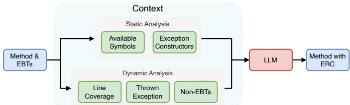
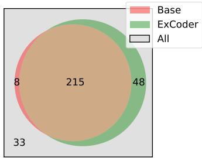
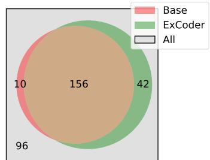
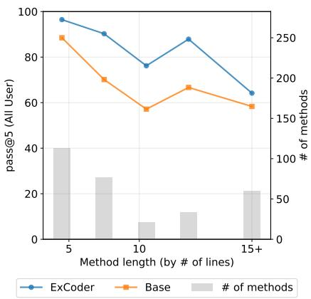
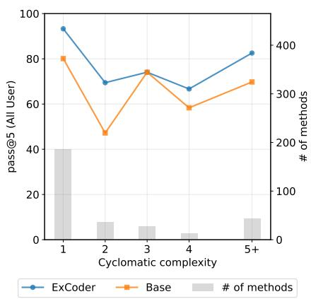
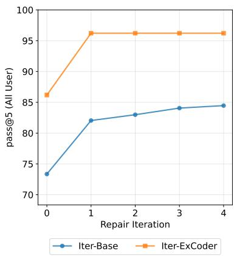

# Retrofitting Code Using LLMs to Support Exceptional Behavior

Linghan Zhong The University of Texas at Austin, USA linghanz@cs.utexas.edu

Jiyang Zhang The University of Texas at Austin, USA jiyang.zhang@utexas.edu

Junyi Jessy Li The University of Texas at Austin, USA jessy@austin.utexas.edu

Jayanth Srinivasa Cisco Systems, USA jasriniv@cisco.com

Milos Gligoric The University of Texas at Austin, USA gligoric@utexas.edu

Abstract—Exception Related Code (ERC), which includes throw statements, conditions (if statements) that guard those throw statements, and try/catch blocks, is an essential component of software systems, allowing developers to detect and handle exceptional states that deviate from the expected program behavior. However, manually writing ERC across large codebases is tedious. We propose a novel task: retrofitting existing code with ERC. Namely, given code (without ERC) and Exceptional Behavior Tests (EBTs) (e.g., check if method throws InvalidArgumentException if null is given as the value to the argument) we aim to automatically generate missing ERC, such that the given tests pass. We design and implement Exception Coder (EXCODER) that performs context engineering to help Large Language Models (LLMs) tackle this task. EXCODER integrates static and dynamic program analysis with LLMs by providing the extracted contextual information to the LLMs. To evaluate EXCODER, we build a benchmark constructed from GitHub Java repositories, where we systematically remove ERC in 304 methods from 75 projects. Our results demonstrate that EX-CODER provides an effective, though imperfect, solution to this problem in automated code generation, offering developers the first way to implement ERC following test-driven development. When combined with Qwen 2.5 Coder 32b, EXCODER achieves pass@1, 5, and 10 rates of 85.92% (12.56 percentage points over baseline), 86.18% (12.82 p.p. over baseline), and 86.51% (13.15 p.p. over baseline), respectively, on developer-written test suites. Our manual inspection of the generated code further reveals limitations of EXCODER, pointing to directions for future work.

## I. INTRODUCTION

Exceptions are supported in many modern programming languages (e.g., C#, Java, Python) and are widely used by developers to indicate that exceptional behaviors, i.e., events outside the expected execution flow of a program, have occurred. Writing exception-related code (ERC), such as throw statements, try/catch blocks, and exceptional condition checks (if statements) that guard the throw statements, is critical for developing reliable software systems, as explicit error signaling prevents hard-to-diagnose failures from occurring further downstream and enables callers to handle exceptions.

Figure 1a shows an example of ERC from a Java project sagiegurari/fax4j. The original implementation allows an AbstractService instance to be initialized multiple times. When reinitialization occurs, important state informa-(a) A target method with an exceptional condition check implemented using an if statement to guard the throw statement.

```java
1 public abstract class AbstractService implements Service
{
2 public final synchronized void initialize(Map<String
String> configuration) {
3 + if (this.initialized) {
4 + throw new FaxException("Service is already
initialized.");
5 + }
6 this.initialized = true;
7 this.serviceConfiguration = new
ConfigurationHolderImpl(configuration, this.
propertyPart);
8 LoggerManager loggerManager = LoggerManager.
getInstance();
9 this.serviceLogger = loggerManager.getLogger();
10 this.initializeImpl();
11 }
12 }
```

```java
1 public class AbstractServiceTest {
2 @Before
3 public void setUp() throws Exception {
4
5 this.service.initialize(this.configuration);
6 }
7 @Test(expected = FaxException.class)
8 public void initializeAgainTest() throws Exception {
9 this.service.initialize(this.configuration);
10 }
11 }
(b) An Exceptional Behavior Test (EBT) and its setup.
```

Fig. 1: A target method and its EBT, from AbstractService in sagiegurari/fax4j.

tion within the object could be reset, potentially causing bugs in downstream operations. To mitigate this issue, developers can add an if statement (line 3) to the target method to check for the exceptional condition and a throw statement (line 4) to signal that an exception has occurred. This approach notifies users of the multiple initialization and halts execution, preventing more complex errors that could arise. Note that exceptional condition checks are not limited to if statements: they can also be written in other forms, such as switch statements whose default case rejects an unsupported value, or try/catch blocks that catch generic exceptions when they occur and throw more descriptive ones.

Despite its importance, writing ERC in appropriate locations is laborious, particularly in large and complex codebases where exceptional behaviors may arise across multiple contexts. To signal exceptions effectively, developers must carefully reason about the specific conditions to decide whether an exceptional behavior has occurred and identify the control flow branches where exceptions need to be signaled.

Large language models (LLMs) have shown remarkable capabilities in code generation and program understanding, making them a promising tool for ERC retrofitting. Prior work on using LLMs to generate ERC [1]–[4] has primarily focused on avoiding unhandled exceptions, which involves automatically detecting locations where exceptions could be thrown and inserting error handling structures to resolve them. However, since they mainly focus on ensuring robust program execution by avoiding exceptions, these approaches are insufficient when developers conversely have specific exceptional behaviors they wish to support with ERC.

Furthermore, unlike these existing approaches that analyze target methods for potentially unhandled exceptions, retrofitting ERC requires knowing the conditions under which developers want exceptions to be thrown. However, formulating the intended exceptional condition checks into natural language prompts can be as laborious for developers as implementing the ERC. A natural solution to this problem is allowing developers to express their intention through concrete test cases, following the principles of Test-Driven Development (TDD) [5]–[7]. TDD, a methodology where automated tests that verify desired functionality are written before the implementation code, is already familiar to many developers. This approach provides an intuitive way for developers to specify exceptional behavior by simply providing example inputs and setups that should trigger exceptions, rather than requiring them to explicitly formulate the exceptional condition checks for when exceptions should be thrown.

In this paper, we propose the novel task of retrofitting existing code with ERC given Exceptional Behavior Tests (EBTs). Figure 1b illustrates an example EBT and its corresponding setup for the target method initialize shown in Figure 1a. In this example, the developer initializes the AbstractService in the setup phase and again within the EBT, then verifies whether a FaxException is thrown.

While our task is based on TDD principles, applying existing TDD-based tools to retrofit ERC presents unique challenges. Much prior work [8]–[11] in TDD has explored applying TDD principles to LLM-based code generation (but not ERC). They often involve a generation and evaluation loop where the model iterates on the previously generated code based on test outputs. However, existing TDD-based methods fail to leverage the rich information contained within EBTs, which includes crucial details such as target exception types and example inputs that trigger exceptional behavior.

To this end, we present Exception Coder (EXCODER), which, given the target method and EBTs, performs context engineering to provide LLMs with useful context for retrofitting ERC. To identify all necessary information for our task, EXCODER employs both static and dynamic program analysis. Our static analysis process provides the LLM with contextual information, including available symbols and exception constructors, which supplies the context necessary for implementing syntactically correct throw statements and exceptional condition checks. Dynamic analysis complements this approach by executing the provided EBTs and collecting runtime information, such as reachable code paths. This information from execution gives LLMs insights into how the exceptional condition can be identified and where throw statements can be inserted. We format this contextual information into a prompt. This enables the LLM to generate a new method with ERC incorporated.

To limit the scope of this study, we implement and evaluate EXCODER only for Java projects. We construct a novel benchmark dataset derived from Java repositories collected from GitHub. Our dataset specifically includes target methods that have EBTs covering throw statements in them. For selected target methods, we create “stripped” versions of them that maintain their core functionality but with ERC removed. We then use the corresponding EBTs to evaluate whether ERC added by our framework match the expected exceptional behavior specified in the test suite.

To verify the effectiveness of the context provided by EX-CODER, we compare against a baseline prompt that includes only the target method and EBTs, following the literature on TDD [10]. This baseline excludes all context collected by our static and dynamic analysis, which allows us to investigate how the context provided by EXCODER affects the LLM’s ability to complete the ERC retrofitting task. Furthermore, to assess the generalizability of our approach across diverse model capabilities, we evaluated EXCODER on 5 distinct models of varying sizes and architectures, including Llama3.1 8b [12], Phi4 14b [13], Qwen 2.5 Coder 7b [14], Qwen 2.5 Coder 32b, and GPT-5 Mini [15]. To evaluate the correctness of the generated ERC, we use pass@k [16] metrics, which estimate the probability that at least one out of k generated samples successfully passes the developer-provided tests. Additionally, to verify that each generated ERC is equivalent to the ground truth, we run automatically generated tests produced by EvoSuite [17] and Randoop [18], and manually inspect the generated code.

The results demonstrate that EXCODER consistently outperforms the baseline across all metrics for the selected models. With Qwen 2.5 Coder 32b, EXCODER achieves gains of 12.56 percentage points on pass@1 (reaching 85.92%), 12.82 p.p. on pass@5 (reaching 86.18%), and 13.15 p.p. on pass@10 (reaching 86.51%) when evaluated on developerwritten test suites. Similarly, with GPT-5 Mini, EXCODER achieves gains of 12.30 p.p. on pass@1 (reaching 95.03%), 8.27 p.p. on pass@5 (reaching 97.92%), and 6.91 p.p. on pass@10 (reaching 98.36%). These improvements highlight the effectiveness of EXCODER’s context-engineering approach in enabling language models to generate better ERC. Our manual inspection of the generated code further reveals limitations of EXCODER, pointing to directions for future work.

Our work makes the following contributions:

• We introduce and formalize the problem of retrofitting existing code with ERC given EBTs and code under test.

• We present EXCODER, which leverages static and dynamic program analysis to perform context engineering, enabling large language models to automatically generate ERC (at appropriate locations in source code).

• We construct a novel benchmark dataset derived from methods in Java repositories collected from GitHub, specifically methods with existing EBTs for throw statements, which can evaluate generated ERC.

• We evaluate the effectiveness of EXCODER, and show that it outperforms the baseline by enabling LLMs to generate more methods with ERC that compile and pass tests.

Our code, experimental scripts, and dataset are publicly available at https://github.com/EngineeringSoftware/excoder.

## II. TASK DEFINITION

In this section, we describe our task of retrofitting existing code with ERC.

Given a target method (M) and a set of EBTs $\varepsilon \quad =$ $\{ e _ { 1 } , e _ { 2 } , \ldots , e _ { n } \}$ , our goal is to automatically retrofit ERC into M such that the updated method $( M ^ { \prime } )$ satisfies all tests in E while preserving the original functionality of M (passing all the existing non-exceptional tests). In this context, ERC refers to the combination of throw statements and exceptional condition checks, which are the control structures surrounding throw statements that determine when an exception should be thrown. Exceptional condition checks may take various forms, such as if statements that detect exceptional program states, or try/catch blocks that convert non-specific exceptions (e.g., java.lang.RuntimeException) into applicationspecific ones.

We assume any exception that the user wants to be thrown from M originates directly from throw statements within M itself.<sup>1</sup> Also, at least one EBT is defined on M. From our observations, such cases are common as they cover 49.7% of the methods with EBTs in the collected data (Section IV-A).

An example target method selected from our dataset is shown in Figure 1a, from which the ERC have been removed. An EBT (shown in Figure 1b) is defined for this method and specifies that a FaxException must be thrown when the object is initialized twice. Given M, E, and the repository where the target method is located, an ERC retrofitting system should generate $M ^ { \prime }$ , as shown in Figure 1a, which incorporates ERC that include an exceptional condition check (line 3) to detect whether the object has been initialized and a throw statement (line 4) that throws FaxException.

In this paper, we focus on performing context engineering to help LLMs retrofit ERC. Specifically, our goal is to identify and collect all useful context from M, E, and the repository containing M that enables an LLM to generate $M ^ { \prime } .$ We consider the task successful when the generated $M ^ { \prime }$ passes all EBTs in E by throwing the correct exception and also passes any existing non-exceptional test covering the original target method (M), which ensures that retrofitted ERC do not interfere with normal execution paths.

  
Fig. 2: Overview of EXCODER.

## III. EXCODER

Figure 2 illustrates EXCODER’s workflow for performing context engineering to assist the LLM in completing the ERC retrofitting task. Given target methods and a corresponding set of EBTs, EXCODER employs static analysis to extract contextual information including: exception constructors $( c _ { \mathrm { E x C o n s } } )$ and available symbols $( c _ { \mathrm { A v S y m } } )$ . Additionally, it leverages dynamic analysis to capture runtime information including: thrown exception $( c _ { \mathrm { T h r E x c } } ) .$ , line coverage $\left( \boldsymbol { c } _ { \mathrm { L C o v } } \right)$ , and non-EBTs $\left( c _ { \mathrm { n E B T s } } \right)$ . This contextual information generated by EX-CODER is integrated and formulated into a structured prompt along with the target method and all EBTs, then provided to an LLM to generate a modified method with ERC. Here, we ask the LLM to add ERC that can pass all given EBTs. Compared to resolving a single EBT at a time, we believe this setup helps reduce the overhead cost of prompting the LLM multiple times and helps the LLM better plan for the structure of the exceptional condition checks. In the following paragraphs, we provide a detailed description of the static and dynamic analysis techniques employed by EXCODER and explain how they facilitate ERC retrofitting.

## A. Static Analysis

First, we introduce our static analysis process and the collected contextual information. This information enables the LLM to generate syntactically correct code and encourages the LLM to use existing methods, classes, and variables to construct effective ERC.

Exception constructors $\left( \boldsymbol { c } _ { \mathbf { E x C o n s } } \right)$ . To know how to throw the appropriate exception, the LLM must first know how to construct the exception object specified by the EBTs. Since the required parameters of the exception’s constructors may fall outside of the LLM’s knowledge, EXCODER provides the constructor signatures to the LLM. Given an exception type, EXCODER checks whether a corresponding definition for its constructors exists in the repository by searching for Java files with a name that matches the exception type. If so, it will collect the signatures and documentation for all constructors defined for that exception type. In practice, we observe that signatures and documentation alone already provide enough information for the LLM to use the constructors correctly. When an exception is not defined in the repository, EXCODER will produce a constructor signature by inspecting the class files in the project’s dependencies, identifying the exception constructor’s parameter types and their order, and finally composing the signature in the form of public ExceptionName(PType0 arg0, PType1 arg1...).

Available symbols $\mathbf { \Gamma } ( c _ { \mathbf { A v S y m } } )$ . To enable the LLM to produce syntactically correct exceptional condition checks capable of inspecting input parameters and object states for exceptional behaviors, it is critical that the LLM has knowledge of the methods and variables that can be potentially useful, such as the initialized variable used in the exceptional condition check in Figure 1a line 3. To this end, EXCODER visits and collects all public method nodes and field nodes in the AST of the user-defined classes of the target method’s input parameters, as well as all method (private and public) and field nodes defined within the class of the target method. Following the same approach used for processing exception constructors, EXCODER collects only the signature and documentation comment for each identified method and variable.

## B. Dynamic Analysis

We now describe the context collected in EXCODER’s dynamic analysis step. Our dynamic analysis framework collects execution information that helps LLMs to identify the correct exceptional condition checks and appropriate locations for ERC, so that the generated method can pass the given set of EBTs while preserving the target method’s original functionality.

Thrown exception $\mathbf { ( } c _ { \mathbf { T h r E x c } } )$ . Oftentimes, when an exceptional behavior occurs, an exception is already thrown by methods called within the target method, but the exception type differs from the desired target exception type specified by the EBTs. EXCODER collects such exceptions by executing each EBT and logging exceptions thrown inside the target method. Prior to execution, EXCODER preprocesses the target method with JavaParser by encapsulating the entire method body within a try block and appending a catch block that handles all exception types. Moreover, we not only add logging to the newly added catch block, but we also log exceptions caught in existing catch blocks inside the target method, which also provide useful information about the behavior of the target method under the given inputs. This context is essential for understanding exception handling. Note that even though an exception is already thrown inside the target method here, a developer may want ERC that throws a custom, more informative exception.

Line coverage $\left( \scriptstyle { \mathrm { c } } _ { \mathbf { L C o v } } \right)$ . We use Java instrumentation to add logging for the line number of each line inside the target method that is executed during EBT execution to capture the code coverage information. By analyzing each line of the target method executed under exceptional inputs, EXCODER can restrict potential placement locations for ERC to sections of the target method that are reachable given the exceptional inputs specified by the EBTs. This ensures that the generated ERC is always positioned within a code branch that can actually be triggered by the exceptional inputs. The line coverage information also helps LLMs determine the value of each branching condition. This provides insight into the program’s state at decision points and helps LLMs to infer the states of the program that led to exceptional behaviors. By understanding these states, LLMs can better formulate the exceptional condition check that detects the situation where an exception needs to be signaled.

TABLE I: Statistics of our dataset.
<table><tr><td>Split</td><td># Projects</td><td># Methods</td><td># EBTs</td><td># Exception Types</td></tr><tr><td>All</td><td>118</td><td>518</td><td>934</td><td>100</td></tr><tr><td>Valid</td><td>43</td><td>214</td><td>294</td><td>48</td></tr><tr><td>Eval</td><td>75</td><td>304</td><td>640</td><td>60</td></tr></table>

Non-EBTs $( c _ { \mathbf { n } \mathbf { E } \mathbf { B } \mathbf { T } \mathbf { s } } ) .$ . Non-EBTs cover the target method but do not verify throw statements. They can help the LLM compare exceptional inputs with normal inputs, which helps with the generation of correct exceptional condition checks. Non-EBTs also provide information on how the target method should execute normally. This helps LLMs implement ERC without altering the target method’s expected behavior. To identify non-EBTs that test each target method, we execute all tests in the project test suite and log each method that is invoked during the execution through instrumentation. In this way, we can match the target method with all non-EBTs that execute it.

## C. LLM Generation

Finally, all context collected from both static analysis $( c _ { \mathrm { E x C o n s } }$ and $c _ { \mathrm { A v S y m } } )$ and dynamic analysis $\begin{array} { r } { ( c _ { \mathrm { T h r E x c } } , \ c _ { \mathrm { L C o v } } , } \end{array}$ and c<sub>nEBTs</sub>) along with all the EBTs (E) given by the user and the target method (M) are combined into a structured prompt. The prompt construction can be represented as:

$$
\begin{array} { r } { f _ { \mathrm { c o m } } ( f _ { \mathrm { c o m } } ( M , c _ { \mathrm { T h r E x c } } ) , c _ { \mathrm { L C o v } } ) \oplus \mathcal { E } \oplus c _ { \mathrm { E x C o n s } } \oplus c _ { \mathrm { A v S y m } } \oplus c _ { \mathrm { n E B T s } } , } \end{array}
$$

where ⊕ denotes concatenation, and $f _ { \mathrm { c o m } }$ denotes the function that annotates the given method M with the given context as inline comments.

Specifically, $f _ { \mathrm { c o m } } ( \cdot , c _ { \mathrm { T h r E x c } } )$ adds inline comments at each line where an exception is thrown during test execution, indicating the specific exception type that occurs at that location. Similarly, $f _ { \mathrm { c o m } } ( \cdot , c _ { \mathrm { L C o v } } )$ inserts comments at each line covered by an EBT, specifying which particular EBT executed that line.

This prompt provides the LLM with the essential context to reason about and implement appropriate ERC, while also guiding the model to identify the locations within the method where they could be inserted.

## IV. DATASET

To evaluate the usefulness of the context generated by EXCODER on the novel ERC retrofitting task, we construct a new dataset comprised of Java methods collected from

GitHub repositories. In this section, we describe our raw data collection process (Section IV-A), our ERC removal process (Section IV-B), the added tool-generated tests (Section IV-C), and the statistics of our dataset (Section IV-D).

## A. Raw Data Collection

Following prior work [19], we collect data from Java projects from CodeSearchNet [20] that are available on GitHub and satisfy the following criteria: (1) use the Maven build system; (2) compile successfully; and (3) have a license that permits the use of their data. For each project, we identify methods that have at least one EBT defined on them. Here, we categorize a test method as an EBT if it follows one of the widely used patterns identified by developers [21]: ‘try/catch’, ‘expect test’, ‘expect rule’, and ‘assert throws’.

To ensure coverage of the most up-to-date Java code in our evaluation set, we collect the most recent commit from each project with a cutoff date of January 1, 2026. This initial collection from 150 projects yields 1,099 methods. We then filter to methods where the exceptions specified by the EBTs originate from throw statements inside the target method, leaving 546 methods, and discard methods where exception types specified by the EBTs do not match the exception types in the throw statements, leaving 525 methods. Next, we discard methods that do not pass the given EBTs even with their original ERC implemented by the developers, to ensure that the ERC retrofitting is achievable, reducing the set to 449 methods. We then exclude methods that throw the correct exception even after all ERC inside them are removed (e.g., when the catch block propagates the same exception originating from a function call in the try block), as these cases do not require ERC retrofitting, leaving 304 methods for our evaluation set.

## B. Throw Statement Removal

To automatically remove all ERC for each selected method, we implemented the following rules.

When a throw statement is within a catch block, we remove the entire catch block from the method. In cases where all catch blocks associated with a try statement contain throw statements, we remove the entire try/catch construct and move all statements from the try body to the outer scope. We took this approach because the try block can be viewed as an exceptional condition check that identifies the occurrence of exceptional behaviors. Conversely, when one or more catch blocks do not contain throw statements, we keep the try/catch structure with only the catch blocks without any throw statement to preserve the original control flow structure.

For if/else statements, when a then block contains only a throw statement, we remove the entire if statement and move all statements from the else block (if exists) to the outer scope, provided the else block does not contain only a throw statement. Conversely, when an else block contains only a throw statement, we remove the else block and retain the if statement, provided the then block does not contain only a throw statement. If both blocks contain only a throw statement, we remove the entire if statement. This approach also handles else-if constructs, since they are essentially if statements nested within else blocks.

TABLE II: Statistics of ERC types.
<table><tr><td>Split</td><td>#try-catch</td><td>#if</td><td>#switch</td><td># Other</td><td># All</td></tr><tr><td>All</td><td>49</td><td>364</td><td>12</td><td>133</td><td>558</td></tr><tr><td>Valid</td><td>34</td><td>147</td><td>6</td><td>40</td><td>227</td></tr><tr><td>Eval</td><td>15</td><td>217</td><td>6</td><td>93</td><td>331</td></tr></table>

For switch statements, we remove all case blocks that contain throw statements. If no case blocks remain after removal, we delete the entire switch construct. If only one case block remains, we move all statements from that case to the outer scope and remove the switch construct. If multiple case blocks remain, we keep the switch statement with the remaining cases.

Finally, we remove any throw statement left in place by the rules above. This can happen when a throw statement appears alongside other statements in a then or else block, the target method is defined just for throwing an exception, or the throw statement is defined at the end of the target method to signal an exception when all other branches fail to return a value. In these cases, we believe it is most natural to simply remove only the throw statement.

Applying the rules above may leave a target method that no longer compiles. 34 of our target methods fail with a “missing return statement” error, since the ERC removal left one execution branch without a return statement. The remaining 4 also fail with an “unreported exception” error, since removing a catch block left the checked exception raised in the corresponding try block neither caught nor declared. We keep these data points since it is reasonable to assume the user may intentionally provide such a target method to use EXCODER to add throw statements to the method. In total, we have 38 (12.5%) such data points.

## C. Tool-Generated Tests

To evaluate whether an ERC generated from user-defined EBTs is semantically equivalent to the ground truth, we augment our evaluation with additional EBTs automatically generated by two popular Java test generators: Randoop [18] and EvoSuite [17]. We generate tests per project using each tool against the ground truth implementation. From the generated tests, we keep only those that trigger an exception inside a target method in our dataset and use the runtime stack trace to match each such test to its target method. To bound the evaluation cost, we cap the combined number of tool tests executed per target method at 400. Because EvoSuite generates significantly fewer exception-triggering tests per target method than Randoop, Randoop tests are counted first and EvoSuite tests fill the remaining budget. In the end, our evaluation set has 77.03 tool-generated tests per target method on average.

## D. Dataset Statistics

We present the statistics of our collected dataset in Table I. In our full dataset (including validation and evaluation sets), we collected 518 methods and 934 EBTs from 118 eligible projects. The collected EBTs cover a range of 100 different exception types.

Additionally, in Table II, we show the number of each case of ERC. Our full dataset includes 558 throw statements in total. Among them, 49 throw statements are in try-catch blocks, 364 throw statements are in if statements (including both then blocks and else blocks), 12 throw statements are in switch statements, and 133 are not inside any of the above 3 types of structures.

We randomly select half of the Java projects listed in CodeSearchNet to collect data in the validation set (Valid) and use the remaining projects for evaluation set (Eval). We use the validation set to guide our design decisions for EXCODER, and the evaluation set is used for evaluating the performance of EXCODER and baselines.

## V. EVALUATION DESIGN

We assess the effectiveness of EXCODER by answering the following research questions:

RQ1: How does EXCODER help LLMs of different architectures and parameter scales perform the ERC retrofitting task? RQ2: How much does each of our prompt components help EXCODER generate ERC?

RQ3: How does the complexity of the target method influence EXCODER’s performance?

RQ4: How does EXCODER perform when combined with LLM self-repair?

## A. Baselines

We evaluate EXCODER against a baseline approach (Base) that provides an LLM with only the target method that requires ERC retrofitting and the corresponding EBTs that define the expected exceptional behavior, excluding all context collected by our static and dynamic analysis, similar to prior TDDbased code generation work [10]. Since ERC retrofitting is a novel task, no existing technique directly applies, which makes it hard to establish a comparable baseline. We therefore additionally treat the ablation variants in RQ2, where the models are provided with an additional source of context, as baselines. Likewise, Iter-Base in RQ4, which augments Base with LLM self-repair driven by compiler and test feedback, serves as a self-repair baseline.

## B. Evaluation Metrics

Following prior work [19], [22], [23], we use four @kbased [16] metrics, each of which estimates the probability that at least one out of k generated samples satisfies a given success criterion. For each task, @k is evaluated by generating $n \geq k$ samples per task (in this paper we use $n = 1 0$ and $k \leq 1 0 )$ , and using the following unbiased estimator to evaluate:

$$
\ @ k : = \mathbb { E } _ { \mathrm { P r o b l e m s } } \left[ 1 - \frac { \left( \ O ^ { n - \sum _ { s \in \mathrm { s a m p l e s } } c ( s ) } \right) } { \binom { n } { k } } \right]
$$

Here, c(s) is a binary indicator function, returning 1 if sample s satisfies a predefined success criterion and 0 otherwise. The definition of c(s) varies for each specific metric and is detailed below. We report the average metrics over all tasks in the evaluation dataset.

compiled@k: This metric estimates the probability that at least one out of k generated samples can be compiled without errors. Here, $c ( s ) = 1$ if sample s successfully compiles.

pass@k (EBTs): This metric checks whether the ERC completes the task given by the user, by estimating the probability that at least one out of k generated samples passes all associated Exceptional Behavior Tests (EBTs). Here, $c ( s ) = 1$ if sample s passes all EBTs.

pass@k (All User): This metric checks whether the ERC completes the task given by the user without breaking the original functionality of the target method, by estimating the probability that at least one out of k generated samples passes all user-defined tests on the target method, covering both Exceptional Behavior Tests (EBTs) and Non-Exceptional Behavior Tests (Non-EBTs). Accordingly, $c ( s ) = 1$ if sample s passes both EBTs and non-EBTs.

pass@k (All User+Tools): This metric adds behavioral checks beyond the user-written tests, which can underspecify true developer intent, by extending pass@k (All User) with tests automatically generated by EvoSuite [17] and Randoop [18] on the target method. Accordingly, $c ( s ) = 1$ if sample s passes all EBTs and non-EBTs, as well as EBTs generated by Evo-Suite and Randoop. These generated tests are additional test oracles, not ground truth for developer intent (Section VIII).

## C. Implementation Details

For RQ1 we evaluate EXCODER on 4 different opensource models (Llama3.1 8b [12], Phi4 14b [13], Qwen 2.5 Coder 7b [14], and Qwen 2.5 Coder 32b) and one closedsource model (GPT-5 Mini [15]). We selected these models based on three criteria: (1) parameter size, ranging from 7b to 32b parameters to assess how model capacity affects performance; (2) training objective, covering both codingspecialized (Qwen 2.5 Coder 7b and Qwen 2.5 Coder 32b) and general-purpose LLMs (Llama3.1 8b, Phi4 14b); and (3) community adoption, selecting among the most widely used models available at the time of our study. For costefficient inference, we run an 8-bit quantized version of each open-source model using the $^ { 6 6 } \mathrm { Q 8 } _ { - } 0 ^ { , 9 }$ quantization method implemented in the llama.cpp library [24].

## D. Hardware

We run all evaluations for EXCODER and baseline on a machine with Intel Xeon w5-3433 @ 4.2 GHz (16 cores, 32 threads) CPU, 130 GB of RAM, 2 NVIDIA RTX 5000 Ada Generation GPUs, Ubuntu 24.04, Python 3.11, Java 8, and Maven 3.8.6.

## VI. RESULTS

In the following sections we present our evaluation results and answer our research questions.

TABLE III: Performance of EXCODER compared with the baseline prompt across 5 LLMs of different sizes and architectures. We sample 10 outputs per task and compute the metrics as described in Section V-B.
<table><tr><td rowspan="2">Models</td><td rowspan="2">Prompt</td><td colspan="3">compiled@k</td><td colspan="3">pass@k (EBTs)</td><td colspan="3">pass@k (All User)</td><td colspan="3">pass@k (All User+Tools)</td></tr><tr><td> ${ \bf k } { = } 1$ </td><td> ${ \bf k } { = } 5$ </td><td> ${ \bf k } = 1 0$ </td><td> $\mathrm { k } { = } 1$ </td><td> ${ \bf k } { = } 5$ </td><td> $_ { \mathrm { k = 1 0 } }$ </td><td>k=1</td><td> ${ \bf k } { = } 5$ </td><td> $_ { \mathrm { k = 1 0 } }$ </td><td> $\mathrm { { \bar { k } } } = 1$ </td><td> ${ \bf k } { = } 5$ </td><td>k=10</td></tr><tr><td>Llama3.1 8b</td><td>Base EXCODER</td><td>68.09 77.99</td><td>69.08 79.44</td><td>70.07 80.92</td><td>55.72 60.53</td><td>57.07 62.34</td><td>58.22 64.14</td><td>55.39 60.20</td><td>56.74 62.01</td><td>57.89 63.82</td><td>41.28 45.99</td><td>42.43 47.70</td><td>43.42 49.34</td></tr><tr><td>Phi4 14b</td><td>Base EXCODER</td><td>75.72 84.18</td><td>76.32 84.54</td><td>76.97 84.87</td><td>61.55 74.61</td><td>62.01 75.00</td><td>62.50 75.33</td><td>61.55 74.28</td><td>62.01 74.67</td><td>62.50 75.00</td><td>48.42 61.48</td><td>49.18 61.84</td><td>50.00 62.17</td></tr><tr><td>Qwen 2.5 Coder 7b</td><td>Base EXCODER</td><td>84.14 90.53</td><td>84.38 90.95</td><td>84.54 91.45</td><td>64.54 76.97</td><td>64.80 77.30</td><td>65.13 77.63</td><td>64.54 76.32</td><td>64.80 76.64</td><td>65.13 76.97</td><td>54.05 65.82</td><td>54.44 66.45</td><td>54.93 67.11</td></tr><tr><td>Qwen 2.5 Coder 32b</td><td>Base EXCODER</td><td>85.20 95.10</td><td>85.36 95.23</td><td>85.53 95.39</td><td>73.36 86.25</td><td>73.36 86.51</td><td>73.36 86.84</td><td>73.36 85.92</td><td>73.36 86.18</td><td>73.36 86.51</td><td>63.55 75.72</td><td>63.82 75.99</td><td>64.14 76.32</td></tr><tr><td>GPT-5 Mini</td><td>Base EXCODER</td><td>85.59 97.86</td><td>92.08 99.50</td><td>93.75 99.67</td><td>82.83 95.03</td><td>89.65 97.92</td><td>91.45 98.36</td><td>82.73 95.03</td><td>89.65 97.92</td><td>91.45 98.36</td><td>65.49 77.30</td><td>75.79 83.82</td><td>79.61 84.87</td></tr></table>

TABLE IV: Effect of each context component, on Qwen 2.5 Coder 32b: (1) $c _ { \mathbf { A v S y m } } .$ , methods and variables usable inside the target method; (2) $C _ { \mathbf { E X C o n s } } ,$ constructors of the exceptions specified by the EBTs; (3) $c _ { \mathbf { T h r E x c } } ,$ exceptions thrown inside the target method when running the EBTs; (4) ${ \mathit { C } } _ { \mathbf { L } \mathbf { C } \mathbf { o } \mathbf { v } } ,$ line coverage of each EBT; (5) $C _ { \mathbf { n } \mathbf { E } \mathbf { B } \mathbf { T s } } ,$ non-EBTs defined for the target method.
<table><tr><td rowspan="2">Prompt</td><td colspan="3">compiled@k</td><td colspan="3">pass@k (EBTs)</td><td colspan="3">pass@k (All User)</td><td colspan="3">pass@k (All User+Tools)</td></tr><tr><td>k=1</td><td> ${ \bf k } { = } 5$ </td><td> ${ \bf k } { = } 1 0$ </td><td> ${ \bf k } { = } 1$ </td><td>k=5</td><td> $_ { \mathrm { k = 1 0 } }$ </td><td>k=1</td><td>k=5</td><td> ${ \bf k } = 1 0$ </td><td> ${ \bf k } { = } 1$ </td><td> ${ \bf k } { = } 5$ </td><td>k=10</td></tr><tr><td>EXCODER</td><td>95.10</td><td>95.23</td><td>95.39</td><td>86.25</td><td>86.51</td><td>86.84</td><td>85.92</td><td>86.18</td><td>86.51</td><td>75.72</td><td>75.99</td><td>76.32</td></tr><tr><td>Only w/  $c _ { \mathrm { A v S y m } }$ </td><td>90.00</td><td>90.13</td><td>90.13</td><td>81.45</td><td>82.07</td><td>82.57</td><td>81.45</td><td>82.07</td><td>82.57</td><td>72.27</td><td>73.27</td><td>74.01</td></tr><tr><td>Only w/ CLCov</td><td>84.80</td><td>85.45</td><td>85.86</td><td>72.11</td><td>73.04</td><td>73.68</td><td>72.11</td><td>73.04</td><td>73.68</td><td>62.60</td><td>63.16</td><td>63.49</td></tr><tr><td>Only w/ CnEBTs</td><td>85.10</td><td>85.99</td><td>86.18</td><td>73.06</td><td>74.00</td><td>74.34</td><td>73.06</td><td>74.00</td><td>74.34</td><td>63.62</td><td>64.54</td><td>64.80</td></tr><tr><td>Only w/ CThrExc</td><td>84.18</td><td>85.37</td><td>85.53</td><td>72.57</td><td>73.48</td><td>73.68</td><td>72.53</td><td>73.48</td><td>73.68</td><td>62.89</td><td>63.85</td><td>64.14</td></tr><tr><td>Only w/ CExCons</td><td>92.14</td><td>92.27</td><td>92.43</td><td>78.29</td><td>78.45</td><td>78.62</td><td>78.29</td><td>78.45</td><td>78.62</td><td>68.72</td><td>69.08</td><td>69.41</td></tr><tr><td>Base</td><td>85.20</td><td>85.36</td><td>85.53</td><td>73.36</td><td>73.36</td><td>73.36</td><td>73.36</td><td>73.36</td><td>73.36</td><td>63.55</td><td>63.82</td><td>64.14</td></tr></table>

## A. RQ1: Effectiveness Across Models

The results on the effectiveness of EXCODER on different models are presented in Table III.

EXCODER consistently outperforms the baseline across all five models on all metrics. Among open-source models, the most significant performance gains are observed with Qwen 2.5 Coder 32b. Specifically, EXCODER achieves improvements of 9.87 percentage points on compiled@5, 13.15 p.p. on pass@5 (EBTs), 12.82 p.p. on pass@5 (All User), and 12.17 p.p. on pass@5 (All User+Tools). This performance gain likely stems from Qwen 2.5 Coder 32b’s capability to interpret and leverage the contextual information provided by EXCODER. On the state-of-the-art closed-source model GPT-5 Mini, EXCODER also demonstrates notable improvements over the baseline: 7.42 p.p. on compiled@5, 8.27 p.p. on pass@5 (EBTs), 8.27 p.p. on pass@5 (All User), and 8.03 p.p. on pass@5 (All User+Tools). These results demonstrate that EXCODER provides meaningful gains even on the most capable models, and that the improvements persist when generated ERC are checked against automatically generated tests. At the same time, pass@5 (All User+Tools) remains noticeably below pass@5 (All User) for every model, including EXCODER itself, indicating that some ERC pass all user-written tests yet still deviate from the ground truth. We further examine this in Section VII-B.

Figure 3a illustrates the overlap and differences between the sets of target methods where the task was successfully completed (i.e., achieving a score of 1.0 in pass@10 (All User)) using the baseline prompt versus EXCODER with Qwen 2.5 Coder 32b. EXCODER successfully solved all but 8 of the ERC retrofitting tasks that the baseline prompt solved, while additionally solving 48 tasks where the baseline failed. This demonstrates that the contextual information provided by EXCODER meaningfully enhances the LLM’s ERC retrofitting capability without significantly compromising its performance on cases where simpler prompts suffice. The 8 tasks where the baseline succeeded but EXCODER did not can be attributed to cases where the ERC retrofitting task was relatively straightforward, yet the additional context introduced noise that made it harder for the LLM to focus on the most relevant information in the target method and EBTs. Although these cases are rare, they highlight a promising future direction of developing techniques to prioritize the most relevant contextual information for the LLM-based ERC retrofitting task. Overall, our results suggest that EXCODER’s context engineering provides a robust net benefit, substantially expanding the range of solvable tasks.

  
(a) Pass all user-written tests (EBTs and non-EBTs)

  
(b) Manually verified to be semantically equivalent to the ground truth  
Fig. 3: Overlap between target methods successfully handled by the baseline versus EXCODER. Each circle covers the target methods for which at least one of the 10 generated samples meets the criterion.

## B. RQ2: Ablation Study of Prompt Components

To evaluate the contribution of each component in EX-CODER, we conduct an ablation study in which each variant augments the baseline prompt with exactly one context component. Table IV reports results on Qwen 2.5 Coder 32b. These variants also serve as the enhanced versions of the baseline described in Section V-A, and EXCODER outperforms all of them on every metric in the table.

Adding available symbols or exception constructors alone yields large improvements across all correctness metrics, demonstrating that these contexts are the easiest for the LLM to utilize: exception constructors supply the exact constructor signature required to generate the exception object that the EBT checks for, and available symbols enumerate the methods and fields that can legally appear in the exceptional condition check. This information can be readily utilized by the LLM to generate correct ERC with the right function calls and exception construction.

The remaining components, line coverage, thrown exception, and non-EBTs, yield noticeably smaller gains that appear only in pass@5 or pass@10. This pattern indicates that these contexts do help the model eventually generate correct ERC given enough samples, but the model struggles to utilize them on every attempt. The underlying reason is that these contexts describe program behavior rather than code that needs to be generated. Using them correctly requires the LLM to reason about program states and control flow, which is a substantially harder task [25]. We leave as future work how these richer signals can be more fully utilized, e.g., through more targeted annotation or specialized prompting strategies.

## C. RQ3: Effect of Target Method Complexity

Figures 4a and 4b present our analysis of how target method complexity influences EXCODER’s and the baseline’s effectiveness, evaluated on Qwen 2.5 Coder 32b. Here, we use the number of lines of code and cyclomatic complexity as a proxy for method complexity and use pass@5 (All User) to measure performance.

Methods exceeding 14 lines constitute only 19.7% of the target methods, and their lengths vary significantly, ranging up to 83 lines. Similarly, methods with cyclomatic complexity of 5 or more constitute only 14.1% of the target methods, with complexity ranging up to 19. We therefore report them in single open-ended “15+” and “5+” bins rather than excluding them, while all other bins have equal width.

EXCODER matches or outperforms Base in every bin of both measures. We observe that EXCODER’s advantage is largest for methods of 6 to 14 lines and for methods with cyclomatic complexity of two. We attribute this to the fact that simpler methods typically have exceptional condition checks that are easier to reason about, such as checking whether an input is null, while the longest methods provide more information in their method body, reducing the benefit of the additional context. In contrast, methods in the middle of the complexity range often involve complex conditions that could benefit from the additional context provided by EX-CODER, while the methods themselves do not provide enough information for ERC retrofitting on their own. Moreover, for cyclomatic complexity, which counts branches rather than lines, measuring behavioral complexity relatively independent of the information contained in code, we see the advantage widen again to 12.8 p.p. at 5+, so EXCODER still helps when behavior is hard to parse.

## D. RQ4: Combination with Self-Repair

Prior TDD-based code generation work [10] employs an LLM self-repair approach, where compilation and execution output is fed back to the model to fix issues in the generated code. This approach is natural for TDD-based code generation, as input tests can provide direct feedback that guides the LLM toward a correct solution.

To investigate whether EXCODER remains beneficial within this iterative framework, we implemented two repair-based variants: Iter-Base, which uses only the baseline prompt, and Iter-EXCODER, which retains all context provided by EXCODER. Both variants use Qwen 2.5 Coder 32b and perform up to 4 iterations of repair, where the LLM receives compilation output and test errors after each failed attempt.

The results, shown in Table V and Figure 4c, demonstrate that iterative repair improves performance for both prompts. With 4 rounds of repair, Iter-Base achieves 84.47% on pass@5 (All User), while Iter-EXCODER reaches 96.22%. As shown in Figure 4c, most tasks are successfully resolved in the first repair iteration, with only a few additional tasks solved in subsequent rounds. This shows that while compiler and test feedback can help LLMs identify surface-level errors in the repair iteration, such feedback becomes insufficient when the underlying issue stems from a lack of context, which leads to diminishing returns in subsequent rounds. Furthermore, even after self-repair steps, Iter-Base still trails behind Iter-EXCODER by 11.75 p.p. on pass@5 (All User) and by 7.41 p.p. on pass@5 (All User+Tools). These findings indicate that self-repair and EXCODER complement each other effectively, and that self-repair alone cannot substitute for the contextual information provided by EXCODER in ERC retrofitting.

## VII. QUALITATIVE ANALYSIS

## A. Cause of Failure Cases

We first investigate the individual cases in which the generated ERC fails, and identify what causes each failure. These failures fall into two kinds. In the first, the LLM knows what to check but cannot write code that correctly implements it. In the second, the ERC compiles but the exceptional condition check checks the wrong property. Due to space limits, we show an example only for the first kind. We present an example of the first kind of failure in Figure 5, where the ERC has a compile error even though the LLM correctly infers the underlying exceptional condition. The target method issues an HTTP request and must raise the library’s TempoDBException, carrying the server’s message and status code, when the request fails. The ground truth reads that payload with result.getMessage() and result.getCode() (Figure 5b). The generated ERC places the exceptional condition check correctly and calls the right constructor (Figure 5a), but it uses State.ERROR, result.getErrorMessage(), and result.getErrorCode(), none of which is actually defined in the project, so the ERC does not compile. The LLM hallucinates these symbols, and the root cause is a gap in available symbols, which does not include the methods and fields defined on the classes of local variables such as result. We omit these because our early experiments showed that including them lowers performance overall. The cases in which the LLM strictly needs those symbols are rare, and the extra context crowds out the information the LLM does use.

  
(a) Method length

  
(b) Cyclomatic complexity

  
(c) Iterations of self-repair  
Fig. 4: Performance of EXCODER compared with Base on target methods of different (a) length and (b) cyclomatic complexity, where bars show the number of target methods in each bin, and (c) performance of Iter-EXCODER compared with Iter-Base at each iteration of the repair process.

TABLE V: Comparison of EXCODER and the baseline prompt after 4 iterations of LLM self-repair on Qwen 2.5 Coder 32b. Each iteration returns the failing samples to the LLM with its original context and the corresponding compiler or test errors.
<table><tr><td rowspan="2">Prompt</td><td colspan="3">compiled@k</td><td colspan="3">pass@k (EBTs)</td><td colspan="3">pass@k (All User)</td><td colspan="3">pass@k (All User+Tools)</td></tr><tr><td>k=1</td><td>k=5</td><td>k=10</td><td>k=1</td><td>k=5</td><td>k=10</td><td>k=1</td><td>k=5</td><td>k=10</td><td>k=1</td><td>k=5</td><td>k=10</td></tr><tr><td>Base Iter-Base</td><td>85.20 90.07</td><td>85.36 90.62</td><td>85.53 90.79</td><td>73.36 83.78</td><td>73.36 84.47</td><td>73.36 84.54</td><td>73.36 83.78</td><td>73.36 84.47</td><td>73.36 84.54</td><td>63.55 71.12</td><td>63.82 71.87</td><td>64.14 72.37</td></tr><tr><td>EXCODER</td><td>95.10</td><td>95.23</td><td>95.39</td><td>86.25</td><td>86.51</td><td>86.84</td><td>85.92</td><td>86.18</td><td>86.51</td><td>75.72</td><td>75.99</td><td>76.32</td></tr><tr><td>Iter-ExCoDER</td><td>97.34</td><td>97.37</td><td>97.37</td><td>96.02</td><td>96.22</td><td>96.38</td><td>96.02</td><td>96.22</td><td>96.38</td><td>78.95</td><td>79.28</td><td>79.61</td></tr></table>

## B. Equivalence to Ground Truth

In practice, ERC can pass all user-written tests yet still deviate from the ground truth, which represents the real user intention. To investigate the reasons behind this deviation, we manually inspect each ERC generated by Qwen 2.5 Coder 32b with the baseline prompt and EXCODER that passes all EBTs and non-EBTs for each target method. If there are multiple different LLM outputs for one target method that pass all tests, we only check the first one. To collect these manual inspection data, we ask two inspectors with extensive Java programming experience, and Claude Code 2.1.239 with Claude Opus 5, to compare the generated ERC and the ground truth ERC and then decide whether the two pieces of code are functionally equivalent. The first inspector and Claude Code judge generations with both the baseline prompt and EXCODER, while the second inspector only judges the ERC generated with EXCODER. Pairwise Cohen’s κ between inspectors ranges from 0.77 to 0.87. We then reconcile every ERC on which the inspectors disagree by re-reading the code and checking Claude Code’s justification, and we report the reconciled labels.

```java
1 public Iterator<SingleValue> iterator() {
2 Result<SingleValueSegment> result = client.execute(
request, SingleValueSegment.class);
3
4 if (result.getState() == State.SUCCESS) {
5
6 + } else if (result.getState() == State.ERROR) {
7 + throw new TempoDBException(result.
getErrorMessage(), result.getErrorCode());
8 }
9 return iterator;
10 }
(a) ERC generated with EXCODER.
1 public Iterator<SingleValue> iterator() {
2 Result<SingleValueSegment> result = client.execute(
request, SingleValueSegment.class);
3
4 if (result.getState() == State.SUCCESS) {
5
6 + } else {
7 + throw new TempoDBException(result.getMessage(),
result.getCode());
8 }
9 return iterator;
10 }
```  
(b) The original implementation from the ground truth method.  
Fig. 5: A failure caused by model hallucination, from the SingleValueCursor class in tempodb/tempodb-java.

```java
1 public void setData(File file) {
2 + if (this.embed != null && !this.embed.isEmpty()) {
3 + throw new IllegalArgumentException("Embed code
is already set.");
4 + }
5 this.data = file;
6 }
(a) ERC generated with EXCODER.
1 public void setData(File file) {
2 + if (embed != null) {
3 + throw new IllegalArgumentException("Cannot
supply both embed & data");
<sup>4</sup> <sub>5</sub> + }
this.data = file;
6 }
(b) The original implementation from the ground truth method.
1 @Test(expected = IllegalArgumentException.class)
2 public void setEmbedCodeWithData() {
3 post.setEmbedCode("something");
4 post.setData(new File("some_path"));
5 }
```  
Fig. 6: Example of a Too Lenient false positive, from the VideoPost class in tumblr/jumblr.

In Figure 3b, we show the result of our equivalence labeling. We found that the generated ERC is functionally equivalent to the ground truth for 54.61% of all target methods (166 out of 304) in the evaluation set with the baseline and 65.13% (198 out of 304) with EXCODER.

To understand the sources of false positives, the inspectors additionally classify every false positive into four categories, and reconcile labels through the same process as described above. We define the categories as follows, where T is the set of inputs on which the generated ERC throws an exception and G is the set on which the ground truth ERC throws: (1) Too Lenient: T is a strict subset of G; (2) Too Strict: T is a strict superset of G; (3) Destroyed Code: the generated code drops or rewrites a statement of the target method the LLM was given, rather than only inserting an ERC into it; (4) Wrong Handling: everything else, including cases where neither T nor G contains the other, or where the generated ERC throws at a different location than the ground truth, causing the two to throw with different side effects already applied.

In Table VI, we show, for each of the baseline prompt and EXCODER, the share of false positives among the target methods for which the prompt generates a passing ERC (223 target methods for the baseline and 263 for EXCODER), and the distribution of those false positives across the categories. The two prompts’ false positive rates differ by 0.8 points, and no category share differs by more than 1.8 points. This suggests that EXCODER can increase the number of outputs that pass the given EBTs, but it does not reduce the rate at which a test-passing ERC is a false positive. Notably, we see that a large portion of the false positives is due to too lenient, 64.91% for the baseline and 63.08% for EXCODER. We believe this is because the ability to generate ERC that aligns with developer intent is largely limited by the coverage of the EBTs provided. A weaker exceptional condition check can still pass every EBT if no EBT includes an example input on which the weaker exceptional condition check and the developer’s intention disagree. We leave the question of how to write EBTs to communicate the user’s intended condition for future work.

TABLE VI: Classification of false positives over the target methods for which each prompt generates a passing ERC (223 for the baseline and 263 for EXCODER), using Qwen 2.5 Coder 32b. The first row is the share of passing ERC that is a false positive; the remaining rows are the shares of those false positives per category.
<table><tr><td>(%)</td><td>Base</td><td>ExCODER</td></tr><tr><td>Total</td><td>25.56</td><td>24.71</td></tr><tr><td>Too Lenient</td><td>64.91</td><td>63.08</td></tr><tr><td>Too Strict</td><td>10.53</td><td>12.31</td></tr><tr><td>Wrong Handling</td><td>12.28</td><td>13.85</td></tr><tr><td>Destroyed Code</td><td>12.28</td><td>10.77</td></tr></table>

To provide a deeper understanding of false positives, we look at an example shown in Figure 6. The example is selected from the category of too lenient, as it is the most common type of false positive. The original implementation, shown in Figure 6b, is taken from the VideoPost class in tumblr/jumblr, a Java wrapper for the Tumblr API. In a VideoPost, the video source can be specified either as an HTML embed code or as a video file, but not both. The ground truth ERC throws an exception when setData is called while embed is non-null, enforcing mutual exclusivity between the two fields. The provided EBT, in Figure 6c, verifies this behavior by first setting the embed code to “something” and then calling setData to trigger the exception, covering the target exceptional condition check. In Figure 6a, we show the EXCODER-generated implementation (using Qwen 2.5 Coder 32b). It checks that embed is neither null nor an empty string before throwing an exception. This difference means that when embed is set to an empty string, the ground truth would reject a subsequent setData call, while the generated code would incorrectly allow it. The consequence is that a VideoPost could be constructed with both embed and data set, leading to undefined behavior when the malformed data is sent to the backend server. We believe this is because there are three common patterns for checking an unset string that the LLM learns during its training: checking for null, for empty (string with length 0), and for blank (string with only whitespace). Setting the embed code to “something” is equally consistent with all three, so the EBT does not tell the LLM which one is the user’s intended check.

## VIII. LIMITATIONS

LLM randomness. LLMs are probabilistic, so their outputs may vary across runs. To limit the effect of this randomness, we generate 10 outputs per task. For the open-source models, we use temperature 0.8. GPT-5 Mini uses the provider’s decoding settings.

Benchmark and evaluation. (1) Removing developer-written ERC from existing methods approximates, but does not reproduce, naturally missing ERC. (2) pass@k measures whether a sampled candidate passes a test oracle, not whether it is semantically equivalent or useful in practice. (3) While EvoSuite and Randoop add behavioral checks that strengthen the test oracle beyond user-written tests, they may still miss relevant cases and do not fully establish developer intent.

Scope. EXCODER targets exceptions that originate from throw statements within the target method (Section II), allowing us to develop a deeper technical solution for this specific task. We leave exceptions that propagate from callees or are wrapped along call chains as future work. Our dataset is drawn from CodeSearchNet and includes only compilable Java projects that use Maven. EXCODER’s context engineering design is language-agnostic. However, some generalization gap may remain for other projects, languages, or build systems.

## IX. RELATED WORK

There has been a lot of prior work on code generation [11], [16], [26]–[29], fault localization [30]–[34], and test-driven development [5]–[7], [10], [11], [35].

Machine learning for generating exception related code. ThEx [36] helps developers decide which exception should be thrown given a code snippet. FuzzyCatch [37] uses fuzzy logic to predict if a runtime exception would occur in a given code snippet and recommends code to handle that exception. Neurex [2] bases its exception handling recommender on CodeBERT [38]. It determines if a try/catch block is needed, identifies statements for the try block, and specifies exception types for the catch clause. exLong [19] automatically generates exceptional behavior tests to help developers check that their code detects unwanted events and throws appropriate exceptions.

With large language models [26], [39], [40], many models can now generate the complete exception handling code for a given method. Knowledge-driven Prompt Chaining (KPC) [3] generates exception handling code using iterative checkrewrite steps with fine-grained, knowledge-driven prompts.

In contrast to this prior work, which modifies code to avoid unhandled exceptions, we automatically retrofit ERC so that a method throws the correct exception under an exceptional condition rather than handling it. Our approach leverages test-driven development of exceptional behavior instead of analyzing general code patterns to handle runtime errors.

Fault localization. Finding the appropriate locations for ERC is a crucial part of ERC retrofitting. The similar problem of localizing exceptional behaviors within software systems has been extensively studied in the field of fault localization [30]. Tarantula [32], a widely-used spectrum-based technique, computes the suspiciousness of each statement based on coverage information. Coverage of the tests is also used in EXCODER as one of the contexts collected in dynamic analysis. ABEL [34] leverages attention-based models to automatically rank the most suspicious exceptions, helping developers focus on resolving the most relevant ones. However, our approach differs fundamentally from fault localization. Unlike fault localization techniques that identify the locations of bugs, EXCODER focuses on identifying any location where ERC can be effectively implemented within the given program context.

Test-driven development. Test-driven development (TDD) is a software development approach where tests are written before production code. Many studies [5]–[7] have been conducted to affirm its effectiveness.

Recent advances in LLMs have enabled new applications of TDD principles in automated code generation. AlphaCode [11] leverages test cases from competitive programming problems to filter and validate sampled implementations. CodeRL [35] frames code generation as a reinforcement learning problem, using unit test execution results as reward signals to guide iterative code improvement. TGen [10] employs a multi-agent approach with a coder agent for initial code generation and a remediation agent that iteratively fixes code based on test feedback until all tests pass.

While these TDD-based approaches demonstrate effectiveness for general code generation tasks, our work targets a specific aspect of software development: generation of ERC based on exceptional behavior tests. This focused approach differs from existing work by specifically leveraging the contextual information provided by EBTs to guide ERC retrofitting rather than addressing general functional requirements.

## X. CONCLUSION

We present the first work on automatically retrofitting ERC into target methods given exceptional behavior tests (EBTs) using large language models (LLMs). We introduce EX-CODER, which performs context engineering and constructs targeted prompts by extracting necessary context from target methods and their corresponding EBTs through a combination of static and dynamic program analysis techniques. To evaluate EXCODER, we develop a novel dataset comprising methods without ERC paired with EBTs that specify the required exceptional behavior to be implemented. Our evaluation demonstrates that EXCODER consistently improves the performance of LLMs on ERC retrofitting across different model sizes and architectures.

## XI. ACKNOWLEDGMENT

We thank Cheng Ding, Ivan Grigorik, Tong-Nong Lin, Aditya Thimmaiah, and anonymous reviewers for helpful feedback and discussions. This work was supported in part by the U.S. National Science Foundation (NSF) Nos. CCF-2217696, CCF-2313027, CCF-2403036; and a gift by Cisco Research. Any opinions, findings, and conclusions or recommendations expressed in this material are those of the authors and do not necessarily reflect the views of the NSF or Cisco.

## REFERENCES

[1] Z. Sun, H. Zhu, B. Xu, X. Du, L. Li, and D. Lo, “Towards agentic runtime healing,” Communications of the ACM, 2026, to appear.

[2] Y. Cai, A. Yadavally, A. Mishra, G. Montejo, and T. N. Nguyen, “Programming assistant for exception handling with CodeBERT,” in International Conference on Software Engineering, 2024, pp. 94:1– 94:13.

[3] X. Ren, X. Ye, D. Zhao, Z. Xing, and X. Yang, “From misuse to mastery: Enhancing code generation with knowledge-driven AI chaining,” in International Conference on Automated Software Engineering, 2023, pp. 976–987.

[4] J. Zhang, X. Wang, H. Zhang, H. Sun, Y. Pu, and X. Liu, “Learning to handle exceptions,” in International Conference on Automated Software Engineering, 2020, pp. 29–41.

[5] M. Pancur and M. Ciglaric, “Impact of test-driven development on productivity, code and tests: A controlled experiment,” Information and Software Technology, vol. 53, pp. 557–573, 2011.

[6] M. Pancur, M. Ciglaric, M. Trampus, and T. Vidmar, “Towards empirical evaluation of test-driven development in a university environment,” in International Conference on Smart Technologies, vol. 2, 2003, pp. 83– 86.

[7] L. Huang and M. Holcombe, “Empirical investigation towards the effectiveness of test first programming,” Information and Software Technology, vol. 51, pp. 182–194, 2009.

[8] Y. Zhang, H. Ruan, Z. Fan, and A. Roychoudhury, “AutoCodeRover: Autonomous program improvement,” in International Symposium on Software Testing and Analysis, 2024, pp. 1592–1604.

[9] N. Shinn, F. Cassano, A. Gopinath, K. Narasimhan, and S. Yao, “Reflexion: language agents with verbal reinforcement learning,” in Conference on Neural Information Processing Systems, 2023.

[10] N. S. Mathews and M. Nagappan, “Test-driven development and LLMbased code generation,” in International Conference on Automated Software Engineering, 2024, pp. 1583–1594.

[11] Y. Li, D. H. Choi, J. Chung, N. Kushman, J. Schrittwieser, R. Leblond, T. Eccles, J. Keeling, F. Gimeno, A. Dal Lago et al., “Competitionlevel code generation with AlphaCode,” Science, vol. 378, no. 6624, pp. 1092–1097, 2022.

[12] A. Grattafiori, A. Dubey, A. Jauhri, A. Pandey, A. Kadian, A. Al-Dahle, A. Letman, A. Mathur, A. Schelten, A. Vaughan et al., “The Llama 3 herd of models,” arXiv preprint arXiv:2407.21783, 2024.

[13] M. Abdin, J. Aneja, H. Behl, S. Bubeck, R. Eldan, S. Gunasekar, M. Harrison, R. J. Hewett, M. Javaheripi, P. Kauffmann et al., “Phi-4 technical report,” arXiv preprint arXiv:2412.08905, 2024.

[14] B. Hui, J. Yang, Z. Cui, J. Yang, D. Liu, L. Zhang, T. Liu, J. Zhang, B. Yu, K. Lu et al., “Qwen2.5-Coder technical report,” arXiv preprint arXiv:2409.12186, 2024.

[15] OpenAI, “GPT-5,” https://openai.com/index/introducing-gpt-5/, Aug. 2025.

[16] M. Chen, J. Tworek, H. Jun, Q. Yuan, H. Ponde de Oliveira Pinto,´ J. Kaplan, H. Edwards, Y. Burda, N. Joseph, G. Brockman et al., “Evaluating large language models trained on code,” arXiv preprint arXiv:2107.03374, 2021.

[17] G. Fraser and A. Arcuri, “EvoSuite: automatic test suite generation for object-oriented software,” in International Symposium on the Foundations of Software Engineering, 2011, pp. 416–419.

[18] C. Pacheco, S. K. Lahiri, M. D. Ernst, and T. Ball, “Feedback-directed random test generation,” in International Conference on Software Engineering, 2007, pp. 75–84.

[19] J. Zhang, Y. Liu, P. Nie, J. J. Li, and M. Gligoric, “exLong: Generating exceptional behavior tests with large language models,” in International Conference on Software Engineering, 2025, pp. 1462–1474.

[20] H. Husain, H.-H. Wu, T. Gazit, M. Allamanis, and M. Brockschmidt, “CodeSearchNet challenge: Evaluating the state of semantic code search,” arXiv preprint arXiv:1909.09436, 2019.

[21] D. Marcilio and C. A. Furia, “How Java programmers test exceptional behavior,” in International Working Conference on Mining Software Repositories, 2021, pp. 207–218.

[22] P. Nie, R. Banerjee, J. J. Li, R. J. Mooney, and M. Gligoric, “Learning deep semantics for test completion,” in International Conference on Software Engineering, 2023, pp. 2111–2123.

[23] N. Rao, K. Jain, U. Alon, C. Le Goues, and V. J. Hellendoorn, “CAT-LM: Training language models on aligned code and tests,” in International Conference on Automated Software Engineering, 2023, pp. 409–420.

[24] ggml-org, “ggml-org/llama.cpp,” https://github.com/ggml-org/llama.cpp, Jun. 2025.

[25] A. Thimmaiah, J. Zhang, J. Srinivasa, J. J. Li, and M. Gligoric, “LLMs lean on priors, not programming language semantics,” in International Conference on Machine Learning, 2026.

[26] B. Roziere, J. Gehring, F. Gloeckle, S. Sootla, I. Gat, X. E. Tan, Y. Adi,\` J. Liu, R. Sauvestre, T. Remez et al., “Code Llama: Open foundation models for code,” arXiv preprint arXiv:2308.12950, 2023.

[27] K. Zhang, J. Li, G. Li, X. Shi, and Z. Jin, “CodeAgent: Enhancing code generation with tool-integrated agent systems for real-world repolevel coding challenges,” in Annual Meeting of the Association for Computational Linguistics, 2024, pp. 13 643–13 658.

[28] T. X. Olausson, J. P. Inala, C. Wang, J. Gao, and A. Solar-Lezama, “Is self-repair a silver bullet for code generation?” in International Conference on Learning Representations, 2024.

[29] Y. Ma, R. Cao, Y. Cao, Y. Zhang, J. Chen, Y. Liu, Y. Liu, B. Li, F. Huang, and Y. Li, “SWE-GPT: A process-centric language model for automated software improvement,” Proceedings ofthe ACM on Software Engineering, vol. 2, no. ISSTA, pp. 2362–2383, 2025.

[30] W. E. Wong, R. Gao, Y. Li, R. Abreu, and F. Wotawa, “A survey on software fault localization,” Transactions on Software Engineering, vol. 42, pp. 707–740, 2016.

[31] M. Renieris and S. P. Reiss, “Fault localization with nearest neighbor queries,” in International Conference on Automated Software Engineering, 2003, pp. 30–39.

[32] J. A. Jones, M. J. Harrold, and J. T. Stasko, “Visualization of test information to assist fault localization,” in International Conference on Software Engineering, 2002, pp. 467–477.

[33] V. Debroy, W. E. Wong, X. Xu, and B. Choi, “A grouping-based strategy to improve the effectiveness of fault localization techniques,” in International Conference on Quality Software, 2010, pp. 13–22.

[34] J. Liu, M. Yao, S. Li, D. Yang, Z. Wu, X. Qu, Z. Zhang, D. Li, Y. Guo, and X. Chen, “Not all exceptions are created equal: Triaging error logs in real-world enterprises,” Transactions on Software Engineering and Methodology, vol. 34, no. 8, pp. 221:1–221:28, 2025.

[35] H. Le, Y. Wang, A. D. Gotmare, S. Savarese, and S. C.-H. Hoi, “CodeRL: Mastering code generation through pretrained models and deep reinforcement learning,” in Conference on Neural Information Processing Systems, 2022.

[36] H. Zhong, “Which exception shall we throw?” in International Conference on Automated Software Engineering, 2022, pp. 116:1–116:12.

[37] T. Nguyen, P. Vu, and T. Nguyen, “Recommending exception handling code,” in International Conference on Software Maintenance and Evolution, 2019, pp. 390–393.

[38] Z. Feng, D. Guo, D. Tang, N. Duan, X. Feng, M. Gong, L. Shou, B. Qin, T. Liu, D. Jiang et al., “CodeBERT: A pre-trained model for programming and natural languages,” in Findings of the Association for Computational Linguistics: EMNLP, 2020, pp. 1536–1547.

[39] A. Vaswani, N. Shazeer, N. Parmar, J. Uszkoreit, L. Jones, A. N. Gomez, L. Kaiser, and I. Polosukhin, “Attention is all you need,” in Conference on Neural Information Processing Systems, 2017, pp. 5998–6008.

[40] T. B. Brown, B. Mann, N. Ryder, M. Subbiah, J. Kaplan, P. Dhariwal, A. Neelakantan, P. Shyam, G. Sastry, A. Askell et al., “Language models are few-shot learners,” in Conference on Neural Information Processing Systems, 2020.