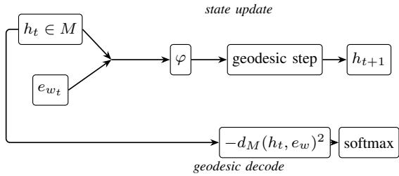
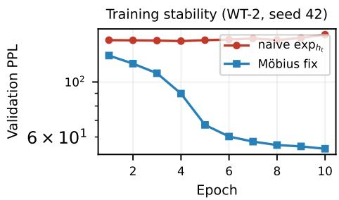
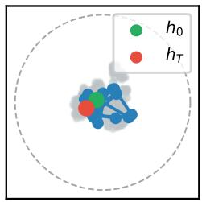
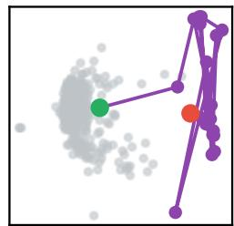
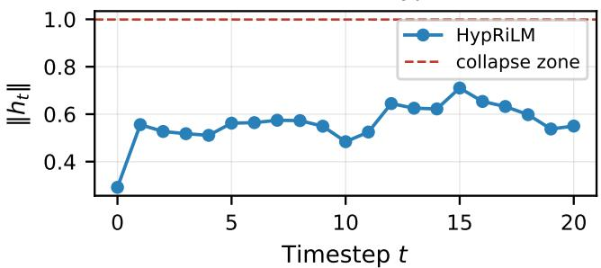

# RiLM: Parameter-Efficient Language Modeling via Geodesic Decoding

Fang Li

Department of Computer Science

Oklahoma Christian University

Edmond, USA

Email: fang.li@oc.edu

Abstract—Language models under one million parameters matter for edge deployment, domain adaptation, and reproducible research, yet a two-layer LSTM or Transformer at embedding width d=128 still spends roughly one third of its capacity on the output matrix $W _ { \mathrm { o u t } } ~ \in ~ \mathbb { R } ^ { d \times | V | } ,$ . We propose Riemannian Language Models (RiLM), which remove that layer entirely: context unfolds as a trajectory on a Riemannian manifold, and next-token probabilities arise from squared geodesic distance between the current state and vocabulary embeddings. The same embedding map serves input and output—decoding is geometry. We instantiate the framework on flat $\mathbb { R } ^ { d }$ (Flat RiLM) and the Poincare ball ´ Hd (HypRiLM) with a shared MLP composition map φ (∼290k parameters, d=128, |V |=2000). Across five seeds on WikiText-2, HypRiLM reaches $5 4 . 2 \pm 0 . 2$ validation perplexity versus $8 7 . 6 \pm 0 . 6$ for Flat RiLM; tied and matched LSTM, Transformer, and SSM controls remain at 113–147 PPL on WT-2—HypRiLM leads by roughly 2× over the strongest tied recurrent baseline (SSM, $1 1 3 . { \bar { 0 } } \pm 3 . 8 )$ Penn Treebank and a 10k-vocabulary stress test confirm that geodesic decoding transfers across corpora and larger $| V | ,$ while hyperbolic curvature helps selectively. We also characterize boundary collapse in naive hyperbolic recurrence and show how Mobius stabilization restores trainability. Claims are scoped to¨ controlled small-model comparisons, not full-vocabulary state of the art.

Index Terms—language modeling, Riemannian geometry, hyperbolic neural networks, parameter efficiency

## I. INTRODUCTION

Neural language models map token sequences to distributions over the next word. The dominant recipe—token vectors in $\mathbb { R } ^ { d } .$ , state updates via LSTM gating [1] or selfattention [2], and an affine readout $W _ { \mathrm { o u t } } h + b .$ —scales to billions of parameters and underpins systems from machine translation to code generation [3], [4]. That recipe is the right default when compute and data are abundant. It is a poor default when the model must fit on device, adapt quickly to a narrow domain, or serve as a reproducible scientific instrument: below one million parameters, $W _ { \mathrm { o u t } } \in \mathbb { R } ^ { d \times | V | }$ can consume one third of the budget at $d { = } 1 2 8$ and $\lvert V \rvert { = } 2 0 0 0$ matching the embedding table. Shrinking d to compensate weakens the recurrent or attention core; enlarging |V| without enlarging the model makes the output layer dominate entirely. Tied embeddings [5] halve redundant rows but still decode via a linear functional detached from how states move through representation space.

Language also carries hierarchical structure—syntax, lexical relations, topical organization—that Euclidean space embeds with distortion that grows in depth [6]. Hyperbolic space offers exponentially growing volume and has improved static embeddings and feed-forward layers [7], yet it is rarely used to govern how context is composed step by step. We ask whether manifold geometry can replace not only word vectors but the decoder itself.

We introduce Riemannian Language Models (RiLM). The state $h _ { t }$ lives on a Riemannian manifold $( M , g )$ . A single map $\varphi ,$ shared at every timestep, reads the current state and incoming token and proposes a tangent direction; the state then moves along the corresponding geodesic. Decoding needs no $W _ { \mathrm { o u t } } \mathrm { : }$ : word w is likely when its embedding $e _ { w }$ lies close to $h _ { t }$ in geodesic distance, p(w $| \ h _ { t } ) \propto \exp ( - d _ { M } ( h _ { t } , e _ { w } ) ^ { 2 } / \tau )$ Context becomes a trajectory $h _ { 0 }  h _ { 1 }  \cdot \cdot \cdot  h _ { T } ;$ classification and representation are coupled because the model must arrange vocabulary points so that plausible continuations lie near that trajectory.

We study two instantiations: Flat RiLM on $M = \mathbb { R } ^ { d }$ (the Euclidean special case of our earlier unpublished prototype) and HypRiLM on the Poincare ball´ $M = \mathbb { H } _ { c } ^ { d }$ . Hyperbolic recurrence posed an unexpected obstacle—naive exponentialmap updates drive states to the ball boundary and flatten all logits—which we analyze and resolve with Mobius translation¨ (Section V). Empirically, we report multi-seed WikiText-2 and Penn Treebank results against untied, tied, and matchedparameter LSTM, Transformer, and selective state-space baselines. HypRiLM improves ${ \sim } 3 8 \%$ relative to Flat RiLM on web text and trails Flat RiLM on newswire PTB; on both corpora, each RiLM variant beats matched and tied LSTM, Transformer, and SSM controls by wide margins (Tables IV and VI). We do not target billion-parameter pretraining; the contribution is a geometric language-modeling template, a trainability analysis for hyperbolic recurrence, and evidence that decoding geometry matters when parameters are scarce.

Contributions. This paper makes four claims, each backed by controlled experiments at ∼290k parameters. First, geodesic decoding replaces $W _ { \mathrm { o u t } }$ with distance to vocabulary points on M, coupling representation and classification without a separate readout layer. Second, the same template instantiates flat and hyperbolic sequential models, enabling a direct test of whether curvature helps composition when $\varphi$ is held fixed. Third, we identify boundary collapse in naive hyperbolic recurrence—a failure mode that drives perplexity to the uniform $| V |$ baseline—and show that Mobius-based¨ updates restore stable training. Fourth, under explicit fairness protocols (tied and matched baselines, including a modern SSM control), both RiLM variants outperform LSTM, Transformer, and SSM decoders on WikiText-2 and Penn Treebank by margins that tied embeddings alone do not explain.

Scope and organization. Our primary evaluation uses the 2000 most frequent words on WikiText-2 and PTB so that $W _ { \mathrm { o u t } }$ accounts for a transparent ∼256k parameters at $d { = } 1 2 8 { \mathrm { ; } }$ we do not claim numerically comparable perplexity to fullvocabulary leaderboard models. Section III defines RiLM; Section IV presents multi-seed results, vocabulary scaling, ablations, and geometry analysis; Section V interprets boundary collapse, when curvature helps, and limitations.

## II. RELATED WORK

Recurrent and attention decoders. Modern LMs stack depth, width, and data until perplexity on WikiText-2 drops into the twenties—but only at 33M–257M parameters with heavy regularization [3], [4], [8]. At sub-million scale the bottleneck shifts: a two-layer LSTM or Transformer must either carry a full $W _ { \mathrm { o u t } }$ or tie embeddings [5]. Tying removes redundant rows but preserves the form of decoding as a linear functional on hidden states in $\mathbb { R } ^ { d }$ . RiLM instead decodes by geometry on M: the hidden state and vocabulary live in the same space, and logits are derived from distances. We compare against both untied models (to show the cost of $W _ { \mathrm { o u t } } )$ and tied/matched models (to isolate the effect of decoding geometry).

Hyperbolic representation learning. Hyperbolic space embeds trees and hierarchies with low distortion [6]; hyperbolic neural networks provide Mobius operations and Riemannian¨ optimization tools [7]. Most prior work applies hyperbolicity to static objects—word vectors, graph nodes, or single feedforward layers. RiLM asks whether curvature should govern the trajectory of context: each token applies the same $\varphi$ and moves the state along a geodesic, and every prediction step reuses the same distance-based readout. The sequential, recurrent use of hyperbolic geometry is therefore qualitatively different from Poincare word embeddings with a Euclidean´ softmax on top.

Efficiency and modern recurrent baselines. Parameterefficient fine-tuning (e.g., LoRA [9]) reduces adaptation cost but leaves the pretrained decoder intact. Continuous-time models [10] and volume-preserving flows [11] study dynamics but do not remove vocabulary-sized output layers in small LMs. Selective state-space models [12] offer linear-time recurrence with input-dependent gating and represent the strongest modern alternative to LSTM/Transformer backbones at similar width. We implement a lightweight diagonal SSM as an additional baseline; RiLM competes on decoding geometry rather than on replacing $\varphi$ with a different recurrent operator.

## III. METHOD

RiLM treats a sentence as motion on a manifold: each token nudges the state along a learned geodesic, and the nextword distribution is read off from geometry rather than a separate classifier. Figure 1 summarizes one timestep. The design deliberately mirrors tied embeddings—input and output share parameters—but replaces the linear map $W _ { \mathrm { o u t } } h$ with negative squared distance $- d _ { M } ( h , e _ { w } ) ^ { 2 } ;$ , so the model must organize vocabulary points on M in a way that supports both ingestion and prediction.

## A. Geometric Background

A Riemannian manifold $( M , g )$ equips each tangent space $T _ { x } M$ with an inner product $g _ { x }$ varying smoothly in $x .$ The exponential map $\exp _ { x } \colon T _ { x } M \to M$ sends tangent vector v along the geodesic starting at x in direction $v ;$ the logarithmic map $\log _ { x }$ inverts it locally. Geodesic distance $d _ { M } ( x , y )$ is the length of the shortest path on M. On $\mathbb { R } ^ { d } , \exp _ { x } ( v ) = x + v$ and $d _ { M } ( x , y ) = \| x - y \| _ { 2 }$

The Poincare ball´ $\mathbb { H } _ { c } ^ { d } \ = \ \{ x \ \in \ \mathbb { R } ^ { d } \ : \ \| x \| \ < \ 1 / \sqrt { c } \}$ models hyperbolic space with curvature $c > 0 .$ . The conformal factor $\lambda _ { x } ^ { c } = 2 / ( 1 - c \| x \| ^ { 2 } )$ diverges at the boundary, yielding exponential volume growth $\mathrm { V o l } ( B _ { \mathbb { H } } ( r ) ) ~ \approx ~ e ^ { \sqrt { c } r }$ . Mobius¨ addition [7],

$$
x \oplus _ { c } y = \frac { ( 1 + 2 c \langle x , y \rangle + c \| y \| ^ { 2 } ) x + ( 1 - c \| x \| ^ { 2 } ) y } { 1 + 2 c \langle x , y \rangle + c ^ { 2 } \| x \| ^ { 2 } \| y \| ^ { 2 } } ,\tag{1}
$$

is closed on the open ball. Hyperbolic distance is $d _ { \mathbb { H } } ( x , y ) =$ $( 2 / { \sqrt { c } } )$ arctanh $\mathsf { 1 } \big ( \sqrt { c } \big \| \big ( - x \big ) \oplus _ { c } y \big \| \big )$ .

## B. Recurrence and Geodesic Decoding

Given vocabulary V, each word w has embedding $e _ { w } \in M$ and the contextual state $h _ { t } \in M$ summarizes prefix $w _ { 1 : t } .$ . A shared composition map $\varphi \colon  { \mathbb { R } } ^ { d } \times  { \mathbb { R } } ^ { d } \to  { \mathbb { R } } ^ { d }$ reads tangent coordinates at the origin and proposes an update direction:

$$
h _ { t + 1 } = \exp _ { h _ { t } } \bigl ( \varphi ( \log _ { 0 } ( h _ { t } ) , \log _ { 0 } ( e _ { w _ { t } } ) ) \bigr ) .\tag{2}
$$

Decoding with temperature $\tau > 0$ defines a softmax over negative squared distances,

$$
p ( w \mid h _ { t } ) = \frac { \exp ( - d _ { M } ( h _ { t } , e _ { w } ) ^ { 2 } / \tau ) } { \sum _ { w ^ { \prime } } \exp ( - d _ { M } ( h _ { t } , e _ { w ^ { \prime } } ) ^ { 2 } / \tau ) } .\tag{3}
$$

which is analogous to metric learning: likely words are those whose embeddings lie in a small geodesic ball around $h _ { t }$ . The softmax can be viewed as a kernel classifier with $k ( x , y ) =$ $\exp ( - d _ { M } ( x , y ) ^ { 2 } / \tau ) ;$ ; on $\mathbb { R } ^ { d }$ this resembles a Gaussian RBF over embedding space, while on $\mathbb { H } ^ { d }$ distances grow faster with separation, sharpening the effective decision boundary near the state trajectory. Unlike a free linear head $W _ { \mathrm { o u t } } h .$ , the classifier weights are identified with vocabulary geometry—the model cannot assign high probability to a word without placing $e _ { w }$ near regions of M that $h _ { t }$ actually visits.

On $\mathbb { R } ^ { d }$ , identifying tangent vectors with ambient coordinates $( \log _ { 0 } ( x ) { = } x , \exp _ { h } ( v ) { = } h { + } v )$ , Eq. (2) reduces to additive composition $h _ { t + 1 } = h _ { t } + \varphi ( h _ { t } , e _ { w _ { t } } )$ )—the Euclidean special case of our unpublished flat prototype (anonymous supplementary code). The sequence starts from $h _ { 0 } = \mathrm { e x p } _ { 0 } ( \theta _ { \mathrm { r o o t } } ) = \theta _ { \mathrm { r o o t } }$ with learned $\theta _ { \mathrm { r o o t } } \in \mathbb { R } ^ { d }$

  
Fig. 1. RiLM at timestep t: shared $\varphi ,$ geodesic state update, and distancebased decoding without $\bar { W } _ { \mathrm { o u t } }$

## C. Hyperbolic RiLM and Mobius Recurrence¨

Eq. (2) is the natural hyperbolic analogue of additive recurrence, but implementing $\exp _ { h _ { t } }$ directly on $\mathbb { H } ^ { d }$ fails in practice. As $\| h _ { t } \|  1 / \sqrt { c } ,$ the conformal factor $\lambda _ { h _ { t } } = 2 / ( 1 - c \| h _ { t } \| ^ { 2 } )$ diverges: small tangent steps at $h _ { t }$ correspond to enormous boundary motion, states stick to the ball boundary, and $d _ { \mathbb { H } } ( h _ { t } , e _ { w } )$ becomes nearly constant for all $w .$ . We observed $\left\| h _ { t } \right\|$ ≈ 0.999 within three steps and validation perplexity equal to |V| (Section V).

Our fix computes increments where the metric is wellbehaved—at the origin—and transports them with Mobius¨ addition:

$$
\delta _ { t } = \exp _ { 0 } \bigl ( s \cdot \varphi ( \log _ { 0 } h _ { t } , \log _ { 0 } e _ { w _ { t } } ) \bigr ) , \quad h _ { t + 1 } = h _ { t } \oplus _ { c } \delta _ { t } ,\tag{4}
$$

with learnable step scale s initialized near $1 / { \sqrt { d } } .$ . After training on WikiText-2, $\| h _ { t } \|$ on held-out prefixes typically lies in [0.29, 0.71]—well inside the ball (Figure 3). Embeddings and $\theta _ { \mathrm { r o o t } }$ are projected to $\| x \| \leq 0 . 9 9 9 / { \sqrt { c } } ;$ projecting $h _ { t }$ after every step stalled optimization at ∼130 PPL, so we project only static parameters.

## D. Composition Function and Training

We use a single MLP for $\varphi$ in all main experiments: $\varphi ( v _ { h } , v _ { e } ) = \operatorname { t a n h } ( W [ v _ { h } ; v _ { e } ] + b )$ with $W \in \mathbb { R } ^ { d \times 2 d }$ (∼33k parameters at $d { = } 1 2 8 )$ , shared across timesteps. Sharing $\varphi$ is central to the RiLM hypothesis: composition rules should not proliferate with sequence length the way layer-specific attention maps do. The model minimizes masked token negative log-likelihood,

$$
\mathcal { L } = - \frac { 1 } { \sum _ { t } m _ { t } } \sum _ { t } m _ { t } \log p ( w _ { t + 1 } \mid h _ { t } ) ,\tag{5}
$$

with padding mask $m _ { t } ~ \in ~ \{ 0 , 1 \}$ . Long compositions are trained with truncated BPTT (k=8): states detach every $k$ steps, limiting gradient depth through repeated $\varphi$ while matching the effective update frequency of windowed baseline training. At k=8 and context 64, each token still participates in eight compositional steps before gradients truncate— comparable to the receptive field of a shallow LSTM unrolled over the same window. Under this parameter budget, most predictive signal appears local: extending context to 256 with spline $\varphi$ regresses to 65.6 PPL (Table VII), so main experiments keep context 64 and MLP $\varphi .$ . Flat RiLM uses Adam at $\eta = 1 0 ^ { - 3 }$ ; HypRiLM uses $\eta = 3 \times 1 0 ^ { - 3 }$ , curvature $c = 1 . 0 \AA$ embedding initialization $\mathcal { N } ( 0 , ( 0 . 3 / \sqrt { d } ) ^ { 2 } )$ , and gradient clipping at norm 1.0. All models train for 10 epochs with batch size 128 and context length 64 (Table II). Volume-preserving word flows $\Phi _ { w } ( h ) = \exp _ { h } ( \varphi ( \log _ { 0 } h , \log _ { 0 } e _ { w } ) )$ are possible in principle [11]; our MLP $\varphi$ does not satisfy this, and spline variants (Table VII) move perplexity only slightly—suggesting that gains come from decoding geometry and manifold choice rather than from entropy-preserving dynamics alone.

TABLE I  
PARAMETER ALLOCATION (d=128, |V |=2000).
<table><tr><td>Component</td><td>RiLM</td><td>LSTM</td><td>Transformer</td></tr><tr><td>Embeddings</td><td>256k</td><td>256k</td><td>256k</td></tr><tr><td>Output head  $W _ { \mathrm { o u t } }$ </td><td>0</td><td>256k</td><td>256k</td></tr><tr><td>Composition core</td><td>33k</td><td>264k</td><td>265k</td></tr><tr><td>Total</td><td>289k</td><td>776k</td><td>777k</td></tr></table>

TABLE II  
SHARED HYPERPARAMETERS.
<table><tr><td>Setting</td><td>Value</td></tr><tr><td>Embedding  $\textit { d } /$  vocab. |V|</td><td>128 / 2000 (most frequent)</td></tr><tr><td>Context length / TBPTT k</td><td>64 /  8</td></tr><tr><td>Batch size / epochs</td><td>128 /  10</td></tr><tr><td>Decoding temperature τ</td><td>1.0</td></tr><tr><td>Flat / LSTM / TX learning rate</td><td> $1 0 ^ { - 3 }$ </td></tr><tr><td>HypRiLM learning rate</td><td> $3 \times 1 0 ^ { - 3 }$ </td></tr><tr><td>SSM learning rate</td><td> $3 \times 1 0 ^ { - 4 }$ </td></tr><tr><td>LSTM / Transformer</td><td>2 layers; TX: 4 heads, FFN 256</td></tr><tr><td>WT-2 seeds / PTB seeds</td><td> $\{ 4 2 , \ldots , 4 6 \}$  / {42, 43, 44}</td></tr></table>

## E. Parameter Budget and Baseline Fairness

At d=128 and $\lvert V \rvert { = } 2 0 0 0$ , geodesic decoding eliminates the ∼256k parameters that LSTM and Transformer decoders allocate to $W _ { \mathrm { o u t } }$ (Table I). RiLM reinvests that capacity in full-width embeddings and $\varphi .$ Fair comparison therefore requires two baseline regimes. Tied models at $d { = } 1 2 8$ share input/output embeddings like RiLM but retain flat LSTM, attention, or SSM dynamics. Matched models equalize total parameters at ∼290k by shrinking hidden width to $d ^ { \prime }$ ≈ 82–97, which weakens their recurrent core. Tied rows are the stronger control on decoding; matched rows isolate whether RiLM wins only because it keeps d=128.

## IV. EXPERIMENTS

We designed experiments to answer three questions. Q1: Does geodesic decoding improve language modeling when decoder capacity is fairly counted against LSTM, Transformer, and SSM baselines? Q2: Holding $\varphi$ fixed, does hyperbolic curvature improve over flat space? Q3: Do relative conclusions survive a tenfold increase in |V|? We report validation perplexity exp(L) on WikiText-2 (WT-2; full train/validation splits, 2.1M training tokens) and the Zaremba Penn Treebank (PTB; 887k training tokens). Primary tables use the 2000 most frequent words on both corpora. This protocol fixes |V | so that $W _ { \mathrm { o u t } }$ costs ∼256k parameters at $d { = } 1 2 8 .$ , making the trade-off in Table I explicit. Absolute perplexities are not comparable to full-vocabulary leaderboard entries (Table VIII); our claims concern controlled comparisons at matched scale.

TABLE III  
WIKITEXT-2 VALIDATION PERPLEXITY (FIVE SEEDS, 2K VOCAB).
<table><tr><td>Model</td><td>PPL↓</td><td>Params</td></tr><tr><td>HypRiLM (MLP φ)</td><td> ${ \bf 5 4 . 2 \pm 0 . 2 }$ </td><td>289k</td></tr><tr><td>Flat RiLM  $( \mathrm { M L P } ~ \varphi )$ </td><td> $8 7 . 6 \pm 0 . 6$ </td><td>289k</td></tr><tr><td>LSTM, untied</td><td> $1 4 9 . 9 \pm 2 . 7$ </td><td>776k</td></tr><tr><td>Transformer, untied</td><td> $1 3 7 . 4 \pm 5 . 1$ </td><td>777k</td></tr></table>

Baselines and training protocol. We compare against two-layer LSTM, two-layer causal Transformer (four heads, FFN width 256), and a selective diagonal SSM inspired by Mamba [12]—each in untied, tied [5], and matched (∼290k) regimes. SSM uses Adam at $\eta = 3 \times 1 0 ^ { - 4 }$ and reports the best validation checkpoint within 10 epochs (it overfits after ∼4 epochs on WT-2); Flat RiLM, LSTM, and Transformer use $\eta = 1 0 ^ { - 3 }$ ; HypRiLM uses $3 \times 1 0 ^ { - 3 }$ . All non-SSM models use the final epoch checkpoint. WikiText-2 aggregates mean ± std over five seeds $\{ 4 2 , \ldots , 4 6 \}$ ; PTB over three seeds {42, 43, 44}. Effect sizes on WT-2 are large: the HypRiLM– Flat gap (∼33 PPL) exceeds 100× the HypRiLM standard deviation (0.2), and HypRiLM–SSM-tied gaps $( { \sim } 5 9 \ \mathrm { \ P P L } )$ exceed 15× the SSM-tied std (3.8). Reported means ± std over seeds therefore suffice; formal significance tests add little beyond these intervals. All training uses one GPU; reproduction scripts and unit tests for hyperbolic primitives are in anonymous supplementary material.

## A. WikiText-2 at Controlled Vocabulary

Table III reports headline WT-2 results. HypRiLM reaches $5 4 . 2 \pm 0 . 2$ perplexity at ∼289k parameters—the best result by a wide margin, with standard deviation far smaller than the gaps to baselines. Flat RiLM attains $8 7 . 6 \pm 0 . 6$ with the same φ and parameter count, isolating curvature: hyperbolic space accounts for $a \sim 3 8 \%$ relative improvement on this corpus. Untied LSTM (149.9±2.7) and Transformer (137.4±5.1) use ∼776k parameters yet remain ∼84–96 PPL worse, indicating that adding $W _ { \mathrm { o u t } }$ capacity does not close the gap when the compositional core stays flat and Euclidean.

Fair comparisons in Table IV address whether RiLM wins only by tying or by parameter accounting. Against tied LSTM (117.9 ± 1.4), Transformer-tied (147.0 ± 1.0), and SSMtied $( 1 1 3 . 0 \pm 3 . 8 )$ —all at d=128 with shared input/output weights—HypRiLM still leads by 59–93 PPL while using fewer parameters than the LSTM and Transformer rows. The SSM-tied row is particularly informative: it is a modern recurrent decoder with selective gating, yet remains ∼2× worse than HypRiLM (113.0 vs. 54.2). Against matched baselines at ∼290k total, hidden widths shrink to $d ^ { \prime } \approx 8 2 – 9 7 ;$ ; HypRiLM wins by 64–89 PPL while retaining d=128. No fair regime reverses the ranking.

TABLE IV  
FAIR WIKITEXT-2 COMPARISON (FIVE SEEDS $\{ 4 2 , \dots , 4 6 \} ; { \mathrm { A L L } }$ MODELS). PRIMARY CONTROLS: TIED AND MATCHED ROWS.
<table><tr><td>Model</td><td>PPL ↓</td><td>Params</td></tr><tr><td>HypRiLM</td><td> ${ \bf 5 4 . 2 \pm 0 . 2 }$ </td><td>289k</td></tr><tr><td>Flat RiLM</td><td> $8 7 . 6 \pm 0 . 6$ </td><td>289k</td></tr><tr><td>LSTM-tied (d=128)</td><td> $1 1 7 . 9 \pm 1 . 4$ </td><td>520k</td></tr><tr><td>LSTM-matched</td><td> $1 2 5 . 2 \pm 6 . 8$ </td><td>273k</td></tr><tr><td>Transformer-tied (d=128)</td><td> $1 4 7 . 0 \pm 1 . 0$ </td><td>521k</td></tr><tr><td>Transformer-matched</td><td> $1 4 2 . 8 \pm 1 . 1$ </td><td>283k</td></tr><tr><td>SSM-tied (d=128)</td><td> $1 1 3 . 0 \pm 3 . 8$ </td><td>374k</td></tr><tr><td>SSM-matched</td><td> $1 1 8 . 1 \pm 0 . 7$ </td><td>271k</td></tr></table>

On a small held-out subset (10k training / 500 validation tokens; seed 42), model ordering matches Table III (HypRiLM 76.4, Flat RiLM 103.0, LSTM 189.0, Transformer 148.5 PPL). Ablating the Mobius fix—using¨ $\mathrm { e x p } _ { h _ { t } }$ directly in Eq. (2)— drives perplexity to the uniform baseline $\lvert V \rvert { = } 2 0 0 0$ (Table IX), confirming that trainable hyperbolic dynamics are prerequisite to the headline results.

## B. Vocabulary Scaling to $\lvert V \rvert { = } 1 0 \small { , } 0 0 0$

When |V| grows tenfold, embedding tables dominate parameter count (∼1.3M for RiLM at d=128) and the original ∼290k matched baselines are no longer meaningful— shrinking d to match budget would yield $d ^ { \prime } < 4 0$ . We therefore compare RiLM variants and tied baselines at full width with batch size 32 (Table V). Absolute perplexity rises and is not comparable to Table III; the question is whether ranking persists.

Both RiLM variants remain far below SSM-tied (708.3 ± 9.0): Flat RiLM at 341.8±0.5, HypRiLM at 345.8±16.0. Flat RiLM is marginally best on mean; HypRiLM is competitive but seed 44 is an outlier (368.4 PPL), inflating variance. We interpret this as evidence that (i) geodesic decoding remains advantageous at larger $| V | ,$ , but (ii) hyperbolic curvature is not uniformly superior—on this scale, Euclidean geometry is slightly more stable. Tied LSTM and Transformer runs were unstable under the shared 10-epoch schedule (PPL > 1400), highlighting optimization fragility of flat decoders at large |V| under matched training budgets; SSM-tied is the reliable recurrent control here.

## C. Penn Treebank and Cross-Corpus Behavior

PTB reverses the within-family WT-2 ordering: Flat RiLM (40.9 ± 0.6) beats HypRiLM (69.8 ± 0.5) at identical ∼289k parameters (Table VI). Against fair baselines, both variants remain far below tied LSTM (214.3 ± 11.3), Transformer-tied (182.3±1.2), and SSM-tied (108.9±23.7), as well as matched LSTM $( 1 6 1 . 6 \pm 1 . 6 ) $ , Transformer (171.4 ± 4.1), and SSM $( 1 4 9 . 3 \pm 2 7 . 3 )$ controls. Geodesic decoding therefore transfers across corpora even when negative curvature is not the right inductive bias. PTB is smaller and stylistically homogeneous (newswire); WT-2 is noisier web text with broader topical structure. We report both corpora so readers can judge when to prefer Flat vs. HypRiLM rather than treating hyperbolicity as a universal upgrade.

TABLE V  
WIKITEXT-2 AT 10K VOCABULARY (d=128, THREE SEEDS).
<table><tr><td>Model</td><td>PPL ↓</td><td>Params</td></tr><tr><td>HypRiLM</td><td> $3 4 5 . 8 \pm 1 6 . 0$ </td><td> ${ \sim } 1 . 3 1 \mathrm { { M } }$ </td></tr><tr><td>Flat RiLM</td><td> ${ \bf 3 4 1 . 8 \ : \pm \ : 0 . 5 }$ </td><td> ${ \sim } 1 . 3 1 \mathrm { { M } }$ </td></tr><tr><td>SSM-tied  $( d { = } 1 2 8 )$ </td><td> $7 0 8 . 3 \pm 9 . 0$ </td><td> ${ \sim } 1 . 3 8 \mathbf { M }$ </td></tr><tr><td>LSTM-tied  $( d \mathrm { = } 1 2 8 ) ^ { \dagger }$ </td><td> $2 0 2 1 \pm 1 3 5$ </td><td> ${ \sim } 1 . 5 4 \mathrm { M }$ </td></tr><tr><td>Transformer-tied  $( d { = } 1 2 8 ) ^ { \dagger }$ </td><td> $1 5 1 3 \pm 1 1 6$ </td><td> ${ \sim } 1 . 5 2 \mathrm { M }$ </td></tr></table>

†Unstable under identical training at $| V | { = } 1 0 \mathbf { k } .$

TABLE VI  
PENN TREEBANK VALIDATION PERPLEXITY (THREE SEEDS, 2K VOCAB; TIED AND MATCHED BASELINES).
<table><tr><td>Model</td><td>PPL↓</td><td>Params</td></tr><tr><td>Flat RiLM</td><td> ${ \bf 4 0 . 9 \pm 0 . 6 }$ </td><td>289k</td></tr><tr><td>HypRiLM</td><td> $6 9 . 8 \pm 0 . 5$ </td><td>289k</td></tr><tr><td>LSTM-tied (d=128)</td><td> $2 1 4 . 3 \pm 1 1 . 3$ </td><td>520k</td></tr><tr><td>LSTM-matched</td><td> $1 6 1 . 6 \pm 1 . 6$ </td><td>273k</td></tr><tr><td>Transformer-tied (d=128)</td><td> $1 8 2 . 3 \pm 1 . 2$ </td><td>521k</td></tr><tr><td>Transformer-matched</td><td> $1 7 1 . 4 \pm 4 . 1$ </td><td>283k</td></tr><tr><td>SSM-tied (d=128)</td><td> $1 0 8 . 9 \pm 2 3 . 7$ </td><td>374k</td></tr><tr><td>SSM-matched</td><td> $1 4 9 . 3 \pm 2 7 . 3$ </td><td>271k</td></tr></table>

## D. Ablations and Literature Context

Table VII disentangles architectural choices on WT-2 (seed 42). Replacing MLP φ with monotone spline compose nodes (8 knots) improves Flat RiLM by ∼4.4 PPL but changes HypRiLM by only ∼0.1 PPL—smaller shifts than the ∼34 PPL gap between hyperbolic and flat MLP rows. Reducing curvature to c=0.1 degrades HypRiLM from 54.0 to 71.1 PPL, confirming that the ball’s negative curvature is doing work, not merely adding parameters. Extending context to 256 with spline $\varphi$ yields 65.6 PPL, so we retain context 64 and MLP $\varphi$ in all headline runs.

Table VIII places our seed-42 numbers beside published full-vocabulary models for context only. Transformer-XL, GPT-2, and AWD-LSTM operate at 33M–257M parameters with extensive regularization; HypRiLM uses 2k words and ∼289k parameters. The numeric proximity of HypRiLM (54.0) to AWD-LSTM (60.7) is not a controlled comparison and should not be read as competitive SOTA; it illustrates how controlled-vocabulary perplexity can look deceptively strong relative to leaderboard entries.

## E. Learned Geometry and Training Dynamics

Quantitative perplexity alone does not show whether geodesic decoding organizes representation space. We therefore inspect trained HypRiLM and Flat RiLM models (WT-2, seed 42, 10 epochs) on a held-out validation prefix.

TABLE VII  
WIKITEXT-2 ABLATIONS (SEED 42).
<table><tr><td>Variant</td><td>Manifold</td><td>PPL↓</td></tr><tr><td> $\mathbf { M L P } \ \varphi \ ( \mathrm { d e f a u l t } )$ </td><td> $ { \mathbb { H } ^ { d } } , c \mathrm { = } 1 . 0$ </td><td>54.0</td></tr><tr><td> $\mathbf { M L P } \ \varphi \ ( \mathrm { d e f a u l t } )$ </td><td> $\mathbb { R } ^ { d }$ </td><td>88.1</td></tr><tr><td>Spline 1D (8 knots)</td><td> $\mathbb { H } ^ { d }$ </td><td>53.9</td></tr><tr><td>Spline 1D (8 knots)</td><td> $\mathbb { R } ^ { d }$ </td><td>83.7</td></tr><tr><td> $\mathbf { M L P , \Lambda } c { = } 0 . 1$ </td><td> $\mathbb { H } ^ { d }$ </td><td>71.1</td></tr><tr><td>Spline  $\varphi ,$  context 256</td><td> $\mathbb { H } ^ { d }$ </td><td>65.6</td></tr></table>

TABLE VIII

WIKITEXT-2 PERPLEXITY IN THE LITERATURE (TOKEN-LEVEL; NOT COMPARABLE TO OUR 2K-VOCAB SETUP).
<table><tr><td>Model</td><td>PPL ↓</td><td>Params</td></tr><tr><td>Transformer-XL [4]</td><td>23.1</td><td>257M</td></tr><tr><td>GPT-2 small [3]</td><td>29.4</td><td>117M</td></tr><tr><td>AWD-LSTM [8]</td><td>60.7</td><td>33M</td></tr><tr><td>HypRiLM (ours, seed 42)</td><td>54.0</td><td>289k</td></tr><tr><td>Flat RiLM (ours, seed 42)</td><td>88.1</td><td>289k</td></tr></table>

Training stability. Figure 2 tracks validation perplexity when the hyperbolic recurrence uses naive $\exp _ { h _ { 1 } }$ updates versus the Mobius fix (Eq. (4)). Naive training remains near¨ ∼150 PPL across 10 epochs; Mobius HypRiLM improves¨ monotonically to ∼54—the same regime as Table III. The forward-pass collapse in Table IX $( \| h _ { t } \| \approx 0 . 9 9 9 .$ $\mathrm { P P L } = | V | )$ explains why naive training fails to descend; Mobius transport¨ is required for usable hyperbolic dynamics.

Trajectory and ball geometry. Figure 3 visualizes a 20- token prefix. Panels (a–b) project vocabulary embeddings (gray) and the state trajectory $h _ { 0 }  \cdots  h _ { T }$ (colored path; green/red: start/end) via PCA; the dashed circle in (a) is the Poincare boundary´ $( \left\| x \right\| { = } 1 \ \mathrm { a t } \ c { = } 1 )$ . Along this prefix, HypRiLM satisfies $\| h _ { t } \| \in [ 0 . 2 9 , 0 . 7 1 ]$ (panel c)—inside the ball and consistent with the post-training range in Table IX. Flat RiLM follows a comparable low-dimensional path in $\mathbb { R } ^ { d }$

Distance-based decoding in practice. After the prefix “along with · · · city $o f '$ , both models rank was and related function words among the highest-probability continuations (Table X). Neither model was cherry-picked on this example; it is the first long validation prefix returned by our data loader.

## V. DISCUSSION

## A. Boundary Collapse as a Trainability Phenomenon

Our first HypRiLM implementation applied $\exp _ { h _ { t } } ( \varphi ( \cdot ) )$ directly in Eq. (2). The hyperbolic exponential map can be written $\mathrm { e x p } _ { h _ { t } } ( v ) = h _ { t } \oplus _ { c } \mathrm { e x p } _ { 0 } ( \mathrm { t a n h } ( \sqrt { c } \lambda _ { h _ { t } } \parallel v \parallel / 2 ) v / ( \sqrt { c } \parallel v \parallel ) )$ As $\| h _ { t } \|  1 / \sqrt { c } ,$ the conformal factor $\lambda _ { h _ { t } } = 2 / ( 1 - c \| h _ { t } \| ^ { 2 } )$ grows without bound, tanh saturates, and updated states remain at the boundary. Within three recurrence steps we observed $\lVert h _ { t } \rVert \approx 0 . 9 9 9 ;$ geodesic distances to all vocabulary embeddings became nearly equal; logits flattened; and perplexity reached $\left| V \right| = 2 0 0 0 \cdot$ —exactly the uniform-guess baseline (Table IX). This boundary collapse is not a small optimization issue: it renders naive hyperbolic recurrence untrainable for language modeling at modest depth.

TABLE IX  
BOUNDARY COLLAPSE VS. MOBIUS FIX ¨ (SEED 42). NA¨IVE exph : 10K TRAIN / 500 VAL SUBSET. MOBIUS¨ : $\| h _ { t } \|$ AFTER TRAINING; PPL ON FULL WT-2 VALIDATION.
<table><tr><td>Recurrence</td><td>∥ht∥| after 3 steps</td><td>PPL</td></tr><tr><td>exPht(φ) (naïve)</td><td>≈0.999</td><td>2000</td></tr><tr><td>Möbius Eq. (4)</td><td>0.29-0.71</td><td>~54</td></tr></table>

  
Fig. 2. Validation perplexity per epoch on WikiText-2 (seed 42): naive $\mathrm { e x p } _ { h _ { t } }$ recurrence vs. Mobius HypRiLM.¨

Equation (4) sidesteps the pathology by computing tangent increments at the origin—where $\lambda _ { 0 }$ is moderate—and translating via $\oplus _ { c } .$ , which maps interior points to interior points. After training, $\| h _ { t } \|$ stays in [0.29, 0.71] on held-out prefixes and perplexity falls to ${ \sim } 5 4$ . Hard projection of $h _ { t }$ after every step was counterproductive (∼130 PPL), likely because it interrupts gradient flow along geodesics; we project only embeddings and $\theta _ { \mathrm { r o o t } }$ . We regard stable Mobius recurrence as a ¨ necessary engineering contribution alongside geodesic decoding: without it, the hyperbolic instantiation of RiLM does not function.

## B. Why Geodesic Decoding Helps at Small Scale

When |V| and d are moderate, $W _ { \mathrm { o u t } }$ can consume roughly one third of a standard untied LM’s parameters (Table I). Matched baselines respond by shrinking hidden width, which weakens LSTM gates or attention heads. RiLM instead keeps d=128 and forces the vocabulary embedding table to serve double duty: tokens are inputs and the targets of distancebased classification. The model cannot learn arbitrary linear functionals of $h _ { t }$ independent of where words live on $M ;$ plausible continuations must lie near the contextual trajectory. This coupling may explain why tied LSTM/Transformer models— which remove $W _ { \mathrm { o u t } }$ but decode linearly in $\mathbb { R } ^ { d _ { - } }$ —still trail by tens of perplexity points.

Swapping $\mathbb { R } ^ { d }$ for $\mathbb { H } ^ { d }$ at fixed $\varphi$ yields a large WT-2 gain but not a PTB gain. We do not claim a formal hierarchy theorem for web text; rather, $\mathrm { W T } { - } 2 \mathrm { \Omega } ^ { , } \mathrm { s }$ broader topical and lexical structure may benefit from the exponential separation hyperbolic space affords, whereas compact PTB sentences are adequately served by flat geometry. Table XI summarizes when each instantiation is preferable in our experiments.

(a) HypRiLM (PCA)  

(b) Flat RiLM (PCA)  

(c) State norm (HypRiLM)  
  
Fig. 3. Learned geometry on a WT-2 validation prefix (seed 42). (a)– (b) PCA projections with Poincare boundary (dashed) in (a); (c) ´ ∥ht∥ along the HypRiLM trajectory.

TABLE X  
TOP-5 NEXT-TOKEN CANDIDATES BY GEODESIC DISTANCE AFTER PREFIX “along with · · · city $o f '$ (SEED 42; LOGITS $\mathrm { A R E } - d _ { M } ^ { 2 } / \tau )$
<table><tr><td>Rank</td><td>HypRiLM / Flat RiLM</td></tr><tr><td>1</td><td>&lt;unk&gt;/&lt;unk&gt;</td></tr><tr><td>2</td><td>was /was</td></tr><tr><td>3</td><td>is / and</td></tr><tr><td>4</td><td>had /the</td></tr><tr><td>5</td><td>the /in</td></tr></table>

Practitioners should treat manifold choice as a validation-set decision, not a default.

## C. Relation to Tied Embeddings

Tied LSTM/Transformer models set $W _ { \mathrm { o u t } } ~ = ~ E ^ { \top }$ where $E ~ \in ~ \mathbb { R } ^ { | V | \times d }$ is the embedding table, so logits are $E h _ { t } -$ a bilinear form in $\mathbb { R } ^ { d }$ . RiLM instead uses $- \| h _ { t } \ - \ e _ { w } \| ^ { 2 }$ on $\mathbb { R } ^ { d }$ (or $- d _ { \mathbb { H } } ( h _ { t } , e _ { w } ) ^ { 2 }$ on $\mathbb { H } ^ { d } )$ . Expanding the Euclidean case, $- \| h - e _ { w } \| ^ { 2 } = - \| h \| ^ { 2 } + 2 \langle h , \bar { e _ { w } } \rangle - \| \bar { e _ { w } } \| ^ { 2 }$ . The term $- \| h \| ^ { 2 }$ is shared across all words at a given timestep and cancels in the softmax; RiLM logits therefore differ from tied linear decoding by the word-dependent norms $\| e _ { w } \| ^ { 2 }$ and by whether inner products or distances define similarity. Geodesic decoding is not equivalent to tying alone: it imposes a metric structure on how hidden states relate to all vocabulary points simultaneously. Our tied baselines isolate this distinction— they remove $W _ { \mathrm { o u t } }$ but keep linear scoring—and still trail HypRiLM by 59+ PPL on WT-2.

TABLE XI  
PRACTICAL GUIDE: WHICH RILM VARIANT TO TRY FIRST (UNDER OUR ∼290K, 2K-VOCAB PROTOCOL).
<table><tr><td>Setting</td><td>Recommendation</td></tr><tr><td>Noisy web text (WT-2)</td><td>HypRiLM (large margin over flat and baselines)</td></tr><tr><td>Compact newswire (PTB)</td><td>Flat RiLM (beats HypRiLM at same φ)</td></tr><tr><td> $| V | ~ \gtrsim ~ 1 0 \mathrm { k }$  , fixed training budget</td><td>Flat RiLM (more stable; similar</td></tr><tr><td>Need fastest inference</td><td>mean PPL) Flat RiLM (~0.15 vs. ~0.52 ms/token)</td></tr></table>

## D. Efficiency and Limitations

Per generated token, RiLM requires O(d) work for $\varphi$ and $O ( | V | \cdot d )$ for distance evaluation—the same order as softmax over |V |. The benefit is parametric: eliminating $W _ { \mathrm { o u t } }$ at small $| V |$ . Measured on WikiText-2 (seed 42, autoregressive ms/token), Flat RiLM averages 0.15 ms/token, HypRiLM 0.52 ms/token, LSTM 0.44 ms/token, and Transformer 0.40 ms/token. Hyperbolic operations add ∼3.5× overhead over Flat RiLM but remain in the same ballpark as the recurrent baselines; Flat RiLM is the fastest variant in this benchmark.

Our study is intentionally bounded. Results use <2M parameters in the largest 10k-vocab setting, context 64, and TBPTT k=8. The 2k vocabulary is a controlled instrument, not a claim about full WikiText-2 benchmarking. Our SSM baseline is a lightweight diagonal model, not a tuned Mamba implementation; SSM uses best-validation checkpoint selection while other models use the final epoch—a potential advantage for SSM that our headline gaps absorb. Matched baselines equalize parameter count but not representation width. Reported ms/token timings use autoregressive generation with model-specific prefix lengths (see supplementary material) and are indicative, not hardware-independent benchmarks. Product-manifold variants improved WT-2 by only ∼3 PPL at higher complexity in exploratory runs. All models are trained from scratch without distillation.

Scaling outlook. At full vocabulary (|V|≈33k), $W _ { \mathrm { o u t } }$ dominates even billion-parameter transformers—but RiLM’s $O ( | V | \cdot d )$ decoding cost remains, and geodesic distance over the full table may need approximation (hierarchical softmax, sampled negatives, or product-manifold factorization of V). Our 10k study is a first stress test: RiLM variants stay ∼2× better than SSM-tied but flat geometry becomes competitive with hyperbolic. We expect the decoding idea to matter most where |V| is moderate and parameters scarce; whether curvature helps at scale is an open empirical question we do not resolve here. Extending RiLM to full vocabulary and wider embeddings is the natural next step for community-scale evaluation.

## VI. CONCLUSION

RiLM reframes small language modeling as geometry: context is a path on a manifold, and decoding reads distances to vocabulary points rather than applying a separate output matrix. With a shared MLP φ and ∼290k parameters, HypRiLM leads on WikiText-2 against fair LSTM, Transformer, and SSM baselines; Flat RiLM is preferable on Penn Treebank; both beat tied and matched controls on both corpora. Stable Mobius recurrence proved essential—without it, hyperbolic¨ RiLM does not train.

Within the controlled regime we study, geodesic decoding is a concrete way to couple representation and prediction when parameters are scarce. It is not a drop-in replacement for billion-parameter pretraining, but it offers a principled alternative to $W _ { \mathrm { o u t } }$ whose benefits persist under tied and matched comparisons and partially under larger $| V |$ . We hope the framework, the boundary-collapse analysis, and the multiseed protocol provide a reproducible baseline for future work on geometric language models.

## REFERENCES

[1] S. Hochreiter and J. Schmidhuber, “Long short-term memory,” Neural Comput., vol. 9, no. 8, 1997.

[2] A. Vaswani et al., “Attention is all you need,” in Proc. NeurIPS, 2017.

[3] A. Radford et al., “Language models are unsupervised multitask learners,” OpenAI Tech. Rep., 2019.

[4] Z. Dai et al., “Transformer-XL: Attentive language models beyond a fixed-length context,” in Proc. ACL, 2019.

[5] O. Press and L. Wolf, “Using the output embedding to improve language models,” in Proc. EACL, 2017.

[6] M. Nickel and D. Kiela, “Poincare embeddings for learning hierarchical´ representations,” in Proc. NeurIPS, 2017.

[7] O. Ganea, G. Becigneul, and T. Hofmann, “Hyperbolic neural networks,”´ in Proc. NeurIPS, 2018.

[8] S. Merity, N. S. Keskar, and R. Socher, “Regularizing and optimizing LSTM language models,” in Proc. ICLR, 2018.

[9] E. J. Hu et al., “LoRA: Low-rank adaptation of large language models,” in Proc. ICLR, 2022.

[10] R. T. Q. Chen et al., “Neural ordinary differential equations,” in Proc. NeurIPS, 2018.

[11] D. J. Rezende and S. Mohamed, “Variational inference with normalizing flows,” in Proc. ICML, 2015.

[12] A. Gu and T. Dao, “Mamba: Linear-time sequence modeling with selective state spaces,” arXiv:2312.00752, 2023.