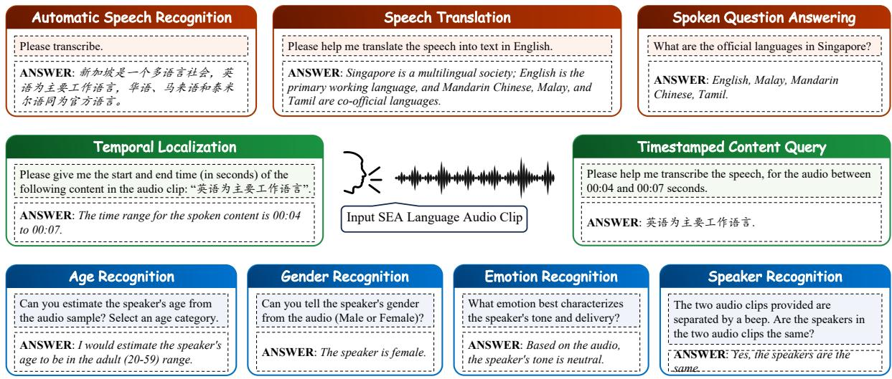
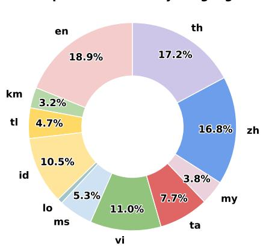
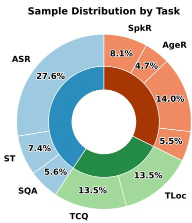
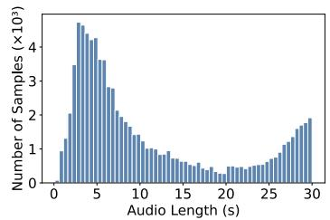
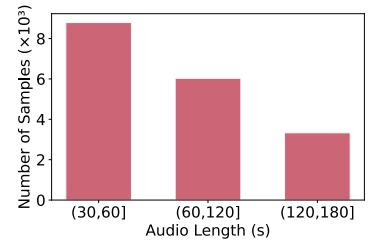
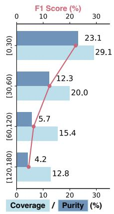
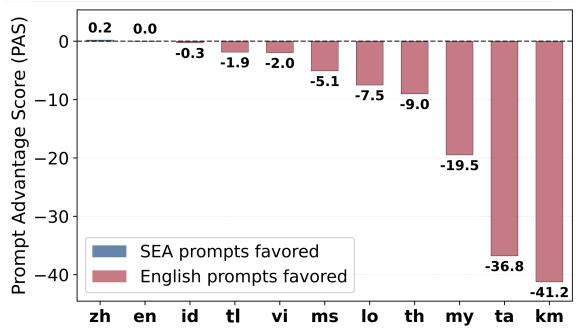
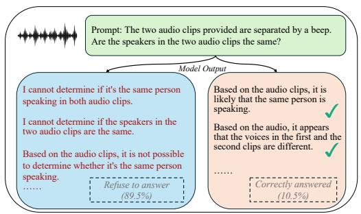

# SEA-SPEECHBENCH: A Large-Scale Multitask Benchmark for Speech Understanding Across Southeast Asia

Jingyi Liao1,3\*, Wenyu Zhang2\*†, Zhuohan Liu1, Yingxu He1, Geyu Lin1, Xunlong Zou1, Shuo Sun1, Syed Ali Redha Alsagoff3†, Ai Ti Aw1

1Institute of Advanced Intelligence and Computing, A\*STAR 2Center for AI Safety, 3Nanyang Technological University Correspondence: liao\_jingyi@a-star.edu.sg, wen.projectz@gmail.com

## Abstract

The rapid advancement of audio and multi modal large language models has unlocked transformative speech understanding capabil ities, yet evaluation frameworks remain predominantly English-centric, leaving Southeast Asian (SEA) languages critically underrepre sented. We introduce SEA-SPEECHBENCH, to the best of our knowledge, the first large-scale multitask benchmark that evaluates speech understanding in 11 SEA languages through 97,194 samples across 99 evaluation sets and 597 hours of curated audio data. Our bench mark comprises 9 diverse tasks across 3 categories: speech processing (automatic speech recognition, speech translation, spoken question answering), paralinguistic analysis (emotion, gender, age, speaker recognition), and temporal understanding, a novel dimension featuring timestamped content queries and temporal localization within extended audio sequences up to 3 minutes. We implement mul tilingual prompting in both native SEA lan guages and English to reflect user interactions with audio-language models. Evaluation of leading open-source and proprietary systems reveals marked performance gaps. Across all models, performance remains underwhelming on temporal understanding, emotion recogni tion, and speech translation. Prompting in low-resource languages such as Burmese and Tamil lags behind English by up to 41 percentage points. Our findings expose critical model limitations and underscore the need for inclusive model development. The SEA-SPEECHBENCH benchmark is available at zwenyu.github.io/SEA-SpeechBench.

## 1 Introduction

Recent advancement in audio large language models (AudioLLMs) has led to transformative applications in voice assistants, transcription, accessibility technologies, and multimodal reasoning (Wu et al., 2024; Gemini Team, 2025; Zhang et al., 2023). Despite these advances, research in speech understanding has been disproportionately concentrated on high-resource languages, particularly English and a small number of European and East Asian languages (Yang et al., 2021; Wang et al., 2021; Bu et al., 2017). While recent benchmarking efforts (Sakshi et al., 2025; Wang et al., 2025; Yang et al., 2024) have made significant strides in evaluating audio-language models across diverse tasks and modalities, they universally overlook Southeast Asian (SEA) languages, leaving an entire linguistic region underexplored despite representing over 650 million speakers worldwide.

Developing comprehensive benchmarks for SEA languages also presents unique technical challenges. The region’s speech landscape is characterized by extraordinary linguistic diversity, rich tonal and phonetic structures, and substantial resource disparities across languages: factors that create evaluation complexities absent from Englishcentric benchmarks. Many SEA languages operate in low-resource contexts with limited annotated data and sparse digital representation, making robust evaluation both methodologically challenging and critically important for equitable technological development. While recent initiatives, such as MERaLiON (MERaLiON Team, 2024) which targets Singapore’s multilingual context, Typhoon2-Audio (Pipatanakul et al., 2024) which focuses on Thai, and SeaLLMs-Audio (Liu et al., 2025) which extends capabilities to selected SEA languages, have begun to build general-purpose speech-language models for the SEA region, these efforts remain limited in both scope and linguistic coverage. Crucially, they lack comprehensive evaluation frameworks necessary to systematically assess capabilities across the full spectrum of Southeast Asian speech understanding tasks. Meanwhile, fragmented data collection efforts across research groups have yielded heterogeneous SEA datasets (Lovenia et al., 2024; Pham et al., 2023; Bustamin et al., 2024; Magic Data Technology, 2025), but without unified frameworks for task definitions, prompting, and normalization, standardized comparison remains difficult.

Figure 1: Overview of SEA-SPEECHBENCH task suite. The suite covers nine tasks in three categories. Speech processing, Paralinguistic, and Temporal reasoning.
<table><tr><td>Country</td><td>Official language(s)</td><td>ISO 639-1 Code(s)</td></tr><tr><td>Singapore</td><td>English, Malay, Mandarin Chinese, Tamil</td><td>en, ms, zh, ta</td></tr><tr><td>Malaysia</td><td>Malay (Bahasa Melayu)</td><td>ms</td></tr><tr><td>Indonesia</td><td>Indonesian (Bahasa Indonesia)</td><td>id</td></tr><tr><td>Philippines</td><td>Filipino / Tagalog, English</td><td>tl, en</td></tr><tr><td>Thailand</td><td>Thai</td><td>th</td></tr><tr><td>Cambodia</td><td>Khmer (Cambodian)</td><td>km</td></tr><tr><td>Lao PDR</td><td>Lao</td><td>lo</td></tr><tr><td>Myanmar</td><td>Burmese (Myanmar)</td><td>my</td></tr><tr><td>Vietnam</td><td>Vietnamese</td><td>vi</td></tr></table>

Table 1: Southeast Asian countries and their official language(s). Note: Several countries recognize additional regional or minority languages at sub-national levels; this table lists state-level official languages corresponding to the language codes used in our benchmark.

In this work, we introduce to our knowledge, the first ever comprehensive benchmark for speech understanding in Southeast Asian languages, designed to evaluate the capabilities of generalpurpose speech-text LLMs. We focus on the official languages of Southeast Asian countries, as in Table 1, to balance broad regional coverage and practical relevance.

Our benchmark encompasses 11 SEA languages with over 597 hours of audio data, curated from existing sources and synthesized into new tasks and datasets through systematic processing. The benchmark spans 9 diverse tasks across 3 broad categories: speech processing, paralinguistics, and temporal reasoning. We introduce two tasks that evaluate models’ capacity for temporal reasoning and localization within audio streams, addressing a previously unexplored dimension in audio LLM evaluation. These tasks test models’ ability to navigate time-dependent information and extract content from specific temporal locations. The complete task suite is illustrated in Figure 1. To better reflect authentic usage scenarios, we evaluate each task using both English and native language text prompts.

The main contributions of this paper are threefold. First, we present SEA-SPEECHBENCH, to our knowledge, the first ever large-scale multitask benchmark that systematically evaluates speech processing, paralinguistic analysis, and temporal reasoning across Southeast Asian languages. It comprises a total of 99 evaluation sets with more than 97,000 audio samples. Second, we introduce temporal reasoning tasks that assess models’ ability to reason about time-dependent information in extended audio sequences. Finally, we comprehensively evaluate both open-source and proprietary models, offering critical insights into their strengths, limitations, and areas for further research.

## 2 SEA-SPEECHBENCH Evaluation Suite

## 2.1 Task Suite

SEA-SPEECHBENCH comprises 9 core tasks across 3 categories: speech processing, paralinguistic analysis, and temporal reasoning. All tasks require models to produce textual responses given an audio input and a text query.

Speech processing covers three fundamental capabilities: Automatic Speech Recognition (ASR), Speech Translation (ST) from Southeast Asian languages to English, and Spoken Question Answering (SQA) based on SEA speech inputs.

<table><tr><td rowspan=1 colspan=1>Task</td><td rowspan=1 colspan=1>Languages</td><td rowspan=1 colspan=1>#Datasets</td><td rowspan=1 colspan=1>#Samples</td><td rowspan=1 colspan=1>Total L (h)</td><td rowspan=1 colspan=1>Min L (s) |</td><td rowspan=1 colspan=1>Max L (s)</td></tr><tr><td rowspan=1 colspan=1>ASR</td><td rowspan=1 colspan=1>entlidkmlomsmytavizhth</td><td rowspan=1 colspan=1>33</td><td rowspan=1 colspan=1>26,863</td><td rowspan=1 colspan=1>52.88</td><td rowspan=1 colspan=1>0.47</td><td rowspan=1 colspan=1>30.00</td></tr><tr><td rowspan=1 colspan=1>ST</td><td rowspan=1 colspan=1>entlidkmlomsmyvith</td><td rowspan=1 colspan=1>9</td><td rowspan=1 colspan=1>7,189</td><td rowspan=1 colspan=1>26.46</td><td rowspan=1 colspan=1>3.06</td><td rowspan=1 colspan=1>30.00</td></tr><tr><td rowspan=1 colspan=1>SQA</td><td rowspan=1 colspan=1>enzhidthvi</td><td rowspan=1 colspan=1>7</td><td rowspan=1 colspan=1>5,462</td><td rowspan=1 colspan=1>40.57</td><td rowspan=1 colspan=1>20.00</td><td rowspan=1 colspan=1>30.00</td></tr><tr><td rowspan=1 colspan=1>ER</td><td rowspan=1 colspan=1>zhidthenta</td><td rowspan=1 colspan=1>7</td><td rowspan=1 colspan=1>5,356</td><td rowspan=1 colspan=1>5.33</td><td rowspan=1 colspan=1>0.12</td><td rowspan=1 colspan=1>29.86</td></tr><tr><td rowspan=1 colspan=1>GR</td><td rowspan=1 colspan=1>zh id th entavikm my</td><td rowspan=1 colspan=1>16</td><td rowspan=1 colspan=1>13,599</td><td rowspan=1 colspan=1>22.02</td><td rowspan=1 colspan=1>0.12</td><td rowspan=1 colspan=1>29.90</td></tr><tr><td rowspan=1 colspan=1>AgeR</td><td rowspan=1 colspan=1>zhth en ta vi</td><td rowspan=1 colspan=1>5</td><td rowspan=1 colspan=1>4,608</td><td rowspan=1 colspan=1>6.55</td><td rowspan=1 colspan=1>0.58</td><td rowspan=1 colspan=1>20.78</td></tr><tr><td rowspan=1 colspan=1>SpkR</td><td rowspan=1 colspan=1>zhth entavi my</td><td rowspan=1 colspan=1>8</td><td rowspan=1 colspan=1>7,827</td><td rowspan=1 colspan=1>19.72</td><td rowspan=1 colspan=1>2.10</td><td rowspan=1 colspan=1>30.38</td></tr><tr><td rowspan=1 colspan=1>TCQ</td><td rowspan=1 colspan=1>zh en th idvi</td><td rowspan=1 colspan=1>7</td><td rowspan=1 colspan=1>13,145</td><td rowspan=1 colspan=1>211.98</td><td rowspan=1 colspan=1>20.00</td><td rowspan=1 colspan=1>180.00</td></tr><tr><td rowspan=1 colspan=1>TLoc</td><td rowspan=1 colspan=1>zh en th id vi</td><td rowspan=1 colspan=1>7</td><td rowspan=1 colspan=1>13,145</td><td rowspan=1 colspan=1>211.98</td><td rowspan=1 colspan=1>20.00</td><td rowspan=1 colspan=1>180.00</td></tr><tr><td rowspan=1 colspan=1>Total</td><td rowspan=1 colspan=1>一</td><td rowspan=1 colspan=1>99</td><td rowspan=1 colspan=1>97,194</td><td rowspan=1 colspan=1>597.49</td><td rowspan=1 colspan=1>一</td><td rowspan=1 colspan=1>一</td></tr></table>

Table 2: Summary of curated datasets for SEA-SPEECHBENCH. For multilingual datasets, each language-specific sub-dataset is counted separately in #Datasets.

Paralinguistic analysis examines vocal cues beyond linguistic content. It includes four tasks: Emotion Recognition (ER), which classifies each utterance into a closed nine-class emotion set (neutral, happy, angry, sad, surprised, disgusted, fearful, frustrated, disappointed); Gender Recognition (GR), which predicts gender from voice characteristics; Age Recognition (AgeR), which categorizes speakers as teens (10–19), adults (20–59), or seniors (60–100); and Speaker Recognition (SpkR), which determines whether two clips belong to the same speaker.

Temporal reasoning treats audio as a searchable temporal space, mirroring how users interact with long-form recordings through queries such as “what was said at this time” and “when was this mentioned”. We introduce two complementary tasks that probe both directions of this temporal– content mapping. Timestamped Content Query (TCQ) tests the time-to-content direction: given an interval $[ t _ { s } , t _ { e } ]$ , the model extracts the speech content within that window, evaluating localized retrieval. Temporal Localization (TLoc) tests the content-to-time direction: given a textual query, the model predicts the exact time span $\hat { y } = [ \hat { t } _ { s } , \hat { t } _ { e } ]$ where it appears, evaluating boundary detection and temporal grounding.

The first two categories use short clips (≤ 30s) to align with most current model input limits. As real-world audio applications increasingly involve longer recordings where users require temporal navigation, SEA-SPEECHBENCH introduces the temporal reasoning tasks to assess model ability to perform reasoning and localization over extended sequences of up to 3 minutes.

## 2.2 Data Curation and Processing

Source selection and annotation use. SEA-SPEECHBENCH is curated from public and community speech corpora, where source inclusion is task-specific, as shown in Table 3. For ASR and ST, we retain sources with reliable utterancelevel transcription or translation references under short-clip conditions. Long-form YouTube-sourced corpora (Li et al., 2023) are accordingly admitted only for SQA, TCQ, and TLoc construction, where filtered transcript fragments suffice, but excluded from ASR evaluation that requires gold utterancelevel references. For AgeR, GR, ER, and SpkR, we use only source-provided metadata, such as age, gender, emotion, and speaker identity, and do not infer missing attributes post hoc. Speaker labels are additionally used to enforce speaker-disjoint splits and construct same/different speaker pairs. For SQA, TCQ, and TLoc, we require transcript metadata and, for temporal tasks, timestamp or alignment information. Full source-language-task mapping, dataset details, metadata availability, and licenses are reported in Appendix A.

Dataset Statistics: As shown in Table 2, SEA-SPEECHBENCH is a comprehensive benchmark comprising of over 97,000 samples across 9 tasks and 11 Southeast Asian languages.

Language and Task Distribution: Figure 2 reveals the linguistic and task composition of our benchmark. The language distribution (Figure 2a)

<table><tr><td>Task(s)</td><td>Source datasets</td><td>Required annotation for inclusion into task</td></tr><tr><td></td><td>FLEURS (Conneau et al., 2022), Commonvoice (Ardila et al., 2020), OpenSLR (Sodi- Utterance-level transcripts or segment-level Thai Elderly Speech (VISAI AI Company Limited and Data Wow Company Limited, 2022), THAI SER (Wongpithayadisai et al., 2025), ASR-SMalDuSC (Magic Data Tech- nology, 2023b), VietMed (Le-Duc, 2024), Bud500 (Pham et al., 2024), LOTUS (Choti- mongkol et al., 2009), SG Streets (Khassanov et al., 2019), ASR-SgpCCSC (Magic Data Technology), ASR-MALCSC (Magic Data Technology, 2025), MIG (Myanmar</td><td>mana et al., 2018; He et al., 2020; Oo et al., 2020), Bloom-Speech (Leong et al., 2022), translations; short clips within 30 seconds.</td></tr><tr><td>AgeR / GR / ER</td><td>FLEURS (Conneau et al., 2022), Commonvoice (Ardila et al., 2020), OpenSLR (Sodi- Age, gender, or emotion labels; short clips mana et al., 2018; He et al., 2020; Oo et al., 2020), M3ED (Zhao et al., 2022), EmoTa (The- within 30 seconds. vakumar et al., 2025), Thai Elderly Speech (VISAI AI Company Limited and Data Wow Company Limited, 2022), THAI SER (Wongpithayadisai et al., 2025), ASR-SMalDuSC (Magic Data Technology, 2023b), SG Streets (Khassanov et al., 2019), ESD (Zhou et al., 2022), TEC (Thanushs25, 2024), SFDUSC (Magic Data Technology, 2023a), Vietnam-</td><td></td></tr><tr><td>SpkR</td><td>Celeb (Pham et al., 2023), IndoWaveSentiment (Bustamin et al., 2024) ESD (Zhou et al., 2022), EmoTa (Thevakumar et al., 2025), SFDUSC (Magic Data Speaker labels; short clips within 30 seconds. Technology, 2023a), MIG (Myanmar Innovative Group, 2025), Thai Elderly Speech (VISAI AI Company Limited and Data Wow Company Limited, 2022), THAI SER (Wongpithayadisai et al., 2025), ASR-SMalDuSC (Magic Data Technology, 2023b),</td><td></td></tr><tr><td>SQA</td><td>VoxVietnam-O (Vu et al., 2025) SG Streets (Khassanov et al., 2019), YODAS2 (Li et al., 2023), ASR-SgpCCSC (Magic Paragraph-level transcripts; speech-transcript Data Technology)</td><td>pairs pass CTC alignment, language, and con- tent filters; generated QA pairs pass human</td></tr><tr><td>TCQ / TLoc</td><td>(Khassanov et al., 2019), YODAS2 (Li et al., 2023), ASR-SgpCCSC (Magic Data Tech- Paragraph-level transcripts; speech-transcript nology)</td><td>audit; short clips within 30 seconds. pairs pass CTC alignment, language, and con- tent filters; segment-level timestamps; long clips up to 3 minutes.</td></tr></table>

Table 3: Task-specific source selection criteria. Full statistics, metadata availability, and licenses are in Appendix A.

  
(a) Sample distribution by language. Colors match Table 2 language tags.

  
(b) Sample distribution by task.

  
(c) Audio duration distribution overview.  
Figure 2: SEA-SPEECHBENCH composition: (a) language distribution by audio hours, (b) task distribution by sample count, and (c) audio duration distribution. (Upper: short audios (≤ 30s) with fine-grained histogram. Lower: long audios (> 30s) aggregated into three duration ranges.)

demonstrates substantial coverage across Southeast Asian languages, with English (18.9%), Thai (17.2%) and Chinese (16.8%) representing the largest segments, followed by Vietnamese (11.0%) and Indonesian (10.5%). We also include lowresource languages such as Khmer and Lao to ensure representation of the region’s full linguistic spectrum. Figure 2b shows balanced coverage across evaluation task families.

Audio Length Distribution: We cover both short and long audios to enable more comprehensive and realistic evaluation. As shown in Figure 2c, our benchmark encompasses a broad distribution of utterances spanning 0–30 seconds, with natural concentration around sentence-length segments for traditional tasks. For temporal understanding evaluation, we systematically curate extended recordings through strategic segmentation of long-form datasets, creating stratified duration bins of 30–60s, 60–120s, and 120–180s, totaling over 10,000 samples for long audios.

Data Processing: We applied uniform data processing across all datasets and synthesized evaluation sets for tasks lacking suitable existing data.

We unify all data sources into a consistent triplet format audio context, text instruction, text answer with paired audio/text fields. All audios are converted to a standard representation by downmixing to mono when needed, resampling to 16 kHz, applying peak normalization to control amplitude variations, and storing the waveform in an OGG/OPUS container to ensure consistent decoding and comparable inference conditions across datasets. For evaluation, we sample a fixed-size test set per language and duration bin (up to 1,000 instances) with a fixed random seed for reproducibility. Also, we enforce a speaker-disjoint split: segments associated with the same speaker are assigned to a single split only, so no speaker appears in both train and test. Within each split, candidates are filtered by our quality criteria and then sampled to match the target size, with a minimum-count safeguard for low-resource bins.

For long-form recordings requiring timestamped queries (e.g., TCQ/TLoc), segments are built from contiguous speech within the same recording and may span multiple utterances as long as the interutterance gap is at most 5 seconds. Segments are terminated when the duration exceeds a target bin (e.g., 60–120s), the gap between utterances exceeds 5 seconds, or utterance-level alignment confidence is low (CTC log-probability < −2). To ensure sufficient semantic content, we apply a speech-density filter (words-per-second for space-delimited languages; characters-per-second otherwise) and remove templated or boilerplate phrases. We further filter using CTC-confidence thresholds at both utterance and segment levels, and perform language identification using the Lingua Python languagedetection library on the concatenated transcript, retaining segments only when the predicted ISO-639-1 code matches the target language. Finally, we deduplicate segments by transcript to remove near-duplicates. More data processing and synthesis details are provided in Appendix B.

## 2.3 Metrics

Table 4 presents each task’s output format and primary evaluation metric. ASR and TCQ use WER/CER against gold transcripts; ST uses BLEU and chrF; TLoc uses a deterministic span-overlap F1 over predicted and reference timestamps. For GR, SpkR, and AgeR, we canonicalize each model output to a candidate class label through deterministic string matching against bilingual label lexicons and compute macro-F1, which is robust to the demographic skew present in AgeR (Appendix B.2). Macro-F1 weighs all classes equally and is therefore more appropriate than accuracy or micro-F1 under such imbalance. For SQA and ER, it is challenging to reliably canonicalize free-form outputs, and we therefore employ an LLM-based judge adapted from (Wang et al., 2025). The SQA judge assigns a 0–5 quality score, linearly rescaled to sSQA = 20 × score. The ER judge canonicalizes outputs to candidate emotion labels and renders binary correctness, aggregated as accuracy. Per-dataset ER label distributions are near-uniform (Appendix B.2). Detailed judging prompts are in Appendix G.

<table><tr><td rowspan=1 colspan=1>Task</td><td rowspan=1 colspan=1>Expected Output</td><td rowspan=1 colspan=1>Metric(s)</td></tr><tr><td rowspan=1 colspan=1>ASRSTSQA</td><td rowspan=1 colspan=1>Text transcriptText translationShort textual answer</td><td rowspan=1 colspan=1>WER/CERBLEU, chrFScaled judge score sSQA †</td></tr><tr><td rowspan=1 colspan=1>AgeRERGRSpkR</td><td rowspan=1 colspan=1>Age bin ∈ {teens, adults, seniors}Emotion label (Appendix B.1)Gender label ∈ {male, female}Speaker identity match or mismatch</td><td rowspan=1 colspan=1>Macro-F1Judge-based Acc†Macro-F1Macro-F1</td></tr><tr><td rowspan=1 colspan=1>TCQTLoc</td><td rowspan=1 colspan=1>Text transcript at given timeTime span [ts, te]</td><td rowspan=1 colspan=1>WER/CERF1 score</td></tr></table>

Table 4: Outputs and metrics by task. † Judge-provided metrics: scores are produced by a LLM serving as an external judge.
<table><tr><td></td><td>MCC (Eng)</td><td>ρ (Eng)</td><td>MCC (SEA)</td><td>ρ (SEA)</td></tr><tr><td>Qwen3-Omni-30B-A3B-Instruct</td><td>0.81</td><td>0.80</td><td>0.76</td><td>0.37</td></tr><tr><td>Gemma-3-27B-Instruct</td><td>0.98</td><td>0.82</td><td>0.97</td><td>0.66</td></tr><tr><td>GPT-4.1</td><td>0.98</td><td>0.84</td><td>0.97</td><td>0.76</td></tr></table>

Table 5: Consistency between LLM-judged scores and human evaluator scores for English and SEA prompts. Alignment is quantified using Matthews correlation coefficient (MCC) for binary classification tasks and Spearman rank correlation (ρ) for ordinal ratings.

Assessment of Model Judge: To assess alignment with human judgment, we conduct an expert human evaluation for the two judge-dependent tasks in SEA-SPEECHBENCH (SQA and ER), covering three candidate model judges: Gemma-3-27B-Instruct (Gemma Team, 2025a), Qwen3-Omni-30B-A3B-Instruct (Xu et al., 2025b), and GPT-4.1 (OpenAI, 2024a). We analyze judge–human agreement separately for English prompts and SEAlanguage prompts. For each task and language, we randomly selected 100 model responses and collected both model-judge scores and humanevaluator scores from native-speaker annotators. Alignment is quantified using Matthews correlation coefficient (MCC) for ER (binary correctness) and Spearman rank correlation (ρ) for SQA (ordinal 0–5 scale). Table 5 shows the quantitative results.

For ER under English prompts, Gemma-3-27B-Instruct and GPT-4.1 both exhibit strong and comparable alignment with human annotations. For SQA under SEA-language prompts, GPT-4.1 achieves substantially higher judge–human correlation than Gemma-3 $( \rho ~ = ~ 0 . 7 6$ vs. $\rho ~ = ~ 0 . 6 6$ averaged across SEA languages). Balancing evaluation performance and computational cost, we adopt a hybrid judging strategy: GPT-4.1 serves as the judge for SQA, while Gemma-3-27B-Instruct is deployed for ER.

## 3 Evaluations

## 3.1 Evaluation Setting

We conduct extensive evaluation across several state-of-the-art open-source audio/multimodal LLMs with multiple size variants ranging from 2B to 30B parameters: MERaLiON-2 (MERaLiON Team, 2024), SeaLLMs-audio (Liu et al., 2025), Phi-4-multimodal-instruct (Microsoft, 2025), Qwen2-Audio-Instruct (Chu et al., 2024), Qwen2.5-Omni (Xu et al., 2025a), Gemma-3nit (Gemma Team, 2025b), Voxtral (Voxtral Team, 2025), Kimi-audio (KimiTeam, 2025), and Qwen3- Omni and its thinking model (Xu et al., 2025b). We additionally evaluate a cascaded model setting: Whisper-large-v3-turbo (Radford et al., 2023) with Qwen3.6 35B A3B (Qwen Team, 2026) on speech translation task. All models are evaluated using their official released checkpoints with recommended inference configurations to ensure fair comparison. To establish comprehensive performance baselines, we also evaluate two leading commercial models: Gemini 2.5 Flash (Gemini Team, 2025) and GPT-4o (OpenAI, 2024b). For GPT-4o, we employ the specialized Whisper-based transcription API for ASR tasks and the general audio understanding model for all other tasks, ensuring optimal performance.

## 3.2 Results and Insights

Throughout Tables 6–9a, bold marks the best model within each group (open-source / commercial), and underline marks the global best across all evaluated models.

## 3.2.1 ASR Capability

We report the ASR performance of each model across different languages under English prompts in Table 6. Gemini 2.5 Flash has the best ASR performance overall, and MERaLiON-2 has the best performance amongst open-source models. The instruction-tuned Qwen3-Omni model is also highly competitive, achieving the best results on several languages, including Vietnamese, Indonesian, and Thai. We note that state-of-the-art performance on Tamil and Burmese is particularly low at more than 0.25 WER and CER, respectively.

## 3.2.2 Speech Processing and Paralinguistics

Tables 7 and 8 present the results of additional speech processing and paralinguistic tasks. Results are reported under both English and SEA prompts. ST performance is limited: open-source models top out at 21 BLEU and 45–47 chrF, trailing commercial models at 48–54 chrF. The two metrics agree on overall ranking, with one notable divergence: Gemini 2.5 Flash reaches 53.94 chrF under SEA prompts against only 18.89 BLEU, indicating that its translations preserve character-level content even when surface word choices diverge from references. For paralinguistics tasks, emotion recognition is especially challenging. Apart from Kimi-Audio, no model achieved scores above 25. Even the best-performing Kimi-Audio did not score above 50.

## 3.2.3 Temporal Reasoning

In this section, we provide detailed analysis of temporal reasoning capabilities, stratifying performance across four duration bins: [0,30), [30,60), [60,120), [120,180) seconds as shown in Table 9a. Figure 9b presents coverage (C), purity (P), and $F _ { 1 }$ of TLoc task across audio-duration ranges, using MERaLiON-2-10B as a case study.

Difficulty Design. Temporal reasoning difficulty scales with the temporal search space, which we control through four duration bins (0–30s, 30–60s, 60–120s, 120–180s). Longer audios enlarge the candidate space for boundary localization and place stronger demands on long-range memory.

Metrics Analysis. First, we observe systematic over-coverage in temporal reasoning across models. Notably, the instruction-tuned Qwen3-Omni model achieves exceptionally strong TCQ performance across all duration bins, substantially outperforming other models in WER/CER. In TCQ, models frequently produce content that extends beyond the queried time window. In TLoc, as demonstrated in Figure 9b, coverage consistently exceeds purity across all durations, which is a pattern we observe in most evaluated models. This asymmetry indicates weak temporal boundary localization and alignment, reflecting a recall-seeking strategy that favors longer spans, and thus higher coverage, at the cost of precision. These motivate finer-grained temporal grounding, boundary-aware training objectives, and decoding constraints that penalize span over-coverage.

<table><tr><td>Model</td><td>Size</td><td>en</td><td>tl</td><td>vi</td><td>id</td><td>ta</td><td>th</td><td>zh</td><td>km</td><td>lo</td><td>ms</td><td>my</td><td>Avg.</td></tr><tr><td>Gemma-3n-it</td><td>2B</td><td>1.32</td><td>0.42</td><td>3.77</td><td>0.17</td><td>1.20</td><td>3.03</td><td>1.55</td><td>3.92</td><td>1.42</td><td>1.06</td><td>2.81</td><td>1.88</td></tr><tr><td>Qwen2.5-omni</td><td>3B</td><td>0.07</td><td>0.60</td><td>0.27</td><td>0.15</td><td>1.36</td><td>0.12</td><td>0.05</td><td>2.97</td><td>1.39</td><td>0.23</td><td>2.01</td><td>0.84</td></tr><tr><td>MERaLiON-2</td><td>3B</td><td>0.07</td><td>0.20</td><td>0.35</td><td>0.11</td><td>0.43</td><td>0.08</td><td>0.11</td><td>1.72</td><td>0.86</td><td>0.17</td><td>1.19</td><td>0.48</td></tr><tr><td>Voxtral</td><td>3B</td><td>0.21</td><td>2.40</td><td>0.93</td><td>0.36</td><td>1.20</td><td>0.57</td><td>0.45</td><td>1.72</td><td>1.29</td><td>0.76</td><td>5.05</td><td>1.36</td></tr><tr><td>Gemma-3n-it</td><td>4B</td><td>0.76</td><td>0.24</td><td>2.71</td><td>0.51</td><td>0.45</td><td>0.32</td><td>0.69</td><td>1.71</td><td>0.15</td><td>1.98</td><td>2.98</td><td>1.14</td></tr><tr><td>SeaLLMs-Audio</td><td>7B</td><td>0.38</td><td>1.03</td><td>0.44</td><td>0.28</td><td>1.52</td><td>0.05</td><td>0.34</td><td>1.07</td><td>1.01</td><td>0.61</td><td>1.20</td><td>0.72</td></tr><tr><td>Phi-4</td><td>5.6B</td><td>0.09</td><td>5.10</td><td>2.92</td><td>2.76</td><td>1.93</td><td>2.98</td><td>0.10</td><td>3.11</td><td>2.45</td><td>3.15</td><td>2.13</td><td>2.43</td></tr><tr><td>Qwen2-Audio-it</td><td>7B</td><td>0.14</td><td>1.88</td><td>1.03</td><td>0.74</td><td>1.48</td><td>1.21</td><td>0.21</td><td>1.08</td><td>1.08</td><td>1.02</td><td>1.17</td><td>1.00</td></tr><tr><td>Qwen2.5-omni</td><td>7B</td><td>0.07</td><td>0.55</td><td>0.25</td><td>0.10</td><td>1.34</td><td>0.54</td><td>0.05</td><td>3.08</td><td>2.63</td><td>0.50</td><td>5.49</td><td>1.33</td></tr><tr><td>Kimi-Audio</td><td>7B</td><td>0.25</td><td>3.42</td><td>15.86</td><td>0.58</td><td>4.46</td><td>2.60</td><td>0.05</td><td>5.27</td><td>4.52</td><td>5.92</td><td>7.99</td><td>4.63</td></tr><tr><td>MERaLiON-2</td><td>10B</td><td>0.07</td><td>0.18</td><td>0.23</td><td>0.09</td><td>0.38</td><td>0.10</td><td>0.09</td><td>0.77</td><td>0.39</td><td>0.13</td><td>0.83</td><td>0.30</td></tr><tr><td>Qwen3-omni-Thinking</td><td>30B</td><td>0.11</td><td>0.51</td><td>0.20</td><td>0.06</td><td>0.86</td><td>0.04</td><td>0.13</td><td>5.71</td><td>1.06</td><td>0.29</td><td>7.21</td><td>1.47</td></tr><tr><td>Qwen3-omni-it</td><td>30B</td><td>0.09</td><td>0.42</td><td>0.19</td><td>0.05</td><td>0.44</td><td>0.03</td><td>0.06</td><td>1.78</td><td>0.49</td><td>0.29</td><td>2.27</td><td>0.56</td></tr><tr><td>Gemini 2.5 Flash</td><td></td><td>0.11</td><td>0.13</td><td>0.12</td><td>0.03</td><td>0.27</td><td>0.05</td><td>0.18</td><td>0.13</td><td>0.16</td><td>0.11</td><td>0.31</td><td>0.15</td></tr><tr><td>GPT-40</td><td></td><td>0.13</td><td>0.14</td><td>0.21</td><td>0.05</td><td>0.41</td><td>0.06</td><td>0.09</td><td>0.30</td><td>0.38</td><td>0.17</td><td>0.66</td><td>0.24</td></tr></table>

Table 6: English-prompt ASR results averaged by language. Metrics reported are raw WER/CER (e.g., 0.07 corresponds to 7%): CER for languages without explicit word boundaries, WER otherwise (§2.3). Lower is better.
<table><tr><td rowspan="2">Model</td><td rowspan="2">Size</td><td colspan="2">ST (BLEU)</td><td colspan="2">ST (chrF)</td><td colspan="2">SQA</td></tr><tr><td>ENG</td><td>SEA</td><td>ENG</td><td>SEA</td><td>ENG</td><td>SEA</td></tr><tr><td>Gemma-3n-it</td><td>2B</td><td>8.97</td><td>8.72</td><td>30.98</td><td>30.76</td><td>73.35</td><td>56.06</td></tr><tr><td>Qwen2.5-omni</td><td>3B</td><td>7.60</td><td>6.27</td><td>33.00</td><td>28.46</td><td>78.42</td><td>73.14</td></tr><tr><td>MERaLiON-2</td><td>3B</td><td>7.56</td><td>7.42</td><td>28.36</td><td>29.22</td><td>66.68</td><td>60.19</td></tr><tr><td>Voxtral</td><td>3B</td><td>19.98</td><td>18.15</td><td>43.52</td><td>36.86</td><td>82.32</td><td>79.06</td></tr><tr><td>Gemma-3n-it</td><td>4B</td><td>10.98</td><td>13.58</td><td>33.14</td><td>39.87</td><td>79.24</td><td>78.89</td></tr><tr><td>Phi-4</td><td>5.6B</td><td>3.04</td><td>0.32</td><td>17.10</td><td>4.87</td><td>64.69</td><td>47.36</td></tr><tr><td>SeaLLMs-Audio</td><td>7B</td><td>10.74</td><td>10.11</td><td>32.44</td><td>28.40</td><td>76.42</td><td>78.38</td></tr><tr><td>Qwen2-Audio-it</td><td>7B</td><td>4.54</td><td>3.20</td><td>23.37</td><td>19.46</td><td>65.82</td><td>57.95</td></tr><tr><td>Qwen2.5-omni</td><td>7B</td><td>7.91</td><td>8.06</td><td>35.87</td><td>35.35</td><td>71.60</td><td>75.57</td></tr><tr><td>Kimi-Audio</td><td>7B</td><td>3.36</td><td>7.71</td><td>18.02</td><td>24.35</td><td>69.62</td><td>63.49</td></tr><tr><td>MERaLiON-2</td><td>10B</td><td>17.75</td><td>19.52</td><td>42.97</td><td>45.56</td><td>82.00</td><td>82.05</td></tr><tr><td>Qwen3-omni-Thinking</td><td>30B</td><td>12.97</td><td>11.95</td><td>37.70</td><td>37.59</td><td>84.93</td><td>85.28</td></tr><tr><td>Qwen3-omni-it</td><td>30B</td><td>15.28</td><td>13.55</td><td>41.56</td><td>39.66</td><td>85.77</td><td>85.62</td></tr><tr><td>Whisper &amp; Qwen3.6</td><td></td><td>20.83</td><td>20.96</td><td>44.87</td><td>47.29</td><td></td><td></td></tr><tr><td>Gemini 2.5 Flash GPT-40</td><td>一</td><td>16.86 21.24</td><td>18.89 21.39</td><td>45.13 48.30</td><td>53.94 48.36</td><td>92.28 86.66</td><td>86.21 82.44</td></tr></table>

Table 7: Results on speech processing tasks (ST, SQA) under English (ENG) and native SEA (SEA) prompts. ST is evaluated with BLEU (word-level n-gram overlap) and chrF (character-level F-score); SQA is reported as a scaled judge score. Higher is better for all metrics.

Constraints on Audio Length. As shown in Table 9a, only a select subset of models sustains inference availability across all duration bins. Both TCQ and TLoc exhibit performance degradation with increasing duration: errors accumulate over longer contexts, manifesting as boundary drift and truncation, exposing current architectural limits.

## 3.2.4 Effect of Prompt Language

We systematically investigate how prompt language choice: English versus native SEA language, affects model performance across our benchmark.

Figure 3 shows a cross-linguistic hierarchy in prompt sensitivity. We define a Prompt Advantage Score (PAS) to quantify this effect, with details in Appendix C. Higher PAS values indicate stronger local language prompt advantage, while negative scores suggest English prompt superiority for that particular language. Chinese, English, and Indonesian cluster near zero (+0.2, 0.0, −0.3), with prompt-language choice essentially neutral. The remaining SEA languages display increasing English preference across two distinct clusters: moderate disadvantages for Filipino, Vietnamese, Malay, Lao, and Thai (ranging from −1.9 to −9.0), and severe English advantages for Myanmar, Tamil, and Khmer (−19.5 to −41.2).

<table><tr><td rowspan="2">Model</td><td rowspan="2">Size</td><td colspan="2">AgeR</td><td colspan="2">ER</td><td colspan="2">GR</td><td colspan="2">SpkR</td></tr><tr><td>ENG</td><td>SEA</td><td>ENG</td><td>SEA</td><td>ENG</td><td>SEA</td><td>ENG</td><td>SEA</td></tr><tr><td>Gemma-3n-it</td><td>2B</td><td>26.82</td><td>22.70</td><td>12.21</td><td>13.17</td><td>11.49</td><td>10.05</td><td>37.16</td><td>32.07</td></tr><tr><td>Qwen2.5-omni</td><td>3B</td><td>29.78</td><td>24.75</td><td>13.45</td><td>9.95</td><td>49.85</td><td>37.30</td><td>25.22</td><td>31.47</td></tr><tr><td>MERaLiON-2</td><td>3B</td><td>33.14</td><td>28.16</td><td>23.99</td><td>18.73</td><td>41.44</td><td>36.48</td><td>43.45</td><td>29.91</td></tr><tr><td>Voxtral</td><td>3B</td><td>37.26</td><td>28.49</td><td>10.62</td><td>5.35</td><td>39.78</td><td>20.41</td><td>42.84</td><td>38.67</td></tr><tr><td>Gemma-3n-it</td><td>4B</td><td>32.41</td><td>29.97</td><td>12.46</td><td>13.93</td><td>35.41</td><td>23.54</td><td>33.01</td><td>34.13</td></tr><tr><td>Phi-4</td><td>5.6B</td><td>26.28</td><td>28.42</td><td>20.87</td><td>9.20</td><td>49.36</td><td>31.06</td><td>36.43</td><td>32.73</td></tr><tr><td>SeaLLMs-Audio</td><td>7B</td><td>29.77</td><td>18.08</td><td>12.34</td><td>9.17</td><td>37.07</td><td>32.77</td><td>43.50</td><td>31.05</td></tr><tr><td>Qwen2-Audio-it</td><td>7B</td><td>17.23</td><td>15.39</td><td>24.47</td><td>19.36</td><td>91.89</td><td>66.24</td><td>41.93</td><td>31.66</td></tr><tr><td>Qwen2.5-omni</td><td>7B</td><td>15.23</td><td>18.28</td><td>16.33</td><td>10.45</td><td>65.03</td><td>49.17</td><td>15.55</td><td>18.61</td></tr><tr><td>Kimi-Audio</td><td>7B</td><td>35.42</td><td>34.09</td><td>36.86</td><td>42.55</td><td>92.73</td><td>71.36</td><td>46.58</td><td>29.61</td></tr><tr><td>MERaLiON-2</td><td>10B</td><td>32.99</td><td>32.46</td><td>18.73</td><td>20.34</td><td>57.50</td><td>45.93</td><td>48.36</td><td>37.07</td></tr><tr><td>Qwen3-omni-Thinking</td><td>30B</td><td>38.10</td><td>36.78</td><td>15.06</td><td>10.34</td><td>94.77</td><td>69.34</td><td>52.35</td><td>43.29</td></tr><tr><td>Qwen3-omni-it</td><td>30B</td><td>39.56</td><td>36.70</td><td>15.94</td><td>11.31</td><td>95.78</td><td>65.43</td><td>56.15</td><td>44.28</td></tr><tr><td>Gemini 2.5 Flash</td><td></td><td>36.93</td><td>36.33</td><td>19.50</td><td>16.79</td><td>92.54</td><td>82.54</td><td>58.01</td><td>51.54</td></tr><tr><td>GPT-40</td><td></td><td>36.91</td><td>34.27</td><td>17.00</td><td>19.50</td><td>59.40</td><td>46.78</td><td>14.49</td><td>19.04</td></tr></table>

Table 8: Results on paralinguistic tasks (AgeR, ER, GR, SpkR) under English and SEA prompts, respectively.

## 3.2.5 Refusal Behavior

From Table 8, GPT-4o attains only 14.49% accuracy on speaker recognition. Inspecting the error breakdown shows that these “errors” are refusals rather than wrong predictions. As illustrated in Figure 4, GPT-4o refuses to answer 89.5% of the queries. When the model does answer for 10.5% of the queries, it is consistently correct (non-refusal accuracy = 100%). This pattern emerges on our self-constructed SpkR dataset, which is likely out-

<table><tr><td rowspan="2">Model</td><td rowspan="2">Size</td><td colspan="4">TCQ (WER/CER ↓)</td><td colspan="4">TLoc (F1 Score ↑)</td></tr><tr><td>0-30 s</td><td>30–60 s</td><td>60–120 s</td><td>120–180 s</td><td>0-30 s</td><td>30–60 s</td><td>60-120 s</td><td>120–180 s</td></tr><tr><td>SeaLLMs-Audio</td><td>7B</td><td>5.48</td><td>1</td><td></td><td></td><td>11.57</td><td>1</td><td></td><td></td></tr><tr><td>Qwen2-Audio-it</td><td>7B</td><td>5.56</td><td></td><td></td><td></td><td>33.30</td><td></td><td></td><td></td></tr><tr><td>Qwen2.5-omni</td><td>3B</td><td>8.74</td><td>9.20</td><td></td><td></td><td>30.49</td><td>18.21</td><td></td><td></td></tr><tr><td>Gemma-3n-it</td><td>2B</td><td>7.32</td><td>7.49</td><td></td><td></td><td>11.82</td><td>8.27</td><td></td><td></td></tr><tr><td>Gemma-3n-it</td><td>4B</td><td>6.76</td><td>7.38</td><td></td><td></td><td>13.25</td><td>8.72</td><td></td><td></td></tr><tr><td>Phi-4</td><td>5.6B</td><td>20.67</td><td>14.90</td><td>16.25</td><td></td><td>12.97</td><td>6.25</td><td>3.64</td><td></td></tr><tr><td>MERaLiON-2</td><td>3B</td><td>4.77</td><td>8.21</td><td>11.27</td><td></td><td>18.82</td><td>10.28</td><td>5.14</td><td></td></tr><tr><td>Qwen2.5-omni</td><td>7B</td><td>5.49</td><td>6.58</td><td>9.85</td><td></td><td>35.74</td><td>19.98</td><td>11.32</td><td></td></tr><tr><td>Kimi-Audio</td><td>7B</td><td>14.00</td><td>19.07</td><td>24.04</td><td>42.78</td><td>14.49</td><td>8.61</td><td>3.70</td><td>3.00</td></tr><tr><td>Voxtral</td><td>3B</td><td>4.74</td><td>7.74</td><td>12.86</td><td>22.13</td><td>17.85</td><td>9.87</td><td>3.71</td><td>2.45</td></tr><tr><td>MERaLiON-2</td><td>10B</td><td>5.12</td><td>9.48</td><td>14.72</td><td>17.67</td><td>22.22</td><td>12.37</td><td>6.40</td><td>4.53</td></tr><tr><td>Qwen3-omni-Thinking</td><td>30B</td><td>1.28</td><td>1.35</td><td>2.17</td><td>3.12</td><td>10.80</td><td>5.76</td><td>2.32</td><td>1.96</td></tr><tr><td>Qwen3-omni-it</td><td>30B</td><td>1.18</td><td>1.22</td><td>1.34</td><td>1.86</td><td>11.40</td><td>5.90</td><td>2.43</td><td>1.28</td></tr><tr><td>Gemini 2.5 Flash</td><td>-</td><td>2.41</td><td>2.64</td><td>9.44</td><td>4.09</td><td>11.66</td><td>7.70</td><td>5.57</td><td>5.30</td></tr><tr><td>GPT-40</td><td></td><td>5.06</td><td>6.82</td><td>7.38</td><td>8.59</td><td>26.47</td><td>17.83</td><td>8.53</td><td>5.38</td></tr></table>

(a) English-prompt TCQ and TLoc results (%) by duration. A dash (–) indicates audio lengths for which the model is unable to perform inference.

  
(b) TLoc metrics for MERaLiON-2-10B.

Table 9: Temporal reasoning performance by duration.  
  
Figure 3: Cross-linguistic prompt sensitivity measured by Prompt Advantage Score (PAS).

## 4 Related Works

  
Figure 4: Speaker recognition failure examples in GPT-4o responses.

of-distribution for GPT-4o. We hypothesize that the high refusal rate may stem from built-in safety policies against speaker identification, which the model treats as a privacy-sensitive task. This is consistent with the fact that when GPT-4o does answer, its non-refusal accuracy reaches 100%, suggesting deliberate abstention rather than task incomprehension. By contrast, Qwen2.5-Omni-7B also attains low SpkR performance with frequent refusals, but its accepted responses contain nontrivial mistakes, pointing to weaker calibration and label grounding rather than abstention alone.

Audio/Multimodal LLMs and Benchmarks. Recent audio-language models connect speech encoders to LLMs via lightweight adaptors (Tang et al., 2024; Zhang et al., 2023; Wu et al., 2023), share speech-text token spaces (Rubenstein et al., 2023; Nguyen et al., 2025), or introduce stronger multimodal and temporal modeling in systems such as Phi-4, Qwen2.5-Omni, Voxtral, GPT-4o, and Gemini (Microsoft, 2025; Xu et al., 2025a; Voxtral Team, 2025; OpenAI, 2024b; Gemini Team, 2025). Evaluation has similarly expanded from speech recognition to instruction following and reasoning through benchmarks such as SUPERB, AudioBench, AirBench, MMAU, MMAU-Pro, IFEval-Audio, and domain-specific audio evaluations (Yang et al., 2021; Wang et al., 2025; Yang et al., 2024; Sakshi et al., 2025; Kumar et al., 2026; Gao et al., 2025; Ma et al., 2025). However, existing models and benchmarks remain predominantly English-centric, with limited coverage of Southeast Asian languages. Regional efforts such as MERaLiON and SeaLLMs-Audio (MERaLiON Team, 2024; Liu et al., 2025) cover only part of the linguistic space. SEA-SPEECHBENCH addresses this gap by evaluating 11 SEA languages across 9 tasks under unified prompting and normalization.

## 5 Conclusion

We present SEA-SPEECHBENCH, the first comprehensive benchmark for evaluating speech understanding across 11 Southeast Asian languages, comprising 97,000+ samples across 9 tasks in speech processing, paralinguistics, and temporal reasoning. Our standardized framework enables reproducible, cross-linguistic comparisons through unified normalization and bilingual prompting.

Evaluation of leading commercial and opensource systems exposes systematic weaknesses: performance collapses on long audio (temporal brittleness), English prompts consistently outperform native languages (linguistic inequity), and tasks such as temporal reasoning, emotion recognition, and speech translation remain far below usability thresholds. These findings underscore persistent scalability and generalization gaps. By surfacing these limitations, SEA-SPEECHBENCH seeks to establish a rigorous baseline for developing temporally robust, linguistically inclusive, and practically deployable speech technologies for Southeast Asia’s diverse communities.

## 6 Limitations and Risks

Data availability remains a key limitation of this work. Despite extensive efforts to collect and curate data from diverse public and community-driven sources, coverage of certain dialects and task categories remains limited due to the fundamental scarcity of high-quality, annotated resources. This constraint restricts the breadth of dialectal and task-level evaluation that can be reliably supported. Future work may explore data-efficient learning paradigms, weakly supervised or synthetic data generation, and collaborative data collection initiatives to further extend coverage across underrepresented dialects and tasks.

Risk of test set contamination is another limitation. This risk is inherently difficult to control because most evaluated models are with undisclosed training data and curation pipelines.

## Acknowledgments

This research is supported by the National Research Foundation, Singapore under its National Large Language Models Funding Initiative. Any opinions, findings, conclusions, or recommendations expressed in this material are those of the author(s) and do not reflect the views of the National Research Foundation, Singapore.

We are grateful to Aye Phyu Phyu Aung, Nattadaporn Lertcheva, Rodel Miguel, and Manh Cuong Nguyen for their helpful discussions and assistance in understanding Southeast Asian language features for data processing, as well as Hardik Sailor and Qiongqiong Wang for their support testing the emotion recognition tasks.

## References

Rosana Ardila, Megan Branson, Kelly Davis, Michael Kohler, Josh Meyer, Michael Henretty, Reuben Morais, Lindsay Saunders, Francis Tyers, and Gregor Weber. 2020. Common voice: A massivelymultilingual speech corpus. In Conference on Language Resources and Evaluation.

Hui Bu, Jiayu Du, Xingyu Na, Bengu Wu, and Hao Zheng. 2017. Aishell-1: An open-source mandarin speech corpus and a speech recognition baseline. Preprint, arXiv:1709.05522.

Anugrayani Bustamin, Andi M. Rizky, Elly Warni, Intan Sari Areni, and Indrabayu Indrabayu. 2024. Indowavesentiment: Indonesian audio dataset for emotion classification. Mendeley Data, Version 1. CC BY 4.0 license; 300 audio files across five emotion categories.

Ananlada Chotimongkol, Kwanchiva Saykhum, Patcharika Chootrakool, Nattanun Thatphithakkul, and Chai Wutiwiwatchai. 2009. Lotus-bn: A thai broadcast news corpus and its research applications. In 2009 Oriental COCOSDA International Conference on Speech Database and Assessments, pages 44–50.

Yunfei Chu, Jin Xu, Qian Yang, Haojie Wei, Xipin Wei, Zhifang Guo, Yichong Leng, Yuanjun Lv, Jinzheng He, Junyang Lin, Chang Zhou, and Jingren Zhou. 2024. Qwen2-audio technical report. arXiv preprint arXiv:2407.10759.

Alexis Conneau, Min Ma, Simran Khanuja, Yu Zhang, Vera Axelrod, Siddharth Dalmia, Jason Riesa, Clara Rivera, and Ankur Bapna. 2022. Fleurs: Few-shot learning evaluation of universal representations of speech. In IEEE Spoken Language Technology Workshop.

Yiming Gao, Bin Wang, Chengwei Wei, Shuo Sun, and AiTi Aw. 2025. IFEval-Audio: Benchmarking instruction-following capability in audio-based large language models. In International Joint Conference on Natural Language Processing and the Conference of the Asia-Pacific Chapter of the Association for Computational Linguistics.

Gemini Team. 2025. Gemini 2.5: Pushing the frontier with advanced reasoning, multimodality, long context, and next generation agentic capabilities. Preprint, arXiv:2507.06261.

Gemma Team. 2025a. Gemma 3 technical report. Preprint, arXiv:2503.19786.

Gemma Team. 2025b. Gemma 3n. https:// ai.google.dev/gemma/docs/gemma-3n.

Fei He, Shan-Hui Cathy Chu, Oddur Kjartansson, Clara Rivera, Anna Katanova, Alexander Gutkin, Isin Demirsahin, Cibu Johny, Martin Jansche, Supheakmungkol Sarin, and Knot Pipatsrisawat. 2020. Opensource Multi-speaker Speech Corpora for Building

Gujarati, Kannada, Malayalam, Marathi, Tamil and Telugu Speech Synthesis Systems. In Proceedings of The 12th Language Resources and Evaluation Conference (LREC), pages 6494–6503, Marseille, France. European Language Resources Association (ELRA).

Yerbolat Khassanov, Zhiping Zeng, Van Tung Pham, Haihua Xu, and Eng Siong Chng. 2019. Enriching rare word representations in neural language models by embedding matrix augmentation. In Interspeech 2019, page 3505–3509. ISCA.

KimiTeam. 2025. Kimi-audio technical report. Preprint, arXiv:2504.18425.

Sonal Kumar, Šimon Sedlácek, Vaibhavi Lokegaonkar,ˇ Fernando López, Wenyi Yu, Nishit Anand, Hyeonggon Ryu, Lichang Chen, Maxim Plicka, Miroslavˇ Hlavácek, William Fineas Ellingwood, Sathvikˇ Udupa, Siyuan Hou, Allison Ferner, Sara Barahona, Cecilia Bolaños, Satish Rahi, Laura Herrera-Alarcón, Satvik Dixit, and 15 others. 2026. Mmau-pro: A challenging and comprehensive benchmark for holistic evaluation of audio general intelligence. In AAAI Conference on Artificial Intelligence.

Khai Le-Duc. 2024. Vietmed: A dataset and benchmark for automatic speech recognition of vietnamese in the medical domain. In Proceedings of the Joint International Conference on Computational Linguistics, Language Resources and Evaluation (LREC-COLING 2024).

Colin Leong, Joshua Nemecek, Jacob Mansdorfer, Anna Filighera, Abraham Owodunni, and Daniel Whitenack. 2022. Bloom library: Multimodal datasets in 300+ languages for a variety of downstream tasks. In Conference on Empirical Methods in Natural Language Processing.

Xinjian Li, Shinnosuke Takamichi, Takaaki Saeki, William Chen, Sayaka Shiota, and Shinji Watanabe. 2023. Yodas: Youtube-oriented dataset for audio and speech. In 2023 IEEE Automatic Speech Recognition and Understanding Workshop (ASRU), pages 1–8. IEEE.

Chaoqun Liu, Mahani Aljunied, Guizhen Chen, Hou Pong Chan, Weiwen Xu, Yu Rong, and Wenxuan Zhang. 2025. Seallms-audio: Large audio-language models for southeast asia. https://github.com/ DAMO-NLP-SG/SeaLLMs-Audio.

Holy Lovenia, Rahmad Mahendra, Salsabil Maulana Akbar, Lester James V. Miranda, Jennifer Santoso, Elyanah Aco, Akhdan Fadhilah, Jonibek Mansurov, Joseph Marvin Imperial, Onno P. Kampman, Joel Ruben Antony Moniz, Muhammad Ravi Shulthan Habibi, Frederikus Hudi, Railey Montalan, Ryan Ignatius, Joanito Agili Lopo, William Nixon, Börje F. Karlsson, James Jaya, and 42 others. 2024. Seacrowd: A multilingual multimodal data hub and benchmark suite for southeast asian languages. In Conference on Empirical Methods in Natural Language Processing.

Yinghao Ma, Siyou Li, Juntao Yu, Emmanouil Benetos, and Akira Maezawa. 2025. Cmi-bench: A comprehensive benchmark for evaluating music instruction following. In International Society for Music Information Retrieval Conference.

Magic Data Technology. ASR-SgpCCSC. https://magichub.com/datasets/singaporeanchinese-conversational-speech-corpus/.

Magic Data Technology. 2023a. Asr-sfdusc: A scripted filipino daily-use speech corpus. MagicHub. 4.58 hours of transcribed Filipino scripted speech focusing on daily use sentences; 4,073 utterances by 10 speakers. Licensed under CC BY-NC-ND 4.0.

Magic Data Technology. 2023b. ASR-SMalDuSC: A scripted malay daily-use speech corpus. https: //magichub.com/datasets/malay-scriptedspeech-corpus-daily-use-sentence/.

Magic Data Technology. 2025. Asr-malcsc: Malay conversational speech corpus. Online: MagicHub. 5 hours of transcribed Malay conversational speech, 10 conversations between 5 speaker pairs, licensed under CC BY-NC-ND 4.0.

MERaLiON Team. 2024. Meralion-audiollm: Bridging audio and language with large language models. Preprint, arXiv:2412.09818.

Microsoft. 2025. Phi-4-mini technical report: Compact yet powerful multimodal language models via mixture-of-loras. Preprint, arXiv:2503.01743.

Myanmar Innovative Group. 2025. mig-burmeseaudio-transcription. https://huggingface.co/ datasets/Ko-Yin-Maung/mig-burmese-audiotranscription.

Tu Anh Nguyen, Benjamin Muller, Bokai Yu, Marta R. Costa-jussa, Maha Elbayad, Sravya Popuri, Christophe Ropers, Paul-Ambroise Duquenne, Robin Algayres, Ruslan Mavlyutov, Itai Gat, Mary Williamson, Gabriel Synnaeve, Juan Pino, Benoit Sagot, and Emmanuel Dupoux. 2025. Spirit lm: Interleaved spoken and written language model. Transactions of the Association for Computational Linguistics.

Yin May Oo, Theeraphol Wattanavekin, Chenfang Li, Pasindu De Silva, Supheakmungkol Sarin, Knot Pipatsrisawat, Martin Jansche, Oddur Kjartansson, and Alexander Gutkin. 2020. Burmese Speech Corpus, Finite-State Text Normalization and Pronunciation Grammars with an Application to Text-to-Speech. In Proceedings of The 12th Language Resources and Evaluation Conference (LREC).

OpenAI. 2024a. Gpt-4 technical report. Preprint, arXiv:2303.08774.

OpenAI. 2024b. Gpt-4o system card. Preprint, arXiv:2410.21276.

Anh Pham, Khanh Linh Tran, Linh Nguyen, Thanh Duy Cao, Phuc Phan, and Duong A Nguyen. 2024. Bud500: A comprehensive vietnamese asr dataset.

Viet Thanh Pham, Xuan Thai Hoa Nguyen, Vu Hoang, and Thi Thu Trang Nguyen. 2023. Vietnam-Celeb: a large-scale dataset for Vietnamese speaker recognition. In Proc. INTERSPEECH 2023, pages 1918– 1922.

Kunat Pipatanakul, Potsawee Manakul, Natapong Nitarach, Warit Sirichotedumrong, Surapon Nonesung, Teetouch Jaknamon, Parinthapat Pengpun, Pittawat Taveekitworachai, Adisai Na-Thalang, Sittipong Sripaisarnmongkol, Krisanapong Jirayoot, and Kasima Tharnpipitchai. 2024. Typhoon 2: A family of open text and multimodal thai large language models. Preprint, arXiv:2412.13702.

Qwen Team. 2026. Qwen3.6-35b-a3b. https:// huggingface.co/Qwen/Qwen3.6-35B-A3B.

Alec Radford, Jong Wook Kim, Tao Xu, Greg Brockman, Christine McLeavey, and Ilya Sutskever. 2023. Robust speech recognition via large-scale weak supervision. In International Conference on Machine Learning.

Paul K. Rubenstein, Chulayuth Asawaroengchai, Duc Dung Nguyen, Ankur Bapna, Zalán Borsos, Félix de Chaumont Quitry, Peter Chen, Dalia El Badawy, Wei Han, Eugene Kharitonov, Hannah Muckenhirn, Dirk Padfield, James Qin, Danny Rozenberg, Tara Sainath, Johan Schalkwyk, Matt Sharifi, Michelle Tadmor Ramanovich, Marco Tagliasacchi, and 11 others. 2023. Audiopalm: A large language model that can speak and listen. Preprint, arXiv:2306.12925.

S Sakshi, Utkarsh Tyagi, Sonal Kumar, Ashish Seth, Ramaneswaran Selvakumar, Oriol Nieto, Ramani Duraiswami, Sreyan Ghosh, and Dinesh Manocha. 2025. Mmau: A massive multi-task audio understanding and reasoning benchmark. In International Conference on Learning Representations.

Keshan Sodimana, Knot Pipatsrisawat, Linne Ha, Martin Jansche, Oddur Kjartansson, Pasindu De Silva, and Supheakmungkol Sarin. 2018. A Step-by-Step Process for Building TTS Voices Using Open Source Data and Framework for Bangla, Javanese, Khmer, Nepali, Sinhala, and Sundanese. In Proc. The 6th Intl. Workshop on Spoken Language Technologies for Under-Resourced Languages (SLTU), pages 66–70, Gurugram, India.

Changli Tang, Wenyi Yu, Guangzhi Sun, Xianzhao Chen, Tian Tan, Wei Li, Lu Lu, Zejun Ma, and Chao Zhang. 2024. Salmonn: Towards generic hearing abilities for large language models. In International Conference on Learning Representations.

Thanushs25. 2024. tamil-audio-emotionclassification. https://huggingface.co/ datasets/Thanushs25/tamil-audio-emotionclassification.

Jubeerathan Thevakumar, Luxshan Thavarasa, Thanikan Sivatheepan, Sajeev Kugarajah, and Uthayasanker Thayasivam. 2025. Emota: A tamil emotional speech dataset. In Proceedings of the First Workshop on Challenges in Processing South Asian Languages (CHiPSAL 2025), pages 193–201, Abu Dhabi, UAE. International Committee on Computational Linguistics.

VISAI AI Company Limited and Data Wow Company Limited. 2022. Thai elderly speech dataset by data wow and visai. https: //github.com/VISAI-DATAWOW/Thai-Elderly-Speech-dataset/releases/tag/v1.0.0.

Voxtral Team. 2025. Voxtral. Preprint, arXiv:2507.13264.

Hoang Long Vu, Phuong Tuan Dat, Pham Thao Nhi, Nguyen Song Hao, and Nguyen Thi Thu Trang. 2025. Voxvietnam: a large-scale multi-genre dataset for vietnamese speaker recognition. In ICASSP 2025 - 2025 IEEE International Conference on Acoustics, Speech and Signal Processing (ICASSP), pages 1–5.

Bin Wang, Xunlong Zou, Geyu Lin, Shuo Sun, Zhuohan Liu, Wenyu Zhang, Zhengyuan Liu, AiTi Aw, and Nancy F Chen. 2025. Audiobench: A universal benchmark for audio large language models. In Conference of the Nations of the Americas Chapter of the Association for Computational Linguistics: Human Language Technologies.

Changhan Wang, Morgane Riviere, Ann Lee, Anne Wu, Chaitanya Talnikar, Daniel Haziza, Mary Williamson, Juan Pino, and Emmanuel Dupoux. 2021. VoxPopuli: A large-scale multilingual speech corpus for representation learning, semi-supervised learning and interpretation. In Annual Meeting ofthe Association for Computational Linguistics and the International Joint Conference on Natural Language Processing.

Jilamika Wongpithayadisai, Chompakorn Chaksangchaichot, Soravitt Sangnark, Patawee Prakrankamanant, Krit Gangwanpongpun, Siwa Boonpunmongkol, Premmarin Milindasuta, Dangkamon Na-Pombejra, Sarana Nutanong, and Ekapol Chuangsuwanich. 2025. Thai speech emotion recognition (thai-ser) corpus. arXiv preprint arXiv:2507.09618.

Jian Wu, Yashesh Gaur, Zhuo Chen, Long Zhou, Yimeng Zhu, Tianrui Wang, Jinyu Li, Shujie Liu, Bo Ren, Linquan Liu, and Yu Wu. 2023. On decoderonly architecture for speech-to-text and large language model integration. In IEEE Automatic Speech Recognition and Understanding Workshop.

Shengqiong Wu, Hao Fei, Leigang Qu, Wei Ji, and Tat-Seng Chua. 2024. NExT-GPT: Any-to-any multimodal LLM. In International Conference on Machine Learning.

Jin Xu, Zhifang Guo, Jinzheng He, Hangrui Hu, Ting He, Shuai Bai, Keqin Chen, Jialin Wang, Yang Fan, Kai Dang, Bin Zhang, Xiong Wang, Yunfei Chu, and Junyang Lin. 2025a. Qwen2.5-omni technical report. arXiv preprint arXiv:2503.20215.

Jin Xu, Zhifang Guo, Hangrui Hu, Yunfei Chu, Xiong Wang, Jinzheng He, Yuxuan Wang, Xian Shi, Ting He, Xinfa Zhu, Yuanjun Lv, Yongqi Wang, Dake Guo, He Wang, Linhan Ma, Pei Zhang, Xinyu Zhang, Hongkun Hao, Zishan Guo, and 19 others. 2025b. Qwen3-omni technical report. Preprint, arXiv:2509.17765.

Qian Yang, Jin Xu, Wenrui Liu, Yunfei Chu, Ziyue Jiang, Xiaohuan Zhou, Yichong Leng, Yuanjun Lv, Zhou Zhao, Chang Zhou, and 1 others. 2024. Airbench: Benchmarking large audio-language models via generative comprehension. In Annual Meeting of the Associationfor Computational Linguistics.

Shu-wen Yang, Po-Han Chi, Yung-Sung Chuang, Cheng-I Jeff Lai, Kushal Lakhotia, Yist Y Lin, Andy T Liu, Jiatong Shi, Xuankai Chang, Guan-Ting Lin, and 1 others. 2021. Superb: Speech processing universal performance benchmark. Interspeech 2021.

Dong Zhang, Shimin Li, Xin Zhang, Jun Zhan, Pengyu Wang, Yaqian Zhou, and Xipeng Qiu. 2023. Speechgpt: Empowering large language models with intrinsic cross-modal conversational abilities. In Findings ofthe Associationfor Computational Linguistics: EMNLP 2023.

Jinming Zhao, Tenggan Zhang, Jingwen Hu, Yuchen Liu, Qin Jin, Xinchao Wang, and Haizhou Li. 2022. M3ed: Multi-modal multi-scene multi-label emotional dialogue database. In Annual Meeting of the Association for Computational Linguistics.

Kun Zhou, Berrak Sisman, Rui Liu, and Haizhou Li. 2022. Emotional voice conversion: Theory, databases and esd. Speech Communication, 137:1– 18.

## A Dataset Catalog

Table 10 lists the source datasets used in our SEA-SpeechBench, along with their tasks, languages, audio lengths and licensing information.

Metadata availability and usage. Table 11 summarizes which metadata fields are provided by each source dataset and which are used in SEA-SPEECHBENCH. A field is marked as used if it supports evaluation labels or references, filtering, pairing, timestamp construction, or split enforcement; source-provided but unused fields are marked separately. This distinction reflects our task-specific curation policy: metadata is used only when it is reliable and directly supports the target evaluation.

For YODAS2, transcripts are used after CTC, language-identification, and content filtering for SQA, TCQ, and TLoc construction, but are not used as gold ASR references. This is because YO-DAS2 is collected from YouTube long-form audio and its source transcripts are not uniformly reliable at the utterance level: they may contain loose segmentation, alignment noise, incomplete local utterances, or transcript fragments that are sufficient for filtered temporal query construction but not suitable as gold sentence-level ASR references. We therefore use YODAS2 selectively: a permissive filtered subset provides enough continuous speech for long-form SQA/TCQ/TLoc construction, while high-confidence aligned utterances are used only for localized temporal queries. We exclude it from standard ASR evaluation to avoid mixing gold transcriptions with weakly aligned or automatically derived transcripts.

Other unused fields are excluded for taskspecific reasons. Age metadata from multiple datasets is not used for AgeR because it does not provide a sufficiently balanced three-way age distribution. Transcripts from emotion datasets such as THAI-SER, IndoWaveSentiment, M3ED, and EmoTa are not used as ASR references because these datasets often contain repeated or templated text spoken with different prosodic or emotional styles. For sources with richer auxiliary annotations, such as English and Chinese ESD dataset, we retain only the fields needed for ASR, ER, and SpkR construction and leave redundant metadata such as gender unused.

Release plan. SEA-SPEECHBENCH will be released as an evaluation benchmark: the fixed sampled evaluation set constitutes the official test split and serves as the stable artifact for reproducible comparison. Each evaluation sample carries a unique identifier that maps back to its original source dataset, allowing users to locate evaluation samples within the source data and derive their own training splits without leakage. When source licenses permit redistribution, we additionally provide the corresponding processed audio; when redistribution is restricted or unclear, we provide manifest-only access along with evaluation scripts, prompts, and reconstruction instructions, so users obtain the original data from the source provider and reconstruct the evaluation subset locally. This protocol enables reproducible evaluation without redistributing data in conflict with source licenses.

## B Data Processing and Synthesis

We provide additional details on data processing and the construction of new datasets from source

<table><tr><td></td><td>Languages</td><td>Tasks</td><td>Total L (hr)</td><td>Min L (s)</td><td>Max L (s)</td><td>License</td></tr><tr><td>Commonvoice (Ardila et al., 2020)</td><td>zh, vi, th, id, ta, en</td><td>GR, AGE, ASR</td><td>22.66</td><td>0.58</td><td>20.78</td><td>MPL 2.0</td></tr><tr><td>FLEURS (Conneau et al., 2022)</td><td>zh, vi, th, my, ms, lo, km, id, tl</td><td>ASR, ST, GR</td><td>57.79</td><td>3.06</td><td>30.00</td><td>CC-BY 4.0</td></tr><tr><td>OpenSLR (Sodimana et al., 2018)</td><td></td><td>GR, ASR</td><td>6.33</td><td>1.71</td><td>17.15</td><td>CC-BY-SA 4.0</td></tr><tr><td>(He et al., 2020; Oo et al., 2020)</td><td>ta, my, km</td><td></td><td></td><td></td><td></td><td></td></tr><tr><td>Bloom-Speech (Leong et al., 2022) Thai Elderly Speech (VISAI AI Company Limited and Data Wow Company Limited, 2022)</td><td>tl, my, en</td><td>ASR ASR, GR, SpkR</td><td>0.84 5.66</td><td>0.47 2.04</td><td>29.46</td><td>CC BY-NC 4.0</td></tr><tr><td>LOTUS (Chotimongkol et al., 2009)</td><td>th th</td><td>ASR</td><td>1.22</td><td>1.84</td><td>27.06 29.78</td><td>CC-BY-SA 4.0 CC-BY-NC-SA 4.0</td></tr><tr><td>THAI SER (Wongpithayadisai et al., 2025)</td><td>th</td><td>SpkR, GR, ER</td><td>6.22</td><td>0.60</td><td>29.86</td><td>CC-BY-SA 4.0</td></tr><tr><td>SG Streets† (Khassanov et al., 2019)</td><td>en</td><td>TLoc, TCQ, SQA,</td><td>6.55†</td><td>0.80</td><td>59.97</td><td></td></tr><tr><td>VietMed (Le-Duc, 2024)</td><td></td><td>ASR, GR ASR</td><td>1.74</td><td>2.00</td><td></td><td>NA</td></tr><tr><td>VoxVietnam-O (Vu et al., 2025)</td><td>vi vi</td><td>SpkR</td><td>2.43</td><td>1.42</td><td>12.00</td><td>MIT</td></tr><tr><td>Bud500 (Pham et al., 2024)</td><td>vi</td><td>ASR</td><td>0.71</td><td>1.01</td><td>29.68 5.48</td><td>CC</td></tr><tr><td>Vietnam-Celeb (Pham et al., 2023)</td><td>vi</td><td>GR</td><td>2.14</td><td>0.84</td><td>29.66</td><td>Apache-2.0</td></tr><tr><td>ASR-SMalDuSC (Magic Data Technology, 2023b)</td><td>ms</td><td>ASR, SpkR, GR</td><td>8.51</td><td>2.64</td><td>29.22</td><td>CC-BY-4.0</td></tr><tr><td>ASR-MALCSC (Magic Data Technology, 2025)</td><td>ms</td><td>ASR</td><td>0.74</td><td>0.61</td><td>18.16</td><td>CC BY-NC-ND 4.0</td></tr><tr><td>IndoWaveSentiment (Bustamin et al., 2024)</td><td>id</td><td>GR, ER</td><td>0.52</td><td>3.00</td><td>3.80</td><td>CC BY-NC-ND 4.0</td></tr><tr><td>EmoTa (Thevakumar et al., 2025)</td><td>ta</td><td>SpkR, GR, ER</td><td>2.90</td><td>1.06</td><td>9.79</td><td>CC-BY-4.0</td></tr><tr><td>SFDUSC (Magic Data Technology, 2023a)</td><td>tl</td><td>SpkR, GR, ASR</td><td>4.86</td><td>2.03</td><td>21.49</td><td>EACL</td></tr><tr><td>YODAS2† (Li et al., 2023)</td><td>en, id, zh, th, vi</td><td>TLoc, TCQ, SQA</td><td>493.12†</td><td>20.01</td><td>180.00</td><td>CC BY-NC-ND 4.0</td></tr><tr><td>ESD (Zhou et al., 2022)</td><td>en, zh</td><td>ASR, ER, SpkR</td><td>6.56</td><td>1.41</td><td>10.79</td><td>CC-BY 3.0</td></tr><tr><td>M3ED (Zhao et al., 2022)</td><td>zh</td><td>ER, GR</td><td>0.83</td><td>0.12</td><td>7.04</td><td>MIT</td></tr><tr><td>MIG (Myanmar Innovative Group, 2025)</td><td>my</td><td>ASR, SpkR</td><td>1.50</td><td>0.80</td><td>21.39</td><td>CC BY-NC-ND 4.0 NA</td></tr><tr><td>TEC (Thanushs25, 2024)</td><td>ta</td><td>ER</td><td>0.68</td><td>2.69</td><td>29.86</td><td>NA</td></tr><tr><td>ASR-SgpCCSC† (Magic Data Technology)</td><td>zh</td><td>ASR, TLoc, TCQ, SQA</td><td>43.76†</td><td>0.88</td><td>180.00</td><td>CC BY-NC-ND 4.0</td></tr></table>

Duration breakdown. For long-form sources marked with †, the total hours are consist as follows:
<table><tr><td>Source</td><td>Short-form hours</td><td>Long-form hours</td></tr><tr><td>SG Streets</td><td>5.73</td><td>0.82</td></tr><tr><td>YODAS2</td><td>26.77</td><td>466.35</td></tr><tr><td>ASR-SgpCCSC</td><td>31.89</td><td>11.87</td></tr></table>

Table 10: Overview of source datasets, including language coverage, task types, selected audio duration, and licensing information. Total duration includes both short-form (≤30s) and long-form (>30s) evaluation instances. † Source contributes long-form evaluation instances (>30s), the short-/long-form breakdown is reported below the table.
<table><tr><td>Dataset</td><td></td><td>Transcript Time alignment Speaker ID</td><td></td><td>Gender</td><td>Age</td><td>Emotion</td></tr><tr><td>Common Voice</td><td>√</td><td></td><td>√</td><td>√</td><td></td><td></td></tr><tr><td>FLEURS</td><td>√</td><td></td><td></td><td>√</td><td></td><td></td></tr><tr><td>OpenSLR</td><td>√</td><td></td><td></td><td>√</td><td></td><td></td></tr><tr><td>Bloom-Speech</td><td>√</td><td></td><td></td><td></td><td></td><td></td></tr><tr><td>Thai Elderly Speech</td><td>√</td><td></td><td>√</td><td>√</td><td></td><td></td></tr><tr><td>LOTUS</td><td>√</td><td></td><td></td><td></td><td></td><td></td></tr><tr><td>THAI-SER</td><td>v+</td><td></td><td>√</td><td>√</td><td></td><td></td></tr><tr><td>SG Streets</td><td>√</td><td>√</td><td></td><td>√</td><td></td><td></td></tr><tr><td>VietMed</td><td>√</td><td></td><td></td><td></td><td></td><td></td></tr><tr><td>VoxVietnam-O</td><td>一</td><td></td><td>√</td><td></td><td></td><td></td></tr><tr><td>Bud500</td><td>√</td><td></td><td></td><td></td><td></td><td></td></tr><tr><td>Vietnam-Celeb</td><td>一</td><td></td><td>√†</td><td>√</td><td></td><td></td></tr><tr><td>ASR-SMalDuSC</td><td>√</td><td></td><td>√</td><td>√</td><td></td><td></td></tr><tr><td>ASR-MALCSC</td><td>√</td><td></td><td>√</td><td>√†</td><td></td><td></td></tr><tr><td>IndoWaveSentiment</td><td>√†</td><td></td><td>√†</td><td>√</td><td></td><td></td></tr><tr><td>EmoTa</td><td>√†</td><td></td><td>√</td><td>√</td><td></td><td></td></tr><tr><td>SFDUSC</td><td>√</td><td></td><td>√</td><td>√</td><td></td><td></td></tr><tr><td>YODAS2</td><td>√F</td><td>√</td><td></td><td></td><td></td><td></td></tr><tr><td>ESD</td><td>√</td><td></td><td>√</td><td>√+</td><td></td><td>√</td></tr><tr><td>M3ED</td><td>v†</td><td></td><td></td><td>√</td><td></td><td></td></tr><tr><td>MIG</td><td>√</td><td></td><td>√</td><td>√†</td><td></td><td></td></tr><tr><td>TEC</td><td></td><td></td><td></td><td></td><td></td><td>√</td></tr><tr><td>ASR-SgpCCSC</td><td>√</td><td></td><td></td><td></td><td></td><td></td></tr></table>

Notes. ✓indicates source-provided metadata used in SEA-SPEECHBENCH for evaluation labels or references, filtering, pairing, timestamp construction, or split enforcement. $\checkmark ^ { \mathrm { F } }$ indicates that transcripts are used only after filtering or alignment validation. ✓†indicates that source-provided metadata are available but not used, due to issues such as severe class imbalance or unverified transcripts. – indicates that metadata are not provided.

Table 11: Metadata availability and usage for the source datasets listed in Table 10.

materials.

## B.1 Data Processing

Audio and Prompt Standardization: All audio was resampled to 16 kHz for consistency and model compatibility. We provide parallel prompts in native SEA languages and English to reflect realistic usage patterns, constructing standardized templates where needed. Prompt examples are provided in the Appendix F.

Dataset Sampling: 1. We adopted official test splits when available or sampled 1,000 instances while preserving identifiers to prevent contamination. 2. For our evaluation set, we further sampled 1,000 instances per dataset using class-balanced sampling for classification tasks, ensuring computational feasibility while maintaining representativeness. 3. We checked that uniquely identifying information such as names were removed when curating and processing data from open-source materials. We also applied profanity and content filtering on raw speech transcripts in the YODAS2 dataset.

This standardized processing transforms diverse datasets into a unified, reproducible benchmark supporting consistent evaluation across models.

ER Label Normalization: SEA-SpeechBench unifies emotion labels across source datasets into a closed nine-class label set: neutral, happy, angry, sad, surprised, disgusted, fearful, frustrated, and disappointed. We obtain this set as the union of annotated emotion categories across the source datasets retained for ER, preserving fine-grained distinctions rather than collapsing them into a coarser taxonomy in order to retain the emotional nuances captured in the original annotations.

Normalization proceeds in two stages. First, each source dataset is mapped from its native label form to an intermediate English label set during dataset construction (e.g., Mandarin labels in ESD are mapped to their English equivalents; numeric codes in IndoWaveSentiment, TEC, and THAI-SER are mapped to lexical labels; three-letter codes in EmoTa are expanded to full words). Second, before the final dataset save, we apply a uniform lexical normalization step that lowercases all labels and converts each to a canonical adjectival form, so that variants such as Surprise / surprise, fear, and disgust are unified to surprised, fearful, and disgusted, respectively. Table 12 reports the sourceto-canonical mapping after both stages. Source samples with missing or empty emotion labels were filtered out during construction; all retained samples were mapped deterministically.

## B.2 Label Balance Statistics

We report class-balance statistics for the four classification tasks in SEA-SPEECHBENCH (AgeR, ER, GR, SpkR). Statistics are computed at the perdataset level, since per-dataset scores are first computed and then averaged across datasets. For each constituent dataset, we compute the normalized

Shannon entropy

$$
\tilde { H } = \frac { H } { \log K } \in [ 0 , 1 ] ,\tag{1}
$$

where H is the empirical label entropy, K is the number of classes, and H˜ = 1 corresponds to a perfectly uniform distribution. Table 13 reports the across-dataset mean and range of H˜ for each task.

GR, SpkR, and ER exhibit near-uniform perdataset distributions. AgeR is the sole exception $( \tilde { H } = 0 . 7 4 5 )$ , reflecting demographic skew and digital participation patterns in the source data: Mozilla Common Voice age labels are self-reported by crowdsourced contributors, with younger and middle-aged adults over-represented relative to elderly speakers. We retain the source distribution rather than enforcing a uniform 3-way split, since forced rebalancing would discard a substantial portion of usable evaluation data.

To prevent the residual class imbalance from biasing evaluation, we adopt macro-F1 as the primary metric for GR, SpkR, and AgeR (§2.3), which weights all classes equally regardless of support. For ER, the near-uniform per-dataset label distribution $( \tilde { H } = 0 . 9 7 8 )$ makes accuracy and macro-F1 nearly equivalent in expectation, so the choice between them is not driven by class balance. The harder issue is that emotion descriptions are frequently graded (e.g., “slightly frustrated”) or compound (e.g., “happy and excited”), making singlelabel string canonicalization noise-prone. We therefore retain judge-based accuracy for ER, motivated by the difficulty of reliable string matching rather than by metric convenience.

## B.3 New Evaluation Data Construction

SpkR (Speaker Recognition): We constructed datasets by sampling and concatenating pairs of audio segments, separated by a short beep, drawn either from the same speaker or from different speakers, to create controlled instances for the speaker verification task. Refer to Table 10 for the datasets used to synthesize the speaker recognition task.

SQA (Spoken Question Answering): We carefully filtered the YODAS2 dataset (Li et al., 2023) using CTC forced alignment scores between the audio clips and the provided transcriptions with a log-probability threshold of -1, exact language match between the audio and text transcription, as well as profanity and content filtering. Based on the cleaned transcriptions, we generated question–answer pairs using GPT-4.1 (OpenAI, 2024b).

<table><tr><td>Source dataset</td><td>Source label form</td><td>Canonical labels in SEA-SPEECHBENCH</td></tr><tr><td>ESD (en, zh)</td><td>{Neutral, Angry, Happy, Sad, Surprise} (zh/en mixed)</td><td>neutral, angry, happy, sad, surprised</td></tr><tr><td>EmoTa (ta)</td><td>{neu, sad, fea, ang, hap}</td><td>neutral, sad, fearful, angry, happy</td></tr><tr><td>IndoWaveSentiment (id)</td><td>{01, 02, 03, 04, 05}</td><td>neutral, happy, surprised, disgusted, disappointed</td></tr><tr><td>M3ED (zh)</td><td>final_main_emo (free-text English)</td><td>neutral, angry, happy, sad, surprised, disgusted, fearful</td></tr><tr><td>TEC (ta)</td><td>{0, 1, 2, 3, 4}</td><td>neutral, angry, happy, sad, fearful</td></tr><tr><td>THAI-SER (th)</td><td>{0, 1, 2, 3, 4}</td><td>neutral, angry, happy, sad, frustrated</td></tr><tr><td colspan="2">Union (closed 9-class canonical set)</td><td>neutral, happy, angry, sad, surprised,</td></tr></table>

Table 12: ER source-to-canonical label mapping. All source labels are first mapped to an intermediate English label set during dataset construction, then uniformly lowercased and converted to a canonical adjectival form before the final dataset save (e.g., Surprise→surprised,fear→fearful, disgust→disgusted). The union of canonical labels across all sources forms a closed 9-class set.

<table><tr><td>Task</td><td>#Classes</td><td>H (mean)</td><td>H (range)</td></tr><tr><td>ER</td><td>up to 7</td><td>0.978</td><td>[0.943, 1.000]</td></tr><tr><td>GR</td><td>2</td><td>0.958</td><td>[0.949, 1.000]</td></tr><tr><td>SpkR</td><td>2</td><td>0.999</td><td>[0.990, 1.000]</td></tr><tr><td>AgeR</td><td>up to 3</td><td>0.745</td><td>[0.502, 0.912]</td></tr></table>

Table 13: Per-dataset normalized label entropy H˜ for the four classification tasks in SEA-SPEECHBENCH. Higher H˜ indicates a more uniform class distribution; H˜ = 1 corresponds to a perfectly balanced label set.

To ensure the quality of generated SQA instances, we further conducted a post-generation human audit. For each audited batch, a native-speaker annotator reviewed 50 randomly sampled generated question–answer pairs along three axes: factual grounding in the source audio, answer correctness, and question-type diversity. Items failing any of these criteria were corrected or removed, and recurring failure modes were used to revise the generation prompt. We repeated this audit-and-revision loop until at least 90% of audited items passed all three criteria. The final accepted SQA batch was then generated using the converged prompt.

To examine the robustness of our results to potential generator–judge–evaluatee overlap, we rescored the SQA outputs generated by GPT-4o and the other evaluated models using Gemma-3-27B-Instruct, and compared the resulting model rankings with those obtained using GPT-4.1. The rankings exhibit high agreement across judges, with Spearman ρ = 0.967 for English prompts and ρ = 0.885 for SEA prompts as shown in Figure 14. The overall ranking and main SQA conclusions are therefore robust to the choice of judge. In particular, GPT-4o ranks second under GPT-4.1 judging and fourth under Gemma judging for English and SEA prompt languages, suggesting that its exact rank is somewhat sensitive to the choice of judge, while the broader conclusions remain unchanged.

<table><tr><td rowspan="2">Prompt language Spearman ρ</td><td rowspan="2"></td><td colspan="2">GPT-4o Rank</td></tr><tr><td>GPT-4.1 judge</td><td>Gemma judge</td></tr><tr><td>English</td><td>0.967</td><td>2/ 13</td><td>4/13</td></tr><tr><td>SEA</td><td>0.885</td><td>2/ 13</td><td>4/13</td></tr><tr><td>Avg. ENG+SEA</td><td>0.951</td><td>2/ 13</td><td>4/13</td></tr></table>

Table 14: Correlation between model rankings for SQA under GPT-4.1 and Gemma-3-27B-Instruct judging, along with the rank of GPT-4o under each judge.

TCQ (Timestamped Content Query): We filtered the YODAS2 dataset following the same procedure used for SQA. We then identified utterances whose CTC log-probability exceeded -0.1, recording their start and end timestamps. The task was formulated such that models are required to transcribe utterances occurring between the specified timestamps.

TLoc (Temporal Localization): We adopted the same preprocessing procedure as in TCQ. The task was formulated such that models are required to predict the start and end timestamps corresponding to specified utterances.

In all cases, we applied the same standardized audio preprocessing, sample selection, and prompt construction pipeline, ensuring these synthesized datasets are consistent and compatible with the broader benchmark.

## C Definition of Prompt Advantage Score (PAS)

We quantify prompt-language effects with a scaleinvariant score capturing both magnitude and direction. Let sSEA and sEN denote task scores for SEA language prompt and English prompt, respectively. For each model M, task T, and language L, define the symmetric relative difference

$$
d _ { M , T , L } = \frac { \left| \begin{array} { l l } { s _ { \mathrm { S E A } } - s _ { \mathrm { E N } } } \end{array} \right| } { \frac { | s _ { \mathrm { S E A } } | + | s _ { \mathrm { E N } } | } { 2 } + \varepsilon } ,\tag{2}
$$

and aggregate across models within task by the median $\tilde { d } _ { T , L } =$ median $_ { M } d _ { M , T , L }$ . Directionality is encoded by the model-wise win rate of local prompts $w _ { T , L } = \mathbb { P } _ { M } \big ( s _ { \mathrm { S E A } } > s _ { \mathrm { E N } } \big )$ . The task-level Prompt Advantage Score combines direction and effect size:

$$
\mathrm { P A S } _ { T , L } = \left( 2 ( w _ { T , L } - 0 . 5 ) \right) \cdot \tilde { d } _ { T , L } ,\tag{3}
$$

so $\mathrm { P A S } _ { T , L } \quad > \quad 0$ favors local prompts and $\mathrm { P A S } _ { T , L } < 0$ favors English. The language-level score averages over the tasks covered by $L ,$ denoted $\mathcal T ( L )$

$$
\mathrm { P A S } _ { L } = \frac { 1 } { | { \cal T } ( L ) | } \sum _ { { \cal T } \in { \cal T } ( L ) } \mathrm { P A S } _ { { \cal T } , L } .\tag{4}
$$

By construction, $| \mathrm { P A S } _ { L } |$ measures the strength of prompt sensitivity while sign $( \mathrm { P A S } _ { L } )$ indicates the preferred prompt language.

For tasks where lower scores indicate better performance (ASR and TCQ, measured by WER/CER), we first transform the raw scores via $\begin{array} { r } { s  \frac { 1 } { 1 + s } } \end{array}$ before computing $d _ { M , T , L }$ and $w _ { T , L }$ , mapping the metric into a higher-is-better scale on (0, 1]. This ensures that sSEA > sEN consistently corresponds to SEA prompts yielding better performance, and $\mathrm { P A S } _ { T , L } > 0$ uniformly indicates local prompt advantage regardless of the original metric direction.

## D Text-based Language Understanding

Prompt-language performance differences in speech–text models cannot be fully explained by their text-based language understanding. To separate text-only cross-linguistic effects from crossmodal behavior, we conducted a prompt-only sanity check on the Age Recognition templates in ta, th, vi, and zh. Specifically, we ask each model (i) to translate the prompt into English and (ii) to state in one sentence what output is required; the results are shown in Table 15. For MERaLiON-2-3B, it answers 8/8 correctly for both requests across ta/th/vi/zh, confirming that prompt comprehension is preserved in isolation. Despite this perfect text-only comprehension, the model exhibits a consistent English advantage on Age Recognition across all four languages, with the gap ranging from +1.64 (Thai) to +15.23 (Tamil). This pattern indicates that the observed prompt asymmetry cannot be attributed solely to discrepancies in language understanding, and instead points to a broader cross-modal instruction-following or alignment gap under non-English prompts.

<table><tr><td>Prompt Language</td><td>∆ Score (English – Native)</td><td>Prompt Check Failure Rate</td></tr><tr><td>Tamil (ta)</td><td>+15.23</td><td>0</td></tr><tr><td>Thai (th)</td><td>+1.64</td><td>0</td></tr><tr><td>Vietnamese (vi)</td><td>+5.64</td><td>0</td></tr><tr><td>Chinese (zh)</td><td>+2.38</td><td>0</td></tr></table>

Table 15: Performance gap on the AgeR task between English and SEA language prompts for MERaLiON-2- 3B. A positive $\Delta$ indicates that English prompts outperform native-language prompts. Prompt Check Failure Rate measures the fraction of prompts where the model failed a text-only comprehension check.

## E Postprocessing of Evaluation

To ensure fair and consistent evaluation across Southeast Asian languages, we design a unified text normalization pipeline comprising three sequential stages:

Canonical Form Conversion. Transcripts undergo initial standardization through NFC Unicode normalization and systematic lowercasing to eliminate encoding inconsistencies and case variations. Configurable punctuation filtering preserves linguistically meaningful characters (hyphens, apostrophes) while removing extraneous symbols that could introduce evaluation noise.

Content Filtering and Lexical Standardization. Non-linguistic artifacts including speaker tags, bracketed annotations, and conversational fillers are systematically removed. Digital content undergoes targeted normalization, and English contractions receive consistent expansion. For characterbased writing systems, e.g., Chinese and Thai, intercharacter spacing is inserted to enable reliable tokenization.

Language-Specific Enhancement and Validation. We collaborated with native speakers across all SEA languages to validate and refine normalization heuristics.

## F Evaluation Prompt Examples

We evaluate using parallel prompts in native SEA languages and English. Prompt examples are provided in Figure 5 and 6.

Figure 5: Overview of prompt examples: illustrative prompts provided for ASR, ST, SQA, AgeR, and ER tasks across multiple languages.
<table><tr><td>Tasks</td><td>Prompt Language</td><td>Input Example</td><td>Answer Example</td></tr><tr><td rowspan="4">Automatic Speech Recognition</td><td>ENG</td><td>Text: Please help me transcribe the speech into text in English.: [English Speech] Text: Listen to the speech and provide the text version in</td><td>: Activity. Draw a picture of you playing a sport. : Angin kencang, hujan batu, pemendakan</td></tr><tr><td></td><td>Malay.: [Malay Speech]</td><td>berlebihan dan kebakaran hutan adalah bentuk dan kesan cuaca yang teruk. Begitu juga ribut petir, tornado, semburan air dan siklon.</td></tr><tr><td></td><td>Text: Sila bantu saya transkripsikan ucapan ini ke dalam bentuk teks dalam Bahasa Melayu. : [Malay Speech]</td><td>: Angin kencang, hujan batu, pemendakan berlebihan dan kebakaran hutan adalah bentuk dan kesan cuaca yang teruk. Begitu juga ribut</td></tr><tr><td>SEA</td><td>Text: </td><td>petir, tornado, semburan air dan siklon.  </td></tr><tr><td rowspan="4">Speech Translation</td><td></td><td>: [Thai Speech] Text: Please help me translate the speech into text in English: [Malay Speech]</td><td>: The television reports that the white smoke seen is from plants.</td></tr><tr><td>ENG</td><td>Text: Recognize the verbal content in the speech and translate it into text in English.: [Thai Speech]</td><td>: The smaller the Rossby number, the less movement the star will have in relation to the</td></tr><tr><td></td><td>Text: 3  : : : : [Burmese Speech]</td><td>reversal of the Earth&#x27;s magnetic poles. : Strong winds, heavy rain and sleet, and lightning are forms and effects of severe weather such as thunderstorms, tornadoes, waterspouts,</td></tr><tr><td>SEA</td><td>Text: Vui lòng giúp tôi chuyn li nói thành văn bn bng Ting Anh : [Vietnamese Speech]</td><td>and cyclones. : In his writing on the presidential speech, Oliver Sacks points out how people who are unable to understand the speech due to brain</td></tr><tr><td rowspan="4">Spoken Question Answering</td><td>ENG</td><td>Text: How many housing units were scheduled to be built in Bedok under the mentioned plan?</td><td>damage can still accurately judge its truthfulness. : Sixteen thousand five hundred housing units.</td></tr><tr><td></td><td>: [English Speech] Text: What can the playback tab be used for?: [English Speech]</td><td>: It can be used to play videos or adjust effects.</td></tr><tr><td>SEA</td><td>Text: Untuk apa sendok diambil dalam proses mengambil air sirih merah?: [Indonesian Speech]</td><td>: Sendok diambil agar bisa merendam semua sirih merah.</td></tr><tr><td></td><td>Text: Vì sao ngưi nói cm thy bun đau và phi chôn giu nõi buồn đó?: [Vietnamese Speech]</td><td>: Vì đi qua nhiu mi tinh đ v mà không ai li, khin ngưi nói cm thy bun đau và phi</td></tr><tr><td rowspan="5">Age Recognition</td><td rowspan="5">ENG</td><td>Text: Can you guess the speaker&#x27;s age based purely on their voice</td><td>chôn giu ni bun đó. : adult (20-59)</td></tr><tr><td>characteristics? Choose among these age categories: teens (10- 19), adult (20-59), or senior (60-100). : [English Speech] Text: Can you estimate the speaker&#x27;s age from the audio sample?</td><td>: Based on the audio sample, the speaker is</td></tr><tr><td>Select an age category: teens (10-19), adult (20-59), or senior (60- 100). : [Thai Speech] Text: C00Lπ π, C  </td><td>likely in the adult (20-50) age category. : QuCu (20-59)</td></tr><tr><td>) : (10-19), (20-59),   (60-100). [Tami Spech] Text: a a? n</td><td></td></tr><tr><td>nn: u (10-19),  (20-59),  (60-100): [Thai Speech] Text: Based on the speaker&#x27;s speech patterns, what do you think</td><td>j (20-59) : The speaker&#x27;s speech suggesting they might</td></tr><tr><td rowspan="4">Emotion Recognition</td><td>ENG</td><td>they are feeling?: [English Speech]</td><td>be feeling neutral. : happy</td></tr><tr><td></td><td>Text: Can you identify or describe any emotions or feelings expressed by the speaker? Answer only using one sentence. Do not explain.: [Tamil Speech] Text: ? </td><td>   </td></tr><tr><td>SEA</td><td>l : [Thai Speech]</td><td>uun</td></tr><tr><td></td><td>Text: Apa interpretasi Anda terhadap emosi yang ditunjukkan dari petunjuk emosional yang ada dalam audio? Berikan jawaban satu kalimat tentang emosi tersebut. Jangan berikan alasan.:</td><td>: Emosi yang ditunjukkan adalah kepuasan.</td></tr></table>

Figure 6: Overview of prompt examples: illustrative prompts provided for GR, SpkR, TCQ, and TLoc tasks across multiple languages.
<table><tr><td>Tasks</td><td>Prompt Language</td><td>Input Example</td><td>Answer Example</td></tr><tr><td rowspan="4">Gender</td><td rowspan="2">ENG</td><td>Text: Can you identify the speaker&#x27;s gender based on the audio (Male or Female)?: [English Speech]</td><td>: male.</td></tr><tr><td>Text: From the audio, can you guess the speaker&#x27;s gender (Male or Female)?: [Thai Speech]</td><td>: female.</td></tr><tr><td rowspan="2">SEA</td><td>Tx:   C()  ? [i ch]</td><td>H600T.</td></tr><tr><td>Text: Dapatkah Anda membedakan jenis kelamin pembicara berdasarkan audio ini (Laki-laki atau Perempuan)?: [Indonesian Speech]</td><td>: Laki-laki.</td></tr><tr><td rowspan="4">Speaker Recognition</td><td rowspan="2">ENG</td><td>Text: A beep sound is placed between the two audio segments. Is there a match between the identity of the speakers in the two recordings?: [English Speech]</td><td>: Yes, the speakers are the same.</td></tr><tr><td>Text: A short beep marks the break between the two audio clips. Do you think both clips feature the same speaker?: [Burmese Speech]</td><td>: No, the speakers are different.</td></tr><tr><td>SEA</td><td>Text: Bunyi beep diletakkan di antara dua segmen audio. Adakah terdapat padanan identiti penutur dalam kedua-dua rakaman ini? : [Malay Speech]</td><td>: : Tidak, pembesar suara berbeza.</td></tr><tr><td></td><td>Text: Hai đon âm thanh đưc cung cp đưc ngăn cách bi mt ting bíp. Liu ngưi nói trong hai đon âm thanh này có phi là cùng mt nguòi không?: [Vietnamese Speech]</td><td>: : Không, loa thì khác nhau.</td></tr><tr><td rowspan="4">TCQ</td><td rowspan="2">ENG</td><td>Text: Please help me transcribe the speech into text in English, for the audio between 21.96 and 25.54 seconds. : [English Speech]</td><td>: The first phase of the eastern line which included aljunied.</td></tr><tr><td>Text: Process the speech and provide the text output in Thai for the duration 6.07 to 9.6 seconds. : [Thai Speech]</td><td>0 : </td></tr><tr><td rowspan="2">SEA</td><td>Text: Nghe đon phát biu và cung cp phiên bn văn bn bng Ting Vit, bao gồm phn t 12.03 đn 16.38 giây. : [Vietnamese Speech]</td><td>: Tính thu cho tùng cá nhân hoàn toàn t đng đ np v tng quc gia s ti.</td></tr><tr><td>Text: Ubah masukan ucapan menjadi transkripsi teks dalam Bahasa Indonesia. Bagian audio yang relevan adalah dari detik 15.12 hingga 20.87. : [Indonesian Speech]</td><td>: Kemudian untuk voice setting di sini ada lagi di sini kalian bisa menambahkan untuk kecepatannya.</td></tr><tr><td rowspan="4">TLoc</td><td rowspan="4">ENG</td><td>Text: Please give me the start and end time (in seconds) of the following content in the audio clip: 80% equal to 1.38 kilograms. : [English Speech] Text: Identify when the following content occurs in the audio by</td><td>: The time interval is **[00:22:257 - 00:25:437]**.</td></tr><tr><td>providing the start and end time in seconds: dan sekian informasi dari saya dan kiranya bilamana ada yang ditanyakan silahkan. : [Indonesian Speech]</td><td>: The start and end time of the content is:\n**Start:**00:17.060\n**End:**00:22.259</td></tr><tr><td>: :  (): n0.: [Thai Speech]</td><td>: [0:0:165 -0:1:8351</td></tr><tr><td>Text: Kapan frasa ini muncul di audio? Berikan waktu mulai dan selesai dalam detik: dan sekian informasi dari saya dan kiranya bilamana ada yang ditanyakan silahkan.: [Indonesian Speech]</td><td>: Tentu, frasa tersebut muncul pada waktu berikut:\nMulai: 17:039 detik\nSelesai: 22:189 detik</td></tr></table>

## G Model-as-Judge Prompt Examples

Table 16: Model-as-Judge prompts, adopted from (Wang et al., 2025). To ensure protocol consistency, human judges followed the same evaluation instruction.
<table><tr><td>Task SQA</td><td>Prompt</td></tr><tr><td></td><td>{question} [Reference] {reference} [Model Prediction]</td></tr><tr><td></td><td>[Task] Rate the model prediction based on its alignment with the reference, focusing on accuracy and relevance to the reference. Be critical. ScoreO: The prediction repeats or rephrases the question without giving an answer. Score0: The prediction is refusing to give concrete results, providing something like &#x27;cannot decide’. Score0: The prediction is completely misaligned, providing incorrect or irrelevant information compared to the reference. Score1: The prediction shows minimal alignment, often misunderstanding or providing irrelevant details unrelated to the</td></tr><tr><td></td><td>reference. Score2: The prediction recognizes the topic but diverges significantly from the reference in accuracy or relevance. Score3: The prediction aligns with the reference generally but lacks detail or precise accuracy in some aspects. Score4: The prediction is mostly accurate and relevant, closely following the reference but could be clearer or more</td></tr><tr><td></td><td></td></tr><tr><td></td><td>detailed.</td></tr><tr><td></td><td>Score5: The prediction is highly accurate, detailed, and matches the reference perfectly, capturing its essence and detail.</td></tr><tr><td></td><td></td></tr><tr><td>AgeR</td><td>Your response should be formatted as follows: Explanation: (Provide a concise explanation of your rating, comparing the reference with the model prediction. &quot;The reference is [XXX], while the model prediction is [YYY]. I think ...&quot;) Rating: (int)</td></tr><tr><td></td><td></td></tr><tr><td>ER GR</td><td>[Question]</td></tr><tr><td>SpkR</td><td>{question}</td></tr><tr><td></td><td>[Reference]</td></tr><tr><td></td><td>{reference}</td></tr><tr><td></td><td>[Model Prediction] {prediction}</td></tr><tr><td></td><td>[Task] Rate the model prediction based on its alignment with the reference, focusing on accuracy and relevance to the reference.</td></tr><tr><td></td><td>Be critical.</td></tr><tr><td></td><td>Score0: The prediction repeats or rephrases the question without giving an answer.</td></tr><tr><td></td><td>ScoreO: The prediction is refusing to give concrete results, providing something like &#x27;cannot decide&#x27;.</td></tr><tr><td></td><td>ScoreO: The prediction is wrong, providing incorrect or irrelevant information compared to the reference.</td></tr><tr><td></td><td></td></tr><tr><td></td><td>Score1: The prediction is correct, capturing or covering the meaning from the reference.</td></tr><tr><td>Your response should be formatted as follows: Explanation: (Provide a concise explanation of your rating, comparing the</td><td></td></tr></table>

## H Detailed Evaluation Results

Table 17: ASR performance: results across datasets comparing English and SEA prompts. Scores are reported as raw WER and CER values without normalization; lower values indicate better performance.
<table><tr><td colspan="3" rowspan="2"></td><td colspan="2"></td><td colspan="2"></td><td colspan="2" rowspan="2"></td><td colspan="2" rowspan="2"></td><td rowspan="2"></td><td rowspan="2"></td><td rowspan="2"></td><td rowspan="2"></td><td rowspan="2"></td></tr><tr><td></td><td></td><td></td><td></td><td></td></tr><tr><td colspan="3"></td><td></td><td></td><td></td><td></td><td></td><td></td><td></td><td></td><td></td><td></td><td></td><td></td><td></td></tr><tr><td></td><td colspan="2"></td><td></td><td></td><td></td><td></td><td></td><td></td><td></td><td></td><td></td><td></td><td></td><td></td><td></td></tr><tr><td></td><td></td><td></td><td></td><td></td><td></td><td></td><td></td><td></td><td></td><td></td><td></td><td></td><td></td><td></td><td>0.11</td></tr><tr><td rowspan="7"></td><td rowspan="7"></td><td></td><td></td><td></td><td></td><td></td><td></td><td></td><td></td><td>3.24</td><td>6.56</td><td rowspan="2">8.36 0.63 0.23</td><td rowspan="2">0.38 0.38</td><td rowspan="2">0.75 0.09</td><td rowspan="2">0.15 0.11 0.11</td><td rowspan="6">0.12 0.47 0.09</td><td rowspan="6">0.03 0.08 0.03 0.29 0.64 0.28 0.07 0.45 0.09 0.24 0.18 0.04</td><td rowspan="6"></td></tr><tr><td></td><td>ENG</td><td></td><td></td><td></td><td>9.57</td><td></td><td>1.30</td></tr><tr><td>WER</td><td>tl</td><td>0.14</td><td>0.14</td><td>0.84</td><td>5.60 9.00</td><td>3.35</td><td>1.19 3.10</td><td>0.41 0.50 0.41 1.84</td><td>0.23 0.58</td></tr><tr><td></td><td>SEA vi ENG</td><td>0.17</td><td>0.17</td><td>1.37 3.10</td><td>4.06</td><td>2.24</td><td>0.08</td><td>0.07 7.09</td><td>1.48 0.08 8.89 0.15</td></tr><tr><td>WER</td><td></td><td>0.10 0.11</td><td>0.05 0.34</td><td>0.11</td><td>1.50 38.71</td><td>1.62 3.48</td><td>1.45 2.89</td><td>0.08 0.19 0.07</td><td>6.68 7.18</td></tr><tr><td>Commonvoice WER en</td><td>SEA ENG</td><td>0.08</td><td>0.11 0.09 0.13</td><td>3.55 0.08</td><td>28.94 0.07</td><td>0.10 0.10 0.13</td><td>0.13 0.08</td><td colspan="2" rowspan="4">0.08</td><td rowspan="4">0.07 0.23 0.10 0.47 0.10 0.68 1.41 1.13</td><td rowspan="4">0.25 1.40</td></tr><tr><td></td><td>WER</td><td>SEA id ENG SEA</td><td>0.08 0.11 0.07</td><td>0.09 0.11</td><td>0.13 0.08 0.10 1.44</td><td>0.07 0.68 0.60</td><td>0.38 0.74 0.37 0.79</td><td>0.11 0.12 1.13</td><td></td></tr><tr><td rowspan="11">FLEURS</td><td>WER</td><td>ta</td><td>ENG</td><td>0.13 0.52</td><td>0.19 1.49</td><td>1.61 1.83 4.34</td><td>1.33</td><td>1.41</td><td rowspan="4"></td><td rowspan="4">0.68</td><td rowspan="4">11.41</td><td rowspan="4">1.95</td></tr><tr><td>CER</td><td>SEA</td><td>0.50 0.33</td><td>0.58</td><td>1.41</td><td>3.36 2.34</td><td>1.37 1.97</td><td>1.69 0.14</td><td>2.33 2.93 0.51</td></tr><tr><td></td><td>th ENG SEA</td><td>0.16</td><td>0.1 0.05</td><td>2.35</td><td>1.38 0.53</td><td>1.31 1.27</td><td>0.76 0.16 0.78</td><td>4.30 0.03 5.79 0.04 1.07 0.09</td></tr><tr><td>WER</td><td>vi ENG</td><td>0.09 0.46</td><td>0.21 0.05 0.56 0.48</td><td>8.41 1.14 1.25</td><td>0.45 0.86 0.78</td><td>1.34 0.49 0.11</td><td>0.48 0.48 0.47 0.06 0.05</td><td>1.10 1.28 0.97 0.80 2.62 2.36</td></tr><tr><td></td><td>CER zh</td><td>SEA 0.16 ENG 0.12</td><td>0.73 0.14</td><td>0.48 0.10</td><td>1.72 1.02 0.13</td><td>0.76 0.07 0.47</td><td>0.24 0.44 0.12</td><td>0.06 0.04</td><td>0.05 2.14 0.04 0.14 0.04</td><td>0.11 0.27 0.05 1.11 0.16</td></tr><tr><td>ESD</td><td>WER</td><td>SEA en ENG</td><td>0.12 0.16 0.05 0.05</td><td>0.08 0.06</td><td>0.07 0.05 0.03</td><td>0.05</td><td>0.16 0.08</td><td>0.08 0.04</td><td>0.02 0.02 0.51</td><td>0.14 0.27 0.05 1.76</td></tr><tr><td></td><td>CER zh</td><td>SEA ENG</td><td>0.05 0.05</td><td>0.05 0.06</td><td>0.03 0.05</td><td>0.05 0.16 0.02</td><td>0.33 0.21 0.05</td><td>0.02 0.80</td><td>0.02 0.74 0.57 0.07 1.83 0.17</td><td>0.12 0.04 0.08</td></tr><tr><td></td><td>WER tl</td><td>SEA ENG</td><td>0.05 0.05 0.05 0.18</td><td>0.11 0.07 1.06</td><td>0.02 5.92</td><td>0.02 0.39 0.94 1.41</td><td>1.98 1.01 1.65</td><td>0.89</td><td>0.10 0.31 4.55 4.48</td><td>0.07 0.12 0.18 0.08 0.03</td></tr><tr><td></td><td>WER</td><td>SEA id ENG</td><td>0.16 0.16 0.06</td><td>0.22 0.10</td><td>1.15 4.34 0.45 4.07</td><td>0.60 0.47</td><td>0.34 0.74</td><td>0.18 0.11</td><td></td><td></td><td>0.54 0.09 0.10 0.09 1.12 4.90</td><td>0.07 0.03 0.17</td></tr><tr><td></td><td>CER</td><td>SEA km ENG SEA</td><td>0.06 0.86</td><td>0.12 1.71</td><td>0.12 1.00</td><td>3.19 0.36 4.42 8.21</td><td>0.28 1.14</td><td>0.64 1.06 1.40</td><td>3.23 11.63 2.63</td><td>2.41 0.15 1.75 0.86</td><td>7.83 1.42 2.60 0.18 0.15 3.16 1.97</td><td>0.20</td><td>1.35 0.31</td></tr><tr><td></td><td>CER</td><td>lo ENG</td><td>0.98 0.39</td><td>1.43</td><td>2.16</td><td>2.25 4.42 2.45 4.52</td><td>0.92 1.29</td><td>1.08</td><td>1.39 1.44</td><td>1.80</td><td></td><td>0.16 0.22</td><td>1.02 0.38</td></tr><tr><td></td><td></td><td>SEA</td><td>0.51</td><td>0.86 0.81</td><td>1.01 1.36</td><td>1.53 6.34</td><td>1.24</td><td>1.20 1.03</td><td>0.28</td><td>0.27 0.17 4.43 4.01 1.20</td><td></td><td>0.05 0.05</td><td>0.08 0.06</td></tr><tr><td></td><td>WER</td><td>ms ENG SEA</td><td>0.11</td><td>0.14</td><td>0.76</td><td>3.34 1.32 2.74 0.35</td><td>0.44 0.42</td><td>0.87</td><td>0.30 2.62</td><td>0.15 0.15</td><td></td><td>0.13</td><td></td></tr><tr><td></td><td>CER</td><td>my ENG</td><td>0.11 0.79</td><td>0.19 1.19</td><td>0.29 1.10</td><td>1.85 10.20</td><td>3.62</td><td>1.07 1.11</td><td>1.99</td><td>1.42 0.15</td><td>4.03</td><td>0.12</td><td>1.16 0.44</td></tr><tr><td></td><td>CER</td><td>SEA th ENG</td><td>0.76</td><td>1.03</td><td>1.10 0.10</td><td>4.35 8.87 4.14 2.93</td><td>3.07 0.57</td><td>1.04 1.14</td><td>0.16 0.15</td><td>0.95 1.42</td><td>4.73 0.30</td><td>0.07 0.04</td><td>0.09 0.04</td></tr><tr><td></td><td></td><td>SEA vi</td><td>0.14 0.11</td><td>0.13 0.22</td><td>0.10</td><td>5.40 2.45</td><td>0.49 2.39 0.40</td><td>1.05</td><td>0.10 0.09 0.11 0.09</td><td>0.17 0.19 0.25 1.00 4.86</td><td>0.32</td><td>0.06 0.04</td><td>0.08 0.04</td></tr><tr><td></td><td>WER</td><td>ENG SEA</td><td>0.10 0.08 0.10</td><td>0.16 0.26</td><td>0.91 0.16</td><td>4.46 4.11 1.53 0.1</td><td>0.34 0.08 0.36</td><td>1.42 0.18 0.35 0.10</td><td>0.07 0.06 0.07 0.21</td><td>0.06 1.01 1.24 4.07 9.45 8.13 4.43</td><td>1.00 1.00 2.81 4.58 1.63 3.58 5.53 2.29 2.94</td><td>0.18 0.09 0.26</td><td>0.08 0.07</td></tr><tr><td></td><td>CER</td><td>zh ENG SEA</td></table>

Table 18: Age Recognition performance: results across datasets comparing English and SEA prompts. Evaluation is conducted using the macro-F1 metric (%), where higher scores indicate better performance.
<table><tr><td rowspan="2" colspan="3">Model</td><td colspan="3">SeaLLMs MERaLiON2 MERaLiON2</td><td rowspan="2">Phi-4 Qwen2</td><td colspan="10">Qwen Qwen gemma gemma Gemini GPT</td></tr><tr><td>10B</td><td>3B</td><td>Audio 7B</td><td>multi- -modal instruct</td><td>Kimi Voxtral Audio mini</td><td></td><td>Audio 7B Instruct</td><td>2.5 Omni Omni 3B</td><td>2.5 7B</td><td>3n E4B-it E2B-it</td><td>3n</td><td>2.5 Flash</td><td>40 Audio</td></tr><tr><td colspan="3">Size</td><td>10B</td><td>3B</td><td>7B</td><td>5.6B</td><td>7B</td><td>3B</td><td>7B</td><td></td><td>3B</td><td>7B</td><td>4B</td><td>2B</td><td></td><td></td></tr><tr><td>Data</td><td colspan="2">Lang Prompt</td><td></td><td></td><td></td><td></td><td></td><td></td><td></td><td></td><td></td><td></td><td></td><td></td><td></td><td></td></tr><tr><td>Commonvoice</td><td>en</td><td>ENG</td><td>24.84</td><td>27.21</td><td>24.66</td><td>24.25</td><td>26.25</td><td>27.87</td><td></td><td>30.93</td><td>16.81</td><td>9.91</td><td>23.87</td><td>21.61</td><td>43.32</td><td>25.38</td></tr><tr><td rowspan="8"></td><td></td><td>SEA</td><td>24.84</td><td>27.21</td><td>24.66</td><td>24.25</td><td>26.25</td><td>27.87</td><td>30.93</td><td>16.81</td><td>9.91</td><td></td><td>23.87</td><td>21.61</td><td>43.32</td><td>25.38</td></tr><tr><td>ta</td><td>ENG</td><td>28.57</td><td>30.28</td><td>18.56</td><td>27.20</td><td>43.13</td><td>34.69</td><td></td><td>16.76</td><td>31.93</td><td>29.42</td><td>26.79</td><td>22.93</td><td>33.33</td><td>27.31</td></tr><tr><td></td><td>SEA</td><td>20.99</td><td>15.05</td><td>1.62</td><td>14.66</td><td>12.40</td><td>18.62</td><td></td><td>9.13</td><td>7.58</td><td>6.62</td><td>20.58</td><td>15.65</td><td>41.00</td><td>32.82</td></tr><tr><td>th</td><td>ENG</td><td>38.64</td><td>40.16</td><td>39.53</td><td>29.57</td><td></td><td>43.16</td><td>47.68</td><td>17.48</td><td>34.67</td><td>12.42</td><td>43.60</td><td>34.68</td><td>36.67</td><td>43.43</td></tr><tr><td></td><td>SEA</td><td>38.11</td><td>38.52</td><td>30.00</td><td>42.26</td><td>51.88</td><td></td><td>38.91</td><td>0.00</td><td>40.61</td><td>26.77</td><td>45.46</td><td>30.01</td><td>35.02</td><td>35.62</td></tr><tr><td>vi</td><td>ENG</td><td>45.93</td><td>41.01</td><td>36.06</td><td>28.55</td><td>40.52</td><td>47.87</td><td></td><td>7.75</td><td>39.14  12.79</td><td></td><td>40.75</td><td>33.60</td><td>35.22</td><td>45.65</td></tr><tr><td></td><td>SEA</td><td>49.02</td><td>35.37</td><td>7.56</td><td>31.51</td><td>49.28</td><td>29.41</td><td></td><td>2.29</td><td>32.44 19.93</td><td></td><td>37.84</td><td>27.80</td><td>29.10</td><td>44.44</td></tr><tr><td>zh</td><td>ENG</td><td>26.98</td><td>27.05</td><td>30.02</td><td>21.80</td><td>24.01</td><td>28.18</td><td>13.23</td><td></td><td>26.33 11.63</td><td></td><td>27.03</td><td>21.28</td><td>36.11</td><td>42.77</td></tr><tr><td rowspan="2">Average</td><td></td><td>SEA</td><td>29.36</td><td>24.67</td><td>26.57</td><td>29.41</td><td>30.63</td><td>27.65</td><td>34.61</td><td></td><td>26.28 28.19</td><td></td><td>22.09</td><td>18.45</td><td>33.22</td><td>33.09</td></tr><tr><td></td><td>ENG</td><td>32.99</td><td>33.14</td><td>29.77</td><td>26.28</td><td>35.42</td><td>37.26</td><td></td><td>17.23</td><td>29.78 15.23</td><td></td><td>32.41</td><td>26.82</td><td>36.93</td><td>36.91</td></tr><tr><td></td><td></td><td>SEA</td><td>32.46</td><td>28.16</td><td>18.08</td><td>28.42</td><td>34.09</td><td>28.49</td><td></td><td>15.39</td><td>24.75</td><td>18.28</td><td>29.97</td><td>22.70</td><td>36.33</td><td>34.27</td></tr></table>

Table 19: Emotion Recognition performance: results across datasets comparing English and SEA prompts. Evaluation is conducted using the Model-as-Judge metric, where higher scores indicate better performance.
<table><tr><td colspan="2"></td><td colspan="4">Phi-4 SeaLLMs</td><td colspan="8">Qwen2 Qwen Qwen</td></tr><tr><td colspan="3" rowspan="2">Model</td><td colspan="2">MERaLiON2 MERaLiON2</td><td rowspan="2">multi- Audio 7B</td><td colspan="2">Kimi Voxtral</td><td rowspan="2">Audio mini 7B</td><td colspan="2">2.5</td><td colspan="2">2.5 3n</td><td colspan="2">gemma gemma Gemini GPT 2.5</td></tr><tr><td>10B</td><td>3B</td><td>-modal instruct</td><td>Audio</td><td>Instruct</td><td>3B</td><td>Omni Omni 7B</td><td></td><td>3n E4B-it E2B-it</td><td>40 Flash Audio</td></tr><tr><td colspan="3">Size</td><td>10B</td><td>3B</td><td>7B</td><td>5.6B</td><td>7B 3B</td><td>7B</td><td>3B</td><td>7B</td><td>4B</td><td>2B</td><td></td><td></td></tr><tr><td>Data</td><td colspan="2">Lang Prompt</td><td></td><td></td><td></td><td></td><td></td><td></td><td></td><td></td><td></td><td></td><td></td><td></td></tr><tr><td>EmoTa</td><td>ta</td><td>ENG</td><td>8.33</td><td>15.12</td><td>6.78</td><td>21.58</td><td>15.33 8.33</td><td>23.08</td><td>7.26</td><td>14.58</td><td>8.49</td><td>8.23</td><td>12.00</td><td>8.00</td></tr><tr><td rowspan="4">ESD</td><td></td><td>SEA</td><td>11.97</td><td>10.84</td><td>0.85</td><td>2.24 7.91</td><td>3.73</td><td>0.96</td><td>0.85</td><td>1.00</td><td>6.94</td><td>11.43</td><td>9.00</td><td>17.00</td></tr><tr><td>en</td><td>ENG</td><td>19.50</td><td>23.40 12.85</td><td>19.80</td><td>64.70</td><td>9.05</td><td>40.90</td><td>9.40</td><td>13.55</td><td>8.50</td><td>9.15</td><td>15.00</td><td>13.00</td></tr><tr><td></td><td>SEA</td><td>19.50</td><td>23.40</td><td>12.85</td><td>19.80 64.70</td><td>9.05</td><td>40.90</td><td>9.40</td><td>13.55</td><td>8.50</td><td>9.15</td><td>15.00</td><td>13.00</td></tr><tr><td>zh</td><td>ENG</td><td>16.70</td><td>19.90</td><td>7.70</td><td>17.80</td><td>71.25 5.55</td><td></td><td>34.60</td><td>15.5018.10</td><td>10.55</td><td>11.60</td><td>14.00</td><td>7.00</td></tr><tr><td rowspan="3">IndoWaveSentiment</td><td></td><td>SEA</td><td>14.15</td><td>18.75</td><td>7.45</td><td>12.50</td><td>66.15 4.80</td><td>47.55</td><td></td><td>17.7016.10</td><td>12.65</td><td>13.65</td><td>14.00</td><td>13.50</td></tr><tr><td>id</td><td>ENG</td><td>20.00</td><td>20.67</td><td>11.67</td><td>18.33 27.83</td><td>11.00</td><td>13.33</td><td></td><td>11.33 13.33</td><td>17.00</td><td>15.83</td><td>26.00</td><td>23.00</td></tr><tr><td>SEA</td><td></td><td>23.33 18.00</td><td>17.50</td><td>3.67</td><td>29.83</td><td>8.67</td><td>15.50</td><td>16.0014.33</td><td></td><td>13.33</td><td>9.67</td><td>18.00</td><td>22.00</td></tr><tr><td>M3ED</td><td>zh</td><td>ENG</td><td>19.35</td><td>26.65</td><td>10.90</td><td>20.65</td><td>19.00 7.95</td><td>14.30</td><td></td><td>11.95 13.50</td><td>7.35</td><td>10.20</td><td>16.00</td><td>12.00</td></tr><tr><td rowspan="2">TEC</td><td>ta</td><td>SEA</td><td>23.25</td><td>23.40</td><td>13.35</td><td>13.50</td><td>23.15 0.85</td><td>19.80</td><td></td><td>18.55 19.60</td><td>13.20</td><td>10.75</td><td>16.50</td><td>14.00</td></tr><tr><td>ENG</td><td>34.85</td><td>42.42</td><td>24.85</td><td>30.30</td><td>42.42</td><td>23.12</td><td>30.91</td><td>28.48 27.58</td><td></td><td>21.52</td><td>19.39</td><td>42.50</td><td>43.00</td></tr><tr><td rowspan="2">THAI SER</td><td></td><td>SEA</td><td>36.97</td><td>20.30 1.82</td><td></td><td>3.64 21.81</td><td>6.06</td><td>2.42</td><td>1.21</td><td>1.21</td><td>31.52</td><td>27.88</td><td>35.00</td><td>47.00</td></tr><tr><td>th ENG</td><td>12.36</td><td>19.74</td><td>11.62</td><td>17.59</td><td>17.48 84.29</td><td>9.31</td><td>14.19</td><td></td><td>10.2613.66</td><td>13.82</td><td>11.10</td><td>11.00</td><td>13.00</td></tr><tr><td rowspan="2">Average</td><td></td><td>SEA</td><td>13.19</td><td>16.44</td><td>10.37</td><td>9.06</td><td>4.29</td><td>8.38</td><td>5.97</td><td>7.33</td><td>11.36</td><td>9.63</td><td>10.00</td><td>10.00</td></tr><tr><td>ENG</td><td></td><td>22.56 26.55</td><td>15.53</td><td>22.99</td><td>35.88</td><td>14.55</td><td>26.74</td><td></td><td>15.7919.10</td><td>17.61</td><td>16.75</td><td>23.81</td><td>19.88</td></tr><tr><td></td><td></td><td>SEA</td><td>23.97 21.96</td><td>12.76</td><td></td><td>12.78 40.86</td><td>9.94</td><td>22.26</td><td></td><td>12.72 13.95</td><td>18.90</td><td>17.59</td><td>21.44</td><td>22.06</td></tr></table>

Table 20: Gender Recognition performance: results across datasets comparing English and SEA prompts. Evaluation is conducted using the macro-F1 metric (%), where higher scores indicate better performance.
<table><tr><td colspan="4"></td><td colspan="4">Phi-4 SeaLLMs</td><td colspan="8">Qwen2 Qwen Qwen &#x27;gemma gemma Gemini GPT</td></tr><tr><td colspan="4">Model</td><td colspan="2">MERaLiON2 MERaLiON2 Audio 10B</td><td colspan="2">Kimi Voxtral multi-</td><td colspan="8">Audio 2.5 2.5</td></tr><tr><td colspan="4"></td><td>3B</td><td>7B</td><td>-modal instruct</td><td>Audio</td><td>mini</td><td>7B Instruct</td><td>Omni Omni 3B</td><td>7B</td><td>3n E4B-it</td><td>3n E2B-it</td><td>2.5 Flash</td><td>40 Audio</td></tr><tr><td colspan="4">Size</td><td>10B 3B</td><td>7B</td><td>5.6B</td><td>7B</td><td>3B</td><td>7B</td><td>3B</td><td>7B</td><td>4B</td><td>2B</td><td></td><td></td></tr><tr><td>Data</td><td colspan="2">Lang Prompt</td><td></td><td></td><td></td><td></td><td></td><td></td><td></td><td></td><td></td><td></td><td></td><td></td><td></td></tr><tr><td rowspan="15">Commonvoice</td><td rowspan="2">id</td><td>ENG</td><td>38.23</td><td>35.03</td><td>36.04</td><td>42.81</td><td>94.57</td><td>45.34</td><td>95.18</td><td>58.43</td><td>74.16</td><td>35.39</td><td>16.81 96.22</td><td>60.31</td><td></td></tr><tr><td>SEA</td><td>47.58</td><td>33.12</td><td>34.10</td><td>31.50</td><td>91.93</td><td>29.64</td><td>75.60</td><td>43.60</td><td>58.73</td><td>46.44</td><td>33.73</td><td>90.80</td><td>44.22</td></tr><tr><td>ta</td><td>ENG</td><td>52.73</td><td>38.37</td><td>33.56</td><td>48.13</td><td>92.88</td><td>44.83</td><td>96.80</td><td>38.12</td><td>70.49</td><td>26.61</td><td>10.54</td><td>94.47</td><td>46.74</td></tr><tr><td></td><td>SEA</td><td>41.64</td><td>34.85</td><td>4.79</td><td>10.66</td><td>33.61</td><td>21.47</td><td>25.32</td><td>12.9219.96</td><td></td><td>11.10</td><td>2.48</td><td>85.25</td><td>41.71</td></tr><tr><td></td><td>th</td><td>ENG</td><td>50.07 29.87</td><td>38.95</td><td>35.31</td><td>96.93</td><td>54.20</td><td>96.76</td><td>62.84</td><td>78.78</td><td>32.59</td><td>12.22</td><td>93.48</td><td>64.01</td></tr><tr><td></td><td></td><td>SEA</td><td>20.81</td><td>4.76</td><td>44.18</td><td>11.63 67.71</td><td>2.96</td><td>82.51</td><td>61.01</td><td>71.88</td><td>13.94</td><td>3.87</td><td>87.45</td><td>53.81</td></tr><tr><td rowspan="8"></td><td>vi</td><td>ENG</td><td>23.74</td><td>17.43</td><td>46.84</td><td>39.02</td><td>95.90</td><td>54.45</td><td>92.35</td><td>61.88 68.36</td><td>20.90</td><td>10.40</td><td>87.31</td><td>45.73</td></tr><tr><td></td><td>SEA</td><td>20.01</td><td>41.91</td><td>44.96</td><td>22.60</td><td>93.77</td><td>25.94 95.80</td><td>38.37</td><td>30.73</td><td>1.45</td><td>0.00</td><td>74.62</td><td>56.48</td></tr><tr><td>zh</td><td>ENG</td><td>52.79</td><td>30.31</td><td>40.79</td><td>50.41</td><td>90.54</td><td>48.97</td><td>97.93 83.60</td><td>86.13</td><td>34.45</td><td>6.85</td><td>88.43</td><td>62.54</td></tr><tr><td></td><td>SEA</td><td>37.20</td><td>34.72</td><td>40.79</td><td>43.52</td><td>74.76</td><td>34.59</td><td>98.16</td><td>75.63 89.31</td><td>22.57</td><td>0.64</td><td>86.88</td><td>26.77</td></tr><tr><td>EmoTa ta</td><td>ENG</td><td>65.54</td><td>36.64</td><td>34.80</td><td>50.12</td><td>93.67</td><td>39.09</td><td>98.82</td><td>30.27 55.79</td><td>25.64</td><td>11.17</td><td>95.44</td><td>39.70</td></tr><tr><td></td><td>SEA</td><td>47.91</td><td>38.67</td><td>3.13</td><td>11.39</td><td>47.22</td><td>18.68</td><td>13.59</td><td>11.69 21.08</td><td>17.71</td><td>4.16</td><td>83.62</td><td>41.39</td></tr><tr><td>FLEURS en</td><td>ENG</td><td>59.61</td><td>66.86</td><td>31.89</td><td>65.92</td><td>98.55</td><td>19.53</td><td>99.33 55.32</td><td>41.41</td><td>46.93</td><td>10.24</td><td>97.51</td><td>85.37</td></tr><tr><td>km</td><td>SEA</td><td>59.61</td><td>66.86</td><td>31.89</td><td>65.92</td><td>98.55</td><td>19.53 99.33</td><td>55.32</td><td>41.41</td><td>46.93</td><td>10.24</td><td>97.51</td><td>85.37</td></tr><tr><td rowspan="4">IndoWaveSentiment</td><td></td><td>ENG</td><td>53.66</td><td>30.84</td><td>44.04</td><td>31.43</td><td>99.72</td><td>52.10</td><td>77.08</td><td>52.26 63.85</td><td>52.93</td><td>3.90</td><td>98.91</td><td>76.54</td></tr><tr><td></td><td>SEA</td><td>22.28</td><td>42.15</td><td>3.02</td><td>20.22</td><td>24.52</td><td>22.09</td><td>16.94</td><td>19.85 11.66</td><td>1.77</td><td>0.86</td><td>39.02</td><td>24.79</td></tr><tr><td>id</td><td>ENG</td><td>71.01</td><td>63.16</td><td>34.07</td><td>51.59</td><td>91.74</td><td>15.75 98.33</td><td>22.75</td><td>78.39</td><td>34.81</td><td>11.04</td><td>96.82</td><td>73.65</td></tr><tr><td>M3ED</td><td>SEA</td><td>64.48</td><td>32.56</td><td>33.33</td><td>39.22</td><td>81.73</td><td>32.78</td><td>93.98</td><td>41.83 66.68</td><td>41.24</td><td>30.43</td><td>93.68</td><td>50.52</td></tr><tr><td rowspan="2"></td><td>zh</td><td>ENG</td><td>84.97</td><td>59.73</td><td>36.53</td><td>84.32</td><td>82.25</td><td>16.68 86.26</td><td></td><td>26.4059.61</td><td>33.17</td><td>9.50</td><td>85.32</td><td>36.71</td></tr><tr><td></td><td>SEA</td><td>74.30</td><td>80.58</td><td>42.16</td><td>64.81</td><td>83.31 11.55</td><td>77.36</td><td></td><td>20.49 82.63</td><td>14.87</td><td>0.20</td><td>68.99</td><td>17.73</td></tr><tr><td rowspan="2">OpenSLR</td><td>ta</td><td>ENG</td><td>52.05</td><td>44.09</td><td>34.00</td><td>47.59</td><td>97.84</td><td>40.65</td><td>99.10 58.42</td><td>58.66</td><td>23.74</td><td>8.79</td><td>96.50</td><td>57.92</td></tr><tr><td></td><td>SEA</td><td>42.57</td><td>32.81</td><td>5.30</td><td>8.96</td><td>46.66 17.99</td><td>27.84</td><td>14.33</td><td>20.92</td><td>12.67</td><td>4.06</td><td>89.78</td><td>41.43</td></tr><tr><td rowspan="2">SG Streets</td><td>en</td><td>ENG</td><td>90.14</td><td>30.77</td><td>38.27</td><td>58.50</td><td>98.13</td><td>20.31</td><td>84.40 18.11</td><td>18.38</td><td>27.36</td><td>17.87</td><td>97.80</td><td>49.63</td></tr><tr><td>ms ENG</td><td>SEA</td><td>90.14 52.00</td><td>30.77 34.45</td><td>38.27 38.20</td><td>58.50 31.49</td><td>98.13 20.31 96.84 46.97</td><td>84.40 93.89</td><td></td><td>18.11 18.38 78.4872.21</td><td>27.36 17.87 41.14 13.62</td></table>

Table 21: Speaker Recognition performance: results across datasets comparing English and SEA prompts. Evaluation is conducted using the macro-F1 metric (%), where higher scores indicate better performance.
<table><tr><td colspan="3"></td><td colspan="3">Phi-4</td><td colspan="3">Qwen2</td><td colspan="3">Qwen Qwen</td><td colspan="3">gemma gemma Gemini GPT</td></tr><tr><td colspan="3" rowspan="2">Model</td><td>MERaLiON2 MERaLiON2 10B</td><td>3B</td><td>SeaLLMs Audio 7B</td><td>multi- -modal Audio</td><td>Kimi Voxtral</td><td>mini</td><td>Audio 7B</td><td>2.5 Omni Omni</td><td>2.5</td><td>3n 3n</td><td>2.5</td><td>40</td></tr><tr><td></td><td>10B</td><td>3B</td><td>7B</td><td>instruct 5.6B</td><td>7B 3B</td><td></td><td>Instruct 3B 7B 3B</td><td>7B 7B</td><td>4B</td><td>E4B-it E2B-it 2B</td><td>Flash</td><td>Audio</td></tr><tr><td>Data</td><td colspan="2">Lang Prompt</td><td></td><td></td><td></td><td></td><td></td><td></td><td></td><td></td><td></td><td></td><td></td><td></td><td></td></tr><tr><td>EmoTa</td><td>ta</td><td>ENG</td><td>50.08</td><td>45.03</td><td>45.79</td><td>27.16</td><td>49.96</td><td>42.09</td><td>46.52</td><td>22.4914.57</td><td></td><td>34.98</td><td>34.79</td><td>59.35</td><td>10.59</td></tr><tr><td rowspan="4">ESD</td><td></td><td>SEA</td><td>34.44</td><td>32.75</td><td>23.51</td><td>24.85</td><td>17.77</td><td>29.37</td><td>26.78</td><td>25.3423.62</td><td></td><td>26.60</td><td>35.77</td><td>41.23</td><td>23.10</td></tr><tr><td>en</td><td>ENG</td><td>46.35</td><td>43.57</td><td>48.21</td><td>48.48</td><td>48.15</td><td>42.01</td><td>41.28</td><td>21.777.55</td><td></td><td>31.12</td><td>36.79</td><td>60.54</td><td>14.96</td></tr><tr><td></td><td>SEA</td><td>46.35</td><td>43.57</td><td>48.21</td><td>48.48</td><td>48.15</td><td>42.01</td><td>41.28</td><td>21.777.55</td><td></td><td>31.12</td><td>36.79</td><td>60.54</td><td>14.96</td></tr><tr><td>zh</td><td>ENG</td><td>48.13</td><td>48.70</td><td>42.93</td><td>31.57</td><td>42.43</td><td>40.26</td><td>41.28</td><td>43.0626.15</td><td></td><td>34.25</td><td>36.69</td><td>48.16</td><td>15.74</td></tr><tr><td></td><td></td><td>SEA</td><td>51.58</td><td>44.06</td><td>35.55</td><td>32.33</td><td>39.67</td><td>38.79</td><td>40.44</td><td>38.55 40.08</td><td></td><td>39.91</td><td>35.14</td><td>45.15</td><td>32.66</td></tr><tr><td rowspan="2">mig</td><td>my</td><td>ENG</td><td>47.31</td><td>42.60</td><td>38.93</td><td>39.11</td><td>48.44</td><td>39.87</td><td>46.35</td><td>23.8315.71</td><td></td><td>30.26</td><td>31.28</td><td>54.61</td><td>1.96</td></tr><tr><td></td><td>SEA</td><td>22.65</td><td>8.31</td><td>4.70</td><td>31.71</td><td>31.39</td><td>33.11</td><td>6.98</td><td>25.93</td><td>18.88</td><td>32.83</td><td>30.95</td><td>39.29</td><td>25.11</td></tr><tr><td rowspan="2">ASR-SMalDuSC</td><td>ms</td><td>ENG</td><td>53.35</td><td>42.97</td><td>47.34</td><td>35.41</td><td>45.35</td><td>43.17</td><td>38.46</td><td>19.5813.94</td><td></td><td>31.92</td><td>37.05</td><td>57.77</td><td>21.56</td></tr><tr><td>SEA</td><td></td><td>42.16</td><td>33.83</td><td>32.01</td><td>22.33</td><td>24.72</td><td>47.21</td><td>17.87</td><td>35.61 24.31</td><td></td><td>34.28</td><td>28.41</td><td>71.60</td><td>18.95</td></tr><tr><td>Thai Elderly Speech</td><td>th</td><td>ENG</td><td>48.31</td><td>43.56</td><td>45.73</td><td>36.62</td><td>44.01</td><td>44.21</td><td>41.51</td><td>22.45</td><td>12.60</td><td>34.00</td><td>38.37</td><td>66.85</td><td>10.88</td></tr><tr><td rowspan="2">THAI SER</td><td></td><td>SEA</td><td>28.01</td><td>24.64</td><td>32.24</td><td>35.31</td><td>17.29</td><td>47.32</td><td>33.09</td><td>38.04 11.46</td><td></td><td>34.12</td><td>23.71</td><td>55.48</td><td>17.74</td></tr><tr><td>th ENG</td><td></td><td>45.87</td><td>41.34</td><td>38.30</td><td>35.07</td><td></td><td>48.22</td><td>39.37</td><td>23.52 18.91</td><td></td><td>33.76</td><td>41.13</td><td>53.90</td><td>27.99</td></tr><tr><td rowspan="2">VoxVietnam-O</td><td></td><td>SEA</td><td>28.29</td><td>26.65</td><td>31.49</td><td>37.88</td><td>24.33</td><td>39.05</td><td>39.72</td><td>30.62</td><td>9.64</td><td>35.90</td><td>27.36</td><td>37.86</td><td>10.59</td></tr><tr><td>vi</td><td>ENG</td><td>47.52</td><td>39.86</td><td>40.76</td><td>37.98</td><td>47.73</td><td>42.86</td><td>40.65</td><td>25.0814.95</td><td></td><td>33.82</td><td>41.20</td><td>62.93</td><td>12.23</td></tr><tr><td></td><td></td><td>SEA</td><td>43.11</td><td>25.44</td><td>40.67</td><td>28.96</td><td>33.58</td><td>32.54</td><td>47.09</td><td>35.8913.33</td><td></td><td>38.28</td><td>38.45</td><td>61.19</td><td>9.17</td></tr><tr><td>Average</td><td></td><td>ENG</td><td>48.36</td><td>43.45</td><td>43.50</td><td>36.43</td><td>46.58</td><td>42.84</td><td>41.93</td><td>25.2215.55</td><td></td><td>33.01</td><td>37.16</td><td>58.01</td><td>14.49</td></tr><tr><td></td><td></td><td>SEA</td><td>37.07</td><td>29.91</td><td>31.05</td><td>32.73</td><td>29.61</td><td>38.67</td><td>31.66</td><td>31.47 18.61</td><td></td><td>34.13</td><td>32.07</td><td>51.54</td><td>19.04</td></tr></table>

Table 22: Speech Translation performance: results across datasets comparing English and SEA prompts. Evaluation is based on the BLEU metric, where higher scores indicate better performance.
<table><tr><td rowspan="2" colspan="3">Model</td><td colspan="3">MERaLiON2 MERaLiON2</td><td colspan="9">Phi-4</td></tr><tr><td>10B</td><td>3B</td><td>SeaLLMs Audio 7B</td><td>multi- -modal</td><td>Kimi Audio</td><td>Voxtral mini</td><td>Audio 7B</td><td>2.5 Omni Omni</td><td>2.5</td><td>3n E4B-it</td><td>3n E2B-it</td><td>gemma gemma Gemini GPT 2.5 Flash</td><td>40 Audio</td></tr><tr><td colspan="3">Size</td><td>10B</td><td>3B</td><td>7B</td><td>instruct 5.6B</td><td>7B</td><td>3B</td><td>Instruct 7B</td><td>3B 3B</td><td>7B 7B</td><td>4B</td><td>2B</td><td></td><td></td></tr><tr><td colspan="3">Data Lang Prompt</td><td></td><td></td><td></td><td></td><td></td><td></td><td></td><td></td><td></td><td></td><td></td><td></td><td></td></tr><tr><td colspan="3">FLEURS</td><td>32.48</td><td>20.97</td><td>25.55</td><td>0.70</td><td>10.75</td><td>35.02</td><td>9.37</td><td>16.65</td><td>16.55</td><td>21.40</td><td>20.52</td><td>24.07</td><td>33.44</td></tr><tr><td rowspan="10"></td><td>id</td><td>ENG SEA</td><td>30.02</td><td>21.98</td><td>25.97</td><td>0.13</td><td>16.81</td><td>34.58</td><td>6.23</td><td>11.15 17.93</td><td></td><td>24.80</td><td>17.57</td><td>24.43</td><td>34.90</td></tr><tr><td>km</td><td>ENG</td><td>2.19</td><td>0.50</td><td>0.73</td><td>0.23</td><td>0.35</td><td>7.04</td><td>0.47</td><td>0.26</td><td>0.48</td><td>4.72</td><td>2.52</td><td>12.40</td><td>6.34</td></tr><tr><td></td><td>SEA</td><td>1.97</td><td>0.45</td><td>0.33</td><td>0.05</td><td>0.49</td><td>0.08</td><td>0.11</td><td>0.27</td><td>0.24</td><td>4.71</td><td>2.50</td><td>13.76</td><td>7.52</td></tr><tr><td>lo</td><td>ENG</td><td>11.34</td><td>1.03</td><td>5.91</td><td>0.04</td><td>0.55</td><td>10.44</td><td>0.47</td><td>2.49</td><td>3.06</td><td>7.66</td><td>6.75</td><td>15.36</td><td>13.61</td></tr><tr><td></td><td>SEA</td><td>12.09</td><td>0.88</td><td>1.04</td><td>0.01</td><td>1.04</td><td>0.55</td><td>0.11</td><td>0.80</td><td>2.35</td><td>8.94</td><td>7.18</td><td>15.04</td><td>13.06</td></tr><tr><td>ms</td><td>ENG</td><td>31.04</td><td>15.52</td><td>19.71</td><td>1.04</td><td>6.15</td><td>30.44</td><td>5.25</td><td></td><td>12.1613.19</td><td>18.24</td><td>16.41</td><td>26.49</td><td>33.53</td></tr><tr><td></td><td>SEA</td><td>34.35</td><td>13.09</td><td>20.30</td><td>0.22</td><td>20.02</td><td>30.33</td><td>2.57</td><td>10.12</td><td>14.24</td><td>23.04</td><td>14.37</td><td>23.70</td><td>33.93</td></tr><tr><td>my</td><td>ENG</td><td>0.37</td><td>0.12</td><td>0.29</td><td>0.11</td><td>0.03</td><td>0.73</td><td>0.40</td><td>0.11</td><td>0.35</td><td>0.78</td><td>0.35</td><td>8.59</td><td>1.47</td></tr><tr><td></td><td>SEA</td><td>0.59</td><td>0.14</td><td>0.03</td><td>0.11</td><td>0.04</td><td>0.63</td><td>0.14</td><td>0.02</td><td>0.10</td><td>0.73</td><td>0.10</td><td>15.05</td><td>2.08</td></tr><tr><td rowspan="8"></td><td>th</td><td>ENG</td><td>17.22</td><td>3.47</td><td>12.30</td><td>0.14</td><td>2.42</td><td>19.53</td><td>0.47</td><td>7.90</td><td>8.34</td><td>12.95</td><td>9.57</td><td>16.93</td><td>22.41</td></tr><tr><td></td><td>SEA</td><td>18.70</td><td>5.59</td><td>11.51</td><td>0.02</td><td>3.52</td><td>20.15</td><td>0.55</td><td>7.86</td><td>9.29</td><td>14.90</td><td>8.49</td><td>20.25</td><td>22.93</td></tr><tr><td>tl</td><td>ENG</td><td>25.79</td><td>8.28</td><td>1.67</td><td>0.92</td><td>5.99</td><td>30.42</td><td>1.68</td><td>2.52</td><td>2.50</td><td>17.14</td><td>12.98</td><td>14.50</td><td>28.48</td></tr><tr><td></td><td>SEA</td><td>27.22</td><td>7.76</td><td>1.76</td><td>0.10</td><td>23.27</td><td>30.69</td><td>1.25</td><td>0.89</td><td>2.29</td><td>22.47</td><td>14.44</td><td>16.09</td><td>26.20</td></tr><tr><td>vi</td><td>ENG</td><td>19.18</td><td>6.50</td><td>13.52</td><td>0.12</td><td>3.94</td><td>24.79</td><td>2.05</td><td></td><td>11.4012.02</td><td>7.19</td><td>4.89</td><td>17.26</td><td>27.10</td></tr><tr><td></td><td>SEA</td><td>22.91</td><td>5.95</td><td>13.00</td><td>0.01</td><td>4.19</td><td>25.05</td><td>1.91</td><td></td><td>10.3112.32</td><td>11.84</td><td>7.51</td><td>19.74</td><td>30.27</td></tr><tr><td>zh</td><td>ENG</td><td>20.14</td><td>11.63</td><td>17.01</td><td>24.08</td><td>0.01</td><td>21.36</td><td>20.69</td><td>14.8914.73</td><td></td><td>8.72</td><td>6.75</td><td>16.18</td><td>24.77</td></tr><tr><td></td><td>SEA</td><td>20.74</td><td>10.94</td><td>17.11</td><td>2.28</td><td>0.01</td><td>21.30</td><td>15.88</td><td>15.02</td><td>13.81</td><td>10.78</td><td>6.37</td><td>21.91</td><td>21.60</td></tr><tr><td rowspan="2">Average</td><td></td><td>ENG</td><td>17.75</td><td>7.56</td><td>10.74</td><td>3.04</td><td>3.36</td><td>19.98</td><td>4.54</td><td>7.60</td><td>7.91</td><td>10.98</td><td>8.97</td><td>16.86</td><td>21.24</td></tr><tr><td></td><td>SEA</td><td>18.73</td><td>7.42</td><td>10.11</td><td>0.32</td><td>7.71</td><td>18.15</td><td>3.20</td><td>6.27</td><td>8.06</td><td>13.58</td><td>8.72</td><td>18.89</td><td>21.39</td></tr></table>

Table 23: Speech Translation performance: results across datasets comparing English and SEA prompts. Evaluation is based on the chrF metric, where higher scores indicate better performance.
<table><tr><td rowspan="2" colspan="3">Model</td><td colspan="3">MERaLiON2 MERaLiON2</td><td colspan="9">Phi-4</td></tr><tr><td>10B</td><td>3B</td><td>SeaLLMs Audio 7B</td><td>multi- -modal</td><td>Kimi Audio</td><td>Voxtral mini</td><td>Audio 7B</td><td>2.5 Omni Omni</td><td>2.5</td><td>3n E4B-it</td><td>3n E2B-it</td><td>gemma gemma Gemini GPT 2.5 Flash</td><td>40 Audio</td></tr><tr><td colspan="3">Size</td><td>10B</td><td>3B</td><td>7B</td><td>instruct 5.6B</td><td>7B</td><td>3B</td><td>Instruct 7B</td><td>3B 3B</td><td>7B 7B</td><td>4B</td><td>2B</td><td></td><td></td></tr><tr><td colspan="3">Data Lang Prompt</td><td></td><td></td><td></td><td></td><td></td><td></td><td></td><td></td><td></td><td></td><td></td><td></td><td></td></tr><tr><td colspan="3">FLEURS</td><td>57.23</td><td>47.58</td><td>50.76</td><td>15.81</td><td>33.74</td><td>59.29</td><td>34.12</td><td></td><td>50.4953.81</td><td>43.48</td><td>44.25</td><td>52.72</td><td>61.14</td></tr><tr><td rowspan="10"></td><td>id</td><td>ENG SEA</td><td>62.44</td><td>49.18</td><td>51.20</td><td>8.98</td><td>44.94</td><td>59.13</td><td>27.48</td><td>36.6855.30</td><td></td><td>55.49</td><td>46.84</td><td>59.12</td><td>62.00</td></tr><tr><td>km</td><td>ENG</td><td>24.72</td><td>18.37</td><td>15.85</td><td>10.73</td><td>8.87</td><td>29.23</td><td>15.36</td><td></td><td>16.1917.56</td><td>27.44</td><td>24.97</td><td>42.54</td><td>32.21</td></tr><tr><td></td><td>SEA</td><td>25.22</td><td>19.05</td><td>11.14</td><td>4.80</td><td>9.41</td><td>0.13</td><td>14.69</td><td>17.82</td><td>16.95</td><td>28.97</td><td>23.53</td><td>49.25</td><td>31.58</td></tr><tr><td>lo</td><td>ENG</td><td>39.13</td><td>17.32</td><td>29.48</td><td>9.85</td><td>11.00</td><td>34.78</td><td>13.75</td><td>22.68</td><td>25.75</td><td>27.20</td><td>25.10</td><td>46.14</td><td>41.65</td></tr><tr><td></td><td>SEA</td><td>39.87</td><td>19.81</td><td>7.79</td><td>0.38</td><td>13.54</td><td>4.27</td><td>14.29</td><td>20.12</td><td>24.56</td><td>36.27</td><td>29.32</td><td>51.11</td><td>40.16</td></tr><tr><td>ms</td><td>ENG</td><td>56.32</td><td>40.29</td><td>45.47</td><td>17.25</td><td>28.25</td><td>55.49</td><td>28.11</td><td></td><td>43.1647.32</td><td>41.49</td><td>41.66</td><td>54.32</td><td>59.00</td></tr><tr><td></td><td>SEA</td><td>60.15</td><td>37.20</td><td>45.91</td><td>9.18</td><td>44.62</td><td>55.51</td><td>21.38</td><td></td><td>38.2146.72</td><td>51.09</td><td>40.56</td><td>57.81</td><td>59.13</td></tr><tr><td rowspan="2">my</td><td>ENG</td><td>16.85</td><td>9.27</td><td>14.41</td><td>9.99</td><td>3.00</td><td>15.65</td><td>15.70</td><td>15.39</td><td>16.91</td><td>18.92</td><td>15.82</td><td>34.38</td><td>22.55</td></tr><tr><td>SEA</td><td>20.16</td><td>12.58</td><td>4.30</td><td>3.64</td><td>3.26</td><td>15.08</td><td>9.68</td><td>5.32</td><td>15.15</td><td>16.94</td><td>4.83</td><td>48.55</td><td>23.20</td></tr><tr><td rowspan="2"></td><td>th ENG</td><td></td><td>45.30 18.67</td><td></td><td>38.09</td><td>10.64 23.01</td><td></td><td>46.16</td><td>13.66</td><td>36.28 40.44</td><td>37.96</td><td>33.85</td><td>46.55</td><td>51.64</td></tr><tr><td>SEA</td><td>48.45</td><td>28.54</td><td>38.14</td><td>1.03</td><td>27.79</td><td>46.35</td><td>14.20</td><td>34.22</td><td>41.07</td><td>42.99</td><td>29.54</td><td>54.86</td><td>52.94</td></tr><tr><td rowspan="5"></td><td>tl</td><td>ENG</td><td>53.10</td><td>33.65</td><td>18.72</td><td>15.40</td><td>28.59</td><td>53.79</td><td>18.93</td><td>22.54 25.28</td><td>44.26</td><td>38.89</td><td>44.36</td><td>57.98</td></tr><tr><td>SEA</td><td>53.92</td><td>32.81</td><td>18.08</td><td>6.02</td><td>48.67</td><td>53.94</td><td>15.79</td><td>19.01</td><td>23.48</td><td>51.68</td><td>43.97</td><td>55.00</td><td>57.26</td></tr><tr><td>vi</td><td>ENG</td><td>44.70</td><td>29.51</td><td>37.19</td><td>11.46</td><td>25.51 49.57</td><td></td><td>23.04</td><td>42.28 45.73</td><td>26.37</td><td>24.41</td><td>42.79</td><td>54.26</td></tr><tr><td>SEA</td><td></td><td>49.76 27.54</td><td>37.40</td><td>4.12</td><td>26.72</td><td>49.66</td><td>21.03</td><td></td><td>37.9945.60</td><td>37.58</td><td>30.90</td><td>54.37</td><td>56.11</td></tr><tr><td>zh</td><td>ENG</td><td>49.39</td><td>40.57</td><td>41.94 52.73</td><td>0.19</td><td>47.70</td><td></td><td>47.65</td><td>47.96 50.04</td><td>31.16</td><td>29.90</td><td>42.38</td><td>54.23</td></tr><tr><td rowspan="2"></td><td>SEA</td><td>50.11</td><td>36.25</td><td>41.67</td><td>5.70</td><td>0.18</td><td>47.65</td><td>36.62</td><td>46.76</td><td>49.30</td><td>37.81</td><td>27.36</td><td>55.39</td><td>52.89</td></tr><tr><td>ENG</td><td>42.97</td><td>28.36</td><td>32.44</td><td>17.10</td><td>18.02</td><td>43.52</td><td>23.37</td><td></td><td>33.0035.87</td><td>33.14</td><td>30.98</td><td>45.13</td><td>48.30</td></tr><tr><td rowspan="2">Average</td><td></td><td></td><td></td><td>28.40</td><td></td><td>24.35</td><td>36.86</td><td></td><td>19.46</td><td>28.4635.35</td><td>39.87</td><td>30.76</td><td>53.94</td><td>48.36</td></tr><tr><td>SEA</td><td>45.56</td><td>29.22</td><td></td><td>4.87</td><td></td><td></td><td></td><td></td><td></td><td></td><td></td><td></td><td></td></tr></table>

Table 24: TCQ performance: results across datasets comparing English and SEA prompts. Scores are reported as raw WER and CER values without normalization; lower values indicate better performance.
<table><tr><td colspan="3">Model</td><td colspan="4">Phi-4 MERaLiON2 MERaLiON2 SeaLLMs multi- 10B</td><td colspan="2">Kimi Voxtral</td><td colspan="2">Qwen2 Qwen Qwen Audio 2.5</td><td colspan="3"></td><td colspan="3">2.5 Flash Audio</td></tr><tr><td colspan="3"></td><td colspan="2"></td><td colspan="2">3B</td><td colspan="2">Audio 7B instruct</td><td colspan="2">-modal Audio mini</td><td>7B Instruct</td><td colspan="2">2.5 Omni Omni 3B 7B</td><td>1gemma gemma Gemini GPT 3n 3n E4B-it E2B-it</td><td colspan="2"></td></tr><tr><td></td><td colspan="2">Size</td><td></td><td colspan="2">10B</td><td>3B 7B</td><td colspan="2">5.6B</td><td>7B 3B</td><td colspan="2">7B</td><td>3B</td><td colspan="2">7B</td><td>4B 2B 2.20 2.32</td><td colspan="2">0.47 0.47 1.36 1.29 1.29 1.82 1.82 1.75 1.75 3.81 0.64 3.91 1.36 4.30 1.21 4.44 1.79 1.38 2.37 2.02 2.41 10.15 8.17 9.32 7.43 10.16 8.02 12.21 9.93 1.26 1.39 5.85 1.12 5.84 1.46 46.66 2.01 1.77 2.06 14.12 1.41 13.58 2.98 15.26 2.86 15.08 4.40 2.94 3.73 3.51 4.49 4.09 3.99 9.44 3.01</td></tr><tr><td>Data SG Streets</td><td colspan="2">Lang Length (Max) Prompt en</td><td></td><td>ENG</td><td>2.43</td><td></td><td>2.12</td><td>2.47</td><td>1.89</td><td>2.30 2.30</td><td colspan="2" rowspan="4">2.64</td><td rowspan="3">4.21 4.21 3.35 3.35 3.69</td><td rowspan="3"></td><td colspan="3" rowspan="3">2.20 1.91</td><td rowspan="3">2.24 0.76 2.49 0.76 2.49 1.57 5.17 1.57 4.99 1.89 8.00 1.89 9.21 3.10 8.68 3.10 10.81 3.30 7.35 3.30 9.04 1.36 4.42</td><td rowspan="3">2.32</td></tr><tr><td colspan="3" rowspan="2"></td><td>30</td><td></td><td></td><td>2.43</td><td>2.67</td><td>2.47 1.89</td><td></td></tr><tr><td></td><td></td><td>SEA</td><td>2.43</td><td>2.43</td><td>2.12</td><td>2.67 2.10</td><td>2.12</td><td>2.64 2.29</td></tr><tr><td rowspan="9">ASR-SgpCCSC zh</td><td rowspan="9"></td><td>60</td><td>ENG</td><td>3.44</td><td>3.47</td><td></td><td></td><td>3.36 3.36</td><td rowspan="3"></td><td rowspan="3">2.12 6.84</td><td>2.29 9.08 3.91 8.87 4.15</td><td rowspan="3">18.59 8.19 4.94</td><td rowspan="3">2.91 3.85 5.73 3.71</td><td rowspan="3">1.91 8.84 8.62 9.98 9.08</td><td rowspan="3"></td><td rowspan="3">1.94 1.94 9.55 9.67 9.36 8.83</td></tr><tr><td></td><td>SEA</td><td>3.44</td><td>3.47</td><td></td><td>2.10 5.48</td><td>9.94 10.43</td></tr><tr><td>30</td><td>ENG SEA</td><td>4.78</td><td>5.44</td><td>6.54</td><td>4.07</td><td>5.46 12.86 8.16</td></tr><tr><td>60</td><td>ENG</td><td>4.34 9.85</td><td>5.13 11.28</td><td>5.68</td><td>6.72 22.74 4.03 20.95</td><td>27.07</td><td></td><td></td><td>3.77</td><td>5.03 5.03 5.96 5.96</td></tr><tr><td>120</td><td>SEA ENG</td><td>9.50 20.93</td><td>10.25 21.15</td><td></td><td>18.92 14.94</td><td>41.07 37.36</td><td>12.12 3.62</td><td></td><td></td><td>4.42 4.42</td><td rowspan="2">5.03 5.03</td></tr><tr><td>180</td><td>SEA ENG</td><td>20.86</td><td>17.09</td><td></td><td></td><td>57.41 56.92</td><td>36.85 16.92</td><td></td><td>4.57 4.94</td></tr><tr><td>en</td><td>SEA</td><td>20.59 21.81</td><td></td><td></td><td>4.53 5.79</td><td>5.79 11.76 11.76</td><td>3.62 4.57 5.48 5.48</td><td></td><td>7.01 4.86 5.83 4.86 5.83 6.92 6.92</td></tr><tr><td></td><td>SEA 60 ENG</td><td>5.34 5.34</td><td>5.31 5.31</td><td>3.81</td><td>4.53</td><td>6.39 22.28</td><td></td><td>9.09</td><td>7.01</td></tr><tr><td></td><td>120</td><td>SEA 10.98</td><td>10.98 10.74 10.74</td><td></td><td>6.39</td><td>9.02</td><td>22.28 9.09</td></tr><tr><td></td><td>180 30</td><td>ENG SEA 16.19</td><td>16.19 15.10</td><td>15.10</td><td></td><td>9.02</td><td></td><td>22.32 9.58 19.97</td><td>2.71 4.05 3.06 3.86</td></tr><tr><td></td><td>id 60</td><td>ENG SEA</td><td></td><td>3.70</td><td></td><td>3.42 21.41 14.13</td><td>4.40 4.75</td><td></td><td>3.81</td><td></td><td>5.26 4.09 4.23 5.53 6.53 4.24 6.09 8.20</td></tr><tr><td></td><td></td><td>120</td><td>ENG SEA ENG</td><td>3.82 3.77 7.88</td><td>3.50 6.44</td><td>3.52</td><td>14.18 9.43 13.92</td><td>8.76 16.49 10.94</td><td></td><td>7.27 6.27 10.26 7.29 5.24</td><td></td><td></td><td>10.49 13.22 9.80 9.89 5.95 6.21</td></tr><tr><td></td><td></td><td>180</td><td>SEA ENG SEA</td><td>7.63 13.07 12.59</td><td>9.45 9.08</td><td></td><td>12.35</td><td>16.24 9.26</td><td></td><td></td><td>3.14</td><td>36.29 17.47</td><td>9.68 9.21 12.56 9.85 9.79</td></tr><tr><td></td><td>th</td><td>30</td><td>ENG SEA</td><td>14.00 13.86</td><td>1.49</td><td>5.31</td><td>80.08 40.13</td><td>27.81 16.43 37.37 17.88 32.92</td><td></td><td>6.93 8.21 9.97 12.71</td><td></td><td>2.47</td><td>36.06 11.39 23.94 13.33</td></tr><tr><td></td><td></td><td>60</td><td>ENG SEA ENG</td><td>3.82 3.75</td><td>1.57 1.77</td><td>6.33</td><td>51.66 37.39</td><td></td><td></td><td></td><td></td><td></td><td>9.74 11.80 14.77</td></tr><tr><td></td><td></td><td>120</td><td>SEA</td><td>6.05 5.63</td><td>1.73 2.10</td><td></td><td>41.25 37.47</td><td>19.98 27.66 17.42</td><td></td><td>14.27 14.44 16.71 4.28</td><td></td><td>4.42</td><td></td></tr><tr><td></td><td></td><td>180</td><td>ENG SEA</td><td>10.10 8.87</td><td>1.86</td><td></td><td></td><td>60.78</td><td></td><td></td><td></td><td>3.06 3.50 3.80</td><td>3.11 5.30 5.46 5.79 5.89</td></tr><tr><td></td><td>vi</td><td></td><td>ENG SEA</td><td>10.52 9.76</td><td></td><td></td><td>21.25</td><td>19.24</td><td></td><td>4.72 7.54 7.88 11.77</td><td></td><td>4.68</td><td>5.37 3.78</td></tr><tr><td></td><td></td><td>30</td><td>ENG</td><td>5.48</td><td>5.22 4.92</td><td>4.11 4.32</td><td>14.75 12.86 15.43</td><td></td><td></td><td></td><td></td><td>3.73</td><td>6.13 4.81 6.45</td></tr><tr><td></td><td></td><td>60</td><td>SEA ENG</td><td>5.46 10.60</td><td>7.46 6.25</td><td></td><td>11.12 17.28 15.76 11.24</td><td></td><td></td><td></td><td></td><td></td><td></td></tr><tr><td></td><td></td><td>120</td><td>SEA ENG</td><td>10.42 14.05</td><td>8.90</td><td></td><td>19.65 23.72</td><td>12.21</td><td>11.90 16.12</td><td></td><td></td><td>6.57</td><td></td></tr><tr><td></td><td>zh</td><td>180</td><td>SEA ENG</td><td>13.95 12.22</td><td>7.34</td><td></td><td>17.52 26.28 9.29</td><td>8.61 12.23 6.91 22.87 23.07</td><td>12.47 13.54 8.33 22.13</td><td>11.38 11.00</td><td>4.67</td><td>5.31 6.15</td><td>10.10 12.95 7.93 12.94 12.89 14.16 9.09 13.88 20.73</td></tr><tr><td></td></table>

Table 25: TLoc performance: results across datasets comparing English and SEA prompts. Evaluation is based on the F1 score metric, where higher values indicate better performance.
<table><tr><td colspan="3"></td><td colspan="3">MERaLiON2 MERaLiON2</td><td colspan="3">Phi-4 multi- Kimi Voxtral</td><td colspan="3">Qwen2 Qwen Qwen GPT Audio 2.5 2.5</td><td colspan="3">gemma gemma Gemini</td></tr><tr><td colspan="3">Model</td><td>10B</td><td>3B</td><td>SeaLLMs Audio 7B</td><td>-modal Audio instruct</td><td></td><td>mini</td><td>7B Instruct</td><td>Omni Omni 7B 3B</td><td>3n E4B-it</td><td>3n E2B-it</td><td>2.5 Flash</td><td>40 Audio</td></tr><tr><td colspan="3">Size</td><td>10B</td><td>3B</td><td>7B</td><td>5.6B</td><td>7B</td><td>3B</td><td>7B</td><td>3B 7B</td><td>4B</td><td>2B</td><td></td><td></td></tr><tr><td colspan="3">Data Lang Length (Max) Prompt</td><td></td><td></td><td></td><td></td><td></td><td></td><td></td><td></td><td></td><td></td><td></td><td></td></tr><tr><td colspan="3">ASR-SgpCCSC zh</td><td>ENG 11.10</td><td>10.85</td><td>8.45</td><td>19.90</td><td></td><td>19.10</td><td></td><td>13.10 31.21</td><td>7.86</td><td>6.44</td><td>11.89</td><td>22.19</td></tr><tr><td rowspan="10">SG Streets</td><td></td><td>SEA</td><td>11.10</td><td>10.85</td><td>8.45 19.90</td><td></td><td></td><td>19.10</td><td>13.1031.21</td><td></td><td>7.86 6.44</td><td>11.89</td><td>22.19</td></tr><tr><td>60</td><td>ENG</td><td>6.23</td><td>6.42</td><td>=</td><td>7.73</td><td></td><td></td><td>10.78 12.71</td><td>6.64</td><td>2.88</td><td>1.26</td><td>10.50</td></tr><tr><td></td><td>SEA</td><td>6.23</td><td>6.42</td><td>7.73 =</td><td></td><td></td><td></td><td>10.78</td><td>12.71 6.64</td><td>2.88</td><td>1.26</td><td>10.50</td></tr><tr><td>120</td><td>ENG</td><td>4.18</td><td>2.59 =</td><td>4.66</td><td></td><td></td><td></td><td>7.84</td><td></td><td></td><td>4.55</td><td>6.14</td></tr><tr><td></td><td>SEA</td><td>4.18</td><td>2.59</td><td>4.66</td><td></td><td></td><td></td><td></td><td>7.84</td><td></td><td>4.55</td><td>6.14</td></tr><tr><td>en 30</td><td>ENG</td><td>40.28</td><td>33.56</td><td>22.56</td><td>11.96 17.17</td><td>27.70</td><td>54.85</td><td>49.6144.77</td><td>18.04</td><td>19.18</td><td>16.62</td><td>40.25</td></tr><tr><td></td><td>SEA</td><td>40.28</td><td>33.56 22.56</td><td>11.96</td><td>17.17</td><td>27.70</td><td>54.85</td><td>49.61 44.77</td><td>18.04</td><td>19.18</td><td>16.62</td><td>40.25</td></tr><tr><td>60</td><td>ENG</td><td>23.75</td><td>15.16</td><td>5.30 =</td><td>11.13</td><td>17.90</td><td></td><td>29.78 38.05</td><td>7.36</td><td>12.87</td><td>17.90</td><td>37.94</td></tr><tr><td></td><td>SEA</td><td>23.75</td><td>15.16 =</td><td>5.30</td><td>11.13</td><td>17.90</td><td></td><td>29.78 38.05</td><td>7.36</td><td>12.87</td><td>17.90</td><td>37.94</td></tr><tr><td>en 30</td><td>ENG</td><td>22.99</td><td>20.00 9.92</td><td>12.70</td><td>14.78</td><td>15.46</td><td>41.62</td><td>34.01 36.27</td><td>16.49</td><td>16.35</td><td>5.88</td><td>24.30</td></tr><tr><td></td><td></td><td>SEA</td><td>22.99 20.00</td><td>9.92</td><td>12.70</td><td>14.78</td><td>15.46</td><td>41.62</td><td>34.01 36.27</td><td>16.49</td><td>16.35</td><td>5.88</td><td>24.30</td></tr><tr><td></td><td>60</td><td>ENG 13.91</td><td>11.46</td><td></td><td>6.79</td><td>8.43</td><td>7.76</td><td></td><td>21.07 18.67</td><td>10.44</td><td>11.36</td><td>7.98</td><td>17.14</td></tr><tr><td></td><td></td><td>SEA 13.91</td><td>11.46</td><td>=</td><td>6.79</td><td>8.43</td><td>7.76</td><td>21.07</td><td>18.67</td><td>10.44</td><td>11.36</td><td>7.98</td><td>17.14</td></tr><tr><td></td><td>120</td><td>ENG 8.28</td><td>6.12</td><td></td><td>3.47</td><td>2.72</td><td>2.62</td><td></td><td>10.78</td><td></td><td>=</td><td>2.99</td><td>7.65</td></tr><tr><td>id</td><td></td><td>SEA 8.28</td><td>6.12</td><td>=</td><td>3.47</td><td>2.72</td><td>2.62</td><td></td><td>10.78</td><td></td><td>=</td><td>2.99</td><td>7.65</td></tr><tr><td></td><td>30</td><td>ENG</td><td>27.44</td><td>24.58 16.41</td><td>14.02</td><td>17.06</td><td>20.90</td><td>38.26</td><td>40.91 45.27</td><td>15.55</td><td>12.60</td><td>11.83</td><td>28.48</td></tr><tr><td></td><td></td><td>SEA</td><td>26.70 18.43</td><td>19.78</td><td>10.63</td><td>15.04</td><td>18.26</td><td>37.56</td><td>21.84 34.71</td><td>20.16</td><td>16.19</td><td>16.19</td><td>30.01</td></tr><tr><td></td><td>60</td><td>ENG 14.90</td><td>12.99</td><td></td><td>7.47</td><td>9.94</td><td>11.76</td><td></td><td>23.78 21.44</td><td>10.50</td><td>9.66</td><td>11.04</td><td>20.84</td></tr><tr><td></td><td></td><td>SEA 14.82</td><td>10.85</td><td>=</td><td>7.66</td><td>8.15</td><td>10.77</td><td>12.86</td><td>0.00</td><td>14.53</td><td>11.59</td><td>15.57</td><td>22.20</td></tr><tr><td></td><td>120</td><td>ENG 10.13</td><td>8.58</td><td></td><td>4.96</td><td>5.05</td><td>5.47</td><td></td><td>16.59</td><td></td><td></td><td>10.01</td><td>15.04</td></tr><tr><td>th</td><td></td><td>SEA</td><td>10.43 6.45</td><td>=</td><td>5.18</td><td>4.91</td><td>4.17</td><td></td><td>13.73</td><td></td><td>=</td><td>9.42</td><td>15.60</td></tr><tr><td></td><td>30</td><td>ENG</td><td>17.79 17.42</td><td>8.94</td><td>10.48</td><td>12.97</td><td>14.24</td><td>16.47</td><td>25.52 37.62</td><td>12.45</td><td>9.48</td><td>12.83</td><td>26.66</td></tr><tr><td></td><td></td><td>SEA</td><td>16.04 15.32</td><td>9.16</td><td>13.75</td><td>13.02</td><td>10.84</td><td>11.92</td><td>14.0827.42</td><td>10.71</td><td>6.93</td><td>25.73</td><td>17.62</td></tr><tr><td></td><td>60</td><td>ENG</td><td>9.03 8.56</td><td>=</td><td>5.90</td><td>8.03</td><td>7.16</td><td></td><td>14.76 15.22</td><td>9.28</td><td>7.72</td><td>4.35</td><td>18.64</td></tr><tr><td></td><td></td><td>SEA</td><td>9.92 5.08</td><td>1</td><td>7.48</td><td>5.87</td><td>6.73</td><td></td><td>9.77 17.20</td><td>7.36</td><td>5.62</td><td>16.38</td><td>15.51</td></tr><tr><td></td><td>120</td><td>ENG</td><td>5.65 4.13</td><td>=</td><td>3.04</td><td>4.08</td><td>3.78</td><td></td><td>11.17</td><td></td><td></td></table>