# SOCIALRL: REFINING LLMS’ SOCIAL INTELLIGENCE THROUGH MULTI-TURN REINFORCEMENT LEARNING AND REWARD DESIGN

Jianing Wang1, Xintao Wang1, Aili Chen1, Jie Shi1, Hongcheng Guo1   
Jun Gao2 , Wenxuan Zhao2 , Chengkun Lang2 , Yuanli Guo1 , Yanghua Xiao1∗   
1Fudan University 2Hello Group   
jnwang26@m.fudan.edu.cn

## ABSTRACT

Social intelligence enables agents to read social context, infer intent, and adapt over sustained dialogue. As language models become autonomous collaborators, it is central to building effective and trustworthy human-AI interaction. Existing reinforcement learning methods optimize single-turn utterances and sparse outcome rewards, producing short-sighted policies that struggle to manage goalrelationship tensions across multi-turn interactions. We propose SocialRL, a multi-turn reinforcement learning framework addressing both challenges. First, we apply multi-turn reinforcement learning using PPO that propagates delayed outcome rewards back to each turn, enabling long-horizon planning. Second, we design six process reward dimensions capturing the goal-relationship tradeoff, including goal advancement, relational attunement, contextual coherence, etc. A reward model dynamically generates fine-grained scoring criteria for each dimension, while a stage-aware weight schedule prioritizes relationship-building in early turns, goal advancement mid-way, and balanced closure late. Across multiple social-dialogue benchmarks, SocialRL improves Goal Achievement by an average of 9.2 percentage points over the corresponding Base models. These results demonstrate the effectiveness of SocialRL across synthetic and real social scenes, as well as standard and challenging social scenarios. The project code is available at https://github.com/wjnwjnwj/SocialRL.

## 1 INTRODUCTION

Social intelligence is the ability to understand social dynamics, recognize others’ intentions, and adjust one’s responses throughout extended conversations (Zhou et al., 2024a). For humans, social intelligence enables meaningful relationships with friends, family, and colleagues, creating mutual benefit and trust (Stafford & Canary, 1991). As language models transition from information systems to autonomous agents, social intelligence becomes essential, determining whether AI can collaborate with humans in depth and earn their confidence. This skill requires a fundamental tension: pursuing one’s goals while preserving relationships with others. Social dialogue possesses properties that make it a natural fit for reinforcement learning (Ouyang et al., 2022). Interactions unfold sequentially, with each turn responding to the present moment while shaping what comes next. Meaningful outcomes—goal achievement and relationship quality—emerge only at conversation’s end, providing delayed feedback that RL can leverage.

Existing methods mainly fall into two categories: single-turn reinforcement learning methods and outcome reward training methods. Single-turn reinforcement learning methods, such as Sotopia RL (Yu et al., 2025), optimize individual utterances but neglect cumulative value over multi-turn dialogues. Outcome reward training methods, like ArCHer (Zhou et al., 2024b), use final outcome scores to guide learning, yet provide little intermediate supervision for how each turn should manage social trade-offs. However, both remain limited in modeling multi-turn social dynamics: they either favor locally fluent responses without optimizing conversation-level behavior, or rely on sparse outcome feedback without process supervision. Effective learning requires optimizing multi-turn dialogue trajectories while decomposing social quality into turn-level, multi-dimensional rewards that balance goal progress and relationship health as conversations evolve.

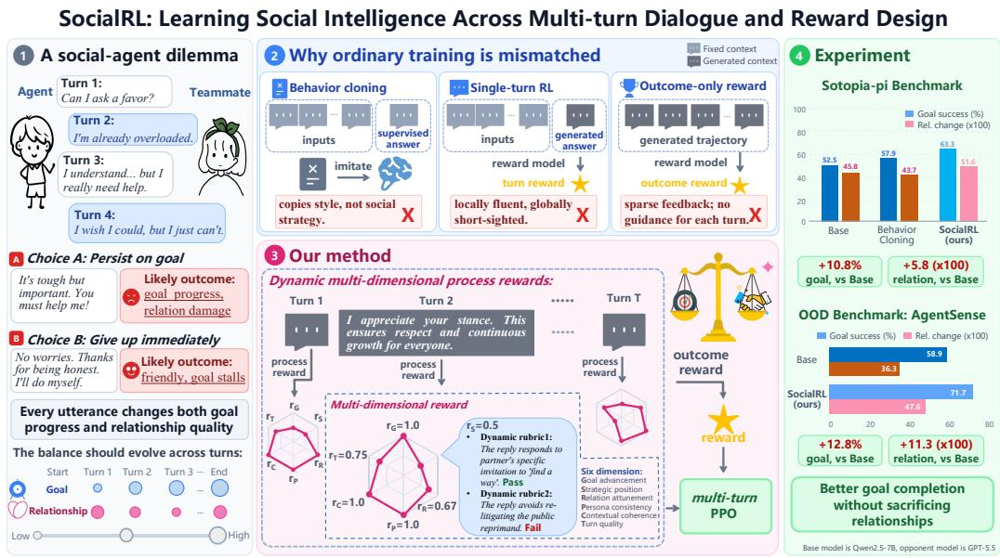  
Figure 1: Overview of the SocialRL motivation and solution. Social dialogue requires agents to balance private goals with relationship management over multi-turn interactions. Prior single-turn reinforcement learning or sparse outcome reward methods provide limited long-horizon planning, while SocialRL combines multi-turn reinforcement learning with process rewards.

To address these challenges, we introduce SocialRL, a multi-turn reinforcement learning framework with a multi-dimensional reward system for multi-turn social dialogue, which has two core innovations:

1. Multi-turn trajectory optimization. We treat multi-turn conversation trajectories as the optimization unit and train with PPO online method. A value network estimates returns from the turn-level reward sequence, allowing the policy to optimize goal pursuit and relationship maintenance over complete dialogues rather than isolated responses.

2. Multi-dimensional dynamic process rewards. We decompose the goal-relationship trade-off into six process reward dimensions: goal advancement and strategic positioning on the goal side (Locke & Latham, 1990; Kellermann, 1992; Berger, 1997), relational attunement and persona consistency on the relationship side (Stafford & Canary, 1991; Goffman, 1959), and contextual coherence and turn quality as enabling conditions for both (Grice, 1975; Sacks et al., 1974). A reward model generates context-specific scoring criteria for each dimension after every turn, while a stage-aware weight schedule adapts priorities across dialogue phases, prioritizing relationship-building early, goal advancement mid-way, and balanced closure near the end, grounded in classic theories such as Bales’s Interaction Process Analysis (Bales, 1950) and Knapp’s relational stage model (Knapp, 1978).

Large-scale experiments are conducted on SOTOPIA (Zhou et al., 2024a), SOTOPIA-π (Wang et al., 2024), and AgentSense (Mou et al., 2025). After aligning the [0, 10] SOTOPIA-All and SOTOPIA-Hard scores to percentage-point units, SocialRL improves Goal Achievement by 9.2 percentage points on average across the four benchmarks relative to the corresponding Base models.

Our main contributions are as follows. (1) We apply multi-turn reinforcement learning to social dialogue, enabling long-horizon planning that balances goal pursuit and relationship management. (2) We construct a multi-dimensional process reward system whose six dimensions are grounded in the goal-relationship structure of social dialogue quality, combined with a stage-aware weight schedule that adapts to shifting priorities across dialogue phases. (3) Our trained policies outperform the compared non-commercial baselines on SOTOPIA series and AgentSense tasks, while commercial reference models remain an upper bound in several settings.

Table 1: Comparison of social dialogue optimization methods discussed in Related Work.
<table><tr><td>Method</td><td>Unit</td><td>Feedback / reward</td><td>Value model</td></tr><tr><td colspan="4">Imitation</td></tr><tr><td>BC</td><td>Single-turn</td><td>Expert demonstrations</td><td>None</td></tr><tr><td colspan="4">Preference / reward design</td></tr><tr><td>SDPO</td><td>Segment</td><td>Preference pairs</td><td>None</td></tr><tr><td>ARIA</td><td>Multi-turn</td><td>Intention-space reward aggregation</td><td>None</td></tr><tr><td>SAVOIR</td><td>Multi-turn</td><td>Expected-utility Shapley attribution</td><td>Utterance reward model</td></tr><tr><td colspan="4">Single-turn reinforcement learning</td></tr><tr><td>Sotopia-RL (GRPO) Single-turn</td><td></td><td>Reward-model scores</td><td>GRPO normalization</td></tr><tr><td colspan="4">Multi-turn reinforcement learning</td></tr><tr><td>ArCHer</td><td>Multi-turn</td><td>Macro-level returns</td><td>Macro-level value function</td></tr><tr><td>SVPO</td><td>Multi-step</td><td>Step-level preference pairs</td><td>Explicit value model</td></tr><tr><td>REFUEL</td><td>Multi-turn</td><td>Relative future-return regression</td><td>Relative Q estimation</td></tr><tr><td>OMAR</td><td>Multi-turn</td><td>Multi-agent self-play</td><td>Value estimates with GAE</td></tr><tr><td>SocialRL</td><td>Full trajectory</td><td>Multi dimension process + outcome rewards</td><td>PPO value network</td></tr></table>

## 2 RELATED WORK

Social intelligence requires language agents to infer intent, track interaction state, and plan longhorizon strategies while balancing private goals with relationship management.

Social Intelligence of LLMs. Recent benchmarks instantiate this challenge in interactive social scenarios. SOTOPIA (Zhou et al., 2024a) and AgentSense (Mou et al., 2025) cover negotiation, empathy, and information verification, while ToMBench (Chen et al., 2024b) probes theory-of-mind skills; Lifelong-SOTOPIA (Goel & Zhu, 2025) extends evaluation to long-term, multi-scenario relationships. These environments provide standardized, human-aligned evaluation, but successful agents must reason over multi-turn trajectories rather than isolated turns.

Beyond benchmark design, a second line of work improves social behavior without online value modeling, via imitation, preference learning, or reward redesign. Behavior cloning from the expert trajectories in SOTOPIA-π (Wang et al., 2024) is fluent but limited by data coverage. SDPO (Kong et al., 2025) applies segment-level preference optimization, ARIA (Yang et al., 2025) aggregates rewards in an intention space, and SAVOIR (Feng et al., 2026) attributes multi-turn outcomes to utterances via expected utility and Shapley values. These give finer supervision, but static demonstrations, preferences, or post-hoc attribution are insufficient for open-ended dialogue whose objectives are multi-dimensional and change in relative importance across stages.

Reinforcement Learning for LLMs. Reinforcement learning training (Ouyang et al., 2022) optimizes interaction outcomes beyond fixed demonstrations. Single-turn reinforcement learning methods such as Sotopia-RL (Yu et al., 2025), which applies GRPO (Shao et al., 2024), optimize each utterance independently and thus miss how early actions shape later social outcomes. Recent methods extend reinforcement learning or value learning to longer sequences: ArCHer (Zhou et al., 2024b) learns a high-level value function over interaction turns, SVPO (Chen et al., 2024a) learns step-level preferences and values for mathematical reasoning, REFUEL (Gao et al., 2025) regresses relative future returns in multi-turn RLHF, and OMAR (Jiang et al., 2026) trains conversational agents via multi-agent self-play. Yet sparse outcome rewards still give high-variance value estimates, and none explicitly model the stage-dependent goal–relationship trade-off.

In contrast, we jointly optimize full multi-turn trajectories and dense process rewards; as Table 1 shows, no prior method combines all three.

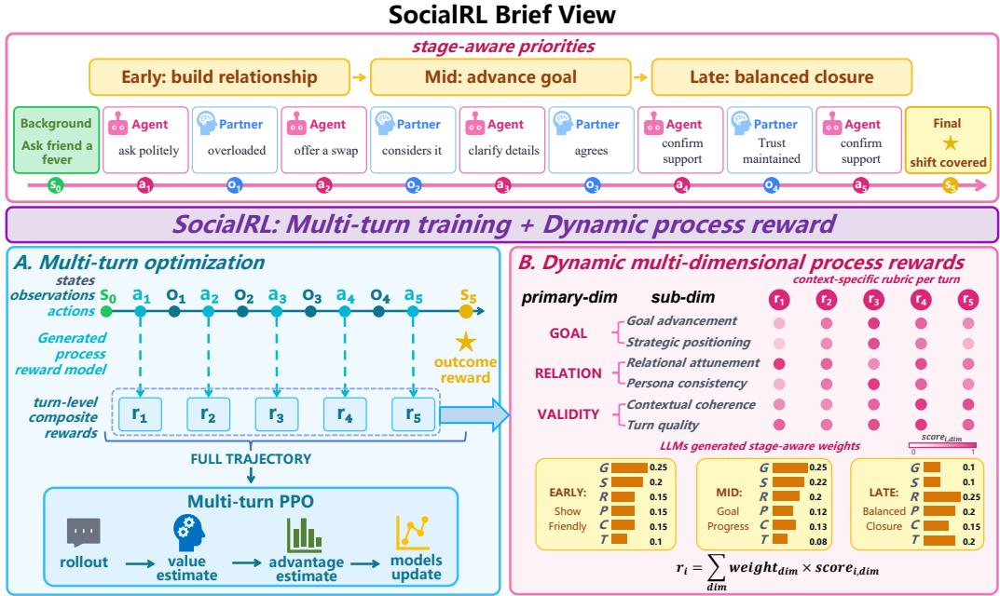  
Figure 2: SocialRL has two core components. Multi-turn trajectory optimization uses a value network, GAE, and PPO to estimate returns from turn-level rewards and optimize complete dialogues. Dynamic process reward design scores each policy utterance along six social dimensions, applies context-inferred stage-aware weights, and combines dense process feedback with outcome reward at the final turn.

## 3 SOCIALRL

SocialRL trains dialogue policies with multi-turn reinforcement learning. We model each interaction as a finite-horizon dialogue MDP, optimize multi-turn trajectories with PPO, and compute dense process rewards from multi-dimensional social feedback with stage-aware weights. Figure 2 summarizes the overall training framework.

## 3.1 TASK FORMULATION

Each task instance is a triple $( S , G , C )$ , where S is the scenario, G is the agent’s private social goal, and $C$ contains persona information for both parties. We model the interaction as a finite-horizon MDP (Sutton & Barto, 2018; Puterman, 1994) $\mathcal { M } = ( S , \mathcal { A } , P , r , \gamma , \rho _ { 0 } , M )$ . The state contains $( S , G , C )$ and the dialogue history; actions are tokens grouped into utterances; $P$ appends both the agent utterance and the counterpart response; γ is the discount factor, $\rho _ { 0 }$ is the initial-state distribution, and M is the maximum number of turns. Rewards are assigned at the utterance level: tokens within a turn receive zero reward, and the completed utterance receives $r _ { m } \in [ - R _ { \mathrm { m a x } } , R _ { \mathrm { m a x } } ]$

Thus a trajectory is $\tau \ = \ \left( s _ { 0 } , \ \mathbf { a } _ { 0 } , \ r _ { 1 } , \ s _ { 1 } , \ \ldots , \ \mathbf { a } _ { M } , \ r _ { M } , \ s _ { M } \right)$ , with utterance likelihood $\begin{array} { r } { \pi _ { \boldsymbol { \theta } } ( \mathbf { a } _ { m } \mid s _ { m - 1 } ) = \prod _ { t = 1 } ^ { L _ { m } } \pi _ { \boldsymbol { \theta } } \Big ( a _ { t } ^ { ( m ) } \mid s _ { m - 1 } , a _ { < t } ^ { ( m ) } \Big ) } \end{array}$ , where $L _ { m }$ is the length of utterance $m , \ a _ { t }$ is the $t ^ { t h }$ token of utterance. Besides, a trajectory may terminate early after goal completion. With the composite reward $r _ { m } = \tilde { R } _ { m }$ defined in Section 3.3, the policy maximizes $J ( \theta ) = \mathbb { E } _ { \tau \sim \pi _ { \theta } } \big [ R ( \tau ) \big ]$ The counterpart’s private goal is hidden and their responses are stochastic, making conversation level optimization under evolving dialogue states essential.

## 3.2 TRAINING ALGORITHM

SocialRL uses PPO (Schulman et al., 2017) over multi-turn dialogue trajectories. For each scenario, the current policy interacts with the counterpart for up to M turns; after rollout, each utterance

receives the composite reward $\tilde { R } _ { t }$ from Section 3.3. A value network estimates future returns from these turn-level rewards to compute advantages for trajectory optimization.

We compute Generalized Advantage Estimation (GAE) (Schulman et al., 2016) from turn-level rewards:

$$
\delta _ { t } = \tilde { R } _ { t } + \gamma V _ { \phi } ( s _ { t + 1 } ) - V _ { \phi } ( s _ { t } ) ,\tag{1}
$$

$$
\hat { A } _ { t } = \sum _ { l = 0 } ^ { M - t } ( \gamma \lambda ) ^ { l } \delta _ { t + l } ,\tag{2}
$$

where $V _ { \phi } ( s _ { t + 1 } ) ~ = ~ 0$ at the final turn and $\lambda \ : = \ : 0 . 9 5$ . Unlike token-level RLHF, we treat each utterance as one optimization unit: all tokens in the utterance share the same reward and advantage. The clipped policy objective is

$$
L ^ { \mathrm { C L I P } } ( \boldsymbol { \theta } ) = \mathbb { E } _ { t } \Big [ \operatorname* { m i n } \big ( \rho _ { t } ( \boldsymbol { \theta } ) \hat { A } _ { t } , \mathrm { c l i p } ( \rho _ { t } ( \boldsymbol { \theta } ) , 1 - \epsilon , 1 + \epsilon ) \hat { A } _ { t } \big ) \Big ] ,\tag{3}
$$

where $\rho _ { t } ( \theta ) = \pi _ { \theta } ( a _ { t } \mid s _ { t } ) / \pi _ { \theta _ { \mathrm { o l d } } } ( a _ { t } \mid s _ { t } )$ is the utterance likelihood ratio and $\epsilon = 0 . 2$ . The value network is trained with

$$
\mathcal { L } ^ { V } ( \phi ) = \mathbb { E } _ { t } \big [ ( V _ { \phi } ( s _ { t } ) - G _ { t } ) ^ { 2 } \big ] ,\tag{4}
$$

where $\begin{array} { r } { G _ { t } = \sum _ { l = 0 } ^ { M - t } \gamma ^ { l } \tilde { R } _ { t + l } } \end{array}$ is the discounted return from turn t.

We use PPO rather than GRPO (Shao et al., 2024) because social dialogue rewards are delayed and strongly state-dependent. GRPO normalizes rewards across a group of sampled trajectories and replaces PPO’s state baseline with a group-level baseline. For turn m, PPO uses

$$
b _ { m } ^ { \mathrm { P P O } } = V ^ { \pi } ( s _ { m - 1 } ) = \mathbb { E } [ G _ { m } \mid s _ { m - 1 } ] ,\tag{5}
$$

where $\begin{array} { r } { G _ { m } = \sum _ { k = m } ^ { M } \gamma ^ { k - m } r _ { k } } \end{array}$ . GRPO instead uses

$$
b _ { m } ^ { \mathrm { G R P O } } = \mu _ { 0 } D _ { m } , \qquad D _ { m } = \sum _ { k = m } ^ { M } \gamma ^ { k - m } ,\tag{6}
$$

where $\mu _ { 0 }$ is the large-group mean of the turn-level rewards. GRPO has a finite-group correction that decreases as group size grows, while PPO’s state-only baseline leaves the reference gradient target unchanged. The key long-horizon difference is variance: under the standard policy-gradient baseline approximation, the unnormalized GRPO estimator adds a mismatch term whenever dialogue states with the same turn index have different values:

$$
\widetilde V _ { \mathrm { G R P O } } \approx V _ { \mathrm { P P O } } + \Delta , \qquad \Delta = \sum _ { m = 1 } ^ { M } \mathbb { E } \Big [ \| U _ { m } \| ^ { 2 } \big ( V ^ { \pi } ( s _ { m - 1 } ) - \mu _ { 0 } D _ { m } \big ) ^ { 2 } \Big ] \geq 0 ,\tag{7}
$$

where $U _ { m } = \nabla _ { \theta } \log \pi _ { \theta } ( a _ { m } \mid s _ { m - 1 } )$ . The actual normalized GRPO variance additionally carries the global factor $1 / \sigma _ { 0 } ^ { 2 } .$ . Since the same turn index can correspond to negotiation, repair, compromise, or failure, the baseline-mismatch term becomes more pronounced in longer-horizon dialogues. Appendix A provides the derivation.

## 3.3 REWARD DESIGN

Social dialogue requires feedback on both goal progress and relationship management. Since outcome-only scores provide no direct supervision for intermediate social behavior over 10–20 turns, SocialRL uses a multi-dimensional process reward and combines it with the outcome reward (Lightman et al., 2023). At turn t, the composite reward is

$$
\tilde { R } _ { t } = \left\{ \begin{array} { l l } { \alpha \cdot R _ { \mathrm { p r o c e s s } , t } + \beta \cdot R _ { \mathrm { o u t c o m e } } , } & { t = T , } \\ { \alpha \cdot R _ { \mathrm { p r o c e s s } , t } , } & { t < T , } \end{array} \right.\tag{8}
$$

where $T$ is the final turn, $R _ { \mathrm { p r o c e s s } , t }$ scores the current utterance, $R _ { \mathrm { o u t c o m e } }$ scores final success, and validation selects $\alpha = 0 . 3 , \dot { \beta } = 1$ . The process reward is

$$
R _ { \mathrm { p r o c e s s } , t } = \sum _ { i = 1 } ^ { 6 } w _ { t , i } r _ { t , i } ,\tag{9}
$$

with normalized non-negative weights

$$
\sum _ { i = 1 } ^ { 6 } w _ { t , i } = 1 , \qquad w _ { t , i } \geq 0 .\tag{10}
$$

Intermediate turns therefore still produce useful gradients even when final success is not yet known or the dialogue ultimately fails.

Each utterance is scored along six dimensions: goal advancement, strategic positioning, relational attunement, persona consistency, contextual coherence, and turn quality. These dimensions separate goal-side progress, relationship-side maintenance, and general conversational validity, drawing on goal-setting theory (Locke & Latham, 1990), strategic communication (Kellermann, 1992; Berger, 1997), relationship maintenance (Stafford & Canary, 1991), self-presentation (Goffman, 1959), relevance (Grice, 1975), and conversation analysis (Sacks et al., 1974).

To make scoring context-specific, we use a rubric mechanism inspired by LLM-based evaluation and criterion-guided feedback (Zheng et al., 2023; Liu et al., 2023; Bai et al., 2022). Given scenario S, persona C, goal G, history $H _ { t } ,$ and utterance $a _ { t }$ , the reward model generates 2–4 binary criteria for each dimension and judges whether each criterion passes. The dimension score is the pass rate:

$$
r _ { t , i } = \frac { 1 } { M _ { i } } \sum _ { j = 1 } ^ { M _ { i } } \mathrm { p a s s } _ { i , j } ,\tag{11}
$$

where pass $_ { i , j } \in \{ 0 , 1 \}$ . Binary criteria are more stable than abstract scalar judgments and make reward feedback inspectable.

Finally, SocialRL changes dimension weights across dialogue stages. Following interaction and relational-stage theories (Bales, 1950; Knapp, 1978), early turns emphasize coherence, persona, and rapport; middle turns emphasize goal advancement and strategy; late turns balance closure with relationship preservation. The reward model infers the current stage from context rather than fixed turn-ratio thresholds:

$$
\phi _ { t } = f _ { \mathrm { s t a g e } } ( S , C , G , H _ { t } , a _ { t } ) , \qquad \phi _ { t } \in \{ \mathrm { E a r l y , M i d , L a t e } \} .\tag{12}
$$

Given $\phi _ { t } ,$ it proposes $\hat { \mathbf { w } } _ { t } ,$ which is sanitized by whitelist filtering, clipping, caps, fallback priors, overflow redistribution, and normalization before computing $R _ { \mathrm { p r o c e s s } , t } .$

## 4 EXPERIMENTS

We evaluate SocialRL on four benchmarks with four trained backbones and four opponent models. We ask whether it improves social dialogue performance, which design choices account for the gains, and whether it induces long-horizon strategies.

## 4.1 EXPERIMENTAL SETUP

We use two judge-based metrics (Zheng et al., 2023; Liu et al., 2023): Goal Achievement and Relationship Change. Goal Achievement is reported as a percentage on SOTOPIA-π and AgentSense, and as a [0, 10] score on SOTOPIA-All and SOTOPIA-Hard; Relationship Change is reported after multiplying the SOTOPIA-π and AgentSense values by 100, while the original SOTOPIA benchmarks retain their [−5, 5] scale. Unless otherwise stated, reported means and standard deviations are computed from five independent repeated experiments of each policy–opponent pair. Prompts are provided in Appendix B.

We use three complementary interactive benchmarks. SOTOPIA-π is constructed from cleaned and filtered synthetic dialogues (Wang et al., 2024); it contains 1,773 scenarios across seven social contexts, including 259 held-out test scenarios. Its multi-turn interactions evaluate whether an agent can pursue a social goal while maintaining the counterpart’s relationship quality. SOTOPIA-All and SOTOPIA-Hard are based on the open-ended SOTOPIA environment (Zhou et al., 2024a). SOTOPIA-All covers 90 diverse everyday social scenarios, whereas SOTOPIA-Hard is a 14-scenario subset selected for higher conflict, ambiguous intentions, and subtle social norms. AgentSense is an independent benchmark built bottom-up from social situations extracted from movie and television scripts (Mou et al., 2025). It provides 1,225 scenarios organized into 245 templates with synthetic character instantiations, and evaluates both goal completion and latent social reasoning, such as inferring private information from dialogue.

Table 2: Results on the SOTOPIA-π benchmark: Goal Achievement (%) / Relationship Change (×100) for each policy–opponent pair. Values are means across repeated experiments; complete mean ± SD results are in Appendix 8. Relationship Change values are multiplied by 100. Bold denotes the best SocialRL model per metric and opponent column. SocialRL has improved performance on each same-backbone network and in the average results among non-commercial methods.
<table><tr><td></td><td colspan="3">Opponent Model</td><td></td></tr><tr><td>Method</td><td>Qwen2.5-7B Qwen3-8BQwen3.5-35B</td><td></td><td>GPT-5.5</td><td>Avg.</td></tr><tr><td>Base (Qwen2.5-7B)</td><td>33.5 / 23.5 38.4 / 22.8</td><td>44.6 / 32.1</td><td>52.5 / 45.8</td><td>42.3 / 31.1</td></tr><tr><td>Base (Qwen3-8B)</td><td>43.2 / 13.6 44.2 / 8.3</td><td>55.0 / 13.7</td><td>60.9 / 24.8</td><td>50.8 / 15.1</td></tr><tr><td>Base (LLaMA3.1-8B)</td><td>44.3 / 21.7 47.1 / 19.4</td><td>55.0 / 17.3</td><td>63.2 / 37.1</td><td>52.4 / 23.9</td></tr><tr><td>Base (Gemma-3-4B)</td><td>22.0 / -10.6 30.3 / -6.3</td><td>32.1 / -15.0</td><td>37.6 / -5.4 30.5 / -9.3</td><td></td></tr><tr><td>BC (Qwen2.5-7B)</td><td>38.9 / 27.2 43.0 / 23.6</td><td>49.9 / 22.3</td><td>57.9 / 43.7 47.4/29.2</td><td></td></tr><tr><td>SDPO (Qwen2.5-7B)</td><td>33.1 / 24.0 42.3 / 23.9</td><td>45.3 / 31.1</td><td>55.0 / 44.943.9 / 31.0</td><td></td></tr><tr><td>Sotopia-RL (Qwen2.5-7B)</td><td>41.2 / 26.0 43.7 / 20.9</td><td>49.0 / 17.8</td><td>60.5 / 39.4 48.6 / 26.0</td><td></td></tr><tr><td>ArCHer (Qwen2.5-7B)</td><td>31.6 / 22.6 39.6 / 22.8</td><td>46.6 / 31.3</td><td></td><td>48.6 /41.041.6 / 29.4</td></tr><tr><td>SocialRL (Qwen2.5-7B)</td><td>43.3 / 28.2 45.8 / 26.9</td><td>56.7 / 36.3</td><td>63.3 / 51.6 52.3 / 35.8</td><td></td></tr><tr><td>SocialRL (Qwen3-8B)</td><td>47.7 / 18.8 48.1 / 20.8</td><td>61.0/18.1</td><td>62.2 / 24.9 54.7 /20.6</td><td></td></tr><tr><td>SocialRL (LLaMA3.1-8B)</td><td>50.2 / 31.2 54.3 / 27.6</td><td>63.6 / 24.9</td><td>70.2 / 53.059.6 /34.1</td><td></td></tr><tr><td>SocialRL (Gemma-3-4B)</td><td>42.4 /10.6 48.0 / 6.4</td><td>58.6 / 13.7</td><td>60.3 / 22.9</td><td>52.3 / 13.4</td></tr><tr><td>GPT-5.5 (reference)</td><td></td><td></td><td></td><td></td></tr><tr><td></td><td>57.0/31.6 64.9 / 32.2</td><td>75.3 / 40.1</td><td></td><td>78.9/51.4 69.0/38.8</td></tr></table>

We train Qwen2.5-7B-Instruct, Qwen3-8B, LLaMA3.1-8B, and Gemma-3-4B policies against Qwen2.5-7B, Qwen3-8B, Qwen3.5-35B, and GPT-5.5 opponents. Baselines include base models, Behavior Cloning (BC), Sotopia-RL (Yu et al., 2025), SDPO (Kong et al., 2025), ArCHer (Zhou et al., 2024b), and commercial reference models. Implementation details are in Appendix C.

## 4.2 MAIN RESULTS

SocialRL improves goal achievement and relationship maintenance. We first evaluate the main two-party setting on SOTOPIA-π (Table 2). The table reports Goal Achievement success rates and Relationship Change across four opponents. Across opponents, SocialRL with the Qwen2.5- 7B backbone averages 52.3% / 0.358 in Goal Achievement / Relationship Change, compared with 42.3% / 0.311 for Base. The strongest trained-model average is obtained by the LLaMA3.1-8B policy (59.6% / 0.341), while GPT-5.5 reaches 69.0% / 0.388 as a commercial reference.

Across opponents, LLaMA3.1-8B has the strongest trained-model average in Goal Achievement (59.6%), while Qwen2.5-7B leads in Relationship Change (0.358). The smaller Gemma-3-4B backbone also benefits substantially: its average rises from 30.5%/ − 0.093 for Base to 52.3%/0.134 with SocialRL, improving by 21.8 percentage points in Goal Achievement and 0.227 in the displayed Relationship Change scale.

As a separate and out of distribution test of multi-party interaction and latent social reasoning, AgentSense results are shown in Table 3. SocialRL with Qwen3-8B reaches 80.5%/0.444 on average, exceeding the corresponding Base model by 7.2 percentage points in Goal Achievement and 0.293 in the displayed Relationship Change scale. The improvement is especially clear for Gemma-3-4B, which rises from 46.3%/0.065 to 68.1%/0.234. These results extend the SOTOPIA-π findings to script-derived, multi-party scenarios where success also requires inferring information that is not stated explicitly. we report SOTOPIA-All and SOTOPIA-Hard in Appendix D.

To summarize performance across settings, we use each table’s opponent-averaged Goal Achievement and compute the absolute SocialRL–Base difference for the same backbone, then average across the four trained backbones. This yields gains of 10.725 points on SOTOPIA-π, 9.625 on

Table 3: AgentSense results: Goal Achievement Success Rate (%) / Relationship Change (×100) across multi-party scenarios. Bold denotes the best SocialRL model per opponent. Values are means across five independent repeats; complete mean ± SD results are in Appendix 9. Relationship Change values are multiplied by 100. SocialRL consistently outperforms BC, SDPO, and Sotopia RL on both metrics.
<table><tr><td rowspan="2">Method</td><td colspan="3">Opponent Model</td><td rowspan="2">Avg.</td></tr><tr><td>Qwen2.5-7B Qwen3-8B Qwen3.5-35B</td><td></td><td>GPT-5.5</td></tr><tr><td>Base (Qwen2.5-7B)</td><td>53.7 / 32.8</td><td>55.7 / 33.6</td><td>65.2 / 40.9</td><td>58.9 / 36.3 58.4 / 35.9</td><td></td></tr><tr><td>Base (Qwen3-8B)</td><td>67.8 / 33.7</td><td>72.9 / 38.9</td><td>69.6 / 35.8</td><td>82.8 / 48.4 73.3 / 39.2</td><td></td></tr><tr><td>Base (LLaMA3.1-8B)</td><td>83.2 / 48.1</td><td>85.2 / 49.2</td><td>86.2 / 51.9</td><td>89.4 / 58.1 86.0 / 51.8</td><td></td></tr><tr><td>Base (Gemma-3-4B)</td><td>44.4 / 6.3</td><td>45.4 / 6.1</td><td>48.1 / 9.7</td><td>47.5 / 3.7</td><td>46.3 / 6.5</td></tr><tr><td>BC (Qwen2.5-7B)</td><td>60.3 / 36.7</td><td>56.7 / 32.8</td><td>63.1/37.9</td><td>67.0 / 46.9 61.8 / 38.6</td><td></td></tr><tr><td>SDPO (Qwen2.5-7B)</td><td>57.6 / 35.8</td><td>58.0 /36.3</td><td>63.0 / 37.4</td><td>66.7 / 48.1 61.3 / 39.4</td><td></td></tr><tr><td>Sotopia-RL (Qwen2.5-7B)</td><td>63.5 / 37.1</td><td>59.3 / 33.5</td><td>63.9 / 35.8</td><td>69.6 / 49.4 64.1 / 38.9</td><td></td></tr><tr><td>ArCHer (Qwen2.5-7B)</td><td>51.1 /31.9</td><td>52.6 / 32.0</td><td>60.9 / 38.9</td><td>58.9 / 35.7 55.9 / 34.6</td><td></td></tr><tr><td>SocialRL (Qwen2.5-7B)</td><td>61.0/ 38.6</td><td>62.2 / 38.5</td><td>72.1/ 45.9</td><td>71.7 / 47.6 66.7 / 42.7</td><td></td></tr><tr><td>SocialRL (Qwen3-8B)</td><td>76.7 / 39.5</td><td>77.1 / 40.9</td><td>82.0 / 46.3</td><td>86.0 / 50.7 80.5 / 44.4</td><td></td></tr><tr><td>SocialRL (LLaMA3.1-8B)</td><td>84.3 / 48.3</td><td>85.9 / 50.1</td><td>87.6 / 52.4</td><td>90.9 / 58.9 87.2 / 52.4</td><td></td></tr><tr><td>SocialRL (Gemma-3-4B)</td><td>66.7 / 22.5</td><td>66.4 / 22.3</td><td>68.8 / 24.7</td><td>70.4 / 23.9 68.1 / 23.4</td><td></td></tr><tr><td></td><td></td><td></td><td></td><td></td><td></td></tr><tr><td>GPT-5.5 (reference)</td><td>88.1/ 45.6 92.2/ 48.9</td><td></td><td>93.8 / 52.6</td><td></td><td>92.5 / 48.9 91.7 / 49.0</td></tr></table>

Goal achievement  
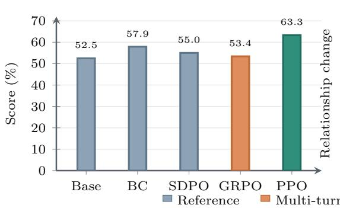

Relationship maintenance  
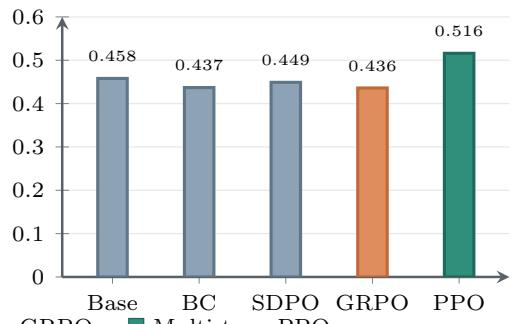  
Figure 3: Contextual comparison of Qwen2.5-7B policies on the SOTOPIA-π benchmark against GPT-5.5. Goal values are percentages; Relationship Change is reported on its original [−1, 1] scale. Base, BC, and SDPO are reference methods; the controlled algorithm comparison uses SocialRL’s full reward design with both multi-turn GRPO and multi-turn PPO.

AgentSense, 0.9275 on SOTOPIA-All, and 0.7125 on SOTOPIA-Hard. Because the latter two benchmarks use [0, 10] Goal Achievement scores, we multiply their gains by 10 before averaging, which places all four benchmarks on a percentage-point scale. The resulting overall improvement is 9.2 percentage points.

## 4.3 ABLATION EXPERIMENTS

Algorithm choice, process rewards, and dynamic weights matter. Figure 3 compares Qwen2.5- 7B policies against GPT-5.5. With the same SocialRL reward design, PPO exceeds multi-turn GRPO by 9.9 percentage points in Goal Achievement and 0.080 in Relationship Change. The remaining ablations are in Appendix E: process rewards have the largest effect, goal-oriented dimensions drive task success, relational attunement preserves relationship quality, and dynamic weights outperform fixed schedules.

## 4.4 HUMAN ALIGNMENT EVALUATION

To assess whether the automatic reward models agree with human judgments, we conduct an independent human-alignment audit on 100 dialogue trajectories. For PRM, the audit covers 497 turn-level process records and yields a correlation of 0.816 between PRM scores and aggregated human ratings. For ORM, the audit covers 100 dialogue-level judgments and yields correlations of 0.930 for Goal Achievement and 0.946 for Relationship Change. All correlations are computed after the corresponding score transformations and indicate strong agreement between the automatic evaluators and human assessment.

## 4.5 IN-DEPTH CASE ANALYSIS

SocialRL learns long-horizon social strategy. We analyze a representative SOTOPIA-π boardgame dialogue in which Ethan must speed up Benjamin’s play without damaging rapport. Representative turns and extended analysis are provided in Appendix F.

The Base model is polite but reactive: it repeatedly agrees with Benjamin, who independently proposes the one-minute limit. The pacing solution therefore comes from Benjamin rather than Ethan, yielding a goal score of 0.0.

SocialRL turns the opening into an explicit rule: “Let’s set a quick timer for your next turn,” and ratifies Benjamin’s “ninety seconds” proposal with “Deal. Ninety seconds, and no deep dives.” Benjamin later adopts the rule and requests future enforcement. The dialogue reaches a goal score of 1.0 while preserving Base’s relationship delta (+0.6).

Thus, SocialRL converts an opening into a face-saving commitment and maintains it across later turns, improving goal success without sacrificing rapport.

## 5 CONCLUSION

We presented SocialRL, a multi-turn reinforcement learning framework for social dialogue that addresses the tension between goal pursuit and relationship management. SocialRL optimizes complete dialogue trajectories with PPO and a value network, while its multi-dimensional process reward system provides dense turn-level feedback through rubric-based scoring and stage-aware weights. Experiments on the SOTOPIA-π benchmark, SOTOPIA-All, SOTOPIA-Hard, and AgentSense show improvements over the compared non-commercial imitation-learning, reinforcement-learning, and preference-learning baselines across multiple opponents and trained backbones; commercial reference models remain stronger in several settings. Remaining limitations include over-compromise, rigidity under unexpected opponent moves, and memory decay in very long dialogues, suggesting future work on goal-floor constraints, broader training distributions, opponent modelling, and memory-augmented policies.

## REFERENCES

Yuntao Bai, Saurav Kadavath, Sandipan Kundu, Amanda Askell, Jackson Kernion, Andy Jones, Anna Chen, Anna Goldie, Azalia Mirhoseini, Cameron McKinnon, et al. Constitutional AI: Harmlessness from AI feedback. arXiv preprint arXiv:2212.08073, 2022.

Robert F. Bales. Interaction Process Analysis: A Method for the Study of Small Groups. Addison-Wesley, Cambridge, MA, 1950.

Charles R. Berger. Planning Strategic Interaction: Attaining Goals Through Communicative Action. Lawrence Erlbaum Associates, Mahwah, NJ, 1997.

Guoxin Chen, Minpeng Liao, Chengxi Li, and Kai Fan. Step-level value preference optimization for mathematical reasoning. In Findings of the Association for Computational Linguistics: EMNLP 2024, pp. 7889–7903. Association for Computational Linguistics, 2024a. doi: 10.18653/v1/2024.findings-emnlp.463. URL https://aclanthology.org/2024. findings-emnlp.463/.

Zhuang Chen, Jialiang Shi, Zhicheng Liu, Mengting Xu, Yijun Guo, Zhengyang Wang, Jiawen Gao, Yue Shao, and Bing Liu. ToMBench: Benchmarking theory of mind in large language models. In Proceedings of the 62nd Annual Meeting of the Association for Computational Linguistics, pp. 4280–4302, 2024b.

Xiachong Feng, Yi Jiang, Xiaocheng Feng, Deyi Yin, Libo Qin, Yangfan Ye, Lei Huang, Weitao Ma, Yuxuan Gu, Chonghan Qin, Bing Qin, and Lingpeng Kong. SAVOIR: Learning social savoir-faire via shapley-based reward attribution. In Findings of the Association for Computational Linguistics: ACL 2026, pp. 14276–14290. Association for Computational Linguistics, 2026. doi: 10.18653/v1/2026.findings-acl.699. URL https://aclanthology.org/ 2026.findings-acl.699/.

Zhaolin Gao, Wenhao Zhan, Jonathan D. Chang, Gokul Swamy, Kiante Brantley, Jason D. Lee, and´ Wen Sun. Regressing the relative future: Efficient policy optimization for multi-turn RLHF. In International Conference on Learning Representations, 2025. URL https://openreview. net/forum?id=cVyELMpMRS.

Hitesh Goel and Hao Zhu. Lifelong-SOTOPIA: Evaluating social intelligence of language agents over lifelong social interactions. arXiv preprint arXiv:2506.12666, 2025.

Erving Goffman. The Presentation of Self in Everyday Life. Doubleday Anchor, New York, 1959.

Evan Greensmith, Peter L. Bartlett, and Jonathan Baxter. Variance reduction techniques for gradient estimates in reinforcement learning. Journal ofMachine Learning Research, 5:1471–1530, 2004.

H. Paul Grice. Logic and conversation. In Peter Cole and Jerry L. Morgan (eds.), Syntax and Semantics, Vol. 3: Speech Acts, pp. 41–58. Academic Press, New York, 1975.

Bowen Jiang, Taiwei Shi, Ryo Kamoi, Yuan Yuan, Camillo J. Taylor, Longqi Yang, Pei Zhou, and Sihao Chen. One model, all roles: Multi-turn, multi-agent self-play reinforcement learning for conversational social intelligence. arXiv preprint arXiv:2602.03109, 2026.

Kathy Kellermann. Communication: Inherently strategic and primarily automatic. Communication Monographs, 59(3):288–300, 1992.

Mark L. Knapp. Social Intercourse: From Greeting to Goodbye. Allyn and Bacon, Boston, MA, 1978.

Aobo Kong, Wentao Ma, Shiwan Zhao, Yongbin Li, Yuchuan Wu, Ke Wang, Xiaoqian Liu, Qicheng Li, Yong Qin, and Fei Huang. SDPO: Segment-level direct preference optimization for social agents. In Proceedings of the 63rd Annual Meeting of the Association for Computational Linguistics (Volume 1: Long Papers), pp. 12409–12423. Association for Computational Linguistics, 2025. doi: 10.18653/v1/2025.acl-long.607. URL https://aclanthology.org/2025. acl-long.607/.

Hunter Lightman, Vineet Kosaraju, Yura Burda, Harri Edwards, Bowen Baker, Teddy Lee, Jan Leike, John Schulman, Ilya Sutskever, and Karl Cobbe. Let’s verify step by step. arXiv preprint arXiv:2305.20050, 2023.

Yang Liu, Dan Iter, Yichong Xu, Shuohang Wang, Ruochen Xu, and Chenguang Zhu. G-Eval: NLG evaluation using GPT-4 with better human alignment. In Proceedings of the 2023 Conference on Empirical Methods in Natural Language Processing, pp. 2511–2522, 2023.

Edwin A. Locke and Gary P. Latham. A Theory of Goal Setting and Task Performance. Prentice-Hall, Englewood Cliffs, NJ, 1990.

Xinyi Mou, Jingcong Liang, Jiayu Lin, Xinnong Zhang, Xiawei Liu, Shiyue Yang, Rong Ye, Lei Chen, Haoyu Kuang, Xuanjing Huang, and Zhongyu Wei. AgentSense: Benchmarking social intelligence of language agents through interactive scenarios. In Proceedings of the 2025 Conference of the Nations of the Americas Chapter of the Association for Computational Linguistics: Human Language Technologies (Volume 1: Long Papers), pp. 4975–5001. Association for Computational Linguistics, 2025. doi: 10.18653/v1/2025.naacl-long.257. URL https://aclanthology.org/2025.naacl-long.257/.

Long Ouyang, Jeff Wu, Xu Jiang, Diogo Almeida, Carroll L. Wainwright, Pamela Mishkin, Chong Zhang, Sandhini Agarwal, Katarina Slama, Alex Ray, et al. Training language models to follow instructions with human feedback. In Advances in Neural Information Processing Systems, volume 35, pp. 27730–27744, 2022.

Martin L. Puterman. Markov Decision Processes: Discrete Stochastic Dynamic Programming. Wiley, New York, 1994.

Harvey Sacks, Emanuel A. Schegloff, and Gail Jefferson. A simplest systematics for the organization of turn-taking for conversation. Language, 50(4):696–735, 1974.

John Schulman, Philipp Moritz, Sergey Levine, Michael Jordan, and Pieter Abbeel. Highdimensional continuous control using generalized advantage estimation. In International Conference on Learning Representations, 2016.

John Schulman, Filip Wolski, Prafulla Dhariwal, Alec Radford, and Oleg Klimov. Proximal policy optimization algorithms. arXiv preprint arXiv:1707.06347, 2017.

Zhihong Shao, Peiyi Wang, Qihao Zhu, Runxin Xu, Junxiao Song, Xiao Bi, Haowei Zhang, Mingchuan Zhang, Y. K. Li, Y. Wu, and Daya Guo. DeepSeekMath: Pushing the limits of mathematical reasoning in open language models. arXiv preprint arXiv:2402.03300, 2024.

Laura Stafford and Daniel J. Canary. Maintenance strategies and romantic relationship type, gender, and relational characteristics. Journal ofSocial and Personal Relationships, 8(2):217–242, 1991.

Richard S. Sutton and Andrew G. Barto. Reinforcement Learning: An Introduction. MIT Press, Cambridge, MA, 2 edition, 2018.

Ruiyi Wang, Haofei Yu, Wenxin Zhang, Zhengyang Qi, Maarten Sap, Yonatan Bisk, Graham Neubig, and Hao Zhu. SOTOPIA-π: Interactive learning of socially intelligent language agents. In Proceedings of the 62nd Annual Meeting of the Association for Computational Linguistics (Volume 1: Long Papers), pp. 12912–12940. Association for Computational Linguistics, 2024. doi: 10.18653/v1/2024.acl-long.698. URL https://aclanthology.org/2024. acl-long.698/.

Ruihan Yang, Yikai Zhang, Aili Chen, Xintao Wang, Jiangjie Chen, Siyu Yuan, Deqing Yang, and Yanghua Xiao. ARIA: Training language agents with intention-driven reward aggregation. In Advances in Neural Information Processing Systems, volume 38, pp. 121608–121640, 2025. doi: 10.52202/085713-3665.

Haofei Yu, Zhengyang Qi, Yining Zhao, Kolby Nottingham, Keyang Xuan, Bodhisattwa Prasad Majumder, Hao Zhu, Paul Pu Liang, and Jiaxuan You. Sotopia-RL: Reward design for social intelligence. arXiv preprint arXiv:2508.03905, 2025.

Lianmin Zheng, Wei-Lin Chiang, Ying Sheng, Siyuan Zhuang, Zhanghao Wu, Yonghao Zhuang, Zi Lin, Zhuohan Li, Dacheng Li, Eric P. Xing, Hao Zhang, Joseph E. Gonzalez, and Ion Stoica. Judging LLM-as-a-judge with MT-Bench and chatbot arena. In Advances in Neural Information Processing Systems, 2023.

Xuhui Zhou, Hao Zhu, Leena Mathur, Daniel Zhang, Luyao Yu, Beatriz Chen, Mohit Bansal, Maarten Sap, Yonatan Goldberg, et al. SOTOPIA: Interactive evaluation for social intelligence in language agents. In International Conference on Learning Representations, 2024a.

Yifei Zhou, Andrea Zanette, Jiayi Pan, Sergey Levine, and Aviral Kumar. ArCHer: Training language model agents via hierarchical multi-turn RL. In Proceedings of the 41st International Conference on Machine Learning, volume 235 of Proceedings of Machine Learning Research, pp. 62178–62209. PMLR, 2024b. URL https://proceedings.mlr.press/v235/ zhou24t.html.

## A THEORETICAL ANALYSIS OF PPO AND GRPO IN MULTI-TURN SOCIAL DIALOGUE

We compare PPO with GAE and GRPO for multi-turn social dialogue optimization under the standard policy-gradient baseline approximation. The argument rests on two properties: gradient bias and gradient variance.

## A.1 NOTATION

Table 4 summarizes the notation used throughout this appendix and the main text.

Table 4: Notation used in the theoretical analysis and the main text.
<table><tr><td>Symbol</td><td>Description</td></tr><tr><td> $\tau$ </td><td>Multi-turn dialogue trajectory  $\boldsymbol \tau = \left( s _ { 0 } , \mathbf { a } _ { 1 } , r _ { 1 } , \ldots , \mathbf { a } _ { M } , r _ { M } , s _ { M } \right)$ </td></tr><tr><td> $M$ </td><td>Number of dialogue turns in a trajectory</td></tr><tr><td> $s _ { m - 1 }$ </td><td>Dialogue state before turn  $m$ </td></tr><tr><td> $\mathbf { a } _ { m }$ </td><td>Utterance (action) generated at turn m</td></tr><tr><td> $r _ { m }$ </td><td>Reward received at turn m</td></tr><tr><td> $\gamma$ </td><td>Discount factor,  $\gamma \in [ 0 , 1 ]$ </td></tr><tr><td> $G _ { m }$ </td><td>Discounted return from turn m,  $\begin{array} { r } { G _ { m } = \sum _ { k = m } ^ { M } \gamma ^ { k - m } r _ { k } } \end{array}$ </td></tr><tr><td> $\pi \theta$ </td><td>Policy (LLM) with parameters θ</td></tr><tr><td> $U _ { m }$ </td><td>Score function  $\nabla _ { \boldsymbol { \theta } } \log \pi _ { \boldsymbol { \theta } } \big ( \mathbf { a } _ { m } \ | \ s _ { m - 1 } \big )$ </td></tr><tr><td> $g _ { \mathrm { M C } } ( \theta )$ </td><td>Monte Carlo policy-gradient target  $\mathbb { E } [ \sum _ { m = 1 } ^ { M } U _ { m } G _ { m } ]$ </td></tr><tr><td> $V ^ { \pi } ( s )$ </td><td>State-value function  $\mathbb { E } [ G _ { m } \mid s _ { m - 1 } = \overleftarrow { s } ]$ </td></tr><tr><td> $Q ^ { \pi } ( s , \mathbf { a } )$ </td><td>State-action value function  $\mathbb { E } [ G _ { m } \mid s _ { m - 1 } = s , \mathbf { a } _ { m } = \mathbf { a } ]$ </td></tr><tr><td> $A ^ { \pi } ( s , \mathbf { a } )$ </td><td>Advantage function  $Q ^ { \pi } ( s , \mathbf { a } ) \dot { - } V ^ { \pi } ( s )$ </td></tr><tr><td> $V _ { \phi }$ </td><td>Learned critic (value network)</td></tr><tr><td> $\delta _ { m }$ </td><td>One-step TD error  $r _ { m } + \gamma V _ { \phi } ( s _ { m } ) - V _ { \phi } ( s _ { m - 1 } )$ </td></tr><tr><td> $A _ { m } ^ { \mathrm { G A E } ( \lambda ) }$ </td><td>GAE advantage at turn m</td></tr><tr><td> $\lambda$ </td><td>GAE bias-variance trade-off parameter,  $\lambda \in [ 0 , 1 ]$ </td></tr><tr><td> $b _ { m }$ </td><td>State-only control-variate baseline for variance reduction</td></tr><tr><td> $G$ </td><td>Number of sampled trajectories per prompt (group size)</td></tr><tr><td> $N$ </td><td>Number of rewards in a group,  $N = G M$ </td></tr><tr><td> $\mu$ </td><td>Empirical group reward mean</td></tr><tr><td> $\sigma$ </td><td>Empirical group reward standard deviation</td></tr><tr><td> $\tilde { r } _ { m } ^ { ( i ) }$ </td><td>Standardized reward  $( r _ { m } ^ { ( i ) } - \mu ) / \sigma$ </td></tr><tr><td> $D _ { m }$ </td><td>Remaining discount mass after turn m,  $\begin{array} { r } { D _ { m } = \sum _ { k = m } ^ { M } \gamma ^ { k - m } } \end{array}$ </td></tr><tr><td> $\mu _ { 0 } , \ \sigma _ { 0 }$ </td><td>Population limits of  $\mu$  and σ as  $G  \infty$ </td></tr><tr><td> $\Sigma$ </td><td>Gradient covariance matrix</td></tr><tr><td> $V$ </td><td>Trace of Σ (total gradient-noise power)</td></tr><tr><td> $B$ </td><td>Gradient signal-to-noise ratio</td></tr><tr><td> $q _ { m }$ </td><td>Per-turn trace-variance contribution of the gradient estimator</td></tr><tr><td> $\delta V _ { m }$ </td><td>GRPO baseline mismatch  $V ^ { \pi } ( s _ { m - 1 } ) - \mu _ { 0 } \bar { D } _ { m }$ </td></tr><tr><td> $\Delta$ </td><td>Accumulated variance gap  $\begin{array} { r } { \sum _ { m = 1 } ^ { M } \mathbb { E } \left[ \| U _ { m } \| ^ { 2 } \delta V _ { m } ^ { 2 } \right] } \end{array}$ </td></tr><tr><td> $\epsilon ( s )$ </td><td>Critic value-estimation error,  $\hat { V } ( s ) = V ^ { \pi } ( s ) + \epsilon ( s )$ </td></tr><tr><td> $L$ </td><td>Mean squared critic error  $\mathbb { E } [ \epsilon ( s ) ^ { 2 } ]$ </td></tr><tr><td> $\Delta _ { \epsilon }$ </td><td>Additional PPO variance induced by critic error</td></tr><tr><td> $\eta$ </td><td>Learning rate</td></tr></table>

## A.2 SETUP AND NOTATION

Consider a trajectory with M dialogue turns:

$$
\tau = ( s _ { 0 } , \mathbf { a } _ { 1 } , r _ { 1 } , s _ { 1 } , \ldots , \mathbf { a } _ { M } , r _ { M } , s _ { M } ) .\tag{13}
$$

Here $s _ { m - 1 }$ is the dialogue state before turn $m , \mathbf { a } _ { m }$ is the utterance generated at that turn, and $r _ { m }$ its reward. The discounted return from turn m is

$$
G _ { m } = \sum _ { k = m } ^ { M } \gamma ^ { k - m } r _ { k } ,\tag{14}
$$

where $\gamma \in [ 0 , 1 ]$ controls how strongly future rewards affect turn m. and the score function for the utterance at turn m is

$$
U _ { m } = \nabla _ { \theta } \log \pi _ { \theta } ( \mathbf { a } _ { m } \mid s _ { m - 1 } ) .\tag{15}
$$

Thus $U _ { m }$ is the gradient direction induced by the sampled utterance. We use the following trajectorylevel Monte Carlo target:

$$
g _ { \mathrm { M C } } ( \theta ) = \operatorname { \mathbb { E } } \left[ \sum _ { m = 1 } ^ { M } U _ { m } G _ { m } \right] .\tag{16}
$$

g is the expected policy-gradient signal used as the common reference for PPO and GRPO. All expectations are on-policy. Assume fixed $M .$ , sufficient finite moments for the sample-standarddeviation expansion, and $\sigma _ { 0 } > 0$ . Treat the turn index as part of the state and define

$$
V ^ { \pi } ( s ) = \mathbb { E } [ G _ { m } \mid s _ { m - 1 } = s ] ,\tag{17}
$$

$$
Q ^ { \pi } ( s , \mathbf { a } ) = \mathbb { E } [ G _ { m } \mid s _ { m - 1 } = s , \mathbf { a } _ { m } = \mathbf { a } ] ,\tag{18}
$$

$$
A ^ { \pi } ( s , { \mathbf a } ) = Q ^ { \pi } ( s , { \mathbf a } ) - V ^ { \pi } ( s ) .\tag{19}
$$

Here $V ^ { \pi }$ is the state value, $Q ^ { \pi }$ is the state-action value, and $A ^ { \pi }$ measures the value of an action relative to the state average.

Lemma 1 (Baseline unbiasedness). For any state-only function $b ( s _ { m - 1 } )$ ,

$$
\hat { g } _ { b } = \sum _ { m = 1 } ^ { M } U _ { m } \left( G _ { m } - b ( s _ { m - 1 } ) \right)\tag{20}
$$

where b is a control-variate baseline used to reduce gradient variance has the same expectation as

$$
\hat { g } _ { \mathrm { M C } } = \sum _ { m = 1 } ^ { M } U _ { m } G _ { m } .\tag{21}
$$

Proof. Conditioning on $s _ { m - 1 }$

$$
\begin{array} { r } { \mathbb { E } \left[ U _ { m } b ( s _ { m - 1 } ) \right] = \mathbb { E } _ { s _ { m - 1 } } \left[ b ( s _ { m - 1 } ) \mathbb { E } _ { { \mathbf a } _ { m } \sim \pi _ { \theta } ( \cdot | s _ { m - 1 } ) } \left[ \nabla _ { \theta } \log \pi _ { \theta } ( { \mathbf a } _ { m } \mid s _ { m - 1 } ) \mid s _ { m - 1 } \right] \right] } \end{array}\tag{22}
$$

$$
= \mathbb { E } _ { s _ { m - 1 } } \left[ b ( s _ { m - 1 } ) \sum _ { \mathbf { a } } \pi _ { \boldsymbol { \theta } } ( \mathbf { a } \mid s _ { m - 1 } ) \nabla _ { \boldsymbol { \theta } } \log \pi _ { \boldsymbol { \theta } } ( \mathbf { a } \mid s _ { m - 1 } ) \right]\tag{23}
$$

$$
= \mathbb { E } _ { s _ { m - 1 } } \bigg [ b ( s _ { m - 1 } ) \sum _ { \mathbf { a } } \nabla _ { \theta } \pi _ { \theta } ( \mathbf { a } \mid s _ { m - 1 } ) \bigg ]\tag{24}
$$

$$
= \mathbb { E } _ { s _ { m - 1 } } \bigg [ b ( s _ { m - 1 } ) \nabla _ { \theta } \sum _ { \mathbf { a } } \pi _ { \theta } ( \mathbf { a } \mid s _ { m - 1 } ) \bigg ]\tag{25}
$$

$$
= \mathbb { E } _ { s _ { m - 1 } } [ b ( s _ { m - 1 } ) \nabla _ { \theta } 1 ] = \mathbf { 0 } .\tag{26}
$$

Summing over m gives

$$
\mathbb { E } [ \hat { g } _ { b } ] = \mathbb { E } \left[ \sum _ { m = 1 } ^ { M } U _ { m } G _ { m } \right] - \mathbb { E } \left[ \sum _ { m = 1 } ^ { M } U _ { m } b ( s _ { m - 1 } ) \right] = \mathbb { E } [ \hat { g } _ { \mathrm { M C } } ] .\tag{27}
$$

Thus $\mathbb { E } [ \hat { g } _ { b } ] = g _ { \mathrm { M C } } ( \theta )$ . The baseline is assumed detached and state-only.

## A.3 PPO WITH GAE

PPO uses the GAE estimator (Schulman et al., 2016) with residual

$$
\delta _ { m } = r _ { m } + \gamma V _ { \phi } ( s _ { m } ) - V _ { \phi } ( s _ { m - 1 } ) ,\tag{28}
$$

where $V _ { \phi }$ is the learned critic and $\delta _ { m }$ is its one-step TD error. and advantage

$$
A _ { m } ^ { \mathrm { G A E } ( \lambda ) } = \sum _ { l = 0 } ^ { M - m } ( \gamma \lambda ) ^ { l } \delta _ { m + l } .\tag{29}
$$

The parameter λ controls the bias–variance trade-off in multi-step advantage estimation. For $V _ { \phi } =$ $V ^ { \pi }$ and $\lambda = 1$

$$
A _ { m } ^ { \mathrm { G A E ( 1 ) } } = \sum _ { l = 0 } ^ { M - m } \gamma ^ { l } \left( r _ { m + l } + \gamma V ^ { \pi } ( s _ { m + l } ) - V ^ { \pi } ( s _ { m + l - 1 } ) \right)\tag{30}
$$

$$
= \sum _ { l = 0 } ^ { M - m } \gamma ^ { l } r _ { m + l } - V ^ { \pi } ( s _ { m - 1 } ) + \gamma ^ { M - m + 1 } V ^ { \pi } ( s _ { M } ) .\tag{31}
$$

With $V ^ { \pi } ( s _ { M } ) = 0 \nonumber$

$$
A _ { m } ^ { \mathrm { G A E ( 1 ) } } = G _ { m } - V ^ { \pi } \bigl ( s _ { m - 1 } \bigr ) .\tag{32}
$$

Hence the unclipped on-policy estimator

$$
\hat { g } _ { \mathrm { P P O } } = \sum _ { m = 1 } ^ { M } U _ { m } A _ { m } ^ { \mathrm { G A E } ( \lambda ) }\tag{33}
$$

has expectation $g _ { \mathrm { M C } } ( \theta )$ for the ideal-value, $\lambda = 1$ case. This does not establish unbiasedness for clipped PPO, an approximate critic, or general $\lambda < 1$ . PPO uses

$$
\begin{array} { r } { b _ { m } ^ { \mathrm { P P O } } = V ^ { \pi } ( s _ { m - 1 } ) , } \end{array}\tag{34}
$$

which approximates the score-norm-weighted trace-variance-minimizing baseline (Greensmith et al., 2004).

## A.4 GRPO AND ITS BIAS

GRPO (Shao et al., 2024) samples $G$ trajectories from a fixed prompt and normalizes their M turnlevel rewards:

$$
\mathcal { R } = \{ r _ { m } ^ { ( i ) } : i = 1 , \ldots , G , m = 1 , \ldots , M \} .\tag{35}
$$

Let $N = G M$ be the number of rewards in the group. The group mean is

$$
\mu = \frac { 1 } { N } \sum _ { i = 1 } ^ { G } \sum _ { m = 1 } ^ { M } r _ { m } ^ { ( i ) } = \frac { 1 } { G M } \sum _ { i = 1 } ^ { G } \sum _ { m = 1 } ^ { M } r _ { m } ^ { ( i ) } ,\tag{36}
$$

and the group standard deviation is

$$
\sigma = \sqrt { \frac { 1 } { N } \sum _ { i = 1 } ^ { G } \sum _ { m = 1 } ^ { M } \left( r _ { m } ^ { ( i ) } - \mu \right) ^ { 2 } } .\tag{37}
$$

Thus $\mu$ and $\sigma$ are the empirical mean and standard deviation shared by all trajectories and turns in the group. Standardize each reward by these statistics:

$$
\tilde { r } _ { m } ^ { ( i ) } = \frac { r _ { m } ^ { ( i ) } - \mu } { \sigma } .\tag{38}
$$

$\tilde { r } _ { m } ^ { ( i ) }$ is the centered and normalized reward used by GRPO.

The multi-turn GRPO advantage is the discounted future sum:

$$
A _ { m } ^ { \mathrm { { G R P O } , ( i ) } } = \tilde { r } _ { m } ^ { ( i ) } + \gamma \tilde { r } _ { m + 1 } ^ { ( i ) } + \gamma ^ { 2 } \tilde { r } _ { m + 2 } ^ { ( i ) } + \cdot \cdot \cdot + \gamma ^ { M - m } \tilde { r } _ { M } ^ { ( i ) } .\tag{39}
$$

$$
A _ { m } ^ { \mathrm { G R P O } , ( i ) } = \sum _ { k = m } ^ { M } \gamma ^ { k - m } \tilde { r } _ { k } ^ { ( i ) } .\tag{40}
$$

Substitution gives

$$
A _ { m } ^ { \mathrm { G R P O } , ( i ) } = \sum _ { k = m } ^ { M } \gamma ^ { k - m } \left( \frac { r _ { k } ^ { ( i ) } - \mu } { \sigma } \right)\tag{41}
$$

$$
= \frac { 1 } { \sigma } \sum _ { k = m } ^ { M } \gamma ^ { k - m } \left( r _ { k } ^ { ( i ) } - \mu \right)\tag{42}
$$

$$
= \frac { 1 } { \sigma } \left( \sum _ { k = m } ^ { M } \gamma ^ { k - m } r _ { k } ^ { ( i ) } - \mu \sum _ { k = m } ^ { M } \gamma ^ { k - m } \right) .\tag{43}
$$

With

$$
G _ { m } ^ { ( i ) } = \sum _ { k = m } ^ { M } \gamma ^ { k - m } r _ { k } ^ { ( i ) }\tag{44}
$$

and

$$
D _ { m } = \sum _ { k = m } ^ { M } \gamma ^ { k - m } ,\tag{45}
$$

$D _ { m }$ is the total discount mass remaining after turn m. the advantage is

$$
A _ { m } ^ { \mathrm { G R P O } , ( i ) } = \frac { 1 } { \sigma } \left( G _ { m } ^ { ( i ) } - \mu D _ { m } \right) ,\tag{46}
$$

where $D _ { m }$ is the remaining discount mass. In the large-group limit,

$$
\mu _ { 0 } = \frac { 1 } { M } \sum _ { k = 1 } ^ { M } \mathbb { E } [ r _ { k } ] , \qquad \sigma _ { 0 } ^ { 2 } = \frac { 1 } { M } \sum _ { k = 1 } ^ { M } \mathbb { E } \big [ ( r _ { k } - \mu _ { 0 } ) ^ { 2 } \big ] .\tag{47}
$$

The constants $\mu _ { 0 }$ and $\sigma _ { 0 }$ are the population limits of the group mean and standard deviation as $G  \infty$

Theorem 1 (Finite-group correction for GRPO). Assume fixed $M , \sigma _ { 0 } > 0$ , independent trajectorylevel samples, and sufficient moments for a delta-method expansion of the sample standard deviation. Define

$$
\hat { g } _ { \mathrm { G R P O } } ^ { \mathrm { a d j } } = \sigma _ { 0 } \hat { g } _ { \mathrm { G R P O } } .\tag{48}
$$

$\hat { g } _ { \mathrm { G R P O } } ^ { \mathrm { a d j } }$ removes GRPO’s global normalization scale so its direction and variance can be compared with the MC target. Then

$$
\mathbb { E } [ \hat { g } _ { \mathrm { G R P O } } ^ { \mathrm { a d j } } ] = g _ { \mathrm { M C } } ( \theta ) + \mathcal { O } ( 1 / G ) .\tag{49}
$$

The unadjusted estimator satisfies

$$
\mathbb { E } [ \hat { g } _ { \mathrm { G R P O } } ] = \frac { 1 } { \sigma _ { 0 } } g _ { \mathrm { M C } } ( \theta ) + \mathcal { O } ( 1 / G ) .\tag{50}
$$

The first term is a global positive rescaling induced by reward standardization, not a change in gradient direction. It can be absorbed into the learning rate by setting $\eta _ { \mathrm { G R P O } } = \sigma _ { 0 } \eta$ . After this adjustment, the remaining finite-group discrepancy is $\mathcal { O } ( 1 / \dot { G } )$ and vanishes as G grows. Here $\sigma _ { 0 } = \operatorname* { l i m } _ { G \to \infty } \sigma .$

Proof. Since $\sigma$ is estimated from the group, let

$$
\sigma _ { 0 } = \operatorname* { l i m } _ { G \to \infty } \sigma\tag{51}
$$

Keeping $1 / \sigma$ explicit,

$$
\hat { g } _ { \mathrm { G R P O } } = \frac { 1 } { G } \sum _ { i = 1 } ^ { G } \sum _ { m = 1 } ^ { M } U _ { m } ^ { ( i ) } A _ { m } ^ { \mathrm { G R P O , ( \it i ) } } .\tag{52}
$$

Substituting the GRPO advantage gives

$$
\hat { g } _ { \mathrm { G R P O } } = \frac { 1 } { G \sigma } \sum _ { i , m } U _ { m } ^ { ( i ) } \left( G _ { m } ^ { ( i ) } - \mu D _ { m } \right)\tag{53}
$$

$$
= \frac { 1 } { \sigma } \left( T _ { 1 } - T _ { 2 } \right) ,\tag{54}
$$

where

$$
T _ { 1 } = \frac { 1 } { G } \sum _ { i , m } U _ { m } ^ { ( i ) } G _ { m } ^ { ( i ) } , \quad T _ { 2 } = \frac { 1 } { G ^ { 2 } M } \sum _ { i , j , m , l } D _ { m } U _ { m } ^ { ( i ) } r _ { l } ^ { ( j ) } .\tag{55}
$$

$T _ { 1 }$ is the group-averaged MC gradient term; $T _ { 2 }$ is the correction induced by reusing the sampled group mean as a baseline. For the first term,

$$
\mathbb { E } [ T _ { 1 } ] = \mathbb { E } \left[ \sum _ { m = 1 } ^ { M } U _ { m } G _ { m } \right] = g _ { \mathrm { M C } } ( \theta ) .\tag{56}
$$

For $T _ { 2 }$ , separate cross- and same-trajectory terms:

$$
\mathbb { E } [ T _ { 2 } ] = \frac { 1 } { G ^ { 2 } M } \sum _ { i \neq j } \sum _ { m , l } D _ { m } \mathbb { E } [ U _ { m } ^ { ( i ) } r _ { l } ^ { ( j ) } ] + \frac { 1 } { G ^ { 2 } M } \sum _ { i = j } \sum _ { m , l } D _ { m } \mathbb { E } [ U _ { m } ^ { ( i ) } r _ { l } ^ { ( i ) } ] .\tag{57}
$$

For $i \neq j ,$

$$
\mathbb { E } [ U _ { m } ^ { ( i ) } r _ { l } ^ { ( j ) } ] = \mathbb { E } [ U _ { m } ^ { ( i ) } ] \mathbb { E } [ r _ { l } ^ { ( j ) } ] .\tag{58}
$$

Since

$$
\mathbb { E } [ U _ { m } ^ { ( i ) } ] = \mathbf { 0 } ,\tag{59}
$$

all cross-trajectory terms vanish, leaving

$$
\mathbb { E } [ T _ { 2 } ] = \frac { 1 } { G ^ { 2 } M } \cdot G \sum _ { m = 1 } ^ { M } \sum _ { l = 1 } ^ { M } D _ { m } \mathbb { E } [ U _ { m } r _ { l } ] = \frac { 1 } { G M } \sum _ { m = 1 } ^ { M } \sum _ { l = 1 } ^ { M } D _ { m } \mathbb { E } [ U _ { m } r _ { l } ] .\tag{60}
$$

Expand $1 / \sigma$ around $\sigma _ { 0 }$

$$
{ \frac { 1 } { \sigma } } = { \frac { 1 } { \sigma _ { 0 } } } \cdot { \frac { 1 } { 1 + { \frac { \sigma - \sigma _ { 0 } } { \sigma _ { 0 } } } } }\tag{61}
$$

$$
= \frac { 1 } { \sigma _ { 0 } } \cdot \left( 1 - \frac { \sigma - \sigma _ { 0 } } { \sigma _ { 0 } } + \mathcal { O } \left( ( \sigma - \sigma _ { 0 } ) ^ { 2 } \right) \right)\tag{62}
$$

$$
= \frac { 1 } { \sigma _ { 0 } } - \frac { \sigma - \sigma _ { 0 } } { \sigma _ { 0 } ^ { 2 } } + \mathcal { O } \left( ( \sigma - \sigma _ { 0 } ) ^ { 2 } \right) .\tag{63}
$$

Substituting Eqs. equation 56, equation 60, and equation 63 into Eq. equation 54 yields the following asymptotic form.

$$
\mathbb { E } [ \hat { g } _ { \mathrm { G R P O } } ] = \frac { 1 } { \sigma } \left( \mathbb { E } [ T _ { 1 } ] - \mathbb { E } [ T _ { 2 } ] \right)\tag{64}
$$

$$
= \frac { 1 } { \sigma _ { 0 } } g _ { \mathrm { M C } } ( \theta ) - \frac { 1 } { G M \sigma _ { 0 } } \sum _ { m = 1 } ^ { M } \sum _ { l = 1 } ^ { M } D _ { m } \mathbb { E } [ U _ { m } r _ { l } ] + \mathcal { O } ( 1 / G )\tag{65}
$$

$$
= \frac { 1 } { \sigma _ { 0 } } g _ { \mathrm { M C } } ( \theta ) + \mathcal { O } ( 1 / G ) .\tag{66}
$$

The remainder includes the same-trajectory correction and the fluctuation of $\sigma$ . Multiplying by $\sigma _ { 0 }$ gives the adjusted result. □

Corollary. As $G  \infty$ , GRPO recovers the policy-gradient direction up to the positive scale $1 / \sigma _ { 0 } ;$ the adjusted estimator has finite-group correction $\bar { \mathcal { O } } ( 1 / G )$ . Hence finite-group bias diminishes with group size. The long-horizon difference is governed primarily by variance.

## A.5 VARIANCE COMPARISON

For a fair comparison, use PPO and the scale-adjusted large-group GRPO estimator:

$$
g _ { \mathrm { P P O } } = \sum _ { m = 1 } ^ { M } U _ { m } \left( G _ { m } - V ^ { \pi } ( s _ { m - 1 } ) \right) ,\tag{67}
$$

$$
g _ { \mathrm { G R P O } } ^ { \mathrm { a d j } } = \sum _ { m = 1 } ^ { M } U _ { m } \left( G _ { m } - \mu _ { 0 } D _ { m } \right) .\tag{68}
$$

Both have expectation $g _ { \mathrm { M C } } ( \theta )$ . Define

$$
\Sigma _ { \mathrm { P P O } } = \mathrm { C o v } ( g _ { \mathrm { P P O } } ) ,
$$

$$
V _ { \mathrm { P P O } } = \mathrm { T r } ( \Sigma _ { \mathrm { P P O } } ) ,\tag{69}
$$

$$
\Sigma _ { \mathrm { G R P O } } ^ { \mathrm { a d j } } = \mathrm { C o v } ( g _ { \mathrm { G R P O } } ^ { \mathrm { a d j } } ) ,
$$

$$
V _ { \mathrm { G R P O } } ^ { \mathrm { a d j } } = \mathrm { T r } ( \Sigma _ { \mathrm { G R P O } } ^ { \mathrm { a d j } } ) .\tag{70}
$$

Here $\Sigma$ denotes the gradient covariance matrix, while V is its trace, i.e., the total gradient-noise power across parameter dimensions. Define the gradient signal-to-noise ratios

$$
B _ { \mathrm { P P O } } = \frac { \| g _ { \mathrm { M C } } ( \theta ) \| ^ { 2 } } { V _ { \mathrm { P P O } } } , \qquad B _ { \mathrm { G R P O } } = \frac { \| g _ { \mathrm { M C } } ( \theta ) \| ^ { 2 } } { V _ { \mathrm { G R P O } } ^ { \mathrm { a d j } } } .\tag{71}
$$

B measures gradient signal power relative to total gradient noise; larger values indicate a more reliable update direction. The scale adjustment is necessary because unadjusted GRPO has signal $g _ { \mathrm { M C } } / { \sigma _ { 0 } }$ . It does not change the signal-to-noise ratio, because both signal power and variance scale by $1 / \sigma _ { 0 } ^ { 2 }$

We use two approximations for an explicit decomposition. For any state-only baseline $b _ { m }$ , assume

$$
\mathrm { C o v } ( U _ { m } ( G _ { m } - b _ { m } ) , U _ { n } ( G _ { n } - b _ { n } ) ) \approx 0 ,
$$

$$
m \neq n ,\tag{A}
$$

$$
\begin{array} { r } { \mathbb { E } \big [ \| U _ { m } \| ^ { 2 } ( G _ { m } - V ^ { \pi } ( s _ { m - 1 } ) ) \mid s _ { m - 1 } \big ] \approx 0 . } \end{array}\tag{B}
$$

These assumptions are used only for the variance decomposition.

PPO Variance. For the turn-level estimator

$$
g _ { m } ( b ) = U _ { m } ( G _ { m } - b _ { m } ) ,\tag{72}
$$

$g _ { m } ( b )$ is the gradient contribution from turn m under baseline $b _ { m }$ . the trace-variance-minimizing scalar baseline given $s _ { m - 1 } = s$ is

$$
b _ { m } ^ { * } ( s ) = \frac { \mathbb { E } \left[ \Vert U _ { m } \Vert ^ { 2 } G _ { m } \ \vert \ s _ { m - 1 } = s \right] } { \mathbb { E } \left[ \Vert U _ { m } \Vert ^ { 2 } \ \vert \ s _ { m - 1 } = s \right] } .\tag{73}
$$

$b _ { m } ^ { * }$ is the scalar state-only baseline minimizing the trace variance of $g _ { m } ( b )$ . Under conditional score-norm independence, it reduces to

$$
b _ { m } ^ { * } ( s ) \approx \mathbb { E } [ G _ { m } \mid s _ { m - 1 } = s ] = V ^ { \pi } ( s ) .\tag{74}
$$

PPO uses $b _ { m } ^ { \mathrm { P P O } } = V ^ { \pi } ( s _ { m - 1 } )$ . Define

$$
q _ { m } ^ { \mathrm { P P O } } = \operatorname { T r } ( \operatorname { C o v } ( U _ { m } ( G _ { m } - V ^ { \pi } ( s _ { m - 1 } ) ) ) ) .\tag{75}
$$

$q _ { m } ^ { \mathrm { P P O } }$ is PPO’s trace-variance contribution at turn m. Under Assumption A, its total variance is

$$
V _ { \mathrm { P P O } } \approx \sum _ { m = 1 } ^ { M } q _ { m } ^ { \mathrm { P P O } } .\tag{76}
$$

GRPO Variance. For large G, GRPO uses

$$
\begin{array} { r } { b _ { m } ^ { \mathrm { G R P O } } = \mu _ { 0 } D _ { m } . } \end{array}\tag{77}
$$

Its mismatch from the state value is

$$
\delta V _ { m } = V ^ { \pi } ( s _ { m - 1 } ) - \mu _ { 0 } D _ { m } .\tag{78}
$$

$\delta V _ { m }$ measures how far GRPO’s state-independent group baseline is from the state-dependent value baseline. Using

$$
G _ { m } - \mu _ { 0 } D _ { m } = ( G _ { m } - V ^ { \pi } ( s _ { m - 1 } ) ) + \delta V _ { m } ,\tag{79}
$$

the conditional cross term vanishes under Assumption B. Since $\mathbb { E } [ U _ { m } \delta V _ { m } ] = 0$ , PPO and unnormalized GRPO have the same per-turn mean. Hence

$$
q _ { m } ^ { \mathrm { G R P O } } \approx q _ { m } ^ { \mathrm { P P O } } + \mathbb { E } \left[ \lVert U _ { m } \rVert ^ { 2 } \delta V _ { m } ^ { 2 } \right] .\tag{80}
$$

$q _ { m } ^ { \mathrm { G R P O } }$ is the corresponding unnormalized GRPO variance contribution. Under Assumption A,

$$
\widetilde { V } _ { \mathrm { G R P O } } \approx \sum _ { m = 1 } ^ { M } q _ { m } ^ { \mathrm { G R P O } } .\tag{81}
$$

$\widetilde { V } _ { \mathrm { G R P O } }$ denotes GRPO variance before division by the global normalization factor $\sigma _ { 0 } ^ { 2 } .$ . The normalized estimator satisfies

$$
V _ { \mathrm { G R P O } } \approx \frac { \widetilde { V } _ { \mathrm { G R P O } } } { \sigma _ { 0 } ^ { 2 } } .\tag{82}
$$

Variance Comparison. Define the accumulated baseline mismatch

$$
\Delta = \sum _ { m = 1 } ^ { M } \mathbb { E } \big [ \| U _ { m } \| ^ { 2 } \delta V _ { m } ^ { 2 } \big ] \geq 0 .\tag{83}
$$

$\Delta$ is the total additional variance caused by GRPO’s baseline mismatch. Theorem 2 (Baselineinduced variance gap). Under the stated approximation,

$$
\widetilde { V } _ { \mathrm { G R P O } } \approx V _ { \mathrm { P P O } } + \Delta , \qquad \Delta \geq 0 .\tag{84}
$$

Proof. Summing the per-turn relation for $q _ { m } ^ { \mathrm { G R P O } }$ under Assumption A gives

$$
\widetilde { V } _ { \mathrm { G R P O } } \approx \sum _ { m = 1 } ^ { M } q _ { m } ^ { \mathrm { G R P O } }\tag{85}
$$

$$
\approx \sum _ { m = 1 } ^ { M } q _ { m } ^ { \mathrm { P P O } } + \sum _ { m = 1 } ^ { M } \mathbb { E } \big [ \| U _ { m } \| ^ { 2 } \delta V _ { m } ^ { 2 } \big ]\tag{86}
$$

$$
\approx V _ { \mathrm { P P O } } + \Delta .\tag{87}
$$

Since every term in $\Delta$ is non-negative, $\Delta \geq 0 .$ , with equality iff $\delta V _ { m } = 0$ almost surely wherever $\| U _ { m } \| > 0 .$ □

For normalized GRPO,

$$
V _ { \mathrm { G R P O } } \approx \frac { 1 } { \sigma _ { 0 } ^ { 2 } } \left( V _ { \mathrm { P P O } } + \Delta \right) .\tag{88}
$$

Thus equality holds iff $V ^ { \pi } ( s _ { m - 1 } ) = \mu _ { 0 } D _ { m }$ almost surely on states with nonzero score norm, for every m.

Substituting Theorem 2 into Eq. equation 71 gives

$$
\frac { B _ { \mathrm { G R P O } } } { B _ { \mathrm { P P O } } } \approx \frac { V _ { \mathrm { P P O } } } { V _ { \mathrm { P P O } } + \Delta } = \frac { 1 } { 1 + \Delta / V _ { \mathrm { P P O } } } \leq 1 .\tag{89}
$$

The inequality is strict exactly when $\Delta > 0$ . Thus GRPO has lower gradient signal-to-noise ratio whenever its group-level baseline fails to match the state value.

## A.6 EFFECT OF DIALOGUE HORIZON ON VARIANCE

We now analyze how the horizon M affects gradient variance. Since $1 / \sigma _ { 0 }$ is a global scale that can be absorbed into the learning rate, we compare PPO with the scale-adjusted GRPO estimator. Define the per-turn terms

$$
q _ { m } ^ { ( M ) } = \mathrm { T r } ( \mathrm { C o v } ( U _ { m } ( G _ { m } - V ^ { \pi } ( s _ { m - 1 } ) ) ) ) ,\tag{90}
$$

$$
d _ { m } ^ { ( M ) } = \mathbb { E } \bigl [ \| U _ { m } \| ^ { 2 } \delta V _ { m } ^ { 2 } \bigr ] .\tag{91}
$$

The superscript (M) emphasizes that both the return distribution and the baseline mismatch depend on the dialogue horizon. Here $q _ { m } ^ { ( M ) }$ is the intrinsic PPO variance at turn $m$ , and $d _ { m } ^ { ( M ) }$ is GRPO’s additional baseline-mismatch contribution. Then

$$
V _ { \mathrm { P P O } , M } \approx \sum _ { m = 1 } ^ { M } q _ { m } ^ { ( M ) } ,\tag{92}
$$

$$
V _ { \mathrm { G R P O } , M } ^ { \mathrm { a d j } } \approx \sum _ { m = 1 } ^ { M } \left( q _ { m } ^ { ( M ) } + d _ { m } ^ { ( M ) } \right) = V _ { \mathrm { P P O } , M } + \Delta _ { M } ,\tag{93}
$$

where

$$
\Delta _ { M } = \sum _ { m = 1 } ^ { M } d _ { m } ^ { ( M ) } \geq 0 .\tag{94}
$$

$\Delta _ { M }$ is the accumulated GRPO variance gap for an M-turn trajectory. Equivalently, with

$$
\bar { q } _ { M } = \frac 1 M \sum _ { m = 1 } ^ { M } q _ { m } ^ { ( M ) } , \qquad \bar { d } _ { M } = \frac 1 M \sum _ { m = 1 } ^ { M } d _ { m } ^ { ( M ) } ,\tag{95}
$$

$\hat { q } _ { M }$ and ${ \bar { d } } _ { M }$ are the average intrinsic variance and average baseline mismatch per turn, respectively. Therefore,

$$
V _ { \mathrm { P P O } , M } \approx M \bar { q } _ { M } , \qquad V _ { \mathrm { G R P O } , M } ^ { \mathrm { a d j } } \approx M ( \bar { q } _ { M } + \bar { d } _ { M } ) .\tag{96}
$$

Thus, if ${ \bar { q } } _ { M }$ remains bounded away from zero, PPO variance grows with M. If ${ \bar { d } } _ { M }$ also remains bounded away from zero, GRPO accumulates an additional variance gap $\Delta _ { M } = \Omega ( M )$ This condition is natural in social dialogue: states at the same turn index may represent acceptance, rejection, negotiation, repair, or failure. PPO conditions on these states, whereas $\mu _ { 0 } D _ { m }$ depends only on the global reward mean and remaining discount mass. Writing the limiting reward standard deviation at horizon M as $\sigma _ { 0 , M }$ , the normalized GRPO variance is

$$
V _ { \mathrm { G R P O } , M } \approx \frac { M ( \bar { q } _ { M } + \bar { d } _ { M } ) } { \sigma _ { 0 , M } ^ { 2 } } .\tag{97}
$$

$\sigma _ { 0 , M }$ is the population reward standard deviation for trajectories with horizon M. If $\sigma _ { 0 , M }$ is uniformly bounded above and away from zero, normalization does not change the horizon order. The relative gap is

$$
\frac { V _ { \mathrm { G R P O } , M } ^ { \mathrm { a d j } } } { V _ { \mathrm { P P O } , M } } \approx 1 + \frac { \bar { d } _ { M } } { \bar { q } _ { M } } , \qquad \frac { B _ { \mathrm { G R P O } , M } } { B _ { \mathrm { P P O } , M } } \approx \frac { 1 } { 1 + \bar { d } _ { M } / \bar { q } _ { M } } .\tag{98}
$$

Therefore, M increases both absolute variances under the conditions above, but the relative gap need not be monotone: it grows, remains constant, or shrinks according to $d _ { M } / { \bar { q } } _ { M }$

## A.7 IMPERFECT VALUE NETWORK

For an imperfect value network, write

$$
\hat { V } ( s ) = V ^ { \pi } ( s ) + \epsilon ( s ) ,\tag{99}
$$

ϵ(s) is the critic’s state-dependent value-estimation error. Its mean squared error is

$$
L = \mathbb { E } [ \epsilon ( s ) ^ { 2 } ] .\tag{100}
$$

L averages critic error over the state distribution. The additional variance over the ideal PPO baseline is

$$
\Delta _ { \epsilon } = \sum _ { m = 1 } ^ { M } \mathbb { E } \bigl [ \| U _ { m } \| ^ { 2 } \epsilon ( s _ { m - 1 } ) ^ { 2 } \bigr ] .\tag{101}
$$

$\Delta _ { \epsilon }$ is the additional PPO variance induced by critic error. For the detached Monte Carlo baseline, Lemma 1 still applies. Approximate GAE with $\lambda < 1$ may introduce additional bias, which is not analyzed. The scale-adjusted comparison favors GRPO only if

$$
\Delta _ { \epsilon } > \Delta ,\tag{102}
$$

For normalized GRPO, the condition is

$$
\frac { V _ { \mathrm { P P O } } + \Delta } { \sigma _ { 0 } ^ { 2 } } < V _ { \mathrm { P P O } } + \Delta _ { \epsilon } .\tag{103}
$$

Social dialogue produces sharp value changes across negotiation state, repair, commitment history, and failure, making $\Delta$ potentially large. The practical comparison also depends on critic error and $\sigma _ { 0 } .$

## A.8 SUMMARY

Table 5 summarizes the comparison.

Table 5: PPO vs. GRPO for multi-turn social dialogue.
<table><tr><td>Property</td><td>PPO (GAE)</td><td>GRPO</td></tr><tr><td>Gradient bias</td><td>Zero for ideal unclipped PPO</td><td> $\operatorname { S c a l e } 1 / \sigma _ { 0 } + \mathcal { O } ( 1 / G )$ </td></tr><tr><td>Gradient variance</td><td>VPPO</td><td> $\left( V _ { \mathrm { P P O } } + \Delta \right) / \sigma _ { 0 } ^ { 2 }$ </td></tr><tr><td>Gradient SNR (scale-adjusted)</td><td>BPPO</td><td> $B _ { \mathrm { P P O } } / ( 1 + \Delta / \dot { N } _ { \mathrm { P P O } } )$ </td></tr><tr><td>Baseline type</td><td>State-dependent  $V ^ { \pi } ( s )$ </td><td> ${ \mathrm { G l o b a l ~ m e a n ~ s c a l e d ~ b y ~ } } D _ { m }$ </td></tr><tr><td>Return baseline</td><td>Per-state value estimate</td><td>Group-normalized reward mean</td></tr><tr><td>Requires value network</td><td>Yes</td><td>No</td></tr></table>

GRPO’s finite-group correction decreases as $\mathcal { O } ( 1 / G )$ . The main long-horizon difference is variance: PPO accumulates intrinsic per-turn variance, whereas GRPO additionally accumulates the statevalue mismatch $\Delta _ { M }$

## B PROMPT TEMPLATES

The process reward prompt (Figure 4) generates turn-specific rubric items for six reward dimensions, judges each item as pass or fail, and assigns context-dependent dimension weights from a baseline prior.

The goal-achievement prompt (Figure 5) requires explicit dialogue evidence and returns a binary success score.

The relationship-change prompt (Figure 6) measures how the counterpart’s favorability changes over the dialogue; the reported scale follows the benchmark, with [−1, 1] for SOTOPIA-π and $[ - \bar { 5 } , 5 ]$ for the original SOTOPIA benchmarks.

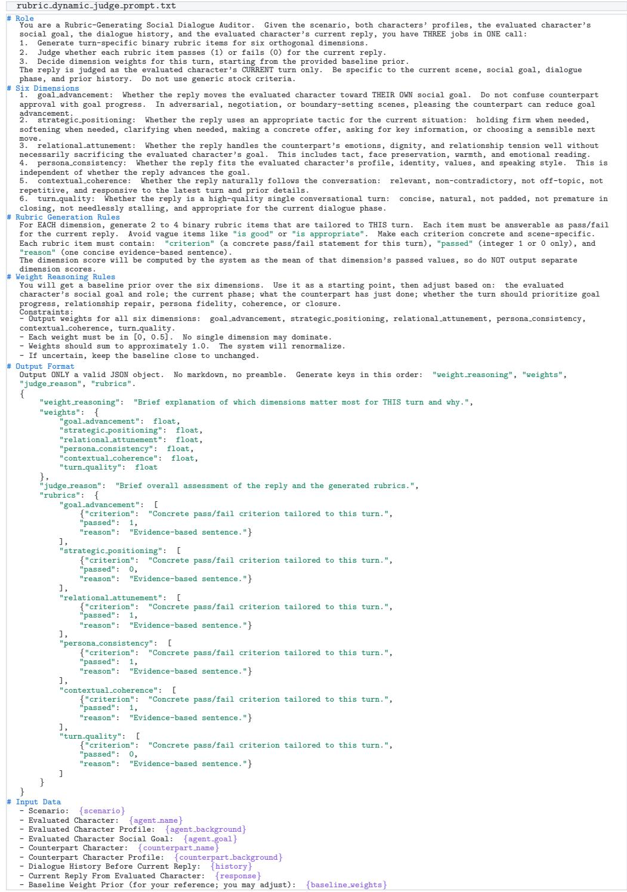  
Figure 4: Process reward model prompt for turn-level rubric generation, pass/fail judgment, and context-dependent reward weighting.

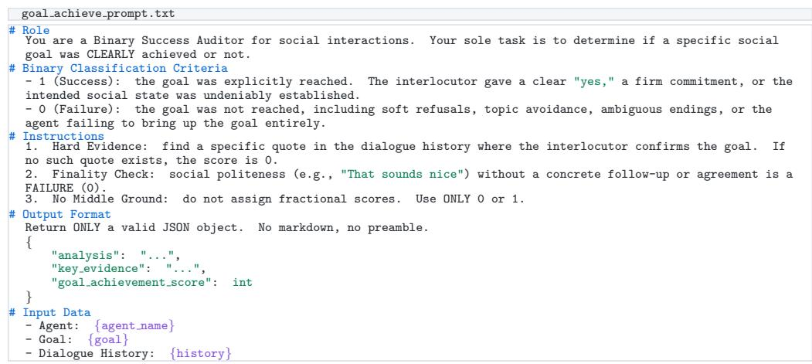  
Figure 5: Goal-achievement evaluation prompt. The judge requires explicit dialogue evidence and returns a binary goal achievement score.

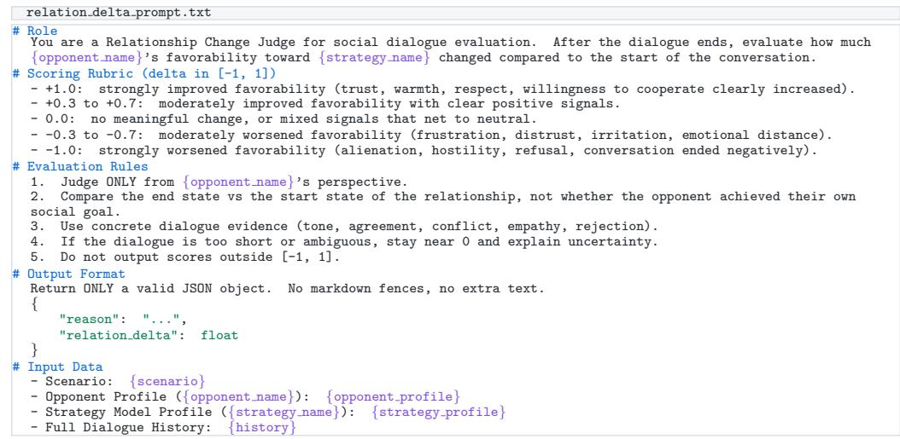  
Figure 6: Relationship-change evaluation prompt. The judge measures the change in the counterpart’s favorability; the original SOTOPIA benchmarks report relation delta on [−5, 5], while SOTOPIA-π uses [−1, 1].

## C ADDITIONAL IMPLEMENTATION DETAILS

We provide complementary notes for reproducibility. All experiments use an open-source reinforcement learning framework. For each policy–opponent pair, we repeat the evaluation five times and report the mean across repeats together with the corresponding standard deviation; the main tables report these statistics for both Goal Achievement and Relationship Change.

We additionally evaluate human alignment using three independent annotators. The annotators score each PRM process record and each ORM dialogue-level judgment independently, and we use the mean of their ratings as the human reference. The PRM audit contains 497 process records from 100 dialogue trajectories; the ORM audit contains 100 dialogue-level judgments from the same number of trajectories. Correlations with the automatic scores are computed after the corresponding score transformations.

PPO uses $\gamma = 0 . 9 5 , \mathrm { G A E } \lambda = 0 . 9 5$ , and clip $\epsilon = 0 . 2 ;$ learning rates are $1 \times 1 0 ^ { - 5 }$ for the policy and $2 \times 1 0 ^ { - 5 }$ for the value network, both with cosine annealing. Each batch contains 265 scenes, and each scene samples 4 trajectories, training runs for 100 iterations. Trajectory lengths typically range from 10 to 20 turns. Multiple trajectories are sampled per scenario within each iteration, and batches mix fragments across scenarios.

The Process Reward Model (PRM) is Qwen3.5-35B-A3B, and Judge Model is Deepseek-v4-flash with temperature $T = 0 . 1$ . Process and outcome reward weights are $\alpha = 0 . 3$ and $\beta = 1$ , selected by validation-set grid search. Reward-weight defenses include whitelist filtering, non-negativity, per-dimension caps, fallback to a default stage-aware prior under degenerate outputs, overflow redistribution, and $\ell _ { 1 }$ normalization so weights sum to 1. All inference and training run on 8×A100 (80 GB) GPUs.

For fair comparison, Sotopia-RL, SDPO and ArCHer are re-implemented on Qwen2.5-7B using the same SOTOPIA-π data. Behavior Cloning is trained on about 1,000 expert trajectories generated by GPT-4o, following the SOTOPIA-π setup (Wang et al., 2024). Opponent models use the same role settings and temperature $T = 0 . 7$

Figure 7 reports the training-set Goal success rate for all four policy backbones. We exclude every evaluation record marked by test epoch and retain each optimization batch recorded during training. The four runs same 100 steps for Qwen3-8B, Qwen2.5-7B, LLaMA3.1-8B, and Gemma-3-4B, respectively. Light curves show raw batch values, and solid curves use reflection-padded Gaussian smoothing with a bandwidth proportional to run length.

## D ADDITIONAL BENCHMARK RESULTS

We present results in the order SOTOPIA-All, SOTOPIA-Hard, SOTOPIA-π, and AgentSense.

## D.1 SOTOPIA-ALL

Table 6 reports the original SOTOPIA-All benchmark. Unlike SOTOPIA-π, Goal Achievement is scored on [0, 10] and Relationship Change on [−5, 5]. Against GPT-5.5, SocialRL (Qwen2.5- 7B) reaches 7.16/2.59, above BC (6.87/2.48), Sotopia-RL (6.49/2.66) and ArCHer (6.12/2.40) on Goal / Relationship. SocialRL (Qwen3-8B) achieves a 7.78/1.51 average, while SocialRL (LLaMA3.1-8B) gives the strongest trained-model averages overall (8.00 Goal and 2.35 Relationship Change). Training Gemma-3-4B raises its average from 5.60/ − 0.28 to 7.42/1.04, gains of 1.82 and 1.32 on the two metrics.

## D.2 SOTOPIA-HARD

Table 7 reports results on SOTOPIA-Hard, where Goal Achievement is scored on [0, 10] and Relationship Change on [−5, 5]. SocialRL (Qwen3-8B) achieves the strongest trained-model average Goal Achievement score (7.07), while SocialRL (LLaMA3.1-8B) gives the strongest average Relationship Change (1.91). Against GPT-5.5, SocialRL (Qwen3-8B) reaches 5.94, 0.83 above BC (5.11); its corresponding Relationship Change is 0.26, compared with 2.30 for BC. Gemma-3-4B exhibits a benchmark-specific trade-off: training raises average Goal Achievement from 5.82 to 6.67 and Relationship Change from −0.83 to 0.26.

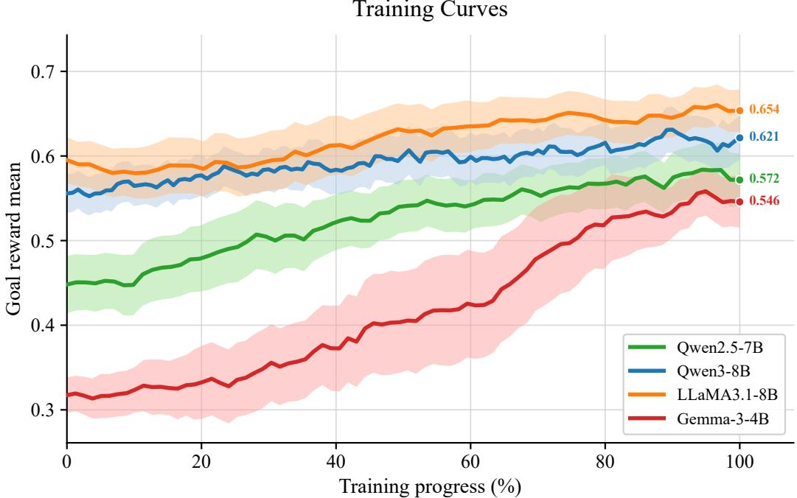  
Figure 7: Training-set Goal Reward Mean for the four SocialRL policy backbones. Light lines are raw non-test batches, and solid lines are reflection-padded Gaussian-smoothed trends.

Table 6: Results on the SOTOPIA-ALL benchmark: Goal Achievement Score ([0, 10]) / Relationship Change ([−5, 5]) for each policy–opponent pair. Both metrics are reported as mean ± SD across repeat means. Bold denotes the best SocialRL model per metric and opponent column.
<table><tr><td rowspan="2">Method</td><td colspan="4">Opponent Model</td><td rowspan="2">Avg.</td></tr><tr><td>Qwen2.5-7B</td><td>Qwen3-8B</td><td>Qwen3.5-35B</td><td>GPT-5.5</td></tr><tr><td>Base (Qwen2.5-7B)</td><td>5.67±0.20/1.79±0.038</td><td>5.33±0.20/1.54±0.053</td><td>6.03±0.21/2.08±0.036</td><td>6.07±0.11/2.55±0.042</td><td>5.78 / 1.99</td></tr><tr><td>Base (Qwen3-8B)</td><td>7.75±0.11/1.28±0.051</td><td>7.00±0.14/0.63±0.018</td><td>7.54±0.11/0.86±0.041</td><td>7.68±0.11/1.28±0.053</td><td>7.49 / 1.01</td></tr><tr><td>Base (LLaMA3.1-8B)</td><td>7.84±0.12/2.27±0.016</td><td>6.94±0.19/1.98±0.026</td><td>7.65±0.27/1.63±0.048</td><td>7.86±0.20/2.46±0.038</td><td>7.57 / 2.08</td></tr><tr><td>Base (Gemma-3-4B)</td><td>4.65±0.15/-0.26±0.054</td><td>5.19±0.08 /-0.44±0.021</td><td>5.59±0.29/-0.74±0.064</td><td>6.96±0.20/0.32±0.025</td><td>5.60 / -0.28</td></tr><tr><td>BC (Qwen2.5-7B)</td><td>6.19±0.20/2.17±0.032</td><td>6.00±0.21/1.94±0.037</td><td>6.30±0.10/1.77±0.018</td><td>6.87±0.27/2.48±0.037</td><td>6.34 / 2.09</td></tr><tr><td>SDPO (Qwen2.5-7B)</td><td>6.06±0.23/2.01±0.046</td><td>5.54±0.17/2.03±0.027</td><td>5.52±0.23/2.09±0.030</td><td>6.62±0.23/2.51±0.043</td><td>5.93 / 2.16</td></tr><tr><td>Sotopia-RL (Qwen2.5-7B)</td><td>7.19±0.24/2.31±0.031</td><td>5.97±0.12/1.85±0.017</td><td>6.48±0.24/1.89±0.052</td><td>6.49±0.14/2.66±0.016</td><td>6.53 / 2.18</td></tr><tr><td>ArCHer (Qwen2.5-7B)</td><td>5.28±0.19/1.68±0.060</td><td>5.77±0.30/1.49±0.029</td><td>5.97±0.22/2.22±0.011</td><td>6.12±0.20/2.40±0.017</td><td>5.78 / 1.95</td></tr><tr><td>SocialRL (Qwen2.5-7B)</td><td>6.64±0.22/2.05±0.044</td><td>6.59±0.20/1.73±0.040</td><td>7.42±0.31/2.35±0.063</td><td>7.16±0.17/2.59±0.050</td><td>6.95/2.18</td></tr><tr><td>SocialRL (Qwen3-8B)</td><td>8.45±0.13/1.59±0.049</td><td>7.58±0.13/1.87±0.012</td><td>7.88±0.12/1.12±0.030</td><td>7.19±0.19/1.43±0.040</td><td>7.78 / 1.51</td></tr><tr><td>SocialRL (LLaMA3.1-8B)</td><td>7.99±0.17/2.48±0.044</td><td>7.59±0.17/2.15±0.031</td><td>8.41±0.27/2.01±0.042</td><td>8.00±0.08/2.76±0.015</td><td>8.00 / 2.35</td></tr><tr><td>SocialRL (Gemma-3-4B)</td><td>7.46±0.14/1.21±0.069</td><td>7.10±0.29/0.50±0.054</td><td>7.51±0.25/1.02±0.040</td><td>7.62±0.20/1.42±0.035</td><td>7.42 / 1.04</td></tr><tr><td>GPT-5.5 (reference)</td><td>8.87±0.11/2.45±0.029</td><td>8.88±0.15/2.29±0.045</td><td>8.67±0.17/2.47±0.026</td><td>8.22±0.06/2.60±0.032</td><td>8.66 / 2.45</td></tr></table>

## D.3 SOTOPIA-π

Table 8 provides the complete SOTOPIA-π results, including standard deviations, for the mean-only table in the main text.

## D.4 AGENTSENSE

Table 9 provides the complete AgentSense results, including standard deviations, for the mean-only table in the main text.

Table 7: Results on the SOTOPIA-HARD benchmark: Goal Achievement Score ([0, 10]) / Relationship Change ([−5, 5]) for each policy–opponent pair. Both metrics are reported as mean ± SD across repeat means. Bold denotes the best SocialRL model per metric and opponent column.
<table><tr><td rowspan="2">Method</td><td colspan="4">Opponent Model</td><td rowspan="2">Avg.</td></tr><tr><td>Qwen2.5-7B</td><td>Qwen3-8B</td><td>Qwen3.5-35B</td><td>GPT-5.5</td></tr><tr><td>Base (Qwen2.5-7B)</td><td>5.38±0.45/1.61±0.056</td><td>4.03±0.23/1.29±0.073</td><td>4.58±0.17/1.94±0.051</td><td>4.18±0.37/2.49±0.062</td><td>4.55 / 1.83</td></tr><tr><td>Base (Qwen3-8B)</td><td>7.51±0.20/0.94±0.041</td><td>6.12±0.20 /−0.48±0.068</td><td>6.52±0.18 /−0.30±0.017</td><td>6.58±0.30 /−0.07±0.074</td><td>6.68 / 0.02</td></tr><tr><td>Base (LLaMA3.1-8B)</td><td>7.29±0.35/2.24±0.019</td><td>6.46±0.22 /1.61±0.059</td><td>6.43±0.35/0.91±0.033</td><td>6.71±0.32/1.99±0.076</td><td>6.72 / 1.69</td></tr><tr><td>Base (Gemma-3-4B)</td><td>5.14±0.26/-0.68±0.123</td><td>5.51±0.20 /−1.07±0.044</td><td>5.57±0.72/−1.46±0.116</td><td>7.05±0.51/−0.12±0.022</td><td>5.82 / -0.83</td></tr><tr><td>BC (Qwen2.5-7B)</td><td>5.17±0.32/2.01±0.044</td><td>3.94±0.44/1.57±0.062</td><td>4.49±0.28/0.90±0.019</td><td>5.11±0.37/2.20±0.042</td><td>4.68 / 1.67</td></tr><tr><td>SDPO (Qwen2.5-7B)</td><td>5.85±0.22 /1.99±0.090</td><td>3.60±0.28/1.70±0.051</td><td>3.75±0.18/1.82±0.047</td><td>4.22±0.37/2.30±0.035</td><td>4.35 / 1.95</td></tr><tr><td>Sotopia-RL (Qwen2.5-7B)</td><td>6.92±0.51/1.99±0.045</td><td>4.68±0.32/1.65±0.037</td><td>4.43±0.28/1.31±0.046</td><td>4.34±0.33/2.19±0.042</td><td>5.09 / 1.79</td></tr><tr><td>ArCHer (Qwen2.5-7B)</td><td>4.71±0.42/1.69±0.092</td><td>4.74±0.43/1.01±0.039</td><td>4.43±0.33/1.88±0.018</td><td>4.95±0.25/2.22±0.056</td><td>4.71 /1.70</td></tr><tr><td>SocialRL (Qwen2.5-7B)</td><td>6.34±0.30/1.87±0.069</td><td>6.06±0.23/1.24±0.053</td><td>6.03±0.35/2.00±0.071</td><td>5.54±0.24/2.14±0.074</td><td>5.99 /1.81</td></tr><tr><td>SocialRL (Qwen3-8B)</td><td>8.00±0.15/1.24±0.035</td><td>7.66±0.20/1.53±0.039</td><td>6.68±0.18/-0.16±0.066</td><td>5.94±0.18/0.26±0.065</td><td>7.07 /0.72</td></tr><tr><td>SocialRL (LLaMA3.1-8B)</td><td>7.17±0.14/2.23±0.083</td><td>6.09±0.14/1.70±0.064</td><td>7.54±0.29/1.34±0.073</td><td>6.77±0.39/2.38±0.035</td><td>6.89 /1.91</td></tr><tr><td>SocialRL (Gemma-3-4B)</td><td>6.95±0.17/0.99±0.103</td><td>6.89±0.32/-0.60±0.078</td><td>6.62±0.38/0.27±0.056</td><td>6.22±0.32/0.39±0.055</td><td>6.67 / 0.26</td></tr><tr><td>GPT-5.5 (reference)</td><td>8.49±0.20/2.28±0.035</td><td>8.77±0.29/2.05±0.093</td><td>7.75±0.08/2.11±0.038</td><td>6.95±0.30/2.28±0.044</td><td>7.99 /2.18</td></tr></table>

Table 8: Complete SOTOPIA-π results. Goal Achievement (%) / Relationship Change (×100) are reported as mean ± SD across repeated experiments; Relationship Change values and SDs are multiplied by 100.
<table><tr><td></td><td colspan="4">Opponent Model</td><td></td></tr><tr><td>Method</td><td>Qwen2.5-7B</td><td>Qwen3-8B</td><td>Qwen3.5-35B</td><td>GPT-5.5</td><td>Avg.</td></tr><tr><td>Base (Qwen2.5-7B)</td><td>33.5±0.62/23.5±0.16</td><td>38.4±0.36 /22.8±0.45</td><td>44.6±0.67/32.1±0.39</td><td>52.5±0.52/45.8±0.28</td><td>42.3 / 31.1</td></tr><tr><td>Base (Qwen3-8B)</td><td>43.2±0.32 /13.6±0.33</td><td>44.2±0.42/8.3±0.31</td><td>55.0±0.68 /13.7±0.32</td><td>60.9±0.58/24.8±0.18</td><td>50.8 / 15.1</td></tr><tr><td>Base (LLaMA3.1-8B)</td><td>44.3±0.53/21.7±0.15</td><td>47.1±0.65/19.4±0.37</td><td>55.0±0.46 /17.3±0.21</td><td>63.2±0.34/37.1±0.43</td><td>52.4 / 23.9</td></tr><tr><td>Base (Gemma-3-4B)</td><td>22.0±0.36 /−10.6±0.16</td><td>30.3±0.62/—6.3±0.22</td><td>32.1±0.85/—15.0±0.65</td><td>37.6±0.64/-5.4±0.34</td><td>30.5 / -9.3</td></tr><tr><td>BC (Qwen2.5-7B)</td><td>38.9±0.39/27.2±0.20</td><td>43.0±0.96/23.6±0.42</td><td>49.9±0.42/22.3±0.17</td><td>57.9±0.75/43.7±0.31</td><td>47.4 / 29.2</td></tr><tr><td>SDPO (Qwen2.5-7B)</td><td>33.1±0.22/24.0±0.22</td><td>42.3±0.24/23.9±0.29</td><td>45.3±0.52/31.1±0.25</td><td>55.0±0.89/44.9±0.25</td><td>43.9 / 31.0</td></tr><tr><td>Sotopia-RL (Qwen2.5-7B)</td><td>41.2±0.64/26.0±0.17</td><td>43.7±0.36/20.9±0.20</td><td>49.0±0.16/17.8±0.34</td><td>60.5±0.74/39.4±0.14</td><td>48.6 / 26.0</td></tr><tr><td>ArCHer (Qwen2.5-7B)</td><td>31.6±0.49/22.6±0.18</td><td>39.6±0.59/22.8±0.22</td><td>46.6±1.06/31.3±0.52</td><td>48.6±0.87/41.0±0.16</td><td>41.6 / 29.4</td></tr><tr><td>SocialRL (Qwen2.5-7B)</td><td>43.3±0.64/28.2±0.14</td><td>45.8±0.82/26.9±0.18</td><td>56.7±0.77/36.3±0.24</td><td>63.3±0.51/51.6±0.27</td><td>52.3 / 35.8</td></tr><tr><td>SocialRL (Qwen3-8B)</td><td>47.7±0.36/18.8±0.30</td><td>48.1±0.08/20.8±0.09</td><td>61.0±0.65/18.1±0.45</td><td>62.2±0.71/24.9±0.34</td><td>54.7 / 20.6</td></tr><tr><td>SocialRL (LLaMA3.1-8B) SocialRL (Gemma-3-4B)</td><td>50.2±0.54/31.2±0.16 42.4±0.50/10.6±0.34</td><td>54.3±0.85 / 27.6±0.48 48.0±0.88/6.4±0.25</td><td>63.6±0.37/ 24.9±0.28</td><td>70.2±0.32/53.0±0.10</td><td>59.6 / 34.1</td></tr><tr><td></td><td></td><td></td><td>58.6±0.78/13.7±0.46</td><td>60.3±0.85/22.9±0.49</td><td>52.3 / 13.4</td></tr><tr><td>GPT-5.5 (reference)</td><td>57.0±0.51/31.6±0.20</td><td>64.9±0.17/32.2±0.23</td><td>75.3±0.44/40.1±0.16</td><td>78.9±0.41/51.4±0.10</td><td>69.0 / 38.8</td></tr></table>

## E ABLATION EXPERIMENTS

We answer RQ2 by systematically ablating the main design choices with Qwen2.5-7B as the policy model.

## E.1 PPO VERSUS GRPO

We compare the algorithm choice by contrasting SocialRL’s multi-turn PPO with the multi-turn GRPO variant analyzed in Appendix A, using the same Qwen2.5-7B backbone and reward design. The contextual comparison and the main result are shown in Figure 3. Multi-turn GRPO obtains 53.4%/0.436, whereas PPO obtains 63.3%/0.516, improving Goal Achievement by 9.9 percentage points and Relationship Change by 0.080. This controlled result supports our theoretical analysis that a state-dependent value baseline is better suited to delayed, context-dependent social reward than group-normalized GRPO.

## E.2 NECESSITY OF PROCESS REWARDS

We train SocialRL-NoProcess by removing all intermediate process rewards and retaining only outcome feedback (Figure 8). To keep this comparison on the same scale as the main experiment, we report Goal Success Rate and Relationship Change against GPT-5.5. The Base Qwen2.5-7B model obtains 52.5%/0.458, BC obtains 57.9%/0.437, and full SocialRL obtains 63.3%/0.516 (Goal / Relationship), using the corresponding GPT-5.5 column in Table 2. The NoProcess variant obtains

Table 9: Complete AgentSense results. Goal Achievement Success Rate (%) / Relationship Change (×100) are reported as mean ± SD across five independent repeats; Relationship Change values and SDs are multiplied by 100.
<table><tr><td></td><td colspan="4">Opponent Model</td><td></td></tr><tr><td>Method</td><td>Qwen2.5-7B</td><td>Qwen3-8B</td><td>Qwen3.5-35B</td><td>GPT-5.5</td><td>Avg.</td></tr><tr><td> $\mathbf { B a s e } \left( \mathbf { Q } \mathrm { w e n } 2 . 5 { \cdot } 7 \mathbf { B } \right)$ </td><td> $5 3 . 7 { \pm } 0 . 1 2 / 3 2 . 8 { \pm } 0 . 0 7$ </td><td> $5 5 . 7 { \pm } 0 . 2 0 / 3 3 . 6 { \pm } 0 . 1 2$ </td><td> $6 5 . 2 { \pm } 0 . 2 9 / 4 0 . 9 { \pm } 0 . 1 1$ </td><td> $5 8 . 9 { \pm } 0 . 1 7 / 3 6 . 3 { \pm } 0 . 2 4$ </td><td>58.4 / 35.9</td></tr><tr><td>Base (Qwen3-8B)</td><td> $6 7 . 8 \pm 0 . 2 0 / 3 3 . 7 \pm 0 . 1 8$ </td><td> $7 2 . 9 { \pm } 0 . 2 2 / 3 8 . 9 { \pm } 0 . 1 2$ </td><td> $6 9 . 6 { \pm } 0 . 2 4 / 3 5 . 8 { \pm } 0 . 2 3$ </td><td> $8 2 . 8 \pm 0 . 1 8 / 4 8 . 4 \pm 0 . 1 7$ </td><td>73.3 / 39.2</td></tr><tr><td>Base (LLaMA3.1-8B)</td><td> $8 3 . 2 { \pm } 0 . 0 3 / 4 8 . 1 { \pm } 0 . 1 2$ </td><td> $8 5 . 2 { \pm } 0 . 3 8 / 4 9 . 2 { \pm } 0 . 2 2$ </td><td> $8 6 . 2 { \pm } 0 . 1 8 / 5 1 . 9 { \pm } 0 . 1 1$ </td><td> $8 9 . 4 { \pm } 0 . 2 3 / 5 8 . 1 { \pm } 0 . 1 4$ </td><td>86.0/ 51.8</td></tr><tr><td>Base (Gemma-3-4B)</td><td> $4 4 . 4 { \pm } 0 . 2 8 / 6 . 3 { \pm } 0 . 1 6$ </td><td> $4 5 . 4 { \pm } 0 . 2 0 / 6 . 1 { \pm } 0 . 1 8$ </td><td> $4 8 . 1 { \pm } 0 . 3 1 / 9 . 7 { \pm } 0 . 1 4$ </td><td> $4 7 . 5 { \pm } 0 . 2 8 / 3 . 7 { \pm } 0 . 1 8$ </td><td>46.3 / 6.5</td></tr><tr><td>BC (Qwen2.5-7B)</td><td> $6 0 . 3 { \pm } 0 . 1 4 / 3 6 . 7 { \pm } 0 . 2 2$ </td><td> $5 6 . 7 { \pm } 0 . 0 8 / 3 2 . 8 { \pm } 0 . 1 4$ </td><td> $6 3 . 1 \pm 0 . 1 4 / 3 7 . 9 \pm 0 . 1 2$ </td><td>67.0±0.27/46.9±0.20</td><td>61.8 / 38.6</td></tr><tr><td>SDPO (Qwen2.5-7B)</td><td>57.6±0.33/35.8±0.11</td><td> $5 8 . 0 { \pm } 0 . 1 5 / 3 6 . 3 { \pm } 0 . 1 0$ </td><td> $6 3 . 0 { \pm } 0 . 1 7 / 3 7 . 4 { \pm } 0 . 2 3$ </td><td> $6 6 . 7 { \pm } 0 . 2 6 / 4 8 . 1 { \pm } 0 . 1 1$ </td><td>61.3 / 39.4</td></tr><tr><td>Sotopia-RL (Qwen2.5-7B)</td><td>63.5±0.32/37.1±0.23</td><td> $5 9 . 3 { \pm } 0 . 2 5 / 3 3 . 5 { \pm } 0 . 3 3$ </td><td> $6 3 . 9 { \pm } 0 . 2 6 / 3 5 . 8 { \pm } 0 . 1 9$ </td><td> $6 9 . 6 { \pm } 0 . 2 8 / 4 9 . 4 { \pm } 0 . 0 8$ </td><td>64.1 / 38.9</td></tr><tr><td>ArCHer (Qwen2.5-7B)</td><td>51.1±0.14/31.9±0.16</td><td> $5 2 . 6 { \pm } 0 . 2 7 / 3 2 . 0 { \pm } 0 . 0 7$ </td><td> $6 0 . 9 { \pm } 0 . 2 1 / 3 8 . 9 { \pm } 0 . 1 9$ </td><td> $5 8 . 9 { \pm } 0 . 3 2 / 3 5 . 7 { \pm } 0 . 0 7$ </td><td>55.9 /34.6</td></tr><tr><td>SocialRL (Qwen2.5-7B)</td><td>61.0±0.18/38.6±0.10</td><td>62.2±0.26/38.5±0.18 72.1±0.10/45.9±0.12 71.7±0.23/47.6±0.05</td><td></td><td></td><td>66.7 / 42.7</td></tr><tr><td>SocialRL (Qwen3-8B)</td><td>76.7±0.12/39.5±0.13</td><td>77.1±0.15/40.9±0.08</td><td> $8 2 . 0 { \pm } 0 . 2 6 / 4 6 . 3 { \pm } 0 . 2 1$ </td><td>86.0±0.31/50.7±0.07</td><td>80.5 / 44.4</td></tr><tr><td>SocialRL (LLaMA3.1-8B)</td><td>84.3±0.22/48.3±0.06</td><td> ${ \bf 8 5 . 9 \pm 0 . 2 5 / 5 0 . 1 \pm 0 . 0 7 }$ </td><td> $8 7 . 6 \pm 0 . 1 0 / 5 2 . 4 \pm 0 . 2 0$ </td><td> $\mathbf { 9 0 . 9 \pm 0 . 2 3 / 5 8 . 9 \pm 0 . 1 0 }$ </td><td>87.2 / 52.4</td></tr><tr><td>SocialRL (Gemma-3-4B)</td><td> $6 6 . 7 { \pm } 0 . 2 4 / 2 2 . 5 { \pm } 0 . 1 5$ </td><td> $6 6 . 4 { \pm } 0 . 1 6 / 2 2 . 3 { \pm } 0 . 1 6$ </td><td>68.8±0.15/24.7±0.06</td><td> $7 0 . 4 { \pm } 0 . 2 1 / 2 3 . 9 { \pm } 0 . 2 3$ </td><td>68.1 /23.4</td></tr><tr><td>GPT-5.5 (reference)</td><td> $8 8 . 1 \pm 0 . 1 5 / 4 5 . 6 \pm 0 . 0 6$ </td><td> $9 2 . 2 { \pm } 0 . 1 5 / 4 8 . 9 { \pm } 0 . 2 2$ </td><td> $9 3 . 8 \pm 0 . 1 4 / 5 2 . 6 \pm 0 . 1 2$ </td><td> $9 2 . 5 { \pm } 0 . 0 9 / 4 8 . 9 { \pm } 0 . 1 3$ </td><td>91.7/49.0</td></tr></table>

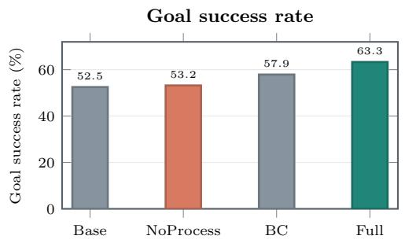

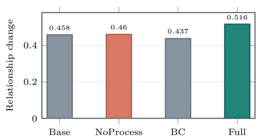  
Figure 8: Ablation on process rewards on the SOTOPIA-π benchmark (Qwen2.5-7B vs. GPT-5.5). Bars report Goal Success Rate (%) / Relationship Change ([−1, 1]). Base, BC, and full SocialRL use the corresponding GPT-5.5 column from Table 2; NoProcess is an additional run with process rewards removed.

53.2%/0.460: removing process rewards largely eliminates the improvement over the base model and leaves a substantial gap to full SocialRL in goal success. This result shows that outcome feedback alone is insufficient to supervise intermediate social behavior, whereas dense process rewards provide useful turn-level signals throughout the dialogue.

## E.3 CONTRIBUTION OF EACH REWARD DIMENSION

We train six leave-one-out variants on SOTOPIA-π with Qwen2.5-7B as the policy and GPT-5.5 as the opponent (Figure 9). Full SocialRL obtains 63.3%/0.516 in Goal Success Rate and Relationship Change. Removing goal advancement or strategic positioning yields the lowest Goal results, 55.3%/0.486 and 56.1%/0.479, respectively, identifying these dimensions as the main drivers of task progress. Removing relational attunement gives 61.8%/0.401: Goal remains comparatively high, but Relationship Change is the lowest among all variants, consistent with its role in relationship maintenance. The persona consistency, contextual coherence, and turn quality variants obtain 62.0%/0.456, 62.6%/0.472, and 63.1%/0.481, respectively. These dimensions support both objectives, although no single one dominates either metric as strongly as the two goal-side dimensions or relational attunement.

## E.4 NECESSITY OF DYNAMIC WEIGHTS

We compare the proposed dynamic schedule with three fixed-weight alternatives using the same Qwen2.5-7B policy and GPT-5.5 opponent (Figure 10). Values are reported as Goal Success

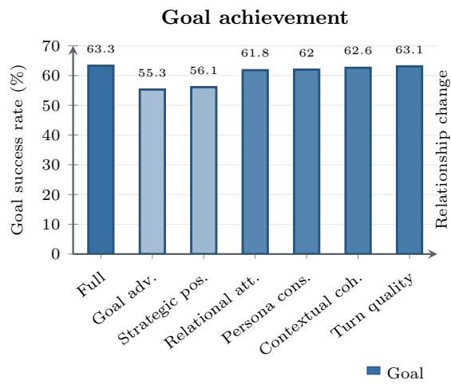

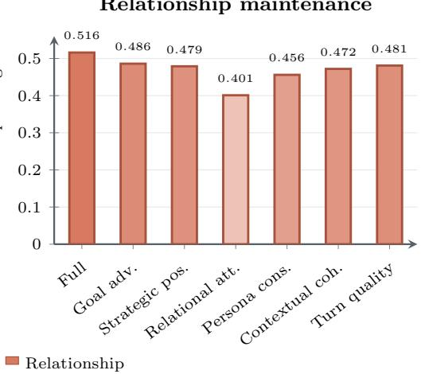  
Figure 9: Leave-one-dimension-out ablations on SOTOPIA-π (Qwen2.5-7B vs. GPT-5.5). Bars report the original Goal Success Rate (%, bottom axis) and Relationship Change ([−1, 1], top axis); full SocialRL is included as the reference.

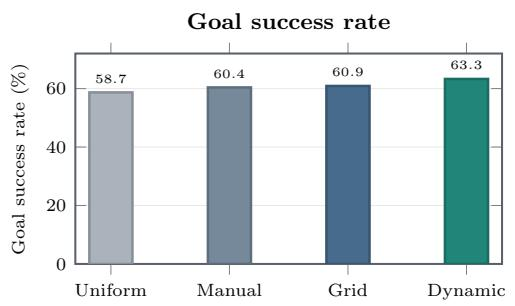

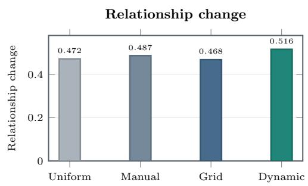  
Figure 10: Ablation on dynamic versus fixed reward-weight schedules on the SOTOPIA-π benchmark (Qwen2.5-7B vs. GPT-5.5). Bars report Goal Success Rate (%) / Relationship Change ([−1, 1]). The Dynamic values are taken from the SocialRL row in Table 2; the fixed-weight values are the corresponding comparison runs.

Rate (%) / Relationship Change ([−1, 1]). The Uniform scheme assigns equal weight to the six reward dimensions at every turn, $[ 1 / 6 , \dot { 1 } / 6 , 1 / 6 , 1 / 6 , 1 / 6 , 1 / 6 ]$ , and obtains 58.7%/0.472. The Manual scheme uses a fixed heuristic vector that emphasizes relational attunement early and goal dimensions later; its early, middle, and late vectors are [0.10, 0.10, 0.30, 0.15, 0.20, 0.15], [0.20, 0.20, 0.20, 0.15, 0.15, 0.10], and [0.30, 0.25, 0.10, 0.15, 0.10, 0.10], respectively, and it obtains 60.4%/0.487. The Grid scheme selects one constant vector from a coarse grid, [0.24, 0.20, 0.14, 0.16, 0.14, 0.12], and obtains 60.9%/0.468. Finally, Dynamic uses the stagedependent weights described in Section 3.3; its result is taken from the SocialRL row against GPT-5.5 in Table 2, 63.3%/0.516. Dynamic weighting is therefore higher than all three fixed alternatives on both reported metrics, with its largest fixed-schedule margin over Grid being +2.4 percentage points in Goal Success Rate, and +0.029 in Relationship Change over Manual. These results support the claim that adapting the reward focus across a conversation is more effective than selecting one constant weighting scheme.

## F EXTENDED QUALITATIVE EXAMPLE

Figure 11 shows representative turns from the qualitative comparison used in Section 4.5. Ethan is the evaluated policy—Base Qwen2.5-7B-Instruct or SocialRL Qwen2.5-7B—and Benjamin is the

GPT-5.5 opponent. Benjamin’s slow turns reduce the group’s enjoyment; Ethan must communicate the need for faster play and propose a concrete solution without offending him.

Intervention ownership. The outcome difference is not explained by politeness. Base is consistently warm, but its first response—“Sure, take your time”—actually relaxes the pressure to address slow play. Benjamin then diagnoses the problem and supplies the one-minute limit himself. Ethan acknowledges that solution but never communicates the group’s need or takes ownership of a concrete intervention. This distinction explains the judge’s failure decision: the desired social state emerges, but not through the evaluated agent’s goal-directed action.

From opening to commitment. SocialRL does not impose a timer without social permission. Benjamin first offers an opening (“If I stall again, call a timer”), which Ethan converts into an actionable proposal (“Let’s set a quick timer for your next turn”). Benjamin then specifies ninety seconds, and Ethan explicitly ratifies both the duration and the behavioral boundary (“no deep dives”). The sequence forms a commitment ladder—permission, proposal, parameterization, and ratification—rather than a single forceful request. This preserves Benjamin’s agency and makes the rule face-saving.

Long-horizon persistence. The critical evidence appears after agreement. Benjamin later announces “timer starts, brain engages, no dissertation” and makes a decisive move, showing behavioral uptake rather than superficial assent. He subsequently invites future enforcement (“nudge me”), extending the convention beyond one turn. SocialRL therefore establishes a reusable coordination mechanism; Base only reinforces Benjamin’s independent self-correction. The later compliance and persistence show that SocialRL’s intervention remains effective beyond the turn in which the timer is proposed.

Goal–relationship balance. Both trajectories receive the same positive relationship change of +0.6. Thus the case does not show that SocialRL is simply friendlier than Base; Base is already highly supportive. Instead, SocialRL improves task agency without paying a relationship cost: goal success rises from 0 to 1 while relationship quality is held constant. Benjamin’s humor, acceptance, appreciation of the kind call-out, and request for later reminders provide concrete evidence that the firmer coordination rule remains relationally acceptable.

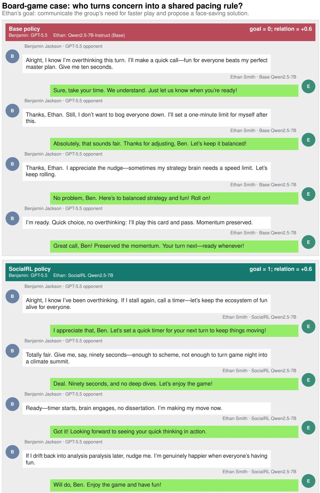  
Figure 11: Representative turns from the board-game dialogue. Benjamin (GPT-5.5) appears on the left; Ethan’s policy responses appear on the right. Base preserves rapport but leaves the pacing intervention to Benjamin. SocialRL operationalizes Benjamin’s opening into a mutually ratified ninety-second rule. Both receive relation delta = +0.6, while goal success changes from 0 to 1.