# Stable Answers, Unfinished Reasoning: Why Self-Consensus Is Not a Safe Early-Exit Signal

Yunxiang Mo\* HKUST ymoaj@connect.ust.hk

Donghao Zhao HKUST dzhaoah@connect.ust.hk

Hejia Geng University of Oxford hejia@tapntell.ai

## Abstract

A natural way to cut reasoning-model inference cost is to repeatedly probe a single partial trajectory for its current answer and stop once probes agree—self-consensus. We ask whether any such rule is both safe and token saving, and whether one can be selected once and reused. A preregistered sweep of 3,520 consensus rules, replayed on frozen trajectories from two models and three benchmarks, clears none of three acceptance gates fixed in advance; the frontier reproduces on a heldout split and on two unseen models—while a boundary-confidence control (DEER) swept through the same pipeline clears all three. The reason lies in the signal: agreement estab lishes that the current answer persists under a fixed probing procedure, not that the reasoning has terminated—a consensus–termination gap. Stopping on it commits non-terminal answers. At a rule still saving 32% of the tokens, one stop in nine fires on an answer the trajectory itself later abandons, and most of those stops cut off a correction it would otherwise have made. Widening the agreement window does not remove them: the share levels off near 7%, and by then the saving has fallen to 8%. Probe re-wording and a hand-labelled error taxonomy show the agreed answer is often a placeholder the model had not settled on. Used on its own as the stop signal, agreement fails not because it is insufficiently strict, but because it repeatedly measures the wrong object.

## 1 Introduction

Reasoning language models (DeepSeek-AI, 2025; Qwen Team, 2025; OpenAI, 2024) can spend thousands of tokens on a single answer. Early exit— halting a chain of thought once its reasoning is done—could cut that cost (Chen et al., 2024; Fu et al., 2024), but it requires knowing when the reasoning has finished, which the trajectory does not announce. A natural and increasingly studied proxy is self-consensus: repeatedly probing a single partial trajectory for its current answer (e.g., by appending a short “Final Answer:” suffix) and stopping once recent probe answers agree (Fu et al., 2024). We abbreviate self-consensus as consensus below, and reserve self-consistency for the distinct setting in which several trajectories are sampled independently (§2). The premise is that if the model repeatedly says x, it has probably finished reasoning about x; recent work reports answers that “converge” well before a trajectory ends and stops on that convergence at little aggregate accuracy cost (Liu and Wang, 2025).

We show that this proxy measures the wrong object. Under a fixed probing procedure, repeated agreement establishes only that the current answer persists, not that the reasoning has terminated, and the two come apart—a consensus–termination gap. This explains the aggregate savings reported above. They are real, but they are measured without charging for the probe tokens they spend, and the accuracy they cost is directional: a stop far more often locks in a wrong answer the trajectory would have corrected than it saves a right one.

The gap has a concrete source. A probe requires an answer even when the underlying trajectory has not settled, so repetition under a fixed query often records the elicitation procedure rather than reasoning termination; the elicited placeholder can repeat across many probes and look settled while the trajectory goes on to correct it. Three direct measurements bear this out (Section 4). Re-probing the same frozen prefix with a differently worded query returns a different answer 54% of the time in the first tenth of a trajectory against 16% near the end, so early “answers” are largely artifacts of being asked. Hand-labelling 134 wrong stops finds more than half commit to an answer the model had not converged on, against one in four it had genuinely settled. And a consensus stop frequently commits a non-terminal answer: at a rule still saving 32% of the tokens, one stop in nine commits an answer the trajectory later leaves behind, and of the 216 such stops 155 pre-empt a correction the trajectory went on to make against 16 that bank a correct answer from a trajectory ending wrong. The computation a consensus stop removes is predominantly the computation that would have corrected the answer, the opposite of what early exit is for. Widening the agreement window does not close the gap. The non-terminal share flattens near 7% while the saving that pays for it collapses to 8%, and the accuracy loss shrinks only because the rule fires less often and later. Compared at a matched saving, the accuracy price stays high: at 28% net saving the cheapest of the 3,520 rules below costs 6.0 pp and at 33% it costs 8.3 pp, against 0.5 and 2.0 pp for DEER, the non-consensus control below (§4.4).

Prior reports establish good accuracy–saving points for a particular model, benchmark and parameter setting. We ask two stricter questions: whether any rule in the family is simultaneously safe and saving at all, and whether one can be selected once and reused rather than retuned per model and benchmark. To answer both, and to rule out a badly chosen threshold or a single implementation, we search the signal exhaustively under commitment. On frozen trajectories from two models and three benchmarks we run a preregistered sweep of the windowed consensus family we study—window size × share threshold plus operational knobs, 3,520 rules—with problem-grouped splits and acceptance gates fixed in advance (Section 5). No setting of these knobs clears any gate: not one of the 3,520 rules is both safe and saving on development, the split we select on, so no rule is ever carried forward. On train, 478 rules clear a gate in-sample, enough for a study reporting on one split to have concluded otherwise. The frontier reproduces on the test split (r=0.98) and on unseen models at 4× the scale and a different architecture. A shipped operating point, CertaIndex (CoT), loses 56–70 pp on the same trajectories.

Early exit itself is not the obstacle. Swept through the same pipeline and gates, DEER—a non-consensus method that reads the model’s confidence at a reasoning boundary—clears all three, losing as little as 0.3 pp while saving 28%, on the unseen models too (§5.3; Figure 1).

Contribution.

• We identify a consensus–termination gap in probe-based early exit: under a fixed probing procedure repeated agreement establishes only that the current answer persists, not that the reasoning has terminated (Section 4).

• We explain what agreement measures, through three direct signals—the wording sensitivity of the extracted answer, a handlabelled error taxonomy of stopped-but-wrong cases, and the non-terminal answers a consensus stop commits—which together show that early agreement is a probe-elicited placeholder on an unfinished trajectory rather than a settled belief (Section 4).

• We show the gap is not a threshold or implementation artifact: a preregistered sweep of 3,520 rules on frozen trajectories closes no gate, while a non-consensus signal swept under the same protocol clears the same gates (Section 5). We will release the protocol, trajectories, and sweep in full upon publication.

## 2 Related Work

Probe-based / consensus early exit. The methods we scrutinize periodically query a partial chain of thought (Wei et al., 2022) for its current answer and halt on agreement. Dynasor / CertaIndex (Fu et al., 2024) formalize this with a “certainty index” over recent probe answers and use it to terminate early when serving reasoning programs, a response to the overthinking of reasoning models (Chen et al., 2024; Yang et al., 2025). Recent work pushes the same idea further: Liu and Wang (2025) report that a trajectory’s answer “converges” well before it ends and stop on that convergence at little aggregate accuracy cost. We adopt the same probe mechanism (a short boxed-answer suffix) and notion of self-consensus, and ask what those results leave open. They establish good accuracy–saving points for a given model, benchmark and parameter setting; we ask whether the family contains one rule that is safe, saving, and transferable across benchmarks, models and seeds without retuning.

Cost-aware comparisons of exit policies. Closest to our question, Dong et al. (2026) compare a learned prefix-feature stopper against calibrated confidence, entropy and running-answer exits across 18 task–model settings, at a matched tolerance for lost correct answers. Of those baselines, running-answer exits are the closest analogue to the signal we study. They find three regimes: learning wins on free-form mathematics, calibrated scalar exits win on multiple choice, and the hardest benchmarks admit no certifiable aggressive policy at all. That last regime is a partial precedent for our negative result. Two things separate the two. Their matched tolerance is far looser than our 1.0 pp conservative gate, so “learned stopping wins” there and “no rule of 3,520 clears a gate” here are distant points on one trade-off curve. And where they compare policies, we dissect one signal, asking why agreement carries no termination information and answering with a mechanism (§4).

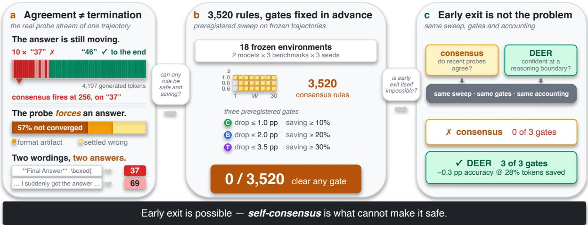  
Figure 1: The argument in one picture. (a) On MATH500 problem 68 (DeepSeek-R1-Distill-Qwen-7B, dense 64-token probes) the model emits the same wrong answer, 37, for ten consecutive probes; a three-probe rule fires at token 256 and commits it. Left to run, the trajectory reaches the correct 46. Ribbon colours: red the dominant wrong answer, pink other wrong answers, green correct. Below it, the bar splits the 134 hand-labelled wrong stops of one environment (§4.3), and the two rows re-probe the same frozen prefix at token 256 with our answer suffix and with the CertaIndex suffix (§4.2). (b) The preregistered sweep of 3,520 rules, replayed on 18 frozen environments against three gates fixed in advance. None clears any gate. (c) Swept through the same pipeline, gates and accounting, a boundary-confidence method (DEER) clears all three—on the test split, at 4× scale and on a different architecture too (§5.5).

Gating agreement behind a reasoning-level signal. Min et al. (2026) reach the same diagnosis from the design side: answer-level signals, they argue, reflect answer readiness rather than reasoning convergence, and can fire while the model is still exploring or correcting itself. Their remedy, PUMA, retains answer agreement but consults it only once a detector finds successive reasoning steps semantically redundant, so the reasoning— not the answer—decides when a stop is even considered. Across five models and five benchmarks it holds accuracy while removing about a quarter of the tokens, where their reproduction of a pure consensus stopper (Liu and Wang, 2025) loses 23– 59 pp at 82–91% token reduction. That gap is the directional cost of §4.4, on an independent implementation. The questions differ. They take the gap as a design premise and build a remedy; we measure it (§4) and ask whether any setting of the consensus signal escapes it, against gates fixed in advance. And their design keeps agreement as one component gated by another signal, where our negative result concerns agreement used alone—the scope §5.6 states, and a reason to read the two together.

Self-consistency and independent sampling. Self-consistency (Wang et al., 2023) samples a diverse set of reasoning paths and takes the majority answer; agreement is evidence there because the paths are drawn independently, so the vote can outweigh an error on any single path, and earlystopping variants only decide how many samples to draw (Aggarwal et al., 2023; Li et al., 2024). Probing a single chain of thought—self-consensus (§1)—is a different object: each probe reads a longer prefix of the one path the earlier probes read, so agreement records that one line of reasoning has not changed its answer, not that separate lines of reasoning have converged—the protecting vote is absent. On its own, though, this structural point does not settle whether agreement tracks termination. The corrections a stop pre-empts (§4.4) are ones the trajectory makes as it continues, not revisions solicited after a completed answer, which models perform poorly without external feedback (Huang et al., 2024).

Alternative termination signals. A stop can read signals other than consensus: verifier- and process-reward-guided decoding (Lightman et al., 2024; Wang et al., 2024) scores partial reasoning, adaptive-computation methods learn a halting signal at the token or layer level (Graves, 2016; Schuster et al., 2022), confidence-dynamics stops read how the model’s answer confidence evolves (Hosseini et al., 2026), building on the finding that a model’s own confidence carries usable signal (Kadavath et al., 2022), and DEER (Yang et al., 2025) stops on the model’s confidence in a trial answer at reasoning boundaries. We sweep DEER through our own pipeline in Section 5.3. We do not claim this broader class is categorically superior; our experiments isolate one signal.

Test-time budget control. A different axis dispenses with detection and fixes the compute from outside; test-time compute is a resource that trades against accuracy whether or not a signal decides how much to spend (Snell et al., 2024; Brown et al., 2024). Budget forcing (Muennighoff et al., 2025) suppresses the end-of-thinking token to lengthen reasoning, and length-controlled reinforcement learning (Aggarwal and Welleck, 2025) trains a model to respect a requested length. Budget forcing is evidence from the opposite side for the mechanism of §4: forcing a trajectory to continue past the point where it tries to conclude raises AIME24 accuracy from 50 to 57% (Muennighoff et al., 2025), so a trajectory that presents a finished answer need not have finished. Length control sets the operating point on the trade-off surface of §5.2 by fiat; we ask whether a signal can find it automatically.

## 3 Experimental Setup

Every measurement in this paper—the direct measurements of the gap (Section 4) and the rule sweep that tries to tune it away (Section 5)—runs on the same frozen substrate under the same token accounting, so that no result can be an artifact of a rule changing the reasoning it observes.

## 3.1 Frozen Trajectories, Offline Probes

For each problem we generate exactly one main trajectory in a single request (caps: 16K tokens for MATH500 and AMC23, 32K for AIME24) and freeze it. All probing is then performed offline against fixed text prefixes of that frozen trajectory. Because probes never re-enter the decode, changing a probe schedule—or a stopping rule—cannot change the underlying reasoning; every rule is scored against the same trajectories. We build two offline probe banks: a dense bank that re-probes every 64 tokens with simple@32 (a boxed-answer probe capped at 32 output tokens), and an adaptive bank that additionally fires eventtriggered probes at entropy drops and at conclusion/reflection/answer markers.

## 3.2 Token Accounting

For a rule that stops a problem at token position s after consuming probe output p, we charge total decode tokens $T = s + p$ and compare against the frozen baseline B (the full trajectory, capped at budget). Net savings is $( B - T ) / B$ and gross savings is $( B - s ) / B ;$ their gap is the probe cost. Probe prefill is not charged: p counts decode only. This follows Fu et al. (2024) and Yang et al. (2025), both of which reuse the main branch’s KV cache for probe prompts. The choice is also the more conservative one here, since both of those works additionally exclude probe output from their reported budgets, which we charge (Appendix D). The accuracy drop compares the correctness of the committed answer at s against that of the frozen final answer; it is not an agreement rate between the two.

## 3.3 Models, Benchmarks, Splits

Development uses two models—DeepSeek-R1- Distill-Qwen-7B and Qwen3-8B—on three benchmarks (MATH500, AMC23, AIME24), each at seeds $4 2 / 4 3 / 4 4 \colon$ 18 model×benchmark×seed environments. Problems are partitioned by problem id into 60/20/20 train/dev/test splits, so no problem leaks across splits. Confirmation reserves seeds $4 5 / 4 6 / 4 7$ plus two unseen models—DeepSeek-R1-Distill-Llama-8B and Distill-Qwen-32B—all evaluated on the test split only, read once after all rules and thresholds are frozen. Every headline metric is a macroaverage over model×benchmark×seed environments, weighting each equally, so that the largest benchmark does not dominate policy selection (Appendix B details the weighting and its noise tradeoffs).

## 4 The Consensus–Termination Gap

This section establishes the paper’s central object by direct measurement. The source of the gap is that a probe elicits an answer rather than reading one: what repeats across probes can be a placeholder that looks stable while the trajectory keeps correcting itself. We establish, in order: agreement is pervasive and non-terminal (§4.1); the early answer depends on how the probe is worded (§4.2); most stopped-but-wrong commitments are to answers the model had not converged on (§4.3); no amount of required agreement removes the nonterminal stops (§4.4); and non-independent readings supply no vote that could catch the error (§4.5).

## 4.1 The First Actionable Consensus

An online rule cannot wait for a trajectory to end: it fires the first time its condition is met, so what matters is what the first actionable consensus commits to. On a dense probe stream logged for every MATH500 problem under DeepSeek-R1-Distill-Qwen-7B at the main 16K/32K budgets (500 problems × three seeds = 1,500 trajectories; Appendix G), we take that to be the first point at which three consecutive probes agree, are nonempty, and carry no hedging marker such as “wait” or “but”.

(1) The first actionable consensus is usually not terminal. It fires on 1,477/1,500 trajectories, and the answer it commits is correct only 50.5% of the time, whereas the same trajectories run to completion reach 90.7%: a 40.2 pp loss.

(2) End-of-trajectory agreement is a different object. Once a trajectory finishes, agreement does track correctness (97.8% for cumulative agreement across all probes, 90.4% for the final five-probe window), but no such end-state evidence is available mid-trajectory. Recovery separates the two: 736 of the 1,500 trajectories at some point agreed on an answer they went on to abandon, and 84.2% of those still ended correct.

The same question on a broader environment set. Facts (1)–(2) read one model on one benchmark. We therefore repeat the measurement across all 18 development environments (both models, three benchmarks, three seeds, dev split; 684 trajectories), this time dropping the hedging-marker filter so that the rule fires as early as it can. First consensus forms in 679 of the 684 trajectories, half of them within the first tenth of the trajectory’s own length. There the committed answer is correct only 27.5% of the time against 85.2% run to completion. Consensus that forms later is more often right—77% for the few that first agree between 40 and 60% of the way through (Figure 6, appendix)— so waiting for a later consensus trades saving for accuracy.

## 4.2 Probe Wording Versus Position

If early agreement reflected a settled belief, the answer a probe returns should not depend much on how the probe is worded. We test this directly on paired re-probes of the samefrozen prefixes: at every probe position we read the trajectory with two different probe wordings (our boxed-answer suffix and the CertaIndex suffix, both capped at 32 tokens), so the model’s state is identical and only the elicitation differs. We read all 18 development environments, on the 652 of 684 trajectories that finish inside the budget; for a truncated trajectory, position as a fraction of its own length is undefined.

Figure 2(a) shows the result. In the first tenth of a trajectory the two wordings return different answers 54% of the time; by the final third they disagree only 16% of the time. A stable but mistaken belief would have both wordings read back the same wrong value, so an early probe is not reading back an answer the trajectory holds but forcing one out of reasoning that has not converged.

Across all 46,360 paired positions the two wordings read back answers that are almost equally often correct (a 0.9 pp difference), so the early sensitivity is about which answer is elicited, not a defect of one suffix.

## 4.3 Error Taxonomy

Two annotators independently labelled all 134 cases in which probes agreed on a wrong answer, from an exploratory single-environment pass (DeepSeek-R1-Distill-Qwen-7B, MATH500, seed 42, 3,072-token cap; Appendix C). This pass is diagnostic: nothing in §5 rests on it. Only 24.6% are cases where the model had genuinely settled on a wrong value (Figure 2(b)). 56.7% are answers it had not converged on at all, and a further 18.7% are artifacts of the probe’s output format.

A consensus rule cannot tell a forced placeholder apart from a settled belief. The same account fits the window effect of §4.4: a longer window is a longer buffer in which a placeholder can be overturned, so it screens out some non-terminal agreement, though without removing the underlying risk.

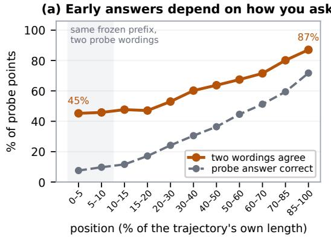

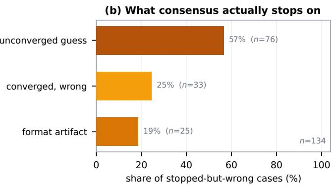  
Figure 2: Two sides of the consensus–termination gap. (a) The same frozen prefix (all 18 development environments) re-probed with two differently worded answer queries. Early on the two wordings return the same answer less than half the time (45% in the earliest bin, 46% over the first tenth); by the end they usually coincide (87% in the last bin). Position is a fraction of each trajectory’s own length. (b) All 134 stopped-but-wrong cases, labelled independently by two annotators (Appendix C): 56.7% commit to an answer the model had not converged on, 18.7% to a probe-format artifact, 24.6% to a genuinely settled wrong value.

## 4.4 The Cost of a Non-Terminal Stop

The natural remedy is to demand more agreement before stopping—a stop only when the last W probes agree, for larger W. It helps, but the help has to be bought with the saving. We measure the cost on all 3,420 development-model trajectories (train, dev and test), with one rule per W and W the only axis varying, in two steps.

Is the committed answer terminal? Often not. At W=12, a rule still saving 32% of the tokens, 10.6% of stops commit an answer the trajectory later leaves behind; at the short windows that save most, the share reaches 60% (W=1; Figure 3). Demanding more agreement does drive the share down, from 60% at W=1 to 10.6% at W=12 and 7.0% at W=24, but the saving is what pays for it, falling from 92% to 13% over that same range. And the share does not reach zero; past W=24 it stops falling at all (7.2% at W=30, for 8% saving). Is that a loss? Mostly. Of the 216 non-terminal stops at W=12, 155 commit a wrong answer to a trajectory that would have reached the right one, 45 trade one wrong answer for another, and 16 bank a correct answer from a trajectory that ends wrong. The computation consensus removes is disproportionately the computation that fixes the answer.

The exchange is unfavourable throughout. DEER (the non-consensus control of §5.3), by contrast, buys the same saving far more cheaply: at 28% net saving it costs 0.5 pp of accuracy where the cheapest of our rules costs 6.0 pp, and at 33%, 2.0 against 8.3 pp (training and development splits together, 2,736 trajectories), because its boundaryconfidence signal commits mainly once the trajectory has settled.

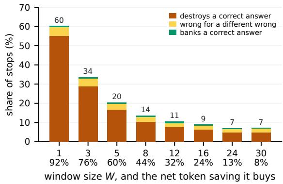  
Figure 3: The non-terminal share falls with W, and so does the saving that pays for it. Share of stops that commit an answer the trajectory later leaves behind, split by what the change costs; the annotation above each bar is that total share. It falls from 60% to a floor near 7% while the net saving falls from 92% to 8% (§4.4). All 3,420 development-model trajectories; one rule per W (share 1.0, interval 128, maturity 512, schema validity).

These counts are restricted to trajectories that finish inside the budget, since a truncated one has no final answer to compare against. Counting a truncated trajectory as incorrect instead, so that any correct stop on one is a rescue, leaves the picture unchanged wherever the rule still saves (155:16 becomes 155:57 at W=12) and reverses it only at W=30, which saves 8% (30:39; Appendix D).

Appendix F sets three probe streams side by side, among them a first-probe placeholder held for 27 consecutive probes, longer than all but the largest window.

## 4.5 The Role of Independence

The readings a consensus rule aggregates are not independent, so agreement among them cannot protect accuracy the way independent sampling does. Self-consistency’s majority vote can absorb an error because its paths are sampled independently (§2), so a wrong answer on one path is outvoted by others that reasoned differently. Probing one trajectory yields no such thing. Successive probes observe nested prefixes from the same evolving reasoning path and therefore share most of their reasoning history, so the readings move together, and when that shared history is wrong they are wrong together. Agreement across probes is thus a statement about one line of reasoning not having changed its answer, not corroboration from several.

## 5 Searching the Consensus Rule Space

Section 4 measures the gap. The natural response is that a better-tuned rule avoids it—a wider window, a stricter share, a maturity floor, a certainty requirement. This section rules that out by exhaustive search under commitment: a preregistered sweep of the consensus family with acceptance gates fixed in advance (Nosek et al., 2018), a non-consensus signal swept through the same pipeline, a released consensus stopper at its shipped default, and outof-distribution confirmation. Two questions run through it. First, whether any rule in the family is simultaneously safe and saving on the split the gates are applied to. Second, if one were, whether it would be an environment-robust policy—selected once rather than tuned per environment, and still safe and saving on held-out problems, seeds, benchmarks and models.

## 5.1 Preregistered Rule Space and Gates

The consensus signal in the windowed family we study reduces to two hyperparameters: a window size W (how many of the most recent probes to inspect) and a share threshold s (what fraction of that window must agree on a single answer before a stop is allowed). W=1 is the latestprobe rule; s=1.0 is strict unanimity over the last W probes; an entropy-over-the-window criterion closely tracks the same agreement and adds no materially new operating point on our grid. We sweep

<table><tr><td>Operating point</td><td>Max total acc. drop</td><td>Min total saving</td><td>psf floor</td></tr><tr><td>conservative</td><td>1.0 pp</td><td>10%</td><td>0.80</td></tr><tr><td>balanced</td><td>2.0pp</td><td>20%</td><td>0.80</td></tr><tr><td>token_efficient</td><td>3.5pp</td><td>30%</td><td>0.70</td></tr></table>

Table 1: Preregistered acceptance gates, fixed in advance and not relaxed post hoc. All three conditions are macro-averaged over the 18 development environments; psf is the positive-saving fraction, the share of environments on which net saving must be positive.

$W \in \{ 1 , 3 , 5 , 8 , 1 2 , 1 6 , 2 4 , 3 0 \}$ —deliberately including large windows, so a rule can demand a long, stable agreement—and $s \in \{ 0 . 6 , 0 . 8 , 1 . 0 \}$ , crossed with the operational knobs that govern when and how the signal is read: probe schedule (four fixed intervals or event-triggered probing), a minimumtoken maturity floor, an answer-shape validity filter, and an optional certainty flag. Enumerating this preregistered grid yields 3,520 candidate consensus rules (all values and formal definitions in Appendix A).

A non-consensus control. To separate a failure of the consensus family from a failure of early exit itself, we sweep one non-consensus method through the same pipeline, gates, and token accounting. DEER (Yang et al., 2025) stops on the model’s own confidence in a trial answer at a reasoning boundary; its only hyperparameter is a confidence threshold, swept over 14 values (the stronger trial-answer-submit variant). Both are placed on one frontier under identical token accounting. It is a control on the family, not a one-factor ablation of the statistic (§5.6).

Gates. We fix three operating points and their acceptance gates before looking at held-out data, applied in order: the total accuracy drop (macro over the 18 environments) must stay under a cap, then the total net token saving must clear a floor, and finally net saving must be positive on a minimum fraction of environments (psf).

The three points (Table 1) pair progressively looser accuracy constraints with progressively higher saving requirements. They are not universal safety standards; they test whether self-consensus supplies a usable policy under some practically meaningful pairing of the two. The saving floor rejects a rule that stays accurate only by almost never stopping, and the psf floor an average saving concentrated in a few environments. Three commitments were recorded with the protocol: the test split and confirmation models are never read during selection (C1); the gates are never relaxed post hoc—an empty gate is reported as the finding (C2); and the rule set is frozen and hashed before any test evaluation (C3). Appendix B gives the preregistration text.

## 5.2 Gate Outcomes Across the Rule Space

We replay all 3,520 rules on the frozen trajectories and aggregate to per-environment metrics— 126,720 rows = 3,520 rules × 18 environments × 2 splits (train, dev)—then apply the gates on dev. Not one of the 3,520 rules clears any gate. The outcome holds across environments: accuracy strictly falls in 64.9% of all rule–environment evaluations and strictly rises in only 10.5%, for a mean drop of 13.0 pp. The reason is the shape of the trade-off, read directly off the sweep’s own two axes (Figure 4, appendix): only 40 rules keep the total drop at or below the conservative 1.0 pp cap, and the most any of them saves is 0.2%—far under the 10% floor. Conversely, the first rule to save 10% already costs 2.66 pp, saving 20% costs 6.17 pp, and saving 30% costs 11.8 pp. The size of that margin is specific to the protocol’s macro averaging: pooled over problems the gates are likewise empty, but the best safe rule falls only just short of the saving floor rather than nowhere near it (Appendix D). The large windows behave exactly as §4.4 predicts: they do buy low drop, but only by stopping so late that net saving collapses to zero, and no cell of the (W, s) surface clears the conservative gate. Nor is the result an artifact of charging dense re-probing: forgiving the probe tax entirely and applying the same three gates to gross saving still clears no rule, and the safe rules’ gross saving reaches only 2.07%. The tax opens a 4–7 pp gap between gross and net saving and is reducible by a sparser schedule; the accuracy floor the gates bind on is not (Appendix D).

## 5.3 A Non-Consensus Control Under the Same Gates

The same gates are cleared by a rule that does not read consensus. Sweeping DEER’s confidence threshold through the same pipeline and accounting, its trial-answer-submit variant passes all three operating points on dev: the conservative point loses only 0.33 pp while saving 28.2%, the balanced point 1.03 pp at 29.6%, and the tokenefficient point 2.75 pp at 31.9%; at a stricter threshold it is accuracy-neutral (+0.06 pp) while still saving 20.8% (Table 2; full threshold frontier in Appendix D). Early exit is therefore not impossible at these budgets; the consensus signal is what cannot make it safe.

<table><tr><td>Method</td><td>Acc.</td><td>∆acc (macro)</td><td>Net saving</td></tr><tr><td>Full generation (consensus) 82.5% Consensus (drop≤ 1.0) Consensus (save≥ 10%)</td><td>81.6% 79.9%</td><td>-0.9pp -2.7pp</td><td>0% +0.2% +10.9%</td></tr><tr><td>Full generation (DEER)</td><td>82.9%</td><td></td><td>0%</td></tr><tr><td>DEER (conservative)</td><td></td><td>82.5% -0.33 pp</td><td>+28.2%</td></tr><tr><td>DEER (balanced)</td><td></td><td>81.9% -1.03pp +29.6%</td><td></td></tr><tr><td>DEER (token_eff.)</td><td></td><td>80.1% -2.75pp +31.9%</td><td></td></tr></table>

Table 2: Dev operating points (macro over 18 environments). Each ∆acc is against the baseline printed above it, which its own replay reproduces environment by environment; the 0.39 pp between the two baselines is a grading difference on a single problem plus a completion-gate convention, and moves no gate (Appendix C).

## 5.4 Consensus in the Wild

The sweep covers rules we constructed; a released consensus stopper shows where a shipped default lands. CertaIndex (CoT) (Fu et al., 2024), reproduced from the released implementation at its default setting—stop once three consecutive probes give the same non-empty answer and none hedges, with the authors’ own probe prompt and schedule— stops on 98.7–99.8% of our frozen trajectories and loses 56–70 pp while saving 77–90% of tokens. A faithful DEER readout reproduction on the same trajectories stays near full accuracy (+0.8 pp on Qwen3-8B). Table 8 (appendix) reports both reproductions with scope notes; in particular, nothing here bears on CertaIndex’s multi-path setting, which resembles self-consistency over independently sampled trajectories.

## 5.5 Generalization

We read the test split once (commitment C3); with no selected rule to confirm, we ask whether the frontier reproduces. It does: each rule’s total drop on the held-out test split tracks its dev value at $r { = } 0 . 9 8$ . On the two unseen models— Distill-Qwen-32B (4× the development scale) and DeepSeek-R1-Distill-Llama-8B (a different architecture and family), three test seeds each—the frontier reproduces at r=0.97 and r=0.94, and the conservative gate stays empty on both. DEER, swept identically, clears the gates on dev, on test and on both unseen models. On the 32B it gains 0.24 pp of accuracy while saving 32.4%, and on Llama it loses 0.67 pp at 26.7%. Appendix E traces the selection pipeline end to end (Figure 5), gives permodel and per-benchmark frontiers with an oracle upper bound, and details the dev/test asymmetry induced by the small competition sets.

## 5.6 Locating the Failure

Every method that stops on consensus—the swept family and the CertaIndex (CoT) reproduction alike—fails a gate or loses many points, while the one method that clears them does not read consensus. Run through the same machinery, gates, and accounting, the two outcomes differ, so the failure lies in how the stop is decided.

The DEER contrast changes two things at once, where a stop is considered and what statistic decides it, so we vary them one at a time (Table 3). On the savings axis both matter. Moving the read positions from our probe grid to DEER’s reasoning boundaries lifts the best safe saving from 0.2% to 3.9%, and moving the statistic at our own positions lifts it to 13.9%. The 28.1% total separates into 13.7% from the statistic, 8.9% from the positions and 5.5% from the cost of our denser probing.

Only the statistic moves the accuracy axis, which is what the gates turn on. Asked for the conservative gate’s 10% saving, the cheapest consensus rule loses 2.7 pp at our positions and 3.8 pp at DEER’s; asked for the balanced gate’s 20%, 6.2 pp and 10.2 pp. Reading DEER’s confidence at our own positions instead gains 0.7 pp at the conservative floor and costs 3.1 pp at the balanced one. Under gross accounting, which forgives the probe output p on each side, it gains at both.

The two factors do different work. A schedule sets which stop positions s a rule can reach and how much probe output it must spend to reach them, so moving it acts on the probe cost, the gap between gross and net saving. The statistic decides whether the reasoning at such an s has settled, so it governs the accuracy the stop costs and how early an s can be committed, which is gross saving. That is why only changing the statistic lowers the accuracy price at every floor. The claim is about agreement used alone. Combined with a signal that reflects the model’s own estimate, the cheap fact that the answer has not changed may still be useful, provided the combination avoids the risk measured here.

<table><tr><td colspan="2">Stop rule</td><td rowspan="2">Best safe saving</td><td colspan="2">∆acc at</td></tr><tr><td>Statistic</td><td>Reads at</td><td>10%</td><td>20%</td></tr><tr><td>Agreement Agreement Confidence Confidence</td><td>our grid boundaries our grid boundaries</td><td>0.2% (0/3) 3.9% (0/3) 13.9% (0/3) 28.3% (3/3)</td><td>-2.7 -3.8 +0.7 +0.1</td><td>-6.2 -10.2 -3.1 +0.1</td></tr><tr><td colspan="5">probe cost forgiven on both sides (gross) Agreement t our grid 2.1% (0/3) -1.9 -3.9 Agreement boundaries 5.4% (0/3) -2.7 -9.6 Confidence our grid 21.5% (2/3) +0.7 +0.7 Confidence boundaries 30.4% (3/3) +0.1 +0.1</td></tr></table>

Table 3: Varying the two factors that separate the swept family from DEER, one at a time, on the 659 development problems for which DEER records at least one reasoning boundary (same grader, same gates, macro over the 18 environments). “Best safe saving” is the largest saving among rules losing at most 1.0 pp, with the number of gates cleared in parentheses. “∆acc at 10/20%” is the best ∆acc at which a cell can buy that much saving (+ a gain, − a loss)—the accuracy price of a fixed budget. The lower block repeats both under gross accounting, which forgives each rule’s own probe cost. Appendix D gives the full frontier.

## 6 Conclusion

Used on its own, self-consensus is not a safe early-exit signal: under a fixed probing procedure agreement establishes that the current answer persists, not that the reasoning has terminated—a consensus–termination gap. What the probes agree on is often a placeholder forced from an unfinished trajectory, so a stop commits an answer the trajectory itself goes on to abandon, pre-empting the correction that would have followed. Demanding more agreement reduces such stops only by giving the saving back. That gap leaves the safe-andsaving corner empty across 3,520 preregistered rules, while a boundary-confidence control swept through the same protocol clears every gate. The failure is not that agreement is too easy to reach, but that reaching it is no evidence of termination.

## Limitations

Evidence for the mechanism. Our account of why consensus fails—that probes of one trajectory are not independent readings, and that they frequently record a forced placeholder—rests on a structural argument (Sections 2 and 4.5) together with the paired wording experiment, the handlabelled error taxonomy and the window sweep. We do not run a controlled experiment that manipulates independence directly, and the labelled cases were collected under a short window, the regime where unconverged answers are most common. A stronger test would construct probe streams with varying degrees of dependence and measure how the accuracy tax responds.

Scope of the negative result. The central result— no consensus rule clears any gate—is established on 18 development environments (two models, three benchmarks, seeds 42/43/44) and confirmed on the held-out test split and two unseen models (Section 5). The result is a statement about the space searched: one boxed-answer probe suffix (simple@32) and one preregistered consensus schema (3,520 rules over a window-size × sharethreshold family plus operational knobs). Other probe wordings and signals outside this schema are not searched; the mechanism (Section 4) is our argument that consensus variants would not help, but it is an argument, not an exhaustive proof.

Scope of the DEER comparison. We sweep DEER’s trial-answer-submit variant to establish that some signal clears the gates the consensus family fails (on the development models, the held-out test split, and both unseen models); we do not claim it is the best possible early-exit method, and we do not evaluate it as a leaderboard entry.

Small held-out sets on hard benchmarks. AIME24 and AMC23 are small (dev splits of 6 and 8 problems per seed), so those per-environment cells are noisy. The total drop macro-averages over the 18 development environments (three seeds per benchmark×model), and we read the unseen models as frontier-reproduction evidence rather than as independent gate tests (Section 3.3).

Probe-tax dependence of the savings axis. Netsavings numbers charge dense re-probing (every 64 tokens, 32-token probes); a sparser or KV-cachereusing schedule would change the savings axis. We separate gross from net savings (Section 3.2) so the probe-tax-dependent part is distinguishable, and §5.2 reports the gates applied to gross saving, where the outcome is unchanged; the accuracy-tax result does not depend on the schedule.

Domain. All benchmarks are competition mathematics with checkable final answers. Whether the consensus–termination gap and the accuracy tax transfer to open-ended reasoning, code, or agentic tasks is out of scope.

## References

Pranjal Aggarwal, Aman Madaan, Yiming Yang, and Mausam. 2023. Let’s sample step by step: Adaptiveconsistency for efficient reasoning and coding with LLMs. In Proceedings of the 2023 Conference on Empirical Methods in Natural Language Processing (EMNLP).

Pranjal Aggarwal and Sean Welleck. 2025. L1: Controlling how long a reasoning model thinks with reinforcement learning. In Second Conference on Language Modeling.

Bradley Brown, Jordan Juravsky, Ryan Ehrlich, Ronald Clark, Quoc V. Le, Christopher Ré, and Azalia Mirhoseini. 2024. Large language monkeys: Scaling inference compute with repeated sampling. arXiv preprint arXiv:2407.21787.

Xingyu Chen, Jiahao Xu, Tian Liang, Zhiwei He, Jianhui Pang, Dian Yu, Linfeng Song, Qiuzhi Liu, Mengfei Zhou, Zhuosheng Zhang, Rui Wang, Zhaopeng Tu, Haitao Mi, and Dong Yu. 2024. Do not think that much for 2+3=? On the overthinking of o1-like LLMs. arXiv preprint arXiv:2412.21187.

DeepSeek-AI. 2025. DeepSeek-R1 incentivizes reasoning in LLMs through reinforcement learning. Nature, 645(8081):633–638.

Zhe Dong, Fang Qin, and Manish Shah. 2026. When does learning to stop help? A cost-aware study of early exits in reasoning models. arXiv preprint arXiv:2606.30852.

Yichao Fu, Junda Chen, Siqi Zhu, Zheyu Fu, Zhongdongming Dai, Yonghao Zhuang, Yian Ma, Aurick Qiao, Tajana Rosing, Ion Stoica, and Hao Zhang. 2024. Efficiently scaling LLM reasoning with Certaindex. arXiv preprint arXiv:2412.20993.

Alex Graves. 2016. Adaptive computation time for recurrent neural networks. arXiv preprint arXiv:1603.08983.

Dan Hendrycks, Collin Burns, Saurav Kadavath, Akul Arora, Steven Basart, Eric Tang, Dawn Song, and Jacob Steinhardt. 2021. Measuring mathematical problem solving with the MATH dataset. In NeurIPS Datasets and Benchmarks Track.

Parsa Hosseini, Sumit Nawathe, Mahdi Salmani, Meisam Razaviyayn, and Soheil Feizi. 2026. Early stopping for large reasoning models via confidence dynamics. arXiv preprint arXiv:2604.04930.

Jie Huang, Xinyun Chen, Swaroop Mishra, Huaixiu Steven Zheng, Adams Wei Yu, Xinying Song, and Denny Zhou. 2024. Large language models cannot self-correct reasoning yet. In International Conference on Learning Representations (ICLR).

Saurav Kadavath, Tom Conerly, Amanda Askell, Tom Henighan, Dawn Drain, Ethan Perez, Nicholas

Schiefer, Zac Hatfield-Dodds, Nova DasSarma, Eli Tran-Johnson, Scott Johnston, Sheer El-Showk, Andy Jones, Nelson Elhage, Tristan Hume, Anna Chen, Yuntao Bai, Sam Bowman, Stanislav Fort, and 17 others. 2022. Language models (mostly) know what they know. arXiv preprint arXiv:2207.05221.

Yiwei Li, Peiwen Yuan, Shaoxiong Feng, Boyuan Pan, Xinglin Wang, Bin Sun, Heda Wang, and Kan Li. 2024. Escape sky-high cost: Early-stopping self-consistency for multi-step reasoning. In International Conference on Learning Representations (ICLR).

Hunter Lightman, Vineet Kosaraju, Yura Burda, Harri Edwards, Bowen Baker, Teddy Lee, Jan Leike, John Schulman, Ilya Sutskever, and Karl Cobbe. 2024. Let’s verify step by step. In International Conference on Learning Representations (ICLR).

Xin Liu and Lu Wang. 2025. Answer convergence as a signal for early stopping in reasoning. In Proceedings ofthe 2025 Conference on Empirical Methods in Natural Language Processing (EMNLP).

Dehai Min, Giovanni Vaccarino, Huiyi Chen, Yongliang Wu, Gal Yona, and Lu Cheng. 2026. Stop when reasoning converges: Semantic-preserving early exit for reasoning models. arXiv preprint arXiv:2605.17672.

Niklas Muennighoff, Zitong Yang, Weijia Shi, Xiang Lisa Li, Li Fei-Fei, Hannaneh Hajishirzi, Luke Zettlemoyer, Percy Liang, Emmanuel Candès, and Tatsunori Hashimoto. 2025. s1: Simple test-time scaling. arXiv preprint arXiv:2501.19393.

Brian A. Nosek, Charles R. Ebersole, Alexander C. DeHaven, and David T. Mellor. 2018. The preregistration revolution. Proceedings of the National Academy ofSciences, 115(11):2600–2606.

OpenAI. 2024. Learning to reason with LLMs. https://openai.com/index/ learning-to-reason-with-llms/.

Qwen Team. 2025. Qwen3 technical report. arXiv preprint arXiv:2505.09388.

Tal Schuster, Adam Fisch, Jai Gupta, Mostafa Dehghani, Dara Bahri, Vinh Q. Tran, Yi Tay, and Donald Metzler. 2022. Confident adaptive language modeling. In Advances in Neural Information Processing Systems (NeurIPS).

Charlie Snell, Jaehoon Lee, Kelvin Xu, and Aviral Kumar. 2024. Scaling LLM test-time compute optimally can be more effective than scaling model parameters. arXiv preprint arXiv:2408.03314.

Peiyi Wang, Lei Li, Zhihong Shao, Runxin Xu, Damai Dai, Yifei Li, Deli Chen, Yu Wu, and Zhifang Sui. 2024. Math-shepherd: Verify and reinforce LLMs step-by-step without human annotations. In Proceedings ofthe 62nd Annual Meeting ofthe Association for Computational Linguistics (ACL).

Xuezhi Wang, Jason Wei, Dale Schuurmans, Quoc V. Le, Ed H. Chi, Sharan Narang, Aakanksha Chowdhery, and Denny Zhou. 2023. Self-consistency improves chain of thought reasoning in language models. In International Conference on Learning Representations (ICLR).

Jason Wei, Xuezhi Wang, Dale Schuurmans, Maarten Bosma, Brian Ichter, Fei Xia, Ed H. Chi, Quoc V. Le, and Denny Zhou. 2022. Chain-of-thought prompting elicits reasoning in large language models. In Advances in Neural Information Processing Systems (NeurIPS).

Chenxu Yang, Qingyi Si, Yongjie Duan, Zheliang Zhu, Chenyu Zhu, Qiaowei Li, Minghui Chen, Zheng Lin, and Weiping Wang. 2025. Dynamic early exit in reasoning models. arXiv preprint arXiv:2504.15895.

## A Rule Schema Details

The consensus schema of Section 5.1 centers on two hyperparameters and a few operational knobs, enumerating to 3,520 candidate rules over a fixedschedule and an event-triggered family. Each rule fixes:

1. Window size W ∈ {1, 3, 5, 8, 12, 16, 24, 30}: the number of most recent probes inspected. W=1 is the latest-probe rule.

2. Share threshold s ∈ {0.6, 0.8, 1.0}: the fraction of the last W probes that must agree on one answer (share measured over the full window, so an empty or dissenting probe counts against consensus); s=1.0 is strict unanimity. An entropy-over-the-window criterion is not swept separately: on our grid it tracks the same agreement closely enough to add no materially new operating point.

3. Probe schedule: fixed interval ∈ {64, 128, 256, 512} tokens, or adaptive\_event with entropy-drop and marker triggers and a fallback interval.

4. Maturity: a minimum-token floor ∈ {0, 512, 1024, 2048, 4096} before any stop is allowed.

5. Certainty: optionally require the supporting probes flagged certain (minimum fraction).

6. Validity: answer-shape filter (reject empty / single-letter answers to suppress the Type-E probe artifact of Appendix G), or accept any non-empty answer.

Certainty. A probe is certain when its output carries no hedging marker (“wait”, “hold”, “but”, “okay”, “no”, “hmm”). Dimension 5 gates a stop on the fraction of the supporting probes that are certain.

Entropy triggers. The adaptive\_event schedule fires an extra probe when the token-level predictive entropy of the main decode drops by at least ∆H relative to a trailing baseline (an “the model just committed” signal), and at conclusion/reflection/answer marker tokens (e.g., “therefore”, “the answer is”), subject to a minimum interprobe gap and a fallback interval.

## B Preregistration Text

The protocol version, split manifest hash, candidate-rule generation script, and the three operating-point gates (Table 1) were fixed before any held-out evaluation. Preregistered here means fixed in the repository’s protocol file and hashed before the evaluation it governs, not deposited with a third-party registry. The commitments of Section 5.1 in full: (C1) the test split and both confirmation models are never read during rule selection. (C2) All three operating points and their gates are fixed before seeing held-out data and are not relaxed afterwards; if no rule passes a gate, that is reported as the finding rather than engineered away, and all three points are reported regardless of outcome. (C3) The frozen rule set is fixed on train+dev and its hash recorded before any test/confirmation evaluation. The conservative gate proved empty, and we report it as such for both consensus and DEER.

Metric resolution. The total accuracy drop is a macro-average over the 18 environments (each model×benchmark×seed weighted equally). Pooling problems instead would let MATH500 (100 dev problems per seed vs. 8 for AMC23 and 6 for AIME24) dominate the headline, so a rule that wins only on MATH500 could pass; equal perenvironment weight forces a selected rule to hold on the harder competition sets too; three seeds per cell damp the per-environment noise. The gates are read on the dev split (the selection target) with train reported alongside; where the text says “train+dev,” a rule was required to pass a gate in-sample on train and is then measured on dev.

## C Reproducibility

Frozen trajectories, offline probe banks, the sweep archive (126,720 train+dev metric rows plus the DEER threshold sweep), and the aggregation scripts will be released upon publication. Table 10 and Figure 4 were reproduced to the reported precision directly from the sweep archive. Grading uses a robust answer-equivalence check that tries the raw and normalized reference forms and both string and math-expression equality; per-problem correctness for the frozen baseline is recomputed at replay time rather than trusted from collection.

Grading dependencies. The robust check needs the released dynasor evaluator, whose grading stack has to be pinned; the released pyproject.toml pins it, so pip install -e installs a working one. The antlr4-python3-runtime==4.7.2 pin is loadbearing, since latex2sympy2 raises Could not deserialize ATN against newer runtimes. A missing evaluator is the more dangerous case: the replay code carries a numeric fallback that would grade 0.5 against as wrong, so an incomplete install returned systematically low accuracy with no warning. The grader now refuses to run in that state rather than degrading, and scripts/grader\_selfcheck.py confirms a working one: it checks that the two forms above compare equal, and that full-generation accuracy, regraded from the frozen development trajectories rather than read from the stored flags, macroaverages to 82.94% over the 18 environments.

Two full-generation baselines. That 82.94% is a live regrade, and it sits 0.39 pp above the 82.55% Table 2 prints for full generation under the consensus sweep, the reference that table’s consensus rows, and every accuracy drop in §5.2, are measured against. Two differences account for it exactly; applying both to the live regrade reproduces the archive’s accuracy in each of the 18 environments separately, not merely on average (scripts/baseline\_reconciliation.py). 0.33 pp is one MATH500 problem whose answer differs from the reference only in the order of two summands: the frozen archive grades it wrong and the current grader grades it right, and because the same problem is in all six MATH500 development cells, one problem moves six environments by a point each. The remaining 0.06 pp is a scoping choice rather than a grading one: the replay scores a baseline trajectory that did not finish inside its budget as wrong whatever answer it had reached, whereas the self-check grades the stored answer either way. Exactly one development trajectory changes verdict under it. The same two terms place the table’s second baseline, the one its DEER rows are measured against, between the other two: the DEER bank applies the budget gate and grades that one problem right, which puts it at 82.88%.

Neither difference can move a result. Grading does not enter the token accounting, so the discrepancy is confined to the accuracy axis, and every gate pairs an accuracy cap with a saving floor. On that axis the cheapest rule in the family that reaches even the 10% conservative floor costs 2.66 pp against a 1.0 pp cap, a margin more than four times the discrepancy, while the best rule inside the cap saves 0.21% against that floor.

Coding of the error taxonomy. The three classes of §4.3 are a simplification of the scheme the annotators actually worked with, which had five labels: a collapse onto a wrong numeric value (A), onto a wrong closed-form expression (B), a sign or symbol error (C), a reasoning gap (D), where the probe read back an intermediate quantity, a placeholder or a guess emitted before any final candidate had formed, and a format artifact (E), such as an option letter returned for a free-response item. The finer split was there to keep the labelling concrete, but A, B and C are one thing seen three ways: the trajectory had converged, on a wrong answer. We therefore pool them into the single converged, wrong class the paper reports, leaving D and E as they stand. Two annotators labelled all 134 cases independently against the five-way scheme; the per-case labels ship at the five-way granularity, so any other grouping can be recounted. Where the two disagreed, the released files will carry both annotators’ labels alongside the label of record and the ground on which that case was decided, so the resolution is inspectable case by case.

## D Frontier and Reproduction Tables

Figure 4 traces the consensus trade-off along both sweep axes; read down the window axis, the minimum attainable accuracy drop falls monotonically (from 22 pp at W=1 to 0.8 pp at W=30) while the maximum net saving falls with it (from 98% to 39%), so the low-drop region is reachable only where saving has already collapsed. Table 10 gives the DEER threshold frontier that does reach the

<table><tr><td>Consensus point</td><td>Gross saving  $\left( B - s \right) / \breve { B }$ </td><td>Net saving  $( B - s - p ) \big / B$ </td></tr><tr><td>drop ≤ 1.0 pp (safe rules)</td><td>+2.07%</td><td>+0.21%</td></tr><tr><td>save≥ 10% (drop 2.7 pp)</td><td>+14.9%</td><td>+10.9%</td></tr><tr><td>save≥ 20% (drop 6.2 pp)</td><td>+27.0%</td><td>+20.2%</td></tr></table>

Table 4: Gross vs. net savings for the safe rules and two consensus frontier points; the gap (∼ 4–7 pp) is the probe tax. The first row is the ceiling over the 40 rules that clear the conservative accuracy cap: even untaxed they save 2.07%, far under the 10% floor, so all three gates stay empty on gross saving as well.

gate region.

Accuracy tax versus probe tax. Table 4 separates the two costs of §5.2: under dense re-probing a late-stopping rule pays the probe output p of Section 3.2 over a long prefix, opening a gap between its gross savings $( B - s ) / B$ and its net savings $( B - s - p ) / B$ . That gap is the probe tax. It scales with probe density and is reducible, since sparser or shorter probes and KV-cache reuse all shift the savings axis. The accuracy floor is not reducible this way, because the ongoing correction behind it is present wherever reasoning is still moving (§4.4). It is that floor, not the probe tax, that keeps the safeand-saving corner empty and that DEER escapes.

The position–statistic ablation. Table 3 varies those two factors one at a time; Table 5 gives the frontier behind it, the smallest accuracy drop with which each cell buys a 10, 20 or 30% saving. Under gross accounting, where the probe cost is forgiven on both sides and exactly two factors remain, the gap between the swept family and DEER decomposes additively into a statistic term and a position term: +2.60 and −0.64 pp at the 10% floor, +4.57 and −0.64 pp at 20%. The position term is negative, because at DEER’s own signal our denser grid is the slightly better place to read. The whole of the accuracy gap, and more, is therefore the statistic. Under net accounting, where a cell’s own probe cost also decides which savings it can reach, the 20 and 30% floors split about evenly between the two terms. Binned into 5-point savings bands, so that each cell is read at a saving it actually delivers rather than one it overshoots, changing the positions lowers the accuracy price in none of the eight bands at or above 10% saving. Of the nine bands in all, the one place it does help is the 5–10% gross band, 1.74 to 0.81 pp. Changing the statistic lowers the price in all nine. Two limits on the table.

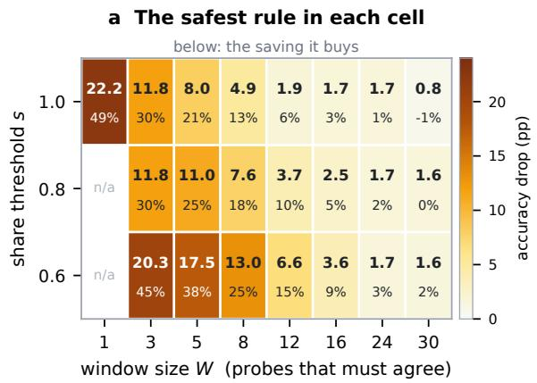

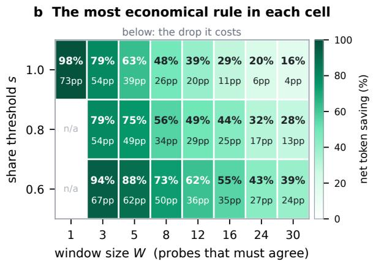

Figure 4: The safe-and-saving corner is empty across the entire rule space. Dev split, macro-averaged over the 18 environments. Each cell holds the 160 rules sharing its (W, s), summarised by the two members a gate interrogates: (a) the cell’s safest rule (colour: accuracy drop; number: the saving it buys) and (b) its most economical rule (colour: net saving; number: the drop it costs). A cell would be outlined in green if any of its rules cleared the conservative gate (drop ≤ 1.0 pp and saving ≥ 10%); none is.  
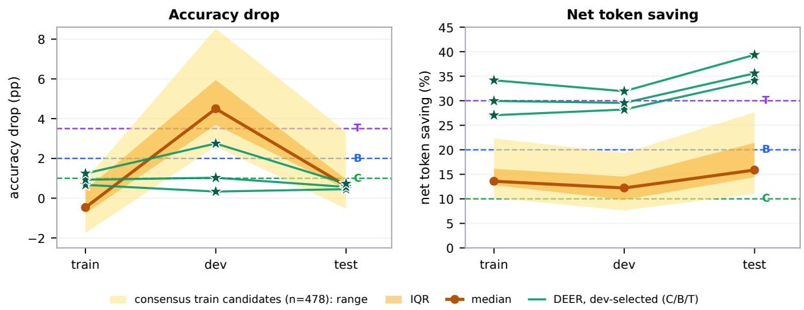  
Figure 5: A rule must clear the gate on every split. The 478 amber rules are those clearing the conservative gate in-sample on train, shown as median, interquartile range and full range. Dashed lines mark the three preregistered gates (Conservative, Balanced, Token-efficient); a rule must sit below them on the left and above them on the right. On dev, the split the gate is applied on, none of the 478 does; jointly, 0 of 478 clear all three splits, against 3 of 3 for the dev-selected DEER points. Macro-averaged over 18 environments per split.

The 30% column understates the DEER confidence signal at our positions: its fourteen thresholds jump from a 29.1% to a 40.3% gross saving, so at that floor it is charged 7.84 pp for savings it was not asked to deliver. That same cell is also the one near miss in this paper. At 13.9% net saving and +0.69 pp it satisfies both numeric legs of the conservative gate and fails only its per-environment leg, saving tokens in 14 of 18 environments against a floor of 80%; the four it fails are four of the six DeepSeek AIME24 and AMC23 cells, six- and eight-problem sets on which the dense probe schedule costs more than the stops it buys.

Decision density. A third difference between the two families is how often each is allowed to fire. On the development trajectories DEER’s reasoning boundaries give it a median of 10 stop opportunities (mean 13.6; its cap of 30 binds on 24.0% of them), while the dense grid at interval 64 gives a median of 54. More chances to fire is more chances to fire wrongly, whatever the signal measures, so the schema varies the interval as one of its axes. At 64/128/256/512 tokens the cheapest rule in each block of 440 loses 3.52/1.91/1.69/1.57 pp for 11.18/7.82/1.26/1.65% net saving, and no block places a single rule inside the 1.0 pp cap;

<table><tr><td rowspan="2">Statistic</td><td rowspan="2">Reads at</td><td colspan="3">Net</td><td colspan="3">Gross</td></tr><tr><td>10</td><td>20</td><td>30</td><td>10</td><td>20</td><td>30</td></tr><tr><td>Agreement</td><td>our grid</td><td>-2.7</td><td>-6.2</td><td>-11.8</td><td>-1.9</td><td>-3.9</td><td>-8.1</td></tr><tr><td>Agreement</td><td>boundaries</td><td>-3.8</td><td>-10.2</td><td>-13.5</td><td>-2.7</td><td>-9.6</td><td>-13.5</td></tr><tr><td>Confidence</td><td>our grid</td><td>+0.7</td><td>-3.1</td><td>-7.8</td><td>+0.7</td><td>+0.7</td><td>-7.8</td></tr><tr><td>Confidence</td><td>boundaries</td><td>+0.1</td><td>+0.1</td><td>-2.8</td><td>+0.1</td><td>+0.1</td><td>-0.4</td></tr></table>

Table 5: The accuracy price of a saving, in points of macro accuracy: the best ∆acc among rules reaching a 10, 20 or 30% saving (+ a gain, − a loss), for each combination of statistic and read positions, on the 659 development problems of Table 3. Cells are searched over 3,520 and 1,760 preregistered rules respectively for agreement, and over DEER’s own 14 published thresholds for confidence; the coarser grid can only cost the confidence rows. Read down a column: changing the statistic lowers the price in all six, while changing the positions raises it at the 10% floor under either accounting and at 20% under gross. In the other three columns the position term also absorbs a probe tax (the dense grid probes 61.8 times per problem against DEER’s 8.6 trials), and the confidence rows reverse.

the 40 rules that do are all event-triggered, and the best saving among them is the 0.2% of §5.2. Interval 512 is the setting that matches DEER: a median of 7 stop opportunities per trajectory against DEER’s 10, and 6 against 8 on MATH500. There the cheapest rule loses 1.57 pp for 1.65% saving, worse on both axes than DEER at its conservative point, 0.33 pp for 28.2%. Density is not what separates them. Computed by decision\_density.py, which reproduces the published 3,520/40/0.21% population before it reports anything.

Probe prefill. Neither view charges the probe prompt (§3.2), and it is by far the larger quantity: a probe re-reads the whole prefix, so on the fixed schedules the prompt tokens come to 11–53× the baseline’s entire decode budget, sparsest to densest, against 4.19× for DEER at its conservative point. Under the KV-cache reuse both Fu et al. (2024) and Yang et al. (2025) assume, that prefill is close to free; without it, it dominates everything else. Dong et al. (2026) report a policy that saves 32% of tokens under cache forking costing 121% extra under black-box repeated prefilling. The exclusion therefore favours the dense consensus schedules, not DEER. Our accounting is otherwise the stricter one: scored under the response-length metric of Yang et al. (2025), which forgives the discarded trial output we charge, DEER’s conservative point saves 30.3% rather than the 28.2% we report, and the same gap holds at all 14 thresholds (+1.6 to +2.4 pp).

Problem-pooled aggregation. Macro averaging gives the 8-problem AMC23 cell the same weight as the 100-problem MATH500 one, so it is worth asking whether the empty gate is a product of that choice. Table 6 re-scores the sweep with problems weighted equally and drops each environment in turn: the gates stay empty throughout, but the margin by which they do is much smaller once the small competition cells stop carrying equal weight.

<table><tr><td>Weighting</td><td>Rules ≤ 1.0 pp Best net saving</td><td></td></tr><tr><td>Macro (protocol)</td><td>40</td><td>0.21%</td></tr><tr><td>Pooled over problems</td><td>634</td><td>9.13%</td></tr></table>

Table 6: The dev sweep re-scored with problems weighted equally instead of environments. All three gates remain empty under either weighting (0 of 3,520), and dropping any one of the 18 environments leaves the outcome unchanged in all 18 cases. Pooling is, however, far more permissive: the best rule that stays within the conservative accuracy cap saves 9.13%, 0.87 pp short of the 10% floor, against 0.21% under macro averaging. The protocol mandates macro averaging; pooling is a robustness check.

Non-terminal stops along the whole window axis. Table 7 gives the measurement of §4.4 at every window, on all 3,420 development-model trajectories. “Differs” is the share of stops committing a non-terminal answer; “harmful” is the share of the resulting accuracy changes that destroy a correctin-the-end answer (swaps excluded). Neither is compared against a chance baseline: a trajectory that ends correct 93.3% of the time has far more correctness to lose than to gain, so some imbalance is implied by the accuracies alone, and the claim of §4.4 rests on the 155 individual corrections observed rather than on the size of the share. The last column is the wider scope of the same count: truncated trajectories included and scored incorrect, so that a correct stop on one counts as a rescue. It is the only place the direction reverses, and only at W=30, where the rule fires on 7% of problems and saves 8%.

<table><tr><td>W</td><td></td><td>Stops Differs (%)</td><td>Harmful Net saving (%)</td><td>(%)</td><td>Harm:rescue (all stops)</td></tr><tr><td>1</td><td>3167</td><td>60.3</td><td>99.0</td><td>91.8</td><td>1751:41</td></tr><tr><td>3</td><td>3037</td><td>33.7</td><td>97.5</td><td>75.9</td><td>879:47</td></tr><tr><td>5</td><td>2888</td><td>20.5</td><td>95.8</td><td>59.7</td><td>485:52</td></tr><tr><td>8</td><td>2577</td><td>13.7</td><td>93.4</td><td>43.6</td><td>269:54</td></tr><tr><td>12</td><td>2045</td><td>10.6</td><td>90.6</td><td>32.0</td><td>155:57</td></tr><tr><td>16</td><td>1570</td><td>9.0</td><td>90.9</td><td>23.5</td><td>100:52</td></tr><tr><td>24</td><td>887</td><td>7.0</td><td>93.3</td><td>12.9</td><td>42:40</td></tr><tr><td>30</td><td>611</td><td>7.2</td><td>93.8</td><td>8.2</td><td>30:39</td></tr></table>

Table 7: Non-terminal consensus stops along the window axis (§4.4). Widening the window drives “differs” down only to a floor near 7%, while the net saving that pays for it falls from 92% to 8%. Columns 2–4 are restricted to trajectories finishing inside the budget; the last column instead includes truncated ones, scored incorrect.

Prior-stopper reproductions. Table 8 reports the two reproductions of §5.4 in a common harness, on the same frozen trajectories and under the same token accounting. CertaIndex (CoT) (Fu et al., 2024) is the consensus stop for a single chain of thought, reproduced from the released implementation at its default mid setting (stop once three consecutive probes give the same non-empty answer and none hedges), with the authors’ probe prompt and probe schedule. This is their rule as shipped, not a variant of ours. DEER (Yang et al., 2025) here is the faithful readout reproduction (the stronger trial-answer-submit variant is what §5.3 sweeps). Three scope notes. First, CertaIndex’s multi-path setting resembles self-consistency, measuring entropy over answers from independently sampled trajectories, and nothing here bears on it; what we reproduce is the single-trajectory case, where the same statistic is read over repeated probes of one chain. Second, these are reproductions on our frozen trajectories and benchmarks, not re-runs of either paper’s end-to-end system, and the original CoT results were reported on an easier benchmark, where intermediate answers settle sooner. Third, the released implementation probes from position 0 while we probe from 64; from the third trigger on the two truncate at the same position and deliver the same answer, and the only difference is that the released code has one earlier opportunity to fire, which if taken stops it sooner still, so the accuracy we report for it is an upper bound. Because a single operating point is exactly what §5.2 argues is uninformative, we also report the other released effort\_level settings in Table 9; the conclusion does not depend on which one is chosen. We will release, but do not report, a prompt-adapted replay of the same mid stop logic driven by our simple@32 probe instead of the authors’ answer suffix: it is the less aggressive of the two on both axes, losing 44–66 pp while saving 71–89%, and it is not their rule, so Table 8 reports the faithful configuration. Separately, the DEER reproduction here is plain DEER: DEER-Pro’s confidence calibration requires several varied answer-inducing prompts at the same transition and the frozen bank stores one, so it is not computable offline against these trajectories.

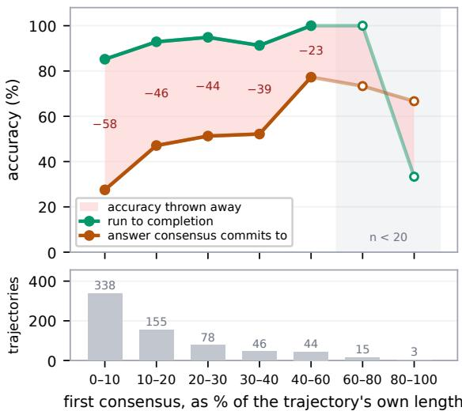  
Figure 6: Consensus forms early, where it is least reliable. For each dev-split trajectory we take the first window of three agreeing non-empty probes and ask two things: is that answer correct, and would the same problem have been correct if left to run? Position is a fraction of the trajectory’s own length, so 500 tokens into a 600-token trajectory counts as late and 500 into a 16K one does not. Consensus forms in 679 of 684 trajectories, half within the first tenth; the shaded gap is the accuracy a stop at that moment throws away. Open markers mark bins with fewer than 20 trajectories; the final bin (n=3) should not be read. Unlike the headline metrics elsewhere in the paper, the rates plotted here, and the ones quoted from them in §4.1, pool the 684 trajectories of the 18 development environments rather than macro-averaging over them, so that each position bin is read off the trajectories that actually fall in it.

<table><tr><td>Method</td><td>Model</td><td>Accuracy</td><td>∆acc</td><td>Fair token saving</td><td>Stop rate</td><td>Signal</td></tr><tr><td>Full generation</td><td>Qwen3-8B</td><td>85.4%</td><td></td><td>0%</td><td>0%</td><td></td></tr><tr><td>Full generation</td><td>DeepSeek-R1-Distill-Qwen-7B</td><td>79.8%</td><td></td><td>0%</td><td>0%</td><td></td></tr><tr><td>CertaIndex (CoT)</td><td>Qwen3-8B</td><td>15.3%</td><td>-70.1 pp</td><td>90.1%</td><td>99.8%</td><td>consensus</td></tr><tr><td>CertaIndex (CoT)</td><td>DeepSeek-R1-Distill-Qwen-7B</td><td>23.9%</td><td>-55.9pp</td><td>76.7%</td><td>98.7%</td><td>consensus</td></tr><tr><td>DEER</td><td>Qwen3-8B</td><td>86.2%</td><td>+0.8pp</td><td>16.3%</td><td>41.4%</td><td>boundary conf.</td></tr><tr><td>DEER</td><td>DeepSeek-R1-Distill-Qwen-7B</td><td>74.9%</td><td>-4.8pp</td><td>20.2%</td><td>56.1%</td><td>boundary conf.</td></tr></table>

Table 8: Prior early-stoppers reproduced on our frozen trajectories (dev, macro over three benchmarks; probe tokens charged). CertaIndex (CoT) stops on almost every problem and stops early, and loses 56–70 pp while saving 77–90% of tokens, the pattern §4.1 describes, at its default shipped operating point (Table 9 sweeps the released alternatives). DEER, reading boundary confidence rather than consensus, stays near full accuracy (+0.8 pp on Qwen3-8B) while still saving tokens. These are reproductions on our benchmarks, not the original papers end-to-end numbers.
<table><tr><td></td><td></td><td colspan="2">Train</td><td colspan="2">Dev</td><td colspan="2">Test</td></tr><tr><td>Effort level</td><td>Patience</td><td>∆acc</td><td>Saving</td><td>∆acc</td><td>Saving</td><td>∆acc</td><td>Saving</td></tr><tr><td>mild</td><td>8</td><td>-18.1pp</td><td>59.4%</td><td>-31.6pp</td><td>53.9%</td><td>-16.6pp</td><td>66.7%</td></tr><tr><td>low</td><td>5</td><td>-30.6pp</td><td>73.4%</td><td>-40.7pp</td><td>67.7%</td><td>-31.5pp</td><td>79.0%</td></tr><tr><td>mid</td><td>3</td><td>-50.0pp</td><td>88.5%</td><td>-63.0pp</td><td>83.4%</td><td>-52.8 pp</td><td>88.6%</td></tr><tr><td>high</td><td>2</td><td>-59.7pp</td><td>94.6%</td><td>-71.0pp</td><td>94.7%</td><td>-65.2pp</td><td>94.3%</td></tr></table>

Table 9: CertaIndex (CoT) across the released effort\_level settings (macro over the six model × benchmark cells as in Table 8, each pooling its three seeds; probe tokens charged). Patience is the number of consecutive agreeing probes the setting requires. The mid row on dev is the setting reported in Table 8 and reproduces it exactly. Accuracy falls monotonically as patience is relaxed, and the most lenient released setting still loses 31.6 pp on dev. A fifth released setting, crazy, shares high’s patience of 2 and differs only in probing every 32 tokens rather than 64; we collected no probe bank at that interval and do not reproduce it, and by the monotonicity above it cannot be more lenient than high.

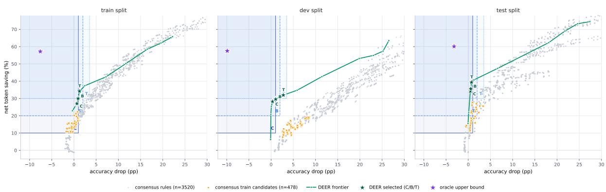  
Figure 7: Selection → generalization across splits (two development models; macro-averaged over environments). Grey: all 3,520 consensus rules. Orange: the 478 rules that clear the conservative gate in-sample on train. Green: the DEER threshold frontier, with the three dev-selected operating points (Conservative/Balanced/Token-efficient) as stars. Purple star: the oracle upper bound (earliest correct probe). Blue bands: the three preregistered gates, darkest first. A rule lies inside a band when its drop is at most the cap and its saving at least the floor (C 1.0 pp/10% solid, B 2.0 pp/20% dashed, T 3.5 pp/30% dotted).

## E Supporting Figures: Sweep Surface, Selection, and Frontiers

This appendix collects the supporting figures referenced from the main text. Figure 4 reads the empty safe-and-saving corner directly off the sweep’s (W, s) surface (§5.2); Figure 5 traces the train → dev → test selection pipeline (§5.5); and Figure 6 shows where consensus first forms as a fraction of each trajectory’s length (§4.1). Figures 7–9 then give the saving-versus-drop view of the same selection and generalization results, resolved per split, per model and per benchmark, with the oracle upper bound on each panel. They show the distributions the summaries are drawn from.

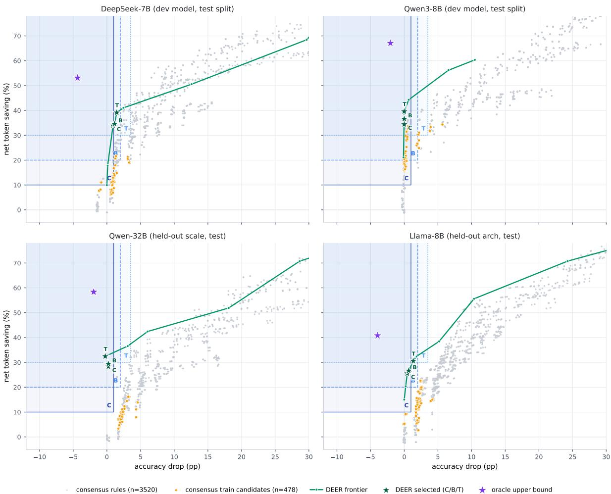  
Figure 8: Out-of-sample generalization across scale and architecture (all panels test split). The two development models (top) are shown on their held-out test seeds; the two held-out models (bottom) are entirely unseen. Markers as in Figure 7. The dev-selected DEER points stay inside the conservative gate on every model; no consensus rule clears it on all four. On the two development models many are admissible in-sample on test, but none is selectable from dev (§5.5).

<table><tr><td>Threshold τ</td><td>Total drop (pp)</td><td>Net saving</td></tr><tr><td>0.9999</td><td>-0.06</td><td>20.8%</td></tr><tr><td>0.999</td><td>0.06</td><td>25.4%</td></tr><tr><td>0.995</td><td>0.33</td><td>28.2%</td></tr><tr><td>0.99</td><td>1.03</td><td>29.6%</td></tr><tr><td>0.97</td><td>2.75</td><td>31.9%</td></tr><tr><td>0.95</td><td>5.87</td><td>34.8%</td></tr><tr><td>0.90</td><td>11.43</td><td>42.6%</td></tr></table>

Table 10: DEER trial-answer-submit threshold frontier on dev (macro over 18 environments, same token accounting). Unlike consensus, low drop coincides with substantial saving; all three gates are cleared around $\tau \in [ 0 . 9 7 , 0 . 9 9 5 ]$

Selection-pipeline details (§5.5). In Figure 5, the 478 consensus rules that clear the conservative gate in-sample on train are tracked onto dev and test as a band; the three dev-selected DEER thresholds are tracked individually. On dev, the split the gate is applied on, not one of the 478 is admissible, while all three DEER points stay inside on every split. The dev and test splits are not equally demanding: the same 478 rules have a median drop of 4.5 pp on dev but 0.6 pp on test, an asymmetry driven by the two smallest environments (AMC23 and AIME24 under Qwen3-8B). The gate has to be read jointly rather than per split: 364 of the 478 are admissible on test, but they are exactly the insample winners a held-out split exists to reject, and none of them is selectable from dev.

Unseen-model details. On the 4× larger Distill-Qwen-32B the conservative gate stays empty (the best rule under a 1.0 pp drop saves 0.6%), but a scale effect appears at the looser gates: a few consensus rules become admissible in-sample (4 at balanced, 6 at token-efficient), reflecting that a bigger model’s intermediate answers stabilize somewhat earlier. These are not the dev-selected rules, since dev admits none. On the same-scale Distill-Llama-8B all three gates stay empty (0/0/0; the best rule under a 1.0 pp drop saves 9.3%). The Llama-8B trajectories were re-collected after correcting a chat-template defect (a missing model-specific beginning-of-sequence token that degraded its generations); the corrected model scores ∼ 88% on MATH500. The oracle upper bound on each panel is a perfect probe-based stop committing the earliest correct probe; it sits at a negative drop of 2–5 pp at 40–80% saving, far in a corner neither method reaches.

## F Case Studies

The mechanism of Section 4 is easiest to see on individual trajectories. All three below are DeepSeek-R1-Distill-Qwen-7B on MATH500, seed 42, probed every 64 generated tokens; we write a × n for an answer repeated over n consecutive probes. A rule requiring three agreeing probes fires at the third element of the first such run.

Case 1: a persistent placeholder. Problem 320 asks for cos ∠RPS given sin $\begin{array} { r } { \angle R P Q = \frac { 7 } { 2 5 } } \end{array}$ (answer − $\cdot \frac { 2 4 } { 2 5 } )$ . The probe stream is

$$
\begin{array} { c c } { { \theta { \times } 2 7 , ~ \mathsf { B } { \times } 8 , ~ - 2 4 / 2 5 , ~ \mathsf { B } { \times } 7 , } } \\ { { \mathsf { E } , ~ \mathsf { B } { \times } 6 , ~ - 2 4 / 2 5 { \times } 7 } } \end{array}
$$

The model answers 0 at the very first probe and repeats it for 27 consecutive probes, covering tokens 64–1728 of a 3,683-token trajectory. It then passes through a stretch of bare option letters before reaching − 2425 and holding it to the end; the trajectory is correct.

This single case makes three points. The stop is not a considered wrong answer but a value emitted before any real work has been done, and it is perfectly stable for nearly half the trajectory. That it never changes therefore says nothing about whether reasoning has finished. And because the run is 27 probes long, it defeats every window in our sweep: even W=24, the second-largest we searched, fires here and commits 0. Enlarging the window does not address a placeholder that persists longer than the window.

Case 2: a probe-format artifact. Problem 253 is “What fraction of 2 feet is 3 inches?”, a freeresponse question with no answer options. The stream is

## 3, B, 3, 24, B, D×20, 1/8

From token 384 to token 1600, more than two thirds of the trajectory, every probe returns the letter D. There is nothing for D to refer to. The model is not reporting a belief about the answer; it is completing the probe suffix in a plausible format while its reasoning continues underneath. The correct value $\frac { 1 } { 8 }$ appears only at the final probe. Agreement here is maximal and perfectly uninformative, which is why any deployed rule needs to check answer shape before treating agreement as evidence (§4.3).

Case 3: a wrong answer either way. The minority case is equally worth stating. Problem 240 (gold 116) gives

$$
5 2 \times 2 , 1 0 4 , 5 2 \times 5 , . . . , 1 5 4 \times 8 , 5 2 , 1 5 4 \times 6 2
$$

A three-probe rule fires at token 384 and commits 52; the trajectory itself ends at 154. Both are wrong. Here early stopping destroys nothing, because continued reasoning was not going to arrive at the right answer either; the model settles firmly on 154 and holds it for its final 62 probes. Cases like this are why §4.4 keeps stops that swap one wrong answer for another separate from those that change correctness: on problems the model was never going to solve, a consensus stop costs accuracy nothing and saves tokens, which is the regime consensus early exit was designed for. The difficulty is that agreement does not distinguish this case from Case 1, and Case 1 is the more common one.

## G Self-Consensus: Full Analysis

Section 4.1 summarizes what this appendix establishes in full: in an intervention-free setting, selfconsensus is not a reliable stopping signal.

## G.1 Setup

We analyze the frozen main trajectories (Section 3): DeepSeek-R1-Distill-Qwen-7B on all 500 MATH500 problems (Lightman et al., 2024; Hendrycks et al., 2021) at the main 16K-token budget, temperature 0.6, top-p 0.95, across three seeds (1,500 trajectories in total).1 The dense probe bank appends the boxed-answer probe suffix every 64 generated tokens and reads off the model’s current answer. The probe is a separate forward pass: the controller only observes, never halting or altering the main trajectory. This yields, per trajectory, the full answer sequence a stopping rule would have access to at the budget used throughout the paper.

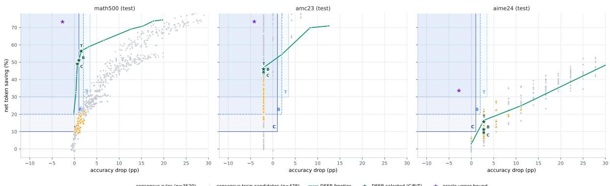  
Figure 9: Out-of-sample generalization across benchmarks (test split, development models). The consensus trade-off and the DEER advantage hold on MATH500 and AMC23; on the small AIME24 set (few problems per environment) the two frontiers are noisier and intertwine. Markers as in Figure 7.

## G.2 Agreement at the End of a Trajectory

Agreement measured at the end of a trajectory does track correctness. On the 186 trajectories that reach unanimous cumulative agreement (all non-empty probes concur), 97.8% are correct, with only four agreeing throughout on a wrong answer; and of the 1,205 whose final five-probe window is unanimous, 90.4% are correct. But this end-state agreement is not what an online stopping rule can act on: a rule fires the first time it sees agreement, mid-trajectory, long before the answer has settled. The rest of this appendix shows that early agreement, the signal a controller must actually use, is far from terminal.

## G.3 A Naive Consecutive-Agreement Stop

We simulate a naive consecutive-agreement stop: halt at the first point where three consecutive probes agree, are non-empty, and are certain (the model emits the boxed answer with high token-level confidence; formal definition in Appendix A). This is a simplified heuristic, not the CertaIndex (CoT) rule, which we reproduce from its released implementation in §5.4. It fires on 1,477/1,500 trajectories. The committed answers are correct only 50.5% of the time, whereas letting those same problems run to completion reaches 90.7%, a 40.2 pp accuracy loss in exchange for an average saving of 3301 tokens, with 731 trajectories stopped on an outright wrong answer.

## G.4 Recovery After an Early Consensus

The loss is driven by recovery: continued reasoning overturns the intermediate answer far more often than intuition suggests. Of the 736 trajectories that at some point formed a three-probe consensus different from their eventual final answer, 620 (84.2%) ultimately ended with a correct final answer.

Normalizing by position within each trajectory shows where the damage concentrates: reliability improves the later the first consensus falls in a trajectory’s own span, so the earliest consensus, the one an online rule acts on, is the least reliable (§4.1, Figure 6).

## H Using the Negative Result

The gates are empty, but the measurements behind them are constructive about what a stopping signal has to do.

Agreement as a precondition. Agreement is cheap to read and, once a trajectory has finished, does track correctness (§4.1); what it cannot do alone is carry the stop. A probe does not report a belief; it requires an answer, and early in a trajectory what it returns is substantially a property of the query, since two differently worded probes read back different answers 54% of the time in the first tenth (§4.2). Agreement over such readings establishes that the elicited answer has not moved, not that the reasoning has terminated. It can serve as a necessary precondition, with the decision left to a signal that separates a settled trajectory from one still working.

Measuring convergence. Demanding more agreement buys safety only by giving the saving back (§4.4), so the useful direction is a better reading of whether the reasoning has converged. Two candidates follow from our measurements, and we evaluate neither: requiring two differently worded probes to agree, which §4.2 shows is demanding early and easy late; and comparing the reasoning across positions, the semantic similarity between successive prefixes, instead of the low-bandwidth boxed answer span.

Transfer across splits. Of our rules, 478 clear the conservative gate in-sample on train and 364 are admissible on test, so a study reporting on one split would have found a working consensus rule (§5.5). Not one is selectable from dev, and none clears the gate on all three splits jointly: one environment or one split is enough to produce a rule that looks both safe and saving.