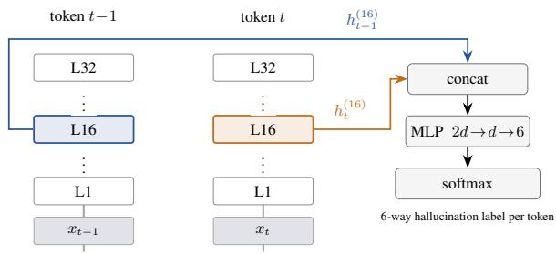

# Team eye-be-am at SHROOM-Visions: Two-Token Features and Small–Large Ensembles for VLM Hallucination Detection

Eli Schwartz

IBM Research

eliyahu.schwartz@ibm.com

## Abstract

We present our system for the SHROOM-Visions 2026 shared task on character-level VLM hallucination detection. A small (4Bparameter) VLM is fine-tuned as a per-token classifier reading a two-token feature from its own hidden states, and is ensembled with a ∼400B zero-shot VLM judge at prediction time. Both components see off-the-shelf OCR of any visible in-image text. We use synthetic hallucination data generated by the large model as a source of ensemble diversity, and use validation to select feature layer, training data and OCR grounding. Our official entry reaches mean Cor 0.487 / Cor-lbl 0.387 on the hidden test set, placing 6th/28 (EN), 6th/21 (FR), 8th/21 (IT) and 7th/22 (ZH) on the task’s primary Cor-lbl metric.

## 1 Introduction

The SHROOM-Visions 2026 shared task (Vázquez et al., 2026) asks systems to identify, at character granularity, which spans of a VLM’s textual output are hallucinated with respect to a supplied image and prompt, and to classify each span into one of five categories (invention, mischaracterization, OCR, miscounting, other). Scoring is by two per-language (EN, FR, IT, ZH) Spearman correlations: an unlabelled $\rho \ : ( ^ {  } \mathrm { C o r } ^ { ? } )$ and a label-aware ρ<sub>lbl</sub> (“Cor-lbl”).

Two solution families present themselves. A very large instruction-tuned VLM can be prompted in zero shot to name the hallucinated spans directly; this generalises across languages but is noisy per character. Fine-tuning a purpose-built detector on the shared-task data is more reliable per token, but fine-tuning at the ∼400B-parameter scale against 15k labelled examples is not compute-efficient. We instead fine-tune a VLM two orders of magnitude smaller than the zero-shot judge and ensemble the two at prediction time.

The paper is organised around what we could measure on validation data. First, we introduce a two-token classifier head that concatenates the hidden states of the current and previous tokens at a single language-tower layer (§3.1) and sweep the choice of layer to identify a mid-network state as the strongest feature source (§3.2). Second, we use synthetic hallucination data generated by the large model as a source of ensemble diversity, measuring the token-level disagreement between small and large models that accompanies it (§4). Third, we ground both components with off-the-shelf OCR of any in-image text (§3.4) and A/B-test the lift. §5 reports the val-based ablation ladder that stacks these three ingredients, and §5.1 reports how the resulting system performed on the hidden test set.

## 2 Task and Models

Each datapoint is $( x , p , y )$ : an image x, a prompt p, and a VLM-generated text y. For each character position i in y the system predicts a probability $\hat { p } _ { i } ~ \in ~ [ 0 , 1 ]$ that the character is inside a hallucinated span, and a category ${ \hat { c } } _ { i } \in$ {inv, misch, OCR, count, other, none}; characterlevel probability series are scored against percharacter averaged annotator gold using the official 2026 scorer. The SHEEP dataset behind the shared task (Mickus et al., 2026) provides human-written span annotations across four languages (EN, FR, IT, ZH) over outputs from five VLMs.

Small model. A 4B-parameter Qwen3.5-VL instruction-tuned checkpoint. Visual encoder and multimodal connector are frozen; LoRA adapters (Hu et al., 2022) (r=16, α=32) are attached to the MLP submodules of all 32 languagemodel layers.

Large model. Qwen3.5-VL-397B (A17B MoE, FP8 serving) used zero-shot via a JSON-schema prompt that asks for an explicit list of hallucinated span strings with categories. The same model, invoked offline, also synthesises training data for the small model (§4).

  
Figure 1: Two-token classifier head: for token t we concatenate $h _ { t - 1 } ^ { ( 1 6 ) }$ with $h _ { t } ^ { ( 1 6 ) }$ and pass the pair to a shallow MLP.

OCR extractor. Both models additionally see an off-the-shelf OCR extraction of visible in-image text, injected verbatim into the user prompt (§3.4).

## 3 Small-Model Detector

## 3.1 A two-token feature

For every generated token t in the output y we form a per-token feature by concatenating hidden states of the current and previous tokens at the same language-tower layer:

$$
z _ { t } = \big [ h _ { t } ^ { ( L ) } \ \lVert \ h _ { t - 1 } ^ { ( L ) } \big ] ,\tag{1}
$$

and a two-layer MLP over $z _ { t }$ predicts a 6-way categorical distribution (five hallucination categories plus none); Figure 1 shows the extraction schematically. The current token contributes an imageconditioned reading of what actually appeared; the previous token contributes local context that is inexpensive to concatenate and consistently helpful in our controls. Which language-tower layer to read is the more consequential choice, and we set it by sweep: $L = 1 6$ of the 33 hidden states the backbone exposes $( h ^ { ( 0 ) }$ is the embedding output, $h ^ { ( 3 2 ) }$ the final block; §3.2).

Because y comes from a different, undisclosed VLM and we consume it teacher-forced, the feature probes hidden states of a reviewing model rather than the generating one, unlike prior hidden-state probes (Azaria and Mitchell, 2023; Chen et al., 2024).

## 3.2 Which layer to read

We select L empirically: with architecture, data, schedule and seed fixed we sweep L over seven values from the embedding output to the penultimate block on val (Table 1). Mean Cor rises by +0.039 from $L { = } 0$ to a broad plateau centred on the middle of the tower and then flattens, and we adopt the plateau midpoint $L { = } 1 6 ;$ a follow-up run tying both slots to $L { = } 1 6$ (rather than only $h _ { t } )$ adds a further +0.017 (App. D). EN-only controls confirm that the previous-token slot is doing work: replacing $h _ { t - 1 }$ by a second copy of $h _ { t }$ costs at most 0.008 Cor, while permuting the second slot along time—preserving its marginal statistics but destroying position alignment—costs 0.049.

<table><tr><td> $L$ </td><td>EN</td><td>FR</td><td>IT</td><td>ZH</td><td> $\mathrm { C o r }$ </td><td>lbl</td></tr><tr><td>0</td><td>0.319</td><td>0.285</td><td>0.312</td><td>0.416</td><td>0.333</td><td>0.304</td></tr><tr><td>6</td><td>0.330</td><td>0.297</td><td>0.329</td><td>0.421</td><td>0.344</td><td>0.312</td></tr><tr><td>13</td><td>0.340</td><td>0.312</td><td>0.354</td><td>0.430</td><td>0.359</td><td>0.322</td></tr><tr><td>16</td><td>0.348</td><td>0.330</td><td>0.365</td><td>0.446</td><td>0.372</td><td>0.328</td></tr><tr><td>19</td><td>0.351</td><td>0.329</td><td>0.358</td><td>0.452</td><td>0.372</td><td>0.331</td></tr><tr><td>26</td><td>0.347</td><td>0.310</td><td>0.351</td><td>0.451</td><td>0.365</td><td>0.328</td></tr><tr><td>31</td><td>0.352</td><td>0.317</td><td>0.365</td><td>0.448</td><td>0.371</td><td>0.333</td></tr></table>

Table 1: Val Cor per current-token feature layer L (headonly, frozen base, 1 epoch, four languages joint). Layer indices are the backbone’s hidden\_states indices $( 0 =$ embedding output, 32 = final block). The mid-network state L=16 is the mean-Cor best and L=19 is essentially tied; the curve is broad but distinctly favours the middle of the tower over the edges (embedding-output +0.039 Cor).

## 3.3 Training and inference

The classifier head and LoRA adapter are trained jointly with plain 6-way cross-entropy over the token grid, warm-started from a single-epoch headonly checkpoint, on all four languages jointly (App. B). At inference the small model is run teacher-forced over the provided output text; pertoken distributions are projected to characters, and we report $\hat { p } _ { i } ~ = ~ 1 - P ( \mathrm { n o n e } )$ with $\begin{array} { r l } { \hat { c } _ { i } } & { { } = } \end{array}$ arg max<sub>c̸=none</sub> $P ( c )$

## 3.4 OCR grounding

The backbone’s visual encoder reads clean prominent text reliably but is noisy on stylised captions, small print and occluded text—the material behind the task’s OCR category. We factor that failure mode out by running an off-the-shelf OCR engine (Du et al., 2020) per language and injecting its output verbatim as a labelled EXTRACTED IMAGE TEXT: block in both models’ user message (omitted when empty); weights are unchanged and the prompts present the string as a signal, not ground truth. On val this lifts the large judge’s mean ρ from

0.264 to 0.303 in all four languages (strongest on IT and ZH, where in-image reading is weakest); a matched EN A/B on the small classifier lifts $\rho$ from 0.331 to 0.342, concentrated on rows with non-empty extractions (+0.021 on $n { = } 1 4 9$ of 401).

## 4 Synthetic Data for Ensemble Diversity

The 15k shared-task training examples do not, by themselves, ensure that the small model produces signal complementary to the large judge. For squared-error ensembles the ambiguity decomposition (Krogh and Vedelsby, 1994) makes the point precise: gain over the average constituent equals the constituents’ disagreement, so making the small model more accurate is not the same as making the ensemble better. Our metric is a rank correlation, so we use this for motivation and for the proxy it suggests rather than as an identity we verify. We therefore generate extra training data with the large model, aiming to shift the small model’s error distribution away from the large model’s own.

Pipeline. A single multimodal prompt to the 397B model, given an image and its caption, returns JSON with three fields: a clean faithful description; a re-written version perturbing one or more spans to introduce a hallucination of a specified category; and the list of changed phrases with categories. Spans come from a character-diff between the two descriptions, falling back to approximate string matching when the diff count disagrees with the declared changes (≈ 41% of rows). This yields ≈ 67,500 labelled rows across four languages, a ≈ 68% usable rate on 24k input captions per language.

Using the same large model to both generate training data and serve as the judge at inference does not, we argue, undermine ensemble diversity. The two roles invoke the model under different prompts and against different inputs: the generator is asked to produce an image caption plus a targeted perturbation from an image and short caption seed, while the judge is asked to annotate a fixed VLM output against the same image with per-span categories. Training the small model on the generator’s output therefore teaches it what generator-style hallucinations look like, not the judge’s per-token scoring function. In practice this leaves room for the two systems to disagree, and the disagreement measurement below shows that room is non-trivially used.

Does it change the small model? We mix synthetic with real rows at a 0.5 ratio during smallmodel training. Whether that diversifies the small model is empirical: for every token in the fourlanguage val split (140,565 tokens, 1,533 samples) we compare the two models’ argmax hallucination flags (any non-none class). Disagreement rises from 28.9% (real-only) to 30.1% with synth—a modest +1.2 pp. Argmax-over-six-classes and mean L1 distance between the 6-way distributions are essentially unchanged, so the effect is on which tokens each model flags, not on category reshuffling within already-flagged tokens. Whether the additional diversity translates into ensemble gain is measured in $\ S 5$

## 5 Results

At prediction time we ensemble the small model’s predicted probability $\hat { p } _ { i } ^ { S }$ and the large model’s zeroshot probability $\hat { p } _ { i } ^ { L }$ at each character position i by a token-level convex combination

$$
\hat { p } _ { i } = \alpha \hat { p } _ { i } ^ { S } + ( 1 - \alpha ) \hat { p } _ { i } ^ { L } ,\tag{2}
$$

with $\alpha { = } 0 . 8$ fixed; the predicted category comes from whichever model contributes the majority of the mass at position i. On val the sweep over α (Table 2) is flat across $\alpha \in [ 0 . 8 , 1 . 0 ]$ and drops sharply below $\alpha \approx 0 . 5$ where the large judge’s coarse span-level probabilities dominate the character series. On the hidden test set the fixed global α=0.8 also outperformed per-language val-tuned weights.

<table><tr><td>α</td><td>mean Cor</td><td>mean ρlbl</td></tr><tr><td>0.0</td><td>0.253</td><td>0.182</td></tr><tr><td>0.4</td><td>0.260</td><td>0.185</td></tr><tr><td>0.5</td><td>0.330</td><td>0.239</td></tr><tr><td>0.6</td><td>0.428</td><td>0.339</td></tr><tr><td>0.7</td><td>0.457</td><td>0.377</td></tr><tr><td>0.8</td><td>0.462</td><td>0.387</td></tr><tr><td>0.9</td><td>0.462</td><td>0.391</td></tr><tr><td>1.0</td><td>0.457</td><td>0.387</td></tr></table>

Table 2: Val mean Cor and mean $\rho _ { \mathrm { l b l } }$ vs. ensemble weight α (Eq. 2; $\alpha { = } 1 . 0$ is head-only, $\alpha { = } 0 . 0$ is largemodel-only). Selected rows shown; the plateau on [0.8, 1.0] is flat.

Val ablation. Table 3 stacks the three ingredients of §3.1–§3.4: synthetic data and OCR grounding each add $\approx + 0 . 0 1 0$ mean Cor-lbl on top of the small model at L=16, and the best small detector reaches 0.467 mean Cor / 0.398 Cor-lbl.

<table><tr><td></td><td>EN FR</td><td>IT</td><td>ZH</td><td>Cor</td><td>lbl</td></tr><tr><td>Small, fine-tuned</td><td>0.4010.4170.445</td><td></td><td></td><td>0.5430.4510.379</td><td></td></tr><tr><td>+ synth</td><td></td><td>0.4180.4320.4380.5380.4570.388</td><td></td><td></td><td></td></tr><tr><td>+ OCR</td><td>0.4250.4530.4520.5380.4670.398</td><td></td><td></td><td></td><td></td></tr><tr><td>Ensemble</td><td>0.4300.4610.4540.5340.4700.394</td><td></td><td></td><td></td><td></td></tr><tr><td colspan="4">Large, 0-shot, OCR 0.264 0.223 0.276 0.386 0.287 0.287</td><td></td><td></td></tr></table>

Table 3: Val Cor per language and mean Cor / Cor-lbl (“lbl”) for the small detector at L=16. Rows in the top block share architecture, schedule and seed and differ only in the data and prompt they see; each row adds to the one above. Data and OCR grounding are monotone in both metrics; the ensemble with the large judge is essentially flat on val (see text). The zero-shot large judge is listed at the bottom for reference and is fused into the row above it at α=0.8 (§5).

The diversity measurement of §4 follows the same rungs: token-level hallucination-flag disagreement between the small model and the OCR-grounded large judge rises from 28.9% (real-only) to 30.1% (real+synth). On val, however, the ensemble with the large judge is essentially flat: both scoring metrics award a vacuous match when gold and prediction are simultaneously empty, and the OCRgrounded large judge lands at that empty-labels floor (0.287 mean; Table 3, bottom row). By the ambiguity decomposition (Krogh and Vedelsby, 1994) an ensemble gains only when both constituents contribute complementary signal, and on val the judge does not.

## 5.1 Submission results

On the hidden test set the picture is different: the large judge scores 0.355 mean Cor, well above its val floor, and the two constituents become useful ensemble partners. The most likely explanation for the val–test gap is annotation quality: the val split is a hash-based holdout of the released training data and inherits its label noise, whereas the hidden test set is separately curated by the task organisers, and the large zero-shot judge—already producing label-quality output—appears to be penalised on val for disagreements that annotator noise would forgive on test.

The large judge is the stronger system on EN and the weaker one on the other three languages by 0.12 to 0.14; fusing them adds +0.031 mean Cor over the small model and +0.130 over the judge, and wins on three languages of four. Our official entry, a per-language Cor-lbl best across uploaded configurations, reaches mean Cor 0.487 / Cor-lbl 0.387 (Table 4), placing 6th, 6th, 8th and 7th of

<table><tr><td></td><td>EN</td><td>FR</td><td>IT</td><td>ZH</td><td>Cor</td><td>lbl</td></tr><tr><td>Large, 0-shot</td><td>0.434</td><td>0.313</td><td>0.331</td><td>0.342</td><td>0.355</td><td>0.265</td></tr><tr><td>Small, fine-tuned 0.418</td><td></td><td>0.469</td><td>0.472</td><td>0.457</td><td></td><td>0.4540.356</td></tr><tr><td>Ensemble</td><td>0.460</td><td>0.481</td><td>0.485</td><td>0.512</td><td></td><td>0.4850.382</td></tr><tr><td>Official entry Rank (Cor-lbl)</td><td>0.466 6/28</td><td>0.484 6/21</td><td>0.485 8/21</td><td>0.512 7/22</td><td>0.487 0.387</td><td></td></tr></table>

Table 4: Hidden-test Cor per language and means for the three main test entries and our final official submission. Ensemble fuses the row above it with the large judge at α=0.8; the small model there is our best small-only upload on Cor-lbl (real+synth). The official-entry row is a per-language Cor-lbl best of our uploads: an OCRgrounded ensemble on FR and the ensemble of the row above on EN, IT and ZH. Rank is by Cor-lbl.

28, 21, 21 and 22 teams. Cor rank equals or beats Cor-lbl rank in every language, so span detection is our stronger half and categorisation the weaker.

## 6 Related Work

The previous SHROOM edition (Mu-SHROOM Organizers, 2025) scored text-only hallucination with the same per-character metrics; the 2026 edition adds visual failure modes—OCR errors and miscounting—and character-granularity spans remain unusual against the whole-response or objectlevel judgements common in VLM-hallucination benchmarking (Li et al., 2023; Sun et al., 2024). Probing internal states for factuality is established— SAPLMA (Azaria and Mitchell, 2023) classifies truthfulness from activations, INSIDE (Chen et al., 2024) exploits internal consistency—and our head sits in that lineage. Related mid-network decoding work (Chuang et al., 2024) contrasts earlier and later layer distributions to reduce hallucination, whereas our head simply reads a mid-network state as a feature. The ensemble reading borrows the ambiguity decomposition (Krogh and Vedelsby, 1994), here for teacher-forced token classifiers, where diversity is directly measurable.

## 7 Conclusion

A small fine-tuned VLM with a two-token classifier head reading a mid-network hidden state gives a competitive per-character hallucination detector on the SHROOM-Visions 2026 shared task. Layer choice is the largest lever (+0.039 val Cor from the embedding output to the mid layer); OCR grounding and synthetic training data each add a further +0.010 mean Cor on val. On the hidden test set the small detector ensembled with a ∼400B zeroshot VLM judge lifts mean Cor by +0.132 over the judge alone and +0.033 over the small detector alone, placing the system in the top third of every language.

## Limitations

Every configuration was trained once, with seed 42; per-language swings from synth training reach 0.023 Cor, larger than several of the deltas we discuss, so single-language comparisons should be read as descriptive. The placement gain of App. D is measured head-only and is an upper bound on what layer choice contributes to the full system— LoRA and more data absorb most of it. The diversity account of §4 predicts the test ensemble gain but not the val outcome, because on val the large judge sits at the empty-labels floor and cannot combine usefully; on test it is 0.07 Cor above that floor and the ensemble gains. Our submitted system also differs from the system this paper describes: it was trained at a cross-layer placement rather than the same-layer L=16 we adopt, folded the val holdout into training, and its official-entry row is a perlanguage Cor-lbl best across configurations rather than one runnable system. App. E gives the full accounting; App. F lists test-time augmentation strategies that did not transfer into ensemble gain. Finally, our study uses a single model family on both sides of the ensemble (Qwen3.5-VL 4B and 397B) and a single OCR extractor (PaddleOCR), and the synthetic set is badly category-mismatched to real data—the most likely reason categorisation is our weakest metric.

## References

Amos Azaria and Tom Mitchell. 2023. The Internal State of an LLM Knows When It’s Lying. In Findings ofthe Associationfor Computational Linguistics: EMNLP.

Chao Chen, Kai Liu, Ze Chen, Yi Gu, Yue Wu, Mingyuan Tao, Zhihang Fu, and Jieping Ye. 2024. INSIDE: LLMs’ Internal States Retain the Power of Hallucination Detection. In International Conference on Learning Representations (ICLR).

Yung-Sung Chuang, Yujia Xie, Hongyin Luo, Yoon Kim, James Glass, and Pengcheng He. 2024. DoLa: Decoding by Contrasting Layers Improves Factuality in Large Language Models. In International Conference on Learning Representations (ICLR).

Yuning Du, Chenxia Li, Ruoyu Guo, Xiaoting Yin, Weiwei Liu, Jun Zhou, Yifan Bai, Zilin Yu, Yehua Yang,

Qingqing Dang, and Haoshuang Wang. 2020. PP-OCR: A Practical Ultra Lightweight OCR System. arXiv preprint arXiv:2009.09941.

Edward J. Hu, Yelong Shen, Phillip Wallis, Zeyuan Allen-Zhu, Yuanzhi Li, Shean Wang, Lu Wang, and Weizhu Chen. 2022. LoRA: Low-Rank Adaptation of Large Language Models. International Conference on Learning Representations (ICLR).

Anders Krogh and Jesper Vedelsby. 1994. Neural Network Ensembles, Cross Validation, and Active Learning. Advances in Neural Information Processing Systems.

Yifan Li, Yifan Du, Kun Zhou, Jinpeng Wang, Wayne Xin Zhao, and Ji-Rong Wen. 2023. Evaluating Object Hallucination in Large Vision-Language Models. In Proceedings ofthe 2023 Conference on Empirical Methods in Natural Language Processing (EMNLP).

Timothee Mickus, Claudio Savelli, Eduardo Calò, Emilio Raimond, Stella Frank, Hengyu Luo, Flavio Giobergia, Vincent Segonne, Chuyuan Li, Aman Sinha, Lorenzo Vaiani, Jörg Tiedemann, and Raúl Vázquez. 2026. Can humans dream of electric sheep? human-written samples for fine-grained vision-andlanguage hallucination benchmarking. Preprint, arXiv:2608.01021.

Mu-SHROOM Organizers. 2025. SemEval-2025 Task 3 (Mu-SHROOM): The Multilingual Shared-task on Hallucinations and Related Observable Overgeneration Mistakes. In Proceedings of the 19th International Workshop on Semantic Evaluation (SemEval-2025). TODO: replace with the correct Mu-SHROOM 2025 overview citation once the ACL-Anthology entry is available.

Zhiqing Sun, Sheng Shen, Shengcao Cao, Haotian Liu, Chunyuan Li, Yikang Shen, Chuang Gan, Liang-Yan Gui, Yu-Xiong Wang, Yiming Yang, Kurt Keutzer, and Trevor Darrell. 2024. Aligning Large Multimodal Models with Factually Augmented RLHF. In Findings of the Association for Computational Linguistics: ACL.

Raúl Vázquez, Aman Sinha, Chuyuan Li, Artem Shelmanov, Artem Vazhentsev, Claudio Savelli, Eduardo Calò, Emilio Raimond, Stella Frank, Hengyu Luo, Flavio Giobergia, Vincent Segonne, Lorenzo Vaiani, Jörg Tiedemann, and Timothee Mickus. 2026. Overview of shroom-visions 2026: A shared task on hallucination detection in large vision-language models. Preprint, arXiv:2608.25662.

## A Prompts used

All three prompts are quoted verbatim from the shipped code (shroom/judge/prompts.py and scripts/vllm\_397b\_combined\_synth.py).

Large-model zero-shot judge (system + user template).

[SYSTEM] You are a strict hallucination detector for vision-language model outputs. You will see an image, the prompt that was given to a VLM, and the VLM's output. Your job is to identify spans of the output text that are NOT supported by the image -- i.e., hallucinations.

Categories:   
A. Invention -- entities, objects, or events   
not present in the image.   
B. Mischaracterization -- incorrect description   
of something visible.   
C. OCR Problem -- misreading of text visible in   
the image.   
D. Miscounting -- incorrect reporting of   
quantities of visible items.   
E. Other -- does not fit A-D.

Return STRICT JSON only -- no prose, no markdown fences. The JSON is a single object with one key, "spans", whose value is an array. Each span is an object with three keys:

- "span": the literal substring from the OUTPUT   
TEXT that is hallucinated. Must be   
quoted exactly as it appears,   
character-for-character.

- "confidence": a float in [0, 1]. Higher = more   
confident this span is   
hallucinated.

- "category": one of "A", "B", "C", "D", "E".

If nothing is hallucinated, return {"spans": []}.

Example output:   
{"spans": [{"span": "three cats",   
"confidence": 0.85,   
"category": "D"}]}   
[USER]   
PROMPT TO THE VLM:   
{prompt}   
VLM OUTPUT TEXT:   
{output\_text}

Identify hallucinated spans in the OUTPUT TEXT.   
Respond with JSON only.

Synthetic-data generator (large 397B model, per-language). The generator is called once per row on the CC6M image–caption corpus. The system prompt is language-specialised via an in-line placeholder; the shown template is for English.

[SYSTEM]   
You are a data augmentation tool. You see an   
image and a short English caption.   
Produce ONE JSON object with three keys:

"clean": A natural longer description of the   
image in English, 30-500 characters.

"edited": The clean description with EXACTLY   
these edits applied in order:   
[edit spec 1]   
[edit spec 2]   
Length 30-500 chars. Do not reorder   
sentences unless the edit requires it.

"changes": A JSON array with one entry per   
edit, in the same order.   
Each entry is   
{"category": "<one of invention|   
mischaracterization|   
OCR|miscounting|other>",   
"phrase": "<exact substring from   
'edited' that changed>"}

Return STRICT JSON only. No prose, no markdown fences.

[USER]   
CAPTION: {caption}   
[image attached]

The edit-spec placeholders are filled with a fixed edit-instruction per category (e.g. invention: “Add a new plausible-in-context object, entity, or attribute NOT mentioned in the source caption”).

Classifier system prompt (small-model training and inference). The system message prepended to every training and inference example:

You are a hallucination detector for visionlanguage model outputs. Given an image and a VLM response, judge which characters in the response are hallucinated and, when they are, into which category they fall.

OCR-grounded user prompt (both small classifier and large zero-shot judge). The user turn seen by both models is the concatenation of the VLM prompt, an optional EXTRACTED IMAGE TEXT: block (omitted when the OCR extractor returns the empty string), and the VLM output text: PROMPT TO THE VLM:

EXTRACTED IMAGE TEXT:   
{ocr\_text}

```lisp
VLM OUTPUT TEXT:
{output_text}
```

Detected OCR line-strings are joined with “ | ”; when the extractor returns the empty string the entire block is omitted and the prompt reduces to the OCR-less form. For the large judge, the classifier system prompt above is followed by the additional instruction that extracted image text may be noisy on stylised or rotated text and should be treated as a signal, not ground truth.

## B Hyperparameters and Compute

Small-model training.

• Base: Qwen3.5-VL 4B, visual encoder and multimodal connector frozen; only the language-tower LoRA adapters + classifier head are trained.

• LoRA: r=16, α=32, applied to the three MLP projections {gate,up,down}\_proj of every language-model layer (96 modules total). Attention projections are left untouched.

• Head: 2-layer MLP over the concatenated feature $z _ { t } = [ h _ { t } ^ { ( 1 6 ) } , h _ { t - 1 } ^ { ( 3 2 ) } ]$ (Eq. 1), output dimension 6.

• Optimiser: AdamW, learning rate $2 \times 1 0 ^ { - 4 }$ cosine schedule over total steps, no warmup, weight decay 0.0, $( \beta _ { 1 } , \beta _ { 2 } ) = ( 0 . 9 , 0 . 9 9 9 )$

• Batch: per-device batch size 2, gradient accumulation 8; effective batch 16 on single-GPU, 32 under 2-GPU DDP.

• Loss: unweighted 6-way categorical crossentropy over the token grid. Preliminary runs with flat inverse-frequency class weights collapsed category prediction onto the majority class; unweighted CE was more stable.

• Precision: bfloat16 forward + backward, SDPA attention.

• Warm-start: the head is initialised from a 1- epoch head-only training run (base frozen, no LoRA); the LoRA adapter is fresh.

• Data: shared-task train split (four languages jointly), plus a 0.5 mix of the synthetic training set (§C), plus OCR-augmented prompts on every row (§3.4). Images resized so the long side is 448 pixels.

• Val: hash-based 10% held out for model selection and diversity measurement (§4); once the configuration is fixed the val slice is folded back into training for the submission run, since with OCR grounding the small model has a new signal to learn from an additional 10% of labelled data.

• Epochs: 2. Seed 42.

Compute. Each small-model training run consumes ≈ 4 H100-GPU-hours (single H100, ∼2.5 h wall for 2 epochs with synth mix=0.5). Testtime inference for the small model takes ≈ 1.5 H100-GPU-hours end-to-end across four languages. Large-model zero-shot judge predictions on the test set are obtained via vLLM on 8 H100s at ∼1.7 s/sample with enable\_thinking=False, totalling ≈ 3 H100-node-hours (≈ 24 H100-GPUhours) across the four languages.

The dominant cost is synthetic-data generation, and we state it plainly because it is easy to underreport. Generating the synthetic set required one 397B multimodal call per input caption over 24k captions in each of four languages, i.e. ≈ 96k calls at ∼1.7 s/sample on the same 8-H100 configuration: ≈ 45 H100-node-hours, or ≈ 363 H100-GPUhours. That is roughly 90× the cost of training the small model and about 85% of the total compute behind our official entry. The small model is therefore cheap to train and cheap to serve, but the pipeline that produced it is not cheap; we make no claim that the system as a whole is computeefficient relative to alternatives that skip synthetic generation. A practitioner reproducing only the real-data ensemble (mean Cor 0.467) pays the ≈ 4 GPU-hour training cost and none of the 363.

## C Data Statistics

<table><tr><td>Split</td><td>EN</td><td>FR</td><td>IT</td><td>ZH</td></tr><tr><td>Train (real, 90%)</td><td>3,398</td><td>3,386</td><td>3,384</td><td>3,401</td></tr><tr><td>Val (real, 10%)</td><td>401</td><td>381</td><td>362</td><td>389</td></tr><tr><td>Test (hidden)</td><td>1,201</td><td>1,233</td><td>1,254</td><td>1,210</td></tr><tr><td>Synth (mix=0.5)</td><td>16,459</td><td>16,600</td><td>16,415</td><td>18,041</td></tr></table>

Table 5: Sample counts per split. Val is a deterministic hash-based 10% held-out slice of the released training data (ids with a fixed SHA-256-derived hash below the cutoff).

The synthetic set is produced by the pipeline of §4 run once per language on 24k input captions from CC6M, yielding a ≈ 68% usable-row rate. The fuzzy-alignment path fires on ≈ 41% of rows across all four languages.

## D Same-Layer vs. Cross-Layer Follow-Up

Table 1 pins the previous-token slot at a fixed reference layer and sweeps only the current-token layer L; the head at L=16 there is $[ h _ { t } ^ { ( 1 6 ) } \| h _ { t - 1 } ^ { ( L _ { b } ) } ]$ To choose between tying the two feature slots and keeping them cross-layer we re-run the head-only training at L=16 under both placements, holding architecture, data, schedule and seed fixed.

## E Extended Limitations

Placement is head-only. The +0.017 Cor samelayer advantage of Table 6 is measured headonly on a frozen base. Re-running the val ladder with LoRA enabled, the advantage of samelayer [16∥16] over cross-layer [16∥32] shrinks from +0.005 mean Cor on the real-only rung to 0.000 once synthetic data and OCR grounding are added, both placements reaching 0.467 mean Cor at the top rung (+0.003 Cor-lbl for [16∥16]). A trainable adapter and more data evidently recover most of what the better placement supplies.

<table><tr><td>placement</td><td>EN</td><td>FR</td><td>IT</td><td>ZH</td><td>Cor</td><td>lbl</td></tr><tr><td>cross-layer</td><td>0.348</td><td>0.330</td><td>0.365</td><td>0.446</td><td>0.372</td><td>0.328</td></tr><tr><td>same-layer 0.358</td><td></td><td>0.364</td><td>0.377</td><td>0.459</td><td>0.389</td><td>0.333</td></tr></table>

Table 6: Val Cor for the two head-only placements at L=16: cross-layer draws $h _ { t - 1 }$ from a fixed reference layer, same-layer draws both slots from L=16. Samelayer gains +0.017 mean Cor in all four languages. This is a head-only delta and an upper bound on what placement contributes to the full system (§7).

Diversity story and val–test asymmetry. The disagreement measurement of §4 is a val-side observation, but the ensemble Cor lift it predicts does not appear on val. We attribute this to the val–test asymmetry of the large judge: on val it sits at the empty-labels floor, so fusion finds little to combine even when disagreement is present. On test the judge is 0.07 above that floor, and the ensemble gains +0.031 mean Cor over the small model of Table 4. The synth-driven part of that gain is however not test-only clean: the labelled channel of the small model also improves on test with synth (0.345 → 0.356 Cor-lbl), so we do not claim a purely diversity-driven effect.

OCR arm is confounded on test. The OCR arm of our submission folded the val holdout into training in the same run, so its test delta is the joint effect of OCR grounding and 10% more labelled data, not of OCR alone. The clean OCR measurements are the val A/Bs in §3.4.

Composite submission. The Official-entry row of Table 4 is a per-language Cor-lbl best of our uploads rather than one runnable system: an OCRgrounded ensemble on FR and the ensemble of the row above on EN, IT and ZH. Because the task selects on Cor-lbl, its Cor is not our maximum (ZH: 0.512 against 0.518 for the OCR ensemble). The submitted small detector was trained at the crosslayer [16∥32] placement rather than the same-layer L=16 selected in §3.2. The small model of Table 4 is our best small-only upload on Cor-lbl but not on Cor—an earlier configuration on real-only data scores 0.457 mean test Cor against this row’s 0.454 while losing on Cor-lbl (0.349 against 0.356), so the honest reading of the ensemble’s Cor gain over the best small model we ever uploaded is +0.028 rather than +0.031.

Reproducibility of the EN test row. The EN figures for our final ensemble differ between the values returned to us at upload time (0.460/0.347) and the final leaderboard values in Table 4 (0.466/0.357); the IT and ZH figures for the same submitted file agree to four decimals across the two views. We cannot account for the EN difference.

Category-distribution mismatch. The synthetic set is badly distribution-mismatched at the category level: mischaracterization accounts for 38–44% of real spans but at most 6% of synthetic ones (and 0% in IT and ZH), while other is 3–6% of real spans and ≈ 28% of synthetic ones; miscounting and OCR are likewise under-generated. This is the most likely explanation for why categorisation is our weakest metric.

Compute and ensemble weight. The ensemble weight α was fixed rather than learned; a learned per-token gate is a natural extension we did not pursue. Our system is also small only in its trainable part: the large judge is required at test time, and synthetic-data generation consumes roughly 90× the large-model compute that small-model training consumes (App. B), so we make no end-to-end efficiency claim.

## F Negative Results

We record three probes that did not translate into ensemble gain and are kept here as pointers for others considering similar directions.

Image multi-scale TTA. Because the output text is fixed at test time we cannot apply standard sampling-based test-time augmentation. On the image side we retried the small model at three longside resizes (384, 448, 512), averaged the resulting per-token 6-way distributions, and re-scored. On EN val this changes the argmax on 0.5% of tokens—roughly two orders of magnitude less than the 28.9% small–large inter-model disagreement that drives the ensemble—and mean Cor is unchanged to four decimals. The image encoder produces essentially the same reading at plausible scales; multi-scale averaging is not a useful diversity source in this pipeline.

MC-dropout on LoRA adapters. Enabling dropout at inference within the LoRA adapters and averaging $K$ forward passes gives a bounded form of head-side TTA. With lora\_dropout= 0.1 and $K { = } 1 0$ we see 0.17% argmax disagreement across passes on EN val; sweeping the inference dropout rate to {0.2, 0.3, 0.5} raises this to 0.34%, 0.52% and 0.76% respectively—monotone in $p$ but still an order of magnitude below the inter-model diversity level. The contribution of the LoRA adapter to the final prediction is bounded, so dropping fractions of it produces less variance than swapping the entire small model for the large judge.

Verdict-position log-probabilities as a signal. Before adopting the classifier-head architecture, we explored a JSON-completion setup in which the small model was fine-tuned to emit a per-sentence verdict token (hallucinated / not) and we recovered a per-sentence $P ( u )$ from the top-K output logprobabilities at the verdict position. On EN val the resulting soft probabilities were worse-calibrated to gold than the head architecture we eventually adopted: fused with a strong span-selection channel, verdict-logprob $P ( u )$ hurt the $\rho$ metric by 0.09 mean. The verdict position’s uncertainty was not gold-correlated: models that had been trained to emit “no hallucination” with high frequency did so with high confidence regardless of whether the sentence was in fact clean. We abandoned this pathway.