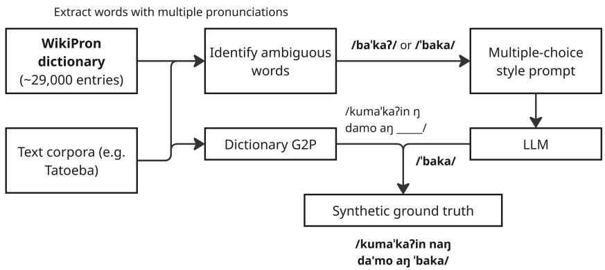
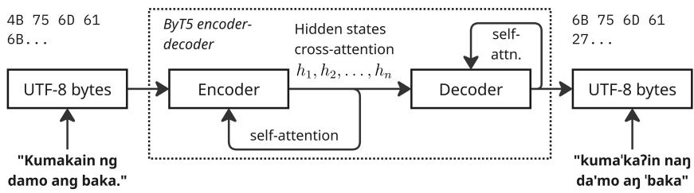
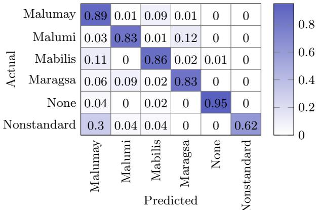
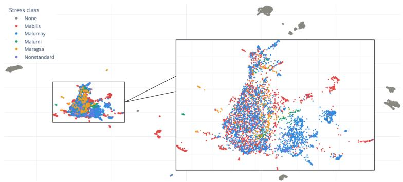

# Towards Stress-Aware Sentence-Level Filipino G2P With Weakly-Supervised ByT5 Fine-Tuning

Lorenz Bernard Marqueses, Paulo Grane Gabriel Silva, Chastine Cabatay, Ericson Adler Tan, and Ann Franchesca Laguna

De La Salle University, Manila, Philippines, lorenz marqueses@dlsu.edu.ph

Abstract. Grapheme-to-phoneme conversion (G2P) refers to the task of converting a sequence of graphemes to a corresponding sequence of phonemes. While Filipino G2P is fairly straightforward due to its shallow orthography, the inclusion of prosodic features such as stress adds a layer of complexity that requires sentence-level context instead of single-word inputs. However, sentence-level data for Filipino typically do not include phoneme transcriptions, posing a challenge for training G2P models. As such, we investigate how to obtain sentence-level phoneme data for Filipino using available data and compare the resulting models with multilingual word-level G2P as well as measure how accurately they predict stress marker position for Filipino. We propose fine-tuning a ByT5-based model, pre-trained on multilingual word-level G2P data, on three sentence-level G2P datasets annotated with an LLM-assisted pipeline guided by data from Wiktionary. This approach produces models that perform well on the G2P task, achieving at best around 0.54% PER and 2.50% CER, a significant decrease compared to base model PER at around 19.74%, on a manually-corrected test set. The model is able to correctly classify most of the main stress classes in Filipino, but struggles particularly with malumi words. We show that a ByT5-based model performs well at sentence-level Filipino G2P and ofers strong potential for Filipino homograph disambiguation.

Keywords: Filipino, sentence-level G2P, stress, prosody, ByT5, weak supervision, LLM-assisted annotation

## 1 Introduction

Automated grapheme-to-phoneme (G2P) conversion refers to the sequence transduction task where an input sequence of orthographic symbols (graphemes) is transformed into an output sequence of phonetic symbols. For instance, the written-language sentence I will study may be converted to the phoneme sequence /aI "wIl "st2d.i/. This conversion is often a crucial component when bridging the gap between written and spoken language, particularly with applications such as text-to-speech (TTS) systems. While G2P has historically been dominated by rule-based systems [1], advances in deep learning techniques have since highlighted the challenges posed by diverse phonologies present in diferent languages, as certain orthographic combinations in one language may have diferent corresponding phoneme patterns in others. Filipino in particular has a shallow orthography [2]—a characteristic it inherited from Tagalog—which means that the relationship between pronunciation and spelling is fairly direct; e.g., the word mare would be transcribed as /mEÄ/ in American English, but as /"maRe/ in Filipino.

Still, Filipino has some characteristics that may complicate the G2P process, particularly with the inclusion of prosodic features. One main issue is that stress (diin) is lexical, which means that the position of the stressed syllable can change the meaning of a word even if they otherwise share the same spelling [3]. For example, the word bukas can be pronounced /"bukas/ to mean “tomorrow” or as /bu"kas/ to mean “open”. Because stress is not explicitly represented in common orthography (diacritics, like the acute accent in b´ukas, are usually dropped), correct transcriptions can only be determined based on the surrounding context of the input phrase or sentence. This means that a model should learn to assign the latter pronunciation given an input like bukas ang pinto (“the door is open”). While stress position may sometimes follow predictable patterns based on characteristics like part of speech, it remains impossible to identify deterministically as agglutination can vary phoneme placements and stress locations [3]. For instance, sulat (“writing”) is /"sulat/ as a noun, but the addition of the prefix nag- to form the verb nagsulat can shift the stress to the final syllable (/nagsu"lat/). The sheer amount of possible afix permutations, each associated with their own stress patterns, makes it dificult to rely on rule-based systems for stress-aware Filipino G2P. We propose a data-centric approach to overcome these issues and produce a model that performs accurate stress-aware G2P conversions at the sentence level. All source code is made publicly available at https://github.com/dlsu-cse-nlp/filipino-byt5-g2p.

## 2 Related work

## 2.1 Approaches to G2P

Traditional approaches to G2P often relied on manually-crafted phonetic rule sets [1,4,5,6]. In particular, Epitran in its initial release included support for 61 languages, including Tagalog [1], which is the basis for Filipino. Rule-based systems are usually lightweight and achieve faster processing, but are limited by explicit definitions that may not be able to handle more irregular patterns and words. Statistical modeling approaches improve on this by learning patterns without relying solely on explicitly defined rules. Early approaches included joint-sequence modeling such as Sequitur G2P (using M-gram approximation for sequence modeling, discounted expectation maximization for training, and either best-first or N-best search for decoding) [7] and Phonetisaurus (utilizing joint n-grams within a weighted finite-state transducer framework) [8], both of which were state-of-the-art at the time. With the advent of deep learning, more approaches would use sequence-to-sequence (seq2seq) neural networks—e.g., with recurrent neural networks—taking advantage of the sequential nature of the inputs and outputs to predict phonemes based on previous time steps [9,10]. Encoder-decoder LSTM was one of the leading architectures on baseline CMUDict, NetTalk, and Pronlex datasets (with many models having the advantage of being trained on large-scale American English data) [10].

However, modern G2P has generally moved away from such approaches in favor of transformer-based architectures. Such approaches generalize better to multiple languages; e.g., [11] introduced ensembled transformer models paired with a self-training regimen to achieve stronger G2P results when data is scarce. Transformer-based G2P was found to significantly outperform previous attentionless recurrent approaches on the CMUDict and NetTalk baseline datasets for English [12]. Of note is the unified paradigm introduced by the Text-to-Text Transfer Transformer (T5), which treats all language processing tasks as text generation problems. G2P with T5 relies mainly on fine-tuning a language-specific T5 model pre-trained on massive amounts of data, but if no such model exists for the intended language, a universal multilingual model (e.g., multilingual T5) [13] can be used instead with slight performance trade-ofs [14]. G2P with T5-based models achieve high precision especially when dealing with longer words and homographs [14]. This is indicative of potential applications for Filipino, which, as mentioned, is agglutinative (resulting in longer words) and features a significant amount of homographs. Efective use of transfer learning may also be applicable to low-resource contexts, able to outperform other models trained from scratch due to making use of existing “learned” context [15].

## 2.2 Byte-level modeling

The emergence of token-free models has introduced a new paradigm for phonetic tasks. ByT5, a byte-level variant of the aforementioned mT5 model, operates directly on raw UTF-8 bytes [16] and has found success in G2P [17]. By eliminating the need for complex subword or SentencePiece tokenizers, ByT5 reallocates parameters typically dedicated to massive vocabulary matrices into dense transformer layers. This design enables the model to learn a soft vocabulary efective for character-to-phoneme mapping. In massively multilingual benchmarks, ByT5 significantly outperforms token-based models, with a ByT5-small model achieving a PER of 8.8% versus 11.9% for a parameter-matched mT5-small model [17]. Byte-level modeling further retains the capability for stronger multilingual generalization through joint learning of multiple languages; for instance, CharsiuG2P [17] covers G2P for around 100 languages, including Tagalog. Even in low-resource language context, specifically for Bengali, ByT5 has been found to outperform word-based models at the G2P task [18]. Bengali shares some similar features with Filipino that pose challenges to the G2P task, specifically the usage of foreign words and variations in spelling conventions, but ByT5 is able to handle out-of-vocabulary (OOV) words and variations in word representations better than other models [18]. In the case of Brazilian Portuguese, both the multilingual CharsiuG2P model and the language-specific fine-tuned ByT5-small BIPA model with character normalization was found to perform with fairly low error rates on the BIPA dataset (6.07% and 4.81% minimum PER, adjusted to account for multiple possible correct transcriptions) respectively [19]. Furthermore, ByT5 has also been leveraged for tasks such as accent placement in Rigvedic Sanskrit, where pitch-accent marks serve as semantic and melodic units [20] akin to Filipino’s stress-accent system. Because ByT5 operates directly on Unicode combining marks, it provided a robust baseline for restoring prosodic information without fragile tokenization, which may be highly transferable to stress-restoration in Filipino. Despite this, the development of a stress-aware sentence-level G2P model for Filipino is mostly unexplored territory.

## 3 Methodology

G2P can be expressed as the problem of transforming some input sequence of words $\textbf { w } = ~ ( w _ { 1 } , w _ { 2 } , w _ { 3 } , \dots , w _ { n } )$ into some output sequence of phonemes $\mathbf { p } = \left( p _ { 0 } , p _ { 1 } , p _ { 2 } , \ldots , p _ { t } \right)$ by some mapping function $f : \mathbf { w }  \mathbf { p } .$ . Constructing f, which in this case is a neural network, thus requires a suitable training corpus comprising both word-level and sentence-level phoneme data that capture the rules of Filipino phonetics.

## 3.1 Word-level phoneme data

The basic foundation of our training data is a dictionary mapping of Filipino words to their respective pronunciations in IPA. We obtain this data through WikiPron1 , which sources multilingual pronunciation data from Wiktionary’s Tagalog section containing the appropriate stress markers for each word. As an example, the word abot pronounced as /Pa"bot/ is represented as Pa’bot. On the other hand, if pronounced as $/ \mathrm { ^ { 1 } 2 a b o t } / \mathrm { . }$ , it is represented as ’Pabot. This initial run produced a total of 29, 532 unique word-pronunciation pairs, of which 20, 435 words were associated only with a single pronunciation, while 4, 231 words had multiple. We refer to the first group as non-ambiguous words and the second as ambiguous words. However, while these ambiguities are often due to stress location diferences, they may still be semantically equivalent (e.g., due to dialectical variations or allophones). As such, we further narrow down the criteria for ambiguous words as follows: (1) the word must have multiple pronunciations spanning at least two stress classes (see Table 4), and (2) these pronunciations must correspond to distinct senses or definitions in the word’s Wiktionary entry.2 After collapsing duplicates into single entries, this produces 1, 511 semantically ambiguous words. All remaining entries from the original 4, 231 are treated as non-ambiguous; in this case we take the first provided pronunciation.

The IPA annotations for the scraped data contain a total of 35 unique Unicode characters, but some of these symbols are not standard features of Filipino phonology or rarely appear in the WikiPron scrape $\left( \mathrm { e . g . , ~ } / \mathrm { { . } f } \right)$ appears only once throughout the entire set). They are thus replaced with phonemes in the Filipino phoneme inventory, largely borrowing from the native Tagalog phoneme inventory consisting of the vowels $/ \mathrm { a } , \mathrm { e } , \mathrm { i } , \mathrm { o } , \mathrm { u } /$ and consonants $/ { \mathrm { p } } , { \mathrm { t } } ,$ $\mathrm { k , 2 , b , p , d , g , m , n , q , s , h , l , r , w , j / }$ , but also phonemes such as $/ \mathrm { t J } /$ and $/ \mathrm { d } _ { 3 } / .$ that are particularly frequent in loanwords [21]. We arrive at the final inventory shown in Table 1, which may be compared directly with the phoneme inventory used in [22]; of the phonemes present in that set, we exclude the voiced palatal nasal $/ \mathrm { { n } } /$ , the dental africates $/ \theta /$ and $/ \eth / .$ , and the voiceless velar fricative $/ \mathrm { x } /$ as they do not appear in the WikiPron scrape.

Table 1: Phoneme inventory of combined dataset, including sentence-level data. Compare with [22] and [21]. Note the $/ \mathrm { w } /$ sound may be considered both labial and dorsal.
<table><tr><td></td><td>|Labial</td><td>Dorsal</td><td>Coronal</td><td>Laryngeal</td></tr><tr><td>Plosive Nasal</td><td>|p, b m</td><td>k, g</td><td> $\mathrm { t } , \mathrm { d }$ </td><td>?</td></tr><tr><td>Trill Tap/Flap Fricative</td><td></td><td>η</td><td>n r</td><td></td></tr><tr><td>Affricate Approx.</td><td>f, v W</td><td>j</td><td> $\stackrel { \mathrm { s } , \mathrm { z } , \mathrm { f } , \mathrm { ~ 3 ~ } } { \frown } \sim$   $\widehat { \mathrm { t s } } , \widehat { \mathrm { d z } } , \widehat { \mathrm { t f } } , \widehat { \mathrm { d } } \widehat { \mathrm { s } }$ </td><td>h</td></tr><tr><td>Lat. approx.</td><td></td><td></td><td>1</td><td></td></tr><tr><td></td><td></td><td></td><td></td><td></td></tr><tr><td>Vowel</td><td>|Front</td><td>Central</td><td>Back</td><td></td></tr><tr><td></td><td></td><td></td><td></td><td></td></tr></table>

## 3.2 Sentence-level phoneme data

In order for the model to learn stress locations in ambiguous words, out-ofvocabulary words, and stress placement for agglutinated words, it must learn from sentence-level data that provides the necessary context surrounding a word. However, existing text corpora for Filipino specifically rarely have phoneme-level transcriptions, and even more rarely include the stress marker. Thus, we propose a straightforward LLM-assisted pipeline, shown in Figure 1, to synthetically generate these transcriptions, similar to the approach taken in [23]. Each input sentence will be compared with WikiPron data to identify words with more than one possible pronunciation. We then prompt the LLM to select which of the possible pronunciations for the ambiguous word is appropriate given the context. Rule-based G2P is applied to the rest of the sentence, which at this stage should only have one possible pronunciation per word. The two outputs are then combined to produce the full phoneme-transcripted output. An important limitation here is that WikiPron does not contain all possible inflections of each word. In these cases, the LLM will have to infer the pronunciation, so we include in the prompt the root word (obtained through the tglstemmer [24] library) as a guide. Including this information in the prompt may help the LLM infer the correct pronunciation for the inflected form. Because we heavily rely on synthetically-generated noisy data, training can be said to be weakly-supervised.

  
Fig. 1: Synthetic training data generation pipeline. We use the Gemini series of models as the LLM, specifically Gemini 3 Flash and 2.5 Flash Lite. In some cases, we enable the LLM’s “thinking” feature, which allows it to first generate an internal chain-of-thought loop before responding (see [25] for more information).

Tatoeba The Tatoeba dataset is a collection of short sentences and their translations in various languages. The 7, 300 sentences in the original set are processed through an LLM (Gemini 3 Flash using the “thinking” feature; see Figure 1), filtered, and split into a training set (roughly 80%), validation set (roughly 10%), and test set (roughly 10%). The filter works to remove characters that do not align with any of the phonemes in Table 1 (although for certain cases we map to the closest available representation of a sound, e.g. /ô/ is mapped to /R/), as well as to fit the generation limit set due to resource constraints. This resulted in a final count of 5, 662 training samples with a mean length of 34.9 (SD = 16.7) characters per sentence.

NewsPH-NLI We had initially sampled 50, 000 sentences from the NewsPH-NLI dataset [26], but due to resource constraints only 31, 166 sentences were processed through the LLM (using Gemini 2.5 Flash Lite but with the same prompt as with the Tatoeba set, without “thinking”; as the sentences were processed concurrently, this is essentially a random subset of the initial 50, 000). We apply the same filters (and mapping corrections) as with the Tatoeba set. This resulted in 22, 178 samples that are again split, producing 17, 742 training samples with a mean length of 177.6 (SD = 43.6) characters per sentence (thus this is also the most complex of the available datasets, but is also the noisiest).

Synthetically generated datasets To ensure that all ambiguous words in the WikiPron scrape are useful at the sentence level, we initially took the entire initial set of 4, 231 ambiguous words, which includes those with no meaningful semantic diferences, and used an LLM to generate 5 sentences per pronunciation per word (using Gemini 3 Flash without “thinking,” with the accompanying instruction that pronunciations with no diference in meaning are collapsed into one). The result was fed as the input to the same annotation pipeline as in Figure 1 and the same filters as the other datasets to produce a total of 27, 494 samples, of which 21, 993 are included in the training split (though only 17, 484 are generated from ambiguous words). We refer to this dataset as the naive synthetic dataset. However, as the name implies, this involved having the LLM essentially guess the correct pronunciation for each word. For a more guided approach, we take the 1, 511 semantically ambiguous words (see subsection 3.1) and generate a second synthetic dataset consisting of 20 sample sentences for each distinct pronunciation of each word (i.e., diferent stress classes). In this case, the LLM also receives the possible definitions of each word. It is instructed to split the 20 generated sample sentences evenly across all definitions that are associated with each pronunciation. For instance, 40 sentences total are generated for the word baka, split between /"baka/ and /"bakaP/. The earlier group comprises 4 sentences each for the senses “declaration of war,” “campaign,” “beef,” “cattle,” and “verbal assault,” but the latter group only comprises only 10 sentences each for the senses “might” and “maybe, probably”. The generated data is then passed through the usual filters to produce a total of 59, 252 samples, of which 47, 402 were included in the training split. We refer to this dataset as the Wiktionary-guided synthetic dataset.

Manually-corrected testing set We randomly sample sentences from the Tatoeba and synthetic datasets, then hand-pick and manually correct sentence transcriptions to produce a gold-standard evaluation set with a total of 1, 173 samples. We exclude NewsPH-NLI due to the relatively poor quality of its automated transcriptions that require significantly more manual corrections to be usable as an evaluation set.

## 3.3 Model architecture

As shown in Figure 2, the model uses an encoder-decoder architecture initialized with the weights from CharsiuG2P [17] and fine-tuned using the above combined corpus. The use of the ByT5 architecture means that input sentences and words are represented purely in UTF-8 bytes.

## 4 Experimental setup

## 4.1 Evaluation metrics

Phoneme (PER) and character error rate (CER) The primary metrics used for model performance are the phoneme (PER) and character error rates (CER). The former breaks each input string into phonemes using the segmentation tool provided by PanPhon [27], while the latter is calculated directly using raw characters. As such, where PER only considers the mapping from letters to phonemes, CER includes whitespace and the stress marker. More precisely, for each sample $i \in \{ 1 , 2 , \ldots , N \}$ , both PER and CER are calculated by obtaining the Levenshtein edit distance d between the ground-truth $y _ { i }$ and predicted sequence $\hat { y } _ { i }$ , then normalizing by the total number of phonemes (or characters):

  
Fig. 2: Model architecture overview

$$
\mathrm { P E R / C E R } = \frac { \sum _ { i = 1 } ^ { N } d ( \hat { y _ { i } } , y _ { i } ) } { \sum _ { i = 1 } ^ { N } \left| y _ { i } \right| } = \frac { \sum _ { i = 1 } ^ { N } ( S _ { i } + D _ { i } + I _ { i } ) } { \sum _ { i = 1 } ^ { N } \left| y _ { i } \right| }\tag{1}
$$

where $S _ { i }$ (substitutions), $D _ { i }$ (deletions), and $I _ { i }$ (insertions) refer to the total number of operations required to form $y _ { i }$ given $\hat { y } _ { i }$ , obtained through a minimumcost alignment.

Phonetic feature error rate (PFER) Another measure of transcription accuracy provided in the PanPhon toolkit is the phonetic feature error rate (PFER) [27]. Unlike PER and CER, PFER measures similarity between articulatory feature vectors $\left( \mathrm { e . g . } \right.$ , mistaking $/ \mathrm { b } /$ for $/ \mathrm { p } /$ would incur a less harsh penalty due to both sounds being bilabial stops). Given some sequence of $k$ phonemes $\mathbf { p } = \{ p _ { 1 } , p _ { 2 } , \dots , p _ { k } \}$ , PanPhon calculates an articulatory feature vector $V ( p _ { i } )$ for each entry to produce fea $\mathbf { \dot { \varepsilon } } ( \mathbf { p } ) = \{ V ( p _ { 1 } ) , V ( p _ { 2 } ) , \ldots , V ( p _ { k } ) \}$ . As with PER and CER, we then calculate the feature edit distance (FED) following the same distance calculation in Equation 1, except each substitution, deletion, or insertion operation is assigned a cost $( c _ { S } , c _ { D } , \mathrm { o r } \ c _ { I } )$ calculated as follows:

$$
c _ { S } ( p , \hat { p } ) = \frac { 1 } { 2 F } \sum _ { j = 1 } ^ { F } | V ( p ) _ { j } - V ( \hat { p } ) _ { j } |\tag{2}
$$

$$
c _ { I } ( p ) = c _ { D } ( p ) = \frac { 1 } { F } \sum _ { j = 1 } ^ { F } w ( V ( p ) _ { j } ) , \mathrm { ~ f o r ~ } w ( x ) = \left\{ \begin{array} { l l } { { 1 } } & { { x \neq 0 } } \\ { { 0 . 5 } } & { { x = 0 } } \end{array} \right.\tag{3}
$$

where $F$ is the dimensionality $\left( \mathrm { i . e . , } | V ( p ) | \right)$ of the feature space, which for PanPhon is fixed to 24.

Stress classification accuracy Filipino has four main patterns for the location of the stressed syllable and glottal stops in a word [3]: malumay, mabilis, maragsa, and malumi. As shown in Table 2, each class places stress either at the final or penultimate syllable and ends either with an open sound or a glottal stop. Given an input phoneme transcription (e.g., /"buhaj/), it is thus almost entirely deterministic to identify which pattern is being followed. We do this by breaking a word into syllables (e.g. {"bu, haj}) and checking for the position of stress and any glottal stops. By applying this to each word, we are able to evaluate the G2P model treating stress modeling as a multi-class classification problem; this thus gives a metric focused specifically on Filipino prosody rather than raw phonetics. Words that do not fall under these four classes are classified as nonstandard,3 while words that are completely unstressed are classified as none.

Table 2: Main Filipino stress patterns. Each stress class corresponds to a diacritic, but this is often excluded in everyday use.
<table><tr><td>Pattern</td><td colspan="3">Word Diacritic Stress</td><td>Ending</td><td>IPA</td><td>Meaning</td></tr><tr><td>Malumay</td><td>buhay buhay</td><td></td><td>Penultimate Open</td><td></td><td>/&#x27;buhaj/</td><td>“life”</td></tr><tr><td>Mabilis</td><td></td><td>buhay buháy</td><td>Final</td><td>Open</td><td>/bu&#x27;haj/ “alive&quot;</td><td></td></tr><tr><td>Maragsa</td><td>paso</td><td>pasô</td><td>Final</td><td></td><td></td><td>Glottal stop /pa&#x27;so?/ “flower pot&quot;</td></tr><tr><td>Malumi</td><td>|paso</td><td>pasò</td><td>Penultimate Glottal stop /&#x27;paso?/ “scald&quot;</td><td></td><td></td><td></td></tr><tr><td>None</td><td>ay</td><td>N/A</td><td>None</td><td>Any</td><td>/7aj/</td><td>grammar particle</td></tr><tr><td>Nonstandard</td><td>agila</td><td>N/A</td><td>Other</td><td>Any</td><td>/’?agila/ “eagle”</td><td></td></tr></table>

## 4.2 Training configuration

For all models, we use the Adafactor optimizer with a learning rate of $3 \times 1 0 ^ { - 4 }$ and an efective batch size of 64 (due to hardware constraints this required an on-device batch size of 4 augmented by 16 gradient accumulation steps). We set a generation limit of 256 for validation, which is enough to cover Tatoeba, but for longer samples like those from NewsPH-NLI we simply truncate. The learning rate is kept constant but begins with a warmup scheduler with 300 steps (lowered to 100 steps for the smaller Tatoeba dataset and increased to 600 when including the large Wiktionary-guided synthetic dataset). Furthermore, we train for 10 epochs and take the three checkpoints for each configuration with the best validation loss, then report results using checkpoint ensembling.

## 5 Results and discussion

## 5.1 Training dataset ablation tests

Table 3 shows the performance of the trained models on the manually-corrected test set. The ablation shows the efects of each additional dataset on model performance; more training data generally resulted in increased model performance with lower PER, CER, and PFER. “Pooled” refers to error rates calculated over the entire evaluation set, while “mean” refers to the average sentence-level error rates. All the fine-tuned models greatly outperform the base CharsiuG2P model and the rule-based Epitran [1] model, but it should be noted these two do not predict the stress marker, which means that CER is not entirely a valid metric. The dataset combinations are numbered as follows: (1) Tatoeba, (2) NewsPH, (3) Tatoeba + NewsPH, (4) Naive synthetic, (5) Tatoeba + NewsPH + Naive synthetic, (6) Tatoeba + NewsPH + Naive and Wiktionary-guided synthetic. Notably, the introduction of the Wiktionary-guided synthetic set reduced CER by about 0.3%.

Table 3: Training dataset ablation tests showing metrics on each test set. Pooled metrics are calculated treating the entire corpus as a single corpus. Mean and std. are reported treating each sample separately. Note that since the base model and Epitran do not generate the stress marker, CER results for (7) and (8) are not entirely valid (but are kept, marked with †, for completion).
<table><tr><td rowspan="2"></td><td colspan="3">PER (%)</td><td colspan="3">CER (%)</td><td colspan="3">PFER (%)</td></tr><tr><td>Pooled</td><td>Mean</td><td>Std.</td><td>Pooled</td><td>Mean</td><td>Std.</td><td>Pooled</td><td>Mean</td><td>Std.</td></tr><tr><td>(1)|</td><td>|1.19</td><td>1.21</td><td>2.16</td><td>|4.34</td><td>4.32</td><td>3.75</td><td>|0.84</td><td>0.86</td><td>1.55</td></tr><tr><td>(2)</td><td>5.25</td><td>5.04</td><td>5.15</td><td>8.31</td><td>8.27</td><td>5.67</td><td>3.83</td><td>3.68</td><td>4.17</td></tr><tr><td>(3)</td><td>1.02</td><td>1.01</td><td>2.17</td><td>3.90</td><td>3.82</td><td>3.52</td><td>0.72</td><td>0.72</td><td>1.65</td></tr><tr><td>(4)</td><td>0.75</td><td>0.80</td><td>1.93</td><td>3.09</td><td>3.12</td><td>3.38</td><td>0.55</td><td>0.59</td><td>1.53</td></tr><tr><td>(5)</td><td>0.53</td><td>0.55</td><td>1.43</td><td>2.83</td><td>2.79</td><td>3.02</td><td>0.39</td><td>0.40</td><td>1.10</td></tr><tr><td>(6)</td><td>0.54</td><td>0.56</td><td>1.40</td><td>2.50</td><td>2.50</td><td>2.94</td><td>0.38</td><td>0.41</td><td>1.09</td></tr><tr><td>(7)</td><td>19.74</td><td>19.84</td><td>7.54</td><td>26.64†</td><td>26.82†</td><td>6.27†</td><td>11.10</td><td>11.23</td><td>5.11</td></tr><tr><td>(8)</td><td>11.70</td><td>11.57</td><td>5.19</td><td>18.77†</td><td>18.83†</td><td>3.97†</td><td>9.08</td><td>8.93</td><td>3.96</td></tr></table>

## 5.2 Wilcoxon signed-rank tests

We perform pairwise Wilcoxon signed-rank tests to assess the significance of the diferences in model performance (as measured by mean sentence-level error rates) with diferent combinations of fine-tuning datasets. As the eight models tested results in 82 = 28 comparisons per metric over three metrics (i.e., 84 tests), we employ the Holm-Bonferroni Method to control the family-wise error rate at α = 0.05 with greater statistical power than with a standard Bonferroni correction.

All pairwise tests were found to be significant at this threshold across all metrics with the sole exception of (5) and (6). In this case the addition of the Wiktionaryguided synthetic dataset did not result in a statistically significant improvement in PER $( W = 7 , 4 3 9 , p = 1 . 0 0 0 0 )$ or PFER $( W = 7 , 3 8 4 , p = 1 . 0 0 0 0 )$ , though there was a significant diference in CER $( W = 5 1 , 3 5 2 , p = 0 . 0 0 1 5 )$ . This is consistent with what can be observed in Table 3, where (5) and (6) show nearly identical error rates. Since CER is the only metric that measures stress marker placement, this finding may be interpreted to mean that the Wiktionary-guided synthetic dataset may have helped the model distinguish between stress-minimal variants without significantly afecting general performance with phonetic transcription (PER and PFER). The remaining tests suggest that introducing additional data is generally beneficial for the model. We leave more rigorous testing of these hypotheses to future work.

Table 4: Stress classification accuracy metrics, with all non-ambiguous words excluded. Results are normalized to the support of each class.
<table><tr><td>Class</td><td>|Prec. Rec. F1 Supp.|</td><td>TP</td><td>FP</td><td>FN TN</td></tr><tr><td>Malumay</td><td>0.87 0.89 0.88 1846.00|</td><td></td><td></td><td>|1638.00 255.00 208.00 2513.00</td></tr><tr><td>Malumi</td><td>0.71 0.83 0.76</td><td>144.00 120.00</td><td></td><td>50.00 24.00 4420.00</td></tr><tr><td>Mabilis</td><td>0.90 0.86 0.881864.00</td><td></td><td></td><td>1606.00 185.00 258.00 2565.00</td></tr><tr><td>Maragsa</td><td>0.78 0.83 0.80</td><td>259.00 215.00</td><td>61.00</td><td>44.004294.00</td></tr><tr><td>None</td><td>0.96 0.95 0.95</td><td>448.00 424.00</td><td>18.00</td><td>24.00 4148.00</td></tr><tr><td>Nonstandard</td><td>0.79 0.62 0.69</td><td>53.00 33.00</td><td>9.00</td><td>20.00 4552.00</td></tr></table>

  
Fig. 3: Stress classification confusion matrix, with all non-ambiguous words excluded. Many nonstandard words are being incorrectly classified as malumay, but the strong diagonal shows words are generally classified well.

## 5.3 Stress classification

Figure 3 shows that, for each of the four main stress classes, our best model correctly classifies from 83% to 89% of words. It should be noted that this includes only words that we consider semantically ambiguous (meaning we measure classification performance only for cases where the model has to correctly choose one of multiple possible pronunciations from based on surrounding sentence context). Notably, in terms of standard classification metrics, the model performed the worst with malumi words out the four main stress classifications. The model exhibits highest classification accuracy in identifying words with no stress in pronunciation. However, the model struggles with nonstandard words as it misclassifies around 30% of nonstandard words as malumay instead. Classification performance is summarized in Table 4. However, it is also noteworthy that most the errors in the test set are contributed by misplaced stress marks for homographs, such as in the following sentence, given the input “Tulungan mo siya.”, we get /tulu"Nan mo si"a/ and not the expected /tu"luNan mo si"a/.

## 5.4 Word-level embeddings

  
Fig. 4: UMAP word-level embeddings, colored with stress classification. Byte embeddings corresponding to one word are mean-pooled to obtain a representation for a word. Observe high degree of separation for unstressed words.

We show UMAP-reduced embedding visualizations at the word level extracted from the decoder in Figure 4. As the ByT5 model processes bytes, we simply mean-pool the embeddings for all bytes corresponding to a word to obtain a representation for that word, ignoring cases where we are unable to find a proper alignment with the target and predicted phonemes. The visualization shows only weak clustering and very heavy overlap in stress classification in word-level embeddings, although there is a high degree of separation for unstressed words as well as small streaks for the mabilis class. There is also a fairly distinct blob of malumay words interspersed with mabilis words. This may mean either the model is struggling to assign stress, too much information is compressed away with the mean-pool and the UMAP reduction, or the model simply does not explicitly represent stress location as a separable feature internally, despite learning to predict the stress marker token.

## 6 Conclusion and future work

We show that ByT5 is efective for sentence-level Filipino G2P and has potential for Filipino homograph disambiguation. We also introduce phoneme-labeled datasets based on Tatoeba and NewsPH-NLI, as well as a dataset synthetically generated through LLM-assisted pipelines. Future work must focus eforts on utilizing larger datasets for training to introduce a larger scope of diversity as well as data cleaning to ensure that training and evaluation samples use the correct stress placement for all words. We also suggest that future work look into multi-task learning to aid in predicting stress location or fusion with other models (such as the Tagalog-pretrained RoBERTa [26]) to provide contextual information. In particular, a Hybrid TagRoBERTa + Conformer [28] pipeline with an auxiliary homograph loss head may help in addressing homograph ambiguity, agglutinative verb shifts, and stress representation.

## References

1. D. R. Mortensen, S. Dalmia, and P. Littell, “Epitran: Precision G2P for many languages,” in Proceedings of the Eleventh International Conference on Language Resources and Evaluation (LREC 2018), N. Calzolari, K. Choukri, C. Cieri, T. Declerck, S. Goggi, K. Hasida, H. Isahara, B. Maegaard, J. Mariani, H. Mazo, A. Moreno, J. Odijk, S. Piperidis, and T. Tokunaga, Eds. European Language Resources Association (ELRA). [Online]. Available: https://aclanthology.org/L18-1429/

2. D. Ocampo, “Dyslexia in the Philippines,” in International Book of Dyslexia: A Guide to Practice and Resources, I. Smythe, J. Everatt, and R. Slater, Eds. West Sussex, England: John Wiley & Sons, 2004.

3. A. Santiago and N. Tiangco, Makabagong Balarilang Filipino, 2003 ed. Rex Book Store, 2003. [Online]. Available: https://books.google.com.ph/books?id= hrzz3jxAJUwC

4. P. K losowski, “A rule-based grapheme-to-phoneme conversion system,” Applied Sciences, vol. 12, no. 5, p. 2758, Mar. 2022. [Online]. Available: https: //www.mdpi.com/2076-3417/12/5/2758

5. A. Pine, P. William Littell, E. Joanis, D. Huggins-Daines, C. Cox, F. Davis, E. Antonio Santos, S. Srikanth, D. Torkornoo, and S. Yu, “Gi2Pi: Rule-based, index-preserving grapheme-to-phoneme transformations,” in Proceedings of the Fifth Workshop on the Use of Computational Methods in the Study of Endangered Languages. Dublin, Ireland: Association for Computational Linguistics, 2022, pp. 52–60. [Online]. Available: https://aclanthology.org/2022.computel-1.7

6. Y. Matogawa, Y. Sakai, T. Watanabe, and C. Taguchi, “Japanese rule-based grapheme-to-phoneme conversion system and multilingual named entity dataset with International Phonetic Alphabet,” in Proceedings of the 21st SIGMORPHON

workshop on Computational Research in Phonetics, Phonology, and Morphology. Mexico City, Mexico: Association for Computational Linguistics, 2024, pp. 77–86. [Online]. Available: https://aclanthology.org/2024.sigmorphon-1.9

7. M. Bisani and H. Ney, “Joint-sequence models for grapheme-to-phoneme conversion,” Speech Communication, vol. 50, no. 5, pp. 434–451, May 2008. [Online]. Available: https://linkinghub.elsevier.com/retrieve/pii/S0167639308000046

8. J. R. Novak, N. Minematsu, and K. Hirose, “Phonetisaurus: Exploring grapheme-to-phoneme conversion with joint n-gram models in the WFST framework,” Natural Language Engineering, vol. 22, no. 6, pp. 907–938, Nov. 2016. [Online]. Available: https://www.cambridge.org/core/product/identifier/ S1351324915000315/type/journal article

9. S. Achanta, A. Pandey, and S. V. Gangashetty, “Analysis of sequence to sequence neural networks on grapheme to phoneme conversion task,” in 2016 International Joint Conference on Neural Networks (IJCNN). Vancouver, BC, Canada: IEEE, Jul. 2016, pp. 2798–2804. [Online]. Available: http://ieeexplore.ieee.org/document/7727552/

10. K. Yao and G. Zweig, “Sequence-to-sequence neural net models for grapheme-tophoneme conversion,” in Interspeech 2015. ISCA, Sep. 2015, pp. 3330–3334. [Online]. Available: https://www.isca-archive.org/interspeech 2015/yao15 interspeech.html

11. K. Vesik, M. Abdul-Mageed, and M. Silfverberg, “One model to pronounce them all: Multilingual grapheme-to-phoneme conversion with a transformer ensemble,” in Proceedings of the 17th SIGMORPHON Workshop on Computational Research in Phonetics, Phonology, and Morphology. Online: Association for Computational Linguistics, 2020, pp. 146–152. [Online]. Available: https: //www.aclweb.org/anthology/2020.sigmorphon-1.16

12. S. Yolchuyeva, G. N´emeth, and B. Gyires-T´oth, “Transformer based grapheme-to-phoneme conversion,” in Interspeech 2019. ISCA, Sep. 2019, pp. 2095–2099. [Online]. Available: https://www.isca-archive.org/interspeech 2019/ yolchuyeva19 interspeech.html

13. L. Xue, N. Constant, A. Roberts, M. Kale, R. Al-Rfou, A. Siddhant, A. Barua, and C. Rafel, “mT5: A massively multilingual pre-trained text-to-text transformer,” in Proceedings of the 2021 Conference of the North American Chapter of the Association for Computational Linguistics: Human Language Technologies. Online: Association for Computational Linguistics, 2021, pp. 483–498. [Online]. Available: https://aclanthology.org/2021.naacl-main.41

14. M. Rez´aˇckov´a, D. Tihelka, and J. Matouˇsek, “T5G2P: Text-to-text transferˇ transformer based grapheme-to-phoneme conversion,” IEEE/ACM Transactions on Audio, Speech, and Language Processing, vol. 32, pp. 3466–3476, 2024. [Online]. Available: https://ieeexplore.ieee.org/document/10592637/

15. P. Janyoi, A. Thangthai, and P. Seresangtakul, “Transformer-based graphemeto-phoneme conversion with knowledge transfer for Isarn,” IEEE Access, vol. 14, pp. 45 053–45 070, 2026. [Online]. Available: https://ieeexplore.ieee.org/document/ 11450085/

16. L. Xue, A. Barua, N. Constant, R. Al-Rfou, S. Narang, M. Kale, A. Roberts, and C. Rafel, “ByT5: Towards a token-free future with pre-trained byte-to-byte models,” Transactions of the Association for Computational Linguistics, vol. 10, pp. 291–306, Mar. 2022. [Online]. Available: https://direct.mit.edu/tacl/article/doi/10. 1162/tacl a 00461/110049/ByT5-Towards-a-Token-Free-Future-with-Pre-trained

17. J. Zhu, C. Zhang, and D. Jurgens, “ByT5 model for massively multilingual grapheme-to-phoneme conversion,” in Interspeech 2022. ISCA, Sep. 2022, pp. 446–450. [Online]. Available: https://github.com/lingjzhu/CharsiuG2P

18. S. M. J. Islam, S. Ahmmed, and S. H. Mustakim, “Transcribing Bengali text with regional dialects to IPA using district guided tokens,” Jun. 2026, arXiv:2403.17407 [cs.CL]. [Online]. Available: http://arxiv.org/abs/2403.17407

19. T. M. d. Sousa, L. R. Gris, and N. F. F. d. Silva, “BIPA: Brazilian Portuguese phonetic dataset with dialectal variations in IPA standard,” in Proceedings of the 17th International Conference on Computational Processing of Portuguese (PROPOR 2026) - Vol. 1, M. Souza, I. de Dios-Flores, D. Santos, L. Freitas, J. W. d. C. Souza, and E. Ribeiro, Eds. Salvador, Brazil: Association for Computational Linguistics, Apr. 2026, pp. 478–487. [Online]. Available: https://aclanthology.org/2026.propor-1.47/

20. A. Rajeev P and A. Kulkarni, “Accent placement models for Rigvedic Sanskrit text.” [Online]. Available: http://arxiv.org/abs/2511.23088

21. L. Reid and P. Schachter, “Tagalog,” in The World’s Major Languages, 2nd ed., B. Comrie, Ed. London: Routledge, 2008, ch. 47.

22. F. Ang, R. C. Guevara, Y. Miyanaga, R. Cajote, J. Ilao, M. G. A. Bayona, and A. F. Laguna, “Open domain continuous Filipino speech recognition: Challenges and baseline experiments,” vol. E97.D, no. 9, pp. 2443–2452. [Online]. Available: https: //www.jstage.jst.go.jp/article/transinf/E97.D/9/E97.D 2013EDP7442/ article

23. M. F. Qharabagh, Z. Dehghanian, and H. R. Rabiee, “Fast, not fancy: Rethinking G2P with rich data and rule-based models.” [Online]. Available: http://arxiv.org/abs/2505.12973

24. A. L. Maagma, “TglStemmer: A python library for Tagalog word stemming,” https://github.com/andrianllmm/tagalog-stemmer, 2025.

25. Google. (2026) Gemini thinking documentation. Google AI for Developers. [Online]. Available: https://ai.google.dev/gemini-api/docs/thinking

26. J. C. B. Cruz, J. K. Resabal, J. Lin, D. J. Velasco, and C. Cheng, “Exploiting news article structure for automatic corpus generation of entailment datasets,” 2021. [Online]. Available: https://arxiv.org/abs/2010.11574

27. D. R. Mortensen, P. Littell, A. Bharadwaj, K. Goyal, C. Dyer, and L. Levin, “PanPhon: A resource for mapping IPA segments to articulatory feature vectors,” in Proceedings of COLING 2016, the 26th International Conference on Computational Linguistics: Technical Papers, Y. Matsumoto and R. Prasad, Eds. Osaka, Japan: The COLING 2016 Organizing Committee, Dec. 2016, pp. 3475–3484. [Online]. Available: https://aclanthology.org/C16-1328/

28. A. Gulati, J. Qin, C.-C. Chiu, N. Parmar, Y. Zhang, J. Yu, W. Han, S. Wang, Z. Zhang, Y. Wu, and R. Pang, “Conformer: Convolution-augmented transformer for speech recognition,” in Interspeech 2020. ISCA, Oct. 2020, pp. 5036–5040. [Online]. Available: https://www.isca-archive.org/interspeech 2020/ gulati20 interspeech.html