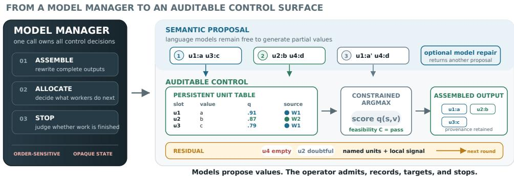
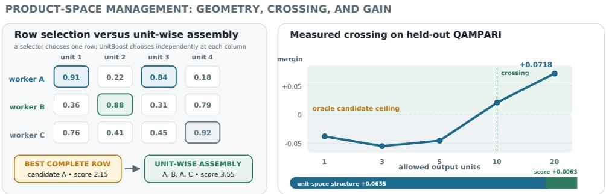
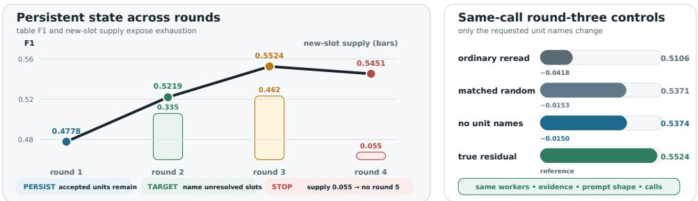
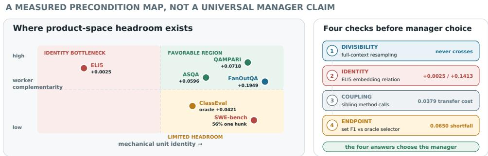

# UnitBoost: Managing Compound LLM Systems with a Merge Operator, Not a Model

Xing Zhang Guanghui Wang Yanwei Cui Mengdie Flora Wang Peiyang He∗ AWS Generative AI Innovation Center

## Abstract

Compound LLM systems often solve a coordination problem by adding a higherlevel LLM. The resulting meta-agent reads workers’ outputs, writes the final answer, allocates later calls, and decides when to stop. It is expressive, but it also concentrates three control decisions in an opaque, order-sensitive model call. We ask whether the manager needs to be generative at all. UnitBoost replaces that model with a defined meta-level operator: a task-given unit map turns worker outputs into slot–value proposals, a constrained argmax assembles the output, and the slots left unfilled or unsupported become an explicit residual for the next round. The operator is order-free, records unit provenance, and gives a simple guarantee: without coupling constraints, unit-wise maximization under the same admission score dominates selection of any complete candidate. On three heldout benchmarks, it exceeds the best single candidate chosen with gold labels by 0.060–0.195 absolute task-score points and input-matched generative managers by 0.048–0.076. Replacing only the management step improves six compoundsystem configurations by 0.013–0.182. Residual-directed rounds raise FanOutQA cell F1 from 0.4778 to 0.5524; matched controls show that the true residual outperforms random targets and ordinary rereading, while a label-free supply signal flags exhaustion after one unproductive round. The same analysis measures three conditions in which no such gain is available (one indivisible unit, unavailable unit identity, and an endpoint that charges for every emitted unit) and quantifies cross-unit coupling as a repair cost. The manager gives up semantic freedom and gains order invariance, unit provenance, and testable failure conditions.

## 1 Introduction

A compound LLM system answers by orchestrating several model calls. Its manager has three jobs: assemble those workers’ partial results into one output, allocate the next calls to whatever remains unresolved, and decide when further work is no longer useful. Current systems commonly delegate all three jobs to another language model. A mixture-of-agents aggregator rewrites proposals [Wang et al., 2024]; debate reports a model-mediated consensus [Du et al., 2023b]; iterative refinement asks a model to diagnose and revise its own answer [Madaan et al., 2023]. Optimizers for language-model programs improve prompts and modules [Khattab et al., 2023], but at inference time the final manager is still usually a generative model.

That choice creates an avoidable control problem. A generative manager can introduce unsupported content, react to proposal order, and hide which worker supplied which part of its answer. More fundamentally, recent work finds that synthesis often copies one proposer, so the manager behaves as a selector [Maryanskyy et al., 2026], that the value of combining models is bounded by the questions on which they fail together [Chen, 2026], and that full-solution communication can erase worker diversity [Ann et al., 2026]. A better selector remains bounded by the best candidate it receives. It cannot return “the first part from worker A and the second part from worker B” unless another model successfully rewrites them.

  
Figure 1: Two designs for the same meta-level decisions. A generative manager owns assembly, allocation, and stopping in one opaque call. UnitBoost exposes those three decisions as a constrained argmax over a persistent unit table, a named residual, and a supply-based stop, and keeps the worker and score behind every accepted value.

We ask whether this manager needs to be a generative agent at all. Our answer is UnitBoost: a deterministic meta-level operator that manages structured parts of outputs rather than complete outputs. Figure 1 contrasts the two control surfaces. The task provides a unit map from an output to proposals (s, v), where slot s identifies a task-defined unit and v is proposed content for it. For a multi-answer question, a normalized answer identifies a unit; for a table, an entity identifies a unit and its attribute is the value; for class-level code, a method signature identifies a unit and its implementation is the value. The operator scores values locally, chooses across workers at each slot, and enforces a feasibility predicate on the assembled output. Its residual is then literal: the slots left empty, infeasible, or without an accepted value become the work queue for the next round.

This change makes a compound system easier to reason about. The merge is a set operation, hence exactly order-free. Every accepted value has a source, a score, and a feasibility trace. With no cross-unit constraint, a sum of per-unit maxima is at least the maximum per-candidate sum, so the operator structurally dominates selection. Most importantly for a multi-round system, outputs from different rounds enter one persistent unit table. A later worker does not need to rewrite the incumbent; it only needs to improve one residual unit.

We test the manager as a replaceable system component rather than as a new end-to-end agent. Agents, prompts, rounds, evidence, and call counts remain fixed while only the candidate-to-output step changes. The experiments answer four questions:

1. Can a defined manager pass the ceiling that binds candidate selection?

2. Does it improve existing compound protocols without changing their workers?

3. Does its residual allocate subsequent calls better than additional sampling?

4. Which observable properties predict when the manager will help or fail?

The answer to the first three is yes under one precondition: the task must expose multiple identifiable units that workers cover differently. The fourth matters as much: the manager cannot help when the output has a single unit, when equivalent units cannot be identified, or when the endpoint prices every emitted unit, and feasibility repair taxes whatever gain remains. Each boundary follows from the operator and is measured rather than merely acknowledged.

## 2 Related work

Generative management. Multi-agent frameworks expose programmable conversations and role structures [Wu et al., 2023, Hong et al., 2023], orchestrators plan and re-plan above specialized workers [Fourney et al., 2024], a verifier model decides whether a decomposed query needs another round [Zhang et al., 2026], and a meta-agent can invent agent programs outright [Hu et al., 2024]. In each design a model owns assembly, allocation, or stopping. UnitBoost asks which of those decisions still need model freedom once a worker topology exists, and answers that models should propose units while code controls admission, allocation, and stopping.

Combination and its ceiling. Compound systems combine with generative aggregation [Wang et al., 2024, Jiang et al., 2023], debate [Du et al., 2023b], self-feedback [Madaan et al., 2023], or module optimization [Khattab et al., 2023], and recent analyses show the limits: candidate selection is the bottleneck [Maryanskyy et al., 2026], shared failures bound the benefit of combining [Chen, 2026], and interaction erases useful diversity [Ann et al., 2026]. Trace-level synthesis [Fadnavis et al., 2026] and Residual Mixture-of-Agents [Xie et al., 2025] keep a generative combiner. The closest defined precedent is classical metasearch [Fox and Shaw, 1994, Aslam and Montague, 2001, Cormack et al., 2009], which fuses ranked lists with no model at all; it is UnitBoost’s verifier-free special case and a strong baseline here, but it carries no feasibility predicate, no provenance requirement, and no residual round. Program evolution faces the same choice between free model-authored edits [Novikov et al., 2025] and structural crossover with model-based repair [Sun and Shi, 2026].

## 3 The UnitBoost operator

The management contract. A manager should not be evaluated only by the quality of the sentence it returns. It should expose what it accepted, why each unit won, which constraints were checked, where the next call is spent, and why the loop stops. Table 3 in Section A states the same four responsibilities for a generative manager and for UnitBoost. The proposal is not to make workers deterministic, but to keep model freedom out of the control surface that joins proposals into system state.

Interface. Let task-defined units be indexed by slots $s ,$ and let each of the n candidate outputs $y _ { i }$ map through the unit map $U$ to zero or more proposals $( s , v )$ . Write $v _ { s } ^ { i }$ for candidate $i \ ' _ { \mathrm { { s } } }$ value at slot s, using $v _ { s } ^ { i } = \perp$ when it proposes none, and let $V _ { s } = \{ \perp , v _ { s } ^ { 1 } , \ldots , v _ { s } ^ { \breve { n } } \}$ , so leaving a slot empty is always an option. Let $q ( s , v ) \geq 0$ score a value, with $q ( s , \bot ) = 0 ,$ and let C be a predicate on assignments $\mathbf { v } = ( v _ { s } ) _ { s }$ , equal to 1 when the assembled output is feasible. The manager returns

$$
\mathrm { m e r g e } ( y _ { 1 } , \dots , y _ { n } ) = \underset { \mathbf { v } \in \Pi _ { s } } { \arg \operatorname* { m a x } } \sum _ { s } q ( s , v _ { s } ) \quad \mathrm { s u b j e c t t o } C ( \mathbf { v } ) = 1 .\tag{1}
$$

A canonical normalized-value order breaks ties, and every nonempty choice comes from a worker. If C is vacuous, the problem separates by slot, and when C factorizes into constraints on disjoint groups of slots it separates within each group. For coupled code units, we admit values in score order while running the task’s executable check. Across all 95 held-out ClassEval classes, exhaustive enumeration of candidate method combinations confirms that this order reaches the product-space optimum. That agreement is measured rather than guaranteed, and where coupling is dense the same interface accepts an exact solver over the product of the per-slot value sets, at the cost of enumeration.

Why it can beat every selector. With $C$ vacuous,

$$
\sum _ { s } \operatorname* { m a x } _ { i } q ( s , v _ { s } ^ { i } ) \geq \operatorname* { m a x } _ { i } \sum _ { s } q ( s , v _ { s } ^ { i } ) .\tag{2}
$$

The right side is the best complete candidate under the same score. Equality holds exactly when a single candidate attains the maximum at every slot. The useful content is therefore not the inequality itself, but its exception: the manager gains only when workers are incomplete in different places. The output budgets of the reported testbeds do not break it: with a budget of B values, the top B per-slot maxima score at least as highly as any candidate’s own at-most-B values. A feasibility predicate on content can consume the gain, so the operative statement is unit-wise gain minus repair cost. We measure both rather than assume either.

Three scoring tiers. We keep the source of the admission score q explicit; it ranks values and is not a reported task endpoint. The oracle tier uses reference labels and is a ceiling, never a method. The deployable tier uses only signals available to the system: worker agreement, the value’s rank in its worker’s own list, whether retrieved passages contain $\mathbf { i t } ,$ and a retrieval-backed check generated and answered by the system. Each coarse signal bin takes its smoothed empirical correct rate from development questions only. The verifier-free tier uses agreement alone, together with the classical score and rank fusion rules CombSUM, CombMNZ, Borda, and reciprocal-rank fusion [Fox and Shaw, 1994, Aslam and Montague, 2001, Cormack et al., 2009].

Algorithm 1 UnitBoost’s inference loop. The unit map, score, feasibility predicate, admission margin,   
and stopping threshold are fixed before held-out evaluation.   
Require: workers W, unit map U, score $q ,$ predicate ${ \overline { { C , } } }$ margin $\delta ,$ rounds $T .$ , threshold $\tau$   
1: unit table $\mathcal { H }  \mathcal { O } ;$ output $z _ { 0 } \gets \mathrm { e m p t y } ;$ ; residual $R _ { 0 } \gets$ the whole task request   
2: for $t = 1 , \dots , T$ do   
3: $Y _ { t } \gets \mathrm { Q } { \mathrm { t } }$ ERY $( \ W , R _ { t - 1 } )$   
4: for all $y \in Y _ { t }$ do   
5: insert $( s , v ,$ worker, t) from $U ( y )$ into $\mathcal { H }$   
6: end for   
7: $z _ { t } \gets$ CONSTRAINEDUNITARGMAX $( \mathcal { H } , q , C , z _ { t - 1 } , \delta )$   
8: $R _ { t } \gets \{ s : s$ is unfilled, infeasible, or has no accepted positive-score value}   
9: $\rho _ { t } \gets$ share of round-t values that land at new slots   
10: if $R _ { t } = \emptyset$ or $\rho _ { t } \le \tau$ then   
11: break   
12: end if   
13: end for   
14: return $z _ { t }$ and the source, score, and constraint trace of every accepted value

Residual allocation. After merging, the manager forms the residual $R _ { t } ,$ , the set of slots that are unfilled or infeasible, or that hold no accepted positive-score value; we call slots of the third kind doubtful. Workers in round $t + 1$ receive the unit specification, accepted values, and the local failure signal, but never another worker’s complete solution. New values are inserted into the same table and compete with incumbents under Equation (1). Relative to output $z _ { t - 1 }$ , an admission margin δ makes a new value at an occupied slot eligible only when its score is at least the incumbent’s score plus $\delta ;$ values proposed for unfilled slots remain eligible. The argmax is then solved over the incumbents and the eligible values; in round one, all proposed values are eligible. Call a slot new in round t when no earlier round proposed a value for it, and let $\rho _ { t }$ be the share of round-t values that land at new slots; the loop stops once $\rho _ { t }$ falls to a threshold $\tau .$ . Each term of the boosting analogy [Friedman, 2001] then has a referent: the merged output is the ensemble, $R _ { t }$ is the residual, workers are weak learners, unit-wise maximization is addition, the margin is shrinkage, and residual exhaustion is early stopping. Unlike learned boosting, no model parameters are updated; the object that improves is the compound system’s persistent output. Algorithm 1 gives the complete inference loop.

## 4 Experimental setup

Testbeds. QAMPARI asks questions with many entity answers distributed across passages [Amouyal et al., 2022]; we use 200 development and 800 held-out questions. ASQA represents an ambiguous question by a set of distinct readings [Stelmakh et al., 2022]; we use 200 and 748. Both use the ALCE retrieval corpus and prompts [Gao et al., 2023]. FanOutQA supplies a table-valued answer and one article per entity [Zhu et al., 2024]; 85 development and 179 held-out questions have complete evidence. ELI5 [Fan et al., 2019] tests long-form factual statements; we use 200 and 800. Archived SWE-bench [Jimenez et al., 2023] and ClassEval [Du et al., 2023a] outputs probe single-unit and coupled code. Table 4 in Section A summarizes their unit interfaces, identity sources, and splits.

Evaluation endpoints and statistics. Task scores are external to $q ,$ macro-averaged over questions on [0, 1]. QAMPARI uses capped recall min $\{ H / \operatorname* { m i n } ( G , 5 ) , 1 \}$ under a 20-answer budget (H distinct reference hits, G references); ASQA uses reading coverage under 12 answers; ELI5, atomic-claim coverage under five statements; and FanOutQA, answer-table cell F1. ClassEval reports how often a method that passes its own tests still passes in the assembled class. Below their caps the first three endpoints are additive in units found, which is the regime Equation (2) describes; set F1 is a separate boundary. Held-out differences use 4,000 one-sided paired bootstrap resamples; the residual-size correlation uses 4,000 permutations. All choices use development data; p-values are uncorrected.

Table 1: Held-out manager replacement. Workers, prompts, evidence, and calls are fixed; only candidate-to-output management changes. Panel A replaces one generation-round manager, panel B one protocol step. Endpoints are QAMPARI capped recall/20 answers, ASQA coverage/12 answers, and FanOutQA cell F1. Each p is the fraction of paired bootstrap resamples with non-positive gain.
<table><tr><td>setting</td><td>replaced manager</td><td>comparator</td><td>UnitBoost</td><td>gain</td><td>p</td></tr><tr><td colspan="6">A. Passing the candidate-selection ceiling</td></tr><tr><td colspan="2">QAMPARI / 20 answers oracle candidate selection</td><td>0.3967</td><td>0.4685</td><td>+0.0718</td><td>&lt; .001</td></tr><tr><td>ASQA / 12 answers</td><td>oracle candidate selection</td><td>0.3595</td><td>0.4191</td><td>+0.0596</td><td>&lt; .001</td></tr><tr><td>FanOutQA / cell F1</td><td>oracle candidate selection</td><td>0.2829</td><td>0.4778</td><td>+0.1949</td><td>&lt; .001</td></tr><tr><td>QAMPARI / 20 answers</td><td>evidence-reading synthesis</td><td>0.4205</td><td>0.4685</td><td>+0.0480</td><td>&lt; .001</td></tr><tr><td>ASQA / 12 answers</td><td>evidence-reading synthesis</td><td>0.3427</td><td>0.4191</td><td>+0.0764</td><td>&lt; .001</td></tr><tr><td colspan="6">B. Drop-in management inside compound protocols</td></tr><tr><td>QAMPARI / mixture</td><td>generative aggregation</td><td>0.4170</td><td>0.4627</td><td>+0.0457</td><td>7 &lt; .001</td></tr><tr><td>ASQA / mixture</td><td>generative aggregation</td><td>0.3472</td><td>0.4117</td><td>+0.0645</td><td>&lt; .001</td></tr><tr><td>QAMPARI / debate</td><td>generative consensus</td><td>0.2913</td><td>0.4148</td><td>+0.1235</td><td>&lt; .001</td></tr><tr><td>QAMPARI / critic</td><td>generative revision</td><td>0.2735</td><td>0.4258</td><td>+0.1522</td><td>&lt; .001</td></tr><tr><td>QAMPARI / chain</td><td>final agent&#x27;s output</td><td>0.2415</td><td>0.4235</td><td>+0.1820</td><td>&lt; .001</td></tr><tr><td></td><td></td><td>0.3295</td><td>0.3424</td><td></td><td></td></tr><tr><td>ASQA / roles</td><td>generative integration</td><td></td><td></td><td>+0.0129</td><td>.0280</td></tr></table>

Workers and managers. The primary retrieval system has ten workers, each reading a disjoint window of ten passages from the same top-100 list. The controls are one call reading all passages, ten stochastic rereads of that call, ten independent workers sharing the same evidence, a judge model, generative managers with and without the evidence, answer-level voting, rank fusion, and oracle candidate selection, which uses gold labels to pick the single best complete candidate and is shortened to oracle selection below. DeepSeek-V3.2 [DeepSeek-AI, 2025] supplies the primary workers and matched manager, while Qwen3-32B [Qwen Team, 2025] supplies the held-out worker replication. Claude Sonnet 5 [Anthropic, 2026] and GPT-5.6 Sol [OpenAI, 2026] manage the same DeepSeek proposals; Claude Sonnet 5 also supplies the exploratory development pool. Table 5 lists the worker and manager roles.

## 5 Passing the candidate-selection ceiling

Panel A of Table 1 isolates the management step. On QAMPARI, UnitBoost reaches 0.4685 against 0.3967 for the candidate an oracle would select, +0.0718 at $p < 0 . 0 0 1$ . On ASQA the margin is +0.0596. At one allowed unit the two spaces coincide and UnitBoost does not win; the margin crosses zero as the output budget grows, that is, as the number of independently choosable units increases (Figure 2). FanOutQA provides a stricter slot–value test: choosing one article-level worker reaches only 0.2829, while unit-wise management reaches 0.4778, a margin of +0.1949. This benchmark is also a useful boundary: a generative manager that rewrites the proposals reaches 0.6019, but it reads every retrieved article, which the merge never does, so the comparison is not input-matched. FanOutQA therefore supports the product-space and allocation claims, not universal dominance over generative managers.

The manager, not the score, supplies most of the gain. On QAMPARI, worker order reaches 0.4592, agreement ranking 0.4622, classical fusion 0.4540–0.4630, and the deployable admission rule 0.4685. Reciprocal-rank fusion already exceeds oracle candidate selection by 0.0655 without labels. UnitBoost’s scoring adds 0.0063 over that rule and 0.0055 over the best label-free rule tested; choosing in unit space adds the rest. A label-budget sweep over frozen outputs agrees: ten labeled questions already retain 0.0618 of the final 0.0718 margin over oracle selection, and the deployable score first exceeds the best label-free rule at 25 labels for a 20-unit budget, 50 for tighter budgets.

Can frontier models propose without controlling assembly? Claude Sonnet 5 and GPT-5.6 Sol receive the same DeepSeek-V3.2 proposals and are explicitly told the output budget. Claude Sonnet 5 reaches 0.4918 when unrestricted, above UnitBoost’s 0.4685, but does so by emitting units that no worker proposed. Once either manager is restricted to the candidate union, every configuration is below UnitBoost at $p \leq 0 . 0 0 0 5$ . Treating Claude Sonnet 5’s unrestricted output as an eleventh proposal instead raises the controlled merge to 0.5132, so a generative manager can supply novel units without controlling final assembly.

  
Figure 2: Candidate selection is restricted to one row of the score matrix, while unit-wise assembly searches the product space of its columns. On QAMPARI, the margin over the candidate an oracle would select turns positive as the output exposes more units. The bar splits that margin into unit-space structure, which needs no labels, and UnitBoost’s score.

The result survives a different worker model. Replacing DeepSeek-V3.2 with Qwen3-32B on the same 800 held-out QAMPARI questions preserves the crossing budget: UnitBoost reaches 0.4180, exceeds oracle candidate selection by 0.0615, and exceeds the matched Qwen3-32B evidence-reading manager by 0.0398. Separately, with Claude Sonnet 5 supplying all ten window workers on the 200 development questions, the margin over oracle candidate selection is 0.0700. We report this last result as exploratory because the Claude Sonnet 5 pool was not generated on held-out questions.

Replacing management inside existing systems. The operator is useful only if it survives the protocol around it. We therefore replace one step in five compound protocol families in six configurations, keeping their workers, prompts, evidence, rounds, and calls unchanged. Panel B of Table 1 compares UnitBoost with each protocol’s own manager. It improves every configuration, from 0.0129 on the authored-role pipeline to 0.1820 on the sequential chain, and pooling the units of every debate round rather than only the last gains a further 0.0467, because the persistent table does not discard earlier useful units. Table 6 defines the six configurations and the management step replaced in each.

The order-free property is exact for a fixed candidate set. By contrast, permuting the same five workers in a sequential chain changes its output score on 57.5% of questions. Exchange also changes what management should prefer. With shared evidence, debate raises worker overlap from 0.520 to 0.790; with partitioned evidence, it moves only 0.233 to 0.256. A protocol that reports one worker’s output is therefore best served by full-solution exchange, which raises the best candidate, while UnitBoost gains 0.0150 from critique-only exchange, which preserves complementary units. Whether diversity is waste or supply is therefore a property of the manager, not of the exchange.

## 6 Residual-directed allocation and stopping

The residual turns credit assignment into a set operation. A unit that is already filled and supported receives no further call; an unfilled, infeasible, or doubtful unit becomes eligible for the next worker budget. This is deliberately narrower than asking a coordinator to write a global critique: the manager identifies where work is needed, while workers retain responsibility for what content to propose. Figure 3 shows the persistent state and matched allocation controls, while Table 2 reports the corresponding held-out tests and boundary measurements.

A second round that pays does not by itself establish useful management: any extra sampling may discover new values. FanOutQA makes the control precise because the benchmark names each slot. After two rounds, we spend the third round’s calls four ways, with identical workers, articles, calls, temperature, accepted and doubtful values, and prompt template. Only the requested slot names differ: the true residual, a matched random draw from the same unit map, no names, or an ordinary rereading.

Figure 3: Residual credit assignment on FanOutQA. Accepted units persist across rounds; the right panel holds calls fixed across allocation controls.  
Table 2: Held-out credit-assignment and boundary diagnostics. Each row reports the difference between the two arms it names, in that order, and p is the fraction of paired bootstrap resamples in which this difference is non-positive. Panel B holds round-three workers, evidence, and calls fixed. The last two rows of panel C are therefore costs the operator pays, not gains.
<table><tr><td>diagnostic comparison</td><td></td><td>outcome</td><td>delta</td><td>p</td></tr><tr><td colspan="5">A. Persistent residual loop on FanOutQA (cell F1)</td></tr><tr><td>round 2</td><td>against round 1</td><td>0.5219</td><td>+0.0441 &lt; .001</td><td></td></tr><tr><td>round 3</td><td>against rounds 1–2</td><td>0.5524</td><td>+0.0306</td><td>.0023</td></tr><tr><td>round 4</td><td>against round 3, after collapse</td><td>0.5451</td><td>-0.0073</td><td>.8715</td></tr><tr><td colspan="5">B. Same-call round-three allocation</td></tr><tr><td>true residual</td><td>random residual</td><td>0.5524 vs. 0.5371</td><td>+0.0153</td><td>.0382</td></tr><tr><td>true residual</td><td>untargeted</td><td>0.5524 vs. 0.5374</td><td>+0.0150</td><td>.0755</td></tr><tr><td>true residual</td><td>rereading</td><td>0.5524 vs. 0.5106</td><td>+0.0418</td><td>&lt; .001</td></tr><tr><td colspan="5">C. Measured preconditions and costs</td></tr><tr><td>divisibility</td><td>full-context pool vs. oracle selection</td><td></td><td>never crosses &lt; 0 throughout</td><td></td></tr><tr><td>unit identity</td><td>embedding vs. lexical units (ELI5)</td><td>0.5092 vs. 0.5067</td><td>+0.0025</td><td>.3698</td></tr><tr><td>oracle identity</td><td>reference vs. lexical units (ELI5)</td><td>0.6479 vs. 0.5067</td><td>+0.1413</td><td>&lt; .001</td></tr><tr><td>coupling cost</td><td>standalone vs. sibling-calling methods</td><td>0.985 vs. 0.947</td><td>+0.0379</td><td>.0455</td></tr><tr><td>endpoint cost</td><td>oracle selection vs. UnitBoost, set F1</td><td></td><td>+0.0650 &lt; .001</td><td></td></tr></table>

Panel B of Table 2 reports the outcome. The true residual beats the matched random draw and the ordinary rereading; its advantage over the untargeted prompt is not significant on its own, and the stronger evidence is a dose response. Relative to the untargeted prompt, naming one residual slot is worth −0.0092, naming two +0.0263, and naming three or more +0.0516; the rank correlation between residual size and gain is 0.183 at $p = 0 . 0 0 7 5$

Rounds accumulate because all values remain in one table, and the label-free supply signal stays high while the rounds pay and then collapses (Figure 3): $\rho _ { t }$ reaches 0.055 in round four, the round that loses 0.0073. The same pattern holds on QAMPARI, where the two-signal arm without the retrieval-backed check improves from 0.4657 to 0.4843 in round two, while round three adds nothing and new answers per question fall from 5.32 to 2.34. The deployable three-signal arm in Table 1 starts at 0.4685. The signal is therefore one round late: it halts the loop after the unproductive round rather than before it. No held-out score is selected by oracle stopping: the three-round budget was fixed on the development split, where the fourth round already fell to a supply of 0.0945 and lost 0.0022.

  
Figure 4: Measured operating map. Unit identity and complementarity create product-space headroom; coupling and the endpoint determine whether it survives. ClassEval is an oracle ceiling.

Shrinkage is secondary to coverage. The admission margin δ of Algorithm 1 is the direct analogue of a boosting learning rate. Sweeping it from 0 to 0.40 changes held-out QAMPARI by at most 0.0023; on ASQA, a margin of 0.10 adds 0.0036. The large round gains instead come from values at units no earlier worker filled, so the stagewise component that matters here is persistent coverage expansion rather than shrinkage.

The loop adds more than reordering. On ASQA it exceeds an oracle ordering of every unit available in round one by 0.0145; on FanOutQA, round two exceeds the previous table’s oracle ordering by 0.0237. No admission rule over earlier values can create a slot value no worker proposed: residual allocation expands the table rather than rescoring it.

## 7 Preconditions and boundaries

Figure 4 locates each testbed by unit identity and worker complementarity, then records the coupling and endpoint checks that determine whether product-space headroom survives; panel C of Table 2 gives the held-out test behind each. Together they form a pre-deployment checklist: does the task expose more than one unit, can equivalent units be identified mechanically, do workers fail on different units, and can locally selected values be admitted without excessive repair or emission cost?

Complementarity must be manufactured. Ten workers reading disjoint evidence produce individually incomplete outputs; ten stochastic samples of one worker reading all evidence do not. Holding calls and the available passage set fixed, UnitBoost never passes oracle selection on the resampled pool at any output budget, while its margin on partitioned evidence grows with worker count. Partitioning therefore buys the crossing of the oracle ceiling, not the gain over a deployable manager: on the resampled pool UnitBoost still scores 0.4878 against 0.4550 for the candidate the deployable score prefers, and replacing a debate’s consensus step is worth +0.0268 at p < 0.001 under shared evidence. Better retrieval increases rather than removes the effect: weak, standard, and oracle-reranked evidence yield margins of 0.0522, 0.0718, and 0.1435 over oracle selection. What the manager needs is divisible work, not weak evidence.

Unit identity is load-bearing. Long-form factual generation has many additive statements but no reliable mechanical identity between paraphrases. A lexical relation catches only 5.9% of same-fact pairs at a 1.3% false-merge rate. Sentence embeddings improve pair discrimination from 0.635 to 0.672, yet add only 0.0025 to five-statement atomic-claim coverage. Perfect reference identity would add 0.1413 and reverse the comparison with the generative manager. The failure is therefore not a badly tuned threshold: most of the missing gain lies in knowing that two differently worded statements occupy the same semantic unit.

Coupling appears as repair cost. On class-level code, a value from a method that passes its own tests transfers into the assembled class 0.985 of the time when the method stands alone and 0.947 when it calls siblings. The 0.038 coupling gap is nominally significant at $p = 0 . 0 4 5 5$ . Requiring the transferred method and all siblings to remain clean gives 0.963 versus 0.920, a 0.043 gap at $p = 0 . 0 8 5 0$ . Exhaustive product search and score-order admission agree on all 95 held-out ClassEval classes. Under a gold per-unit score, the resulting assembly ceiling is 0.0421 above oracle candidate selection $( p = 0 . 1 2 6 )$ ; this is an oracle analysis, not a deployable result. On SWE-bench, 280 of 500 reference patches contain one hunk, so the product space often collapses to candidate space before repair is considered.

The endpoint sets a price. Set F1 charges every answer through precision. Under that endpoint, UnitBoost beats every deployable manager tested but falls 0.0650 below oracle selection. A price rule predicts the reversal: combine only while the next unit’s precision exceeds what the metric charges for it. It gets 36 of 40 combine-versus-select decisions right across candidate pools and selectors, against 24 for a constant decision. Management should be chosen from the task’s unit structure and endpoint, not installed by default.

## 8 Discussion

A meta-agent need not be a language model end to end. UnitBoost leaves semantic proposal and repair to models while making admission, allocation, and stopping explicit and auditable. Table 7 pairs each design rule this licenses with the held-out measurement behind it.

The gain is control, not free compute. The merge itself makes no model call, but deployable scoring adds one retrieval-backed check per value and complementary workers cost calls; Section A gives the per-question token counts. UnitBoost extracts more value from fixed workers and allocates later rounds; it does not make workers cheaper.

## 9 Limitations

UnitBoost requires task-given or mechanically recoverable units. Its labeled development score transfers across three retrieval regimes and two worker pools, but not yet across corpora, where agreement and rank fusion are the fallback. The score lacks per-worker trust and detects residual exhaustion one round late. Positive results come mostly from knowledge-intensive language tasks; the code testbeds measure coupling. Auditable management can still encode a bad score or feasibility predicate.

## 10 Responsible-use statement

UnitBoost can reduce unsupported rewriting and expose provenance, but may scale harmful information gathering or code generation. Deployments should log decisions, restrict tools and data, validate predicates, cap calls, and retain a human halt. The benchmarks involve no personal data and no human subjects.

## 11 Conclusion

UnitBoost replaces generative management with a constrained unit-wise argmax over a persistent table and an explicit residual. When workers cover identifiable units differently, it crosses the candidate-selection ceiling while preserving provenance, and it states the conditions under which it cannot. The question this raises for meta-agent design is not whether a manager should be generative, but which of its decisions still require a model.

## References

Samuel Joseph Amouyal, Tomer Wolfson, Ohad Rubin, Ori Yoran, Jonathan Herzig, and Jonathan Berant. QAMPARI: An open-domain question answering benchmark for questions with many answers from multiple paragraphs, 2022.

Summer Eunhyung Ann, Haokun Liu, and Chenhao Tan. The interaction tax: When communication erases diversity in multi-agent teams, 2026.

Anthropic. Claude Sonnet 5 system card. System card, 2026. URL https://www.anthropic. com/claude-sonnet-5-system-card.

Javed A. Aslam and Mark Montague. Models for metasearch. In Proceedings ofthe 24th Annual International ACM SIGIR Conference on Research and Development in Information Retrieval, pages 276–284, 2001.

Josef Chen. When does combining language models help? a co-failure ceiling on routing, voting, and mixture-of-agents across 67 frontier models, 2026.

Gordon V. Cormack, Charles L. A. Clarke, and Stefan Buettcher. Reciprocal rank fusion outperforms condorcet and individual rank learning methods. In Proceedings ofthe 32nd International ACM SIGIR Conference on Research and Development in Information Retrieval, pages 758–759, 2009.

DeepSeek-AI. DeepSeek-V3.2: Pushing the frontier of open large language models. arXiv preprint arXiv:2512.02556, 2025.

Xueying Du, Mingwei Liu, Kaixin Wang, Hanlin Wang, Junwei Liu, Yixuan Chen, Jiayi Feng, Chaofeng Sha, Xin Peng, and Yiling Lou. ClassEval: A manually-crafted benchmark for evaluating LLMs on class-level code generation, 2023a.

Yilun Du, Shuang Li, Antonio Torralba, Joshua B. Tenenbaum, and Igor Mordatch. Improving factuality and reasoning in language models through multiagent debate, 2023b.

Shreyas Fadnavis, Praitayini Kanakaraj, and Felix Wyss. Beyond consensus: Trace-level synthesis in mixture of agents, 2026.

Angela Fan, Yacine Jernite, Ethan Perez, David Grangier, Jason Weston, and Michael Auli. ELI5: Long form question answering. In Proceedings ofthe 57th Annual Meeting ofthe Associationfor Computational Linguistics, pages 3558–3567, 2019.

Adam Fourney, Gagan Bansal, Hussein Mozannar, Cheng Tan, Eduardo Salinas, Erkang Zhu, Friederike Niedtner, Grace Proebsting, Griffin Bassman, Jack Gerrits, Jacob Alber, Peter Chang, Ricky Loynd, Robert West, Victor Dibia, Ahmed Awadallah, Ece Kamar, Rafah Hosn, and Saleema Amershi. Magentic-One: A generalist multi-agent system for solving complex tasks, 2024.

Edward A. Fox and Joseph A. Shaw. Combination of multiple searches. In The Second Text REtrieval Conference (TREC-2), NIST Special Publication 500-215, pages 243–252, 1994.

Jerome H. Friedman. Greedy function approximation: A gradient boosting machine. Annals of Statistics, 29(5):1189–1232, 2001.

Tianyu Gao, Howard Yen, Jiatong Yu, and Danqi Chen. Enabling large language models to generate text with citations, 2023.

Sirui Hong, Mingchen Zhuge, Jiaqi Chen, Xiawu Zheng, Yuheng Cheng, Ceyao Zhang, Jinlin Wang, Zili Wang, Steven Ka Shing Yau, Zijuan Lin, Liyang Zhou, Chenyu Ran, Lingfeng Xiao, Chenglin Wu, and Jürgen Schmidhuber. MetaGPT: Meta programming for a multi-agent collaborative framework, 2023.

Shengran Hu, Cong Lu, and Jeff Clune. Automated design of agentic systems, 2024.

Dongfu Jiang, Xiang Ren, and Bill Yuchen Lin. LLM-Blender: Ensembling large language models with pairwise ranking and generative fusion, 2023.

Carlos E. Jimenez, John Yang, Alexander Wettig, Shunyu Yao, Kexin Pei, Ofir Press, and Karthik Narasimhan. SWE-bench: Can language models resolve real-world GitHub issues?, 2023.

Omar Khattab, Arnav Singhvi, Paridhi Maheshwari, Zhiyuan Zhang, Keshav Santhanam, Sri Vardhamanan, Saiful Haq, Ashutosh Sharma, Thomas T. Joshi, Hanna Moazam, Heather Miller, Matei Zaharia, and Christopher Potts. DSPy: Compiling declarative language model calls into self-improving pipelines, 2023.

Aman Madaan, Niket Tandon, Prakhar Gupta, Skyler Hallinan, et al. Self-refine: Iterative refinement with self-feedback. In Advances in Neural Information Processing Systems (NeurIPS), 2023.

Artem Maryanskyy, Dmitry Budnikov, and Alibek T. Kaliyev. When agents disagree: The selection bottleneck in multi-agent LLM pipelines, 2026.

Alexander Novikov, Ngân Vu, Marvin Eisenberger, Emilien Dupont, Po-Sen Huang, et al. AlphaE-˜ volve: A coding agent for scientific and algorithmic discovery, 2025.

OpenAI. GPT-5.6 system card. System card, 2026. URL https://deploymentsafety.openai. com/gpt-5-6/gpt-5-6.pdf.

Qwen Team. Qwen3 technical report. arXiv preprint arXiv:2505.09388, 2025.

Ivan Stelmakh, Yi Luan, Bhuwan Dhingra, and Ming-Wei Chang. ASQA: Factoid questions meet long-form answers, 2022.

Shengming Sun and Jialong Shi. Breaking validity-induced boundaries to expand algorithm search space: A two-stage AST-based operator for LLM-driven automated heuristic evolution, 2026.

Junlin Wang, Jue Wang, Ben Athiwaratkun, Ce Zhang, and James Zou. Mixture-of-agents enhances large language model capabilities, 2024.

Qingyun Wu, Gagan Bansal, Jieyu Zhang, Yiran Wu, Beibin Li, Erkang Zhu, Li Jiang, Xiaoyun Zhang, Shaokun Zhang, Jiale Liu, Ahmed Hassan Awadallah, Ryen W. White, Doug Burger, and Chi Wang. AutoGen: Enabling next-gen LLM applications via multi-agent conversation, 2023.

Zhentao Xie, Chengcheng Han, Jinxin Shi, Wenjun Cui, Xin Zhao, Xingjiao Wu, and Jiabao Zhao. RMoA: Optimizing mixture-of-agents through diversity maximization and residual compensation, 2025.

Xing Zhang, Yanwei Cui, Guanghui Wang, Wei Qiu, Ziyuan Li, Fangwei Han, Yajing Huang, Hengzhi Qiu, Bing Zhu, and Peiyang He. Verified multi-agent orchestration: A plan-execute-verify-replan framework for complex query resolution, 2026.

Andrew Zhu, Alyssa Hwang, Liam Dugan, and Chris Callison-Burch. FanOutQA: A multi-hop, multi-document question answering benchmark for large language models, 2024.

## A Additional experimental detail

This appendix collects five reference tables cited from the main text, then gives details behind three claims. Table 3 states the management contract of Equation (1); Tables 4 to 6 list the testbeds, model roles, and compound protocols; and Table 7 pairs each design rule with its measurement.

Table 3: Generative and operator implementations of the same management responsibilities.
<table><tr><td>responsibility</td><td>generative manager</td><td>UnitBoost</td></tr><tr><td>assemble</td><td>rewrite complete proposals</td><td>select proposed values per unit</td></tr><tr><td>allocate</td><td>describe what seems missing</td><td>return named residual units</td></tr><tr><td>stop</td><td>self-judge whether done</td><td>monitor new-unit supply</td></tr><tr><td>audit</td><td>optional natural-language rationale</td><td>source, score, and constraint trace</td></tr></table>

Frontier-manager controls. Claude Sonnet 5 and GPT-5.6 Sol each receive the same ten DeepSeek-V3.2 proposals, the same prompt shape, and the output budget in words. Each manager is run both unrestricted and restricted to values some worker proposed. The unrestricted arm is not an admission rule over the candidate union, because part of its answer comes from the manager’s own knowledge. The restricted arm is the matched comparison, and both models fall below UnitBoost. When the unrestricted Claude Sonnet 5 list is admitted as an eleventh proposal, every surviving unit retains its source, score, and constraint trace.

Table 4: Testbed unit interfaces and development/test splits.
<table><tr><td>testbed</td><td>task-defined unit</td><td>identity source</td><td>coupling check</td><td>dev/test</td></tr><tr><td>QAMPARI</td><td>entity answer</td><td>normalized string</td><td>none</td><td>200/800</td></tr><tr><td>ASQA</td><td>question reading</td><td>accepted aliases</td><td>none</td><td>200/748</td></tr><tr><td>FanOutQA</td><td>entity attribute</td><td>benchmark key</td><td>one value per slot</td><td>85/179</td></tr><tr><td>ELI5</td><td>atomic fact</td><td>lexical/embedding map</td><td>none</td><td>200/800</td></tr><tr><td>ClassEval</td><td>method body</td><td>method signature</td><td>executable class tests</td><td>-/95</td></tr><tr><td>SWE-bench</td><td>patch hunk</td><td>diff parser</td><td>apply and test</td><td>-/500</td></tr></table>

Table 5: Model roles in the reported language-task experiments. The retrieval-backed per-value check and the judge-model baseline always run on the same model as the candidate pool they score, so they add no model beyond this list.
<table><tr><td>role</td><td>model</td><td>data</td><td>use</td></tr><tr><td>primary worker and matched manager</td><td>DeepSeek-V3.2</td><td>QAMPARI, ASQA, FanOutQA, ELI5</td><td>main candidate pools and generative-manager baselines</td></tr><tr><td>worker-model replication</td><td>Qwen3-32B</td><td>QAMPARI held-out (800)</td><td>replaces all ten workers in the held-out robustness test</td></tr><tr><td>frontier manager</td><td>Claude Sonnet 5</td><td>QAMPARI held-out (800)</td><td>unrestricted and candidate-restricted manager; unrestricted output is also</td></tr><tr><td>frontier manager</td><td>GPT-5.6 Sol</td><td>QAMPARI held-out (800)</td><td>admitted as an eleventh proposal same manager-only control over the DeepSeek-V3.2 proposals</td></tr><tr><td>frontier proposer</td><td>Claude Sonnet 5</td><td>QAMPARI development (200)</td><td>replaces all ten workers; reported as exploratory</td></tr></table>

Feasibility and provenance. Every emitted unit retains the worker that supplied it, its local score, and the checks evaluated before admission. On FanOutQA, agreement ranking reaches 0.4848 versus 0.4778 for the calibrated ranking; signal selection on 85 development questions does not transfer, but all seven tested signal subsets remain more than 0.19 above oracle candidate selection. The structural claim is insensitive to the scorer.

Token accounting. On the primary retrieval testbed, one worker reading one ten-passage window consumes 5,108 input tokens per question, one worker reading all passages 18,879, the ten-worker partition 51,128, and ten full-list resamples 188,788. The deterministic merge makes no model call; the deployable per-value check does. A residual round costs the same calls as its worker round; its benefit is allocation, not lower per-round cost.

Table 6: Compound-protocol configurations used for the drop-in manager comparison. Every configuration keeps its own workers, prompts, evidence, rounds, and call count; only the replaced step changes.
<table><tr><td>protocol</td><td>testbed</td><td>worker interaction</td><td>replaced step</td><td>endpoint</td></tr><tr><td>mixture of agents</td><td>QAMPARI</td><td>two layers; layer two sees every layer-one list</td><td>final generative aggregator</td><td>capped recall / 20 answers</td></tr><tr><td>mixture of agents</td><td>ASQA</td><td>two layers; layer two sees every layer-one list</td><td>final generative aggregator</td><td>reading coverage / 12 answers</td></tr><tr><td>debate</td><td>QAMPARI</td><td>five agents exchange complete lists for three</td><td>final consensus</td><td>capped recall / 20 answers</td></tr><tr><td>critic-refine</td><td>QAMPARI</td><td>rounds critics send comments; each author revises its</td><td>final revision</td><td>capped recall / 20 answers</td></tr><tr><td>sequential chain</td><td>QAMPARI</td><td>own list five ordered agents repeatedly update one</td><td>last agent&#x27;s list</td><td>capped recall / 20 answers</td></tr><tr><td>authored roles</td><td>ASQA</td><td>list a coordinator assigns five aspects; workers feed an integrator</td><td>final integrator</td><td>reading coverage / 12 answers</td></tr></table>

Table 7: Design rules supported by manager replacements at fixed worker calls. Each rule is stated only where a held-out measurement in the body supports it.
<table><tr><td>decision</td><td>measured evidence</td><td>design rule</td></tr><tr><td>manager role</td><td>a frontier manager helps most when admitted as another proposal</td><td>models propose; admission stays explicit</td></tr><tr><td>decision space</td><td>the unit product beats oracle selection by 0.0596–0.1949</td><td>use the task-valid unit space</td></tr><tr><td>call allocation</td><td>the true residual beats random targets by 0.0153 at equal cost</td><td>target named residual units</td></tr><tr><td>stopping</td><td>new-slot supply falls to 0.055 in the 0.0073-loss round</td><td>stop when supply collapses (one-round lag)</td></tr><tr><td>architecture</td><td>identity, complementarity, coupling, and endpoint predict outcomes</td><td>choose from task structure and endpoint</td></tr></table>