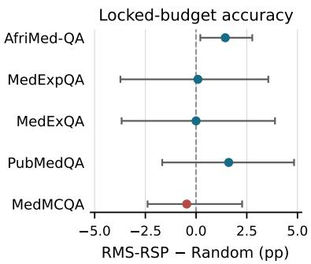
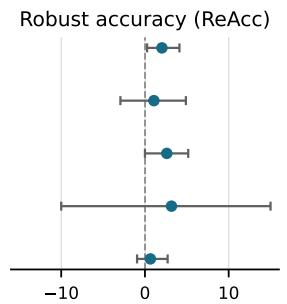
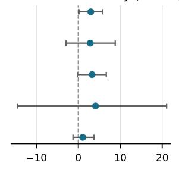

# Which Medical Questions Deserve Rationales? Perturbation-Sensitive Selection for Robust QA

Yuexin Wu Dayou Yu Vasile Rus Department of Computer Science, University of Memphis ywu10@memphis.edu dayou.yu@memphis.edu vrus@memphis.edu

## Abstract

Medical question-answering datasets often contain answer labels, whereas highquality rationales remain scarce, noisy, or costly to validate. This changes the acquisition question: rather than asking which questions should be labeled, we ask which already-labeled questions should receive rationale supervision under a fixed token budget. We study an offline version of this problem in which candidate rationales are visible to the selector but withheld from downstream training unless selected. We propose root-mean-square Robustness-based Sample Prioritization (RMS-RSP), which perturbs hidden states only at rationale tokens and measures the resulting shift in the gold-versus-best-distractor margin. Across five medical QA datasets, MedGemma-4B-IT, three training seeds, ten budgeted non-RSP selectors, and an unbudgeted full-supervision reference, RMS-RSP provides a deliberately qualified result. Its locked-budget accuracy is 60.61% on average versus 60.08% for Random, with a statistically resolved gain only on AfriMed-QA (+1.44 points). Its full-budget accuracy area is not better than Random. However, after three answer-option reorderings, RMS-RSP improves robust accuracy and semantic consistency by 1.91 and 2.85 points on average, respectively, with the same direction on all five datasets. Training on every pool rationale raises macro accuracy to 63.74%, but consumes 29–254 times more rationale tokens and does not uniformly improve robustness. These findings do not establish universal accuracy gains; they instead suggest that rationale-local boundary sensitivity can identify supervision that improves invariance to semantically equivalent formatting changes.

## 1 Introduction

Medical QA datasets commonly provide answer labels at much greater scale than carefully checked explanations. Rationales are longer, require domain expertise to write or verify, and may contain irrelevant or incorrect intermediate statements even when the final answer is correct. The relevant allocation problem is therefore not only which questions should be labeled, as in conventional active learning [Settles, 2009], but which already-labeled questions deserve additional rationale supervision. This distinction matters in medical settings: applying all available rationales indiscriminately can spend substantial annotation or training budget while exposing the model to noisy reasoning traces.

Recent reasoning-data selectors rank traces by answer uncertainty, likelihood, local step compatibility, or early training dynamics [Goncharov et al., 2026, Yang et al., 2026, Just et al., 2026, Wang et al., 2026, Jin et al., 2026]. These methods have advanced data-efficient reasoning distillation, but most were developed for mathematics, coding, or general science. Moreover, their scores do not directly ask whether the rationale is coupled to the medical decision boundary. In multiple-choice medical QA, this boundary is especially important: a useful rationale should support the correct clinical option over its strongest distractor rather than merely be fluent or difficult.

We revisit Robustness-based Sample Prioritization (RSP) with a normalized, rationale-local score. Given an answer-trained model and a candidate rationale, we inject RMS-scaled Gaussian noise into the rationale-token hidden states at several late layers. We then measure how much the goldversus-best-distractor log-probability margin changes. The canonical RMS-RSP score is the root mean square of these shifts. It is scale-normalized, sensitive to both positive and negative boundary changes, and tied to the tokens that would be acquired as supervision.

Our evaluation is designed around the limits of the current evidence. We use five medical QA datasets spanning African medical examinations, multilingual medical exams, underrepresented specialties, biomedical literature, and Indian entrance examinations [Nimo et al., 2025, Alonso et al., 2024, Kim et al., 2024, Jin et al., 2019, Pal et al., 2022]. We compare against Random, answer entropy and margin, rationale length, and five recent reasoning-data selectors. We report lockedbudget accuracy, macro-F1, full-curve Token-AUBC, and invariance to answer-option permutations. Our contributions are:

• a precise formulation of budgeted rationale selection for answer-labeled medical QA, separating answer supervision from rationale supervision;

• RMS-RSP, a rationale-local, relative-scale perturbation score based on gold–distractor margin shifts, together with a signed ablation;

• a five-dataset comparison showing heterogeneous standard accuracy but consistent improvements in option-order robust accuracy and semantic consistency, together with a highresource all-rationales reference.

## 2 Related work

Rationale supervision in medical QA. Chain-of-thought prompting and rationale fine-tuning can improve multi-step reasoning [Wei et al., 2022, Zelikman et al., 2022], but generated explanations need not faithfully describe the computation that produced an answer [Turpin et al., 2023]. This concern is amplified in healthcare, where an incorrect intermediate claim can be consequential. Medical benchmarks vary widely in explanation provenance: MedMCQA supplies short explanations, Med ExpQA provides physician-written reference explanations, MedExQA provides explanation pairs, and PubMedQA pairs decisions with article conclusions [Pal et al., 2022, Alonso et al., 2024, Kim et al., 2024, Jin et al., 2019]. We treat these rationales as an offline acquisition oracle rather than assuming that every rationale is equally useful.

Reasoning-data selection. Uncertainty sampling selects difficult inputs from model outputs. Complexity-aware fine-tuning uses answer entropy to reserve reasoning supervision for complex items [Goncharov et al., 2026]. RSR balances token rank and surprisal to identify trajectories aligned with but informative to a student [Yang et al., 2026]. LALP scores each step from a restricted local context [Just et al., 2026], while ASLEC-DROP removes low-probability first-step tokens that confound naturalness scores with step length [Wang et al., 2026]. TEMP uses losses under random and fine-tuning-direction parameter perturbations and observes that useful reasoning traces can be identified early [Jin et al., 2026]. These are close baselines because they address the same supervision-allocation question. RSP differs by perturbing activations at rationale positions and measuring an answer-boundary response.

Multiple-choice robustness. LLMs can change predictions when answer options are reordered even though their semantic content is unchanged [Pezeshkpour and Hruschka, 2024, Zheng et al., 2024]. We therefore evaluate more than original-order accuracy. Option permutations are not claimed to simulate every clinical distribution shift; they are a controlled invariance test aligned with RSP’s decision-boundary motivation.

## 3 Budgeted rationale selection

## 3.1 Problem setup

Let the pool be $\boldsymbol { \mathcal { D } } \ = \ \{ ( x _ { i } , \mathcal { O } _ { i } , y _ { i } , r _ { i } ) \} _ { i = 1 } ^ { N }$ , where $x _ { i }$ is a medical question (and context, when present), $\mathcal { O } _ { i }$ is its option set, $y _ { i }$ is the known correct option, and $r _ { i }$ is a candidate rationale. We first train an answer-only model $f _ { \theta _ { 0 } }$ on all $( x _ { i } , y _ { i } )$ pairs. Rationales are not used in this stage.

Each rationale has token cost $c _ { i }$ . A selector ranks candidates and chooses $S \subseteq \{ 1 , \dots , N \}$ such that $\textstyle \sum _ { i \in S } c _ { i } \leq B$ . Only $\{ r _ { i } : i \in S \}$ are unlocked for the rationale-training branch. In our offline experiments, $r _ { i }$ is visible to rationale-aware scoring functions; consequently, the setup models selection from existing or cheaply generated candidate explanations for validation/training, not selection before any rationale has been produced. This scope distinction is central to our claims.

## 3.2 Rationale-local perturbations

For candidate i, we append the rationale and the suffix “Final Answer:” to the question and options. Let $a _ { i j }$ be the logit for option $j$ at the answer position. The clean gold–distractor margin is

$$
m _ { i } = a _ { i y _ { i } } - \operatorname* { m a x } _ { j \neq y _ { i } } a _ { i j } .\tag{1}
$$

At transformer layer $\ell ,$ let $H _ { i } ^ { ( \ell ) } \in \mathbb { R } ^ { T \times d }$ be the hidden states and $M _ { i , R } \in \{ 0 , 1 \} ^ { T \times 1 }$ mask only the rationale tokens. We perturb

$$
\widetilde { H } _ { i } ^ { ( \ell , k ) } = H _ { i } ^ { ( \ell ) } + \alpha \operatorname { R M S } \left( H _ { i , R } ^ { ( \ell ) } \right) \left( M _ { i , R } \odot Z _ { i } ^ { ( \ell , k ) } \right) , \quad Z _ { i } ^ { ( \ell , k ) } \sim \mathcal { N } ( 0 , I ) ,\tag{2}
$$

where $\mathrm { R M S } ( H _ { i , R } ^ { ( \ell ) } )$ is computed across masked tokens and hidden dimensions. Relative scaling avoids comparing a fixed absolute noise level across layers with different activation magnitudes. Restricting noise to rationale positions asks how strongly the answer boundary depends on that candidate explanation rather than on the question generally.

Let $\widetilde { m } _ { i } ^ { ( \ell , k ) }$ be the perturbed margin and $d _ { i } ^ { ( \ell , k ) } = m _ { i } - \widetilde { m } _ { i } ^ { ( \ell , k ) }$ . For layers $\mathcal { L }$ and K perturbations per layer, the canonical score is

$$
s _ { i } ^ { \mathrm { R M S - R S P } } = \sqrt { \frac { 1 } { | \mathcal { L } | K } \sum _ { \ell \in \mathcal { L } } \sum _ { k = 1 } ^ { K } \left( d _ { i } ^ { ( \ell , k ) } \right) ^ { 2 } } .\tag{3}
$$

We select larger scores first, greedily skipping an item when its cost would exceed the remaining token budget. RMS magnitude is direction-agnostic: either a reduction or increase in the gold margin indicates that the boundary is locally sensitive to the rationale representation. Our Signed-RSP ablation instead uses the mean signed drop, $\begin{array} { r } { \frac { 1 } { | \mathcal { L } | K } \sum _ { \ell , k } d _ { i } ^ { ( \ell , k ) } } \end{array}$

## 3.3 Downstream rationale training

Starting from the answer-only adapter, each selected item contributes an answer replay record and a rationale-generation record ending in the correct answer. We additionally sample one answer-only replay item from the unselected pool per selected item. This paired design reduces the chance that a selector wins merely by changing the amount of answer supervision. At inference, the model directly scores answer letters without generating a rationale.

## 4 Experimental design

## 4.1 Datasets and splits

Table 1 summarizes the frozen splits. We use the English subset of MedExpQA and the expert multiple-choice portion of AfriMed-QA. Multi-answer AfriMed-QA rows are removed. MedExQA and PubMedQA use deterministic derived splits after exact deduplication; the others preserve official test partitions where available. No test item is used to choose a token budget. The MedMCQA test set had been evaluated in earlier exploratory work, so its result is protocol-aligned rather than a pristine confirmation.

Table 1: Datasets and frozen protocol. “RSP $n ^ { \prime \prime }$ is the number of rationales selected by canonical RMS-RSP at the development-locked token budget.
<table><tr><td>Dataset</td><td>Pool</td><td>Dev</td><td>Test</td><td>Options</td><td>Tokens B</td><td>RSP n</td></tr><tr><td>AfriMed-QA</td><td>1,500</td><td>559</td><td>892</td><td>4-5</td><td>512</td><td>4</td></tr><tr><td>MedExpQA</td><td>434</td><td>63</td><td>125</td><td>4-5</td><td>256</td><td>5</td></tr><tr><td>MedExQÀ</td><td>600</td><td>164</td><td>200</td><td>4</td><td>512</td><td>7</td></tr><tr><td>PubMedQA</td><td>600</td><td>200</td><td>200</td><td>3</td><td>1,024</td><td>20</td></tr><tr><td>MedMCQA</td><td>512</td><td>256</td><td>4,096</td><td>4</td><td>1,024</td><td>10</td></tr></table>

## 4.2 Model, acquisition, and training

All runs use MedGemma-4B-IT [Sellergren et al., 2025] with LoRA adapters [Hu et al., 2022]. The answer-only adapter is trained for one epoch on every pool answer $( r = 1 6 , \mathrm { L o R A } \alpha = 3 2 $ , learning rate $2 \times 1 0 ^ { - 4 } )$ . Each rationale branch starts from that adapter and trains for two epochs at $1 0 ^ { - 4 }$ with sequence length 1,024, batch size 1, gradient accumulation 8, and one-to-one unselected answer replay. We use training seeds 13, 23, and 37.

For RMS-RSP, L = {−2, −4, −8}, K = 4, and perturbation scale α = 0.10. Candidate budgets are 256, 512, and 1,024 rationale tokens. For each dataset, development data select one shared budget by maximizing RMS-RSP accuracy minus the strongest non-RSP selector at that budget, breaking ties toward fewer tokens. We then evaluate all methods once at the locked budget. Because this rule is centered on RMS-RSP, we also report Token-AUBC over all budgets to prevent a favorable single budget from carrying the conclusion.

Random uses three acquisition seeds crossed with the three training seeds (nine runs per budget). Deterministic selectors use three training seeds. The same selected set is used across downstream seeds; random acquisition varies independently.

As a high-resource reference, we additionally train from the same answer-only adapters on every pool rationale for the same two epochs. This full-supervision condition consumes 29,399–129,935 scored rationale tokens, depending on the dataset, and has no unselected replay pool. It is neither token- nor update-matched to the budgeted branches and is therefore reported as an unbudgeted reference rather than a competing selector.

## 4.3 Baselines

We compare with answer entropy, negative top-two answer margin, rationale length, and Random. Five recent selectors are adapted to the shared candidate-rationale pool:

• Complexity-aware FT ranks by answer-position vocabulary entropy [Goncharov et al., 2026].

• RSR uses token-rank over surprisal, with the sign reversed so larger scores are selected [Yang et al., 2026].

• LALP averages step likelihood from the question and the preceding 25% of steps [Just et al., 2026].

• ASLEC-DROP averages rationale-token likelihood after dropping the first token of each step [Wang et al., 2026].

• TEMP combines losses under calibrated random parameter perturbations and checkpoints extrapolated along a small rationale-LoRA direction [Jin et al., 2026].

Because the medical datasets lack consistent step annotations, LALP and ASLEC share a deterministic newline-and-sentence segmentation. These are protocol adaptations rather than claims of exact reproduction under the original models and datasets.

## 4.4 Metrics and uncertainty

The primary task metric is multiple-choice accuracy; macro-F1 is secondary. We also compute Brier score [Brier, 1950] and expected calibration error [Guo et al., 2017] in the released result artifacts.

Table 2: Test accuracy (%, mean ± standard deviation across three training seeds). Random averages $3 \times 3$ acquisition/training runs. Bold marks the best token-budgeted method; All rationales is an unbudgeted reference.
<table><tr><td>Method</td><td>AfriMed</td><td>MedExp</td><td>MedEx</td><td>PubMed</td><td>MedMCQA</td><td>Macro</td></tr><tr><td>Random 3 × 3</td><td>62.72±0.85</td><td> $5 4 . 8 4 \pm 4 . 8 0 $ </td><td> $6 1 . 8 3 { \pm } 0 . 8 3 $ </td><td> $6 9 . 0 6 \pm 0 . 4 2 $ </td><td> $5 1 . 9 3 { \pm } 2 . 1 1 $ </td><td>60.08</td></tr><tr><td>Answer entropy</td><td>61.85±1.20</td><td> $5 5 . 7 3 { \pm } 7 . 4 3$ </td><td> $6 0 . 5 0 { \pm } 0 . 5 0 $ </td><td> $6 9 . 5 0 { \scriptstyle \pm 0 . 8 7 }$ </td><td> $5 1 . 5 2 { \pm } 2 . 0 1 $ </td><td>59.82</td></tr><tr><td>Answer margin</td><td>63.53±0.23</td><td> $5 5 . 2 0 { \scriptstyle \pm 5 . 6 0 }$ </td><td> $6 3 . 0 0 \pm 2 . 2 9$ </td><td> $6 8 . 3 3 { \pm } 4 . 1 9$ </td><td> $5 2 . 1 2 { \pm } 0 . 7 0 $ </td><td>60.44</td></tr><tr><td>Rationale length</td><td>63.12±0.30</td><td>52.00±6.55</td><td> $6 2 . 5 0 \pm 1 . 3 2 $ </td><td> $7 0 . 5 0 { \scriptstyle \pm 0 . 8 7 }$ </td><td> $\mathbf { 5 3 . 8 5 \pm 0 . 9 6 }$ </td><td>60.39</td></tr><tr><td>Complexity-aware FT</td><td>61.25±2.44</td><td>55.47±7.26</td><td>61.83±1.26</td><td> $6 9 . 6 7 { \scriptstyle \pm 0 . 2 9 }$ </td><td> $5 1 . 0 3 { \pm } 2 . 5 0 $ </td><td>59.85</td></tr><tr><td>RSR</td><td>62.52±0.68</td><td>55.73±5.62</td><td>60.67±2.25</td><td> $6 8 . 6 7 { \scriptstyle \pm 0 . 7 6 }$ </td><td> $5 2 . 4 8 \pm 1 . 8 2$ </td><td>60.01</td></tr><tr><td>ASLEC-DROP</td><td>60.76±1.18</td><td>54.67±3.33</td><td>62.50±2.00</td><td> $6 9 . 3 3 { \pm } 0 . 5 8 $ </td><td> $5 0 . 0 6 \pm 2 . 9 1$ </td><td>59.46</td></tr><tr><td>TEMP</td><td>63.68±0.78</td><td>50.67±8.05</td><td>60.83±2.02</td><td> $6 5 . 5 0 { \pm } 6 . 0 6$ </td><td> $5 2 . 6 9 \pm 0 . 2 8$ </td><td>58.67</td></tr><tr><td>Signed-RSP</td><td>63.98±0.83</td><td>54.13±5.33</td><td> $6 2 . 6 7 \pm 1 . 4 4$ </td><td> $\mathbf { 7 1 . 1 7 \pm 1 . 0 4 }$ </td><td> $5 2 . 3 8 \pm 1 . 0 2$ </td><td>60.87</td></tr><tr><td>RMS-RSP</td><td>64.16±0.51</td><td> $5 4 . 9 3 { \pm } 6 . 9 9$ </td><td> $6 1 . 8 3 \pm 2 . 5 7$ </td><td> $7 0 . 6 7 { \pm } 0 . 5 8 $ </td><td> $5 1 . 4 6 \pm 0 . 4 9$ </td><td>60.61</td></tr><tr><td>All rationales</td><td> $6 4 . 6 1 { \pm } 0 . 5 6 $ </td><td> $6 1 . 0 7 { \pm } 3 . 0 3$ </td><td> $6 3 . 1 7 \pm 1 . 6 1$ </td><td> $7 2 . 1 7 { \pm } 1 . 2 6$ </td><td> $5 7 . 6 7 { \pm } 0 . 8 3 $ </td><td>63.74</td></tr></table>

Token-AUBC is trapezoidal area under test accuracy at 0, 256, 512, and 1,024 acquired rationale tokens, normalized by 1,024; the zero-token point is the answer-only model.

For option robustness, each item receives three deterministic, distinct, non-identity permutations. Predictions are mapped back to the original semantic options. REACC requires a correct prediction on the original and all three permutations. RECON requires the same semantic prediction across all four versions, irrespective of correctness. No model is retrained for this evaluation. Paired 95% intervals use 10,000 hierarchical bootstrap draws over downstream seeds and test items; comparisons with Random additionally resample acquisition seeds.

## 5 Results

## 5.1 Standard accuracy is positive in some settings, not universal

Table 2 reports the shared development-locked budget for each dataset. Canonical RMS-RSP is best on AfriMed-QA (64.16%) and exceeds Random by 1.44 points with a 95% interval of [0.21, 2.77]. Its point estimate also exceeds Random on MedExpQA (+0.09) and PubMedQA (+1.61), ties on MedExQA, and trails by 0.46 on MedMCQA. The five-dataset macro average is 60.61% versus 60.08% for Random. Only AfriMed-QA resolves a nonzero accuracy difference, so the evidence does not support a claim of consistent accuracy dominance.

Macro-F1 tells a similarly restrained story. RMS-RSP averages 55.71, essentially matching Random at 55.68. Signed-RSP reaches 56.50, while answer margin is best at 56.86. Thus the canonical score’s main empirical advantage is not general discrimination performance.

## 5.2 Boundary-sensitive selection improves option-order robustness

Table 3 shifts from one locked operating point to full-budget efficiency and controlled invariance. LALP has the best accuracy Token-AUBC (0.6045); canonical RMS-RSP is below Random (0.5960 versus 0.6021). In contrast, RMS-RSP has the best macro REACC (0.4260) and RECON (0.5694), improving over Random by 1.91 and 2.85 percentage points. The robustness gains are directionally positive on every dataset (Figure 1). AfriMed-QA resolves both differences; MedExQA’s REACC interval touches zero at its lower endpoint. The remaining intervals include zero.

The metric separation is informative. RMS magnitude rewards rationales whose representations are strongly coupled to the gold–distractor boundary, regardless of the direction of a particular perturbation. That coupling is plausibly useful for learning a less position-dependent answer rule, but it does not guarantee that every selected rationale improves clean accuracy. We treat this as an empirical interpretation, not a causal proof.

## 5.3 Signed versus RMS aggregation

The signed ablation is better on locked-budget macro accuracy (60.87 versus 60.61) and macro-F1 (56.50 versus 55.71), while canonical RMS is substantially better on robustness (REACC 42.60

Table 3: Five-dataset macro averages. Token-AUBC uses original-order accuracy. Bold marks the best budgeted method; All rationales is an unbudgeted reference and has no Token-AUBC.
<table><tr><td>Method</td><td>Token-AUBC</td><td>REACC</td><td>RECON</td></tr><tr><td>Answer-only</td><td>0.5996</td><td>0.3915</td><td>0.5115</td></tr><tr><td>Random 3 × 3</td><td>0.6021</td><td>0.4070</td><td>0.5408</td></tr><tr><td>Answer entropy</td><td>0.5919</td><td>0.3869</td><td>0.5105</td></tr><tr><td>Answer margin</td><td>0.5994</td><td>0.4016</td><td>0.5290</td></tr><tr><td>Rationale length</td><td>0.6018</td><td>0.4055</td><td>0.5361</td></tr><tr><td>Complexity-aware FT</td><td>0.5919</td><td>0.3972</td><td>0.5245</td></tr><tr><td>RSR</td><td>0.6014</td><td>0.4074</td><td>0.5449</td></tr><tr><td>LALP</td><td>0.6045</td><td>0.4039</td><td>0.5322</td></tr><tr><td>ASLEC-DROP</td><td>0.6009</td><td>0.3893</td><td>0.5098</td></tr><tr><td>TEMP</td><td>0.5954</td><td>0.3592</td><td>0.4663</td></tr><tr><td>Signed-RSP</td><td>0.6025</td><td>0.4023</td><td>0.5315</td></tr><tr><td>RMS-RSP</td><td>0.5960</td><td>0.4260</td><td>0.5694</td></tr><tr><td>All rationales</td><td>一</td><td>0.4539</td><td>0.5861</td></tr></table>

  
RMS-RSP Random (pp)

Semantic consistency (ReCon)  
  
RMS-RSP Random (pp)  
Figure 1: Canonical RMS-RSP minus Random in percentage points. Points are means; bars are paired 95% hierarchical bootstrap intervals over training seeds, Random acquisition seeds, and test items. Robustness differences are positive on all five datasets, whereas original-order accuracy is heterogeneous.

versus 40.23; RECON 56.94 versus 53.15). This tradeoff supports preserving perturbation magnitude when the goal is invariance, but also shows that the aggregation choice should be tied to the deployment objective. A single RSP variant is not uniformly best.

## 5.4 Full supervision improves average performance at much higher cost

The all-rationales reference reaches 63.74% macro accuracy and 59.84 macro-F1, exceeding RMS-RSP by 3.12 and 4.13 points, respectively. It also improves macro REACC by 2.79 points and RECON by 1.67 points. These averages conceal substantial heterogeneity (Table 4). Only MedM-CQA resolves a nonzero all-rationales gain over RMS-RSP on all three metrics: +6.21 accuracy points (95% CI [4.93, 7.45]), +8.41 REACC points ([5.47, 11.03]), and +10.31 RECON points ([6.37, 13.63]). Conversely, on PubMedQA the full reference gains 1.50 accuracy points but loses 4.83 REACC and 6.83 RECON points; all three intervals include zero, and robustness varies strongly across seeds.

## 6 Discussion and limitations

What the evidence supports. The strongest defensible claim is narrow: under a fixed rationaletoken budget, selecting examples whose rationale-token representations exert a large local effect on the gold–distractor boundary can improve invariance to answer-option reorderings. The evidence does not support “RSP consistently improves medical QA accuracy.” Accuracy gains are datasetand budget-dependent, and only AfriMed-QA has a clearly nonzero locked-budget gain over Random.

Table 4: Unbudgeted all-rationales reference. Token multiple is relative to the locked RMS-RSP budget; deltas are All rationales minus RMS-RSP in percentage points. Only the three MedMCQA intervals exclude zero.
<table><tr><td>Dataset</td><td>Rationales</td><td>Tokens</td><td>Token multiple</td><td>Accuracy ∆</td><td>REACC ∆</td><td>RECON ∆</td></tr><tr><td>AfriMed-QA</td><td>1,500</td><td>129,935</td><td>254×</td><td>+0.45</td><td>+0.41</td><td>-0.04</td></tr><tr><td>MedExpQA</td><td>434</td><td>45,361</td><td>177×</td><td>+6.13</td><td>+8.27</td><td>+4.27</td></tr><tr><td>MedExQA</td><td>600</td><td>62,209</td><td>122×</td><td>+1.33</td><td>+1.67</td><td>+0.67</td></tr><tr><td>PubMedQA</td><td>600</td><td>29,399</td><td>29×</td><td>+1.50</td><td>-4.83</td><td>-6.83</td></tr><tr><td>MedMCQA</td><td>512</td><td>59,121</td><td>58×</td><td>+6.21</td><td>+8.41</td><td>+10.31</td></tr><tr><td>Macro</td><td>一</td><td>一</td><td>一</td><td>+3.12</td><td>+2.79</td><td>+1.67</td></tr></table>

Practical interpretation. RSP is best viewed as a curation layer for candidate explanations that already exist—for example, archived dataset rationales or inexpensive machine-generated drafts— before scarce expert validation or downstream training budget is spent. The present experiment measures the value of selecting rationale tokens for training; it does not measure clinician annotation time or the quality improvement from expert rewriting. A prospective study should compare tota generation, review, and correction cost.

Full-supervision reference. Using every rationale improves average discrimination and robustness, showing that additional rationale supervision can be valuable when cost is unconstrained. However, it requires 29–254 times the locked token budget, its advantage is concentrated in MedExpQA and MedMCQA, and it reduces the PubMedQA robustness point estimates. The appropriate claim is therefore efficiency under scarcity: RMS-RSP often approaches the high-resource reference with far fewer rationale tokens, not that selection universally outperforms full supervision.

Candidate-rationale visibility. The selector reads each rationale before deciding whether to unlock it for downstream training. This is appropriate for offline curation but not for classic active learning in which the annotation does not yet exist. Calling the method pre-annotation acquisition without this qualification would overstate its scope. A future proxy that scores questions without candidate rationales, or uses cheap drafts before expert review, is needed for that setting.

Experimental limits. We evaluate one 4B medical model, three training seeds, and relatively small acquisition pools. The token budgets sometimes unlock very few rationales (four on AfriMed-QA at 512 tokens), increasing sensitivity to individual traces. The all-rationales reference is neither token- nor update-matched: processing many more rationales also entails many more gradient updates, so it is a high-resource comparison rather than a causal estimate of selection quality. MedExQA and PubMedQA use derived splits, and MedMCQA is not a pristine confirmatory test. Development selection explicitly favors the canonical method; Token-AUBC mitigates but does not remove that concern. We do not correct for multiple comparisons. Option permutations probe a real MCQ failure mode but are narrower than clinical distribution shift, factuality, harm, or calibration under deployment. Dataset rationales are treated as supervision without new clinician auditing, so we cannot attribute gains to clinical explanation quality. Finally, these are benchmark experiments and do not validate the model for diagnosis or patient care.

## 7 Conclusion

We formulated budgeted rationale selection for answer-labeled medical QA and evaluated a rationale-local perturbation score against recent reasoning-data selectors on five datasets. Canonical RMS-RSP does not dominate standard accuracy or Token-AUBC. Training on every rationale improves average performance but costs 29–254 times more rationale tokens and is not uniformly more robust. Within the low-budget comparison, RMS-RSP’s reproducible advantage is a consistent increase in robustness and semantic consistency under answer-option permutations. This result suggests a promising, appropriately limited role for representation sensitivity: not as a universal difficulty score, but as a mechanism-aligned signal for selecting rationale supervision when stable medical decisions matter.

## References

Iñigo Alonso, Maite Oronoz, and Rodrigo Agerri. MedExpQA: Multilingual benchmarking of large language models for medical question answering. Artificial Intelligence in Medicine, 155:102938, 2024. doi: 10.1016/j.artmed.2024.102938.

Glenn W. Brier. Verification of forecasts expressed in terms of probability. Monthly Weather Review, 78(1):1–3, 1950.

Andrey Goncharov, Daniil Vyazhev, Petr Sychev, Edvard Khalafyan, and Alexey Zaytsev. Complexity-aware fine-tuning. In Findings of the Association for Computational Linguistics: EACL 2026, pages 682–696, 2026. doi: 10.18653/v1/2026.findings-eacl.34.

Chuan Guo, Geoff Pleiss, Yu Sun, and Kilian Q. Weinberger. On calibration of modern neural networks. In Proceedings of the 34th International Conference on Machine Learning, pages 1321–1330, 2017.

Edward J. Hu, Yelong Shen, Phillip Wallis, Zeyuan Allen-Zhu, Yuanzhi Li, Shean Wang, Lu Wang, and Weizhu Chen. LoRA: Low-rank adaptation of large language models. In International Conference on Learning Representations, 2022.

Hongyi Henry Jin, Wenhan Yang, Meysam Ghaffari, Carlos Morato, and Baharan Mirzasoleiman. Reasoning quality emerges early: Data curation for reasoning models. In Proceedings ofthe 43rd International Conference on Machine Learning, 2026. arXiv:2606.26797.

Qiao Jin, Bhuwan Dhingra, Zhengping Liu, William W. Cohen, and Xinghua Lu. PubMedQA: A dataset for biomedical research question answering. In Proceedings of the 2019 Conference on Empirical Methods in Natural Language Processing and the 9th International Joint Conference on Natural Language Processing, pages 2567–2577, 2019. doi: 10.18653/v1/D19-1259.

Hoang Anh Just, Myeongseob Ko, and Ruoxi Jia. The signal is in the steps: Local scoring for reasoning data selection. arXiv preprint arXiv:2510.03988, 2026. Version 2.

Yunsoo Kim, Jinge Wu, Yusuf Abdulle, and Honghan Wu. MedExQA: Medical question answering benchmark with multiple explanations. In Proceedings of the 23rd Workshop on Biomedical Natural Language Processing, pages 167–181, 2024. doi: 10.18653/v1/2024.bionlp-1.14.

Charles Nimo, Tobi Olatunji, Abraham Toluwase Owodunni, Tassallah Abdullahi, Emmanuel Ayodele, Mardhiyah Sanni, Ezinwanne C. Aka, Folafunmi Omofoye, Foutse Yuehgoh, Timothy Faniran, et al. AfriMed-QA: A pan-african, multi-specialty, medical question-answering benchmark dataset. In Proceedings of the 63rd Annual Meeting of the Association for Computational Linguistics (Volume 1: Long Papers), pages 1948–1973, 2025. doi: 10.18653/v1/2025.acl-long.96.

Ankit Pal, Logesh Kumar Umapathi, and Malaikannan Sankarasubbu. MedMCQA: A large-scale multi-subject multi-choice dataset for medical domain question answering. In Proceedings ofthe Conference on Health, Inference, and Learning, volume 174 of Proceedings of Machine Learning Research, pages 248–260, 2022.

Pouya Pezeshkpour and Estevam Hruschka. Large language models sensitivity to the order of options in multiple-choice questions. In Findings of the Association for Computational Linguistics: NAACL 2024, pages 2006–2017, 2024. doi: 10.18653/v1/2024.findings-naacl.130.

Andrew Sellergren, Sahar Kazemzadeh, Tiam Jaroensri, Atilla Kiraly, Madeleine Traverse, Timo Kohlberger, Shawn Xu, Fayaz Jamil, Cían Hughes, Charles Lau, et al. MedGemma technical report. arXiv preprint arXiv:2507.05201, 2025. Revised April 2026.

Burr Settles. Active learning literature survey. Computer Sciences Technical Report 1648, University ofWisconsin–Madison, 2009.

Miles Turpin, Julian Michael, Ethan Perez, and Samuel R. Bowman. Language models don’t always say what they think: Unfaithful explanations in chain-of-thought prompting. In Advances in Neural Information Processing Systems, volume 36, pages 74952–74965, 2023.

Bing Wang, Rui Miao, Chen Shen, Shaotian Yan, Kaiyuan Liu, Ximing Li, Xiaosong Yuan, Sinan Fan, Jun Zhang, and Jieping Ye. On the step length confounding in LLM reasoning data selection. In Findings of the Association for Computational Linguistics: ACL 2026, pages 18443–18457, 2026. doi: 10.18653/v1/2026.findings-acl.918.

Jason Wei, Xuezhi Wang, Dale Schuurmans, Maarten Bosma, Fei Xia, Ed Chi, Quoc V. Le, and Denny Zhou. Chain-of-thought prompting elicits reasoning in large language models. In Advances in Neural Information Processing Systems, volume 35, pages 24824–24837, 2022.

Yuming Yang, Mingyoung Lai, Wanxu Zhao, Xiaoran Fan, Zhiheng Xi, Mingqi Wu, Chiyue Huang, Jun Zhao, Haijun Lv, Jian Tong, et al. Which reasoning trajectories teach students to reason better? a simple metric of informative alignment. In Proceedings of the 64th Annual Meeting ofthe Associationfor Computational Linguistics (Volume 1: Long Papers), pages 42123–42150, 2026. doi: 10.18653/v1/2026.acl-long.1950.

Eric Zelikman, Yuhuai Wu, Jesse Mu, and Noah Goodman. STaR: Bootstrapping reasoning with reasoning. In Advances in Neural Information Processing Systems, volume 35, pages 15476– 15488, 2022.

Chujie Zheng, Hao Zhou, Fandong Meng, Jie Zhou, and Minlie Huang. Large language models are not robust multiple choice selectors. In International Conference on Learning Representations, 2024.

## A Additional implementation details

Rationale steps are segmented deterministically using newline boundaries followed by a sentence heuristic. At most 384 rationale tokens are scored. RSP uses one clean pass and 12 noisy passes per candidate (three layers, four perturbations each). A fixed suffix requests the final answer, and only single-token option letters are scored. The answer-only and rationale branches share the same maximum sequence length (1,024), optimizer family (AdamW), cosine learning-rate schedule, and 3% warmup. Selected rationale branches contain three records per selected item: selected answer replay, rationale target, and one randomly sampled unselected answer replay. Random acquisition seeds are 13, 23, and 37, crossed with downstream seeds 13, 23, and 37.

## B Complete macro-F1 results

Table 5: Test macro-F1 (%, mean across three downstream seeds; Random averages nine runs). Bold marks the best budgeted method; All rationales is unbudgeted.
<table><tr><td>Method</td><td>AfriMed</td><td>MedExp</td><td>MedEx</td><td>PubMed</td><td>MedMCQA</td><td>Macro</td></tr><tr><td>Answer-only</td><td>61.54</td><td>52.36</td><td>58.80</td><td>51.89</td><td>51.80</td><td>55.28</td></tr><tr><td>Random 3 × 3</td><td>60.86</td><td>53.82</td><td>60.78</td><td>51.19</td><td>51.76</td><td>55.68</td></tr><tr><td>Answer entropy</td><td>60.40</td><td>54.97</td><td>58.96</td><td>51.89</td><td>51.42</td><td>55.53</td></tr><tr><td>Answer margin</td><td>61.51</td><td>54.64</td><td>61.50</td><td>55.26</td><td>51.38</td><td>56.86</td></tr><tr><td>Rationale length</td><td>61.07</td><td>48.87</td><td>61.65</td><td>54.37</td><td>53.66</td><td>55.92</td></tr><tr><td>Complexity-aware FT</td><td>59.76</td><td>54.74</td><td>60.78</td><td>51.57</td><td>50.87</td><td>55.54</td></tr><tr><td>RSR</td><td>60.34</td><td>54.46</td><td>59.48</td><td>48.52</td><td>52.14</td><td>54.99</td></tr><tr><td>LALP</td><td>59.96</td><td>55.25</td><td>62.05</td><td>53.13</td><td>50.78</td><td>56.24</td></tr><tr><td>ASLEC-DROP</td><td>59.20</td><td>53.08</td><td>61.60</td><td>48.76</td><td>49.85</td><td>54.50</td></tr><tr><td>TEMP</td><td>61.53</td><td>48.34</td><td>59.62</td><td>44.20</td><td>52.25</td><td>53.19</td></tr><tr><td>Signed-RSP</td><td>61.71</td><td>53.15</td><td>61.33</td><td>54.57</td><td>51.74</td><td>56.50</td></tr><tr><td>RMS-RSP</td><td>62.42</td><td>53.84</td><td>60.61</td><td>50.39</td><td>51.28</td><td>55.71</td></tr><tr><td>All rationales</td><td>62.94</td><td>59.04</td><td>62.41</td><td>57.29</td><td>57.51</td><td>59.84</td></tr></table>

## C Dataset-level Token-AUBC and robustness

Table 6: Accuracy Token-AUBC over 0/256/512/1,024 rationale tokens.
<table><tr><td>Method</td><td>AfriMed</td><td>MedExp</td><td>MedEx</td><td>PubMed</td><td>MedMCQA</td><td>Macro</td></tr><tr><td>Answer-only</td><td>.6353</td><td>.5333</td><td>.5983</td><td>.7117</td><td>.5193</td><td>.5996</td></tr><tr><td>Random 3 × 3</td><td>.6283</td><td>.5489</td><td>.6176</td><td>.6958</td><td>.5199</td><td>.6021</td></tr><tr><td>Entropy</td><td>.6237</td><td>.5410</td><td>.5996</td><td>.6875</td><td>.5078</td><td>.5919</td></tr><tr><td>Margin</td><td>.6322</td><td>.5363</td><td>.6198</td><td>.6877</td><td>.5211</td><td>.5994</td></tr><tr><td>Rationale length</td><td>.6328</td><td>.5347</td><td>.6154</td><td>.6992</td><td>.5269</td><td>.6018</td></tr><tr><td>Complexity-aware FT</td><td>.6168</td><td>.5340</td><td>.6162</td><td>.6821</td><td>.5102</td><td>.5919</td></tr><tr><td>RSR</td><td>.6290</td><td>.5540</td><td>.6081</td><td>.6981</td><td>.5175</td><td>.6014</td></tr><tr><td>LALP</td><td>.6195</td><td>.5723</td><td>.6208</td><td>.6987</td><td>.5110</td><td>.6045</td></tr><tr><td>ASLEC-DROP</td><td>.6187</td><td>.5613</td><td>.6212</td><td>.6933</td><td>.5097</td><td>.6009</td></tr><tr><td>TEMP</td><td>.6369</td><td>.5267</td><td>.6038</td><td>.6827</td><td>.5270</td><td>.5954</td></tr><tr><td>Signed-RSP</td><td>.6325</td><td>.5467</td><td>.6185</td><td>.6975</td><td>.5171</td><td>.6025</td></tr><tr><td>RMS-RSP</td><td>.6304</td><td>.5317</td><td>.6108</td><td>.6944</td><td>.5129</td><td>.5960</td></tr></table>

Table 7: Option-order robust accuracy (REACC).
<table><tr><td>Method</td><td>AfriMed</td><td>MedExp</td><td>MedEx</td><td>PubMed</td><td>MedMCQA</td><td>Macro</td></tr><tr><td>Answer-only</td><td>.4623</td><td>.3760</td><td>.4167</td><td>.4183</td><td>.2843</td><td>.3915</td></tr><tr><td>Random 3 × 3</td><td>.4588</td><td>.3893</td><td>.4506</td><td>.4617</td><td>.2747</td><td>.4070</td></tr><tr><td>Entropy</td><td>.4439</td><td>.4000</td><td>.3917</td><td>.4250</td><td>.2738</td><td>.3869</td></tr><tr><td>Margin</td><td>.4383</td><td>.4160</td><td>.4367</td><td>.4533</td><td>.2636</td><td>.4016</td></tr><tr><td>Rationale length</td><td>.4570</td><td>.2987</td><td>.4383</td><td>.5350</td><td>.2984</td><td>.4055</td></tr><tr><td>Complexity-aware FT</td><td>.4324</td><td>.4027</td><td>.4433</td><td>.4667</td><td>.2410</td><td>.3972</td></tr><tr><td>RSR</td><td>.4439</td><td>.4000</td><td>.4583</td><td>.4583</td><td>.2764</td><td>.4074</td></tr><tr><td>LALP</td><td>.4178</td><td>.3920</td><td>.4333</td><td>.5117</td><td>.2646</td><td>.4039</td></tr><tr><td>ASLEC-DROP</td><td>.4174</td><td>.3600</td><td>.4333</td><td>.4900</td><td>.2457</td><td>.3893</td></tr><tr><td>TEMP</td><td>.4638</td><td>.2933</td><td>.4083</td><td>.3500</td><td>.2807</td><td>.3592</td></tr><tr><td>Signed-RSP</td><td>.4656</td><td>.3867</td><td>.4667</td><td>.4100</td><td>.2826</td><td>.4023</td></tr><tr><td>RMS-RSP</td><td>.4791</td><td>.4000</td><td>.4767</td><td>.4933</td><td>.2812</td><td>.4260</td></tr><tr><td>All rationales</td><td>.4832</td><td>.4827</td><td>.4933</td><td>.4450</td><td>.3652</td><td>.4539</td></tr></table>

Table 8: Semantic consistency across option orders (RECON).
<table><tr><td>Method</td><td>AfriMed</td><td>MedExp</td><td>MedEx</td><td>PubMed</td><td>MedMCQA</td><td>Macro</td></tr><tr><td>Answer-only</td><td>.6005</td><td>.5440</td><td>.5067</td><td>.4983</td><td>.4080</td><td>.5115</td></tr><tr><td>Random 3 × 3</td><td>.5977</td><td>.5742</td><td>.5722</td><td>.5722</td><td>.3878</td><td>.5408</td></tr><tr><td>Entropy</td><td>.5658</td><td>.6107</td><td>.4733</td><td>.5167</td><td>.3863</td><td>.5105</td></tr><tr><td>Margin</td><td>.5613</td><td>.6213</td><td>.5250</td><td>.5667</td><td>.3706</td><td>.5290</td></tr><tr><td>Rationale length</td><td>.5916</td><td>.4293</td><td>.5650</td><td>.6700</td><td>.4247</td><td>.5361</td></tr><tr><td>Complexity-aware FT</td><td>.5549</td><td>.6080</td><td>.5567</td><td>.5667</td><td>.3360</td><td>.5245</td></tr><tr><td>RSR</td><td>.5695</td><td>.5707</td><td>.6017</td><td>.5933</td><td>.3891</td><td>.5449</td></tr><tr><td>LALP</td><td>.5362</td><td>.5733</td><td>.5383</td><td>.6417</td><td>.3713</td><td>.5322</td></tr><tr><td>ASLEC-DROP</td><td>.5299</td><td>.5120</td><td>.5467</td><td>.6133</td><td>.3472</td><td>.5098</td></tr><tr><td>TEMP</td><td>.6024</td><td>.4080</td><td>.4933</td><td>.4300</td><td>.3977</td><td>.4663</td></tr><tr><td>Signed-RSP</td><td>.6005</td><td>.5653</td><td>.5950</td><td>.4983</td><td>.3984</td><td>.5315</td></tr><tr><td>RMS-RSP</td><td>.6274</td><td>.6027</td><td>.6050</td><td>.6133</td><td>.3984</td><td>.5694</td></tr><tr><td>All rationales</td><td>.6271</td><td>.6453</td><td>.6117</td><td>.5450</td><td>.5015</td><td>.5861</td></tr></table>

## D Canonical RMS-RSP versus Random

<table><tr><td>Dataset</td><td>Accuracy ∆ [95% CI]</td><td></td><td>REACC ∆ [95% CI]</td><td>RECON ∆ [95% CI]</td></tr><tr><td>AfriMed-QA</td><td></td><td>+1.44 [+0.21, +2.77]</td><td> $+ 2 . 0 3 \ [ + 0 . 2 6 , + 4 . 1 2 ]$ </td><td> $+ 2 . 9 8 \ [ + 0 . 1 9 , + 5 . 8 3 ]$ </td></tr><tr><td>MedExpQA</td><td></td><td>+0.09 [-3.73, +3.56]</td><td> $+ 1 . 0 7 \left[ - 2 . 9 3 , + 4 . 8 9 \right]$ </td><td> $+ 2 . 8 4 \left[ - 2 . 9 3 , + 8 . 8 0 \right]$ </td></tr><tr><td>MedExQA</td><td></td><td>0.00 [−3.67, +3.89]</td><td> $+ 2 . 6 1 \ [ 0 . 0 0 , + 5 . 1 7 ]$ </td><td> $+ 3 . 2 8 \left[ - 0 . 1 1 , + 6 . 6 7 \right]$ </td></tr><tr><td>PubMedQA</td><td></td><td>+1.61 [−1.67, +4.83]</td><td> $+ 3 . 1 7 \left[ - 1 \dot { 0 } . 0 0 , + 1 5 . 0 0 \right]$ </td><td> $+ 4 . 1 1 \left[ - \mathrm { \bar { 1 } } 4 . 5 0 , + 2 1 . 0 6 \right]$ </td></tr><tr><td>MedMCQA</td><td></td><td>−0.46 [−2.39, +2.27]</td><td> $+ 0 . 6 5 \left[ - 0 . 9 4 , + 2 . 7 1 \right]$ </td><td>+1.06 [−1.27, +3.74]</td></tr></table>

Table 9: Paired differences from Random. Values and intervals are percentage points.

## E Reproducibility and artifact scope

The experiment artifacts retain selected UID order, token cost, acquisition score, predictions, per-run metrics, and command arguments. The present anonymous draft omits identifying repository links. Code and processed split manifests should be released with a non-identifying archive at submission time. Dataset licenses and model terms remain those of the original resources. No new patient data or clinical records were collected.