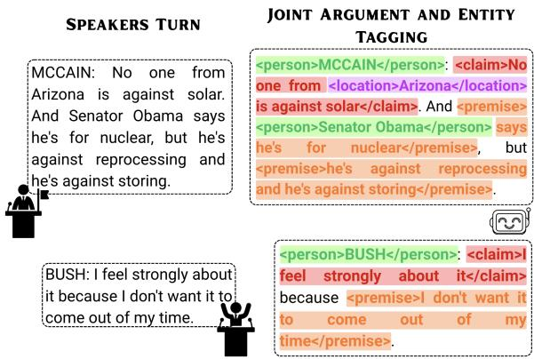
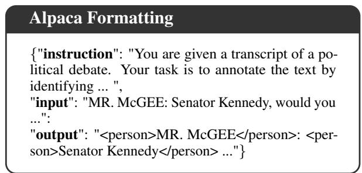

# Who Argues What? Joint Argument–Entity Detection and Classification in Political Debates

Lucio La Cava, Stefano Francesco Monea, Sergio Greco DIMES Dept., University of Calabria v. P. Bucci 44Z, 87036 Rende, CS, Italy   
{lucio.lacava, sf.monea, greco}@dimes.unical.it

## Abstract

Political debates are often analyzed through Argument Mining (AM) to investigate the key arguments that drive them. However, political arguments are rarely interpretable from argumentative spans alone, as claims and premises generally depend on the entities (e.g., people, events, locations, parties) they mention. Exist ing AM resources and methods typically annotate argumentative spans and roles, but do not provide a paired debate-entity layer for asking which Debate Named Entities (DNE), e.g., actors and events, are invoked within debates. In this work, we address these data and methodological gaps by (i) introducing DNE-ElecDeb, an entity-enriched version of the USElecDeb dataset that adds DNEs in both argumentative and non-argumentative spans and defines De bate Named Entity Recognition (DNER) as the task of detecting DNEs, and (ii) proposing Joint Argument and Entity Tagging (JAET), a generative framework that fine-tunes decoderonly LLMs to insert inline argument and entity tags into debate turns while preserving the original transcript. Under BIO-tagging evaluation, JAET improves relative F on the joint AM+DNER task by +27.3%, resp. +41.9%, under the untyped, resp. typed setting over the strongest sequential AM-DNER pipelines, demonstrating that such gains cannot be recovered by composing two independent modules. Notably, similar margins replicate on Persuasive Essays (+26.6%, resp. +52.7%), showing effective generalization to domains orthogonal to political debates. By unifying argumentative and entity-level representations within a single view, our contributions pave the way for richer political debates understanding.

## 1 Introduction

Argument Mining (AM) aims to identify and interpret argumentative structures in natural language, unstructured texts (Lawrence and Reed, 2019). By automatically extracting argument components such as premises and claims, and by identifying the relations between them, AM enables the structured representation and analysis of arguments using formal argumentation formalisms (Dung, 1995; Bondarenko et al., 1997; Prakken, 2010).

These representations support a wide range of downstream applications, including legal analysis (Palau and Moens, 2009), scientific debate (Sukpanichnant et al., 2024), online discourse analysis (Habernal and Gurevych, 2017), and political communication (Goffredo et al., 2023).

Political debates represent one of the most challenging settings for AM (Cabrio and Villata, 2018): they are not a mere collection of isolated and independent arguments, but interleaved turn-based conversational interactions between speakers who repeatedly refer to opponents, parties, institutions, and organizations. Notably, these entities not only occur inside non-argumentative spans, e.g., mentioned by a moderator during the opening, but also permeate speakers’ arguments, e.g., when a claim targets a specific actor or event.

Traditional AM annotation frameworks for political debates capture the argumentative spans and roles, but they typically do not explicitly model the entities that contribute to making an argument (politically) meaningful. This is a key limitation: knowing that a textual span is a claim is informative, but knowing which entities are involved in a claim makes the annotation more useful for debate analysis. Indeed, entities become explicit semantic anchors for interpreting political debate arguments.

This point becomes even more relevant considering that debates would typically benefit from streaming-compatible analysis. Without an explicit entity layer, traditional AM annotation frameworks can detect that speakers are making claims or premises, but they cannot reliably identify whether these involve the same set of entities. Consequently, they miss valuable parts of the debate structure needed to compare argumentative positions.

Generic Named Entity Recognition (NER) alone cannot address this gap, as it recovers entities while completely missing the argumentative structure in which they appear.

Similarly, running AM and NER as subsequent yet independent modules remains unsatisfactory: arguments and entities are intertwined, and separate processing can lose mutual dependencies or even produce incompatible boundaries. This motivates a unified formulation in which argument and entity annotations are learned and predicted together rather than merged.

Large Language Models (LLMs) are well-suited to this setting, as they can be fine-tuned to preserve the original discourse flow while inserting entity and argument markers in an autoregressive way.

Contributions To fill this gap, in this work, we make the following contributions:

• We curate and release DNE-ElecDeb, an entity-enriched version of the USElecDeb60To20 dataset (Haddadan et al., 2019; Goffredo et al., 2023), extending all 44 manually annotated debates with a paired debate-relevant entity layer covering both argumentative and non-argumentative spans;

• We propose Joint Argument and Entity Tagging (JAET), a single-pass approach aimed at jointly predicting argument component boundaries, argument component labels, entity boundaries, and entity types. JAET operates at a turn level, enabling streamingcompatible mining of debate structures as soon as speakers’ turns arrive;

• We evaluate a representative set of small, open-weight LLMs, showing that JAET improves relative F1 by +27.3%, resp. +41.9%, under the untyped, resp. typed, setting for joint AM+DNER tagging over the strongest sequential pipeline built on the same backbone and up to +24%, resp. +36.4%, for AM-only tagging, resp. DNER, over the strongest non-JAET baseline available for each task.

## 2 Related Work

Argument Mining addresses various subtasks, including argument component segmentation (ACS) and classification (ACC), argument relation identification (ARI), and argument relation classification (ARC) (Cabrio and Villata, 2018).

Early AM approaches leveraged feature-rich supervised methods such as maximum entropy classifiers (Palau and Moens, 2011), logistic regression (Levy et al., 2014), Support Vector Machines (Stab and Gurevych, 2014; Niculae et al., 2017), and optimization techniques (Stab and Gurevych, 2017). Neural architectures such as RNNs (Eger et al., 2017; Niculae et al., 2017), LSTMs (Potash et al., 2017), and Transformerbased models (Mayer et al., 2020; Kashefi et al., 2023; Ding et al., 2022; Dore et al., 2025) improved AM capabilities by capturing richer contextual representations from argumentative texts.

Political debates have been widely recognized as a natural setting for AM (Cabrio and Villata, 2018). On the one hand, researchers introduced corpora of U.S. presidential campaign debates annotated with argument components and corresponding labels (Haddadan et al., 2019), as well as fallacy annotations (Goffredo et al., 2023, 2025) and social reactions (Visser et al., 2020). On the other hand, a body of works assessed and applied AM techniques to political debates. Among these, Lippi and Torroni (2016) detected claims in political debates, Cano-Basave and He (2016) investigated the impact of argumentative style in influencing an audience in supporting candidates, and Menini et al. (2018) predicted relations between arguments in political speeches. However, all these resources and works focus on argument components and their relations, overlooking the entity layer.

The advent of LLMs brought new capabilities to AM by reformulating all subtasks under a generative perspective (Chen et al., 2024). Representative works include using LLMs for extracting arguments (Liu et al., 2023; Cabessa et al., 2024, 2025; Caputo et al., 2026; Elguendouze et al., 2026) and relations (Gorur et al., 2025) spanning multiple domains (Pojoni et al., 2023; Favero et al., 2025). Despite showing the promise of LLMs in AM, these works are often not designed for political debates, and do not extend argument mining with entity extraction.

Concerning the latter, LLMs have also been proven promising for Named Entity Recognition (NER) tasks. GPT-NER (Wang et al., 2025) transforms NER from a supervised task to a textgeneration one with self-verification to improve performance, PROMPT-NER (Shen et al., 2023) unifies entity locating and entity typing in prompt learning for NER with a multi-prompt template, and Universal-NER (Zhou et al., 2024) distills large

<table><tr><td rowspan="2" colspan="2">Work</td><td colspan="2">Data</td><td colspan="5">Tasks</td></tr><tr><td>Debates Release</td><td></td><td>ACS</td><td>ACC</td><td>ACS+ACC</td><td>NER</td><td>ACS+ACC+NER</td></tr><tr><td rowspan="7">Arnm Mng</td><td>Haddadan et al. (2019)</td><td>√</td><td>√</td><td>√</td><td>√</td><td>x</td><td>x</td><td>x</td></tr><tr><td>Lippi and Torroni (2016)</td><td>√</td><td>x</td><td>√</td><td>x</td><td>X</td><td>X</td><td>x</td></tr><tr><td>Liu et al. (2023)</td><td>x</td><td>x</td><td>X</td><td>√</td><td>x</td><td>X</td><td>X</td></tr><tr><td>Cabessa et al. (2025)</td><td>x</td><td>x</td><td>x</td><td>√</td><td>x</td><td>x</td><td>x</td></tr><tr><td>Caputo et al. (2026)</td><td>x</td><td>x</td><td>√</td><td>√</td><td>X</td><td>x</td><td>x</td></tr><tr><td>Favero et al. (2025)</td><td>x</td><td>x</td><td>√</td><td>√</td><td>X</td><td>x</td><td>x</td></tr><tr><td>Elguendouze et al. (2026)</td><td>√</td><td>x</td><td>√</td><td>√</td><td>√</td><td>X</td><td>x</td></tr><tr><td rowspan="2">NER</td><td>GPT-NER (Wang et al., 2025)</td><td>x</td><td>x</td><td>X</td><td>x</td><td>X</td><td>√</td><td>x</td></tr><tr><td>Universal-NER (Zhou et al., 2024)</td><td>x</td><td>X</td><td>x</td><td>x</td><td>x</td><td>√</td><td>X</td></tr><tr><td rowspan="2">Both</td><td>RooseBERT (Dore et al., 2025)</td><td>√</td><td>x</td><td>√*</td><td>√*</td><td>√*</td><td>√*</td><td>√*</td></tr><tr><td>DNE-ElecDeb + JAET</td><td>√</td><td>√</td><td>√</td><td>√</td><td>√</td><td>√</td><td>√</td></tr></table>

Table 1: Comparison with related AM/NER literature. Debates = whether the work uses debate data, Release = whether the work introduces or extends an annotated dataset relevant to its task, ACS = Argument Component Segmentation, ACC = Argument Component Classification, ACS+ACC = joint ACS and ACC, NER = (Generic) Named Entity Recognition, ACS+ACC+NER = joint prediction of argument and entity boundary and types. Asterisks indicate RooseBERT requiring task-specific fine-tuning before usage.

LLMs into smaller ones for open NER. However, NER-oriented works do not model the argumentative layer required by AM scenarios.

Table 1 positions our work in the current body of works addressing AM or generic NER, highlighting data- and task-related novelties and contributions, which allow us to fill a key gap in the literature.

## 3 Problem Definition

Let $D = [ u _ { 1 } , u _ { 2 } , \ldots , u _ { n } ]$ be a debate transcript represented as an ordered sequence of turns. Each turn $u _ { i } = ( s _ { i } , x _ { i } )$ is a pair where $s _ { i }$ denotes the speaker metadata, while $x _ { i } = [ t _ { i _ { 1 } } , t _ { i _ { 2 } } , \ldots , t _ { m _ { i } } ]$ is a textual sequence, with each $t _ { i _ { j } }$ being a token drawn from a vocabulary V.

We consider a turn-based, streaming-compatible annotation setting. At time step i, the model observes only the current turn $u _ { i }$ and must produce its annotations without access to previous turns $u _ { 1 } , \ldots , u _ { i - 1 }$ or future turns $u _ { i + 1 } , \ldots , u _ { n }$

Definition 1 (Argument Component) Given a turn $u _ { i }$ with text $x _ { i } = [ t _ { i _ { 1 } } , \dots , t _ { m _ { i } } ]$ , an argument component (AC) is a contiguous, non-overlapping span of tokens

$$
A C = [ t _ { b } , \ldots , t _ { e } ] , \qquad i _ { 1 } \leq b \leq e \leq m _ { i } ,
$$

that expresses a meaningful argumentative unit. Each argument component is assigned an argumentative label c from the set C = {CLAIM, PREMISE}. A tagged argument component is obtained by enclosing the component span within paired tags corresponding to its argumentative label, i.e.,

$$
\langle c \rangle A C \langle / c \rangle , \qquad c \in { \mathcal { C } } .
$$

Example 1 Given the turn “We must reduce taxes because families are struggling.”, a possible argument-component annotation is: “<claim>We must reduce taxes</claim> because <premise>families are struggling</premise>.” ✷

Definition 2 (Debate Named Entity) Given a turn $u _ { i }$ with text $\begin{array} { r c l } { x _ { i } } & { = } & { [ t _ { i _ { 1 } } , \dots , t _ { m _ { i } } ] . } \end{array}$ a debate named entity (DNE) is a contiguous, non-overlapping span of tokens

$$
D N E = [ t _ { b } , \ldots , t _ { e } ] , \qquad i _ { 1 } \leq b \leq e \leq m _ { i } ,
$$

that refers to a debate-relevant entity. Each named entity is assigned a type τ from a predefined set T . A tagged DNE is hence obtained by enclosing the entity span within paired tags with the corresponding entity type: $< \tau { > } \mathrm { N E } { < } / \tau { > }$

We hereinafter refer to detecting and tagging DNE spans as Debate Named Entity Recognition (DNER), i.e., a debate-specific NER task over the DNE inventory. Note that DNEs can also be found, and hence tagged, outside argumentative spans.

Example 2 Given the turn “President Biden spoke in Washington during the campaign.”, a possible named-entity annotation is:

“<person>President Biden</person> spoke in <location>Washington</location> during the <event>campaign</event>.” ✷

  
Figure 1: Example of JAET annotation on debate turns.

Definition 3 (Joint Argument–Entity Tagging) Given a turn $u _ { i } ,$ Joint Argument–Entity Tagging (JAET) is the task of learning a mapping function

$$
f ( u _ { i } ) = u _ { i } ^ { * } ,
$$

where $u _ { i } ^ { * } = ( s _ { i } , x _ { i } ^ { * } )$ , with $x _ { i } ^ { * }$ being the annotated version of $x _ { i }$ that preserves the original token order and inserts paired inline tags for argument components and debate-relevant named entities.

## 4 JAET Mapping Learning

We formulate JAET as a supervised text-generation task, aimed at learning the transformation function $f$ from Definition 3. We implement this formulation using a decoder-only Large Language Model whose parameters θ are optimized via fine-tuning.

## 4.1 Learning Paradigm

Each training instance corresponds to a debate turn $u _ { i } = ( s _ { i } , x _ { i } )$ The model must produce an output that (i) preserves the verbatim input text, and (ii) adds inline argument and entity tags when appropriate, as shown in Figure 1 (cf. Figure 5 in Appendix E for a detailed example). To make our approach suitable for turn-based parsing of debates, no previous or future debate turns are included in the training units, forcing the model to produce annotations only relying on the turn’s content.

## 4.2 Learning Objective

We start optimizing our model by creating a paired dataset $\{ ( D _ { i } , D _ { i } ^ { \tau } ) \} _ { i = 1 } ^ { L }$ containing L debates $D _ { i } =$ $[ u _ { i , 1 } , u _ { i , 2 } , . . . , u _ { i , n _ { i } } ]$ and corresponding groundtruth tagged versions $D _ { i } ^ { \tau } = [ u _ { i , 1 } ^ { \tau } , u _ { i , 2 } ^ { \tau } , . . . , u _ { i , n _ { i } } ^ { \tau } ]$ where $u _ { i , j }$ indicates turn j of debate i and τ marks the tagged version.

Since our formulation operates at a turn-level, we unfold these debates into a supervised finetuning set according to the Alpaca format, which has proven to be suitable for instruct fine-tuning of argument mining task-specific LLMs (Liu et al., 2023; Cabessa et al., 2025; Caputo et al., 2026):

$$
\begin{array} { r } { { \cal { S } } = \{ ( I , C _ { k } , Y _ { k } ) \} _ { k = 1 } ^ { N } , } \end{array}
$$

where $\begin{array} { r } { N = \sum _ { i = 1 } ^ { L } n _ { i } } \end{array}$ is the total number of flattened turns across all debates, I is the single instruction applied to all input turns (cf. Figure 3 in Appendix $\operatorname { A } ) , C _ { k } = ( s _ { k } , x _ { k } )$ is the input context containing speaker information and the raw text of flattened turn $k ,$ , and $Y _ { k }$ is the corresponding gold tagged output for that turn.

Accordingly, we optimize the set of parameters θ of the underlying decoder-only LLM by minimizing the negative log-likelihood of the tagged output. Specifically, we first consider a per-turn loss:

$$
\ell _ { k } ( \theta ) = - { \frac { 1 } { | Y _ { k } | } } \sum _ { t = 1 } ^ { | Y _ { k } | } \log p _ { \theta } ( y _ { k , t } \mid y _ { k , < t } , I , C _ { k } )\tag{1}
$$

where $y _ { k , t }$ is the t-th token of $Y _ { k }$ . These values are hence aggregated over all turn-level examples as:

$$
\mathcal { L } _ { \mathrm { J A E T } } ( \theta ) = \frac { 1 } { N } \sum _ { k = 1 } ^ { N } \ell _ { k } ( \theta ) .\tag{2}
$$

Note that the normalization factor in Eq. 1 prevents longer turns from dominating the optimization process, while Eq. 2 gives each turn-level sample the same weight. Furthermore, since each $Y _ { k }$ contains the original turn tokens plus ground-truth tags, the model is penalized in case it (i) changes the original text, (ii) misses or hallucinates any tag, and (iii) assigns the wrong argument or entity label. Finally, since $C _ { k }$ does not contain any previous or future turn, our training objective matches the desired turn-based inference setting.

## 4.3 Models

We consider small, open-weight Large Language Models that are publicly accessible through the Hugging Face Hub. We deliberately focus on such models to support JAET adoption in AM scenarios that (i) require accessible and scalable deployment (Favero et al., 2025); (ii) exhibit low-resource constraints (Kashefi et al., 2023); and (iii) require fine-tuning or deployment in privacy-preserving settings, e.g., legal (Habernal et al., 2023) or medical (Mayer et al., 2020) domains.

Following earlier work on AM (Caputo et al., 2026), we resort to 7-8B parameters models, i.e., Llama 3.1 8B Instruct, Mistral v0.3 7B Instruct, and Qwen 2.5 7B Instruct. We report the full details on model deployment and fine-tuning in Appendix A.

## 5 Data

To train our set of LLMs and learn the JAET mapping, we introduce the tagged DNE-ElecDeb resource, which enriches the USElecDeb60to20 corpus, originally introduced by Haddadan et al. (2019) and later updated by Goffredo et al. (2023), with debate-relevant entity annotations. The original corpus consists of transcripts1 from 44 television debates from the U.S. presidential and vicepresidential campaigns between 1960 and 2020, with a particular focus on reciprocal discussion between Democrat and Republican candidates. This captures the interactional structure of real-world political debates, and is therefore a natural and ideal setting for studying how arguments unfold around debate-relevant entities in turn-based political discourse. We next describe how the inherited argument annotations were converted into inline tags and how the new entity layer was created.

## 5.1 Argument Annotations

We used the original human annotations from Haddadan et al. (2019); Goffredo et al. (2023) as a starting point. To support generative inline tagging, we converted the inherited metadata annotations, which consist of a separate file containing only annotations, into paired typed tags surrounding the original text, i.e., <claim>...</claim> and <premise>...</premise>. This conversion also required a transcript-alignment curation pass. We fixed minor incorrect or duplicate span positions, and restored original punctuation or wording that had been altered or omitted, when the inherited human annotations did not exactly match the original transcript. All these operations ensured the human-annotated spans perfectly matched the original debate transcripts before adding entity tags.

## 5.2 Entity Annotations

This layer is newly introduced in DNE-ElecDeb, and covers mentions to debate-relevant entities that are central to the interpretation of political debates, including entities inside argumentative spans as well as within contextual non-argumentative spans.

To define the debate entity inventory, we first combined manual inspection with LLM-assisted exploration of key political entities within the full set of debates considered in this study. We thus consolidated them into the following entity set: T = {PERSON, ROLE, ORGANIZATION,

$$
\mathrm { P A R T Y , L O C A T I O N , E V E N T , D A T E , L A W } \} .
$$

We hence performed entity annotations and corresponding tag insertion within each debate through an LLM-assisted, human-validated workflow, which reduces the costs of human annotation, and follows prior work on LLM-assisted annotation (Zhang et al., 2023; Ehsan and Solorio, 2026). For each turn, we first annotated Debate Named Entities using the Gemini APIs, prompting the model three times to annotate the text verbatim with the corresponding DNE tags, based on the approach illustrated in Appendix B. We then determined final entity tags through a consensus-based strategy: a tag is kept in the final annotation whenever the majority of runs assigned the same entity type to the same text span.

The resulting annotations were validated as follows. First, we quantitatively checked the consistency of LLM annotations across turns using the Fleiss’ κ, which measures the degree of interannotator agreement beyond chance across multiple raters, at the entity-type level, obtaining κ = 0.724. We treat this value only as a stability indicator of the repeated LLM-assisted annotation process, not as an inter-rater agreement measure.

Second, we performed human validation by asking three domain experts to independently annotate a stratified sample of raw transcripts only, blind to LLM annotations. We achieved an almost perfect human agreement over the token-level BIO label sequences (κ = 0.919). Remarkably, adding the Gemini consensus that produced the released annotations to the three experts confirmed the high agreement (κ = 0.900), further strengthening our LLM-assisted annotation process.

Third, we also assessed the effect of introducing an additional frontier LLM-annotator, i.e., GPT-5.5, still obtaining a high agreement $( \kappa = 0 . 8 6 2 )$ . This suggests LLM-annotators tend to annotate at essentially the level of agreement the experts find among themselves. Interestingly, in Section 8 we show that substituting the human annotation as ground truth leaves every result unchanged.

We report the full annotation protocol, together with the recurring qualitative patterns during annotation and the systematic tendencies we observed in the LLM-assisted pipeline, in Appendix B.

<table><tr><td>Split</td><td>Turns</td><td>Tagged Spans</td><td>Claim</td><td>Premise</td><td>Entities</td></tr><tr><td>Train</td><td>6682</td><td>56,869</td><td>13,887</td><td>11,497</td><td>31,485</td></tr><tr><td>Test</td><td>1671</td><td>13,931</td><td>3402</td><td>2733</td><td>7796</td></tr><tr><td>Total</td><td>8353</td><td>70,800</td><td>17,289</td><td>14,230</td><td>39,281</td></tr></table>

Table 2: DNE-ElecDeb dataset statistics. Tagged spans include argument components and debate-relevant named entities. The split follows an 80/20 train/test partitioning, and was designed to prevent unbalanced distribution of argumentative spans across splits.
<table><tr><td>Split</td><td>DATE</td><td>EVENT</td><td>LAW</td><td>ORG</td><td>LoC</td><td>PARTY</td><td>PERSON</td><td>ROLE</td></tr><tr><td>Train</td><td>2303</td><td>977</td><td>1098</td><td>3017</td><td>5939</td><td>773</td><td>13,625</td><td>3753</td></tr><tr><td>Test</td><td>545</td><td>219</td><td>266</td><td>765</td><td>1400</td><td>188</td><td>3438</td><td>975</td></tr><tr><td>Total</td><td>2848</td><td>1196</td><td>1364</td><td>3782</td><td>7339</td><td>961</td><td>17,063</td><td>4728</td></tr></table>

Table 3: Distribution of DNE tags across splits for each entity category (Org = Organizations, Loc = Locations).

## 5.3 Data Overview

Table 2 summarizes the resulting dataset. The train/test split follows an 80/20 turn-level partition intentionally designed to ensure an argumentrich test set for properly evaluating AM and joint argument-entity tagging. This ensures a turn-level evaluation design for real-time debate analysis, rather than held-out-debate generalization. Table 3 reports the entity distribution across splits.

## 6 Experimental Setup

JAET is conceived as a joint generative tagging task. Accordingly, a correct output must (i) preserve the original turns, (ii) correctly identify and classify argumentative spans, and (iii) properly recognize political entities and their roles within debates.

Let us denote with $\textit { \textbf { D } } = \ \{ D _ { 1 } , D _ { 2 } , . . . , D _ { L } \}$ a collection of documents corresponding to L political debates, such that each debate $D _ { i } \ =$ $\left[ u _ { i , 1 } , u _ { i , 2 } , . . . , u _ { i , n _ { i } } \right]$ consists of a list of $n _ { i }$ turns. We denote with $D _ { i } ^ { * }$ the corresponding tagged version obtained by applying our LLM-based function $f$ to all turns in $D _ { i }$ , such that $D _ { i } ^ { * } = [ u _ { i , 1 } ^ { * } , u _ { i , 2 } ^ { * } , . . . , u _ { i , n _ { i } } ^ { * } ]$ where each $u _ { i , j } ^ { * } = f ( u _ { i , j } )$

Hereinafter, to keep the metric definition readable, we use u to denote an arbitrary turn from the test set $U = \{ u _ { i , j } | D _ { i } \in \mathcal { D } \land 1 \leq j \leq n _ { i } \}$ and $u ^ { * }$ and $u ^ { \tau }$ , to refer to the predicted and goldtagged version of $u ,$ respectively. Joint annotations are evaluated at the token level by pairing the argument and entity labels produced for the same token.

## 6.1 Baselines and Competing Methods

We compare the tagging and corresponding classification performance of JAET against two families of approaches, namely (i) prompt-based baselines, and (ii) task-specific competing methods. Specifically, the former allows us to quantify how far instruction-following alone can handle joint AM and DNER without any parameter update, while the latter allows us to compare JAET with the closest architectural alternatives. We report all details, prompts, and training settings for the baselines and competing methods presented next in Appendix A.

Prompt-based Baselines We consider zero-shot and few-shot settings adopting the same decoderonly LLMs used for JAET fine-tuning, to isolate the impact of the latter on base models. In the zeroshot setting, we provide the model only with task instruction, the current turn, the argument and entity type inventories, and the constraint to preserve original text. For few-shot, we also provide a small set of tagged turns sampled from the training split. In both cases, the LLM is asked to produce both argument and entity annotations.

Decoder-only Approaches As a generative competing method, we apply the set of models released by Caputo et al. (2026) to DNE-ElecDeb. This approach uses the same family of 7-8B models we adopt in this work, thus allowing us to assess the impact of our tagging and fine-tuning strategy, but it is designed only for AM tasks and does not address DNER. Nonetheless, it currently represents one of the most competitive approaches for AM, and therefore constitutes a strong comparison point for the AM component of our framework.

Encoder-only Approaches We consider the recently released RooseBERT (Dore et al., 2025). This represents the closest approach w.r.t. our work, as it is a political-domain BERT-based model, which has been tested under both AM and entityrecognition scenarios, producing notable results.

To keep the evaluation fair, we fine-tuned this model to perform joint AM and DNER on the same DNE-ElecDeb train split used for JAET, using the parameters recommended by Dore et al. (2025).

## 6.2 Evaluation Criteria

To evaluate the tagging and classification quality of JAET and competing methods, we focus on tokenlevel segmentation quality, following standard evaluation practices in AM (Dore et al., 2025; Favero et al., 2025; Caputo et al., 2026). We convert tagged turns into BIO sequences (Ramshaw and Marcus, 1995) under two variants. In the boundary-only variant, tokens are labeled as B, I, or O depending on whether they begin a span, continue a span, or occur outside any target span, regardless of the span type. In the typed variant, boundary labels are paired with the corresponding class, $\mathrm { e . g . }$ , B-CLAIM/I-CLAIM for argument components or B-PERSON/I-PERSON for entities, while O still denotes tokens outside the target layer. For the joint setting, each token receives a paired label from both AM and debate-entity layers, and a prediction is considered correct iff both layers match the ground-truth label for that token.

For all scenarios, we report precision, recall, and $F _ { 1 }$ computed over aligned BIO tags. Note that, to account for the imbalance in the set of argument classes and political entities, all scores are reported as macro-averaged.

Since token-level BIO evaluation requires predicted and gold sequences to be aligned, we enforce equal-length BIO sequences by right-padding the shorter sequence with O tags, enabling direct token-wise comparison under a one to one alignment strategy that penalizes generated outputs that insert, delete, or reorder transcript tokens.

## 6.3 Sanity Check Criteria

Finally, since JAET performs generative inline tagging, a tagged debate can be semantically valid but practically unusable, e.g., if the source text is changed, the LLM hallucinates, or tags are malformed. Therefore, we measure these as follows.

Let us denote with strip(·) a cleaning function that removes all tags from an input sequence.

To detect changes in tagged texts with respect to the original ones $( \mathrm { e . g . }$ , due to hallucinations), we define the Text Preservation Rate as:

$$
\mathrm { T } _ { \mathrm { P R } } = \frac { 1 } { | \mathcal { U } | } \sum _ { u \in \mathcal { U } } \mathbf { 1 } \left[ \mathrm { s t r i p } ( u ^ { * } ) = \mathrm { s t r i p } ( u ^ { \tau } ) \right] .\tag{3}
$$

Similarly, we quantify tag syntax quality by means of the Tag Well-formed Rate as:

$$
\mathrm { T } _ { \mathrm { W R } } = \frac { 1 } { | \mathcal { U } | } \sum _ { u \in \mathcal { U } } \mathbf { 1 } \left[ \mathrm { w e l l f o r m e d } ( u ^ { * } ) \right] ,\tag{4}
$$

where wellformed(·) checks whether tags are properly formatted, opened, closed, and nested.

## 7 Results

Table 4 reports boundary-only token-level BIO results for argument mining, debate entity recognition, and the joint task. Across all scenarios, JAET variants outperform the competing methods and prompt-based baselines: Mistral 7B emerges as the strongest variant for AM $( F _ { 1 } ~ = ~ 0 . 7 4 5 )$ and joint AM+DNER $( F _ { 1 } = 0 . 6 4 4 )$ —becoming our reference model, while Llama 3.1 8B achieves the highest debate-entity score $( F _ { 1 } = 0 . 9 1 8 )$

Specifically, comparing each task against the strongest non-JAET baseline, JAET improves relative $F _ { 1 }$ by +24% for AM over the best AM-only model by Caputo et al. (2026) (0.745 vs. 0.601), +36.4% for DNER over the best prompt-only baseline (0.918 vs. 0.673), and +87.2% for joint AM-DNER over RooseBERT (0.644 vs. 0.344). Note that the latter is conceived as an encoder-only approach, and this is reflected in generative-quality aspects, e.g., its low text preservation rate. Therefore, while keeping it within our comparison, we consider models having the same generative backbone as direct competing approaches.

Prompt-only baselines clarify the role of finetuning, showing that simple prompting is not sufficient for reliable joint tagging. Indeed, while fewshot prompting improves over zero-shot for AM (Llama $F _ { 1 } = 0 . 5 3 2 )$ , DNER (Qwen $F _ { 1 } = 0 . 6 7 3 )$ and joint tagging (Llama $F _ { 1 } = 0 . 3 1 7 )$ , suggesting provided examples help models understanding the desired schema, all remain far below the best JAET scores of 0.745, 0.918, and 0.644, respectively.

The sanity metrics from Table 4 further show these gains are not obtained at the cost of malformed or heavily altered outputs, since JAET consistently yields text preservation rate at least 0.946 and tag well-formed rate at least 0.998. By contrast, the best non-JAET text preservation rate is 0.834, and prompt-only variants are even less reliable in preserving the original script. Furthermore, repeating fine-tuning and inference under three random seeds makes macro-F1 vary below 10−3, thus the reported improvements are outside seed variance.

Note that $T _ { P R }$ and $F _ { 1 }$ are not fully orthogonal, since our BIO alignment right-pads the shorter sequence (cf. Section 6). Considering correctlypreserved turns only (cf. Table 13 in Appendix C) still leaves a gap of 0.19 $F _ { 1 }$ on AM and 0.26 on the joint task in favor of JAET, which is hence due to tagging quality rather than text preservation.

Given the high DNE capabilities of all considered approaches, we next focus on typed BIO AM results, unveiling where potential AM bottlenecks emerge. As reported in Table 5, the beginning of argumentative spans represents the major bottleneck for AM, with $\mathrm { ~ B - } ^ { * }$ labels being consistently harder than the corresponding $\scriptstyle \mathbf { I } - { } ^ { * }$ ones.

<table><tr><td rowspan="2">Approach</td><td rowspan="2">Model</td><td colspan="3">Arg. Min.</td><td colspan="3">Debate NER</td><td colspan="3">Joint</td><td colspan="2">Sanity</td></tr><tr><td>P</td><td>R</td><td> $F _ { 1 }$ </td><td>P</td><td>R</td><td> $F _ { 1 }$ </td><td>P</td><td>R</td><td> $F _ { 1 }$ </td><td> $T _ { \mathrm { P R } }$ </td><td> $T _ { \mathrm { W R } }$ </td></tr><tr><td rowspan="3">Ours</td><td>Llama 3.1 8B</td><td>0.741</td><td>0.740</td><td>0.740</td><td>0.927</td><td>0.909</td><td>0.918</td><td>0.643</td><td>0.635</td><td>0.638</td><td>0.955</td><td>0.999</td></tr><tr><td>Mistral 7B</td><td>0.749</td><td>0.742</td><td>0.745</td><td>0.919</td><td>0.904</td><td>0.912</td><td>0.650</td><td>0.638</td><td>0.644</td><td>0.959</td><td>0.998</td></tr><tr><td>Qwen 2.5 7B</td><td>0.712</td><td>0.704</td><td>0.708</td><td>0.920</td><td>0.898</td><td>0.909</td><td>0.623</td><td>0.610</td><td>0.616</td><td>0.946</td><td>0.999</td></tr><tr><td rowspan="2">Dore et al. (2025)</td><td>RooseBERT</td><td>0.535</td><td>0.539</td><td>0.530</td><td>0.630</td><td>0.595</td><td>0.610</td><td>0.365</td><td>0.397</td><td>0.344</td><td>0.587</td><td>0.948</td></tr><tr><td>Llama 3.1 8B</td><td>0.484</td><td>0.523</td><td>0.479</td><td>一</td><td>一</td><td>一</td><td>一</td><td>一</td><td></td><td>0.473</td><td>0.950</td></tr><tr><td rowspan="3">Caputo et al. (2026)</td><td>Mistral 7B</td><td>0.435</td><td>0.478</td><td>0.436</td><td>一</td><td>一</td><td>一</td><td>一</td><td>一</td><td></td><td>0.586</td><td>0.955</td></tr><tr><td>Qwen 2.5 7B</td><td>0.625</td><td>0.584</td><td>0.601</td><td>一</td><td>一</td><td>一</td><td>一</td><td>一</td><td></td><td>0.834</td><td>0.980</td></tr><tr><td>Llama 3.1 8B</td><td>0.361</td><td>0.348</td><td>0.315</td><td>0.458</td><td>0.517</td><td>0.479</td><td>0.161</td><td>0.183</td><td>0.146</td><td>0.104</td><td>0.793</td></tr><tr><td rowspan="3">Zero-shot</td><td>Mistral 7B</td><td>0.423</td><td>0.420</td><td>0.396</td><td>0.351</td><td>0.345</td><td>0.346</td><td>0.146</td><td>0.146</td><td>0.133</td><td>0.008</td><td>0.789</td></tr><tr><td>Qwen 2.5 7B</td><td>0.443</td><td>0.435</td><td>0.438</td><td>0.365</td><td>0.364</td><td>0.364</td><td>0.174</td><td>0.156</td><td>0.151</td><td>0.414</td><td>0.839</td></tr><tr><td>Llama 3.1 8B</td><td>0.523</td><td>0.547</td><td>0.532</td><td>0.593</td><td>0.670</td><td>0.624</td><td>0.320</td><td>0.347</td><td>0.317</td><td>0.522</td><td>0.889</td></tr><tr><td rowspan="3">Few-shot</td><td>Mistral 7B</td><td>0.430</td><td>0.417</td><td>0.419</td><td>0.661</td><td>0.563</td><td>0.602</td><td>0.275</td><td>0.236</td><td>0.233</td><td>0.436</td><td>0.872</td></tr><tr><td></td><td></td><td></td><td>0.356</td><td>0.790</td><td>0.608</td><td>0.673</td><td>0.339</td><td>0.245</td><td>0.234</td><td></td><td></td></tr><tr><td>Qwen 2.5 7B</td><td>0.464</td><td>0.386</td><td></td><td></td><td></td><td></td><td></td><td></td><td></td><td>0.654</td><td>0.969</td></tr></table>

Table 4: Boundary-only token-level BIO results on the test set of DNE-ElecDeb. Argument Mining (i.e., joint Argument Component Segmentation and Classification), Debate NER, and Joint report precision (P), recall (R), and $F _ { 1 } . T _ { P R } / T _ { W R }$ for the encoder-only approach are obtained by reconstructing the text after annotation. “–” indicates unavailable outputs from that method. Bolded values correspond to the best performance.
<table><tr><td rowspan="2">Approach</td><td rowspan="2">Model</td><td colspan="3">B-Claim</td><td colspan="3">B-Premise</td><td colspan="3">I-Claim</td><td colspan="3">I-Premise</td><td colspan="3">0</td></tr><tr><td>P</td><td>R</td><td>F1</td><td></td><td>R</td><td></td><td> $F _ { 1 }$ </td><td></td><td>R</td><td> $F _ { 1 }$ </td><td>P</td><td>R</td><td> $F _ { 1 }$ </td><td>P</td><td>R</td><td> $F _ { 1 }$ </td></tr><tr><td rowspan="3">Ours</td><td>Llama 3.1 8B</td><td>0.516</td><td>0.534</td><td></td><td>0.525</td><td>0.452</td><td>0.444</td><td>0.448</td><td>0.583</td><td>0.630</td><td>0.605</td><td>0.540</td><td>0.557</td><td>0.548</td><td>0.764</td><td>0.706</td><td>0.734</td></tr><tr><td>Mistral 7B</td><td>0.539</td><td>0.541</td><td></td><td>0.540</td><td>0.476</td><td>0.456</td><td>0.466</td><td>0.580</td><td>0.636</td><td>0.607</td><td>0.560</td><td>0.576</td><td>0.568</td><td>0.770</td><td>0.709</td><td>0.738</td></tr><tr><td>Qwen 2.5 7B</td><td>0.514</td><td>0.502</td><td>0.508</td><td></td><td>0.442</td><td>0.416</td><td>0.429</td><td>0.580</td><td>0.590</td><td>0.585</td><td>0.526</td><td>0.543</td><td>0.535</td><td>0.711</td><td>0.691</td><td>0.701</td></tr><tr><td rowspan="2">Dore et al. (2025)</td><td>RooseBERT</td><td>0.087</td><td>0.159</td><td></td><td>0.113</td><td>0.056</td><td>0.106</td><td>0.073</td><td>0.517</td><td>0.552</td><td>0.534</td><td>0.522</td><td>0.548</td><td>0.535</td><td>0.777</td><td>0.653</td><td>0.710</td></tr><tr><td>Llama 3.1 8B</td><td>0.036</td><td>0.028</td><td>0.032</td><td>0.054</td><td></td><td>0.016</td><td>0.024</td><td>0.306</td><td>0.145</td><td>0.197</td><td>0.260</td><td>0.062</td><td>0.100</td><td>0.511</td><td>0.826</td><td>0.631</td></tr><tr><td rowspan="3">Zero-shot</td><td>Mistral 7B</td><td>0.019</td><td>0.021</td><td>0.020</td><td></td><td>0.019</td><td>0.029</td><td>0.023</td><td>0.246</td><td>0.370</td><td>0.296</td><td>0.265</td><td>0.481</td><td>0.342</td><td>0.772</td><td>0.454</td><td>0.572</td></tr><tr><td>Qwen 2.5 7B</td><td>0.083</td><td>0.074</td><td></td><td>0.079</td><td>0.059</td><td>0.031</td><td>0.041</td><td>0.338</td><td>0.447</td><td>0.385</td><td>0.340</td><td>0.254</td><td>0.291</td><td>0.585</td><td>0.570</td><td>0.577</td></tr><tr><td>Llama 3.1 8B</td><td>0.131</td><td>0.127</td><td>0.129</td><td>0.124</td><td></td><td>0.194</td><td>0.151</td><td>0.322</td><td>0.226</td><td>0.266</td><td>0.305</td><td>0.513</td><td>0.383</td><td>0.816</td><td>0.7440.778</td><td></td></tr><tr><td rowspan="2">Few-shot</td><td>Mistral 7B</td><td>0.134</td><td>0.121</td><td></td><td>0.127</td><td>0.148</td><td>0.103</td><td>0.122</td><td>0.330</td><td>0.268</td><td>0.295</td><td>0.377</td><td>0.322</td><td>0.347</td><td>0.4680.5740.516</td><td></td><td></td></tr><tr><td>Qwen 2.5 7B</td><td>0.193</td><td>0.076 0.109</td><td></td><td></td><td></td><td></td><td></td><td></td><td>0.237 0.055 0.090 0.359 0.162 0.223 0.3960.116 0.180 0.432 0.816 0.565</td><td></td><td></td><td></td><td></td><td></td><td></td><td></td></tr></table>

Table 5: Typed token-level BIO results for AM (joint ACS and ACC) on the test set of DNE-ElecDeb. Caputo et al. (2026) does not produce joint ACS+ACC labels. Bolded values correspond to the best performance.

To isolate the source of the JAET gains over competing methods, we compared the best-performing JAET model (i.e., Mistral) with three ablated variants that share the same set of models and finetuning hyperparameters than the full JAET one. AM-only removes the entity layer from the training data, and is meant to assess whether and to what extent joint tagging harms AM performance. AM→DNER and DNER→AM represent sequential pipeline variants in which the two layers are predicted in a fixed order rather than jointly, by means of task-specific models.

Ablation results in Table 6 confirm that the remarkable performance achieved by JAET are due to joint argument-entity modeling. Interestingly, compared with the AM-only variant, JAET fully preserves the AM performance under both untyped and typed evaluation settings: recovering the entity layer and the joint structure comes at no cost on argument mining, which is a desiderata of the entity-enriched formulation we propose.

Most importantly, Table 6 demonstrates that JAET performance cannot be achieved by simply leveraging a sequential AM-DNER or DNER-AM pipeline. Indeed, JAET improves by +27.3% relative $F _ { 1 }$ over the best sequential pipeline (AM→DNER, 0.644 vs. 0.506) considering the untyped scenario, and by +41.9% over the typed one (0.464 vs. 0.327). Against DNER→AM the corresponding margins increase to +55.2% and +122%, respectively. The latter suggests that JAET learns better tag placement, while also improving type inference, compared to pipeline-based variants. Appendix E reports additional insights into the underlying error patterns of sequential composition that a single-pass model cannot exhibit by construction. Overall, our results support the central claim that predicting arguments and entities in a single pass better exploits their interdependency than composing two independent modules.

<table><tr><td rowspan="2">Approach</td><td colspan="3">Arg. Min.</td><td colspan="3">Joint</td></tr><tr><td>P</td><td>R</td><td> $F _ { 1 }$ </td><td>P</td><td>R</td><td> $F _ { 1 }$ </td></tr><tr><td>Unped Our</td><td>AM-only AM→DNER 0.716 0.694 0.703 0.633 0.498 0.506</td><td>0.741 0.731 0.736</td><td></td><td></td><td></td><td>0.7490.742 0.745 0.650 0.638 0.644</td></tr><tr><td></td><td>DNER→AM 0.705</td><td>50.682 0.5850.584 0.584</td><td>0.690</td><td>0.516</td><td>0.409</td><td>0.415</td></tr><tr><td>Our T7ypdped DNER→AM 0.558 0.528 0.5400.361 0.196 0.209</td><td>AM-only AM→DNER 0.567 0.539 0.551 0.382 0.330 0.327</td><td>0.5880.5760.582</td><td></td><td>0.489</td><td>0.461</td><td>0.464</td></tr></table>

Table 6: Ablation study comparing Mistral JAET against AM-DNER pipelines and single-task variants on Argument Mining (AM) under typed and untyped BIO settings. Bolded values indicate the best performance.

## 8 Robustness and Generalization

We finally assess the robustness of our findings using our reference model Mistral, as detailed next.

Annotation Provenance First, we verify that our results do not depend on the LLM-assisted entity layer annotations (cf. Section 5.2) by replacing these annotations with those produced by three human experts and replicating our experiments. Notably, we do not observe any concrete change in $F _ { 1 }$ (e.g., joint untyped $F _ { 1 }$ moves from 0.6436 to 0.6448), and the joint scores slightly increase. This confirms JAET performance is invariant to whether the ground truth is model- or human-annotated.

Generalization to Unseen Debates By default, our data partition is turn-level to target real-time debate analysis rather than fully held-out-debates (cf. Section 5.3). However, to discard any potential leakage and measure how well our approach generalized to unseen debates, we re-partitioned our data at the debate level, i.e., 35 debates for training and 9 entirely held-out ones for testing. We hence re-trained our reference model and repeated the evaluation. Notably, this process only yielded a cost of 2.4–5.0% relative $F _ { 1 }$ (cf. Table 14 in Appendix D). In particular, typed AM precision increased on held-out debates (0.5851 vs. 0.5945) while recall decreases (0.5835 vs. 0.5576), i.e., the model becomes more conservative on unfamiliar spans, which we ascribe to genuine generalization rather than memorization.

Domain Transfer We finally assess whether our findings are domain-specific, by evaluating JAET on Persuasive Essays (Stab and Gurevych, 2017), a domain differing from political debates on every relevant axis: written rather than spoken, singleauthor rather than adversarial, and edited rather than disfluent. Our reference model achieves untyped $F _ { 1 } = 0 . 8 6 4 1$ on AM and 0.6844 on the joint task, improving over the strongest prompt-based baseline by +104%, resp. 235.5% (cf. Table 15 in Appendix D). Most importantly, repeating the full ablation in this domain replicates our central finding (cf. Table 16): JAET improves over the strongest sequential pipeline—DNER→AM here— by +26.6% untyped and +52.7% typed, closely mirroring the debate margins (+27.3%, resp. +41.9%). Exactly as in debates, joint tagging matches a dedicated AM-only model on AM while additionally recovering the entity layer a pipeline cannot produce, and also properly generalizes across domains.

## 9 Conclusions

In this work, we made a two-fold contribution to political debate analysis. First, we curated DNE-ElecDeb, an entity-enriched extension of the US-ElecDeb dataset which addresses the need of unveiling key entities involved in political debates for improving argument mining. Second, we proposed JAET, a single-pass generative framework for joint argument mining and debate named entity recognition. A thorough experimental evaluation showed that JAET enables effective online tag insertion, outperforming encoder-only and decoder-only methods as well as AM-DNER sequential pipelines, with gains that cannot be recovered by composing independent modules and that hold even under strict robustness and generalization assessments.

Future work will investigate extensions to argument and entity relations, and richer crossturn dependencies, key ingredients for enabling contextually-rich, structured representations of political and debate argumentation.

All code, models, and resources associated with this work are publicly available at https:// github.com/stemonea/JAET.

Acknowledgments. The paper was partially supported by the MUR PRIN 2022 project S-PIC4CHU (2022XERWK9).

## Limitations

Language Use DNE-ElecDeb is built from U.S. presidential and vice-presidential debate transcripts, which correspond to English-only texts. We acknowledge certain discourse patterns may not transfer to other languages or cultures, and therefore broadening the set of languages remains an open direction.

Entity Inventory The entity inventory used in this work is extracted from U.S. presidential and vicepresidential debate transcripts. Certain roles, organizations, parties, and discourse patterns might not generalize to other political scenarios or cultures. Enhancing generalizability to other settings (e.g., non-Western) remains an open challenge.

Turn-level Perspective Our framework operates only on a turn-level perspective for two main reasons. First, aggregating whole, hour-long debates goes beyond the context window of the small, deployable models we target. Second, a preliminary evaluation of our reference model on inputs aggregating multiple consecutive turns was found to affect every metric and collapse text preservation (cf. Table 17 in Appendix D). Nonetheless, while turn-level operation is an optimal operating setting for joint tagging, we acknowledge it limits the detection of cross-talks and co-references, which represent a natural direction for improvement.

Annotation Provenance The entity layer of DNE-ElecDeb is produced through an LLM-assisted, human-validated workflow rather than by exhaustive human annotation. While we emphasize that human experts report almost perfect agreement (cf. Section 5.2) and using only the human annotations as ground truth leaves every result unchanged (cf. Section 8), we acknowledge the annotation pipeline might exhibit some systematic tendencies, which we report in Appendix B.

## Ethical Considerations

The enriched dataset and novel framework we release in this work might be used for automated political debate analysis. Notably, the latter might still affect how candidates, parties, and public debates are interpreted if used without any human supervision. We therefore urge all stakeholders to use our, and similar tools as an analytical aid rather than a decision-making tool, and we discard any misuse or decisions taken using our work.

## References

Andrei Bondarenko, Phan Minh Dung, Robert A. Kowalski, and Francesca Toni. 1997. An abstract, argumentation-theoretic approach to default reasoning. Artif. Intell., 93:63–101.

Jérémie Cabessa, Hugo Hernault, and Umer Mushtaq. 2024. In-context learning and fine-tuning gpt for argument mining. arXiv preprint arXiv:2406.06699.

Jérémie Cabessa, Hugo Hernault, and Umer Mushtaq. 2025. Argument mining with fine-tuned large language models. In Proceedings of the 31st International Conference on Computational Linguistics, pages 6624–6635, Abu Dhabi, UAE. Association for Computational Linguistics.

Elena Cabrio and Serena Villata. 2018. Five years of argument mining: a data-driven analysis. In International Joint Conference on Artificial Intelligence.

Amparo Elizabeth Cano-Basave and Yulan He. 2016. A study of the impact of persuasive argumentation in political debates. In Proceedings of the 2016 Conference ofthe North American Chapter ofthe Associationfor Computational Linguistics: Human Language Technologies, pages 1405–1413, San Diego, California. Association for Computational Linguistics.

Ettore Caputo, Sergio Greco, and Lucio La Cava. 2026. Argument component segmentation with fine-tuned large language models. In Findings of the Association for Computational Linguistics: EACL 2026, pages 5154–5167, Rabat, Morocco. Association for Computational Linguistics.

Guizhen Chen, Liying Cheng, Anh Tuan Luu, and Lidong Bing. 2024. Exploring the potential of large language models in computational argumentation. In Proceedings ofthe 62nd Annual Meeting ofthe Associationfor Computational Linguistics (Volume 1: Long Papers), pages 2309–2330, Bangkok, Thailand. Association for Computational Linguistics.

Yuning Ding, Marie Bexte, and Andrea Horbach. 2022. Don’t drop the topic - the role of the prompt in argument identification in student writing. In Proceedings ofthe 17th Workshop on Innovative Use ofNLP for Building Educational Applications (BEA 2022), pages 124–133, Seattle, Washington. Association for Computational Linguistics.

Deborah Dore, Elena Cabrio, and Serena Villata. 2025. Roosebert: A new deal for political language modelling. CoRR, abs/2508.03250.

Phan Minh Dung. 1995. On the acceptability of arguments and its fundamental role in nonmonotonic reasoning, logic programming and n-person games. Artif. Intell., 77(2):321–358.

Steffen Eger, Johannes Daxenberger, and Iryna Gurevych. 2017. Neural end-to-end learning for

computational argumentation mining. In Proceedings of the 55th Annual Meeting of the Association for Computational Linguistics (Volume 1: Long Papers), pages 11–22, Vancouver, Canada. Association for Computational Linguistics.

Toqeer Ehsan and Thamar Solorio. 2026. A scalable framework for automated NER annotation correction in low-resource languages. In Findings ofthe Associationfor Computational Linguistics: EACL 2026, pages 4138–4151, Rabat, Morocco. Association for Computational Linguistics.

Sofiane Elguendouze, Erwan Hain, Elena Cabrio, and Serena Villata. 2026. Compact prompting in instruction-tuned llms for joint argumentative component detection. Preprint, arXiv:2603.03095.

Lucile Favero, Juan Antonio Pérez-Ortiz, Tanja Käser, and Nuria Oliver. 2025. Leveraging small llms for argument mining in education: Argument component identification, classification, and assessment. Preprint, arXiv:2502.14389.

Pierpaolo Goffredo, Mariana Chaves, Serena Villata, and Elena Cabrio. 2023. Argument-based detection and classification of fallacies in political debates. In Proceedings of the 2023 Conference on Empirical Methods in Natural Language Processing, pages 11101–11112, Singapore. Association for Computational Linguistics.

Pierpaolo Goffredo, Deborah Dore, Elena Cabrio, and Serena Villata. 2025. DISPUTool 3.0: Fallacy detection and repairing in argumentative political debates. In Proceedings of the 63rd Annual Meeting of the Associationfor Computational Linguistics (Volume 3: System Demonstrations), pages 472–480, Vienna, Austria. Association for Computational Linguistics.

Deniz Gorur, Antonio Rago, and Francesca Toni. 2025. Can large language models perform relation-based argument mining? In Proceedings of the 31st International Conference on Computational Linguistics, pages 8518–8534, Abu Dhabi, UAE. Association for Computational Linguistics.

Ivan Habernal, Daniel Faber, Nicola Recchia, Sebastian Bretthauer, Iryna Gurevych, Indra Spiecker genannt Döhmann, and Christoph Burchard. 2023. Mining legal arguments in court decisions. Artif. Intell. Law.

Ivan Habernal and Iryna Gurevych. 2017. Argumentation mining in user-generated web discourse. Computational Linguistics, 43(1):125–179.

Shohreh Haddadan, Elena Cabrio, and Serena Villata. 2019. Yes, we can! mining arguments in 50 years of US presidential campaign debates. In Proceedings of the 57th Annual Meeting ofthe Associationfor Computational Linguistics, pages 4684–4690, Florence, Italy. Association for Computational Linguistics.

Omid Kashefi, Sophia Chan, and Swapna Somasundaran. 2023. Argument detection in student essays under resource constraints. In Proceedings of the

10th Workshop on Argument Mining, pages 64–75, Singapore. Association for Computational Linguistics.

John Lawrence and Chris Reed. 2019. Argument mining: A survey. Computational Linguistics, 45(4):765– 818.

Ran Levy, Yonatan Bilu, Daniel Hershcovich, Ehud Aharoni, and Noam Slonim. 2014. Context dependent claim detection. In Proceedings of COLING 2014, the 25th International Conference on Computational Linguistics: Technical Papers, pages 1489– 1500, Dublin, Ireland. Dublin City University and Association for Computational Linguistics.

Marco Lippi and Paolo Torroni. 2016. Argument mining from speech: Detecting claims in political debates. In Proceedings ofthe Thirtieth AAAI Conference on Artificial Intelligence, pages 2979–2985.

Boyang Liu, Viktor Schlegel, Riza Batista-Navarro, and Sophia Ananiadou. 2023. Argument mining as a multi-hop generative machine reading comprehension task. In Findings of the Association for Computational Linguistics: EMNLP 2023, pages 10846– 10858, Singapore. Association for Computational Linguistics.

Tobias Mayer, Elena Cabrio, and Serena Villata. 2020. Transformer-based argument mining for healthcare applications. In ECAI 2020 - 24th European Conference on Artificial Intelligence, volume 325, pages 2108–2115. IOS Press.

Stefano Menini, Elena Cabrio, Sara Tonelli, and Serena Villata. 2018. Never retreat, never retract: Argumentation analysis for political speeches. In Proceedings ofthe Thirty-Second AAAI Conference on Artificial Intelligence, (AAAI-18), pages 4889–4896.

Vlad Niculae, Joonsuk Park, and Claire Cardie. 2017. Argument mining with structured SVMs and RNNs. In Proceedings of the 55th Annual Meeting of the Associationfor Computational Linguistics (Volume 1: Long Papers), pages 985–995, Vancouver, Canada. Association for Computational Linguistics.

Raquel Mochales Palau and Marie-Francine Moens. 2009. Argumentation mining: the detection, classification and structure of arguments in text. In Proceedings ofthe 12th International Conference on Artificial Intelligence and Law, ICAIL ’09. Association for Computing Machinery.

Raquel Mochales Palau and Marie-Francine Moens. 2011. Argumentation mining. Artif. Intell. Law, 19(1):1–22.

Mircea-Luchian Pojoni, Lorik Dumani, and Ralf Schenkel. 2023. Argument-mining from podcasts using chatgpt. In ICCBR Workshops, pages 129–144.

Peter Potash, Alexey Romanov, and Anna Rumshisky. 2017. Here’s my point: Joint pointer architecture for argument mining. In Proceedings of the 2017

Conference on Empirical Methods in Natural Language Processing, pages 1364–1373, Copenhagen, Denmark. Association for Computational Linguistics.

Henry Prakken. 2010. An abstract framework for argumentation with structured arguments. Argument Comput., 1(2):93–124.

Lance Ramshaw and Mitch Marcus. 1995. Text chunking using transformation-based learning. In Third Workshop on Very Large Corpora.

Yongliang Shen, Zeqi Tan, Shuhui Wu, Wenqi Zhang, Rongsheng Zhang, Yadong Xi, Weiming Lu, and Yueting Zhuang. 2023. PromptNER: Prompt locating and typing for named entity recognition. In Proceedings of the 61st Annual Meeting of the Association for Computational Linguistics (Volume 1: Long Papers), pages 12492–12507, Toronto, Canada. Association for Computational Linguistics.

Christian Stab and Iryna Gurevych. 2014. Identifying argumentative discourse structures in persuasive essays. In Proceedings of the 2014 Conference on Empirical Methods in Natural Language Processing (EMNLP), pages 46–56, Doha, Qatar. Association for Computational Linguistics.

Christian Stab and Iryna Gurevych. 2017. Parsing argumentation structures in persuasive essays. Computational Linguistics, 43(3):619–659.

Purin Sukpanichnant, Anna Rapberger, and Francesca Toni. 2024. Peerarg: Argumentative peer review with llms. arXiv preprint arXiv:2409.16813.

Jacky Visser, Barbara Konat, Rory Duthie, Marcin Koszowy, Katarzyna Budzynska, and Chris Reed. 2020. Argumentation in the 2016 us presidential elections: annotated corpora of television debates and social media reaction. Language Resources and Evaluation, 54(1):123–154.

Shuhe Wang, Xiaofei Sun, Xiaoya Li, Rongbin Ouyang, Fei Wu, Tianwei Zhang, Jiwei Li, Guoyin Wang, and Chen Guo. 2025. GPT-NER: Named entity recognition via large language models. In Findings of the Associationfor Computational Linguistics: NAACL 2025, pages 4257–4275, Albuquerque, New Mexico. Association for Computational Linguistics.

Ruoyu Zhang, Yanzeng Li, Yongliang Ma, Ming Zhou, and Lei Zou. 2023. LLMaAA: Making large language models as active annotators. In Findings of the Associationfor Computational Linguistics: EMNLP 2023, pages 13088–13103, Singapore. Association for Computational Linguistics.

Wenxuan Zhou, Sheng Zhang, Yu Gu, Muhao Chen, and Hoifung Poon. 2024. UniversalNER: Targeted Distillation from Large Language Models for Open Named Entity Recognition. In The Twelfth International Conference on Learning Representations, ICLR 2024. OpenReview.net.

## A Implementation Details

All experiments were conducted on a fixed hardware setup consisting of 2×NVIDIA Tesla T4 GPUs, each equipped with 15 GB of VRAM.

<table><tr><td>Model</td><td>Hugging Face ID</td></tr><tr><td>Llama 3.1 8B</td><td>meta-llama-3.1-8b-instruct-bnb-4bit</td></tr><tr><td>Mistral v0.3 7B</td><td>mistral-7b-instruct-v0.3-bnb-4bit</td></tr><tr><td>Qwen 2.5 7B</td><td>Qwen2.5-7B-Instruct-unsloth-bnb-4bit</td></tr></table>

Table 7: Hugging Face model identifiers for the pretrained checkpoints used in our experiments.

<table><tr><td>Category</td><td>Parameter</td><td>Value</td></tr><tr><td rowspan="5">Training Setup</td><td>Epochs</td><td>3</td></tr><tr><td>Batch size</td><td>2</td></tr><tr><td>Grad. accum. steps</td><td>4</td></tr><tr><td>Effective batch size</td><td>8</td></tr><tr><td>Max. seq. length</td><td>4096</td></tr><tr><td rowspan="5">Optimization</td><td>Learning rate</td><td>1 × 10−4</td></tr><tr><td>Weight decay</td><td>1 × 10−3</td></tr><tr><td>LR scheduler</td><td>Linear</td></tr><tr><td>Warmup steps</td><td>5</td></tr><tr><td>Optimizer</td><td>AdamW (8-bit)</td></tr><tr><td rowspan="6">LoRA Config</td><td>Fine-tuning type</td><td>LoRA</td></tr><tr><td>Target modules</td><td>All linear layers</td></tr><tr><td>Rank (r)</td><td>16</td></tr><tr><td>Scaling (α)</td><td>16</td></tr><tr><td>Dropout</td><td>0</td></tr><tr><td>Bias</td><td>None</td></tr><tr><td>Quantization</td><td>Precision</td><td>4-bit (NF4)</td></tr><tr><td rowspan="3">Inference Setup</td><td>Max. new tokens</td><td>2048</td></tr><tr><td>Temperature</td><td>0.01</td></tr><tr><td>Do-Sample</td><td>true</td></tr><tr><td></td><td>top-p</td><td>0.1</td></tr></table>

Table 8: Hyperparameter configuration for supervised fine-tuning (SFT) via Unsloth. The inference hyperparameters were applied uniformly across all experimental conditions, including zero/few-shot prompting settings.

Concerning decoder-only models, Table 7 lists the Hugging Face model identifiers used to load the pre-trained checkpoints, while Table 8 summarizes the full set of hyperparameters adopted during both training and inference phases. To mitigate memory constraints while preserving robust model performance, all models were fine-tuned using parameterefficient methods, specifically Low-Rank Adaptation (LoRA) via the Unsloth framework, combined with 4-bit quantization. The optimization procedure was kept consistent across all architectures to ensure fair comparability of results. Training data was formatted following the Alpaca-style instruction format, as illustrated in Figure 2. The instruction field contains the full task prompt (Figure 3), which specifies the annotation schema and constraints the model must follow during generation. The inference hyperparameters reported in Table 8 were applied uniformly across all experimental conditions, including zero-shot and fewshot prompting settings. Finally, concerning the RooseBERT encoder-only approach, we trained it for 3 epochs, with batch size 16 and max sequence length of 512, using a learning rate of $3 \times 1 0 ^ { - 5 }$ and weight decay of 0.01.

  
Figure 2: Example of a training instance formatted according to the Alpaca-style instruction template.

## B Details on Entity Annotation

LLM-based Annotations For entity annotation, we leveraged gemini-3.1-pro-preview through the Google AI Studio API interface2 with temperature 1.0, top-p set to 0.95, and thinking level set to high. These settings were selected to balance annotation consistency and contextual sensitivity during entity extraction from political debate transcripts. Figure 4 reports the exact prompt template used to instruct the model during the annotation process.

Human Annotation Protocol We randomly sampled 105 turns stratified across the 44 debates of DNE-ElecDeb, so that every debate contributes to the sample proportionally to its number of turns.

Three domain experts, familiar with political discourse and argument mining, independently annotated the sample working only from the raw transcripts, never accessing the LLM, nor each other’s annotations. Annotators followed the same entity inventory T and the same tagging conventions given to the model (cf. Figure 4).

Agreement Values Table 9 reports the interannotator agreement over the debate-stratified sam-

## Full Instruction

You are given a transcript of a political debate. Your task is to annotate the text by identifying both argumentative components and named entities. You must preserve the original text exactly and insert XML-style tags directly into it without altering, reordering, or paraphrasing any words. For argumentative structure, identify claims and premises. A claim is a statement that expresses a position, opinion, or conclusion. A premise is a statement that provides evidence, justification, or reasoning supporting a claim. Wrap claims with <claim>...</claim> and premises with <premise>...</premise>. For named entities, identify and annotate all occurrences of persons, organizations, locations, and roles. Use the following tags: <person>...</person>, <role>...</role>, <organization>...</organization>,   
<party>...</party>,   
<location>...</location>,   
<event>...</event>, <date>...</date>, and <law>...</law>. Annotations must be applied directly to the text so that all tags are properly nested and do not overlap incorrectly. If a named entity appears inside a claim or premise, the entity tag must be fully contained within the argument tag. Do not create crossing or partially overlapping tags. Do not annotate text that is not part of an argument as a claim or premise. If a sentence does not contain argumentative content, leave it unchanged except for possible named entity annotations. Return only the fully annotated text and nothing else.

Figure 3: Full instruction prompt used during supervised fine-tuning and inference.
<table><tr><td>Annotator pool</td><td>Fleiss&#x27;κ</td></tr><tr><td>3 human experts</td><td>0.9190</td></tr><tr><td>Gemini consensus + 3 humans</td><td>0.9000</td></tr><tr><td>3 Gemini runs + 3 humans</td><td>0.8842</td></tr><tr><td>3 Gemini + 3 humans + 3 GPT-5.5</td><td>0.8623</td></tr></table>

Table 9: Token-level BIO inter-annotator agreement over the debate-stratified sample of 105 turns, for increasingly heterogeneous annotator pools.

ple of 105 turns, for increasingly heterogeneous annotator pools by combining LLM-based and human-based annotations. Agreement is computed as Fleiss’ κ over token-level BIO label sequences.

Effect of additional LLM annotators We replied the same protocol by considering a second annotator model family, namely, GPT-5.5. As shown in Table 9, the introduction of these new annotations does not excessively move the agreement values, strengthening our annotation methodology.

Recurring Ambiguity Classes Inspecting where annotators disagree, we found the corrections to

## Prompt for Entity Annotation

• <person>: Names of individuals, including references with titles, honorifics, or descriptive modifiers.

• <organization>: Institutions, agencies, committees, companies, media outlets, and political organizations.

• <party>: Political parties, coalitions, or political movements.

• <location>: Geographic entities such as countries, cities, states, or regions.

• <role>: Institutional positions or occupations when used generically.

• <event>: Political, historical, or public events, including elections, debates, and campaigns.

• <date>: Explicit temporal expressions such as years, dates, or months.

• <law>: Named laws, acts, constitutional amendments, or legal provisions.

## ANNOTATION CONSTRAINTS

1. Do not modify the original text in any way.

2. Only insert tags around existing text spans.

3. Annotate the complete entity span whenever possible.

4. Use <role> for generic institutional references.

5. Do not introduce nested tags.

6. Do not remove or reorder any content.

7. Return the original text with tags only.

<person>President Biden</person> spoke in <location>Washington</location> during the <event>campaign</event>.

Return only the annotated text, without explanations or additional commentary.

Figure 4: Prompt template used during the entity annotation process.

concentrate on a small set of well-known hard cases. First, compound and nested entities, e.g., Clinton Foundation, where Clinton reads as a person and Foundation as an organization, admitting either a split annotation or a nested <organization><person>Clinton</person> Foundation</organization>; the same holds for Obama’s Medicare. Second, roles used to denote a specific person, e.g., the President.

Third, event-versus-location readings of the same name, e.g., Pearl Harbor. Fourth, the segmentation of titled names, e.g., Vice President Biden as a single <person>, or as <role>Vice President</role> <person>Biden</person>. Notably, these cases were found to be ambiguous for the human experts too, which is why human-human agreement is high but not perfect.

Systematic Tendencies of the LLM Annotators By comparing model families and by inspecting where the model diverges from the human annotation, we identified four systematic tendencies of the LLM-assisted pipeline. First, a bias toward finer segmentation: when compared with the GPT-5.5 annotations, Gemini systematically identifies more entities. Second, a very rare generative reformulation, i.e., slight rephrasing rather than verbatim tagging, e.g., government rendered as the government. Third, an occasional splitting of multi-token references into two entities rather than one, e.g., in the case of Roe v. Wade. Fourth, an occasional surface normalization, e.g., capitalizing speaker names given in lowercase, or correcting evident transcription typos, e.g., MR. SM1TH becoming MR. SMITH.

Crucially, each of these is controlled by our pipeline: reformulation and normalization diverge from the source and are caught and removed by the alignment to the original transcript, while segmentation differences are resolved through the consensus and the human validation pass. As shown in Section 8, none of them affects the final evaluation.

## C Additional Results on DNE-ElecDeb

Component- and entity-count correlations First, we investigate whether our proposed approach recovers the correct amount of components and entities from each turn, by computing the component- and entity-count correlations as:

$$
\rho _ { \mathrm { A } } = \mathrm { c o r r } \left( ( | A ^ { * } ( u ) | ) _ { u \in { \mathcal U } } , ( | A ^ { \tau } ( u ) | ) _ { u \in { \mathcal U } } \right) ,\tag{5}
$$

$$
\begin{array} { r } { \rho _ { \mathrm { E } } = \mathrm { c o r r } ( ( | E ^ { * } ( u ) | ) _ { u \in \mathcal { U } } , ( | E ^ { \tau } ( u ) | ) _ { u \in \mathcal { U } } ) , } \end{array}\tag{6}
$$

where A and E denote the argument component spans and debate named entity spans, respectively, and corr is the Pearson correlation coefficient, and provides quantitative insights into the annotation process. As shown in Table 10, all considered models achieve high correlation overall, with minor variations for certain debate entities.

<table><tr><td rowspan="2">Model</td><td colspan="3">Argument Mining</td><td colspan="10">DNER</td><td>Joint</td></tr><tr><td>ρCLAIM</td><td>ρPREMISE</td><td> $\rho _ { \mathrm { A M } }$ </td><td>ρDATE</td><td>ρEVENT</td><td> $\rho _ { \mathrm { L A W } }$ </td><td> $\rho _ { \mathrm { L O C } }$ </td><td>ρORG</td><td>ρPARTY</td><td>ρPERSON</td><td>ρROLE</td><td>ρDNER</td><td>ρJOINT</td></tr><tr><td>Llama 3.1 8B</td><td>0.858</td><td>0.809</td><td>0.922</td><td>0.770</td><td>0.749</td><td>0.788</td><td>0.964</td><td>0.947</td><td>0.959</td><td>0.987</td><td>0.835</td><td>0.973</td><td>0.965</td></tr><tr><td>Mistral 7B</td><td>0.852</td><td>0.804</td><td>0.904</td><td>0.767</td><td>0.711</td><td>0.917</td><td>0.966</td><td>0.957</td><td>0.967</td><td>0.989</td><td>0.860</td><td>0.974</td><td>0.956</td></tr><tr><td>Qwen 2.5 7B</td><td>0.846</td><td>0.777</td><td>0.884</td><td>0.729</td><td>0.753</td><td>0.800</td><td>0.972</td><td>0.948</td><td>0.973</td><td>0.986</td><td>0.894</td><td>0.976</td><td>0.954</td></tr></table>

Table 10: AM and DNER Pearson corr. between ground-truth and predicted tagged spans in the test set. $\rho _ { A M } .$ , resp. ρDNER columns are aggregated across all AM, resp. DNER, tags. $\rho _ { j o i n t }$ corresponds to the full AM+DNER tags.
<table><tr><td rowspan="3">Approach</td><td rowspan="3">Model</td><td colspan="8"></td><td colspan="10">DNER</td></tr><tr><td colspan="3">B</td><td colspan="3">I</td><td colspan="3">0</td><td colspan="3">B</td><td colspan="3">I</td><td colspan="3"></td></tr><tr><td>P</td><td>R</td><td>F1</td><td></td><td>R</td><td>F1</td><td>P</td><td>R</td><td></td><td>F1</td><td>R</td><td></td><td>F1</td><td></td><td>R</td><td>F1</td><td>P R</td><td> $F _ { 1 }$ </td></tr><tr><td rowspan="3">Ours</td><td>Llama 3.1 8B</td><td>0.665</td><td>0.673</td><td>0.669</td><td>0.795</td><td>0.840</td><td>0.817</td><td>0.764</td><td>0.706</td><td>0.734</td><td>0.900</td><td>0.883</td><td>0.891</td><td>0.893</td><td>0.853</td><td>0.872</td><td>0.989</td><td>0.992</td><td>0.990</td></tr><tr><td>Mistral 7B</td><td>0.686</td><td>0.674</td><td>0.679</td><td>0.792</td><td>0.842</td><td>0.816</td><td>0.770</td><td>0.709</td><td>0.738</td><td>0.908</td><td>0.876</td><td>0.892</td><td>0.861</td><td>0.845</td><td>0.853</td><td>0.989</td><td>0.991</td><td>0.990</td></tr><tr><td>Qwen 2.5 7B</td><td>0.648</td><td>0.623</td><td>0.636</td><td>0.777</td><td>0.797</td><td>0.787</td><td>0.711</td><td>0.691</td><td>0.701</td><td>0.895</td><td>0.874</td><td>0.884</td><td>0.878</td><td>0.827</td><td>0.852</td><td>0.988</td><td>0.991</td><td>0.990</td></tr><tr><td>Dore et al. (2025)</td><td>RooseBERT</td><td>0.107</td><td>0.198</td><td>0.139</td><td>0.723</td><td>0.765</td><td>0.743</td><td>0.777</td><td>0.653</td><td>0.710</td><td>0.472</td><td>0.463</td><td>0.467</td><td>0.466</td><td>0.359</td><td>0.406</td><td>0.953</td><td>0.962</td><td>0.957</td></tr><tr><td rowspan="3">Caputo et al. (2026)</td><td>Llama 3.1 8B</td><td>0.305</td><td>0.438</td><td>0.360</td><td>0.484</td><td>0.741</td><td>0.585</td><td>0.662</td><td>0.391</td><td>0.492</td><td></td><td></td><td>一</td><td>一</td><td>一</td><td>一</td><td></td><td></td><td></td></tr><tr><td>Mistral 7B</td><td>0.208</td><td>0.328</td><td>0.255</td><td>0.359</td><td>0.584</td><td>0.445</td><td>0.731</td><td>0.521</td><td>0.608</td><td></td><td>一</td><td>1</td><td>一</td><td>一</td><td></td><td>一</td><td></td><td>一 1</td></tr><tr><td>Qwen 2.5 7B</td><td>0.524</td><td>0.385</td><td>0.444</td><td>0.707</td><td>0.720</td><td>0.714</td><td>0.644</td><td>0.647</td><td>0.645</td><td></td><td></td><td>1</td><td></td><td>1</td><td>一 一</td><td></td><td>一</td><td></td></tr><tr><td rowspan="3">Zero-shot</td><td>Llama 3.1 8B</td><td>0.073</td><td>0.039</td><td>0.051</td><td>0.499</td><td>0.180</td><td>0.264</td><td>0.511</td><td>0.826</td><td>0.631</td><td>0.179</td><td>0.292</td><td>0.222</td><td>0.246</td><td>0.356</td><td>0.291</td><td>0.947</td><td>0.903</td><td>0.925</td></tr><tr><td>Mistral 7B</td><td>0.037</td><td>0.047</td><td>0.041</td><td>0.460</td><td>0.760</td><td>0.573</td><td>0.772</td><td>0.454</td><td>0.572</td><td>0.059</td><td>0.027</td><td>0.037</td><td>0.054</td><td>0.045</td><td>0.049</td><td>0.939</td><td>0.965</td><td>0.952</td></tr><tr><td>Qwen 2.5 7B</td><td>0.130</td><td>0.095</td><td>0.110</td><td>0.613</td><td>0.642</td><td>0.627</td><td>0.585</td><td>0.570</td><td>0.577</td><td>0.084</td><td>0.064</td><td>0.072</td><td>0.093</td><td>0.101</td><td>0.097</td><td>0.918</td><td>0.928</td><td>0.923</td></tr><tr><td rowspan="3">Few-shot</td><td>Llama 3.1 8B</td><td>0.209</td><td>0.259</td><td>0.231</td><td>0.544</td><td>0.637</td><td>0.587</td><td>0.816</td><td>0.744</td><td>0.778</td><td>0.367</td><td>0.561</td><td>0.444</td><td>0.434</td><td>0.492</td><td>0.461</td><td>0.978</td><td>0.958</td><td>0.968</td></tr><tr><td>Mistral 7B</td><td>0.226</td><td>0.183</td><td>0.202</td><td>0.595</td><td>0.495</td><td>0.540</td><td>0.468</td><td>0.574</td><td>0.516</td><td>0.589</td><td>0.394</td><td>0.472</td><td>0.451</td><td>0.323</td><td>0.377</td><td>0.943</td><td>0.972</td><td>0.958</td></tr><tr><td>Qwen 2.5 7B</td><td>0.335</td><td>0.108</td><td>0.163</td><td>0.625</td><td>0.235</td><td>0.341</td><td>0.432</td><td>0.816</td><td>0.565</td><td>0.773</td><td>0.432</td><td>0.554</td><td>0.649</td><td>0.403</td><td>0.497</td><td>0.948</td><td>0.987</td><td>0.967</td></tr></table>

Table 11: Boundary-only BIO AM performance on the test set of DNE-ElecDeb. Caputo et al. (2026) is not reported because it does not produce joint ACS+ACC labels. Bolded values correspond to the best performance.
<table><tr><td rowspan="2">Approach</td><td colspan="3">B-Claim</td><td colspan="3">B-Premise</td><td colspan="3">I-Claim</td><td colspan="3">I-Premise</td><td colspan="3">0</td></tr><tr><td>P</td><td>R</td><td> $F _ { 1 }$ </td><td>P</td><td>R</td><td> $F _ { 1 }$ </td><td>P</td><td>R</td><td> $F _ { 1 }$ </td><td>P</td><td>R</td><td> $F _ { 1 }$ </td><td>P</td><td>R</td><td> $F _ { 1 }$ </td></tr><tr><td>Our</td><td>0.539</td><td>0.541</td><td>0.540</td><td>0.476</td><td>0.456</td><td>0.466</td><td>0.580</td><td>0.636</td><td>0.607</td><td>0.560</td><td>0.576</td><td>0.568</td><td>0.770</td><td>0.709</td><td>0.738</td></tr><tr><td>AM-only</td><td>0.541</td><td>0.522</td><td>0.531</td><td>0.473</td><td>0.437</td><td>0.454</td><td>0.616</td><td>0.615</td><td>0.616</td><td>0.569</td><td>0.547</td><td>0.558</td><td>0.738</td><td>0.760</td><td>0.749</td></tr><tr><td>AM→DNER</td><td>0.515</td><td>0.459</td><td>0.485</td><td>0.457</td><td>0.389</td><td>0.420</td><td>0.609</td><td>0.565</td><td>0.586</td><td>0.564</td><td>0.502</td><td>0.531</td><td>0.692</td><td>0.779</td><td>0.733</td></tr><tr><td>DNER→AM</td><td>0.514</td><td>0.464</td><td>0.488</td><td>0.434</td><td>0.360</td><td>0.394</td><td>0.600</td><td>0.569</td><td>0.584</td><td>0.570</td><td>0.469</td><td>0.515</td><td>0.672</td><td>0.779</td><td>0.721</td></tr></table>

Table 12: Typed BIO token-level ablation study comparing JAET against AM-DNER pipelines and single-task variants on AM under typed and boundary-only settings on the test set. Bolded values indicate the best performance.

<table><tr><td rowspan="2">Preserved turns only</td><td colspan="2">Arg. Min.</td><td colspan="2">Joint</td></tr><tr><td>Untyped Typed Untyped Typed</td><td></td><td></td><td></td></tr><tr><td>RooseBERT</td><td>0.6200</td><td>0.4727</td><td>0.4543</td><td>0.1218</td></tr><tr><td>JAET — Llama 3.1 8B</td><td></td><td>0.7754 0.5981 0.6694 0.4948</td><td></td><td></td></tr><tr><td>JAET — Mistral 7B</td><td></td><td>0.8121 0.6516 0.7113 0.5653</td><td></td><td></td></tr><tr><td>JAET — Qwen 2.5 7B</td><td>0.79000.6243 0.6847 0.5282</td><td></td><td></td><td></td></tr></table>

Table 13: Macro $F _ { 1 }$ recomputed over correctlypreserved turns only (cf. Section 7). Bolded values indicate the best performance.

Detailed BIO evaluations Table 11 reports the untyped BIO evaluation on AM and DNER, complementing Table 5 from the main text. Moreover, Table 12 provides token-level BIO insights into the ablation study we performed on JAET (cf. Table 6 in the main text). Finally, Table 13 compares JAET and competing methods by only considering turns that have been correctly preserved after tagging.

<table><tr><td>Macro  $F _ { 1 }$ </td><td>Turn-level</td><td>Debate-level</td><td> $\Delta _ { \mathrm { r e l } }$ </td></tr><tr><td>AM (untyped)</td><td>0.7446</td><td>0.7266</td><td>-2.4%</td></tr><tr><td>AM (typed)</td><td>0.5837</td><td>0.5697</td><td>-2.4%</td></tr><tr><td>Joint (untyped)</td><td>0.6436</td><td>0.6114</td><td>-5.0%</td></tr><tr><td>Joint (typed)</td><td>0.4636</td><td>0.4471</td><td>-3.6%</td></tr></table>

Table 14: Effect of a strict debate-level split for DNE-ElecDeb (35 training / 9 held-out debates) on our reference model, w.r.t. the turn-level split of Table 2.

## D Additional Results on Robustness

Generalization to Unseen Debates Table 14 reports the debate-level split discussed in Section 8, in which 35 debates from DNE-ElecDeb are used for training and 9 entirely held-out debates for testing, so that no turn from a test debate is ever seen during training.

Domain Transfer Table 15 reports the complete evaluation on Persuasive Essays (Stab and

<table><tr><td rowspan="2">Approach</td><td rowspan="2">Model</td><td colspan="2">Arg. Min.</td><td colspan="2">Joint</td><td colspan="2">Sanity</td></tr><tr><td>Untyped</td><td>Typed</td><td>Untyped</td><td>Typed</td><td> $T _ { \mathrm { P R } }$ </td><td> $T _ { \mathrm { W R } }$ </td></tr><tr><td rowspan="3">Ours</td><td>Llama 3.1 8B</td><td>0.8479</td><td>0.7463</td><td>0.5965</td><td>0.3515</td><td>0.8625</td><td>0.9875</td></tr><tr><td>Mistral 7B</td><td>0.8641</td><td>0.7550</td><td>0.6844</td><td>0.4052</td><td>0.8625</td><td>0.9875</td></tr><tr><td>Qwen 2.5 7B</td><td>0.7982</td><td>0.6850</td><td>0.5058</td><td>0.2153</td><td>0.7750</td><td>0.9625</td></tr><tr><td rowspan="3">Zero-shot</td><td>Llama 3.1 8B</td><td>0.2342</td><td>0.1539</td><td>0.0956</td><td>0.0140</td><td>0.0500</td><td>0.7625</td></tr><tr><td>Mistral 7B</td><td>0.3521</td><td>0.2243</td><td>0.1038</td><td>0.0176</td><td>0.0000</td><td>0.7125</td></tr><tr><td>Qwen 2.5 7B</td><td>0.3984</td><td>0.2757</td><td>0.1602</td><td>0.0318</td><td>0.2875</td><td>0.7875</td></tr><tr><td rowspan="3">Few-shot</td><td>Llama 3.1 8B</td><td>0.3716</td><td>0.2919</td><td>0.2040</td><td>0.1359</td><td>0.5125</td><td>0.9625</td></tr><tr><td>Mistral 7B</td><td>0.2478</td><td>0.1959</td><td>0.1104</td><td>0.0435</td><td>0.3625</td><td>0.9625</td></tr><tr><td>Qwen 2.5 7B</td><td>0.4238</td><td>0.3311</td><td>0.1942</td><td>0.0947</td><td>0.5875</td><td>0.9750</td></tr></table>

Table 15: Token-level BIO results on the test set of Persuasive Essays (Stab and Gurevych, 2017), under both the boundary-only (untyped) and the typed settings. Bolded values correspond to the best performance.

<table><tr><td rowspan="2">Approach</td><td colspan="2">Arg. Min.</td><td colspan="2">Joint</td></tr><tr><td>Untyped</td><td>Typed</td><td>Untyped</td><td>Typed</td></tr><tr><td>JAET (joint)</td><td>0.8641</td><td>0.7550</td><td>0.6844</td><td>0.4052</td></tr><tr><td>AM-only</td><td>0.8759</td><td>0.7684</td><td></td><td></td></tr><tr><td>AM→DNER</td><td>0.8148</td><td>0.7113</td><td>0.4814</td><td>0.2264</td></tr><tr><td>DNER→AM</td><td>0.8507</td><td>0.7511</td><td>0.5408</td><td>0.2654</td></tr></table>

Table 16: Ablation study on Persuasive Essays, replicating the setting of Table 6. “–” indicates unavailable outputs from that method. Bolded values indicate the best performance.

Gurevych, 2017), as discussed in Section 8. We produced the entity layer for this corpus using the same annotation pipeline of Appendix B, yielding the following inventory: DATE, EVENT, FACIL-ITY, LANGUAGE, LAW, LOCATION, NORP, OR-GANIZATION, and PERSON and we mapped MA-JORCLAIMS onto CLAIMS to match the argument inventory C of Definition 1. It should be noted that we deliberately do not include the AM-only models of Caputo et al. (2026) in this comparison, as their released models were originally trained on Persuasive Essays. Finally, as in the case of DNE-ElecDeb, Table 16 confirms the gain of JAET cannot be achieved by concatenating sequential AM–DNER pipelines.

Effect of the Turn-level Window Table 17 reports the effect of evaluating our reference model on inputs aggregating an increasing number of consecutive turns (cf. Limitations) from DNE-ElecDeb.

Both tagging quality and structural fidelity degrade monotonically with the window size, i.e., feeding the model more context at once does not help, and processing the whole debate at once would be ineffective.

<table><tr><td>Window size</td><td>1</td><td>5</td><td>10</td><td>20</td><td>50</td></tr><tr><td>AM (untyped)</td><td>0.7446</td><td>0.6531</td><td>0.5234</td><td>0.3404</td><td>0.2111</td></tr><tr><td>AM (typed)</td><td>0.5837</td><td>0.5043</td><td>0.3931</td><td>0.2372</td><td>0.1296</td></tr><tr><td>Joint (untyped)</td><td>0.6436</td><td>0.5478</td><td>0.4292</td><td>0.2651</td><td>0.0761</td></tr><tr><td>Joint (typed)</td><td>0.4636</td><td>0.3866</td><td>0.2751</td><td>0.1701</td><td>0.0166</td></tr><tr><td> $T _ { \mathrm { P R } }$ </td><td>0.959</td><td>0.6946</td><td>0.3473</td><td>0.0357</td><td>0.0294</td></tr><tr><td> $T _ { \mathrm { W R } }$ </td><td>0.998</td><td>0.9790</td><td>0.9521</td><td>0.8690</td><td>0.8529</td></tr></table>

Table 17: Macro $F _ { 1 }$ and structural fidelity of our reference model when the input aggregates an increasing number of consecutive turns. Best values are bolded.

## E Qualitative Insights

Table 6 shows that the performance of JAET cannot be recovered by composing two independent modules. In this regard, we isolated two structurally distinct reasons for which sequential pipelines fail: • Each stage is blind to the layer the other predicts: An entity in subject position signals a predication, and hence a claim; conversely, a claim constrains which entity types are plausible inside it. Neither module can exploit the other’s signal, since each is trained in isolation.

• The second stage rewrites already-tagged text: The second stage of a pipeline must insert its own tags into a text that already carries the tags of the first one, a condition it is never supervised on. This produces crossing, ill-formed markup and, more insidiously, the silent deletion of tags the first stage had produced correctly. A single-pass model cannot make this class of error at all.

Table 18 reports four representative cases. In Example 1, each pipeline recovers precisely the layer its final stage was trained to produce, while the joint model recovers both. Example 2 shows that AM→DNER emits </person> before any <person> opens, producing crossing markup and leaving both claims unclosed; DNER→AM is even more revealing, as its entity stage tags both persons correctly, and its argument stage then keeps <person>Barack Obama</person>, which lies outside the claim it failed to produce, and destroys <person>Ahmadinejad</person>, which lies inside the claim it did produce. The same pattern appears in Example 1, where the two <location> tags destroyed by the AM stage are exactly the two lying inside the claim it wrapped. In other words, when the argument stage wraps a span, the entity tags nested within it are lost, and the pipeline discards its own correct predictions precisely at the nested argument-entity configurations that motivate this work. In Example 3 both pipelines tag <date>, <role> and <person> correctly, yet emit zero argument components, whereas JAET recovers both the premise and the claim. Finally, Example 4 illustrates the lack of comprehensive signal among the two stages: a statistic advanced as a position is a claim, not a premise, and both pipelines mislabel it, while the joint model does not.

<table><tr><td colspan="5">Example 1 — each pipeline recovers exactly one layer.</td></tr><tr><td>Gold</td><td>&lt;person&gt;TRUMP&lt;/person&gt;: &lt;claim&gt;&lt;location&gt;Iran&lt;/location&gt; &lt;location&gt;Iraq&lt;/location&gt;&lt;/claim&gt;.</td><td>is</td><td>taking</td><td>over</td></tr><tr><td>JAET</td><td>&lt;person&gt;TRUMP&lt;/person&gt;: &lt;claim&gt;&lt;location&gt;Iran&lt;/location&gt; &lt;location&gt;Iraq&lt;/location&gt;&lt;/claim&gt;.</td><td>is</td><td>taking</td><td>over</td></tr><tr><td>AM→DNER</td><td>&lt;person&gt;TRUMP&lt;/person&gt;: &lt;location&gt;Iran&lt;/location&gt; &lt;location&gt;Iraq&lt;/location&gt;.</td><td>is</td><td>taking</td><td>over</td></tr><tr><td>DNER→AM</td><td colspan="4">&lt;person&gt;TRUMP&lt;/person&gt;: &lt;claim&gt;Iran is taking over Iraq&lt;/claim&gt;.</td></tr><tr><td colspan="5">Example 2 — the second stage destroys what the first stage got right. Gold</td></tr><tr><td></td><td>&lt;person&gt;BIDEN&lt;/person&gt;: Can I clarify this? &lt;claim&gt;That&#x27;s just simply not true about &lt;person&gt;Barack Obama&lt;/person&gt;&lt;/claim&gt;. &lt;claim&gt;He did not say sit down with &lt;person&gt;Ahmadinejad&lt;/person&gt;&lt;/claim&gt;.</td><td></td><td></td><td></td></tr><tr><td>JAET</td><td colspan="5">(matches gold) &lt;person&gt;BIDEN&lt;/person&gt;: Can I clarify this? &lt;claim&gt;That&#x27;s just simply not true</td></tr><tr><td>AM→DNER</td><td colspan="5">about&lt;/person&gt; &lt;person&gt;Barack Obama&lt;/person&gt;. &lt;claim&gt;He did not say sit down with&lt;/person&gt; &lt;person&gt;Ahmadinejad&lt;/person&gt;.</td></tr><tr><td>DNER→AM</td><td colspan="5">&lt;person&gt;BIDEN&lt;/person&gt;: Can I clarify this? That&#x27;s just simply not true about &lt;person&gt;Barack Obama&lt;/person&gt;. &lt;claim&gt;He did not say sit down with Ahmadinejad&lt;/claim&gt;.</td></tr><tr><td>Gold</td><td colspan="5">Example 3 — both pipelines return entities and no argumentative structure. &lt;person&gt;ROMNEY&lt;/person&gt;: &lt;date&gt;2014&lt;/date&gt;. &lt;premise&gt;When you come out in</td></tr><tr><td></td><td colspan="5">&lt;date&gt;2014&lt;/date&gt; I presume I&#x27;m going to be &lt;role&gt;president&lt;/role&gt;&lt;/premise&gt;. &lt;claim&gt;I&#x27;m going to make sure you get a job&lt;/claim&gt;. Thanks &lt;person&gt;Jeremy&lt;/person&gt;.</td></tr><tr><td>JAET AM→DNER</td><td colspan="5">(matches gold) &lt;person&gt;ROMNEY&lt;/person&gt;: &lt;date&gt;2014&lt;/date&gt;. When you come out in &lt;date&gt;2014&lt;/date&gt;, I presume I&#x27;m going to be &lt;role&gt;president&lt;/role&gt;. I&#x27;m going to make sure you get a</td></tr><tr><td></td><td colspan="5">job. Thanks &lt;person&gt;Jeremy&lt;/person&gt;. (identical to AM→DNER)</td></tr><tr><td>Example 4 — type confusion the joint model avoids.</td><td colspan="5"></td></tr><tr><td>Gold</td><td colspan="5">&lt;person&gt;ROMNEY&lt;/person&gt;: &lt;claim&gt;Production on government land of oil is down 14 percent&lt;/claim&gt;.</td></tr><tr><td>JAET</td><td colspan="5">&lt;person&gt;ROMNEY&lt;/person&gt;: &lt;claim&gt;Production on government land of oil is down 14</td></tr><tr><td>AM→DNER</td><td colspan="5">percent&lt;/claim&gt;. &lt;person&gt;ROMNEY&lt;/person&gt;: &lt;premise&gt;Production on government land of oil is down 14</td></tr><tr><td>DNER→AM</td><td colspan="5">percent&lt;/premise&gt;. &lt;person&gt;ROMNEY&lt;/person&gt;: &lt;premise&gt;Production on government land of oil is down 14</td></tr></table>

Table 18: Representative test-set outputs of our reference model and of the two sequential pipelines, illustrating the two failure mechanisms of sequential composition.

Finally, Figure 5 provides a complete illustrative example of JAET annotation, showing how argument and entity tags are jointly inserted while preserving the original debate transcript.

## RAW-TEXT

SCHIEFFER: We've come, gentlemen, to our last question. And it occurred to me as I came to this debate tonight that the three of us share something. All three of us are surrounded by very strong women. We're all married to strong women. Each of us have two daughters that make us very proud. I'd like to ask each of you, what is the most important thing you've learned from these strong women?

BUSH: To listen to them. (LAUGHTER) To stand up straight and not scowl. (LAUGHTER) I love the strong women around me. I can't tell you how much I love my wife and our daughters. I am - you know it's really interesting. I tell the people on the campaign trail, when I asked Laura to marry me, she said, "Fine, just so long as I never have to give a speech". I said, "OK, you've got a deal".Fortunately, she didn't hold me to that deal. And she's out campaigning along with our girls. And she speaks English a lot better than I do. I think people understand what she's saying. But they see a compassionate, strong, great first lady in Laura Bush. I can't tell you how lucky I am. When I met her in the backyard at Joe and Jan O'Neill's in Midland, Texas, it was the classic backyard barbecue. O'Neill said, "Come on over. I think you'll find somebody who might interest you".So I said all right. Bopped over there. There was only four of us there. And not only did she interest me, I guess you would say it was love at first sight

SCHIEFFER: Senator Kerry?

KERRY: Well, I guess the president and you and I are three examples of lucky people who married up. (LAUGHTER) And some would say maybe me more so than others. (LAUGHTER) But I can take it. (LAUGHTER) Can I say, if I could just say a word about a woman that you didn't ask about, but my mom passed away a couple years ago, just before I was deciding to run. And she was in the hospital, and I went in to talk to her and tell her what I was thinking of doing. And she looked at me from her hospital bed and she just looked at me and she said, "Remember: integrity, integrity, integrity".Those are the three words that she left me with. And my daughters and my wife are people who just are filled with that sense of what's right, what's wrong. They also kick me around. They keep me honest. They don't let me get away with anything. I can sometimes take myself too seriously. They surely don't let me do that. And I'm blessed, as I think the president is blessed, as I said last time. I've watched him with the first lady, who I admire a great deal, and his daughters. He's a great father. And I think we're both very lucky.

## JAET-ANNOTATION

<person>SCHIEFFER</person>: We've come, gentlemen, to our last question. And it occurred to me as I came to this debate <date>tonight</date> that the three of us share something. All three of us are surrounded by very strong women. We're all married to strong women. Each of us have two daughters that make us very proud. I'd like to ask each of you, <premise>what is the most important thing you've

<person>BUSH</person>: <claim>To listen to them</claim> (LAUGHTER) <claim>To stand up straight and not scowl</claim>. (LAUGHTER) <claim>l love the strong women around me</claim>. I can't tell you how much I love my wife and our daughters. I am - you know it's really interesting. I tell the people on the campaign trail, when I asked <person>Laura</person>to marry me, she said, "Fine, just so long as I never have to give a speech". I said, "OK, you've got a deal". Fortunately, she didn't hold me to that deal. And she's out campaigning along with our girls. And she speaks English a lot better than I do. <claim>l think people understand what she's saying</claim> But   
<role>first lady</role> in <person>Laura Bush</person></premise>. I can't tell you how lucky I am. When I met her in the backyard at <person>Joe</person> and <person>Jan O'Neill</person>'s in <location>Midland</location>, <location>Texas</location>, it was the classic backyard barbecue. <person>O'Neill</person>said, "Come on over. I think you'll find somebody who might interest you".So I said all right. Bopped over there. There was only four of us there. And not only did she interest me, <claim>l guess you would say it was love at first sight</claim>

<person>SCHIEFFER</person> <person>Senator Kerry</person>?

<person>KERRY</person>: Well, <claim> guess the <role>president</role>and you and I are three examples of lucky people who married up</claim>. (LAUGHTER) And some would say maybe me more so than others. (LAUGHTER) But I can take it. (LAUGHTER) Can I say, if I could just say a word about a woman that you didn't ask about, but my mom passed away a couple years ago, just before I was deciding to run. And she was in the hospital, and I went in to talk to her and tell her what I was thinking of doing. And she looked at me from her hospital bed and she just looked at me and she said, "Remember: integrity, integrity, integrity".Those are the three words that she left me with. And <claim>my daughters and my wife are people who just are filled with that sense of what's right, what's wrong</claim>. <premise>They also kick with anything.</premise>I can sometimes take myself too seriously. They surely don't let me do that. And <claim>I'm blessed, as I think the<role>president</role>is blessed, as said last time</claim>   
<person>first lady</person>   
his daughters</premise>. <claim>He's a great father</claim> And<claim>l think we're both very lucky</claim>

Figure 5: Illustrative example of a debate held on October 13, 2004, with its corresponding JAET annotation.