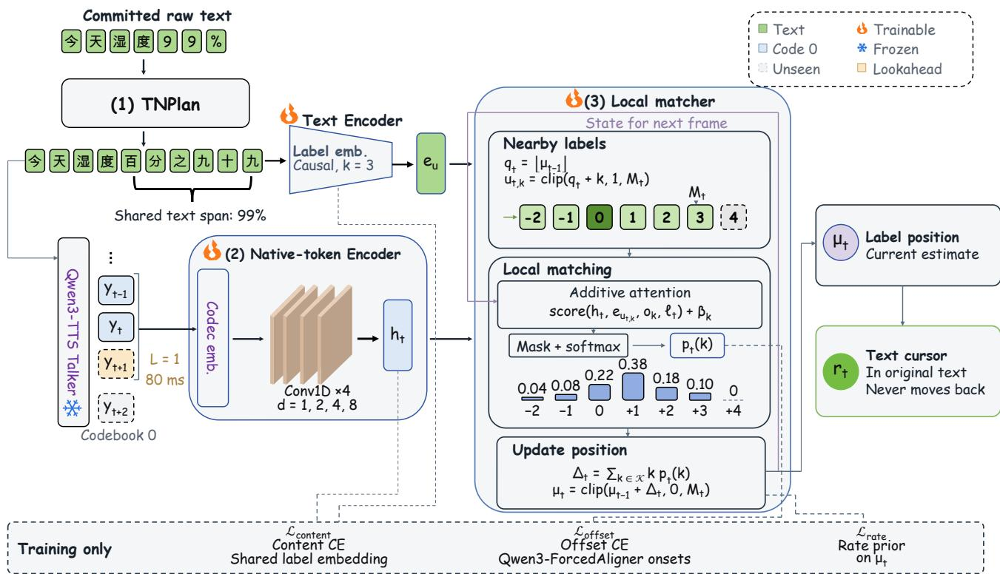
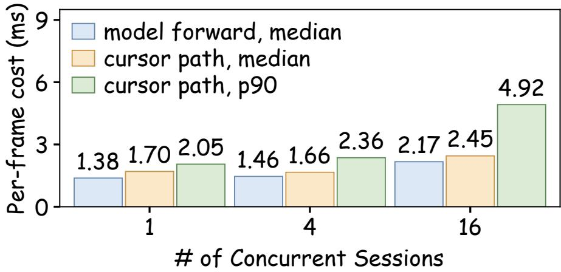
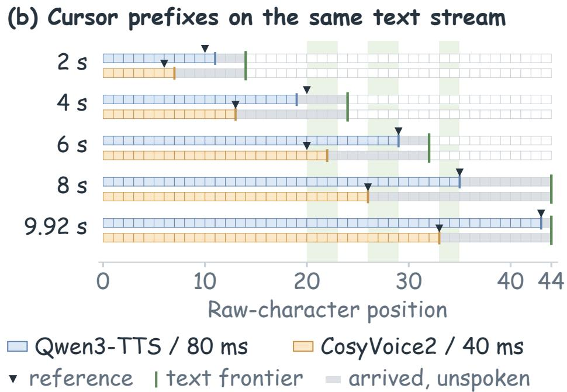

# X2-NativeCursor: Native-Token Text Progress Tracking for Incremental-Text Streaming Codec TTS

Zehan Liu, Carl Chen, Rime Wen, Kaiqi Fu, Altman Lin Shawn Qin, Lights Shi, Roy Gan, Hao Wang, Qian Wang

X Square Robot

## Abstract

Incremental-text streaming text-to-speech (TTS) needs online text progress tracking for synchronized highlighting, interruption handling, and dialogue-history updates. Input text arrives before it is spoken, so text arrival alone cannot indicate speech progress. Existing waveform-based alignment requires complete audio or adds acoustic processing during streaming. We propose X2-NativeCursor, a lightweight observer that tracks progress from native speech tokens before waveform decoding without changing the TTS generator. Its normalization plan links spoken labels to their original-text spans. Text and native-token encoders feed a local matcher that estimates the current label position. A separate output rule converts revisable position estimates into a cursor that never moves backward. Mean absolute error against an automatic reference is 0.151 Chinese characters with 80-ms lookahead, versus 1.253 characters with 320-ms lookahead for an online waveform baseline. Alignment real-time factor also decreases from 0.3598 to 0.0180 relative to this baseline. Lower tracking error is retained under a second automatic alignment reference. We evaluate X2-NativeCursor on Qwen3-TTS and validate its adaptation to CosyVoice2 by training a separate observer for each backbone. Code is publicly available at https://github.com/X-Square-Robot/X2Streaming-TTS.

Index Terms—incremental-text streaming TTS, text progress tracking, native speech tokens, online alignment, text normalization

## 1 Introduction

Incremental-text streaming text-to-speech (TTS) speaks before a language model finishes generating text [1, 2]. Text highlighting, interruption handling, and dialogue-history updates require knowing which words have been spoken [3]. Text arrival does not specify when individual words are spoken. In codec-based TTS, words span varying numbers of speech-token frames, so frame counts alone cannot locate the current word. Tracking therefore requires an online mapping from speech frames to original-text positions.

Existing methods use waveform-based alignment or alignment built into the TTS generator. Waveform-based aligners estimate timestamps through hidden Markov models (HMMs), connectionist temporal classification (CTC), or timestamp prediction [4, 5, 6, 7, 8, 9, 10]. LLM-ForcedAligner predicts timestamps at selected text positions in one non-autoregressive pass [11], while streaming reading trackers estimate positions from incoming speech [12] Within TTS, Speech-T learns alignment through a transducer [13]. ELLA-V and CTC-TTS arrange text or phonemes with corresponding speech tokens [14, 15]; VoXtream generates audio tokens in input-phoneme order [16].

Complete-audio aligners cannot update progress during generation. Online waveform-based alignment still waits for the TTS waveform decoder to reconstruct audio from speech tokens, then processes it with a separate acoustic encoder. For CTC alignment, the aligner predicts frame-level label probabilities to align audio with known text. This path adds waiting and acoustic computation. Alignment built into a generator may require changing its architecture and retraining it. Native speech tokens already carry speech content and timing [17, 18], allowing tracking before waveform decoding without re-encoding decoded audio. We seek to track growing text and token streams with little computation and bounded lookahead.

We propose X2-NativeCursor, a lightweight online observer operating without waveform input. It reads native speech-token frames, the speech-side representations emitted at successive TTS time steps. A normalization plan converts text into spoken labels describing its normalized reading. Labels are released only when their reading is fixed, so later input cannot change them. They retain their original-text spans, including when numbers or symbols expand into multiple labels. A text encoder represents these labels, while a native-token encoder extracts speech features with bounded lookahead.

For each frame, a local matcher scores labels near the previous estimate using text and speech features. This local search keeps the number of comparisons small as text grows. Internal estimates can move backward or skip labels; an output rule maps the furthest label reached so far back to the original text. The published cursor therefore never retreats. We train a separate observer for each backbone, keeping the TTS generator, speech tokenizer, and waveform decoder unchanged.

Our contributions are as follows:

1. We introduce an independently trained observer for online text tracking directly from native speech tokens, without waveform input or generator changes.

2. We separate revisable alignment estimates from monotonic cursor output in the original text, with bounded lookahead.

3. Against an automatic reference, Chinese-character mean absolute error (MAE) is 0.151 at 80-ms lookahead, versus the online waveform baseline’s 1.253 at 320 ms. Our observer has 2.166M parameters and an alignment real-time factor of 0.0180, versus 0.3598 for this baseline. The tracking gain holds under a second automatic reference. The design supports codec-based TTS models through observer retraining, as demonstrated on Qwen3-TTS and CosyVoice2.

## 2 Method

  
Figure 1. Overview of X2-NativeCursor. TNPlan (1) maps spoken labels to original-text spans. The native-token encoder (2) and local matcher (3) track the current label position before waveform decoding. The output is a cursor in the original text that never moves backward. Dashed paths are used only during training.

## 2.1 Overall architecture

X2-NativeCursor combines text preparation, a trainable observer, and cursor output (Figure 1). TNPlan (1) converts incoming text into stable spoken labels and records their original-text spans. The observer comprises the text encoder, native-token encoder (2), and local matcher (3). The text encoder represents labels, while the native-token encoder processes speech-token frames with bounded lookahead. The matcher uses these features to update an internal label position $\mu _ { t }$ , which may move backward or skip labels. A separate output rule maps the furthest label position reached to an original-text cursor $r _ { t }$ that never retreats. Only the observer is trained; the TTS generator, speech tokenizer, and waveform decoder remain unchanged.

## 2.2 Spoken labels and text mapping

TNPlan is the normalization plan that converts incoming text into spoken labels and maps them to the original text. It releases labels to the TTS generator and observer once the spoken form is fixed. If later input may change the reading of a number, unit, or symbol, TNPlan waits before releasing its labels. In Chinese, the spoken form of “99%” places the percent expression before the number. All labels for this expression share the original-text span of “99%”.

At native frame �, the committed text prefix is $x _ { 1 : n ( t ) }$ , containing �(�) original-text characters. The available spoken labels are $z _ { 1 } , \ldots , z _ { M _ { t } }$ , where each label $z _ { u }$ is linked to an original-text span $[ a _ { u } , b _ { u } )$ . A label embedding and a causal convolution with kernel size 3 produce the text features $e _ { u } = \mathrm { T e x t E n c } ( z _ { \leq u } )$

## 2.3 Native-token encoding

The native-token encoder maps each speech token $y _ { t }$ to an embedding. Four convolution blocks use dilation factors of 1, 2, 4, and 8. They produce the feature for frame �:

$$
h _ { t } = \mathrm { A u d i o E n c } ( y _ { t - P : t + L } ) ,\tag{1}
$$

where $P$ is the number of past frames and $L \in \{ 0 , \ldots , 4 \}$ is the number of future frames. We fix � during training and inference. The main Qwen3-TTS setting uses $L = 1$ , which corresponds to 80 ms of lookahead. The feature $h _ { t }$ is computed when token $y _ { t + L }$ arrives, and the resulting position estimate refers to frame �.

## 2.4 Local matching and cursor updates

For each native frame, the matcher scores labels near the previous internal position $\mu _ { t - 1 }$ . We use seven ofsets $\mathcal { K } = \{ - 2 , . . . , 4 \}$ around $q _ { t } = \lfloor \mu _ { t - 1 } \rfloor$ . The label lookup index is $u _ { t , k } = \mathrm { c l i p } ( q _ { t } + k , 1 , M _ { t } )$ . Each score combines native-token features, text features, and a location state:

$$
s _ { t , k } = \nu ^ { \top } \operatorname { t a n h } \bigl ( W _ { h } h _ { t } + W _ { e } e _ { u _ { t , k } } + W _ { \ell } \ell _ { t } + o _ { k } \bigr ) + \beta _ { k } .\tag{2}
$$

The weights $W _ { h } , W _ { e } , W _ { \ell }$ , and � are learned, with separate parameters $o _ { k }$ and $\beta _ { k }$ for each ofset. The state $\ell _ { t }$ contains the fractional part of $\mu _ { t - 1 }$ , scaled dwell time, and mean recent advance, all computed before frame �. Dwell time counts frames since the label cursor last advanced, scaled by the prior label rate.

We mask candidates with $q _ { t } + k$ outside $[ 1 , M _ { t } ]$ and apply a softmax to obtain the ofset distribution $p _ { t } ( k )$ . Its mean gives the position update:

$$
\Delta _ { t } = \sum _ { k \in \mathcal K } k p _ { t } ( k ) , \qquad \mu _ { t } = \mathrm { c l i p } ( \mu _ { t - 1 } + \Delta _ { t } , 0 , M _ { t } ) .\tag{3}
$$

The published label cursor $c _ { t }$ keeps the furthest position reached. The original-text cursor $r _ { t }$ is the largest span end among labels up to $c _ { t } .$

$$
c _ { t } = \operatorname* { m a x } _ { s \leq t } \lfloor \mu _ { s } \rfloor , \qquad r _ { t } = \operatorname* { m a x } _ { u \leq c _ { t } } b _ { u } .\tag{4}
$$

The initial states are $\mu _ { 0 } = c _ { 0 } = r _ { 0 } = 0$ and $\ell _ { 1 } = 0$ . Before the first label is reached, $r _ { t }$ remains zero.

## 2.5 Training and inference

Qwen3-ForcedAligner provides onset times for the spoken labels [19, 11]. These times define the reference label position at each native frame. We train the ofset distribution $p _ { t } ( k )$ with cross entropy against the reference ofsets. A content loss predicts the spoken label from each native-token feature $h _ { t }$ , using a classifier that shares the label embedding. A rate loss keeps the overall cursor advance close to a prior rate for each utterance. The total loss is

$$
\mathcal { L } = \mathcal { L } _ { \mathrm { o f f s e t } } + 0 . 3 \mathcal { L } _ { \mathrm { c o n t e n t } } + 0 . 0 1 \mathcal { L } _ { \mathrm { r a t e } } .\tag{5}
$$

The encoders use a hidden dimension of 256. We train for 10 epochs with AdamW, a learning rate of $1 0 ^ { - 3 }$ , cosine decay, and a batch size of 24. During training, we perturb the reference cursor position with probability 0.3. Only the text encoder, native-token encoder, and local matcher are trained. For each TTS backbone, we initialize and train a separate observer to match its token vocabulary and frame period.

During inference, each new token $y _ { t + L }$ triggers the update for frame �. The observer outputs $c _ { t }$ and $r _ { t }$ and prepares the location state for the next frame.

## 3 Experimental Evaluation

Table 1. Cursor tracking on Qwen3-TTS speech, with Qwen3-ForcedAligner as the automatic reference. $\bf M \mathrm { A E _ { z h } }$ covers the three Chinese groups; $\mathrm { M A E _ { \mathrm { e n } } }$ covers English. �: lookahead. ∗MMS-FA reference on 600 Chinese and four mixed-language samples, with timestamps shifted 40 ms earlier. †Shared MMS-FA emissions. $/ { : }$ not evaluated. Bold/underline: best/second best.
<table><tr><td rowspan="2">Method</td><td colspan="3">Setting</td><td colspan="3">MAE (characters)↓</td><td rowspan="2"></td><td colspan="3">Onset (ms)</td></tr><tr><td>Online L (ms)</td><td></td><td>Params</td><td>zh</td><td> $\boldsymbol { \mathbf { z } } \mathrm { h } ^ { * }$ </td><td>en</td><td></td><td>F1@80↑ AAS↓ Lag50</td><td></td></tr><tr><td>Qwen3-ForcedAligner-0.6B</td><td>x</td><td>∞</td><td>912.6M</td><td> $r e f .$ </td><td></td><td>0.158</td><td></td><td></td><td></td><td>一</td></tr><tr><td>Wavorm MMS-FA</td><td>x</td><td>∞</td><td>315.5M</td><td></td><td>0.539</td><td>ref.</td><td>1.610</td><td>0.430</td><td>109.3</td><td>80</td></tr><tr><td>CTC-segmentation</td><td>x</td><td>∞</td><td>315.5M†</td><td></td><td>0.371</td><td>0.250</td><td>1</td><td>0.418</td><td>261.7</td><td>80</td></tr><tr><td>FunASR timestamp predictor</td><td>x</td><td>8</td><td>39.6M</td><td></td><td>0.744</td><td>0.669</td><td></td><td>0.322</td><td>216.1</td><td>80</td></tr><tr><td>WindowMMS+PersistentCTC</td><td>√</td><td>320</td><td>315.5M</td><td></td><td>1.253</td><td>1.134 2.226</td><td></td><td>0.341</td><td>172.2</td><td>80</td></tr><tr><td>Rate prior</td><td>√</td><td>0</td><td></td><td>0</td><td>1.706</td><td>1.750</td><td>/</td><td>0.261</td><td>532.5</td><td>-240</td></tr><tr><td>Codec Cross-attention readout</td><td>√</td><td>320</td><td>2.490 M</td><td></td><td>0.414</td><td>0.3111.629</td><td></td><td>0.828</td><td>96.1</td><td>80</td></tr><tr><td>CodecCTC+skip-DP</td><td>√</td><td>320</td><td>1.705 M</td><td>0.416</td><td></td><td>0.311</td><td>1.568</td><td>0.823</td><td>95.6</td><td>80</td></tr><tr><td>X2-NativeCursor (ours)</td><td>√</td><td>80</td><td></td><td>2.166M 0.151± 0.005</td><td></td><td>0.206 1.247</td><td></td><td>0.924</td><td>51.1</td><td>0</td></tr></table>

## 3.1 Experimental setup

Data. We train the observer on 20,235 speech samples generated by Qwen3-TTS and evaluate it on 800 fixed test texts. The test set has four groups of 200 texts: plain Chinese, Chinese with numbers, Chinese with symbols, and English. Streaming setup. We provide text in chunks of 2–8 characters to simulate incremental input from an LLM. All methods are evaluated on the same test samples. Online methods follow the same text-arrival schedule. We keep the TTS generator unchanged and use a fixed voice. X2-NativeCursor uses one future native frame, corresponding to 80 ms of lookahead. We train the observer with seeds 0, 1, and 2.

References and baselines. Qwen3-ForcedAligner provides automatic timestamps for observer training and the main evaluation [19, 11]. The scores measure agreement with this automatic reference. Complete-audio baselines include MMS-FA, CTC-segmentation, and the FunASR/Paraformer timestamp predictor [7, 5, 6, 8, 9]. The online waveform baseline, WindowMMS+PersistentCTC, re-encodes a one-second left-context window with at most 320 ms of lookahead. It keeps the CTC alignment state across updates and advances it only with complete encoder outputs. Native-token baselines include a rate prior, a cross-attention readout, and CodecCTC+skip-DP. The latter two use the same alignment supervision as our observer. Table 1 lists each method’s online status and lookahead.

Metrics. Our main metric is mean absolute error (MAE), which measures the diference between the reported and reference cursor positions in original-text characters. We first average errors within each speech sample, then across samples. We score only frames whose reference positions fall within the committed spoken labels. These frames account for over 99% of Mandarin frames. English labels map to whole words averaging 4.58 characters, so position updates are coarser in English than in Chinese. A label’s onset is the first frame when the published cursor reaches it. We report onset F1 with an 80-ms tolerance and median signed onset lag. We also report onset-only accumulated averaging shift (AAS), the mean absolute diference between predicted and reference label start times [11]. We report lookahead separately from real-time factor (RTF), the ratio of computation time to speech duration.

Results from three seeds are reported as the mean and standard deviation.

## 3.2 Main results

Table 1 compares X2-NativeCursor with waveform-based and native-token baselines on speech generated by Qwen3- TTS. With Qwen3-ForcedAligner as the reference, our method achieves a Chinese-character MAE of $0 . 1 5 1 \pm 0 . 0 0 5$ Compared with the online waveform baseline, Chinese and English MAE are lower by about 88% and 44%, respectively. This gain is achieved with 80-ms lookahead, compared with 320 ms for the baseline. Chinese MAE is also lower than that of all complete-audio baselines in the table.

The gain also holds among methods that use native tokens. Cross-attention readout and CodecCTC+skip-DP use the same alignment supervision as our observer. Our method reduces Chinese MAE by about 64% compared with both methods, while using less lookahead.

To check whether the gain depends on the training reference, we re-score 604 aligned samples using MMS-FA, which is not used in observer training. We shift its timestamps 40 ms earlier to account for the median diference between the two references. X2-NativeCursor remains ahead of the online waveform baseline and the two learned native-token baselines, with a Chinese-character MAE of 0.206. The improvement therefore holds under both automatic references.

## 3.3 Ablation study

Table 2. Ablations on Chinese and English samples using ofline replay. Lookahead is 80 ms unless removed. MAE averages frame errors within each text group, then across the four groups. Ablations report three-seed means (± std); the final row tests new voices.
<table><tr><td></td><td></td><td colspan="4">MAE by text subset↓</td></tr><tr><td>Configuration</td><td>MAE↓</td><td>zh-plain</td><td>zh-num</td><td>zh-sym</td><td>en</td></tr><tr><td>X2-NativeCursor</td><td> $\mathbf { 0 . 3 4 3 \pm 0 . 0 0 9 }$ </td><td>0.131</td><td>0.146</td><td>0.170</td><td>0.927</td></tr><tr><td>w/o text encoder</td><td> $1 . 4 6 5 \pm 0 . 0 3 2$ </td><td>1.695</td><td>0.989</td><td>0.977</td><td>2.197</td></tr><tr><td>w/o backward &amp; skip</td><td> $2 . 6 8 1 \pm 0 . 0 4 7$ </td><td>0.124</td><td>0.155</td><td>0.168</td><td>10.278</td></tr><tr><td>w/o lookahead</td><td> $0 . 4 7 1 \pm 0 . 0 2 6$ </td><td>0.188</td><td>0.197</td><td>0.250</td><td>1.251</td></tr><tr><td>w/o position/rate</td><td> $\underline { { 0 . 3 5 5 \pm 0 . 0 2 3 } }$ </td><td>0.136</td><td>0.145</td><td>0.180</td><td>0.960</td></tr><tr><td>Voice replacement</td><td>0.788</td><td>0.768</td><td>1.038</td><td>0.561</td><td>0.786</td></tr></table>

Table 2 reports ablation results on Chinese and English test samples. Removing the text encoder raises MAE from 0.343 to 1.465 and worsens all four groups. Removing the position and rate features has a much smaller efect, with MAE rising to 0.355. Removing backward and skip moves together mainly afects English, where MAE rises from

0.927 to 10.278, while the Chinese results change little. Removing lookahead raises MAE to 0.471. In a separate comparison using seed 0, increasing lookahead from 80 to 160 ms gives no further improvement. Increasing it to 320 ms lowers MAE from 0.333 to 0.310. We therefore use 80 ms to keep lookahead short while retaining most of the accuracy gain. With three voices not used in training, average MAE rises to 0.788, with large diferences between voices (0.320–1.213). The observer is therefore sensitive to changes in the synthesis voice.

## 3.4 Runtime cost and concurrency

X2-NativeCursor has an RTF of 0.0180, compared with 0.3598 for WindowMMS+PersistentCTC, reducing alignment computation time by about 95%. In a standalone timing test, the median observer cost is 1.33 ms per native frame, measured after warm-up and excluding waveform decoding. Together with the main results, this shows that the observer lowers both tracking error and computation cost.

  
Figure 2. Per-frame computation time in the streaming engine at diferent concurrency levels. Bars show median model-forward time and the median and 90th percentile for a complete cursor update.

Figure 2 reports concurrency results on a single NVIDIA A800-SXM4-80GB GPU. As the number of concurrent sessions increases from 1 to 16, the median time per cursor update rises from 1.70 to 2.45 ms. At 16 sessions, the 90th percentile is 4.92 ms, well below the 80 ms of speech represented by one native frame.

## 3.5 Adaptation to other codec-based TTS models

X2-NativeCursor can be adapted to other codec-based TTS models by retraining the observer on their native speech tokens. We use CosyVoice2 [18] as a test case, reusing the observer architecture and keeping the TTS generator unchanged. The run selected by development MAE achieves a Chinese-character MAE of 0.284 (95% CI: 0.237–0.343). The other two training seeds give MAEs of 0.254 and 0.241. These results support using the same observer design across codec-based TTS backbones, with retraining for each model.

Figure 3 shows tracking for the same sentence under a shared text-input schedule. The two TTS systems speak at diferent rates in this example. Across the ten plotted estimates, each cursor stays within two characters of its own automatic reference and within the text received so far. This example shows how the observers follow the speech progress of their respective backbones.

  
Figure 3. Cursor tracking on Qwen3-TTS and CosyVoice2 against their automatic references. (a) Text fields and spoken forms. (b) Cursor positions under the same text input. Each cell represents one original-text character. Native frame periods are 80 and 40 ms, respectively.

## 4 Conclusion

X2-NativeCursor tracks raw-text progress through local native-token state updates and owner-span projection, while keeping the TTS frozen. On Qwen3-TTS, it reduces teacher-relative Chinese-character MAE from the online waveform baseline’s 1.253 to 0.151 with one-quarter of the lookahead. The improvement also holds with a second automatic reference, and retraining the observer adapts the method to CosyVoice2. These results support online cursor estimation before waveform decoding within the evaluated conditions.

## 5 Compliance with Ethical Standards

This study uses synthetic speech produced by the systems under test and includes no human participants.

## 6 Acknowledgments

This work was supported by X Square Robot, which provided funding and computational resources. All authors are employees of X Square Robot.

## References

[1] Mingbo Ma, Baigong Zheng, Kaibo Liu, Renjie Zheng, Hairong Liu, Kainan Peng, Kenneth Church, and Liang Huang, “Incremental text-to-speech synthesis with prefix-to-prefix framework,” in Findings of the Association for Computational Linguistics: EMNLP 2020, 2020, pp. 3886–3896.

[2] Brooke Stephenson, Laurent Besacier, Laurent Girin, and Thomas Hueber, “What the future brings: Investigating the impact of lookahead for incremental neural TTS,” in Interspeech, 2020, pp. 215–219.

[3] Alexandre Défossez, Laurent Mazaré, Manu Orsini, Amélie Royer, Patrick Pérez, Hervé Jégou, Edouard Grave, and Neil Zeghidour, “Moshi: A speech-text foundation model for real-time dialogue,” arXiv preprint arXiv:2410.00037, 2024.

[4] Michael McAulife, Kaylynn Gunter, Michael Wagner, and Morgan Sonderegger, “Montreal forced aligner and the state of speech-to-text alignment in 2026,” arXiv preprint arXiv:2606.18466, 2026.

[5] Alex Graves, Santiago Fernández, Faustino Gomez, and Jürgen Schmidhuber, “Connectionist temporal classification: Labelling unsegmented sequence data with recurrent neural networks,” in Proceedings of the 23rd International Conference on Machine Learning, 2006, pp. 369–376.

[6] Ludwig Kürzinger, Dominik Winkelbauer, Lujun Li, Tobias Watzel, and Gerhard Rigoll, “CTC-segmentation of large corpora for German end-to-end speech recognition,” in Speech and Computer (SPECOM). 2020, pp. 267–278, Springer International Publishing.

[7] Vineel Pratap, Andros Tjandra, Bowen Shi, Paden Tomasello, Arun Babu, Sayani Kundu, Ali Elkahky, Zhaoheng Ni, Apoorv Vyas, Maryam Fazel-Zarandi, Alexei Baevski, Yossi Adi, Xiaohui Zhang, Wei-Ning Hsu, Alexis Conneau, and Michael Auli, “Scaling speech technology to 1,000+ languages,” Journal ofMachine Learning Research, vol. 25, no. 97, pp. 1–52, 2024.

[8] Zhifu Gao, Zerui Li, Jiaming Wang, Haoneng Luo, Xian Shi, Mengzhe Chen, Yabin Li, Lingyun Zuo, Zhihao Du, and Shiliang Zhang, “FunASR: A fundamental end-to-end speech recognition toolkit,” in Interspeech, 2023, pp. 1593–1597.

[9] Xian Shi, Yanni Chen, Shiliang Zhang, and Zhijie Yan, “Achieving timestamp prediction while recognizing with non-autoregressive end-to-end ASR model,” in Man-Machine Speech Communication (NCMMSC 2022), 2023, pp. 89–100.

[10] Abdul Rehman, Jingyao Cai, Jian-Jun Zhang, and Xiaosong Yang, “BFA: Real-time multilingual text-to-speech forced alignment,” arXiv preprint arXiv:2509.23147, 2025.

[11] Bingshen Mu, Xian Shi, Xiong Wang, Hexin Liu, Jin Xu, and Lei Xie, “LLM-ForcedAligner: A non-autoregressive and accurate LLM-based forced aligner for multilingual and long-form speech,” arXiv preprint arXiv:2601.18220, 2026.

[12] Vishal Sunder, Beulah Karrolla, and Eric Fosler-Lussier, “End-to-end real time tracking of children’s reading with pointer network,” arXiv preprint arXiv:2310.11486, 2023.

[13] Jiawei Chen, Xu Tan, Yichong Leng, Jin Xu, Guihua Wen, Tao Qin, and Tie-Yan Liu, “Speech-T: Transducer for text to speech and beyond,” in Advances in Neural Information Processing Systems, 2021, vol. 34, pp. 6621–6633.

[14] Yakun Song, Zhuo Chen, Xiaofei Wang, Ziyang Ma, and Xie Chen, “ELLA-V: Stable neural codec language modeling with alignment-guided sequence reordering,” in Proceedings of the AAAI Conference on Artificial Intelligence, 2025, vol. 39, pp. 25174–25182.

[15] Hanwen Liu, Saierdaer Yusuyin, Hao Huang, and Zhijian Ou, “CTC-TTS: LLM-based dual-streaming text-to-speech with CTC alignment,” arXiv preprint arXiv:2602.19574, 2026.

[16] Nikita Torgashov, Gustav Eje Henter, and Gabriel Skantze, “VoXtream: Full-stream text-to-speech with extremely low latency,” arXiv preprint arXiv:2509.15969, 2025, Accepted to IEEE ICASSP 2026.

[17] Hangrui Hu, Xinfa Zhu, Ting He, Dake Guo, Bin Zhang, Xiong Wang, Zhifang Guo, Ziyue Jiang, Hongkun Hao, Zishan Guo, Xinyu Zhang, Pei Zhang, Baosong Yang, Jin Xu, Jingren Zhou, and Junyang Lin, “Qwen3-TTS technical report,” arXiv preprint arXiv:2601.15621, 2026.

[18] Zhihao Du, Yuxuan Wang, Qian Chen, Xian Shi, Xiang Lv, Tianyu Zhao, Zhifu Gao, Yexin Yang, Changfeng Gao, Hui Wang, Fan Yu, Huadai Liu, Zhengyan Sheng, Yue Gu, Chong Deng, Wen Wang, Shiliang Zhang, Zhijie Yan, and Jingren Zhou, “CosyVoice 2: Scalable streaming speech synthesis with large language models,” arXiv preprint arXiv:2412.10117, 2024.

[19] Xian Shi, Xiong Wang, Zhifang Guo, Yongqi Wang, Pei Zhang, Xinyu Zhang, Zishan Guo, Hongkun Hao, Yu Xi, Baosong Yang, Jin Xu, Jingren Zhou, and Junyang Lin, “Qwen3-ASR technical report,” arXiv preprint arXiv:2601.21337, 2026.