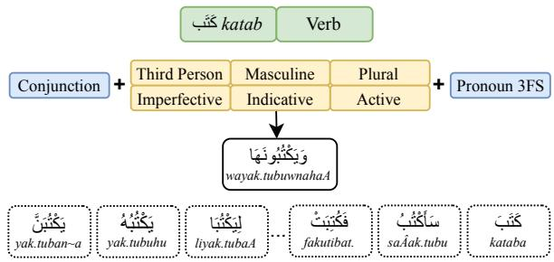

# YallaMorph: A Benchmark for Evaluating Arabic Morphological Generation in Large Language Models

Mahmoud Reda,<sup>1</sup> Salam Khalifa,<sup>1,2</sup> Reham Marzouk,<sup>3</sup> Nizar Habash<sup>1</sup>Indicative

Computational Approaches to Modeling Language (CAMeL) Lab

<sup>1</sup>New York University Abu Dhabi,

<sup>2</sup>Stony Brook University, <sup>3</sup>Mohamed bin Zayed University of Artificial Intelligence {mahmoud.ali,salam.khalifa,nizar.habash}@nyu.edu, Reham.Marzouk@mbzuai.ac.ae

## Abstract

Arabic morphology remains challenging forَت large language models, since fluent generation does not guarantee accurate morphosyntactic control. Existing Arabic evaluations mainly target downstream tasks and do not directly test controlled morphological generation from<sup>ا</sup> و َو<sup>ْك</sup> explicit lexical and feature-based input. We introduce YallaMorph, a large-scale benchmark<sup>ُبُه</sup> َيْك<sup>ُت</sup> َفُكَبْتَبا َيْك<sup>ُت</sup>َب َيْك<sup>ُت</sup> for Arabic morphological generation covering verbs, nouns, adjectives, their cliticized forms, and invalid configurations. We evaluate multilingual and Arabic-oriented LLMs under diacritized and undiacritized settings over 600K benchmark entries. Results show that Arabic morphological generation remains difficult, especially for cliticized, unseen, and morphologically rare forms.

## 1 Introduction

Arabic morphology presents a major challenge for language generation. The interaction of templatic and concatenative morphology with morphosyntactic and cliticization features creates a large space of productive forms. Our central question is not simply whether Large Language Models (LLMs) can generate plausible Arabic, but whether they can systematically produce appropriate inflected forms for specific morphological features.

Most evaluations of Arabic LLMs focus on downstream tasks or broad generation quality (Nagoudi et al., 2022; Almazrouei et al., 2023; Koto et al., 2024), providing limited insight into whether models can systematically generate correct Arabic word forms from explicit lexical and morphological specifications. Existing morphological inflection benchmarks provide more controlled evaluation settings (Kodner et al., 2022; Goldman et al., 2023), but they do not capture the scale and Arabic-specific feature space required for evaluating modern LLMs.

  
َكَت<sub>َب</sub>Figure 1: Morphological realization of Arabic lemma I<sup></sup>J<sup>»</sup>katab ‘write’ as $t = \frac { 2 0 } { 2 }$ wayak.tubuwnahaA ‘and they write it’ through morphosyntactic features and clitics. Transliterations follow HSB (Habash et al., 2007).

We introduce YallaMorph, a large-scale benchmark for controlled Arabic morphological generation.<sup>1</sup> As illustrated in Figure 1, the task maps a lemma, part-of-speech, gloss, and target feature bundle to the corresponding Arabic surface form, or to an indication that the requested configuration is morphologically invalid. The benchmark covers verbs, nouns, adjectives, and their cliticized forms, and contains over 600K evaluation instances sampled across root class, stem complexity, paradigm completeness, and lemma frequency.

We evaluate proprietary, multilingual, and Arabic-oriented instruction-tuned LLMs under both diacritized and undiacritized settings. Results show that controlled Arabic morphological generation remains challenging even for strong modern LLMs, particularly for cliticized, unseen, and morphologically rare forms.

Our contributions are: (a) introducing a largescale benchmark for controlled Arabic morphological generation designed using a linguistically motivated sampling framework; and (b) evaluating multilingual and Arabic-oriented LLMs and providing detailed analysis across linguistic and distributional dimensions.

## 2 Related Work

Morphological Inflection Morphological inflection is a well-established standalone task in NLP. The SIGMORPHON morphological (re)inflection shared tasks have served as a central benchmark series for this problem (Cotterell et al., 2016, 2017, 2018; McCarthy et al., 2019; Vylomova et al., 2020; Pimentel et al., 2021; Kodner et al., 2022; Goldman et al., 2023). These tasks evaluate systems that map lemmas and morphosyntactic feature bundles to inflected forms, and later editions increasingly emphasized generalization across typologically diverse languages, unseen lemmas, and unseen feature combinations. The 2022 and 2023 shared tasks in particular strengthened the evaluation setup through data splits targeting generalization to unseen lemmas (Kodner et al., 2022; Goldman et al., 2023). This line of work is closely tied to UniMorph (Batsuren et al., 2022), a broad coverage universal schema for morphological annotation and inflection tables that represent forms through a lemma and a bundle of morphosyntactic features. UniMorph 4.0 covers 182 languages, including Arabic varieties such as Modern Standard Arabic (MSA), Egyptian Arabic, and Gulf Arabic in recent shared-task data. However, while the SIGMORPHON shared tasks yielded a diverse set of baselines and state-of-the-art systems, they were not designed as LLM benchmarks. Moreover, for our purposes, UniMorph does not provide exhaustive lexical coverage, full Arabic paradigm coverage, or cliticized inflected forms. In this work, we instead use Arabic-specific morphological resources that provide broader lexical coverage and richer paradigm generation.

Morphological Generators for Arabic Morphological analyzers and generators have been central to Arabic NLP since its early stages, providing explicit linguistic representations for a morphologically rich and complex language. Early work included finite-state and templatic approaches that modeled Arabic root-and-pattern morphology (Beesley et al., 1989; Kiraz, 1994; Beesley, 1998; Habash and Rambow, 2006; Smrž, 2007). A parallel line of work adopted lexicon- and compatibility-table-based resources, most notably the Buckwalter Arabic Morphological Analyzer and its successors (Buckwalter, 2002; Maamouri et al., 2010). Aragen/ALMORGEANA further extended Buckwalter-style lexical resources toward generation from lexeme-and-feature representations (Habash et al., 2005). More recently, Khairallah et al. (2024) introduced CamelMorph, a comprehensive open-source morphological analyzer and generator for MSA that builds on this tradition, reporting over 100K lemmas with rich morphological features and broad paradigm coverage. In this work, we use the CamelMorph lexicon and database to construct our controlled benchmark set, and we use its generation engine, exposed through CAMeL Tools (Obeid et al., 2020), to generate and validate reference inflected forms.

LLM Evaluation for Morphological Inflection Recently, benchmarking LLMs for morphological generation, particularly inflection, has gained traction as researchers increasingly probe LLMs for linguistic knowledge. Early work in this area used variants of the Wug test (Berko, 1958) to evaluate morphological productivity and generalization in LLMs across typologically diverse languages (Weissweiler et al., 2023; Anh et al., 2024). Ismayilzada et al. (2025) extended this line by evaluating morphological compositional generalization through both generative and discriminative tasks. However, these studies do not focus on Arabic or on controlled generation from explicit Arabic morphosyntactic feature specifications, which is the focus of our work.

Very few studies have focused on Arabic morphological generation in LLMs. IMPACT (Saeed et al., 2025) introduced a multilingual evaluation framework for inflectional morphology across five morphologically rich languages, including Arabic, but its Arabic component targets a narrower set of agreement and inflectional phenomena. The work by Alakeel et al. (2026) focuses solely on Arabic, specifically MSA, evaluating how LLM tokenizers align with Arabic morphological structure and how LLMs perform on productive root–pattern generation. It constructs a controlled test set with real and nonce roots and finds that tokenizer–morpheme alignment is neither necessary nor sufficient for successful morphological generation. In contrast, our work targets controlled Arabic morphological generation over an explicitly structured feature space, focusing on inflected-form realization and systematic sampling rather than root–pattern productivity alone, gender-focused generation, or broad multilingual probing. Furthermore, our benchmark dataset is substantially larger and more comprehensive.

## 3 Linguistic Background & Terminology

Arabic morphology is characterized by both richness and complexity. Its richness stems from large inflectional paradigms and productive cliticization involving conjunctions, prepositions, articles, and pronouns, yielding many possible surface forms for a single lemma (Table 2). Its complexity arises from interactions between templatic (root and pattern) and concatenative (affix or clitic) morphemes, often accompanied by orthographic and morphophonological alternations.

Relevant Terminology We briefly summarize the main terminology used throughout the paper, following CamelMorph (Khairallah et al., 2024). A lemma represents an abstraction over all inflectional forms of a lexical item (Habash et al., 2022). A root is an abstract consonantal sequence encoding core lexical meaning, while a pattern specifies the vocalic and templatic structure used to derive grammatical forms. A stem is the form produced by combining roots and patterns before affixation. Morphological representation is further organized through functional features such as gender, number, case, and state, as well as part-of-speech (POS), which specifies the grammatical category, and the gloss, which provides an English semantic description. Finally, the framework distinguishes between affixes, which realize core morphosyntactic features within the baseword, and clitics, which include conjunctions, prepositions, definite article, and object and possessive pronouns.

Example Consider the noun lemma $\because$ laj.na¯h ‘committee’ which illustrates multiple types of interactions. It is derived from the sound root $l . j . n$ using the singular pattern 1a2.3a¯h. Its plural is the broken plural $\therefore 1 3 l i j a A n ,$ which preserves the root while changing the pattern to 1i2aA3. Clitic attachment further increases surface variation. For example, attaching the enclitic pronoun <sup>A</sup>ë haA ‘her’ produces $( 1 - 3 ) 1 9 . n + a t + u + h a A$ ‘her committee [nominative]’, where $\ddot { \circ } a \hbar$ surfaces as $\therefore a t .$ . Single proclitic attachment yields forms such as $\therefore \vert 5 \vert 5 \vert$ $A l + l { \sim } i j a A n i$ ‘the committees [genitive]’ and $\therefore 6 . 6$ $l i { + } l i j a A n \tilde { \imath }$ ‘for committees [genitive]’. Combining both triggers orthographic assimilation, producing $\cup 6 7 \dot { \approx } \dot { \bigcup } l i + l \sim j a A n i$ ‘for the committees [genitive]’.

## 4 YallaMorph Benchmark Design

In this section, we present the design details of the YallaMorph benchmark.

## 4.1 Design Principles

The design of YallaMorph is centered on evaluating Arabic morphological generation at scale while maintaining linguistic balance and interpretability. The benchmark includes over 600K sampled forms covering the major open POS classes of Arabic and capturing both inflectional and cliticization phenomena. To ensure broad linguistic coverage, the dataset is balanced across a wide range of morphophonological dimensions, including root classes, stem complexity, and paradigm completeness. In addition, YallaMorph incorporates frequency-balanced sampling over lemmas and morphological categories, enabling controlled evaluation of model generalization across both frequent and long-tail forms.

## 4.2 Data Source

We construct our benchmark from the lemma inventory and morphological analyses provided by CamelMorph MSA (Khairallah et al., 2024). Specifically, we use the lemma entries, part-ofspeech labels, glosses, and morphological features to support sampling, categorization, and paradigm generation. Access to these analyses is handled through CAMeL Tools (Obeid et al., 2020).

## 4.3 POS Groups & Morphological Features

YallaMorph focuses on the three major open POS classes in Arabic: verbs, nouns, and adjectives. Within the verbal domain, we distinguish five core configurations: active perfective, passive perfective, active imperfective, passive imperfective, and command. The various POS groups differ in inflectional behavior, stem complexity, and compatibility with clitic attachment. To capture both core morphology and cliticization attachment phenomena, the benchmark is organized into two complementary subsets: a baseword subset focusing on inflectional morphology, and a cliticization subset focusing on interactions between stems and attached clitics.

## 4.4 Sampling Motivation

Arabic morphology exhibits substantial lexical and inflectional richness. Combining the large lemma inventory of CamelMorph MSA with feature bundles and clitic configurations yields an impractically large number of possible test instances (Table 2). We therefore construct the benchmark through guided sampling rather than exhaustive enumeration. The following subsections describe the linguistic and distributional dimensions underlying this sampling process. Our benchmark comprises over 600K carefully sampled entries.

<table><tr><td>Category</td><td>Type</td><td>Explanation</td><td>POS Group</td></tr><tr><td rowspan="4">Lemma Frequency</td><td>High</td><td>High-frequency lemma</td><td>All</td></tr><tr><td>Medium</td><td>Medium-frequency lemma</td><td>All</td></tr><tr><td>Low</td><td>Low-frequency lemma</td><td>All</td></tr><tr><td>Sound</td><td>Root with no weak letters, hamza, or gemination</td><td>All</td></tr><tr><td rowspan="6">Root Class</td><td>Geminated</td><td>Root with identical second and third radicals</td><td>All</td></tr><tr><td>Hamzated</td><td>Root containing a hamza consonant</td><td>All</td></tr><tr><td>Weak Initial</td><td>Root whose first radical is weak (w or y)</td><td>All</td></tr><tr><td></td><td></td><td></td></tr><tr><td>Hollow Defective</td><td>Root whose second radical is weak</td><td>All</td></tr><tr><td>NTWS</td><td>Root whose third radical is weak Non-templatic word stem</td><td>All Nouns, Adjectives</td></tr><tr><td rowspan="3">Paradigm Completeness</td><td>Full</td><td>Fully inflecting paradigm</td><td>All</td></tr><tr><td>Masculine</td><td>Masculine only nominal paradigm</td><td>Nouns</td></tr><tr><td>Feminine</td><td>Feminine only nominal paradigm</td><td>Nouns</td></tr><tr><td rowspan="6">Stem Complexity</td><td>Regular</td><td>No major orthographic or morphological alternations</td><td>All</td></tr><tr><td>Defective Family</td><td>Stem allomorphs exhibit defective-family alternations</td><td>All</td></tr><tr><td>Hamza Family</td><td>Stem allomorphs exhibit hamza-related alternations</td><td>All</td></tr><tr><td>#N Family</td><td>Stem ends with letter n.</td><td>Verbs</td></tr><tr><td>#T Family</td><td>Stem ends with letter t.</td><td>Perfective Verbs</td></tr><tr><td>L# Family</td><td> $\mathsf { J } l .$ </td><td></td></tr><tr><td></td><td>Diptote Family</td><td>Stem begins with letter At least one stem allomorph is a diptote  $\sin \alpha = \cos \alpha .$ </td><td>Nouns, Adjectives</td></tr></table>

Table 1: Definitions of sampling categories used for lemma selection.

<table><tr><td colspan="3">Hypothetical Maximum + Clitics</td></tr><tr><td>POS</td><td>Lemmas</td><td>- Clitics</td></tr><tr><td>Verbs</td><td>9,333</td><td>2,183,454 754,417,944</td></tr><tr><td>Nouns</td><td>1,071,576</td><td>2,730,375,648</td></tr><tr><td>Adjectives</td><td>19,844 6,924 373,896</td><td>952,687,008</td></tr><tr><td>Total</td><td>36,101</td><td>3,628,926 4,437,480,600</td></tr></table>

Table 2: Lemma and maximum instance counts by lexical class, with and without clitics.

## 4.5 Sampling Dimensions

We sample lemmas along linguistically motivated dimensions capturing root class, lemma frequency, paradigm completeness, and stem complexity. Each eligible lemma is assigned categorical labels for the relevant dimensions, and combinations of these labels define the sampling strata. Table 1 summarizes all category dimensions and their possible values, while Table 3 presents representative noun and active perfective verb (PVA) examples illustrating their combinations.

Lemma Frequency Lemma frequency provides a corpus-based estimate of how often each lemma is attested in a reference corpus. We estimate frequency using BAREC-10M (Elmadani et al., 2026), a large, balanced, multi-domain corpus of Arabic that is automatically morphologically tagged and lemmatized.

Our lemma-frequency analysis was conducted in parallel with the BAREC-10M annotation effort. The final BAREC-10M annotations and their additional lemma-cluster resolution procedure were not used because they were not yet available at the time of our analysis. We therefore independently analyzed the raw corpus using the morphological disambiguation component of CAMeL Tools.<sup>2</sup> For each token, we retained the top-ranked morphological analysis.

Lemmas for which our analysis recovered no occurrences were assigned a count of zero. For sampling, we group lemmas into three frequency bands: low, medium, and high. The low band contains lemmas with frequency 0; the medium band contains lemmas with frequencies from 1 to 20; and the high band contains lemmas with frequencies above 20.

<table><tr><td>Group</td><td>Frequency</td><td>Root Class</td><td>Paradigm</td><td>Stem Complexity</td><td>Example Lemma</td><td></td><td>Gloss</td></tr><tr><td>Verb</td><td>High</td><td>Sound</td><td>Full</td><td>Regular</td><td> $\sum 5 j$ </td><td>rajas</td><td>return</td></tr><tr><td>Verb</td><td>High</td><td>Hamzated</td><td>Full</td><td>#Hamza Family</td><td>L</td><td>Aib.tadaÂ</td><td>begin</td></tr><tr><td>Verb</td><td>Medium</td><td>Geminated</td><td>Full</td><td>#N Family</td><td></td><td>Aim.tan~</td><td>be grateful</td></tr><tr><td>Verb</td><td>Medium</td><td>Hollow</td><td>Full</td><td>Regular</td><td> $\dot { \boldsymbol { \mathscr { s } } } \dot { \boldsymbol { \mathrm { u } } }$ </td><td>naAf</td><td>exceed</td></tr><tr><td>Verb</td><td>Low</td><td>Sound</td><td>Full</td><td>Regular</td><td> $j = a$ </td><td>tabal.mar</td><td>be polymerized</td></tr><tr><td>Verb</td><td>Low</td><td>Defective</td><td>Full</td><td>Regular</td><td> $g ^ { \ddagger } j$ </td><td>raxuw</td><td>be loose</td></tr><tr><td>Noun</td><td>High</td><td>Sound</td><td>Full</td><td>#Hamza Family</td><td> $a _ { i } = i$ </td><td>šariyk</td><td>partner</td></tr><tr><td>Noun</td><td>High</td><td>NTWS</td><td>Masculine</td><td>L# Family</td><td> $\lim \limits _ { n  \infty } ^ { \infty }$ </td><td>liyt.r</td><td>liter</td></tr><tr><td>Noun</td><td>Medium</td><td>Hollow</td><td>Feminine</td><td>#Defective Family</td><td> $a = \sin \theta$ </td><td>Siyniy~aħ</td><td>porcelain</td></tr><tr><td>Noun</td><td>Medium</td><td>Weak Initial</td><td>Masculine</td><td>#Diptote Family</td><td> $1 9 \div \frac { 1 } { 9 0 }$ </td><td>maw.šuwr</td><td>prism</td></tr><tr><td>Noun</td><td>Low</td><td>Sound</td><td>Feminine</td><td>L# Family</td><td> $\cos \angle \sin \angle C = \sin \angle D$ </td><td>laAAin.qisaAmiy~aħ</td><td>indivisibility</td></tr><tr><td>Noun</td><td>Low</td><td>Geminated</td><td>Full</td><td>Regular</td><td> $\frac { l _ { 2 } \vert \cdot \vert = 5 } { \cdots }$ </td><td> $k a \check { D } i y \check { D }$ </td><td>overfilled</td></tr></table>

Table 3: Representative verb and noun lemmas illustrating sampling categories across lemma frequency, root class, paradigm completeness, and stem complexity. Verb categories are from the perfective active subset.

Paradigm Stem Complexity Paradigm stem complexity captures broad stem-related patterns that affect how forms are realized across a lemma’s paradigm. We derive this dimension from stemrelated information provided in CamelMorph MSA. We assign lemmas to one of seven stem-complexity families and some lemmas may satisfy more than one stem-complexity condition. Overlapping classifications are resolved using the following priority hierarchy: #N Family > #T Family > L# Family > Defective Family > Hamza Family > Diptote Family > Regular. This procedure yields a single, consistent stem-complexity label for each lemma and supports non-overlapping sampling across stemcomplexity families. For example, the lemma $a _ { i } j$

šariyk ‘partner’ has a broken plural $\angle E _ { j } ^ { \prime }$ šurakaA’ which ends in a Hamza (glottal stop). This places the whole lemma in the Hamza Family group. Ta-

Root Class Root class captures the phonological type of a lemma’s root. We use seven rootclass labels. Each lemma is assigned to exactly one root-class label. For lemmas with identifiable roots, overlapping classifications are resolved using the following priority hierarchy: geminated > hamzated > weak-initial > hollow > defective > sound. Lemmas with no identifiable root are treated as non-templatic word stems (NTWS) and assigned to the NTWS class. This procedure yields a single, consistent root-class label for each lemma and supports balanced sampling across major root types.

ble 1 defines the various stem-complexity families. Some of these apply to all POS, such as Hamza Family, while others are very specific, e.g., #T Family only applies to perfective verbs and captures the reduced spelling of t-initial suffixes with t-final verbs due to orthographic gemination (Shadda): $\stackrel { \{ \} } { \sim } \stackrel { \{ }  { \sim } f u t { \sim } u \left( f u t { + } t u \right)$ ‘I entered’.

Paradigm Completeness Paradigm completeness captures the extent to which a lemma realizes the expected range of gender–number combinations in its paradigm. We derive this dimension from stem-related information provided in Camel-Morph MSA. Lemmas are assigned to one of three labels: masculine-only,feminine-only andfull. Verbal and adjectival paradigms are always full in Arabic, whereas nouns can be of any of the three types. The inclusion of masculine-only andfeminine-only paradigms leads to the possibility of Null forms, i.e., feature combinations that cannot be accommodated such as the feminine of $\therefore \frac { \beta } { 2 }$ mak.tab ‘office’ is a masculine-only lemma. Simply adding the feminine ending to produce $\because S$ mak.taba¯h ‘library’ yields an incorrect result. Around 13% of all the entries in YallaMorph correctly have a null gold reference.

## 4.6 Lemma Sampling Process

After assigning sampling dimension labels to all lemmas, we group them into strata defined by joint combinations of the sampling dimensions across the benchmark POS groups. Since these strata vary greatly in size, we adopt a fixed perstratum strategy, sampling up to 10 lemmas from each non-empty stratum while including all lemmas for smaller strata for the baseword subset of the benchmark. This preserves broad linguistic coverage while limiting over-representation of highly productive categories. The cliticization subset is constructed separately due to the large expansion introduced by proclitic and enclitic combinations. Instead of exhaustively enumerating all cliticized forms, we derive a reduced sample from the baseword subset while preserving coverage across lemma frequency and stem complexity, and we only include full paradigm completeness cases. For each relevant category, we sample up to 5 lemmas, yielding a manageable yet linguistically diverse clitic-focused evaluation set.

## 4.7 Arabic Morphological Generation Entries

We formulate the task as slot-level Arabic morphological generation. Given a lemma, POS, gloss, and a target feature bundle (henceforth, morphological specification), the model generates the corresponding inflected surface form. Outputs may consist of a single valid form, multiple valid realizations, or an indication that the requested configuration is invalid (null reference).

Multiple-reference cases account for 3.2% of the benchmark entries. In these cases, the gold reference set contains more than one valid realization for the same morphological specification.

Morphological specifications are POSdependent. Verbal forms are specified using aspect, person, gender, number, voice, and mood, while nouns and adjectives use gender, number, case, and state. Clitic configurations are represented separately using positional proclitic (prc0–3) and enclitic (enc0–1) slots, with POS-specific constraints. The full list of features is provided in Appendix A. The selected clitic inventory and compatibility restrictions are provided in Appendix A.2.

## 4.8 Benchmark Statistics

Table 4 summarizes benchmark sizes across POS groups and experimental subsets. Although the cliticization subsets contain fewer lemmas, they are substantially larger in total size due to the multiplicative effect of generating all inflected baseword forms and their cliticized variants. Table 5 shows the frequency distribution of undiacritized target forms based on the CAMeLBERT Frequency

<table><tr><td rowspan="2">POS Group</td><td colspan="2">Lemmas</td><td colspan="2">Inflected Forms</td></tr><tr><td>Baseword</td><td>Clitics</td><td>Baseword</td><td>Clitics</td></tr><tr><td>Active PV</td><td>513</td><td>75</td><td>9,234</td><td>45,738</td></tr><tr><td>Passive PV</td><td>498</td><td>70</td><td>8,964</td><td>8,820</td></tr><tr><td>CV</td><td>433</td><td>60</td><td>7,794</td><td>6,480</td></tr><tr><td>Active IV</td><td>435</td><td>60</td><td>39,150</td><td>181,800</td></tr><tr><td>Passive IV</td><td>435</td><td>60</td><td>39,150</td><td>37,800</td></tr><tr><td>Nouns</td><td>1,887</td><td>75</td><td>101,898</td><td>67,950</td></tr><tr><td>Adj</td><td>594</td><td>75</td><td>32,076</td><td>76,950</td></tr><tr><td>Subtotal</td><td>4,795</td><td>475</td><td>238,266</td><td>425,538</td></tr><tr><td>Total</td><td>4,795</td><td></td><td>663,804</td><td></td></tr></table>

Table 4: Benchmark subset sizes.
<table><tr><td>Frequency</td><td>Instance Count</td><td>Percentage</td></tr><tr><td>10M+</td><td>43</td><td>0.0</td></tr><tr><td>1M-10M</td><td>721</td><td>0.1</td></tr><tr><td>100K-1M</td><td>5,040</td><td>0.8</td></tr><tr><td>10K-100K</td><td>14,068</td><td>2.1</td></tr><tr><td>1K-10K</td><td>25,699</td><td>3.9</td></tr><tr><td>101-1K</td><td>36,022</td><td>5.4</td></tr><tr><td>11-100</td><td>43,746</td><td>6.6</td></tr><tr><td>1-10</td><td>55,908</td><td>8.4</td></tr><tr><td>0</td><td>397,179</td><td>59.8</td></tr><tr><td>Null</td><td>85,378</td><td>12.9</td></tr><tr><td>Total</td><td>663,804</td><td>100</td></tr></table>

Table 5: Frequency distribution of entries.

List (Khalifa et al., 2021), highlighting the strong long-tail nature of the benchmark, with 59.8% of unseen forms, while an additional 12.9% correspond to null reference entries.

## 5 Evaluation

## 5.1 Metrics

Our main metric is Any Match Accuracy, computed at the instance level by comparing each prediction against its corresponding gold form or set of gold forms. For multi-form outputs, AMA counts a prediction as correct if at least one of the generated forms matches a gold form. Target configurations with a Null reference, representing morphologically invalid lemma–feature combinations, are counted as correct only when the model explicitly predicts a Null output.

We additionally report micro-averaged Precision, Recall, and F1 to capture partial correctness in multi-form outputs. We evaluate predictions under three orthographic settings: diacritized, undiacritized, and Alif/Ya/Hamza/Ta-Marbuta normalized. We treat the diacritized setting as primary because it provides the strictest evaluation of Arabic morphological generation. Table 6 reports AMA and F1, while the corresponding Precision and Recall results are provided in Appendix C.

<table><tr><td></td><td colspan="6">10-Shot</td><td colspan="6">Zero-Shot</td></tr><tr><td></td><td colspan="3">Any Match Accuracy</td><td colspan="3">F1 Score</td><td colspan="3">Any Match Accuracy</td><td colspan="3">F1 Score</td></tr><tr><td>Model</td><td>Diac</td><td>Undiac</td><td>Norm</td><td>Diac</td><td>Undiac</td><td>Norm</td><td>Diac</td><td>Undiac</td><td>Norm</td><td>Diac</td><td>Undiac</td><td>Norm</td></tr><tr><td> $\mathbf { G P T } _ { e n }$ </td><td>51.9</td><td>67.0</td><td>67.7</td><td>54.4</td><td>70.5</td><td>71.3</td><td>46.2</td><td>61.6</td><td>62.7</td><td>49.2</td><td>66.0</td><td>67.3</td></tr><tr><td> $\mathbf { G e m i n i } _ { e n }$ </td><td>49.7</td><td>60.7</td><td>61.4</td><td>52.4</td><td>64.2</td><td>64.9</td><td>39.1</td><td>53.7</td><td>54.3</td><td>41.5</td><td>57.0</td><td>57.7</td></tr><tr><td> $\mathbf { F a n a r } _ { e n }$ </td><td>21.5</td><td>36.5</td><td>37.2</td><td>22.5</td><td>38.3</td><td>39.1</td><td>5.1</td><td>19.4</td><td>19.9</td><td>5.3</td><td>20.3</td><td>20.9</td></tr><tr><td> $\mathbf { F a n a r } _ { a r }$ </td><td>15.8</td><td>26.8</td><td>27.2</td><td>16.6</td><td>28.1</td><td>28.5</td><td>2.7</td><td>15.5</td><td>15.8</td><td>2.8</td><td>16.1</td><td>16.5</td></tr><tr><td> $\mathbf { J a i s - 7 0 B } _ { e n }$ </td><td>9.1</td><td>20.9</td><td>21.2</td><td>9.5</td><td>21.7</td><td>22.1</td><td>8.2</td><td>15.6</td><td>15.9</td><td>8.8</td><td>16.5</td><td>16.9</td></tr><tr><td> $\mathbf { J a i s - 7 0 B } _ { a r }$ </td><td>8.2</td><td>17.5</td><td>17.8</td><td>8.6</td><td>18.3</td><td>18.6</td><td>3.8</td><td>10.7</td><td>11.3</td><td>4.1</td><td>11.4</td><td>12.1</td></tr><tr><td> $\mathbf { A L L a M } _ { e n }$ </td><td>4.7</td><td>10.7</td><td>11.0</td><td>4.7</td><td>10.9</td><td>11.2</td><td>4.4</td><td>8.6</td><td>8.8</td><td>3.5</td><td>7.2</td><td>7.3</td></tr><tr><td> $\mathbf { A L L a M } _ { a r }$ </td><td>4.5</td><td>10.0</td><td>10.3</td><td>4.1</td><td>9.3</td><td>9.5</td><td>3.1</td><td>9.0</td><td>9.2</td><td>2.8</td><td>8.4</td><td>8.6</td></tr><tr><td> $\mathbf { Q } \mathbf { w e n } _ { e n }$ </td><td>4.5</td><td>13.0</td><td>13.6</td><td>4.9</td><td>14.4</td><td>15.0</td><td>2.0</td><td>8.7</td><td>9.1</td><td>2.1</td><td>9.2</td><td>9.7</td></tr><tr><td> $\mathbf { J a i s - 8 B } _ { e n }$ </td><td>3.4</td><td>10.1</td><td>10.2</td><td>3.3</td><td>9.9</td><td>10.0</td><td>2.7</td><td>6.4</td><td>6.7</td><td>2.3</td><td>5.7</td><td>6.0</td></tr><tr><td> $\mathbf { J a i s - 8 B } _ { a r }$ </td><td>2.3</td><td>8.2</td><td>8.5</td><td>2.1</td><td>7.6</td><td>7.9</td><td>2.6</td><td>7.7</td><td>7.9</td><td>2.1</td><td>6.4</td><td>6.6</td></tr></table>

Table 6: Overall benchmark results under the 10-shot and zero-shot prompting settings. Subscripts ar and en indicate the prompt language.

## 5.2 Compared Models

We evaluate seven instruction-tuned LLMs spanning commercial multilingual, open-weight multilingual, and Arabic-focused model families: GPT-5.4, Gemini 3.1 Flash-Lite, Qwen2.5- 7B-Instruct, Fanar-2-27B-Instruct, Jais-2-8B-Chat, Jais-2-70B-Chat and ALLaM-7B-Instructpreview<sup>3</sup>. This selection provides broad coverage of widely used general-purpose systems and models developed specifically for Arabic.

Prompt Design We use POS-specific prompts for verbs, nouns, and adjectives, with separate variants for clitic-aware experiments. Inputs include the lemma, POS, gloss, and the relevant morphological feature bundle. Models are instructed to return outputs in a fixed JSON schema. We evaluate both zero-shot and few-shot prompting settings, with the few-shot setting including 10 in-context examples. Prompts remain lightweight, with only minimal clarifications for features that showed consistent ambiguity in pilot experiments, such as nominal state distinctions, emphatic verbal moods, and clitic ordering.

We used English and Arabic versions of the prompts (Appendix E). Arabic and English prompts are used for ALLaM, Fanar, Jais-70B and Jais-8B; all other models use English prompts only.

Output Processing Model outputs are parsed using a unified post-processing pipeline that extracts candidate Arabic strings, handles minor formatting deviations from the requested JSON schema, and removes duplicate forms.

<sup>3</sup>Abbreviations used throughout: GPT-5.4 (GPT), Gemini 3.1 Flash-Lite (Gemini), Qwen2.5-7B-Instruct (Qwen), Fanar-2-27B-Instruct (Fanar), Jais-2-70B-Chat (Jais-70B), Jais-2-8B-Chat (Jais-8B), and ALLaM-7B-Instruct-preview (ALLaM).

## 5.3 Results

We first compare overall model performance, then analyze the best-performing model across linguistic and distributional dimensions.

Overall Performance Table 6 shows that GPT substantially outperforms all other models across both Any Match Accuracy and F1 metrics in all evaluation settings, followed by Gemini. In contrast, the Arabic-oriented open models perform considerably worse overall, suggesting that Arabic specialization alone does not guarantee accurate morphological generation. English prompts generally perform better, especially in the 10-shot setting. However, Arabic prompts perform better for AL-LaM and Jais-8B on several zero-shot undiacritized and normalized metrics.

Detailed Results We consider the detailed results for GPT, the best-performing model under the English 10-shot setting. Table 7 shows substantial differences between the baseword and cliticization settings, particularly under diacritized evaluation, whereas the differences are smaller in the undiacritized and normalized settings. Across POS groups, adjectives and active perfective verbs perform best in the baseword setting, while nouns achieve the highest cliticized diacritized accuracy and passive perfective verbs lead under undiacritized and normalized evaluation. Lemma frequency has a relatively modest association with performance, whereas root-class differences are more pronounced under cliticization. Full paradigms outperform masculine-only and feminine-only paradigms, partly reflecting the difficulty of Nullreference configurations. Stem-Complexity rankings also vary across settings: #T and #N perform strongly on undiacritized basewords but decline under cliticization, while L# and Diptote families perform comparatively well in the clitic subset.

<table><tr><td></td><td></td><td colspan="3">Base</td><td colspan="3">Clitics</td></tr><tr><td>Category Group</td><td></td><td>Diac Und. Norm Diac Und. Norm</td><td></td><td></td><td></td><td></td><td></td></tr><tr><td>All</td><td>All</td><td>57.4</td><td>67.9</td><td>68.3</td><td>48.8</td><td>66.6</td><td>67.4</td></tr><tr><td rowspan="8">POS</td><td>Active PV</td><td>79.1</td><td>88.9</td><td>89.2</td><td></td><td>58.6 73.1</td><td>73.7</td></tr><tr><td>Passive PV</td><td>56.7</td><td>82.3</td><td>83.3</td><td></td><td>52.4 86.5</td><td>88.9</td></tr><tr><td>CV</td><td></td><td>45.774.6</td><td>78.8</td><td></td><td>21.746.9</td><td>55.4</td></tr><tr><td>Active IV</td><td></td><td>60.4 78.2</td><td>78.8</td><td></td><td>37.4 57.7</td><td>58.5</td></tr><tr><td>Passive IV</td><td></td><td>60.5 78.2</td><td>78.8</td><td>56.5</td><td>77.3</td><td>78.6</td></tr><tr><td>Nouns</td><td></td><td>46.2 49.7</td><td>49.8</td><td></td><td>69.8 80.4</td><td>80.9</td></tr><tr><td>Adj</td><td>82.3</td><td>88.7</td><td>89.0</td><td>49.5</td><td>65.5</td><td>65.8</td></tr><tr><td>High</td><td>59.2</td><td>69.3</td><td>69.8</td><td></td><td>49.6 67.8</td><td>68.6</td></tr><tr><td>LF Lemma</td><td>Medium</td><td>57.4 68.2</td><td></td><td>68.7</td><td></td><td>48.6 65.6</td><td>66.5</td></tr><tr><td>Frequency</td><td>Low</td><td>55.1</td><td>65.7</td><td>66.1</td><td>48.1</td><td>66.2</td><td>67.0</td></tr><tr><td rowspan="7">RC Root Class</td><td>Sound</td><td></td><td>62.2 70.5</td><td>70.6</td><td></td><td>55.8 72.0</td><td>72.2</td></tr><tr><td>Geminated</td><td>57.0 68.2</td><td></td><td>68.4</td><td>46.8</td><td>66.7</td><td>66.8</td></tr><tr><td>Hamzated</td><td>56.9</td><td>67.1</td><td>68.7</td><td></td><td>43.3 58.7</td><td>61.0</td></tr><tr><td>Weak Initial 54.5 69.8</td><td></td><td></td><td>70.2</td><td>50.7 70.4</td><td></td><td>70.7</td></tr><tr><td>Hollow</td><td></td><td>59.7 70.6</td><td>70.8</td><td>45.2 67.0</td><td></td><td>67.5</td></tr><tr><td>Defective</td><td>56.2</td><td>65.8</td><td>66.3</td><td></td><td>53.2 69.9</td><td>70.6</td></tr><tr><td>NTWS</td><td></td><td>49.1 55.6</td><td>55.6</td><td>69.2</td><td>82.5</td><td>82.5</td></tr><tr><td>PC</td><td>Full</td><td>67.8</td><td>81.9</td><td>82.5</td><td></td><td>48.8 66.6</td><td>67.4</td></tr><tr><td>Paradigm</td><td>Masculine</td><td>33.6</td><td>37.1</td><td>37.3</td><td></td><td></td><td></td></tr><tr><td>Completeness</td><td>Feminine</td><td>39.5</td><td>42.2</td><td>42.2</td><td></td><td>一</td><td>一</td></tr><tr><td rowspan="7">SC Stem</td><td>Regular</td><td>62.3</td><td>72.4</td><td>72.7</td><td>55.5</td><td>73.6</td><td>73.8</td></tr><tr><td>Defective</td><td></td><td>53.7 67.5</td><td>68.2</td><td>46.0</td><td>66.8</td><td>67.5</td></tr><tr><td>Hamza</td><td></td><td>55.1 61.3</td><td>62.7</td><td>44.3 57.0</td><td></td><td>59.4</td></tr><tr><td>#T</td><td></td><td>61.7 79.2</td><td>79.1</td><td></td><td>39.8 68.2</td><td>68.2</td></tr><tr><td>#N</td><td></td><td>60.079.1</td><td>79.6</td><td></td><td>42.565.7</td><td>65.9</td></tr><tr><td>L#</td><td></td><td>55.1 59.3</td><td>59.4</td><td></td><td>62.1 72.3</td><td>72.4</td></tr><tr><td>Diptote</td><td></td><td>49.051.2</td><td>51.2</td><td></td><td>61.7 75.5</td><td>75.5</td></tr></table>

Table 7: Detailed GPT results across benchmark dimensions under the 10-shot prompting setting.

Performance Across Surface Form Distributions Table 8 shows a strong correlation between frequency and performance. GPT achieves high accuracy on frequent forms, with performance gradually decreasing toward rarer forms. Nullreference configurations are the most difficult category, with 12.5% accuracy, and account for 12.9% of the benchmark. In contrast, performance on attested forms (>0) remains considerably higher, suggesting that Arabic morphological generation in LLMs is still strongly tied to exposure frequency and memorization, despite moderate generalization across low-frequency forms.

Performance Across Morphological-Specification Distributions Table 9 shows that performance strongly correlates with the corpus frequency of morphological specifications. GPT performs best on highly frequent feature configurations and degrades steadily toward rarer specifications. Completely unseen specifications are substantially harder, especially in the diacritized setting. Unlike lemma-frequency effects, these results suggest that models are highly sensitive not only to lexical exposure, but also to the distributional frequency of underlying morphosyntactic patterns.

<table><tr><td>Frequency</td><td>Examples</td><td>Diac</td><td>Undiac</td><td>Norm</td></tr><tr><td>10M+</td><td>43</td><td>81.3</td><td>88.4</td><td>93.0</td></tr><tr><td>1M-10M</td><td>721</td><td>79.5</td><td>90.2</td><td>90.6</td></tr><tr><td>100K-1M</td><td>5,040</td><td>79.4</td><td>88.1</td><td>88.3</td></tr><tr><td>10K-100K</td><td>14,068</td><td>77.2</td><td>88.0</td><td>88.2</td></tr><tr><td>1K-10K</td><td>25,699</td><td>73.8</td><td>86.3</td><td>86.7</td></tr><tr><td>101-1K</td><td>36,022</td><td>69.5</td><td>84.1</td><td>84.6</td></tr><tr><td>11-100</td><td>43,746</td><td>68.1</td><td>83.4</td><td>84.1</td></tr><tr><td>1-10</td><td>55,908</td><td>65.5</td><td>81.6</td><td>82.3</td></tr><tr><td>0</td><td>397,179</td><td>52.3</td><td>71.1</td><td>72.0</td></tr><tr><td>Null</td><td>85,378</td><td>12.5</td><td>12.5</td><td>12.5</td></tr><tr><td>&gt; 0</td><td>181,247</td><td>69.5</td><td>83.9</td><td>84.5</td></tr><tr><td>All</td><td>663,804</td><td>51.9</td><td>67.0</td><td>67.7</td></tr></table>

Table 8: GPT 10-shot Any Match Accuracy (AMA) across surface-form frequency bands derived from CAMeLBERT Frequency.
<table><tr><td>Feature-Freq Percentile</td><td>Examples</td><td>% Diac Undiac Norm</td><td></td><td></td></tr><tr><td>75-100%</td><td>13,236</td><td>2.065.2</td><td>80.1</td><td>80.2</td></tr><tr><td>25–75%</td><td>59,438</td><td>9.0 55.4</td><td>69.8</td><td>70.0</td></tr><tr><td>0-25%</td><td>356,131</td><td>53.7 55.2</td><td>67.9</td><td>68.5</td></tr><tr><td>0</td><td>234,999</td><td>35.4 45.2</td><td>64.2</td><td>65.3</td></tr><tr><td>All</td><td>663,804</td><td>10051.9</td><td>67.0</td><td>67.7</td></tr></table>

Table 9: GPT-5.4 10-shot Any Match Accuracy (AMA) by feature-frequency percentile, computed from BAREC-10M counts of POS-specific morphological specifications excluding the lemma. Zero-count specifications form a separate group; nonzero specifications are ranked by count and divided into the shown percentile bands.

Overall, the results show that controlled Arabic morphological generation remains challenging even for strong modern LLMs, particularly for cliticized, unseen, and morphologically rare configurations. The findings further suggest that current models rely heavily on distributional exposure and struggle to robustly generalize across the full Arabic morphological space.

## 5.4 Error Analysis

Qualitative Analysis We randomly sampled 100 incorrect GPT outputs from the 10-shot baseword setting and another 100 incorrect outputs from the 10-shot cliticization setting for manual analysis. In the baseword setting, 41% of errors involved generating forms for invalid configurations (instead of null), 29% were diacritization-only differences,

<table><tr><td>Model</td><td>LPOS</td><td>PGN</td><td>CS</td><td>VAM</td><td>PRC</td><td>ENC</td></tr><tr><td>GPT (En)</td><td>75.0</td><td>55.2</td><td>75.0</td><td>73.3</td><td>75.7</td><td>77.1</td></tr><tr><td>Gemini (En)</td><td>68.0</td><td>52.8</td><td>71.0</td><td>67.6</td><td>65.7</td><td>71.6</td></tr><tr><td>Fanar (En)</td><td>67.2</td><td>43.6</td><td>71.9</td><td>61.9</td><td>51.1</td><td>69.2</td></tr><tr><td>Fanar (Ar)</td><td>70.2</td><td>41.5</td><td>73.3</td><td>60.8</td><td>41.7</td><td>66.7</td></tr><tr><td>Jais-70B (En)</td><td>63.4</td><td>37.1</td><td>69.6</td><td>53.1</td><td>35.3</td><td>55.4</td></tr><tr><td>Jais-70B (Ar)</td><td>59.1</td><td>40.2</td><td>66.9</td><td>55.6</td><td>30.6</td><td>48.8</td></tr><tr><td>ALLaM (En)</td><td>69.0</td><td>37.0</td><td>69.1</td><td>45.2</td><td>28.0</td><td>49.4</td></tr><tr><td>ALLaM (Ar)</td><td>64.2</td><td>36.8</td><td>69.9</td><td>60.4</td><td>32.6</td><td>51.8</td></tr><tr><td>Qwen (En)</td><td>50.5</td><td>25.7</td><td>62.0</td><td>39.5</td><td>38.8</td><td>50.4</td></tr><tr><td>Jais-8B (En)</td><td>68.1</td><td>31.8</td><td>72.9</td><td>47.7</td><td>33.8</td><td>52.2</td></tr><tr><td>Jais-8B (Ar)</td><td>70.9</td><td>34.1</td><td>72.6</td><td>53.9</td><td>30.4</td><td>51.5</td></tr></table>

Table 10: Comparison of models across morphosyntactic features: lemma-part-of-speech (LPOS), person–gender–number (PGN), case–state (CS), voice–aspect–mood (VAM), proclitics (PRC), and enclitics (ENC).

19% involved incorrect stems, incorrect affixes or both, 10% were missing valid outputs, and 1% was a Tatweel artifact.

In the cliticization setting, 39% were diacritization-only differences, 39% involved incorrect stems, incorrect affixes or both, 13% involved generating forms for invalid configurations, 5% were missing valid outputs, and 4% involved an incorrect clitic sequence form or order.

These results suggest that clitics were rarely the direct source of error. Instead, cliticization mainly increased the difficulty of realizing the host word correctly.

Quantitative Analysis We examine featuregroup recovery for all models in the 10-shot setting. This analysis shows which types of morphological information are successfully preserved and where errors are concentrated. Each generated form is normalized using the same procedure as in the main evaluation and then analyzed using the same CAMeL Tools/CamelMorph MSA configuration used for benchmark construction. A group is recovered if at least one analysis matches the target values of all its features. We examine six groups: lemma-part-of-speech (LPOS); person, gender, and number (PGN); case and state (CS); voice, aspect, and mood (VAM); proclitics (PRC); and enclitics (ENC). Table 10 reports the recovery rates across systems.

The feature-group results should be interpreted alongside the output-cardinality distribution reported in Table 17. This is particularly important for Jais-8B, which generates multiple forms for 27.2% and 17.6% of instances under English and Arabic 10-shot prompting, respectively, compared with only 3.2% of the references. Because featuregroup recovery assigns credit when at least one generated candidate has an analysis matching the target features, this over-generation increases the probability of recovering the correct lemma and POS. It may therefore partly explain the relatively high LPOS recovery of Jais-8B, particularly its score of 70.9% under Arabic prompting, despite its weaker recovery of other feature groups. However, generating additional candidates can also introduce incorrect forms, resulting in lower precision and F1. Feature-group recovery should therefore be interpreted as a measure of morphological coverage rather than exact generation accuracy.

Problematic Output Behavior Inspection of the complete test set revealed three recurring failure modes. First, Jais-8B (En, 0-shot) returned an unrelated default H<sup>A</sup>J<sup>»</sup> ktAb ‘book’ in 30,085 instances (4.5%), regardless of the requested analysis. Jais-70B did not exhibit this behavior. Second, Jais-70B (Ar) produced romanized forms in 3,473 outputs (0.52%), e.g. ashrafu and >a\_wa\_la\_na\_athara. Jais-70B (En) produced only five romanized outputs. Finally, Fanar (0-shot) occasionally generated Quranic material unrelated to the requested morphological form, e.g., the isolated sequence <sup>Ë@</sup> alif-lam-mim, which opens Surat al-Baqarah, appeared 2,374 times (0.36%) in Fanar (En) and 3,318 times (0.50%) in Fanar (Ar).

## 6 Conclusion and Future Work

We presented YallaMorph, a large-scale benchmark for controlled Arabic morphological generation covering verbs, nouns, adjectives, cliticized forms, and invalid configurations. The benchmark combines broad linguistic coverage with controlled sampling across frequency, root class, paradigm completeness, and stem complexity. Our evaluation shows that Arabic morphological generation remains challenging for current LLMs, especially in diacritized and cliticized settings. Performance drops substantially for zero-frequency forms and rare morph specifications, suggesting strong reliance on distributional exposure and memorization rather than robust morphological generalization.

Future work will extend YallaMorph to additional Arabic varieties and contextual generation settings, while also enabling finer-grained analysis of errors involving agreement, stem selection, diacritization, and cliticization.

## Limitations

This work focuses on Modern Standard Arabic as represented in CamelMorph MSA, and therefore does not cover the full diversity of Arabic dialects or mixed-register usage. The benchmark is also constrained by the coverage, analyses, and generation decisions of the underlying morphological resource. Although we include a large number of forms, the benchmark is still based on guided sampling rather than exhaustive enumeration of the full morphological space.

Because our lemma-frequency analysis was conducted in parallel with the BAREC-10M annotation effort, the final released annotations and associated lemma-cluster resolution procedure were not available at the time of our analysis. The reported lemma frequencies therefore reflect our independent analysis pipeline and may differ from frequencies derived from the final BAREC-10M annotations.

Our evaluation uses prompt-based generation with selected LLMs and prompt variants. Results may vary with alternative prompting strategies, decoding settings, or model versions. Finally, while exact-match evaluation is appropriate for controlled generation, it may not capture all cases of acceptable orthographic variation or context-dependent preference among valid forms.

## Ethics Statement

This work introduces a benchmark for evaluating Arabic morphological generation. The dataset is derived from existing linguistic resources and does not contain private, personal, or user-generated sensitive information. The benchmark is intended to support more accurate and linguistically informed Arabic NLP systems.

Potential risks include over-reliance on Modern Standard Arabic as a representative form of Arabic and the use of benchmark results to make broad claims about Arabic language competence. Arabic is highly diverse across regions and registers, and performance on YallaMorph should not be interpreted as full coverage of Arabic linguistic ability. We encourage responsible use of the benchmark alongside evaluations for dialectal Arabic, downstream tasks, and human-centered applications.

We used AI writing assistance within the scope of “Assistance purely with the language of the paper” described in the ACL Policy on Publication Ethics.

## Acknowledgments

This research was conducted using the High Performance Computing resources at New York University Abu Dhabi (NYUAD). We gratefully acknowledge the Center of Interdisciplinary Data Science and AI (CIDSAI) at NYUAD for its generous support. This work was supported in part by Google.org and the Google Cloud Research Credits program through the Gemini Academic Program. We sincerely thank our colleagues at CAMeL Lab, Ossama Obeid, Khalid Elmadani, and Mostafa Saeed, for their helpful conversations and support.

## References

Yara Alakeel, Chatrine Qwaider, Hanan Aldarmaki, and Sawsan Alqahtani. 2026. Morphemes without borders: Evaluating root-pattern morphology in Arabic tokenizers and llms. Preprint, arXiv:2603.15773.

Ebtesam Almazrouei, Ruxandra Cojocaru, Michele Baldo, Quentin Malartic, Hamza Alobeidli, Daniele Mazzotta, Guilherme Penedo, Giulia Campesan, Mugariya Farooq, Maitha Alhammadi, Julien Launay, and Badreddine Noune. 2023. AlGhafa evaluation benchmark for Arabic language models. In Proceedings of ArabicNLP 2023, pages 244–275, Singapore (Hybrid). Association for Computational Linguistics.

Dang Anh, Limor Raviv, and Lukas Galke. 2024. Morphology matters: Probing the cross-linguistic morphological generalization abilities of large language models through a wug test. In Proceedings of the Workshop on Cognitive Modeling and Computational Linguistics, pages 177–188, Bangkok, Thailand. Association for Computational Linguistics.

Mohamed Anwar, Abdelhakim Freihat, George Ibrahim, Mostafa Awad, Abdelrahman Atef Mohamed Ali Sadallah, Gurpreet Gosal, Gokul Ramakrishnan, Sarath Chandran, Biswajit Mishra, Rituraj Joshi, Ahmed Frikha, Etienne Goffinet, Abhishek Maiti, Ali El Filali, Sarah Al Barri, Samujjwal Ghosh, Rahul Pal, Parvez Mullah, Awantika Shukla, and 41 others. 2025. Jais 2: A family of Arabic-centric open large language models. Technical report, IFM.

M Saiful Bari, Yazeed Alnumay, Norah A. Alzahrani, Nouf M. Alotaibi, Hisham Abdullah Alyahya, Sultan AlRashed, Faisal Abdulrahman Mirza, Shaykhah Z. Alsubaie, Hassan A. Alahmed, Ghadah Alabduljabbar, Raghad Alkhathran, Yousef Almushayqih, Raneem Alnajim, Salman Alsubaihi, Maryam Al Mansour, Saad Amin Hassan, Dr. Majed Alrubaian, Ali Alammari, Zaki Alawami, and 7 others. 2025. AL-Lam: Large language models for arabic and english. In The Thirteenth International Conference on Learning Representations.

Khuyagbaatar Batsuren, Omer Goldman, Salam Khalifa, Nizar Habash, Witold Kieras, Gábor Bella,´ Brian Leonard, Garrett Nicolai, Kyle Gorman, Yustinus Ghanggo Ate, Maria Ryskina, Sabrina Mielke, Elena Budianskaya, Charbel El-Khaissi, Tiago Pimentel, Michael Gasser, William Abbott Lane, Mohit Raj, Matt Coler, and 76 others. 2022. UniMorph 4.0: Universal Morphology. In Proceedings of the Thirteenth Language Resources and Evaluation Conference, pages 840–855, Marseille, France. European Language Resources Association.

Kenneth Beesley. 1998. Arabic morphology using only finite-state operations. In Proceedings of the Workshop on Computational Approaches to Semitic Languages (CASL), pages 50–7, Montreal.

Kenneth Beesley, Tim Buckwalter, and Stuart Newton. 1989. Two-Level Finite-State Analysis of Arabic Morphology. In Proceedings ofthe Seminar on Bilingual Computing in Arabic and English.

Jean Berko. 1958. The child’s learning of english morphology. WORD, 14(2-3):150–177.

Tim Buckwalter. 2002. Buckwalter Arabic morphological analyzer version 1.0. Linguistic Data Consortium (LDC) catalog number LDC2002L49, ISBN 1-58563- 257-0.

Ryan Cotterell, Christo Kirov, John Sylak-Glassman, Géraldine Walther, Ekaterina Vylomova, Arya D. Mc-Carthy, Katharina Kann, Sabrina J. Mielke, Garrett Nicolai, Miikka Silfverberg, David Yarowsky, Jason Eisner, and Mans Hulden. 2018. The CoNLL– SIGMORPHON 2018 shared task: Universal morphological reinflection. In Proceedings of the CoNLL–SIGMORPHON 2018 Shared Task: Universal Morphological Reinflection, pages 1–27, Brussels. Association for Computational Linguistics.

Ryan Cotterell, Christo Kirov, John Sylak-Glassman, Géraldine Walther, Ekaterina Vylomova, Patrick Xia, Manaal Faruqui, Sandra Kübler, David Yarowsky, Jason Eisner, and Mans Hulden. 2017. CoNLL-SIGMORPHON 2017 shared task: Universal morphological reinflection in 52 languages. In Proceedings of the CoNLL SIGMORPHON 2017 Shared Task: Universal Morphological Reinflection, pages 1–30, Vancouver. Association for Computational Linguistics.

Ryan Cotterell, Christo Kirov, John Sylak-Glassman, David Yarowsky, Jason Eisner, and Mans Hulden. 2016. The SIGMORPHON 2016 shared Task— Morphological reinflection. In Proceedings of the 14th SIGMORPHON Workshop on Computational Research in Phonetics, Phonology, and Morphology, pages 10–22, Berlin, Germany. Association for Computational Linguistics.

Khalid N. Elmadani, Adel Mahmoud Wizani, Hanada Taha Thomure, and Nizar Habash. 2026. A large and balanced multi-domain Arabic corpus annotated for morphology, syntax, and readability.

In Proceedings ofthe Fifteenth Language Resources and Evaluation Conference (LREC 2026), pages 11761–11775, Palma, Mallorca, Spain. European Language Resources Association (ELRA).

FANAR TEAM, Ummar Abbas, Mohammad Shahmeer Ahmad, Minhaj Ahmad, Abdulaziz Al-Homaid, Anas Al-Nuaimi, Enes Altinisik, Ehsaneddin Asgari, Sanjay Chawla, Shammur Chowdhury, Fahim Dalvi, Kareem Darwish, Nadir Durrani, Mohamed Elfeky, Ahmed Elmagarmid, Mohamed Eltabakh, Asim Ersoy, Masoomali Fatehkia, Mohammed Qusay Hashim, and 18 others. 2026. Fanar 2.0: Arabic generative ai stack. Preprint, arXiv:2603.16397.

Omer Goldman, Khuyagbaatar Batsuren, Salam Khalifa, Aryaman Arora, Garrett Nicolai, Reut Tsarfaty, and Ekaterina Vylomova. 2023. SIGMORPHON– UniMorph 2023 shared task 0: Typologically diverse morphological inflection. In Proceedings ofthe 20th SIGMORPHON workshop on Computational Research in Phonetics, Phonology, and Morphology, pages 117–125, Toronto, Canada. Association for Computational Linguistics.

Nizar Habash, Reham Marzouk, Christian Khairallah, and Salam Khalifa. 2022. Morphotactic modeling in an open-source multi-dialectal Arabic morphological analyzer and generator. In Proceedings of the 19th SIGMORPHON Workshop on Computational Research in Phonetics, Phonology, and Morphology, pages 92–102, Seattle, Washington. Association for Computational Linguistics.

Nizar Habash and Owen Rambow. 2006. MAGEAD: A morphological analyzer and generator for the Arabic dialects. In Proceedings of the International Conference on Computational Linguistics and the Conference of the Association for Computational Linguistics (COLING-ACL), pages 681–688, Sydney, Australia.

Nizar Habash, Owen Rambow, and George Kiraz. 2005. Morphological Analysis and Generation for Arabic Dialects. In Proceedings of the Workshop on Computational Approaches to Semitic Languages (CASL), pages 17–24, Ann Arbor, Michigan.

Nizar Habash, Abdelhadi Soudi, and Tim Buckwalter. 2007. On Arabic Transliteration. In A. van den Bosch and A. Soudi, editors, Arabic Computational Morphology: Knowledge-based and Empirical Methods, pages 15–22. Springer, Netherlands.

Go Inoue, Salam Khalifa, and Nizar Habash. 2022. Morphosyntactic tagging with pre-trained language models for Arabic and its dialects. In Findings ofthe Associationfor Computational Linguistics: ACL 2022, pages 1708–1719, Dublin, Ireland. Association for Computational Linguistics.

Mete Ismayilzada, Defne Circi, Jonne Sälevä, Hale Sirin, Abdullatif Köksal, Bhuwan Dhingra, Antoine Bosselut, Duygu Ataman, and Lonneke Van Der Plas. 2025. Evaluating morphological compositional generalization in large language models. In Proceedings

ofthe 2025 Conference ofthe Nations ofthe Americas Chapter of the Association for Computational Linguistics: Human Language Technologies (Volume 1: Long Papers), pages 1270–1305, Albuquerque, New Mexico. Association for Computational Linguistics.

Christian Khairallah, Salam Khalifa, Reham Marzouk, Mayar Nassar, and Nizar Habash. 2024. Camel morph MSA: A large-scale open-source morphological analyzer for Modern Standard Arabic. In Proceedings ofthe 2024 Joint International Conference on Computational Linguistics, Language Resources and Evaluation (LREC-COLING 2024), pages 2683– 2691, Torino, Italia. ELRA and ICCL.

Salam Khalifa, Go Inoue, Bashar Alhafni, Nurpeiis Baimukan, Houda Bouamor, and Nizar Habash. 2021. Camel Arabic Frequency Lists.

George Kiraz. 1994. Multi-tape Two-level Morphology: A Case study in Semitic Non-Linear Morphology. In Proceedings of the International Conference on Computational Linguistics (COLING), pages 180– 186, Kyoto, Japan.

Jordan Kodner, Salam Khalifa, Khuyagbaatar Batsuren, Hossep Dolatian, Ryan Cotterell, Faruk Akkus, Antonios Anastasopoulos, Taras Andrushko, Aryaman Arora, Nona Atanalov, Gábor Bella, Elena Budianskaya, Yustinus Ghanggo Ate, Omer Goldman, David Guriel, Simon Guriel, Silvia Guriel-Agiashvili, Witold Kieras, Andrew Krizhanovsky, and 11 others.´ 2022. SIGMORPHON–UniMorph 2022 shared task 0: Generalization and typologically diverse morphological inflection. In Proceedings of the 19th SIG-MORPHON Workshop on Computational Research in Phonetics, Phonology, and Morphology, pages 176–203, Seattle, Washington. Association for Computational Linguistics.

Fajri Koto, Haonan Li, Sara Shatnawi, Jad Doughman, Abdelrahman Sadallah, Aisha Alraeesi, Khalid Almubarak, Zaid Alyafeai, Neha Sengupta, Shady Shehata, Nizar Habash, Preslav Nakov, and Timothy Baldwin. 2024. ArabicMMLU: Assessing massive multitask language understanding in Arabic. In Findings ofthe Associationfor Computational Linguistics: ACL 2024, pages 5622–5640, Bangkok, Thailand. Association for Computational Linguistics.

Mohamed Maamouri, Dave Graff, Basma Bouziri, Sondos Krouna, Ann Bies, and Seth Kulick. 2010. Ldc standard Arabic morphological analyzer (sama) version 3.1.

Arya D. McCarthy, Ekaterina Vylomova, Shijie Wu, Chaitanya Malaviya, Lawrence Wolf-Sonkin, Garrett Nicolai, Christo Kirov, Miikka Silfverberg, Sabrina J. Mielke, Jeffrey Heinz, Ryan Cotterell, and Mans Hulden. 2019. The SIGMORPHON 2019 shared task: Morphological analysis in context and crosslingual transfer for inflection. In Proceedings of the 16th Workshop on Computational Research in Phonetics, Phonology, and Morphology, pages 229–244, Florence, Italy. Association for Computational Linguistics.

El Moatez Billah Nagoudi, AbdelRahim Elmadany, and Muhammad Abdul-Mageed. 2022. AraT5: Text-totext transformers for Arabic language generation. In Proceedings of the 60th Annual Meeting of the Associationfor Computational Linguistics (Volume 1: Long Papers), pages 628–647, Dublin, Ireland. Association for Computational Linguistics.

Ossama Obeid, Nasser Zalmout, Salam Khalifa, Dima Taji, Mai Oudah, Bashar Alhafni, Go Inoue, Fadhl Eryani, Alexander Erdmann, and Nizar Habash. 2020. CAMeL tools: An open source python toolkit for Arabic natural language processing. In Proceedings ofthe Twelfth Language Resources and Evaluation Conference, pages 7022–7032, Marseille, France. European Language Resources Association.

Tiago Pimentel, Maria Ryskina, Sabrina J. Mielke, Shijie Wu, Eleanor Chodroff, Brian Leonard, Garrett Nicolai, Yustinus Ghanggo Ate, Salam Khalifa, Nizar Habash, Charbel El-Khaissi, Omer Goldman, Michael Gasser, William Lane, Matt Coler, Arturo Oncevay, Jaime Rafael Montoya Samame, Gema Celeste Silva Villegas, Adam Ek, and 39 others. 2021. SIGMORPHON 2021 shared task on morphological reinflection: Generalization across languages. In Proceedings of the 18th SIGMORPHON Workshop on Computational Research in Phonetics, Phonology, and Morphology, pages 229–259, Online. Association for Computational Linguistics.

Qwen, An Yang, Baosong Yang, Beichen Zhang, Binyuan Hui, Bo Zheng, Bowen Yu, Chengyuan Li, Dayiheng Liu, Fei Huang, Haoran Wei, Huan Lin, Jian Yang, Jianhong Tu, Jianwei Zhang, Jianxin Yang, Jiaxi Yang, Jingren Zhou, Junyang Lin, and 24 others. 2025. Qwen2.5 technical report. Preprint, arXiv:2412.15115.

Mohammed J. Saeed, Tommi Vehvilainen, Evgeny Fedoseev, Sevil Caliskan, and Tatiana Vodolazova. 2025. IMPACT: Inflectional morphology probes across complex typologies. Preprint, arXiv:2506.23929.

Otakar Smrž. 2007. ElixirFM — Implementation of Functional Arabic Morphology. In Proceedings ofthe Workshop on Computational Approaches to Semitic Languages (CASL), pages 1–8, Prague, Czech Republic. ACL.

Ekaterina Vylomova, Jennifer White, Elizabeth Salesky, Sabrina J. Mielke, Shijie Wu, Edoardo Maria Ponti, Rowan Hall Maudslay, Ran Zmigrod, Josef Valvoda, Svetlana Toldova, Francis Tyers, Elena Klyachko, Ilya Yegorov, Natalia Krizhanovsky, Paula Czarnowska, Irene Nikkarinen, Andrew Krizhanovsky, Tiago Pimentel, Lucas Torroba Hennigen, and 9 others. 2020. SIGMORPHON 2020 shared task 0: Typologically diverse morphological inflection. In Proceedings ofthe 17th SIGMOR-PHON Workshop on Computational Research in Phonetics, Phonology, and Morphology, pages 1–39, Online. Association for Computational Linguistics.

Leonie Weissweiler, Valentin Hofmann, Anjali Kantharuban, Anna Cai, Ritam Dutt, Amey Hengle, Anubha Kabra, Atharva Kulkarni, Abhishek Vijayakumar, Haofei Yu, Hinrich Schuetze, Kemal Oflazer, and David Mortensen. 2023. Counting the bugs in ChatGPT’s wugs: A multilingual investigation into the morphological capabilities of a large language model. In Proceedings of the 2023 Conference on Empirical Methods in Natural Language Processing, pages 6508–6524, Singapore. Association for Computational Linguistics.

## A Morphological Features

## A.1 Baseword Morphological Features

The morphological feature space is POS-dependent: target slots for verbs, nouns, and adjectives are specified using different feature sets, as summarized in Table 11. Verb slots are defined by aspect, person, gender, number, voice, and mood.

Noun and adjective slots are defined by gender, number, case, and state.

## A.2 Clitic Morphological Features

In addition to the core baseword morphological features, the benchmark models clitic configuration as a separate source of variation. We represent clitics using positional dimensions for proclitic slots (prc0, prc1, prc2, prc3) and enclitic slots (enc0, enc1). These dimensions are POS-sensitive: not all clitic positions are available for all parts of speech. For example, verbal forms do not use all nominal values of prc0, and nouns do not use the verbal enclitic configuration associated with enc1.

The selected clitic features and values used in our experiments are summarized in Table 12.

The full clitic space is very large when combined with core morphological feature bundles. We therefore use a restricted subset of clitic configurations rather than enumerating all combinatorially possible configurations. This subset is designed to preserve linguistically informative variation while keeping the evaluation feasible in terms of cost and runtime.

The selected clitics balance representativeness and coverage. For proclitics, we choose representative values, such as wa\_conj and li\_prep, whose attachment behavior is shared by other proclitics in their respective positional classes. For enclitics, we select values that cover different person, gender, and number combinations, as well as the main orthographic changes associated with attachment. Thus, while the selected clitics do not exhaust the full inventory, they cover the major attachment behaviors.

<table><tr><td>Verb</td><td></td></tr><tr><td>Feature person</td><td>Values 1st, 2nd, 3rd</td></tr><tr><td>gender number</td><td>masculine, feminine singular, dual, plural</td></tr><tr><td>aspect</td><td>perfective, imperfective, command</td></tr><tr><td>voice mood</td><td>active, passive indicative, subjunctive, jussive, ener-</td></tr><tr><td></td><td>getic (light), energetic (heavy)</td></tr><tr><td>Noun/Adj</td><td></td></tr><tr><td>Feature</td><td>Values</td></tr><tr><td>gender</td><td>masculine, feminine</td></tr><tr><td>number</td><td>singular, dual, plural</td></tr><tr><td>case</td><td>nominative, accusative, genitive</td></tr><tr><td>state</td><td>construct, definite, indefinite</td></tr><tr><td></td><td></td></tr></table>

Table 11: Core baseword morphological features and their possible values for verbs, nouns, and adjectives.

In particular, we retain selected values for clitic dimensions across verbs, nouns, and adjectives, and impose additional restrictions on nominal and adjectival configurations through interactions with features such as state.

This reduction substantially decreases the number of tested configurations. For example, in active imperfective verbs, the unrestricted clitic space would yield 20 configurations for intransitive verbs, 100 for transitive verbs, and 500 for ditransitive verbs. Under the restricted setup, these numbers are reduced to 8, 40, and 168, respectively. These reductions make the clitic-focused evaluation practically manageable while preserving sufficient variation to analyze clitic-sensitive generation.

Compatibility Restrictions The selected clitic values are further constrained by the morphological features of the baseword. Nominal and adjectival restrictions involve case and state, whereas verbal restrictions involve the verbal group and, for imperfective verbs, mood. Tables 13 and 14 summarize these restrictions.

## B Model Configuration and Time & Cost Analysis

All models were evaluated with a temperature of 0 and a maximum output length of 256 tokens. The open-weight models were evaluated locally using NVIDIA A100 and V100 GPUs.

Table 15 reports the aggregate runtime and monetary cost of the complete zero-shot and 10-shot experiments. GPT-5.4 achieves the strongest overall performance among the evaluated LLMs and incurs the highest reported monetary cost, totaling \$1,996.60. Gemini-3.1-Flash-Lite incurs a total cost of \$1,047.10. The open-weight models have no API usage cost; however, the computational and infrastructure costs associated with running these models locally are not included.

<table><tr><td>Verb Clitic</td><td>Values</td></tr><tr><td>prc1</td><td>0, la_rc ,sa_fut ,la_emph , li_jus , li_sub</td></tr><tr><td>prc2</td><td>0, wa_conj 0, &gt;a_ques</td></tr><tr><td>prc3 enc0</td><td>0, 1p_dobj, 1s_dobj, 3ms_dobj, 2fs_dobj</td></tr><tr><td>enc1</td><td>0, 1p_dobj, 1s_dobj, 3ms_dobj, 2fs_dobj</td></tr><tr><td></td><td></td></tr><tr><td>Noun/Adj Clitic</td><td>Values</td></tr><tr><td>prc0</td><td> $0 , \mathrm { A l \_ d e t }$ </td></tr><tr><td>prc1</td><td>0, bi_prep, li_prep</td></tr><tr><td>prc2</td><td>0, wa_conj</td></tr><tr><td>prc3</td><td>0, &gt;a_ques</td></tr><tr><td>enc0</td><td>0, 1p_poss, 1s_poss, 3ms_poss, 2fs_poss</td></tr></table>

Table 12: Selected clitic features and their possible values for verbs, nouns, and adjectives. The value labels are glossed as follows: 0 = no clitic; la\_rc = responseconditional la; sa\_fut = future marker sa; la\_emph = emphatic particle la; li\_jus = jussive $l i ; 1 \mathrm { i } \_ s \mathsf { u b } = \mathrm { s u b } -$ junctive li; wa\_conj = conjunction wa; >a\_ques = interrogative particle >a; Al\_det = determiner $A l ; { \mathsf { b i \_ p r e p } }$ $= { \mathrm { p r e p o s i t i o n } }$ bi; and li\_prep = preposition li. In the pronominal labels, 1, 2, and 3 denote person; s and p denote singular and plural; m and f denote masculine and feminine; and dobj and poss denote direct object and possessive, respectively. Thus, for example, 3ms\_dobj denotes a third-person masculine singular direct object.

GPT-5.4 records the lowest aggregate runtime among the evaluated LLMs, requiring 8,104 minutes. Reference generation using the CAMeL Tools generator with the CamelMorph MSA database required 233 minutes without an API cost, making it substantially faster than all LLM-based systems. These aggregate runtimes reflect the model-specific configurations evaluated in this study, including the applicable prompting settings and prompt languages, and therefore should not be interpreted as normalized per-instance latency comparisons. Overall, GPT-5.4 provides the strongest LLM performance, whereas CamelMorph requires the least runtime and reported monetary cost.

<table><tr><td>Group</td><td>Clitic value</td><td>Restriction</td></tr><tr><td>Noun/Adj Noun/Adj</td><td> $\mathsf { p r c } \mathsf { 1 } = \mathsf { 0 }$   ${ \mathsf { p r c } } 1 = { \mathsf { b i \_ p r e p } }$ </td><td> ${ \mathsf { c a s } } = *$   $\mathsf { c a s } = \mathsf { g }$ </td></tr><tr><td>Noun/Adj Noun</td><td> ${ \mathsf { p r c } } 1 = 1 { \mathrm { i } } _ { - } { \mathsf { p r e p } }$   $\mathsf { p r c } \mathsf { 0 } = \mathsf { 0 }$ </td><td> $\mathsf { c a s } = \mathsf { g }$  No additional state restriction</td></tr><tr><td>Noun Adj</td><td> $\mathsf { p r c } \boldsymbol { \mathsf { \otimes } } = \mathsf { A l \_ d e t }$   $\mathsf { p r c } \mathsf { 0 } = \mathsf { 0 }$ </td><td> $\mathsf { s t t } = \mathsf { d }$  No additional state restriction</td></tr><tr><td>Adj</td><td> $\mathsf { p r c } \boldsymbol { \mathsf { 0 } } = \mathsf { A l } .$  _det</td><td> $\mathsf { s t t } \in \{ \mathsf { d } , \mathsf { c } \}$ </td></tr><tr><td>Noun/Adj  $\mathrm { { N o u n / A d j } }$ </td><td> $\mathtt { e n c } \partial = \theta$ </td><td> $s \mathrm { t t } = *$ </td></tr><tr><td> $\mathrm { N o u n / A d j }$ </td><td> $\mathtt { e n c 0 } \neq 0$   $\mathtt { e n c 0 } \neq 0$ </td><td> $\mathsf { s t t } = \mathsf { c }$  Cannot co-occur with  $\mathsf { p r c } \mathsf { 0 } =$ </td></tr></table>

Table 13: Case and state based compatibility restrictions for nominal and adjectival clitic configurations. The symbol ∗ indicates that the feature is unrestricted.

<table><tr><td>Group</td><td>Condition</td><td>Allowed value</td></tr><tr><td> $\mathsf { A c t i v e \_ I V }$ </td><td> ${ \mathfrak { m o d } } = *$ </td><td> $\mathsf { p r c } \mathsf { 1 } = \mathsf { 0 }$ </td></tr><tr><td> $\mathsf { A c t i v e \_ I V }$ </td><td> $\boldsymbol { \mathsf { m o d } } \in \{ \boldsymbol { \mathsf { e } } , \boldsymbol { \mathsf { x } } \}$ </td><td> $\mathsf { p r c } 1 = 1 \mathsf { a \_ e m p h }$ </td></tr><tr><td> $\mathsf { A c t i v e \_ I V }$ </td><td> ${ \mathfrak { m o d } } = { \mathfrak { j } }$ </td><td> ${ \mathsf { p r c } } 1 = 1 { \mathsf { i } } _ { - } { \mathsf { j u s } }$   ${ \sf p r c } 1 = 1 1 _ { - } { \sf s u b }$ </td></tr><tr><td> $\mathsf { A c t i v e \_ I V }$   $\mathsf { A c t i v e \_ I V }$ </td><td> ${ \mathfrak { m } } { \mathfrak { o } } { \mathfrak { d } } = { \mathfrak { s } }$   ${ \mathfrak { m o d } } = \mathrm { i }$ </td><td> $\mathsf { p r c } 1 = \mathsf { s a \_ f u t }$ </td></tr><tr><td> $\mathsf { P a s s i v e \_ I V }$ </td><td> ${ \mathfrak { m o d } } = *$ </td><td> $\mathsf { p r c } \mathsf { 1 } = \mathsf { 0 }$ </td></tr><tr><td> $\mathsf { P a s s i v e \_ I V }$   $\mathsf { P a s s i v e \_ I V }$ </td><td>mod  $\in \{ \mathsf { e } , \mathsf { x } \}$   ${ \mathfrak { m o d } } = { \mathfrak { j } }$ </td><td> $\mathsf { p r c } 1 = 1 \mathsf { a \_ e m p h }$   ${ \mathsf { p r c } } 1 = 1 { \mathsf { i } } _ { - } { \mathsf { j u s } }$ </td></tr><tr><td> $\mathsf { P a s s i v e \_ I V }$ </td><td> ${ \mathfrak { m } } { \mathfrak { o } } { \mathfrak { d } } = { \mathfrak { s } }$ </td><td> ${ \sf p r c } 1 = 1 1 _ { - } { \sf s u b }$ </td></tr><tr><td> $\mathsf { P a s s i v e \_ I V }$ </td><td> ${ \mathfrak { m o d } } = \mathrm { i }$ </td><td> $\mathsf { p r c } 1 = \mathsf { s a \_ f u t }$ </td></tr><tr><td> $\mathsf { A c t i v e \_ P V }$ </td><td>一</td><td> $\mathsf { p r c 1 } \in \{ \boldsymbol { \theta } , \mathsf { l a \_ r c } \}$ </td></tr><tr><td> $\mathsf { P a s s i v e \_ P V }$ </td><td></td><td> $\mathsf { p r c 1 } \in \{ \varnothing , 1 \mathsf { a \_ r c } \}$ </td></tr><tr><td></td><td>一</td><td></td></tr><tr><td>CV</td><td></td><td></td></tr><tr><td>CV</td><td>一</td><td> $\mathsf { p r c } \mathsf { 1 } = \mathsf { 0 }$   $\mathsf { p r c } 3 = \mathsf { 0 }$ </td></tr></table>

Table 14: Verbal-group compatibility restrictions for the selected proclitic configurations. Imperfective prc1 values are conditioned by mood (mod); command verbs (CV) do not admit a prc3 proclitic. The symbol ∗ denotes the underspecified mood value.

## C Precision and Recall Results

Table 16 reports the micro-averaged Precision and Recall scores corresponding to the F1 results presented in Table 6.

## D Output Cardinality Analysis

Table 17 reports how often each model produces no answer, exactly one answer, or multiple answers. Most models predominantly produce one answer, while ALLaM and Jais-8B generate multiple answers more frequently, particularly in the zero-shot setting. This analysis describes output behavior rather than answer correctness.

<table><tr><td>Model</td><td>Time (min)</td><td>Cost ($)</td></tr><tr><td>GPT-5.4</td><td>8,104</td><td>1,996.60</td></tr><tr><td>Gemini-3.1-Flash-Lite</td><td>32,542</td><td>1,047.10</td></tr><tr><td>Fanar-2-27B-Instruct</td><td>29,392</td><td>0.00</td></tr><tr><td>Jais-2-8B-Chat</td><td>30,302</td><td>0.00</td></tr><tr><td>Jais-2-70B-Chat</td><td>44,331</td><td>0.00</td></tr><tr><td>Qwen2.5-7B-Instruct</td><td>36,322</td><td>0.00</td></tr><tr><td>ALLaM-7B-Instruct-preview</td><td>40,224</td><td>0.00</td></tr><tr><td>CamelMorph</td><td>233</td><td>0.00</td></tr></table>

Table 15: Aggregate runtime and reported monetary cost across all evaluated systems for the complete zeroshot and 10-shot experiments. Cost is reported in US dollars.

## E Prompts

We use two generalized prompt templates: one in English and one in Arabic. The templates are instantiated dynamically according to the part-ofspeech, the presence of clitics, and the prompting setting. Text enclosed in braces denotes a placeholder replaced before the prompt is sent to the model.

The 10 in-context examples were randomly selected from a pool disjoint from the benchmark evaluation instances. None of the selected examples appears in the evaluated benchmark set.

The fully instantiated prompts used in the experiments, including the POS-specific rules, clitic rules, and 10-shot examples, are available in the YallaMorph repository (see Footnote 1).

The placeholder {MORPHOLOGY\_TYPE} is replaced with Adjectival, Nominal, or Verbal, while {WORD\_TYPE} is replaced with adjective, noun, or verb. The class-specific placeholders contain the features and interpretation rules associated with the selected part-of-speech. The clitic placeholders contain the applicable proclitic and enclitic inventories and their ordering rules; they are replaced with empty strings for baseword generation. The few-shot placeholder contains the relevant demonstrations in the few-shot setting and is empty in the zero-shot setting.

## E.1 English Prompt

## English Prompt Template

You are an Arabic {MORPHOLOGY\_TYPE} Morphological Form Generator.

## Task

Given an Arabic {WORD\_TYPE} lemma, POS, gloss, and a specific set of morphosyntactic features, generate the corresponding fully diacritized Arabic {WORD\_TYPE} form or forms.

## Requirements

• Focus only on Arabic {MORPHOLOGY\_TYPE} morphology.

• Output only the fully diacritized Arabic form or forms corresponding to the requested feature bundle.

• A feature bundle may yield no valid form, exactly one valid form, or multiple valid forms for the same slot.

• If the feature combination is not realizable for the lemma in Arabic, return an IMPOSSIBLE result.

• Do not provide explanations, glosses, comments, or reasoning.

• Do not invent forms.

• If multiple valid forms exist, return all valid forms.

## Input Features

The input contains the lemma, POS, gloss, gender, and number, followed by the features associated with the selected part-of-speech.

{CLASS\_SPECIFIC\_FEATURES}

{CLITIC\_FEATURES}

Critical Interpretation Rules

{CLASS\_SPECIFIC\_RULES}

{CLITIC\_RULES}

Generate the form strictly from the complete feature bundle. If the combination of grammatical features or clitics is not morphologically realizable, return IMPOSSIBLE.

## Output Format

For one or more valid forms:

$$
\begin{array} { r } { \{ { \stackrel { \scriptscriptstyle " } { \alpha } } \acute { \sf a } \ r a \ b { \mathrm { b i } } \mathsf { c } _ { - } \mathsf { f o r m s } ^ { \prime } : \thinspace \thinspace \left[ \ { \stackrel { \scriptscriptstyle " } { \alpha } } \dagger \mathsf { o r m } 1 \ { \stackrel { \scriptscriptstyle " } { \alpha } } \right. , \ { \stackrel { \scriptscriptstyle " } { \alpha } } \mathsf { f o r m } 2 ^ { n } \thinspace \big ] , } \\ { \quad \left. \qquad { \stackrel { \scriptscriptstyle " } { \alpha } } \sf s t a t u s ^ { \prime } \large : \ { \stackrel { \scriptscriptstyle " } { \alpha } } \right. \ \left. { \stackrel { \scriptscriptstyle " } { \alpha } } \right. \ } \end{array}
$$

If the requested form is impossible:

```jsonl
{"arabic_forms": null, "status":
"IMPOSSIBLE"}
```

{N.FEW\_SHOT\_EXAMPLES}

## E.2 Arabic Prompt

## Arabic Prompt Template

<sup>{MORPHOLOGY\_TYPE\_AR}</sup> <sup>È éJ	¯</sup>Q<sup>å”Ë@</sup> <sup>	</sup>©<sup>J’ÊË</sup> <sup>YË</sup>ñ<sup>Ó</sup> <sup>I</sup> <sup>	K@</sup> . éJK<sub>. Q</sub>ªË <sup>@</sup>

<sub>H</sub>A<sub>J</sub> <sup></sup> <sub>.</sub>Ê¢<sup></sup><sub>JÖ</sub>Ï@

{MORPHOLOGY\_DOMAIN\_AR} <sup>	</sup> <sup>­K</sup>Q<sup>å”</sup> <sub>ú</sub><sup>Ϋ</sup> <sup>¡®	¯ 	</sup>Q<sup>»</sup>P

<table><tr><td></td><td colspan="6">10-Shot</td><td colspan="6">Zero-Shot</td></tr><tr><td></td><td colspan="3">Precision</td><td colspan="3">Recall</td><td colspan="3">Precision</td><td colspan="3">Recall</td></tr><tr><td>Model</td><td>Diac</td><td>Undiac</td><td>Norm</td><td>Diac</td><td>Undiac</td><td>Norm</td><td>Diac</td><td>Undiac</td><td>Norm</td><td>Diac</td><td>Undiac</td><td>Norm</td></tr><tr><td>GPTen</td><td>52.6</td><td>68.2</td><td>69.0</td><td>56.3</td><td>73.0</td><td>73.8</td><td>48.8</td><td>65.6</td><td>66.8</td><td>49.7</td><td>66.5</td><td>67.7</td></tr><tr><td>Geminien</td><td>52.2</td><td>63.8</td><td>64.5</td><td>52.7</td><td>64.6</td><td>65.3</td><td>41.8</td><td>57.3</td><td>58.0</td><td>41.2</td><td>56.7</td><td>57.4</td></tr><tr><td>Fanaren</td><td>21.4</td><td>36.5</td><td>37.1</td><td>23.7</td><td>40.4</td><td>41.2</td><td>5.0</td><td>19.3</td><td>19.8</td><td>5.6</td><td>21.4</td><td>22.0</td></tr><tr><td>Fanarar</td><td>15.8</td><td>26.8</td><td>27.1</td><td>17.4</td><td>29.7</td><td>30.1</td><td>2.6</td><td>15.3</td><td>15.7</td><td>2.9</td><td>17.1</td><td>17.5</td></tr><tr><td>Jais-70Ben</td><td>9.0</td><td>20.6</td><td>20.9</td><td>10.1</td><td>23.1</td><td>23.5</td><td>8.5</td><td>16.0</td><td>16.4</td><td>9.0</td><td>17.0</td><td>17.4</td></tr><tr><td>Jais-70Bar</td><td>8.1</td><td>17.4</td><td>17.7</td><td>9.1</td><td>19.4</td><td>19.7</td><td>3.9</td><td>11.0</td><td>11.7</td><td>4.2</td><td>11.8</td><td>12.6</td></tr><tr><td>ALLaMen</td><td>4.4</td><td>10.1</td><td>10.3</td><td>5.2</td><td>11.9</td><td>12.1</td><td>2.8</td><td>5.9</td><td>6.0</td><td>4.7</td><td>9.2</td><td>9.4</td></tr><tr><td>ALLaMar</td><td>3.5</td><td>8.0</td><td>8.2</td><td>5.0</td><td>11.1</td><td>11.4</td><td>2.4</td><td>7.2</td><td>7.4</td><td>3.4</td><td>10.0</td><td>10.2</td></tr><tr><td>Qwenen</td><td>5.0</td><td>14.5</td><td>15.1</td><td>4.9</td><td>14.3</td><td>14.9</td><td>2.0</td><td>8.9</td><td>9.3</td><td>2.2</td><td>9.6</td><td>10.0</td></tr><tr><td>Jais-8Ben</td><td>3.0</td><td>8.8</td><td>9.0</td><td>3.8</td><td>11.2</td><td>11.3</td><td>1.9</td><td>4.8</td><td>5.0</td><td>2.9</td><td>7.1</td><td>7.4</td></tr><tr><td>Jais-8Bar</td><td>1.8</td><td>6.5</td><td>6.8</td><td>2.5</td><td>9.0</td><td>9.4</td><td>1.7</td><td>5.2</td><td>5.3</td><td>2.9</td><td>8.5</td><td>8.7</td></tr></table>

Table 16: Precision and recall under the 10-shot and zero-shot prompting settings. Bolded values are the largest in each column.
<table><tr><td rowspan="2"></td><td colspan="3">10-Shot</td><td colspan="3">Zero-Shot</td></tr><tr><td>No Answer</td><td>Exactly One</td><td>Multiple</td><td>No Answer</td><td>Exactly One</td><td>Multiple</td></tr><tr><td>Reference</td><td>12.9</td><td>84.0</td><td>3.2</td><td>12.9</td><td>84.0</td><td>3.2</td></tr><tr><td>GPTen</td><td>4.7</td><td>93.3</td><td>2.0</td><td>9.9</td><td>87.6</td><td>2.4</td></tr><tr><td>Geminien</td><td>8.5</td><td>91.4</td><td>0.0</td><td>10.6</td><td>89.3</td><td>0.0</td></tr><tr><td>Fanaren</td><td>0.0</td><td>99.8</td><td>0.1</td><td>0.0</td><td>99.5</td><td>0.5</td></tr><tr><td>Fanarar</td><td>0.0</td><td>99.8</td><td>0.2</td><td>0.5</td><td>97.7</td><td>1.8</td></tr><tr><td>Jais-70Ben</td><td>0.0</td><td>98.9</td><td>1.1</td><td>5.1</td><td>94.3</td><td>0.6</td></tr><tr><td>Jais-70Bar</td><td>2.1</td><td>95.7</td><td>2.2</td><td>4.2</td><td>94.8</td><td>1.0</td></tr><tr><td>ALLaMen</td><td>0.0</td><td>93.5</td><td>6.5</td><td>9.0</td><td>45.4</td><td>45.6</td></tr><tr><td>ALLaMar</td><td>0.0</td><td>87.2</td><td>12.8</td><td>0.2</td><td>78.8</td><td>21.1</td></tr><tr><td>Qwenen</td><td>11.2</td><td>88.5</td><td>0.2</td><td>6.8</td><td>87.8</td><td>5.4</td></tr><tr><td>Jais-8Ben</td><td>0.0</td><td>72.8</td><td>27.2</td><td>0.6</td><td>60.4</td><td>38.9</td></tr><tr><td>Jais-8Bar</td><td>1.4</td><td>81.0</td><td>17.6</td><td>1.1</td><td>48.1</td><td>50.8</td></tr></table>

Table 17: Distribution of output cardinality under the 10-shot and zero-shot prompting settings. No Answer denotes an empty or Null output, Exactly One denotes an output containing one answer, and Multiple denotes an output containing more than one answer. The reference row reports the cardinality distribution of the gold answers. Values are percentages and may not sum to exactly 100% because of rounding. Subscripts ar and en indicate the prompt language.

. éJK<sub>. Q</sub>ªË<sup>@</sup>

<sup>ÉÓA¾Ë AK</sup>. <sup>éʾ‚Ö Ï @ éJK</sup>. Q<sup>ªË @</sup> <sup>	</sup>©<sup>J’Ë @</sup> ð <sup>@ é 	ªJ’Ë @</sup> <sup>¡® 	¯</sup> h. Q <sup>	</sup> <sup>k @</sup> <sup>. éK</sup>. ñ<sup>Ê¢ÖÏ @</sup> H <sup>AÒ‚Ë @</sup> <sup> éÓ 	</sup>Q<sup>k </sup>‡<sup>K</sup>. <sup>A¢</sup> ú<sup>æË @</sup>

<sup>, éjJm• é 	ªJ“</sup> <sup>X</sup>ñ<sup>k</sup>. ð Ð<sup>Y«</sup> ú<sup>Í@ HA҂Ë@</sup> <sup> éÓ 	</sup>Q<sup>k</sup> ø<sup>X</sup>ñ<sup>K</sup> <sup>Y¯</sup> á<sup>Ó	</sup> <sup>Q»@</sup> <sup>X</sup>ñ<sup>k</sup>. ð ð<sup>@</sup> <sup>,</sup> <sup>èYg@</sup>ð <sup>éjJm• é 	ªJ“</sup> <sup>X</sup>ñ<sup>k</sup>. ð ð<sup>@</sup> <sup>.</sup> <sup>A</sup>î<sup>D„</sup> <sup>®	K é	KA</sup> <sup>jÊË</sup> <sup>éjJm• é 	ªJ“</sup>

@<sub>Yê</sub>Ë A<sup></sup><sub>J¯Qå• ‡®j</sub><sup></sup><sub>J</sub>ÊË <sub>é</sub>Ê<sub>K.</sub> A<sub>¯</sub> Q<sub>«</sub> <sub>H</sub>A<sub>҂</sub>Ë@ <sup></sup> <sub>éJ.J</sub>»<sub>Q</sub><sup></sup><sub>K</sub> <sub>I</sub><sup></sup> <sup>	</sup><sub>K</sub>A¿ @ <sub>X</sub>@ <sup>.</sup> IMPOSSIBLE <sup>éj</sup>. <sup>J	K</sup> ©<sup>k</sup>. P<sup>A¯</sup> <sup>,</sup> ù<sup>Òj</sup>. <sup>ªÖÏ@</sup> É <sup>	gYÖÏ@</sup>

<sup>H @</sup>ñ<sup>¢</sup> <sup></sup> <sup>	</sup> <sup>k</sup> ð <sup>@</sup> <sup>H A</sup> <sup> ®JʪK</sup> ð <sup>@</sup> ú<sup>	G AªÓ</sup> ð <sup>@</sup> <sup>H Ag</sup>ðQ<sup>å</sup> <sup></sup> <sup>…</sup> Ð <sup>Y®K</sup> <sup>B</sup> .Qº <sup>	</sup>®<sup></sup>K

<sup>.</sup> <sup>A</sup> <sup>	ªJ“</sup> ¨<sup>Q	m B</sup>

<sup>	</sup>©<sup>J’Ë@</sup> ©<sup>JÔg</sup>. ©<sup>k</sup>. P<sup>A	¯</sup> <sup>, éjJm•</sup> <sup>	</sup>©<sup>J“ èY«</sup> <sup>HYg</sup> <sup></sup> . <sup></sup>ð <sup>@</sup> <sup>	X@</sup> . <sup></sup>éjJj’Ë@ <sup>,</sup> Ð<sup>C¾Ë@</sup> Õ<sup>愯ð</sup> <sup>,</sup> ù<sup>Òj</sup>. <sup>ªÖÏ@</sup> <sup>É</sup> <sup>	gYÖÏ@</sup> ú<sup>Ϋ</sup> <sup>ÈA</sup> <sup>	gXB@</sup> <sup>øñJm'</sup> <sup>HA҂Ë@</sup> Õ<sup>ç</sup> <sup></sup> <sup>'</sup> <sup>, XYªË@ð</sup> <sup>,</sup> <sup>m</sup>.<sup>Ì'@ð</sup> <sup>,</sup> <sup>éKQÊm</sup>.<sup> BAK</sup>. ú<sup>	æªÖÏ@ð</sup> <sup>. XYjÖÏ@</sup> Ð<sup>C¾Ë@</sup> Õ<sup>愮K</sup>. <sup>é¢J</sup>.<sup>KQÖÏ@</sup>

{CLASS\_SPECIFIC\_FEATURES\_AR}

{CLITIC\_FEATURES\_AR}

<sup></sup>éÒ<sub>ê</sub>Ó <sup></sup>éKQ‚<sup>	</sup>®<sup></sup>K Y«@<sub>ñ</sub><sup></sup>¯

{CLASS\_SPECIFIC\_RULES\_AR}

{CLITIC\_RULES\_AR}

<sup>@ 	X @ . éÊÓA¾Ë @</sup> H <sup>AÒ‚Ë @</sup> <sup> éÓ 	</sup>Q<sup>k</sup> <sub>ú</sub><sup>Ϋ Z A	JK</sup>. <sup>é¯ YK</sup>. <sup>é 	ªJ’Ë @</sup> <sup>YË</sup>ð <sup></sup><sub>‡k</sub> @<sub>ñ</sub>ÊË @ <sub>ð</sub> @ <sup></sup><sub>‡K.</sub> @<sub>ñ‚</sub>Ë @ <sub>ð</sub> @ <sup></sup><sub>éK ñj</sub><sup>	</sup><sub>J</sub>Ë @ <sub>H</sub> A<sub>҂</sub>Ë @ <sup> </sup><sub>éJ.J</sub>»<sub>Q</sub><sup></sup><sub>K</sub> <sub>I</sub><sup></sup> <sup>	</sup><sub>K</sub> A¿ <sup>.</sup> <sup>IMPOSSIBLE</sup> ©<sup>k</sup>. P<sup>A	¯</sup> <sup>,</sup> <sup>AJ	¯</sup>Q<sup>å• </sup>‡<sup>®jJÊË</sup> <sup>éÊK</sup>. <sup>A¯</sup> <sup>Q 	«</sup>

h. <sup>@</sup>Q <sup>	</sup> <sup>kB@ </sup>‡<sup>J‚	K</sup>   
:Q<sup></sup>»@ <sub>ð</sub>@ <sup></sup>èYg@<sub>ð</sub> <sup></sup>éjJm<sup>• </sup>é <sup>	</sup>ªJ“ X<sub>ñ</sub>k<sub>. ð</sub> Y<sup>	</sup>J«   
{"arabic\_forms": ["form1", "form2"],   
"status": "OK"}   
<sub>: ‡®j</sub><sup></sup><sub>J</sub>ÊË <sub>é</sub>Ê<sub>K.</sub> A<sub>¯</sub> Q<sub>« éK. ñ</sub>Ê¢<sub>Ö</sub>Ï@ <sub>é</sub> <sup>	</sup><sub>ªJ’</sub>Ë@ <sub>I</sub><sup></sup> <sup>	</sup><sub>K</sub>A¿ @ <sub>X</sub>@   
{"arabic\_forms": null, "status":   
"IMPOSSIBLE"}   
{N.FEW\_SHOT\_EXAMPLES\_AR}

Example Instantiation. The following example illustrates how the feature placeholders in the English and Arabic template are instantiated for a verbal item. It requests the third-person masculine singular imperfective indicative active form of the lemma $\therefore \dot { 5 }$

## Baseword Example of the English Prompt

Input to process   
LEMMA: I<sub>.</sub> <sup></sup>J<sup>»</sup>   
POS: Verb   
GLOSS: write   
GENDER: Masculine   
NUMBER: Singular   
PERSON: 3rd   
ASPECT: Imperfective   
MOOD: Indicative   
VOICE: Active

## Baseword Example of the Arabic Prompt

é<sup></sup>Jm.<sup>Ì</sup>'<sup>A</sup>ªÓ H<sub>.</sub> ñ<sup>Ê¢</sup>Ö<sup>Ï@</sup> É <sup>	</sup>gYÖ<sup>Ï@</sup>   
I<sub>.</sub> <sup></sup>J<sup>»</sup> : ùÒj. ªÖ<sup>Ï@</sup> É <sup>	</sup>gYÖ<sup>Ï@</sup>   
<sup>ɪ¯</sup> <sup>:</sup> Ð<sup>C¾Ë@</sup> Õ<sup>愯</sup>   
write : éK <sup>	</sup>Q<sup>Ê</sup>m<sub>.</sub><sup> BA</sup>K<sub>.</sub> ú<sup>	</sup>æªÖ<sup>Ï@</sup>   
Q<sup>»YÓ</sup> <sup>:</sup> <sup>m</sup>.<sup>Ì'@</sup>   
X<sub>Q</sub>®Ó : XYªË<sup>@</sup>   
<sup>I</sup>. <sup>K A</sup> <sup>	ªË @</sup> <sup>:</sup> ‘<sup>j‚Ë@</sup> <sup></sup>   
¨P <sup>A</sup> <sup>	</sup> <sup>’Ó</sup> <sup>:</sup> á<sup>Ó	</sup> <sup>	</sup>Q<sup>Ë @</sup>   
¨ñ<sup>	¯</sup>Q<sup>ÖÏ@</sup> <sup>: éJK</sup>. <sup>@</sup>Q<sup>«B@ éÓCªË@</sup>   
Ðñ<sup>ʪÒÊË</sup> ú<sup>æJ</sup>.<sup>Ó</sup> <sup>:</sup> <sup>ZAJJ</sup>.<sup>Ë@</sup>

## F Licenses

We list below the licenses of the data and tools used in this work, all of which are employed in accordance with their intended use.

• BAREC-10M Corpus (Elmadani et al., 2026): Creative Commons Attribution Share Alike 4.0

• CAMeLBERT Frequency List (Khalifa et al., 2021): Creative Commons Attribution Share Alike 4.0

• CAMeL Tools (Obeid et al., 2020) and Camel-Morph (Khairallah et al., 2024) : MIT License

• CamelMorph MSA morphological database, lexicon, and specification data (Khairallah et al., 2024): Creative Commons Attribution 4.0 International (CC BY 4.0).

• ALLaM-7B-Instruct (Bari et al., 2025): Apache License 2.0

• Fanar-2-27B-Instruct (FANAR TEAM et al., 2026): Apache license 2.0

• Jais-2-8B-Chat (Anwar et al., 2025): Apache license 2.0

• Jais-2-70B-Chat (Anwar et al., 2025): Apache License 2.0

• Qwen2.5-7B-Instruct (Qwen et al., 2025): Apache License 2.0