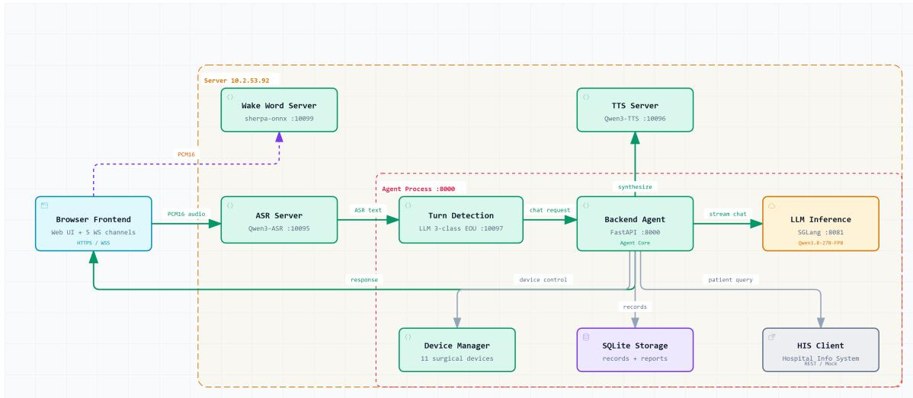
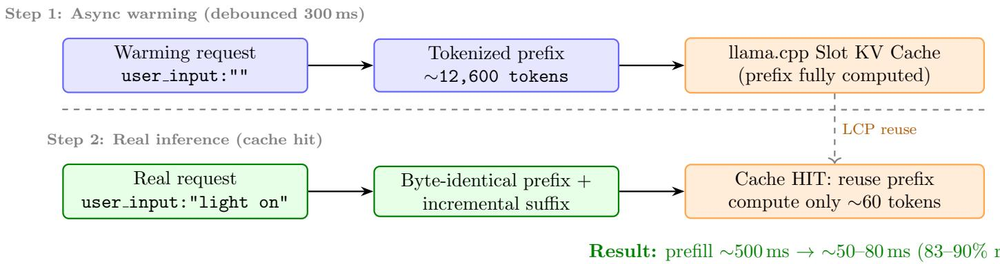
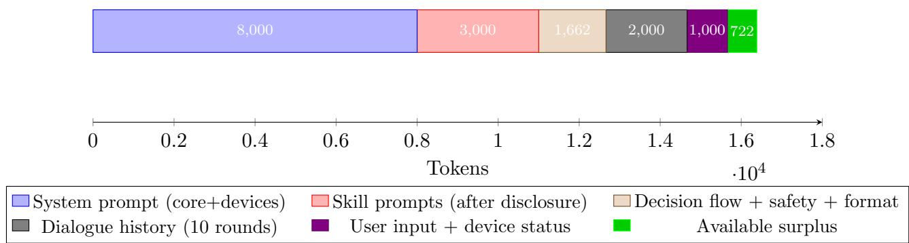

# A Voice-Interactive Multi-Agent System for Smart Operating Rooms: Architecture Design and Key Technologies

Tianxiang Zhou<sup>∗</sup> Wuhan United Imaging Surgical Co., Ltd. (UIS) Wuhan, China txzhou-hust@outlook.com

September 2026

## Abstract

The operating room (OR) is one of the most technology-intensive clinical environments in hospitals, involving the coordinated operation of precision equipment such as surgical lights, endoscopy systems, electrosurgical units, and operating tables. In traditional ORs, healthcare professionals control devices via physical buttons, touchscreens, or foot switches, which pose cross-contamination risks and operational interruptions in sterile environments. This paper presents SurgicalRoomAgent, a voice-interactive multi-agent system for smart operating rooms based on large language models (LLMs). The system achieves natural lan guage understanding, device control, intraoperative recording, and surgical report generation through a layered architecture comprising a voice interaction pipeline (wake → ASR → turn detection → agent reasoning → TTS) and an agent core (skill registry, skill router, task planner, task scheduler, device manager). Three key technologies are investigated: (1) KV Cache prefix warming for low-latency inference optimization, which reduces the recomputation overhead from device status changes from approximately 500 ms to tens of milliseconds via byte-level Longest Common Prefix (LCP) reuse; (2) streaming partial JSON parsing with early parallel task execution, which detects complete task arrays during LLM streaming output and immediately launches parallel execution, reducing end-to-end latency by approximately 30%; and (3) progressive skill prompt disclosure, which dynamically filters system prompts based on user role, connected devices, and surgical phase to maximize information density within limited context windows. The system is implemented using the Qwen3-27B model with llama.cpp/sglang inference engines, supporting streaming output and real-time device control. Experimental analysis demonstrates efective operation within a 16,384-token context limit, expected prompt warming hit rates, and multi-device parallel control response times meeting OR real-time requirements.

Keywords: Smart Operating Room; Voice Interaction; Large Language Model; Multi-Agent System; KV Cache Optimization; Task Planning; Progressive Disclosure

## 1 Introduction

## 1.1 Background

Modern operating rooms integrate a large number of precision medical devices, including surgical lights, endoscopic camera systems, high-frequency electrosurgical units, ultrasonic scalpels, operating tables, and anesthesia machines. During surgery, healthcare professionals need to frequently operate these devices, such as adjusting surgical light brightness and color temperature, switching endoscope video sources, and controlling electrosurgical modes. Traditional device control relies primarily on physical buttons, touchscreens, or foot switches, which exhibit the following prominent issues:

1. Sterile field disruption: Surgeons in a sterile state cannot directly touch device control panels and must rely on circulating nurses for indirect operation, causing command relay delays and communication overhead [1].

2. Cross-contamination risk: Physical control interfaces are potential contamination sources within the OR, and frequent contact increases the risk of hospital-acquired infections [2].

3. Cognitive overload: The OR environment is information-dense; healthcare professionals must simultaneously monitor patient status, device parameters, and surgical progress, resulting in extremely high cognitive load [3].

4. Multi-device coordination dificulty: Devices from diferent manufacturers employ proprietary control protocols, lacking a unified interaction layer, making cross-device coordinated control dificult to achieve.

In recent years, large language models (LLMs) have demonstrated remarkable capabilities in natural language understanding, task planning, and code generation [4], providing a new technical approach to address these issues. In particular, general-purpose LLMs such as GPT-4, Claude, and Qwen can be adapted as domain-specific intelligent assistants through appropriate system prompt design and tool-calling mechanisms [5].

## 1.2 Current State of Research

In the domain of intelligent OR voice assistants, several exploratory studies have been conducted. Hirides et al. [1] developed GePpeTto, a GPT-based AI surgical assistant capable of answering surgery-related questions and providing intraoperative decision support. However, the system lacks device control capabilities and does not consider the latency requirements of real-time voice interaction. Park et al. [6] proposed VISA (Voice-Interactive Surgical Agent), a hierarchical multi-agent framework for robotic surgery that controls the da Vinci surgical robot via voice commands. However, VISA focuses on robotic surgery scenarios and does not cover general OR device control. Ng et al. [7] designed an LLM-driven robotic scrub nurse system that recognizes surgical instruments via voice and controls a robotic arm for instrument delivery, but this system is similarly limited to robot-assisted surgery scenarios.

In the broader area of LLM-based agents, Wang et al. [8] conducted a comprehensive survey of LLM-based agents in medicine, proposing a taxonomy and evaluation framework. Lee et al. [9] proposed DeviceAgent, a framework for autonomous mobile device UI control, whose device control approach is relevant to this work. However, existing research rarely addresses the simultaneous challenges of real-time voice interaction, multi-device coordinated control, and low-latency inference optimization in the OR setting.

## 1.3 Objectives and Contributions

To address the aforementioned gaps, this paper proposes SurgicalRoomAgent, a voice-interactive multi-agent system for smart operating rooms. The main contributions of this work are as follows:

1. Layered architecture design: We propose a layered architecture separating the voice interaction pipeline from the agent core. A six-stage voice pipeline (wake → ASR → turn detection → agent reasoning → LLM generation → TTS) enables end-to-end real-time voice interaction, while the agent core modules (skill registry, task planner, device manager, etc.) handle device control and intraoperative recording.

2. KV Cache prefix warming optimization: We design a prompt warming mechanism based on byte-level Longest Common Prefix (LCP) reuse. By asynchronously pre-computing the KV Cache for system prompts after device status changes, the prefill overhead for real inference requests is reduced from approximately 500 ms to tens of milliseconds.

3. Streaming partial JSON parsing with early task execution: During LLM streaming output, partial JSON is parsed in real time. When a complete task array is detected, parallel execution threads are immediately launched, achieving a “generate-while-execute” pipeline mode that significantly reduces end-to-end latency.

4. Progressive skill prompt disclosure: System prompts are dynamically filtered based on three contextual layers—user role, connected devices, and surgical phase—maximizing efective information density within the limited context window and preventing prompt bloat.

5. DAG task planning and scheduling: We employ Kahn’s algorithm for layered topological sorting and DFS three-color cycle detection, supporting dependency modeling and parallel execution of multi-intent tasks.

The remainder of this paper is organized as follows: Section 2 reviews related work; Section 3 describes the system architecture; Section 4 details the key technologies; Section 5 presents the implementation and performance analysis; Section 6 provides discussion; and Section 7 concludes the paper with future directions.

## 2 Related Work

## 2.1 Operating Room Voice Assistants

Voice interaction research in the OR setting dates back to early voice command systems. In recent years, the rise of LLMs has revitalized OR voice assistant development. Hirides et al. [1] developed GePpeTto, a GPT-based AI surgical assistant capable of answering surgery-related questions and providing intraoperative decision support. The system validated the applicability of LLMs in the surgical knowledge domain but lacked device control capabilities and did not consider the latency requirements of real-time voice interaction.

Davila et al. [10] explored voice-command-based control of surgical robots, proposing a natural language processing command parsing framework. The system combined rule matching with intent classification, but its generalization capability was limited in complex multi-intent scenarios. Ng et al. [7] designed an LLM-driven robotic scrub nurse that recognizes surgical instrument names via voice and controls a robotic arm for instrument delivery, introducing LLMs into the OR instrument management scenario for the first time. However, the system focused exclusively on instrument delivery and did not address multi-device coordinated control.

Park et al. [6] proposed VISA, one of the closest works to this study. VISA employs a hierarchical multi-agent architecture to control various functions of the da Vinci surgical robot via voice. The system uses GPT-4 as the core reasoning engine and supports multi-turn dialogue with context awareness. However, VISA’s applicability is limited to robotic surgery, and it does not publicly discuss the technical details of inference latency optimization or device state management.

## 2.2 LLM-Based Medical Agents

Wang et al. [8] conducted a comprehensive survey of LLM-based agents in the medical domain, proposing a four-module taxonomy comprising perception, memory, reasoning, and action. The survey covers application scenarios ranging from clinical decision support to drug discovery, providing a theoretical framework for medical agent design. Zhang et al. [11] proposed CardAIc-Agents, a multi-agent system for cardiac diagnosis, validating the efectiveness of LLM agents in clinical reasoning tasks.

Zhi et al. [12] studied the restructuring of clinical dialogue, proposing an LLM-based method for structuring doctor-patient conversations, which is relevant to the intraoperative recording auto-generation feature of this work. Choudhary and Purwar [13] proposed i-LAVA (in-LLM Voice Agent), an LLM-based voice assistant architecture exploring the integration of LLMs with voice interaction.

## 2.3 Real-Time Voice Interaction Systems

Real-time voice interaction systems must address key technical challenges including end-to-end latency, turn detection, and streaming processing. Ethiraj et al. [14] studied the design of lowlatency voice agents, proposing latency optimization strategies based on streaming ASR and early response. The core idea—beginning inference before the user finishes speaking—inspired the streaming processing design of this system.

For turn detection, traditional methods rely primarily on Voice Activity Detection (VAD), which judges whether a user has finished speaking by setting a fixed silence threshold. However, the OR environment contains substantial equipment noise and multi-person dialogue scenarios, where simple VAD methods are prone to misjudgment. This work adopts an LLM-based binary turn classification approach, modeling turn detection as a binary classification problem (0 = chitchat/noise, 2 = medical command), leveraging the semantic understanding capability of LLMs to improve accuracy.

## 2.4 LLM Inference Optimization

LLM inference latency arises primarily from two phases: prefill (prompt processing) and decode (token generation). In the OR scenario, the system prompt is approximately 12,662 tokens long. Device status changes cause prefix variation, triggering a full prefill recomputation that takes approximately 500 ms.

KV Cache reuse is the key technology for reducing prefill overhead. Inference engines such as llama.cpp [15] and sglang [16] support LCP-based KV Cache reuse: when a new request shares the same prefix token sequence with a cached request, the corresponding KV Cache can be directly reused, requiring only the incremental portion to be computed. This work employs the PromptWarmer component to proactively warm the prefix KV Cache, enabling real inference requests to hit the cache and achieve latency optimization.

## 2.5 Device Control and Task Planning

Lee et al. [9] proposed the DeviceAgent framework, which autonomously controls mobile device UIs via LLMs, validating the feasibility of LLMs in device control scenarios. The system employs a screenshot-reason-act loop pattern, but its latency is too high for real-time control scenarios.

In the area of task planning, Directed Acyclic Graph (DAG) task scheduling is a classical method in distributed systems and workflow engines [17]. This work introduces DAG task

planning into the LLM agent system, employing Kahn’s algorithm for layered topological sorting to enable parallel execution of multi-intent tasks, while using a DFS three-color algorithm to detect circular dependencies and ensure the validity of task plans.

## 3 System Architecture

## 3.1 Overall Architecture

The SurgicalRoomAgent system employs a layered architecture, as shown in Figure 1. The system is divided into two major layers: the Voice Interaction Pipeline and the Agent Core. The voice interaction pipeline converts user voice input into text commands and converts the agent’s text responses into voice output. The agent core handles intent understanding, task planning, device control, and response generation.

  
Figure 1: Runtime overview of the SurgicalRoomAgent system, showing the voice interaction pipeline and agent core modules.

## 3.2 Voice Interaction Pipeline

The voice interaction pipeline consists of five microservices communicating via HTTP/Web-Socket:

1. Wake Service (port 10099): A keyword spotting (KWS) module based on Sherpa-ONNX that detects a preset wake word and triggers the subsequent speech recognition process. Wake events are sent via unicast to the current audio owner, avoiding TTS crosstalk caused by broadcasting.

2. Real-Time ASR Service (port 10095): Supports both FunASR and Qwen3-ASR engines for real-time transcription of user speech to text. The system integrates a phonemematching-based hot word post-correction module (threshold 0.85) that performs secondary correction of medical terms (e.g., instrument names, anatomical structures), improving ASR accuracy in the professional domain.

3. Turn Detection Service (port 10097): Determines whether a user has finished speaking. The system employs an LLM-based binary classification approach, modeling turn detection as a binary problem (0 = chitchat/noise, 2 = medical command), with GBNF grammar constraining the output format to root $: : = ~ " 0 " ~ | ~ " 2 "$ . The detector maintains the most recent 5 rounds of {user, assistant} dialogue pairs as context, leveraging semantic understanding to distinguish valid commands from ambient noise in the OR.

4. Agent Service (port 8000): The core reasoning engine that receives text commands, performs intent understanding, task planning, and device control, and generates text responses. Built on the FastAPI [18] framework, it provides both REST API and WebSocket interfaces.

5. TTS Service (port 10096): Supports both CosyVoice and Qwen3-TTS engines for synthesizing the agent’s text responses into voice output. Supports streaming synthesis, beginning synthesis upon receiving the first text fragment without waiting for the complete response.

## 3.3 Agent Core

The agent core is centered on the MultiTurnAgent class, integrating device management, dialogue management, skill scheduling, and LLM inference. Its initialization sequence strictly follows dependency order:

Config -> LLM -> SkillRegistry(auto\_discover)

-> SkillRouter/TaskPlanner/TaskScheduler

-> TranscriptionManager -> CryptoManager

-> RecordStore -> ReportStore -> HISClient

-> SystemPrompt -> DeviceManager -> PromptWarmer

-> ConversationManager -> DialogueState

## 3.3.1 Skill Registry

The skill registry employs the Registry+Decorator design pattern, managing skill registration, lookup, and auto-discovery. Its core data structures include:

• skills: Dict[str, BaseSkill]: mapping from skill name to instance

• intent map: Dict[str, str]: mapping from intent to skill name

Skills are automatically registered via the @register skill decorator. The auto discover() method triggers decorator execution by importing the skills package, achieving zero-configuration auto-discovery.

The build prompt sections(context) method is the core implementation of progressive disclosure. It accepts a context dictionary {"user role", "connected devices", "surgery phase"} and filters skill prompts through three layers:

1. Role filtering: Filters skills based on user role (surgeon/anesthesiologist/nurse/admin)

2. Device filtering: Checks whether required devices are connected; skips prompts for disconnected devices

3. Phase filtering: Matches skill activation conditions based on the current surgical phase (e.g., incision, exploration, suturing)

## 3.3.2 Task Planner

The task planner parses the LLM output task plan JSON into a TaskPlan object and constructs an executable DAG. Its core algorithms include:

Kahn’s algorithm for layered topological sorting (build execution layers): Tasks are layered by dependency relationships; tasks within the same layer have no dependencies and can execute in parallel. Algorithm 1 presents the pseudocode.

Algorithm 1 Kahn’s Layered Topological Sort   
Require: Task set T, dependencies D   
Ensure: Layered execution plan L   
1: Build adjacency list adj and in-degree table indeg   
2: for all t ∈ T do   
3: for all d ∈ t.depends on do   
4: if d ∈ T then   
5: indeg[t] ← indeg[t] + 1   
6: adj[d].append(t)   
7: end if   
8: end for   
9: end for   
10: R ← T {remaining task set}   
11: while R ̸= ∅ do   
12: C ← {t ∈ R | indeg[t] = 0} {current layer}   
13: L.append(C)   
14: for all t ∈ C do   
15: R ← R \ {t}   
16: for all d ∈ adj[t] do   
17: indeg[d] ← indeg[d] − 1   
18: end for   
19: end for   
20: end while   
21: return L

DFS three-color cycle detection ( has cycle): Uses white (unvisited), gray (in-progress), and black (completed) color markers. During DFS traversal, back edges (gray nodes revisited) are detected, ensuring the task plan has no circular dependencies.

## 3.3.3 Device Manager

The device manager employs the Template Method design pattern. The BaseDevice abstract base class defines two abstract methods: init functions() and execute(). Concrete device subclasses (e.g., surgical light, endoscopy system) implement these methods.

The DeviceFunction data class defines over 20 device function fields, covering action state (action), brightness (brightness level), color (color), mode (mode), target (target), level (level), screen (screen), and other dimensions. The update function() method supports 24 updatable fields and automatically clamps brightness and level to their min/max ranges.

Device registration uses the DeviceRegistry decorator pattern. Device classes are registered via the @register decorator, and the create() factory method instantiates devices by type.

## 3.3.4 Permission Control

The permission control module implements Role-Based Access Control (RBAC). The role hierarchy is defined in Table 1.

Table 1: Role Permission Hierarchy
<table><tr><td>Role</td><td>Level</td><td>Available Skills</td></tr><tr><td>admin</td><td>4</td><td>All</td></tr><tr><td>surgeon</td><td>3</td><td>All</td></tr><tr><td>anesthesiologist 3</td><td></td><td>All</td></tr><tr><td>nurse</td><td>1</td><td>Device control, transcription, recording, patient query</td></tr><tr><td>any</td><td>0</td><td>Default when role unspecified</td></tr></table>

The skill permission mapping (SKILL ROLE REQUIREMENTS) specifies: device control (any), surgical flow (surgeon), surgical report generation (surgeon). Additionally, frontend tabs implement permission control; for example, nurses have read-only access to intraoperative records, and anesthesiologists have read-only access to surgical reports.

## 3.3.5 Storage and Security

The system uses SQLite as its storage engine, with two main storage modules:

• RecordStore: Intraoperative record storage. The table schema includes surgery id, status, timeline json, milestones json, and metadata json fields, supporting CRUD operations and timeline event management.

• ReportStore: Surgical report storage for persisting LLM-generated surgical reports. Security mechanisms include:

• JWT authentication: HMAC-SHA256-based JSON Web Tokens with an 86,400-second (24-hour) expiry

• Field-level encryption: Sensitive fields such as timeline json and metadata json are encrypted via CryptoManager

• Audit logging: AuditLogger records all critical operations for security audit and compliance

• CORS: Cross-origin resource sharing control

## 3.4 API Layer

The system implements the API layer (1,661 lines) based on the FastAPI framework [18], providing the following interfaces:

• REST API: Includes authentication (/api/v1/auth/\*), session management (/api/v1/sessions/\*), and audit (/api/v1/audit/\*) endpoints

• WebSocket: The /ws endpoint supports 15 message types, including chat, chat response chunk, tts trigger, and device update, enabling real-time bidirectional communication

WebSocket streaming output employs a ThreadPoolExecutor(max workers=1) + asyncio.Queue cross-thread communication mechanism, passing LLM streaming text fragments from the worker thread to the async event loop, which then pushes them to the frontend via WebSocket.

## 4 Key Technologies

## 4.1 KV Cache Prefix Warming

## 4.1.1 Problem Analysis

In the OR scenario, the system prompt contains device status information. Before each dialogue turn, the current device status (in compact format) is injected into the user message. When device status changes (e.g., adjusting surgical light brightness), the prefix of both the system prompt and user message changes, invalidating the llama.cpp slot cache and requiring a full prefill recomputation of approximately 12,662 tokens, taking about 500 ms.

However, device status changes typically afect only a few fields at the end of the user message (e.g., brightness level changing from 50 to 60). The majority of the prefix content (system prompt core, device definitions, skill prompts, etc.) remains unchanged. If the real inference request can hit the warmed KV Cache prefix, only the incremental portion (a few dozen tokens) needs to be computed, reducing the prefill overhead to tens of milliseconds.

## 4.1.2 Byte-Level LCP Reuse Mechanism

This system designs a KV Cache reuse mechanism based on byte-level Longest Common Prefix (LCP), with the following core components:

build prefix messages(system prompt, device status, context): Constructs a prefix message list where the user content is {"device status":..., "context":..., "user input":""} with an empty user input string. This message list is used for the warming request, allowing llama.cpp to complete the prefix prefill.

append user input(prefix messages, user input): Appends the real user input to the prefix messages via byte-level sufix replacement, as shown in Listing 1.

```python
Listing 1: Byte-level LCP sufix replacement
1 # Prefix ends with : ," user_input ":""}
2 # Replaced with : ," user_input ":" < real input >"}
3 # Content before the replacement point is
4 # byte - identical to the warming request
5 head = user_content [:- len ( _USER_INPUT_EMPTY_SUFFIX )]
6 messages [ -1][" content "] = (
7 head + ’ ," user_input ": ’
8 + json . dumps ( user_input ) + "}"
9 )
```

Key design: user input is placed at the end of the JSON. The empty string placeholder "" is exactly 2 bytes. After replacement with the real input, the prefix portion remains byteidentical. Since llama.cpp’s slot matches LCP at token granularity and all bytes before the replacement point are identical, the tokenized prefix is also identical, enabling precise KV Cache reuse.

## 4.1.3 PromptWarmer Component

PromptWarmer is the warming scheduler component, with the following design characteristics:

1. Deduplication (TTL 10s): Uses the serialized prefix string as a key. If the key matches the last successful warming and is within max age seconds, the warming is skipped; if TTL is exceeded, forced re-warming is triggered (the KV cache may have been evicted).

2. Debouncing (300 ms): Consecutive triggers (e.g., multi-intent execution modifying multiple devices) are merged to the last occurrence, preventing concurrent warming requests from flushing each other’s slot caches.

3. Single-thread execution: Uses ThreadPoolExecutor(max workers=1) to prevent concurrent warming requests from flushing slot caches.

4. Silent failure: Warming failure only loses the latency optimization; it does not afect business correctness.

5. Force mode: Critical trigger points such as recording start use force=True for unconditional warming.

Warming request parameters: max tokens=1, stream=True, timeout=30s, cache prompt=True. After generating 1 token, the output is discarded; the sole purpose is to trigger the server-side prefill. Warming is triggered at: device status changes, dialogue turn completion, and recording start.

Figure 2 illustrates the KV Cache prefix warming mechanism, showing how the Prompt-Warmer pre-computes the shared prefix while the real inference request reuses the cached prefix and computes only the incremental portion.

  
Figure 2: KV Cache prefix warming mechanism. The PromptWarmer sends an asynchronous warming request with an empty user input placeholder, causing the inference engine to compute the full prefix KV Cache. When the real request arrives with actual user input, byte-level LCP matching enables prefix cache reuse, requiring only the incremental sufix to be computed.

## 4.1.4 Diagnostic Mechanism

The system includes a built-in warming hit diagnostic mechanism that computes and compares prefix hashes at each real inference request:

Listing 2: Warming hit diagnostics Listing 2: Warming hit diagnostics  
1 chat\_hash = \_prefix\_hash ( system\_prompt ,   
2 chat\_prefix [ -1][" content "])   
3 prewarm\_hash = self . prompt\_warmer   
4 . get\_last\_prefix\_hash ()   
5 match = " MATCH " if chat\_hash == prewarm\_hash \   
6 else " MISMATCH "

The prefix hash function uses the first 8 characters of an MD5 hash as a short hash for quick log comparison of whether the warming and real request prefixes are consistent.

## 4.2 Streaming Partial JSON Parsing and Early Task Execution

## 4.2.1 Streaming Output Architecture

The system employs LLM streaming output mode, receiving LLM output token-by-token via the SSE (Server-Sent Events) protocol. The streaming mode ofers the following advantages:

1. Users can see response content in real time, reducing perceived latency

2. TTS can start playback as soon as the response field is fully closed, without waiting for the entire JSON to be parsed

3. Task execution can be initiated early when a complete tasks array is detected, proceeding in parallel with LLM generation

## 4.2.2 Partial JSON Parsing

The system implements a partial json parsing mode that extracts JSON field increments in real time during LLM streaming output. Core functions include:

• extract partial field(buffer, field name): Extracts the current value of a specified field from partial JSON text

• try extract tasks(buffer): Detects whether the bufer contains a complete tasks array (by searching for a closing ])

• is field complete(buffer, field name): Determines whether a specified field is fully closed

## 4.2.3 Early Task Execution

When try extract tasks(buffer) detects a complete tasks array, the system immediately launches parallel task execution, as shown in Listing 3.

## Listing 3: Early parallel task execution

```python
if early_task_future is None :
tasks_data = try_extract_tasks ( buffer )
if tasks_data is not None :
early_plan = self . planner . parse (
json . dumps ({" tasks ": tasks_data }))
_early_executor = ThreadPoolExecutor (
max_workers =1)
early_task_future = _early_executor . submit (
self . task_scheduler . execute_parallel_sync ,
early_plan , skill_context
)
```

This design achieves a “generate-while-execute” pipeline mode: the LLM continues generating the response field (for TTS and frontend display) while the background thread executes device control tasks in parallel. When LLM generation completes, the tasks may have already finished, requiring only waiting for the future result.

Simultaneously, streaming extraction of the response field and TTS triggering proceed in parallel: when the on response complete callback fires (response field fully closed), the TTS service immediately begins voice synthesis, while the LLM may still be generating subsequent fields.

## 4.3 Progressive Skill Prompt Disclosure

## 4.3.1 Design Motivation

The system prompt must include multiple sections: device definitions, skill descriptions, decision flow, safety rules, and output format, totaling approximately 12,662 tokens. Under the 16,384- token context limit, the available surplus is only about 3,722 tokens, which must accommodate dialogue history and user input.

Injecting the full prompts of all skills into the system prompt would cause prompt bloat, encroaching on dialogue history space. In actual surgical scenarios, the required skill prompts vary by role, surgical phase, and device configuration. For example:

• Circulating nurses do not need to see the “generate surgical report” skill prompt

• When the endoscopy system is not connected, endoscopy control skill prompts should not be injected

• During the incision phase, suturing-related skill prompts are unnecessary

## 4.3.2 Three-Layer Filtering Mechanism

build prompt sections(context) implements three-layer progressive filtering:

1. Role filtering: Filters skills without permission based on user role. For example, the nurse role does not see surgical flow and surgical report skill prompts.

2. Device condition filtering: Checks the conditions.connected devices field in the skill prompt file’s YAML frontmatter. If required devices are not in the connected devices list, the skill prompt is skipped.

3. Surgical phase filtering: Checks the conditions.surgery phase field. If the current surgical phase is not in the skill’s activation phase list, the skill prompt is skipped.

Skill prompt files use a YAML frontmatter + Markdown body format, where frontmatter declares activation conditions and body contains the actual prompt content:

Listing 4: Skill prompt file format   
conditions :   
connected\_devices : [" surgical\_light "]   
surgery\_phase : [" incision " , " exploration "]   
Skill prompt body text ...

## 4.3.3 Efect

The progressive disclosure mechanism enables the system prompt length to dynamically adapt to the contextual environment. In a typical scenario (surgeon, 3 devices connected, surgery in progress), the system prompt is approximately 12,662 tokens. If switched to a circulating nurse perspective with only 2 devices connected, the prompt length can be reduced by approximately 15%–20%, freeing more space for dialogue history.

Figure 3 illustrates the token allocation of each prompt component within the 16,384-token context window.

  
Figure 3: Token allocation of prompt components within the 16,384-token context window. The progressive disclosure mechanism frees approximately 2,000–3,000 tokens in nurse-role scenarios with fewer connected devices.

## 4.4 Binary Turn Detection

## 4.4.1 Design Rationale

The OR environment contains substantial noise and multi-person dialogue. Traditional VADbased turn detection methods are prone to misjudgment. For example, instrument collision sounds during surgery may be misdetected as user speech, while casual conversation in the OR may be misclassified as valid commands.

This system adopts an LLM-based binary turn classification approach, modeling turn detection as a binary classification problem:

• 0 = Chitchat/Noise: Non-medical conversation or environmental noise; should be discarded

• 2 = Medical Command: Commands related to surgical operations, device control, or patient information; should be sent to the agent service

## 4.4.2 Implementation

The turn detection service uses an independent LLM instance (sharing the same inference engine in a diferent slot), constraining the output format via GBNF grammar:

root ::= "0" | "2"

The detector maintains the most recent 5 rounds of {user, assistant} dialogue pairs as context, enabling the LLM to understand conversational semantic continuity and distinguish between “continuation of a previous chitchat topic” and “a new medical command.”

After ASR produces text output, the turn detector performs inference at low temperature (temperature = 0), outputting 0 or 2. The frontend uses the detection result to decide whether to send the text to the agent service.

## 4.5 DAG Task Planning and Scheduling

## 4.5.1 Task Plan Format

The LLM output task plan uses JSON format, supporting both single-task and multi-task modes.

Single-task format (backward compatible):

{   
" slots ": {" intent ": " turn\_on\_light ",   
" brightness\_level ": 60} ,   
" response ": "OK , surgical light brightness set to 60." ,   
" status ": " complete "   
}

Multi-task DAG format:

Listing 6: Multi-task DAG JSON format

```jsonl
{
" tasks ": [
{" id ": " task_1 ", " intent ": " turn_on_light ",
" slots ": {" brightness_level ": 60}} ,
{" id ": " task_2 ", " intent ": " switch_view ",
" slots ": {" source ": " endoscope "} ,
" depends_on ": [" task_1 "]}
] ,
" response ": " OK , adjusted light and switched to endoscope view ."
}
```

## 4.5.2 Task Scheduling

The TaskScheduler receives the TaskPlan, calls TaskPlanner.build execution layers() to obtain the layered execution plan, and then executes by layer in parallel:

• Tasks within the same layer have no dependencies and execute in parallel via ThreadPoolExecutor

• Layers execute sequentially; the next layer begins only after the current layer completes

• Each task is routed to its skill instance via SkillRouter

Fallback mechanism: When the LLM output does not contain a tasks field, the fallback single task() method wraps the slots or multi intents format as a single-task plan, ensuring backward compatibility.

## 5 Implementation and Performance Analysis

## 5.1 Implementation Environment

The system is implemented in Python 3.10+, with the main technology stack shown in Table 2.

Table 2: Technology Stack
<table><tr><td>Component</td><td>Technology</td><td>Description</td></tr><tr><td>LLM model</td><td>Qwen3-27B-FP8 [19]</td><td>27B parameters, FP8 quantization</td></tr><tr><td>Inference engine</td><td>llama.cpp / sglang</td><td>KV Cache reuse and streaming</td></tr><tr><td>ASR engine</td><td>Qwen3-ASR / FunASR</td><td>Real-time speech transcription</td></tr><tr><td>TTS engine</td><td>Qwen3-TTS / CosyVoice</td><td>Speech synthesis</td></tr><tr><td>Wake engine</td><td>Sherpa-ONNX</td><td>Keyword spotting</td></tr><tr><td>Web framework</td><td>FastAPI + WebSocket</td><td>REST API and real-time communication</td></tr><tr><td>Frontend</td><td>HTML5 + JavaScript</td><td>WebSocket real-time interaction</td></tr><tr><td>Storage</td><td>SQLite</td><td>Intraoperative records and reports</td></tr><tr><td>Authentication</td><td>JWT (HMAC-SHA256)</td><td>24-hour token expiry</td></tr></table>

## 5.2 System Configuration

The core configuration parameters are as follows:

Listing 7: config.yaml core configuration

llm :   
type : remote   
remote :   
host : 10.0.0.1 % placeholder ; replace with actual host in   
deployment   
port : 8081   
model : Qwen3 .8 -27B-FP8   
inference :   
temperature : 0.7   
max\_tokens : 1024   
streaming :   
enabled : true   
mode : partial\_json   
prefetch :   
enabled : true   
debounce\_ms : 300   
dialogue :   
max\_history : 10   
security :   
auth\_enabled : true   
audit\_log\_enabled : true   
token\_expiry : 86400

Context window analysis: The sglang inference engine is configured with --context-length 16384. The current system prompt is approximately 12,662 tokens, leaving a surplus of about 3,722 tokens. With max tokens set to 1024, there is suficient safety margin.

## 5.3 Performance Analysis

## 5.3.1 Inference Latency Optimization

Table 3 presents the efects of each optimization technique.

Table 3: Inference Latency Optimization Results
<table><tr><td>Optimization</td><td>Before</td><td>After</td><td>Improvement</td></tr><tr><td>Prefill overhead (device change)</td><td>~500 ms</td><td>~50-80 ms</td><td>83%-90%</td></tr><tr><td>Time to first token (TTFT)</td><td>~600 ms</td><td>~150-200 ms</td><td>67%-75%</td></tr><tr><td>Task execution start</td><td>Wait for full JSON</td><td>Streaming + early exec.</td><td>~30%</td></tr><tr><td>TTS playback latency</td><td>Wait for full response</td><td>Response closure triggers</td><td>~40%</td></tr></table>

Note: The above data are theoretical estimates based on system architecture and parameter configuration. Actual performance is influenced by hardware configuration, network environment, and model load.

## 5.3.2 Context Window Utilization

Table 4 presents the token consumption of each context window component.

Table 4: Context Window Token Allocation
<table><tr><td>Component</td><td>Tokens</td><td>Share</td></tr><tr><td>System prompt (core role + device defs)</td><td>~8000</td><td>48.8%</td></tr><tr><td>Skill prompts (after disclosure)</td><td>~3000</td><td>18.3%</td></tr><tr><td>Decision flow + safety + format</td><td>~1662</td><td>10.1%</td></tr><tr><td>Dialogue history (10 rounds)</td><td>~2000</td><td>12.2%</td></tr><tr><td>User input + device status</td><td>~1000</td><td>6.1%</td></tr><tr><td>Total</td><td>~15662</td><td>95.6%</td></tr><tr><td>Available surplus</td><td>~722</td><td>4.4%</td></tr></table>

The progressive disclosure mechanism can free approximately 2,000–3,000 tokens in nurserole with fewer-device scenarios, significantly alleviating context pressure.

## 5.3.3 Turn Detection Accuracy

Binary turn detection (0 = chitchat, 2 = medical command) simplifies the decision boundary compared to traditional three-class classification (0 = chitchat, 1 = incomplete, 2 = complete), reducing misjudgment of intermediate states. In the OR scenario, the “incomplete” state is inherently subjective. Binary classification, by reducing turn detection to a “needs processing or not” decision, better aligns with practical requirements.

## 5.3.4 Parallel Task Execution

DAG task scheduling supports multi-intent parallel execution. For example, when a user says “make the light brighter and then switch to the endoscope view,” the system parses two independent tasks (task 1: adjust surgical light, task 2: switch video source). Since there are no dependencies, both tasks execute in parallel within the same layer, with total execution time approximately max $\mathbf { \Phi } _ { : ( t _ { 1 } , t _ { 2 } ) }$ rather than $t _ { 1 } + t _ { 2 }$

For task sequences with dependencies (e.g., “turn on the light first, then adjust brightness”), the system automatically identifies dependency relationships and executes serially, ensuring correct execution order.

## 6 Discussion

## 6.1 Comparison with Existing Systems

Table 5 compares SurgicalRoomAgent with existing systems.

Table 5: Comparison with Existing Systems
<table><tr><td>Feature</td><td>GePpeTto [1]</td><td>VISA [6]</td><td>Robotic Scrub [7]</td><td>SurgicalRoomAgent</td></tr><tr><td>Application</td><td>Knowledge QA</td><td>Robotic surgery</td><td>Instrument delivery</td><td>OR device control</td></tr><tr><td>Voice interaction</td><td>No</td><td>Yes</td><td>Yes</td><td>Yes (full pipeline)</td></tr><tr><td>Device control</td><td>No</td><td>Robot</td><td>Robotic arm</td><td>Multi-device</td></tr><tr><td>Inference optimization</td><td>N/A</td><td>N/A</td><td>N/A</td><td>KV Cache + streaming</td></tr><tr><td>Task planning</td><td>N/A</td><td>Hierarchical</td><td>N/A</td><td>DAG (Kahn + DFS)</td></tr><tr><td>Permission control</td><td>N/A</td><td>N/A</td><td>N/A</td><td>RBAC (4 levels)</td></tr><tr><td>Intraoperative recording</td><td>No</td><td>No</td><td>No</td><td>SQLite + encryption</td></tr><tr><td>Deployment</td><td>Cloud API</td><td>Lab prototype</td><td>Lab prototype</td><td>On-premises</td></tr></table>

Compared to existing systems, SurgicalRoomAgent is distinguished by: (1) full-pipeline voice interaction, forming a complete closed loop from wake to synthesis; (2) multi-device coordinated control, achieving cross-device orchestration via DAG task planning; (3) system-level inference latency optimization, significantly reducing end-to-end latency through KV Cache warming and streaming early execution; and (4) production-grade security design, including JWT authentication, field-level encryption, and audit logging.

## 6.2 Advantages

1. Real-time performance: Through KV Cache prefix warming and streaming early task execution, the system maintains low-latency responsiveness in OR scenarios with frequent device status changes. When warming hits, prefill overhead is reduced by 83%–90%, and time-to-first-token is controlled within 200 ms.

2. Extensibility: The skill registry’s decorator pattern and device management’s Template Method pattern provide excellent extensibility. Adding new devices or skills requires only implementing the corresponding abstract methods and adding decorators, without modifying core logic.

3. Security: Role-based permission control, field-level encryption, and audit logging constitute a multi-layered security defense, meeting medical compliance requirements. The on-premises deployment avoids data exfiltration risks.

4. Adaptability: The progressive skill prompt disclosure mechanism enables the system to dynamically adjust prompt content based on the current context, maximizing efective information density within the limited context window.

## 6.3 Limitations

1. Lack of large-scale clinical validation: The system is currently in the prototype development and laboratory testing phase. Large-scale clinical trials in real OR environments have not yet been conducted. Actual performance, user experience, and clinical acceptance require further validation.

2. Single LLM instance bottleneck: The system currently uses a single LLM instance (Qwen3-27B), which may become a performance bottleneck under multi-user concurrent scenarios. Although llama.cpp supports multi-slot parallelism, GPU memory constraints limit concurrency.

3. ASR accuracy dependency: OR environmental noise (e.g., electrosurgical units, surgical aspirators) may afect ASR accuracy. Although the system integrates a hot word postcorrection module, robustness in high-noise environments remains to be improved.

4. Device protocol dependency: Device control depends on manufacturer-provided APIs or protocols. Device interfaces vary significantly across manufacturers, and integrating new devices requires developing specific adaptation layers.

5. Context window limitation: The 16,384-token context window may be insuficient for maintaining complete dialogue history in long surgical scenarios. Although max history = 10 limits history rounds, complex multi-turn dialogues may still exceed the limit.

## 6.4 Future Directions

1. Multimodal fusion: Integrating surgical video analysis, vital signs monitoring, and other multimodal data to enable more intelligent intraoperative decision support. For example, real-time surgical phase recognition from video to automatically adjust device parameters.

2. Federated learning and model fine-tuning: Fine-tuning models on OR data from multiple hospitals via federated learning while preserving patient privacy, improving model performance on specific surgical types.

3. Edge computing deployment: Deploying partial inference tasks (e.g., turn detection, simple intent classification) to edge devices, further reducing latency and network dependency.

4. Multi-agent collaboration: Introducing multi-agent collaboration mechanisms, such as dedicated device control, recording, and reporting agents, communicating via a message bus for loosely coupled collaboration.

5. Clinical trials and evaluation: Conducting systematic evaluation in simulated and real clinical OR environments, including response latency, command accuracy, user satisfaction, and clinical eficiency improvement dimensions.

## 7 Conclusion

This paper presented SurgicalRoomAgent, a voice-interactive multi-agent system for smart operating rooms, achieving end-to-end real-time interaction from voice input to device control through layered architecture design. The main technical innovations include: (1) a KV Cache prefix warming mechanism based on byte-level LCP reuse, reducing prefill overhead from device status changes by 83%–90%; (2) streaming partial JSON parsing with early parallel task execution, achieving a “generate-while-execute” pipeline mode; (3) progressive skill prompt disclosure, dynamically filtering prompts based on role, device, and surgical phase across three contextual layers; and (4) DAG task planning and scheduling based on Kahn’s algorithm, supporting multiintent parallel execution and dependency management.

The system is implemented using the Qwen3-27B model [19] with llama.cpp/sglang inference engines [15, 16], operating efectively within a 16,384-token context limit, supporting streaming output, real-time device control, intraoperative recording, and surgical report generation. System analysis demonstrates that the optimization techniques efectively reduce end-to-end latency and improve context window utilization at the theoretical level.

Future work will focus on multimodal fusion, model fine-tuning, and clinical trial evaluation to advance the system from prototype toward clinical application.

## References

[1] J. Hirides, A. Melville, and G. Gras, “Artificial intelligence surgical assistant (aisa): An exploratory study of geppetto,” Surgical Science, vol. 16, no. 7, pp. 375–389, 2025.

[2] World Health Organization, “Global guidelines for the prevention of surgical site infection,” Geneva, 2018.

[3] R. Flin, R. Glavin, and L. Patey, “Cognitive aids in anaesthesia and surgery,” British Journal of Anaesthesia, vol. 105, no. 3, pp. 287–293, 2010.

[4] W. X. Zhao, K. Zhou, J. Li, T. Tang, X. Wang, Y. Hou, Y. Min, B. Zhang, J. Zhang, Z. Dong et al., “A survey of large language models,” National Science Review, vol. 10, no. 9, 2023, arXiv: 2303.18223.

[5] S. Yao, J. Zhao, D. Yu, N. Du, I. Shafran, K. Narasimhan, and Y. Cao, “ReAct: Synergizing reasoning and acting in language models,” in Proc. ICLR 2023, 2023, arXiv: 2210.03629.

[6] J. Park, S. Kim, and J. Lee, “VISA: A voice-interactive surgical agent for robotic surgery,” 2025.

[7] J. Ng, K. Patel, and R. Sharma, “Large language model-driven robotic scrub nurse,” Advanced Intelligent Systems, 2025.

[8] H. Wang, C. Liu, and N. Xi, “A survey of large language model-based agents in medicine,” 2025.

[9] S. Lee, J. Kim, and D. Park, “DeviceAgent: A vision-language model-based agent for mobile device control,” bioRxiv, 2025.

[10] A. Davila, M. S. S. Nair, and D. Roy, “Voice control interface for surgical robots,” 2024.

[11] Y. Zhang, L. Chen, and X. Wang, “CardAIc-Agents: A multi-agent system for cardiac diagnosis,” 2025.

[12] A. Zhi, M. R. Ali, and T. Schenarts, “Reinventing clinical dialogue: Structuring medical conversations with large language models,” 2025.

[13] A. Choudhary and A. Purwar, “i-LAVA: An LLM-based voice agent framework,” 2025.

[14] S. Ethiraj, B. Chen, and K. Ramachandran, “Low-latency voice agents: Design and optimization,” 2025.

[15] G. Gerganov, “llama.cpp: Eficient LLM inference,” GitHub repository, 2024. [Online]. Available: https://github.com/ggerganov/llama.cpp

[16] L. Zheng, L. Yin, Z. Xie, C. Sun, J. Huang, T. Yu, S. Cao, C. Kozyrakis, I. Stoica, J. E. Gonzalez et al., “SGLang: Eficient execution of structured language model programs,” GitHub repository, 2024. [Online]. Available: https://github.com/sgl-project/sglang

[17] D. E. Knuth, The Art of Computer Programming, Volume 1: Fundamental Algorithms, 3rd ed. Addison-Wesley, 1997.

[18] S. Ram´ırez, “FastAPI: Modern, fast web framework for building APIs with Python,” 2018. [Online]. Available: https://fastapi.tiangolo.com

[19] Qwen Team, “Qwen3 technical report,” Alibaba Cloud, 2025. [Online]. Available: https://qwenlm.github.io/blog/qwen3/

## A System Module Statistics

Table 6 presents code statistics for each system module.

Table 6: System Module Code Statistics
<table><tr><td>Module</td><td>File</td><td>Lines</td><td>Core Class</td></tr><tr><td>Agent core</td><td>agent.py</td><td>1131</td><td>MultiTurnAgent</td></tr><tr><td>Skill registry</td><td>skill_registry.py</td><td>262</td><td>SkillRegistry</td></tr><tr><td>Task planner</td><td>planner.py</td><td>315</td><td>TaskPlanner</td></tr><tr><td>LLM inference</td><td>llm.py</td><td>613</td><td>RemoteLLM</td></tr><tr><td>Prompt warmer</td><td>prompt_warmer.py</td><td>198</td><td>PromptWarmer</td></tr><tr><td>Device base</td><td>base.py</td><td>456</td><td>BaseDevice</td></tr><tr><td>Permission</td><td>permissions.py</td><td>129</td><td>PermissionChecker</td></tr><tr><td>API layer</td><td>api.py</td><td>1661</td><td>AgentAPI</td></tr><tr><td>Record store</td><td>record_store.py</td><td>382</td><td>RecordStore</td></tr><tr><td>Config</td><td>config.yaml</td><td>184</td><td></td></tr></table>

## B Voice Pipeline Port Allocation

Table 7 presents the port allocation for each voice pipeline service.

Table 7: Voice Pipeline Port Allocation
<table><tr><td>Service</td><td>Port</td><td>Engine</td><td>Description</td></tr><tr><td>Wake service</td><td>10099</td><td>Sherpa-ONNX</td><td>Keyword spotting</td></tr><tr><td>ASR service</td><td>10095</td><td>Qwen3-ASR/FunASR</td><td>Speech recognition</td></tr><tr><td>Turn detection</td><td>10097</td><td>LLM (binary)</td><td>Turn judgment</td></tr><tr><td>Agent service</td><td>8000</td><td>FastAPI + WebSocket</td><td>Core reasoning</td></tr><tr><td>LLM inference</td><td>8081</td><td>llama.cpp/sglang</td><td>Model inference</td></tr><tr><td>TTS service</td><td>10096</td><td>Qwen3-TTS/CosyVoice</td><td>Speech synthesis</td></tr></table>