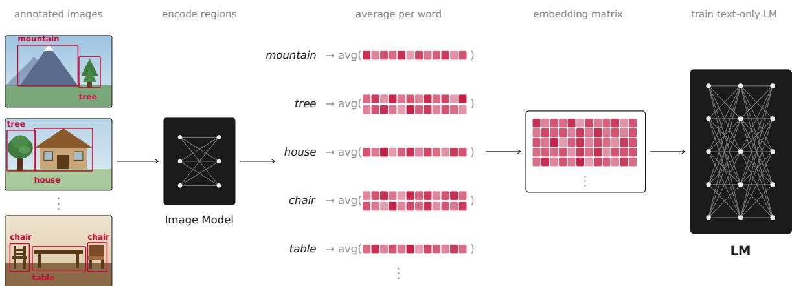
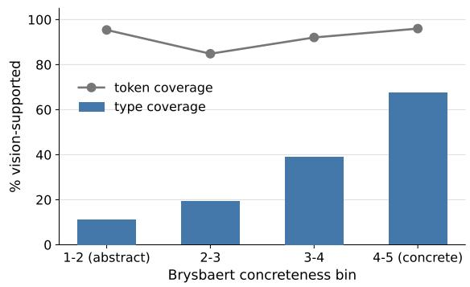
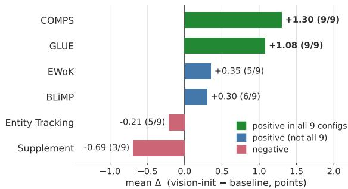
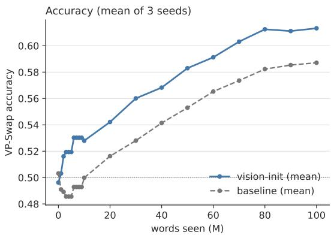
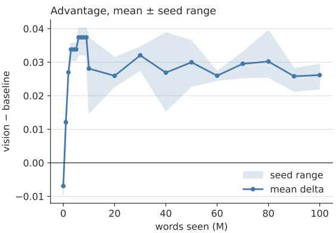
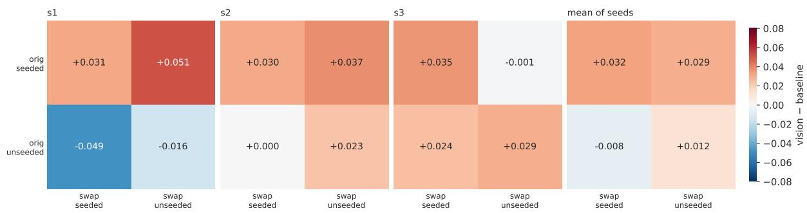
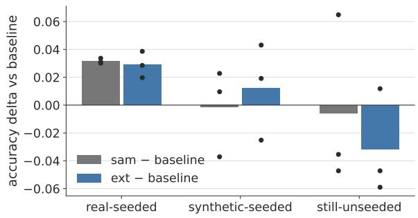
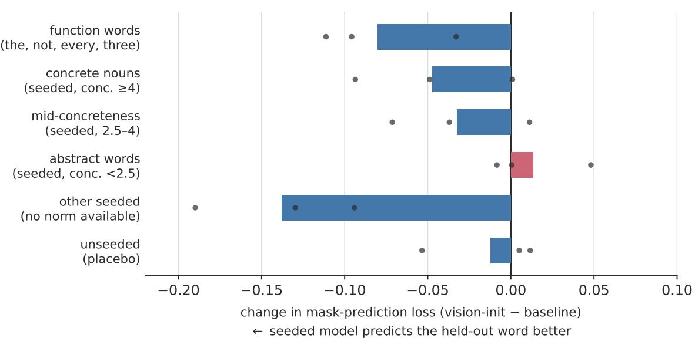

# Augustinian BabyLM: What Ostensive Definition Can and Cannot Teach a Small Language Model

Lisa Bylinina Institute for Language Sciences Utrecht University e.g.bylinina@uu.nl

## Abstract

A language model normally begins training with random word embeddings: whatever banana means must be learned from training corpora. I implement St. Augustine’s picture of word learning, meaning by ostension, for a small masked language model (DeBERTa) trained on ≈10M words: before training, visually grounded tokens receive embeddings derived from the image regions they label; other tokens start random.

Visual initialization leaves a measurable imprint that lasts until the end of training. At the same time, the effect remains invisible under most BabyLM benchmarks, which probe abstract grammatical knowledge: visual initialization does not affect performance there. The only zero-shot exception is object-property knowledge (COMPS, Misra et al. 2023), where seeding helps in every configuration. To follow up on this result, I build a corpus-tailored version of the Visual-Property Swap benchmark (Lin et al., 2026), which tests color, material, size, and shape knowledge, with per-item training frequency and seeded status. Here, vision-seeded models have a persistent, seedreplicated advantage, confined to the seeded words. As a causal test, I show that synthetic grounding of previously unseeded words transfers the advantage to exactly those words.

Function words and abstract vocabulary also receive strong visual seeds and retain them throughout training, and the training objective draws on them: held-out mask-prediction loss falls for these words in every seed. However, no benchmark I run registers this. What evaluation would pick this up remains an open question.

## 1 Introduction

When they (my elders) named some object . . . I grasped that the thing was called by the sound they uttered.

is probably the oldest theory of lexical acquisition we have: elders point at things and say their names, and the child, seeing what is pointed at, binds sound to object. Wittgenstein (1953) opened the Philosophical Investigations by arguing against this view: ostension cannot be the basis of word learning, because pointing presupposes that the learner already parses the scene into objects and properties, and in that sense already has the space of lexical meanings ready. On the other hand, coreknowledge research (Spelke and Kinzler, 2007) demonstrates exactly this kind of prior in newborns, with cognitive systems for objects, number, agents, and space. So, the matter is not settled.

I look for effects of visual demonstration in language learning using computational methods, in particular, in language models. A typical text-only language model is not equipped for ostension: its word embeddings begin as random vectors, and their meanings must be discovered from distribution alone. For comparison, I supply the visual demonstration: before any text is seen, words that label regions in visual data are initialized from a vision encoder’s features over those regions (Fig. 1); the model undergoes text-only training from that point on. The BabyLM strict-small budget, roughly a child’s language input without the embodied part, is where I would expect this prior to matter (cf. Zhuang et al., 2024). I quantify its effect against a matched text-only baseline.<sup>1</sup>

I show that visual initialization has a measurable effect: its imprint on the embeddings lasts to the end of training, and the training objective itself becomes easier for the words that received visual grounding. This effect is, however, difficult to observe through the standard BabyLM benchmarks: barely any of them probe the aspects of meaning for which visual information is relevant. The exception is COMPS (Misra et al., 2023), which tests object-property knowledge and improves in all configurations.

  
Figure 1: The vision-seeding pipeline. For each word that labels regions in the visual grounding data, I encode those regions with a frozen vision model, average the region features into a single vector, and write it (projected and scaled) into the corresponding row of the language model’s input embedding matrix; words with no image support keep their random initialization. The language model is then trained on text only.

Following this observation, I build my version of VP-Swap (Lin et al., 2026), a visual-property minimal-pair benchmark. There the advantage is clear: it’s persistent, replicated across seeds, and specific to the words that were actually grounded; finally, it extends to new words when I ground them synthetically. Abstract and function words complicate the picture: their seeds are equally strong and equally well retained, and the objective draws on them, but nothing I measure rewards it.

Contributions. (1) An effect of vision-seeded token embedding initialization for a small language model under the 10M-word training budget (frequency-matched, word-specific, placebocontrolled, replicated under different configurations and seeds, corresponding to a consistent object-property gain according to the COMPS benchmark). (2) An adjusted version of VP-Swap: a corpus-tailored visual-property benchmark with per-item training-frequency and seeded-status metadata. (3) A causal test: synthetically grounding unseeded words transfers the benefit to exactly those words. (4) A mechanistic account of how the effect survives the embeddings’ departure from their visual anchors. (5) A scope result: for function words the visual seeds are strong, retained, and relevant for the learning objective, yet the effect is not detected by existing benchmarks.

## 2 Related Work

Multimodal learning under the BabyLM budget. Whether visual input helps models learn language in a more human-like way has been a recurring BabyLM question in the (now abandoned) multimodal track (Hu et al., 2024). Results have been modest so far: submissions have mostly not beaten the baselines (Hu et al., 2024; Charpentier et al., 2025), and multimodal training has sometimes harmed language-only performance, under the catastrophic forgetting effect when a text model is fine-tuned on linguistically deficient caption data (Amariucai and Warstadt, 2023; Klerings et al., 2024). Even approaches that beat the baselines inherit the problem: Takmaz et al. (2025) report models that beat prior baselines but fall behind on grammar-focused text-only benchmarks, motivating inference-time model merging with a text-only model to recover the lost ability. My approach addresses the same issue in a different way: visual information is supplied only once, as the initialization of a subset of embedding rows, with no continued caption signal and no change to the architecture or training objective. The model is a regular text-only masked language model.

Grounded word representations. The idea that word meaning has a perceptual component with measurable consequences for representation has a long history, from multimodal distributional semantics (Bruni et al., 2014) to the finding that grounded and text-only models decode brain activity differently for concrete versus abstract nouns (Anderson et al., 2017). I reuse this insight in a different setup: features from a frozen vision encoder (Siméoni et al., 2025; Zhou et al., 2022; Kirillov et al., 2023) supply the starting embeddings for the words that name image regions. Unlike approaches that inject grounding through auxiliary objectives or cross-modal attention, my setting does not affect the model’s parameters beyond the initial embedding values.

What targeted evaluations measure. The benchmarks that dominate small-model evaluation are mostly probes of abstract structural competence (Warstadt et al., 2020). Visual grounding is hardly expected to have a systematic effect here – instead, it should be relevant for aspects of lexical semantics: knowledge of what words denote and what their referents are like. This is also linguistically relevant knowledge, since it governs how words are used. So, an intervention that affects meaning will surface only on evaluations that address word meaning. Two such probes are important for me: COMPS (Misra et al., 2023), which tests knowledge of object properties, and VP-Swap, a visual-property minimal-pair benchmark I adapt from Lin et al. (2026). Their version tested a different intervention and found no effect. I rebuild the benchmark from my corpus so that each item records how often the model saw each word and whether that word was visually seeded. This lets me trace an effect to the specific words the intervention affected (§5).

## 3 The Augustinian Setup

My setup implements ostension as a single change to how training begins (Figure 1). A language model’s input embedding matrix has one row per vocabulary item, and normally every row starts with random numbers. I replace this noise for some rows with a visual summary of the corresponding word: for each word that appears labeling regions of images in visual grounding data, I collect those regions, pass them through a frozen vision encoder, and average the resulting features into a single vector that becomes the word’s initial embedding. Words that never label an image region keep their random start. Nothing else about the model or its training changes: the architecture, the objective, and the text data belong to the regular text-only masked language model training setup. In this way, any difference I observe between a visually seeded model and the baseline is attributable to this intervention. The rest of this section makes the two halves of the procedure precise: how a word’s (more specifically, token’s) visual embedding is computed (§3.1), and which words can receive one at all (§3.2).

## 3.1 Region Features and Seeding

For visual grounding I rely on a combination of four datasets that pair words with image regions: Flickr30k Entities (Plummer et al., 2015), Ref-COCO+ (Kazemzadeh et al., 2014), RefCOCOg (Mao et al., 2016), and THINGS (Hebart et al., 2019), together 563k region annotations. For a target word, I take every region it labels, crop the region, and encode it with a frozen vision model; the region feature is the mean of the encoder’s patch embeddings inside the bounding box, and the word’s visual embedding is the average of these region features over all its occurrences (a word that tokenizes into several subwords contributes to each of the tokens). I report three encoders (DINOv3 Siméoni et al. 2025, iBOT ViT-B/16 Zhou et al. 2022, and SAM ViT-B Kirillov et al. 2023), which differ in training objective but are used identically here. Importantly, all three encoders are trained on images alone with no text or caption supervision, unlike vision–language encoders such as CLIP (Radford et al., 2021) whose features are shaped by language: DINOv3 and iBOT are trained by selfdistillation on unlabeled images, SAM is trained on image-mask pairs. The visual seeds therefore carry a purely perceptual prior, uncontaminated by linguistic signal, which also means that the grounding adds no words to the model’s language budget. All three encoders produce 768-dimensional features, matching DeBERTa-v3-base’s embedding size, so no projection is needed; I only rescale each seeded vector (mean-centering, L -normalizing, and scaling to the standard deviation of the model’s random initializer) so that seeded and unseeded rows are statistically comparable at the start of training. Tokens whose word never labels a region are left at their random initialization. Only input embeddings are seeded; all other parameters, and the tied output embeddings, start as usual.

## 3.2 Coverage: What Gets Seeded

Because only words that label image regions can be seeded, the intervention reaches a subset of the vocabulary. Of the ∼163k word types in the corpus, about 10% ever appear in the grounding data, but these are common words, covering 85% of text. Subword tokenization raises type coverage by sharing subwords: the seedable fraction of the vocabulary is 37.7% at 50k merges, 29.1% at 75k, and 23.8% at 100k – larger vocabularies leave more rare whole-word rows un-seeded. Token coverage stays near 87% across vocabulary sizes. Seedable words skew strongly concrete (seededness correlates with concreteness norms at r = 0.46; Figure 2); predictably, verbs, discourse and abstract terms, and temporal expressions do not get strong visual support.

  
Figure 2: Seedability rises with concreteness. Word types binned by their Brysbaert concreteness rating; the height of each bar is the fraction of that bin appearing in the visual grounding data. Concrete words are far more likely to be seeded.

## 3.3 Models and Training

I train DeBERTa-v3-base masked language models on bb24.train, the ∼9.9M-word corpus of Edman et al. (2024), which mixes LLM-generated paraphrase data with portions of the official BabyLM corpus (not the official 2026 strict-small distribution). Crossing three BPE vocabulary sizes (50k/75k/100k) with the three image encoders, plus a random-initialized baseline per vocabulary, gives three baselines and nine vision-init models, each trained for 10 epochs under a fixed recipe (Appendix A) with checkpoints saved by word count. Runs are single-seed except the headline comparison (75k-SAM vs. 75k) and the synthetic-extension model 75k-SAM-ext, which I repeat with three seeds to address variance.

## 3.4 Released Artifacts

All twelve models are public. Baselines are named deberta-base-V and vision-init models deberta-base-V-E, for vocabulary $V \in \{ 5 0 \mathrm { k }$ 75k, 100k} and encoder $E \in \{ \mathrm { s a m } .$ , dinov3, ibot};

three-seed replicates add a -s1, -s2 or -s3 suffix. Intermediate checkpoints are stored as branches (step0, then chck\_1M to chck\_100M), so the training dynamics in Sections 5 and 7 can be reproduced without retraining. The region features and the pertoken embedding tables that implement the seeding are released as datasets; the latter would be needed for another model in order to reuse the intervention.

## 4 Official BabyLM Evaluation

Measuring the effect. Every result below compares a vision-init model to its same-vocabulary baseline; a delta is vision-init minus baseline accuracy, in points, and all zero-shot tasks are scored as minimal pairs under masked-language-model pseudo-log-likelihood (mask each token in turn, sum the log-probability of the original). Because single runs give no variance estimate, I look at sign-consistency: a task whose delta is positive in all nine encoder×vocabulary configurations is unlikely under a no-effect null even when each delta is small. For the targeted analyses of Section 5 I add three tools: (a) a frequency-binned differencein-differences (DiD) – the seeded minus the unseeded advantage within a corpus-frequency bin, which addresses any global effect that would help seeded and unseeded words alike; (b) a placebo condition – items whose relevant words were never seeded, where the delta should be zero if effects are attributable to seeding; and (c) McNemar’s test (McNemar, 1947), which assesses whether the two paired models differ significantly on the items where they disagree. Following the diagnosis in Appendix H, I also check every minimal-pair task at initialization, where an unbiased probe should be at chance.

An effect where expected. Figure 3 gives the per-task deltas across all nine encoder×vocabulary configurations. Two tasks are consistently positive: object-property knowledge (COMPS, +1.30, 9/9) and GLUE (+1.08, 9/9). The rest are near zero and inconsistent: BLiMP and EWoK split roughly evenly across configurations, and the entity-tracking and supplement tasks are slightly negative. This is expected given the coverage analysis (§3.2): a vision prior should help with knowledge of what objects are like, and COMPS is the only standard zero-shot task that probes it directly.<sup>2</sup>

  
Figure 3: Per-task deltas on the official BabyLM 2026 evaluation, averaged over the nine encoder×vocabulary configurations; the count is how many of the nine are positive. Only object-property knowledge (COMPS) and GLUE are positive in every configuration.

The three vision encoders behave the same: COMPS and GLUE are positive in all nine configurations (three vocabularies × three encoders), so the effect does not depend on the choice of vision model. I observe the same encoder-agnostic behaviour in the artifact of Appendix H. For brevity I report the remaining analyses with a single representative encoder (SAM).

The COMPS gain is expected: COMPS pairs a concept with a property and asks the model to prefer the true sequence; its subconditions vary how the pair is presented. The gain is concentrated in the conditions that test property knowledge itself (the base condition +1.37, 9/9 and the harder novelconcept “wugs” condition +3.65, 9/9) and vanishes in the distractor conditions (≈ 0), where surface cues dominate. Vision-init helps the model know that, say, a banana is yellow.

The effect is stable. Because all configurations are single runs, I retrained the headline pair (75k-SAM vs. 75k) with three seeds and re-ran the full zero-shot suite. COMPS is the only zeroshot task whose sign is stable across all three seeds $( + 1 . 4 6 / + 1 . 0 5 / + 0 . 7 7 )$ ; all other zero-shot tasks change signs depending on the random seed (BLiMP, EWoK, supplement, entity tracking).

Zooming in on EWoK subtasks buttresses the same conclusion: gains concentrate in visual and quantitative content (number +6.53, quantitativeproperties +3.08, material +2.15) and disappear for social or material knowledge (Appendix B).

Leaderboard standing. I submitted my models to the official BabyLM 2026 leaderboard (Choshen et al., 2026), and they proved to be being competitive with the field despite the intervention touching only a fraction of the vocabulary. The result should be read as a progression across my three models, in which each step of the method results in an improvement (all figures as of 19 July 2026). The text-only baseline deberta-base-75k scores 37.91 overall; adding visual seeding (deberta-base-75k-sam) raises this to 39.63; and adding the syntheticgrounding extension (to be described in Section 6) (deberta-base-75k-sam\_ext-s1) raises it again to 40.62, which ranks 5th of the strict-small submissions ordered by overall average and sits above the strongest official baselines (e.g. the Interaction baseline at 38.71). The same ordering holds, more sharply, on the Human-like Average: the baseline scores 0.61, the seeded model 7.74, and the extended model 12.19 – the highest of any entry on the board. I report the Human-like figures with a caveat, since they are driven largely by the ageof-acquisition component; but the monotonic improvement from baseline to seeded to extended, on both aggregate metrics, tracks exactly the design choices I introduce.

## 5 VP-Swap: A Visual-Property Probe

The official evaluation showed the effect only through a single zero-shot task (COMPS) and left its size and specificity unclear. To explore this effect further, I re-build VP-Swap (Lin et al., 2026), a minimal-pair probe of the knowledge a visual prior should bring in. In my version of the benchmark, each item is annotated with the training frequency and seeded status of its words, allowing me to trace which words carry the effect.

## 5.1 Benchmark Construction

Each VP-Swap item is a minimal pair in which a noun is swapped for one whose typical properties are incompatible with the property attributed to it, as in A cucumber is green vs. A dune is green. The model is scored as correct when it assigns the higher pseudo-log-likelihood to the compatible option. The benchmark covers four property types (color, material, relative size, shape) across four syntactic frames (copular, attributive, existential, relative). Each line contributes two items, since each of the two sentences is also scored against the other’s noun, for 7,416 items in total. Every item is generated from and keyed to my training corpus bb24.train so that it records each word’s corpus frequency and whether that word was visually seeded. Items are produced by an LLM generator and filtered by a separate LLM judge; frequency bins follow the logarithmic edges of LongTail-Swap, VP-Swap’s sibling benchmark in the same suite, with all ten bins populated per property (construction details and the full funnel are in Appendix C). At initialization, untrained checkpoints score 0.49–0.51, confirming the probe is unbiased. I release my version of VP-Swap, along with all code and models.





Figure 4: VP-Swap accuracy over training, SAM-seeded (75k) vs. its baseline, three random seeds. The visually seeded model leads from ∼1M words to the end of training.  
  
Figure 5: Seed-averaged VP-Swap delta by whether the original and swapped-in noun were seeded. The advantage is confined to items involving seeded words; the placebo cell (neither seeded) is ≈ 0.

## 5.2 Results

VP-Swap makes the initialization effect more visible and more explorable. Averaged over the benchmark, the SAM-seeded model leads from very early in training – by 1M words in all three seeds – and keeps the advantage of roughly two to three points to the end (final delta +2.2/ + 2.7/ + 2.9 across seeds; McNemar $z = 4 . 3 7 / 5 . 4 4 / 5 . 7 9$ , all significant; Figure 4). This is the same effect COMPS detected, revealed by the dedicated probe.

The effect is specific to seeded words. The benchmark’s metadata lets me attribute the gain to individual words. Splitting items by whether the original and swapped-in nouns were seeded (Figure 5) shows that the advantage falls entirely on items with seeded words: the seeded-noun delta is $+ 0 . 0 3 4 / + 0 . 0 3 1 / + 0 . 0 3 0$ across random seeds, while the placebo pairs, where neither noun was seeded, score near zero $( + 0 . 0 1 2 , n = 3 1 0 )$ . A frequency-binned DiD confirms this is not a frequency artifact: the seeded-minus-unseeded advantage is positive in six of the seven bins with enough unseeded items to measure, and at −0.002 in the seventh. The effect is therefore a targeted improvement, located precisely on the words the intervention aimed at.

What is not robust. An apparent penalty on unseeded words in a single run did not survive replication $( - 0 . 0 4 0 / + 0 . 0 0 6 / + 0 . 0 2 6$ across seeds), so seeding does not harm other words. The gain holds across syntactic frames (attributive +0.023, existential +0.031, relative +0.027) and is near zero in the short copular frame (−0.001), which offers the least context for a property to be evaluated against. It is largest for color (+0.035) and concentrated in mid- and high-frequency words; for the rarest words both models sit near chance, consistent with the coverage picture. Full per-property, per-frame, and per-bin tables are in Appendix E.

## 6 Synthetic Grounding

The evidence for the role of ostension so far can be seen as correlational: words that happened to be visually seeded given my corpora show the effect. A stronger test is to intervene – for instance, to ground words that were not grounded before and check whether the effect follows the intervention. If it is caused by grounding, then for newly grounded words we should see VP-Swap improvement, while words that were already seeded or remain unseeded should be unaffected.

Extending grounding synthetically. For 1,986 concrete words with no image support, I generate scene descriptions with an LLM, render each as images with a text-to-image model, detect the target object with an open-vocabulary detector, and pool the same SAM features used for real grounding inside the detected boxes; words the detector cannot find are dropped. This grounds 1,155 previously unseeded words (adding 737 seeded tokens), and I retrain the model from this extended initialization with three random seeds (75k-SAM-ext; pipeline details in Appendix D). As a result, VP-Swap items fall into three groups: those whose noun was really seeded (6,242 items, a control that should not change), those whose noun is now synthetically seeded (835 items, the treated group), and those still unseeded (339 items, a second control).

The effect follows the grounding. The prediction holds on all three groups (Figure 6). On the synthetically grounded words, 75k-SAM-ext improves over the SAM model in all three seeds $( + 0 . 0 1 2 / + 0 . 0 2 0 / + 0 . 0 1 0 ; \mathrm { m e a n } + 0 . 0 1 4$ , in contrast with the mean delta of −0.002 for these words in the original SAM seeding). The really-seeded control is untouched (mean −0.003), as it should be: those words were already grounded, so adding others does not change them. The advantage on the treated group emerges over training rather than at initialization, and COMPS remains positive under all random seeds $( + 1 . 5 7 / + 1 . 1 6 / + 0 . 4 0 )$ , confirming the extension does not disturb the original effect. The per-word benefit of synthetic grounding is smaller than that of real grounding by roughly half, which is unsurprising given that generated images and automatic detection are noisier than human region annotations. But its direction is unambiguous and has exactly the grounded words as its scope.

  
Figure 6: VP-Swap delta by grounding group. The synthetic extension (75k-SAM-ext) helps the synthetically seeded words – where the original SAM seeding had no effect – while leaving the really-seeded and stillunseeded groups essentially unchanged.

## 7 Mechanism: A Prior with a Lasting Imprint

How does an intervention applied only at initialization still shape a model after 100M words of training? I track each seeded embedding’s cosine similarity to its initial value over training: it falls from 1.00 to about 0.15 by 100M words – the embeddings end up nearly orthogonal to where they began. This means that whatever is driving the effect of the visual initialization, it is not the survival of the original visual vectors. If the benefit came from staying close to the visual initialization, words that drifted less should benefit more. That is not the case: per-word drift is essentially uncorrelated with the change in that word’s VP-Swap advantage $( r = - 0 . 0 1 7$ over the 816 seeded words with at least three items).

The effect is relational. While the absolute positions of the seeded embeddings move almost entirely, the relative geometry among them is partly preserved. Measured by representational similarity analysis (RSA) (Kriegeskorte et al., 2008), the similarity structure of the seeded embeddings still correlates with that of their visual anchors at 100M words (RSA 0.31). The natural comparison is the baseline model: computed over the very same words, its embeddings show almost no such structure (RSA 0.10), confirming that a text-only model does not recover this visual geometry on its own – it is present only because those words were visually initialized. The correlation is stable over the second half of training. The visual prior thus leaves a lasting imprint on how seeded words are arranged relative to one another, even if each word’s individual position is overwritten by distributional learning.

## 8 The Limits of Ostension

So far the story has mostly been about concrete nouns, as suggested by the coverage analysis. But grounding data does not only contain concrete nouns. Captions also contain function words and abstract vocabulary – the, every, three – and these words, too, received visual initializations, from the average of the many scenes they appear in. Do those seeds matter? I show that ostension is important even for the meaning of these words, but this is an effect that existing benchmarks do not register.

Visual initialization for abstract vocabulary? One might expect a function word appearing in a lot of image contexts to receive a washed-out average vector. It does not appear to be the case: the centered magnitude of function-word seeds matches that of concrete words (curated function words 10.3 vs. concrete controls 10.3; both sets are listed in Appendix G), so their visual contexts are systematic enough to yield distinctive vectors. Moreover, the model retains the visual information to the end of training. The relational structure among functionword embeddings still reflects the visual anchor at 100M words (RSA 0.45; the baseline model, computed over the same words, shows none, RSA ≈ 0), and their absolute similarity to the anchor is if anything higher than for concrete controls (0.44 vs. 0.34).

Used by the objective, not rewarded by benchmarks. However, on the benchmarks, these retained seeds do nothing. Across three seeds, BLiMP phenomena whose minimal pairs differ in an abstract word average −0.8 points (vision − baseline), while phenomena differing in a concrete word average +0.8; the correlation between a phenomenon’s delta and the concreteness of its varying words is r = +0.20 over the 54 fast-subset phenomena. The structural competence these benchmarks test doesn’t seem to be something a visual prior for abstract vocabulary can improve. But this is a fact about the benchmarks, not about whether the seeds are useful for language learning: measured directly on the pretraining objective, they are useful. Figure 7 reports held-out masked-LM loss by token class under identical masking: the vision-initialized model predicts masked function words better than the baseline in all three seeds (a mean cross-entropy reduction of 0.080 nats), with never-seeded tokens at ≈ 0. The retained visual structure is useful for the training objective.

There is one suggestive exception. The only abstract domain with consistent vision-related improvement is EWoK number (+5.8). Numerals are quite well visually seeded, and quantity is abstract content that nonetheless is visually manifest, so a visual prior plausibly carries information about it. The samples are small and I treat this as speculation.

Summing up, the scope of ostension in language learning is broader than one might think, and broader than what we are currently able to measure. The visual seeds are strong even for functional words that are usually thought of as lacking visual aspects of meaning; moreover, the model’s training objective finds these visual properties useful. Existing evaluations mostly test abstract structural competence and are blind to these effects. What evaluation would register them is an open question.

## 9 Discussion

I showed that the effect of visual grounding is real, but barely visible in the aggregate BabyLM evaluation. I would like to draw the field’s attention to this and potential other cases where intervention and evaluation are misaligned in scope.

I demonstrate the effect with a targeted, metadata-rich probe informed by training dynamics – items that are annotated with training frequency and seeding status, checked at chance at initializa tion. I suggest such probes, rather than averages alone, as an instrument for measuring interventions that touch a specific and predictable part of what a model knows. The null result from EgoBabyVLM’s text-encoder ablation (Lin et al., 2026), from a different intervention, reinforces the point: whether grounding “helps” isn’t enough without clarifying which parts of vocabulary it helps and under what measurements.

Mechanism analysis (§7) has consequences for deciding where to invest effort to magnify the effects of injection. Since the visual information survives as relational structure rather than as a retrievable anchor, interventions that periodically reinject visual embeddings during training are not likely to work; richer grounding at initialization is more promising. And since the visual seeds for function words are strong, retained, and used by the objective but not rewarded by any benchmark (§8), an obvious next step is evaluation designed to test what a visual prior could actually contribute to, see the suggestive EWoK number effect above.

  
Figure 7: Change in held-out mask-prediction loss when words are vision-seeded (vision-init − baseline), by token class, under identical masking. Bars are the mean over three seeds, dots the individual seeds. Seeded classes become easier to predict, the never-seeded placebo class at ≈ 0.

## Limitations

Most configurations are single runs; three model types were trained with three seeds each: the 75k baseline, its SAM-seeded counterpart, and the synthetic extension. My corpus is not the official 2026 strict-small distribution, which limits direct comparison to submissions trained on the standard data. VP-Swap is generated and filtered by LLMs and inherits their notion of typical object properties. Finally, several analyses have reduced scope: concreteness-band results cover only the ∼11k of 21k seeded tokens with Brysbaert norms, the curated function-word probe is 64 words, and the BLiMP concreteness gradient uses the fastevaluation subset. All results are for a single masked-LM architecture.

## Ethics Statement

This work carries low ethical risk. The models are trained from scratch on a public developmentally motivated corpus, and are not intended for deployment. Two components of my method rely on generative models. My version of the VP-Swap benchmark is constructed with an LLM generator and an LLM judge; the resulting items reflect those models’ notions of typical object properties, which may encode cultural or distributional biases, and the released benchmark should be read as a diagnostic probe rather than a source of ground-truth world knowledge. My synthetic-grounding extension (§6) generates images with a text-to-image model and localizes objects with an open-vocabulary detector; these components can hallucinate or mis-detect, and the pipeline inherits whatever biases they carry. Because both pipelines feed only model initialization and a minimal-pair evaluation – never userfacing output – I judge these risks as contained, but I flag them so that downstream users of the released artifacts can account for them. All datasets and models used are publicly available and used consistently with their intended research purpose.

## Acknowledgments

I thank Gabriele Sarti for the original idea behind the image-derived embeddings and for pointing me to the VP-Swap benchmark; Rick Nouwen for connecting visual initialization to Augustine’s account of word learning; and Ece Takmaz for suggesting concreteness bins as a lens on the benchmarks, and for much other discussion. I am grateful to Lukas Edman and Jakub Dotlacil for helpful discussions,ˇ and to the anonymous reviewers for their comments. This work used the Dutch national e-infrastructure with the support of the SURF Cooperative using grant no. EINF-18223.

## References

Theodor Amariucai and Alex Warstadt. 2023. Acquiring linguistic knowledge from multimodal input. In Proceedings of the BabyLM Challenge at the 27th Conference on Computational Natural Language Learning (CoNLL), pages 128–141, Singapore. Association for Computational Linguistics.

Andrew J. Anderson, Douwe Kiela, Stephen Clark, and Massimo Poesio. 2017. Visually grounded and textual semantic models differentially decode brain activity associated with concrete and abstract nouns. Transactions of the Association for Computational Linguistics, 5:17–30.

Augustine of Hippo. 1991. Confessions. Oxford University Press, Oxford. Translated by Henry Chadwick. Book I, section 8. Original work composed ca. 397–400 CE.

Elia Bruni, Nam-Khanh Tran, and Marco Baroni. 2014. Multimodal distributional semantics. Journal ofArtificial Intelligence Research, 49:1–47.

Lucas Georges Gabriel Charpentier, Leshem Choshen, Ryan Cotterell, Mustafa Omer Gul, Michael Hu, Jaap Jumelet, Tal Linzen, Jing Liu, Aaron Mueller, Candace Ross, Raj Sanjay Shah, Alex Warstadt, Ethan Wilcox, and Adina Williams. 2025. BabyLM turns 3: Call for papers for the 2025 BabyLM workshop. In arXiv preprint arXiv:2502.10645.

Leshem Choshen, Ryan Cotterell, Mustafa Omer Gul, Jaap Jumelet, Tal Linzen, Aaron Mueller, Suchir Salhan, Raj Sanjay Shah, Alex Warstadt, and Ethan Gotlieb Wilcox. 2026. BabyLM turns 4 and goes multilingual: Call for papers for the 2026 BabyLM workshop. Preprint, arXiv:2602.20092. ArXiv:2602.20092.

Lukas Edman, Lisa Bylinina, Faeze Ghorbanpour, and Alexander Fraser. 2024. Are BabyLMs second language learners? In Proceedings ofthe BabyLM Challenge at the 28th Conference on Computational Natural Language Learning (CoNLL), pages 166–173, Miami, FL, USA. Association for Computational Linguistics.

Martin N. Hebart, Adam H. Dickter, Alexis Kidder, Wan Y. Kwok, Anna Corriveau, Caitlin Van Wicklin, and Chris I. Baker. 2019. THINGS: A database of 1,854 object concepts and 26,107 naturalistic object images. PLOS ONE, 14(10):e0223792.

Michael Y. Hu, Aaron Mueller, Candace Ross, Adina Williams, Tal Linzen, Chengxu Zhuang, Ryan Cotterell, Leshem Choshen, Alex Warstadt, and Ethan Gotlieb Wilcox. 2024. Findings of the second BabyLM challenge: Sample-efficient pretraining on developmentally plausible corpora. In Proceedings of the BabyLM Challenge at the 28th Conference on Computational Natural Language Learning (CoNLL), pages 1–21, Miami, FL, USA. Association for Computational Linguistics.

Sahar Kazemzadeh, Vicente Ordonez, Mark Matten, and Tamara Berg. 2014. ReferItGame: Referring to objects in photographs of natural scenes. In Proceedings ofthe 2014 Conference on Empirical Methods in Natural Language Processing (EMNLP), pages 787–798.

Alexander Kirillov, Eric Mintun, Nikhila Ravi, Hanzi Mao, Chloe Rolland, Laura Gustafson, Tete Xiao, Spencer Whitehead, Alexander C. Berg, Wan-Yen Lo, Piotr Dollár, and Ross Girshick. 2023. Segment anything. In Proceedings of the IEEE/CVF International Conference on Computer Vision (ICCV), pages 4015–4026.

Alina Klerings, Christian Bartelt, and Aaron Mueller. 2024. Developmentally plausible multimodal language models are highly modular. In Proceedings ofthe BabyLM Challenge at the 28th Conference on Computational Natural Language Learning (CoNLL), pages 118–139, Miami, FL, USA. Association for Computational Linguistics.

Nikolaus Kriegeskorte, Marieke Mur, and Peter A. Bandettini. 2008. Representational similarity analysis – connecting the branches of systems neuroscience. Frontiers in Systems Neuroscience, 2:4.

Dongyan Lin, Phillip Rust, Angel Villar Corrales, Alvin W. M. Tan, Mahi Luthra, Charles Éric Saint-James, Rashel Moritz, Sheila Krogh-Jespersen, Vanessa Stark, Surya Parimi, Jiayi Shen, Youssef Benchekroun, Yosuke Higuchi, Martin Gleize, Tom Fizycki, Nicolas Hamilakis, Manel Khentout, Sho Tsuji, Balázs Kégl, and 3 others. 2026. EgoBabyVLM: Benchmarking cross-modal learning from naturalistic egocentric video data. Preprint, arXiv:2605.19130.

Junhua Mao, Jonathan Huang, Alexander Toshev, Oana Camburu, Alan L. Yuille, and Kevin Murphy. 2016. Generation and comprehension of unambiguous object descriptions. In Proceedings of the IEEE Conference on Computer Vision and Pattern Recognition (CVPR), pages 11–20.

Quinn McNemar. 1947. Note on the sampling error of the difference between correlated proportions or percentages. Psychometrika, 12(2):153–157.

Matthias Minderer, Alexey Gritsenko, and Neil Houlsby. 2023. Scaling open-vocabulary object detection. In Advances in Neural Information Processing Systems (NeurIPS).

Kanishka Misra, Julia Taylor Rayz, and Allyson Ettinger. 2023. COMPS: Conceptual minimal pair sentences for testing robust property knowledge and its inheritance in pre-trained language models. In Proceedings of the 17th Conference of the European Chapter of the Association for Computational Linguistics (EACL), pages 2928–2949.

Bryan A. Plummer, Liwei Wang, Chris M. Cervantes, Juan C. Caicedo, Julia Hockenmaier, and Svetlana

Lazebnik. 2015. Flickr30k Entities: Collecting region-to-phrase correspondences for richer imageto-sentence models. In Proceedings ofthe IEEE International Conference on Computer Vision (ICCV), pages 2641–2649.

Alec Radford, Jong Wook Kim, Chris Hallacy, Aditya Ramesh, Gabriel Goh, Sandhini Agarwal, Girish Sastry, Amanda Askell, Pamela Mishkin, Jack Clark, Gretchen Krueger, and Ilya Sutskever. 2021. Learning transferable visual models from natural language supervision. In Proceedings of the 38th International Conference on Machine Learning (ICML), pages 8748–8763.

Axel Sauer, Dominik Lorenz, Andreas Blattmann, and Robin Rombach. 2024. Adversarial diffusion distil lation. In European Conference on Computer Vision (ECCV).

Oriane Siméoni, Huy V. Vo, Maximilian Seitzer, Federico Baldassarre, Maxime Oquab, Cijo Jose, Vasil Khalidov, Marc Szafraniec, Seungeun Yi, Michaël Ramamonjisoa, et al. 2025. DINOv3. arXiv preprint arXiv:2508.10104.

Elizabeth S. Spelke and Katherine D. Kinzler. 2007. Core knowledge. Developmental Science, 10(1):89– 96.

Ece Takmaz, Lisa Bylinina, and Jakub Dotlacil. 2025.ˇ Model merging to maintain language-only performance in developmentally plausible multimodal models. In Proceedings ofthe First BabyLM Workshop, pages 66–75. Association for Computational Linguistics.

Alex Warstadt, Alicia Parrish, Haokun Liu, Anhad Mohananey, Wei Peng, Sheng-Fu Wang, and Samuel R. Bowman. 2020. BLiMP: The benchmark of linguistic minimal pairs for English. Transactions of the Association for Computational Linguistics, 8:377– 392.

Ludwig Wittgenstein. 1953. Philosophical Investigations. Blackwell, Oxford. Translated by G. E. M. Anscombe.

Jinghao Zhou, Chen Wei, Huiyu Wang, Wei Shen, Cihang Xie, Alan Yuille, and Tao Kong. 2022. iBOT: Image BERT pre-training with online tokenizer. In International Conference on Learning Representations (ICLR).

Chengxu Zhuang, Evelina Fedorenko, and Jacob Andreas. 2024. Visual grounding helps learn word meanings in low-data regimes. In Proceedings of the 2024 Conference of the North American Chapter ofthe Associationfor Computational Linguistics: Human Language Technologies (NAACL-HLT), pages 1311–1329.

## A Training Hyperparameters

All models use the same recipe (Table 1), following the configuration of Edman et al. (2024). Only the input-embedding initialization differs between a vision-init model and its baseline; every other hyperparameter, the data order, and the random seed are held fixed, so the two model pairs match as close as possible.

<table><tr><td>Hyperparameter</td><td>Value</td></tr><tr><td>Architecture Hidden size / layers / heads</td><td>DeBERTa-v3-base (MLM)</td></tr><tr><td>Intermediate size</td><td>768 / 12 / 12 3072</td></tr><tr><td>Vocabulary (BPE)</td><td>50k / 75k / 100k</td></tr><tr><td>Learning rate</td><td>2 × 10−4</td></tr><tr><td>LR schedule</td><td></td></tr><tr><td>Warmup</td><td>cosine</td></tr><tr><td>Weight decay</td><td>4000 steps 0.01</td></tr><tr><td>Optimizer</td><td></td></tr><tr><td>Effective batch size</td><td>AdamW (β1=0.9, β2=0.95)</td></tr><tr><td>Epochs</td><td>256 (accum. 4)</td></tr><tr><td></td><td>10</td></tr><tr><td>Context-length warmup</td><td>64→128 (from ep. 5)</td></tr><tr><td>Max sequence length</td><td>512</td></tr></table>

Table 1: Training hyperparameters, shared across all baselines and vision-init models.

## B EWoK Subtask Deltas

Table 2 gives the per-subtask EWoK deltas (visioninit minus baseline, averaged over the nine encoder×vocabulary configurations, best revision). Subtasks whose content is visual or quantitative (number, quantitative-properties) show the largest and most consistent gains, while socially or spatially framed subtasks are flat or negative.

## C VP-Swap Construction Details

VP-Swap contains 7,416 minimal-pair items across four properties (color, material, relative size, shape), built from bb24.train following the Visual-Property Swap protocol of Lin et al. (2026) with the deviations noted below. Each pair-file line encodes two sentences and the character offsets of the swapped nouns; metadata records each noun’s corpus frequency, seeded status, property, and syntactic frame.

Generation funnel. Starting from corpus nouns with Brysbaert norms, items pass a sequence of automatic gates (Table 3). Sentences are generated by claude-sonnet-4-6 (temperature 0.7); a concreteness/inanimacy gate and a 4× A/B plausibility judge use claude-haiku-4-5 (temperature 0), and only items the judge accepts on all four trials survive. Frequency bins follow the logarithmic edges [1, 2, 4, . . . , 512] used by LongTail-Swap (Lin et al., 2026), the frequency-controlled sibling of VP-Swap in the same benchmark suite; all ten bins are populated for every property.

<table><tr><td>Subtask</td><td>Mean ∆</td><td>Positive</td></tr><tr><td>number</td><td>+6.53</td><td>6/9</td></tr><tr><td>active-passive</td><td>+4.81</td><td>7/9</td></tr><tr><td>quantitative-properties</td><td>+3.08</td><td>8/9</td></tr><tr><td>material-dynamics</td><td>+2.51</td><td>6/9</td></tr><tr><td>material</td><td>+2.15</td><td>6/9</td></tr><tr><td>direct</td><td>+1.02</td><td>8/9</td></tr><tr><td>negation</td><td>+0.76</td><td>5/9</td></tr><tr><td>concept swap</td><td>+0.59</td><td>6/9</td></tr><tr><td>physical-dynamics</td><td>+0.47</td><td>4/9</td></tr><tr><td>physical-relations</td><td>+0.45</td><td>4/9</td></tr><tr><td>social-relations</td><td>+0.32</td><td>5/9</td></tr><tr><td>antonym</td><td>+0.26</td><td>7/9</td></tr><tr><td>agent-properties</td><td>+0.14</td><td>5/9</td></tr><tr><td>physical-interactions</td><td>+0.10</td><td>5/9</td></tr><tr><td>indirect</td><td>+0.01</td><td>5/9</td></tr><tr><td>material-properties</td><td>+0.00</td><td>4/9</td></tr><tr><td>other</td><td>-0.16</td><td>3/9</td></tr><tr><td>social-interactions</td><td>-0.76</td><td>3/9</td></tr><tr><td>spatial-relations</td><td>-1.02</td><td>1/9</td></tr><tr><td>social-properties</td><td>-1.42</td><td>2/9</td></tr><tr><td>game</td><td>-4.44</td><td>0/9</td></tr></table>

Table 2: EWoK subtask deltas (vision-init − baseline), mean over 9 configurations. “Positive” counts configurations with a positive delta.

<table><tr><td>Stage</td><td>Count</td></tr><tr><td>Corpus nouns w/ Brysbaert norms</td><td>11,921</td></tr><tr><td>Concreteness gate (≥ 4.0, noun)</td><td>5,006</td></tr><tr><td>Inanimacy gate (LLM)</td><td>1,669</td></tr><tr><td>seeded / unseeded</td><td>1,306 / 363</td></tr><tr><td>Sampled pairs per property</td><td>2,000</td></tr><tr><td>Well-formed generations</td><td>1,739–1,864</td></tr><tr><td>Attribution gate</td><td>1,160–1,259</td></tr><tr><td>4× A/B judge (all-correct)</td><td>878-992</td></tr><tr><td>Final (per property)</td><td>865/964/944/935</td></tr></table>

Table 3: VP-Swap construction funnel. Final counts are per property (color / material / relative-size / shape); each pair yields two minimal-pair items, for 7,416 total.

Syntactic frames. Sentences rotate over four frames – copular (A femur is white), attributive (the white femur), existential, and relative-clause – so the effect can be checked for robustness to sentence form; the judge rejects copular items at a somewhat higher rate.

Deviations from the upstream protocol. I follow the Visual-Property Swap task of Lin et al. (2026) (the visual\_property\_swap benchmark) with several deliberate changes. All items are generated from and frequency-binned against my own training corpus bb24.train rather than a fixed external word list, so that difficulty bins reflect the frequencies this model actually saw. The generator and judge models are my own (claude-sonnet-4-6 and claude-haiku-4-5) with the four-trial A/B acceptance gate described above. Item selection is stricter: upstream uses an LLM yes/no physical-object judgment, whereas I gate on Brysbaert concreteness and part of speech, then add the inanimacy and attribution gates of the funnel above. Sentences rotate over fixed syntactic frames rather than being generated freely, and swap indices are validated at word boundaries, so that a substring match cannot corrupt a swap (tub inside bathtub). Most important for my analysis, every item is annotated with the seeded status of both of its nouns, which is what makes the differencein-differences and placebo analyses of Section 5 possible. Finally, when a noun is substituted I adjust a preceding a or an to agree with the incoming noun, so that the distractor never differs from the original in grammaticality. Without this, swapping a vowel-initial noun under a yields an ungrammatical distractor that a model can reject on agreement alone. The correct article is taken from the generated sentences themselves where available, since they are a better authority than a spelling rule (a unicycle, a uterus), falling back to the vowel rule otherwise.

## D Synthetic Grounding Pipeline Details

To isolate whether it’s grounding that causes the effect (§6), I extend coverage to previously unseeded concrete words. From 1,986 concrete zero-support words I generate short scene descriptions with claude-sonnet-4-6 (temperature 0.8), prompting it to place as many target words as fit naturally into a single scene. Each description is rendered into three images with SDXL-Turbo (Sauer et al., 2024) (stabilityai/sdxl-turbo, 2 inference steps, guidance scale 0). I then localize each target word with open-vocabulary detection (Minderer et al. 2023, owlv2-base-patch16-ensemble, score threshold 0.25). Words that the detector never finds in any of the images are dropped, so a word enters the extended seed set only if it can actually be pictured and found. SAM features are pooled inside the detected boxes through the same Stage-1 extraction code used for real grounding. This yields 1,155 newly grounded words (+737 seeded tokens, 21,134 → 21,871), from which I train 75k-SAM-ext with three seeds.

Because a noun’s “unseeded” status in VP-Swap is defined against the original seed set, extension induces a three-way item split: real seeded / synthetically seeded / still-unseeded (see Section 6). The still-unseeded group (339 items) serves as a within-benchmark control, and the real-seeded group (6,242 items) should be untouched by extension.

## E Full Results Tables

This appendix collects the breakdowns referenced from the main text. The per-task official deltas and the EWoK subtask deltas appear in Figure 3 and Appendix B; the coverage figures are in the main text. Table 4 gives the COMPS subtask breakdown, Table 5 the VP-Swap results by property and by syntactic frame, and Table 6 the three-way synthetic-extension split.

<table><tr><td>COMPS subtask</td><td>Mean ∆</td><td>Positive</td></tr><tr><td>base (property knowledge)</td><td>+1.37</td><td>9/9</td></tr><tr><td>wugs (novel concept)</td><td>+3.65</td><td>9/9</td></tr><tr><td>wugs-dist-before</td><td>+0.15</td><td>4/9</td></tr><tr><td>wugs-dist-in-between</td><td>+0.04</td><td>4/9</td></tr></table>

Table 4: COMPS subtask deltas (vision-init − baseline), mean over 9 configurations. The gain is in the propertyknowledge conditions and vanishes when distractors are added.

<table><tr><td rowspan=1 colspan=1>Group          n vision       ∆</td></tr><tr><td rowspan=1 colspan=1>By propertycolor        1730 0.639 +0.035material     1928 0.646 +0.015relative size 1888  0.575 +0.015</td></tr><tr><td rowspan=1 colspan=1>shape       1870 0.594 +0.024</td></tr><tr><td rowspan=1 colspan=1>By syntactic frameattributive   1890 0.658 +0.023</td></tr><tr><td rowspan=1 colspan=1>copular     1244 0.469 -0.001existential  1680 0.652 +0.031</td></tr><tr><td rowspan=1 colspan=1>relative     2602 0.624 +0.027</td></tr></table>

Table 5: VP-Swap accuracy (SAM-seeded 75k) and delta vs. baseline, by property and by syntactic frame, seed s1. The effect is largest for color and holds in every frame but the short copular one, where both models sit slightly below chance.

## F Grounding Scope: Additional Analyses

Supporting detail for Section 8. Table 7 reports representational-similarity (Kriegeskorte et al.,

<table><tr><td>Group</td><td>ext-base</td><td>sam-base</td><td>ext-sam</td></tr><tr><td>real seeded</td><td>+0.029</td><td>+0.032</td><td>-0.003</td></tr><tr><td>synthetic</td><td>+0.012</td><td>-0.002</td><td>+0.014</td></tr><tr><td>still unseeded</td><td>-0.031</td><td>-0.006</td><td>-0.026</td></tr></table>

Table 6: Synthetic-extension three-way split, VP-Swap deltas at 100M words (mean over three seeds). Synthetic grounding lifts exactly the synthetically grounded group (ext−sam column), where the original SAM seeding had no effect (sam−base = −0.002), while leaving the really-seeded group unchanged. The still-unseeded group is noisiest, being the smallest at 339 items.

2008) between seeded embeddings and their visual anchors at the end of training (100M words), by concreteness band: the relational structure of the visual seeds survives training across all bands, and is retained most strongly for function words, even though, as the main text shows, no benchmark rewards it. The full function-word and concretecontrol sets are listed in Appendix G.

<table><tr><td>Group</td><td>n</td><td>vision-init</td><td>baseline</td></tr><tr><td>band 1–2 (abstract)</td><td>731</td><td>0.188</td><td>-0.011</td></tr><tr><td>band 2–3</td><td>2186</td><td>0.189</td><td>0.001</td></tr><tr><td>band 3-4</td><td>3123</td><td>0.131</td><td>-0.004</td></tr><tr><td>band 4–5 (concrete)</td><td>5006</td><td>0.180</td><td>0.034</td></tr><tr><td>function words</td><td>64</td><td>0.446</td><td>-0.055</td></tr><tr><td>concrete controls</td><td>30</td><td>0.741</td><td>0.250</td></tr></table>

Table 7: RSA between seeded embeddings and their visual anchors at 100M words, by concreteness band, with the text-only baseline floor. Visual structure is retained across all bands (baseline ≈ 0), and among the abstract vocabulary is strongest for function words.

Table 8 gives the held-out MLM loss by token class (vision-init − baseline, three seeds and their mean). The objective is easier for seeded classes – most of all for function words (−0.080 nats, 3/3 seeds) – while the never-seeded class sits at the ≈ 0 placebo.

<table><tr><td>Class</td><td>n</td><td>s1</td><td>s2</td><td>s3</td><td>mean</td></tr><tr><td>function</td><td>1385</td><td>-.096</td><td>-.033</td><td>-.111</td><td>-.080</td></tr><tr><td>abstract (&lt; 2.5)</td><td>1445</td><td>-.008</td><td>+.048</td><td>+.001</td><td>+.013</td></tr><tr><td>mid (2.5–4)</td><td>1327</td><td>+.011</td><td>-.037</td><td>-.071</td><td>-.032</td></tr><tr><td>concrete (≥ 4)</td><td>589</td><td>+.001</td><td>-.094</td><td>-.049</td><td>-.047</td></tr><tr><td>seeded-other</td><td>2446</td><td>-.130</td><td>-.094</td><td>-.190</td><td>-.138</td></tr><tr><td>unseeded (placebo)</td><td>1140</td><td>+.005</td><td>+.012</td><td>-.053</td><td>-.012</td></tr></table>

Table 8: Held-out MLM loss by token class (vision-init − baseline, in nats; negative = vision-init predicts the masked token better). Identical masks across models. Seeded classes improve; the unseeded class is ≈ 0.

The BLiMP concreteness gradient (correlation of a phenomenon’s vision-init delta with the concreteness of its varying words) is r = +0.20 over the 54 fast-subset phenomena.

## G Word Lists for the Scope Analysis

The scope analysis of Section 8 and Appendix F uses two curated word sets. The function-word set (64 items) collects negation, quantifiers, determiners, connectives, numerals, and a few highfrequency deictics, words standardly treated as lacking perceptual meaning:

```csv
not, no, never, nothing, nobody, none,
neither, nor, every, each, all, some,
any, few, many, most, several, both,
either, or, and, but, if, unless,
because, although, whether, than, as,
only, even, also, too, very, quite, must,
might, may, could, should, would, will,
can, one, two, three, four, five, six,
seven, eight, nine, ten, first, second,
third, the, a, an, this, that, these,
those, there, it
```

The concrete-control set (30 items) is a set of high-concreteness, picturable common nouns used as the comparison group:

dog, cat, table, chair, apple, banana,   
car, tree, house, ball, cup, door, book,   
shoe, water, bread, bird, fish, horse,   
bed, spoon, window, bottle, hat, box,   
stone, flower, truck, boat, chicken

## H The Entity-Tracking Scoring Artifact

During checkpoint-dynamics evaluation I initially observed a vision-init effect on the BabyLM entitytracking task: a +17-point spike at ∼step 1000 (50k vocabulary, all three encoders). Closer analysis showed this to be a scoring artifact rather than entity-tracking competence, and I exclude entity tracking from interpretation throughout.

• Untrained MLMs score ∼42% on this task – far above the nominal chance level – because the pseudo-log-likelihood scoring interacts with the answer options’ length and frequency priors.

• As training proceeds this inflated baseline collapses; vision-init models merely delay the collapse by ∼1000 steps rather than building competence.

• Inverted subtask difficulty confirms the diagnosis: 0-operation items score lowest and 5-operation items highest at every checkpoint, including the final one, which is the opposite of the true difficulty ordering.

• The spike is 50k-only; at 75k and 100k the corresponding peaks are just +1.0 and +1.7.

I conclude that entity-tracking scores of MLMscored models should be treated as an artifact. An untrained-model check at step 0 is a cheap, effective diagnostic that would have caught this immediately; I now run it for every minimal-pair-style evaluation (e.g. VP-Swap sits at 0.49–0.51 at initialization, which is chance level).