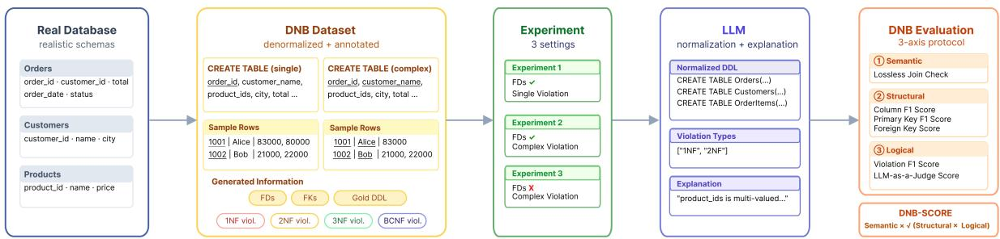
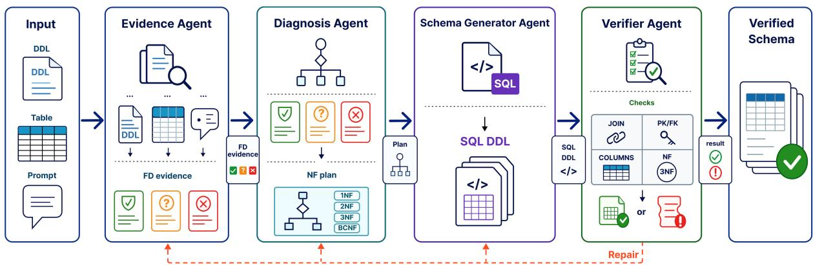

# Can LLMs Normalize Databases? A Benchmark and Multi-Agent Framework for Schema Normalization

Dong-Jae Koh<sup>\*</sup> Huisu Kim<sup>\*</sup> SeongHwan Yoon

Lasse M. Jantsch Chun-Hee Lee Seonghyeon Lee Young-Kyoon Suh<sup>†</sup>

School of Computer Science and Engineering, Kyungpook National University, South Korea {djkoh, kimisu0712, shyoon0214,lassejantsch, chunhee, sh0416, yksuh}@knu.ac.kr

## Abstract

Large Language Models (LLMs) are increasingly used to generate structured outputs, but their reliability remains unclear when those outputs must satisfy database-level constraints. We study this issue through database normalization, involving reasoning about functional dependencies, lossless join decompositions, and inter-table constraints. We introduce a Database Normalization Benchmark (DNBENCH), comprising 3,275 samples for evaluating LLM-driven database normalization from 1NF to BCNF. DNBENCH uses a three-axis protocol to measure semantic equivalence, structural accuracy, and logical validity. Across Single, Complex, and Real World levels, DNBENCH uncovers recurring failures in dependency inference, schema decomposition, and inter-table constraint reconstruction. We further propose Multi-Agent Reasoningfor Schemas (MARS), which separates evidence extraction, violation diagnosis, and decomposition planning from schema generation and verification. MARS improves the DNB-SCORE by 82.0% over the single-prompt baseline. All artifacts will be released upon acceptance.

## 1 Introduction

Large language models (LLMs) (Brown et al., 2020) have been explored for structured-data reasoning and database-related tasks. These tasks require outputs that satisfy formal constraints. In this context, LLMs’ ability to follow natural-language instructions, reason over tabular data, and generate structured outputs makes them a promising approach for automating database workflows.

Normalizing databases using LLMs highlights this challenge because it requires both reasoning over dependencies and generating schemas that satisfy formal relational constraints. Database normalization is a foundational technique in relational data management (Banks et al., 1970), reducing redundancy, preventing update anomalies, and enhancing schema management by organizing data according to functional dependencies (FD). When a database schema is not properly normalized, it introduces data inconsistency, unnecessary query costs, and degraded data quality (Kent, 2000). Moreover, normalization is difficult to automate because it requires reasoning over functional dependencies, candidate keys, lossless-join decompositions, and dependency preservation (Codd, 1971).

Despite this importance, existing studies provide limited evidence for whether LLMs can handle database normalization. NormTab (Nahid and Rafiei, 2024) and TABARD (Choudhury et al., 2025) address normalization-related issues in table-cleaning or anomaly-detection settings, rather than schema normalization itself. Miffie (Jo et al., 2025) targets 1NF-3NF normalization with an LLM generator-verifier loop, but its verification lacks explicit schema-level checks for properties such as lossless join, key validity, dependency reasoning, and foreign-key connectivity. Consequently, the reliability of LLM-based database normalization remains insufficiently understood.

To address these concerns, we introduce a comprehensive Database Normalization Benchmark (DNBENCH) for evaluating end-to-end LLM-driven database normalization. DNBENCH provides 3,275 denormalization samples from realistic relational schemas, covering 1NF-to-BCNF violations with gold labels and decomposition targets. DNBENCH further proposes a three-axis evaluation protocol that measures semantic equivalence, structural accuracy, and logical validity, combining them into a unified DNB-Score to be presented in Section 3. We further design Multi-Agent Reasoning for Schemas (MARS), a framework that decomposes the normalization process into several subtasks and distributes them across multiple LLM agents that collaborate to perform normalization.

<table><tr><td rowspan="2">Method</td><td rowspan="2">LLM Based</td><td colspan="5">Normalization</td><td colspan="2">Evaluation</td><td rowspan="2">Benchmark Provided</td></tr><tr><td>1NF</td><td>2NF</td><td>3NF</td><td>BCNF</td><td>Complex</td><td>Schema</td><td>Expl.</td></tr><tr><td>RDBNorma (2011)</td><td>X</td><td>x</td><td>√</td><td>√</td><td>x</td><td>X</td><td>x</td><td>x</td><td>x</td></tr><tr><td>EDNA (2013)</td><td>X</td><td>x</td><td>√</td><td>√</td><td>√</td><td>x</td><td>x</td><td>x</td><td>x</td></tr><tr><td>NormTab (2024)</td><td>J</td><td>√</td><td>x</td><td>x</td><td>x</td><td>x</td><td>x</td><td>X</td><td>X</td></tr><tr><td>TABARD (2025)</td><td>√</td><td>x</td><td>x</td><td>x</td><td>x</td><td>x</td><td>√</td><td>x</td><td>√</td></tr><tr><td>Miffie (Dual-LLM SR) (2025)</td><td>√</td><td>√</td><td>√</td><td>√</td><td>x</td><td>x</td><td>√</td><td>x</td><td>x</td></tr><tr><td>DNBENCH (ours)</td><td>√</td><td>√</td><td>√</td><td>√</td><td>√</td><td>√</td><td>√</td><td>√</td><td>√</td></tr></table>

Table 1: Comparison of DNBENCH with related work methods. Normalization groups 1NF to BCNF support and Complex (multi-violation) handling. Evaluation groups schema and explanation level scoring.

Our experiments characterize the current state of automatic database normalization using LLMs. Our DNBENCH enables quantification of the quality of generated DDLs on real-world databases. Also, we empirically demonstrate that our MARS approach produces, on average, 82.0% more reliable DDLs while preserving inter-table constraints compared to naive prompting. Our contributions are as follows:

• We introduce DNBENCH, a 3,275-sample benchmark for evaluating LLM-based database normalization, covering 1NF-to-BCNF violations.

• We propose a three-axis evaluation protocol that assesses semantic equivalence, structural accuracy, and logical validity of generated schemas.

• We benchmark modern LLMs on DNBENCH and identify major failure patterns, including unreliable FD inference, invalid decomposition, and weak inter-table constraint reconstruction.

• We propose MARS, a multi-agent normalization framework that improves DNB-SCORE by 82.0% over the baseline.

## 2 Related Work

Table 1 positions DNBENCH relative to prior normalization tools and LLM-based methods. Existing work falls into two broad categories: traditional tools that assist users in applying normalization rules and LLM-based systems that address related table-cleaning or limited normalization tasks. However, neither category provides a comprehensive benchmark for evaluating whether LLMs can reliably perform Database normalization. DNBENCH fills this gap with a comprehensive normalization benchmark and a multi-faceted evaluation protocol.

## 2.1 Traditional Normalization Tools

Traditional normalization tools are primarily rule-based or semi-automatic systems designed for user-assistance purposes. While useful for automating normalization procedures, they are not designed as benchmarks; they typically cover only limited settings and lack quantitative metrics to measure normalization quality.

Dongare et al. (2011) introduces RDBNorma, a semi-automated tool for normalizing schemas up to 3NF. RDBNorma represents schemas and functional dependencies using linked lists and checks generated outputs against expected decompositions. However, its evaluation focuses mainly on runtime and memory efficiency rather than on semantic preservation, lossless decomposition, key validity, or violation diagnosis.

Levandoski et al. (2013) presents EDNA, a semi-automated tool that supports normalization up to BCNF given user-specified functional dependencies. EDNA generates rule-based normalized schemas from FDs, but it does not provide a quantitative protocol for evaluating normalization or robustness across diverse schemas and complex violations.

## 2.2 LLM-based Normalization

Recent work has begun to explore the use of LLMs for table and schema normalization. However, existing approaches either target different objectives or evaluate narrower forms of normalization.

Nahid and Rafiei (2024) propose NormTab, an LLM-based framework for normalizing human-readable web tables, such as Wikipedia tables. NormTab performs value-level and structural cleaning, but its goal is to improve downstream SQL-based question answering and fact verification. It is therefore closer to table preprocessing rather than database normalization: it does not evaluate whether LLMs can reason over functional dependencies, preserve lossless decompositions, or construct valid normalized schemas.

  
Figure 1: Overview of the database normalization benchmark (DNBENCH) pipeline. DNBENCH generates controlled denormalized schemas with gold violation labels and decompositions, then evaluates LLM-generated DDL, violation types, and explanations along semantic, structural, and logical axes.

TABARD (Choudhury et al., 2025) evaluates LLMs on anomaly detection in tabular data, where models identify anomalous cells under different prompting strategies. Although relevant to tabular reasoning, TABARD does not target normal-form violations or schema decomposition. As a result, TABARD does not address whether an LLM can diagnose dependency violations or produce a structurally valid decomposition.

Most relevant to our work, Miffie (Jo et al., 2025) proposes a Dual-LLM self-refinement framework for 1NF-to-3NF normalization. Miffie uses one LLM to generate decompositions and another to provide feedback on remaining violations. However, its verifier is also LLM-based and does not include explicit schema-level checks for lossless join, key validity, or foreign-key connectivity. In contrast, DNBENCH combines LLM-based semantic judgment with explicit structural and logical checks to measure whether decompositions are semantically equivalent, structurally accurate, and logically valid.

## 3 Database Normalization Benchmark

Figure 1 shows the proposed database normalization benchmark (DNBENCH). DNBENCH transforms real-world relational databases into controlled denormalized samples annotated with gold violation labels and gold decomposition targets. Given each sample, an LLM generates normalized data definition language (DDL), violation labels, and explanations. DNBENCH evaluates these outputs along semantic, structural, and logical axes.

DNBENCH consists of two components: (i) a denormalization pipeline that constructs controlled normal-form violations from real-world relational schemas, and (ii) a three-axis evaluation protocol that measures semantic equivalence, structural accuracy, and logical validity. These three scores are combined into a unified DNB-SCORE to summarize overall normalization quality.

<table><tr><td>Dataset Attribute</td><td>Spider</td><td>BIRD</td></tr><tr><td colspan="3">Original datasets</td></tr><tr><td>Number of DBs</td><td>200</td><td>95</td></tr><tr><td>Number of domains</td><td>138</td><td>37</td></tr><tr><td>Number of tables</td><td>1,020</td><td>694</td></tr><tr><td colspan="3">DNBENCH dataset</td></tr><tr><td>Dev DBs</td><td>116</td><td>40</td></tr><tr><td>Test DBs</td><td>74</td><td>24</td></tr><tr><td>Dev samples</td><td>1,495</td><td>495</td></tr><tr><td>Test samples</td><td>900</td><td>385</td></tr><tr><td>Total samples</td><td>2,395</td><td>880</td></tr></table>

Table 2: Descriptive statistics for the source Spider and BIRD datasets and the resulting DNBENCH dataset.

## 3.1 Dataset Construction

We construct DNBENCH using two Text-to-SQL corpora. Spider (Yu et al., 2018) and BIRD (Li et al., 2023) provide realistic relational schemas with primary-key (PK) and foreign-key (FK) annotations. These schemas serve as sources for controlled denormalization: DNBENCH injects and labels normal-form violations into existing relational designs while preserving key constraints. After construction, three database experts audited the generated samples and confirmed that the intended 1NF-to-BCNF violation patterns, chain-rule labels, and gold decompositions were correctly represented. Table 2 summarizes the source DBs and the resulting DNBENCH dataset. Our dataset preserves realistic schema structure while introducing controlled normal-form violations and gold decomposition targets.

We construct the dataset through a three-stage denormalization pipeline: (1) FK-aware subsampling, (2) hybrid discovery–synthetic violation injection, and (3) chain-rule labeling.

Stage 1: Foreign Key-aware Subsampling. We first downsample each source database while preserving FK constraints. The sampling procedure traverses the FK graph from leaf tables upward, samples up to n tuples from each source table, and expands the selected key sets through FK and self-FK closures. It then applies a global size cap and removes remaining FK violations through cascade cleanup. This produces compact database instances that remain referentially valid. Full details and the complete algorithm are provided in Appendix A.3.

Stage 2: Discovery and Synthesis of Violations. For each source schema, we identify normal-form violation patterns: multivalued cells for 1NF, partial dependencies for 2NF, transitive dependencies for 3NF, and non-superkey determinants for BCNF.

Because real schemas often contain entangled rather than isolated violations, discovery alone is insufficient for controlled evaluation. We therefore complement it with deterministic synthesizers for 2NF, 3NF, and BCNF. These synthesizers incur violations through PK splitting, transitive-dependency injection, and candidate-key augmentation, respectively. We compose synthesized violations in reverse chain-rule order—BCNF, 3NF, 2NF, and 1NF—so that lower-form injections do not erase previously introduced higher-form violations. This construction yields composite samples in which all intended violations remain observable.

Stage 3: Chain-rule Labeling. Each sample includes two gold decomposition targets: a single target resolving only the earliest violation and a combined target resolving the full violation chain.

The composite synthesizers in Stage 2 ensure that fixing a lower-form violation does not automatically remove higher-form violations. Thus, each violation must be handled explicitly, making the combined target distinct from the single target. This enables DNBENCH to test whether a model fixes only the earliest violation or normalizes the full violation chain. Each sample also includes an expected FK list, allowing FK correctness to be scored without re-parsing generated DDL.

## 3.2 Three-Axis Evaluation Protocol

We evaluate each LLM prediction along three complementary axes: semantic equivalence, structural accuracy, and logical validity. These axes capture whether a generated decomposition preserves the original data, matches the expected schema structure, and provides correct normalization reasoning. We aggregate the three axes into a unified DNB-SCORE. The full prompts for both the LLM generator and the LLM-as-a-Judge are provided in Appendix H.

Criterion 1. Semantic Evaluation The semantic axis tests whether the generated decomposition satisfies the lossless-join property with respect to the original table. Specifically, the natural join of the generated relations must reconstruct the input table without introducing spurious tuples. We report this check as a binary score. Since a lossless join is a necessary condition for valid normalization, the semantic score acts as a gate in DNB-SCORE: any semantic failure reduces the final score to zero.

Criterion 2. Structural Evaluation The structural axis measures how closely the generated DDL matches the gold decomposition. We parse the LLM-generated DDL into relational schema objects and compute three metrics:

• Column F1: F1 between the generated and gold column sets.

• Primary Key F1: F1 between the generated and gold primary-key sets.

• Foreign Key Score: The product of FK matching and FK validity:

◦ FK F1: F1 between the generated and gold foreign-key sets.

◦ FK Connected Score: A binary indicator of whether generated FK constraints validly reference extant tables and columns.

The final structural score is the mean of Column F1, Primary Key F1, and Foreign Key Score.

Criterion 3. Logical Evaluation The logical axis evaluates whether the model correctly diagnoses the normalization problem and justifies its decomposition. It combines two components: (i) an LLM-as-a-Judge score for the generated schema and explanation, and (ii) Violation F1 for the predicted normal-form violation labels.

The judge LLM rates each prediction along three dimensions:

• Logical Coherence: whether the generated decomposition is consistent with the intended normalization logic and gold DDL.

• Explanation of Schema Alignment: whether the explanation is internally consistent with the generated DDL and declared violation labels.

• Explanation Quality: whether the explanation uses normalization concepts correctly and presents the reasoning clearly and concisely.

We use openai/gpt-oss-20b (Agarwal et al., 2025) as the judge model. We select this model because the Judge’s Verdict benchmark identifies it as a human-like judge, showing strong agreement with human annotators without exceeding the natural range of human judgment variation (Han et al., 2025). This choice is suitable for evaluating normalization explanations, where excessive consistency may overlook valid judgment nuances. We further validate the judge on our task through an expert-agreement study; details are provided in the Appendix E.

Violation F1 compares the violation labels predicted by the model against the gold violation labels. For each input table, we compute F1 over violation types, measuring whether the model correctly identifies which violations are present.

The final score is the mean of the average judge score across three dimensions and Violation F1.

DNB-SCORE. We aggregate the three axes as:

$$
\mathrm { D N B - S C O R E } = \mathrm { S e m a n t i c } \times { \sqrt { \mathrm { S t r u c t u r a l } \times \mathrm { L o g i c a l } } } .
$$

Inspired by BLEU (Papineni et al., 2002), DNB-SCORE uses the geometric mean of the structural and logical scores when the semantic score is 1. This aggregation rewards schemas that satisfy both complementary criteria, preserves the original score scale, and penalizes imbalance more strongly than an arithmetic mean.

## 4 Database Normalization Analysis

We evaluate LLMs’ database normalization capability using our benchmark dataset and evaluation protocol. Our experiments are designed to measure two core capabilities required for database normalization: (i) identifying and reasoning over functional dependencies (FDs), and (ii) resolving multiple co-occurring violations in the same schema.

## 4.1 Experimental Setup

We use the DNBENCH test split generated by the pipeline in Section 3.1, as summarized in Table 2. Each sample contains a denormalized input table, row samples, gold violation labels, gold decompositions, and expected schema constraints. We test four representative LLMs spanning dense and sparse mixture-of-experts (MoE) architectures across different scales. Each setting is evaluated under both zero-shot and few-shot prompting, yielding six configurations. More details on models and prompts are provided in Appendices B and H.

<table><tr><td>Experiment</td><td>Target Scope</td><td>FDs</td></tr><tr><td>Exp. 1: Single</td><td>Earliest violation only</td><td>Provided</td></tr><tr><td>Exp. 2: Complex</td><td>All violations</td><td>Provided</td></tr><tr><td>Exp. 3: Real World</td><td>All violations</td><td>Not provided</td></tr></table>

Table 3: Distinctions among the three experiments.

We design three experimental settings for a comprehensive evaluation under different normalization scopes and FD availability (Table 3).

## Experiment 1: Single Reasoning

Experiment 1 tests whether a model can resolve the earliest violated normal form given explicit FD evidence. Although an input may contain a chain of violations, the model is asked to fix only the first violation: for example, 1NF in a 1NF–2NF–3NF– BCNF chain, or 2NF in a 2NF–3NF–BCNF chain. This setting isolates the model’s ability to apply a single normalization rule.

## Experiment 2: Complex Reasoning

Experiment 2 extends the task to the full violation chain while still providing explicit FD evidence. The model must identify all relevant violations and produce a valid multi-step decomposition. This setting evaluates whether the model can handle interactions among multiple normalization rules.

## Experiment 3: Real World Reasoning

Experiment 3 removes explicit FDs and requires the model to infer them from context. The input includes a table, row samples, and natural-language business rules, but it withholds formal FD annotations. The model must infer latent FDs, identify the full set of violations, and generate a normalized schema. This setting reflects practical normalization scenarios in which dependency information is not directly provided.

## 4.2 Baseline Result and Analysis

DNBENCH identifies two valuable findings when using an LLM to normalize relational databases.

Findings 1. FD extraction is the main bottleneck in LLM-based database normalization. Our results validate that all four models degrade most sharply in the Real World setting, where FDs are not explicitly provided (Table 4). Averaged across models, DNB-SCORE drops modestly from 0.328 in Single to 0.285 in Complex, but declines more sharply to 0.188 in Real World. This pattern indicates that, once FDs are given, models can apply normalization rules to some extent. The harder problem is inferring reliable FDs from data samples and natural-language business rules.

<table><tr><td>Model</td><td colspan="3">Single</td><td colspan="3">Complex</td><td colspan="3">Real World</td></tr><tr><td></td><td>Zero-shot</td><td>Few-shot</td><td>Avg</td><td>Zero-shot</td><td>Few-shot</td><td>Avg</td><td>Zero-shot</td><td>Few-shot</td><td>Avg</td></tr><tr><td>Llama 3.3 70B</td><td>0.380†</td><td>0.451</td><td>0.416</td><td>0.371</td><td>0.327†</td><td>0.349†</td><td>0.196†</td><td>0.212†</td><td>0.204†</td></tr><tr><td>Gemma3 27B</td><td>0.353</td><td>0.341†</td><td>0.347</td><td>0.361†</td><td>0.366</td><td>0.363</td><td>0.158</td><td>0.220</td><td>0.189</td></tr><tr><td>Qwen3-30B</td><td>0.489</td><td>0.304</td><td>0.397†</td><td>0.340</td><td>0.209</td><td>0.274</td><td>0.253</td><td>0.209</td><td>0.231</td></tr><tr><td>Mixtral 8x7B Instruct</td><td>0.146</td><td>0.159</td><td>0.153</td><td>0.155</td><td>0.150</td><td>0.152</td><td>0.132</td><td>0.120</td><td>0.126</td></tr><tr><td>Overall</td><td>0.342</td><td>0.314</td><td>0.328</td><td>0.307</td><td>0.263</td><td>0.285</td><td>0.185</td><td>0.190</td><td>0.188</td></tr></table>

Table 4: Average DNB-SCORE (↑) on the DNBENCH test split by model and evaluation settings; bold and † mark the best and second-best scores in each column.
<table><tr><td>Model</td><td>Semantic</td><td colspan="3">Structural</td><td colspan="2">Logical</td></tr><tr><td></td><td>lossless join</td><td>Column F1</td><td>PK F1</td><td>FK Score</td><td>Violation F1</td><td>LLM Judge</td></tr><tr><td>Llama 3.3 70B</td><td>0.574†</td><td>0.909†</td><td>0.637</td><td>0.174</td><td>0.639†</td><td>0.383</td></tr><tr><td>Gemma3 27B</td><td>0.634</td><td>0.921</td><td>0.605</td><td>0.140</td><td>0.502</td><td>0.334</td></tr><tr><td>Qwen3-30B</td><td>0.568</td><td>0.854</td><td>0.611†</td><td>0.158†</td><td>0.678</td><td>0.361†</td></tr><tr><td>Mixtral 8x7B Instruct</td><td>0.412</td><td>0.742</td><td>0.492</td><td>0.104</td><td>0.437</td><td>0.227</td></tr><tr><td>Overall</td><td>0.547</td><td>0.857</td><td>0.586</td><td>0.144</td><td>0.564</td><td>0.326</td></tr></table>

Table 5: Per-model DNB-SCORE component breakdown, averaged over the DNBENCH test split and all six configurations. Bold indicates the best score per column, and † the second-best.

Findings 2. LLMs perform better at violation detection than at schema reconstruction. Table 5 separates violation diagnosis from schema generation. Violation F1 reaches up to 0.678, indicating that models can often identify which normal forms are violated. However, structural performance remains much lower, especially for inter-table constraints: FK Score ranges only from 0.10 to 0.17 across the four models. Thus, the central challenge is not merely recognizing that a decomposition is needed but producing a normalized schema with a valid PK and FK structure. In other words, LLMs are stronger at local violation diagnosis than at global schema reconstruction.

Furthermore, our in-depth per-violation analysis shows that most models commonly struggle with multiple violations, BCNF reasoning, and alreadynormalized inputs, even though performance varies across violation paths (Table 7 in the Appendix). The NONE cases are particularly revealing, as models sometimes introduce unnecessary decompositions even when no normalization is required.

Overall, current LLMs face three main challenges in database normalization: (i) unreliable FD inference in realistic settings, (ii) weak reconstruction of valid inter-table constraints, and (iii) a tendency to over-normalize already valid schemas. These findings motivate a structured normalization framework that separates reasoning stages and incorporates explicit verification.

## 5 Multi-Agent Reasoning for Schemas

The baseline analysis shows that LLM-based normalization often fails because several distinct reasoning steps are compressed into a single prompt. A model must infer FDs, diagnose normal-form violations, plan decompositions, and generate SQL DDL in one pass. Errors from earlier steps can propagate directly to the final schema without intermediate correction.

Multi-agent LLM frameworks address this issue by decomposing complex tasks across rolespecialized agents that exchange and verify intermediate outputs. AutoGen (Wu et al., 2023) provides general infrastructure for orchestrating conversational agents, while MetaGPT (Hong et al., 2023) and ChatDev (Qian et al., 2024) demonstrate the effectiveness of role-based agent pipelines. Motivated by these findings, we adapt role specialization and verifier feedback to database normalization, where each step must satisfy dependency, foreign-key, and lossless-join requirements.

  
Figure 2: Overview of MARS framework—Evidence, Diagnosis, Schema Generator, and Verifier agents—together with the repair loop triggered by verification failures.

## 5.1 MARS Framework

We propose Multi-Agent Reasoning for Schemas (MARS), which decomposes LLM-based database normalization into four stages: (i) evidence extraction, (ii) violation diagnosis and decomposition planning, (iii) schema generation, and (iv) deterministic verification (Figure 2).

Evidence Agent. The Evidence Agent extracts functional-dependency (FD) evidence from the input schema, row samples, and optional FD annotations. It treats provided FDs as direct evidence or infers candidate FDs from data, then classifies them as reliable, hypothetical, or rejected for downstream agents.

Diagnosis Agent. The Diagnosis Agent identifies violated normal forms and the FDs responsible for those violations, prioritizing reliable FDs over hypothetical ones. It then builds a stepwise decomposition plan that specifies the key dependencies, decomposition order, and target relations.

Schema Generator Agent. The Schema Generator Agent emits SQL DDL for the planned decomposition, specifying normalized tables, primary keys (PKs), and foreign key (FK) constraints based on the diagnosed violations and FD evidence.

Verifier Agent. The Verifier agent parses the generated SQL DDL and checks whether the proposed schema satisfies key normalization requirements. It verifies column preservation, PK and FK validity, relation-level normal-form satisfaction, lossless join, and correct handling of 1NF violations involving multivalued attributes.

Repair. When verification fails, MARS performs targeted repair for up to two rounds. DDL construction errors return only to the Schema Generator Agent. For decomposition-strategy errors, such as selecting an incorrect violation target or failing lossless-join verification, MARS re-executes the Diagnosis Agent before schema regeneration. When FK-related errors occur, MARS invokes the Evidence Agent to review proposed FK references before regeneration.

## 5.2 Experiment Settings

Table 6 evaluates all methods under the Real World setting from Table 4. We focus on this setting because it best reflects practical database normalization: the model must infer FDs from schema context and business rules, rather than relying on explicitly provided FDs. Among the four base LLMs in Table 4, Qwen3-30B achieves the highest average DNB-SCORE in the Real World setting. We therefore use Qwen3-30B as the backbone for all methods in Table 6, ensuring that performance differences reflect the normalization framework rather than the underlying LLMs.

The Baseline is the single-prompt Qwen3-30B configuration from Table 4 under the Real World setting. It asks one model to infer latent FDs, diagnose violations, generate normalized SQL DDL, and explain the decomposition in a single response.

Miffie is the Dual-LLM self-refinement framework proposed by Jo et al. (2025). Following the original setup, we run up to three refinement iterations. Although Miffie was designed for 1NF–3NF normalization, we evaluate it on the full DNBENCH Real World setting, including BCNF cases, as an LLM-based refinement baseline. Implementation details are provided in Appendix F.

MARS is our role-specialized framework described in Section 5. It performs one initial generation followed by up to two repair rounds, yielding at most three generation attempts. This matches the maximum number of Miffie refinement iterations.

<table><tr><td rowspan="2">Method</td><td rowspan="2">Prompting</td><td>Semantic</td><td colspan="3">Structural</td><td colspan="2">Logical</td><td rowspan="2">DNB-SCORE</td></tr><tr><td>lossless join</td><td>Column F1</td><td>PK F1</td><td>FK Score</td><td>Violation F1</td><td>LLM Judge</td></tr><tr><td rowspan="2">Baseline</td><td>Zero-shot</td><td>0.489</td><td>0.928</td><td>0.573</td><td>0.103</td><td>0.651</td><td>0.351</td><td>0.253</td></tr><tr><td>Few-shot</td><td>0.370</td><td>0.802</td><td>0.507</td><td>0.155</td><td>0.718</td><td>0.315</td><td>0.209</td></tr><tr><td rowspan="2">Miffie</td><td>Zero-shot</td><td>0.665</td><td>0.967†</td><td>0.966</td><td>0.117</td><td>0.362</td><td>0.330</td><td>0.308</td></tr><tr><td>Few-shot</td><td>0.719†</td><td>0.961</td><td>0.960†</td><td>0.103</td><td>0.356</td><td>0.343†</td><td>0.339</td></tr><tr><td rowspan="2">MARS (Ours)</td><td>Zero-shot</td><td>0.732</td><td>0.955</td><td>0.704</td><td>0.227†</td><td>0.667</td><td>0.288</td><td>0.423</td></tr><tr><td>Few-shot</td><td>0.697</td><td>0.969</td><td>0.721</td><td>0.262</td><td>0.678†</td><td>0.325</td><td>0.418†</td></tr></table>

Table 6: Component-level performance breakdown for the Real World setting. DNB-SCORE and all component scores are computed per test sample and averaged over the DNBENCH dataset. All methods use Qwen3-30B as the backbone LLM. Bold marks the maximum per column among reported scores, and † marks the second-best.

## 5.3 Experiment Results

MARS achieves the strongest Real World performance. Table 6 reports that MARS achieves the highest DNB-SCORE in both zero-shot and few-shot settings. Compared with the single-prompt Baseline, MARS improves DNB-SCORE from 0.253 to 0.423 in zero-shot and from 0.209 to 0.418 in few-shot. Although Miffie also improves over the Baseline, it remains below MARS, showing that role-specialized normalization is more effective than single-prompt and self-refinement approaches.

Miffie improves local schema consistency but weakens diagnosis. Miffie improves lossless-join performance and obtains high Column F1 and PK F1. This suggests that iterative refinement helps preserve local schema elements. However, its Violation F1 drops sharply, and its FK Score remains low. Repeated refinement alone fails to maintain both the normalization diagnosis and inter-table constraints. Table 13 in Appendix G.1 further shows that Miffie’s LLM-based verifier struggles to distinguish high-quality normalized schemas from low-quality ones under DNBENCH.

MARS improves the generation of valid normalized DDL. MARS gains are concentrated in the semantic and structural components. It substantially improves lossless join over the Baseline and achieves the highest FK Score among the compared methods. By contrast, Violation F1 remains close to the Baseline, indicating that MARS does not substantially improve violation classification itself. The DNB-SCORE improvement, therefore, mainly stems from better information preservation and a more robust schema structure. Despite these gains, FK reconstruction remains the weakest structural component: FK Score stays far below Column F1 and PK F1, showing that valid inter-table constraints are harder to recover than local table-level structure.

Stage-wise artifacts reveal where MARS succeeds and fails. We further inspect intermediate artifacts from each MARS stage. Table 15 in Appendix G.2 shows that schema generation artifacts align more reliably with the diagnosis plan than evidence extraction and violation diagnosis align with the gold references. Thus, MARS is most effective once a plausible diagnosis plan is available and converted into executable SQL DDL. Upstream FD inference and violation diagnosis remain the main bottlenecks. Their errors can complicate later key selection and FK reconstruction.

## 6 Conclusion

We introduced DNBENCH, a comprehensive benchmark for assessing LLM-driven database normalization using controlled denormalization data and a three-axis protocol that measures semantic, structural, and logical validity. We empirically verify that LLMs often identify violations but struggle to generate information-preserving schemas with valid inter-table constraints, especially when functional dependencies must be inferred.

We addressed the identified weaknesses using a multi-agent framework (MARS) that separates functional dependency evidence extraction, violation diagnosis, decomposition planning, schema generation, and verification. MARS outperforms single-prompt and self-refinement baselines, demonstrating the importance of decomposing the database normalization process. We believe that DNBENCH and MARS will, in concert, provide a systematic basis for LLM-driven database normalization, facilitating future research on multi-agent approaches to database schema design.

## Limitations

Although MARS substantially improves DNB-SCORE over the single-prompt baseline, three limitations remain.

FK reconstruction remains a bottleneck. Even with role specialization and verifier-based repair, MARS’s FK Score still falls well short of Column F1 and PK F1. This shows that preserving local table-level information is easier than reconstructing the reference structure across decomposed relations. FK reconstruction requires consistent relation boundaries, key choices, and reference targets, and upstream FD or diagnosis errors can further complicate this process. Recovering valid intertable constraints after decomposition, therefore, remains an open problem.

BCNF reasoning and recognizing already-normalized schemas remain unresolved. Results by violation type in Appendix Table 8 show that the framework continues to struggle with BCNF-only inputs, which require candidate-key reasoning over non-superkey determinants. Although NONE inputs are easier than violation cases, they still reveal unnecessary decomposition errors. Both cases reveal limitations that are not addressed by intermediate validation alone and require stronger semantic reasoning about key structure.

MARS requires a higher inference budget and remains sensitive to upstream errors. Unlike the single-prompt baseline, MARS uses multiple LLM calls for evidence extraction, violation diagnosis, schema generation, and repair. The performance gains should therefore be interpreted together with this additional inference cost. Moreover, verifier-based repair is most effective for local synthesis errors, such as missing columns or invalid constraints. Still, it cannot always recover from incorrect FD evidence or an incorrect decomposition plan. Future work should explore adaptive agent routing and stronger evidence extraction to reduce unnecessary calls while improving robustness.

## References

OpenAI Sandhini Agarwal, Lama Ahmad, Jason Ai, Sam Altman, Andy Applebaum, Edwin Arbus, Rahul K. Arora, Yu Bai, Bowen Baker, Hai-Biao Bao, Boaz Barak, Ally Bennett, Tyler Bertao, N. Archer Brett, Eugene Brevdo, Greg Brockman, Sébastien Bubeck, Cheng Chang, Kai Chen, and 105 others. 2025. gpt-oss-120b&gpt-oss-20b model card.

Banks, F. E., and Codd. 1970. A Relational Model of Data for Large Shared Data Banks. Communications ofthe ACM, 13:377 – 387.

Tom B. Brown, Benjamin Mann, Nick Ryder, Melanie Subbiah, Jared Kaplan, Prafulla Dhariwal, Arvind Neelakantan, Pranav Shyam, Girish Sastry, Amanda Askell, Sandhini Agarwal, Ariel Herbert-Voss, Gretchen Krueger, Thomas Henighan, Rewon Child, Aditya Ramesh, Daniel M. Ziegler, Jeff Wu, Clemens Winter, and 12 others. 2020. Language models are few-shot learners. ArXiv, abs/2005.14165.

Manan Roy Choudhury, Anirudh Iyengar Kaniyar Narayana Iyengar, Shikhhar Siingh, Sugeeth Puranam, and Vivek Gupta. 2025. TABARD: A novel benchmark for tabular anomaly analysis, reasoning and detection. In Findings of the Association for Computational Linguistics: EMNLP 2025, pages 21783–21817, Suzhou, China. Association for Computational Linguistics.

E. F. Codd. 1971. Further normalization of the data base relational model. Research Report / RJ / IBM / San Jose, California, RJ909.

Jacob Cohen. 1968. Weighted kappa: Nominal scale agreement provision for scaled disagreement or partial credit. Psychological Bulletin, 70:213–220.

Y. V. Dongare, Priyadarshan S. Dhabe, and S. V. Deshmukh. 2011. Rdbnorma: - a semi-automated tool for relational database schema normalization up to third normal form. ArXiv, abs/1103.0633.

Abhimanyu Dubey, Abhinav Jauhri, Abhinav Pandey, Abhishek Kadian, Ahmad Al-Dahle, Aiesha Letman, Akhil Mathur, Alan Schelten, Amy Yang, Angela Fan, Anirudh Goyal, Anthony S. Hartshorn, Aobo Yang, Archi Mitra, Archie Sravankumar, Artem Korenev, Arthur Hinsvark, Arun Rao, Aston Zhang, and 510 others. 2024. The llama 3 herd of models.

Bradley Efron and Robert Tibshirani. 1995. An introduction to the bootstrap.

Daniel Han, Michael Han, and Unsloth team. 2023. Unsloth Studio.

Steve Han, Gilberto Titericz Junior, Tom Balough, and Wenfei Zhou. 2025. Judge’s verdict: A comprehensive analysis of llm judge capability through human agreement. Preprint, arXiv:2510.09738.

Sirui Hong, Xiawu Zheng, Jonathan P. Chen, Yuheng Cheng, Ceyao Zhang, Zili Wang, Steven Ka Shing

Yau, Zi Hen Lin, Liyang Zhou, Chenyu Ran, Lingfeng Xiao, and Chenglin Wu. 2023. Metagpt: Meta programming for multi-agent collaborative framework. ArXiv, abs/2308.00352.

Albert Q. Jiang, Alexandre Sablayrolles, Antoine Roux, Arthur Mensch, Blanche Savary, Chris Bamford, Devendra Singh Chaplot, Diego de Las Casas, Emma Bou Hanna, Florian Bressand, Gianna Lengyel, Guillaume Bour, Guillaume Lample, Lélio Renard Lavaud, Lucile Saulnier, Marie-Anne Lachaux, Pierre Stock, Sandeep Subramanian, Sophia Yang, and 7 others. 2024. Mixtral of experts. ArXiv, abs/2401.04088.

Eunjae Jo, Nakyung Lee, and Gyuyeong Kim. 2025. Database normalization via dual-llm self-refinement. ArXiv, abs/2508.17693.

Gemma Team Aishwarya Kamath, Johan Ferret, Shreya Pathak, Nino Vieillard, Ramona Merhej, Sarah Perrin, Tatiana Matejovicova, Alexandre Ram’e, Morgane Rivière, Louis Rouillard, Thomas Mesnard, Geoffrey Cideron, Jean-Bastien Grill, Sabela Ramos, Edouard Yvinec, Michelle Casbon, Etienne Pot, Ivo Penchev, Gael Liu, and 191 others. 2025. Gemma 3 technical report. ArXiv, abs/2503.19786.

William Kent. 2000. A Simple Guide to Five Normal Forms in Relational Database Theory.

Klaus Krippendorff. 2011. Computing krippendorff’s alpha-reliability.

Justin J Levandoski, David B Lomet, and Sudipta Sengupta. 2013. EDNA, a Software Tool for Verifying the Normalisation of Relations during the Logical Database Design Process. In 12th International Workshop on the Teaching, Learning and Assessment ofDatabases (TLDR), pages 51–61. The Higher Education Academy.

Jinyang Li, Binyuan Hui, Ge Qu, Binhua Li, Jiaxi Yang, Bowen Li, Bailin Wang, Bowen Qin, Rongyu Cao, Ruiying Geng, Nan Huo, Chenhao Ma, Kevin C. Chang, Fei Huang, Reynold Cheng, and Yongbin Li. 2023. Can LLM Already Serve as A Database Interface? A BIg Bench for Large-Scale Database Grounded Text-to-SQLs. ArXiv, abs/2305.03111.

Md Mahadi Hasan Nahid and Davood Rafiei. 2024. Normtab: Improving symbolic reasoning in llms through tabular data normalization. ArXiv, abs/2406.17961.

Kishore Papineni, Salim Roukos, Todd Ward, and Wei-Jing Zhu. 2002. Bleu: a method for automatic evaluation of machine translation. In Annual Meeting of the Associationfor Computational Linguistics.

Chen Qian, Wei Liu, Hongzhang Liu, Nuo Chen, Yufan Dang, Jiahao Li, Cheng Yang, Weize Chen, Yusheng Su, Xin Cong, Juyuan Xu, Dahai Li, Zhiyuan Liu, and Maosong Sun. 2024. ChatDev: Communicative agents for software development. In Proceedings of the 62nd Annual Meeting of the Association for

Computational Linguistics (Volume 1: Long Papers), pages 15174–15186, Bangkok, Thailand. Association for Computational Linguistics.

Qingyun Wu, Gagan Bansal, Jieyu Zhang, Yiran Wu, Beibin Li, Erkang (Eric) Zhu, Li Jiang, Xiaoyun Zhang, Shaokun Zhang, Jiale Liu, Ahmed Hassan Awadallah, Ryen W. White, Doug Burger, and Chi Wang. 2023. Autogen: Enabling next-gen llm applications via multi-agent conversation.

An Yang, Anfeng Li, Baosong Yang, Beichen Zhang, Binyuan Hui, Bo Zheng, Bowen Yu, Chang Gao, Chengen Huang, Chenxu Lv, Chujie Zheng, Dayiheng Liu, Fan Zhou, Fei Huang, Feng Hu, Hao Ge, Haoran Wei, Huan Lin, Jialong Tang, and 41 others. 2025. Qwen3 technical report.

Tao Yu, Rui Zhang, Kai Yang, Michihiro Yasunaga, Dongxu Wang, Zifan Li, James Ma, Irene Li, Qingning Yao, Shanelle Roman, Zilin Zhang, and Dragomir Radev. 2018. Spider: A large-scale human-labeled dataset for complex and cross-domain semantic parsing and text-to-SQL task. In Proceedings ofthe 2018 Conference on Empirical Methods in Natural Language Processing, pages 3911–3921, Brussels, Belgium. Association for Computational Linguistics.

## A Dataset Details

This appendix expands on the dataset construction in Section 3.1. We describe the Spider and BIRD source datasets, explain why they are suitable source schemas for controlled denormalization, and summarize the expert validation of the generated DNB samples.

## A.1 Source Datasets

Spider. Spider (Yu et al., 2018) is a large-scale cross-domain Text-to-SQL dataset built by a research team at Yale University. It consists of 10,181 natural-language queries and 5,693 unique SQL queries, drawn from 200 databases across 138 domains. Each database contains an average of 5.1 tables and foreign-key relationships, covering SQL patterns from simple single-table lookups to nested subqueries and multiple joins.

BIRD. BIRD (Li et al., 2023) is a benchmark for evaluating Text-to-SQL performance in large-scale real-world database environments. It consists of 95 databases, 33.4 GB of data, 37 specialized domains, and 12,751 query–SQL pairs.

Dataset Licenses. The Spider benchmark is distributed under the Creative Commons Attribution-ShareAlike 4.0 International (CC BY-SA 4.0) license. The BIRD benchmark is distributed under the Creative Commons Attribution-NonCommercial 4.0 International (CC BY-NC 4.0) license. Both datasets are used in this work for non-commercial academic research purposes with appropriate attribution.

## A.2 Selection Rationale

We chose Spider and BIRD over alternative tabular corpora for three reasons.

First, both datasets provide relational schemas with explicit primary-key and foreign-key annotations. These constraints are essential for FK-aware subsampling, controlled violation injection, and structural evaluation of generated DDL.

Second, both datasets cover diverse domains and schema structures. This allows DNB to evaluate normalization behavior across a wide range of table layouts, key structures, and attribute combinations.

Third, their relational structure makes them suitable source schemas for controlled denormalization. Starting from realistic schemas allows us to generate denormalized samples with known violation patterns while retaining a database-like structure.

## A.3 Structure-Preserving Relational Sampling

This subsection details Stage 1 (FK-aware Subsampling) of the dataset construction pipeline in Section 3.1. The goal of this stage is to downsample each large source database into a compact instance that remains a valid relational database— that is, one that preserves primary-key uniqueness and foreign-key referential integrity—so that the subsequent violation-injection stages operate on realistic, self-consistent schemas.

Algorithm 1 formalizes this procedure. Starting from the schema metadata, we build a foreignkey graph over the tables and identify base tables (nodes with no outgoing FK edges). For each base table, we select up to n tuples and expand the selected key sets through FK and self-FK closures until convergence, ensuring that every referenced tuple is also retrieved. After merging the retrieved tuples with primary-key-based deduplication, we apply a global per-table row cap and insert the tables into a new SQLite database in topological order. Finally, any residual FK violations are removed through recursive cascade cleanup, and empty tables are dropped. The result D<sup>′</sup> is a structurally faithful subsample on which controlled denormalization can be applied without introducing spurious integrity errors.

## A.4 Expert Validation of DNBENCH Samples

After constructing the DNB dataset, three database experts reviewed the generated DNB samples. The review focused on whether the denormalized tables contain the intended 1NF–BCNF violation patterns and whether the chain-rule labels, gold decompositions, and expected schema constraints are consistent with the construction rules. This validation concerns the generated DNBENCH samples used in our experiments.

## B Model Selection

We restrict our evaluation to four open-weight language models widely adopted in the contemporary LLM ecosystem, which together cover the dominant architectural paradigms in modern LLM design. By choosing models that are openly released, reproducible, and actively used across research and industry, we ensure that the failure modes uncovered by DNBENCH are not artifacts of a single proprietary system but reflect properties of the broader class of modern LLMs. The four models span two complementary axes that are known to influence reasoning behavior, namely model scale (ranging from 27B to 70B total parameters) and architectural family (dense decoder-only models against sparse mixture-of-experts models), allowing the benchmark to probe whether normalization difficulty correlates with capacity, sparsity, or instruction-tuning recipe.

Algorithm 1: STRUCTURE-PRESERVING   
RELATIONAL SAMPLING   
Input: Relational database D; max tuples per base   
table n; max rows per table c   
Output: Sampled database D   
1 Extract schema metadata from D and obtain table set   
T, primary keys, and foreign-key (FK) relations;   
2 Build the FK graph over T (edge u→v iff u has an   
FK referencing v);   
3 Identify base tables B ⊆ T (nodes with no outgoing   
FK edges);   
4 Initialize sampled-relation set R ← ∅ and global PK   
registry K ← {(t, ∅) : t ∈ T};   
5 for each base table b ∈ B do   
6 Construct join candidates by traversing FK   
chains from b to related tables;   
7 Remove candidates containing null primary keys;   
8 Select up to n tuples from b based on its primary   
key;   
9 Initialize local PK registry K from the selected   
tuples;   
10 Expand K via FK/self-FK closure until   
convergence;   
11 Retrieve tuples from related tables using the   
converged key sets;   
12 Merge the retrieved tuples into R with PK-based   
deduplication;   
13 Update K using K ;   
14 if some table in R exceeds c rows then   
15 Apply FK-aware global capping while preserving   
referential integrity;   
16 Create a new SQLite database D<sup>′</sup> and insert tables in   
topological order;   
17 while FK violations are detected in D<sup>′</sup> do   
18 Remove violating tuples by recursive cascade   
cleanup;   
19 Remove empty tables from D<sup>′</sup>;   
20 return D<sup>′</sup>

• Llama 3.3 70B (Dubey et al., 2024) is a 70Bparameter dense decoder-only model released by Meta and serves as a strong reference point for instruction-tuned dense LLMs. Its broad availability and extensive evaluation across reasoning benchmarks make it the de facto baseline for open-weight large-scale models.

• Gemma3 27B (Kamath et al., 2025) is Google’s open-weight dense model designed for efficient deployment at moderate scale. It represents the class of mid-sized dense models that trade raw capacity for inference cost while retaining competitive instructionfollowing ability.

• Qwen3-30B (Yang et al., 2025) is Alibaba’s mixture-of-experts model from the Qwen3 family. By activating a subset of its experts per token, it isolates the effect of sparse expert routing on normalization reasoning while remaining comparable in active-parameter footprint to mid-sized dense models.

• Mixtral 8x7B Instruct (Jiang et al., 2024) is Mistral’s sparse mixture-of-experts model that routes each token through two of eight 7B experts. It is included as the most established open-weight MoE baseline and as a smaller-scale counterpart to Qwen3-30B, enabling comparison across two MoE designs.

Together, these four models cover dense and sparse architectures across a range of scales, ensuring that DNBENCH’s findings characterize behavior shared by current modern LLMs rather than properties unique to a single model family.

Model Licenses. We use all pre-trained models in accordance with their respective licenses. All models are used as-is for evaluation only, without any modification or training, in full compliance with their license terms. For quantized variants, we use GGUF builds redistributed by Unsloth (Han et al., 2023) under the original model licenses, with Q4\_K\_S quantization applied only to the model weights.

• gpt-oss-20b is released under the Apache License 2.0 and the gpt-oss usage policy.

• Qwen3-30B-A3B-Instruct-2507 is used under the Apache License 2.0.

• Mixtral-8x7B-Instruct-v0.1 is used under the Apache License 2.0.

• Llama-3.3-70B-Instruct is used under the Llama 3.3 Community License Agreement, © Meta Platforms, Inc.

• Gemma-3-27B-IT is used under the Gemma Terms of Use.

## C Experiment Reproducibility

All experiments were conducted as inference-only evaluations on a high-performance computing cluster. No model fine-tuning or parameter updates were performed. The hardware and software configurations used for our empirical evaluations are as follows:

Table 9 reports the corresponding per-cell breakdown for the Miffie (Qwen3-30B) baseline under the Real World setting, allowing direct comparison against both the single-prompt Qwen3-30B rows in Table 7 and the Multi-agent results in Table 8.

• Hardware Resources. We used an NVIDIA DGX-class system equipped with NVIDIA A100-SXM4-40GB GPUs. Each GPU provides 40 GB of HBM2 memory. The experiments used 1×A100 for Gemma-3-27B, Qwen3-30B-A3B, Mixtral-8x7B, and the MARS agent based on Qwen3-30B-A3B, and 2×A100 for Llama-3.3-70B.

• Software Environment. The system operated with CUDA 12.2 and NVIDIA Driver 535.161.08. Model inference was served through an OpenAI-compatible vLLM server, and all evaluation scripts were executed in the same software environment.

• Results. All experimental results, including MARS and MIFFIE, were described based on a single run.

## D Extended Result Tables

This appendix collects every result table beyond the main paper’s Table 4.

Table 10 reports DNB-SCORE values on the DNBENCH test split, broken down by dataset and model. The relative ranking of the four models is consistent across BIRD and Spider, indicating that our findings generalize across both source corpora.

Table 11 presents per-model Real World DNB-SCORE values broken down by violation path. We observe that scores decrease as the number of normal-form violations to resolve increases: the NONE category (already-normalized inputs) scores highest for every model, while the mixed 1NF–BCNF cases score lowest.

Table 7 provides the full per-cell results: DNB-SCORE and its three component scores for every (dataset, model, prompting setting, violation path) configuration.

Table 8 reports the corresponding per-cell breakdown for our MARS (Qwen3-30B) pipeline under the Real World setting, allowing direct comparison against the single-prompt Qwen3-30B rows in Table 7.

<table><tr><td colspan="1" rowspan="2">Dataset</td><td colspan="1" rowspan="2">Model</td><td colspan="2" rowspan="2">Shot</td><td colspan="1" rowspan="2">Experiment</td><td colspan="1" rowspan="2">Violation Path</td><td colspan="1" rowspan="2">Num.</td><td colspan="1" rowspan="1">DNB-SCORE</td><td colspan="1" rowspan="1"></td><td colspan="1" rowspan="1">Components</td><td colspan="1" rowspan="1"></td></tr><tr><td colspan="1" rowspan="1"></td><td colspan="1" rowspan="1">Semantic</td><td colspan="1" rowspan="1">Structural</td><td colspan="1" rowspan="1">Logical</td></tr><tr><td colspan="2" rowspan="74">BIRD Llama 3.3 70BGemma3 27BQwen3-30B</td><td colspan="2" rowspan="5">Zero-shot</td><td colspan="1" rowspan="1">Single</td><td colspan="1" rowspan="1">1_2_3_BCNF</td><td colspan="1" rowspan="1">77</td><td colspan="1" rowspan="1">0.2650</td><td colspan="1" rowspan="1">0.5584</td><td colspan="1" rowspan="1">0.5768</td><td colspan="1" rowspan="1">0.4195</td></tr><tr><td colspan="1" rowspan="3"></td><td colspan="1" rowspan="1">2_3_BCNF</td><td colspan="1" rowspan="1">77</td><td colspan="1" rowspan="1">0.4495</td><td colspan="1" rowspan="1">0.6364</td><td colspan="1" rowspan="1">0.7725</td><td colspan="1" rowspan="1">0.5498</td></tr><tr><td colspan="1" rowspan="1">3_BCNF</td><td colspan="1" rowspan="1">77</td><td colspan="1" rowspan="1">0.1951</td><td colspan="1" rowspan="1">0.7013</td><td colspan="1" rowspan="1">0.5836</td><td colspan="1" rowspan="1">0.1676</td></tr><tr><td colspan="1" rowspan="2"></td><td colspan="1" rowspan="1">BCNF</td><td colspan="1" rowspan="1">77</td><td colspan="1" rowspan="1">0.1803</td><td colspan="1" rowspan="1">0.6104</td><td colspan="1" rowspan="1">0.5264</td><td colspan="1" rowspan="1">0.2423</td></tr><tr><td colspan="1" rowspan="1">NONE</td><td colspan="1" rowspan="1">77</td><td colspan="1" rowspan="1">0.5992</td><td colspan="1" rowspan="1">0.7662</td><td colspan="1" rowspan="1">0.8698</td><td colspan="1" rowspan="1">0.7580</td></tr><tr><td colspan="2" rowspan="10"></td><td colspan="1" rowspan="1"></td><td colspan="1" rowspan="2">Complex</td><td colspan="1" rowspan="1">1_2_3_BCNF</td><td colspan="1" rowspan="1">77</td><td colspan="1" rowspan="1">0.2236</td><td colspan="1" rowspan="1">0.4545</td><td colspan="1" rowspan="1">0.5264</td><td colspan="1" rowspan="1">0.5218</td></tr><tr><td colspan="1" rowspan="4"></td><td colspan="1" rowspan="1">2_3_BCNF</td><td colspan="1" rowspan="1">77</td><td colspan="1" rowspan="1">0.3172</td><td colspan="1" rowspan="1">0.6494</td><td colspan="1" rowspan="1">0.5048</td><td colspan="1" rowspan="1">0.4971</td></tr><tr><td colspan="1" rowspan="1">3_BCNF</td><td colspan="1" rowspan="1">77</td><td colspan="1" rowspan="1">0.3152</td><td colspan="1" rowspan="1">0.6494</td><td colspan="1" rowspan="1">0.5942</td><td colspan="1" rowspan="1">0.4417</td></tr><tr><td colspan="1" rowspan="1">BCNF</td><td colspan="1" rowspan="1">77</td><td colspan="1" rowspan="1">0.2063</td><td colspan="1" rowspan="1">0.5714</td><td colspan="1" rowspan="1">0.5264</td><td colspan="1" rowspan="1">0.3562</td></tr><tr><td colspan="1" rowspan="1">NONE</td><td colspan="1" rowspan="1">77</td><td colspan="1" rowspan="1">0.6044</td><td colspan="1" rowspan="1">0.7403</td><td colspan="1" rowspan="1">0.8889</td><td colspan="1" rowspan="1">0.7965</td></tr><tr><td colspan="1" rowspan="5">Real World</td><td colspan="1" rowspan="1">1_2_3_BCNF</td><td colspan="1" rowspan="1">77</td><td colspan="1" rowspan="1">0.0957</td><td colspan="1" rowspan="1">0.2078</td><td colspan="1" rowspan="1">0.5018</td><td colspan="1" rowspan="1">0.4323</td></tr><tr><td colspan="1" rowspan="1">2_3_BCNF</td><td colspan="1" rowspan="1">77</td><td colspan="1" rowspan="1">0.0742</td><td colspan="1" rowspan="1">0.1948</td><td colspan="1" rowspan="1">0.5028</td><td colspan="1" rowspan="1">0.3456</td></tr><tr><td colspan="1" rowspan="1">3_BCNF</td><td colspan="1" rowspan="1">77</td><td colspan="1" rowspan="1">0.1258</td><td colspan="1" rowspan="1">0.4286</td><td colspan="1" rowspan="1">0.5631</td><td colspan="1" rowspan="1">0.2537</td></tr><tr><td colspan="1" rowspan="1">BCNF</td><td colspan="1" rowspan="1">77</td><td colspan="1" rowspan="1">0.1054</td><td colspan="1" rowspan="1">0.4026</td><td colspan="1" rowspan="1">0.4681</td><td colspan="1" rowspan="1">0.1964</td></tr><tr><td colspan="1" rowspan="1">NONE</td><td colspan="1" rowspan="1">77</td><td colspan="1" rowspan="1">0.5453</td><td colspan="1" rowspan="1">0.8182</td><td colspan="1" rowspan="1">0.7200</td><td colspan="1" rowspan="1">0.5606</td></tr><tr><td colspan="2" rowspan="15">Few-shot</td><td colspan="1" rowspan="5">Single</td><td colspan="1" rowspan="1">1_2_3_BCNF</td><td colspan="1" rowspan="1">77</td><td colspan="1" rowspan="1">0.2704</td><td colspan="1" rowspan="1">0.4805</td><td colspan="1" rowspan="1">0.5051</td><td colspan="1" rowspan="1">0.5957</td></tr><tr><td colspan="1" rowspan="1">2_3_BCNF</td><td colspan="1" rowspan="1">77</td><td colspan="1" rowspan="1">0.4913</td><td colspan="1" rowspan="1">0.7532</td><td colspan="1" rowspan="1">0.7234</td><td colspan="1" rowspan="1">0.5887</td></tr><tr><td colspan="1" rowspan="1">3_BCNF</td><td colspan="1" rowspan="1">77</td><td colspan="1" rowspan="1">0.2670</td><td colspan="1" rowspan="1">0.6883</td><td colspan="1" rowspan="1">0.5666</td><td colspan="1" rowspan="1">0.3242</td></tr><tr><td colspan="1" rowspan="1">BCNF</td><td colspan="1" rowspan="1">77</td><td colspan="1" rowspan="1">0.1979</td><td colspan="1" rowspan="1">0.7403</td><td colspan="1" rowspan="1">0.4859</td><td colspan="1" rowspan="1">0.2779</td></tr><tr><td colspan="1" rowspan="1">NONE</td><td colspan="1" rowspan="1">77</td><td colspan="1" rowspan="1">0.7997</td><td colspan="1" rowspan="1">0.9481</td><td colspan="1" rowspan="1">0.8904</td><td colspan="1" rowspan="1">0.8104</td></tr><tr><td colspan="1" rowspan="5">Complex</td><td colspan="1" rowspan="1">1_2_3_BCNF</td><td colspan="1" rowspan="1">77</td><td colspan="1" rowspan="1">0.0537</td><td colspan="1" rowspan="1">0.1169</td><td colspan="1" rowspan="1">0.4855</td><td colspan="1" rowspan="1">0.6622</td></tr><tr><td colspan="1" rowspan="1">2_3_BCNF</td><td colspan="1" rowspan="1">77</td><td colspan="1" rowspan="1">0.1218</td><td colspan="1" rowspan="1">0.2468</td><td colspan="1" rowspan="1">0.4864</td><td colspan="1" rowspan="1">0.6055</td></tr><tr><td colspan="1" rowspan="1">3_BCNF</td><td colspan="1" rowspan="1">77</td><td colspan="1" rowspan="1">0.2746</td><td colspan="1" rowspan="1">0.4545</td><td colspan="1" rowspan="1">0.5578</td><td colspan="1" rowspan="1">0.5568</td></tr><tr><td colspan="1" rowspan="1">BCNF</td><td colspan="1" rowspan="1">77</td><td colspan="1" rowspan="1">0.2507</td><td colspan="1" rowspan="1">0.6234</td><td colspan="1" rowspan="1">0.4775</td><td colspan="1" rowspan="1">0.3860</td></tr><tr><td colspan="1" rowspan="1">NONE</td><td colspan="1" rowspan="1">77</td><td colspan="1" rowspan="1">0.8432</td><td colspan="1" rowspan="1">0.9351</td><td colspan="1" rowspan="1">0.9145</td><td colspan="1" rowspan="1">0.8593</td></tr><tr><td colspan="1" rowspan="5">Real World</td><td colspan="1" rowspan="1">1_2_3_BCNF</td><td colspan="1" rowspan="1">77</td><td colspan="1" rowspan="1">0.0291</td><td colspan="1" rowspan="1">0.0519</td><td colspan="1" rowspan="1">0.4701</td><td colspan="1" rowspan="1">0.6162</td></tr><tr><td colspan="1" rowspan="1">2_3_BCNF</td><td colspan="1" rowspan="1">77</td><td colspan="1" rowspan="1">0.0625</td><td colspan="1" rowspan="1">0.1169</td><td colspan="1" rowspan="1">0.4381</td><td colspan="1" rowspan="1">0.5401</td></tr><tr><td colspan="1" rowspan="1">3_BCNF</td><td colspan="1" rowspan="1">77</td><td colspan="1" rowspan="1">0.1682</td><td colspan="1" rowspan="1">0.3117</td><td colspan="1" rowspan="1">0.5071</td><td colspan="1" rowspan="1">0.4924</td></tr><tr><td colspan="1" rowspan="1">BCNF</td><td colspan="1" rowspan="1">77</td><td colspan="1" rowspan="1">0.1758</td><td colspan="1" rowspan="1">0.5325</td><td colspan="1" rowspan="1">0.4108</td><td colspan="1" rowspan="1">0.3107</td></tr><tr><td colspan="1" rowspan="1">NONE</td><td colspan="1" rowspan="1">77</td><td colspan="1" rowspan="1">0.6075</td><td colspan="1" rowspan="1">0.7532</td><td colspan="1" rowspan="1">0.7859</td><td colspan="1" rowspan="1">0.6978</td></tr><tr><td colspan="2" rowspan="15">Zero-shot</td><td colspan="1" rowspan="1">Single</td><td colspan="1" rowspan="1">1_2_3_BCNF</td><td colspan="1" rowspan="1">77</td><td colspan="1" rowspan="1">0.4614</td><td colspan="1" rowspan="1">0.8442</td><td colspan="1" rowspan="1">0.5804</td><td colspan="1" rowspan="1">0.5908</td></tr><tr><td colspan="1" rowspan="4"></td><td colspan="1" rowspan="1">2_3_BCNF</td><td colspan="1" rowspan="1">77</td><td colspan="1" rowspan="1">0.1816</td><td colspan="1" rowspan="1">0.7922</td><td colspan="1" rowspan="1">0.6565</td><td colspan="1" rowspan="1">0.1250</td></tr><tr><td colspan="1" rowspan="1">3_BCNF</td><td colspan="1" rowspan="1">77</td><td colspan="1" rowspan="1">0.1633</td><td colspan="1" rowspan="1">0.8052</td><td colspan="1" rowspan="1">0.5469</td><td colspan="1" rowspan="1">0.0922</td></tr><tr><td colspan="1" rowspan="1">BCNF</td><td colspan="1" rowspan="1">77</td><td colspan="1" rowspan="1">0.1620</td><td colspan="1" rowspan="1">0.8312</td><td colspan="1" rowspan="1">0.5247</td><td colspan="1" rowspan="1">0.0926</td></tr><tr><td colspan="1" rowspan="1">NONE</td><td colspan="1" rowspan="1">77</td><td colspan="1" rowspan="1">0.7511</td><td colspan="1" rowspan="1">0.9481</td><td colspan="1" rowspan="1">0.9054</td><td colspan="1" rowspan="1">0.7197</td></tr><tr><td colspan="1" rowspan="5">Complex</td><td colspan="1" rowspan="1">1_2_3_BCNF</td><td colspan="1" rowspan="1">77</td><td colspan="1" rowspan="1">0.3184</td><td colspan="1" rowspan="1">0.5714</td><td colspan="1" rowspan="1">0.5093</td><td colspan="1" rowspan="1">0.6463</td></tr><tr><td colspan="1" rowspan="1">2_3_BCNF</td><td colspan="1" rowspan="1">77</td><td colspan="1" rowspan="1">0.3483</td><td colspan="1" rowspan="1">0.6494</td><td colspan="1" rowspan="1">0.5011</td><td colspan="1" rowspan="1">0.5556</td></tr><tr><td colspan="1" rowspan="1">3_BCNF</td><td colspan="1" rowspan="1">77</td><td colspan="1" rowspan="1">0.3548</td><td colspan="1" rowspan="1">0.6623</td><td colspan="1" rowspan="1">0.5955</td><td colspan="1" rowspan="1">0.4765</td></tr><tr><td colspan="1" rowspan="1">BCNF</td><td colspan="1" rowspan="1">77</td><td colspan="1" rowspan="1">0.2972</td><td colspan="1" rowspan="1">0.7013</td><td colspan="1" rowspan="1">0.5347</td><td colspan="1" rowspan="1">0.3333</td></tr><tr><td colspan="1" rowspan="1">NONE</td><td colspan="1" rowspan="1">77</td><td colspan="1" rowspan="1">0.4598</td><td colspan="1" rowspan="1">0.9351</td><td colspan="1" rowspan="1">0.7776</td><td colspan="1" rowspan="1">0.3857</td></tr><tr><td colspan="1" rowspan="5">Real World</td><td colspan="1" rowspan="1">1_2_3_BCNF</td><td colspan="1" rowspan="1">77</td><td colspan="1" rowspan="1">0.1066</td><td colspan="1" rowspan="1">0.2597</td><td colspan="1" rowspan="1">0.4758</td><td colspan="1" rowspan="1">0.4911</td></tr><tr><td colspan="1" rowspan="1">2_3_BCNF</td><td colspan="1" rowspan="1">77</td><td colspan="1" rowspan="1">0.1249</td><td colspan="1" rowspan="1">0.2987</td><td colspan="1" rowspan="1">0.4901</td><td colspan="1" rowspan="1">0.4438</td></tr><tr><td colspan="1" rowspan="1">3_BCNF</td><td colspan="1" rowspan="1">77</td><td colspan="1" rowspan="1">0.1403</td><td colspan="1" rowspan="1">0.4675</td><td colspan="1" rowspan="1">0.5305</td><td colspan="1" rowspan="1">0.2255</td></tr><tr><td colspan="1" rowspan="1">BCNF</td><td colspan="1" rowspan="1">77</td><td colspan="1" rowspan="1">0.1074</td><td colspan="1" rowspan="1">0.4805</td><td colspan="1" rowspan="1">0.5107</td><td colspan="1" rowspan="1">0.1452</td></tr><tr><td colspan="1" rowspan="1">NONE</td><td colspan="1" rowspan="1">77</td><td colspan="1" rowspan="1">0.3930</td><td colspan="1" rowspan="1">0.8312</td><td colspan="1" rowspan="1">0.6801</td><td colspan="1" rowspan="1">0.3299</td></tr><tr><td colspan="2" rowspan="15">Few-shot</td><td colspan="1" rowspan="5">Single</td><td colspan="1" rowspan="1">1_2_3_BCNF</td><td colspan="1" rowspan="1">77</td><td colspan="1" rowspan="1">0.0962</td><td colspan="1" rowspan="1">0.4286</td><td colspan="1" rowspan="1">0.3368</td><td colspan="1" rowspan="1">0.2105</td></tr><tr><td colspan="1" rowspan="1">2_3_BCNF</td><td colspan="1" rowspan="1">77</td><td colspan="1" rowspan="1">0.1474</td><td colspan="1" rowspan="1">0.3247</td><td colspan="1" rowspan="1">0.4680</td><td colspan="1" rowspan="1">0.5583</td></tr><tr><td colspan="1" rowspan="1">3_BCNF</td><td colspan="1" rowspan="1">77</td><td colspan="1" rowspan="1">0.3101</td><td colspan="1" rowspan="1">0.7792</td><td colspan="1" rowspan="1">0.5501</td><td colspan="1" rowspan="1">0.3242</td></tr><tr><td colspan="1" rowspan="1">BCNF</td><td colspan="1" rowspan="1">77</td><td colspan="1" rowspan="1">0.2498</td><td colspan="1" rowspan="1">0.8182</td><td colspan="1" rowspan="1">0.5336</td><td colspan="1" rowspan="1">0.2281</td></tr><tr><td colspan="1" rowspan="1">NONE</td><td colspan="1" rowspan="1">77</td><td colspan="1" rowspan="1">0.7830</td><td colspan="1" rowspan="1">0.9740</td><td colspan="1" rowspan="1">0.8932</td><td colspan="1" rowspan="1">0.7550</td></tr><tr><td colspan="1" rowspan="5">Complex</td><td colspan="1" rowspan="1">1_2_3_BCNF</td><td colspan="1" rowspan="1">77</td><td colspan="1" rowspan="1">0.2006</td><td colspan="1" rowspan="1">0.3766</td><td colspan="1" rowspan="1">0.4221</td><td colspan="1" rowspan="1">0.5424</td></tr><tr><td colspan="1" rowspan="1">2_3_BCNF</td><td colspan="1" rowspan="1">77</td><td colspan="1" rowspan="1">0.1721</td><td colspan="1" rowspan="1">0.3377</td><td colspan="1" rowspan="1">0.4246</td><td colspan="1" rowspan="1">0.5755</td></tr><tr><td colspan="1" rowspan="1">3_BCNF</td><td colspan="1" rowspan="1">77</td><td colspan="1" rowspan="1">0.3188</td><td colspan="1" rowspan="1">0.5974</td><td colspan="1" rowspan="1">0.5801</td><td colspan="1" rowspan="1">0.4880</td></tr><tr><td colspan="1" rowspan="1">BCNF</td><td colspan="1" rowspan="1">77</td><td colspan="1" rowspan="1">0.3441</td><td colspan="1" rowspan="1">0.7662</td><td colspan="1" rowspan="1">0.5256</td><td colspan="1" rowspan="1">0.4431</td></tr><tr><td colspan="1" rowspan="1">NONE</td><td colspan="1" rowspan="1">77</td><td colspan="1" rowspan="1">0.6713</td><td colspan="1" rowspan="1">0.8831</td><td colspan="1" rowspan="1">0.8231</td><td colspan="1" rowspan="1">0.6684</td></tr><tr><td colspan="1" rowspan="5">Real World</td><td colspan="1" rowspan="1">1_2_3_BCNF</td><td colspan="1" rowspan="1">77</td><td colspan="1" rowspan="1">0.1126</td><td colspan="1" rowspan="1">0.2727</td><td colspan="1" rowspan="1">0.4331</td><td colspan="1" rowspan="1">0.3865</td></tr><tr><td colspan="1" rowspan="1">2_3_BCNF</td><td colspan="1" rowspan="1">77</td><td colspan="1" rowspan="1">0.1076</td><td colspan="1" rowspan="1">0.2338</td><td colspan="1" rowspan="1">0.4576</td><td colspan="1" rowspan="1">0.4103</td></tr><tr><td colspan="1" rowspan="1">3_BCNF</td><td colspan="1" rowspan="1">77</td><td colspan="1" rowspan="1">0.1913</td><td colspan="1" rowspan="1">0.5325</td><td colspan="1" rowspan="1">0.5719</td><td colspan="1" rowspan="1">0.2950</td></tr><tr><td colspan="1" rowspan="1">BCNF</td><td colspan="1" rowspan="1">77</td><td colspan="1" rowspan="1">0.1656</td><td colspan="1" rowspan="1">0.5844</td><td colspan="1" rowspan="1">0.4918</td><td colspan="1" rowspan="1">0.2658</td></tr><tr><td colspan="1" rowspan="1">NONE</td><td colspan="1" rowspan="1">77</td><td colspan="1" rowspan="1">0.5343</td><td colspan="1" rowspan="1">0.7792</td><td colspan="1" rowspan="1">0.7651</td><td colspan="1" rowspan="1">0.5719</td></tr><tr><td colspan="1" rowspan="14"></td><td colspan="2" rowspan="14">Zero-shot</td><td colspan="1" rowspan="5">Single</td><td colspan="1" rowspan="1">1_2_3_BCNF</td><td colspan="1" rowspan="1">77</td><td colspan="1" rowspan="1">0.5662</td><td colspan="1" rowspan="1">0.9221</td><td colspan="1" rowspan="1">0.6267</td><td colspan="1" rowspan="1">0.6377</td></tr><tr><td colspan="1" rowspan="1">2_3_BCNF</td><td colspan="1" rowspan="1">77</td><td colspan="1" rowspan="1">0.5002</td><td colspan="1" rowspan="1">0.9610</td><td colspan="1" rowspan="1">0.6137</td><td colspan="1" rowspan="1">0.5140</td></tr><tr><td colspan="1" rowspan="1">3_BCNF</td><td colspan="1" rowspan="1">77</td><td colspan="1" rowspan="1">0.2500</td><td colspan="1" rowspan="1">0.9481</td><td colspan="1" rowspan="1">0.5550</td><td colspan="1" rowspan="1">0.2031</td></tr><tr><td colspan="1" rowspan="1">BCNF</td><td colspan="1" rowspan="1">77</td><td colspan="1" rowspan="1">0.1702</td><td colspan="1" rowspan="1">0.9610</td><td colspan="1" rowspan="1">0.5373</td><td colspan="1" rowspan="1">0.0991</td></tr><tr><td colspan="1" rowspan="1">NONE</td><td colspan="1" rowspan="1">77</td><td colspan="1" rowspan="1">0.8813</td><td colspan="1" rowspan="1">0.9740</td><td colspan="1" rowspan="1">0.9463</td><td colspan="1" rowspan="1">0.8606</td></tr><tr><td colspan="1" rowspan="5">Complex</td><td colspan="1" rowspan="1">1_2_3_BCNF</td><td colspan="1" rowspan="1">77</td><td colspan="1" rowspan="1">0.1626</td><td colspan="1" rowspan="1">0.2468</td><td colspan="1" rowspan="1">0.5014</td><td colspan="1" rowspan="1">0.6839</td></tr><tr><td colspan="1" rowspan="1">2_3_BCNF</td><td colspan="1" rowspan="1">77</td><td colspan="1" rowspan="1">0.1821</td><td colspan="1" rowspan="1">0.3247</td><td colspan="1" rowspan="1">0.5298</td><td colspan="1" rowspan="1">0.6407</td></tr><tr><td colspan="1" rowspan="1">3_BCNF</td><td colspan="1" rowspan="1">77</td><td colspan="1" rowspan="1">0.3437</td><td colspan="1" rowspan="1">0.6883</td><td colspan="1" rowspan="1">0.5964</td><td colspan="1" rowspan="1">0.4707</td></tr><tr><td colspan="1" rowspan="1">BCNF</td><td colspan="1" rowspan="1">77</td><td colspan="1" rowspan="1">0.2891</td><td colspan="1" rowspan="1">0.7403</td><td colspan="1" rowspan="1">0.5246</td><td colspan="1" rowspan="1">0.3255</td></tr><tr><td colspan="1" rowspan="1">NONE</td><td colspan="1" rowspan="1">77</td><td colspan="1" rowspan="1">0.5895</td><td colspan="1" rowspan="1">0.9091</td><td colspan="1" rowspan="1">0.7395</td><td colspan="1" rowspan="1">0.5641</td></tr><tr><td colspan="1" rowspan="4">Real World</td><td colspan="1" rowspan="1">1_2_3_BCNF</td><td colspan="1" rowspan="1">77</td><td colspan="1" rowspan="1">0.1273</td><td colspan="1" rowspan="1">0.2857</td><td colspan="1" rowspan="1">0.4732</td><td colspan="1" rowspan="1">0.5614</td></tr><tr><td colspan="1" rowspan="1">2_3_BCNF</td><td colspan="1" rowspan="1">77</td><td colspan="1" rowspan="1">0.1280</td><td colspan="1" rowspan="1">0.2727</td><td colspan="1" rowspan="1">0.4846</td><td colspan="1" rowspan="1">0.5456</td></tr><tr><td colspan="1" rowspan="1">3_BCNF</td><td colspan="1" rowspan="1">77</td><td colspan="1" rowspan="1">0.1897</td><td colspan="1" rowspan="1">0.4156</td><td colspan="1" rowspan="1">0.5476</td><td colspan="1" rowspan="1">0.4373</td></tr><tr><td colspan="1" rowspan="1">BCNF</td><td colspan="1" rowspan="1">77</td><td colspan="1" rowspan="1">0.1717</td><td colspan="1" rowspan="1">0.5065</td><td colspan="1" rowspan="1">0.4929</td><td colspan="1" rowspan="1">0.3212</td></tr><tr><td colspan="1" rowspan="46"></td><td colspan="1" rowspan="16"></td><td colspan="1" rowspan="1"></td><td colspan="1" rowspan="1"></td><td colspan="1" rowspan="1">NONE</td><td colspan="1" rowspan="1">77</td><td colspan="1" rowspan="1">0.5052</td><td colspan="1" rowspan="1">0.8701</td><td colspan="1" rowspan="1">0.7601</td><td colspan="3" rowspan="1">0.4829</td></tr><tr><td colspan="1" rowspan="15">Few-shot</td><td colspan="1" rowspan="2">Single</td><td colspan="1" rowspan="1">1_2_3_BCNF</td><td colspan="1" rowspan="1">77</td><td colspan="1" rowspan="1">0.0653</td><td colspan="1" rowspan="1">0.3377</td><td colspan="1" rowspan="1">0.2694</td><td colspan="3" rowspan="1">0.3004</td></tr><tr><td colspan="1" rowspan="1">2_3_BCNF</td><td colspan="1" rowspan="1">77</td><td colspan="1" rowspan="1">0.1956</td><td colspan="1" rowspan="1">0.4156</td><td colspan="1" rowspan="1">0.3769</td><td colspan="3" rowspan="1">0.7382</td></tr><tr><td colspan="1" rowspan="3"></td><td colspan="1" rowspan="1">3_BCNF</td><td colspan="1" rowspan="1">77</td><td colspan="1" rowspan="1">0.2850</td><td colspan="1" rowspan="1">0.5714</td><td colspan="1" rowspan="1">0.5739</td><td colspan="3" rowspan="1">0.4134</td></tr><tr><td colspan="1" rowspan="1">BCNF</td><td colspan="1" rowspan="1">77</td><td colspan="1" rowspan="1">0.1414</td><td colspan="1" rowspan="1">0.6364</td><td colspan="1" rowspan="1">0.4951</td><td colspan="3" rowspan="1">0.2250</td></tr><tr><td colspan="1" rowspan="1">NONE</td><td colspan="1" rowspan="1">77</td><td colspan="1" rowspan="1">0.7390</td><td colspan="1" rowspan="1">0.9351</td><td colspan="1" rowspan="1">0.8715</td><td colspan="3" rowspan="1">0.7100</td></tr><tr><td colspan="1" rowspan="5">Complex</td><td colspan="1" rowspan="1">1_2_3_BCNF</td><td colspan="1" rowspan="1">77</td><td colspan="1" rowspan="1">0.0102</td><td colspan="1" rowspan="1">0.0260</td><td colspan="1" rowspan="1">0.5151</td><td colspan="3" rowspan="1">0.6640</td></tr><tr><td colspan="1" rowspan="1">2_3_BCNF</td><td colspan="1" rowspan="1">77</td><td colspan="1" rowspan="1">0.0078</td><td colspan="1" rowspan="1">0.0260</td><td colspan="1" rowspan="1">0.4143</td><td colspan="3" rowspan="1">0.6027</td></tr><tr><td colspan="1" rowspan="1">3_BCNF</td><td colspan="1" rowspan="1">77</td><td colspan="1" rowspan="1">0.1787</td><td colspan="1" rowspan="1">0.3117</td><td colspan="1" rowspan="1">0.6511</td><td colspan="3" rowspan="1">0.5182</td></tr><tr><td colspan="1" rowspan="1">BCNF</td><td colspan="1" rowspan="1">77</td><td colspan="1" rowspan="1">0.2036</td><td colspan="1" rowspan="1">0.4805</td><td colspan="1" rowspan="1">0.5463</td><td colspan="3" rowspan="1">0.3761</td></tr><tr><td colspan="1" rowspan="1">NONE</td><td colspan="1" rowspan="1">77</td><td colspan="1" rowspan="1">0.6057</td><td colspan="1" rowspan="1">0.8442</td><td colspan="1" rowspan="1">0.7631</td><td colspan="3" rowspan="1">0.6013</td></tr><tr><td colspan="1" rowspan="5">Real World</td><td colspan="1" rowspan="1">1_2_3_BCNF</td><td colspan="1" rowspan="1">77</td><td colspan="1" rowspan="1">0.0744</td><td colspan="1" rowspan="1">0.1299</td><td colspan="1" rowspan="1">0.4271</td><td colspan="3" rowspan="1">0.6177</td></tr><tr><td colspan="1" rowspan="1">2_3_BCNF</td><td colspan="1" rowspan="1">77</td><td colspan="1" rowspan="1">0.0218</td><td colspan="1" rowspan="1">0.0390</td><td colspan="1" rowspan="1">0.3565</td><td colspan="3" rowspan="1">0.5835</td></tr><tr><td colspan="1" rowspan="1">3_BCNF</td><td colspan="1" rowspan="1">77</td><td colspan="1" rowspan="1">0.2266</td><td colspan="1" rowspan="1">0.3896</td><td colspan="1" rowspan="1">0.5548</td><td colspan="3" rowspan="1">0.4787</td></tr><tr><td colspan="1" rowspan="1">BCNF</td><td colspan="1" rowspan="1">77</td><td colspan="1" rowspan="1">0.1507</td><td colspan="1" rowspan="1">0.4545</td><td colspan="1" rowspan="1">0.4662</td><td colspan="3" rowspan="1">0.3031</td></tr><tr><td colspan="1" rowspan="1">NONE</td><td colspan="1" rowspan="1">77</td><td colspan="1" rowspan="1">0.5396</td><td colspan="1" rowspan="1">0.7532</td><td colspan="1" rowspan="1">0.7534</td><td colspan="3" rowspan="1">0.5494</td></tr><tr><td colspan="1" rowspan="30">Mixtral 8x7B Instruct</td><td colspan="1" rowspan="15">Zero-shot</td><td colspan="1" rowspan="5">Single</td><td colspan="1" rowspan="1">1_2_3_BCNF</td><td colspan="1" rowspan="1">77</td><td colspan="1" rowspan="1">0.0738</td><td colspan="1" rowspan="1">0.4545</td><td colspan="1" rowspan="1">0.3384</td><td colspan="3" rowspan="1">0.0801</td></tr><tr><td colspan="1" rowspan="1">2_3_BCNF</td><td colspan="1" rowspan="1">77</td><td colspan="1" rowspan="1">0.1375</td><td colspan="1" rowspan="1">0.3636</td><td colspan="1" rowspan="1">0.3913</td><td colspan="3" rowspan="1">0.4660</td></tr><tr><td colspan="1" rowspan="1">3_BCNF</td><td colspan="1" rowspan="1">77</td><td colspan="1" rowspan="1">0.1244</td><td colspan="1" rowspan="1">0.5974</td><td colspan="1" rowspan="1">0.4894</td><td colspan="3" rowspan="1">0.1333</td></tr><tr><td colspan="1" rowspan="1">BCNF</td><td colspan="1" rowspan="1">77</td><td colspan="1" rowspan="1">0.1490</td><td colspan="1" rowspan="1">0.6364</td><td colspan="1" rowspan="1">0.4210</td><td colspan="3" rowspan="1">0.1970</td></tr><tr><td colspan="1" rowspan="1">NONE</td><td colspan="1" rowspan="1">77</td><td colspan="1" rowspan="1">0.1829</td><td colspan="1" rowspan="1">0.7792</td><td colspan="1" rowspan="1">0.5221</td><td colspan="3" rowspan="1">0.1610</td></tr><tr><td colspan="1" rowspan="5">Complex</td><td colspan="1" rowspan="1">1_2_3_BCNF</td><td colspan="1" rowspan="1">77</td><td colspan="1" rowspan="1">0.1206</td><td colspan="1" rowspan="1">0.2857</td><td colspan="1" rowspan="1">0.2626</td><td colspan="3" rowspan="1">0.4183</td></tr><tr><td colspan="1" rowspan="1">2_3_BCNF</td><td colspan="1" rowspan="1">77</td><td colspan="1" rowspan="1">0.1222</td><td colspan="1" rowspan="1">0.4026</td><td colspan="1" rowspan="1">0.2970</td><td colspan="3" rowspan="1">0.3470</td></tr><tr><td colspan="1" rowspan="1">3_BCNF</td><td colspan="1" rowspan="1">77</td><td colspan="1" rowspan="1">0.1577</td><td colspan="1" rowspan="1">0.4675</td><td colspan="1" rowspan="1">0.4039</td><td colspan="3" rowspan="1">0.2557</td></tr><tr><td colspan="1" rowspan="1">BCNF</td><td colspan="1" rowspan="1">77</td><td colspan="1" rowspan="1">0.1792</td><td colspan="1" rowspan="1">0.5844</td><td colspan="1" rowspan="1">0.4190</td><td colspan="3" rowspan="1">0.2933</td></tr><tr><td colspan="1" rowspan="1">NONE</td><td colspan="1" rowspan="1">77</td><td colspan="1" rowspan="1">0.2191</td><td colspan="1" rowspan="1">0.7532</td><td colspan="1" rowspan="1">0.5038</td><td colspan="3" rowspan="1">0.1827</td></tr><tr><td colspan="1" rowspan="1">Real World</td><td colspan="1" rowspan="1">1_2_3_BCNF</td><td colspan="1" rowspan="1">77</td><td colspan="1" rowspan="1">0.0486</td><td colspan="1" rowspan="1">0.1429</td><td colspan="1" rowspan="1">0.3539</td><td colspan="3" rowspan="1">0.2821</td></tr><tr><td colspan="1" rowspan="4"></td><td colspan="1" rowspan="1">2_3_BCNF</td><td colspan="1" rowspan="1">77</td><td colspan="1" rowspan="1">0.0637</td><td colspan="1" rowspan="1">0.1558</td><td colspan="1" rowspan="1">0.3478</td><td colspan="3" rowspan="1">0.2668</td></tr><tr><td colspan="1" rowspan="1">3_BCNF</td><td colspan="1" rowspan="1">77</td><td colspan="1" rowspan="1">0.0809</td><td colspan="1" rowspan="1">0.2987</td><td colspan="1" rowspan="1">0.4417</td><td colspan="3" rowspan="1">0.2451</td></tr><tr><td colspan="1" rowspan="1">BCNF</td><td colspan="1" rowspan="1">77</td><td colspan="1" rowspan="1">0.1234</td><td colspan="1" rowspan="1">0.3896</td><td colspan="1" rowspan="1">0.4071</td><td colspan="3" rowspan="1">0.2111</td></tr><tr><td colspan="1" rowspan="1">NONE</td><td colspan="1" rowspan="1">77</td><td colspan="1" rowspan="1">0.2989</td><td colspan="1" rowspan="1">0.6623</td><td colspan="1" rowspan="1">0.5688</td><td colspan="3" rowspan="1">0.3853</td></tr><tr><td colspan="1" rowspan="15">Few-shot</td><td colspan="1" rowspan="5">Single</td><td colspan="1" rowspan="1">1_2_3_BCNF</td><td colspan="1" rowspan="1">77</td><td colspan="1" rowspan="1">0.0348</td><td colspan="1" rowspan="1">0.2987</td><td colspan="1" rowspan="1">0.3550</td><td colspan="3" rowspan="1">0.1020</td></tr><tr><td colspan="1" rowspan="1">2_3_BCNF</td><td colspan="1" rowspan="1">77</td><td colspan="1" rowspan="1">0.1688</td><td colspan="1" rowspan="1">0.3377</td><td colspan="1" rowspan="1">0.5479</td><td colspan="3" rowspan="1">0.4303</td></tr><tr><td colspan="1" rowspan="1">3_BCNF</td><td colspan="1" rowspan="1">77</td><td colspan="1" rowspan="1">0.0751</td><td colspan="1" rowspan="1">0.3896</td><td colspan="1" rowspan="1">0.4527</td><td colspan="3" rowspan="1">0.2143</td></tr><tr><td colspan="1" rowspan="1">BCNF</td><td colspan="1" rowspan="1">77</td><td colspan="1" rowspan="1">0.1418</td><td colspan="1" rowspan="1">0.4156</td><td colspan="1" rowspan="1">0.4433</td><td colspan="3" rowspan="1">0.3230</td></tr><tr><td colspan="1" rowspan="1">NONE</td><td colspan="1" rowspan="1">77</td><td colspan="1" rowspan="1">0.3182</td><td colspan="1" rowspan="1">0.7792</td><td colspan="1" rowspan="1">0.6221</td><td colspan="3" rowspan="1">0.2870</td></tr><tr><td colspan="1" rowspan="5">Complex</td><td colspan="1" rowspan="1">1_2_3_BCNF</td><td colspan="1" rowspan="1">77</td><td colspan="1" rowspan="1">0.0360</td><td colspan="1" rowspan="1">0.0909</td><td colspan="1" rowspan="1">0.4320</td><td colspan="3" rowspan="1">0.4583</td></tr><tr><td colspan="1" rowspan="1">2_3_BCNF</td><td colspan="1" rowspan="1">77</td><td colspan="1" rowspan="1">0.0999</td><td colspan="1" rowspan="1">0.1948</td><td colspan="1" rowspan="1">0.4283</td><td colspan="3" rowspan="1">0.4647</td></tr><tr><td colspan="1" rowspan="1">3_BCNF</td><td colspan="1" rowspan="1">77</td><td colspan="1" rowspan="1">0.1022</td><td colspan="1" rowspan="1">0.2208</td><td colspan="1" rowspan="1">0.5097</td><td colspan="3" rowspan="1">0.4721</td></tr><tr><td colspan="1" rowspan="1">BCNF</td><td colspan="1" rowspan="1">77</td><td colspan="1" rowspan="1">0.1966</td><td colspan="1" rowspan="1">0.4026</td><td colspan="1" rowspan="1">0.4101</td><td colspan="3" rowspan="1">0.5987</td></tr><tr><td colspan="1" rowspan="1">NONE</td><td colspan="1" rowspan="1">77</td><td colspan="1" rowspan="1">0.3340</td><td colspan="1" rowspan="1">0.7922</td><td colspan="1" rowspan="1">0.6556</td><td colspan="3" rowspan="1">0.2969</td></tr><tr><td colspan="1" rowspan="5">Real World</td><td colspan="1" rowspan="1">1_2_3_BCNF</td><td colspan="1" rowspan="1">77</td><td colspan="1" rowspan="1">0.0213</td><td colspan="1" rowspan="1">0.0649</td><td colspan="1" rowspan="1">0.3622</td><td colspan="3" rowspan="1">0.4169</td></tr><tr><td colspan="1" rowspan="1">2_3 BCNF</td><td colspan="1" rowspan="1">77</td><td colspan="1" rowspan="1">0.0410</td><td colspan="1" rowspan="1">0.0779</td><td colspan="1" rowspan="1">0.3886</td><td colspan="3" rowspan="1">0.4528</td></tr><tr><td colspan="1" rowspan="1">3_BCNF</td><td colspan="1" rowspan="1">77</td><td colspan="1" rowspan="1">0.0895</td><td colspan="1" rowspan="1">0.2078</td><td colspan="1" rowspan="1">0.4214</td><td colspan="3" rowspan="1">0.4251</td></tr><tr><td colspan="1" rowspan="1">BCNF</td><td colspan="1" rowspan="1">77</td><td colspan="1" rowspan="1">0.1424</td><td colspan="1" rowspan="1">0.3117</td><td colspan="1" rowspan="1">0.4097</td><td colspan="3" rowspan="1">0.4913</td></tr><tr><td colspan="1" rowspan="1">NONE</td><td colspan="1" rowspan="1">77</td><td colspan="1" rowspan="1">0.3236</td><td colspan="1" rowspan="1">0.7143</td><td colspan="1" rowspan="1">0.6560</td><td colspan="3" rowspan="1">0.2921</td></tr><tr><td colspan="2" rowspan="28">Spider Llama 3.3 70B</td><td colspan="1" rowspan="15">Zero-shot</td><td colspan="1" rowspan="5">Single</td><td colspan="1" rowspan="1">1_2_3_BCNF</td><td colspan="1" rowspan="1">180</td><td colspan="1" rowspan="1">0.3393</td><td colspan="1" rowspan="1">0.7389</td><td colspan="1" rowspan="1">0.6230</td><td colspan="3" rowspan="1">0.4400</td></tr><tr><td colspan="1" rowspan="1">2_3_BCNF</td><td colspan="1" rowspan="1">180</td><td colspan="1" rowspan="1">0.5301</td><td colspan="1" rowspan="1">0.7944</td><td colspan="1" rowspan="1">0.8475</td><td colspan="3" rowspan="1">0.5987</td></tr><tr><td colspan="1" rowspan="1">3_BCNF</td><td colspan="1" rowspan="1">180</td><td colspan="1" rowspan="1">0.2292</td><td colspan="1" rowspan="1">0.7444</td><td colspan="1" rowspan="1">0.6222</td><td colspan="3" rowspan="1">0.1790</td></tr><tr><td colspan="1" rowspan="1">BCNF</td><td colspan="1" rowspan="1">180</td><td colspan="1" rowspan="1">0.2062</td><td colspan="1" rowspan="1">0.6889</td><td colspan="1" rowspan="1">0.5397</td><td colspan="3" rowspan="1">0.2488</td></tr><tr><td colspan="1" rowspan="1">NONE</td><td colspan="1" rowspan="1">180</td><td colspan="1" rowspan="1">0.6844</td><td colspan="1" rowspan="1">0.8611</td><td colspan="1" rowspan="1">0.8718</td><td colspan="3" rowspan="1">0.7801</td></tr><tr><td colspan="1" rowspan="5">Complex</td><td colspan="1" rowspan="1">1_2_3_BCNF</td><td colspan="1" rowspan="1">180</td><td colspan="1" rowspan="1">0.3010</td><td colspan="1" rowspan="1">0.5611</td><td colspan="1" rowspan="1">0.5638</td><td colspan="3" rowspan="1">0.5549</td></tr><tr><td colspan="1" rowspan="1">2_3_BCNF</td><td colspan="1" rowspan="1">180</td><td colspan="1" rowspan="1">0.3298</td><td colspan="1" rowspan="1">0.6444</td><td colspan="1" rowspan="1">0.5467</td><td colspan="3" rowspan="1">0.5313</td></tr><tr><td colspan="1" rowspan="1">3_BCNF</td><td colspan="1" rowspan="1">180</td><td colspan="1" rowspan="1">0.3836</td><td colspan="1" rowspan="1">0.7167</td><td colspan="1" rowspan="1">0.6305</td><td colspan="3" rowspan="1">0.4920</td></tr><tr><td colspan="1" rowspan="1">BCNF</td><td colspan="1" rowspan="1">180</td><td colspan="1" rowspan="1">0.2838</td><td colspan="1" rowspan="1">0.6222</td><td colspan="1" rowspan="1">0.5332</td><td colspan="3" rowspan="1">0.4637</td></tr><tr><td colspan="1" rowspan="1">NONE</td><td colspan="1" rowspan="1">180</td><td colspan="1" rowspan="1">0.6406</td><td colspan="1" rowspan="1">0.8278</td><td colspan="1" rowspan="1">0.8392</td><td colspan="3" rowspan="1">0.7696</td></tr><tr><td colspan="1" rowspan="5">Real World</td><td colspan="1" rowspan="1">1_2_3_BCNF</td><td colspan="1" rowspan="1">180</td><td colspan="1" rowspan="1">0.0877</td><td colspan="1" rowspan="1">0.1833</td><td colspan="1" rowspan="1">0.5280</td><td colspan="3" rowspan="1">0.4909</td></tr><tr><td colspan="1" rowspan="1">2_3_BCNF</td><td colspan="1" rowspan="1">180</td><td colspan="1" rowspan="1">0.1344</td><td colspan="1" rowspan="1">0.2944</td><td colspan="1" rowspan="1">0.5334</td><td colspan="3" rowspan="1">0.4329</td></tr><tr><td colspan="1" rowspan="1">3_BCNF</td><td colspan="1" rowspan="1">180</td><td colspan="1" rowspan="1">0.1463</td><td colspan="1" rowspan="1">0.3944</td><td colspan="1" rowspan="1">0.5922</td><td colspan="3" rowspan="1">0.2807</td></tr><tr><td colspan="1" rowspan="1">BCNF</td><td colspan="1" rowspan="1">180</td><td colspan="1" rowspan="1">0.0928</td><td colspan="1" rowspan="1">0.3556</td><td colspan="1" rowspan="1">0.5063</td><td colspan="3" rowspan="1">0.2185</td></tr><tr><td colspan="1" rowspan="1">NONE</td><td colspan="1" rowspan="1">180</td><td colspan="1" rowspan="1">0.5355</td><td colspan="1" rowspan="1">0.8333</td><td colspan="1" rowspan="1">0.7293</td><td colspan="3" rowspan="1">0.5544</td></tr><tr><td colspan="1" rowspan="13">Few-shot</td><td colspan="1" rowspan="5">Single</td><td colspan="1" rowspan="1">1_2_3_BCNF</td><td colspan="1" rowspan="1">180</td><td colspan="1" rowspan="1">0.3807</td><td colspan="1" rowspan="1">0.6222</td><td colspan="1" rowspan="1">0.6538</td><td colspan="3" rowspan="1">0.6472</td></tr><tr><td colspan="1" rowspan="1">2_3_BCNF</td><td colspan="1" rowspan="1">180</td><td colspan="1" rowspan="1">0.6132</td><td colspan="1" rowspan="1">0.9167</td><td colspan="1" rowspan="1">0.8067</td><td colspan="3" rowspan="1">0.6270</td></tr><tr><td colspan="1" rowspan="1">3_BCNF</td><td colspan="1" rowspan="1">180</td><td colspan="1" rowspan="1">0.3849</td><td colspan="1" rowspan="1">0.7778</td><td colspan="1" rowspan="1">0.6410</td><td colspan="3" rowspan="1">0.3930</td></tr><tr><td colspan="1" rowspan="1">BCNF</td><td colspan="1" rowspan="1">180</td><td colspan="1" rowspan="1">0.1858</td><td colspan="1" rowspan="1">0.6722</td><td colspan="1" rowspan="1">0.4743</td><td colspan="3" rowspan="1">0.2739</td></tr><tr><td colspan="1" rowspan="1">NONE</td><td colspan="1" rowspan="1">180</td><td colspan="1" rowspan="1">0.7903</td><td colspan="1" rowspan="1">0.9778</td><td colspan="1" rowspan="1">0.8848</td><td colspan="3" rowspan="1">0.7749</td></tr><tr><td colspan="1" rowspan="5">Complex</td><td colspan="1" rowspan="1">1_2_3_BCNF</td><td colspan="1" rowspan="1">180</td><td colspan="1" rowspan="1">0.0986</td><td colspan="1" rowspan="1">0.1444</td><td colspan="1" rowspan="1">0.6056</td><td colspan="3" rowspan="1">0.7157</td></tr><tr><td colspan="1" rowspan="1">2_3_BCNF</td><td colspan="1" rowspan="1">180</td><td colspan="1" rowspan="1">0.1548</td><td colspan="1" rowspan="1">0.2833</td><td colspan="1" rowspan="1">0.5085</td><td colspan="3" rowspan="1">0.6031</td></tr><tr><td colspan="1" rowspan="1">3_BCNF</td><td colspan="1" rowspan="1">180</td><td colspan="1" rowspan="1">0.3540</td><td colspan="1" rowspan="1">0.5556</td><td colspan="1" rowspan="1">0.6520</td><td colspan="3" rowspan="1">0.6169</td></tr><tr><td colspan="1" rowspan="1">BCNF</td><td colspan="1" rowspan="1">180</td><td colspan="1" rowspan="1">0.2701</td><td colspan="1" rowspan="1">0.6500</td><td colspan="1" rowspan="1">0.4663</td><td colspan="3" rowspan="1">0.3743</td></tr><tr><td colspan="1" rowspan="1">NONE</td><td colspan="1" rowspan="1">180</td><td colspan="1" rowspan="1">0.7978</td><td colspan="1" rowspan="1">0.9778</td><td colspan="1" rowspan="1">0.8762</td><td colspan="3" rowspan="1">0.7955</td></tr><tr><td colspan="1" rowspan="3">Real World</td><td colspan="1" rowspan="1">1_2_3_BCNF</td><td colspan="1" rowspan="1">180</td><td colspan="1" rowspan="1">0.0421</td><td colspan="1" rowspan="1">0.0889</td><td colspan="1" rowspan="1">0.4821</td><td colspan="3" rowspan="1">0.6139</td></tr><tr><td colspan="1" rowspan="1">2_3_BCNF</td><td colspan="1" rowspan="1">180</td><td colspan="1" rowspan="1">0.0886</td><td colspan="1" rowspan="1">0.1611</td><td colspan="1" rowspan="1">0.4344</td><td colspan="3" rowspan="1">0.5425</td></tr><tr><td colspan="1" rowspan="1">3_BCNF</td><td colspan="1" rowspan="1">180</td><td colspan="1" rowspan="1">0.2310</td><td colspan="1" rowspan="1">0.4111</td><td colspan="1" rowspan="1">0.4900</td><td colspan="3" rowspan="1">0.5194</td></tr><tr><td colspan="2" rowspan="74">Gemma3 27BQwen3-30BMixtral 8x7B Instruct</td><td colspan="2" rowspan="2"></td><td colspan="1" rowspan="2"></td><td colspan="1" rowspan="2"></td><td colspan="1" rowspan="1">BCNF</td><td colspan="1" rowspan="1">180</td><td colspan="1" rowspan="1">0.1422</td><td colspan="1" rowspan="1">0.3889</td></tr><tr><td colspan="1" rowspan="1">NONE</td><td colspan="1" rowspan="1">180</td><td colspan="1" rowspan="1">0.5657</td><td colspan="1" rowspan="1">0.8111</td><td colspan="1" rowspan="1">0.7781</td><td colspan="1" rowspan="1">0.6457</td></tr><tr><td colspan="1" rowspan="1">Gemma327B</td><td colspan="1" rowspan="1">Zero-shot</td><td colspan="1" rowspan="1">Single</td><td colspan="1" rowspan="1">1_2_3_BCNF</td><td colspan="1" rowspan="1">180</td><td colspan="1" rowspan="1">0.5002</td><td colspan="1" rowspan="1">0.7944</td><td colspan="1" rowspan="1">0.5978</td><td colspan="1" rowspan="1">0.7082</td></tr><tr><td colspan="1" rowspan="29"></td><td colspan="1" rowspan="4"></td><td colspan="1" rowspan="1"></td><td colspan="1" rowspan="1">2_3_BCNF</td><td colspan="1" rowspan="1">180</td><td colspan="1" rowspan="1">0.2813</td><td colspan="1" rowspan="1">0.7778</td><td colspan="1" rowspan="1">0.7762</td><td colspan="1" rowspan="1">0.2083</td></tr><tr><td colspan="1" rowspan="1"></td><td colspan="1" rowspan="1">3_BCNF</td><td colspan="1" rowspan="1">180</td><td colspan="1" rowspan="1">0.1719</td><td colspan="1" rowspan="1">0.6833</td><td colspan="1" rowspan="1">0.5899</td><td colspan="1" rowspan="1">0.1298</td></tr><tr><td colspan="1" rowspan="2"></td><td colspan="1" rowspan="1">BCNF</td><td colspan="1" rowspan="1">180</td><td colspan="1" rowspan="1">0.1455</td><td colspan="1" rowspan="1">0.7556</td><td colspan="1" rowspan="1">0.5192</td><td colspan="1" rowspan="1">0.1071</td></tr><tr><td colspan="1" rowspan="1">NONE</td><td colspan="1" rowspan="1">180</td><td colspan="1" rowspan="1">0.6869</td><td colspan="1" rowspan="1">0.9556</td><td colspan="1" rowspan="1">0.8686</td><td colspan="1" rowspan="1">0.6345</td></tr><tr><td colspan="1" rowspan="10"></td><td colspan="1" rowspan="5">Complex</td><td colspan="1" rowspan="1">1_2_3_BCNF</td><td colspan="1" rowspan="1">180</td><td colspan="1" rowspan="1">0.3821</td><td colspan="1" rowspan="1">0.6833</td><td colspan="1" rowspan="1">0.5176</td><td colspan="1" rowspan="1">0.6582</td></tr><tr><td colspan="1" rowspan="1">2_3_BCNF</td><td colspan="1" rowspan="1">180</td><td colspan="1" rowspan="1">0.3670</td><td colspan="1" rowspan="1">0.6944</td><td colspan="1" rowspan="1">0.5270</td><td colspan="1" rowspan="1">0.5705</td></tr><tr><td colspan="1" rowspan="1">3_BCNF</td><td colspan="1" rowspan="1">180</td><td colspan="1" rowspan="1">0.3525</td><td colspan="1" rowspan="1">0.6556</td><td colspan="1" rowspan="1">0.5946</td><td colspan="1" rowspan="1">0.5053</td></tr><tr><td colspan="1" rowspan="1">BCNF</td><td colspan="1" rowspan="1">180</td><td colspan="1" rowspan="1">0.3014</td><td colspan="1" rowspan="1">0.6944</td><td colspan="1" rowspan="1">0.5376</td><td colspan="1" rowspan="1">0.3706</td></tr><tr><td colspan="1" rowspan="1">NONE</td><td colspan="1" rowspan="1">180</td><td colspan="1" rowspan="1">0.4114</td><td colspan="1" rowspan="1">0.9444</td><td colspan="1" rowspan="1">0.6983</td><td colspan="1" rowspan="1">0.3223</td></tr><tr><td colspan="1" rowspan="1">Real World</td><td colspan="1" rowspan="1">1_2_3_BCNF</td><td colspan="1" rowspan="1">180</td><td colspan="1" rowspan="1">0.0776</td><td colspan="1" rowspan="1">0.1667</td><td colspan="1" rowspan="1">0.5127</td><td colspan="1" rowspan="1">0.5307</td></tr><tr><td colspan="1" rowspan="4"></td><td colspan="1" rowspan="1">2_3_BCNF</td><td colspan="1" rowspan="1">180</td><td colspan="1" rowspan="1">0.1359</td><td colspan="1" rowspan="1">0.2722</td><td colspan="1" rowspan="1">0.5306</td><td colspan="1" rowspan="1">0.4623</td></tr><tr><td colspan="1" rowspan="1">3_BCNF</td><td colspan="1" rowspan="1">180</td><td colspan="1" rowspan="1">0.1033</td><td colspan="1" rowspan="1">0.3556</td><td colspan="1" rowspan="1">0.5520</td><td colspan="1" rowspan="1">0.1919</td></tr><tr><td colspan="1" rowspan="1">BCNF</td><td colspan="1" rowspan="1">180</td><td colspan="1" rowspan="1">0.0716</td><td colspan="1" rowspan="1">0.3167</td><td colspan="1" rowspan="1">0.5018</td><td colspan="1" rowspan="1">0.1508</td></tr><tr><td colspan="1" rowspan="1">NONE</td><td colspan="1" rowspan="1">180</td><td colspan="1" rowspan="1">0.3649</td><td colspan="1" rowspan="1">0.8278</td><td colspan="1" rowspan="1">0.6596</td><td colspan="1" rowspan="1">0.3044</td></tr><tr><td colspan="1" rowspan="15">Few-shot</td><td colspan="1" rowspan="1">Single</td><td colspan="1" rowspan="1">1_2_3_BCNF</td><td colspan="1" rowspan="1">180</td><td colspan="1" rowspan="1">0.1387</td><td colspan="1" rowspan="1">0.4944</td><td colspan="1" rowspan="1">0.4641</td><td colspan="1" rowspan="1">0.2537</td></tr><tr><td colspan="1" rowspan="1"></td><td colspan="1" rowspan="1">2_3_BCNF</td><td colspan="1" rowspan="1">180</td><td colspan="1" rowspan="1">0.2452</td><td colspan="1" rowspan="1">0.4333</td><td colspan="1" rowspan="1">0.6953</td><td colspan="1" rowspan="1">0.6235</td></tr><tr><td colspan="1" rowspan="3"></td><td colspan="1" rowspan="1">3_BCNF</td><td colspan="1" rowspan="1">180</td><td colspan="1" rowspan="1">0.3452</td><td colspan="1" rowspan="1">0.9611</td><td colspan="1" rowspan="1">0.6147</td><td colspan="1" rowspan="1">0.2738</td></tr><tr><td colspan="1" rowspan="1">BCNF</td><td colspan="1" rowspan="1">180</td><td colspan="1" rowspan="1">0.3161</td><td colspan="1" rowspan="1">0.8500</td><td colspan="1" rowspan="1">0.5046</td><td colspan="1" rowspan="1">0.4067</td></tr><tr><td colspan="1" rowspan="1">NONE</td><td colspan="1" rowspan="1">180</td><td colspan="1" rowspan="1">0.7072</td><td colspan="1" rowspan="1">0.9500</td><td colspan="1" rowspan="1">0.8379</td><td colspan="1" rowspan="1">0.6695</td></tr><tr><td colspan="1" rowspan="5">Complex</td><td colspan="1" rowspan="1">1_2_3_BCNF</td><td colspan="1" rowspan="1">180</td><td colspan="1" rowspan="1">0.2284</td><td colspan="1" rowspan="1">0.4556</td><td colspan="1" rowspan="1">0.5002</td><td colspan="1" rowspan="1">0.6040</td></tr><tr><td colspan="1" rowspan="1">2_3_BCNF</td><td colspan="1" rowspan="1">180</td><td colspan="1" rowspan="1">0.1724</td><td colspan="1" rowspan="1">0.3611</td><td colspan="1" rowspan="1">0.4983</td><td colspan="1" rowspan="1">0.6111</td></tr><tr><td colspan="1" rowspan="1">3_BCNF</td><td colspan="1" rowspan="1">180</td><td colspan="1" rowspan="1">0.4455</td><td colspan="1" rowspan="1">0.7778</td><td colspan="1" rowspan="1">0.6861</td><td colspan="1" rowspan="1">0.4787</td></tr><tr><td colspan="1" rowspan="1">BCNF</td><td colspan="1" rowspan="1">180</td><td colspan="1" rowspan="1">0.3583</td><td colspan="1" rowspan="1">0.7722</td><td colspan="1" rowspan="1">0.5058</td><td colspan="1" rowspan="1">0.4762</td></tr><tr><td colspan="1" rowspan="1">NONE</td><td colspan="1" rowspan="1">180</td><td colspan="1" rowspan="1">0.6777</td><td colspan="1" rowspan="1">0.9333</td><td colspan="1" rowspan="1">0.8254</td><td colspan="1" rowspan="1">0.6566</td></tr><tr><td colspan="1" rowspan="1">Real World</td><td colspan="1" rowspan="1">1_2_3_BCNF</td><td colspan="1" rowspan="1">180</td><td colspan="1" rowspan="1">0.1123</td><td colspan="1" rowspan="1">0.2500</td><td colspan="1" rowspan="1">0.4844</td><td colspan="1" rowspan="1">0.4043</td></tr><tr><td colspan="1" rowspan="4"></td><td colspan="1" rowspan="1">2_3_BCNF</td><td colspan="1" rowspan="1">180</td><td colspan="1" rowspan="1">0.1134</td><td colspan="1" rowspan="1">0.2667</td><td colspan="1" rowspan="1">0.4907</td><td colspan="1" rowspan="1">0.4152</td></tr><tr><td colspan="1" rowspan="1">3_BCNF</td><td colspan="1" rowspan="1">180</td><td colspan="1" rowspan="1">0.1996</td><td colspan="1" rowspan="1">0.6222</td><td colspan="1" rowspan="1">0.5658</td><td colspan="1" rowspan="1">0.2073</td></tr><tr><td colspan="1" rowspan="1">BCNF</td><td colspan="1" rowspan="1">180</td><td colspan="1" rowspan="1">0.1046</td><td colspan="1" rowspan="1">0.5556</td><td colspan="1" rowspan="1">0.4720</td><td colspan="1" rowspan="1">0.1741</td></tr><tr><td colspan="1" rowspan="1">NONE</td><td colspan="1" rowspan="1">180</td><td colspan="1" rowspan="1">0.5620</td><td colspan="1" rowspan="1">0.8778</td><td colspan="1" rowspan="1">0.7696</td><td colspan="1" rowspan="1">0.5387</td></tr><tr><td colspan="1" rowspan="15">Zero-shot</td><td colspan="1" rowspan="5">Single</td><td colspan="1" rowspan="1">1_2_3_BCNF</td><td colspan="1" rowspan="1">180</td><td colspan="1" rowspan="1">0.6147</td><td colspan="1" rowspan="1">0.9944</td><td colspan="1" rowspan="1">0.6618</td><td colspan="1" rowspan="1">0.6367</td></tr><tr><td colspan="1" rowspan="1">2_3_BCNF</td><td colspan="1" rowspan="1">180</td><td colspan="1" rowspan="1">0.5741</td><td colspan="1" rowspan="1">0.9889</td><td colspan="1" rowspan="1">0.6510</td><td colspan="1" rowspan="1">0.5943</td></tr><tr><td colspan="1" rowspan="1">3_BCNF</td><td colspan="1" rowspan="1">180</td><td colspan="1" rowspan="1">0.1992</td><td colspan="1" rowspan="1">1.0000</td><td colspan="1" rowspan="1">0.5449</td><td colspan="1" rowspan="1">0.1371</td></tr><tr><td colspan="1" rowspan="1">BCNF</td><td colspan="1" rowspan="1">180</td><td colspan="1" rowspan="1">0.1520</td><td colspan="1" rowspan="1">1.0000</td><td colspan="1" rowspan="1">0.5354</td><td colspan="1" rowspan="1">0.1011</td></tr><tr><td colspan="1" rowspan="1">NONE</td><td colspan="1" rowspan="1">180</td><td colspan="1" rowspan="1">0.9405</td><td colspan="1" rowspan="1">1.0000</td><td colspan="1" rowspan="1">0.9801</td><td colspan="1" rowspan="1">0.9322</td></tr><tr><td colspan="1" rowspan="5">Complex</td><td colspan="1" rowspan="1">1_2_3_BCNF</td><td colspan="1" rowspan="1">180</td><td colspan="1" rowspan="1">0.2110</td><td colspan="1" rowspan="1">0.3722</td><td colspan="1" rowspan="1">0.5447</td><td colspan="1" rowspan="1">0.6766</td></tr><tr><td colspan="1" rowspan="1">2_3_BCNF</td><td colspan="1" rowspan="1">180</td><td colspan="1" rowspan="1">0.2260</td><td colspan="1" rowspan="1">0.4222</td><td colspan="1" rowspan="1">0.5395</td><td colspan="1" rowspan="1">0.6436</td></tr><tr><td colspan="1" rowspan="1">3_BCNF</td><td colspan="1" rowspan="1">180</td><td colspan="1" rowspan="1">0.3685</td><td colspan="1" rowspan="1">0.7111</td><td colspan="1" rowspan="1">0.5882</td><td colspan="1" rowspan="1">0.4873</td></tr><tr><td colspan="1" rowspan="1">BCNF</td><td colspan="1" rowspan="1">180</td><td colspan="1" rowspan="1">0.2715</td><td colspan="1" rowspan="1">0.6667</td><td colspan="1" rowspan="1">0.5379</td><td colspan="1" rowspan="1">0.3531</td></tr><tr><td colspan="1" rowspan="1">NONE</td><td colspan="1" rowspan="1">180</td><td colspan="1" rowspan="1">0.6831</td><td colspan="1" rowspan="1">0.9278</td><td colspan="1" rowspan="1">0.8033</td><td colspan="1" rowspan="1">0.6611</td></tr><tr><td colspan="1" rowspan="5">Real World</td><td colspan="1" rowspan="1">1_2_3_BCNF</td><td colspan="1" rowspan="1">180</td><td colspan="1" rowspan="1">0.1224</td><td colspan="1" rowspan="1">0.2556</td><td colspan="1" rowspan="1">0.5152</td><td colspan="1" rowspan="1">0.6015</td></tr><tr><td colspan="1" rowspan="1">2_3_BCNF</td><td colspan="1" rowspan="1">180</td><td colspan="1" rowspan="1">0.1324</td><td colspan="1" rowspan="1">0.2556</td><td colspan="1" rowspan="1">0.5163</td><td colspan="1" rowspan="1">0.5901</td></tr><tr><td colspan="1" rowspan="1">3_BCNF</td><td colspan="1" rowspan="1">180</td><td colspan="1" rowspan="1">0.2726</td><td colspan="1" rowspan="1">0.5667</td><td colspan="1" rowspan="1">0.5842</td><td colspan="1" rowspan="1">0.4616</td></tr><tr><td colspan="1" rowspan="1">BCNF</td><td colspan="1" rowspan="1">180</td><td colspan="1" rowspan="1">0.1515</td><td colspan="1" rowspan="1">0.4667</td><td colspan="1" rowspan="1">0.4986</td><td colspan="1" rowspan="1">0.3069</td></tr><tr><td colspan="1" rowspan="1">NONE</td><td colspan="1" rowspan="1">180</td><td colspan="1" rowspan="1">0.6455</td><td colspan="1" rowspan="1">0.9389</td><td colspan="1" rowspan="1">0.8276</td><td colspan="1" rowspan="1">0.6178</td></tr><tr><td colspan="1" rowspan="15">Few-shotReal</td><td colspan="1" rowspan="5">Single</td><td colspan="1" rowspan="1">1_2_3_BCNF</td><td colspan="1" rowspan="1">180</td><td colspan="1" rowspan="1">0.0949</td><td colspan="1" rowspan="1">0.5278</td><td colspan="1" rowspan="1">0.2707</td><td colspan="1" rowspan="1">0.2635</td></tr><tr><td colspan="1" rowspan="1">2_3_BCNF</td><td colspan="1" rowspan="1">180</td><td colspan="1" rowspan="1">0.2003</td><td colspan="1" rowspan="1">0.4667</td><td colspan="1" rowspan="1">0.4177</td><td colspan="1" rowspan="1">0.7581</td></tr><tr><td colspan="1" rowspan="1">3_BCNF</td><td colspan="1" rowspan="1">180</td><td colspan="1" rowspan="1">0.3760</td><td colspan="1" rowspan="1">0.6444</td><td colspan="1" rowspan="1">0.6685</td><td colspan="1" rowspan="1">0.4834</td></tr><tr><td colspan="1" rowspan="1">BCNF</td><td colspan="1" rowspan="1">180</td><td colspan="1" rowspan="1">0.1342</td><td colspan="1" rowspan="1">0.6556</td><td colspan="1" rowspan="1">0.4476</td><td colspan="1" rowspan="1">0.2475</td></tr><tr><td colspan="1" rowspan="1">NONE</td><td colspan="1" rowspan="1">180</td><td colspan="1" rowspan="1">0.7537</td><td colspan="1" rowspan="1">0.9833</td><td colspan="1" rowspan="1">0.8677</td><td colspan="1" rowspan="1">0.7343</td></tr><tr><td colspan="1" rowspan="10">ComplexWorld</td><td colspan="1" rowspan="1">1_2_3_BCNF</td><td colspan="1" rowspan="1">180</td><td colspan="1" rowspan="1">0.0260</td><td colspan="1" rowspan="1">0.0444</td><td colspan="1" rowspan="1">0.6167</td><td colspan="1" rowspan="1">0.6875</td></tr><tr><td colspan="1" rowspan="1">2_3_BCNF</td><td colspan="1" rowspan="1">180</td><td colspan="1" rowspan="1">0.0159</td><td colspan="1" rowspan="1">0.0278</td><td colspan="1" rowspan="1">0.4919</td><td colspan="1" rowspan="1">0.6123</td></tr><tr><td colspan="1" rowspan="1">3_BCNF</td><td colspan="1" rowspan="1">180</td><td colspan="1" rowspan="1">0.1477</td><td colspan="1" rowspan="1">0.2444</td><td colspan="1" rowspan="1">0.6491</td><td colspan="1" rowspan="1">0.5354</td></tr><tr><td colspan="1" rowspan="1">BCNF</td><td colspan="1" rowspan="1">180</td><td colspan="1" rowspan="1">0.1634</td><td colspan="1" rowspan="1">0.3556</td><td colspan="1" rowspan="1">0.5128</td><td colspan="1" rowspan="1">0.3963</td></tr><tr><td colspan="1" rowspan="1">NONE</td><td colspan="1" rowspan="1">180</td><td colspan="1" rowspan="1">0.7058</td><td colspan="1" rowspan="1">0.9278</td><td colspan="1" rowspan="1">0.8157</td><td colspan="1" rowspan="1">0.6959</td></tr><tr><td colspan="1" rowspan="1">1_2_3_BCNF</td><td colspan="1" rowspan="1">180</td><td colspan="1" rowspan="1">0.0377</td><td colspan="1" rowspan="1">0.0722</td><td colspan="1" rowspan="1">0.4523</td><td colspan="1" rowspan="1">0.6375</td></tr><tr><td colspan="1" rowspan="1">2_3_BCNF</td><td colspan="1" rowspan="1">180</td><td colspan="1" rowspan="1">0.0422</td><td colspan="1" rowspan="1">0.0778</td><td colspan="1" rowspan="1">0.4570</td><td colspan="1" rowspan="1">0.5840</td></tr><tr><td colspan="1" rowspan="1">3_BCNF</td><td colspan="1" rowspan="1">180</td><td colspan="1" rowspan="1">0.2207</td><td colspan="1" rowspan="1">0.3722</td><td colspan="1" rowspan="1">0.5347</td><td colspan="1" rowspan="1">0.5006</td></tr><tr><td colspan="1" rowspan="1">BCNF</td><td colspan="1" rowspan="1">180</td><td colspan="1" rowspan="1">0.1353</td><td colspan="1" rowspan="1">0.4611</td><td colspan="1" rowspan="1">0.4037</td><td colspan="1" rowspan="1">0.2936</td></tr><tr><td colspan="1" rowspan="1">NONE</td><td colspan="1" rowspan="1">180</td><td colspan="1" rowspan="1">0.6205</td><td colspan="1" rowspan="1">0.9056</td><td colspan="1" rowspan="1">0.7847</td><td colspan="1" rowspan="1">0.5898</td></tr><tr><td colspan="1" rowspan="12"></td><td colspan="1" rowspan="12">Zero-shot</td><td colspan="1" rowspan="5">Single</td><td colspan="1" rowspan="1">1_2_3_BCNF</td><td colspan="1" rowspan="1">180</td><td colspan="1" rowspan="1">0.0878</td><td colspan="1" rowspan="1">0.5000</td><td colspan="1" rowspan="1">0.4422</td><td colspan="1" rowspan="1">0.0965</td></tr><tr><td colspan="1" rowspan="1">2_3_BCNF</td><td colspan="1" rowspan="1">180</td><td colspan="1" rowspan="1">0.1797</td><td colspan="1" rowspan="1">0.4278</td><td colspan="1" rowspan="1">0.4888</td><td colspan="1" rowspan="1">0.4044</td></tr><tr><td colspan="1" rowspan="1">3_BCNF</td><td colspan="1" rowspan="1">180</td><td colspan="1" rowspan="1">0.1383</td><td colspan="1" rowspan="1">0.5889</td><td colspan="1" rowspan="1">0.4825</td><td colspan="1" rowspan="1">0.1490</td></tr><tr><td colspan="1" rowspan="1">BCNF</td><td colspan="1" rowspan="1">180</td><td colspan="1" rowspan="1">0.1700</td><td colspan="1" rowspan="1">0.6111</td><td colspan="1" rowspan="1">0.4339</td><td colspan="1" rowspan="1">0.2486</td></tr><tr><td colspan="1" rowspan="1">NONE</td><td colspan="1" rowspan="1">180</td><td colspan="1" rowspan="1">0.1835</td><td colspan="1" rowspan="1">0.5944</td><td colspan="1" rowspan="1">0.4281</td><td colspan="1" rowspan="1">0.2256</td></tr><tr><td colspan="1" rowspan="5">Complex</td><td colspan="1" rowspan="1">1_2_3_BCNF</td><td colspan="1" rowspan="1">180</td><td colspan="1" rowspan="1">0.1388</td><td colspan="1" rowspan="1">0.3556</td><td colspan="1" rowspan="1">0.3435</td><td colspan="1" rowspan="1">0.4155</td></tr><tr><td colspan="1" rowspan="1">2_3_BCNF</td><td colspan="1" rowspan="1">180</td><td colspan="1" rowspan="1">0.1028</td><td colspan="1" rowspan="1">0.2833</td><td colspan="1" rowspan="1">0.3222</td><td colspan="1" rowspan="1">0.3772</td></tr><tr><td colspan="1" rowspan="1">3_BCNF</td><td colspan="1" rowspan="1">180</td><td colspan="1" rowspan="1">0.1669</td><td colspan="1" rowspan="1">0.4667</td><td colspan="1" rowspan="1">0.4518</td><td colspan="1" rowspan="1">0.3017</td></tr><tr><td colspan="1" rowspan="1">BCNF</td><td colspan="1" rowspan="1">180</td><td colspan="1" rowspan="1">0.1676</td><td colspan="1" rowspan="1">0.5333</td><td colspan="1" rowspan="1">0.3732</td><td colspan="1" rowspan="1">0.2786</td></tr><tr><td colspan="1" rowspan="1">NONE</td><td colspan="1" rowspan="1">180</td><td colspan="1" rowspan="1">0.1877</td><td colspan="1" rowspan="1">0.5611</td><td colspan="1" rowspan="1">0.3796</td><td colspan="1" rowspan="1">0.2663</td></tr><tr><td colspan="1" rowspan="1">Real World</td><td colspan="1" rowspan="1">1_2_3_BCNF</td><td colspan="1" rowspan="1">180</td><td colspan="1" rowspan="1">0.0551</td><td colspan="1" rowspan="1">0.1722</td><td colspan="1" rowspan="1">0.3506</td><td colspan="1" rowspan="1">0.3012</td></tr><tr><td colspan="1" rowspan="1"></td><td colspan="1" rowspan="1">2_3_BCNF</td><td colspan="1" rowspan="1">180</td><td colspan="1" rowspan="1">0.0544</td><td colspan="1" rowspan="1">0.1611</td><td colspan="1" rowspan="1">0.3738</td><td colspan="1" rowspan="1">0.2829</td></tr></table>

<table><tr><td rowspan=2 colspan=1>Dataset</td><td rowspan=2 colspan=1>Model</td><td rowspan=2 colspan=1>Shot</td><td rowspan=2 colspan=1>Experiment</td><td rowspan=2 colspan=1>Violation Path</td><td rowspan=2 colspan=1>Num.</td><td rowspan=2 colspan=1>DNB-SCORE</td><td rowspan=1 colspan=3>Components</td></tr><tr><td rowspan=1 colspan=1>Semantic</td><td rowspan=1 colspan=1>Structural</td><td rowspan=1 colspan=1>Logical</td></tr><tr><td rowspan=18 colspan=1></td><td rowspan=18 colspan=1></td><td rowspan=3 colspan=1></td><td rowspan=3 colspan=1></td><td rowspan=1 colspan=1>3_BCNF</td><td rowspan=1 colspan=1>180</td><td rowspan=1 colspan=1>0.1112</td><td rowspan=1 colspan=1>0.4167</td><td rowspan=1 colspan=1>0.4690</td><td rowspan=1 colspan=1>0.1971</td></tr><tr><td rowspan=1 colspan=1>BCNF</td><td rowspan=1 colspan=1>180</td><td rowspan=1 colspan=1>0.1007</td><td rowspan=1 colspan=1>0.4222</td><td rowspan=1 colspan=1>0.4070</td><td rowspan=1 colspan=1>0.1866</td></tr><tr><td rowspan=1 colspan=1>NONE</td><td rowspan=1 colspan=1>180</td><td rowspan=1 colspan=1>0.3596</td><td rowspan=1 colspan=1>0.7167</td><td rowspan=1 colspan=1>0.5886</td><td rowspan=1 colspan=1>0.4371</td></tr><tr><td rowspan=10 colspan=1>Few-shot</td><td rowspan=5 colspan=1>Single</td><td rowspan=1 colspan=1>1_2_3_BCNF</td><td rowspan=1 colspan=1>180</td><td rowspan=1 colspan=1>0.0606</td><td rowspan=1 colspan=1>0.3833</td><td rowspan=1 colspan=1>0.3937</td><td rowspan=1 colspan=1>0.1158</td></tr><tr><td rowspan=1 colspan=1>2_3_BCNF</td><td rowspan=1 colspan=1>180</td><td rowspan=1 colspan=1>0.2065</td><td rowspan=1 colspan=1>0.3944</td><td rowspan=1 colspan=1>0.5793</td><td rowspan=1 colspan=1>0.5290</td></tr><tr><td rowspan=1 colspan=1>3_BCNF</td><td rowspan=1 colspan=1>180</td><td rowspan=1 colspan=1>0.0956</td><td rowspan=1 colspan=1>0.5056</td><td rowspan=1 colspan=1>0.4531</td><td rowspan=1 colspan=1>0.1311</td></tr><tr><td rowspan=1 colspan=1>BCNF</td><td rowspan=1 colspan=1>180</td><td rowspan=1 colspan=1>0.1492</td><td rowspan=1 colspan=1>0.4611</td><td rowspan=1 colspan=1>0.4319</td><td rowspan=1 colspan=1>0.3626</td></tr><tr><td rowspan=1 colspan=1>NONE</td><td rowspan=1 colspan=1>180</td><td rowspan=1 colspan=1>0.3091</td><td rowspan=1 colspan=1>0.8667</td><td rowspan=1 colspan=1>0.6015</td><td rowspan=1 colspan=1>0.2590</td></tr><tr><td rowspan=4 colspan=1>Complex</td><td rowspan=1 colspan=1>1_2_3_BCNF</td><td rowspan=1 colspan=1>180</td><td rowspan=1 colspan=1>0.0654</td><td rowspan=1 colspan=1>0.1333</td><td rowspan=1 colspan=1>0.4955</td><td rowspan=1 colspan=1>0.5000</td></tr><tr><td rowspan=1 colspan=1>2_3_BCNF</td><td rowspan=1 colspan=1>180</td><td rowspan=1 colspan=1>0.0372</td><td rowspan=1 colspan=1>0.1222</td><td rowspan=1 colspan=1>0.4244</td><td rowspan=1 colspan=1>0.5299</td></tr><tr><td rowspan=1 colspan=1>3_BCNF</td><td rowspan=1 colspan=1>180</td><td rowspan=1 colspan=1>0.1673</td><td rowspan=1 colspan=1>0.3167</td><td rowspan=1 colspan=1>0.5128</td><td rowspan=1 colspan=1>0.4497</td></tr><tr><td rowspan=1 colspan=1>BCNF</td><td rowspan=1 colspan=1>180</td><td rowspan=1 colspan=1>0.1531</td><td rowspan=1 colspan=1>0.2889</td><td rowspan=1 colspan=1>0.4485</td><td rowspan=1 colspan=1>0.6064</td></tr><tr><td rowspan=1 colspan=1></td><td rowspan=1 colspan=1>NONE</td><td rowspan=1 colspan=1>180</td><td rowspan=1 colspan=1>0.3175</td><td rowspan=1 colspan=1>0.8111</td><td rowspan=1 colspan=1>0.6171</td><td rowspan=1 colspan=1>0.2616</td></tr><tr><td rowspan=5 colspan=1></td><td rowspan=2 colspan=1>Real World</td><td rowspan=1 colspan=1>1_2_3_BCNF</td><td rowspan=1 colspan=1>180</td><td rowspan=1 colspan=1>0.0164</td><td rowspan=1 colspan=1>0.0333</td><td rowspan=1 colspan=1>0.4708</td><td rowspan=1 colspan=1>0.4477</td></tr><tr><td rowspan=1 colspan=1>2_3_BCNF</td><td rowspan=1 colspan=1>180</td><td rowspan=1 colspan=1>0.0228</td><td rowspan=1 colspan=1>0.0556</td><td rowspan=1 colspan=1>0.4587</td><td rowspan=1 colspan=1>0.4585</td></tr><tr><td rowspan=3 colspan=1></td><td rowspan=1 colspan=1>3_BCNF</td><td rowspan=1 colspan=1>180</td><td rowspan=1 colspan=1>0.1278</td><td rowspan=1 colspan=1>0.2611</td><td rowspan=1 colspan=1>0.4945</td><td rowspan=1 colspan=1>0.4339</td></tr><tr><td rowspan=1 colspan=1>BCNF</td><td rowspan=1 colspan=1>180</td><td rowspan=1 colspan=1>0.1073</td><td rowspan=1 colspan=1>0.2333</td><td rowspan=1 colspan=1>0.4290</td><td rowspan=1 colspan=1>0.5700</td></tr><tr><td rowspan=1 colspan=1>NONE</td><td rowspan=1 colspan=1>180</td><td rowspan=1 colspan=1>0.3177</td><td rowspan=1 colspan=1>0.7278</td><td rowspan=1 colspan=1>0.6432</td><td rowspan=1 colspan=1>0.3074</td></tr></table>

Table 7: Full evaluation matrix: DNB-SCORE and its three components for every (dataset, model, prompting setting, violation path) cell. The Setting axis is split into Shot (zero/few) and Experiment (Single = single-violation prompt, Complex = combined-violation with curated demonstrations, Real World = combined-violation default).

<table><tr><td rowspan=2 colspan=1>Dataset</td><td rowspan=2 colspan=1>Shot</td><td rowspan=2 colspan=2>Experiment</td><td rowspan=2 colspan=1>Violation Path</td><td rowspan=2 colspan=1>Num.</td><td rowspan=2 colspan=1>DNB-SCORE</td><td rowspan=1 colspan=3>Components</td></tr><tr><td rowspan=1 colspan=1>Semantic</td><td rowspan=1 colspan=1>Structural</td><td rowspan=1 colspan=1>Logical</td></tr><tr><td rowspan=10 colspan=1>BIRD</td><td rowspan=5 colspan=1>Zero-shot</td><td rowspan=5 colspan=2>Real World</td><td rowspan=1 colspan=1>1_2_3_BCNF</td><td rowspan=1 colspan=1>77</td><td rowspan=1 colspan=1>0.3728</td><td rowspan=1 colspan=1>0.6494</td><td rowspan=1 colspan=1>0.5764</td><td rowspan=1 colspan=1>0.5575</td></tr><tr><td rowspan=1 colspan=1>2_3_BCNF</td><td rowspan=1 colspan=1>77</td><td rowspan=1 colspan=1>0.3192</td><td rowspan=1 colspan=1>0.6494</td><td rowspan=1 colspan=1>0.5764</td><td rowspan=1 colspan=1>0.4845</td></tr><tr><td rowspan=1 colspan=1>3_BCNF</td><td rowspan=1 colspan=1>77</td><td rowspan=1 colspan=1>0.4630</td><td rowspan=1 colspan=1>0.6753</td><td rowspan=1 colspan=1>0.7885</td><td rowspan=1 colspan=1>0.5298</td></tr><tr><td rowspan=1 colspan=1>BCNF</td><td rowspan=1 colspan=1>77</td><td rowspan=1 colspan=1>0.2844</td><td rowspan=1 colspan=1>0.6623</td><td rowspan=1 colspan=1>0.6036</td><td rowspan=1 colspan=1>0.3297</td></tr><tr><td rowspan=1 colspan=1>NONE</td><td rowspan=1 colspan=1>77</td><td rowspan=1 colspan=1>0.4365</td><td rowspan=1 colspan=1>0.5455</td><td rowspan=1 colspan=1>0.7608</td><td rowspan=1 colspan=1>0.4801</td></tr><tr><td rowspan=5 colspan=1>Few-shot</td><td rowspan=5 colspan=2>Real World</td><td rowspan=1 colspan=1>1_2_3_BCNF</td><td rowspan=1 colspan=1>77</td><td rowspan=1 colspan=1>0.3483</td><td rowspan=1 colspan=1>0.6234</td><td rowspan=1 colspan=1>0.5476</td><td rowspan=1 colspan=1>0.5605</td></tr><tr><td rowspan=1 colspan=1>2_3_BCNF</td><td rowspan=1 colspan=1>77</td><td rowspan=1 colspan=1>0.3659</td><td rowspan=1 colspan=1>0.6753</td><td rowspan=1 colspan=1>0.6159</td><td rowspan=1 colspan=1>0.5148</td></tr><tr><td rowspan=1 colspan=1>3_BCNF</td><td rowspan=1 colspan=1>77</td><td rowspan=1 colspan=1>0.4752</td><td rowspan=1 colspan=1>0.6494</td><td rowspan=1 colspan=1>0.8126</td><td rowspan=1 colspan=1>0.5701</td></tr><tr><td rowspan=1 colspan=1>BCNF</td><td rowspan=1 colspan=1>77</td><td rowspan=1 colspan=1>0.2466</td><td rowspan=1 colspan=1>0.5844</td><td rowspan=1 colspan=1>0.6238</td><td rowspan=1 colspan=1>0.3470</td></tr><tr><td rowspan=1 colspan=1>NONE</td><td rowspan=1 colspan=1>77</td><td rowspan=1 colspan=1>0.4444</td><td rowspan=1 colspan=1>0.5195</td><td rowspan=1 colspan=1>0.7485</td><td rowspan=1 colspan=1>0.4982</td></tr><tr><td rowspan=10 colspan=1>Spider</td><td rowspan=5 colspan=1>Zero-shot</td><td rowspan=1 colspan=2>Real World</td><td rowspan=1 colspan=1>1_2_3_BCNF</td><td rowspan=1 colspan=1>180</td><td rowspan=1 colspan=1>0.4128</td><td rowspan=1 colspan=1>0.6944</td><td rowspan=1 colspan=1>0.5861</td><td rowspan=1 colspan=1>0.5627</td></tr><tr><td rowspan=4 colspan=2></td><td rowspan=1 colspan=1>2_3_BCNF</td><td rowspan=1 colspan=1>180</td><td rowspan=1 colspan=1>0.4517</td><td rowspan=1 colspan=1>0.8167</td><td rowspan=1 colspan=1>0.5926</td><td rowspan=1 colspan=1>0.5165</td></tr><tr><td rowspan=1 colspan=1>3_BCNF</td><td rowspan=1 colspan=1>180</td><td rowspan=1 colspan=1>0.5157</td><td rowspan=1 colspan=1>0.8944</td><td rowspan=1 colspan=1>0.7749</td><td rowspan=1 colspan=1>0.4557</td></tr><tr><td rowspan=1 colspan=1>BCNF</td><td rowspan=1 colspan=1>180</td><td rowspan=1 colspan=1>0.2885</td><td rowspan=1 colspan=1>0.8000</td><td rowspan=1 colspan=1>0.5957</td><td rowspan=1 colspan=1>0.2833</td></tr><tr><td rowspan=1 colspan=1>NONE</td><td rowspan=1 colspan=1>180</td><td rowspan=1 colspan=1>0.5501</td><td rowspan=1 colspan=1>0.6556</td><td rowspan=1 colspan=1>0.8246</td><td rowspan=1 colspan=1>0.5730</td></tr><tr><td rowspan=5 colspan=1>Few-shot</td><td rowspan=1 colspan=2>Real World</td><td rowspan=1 colspan=1>1_2_3_BCNF</td><td rowspan=1 colspan=1>180</td><td rowspan=1 colspan=1>0.3951</td><td rowspan=1 colspan=1>0.6667</td><td rowspan=1 colspan=1>0.6114</td><td rowspan=1 colspan=1>0.5903</td></tr><tr><td rowspan=4 colspan=2></td><td rowspan=1 colspan=1></td><td rowspan=1 colspan=1>2_3_BCNF</td><td rowspan=1 colspan=1>180</td><td rowspan=1 colspan=1>0.4372</td><td rowspan=1 colspan=1>0.7778</td><td rowspan=1 colspan=1>0.6271</td><td rowspan=1 colspan=1>0.5459</td></tr><tr><td rowspan=1 colspan=1>3_BCNF</td><td rowspan=1 colspan=1>180</td><td rowspan=1 colspan=1>0.5336</td><td rowspan=1 colspan=1>0.8944</td><td rowspan=1 colspan=1>0.8046</td><td rowspan=1 colspan=1>0.4873</td></tr><tr><td rowspan=1 colspan=1>BCNF</td><td rowspan=1 colspan=1>180</td><td rowspan=1 colspan=1>0.2807</td><td rowspan=1 colspan=1>0.7278</td><td rowspan=1 colspan=1>0.6292</td><td rowspan=1 colspan=1>0.3048</td></tr><tr><td rowspan=1 colspan=1>NONE</td><td rowspan=1 colspan=1>180</td><td rowspan=1 colspan=1>0.5340</td><td rowspan=1 colspan=1>0.6000</td><td rowspan=1 colspan=1>0.8042</td><td rowspan=1 colspan=1>0.5914</td></tr></table>

Table 8: MARS (Qwen3-30B) evaluation matrix: DNB-SCORE and its three components for every (dataset, prompting setting, violation path) cell in the Real World setting.
<table><tr><td rowspan=2 colspan=1>Dataset</td><td rowspan=2 colspan=1>Shot</td><td rowspan=2 colspan=1>Experiment</td><td rowspan=2 colspan=1>Violation Path</td><td rowspan=2 colspan=1>Num.</td><td rowspan=2 colspan=1>DNB-SCORE</td><td rowspan=1 colspan=3>Components</td></tr><tr><td rowspan=1 colspan=1>Semantic</td><td rowspan=1 colspan=1>Structural</td><td rowspan=1 colspan=1>Logical</td></tr><tr><td rowspan=10 colspan=1>BIRD</td><td rowspan=5 colspan=1>Zero-shot</td><td rowspan=5 colspan=1>Real World</td><td rowspan=1 colspan=1>1_2_3 BCNF</td><td rowspan=1 colspan=1>77</td><td rowspan=1 colspan=1>0.1023</td><td rowspan=1 colspan=1>0.4286</td><td rowspan=1 colspan=1>0.6484</td><td rowspan=1 colspan=1>0.2673</td></tr><tr><td rowspan=1 colspan=1>2_3_BCNF</td><td rowspan=1 colspan=1>77</td><td rowspan=1 colspan=1>0.1016</td><td rowspan=1 colspan=1>0.4935</td><td rowspan=1 colspan=1>0.7034</td><td rowspan=1 colspan=1>0.1663</td></tr><tr><td rowspan=1 colspan=1>3_BCNF</td><td rowspan=1 colspan=1>77</td><td rowspan=1 colspan=1>0.2012</td><td rowspan=1 colspan=1>0.8312</td><td rowspan=1 colspan=1>0.6717</td><td rowspan=1 colspan=1>0.1593</td></tr><tr><td rowspan=1 colspan=1>BCNF</td><td rowspan=1 colspan=1>77</td><td rowspan=1 colspan=1>0.1671</td><td rowspan=1 colspan=1>0.7662</td><td rowspan=1 colspan=1>0.6494</td><td rowspan=1 colspan=1>0.1439</td></tr><tr><td rowspan=1 colspan=1>NONE</td><td rowspan=1 colspan=1>77</td><td rowspan=1 colspan=1>0.8485</td><td rowspan=1 colspan=1>0.9091</td><td rowspan=1 colspan=1>0.9567</td><td rowspan=1 colspan=1>0.8359</td></tr><tr><td rowspan=5 colspan=1>Few-shot</td><td rowspan=5 colspan=1>Real World</td><td rowspan=2 colspan=1>1_2_3_BCNF2_3_BCNF</td><td rowspan=1 colspan=1>77</td><td rowspan=1 colspan=1>0.1275</td><td rowspan=1 colspan=1>0.4286</td><td rowspan=1 colspan=1>0.6660</td><td rowspan=1 colspan=1>0.2530</td></tr><tr><td rowspan=1 colspan=1>77</td><td rowspan=1 colspan=1>0.1627</td><td rowspan=1 colspan=1>0.5325</td><td rowspan=1 colspan=1>0.6919</td><td rowspan=1 colspan=1>0.2324</td></tr><tr><td rowspan=1 colspan=1>3_BCNF</td><td rowspan=1 colspan=1>77</td><td rowspan=1 colspan=1>0.2271</td><td rowspan=1 colspan=1>0.7922</td><td rowspan=1 colspan=1>0.6532</td><td rowspan=1 colspan=1>0.1911</td></tr><tr><td rowspan=2 colspan=1>BCNFNONE</td><td rowspan=1 colspan=1>77</td><td rowspan=1 colspan=1>0.2500</td><td rowspan=1 colspan=1>0.8571</td><td rowspan=1 colspan=1>0.6450</td><td rowspan=1 colspan=1>0.1848</td></tr><tr><td rowspan=1 colspan=1>77</td><td rowspan=1 colspan=1>0.8900</td><td rowspan=1 colspan=1>0.9351</td><td rowspan=1 colspan=1>0.9654</td><td rowspan=1 colspan=1>0.8831</td></tr><tr><td rowspan=10 colspan=1>Spider</td><td rowspan=5 colspan=1>Zero-shot</td><td rowspan=5 colspan=1>Real World</td><td rowspan=1 colspan=1>1_2_3_BCNF</td><td rowspan=1 colspan=1>180</td><td rowspan=1 colspan=1>0.1080</td><td rowspan=1 colspan=1>0.2889</td><td rowspan=1 colspan=1>0.6966</td><td rowspan=1 colspan=1>0.2646</td></tr><tr><td rowspan=1 colspan=1>2_3_BCNF</td><td rowspan=1 colspan=1>180</td><td rowspan=1 colspan=1>0.1233</td><td rowspan=1 colspan=1>0.4222</td><td rowspan=1 colspan=1>0.7395</td><td rowspan=1 colspan=1>0.2254</td></tr><tr><td rowspan=1 colspan=1>3_BCNF</td><td rowspan=1 colspan=1>180</td><td rowspan=1 colspan=1>0.2082</td><td rowspan=1 colspan=1>0.7667</td><td rowspan=1 colspan=1>0.7090</td><td rowspan=1 colspan=1>0.1767</td></tr><tr><td rowspan=1 colspan=1>BCNF</td><td rowspan=1 colspan=1>180</td><td rowspan=1 colspan=1>0.1950</td><td rowspan=1 colspan=1>0.8222</td><td rowspan=1 colspan=1>0.6556</td><td rowspan=1 colspan=1>0.1530</td></tr><tr><td rowspan=1 colspan=1>NONE</td><td rowspan=1 colspan=1>180</td><td rowspan=1 colspan=1>0.8852</td><td rowspan=1 colspan=1>0.9778</td><td rowspan=1 colspan=1>0.9741</td><td rowspan=1 colspan=1>0.8683</td></tr><tr><td rowspan=5 colspan=1>Few-shot</td><td rowspan=5 colspan=1>Real World</td><td rowspan=1 colspan=1>1_2_3_BCNF</td><td rowspan=1 colspan=1>180</td><td rowspan=1 colspan=1>0.1107</td><td rowspan=1 colspan=1>0.3389</td><td rowspan=1 colspan=1>0.6925</td><td rowspan=1 colspan=1>0.2585</td></tr><tr><td rowspan=1 colspan=1>2_3_BCNF</td><td rowspan=1 colspan=1>180</td><td rowspan=1 colspan=1>0.1620</td><td rowspan=1 colspan=1>0.5611</td><td rowspan=1 colspan=1>0.7173</td><td rowspan=1 colspan=1>0.2194</td></tr><tr><td rowspan=1 colspan=1>3_BCNF</td><td rowspan=1 colspan=1>180</td><td rowspan=1 colspan=1>0.2825</td><td rowspan=1 colspan=1>0.8611</td><td rowspan=1 colspan=1>0.6988</td><td rowspan=1 colspan=1>0.2054</td></tr><tr><td rowspan=2 colspan=1>BCNFNONE</td><td rowspan=1 colspan=1>180</td><td rowspan=1 colspan=1>0.2358</td><td rowspan=1 colspan=1>0.9000</td><td rowspan=1 colspan=1>0.6556</td><td rowspan=1 colspan=1>0.1606</td></tr><tr><td rowspan=1 colspan=1>180</td><td rowspan=1 colspan=1>0.9261</td><td rowspan=1 colspan=1>0.9778</td><td rowspan=1 colspan=1>0.9778</td><td rowspan=1 colspan=1>0.9057</td></tr></table>

Table 9: Miffie (Qwen3-30B) evaluation matrix: DNB-SCORE and its three components for every (dataset, prompting setting, violation path) cell in the Real World setting.

<table><tr><td>Dataset</td><td>Model</td><td colspan="2">Single</td><td colspan="2">Complex</td><td colspan="2">Real World</td></tr><tr><td></td><td></td><td>Zero-shot</td><td>Few-shot</td><td>Zero-shot</td><td>Few-shot</td><td>Zero-shot</td><td>Few-shot</td></tr><tr><td></td><td>Llama 3.3 70B</td><td>0.338</td><td>0.405</td><td>0.333</td><td>0.309</td><td>0.189</td><td>0.209</td></tr><tr><td>BIRD</td><td>Gemma3 27B</td><td>0.344</td><td>0.317</td><td>0.356</td><td>0.341</td><td>0.174</td><td>0.222</td></tr><tr><td></td><td>Qwen3-30B</td><td>0.474</td><td>0.285</td><td>0.313</td><td>0.201</td><td>0.224</td><td>0.203</td></tr><tr><td></td><td>Mixtral 8x7B Instruct</td><td>0.134</td><td>0.148</td><td>0.160</td><td>0.154</td><td>0.123</td><td>0.124</td></tr><tr><td></td><td>Llama 3.3 70B</td><td>0.398</td><td>0.471</td><td>0.388</td><td>0.335</td><td>0.199</td><td>0.214</td></tr><tr><td>Spider</td><td>Gemma3 27B</td><td>0.357</td><td>0.350</td><td>0.363</td><td>0.376</td><td>0.151</td><td>0.218</td></tr><tr><td></td><td>Qwen3-30B</td><td>0.496</td><td>0.312</td><td>0.352</td><td>0.212</td><td>0.265</td><td>0.211</td></tr><tr><td></td><td>Mixtral 8x7B Instruct</td><td>0.152</td><td>0.164</td><td>0.153</td><td>0.148</td><td>0.136</td><td>0.118</td></tr></table>

Table 10: DNB-SCORE values per model on each test split. Each cell averages the five violation-path categories (none, BCNF only, 3NF+BCNF, 2NF+3NF+BCNF, 1NF+2NF+3NF+BCNF) for the given (dataset, model, task, prompt) configuration. Bold marks the best model in each column within a dataset.

<table><tr><td rowspan="2">Model</td><td rowspan="2">Violation Path</td><td colspan="3">BIRD</td><td colspan="3">Spider</td></tr><tr><td>Zero-shot</td><td>Few-shot</td><td>Avg</td><td>Zero-shot</td><td>Few-shot</td><td>Avg</td></tr><tr><td rowspan="5">Qwen3-30B</td><td>1NF-2NF-3NF-BCNF</td><td>0.127</td><td>0.074</td><td>0.101</td><td>0.122</td><td>0.038</td><td>0.080</td></tr><tr><td>2NF-3NF-BCNF</td><td>0.128</td><td>0.022</td><td>0.075</td><td>0.132</td><td>0.042</td><td>0.087</td></tr><tr><td>3NF-BCNF</td><td>0.190</td><td>0.227</td><td>0.208</td><td>0.273</td><td>0.221</td><td>0.247</td></tr><tr><td>BCNF</td><td>0.172</td><td>0.151</td><td>0.161</td><td>0.151</td><td>0.135</td><td>0.143</td></tr><tr><td>NONE</td><td>0.505</td><td>0.540</td><td>0.522</td><td>0.645</td><td>0.621</td><td>0.633</td></tr><tr><td rowspan="5">Gemma3 27B</td><td>1NF-2NF-3NF-BCNF</td><td>0.107</td><td>0.113</td><td>0.110</td><td>0.078</td><td>0.112</td><td>0.095</td></tr><tr><td>2NF-3NF-BCNF</td><td>0.125</td><td>0.108</td><td>0.116</td><td>0.136</td><td>0.113</td><td>0.125</td></tr><tr><td>3NF-BCNF</td><td>0.140</td><td>0.191</td><td>0.166</td><td>0.103</td><td>0.200</td><td>0.151</td></tr><tr><td>BCNF</td><td>0.107</td><td>0.166</td><td>0.137</td><td>0.072</td><td>0.105</td><td>0.088</td></tr><tr><td>NONE</td><td>0.393</td><td>0.534</td><td>0.464</td><td>0.365</td><td>0.562</td><td>0.463</td></tr><tr><td rowspan="5">Llama 3.3 70B</td><td>1NF-2NF-3NF-BCNF</td><td>0.096</td><td>0.029</td><td>0.062</td><td>0.088</td><td>0.042</td><td>0.065</td></tr><tr><td>2NF-3NF-BCNF</td><td>0.074</td><td>0.062</td><td>0.068</td><td>0.134</td><td>0.089</td><td>0.111</td></tr><tr><td>3NF-BCNF</td><td>0.126</td><td>0.168</td><td>0.147</td><td>0.146</td><td>0.231</td><td>0.189</td></tr><tr><td>BCNF</td><td>0.105</td><td>0.176</td><td>0.141</td><td>0.093</td><td>0.142</td><td>0.117</td></tr><tr><td>NONE</td><td>0.545</td><td>0.608</td><td>0.576</td><td>0.535</td><td>0.566</td><td>0.551</td></tr><tr><td rowspan="5">Mixtral 8x7B Instruct</td><td>1NF-2NF-3NF-BCNF</td><td>0.049</td><td>0.021</td><td>0.035</td><td>0.055</td><td>0.016</td><td>0.036</td></tr><tr><td>2NF-3NF-BCNF</td><td>0.064</td><td>0.041</td><td>0.052</td><td>0.054</td><td>0.023</td><td>0.039</td></tr><tr><td>3NF-BCNF</td><td>0.081</td><td>0.089</td><td>0.085</td><td>0.111</td><td>0.128</td><td>0.119</td></tr><tr><td>BCNF</td><td>0.123</td><td>0.142</td><td>0.133</td><td>0.101</td><td>0.107</td><td>0.104</td></tr><tr><td>NONE</td><td>0.299</td><td>0.324</td><td>0.311</td><td>0.360</td><td>0.318</td><td>0.339</td></tr></table>

Table 11: Real World DNB-SCORE values (↑) by model, violation path, and dataset. The five violation paths correspond to mixed violations and already-normalized cases with no violation (NONE). Bold marks the best score per column within each model among the five violation paths.

## E Validation of LLM-as-a-Judge

We conduct a human-agreement study to validate the judge. We measure whether the judge’s agreement with humans is statistically indistinguishable from inter-human agreement.

We sample 50 instances (10 databases from Spider and BIRD × 5 samples each) and ask three database experts to score them independently under the same rubric used by the judge. The LLM judge evaluates the same instances with identical prompts. Scores are assigned on a 0–5 scale normalized to $\{ 0 , 0 . 2 , 0 . 4 , 0 . 6 , 0 . 8 , 1 . 0 \}$ . The overall logical score is the mean of the three logical axes defined in Section 3.2.

Table 12 summarizes the agreement statistics used to validate the LLM judge.

Quadratic Weighted Cohen’s κ (QWK). QWK (Cohen, 1968) measures pairwise agreement between two annotators on an ordinal scale. The average human–human QWK is 0.852, and the average LLM–human QWK is 0.818, indicating strong agreement between the LLM judge and human evaluators.

Krippendorff’s α. Krippendorff’s α (Krippendorff, 2011) extends ordinal agreement to all annotators jointly. We obtain $\alpha = 0 . 6 3 3$ on the humans, in the substantial range of the Landis–Koch scale. That this value is not particularly high suggests that humans do not always assign the same score to the same sample, indicating that the task is difficult enough to elicit disagreement among human experts.

Spearman’s $\rho _ { \bullet }$ Spearman’s ρ measures rankorder agreement between the LLM scores and the human mean scores. We obtain $\rho = 0 . 7 5 3$ , indicating strong agreement in rankings.

Equivalence test (∆). We compute $\begin{array} { r l } { \Delta } & { { } = } \end{array}$ $\mathrm { Q W K } _ { H H } - \mathrm { Q W K } _ { L H }$ and estimate its 95% confidence interval using paired bootstrap sampling (Efron and Tibshirani, 1995). We obtain $\Delta = + 0 . 0 3 4$ with 95% CI [−0.031, +0.106]. Because the interval contains 0, the LLM–human agreement is statistically indistinguishable from the human–human agreement.

## F Miffie construction

We implement Miffie as described by Jo et al. (2025). The method uses a generator LLM and a verifier LLM in an iterative refinement loop. To ensure a controlled comparison, both roles use Qwen3-30B, and the input follows the DNBENCH Real World setting, where explicit FD annotations are not provided. We adapt the output format so that Miffie produces the fields required by the DNBENCH evaluator, including normalized DDL, violation labels, and explanations. The original generator–verifier refinement structure is otherwise preserved.

<table><tr><td>Statistic</td><td>Value</td></tr><tr><td>Human–Human agreement</td><td></td></tr><tr><td rowspan="2">Pairwise QWK across human pairs Krippendorff&#x27;s α</td><td>0.852</td></tr><tr><td>0.633</td></tr><tr><td>LLM–Human agreement</td><td></td></tr><tr><td>Mean QWK against each human</td><td>0.818</td></tr><tr><td>Spearman&#x27;s ρ vs. human mean</td><td>0.753</td></tr><tr><td>Statistical equivalence test</td><td></td></tr><tr><td> $\Delta = \mathrm { Q W K } _ { H H }$   $\mathrm { Q W K } _ { L H }$ </td><td>+0.034</td></tr></table>

Table 12: Agreement statistics on the overall logical score (n = 50).

## G Artifact and Loop Analysis

All analyses in this section are conducted on the DNBENCH Real World setting with zero-shot and few-shot prompting aggregated into a single set of statistics $( N = 2 , 5 7 0$ evaluations). For each group, we report the number of samples, its share of the aggregated evaluations, and the average DNB-SCORE within that group.

## G.1 Miffie Artifact Analysis

<table><tr><td>Iteration group</td><td>Samples</td><td>% of dataset</td><td>DNB-SCORE</td></tr><tr><td>1 iteration</td><td>1521</td><td>59.2 %</td><td>0.4627</td></tr><tr><td>2 iterations</td><td>169</td><td>6.6 %</td><td>0.1659</td></tr><tr><td>3 iterations</td><td>880</td><td>34.2 %</td><td>0.0996</td></tr><tr><td>→ passed</td><td>82</td><td>3.2 %</td><td>0.1141</td></tr><tr><td>↔ failed</td><td>798</td><td>31.1 %</td><td>0.0981</td></tr></table>

Table 13: Iteration-loop behavior of Miffie.

Table 13 summarizes the iteration-loop behavior of the Miffie. Each iteration corresponds to one generator–verifier refinement step. The largest group terminates after the first iteration, with an average DNB-SCORE of 0.4627. However, DNB-SCORE drops sharply as additional refinement is required, from 0.4627 after one iteration to 0.1659 after two iterations and 0.0996 after three iterations.

This pattern suggests that repeated LLM-based refinements are not sufficient to recover from difficult normalization cases. Even among outputs that reach the third iteration, verifier-passed samples achieve only a slightly higher DNB-SCORE than verifier-failed samples (0.1141 vs. 0.0981). This indicates that the LLM-based verifier does not reliably distinguish schema-level normalization quality under DNBENCH’s evaluation.

By contrast, the higher plan-to-DDL exact match shows that the Schema Generator can more reliably implement a given diagnosis plan. Thus, MARS mainly improves the conversion of a normalization plan into executable DDL, while reliable FD inference remains difficult.

## G.2 MARS Artifact Analysis

<table><tr><td>Repair group</td><td>Samples</td><td>% of dataset</td><td>DNB-SCORE</td></tr><tr><td>No repair needed</td><td>1094</td><td>42.6%</td><td>0.6205</td></tr><tr><td>One repair</td><td>186</td><td>7.2%</td><td>0.5728</td></tr><tr><td>Two repairs</td><td>1290</td><td>50.2%</td><td>0.2292</td></tr><tr><td>→ passed</td><td>67</td><td>2.6%</td><td>0.5695</td></tr><tr><td>→ failed</td><td>1223</td><td>47.6%</td><td>0.2106</td></tr></table>

Table 14: Repair-loop behavior of MARS.

Table 14 summarizes how often MARS requires verifier-guided repair and how the final DNB-SCORE changes across repair groups. Outputs that pass verification after the initial generation achieve the highest DNB-SCORE, while outputs corrected after one repair remain close in quality. In contrast, samples that require two repair rounds have much lower average scores. Only 67 of the 1,290 two-repair samples pass final verification, whereas most remain unresolved.

<table><tr><td>Stage</td><td>Metric</td><td>DNB-SCORE</td></tr><tr><td>Evidence</td><td>Exact-match FD recall</td><td>0.5119</td></tr><tr><td>Diagnosis</td><td>Violation-type F1</td><td>0.6731</td></tr><tr><td></td><td>Schema generation Plan-to-DDL exact match</td><td>0.7805</td></tr><tr><td>Verification</td><td>Verifier pass rate</td><td>0.5241</td></tr></table>

Table 15: Stage-wise artifact diagnostics for MARS.

Table 15 summarizes stage-wise artifact diagnostics for MARS. Exact-match FD recall evaluates whether the Evidence stage recovers gold atomic FDs, while violation-type F1 measures the correctness of the Diagnosis stage against gold violation labels. Plan-to-DDL exact-match checks whether the generated DDL matches the diagnosis plan in terms of relation counts, relation names, columns, and primary keys. Verifier pass rate reports the fraction of final outputs that pass deterministic verification after repair.

The relatively low FD recall and moderate violation-type F1 indicate that evidence extraction and diagnosis remain upstream bottlenecks.

## H Prompt Examples

You are a database expert.   
\*\*Chain Rule Reminder:\*\*   
- Work through normal forms bottom-up. Even if higher forms are implicitly violated, \`violation\_types   
\` must list only the earliest violated stage (or "NONE"), and your explanation plus   
normalization plan must focus on resolving that stage.   
- Allowed \`violation\_types\` choices are strictly {"1NF","2NF","3NF","BCNF","NONE"}. If no violation   
is found at any level, set it to ["NONE"].   
- Whenever a violation exists, cite its cause and describe the normalization steps you apply for that   
stage.   
\*\*Instructions:\*\*   
- You are given three inputs: (1) the denormalized table schema, (2) table rows, (3) the full   
functional-dependency list. Inspect these to detect normalization violations.   
- Starting from 1NF upward, find the \*\*earliest\*\* violated normal form and normalize the table to fix   
that violation only (per the chain rule).   
- Use the provided schema, rows, and functional dependency list as evidence; cite whether each claim   
comes from a row pattern or a specific FD.   
- Preserve all columns; do not drop any column. Use exact column names from input.   
- If decomposing, define proper FOREIGN KEY constraints.   
- Every FOREIGN KEY must reference columns that actually exist in the target table (no phantom   
columns).   
- Every FOREIGN KEY must reference a table you explicitly define \*\*within your own SQL DDL\*\*. Never   
reference placeholder names such as 'InputTable'; only use table names you create.   
- When 1NF is violated, keep every column name and value intact and restore atomicity–-this   
necessarily means decomposing multi-valued attributes into separate tables.   
\*\*Output Requirements:\*\*   
- Output a single JSON object with keys: \`sql\_ddl\`, \`explanation\`, \`violation\_types\`. \*\*Do NOT   
include \`functional\_dependencies\` or any extra keys.\*\*   
- Allowed violation\_types: ["1NF","2NF","3NF","BCNF","NONE"].   
- If \`violation\_types\` is ["NONE"], keep the schema unchanged in \`sql\_ddl\`, do not decompose, and   
explain briefly why all normal forms hold.   
- Strict consistency: violation\_types must exactly match explanation sections.   
\*\*Normalization Rules:\*\*   
- If there are multivalued cells, 1NF is violated.   
- If {A,B} is a key and there is a partial FD such as {A} -> {X}, 2NF is violated.   
- If there is a transitive FD (CK -> B -> C) where B is not a key, 3NF is violated.   
- If the determinant is not a superkey, BCNF is violated.   
% if few-shot: <Few-shot Examples>   
Now, analyze the following table.   
Schema DDL:   
<Original Schema>   
Rows JSON:   
<Table>   
Functional Dependencies:   
<Violation FDs>  
Prompt 1: Single experiment prompt. It resolves only the highest-priority normalization violation, with FDs provided. Filling or leaving empty the <Few-shot Examples> placeholder yields the few-shot and zero-shot configurations, respectively.

You are a database expert.   
\*\*Chain Rule (Resolve All Violations):\*\*   
- Identify every violated normal form from 1NF up to BCNF and fix them all.   
- \`violation\_types\` must list every violated stage in order (e.g., ["1NF","2NF","3NF","BCNF"] when   
all are broken; use ["NONE"] if none are broken).   
- For each violated stage, cite the cause and describe the normalization steps you apply.   
\*\*Instructions:\*\*   
- You are given three inputs: (1) the denormalized table schema, (2) table rows, (3) the full   
functional-dependency list. Inspect these to detect normalization violations.   
- Starting from 1NF upward, identify every violated normal form through BCNF and normalize the table   
to fix all detected violations.   
- Use the provided schema, rows, and functional dependency list as evidence; cite whether each claim   
comes from a row pattern or a specific FD.   
- Preserve all columns; do not drop any column. Use exact column names from input.   
- If decomposing, define proper FOREIGN KEY constraints.   
- Every FOREIGN KEY must reference columns that actually exist in the target table (no phantom   
columns).   
- Every FOREIGN KEY must reference a table you explicitly define \*\*within your own SQL DDL\*\*. Never   
reference placeholder names such as 'InputTable'; only use table names you create.   
- When 1NF is violated, keep every column name and value intact and restore atomicity–-this   
necessarily means decomposing multi-valued attributes into separate tables.   
\*\*Output Requirements:\*\*   
- Output a single JSON object with keys: \`sql\_ddl\`, \`explanation\`, \`violation\_types\`. \*\*Do NOT   
include \`functional\_dependencies\` or any extra keys.\*\*   
- Allowed violation\_types: ["1NF","2NF","3NF","BCNF","NONE"].   
- If \`violation\_types\` is ["NONE"], keep the schema unchanged in \`sql\_ddl\`, do not decompose, and   
explain briefly why all normal forms hold.   
- Strict consistency: violation\_types must exactly match explanation sections.   
\*\*Normalization Rules:\*\*   
- If there are multivalued cells, 1NF is violated.   
- If {A,B} is a key and there is a partial FD such as {A} -> {X}, 2NF is violated.   
- If there is a transitive FD (CK -> B -> C) where B is not a key, 3NF is violated.   
- If the determinant is not a superkey, BCNF is violated.   
% if few-shot: <Few-shot Examples>   
Now, analyze the following table.   
Schema DDL:   
<Original Schema>   
Rows JSON:   
<Table>   
Functional Dependencies:   
<Violation FDs>  
Prompt 2: Complex experiment prompt. It resolves all violations, with FDs provided.

You are a database expert.   
\*\*Chain Rule (Resolve All Violations):\*\*   
- Identify every violated normal form from 1NF up to BCNF and fix them all.   
- \`violation\_types\` must list every violated stage in order (e.g., ["1NF","2NF","3NF","BCNF"] when   
all are broken; use ["NONE"] if none are broken).   
- For each violated stage, cite the cause and describe the normalization steps you apply.   
\*\*Instructions:\*\*   
- You are given the denormalized table schema and table rows. Functional dependencies may be hidden,   
so infer only dependencies strongly supported by column semantics, keys, uniqueness constraints,   
and repeated row patterns.   
Starting from 1NF upward, identify every violated normal form through BCNF and normalize the table   
to fix all detected violations.   
Use the provided schema and rows as evidence; cite whether each claim comes from row patterns, key/   
unique constraints, or conservative semantic inference.   
- Preserve all columns; do not drop any column. Use exact column names from input.   
- If decomposing, define proper FOREIGN KEY constraints.   
- Every FOREIGN KEY must reference columns that actually exist in the target table (no phantom   
columns).   
- Every FOREIGN KEY must reference a table you explicitly define \*\*within your own SQL DDL\*\*. Never   
reference placeholder names such as 'InputTable'; only use table names you create.   
- When 1NF is violated, keep every column name and value intact and restore atomicity–-this   
necessarily means decomposing multi-valued attributes into separate tables.   
\*\*Output Requirements:\*\*   
- Output a single JSON object with keys: \`sql\_ddl\`, \`explanation\`, \`violation\_types\`. \*\*Do NOT   
include \`functional\_dependencies\` or any extra keys.\*\*   
- Allowed violation\_types: ["1NF","2NF","3NF","BCNF","NONE"].   
- If \`violation\_types\` is ["NONE"], keep the schema unchanged in \`sql\_ddl\`, do not decompose, and   
explain briefly why all normal forms hold.   
- Strict consistency: violation\_types must exactly match explanation sections.   
\*\*Normalization Rules:\*\*   
- If there are multivalued cells, 1NF is violated.   
- If {A,B} is a key and there is a partial FD such as {A} -> {X}, 2NF is violated.   
- If there is a transitive FD (CK -> B -> C) where B is not a key, 3NF is violated.   
- If the determinant is not a superkey, BCNF is violated.   
% if few-shot: <Few-shot Examples>   
Now, analyze the following table.   
Schema DDL:   
<Original Schema>   
Rows JSON:   
<Table>   
\*\*FD Inference Guidance:\*\*   
- \*\*Rule 1 (Semantics over Statistics):\*\* Do not rely solely on data patterns. Only accept FDs that   
make logical sense based on the column meanings and common knowledge. Ignore coincidental   
correlations.   
- \*\*Rule 2 (Decomposition via Superkey):\*\* Identify Candidate Keys based on your inferred FDs. If a   
determinant X (in X->Y) is NOT a superkey, it is a violation (2NF partial or 3NF transitive).   
Decompose the table to resolve it.   
\*\*Rule 3 (Conservative Design):\*\* Do NOT decompose tables unless a clear violation of Rule 2 is   
found. If multiple schema designs are possible, prefer the one that preserves the original   
structure as much as possible.   
- \*\*Rule 4 (Verification):\*\* Ensure Lossless Join and Referential Integrity.  
Prompt 3: Real-world experiment prompt. It resolves all violations, without FDs provided.

## H.4 Few-shot Prompt

Here are examples to guide you.   
\*\*Example 1a\*\*   
\*Input:\*   
Schema DDL:   
CREATE TABLE InputTable (building\_id INT, building\_short\_name VARCHAR(255), building\_full\_name   
VARCHAR(255), building\_description VARCHAR(255), building\_address VARCHAR(255), building\_manager   
VARCHAR(255), building\_phone VARCHAR(255), room\_count VARCHAR(255), building\_full\_name\_id INT,   
building\_short\_name\_description VARCHAR(255), building\_id\_sub\_id INT, PRIMARY KEY (building\_id,   
building\_id\_sub\_id), UNIQUE (building\_full\_name, building\_full\_name\_id));   
Rows JSON:   
{"columns": ["building\_id","building\_short\_name","building\_full\_name","building\_description","   
building\_address","building\_manager","building\_phone","room\_count","building\_full\_name\_id","   
building\_short\_name\_description","building\_id\_sub\_id"],   
"rows": [   
[191,"The Eugene","The Eugene","Flat","71537 Gorczany Inlet Wisozkburgh, AL 08256","Melyssa","(609)   
946-0491","9",1,"Description for The Eugene",1],   
[225,"Columbus Square","Columbus Square","Studio","0703 Danika Mountains Apt. 362 Mohrland, AL   
56839-5028","Kyle","1-724-982-9507x640","7|8|6|8",1,"Description for Columbus Square",1],   
[624,"Stuyvesant Town","Stuyvesant Town","Studio","101 Queenie Mountains Suite 619 New Korbinmouth,   
KS 88726-1376","Marie","(145)411-6406","5|8",1,"Description for Stuyvesant Town",1],   
[673,"Barclay Tower","Barclay Tower","Flat","1579 Runte Forges Apt. 548 Leuschkeland, OK   
12009-8683","Rogers","1-326-267-3386x613","3",1,"Description for Barclay Tower",1],   
(+8 rows with building\_id\_sub\_id=2) ...   
]}   
Functional Dependencies:   
- {building\_id, building\_id\_sub\_id} -> {room\_count, building\_short\_name,   
building\_short\_name\_description, building\_address, building\_full\_name, building\_phone,   
building\_description, building\_manager, building\_full\_name\_id}   
- {building\_full\_name, building\_full\_name\_id} -> {room\_count, building\_short\_name,   
building\_short\_name\_description, building\_address, building\_phone, building\_description,   
building\_manager, building\_id, building\_id\_sub\_id}   
{building\_id} -> {building\_short\_name, building\_full\_name, building\_description, building\_address,   
building\_manager, building\_phone}   
{building\_short\_name} -> {building\_short\_name\_description}   
{building\_short\_name} -> {building\_full\_name}   
\*Correct Output:\*   
{   
"sql\_ddl":   
CREATE TABLE Apartment\_Buildings\_key (   
building\_short\_name CHAR(15), building\_full\_name VARCHAR(80),   
building\_full\_name\_id INTEGER, building\_short\_name\_description TEXT,   
PRIMARY KEY (building\_short\_name),   
UNIQUE (building\_full\_name, building\_full\_name\_id));   
CREATE TABLE Apartment\_Buildings\_detail (   
building\_id INTEGER, building\_short\_name CHAR(15),   
building\_description VARCHAR(255), building\_address VARCHAR(255),   
building\_manager VARCHAR(50), building\_phone VARCHAR(80),   
PRIMARY KEY (building\_id),   
FOREIGN KEY (building\_short\_name) REFERENCES Apartment\_Buildings\_key (building\_short\_name));   
CREATE TABLE Apartment\_Buildings\_sub\_detail (   
building\_id INTEGER, building\_id\_sub\_id INTEGER,   
PRIMARY KEY (building\_id, building\_id\_sub\_id),   
FOREIGN KEY (building\_id) REFERENCES Apartment\_Buildings\_detail (building\_id));   
CREATE TABLE Apartment\_Buildings\_mv\_detail (   
building\_id INTEGER, room\_count TEXT,   
PRIMARY KEY (building\_id, room\_count),   
FOREIGN KEY (building\_id) REFERENCES Apartment\_Buildings\_detail (building\_id));   
"explanation": "First violation: 1NF. Cause: Multi-valued attribute in 'room\_count' (violates   
atomicity). Fix: split multi-valued attributes into atomic values. Remaining violation: 2NF.   
Cause: Partial dependency {building\_id} -> {building\_short\_name, building\_full\_name,   
building\_description, building\_address, building\_manager, building\_phone}. Fix: remove partial   
dependencies. Remaining violation: 3NF. Cause: Transitive dependency {building\_short\_name} -> {   
building\_short\_name\_description}. Fix: remove transitive dependencies. Remaining violation: BCNF.

Cause: Non-superkey determinant {building\_short\_name} -> {building\_full\_name}. Fix: decompose   
so every determinant is a candidate key.",   
"violation\_types": ["1NF","2NF","3NF","BCNF"]   
}   
\*\*Example 2a\*\*   
\*Input:\*   
Schema DDL:   
CREATE TABLE InputTable (building\_id INT, building\_short\_name VARCHAR(255), building\_full\_name   
VARCHAR(255), building\_description VARCHAR(255), building\_address VARCHAR(255), building\_manager   
VARCHAR(255), building\_phone VARCHAR(255), building\_full\_name\_id INT,   
building\_short\_name\_description VARCHAR(255), building\_id\_sub\_id INT, PRIMARY KEY (building\_id,   
building\_id\_sub\_id), UNIQUE (building\_full\_name, building\_full\_name\_id));   
Rows JSON: (same 8 building tuples as Example 1a, replicated across building\_id\_sub\_id in {1,2}, with   
no multi-valued 'room\_count' column).   
Functional Dependencies:   
- {building\_id, building\_id\_sub\_id} -> {building\_short\_name\_description, building\_phone,   
building\_full\_name\_id, building\_short\_name, building\_manager, building\_address,   
building\_full\_name, building\_description}   
{building\_id} -> {building\_short\_name, building\_full\_name, building\_description, building\_address,   
building\_manager, building\_phone}   
{building\_short\_name} -> {building\_full\_name}   
{building\_full\_name, building\_full\_name\_id} -> {building\_short\_name\_description, building\_phone,   
building\_short\_name, building\_id, building\_manager, building\_address, building\_description,   
building\_id\_sub\_id}   
{building\_short\_name} -> {building\_short\_name\_description}   
\*Correct Output:\*   
{   
"sql\_ddl":   
CREATE TABLE Apartment\_Buildings\_key (   
building\_short\_name CHAR(15), building\_full\_name VARCHAR(80),   
building\_full\_name\_id INTEGER, building\_short\_name\_description TEXT,   
PRIMARY KEY (building\_short\_name),   
UNIQUE (building\_full\_name, building\_full\_name\_id));   
CREATE TABLE Apartment\_Buildings\_detail (   
building\_id INTEGER, building\_short\_name CHAR(15),   
building\_description VARCHAR(255), building\_address VARCHAR(255),   
building\_manager VARCHAR(50), building\_phone VARCHAR(80),   
PRIMARY KEY (building\_id),   
FOREIGN KEY (building\_short\_name) REFERENCES Apartment\_Buildings\_key (building\_short\_name));   
CREATE TABLE Apartment\_Buildings\_sub\_detail (   
building\_id INTEGER, building\_id\_sub\_id INTEGER,   
PRIMARY KEY (building\_id, building\_id\_sub\_id),   
FOREIGN KEY (building\_id) REFERENCES Apartment\_Buildings\_detail (building\_id));   
"explanation": "First violation: 2NF. Cause: Partial dependency {building\_id} -> {   
building\_short\_name, building\_full\_name, building\_description, building\_address,   
building\_manager, building\_phone}. Fix: remove partial dependencies so non-keys depend on the   
full composite key. Remaining violation: 3NF. Cause: Transitive dependency {building\_short\_name}   
-> {building\_short\_name\_description}. Fix: remove transitive dependencies. Remaining violation:   
BCNF. Cause: Non-superkey determinant {building\_short\_name} -> {building\_full\_name}. Fix:   
decompose so every determinant is a candidate key.",   
"violation\_types": ["2NF","3NF","BCNF"]   
}   
\*\*Example 3a\*\*   
\*Input:\*   
Schema DDL:   
CREATE TABLE InputTable (building\_id INT, building\_short\_name VARCHAR(255), building\_full\_name   
VARCHAR(255), building\_description VARCHAR(255), building\_address VARCHAR(255), building\_manager   
VARCHAR(255), building\_phone VARCHAR(255), building\_full\_name\_id INT,   
building\_short\_name\_description VARCHAR(255), PRIMARY KEY (building\_id), UNIQUE (   
building\_full\_name, building\_full\_name\_id));   
Rows JSON: (same 8 building tuples as Example 1a, no sub\_id column, no multi-valued cells).

Functional Dependencies:   
- {building\_id} -> {building\_short\_name\_description, building\_phone, building\_full\_name\_id,   
building\_short\_name, building\_manager, building\_address, building\_full\_name,   
building\_description}   
{building\_short\_name} -> {building\_full\_name}   
{building\_full\_name, building\_full\_name\_id} -> {building\_short\_name\_description, building\_phone,   
building\_short\_name, building\_id, building\_manager, building\_address, building\_description}   
- {building\_short\_name} -> {building\_short\_name\_description}   
\*Correct Output:\*   
{   
"sql\_ddl":   
CREATE TABLE Apartment\_Buildings\_key (   
building\_short\_name CHAR(15), building\_full\_name VARCHAR(80),   
building\_full\_name\_id INTEGER, building\_short\_name\_description TEXT,   
PRIMARY KEY (building\_short\_name),   
UNIQUE (building\_full\_name, building\_full\_name\_id));   
CREATE TABLE Apartment\_Buildings\_detail (   
building\_id INTEGER, building\_short\_name CHAR(15),   
building\_description VARCHAR(255), building\_address VARCHAR(255),   
building\_manager VARCHAR(50), building\_phone VARCHAR(80),   
PRIMARY KEY (building\_id),   
FOREIGN KEY (building\_short\_name) REFERENCES Apartment\_Buildings\_key (building\_short\_name));   
"explanation": "First violation: 3NF. Cause: Transitive dependency {building\_short\_name} -> {   
building\_short\_name\_description}. Fix: remove transitive dependencies. Remaining violation: BCNF.   
Cause: Non-superkey determinant {building\_short\_name} -> {building\_full\_name}. Fix: decompose   
so every determinant is a candidate key.",   
"violation\_types": ["3NF","BCNF"]   
}   
\*\*Example 4a\*\*   
\*Input:\*   
Schema DDL:   
CREATE TABLE InputTable (building\_id INT, building\_short\_name VARCHAR(255), building\_full\_name   
VARCHAR(255), building\_description VARCHAR(255), building\_address VARCHAR(255), building\_manager   
VARCHAR(255), building\_phone VARCHAR(255), building\_full\_name\_id INT, PRIMARY KEY (building\_id),   
UNIQUE (building\_full\_name, building\_full\_name\_id));   
Rows JSON: (same 8 building tuples as Example 1a, without sub\_id and without short\_name\_description   
columns).   
Functional Dependencies:   
- {building\_id} -> {building\_phone, building\_full\_name\_id, building\_short\_name, building\_manager,   
building\_address, building\_full\_name, building\_description}   
- {building\_short\_name} -> {building\_full\_name}   
- {building\_full\_name, building\_full\_name\_id} -> {building\_phone, building\_short\_name, building\_id,   
building\_manager, building\_address, building\_description}   
\*Correct Output:\*   
{   
"sql\_ddl":   
CREATE TABLE Apartment\_Buildings\_key (   
building\_short\_name CHAR(15), building\_full\_name VARCHAR(80),   
b ildi f ll id   
PRIMARY KEY (building\_short\_name),   
UNIQUE (building\_full\_name, building\_full\_name\_id));   
CREATE TABLE Apartment\_Buildings\_detail (   
building\_id INTEGER, building\_short\_name CHAR(15),   
building\_description VARCHAR(255), building\_address VARCHAR(255),   
building\_manager VARCHAR(50), building\_phone VARCHAR(80),   
PRIMARY KEY (building\_id),   
FOREIGN KEY (building\_short\_name) REFERENCES Apartment\_Buildings\_key (building\_short\_name));   
"explanation": "First violation: BCNF. Cause: Non-superkey determinant {building\_short\_name} -> {   
building\_full\_name}. Fix: decompose so every determinant is a candidate key.",   
"violation\_types": ["BCNF"]   
}   
\*\*Example 5a\*\*

\*Input:\*   
Schema DDL:   
CREATE TABLE Apartment\_Buildings\_key (building\_short\_name CHAR(15), building\_full\_name VARCHAR(80),   
building\_full\_name\_id INTEGER, PRIMARY KEY (building\_short\_name), UNIQUE (building\_full\_name,   
building\_full\_name\_id));   
CREATE TABLE Apartment\_Buildings\_detail (building\_id INTEGER, building\_short\_name CHAR(15),   
building\_description VARCHAR(255), building\_address VARCHAR(255), building\_manager VARCHAR(50),   
building\_phone VARCHAR(80), PRIMARY KEY (building\_id), FOREIGN KEY (building\_short\_name)   
REFERENCES Apartment\_Buildings\_key (building\_short\_name));   
Rows JSON: (same 8 building tuples as Example 1a, distributed across the two tables; no multi-valued   
cells, no sub\_id, no short\_name\_description).   
Functional Dependencies:   
- Apartment\_Buildings\_key: {building\_short\_name} -> {building\_full\_name, building\_full\_name\_id}   
- Apartment\_Buildings\_key: {building\_full\_name, building\_full\_name\_id} -> {building\_short\_name}   
- Apartment\_Buildings\_detail: {building\_id} -> {building\_short\_name, building\_description,   
building\_address, building\_manager, building\_phone}   
\*Correct Output:\*   
{   
"sql\_ddl":   
CREATE TABLE Apartment\_Buildings\_key (   
building\_short\_name CHAR(15), building\_full\_name VARCHAR(80),   
building\_full\_name\_id INTEGER,   
PRIMARY KEY (building\_short\_name),   
UNIQUE (building\_full\_name, building\_full\_name\_id));   
CREATE TABLE Apartment\_Buildings\_detail (   
building\_id INTEGER, building\_short\_name CHAR(15),   
building\_description VARCHAR(255), building\_address VARCHAR(255),   
building\_manager VARCHAR(50), building\_phone VARCHAR(80),   
PRIMARY KEY (building\_id),   
FOREIGN KEY (building\_short\_name) REFERENCES Apartment\_Buildings\_key (building\_short\_name));   
"explanation": "No violation. 1NF holds: every column atomic. 2NF holds: Apartment\_Buildings\_detail   
has a single-attribute PK and Apartment\_Buildings\_key has no partial dependencies on its   
composite candidate key. 3NF holds: no transitive non-key dependency. BCNF holds: every   
determinant ({building\_id}, {building\_short\_name}, {building\_full\_name, building\_full\_name\_id})   
is a superkey of its table. Schema is kept unchanged.",   
"violation\_types": ["NONE"]   
}

H.5 LLM-as-a-Judge Prompt  
```markdown
You are an extremely strict and meticulous database professor. Your task is to evaluate a candidate
Language Model's response for a database normalization problem.
CRITICAL: Do NOT grade violation-type identification itself. That is assessed externally via exact
set match. Your job is to evaluate ONLY the four criteria below. The candidate must use only
allowed violation types: ["1NF","2NF","3NF","BCNF","NONE"]. Do NOT invent categories.
Golden Answer (Ground Truth):
- Golden Violation Types (for reference only; do not grade exact matching here; allowed set = ["1NF
","2NF","3NF","BCNF","NONE"]):
<golden_violation_types>
- Golden Explanation:
<golden_explanation>
Candidate LLM's Output (to be evaluated):
- Candidate Violation Types (must be subset of the allowed set; consistency will be checked against
the candidate's own explanation):
<llm_violation_types>
- Candidate Explanation:

<llm_explanation>
- Candidate SQL DDL:
```sql
<llm_sql_ddl>
Evaluation Rubric (score each 0-5, with a concise justification):
1. Logical Coherence of Decomposition (0-5)
[WHAT: Structural Consistency with Expected Decomposition]
- Evaluate whether the candidate's final DDL provides a plausible decomposition that satisfies the
constraints described in the Golden Explanation.
- Check semantic matching of tables, primary keys, foreign keys, and column sets implied by the
narrative.
- Naming differences are acceptable; structural mismatches are errors.
- Do NOT evaluate logical reasoning, terminology, or expression quality–-only structural
correctness.
2. Explanation-Schema Alignment (0-5)
[CONSISTENCY: The candidate's own internal consistency]
- Evaluate consistency between the candidate's explanation, candidate's DDL, and candidate's
violation_types.
- If multiple violation types are listed, the explanation MUST be sectioned by type.
- Each section MUST include required evidence:
- 1NF: cite exact multi-valued/repeating column(s) and the pattern (e.g., pipe/comma separation)
- 2NF: cite an explicit partial FD using set notation, e.g., {A, B} is a composite key and {A}
-> {X}.
- 3NF: cite a transitive chain (e.g., CK -> B -> C) and explicitly state B is not a key.
- BCNF: explicitly state "the determinant is NOT a superkey" and name the determinant attributes
- Do NOT compare with Golden–-only check the candidate's internal consistency.
3. Explanation Quality (0-5)
[EXPLANATION: Conceptual accuracy and clarity]
- Evaluate the overall quality of the candidate's explanation.
- Check whether normalization and database terms (e.g., 1NF/2NF/3NF/BCNF,
functional dependency, determinant, superkey, partial dependency,
transitive dependency) are used with their standard meanings.
- Assess the clarity, conciseness, and logical organization of the explanation.
- Penalize misuse of terminology or unnecessary verbosity.
- Do NOT evaluate structural correctness or explanation-schema alignment.
Detailed Scoring Scale (reference):
- 5: Perfect against Golden for logic/schema; rigorous evidence and internal consistency.
```

- 4: Minor inconsequential differences (naming); evidence largely sufficient.   
- 3: Generally sound but with gaps (minor schema or evidence omissions).   
- 2: Significant logical inconsistencies or missing required evidence.   
- 1: Mostly incorrect or incoherent.   
- 0: Missing/irrelevant.   
Required Output Format:   
Return one valid JSON object only. Do not include Markdown fences or any extra text.   
{   
"logical\_coherence\_of\_decomposition": { "score": <score\_0\_to\_5>, "justification": "<text>" },   
"explanation\_schema\_alignment": { "score": <score\_0\_to\_5>, "justification": "<text>" },   
"explanation\_quality": { "score": <score\_0\_to\_5>, "justification": "<text>" }   
}   
Please evaluate the candidate's output now based on the three criteria only.  
Prompt 5: LLM-as-a-Judge prompt.