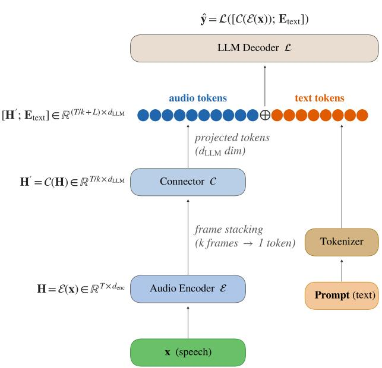
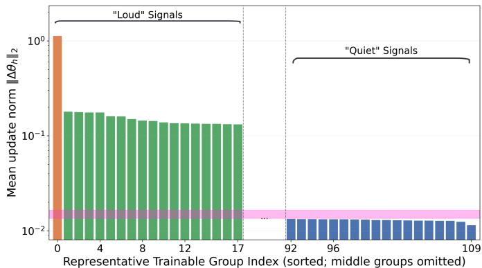
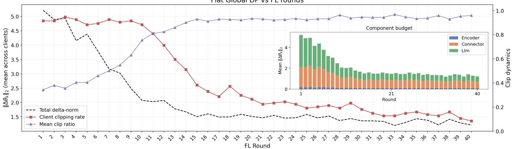
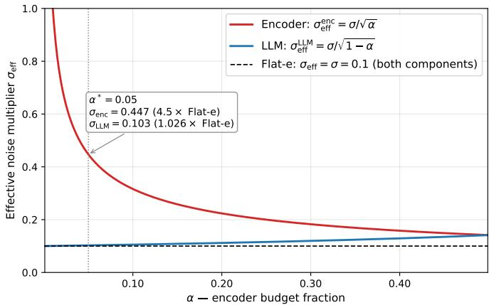
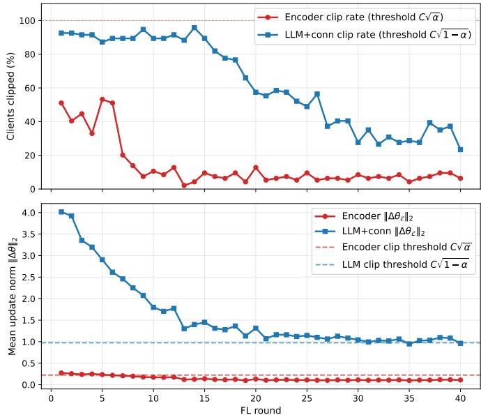

# Component-Aware Differential Privacy for Federated Multilingual Speech-LLMs

1st Jordi Luque

2nd Fernando Lopez ´

3rd Aleix Sant

Scientific Research

Telefonica Innovaci ´ on Digital ´

Scientific Research

Telefonica Innovaci´ on Digital´

Universidad Autonoma de Madrid´

Barcelona, Spain

jordi.luque@telefonica.com

Madrid, Spain

Telefonica Innovaci´ on Digital´

fernando.lopez@telefonica.com

Universitat Politecnica de Catalunya\`

Barcelona, Spain

aleix.santsavall@telefonica.com

Abstract—Per-layer differential privacy (DP) clipping improves gradient fidelity in federated learning by allocating per-matrix clipping budgets proportional to parameter count. We show that this recipe breaks for speech large language models (speech-LLMs), when the acoustic encoder and the language decoder differ by an order of magnitude in update norm. Singlepool per-layer methods suffer cross-component budget collapse, dragging word error rate (WER) far from flat global clipping or collapsing training entirely. When the norm imbalance is milder, adaptive single-pool methods partially recover, confirming that collapse severity scales with the inter-component norm ratio. We empirically diagnose the root cause across six per-layer methods and three speech-LLM architectures. We then propose α-split, a two-pool allocation that normalises encoder and LLM parameters into independent pools, and show that joint $\ell _ { 2 }$ sensitivity and the original (ε, δ)-DP guarantee are unchanged. At architecturecalibrated $\alpha ,$ our method recovers WER utility compared to flat DP, while granting the encoder 4.47× tighter per-component noise protection against speaker voice-based gradient-inversion attacks at only +2.6% LLM noise overhead.

Index Terms—federated learning, differential privacy, speech recognition, large language models, per-layer clipping, LoRA

## I. INTRODUCTION

Large language models (LLMs) and speech foundation models are increasingly combined to build end-to-end speech-LLM systems for automatic speech recognition (ASR), spoken understanding, and conversational speech applications [1], [2]. These architectures typically couple three heterogeneous components: an acoustic encoder, a cross-modal connector, and a language decoder [3], [4]. While this modular design improves transferability and downstream performance, it also introduces optimization asymmetries across components, especially in distributed and privacy-sensitive training settings.

Federated learning (FL) [5] is a natural paradigm for speech applications because raw audio is privacy-critical, bandwidthheavy, and often constrained by data governance policies. However, practical FL deployments for speech-LLMs face two challenges. First, client data are strongly non-IID across speakers, accents, microphones, and acoustic environments, which induces unstable update distributions [6]. Second, differential privacy (DP) mechanisms [7]–[9], particularly clipping-based methods, can alter optimization dynamics in ways that are not yet well understood for multimodal, multi-component models.

To achieve formal (ε, δ)-DP [8] in federated learning, gradient clipping serves as a fundamental mathematical requirement: before the server injects calibrated Gaussian noise, it must strictly bound the $\ell _ { 2 }$ sensitivity of each client update to a clipping budget C. Standard DP-FL applies a single global C to the full concatenated update. While most prior FL+DP studies report aggregate utility-privacy trade-offs using global hyperparameters [6], this approach is architecturally oblivious—encoder LoRA adapters, connector projections, and LLM adapters are clipped identically despite having fundamentally different update magnitudes and sensitivity requirements. Recent work [10] demonstrated that per-layer clipping, where each parameter matrix receives an individual budget proportional to its size, substantially outperforms flat global clipping for homogeneous single-component ASR. We show this recipe breaks for multimodal speech-LLMs.

We demonstrate that this state-of-the-art recipe [10] systematically breaks down in modular Speech-LLMs when the encoder/LLM update norm ratio is large enough. In such situations, the encoder’s vast number of parameters structurally dilutes the LLM’s clipping budget. We investigate six singlepool per-layer methods, reporting that all of them suffer severe cross-component budget collapse, driving the utility Word Error Rate (WER) either far from the flat global clipping ceiling or collapsing training entirely. To resolve this bottleneck, we formalize the necessity of component-aware privacy allocation. Our key contributions are:

1) A precise diagnosis of cross-component budget collapse: We empirically demonstrate that when encoder/LLM norm imbalances are extreme (≥ 10×), single-pool methods suffer severe budget collapse during critical early warmup rounds, necessitating a structural solution.

2) An adaptive single-pool formulation: We adapt the size-proportional per-layer clipping concept [10] to parameterised LoRA matrices and introduce a dynamic gradient norms tracking mechanism. We show that this adaptive formulation dynamically corrects mild encoder/LLM norm imbalances in Speech-LLMs.

3) The structural α-split DP design: We propose a component-aware strategy that decouples gradient normalisation into two independent pools, allocating budgets of $C \sqrt { \alpha }$ to the acoustic encoder and $C { \sqrt { 1 - \alpha } }$ to the LLM decoder. We prove that this separation entirely prevents budget collapse while strictly preserving the joint $\ell _ { 2 }$ sensitivity and the global $( \varepsilon , \delta ) – \mathrm { D P }$ mathematical guarantees.

4) Delineation of operating regimes and asymmetric biometric privacy: We map out clear deployment guidelines: Adaptive layer-based is optimal for mild imbalances (measured ≈ 1.7× for Voxtral-Mini-3B), while α-split is strictly required for extreme imbalances (measured ≈ 12× for Whisper+TinyLlama/EuroLLM). Furthermore, we show that the α-split formulation uniquely grants the acoustic encoder tighter effective noise multiplier, achieving stronger acoustic protection for sensitive biometric data at a negligible noise overhead to the LLM.

## II. SPEECH-LLM FRAMEWORK AND PRIVATE FEDERATED SETUP

## A. Speech-LLM Architecture

Speech-LLMs couple three heterogeneous components: an acoustic encoder (E), a cross-modal connector (C), and a language decoder (L), producing a transcript as:

$$
\begin{array} { r } { \hat { \mathbf { y } } = \mathcal { L } \left( \left[ \mathcal { C } ( \mathcal { E } ( \mathbf { x } ) ) ; \mathbf { E } _ { \mathrm { t e x t } } \right] \right) . } \end{array}\tag{1}
$$

Figure 1 summarises the full pipeline. All three components are trained jointly by minimising the standard autoregressive cross-entropy loss over the ground-truth transcript tokens $\mathbf { y } =$ $( y _ { 1 } , \dots , y _ { S } )$

$$
\mathcal { L } _ { \mathrm { C E } } ( \pmb { \theta } ) = - \sum _ { s = 1 } ^ { S } \log p _ { \pmb { \theta } } \left( y _ { s } \mid \mathcal { C } ( \mathcal { E } ( \mathbf { x } ) ) , \mathbf { E } _ { \mathrm { t e x t } } , y _ { < s } \right) ,\tag{2}
$$

where θ collects all trainable parameters (LoRA adapters and connector projection), and $y _ { < s }$ denotes the preceding tokens supplied via teacher forcing. The loss is computed over transcript tokens; audio tokens and prompt embeddings appear as conditioning context. We study a three-component Speech-LLMs: a Whisper large-v3-turbo encoder [11] E, a linear connector C, and a TinyLlama-1.1B [12] (or EuroLLM-1.7B-Instruct [13]) decoder $\mathcal { L } ;$ and additionally evaluate Voxtral-Mini-3B [14] an end-to-end multimodal Speech-LLM, composed of a Whisper-large-v3-based audio encoder and a Ministral-3B [15] LLM, a 30-layer Llama-style text decoder; jointly pretrained on audio understanding and ASR tasks. Voxtral uses a different connector C, downsampling the audio by a factor of 4, followed by a 2-layer MLP projector; a deeper, higher-compression connector.

## B. Central DP-FL Trust Model

We adopt the central DP trust model [8], [9], i.e. the aggregation server is trusted, each client clips its own update to bound $\ell _ { 2 }$ sensitivity, and the server adds calibrated Gaussian noise to the aggregate, thus privacy is guaranteed against any external observer of the released model sequence. Each client clips its update before transmission:

  
Fig. 1: Speech-LLM architecture. The audio encoder $\varepsilon$ maps raw speech x to frame-level representations H. The connector C downsamples frames, reducing sequence length by k. The LLM decoder L generates the transcript yˆ conditioned on the projected tokens and a task prompt.

TABLE I: LoRA parameter p using rank=8 for Whisper + TinyLlama Speech-LLM, applied to queries (q), keys (k) and values (v) in attention heads.
<table><tr><td>Component</td><td>Matrices</td><td>Avg. params</td><td>Total</td></tr><tr><td>Encoder (E, q/k/v, 32L)</td><td>64</td><td>10,240</td><td>1,966,080</td></tr><tr><td>LLM (L, q/v, 22L)</td><td>44</td><td>16,384</td><td>720,896</td></tr><tr><td>Connector (C, weight+bias)</td><td>2</td><td>2,048</td><td>4,096</td></tr><tr><td>Total (H)</td><td>110</td><td></td><td>2,691,072</td></tr></table>

$$
\widetilde { \Delta \pmb { \theta } } ^ { ( i ) } = \Delta \pmb { \theta } ^ { ( i ) } \cdot \operatorname* { m i n } \left( 1 , \ \frac { C } { \left\| \Delta \pmb { \theta } ^ { ( i ) } \right\| _ { 2 } } \right) ,\tag{3}
$$

and the server aggregates with Gaussian noise:

$$
\pmb \theta ^ { ( t + 1 ) } = \pmb \theta ^ { ( t ) } + \frac { 1 } { n } \sum _ { i = 1 } ^ { n } \widetilde { \Delta \pmb \theta } ^ { ( i ) } + \mathcal { N } \bigg ( \mathbf 0 , \frac { \sigma ^ { 2 } C ^ { 2 } } { n ^ { 2 } } \mathbf I \bigg ) .\tag{4}
$$

The $\ell _ { 2 }$ sensitivity of the clipped aggregate is $C / n ,$ so σ is the noise multiplier relative to the sensitivity. All experiments use $C { = } 1 . 0 , \sigma { = } 0 . 1 ;$ privacy accounting uses Renyi DP [16]. Note´ that in the case of FedAvg [5] for Speech-LLMs, each client i computes the full parameter delta as a flat concatenation:

$$
\Delta \pmb { \theta } ^ { ( i ) } = \big [ \Delta \pmb { \theta } _ { \mathscr { E } } ^ { ( i ) } , \Delta \pmb { \theta } _ { \mathscr { C } } ^ { ( i ) } , \Delta \pmb { \theta } _ { \mathscr { L } } ^ { ( i ) } \big ] .\tag{5}
$$

Table I summarises the LoRA parameter counts. The encoder represents 73.1% of all LoRA parameters, yet each encoder matrix is considerably smaller than an LLM attention matrix.

## C. Heterogeneous Dataset and Speaker Partitioning

1) Corpus: All experiments use the Multilingual LibriSpeech (MLS) corpus [17], an audiobook corpus covering 8 European languages derived from LibriVox recordings. We use the official MLS train splits as the federated training pool (685.7 h total), the MLS dev split for validation during training, and the MLS test split as the held-out evaluation benchmark (138 h, 19,492 samples).

2) Speaker Data Partition (non-IID): We perform a stratified speaker-based partition that assigns all utterances of a single MLS speaker to one client. With $K { = } 3 1 6$ clients, this creates the strongest possible non-IID distribution: each client’s data is drawn from a single acoustic identity, language, and recording environment, producing simultaneous linguistic (each client speaks at most one language) and acoustic (microphone, room, speaking rate) heterogeneity. Due to the LibriVox origin of MLS, 8 of 316 clients (2.5%) correspond to speakers also present in the MLS test split, accounting for 4,747 of 169,586 training samples (2.8%). All FL experiments in this work use this partition.

## D. Federated Optimization Configuration

All FL experiments use the Flower simulation framework with Ray as the backend [18]. All FL experiments train for $T { = } 4 0$ global rounds across a total population of $K = 3 1 6$ speaker-partitioned clients; in each round, a random cohort of $n \ \approx$ 94 clients (sampling rate $q \ = \ 0 . 3 )$ . Local clients perform $E { = } 1 0$ local epochs of fine-tuning before aggregation, using AdamW optimiser with maximum learning rate $\eta { = } 1 0 ^ { - 4 }$ cosine decay, batch size 16. Evaluation uses the MLS test split with overall WER reported across all 8 languages combined. All models are fine-tuned with LoRA [19] adapters applied to all query, key, value for encoder and query, value for LLM decoder heads. Unlike the encoders and LLM decoders, which carry rich pretrained representations, we initialise the multimodal connector from scratch, except for Voxtral, and must learn to bridge audio and text modalities entirely from the federated fine-tuning data.

## III. CROSS-COMPONENT BUDGET COLLAPSE

## A. Empirical Gradient-Norm Asymmetries

With flat or global clipping, see Eq. (3), every LoRA matrix is scaled by the same ratio scalar r:

$$
\widetilde { \Delta \pmb { \theta } } _ { k } ^ { ( i ) } = r ^ { ( i ) } \Delta \pmb { \theta } _ { k } ^ { ( i ) } ,\tag{6}
$$

with $\begin{array} { r } { r ^ { ( i ) } = \operatorname* { m i n } \Bigl ( 1 , \frac { C } { \| \Delta \theta ^ { ( i ) } \| _ { 2 } } \Bigr ) } \end{array}$ , the per-client i ratio.

Fig. 2 depicts the empirical per-matrix update norms from a federated training non-DP with all components unfrozen. Two clusters are clearly separated by an order of magnitude: LLM matrices (green, ≈0.1–0.2) and encoder LoRA matrices (blue, ≈0.01–0.02). The pink band marks the Gaussian noise floor $\sigma C / \sqrt { n } \approx 0 . 0 1$ : encoder updates already sit at the noise level under flat DP, while LLM updates remain well above it. When the LLM pool dominates $\| \Delta \pmb { \theta } ^ { ( i ) } \| _ { 2 } , r ^ { ( i ) }$ is driven toward $C / \| \Delta \theta _ { \mathcal { L } } ^ { ( i ) } \| _ { 2 }$ , and the encoder pool, with norms already

  
Fig. 2: Mean update norm $\| \Delta \theta _ { h }$ ∥2 per-Trainable Group h, i.e. LoRA matrix (log scale, sorted descending, with no-DP and all components unfrozen) for the Whisper + TinyLlama Speech-LLM. Green bars stand for LLM LoRA matrices. Blue correspond to encoder LoRA matrices. Orange (index 0) to connector (single full-rank matrix). Pink band: Gaussian noise floor $\sigma C / \sqrt { n } { \approx } 0 . 0 1$

10× smaller, is suppressed further toward the noise floor. This ${ \sim } 1 0 \times$ per-matrix norm gap drives the cross-component budget collapse, where encoder matrices collectively absorb a disproportionate share of the $C ^ { 2 }$ budget.

## B. SNR Suppression under Global Clipping

We can quantify this suppression via the per-component signal-to-noise ratio (SNR). After aggregating n clients, the per-parameter signal of component $h$ is $\lVert \tilde { \Delta { \pmb { \theta } } _ { h } } \rVert _ { 2 } / \sqrt { p _ { h } }$ , while the per-parameter noise standard deviation from the Gaussian mechanism (4) is $\sigma C / n$ . Thus:

$$
\mathrm { S N R } _ { h } = \frac { \left\| \widetilde { \Delta \pmb { \theta } } _ { h } \right\| _ { 2 } / \sqrt { p _ { h } } } { \sigma C / n } .\tag{7}
$$

Thus the ratio between two components depends only on their clipped norms and parameter counts:

$$
\frac { \mathrm { S N R } _ { \varepsilon } } { \mathrm { S N R } _ { \mathscr { L } } } = \frac { \| \widetilde { \Delta \pmb { \theta } } _ { \varepsilon } \| _ { 2 } / \sqrt { p \varepsilon } } { \| \widetilde { \Delta \pmb { \theta } } _ { \mathscr { L } } \| _ { 2 } / \sqrt { p \varepsilon } } .\tag{8}
$$

Under LLM-dominant global clipping, every client’s update is scaled by $r ^ { ( i ) } \approx C / \| \bar { \Delta { \pmb { \theta } } _ { \mathscr { L } } ^ { ( i ) } } \| _ { 2 }$ , so both components share the same $r ^ { ( i ) }$ and the ratio reduces to a norm-and-size comparison. With per-matrix norms differing one order of magnitude and similar per-matrix parameter counts (see Table I), the per-layer encoder signal is ≈10× weaker than the LLM’s. Since the noise floor is identical for both pools, the encoder operates at $\mathrm { S N R } _ { \varepsilon } \approx 0 . 1 \mathrm { S N R } _ { \mathcal { L } }$ under global clipping. Fig. 3 confirms that this structural imbalance persists dynamically under flat DP with all components unfrozen, LLM+connector-dominated global norms keep the clipping rate high across all 40 rounds, leaving the encoder signal consistently noise-dominated during training.

## IV. EVALUATED DP METHODS

We perform FL-DP experiments using different strategies to allocate the C budget across the layers of a Speech-LLM. All methods share common C=1.0 budget, $\sigma { = } 0 . 1$ , and server

  
Fig. 3: Flat DP with all unfrozen components (Flat-e baseline, 40 rounds, $C { = } 1 . 0 ,$ averaging 94 clients/round). Main panel (left axis, dashed): mean total joint update norm $\lVert \Delta \pmb { \theta } ^ { ( i ) } \rVert _ { 2 }$ across clients. Right axis: client clipping rate (red, fraction of clients whose update norm exceeds C) and mean clip ratio $\begin{array} { r } { \bar { r } ^ { ( t ) } = \bar { \frac { 1 } { n t } } \sum _ { i } } \end{array}$ min(1, $C / | | \overset { \cdot \cdot } { \Delta } \pmb { \theta } ^ { ( i ) } | | _ { 2 } )$ (purple), i.e. the average fraction of each update that survives clipping before aggregation; $\bar { r } ^ { ( t ) } = 1$ means no client is clipped, while $\bar { r } ^ { ( t ) } \ll 1$ means updates are severely truncated. Inset: mean per-component norm budget per round (encoder blue, connector orange, LLM green). LLM and connector norms dominate throughout, sustaining a high global clip rate (>80%) that suppresses the encoder signal to the noise floor.

Gaussian noise ${ \mathcal { N } } ( 0 , ( \sigma C / n ) ^ { 2 } \mathbf { I } )$ . The methods in [10] replace the single global clip in (3) with per-layer ℓ budgets that partition $C ^ { 2 }$ proportionally to layer (LoRA rank matrix) size, $p _ { \ell } \colon$

$$
C _ { \ell } = C \cdot \sqrt { \frac { p _ { \ell } } { \sum _ { k } p _ { k } } } , \quad \mathrm { s o ~ t h a t } \quad \sqrt { \sum _ { \ell } C _ { \ell } ^ { 2 } } = C .\tag{9}
$$

This Euclidean-tight allocation [10] was originally designed for homogeneous single-component models with full-rank updates and is the basis for all methods we study:

• Flat: refers to DP-FedAvg baseline [9], i.e. a single norm C is applied to the full concatenated update in Eq. 5, so no per-layer structure.

• PFL-Uniform: we split uniformly the budget among LoRA matrices: $C _ { \ell } = C / \sqrt { H }$ , regardless of size. Where H is the total number of matrices, i.e. adapted layers.

• PFL-Dim: size-proportional allocation via Eq. (9); the “dim-prop” variant from [10], adapted for LoRA rank matrices.

• PFL-Unif+EMA and PFL-Dim+EMA (adaptive): we implemented original exponential moving average (EMA) variants that dynamically reweight per-layer budgets from observed gradient norms. At each FL round t, a smoothed per-layer norm estimate is updated as

$$
\begin{array} { r } { \hat { \nu } _ { \ell } ^ { ( t ) } = \left( 1 - \beta \right) \hat { \nu } _ { \ell } ^ { ( t - 1 ) } + \beta \nu _ { \ell } ^ { ( t ) } , } \end{array}\tag{10}
$$

where $\nu _ { \ell } ^ { ( t ) }$ is the mean client delta-norm for layer ℓ in round t, $\beta { = } 0 . 2$ is the decay rate (higher $\beta =$ faster adaptation). Allocation weights and per-layer norms are then:

$$
w _ { \ell } ^ { \mathrm { t a r g e t } } \propto \left( \hat { \nu } _ { \ell } \right) ^ { \gamma } \cdot w _ { \ell } ^ { \mathrm { b a s e } } , \qquad C _ { \ell } = C _ { t } \sqrt { w _ { \ell } } ,\tag{11}
$$

with $\gamma { = } 0 . 7 5$ and $w _ { \ell } ^ { \mathrm { b a s e } }$ equal to the PFL-Dim or PFL-Unif initialisation for each respective variant. Weights are frozen at $w _ { \ell } ^ { \mathrm { b a s e } }$ for the first three warmup rounds.

TABLE II: Encoder and LLM (Whisper + TinyLlama) per-layer clip norms vs. α. Flat-e reference: $\bar { C } _ { \ell } ^ { \mathrm { L L M } } = 0 . 1 \dot { 4 } 7 4 .$
<table><tr><td>α</td><td> $\bar { C } _ { \ell } ^ { \mathrm { e n c } }$ </td><td> $\bar { C } _ { \ell } ^ { \mathrm { L L M } }$ </td><td>LLM / Flat-e</td><td>Note</td></tr><tr><td>0.00</td><td>0.000</td><td>0.1503</td><td>1.020</td><td>Enc. frozen</td></tr><tr><td>0.01</td><td>0.013</td><td>0.1495</td><td>1.014</td><td>Min. enc. signal</td></tr><tr><td>0.05</td><td>0.028</td><td>0.1465</td><td>0.994</td><td>&lt;1% LLM loss</td></tr><tr><td>0.10</td><td>0.040</td><td>0.1426</td><td>0.967</td><td>&lt;5% LLM loss</td></tr><tr><td>0.20</td><td>0.056</td><td>0.1345</td><td>0.912</td><td>PFL-Dim+EMA-e steady-state</td></tr><tr><td>0.50</td><td>0.088</td><td>0.1063</td><td>0.721</td><td>Half budget each</td></tr></table>

• α-Split (static): encoder and LLM+connector treated as independent pools with budgets $C \sqrt { \alpha }$ and $C \sqrt { 1 - \alpha }$ . Fully described in following Section IV-A.

The -e suffix (e.g. PFL-Dim-e) denotes the encoderunfrozen variant; bare names denote encoder-frozen training.

## A. The α-Split Design

1) Formulation: Let $\alpha ~ \in ~ ( 0 , 1 )$ be a component budget fraction hyperparameter controlling what share of $C ^ { 2 }$ is allocated to the encoder. Encoder and LLM+connector parameters are clipped with independent per-layer budgets:

$$
C _ { \ell } ^ { e n c } = C \sqrt { \alpha } \sqrt { \frac { p _ { \ell } } { \sum _ { k \in \mathcal { E } } p _ { k } } } , \quad \ell \in \mathcal { E }\tag{12}
$$

$$
C _ { \ell } ^ { L L M } = C \sqrt { 1 - \alpha } \sqrt { \frac { p _ { \ell } } { \sum _ { k \in \mathcal { L } } p _ { k } } } , \quad \ell \in \mathcal { L } .\tag{13}
$$

Each pool is internally Euclidean-tight. Note that the connector is included in ${ \mathcal { L } } ,$ because assigning it to $\mathcal { E }$ would incorrectly inflate the encoder budget. For the linear connector used in Whisper + {TinyLlama,EuroLLM} the two matrices total ∼4,096 parameters and are indeed negligible within L.

2) Sensitivity and Privacy Preservation: Let $\begin{array} { r l } { c \varepsilon } & { { } = } \end{array}$ $\| { \mathrm { c l i p p e d } } _ { \mathcal { E } } \| _ { 2 }$ and $c _ { \mathcal { L } } = \| \mathrm { c l i p p e d } _ { \mathcal { L } } \| _ { 2 }$ . Then the $\ell _ { 2 }$ sensitivity is:

$$
\begin{array} { r } { \Delta = \sqrt { c _ { \mathcal { E } } ^ { 2 } + c _ { \mathcal { L } } ^ { 2 } } \leq \sqrt { \alpha C ^ { 2 } + ( 1 - \alpha ) C ^ { 2 } } = C . } \end{array}\tag{14}
$$

  
Fig. 4: Effective per-component noise multiplier vs. encoder budget fraction α. Solid lines: $\alpha { - } S p l i t { - } e$ (encoder red, LLM blue). Dashed: Flat-e reference $( \sigma _ { \mathrm { e f f } } = \sigma$ for both). At $\alpha ^ { * } { = } 0 . 0 5$ (vertical dotted line) the encoder receives $4 . 4 7 \times$ tighter per-component privacy at only +2.6% LLM overhead, with no change to the joint (ε, δ) guarantee.

The sensitivity is unchanged at C. The server Gaussian noise ${ \mathcal { N } } ( 0 , ( \sigma C / n ) ^ { 2 } \mathbf { I } )$ requires no modification, and the Renyi DP´ accountant, ε, and δ are all identical to $F l a t { - } D P .$ . Thus α is a pure utility-vs-component-privacy parameter.

3) Choosing α: Table II shows the LLM per-layer budget as a function of α. We select $\alpha = 0 . 0 5$ because (i) the LLM retains 99.4% of its Flat-e budget with negligible regression risk; (ii) the encoder clip norm (0.028) is ≈2× the observed encoder delta-norm (0.013), providing sufficient gradient signal without near-100% clipping. Note that both criteria depend solely on parameter counts and the encoder/LLM update-norm ratio, which can be measured on any public corpus before deployment, making α selection fully privacy-compatible.

4) Per-Component Privacy Advantage: Note that Flat-DP should achieve the utility ceiling (lower WER for ASR task) for any per-layer strategy at the same $( \varepsilon , \delta )$ . Any per-layer method at the same global sensitivity C calibrates noise to $C ,$ so min $( \sigma _ { \mathrm { e f f } } ^ { \varepsilon } , \sigma _ { \mathrm { e f f } } ^ { \mathcal { L } } ) \geq \sigma$ . The genuine advantage of α-split is asymmetric per-component privacy. Because the encoder pool is bounded at $C \sqrt { \alpha } .$ , its effective noise multiplier is $\begin{array} { r } { \sigma _ { \mathrm { e f f } } ^ { \mathcal { E } } = \frac { \sigma } { \sqrt { \alpha } } = 0 . 4 4 7 . } \end{array}$ , which is $4 . 4 7 \times$ that of $F l a t { - } e ,$ , while the LLM pays only $\begin{array} { r } { \sigma _ { \mathrm { e f f } } ^ { \mathcal { L } } = \frac { \sigma } { \sqrt { 1 - \alpha } } = 0 . 1 0 3 } \end{array}$ , which is only +2.6% vs. Flat-e. Fig. 4 visualises $\sigma _ { \mathrm { e f f } }$ as a function of $\alpha ,$ , confirming the steep encoder privacy gain and flat LLM overhead for small α. Since the encoder pool is bounded at $C \sqrt { \alpha } .$ , an adversary performing gradient inversion learns 4.47× less about acoustic encoder updates, directly guarding speaker biometric attributes (accent, prosody, voice identity). Note that what α-split changes is the per-component interpretation: standard global clipping mixes acoustic and linguistic gradients into a single pool, whereas α-split structurally isolates the encoder’s biometric representations, providing a privacy guarantee that per-layer single-pool methods cannot achieve regardless of their budget allocation.

5) Training Dynamics and Clipping Rate Analysis: Fig. 5 shows the per-component clipping rate vs. FL round for the α-Split-e run $( \alpha { = } 0 . 0 5 , ~ C { = } 1 . 0 $ , averaging 94 clients/round). Two distinct regimes emerge: the encoder clip rate starts at ≈51% (rounds 1–6) and quickly falls to 5–14% once its norm stabilises well below the 0.224 threshold; the LLM+connector starts at ≈93% clip rate (norm ≈4.0) and converges gradually to 25–40% by round 40. The low encoder clipping rate after round 8 confirms that α-Split is structurally non-destructive. Because DP guarantees depend on bounding worst-case sensitivity rather than active clip frequency, this mechanism enforces the biometric privacy bound while keeping clipping bias minimal once training stabilises.

  
Fig. 5: Top: Per-component client clipping rate per FL round under α-Split-e $( \alpha { = } 0 . 0 5 , C { = } 1 . 0 ,$ 94 clients/round). Red: encoder pool $( C \sqrt { \alpha } { = } 0 . 2 2 4 ) ;$ blue: LLM+connector pool $( C \sqrt { 1 - \alpha } \mathrm { { = } } 0 . 9 7 5 )$ . Bottom: Mean update norm $\| \Delta \pmb { \theta } \| _ { 2 }$ per component—encoder $\| \Delta \theta \varepsilon \| _ { 2 }$ (red) and LLM+connector $\| \dot { \Delta } \pmb { \theta } _ { \mathcal { L } } \| _ { 2 }$ 2 (blue)—with dashed lines at the respective pool clip thresholds.

## V. EXPERIMENTAL RESULTS

Table III compares the utility of all methods on the MLS test split. Statistical significance of WER differences is assessed using speaker-level percentile bootstrap test speakers $( \scriptstyle { B = 1 0 , 0 0 0 } )$ , 95% CI), with all utterances from each sampled speaker included to preserve within-speaker correlations [20].

## A. Encoder-Frozen Variants

When the encoder is frozen, cross-component coupling is absent and results are consistent across all three architectures. PFL-Dim+EMA achieves the best DP result in every group (W+TinyLlama: 0.1657; W+EuroLLM: 0.1362; Voxtral: 0.1450), outperforming Flat by 0.0028–0.0082. PFL-Uniform degrades severely in all frozen groups (0.4643 for W+TinyLlama, 0.3500 for W+EuroLLM), confirming equalbudget-per-layer is harmful regardless of architecture. Notably, α-Split slightly underperforms Flat for EuroLLM frozen (+0.0128 vs. +0.0114): with the encoder inactive the entire budget falls on LLM layers under any method, so the two-pool design yields no structural advantage.

TABLE III: WER on MLS test split (19,492 samples, C=1.0, σ=0.1, 40 FL rounds). Gap = WER−FedAvg (no DP) per group. †: collapsed (WER>0.5). ∗: mean over 3 seeds; std ≤ 0.02. Bold: best DP result per group/column; —: not evaluated.
<table><tr><td rowspan="2">Method</td><td colspan="2">Enc. frozen</td><td colspan="2">Enc. unfrozen</td></tr><tr><td>WER</td><td>Gap</td><td>WER</td><td>Gap</td></tr><tr><td>Whisper+TinyLlama-1.1B</td><td></td><td></td><td></td><td></td></tr><tr><td>FedAvg (no DP) Flat</td><td>0.1415</td><td></td><td>0.1842</td><td></td></tr><tr><td>PFL-Uniform</td><td>0.1685</td><td>+0.0270</td><td>0.1959*</td><td>+0.0117</td></tr><tr><td>PFL-Dim</td><td>0.4643</td><td>+0.3228</td><td>0.9944†</td><td>+0.8102†</td></tr><tr><td></td><td>0.1711</td><td>+0.0296</td><td>0.3051</td><td>+0.1209</td></tr><tr><td>PFL-Dim+EMA</td><td>0.1657</td><td>+0.0242</td><td>0.2599*</td><td>+0.0757</td></tr><tr><td>PFL-Unif+EMA</td><td>0.2360</td><td>+0.0945</td><td>0.8243†</td><td>+0.6401†</td></tr><tr><td>α-Split</td><td>0.1677</td><td>+0.0262</td><td>0.1986*</td><td>+0.0144</td></tr><tr><td>FedAvg (no DP)</td><td>Whisper+EuroLLM-1.7B-Instruct</td><td></td><td></td><td></td></tr><tr><td></td><td>0.1330</td><td></td><td>0.1757</td><td></td></tr><tr><td>Flat</td><td>0.1444</td><td>+0.0114</td><td>0.1457</td><td>-0.0300</td></tr><tr><td>PFL-Uniform</td><td>0.3500</td><td>+0.2170</td><td></td><td></td></tr><tr><td>PFL-Dim</td><td>0.1381</td><td>+0.0051</td><td>0.1975</td><td>+0.0218</td></tr><tr><td>PFL-Dim+EMA</td><td>0.1362</td><td>+0.0032</td><td>0.1845</td><td>+0.0088</td></tr><tr><td>PFL-Unif+EMA</td><td>0.1780</td><td>+0.0450</td><td>0.4769</td><td>+0.3012</td></tr><tr><td>α-Split</td><td>0.1458</td><td>+0.0128</td><td>0.1600</td><td>-0.0157</td></tr><tr><td>Voxtral-Mini-3B</td><td></td><td></td><td></td><td></td></tr><tr><td>FedAvg (no DP)</td><td>0.1442</td><td></td><td>0.1362</td><td></td></tr><tr><td>Flat</td><td>0.1478</td><td>+0.0036</td><td>0.1467</td><td>+0.0105</td></tr><tr><td>PFL-Dim+EMA</td><td>0.1450</td><td></td><td></td><td></td></tr><tr><td></td><td></td><td>+0.0008</td><td>0.1413</td><td>+0.0051</td></tr><tr><td>α-Split</td><td></td><td></td><td>0.1495</td><td>+0.0133</td></tr></table>

B. Encoder-Unfrozen Variants and Cross-Component Collapse

Activating the encoder exposes the cross-component budget collapse across all single-pool methods. On Whisper+TinyLlama, α-Split-e remains the only per-layer method that avoids catastrophic degradation. PFL-Uniform-e/PFL-Unif+EMA-e collapse (0.9944†/0.8243†); PFL-Dim-e and PFL-Dim+EMA-e regress +63% and +30% vs. Flat-e. The PFL-Uniform-e→PFL-Unif+EMA-e comparison suggests that EMA cannot rescue a structurally broken base allocation. α- Split-e stays within 0.003 absolute of the Flat-e (0.1959), the utility ceiling for any per-layer method at the same (ε, δ) (Section IV-A4). Repeating Flat-e, PFL-Dim+EMA-e, and α- Split-e with two additional random seeds yields std ≤ 0.02 for all three, confirming the rankings are stable across training runs.

On Whisper+EuroLLM the same replicates on a stronger multilingual backbone, confirming that cross-component degradation is architectural. PFL-Dim-e (0.1975) and PFL-Dim+EMA-e (0.1845) regress vs. Flat-e (0.1457); PFL-Unif+EMA-e collapses to 0.4769. α-Split-e (0.1600) is again the only per-layer method avoiding regression, reducing the gap to Flat-e from +0.0388 to +0.0143. Both Flat-e (−0.0300) and α-Split-e (−0.0157) outperform the no-DP FedAvg baseline (0.1757), consistent with gradient clipping acting as implicit regularisation under the unstable default encoder lr.

On Voxtral-Mini-3B the regime differs: a dedicated no-DP profiling run confirms a steady-state LLM/encoder norm ratio of only ≈1.7× (vs. ≈12× for Whisper+TinyLlama). At this milder imbalance, PFL-Dim+EMA-e does not collapse (0.1413, +0.0051); EMA adaptation suffices without structural pool separation. α-Split-e (0.1495) is the worst DP method: the fixed α=0.05 over-clips the encoder (clip/norm ≈0.04) whose gradient magnitude is comparable to the LLM at this ratio. Together, the three architectures delineate the operating regime: $\alpha { = } 0 . 0 5$ is optimal when the encoder/LLM norm ratio is ≥12×; PFL-Dim+EMA-e is the safer default when the ratio is unknown or substantially below 12×.

## VI. DISCUSSION

Although $\alpha = 0 . 0 5$ is well-calibrated for the extreme ≈12× norm imbalance in Whisper + TinyLlama architecture, it should not be applied blindly. In practice, α can be selected dynamically by observing component delta-norms during a few non-DP warmup rounds, as shown in Table II. Architectures with milder imbalances (e.g., Voxtral at ≈1.7×) do not require a structural pool split, and adaptive single-pool methods like PFL-Dim+EMA suffice. Blindly imposing $\alpha = 0 . 0 5$ in such regimes over-clips the encoder, as confirmed by our Voxtral results in Table III.

While unfreezing the encoder under non-private FedAvg degrades performance due to default learning rate sensitivity in Whisper + TinyLlama (yet improves Voxtral-Mini-3B), DP clipping actually outperforms this baseline on EuroLLM. This might appear to indicate a poorly tuned baseline, but controlled learning-rate sweep shows that optimising the encoder lr (×0.02) brings no-DP FedAvg to WER 0.1196, far below every DP result, see Appendix for further details. The DP-over-FedAvg result at default lr reflects that DP sensitivity bounds act as an implicit regularizer, dampening divergent encoder updates under unstable optimisation scales [21]. The Table III comparison is internally consistent: all DP methods use the same default lr as the FedAvg baseline, so the relative DP– FedAvg gap is meaningful; only the absolute WER level would shift under a tuned lr. Crucially, encoder learning rate tuning and α-split are complementary, not interchangeable. Reducing the encoder learning rate (e.g., by 50×) shrinks the crosscomponent norm gap without altering the DP mechanism, but it lowers the encoder’s gradient signal-to-noise ratio under DP noise. By contrast, our proposed α-split formulation preserves the encoder’s full learning rate while granting a 4.47× tighter component-specific privacy protection, structurally resolving the bottleneck of excessive gradient truncation.

## VII. CONCLUSION

We identified cross-component budget collapse as a failure of single-pool per-layer DP clipping in Speech-LLMs, where encoder updates dilute the LLM clipping budget and cause severe utility regressions. Our proposed α-Split-e design resolves this pathology by decoupling the encoder and LLM updates into independent pools. At an architecture-calibrated $\alpha = 0 . 0 5$ α-Split-e achieves utility close to both flat DP and non-DP baselines on Whisper+TinyLlama, while providing 4.47× tighter biometric privacy protection for the speech encoder.

On the Whisper+EuroLLM architecture, α-Split-e yields the best per-layer DP results, outperforming our adaptive PFL-Dim+EMA-e baseline by 2.45% absolute—confirming that cross-component budget collapse is structural and independent of the LLM backbone. Conversely, on Voxtral-Mini-3B, which exhibits a mild gradient-norm imbalance (≈1.7×), our adaptive PFL-Dim+EMA-e formulation achieves the best overall DP utility. Our findings establish clear deployment boundaries: a structural α-split is optimal for extreme component imbalances (≥ 12×), whereas the dynamic PFL-Dim+EMA-e serves as the more robust default for balanced architectures.

## AI-GENERATED CONTENT DISCLOSURE

We used a generative AI to assist in paraphrasing, improving clarity and grammar in parts of the manuscript and coding assistance. All generated content was reviewed and validated by the authors.

## ACKNOWLEDGMENT

This work has received funding from the European Union’s Horizon Europe research and innovation programme under the project ELOQUENCE (Grant Agreement No. 101135916). This work was supported by computational resources from the EuroHPC Joint Undertaking under the EuroHPC AI Factory grant EHPC-AIF-2026LS01-004.

## REFERENCES

[1] W. Cui, D. Yu, X. Jiao, Z. Meng, G. Zhang, Q. Wang, S. Y. Guo, and I. King, “Recent advances in speech language models: A survey,” in Proceedings of the 63rd Annual Meeting of the Association for Computational Linguistics (Volume 1: Long Papers), W. Che, J. Nabende, E. Shutova, and M. T. Pilehvar, Eds. Vienna, Austria: Association for Computational Linguistics, Jul. 2025, pp. 13 943–13 970. [Online]. Available: https://aclanthology.org/2025.acl-long.682/

[2] X. Fan, Z. Sun, Gao et al., “What makes a good speech tokenizer for llm-centric speech generation? a systematic study,” in Proceedings of the Fortieth AAAI Conference on Artificial Intelligence and Thirty-Eighth Conference on Innovative Applications of Artificial Intelligence and Sixteenth Symposium on Educational Advances in Artificial Intelligence, ser. AAAI’26/IAAI’26/EAAI’26. AAAI Press, 2026. [Online]. Available: https://doi.org/10.1609/aaai.v40i36.40318

[3] Z. Ma, G. Yang, Y. Yang, Z. Gao, J. Wang, Z. Du, F. Yu, Q. Chen, S. Zheng, S. Zhang, and X. Chen, “An embarrassingly simple approach for llm with strong asr capacity,” CoRR, vol. abs/2402.08846, 2024. [Online]. Available: https://doi.org/10.48550/arXiv.2402.08846

[4] X. Zhang, D. Zhang, S. Li, Y. Zhou, and X. Qiu, “Speechtokenizer: Unified speech tokenizer for speech language models,” in The Twelfth International Conference on Learning Representations, ICLR 2024, Vienna, Austria, May 7-11, 2024. OpenReview.net, 2024. [Online]. Available: https://openreview.net/forum?id=AF9Q8Vip84

[5] B. McMahan, E. Moore, D. Ramage, S. Hampson, and B. Aguera¨ y Arcas, “Communication-efficient learning of deep networks from decentralized data,” in Proceedings of the 20th International Conference on Artificial Intelligence and Statistics, ser. Proceedings of Machine Learning Research, vol. 54. PMLR, 2017, pp. 1273–1282.

[6] P. Kairouz, H. B. McMahan, B. Avent, A. Bellet, M. Bennis, A. N. Bhagoji, K. Bonawitz, Z. Charles, G. Cormode, R. Cummings et al., “Advances and open problems in federated learning,” Foundations and Trends in Machine Learning, vol. 14, no. 1–2, pp. 1–210, 2021.

[7] C. Dwork, “Differential privacy,” in Proceedings of the 33rd International Conference on Automata, Languages and Programming - Volume Part II, ser. ICALP’06. Berlin, Heidelberg: Springer-Verlag, 2006, p. 1–12. [Online]. Available: https://doi.org/10.1007/11787006 1

[8] C. Dwork and A. Roth, The Algorithmic Foundations of Differential Privacy. Now Publishers, 2014, vol. 9, no. 3–4.

[9] H. B. McMahan, D. Ramage, K. Talwar, and L. Zhang, “Learning differentially private recurrent language models,” in International Conference on Learning Representations, 2018. [Online]. Available: https://openreview.net/forum?id=BJ0hF1Z0b

[10] M. Pelikan, S. S. Azam, V. Feldman, J. H. Silovsky, K. Talwar, C. Brinton, and T. Likhomanenko, “Enabling differentially private federated learning for speech recognition: Benchmarks, adaptive optimizers, and gradient clipping,” in Annual Conference on Neural Information Processing Systems 2025, NeurIPS 2025, San Diago, CA, USA, December 2-7, 2025. [Online]. Available: https://papers.nips.cc/paper files/paper/2025/hash/ a0f30168b3acb17101cbb1ea46e76aac-Abstract-Conference.html

[11] A. Radford, J. W. Kim, T. Xu, G. Brockman, C. McLeavey, and I. Sutskever, “Robust speech recognition via large-scale weak supervision,” in Proceedings of the 40th International Conference on Machine Learning, ser. Proceedings of Machine Learning Research, vol. 202. PMLR, 2023, pp. 28 492–28 518.

[12] P. Zhang, G. Zeng, T. Wang, and W. Lu, “TinyLlama: An opensource small language model,” arXiv preprint arXiv:2401.02385, 2024. [Online]. Available: https://arxiv.org/abs/2401.02385

[13] P. H. Martins, P. Fernandes, J. Alves, A. Agrawal, M. A. Farajian, R. Lopes, R. Rei, P. Zaremoodi, N. M. Guerreiro, A. F. T. Martins et al., “EuroLLM: Multilingual language models for europe,” arXiv preprint arXiv:2409.16235, 2024. [Online]. Available: https://arxiv.org/abs/2409.16235

[14] H. Liu et al., “Voxtral,” arXiv preprint arXiv:2507.13264, 2025. [Online]. Available: https://arxiv.org/abs/2507.13264

[15] ——, “Ministral 3,” 2026. [Online]. Available: https://arxiv.org/abs/ 2601.08584

[16] I. Mironov, “Renyi differential privacy,” in´ Proceedings ofthe 30th IEEE Computer Security Foundations Symposium. IEEE, 2017, pp. 263–275.

[17] V. Pratap, Q. Xu, A. Sriram, G. Synnaeve, and R. Collobert, “MLS: A large-scale multilingual dataset for speech research,” in Proceedings of Interspeech, 2020, pp. 2757–2761.

[18] D. J. Beutel, T. Topal, A. Mathur, X. Qiu, T. Parcollet, and N. D. Lane, “Flower: A friendly federated learning research framework,” in arXiv preprint arXiv:2007.14390, 2020. [Online]. Available: https://arxiv.org/abs/2007.14390

[19] E. J. Hu, Y. Shen, P. Wallis, Z. Allen-Zhu, Y. Li, S. Wang, L. Wang, and W. Chen, “LoRA: Low-rank adaptation of large language models,” in International Conference on Learning Representations, 2022. [Online]. Available: https://openreview.net/forum?id=nZeVKeeFYf9

[20] M. Bisani and H. Ney, “Bootstrap estimates for confidence intervals in ASR performance evaluation,” in Proceedings of ICASSP, vol. 1, 2004, pp. I–409–I–412.

[21] Z. Bu, U. Muthukumar, and S. Xu, “Automatic clipping: Differentially private deep learning made easier and stronger,” in Advances in Neural Information Processing Systems, vol. 35, 2022, pp. 17 343–17 356.

## APPENDIX A

## EUROLLM ENCODER LEARNING-RATE SENSITIVITY

The EuroLLM unfrozen results in Table III use a default encoder learning rate equal to the LLM’s (multiplier ×1.0). Because EuroLLM-1.7B produces stronger LLM gradient signals than TinyLlama-1.1B, the encoder is dominated in training unless its learning rate (lr) is reduced. Table IV shows WER as a function of the encoder learning rate (enclr) multiplier for FedAvg (no DP, client local epochs E = 10, over 40 FL rounds). The best non-DP result, enc-lr ×0.02 / le5 (WER 0.1196), closely matches the frozen EuroLLM baseline (0.1330) and substantially improves over the default lr baseline (0.1757, Table IV).

Table V reports DP results at enc-lr ×0.02 (encoder only), using the matched no-DP baseline of WER 0.1264 (enc-lr ×0.02, E=10). PFL-Dim+EMA-e improves dramatically from 0.1845 (default lr, Table III) to 0.1440 (+0.0176), now outperforming both α-Split-e (0.1511, +0.0247) and Flat-e (0.1525, +0.0261).

TABLE IV: Non-DP FedAvg WER vs. encoder learning rate multiplier, Whisper+EuroLLM unfrozen (MLS test partition, 40 rounds).
<table><tr><td>Enc. LR mult.</td><td>Local ep.</td><td>WER</td></tr><tr><td>×0.02</td><td>5</td><td>0.1196</td></tr><tr><td>×0.02</td><td>10</td><td>0.1264</td></tr><tr><td>×0.05</td><td>5</td><td>0.1325</td></tr><tr><td>×0.10</td><td>5</td><td>0.1343</td></tr><tr><td>×0.20</td><td>5</td><td>0.1598</td></tr><tr><td>×0.02 (enc+llm)</td><td>10</td><td>0.1393</td></tr><tr><td>×1.00 (default)</td><td>10</td><td>0.1757</td></tr><tr><td></td><td></td><td></td></tr><tr><td>×1.00 (default)</td><td>5</td><td>0.1861</td></tr></table>

TABLE V: DP WER at encoder learning rate ×0.02 (encoder only), Whisper+EuroLLM unfrozen (C=1.0, σ=0.1, E=10). Gap vs. matched no-DP baseline (enc-lr ×0.02, le10, WER 0.1264). Bold: best DP result.
<table><tr><td>Method</td><td>WER</td><td>Gap</td></tr><tr><td>FedAvg (no DP)</td><td>0.1264</td><td></td></tr><tr><td>Flat-e</td><td>0.1525</td><td>+0.0261</td></tr><tr><td>PFL-Dim+EMA-e</td><td>0.1440</td><td>+0.0176</td></tr><tr><td>α-Split-e</td><td>0.1511</td><td>+0.0247</td></tr></table>

This reversal result directly confirms the cross-component collapse diagnosis. At the default encoder lr (×1.0), encoder update norms are ∼10× larger than individual LLM-layer norms; the 64 encoder matrices monopolise clip-budget slots in the single shared pool, leaving the LLM under-served. Reducing the encoder lr by ×50 shrinks encoder update norms proportionally, eliminating the inter-component norm imbalance without any change to the DP mechanism. With the imbalance removed, PFL-Dim+EMA-e’s global adaptive allocation can concentrate the full budget C on the LLM layers where gradients are large, recovering near-flat utility. By contrast, α-Split-e enforces a fixed 5%/95% (tuned on Whisper + TinyLlama architecture) encoder/LLM pool split regardless of actual norms; with encoder updates already attenuated by the reduced lr, the encoder pool is structurally underutilised and the LLM pool is marginally tighter than a globally adaptive method would choose—giving PFL-Dim+EMA-e a small but consistent edge.

Importantly, lr tuning and α-split are complementary, not interchangeable: the ×50 lr reduction attenuates the encoder’s gradient signal (lower signal-to-noise ratio under DP noise), whereas α-split preserves the encoder’s full lr while granting it 4× tighter (ε, δ)-DP protection. The enc-lr ×0.02 result therefore serves as a controlled ablation: it proves that the collapse observed at default lr is driven by the encoder/LLM gradient-norm imbalance.

## APPENDIX B

## MLS CORPUS GRANULAR STATISTICS AND SPEAKER OVERLAP ANALYSIS

This appendix provides the granular structural details of the Multilingual LibriSpeech (MLS) speaker-based client partition (K = 316 clients) to complement the high-level dataset overview presented in Section II-C.

## A. Client Volume and Linguistic Imbalances

The stratified speaker partition induces an extreme, multidimensional data imbalance across both languages and individual clients. While English clients dominate the network numerically, they represent a small fraction of the total training hours. Conversely, Continental European languages are represented by a few highly active clients with massive local datasets.

Specifically, the partition exhibits the following structural characteristics:

• High-Client, Low-Volume Regimes (English): English represents 81.0% of the total client population (256 out of 316 clients) but accounts for only 15.4% (105.3 hours) of the total training data. This yields an average training volume of only 0.41 hours (24.7 minutes) per English client.

• Low-Client, High-Volume Regimes (Polish): Polish represents exactly 0.31% of the client population (1 client) but holds 3.7% of the total training data (25.7 hours). The single Polish client has over 62× more training audio than the average English client.

• Highly Symmetric Clusters (German/Spanish): German and Spanish exhibit a moderate balance between client counts and data volume, with Spanish clients averaging 9.31 hours and German clients averaging 8.47 hours.

This severe volume disparity (ranging from 24 minutes to over 25 hours per client) provides a challenging non-IID optimization landscape. Standard FedAvg updates are weighted by the local client sample count $n _ { k }$ , meaning a tiny fraction of highly active European clients can disproportionately influence global gradient updates during a given round. Table VI outlines the complete language-by-language breakdown of training hours, client counts, and average local data volumes.

TABLE VI: Granular breakdown of the MLS training pool under the speakerbased partition (K = 316 clients).
<table><tr><td>Language</td><td>Training Hours</td><td>Clients (K)</td><td>Avg. Hours/Client</td></tr><tr><td>French</td><td>251.6</td><td>15</td><td>16.77</td></tr><tr><td>German</td><td>160.9</td><td>19</td><td>8.47</td></tr><tr><td>English</td><td>105.3</td><td>256</td><td>0.41</td></tr><tr><td>Spanish</td><td>83.8</td><td>9</td><td>9.31</td></tr><tr><td>Italian</td><td>27.3</td><td>7</td><td>3.90</td></tr><tr><td>Polish</td><td>25.7</td><td>1</td><td>25.70</td></tr><tr><td>Portuguese</td><td>18.5</td><td>5</td><td>3.70</td></tr><tr><td>Dutch</td><td>12.7</td><td>4</td><td>3.18</td></tr><tr><td>Total</td><td>685.7</td><td>316</td><td>2.17</td></tr></table>

## B. Speaker Overlap Mechanics in audiobook Corpora

Because the MLS corpus is derived from public-domain LibriVox audiobooks, the training, validation, and evaluation splits are subject to the inherent constraints of audiobook recording structures. In LibriVox, a single volunteer reader (speaker) frequently contributes to multiple books, or records independent chapters across different volumes.

To maximize the acoustic diversity of the dataset, established central ASR benchmarks split these recorded chapters across training, validation, and test sets. When simulating a speaker-based cross-device FL network, where each unique speaker is mapped to a single client node, this underlying splits design introduces a 2.5% speaker overlap. Specifically, 8 out of the 316 clients (2.8% of total training samples) represent speakers who also appear in the test split.

We explicitly maintain this standard partition for three critical methodological reasons:

1) Generalization vs. Personalization: It allows us to evaluate the model’s generalized performance on entirely unseen speakers, while simultaneously observing how well the model adapts to unseen utterances from speakers who were present in the training set.

2) Disjoint Utterances: No individual audio sample (utterance) is shared between splits. The validation and test utterances are entirely disjoint from the training data, preventing direct memorization or data leakage.

3) Benchmark Alignment: Preserving this speaker allocation ensures our FL results are directly comparable to existing centralized and federated benchmarks in the ASR literature, maintaining empirical continuity.