# Distance generalization in transformers: why bother with positional encoding?

Daniel Henrik Nevermann and Claudius Gros

Institute for Theoretical Physics, Goethe University Frankfurt, Germany {nevermann,gros}@itp.uni-frankfurt.de

Abstract. Out-of-distribution length generalization, namely to extrapolate a task from short to longer context, has been studied intensively for transformers. Here we focus on distance generalization, which probes performance when inter-token distances are changed between training and inference, while keeping a fixed context length. We construct two synthetic delay copy tasks, both involving finite distances between source and recall, where tokens are copied either fully or selectively, and test models on delays unseen during training. We address three questions: (A) Do positional encoding schemes such as RoPE and ALiBi improve distance resolution relative to no positional encoding (NoPE)? (B) How does data diversity, the number of inter-token distances seen in training, afect performance? (C) When is distance transfer learning positive or negative? We present a thorough investigation, finding that it is paramount to improve our understanding of the underlying mechanisms.

Keywords: distance generalization · transformer · transfer learning.

## 1 Introduction

A core challenge for transformer-based large language models is their ability to generalize to out-of-distribution examples. It is well documented that extracting latent patterns in the training data enables language models to solve unseen problems at inference time [17,12]. Specifically, length generalization, that is the ability of a model to generalize tasks from short to longer context lengths, remains an area of active investigation [8,2].

In this work we focus on a related type of generalization, distance generalization, which is illustrated in Fig. 1. Unlike length generalization, for which a model’s performance beyond its training context is evaluated, we constrain the context length and examine instead the model’s ability to generalize across varying inter-token distances within an established context window. Importantly, the complimentary investigation of distance and length generalization allows to isolate distinct failure modes, respectively “can’t handle unseen positions" versus “can’t handle unseen token dependencies".

Following an increasing body of work on length generalization, we consider algorithmic tasks in our assessment of distance generalization. More precisely, we derive our datasets from a task switching framework that combines multiple diferent tasks within a single input sequence [7], which means that active tasks are recurrently switched. We use task switching for two delay copy tasks, a full delay copy and a selective delay copy, tailored to study distance generalization. In Fig. 1 we compare a typical copy task used in length generalization studies with the corresponding application to distance generalization.

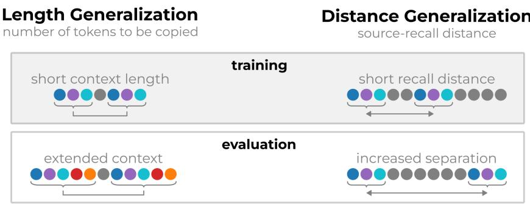  
Fig. 1. Comparison of length generalization and distance generalization. Illustration for a basic copy task (see e.g. [10]). For length generalization, the model is evaluated to copy sequences longer than the training sequences, resulting in longer context lengths at inference time. For distance generalization the context length remains fixed. Instead, part of the sequence is copied with delay, where the distance between source and recall (the delay) is increased or reduced at inference time.

Our results demonstrate that evaluating distance generalization is essential for a full understanding of how transformers generalize across positions. We identify diferent drivers and inhibitors of distance generalization. As a first step we study the impact of positional encoding on distance generalization. As illustrated in Fig. 2, one observes a strong impact. Somewhat paradoxically, we find that the absence of an explicit positional encoding scheme (NoPE) leads to the best generalization capabilities, in agreement with findings in [10] on length generalization. Details are discussed in Sec. 4.

We investigate furthermore how distance generalization is impacted by the diversity of distances presented in the training dataset. We find that training with a larger set of inter-token distances does increase generalization capabilities in absolute terms, somewhat as expected, but we also report strongly diminishing returns when performance is evaluated in relative terms. See Fig. 3 and Sec. 4. Lastly, we follow the work by [2] on length generalization and study whether distance generalization improves when models are trained on a main and an auxiliary task simultaneously, thereby allowing the model to infer from the auxiliary to the main task, or vice versa. We find that distance generalization regularly benefits from transfer learning, but not always.

Our contributions We highlight the importance to thoroughly investigate distance generalization in transformers.

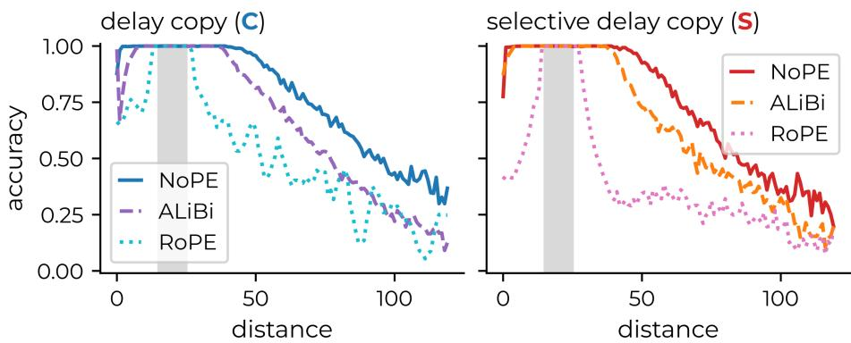  
Fig. 2. Distance generalization is strongly afected by positional encoding. We compare two explicit positional encoding schemes, ALiBi and RoPE, with NoPE (no positional encoding), where NoPE relies soly on causality, viz causal attention for inferring relative distances. The evaluation accuracy is plotted as a function of the distance between source and recall, compare Fig. 1. Either all m = 10 source tokens are to copied (left), the C task, or only the even component (right), denoted selective copy task S. For details see Sec. 3. During training, the model sees delay distances between 15 and 25 (gray shaded region).

1. We find that performance improves in most cases when positional schemes such as RoPE and ALiBi are turned of, which suggests that the role of positional encoding should be reconsidered.

2. We show that distance generalization can be used to quantify an important, but hitherto little investigated question: How much does a model benefit when training on sets of increased data diversity? Our findings suggest that the answer is positive in absolute terms, but negative when viewed relatively.

3. We show that transfer learning can positively impact distance generalization but also identify cases where transfer learning hinders generalization.

## 2 Related literature

Length generalization. The ability of transformers to extrapolate from short training sequences to long test sequences, known as length generalization, has been studied extensively [1,4,8,2,24]. Commonly, artificial tasks such as copying, reverse copying or arithmetic tasks are used to assess length generalization capabilities [10,2,5,23]. In an efort to improve length generalization abilities, recent studies use several alternative approaches, including specialized positional encoding [18], specific training protocols [5], scratchpad prompting [1] and knowledge transfer from related tasks [2].

Positional encoding. Following [10], a strong impact of positional encoding on distance generalization is expected. Many improvements to standard learned and sinusoidal absolute positional encodings (APE) [22] have been proposed. Currently, RoPE [21] is the industry standard for large language models and employed in many major models [6,13]. Despite RoPE’s popularity, it ofers poor length generalization, spurring various works focused on mitigation of that shortcoming [10,3,16]. ALiBi, on the other hand, introduces a recency bias subtracted from the attention score which improves the ability for length generalization [18]. In [10] the authors find that leaving out positional encoding altogether is preferred for length generalization.

Transfer learning. Transfer learning refers to the transfer of knowledge from one task to a related task, it has been studied and applied extensively [26]. In [19] the underlying mechanisms have been investigated for simple tasks. Namely, the identification of computation circuits for addition and subtraction in transformers. The authors showed that a model trained on addition and subtraction and initialized with weights from a previously trained addition model can quickly achieve high accuracy on both tasks, which indicates knowledge reuse.

There is somewhat less work with regard to transfer learning in the context of length generalization. In [2] the authors train a main task on a short context length together with a related auxiliary task, the latter for longer context lengths. They find that transformers are able to transfer knowledge from the auxiliary task to the main task, thus leading to improved length generalization for the main task.

Data diversity. In general, performance is strongly dependent on training data selection procedures. With regard to the ability of transformers to generalize, the authors of [25] find that data formatting can drastically change generalization outcomes. An important determinant is training data diversity. In [9] it is shown that increasingly diverse training data facilitates the formation of induction heads [15], which enables the model in turn to generalize to out-ofdistribution examples. Insuficient data diversity leads in contrast to positional shortcuts that are unable to generalize. In the context of length generalization, [20] shows that decreasing the size of the training pool pushes the model into a memorization regime where generalization performance collapses. In [8] the authors compute a lower bound for the context length required for length generalization to be possible.

## 3 Experimental setup

Our dataset consists of token sequences of arbitrary length from which a context window of length T is randomly selected. If not otherwise stated, we use T = 256. The token sequence is equivalent to a concatenation of ‘tasks’, akin to the task switching framework presented in [7]. For our investigations, tasks correspond to one of the following three control tokens:

– Random task (R). This is an auxiliary task that does –not– contribute to the loss function. The R control token signals the advent of randomly generated tokens (random numbers), which are –not– to be predicted. In general, using random tokens for copy tasks prevents shortcut learning and ensures that models are forced to copy tokens instead of relying on putative hidden patterns.

– Delay copy task (C). For the delay copy task, control tokens appear in pairs:

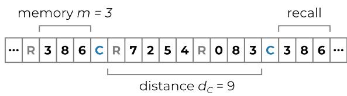

The first C token indicates that the $m \in \mathbb { N }$ preceding tokens are to be copied with a delay at a later point in the sequence, with the second C token indicating the pasting location. In between the pair of delay copy tokens, other tasks may occur, in our case only the R task. The intra-pair C-C distance, denoted $d _ { C }$ , is sampled uniformly from a preset range, as detailed further below.

– Selective delay copy task (S). This task works equivalently to the delay copy task (C). The S control tokens also appear in pairs, where the first occurrence indicates that the $m \in \mathbb { N }$ preceding tokens are to be copied selectively, with the second occurrence marking the pasting location:

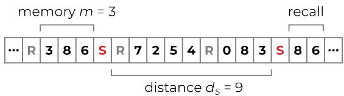

In contrast to C, not all tokens are to be copied, but only tokens corresponding to even numbers. Importantly, the original order of appearance needs to be maintained. In general, only a fraction of the source is hence to be recalled. In a dataset where both C and S are present, the sampling ranges for the respective intra-pair distances $d _ { C }$ and $d _ { S }$ can be diferent.

Task switching framework. We train and evaluate on sequences of a fixed context length of $T = 2 5 6$ , if not otherwise stated. We consider three types of datasets, $\mathcal { D } _ { \sf R C } , \ D _ { \sf R S }$ , and $\mathcal { D } _ { \mathsf { R C S } }$ , where the subscripts indicate the set of tasks used. A given input sequence pivots therefore between diferent synthetic tasks. As an example, here an extract of a sequence drawn from $\mathcal { D } _ { \mathsf { R C S } }$ with $N _ { \mathrm { b a s e } } = 1 0 $

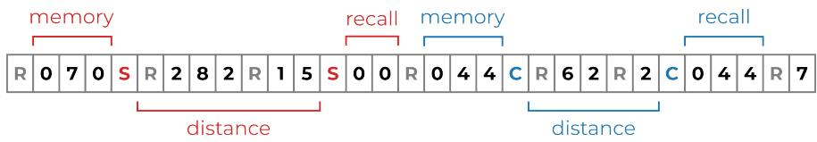

For the task switching frequency a stochastic process is used, specifically, we sample task durations ℓ from a Binomial distribution,

$$
P ( \ell = k ) = { \binom { n } { k } } p ^ { k } ( 1 - p ) ^ { n - k } ,
$$

where $n = \ell _ { \mathrm { m a x } }$ and $p = \mu / \ell _ { \mathrm { m a x } }$ . We keep fixed parameter values $\mu = 6$ and $\ell _ { \mathrm { m a x } } = 9$ . All tasks are executed on integer data tokens $t \in [ 0 , \ldots , N _ { \mathrm { b a s e } } )$ which leads to a vocabulary size of $N _ { \mathrm { b a s e } } + N _ { \mathrm { t a s k s } }$ . In our experiments we typically use $N _ { \mathrm { b a s e } } = 1 2 8$

Model. For our experiments we use a conventional causal decoder-only transformer with 8 layers and 8 attention heads and model dimension 512. For a full specification of the architecture please refer to App. A. We use the following positional encodings: ALiBi [18] and RoPE [21], which are tested against models without positional encoding (NoPE). Details are given in App. A.

Training and evaluation. Training is done using input-target pairs with a next-token prediction objective and teacher forcing, optimizing a cross-entropy loss with an AdamW optimizer. For a full overview of the hyperparameters refer to App. A. In the loss function we mask out random tasks (R) as well as the control tokens, which are all unpredictable.

Performance evaluation follows an equivalent protocol, this time however for datasets with fixed distances between source and recall, which cover both indistribution and out-of-distribution values. Accuracies are computed over the full sequence where we assess correct next-token predictions with teacher forcing. This means that we do not gauge performance under free-form multi-token generation, which is used at times in length generalization studies. Our choice is motivated by the desire to avoid error compounding and to isolate recall performance in the delay copy tasks. Consistent with the training phase, random tasks and control tokens are excluded in the accuracy metrics. We typically train on datasets containing a range of delay distances from which we randomly sample. At inference time, we evaluate performance individually for delay distances of arbitrary size, probing in this way distance-generalization abilities.

## 4 Results

Conceptually, delay copy tasks could be solved using a range of generic machinelearning algorithms. For example, by storing source tokens into a dedicated cache, which could then be reused later on. This particular approach would be agnostic to delay distances, implying essentially perfect generalization.

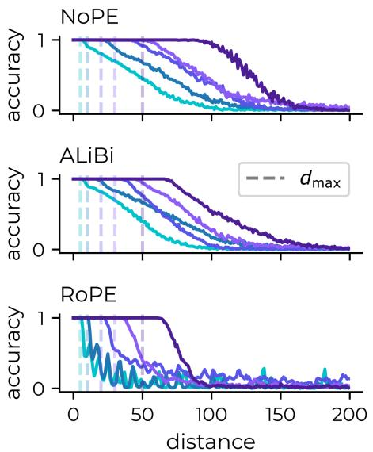

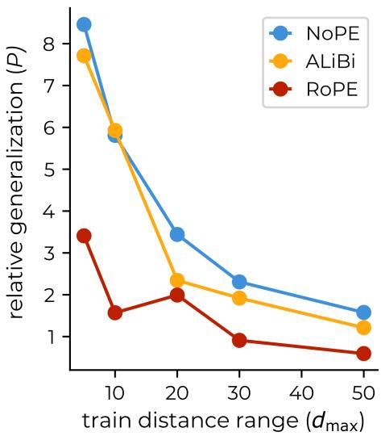  
Fig. 3. Influence of data diversity on distance generalization. Shown are results for $d _ { \operatorname* { m a x } } \in \{ 5 , 1 0 , 2 0 , 3 0 , 5 0 \}$ , where distances seen during training are in $[ 0 , d _ { \mathrm { m a x } } ]$ , compare $( 1 )$ . Dashed lines in the left panels indicate the end of the training distance range, i.e. $d _ { \mathrm { m a x } }$ , which is taken as proxy for data diversity.  
The right panel shows that diminishing returns are observed for relative distance generalization, as defined in (2). This means that the absolute increase in distance generalization seen in the left panels with increasing data diversity is sub-linear with respect to data diversity $N _ { d } = d _ { \operatorname* { m a x } }$

Transformers do not have access to dedicated memory units. Instead, all positions within the context window are openly available. The problem transformers face is to identify the correct position of source tokens. A possible solution would be: (a) to find the previous C or S token (or the respective R token), (b) to determine how many tokens have already been copied, and (c) to count back (or forth) in order to access the correct memory position. As discussed next, our results indicate that a bottleneck in this sequence of steps may be to resolve the distance between the current and the preceding C or S token.

Positional encoding. In Fig. 2 we show results for the influence of positional encoding on distance generalization. Transformers with three diferent positionencoding approaches have been trained, the two explicit encodings ALiBi and RoPE, and a model with no positional encoding (NoPE). Training and evaluation are for datasets $\mathcal { D } _ { \mathsf { R C } }$ (the basic copy task, Fig. 2 left) and $\mathcal { D } _ { \mathsf { R S } }$ (selective copy, Fig. 2 right).

During training, the distances between source and recall (the delays) are sampled uniformly between $d _ { \operatorname* { m i n } } = 1 5$ and $d _ { \operatorname* { m a x } } = 2 5$ , as indicated by the grayshaded region in Fig. 2. The number m of tokens to be copied is kept fixed, at $m = 1 0$

All positional encoding schemes achieve high in-distribution test accuracies, viz within the trained distance region. In agreement with previous studies on length generalization [3,10,16], we observed that RoPE performs worst. Counterintuitively, NoPE out-performs both explicit positional encoding schemes, which conforms however with similar observations for length generalization [10]. This confirms that causal transformers are able to dynamically learn to encode relative positions.

Training data diversity. In Fig. 2, we kept both the number of tokens to be copied fixed, $m = 1 0 .$ , as well as the number $N _ { d }$ of delay distances seen during training, namely at $N _ { d } = 1 0$ (which results from $1 0 = 2 5 - 1 5 )$ . Next we study the impact of changing $N _ { d } ,$ which we take as a proxy for data diversity. For this we consider training datasets for which recall distances are sampled uniformly between $d _ { \mathrm { m i n } }$ and $d _ { \mathrm { m a x } }$ , with

$$
d _ { \operatorname* { m i n } } = 0 , \qquad d _ { \operatorname* { m a x } } \in \{ 5 , 1 0 , 2 0 , 3 0 , 5 0 \} ,\tag{1}
$$

which implies $N _ { d } = d _ { \operatorname* { m a x } }$ . The results for above set $\{ d _ { \mathrm { m a x } } \}$ used for our simulations are presented in Fig. 3. We use the ratio $P$ between the cumulative out-of-distribution performance $P _ { \mathrm { o u t } }$ and the cumulative in-distribution performance $P _ { \mathrm { i n } }$ ，

$$
P = \frac { P _ { \mathrm { o u t } } } { P _ { \mathrm { i n } } } = \frac { \sum _ { d > d _ { \mathrm { m a x } } } \mathrm { a c c u r a c y } ( d ) } { \sum _ { d \le d _ { \mathrm { m a x } } } \mathrm { a c c u r a c y } ( d ) } ,\tag{2}
$$

as a measure for assessing relative distance generalization capabilities. Increasing data diversity leads to an increase in $P _ { \mathrm { o u t } } ,$ , but to a decrease in $P ,$ as shown in Fig. 3. Given that $P _ { \mathrm { i n } } \approx N _ { d } .$ , this implies a sub-linear scaling of the outof-distribution performance $P _ { \mathrm { o u t } }$ with data diversity $N _ { d } = d _ { \operatorname* { m a x } } .$ . Diminishing returns are hence observed. This conclusion holds, because models reach an accuracy floor before the end of the evaluation range. Only in the opposite case the denominator $P _ { \mathrm { i n } }$ in (2) would lead to a structural bias.

An interesting question is if there is a minimal data diversity, as suggested for the case of length generalization [8], such that models may develop generalization capabilities only when trained on datasets with larger diversity. As presented in Fig. 4, our data does not rule out this possibility. We leave detailed investigations of this point for future studies.

Basic transfer learning. Using the $\mathcal { D } _ { \mathsf { R C S } }$ dataset, for which training sequences included both C and S tasks, we investigate inter-tasks performance efects. We are interested in particular in the case that the supports for the sets of training delay distances difer for C and S tasks.

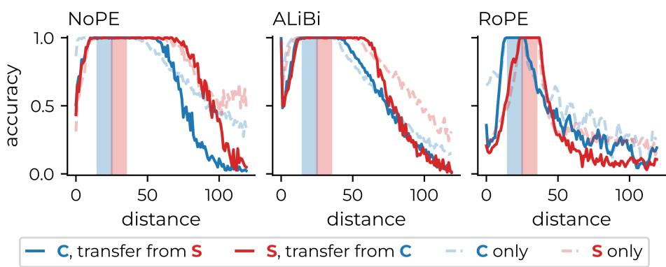  
Fig. 4. Transfer learning. Shown are performance curves for three types of dataset: $\mathcal { D } _ { \mathsf { R C S } }$ (solid lines), containing both the basic copy task (blue) and selective copy (red). Shaded regions indicate the range of the respective training delay distances. $\mathcal { D } _ { \sf R C }$ (blue dashed), for comparison. Single task setting, here the basic copy task. $\mathcal { D } _ { \mathsf { R S } }$ (red dashed), equivalently for selective copy.

To be concrete, we define with $\{ d _ { C } \}$ and $\{ d _ { S } \}$ the sets of delay distances present in $\mathcal { D } _ { \mathsf { R C S } }$ . In ${ \mathrm { F i g . } }$ 4 we present results for $d _ { C } \in [ 1 5 , 2 5 ]$ together with $d _ { S } \in [ 2 5 , 3 5 ]$ . Shown are four performance curves:

– C only. For comparison, results for the corresponding $\mathcal { D } _ { \mathsf { R C } }$ , viz when just as single task is present in the data and during testing.

– S only. Correspondingly for selective copy.

C, with transfer from S. The performance of the basic copy task in the presence of selective copy.

S, with transfer from C. Correspondingly, the other way around.

For RoPE, mostly negative interference is observed. Out-of-distribution performance curves for $\mathsf { C } / \mathsf { S }$ decay faster in the presence of the other task (S, respectively C). The second task acts hence primarily as a distractor. This result contrasts somewhat with [2], where a mostly positive impact of transfer learning on length generalization capabilities has been reported.

The situation is more diferentiated for both ALiBi and NoPE. One observes mostly positive transfer learning for moderate out-of-distribution tests, but negative efects for increased out-of-distribution delay distances.

Complexity of transfer learning. In ${ \mathrm { F i g . } }$ 4 we did train the two tasks considered throughout this study on contiguous but disjoined distance ranges. As a natural next step, one may consider transfer learning in a setting where the two tasks are trained on well-separated distances ranges. The corresponding results, as shown in Fig. 5, demonstrate that transfer learning is a complex field. Here we will point to several central questions, leaving an in-depth analysis to future work.

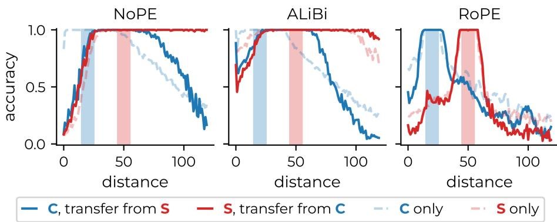  
Fig. 5. Transfer learning with enlarged task separation. For three positional encoding schemes inference accuracies as a function of the source-recall distance is shown, the procedure is otherwise identical to Fig. 4. The training distances are [15, 25] for the delay copy task C, and [45, 55] for selective copy S. Solid lines are for transfer learning, when the model is trained on the joint dataset DRCS, dashed lines for datasets containing only one of the two tasks, either C or S.

Firstly, for NoPE and ALiBi we observe an asymmetry in the direction of knowledge transfer, with constructive transfer learning occurring for large distances from S to C. Compared to Fig. 4, one sees an improved generalization of C around the training distance range of the S task. On the other hand, destructive transfer learning efects are observed for both tasks around the training region of C. Notably, the performance of the C task itself is negatively afected even within its own training region. A possible explanation for the origin of the observed asymmetry for NoPE and ALiBi could be the higher structural complexity of S. If correct, this explanation would entail that transfer learning from a more complex to a less complex task might be favored. In our view, this question deserves further attention.

Secondly, we observe significant diferences between NoPE and ALiBi on one hand, and RoPE on the other hand. Transfer learning is generally weak for RoPE, which has however a key advantage: destructive efects in the original training regions are not observed. For RoPE, distracting tasks seem to interfere less with bare training.

## 5 Discussion

In length generalization studies, poor extrapolation cannot be solely attributed to a failure of generalizing the task, as models are also facing out-of-distribution positions. To resolve this confounding, we propose to study distance generalization which tests models within a fixed context length, but with out-ofdistribution token dependencies. In alignment with established practice [2,10], we consider synthetic tasks, in particular two types of copy task with delay, involving respectively full and selective copying.

Our results suggest that distance generalization is highly dependent on the type of positional encoding used, cf. Fig. 2. We find that RoPE falls behind other types of positional encoding, including models without any explicit positional encoding (NoPE), in agreement with length-generalization studies [10]. For distance generalization, the efect is particularly striking, since RoPE is not facing untrained angular regimes at test time. As we show in Fig. 7, explicit positional encoding is actually necessary for small models, yet further investigations are required in this regard. Follow-up studies may investigate more diverse tasks, together with in-depth circuit and attention analyses. Ultimately distance generalization needs to be tested in pretrained models.

A number of concerns may be raised with regard to the experimental setup used. For transfer learning, models are trained on joint datasets $\mathcal { D } _ { \mathsf { R C S } }$ without altering task-frequency parameters. Training on $\mathcal { D } _ { \mathsf { R C S } }$ will result in fewer taskspecific examples than in a single-task setting which could raise concerns about the origins of the efects reported in Fig. 4 and 5. We note, however, that the in-distribution accuracy remains saturated in the joint setting shown in Fig. 4 and that the destructive efect visible in Fig. 5 appears within the training range of C. An exposure deficit alone would be expected to show up as a uniform degradation rather than specific to certain distances.

Second, following work on length generalization (e.g. [2]), the best of five runs ranked by cumulative accuracy have been used. This choice is deliberate: our questions concern whether a given architecture can resolve unseen distances at all. Seeds that fail to learn the copy mechanism in the first place are uninformative about distance generalization. As shown in Appendix B, diferences between diferent runs are actually minor.

## References

1. Anil, C., Wu, Y., Andreassen, A., Lewkowycz, A., Misra, V., Ramasesh, V., Slone, A., Gur-Ari, G., Dyer, E., Neyshabur, B.: Exploring length generalization in large language models. Advances in Neural Information Processing Systems 35, 38546– 38556 (2022)

2. Cai, Z., Lee, N., Schwarzschild, A., Oymak, S., Papailiopoulos, D.: Extrapolation by association: Length generalization transfer in transformers. arXiv preprint arXiv:2506.09251 (2025)

3. Chen, S., Wong, S., Chen, L., Tian, Y.: Extending context window of large language models via positional interpolation. arXiv preprint arXiv:2306.15595 (2023)

4. Cho, H., Cha, J., Bhojanapalli, S., Yun, C.: Arithmetic transformers can lengthgeneralize in both operand length and count. arXiv preprint arXiv:2410.15787 (2024)

5. Fan, Y., Du, Y., Ramchandran, K., Lee, K.: Looped transformers for length generalization. arXiv preprint arXiv:2409.15647 (2024)

6. Grattafiori, A., Dubey, A., Jauhri, A., Pandey, A., Kadian, A., Al-Dahle, A., Letman, A., Mathur, A., Schelten, A., Vaughan, A., et al.: The llama 3 herd of models. arXiv preprint arXiv:2407.21783 (2024)

17. Power, A., Burda, Y., Edwards, H., Babuschkin, I., Misra, V.: Grokking: Generalization beyond overfitting on small algorithmic datasets. arXiv preprint arXiv:2201.02177 (2022)

7. Gros, C.: Small transformer architectures for task switching. In: International Conference on Artificial Neural Networks. pp. 119–127. Springer (2025)

8. Izzo, Z., Nichani, E., Lee, J.D.: Quantitative bounds for length generalization in transformers. arXiv preprint arXiv:2510.27015 (2025)

9. Kawata, R., Song, Y., Bietti, A., Nishikawa, N., Suzuki, T., Vaiter, S., Wu, D.: From shortcut to induction head: How data diversity shapes algorithm selection in transformers. Advances in Neural Information Processing Systems 38, 69460–69497 (2026)

10. Kazemnejad, A., Padhi, I., Natesan Ramamurthy, K., Das, P., Reddy, S.: The impact of positional encoding on length generalization in transformers. Advances in Neural Information Processing Systems 36, 24892–24928 (2023)

11. Kingma, D.P., Ba, J.: Adam: A method for stochastic optimization. arXiv preprint arXiv:1412.6980 (2014)

12. Li, K., Hopkins, A.K., Bau, D., Viégas, F., Pfister, H., Wattenberg, M.: Emergent world representations: Exploring a sequence model trained on a synthetic task. arXiv preprint arXiv:2210.13382 (2022)

13. Liu, A., Feng, B., Xue, B., Wang, B., Wu, B., Lu, C., Zhao, C., Deng, C., Zhang, C., Ruan, C., et al.: Deepseek-v3 technical report. arXiv preprint arXiv:2412.19437 (2024)

14. Loshchilov, I., Hutter, F.: Decoupled weight decay regularization. arXiv preprint arXiv:1711.05101 (2017)

15. Olsson, C., Elhage, N., Nanda, N., Joseph, N., DasSarma, N., Henighan, T., Mann, B., Askell, A., Bai, Y., Chen, A., et al.: In-context learning and induction heads. arXiv preprint arXiv:2209.11895 (2022)

16. Peng, B., Quesnelle, J., Fan, H., Shippole, E.: Yarn: Eficient context window extension of large language models. arXiv preprint arXiv:2309.00071 (2023)

18. Press, O., Smith, N.A., Lewis, M.: Train short, test long: Attention with linear biases enables input length extrapolation. arXiv preprint arXiv:2108.12409 (2021)

19. Quirke, P., Neo, C., Barez, F.: Understanding addition and subtraction in transformers. arXiv preprint arXiv:2402.02619 (2024)

20. Song, J., Xu, Z., Zhong, Y.: Out-of-distribution generalization via composition: a lens through induction heads in transformers. Proceedings of the National Academy of Sciences 122(6), e2417182122 (2025)

21. Su, J., Ahmed, M., Lu, Y., Pan, S., Bo, W., Liu, Y.: Roformer: Enhanced transformer with rotary position embedding. Neurocomputing 568, 127063 (2024)

22. Vaswani, A., Shazeer, N., Parmar, N., Uszkoreit, J., Jones, L., Gomez, A.N., Kaiser, Ł., Polosukhin, I.: Attention is all you need. Advances in neural information processing systems 30 (2017)

23. Xu, X., Zhao, Z., Zhang, H., Yang, Y.: Principled understanding of generalization for generative transformer models in arithmetic reasoning tasks. In: Proceedings of the 63rd Annual Meeting of the Association for Computational Linguistics (Volume 1: Long Papers). pp. 4721–4747 (2025)

24. Zhou, H., Bradley, A., Littwin, E., Razin, N., Saremi, O., Susskind, J., Bengio, S., Nakkiran, P.: What algorithms can transformers learn? a study in length generalization. arXiv preprint arXiv:2310.16028 (2023)

25. Zhou, Y., Alon, U., Chen, X., Wang, X., Agarwal, R., Zhou, D.: Transformers can achieve length generalization but not robustly. arXiv preprint arXiv:2402.09371 (2024)

26. Zhuang, F., Qi, Z., Duan, K., Xi, D., Zhu, Y., Zhu, H., Xiong, H., He, Q.: A comprehensive survey on transfer learning. Proceedings of the IEEE 109(1), 43– 76 (2020)

## A Experimental Details

## A.1 Model Architecture

We train a standard causal decoder-only Transformer model, following common design choices in prior work such as [22]. The model consists of 8 Transformer layers with a hidden size of 512 and 8 attention heads (head dimension 64). Each layer contains a feedforward MLP with ReLU activation and dropout applied with rate 0.1. We test three common positional embeddings, namely RoPE [21], ALiBi [18] and a model with no positional embedding (NoPE). Input and output embeddings are untied. Model details are summarized in Tab. 1.

## A.2 Training Procedure

The model is trained from scratch using the AdamW optimizer [11,14]. We use a learning rate of $3 \times 1 0 ^ { - 4 }$ with linear warm-up over the first 3,000 steps, followed by a constant schedule. Weight decay is set to 0.05. Training is performed with a batch size of 64 for 40,000 update steps. The training objective is standard autoregressive next-token prediction. To avoid perplexity early on in the sequence, we exclude the first few tokens in the sequence from the loss and accuracy computation. Diferent values did not change results. We settled for a very conservative default value of 18 (which is 2× the default maximum task length). Training details are summarized in Tab. 2.

Table 1. Model architecture configuration.
<table><tr><td>Parameter</td><td>Value</td></tr><tr><td>Number of layers</td><td>8</td></tr><tr><td>Hidden size</td><td>512</td></tr><tr><td>Attention heads</td><td>8</td></tr><tr><td>Head dimension</td><td>64</td></tr><tr><td>Dropout</td><td>0.1</td></tr><tr><td>MLP activation</td><td>ReLU</td></tr></table>

Table 2. Training configuration.
<table><tr><td>Parameter</td><td>Value</td></tr><tr><td>Optimizer</td><td>AdamW</td></tr><tr><td>Learning rate</td><td> $3 \times 1 0 ^ { - 4 }$ </td></tr><tr><td>Weight decay</td><td>0.05</td></tr><tr><td>Warmup steps</td><td>3,000</td></tr><tr><td>Batch size</td><td>64</td></tr><tr><td>Training steps</td><td>40,000</td></tr><tr><td>Loss and accuracy mask until position 18</td><td></td></tr></table>

## A.3 Dataset

We train on a synthetic multi-task sequence dataset in accordance with the task switching framework with three diferent tasks: random (R), delay copy (C) and selective delay copy (S). The tasks are detailed in the main text, see Sec. 3. Dataset details are summarized in Tab. 3

Table 3. Dataset configuration.
<table><tr><td>Parameter</td><td>Value</td></tr><tr><td>Number of tokens</td><td>10.000.000</td></tr><tr><td>Sequence length</td><td>256</td></tr><tr><td># distinct data tokens</td><td>127</td></tr><tr><td>Memory for copying tasks</td><td>10</td></tr><tr><td colspan="2">Training distance for copying tasks  $\sim \mathrm { u n i f } ( d _ { \mathrm { m i n } } , d _ { \mathrm { m a x } } )$ </td></tr></table>

## B Additional Results

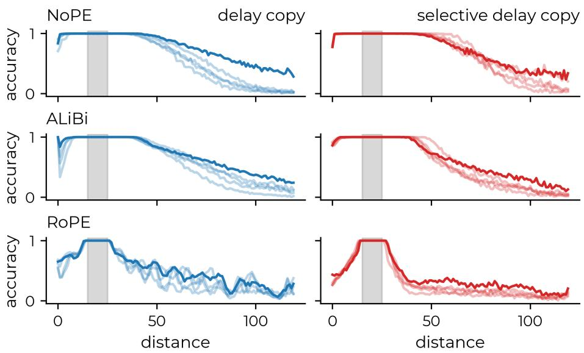  
Fig. 6. For diferent positional encodings, we show diferent training runs for (left) the delay copy task $( \mathsf { C } ) , \ D _ { \mathsf { R C } }$ , and (right) the selective delay copy task $( \mathsf { S } ) , \mathcal { D } _ { \mathsf { R S } }$ , where $d _ { C / S } \sim \mathrm { u n i f } ( 1 5 , 2 5 )$ ). In solid lines we show the best performing runs, measured by the integral over the full plotted distance range. These models are presented in the main text results.

Variance of training runs. In the main text results we generally present the best-performing model out of five unique training runs with equal parameters, where we measure the performance by the cumulative accuracy

$$
\operatorname { p e r f o r m a n c e } = \sum _ { d = 1 } ^ { 1 2 0 } \operatorname { a c c u r a c y } ( d ) .\tag{3}
$$

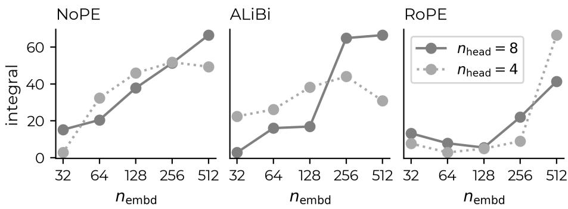  
Fig. 7. While we show that NoPE often performs well at distance generalization, we observe that it falls behind explicit encodings, ALiBi and RoPE, when the model size is small. For diferent positional encodings, we test and evaluate on a dataset $\mathcal { D } _ { \mathsf { R C } }$ , where training distances $d _ { C }$ of the delay copy task (C) are sampled from $d _ { C } \sim$ unif(0, 10) (gray shaded region). For each positional encoding we test diferent model sizes. The number of layers is kept at 8 while we vary head size and model dimension. We show the cumulative accuracy for diferent model configurations (3).

Fig. 6 presents a variety of training runs for diferent positional encodings and diferent tasks, complementing main-text Fig. 2. For other main-text results we use the same best-model policy.

The impact of the model size on distance generalization. For the main text results we considered a model with embedding dimension $n _ { \mathrm { e m b d } } = 5 1 2$ 8 heads and 8 layers. In Fig. 7 we present results for 4 and 8 heads with $n _ { \mathrm { e m b d } } \in [ 2 ^ { i } \colon i = 5 , \ldots , 9 ]$ . Keeping the number of layers fixed at 8, as well as keeping all other model details as presented in $\mathrm { A p p }$ . A. We observe that distance generalization ability is coupled to model size, where larger models tend to generalize better across the board. For ALiBi in a model with 8 heads we find that smaller models break down significantly faster than their larger counterparts. We hypothesize that the increased number of ALiBi-slopes can distract the model if parameter counts are not suficient.

NoPE, albeit ofering good distance generalization, breaks down in small models. In the main text we show, supporting findings for length generalization by [10], that NoPE ofers in many situations outstanding distance generalization performance. An important caveat is, however, that NoPE requires a certain model size to encode positions efectively. For small-scale models, NoPE even struggles to learn the mechanism of the delay copy task (C) within distribution, see Fig. 7, while explicit positional encodings are much more stable for smaller models.