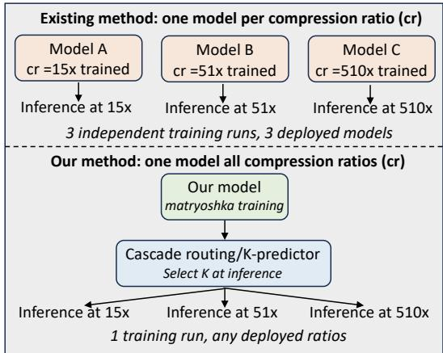
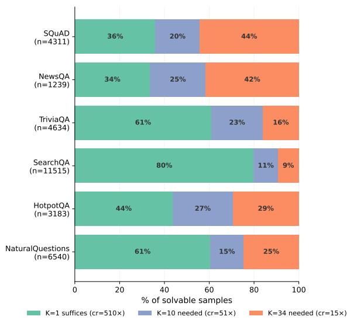
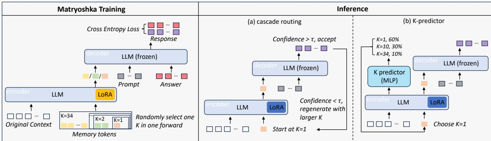
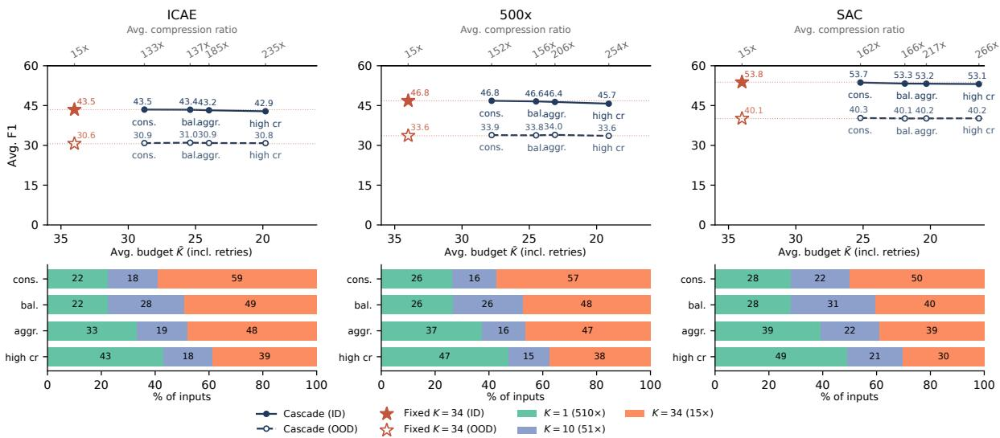
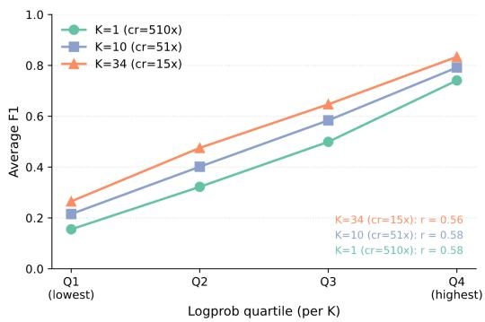
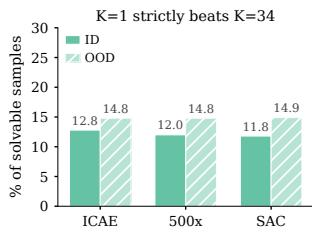
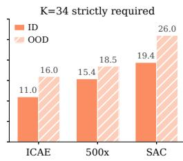
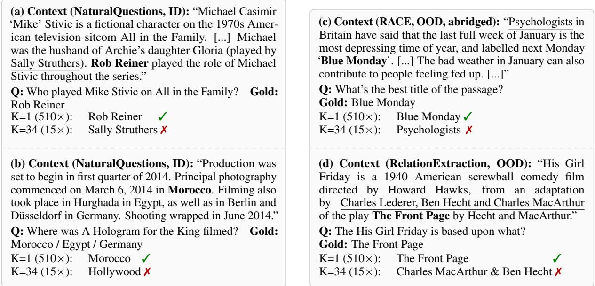

# FlexComp: One Model for Every Ratio in Context Compression

Kaiyan Zhao1,2, Zhongtao Miao1, Akiko Aizawa2, Yoshimasa Tsuruoka1

1The University of Tokyo, 2National Institute of Informatics {kaiyan1006, miao, tsuruoka}@logos.t.u-tokyo.ac.jp, aizawa@nii.ac.jp

## Abstract

Soft context compression condenses a context into a few memory tokens that a frozen LLM consumes in place of the raw text, but existing compressors fix the compression ratio at training and inference: each deployed ratio requires a separately trained model, and the chosen ratio is applied uniformly to all inputs, whose actual needs vary drastically. We propose FlexComp, a method-agnostic framework that decouples the ratio from both training and deployment: Matryoshka-style training samples the memory budget K per instance, turning one model into an any-ratio compressor, and the budget is then chosen per input by: (1) confidence-based cascade routing or (2) a lightweight learned K predictor. Across ICAE, 500xCompressor, and SAC on MRQA, a single FlexComp model matches separately trained fixed-ratio special ists with minimal degradation. Cascade routing preserves over 98% of the mildest ratio’s accuracy at up to 266× average compression; the K predictor, in a single compression-decoding pass, reaches 158-236× within 0.7 F11 of the mildest ratio. At serving-scale batch sizes, the K predictor cuts context KV cache by 50% and improves decoding throughput by 47%.

## 1 Introduction

Large language models (LLMs) rarely answer from a question alone: in most applications, contexts, such as retrieved passages, tool outputs, documents, or conversation history are needed for generation, besides the prompt (Lewis et al., 2020; Yuan et al., 2025; Zhao et al., 2026). Serving these context tokens is costly, as they must be prefilled on every query, and their Key-Value (KV) cache occupies memory for the whole generation, often dominating the memory footprint of inference (Liu et al., 2025). Context compression offers an attractive remedy: a compressor condenses the context into a small number of soft memory tokens, and the LLM can run inference based on the compressed soft tokens instead of the raw context (Ge et al., 2024; Li et al., 2025; Zhao et al., 2025; Liu et al., 2026; Miao et al., 2026).

  
Figure 1: Fixed-ratio compression vs. FlexComp. Top: for existing soft-token compressors, each deployed compression ratio requires a separately trained model, and the model applies the fixed ratio uniformly to all inputs. Bottom: FlexComp trains a single model that supports any ratio, and selects the budget per input at inference time, via cascade routing or K predictor.

Despite steady progress on compression quality, existing methods share a structural limitation: the compression ratio is fixed at training and inference time. As illustrated in Figure 1 (top), supporting multiple operating modes, e.g., mild compression for difficult inputs and aggressive compression when memory is scarce, requires training, storing, and serving a separate model for every ratio. Moreover, whichever ratio is deployed is applied uniformly to all inputs, regardless of how much each input actually needs.

This uniformity is wasteful, because different inputs need very different budgets. Figure 2 shows that for the in-domain subsets in MRQA (Fisch et al., 2019), most inputs are already solved with a single memory token (soft token length $K = 1 ) ^ { 2 }$ yet a non-trivial minority is only solved with far larger budgets. A fixed K therefore loses on both ends: it wastes tokens on the many easy inputs and starves the few hard ones. Worse, the best fixed choice differs from domain to domain, so no single ratio serves all deployments well.

  
Figure 2: The budget each input needs varies drastically. For each subset, we show the distribution over solvable inputs of the minimal sufficient budget: the smallest $K \in \{ 1 , 1 0 , 3 4 \}$ (number of memory tokens) at which the SAC Matryoshka model answers correctly. A large fraction of inputs is already solvable at K=1 (510x compression), so any fixed ratio could be suboptimal.

To this end, we propose FlexComp, a framework that decouples the compression ratio from both training and deployment (Figure 1, bottom). FlexComp has two components. First, we introduce Matryoshka-style training for context compression, inspired by matryoshka representation learning (Kusupati et al., 2022). Specifically, during training, the soft prompt length K is sampled per instance, so that a single model learns to encode the context into K memory tokens for any budget in the supported range. One model thus replaces an entire family of fixed-ratio compressors, with no architectural changes to the underlying method. Second, since the budget is now a free inferencetime variable, we introduce two complementary strategies for choosing it per input: cascade routing, which starts from the most aggressive budget and re-encodes at a larger one only when the decoder is uncertain, and a lightweight K predictor, which commits to a budget before compression and thus answers in a single compression-decoding pass. FlexComp is method-agnostic; we instantiate it on three representative compressors: ICAE (Ge et al., 2024), 500xCompressor (Li et al., 2025), and SAC (Liu et al., 2026).

Across in-domain (ID) and out-of-domain (OOD) question answering tasks on MRQA (Fisch et al., 2019), a single Matryoshka-trained model matches separately trained fixed-ratio specialists at each native ratio (within 1.3 F1 in the worst case, and often better on OOD), cutting the number of trained models from n to one. On top of the same model, adaptive budget selection improves the accuracy-compression trade-off over any fixed ratio: cascade routing retains over 98% of the mildest ratio’s accuracy while raising the average compression from 15× to up to 266×, and the K predictor reaches 158–236× in a single compression-decoding pass, at a cost of at most 0.7 F1. These savings are not merely nominal: at serving-scale batch sizes, the predictor cuts context KV cache by 50% and improves aggregate decoding throughput by 47% relative to always running at the mildest ratio.

In summary, our contributions are as follows:

• We show that Matryoshka training turns a fixed-ratio context compressor into a single any-ratio compressor, validated on three distinct methods with negligible degradation.

• We introduce two per-input budget-selection strategies for soft context compression: confidence-driven cascade routing and the K predictor that commits to a budget before compression; for the predictor, we further show these savings translate into gains in KV memory and decoding throughput.

• We systematically analyze the accuracycompression trade-off, and find it nonmonotonic at the instance level: on a nontrivial fraction of inputs, larger budgets preserve surface details that may mislead the decoder, and a single memory token answers correctly where the full budget fails.

## 2 Related Work

Context compression methods fall into two families: soft compression, which encodes the context into continuous memory tokens, and hard compression, which shortens the prompt in token space by filtering or rewriting the discrete text. Our work builds on the former.

Soft context compression. A growing line of work compresses a context into a small number of continuous memory tokens consumed by a frozen LLM, including gist tokens (Mu et al., 2023), AutoCompressors (Chevalier et al., 2023), ICAE (Ge et al., 2024), 500xCompressor (Li et al., 2025), EPL (Zhao et al., 2025) and SAC (Liu et al., 2026). These methods differ in soft token acquisition and supervision signals, but the core idea, representing contexts through soft tokens, remains consistent. Moreover, they share the same limitation that the compression ratio is uniformly a training-time constant: each deployed ratio requires its own trained model, and all inputs receive the same budget. Flex-Comp targets exactly on this axis and is complementary to all base architectures.

Hard context compression. An orthogonal family shortens the prompt in token space, by filtering or summarizing the discrete text, e.g., Selective Context (Li et al., 2023), the LLMLingua series (Jiang et al., 2024; Pan et al., 2024), and RECOMP (Xu et al., 2024). Hard compression preserves interpretability, but achievable ratios are typically modest compared to soft methods. As with soft compression methods, how much to compress a given input remains an open question, which our budget-selection strategies are designed to address.

## Nested and budget-conditioned representations.

Matryoshka representation learning trains embeddings whose prefixes remain valid at multiple dimensionalities (Kusupati et al., 2022), a principle that can be extended to model widths and other capacity axes (Devvrit et al., 2024). We transfer the one-model-many-budgets principle to context compression, with a structural difference: our budgets are realized by conditioning the encoder on the memory slot count rather than by truncating a fixed representation (§3.2).

Adaptive computation and cascades. Allocating inference cost per input has a long history, from early exit (Miao et al., 2024) to LLM cascades that escalate from cheap to expensive models based on confidence (Yue et al., 2024). Our cascade applies this recipe within a single model, escalating over compression budgets rather than over models, and our $K$ predictor mirrors router-based approaches that commit to a compute level before execution (Stripelis et al., 2024). Relatedly, KV cache eviction and quantization (Zhang et al., 2023; Li et al., 2024) reduce memory after the full context has been prefilled; soft-token compression avoids materializing the full-context cache in the first place.

## 3 Method

Figure 3 gives an overview of FlexComp. We first fix notation and the class of compressors we build on (§3.1), then describe Matryoshka training, which converts a fixed-ratio compressor into a single any-budget compressor (§3.2), and finally two inference-time strategies for choosing the budget per input: confidence-based cascade routing (§3.3) and a learned K predictor (§3.4).

## 3.1 Preliminaries: Soft-Token Context Compression

We first consider an encoder LLM $E _ { \phi }$ , that compresses a context c of L tokens into $K \ll L$ continuous memory tokens: ${ \bf m } _ { 1 : K } = E _ { \phi } ( c ; K )$ , which a frozen decoder LLM D then consumes in place of c to answer a query q, i.e., $\hat { a } = D ( \mathbf { m } _ { 1 : K } , q )$ . In practice, the encoder $E _ { \phi }$ is a LoRA-adapted copy of $D _ { ; }$ that processes the context together with K trainable memory tokens. The decoder consumes the representations of these memory tokens after the encoder as a drop-in prefix, so the context’s footprint in D’s KV cache shrinks from L to K entries. This formulation covers ICAE (Ge et al., 2024), 500xCompressor (Li et al., 2025), and SAC (Liu et al., 2026), which differ in where the memory tokens are placed and how the encoder is supervised, but share the same interface: the number of memory slots K is fixed before training, and the resulting model supports only that budget. Throughout, we refer to K as the budget; with $| c | = L$ , the corresponding compression ratio is $L / K$

Training objectives. Existing compressors are trained in two stages, both at a fixed K. A pretraining stage teaches the encoder to pack generic text into memory tokens: ICAE and 500xCompressor supervise the decoder to regenerate or continually generate the context from $\mathbf { m } _ { 1 : K }$ (autoencoding or text continuation objective), while SAC directly optimizes language modeling conditioned on its semantic anchors. Abstractly,

$$
\begin{array} { r } { \mathcal { L } _ { \mathrm { P T } } ( \phi ) = \mathbb { E } _ { c } [ \ell ( D ( E _ { \phi } ( c ; K ) ) , t ( c ) ) ] , } \end{array}\tag{1}
$$

where the target $t ( c )$ is the context itself or its continuation. A subsequent fine-tuning stage adapts

  
Figure 3: Overview of FlexComp. Left: Matryoshka training in fine-tuning. For each instance, a budget K is randomly sampled. The LoRA-adapted encoder compresses the context into K memory tokens, and the frozen decoder is supervised to generate the answer based on the memory tokens and prompt. Right: two inference-time budget-selection strategies exploiting the resulting freedom. (a) Cascade routing starts at the most aggressive budget and re-encodes at the next larger one only when the decoder’s confidence falls below the threshold τ. (b) The K predictor is a lightweight MLP head that maps budget-free encoder features to a distribution over K and commits to a budget before compression, answering in a single compression-decoding pass.

the model to downstream use, supervising the answer given the compressed context:

$$
\mathcal { L } _ { \mathrm { S F T } } ( \phi ) = \mathbb { E } _ { ( c , q , a ) } [ \ell ( D ( E _ { \phi } ( c ; K ) , q ) , a ) ] .\tag{2}
$$

FlexComp keeps both objectives untouched and changes only how K is set: Matryoshka sampling (Eq. 3) wraps ${ \mathcal { L } } _ { \mathrm { S F T } }$ , while pretraining deliberately remains at a fixed budget, a choice we justify empirically in §5.1.

## 3.2 Matryoshka Training

FlexComp makes the budget a conditioning variable rather than an architectural constant (Figure $^ { 3 , }$ left). Let $\mathcal { K } = \{ K _ { 1 } < K _ { 2 } < \cdots < K _ { n } \}$ be the set of supported budgets. During training, for each instance we sample a budget $K \sim p ( \mathcal { K } )$ , allocate K memory slots, and optimize the same objective as the underlying compressor:

$$
\begin{array} { r } { \mathcal { L } ( \phi ) = \mathbb { E } _ { ( c , q , a ) } \mathbb { E } _ { K \sim p ( K ) } \big [ \ell \big ( D ( E _ { \phi } ( c ; K ) , q ) , a \big ) \big ] , } \end{array}\tag{3}
$$

where ℓ is the token-level cross-entropy of the base method and D remains frozen. The single set of weights $\phi$ is thus trained to produce, for every $K \in \kappa .$ , a representation specialized to that budget: the encoder sees how many slots are available and distributes information accordingly. We emphasize that, unlike Matryoshka representation learning for embeddings (Kusupati et al., 2022), the budgets are not realized by truncating a single encoding, as $E _ { \phi } ( c ; K _ { 1 } )$ is a different forward pass from the first $K _ { 1 }$ tokens of $E _ { \phi } ( c ; K _ { 2 } )$ , but the training principle is shared: one model, nested budgets, joint supervision.

Matryoshka training requires no architectural changes to the base compressor and adds no inference-time overhead relative to a fixed-ratio model evaluated at the same K. It collapses n training runs and n deployed models into one, and exposes the full budget range K at inference time.

## 3.3 Inference I: Cascade Routing

The first strategy for choosing the appropriate budget per input requires no additional training (Figure 3, Inference (a)). Given an input, we start from the most aggressive budget $K _ { 1 }$ and iteratively escalate. At stage i, we encode ${ \bf m } _ { 1 : K _ { i } } = E _ { \phi } ( c ; K _ { i } )$ , decode a candidate answer, and compute a confidence score $s _ { i }$ from the decoder’s output log-probabilities, defined as the length-normalized log-probability of the decoded answer:

$$
\begin{array} { r } { s _ { i } = \frac { 1 } { \lvert \hat { a } _ { i } \rvert } \sum _ { t } \log p _ { \theta } ( \hat { a } _ { i , t } ) . } \end{array}\tag{4}
$$

This score is a reliable proxy for answer quality: it correlates strongly with token-level F1 at every budget (Spearman’s $\rho$ up to 0.58; §5.3). If $s _ { i } \geq \tau _ { i }$ the candidate is accepted; otherwise we discard it and re-encode at the next budget $K _ { i + 1 }$ . The final budget $K _ { n }$ always accepts, so the procedure terminates. The thresholds $\tau _ { 1 } , \ldots , \tau _ { n - 1 }$ are calibrated once on held-out data by sweeping the accuracyaverage-budget trade-off. Different threshold settings trace out a controllable operating curve between the most aggressive and mildest budgets.

## 3.4 Inference II: Learned K Prediction

The cascade decides after decoding; our second strategy decides before compression (Figure 3, Inference (b)), committing to a single K per input.

Offline label construction. We derive supervision directly from the Matryoshka model itself. For each training instance $( c , q , a )$ , we decode at every $K \in \kappa$ and score the output against the gold answer with Rouge-1 F1, yielding $F _ { K }$ . The label is the smallest budget whose score is within a tolerance ε of the best achievable one,

$$
K ^ { * } \ = \ \operatorname* { m i n } \{ K \in { \mathcal { K } } \ : \ F _ { K } \geq F _ { K _ { n } } - \varepsilon \} ,\tag{5}
$$

with $\varepsilon { = } 0 . 1$ . Instances that remain low-quality even at the full budget $( F _ { K _ { n } } < 0 . 5 )$ are excluded from predictor training. This turns budget selection into an n-way classification problem requiring no human annotation.

Class balancing. The label distribution is heavily skewed: most instances are solvable at $K _ { 1 }$ (Figure 2). Trained on the raw distribution, the predictor collapses to a shortcut of predicting the majority class. We therefore resample the training set to a balanced 1:1: . . . :1 ratio across the n classes, which we found necessary and sufficient to prevent this collapse (§5.2).

Predictor. The predictor operates on a budgetindependent representation of the context: the context chunks are passed through the encoder without allocating any memory slots, and the final-layer hidden states are mean-pooled over all context tokens into a single vector h $\in \mathbb { R } ^ { d }$ . A two-layer MLP $( d \to d / 2$ , ReLU, $d / 2 \to n )$ maps h to a distribution over K. Only the head is trained with cross-entropy on the labels of Eq. 5 on the balanced dataset. Because the features are computed from the context alone, the predicted budget is queryagnostic: it can be computed once per document, offline, and cached alongside the compressed representation. At inference, budget selection costs one budget-free encoder forward plus the (negligible) head; the input is then encoded once at the predicted $\hat { K }$ and decoded once. Compared with the cascade, the predictor forgoes the decoder’s own confidence signal but replaces up to n encodedecode rounds with this fixed cost, and the two occupy complementary points on the cost-accuracy spectrum.

## 4 Experiments

## 4.1 Experimental Setup

Compressors and budgets. We instantiate Flex-Comp on three soft context compressors: ICAE (Ge et al., 2024), 500xCompressor (Li et al., 2025), and SAC (Liu et al., 2026), keeping each method’s architecture, training objective, and hyperparameters unchanged; the only modification is budget sampling (§3.2). All compressors use Llama-$3 . 2 – 1 \mathbf { B } ^ { 3 }$ (Grattafiori et al., 2024) as both the encoder and decoder, with the encoder equipped with LoRA (Hu et al., 2022) adapters (r=128, α=256). We split the contexts into chunks with length 510, and we use budgets $\mathcal { K } = \{ 1 , 1 0 , 3 4 \}$ , i.e., compression ratios of 510×, 51×, and 15×. During Matryoshka training, K is sampled uniformly from K per instance.

Tasks and metrics. We follow the evaluation protocol of existing methods and evaluate our models on MRQA (Fisch et al., 2019), including six in-domain (ID) tasks (SQuAD, NewsQA, TriviaQA, SearchQA, HotpotQA, NaturalQuestions) and six out-of-domain (OOD) tasks (BioASQ, DROP, DuoRC, RACE, RelationExtraction, TextbookQA). The compressor is continually pretrained on the SlimPajama-6B dataset (Soboleva et al., 2023), and finetuned on the MRQA training set. We report token-level F1 averaged within each group.

Baselines. For each method, we compare the single Matryoshka-trained model against three fixedratio specialists: the same architecture trained conventionally at each $K \in \kappa$ , following the original recipes. All fixed-ratio baselines are trained by us under identical data and compute budgets for a controlled comparison.

Budget selection. For cascade routing, thresholds are calibrated once on held-out data by sweeping the accuracy–average-budget tradeoff; $K _ { n } { = } 3 4$ always accepts, so each operating point is a pair $\left( \tau _ { K = 1 } , \tau _ { K = 1 0 } \right)$ over the length-normalized answer log-probability. We report four points of increasing permissiveness: conservative $( - 0 . 2 0 , - 0 . 3 0 )$ , balanced $( - 0 . 2 0 , - 0 . 4 0 )$ , aggressive $( - 0 . 3 0 , - 0 . 4 0 )$ , and $h i g h – c r \ ( - 0 . 4 0 , - 0 . 5 0 )$ ; a lower (more negative) threshold accepts lower-confidence candidates earlier and thus yields a higher average compression ratio. The K predictor head adds 2.1M parameters for Llama-3.2-1B (d=2048; 0.17% of the encoder).

<table><tr><td></td><td></td><td colspan="2">Fixed-Ratio (3 models per method)</td><td colspan="2">Matryoshka (1 model, ours)</td><td colspan="2">∆ (Matr. − Fixed)</td></tr><tr><td>Base</td><td>K (ratio)</td><td>ID</td><td>OOD</td><td>ID</td><td>OOD</td><td>ID</td><td>OOD</td></tr><tr><td rowspan="3">ICAE</td><td>34 (15×)</td><td>44.70</td><td>30.11</td><td>43.46</td><td>30.62</td><td>-1.24</td><td>+0.51</td></tr><tr><td>10 (51×)</td><td>41.17</td><td>28.05</td><td>41.82</td><td>29.10</td><td>+0.65</td><td>+1.05</td></tr><tr><td>1 (510×)</td><td>36.87</td><td>26.85</td><td>35.88</td><td>26.19</td><td>-0.99</td><td>-0.66</td></tr><tr><td rowspan="3">500x</td><td>34 (15×)</td><td>49.13</td><td>35.22</td><td>48.80</td><td>34.62</td><td>-0.33</td><td>-0.60</td></tr><tr><td>10 (51×)</td><td>43.07</td><td>30.72</td><td>42.79</td><td>30.68</td><td>-0.28</td><td>-0.04</td></tr><tr><td>1 (510×)</td><td>34.57</td><td>25.18</td><td>38.29</td><td>28.30</td><td>+3.72</td><td>+3.12</td></tr><tr><td rowspan="3">SAC</td><td>34 (15×)</td><td>54.89</td><td>40.07</td><td>53.82</td><td>40.10</td><td>-1.07</td><td>+0.03</td></tr><tr><td>10 (51×)</td><td>46.32</td><td>32.29</td><td>47.09</td><td>33.22</td><td>+0.77</td><td>+0.93</td></tr><tr><td>1 (510×)</td><td>39.05</td><td>26.93</td><td>39.63</td><td>28.13</td><td>+0.58</td><td>+1.20</td></tr></table>

Table 1: F1 of separately trained fixed-ratio compressors vs. a single Matryoshka-trained model per method, averaged over in-domain (ID) and out-of-domain (OOD) tasks. $K { = } 3 4 / 1 0 / 1$ correspond to $1 5 \times / 5 1 \times / 5 1 0 \times$ compression.

Implementation Details. All training runs on 8 H800 GPUs with a per-GPU batch size of 16. Compressor pretraining and fine-tuning are each conducted for 20,000 steps with AdamW (lr $5 \times 1 0 ^ { - 4 } )$ For the K predictor, labeling the MRQA training split (Eq. 5) yields 183K samples (60.85% K=1, 18.00% K=10, 21.15% K=34); we downsample to a 1:1:1 balance (∼99K) to prevent the shortcut collapse analyzed in §5.2, and train for 2 epochs with the same optimizer, updating only the predictor head while the compressor stays frozen. For pre-training, we fix K = 34 (15× compression).

## 4.2 One Model Matches Ratio-Specific Models

Table 1 compares each fixed-ratio specialist with the single Matryoshka-trained model evaluated at the same budget. Across all three architectures and all three ratios, the gap is small. Replacing three trained models with one costs at most about one F1 point, and in four of nine settings the single model is in fact better. On OOD tasks, the picture tilts further in favor of Matryoshka training: seven of nine deltas are positive, and the only notable losses occur for ICAE at the extreme 510× ratio. The clearest win is 500xCompressor at 510×, where the shared model exceeds its specialist by +3.72 ID and +3.12 OOD F1. We conjecture that jointly training across budgets regularizes the extreme K=1 case, which a dedicated specialist must otherwise learn in isolation. Overall, turning the budget into a free inference-time variable costs essentially no accuracy, while cutting the number of trained and deployed models from n to one.

## 4.3 Cascade Routing

Figure 4 shows what happens when the cascade chooses the budget at inference time. The pattern is the same for all three methods: as the thresholds get more permissive, the average budget drops sharply while accuracy barely moves. On ICAE, the most aggressive operating point uses an average of 19.8 tokens per input, an average compression ratio of 235×, yet stays within 0.6 ID F1 of always running at K=34, and OOD accuracy is slightly above the fixed baseline at every operating point. The routing distributions (bottom row) explain why this works: even at conservative thresholds, over 20% of inputs are confidently answered at K=1, matching the oracle picture in Figure 2. The cascade thus turns the thresholds into a practical control knob: one deployed model, and a compression-accuracy tradeoff that can be tuned without retraining.

## 4.4 K Predictor

The K predictor decides the budget for each input before compression and pays for a single compression-decoding pass. Table 2 shows this cheaper strategy works well: relative to always running at the mildest budget, the predictor roughly halves the average budget and raises the compression ratio to 158–236×, while ID and OOD accuracy both drop by at most 0.7 F1.

The random routing baseline isolates where this benefit comes from. It assigns the same per-budget proportions as the predictor but ignores the input, so it matches the predictor’s average budget exactly; the predictor still outperforms it by about 5 F1 on both ID and OOD. The gain is therefore not an artifact of the budget mix being favorable on average, it comes from routing the right inputs to the smaller budgets, i.e., the predictor identifies which inputs tolerate aggressive compression rather than merely compressing more.

Figure 4: Cascade routing results on ICAE, 500xCompressor, and SAC. Top: average F1 (ID: solid, OOD: dashed, F1 reported above each mark) versus the average memory budget K¯ , where K¯ includes retry costs after escalation; the top axis reports the corresponding measured average compression ratio. Each curve traces four cascade configuration thresholds, ordered from conservative (cons.) to most aggressive (high cr), and stars mark the fixed K=34 baseline of the same Matryoshka model. Bottom: realized routing distribution at each configuration.
<table><tr><td></td><td></td><td></td><td></td><td></td><td colspan="3">Predicted budget (% of inputs)</td></tr><tr><td>Model</td><td>ID F1</td><td>OOD F1</td><td>Avg. cr</td><td>Avg. K</td><td>K=1 (510×)</td><td> $K { = } 1 0 \left( 5 1 { \times } \right)$ </td><td>K=34(15×)</td></tr><tr><td>ICAE (K=34)</td><td>43.46</td><td>30.62</td><td>15×</td><td>34.0</td><td></td><td></td><td>100.0</td></tr><tr><td>+ K predictor</td><td>43.29</td><td>30.61</td><td>157.99×</td><td>19.6</td><td>27.2</td><td>22.7</td><td>50.1</td></tr><tr><td>+ random routing</td><td>40.02</td><td>28.03</td><td>157.99×</td><td>19.6</td><td>27.2</td><td>22.7</td><td>50.1</td></tr><tr><td>500x (K=34)</td><td>48.80</td><td>34.62</td><td>15×</td><td>34.0</td><td></td><td></td><td>100.0</td></tr><tr><td>+ K predictor</td><td>48.28</td><td>34.20</td><td>236.08×</td><td>16.9</td><td>43.9</td><td>11.0</td><td>45.1</td></tr><tr><td>+ random routing</td><td>42.61</td><td>30.96</td><td>236.08×</td><td>16.9</td><td>43.9</td><td>11.0</td><td>45.1</td></tr><tr><td>SAC (K=34)</td><td>53.82</td><td>40.10</td><td>15×</td><td>34.0</td><td></td><td></td><td>100.0</td></tr><tr><td>+ K predictor</td><td>53.14</td><td>39.95</td><td>158.96×</td><td>19.0</td><td>27.3</td><td>25.0</td><td>47.7</td></tr><tr><td>+ random routing</td><td>48.25</td><td>35.14</td><td>158.96×</td><td>19.0</td><td>27.3</td><td>25.0</td><td>47.7</td></tr></table>

Table 2: Per-input budget selection with the K predictor. Each pair compares the Matryoshka model run uniformly at its mildest budget (K=34, 15×) against the same model with the predictor choosing $K \in \{ 1 , 1 0 , 3 4 \}$ per input before encoding. ID/OOD: average F1 over in-/out-of-domain tasks; Avg. cr / K¯ : measured average compression ratio and memory budget; right block: distribution of predicted budgets. Random routing assigns budgets with the same per-budget proportions but ignores the input, matching the predictor’s average budget.

## 4.5 Which Strategy to Deploy

Together, the two strategies serve complementary deployment needs. When a corpus is compressed once and queried repeatedly, the cascade’s retry cost disappears while its advantage remains: it adapts to each question with iteratively decided ratio, thus offering a tunable, retraining-free tradeoff curve for this scenario. When each context is compressed on the fly for a single query, the predictor gives a single-pass operating point cheap enough for latency-sensitive serving. Its uniform per-request cost is also what makes the budgetgrouped batching of §5.4 possible.

## 5 Analysis

## 5.1 Matryoshka in Pretraining Hurts

<table><tr><td>SAC (K=34, 15×)</td><td>ID F1</td><td>OOD F1</td></tr><tr><td>Matryoshka in SFT only</td><td>53.82</td><td>40.10</td></tr><tr><td>Matryoshka in pretrain + SFT</td><td>51.51</td><td>37.60</td></tr></table>

Table 3: Applying budget sampling already during compressor pretraining degrades quality; FlexComp therefore applies it only in the SFT stage.

A natural question is why we restrict Matryoshka training to the fine-tuning stage rather than incorporating it into pretraining. We tried the latter: sampling the budget in both stages. Table 3 shows the result on SAC at K=34: pretraining with mixed budgets loses 2.3 ID and 2.5 OOD F1 compared with sampling budgets only during SFT. Our interpretation is that pretraining is where the compressor learns the basic skill of packing text into memory tokens, and randomizing the slot count during this phase forces the model to split capacity across objectives before that skill is stable; once the base ability exists, adapting it to multiple budgets is cheap. Practically, this is good news: Matryoshka training drops in at the cheapest stage of the pipeline.

<table><tr><td>Training set</td><td>Ep.</td><td>K=1</td><td>K=10</td><td>K=34</td></tr><tr><td rowspan="2">Full (3.38:1:1.18)</td><td>1</td><td>89.98</td><td>13.33</td><td>36.77</td></tr><tr><td>2</td><td>90.12</td><td>15.61</td><td>36.81</td></tr><tr><td rowspan="2">Resampled (1:1:1)</td><td>1</td><td>80.12</td><td>72.35</td><td>78.89</td></tr><tr><td>2</td><td>81.67</td><td>72.88</td><td>79.63</td></tr></table>

Table 4: Per-class accuracy of the K predictor. Trained on the raw label distribution, the predictor collapses onto the majority class (K=1); balanced resampling restores usable accuracy on all three classes.

## 5.2 Balanced Labels Prevent Predictor Collapse

Table 4 looks inside the K predictor. Trained on the raw minimal-budget labels, whose distribution is skewed toward $K { = } 1 \ ( 3 . 3 8 { : } 1 { : } 1 . 1 8 )$ , the predictor takes the shortcut we warned about in §3.4: it gets 90% of the majority class right but only 13– 16% of the $K { = } 1 0$ class, essentially defaulting to “compress everything”. Resampling to 1:1:1 trades a few points on the majority class for points on the minority class, and a second epoch adds little either way. We attribute this problem as the label distribution, not undertraining.

## 5.3 Decoder Confidence Tracks Answer Quality

The cascade rests on the premise that the decoder’s own confidence identifies which answers to trust. Figure 5 validates this: across all budgets, the length-normalized answer log-probability correlates with token-level F1 at Spearman’s $\rho = 0 . 5 6$ to $\rho = 0 . 5 8$ , and the relationship holds at every K, including K=1, where the signal must separate genuinely solved inputs from confidently wrong ones. This is what makes the calibrated thresholds of §3.3 meaningful control knobs rather than arbitrary cutoffs.

  
Figure 5: Spearman correlation between decoder confidence and answer F1, computed on the Matryoshkatrained SAC model at each K. Higher confidence consistently corresponds to higher answer quality.

<table><tr><td>Ratio</td><td>KV Cache (MB)</td><td>Reduction</td><td>Throughput (tok/s)</td><td>Speedup</td></tr><tr><td colspan="5">Context length 2,048</td></tr><tr><td>15x</td><td>411</td><td>-0%</td><td>5947</td><td>+0%</td></tr><tr><td>51x</td><td>123</td><td>-70.1%</td><td>7657</td><td>+28.9%</td></tr><tr><td>510x</td><td>15</td><td>-96.4%</td><td>9531</td><td>+60.3%</td></tr><tr><td>K predictor</td><td>230</td><td>-44.0%</td><td>7350</td><td>+23.6%</td></tr><tr><td colspan="5">Context length 8,192</td></tr><tr><td>15x</td><td>1638</td><td>-0%</td><td>3920</td><td>+0%</td></tr><tr><td>51x</td><td>483</td><td>-70.5%</td><td>6140</td><td>+56.6%</td></tr><tr><td>510x</td><td>51</td><td>-96.9%</td><td>7791</td><td>+98.8%</td></tr><tr><td>K predictor</td><td>811</td><td>-50.5%</td><td>5764</td><td>+47.0%</td></tr></table>

Table 5: Inference efficiency across compression ratios on the Matryoshka-trained SAC model (generation length 512, batch size 96, greedy decoding). KV Cache is the total context KV memory over the batch under grouped-query attention; Throughput is the aggregate decoding rate over the full batch.

## 5.4 From KV Memory to Serving Throughput

Table 5 reports what compression buys at inference time on the Matryoshka-trained SAC model, at a batch size of 96 with two context lengths.

The memory story is direct: at both context lengths, moving from 15× to 510× shrinks the batch context KV cache by more than 96%. Because batched decoding is bandwidth-bound and model weights are shared across the batch, persequence KV reads dominate the incremental memory traffic, so this reduction converts into aggregate decoding throughput. The effect grows with context length, as the compressed context then accounts for a larger share of each sequence’s cache: The K predictor inherits the benefit while holding accuracy, cutting memory by 50% and raising throughput by 47% at the longer context. The gains thus accrue where compression is needed most.

  
Figure 6: Budget non-monotonicity on solvable samples (samples answered correctly (F1 > 0) under at least one budget). Left: fraction of samples where K=1 strictly outperforms K=34. Larger budgets can actively hurt, and consistently more so on OOD, where the gist-only representation avoids misleading surface details. Right: fraction of samples strictly requiring the full budget (answered correctly only at K=34). Budget sensitivity grows with compressor strength (ICAE < 500xCompressor < SAC).

## 5.5 More Memory Tokens Are Not Always Better

Fixed-ratio evaluation reports averages, and averages hide a phenomenon that per-sample analysis reveals: for a non-trivial fraction of inputs, larger budgets actively hurt. Throughout this section we restrict analysis to solvable samples (F1 > 0 under at least one budget) and exclude the roughly 20% to 30% of samples that fail at every K.

Figure 6 (left) quantifies the effect at two levels of severity. Across the three compressors, K=1 achieves strictly higher F1 than K=34 on 11.8– 12.8% of solvable in-domain samples; within these, on 6.8–7.7% the model fails completely at K=34 yet answers correctly from a single memory token, not a degradation but a reversal. Figure 6 (right) adds a forward-looking observation: the fraction of samples strictly requiring the full budget (11.0–26.0%) grows both with compressor strength (ICAE < 500xCompressor < SAC). Additional memory tokens pay off only when the compressor is capable enough to exploit them. Adaptive budget allocation thus becomes more, not less, important as compressors improve.

We provide case studies in Figure 7, which fall into three failure modes. Panel (a) shows relation confusion: the parenthetical “Gloria (played by Sally Struthers)” sits directly beside the target relation, the 34-token memory preserves both “played by” facts, and the decoder binds the question to the co-occurring one. Panel (b) is the most striking mode, parametric-prior fallback: the wrong answer (“Hollywood”) appears nowhere in the context, faced with several competing filming locations preserved in the 34-token memory, the decoder abandons the memory altogether and falls back on its prior for where films are made. Panel (c) shows salient-entity anchoring: the passage opens with “Psychologists,” and the 34-token memory preserves this surface anchor, which the decoder promotes to a title. Panel (d) is the out-of-domain counterpart of (a), with the confusion packed into a single sentence. In every case the larger memory faithfully preserves surface details that create room for error, whereas the single-token memory, forced to commit to the gist of the context, does not. Extreme compression thus acts as an information bottleneck: less capacity, more selectivity.

<table><tr><td rowspan=1 colspan=1>Config           ID F1OOD F1Avg. cr  K</td></tr><tr><td rowspan=1 colspan=1>Fixed-ratio specialists (3 models)</td></tr><tr><td rowspan=1 colspan=1>SAC 15×         67.35   53.30    15×   34SAC 51×         61.44   46.89    51×    10SAC 510×        50.67   38.01   510×   1</td></tr><tr><td rowspan=1 colspan=1>Matryoshka (1 model, ours)</td></tr><tr><td rowspan=1 colspan=1>SAC 15×         68.11   53.99    15×   34SAC 51×         61.97   47.36    51×    10SAC 510×        51.29   38.68   510×   1</td></tr><tr><td rowspan=1 colspan=1>Adaptive budget selection (ours)</td></tr><tr><td rowspan=1 colspan=1>Cascade (cons.)   67.92   53.96   156×  25.6Cascade (bal.)     67.52   53.18   164×  18.1Cascade (aggr.)   67.23   53.09   203×  17.1Cascade (high cr) 66.81   52.95   241×  16.1K predictor       67.69   53.27   183×  14.2</td></tr></table>

Table 6: Scaling to Llama-3.1-8B (SAC; token-level F1, averaged over ID / OOD tasks). The single Matryoshka model matches or exceeds its fixed-ratio specialists at every budget, and adaptive selection substantially raises the average compression ratio. K¯ includes retry costs for cascade routing.

## 5.6 Scaling to Llama-3.1-8B

To test whether the picture transfers beyond 1B, we repeat the core experiments with Llama-3.1-8B4 as encoder and decoder on the SAC method. As shown in Table 6, all three findings transfer, and the first strengthens: the single Matryoshka model now matches or exceeds its fixed-ratio specialists at every budget, in and out of domain (deltas of +0.47 to +0.76 F1 across all six cells). Adaptive selection likewise carries over. The cascade’s conservative point reaches 156× average compression at essentially no cost (−0.19 ID, −0.03 OOD F1 against the Matryoshka 15× baseline), and its most aggressive point 241× within 1.3 ID F1. The K predictor reaches 183× in a single compression-decoding pass at −0.42 ID and −0.72 OOD F1 score, compared to the Matryoshka 15× baseline. With 183× compression it still matches the original fixed-ratio specialist run at 15× (+0.34 ID, −0.03 OOD).

  
Figure 7: Budget non-monotonic cases (K=1 correct, K=34 wrong) from the Matryoshka-trained SAC model, in domain (a, b) and out of domain (c, d); failure-mode analysis is provided in Section 5.5. Underlined: the in-context source of the K=34 error; bold: the gold answer.

## 6 Conclusions

FlexComp decouples the fixed compression ratio of soft context compressors from both training and deployment: Matryoshka training turns one model into an any-ratio compressor that matches the accuracy of separately trained specialists, and per-input budget selection (cascade routing or a single-pass K predictor) preserves the mildest ratio’s accuracy at 158-266× average compression, converting at serving scale into 50% less context KV memory and 47% higher decoding throughput. Our analysis reveals that larger budgets can sometimes hurt, as extreme compression sheds misleading surface details. Taken together, these results suggest that the compression ratio need not be a design constant fixed once for all inputs, but a per-input decision that a single model can both support and make.

## References

Alexis Chevalier, Alexander Wettig, Anirudh Ajith, and Danqi Chen. 2023. Adapting language models to compress contexts. In Proceedings ofthe 2023 Conference on Empirical Methods in Natural Language

Processing, pages 3829–3846, Singapore. Association for Computational Linguistics.

Fnu Devvrit, Sneha Kudugunta, Aditya Kusupati, Tim Dettmers, Kaifeng Chen, Inderjit S Dhillon, Yulia Tsvetkov, Hannaneh Hajishirzi, Sham M. Kakade, Ali Farhadi, and Prateek Jain. 2024. Matformer: Nested transformer for elastic inference. In The Thirty-eighth Annual Conference on Neural Information Processing Systems.

Adam Fisch, Alon Talmor, Robin Jia, Minjoon Seo, Eunsol Choi, and Danqi Chen. 2019. MRQA 2019 shared task: Evaluating generalization in reading comprehension. In Proceedings of the 2nd Workshop on Machine Reading for Question Answering, pages 1–13, Hong Kong, China. Association for Computational Linguistics.

Tao Ge, Hu Jing, Lei Wang, Xun Wang, Si-Qing Chen, and Furu Wei. 2024. In-context autoencoder for context compression in a large language model. In The Twelfth International Conference on Learning Representations.

Aaron Grattafiori, Abhimanyu Dubey, Abhinav Jauhri, Abhinav Pandey, and Abhishek Kadian et al. 2024. The llama 3 herd of models. Preprint, arXiv:2407.21783.

Edward J Hu, yelong shen, Phillip Wallis, Zeyuan Allen-Zhu, Yuanzhi Li, Shean Wang, Lu Wang, and Weizhu Chen. 2022. LoRA: Low-rank adaptation of large language models. In International Conference on Learning Representations.

Huiqiang Jiang, Qianhui Wu, , Xufang Luo, Dongsheng Li, Chin-Yew Lin, Yuqing Yang, and Lili Qiu.

2024. LongLLMLingua: Accelerating and enhancing LLMs in long context scenarios via prompt compression. In Proceedings of the 62nd Annual Meeting ofthe Associationfor Computational Linguistics (Volume 1: Long Papers), pages 1658–1677, Bangkok, Thailand. Association for Computational Linguistics.

Aditya Kusupati, Gantavya Bhatt, Aniket Rege, Matthew Wallingford, Aditya Sinha, Vivek Ramanujan, William Howard-Snyder, Kaifeng Chen, Sham Kakade, Prateek Jain, et al. 2022. Matryoshka representation learning. Advances in Neural Information Processing Systems, 35:30233–30249.

Patrick Lewis, Ethan Perez, Aleksandra Piktus, Fabio Petroni, Vladimir Karpukhin, Naman Goyal, Heinrich Küttler, Mike Lewis, Wen-tau Yih, Tim Rocktäschel, et al. 2020. Retrieval-augmented generation for knowledge-intensive nlp tasks. Advances in neural information processing systems, 33:9459–9474.

Yucheng Li, Bo Dong, Frank Guerin, and Chenghua Lin. 2023. Compressing context to enhance inference efficiency of large language models. In Proceedings of the 2023 Conference on Empirical Methods in Natural Language Processing, pages 6342–6353, Singapore. Association for Computational Linguistics.

Yuhong Li, Yingbing Huang, Bowen Yang, Bharat Venkitesh, Acyr Locatelli, Hanchen Ye, Tianle Cai, Patrick Lewis, and Deming Chen. 2024. Snapkv: Llm knows what you are looking for before generation. In Proceedings ofthe 38th International Conference on Neural Information Processing Systems, NIPS ’24, Red Hook, NY, USA. Curran Associates Inc.

Zongqian Li, Yixuan Su, and Nigel Collier. 2025. 500xCompressor: Generalized prompt compression for large language models. In Proceedings of the 63rd Annual Meeting ofthe Associationfor Computational Linguistics (Volume 1: Long Papers), pages 25081–25091, Vienna, Austria. Association for Computational Linguistics.

Xin Liu, Runsong Zhao, Pengcheng Huang, Xinyu Liu, Junyi Xiao, Chunyang Xiao, Tong Xiao, Shengxiang Gao, Zhengtao Yu, and JingBo Zhu. 2026. Autoencoding-free context compression for LLMs via contextual semantic anchors. In The Fourteenth International Conference on Learning Representations.

Yanyu Liu, Jingying Fu, Sixiang Liu, Yitian Zou, Shouhua Zhang, and Jiehan Zhou. 2025. Kv cache compression for inference efficiency in llms: A review. In Proceedings ofthe 4th International Conference on Artificial Intelligence and Intelligent Information Processing, pages 207–212.

Ruijie Miao, Yihan Yan, Xinshuo Yao, and Tong Yang. 2024. An efficient inference framework for early-exit large language models. Preprint, arXiv:2407.20272.

Zhongtao Miao, Qiyu Wu, and Yoshimasa Tsuruoka. 2026. Grc: Unifying reasoning-driven

generation, retrieval and compression. Preprint, arXiv:2605.09100.

Jesse Mu, Xiang Lisa Li, and Noah Goodman. 2023. Learning to compress prompts with gist tokens. In Thirty-seventh Conference on Neural Information Processing Systems.

Zhuoshi Pan, Qianhui Wu, Huiqiang Jiang, Menglin Xia, Xufang Luo, Jue Zhang, Qingwei Lin, Victor Ruhle, Yuqing Yang, Chin-Yew Lin, H. Vicky Zhao, Lili Qiu, and Dongmei Zhang. 2024. LLMLingua-2: Data distillation for efficient and faithful taskagnostic prompt compression. In Findings of the Associationfor Computational Linguistics ACL 2024, pages 963–981, Bangkok, Thailand and virtual meeting. Association for Computational Linguistics.

Daria Soboleva, Faisal Al-Khateeb, Robert Myers, Jacob R Steeves, Joel Hestness, and Nolan Dey. 2023. SlimPajama: A 627B token cleaned and deduplicated version of RedPajama.

Dimitris Stripelis, Zhaozhuo Xu, Zijian Hu, Alay Dilipbhai Shah, Han Jin, Yuhang Yao, Jipeng Zhang, Tong Zhang, Salman Avestimehr, and Chaoyang He. 2024. TensorOpera router: A multi-model router for efficient LLM inference. In Proceedings of the 2024 Conference on Empirical Methods in Natural Language Processing: Industry Track, pages 452–462, Miami, Florida, US. Association for Computational Linguistics.

Fangyuan Xu, Weijia Shi, and Eunsol Choi. 2024. RE-COMP: Improving retrieval-augmented LMs with context compression and selective augmentation. In The Twelfth International Conference on Learning Representations.

Siyu Yuan, Kaitao Song, Jiangjie Chen, Xu Tan, Yongliang Shen, Kan Ren, Dongsheng Li, and Deqing Yang. 2025. EASYTOOL: Enhancing LLMbased agents with concise tool instruction. In Proceedings of the 2025 Conference of the Nations of the Americas Chapter of the Association for Computational Linguistics: Human Language Technologies (Volume 1: Long Papers), pages 951–972, Albuquerque, New Mexico. Association for Computational Linguistics.

Murong Yue, Jie Zhao, Min Zhang, Liang Du, and Ziyu Yao. 2024. Large language model cascades with mixture of thought representations for cost-efficient reasoning. In The Twelfth International Conference on Learning Representations.

Zhenyu Zhang, Ying Sheng, Tianyi Zhou, Tianlong Chen, Lianmin Zheng, Ruisi Cai, Zhao Song, Yuandong Tian, Christopher Ré, Clark Barrett, Zhangyang Wang, and Beidi Chen. 2023. H o: Heavy-hitter oracle for efficient generative inference of large language models. Preprint, arXiv:2306.14048.

Kaiyan Zhao, Zijie Meng, Zheyong Xie, Jin Duan, Yao Hu, Zuozhu Liu, and Shaosheng Cao. 2026. Ecomstage: Stage-wise and orientation-specific bench-

marking for large language models in e-commerce. Preprint, arXiv:2601.02752.

Runsong Zhao, Xin Liu, Xinyu Liu, Pengcheng Huang, Chunyang Xiao, Tong Xiao, and JingBo Zhu. 2025. Position IDs matter: An enhanced position layout for efficient context compression in large language models. In Findings ofthe Associationfor Computational Linguistics: EMNLP 2025, pages 17715– 17734, Suzhou, China. Association for Computational Linguistics.