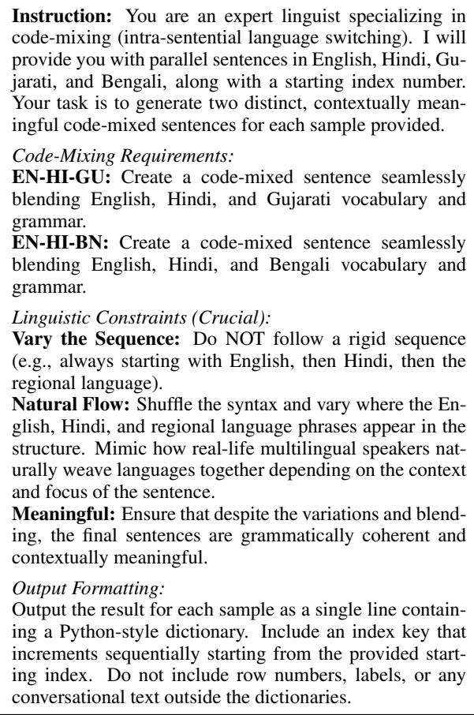

# IndicTriMix: Developing Language Identification Datasets and Models for Tri-Language Code-Mixing

Pruthwik Mishra1, Rudra Trivedi1, Avi Patel1, Ashok Urlana2, Shrikant Malviya1 Sardar Vallabhbhai National Institute of Technology, Surat, India1

TCS Research, Hyderabad, India2

{u24ai068, u24ai071, pruthwikmishra}@aid.svnit.ac.in shrikant@coed.svnit.ac.in,ashok.urlana@tcs.com

## Abstract

Language identification in code-mixed text, largely observed in social media, is highly essential when users frequently switch between multiple languages within a single utterance. Accurately identifying the languages of code-mixed tokens becomes an urgent necessity. Traditional language identification models, designed for monolingual text, are not well suited for token-level language identification in code-mixed settings. We formulate the task as a sequence labeling problem and fine-tune contextual transformer-based models MuRIL and XLM-RoBERTa best suited for Indian languages. We evaluate these systems on three different data configurations (Hindi, Gujarati, and Bengali) to predict language labels for individual tokens. We release a benchmark for language identification in code-mixed tokens with manually annotated test sets. We propose two approaches of code-mixed generation using parallel sentences of three languages. The trained models demonstrate the effectiveness of contextual embeddings for token-level language identification in multilingual social media text. For reproducibility and to facilitate future research, we publicly release our finetuned models1, datasets2, and source code3.

## 1 Introduction

Social media platforms have seen a massive surge in multilingual user engagement, where codemixing is the alternating use of two or more languages within a single conversation or utterance. For multilingual societies like India, around 7% of the population speaks three languages (Wikipedia, 2011). Individuals frequently intermix English with regional languages such as Hindi, Bengali, and Gujarati.

While conventional language identification (LID) tools perform reliably at the document or sentence level for monolingual texts, they fail significantly when applied to code-mixed usergenerated content. Code-mixed text demands a token-level fine-grained classification framework, transforming the task into a structured sequence labeling problem.

Code-mixing, in principle, is a phenomenon that can blend two or more languages or dialects in a single utterance. But the token-level language identification task has been limited to two languages (Amin et al., 2023; Patra et al., 2018; Barman et al., 2014; Bali et al., 2014; Sheth et al., 2026; Kodali et al., 2022) with a single matrix language and one embedded language. Very few works (Goswami et al., 2023; Raihan et al., 2023, 2024) have explored three-language code-mixed data, focusing on downstream tasks such as offensive language identification, sentiment analysis, and emotion detection, respectively, and are limited to English, Hindi, and Bengali. We attempt to develop language-agnostic techniques that can be applied and generalized to any three languages given 3-way parallel corpora.

In this paper, we present our models for language tag detection in multi-lingual codemixed settings. Building upon the Transformer architecture (Vaswani et al., 2017), we finetune multilingual transformer models, specifically MuRIL (Khanuja et al., 2021) and XLM-RoBERTa (Conneau et al., 2020), under three training configurations and evaluate each model on the corresponding in-domain development and test sets, framing the task as a token classification problem. Our models are trained to process codemixed social media sentences and assign accurate linguistic tags to every constituent token.

## 2 Related Work

## 2.1 Traditional Approaches to Language Identification

Token-level language identification has traditionally used dictionary-based methods, n-gram language models, and sequence models such as Conditional Random Fields (Lafferty et al., 2001), Maximum Entropy Markov Models (Ratnaparkhi, 1996), Structured Perceptrons (Collins, 2002), and Hidden Markov Models (Brants, 2000). However, code-mixed social media text introduces additional challenges due to transliteration, spelling variations, and informal language (Barman et al., 2014).

## 2.2 Neural and Transformer-based Approaches

Neural approaches such as BiLSTM (Graves and Schmidhuber, 2005) models, BiLSTM-CRF models (Huang et al., 2015), and BiLSTM-CNN-CRFs (Ma and Hovy, 2016) improved contextual language identification for code-mixed text (Chaitanya et al., 2018; Mandal and Singh, 2018), while recent studies have shown the effectiveness of transformer-based models for multilingual and code-mixed language identification (Thara and Poornachandran, 2021; Deka, 2023).

## 2.3 Multilingual Pretrained Models for Code-Mixed Text

Multilingual pretrained models such as MuRIL (Khanuja et al., 2021) and XLM-RoBERTa (Conneau et al., 2020) provide strong contextual representations for multilingual NLP and are particularly relevant to Indian codemixed text (AI4Bharat, 2026). In this work, we compare MuRIL and XLM-RoBERTa under combined multilingual, ENG-HIN-BEN, and ENG-HIN-GUJ training configurations.

## 2.4 Research Gap

To the best of our knowledge, no existing work has addressed code-mixed language identification involving three languages simultaneously, with prior studies largely restricted to bilingual code-mixed settings.

## 3 Dataset Description

We create two kinds of datasets: one rule-based and another LLM-based that involves human annotations by experts. We limit the scope of this task to two types of trilingual code-mixing: ENG-HIN-GUJ and ENG-HIN-BEN. We utilize ISO-639-2, or three-lettered, language tags to represent the languages as shown in Table 1. An additional tag “UNI” denotes the symbols and punctuations appearing in the corpus. These language tags act as labels for the language identification task. We sample sentences from the IndicCMix (AI4Bharat, 2026) dataset and label individual tokens using both techniques, as mentioned above. IndicCMix consists of 1.1 million sentences, where each of the unique English sentences (104,809) is translated into 11 Indic languages. We select this corpus as the base for code-mixing in three languages because the sentences in Indic languages are codemixed in nature. Additionally, it provides the text in roman, which eliminates the need for transliteration. This substantially reduces the risk of error propagation caused by external transliteration tools. Three distinct data configurations are used

<table><tr><td>Identifier</td><td>Language</td></tr><tr><td>BEN</td><td>Bengali</td></tr><tr><td>ENG</td><td>English</td></tr><tr><td>GUJ</td><td>Gujarati</td></tr><tr><td>HIN</td><td>Hindi</td></tr><tr><td>UNI</td><td>Punctuation</td></tr></table>

Table 1: Identifier to Language Mapping

to evaluate model performance over various linguistic compositions. The data statistics are shown in Table 2 and Table 3.

## 3.1 Rule-Based Approach

We use high-precision rules to identify the languages in the code-mixed sentences. To create a robust language identification model, a dataset that covers all varieties of code-mixing is required. The dataset must also contain sentences without any kind of code-mixing to enable the model to detect the language of monolingual text. We sample monolingual corpora from high-quality, publicly available corpora for our task. We choose Hindi (Bhat et al., 2017) and Bengali4 (Tandon and Sharma, 2017) corpora from publicly released dependency treebanks and Gujarati (Bhattacharjee et al., 2025) from publicly released parallel corpora. IndicCMix dataset is chosen for codemixing of two and three languages. Each Indic sentence (in our case, Hindi, Gujarati, and Bengali) consists of its romanized form, its native form, and the original source English sentence. We inspect English words in each Indic sentence, and if they are also found in the corresponding English source sentence, they are labeled as “ENG”. Other tokens in the sentence are labeled based on the language of the sentence. The symbols and punctuations are tagged as “UNIV”. For codemixing involving three languages, we utilize the 3-way parallel corpora involving either English, Hindi, and Gujarati or English, Hindi, and Bengali available in IndicCMix data. We combine phrases from three languages. To avoid generating sentences with a single dominant matrix language and the other two languages having only one or two words, we have enforced constraints on the minimum number of tokens in each language. As the languages of each sentence is already known, this rule-based technique ensures that the languages of words in the code-mixed sentence are unambiguously tagged. The dataset details using this approach are presented in Table 2.

<table><tr><td rowspan=1 colspan=1>Code-Mixing</td><td rowspan=1 colspan=1>#Train</td><td rowspan=1 colspan=1>#Dev</td></tr><tr><td rowspan=1 colspan=1>ENG-HIN-BEN</td><td rowspan=1 colspan=1>9142</td><td rowspan=2 colspan=1>796795</td></tr><tr><td rowspan=1 colspan=1>ENG-HIN-GUJ</td><td rowspan=1 colspan=1>9129</td></tr></table>

Table 2: Data Statistics Using Rule-Based Code-Mixing in terms of Sentences

<table><tr><td rowspan=1 colspan=1>Code-Mixing</td><td rowspan=1 colspan=1>#Dev</td><td rowspan=1 colspan=1>#Test</td></tr><tr><td rowspan=1 colspan=1>ENG-HIN-BEN</td><td rowspan=1 colspan=1>484</td><td rowspan=2 colspan=1>550550</td></tr><tr><td rowspan=1 colspan=1>ENG-HIN-GUJ</td><td rowspan=1 colspan=1>482</td></tr></table>

Table 3: Data Statistics Using LLM Generated Code-Mixing With Human Annotation in terms of Sentences

## 3.2 LLM-Based Approach

For generating sentences with trilingual codemixing, we use Gemini 2.5 Pro, which is a proprietary model. Using this technique, around 500 sentences are generated in both the dev and test sets. Two language experts manually annotate the language tag of each token for all the generated sentences in both the code-mixed settings. Each of the expert is a trilingual speaker with at least a postgraduate level of education. The statistics are shown in Table 3. The prompt used for the codemixed generation is detailed in the Table 4.

  
Table 4: Prompt used for generating three-way codemixed (EN-HI-GU and EN-HI-BN) sentences via the language model.

## 4 Assessing Quality of Generated Code-Mixed Sentences

Parallel sentences act as the main pivot for our code-mixed generation approaches. In order to assess the quality of the generated code-mixed sentences, we utilize various pretrained models that represent sentences using multilingual shared embeddings. For our study, BertScore (Zhang et al., 2020), Sentence BERT (Reimers and Gurevych, 2019), LaBSE (Feng et al., 2022) embeddings are used to measure the semantic similarity between each generated code-mixed sentence and its corresponding language specific sentence. In Sentence-BERT, specifically MPNET 5 model and LaBSE, the semantic closeness is evaluated by computing the cosine similarity between vector representations of two sentences. BertScore, or Bert F1- Score evaluates the maximal similarities at a token level. The semantic similarities of the code-mixed sentences generated by both approaches with each of the methods exceed 0.85 on average. This indicates high fluency and faithfulness of the generated sentences. The details are added in Appendix A.1 under Table 9.

## 5 Methodology

We treat language tagging at the token level as a sequence labeling problem. Given a sentence that can be viewed as a sequence of tokens $S =$ $( w _ { 1 } , w _ { 2 } , \ldots , w _ { n } )$ , we seek to produce an analogous sequence of labels $Y = ( y _ { 1 } , y _ { 2 } , \dots y _ { n } )$ with y ∈ {BEN, ENG, GUJ, HIN, UNI}.

## Step-by-Step Procedure

The pipeline we have used for compilation, tokenization, and evaluation of our models has been set up in the following manner:

1. Data Parsing: Text data formatted in a CoNLL-style format is read in iteratively. The sentences are dynamically collected, and each sequence is separated using either an empty line or a separation boundary.

2. Tokenization and Subword Alignment: Tokenization was performed using the Hugging Face Transformers package (Wolf et al., 2020) with the pretrained tokenizer corresponding to each model. Since a single word may be split into multiple subword tokens, while the annotations are provided at the word level, word-to-subword alignment was required.

3. Label Masking: When a word was split into multiple subword tokens, its ground-truth label was assigned only to the first subword. All subsequent subwords belonging to the same word were assigned the ignore index -100, preventing them from contributing to the training loss.

4. Data Batching and Dynamic Padding: Extracted features are converted to structured dictionary mappings using Hugging-Face framework. This ensures sequences within a batch are dynamically padded to match the longest element, optimizing compute times.

5. Supervised Fine-Tuning: The downstream system feeds contextual hidden vectors from the transformer body into a linear token classification layer tasked with estimating crossentropy distributions across the target tag configurations.

## 6 Model Architectures

We evaluate two prominent multilingual transformer architectures for token-level language identification:

## 6.1 MuRIL

MuRIL (Multilingual Representations for Indian Languages) (Khanuja et al., 2021) is a pre-trained language model specifically designed to capture linguistic nuances across Indian languages and their code-mixed variations. Its architecture is particularly suited for handling the morphological and phonetic complexities of Indo-Aryan languages written in both native scripts and Latin transliteration.

## 6.2 XLM-RoBERTa

XLM-RoBERTa-base (Conneau et al., 2020) is a cross-lingual transformer model trained on 100+ languages. It provides universal multilingual representations and serves as a strong baseline for comparison across diverse language pairs.

## 7 Experimental Setup

The models were implemented using Py-Torch (Paszke et al., 2019) and the Hugging Face Transformers library (Wolf et al., 2020). Training employed mixed-precision (fp16) optimization to improve computational efficiency. The foundational settings used for our experiments are detailed in Table 5.

<table><tr><td>Hyperparameter</td><td>Value</td></tr><tr><td>Base Architectures Learning Rate</td><td>MuRIL, XLM-RoBERTa-Base 2 × 10−5</td></tr><tr><td>Batch Size (Train/Eval) Total Training Epochs</td><td>16 10</td></tr><tr><td>Weight Decay</td><td>0.01</td></tr><tr><td>Max Sequence Length</td><td>128 tokens</td></tr><tr><td>Optimization Metric</td><td>Macro F_1 score</td></tr></table>

Table 5: Hyperparameter settings for fine-tuning.

## 7.1 Training Procedure and Convergence

We trained both MuRIL and XLM-RoBERTa on three separate data configurations:

<table><tr><td rowspan="3"></td><td colspan="5">MuRIL</td><td colspan="5">XLM-RoBERTa</td></tr><tr><td>BEN</td><td>ENG</td><td>GUJ</td><td>HIN</td><td>UNI</td><td>BEN</td><td>ENG</td><td>GUJ</td><td>HIN</td><td>UNI</td></tr><tr><td></td><td></td><td>0.987</td><td></td><td></td><td></td><td>0.987</td><td></td><td>0.993</td><td>1.0</td></tr><tr><td>ENG-HIN-BEN-DEV-RB ENG-HIN-GUJ-DEV-RB</td><td>0.984</td><td>0.99</td><td>0.985</td><td>0.992 0.991</td><td>0.999 0.996</td><td>0.984</td><td>0.989</td><td>0.981</td><td>0.988</td><td>0.998</td></tr><tr><td>ENG-HIN-BEN-DEV-LLM</td><td>0.981</td><td>0.99</td><td></td><td>0.408</td><td></td><td>0.97</td><td>0.984</td><td></td><td>0.423</td><td>0.997</td></tr><tr><td>ENG-HIN-BEN-TEST-LLM</td><td>0.975</td><td>0.993</td><td></td><td>0.773</td><td>1.0</td><td>0.968</td><td>0.99</td><td></td><td>0.771</td><td>1.0</td></tr><tr><td>ENG-HIN-GUJ-DEV-LLM</td><td></td><td>0.991</td><td>0.913</td><td>0.547</td><td>0.996</td><td></td><td>0.991</td><td>0.921</td><td>0.617</td><td>0.997</td></tr><tr><td>ENG-HIN-GUJ-TEST-LLM</td><td></td><td>0.996</td><td>0.923</td><td>0.757</td><td>1.0</td><td></td><td>0.993</td><td>0.924</td><td>0.773</td><td>1.0</td></tr><tr><td></td><td></td><td></td><td></td><td></td><td></td><td></td><td></td><td></td><td></td><td></td></tr></table>

Table 6: Results from Combined training on development and test sets. Values represent the $F _ { 1 }$ -score for each language class.

1. Combined Data: Merged multilingual data from all language pairs.

2. ENG-HIN-BEN Configuration: Data containing English, Hindi, and Bengali codemixed text.

3. ENG-HIN-GUJ Configuration: Data containing English, Hindi, and Gujarati codemixed text.

All models were fine-tuned for 10 training epochs using the configuration described in Table 5. The rule-based development (Dev RB) set was used as the validation set, and model evaluation was performed at the end of each epoch. The checkpoint achieving the best validation macro $F _ { 1 }$ -score was retained for subsequent evaluation.

## 8 Results and Evaluation

Our fine-tuned systems achieved robust performance on the evaluation sets. We compare MuRIL and XLM-RoBERTa under three training configurations: (i) combined multilingual training, (ii) ENG-HIN-BEN-specific training, and (iii) ENG-HIN-GUJ-specific training. Each model is evaluated on the corresponding development and test sets. The following sections present detailed evaluation results for each configuration.

## 8.1 Model Results

## 8.1.1 Combined Data Training

The token-level classification results for MuRIL and XLM-RoBERTa trained on the combined multilingual dataset and evaluated on the rule-based (RB) and LLM-generated development and test sets are presented in Table 6.

## 8.1.2 ENG-HIN-BEN Training

The token-level classification results for MuRIL and XLM-RoBERTa trained specifically on the ENG-HIN-BEN multilingual dataset and evaluated on the rule-based (RB) and LLM-generated development and test sets are presented in Table 7.

## 8.1.3 ENG-HIN-GUJ Training

The token-level classification results for MuRIL and XLM-RoBERTa trained specifically on the ENG-HIN-GUJ multilingual dataset and evaluated on the rule-based (RB) and LLM-generated development and test sets are presented in Table 8.

## 8.2 Discussion

We observe several key patterns across the three training configurations and two architectures:

1. Language-Pair-Specific Training: Models trained on a specific language pair achieve consistently strong performance on the corresponding evaluation set, indicating that specialized training effectively captures language-specific characteristics of the codemixed data.

2. Combined Data Generalization: Training on the combined multilingual dataset produces competitive performance across both language pairs, demonstrating that a single model can effectively learn shared multilingual representations while maintaining strong overall performance.

3. Architecture Comparison: MuRIL generally achieves slightly better performance than XLM-RoBERTa across the evaluated configurations, particularly under combined-data training. This advantage is consistent with MuRIL’s pre-training emphasis on Indian languages and its suitability for multilingual and code-mixed text involving Indian languages. However, the performance difference varies across language configurations and evaluation splits, with XLM-RoBERTa achieving comparable performance in several cases.

<table><tr><td></td><td colspan="4">MuRIL</td><td colspan="4">XLM-RoBERTa</td></tr><tr><td></td><td>BEN</td><td>ENG</td><td>HIN</td><td>UNI</td><td>BEN</td><td>ENG</td><td>HIN</td><td>UNI</td></tr><tr><td>ENG-HIN-BEN-DEV-RB</td><td>0.983</td><td>0.985</td><td>0.992</td><td>0.999</td><td>0.983</td><td>0.986</td><td>0.991</td><td>1.0</td></tr><tr><td>ENG-HIN-BEN-DEV-LLM</td><td>0.979</td><td>0.991</td><td>0.339</td><td>0.996</td><td>0.977</td><td>0.989</td><td>0.364</td><td>1.0</td></tr><tr><td>ENG-HIN-BEN-TEST-LLM</td><td>0.974</td><td>0.992</td><td>0.764</td><td>1.0</td><td>0.97</td><td>0.991</td><td>0.762</td><td>1.0</td></tr></table>

Table 7: Results from ENG-HIN-BEN training on development and test sets. Values represent the $F _ { 1 }$ -score for each language class.
<table><tr><td></td><td colspan="4">MuRIL</td><td colspan="4">XLM-RoBERTa</td></tr><tr><td></td><td>ENG</td><td>GUJ</td><td>HIN</td><td>UNI</td><td>ENG</td><td>GUJ</td><td>HIN</td><td>UNI</td></tr><tr><td>ENG-HIN-GUJ-DEV-RB</td><td>0.988</td><td>0.983</td><td>0.989</td><td>0.996</td><td>0.987</td><td>0.981</td><td>0.988</td><td>0.997</td></tr><tr><td>ENG-HIN-GUJ-DEV-LLM</td><td>0.994</td><td>0.923</td><td>0.603</td><td>0.996</td><td>0.992</td><td>0.927</td><td>0.645</td><td>0.998</td></tr><tr><td>ENG-HIN-GUJ-TEST-LLM</td><td>0.996</td><td>0.928</td><td>0.778</td><td>1.0</td><td>0.993</td><td>0.927</td><td>0.779</td><td>1.0</td></tr></table>

Table 8: Results from ENG-HIN-GUJ training on development and test sets. Values represent the $F _ { 1 }$ -score for each language class.

4. Language-Specific Challenges: The difficulty of language identification varies across evaluation settings. While the rule-based development sets achieve consistently high F\_1-scores, the LLM-generated sets show greater variation, particularly for HIN. This may be attributed to transliteration, lexical overlap, and limited class support in some splits, where a small number of errors can substantially affect the F\_1-score. In contrast, UNI is consistently recognized with near-perfect F\_1-scores.

## 9 Conclusion

In this study, we present token classification frameworks for language tag detection using both MuRIL and XLM-RoBERTa transformer models trained on three distinct data configurations: combined multilingual data, ENG-HIN-BEN codemixed text, and ENG-HIN-GUJ code-mixed text. Evaluation on the development and test sets enabled us to compare the effectiveness of languagepair-specific models with a single model trained on combined multilingual data. The experimental results demonstrate that contextual word embeddings provide a robust foundation for managing sequence boundaries and structural changes in multi-lingual code-mixed sentences.

## 10 Limitations

## Data Deficiencies and Target Label Imbalances

A primary challenge identified during model evaluation is the effect of uneven label distributions across different evaluation subsets. When an evaluation slice contains a highly imbalanced distribution of language instances, particularly when a language has very few supporting examples, the model’s $F _ { 1 }$ -score can become sensitive to precision and recall variations. This can make performance estimates less stable for languages with limited representation in a particular evaluation set.

## Phonetic Interference and Lexical Errors in Transliteration

The use of textual abbreviations, slang words, and formatting anomalies characteristic of informal code-mixed text makes language classification more challenging. Furthermore, several Indo-Aryan languages exhibit similar phonetic characteristics when represented using the Latin alphabet (Romanization), which can blur the boundaries between language classes. This transliterationrelated ambiguity may affect the overall performance of the system for certain language instances. Future work could address this issue by incorporating additional lexical or phonetic information.

## Subword-Level Label Alignment

Since the language-identification annotations are provided at the word level, words that are segmented into multiple subword tokens require an alignment strategy. In our implementation, the original word-level label is assigned only to the first subword, while subsequent subwords are assigned the ignore index -100. Although this avoids assigning the same word-level label multiple times and prevents trailing subwords from contributing directly to the training loss, it also means that these subword representations do not receive direct supervision from the corresponding word-level label. More sophisticated word-tosubword labeling strategies could be explored in future work.

## References

AI4Bharat. 2026. Developing indiccmix dataset.

Dhiraj Amin, Sharvari Govilkar, Sagar Kulkarni, Yash Shashikant Lalit, Arshi Ajaz Khwaja, Daries Xavier, and Sahil Girijashankar Gupta. 2023. Marathi-english code-mixed text generation. Preprint, arXiv:2309.16202.

Kalika Bali, Jatin Sharma, Monojit Choudhury, and Yogarshi Vyas. 2014. “i am borrowing ya mixing?" an analysis of english-hindi code mixing in facebook. In Proceedings of the first workshop on computational approaches to code switching, pages 116–126.

Utsab Barman, Amitava Das, Joachim Wagner, and Jennifer Foster. 2014. Code mixing: A challenge for language identification in the language of social media. In Proceedings of the first workshop on computational approaches to code switching, pages 13– 23.

Riyaz Ahmad Bhat, Rajesh Bhatt, Annahita Farudi, Prescott Klassen, Bhuvana Narasimhan, Martha Palmer, Owen Rambow, Dipti Misra Sharma, Ashwini Vaidya, Sri Ramagurumurthy Vishnu, and 1 others. 2017. The hindi/urdu treebank project. In Handbook of linguistic annotation, pages 659–697. Springer.

Soham Bhattacharjee, Mukund K Roy, Yathish Poojary, Bhargav Dave, Mihir Raj, Vandan Mujadia, Baban Gain, Pruthwik Mishra, Arafat Ahsan, Parameswari Krishnamurthy, Ashwath Rao, Gurpreet Singh Josan, Preeti Dubey, Aadil Amin Kak, Anna Rao Kulkarni, Narendra VG, Sunita Arora, Rakesh Balbantray, Prasenjit Majumdar, and 3 others. 2025. Coril: Towards enriching indian language

to indian language parallel corpora and machine translation systems. Preprint, arXiv:2509.19941.

Thorsten Brants. 2000. TnT – a statistical partof-speech tagger. In Sixth Applied Natural Language Processing Conference, pages 224–231, Seattle, Washington, USA. Association for Computational Linguistics.

Inumella Chaitanya, Indeevar Madapakula, Subham Kumar Gupta, and S Thara. 2018. Word level language identification in code-mixed data using word embedding methods for indian languages. In 2018 International Conference on Advances in Computing, Communications and Informatics (ICACCI), pages 1137–1141. IEEE.

Michael Collins. 2002. Discriminative training methods for hidden Markov models: Theory and experiments with perceptron algorithms. In Proceedings of the 2002 Conference on Empirical Methods in Natural Language Processing (EMNLP 2002), pages 1–8. Association for Computational Linguistics.

Alexis Conneau, Kartikay Khandelwal, Naman Goyal, Vishrav Chaudhary, Guillaume Wenzek, Francisco Guzmán, Edouard Grave, Myle Ott, Luke Zettlemoyer, and Veselin Stoyanov. 2020. Unsupervised cross-lingual representation learning at scale. In Proceedings of the 58th Annual Meeting of the Association for Computational Linguistics, pages 8440– 8451, Online. Association for Computational Linguistics.

Brajen Kumar Deka. 2023. Deep learning-based language identification in code-mixed text. In International Conference On Innovative Computing And Communication, pages 383–391. Springer.

Fangxiaoyu Feng, Yinfei Yang, Daniel Cer, Naveen Arivazhagan, and Wei Wang. 2022. Languageagnostic BERT sentence embedding. In Proceedings of the 60th Annual Meeting of the Association for Computational Linguistics (Volume 1: Long Papers), pages 878–891, Dublin, Ireland. Association for Computational Linguistics.

Dhiman Goswami, Md Nishat Raihan, Antara Mahmud, Antonios Anastasopoulos, and Marcos Zampieri. 2023. OffMix-3L: A novel code-mixed test dataset in Bangla-English-Hindi for offensive language identification. In Proceedings of the 11th International Workshop on Natural Language Processing for Social Media, pages 21–27, Bali, Indonesia. Association for Computational Linguistics.

Alex Graves and Jürgen Schmidhuber. 2005. Framewise phoneme classification with bidirectional lstm and other neural network architectures. Neural Networks, 18(5):602–610. IJCNN 2005.

Zhiheng Huang, Wei Xu, and Kai Yu. 2015. Bidirectional lstm-crf models for sequence tagging. Preprint, arXiv:1508.01991.

Simran Khanuja, Diksha Bansal, Sarvesh Mehtani, Savya Khosla, Atreyee Dey, Balaji Gopalan, Dilip Kumar Margam, Pooja Aggarwal, Rajiv Teja Nagipogu, Shachi Dave, Shruti Gupta, Subhash Chandra Bose Gali, Vish Subramanian, and Partha Talukdar. 2021. Muril: Multilingual representations for indian languages. Preprint, arXiv:2103.10730.

Prashant Kodali, Anmol Goel, Monojit Choudhury, Manish Shrivastava, and Ponnurangam Kumaraguru. 2022. Symcom-syntactic measure of code mixing a study of english-hindi code-mixing. In Findings of the Association for Computational Linguistics: ACL 2022, pages 472–480.

John D. Lafferty, Andrew McCallum, and Fernando C. N. Pereira. 2001. Conditional random fields: Probabilistic models for segmenting and labeling sequence data. In Proceedings of the Eighteenth International Conference on Machine Learning, ICML ’01, page 282–289, San Francisco, CA, USA. Morgan Kaufmann Publishers Inc.

Xuezhe Ma and Eduard Hovy. 2016. End-to-end sequence labeling via bi-directional LSTM-CNNs-CRF. In Proceedings ofthe 54th Annual Meeting of the Association for Computational Linguistics (Volume 1: Long Papers), pages 1064–1074, Berlin, Germany. Association for Computational Linguistics.

Soumil Mandal and Anil Kumar Singh. 2018. Language identification in code-mixed data using multichannel neural networks and context capture. In Proceedings ofthe 2018 EMNLP Workshop W-NUT: The 4th Workshop on Noisy User-generated Text, pages 116–120, Brussels, Belgium. Association for Computational Linguistics.

Adam Paszke, Sam Gross, Francisco Massa, Adam Lerer, James Bradbury, Gregory Chanan, Trevor Killeen, Zeming Lin, Natalia Gimelshein, Luca Antiga, Alban Desmaison, Andreas Kopf, Edward Yang, Zachary DeVito, Martin Raison, Alykhan Tejani, Sasank Chilamkurthy, Benoit Steiner, Lu Fang, and 2 others. 2019. Pytorch: An imperative style, high-performance deep learning library. In Advances in Neural Information Processing Systems, volume 32. Curran Associates, Inc.

Braja Gopal Patra, Dipankar Das, and Amitava Das. 2018. Sentiment analysis of code-mixed indian languages: An overview of sail\_code-mixed shared task@ icon-2017. arXiv preprint arXiv:1803.06745.

Md Nishat Raihan, Dhiman Goswami, Antara Mahmud, Antonios Anastasopoulos, and Marcos Zampieri. 2023. SentMix-3L: A novel code-mixed test dataset in Bangla-English-Hindi for sentiment analysis. In Proceedings of the First Workshop in South East Asian Language Processing, pages 79– 84, Nusa Dua, Bali, Indonesia. Association for Computational Linguistics.

Nishat Raihan, Dhiman Goswami, Antara Mahmud, Antonios Anastasopoulos, and Marcos Zampieri.

2024. Emomix-3l: a code-mixed dataset for banglaenglish-hindi for emotion detection. In Proceedings of the 7th Workshop on Indian Language Data: Resources and Evaluation, pages 11–16.

Adwait Ratnaparkhi. 1996. A maximum entropy model for part-of-speech tagging. In Conference on Empirical Methods in Natural Language Processing.

Nils Reimers and Iryna Gurevych. 2019. Sentence-BERT: Sentence embeddings using Siamese BERTnetworks. In Proceedings ofthe 2019 Conference on Empirical Methods in Natural Language Processing and the 9th International Joint Conference on Natural Language Processing (EMNLP-IJCNLP), pages 3982–3992, Hong Kong, China. Association for Computational Linguistics.

Rajvee Sheth, Samridhi Raj Sinha, Mahavir Patil, Himanshu Beniwal, and Mayank Singh. 2026. Beyond monolingual assumptions: A survey on codeswitched nlp in the era of large language models across modalities. In Proceedings of the 64th Annual Meeting of the Association for Computational Linguistics (Volume 1: Long Papers), pages 8519– 8566.

Juhi Tandon and Dipti Misra Sharma. 2017. Unity in diversity: A unified parsing strategy for major Indian languages. In Proceedings of the Fourth International Conference on Dependency Linguistics (Depling 2017), pages 255–265, Pisa, Italy. Linköping University Electronic Press.

S Thara and Prabaharan Poornachandran. 2021. Transformer based language identification for malayalamenglish code-mixed text. IEEE Access, 9:118837– 118850.

Ashish Vaswani, Noam Shazeer, Niki Parmar, Jakob Uszkoreit, Llion Jones, Aidan N Gomez, Ł ukasz Kaiser, and Illia Polosukhin. 2017. Attention is all you need. In Advances in Neural Information Processing Systems, volume 30. Curran Associates, Inc.

Wikipedia. 2011. List of languages by number of native speakers in india.

Thomas Wolf, Lysandre Debut, Victor Sanh, Julien Chaumond, Clement Delangue, Anthony Moi, Pierric Cistac, Tim Rault, Remi Louf, Morgan Funtowicz, Joe Davison, Sam Shleifer, Patrick von Platen, Clara Ma, Yacine Jernite, Julien Plu, Canwen Xu, Teven Le Scao, Sylvain Gugger, and 3 others. 2020. Transformers: State-of-the-art natural language processing. In Proceedings of the 2020 Conference on Empirical Methods in Natural Language Processing: System Demonstrations, pages 38–45, Online. Association for Computational Linguistics.

Tianyi Zhang, Varsha Kishore, Felix Wu, Kilian Q. Weinberger, and Yoav Artzi. 2020. Bertscore: Evaluating text generation with bert. In International Conference on Learning Representations.

<table><tr><td></td><td colspan="3">BertScore-F1</td><td colspan="4">LaBSE</td><td colspan="4">MPNET</td></tr><tr><td></td><td>ENG</td><td>HIN BEN</td><td>GUJ</td><td>ENG</td><td>HIN</td><td>BEN</td><td>GUJ</td><td>ENG</td><td>HIN</td><td>BEN</td><td>GUJ</td></tr><tr><td>ENG-HIN-BEN-dev-RB</td><td>0.915</td><td>0.936</td><td>0.919</td><td></td><td>0.80</td><td>0.885</td><td>0.861</td><td></td><td>0.773 0.877</td><td>0.854</td><td></td></tr><tr><td>ENG-HIN-GUJ-dev-RB</td><td>0.906</td><td>0.935</td><td></td><td>0.929</td><td>0.79</td><td>0.896</td><td>0.9</td><td>0.753</td><td>0.883</td><td></td><td>0.889</td></tr><tr><td>ENG-HIN-BEN-dev-LLM</td><td>0.911</td><td>0.9</td><td>0.925</td><td></td><td>0.859</td><td>0.792</td><td>0.825</td><td>一</td><td>0.837 0.77</td><td>0.839</td><td>-</td></tr><tr><td>ENG-HIN-BEN-test-LLM</td><td>0.911</td><td>0.894</td><td>0.918</td><td></td><td>0.837</td><td>0.776</td><td>0.831</td><td></td><td>0.845 0.782</td><td>0.839</td><td>-</td></tr><tr><td>ENG-HIN-GUJ-dev-LLM</td><td>0.913</td><td>0.905</td><td></td><td>0.908</td><td>0.855</td><td>0.815</td><td></td><td>0.824</td><td>0.831 0.798</td><td></td><td>0.818</td></tr><tr><td>ENG-HIN-GUJ-test-LLM</td><td>0.913</td><td>0.908</td><td></td><td>0.902</td><td>0.841</td><td>0.817</td><td></td><td>0.811</td><td>0.830 0.815</td><td></td><td>0.821</td></tr></table>

Table 9: Semantic Similarity Scores of Code-Mixed Sentences with Language-Wise Parallel Sentences. RB → Rule-Based Approach and LLM → LLM Approach.

## A Appendix

## A.1 Computation of Semantic Similarity Scores

We compute the semantic similarity scores of the code-mixed sentences with English sentences and the romanized versions of Hindi, Gujarati, and Bengali sentences. From Table 9, we can observe that the generated code-mixed sentences are both faithful and fluent with their language-specific counterparts evident from high scores.