# ProMediConv: Benchmarking Proactive Conversational Agents in Legal Dispute Mediation

Zesheng Wei1\* Mengfan Li2 Wenhao Liu1 Yixin Zhang3 Zilei Wang1† Yang Deng2 1University of Science and Technology of China 2Singapore Management University 3Institute of Artificial Intelligence, Hefei Comprehensive National Science Center {zswei, wenhaoliu}@mail.ustc.edu.cn, mengfanli1024@gmail.com {zhyx12, zlwang}@ustc.edu.cn, ydeng@smu.edu.sg

## Abstract

Dispute mediation is essential for maintaining social harmony and resilience, yet developing skilled mediators is costly and timeconsuming. Existing LLM-based mediation research remains limited by unrealistic task formulations, low-fidelity datasets, and coarse evaluation metrics that obscure turn-by-turn dynamics. To address these gaps, we introduce ProMediConv, a novel benchmarking framework that models mediation as a proactive, multi-stage, and party-aware dialogue process incorporating 11 mediation strategies and four party behavior pattern (BP) states. Using 972 complete real-world cases, we construct a high-fidelity mediation dataset with utterance-level annotations of strategies and BP states. Furthermore, to better assess agent impact, we propose MAD (Mean Attribute Difference), a fine-grained metric that captures BP shifts throughout the dialogue. Leveraging this framework, we establish a comprehensive benchmark by evaluating diverse models alongside our tailored baseline Pro-MediAgent. Extensive empirical analyses reveal critical behavioral phenomena and underscore the persistent challenges current models face in dynamic, multi-party mediation. Ultimately, ProMediConv provides a rigorous foundation and a vital quantitative standard for advancing AI-assisted conflict resolution. Our dataset and codebase are accessible at https://github.com/ZsWei66/ ProMediConv\_repo.

## 1 Introduction

Legal Dispute Mediation is a vital, non-litigious mechanism for resolving conflicts and maintaining social harmony (Mueller, 2008; Di and Wu, 2009). However, effective mediation demands far more than basic legal knowledge, it involves navigating complex, multi-party social interactions using advanced strategic communication and psychological assessment skills (Jackson and Bercovitch, 1993). Consequently, cultivating highly skilled human mediators is exceptionally resource-intensive and time-consuming (Devinatz, 2018), creating a pressing need for automated solutions that can bolster societal capacity for conflict resolution.

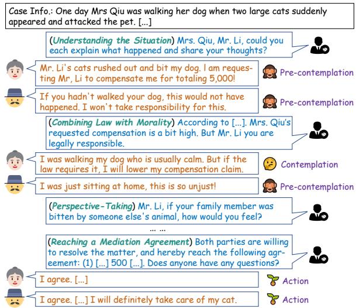  
Figure 1: An example dialogue of ProMediConv showcases the the mediator agent (Right) proactively employ mediation strategies (highlighted in brackets) to guide all disputing parties (Left) toward a resolution. The BP state of dispute party is explicitly annotated.

The rapid advancement of large language models (LLMs) has transformed general-purpose dialogue systems (DeepSeek-AI et al., 2024; Ouyang et al., 2022; Yang et al., 2024), demonstrating unprecedented conversational fluency and adaptability. Building on this progress, research efforts have expanded into domain-specific conversational applications, accelerating deployment in sectors such as persuasion (Wang et al., 2019), legal consultation (Cui et al., 2023), and mental health support (Liu et al., 2021). While recent studies have pioneered the use of LLMbased frameworks to explore automated mediation and negotiation (Chen et al., 2025), fully expanding and quantifying the capabilities of conversational agents in this high-stakes domain requires a comprehensive benchmarking paradigm. Currently, systematic research in this direction remains severely constrained by several fundamental limitations.

Primarily, current frameworks exhibit a severe lack of alignment with real-world mediation dynamics. They often conceptualize mediation as a generic dialogue task (Bianchi et al., 2024), overlooking the mediators proactive, strategically directive role (Moore and KEMP, 1988; Jiang, 2008) and the complex multi-party communication inherent in the real-world scenarios (Olekalns et al., 2003). Compounding this issue is the scarcity of high-fidelity data. Due to privacy regulations, accessing authentic legal mediation transcripts is highly restricted. Consequently, existing studies are forced to rely on static legal documents lacking interactive dynamics (Hale et al., 2025a), or employ simplified LLM-based prompting pipelines to synthesize dialogues (Kwon et al., 2024; Zhang et al., 2024a). This results in small-scale, lowfidelity datasets that fundamentally fail to capture the nuanced, dynamic characteristics of authentic human mediation (Chen et al., 2026).

Furthermore, current evaluation paradigms for proactive conversational agents (Deng et al., 2023b) tend to be outcome-oriented. Existing metrics, such as Average Turn (AT), Success Rate (SR@t) and Soft Success Rate (SSR) (Deng et al., 2023d; Zhang et al., 2024b; He et al., 2025a,b), focus heavily on task efficiency and final resolution states. While useful for macroscopic assessment, they fail to capture within-dialogue qualitative impacts, such as the emotional improvement in emotion support, or the gradual shifts in dispute parties’ psychological states during the mediation process. Capturing such user-side dynamics has increasingly attracted research attention (Li et al., 2026a,b), as reflected in recent work on LLM-based user simulation (Wu et al., 2026b) or personality modeling (Wei et al., 2026; Li et al., 2026c) that influence users with different personality characteristics and behavioral states. Such process-level characterization is especially important in mediation, where relying solely on final outcomes can obscure how strategic interventions of mediators progressively shape the parties’ psychological states and ultimately contribute to conflict resolution.

To this end, we systematically define ProMedi-

Conv (Proactive Mediation Conversation), a novel framework designed to benchmark proactive conversational agents in dynamic, strategy-driven mediation scenarios. We formally model the mediation workflow into three distinct stages, incorporating 11 widely adopted mediation strategies and four Behavior Pattern (BP) states to track the evolving psychological stances of the disputing parties. To support this task and overcome data scarcity, we construct a high-fidelity dataset from 972 real-world cases using an automated text reconstruction pipeline constrained by immutable factual and legal records. To resolve the evaluation bottleneck, we introduce MAD (Mean Attribute Difference), a fine-grained metric that quantifies mediation effectiveness by monitoring continuous changes in party BP. Leveraging this framework, we establish a comprehensive benchmark by evaluating a diverse set of general and legal-specific LLMs with advanced policy planning methods, alongside our customized baseline ProMediAgent. Our extensive empirical analyses reveal critical behavioral phenomena and underscore the persistent challenges current models face in complex mediation environments. To summarize, our contributions are as follows:

• We propose ProMediConv, systematically modeling multi-party dispute mediation dialogue task. We construct a high-fidelity dataset of 972 realistic cases, overcoming privacy barriers while preserving authentic interactive dynamics.

• We introduce MAD, a novel metric designed to capture the within-dialogue qualitative shifts in parties’ BP, addressing the blind spots of traditional efficiency- and outcome-focused metrics.

• We benchmark diverse models alongside our tailored baseline, providing in-depth analysis of phenomenon in mediation dialogue and the inherent limitations of current conversational agents in real-world legal mediation.

## 2 Related Works

Mediation and Negotiation Dialogues Frameworks. Mediation and negotiation are common in social interaction, and have therefore attracted substantial attention in dialogue systems research. Prior work has largely focused on casual negotiation scenarios. For example, CraisglistBargain collected conversations involving prices bargaining of secondhand items (He et al., 2018), LAMEN still target casual negotiations but broaden the range of tasks (Davidson et al., 2024). More recently, researchers have begun to investigate mediation and negotiation dialogues in the legal domain, which represent more complex and professional scenarios (Chen et al., 2025). However, existing frameworks suffer from overly simplified task formulations and weak alignment with realworld dynamics, including restricting interactions to a twoparty setting (Hale et al., 2025b), failing to explicitly model the important party state (Robbennolt, 2025; Liu et al., 2026), and neglecting the proactive, directive role that mediators often play in practice (Chen et al., 2026). In addition, current mediation datasets are generally nonscalable (Tan et al., 2024; Chen et al., 2026; Liu et al., 2026), which constrains their usefulness for trainings and evaluations.

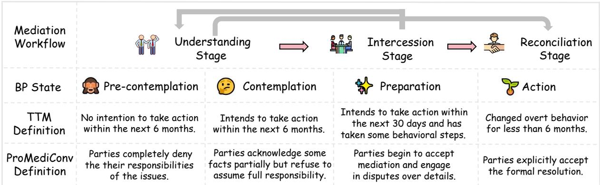  
Figure 2: Overview of the definitions of behavior pattern state of parties and mediation workflow in ProMediConv.

Proactive Conversational Agents. Most existing LLMbased agents are designed to rigidly follow user instructions, which limits their ability to provide proactive assistance in certain scenarios (Liao et al., 2023; Lu et al., 2025; Lin et al., 2026). To this end, proactive conversational agents are designed to anticipate potential impacts and actively steer the dialogue, rather than merely reacting to user inputs (Deng et al., 2023b). Proactivity research in conversational agents typically focuses on two directions: 1) asking clarification question (Zhu et al., 2021; Samarinas and Zamani, 2024; Zhang et al., 2025); 2) dialogue policy planning (Lei et al., 2022; Deng et al., 2024). In the context of dialogue policy planning, existing research typically formulates proactivity as a strategy selection problem, where the agent chooses among conversational strategies at each turn (Dong et al., 2025; He et al., 2025a). For example, (Deng et al., 2023c) incorporate chainofthought into proactive dialogue, and (Deng et al., 2023d) introduce a planning plugin to enhance proactive capabilities. In addition, (Fu et al., 2023) improve strategic decisionmaking through selfplay and learning from AI feedback. However, these approaches mainly focus on two-party conversational tasks, and, no prior work has explored evaluating proactive conversational agents in complex, multiparty mediation scenarios.

## 3 ProMediConv

In this section, we formulate ProMediConv as a structured dialogue framework (with an example in Figure 1 and complete formalization in g A.1˘ ). This systematic formulation encompasses the mediation workflow and parties’ BP states (g 3.1 ˘ ), the mediation strategies (g 3.2˘ ), and our proposed MAD metric (g 3.3˘ ). Guided by this theoretical foundation, we subsequently detail the construction of the dataset (g 3.4 ˘ ).

## 3.1 Mediation Workflow & BP States of Party

We delineate the ProMediConv workflow into three primary stages: (I) Understanding, (II) Intercession, and (III) Reconciliation. While the standard progression is strictly sequential ((I)(II)(III)), the dynamic nature of mediation accommodates exceptional trajectories. For instance, mediators may need to revert to the Understanding stage for repeated reassurance ((II)(I)), or bypass the Intercession stage for the straightforward resolution of minor disputes ((I)(III)).

Crucially, driving this workflow requires tracking the internal states of the involved parties. Extensive research on dispute resolution highlights that the primary focus of human mediators lies in transforming the BP of dispute party (Bush and

<table><tr><td rowspan=1 colspan=1>Strategies</td><td rowspan=1 colspan=1>Examples</td></tr><tr><td rowspan=1 colspan=1>Understanding the Situation</td><td rowspan=1 colspan=1>Hello, Mr. Duan. First, Could you please descr-ibe what happened at that time?</td></tr><tr><td rowspan=1 colspan=1>Mobilizing Multiple Forcesfor Assistance</td><td rowspan=1 colspan=1>I heard that Mr. Sun is a close friend of you-rs. ... see if he might be able to offer additio-nal help.</td></tr><tr><td rowspan=1 colspan=1>Combining Law with Morality</td><td rowspan=1 colspan=1>According to &quot;Regulations on Work-RelatedInjury Insurance,&quot;, .., it should be countedas a work-related injury..</td></tr><tr><td rowspan=1 colspan=1>Grasp the PrincipalContradiction</td><td rowspan=1 colspan=1>The key issue is whether Xinle Company iswilling to pay the migrant workers&#x27; [...]</td></tr><tr><td rowspan=1 colspan=1>Integrating the Resolutionof Ideological Issues andPractical Problems</td><td rowspan=1 colspan=1>Mr. Li, I understand. The village committee iswilling to allocate a piece of land for you totransplant your plants and trees, ...</td></tr><tr><td rowspan=1 colspan=1>Perspective-Taking</td><td rowspan=1 colspan=1>Xiao Xu, when you were in dire need of helpXiao Kang was there for you. How about...?</td></tr><tr><td rowspan=1 colspan=1>Early Detection andPrevention</td><td rowspan=1 colspan=1>To prevent potential disputes, we canformalize [...] obligations of both parties.</td></tr><tr><td rowspan=1 colspan=1>Strategic AmbiguityTechnique</td><td rowspan=1 colspan=1>Mr Wu, It&#x27;s normal for a young couple, ther-e&#x27;s no need to dwell on who&#x27;s right or wrong...</td></tr><tr><td rowspan=1 colspan=1>Recognition and MotivationApproaches</td><td rowspan=1 colspan=1>It&#x27;s commendable that you recognize this,which shows you&#x27;re a sensible and reasona-ble person....</td></tr><tr><td rowspan=1 colspan=1>Reaching a MediationAgreement</td><td rowspan=1 colspan=1>Very well, since both of you agree to acceptmediation, we reach the following agreement:[..]</td></tr><tr><td rowspan=1 colspan=1>Others</td><td rowspan=1 colspan=1>Thank you all for your cooperation. I hopethis mediation will help [...].</td></tr></table>

Figure 3: Overview of Mediation Strategy Set. We abbreviate strategy names using first letter of their first two words (e.g., "Understanding the Situation" as "US"), except "Reaching a Mediation Agreement" as "RA".

Folger, 1994; Boluwaduro, 2021). To formally model this, we incorporate a granular BP tracking mechanism into ProMediConv. Drawing inspiration from the Transtheoretical Model (TTM) (Prochaska and Velicer, 1997; Prochaska et al., 1992), which posits that behavioral change is a gradual, multi-stage process, we categorize the parties’ BP into four distinct developmental states. This classification aligns seamlessly with how parties’ perspectives evolve under strategic mediation. Figure 2 illustrates these BP states and their integration into the mediation workflow.

## 3.2 Mediation Strategies

We synthesize a comprehensive set of mediation strategies grounded in widely used human mediation skills (Jiang, 2008; Renmin Tiaojie Gongzuo Falv Shiwu Congshu Writing Group, 2017, 2020)1. To ensure the completeness of the mediation process, we incorporate two additional strategies: “Understanding the Situation” and “Reaching a Mediation Agreement”. Furthermore, to account for dialogues that do not explicitly employ specific mediation strategies, we categorize these under a strategy labeled “Others”. The complete strategies set are provided in Figure 3, with more detailed information provided in g A.2 ˘ .

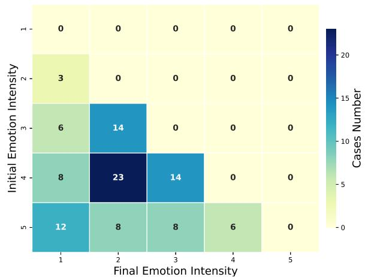  
Figure 4: Initial and final emotional intensity distribution (15) of help-seekers in successful dialogues (number of turns as 23) from the ESConv dataset.

## 3.3 Mean Attribute Difference

As discussed in g 1˘ , traditional evaluation metrics for proactive dialogue agents predominantly focus on task efficiency and final outcomes, often obscuring fine-grained, within-dialogue qualitative impacts. To empirically substantiate this limitation, we analyze the ESConv dataset (Liu et al., 2021). By isolating a subset of successful dialogues with an identical length (23 turns) to control for efficiency and outcome variables, we examine the distribution of the help-seekers’ initial and final emotional intensities (rated on a 5- point scale). As illustrated in Figure 4, even under identical macro-conditions (same turn count and successful resolution), there is substantial variance in the help-seekers’ actual emotional intensity improvements. This explicitly demonstrates that dialogues appearing equally effective under traditional metrics can actually yield vastly different psychological benefits, thereby overlooking critical dimensions of an agent’s true effectiveness. To address this gap and comprehensively evaluate proactive conversational agents, we must consider not only task completion but also specific progressive improvements of the involved clients, such as help-seekers’ emotional enhancement in psychology tasks, or the disputing parties’ BP shifts in ProMediConv. Consequently, we propose MAD (Mean Attribute Difference) as a more granular evaluation metric:

$$
\mathbf { M A D } = \frac { 1 } { N } \sum _ { k = 1 } ^ { N } \frac { \sum _ { t = 1 } ^ { P _ { k } } \left( a _ { t } ^ { f } - a _ { t } ^ { i } \right) } { P _ { k } }\tag{1}
$$

where $a _ { t } ^ { i }$ and $a _ { t } ^ { f }$ denote the initial and final states of client t; $P _ { k }$ denotes the number of clients in the k-th case. Notably, to ensure the meaningfulness of the progress quantified by MAD, the evaluated client attribute must be formulated as ordinal, accommodating both discrete and continuous values.

## 3.4 Dataset Construction

Existing literature on dispute mediation preserves a wealth of authentic cases containing verbatim multi-party utterances and complete mediation records. However, utilizing these high-fidelity resources faces critical challenges: disorganized text formats, insufficient legal references, and a lack of explicit party state annotations. To construct the ProMediConv dataset without compromising the real-world dynamics, we design an automated text reconstruction pipeline (detailed in g B.1˘ ) to standardize these cases into structured dialogues.

## 3.4.1 Data Collection and Reconstruction

We curate 981 real-world mediation cases from 15 published dispute mediation books via RapidOCR tools2. After filtering out cases with low quality, we obtain 972 high-quality authentic cases. Instead of generating dialogues from scratch, our pipeline employs a strict constraint mechanism to prevent LLM hallucinations. Specifically, we first automatically extract the immutable facts, factual trajectories, and applicable legal clauses from the original unstructured texts. These extracted elements serve as hard constraints for the subsequent dialogue reconstruction, ensuring that the generated multi-party interactions strictly faithfully restore the original mediation dynamics. Furthermore, to automatically annotate the parties’ BP states, we evaluate several advanced LLMs against expert human annotations (detailed in g B.1˘ ). We select Qwen2.5-14B-Instruct (Yang et al., 2024) as our BP annotator, as it demonstrated the highest alignment with human judgments. Since all source cases are published materials, the identities of all parties have been fully anonymized to protect privacy.

<table><tr><td>Statistic</td><td>Total</td><td>Mediator</td><td>Party</td></tr><tr><td>Average Role Numbers</td><td>4.54</td><td>1</td><td>3.54</td></tr><tr><td>Number of Cases</td><td>972</td><td></td><td></td></tr><tr><td>Number of Utterances</td><td>17,277</td><td>8,774</td><td>8,503</td></tr><tr><td>Avg. Utterances per Case</td><td>17.88</td><td>8.98</td><td>8.90</td></tr></table>

Table 1: Statistical characteristics of ProMediConv. 2https://github.com/RapidAI/RapidOCR

## 3.4.2 Dataset Statistics

The final ProMediConv dataset comprises 972 structured multi-party dialogues with comprehensive BP and strategy annotations. As illustrated in Figure 5b, the dataset provides comprehensive coverage across 13 distinct dispute types. Rather than a strictly uniform distribution, it exhibits a realistic long-tail distribution that accurately reflects the real-world prevalence of civil disputes: primary categories such as Community and Neighborhood (19.3%), Labor (18.7%), Family and Marriage (18.0%), and Estate and Land (15.9%) constitute the majority, accompanied by a long tail of specific cases like Corporate Management (1.6%).

Furthermore, Figure 5a reveals the dynamic temporal evolution of mediation strategies across dialogue turns. This distribution highlights a clear phase-based progression, aligning seamlessly with our systematic modeling of strategy-stage correlations detailed in Table 6. Rather than a static application, this dynamic evolution effectively captures the flexible, progressive, and highly contextual tactical choices made by professional mediators. Finally, we randomly partition the dataset into training, validation, and test sets at an 8:1:1 ratio for subsequent benchmarking.

## 4 Overall Evaluations

In this section, we conduct comprehensive overall evaluations to benchmark proactive conversational agents on ProMediConv.

## 4.1 Experimental Setups

## 4.1.1 Evaluation Metrics

Following standard evaluation for proactive conversational agents, we employ AT, SR@t, and SSR:

$$
\mathsf { A T } = \frac { 1 } { N } \sum _ { k = 1 } ^ { N } T _ { k } , \quad \mathsf { S R @ } t = \frac { S } { N } , \quad \mathsf { S S R } = \frac { 1 } { N } \sum _ { k = 1 } ^ { N } r _ { k } ^ { f }\tag{2}
$$

where t represents the maximum dialogue turn limit; N and S denote the total number of cases and successfully resolved cases respectively; $T _ { k }$ indicates the number of dialogue turns consumed in case k; and $r _ { k } ^ { f }$ represents the reward at the final turn of case k.

Additionally, we adopt the MAD metric (Equation 1) to provide a more granular evaluation of the mediator agents’ performance, specifically measuring their fine-grained influence on the disputing parties. For a clearer understanding of how each metric is calculated within ProMediConv, these formulations can be interpreted in conjunction with the fundamental workflow outlined in g A.1˘ .

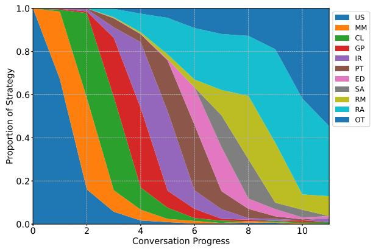  
(a)

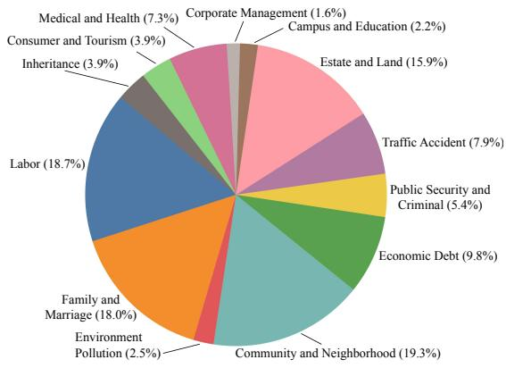  
(b)  
Figure 5: Dataset Statistics of ProMediConv. (a) Dynamic phase-based progression of mediation strategies across dialogue turns. (b) Long-tail distribution of the 13 dispute types, mirroring the real-world prevalence of civil cases.

## 4.1.2 Evaluated Models

Given the absence of mediation-specific dialogue agents, we conduct a extensive evaluation using a diverse set of baselines.

General LLMs We evaluate Qwen2.5-7B-Instruct, Qwen2.5-14B-Instruct (Yang et al., 2024), Llama-3.1-8B-Instruct (Team, 2024), GLM-4-9B-0414 (GLM et al., 2024), and Chat-GPT (GPT-3.5-Turbo API) (Ouyang et al., 2022). To enhance their proactive mediation capabilities, we apply several advanced prompt-based policy planning methods, including Proactive (Deng et al., 2023c), ProCoT (Deng et al., 2023c), and ICL\_AIF (Fu et al., 2023), alongside a vanilla standard setting.

Legal-specific LLMs To explore domain-specific performance, we select Wisdom-Interrogatory and Fuzi-Mingcha-v1.0 (Deng et al., 2023a), the top performers in the LawBench (Fei et al., 2024) dialogue generation tasks (1-1, 3-5, 3-8). We evaluate them under standard prompts and Legal-enhanced Mediator Role-play (LMR) prompts.

Our Trained Baseline To explicitly validate the utility of the ProMediConv dataset, we introduce a customized baseline, named ProMediAgent. Pro-MediAgent employs a decoupled policy planner and response generator architecture (He et al., 2018; Deng et al., 2023d). We first conduct supervised fine-tuning (SFT) on the ProMediConv training set. Subsequently, we optimize the policy planner using the REINFORCE algorithm (Sutton et al., 1999) based on an AI-feedback scalar reward within a simulated mediation environment. The comprehensive details of the training objective and the reward mechanism are provided in g C˘ .

## 4.1.3 Implementation Details

The interactive mediation environment for ProMediConv evaluation and the online learning of ProMediAgent adhere strictly to the workflow outlined in g A.1˘ . Following recent simulation works (Wu et al., 2026a), we initialize simulated dispute parties using pre-annotated profiles and prompt the LLMs with tailored role-play templates to simulate dynamic interactions. An LLM-as-a-Judge mechanism determines the appropriate next speaker. Furthermore, an LLMbased outcome reward model evaluates the current mediation completion state. To mitigate generation stochasticity, we sample l decoded sequences and compute the final scalar reward as their average (Wang et al., 2023). The maximum dialogue turn limit is fixed at 20. Regarding our proposed ProMediAgent, we employ Roberta-large3 as the policy planner backbone and Qwen2.5-7B-Instruct as the response generator. The SFT phase requires approximately 6 GPU hours over 45 epochs with a learning rate of $6 \times 1 0 ^ { - 6 }$ . The RL phase consumes roughly 16 GPU hours across 1,000 training episodes, employing a learning rate of $1 \times 1 0 ^ { - 6 }$ and a discount factor γ of 0.999. All training and inference procedures are conducted on a server equipped with eight NVIDIA L40S GPUs.

<table><tr><td>Model</td><td>Method</td><td>SR@t↑</td><td>AT↓</td><td>SSR↑</td><td>MAD↑</td><td># of Tok.</td></tr><tr><td colspan="7">General LLMs</td></tr><tr><td rowspan="3">Qwen2.5-7B-Instruct</td><td>Standard</td><td>0.7532</td><td>12.43</td><td>0.8974</td><td>0.7576</td><td>O(L)</td></tr><tr><td>Proactive</td><td>0.7273</td><td>12.08</td><td>0.8452</td><td>0.7857</td><td>O(2L)</td></tr><tr><td>ProCoT ICL_AIF</td><td>0.6753 0.7670</td><td>13.16</td><td>0.8039</td><td>0.8719</td><td>O(2L) O(3L)</td></tr><tr><td rowspan="4">Qwen2.5-14B-Instruct</td><td></td><td></td><td>12.06</td><td>0.9154</td><td>1.0855</td><td></td></tr><tr><td>Standard</td><td>0.7013</td><td>12.52</td><td>0.8056</td><td>0.9524</td><td>O(L)</td></tr><tr><td>Proactive</td><td>0.7922</td><td>11.56</td><td>0.9049</td><td>0.7446</td><td>O(2L)</td></tr><tr><td>ProCoT ICL_AIF</td><td>0.7695 0.7922</td><td>11.25 11.78</td><td>0.8733 0.9071</td><td>0.9219 1.0443</td><td>O(2L) O(3L)</td></tr><tr><td rowspan="4">Llama-3.1-8B-Instruct</td><td></td><td></td><td></td><td>0.8469</td><td>0.7179</td><td>O(L)</td></tr><tr><td>Standard Proactive</td><td>0.7784 0.8096</td><td>11.38 11.09</td><td>0.9028</td><td>0.7926</td><td>O(2L)</td></tr><tr><td>ProCoT</td><td>0.8316</td><td>10.67</td><td>0.8674</td><td>0.8407</td><td>O(2L)</td></tr><tr><td>ICL_AIF</td><td>0.8589</td><td>10.48</td><td>0.8597</td><td>0.8968</td><td>O(3L)</td></tr><tr><td rowspan="4">GLM-4-9B-0414</td><td>Standard</td><td>0.7167</td><td>12.41</td><td>0.8589</td><td>0.7722</td><td>O(L)</td></tr><tr><td>Proactive</td><td>0.8077</td><td>11.06</td><td>0.8654</td><td>0.7769</td><td>O(2L)</td></tr><tr><td>ProCoT</td><td>0.8359</td><td>10.87</td><td>0.9015</td><td>0.9115</td><td>O(2L)</td></tr><tr><td>ICL_AIF</td><td>0.8179</td><td>11.27</td><td>0.8931</td><td>0.8675</td><td>O(3L)</td></tr><tr><td rowspan="4">ChatGPT</td><td>Standard</td><td>0.8517</td><td>10.67</td><td>0.9129</td><td>0.8202</td><td>O(L)</td></tr><tr><td>Proactive</td><td>0.7953</td><td>11.36</td><td>0.8857</td><td>1.0074</td><td>O(2L)</td></tr><tr><td>ProCoT</td><td>0.8173</td><td>11.09</td><td>0.9094</td><td>0.9719</td><td>O(2L)</td></tr><tr><td>ICL_AIF</td><td>0.8419</td><td>10.83</td><td>0.9116</td><td>0.9481</td><td>O(3L)</td></tr><tr><td colspan="7">Legal-specific LLMs</td></tr><tr><td rowspan="2">Fuzi-Mingcha-v1_0</td><td>Standard</td><td>0.6165</td><td>12.24</td><td>0.6386</td><td>0.4592</td><td>O(L)</td></tr><tr><td>LMR</td><td>0.6295</td><td>12.49</td><td>0.6827</td><td>0.4943</td><td>O(2L)</td></tr><tr><td rowspan="2">Wisdom-Interrogatory</td><td>Standard</td><td>0.5386</td><td>15.03</td><td>0.5128</td><td>0.7866</td><td>O(L)</td></tr><tr><td>LMR</td><td>0.6646</td><td>13.06</td><td>0.6955</td><td>0.8434</td><td>O(2L)</td></tr><tr><td colspan="7">Our Trained Baselines</td></tr><tr><td>ProMediAgent</td><td></td><td>0.9071</td><td>10.34</td><td>0.9428</td><td>0.9893</td><td>O(L)</td></tr><tr><td>- w/o RL</td><td></td><td>0.7692</td><td>11.64</td><td>0.8704</td><td>0.9673</td><td>O(L)</td></tr><tr><td>- w/o SFT+RL</td><td></td><td>0.6893</td><td>12.56</td><td>0.7715</td><td>0.8031</td><td>O(L)</td></tr></table>

Table 2: The overall evaluation results highlight that our dataset enables models with lower algorithmic complexity to perform better on ProMediConv. We bold the best results and underline the second-best ones in each column.

## 4.2 Results and Analysis

Overall evaluation results are presented in Table 2.

Analysis of General LLMs As demonstrated, policy planning methods yield unstable effects on the proactive mediation capabilities of general LLMs. Certain methods even prove counterproductive across all ChatGPT settings. Furthermore, these minimal enhancements incur significant costs, as token consumption for mediator responses doubles with Proactive and Pro-CoT, and triples with ICL\_AIF. This indicates current methods may fail to fully capture essential mediation components or endow agents with stable proactive mediation capabilities. Consequently, these findings underscore a critical limitation within ProMediConv: even when leveraging large-parameter LLMs with sophisticated policy planning and increased token allocations, the nuanced complexities inherent in ProMediConv remain elusive.

Analysis of Legal-Specific LLMs Both legalspecific LLMs perform poorly in standard settings, and even when augmented with applicable legal clauses reference, only minimal improvement is observed. Under standard conditions, the Wisdom model tends to produce generic responses that lead to conversational stagnation. We observe that both models configured with LMR successfully retrieve relevant legal provisions, which to some extent play positive impacts on involved parties. However, the improvement remains insufficient to achieve successful mediation. This phenomenon is reflected in the more significant improvements in SSR ( 6.91%) and MAD ( 7.64%) compared to SR@t ( 2.11%), as exemplified by Fuzi model. Moreover, in some cases, we observe that these models output irrelevant information due to overfitting. These findings highlight the limitations of current legal-specific models in ProMediConv and underscore the importance of our proposed MAD metric in detecting such subtle aspects of model performance.

Analysis of ProMediAgent The ProMediAgent, trained via SFT on our ProMediConv dataset, exhibits significant improvements across all metrics ( 11.59% SR@t, 12.82% SSR, 7.90% AT, 0.44% MAD). The performance of ProMediAgent is further optimized through RL, yielding gains of ( 17.93% SR@t, 8.32% SSR, 11.17% AT, 2.27% MAD). This showcases notable advancements over the best-performing baseline, with SR@t increased by 5.61%, SSR increased by 2.99%, AT decrease by 1.34%. ProMediAgent achieved MAD 8.86% lower than the top-performing baseline. This margin is attributable to the reward functions lack of explicit signals regarding changes in the party’s BP. Those results validate that using our proposed ProMediConv enables models with fewer parameters and lower token usage to achieve performance superior with various LLMs with advanced policy planning methods.

## 5 Further Analysis

In this section, we evaluate the impact of mediation strategies and present case studies on the Short-cut Resolution phenomenon to underscore MAD’s necessity. Finally, we analyze model performance across varying party numbers and correlate MAD with current metrics.

<table><tr><td>Model</td><td>Method</td><td>SR@t↑</td><td>AT↓</td><td>SSR↑ MAD ↑</td></tr><tr><td rowspan="2">Qwen2.5-14B</td><td> $\mathrm { Q w e n } _ { \mathrm { n o n } }$ </td><td>0.7147</td><td>11.99 0.8479</td><td>0.6374</td></tr><tr><td>Proactive</td><td>0.7922</td><td>11.56 0.9049</td><td>0.7446</td></tr><tr><td>ProMediAgent</td><td>-</td><td>0.9071</td><td>10.34</td><td>0.9428 0.9893</td></tr></table>

Table 3: Impact of mediation strategy constraints: Predefined taxonomy outperforms open-ended space.

## 5.1 Effect of Constrained Strategies Set

We constrain the mediation agents to a taxonomy of 11 strategy categories rather than a fine-grained strategy space in ProMediConv. To validate the efficacy of such design, we conduct an empirical study using Qwen2.5-14B-Instruct with ablation setting $\mathbf { Q w e n } _ { n o n } ,$ where the model generates unrestricted natural language strategy instruction, representing an open-ended strategy space. As illustrated in Table 3, Proactive method outperforms $\mathbf { Q } \mathbf { w e n } _ { n o n }$ , indicating that a larger strategy search space does not necessarily yield improvements and may even degrade performance. This observation aligns with conclusions in relevant works (Zeng et al., 2024), confirming that our structured taxonomy serves as critical domainspecific priors to regularize the agent’s action space, preventing the instability inherent in unconstrained generation.

## 5.2 Analysis on Mediation Strategy Impact

To investigate the impact of mediation strategies to dispute resolution, we evaluate ProMediAgent on our test set. Specifically, we establish two settings: (1) Random, where a strategy is selected randomly at each mediator turn. To ensure robustness, we report the average results of five independent rollouts per case; and (2) ProMediAgent, where strategies are determined by the policy planner of ProMediAgent, optimized via SFT and RL. Both settings employ the same response generator. We evaluate performance across all metrics and analyze variance across the five rollouts within the Random setting. Results are presented in Table 4. The Random baseline exhibits suboptimal performance due to stochastic selection, whereas ProMediAgent achieves significant improvements across all metrics through optimal strategy selection. These findings validate that optimal strategy selection is essential for enhancing mediation dialogue outcomes, thereby substantiating the necessity of policy planning optimization to navigate the complex dynamics of ProMediConv.

<table><tr><td>Metric</td><td>SR@t ↑</td><td>AT↓</td><td>SSR↑</td><td>MAD ↑</td></tr><tr><td>Random</td><td>0.6769</td><td>12.64</td><td>0.8038</td><td>0.7692</td></tr><tr><td>ProMediAgent</td><td>0.9071</td><td>10.34</td><td>0.9428</td><td>0.9893</td></tr><tr><td>Gain (∆)</td><td>+34.0%</td><td>+18.2%</td><td>+17.3%</td><td>+28.6%</td></tr><tr><td>Variance</td><td>0.2581</td><td>5.2585</td><td>2.1989</td><td>0.6830</td></tr></table>

Table 4: Impact of Mediation Strategy Selection. Significant gap between Random and Oracle highlights the impact of optimal mediation strategies in ProMedi-Conv.

## 5.3 Case study on the necessity of MAD

We identify a phenomenon, termed the Short-cut Resolution, in which mediator agents achieve superficial agreement without fully addressing all parties’ claims. This issue arises as models exploit the reward model to prematurely conclude dialoguesoften a result of inherent limitations in biased comprehension of LLMs. As exemplified in Table 13, ProMediAgent in Dialogue A takes more turns to reach a more thorough resolution, whereas in Dialogue B, the mediator uses fewer turns (better in AT metric), yet fails to fully address all claims, resulting in a lower MAD score. MAD effectively exposes such inadequacies among mediator agents by granularly tracking BP states of each party, thereby validating its critical value.

Num  
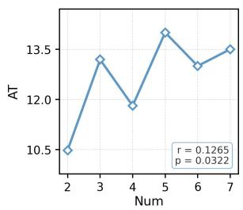

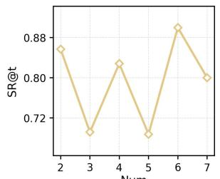

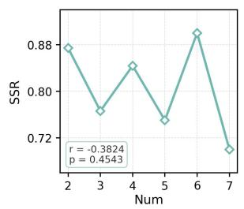

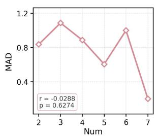  
Figure 6: Correlation Analysis of Metrics and the Number of Parties. For metrics with continuous values (i.e., AT, SSR and MAD), Pearson coefficient and p value are reported.

## 5.4 Performance w.r.t. the number of parties

Given the multi-party characteristic of ProMedi-Conv, we further analyze how metrics vary with party numbers using all samples of Qwen2.5-14B-Instruct in $\breve { \mathrm { g } } 4 .$ . As depicted in Figure 6, MAD and SSR show decreasing trends, while AT exhibits increasing trend as party numbers grow. This highlights that as case complexity increases, it becomes progressively harder for mediator agents to improve the situation and alter all parties’ BP, thus necessitating more turns. Due to the large value of maximum turns t = 20, SR@t is not sensitive to the party numbers, exhibiting a horizontal pattern.

## 5.5 MAD Correlation Analysis

To validate the proposed MAD metric, we analyzed its correlation with existing metrics using the test samples consistent with g 5.4 ˘ . Additionally, we recruit eight experienced human mediators to annotate completion state of those samples, establishing a Human Success Rate (Human SR). Pairwise inter-annotator agreement reached 87%, demonstrating a relatively high level of consistency. We computed Pearson and Spearman correlation coefficients between MAD and these metrics, as presented in Table 5. The results indicate a weak correlation between MAD and AT. In contrast, MAD exhibits a significant positive correlation with SR@t. A notably stronger correlation is observed between MAD and SSR $\begin{array} { l l } { ( p _ { r } } & { = } \end{array}$ 0.0022, $p _ { \rho } ~ = ~ 0 . 0 0 4 6 )$ , likely because both metrics facilitate fine-grained evaluation of the mediation process. Critically, MAD demonstrates a stronger correlation with Human SR compared to SR@t $( r = 0 . 7 3 8 6 , \rho = 0 . 5 8 3 8 )$ . This alignment confirms that higher MAD scores accurately reflect high-quality mediation from human per-

spective, thereby substantiating the validity and robustness of our proposed MAD.
<table><tr><td>Setting</td><td>r</td><td> $p _ { r }$ </td><td>ρ</td><td> $p _ { \rho }$ </td></tr><tr><td>vs. AT</td><td>-0.2748</td><td>0.1654</td><td>-0.2846</td><td>0.1502</td></tr><tr><td>vs. SR@t</td><td>0.6773</td><td>0.0057</td><td>0.4938</td><td>0.0421</td></tr><tr><td>vs. SSR</td><td>0.7847</td><td>0.0022</td><td>0.5281</td><td>0.0046</td></tr><tr><td>vs. Human SR</td><td>0.7386</td><td>0.0039</td><td>0.5838</td><td>0.0548</td></tr></table>

Table 5: Statistical Analysis of MAD Correlations with other metrics. The Pearson and Spearman Correlations are denoted as r and $\rho ,$ with statistical significance p.

## 6 Conclusion

We introduce ProMediConv, a framework and high-fidelity dataset of 972 cases for benchmarking proactive, multi-party mediation. To address evaluation blind spots, we propose MAD, a metric quantifying effectiveness through shifts in user states. Finally, extensive benchmarking uncovers critical behavioral phenomena, exposing current LLMs’ persistent limitations in complex realworld mediation. Beyond methodological advancements, this study highlights the transformative potential of LLMs in fostering conflict resolution and social resilience. By establishing a scalable foundation for future AI-assisted mediation, our resources carry profound implications for enhancing community services, governance, and broader social harmony.

## Limitations

A primary limitation of ProMediConv is its exclusive reliance on text-based dialogue modeling within a specifically Chinese legal context. This inherently abstracts away non-verbal dynamics and may not fully capture the cultural nuances of dispute resolution in other languages. Future research should explore multi-modal integration and extend the framework to develop cross-cultural and cross-lingual mediation benchmarks. Nevertheless, this study serves as a vital foundational step.

By delivering a scalable framework and rigorous benchmark, ProMediConv establishes a quantitative standard that paves the way for future AIassisted mediation and broader social resilience.

## Ethical Considerations

This work utilizes open-source models and resources, including Llama-3.1-8B-Instruct, the Qwen2.5 series, GLM-4-9B-0414, RoBERTalarge, wisdomInterrogatory, and Fuzi-Mingchav1.0, strictly in accordance with their licenses and intended academic use. All mediation cases are sourced from published materials, with the identities of all involved parties fully anonymized to protect privacy. Human evaluators were explicitly informed of the data’s purpose and consented to its exclusive use for academic research. ChatGPT is used only for limited paraphrasing and language polishing of author-written text.

## Acknowledgments

This research was supported by the National Natural Science Foundation of China under Grant 62406098 and the Anhui Province Key Research and Development Plan under Grant 202304a05020045. It is also supported by the National Research Foundation Singapore under the AI Singapore Programme (AISG Award No: AISG3-RPGV-2025-016). Yang Deng is supported by the Lee Kong Chian Fellowship awarded by Singapore Management University.

## References

Federico Bianchi, Patrick John Chia, Mert Yüksekgönül, Jacopo Tagliabue, Dan Jurafsky, and James Zou. 2024. How well can llms negotiate? negotiationarena platform and analysis. In Fortyfirst International Conference on Machine Learning, ICML 2024, Vienna, Austria, July 21-27, 2024. OpenReview.net.

Eniola Boluwaduro. 2021. How mediation works: Resolving conflict through talk angela cora garcia (2019). Sociolinguistic Studies, 14(4):537–542.

Robert A. Baruch Bush and Joseph P. Folger. 1994. The promise of mediation : responding to conflict through empowerment and recognition.

Guhong Chen, Liyang Fan, Zihan Gong, Nan Xie, Zixuan Li, Ziqiang Liu, Chengming Li, Qiang Qu, Hamid Alinejad-Rokny, Shiwen Ni, and Min Yang. 2025. AgentCourt: Simulating court with adversarial evolvable lawyer agents. In Findings of the Associationfor Computational Linguistics: ACL 2025,

pages 5850–5865, Vienna, Austria. Association for Computational Linguistics.

Junjie Chen, Haitao Li, Minghao Qin, Yujia Zhou, Yanxue Ren, Wuyue Wang, Yiqun Liu, Yueyue Wu, and Qingyao Ai. 2026. Simulating dispute mediation with llm-based agents for legal research. In Fortieth AAAI Conference on Artificial Intelligence, Thirty-Eighth Conference on Innovative Applications of Artificial Intelligence, Sixteenth Symposium on Educational Advances in Artificial Intelligence, AAAI 2026, Singapore, January 20-27, 2026, pages 29368–29375. AAAI Press.

Jiaxi Cui, Zongjian Li, Yang Yan, Bohua Chen, and Li Yuan. 2023. Chatlaw: Open-source legal large language model with integrated external knowledge bases. CoRR, abs/2306.16092.

Tim R. Davidson, Veniamin Veselovsky, Michal Kosinski, and Robert West. 2024. Evaluating language model agency through negotiations. In The Twelfth International Conference on Learning Representations, ICLR 2024, Vienna, Austria, May 7-11, 2024. OpenReview.net.

DeepSeek-AI, A. Liu, Bei Feng, Bing Xue, Bing-Li Wang, Bochao Wu, Chengda Lu, Chenggang Zhao, C. Deng, Chenyu Zhang, C. Ruan, Damai Dai, Daya Guo, Dejian Yang, Deli Chen, Dong-Li Ji, Erhang Li, Fangyun Lin, Fucong Dai, and 175 others. 2024. Deepseek-v3 technical report. arXiv.org.

Wentao Deng, Jiahuan Pei, Keyi Kong, Zhe Chen, Furu Wei, Yujun Li, Zhaochun Ren, Zhumin Chen, and Pengjie Ren. 2023a. Syllogistic reasoning for legal judgment analysis. In Proceedings ofthe 2023 Conference on Empirical Methods in Natural Language Processing, pages 13997–14009, Singapore. Association for Computational Linguistics.

Yang Deng, Wenqiang Lei, Wai Lam, and Tat-Seng Chua. 2023b. A survey on proactive dialogue systems: problems, methods, and prospects. In Proceedings of the Thirty-Second International Joint Conference on Artificial Intelligence, IJCAI ’23.

Yang Deng, Lizi Liao, Liang Chen, Hongru Wang, Wenqiang Lei, and Tat-Seng Chua. 2023c. Prompting and evaluating large language models for proactive dialogues: Clarification, target-guided, and noncollaboration. In Findings of the Association for Computational Linguistics: EMNLP 2023, pages 10602–10621, Singapore. Association for Computational Linguistics.

Yang Deng, Lizi Liao, Zhonghua Zheng, Grace Hui Yang, and Tat-Seng Chua. 2024. Towards humancentered proactive conversational agents. In Proceedings ofthe 47th International ACM SIGIR Conference on Research and Development in Information Retrieval, SIGIR ’24, page 807818, New York, NY, USA. Association for Computing Machinery.

Yang Deng, Wenxuan Zhang, Wai Lam, See-Kiong Ng, and Tat-Seng Chua. 2023d. Plug-and-play policy

planner for large language model powered dialogue agents. In The Twelfth International Conference on Learning Representations.

Victor G Devinatz. 2018. What makes a good mediator? insights from a mediation training program participant. Employee Responsibilities and Rights Journal, 30(3):181–201.

Xiaohua Di and Yuning Wu. 2009. The developing trend of the people’s mediation in china. Sociological Focus, 42(3):228–245.

Wenjie Dong, Sirong Chen, and Yan Yang. 2025. Protod: Proactive task-oriented dialogue system based on large language model. In Proceedings ofthe 31st International Conference on Computational Linguistics, COLING 2025, Abu Dhabi, UAE, January 19- 24, 2025, pages 9147–9164. Association for Computational Linguistics.

Zhiwei Fei, Xiaoyu Shen, Dawei Zhu, Fengzhe Zhou, Zhuo Han, Alan Huang, Songyang Zhang, Kai Chen, Zhixin Yin, Zongwen Shen, Jidong Ge, and Vincent Ng. 2024. LawBench: Benchmarking legal knowledge of large language models. In Proceedings of the 2024 Conference on Empirical Methods in Natural Language Processing, pages 7933–7962, Miami, Florida, USA. Association for Computational Linguistics.

Yao Fu, Hao Peng, Tushar Khot, and Mirella Lapata. 2023. Improving language model negotiation with self-play and in-context learning from AI feedback. CoRR, abs/2305.10142.

Team GLM, :, Aohan Zeng, Bin Xu, Bowen Wang, Chenhui Zhang, Da Yin, Dan Zhang, Diego Rojas, Guanyu Feng, Hanlin Zhao, Hanyu Lai, Hao Yu, Hongning Wang, Jiadai Sun, Jiajie Zhang, Jiale Cheng, Jiayi Gui, Jie Tang, and 40 others. 2024. Chatglm: A family of large language models from glm-130b to glm-4 all tools. Preprint, arXiv:2406.12793.

James Hale, Sushrita Rakshit, Kushal Chawla, Jeanne M. Brett, and Jonathan Gratch. 2025a. KODIS: A multicultural dispute resolution dialogue corpus. In Proceedings of the 2025 Conference of the Nations of the Americas Chapter of the Association for Computational Linguistics: Human Language Technologies, NAACL 2025 - Volume 1: Long Papers, Albuquerque, New Mexico, USA, April 29 - May 4, 2025, pages 12771–12785. Association for Computational Linguistics.

James Hale, Sushrita Rakshit, Kushal Chawla, Jeanne M. Brett, and Jonathan Gratch. 2025b. KODIS: A multicultural dispute resolution dialogue corpus. In Proceedings of the 2025 Conference of the Nations of the Americas Chapter of the Association for Computational Linguistics: Human Language Technologies, NAACL 2025 - Volume 1: Long Papers, Albuquerque, New Mexico, USA, April 29 - May 4, 2025, pages 12771–12785. Association for Computational Linguistics.

He He, Derek Chen, Anusha Balakrishnan, and Percy Liang. 2018. Decoupling strategy and generation in negotiation dialogues. In Proceedings of the 2018 Conference on Empirical Methods in Natural Language Processing, Brussels, Belgium, October 31 - November 4, 2018, pages 2333–2343. Association for Computational Linguistics.

Tao He, Lizi Liao, Yixin Cao, Yuanxing Liu, Yiheng Sun, Zerui Chen, Ming Liu, and Bing Qin. 2025a. Simulation-free hierarchical latent policy planning for proactive dialogues. In AAAI-25, Sponsored by the Association for the Advancement of Artificial Intelligence, February 25 - March 4, 2025, Philadelphia, PA, USA, pages 24032–24040. AAAI Press.

Tao He, Lizi Liao, Ming Liu, and Bing Qin. 2025b. Simulating before planning: Constructing intrinsic user world model for user-tailored dialogue policy planning. In Proceedings of the 48th International ACM SIGIR Conference on Research and Development in Information Retrieval, SIGIR 2025, Padua, Italy, July 13-18, 2025, pages 645–655. ACM.

Richard Jackson and Jacob Bercovitch. 1993. Evaluating mediation strategies: A theoretical and empirical analysis. Peace & Change.

Xiaochuan Jiang. 2008. Renmin Tiaojie Shiyong Shouce [Practical Manual for People’s Mediation]. China Legal Publishing House. (In Chinese).

Deuksin Kwon, Emily Weiss, Tara Kulshrestha, Kushal Chawla, Gale M. Lucas, and Jonathan Gratch. 2024. Are llms effective negotiators? systematic evaluation of the multifaceted capabilities of llms in negotiation dialogues. In Findings of the Association for Computational Linguistics: EMNLP 2024, Miami, Florida, USA, November 12-16, 2024, Findings of ACL, pages 5391–5413. Association for Computational Linguistics.

Wenqiang Lei, Yao Zhang, Feifan Song, Hongru Liang, Jiaxin Mao, Jiancheng Lv, Zhenglu Yang, and Tat-Seng Chua. 2022. Interacting with non-cooperative user: A new paradigm for proactive dialogue policy. In SIGIR ’22: The 45th International ACM SIGIR Conference on Research and Development in Information Retrieval, Madrid, Spain, July 11 - 15, 2022, pages 212–222. ACM.

Mengfan Li, Xuanhua Shi, and Yang Deng. 2026a. Costom: Causal-oriented steering for intrinsic theory-of-mind alignment in large language models. In Proceedings of the 64th Annual Meeting of the Association for Computational Linguistics (Volume 1: Long Papers), ACL 2026, San Diego, California, United States, July 2-7, 2026, pages 9302–9317. Association for Computational Linguistics.

Mengfan Li, Xuanhua Shi, and Yang Deng. 2026b. Rectom: A benchmark for evaluating machine theory of mind in llm-based conversational recommender systems. In Fortieth AAAI Conference on Artificial Intelligence, Thirty-Eighth Conference

on Innovative Applications ofArtificial Intelligence, Sixteenth Symposium on Educational Advances in Artificial Intelligence, AAAI 2026, Singapore, January 20-27, 2026, pages 31636–31644. AAAI Press.

Mengfan Li, Zesheng Wei, Xuanhua Shi, and Yang Deng. 2026c. Do llms understand personality? rethinking persona fidelity evaluation through structured behavioral inference. arXiv preprint arXiv:2608.26674.

Lizi Liao, Grace Hui Yang, and Chirag Shah. 2023. Proactive conversational agents in the post-chatgpt world. In Proceedings of the 46th International ACM SIGIR Conference on Research and Development in Information Retrieval, SIGIR ’23, page 34523455, New York, NY, USA. Association for Computing Machinery.

Xubo Lin, Zezhi Deng, Shihao Wang, Grace Hui Yang, and Yang Deng. 2026. Dual hierarchical dialogue policy learning for legal inquisitive conversational agents. In Findings ofthe Associationfor Computational Linguistics, ACL 2026, San Diego, California, United States, July 2-7, 2026, pages 11030–11047. Association for Computational Linguistics.

Siyang Liu, Chujie Zheng, Orianna Demasi, Sahand Sabour, Yu Li, Zhou Yu, Yong Jiang, and Minlie Huang. 2021. Towards emotional support dialog systems. In Proceedings of the 59th Annual Meeting of the Association for Computational Linguistics and the 11th International Joint Conference on Natural Language Processing (Volume 1: Long Papers), pages 3469–3483, Online. Association for Computational Linguistics.

Ziyi Liu, Bahareh Sarrafzadeh, Pei Zhou, Longqi Yang, Jieyu Zhao, and Ashish Sharma. 2026. Promediate: A simulation testbed for evaluating proactive mediation in multi-party negotiation. In Findings ofthe Association for Computational Linguistics, ACL 2026, San Diego, California, United States, July 2-7, 2026, pages 29570–29598. Association for Computational Linguistics.

Yaxi Lu, Shenzhi Yang, Cheng Qian, Guirong Chen, Qinyu Luo, Yesai Wu, Huadong Wang, Xin Cong, Zhong Zhang, Yankai Lin, Weiwen Liu, Yasheng Wang, Zhiyuan Liu, Fangming Liu, and Maosong Sun. 2025. Proactive agent: Shifting LLM agents from reactive responses to active assistance. In The Thirteenth International Conference on Learning Representations, ICLR 2025, Singapore, April 24-28, 2025. OpenReview.net.

Christopher W. Moore and NIGEL KEMP. 1988. The Mediation Process: Practical Strategies for Resolving Conflict.

Tracy Gershwin Mueller. 2008. Alternative Dispute Resolution.

Mara Olekalns, Jeanne M. Brett, and Laurie R. Weingart. 2003. Phases, transitions and interruptions:

Modeling processes in multiparty negotiations. International Journal of Conflict Management, 14(3- 4):191–211.

OpenAI, Tony :, Tony Aaron Hurst, Tony Adam Lerer, Tony Adam P. Goucher, Tony Adam Perelman, Tony Aditya Ramesh, Tony Aidan Clark, Tony AJ Ostrow, Tony Akila Welihinda, Tony Alan Hayes, Tony Alec Radford, Tony Aleksander Mdry, Tony Alex Baker-Whitcomb, Tony Alex Beutel, Tony Alex Borzunov, Tony Alex Carney, Tony Alex Chow, Tony Alex Kirillov, and 398 others. 2024. Gpt-4o system card. arXiv (Cornell University).

Long Ouyang, Jeff Wu, Xu Jiang, Diogo Almeida, Carroll L. Wainwright, Pamela Mishkin, Chong Zhang, Sandhini Agarwal, Katarina Slama, Alex Ray, John Schulman, Jacob Hilton, Fraser Kelton, Luke E. Miller, Maddie Simens, Amanda Askell, Peter Welinder, P. Christiano, Jan Leike, and Ryan J. Lowe. 2022. Training language models to follow instructions with human feedback. NeurIPS.

James O Prochaska, John C Norcross, Joanne L Fowler, Michael J Follick, and David B Abrams. 1992. Attendance and outcome in a work site weight control program: Processes and stages of change as process and predictor variables. Addictive behaviors, 17(1):35–45.

James O Prochaska and Wayne F. Velicer. 1997. The transtheoretical model of health behavior change. American Journal ofHealth Promotion, 12:38 – 48.

Renmin Tiaojie Gongzuo Falv Shiwu Congshu Writing Group. 2017. Butong Tiaojie Fangfa Yu Jiqiao De Yunyong [The Application ofDifferent Mediation Methods and Techniques]. China Legal Publishing House. (In Chinese).

Renmin Tiaojie Gongzuo Falv Shiwu Congshu Writing Group. 2020. Renmin Tiaojie Fangfa Jiqiao Yu Falv Zhishi [Methods, Techniques, and Legal Knowledge of Mediation]. China Legal Publishing House. (In Chinese).

Jennifer K Robbennolt. 2025. Psychology and dispute resolution in civil cases. In Advances in Psychology and Law: Volume 7, pages 31–48. Springer.

Chris Samarinas and Hamed Zamani. 2024. Procis: A benchmark for proactive retrieval in conversations. In Proceedings of the 47th International ACM SI-GIR Conference on Research and Development in Information Retrieval, SIGIR ’24, page 830840, New York, NY, USA. Association for Computing Machinery.

Douglas C Schmidt, Michael Stal, Hans Rohnert, and Frank Buschmann. 2013. Pattern-oriented software architecture, patterns for concurrent and networked objects. John Wiley & Sons.

Richard S. Sutton, David A. McAllester, Satinder Singh, and Yishay Mansour. 1999.

Policy gradient methods for reinforcement learning with function approximation. http://www.cis.upenn.edu/mkearns/finread/Sutton.pdf.

Jinzhe Tan, Hannes Westermann, Nikhil Reddy Pottanigari, Jaromír Savelka, Sébastien Meeùs, Mia Godet, and Karim Benyekhlef. 2024. Robots in the middle: Evaluating llms in dispute resolution. In Legal Knowledge and Information Systems - JURIX 2024: The Thirty-seventh Annual Conference, Brno, Czech Republic, 11-13 December 2024, volume 395 of Frontiers in Artificial Intelligence and Applications, pages 168–179. IOS Press.

Llama Team. 2024. The llama 3 herd of models. CoRR, abs/2407.21783.

Xuewei Wang, Weiyan Shi, Richard Kim, Yoojung Oh, Sijia Yang, Jingwen Zhang, and Zhou Yu. 2019. Persuasion for good: Towards a personalized persuasive dialogue system for social good. In Proceedings of the 57th Annual Meeting ofthe Associationfor Computational Linguistics, pages 5635–5649, Florence, Italy. Association for Computational Linguistics.

Xuezhi Wang, Jason Wei, Dale Schuurmans, Quoc V. Le, Ed H. Chi, Sharan Narang, Aakanksha Chowdhery, and Denny Zhou. 2023. Self-consistency improves chain of thought reasoning in language models. In The Eleventh International Conference on Learning Representations, ICLR 2023, Kigali, Rwanda, May 1-5, 2023. OpenReview.net.

Zesheng Wei, Mengxiang Li, Zilei Wang, and Yang Deng. 2026. Beyond static personas: Situational personality steering for large language models. In Findings of the Association for Computational Linguistics, ACL 2026, San Diego, California, United States, July 2-7, 2026, pages 19185–19210. Association for Computational Linguistics.

Shirley Wu, Evelyn Choi, Arpandeep Khatua, Zhanghan Wang, Joy He-Yueya, Tharindu Cyril Weerasooriya, Wei Wei, Diyi Yang, Jure Leskovec, and James Zou. 2026a. Humanlm: Simulating users with state alignment beats response imitation. CoRR, abs/2603.03303.

Xiaoting Wu, Yi Huang, Chunyang Gao, Mengfei Guo, Jingyu Yao, and Junlan Feng. 2026b. Thinking alignment of scenario-oriented user simulation. In Proceedings of the 64th Annual Meeting of the Association for Computational Linguistics (Volume 1: Long Papers), ACL 2026, San Diego, California, United States, July 2-7, 2026, pages 42932–42945. Association for Computational Linguistics.

An Yang, Baosong Yang, Beichen Zhang, Binyuan Hui, Bo Zheng, Bowen Yu, Chengyuan Li, Dayiheng Liu, Fei Huang, Haoran Wei, Huan Lin, Jian Yang, Jianhong Tu, Jianwei Zhang, Jianxin Yang, Jiaxi Yang, Jingren Zhou, Junyang Lin, Kai Dang, and 22 others. 2024. Qwen2.5 technical report. CoRR, abs/2412.15115.

Jing Yao, Wei Xu, Jianxun Lian, Xiting Wang, Xiaoyuan Yi, and Xing Xie. 2023. Knowledge plugins: Enhancing large language models for domainspecific recommendations. CoRR, abs/2311.10779.

Xianghua Zeng, Hao Peng, and Angsheng Li. 2024. Effective exploration based on the structural information principles. In Advances in Neural Information Processing Systems 38: Annual Conference on Neural Information Processing Systems 2024, NeurIPS 2024, Vancouver, BC, Canada, December 10 - 15, 2024.

Bolin Zhang, Shengwei Wang, Yangqin Jiang, Dianbo Sui, Zhiying Tu, and Dianhui Chu. 2025. Ask and retrieve knowledge: Towards proactive asking with imperfect information in medical multi-turn dialogues. In Proceedings ofthe 48th International ACM SIGIR Conference on Research and Development in Information Retrieval, SIGIR 2025, Padua, Italy, July 13- 18, 2025, pages 1055–1065. ACM.

Chenhao Zhang, Renhao Li, Minghuan Tan, Min Yang, Jingwei Zhu, Di Yang, Jiahao Zhao, Guancheng Ye, Chengming Li, and Xiping Hu. 2024a. CPsyCoun: A report-based multi-turn dialogue reconstruction and evaluation framework for Chinese psychological counseling. In Findings of the Association for Computational Linguistics: ACL 2024, pages 13947– 13966, Bangkok, Thailand. Association for Computational Linguistics.

Tong Zhang, Chen Huang, Yang Deng, Hongru Liang, Jia Liu, Zujie Wen, Wenqiang Lei, and Tat-Seng Chua. 2024b. Strength lies in differences! improving strategy planning for non-collaborative dialogues via diversified user simulation. In Proceedings of the 2024 Conference on Empirical Methods in Natural Language Processing, pages 424– 444, Miami, Florida, USA. Association for Computational Linguistics.

Yutao Zhu, Jian-Yun Nie, Kun Zhou, Pan Du, Hao Jiang, and Zhicheng Dou. 2021. Proactive retrievalbased chatbots based on relevant knowledge and goals. In Proceedings ofthe 44th International ACM SIGIR Conference on Research and Development in Information Retrieval, SIGIR 21, page 20002004. ACM.

## A Details of ProMediConv

## A.1 Task Formalization

Based on all definitions in g 3˘ , we model the mediation process in ProMediConv as a structured dialogue involving all parties and the mediator, with formalized illustrated in Table 1.

For each round t, a party or the mediator will be invited to speak:

$$
p _ { i } ^ { t } = A ( P , C _ { t - 1 } ) \quad p _ { i } ^ { t } \in P\tag{3}
$$

where $P = \{ p _ { 1 } , p _ { 2 } , \dots , p _ { n } , M \}$ represents the set of all involved parties and the mediator M, and

$C _ { t - 1 }$ references the current mediation state. If it is the turn of a party to speak, he/she will speak based on their own circumstances $R _ { t }$ and in consideration of the current mediation state, and their behavior pattern $b _ { i } ^ { t }$ at turn t will be marked by automated BP classifier agent B:

$$
u _ { i } ^ { t } = p _ { i } ^ { t } ( R _ { i } , C _ { t - 1 } ) , \quad b _ { i } ^ { t } = B ( u _ { i } ^ { t } , C _ { t - 1 } )\tag{4}
$$

For mediator’s turn, the mediator M will first select a proper mediation strategy and then speak based on the chosen strategy:

$$
\sigma _ { t } = M ( S , C _ { t - 1 } ) \quad \sigma _ { t } \in S\tag{5}
$$

$$
m _ { t } = M ( \sigma _ { t } , C _ { t - 1 } )\tag{6}
$$

where $S$ represents the mediation strategies set. And the mediation state C is updated with each successive utterance:

$$
C _ { t } = C _ { t - 1 } \sqcup \{ u _ { i } ^ { t } , m _ { t } \}\tag{7}
$$

A reward model R will measure the current state and output a task-oriented reward to determine the completion state of the mediation goal, following (Deng et al., 2023d):

$$
r ^ { t } = R ( C _ { t } )\tag{8}
$$

When the dialogue reaches termination, the total turns $T _ { k }$ , the completion state $S _ { k } \in \{ 0 , 1 \}$ (where $S _ { k } = 1$ denotes a success of the mediation goal and $S _ { k } = 0$ denotes a failure owing to the maximum turn limit) , the final-turn reward $r _ { k } ^ { f }$ and the initial and final behavior patterns of all the parties $\left\{ b _ { i } ^ { t } \big | i = \{ 1 , 2 , \dots , n \} , t = \{ 1 , T _ { k } \} \right\}$ of current case k will be recorded for the computation of dataset-level metrics AT, SR@t, SSR and MAD.

## A.2 Complete Mediation Strategy Set in ProMediConv

As introduced in g 3.2 ˘ , we formalize a comprehensive taxonomy of 11 mediation strategies to capture the proactive and directive nature of human mediators. We presents the complete specification of this mediation strategy set in Table 6.

Specifically, for each mediation strategy, the table delineates its applicable mediation stages (I: Understanding, II: Intercession, and III: Reconciliation), provides an illustrative utterance example from authentic cases, and offers a detailed theoretical explanation of its core objective. This systematic mapping ensures that the defined strategies not only cover the entire lifecycle of a mediation session but also strictly align with the phase-based progression of real-world dispute resolution.

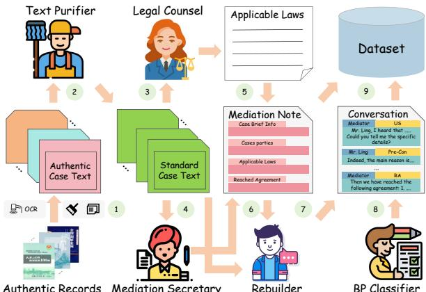  
Figure 7: Overview of the automated text reconstruction pipeline. The framework transforms unstructured authentic cases into high-fidelity structured dialogues by enforcing factual and legal constraints, ultimately yielding the ProMediConv dataset.

## B Details of ProMediConv Dataset

## B.1 Dataset Construction

As discussed in g 3.4 ˘ , although existing dispute mediation literature preserve a wealth of authentic cases, their direct utilization faces critical challenges: (1) disorganized text formats; (2) insufficient legal references; (3) lengthy contexts; and (4) a lack of explicit annotations for the parties BP states and mediator’s strategies. To tackle these issues without compromising the real-world dynamics, we design a pipeline-filter architecture (Schmidt et al., 2013) comprised of five specialized agents, as illustrated in Figure 7. The specific prompts designed for the Text Purifier, Mediation Secretary, Dialogue Rebuilder, and BP Classifier agents are detailed in Figure 8, Figure 9, Figure 10, and Figure 11, respectively.

Phase 1: Text Purifier Agent Given the diverse formats of authentic cases drawn from various books (illustrated in Figure 8), the Text Purifier Agent is designed to automatically identify inconsistencies in the input unstructured cases. Using tailored instructions $I _ { t }$ paired with few-shot examples, the agent rewrites and standardizes the diverse case texts into a unified basic structure C. This standardized structure encompasses four essential components: Case Titles, Case Introductions, Mediation Process, and Applicable Laws.

Phase 2: Legal Counsel Agent Applying suitable legal clauses is crucial for driving mediation progress (Renmin Tiaojie Gongzuo Falv Shiwu Congshu Writing Group, 2020). However, general LLMs often lack robust domain-specific legal knowledge (Yao et al., 2023). To address this, we deploy a Legal Counsel Agent to automatically retrieve and provide the exact applicable laws $L _ { t }$ for the current case t. Specifically, we employ ChatLaw2E-plain-7B (Cui et al., 2023) to ensure the accuracy of legal applicability, providing a solid legal grounding for the subsequent reconstruction.

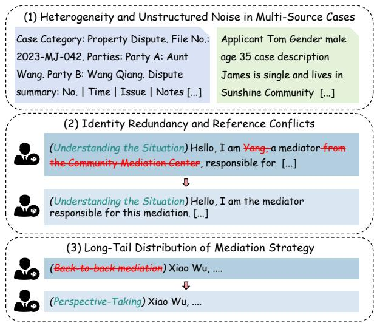  
Figure 8: Illustrative examples of data challenges inherent in the original authentic cases. The figure explicitly demonstrates three representative issues: (1) Heterogeneity and Unstructured Noise in Multi-Source Cases; (2) Identity Redundancy and Reference Conflicts; and (3) Long-Tail Distribution of Strategy Labels.

Phase 3: Secretary-Assisted Reconstruction Instead of generating dialogues from scratch, we introduce a Secretary-Assisted Reconstruction mechanism to strictly constrain the generation space. First, an LLM role-plays as a mediation secretary using a tailored prompt $I _ { m }$ to extract casecritical information from the standardized case $c _ { t }$ and compile it with the applicable laws $L _ { t }$ into a structured mediation note $N _ { t }$

$$
N _ { t } = \mathrm { L L M } ( c _ { t } , L _ { t } , I _ { m } )\tag{9}
$$

The mediation note $N _ { t }$ serves as a hard constraint for the reconstruction. A Rebuilder Agent is then required to strictly condition the dialogue generation on the critical content within $N _ { t }$ , ensuring the interaction remains faithfully aligned with the factual trajectory of the original case:

$$
D _ { t } = \mathrm { L L M } ( c _ { t } , N _ { t } , I _ { r } )\tag{10}
$$

where $D _ { t }$ represents the reconstructed multi-party dialogue and $I _ { r }$ is the tailored Chain-of-Thought prompt for the Rebuilder Agent. During postprocessing, we manually re-transformed 8 cases where the LLM encountered infinite repetition issues to ensure data quality.

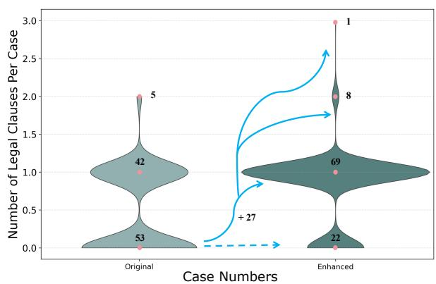  
Figure 9: Distribution of legal clause counts before and after enhancement of the Legal Counsel Agent, with marked difference on the explicit law clauses numbers.

Phase 4: BP Classifier Agent and Model Selection To automatically annotate the parties’ BP states from their generated utterances $D _ { t } ,$ we introduce a BP Classifier Agent. To determine the most capable backbone for this agent, we benchmarked three advanced LLMs: Qwen2.5- 14B-Instruct (Yang et al., 2024), GLM-4-9B-0414 (GLM et al., 2024), and Llama3.1-8B-Instruct (Team, 2024). These models were evaluated under both zero-shot and one-shot settings using a subset of the ProMediConv data. Each model was prompted to assign one of five labels to an utterance: the four defined BP states or a "non-party" category (e.g., neutral utterances). To establish a human baseline, we aggregate annotations from eight human annotators with expertise in psychology, using majority voting as the ground truth.

<table><tr><td>Setting</td><td>Qwen</td><td>GLM</td><td>Llama</td></tr><tr><td>0-shot</td><td>84.3</td><td>63.5</td><td>72.5</td></tr><tr><td>1-shot</td><td>74.6</td><td>60.3</td><td>75.8</td></tr></table>

Table 7: Performance (Macro-F1 %) of Qwen2.5-14B-Instruct, Llama3.1-8B-Instruct, and GLM-4-9B-0414 under zero-shot and one-shot settings on the party BP state classification task.

As detailed in Table 7, we report the macroaveraged F1 scores across the five categories. Notably, Qwen2.5-14B-Instruct achieved the highest performance (82.3%) in the zero-shot setting, significantly outperforming others and closely aligning with human consensus. Consequently, it was selected as the backbone for BP Classifier Agent.

## B.2 Analysis on Legal Clause Agent

To evaluate the efficacy of the Legal Clause agent in the reconstruction pipeline, we extract explicit legal clauses from reconstructed dialogue samples generated under both settings (1) and (4), and compare the difference in the quantity of obtained clauses. As shown in Figure 9, the number of cases lacking explicit legal clauses significantly decreases, while the overall frequency of legal clauses within the dialogues substantially increases. This validates the meaningful impact of the LC agent in enhancing the legal legitimacy and professionalism of the reconstructed dialogues.

<table><tr><td>Pipeline</td><td>FI↑</td><td>CS↑</td><td>AU↑</td><td>CP↑</td></tr><tr><td colspan="5">Automatic Evaluation</td></tr><tr><td>Complete</td><td>9.52</td><td>9.45</td><td>8.95</td><td>9.51</td></tr><tr><td>- w/o MS</td><td>9.37</td><td>9.46</td><td>8.45</td><td>9.19</td></tr><tr><td>- w/o LC - w/o TP</td><td>9.43 9.40</td><td>9.42</td><td>8.63</td><td>9.39</td></tr><tr><td></td><td></td><td>8.29</td><td>8.87</td><td>9.60</td></tr><tr><td colspan="5">Human Evaluation</td></tr><tr><td>Complete</td><td>8.98</td><td>8.96</td><td>8.81</td><td>9.21</td></tr><tr><td>- w/o MS</td><td>8.80</td><td>9.03</td><td>8.58</td><td>8.46</td></tr><tr><td>- w/o LC</td><td>9.03</td><td>8.85</td><td>8.31</td><td>9.13</td></tr><tr><td>- w/o TP</td><td>8.93</td><td>7.58</td><td>8.73</td><td>9.17</td></tr></table>

Table 12: Intrinsic Evaluation. We compare the performance using both automatic and human evaluations.

## B.3 Intrinsic Evaluation of Data Quality

Experimental Setups To validate ProMedi-Conv’s data quality and reconstruction pipeline, we conduct an intrinsic evaluation across four settings: (1) the full pipeline, and ablations removing the (2) Mediation Secretary (MS), (3) Text Purifier (TP), or (4) Legal Counsel (LC) agents. We benchmark four 1-10 scaled metrics (Table 14): Fidelity (FI) (preserving authentic details), Consistency (CS) (mediator coherence across three-case batches), Authority (AU), and Completeness (CP). FI, AU, and CP are evaluated per-case. To ensure a rigorous and fair comparison, both the human evaluators and the LLM judge strictly adhere to the exact same scoring criteria. For scalability, automatic evaluation covers the full ProMediConv dataset via the gpt-4o-20240806 (OpenAI et al., 2024) API with greedy decoding, while human evaluation focuses on the test set. Eight human evaluators were recruited and underwent rigorous training on carefully designed case studies. The reported results are the average scores from all evaluators. Across all human evaluation tasks in this work, evaluators were compensated at a rate

of \$0.50 per sample.

Experimental Results As presented in Table 3, automatic and human evaluations yield consistent findings. Specifically, the MS agent enhances the Fidelity of reconstructed dialogues by extracting and preserving key information from the original records. TP agent achieves a substantial improvement in CS (+14.0% in automatic and +18.2% in human evaluation), underscoring its efficacy in unifying mediator personas across cases. Furthermore, MS and LC enhance both Authority and Completeness by integrating critical information and enriching legal provisions, respectively. The complete pipeline setting exhibits only a marginal decline in the CP metric, indicating minimal information loss during the rewriting process.

## C Training Details of ProMediAgent

To provide a strong baseline specific to ProMedi-Conv, we introduce ProMediAgent. Its architecture follows a decoupled policy planner π and response generator framework (He et al., 2018; Deng et al., 2023d). The policy planner, denoted as $\pi ( \sigma _ { t } | C _ { t } )$ , models the probability of selecting a mediation strategy $\sigma _ { t }$ given the current mediation dialogue history $C _ { t }$ . By decoupling these modules, the policy planner can be implemented as a tunable small language model to maximize training efficiency. The design of the simulation environment and the training paradigm are detailed below.

## C.1 Simulation Environment Design

The interactive mediation environment for online learning and evaluation strictly adheres to the workflow outlined in g A.1 ˘ . Initially, we simulate dispute parties using pre-annotated profiles encompassing their Identity, Situation, and Self-claims. During the interaction phase, LLMs are prompted with tailored role-play templates combined with these profiles to act as dynamic mediation parties. An LLM-as-a-Judge mechanism is employed to determine the most appropriate next speaker.

To evaluate the ongoing mediation progress, we design an LLM-based outcome reward model, denoted as LLMr. Given the dialogue history $C _ { t } ,$ this model answers a multiple-choice question regarding the mediation state: “... has the current situation worsened / remained the same / improved / explicitly resolved?”. To mitigate the inherent subjectivity of evaluating intermediate outcomes and the stochastic nature of LLM generation, we adopt the methodology from Wang et al. (2023) by sampling l decoded sequences from the reward LLM. Subsequently, a reward mapping function $M _ { r } ( \cdot )$ maps the textual choices into discrete scalar values. To obtain a robust and stabilized estimate, we compute the final scalar reward $r _ { t }$ as the average over the l sampled sequences:

$$
r _ { t } = \frac { 1 } { l } \sum _ { i = 1 } ^ { l } M _ { r } ( \mathbf { L L M } _ { \mathrm { r } } ^ { ( i ) } ( p _ { \mathrm { r } } , C _ { t } ) )\tag{11}
$$

where $p _ { \mathrm { r } }$ represents the tailored instruction prompt for the reward model. This scalar reward strictly dictates the current mediation completion state (with a maximum turn limit fixed at $T = 2 0 )$ and serves as the fundamental reinforcement learning signal for the policy planner.

## C.2 Phase 1: Supervised Fine-Tuning (SFT)

We first conduct supervised fine-tuning on the policy planner π utilizing the training set of the ProMediConv dataset. For a given case, the input consists of the current mediation dialogue history prefixed with the case background information. The optimization objective during the SFT phase is to minimize the cross-entropy loss between the strategy distribution predicted by $\pi$ and the ground-truth strategy label $y _ { t }$ annotated at the mediator’s turn. The predicted strategy $\sigma _ { t }$ is strictly restricted to the predefined strategy set S:

$$
\mathcal { L } = - \sum _ { i = 1 } ^ { | S | } y _ { t } ^ { ( i ) } \log \sigma _ { t } ^ { ( i ) }\tag{12}
$$

where $y _ { t } ^ { ( i ) }$ is the one-hot encoded ground-truth label for the i-th strategy, and $\sigma _ { t } ^ { ( i ) }$ is the predicted probability for the corresponding strategy in set $S .$

## C.3 Phase 2: Reinforcement Learning (RL) Optimization

Following the SFT phase, we perform interactive online learning within the simulated mediation environment. At the mediator’s turn, the policy planner first predicts the optimal mediation strategy $\sigma _ { t }$ based on the ongoing history $C _ { t }$ . This predicted strategy is then deterministically mapped to a predefined natural language instruction $\mathcal { M } ( \sigma _ { t } )$

Subsequently, the response generator produces a strategic mediation utterance $u _ { t }$ conditioned on both the mapped action instruction and the history:

$$
u _ { t } = \mathrm { L L M } ( \mathcal { M } ( \sigma _ { t } ) , C _ { t } , P _ { m } )\tag{13}
$$

where $P _ { m }$ represents the specific prompt template utilized for the response generator.

To continuously align the policy planner toward successful mediation outcomes, we employ the REINFORCE algorithm (Sutton et al., 1999) to optimize the post-SFT policy parameters based on the AI-feedback scalar reward:

$$
\theta \gets \theta - \alpha \nabla \log \pi _ { \theta } ( \sigma _ { t } | C _ { t } ) G _ { t }\tag{14}
$$

where $\theta$ denotes the parameters of the policy network, α is the learning rate, and $G _ { t }$ represents the discounted total return accumulated from the current turn t to the terminal turn T. The return $G _ { t }$ is computed using a discount factor $\gamma$ to progressively reduce the weight of future delayed rewards:

$$
G _ { t } = \sum _ { t ^ { \prime } = t } ^ { T } \gamma ^ { t ^ { \prime } - t } r _ { t ^ { \prime } }\tag{15}
$$

During the final inference stage, the policy planner dynamically predicts the optimal strategy at each turn, directing the response generator to produce tactical, context-aware mediation utterances.

Algorithm 1: Interaction Flow of   
ProMediConv   
Require: Parties $P = \{ p _ { 1 } , \ldots , p _ { n } \}$ , mediator   
M, strategies S, circumstances $R _ { i }$   
Ensure: Total turns $T _ { k } ,$ , completion $S _ { k }$ , reward   
$r _ { T _ { k } }$ , trajectories $\{ b _ { t } \}$ , metrics   
1: Init context $C _ { 0 } \gets$ Initial case description,   
turn $t \gets 1$   
2: while Dialogue is not terminated do   
3: Speaker allocation:   
$s _ { t } \gets A ( P \cup \{ M \} , C _ { t - 1 } )$   
4: if $s _ { t } \in P$ (Dispute party selected) then   
5: Generate response via context:   
$u _ { t } \gets G _ { P } ( R _ { i } , C _ { t - 1 } )$   
6: Identify behavior pattern:   
$b _ { t } \gets B ( u _ { t } , C _ { t - 1 } )$   
7: Update mediation context:   
$C _ { t } \gets C _ { t - 1 } \oplus \{ u _ { t } \}$   
8: else $\{ s _ { t } = M$ (Mediator selected)}   
9: Select mediation strategy:   
$\sigma _ { t } \gets \pi _ { M } ( S , C _ { t - 1 } )$   
10: Generate strategic utterance:   
$m _ { t } \gets G _ { M } ( \sigma _ { t } , C _ { t - 1 } )$   
11: Update mediation context:   
$C _ { t } \gets C _ { t - 1 } \oplus \{ m _ { t } \}$   
12: Evaluate state & calc reward:   
$r _ { t } \gets R ( C _ { t } )$   
13: end if   
14: $t \gets t + 1$   
15: end while   
16: $T _ { k } \gets t - 1$   
17: Record completion $S _ { k } \in \{ 0 , 1 \}$ and final   
reward $r _ { T _ { k } }$   
18: Compute metrics (AT, SR@t, SSR, MAD)   
via $T _ { k } , S _ { k } , r _ { T _ { k } } , \{ b _ { t } \}$   
19: return $T _ { k } , S _ { k } , r _ { T _ { k } } , \{ b _ { t } \}$ , alongside evalu  
ation metrics

<table><tr><td rowspan="2">Strategies</td><td colspan="4">Stages</td><td rowspan="2"></td><td rowspan="2">Explanations</td></tr><tr><td></td><td>II</td><td>III</td><td></td></tr><tr><td>Understanding the Situation</td><td></td><td></td><td>√</td><td>Hello, Mr. Duan. First, Could you please describe what happened at the time in as much detail as possible?</td><td>By asking about the basic information of the parties involved, comprehensive support is provided for the mediation process.</td></tr><tr><td>Mobilizing Multiple Forces for Assistance</td><td></td><td>√</td><td>√</td><td>I heard that Mr. Sun is a close friend of yours. ... see if he might be able to offer additional help.</td><td>Involving close family, friends, or relevant social groups can help work together to advance the mediation process.</td></tr><tr><td>Combining Law with Morality</td><td></td><td></td><td></td><td>According to “Regulations on Work-Related Injury Insurance,&quot; .., it should be counted as a work-related injury.</td><td>Ensure legality and fairness based on the law, while flexibly applying moral principles to promote problem resolution.</td></tr><tr><td>Grasp the Principal Contradiction</td><td></td><td></td><td></td><td>The key issue is whether Xinle Company is willing to pay the migrant workers&#x27; wages upfront. ..</td><td>Focus on addressing the primary conflict, highlight the key issues in the mediation, and avoid being distracted by secondary problems.</td></tr><tr><td>Integrating the Resolution of Ideological Issues and Practical Problems</td><td></td><td>√</td><td>√</td><td>Mr. Li, I understand your concerns. The village committee is willing to allocate a piece of land for you to transplant your plants and trees, ..</td><td>Address practical issues to alleviate psychological pressure and create conditions for resolving underlying mental or ideological concerns.</td></tr><tr><td>Perspective-Taking</td><td></td><td></td><td></td><td>Xiao Xu, when you were in dire need of help, Xiao Kang was there for you. How about...?</td><td>Adopt a perspective of empathy, understand the different needs of the parties involved, and propose acceptable solutions.</td></tr><tr><td>Early Detection and Prevention</td><td></td><td>√</td><td>V</td><td>To prevent potential disputes in the future, we can formalize this agreement in writing, clearly delineating the rights and obligations of both parties.</td><td>Identify early signs and potential issues, address them promptly to curb the emergence of disputes, and prevent the escalation of conflicts.</td></tr><tr><td>Strategic Ambiguity Technique</td><td></td><td>V</td><td></td><td>Mr  ${ \mathrm { W u , } }$  It&#x27;s normal for a young couple to have arguments, there&#x27;s no need to dwell on who&#x27;s right or wrong...</td><td>Minimize or obscure non-principled issues, handling them ambiguously to mediate the conflict while protecting the dignity of the parties involved.</td></tr><tr><td>Recognition and Motivation Approaches</td><td></td><td>√</td><td>√</td><td>It&#x27;s commendable that you recognize this, which shows you&#x27;re a sensible and reasonable person....</td><td>Praise and encourage the parties involved to motivate them, boost their confidence, and promote cooperation in the mediation process.</td></tr><tr><td>Reaching a Mediation Agreement</td><td></td><td></td><td></td><td>Very well, since both of you are willing to accept mediation, we have reached the following agreement: 1....</td><td>Guide the parties to reach an agreement and create an executable written contract that clearly defines</td></tr><tr><td>Others</td><td></td><td></td><td>√√√</td><td>Thank you all for your cooperation. I hope this mediation will help both</td><td>their rights and obligations. Be flexible and adaptable, not limited to using established mediation</td></tr></table>

Table 6: Overview of mediation strategies, their active stages, illustrative examples, and detailed explanations.

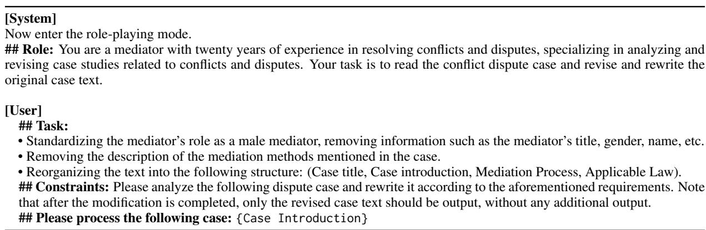  
Table 8: Prompt template for the Text Purifier Agent in our framework, designed to standardize the format of unstructured authentic cases. Dynamic input variables are denoted in typewriter font.

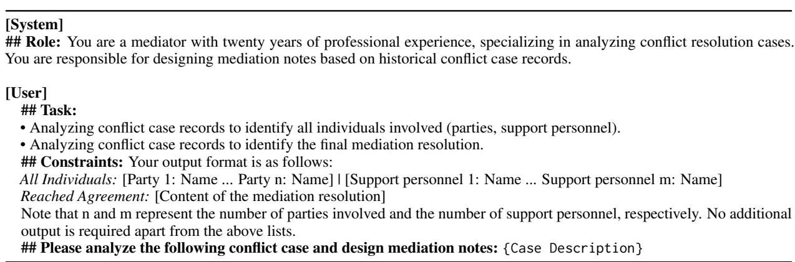  
Table 9: Prompt template for the Mediation Secretary Agent, designed to extract case-critical information and compile mediation notes.

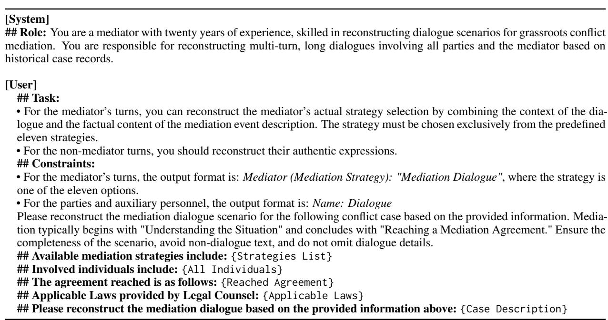  
Table 10: Prompt template for the Dialogue Rebuilder Agent, tasked with reconstructing multi-turn, multi-party mediation dialogues strictly conditioned on factual constraints.

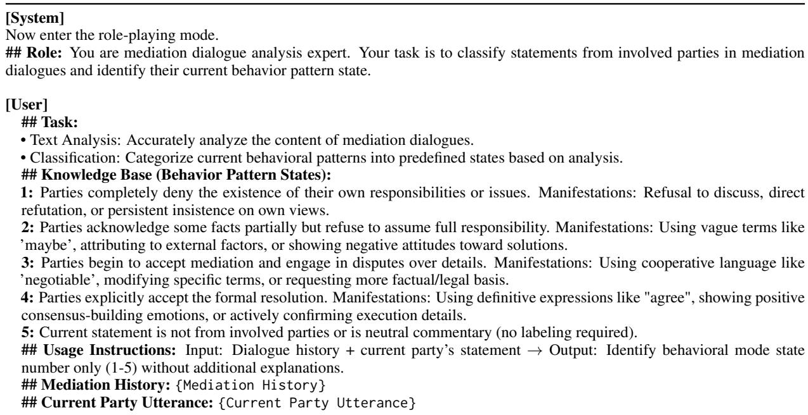  
Table 11: Prompt template for the BP Classifier Agent, utilized to automatically annotate the dynamic behavioral pattern states of the disputing parties based on current utterances and dialogue history.

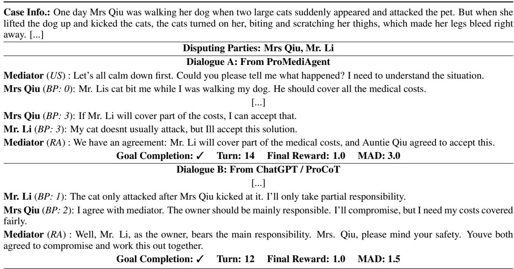  
Table 13: Case Study: Comparison of Complete Resolution in Dialogue A and Short-cut Resolution in Dialogue B.

<table><tr><td colspan="2">Evaluation Criteria (each question scored from 1 to 10 points)</td></tr><tr><td rowspan="2">Fidelity</td><td>1. Does the reconstructed dialogue accurately reflect the core facts, events, and timeline presented in the authentic record?</td></tr><tr><td>2. Are the primary conflict points and original claims of the disputing parties strictly preserved without introducing hallucinated arguments? 3. Are the specific details of the dispute (e.g., financial amounts, locations, personal relationships)</td></tr><tr><td></td><td>4. Does the final mediation outcome or proposed resolution strictly align with the documented factual resolution in the real-world case? 1. Are the mediator&#x27;s position, age, and workplace consistent across the two dialogue cases?</td></tr><tr><td>Authority</td><td>2. Is the mediator&#x27;s language style and expression consistent in both dialogues? 1. Are the legal provisions cited in the dialogue accurate, relevant, and closely linked to the dispute</td></tr><tr><td></td><td>points? 2. Does the mediator provide clear and reasonable explanations of the legal provisions, avoiding mere mechanical citation? 3. Does the reached mediation agreement comply with legal requirements and have clear legal</td></tr><tr><td></td><td></td></tr><tr><td></td><td></td></tr><tr><td></td><td>validity?</td></tr><tr><td></td><td>4. Can the mediator cite opinions from authoritative legal institutions or experts to enhance the</td></tr><tr><td></td><td>credibility of the agreement?</td></tr><tr><td>Completeness</td><td>1. Does the dialogue cover all major stages of the mediation process, including understanding the</td></tr><tr><td></td><td>basic situation, communicating with the parties to resolve issues, and finally reaching a mediation</td></tr><tr><td></td><td>agreement?</td></tr><tr><td></td><td>2. Are the viewpoints and opinions of both parties fully expressed, avoiding the omission of impor-</td></tr><tr><td></td><td>tant discussion content or conflict points?</td></tr><tr><td></td><td></td></tr><tr><td></td><td></td></tr><tr><td></td><td></td></tr><tr><td></td><td></td></tr><tr><td></td><td></td></tr><tr><td></td><td>3. Is the mediation agreement detailed and clear, including the responsibilities of both parties,</td></tr><tr><td></td><td></td></tr><tr><td></td><td></td></tr><tr><td></td><td></td></tr><tr><td></td><td>implementation methods, and follow-up supervision mechanisms?</td></tr><tr><td></td><td></td></tr><tr><td></td><td></td></tr><tr><td></td><td></td></tr><tr><td></td><td>4. Is the solution proposed by the mediator comprehensive and feasible?</td></tr><tr><td></td><td></td></tr><tr><td></td><td></td></tr><tr><td></td><td></td></tr><tr><td></td><td></td></tr><tr><td></td><td></td></tr><tr><td></td><td></td></tr><tr><td></td><td></td></tr><tr><td></td><td></td></tr><tr><td></td><td></td></tr><tr><td></td><td></td></tr><tr><td></td><td></td></tr><tr><td></td><td></td></tr><tr><td></td><td></td></tr><tr><td></td><td></td></tr><tr><td></td><td></td></tr><tr><td></td><td></td></tr><tr><td></td><td></td></tr><tr><td></td><td></td></tr><tr><td></td><td></td></tr><tr><td></td><td></td></tr><tr><td></td><td></td></tr><tr><td></td><td></td></tr><tr><td></td><td></td></tr><tr><td></td><td></td></tr></table>

Table 14: Complete Scoring Criteria for both Human and LLMs Evaluator on Intrinsic Evaluation.